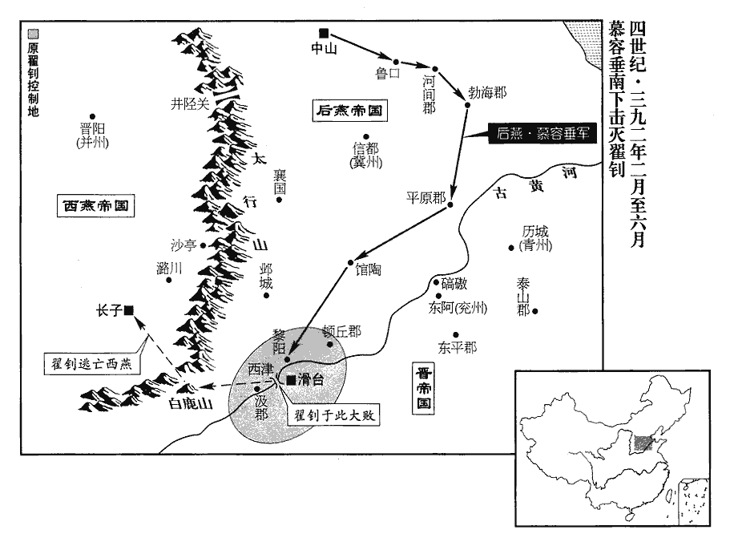
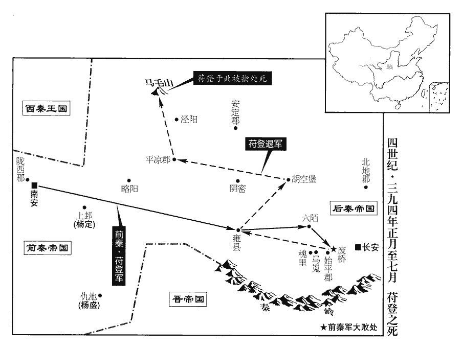
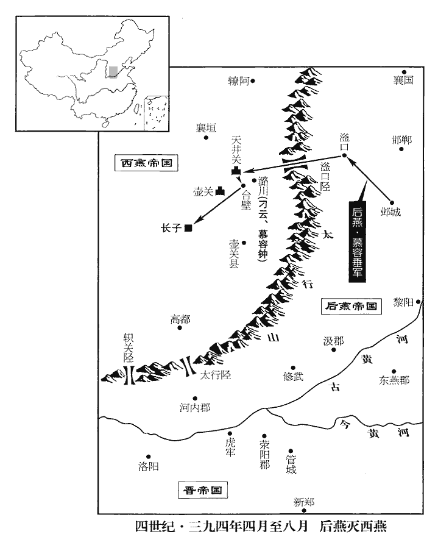
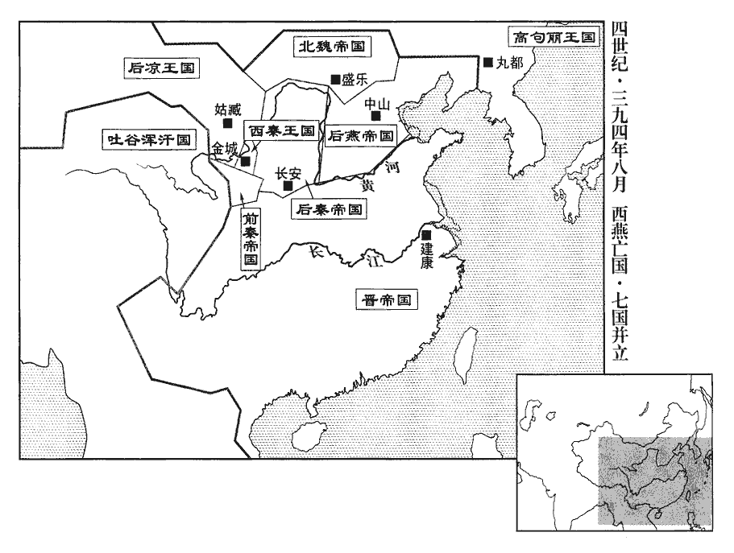
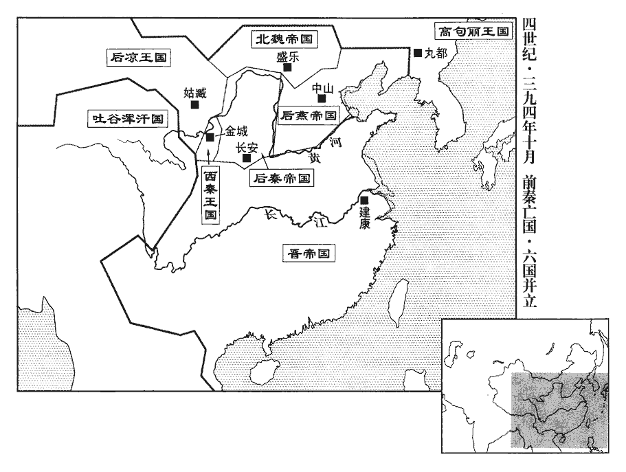
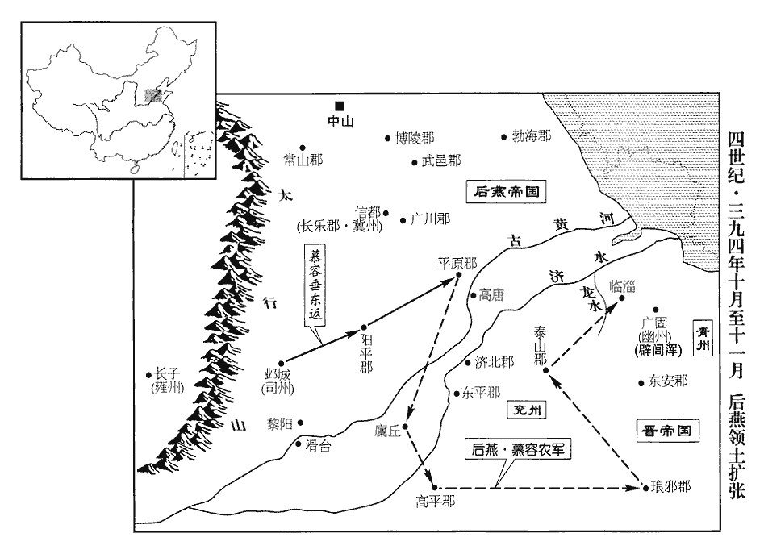
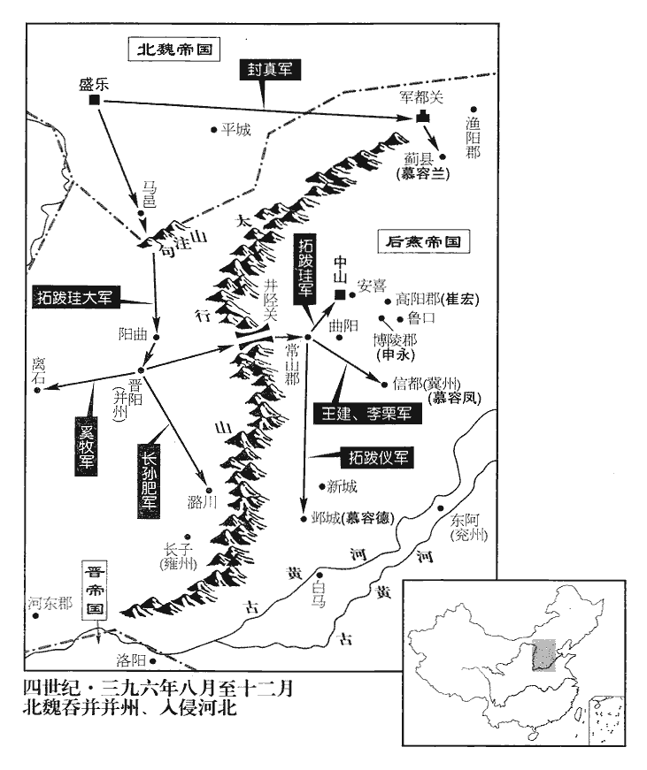
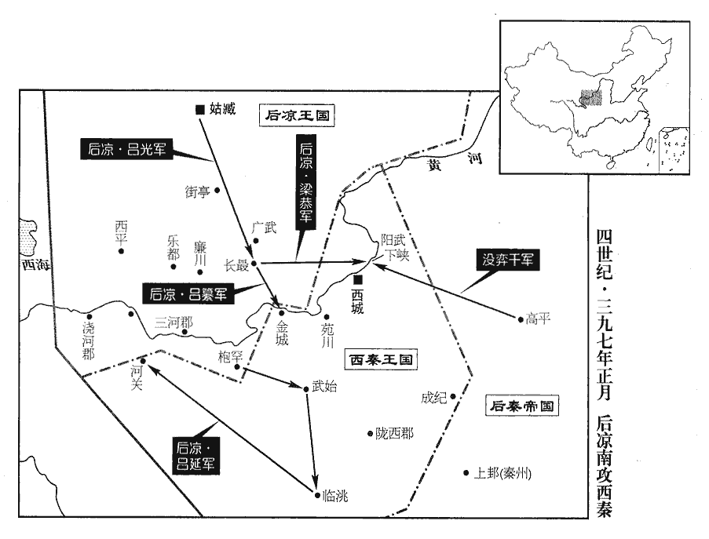

 晉紀三十起玄黓執徐（壬辰），盡柔兆涒灘（丙申），凡五年。

# 烈宗孝武皇帝下

## 太元十七年（壬辰、三九二）

1春，正月，己巳朔‹一›，大赦。

〖译文〗 [1]春季，正月，己巳朔（初一），东晋实行大赦。

2秦主登‹苻登，本年五十岁›立昭儀隴西‹甘肃陇西›李氏為皇后。

〖译文〗 [2]前秦国主苻登册立昭仪、陇西人李氏为皇后。

3二月，壬寅‹五›，燕主垂‹慕容垂，本年六十七岁›自魯口‹河北饶阳›如河間‹河北献县›、渤海‹河北南皮›。平原‹山东平原›翟釗遣其將翟都侵館陶‹河北馆陶›，屯蘇康壘。蘇康，人姓名。館陶縣，漢屬魏郡，晉屬陽平郡。將，即亮翻；下同。三月，垂引兵南擊釗。

〖译文〗 [3]二月，壬寅（初五），后燕国主慕容垂从鲁口前往河间、渤海、平原。翟钊派遣他的部将翟都侵犯馆陶，驻在苏康垒。三月，慕容垂带领部队向南袭击翟钊。

4秦驃騎將軍沒弈干帥眾降于後秦，驃，匹妙翻。騎，奇寄翻。帥，讀曰率。降，戶江翻。後秦以為車騎將軍，封高平公。

〖译文〗 [4]前秦骠骑将军没弈干率领他的部众向后秦投降。后秦任命他为车骑将军，封他为高平公。

5後秦主萇寢疾‹时年六十三›，命姚碩德鎮李潤‹陕西大荔北›，尹緯守長安‹西安›，召太子興詣行營。萇時屯安定‹甘肃镇原东南曙光乡›。萇，音長。征南將軍姚方成言於興曰：「今寇敵未滅，上復寢疾。復，扶又翻。王統等皆有部曲，終為人患，宜盡除之。」興從之，殺王統、王廣、苻胤、徐成、毛盛。皆苻氏舊臣也。萇怒曰：「王統兄弟，吾之州里，實無他志；徐成等皆前朝名將，朝，直遙翻。吾方用之，奈何輒殺之！」使萇果以殺統等為非罪，當按誅始造謀者；但怒而已，豈真怒邪！

〖译文〗 [5]后秦国主姚苌卧病不起，命令姚硕德去镇守李润，尹纬留守长安，并让太子姚兴来行营之中见面。征南将军姚方成对姚兴说道：“现在来进犯的敌人还没有被消灭，皇上又卧病不起。王统等人都拥有自己的部队，最终会成为我们的祸患，应该尽快把他们全部除掉。”姚兴听从了他的话、杀掉了王统、王广、苻胤、徐成、毛盛。姚苌听到这个消息，生气地说：“王统他们兄弟，跟我是同州同里的老乡，根本没有二心。徐成等人都是前朝的有名将领，我才重用他们，怎么能轻易地说杀就杀呢！”

6燕主垂進逼蘇康壘。夏，四月，翟都南走滑臺。走，音奏。翟釗求救於西燕，西燕主永謀於群臣，尚書郎渤海‹河北南皮›鮑遵曰：「使兩寇相弊，吾承其後，此卞莊子之策也。」中書侍郎太原‹山西太原›張騰曰：「垂強釗弱，何弊之承！不如速救之，以成鼎足之勢。今我引兵趨中山‹河北定州›，趨，七喻翻；下趣同。晝多疑兵，夜多火炬，垂必懼而自救。我衝其前，釗躡其後，此天授之機，不可失也。」永不從。翟釗敗，則西燕之亡形成矣。

〖译文〗 [6]后燕国主慕容垂向前进军威逼苏康垒。夏季，四月，翟都向南撤退到滑台。翟钊向西燕请求救援，西燕国主慕容永与大臣们商议，尚书郎渤海人鲍遵说：“让这两个寇匪互相进攻、消耗力量，我们紧跟在他们背后，坐收渔人之利，这是卞庄子当年所用过的策略。”中书侍郎太原人张腾则说：“慕容垂强大，而翟钊弱小，我们有什么好处可以得到呢？不如赶快去解救翟钊，这样还可以形成鼎足而立的局势。现在我们带领部队奔袭后燕的都城中山，白天多设些疑兵，黑夜多点一些火把，慕容垂得知后一定会担心后方的安全而赶回来为自己解围。那时候，我们再迎击他们的前面，翟钊又可以跟在他们的背后骚扰，这是上天所给我们提供的绝好时机，万万不可失去。”慕容永没有听从他的话。

7燕大赦。

〖译文〗 [7]后燕实行大赦。

8五月，丁卯朔‹一›，日有食之。

〖译文〗 [8]五月，丁卯朔（初一），出现日食。

 

9六月，燕主垂軍黎陽‹河南浚县›，臨河欲濟，翟釗列兵南岸以拒之。辛亥‹十六›，垂徙營就西津，去黎陽西四十里，為牛皮船百餘艘，偽列兵仗，泝流而上。艘，蘇遭翻。上，時掌翻。釗亟引兵趣西津，趣，七喻翻。垂潛遣中壘將軍桂林王鎮等自黎陽津夜濟，營于河南，比明而營成。比，必寐翻，及也。釗聞之，亟還，攻鎮等營，垂命鎮等堅壁勿戰。釗兵往來疲暍，暍yē，於歇翻，傷暑也。攻營不能拔，將引去；鎮等引兵出戰，驃騎將軍農自西津濟，與鎮等夾擊，大破之。燕主垂用兵於河上者再，溫詳則引兵徑濟而取之，翟釗則張疑兵於西，而潛軍東渡，亦以決勝，視敵之堅脆何如也。驃，匹妙翻。騎，奇寄翻。農，燕之驃騎大將軍，此逸「大」字。釗走還滑臺‹河南滑县›，將妻子，收遺眾，北濟河，登白鹿山‹河南辉县西›，水經註：河內脩武縣北有白鹿山。憑險自守，燕兵不得進。農曰：「釗無糧，不能久居山中。」乃引兵還，留騎候之。釗果下山，還兵掩擊，盡獲其眾，釗單騎奔長子‹山西长子›。西燕主永以釗為車騎大將軍、兗州牧，封東郡王。歲餘，釗謀反，永殺之。

〖译文〗 [9]六月，后燕国主慕容垂的部队抵达黎阳，来到黄河岸边准备渡河，翟钊则把部队布置在黄河南岸用来抗拒后燕军。辛亥（十六日），慕容垂把大营迁到西津，距离黎阳四十里，制作牛皮战船一百多艘，假装着把军卒器械满载船上，逆水而上。翟钊急忙带领部队直扑西津防卫。慕容垂又暗中派遣中垒将军桂林王慕容镇等人率兵从黎阳渡口连夜渡河，在黄河南岸扎下大营，天亮时，后燕的大营已经全部构筑完成。翟钊听到这个消息后，急忙返回，进攻慕容镇等人的军营，慕容垂命令慕容镇等只许坚守防备，不许出战。翟钊的兵马跑来跑去疲惫热燥不堪，攻打后燕军的营地难以取胜，正要带兵退走，慕容镇等人突然带兵从营地中杀出，与此同时，后燕骠骑将军慕容农从西津渡过黄河，与慕容镇等一起夹击翟钊，把他打得大败。翟钊回逃到滑台，携带妻子儿女，收集残兵败将，向北渡过黄河，登上了白鹿山，依靠山势险峻严密把守，后燕的部队无法进击。慕容农说：“翟钊没有军粮，一定不能长时间地在山中蜷缩。”自己率领部队回营，仅留下一些骑兵等待观望翟钊的动静。翟钊果然下了山，慕容农马上挥师回军突袭，把翟钊的部众全部俘获，只有翟钊一人骑马投奔长子。西燕国主慕容永任命翟钊为车骑大将军、兖州牧，并封他为东郡王。一年多之后，翟钊阴谋反叛西燕，慕容永把他杀了。

初，郝晷、崔逞及清河‹山东临清›崔宏、新興‹陕西忻州›張卓、遼東‹辽宁辽阳›夔騰、夔，姓也。石趙之臣有夔安。陽平‹河北馆陶›路纂皆仕於秦，避秦亂來奔，詔以為冀州諸郡，各將部曲營於河南；將，即亮翻。既而受翟氏官爵，翟氏敗，皆降於燕，降，戶江翻。燕主垂各隨其材而用之。釗所統七郡三萬餘戶，皆按堵如故。以章武王宙為兗、豫二州刺史，鎮滑臺‹河南滑县›；徙徐州‹江苏北部›民七千餘戶于黎陽‹河南浚县›，以彭城王脫為徐州刺史，鎮黎陽。徐州之民，蓋為翟釗所掠者。脫，垂之弟子也。垂以崔蔭為宙司馬。

〖译文〗 最初，郝晷、崔逞，以及清河人崔宏、新兴人张卓、辽东人夔腾、阳平人路纂等人都在前秦做官。前秦大乱时，他们为了躲避战乱，前来投奔东晋。孝武帝下诏委任他们做了冀州几个郡的郡守，并带领他们各自的部队在黄河南岸驻扎。不久，他们又接受了翟辽的官职和爵位。翟辽及他的家族失败后，他们又都投降了后燕，后燕国主慕容垂按照他们各自的才干，分别留用了他们。翟钊过去所统辖的七个郡三万多户人家，都安居下来，像过去一样。慕容垂又任命章武王慕容宙为兖州、豫州两个州的刺史，镇守滑台；把徐州的居民七千多户迁移到黎阳，并任命彭城王慕容脱为徐州刺史，镇守黎阳。慕容脱是慕容垂的侄儿。又任命崔荫为慕容宙的司马。

初，陳留王紹為鎮南將軍，太原王楷為征西將軍，樂浪王溫為征東將軍，樂浪，音洛琅。垂皆以蔭為之佐。蔭才幹明敏強正，善規諫，四王皆嚴憚之；所至簡刑法，輕賦役，流民歸之，戶口滋息。

〖译文〗 当初，陈留王慕容绍做镇南将军，太原王慕容楷做征西将军，乐浪王慕容温做征东将军，慕容垂都是委派崔荫作为他们的辅佐。崔荫精明强干，刚强正直，善于规劝主上的过失，因此，四位亲王都很害怕他。崔荫每到一个地方，都努力减少刑法，减轻田赋与劳役，使外出逃亡的难民渐渐地回来，当地的户口也越来越多。

秋，七月，垂如鄴‹河北临漳西南邺镇›，以太原王楷為冀州牧，右光祿大夫餘蔚為左僕射。蔚，紆勿翻。

〖译文〗 秋季，七月，慕容垂来到邺城，任命太原王慕容楷为冀州牧、右光禄大夫馀蔚为左仆射。

10秦主登聞後秦主萇疾病，大喜，疾甚曰病。告祠世祖神主，苻堅廟號世祖。大赦百官，進位二等，秣馬厲兵，進逼安定‹甘肃镇原东南曙光乡›，去城九十餘里。八月，萇疾小瘳chōu，出拒之。登引兵出營，將逆戰，萇遣安南將軍姚熙隆別攻秦營，登懼而還。還，從宣翻，又如字。萇夜引兵旁出以躡其後，旦而候騎告曰：騎，奇寄翻。「賊諸營已空，不知所向。」登驚曰：「彼為何人，去令我不知，來令我不覺，謂其將死，忽然復來，復，扶又翻。朕與此羌同世，何其厄哉！」苻登屢為姚萇所挫，故有懼萇之心，蓋至於是，登氣衰矣。登遂還雍‹陕西凤翔›，雍，於用翻；下同。萇亦還安定。

〖译文〗 [10]前秦国主苻登听说了后秦国主姚苌生病，喜出望外，焚香禀告世祖苻坚的神位，又在国中实行大赦，并把文武百官的职位连升二级，喂饱战马，磨利武器，统领大军逼临安定，距离城池仅九十多里。八月，姚苌的病稍有好转，便率军出城与前秦军队对抗。苻登带领军队冲出营地将要交战，姚苌却派遣安南将军姚熙隆从别的地方去进攻前秦的营地。苻登惧怕后营有失，连忙撤退。姚苌在夜晚带领部队从侧翼迂回出来，紧跟在苻登部队的背后。天亮时，前秦的哨探骑兵回来报告，说：“贼兵的几个军营都已经空了，不知去向。”苻登大惊失色，说道：“姚苌这个家伙是个什么人，走的时候能让我不得知道，来的时候又能让我无从知觉，都说他快要死了，可却忽然之间又能出来和我对阵打仗。我与这个老羌贼同活在一个世上，是多么不走运的事情啊！”于是，苻登只好撤兵回到雍城去了，姚苌也回到安定。

11三河王光‹时年五十六›遣其弟右將軍寶等攻金城王乾歸，寶及將士死者萬餘人。又遣其子虎賁中郎將纂擊南羌彭奚念，纂亦敗歸。光自將擊奚念於枹罕‹甘肃临夏›，克之，奚念奔甘松‹甘肃迭部›。甘松郡，乞伏國仁所置。及將，即亮翻；下同。賁，音奔。枹，音膚。

〖译文〗 [11]后凉三河王吕光派他的弟弟右将军吕宝等，进攻西秦金城王乞伏乾归，吕宝及将士战死的有一万多人。吕光又派遣他的儿子、虎贲中郎将吕纂进攻南部羌族部落首领彭奚念，吕纂也大败而归。于是吕光亲自领兵去罕袭击彭奚念，获胜。彭奚念去投奔甘松。

12冬，十月，辛亥‹十八›，荊州刺史王忱卒。忱chén，是壬翻。

〖译文〗 [12]冬季，十月，辛亥（十八日），东晋荆州刺史王忱去世。

13雍州刺史朱序以老病求解職；‹司马昌明，本年三十一岁›詔以太子右衛率郗恢為雍州刺史，代序鎮襄陽‹湖北襄樊›。恢，曇tán之子也。郗曇見一百卷穆帝升平三年。率，所律翻。郗，丑之翻。曇，徒含翻。

〖译文〗 [13]东晋雍州刺史朱序因为年老多病，请求辞官。孝武帝下诏，任命太子右卫率郗恢为雍州刺史，代替朱序镇守襄阳。郗恢是郗昙的儿子。

14巴蜀人在關中者皆叛後秦，據弘農‹河南灵宝东北›以附秦。秦主登以竇衝為左丞相，衝徙屯華陰‹陕西华阴›。華，戶化翻。郗恢遣將軍趙睦守金墉‹洛阳西北角›，河南太守楊佺期帥眾軍湖城‹河南灵宝西›，帥，讀曰率。擊衝，走之。

〖译文〗 [14]流亡到关中一带的巴蜀人全部背叛了后秦，占据了弘农并归附前秦。前秦国主苻登任命窦冲为左丞相，带兵转到华阴去驻扎。郗恢派遣将军赵睦据守金墉，河南太守杨期统率部队到湖城，袭击窦冲，并把窦冲赶走。

15十一月，癸酉‹十›，以黃門郎殷仲堪為都督荊•益•寧三州諸軍事、荊州刺史，鎮江陵‹湖北江陵›。仲堪雖有英譽，資望猶淺，議者不以為允。到官，好行小惠，好，呼到翻。綱目不舉。

〖译文〗 [15]十一月，癸酉（初十），东晋任命黄门郎殷仲堪为都督荆、益、宁三州诸军事，荆州刺史，镇守江陵。殷仲堪虽然有很好的名声，但是资历、威望还浅，因此议论的人认为并不公允合理。果然，殷仲堪到达任上后，喜欢行使小恩小惠，对大政方针缺乏有力切实的措施。

南郡公桓玄負其才地，以雄豪自處，負其才與其門地也。處，昌呂翻。朝廷疑而不用；年二十三，始拜太子洗馬。洗，悉薦翻。玄嘗詣琅邪王道子，值其酣醉，酣，戶甘翻。張目謂眾客曰：「桓溫晚塗欲作賊，云何?」玄伏地流汗，不能起；由是益不自安，常切齒於道子。後出補義興‹江苏宜兴›太守，守，式又翻。鬱鬱不得志，歎曰：「父為九州伯，兒為五湖長！」虞翻曰：太湖有五湖：隔湖、洮湖、射湖、貴湖及太湖為五湖，並太湖之小支，俱連太湖，故太湖兼得五湖之名。韋昭曰：胥湖、蠡湖、洮湖、滆gé湖就太湖而五。酈善長謂長塘湖、射湖、貴湖、隔湖與太湖而五。吳中志谓贡湖、遊湖、胥湖、梅梁湖、金鼎湖為五也。長，知兩翻。遂棄官歸國，玄襲封南郡公。上疏自訟曰：「先臣勤王匡復之勳，朝廷遺之，臣不復計。上，時掌翻。復，扶又翻；下同。至於先帝龍飛，陛下繼明，謂桓溫廢海西立簡文帝而帝繼統也。易曰：明兩作離，大人以繼明照四方。請問談者，誰之由邪?」疏寢不報。

〖译文〗 东晋南郡公桓玄仗恃自己的才能和显赫的家族地位，总把自己看作是英雄豪杰，朝廷对他怀有戒心而不重用。二十三岁那年，他才开始在朝廷任太子洗马。桓玄曾经去拜见琅邪王司马道子，当时正赶上司马道子酩酊大醉，他睁开醉眼对身旁的很多宾客说：“桓温到了晚年的时候，曾经打算要做贼，你们说怎么样呀？”桓玄伏在地上，汗流浃背，站不起来。从此他越发忐忑不安，常常对司马道子痛恨得咬牙切齿。后来，他补任义兴太守，但也还是感到怀才不遇而闷闷不乐，他叹息着说：“我的父亲曾是九州的盟主，而他的儿子却只不过是五湖的小头目！”于是，他弃官回到封地。临行，他呈上一道奏章，为自己申辩道：“我父亲辅佐皇家，平定祸乱的功劳，朝廷把它遗忘了，我并不再作计较。但是，先帝登上宝座，陛下接着得以继承大统，这些事，请陛下问一问那些谈论的人，是靠谁得来的呀？”奏章被搁置下来，没有上报。

玄在江陵‹湖北江陵›，仲堪甚敬憚之。桓氏累世臨荊州，玄復豪橫，橫，戶孟翻。士民畏之，過於仲堪。嘗於仲堪聽事前戲馬，以矟擬仲堪。聽，讀曰廳。矟shuò，色角翻。通俗文：長丈八者謂之矟。擬者，舉矟向之，若將刺之也。仲堪中兵參軍彭城‹江苏徐州›劉邁謂玄曰：元帝謂江東置參軍十三曹，有中兵、外兵、騎兵。「馬矟有餘，精理不足。」玄不悅，仲堪為之失色。為，于偽翻。玄出，仲堪謂邁曰：「卿，狂人也！玄夜遣殺卿，我豈能相救邪！使邁下都避之，都，謂建康。玄使人追之，邁僅而獲免。

〖译文〗 桓玄在江陵，殷仲堪对他十分的恭敬畏惧。桓氏家族几代都在荆州镇守，桓玄尤其强豪专横，当地的官员、百姓都害怕他，甚于害怕殷仲堪。桓玄曾经在殷仲堪升堂办公之前在公堂外骑马取笑，并且用长矛假装向殷仲堪直刺。殷仲堪的部将中军参军、彭城人刘迈对桓玄说：“战马和长矛的威力有余，但是于道理精义却有缺陷。”桓玄怫然不悦，殷仲堪也为此大惊失色。桓玄走出去之后，殷仲堪对刘迈说：“你是疯了！桓玄趁夜派出刺客来杀你，我怎么能救得了你呢？”于是，他便让刘迈赶快到京城去躲避桓玄的报复。桓玄派人去追杀他，刘迈仅仅免得一死。

征虜參軍豫章‹江西南昌›胡藩過江陵‹湖北江陵›，見仲堪，說之曰：說，輸芮翻。「桓玄志趣不常，每怏怏於失職，怏，於兩翻。節下崇待太過，恐非將來之計也！」仲堪不悅。藩內弟【章：十二行本「弟」下有「同郡」二字；乙十一行本同；孔本同。】羅企生為仲堪功曹，藩退，謂企生曰：「殷侯倒戈以授人，必及於禍。君不早圖去就，後悔無及矣！」為後桓玄殺企生、仲堪張本。企，區智翻。

〖译文〗 东晋征虏参军豫章人胡藩路过江陵，前去看望殷仲堪，劝解他说：“桓玄的志向兴趣不比常人，常常因为没有得到一个满意的职位而大为不满，您对他尊敬优待得似乎太过分了，这恐怕不是能够长期维持的办法吧！”殷仲堪心中不大高兴。胡藩的妻弟罗企生是殷仲堪手下的功曹。胡藩从殷仲堪那里出来，对罗企生说：“殷仲堪把长戈倒转过来，把木柄交给别人，自己一定遭难。你如果不早早地图谋去留，后悔可是来不及的呀！”

16庚寅‹二十七›，立皇子德文為琅邪王，徙琅邪王道子為會稽王。會，工外翻。

〖译文〗 [16]庚寅（二十七日），孝武帝立他的儿子司马德文为琅邪王，把原琅邪王司马道子改封为会稽王。

17十二月，燕主垂還中山，以遼西王農為都督兗、豫、荊、徐、雍五州諸軍事，鎮鄴‹河北临漳西南邺镇›。雍，於用翻。

〖译文〗 [17]十二月，后燕国主慕容垂回到都城中山，任命辽西王慕容农为都督兖、豫、荆、徐、雍五州诸军事，镇守邺城。

18休官權千成據顯親‹甘肃秦安西北›，自稱秦州牧。休官，雜夷部落之名。顯親縣，漢光武置，屬漢陽郡。晉改顯親為顯新，復漢陽為天水郡。晉書姚興載記，「權千成」作「權干城」，略陽豪族也。

〖译文〗 [18]休官部落的首领权千成据守显亲县，自称为秦州牧。

19清河‹山东临清›人李遼上表請敕兗州脩孔子廟，孔子廟在魯。魯郡，前漢屬徐州，後漢、晉屬豫州，江表始分屬兗州。給戶灑掃。灑，所賣翻；掃，素報翻；又各如字。仍立庠xiáng序，收教學者，曰：「事有如賒而寔急者，此寔shí義與虛實之實同。此之謂也！」表不見省。省，悉景翻。

〖译文〗 [19]东晋清河人李辽上奏朝廷，请求下令南兖州府修建孔子庙，指定专门的人家负责日常洒扫；仍然开办学校，聘请教师，招收学生。他说：“有的事情看起来好像可以作长久打算，实际上却需要尽快办理，指的就是这些事情。”奏章呈上没有看见反应。

## 十八年（癸巳、三九三）

1春，正月，燕陽平孝王柔卒。

〖译文〗 [1]春季，正月，后燕阴平孝王慕容柔去世。

2權千成為秦所逼，請降於金城王乾歸，降，戶江翻。乾歸以為東秦州刺史、休官大都統、顯親公。

〖译文〗 [2]休官部落首领权千成被前秦逼迫，向西秦金城王乞伏乾归请求投降。乞伏乾归任命他为东秦州刺史、休官大都统，封为显亲公。

3夏，四月，庚子‹九›，燕主垂‹时年六十八›加太子寶大單于；以安定王庫傉nù官偉為太尉，單，音蟬。傉nù，奴沃翻。范陽王德為司徒，太原王楷為司空，陳留王紹為尚書右僕射。五月，立子熙為河間王，朗為渤海王，鑒為博陵王。

〖译文〗 [3]夏季，四月，庚子（初九），后燕国主慕容垂加封太子慕容宝为大单于。又任命安定王库官伟为太尉，范阳王慕容德为司徒，太原王慕容楷为司空，陈留王慕容绍为尚书右仆射。五月，册立他的儿子慕容熙为河间王，慕容朗为渤海王，慕容鉴为博陵王。

4秦右丞相竇衝矜才尚人，尚人者，陵人而出其上。自請封天水王；秦主登‹时年五十一›不許。六月，衝自稱秦王，改元元光。

〖译文〗 [4]前秦右丞相窦冲自恃其才，以为超人一等，他自己请求封他为天水王。苻登没有答应。六月，窦冲自己称秦王，改年号为元光。

5金城王乾歸立其子熾磐為太子。熾，昌志翻。熾磐勇略明決，過於其父。

〖译文〗 [5]西秦金城王乞伏乾归立他的儿子乞伏炽磐为太子。乞伏炽磐的武勇谋略和明智决断，都超过他父亲。

6秋，七月，秦主登攻竇衝於野人堡‹陕西蒲城›，衝求救於後秦。尹緯言於後秦主萇‹时年六十四›曰：「太子仁厚之稱，緯，于貴翻。稱，尺證翻，名稱也。著於遠近，而英略未著，請使擊苻登以著之。」萇從之。太子興將兵攻胡空堡‹陕西彬县西南›，登解衝圍以赴之。興因襲平涼‹甘肃华亭›，大獲而歸。苻登自大界之敗，以平涼為根本。萇使興還鎮長安。

〖译文〗 [6]秋季，七月，前秦国主苻登在野人堡进攻窦冲。窦冲向后秦求救。尹纬向后秦国主姚苌进言说：“太子姚兴仁慈敦厚的名声，远近闻名。但是他的英才伟略却没有广泛传扬开去，请您派他去攻击苻登来使他扬名立威吧！”姚苌听从了他的话。太子姚兴带兵去进攻胡空堡。苻登急忙解除对窦冲的围困，赶赴那里去解救。姚兴于是又进袭平凉，缴获了许多东西之后班师回朝。姚苌还是派姚兴回到长安去镇守。

7魏王珪‹时年二十三›以薛干太悉伏不送劉勃勃，事見上卷十六年。八月，襲其城，屠之，太悉伏奔秦。

〖译文〗 [7]魏王拓跋因为薛干部落的首领太悉伏拒绝把刘勃勃送交给他，在八月，袭击了太悉伏的驻地，大肆杀戮。太悉伏逃奔到了前秦。

8氐帥楊佛嵩叛，奔後秦，帥，所類翻。楊佺期、趙睦追之，佺，且緣翻。九月，丙戌，敗佛嵩於潼關‹陕西潼關›。後秦將姚崇救佛嵩，敗晉兵，敗，補邁翻。趙睦死。

〖译文〗 [8]东晋的氐族首领杨佛嵩叛变，逃到了后秦。杨期、赵睦追赶他。九月，丙戌（疑误），在潼关附近将杨佛嵩打败。后秦将领姚崇出兵搭救杨佛嵩，击败了晋军，杀死了晋将赵睦。

9冬，十月，後秦主萇疾甚，還長安。

〖译文〗 [9]冬季，十月，后秦国主姚苌病重，回到长安。

10燕主垂議伐西燕，諸將皆曰：「永未有釁，我連年征討，士卒疲弊，未可也。」范陽王德曰：「永既國之枝葉，又僭舉位號，惑民視聽，宜先除之，以壹民心。士卒雖疲，庸得已乎！」垂曰：「司徒意正與吾同。吾比老，叩囊底智，足以取之，比，必寐翻，及也。終不復留此賊以累子孫也。」垂不欲留慕容永以累子孫，而不知拓跋珪已窺𨵦yú於代北矣。是以有國有家者，不恃無敵國外患，恃吾所以傳國承家者足以待之耳。累，力瑞翻。復，扶又翻。遂戒嚴。

〖译文〗 [10]后燕国主慕容垂召集文武大臣议论讨伐西燕的计划，各位将领都说：“慕容永与我们并没有什么大的冲突。我国连续几年东征西讨，将士兵卒疲惫不堪，不可再发动战争。”范阳王慕容德却说：“慕容永是我慕容皇族的偏枝旁叶，他超越本分另立尊号，迷惑了老百姓的视听。我们应该先把他除掉，以使老百姓一心向着我们。虽然士卒将领的确很疲倦。但是又怎么能够罢手停战呢？”慕容垂说：“司徒的意见正好和我的想法一样。我虽然已经老了，但是我拍一拍口袋，觉得剩下的这一点点智谋足够对付他们，总不能把这些蟊贼留下来连累我的子孙。”于是下令处于临战状态，严阵以待。

十一月，垂發中山步騎七萬，遣鎮西將軍•丹楊王纘、「纘」，當作「瓚」。龍驤將軍張崇出井陘‹河北井陉西›，驤，思將翻。陘，音刑。攻西燕武鄉公友于晉陽‹山西太原›，征東將軍平規攻鎮東將軍段平于沙亭‹河北武安西南›。沙亭在鄴西南。西燕主永遣其尚書令刁雲、車騎將軍慕容鍾帥眾五萬守潞川‹山西黎城南›。帥，讀曰率。友，永之弟也。十二月，垂至鄴‹河北临漳西南邺镇›。

〖译文〗 十一月，慕容垂调动中山的步、骑兵七万人，派遣镇西将军、丹杨王慕容瓒，以及龙骧将军张崇等从井陉出发，在晋阳对西燕武乡公慕容友发起攻击；征东将军平规在沙亭进攻西燕的镇东将军段平。西燕国主慕容永派遣他的尚书令刁云、车骑将军慕容钟统领大军五万据守潞川。慕容友是慕容永的弟弟。十二月，慕容垂来到邺城。

11己亥，後秦主萇召太尉姚旻、僕射尹緯、姚晃、將軍姚大目、尚書狄伯支入禁中，受遺詔輔政。萇謂太子興曰：「有毀此諸公者，慎勿受之。汝撫骨肉以恩，接大臣以禮，待物以信，遇民以仁，四者不失，吾無憂矣。」姚萇所以詔其子者，勝於苻健。姚晃垂涕問取苻登之策，萇曰：「今大業垂成，興才智足辦，奚所復問！」復，扶又翻。庚子，萇卒。年六十四。興祕不發喪，以其叔父緒鎮安定‹甘肃镇原东南曙光乡›，碩德鎮陰密‹甘肃灵台西南›，弟崇守長安。

〖译文〗 [11]己亥（疑误），后秦国主姚苌把太尉姚、仆射尹纬、姚晃、将军姚大目、尚书狄伯支等人召进宫中，要他们接受遗诏辅佐太子姚兴治理朝政。姚苌对太子姚兴说：“如果有诋毁攻击这几位先生的人，你一定要慎重处理，不要听从他们的话。你如能做到用恩德来抚慰骨肉，用礼仪来对待大臣，用信义来处理一切事情，用仁慈来对待百姓，这四个方面都能不偏废的话，我就没有什么可担忧的了。”姚晃此时流着泪询问征服苻登的计策，姚苌说：“现在，我们的帝王大业马上就要完成了，姚兴的才智与谋略已经足可以胜任，还有什么必要再来问我呢！”庚子（疑误），姚苌去世。姚兴不对外宣布，只是马上任命他的叔叔姚绪去镇守安定，派遣姚硕德去镇守阴密，并命令他的弟弟姚崇留守长安。

或謂碩德曰：「公威名素重，部曲最強，今易世之際，必為朝廷所疑，不如且奔秦州‹府上邽，甘肃天水›，碩德本起兵隴上，據冀城。觀望事勢。」碩德曰：「太子志度寬明，必無他慮。今苻登未滅而骨肉相攻，是自亡也；吾有死而已，終不為也。」遂往見興，興優禮而遣之。興自稱大將軍，以尹緯為長史，狄伯支為司馬，帥眾伐秦。帥，讀曰率。

〖译文〗 有人对姚硕德说：“您的威望名声历来就是最高的，您带领的部队也是最强壮的，现在正是皇帝即位、政权交接之际，您一定受到朝廷的怀疑。不如暂时前往秦州躲避一下，观望事态的发展变化。”姚硕德说：“太子姚兴的心胸与度量宽宏明达，绝对不会有其他的想法和顾虑。现在苻登还没有铲除，我们自家骨肉便先互相打起来，这是自取灭亡。我不过有一死罢了，却绝对不做那种事。”他便去晋见姚兴，姚兴对他非常尊敬，待遇也很优厚，并送他回去。姚兴自称大将军，任命尹纬为长史，狄伯支为司马，率众讨伐前秦。

## 十九年（甲午、三九四）

1春，【章：十二行本「春」下有「正月」二字；乙十一行本同；孔本同；張校同。】秦主登‹苻登，本年五十二岁›聞後秦主萇卒，卒，子恤翻；下同。喜曰：「姚興小兒，吾折杖笞之耳。」乃大赦，盡眾而東，輕敵者敗，宜苻登所以不亡於姚萇之時而亡於姚興之初立也。留司徒安成王廣守雍‹陕西凤翔›，雍，於用翻。太子崇守胡空堡‹陕西彬县西南›；遣使拜金城王乾歸為左丞相、河南王、領秦•梁•益•涼•沙五州牧，加九錫。使，疏吏翻；下同。

〖译文〗 [1]春季，正月，前秦国主苻登听说后秦国主姚苌已死，喜不自禁地说：“姚兴这个黄口乳儿，我折下一根树枝，就可以打他一顿。”于是，实行大赦，率领所有军队向东开进，只留下司徒、安成王苻广镇守雍城，太子苻崇留守胡空堡。苻登又派遣使者前去加授西秦国金城王乞伏乾归为左丞相，河南王，领秦、梁、益、凉、沙五州牧，加授九锡。

2初，禿髮思復鞬卒，鞬，居言翻。子烏孤立。烏孤雄勇有大志，與大將紛陁tuó謀取涼州‹府姑臧，甘肃武威›。欲并呂光也。將，即亮翻。紛陁曰：「公必欲得涼州，宜先務農講武，禮俊賢，修政刑，然後可也。」烏孤從之。三河王光‹时年五十八›遣使拜烏孤冠軍大將軍、河西鮮卑大都統。冠，古玩翻。烏孤與其群下謀之曰：「可受乎?」皆曰：「吾士馬眾多，何為屬人！」石真若留不對。烏孤曰：「卿畏呂光邪?」石真若留曰：「吾根本未固，小大非敵，若光致死於我，何以待之！不如受以驕之，俟釁而動，蔑不克矣。」烏孤乃受之。紛陁與石真若留，皆能審宜應事者也。史言禿髮烏孤所以興。紛與石真，蓋皆夷姓。

〖译文〗 [2]当初，鲜卑部落的首领秃发思复去世，他的儿子秃发乌孤继位。秃发乌孤十分勇武雄健，胸怀大志。他和大将纷商议夺取凉州。纷说：“您如果一定要夺取凉州，就应该首先提倡并实际推广农耕，讲习武事，再礼贤下士，治理纲政与刑法，然后方可以采取行动。”秃发乌孤听从了他的劝告。后凉三河王吕光派遣使节任命秃发乌孤为冠军大将军、河西鲜卑大都统。秃发乌孤同他的部下商议说：“可以接受吗？”部下都说：“我们的兵将马匹这样众多，为什么非要隶属于别人！”只有石真若留没有发言。秃发乌孤说：“你害怕吕光吗？”石真若留说：“我们的根本还没有稳固，与吕光相比，力量的大小相差太悬殊，如果吕光一定要消灭我们，我们能用什么办法来抗拒他呢！我看不如暂时接受他的加封，以此来使吕光自高自大，我们也好等待机会采取相应的行动，那样的话，我们就没有什么不能战胜的了。”秃发乌孤听从了他的劝告，接受了吕光的加封。

3二月，秦主登攻屠各姚奴、帛蒲二堡，克之。二堡，在胡空堡之東。屠，直於翻。

〖译文〗 [3]二月，前秦国主苻登进攻了屠各部落所占领的姚奴堡、帛蒲堡。

4燕主垂‹慕容垂，本年六十九岁›留清河公會鎮鄴，發司、冀、青、兗兵，遣太原王楷出滏口‹河北武安西南›，滏fǔ，音釜。遼西王農出壺關‹山西长治北›，垂自出沙庭‹河北武安西南›以擊西燕，「庭」，當作「亭」；其地在鄴西南。標榜所趣，軍各就頓。分處置兵以疑敵，使不知所備。趣，七喻翻；下同。西燕主永聞之，嚴兵分道拒守，聚糧臺壁‹山西黎城西南›，水經註：潞縣北對故臺壁，漳水出其南，本潞子所立也。魏收地形志，襄垣郡刈陵縣，漢、晉之潞縣也，有臺壁。遣從子征東將軍小逸豆歸、時西燕之臣有二逸豆歸，故此稱小逸豆歸。從，才用翻。鎮東將軍王次多、右將軍勒馬駒帥眾萬餘人戍之。帥，讀曰率。

〖译文〗 [4]后燕国主慕容垂留下清河公慕容会镇守邺城，调动司州、冀州、青州、兖州的兵力，派遣太原王慕容楷从滏口出击，辽西王慕容农从壶关出击，慕容垂自己则从沙庭进发，共同征伐西燕。他故意地公开分派任务，并且使各支军队准备就绪。西燕国主慕容永听到这个消息，派遣兵马分几路严密把守，把粮草物资等聚集在台壁，派自己的侄儿征东将军小慕容逸豆归、镇东将军王次多、右将军勒马驹等人率领一万多人保卫台壁。

5夏，【章：十二行本「夏」下有「四月」二字；乙十一行本同；孔本同；張校同；退齋校同。】秦主登自六陌‹陕西乾县东›趣廢橋‹陕西兴平东南›，趣，七喻翻。後秦始平太守姚詳據馬嵬堡‹陕西兴平西马嵬坡›以拒之。嵬，五回翻。太子興遣尹緯將兵救詳，將，即亮翻。緯據廢橋以待秦。秦兵爭水，不能得，渴死者什二、三，因急攻緯。興馳遣狄伯支謂緯曰：「苻登窮寇，宜持重以挫之。」緯曰：「先帝登遐，鄭玄曰：登，上也；遐，已也。上已者，若仙去云耳。上，時掌翻。人情擾懼，今不因思奮之力以禽敵，大事去矣！」遂與秦戰，秦兵大敗。其夜，秦眾潰，登單騎奔雍‹陕西凤翔›，騎，奇寄翻。雍，於用翻。太子崇及安成王廣聞敗，皆棄城走；登至，無所歸，乃奔平涼‹甘肃华亭›，收集遺眾，入馬毛山‹宁夏固原南›。平涼城，在漢安定鶉陰縣界，後周始置平涼郡及縣，唐為原州縣。赫連定之敗，魏亦據馬髦嶺以禽奚斤，蓋平涼之險要處也。

〖译文〗 [5]夏季，四月，前秦国主苻登从六陌进发到废桥，后秦始平太守姚详据守马嵬堡准备和他对抗。后秦太子姚兴派遣尹纬带领兵马前去营救姚详，尹纬占据废桥等待前秦部队来攻。前秦兵卒与后秦争夺饮水，没有能够得到，渴死的人有十分之二三。前秦更加急迫地向尹纬发动进攻。姚兴派狄伯支赶来叮嘱尹纬说：“苻登这家伙已是穷途末路的强盗，我们应该沉着、谨慎，有把握后将他打败。”尹纬说：“先帝刚刚成仙而去，人心难免搔动惊惧。现在我们如果不因此想办法奋勇作战，克制强敌，我们的大业将一败涂地！”他与前秦部队决战，前秦部队大败。当天夜晚，前秦的军队便溃不成军，苻登一人骑马逃奔雍城。太子苻崇以及安成王苻广听说自己的军队失败，早已放弃城池逃走，等苻登来到这里时，已经没有地方可以投靠，于是，他又逃奔平凉，收集残兵败将，进入马毛山。

 

6燕主垂頓軍鄴西南，月餘不進。西燕主永怪之，以為太行‹河南沁阳北›道寬，行，戶剛翻。疑垂欲詭道取之，乃悉斂諸軍屯軹關‹河南济源北›，軹zhǐ，知氏翻。杜太行口，惟留臺壁一軍。甲戌‹二十›，垂引大軍出滏口‹河北武安西南›，入天井關‹山西潞城西北›。前漢書地理志，上黨郡高都縣有天井關。蔡邕曰：太行山上有天井關，在井北，遂因名焉。余按今澤州晉城縣有太行關，關內有天井泉三所，即天井關也。五月，乙酉‹一›，燕軍至臺壁‹山西黎城西南›，永遣從兄太尉大逸豆歸救之，從，才用翻。平規擊破之。小逸豆歸出戰，遼西王農又擊破之，斬勒馬駒，禽王次多，遂圍臺壁‹山西黎城西南›。永召太行軍還，自將精兵五萬以拒之。刁雲、慕容鍾震怖，帥眾降燕，永誅其妻子。將，即亮翻。怖，普布翻。帥，讀曰率。降，戶江翻。己亥‹十五›，垂陳于臺壁南，陳，讀曰陣。遣驍騎將軍慕容國伏千騎於澗下；驍，堅堯翻。騎，奇寄翻。庚子‹十六›，與永合戰，垂偽退，永眾追之，行數里，國騎從澗中出，斷其後，斷，丁管翻。諸軍四面俱進，大破之，斬首八千餘級，永走歸長子。晉陽守將聞之，棄城走。丹楊王瓚等進取晉陽‹山西太原›。瓚，藏旱翻。

〖译文〗 [6]后燕国主慕容垂驻扎在邺城西南，一个多月也没有向前推进。西燕国主慕容永觉得很奇怪，以为是太行道路宽阔，怀疑慕容垂打算秘密通过来偷袭，于是他把几支军队统统地调集在轵关驻扎下来，封锁太行路口，只把镇守台壁的部队留下。甲戌（二十日），慕容垂率领大部队从滏口出兵，进入了天井关。五月，乙酉（初一），后燕的军队到达台壁，慕容永派遣他的堂兄、太尉大慕容逸豆归领兵去解救，结果被后燕将领平归击败。小慕容逸豆归出列讨战，又被后燕辽西王慕容农打得大败，后燕军斩杀了西燕的右将军勒马驹，活捉了另一个将军王次多，于是，把台壁团团围住。慕容永急忙把驻守太行的部众调回，他本人统领五万多人的精锐部队抵抗后燕。西燕驻守潞川的将军刁云、慕容钟等却被后燕的进攻气势所震慑，率领部众投降了后燕。慕容永杀死了他们的妻子儿女。己亥（十五日），慕容垂在台壁以南的地区列开阵势，又派骁骑将军慕容国带领一千多骑兵埋伏在山涧之下。庚子（十六日），慕容垂与慕容永展开决战，慕容垂佯装败退，慕容永带兵追赶他，追了几里路，慕容国率领的骑兵部队从山涧中突然杀出，切断了慕容永的后路，后燕各支军队从四面八方一起向慕容永发起了进攻，把西燕的部队打得大败，杀死敌人达八千多人。慕容永仓惶逃回到长子。西燕晋阳守将听说己方大败，弃城逃走。后燕丹杨王慕容瓒等人夺取了晋阳。

7後秦太子興‹姚兴，本年二十九岁›始發喪，即皇帝位于槐里‹陕西兴平›，興，字子略，萇之長子也。槐里縣，漢屬扶風，晉屬始平郡。宋白曰：漢槐里縣故城，在唐岐州興平縣東南七里。興既破苻登，始發喪襲位。大赦，改元皇初；遂如安定‹甘肃镇原东南曙光乡›。諡後秦主萇曰武昭皇帝，廟號太祖。

〖译文〗 [7]后秦太子姚兴这时才宣布父亲姚苌已死，并在槐里即皇帝位。实行大赦，改年号为皇初。随后来到安定。追谥后秦国主姚苌为武昭皇帝，庙号为太祖。

 

8六月，壬子‹二十九›，‹司马昌明，本年三十三岁›追尊會稽王太妃鄭氏‹郑阿春›曰簡文宣太后。會，工外翻。諡法：聖善周聞曰宣。群臣謂宣太后應配食元帝，太子前率徐邈曰：晉志：惠帝建東宮，稱中衛率；泰始五年，分為左右，各領一軍；惠帝時，愍懷太子在東宮，又加前後二率；江左省前後二率，孝武太元中又置。率，所類翻。「宣太后平素之時，不伉儷於先帝；言非正妃。伉，苦浪翻，敵也。儷，力計翻，並也。至於子孫，豈可為祖考立配！」為，于偽翻。國學明教東莞‹山东莒县›臧燾曰：據晉書儒林傳：元帝運鍾百六，光啟中興，雖尊儒勸學，亟降於綸言，然東序西膠，未聞於絃誦。明皇雅愛流略，簡文敦悅典墳，乃招集學徒，引獎風烈。國學明教之官，當置於明帝、簡文時也。莞，音官。「今尊號既正，則罔極之情申；別建寢廟，則嚴禰之義顯；嚴：尊也。禰nǐ，父廟也。繫子為稱，兼明貴之所由。繫子為稱，簡文繫之宣太后之上也。春秋傳曰：母以子貴。稱，尺證翻。一舉而允三義，不亦善乎！」乃立廟於太廟路西。

〖译文〗 [8]六月，壬子（疑误），孝武帝追尊自己的祖母，元帝司马睿的妃子郑氏为简文宣太后。很多大臣都说宣太后的牌位应该被尊放在元帝之侧，与元帝一起享受香火，太子前率徐邈却说：“宣太后活着的时候，并没有被作为先帝的婚配正室，到了作为子孙的人，我们怎么可以为祖先们做主安排妻室呢？”国学明教东莞人臧焘说：“现在，宣太后的尊号已经扶正，作为后代的无穷的孝思已经得到表达；为宣太后另建一座祭庙，尊重先辈祭庙的心情就已可以显现；把儿子的谥号加在母亲的谥号前面，能使人明白母亲得以荣耀尊贵的原因。这一个举动可以符合三方面的意义，不也是一件应该做的好事吗？”于是，在太庙路的西侧建立一座宣太后的祭庙。

9燕主垂進軍圍長子‹山西长子›。西燕主永欲奔後秦，侍中蘭英曰：「昔石虎伐龍都‹辽宁朝阳›，太祖堅守不去，事見九十六卷晉成帝咸康四年。卒成大燕之基。卒，子恤翻。今垂七十老翁‹慕容垂，时年六十九岁›，厭苦兵革，終不能頓兵連歲以攻我也；但當城守以疲之。」永從之。兵交之變，其應無窮，惟知彼知己者，乃能百戰不殆耳。慕容永欲以棘城之事自況，當時與之共守長子者，果能效死不去，若慕容皝之諸臣乎！

〖译文〗 [9]后燕国主慕容垂指挥部队包围了长子。西燕国主慕容永打算投奔后秦，侍中兰英说：“当年石虎讨伐龙都，大燕国太祖慕容坚守城池不肯离去，终于成就了大燕国的基础。现在，慕容垂已经是一个七十老翁，他讨厌长年战争，终究不能成年累月地攻打我们。我们只应该严密守城，拖垮敌人。”慕容永听从了他的意见。

10秦主登遣其子汝陰王宗為質於河南王乾歸以請救，質，音致。進封乾歸梁王，納其妹為梁王后；乾歸遣前軍將軍乞伏益州等帥騎一萬救之。帥，讀曰率。騎，奇寄翻。秋，七月，登引兵出迎乾歸兵，後秦主興自安定‹甘肃镇原东南曙光乡›如涇陽‹甘肃平凉西北›，與登戰于山南，馬髦山‹宁夏固原南›南也。執登，殺之。年五十二。悉散其部眾，使歸農業；徙陰密‹甘肃灵台西南›三萬戶於長安，以李后賜姚晃。益州等聞之，引兵還。還，從宣翻，又如字。秦太子崇奔湟中‹青海西宁一带›，即帝位，改元延初；諡登曰高皇帝，廟號太宗。

〖译文〗 [10]前秦国主苻登送他的儿子汝阴王苻宗作为人质，到河南王乞伏乾归那里去请求救助，并且加封乞伏乾归为梁王，并迎娶乞伏乾归的妹妹为梁王后。乞伏乾归派遗前军将军乞伏益州等人统领一万骑兵前去解救他。秋季，七月，苻登带领兵马迎接乞伏乾归的部队。后秦国主姚兴从安定直扑泾阳，与苻登在马毛山南激战。姚兴生俘了苻登，并把他杀掉了。他把苻登的部众全部解散，让他们回到家里去从事农事耕作，又把阴密的三万户居民迁到长安，把苻登的妻子李皇后赏赐给姚晃。乞伏益州等人听到了这个消息，就带着部队回去了。前秦太子苻崇又跑到湟中，继承了帝位，改年号为延初。又追谥苻登为高皇帝，庙号太宗。

11後秦安南將軍強熙、鎮遠將軍強【章：十二行本「強」作「楊」；乙十一行本同。】多叛，推竇衝為主。後秦主興自將討之，軍至武功‹陕西武功西›，多兄子良國殺多而降，強，其兩翻。將，即亮翻。降，戶江翻。熙奔秦州，衝奔汧川‹陕西千阳›，汧川即扶風汧縣之地。汧qiān，苦堅翻。汧川氐仇高執送之。

〖译文〗 [11]后秦安南将军强熙、镇远将军强多叛变，拥推窦冲为盟主。后秦国主姚兴亲自带兵前去讨伐，部队行进到武功的时候，强多的侄儿强良国杀死了强多归降。强熙则逃奔秦州，窦冲逃奔川，川氐族部落首领仇高抓住送还给后秦。

12三河王光以子覆為都督玉門以西諸軍事、西域大都護，鎮高昌‹新疆吐鲁番东›；命大臣子弟隨之。

〖译文〗 [12]后凉三河王吕光，任命他的儿子吕覆为都督玉门以西诸军事、西域大都护，镇守高昌，并命令大臣的子弟，随同前往。

13八月，己巳‹十六›，尊皇太妃李氏‹李陵容›為皇太后，居崇訓宮。

〖译文〗 [13]八月，己巳（十六日），孝武帝尊封皇太妃李氏为皇太后，居住在崇训宫。

14西燕主永困急，遣其子常山公弘等求救於雍州‹府襄阳，湖北襄樊›刺史郗恢，郗，丑之翻。并獻玉璽一紐。璽，斯氏翻。恢上言：「垂若并永，為患益深，不如兩存之，可以乘機雙斃。」帝以為然，詔青•兗二州‹府京口，江苏镇江›刺史王恭、豫州‹府历阳，安徽和县›刺史庾楷救之。楷，亮之孫也。庾氏為桓溫所誅，楷復不能振，自此微矣。永恐晉兵不出，又遣其太子亮來為質，質，音致。平規追亮及於高都‹山西晋城东北›，獲之。高都縣屬上黨郡，隋為澤州丹川縣，唐為晉城縣。永又告急於魏，魏王珪‹拓跋珪，本年二十四岁›遣陳留公虔、將軍庾岳帥騎五萬東渡河，屯秀容‹山西朔州›以救之。此北秀容也，在漢定襄郡界，後魏置秀容郡秀容縣。又立秀容護軍於汾水西北六十里，徙北秀容胡人居之，此南秀容也。劉昫曰：忻州秀容縣，漢汾陽縣地，隋自秀容故城移於此，因更名。帥，讀曰率。騎，奇寄翻。虔，紇根之子也。紇根見一百四卷元年。紇hé，戶骨翻。晉、魏兵皆未至，大逸豆歸部將伐勤等開門內燕兵，燕人執永，斬之，并斬其公卿大將刁雲、大逸豆歸等三十餘人，將，即亮翻。得永所統八郡七萬餘戶及秦乘輿、服御、伎樂、珍寶甚眾。乘，繩證翻。燕主垂以丹楊王瓚為并州刺史，鎮晉陽‹山西太原›；宜都王鳳為雍州刺史，鎮長子‹山西长子›。永尚書僕射昌黎‹辽宁朝阳›屈遵、瓚，藏旱翻。雍，於用翻。屈，居勿翻。尚書陽平‹河北馆陶›王德、祕書監中山‹河北定州›李先、太子詹事渤海‹河北南皮›封則、黃門郎太山‹山东泰安›胡母亮、中書郎張騰、尚書郎燕郡‹北京›公孫表皆隨才擢敘。李先、公孫表，後皆仕魏，位通顯。

〖译文〗 [14]西燕国主慕容永被包围，局势危急，派他儿子常山公慕容弘等人去向东晋雍州刺史郗恢求救，并奉献一颗玉玺做为进见之礼。郗恢上奏说：“慕容垂如果吞并了慕容永，会给我们带来更深的祸患，不如让他们二者暂时并存，我们也好寻找机会同时除掉他们两个。”孝武帝以为他说得很对，便下诏调青、兖二州刺史王恭和豫州刺史庾楷前往解救慕容永。庾楷是庾亮的孙子。慕容永担心晋国不肯出兵，又派他的太子慕容亮到东晋充当人质。后燕平规追捕慕容亮，追到高都把他抓住。慕容永又向北魏告急。魏王拓跋派陈留公拓跋虔和将军庾岳统领骑兵五万人向东渡过黄河，集结在秀容一带救援慕容永。拓跋虔是拓跋纥根的儿子。东晋和北魏援兵还没有来到的时候，大慕容逸豆归手下的将领伐勤等打开城门把后燕军放了进来。后燕将士抓住了慕容永并且把他杀了，又斩杀了慕容永的文臣武将如刁云、大慕容逸豆归等三十多人，吞并了慕容永所统辖的八个郡、七万多户居民以及前秦御用的车轿、服饰、歌女乐器、奇珍异宝不计其数。后燕国主慕容垂任命丹杨王慕容瓒为并州刺史，镇守晋阳，宜都王慕容凤为雍州刺史，镇守长子。对于慕容永的尚书仆射昌黎人屈遵、尚书阳平人王德、秘书监中山人李先、太子詹事渤海人封则、黄门郎太山人胡母亮、中书郎张腾、尚书郎燕郡人公孙表等，慕容垂都根据他们的才能加以任用。

九月，垂自長子如鄴。

〖译文〗 九月，慕容垂从长子来到邺城。

 

15冬，十月，秦主崇為梁王乾歸所逐，奔隴西王楊定。定留司馬邵彊守秦州，帥眾二萬與崇共攻乾歸，乾歸遣涼州牧軻彈、秦州牧益州、立義將軍詰歸帥騎三萬拒之。軻彈、益州、詰歸皆乞伏氏也。涼、秦二州牧，乾歸所置，非能有其地。「軻彈」，晉書載記作「軻殫」。帥，讀曰率；下同。益州與定戰，敗於平州，載記作「平川‹甘肃礼县北十公里平泉河›」，當從之。軻彈、詰歸皆引退，軻彈司馬翟瑥奮劍怒曰：瑥，音溫。「主上以雄武開基，所向無敵，威振秦、蜀。將軍以宗室居元帥之任，帥，所類翻。當竭力致命以佐國家。今秦州雖敗，二軍尚全，柰何望風退衂，衂nǜ，女六翻。將何面以見主上乎！瑥雖無任，獨不能以便宜斬將軍乎！」軻彈謝曰：「向者未知眾心何如耳。果能若是，吾敢愛死！」乃帥騎進戰，益州、詰歸、亦勒兵繼之，大敗定兵，敗，補邁翻。殺定及崇，斬首萬七千級。穆帝永和七年，秦王健改元即位，歷六主，四十二年而亡。乾歸於是盡有隴西‹甘肃陇西›之地。乞伏始得秦州。

〖译文〗 [15]冬季，十月，前秦国主苻崇被梁王乞伏乾归驱逐，去投奔陇西王杨定。杨定留下司马邵疆把守秦州，亲自统领二万大军和苻崇一起进攻乞伏乾归，乞伏乾归则派遣凉州牧乞伏轲弹、秦州牧乞伏益州、立义将军越质诘归统领骑兵三万以抵抗。乞伏益州与杨定展开激战，在平川一带被杨定打得大败。乞伏轲弹和越质诘归带着部队向后撤退。乞伏轲弹的司马翟气愤地拔出佩剑，咆哮着说：“我们主上依仗英雄武略，开创基业，所到之处无人抵挡，声威震撼秦、蜀地区。将军您是乞伏家族的宗室，担任元帅的重任，本来应该竭尽全力拼死辅佐国家。现在，秦州那里虽然战败，我们的两支大军还完整无损，怎么能够看见势头稍有不利便赶紧退逃，这样，还有什么脸面可以去见主上呢？！我翟虽然没有什么重要职务和大权，难道就不能因为紧急情况，见机诛杀将军吗？”乞伏轲弹道歉说：“先前，我不知道大家的心意怎样。如果真的能像你所说的那样，那么，我个人怎么敢贪生怕死！”于是率领骑兵挺进，与敌军作战，乞伏益州与越质诘归也率领部队，紧紧跟上，果然把杨定的兵马打得大败，杀死了杨定和苻崇，斩杀他们的部众一万七千多人。乞伏乾归于是全部占有了陇西一带。

定無子，其叔父佛狗之子盛，先守仇池‹甘肃西和南›，自稱征西將軍、秦州刺史、仇池公，諡定為武王；仍遣使來稱藩。使，疏吏翻。秦太子宣奔盛，分【章：十二行本「分」上有「盛」字；乙十一行本同；孔本同。】氐、羌為二十部護軍，各為鎮戍、不置郡縣。

〖译文〗 杨定没有儿子，他叔父杨佛狗的儿子杨盛，在此之前镇守仇池，这时他自称征西将军、秦州刺史、仇池公，追谥杨定为武王。他仍然派遣使节向东晋称为藩属。前秦的太子苻宣也来投奔杨盛，把氐族人、羌族人划分为二十个护军单位，各自镇守保卫自己的家园，不设置郡县等行政区划。

16燕主垂東巡陽平‹河北馆陶›、平原‹山东平原›，命遼西王農濟河，與安南將軍尹國略地青、兗，農攻廩丘‹山东郓城西北›，國攻陽城，皆拔之。東平太守韋簡戰死，高平‹山东金乡西北昌邑镇›、泰山、琅邪‹山东临沂›諸郡皆委城奔潰，農進軍臨海，臨東海也。徧置守宰。

〖译文〗 [16]后燕国主慕容垂向东巡视阳平、平原，命令辽西王慕容农渡过黄河，与安南将军尹国一起发兵去夺取东晋所属的青州、兖州一带。慕容农进攻廪丘、尹国进攻阳城，都攻克了。东晋东平太守韦简在乱军中战死，高平、泰山、琅邪几个郡的统领长官却都抛弃守城脱逃。慕容农乘胜向海边进军，一路上设置了许多地方官员。

17柔然曷hé多汗棄其父，與社崙率眾西走；柔然降魏，見上卷十六年。汗，音寒。崙，盧昆翻。魏長孫肥追之，及於上郡‹陕西榆林南鱼河堡›跋那山‹内蒙乌拉特前旗东乌拉山›，斬曷多汗。社崙收其餘眾數百，奔𤴓yǎ候跋，𤴓候跋處之南鄙。處，昌呂翻。社崙襲𤴓候跋，殺之；𤴓候跋子啟跋、吳頡等皆奔魏。社崙掠五原‹内蒙包头›以西諸部，走度漠北。柔然自此遂為魏患。據載記，以社崙為河西鮮卑，則柔然亦鮮卑種也。

〖译文〗 [17]北方沙漠中的柔然部落首领郁久闾曷多汗，抛弃他的父亲不管，与堂弟郁久闾社仑率领部众一起向西逃去。北魏将军长孙肥追击他们，追到上郡跋那山，斩杀了郁久闾曷多汗。郁久闾社仑收集他的余众几百人，投奔堂兄郁久闾疋候跋，郁久闾疋候跋把他们安置在南方偏僻的地方。郁久闾社仑恩将仇报，杀了郁久闾疋候跋。郁久闾疋候跋的儿子郁久闾启跋、郁久闾吴颉等人都去投奔北魏。郁久闾社仑于是大肆抢掠了五原以西的各个部落，然后向北穿过沙漠，到大漠以北去了。

 

18十一月，燕遼西王農敗辟閭渾於龍水‹古济水支流，流经山东淄博西›，郭緣生述征記曰：逢山在廣固南二十里，洋水歷其陰而東北流，世謂之石溝水，出委粟山北，而東注于巨洋水，謂之石溝口。然是水下流亦有時通塞，及其春夏水泛，川瀾無輟，亦或謂之龍泉水。敗，補邁翻。遂入臨淄‹山东淄博东临淄镇›。十二月，燕主垂召農等還‹都中山，河北定州›。

〖译文〗 [18]十一月，后燕辽西王慕容农在龙水地方击败了东晋的辟闾浑，随即进入临淄。十二月，后燕国主慕容垂把慕容农等随即征召回国。

 

19秦主興遣使與燕結好，使，疏吏翻。好，呼到翻。是歲前秦滅，通鑑始書後秦為秦。并送太子寶之子敏於燕，燕封敏為河東公。

〖译文〗 [19]后秦国主姚兴派遣使节与后燕建立友好关系，并且把太子慕容宝的儿子慕容敏送回后燕国。后燕封慕容敏为河东公。

20梁王乾歸自稱秦王，大赦。自此以後，史以西秦別之。

〖译文〗 [20]西秦梁王乞伏乾归自称秦王，实行大赦。

## 二十年（乙未、三九五）

1春，正月，燕主垂‹时年七十›遣散騎常侍封則報聘于秦；散，悉亶翻。騎，奇寄翻。遂自平原狩于廣川‹河北枣强东南›、勃海‹河北南皮›、長樂‹河北冀县›而歸。漢高祖置信都郡，景帝二年，為廣川國，明帝更名樂成，安帝改曰安平，晉改曰長樂郡，又別立廣川郡。樂，音洛。

〖译文〗 [1]春季，正月，后燕国主慕容垂派遣散骑常侍封则去后秦回访。于是，慕容垂自己从平原出发，在广川、勃海、长乐等地巡狩之后，回到中山。

2西秦王乾歸以太子熾磐領尚書令，熾，昌志翻。左長史邊芮為左僕射，右長史祕宜為右僕射，置官皆如魏武、晉文故事，然猶稱大單于、大將軍。單，音蟬。邊芮等領府佐如故。

〖译文〗 [2]西秦王乞伏乾归任命太子乞伏炽磐领尚书令，左长史边芮为左仆射，右长史秘宜为右仆射，设置的文武百官等都按照魏武帝和晋文帝时的旧例，但却还依然称大单于、大将军等。边芮等人也都还像过去一样兼任大单于府、大将军府的官职。

3薛干太悉伏自長安亡歸嶺北。嶺北，謂九嵕嶺‹陕西礼泉北›北。十八年，太悉伏奔秦。上郡‹陕西榆林南鱼河堡›以西鮮卑雜胡皆應之。

〖译文〗 [3]薛干部落的首领太悉伏，从后秦长安逃回到岭北。上郡以西地区的鲜卑族人和其他胡人都纷纷起来响应他。

4二月，甲寅‹四›，尚書令陸納卒。

〖译文〗 [4]二月，甲寅（初四），东晋尚书令陆纳去世。

5三月，庚辰朔‹一›，日有食之。

〖译文〗 [5]三月，庚辰朔（初一），出现日食。

6皇太子‹司马德宗，年十四›出就東宮，‹司马昌明，本年三十四岁›以丹楊尹王雅領少傅。

〖译文〗 [6]东晋皇太子司马德宗从皇宫迁到太子东宫居住，孝武帝任命丹杨尹王雅兼任太子少傅。

時會稽王道子專權奢縱，嬖人趙牙本出倡優，少，詩照翻。會，工外翻。倡，音昌。茹千秋本錢唐捕賊吏，錢唐縣‹杭州›，前漢屬會稽郡，後漢屬吳郡。錢唐記曰：郡議曹華信議立此塘以防海水，始開，募能致土一斛者即與錢一千。旬月之間，來者雲集，塘未成而不復取，於是載土石者皆委之而去，塘以之成，故名錢塘。楊正衡曰：茹，音如，又而據翻；浙間舊有此姓。皆以諂賂得進。道子以牙為魏郡太守，千秋為驃騎諮議參軍。驃，頻召翻，今匹妙翻。騎，奇寄翻。牙為道子開東第，築山穿池，為，于偽翻。功用鉅萬。帝嘗幸其第，謂道子曰：「府內乃有山，甚善；然修飾太過。」道子無以對。帝去，道子謂牙曰：「上若知山是人力所為，爾必死矣！」牙曰：「公在，牙何敢死！」營作彌甚。千秋賣官招權，聚貨累億。博平令吳興‹浙江湖州›聞人奭上疏言之，博平縣，漢屬東郡，晉屬平原郡；江左屬魏郡，與郡皆僑置。帝益惡道子，惡，烏路翻。而逼於太后‹李陵容›，不忍廢黜。乃擢時望及所親幸王恭、郗恢、殷仲堪、王珣、王雅等，使居內外要任以防道子；道子亦引王國寶及國寶從弟琅邪內史緒以為心腹。從，才用翻。由是朋黨競起，無復曏時友愛之驩矣；太后每和解之。中書侍郎徐邈從容言於帝曰：從，千容翻。「漢文明主，猶悔淮南；世祖聰達，負愧齊王；淮南事見十四卷漢文帝六年。齊王事見八十一卷武帝太康四年。兄弟之際，實為深慎。會稽王雖有酣媟之累，媟xiè，私列翻。累，力瑞翻。宜加弘貸，消散群議；外為國家之計，內慰太后之心。」帝納之，復委任道子如故。復，扶又翻。

〖译文〗 这时，东晋会稽王司马道子独揽大权，奢侈放纵，不可一世。他的亲信赵牙本来是优伶的出身，另一个亲信茹千秋本来是钱塘地方的负责抓贼缉盗的小吏，他们都依靠贿赂、谄媚等得到提升。司马道子任命赵牙为魏郡太守，茹千秋为骠骑咨议参军。赵牙为司马道子另建东第，堆积假山，挖掘水池，人工和资金，都耗费十分巨大。孝武帝曾经到司马道子的府邸，对司马道子说：“住宅之中竟然有山，当然很好，但是修整装饰得太过分了。”司马道子无言以对。孝武帝走了之后，司马道子对赵牙说：“如果皇上知道这山居然是用人力堆积成的，你一定就得死了！”赵牙说：“有您在，我赵牙怎么能够死呢？”他为司马道子营建居所游宫越来越严重。茹千秋更是卖官鬻爵，招权纳贿，搜刮的钱财加在一起竟有上亿。博平令、吴兴人闻人上疏奏说出了这些情况，孝武帝便更加讨厌司马道子，只是迫于母亲的压力，没有下定决心罢黜。于是，他擢升那些在当时较有声望和与自己关系亲近的王恭、郗恢、殷仲堪、王、王雅等人，任命他们担当朝廷内外的重要官职，用来防备、牵制司马道子。司马道子也把王国宝和王国宝的堂弟琅邪内史王绪等人作为心腹。从此东晋朝廷内外党派、集团等一个接一个地出现，再也没有过去那样友爱团结的欢乐景象了。太后经常对孝武帝和司马道子进行劝解。中书侍郎徐邈心平气和地向孝武帝进言道：“汉文帝刘恒是一位英明的君主，还后悔自己处死淮南王刘长的事。世祖司马炎聪明豁达，也不能不对齐王司马攸深负愧疚。兄弟之间的关系，实在应该更加慎重。会稽王司马道子虽然有嗜酒好色的坏毛病，但也应当加以宽容担待，使大家的议论逐渐消失。对外是为了国家的长远利益，对内可以安慰太后对儿子的一片爱心。”孝武帝采纳了他的劝告，对司马道子恢复了与过去一样的信任。

7初，楊定之死也，天水姜乳襲據上邽‹甘肃天水›；夏，四月，西秦王乾歸遣乞伏益州帥騎六千討之。左僕射邊芮、民部尚書王松壽曰：「益州屢勝而驕，不可專任，必以輕敵取敗。」乾歸曰：「益州驍勇，諸將莫及，帥，讀曰率。騎，奇寄翻。驍，堅堯翻。將，即亮翻。當以重佐輔之耳。」乃以平北將軍韋虔為長史，左禁將軍務和為司馬。務，姓也。古有務光。至大寒嶺，大寒嶺在上邽西。益州不設部伍，聽將士遊畋縱飲，令曰：「敢言軍事者斬！」虔等諫不聽，乳逆擊，大破之。

〖译文〗 [7]当初，陇西王杨定战死的时候，天水人姜乳袭击并且占领了上。夏季，四月，西秦王乞伏乾归派遣乞伏益州率领骑兵六千前去讨伐姜乳。左仆射边芮、民部尚书王松寿说：“乞伏益州因为打了几次胜仗而骄傲起来，不可以单独交给他任务，那样，他一定会因为轻视敌人而遭到惨败。”乞伏乾归说：“乞伏益州骁勇善战，是其他将领赶不上的，应当派几位助手辅佐他便可以了。”于是，任命平北将军韦虔为长史，左禁将军务和为司马。兵至大寒岭，乞伏益州居然不按编制约束部队，听任将士们到处随便打猎，开怀痛饮，并且下令说：“有胆敢谈论作战方面事情的人，斩！”韦虔等苦苦相劝，乞伏益州拒不听从。果然姜乳趁机带兵迎头痛击，把乞伏益州部队打得大败。

8魏王珪‹时年二十五›叛燕，侵逼附塞諸部。五月，甲戌，燕主垂遣太子寶、遼西王農、趙王麟帥眾八萬，自五原‹内蒙包头›伐魏，范陽王德、陳留王紹別將步騎萬八千為後繼。散騎常侍高湖諫曰：散，悉亶翻。騎，奇寄翻。「魏與燕世為婚姻，代王什翼犍兩娶於慕容，皆早卒。哀帝隆和元年，什翼犍納女於燕，燕又以女妻之。彼有內難，燕實存之，事見一百六卷十一年及一百七卷十二年。難，乃旦翻。其施德厚矣，結好久矣。間以求馬不獲而留其弟，事見上卷十六年。好，呼到翻；下同。曲在於我，柰何遽興兵擊之！拓跋涉圭沈勇有謀，蕭子顯曰：珪，字涉圭。沈，持林翻。幼歷艱難，兵精馬強，未易輕也。皇太子富於春秋，志果氣銳，今委之專任，【章：十二行本「任」作「征」；乙十一行本同；張校同。】必小魏而易之，易，以豉翻。萬一不如所欲，傷威毀重，願陛下深圖之！」言頗激切，垂怒，免湖官，湖，泰之子也。前燕時，垂為車騎將軍，以泰為從事中郎。

〖译文〗 [8]魏王拓跋背叛后燕，侵略威胁了靠近边塞的一些种族部落。五月，甲戌（疑误），后燕国主慕容垂派遣太子慕容宝、辽西王慕容农、赵王慕容麟统领八万人，从五原出发讨伐北魏，范阳王慕容德、陈留王慕容绍另外带领步、骑兵一万八千人作为后继部队。散骑常侍高湖劝谏说：“魏与我们燕国几世以来都是姻亲关系，他们内部发生天灾人祸时，我们燕国总是帮助他们渡过难关。我们对他们的恩德够深厚的了，与他们结成友好关系也已经很久了。中间虽然出现过向他们要马被拓跋拒绝而扣留了他的弟弟拓跋觚的事情，但那件事的错误和起因在我们这里，怎么能够突然调动军队进攻他们呢？何况拓跋沉稳勇武，极富谋略，从小就经历过许多艰难困苦，现在又兵强马壮，不应该轻视。皇太子固然年轻气壮，意志果断，势头正盛，但是现在把进攻魏的指挥大权完全交给他，他一定会轻视魏而简单地对付他们。最后的结果万一不像我们所想象的那样，可就使太子损伤了威望，同时又坏了大事，请陛下再仔细想想这件事！”他的言辞也有些激烈，慕容垂十分生气。当即罢免了高湖的官职。高湖是高泰的儿子。

9六月，癸丑‹五›，燕太原元王楷卒。

〖译文〗 [9]六月，癸丑（初五），后燕太原元王慕容楷去世。

10西秦王乾歸遷于西城‹甘肃靖远西›。苑川西城也。

〖译文〗 [10]西秦王乞伏乾归把自己的都城迁到苑川西城。

11秋，七月，三河王光‹时年五十九›帥衆十萬伐西秦，帥，讀曰率。西秦左輔密貴周、左衛將軍莫者羖gǔ羝dī密以國為氏。姓譜：漢有尚書密忠。據通鑑下文，則以密貴為姓。莫者，夷複姓。勸西秦王乾歸稱藩於光，以子敕勃為質。質，音致。光引兵還，乾歸悔之，殺周及羖羝。羖，音古。羝，音氐。

〖译文〗 [11]秋季，七月，后凉三河王吕光统领十万大军讨伐西秦。西秦左辅密贵周、左卫将军莫者羝劝西秦王乞伏乾归向吕光称藩，并且把儿子乞伏敕勃送去作人质。吕光带着部队回去了。乞伏乾归对此事深深懊悔，杀了密贵周和莫者羝。

12魏張衮聞燕軍將至，言於魏王珪曰：「燕狃於滑臺‹河南滑县›、長子‹山西长子›之捷，滑臺事見上十七年；長子事見上年。狃niǔ，與忸niǔ同。杜預曰：忸，忲tài也。竭國之資力以來，有輕我之心，宜羸形以驕之，乃可克也。」羸，倫為翻。珪從之，悉徙部落畜產，西渡河千餘里以避之。燕軍至五原，降魏別部三萬餘家，降，戶江翻。收穄jì田百餘萬斛，置黑城‹内蒙包头北›，黑城在五原河北。按魏書帝紀：登國五年，劉衛辰遣子直力鞮出稒gū陽塞‹包头附近›，侵及黑城。從可知矣。進軍臨河，水經：河水自新秦中屈而南流，過五原、西安陽、成宜、宜梁、臨沃、稒陽等縣南。造船為濟具。珪遣右司馬許謙乞師於秦。

〖译文〗 [12]北魏长史张衮听说后燕的大军即将到来，向魏王拓跋献计说：“后燕国被滑台、长子两次战役的胜利冲昏了头脑，这次动员全国的人力物力来进攻我们，是有轻视我们的意思，我们应该表现我们的疲惫孱弱，以使他们更加骄纵，我们便可以攻克他们了。”拓跋听从了他的计策，命令把所有的部落的牲畜资产全部迁到黄河以西一千多里以外的地方去躲避。后燕军队来到五原，收降了北魏其他部落的居民三万多户，收割杂粮一百多万斛，在那里设置了黑城，然后把大军开进到黄河边，打造船只，准备渡河用具。拓跋派遣右司马许谦去向后秦请求援助。

13禿髮烏孤擊乙弗、折掘等諸部，皆破降之，築廉川堡‹青海民和›而都之。乙弗、折掘二部，皆在禿髮氏之西。廉川在湟中。降，戶江翻。廣武‹甘肃永登›趙振，少好奇略，少，詩照翻。好，呼到翻。聞烏孤在廉川‹青海民和›，棄家從之。烏孤喜曰：「吾得趙生，大事濟矣！」拜左司馬。三河王光封烏孤為廣武郡公。

〖译文〗 [13]秃发乌孤攻击乙弗、折掘等部落，把他们全部攻破并且收降，修筑了廉川堡作为这个地方的中心据点。广武人赵振，小的时候就喜欢奇谋异计。听说秃发乌孤在廉川，他便抛家舍业，前去做秃发乌孤的慕僚。秃发乌孤为此喜不自禁地说：“我得到了这位赵先生，大事就算成功了！”于是加封赵振为左司马。三河王吕光封秃发乌孤为广武郡公。

14有長星見自須女，至于哭星。天文志：須女四星。須，賤妾之稱，婦職之卑者也。斗、牛、女，揚州分。虛二星、危三星，皆主死喪。哭泣、墳墓，四星，屬危之下，主死喪、哭泣、為墳墓也。見，賢遍翻。帝‹司马昌明，年三十四›心惡之，於華林園舉酒祝之曰：晉都建康，倣洛都，起華林園。惡，烏路翻。「長星，勸汝一盃酒；自古何有萬歲天子邪！」

〖译文〗 [14]有长尾彗星从须女星座出现，划到主哭泣、死丧的虚、危宿下。晋孝武帝心里很讨厌它，便在华林园捧着酒杯祈祷上天说：“彗星，我劝你喝了这杯酒吧！自古以来，哪有活到一万岁的天子呀？”

15八月，魏王珪治兵河南；治，直之翻。九月，進軍臨河。燕太子寶列兵将濟，暴風起，漂其船數十艘泊南岸。漂，紕招翻。艘，蘇遭翻。魏獲其甲士三百餘人，皆釋而遣之。

〖译文〗 [15]八月，魏王拓跋在黄河南岸整顿自己的队伍。九月，把部队开到黄河边。后燕太子慕容宝把自己的部队排开正要渡河与北魏接战，突然狂风大作，把他们的几十艘战船刮到黄河南岸泊下，船上的三百多全副武装的士兵，全都被北魏军队俘虏，北魏把他们全都释放遣送回去。

寶之發中山‹河北定州›也，燕主垂已有疾，既至五原，珪使人邀中山之路，伺其使者，盡執之。伺，相吏翻。使，疏吏翻。寶等數月不聞垂起居，珪使所執使者臨河告之曰：「若父已死，何不早歸！」寶等憂恐，士卒駭動。

〖译文〗 慕容宝从中山出发的时候，慕容垂已经患有疾病。等到了五原之后，拓跋派人守候在从中山来的那条路上，等待后燕的送信人路过，把他们一个个全部抓住。慕容宝等几个月都没有得到慕容垂的生活起居情况，拓跋却把俘虏的后燕国信差带到河边，命令他隔河告诉慕容宝说：“你的父亲已经死了，你为什么还不早点回去？”慕容宝等人忧虑恐惧，士兵也惊骇不安。

珪使陳留公虔將五萬騎屯河東，東平公儀將十萬騎屯河北，河水自金城過武威、天水、安定、北地郡界，率東北流，至朔方沃野縣界，始屈而東南流。虔屯河東，儀屯河北，皆河曲之地，未渡河也。北史曰：儀據朔方。將，帥亮翻；下同。略陽公遵將七萬騎塞燕軍之南。遵，壽鳩之子也。壽鳩見一百四卷元年。秦主興‹姚兴，本年三十岁›遣楊佛嵩將兵救魏。

〖译文〗 拓跋派陈留公拓跋虔带领五万名骑兵驻扎在黄河东岸，派东平公拓跋仪带领十万骑兵屯据在黄河北岸，又派略阳公拓跋遵带领七万骑兵堵塞在后燕国军队的南边。拓跋遵是拓跋寿鸠的儿子。这时候，后秦国主姚兴也派遣杨佛嵩带兵前来营救北魏军。

燕術士靳安言於太子寳曰：靳居焮翻。「天時不利，燕必大敗，速去可免！」寳不聽，安退告人曰：「吾輩皆當棄尸草野，不得歸矣！」

〖译文〗 后燕有一个占卜算卦的术士，叫靳安。他对后燕太子慕容宝说：“现在天时对我们很不利，我们一定要大败，如果赶快撤退，可以免去这场大难。”慕容宝拒不听从。靳安退出去后，告诉别人说：“我们都得把自己的尸首抛弃在这荒凉的原野之上，回不去了！”

燕、魏相持積旬，趙王麟將慕輿嵩等以垂為實死，謀作亂，奉麟為主；事泄，嵩等皆死，寶、麟等內自疑。冬，十月，辛未‹二十五›，燒船夜遁。時河冰未結，寶以魏兵必不能渡，不設斥候。十一月，己卯‹三›，暴風，冰合，魏王珪引兵濟河，留輜重，重，直用翻。選精銳二萬餘騎急追之。

〖译文〗 后燕与北魏两国互相对阵，僵持了二十多天，后燕赵王慕容麟的部将慕舆嵩等人认为慕容垂是真的死了，因此图谋进行叛乱，拥奉慕容麟为后燕国主。这事泄漏了消息，慕舆嵩等人都被处死，慕容宝与慕容麟之间产生了嫌隙怀疑。冬季，十月，辛未（二十五日），后燕军自己焚烧战船，趁着黑夜的掩护撤退回国。这时黄河上的冰还没有冻住，慕容宝以为北魏的部队一定不能渡过黄河来追击他们，没有派出侦察部队。十一月，己卯（初三），突然狂风大作，黄河上的冰很快封死，魏王拓跋带兵过河，留下军用物资，挑选了二万多骑兵精锐部队，火速追赶后燕部队。

燕軍至參合陂‹山西阳高东北›，有大風，黑氣如堤，自軍後來，臨覆軍上。覆，扶又翻。沙門支曇猛支者，曇猛之俗姓。曇，徒含翻。言於寶曰：「風氣暴迅，魏兵將至之候，宜遣兵禦之。」寶以去魏軍已遠，笑而不應。曇猛固請不已，麟怒曰：「以殿下神武，師徒之盛，足以橫行沙漠，索虜何敢遠來！太元十八年，慕容麟已知拓跋珪之必為燕患矣，今乃輕之如此，豈其心自疑而欲敗寶之師邪?其後寶不能守中山而麟亦不能自立，同歸于亂而已矣。索，昔各翻。而曇猛妄言驚眾，當斬以徇！」曇猛泣曰：「苻氏以百萬之師，敗於淮南，正由恃眾輕敵，不信天道故也！」事見一百四卷、五卷七年、八年。司徒德勸寶從曇猛言，寶乃遣麟帥騎三萬居軍後以備非常。帥，讀曰率。騎，奇寄翻；下同。麟以曇猛為妄，縱騎遊獵，不肯設備。寶遣騎還詗魏兵，詗xiòng，古永翻，又翾xuān正翻。騎行十餘里，即解鞍寢。

〖译文〗 后燕部队走到参合陂，大风突起，一片黑气如同一道堤岸，从后燕军的后面压了上来，将后燕军全部覆盖。佛教高僧支昙猛对慕容宝说：“风云突变，这是北魏部队就要追到的征兆，应该派兵准备抵御他们。”慕容宝以为现在离开北魏军已经很远，只是一笑置之。支昙猛坚持请求不停，慕容麟大怒说：“以我们殿下的神勇英明，加之军队力量的强大，那在沙漠上横行，梳发拖辫的素虏怎么敢跑这么远来追击我们！支昙猛胡说八道，扰乱军心，理应斩首示众！”支昙猛却哭着说：“苻家拥有百万雄师，但却在淮南遭到惨败，正是因为他们仗恃自己人多势众，轻视敌人，不相信天意的缘故啊！”司徒慕容德劝慕容宝听信支昙猛的话，慕容宝才派慕容麟率领三万骑兵走在大军的最后，以防备非常事件的发生。慕容麟认为支昙猛的话是瞎说，成天放纵骑兵到处游猎，不肯设置哨卫防备。慕容宝派骑兵向西打探北魏军队的动静，这些骑兵也是只走出十几里地，便人卸甲、马解鞍地倒头睡觉去了。

 

魏軍晨夜兼行，乙酉‹九›，暮，至參合陂西。燕軍在陂東，營於蟠pán羊山‹内蒙兴和西南›南水上。水經註：可不埿水出鴈門沃陽縣東南六十里山下，西北流注沃水，合流而東，逕參合縣南。魏王珪夜部分諸將，分，扶問翻。掩覆燕軍，士卒銜枚束馬口潛進。丙戌‹十›，日出，魏軍登山，下臨燕營；燕軍將東引，引而東行也。顧見之，士卒大驚擾亂。珪縱兵擊之，燕兵走赴水，人馬相騰躡niè，壓溺死者以萬數。略陽公遵以兵邀其前，燕兵四五萬人，一時放仗，斂手就禽，其遺迸去者不過數千人，迸，北孟翻。太子寶等皆單騎僅免。殺燕右僕射陳留悼王紹，生禽魯陽王倭奴、倭，烏禾翻。桂林王道成、濟陰公尹國等文武將吏數千人，濟，子禮翻。兵甲糧貨以鉅萬計。道成，垂之弟子也。

〖译文〗 北魏的军队不分昼夜兼程前进，乙酉（初九），黄昏，追到了参合陂西边。这时，后燕军在陂东，扎营在蟠羊山南面的河旁。魏主拓跋连夜部署各个将领，偷袭后燕，让士卒们含着枚，扎紧马口，暗中接近后燕军。丙戌（初十），太阳一出来，北魏军已经登上了山头，下面对着后燕军大营。后燕军队向东进发时，回头发现北魏骑兵，后燕军惊慌失措，混乱不堪。拓跋趁势驱兵攻击，后燕军奔跑落水，人撞马踩，轧死淹死者数以万计。略阳公拓跋遵的部队横阻在逃亡后燕军的前边，四五万后燕兵，马上统统放下武器束手就擒，逃出去的也不过几千人。太子慕容宝等人都是单人匹马逃出，得以幸免。北魏军队杀死了后燕右仆射陈留悼王慕容绍，活捉了鲁阳王慕容倭奴、桂林王慕容道成、济阴公慕容尹国等文武官员几千人，至于缴获的兵刃、衣甲、粮草、辎重等更是以万万计算。慕容道成是慕容垂的侄儿。

魏王珪擇燕臣之有才用者，代郡‹河北蔚县›太守廣川‹河北枣强东北›賈閏、閏從弟驃騎長史昌黎‹辽宁朝阳›太守彝、太史郎晁【章：十二行本「晁」上有「遼東」二字；乙十一行本同；孔本同；張校同。】崇等留之，晁，直遙翻。其餘欲悉給衣糧遣還，以招懷中州之人。中部大人王建曰：「燕眾強盛，今傾國而來，我幸而大捷，不如悉殺之，則其國空虛，取之為易。易，以豉翻。且獲寇而縱之，無乃不可乎！」乃盡阬之。十二月，珪還雲中‹内蒙托克托›之盛樂‹内蒙和林格尔›。通鑑於惠帝元康五年，書定襄之盛樂故城，此書雲中之盛樂；蓋歷代郡縣廢徙無常，前漢成樂縣屬定襄，後漢成樂縣屬雲中。前書定襄之盛樂，此前漢之故城也；此書雲中之盛樂，此後漢之故城也。

〖译文〗 魏王拓跋选择后燕被俘的大臣中有才可用的人，如代郡太守广川人贾闰、贾闰的堂弟骠骑长史昌黎太守贾彝、太史郎晁崇等留了下来，其余的打算全部都发给衣服粮食，放他们回家，希望用这样的恩德来博得中州百姓的好感。中部大人王建说：“后燕国势强大，人口众多，这次动员全国力量来进攻，我们侥幸获得这么大的胜利，不如把这些人全部杀掉，后燕的内部就是一片空虚，以后再攻打他们也就容易多了。况且抓获了强盗而又把他们放掉，不是很有合情理吗？”于是，北魏把所俘的后燕将士全部活埋了。十二月，拓跋返回不了云中的盛乐城。

燕太子寶恥於參合之敗，請更擊魏。司徒德言於燕主垂曰：「虜以參合之捷，有輕太子之心，宜及陛下神略以服之，不然，將為後患。」垂乃以清河公會‹慕容會›錄留臺事，領幽州刺史，代高陽王隆鎮龍城‹辽宁朝阳›；以陽城王蘭汗為北中郎將，代長樂公盛鎮薊‹北京›；樂，音洛。薊，音計。命隆、盛悉引其精兵還中山‹河北定州›，期以明年大舉擊魏。

〖译文〗 后燕太子慕容宝以为自己在参合陂那次大败是奇耻大辱，请求再次进攻北魏。司街慕容德也向后燕国主慕容垂进言道：“魏虏因为参合陂的那场胜利，一定会产生轻视我们太子的心意。正应该运用陛下的神机谋略制服他们，不然，将会后患无穷。”慕容垂便委任清河公慕容会为录留台事，兼任幽州刺史，代替高阳王慕容隆镇守龙城。任命阳城王兰汗为北中郎将，代替长乐公慕容盛镇守蓟城。命令慕容隆与慕容盛全都带着他们的精锐部队回到中山，准备在明年大举进攻北魏。

16是歲，秦主興封其叔父緒為晉王，碩德為隴西王，弟崇為齊公，顯為常山公。

〖译文〗 [16]这一年，后秦国主姚兴封他的叔父姚绪为晋王，封另一位叔叔姚硕德为陇西王，封他的弟弟姚崇为齐公，弟弟姚显为常山公。

## 二十一年（丙申、三九六）

1春，正月，燕高陽王隆引龍城‹辽宁朝阳›之甲入中山‹河北定州›，軍容精整，燕人之氣稍振。漢人有言：「戰勝之威，士氣百倍；敗軍之卒，沒世不復正。」此之謂也。

〖译文〗 [1]春季，正月，后燕高阳王慕容隆带领驻防龙城的兵士来到中山，军容精壮整齐，使后燕人的精神稍稍得到振奋。

2休官權萬世帥眾降西秦。前年，乞伏乾歸稱秦王，故稱西秦以別於姚秦。帥，讀曰率。降，戶江翻。

〖译文〗 [2]休官部落的首领权万世率领部众投降了西秦。

3燕主垂‹时年七十一›遣征東將軍平規發兵冀州。二月，規以博陵‹河北安平›、武邑‹河北武邑›、長樂‹河北冀县›三郡兵反於魯口‹河北饶阳›，其從子冀州刺史喜諫，不聽。從，才用翻。規弟海陽‹河北滦县西›令翰亦起兵於遼西‹河北卢龙东›以應之。海陽縣自漢以來屬遼西郡。平規兄弟以燕兵敗，故叛之。垂遣鎮東將軍餘嵩擊規，嵩敗死。垂自將擊規，至魯口‹河北饶阳›，規棄眾，將妻子及平喜等數十人走渡河，垂引兵還。翰引兵趣龍城，趣，七喻翻。清河公會遣東陽公根等擊翰，破之，翰走山南。白狼、徐無等山之南。

〖译文〗 [3]后燕国主慕容垂派遣征东将军平规率领军队开往冀州。二月，平规率领博陵、武邑、长乐三个郡的部队在鲁口背叛了后燕。平规的侄儿冀州刺史平喜劝谏，平规不听。平规的弟弟海阳令平翰也在辽西起兵响应他的哥哥。慕容垂派遣镇东将军馀嵩进攻平规，馀嵩战败而死。慕容垂亲自领兵攻打平规，刚刚到鲁口，平规便抛弃自己的部众，带着妻子儿女以及平喜等几十个人逃走，渡过黄河。慕容垂便带着部队回去了。平翰带领着部队直指龙城，后燕清河公慕容会派遣东阳公慕容根等人进攻平翰，把他打得大败，平翰逃到了山南。

4三月，庚子‹二十六›，燕主垂留范陽王德守中山，引兵密發，踰青嶺‹河北易县西南五回山›，經天門，青嶺蓋即廣昌嶺，在代郡廣昌縣南，所謂五迴道也。其南層崖刺天，積石之峻，壁立直上，蓋即天門也。鑿山通道，出魏不意，直指雲中‹内蒙托克托›。魏陳留公虔帥部落三萬餘家鎮平城‹山西大同›；垂至獵嶺，獵嶺，在夏屋山東北，魏都平城，常獵於此。以遼西王農、高陽王隆為前鋒以襲之。是時，燕兵新敗，皆畏魏，惟龍城兵勇銳爭先。虔素不設備，閏月，乙卯‹十二›，燕軍至平城，虔乃覺之，帥麾下出戰，敗死，燕軍盡收其部落。魏王珪震怖欲走，諸部聞虔死，皆有貳心，珪不知所適。虔勇蓋代北，既敗而死，故諸部皆貳。然天將亡燕，垂繼以殞，此固非人力所能為也。帥，讀曰率。怖，普布翻。

〖译文〗 [4]三月，庚子（二十六日），后燕国主慕容垂留下花阳王慕容德镇守中山，自己带着部队秘密出发，翻过青岭，途经天门，在山中奋力开凿，打通道路，出乎北魏的意料之外，大军直奔云中。北魏陈留公拓跋虔统领的部落约三万多户人家镇守在平城。慕容垂来到猎岭，让辽西王慕容农、高阳王慕容隆作为前锋部队突袭拓跋虔。这时，后燕部队刚刚遭到惨败，都很畏惧北魏，只有慕容隆统辖的龙城部队勇敢果决，个个争先。拓跋虔平素经常不注意戒备，闰三月，乙卯（十二日），后燕军来到平城，拓跋虔才发觉，仓促之中率领他的部下出来接战，战败而死。后燕军收编了他的部落。王拓跋听到这个消息后，大为震惊恐惧，打算放弃都城逃走，其他部落听说了拓跋虔的死讯，都产生了二心。拓跋不知所措。

垂之過參合陂也，見積骸如山，為之設祭，為，于偽翻。軍士皆慟哭，聲震山谷。垂慙憤嘔血，由是發疾，乘馬輿而進，頓平城西北三十里。太子寶等聞之，皆引還。燕軍叛者奔告於魏云：「垂已死，輿尸在軍。」魏王珪欲追之，聞平城已沒，乃引還陰山。魏人有言，「死諸葛走生仲達。」拓跋珪聞慕容垂之死而不敢進，亦類是耳。

〖译文〗 慕容垂率军路过参合陂的时候，看到那里依然尸骸堆积如山，于是摆下香案，为死难者祭奠，军士们也都跟着放声恸哭，哭声震撼着山谷。慕容垂见此惨状，心里既惭愧，又愤怒，因而吐血。从此他得了一场病，乘坐马拉的车继续前进，停扎在平城西北部三十里远的地方。太子慕容宝等人听到了这个消息后，都带兵从前方撤回。后燕军里有叛逃的人，跑到北魏说：“慕容垂已经死了，用车拉着他的尸首。”魏王拓跋打算去追击燕军，又听说平城已经沦陷，就带着部队回到阴山。

垂在平城積十日，疾轉篤，乃築燕昌城而還。水經：燕昌城在平城北四十里。夏，四月，癸未‹十›，卒於上谷‹河北怀来›之沮陽‹怀来东南大古城村古城›，賢曰：沮陽縣故城，在今媯州東。沮，音阻。垂年七十一。祕不發喪。丙申‹二十三›，至中山‹河北定州›；戊戌‹二十五›，發喪，諡曰成武皇帝，廟號世祖。壬寅‹二十九›，太子寶‹慕容宝，本年四十二岁›即位，寶，字道祐，垂第四子也。大赦，改元永康。

〖译文〗 慕容垂在平城养病已满十天，病势却反而加重，在这里兴筑了燕昌城，便班师回朝。夏季，四月，癸未（初十），慕容垂在上谷的沮阳去世。后燕没有宣布这个消息。丙申（二十三日），大军回到都城中山。戊戌（二十五日），发布慕容垂已死的消息，追谥他叫成武皇帝，庙号世祖。壬寅（二十九日），太子慕容宝即位，实行大赦，改年号为永康。

五月，辛亥‹九›，以范陽王德為都督冀•兗•青•徐•荊•豫六州諸軍事、車騎大將軍、冀州牧，鎮鄴‹河北临漳西南邺镇›；遼西王農為都督并•雍•益•梁•秦•涼六州諸軍事、并州牧，鎮晉陽‹山西太原›。雍，於用翻。又以安定王庫傉nù官偉為太師，傉nù，奴沃翻。夫餘王蔚為太傅。餘蔚，夫餘王子也，燕王皝破夫餘得之，燕亡，入秦，秦亂，復歸燕，燕主垂封為扶餘王。甲寅‹十二›，以趙王麟領尚書左僕射，高陽王隆領右僕射，長樂公盛為司隸校尉，宜都王鳳為冀州刺史。

〖译文〗 五月，辛亥（初九），后燕国主慕容宝任命范阳王慕容德为都督冀、兖、青、徐、荆、豫六州诸军事，车骑大将军，冀州牧，镇守邺城。辽西王慕容农为都督并、雍、益、梁、秦、凉六州诸军事，并州牧，镇守晋阳。又任命安定王库官伟为太师，扶馀王馀蔚为太傅。甲寅（十二日），任命赵王慕容麟兼任尚书左仆射，高阳王慕容隆兼任右仆射，长乐公慕容盛为司隶校尉，宜都王慕容凤为冀州刺史。

5乙卯‹十三›，以散騎常侍彭城‹江苏徐州›劉該為徐州刺史，鎮鄄城‹山东鄄城›。散，悉亶翻。騎，奇寄翻。鄄，吉掾翻。

〖译文〗 [5]乙卯（十三日），东晋任命散骑常侍、彭城人刘该为徐州刺史，镇守鄄城。

6甲子‹二十二›，以望蔡公謝琰為尚書左僕射。望蔡縣屬豫章郡。沈約曰：漢靈帝中平中，汝南上蔡民分徙此城，立縣名上蔡，晉武帝太康元年，更名。宋白曰：以上蔡人思本土，故曰望蔡。

〖译文〗 [6]甲子（二十二日），东晋任命望蔡公谢琰为尚书左仆射。

7初，燕主垂先段后生子令、寶，後段后‹段元妃›生子朗、鑒，愛諸姬子麟、農、隆、柔、熙。寶初為太子，有美稱，稱，昌孕翻，名譽也。已而荒怠，中外失望。後段后嘗言於垂曰：燕王垂初娶段氏，以可足渾后之讒而死，後即位，追尊為后。復納段氏為后，故史書後段后以別之。「太子遭承平之世，足為守成之主；今國步艱難，恐非濟世之才。遼西、高陽二王，陛下之賢子，宜擇一人，付以大業。趙王麟姦詐強愎，愎，弼力翻。異日必為國家之患，宜早圖之。」寶善事垂左右，左右多譽之，譽，音余。故垂以為賢，謂段氏曰：「汝欲使我為晉獻公‹姬诡诸›乎！」晉獻公信驪姬之讒，殺太子申生。段氏泣而退，告其妹范陽王妃‹段季妃›曰：「太子不才，天下所知，吾為社稷言之，為，于偽翻。主上乃以吾為驪姬，何其苦哉！觀太子必喪社稷，喪，息浪翻。范陽王有非常器度，若燕祚未盡，其在王乎！」寶及麟聞而恨之。

〖译文〗 [7]当初，后燕国主慕容垂的前妻段皇后生了儿子慕容令、慕容宝，他的继室小段皇后又生了儿子慕容朗、慕容鉴，但是，慕容垂偏爱其他姬妾生的儿子慕容麟、慕容农、慕容隆、慕容柔、慕容熙。慕容宝刚刚当上太子时，还有比较好的名誉，但是不久便渐渐荒废倦怠，使朝廷内外大失所望。小段皇后曾经向慕容垂进言说：“太子如果生逢太平盛世，他足可以做一个很好的守住成业的君主。但是，现在国家举步艰难，太子恐怕不是一个拯世济民的干才。辽西王与高阳王两人，是陛下您的贤能的儿子，应该从他们中间选择一个，把国家的大业托付给他。赵王慕容麟奸佞狡诈、强顽刚愎、以后总有一天一定会成为国家的大患，应该早日计划除掉他。”慕容宝颇能善待结交慕容垂左右近臣，他们经常称赞太子，所以，慕容垂竟认为慕容宝贤明干练，便毫不客气地对小段皇后说：“你打算让我成为听信骊姬的谗言而杀了太子申生的晋献公吗？”小段皇后忍不住凄然落泪，退了出来告诉她的妹妹、范阳王慕容德的王妃说：“太子无才，这是天下人都知道的事。我为了考虑江山社稷而说出自己的看法，但主上却把我当成了进献谗言的骊姬，我是多么的冤枉痛苦啊！我看太子一定会把江山社稷断送，而范阳王却有不比寻常的气度，如果我们燕国的气数还没有尽，莫非是应在范阳王身上吗？”慕容宝与慕容麟听到了这些话，对小段皇后恨之入骨。

乙丑‹二十三›，寶使麟謂段氏曰：「后常謂主上不能守大業，今竟能不?不，讀曰否。宜早自裁，以全段宗！」段氏怒曰：「汝兄弟不難逼殺其母，況能守先業乎！吾豈愛死，但念國亡不久耳。」遂自殺。寶議以段后謀廢適統，適，讀曰嫡。無母后之道，不宜成喪。群臣咸以為然。中書令眭邃颺言於朝曰：眭suī，息惟翻。颺，音揚。大言而疾曰颺。朝，直遙翻。「子無廢母之義，漢安思閻后親廢順帝，事見五十卷漢安帝延光三年。猶得配饗太廟，況先后曖昧之言，虛實未可知乎！」乃成喪。

〖译文〗 乙丑（二十三日），慕容宝派遗慕容麟去面见小段皇后说：“您常说我们主上不能守住国家大业，你看现在能守不能？您应该早日自己裁决，这样才能保全你们段家宗族的所有性命！”小段皇后大怒说：“你们兄弟这样轻易地逼杀继母，还谈什么能守先人的大业呢？我岂是贪生怕死，只是忧虑不久之后国家就要灭亡罢了。”于是，她愤而自杀。慕容宝认为小段皇后曾经谋划废黜太子的嫡传正统，没有了一个做母亲皇后的道义，因此不应该为她举办丧事。朝中的文武百官都认为这样做很对。只有中书令眭邃在金殿之上动情地高声说：“作为儿子没有废黜母亲的义理。东汉王朝安思皇后阎氏亲手把顺帝贬废，死了之后仍然还能进入太庙，何况先皇后不过说了几句令人含糊不清的话，这事是虚是实都无法证实呢！”于是，慕容宝为她举行了丧礼。

8六月，癸酉‹一›，魏王珪遣將軍王建等擊燕廣寧‹河北涿鹿›太守劉亢泥，斬之，廣寧縣，漢屬上谷郡，晉太康中，分置廣寧郡。亢，苦浪翻。徙其部落於平城。燕上谷‹河北怀来›太守開封公詳棄郡走。詳、皝之曾孫也。

〖译文〗 [8]六月，癸酉（初一），魏王拓跋派遣将军王建等人袭击后燕广宁太守刘亢泥，杀了他，并把他所属的部落迁到平城。后燕上谷太守开封公慕容详放弃自己的郡城逃走。慕容详是慕容的曾孙子。

9丁亥‹十五›、魏賀太妃卒。魏王珪之母也。

〖译文〗 [9]丁亥（十五日），北魏贺太妃去世。

10燕主寶定士族舊籍，分辨清濁，校閱戶口，罷軍營封蔭之戶，悉屬郡縣；軍營封蔭之戶，蓋諸軍庇占以為部曲者。由是士民嗟怨，始有離心。斯事行之，未必非也；但慕容寶即位之初，國師新敗，又遭大喪，下之懷反側者多，未可遽行耳。大學曰：物有本末，事有先後，知所先後，則近道矣。

〖译文〗 [10]后燕国主慕容宝下令重新核定士族的旧有户籍，区分辨别居民附阶层的高低，审校查看住户与人口，撤销了那些受到军营保护照顾的户族，使他们全部归属郡县管辖。从此，士民对朝廷嗟叹怨恨之声越来越多，开始离心离德。

11三河王呂光‹时年六十›即天王位，國號大涼，大赦，改元龍飛；呂光，字世明，略陽氐也，父婆樓，為苻堅佐命。備置百官，以世子紹為太子，封子弟為公侯者二十人；以中書令王詳為尚書左僕射，著作郎段業等五人為尚書。

〖译文〗 [11]后凉三河王吕光，登上了天王的宝座，定国号为大凉，实行大赦，改年号为龙飞。配备设置了文武百官，册立长子吕绍为太子，封自己的二十个儿子兄弟为公爵、侯爵。任命中书令王详为尚书左仆射，著作郎段业等五个人为尚书。

光遣使者拜禿髮烏孤為征南大將軍、益州牧、左賢王。烏孤謂使者曰：「呂王諸子貪淫，光諸子見於史者，纂、弘、紹、覆。三甥暴虐，光甥石聰譖殺杜進；餘二人當考。遠近愁怨，吾安可違百姓之心，受不義之爵乎！吾當為帝王之事耳。」乃留其鼓吹、羽儀，吹，昌瑞翻。謝而遣之。

〖译文〗 吕光又派遣使者授秃发乌孤为征南大将军、益州牧，封为左贤王。秃发乌孤对来的使节说道：“吕天王的几个儿子全都贪婪淫邪，三个外甥凶暴狂虐，远近的百姓无不忧愁怨恨，我怎么可以违逆百姓的民心，接受这不义的官爵呢？我应当做一些帝王应该做的事了。”于是留下了使节所带来的那些乐队和仪仗，向使节道过歉意之后把他送回去了。

12平規收合餘黨據高唐‹山东禹城西南›，高唐縣，自漢以來屬平原郡。燕主寶遣高陽王隆將兵討之；將，即亮翻。東土之民，素懷隆惠，迎候者屬路。相屬於路也。屬，之欲翻。秋，七月，隆進軍臨河，規棄高唐走。隆遣建威將軍慕容進等濟河追之，斬規於濟北‹山东东阳东南›。於濟，子禮翻。平喜奔彭城‹江苏徐州›。

〖译文〗 [12]后燕叛将平规，收整、集中他的余党，占据了高唐。后燕国主慕容宝派遣高阳王慕容隆带兵前去讨伐。东方地区的居民，一向怀念慕容隆的好处，所以欢迎等待他的人在道路上前后不绝。秋季，七月，慕容隆挥军来到黄河岸边，平规放弃高唐逃走。慕容隆派遣建威将军慕容进等人渡过黄河追击，在济北将平规斩首。平喜逃奔彭城。

13納故中書令王獻之女‹王神爱›為太子‹司马德宗，本年十五岁›妃。獻之，羲之之子也。羲之，王導之從子。

〖译文〗 [13]东晋太子司马德宗，娶原中书令王献之的女儿为太子妃。王献之是王羲之的儿子。

14魏群臣勸魏王珪稱尊號，珪始建天子旌旗，出警入蹕，改元皇始。珪，什翼犍之嫡孫，寔之子，詳見一百四卷元年。自苻堅淮、淝之敗，至是十有四年矣，關、河之間，戎狄之長，更興迭仆，晉人視之，漠然不關乎其心。拓跋珪興，而南、北之形定矣。南、北之形既定，卒之南為北所并。嗚呼！自隋以後，名稱揚于時者，代北之子孫十居六七矣，氏族之辨，果何益哉！參軍事上谷張恂勸珪進取中原，珪善之。

〖译文〗 [14]北魏的文武大臣一致劝说魏王拓跋自称尊号，拓跋才开始制作天子才用的旌旗，出入时戒备森严，清除道路，禁止行人通行，改年号为皇始。参军事、上谷人张恂进劝拓跋发兵去夺取中原，拓跋以为他说得很对。

燕遼西王農悉將部曲數萬口之并州‹山西中部›，將，即亮翻。之，往也。并州素乏儲㣥，㣥zhì，丈里翻。是歲早霜，民不能供其食，又遣諸部護軍分監諸胡，監，工銜翻。由是民夷俱怨，潛召魏軍。八月，己亥‹二十八›，魏王珪大舉伐燕，兵無內應與必勝之計，不可大舉。步騎四十餘萬，南出馬邑‹山西朔州›，踰句注‹山西代县西›，句，音鉤。旌旗二千餘里，鼓行而進。左將軍鴈門‹山西代县西南›李栗將五萬騎為前驅，別遣將軍封真等從東道出軍都‹北京昌平境›，襲燕幽州‹北京›。魏書官氏志：拓跋詰汾時，餘部諸姓內入者有是賁氏，後改為封氏。軍都縣，前漢屬上谷郡，後漢屬廣陽郡，晉屬燕國；有軍都關。賢曰：今幽州昌平縣有軍都山，在西北。

〖译文〗 后燕辽西王慕容农带领所统属的几万口部曲前往并州。并州一向缺乏粮食储备，这一年又正赶上下霜较早，百姓无法供应这么多人的粮食，再加上慕容农派遣各部护军分头监视其他几处胡人部落，从此，汉人夷人对他都深怀怨恨，暗地里有人偷偷地去请北魏的部队前来。八月，已亥（二十八日），魏王拓跋发重兵讨伐后燕国，步兵、骑兵共约四十多万人，从马邑向南进发，跃过句注山，军旗招展，迤逦两千多里，擂鼓前进。其中，左将军、雁门人李栗带领五万骑兵为前锋部队，又另外派遣将军封真等从东路跃过军都山，袭击后燕的幽州。

15燕征北大將軍、幽、平二州牧、清河公會，母賤而年長，長，知兩翻。雄俊有器藝，燕主垂愛之。寶之伐魏也，垂命會攝東宮事、總錄，禮遇一如太子。總錄，謂總錄朝政也。及垂伐魏，命會鎮龍城，委以東北之任，國官府佐，皆選一時才望。垂疾篤，遺言命寶以會為嗣；而寶愛少子濮陽公策，意不在會。長樂公盛與會同年‹本年都是二十四岁›，恥為之下，少，詩照翻。濮，博木翻。樂，音洛。乃與趙王麟共勸寶立策，寶從之。乙亥‹四›，立妃段氏為皇后，策為皇太子，會、盛皆進爵為王。策年十一，素憃弱，憃chōng，與戇zhuàng同，陟降翻，愚也。會聞之，心慍懟。慍yùn，於問翻。懟duì，直類翻。

〖译文〗 [15]后燕征北大将军，幽、平二州牧，清河公慕容会母亲出身贫贱，但年纪最大，雄伟俊逸，器宇不凡，颇有才能，慕容垂很喜欢他。慕容宝讨伐北魏的时候，慕容垂曾命令慕容会摄管东宫太子府的事务，遇事全权处理，对他的待遇，跟对太子相同。到慕容垂亲自带兵伐魏的时候，他又命令慕容会镇守龙城，把东北方面的所有军政事务全部交由他来处理，选派藩国和府衙官员都是在当时才能、声望最高的人。慕容垂病重时，留下遗嘱，命令慕容宝一定让慕容会当他的继承人。但是慕容宝却喜爱小儿子濮阳公慕容策，而不看重慕容会。长乐公慕容盛与慕容会同岁，觉得自己当他的部下为奇耻大辱，于是便和赵王慕容麟一起力劝慕容宝立慕容策为太子，慕容宝听从了他们的话。乙亥（初四），慕容宝册立妃子段氏为皇后，册立慕容策为皇太子，慕容会、慕容盛都晋封为王。慕容策这年才十一岁，一直愚昧懦弱。慕容会听到这个消息后，心里不免怨恨不满。

九月，章武王宙奉燕主垂‹慕容垂›及成哀段后‹段元妃›之喪，葬于龍城宣平陵，成哀后，即寶所殺後母段氏也。寶詔宙悉徙高陽王隆參佐、部曲、家屬還中山‹河北定州›，隆去年自龍城還中山，會實代之，故令遣還其部曲參佐。會違詔，多留部曲不遣。宙年長屬尊，長，知兩翻。會每事陵侮之，見者皆知其有異志。為寶、會父子相圖張本。

〖译文〗 九月，章武王慕容宙护送后燕国主慕容垂以及成哀小段皇后的灵柩到龙城宣平陵安葬。慕容宝下诏给慕容宙，命他把高阳王慕容隆手下的慕僚官员、军队、家眷等人全部迁回都城中山。慕容会违背慕容宝的诏书，留下了许多慕容隆的部曲没有遣返。慕容宙年纪已经很老、辈份又高，慕容会却经常借机欺凌侮辱他。看见这种情况的人都知道这时候慕容会已经心怀不轨。

 

16戊午‹十八›，魏軍至陽曲‹山西阳曲›，陽曲縣自漢以來屬太原郡。宋白曰：陽曲縣故城，在太原縣北四十五里，後漢末所移也。隋文帝改為陽直，尋又改為汾陽縣。乘西山，臨晉陽‹山西太原›，遣騎環城大譟而去。騎，奇寄翻。環，音宦。燕遼西王農出戰，大敗，奔還晉陽，司馬慕輿嵩閉門拒之。前有慕輿嵩以謀奉趙王麟為變而誅。此又一人。農將妻子帥數千騎東走，魏中領將軍長孫肥追之，中領將軍，魏所置，猶魏、晉之中領軍也。帥，讀曰率。及於潞川‹山西黎城南›，【嚴：「川」改「州」。】獲農妻子。燕軍盡沒，農被創，獨與三騎逃歸中山‹河北定州›。被，皮義翻。創，初良翻。

〖译文〗 [16]戊午（十八日），北魏军开到阳曲，沿着西山，临近晋阳，派骑兵围绕晋阳城大声喧哗一阵又退了回来。后燕辽西王慕容农领兵出战，被打得大败，奔逃回晋阳，后燕司马慕舆嵩紧闭城门拒绝慕容农进城。慕容农带着妻子儿女、统领着几千名骑兵向东逃去。北魏中领将军长孙肥追击他们，到了潞川终于追上，抓获了慕容农的妻子儿女。后燕军也全部被消灭，慕容农受了伤，只和三名骑兵一起逃回了中山。

魏王珪遂取并州。初建臺省，置刺史、太守、尚書郎以下官，悉用儒生為之。士大夫詣軍門，無少長，皆引入存慰，使人人盡言，少，詩照翻。長，知兩翻。少有才用，咸加擢敘。史言拓跋珪所以能取中原。少，詩沼翻。己未‹十九›，遣輔國將軍奚收略地汾川‹汾水流域›，「奚收」，當作「奚牧」。獲燕丹楊王買德及離石‹山西离石›護軍高秀和。離石縣自漢以來屬西河郡，燕置護軍以統稽胡。以中書侍郎張恂等為諸郡太守，招撫離散，勸課農桑。

〖译文〗 魏王拓跋于是夺取了并州，第一次设置了朝廷办事机构，安排刺史、太守、尚书郎等以下的官吏，完全用读书人担当这些职务。士大夫到军营门口拜见，无论年龄大小，他都礼让到营中尽心慰抚，使他们每个人都能畅所欲言，只要稍稍有一些才能和可用之处，都加以任用。己未（十九日），拓跋派遣辅国将军奚牧去攻取汾川，抓获了后燕丹杨王慕容买德和离石护军高秀和。拓跋任命中书侍郎张恂等人做了几个郡的太守，招徕并且抚慰过去流亡失散的农民回到自己的家园，鼓励并且奖赏他们种田养蚕。

燕主寶聞魏軍將至，議于東堂。中山尹苻謨曰：「今魏軍眾強，千里遠鬬，乘勝氣銳，若縱之使入平土，不可敵也，宜杜險以拒之。」苻謨降燕見一百六卷十一年。中書令眭suī邃曰：「魏多騎兵，往來剽速，剽，匹妙翻。馬上齎jí糧，不過旬日；宜令郡縣聚民，千家為一堡，深溝高壘，清野以待之，彼至無所掠，不過六旬，食盡自退。」尚書封懿曰：「今魏兵數十萬，天下之勍敵也，勍qíng，渠京翻。民雖築堡，不足以自固，是聚兵及粮以資之也。且動搖民心，示之以弱，不如阻關拒戰，計之上也。」趙王麟曰：「魏今乘勝氣銳，其鋒不可當，宜完守中山，待其弊而乘之。」於是修城積粟，為持久之備。不據險拒戰而嬰城自守，此慕容寶所以敗也。命遼西王農出屯安喜‹河北定州东十五公里›，安喜，前漢之安險縣也，後漢章帝改曰安喜，屬中山郡。軍事動靜，悉以委麟。為麟叛寶張本。

〖译文〗 后燕国主慕容宝听说北魏军就要打来，在东堂商议对策。中山尹苻谟说：“现在魏军人数众多，力量强大，而且能从千里之外前来作战，乘胜前进，锐不可当，如果放他们进入平原，我们便没有办法再抵挡了，我们应当依据险要地形对付他们。”中书令眭邃说：“魏以骑兵为多，奔来驰往剽悍迅速，但是，他们在马上携带的粮草不过够十天左右的用度。我们应该命令各郡县把居民聚集在一起，一千户人家组成一个寨堡，深挖战壕，高筑壁垒，使原野上既无人迹又无粮草可取，等待他们的进犯，他们来到这里没有什么可抢劫的东西，最多不超过六十天，他们就会因为粮食用完而自行撤退回去。”尚书封懿说：“现在魏军有数十万人，这是天下最大的劲敌。居民即使修筑寨堡，也没有办法保卫自己的安全，这等于把兵马及粮食聚集在一起送给他们。而且那样容易使民心动摇、暴露自己的虚弱，我看不如据守关隘，决一死战，这才是上策呀！”赵王慕容麟说：“魏军现在乘胜而来，气势旺盛，正面锋芒无论如何也挡不住，我们应该全面地据守中山。等待他们出现漏洞和失策的时候再乘机反击。”于是，后燕开始大规模地修筑城墙，储备粮食，做持久作战的准备。慕容宝又命令辽西王慕容农驻扎在安喜，而把军务交给慕容麟全权掌管。

17帝‹司马昌明，时年三十五›嗜酒，流連內殿，醒治【嚴：「治」改「日」。】既少，言昏醉之時多，醒而治事之時少也。外人罕得進見。見，賢遍翻。張貴人寵冠後宮，冠，古玩翻。後宮皆畏之。庚申‹二十›，帝與後宮宴，妓樂盡侍；妓，渠綺翻。時貴人年近三十，帝戲之曰：「汝以年亦當廢矣，吾意更屬少者。」近，其靳翻。屬，之欲翻。少，詩照翻。貴人潛怒，向夕，帝醉，寢於清暑殿，清暑殿，帝所作。貴人徧飲宦者酒，散遣之，使婢以被蒙帝面，弒之，重賂左右，云「因魘暴崩」。飲，於鴆翻。，魘yǎn，於琰翻。廣韻曰：睡中魘。毛晃曰：氣窒心懼而神亂則魘。時太子闇弱，會稽王道子昏荒，會，工外翻。遂不復推問。復，扶又翻；下同。王國寶夜叩禁門，欲入為遺詔，侍中王爽拒之曰：「大行晏駕，皇太子未至，敢入者斬！」國寶乃止。爽，恭之弟也。辛酉‹二十一›，太子‹司马德宗，年十五›即皇帝位，大赦。

〖译文〗 [17]孝武帝非常喜欢喝酒，他经常在内殿里流连迷醉，头脑清醒的时间少了，宫外的人很难也很少能被允许进见。张贵人是后宫里最受宠幸的，后宫中人人都非常害怕她。庚申（二十日），孝武帝和后宫的嫔妃们一起宴饮，美女和乐队也都来在一旁侍候。这时张贵人年纪将近三十，孝武帝故意调笑她说：“你如果按照年龄来说，也应该废黜了，我的心意是更喜欢年轻的。”张贵人心中暗自气愤。到了晚上，孝武帝大醉，在清暑殿就寝。张贵人则拿酒赏赐所有的宦官，打发他们走开，然后，让贴身的服侍婢女用被子蒙住都孝帝的脸，弑杀了孝武帝，又用重金贿赂左右的侍从，声称是“睡梦中惊悸窒息突然死去”。当时太子司马德宗愚昧懦弱，会稽王司马道子也昏庸荒淫，便都不追究查问。中书令王国宝深夜前来，叩打禁宫的大门，打算进去替孝武帝撰写遗诏，侍中王爽拒绝了他的请求说：“皇上去世，皇太子还没有赶到，胆敢闯入的人，格杀勿论！”王国宝才打消这个念头。王爽是王恭的弟弟。辛酉（二十一日），太子司马德宗即皇帝位，宣布大赦。

癸亥‹二十三›，有司奏：會稽王道子宜進位太傅、揚州牧，假黃鉞，詔內外眾事動靜咨之。

〖译文〗 癸亥（二十三日），有关部门上奏道：会稽王司马道子应该晋升为太傅，任扬州牧，赐予黄钺，诏令朝中朝外的一切大小事务都要请示司马道子。

安帝幼而不慧，杜預曰：不慧，世所謂白癡。口不能言，至於寒暑飢飽亦不能辨，飲食寢興皆非己出。母弟琅邪王德文，性恭謹，常侍左右，為之節適，始得其宜。節適，謂事為之節以適其口體。為，于偽翻。

〖译文〗 晋安帝司马德宗小的时候便不聪明机敏，有嘴不会说话，甚至到了连冷热饥饱也都不能分辨的程度，他喝水、吃饭、睡觉、起床都不能自己料理。他的同母兄弟琅邪王司马德文，却性情谦恭谨慎，他经常在司马德宗的身边帮忙照顾，替他安排调度，使他的行事才勉强合理。

初，王國寶黨附會稽王道子，王國寶黨附道子，事始一百五卷八年。驕縱不法，屢為御史中丞褚粲所糾。國寶起齋，侔清暑殿，孝武帝‹司马昌明›甚惡之；惡，烏路翻。國寶懼，遂更求媚於帝而疏道子，帝復寵昵之。昵，尼質翻。道子大怒，嘗於內省面責國寶，以劍擲之，舊好盡矣。好，呼到翻。及帝崩，國寶復事道子，與王緒共為邪諂，道子更惑之，倚為心腹，遂參管朝權，威震內外，並為時之所疾。

〖译文〗 当初，王国宝作为死党依附于会稽王司马道子，骄横放纵，不依法礼，几次被御史中丞褚粲纠举弹，劾，王国宝建筑自己的私房，可以和清暑殿相媲美。孝武帝很讨厌他。王国宝非常害怕，于是他便转而向孝武帝大献其媚，而对司马道子逐渐疏远，孝武帝因此又重新宠信亲近他。司马道子曾经为此怒不可遏，一次在朝见时当着大家的面直接指责申斥王国宝，甚至拔出佩剑，掷向王国宝，他们之间的多年的密切关系完全破裂。孝武帝驾崩后，王国宝重又投靠司马道子，与王绪一同邪佞、谄媚，司马道子再一次受到他的迷惑，把他当作心腹。于是，王国宝开始管理朝政大权，声威震动朝廷内外，同时受到了当时人的痛恨。

王恭入赴山陵，每正色直言，道子深憚之。恭罷朝，歎曰：「榱cuī棟雖新，朝，直遙翻；下同。榱，所追翻。秦曰屋椽chuán，齊、魯曰桷jué，周曰榱。便有黍shǔ離之歎！」周大夫行役過故宗廟宮室，盡為禾黍，故作黍離之詩。緒說國寶，說，輸芮翻。因恭入朝，勸相王伏兵殺之，國寶不許。道子欲輯和內外，乃深布腹心於恭，冀除舊惡；而恭每言及時政，輒厲聲色。道子知恭不可和協，遂有相圖之志。

〖译文〗 兖、青二州刺史王恭回来参加孝武帝的葬礼，经常面色严肃地直言告诫、劝谏，司马道子非常忌惮他。王恭退朝后，叹道：“房屋的梁椽虽然是新的，我却有了国家将亡的叹息！”王绪向王国宝建议说，趁王恭上朝，让相王司马道子伏兵杀了他，王国宝没有答应。司马道子也曾经想多方调解，使朝廷内外团结一致，于是，对王恭推心置腹，希望能尽释前嫌，但是王恭每次谈到朝政时，经常是声色俱厉。司马道子知道王恭已经不可能妥协合作，于是便有了图谋陷害他的念头。

或勸恭因入朝以兵誅國寶，恭以豫州刺史庾楷士馬甚盛，黨於國寶，憚之，不敢發。王珣謂恭曰：「國寶雖終為禍亂，要之罪逆未彰，今遽先事而發，必大失朝野之望。況擁強兵竊發於京輦，誰謂非逆！國寶若遂不改，惡布天下，然後順眾心以除之，亦無憂不濟也。」恭乃止。既而謂珣曰：「比來視君一似胡廣。」謂依違於權姦之間以保祿位。比，毗至翻，近也。珣曰：「王陵廷爭，陳平慎默，但問歲晏何如耳！」謂王陵以廷爭失位，陳平以慎默終能安劉。爭，讀曰諍。

〖译文〗 有人劝说王恭趁前去朝见皇帝的机会，动用部队杀了王国宝。王恭因为豫州刺史庾楷兵马精壮强盛，他与王国宝结为死党，对他心存顾忌不敢冒然动手。王对王恭说：“王国宝虽然最终一定会成为祸乱，但是他的罪恶和倒行逆施还没有大白于天下，现在如果先对他发动攻击，一定会使全国上下大失所望。况且你如果统领强悍的部队偷偷地在都城起事，谁能说你不是叛乱呢？王国宝如果仍然不思悔过自新，他的罪孽一定会很快地传遍全国，到了那时候，我们顺应民心来除掉他，也就不用忧虑不会成功了。”王恭停止了除掉王国宝的准备。后来，王恭对王说：“最近以来，我看你太像胡广了。”王说：“王陵因为在皇帝面前争执，陈平经常在一旁谨慎小心，沉默不语，你只看结果如何罢了。”

冬，十月，甲申‹十四›，葬孝武帝于隆平陵‹南京东蒋山西南›。王恭還鎮，將行，謂道子曰：「主上諒闇，闇，讀如陰。冢宰之任，伊、周所難，願大王親萬幾，納直言，放鄭聲，遠佞人。」幾，與機同。遠，于願翻。國寶等愈懼。

〖译文〗 冬季，十月，甲申（十四日），将孝武帝埋葬在隆平陵。王恭准备返回京口镇守，临走的时候对司马道子说：“主上守丧，相国身上的任务更加繁重，恐怕即使是伊尹、周公也都难以做得很好。希望您亲自料理军政要务，听取接受忠直坦率的不同意见，放弃对淫靡之音的爱好，疏远奸佞小人。”王国宝等人更加害怕。

18魏王珪使冠軍將軍代人于栗磾dī、魏書官氏志：拓跋詰汾時，餘部諸姓內入者有勿忸于氏，後改為于氏。冠，古玩翻。磾，丁奚翻。寧朔將軍公孫蘭帥步騎二萬，潛自晉陽‹山西太原›開韓信故道。韓信自井陘‹河北井陉西›伐趙之故路也。帥，讀曰率。騎，奇寄翻。己酉‹十五›，珪自井陘趨中山‹河北定州›。李先降魏，去年，李先自西燕歸燕。趨，七喻翻。降，戶江翻。珪以為征東左長史。

〖译文〗 [18]魏王拓跋派遣冠军将军、代郡人于栗、宁朔将军公孙兰等二人率领步、骑兵共二万人，偷偷地从晋阳向东开辟修复韩信当年修筑使用过的栈道。已酉（疑误），拓跋带兵从井陉直奔中山。李先投降了北魏，拓跋任命他为征东左长史。

19西秦涼州牧軻彈與秦州牧益州不平，軻彈奔涼。

〖译文〗 [19]西秦凉州牧乞伏轲弹与秦州牧乞伏益州二人发生冲突，乞伏轲弹投奔后凉国。

20魏王珪進攻常山‹河北正定›，拔之，獲太守苟延；自常山以東，守宰或走或降，諸郡縣皆附於魏，惟中山、鄴、信都‹河北冀县›三城為燕守。中山，燕都，慕容德守鄴，慕容鳳守信都，皆重鎮也。為，于偽翻。十一月，珪命東平公儀將五萬騎攻鄴，冠軍將軍王建、左將軍李栗攻信都。戊午‹十九›，珪進軍中山；己未‹二十›，攻之。燕高陽王隆守南郭，帥眾力戰，自旦至晡bū，殺傷數千人，魏兵乃退。珪謂諸將曰：「中山城固，寶必不肯出戰，急攻則傷士，久圍則費糧，不如先取鄴、信都，然後圖之。」丁卯‹二十八›，珪引兵而南。

〖译文〗 [20]魏王拓跋进军攻打常山，攻克后抓获了常山太守苟延。从常山以东，各地的驻守官吏或者逃跑或者开城投降，各郡县都归附北魏，只有中山、邺城、信都三座城池还为后燕国坚守。十一月，拓跋命令东平公拓跋仪带领五万骑兵进攻邺城，命令冠军将军王建、左军将军李栗进攻信都。戊午（十九日），拓跋亲自带兵挺进中山。己未（二十日），发起进攻。后燕高阳王慕容隆据守南城，率领部众全力奋战，从早晨苦战到中午，杀伤敌兵几千人，北魏军队才败退下去。拓跋对众将说：“中山城非常坚固，慕容宝一定不肯出城来与我们决战。我们急切攻打会损兵折将，长期围困又要花费大量的粮草，不如先去夺取邺城、信都，得手之后再来想办法对付它。”丁卯（二十八日），拓跋还兵向南开进。

章武王宙自龍城‹辽宁朝阳›還，聞有魏寇，馳入薊‹北京›，與鎮北將軍陽城王蘭乘城固守。蘭，垂之從弟也。從，才用翻。魏別將石河頭攻之，不克，魏書官氏志：拓跋詰汾時，餘部諸姓內入者有嗢wà石蘭氏，後為石氏。退屯漁陽‹北京密云›。漁陽縣，漢屬漁陽郡，晉省。

〖译文〗 后燕章武王慕容宙从龙城回京，途中听说有北魏大军进犯，赶快进蓟城，和镇北将军阳城王慕容兰一起据城固守。慕容兰是慕容垂的堂弟。北魏的别将石河头率军攻打，没有攻克，便退到渔阳驻扎。

珪軍于魯口‹河北饶阳›，博陵‹河北安平›太守申永奔河南‹洛阳东白马寺东›，高陽‹河北博野东南›太守崔宏奔海渚。海渚，海中州也。珪素聞宏名，遣騎追求，獲之，以為黃門侍郎，與給事黃門侍郎張袞對掌機要，創立制度。為崔宏父子貴顯於魏張本。博陵令屈遵降魏，屈，居勿翻。降，戶江翻。珪以為中書令，出納號令，兼總文誥gào。

〖译文〗 拓跋把大军集结在鲁口。后燕博陵太守申永逃奔河南，高阳太守崔宏逃到海岛上避祸。拓跋平日早就听说了崔宏的名声，便派遣骑兵前去追赶寻找，找到了崔宏，任命他为黄门侍郎，和给事黄门侍郎张衮一起共同执掌国家机要大事，制订国家的各种法令制度。博陵令屈遵投降北魏，拓跋也任命他为中书令，负责收发全国各地来往的公文和法令函件，并且负责撰写各种文告。

燕范陽王德使南安王青等夜擊魏軍於鄴下，破之，魏軍退屯新城‹河北肥乡东北›。新城，即燕主垂攻鄴所築者也。青等請追擊之，別駕韓𧨳曰：𧨳，章卓。「古人先計而後戰。魏軍不可擊者四：懸軍遠客，利在野戰，一也；深入近畿，頓兵死地，二也；前鋒既敗，後陣方固，三也；彼眾我寡，四也。官軍不宜動者三：自戰其地，一也；自戰其地者，眾易敗散。動而不勝，眾心難固，二也；城隍未修，敵來無備，三也。今魏無資糧，不如深壘固軍以老之。」德從之，召青還。青，詳之兄也。

〖译文〗 后燕范阳王慕容德派遣南安王慕容青等人趁夜色的掩护在邺下袭击魏军，把魏军打败。北魏军队退到新城驻守。慕容青等人请求继续追击敌军，别驾韩说：“古代的人，先计划好了如何用兵，然后才按计划作战。这次魏军不可追打的原因有四点：第一，是对方远路而来，缺乏根基，在原野上作战对他们有利。第二，是敌军孤军深入，已经毫无退路可走，此时再打，恐怕要逼迫他们拚命。第三，是敌人的前锋部队虽然已经遭到失败，但是他们的后队却仍然很整齐精壮。第四，是敌众我寡。我们的部队不应该轻易出动的原因也有三点：第一，我们是在自己的土地上作战，稍有挫折，兵士便易于溃散。第二，如果轻易出战却不能取胜，容易动摇军心。第三，我们的城池还没有来得及修整加固，敌兵冲来，我们缺少必要的防备和依托。现在魏军中缺乏物资粮草，我们不如深挖战壕、高筑壁垒，稳住阵脚，安定军心，把敌人拖垮。”慕容德听从了他的话，命令慕容青赶紧回城。慕容青是慕容详的哥哥。

十二月，魏遼西公賀賴盧帥騎二萬會東平公儀攻鄴。賴盧，訥nè之弟也。為賀賴盧降慕容德張本。按魏書官氏志，內入諸姓有賀賴氏，北方有賀蘭氏，後皆為賀氏，蓋內入者為賀賴氏，留北方者為賀蘭氏。「蘭」、「賴」語轉耳。又匈奴諸種亦有賀賴氏。

〖译文〗 十二月，北魏辽西公贺赖卢统率骑兵二万人，会同东平公拓跋仪一起，进攻邺城。贺赖卢是贺讷的弟弟。

魏別部大人沒根有膽勇，魏王珪惡之。惡，烏路翻。沒根懼誅，己丑‹二十›，將親兵數十人降燕，燕主寶以為鎮東大將軍，封鴈門公。沒根求還襲魏，寶難與重兵，給百餘騎。沒根效其號令，夜入魏營，至中仗，珪乃覺之，狼狽驚走，沒根以所從人少，不能壞其大眾，多獲首虜而還。史言慕容寶不能因降人為間以破魏。少，詩沼翻。壞，音怪。

〖译文〗 北魏另有一支部落的首领没根，有胆气又很骁勇，魏王拓跋非常讨厌他。没根害怕拓跋诛杀，己丑（二十日），带领着几十个亲信士兵投降了后燕。后燕国主慕容宝任命他为镇东大将军，封为雁门公。没根请求回兵奇袭北魏，慕容宝不肯交给他大批部队，只给了他一百多名骑兵。没根更换了这些人的装束，伪装成魏兵，连夜进入北魏大营，来到中央大帐，拓跋这时才发觉，狼狈不堪地仓皇逃走。没根因为自己所带领的人很少，不能大批杀伤魏营的兵士，只是多抓了一些魏兵便撤回去了。

21楊盛遣使來請命；詔拜盛鎮南將軍、仇池公。盛表苻宣為平北將軍。

〖译文〗 [21]杨盛派遣使节来到东晋请求归附。安帝下诏，封杨盛为镇南将军、仇池公。杨盛随即又上奏章推荐苻宣为平北将军。

22是歲，越質詰歸帥戶二萬叛西秦降于秦，越質詰歸降西秦，見上卷十六年。帥，讀曰率；下同。秦人處之成紀‹甘肃秦安北四十公里›，成紀縣自漢以來屬天水郡。處，昌呂翻。拜鎮西將軍、平襄公。

〖译文〗 [22]这一年，越质诘归率领自己的部属二万户，背叛了西秦，向后秦投降。后秦把他们安排在成纪地区，任命越质诘归为镇西将军，封平襄公。

23秦隴西王碩德攻姜乳於上邽‹甘肃天水›，乳率眾降。秦以碩德為秦州牧，鎮上邽；徵乳為尚書。強熙、權千成帥眾三萬共圍上邽，碩德擊破之，熙奔仇池‹甘肃西和南›，遂來奔。碩德西擊千成於略陽‹甘肃天水东›，千成降。

〖译文〗 [23]后秦陇西王姚硕德在上地区进攻姜乳，姜乳率领部下投降。后秦便任命姚硕德为秦州牧，镇守上，并且任用姜乳为尚书。强熙和权千成二人统领兵丁三万人包围了上，姚硕德打破了封锁，强熙逃奔仇池，不久又转而跑来投奔东晋。姚硕德挥军向西追击权千成来到略阳，权千成投降。

24西燕既亡，其所署河東‹山西夏县›太守柳恭等各擁兵自守。秦主興‹姚兴，本年三十一岁›遣晉王緒攻之，恭等臨河拒守，緒不得濟。

〖译文〗 [24]西燕已经灭亡，原为它所统属的河东太守柳恭等人各自拥有军队固守地盘。后秦国主姚兴派遣晋王姚绪前去进攻，柳恭等人在黄河的沿岸设防据守，姚绪没有办法过河。

初，永嘉之亂，汾陰‹山西万荣西南荣河镇›薛氏聚其族黨，阻河自固，不仕劉、石。及苻氏興，乃以禮聘薛彊，拜鎮東將軍，彊引秦兵自龍門濟，魏土地記曰：梁山北有龍門山，大禹所鑿，通孟津河口，廣八十步，巖際鐫迹，遺功尚存。梁山在馮翊夏陽縣西北。遂入蒲阪‹山西永济›，恭等皆降，興以緒為并、冀二州牧，鎮蒲阪。

〖译文〗 当初，永嘉之乱时，汾阴的薛氏家族聚集同族、同党据守黄河险要，保卫家园，不去做刘氏与石氏的臣民。前秦苻氏兴起之后，对他们加以礼遇，延聘薛强出仕，任命他为镇东将军。这时薛强引导后秦部队从龙门渡过黄河，进入蒲阪地区。柳恭等人投降后秦。姚兴任命姚绪为并州、冀州二州牧，镇守蒲阪。

