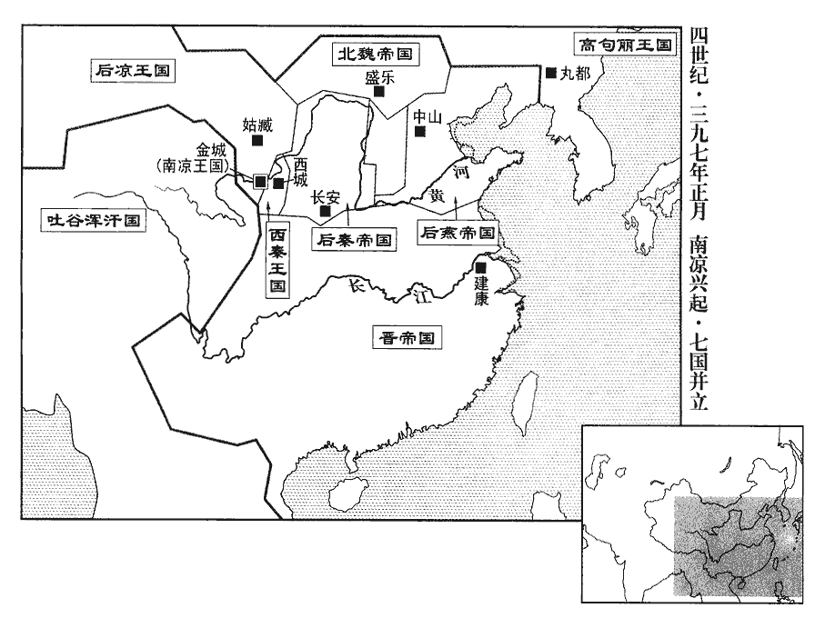
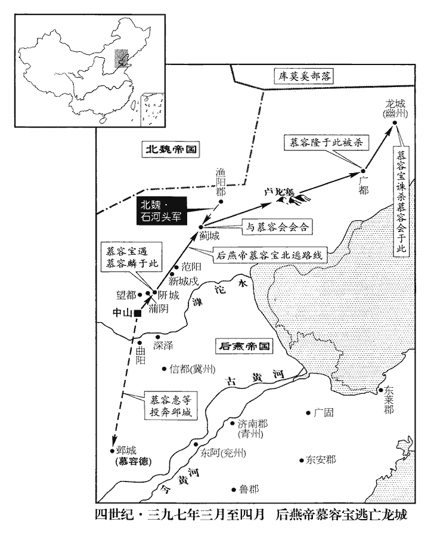
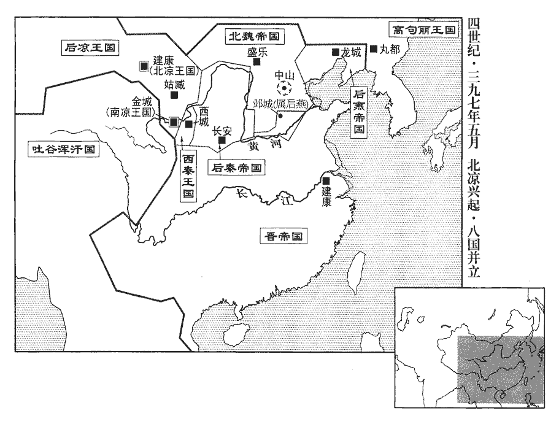
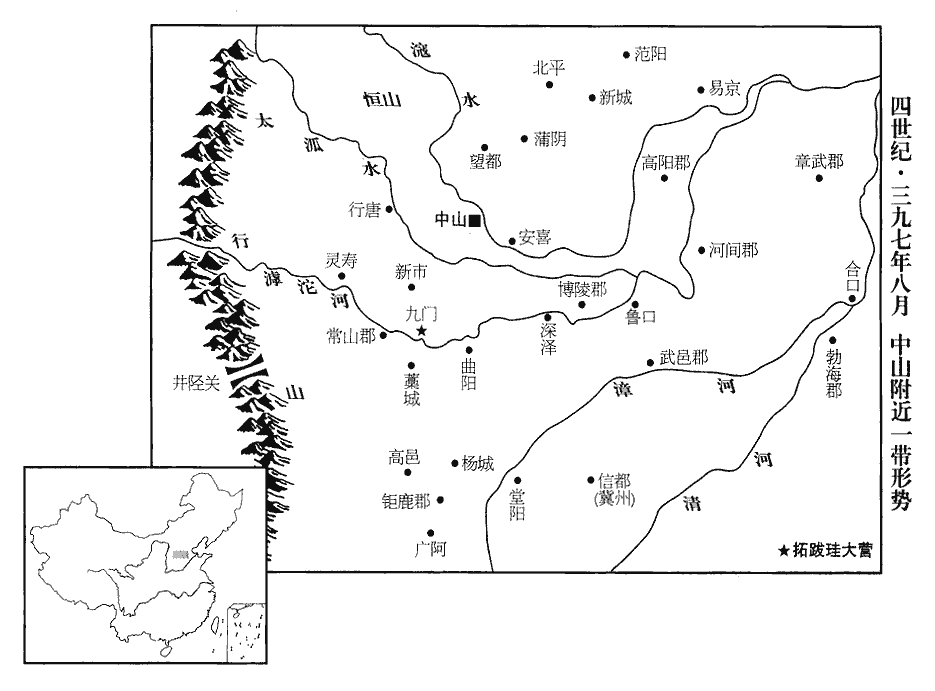

 晉紀三十一強圉作噩（丁酉），一年。

# 安皇帝甲諱德宗，字德宗，孝武帝長子也。諡法：好和不爭曰安；又曰：生而少斷曰安。帝即位後，桓玄篡奪，劉裕反正，南征北召伐事多，而中原亦多事。通鑑所書凡十卷，故以十干書卷數。

## 隆安元年（丁酉、三九七）

1春，正月，己亥朔‹一›，帝‹司马德宗，年十六›加元服，改元。以左僕射王珣為尚書令；領軍將軍王國寶為左僕射，領選；領選者，領吏部選。選，須戀翻。仍加後將軍、丹楊尹。會稽王道子悉以東宮兵配國寶，使領之。會，工外翻。

〖译文〗 [1]春季，正月，己亥朔（初一），东晋安帝行加冕礼，改年号为隆安。任命左仆射王为尚书令；领军将军王国宝为左仆射，兼管官员任免升降，仍兼任后将军、丹杨尹。会稽王司马道子把东宫太子的兵马全部分配给王国宝，让他带领这些部队。

2燕范陽王德求救於秦，秦兵不出，鄴‹河北临漳西南邺镇›中恟懼。恟，許洪翻。賀賴盧自以魏王珪之舅，不受東平公儀節度，由是與儀有隙。儀司馬丁建陰與德通，從而構間之，間，古莧翻。射書入城中言其狀。射，而亦翻。甲辰‹六›，風霾，晝晦，霾，謨皆翻；風雨土曰霾。賴盧營有火，建言於儀曰：「賴盧燒營為變矣。」儀以為然，引兵退；賴盧聞之，亦退；建帥其眾詣德降，帥，讀曰率。降，戶江翻。且言儀師老可擊。德遣桂陽王鎮、南安王青帥騎七千追擊魏軍，大破之。師克在和，將帥不和，敗之本也。

〖译文〗 [2]后燕范阳王慕容德向后秦请求援救，后秦不出兵，邺城军民惊恐异常。贺赖卢自以为他是魏王拓跋的舅舅，所以不听东平公拓跋仪的调度、指挥，因此，他与拓跋仪产生了矛盾。拓跋仪的司马丁建暗地里与慕容德勾结，在拓跋仪与贺赖卢中间挑拨离间，并把这种情况写成书信用箭射进邺城告诉给了慕容德。甲辰（初六），大风突起，天昏地暗。贺赖卢的军营之中出现火光，丁建对拓跋仪说：“贺赖卢在焚烧营地举行叛乱。”拓跋仪认为丁建说的很对，便迅速领兵撤退。贺赖卢听说了拓跋仪后撤的消息，也紧跟着带兵退了下来。丁建此时则带领着他的部众向慕容德投降，并且告诉慕容德，拓跋仪的部队已经疲惫不堪，可以一击。于是，慕容德派遣桂阳王慕容镇、安南王慕容青率领骑兵七千人前去追赶袭击北魏军队，把他们打得大败。

燕主寶‹时年四十三›使左衛將軍慕輿騰攻博陵‹河北安平›，殺魏所置守宰。

〖译文〗 后燕国主慕容宝派遣左卫将军慕舆腾进攻博陵，杀掉了北魏的地方官吏。

王建等攻信都‹河北冀县›，六十餘日不下，士卒多死。庚申‹二十二›，魏王珪‹时年二十七›自攻信都。壬戌‹二十四›夜，燕宜都王鳳踰城奔中山。鳳知珪至，膽破而走。癸亥‹二十五›，信都降魏。

〖译文〗 王建等进攻信都城，六十多天也没有攻下，兵卒伤亡很多。庚申（二十二日），魏王拓跋带兵进攻信都。壬戌（二十四日）夜晚，后燕宜都王慕容凤跳出城墙逃往中山。癸亥（二十五日），信都城向北魏投降。

 

3涼王光‹时年六十一›以西秦王乾歸數反覆，謂乾歸既稱藩於光而悔之也。數，所角翻。舉兵伐之。乾歸群下請東奔成紀‹甘肃秦安北四十公里›以避之，成紀縣，自漢以來屬天水郡，治小坑川；唐併顯親縣入成紀縣，移成紀縣治顯親川。乾歸曰：「軍之勝敗，在於巧拙，不在眾寡。光兵雖眾而無法，其弟延勇而無謀，不足憚也。且其精兵盡在延所，延敗，光自走矣。」光軍于長最‹甘肃永登南›，遣太原公纂等帥步騎三萬攻金城‹甘肃兰州›；乾歸帥眾二萬救之，未至，纂等拔金城。光又遣其將梁恭等以甲卒萬餘出陽武下峽‹甘肃靖远境›，陽武下峽在高平西，河水所經也。將，即亮翻。與秦州刺史沒弈干攻其東，天水公延以枹罕‹甘肃临夏›之眾攻臨洮‹甘肃岷县›、武始‹甘肃临洮›、河關‹甘肃积石山县›，皆克之。臨洮縣，漢屬隴西郡，惠帝分屬狄道郡。武始郡，故狄道縣地。河關縣，前漢屬金城郡，後漢屬隴西郡，晉屬狄道郡。枹，音膚。洮，土刀翻。乾歸使人紿延云：紿dài，待亥翻。「乾歸眾潰，奔成紀。」延欲引輕騎追之，司馬耿稚諫曰：「乾歸勇略過人，安肯望風自潰！前破王廣、楊定，皆羸師以誘之。破楊定，見上卷孝武太元十九年。太元十一年，王廣為鮮卑匹蘭所執，送於後秦；此時乾歸未統國事也。乾歸破廣當在乞伏國仁之時。稚，直利翻。羸，倫為翻。今告者視高色動，殆必有姦，宜整陳而前，使步騎相屬，陳，讀曰陣。屬，之欲翻。俟諸軍畢集，然後擊之，無不克矣。」延不從，進，與乾歸遇，延戰死。稚與將軍姜顯收散卒，還屯枹罕‹甘肃临夏›。光亦引兵還姑臧‹甘肃武威›。

〖译文〗 [3]后凉王吕光因为西秦王乞伏乾归多次反覆，兴兵去讨伐。乞伏乾归手下官员请求向东逃奔到成纪去躲避。乞伏乾归说：“战争的胜败，全在于用兵的巧拙，不在于兵马的多少。吕光的部队虽然人多，但是却缺乏纪律，他的弟弟吕延虽然勇猛，但是却没有谋略，不值得担心。况且吕光的精锐部队全部由吕延统带，吕延一败，吕光自然而然就会逃跑。”这时吕光把大军集结在长最，派遣太原公吕纂等人统率步、骑兵共三万人进攻金城。乞伏乾归带领二万士兵前去解救，还没有赶到，吕纂便已攻克了金城。吕光又派遣他的部将梁恭等人带领全副甲胄的士卒一万多人直逼阳武下峡，与秦州刺史没弈干一起从东部进攻乞伏乾归。天水公吕延也率领罕的军队进攻临洮、武始、河关，全部攻克。乞伏乾归派人去欺骗吕延说：“乞伏乾归的军队已经溃散，他自己逃往成纪去了。”吕延打算带领轻装的骑兵前去追赶，司马耿稚劝说他道：“乞伏乾归的勇武和谋略超过常人，怎么可能听到一点风声便自行解体！从前，乞伏乾归打败王广、杨定，都是这样先把自己的弱点暴露给敌人，引诱对方急功冒进。这次我看报信的人目光向上，脸上的表情也闪烁不定，其中一定有诈，我们应该列好战阵，有条不紊地向前推进，使步兵与骑兵互相照应配合，等到各路大军全部集结，再去攻击敌人，那就没有攻不破的道理了。”吕延不听他的劝阻，挥军直进，与乞伏乾归遭遇，吕延战死，耿稚与将军姜显收集散逃的士卒，回到罕去驻守。吕光也领兵退回姑臧。

 

4禿髮烏孤‹时驻廉川青海省民和县›自稱大都督、大將軍、大單于、西平王，單，音蟬。大赦，改元太初。治兵廣武‹甘肃永登›，攻涼金城，克之。涼王光遣將軍竇苟伐之，戰于街亭‹甘肃张家川北›，涼兵大敗。

〖译文〗 [4]秃发乌孤自称为大都督、大将军、大单于、西平王，实行大赦，改年号为太初。在广武集结整顿部队，进攻并攻克后凉金城。后凉王吕光派将军窦苟去讨伐，在街亭展开激战，后凉军大败。

5燕主寶聞魏王珪攻信都‹河北冀县›；出屯深澤‹河北深泽›，深澤縣，前漢屬涿郡，後漢屬安平國，晉屬博陵郡。宋白曰：深澤縣以界內水澤深廣為名。遣趙王麟攻楊城‹河北顺平境›，郡國志：中山蒲陰縣有楊城。殺守兵三百。寶悉出珍寶及宮人募郡國群盜以擊魏。

〖译文〗 [5]后燕国主慕容宝听说魏王拓跋带兵进攻信都，便率军驻扎在深泽，又派赵王慕容麟进攻杨城，杀死了守兵三百人。慕容宝将皇宫中所藏的珍宝甚至所有的宫女全部作为赏资，招募各郡各封国的强盗匪徒，让他们充军，去抗击北魏。

二月，己巳朔‹一›，珪還屯楊城。沒根兄子醜提為并州監軍，聞其叔父降燕，懼誅，帥所部兵還國【張：「國」作「縣」。】作亂。監，工銜翻。降，戶江翻。帥，讀曰率；下同。珪欲北還，遣其國相涉延求和於燕，且請以其弟為質。相，息亮翻。質，音致。寶聞魏有內難，不許，兵法曰：知彼知己，百戰不殆。慕容寶徒欲乘拓跋珪之有內釁而困之，而不知己之才略不足辦也。難，乃旦翻。使冗從僕射蘭真責珪負恩，冗，而隴翻。從，才用翻。悉發其眾步卒十二萬、騎三萬七千屯於曲陽‹河北曲阳北›之柏肆，此趙國之下曲陽縣也。有柏肆塢，隋開皇十六年置柏肆縣，後廢入常山槀城縣。魏書帝紀作「鉅鹿之柏肆塢」。按地形志：鉅鹿郡治曲陽。營於滹沱水北以邀之。滹，音呼。沱，徒河翻。丁丑‹九›，魏軍至，營於水南。寶潛師夜濟，募勇敢萬餘人襲魏營，寶陳於營北以為之援。陳，讀曰陣；下同。募兵因風縱火，急擊魏軍，魏軍大亂，珪驚起，棄營跣走；燕將軍乞特真帥百餘人至其帳下，得珪衣鞾。鞾xuē，許戈翻。既而募兵無故自驚，互相斫射，射，而亦翻。珪於營外望見之，乃擊鼓收眾，左右及中軍將士稍稍來集，多布火炬於營外，縱騎衝之。募兵大敗，敵出其不意，故走；見敵之不整，乃還戰；善用兵者固觀變而動也。還赴寶陳，寶引兵復渡水北。戊寅‹十›，魏整眾而至，與燕相持，燕軍奪氣。寶引還中山‹河北定州›，魏兵隨而擊之，燕兵屢敗。寶懼，棄大軍，帥騎二萬奔還，時大風雪，凍死者相枕。枕，職任翻。寶恐為魏軍所及，命士卒皆棄袍仗、兵器數十萬，寸刃不返，燕之朝臣將卒降魏及為魏所係虜者甚眾。朝，直遙翻。將，即亮翻。降，戶江翻。

〖译文〗 二月，己巳朔（初一），拓跋带兵回到杨城驻扎。叛将没根的侄儿丑提任并州监军，听说他的叔父降燕，害怕牵连自己被杀，索性带着自己所管辖的兵卒还国举行叛乱。拓跋打算北撤，派国相拓跋涉延前去向后燕求和，并且请求用他的弟弟作为人质。慕容宝听说北魏内部出现动乱，没有答应讲和，又派冗从仆射兰真前往北魏军营，斥责拓跋忘恩负义，调动全部步兵十二万人、骑兵三万七千人去曲阳的柏肆驻守，在滹沱河的北岸立下大营，以拦截撤退的北魏军。丁丑（初九），北魏后撤的部队来到这里，在滹沱河的南岸扎营。慕容宝秘密地遣派一支部队连夜渡过河去，招募一万多敢死队袭击北魏军营，慕容宝在营北结阵作为援兵。后燕招募来的这些人，顺着风放火，对魏军发起迅猛的进攻。北魏军一片大乱，拓跋也在睡梦中惊醒，光着双脚抛弃大营逃走。后燕将军乞特真带着一百多名士卒来到拓跋的大帐，只得到了拓跋仓促之间遗失下的衣服和皮靴。不久，招募来的那些兵勇不知什么原因便突然一片大乱，互相之间胡砍乱射。拓跋在营外远远看到这种情况，于是，击鼓召集刚刚溃散了的兵士，不久，他左右的侍从以及中军将士渐渐地集合在一起，并在营地的外围设置了许多火炬，派骑兵向前冲击后燕兵营。招募的兵勇大败，逃回慕容宝的大营，慕容宝带领着部队再一次渡到河的北岸。戊寅（初十），北魏整顿好部队渐渐逼近，并和后燕军相对峙。后燕军士气大为低落。慕容宝只好带着部队回到中山，北魏军随后追击，后燕军几次接战均告失败。慕容宝十分恐惧，丢下大部队，自己带二万骑兵逃奔回去。这时正值狂风暴雪，冻死的人横躺竖卧在原野上。慕容宝害怕被北魏军队追上抓获，命令兵士全都丢下袍甲枪杖，最后把几十万精良武器全部丢弃，甚至连一把小刀也没有带回。后燕的朝廷大臣、将帅士兵投降、被俘的人非常之多。

先是，張袞嘗為魏王珪言燕祕書監崔逞之材，據張袞傳，袞未嘗與逞相識也，聞其才而稱之。先，悉薦翻。珪得之，甚喜，以逞為尚書，使錄三十六曹，漢光武分尚書為六曹，置郎三十四人，並左、右丞為三十六人。至魏，尚書郎有殿中、吏部、駕部、金部、虞曹、比部、南主客、祠部、度支、庫部、農部、水部、儀曹、三公、倉部、民曹、二千石、中兵、外兵、都兵、別兵、考功、定課，凡二十三郎。明帝青龍二年，置都官、騎兵，合二十五郎。晉武帝罷農部、定課，置直事、殿中、祠部、儀曹、吏部、三公、比部、金部、倉部、度支、都官、二千石、左民、右民、虞曹、屯田、起部、水部、左•右主客、駕部、車部、庫部、左•右中兵、左•右外兵、別兵、都兵、騎兵、左•右士、北主客、南主客、凡三十四曹。後又置運曹，凡三十五曹；置郎二十三人，更相統攝。今魏又增為三十六曹。任以政事。

〖译文〗 在这之前，张衮曾经对魏王拓跋说过后燕秘书监崔逞的才能，这次拓跋得到崔逞，非常高兴，任命崔逞为尚书，掌管三十六曹，把政事委任给他来处理。

魏軍士有自柏肆亡歸者，言大軍敗散，不知王處。道過晉陽‹山西太原›，晉陽守將封真因起兵攻并州刺史曲陽侯素延，素延擊斬之。

〖译文〗 北魏军士中有从柏肆逃亡回来的人，说大部队已经惨败溃散，甚至也不知道魏王拓跋的下落。他们途中经过晋阳，晋阳守将封真调集军队进攻并州刺史、曲阳侯拓跋素延，拓跋素延出城迎战，斩了封真。

南安公順守雲中‹内蒙托克托›，聞之，欲自攝國事。幢將代人莫題曰：「此大事，不可輕爾，宜審待後問，不然，為禍不細。」順乃止。順，什翼鞬【章：「鞬」，十二行本作「犍」；乙十一行本同；孔本同。】之孫也。幢，直江翻。將，即亮翻。鞬，居言翻。賀蘭部帥附力眷、紇鄰部帥匿物尼、紇奚部帥叱奴根皆舉兵反，紇，戶骨翻。帥，所類翻。順討之，不克。珪遣安遠將軍庾岳帥萬騎還討三部，皆平之，國人乃安。

〖译文〗 北魏南安公拓跋顺留守云中，听说了拓跋下落不明的消息后，打算自己代理国家政事，他的幢将代郡人莫题说：“这可是一件大事，千万不可草率从事，应该谨慎地等待观察事态的进一步发展，不然，为祸不浅。”拓跋顺才放弃了这个想法。拓跋顺是拓跋什翼犍的孙子。这时，贺兰部落的首领附力眷、纥邻部落的首领匿物尼、纥奚部落的首领叱奴根等也都闻迅拉起队伍反叛，拓跋顺带兵去征讨他们，却无法平息。拓跋派遣安远将军庾岳统率一万骑兵，赶回来讨伐这三个部落，把这三个部落平定之后，全国百姓才安定下来。

珪欲撫慰新附，深悔參合‹山西阳高东北›之誅，事見上卷孝武帝太元二十年，珪以燕人懲參合之禍，苦戰不下，故深悔之。素延坐討反者殺戮過多，免官；以奚牧為并州刺史。牧與東秦主興‹姚兴，本年三十二岁›書稱「頓首」，與之均禮。時乞伏氏建國隴西，號秦，故史書姚秦為東秦以別之。興怒，以告珪，珪為之殺牧。為，于偽翻。

〖译文〗 拓跋打算安抚宽慰新投降的人，因此对在参合陂那次大批屠杀俘虏的举动深感后悔。拓跋素延讨伐叛变的人杀戮太多，免去了他的官职，任命奚牧为并州刺史。奚牧与后秦国主姚兴通信，以对等之礼称“顿首”。姚兴看后勃然大怒，把这事告诉了拓跋，拓跋因此杀了奚牧。

己卯‹十一›夜，燕尚書郎慕輿皓謀弒燕主寶，立趙王麟；不克，斬關出奔魏，麟由是不自安。為麟奔西山張本。

〖译文〗 己卯（十一日）夜间，后燕尚书郎慕舆皓阴谋刺杀后燕国主慕容宝，拥立赵王慕容麟，没有成功。因此慕舆皓便砍开城门，冲出去逃奔北魏。慕容麟从此心中万分不安。

6三月，燕以儀同三司武鄉‹山西榆社›張崇為司空。石勒分上黨置武鄉郡及武鄉縣，唐遼州榆社縣即其地。

〖译文〗 [6]三月，后燕任命仪同三司、武乡人张崇为司空。

7初，燕清河王會聞魏軍東下，表求赴難，難，乃旦翻。燕主寶許之。會初無去意，初無去龍城之意也。使征南將軍庫傉nù官偉、建威將軍餘崇將兵五千為前鋒。崇，嵩之子也。餘嵩見上卷孝武帝太元二十一年。傉nù，奴沃翻。偉等頓盧龍‹河北迁西北›近百日，遼東新昌縣有盧龍山，唐為平州盧龍縣，慕容令所謂守肥如之險，即其地也。此遼東新昌，後人置於漢遼西郡界，非漢舊郡縣地也。近，其靳翻。無食，噉dàn馬牛且盡；會不發。寶怒，累詔切責；會不得已，以治行簡練為名，復留月餘。治，直之翻。復，扶又翻。時道路不通，偉欲使輕軍前行通道，偵魏強弱，且張聲勢；偵，丑鄭翻。諸將皆畏避不欲行。餘崇奮曰：「今巨寇滔天，京都危逼，京都，謂中山。匹夫猶思致命以救君父，諸君荷國寵任，而更惜生乎！荷，下可翻。若社稷傾覆，臣節不立，死有餘辱；諸君安居於此，崇請當之。」偉喜，簡給步騎五百人。崇進至漁陽‹北京密云›，遇魏千餘騎。崇謂其眾曰：「彼眾我寡，不擊則不得免。」乃鼓譟直進，崇手殺十餘人。魏騎潰去，崇亦引還，斬首獲生，具言敵中闊狹，眾心稍振。會乃上道徐進，上，時掌翻。是月，始達薊城‹北京›。薊，音計。

〖译文〗 [7]当初，后燕清河王慕容会听说北魏军大批东来，上表请求带兵出征，以救国难。后燕国主慕容宝同意了他的请求。但是，慕容会根本没有要去拯救国家的意思，只派遣征南将军库官伟、建威将军馀崇二人带兵五千人作为前锋出发。馀崇是馀嵩的儿子。库官伟等人在卢龙一带停留了将近一百天，吃完了粮食，把军中的马牛也即将吃尽，慕容会还是没有带兵出发。慕容宝大怒，几次下诏严厉斥责他，慕容会迫不得已，以置办行装、加强训练为名，又滞留了一个多月。这时，道路不通，库官伟打算派遣一支活动灵便的部队继续向前开通道路，侦察了解北魏军队的强弱虚实，而且，又能大肆张扬他们的声势。各位将领都因为害怕危险，不愿意去。这时，馀崇奋然而起，说：“现在大敌强盛无比，京都正在遭受着强敌的逼迫。一个普通人都想到舍命拯救自己君主与父老，你们身受皇家的宠爱与重任，怎么能够再爱惜个人的性命呢！国家社稷一旦被推翻，作为臣子的节操不能保全，即便是死了，也要留下耻辱！你们几位就在这儿安安稳稳地呆着吧，我馀崇请求去抵挡敌人。”库官伟非常高兴，挑选步、骑兵共五百人拨给馀崇。馀崇带兵来到渔阳，遇到北魏骑兵一千余人。馀崇对他手下的人说：“敌众我寡，不主动出击，我们就跑不掉了。”于是大声呼喊着一直向敌人杀去，馀崇一个人便杀死了十几个敌兵。魏军骑兵溃散而逃，馀崇也带着兵士们回营。这次出击，杀死了许多敌人，又生擒了一些，他仔细讲述了敌军的内部情况，军心因此稍稍得到了振作。慕容会这才正式带兵上路，慢慢地向前开进。这个月，他们方才到达蓟城。

魏圍中山‹河北定州›既久，城中將士皆思出戰。征北大將軍隆言於寶曰：「涉珪雖屢獲小利，然頓兵經年，涉歲為經年。去年十一月，魏攻中山。凶勢沮屈，沮，在呂翻。士馬死傷太半，人心思歸，諸部離解，謂賀蘭、紇鄰、紇奚三部。正是可破之時也。加之舉城思奮，若因我之銳，乘彼之衰，往無不克。如其持重不決，將卒氣喪，將，即亮翻。喪，息浪翻。日益困逼，事久變生，後雖欲用之，不可得也！」寶然之。而衛大將軍麟每沮其議，麟有異志，故沮隆議。隆成列而罷者，前後數四。

〖译文〗 北魏军围困后燕都城中山已经很久，中山城里的将士们都有心想要出城与敌人决一死战。征北大将军慕容隆对慕容宝说：“拓跋虽然多次获得一些小胜利，但大军在这里羁留已经一年，他们来时的那种凶恶的气势，已经委靡丧失，兵士马匹也或死或伤损失大半，人心思归，各部落正在离析瓦解，这正是我们可以将他们打败的大好时机呀！再加上我们全城的兵民都在想着奋力一搏，如果利用我们的锐气，趁着他们的衰弱，就没有不胜利的。如果谨慎持重、犹豫不决，等到将士的斗志丧失，环境又一天天艰苦，时间一久，事情就会发生变化，到那时候，虽然想利用机会，一定不会再有了。”慕容宝觉得他说得很对。但是卫大将军慕容麟却几次都阻止慕容隆的建议，慕容隆准备好出击却被迫停止，前后一共四次。

寶使人請於魏王珪，欲還其弟觚gū，觚留燕事見一百七卷孝武太元十六年。割常山‹河北正定›以西皆與魏以求和；常山以西，并州之地也。珪許之；既而寶悔之。己酉‹十一›，珪如盧奴，魏書地形志：中山郡治盧奴。酈道元曰：盧奴城內西北隅，有水，淵而不流，南北一百步，東西百餘步；水色正黑曰盧，不流曰奴，故城以此得名。辛亥‹十三›，復圍中山。杜佑曰：後燕都中山，今博陵郡唐昌縣、唐昌本漢苦陘縣，章帝改漢昌，曹魏改魏昌，隋改隋昌，唐武德中改唐昌。復，扶又翻。燕將士數千人俱自請於寶曰：「今坐守窮城，終於困弊，臣等願得一出樂戰，士皆赴死願戰，為樂戰也。樂，音洛。而陛下每抑之，此為坐自摧敗也。且受圍歷時，無他奇變，徒望積久寇賊自退。今內外之勢，強弱懸絕，彼必不自退明矣，宜從眾一決。」寶許之。隆退而勒兵，召諸參佐謂之曰：「皇威不振，寇賊內侮，臣子同恥，義不顧生。今幸而破賊，吉還固善；若其不幸，亦使吾志節獲展。卿等有北見吾母者，為吾道此情也！」隆初鎮龍城，與母俱北；及垂召隆伐魏，其母留龍城。為，于偽翻。乃被甲上馬，詣門俟命。麟復固止寶，被，皮義翻。復，扶又翻。眾大忿恨，隆涕泣而還。還，從宣翻，又如字；下同。

〖译文〗 慕容宝派人向魏王拓跋请求，打算把他弟弟拓跋觚护送回去，并且割让常山以西的大部地区送给北魏，向北魏求和。拓跋答应了，但事后慕容宝却又后悔。己酉（十一日），拓跋来到卢奴。辛亥（十三日），他再一次地包围了中山城。后燕几千名将士都来主动向慕容宝请战说：“现在我们坐守这座已经山穷水尽的孤城，终有一天会被困死，我们愿意出城与敌人决一死战，但是陛下却每每制止我们，这是自取灭亡啊！况且我们被围已经很长时间，并没有产生其他的突然变化，只是白白地盼望时间久了贼兵便能自行退去。城里城外的形势，强与弱相差过于悬殊，他们一定不会自己撤退已经是很明显的事情。所以，我们应该听从大家的意见，出城与敌人决战。”慕容宝答应了。慕容隆退出去后，很快把部队调配完毕，召集参谋佐将，对他们说：“皇上的声威不振作，强盗贼子打到我们家门口来侮辱我们，这是我们做臣子的共同的耻辱，我们理应把自己的生死置之度外。这次决战，如果侥幸地打败敌人，平平安安地回来固然最好，倘若有什么不幸，起码也让我们的志向节操获得一次舒展的机会。你们这些人如有回到北方，看到我母亲的，请千万代替我向母亲禀告我的这种心情。”于是，他披戴盔甲，跨上战马，来到城门等候命令。慕容麟再一次坚决阻止了这次军事行动，众将士气忿之极，慕容隆也流着眼泪回去了。

是夜，麟以兵劫左衛將軍北地王精，使帥禁兵弒寶。帥，讀曰率。精以義拒之，麟怒，殺精，出奔西山‹太行山›，依丁零餘眾。中山西北二百里有狼山，自狼山而西，南連常山，山谷深險，漢末黑山張燕、五代孫方簡兄弟皆依阻其地。丁零餘眾，翟真之黨也，為燕所敗，退聚西山。西山，曲陽之西山也。於是城中人情震駭。

〖译文〗 这天夜晚，慕容麟派兵劫持了左卫将军、北地王慕容精，并且派他率领禁军去刺杀慕容宝。慕容精用大义拒绝了慕容麟，慕容麟大怒，杀了慕容精，跑出城去逃奔西山，依靠丁零的残余部落。从此，中山城里的军民的情绪更加震惊动荡。

寶不知麟所之，之，往也。以清河王會軍在近，恐麟奪會軍，先據龍城，乃召隆及驃騎大將軍農，驃，匹妙翻。騎，奇寄翻。謀去中山，走保龍城。隆曰：「先帝櫛風沐雨以成中興之業，崩未期年而天下大壞，豈得不謂之孤負邪！今外寇方盛而內難復起，難，乃旦翻。復，扶又翻；下復朝同。骨肉乖離，百姓疑懼，誠不可以拒敵，北遷舊都，亦事之宜。然龍川地狹民貧，龍川即謂和龍之地。若以中國之意取足其中，復朝夕望有大功，此必不可。若節用愛民，務農訓兵，數年之中，公私充實，而趙、魏之間，厭苦寇暴，民思燕德，庶幾返旆，克復故業。幾，居希翻。如其未能，則憑險自固，猶足以優游養銳耳。」寶曰：「卿言盡理，朕一從卿意耳。」隆策固善，其如運命何！兵家因敗為成，隆之智不足以及此也。使寶始終一從隆之說，猶可以免蘭汗之禍。

〖译文〗 慕容宝不知道慕容麟到哪里去了，总是以为清河王慕容会的部队便在附近驻扎，因此害怕慕容麟夺走慕容会的部队，抢先跑去占据龙城，于是，他召集慕容隆及骠骑大将军慕容农，商议要放弃中山，去死保龙城。慕容隆说：“先帝历经千辛万苦，才完成了中兴的大业，他死去不到一年便天下大乱，怎么能说我们没有辜负了先帝的嘱托厚望啊！现在，外面的强盗力量正当强盛，而我们内部又发生了危难，同胞骨肉反目成仇，百姓惊疑恐惧，这样，的确是根本不可能抗拒强敌的。向北迁回我们的旧都，也是事所当然。但是龙川那一带地方狭小，百姓贫困，如果我们打算在那里作为依凭，进图中原，仍然早晚都盼望着取得大的进展和成功，那是一定不行的。如果我们节俭开支花费，爱惜民力，鼓励农耕，训练军队，那么几年之间，官府与民间的积蓄一定会充实起来，而赵、魏之间连年战乱，百姓一定苦不堪言，厌倦、怨恨之声四起，那时，他们思念我们燕国统治时的恩德，我们也或许有机会回转旗帜恢复自己往日的帝业。即使不能这样，那么我们依据山川险要，巩固自己的势力，也还是足够我们在那里安闲度日养精蓄锐了。”慕容宝说：“你说的全都在理，我完全听从你的意见。”

遼東‹辽宁辽阳›高撫，善卜筮，素為隆所信厚，私謂隆曰：「殿下北行，終不能達，太妃亦不可得見。若使主上獨往，殿下潛留於此，必有大功。」隆曰：「國有大難，難，乃旦翻。主上蒙塵，且老母在北，吾得北首而死，猶無所恨。卿是何言也！」首，式救翻。乃遍召僚佐，問其去留，唯司馬魯恭、參軍成岌願從，從，才用翻。餘皆欲留，隆並聽之。

〖译文〗 辽东人高抚善于占卜算卦，一向得到慕容隆的信任与厚爱，他私下里告诉慕容隆说：“殿下此次向北撤退，绝对不可能到达目的地，也不可能看到您的母亲太纪。假如让主上自己单独前往，殿下暗地里留在这里，一定会有大的功业可以建立。”慕容隆说：“国家有这样空前的大难，主上遭受奔波之苦与耻辱，而且我的老母亲又在北方，我能够在死的时候头向着北方，便没有什么遗憾了，你这是说的什么？”于是，他将官吏僚属召集在一起，询问他们是去是留，只有司马鲁恭、参军成岌愿意跟从北迁，其余的都打算留下，慕容隆全听凭他们自己拿主意。

農部將谷會歸說農曰：說，輸芮翻。「城中之人，皆涉珪參合所殺者，父兄子弟泣血踊躍，欲與魏戰而為衛軍所抑。慕容麟為衛大將軍，故稱之為衛軍。今聞主上當北遷，皆曰：『得慕容氏一人奉而立之，以與魏戰，死無所恨。』大王幸而留此，以副眾望，擊退魏軍，撫寧畿甸，奉迎大駕，亦不失為忠臣也。」農欲殺歸而惜其材力，謂之曰：「必如此以望生，不如就死！」農、隆皆號為有智略，而所見類如此。天之廢燕，智者失其智矣。

〖译文〗 慕容农的部将谷会归劝说慕容农说：“中山城里的人，都是拓跋在参合陂所杀的士卒的父兄子弟，他们眼睛哭出血来，激愤奔走，打算同魏军决一死战，却被卫军慕容麟所压制。现在听说主上要北迁，都说：‘能够找到慕容氏家族中的一个人而拥戴他当皇上，以此来与魏军苦战，即便死了，也没有什么遗憾。’大王您最好是留在这里，以符合大家的冀望，等到击退魏军，使京畿地区得到安抚宁静，再奉迎皇上的大驾回来，这也不失为是一个忠臣呀。”慕容农想杀了谷会归，但又爱惜他的才华，因此只对他说：“一定要那样来期望继续生存，还不如去死！”

壬子‹十四›，夜，寶與太子策、遼西王農、高陽王隆、長樂王盛等萬餘騎出赴會軍，河間王熙、勃海王朗、博陵王鑒皆幼，不能出城，隆還入迎之，自為鞁乘，鞁bèi，平義翻。說文曰：車駕具。俱得免。燕將王【嚴：「王」改「李」。】沈等降魏。沈，持林翻。樂浪王惠、中書侍郎韓範、員外郎段宏、太史令劉起等帥工伎三百奔鄴。樂浪，音洛琅。帥，讀曰率。伎，渠綺翻。

〖译文〗 壬子（十四日）夜晚，慕容宝与太子慕荣策、辽西王慕容农、高阳王慕容隆、长乐王慕容盛等率领一万多骑兵，出城去投奔慕容会的军营，河间王慕容熙、勃海王慕容朗、博陵王慕容鉴还都年幼，未能逃出城来，慕容隆又回到城里去迎护，亲自驾车，终于使他们全部逃脱。后燕将领李沈等人投降北魏。乐浪王慕容惠、中书侍郎韩范、员外郎段宏、太史令刘起等人率领工匠、艺伎等三百人逃奔邺城。

中山‹河北定州›城中無主，百姓惶惑；東門不閉。魏王珪欲夜入城，冠軍將軍王建志在虜掠，乃言恐士卒盜府庫物，請俟明旦，珪乃止。燕開封公詳從寶不成，【章：十二行本「成」作「及」；乙十一行本同；孔本同；張校同；退齋校同。】城中立以為主，閉門拒守；珪盡眾攻之，連日不拔。使人登巢車，杜預曰：巢車，車上為櫓。陸德明曰：兵車高如巢以望敵也。杜佑曰：以八輪車上樹高竿，竿上安轆轤，以繩挽wǎn板屋上竿首，以窺城中。板屋方四尺，高五尺，有十二孔，四面別布車，可進退，圜城而行，於營中遠視，如鳥之巢，亦謂之巢車。臨城諭之曰：「慕容寶已棄汝走，汝曹百姓空自取死，欲誰為乎?」為，于偽翻。皆曰：「群小無知，恐復如參合之眾，復，扶又翻；下復出同。故苟延旬月之命耳。」珪顧王建而唾其面，唾，土賀翻。王建既鼓成參合之誅，又沮止珪乘夜入中山，失計者再，故唾其面。使中領將軍長孫肥、左將軍李栗將三千騎追寶至范陽‹河北涿州›，不及，破其新城戍‹河北徐水县西›而還。前漢志：中山國有北新城縣。郡國志：涿郡有北新城縣，晉省。水經註：新城縣在武遂縣南，燕督亢之地也。

〖译文〗 中山城中没有了首领，老百姓惶惑惊恐，东门也没有关闭。魏王拓跋打算连夜进城，冠军将军王建则一心想要抢劫，于是说恐怕手下的士卒偷盗府库中的财物，请求等到明天天亮再进城，拓跋才停止进城。后燕开封公慕容详来不及跟随慕容宝北返，城中的军民便拥戴他做了统帅，关闭了城门抗拒北魏军。拓跋出动他所有的军队发动进攻，接连几天也没有攻克。于是派人登上攻城用的巢车，接近城墙向城里喊话说：“慕容宝已经抛弃了你们自己逃走，你们这些老百姓白白地找死，打算为谁效忠呵？”城里的老百姓便都说：“我们这些无知的小民，只是害怕又像参合陂那些人一样，在这里权且拖延十天半月的活命罢了。”拓跋气得直视王建，把唾味吐在他的脸上，并派遣中领将军长孙肥、左将军李栗二人带领着三千骑兵追杀慕容宝，到了范阳，没有赶上，攻克新城戍之后便返回。

8甲寅‹十六›，尊皇太后李氏‹李陵容›為太皇太后。戊午‹二十›，立皇后王氏‹王神爱›。

〖译文〗 [8]甲寅（十六日），安帝尊奉他的祖母皇太后李氏为太皇太后。戊午（二十日），册立王氏妃子为皇后。

 

9燕主寶出中山，與趙王麟遇于𨸦城。考之字書，無「𨸦」字，有「阱」字；疾郢翻。麟不意寶至，驚駭，帥其眾奔蒲陰‹河北顺平›，蒲陰縣，屬中山郡，前漢之曲逆縣也，後漢章帝醜其名，改曰蒲陰。帥，讀曰率；下同。復出屯望都‹河北望都›，復，扶又翻。土人頗供給之。慕容詳遣兵掩擊麟，獲其妻子，麟脫走，入山中‹太行山›。

〖译文〗 [9]后燕国主慕容宝逃出都城中山，和赵王慕容麟在城相遇，慕容麟没有想到慕容宝来到这里，大惊失色，赶紧率领着他的部众向蒲阴逃去，然后又来到望都驻扎。当地的土人还为他提供粮草。慕容详派兵袭击慕容麟，抓获了他的妻子儿女，慕容麟自己则逃脱，进入山中。

甲寅‹十六›，寶至薊‹北京›，殿中親近散亡略盡，惟高陽王隆所領數百騎為宿衛。清河王會帥騎卒二萬迎于薊南，寶怪會容止怏怏有恨色，恨不得為嗣也，事見上卷孝武帝太元二十一年。怏，於兩翻。密告隆及遼西王農。農、隆俱曰：「會年少‹时年二十五›，少，詩照翻。專任方面，習驕所致，豈有他也！臣等當以禮責之。」寶雖從之，然猶詔解會兵以屬隆，隆固辭；乃減會兵分給農、隆。又遣西河公庫傉nù官驥帥兵三千助守中山‹河北定州›。傉nù，奴沃翻。

〖译文〗 甲寅（十六日），慕容宝来到蓟城，他的宫廷中的亲信近臣或走散或逃跑，几乎一个也不剩了，只有高阳王慕容隆所统领的几百名骑兵担任警卫。清河王慕容会率领骑兵二万人到蓟南去迎接。慕容宝对慕容会表情举止充满怨恨的样子感到奇怪，偷偷地告诉了慕容隆与辽西王慕容农。慕容农、慕容隆都说：“慕容会年纪小，但很早就能独当一面，养成了骄纵的习惯，怎么会有别的想法呢！我们有机会一定依据礼仪制度的道理来责备他。”慕容宝虽然听了他们的话，但还是下诏解除了慕容会的兵权，转交给慕容隆。慕容隆坚决推辞，于是慕容宝只好减少慕容会的一部分兵力，分别交给慕容农、慕容隆。他又派遣西河公库官骥统领三千兵卒去帮助守卫中山。

丙辰‹十八›，寶盡徙薊中府庫北趣龍城。趣，七喻翻。魏石河頭引兵追之，戊午‹二十›，及寶於夏謙澤。石河頭時屯漁陽。夏謙澤在薊北二百餘里。寶不欲戰，清河王會曰：「臣撫教士卒，惟敵是求。今大駕蒙塵，人思效命，而虜敢自送，眾心忿憤。兵法曰：『歸師勿遏。』又曰：『置之死地而後生。』孫武子之言。今我皆得之，何患不克！若其捨去，賊必乘人，或生餘變。」寶乃從之。會整陳與魏兵戰，陳，讀曰陣。農、隆等將南來騎衝之，魏兵大敗，追奔百餘里，斬首數千級。隆又獨追數十里而還，謂故吏留臺治書陽璆qiú曰：留臺治書，為留臺治書侍御史也。燕建留臺於龍城，見一百七卷孝武太元十四年。隆時錄留臺，故璆為故吏。璆qiú，渠幽翻。「中山城中積兵數萬，不得展吾意，今日之捷，令人遺恨。」因慷慨流涕。

〖译文〗 丙辰（十八日），慕容宝把蓟城中府库里的所有财宝全部向北搬到龙城去。北魏将领石河头带领部队追击他们，戊午（二十日），在夏谦泽追上了慕容宝。慕容宝并不打算恋战，清河王慕容会说：“我管教、训练我的部队，只是要寻找敌人求战。现在您的大驾受到凌辱，我们人人都想着牺牲性命为您尽忠，强盗贼子胆敢前来送死，大家心中十分愤怒。《兵法》说：‘急于回去的部队，千万不能阻止。’又说：‘使人处于将要死的地位时，才能逼迫他求生存。’这两点，我们今天都符合，哪怕不能取得胜利！如果我们只是一味地躲避逃跑，贼寇一定会得寸进尺，乘虚而入，恐怕还可能又产生别的变化。”慕容宝才听从了他的建议。慕容会于是调整阵势与北魏军队接战，慕容农、慕容隆等人也带领南来的骑兵冲杀敌军，把北魏军队打得大败，并且追杀奔走了一百多里，杀了敌兵几千名。慕容隆又独自再追出去几十里之后才回来，告诉他的旧部下、留台治书阳说：“中山城中集结部队几万，却没有机会使我一展心胸，今天的这次胜利，也仍然让我怀有遗恨！”因此大为激动，泪洒衣襟。

會既敗魏兵，敗，補邁翻。矜很滋甚；隆屢訓責之，會益忿恚。很，戶墾翻。恚，於避翻。會以農、隆皆嘗鎮龍城，孝武太元十年，農鎮龍城；十四年，隆代農。屬尊位重，名望素出己右，恐至龍城，權政不復在己，復，扶又翻。又知終無為嗣之望，以寶違垂命，立策為太子也。乃謀作亂。

〖译文〗 慕容会击败了魏军后，狂傲凶狠越来越厉害。慕容隆曾北几次教训斥责他，慕容会更加怨恨。慕容会想到慕容农、慕容隆都曾经在龙城镇守过，辈分既高，权位又重，名声威望一向又超过自己，因此恐怕到了龙城，权力政事不会再让自己掌握，再加上他又知道自己到头来也不会再有当太子的希望，于是，他便阴谋发动政变。

幽、平【嚴：「平」改「幷」。】之兵皆懷會恩，不樂屬二王，樂，音洛。請於寶曰：「清河王勇略高世，臣等與之誓同生死，願陛下與皇太子、諸王留薊宮，臣等從王南解京師之圍，還迎大駕。」寶左右皆惡會，惡，烏路翻。言於寶曰：「清河王不得為太子，神色甚不平。且其才武過人，善收人心；陛下若從眾請，臣恐解圍之後，必有衛輒之事。」衛靈公世子蒯聵kuì出奔，靈公立其子輒。靈公卒，輒立，蒯聵復入，輒拒而不納。寶乃謂眾曰：「道通年少，會，字道通。少，詩照翻。才不及二王，二王，謂農、隆。豈可當專征之任！且朕方自統六師，杖會以為羽翼，何可離左右也！」離，力智翻。眾不悅而退。

〖译文〗 幽州及并州的部队都怀念着慕容会的恩德，不愿意隶属于慕容农、慕容隆两位亲王，向慕容宝请求说：“清河王的勇武谋略都高过当世，我们与他发誓要同生共死，愿陛下您与皇太子、各位亲王暂时留在蓟城宫中，我们这些人跟随清河王去向南解救被围困的京师，回来迎接大驾还朝。”慕容宝左右的近臣与侍卫都讨厌慕容会，对慕容宝说：“清河王因为当不上太子，神态与脸色都表现出非常的不满。而且他的才能与武力又超过常人，很善于收买人心，陛下如果答应了这些人的请求，我们恐怕解除了中山的围困以后，就一定会有春秋时卫辄那样自己继承王位，却拒绝父亲回国的事发生。”慕容宝对这些人说：“慕容会年纪还小，他的才干也赶不上慕容农、慕容隆二王，怎么可以承担自己单独带兵征战的大任！况且朕正要亲自统率六军，依靠慕容会作为我的助手，他怎么可以离开我的身边呢？”那些人都很不高兴地退出去了。

左右勸寶殺會。侍御史仇尼歸聞之，告會曰：「大王所恃者父，父已異圖；所杖者兵，兵已去手；欲於何所自容乎！不如誅二王，廢太子，大王自處東宮，處，昌呂翻。兼將相之任，將，即亮翻。相，息亮翻。以匡復社稷，此上策也。」會猶豫未許。

〖译文〗 左右侍卫近臣都劝说慕容宝杀掉慕容会，侍御史仇尼归听说后，向慕容会报信说：“大王您所依仗的是自己的父亲，但您的父亲现在已另有打算；您所依仗的是军队，但是军队也已经不在您手里。您还打算到什么地方、依仗什么容身呢？我看您不如诛杀慕容农、慕容隆两位亲王，废黜太子，您自己处于东宫的位置兼任宰相、大将军之职，以此来匡正恢复社稷，这才是上策。”慕容会犹豫不决，没有应许。

寶謂農、隆曰：「觀道通志趣，必反無疑，宜早除之。」農、隆曰：「今寇敵內侮，中土紛紜，社稷之危，有如累卵。會鎮撫舊都，遠赴國難，難，乃旦翻。其威名之重，足以震動四鄰。逆狀未彰而遽殺之，豈徒傷父子之恩，亦恐大損威望。」寶曰：「會逆志已成，卿等慈恕，不忍早殺，恐一旦為變，必先害諸父，然後及吾，至時勿悔自負也！」會聞之，益懼。

〖译文〗 慕容宝对慕容农、慕容隆说：“我看慕容会的心思与志向，今后一定谋反无疑，应该早早除掉他。”慕容农、慕容隆说：“现在敌寇入侵欺侮我们，国中腹地一片大乱，政权危如累卵。慕容会本来在旧都镇守，这次千里迢迢赶来解救国家的危难，他的声威名望的分量，足以使四邻震动。他的叛逆的形迹还没有暴露便突然杀掉他，岂只是白白地伤损父子之间的恩德，恐怕也要使您的威望遭受重大损失。”慕容宝说：“慕容会反叛的主意已经打定，你们这样仁慈宽恕，不忍心早点杀掉他，恐怕有一天他突然发动政变，一定会首先伤害你们几个做叔父的，然后再伤害我，那时候可不要因自负而后悔呀！”慕容会听说后，越加害怕。

夏，四月，癸酉‹六›，寶宿廣都‹辽宁建昌›黃榆谷，魏收地形志：廣都縣，屬建德郡，在漢北平白狼縣界，隋省入遼西柳城縣。會遣其黨仇尼歸、吳提染干帥壯士二十餘人帥，讀曰率；下同。分道襲農、隆，殺隆於帳下；農被重創，被，皮義翻。創，初良翻。執仇尼歸，逃入山中。會以仇尼歸被執，事終顯發，乃夜詣寶曰：「農、隆謀逆，臣已除之。」寶欲討會，陽為好言以安之曰：「吾固疑二王久矣，除之甚善。」

〖译文〗 夏季，四月，癸酉（初六），慕容宝在广都黄榆谷扎营露宿。慕容会派遣他的死党部下仇尼归、吴提染干率领壮士二十多人，分两路去偷袭慕容农、慕容隆。在寝帐之中将慕容隆杀死，慕容农则身受重伤，抓住了仇尼归，逃进了深山。慕容会因为仇尼归被对方抓住，事情终于败露，于是只好连夜去拜见慕容宝说：“慕容农、慕容隆阴谋叛逆，我们已将他们除掉。”慕容宝准备讨伐慕容会，表面上只得用好话来稳住他，说：“我本来怀疑他们很长时间了，除掉他们很好。”

甲戌‹七›，旦，會立仗嚴備，乃引道。會欲棄隆喪，餘崇涕泣固請，乃聽載隨軍。農出，自歸，寶呵之曰：「何以自負邪?」寶陽責農而以前言相擿tī發。命執之。行十餘里，寶顧召群臣食，且議農罪。會就坐，坐，徂臥翻。寶目衛軍將軍慕輿騰使斬會，傷其首，不能殺。會走赴其軍，勒兵攻寶。寶帥數百騎馳二百里，晡bū時，至龍城。會遣騎追至石城，不及。石城縣，漢屬北平郡，後魏屬建德郡，隋併入柳城縣。

〖译文〗 甲戌（初七），清晨，慕容会下令严密戒备，在前面引路，继续前进。慕容会打算遗弃慕容隆的灵柩，将军馀崇流着眼泪坚决请求携带，就听凭他随着军队运载。慕容农从深山中出来，自己回到大营，慕容宝呵斥他说：“为什么自负前言！”命令手下人把他逮捕收押起来。走了十几里路，慕容宝回头召集文武大臣一起吃饭，并商议如何给慕容农定罪。慕容会也入席就座，慕容宝使眼色让卫军将军慕舆腾刺杀慕容会，却只将他的头部击伤，没有杀死。慕容会带伤逃奔自己的军队，马上集合部队向慕容宝发起猛攻。慕容宝带着几百名骑兵跑出去二百里，下午晡时，到了龙城。慕容会派遣骑兵追赶到石城，没有追上。

乙亥‹八›，會遣仇尼歸攻龍城，寶夜遣兵襲擊，破之。會遣使請誅左右佞臣，并求為太子；使，疏吏翻。寶不許。會盡收乘輿器服，以後宮分給將帥，乘，繩證翻。將，即亮翻。帥，所類翻。署置百官，自稱皇太子、錄尚書事，引兵向龍城，以討慕輿騰為名；丙子‹九›，頓兵城下。寶臨西門，會乘馬遙與寶語，寶責讓之。會命軍士向寶大譟以耀威，城中將士皆憤怒，向暮出戰，大破之。會兵死傷太半，走還營。侍御郎高雲夜帥敢死士百餘人襲會軍，寶之為太子，雲以武藝給事侍東宮，拜侍御郎。會眾皆潰。會將十餘騎奔中山，開封公詳殺之。寶殺會母及其三子。

〖译文〗 乙亥（初八），慕容会派遣仇尼归前去攻打龙城，慕容宝却在夜里派遣一支部队袭击他，并将他打败。慕容会派遣使者去面见慕容宝，请求诛杀左右的奸佞之臣，并且请求册立自己做太子，慕容宝不答应。慕容会便把皇帝用的车马服装器具等全部收为己有，把后宫的姬妾宫女等分赏给各位将帅，并且设置了文武百官，自称为皇太子、录尚书事，带着部队直向龙城进发，名义上却说要讨伐慕舆腾。丙子（初九），在城下驻扎下来。慕容宝来到西门，慕容会乘着马从远处与慕容宝对话。慕容宝斥责他。慕容会命令士兵面对慕容宝大声鼓噪、起哄，以炫耀自己的威势。城里的将士都义愤填膺，傍晚的时候出城与慕容会接战，将他们打得大败。慕容会的兵卒死伤了一大半，他自己也逃回了大营。侍御郎高云当夜率领一百多名敢死壮士偷袭慕容会的营寨，慕容会的部众完全崩溃。慕容会本人只带领着十几名骑兵逃奔中山，被开封公慕容详杀了。慕容宝杀掉了慕容会的母亲和他的三个儿子。

丁丑‹十›，寶大赦，凡與會同謀者，皆除罪，復舊職；論功行賞，拜將軍、封侯者數百人。遼西王農骨破見腦，寶手自裹創，創，初良翻。僅而獲濟。以農為左僕射，尋拜司空、領尚書令。餘崇出自歸，寶嘉其忠，拜中堅將軍，使典宿衛。贈高陽王隆司徒，諡曰康。

〖译文〗 丁丑（初十），慕容宝实行大赦，凡是慕容会同谋的人，全都免除罪名，恢复旧有的官职。论功行赏，晋升为将军、加封侯爵的有几百人。辽西王慕容农头骨被击碎，甚至竟能看见脑髓，慕容宝亲手为他包扎伤口，居然救活了他的性命。慕容宝任命慕容农为左仆射，不久又升为司空、领尚书令。慕容隆的部将馀崇从躲藏的地方回来，慕容宝赞赏他的忠诚，提升他为中坚将军，派他统领宫廷侍卫。追赠高阳王慕容隆为司徒，谥号康王。

寶以高雲為建威將軍，封夕陽公，養以為子。雲，高句麗之支屬也，高句麗自云高陽氏之後裔，故以高為氏。句，如字，又音駒。麗，力知翻。燕王皝破高句麗，徙於青山‹辽宁义县东›，破高句麗見九十七卷成帝咸康八年。青山，遼西徒河縣之青山也。由是世為燕臣。雲沈厚寡言，沈，持林翻。時人莫知，惟中衛將軍長樂‹河北冀县›馮跋魏收曰：漢高帝置信都郡，景帝二年，為廣川國，明帝更名樂成國，安帝改為安平國，晉改為長樂郡。考之晉志，有安平而無長樂，不知何時更名也。樂，音洛。奇其志度，與之為友。高雲、馮跋事始見於此，為後得燕張本。跋父和，事西燕主永為將軍，永敗，徙和龍。

〖译文〗 慕容宝任命高云为建威将军，封为夕阳公，并收养他做为自己的养子。高云是高句丽王室分支的后代，当年前燕王慕容击败高句丽王国的时候，曾把他的前辈迁移到青山一带，从此，他们便世世代代成了前燕国的臣民。高云平时沉稳敦厚，不善言谈，当时的人都不熟悉他，只有中卫将军长乐人冯跋觉得他的志向与气度极不一般，和他结为好友。冯跋的父亲冯和，为西燕国主慕容永效力并做了西燕的将军。慕容永失败以后，他被安置在和龙居住。

10僕射王國寶、建威將軍王緒依附會稽王道子，會，工外翻。納賄窮奢，不知紀極。惡王恭、殷仲堪，惡，烏路翻。勸道子裁損其兵權；中外恟恟不安。恟，許拱翻。恭等各繕甲勒兵，表請北伐；道子疑之，詔以盛夏妨農，悉使解嚴。

〖译文〗 [10]东晋仆射王国宝、建威将军王绪等人依附于会稽王司马道子，收受贿赂，穷奢极欲，无法无天已达到了极点。他们厌恶王恭、殷仲堪，劝司马道子裁减他们二人的兵权。朝廷内外流言四起，人心动荡不安。王恭等人各自都在整理兵甲，训练部队，上奏章请求北上讨伐。司马道子对他们怀有疑心，下诏以盛夏出兵防碍农业生产为由，命令他们解严。

恭遣使與仲堪謀討國寶等。遣使，疏吏翻。桓玄以仕不得志，欲假仲堪兵勢以作亂，玄仕不得志，事見孝武太元十七年。乃說仲堪曰：「國寶與君諸人素已為對，事始一百七卷孝武太元十五年。對，敵也。說，輸芮翻；下同。唯患相斃之不速耳。今既執大權，與王緒相表里，其所迴易，無不如志；孝伯居元舅之地，必未敢害之。王恭字孝伯，孝武王皇后之兄弟也。君為先帝所拔，超居方任，人情皆以君為雖有思致，非方伯才。亦見太元十五年。思，相吏翻。彼若發詔徵君為中書令，用殷覬為荊州，南蠻校尉資次可為荊州，故云。覬，音冀。君何以處之?」處，昌呂翻。仲堪曰：「憂之久矣，計將安出?」玄曰：「孝伯疾惡深至，君宜潛與之約，興晉陽之甲以除君側之惡，春秋公羊傳曰：「趙鞅興晉陽之甲，以除君側之惡。東西齊舉，江陵在西，京口在東，故曰東西齊舉也。玄雖不肖，願帥荊、楚豪傑，荷戈先驅，帥，讀曰率。荷，下可翻。此桓、文之勳也。」

〖译文〗 王恭派人去见殷仲堪，商议声讨王国宝等人的事情。桓玄也因为未能当上大官，郁郁不得志，打算趁此机会借助殷仲堪的兵马势力制造混乱，就对殷仲堪说：“王国宝与你们几个人向来都是死对头，只怕消灭你们的时间来得不快。现在他既然已经执掌了大权，并且与王绪内外呼应，他们所想要改变的事，没有一件达不到目的。王恭处在国舅的位置上，王国宝不一定敢加害他，但你是先帝提拔起来的，超越常规地独领一方。人们都认为你虽然头脑清楚，有才干，却不是封疆大吏的人才。他们如果征召你回朝做中书令，任命殷觊为荆州刺史，你将如何应付？”殷仲堪说：“我也忧虑很长时间了，你认为怎么办才好呢？”桓玄说：”王恭为人正直，嫉恶如仇，你应该暗地里和他联合起来，约定时间，仿效战国赵鞅发动晋阳之兵马，以清除君侧之恶人的办法，东西两面一齐起兵，桓玄我虽然不成材，也愿意率领荆州、楚州两地的英雄豪杰，手拿武器充任前锋。这是齐桓公、晋文公似的功勋呵！”

仲堪心然之，乃外結雍州刺史郗恢，雍，於用翻。郗，丑之翻。內與從兄南蠻校尉覬、南郡‹湖北江陵›相陳留‹河南开封东›江績謀之。從，才用翻。南蠻府，南郡相，與荊州刺史府同治江陵。覬曰：「人臣當各守職分，朝廷是非，豈藩屏之所制也！分，扶問翻。屏，必郢翻。晉陽之事，不敢預聞。」仲堪固邀之，覬怒曰：「吾進不敢同，退不敢異。」績亦極言其不可。覬恐績及禍，於坐和解之。坐，徂臥翻。績曰：「大丈夫何至以死相脅邪！江仲元行年六十，但未獲死所耳！」江績，字仲元。仲堪憚其堅正，以楊佺期代之。朝廷聞之，徵績為御史中丞。覬遂稱散發，辭位，晉人多服寒食散，其藥毒發或致死。今千金方中有數方。散，悉亶翻。仲堪往省之，省，悉景翻。謂覬曰：「兄病殊為可憂。」覬曰：「我病不過身死，汝病乃當滅門。宜深自愛，勿以我為念！」郗恢亦不肯從。仲堪疑未決，會王恭使至，使，疏吏翻。仲堪許之，恭大喜。甲戌‹七›，恭上表罪狀國寶，舉兵討之。

〖译文〗 殷仲堪心中以为他说得很对，于是向外联络雍州刺史郗恢，内部又与自己的堂兄南蛮校尉殷觊、南郡相陈留人江绩等人一起谋划，殷觊说：“作为国家的大臣，应当各自坚守自己的职责，朝廷里的是非对错，怎么能是做地方官员的人可以干预的！所说仿效晋阳出兵一事，我不敢听闻参预。”殷仲堪坚决邀请他出来一块干，殷觊大怒说：“我前进一步不会同意，退后一步不会反对。”江绩也竭力地分析认为不可。殷觊恐怕江绩说得太激烈，招来祸患，便坐在那里从中调解。江绩说：“大丈夫怎么能用死来威胁呢？我江仲元活了六十岁，只是没有找到值得我去死的地方罢了！”殷仲堪对江绩的坚定正直很害怕，因此任命杨期代替江绩为南郡相。朝廷得知了这个消息后，征召江绩回朝廷担任御史中丞。殷觊借口自己食用寒食散之后药性发作，辞去了职位。殷仲堪去看望他，对殷觊说：“堂兄的病实在值得忧虑。”殷觊说：“我的病至多不过是我个人身死，你的病发作却会招致灭门大祸呀。你应当深深地爱惜保护自己，不要挂念我。”雍州刺史郗恢也不愿意一起干。殷仲堪犹疑不决。正巧王恭派来的信使来到，殷仲堪应诺了王恭的约定，王恭非常高兴。甲戌（初七），王恭便上奏章陈述了王国宝的罪状，同时发动部队前去讨伐。

初，孝武帝委任王珣，及帝暴崩，不及受顧命，珣一旦失勢，循默而已。循默者，循常而無一言也。丁丑‹十›，王恭表至，內外戒嚴，道子問珣曰：「二藩作逆，卿知之乎?」珣曰：「朝政得失，珣弗之預，朝，直遙翻。王、殷作難，難，乃旦翻。何由可知！」王國寶惶懼，不知所為，遣數百人戍竹里‹江苏句容北›，竹里，今建康府竹篠鎮是其地，在行宮城東北三十許里。夜遇風雨，各散歸。王緒說國寶矯相王之命召王珣、車胤殺之，以除時望，因挾君相發兵以討二藩。國寶許之。說，輸芮翻。相，息亮翻。車，尺遮翻。珣、胤至，國寶不敢害，更問計於珣。珣曰：「王、殷與卿素無深怨，所競不過勢利之間耳。」國寶曰：「將曹爽我乎?」謂珣如蔣濟說曹爽釋權，而司馬懿終族之也。事見七十五卷魏邵陵厲公嘉平元年。珣曰：「是何言歟！卿寧有爽之罪，王孝伯豈宣帝之儔邪?」又問計於胤，胤曰：「昔桓公圍壽陽‹安徽寿县›，彌時乃克。見一百二卷海西公太和五年及一百三卷簡文帝咸安元年。今朝廷遣軍，恭必城守。若京口‹江苏镇江›未拔而上流奄至，君將何以待之?」國寶尤懼，遂上疏解職，詣闕待罪；既而悔之，詐稱詔復其本官。道子闇懦，欲求姑息，姑，且也。息，止也。姑息，猶言且止。乃委罪國寶，遣驃騎諮議參軍譙王尚之收國寶付廷尉。洪景伯曰：諮議參軍，晉江左初置，因軍諮祭酒也，其位在諸參軍之右。驃，匹妙翻。騎，奇寄翻。尚之，恬之子也。甲申‹十七›，賜國寶死，斬緒於市，遣使詣恭，深謝愆失；恭乃罷兵還京口。國寶兄侍中愷、驃騎司馬愉並請解職；道子以愷、愉與國寶異母，又素不協，皆釋不問。戊子‹二十一›，大赦。

〖译文〗 当初，晋孝武帝重任左仆射王，后来，孝武帝突然驾崩，他没来得及接受先帝的委托做顾命大臣。王失去权势，只好一言不发。丁丑（初十），王恭的奏章送到朝中，朝廷内外十分紧张，戒备森严。司马道子问王道：“王、殷两股地方势力发动叛乱，你知道这件事吗？”王说：“朝廷内部政治事务的好坏得失，我都不曾参预，王、殷两个人所发动的反叛，我怎么能知道呢？”王国宝异常惶恐惧怕，不知如何是好，派了几百人到竹里去守卫，因为夜间遇到风雨大作，各自散去回家了。王绪给王国宝出主意，让他假借相王司马道子的命令，召集王、车胤前来，将他们杀掉，先除掉有声望的人，然后以此要挟安帝和马司道子调兵讨伐两个藩臣。王国宝同意了王绪的建议。王、东胤来到之后，王国宝又不敢杀害，只好再向王询问解决的方法。王说：“王恭、殷仲堪与您素来没有什么深仇大恨，他们所要争的不过是一些权势利益罢了。”王国宝说：“莫非要把我当成曹爽吗？”王说：“你这是什么话呀！您哪里有曹爽那么重的罪过，王恭又哪里是宣帝司马懿那样的人呢？”王国宝又向车胤问计，车胤说：“过去，桓温围困寿阳，很长时间才攻克。现在朝廷如果派兵去攻，王恭便一定会坚守。倘若京口还没有攻下，长江上游的殷仲堪又带兵突然乘虚而来，您准备怎样对付他呢？”王国宝更加恐惧，于是上了一道奏章请求解除一切官职，前往宫门等待朝廷定罪。奏章刚送上去，又后悔了，因此又谎称安帝已经下诏恢复他原来的官职。司马道子为人愚昧懦弱，只求暂时平息此事，便把一切罪过完全推到王国宝身上，并派遣骠骑谘议参军谯王司马尚之前去逮捕王国宝，交到廷尉那里去问罪。司马尚之是司马恬的儿子。甲申（十七日），安帝下诏，命令王国宝自杀，把王绪绑赴街市斩首，并派使者前去面见王恭，对自己的过失表示深深的歉意。王恭于是带兵回京口。王国宝的哥哥侍中王恺、骠骑司马王愉一起恳请辞职。司马道子因为王恺、王愉与王国宝不是同母所生，彼此的关系又历来不和，就都不予追究。戊子（二十一日），宣布大赦。

殷仲堪雖許王恭，猶豫不敢下；聞國寶等死，乃始抗表舉兵，遣楊佺期屯巴陵‹湖南岳阳›。沈約曰：巴陵縣，晉武太康元年置，屬長沙。酈道元曰：湘水北至巴丘山入江，山在右岸，有巴陵故城，本吳之巴丘邸閣；晉立巴陵縣，後置建昌郡。道子以書止之，仲堪乃還。

〖译文〗 殷仲堪虽然已经答应王恭一起声讨王国宝，但仍然犹豫，不敢带兵东下。听说王国宝等已死，才开始上疏朝廷，起动大兵，派遣杨期去驻守巴陵。司马道子写信阻止，殷仲堪才回师。

會稽世子元顯，年十六，有儁才，為侍中，說道子以王、殷終必為患，請潛為之備。說，輸芮翻。道子乃拜元顯征虜將軍，以其衛府及徐州文武悉配之。為元顯討王、殷張本。

〖译文〗 会稽王司马道子的长子司马元显，十六岁，聪明能干。此时他在朝中担任侍中。他提醒司马道子说，王恭、殷仲堪到头来一定会成为祸患，请在暗地作好准备。司马道子于是任命司马元显为征虏将军，把自己的卫队以及徐州的军政要员全部交给司马元显管辖。

11魏王珪以軍食不給，命東平公儀去鄴，徙屯鉅鹿‹河北宁晋西南›，積租楊城‹山西洪洞›。慕容詳出步卒六千人，伺間襲魏諸屯；伺，相吏翻。間，古莧翻。珪擊破之，斬首五千，生擒七百人，皆縱之。縱之，所以攜中山城中之人心。

〖译文〗 [11]魏王拓跋因为军队中的粮食供应不足，命令东平公拓跋仪离开邺城，迁到钜鹿驻扎，并把粮食补给等聚积在杨城。慕容详派出六千步兵，等待机会乘虚袭击搔扰魏军的几个驻地。被拓跋击溃，杀死了五千人，活捉了七百人，又把这些浮虏全部释放。

12初，張掖‹甘肃张掖›盧水胡沮渠羅仇，匈奴沮渠王之後也，盧水胡分居安定、張掖，史各以其所居郡繫之。沮，子余翻。北史曰：沮渠世居張掖臨松盧水‹石羊河›。世為部帥。帥，所類翻。涼王光以羅仇為尚書，從光伐西秦。及呂延敗死，羅仇弟三河‹青海化隆南›太守麴粥謂羅仇曰：呂光得涼州，自號三河王，此郡蓋光置也。賢曰：三河，謂金城河、賜支河、湟河，此郡當置於漢張掖、金城郡界。「主上荒耄信讒，今軍敗將死，將，即亮翻。正其猜忌智勇之時也。吾兄弟必不見容，與其死而無名，不若勒兵向西平‹青海西宁›，出苕tiáo藋diào‹甘肃永昌境›，河西張氏置西平郡，唐為鄯州之地。苕藋，地名，在漢張掖郡番禾縣界。藋，徒弔翻。番，如淳音盤。奮臂一呼，呼，火故翻。涼州不足定也。」羅仇曰：「誠如汝言。然吾家世以忠孝著於西土，寧使人負我，我不忍負人也。」光果聽讒，以敗軍之罪殺羅仇及麴粥。羅仇弟子蒙遜，雄傑有策略，涉獵書史，以羅仇、麴qū粥之喪歸葬；諸部多其族姻，會葬者凡萬餘人。蒙遜哭謂眾曰：「呂王昏荒無道，多殺不辜。吾之上世，虎視河西，蒙遜之先，世為匈奴左沮渠。河西，匈奴左地也。世居盧水為酋豪，其高曾皆雄健有勇名。今欲與諸部雪二父之恥，復上世之業，何如?」眾咸稱萬歲。遂結盟起兵，攻涼臨松郡‹甘肃张掖南›，拔之，臨松郡，張天錫置，後周廢入張掖郡張掖縣。屯據金山‹甘肃张掖东南›。五代史志，張掖刪丹縣有金山。沮渠蒙遜事始此。

〖译文〗 [12]当初，居住在张掖的卢水匈奴部落的首领沮渠罗仇，是匈奴沮渠王的后代，世世代代都当部落的首领。后凉王吕光任命沮渠罗仇为尚书，跟着吕光一起去讨伐西秦。吕延战败身死之后，沮渠罗仇的弟弟、三河太守沮渠粥对沮渠罗仇说：“主上吕光年老，昏聩，又常常听信谗言，这次军队失败，大将战死，正是他猜忌勇武有识的部下的时候，他一定容不得我们兄弟。与其平平庸庸死掉，不如干脆带领军队进攻西平，闯过苕，只要我们振臂一呼，凉州一带得以平定就不在话下了。”沮渠罗仇说：“确实像你说的。但是我们沮渠家，世世代代都以忠孝之名被西域的人们所称颂，所以，宁可让别人背叛我，我是绝对不忍心去背叛别人的。”吕光果然听信谗言，以出战失败的罪名杀掉了沮渠罗仇与沮渠粥。沮渠罗仇的侄儿沮渠蒙逊，为人雄武过人而又身怀奇才大略，阅读过许多经史典籍。他护送沮渠罗仇与沮渠粥的灵柩回乡安葬，附近的许多部落都与他们有姻亲关系，参加葬礼的竟达一万多人。沮渠蒙逊哭着对这些人说：“吕光昏聩无道，杀死了无辜的人。我们的祖先，雄威震慑河西一带，今天我们要与各部落一起为我的两位伯叔报仇雪恨，进而恢复我们祖先的大业，各位意下如何？”众人都高喊万岁。于是缔结了盟约，拉起队伍，攻占了后凉的临松郡，然后进军在金山据守。

13司徒左長史王廞xīn，導之孫也，廞，許金翻。以母喪居吳‹江苏苏州›。王恭之討王國寶也，版廞行吳國內史，以白版授官，非朝命也。使起兵於東方。三吳皆在建康之東。廞使前吳國內史虞嘯父等入吳興‹浙江湖州›、義興‹江苏宜兴›召募兵眾，父，音甫。赴者萬計。未幾，國寶死，幾，居豈翻。恭罷兵，符廞去職，反喪服。廞以起兵之際，誅異己者頗多，勢不得止，遂大怒，不承恭命，使其子泰將兵伐恭，牋於會稽王道子，稱恭罪惡；將，即亮翻。會，工外翻。道子以其牋送恭。五月，恭遣司馬劉牢之帥五千人擊泰，斬之。帥，讀曰率。又與廞戰於曲阿‹江苏丹阳›，眾潰，廞單騎走，不知所在。騎，奇寄翻。收虞嘯父下廷尉，以其祖潭有功，虞潭有討蘇峻之功。下，遐嫁翻。免為庶人。

〖译文〗 [13]东晋司徒左长史王是王导的孙子，因为母亲去世，在吴地守丧。王恭讨伐王国宝的时候，曾任命他暂时代理吴国内史的官职，让他在东方起兵。王于是派前任吴国内史虞啸父等人到吴兴、义兴一带去招兵买马，赶来从军的人以万计。不久，王国宝被赐自杀，王恭也停止了军事行动，便来信通知王可以离开任职、回家继续守丧。王在起兵的时候，诛杀了很多和自己意见不同的人，已经不能半途停止，于是不禁大怒，拒绝接受王恭的命令，并且派他的儿子王泰带兵前去讨伐王恭，又写信给会稽王司马道子，历数王恭的罪恶。司马道子把他的信送给了王恭。五月，王恭派司马刘牢之统领五千人迎击王泰，并把他杀了。刘牢之又与王在曲阿展开激战，王的部队溃散，王一个人骑马跑走，下落不明。又抓获虞啸父送到廷尉问罪，因为他的祖父虞谭过去有功，免死，贬为平民。

14燕庫傉nù官驥入中山‹河北定州›，與開封公詳相攻。慕容寶遣驥助守中山，因與詳相攻。傉nù，奴沃翻。詳殺驥，盡滅庫傉官氏；又殺中山尹苻謨，夷其族。中山城無定主，民恐魏兵乘之，男女結盟，人自為戰。使慕容農、慕容隆留中山而用之，未可知也。

〖译文〗 [14]后燕西河公库官骥进入中山，与留守在那里的开封公慕容详互相攻打，莫容详杀了库官骥，并把整个库官氏家族全部消灭。他又杀死了中山尹苻谟，屠杀了苻谟家一族。中山城内没有一个主事人，居民们害怕北魏的军队乘虚攻进城来，男女老幼自愿结起盟约，各自单独作战。

甲辰‹七›，魏王珪罷中山之圍，就穀河間‹河北献县›，督諸郡義租。甲寅‹十七›，以東平公儀為驃騎大將軍、都督中外諸軍事兗•豫•雍•荊•徐•揚六州牧、左丞相，封衛王。驃，匹妙翻。騎，奇寄翻。雍，於用翻。

〖译文〗 甲辰（初七），魏王拓跋撤除对中山的包围，开往河间征粮，督促各郡义务献粮。甲寅（十七日），拓跋任命东平公拓跋仪为骠骑大将军，都督中外诸军事，、豫、雍、荆、徐、扬六州牧，左丞相，封为卫王。

慕容詳自謂能卻魏兵，威德已振，乃即皇帝位，改元建始，置百官。以新平公可足渾潭為車騎大將軍、尚書令，「潭」，當作「譚」。殺拓跋觚以固眾心。觚先使燕，為燕所留，珪之弟也。

〖译文〗 慕容详自认为能使北魏军队撤去，他的声威与恩德已经重振，便登上了皇帝宝座，改年号为建始，设置了文武百官，任命新平公可足浑谭为车骑大将军、尚书令，杀掉了原来被扣押在中山的拓跋的弟弟拓跋觚，希望以此来稳定人心。

鄴中官屬勸范陽王德稱尊號，會有自龍城來者，知燕主寶猶存，乃止。

〖译文〗 邺城的文武官员力劝范阳王慕容德面南称帝，正巧有一个人从龙城来，知道后燕国主慕容宝还活着，这才停止。

15涼王光遣太原公纂將兵擊沮渠蒙遜於怱谷‹甘肃山丹境›，破之。怱谷，當在刪丹縣界。蒙遜逃入山中。

〖译文〗 [15]后凉王吕光派遣太原公吕纂带兵在谷进攻沮渠蒙逊，并把他打败。沮渠蒙逊逃进深山之中。

蒙遜从兄男成为凉将军，為，才用翻。闻蒙遜起兵，亦合众数千屯樂涫guān‹甘肃酒泉东南›。樂涫縣，漢屬酒泉郡，後周廢入福祿縣。涫，姑歡翻，又古玩翻。酒泉太守壘澄討男成，兵敗，澄死。壘，姓；澄，名。

〖译文〗 沮渠蒙逊的堂兄沮渠男成，担任后凉的将军。他听说沮渠蒙逊起兵反叛，也集合了几千名兵众进驻乐涫。酒泉太守垒澄带兵去讨伐沮渠男成，兵败，垒澄战死。

男成進攻建康‹甘肃酒泉东南›，遣使說建康太守段業曰：說，輸芮翻。「呂氏政衰，權臣擅命，刑殺無常，人無容處。一州之地，處，昌呂翻。叛者相望，瓦解之形昭然在目，百姓嗷然無所依附。府君柰何以蓋世之才，欲立忠於垂亡之國！男成等既唱大義，欲屈府君撫臨鄙州，使塗炭之餘，蒙來蘇之惠，書曰：傒我后，后來其蘇。何如?」業不從。相持二旬，外救不至，郡人高逵、史惠等勸業從男成之請。業素與涼侍中房晷、僕射王詳不平，懼不自安，乃許之。男成等推業為大都督、龍驤大將軍、涼州牧、建康公，驤，思將翻。改元神璽。璽，斯氏翻。以男成為輔國將軍，委以軍國之任。蒙遜帥眾歸業，帥，讀曰率。業以蒙遜為鎮西將軍。光命太原公纂將兵討業，不克。將，即亮翻。

〖译文〗 沮渠男成进攻建康，派遣使者去说服建康太守段业说：“吕氏的政治势力已经衰微，掌权的官僚操纵一切，刑罚杀戮没有法度，使人们无容身之处。仅在一个州的地域上，反叛的人接连不断，这种土崩瓦解的形势一看便知，百姓们饥饿痛苦，找不到可以依托的人。您为什么以盖绝当世的奇才，却打算向这个面临灭亡的国家尽效忠心呢？我们既然倡导大义，便打算委屈阁下出面领导安抚本州，使人们在灾难和不幸的缝隙之间，能够得到恢复生机的好处，你看怎么样？”段业不听从他的劝告。两方相持了二十天左右，外面的救援没有赶来，建康本郡的居民高逵、史惠等人劝说段业接受沮渠男成的建议。段业历来与后凉侍中房晷、仆射王详不融洽，经常恐惧不安，于是，他同意了沮渠男成的请求。沮渠男成等人公推段业为大都督、龙骧大将军、凉州牧、建康公，改年号为神玺。段业任命沮渠男成为辅国将军，把国家军政大权全部交给他掌管。沮渠蒙逊听说这个消息之后，也带着自己的部众来归附段业。段业任命沮渠蒙逊为镇西将军。吕光命令太原公吕纂带领部队讨伐段业，没有攻克。

16六月，西秦王乾歸徵北河州刺史彭奚念為鎮衛將軍；以鎮西將軍屋弘破光為河州牧；「屋弘」，當作「屋引」。魏書官氏志，內入諸姓有屋引氏，後改為房氏。張駿分興晉、金城、武始、南安、永晉、大夏、武成、漢中為河州。北河州，乞伏氏所置也，治枹罕‹甘肃临夏›。鎮衛將軍，劉聰所置。定州刺史翟瑥為興晉太守，鎮枹罕。張茂分武興、金城、西平、安故為定州。興晉郡亦張氏置。枹罕縣，漢屬金城郡，後漢屬隴西郡，後又分屬西平郡，張駿分屬晉興郡，後又分置興晉郡。瑥，音溫。枹，音膚。

〖译文〗 [16]六月，西秦王乞伏乾归征召北河州刺史鼓奚念为镇卫将军，任命镇西将军屋弘破光为河州牧，定州刺史翟为兴晋太守，镇守罕。

17秋，七月，慕容詳殺可足渾潭。詳嗜酒奢淫，不恤士民，刑殺無度，所誅王公以下五百餘人，群下離心。城中飢窘，詳不聽民出采稆，稆lǚ，音呂。禾不布種而自生曰稆。死者相枕，枕，職任翻。舉城皆謀迎趙王麟。詳遣輔國將軍張驤帥五千餘人督租於常山‹河北正定›，驤，思將翻。帥，讀曰率。麟自丁零入驤軍，潜襲中山，城門不閉，執詳，斬之。麟遂稱尊號，聽人四出采稆。人既飽，求與魏戰，麟不從，稍復窮餒。復，扶又翻。魏王珪軍魯口‹河北饶阳›，遣長孫肥帥騎七千襲中山，入其郛fú；麟追至泒gū水‹猪笼河的上游沙河，经河北新乐市南东流›，泒水，在中山新市縣。輿地志云：盧奴城北臨滱kòu水，面泒河。泒gū，攻乎翻。為魏所敗而還。敗，補邁翻。還，從宣翻，又如字；下同。

〖译文〗 [17]秋季，七月，慕容详杀掉了车骑大将军可足浑谭。慕容详嗜酒如命，又奢侈荒淫，从来也不体恤士人、百姓，施刑屠戮没有法度，被他诛杀的自王公以下的人有五百多，以致各级僚属和下层军民都和他离心离德。城中发生饥荒，慕容详不允许人们出城去采集野草和野生的粮食，因此，饿死的人尸横遍地，全城上下的人们都在希望设法把赵王慕容麟迎请回来。慕容详派遣辅国将军张骧率领五千多人前去常山督促人们缴纳粮租，慕容麟从丁零部落那里潜入张骧军中，偷袭中山，城门没有关闭，慕容麟抓住慕容详，杀了他。慕容麟自己做了皇帝，准许人们出城到四处去采集可吃的东西。军民能够吃饱之后，便又提出要求与北魏军队决战，慕容麟却没有同意，不久，城中再次发生饥荒。魏王拓跋驻扎在鲁口，派遣长孙肥率领骑兵七千人进攻中山，并且攻进了外城。慕容麟发动反击。并把北魏军追击到了水，却被北魏军队打败，回到中山。

八月，丙寅朔‹一›，魏王珪徙軍常山之九門‹河北藁城西北›。常山郡有九門縣。軍中大疫，人畜多死，將士皆思歸。珪問疫於諸將，對曰：「在者纔什四、五。」珪曰：「此固天命，將若之何！四海之民，皆可為國，在吾所以御之耳，何患無民！」群臣乃不敢言。遣撫軍大將軍略陽公遵襲中山‹河北定州›，入其郛fú而還。

〖译文〗 八月，丙寅朔（初一），魏王拓跋迁到常山的九门驻扎。忽然军营流行严重瘟疫，人和牲畜都死了很多，将士们都在想着回家。拓跋向手下的各位将领询问瘟疫的蔓延与治疗情况，将领们回答说：“活着的十分之四五。”拓跋说：“这本来是天命，我们有什么办法！四海之内的所有居民，都可以成为我们国家的一部分，只不过是要看我统治、驾奴他们的方法罢了，何必担忧我们没有百姓呢？”大臣们不敢再多说话。拓跋派抚军大将军略阳公拓跋遵进攻中山，攻进了中山的外城之后撤回去了。

 

18燕以遼西王農為都督中外諸軍事、大司馬、錄尚書事。

〖译文〗 [18]后燕任命辽西王慕容农为都督中外诸军事、大司马、录尚书事。

19涼散騎常侍、太常西平‹青海西宁›郭黁nún，善天文數術，散，悉亶翻。騎，奇寄翻。黁nún，奴昆翻。國人信重之。會熒惑守東井，黁謂僕射王詳曰：「涼之分野，將有大兵。分，扶問翻。主上老病，太子闇弱，太原公凶悍，悍，下罕翻，又侯旰翻。一旦不諱，禍亂必起。吾二人久居內要，彼常切齒，將為誅首矣。田胡王乞基部落最強，田胡，胡之一種也。二苑之人，多其舊眾。吾欲與公舉大事，推乞基為主，二苑之眾，盡我有也。涼州治姑臧，有東、西苑城。得城之後，徐更議之。」詳從之。黁夜以二苑之眾燒洪範門，使詳為內應；事泄，詳被誅，被，皮義翻。黁遂據東苑以叛。民間皆言聖人舉兵，事無不成，從之者甚眾。

〖译文〗 [19]后凉散骑常侍、太常、西平人郭，擅长观测天文和数术，国中的人们对他都很相信倚重。正巧赶上火星侵占井宿，郭对仆射王详说：“凉州一带，将要发生大的战争。现在主上年老多病，太子又愚昧孱弱，太原公吕纂凶暴骄悍，一旦主上晏驾，祸乱便一定会发生。我们两个人长期居于朝廷要职，太原公一直咬牙切齿地痛恨我们，到那时我们一定会成为他所要诛杀的首要对象。田胡部落的首领王乞基的力量最强大，都城姑臧东苑、西苑的人，大多是他们的旧属部众。我打算和你一起发动一个大事，拥推王乞基为我们的首领，居住在两苑里的人，都会为我们所拥有。攻占城池之后，再慢慢商议其他的事。”王详听从了他的话。郭当夜便派两苑的人火烧洪范门，并且让王详作为内应。不料事情败露，王详被杀。郭便占据了东苑城公开反叛。民间都流传说，像郭那样的圣人带领部队战斗，事情没有不成功的，所以，跟从他的人很多。

涼王光召太原公纂使討黁nún，纂將還，諸將皆曰：「段業必躡軍後，宜潛師夜發。」纂曰：「業無雄才，憑城自守，若潛師夜去，適足張其氣勢耳。」張知亮翻。乃遣使告業曰：「郭黁作亂，吾今還都，都，謂姑臧。使疏吏翻。卿能决者，可早出戰。」於是引還，業不敢出。

〖译文〗 后凉王吕光连忙征召太原公吕纂玄围剿郭。吕纂将要回去，各位将领都说：“段业一定会跟在我军的背后追打，我们应该在夜间秘密撤退。”吕纂说：“段业没有雄才大略，只能凭借城池的险要保全自己。如果我们在夜间偷偷撤军，恰恰长了敌人的志气。”于是，他派遣一个使者去告诉段业说：“郭发动了叛乱，我现要就要回都城去，你如果有胆量能来决一死战，那么可以尽早出战。”于是，撤军回去，段业没敢出来。

纂司馬楊統謂其從兄桓曰：從，才用翻。「郭黁舉事，必不虛發。吾欲殺纂，推兄為主，西襲呂弘，據張掖，號令諸郡，此千載一時也。」桓怒曰：「吾為呂氏臣，安享其祿，危不能救，豈可復增其難乎！復，扶又翻。難，乃旦翻。呂氏若亡，吾為弘演矣！」春秋衛懿公與狄人戰于熒澤，為狄人所殺，弘演納肝以殉之。桓女配纂，其見親異於他臣，故云然。統至番禾‹甘肃永昌›，遂叛歸黁。番禾縣，漢屬張掖郡，晉屬武威郡，唐天寶中，改為天寶縣。番，音盤。弘，纂之弟也。

〖译文〗 吕纂的司马杨统对他的堂兄杨桓说：“郭领兵起事，一定不会凭空地盲目作战，我想杀掉吕纂，推举您为首领，向西袭击吕弘，占据张掖，向其他几个郡发号施令。这真是千载难逢的好机会！”杨桓大怒说：“我作为吕氏的臣子，在平安的时候享受他们给我的荣禄，在危急的时候不能去解救，又怎么能再增加他们的困难呢？吕氏如果灭亡，我甘愿做春秋时忠君而死的弘演！”杨统到了番禾县，反叛归附了郭。吕弘是吕纂的弟弟。

纂與西安‹甘肃山丹西›太守石元良共擊黁nún，大破之，乃得入姑臧‹甘肃武威›。黁得光孫八人於東苑，及敗而恚，恚，於避翻。悉投於鋒上，枝分節解，飲其血以盟眾，眾皆掩目。

〖译文〗 吕纂和西安太守石元良合击郭，把他打得大败，才得以进入都城姑臧。郭在东苑城抓获了吕光的八个孙子，被吕纂击败之后恼羞成怒，把这八个孩子全部投掷到兵刃的锋口之上，并把他们的尸体一肢一节地分解开来，喝掉了他们的鲜血，用来和大家对天盟誓。其状极其凶惨，他手下的人也都蒙住双眼，不忍观看。

涼人張捷、宋生等招集戎、夏三千人，反於休屠城‹甘肃武威北三十公里›。夏，戶雅翻。休屠縣，漢屬武威郡，因休屠王城以為名也；晉省縣。水經註：姑臧城西有馬城，東城即休屠縣故城也。屠，直於翻與黁共推涼後將軍楊軌為盟主。軌，略陽‹甘肃天水东›氐也。將軍程肇諫曰：「卿棄龍頭而從虵尾，非計也。」軌不從；自稱大將軍、涼州牧、西平公。

〖译文〗 凉州人张捷、宋生等，召集戎族和汉族三千人，在休屠城造反。他们与郭一起推举后凉后将军杨轨为盟主。杨轨是略阳的氐人。将军程肇劝阻杨轨说：“您抛弃了龙头而去追随蛇尾，不是上策。”杨轨没有接受他的劝告，自称为大将军、凉州牧、西平公。

纂擊破黁nún將王斐于城西，黁兵勢漸衰，遣使請救于禿髮烏孤。使，疏吏翻。九月，烏孤使其弟驃騎將軍利鹿孤帥騎五千赴之。帥，讀曰率。騎，奇寄翻。

〖译文〗 吕纂在城西又打败了郭的部将王斐。郭的军队势力渐渐衰微，派遣使者到秃发乌孤那里去求救。九月，秃发乌孤派他的弟弟骠骑将军秃发利鹿孤率领五千骑兵赶去救援。

20秦太后虵氏卒。虵，以者翻，虜姓也，又食遮翻，又音他。秦主興哀毀過禮，不親庶政。群臣請依漢、魏故事，既葬即吉。尚書郎李嵩上疏曰：「孝治天下，先王之高事也。治，直之翻。宜遵聖性以光道訓，既葬之後，素服臨朝。」朝，直遙翻。尹緯駮曰：「嵩矯常越禮，尹緯習於聞見，反謂李嵩為矯常越禮。嗚呼，自短喪之制行，人之不知禮也久矣！駮，北角翻。請付有司論罪。」興曰：「嵩忠臣孝子，有何罪乎！其一從嵩議。」

〖译文〗 [20]后秦太后氏去世。后秦国主姚兴哀恸过度，不能正常地处理国家的日常事务。众大臣请求依据汉朝与曹魏处理这类事的旧规矩，安葬之后便不再继续守丧。尚书郎李嵩上奏章说：“用孝道来治理天下，是先王们的最高准则。应该遵守圣主的天性，来发扬光大道德的训诫。太后安葬之后，皇上应该穿着孝服来主持朝政。”尚书左仆射尹纬反驳说：“李嵩违反常规，冒犯礼法，请把他交付有关部门判定罪罚。”姚兴说：“李嵩在国是忠臣、在家是孝子，有什么罪呀！这件事就完全按照李嵩的建议办理吧！”

21鮮卑薛勃叛秦，薛勃據貳城‹陕西黄陵西北›，為魏所攻而降於秦。秦主興自將討之。將，即亮翻。勃敗，奔沒弈干，沒弈干執送之。

〖译文〗 [21]后秦所属的鲜卑部落首领薛勃叛变，后秦国主姚兴亲自带兵去讨伐他，薛勃战败，去投奔没弈干，没弈干把他抓住送回后秦。

22秦泫氏男姚買得謀弒秦主興，不克而死。泫xuàn，師古曰：工玄翻；楊正衡胡犬翻。

〖译文〗 [22]后秦泫氏男、姚买得阴谋杀害后秦国主姚兴，没有成功而被杀死。

23秦主興入寇湖城‹河南灵宝西›，弘農‹河南灵宝东北›太守陶仲山、華山‹陕西华县›太守董邁皆降之；遂至陝城‹河南三门峡›，進寇上洛‹陕西商州›，拔之。置湖、陝二戍，見一百六卷孝武太元十一年。華山郡，晉分弘農之華陰、京兆之鄭、馮翊之夏陽•郃hé陽置。上洛縣，前漢屬弘農，後漢屬京兆；晉武帝泰始二年，分京兆南部置上洛郡。華，戶化翻。陝，失冉翻。遣姚崇寇洛陽‹河南洛阳东白马寺东›，河南太守夏侯宗之固守金墉‹洛阳西北角›，崇攻之不克，乃徙流民二萬餘戶而還。

〖译文〗 [23]后秦国主姚兴率军进犯东晋的湖城，东晋弘农太守陶仲山、华山太守董迈都投降了他。后秦军队便很快抵达陕城，进犯并攻克了上洛。姚兴又派遣姚崇进犯洛阳，河南太守夏侯宗之坚守在金墉，姚崇进攻而没有攻克，他便裹胁迁移二万多户流民撤回。

武都‹甘肃成县›氐屠飛、啖鐵等據方山‹甘肃成县东二十公里›以叛秦，據晉書載記，時飛、鐵殺隴東太守姚迴，屯據方山，則方山當在隴東郡界。祝穆曰：方山在武都郡東西四十里。興遣姚紹等討之，斬飛、鐵。

〖译文〗 武都的氐族人屠飞、啖铁等人占据了方山背叛后秦。姚兴派姚绍等人去讨伐，斩杀了屠飞和啖铁。

興勤於政事，延納善言，京兆‹西安›杜瑾等皆以論事得顯拔，天水‹甘肃天水›姜龕等以儒學見尊禮，瑾，渠吝翻。龕，口含翻。給事黃門侍郎古成詵shēn等以文章參機密。古成，姓也。詵，疏臻翻。詵剛介雅正，以風教為己任。京兆韋高慕阮籍之為人，居母喪，彈琴飲酒。詵聞之而泣，持劍求高，欲殺之，高懼而逃匿。

〖译文〗 姚兴对于国家的军政大事非常勤勉努力，并且善于接受采纳、征求一些好的意见，京兆人杜瑾等人因为经常议论国事而得到荣升提拔，天水人姜龛等人因为精通儒家学说而受到尊重和礼敬，给事黄门侍郎古成诜等人因为文章写得好而参预朝廷的机要。古成诜为人刚直耿介、高雅正派，以维护道德、风尚作为自己的责任。京兆人韦高仰慕阮籍的为人，母亲去世后的守丧期间，一边弹琴，一边饮酒。古成诜听说这件事之后，潸然流泪，提着佩剑去找韦高，准备杀了他。韦高非常害怕，逃走之后藏了起来。

24中山‹河北定州›飢甚，慕容麟帥二萬餘人出據新市‹河北新乐›。新市縣，自漢以來屬中山。劉昫xù曰：新市，古鮮虞子國，唐為定州新樂縣。杜佑曰：唐鎮州治真定縣，漢新市縣故城在東北。帥，讀曰率。甲子晦‹二十九›，魏王珪進軍攻之。太史令鼂cháo崇曰：「不吉。昔紂以甲子亡，謂之疾日，左傳：辰在子卯，謂之疾日。杜預註云：疾，惡也。紂以甲子喪，桀以乙卯亡，故以為忌日。鼂，直遙翻。兵家忌之。」珪曰：「紂以甲子亡，周武不以甲子興乎?」崇無以對。冬，十月，丙寅‹二›，麟退阻泒水。泒gū，音觚。甲戌‹十›，珪與麟戰於義臺‹河北新乐西南›，大破之，據李延壽北史，義臺，塢名。魏收地形志，新市縣有義臺城。斬首九千餘級，麟與數十騎馳取妻子入西山‹太行山›，遂奔鄴。

〖译文〗 [24]中山城里的饥荒越来越严重，慕容麟带领二万多人出城据守新市。甲子晦（二十九日），魏王拓跋指挥军队进攻慕容麟。太史令晁崇说：“今天很不吉利。过去纣王就是在甲子这天灭亡的，因此人们都把这天叫疾日，用兵的人忌讳这一天。”拓跋说：“纣王在甲子这天死，周武王不是在甲子这天兴起吗？”晁崇没有什么话可以回答。冬季，十月，丙寅（初二），慕容麟撤退到水去据守。甲戌（初十），拓跋与慕容麟在义台展开激战，把后燕军打得落花流水，有九千多人被杀，慕容麟与几十个骑兵跑过去救出自己的妻子儿女逃进西山，随后又逃奔邺城。

甲申‹二十›，魏克中山‹河北定州›，燕公卿、尚書、將吏、士卒降者二萬餘人。將，即亮翻。降，戶江翻。張驤、李沈先嘗降魏，復亡去，復，扶又翻。珪入城，皆赦之。得燕璽綬、圖書、府庫、珍寶以萬數，璽，斯氏翻。綬，音受。班賞群臣將士有差。追諡弟觚gū為秦愍王；發慕容詳冢，斬其尸；收殺觚者高霸、程同，皆夷五族，五族，謂五服內親也。以大刃剉cuò之。

〖译文〗 甲申（二十日），北魏军队攻克中山，后燕的王公贵族、文武官吏以及士卒人等投降的有二万多人。张骧、李沈以前曾经投降过北魏国，后来又再次逃走，拓跋进城后，全部赦免了他们。北魏兵所缴获的后燕的御玺印绶、图书典籍以及藏在府库中的奇珍异宝，都数以万计。北魏论功奖赏文武百官以及将帅士兵等有功人员。追谥拓跋的弟弟拓跋觚为秦愍王，掘开慕容详的坟墓，斩下尸首上头颅，抓住了杀害拓跋觚的主谋高霸、程同，把他们二人的五族亲属全部杀掉，并且用大刀一个个剁成肉块。

丁亥‹二十三›，遣三萬騎就衛王儀，將攻鄴。

〖译文〗 丁亥（二十三日），拓跋又派遣三万骑兵到卫王拓跋仪那里去增援，准备进攻邺城。

25秦長水校尉姚珍奔西秦，西秦王乾歸以女妻之。妻，七細翻。

〖译文〗 [25]后秦长水校尉姚珍投奔西秦，西秦国主乞伏乾归把女儿嫁给他。

26河南‹甘肃黄河以南地区›鮮卑吐秣等十二部大人，皆附於禿髮烏孤。此金城河南也。

〖译文〗 [26]河南鲜卑族吐秣等十二个部落的首领，全部归附于秃发乌孤。

27燕人有自中山至龍城者，言拓跋涉珪衰弱，司徒德完守鄴城。會德表至，勸燕主寶南還，寶於是大簡士馬，將復取中原。遣鴻臚魯邃冊拜德為丞相、冀州牧，臚，陵如翻。南夏公侯牧守皆聽承制封拜。夏，戶雅翻。十一月，癸丑‹十九›，燕大赦。十二月，調兵悉集，戒嚴在頓，調，徒弔翻。頓者，次舍之所。遣將軍啟崙南視形勢。崙，盧昆翻。

〖译文〗 [27]后燕国有从中山跑到龙城的人，说拓跋的力量已经衰微薄弱，司徒慕容德完好地坚守着邺城。正好此时有慕容德的一道奏章送到，说服后燕国主慕容宝回到南边，慕容宝大量遴选、征集士卒和兵马，准备重新夺取中原。他派遣鸿胪鲁邃在邺城任命慕容德为丞相、冀州牧，南部各公侯官吏都由慕容德全权任命。十一月，癸丑（十九日），后燕实行大赦。十二月，调派的部队全部集结完毕，整装待发。慕容宝先派将军启仑南下，去观察形势。

28乙亥‹十二›，慕容麟至鄴，復稱趙王，說范陽王德曰：「魏既克中山，將乘勝攻鄴，鄴中雖有蓄積，然城大難固，且人心恇懼，說，輸芮翻。恇kuāng，去王翻。不可守也。不如南趣滑臺‹河南滑县›，趣，七喻翻。阻河以待魏，伺釁而動，河北庶可復也。」時魯陽王和鎮滑臺，和，垂之弟子也，亦遣使迎德；德許之。使，疏吏翻。

〖译文〗 乙亥（十二日），慕容麟来到邺城，恢复自己赵王的称号，向范阳王慕容德游说：“魏既然已经攻克了中山，就一定要乘胜来攻打邺城。邺城中虽然有一些储备，但是，城池太大，很难固守，况且人心又慌乱恐惧，不可能守住。不如向南进军滑台，依靠黄河天险加强防守来对付魏，等待时机，再采取行动。那样，黄河以北或许可以收复。”这时，后燕鲁阳王慕容和正在镇守滑台。慕容和是慕容垂的侄儿，他也正好派遣使者前来迎接慕容德。慕容德答应了去滑台的请求。

