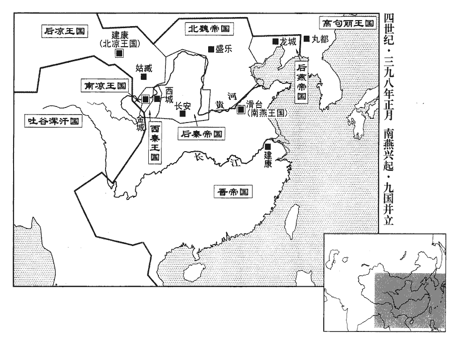
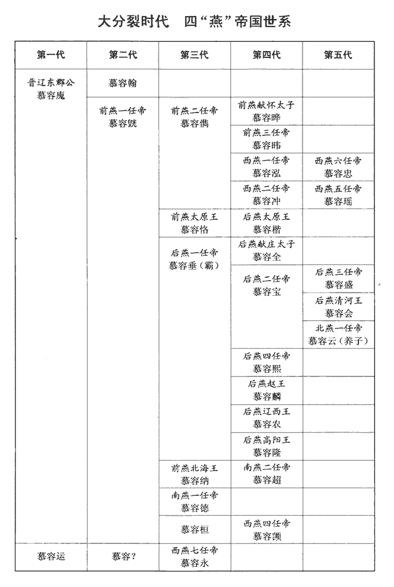
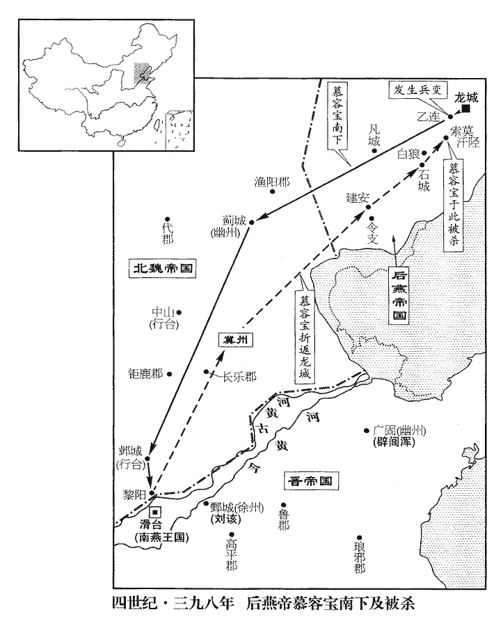
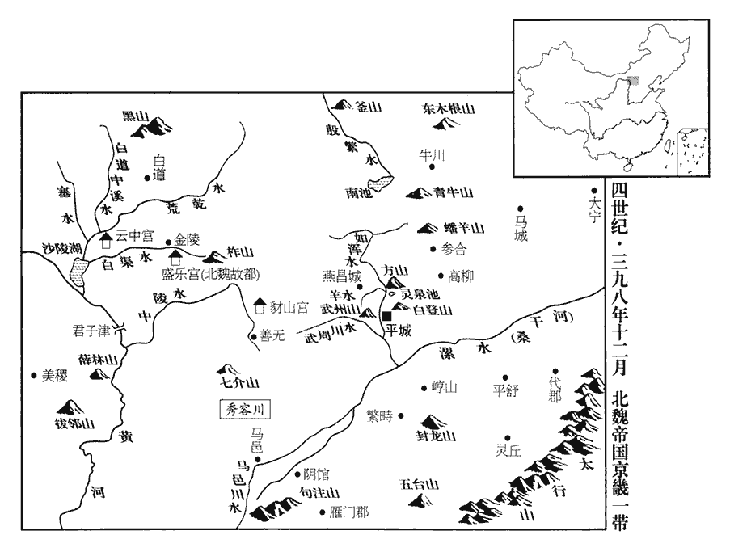

 晉紀三十二著雍閹茂（即戊戌），一年。

# 安皇帝乙

## 隆安二年（戊戌、三九八）

1春，正月，燕范陽王德自鄴‹河北临漳西南邺镇›帥戶四萬南徙滑臺‹河南滑县›帥，讀曰率；下同。魏衛王儀入鄴，收其倉庫，追德至河，弗及。

〖译文〗 [1]春季，正月，后燕范阳王慕容德统率四万户从邺城向南迁移到滑台驻守。北魏卫王拓跋仪进入邺城，收缴了后燕在那里的仓库，又追击慕容德到黄河，没有追上。

趙王麟上尊號於德，上，時掌翻。德用兄垂故事，稱燕王，事見一百五卷孝武太元九年。改永康三年為元年，以統府行帝制，統府者，諸方鎮皆統於燕王府；行帝制者，稱制以行事。置百官。以趙王麟為司空、領尚書令，慕容法為中軍將軍，慕輿拔為尚書左僕射，丁通為右僕射。麟復謀反，德殺之。慕容麟背父叛兄，姦詐反覆，天下其誰能容之！復，扶又翻。

〖译文〗 后燕赵王慕容麟领头向慕容德奉上尊号，拥推他称帝，慕容德仿效他哥哥慕容垂过去的做法，称自己为燕王，把后燕永康三年改为燕王元年，把原来范阳王府的建制改变为帝王建制，设置了文武百官。慕容德任命赵王慕容麟为司空、领尚书令，慕容法为中军将军，慕舆拔为尚左仆射，丁通为右仆射。慕容麟再一次阴谋反叛，慕容德把他杀了。

 

 

2庚子‹七›，魏王珪‹时年二十八›自中山‹河北定州›南巡至高邑‹河北柏乡北›，得王永之子憲，喜曰：「王景略之孫也。」以為本州中正，王猛，青州北海劇縣‹山东昌乐›人。太康中，分劇屬東莞郡，晉東莞屬徐州。晉書載記以北海劇縣書之，蓋猛自占漢郡縣也。然家于魏郡而隱於華陰，由是歸秦。其子永鎮幽州，從苻丕戰死於襄陵，故憲流寓高邑。今魏以為本州中正，則未得青、徐，蓋使之銓敘東夏人士耳。領選曹事，兼掌門下。選曹，吏部尚書之職；門下，侍中、常侍、給事黃門之職。選，須絹翻。至鄴，置行臺，鄭樵曰：行臺自魏、晉有之，晉文王討諸葛誕，散騎常侍裴秀、尚書僕射陳泰以行臺從。東海王越帥眾屯許昌，以行臺自隨。後魏謂之尚書大行臺，別置官屬。以龍驤將軍日南公和跋為尚書，與左丞賈彝帥吏兵五千人鎮鄴。自漢光武委任尚書，事歸臺閣，謂尚書省曰尚書臺。晉惠帝西遷長安，置留臺於洛陽，主留事，於是有留臺之名。至拓跋氏置行臺，隨其所置，掌一道之事。魏書官氏志：內入諸姓有素和氏，後改為和氏。驤，思將翻。

〖译文〗 [2]庚子（初七），魏王拓跋从中山出发向南巡视，来到高邑，寻访到原来前秦左丞相王永的儿子王宪，非常高兴地说：“你是王景略的孙子！”于是，马上任命他做本州的中正，兼选曹事，主持门下事务。拓跋来到邺城，在那里设置了行台，任命龙骧将军日南公和跋为尚书，与左丞贾彝统率吏兵五千人镇守在邺城。

珪自鄴還中山，將北歸，發卒萬人治直道，治，直之翻。自望都‹河北望都西北›鑿恆嶺‹河北曲阳北›至代‹河北蔚县›五百餘里。恆嶺，恆山之嶺也，在上曲陽西北，即倒馬關路，晉書地道記謂之鴻上關。沈括曰：北岳恆山，今謂之大茂山者是也。岳祠舊在山下，石晉之後，稍遷近里，今其地謂之神棚。今祠乃在曲陽，祠北有望岳亭，新晴氣清，則望見大茂。飛狐路在大茂之西，自銀冶寨北出倒馬關，卻自石門子、令水鋪，入缾píng形、梅回兩寨之間，至代州。然沈括所謂代州，乃鴈門也。自此亦可至魏之代都，但恐非直道耳。水經註：祁夷水出平舒縣東，東北流逕蘭亭南，又東北逕石門關北，舊道出中山故關也。魏土地記：代城西九里有平舒城。此則古代城也。恆，戶登翻。珪恐己既去，山東‹太行山以东›有變，復置行臺於中山‹河北定州›，復，扶又翻。命衛王儀鎮之；以撫軍大將軍略陽公遵為尚書左僕射，鎮勃海‹河北南皮›之合口‹河北沧州西›。

〖译文〗 拓跋从邺城回到中山，将要回北方，调拨士卒一万人开辟一条直达的大道，从望都起开凿恒岭，一直到代郡，全长达五百多里。拓跋担心自己回去之后，山东一带又会发生变乱，因此又在中山设置了一座行台，命令卫王拓跋仪在这里镇守，又任命抚军大将略阳公拓跋遵为尚书左仆射，镇守勃海的合口。

右將軍尹國，督租于冀州，聞珪將北還，謀襲信都‹河北冀县›；安南將軍長孫嵩執國，斬之。長，知兩翻。

〖译文〗 右将军尹国在冀州一带监督人民缴纳粮租，听到拓跋将要北返，准备袭击信都。北魏安南将军长孙嵩抓获尹国，并把他斩首。

3燕啟倫還至龍城‹辽宁朝阳›，去年寶遣啟崙南觀形勢。「倫」，當作「崙」，音盧昆翻。言中山已陷；燕主寶命罷兵。遼西王農言於寶曰：「今遷都尚新，未可南征，宜因成師襲庫莫奚，取其牛馬以充軍資，更審虛實，俟明年而議之。」寶從之。己未‹二十六›，北行。庚申‹二十七›，渡澆洛水‹内蒙沙拉木伦河›，澆洛水，蓋即饒樂水也。賢曰：水在今營州北。唐太宗時，奚內附，置饒樂都督府。會南燕王德遣侍郎李延詣寶，言「涉珪西上，西上，謂自中山取恆嶺而西歸雲、代也。上，時掌翻。中國空虛。」延追寶及之，寶大喜，即日引還。

〖译文〗 [3]后燕启伦回到龙城，说中山已经被攻陷，后燕国主慕容宝命令部队停止行动。辽西王慕容农对慕容宝说：“现在从中山迁回龙城，时间还太短，千万不可发动大军向南出征，应该利用已经准备好的部队进攻库莫奚部落，夺取他们的牛马来充实我们的军备物资，然后再了解情况，等到明年再来商议出兵南征的事。”慕容宝听从了他的劝告。己未（二十六日），调动部队向北进发。庚申（二十七日），渡过浇洛水，正好南燕王慕容德派遣侍郎李延拜见慕容宝，追到这里说：“拓跋取路向西，中部地区非常空虚。”慕容宝闻听此言，大喜，当天就带着大军回来了。

4辛酉‹二十八›，魏王珪發中山，徙山東六州吏民雜夷十餘萬口以實代。此漢高帝徙關東豪傑以實關中之策也。博陵‹河北安平›、勃海‹河北南皮›、章武‹河北大城›群盜並起，漢時，章武城屬勃海平舒縣界；晉武帝泰始元年，置章武國，後為郡；隋廢，屬瀛州，入平舒縣。略陽公遵等討平之。

〖译文〗 [4]辛酉（二十八日），魏王拓跋从中山出发，迁移原在山东居住的六州居民、官吏以及一些杂居的夷人十多万，充实代郡的人口。博陵、勃海、章武等地的成群盗匪纷纷起事，略阳公拓跋遵等人将他们讨灭平定。

廣川‹河北枣强东北›太守賀賴盧，性豪健，廣川縣，前漢屬信都國，後漢屬清河郡，晉屬勃海郡，後分為廣川郡。守，式又翻。恥居冀州刺史王輔之下，襲輔，殺之，驅勒守兵，掠陽平‹河北馆陶›、頓丘‹河南清丰西南›諸郡，南渡河，奔南燕‹都滑台，河南滑县›。南燕王德以賴盧為并州刺史，封廣寧王。

〖译文〗 广川太守贺赖卢，性情粗豪强健，认为自己屈居在冀州刺史王辅之下是莫大的耻辱，于是，袭击王辅，并把他杀了，然后驱使勒逼冀州守兵，一路洗掠阳平、顿丘各郡，向南渡过黄河，投奔了南燕。南燕王慕容德任命贺赖卢为并州刺史，封为广宁王。

5西秦王乾歸遣乞伏益州攻涼支陽‹甘肃永登南›、鸇zhān武‹甘肃兰州郊外›、允吾‹甘肃永靖西北›三城，克之；支陽、允吾，皆漢古縣，屬金城郡；鸇武城當在二縣之間。張寔分支陽屬廣武郡；允吾蓋仍為金城郡治所。劉昫曰：唐蘭州廣武縣，漢枝陽縣；鄯州龍支縣，漢允吾縣。允吾，音鉛牙。虜萬餘人而去。

〖译文〗 [5]西秦王乞伏乾归派遣乞伏益州进攻后凉的支阳、武、允吾三座城池，并且全部攻克，俘虏了一万多人而离去。

6燕主寶還龍城宮，詔諸軍就頓，頓者，軍行頓舍之地。不聽罷散，文武將士皆以家屬隨駕。駕，謂車駕，猶漢人言乘輿也。遼西王農、長樂王盛切諫，樂，音洛。以為兵疲力弱，魏新得志，未可與敵，宜且養兵觀釁。寶將從之，撫軍將軍慕輿騰曰：「百姓可與樂成，難與圖始。用商鞅語意。樂，音洛。今師眾已集，宜獨決聖心，乘機進取，不宜廣采異同以沮大計。」沮，在呂翻。寶乃曰：「吾計決矣，敢諫者斬！」二月，乙亥‹十三›，寶出就頓，留盛統後事。己卯‹十七›，燕軍發龍城，慕輿騰為前軍，司空農為中軍，寶為後軍，相去各一頓，觀下文連營百里，蓋三十里為一頓。連營百里。

〖译文〗 [6]后燕国主慕容宝回到龙城寝宫，诏令各路大军回到兵营集结，不许解散，文武官员和将士全部携带家属跟随御驾。辽西王慕容农、长乐王慕容盛再三恳切劝阻，觉得国家军队疲惫、力量薄弱，而北魏则是刚刚获得胜利，万万不可与它对敌；应该暂且将养修整军队静观时机。慕容宝刚要打算接受他们的劝谏，抚军将军慕舆腾说：“老百姓是只可以与他们享乐成功后的快慰，很难和我们一起图谋大业的创始。现在各路大军的兵众已经集结完毕，您应该独自下定决心，把握住机会，努力进取，不应该广泛听取相同或者不同的意见，影响甚至破坏国家大计的施行。”慕容宝于是说：“我的计划已经决定，再有人胆敢劝阻，格杀勿论。”二月，乙亥（十三日），慕容宝离开皇宫，进驻兵营，留下慕容盛统管后事。己卯（十七日），后燕军从龙城出发，慕舆腾为前锋，司空慕容农为中军，慕容宝亲自殿后，各军之间相距三十里，全军的兵营前后相连，绵延一百多里。

壬午‹二十›，寶至乙連‹辽宁喀喇沁左翼›，長上段速骨、宋赤眉等因眾心之憚征役，遂作亂。凡衛兵皆更番迭上；長上者，不番代也。唐官制，懷化執戟長上，歸德執戟長上，皆武散階，九品。長上之官尚矣。上，時掌翻。速骨等皆高陽王隆舊隊，共逼隆子高陽王崇為主，殺樂浪威王宙、中牟熙公段誼及宗室諸王。樂浪，音洛琅。河間王熙素與崇善，崇擁佑之，故獨得免。燕主寶將十餘騎奔司空農營，農將出迎，左右抱其腰，止之曰：「宜小清澄，言眾方亂，如水之溷hùn濁；宜少俟其定，如水之清澄，不可輕出也。不可便出。」農引刀將斫之，遂出見寶，又馳信追慕輿騰。癸未‹二十一›，寶、農引兵還趣大營，大營，謂寶營也。討速骨等。農營兵亦厭征役，皆棄仗走，以佚道使民，雖勞不怨；以生道殺民，雖死不怨殺者；違是，鮮有不敗者也。騰營亦潰。寶、農奔還龍城。長樂王盛聞亂，引兵出迎，寶、農僅而得免。

〖译文〗 壬午（二十日），慕容宝军到乙连，长上官段速骨、宋赤眉等人因为许多人心中都害怕征战徭役，于是发动叛乱。段速骨等人都是高阳王慕容隆的老部下，一起强逼慕容隆的儿子、高阳王慕容崇做他们的盟主，杀了乐浪威王慕容宙、中牟熙公段谊以及其他一些宗室亲王。河间王慕容熙平素与慕容崇关系很好，在慕容崇的保护之下，只他幸免于难。后燕国主慕容宝仅带着十几个骑兵逃奔到司空慕容农的大营，慕容农刚要出营去迎接，他左右的侍臣拦腰死死将他抱住，制止他说：“应该等待事态明了一点，现在不可以随便出去。”慕容农拔出佩刀要砍他们，于是出营迎见慕容宝，又赶紧写信让人火速给慕舆腾送去。癸未（二十一日），慕容宝、慕容农率兵回击兵变的大营，讨伐段速骨等人。慕容农手下的士兵也厌倦征伐打仗，都扔下武器纷纷逃走。慕舆腾的大营也溃乱了。慕容宝与慕容农逃回龙城。长乐王慕容盛听说发生叛乱，赶忙出城迎接，慕容宝与慕容农才得免一死。

7會稽王道子忌王、殷之逼，會，工外翻。以譙王尚之及弟休之有才略，引為腹心，尚之說道子曰：「今方鎮強盛，宰相權輕，宜密樹腹心於外以自藩衛。」道子從之，以其司馬王愉為江州刺史，都督江州及豫州之四郡軍事，用為形援，日夜與尚之謀議，以伺四方之隙。為庾楷說王、殷復舉兵張本。說，輸芮翻。伺，相吏翻。

〖译文〗 [7]东晋会稽王司马道子忌恨王恭、殷仲堪对他形成的威逼，因为谯王司马尚之和他的弟弟司马休之有雄才大略，便把他们二人当做心腹。司马尚之劝司马道子说：“现在的局面是，在外方镇守的封疆大吏势力强盛，在朝中的宰相，权力反倒很微弱，您应该在外地的要职上安排心腹之人，以便为自己设置屏障和卫护势力。”司马道子依从了他的计策，任命其司马王愉为江州刺史，都督江州及豫州之四郡军事，以此作为自己的呼应和援手。他从早到晚地与司马尚之谋划商量，等待四方出现什么空隙和机会。

8魏王珪如繁畤宮‹山西浑源西南›，繁畤縣，屬鴈門郡，魏築宮於此。天平初，置繁畤郡，隋復為縣，唐屬代州。畤zhì，音止。給新徙民田及牛。

〖译文〗 [8]魏王拓跋回到繁自己的宫里，给那些新迁移来的百姓分发田地及耕牛。

珪畋於白登山‹山西大同东›，酈道元曰：今平城東十七里有臺，即白登臺，臺南對岡阜，即白登山。見熊將數子，師古曰：將，謂率領也，讀如字。謂冠軍將軍于栗磾曰：冠，古玩翻。磾，丁奚翻。「卿名勇健，能搏此乎?」對曰：「獸賤人貴，若搏而不勝，豈不虛斃一壯士乎！」乃驅致珪前，盡射而獲之。射，而亦翻。珪顧謝之。

〖译文〗 拓跋在白登山打猎，看见一只熊带着几个小熊崽儿，便对冠军将军于栗说：“你以勇猛劲健著名，能捉住它们吗？”于栗回答说：“兽贱人贵，我如果和它们对搏，而不能取胜，岂不是白白地断送了一个壮士吗！”于是他把几只熊全部驱赶到拓跋的面前，又将它们全部射倒并且抓获。拓跋回望于栗，表示歉意。

秀容川‹山西朔州›酋長爾朱羽健從珪攻晉陽‹山西太原›、中山‹河北定州›有功，拜散騎常侍，環其所居，割地三百里以封之。此北秀容也。為爾朱榮亂魏張本。爾朱榮傳云：羽健之先，世為部落酋帥，居爾朱川，因氏焉。珪初以南秀容川原衍沃，欲令居之。羽健曰：「家世奉國，給侍左右。北秀容既在剗chǎn內，差近京師，豈以沃塉jí更遷遠地！」珪許之。則北秀容蓋近平城也。環，音宦。酋，慈由翻。長，知兩翻。散，悉亶翻。騎，奇寄翻；下同。

〖译文〗 秀容川部落的酋长尔朱羽健，随同拓跋攻取晋阳、中山有功，被任命为散骑常侍。围绕着他所居住的地方，封给他方圆三百里的一块地域。

柔然‹瀚海沙漠群›數侵魏邊，數，所角翻。尚書中兵郎李先請擊之；珪從之，大破柔然而還。還，從宣翻，又如字。

〖译文〗 柔然部落几次侵犯北魏的边境，尚书中兵郎李先请求回击他们，拓跋批准了他的请求。李先带兵将柔然部落打得大败，然后回师。

9楊軌以其司馬郭緯為西平相，帥步騎二萬北赴郭黁nún。禿髮烏孤遣其弟車騎將軍傉檀帥騎一萬助軌。緯，于季翻。相，息亮翻。帥，讀曰率。黁，奴昆翻。傉nù，奴沃翻。軌至姑臧‹甘肃武威›，營于城北。

〖译文〗 [9]杨轨任命他的司马郭纬为西平相，并率领步、骑兵二万人向北开进增援郭。秃发乌孤派他的弟弟车骑将军秃发檀带领骑兵一万人帮助杨轨。杨轨的部队抵达姑臧，在城北扎下大营。

10燕尚書頓丘王蘭汗陰與段速骨等通謀，引兵營龍城之東；城中留守兵至少，汗，音寒。少，詩沼翻。長樂王盛徙內近城之民，得丁夫萬餘，乘城以禦之。速骨等同謀纔百餘人，餘皆為所驅脅，莫有鬬志。三月，甲午‹二›，速骨等將攻城，遼西桓烈王農恐不能守，且為蘭汗所誘，夜，潛出赴之，冀以自全。農號為有智略，乃欲投段速骨以自全，不知適以速死，殆天奪之鑒也。明旦，速骨等攻城，城上拒戰甚力，速骨之眾死者以百數。速骨乃將農循城，將，如字，引也，挾也。農素有忠節威名，城中之眾恃以為強，忽見在城下，無不驚愕喪氣，喪，息浪翻。遂皆逃潰。速骨入城，縱兵殺掠，死者狼籍。寶、盛與慕輿騰、餘崇、張真、李旱、趙恩等輕騎南走。速骨幽農於殿內。長上阿交羅，速骨之謀主也，騎，奇寄翻。上，時掌翻。以高陽王崇幼弱，更欲立農。崇親信鬷讓、出力犍等聞之，鬷zōng，祖紅翻。春秋左氏傳有鬷蔑，晉有鬷戾。姓譜：鬷姓，古鬷夷氏之後。犍，居言翻。丁酉‹五›，殺羅及農。使速骨果立農，亦必同死於蘭汗之手，蓋事勢已去，智無所施也。速骨即為之誅讓等。為，于偽翻。農故吏左衛將軍宇文拔亡奔遼西‹河北卢龙›。

〖译文〗 [10]后燕尚书、顿丘王兰汗暗地里与段速骨等人勾通联系，带兵驻扎在龙城的东面。龙城之内留守的兵力非常少，长乐王慕容盛便把城附近的居民迁到城中，一共遴选出壮丁勇士一万多人，让他们登上城墙，抵御叛军的攻打。段速骨的同谋只有一百多人，其他大部分都是被驱使胁迫而来的，丝毫没有斗志。三月，甲午（初二），段速骨等人即将攻城，辽西桓烈王慕容农恐怕城池守不住，同时又被兰汗等人劝诱，当夜，私自出城投奔段速骨，希望以此保全自己的性命。第二天早晨，段速骨带兵攻城，但城上的抵抗非常顽强，段速骨一方死了几百人。段速骨于是便挟持慕容农围绕城池循游一周。慕容农历来有诚实忠君、守节不屈的威名，城中那些人正是仗恃着他的威仪才拼死作战，忽然看见他在城下，没有人不惊愕丧气，于是兵众们也都四散溃逃。段速骨进入龙城，任他的部队烧杀抢掠，死人尸首横陈遍地。慕容宝、慕容盛与慕舆腾、馀崇、张真、李旱、赵恩等人轻装简从，骑马向南逃走。段速骨把慕容农幽禁在殿内，长上阿交罗是段速骨的主要智囊，他觉得高阳王慕容崇年小体弱，所以打算另行拥立慕容农作首领。慕容崇的亲信让、出力犍等人听到了这个消息，丁酉（初五），杀死了阿交罗与慕容农。段速骨因此立即杀了让等人。慕容农原来的部下左卫将军宇文拔逃出，投奔辽西。

庚子‹八›，蘭汗襲擊速骨，并其黨，盡殺之。廢崇，奉太子策，承制大赦，遣使迎寶，及於薊城‹北京›。使，疏吏翻。薊，音計。寶欲還，長樂王盛等皆曰：「汗之忠詐未可知，今單騎赴之，萬一汗有異志，悔之無及。不如南就范陽王，合眾以取冀州；若其不捷，收南方之眾，徐歸龍都，亦未晚也。」寶從之。龍城，燕故都，故謂之龍都。慕容盛智慮逾其父遠矣。

〖译文〗 庚子（初八），兰汗发动大军袭击段速骨，连同他的党羽，全部杀掉。然后废黜了慕容崇，奉立太子慕容策，代行皇帝的权力实行大赦，并派遣使节前往迎接慕容宝，在蓟城追赶上了慕容宝等人。慕容宝打算回去，长乐王慕容盛等人都说：“兰汗是忠心相迎，还是藏奸使诈，现在都还不清楚，您如果单人匹马投奔他，万一兰汗居心不良，后悔也都来不及了。您不如向南去到范阳王那里去，集合起所有的兵力，去夺取冀州。即便不能获胜，把南方的兵力收编过来，再慢慢地回师龙城，也不算晚。”慕容宝听从了他们的劝告。

11離石‹山西离石›胡帥呼延鐵、西河‹府离石›胡帥張崇等不樂徙代‹河北蔚县›帥，所類翻。樂，音洛。聚眾叛魏，魏安遠將軍庾岳討平之。

〖译文〗 [11]北魏离石胡人部落的首领呼延铁、西河胡人部落首领张崇等，不愿意迁移到代郡，就聚集一起叛变北魏。北魏安远将军庾岳把他们讨平。

12魏王珪召衛王儀入輔，以略陽公遵代鎮中山。夏，四月，壬戌‹一›，以征虜將軍穆崇為太尉，安南將軍長孫嵩為司徒。

〖译文〗 [12]魏王拓跋征召卫王拓跋仪到朝中辅佐自己，任命略阳公拓跋遵代替拓跋仪镇守中山。夏季，四月，壬戌（初一），拓跋任命征虏将军穆崇为太尉，安南将军长孙嵩为司徒。

13燕主寶從間道過鄴，間，古莧翻。鄴人請留，寶不許。南至黎陽‹河南浚县›，伏於河西，河水自遮害亭屈而東北流，過黎陽縣南，河之西岸為黎陽界，東岸為滑臺界。遣中黃門令趙思告北地王鍾曰：「上以二月得丞相表，寶以德為司徒，故稱之為丞相。即時南征，至乙連‹辽宁喀喇沁左翼›，會長上作亂，失據來此。人主所據者，勢也，眾叛親離，大勢已去，失所據矣。王亟白丞相奉迎！」鍾，德之從弟也，首勸德稱尊號，聞而惡之，執思付獄，從，才用翻。惡，烏路翻。以狀白南燕王德。德謂群下曰：「卿等以社稷大計，勸吾攝政；吾亦以嗣帝播越，播，逋也，遷也。越，遠也，走也。民神乏主，故權順群議以繫眾心。今天方悔禍，嗣帝得還，吾將具法駕奉迎，謝罪行闕，何如?」天子行幸所至有行宮，宮前闕門，謂之行闕。黃門侍郎張華曰：「今天下大亂，非雄才無以寧濟群生。嗣帝闇懦，不能紹隆先統。陛下若蹈匹夫之節，捨天授之業，威權一去，身首不保，況社稷其得血食乎！」慕輿護曰：「嗣帝不達時宜，委棄國都，寶棄中山，見上卷上年。自取敗亡，不堪多難，難，乃旦翻。亦已明矣。昔蒯聵出奔，衛輒不納，春秋是之。蒯kuǎi，苦怪翻。聵kuì，五怪翻。以子拒父猶可，況以父拒子乎！德於寶為叔父。今趙思之言，未明虛實，臣請為陛下馳往詗之。」為，于偽翻。詗xiòng，火迥翻，又翾xuān正翻。候俟也。刺探也。德流涕遣之。流涕遣護，將使之殺寶也。

〖译文〗 [13]后燕国主慕容宝抄小道经过邺城附近，邺城的人们请求他留下，慕容宝没答应。他继续南行到黎阳，躲藏在黄河的西岸，派遣中黄门令赵思通知北地王慕容钟说：“皇上在二月的时候得到了丞相所上的奏章，当时便马上向南进军，达到乙连时，赶上长上等人发动兵变，失势以后来到此地。请您快些去禀告丞相，前来迎接！”慕容钟是慕容德的堂弟，曾经第一个劝说慕容德面南称帝，他听了赵思的话，十分厌恶，于是把赵思抓了起来，投入监狱，并把以上情况禀报给了南燕王慕容德。慕容德对大臣们说：“你们大家出于对国家政权危亡大局的考虑，对说我出面代理朝政；我当时也因为继任的皇帝流亡到了很远的地方，这里的民众与神灵，都缺乏一个主心骨，因此便暂且依从了大家的建议，希望能把民心维系在一起。现在，老天刚刚后悔为我们降下灾祸，继任的皇帝得以回来，我准备备办专门的仪仗队伍奉迎皇帝，并到他行宫去请求责罚，你们看怎么样？”黄门侍郎张华说：“现在天下大乱，不是盖世英雄便无法使众生得到安宁。继任的皇帝昏庸懦弱，不能很好地继承先辈的传统。陛下如果偏要恪守一个无知小人的所谓节操，而舍弃上天交授给您拯救苍生的大业，您的威望权势一旦丧失，自己的性命安全便得不到保障，更何况大燕的江山社稷又无法得到捍卫和巩固！”慕舆护接着说：“继位的皇帝不通达时务，放弃了国都中山，自取败亡，他不可能承受太多的危难，已经是很明了的情况了。当初卫蒯聩出逃在外，他的儿子卫辄执掌政权后便拒绝他回国，《春秋》都肯定了他的做法。以儿子的身分抗拒父亲都还可以，更何况以叔父的身分来抗拒侄儿呢？现在赵思的话不知道是真是假，我请求陛下准许我前去探听一下真实情况。”慕容德忍不住流下泪来，派慕舆护去了。

護帥壯士數百人帥，讀曰率；下同。隨思而北，聲言迎衛，其實圖之。寶既遣思詣鍾，於後得樵者，言德已稱制，懼而北走。護至，無所見，執思以還。還，從宣翻，又如字。德以思練習典故，欲留而用之；思曰：「犬馬猶知戀主，思雖刑臣，乞還就上。」宦者，謂之刑臣。上，謂寶也。德固留之，思怒曰：「周室東遷，晉、鄭是依。周平王東遷洛邑，晉文侯‹姬仇›、鄭武‹姬掘突›寔定王室，故周桓公曰：「我周之東遷，晉、鄭焉依。」殿下親則叔父，位為上公，不能帥先群后以匡帝室，而幸本根之傾，為趙王倫之事，事見八十九卷惠帝永寧元年。言趙王倫以宗室而篡晉，德所為類之。倫於惠帝，叔祖也；德於寶，叔父也。帥，讀曰率。思雖不能如申包胥之存楚，吳破楚入郢，申包胥乞師於秦，遂破吳師，楚昭王復國。猶慕龔君賓不偷生於莽世也！」龔勝，字君賓，事見三十七卷王莽始建國三年。德斬之。

〖译文〗 慕舆护带领着几百名精壮的兵勇，跟随着赵思向北走去，口头上说要去迎接护卫皇上，其实却是要趁机将慕容宝置之死地。慕容宝派遣赵思去拜见慕容钟去之后，又遇到一个砍柴的人，说慕容德已经称帝，因此非常害怕，便返身向北逃去。慕舆护带人来到这里，什么也没看见。慕舆护把赵思押解回去。慕容德因为赵思对朝廷的典章礼仪等事项熟悉老练，所以打算留用他。赵思说：“狗马都还知道留恋主人，我赵思虽然是一个受了宫刑的人臣，但还是想请求您允许我回去追随皇上。”慕容德再三坚持让他留下，赵思大怒说：“当年周朝东迁，所依靠的是晋国和郑国。现在殿下论亲属是皇上的叔父，论地位则是三公之一。但您却不能带头召集王公匡扶帝室，反而庆幸国家的根基倾覆，做出晋朝赵王司马伦那样以宗室的身分篡晋的事来。我虽然不能像申包胥向秦国借兵打败吴国最终保全了楚国，但是也还仰慕汉代龚君宾的节操，绝不在王莽当权的世上偷生！”慕容德把他杀了。

 

寶遣扶風忠公慕輿騰與長樂王盛收兵冀州，盛以騰素暴橫，為民所怨，乃殺之，行至鉅鹿‹河北宁晋西南›、長樂‹河北冀县›，說諸豪傑，橫，戶孟翻。樂，音洛。說，輸芮翻。皆願起兵奉寶。寶以蘭汗祀燕宗廟，所為似順，意欲還龍城，不肯留冀州，乃北行；至建安‹河北迁安北›，建安城在令支之北，乙連之南。抵民張曹家。曹素武健，請為寶合眾；為，于偽翻。盛亦勸寶宜且駐留，察汗情狀。寶乃遣冗從僕射李旱先往見汗，冗，而隴翻。從，才用翻。寶留頓石城‹辽宁建昌西›。石城縣，前漢屬右北平郡，後漢、晉省縣，屬建德郡，隋、唐併入營州柳城縣界。宋白曰：石城縣取碣石立如城以名之。會汗遣左將軍蘇超奉迎，陳汗忠款。寶以汗燕王垂之舅，盛之妃父也，謂必無他，不待旱返，遂行。盛流涕固諫，寶不聽，留盛在後，盛與將軍張真下道避匿。

〖译文〗 慕容宝派遣扶风忠公慕舆腾与长乐王慕容盛一起在冀州一带收容失散的残兵败将。慕容盛因为慕舆腾一向残暴横蛮，遭到百姓的普遍怨恨，于是把他杀了。慕容盛寻行到钜鹿、长乐等地，游说各豪俊英杰，这些人都愿意拉起部队拥护慕容宝。慕容宝因为兰汗祭祀燕室宗庙，像是忠顺于自己，便执意要回到龙城，不肯长在冀州停留，于是向北行进。抵达建安，住在居民张曹家里。张曹为人向来勇武豪健，他请求为慕容宝招募兵众。慕容盛也劝慕容宝暂且留驻在此，观察兰汗的真实想法和动向。慕容宝派遣冗从仆射李旱先去龙城见兰汗，自己则留在石城休整。正在这时，兰汗派遣左将军苏超前来奉迎皇上，反复陈说兰汗对慕容宝的忠心与诚意。慕容宝因为兰汗是父王慕容垂的舅父，又是慕容盛的岳丈，觉得他一定不会另有图谋，不等李旱返回，即刻启程。慕容盛流着泪坚决劝阻，慕容宝不听，便把慕容盛留下。慕容盛与将军张真离开大路，跑到别的地方躲藏起来。

丁亥‹二十六›，寶至索莫汗陘，索，昔各翻。汗，音寒。陘，音刑。去龍城‹辽宁朝阳›四十里，城中皆喜。汗惶怖，欲自出請罪，怖，普布翻。兄弟共諫止之。汗乃遣弟加難帥五百騎出迎；又遣兄堤閉門止仗，禁人出入。城中皆知其將為變，而無如之何。加難見寶於陘北，拜謁已，已者，拜謁之禮畢。從寶俱進。潁陰烈公餘崇密言於寶曰：「觀加難形色，禍變甚逼，宜留三思，柰何徑前！」寶不從。行數里，加難先執崇，崇大呼罵曰：「汝家幸緣肺附，呼，火故翻。師古曰：肺附，謂親戚也。舊解云。肺附，如肺腑之相附著。一說；肺，斫木札也。喻其輕薄附著大材也。蒙國寵榮，覆宗不足以報。今乃敢謀篡逆，此天地所不容，計旦暮即屠滅，但恨我不得手膾汝曹耳！」膾kuài，細切肉也。加難殺之。引寶入龍城外邸，弒之。年四十四。汗諡寶曰靈帝；殺獻哀太子策及王公卿士百餘人；自稱大都督、大將軍、大單于、昌黎王，單，音蟬。改元青龍；以堤為太尉，加難為車騎將軍，封河間王熙為遼東公，如杞、宋故事。周武王封夏之後於杞，殷之後於宋。

〖译文〗 丁亥（二十六日），慕容宝来到索莫汗陉，距离龙城还有四十里路。城中的军民听到这个消息，都很高兴。兰汗却有些惶恐惧怕，打算自己出城去请罪，他的兄弟们一起把他劝住了。兰汗于是派他的弟弟兰加难率领着五百名骑兵出城相迎，又派他的哥哥兰堤关闭城门，禁止携带武器，不许行人出入。城中的人都知道兰汗他们将要发动兵变，但是却也无可奈何。兰加难在索莫汗陉北面见到了慕容宝，行完拜谒之礼，便跟随慕容宝一起向城走去。颖阴烈公馀崇寻找机会向慕容宝暗中警告说：“我看兰加难的神色与举动，大祸与突变的迹象已经迫在眉睫，陛下应该三思而后行，怎么能这样轻率上前呢！”慕容宝不听劝告。走了几里路，兰加难首先抓住了馀崇。馀崇大声叫喊着骂道：“你们兰家侥幸地成为燕朝宗室的亲属，蒙受国家的宠信与殊荣，纵使是使家族倾覆，也无法报答这种恩德。今天竟敢阴谋篡权叛逆，这是天地所不容的，我看你们早晚就要被消灭，只恨我不能亲手宰了你们这帮家伙！”兰加难把他杀了。他又把慕容宝带入龙城郊外的宅邸杀了。兰汗追谥慕容宝为灵帝，然后又杀掉了献安太子慕容策以及其他的王公贵族和官员一百多人。他又自称大都督、大将军、大单于、昌黎王，改年号为青龙；任命兰堤为太尉，兰加难为车骑将军，封河间王慕容熙为辽东公，就像周武王封夏朝的后代为杞国君主、封商朝的后代为宋国君主一样。

長樂王盛聞之，馳欲赴哀；張真止之。盛曰：「我今以窮歸汗，汗性愚淺，必念婚姻，不忍殺我，旬月之間，足以展吾情志。」遂往見汗。汗妻乙氏及盛妃皆泣涕請盛於汗，盛妃復頓頭於諸兄弟。復，扶又翻。汗惻然哀之，乃舍盛於宮中，以為侍中、左光祿大夫，親待如舊。堤、加難屢請殺盛，汗不從。堤驕很荒淫，很，戶墾翻。事汗多無禮，盛因而間之。間，古莧翻。由是汗兄弟浸相嫌忌。為盛誅汗張本。

〖译文〗 长乐王慕容盛听说后打算跑去奔丧，被张真劝止。慕容盛说：“我现在因为走投无路而归附兰汗，兰汗的性情愚鲁浅薄，一定会感念我与他女儿的婚姻情分，不忍心杀我，这样，只要给我十天至一个月的时间，就足以使我的志愿得到实现。”于是，他跑到龙城去晋见兰汗。兰汗的妻子乙氏和做慕容盛妃子的兰汗的女儿，都哭哭啼啼地向兰汗请求留下慕容盛一命，慕容盛的兰妃又依次向兰汗的那些兄弟叩头求情。兰汗也起了恻隐之心，于是便把慕容盛接到宫中居住，任命他为侍中、左光禄大夫，对他关怀厚待与过去一样。兰堤、兰加难等人几次请求杀掉慕容盛，兰汗都没有准许。兰堤骄横凶狠，荒淫无度，对待兰汗也多有失礼的地方，慕容盛借此机会从中挑拨离间，从此，兰汗兄弟之间慢慢地互相怀疑猜忌起来。

14涼太原公纂將兵擊楊軌，郭黁nún救之，纂敗還。

〖译文〗 [14]后凉太原公吕纂带兵进攻杨轨，郭赶来相救，吕纂失败而归。

15段業使沮渠蒙遜攻西郡‹甘肃永昌西北›，郡在武威西，據嶺之要，蒙遜得之，故晉昌、敦煌皆降。沮，子余翻。執太守呂純以歸。純，光之弟子也。於是晉昌‹甘肃安西›太守王德、敦煌‹甘肃敦煌›太守趙郡‹河北高邑›孟敏皆以郡降業。敦，徒門翻。降，戶江翻。業封蒙遜為臨池侯，以德為酒泉‹甘肃酒泉›太守，敏為沙州‹府敦煌›刺史。

〖译文〗 [15]北凉段业派沮渠蒙逊进攻西郡，俘获太守吕纯后回师。吕纯是吕光的侄儿。从此，晋昌太守王德、敦煌太守赵郡人孟敏都献出本郡，投降了段业。段业封沮渠蒙逊为临池侯，任命王德为酒泉太守，孟敏为沙州刺史。

16六月，丙子‹十六›，魏王珪命群臣議國號。皆曰：「周、秦以前，皆自諸侯升為天子，因以其國為天下號。漢氏以來，皆無尺土之資。我國家百世相承，開基代‹河北蔚县›北，遂撫有方夏，據孔安國尚書註，方夏，謂四方中夏。夏，戶雅翻。今宜以代為號。」黃門侍郎崔宏曰：「昔商人不常厥居，故兩稱殷、商，契始封於商。皇甫謐曰：今上洛商是也。契孫相土居商丘。自契至于成湯，八遷，湯始居亳‹河南商丘›，從先王居。後仲丁遷於囂‹河南荥阳›，河亶dǎn甲居相‹河南内黄›，祖乙居耿‹山西河津›。書曰：盤庚五遷，將治亳殷，從先王居。謂從帝嚳所居，居亳也。代雖舊邦，其命維新，登國之初，已更曰魏。事見一百六卷孝武太元十一年。更，工衡翻。夫魏者，大名，神州之上國也，左傳，卜偃曰：「魏，大名也。」戰國之時，魏為大國。中國謂之神州。宜稱魏如故。」珪從之。

〖译文〗 [16]六月，丙子（十六日），魏王拓跋命令大臣们讨论用什么国号。大家都说：“周朝与秦朝以前，天子都是由诸侯中升位的，他们都是用他们原来诸侯国的国号作为天下的国号。汉代以后，夺取天下的人都没有一尺土地作为资本和凭借。我们国家百代以来，子孙相承，在代郡以北的地方开创基业，于是才夺取了中国的大片地方，所以，现在应该用‘代’作我们的国号。”黄门侍郎崔宏说：“过去，商朝政权不长时间地在一个地方，所以，便有殷、商这两种称呼。代郡那一带虽然是个古老的国家，但是我们受到上天的恩宠、接受治理天下的使命却还是新近发生的事，登国初年，已经把国名更改为魏。魏，是一个含有美好伟大之意的名称，也曾经是这片辽阔土地上的一个很强的大国。因此，应该像过去一样称为魏。”拓跋依从了他的意见。

17楊軌自恃其眾，欲與涼王光決戰，郭黁nún每以天道抑止之。言天道未利也，郭黁善數，故如此。黁，奴昆翻。涼常山公弘鎮張掖，段業使沮渠男成及王德攻之；光使太原公纂將兵迎之。將，即亮翻。楊軌曰：「呂弘精兵一萬，若與光合，則姑臧益強，不可取矣。」乃與禿髮利鹿孤共邀擊纂，纂與戰，大破之；軌奔王乞基。王乞基，田胡也。黁性褊biǎn急殘忍，不為士民所附，褊，補典翻。聞軌敗走，降西秦；降，戶江翻。西秦王乾歸以為建忠將軍、散騎常侍。散，悉亶翻。騎，奇寄翻。

〖译文〗 [17]杨轨自己仗恃兵多将广，打算与后凉王吕光决一死战，郭每次都用上天的旨意为借口制止他。后凉常山公吕弘镇守张掖，段业派遣沮渠男成和王德进攻他，吕光也派太原公吕纂带兵迎接吕弘。杨轨说：“吕弘拥有精锐部队一万人，如果他与吕光合兵一处，姑臧的力量便越加强盛，很难取胜了。”于是，他与秃发利鹿孤一起阻击吕纂。吕纂与他们接战，把他们打得大败。杨轨逃走后投奔王乞基。郭生性偏执急躁，非常残忍，不被广大士人、百姓所拥戴归附。他听说杨轨失败逃走，便投降西秦，西秦国主乞伏乾归任命他为建忠将军、散骑常侍。

弘引兵棄張掖東走，段業徙治張掖，治，直之翻。將追擊弘。沮渠蒙遜諫曰：「歸師勿遏，窮寇勿追，孫子之言。此兵家之戒也。」業不從，大敗而還，還，從宣翻。賴蒙遜以免。業城西安‹甘肃山丹西›，以其將臧莫孩為太守。業置西安郡於張掖東境。孩，河開翻。蒙遜曰：「莫孩勇而無謀，知進不知退；此乃為之築冢，非築城也！」為，于偽翻。冢，知隴翻。業不從，莫孩尋為呂纂所破。

〖译文〗 吕弘放弃了张掖，带兵向东撤退。段业便把自己的都城迁到张掖，准备去追击吕弘。沮渠蒙逊劝阻说：“回家心切的部队不要阻截，走投无路的强盗不要追赶，这是兵家之戒呵！”段业不听劝阻，带兵去追，被打得大败而回，幸亏沮渠蒙逊救助，才免于一死。段业修筑了西安城，任命他的部将臧莫孩任太守。沮渠蒙逊说：“臧莫孩虽然勇猛，但却没有谋略，只知道前进，不知道撤退。这正是给他修筑坟冢，哪里是为他修筑城池！”段业又不听，臧莫孩不久便被吕纂打败。

18燕太原王奇，楷之子，蘭汗之外孫也，汗亦不殺，以為征南將軍。得入見長樂王盛，盛潛使奇逃出起兵。奇起兵於建安‹河北迁安北›，眾至數千，汗遣蘭堤討之。盛謂汗曰：「善駒小兒，未能辦此，善駒，奇小字也。豈非有假託其名欲為內應者乎！太尉素驕，難信，不宜委以大眾。」汗以堤為太尉，故稱之。汗然之，罷堤兵，蘇軾有言，「木必先蠹，然後蟲生之；人必先疑，然後讒入之。」蘭汗凶逆，兄弟自相嫌忌，故慕容盛得間之以奮其智，報君父之讎。更遣撫軍將軍仇尼慕將兵討奇。更，工衡翻。

〖译文〗 [18]后燕太原王慕容奇是慕容楷的儿子，兰汗的外孙。兰汗也没杀他，任命他为征南将军。他得以进宫见到长乐王慕容盛。慕容盛暗中让他逃出去拉一支队伍。慕容奇在建安起兵，人数达到几千。兰汗派遣兰堤去讨伐他。慕容盛对兰汗说：“慕容奇不过是一个小孩子，绝对不能办这么大的事情，莫非是有人假托他的名义起兵，然后自己打算做内应吗？太尉兰堤一向骄纵，很难令人相信，不应该把那么多部队交给他。”兰汗觉得他说得很对，免除了兰堤的军权，改派遣抚军将军仇尼慕带兵去讨伐慕容奇。

於是龍城自夏不雨至于秋七月，汗日詣燕諸廟及寶神座頓首禱請，委罪於蘭加難。言弒寶者加難之罪。堤及加難聞之怒，且懼誅，乙巳‹十五›，相與率所部襲仇尼慕軍，敗之。敗，補邁翻。汗大懼，遣太子穆將兵討之。將，即亮翻。穆謂汗曰：「慕容盛我之仇讎，必與奇相表里，此乃腹心之疾，不可養也，宜先除之。」汗欲殺盛，先引見，察之。盛妃知之，密以告盛，盛稱疾不出，蘭妃之為，異於雍姞jí。雖曰婦人內夫家而外父母家，若蘭妃者，處夫妻父子之變，得其一而失其一者也。汗亦止不殺。

〖译文〗 龙城从夏季的这个时候开始，便不曾下雨，一直持续到秋季的七月，兰汗于是每天都去后燕诸庙以及慕容宝的牌位前面叩头、祈祷，把弑君篡权之罪全部推托到兰加难的身上。兰堤与兰加难听说后大怒，而且又害怕遭兰汗诛杀，乙巳（十五日），他们便互相联合率领部队突然向仇尼慕的部队发动袭击，并把仇尼慕打败。兰汗非常害怕，派遣太子兰穆带兵去讨伐。兰穆对兰汗说：“慕容盛是我们的大仇人，一定是他与慕容奇里应外合，这是我们的心腹之患，万万不可再姑息养奸了，应该先行将他除掉。”兰汗打算杀掉慕容盛，便先召他来会见，准备观察他的神色。慕容盛的兰妃知道了这件事，偷偷告诉了慕容盛，慕容盛于是推托有病，没有出去见兰汗，兰汗也就暂时放下了这个想法，没杀慕容盛。

李旱、衛雙、劉忠、張豪、張真，皆盛素所厚也，而穆引以為腹心，旱、雙得出入至盛所，潛與盛結謀。丁未‹十七›，穆擊堤、加難等，破之。庚戌‹二十›，饗將士，汗、穆皆醉，盛夜如廁，因踰垣入于東宮，與旱等共殺穆。時軍未解嚴，皆聚在穆舍，聞盛得出，呼躍爭先，攻汗，斬之。汗子魯公和、陳公揚分屯令支‹河北迁安›、白狼‹辽宁喀喇沁左翼西南›，令，音鈴，又郎定翻。支，音祁。盛遣旱、真襲誅之。堤、加難亡匿，捕得，斬之。於是內外帖然，士女相慶。宇文拔率壯士數百來赴，宇文拔自遼西‹河北卢龙›來也。盛拜拔為大宗正。

〖译文〗 李旱、卫双、刘忠、张豪、张真等人，平素都颇得慕容盛的厚待，而兰穆也把他们作为自己的心腹，使李旱、卫双得以在慕容盛的住所出入，暗下与幕容盛联合起来，做好了谋划。丁未（十七日），兰穆去袭击兰堤、兰加难等人，把他们打败。庚戌（二十日），兰汗大开筵宴，犒赏将士，兰汗、兰穆都喝得大醉。慕容盛半夜出去上厕所，于是跳墙进入东宫，与李旱等人一起杀死了兰穆。这时军队还都没有解除战时状态，将领们还都聚集在兰穆那里。他们听说慕容盛终于得以出来领导他们后，无不欢呼雀跃，争先恐后地去进攻兰汗，并把他杀掉。兰汗的儿子鲁公兰和、陈公兰扬分别驻守在会支、白狼，慕容盛派遣李旱、张真去进攻他们，也将他们斩首。兰堤、兰加难逃走躲藏起来，也把他们抓住，杀了。从此，内外全部平定，男女互相庆贺。宇文拔带领几百名精壮的勇士前来投奔，慕容盛任命他为大宗正。

辛亥‹二十一›，告于太廟，令曰：「賴五祖之休，五祖，謂慕容涉歸、廆、皝、儁、垂，凡五廟。文武之力，宗廟社稷幽而復顯。不獨孤以眇眇之身免不同天之責，禮記曰：父之讎不與共戴天。凡在臣民皆得明目當世。」因大赦，改元建平。盛謙不敢稱尊號，以長樂王攝行統制。盛，字道運，寶之庶長子也。樂，音洛。諸王皆降稱公，以東陽公根為尚書左僕射，衛倫、陽璆qiú、魯恭、王滕【章：十二行本「滕」作「騰」；乙十一行本同。】為尚書，璆，渠尤翻。悅真為侍中，陽哲為中書監，張通為中領軍，自餘文武各復舊位。改諡寶曰惠閔皇帝，廟號烈宗。

〖译文〗 辛亥（二十一日），慕容盛到宗室祭庙去向列祖列宗禀告平定祸乱的经过，然后下令说：“我仰赖五位祖先的洪福和保佑，以及各位文武大臣们的合力相助，使宗庙社稷从被涂炭蒙尘的黑暗中重新得到光明和显赫。不单是我个人缈小的身躯倚仗这件功业免除了报不共戴天的杀父之仇的责任，就是每一个在世的臣民也都可以因此睁开眼睛，理直气壮地做人了。”因此，实行大赦，改年号为建平。慕容盛谦逊推托，不敢称帝登基，只是以长乐王的身份代理朝政，施行统辖。他以下的那些亲王都降格称为“公”，任命东阳公慕容根为尚书左仆射，卫伦、阳、鲁恭、王滕为尚书，悦真为侍中，阳哲为中书监，张通为中领军，其他文武官员也都各自恢复自己的原位。他又把慕容宝的谥号改为惠闵皇帝，庙号烈宗。

初，太原王奇舉兵建安‹河北迁安北›，南、北之人翕然從之。南人，謂自中原來者；北人，則鮮卑也。蘭汗遣其兄子全討奇，奇擊滅之，匹馬不返，進屯乙連‹辽宁喀喇沁左翼›。盛既誅汗，命奇罷兵。奇用丁零嚴生、烏桓王龍之謀，遂不受命，甲寅‹二十四›，勒兵三萬餘人進至橫溝，去龍城十里。盛出擊，大破之，執奇而還，斬其黨與百餘人，賜奇死，桓王之嗣遂絕。慕容恪封太原王，諡曰桓。楚莊王滅若敖氏而赦箴zhēn尹克黃，曰：「子文無後，何以勸善！」以慕容恪之輔成燕業，而可使之絕祀乎！群臣固請上尊號，上，時掌翻。盛弗許。

〖译文〗 当初，太原王慕容奇在建安征召队伍，无论是南方人还是北方人都欣然来随从。兰汗派他的侄儿兰全讨伐慕容奇，慕容奇消灭了兰全，一匹马也没有返回，便进驻乙连。慕容盛诛杀了兰汗之后，命令慕容奇停止用兵。慕容奇听从了丁零人严生和乌桓人王龙的谋划，拒绝接受命令。甲寅（二十四日），他带着三万多人开进到横沟，距离龙城只有十里之遥。慕容盛带兵出城与他交战，将他打得大败，并把慕容奇抓住押回城里，斩杀了他的党羽一百多人，赐慕容奇自杀，桓王慕容恪那一支便最后断绝。众大臣坚持请求慕容盛称帝登基，慕容盛不答应。

19魏王珪遷都平城‹山西大同›，始營宮室，建宗廟，立社稷。宗廟歲五祭，用分、至及臘。魏都平城，置代尹及司州於平城。杜佑曰：後魏都平城，今雲中郡治。雲中縣是今馬邑郡；北平城即今郡，隋為雲內縣恆安鎮。此所謂宗廟，即代都之東廟也。

〖译文〗 [19]魏王拓跋把都城迁到平城，开始营建宫殿，筑造宗庙，以及土神、谷神的祭坛。皇家宗庙每年祭祀五次，时间为春分、夏至、秋分、冬至以及腊日。

20桓玄求為廣州‹两广›，會稽王道子忌玄，會，工外翻。不欲使居荊州‹府江陵，湖北江陵›，因其所欲，以玄為督交•廣二州軍事、廣州刺史；玄受命而不行。豫州‹府历阳，安徽和县›刺史庾楷以道子割其四郡，使王愉督之，上疏言：「江州內地，江州治尋陽‹江西九江›，在江南，故云內地。而西府北帶寇戎，晉以京口‹江苏镇江›為北府，歷陽為西府。豫州治歷陽，在江西，故云北帶寇戎。不應使愉分督。」朝廷不許。楷怒，遣其子鴻說王恭曰：「尚之兄弟謂譙王尚之及弟休之也。說，輸芮翻；下同。復秉機權，復，扶又翻；下同。過於國寶；欲假朝威削弱方鎮，朝，直遙翻。懲艾前事，為禍不測，艾，倪祭翻。今及其謀議未成，宜早圖之。」恭以為然，以告殷仲堪、桓玄。仲堪、玄許之，推恭為盟主，刻期同趣京師。趣，七喻翻。

〖译文〗 [20]东晋桓玄请求任广州刺史。会稽王司马道子非常忌惮桓玄，本来不打算让他长期居住在荆州，便根据他的请求，任命桓玄为督交广二州军事、广州刺史。桓玄接受了这个任命却不去就任。豫州刺史庾楷因为司马道子割除了他所统辖的四个郡交给江州刺史王愉掌管，便上奏疏说：“江州地处内地，而西府历阳却在北方与贼寇相连接，不应该让王愉分管四郡。”朝廷不批准他的意见。庾楷大怒，派遣他的儿子庾鸿去向王恭游说道：“谯王司马尚之兄弟又独揽了朝廷的机要权柄，超过了王国宝。他们打算借助朝廷的威权来削弱地方上的实力，回想以前所发生过的事，他们将制造的祸乱，实在无法预测。现在趁他们的阴谋还没有计划完成，应该尽早地想办法对付他们。”王恭也觉得是这样，把这意见转告了殷仲堪和桓玄。殷仲堪、桓玄同意王恭的意见，并且推举王恭作为盟主，约定日期，一起率领大军前往京师剿除奸佞。

時內外疑阻，津邏嚴急，邏，郎佐翻，巡也。津邏者，凡江津之要皆置邏卒。仲堪以斜絹為書，內箭簳中，簳，古旱翻。字林曰：箭笴gě也。合鏑漆之，鏑dí，箭鏃zú也。因庾楷以送恭。恭發書，絹文角戾，不復能辨仲堪手書，戾，曲也，乖也。斜絹無邊幅，經緯不相持，故斜角乖曲。疑楷詐為之，且謂仲堪去年已違期不赴，事見上卷。今必不動，乃先期舉兵。先，悉薦翻。司馬劉牢之諫曰：「將軍，國之元舅；會稽王，天子叔父也。會稽王又當國秉政，曏為將軍戮其所愛王國寶、王緒，又送王廞xīn書，事見上卷。為，于偽翻。其深伏將軍已多矣。頃所授任，雖未允愜，亦非大失。割庾楷四郡以配王愉，於將軍何損！晉陽‹山西太原›之甲，豈可數興乎！」數，所角翻。恭不從，上表請討王愉、司馬尚之兄弟。

〖译文〗 这时，东晋朝廷内外疑虑纷纷，交通阻塞，水陆关卡林立，形势危急而严峻。殷仲堪用斜纹的绢绸给王恭写了一封书信，藏在箭杆之中，然后装上箭头，涂上油漆，托庾楷转交给王恭，王恭打开信，因为绢的角上抽丝，不再能确切地辨出是殷仲堪的亲笔手书，怀疑此信是庾楷伪造的，况且想到去年讨伐王国宝时，殷仲堪曾经违反期约，按兵不发，这次也一定会同去年一样，因此便先行向都城大举进兵。司马刘牢之劝谏他说：“将军您是皇帝的舅父，会稽王是皇帝的叔父。会稽王现在又正在当朝，掌握着国家的大政，他过去曾经因为您而杀了他非常庞爱的王国宝和王绪，后来又把王写给他的指控您的书信送给了您。畏惧您的表象已经很多。他最近所作的人事任命，虽然不能说是公允恰当，但也不是什么太大的过失。把庾楷所辖的四个郡割让给王愉统领，对于将军又有什么损害呢？晋阳的兵甲战事，怎么可以一次又一次地不断发动呢？”王恭拒不听从，向朝廷呈上奏书，请求发兵讨伐王愉和司马尚之兄弟。

道子使人說楷曰：「昔我與卿，恩如骨肉，楷先黨於王國寶，道子亦親之。帳中之飲，結帶之言，可謂親矣。此必太元二十一年庾楷赴難時事。卿今棄舊交，結新援，忘王恭疇昔陵侮之恥乎！王恭以元舅之親，風神簡貴，志氣方嚴，視庾楷蔑如也，故道子以為陵侮楷。若欲委體而臣之，使恭得志，必以卿為反覆之人，安肯深相親信！首身且不可保，況富貴乎！」楷怒曰：「王恭昔赴山陵，相王憂懼無計，我知事急，尋勒兵而至，恭不敢發。事見一百八卷孝武太元二十一年。去年之事，我亦俟命而動。我事相王，無相負者。相王不能拒恭，反殺國寶及緒，自爾已來，自爾以來，猶今言自那時以來也。又爾，言如此也。誰敢復為相王盡力者！復，扶又翻。為，于偽翻。庾楷實不能以百口助人屠滅。」時楷已應恭檄，正徵士馬。信返，朝廷憂懼，內外戒嚴。

〖译文〗 司马道子派人向庾楷游说道：“过去我和你，恩情如同骨肉，在帷帐中尽情欢饮，结带密谈，可以说是再亲近也没有的了。你今天抛弃了过去的好朋友，结交了新的援手，难道你忘记王恭过去欺凌、侮辱你的羞耻了吗？如果你打算委屈自己甘愿做他的臣属，那么等到王恭一旦真的达到了目的，他一定会认为你是一个反复无常的小人，怎么能肯于深深地亲近、相信你！那时候，恐怕性命都还不容易保全，更何况富贵呢！”庾楷大怒说：“王恭过去到京师参加先帝的葬礼，相王忧愁恐惧，无计可施，我知道事情的紧急，才带了兵马前来，使得王恭不敢当时发作。去年的事情，我也是随时等候命令行动。我事奉相王，没有一点对不起他的地方。相王无法抗拒王恭，反而诛杀了王国宝与王绪，从那时以来，谁还敢再去为相王尽心尽力呢！我庾楷是实在不能把全家交给别人来屠杀消灭呀！”这时，庾楷已经响应了王恭发出的讨伐奸佞的檄文，正在征召兵马。庾楷的复信送给司马道子之后，朝廷上下一片忧虑恐惧，京城内外戒严。

會稽世子元顯言於道子曰：「前不討王恭，故有今日之難。今若復從其欲，難，乃旦翻。復，扶又翻。則太宰之禍至矣。」道子時為太宰。道子不知所為，悉以事委元顯，日飲醇酒而已。元顯聰警，頗涉文義，志氣果銳，以安危為己任。附會之者，謂元顯神武，有明帝之風。

〖译文〗 会稽王的长子司马元显向父亲司马道子进言说：“上次我们没有讨伐王恭，因此才有了今天这场灾难。今天如果还像上一次那样满足他们的要求，您太宰的杀身之祸可要到了。”司马道子此时已经慌得不知所措，把事情全部交给司马元显办理，自己每天只是痛饮美酒而已。司马元显聪颖机警，颇晓得一些文章义理，志向气度果敢敏锐，也能把天下的安危当做自己的责任。依附于他的人，都称赞司马元显英明勇武，很有明帝的风度。

殷仲堪聞恭舉兵，自以去歲後期，乃勒兵趣發。趣，讀曰促。仲堪素不習為將，將，息亮翻。悉以軍事委南郡相楊佺期兄弟，相，息亮翻。使佺期帥舟師五千為前鋒，桓玄次之，仲堪帥兵二萬，相繼而下。帥，讀曰率。佺期自以其先漢太尉震至父亮，九世皆以才德著名，矜其門地，謂江左莫及。有以比王珣者，佺期猶恚恨。而時流以其晚過江，婚宦失類；佺期曾祖準，晉太常。自震至準七世，有名德。祖林，少有才望，值亂沒胡。父亮，少仕偽朝，後歸晉，比王、謝諸家為晚。亮及佺期皆以武力為官，又與傖cāng荒為婚，故云失類。時流，猶言時輩也。恚huì，於避翻。佺期及兄廣、弟思平、從弟孜敬皆粗獷，從，才用翻。獷，古猛翻。獷獷，不可附。每排抑之。佺期常慷慨切齒，欲因事際以逞其志，故亦贊成仲堪之謀。

〖译文〗 殷仲堪听说王恭已经向京师大举进兵，自己因为去年拖延了出兵的期约，也马上集结部队，尽快出发。殷仲堪素来对带兵打仗很不熟悉，把指挥军事行动的权利，完全委托给了南郡相杨期兄弟，派遣杨期统率五千水军做前锋，然后派桓玄做第二队，最后由殷仲堪自己统率兵士二万人，紧跟他们而顺流东下，杨期自己认为从他的祖先东汉太尉杨震一直到他的父亲杨亮，九代都以才能仁德而著名，始终以自己的门第为骄傲，以为这是东晋的所有世家都赶不上的。有的人拿他同东晋尚书左仆射王相比，杨期还异常愤恨。但是因为他们家族逃亡到江南的时间较晚，所以婚姻与仕途都不得意。杨期和他的哥哥杨广、弟弟杨思平、堂弟杨孜敬等人性格都很粗犷豪迈，经常受到别人的排挤压抑。杨期对此常常衔恨切齿，慷慨激昂，正打算找一个机会痛快施展，实现自己的抱负，因此他也非常赞成殷仲堪的计划。

八月，佺期、玄奄至湓口‹江西九江›，湓pén口，湓浦口也，晉人於此築城置戍。今其地在江州德化縣西一里。湓，蒲奔翻。王愉無備，惶遽奔臨川‹江西临川›，吳孫亮太平二年，分豫章東部都尉立臨川郡，隋、唐為撫州。玄遣偏軍追獲之。

〖译文〗 八月，杨期、桓玄突然来到湓口，王愉根本没有防备，惊慌失措，匆匆逃往临川。桓玄派遣小股部队去追赶他，并把他生擒回来。

21燕以河間公熙為侍中、車【嚴：「車」改「驃」。】騎大將軍、中領軍、司隸校尉，城陽公元為衛將軍。元，寶之子也。又以劉忠為左將軍，張豪為後將軍，並賜姓慕容氏。李旱為中常侍、輔國將軍，衛雙為前將軍，張順為鎮西將軍，昌黎尹張真為右將軍；燕都龍城，以昌黎太守為昌黎尹。皆封公。

〖译文〗 [21]后燕任命河间公慕容熙为侍中、骠骑大将军、中领军、司录校尉，城阳公慕容元为卫将军。慕容元是慕容宝的儿子。又任命刘忠为左将军，张豪为后将军，并赐他们姓慕容。任命李旱为中常侍、辅国将军，卫双为前将军，张顺为镇西将军、昌黎尹，张真为古将军，并都封为公爵。

22乙亥‹十五›，燕步兵校尉馬勒【章：十二行本「勒」作「勤」；乙十一行本同。】等謀反，伏誅；事連驃騎將軍高陽公崇、崇弟東平公澄，皆賜死。驃，匹妙翻。騎，奇寄翻。

〖译文〗 [22]乙亥（十五日），后燕步兵校尉马勤等人阴谋反叛，结果被杀。这件事牵连到了骠骑将军、高阳公慕容崇，以及慕容崇的弟弟东平公慕容澄，慕容盛命他二人自杀。

23寧朔將軍鄧啟方、南陽‹河南南阳›太守閭丘羨將兵二萬擊南燕，燕自慕容寶之敗，北歸龍城，慕容德稱號於滑臺，故稱南燕以別之。與南燕中軍將軍法、撫軍將軍和戰於管城‹河南郑州›，魏收志，滎陽郡京縣有管城，故管叔邑也。杜預曰：在京縣東北。啟方等兵敗，單騎走免。

〖译文〗 [23]东晋宁朔将军对启方、南阳太守闾丘羡，带领部队二万人进攻南燕，同南燕中军将军慕容法、抚军将军慕容和在管城交战，邓启方等人的部队失败，他单人匹马逃走，免于一死。

24魏王珪命有司正封畿，宋白曰：魏道武都平城，東至上谷軍都關，西至河，南至中山隘門塞，北至五原，地方千里，以為甸服。標道里，平權衡，審度量；遣使循行郡國，使，疏吏翻。行，下孟翻。舉奏守宰不法者，親考察黜陟之。

〖译文〗 [24]魏王拓跋命令有关部门确定京师的区划，标明道路的名称和里程，统一重量衡器的标准，审定长度的计量，派遣特使到各个郡国去巡回视察、监督，检举弹劾违法乱纪的地方官吏，以便拓跋亲自考察定罪处理。

25九月，辛卯‹二›，加會稽王道子黃鉞，以世子元顯為征討都督；遣衛將軍王珣、右將軍謝琰將兵討王恭，譙王尚之將兵討庾楷。

〖译文〗 [25]九月，辛卯（初二），东晋朝廷授予会稽王司马道子黄钺，任命会稽王长子司马元显为征讨都督，又派遣卫将军王、右将军谢琰带兵讨伐王恭，派遣谯王司马尚之带兵讨伐庾楷。

26乙未‹六›，燕以東陽公根為尚書令，張通為左僕射，衛倫為右僕射；慕容豪為幽州刺史，鎮肥如‹河北卢龙北›。

〖译文〗 [26]乙未（初六），后燕任命东阳公慕容根为尚书令，张通为左仆射，卫伦为右仆射。任命慕容豪为幽州刺史，镇守肥如。

27己亥‹十›，譙王尚之大破庾楷於牛渚‹安徽马鞍山西南采石矶›，楷單騎奔桓玄。為後玄殺楷張本。會稽王道子以尚之為豫州刺史，弟恢之為驃騎司馬、丹楊尹，允之為吳國‹江苏苏州›內史，休之為襄城‹安徽繁昌›太守，元帝渡江，以丹楊春穀縣置襄城郡。各擁兵馬以為己援。乙巳‹十六›，桓玄大破官軍於白石‹安徽安庆东北›。白石在巢縣界。水經註：柵江水導源巢湖東，左會清溪水，謂之清溪口。柵水又東，左會白石山水，水發白石山西，逕李鵲城南，西南注柵水。玄與楊佺期進至橫江‹安徽和县东南长江渡口›；尚之退走，恢之所領水軍皆沒。丙午‹十七›，道子屯中堂，元顯守石頭‹南京西北›；己酉‹二十›，王珣守北郊，謝琰屯宣陽門以備之。宣陽門，建康城南面西頭第一門。

〖译文〗 [27]己亥（初十），东晋谯王司马尚之在牛渚将庚楷打得大败，庾楷单人匹马投奔桓玄。会稽王司马道子任命司马尚之为豫州刺史，司马尚之的弟弟司马恢之为骠骑司马、丹杨尹，司马允之为吴国内史，司马休之为襄城太守，并让他们各自拥有部队，来作为自己的援手。乙巳（十六日），桓玄在白石将朝廷的部队打得大败。桓玄与杨期开进到了横江。司马尚之退兵逃走，司马恢之所统领的水军全军覆没。丙午（十七日），司马道子搬到中堂去住，司马元显驻守石头。己酉（二十日），王开到京师北郊，谢琰则在宣阳门屯下重兵以防意外。

王恭素以才地陵物，既殺王國寶，自謂威無不行；仗劉牢之為爪牙而但以部曲將遇之，將，即亮翻。牢之負其才，深懷恥恨。元顯知之，遣廬江‹安徽舒城›太守高素說牢之，高素亦北府將，故使說之。說，式芮翻；下可說同。使叛恭，許事成即以恭位號授之；又以道子書遺牢之，為陳禍福。遺，于季翻。為，于偽翻。牢之謂其子敬宣曰：「王恭昔受先帝大恩，今為帝舅，不能翼戴王室，數舉兵向京師，數，所角翻。吾不能審恭之志，事捷之日，必能為天子、相王之下乎?相王，謂道子也。吾欲奉國威靈，以順討逆，何如?」敬宣曰：「朝廷雖無成、康之美，亦無幽、厲之惡；而恭恃其兵威，暴蔑王室。蔑之者，視之若無也。大人親非骨肉，義非君臣，雖共事少時，意好不協，少時，言不多時也。少，詩紹翻。好，呼到翻。今日討之，於情義何有！」恭參軍何澹之知其謀，以告恭。澹，徒覽翻。

〖译文〗 王恭历来仗恃自己的才能和地位傲视凌辱同僚，逼杀王国宝之后，他更自以为他的声威没人敢违逆。他既依仗刘牢之作为自己的爪牙，又只把他当做自己私人的部将那样对待，刘牢之对自己的才能很自负，感到深深的羞辱和气愤。司马元显知道这种情况，便派遣庐江太守高素去游说，唆使刘牢之背叛王恭，并且答应他事成之后便把王恭的职位、封号全部转授给他。高素又把司马道子的书信交给了刘牢之，向他陈说了祸福利害。刘牢之对他的儿子刘敬宣说：“王恭过去蒙受先帝的大恩大德，今天又是皇上的舅舅，但是他不能作为羽翼拥戴王室，反而多次向京师发兵，我真不能想象王恭的野心有多大，他的计划一旦实现，他还能继续处在皇上和相王的手下吗？我打算遵奉朝廷的威仪与旨意，用顺乎民心的举动来讨伐叛逆，你看如何？”刘敬宣说：“现在的朝廷虽然没有周成王、周康王当政时那么完美，但是也没有周幽王、周厉王那样的昏庸残暴。而王恭却依仗军队的威势，粗暴地蔑视、凌辱王室。父亲您与他在感情上既不是骨肉关系，在道义上也不是君臣关系，虽然一起共事一段时间，脾气秉性爱好也并不很合谐、投机。你今天去讨伐他，于情义没有什么干系。”王恭的参军何澹之知道了他的打算和计划，把这些告诉了王恭。

恭以澹之素與牢之有隙，不信。乃置酒請牢之，於眾中拜之為兄，精兵堅甲，悉以配之，王恭素以部曲將遇牢之，及聞何澹之言，則拜之為兄，此豈能得其死力邪?適足以速其背己耳。使帥帳下督顏延為前鋒。帥，讀曰率。牢之至竹里‹江苏句容北›，斬延以降；降，戶江翻。遣敬宣及其婿東莞‹江苏镇江南›太守高雅之還襲恭。東莞，漢舊縣；武帝泰始元年，分琅邪立東莞郡；南渡後，又置南東莞郡於晉陵界。莞，音官。恭方出城曜兵，敬宣縱騎橫擊之，騎，奇寄翻；下同。恭兵皆潰。恭將入城，雅之已閉城門。恭單騎奔曲阿‹江苏丹阳›，素不習馬，髀bì中生瘡。曲阿人殷確，恭故吏也，以船載恭，將奔桓玄，至長塘湖‹洮湖，江苏金坛东南›，長塘湖在晉陵延陵縣。杜佑曰：在潤州金壇縣。風土記：陽羨縣有洮湖，別名長塘湖。洮，余招翻。單鍔曰：長塘湖在義興西。為人所告，獲之，送京師，斬於倪塘‹江苏江宁东南方山埭dài›。倪塘在建康東北方山埭南，倪氏築塘，因以為名。恭臨刑，猶理須鬢，神色自若，須，與鬚同。謂監刑者曰：「我闇於信人，所以至此；自悔悉以軍事委劉牢之也。監，工銜翻。原其本心，豈不忠於社稷邪！但令百世之下知有王恭耳。」并其子弟黨與皆死。以劉牢之為都督兗、青、冀、幽、并、徐、揚州、晉陵諸軍事以代恭。

〖译文〗 王恭因为知道何澹之历来与刘牢之有矛盾，所以没有相信何澹之的话。于是他备办下酒席，宴请刘牢之，当着众人的面，拜刘牢之为义兄，又把自己的精锐部队和一切好的装备，全部配备给刘牢之，让他率领帐下督颜延作为前锋。刘牢之来到竹里，便斩了颜延宣布投降朝廷。他派他的儿子刘敬宣和他的女婿东莞太守高雅之回击王恭。王恭此时正在城外阅兵示威，刘敬宣驱使骑兵拦腰进攻他的队伍，王恭的军队全部溃败。王恭想要回城，高雅之已关闭了城门。王恭单人匹马逃奔曲阿。他平时不怎么习惯骑马，以致把大腿内侧磨破了。曲阿人殷确是王恭过去的下属，他用船载着王恭，打算前去投奔桓玄，刚到长塘湖，却被人告密，把他抓住，押送京师，在倪塘斩首。王恭临死时，还在从容不迫的梳理着自己的胡须，神色像平时那样自然。他对监督施刑的人说：“我自己的昏庸就在于我轻率地相信别人，才到了今天这个地步。不过追究我的本意，我哪里是不忠于朝廷呵！但愿百代以后的人们能知道有过我王恭这个人。”他和他的儿子兄弟、同伙全部被处死。东晋朝廷任命刘牢之为都督兖州、青州、冀州、幽州、并州、徐州、扬州晋陵诸军事，替代了王恭。

俄而楊佺期、桓玄至石頭，殷仲堪至蕪湖‹安徽芜湖›，元顯自竹里‹江苏句容北›馳還京師，遣丹楊尹王愷等發京邑士民數萬人據石頭以拒之。佺期、玄等上表理王恭，求誅劉牢之。牢之帥北府之眾馳赴京師，軍于新亭‹南京西南›，帥，讀曰率。佺期、玄見之失色，回軍蔡洲‹南京西南江中岛›。蔡洲，在今建康府上元縣西二十五里。朝廷未知西軍虛實，仲堪等擁眾數萬，充斥郊畿，內外憂逼。言內憂而外逼也。

〖译文〗 不久，杨期、桓玄来到石头，殷仲堪也来到芜湖。司马元显从竹里飞马回到京师，派遣丹杨尹王恺等征发京邑的百姓几万人据守石头，以抵抗杨期、桓玄的进攻。杨期、桓玄等人向朝廷呈上奏章为王恭申辩讲理，请求诛杀刘牢之。刘牢之则统帅北府属下的军队迅速赶到京师，驻扎在新亭。杨期、桓玄一看这种情况，大惊失色，只好把部队撤退到蔡洲。朝廷并不了解西部殷仲堪部队的虚实，看到殷仲堪等人拥有几万人，遍布京郊的山野，感到内忧外患，互为交逼。

左衛將軍桓脩，沖之子也，言於道子曰：「西軍可說而解也，說，輸芮翻。脩知其情矣。殷、桓之下，專恃王恭，恭既破滅，西軍沮恐。沮恐，言氣沮而心恐也。沮，在呂翻。今若以重利啗玄及佺期，啗dàn，徒覽翻，餌也。二人必內喜；玄能制仲堪，佺期可使倒戈取仲堪矣。」道子納之，以玄為江州‹府寻阳，江西九江›刺史；召郗恢為尚書，以佺期代恢為都督梁•雍•秦三州諸軍事、雍州刺史。以脩為荊州刺史，權領左衛文武之鎮，左衛文武，左衛將軍府之僚屬及部曲也。之，往也。郗，丑之翻。雍，於用翻。又令劉牢之以千人送之。黜仲堪為廣州刺史，遣仲堪叔父太常茂宣詔，敕仲堪回軍。

〖译文〗 左卫将军桓是桓冲的儿子。他向司马道子进言道：“西部这支军队可以做说服工作使他们分化瓦解，我桓知道他们内部的情况。殷仲堪、桓玄以下的人们，全都是依赖王恭，王恭既已被杀，西部这支部队一定会感到沮丧恐慌。现在如果答应用很大的好处来引诱桓玄和杨期，他们二人一定会心中暗喜。这样，桓玄可以制住殷仲堪，杨期也可能叛降过来，殷仲堪自然可以拿下。”司马道子采纳了他的意见，任命桓玄为江州刺史；召郗恢回朝任尚书；任命杨期代替郗恢任都督梁、雍、秦三州诸军事，雍州刺史。任命桓为荆州刺史，暂时兼管左卫将军所属文武官员并到那里去镇守，命令刘牢之派一千人护送桓。朝廷又贬黜殷仲堪为广州刺史，派殷仲堪的叔父太常殷茂去宣读诏书，敕令殷仲堪马上撤回部队。

28張驤子超收合三千餘家據南皮‹河北南皮›，自號烏桓王，抄掠諸郡。張驤，烏桓種也；奉燕見一百五卷孝武帝太元九年；歸魏見上卷元年。驤，思將翻。抄，楚交翻。魏王珪命庾岳討之。

〖译文〗 [28]原后燕国辅国将军张骧的儿子张超，收留集合了三千多户人家占据南皮，自己号称为乌桓王，抢劫掠夺附近各郡。魏王拓跋命令庾岳去讨伐他。

29楊軌屯廉川‹青海民和›，收集夷、夏，眾至萬餘。夏，戶雅翻。王乞基謂軌曰：「禿髮氏才高而兵盛，且乞基之主也，不如歸之。」軌乃遣使降於西平王烏孤。降，戶江翻。軌尋為羌酋梁飢所敗，酋，慈由翻。敗，補邁翻。西奔𠏡海‹青海湖›，闞駰曰：金城臨羌縣西有卑和羌海。酈道元曰：古西零之地也。𠏡líng，音憐。襲乙弗鮮卑而據其地。烏孤謂群臣曰：「楊軌、王乞基歸誠於我，卿等不速救，使為羌人所覆，孤甚愧之。」平西將軍渾屯曰：渾，古有是姓。左傳鄭有渾罕，衛有渾良夫。吐谷渾氏後改為渾姓。渾，戶昆翻。「梁飢無經遠大略，可一戰擒也。」

〖译文〗 [29]杨轨驻扎在廉川，招收集结汉族和其他民族的居民，人数达到一万以上。田胡部落首领王乞基对杨轨说：“秃发氏那一支，才智既高，兵力又强，而且又是我王乞基过去的主人，我们不如归顺他。”杨轨于是派遣使节去向西平王秃发乌孤请求投降。杨轨不久被羌族部落首领梁饥打败，向西逃奔到海，进攻乙弗的鲜卑族部落，并且占据了那个地区。秃发乌孤对大臣们说：“杨轨、王乞基他们已经向我归附投诚，你们不快些去援救，让他们被羌人打败，我实在太惭愧了。”平西将军浑屯说：“梁饥没有什么远谋大略，只要打一仗就可以把他抓住。”

飢進攻西平‹青海西宁›，西平人田玄明執太守郭倖而代之，以拒飢，遣子為質於烏孤。質，音致。烏孤欲救之，群臣憚飢兵強，多以為疑。左司馬趙振曰：「楊軌新敗，呂氏方強，洪池以北，未可冀也，洪池‹甘肃天祝西北乌鞘岭›，嶺名，在涼州姑臧之南。唐涼州有洪池府。嶺南五郡，庶幾可取。嶺南，謂洪池嶺南也。五郡，謂廣武‹甘肃永登›、西平‹青海西宁›、樂都‹青海乐都›、澆河‹青海贵德›、湟河‹青海化隆›也。幾，居希翻。大王若無開拓之志，振不敢言；若欲經營四方，此機不可失也。使羌得西平，華、夷震動，非我之利也。」烏孤喜曰：「吾亦欲乘時立功，安能坐守窮谷乎！」廉川在塞外，故謂之窮谷。乃謂群臣曰：「梁飢若得西平，保據山河，不可復制。西平據湟河之要，有大、小榆谷之饒，故云然。復，扶又翻；下同。飢雖驍猛，驍，堅堯翻。軍令不整，易破也。」易，以豉翻。遂進擊飢，大破之。飢退屯龍支堡‹允吾，甘肃永靖西北›。唐鄯州有龍支縣。劉昫曰：龍支，漢允吾縣地。此時當為西平界。烏孤進攻，拔之，飢單騎奔澆河‹青海贵德›，澆河，吐谷渾之地，呂光開以為郡，隋、唐之廓州即其地也。澆，堅堯翻。水洄洑曰澆。此郡蓋置於洮河洄曲處。杜佑曰：澆河城在廓州達化縣賀蘭山。劉昫曰：廓州，隋澆河郡，治廣威縣，即後漢燒當羌之地，前涼置湟河郡，後魏置石城郡，廢帝因縣內化隆谷置化隆縣，後周置廓州，唐天寶元年，改為廣威縣，管下有達化縣。吐渾澆河城，在縣西百二十里。杜佑曰：澆河城，吐谷渾阿豺所築。俘斬數萬。以田玄明為西平內史。樂都‹青海乐都›太守田瑤、樂都，註已見二十六卷漢宣帝神爵元年。五代志：西平郡湟水縣，後周置樂都郡。觀此，則呂氏已置郡矣。杜佑曰：湟水一名樂都水，唐鄯州治。樂，音洛。湟河‹青海化隆›太守張裯、裯chóu，除留翻。湟河郡蓋置於此地。澆河‹青海贵德›太守王稚皆以郡降，降，戶江翻。嶺南羌、胡數萬落皆附於烏孤。

〖译文〗 梁饥进攻西平，西平人田玄明抓住了太守郭幸，自己替代了他的位置，抗拒梁饥。他把儿子送到秃发乌孤那里去做人质。秃发乌孤打算前去解救，但大臣们由于害怕梁饥的兵马强壮，多数人犹豫不决。左司马赵振说：“杨轨刚刚战败，凉国吕氏家族正是强盛时期，洪池以北的地区，我们没有什么希望得到手。洪池岭以南的五个郡，我们或者还可以夺取。大王如果没有开拓疆土的志向，我赵振就不敢说什么了，如果打算治理天下四方，这个机会就不应该放弃。一旦让羌人占领西平，汉人和夷人都会受到震动，这对我们来说，不是什么好事情。”秃发乌孤高兴地说：“我也打算趁这个时机建立一番功业，怎么能坐在这里困守这穷山沟呢？”于是对大臣们说：“梁饥如果得到了西平，占据那里山河坚守，我们就不能重新控制他了。梁饥虽然骁勇刚猛，但他的部队号令不齐，很容易击败他们。”于是，进军攻击梁饥，将他打得大败。梁饥败退到龙支堡去驻扎。秃发乌孤又继续进攻，攻克了龙支堡，梁饥单人匹马逃奔浇河。此次战役，秃发乌孤俘虏、杀死敌军几万人。他任命田玄明为西平内史。乐都太守田瑶、湟河太守张、浇河太守王稚献出郡城投降。从此，洪池岭以南的几万个羌族、胡人部落，便全部归附于秃发乌孤。

30西秦王乾歸遣秦州牧益州、武衛將軍慕兀、「慕兀」，晉書載記作「慕容兀」。慕兀蓋亦乞伏氏，載記誤也。冠軍將軍翟瑥帥騎二萬伐吐谷渾‹青海›。冠，古玩翻。瑥，音溫。

〖译文〗 [30]西秦王乞伏乾归派遣秦州牧乞伏益州、武卫将军慕兀、冠军将军翟率领骑兵二万人去讨伐吐谷浑。

31冬，十月，癸酉‹十四›，燕群臣復上尊號，復，扶又翻。上，時掌翻。丙子‹十七›，長樂王盛始即皇帝位，樂，音洛。大赦，尊皇后段氏曰皇太后，太妃丁氏曰獻莊皇后。初，蘭汗之當國也，盛從燕主寶出亡，蘭妃奉事丁后愈謹。及汗誅，盛以妃當從坐，欲殺之；丁后以妃有保全之功，固爭之，得免，然終不為后。

〖译文〗 [31]冬季，十月，癸酉（十四日），后燕的大臣们再一次请求长乐王慕容盛称帝。丙子（十七日），长乐王慕容盛登上皇帝位，实行大赦，尊称皇后段氏为皇太后，尊称自己的生母太妃丁氏为献庄皇后。当初，在兰汗掌握国家权要的时候，慕容盛跟从慕容宝出外逃亡，兰妃侍奉婆婆丁后比平时更加谨慎小心。兰汗被诛杀之后，慕容盛认为兰妃也应当与父亲一起论罪，打算杀掉她，但丁后觉得兰妃有保全他们母子的功劳，坚决为她争辩，才使她免于一死。但是，兰妃终究没有当上皇后。

32大赦。

〖译文〗 [32]东晋实行大赦。

33殷仲堪得詔書，大怒，得黜廣州之詔書也。趣桓玄、楊佺期進軍。趣，讀曰促。玄等喜於朝命，朝，直遙翻；下同。欲受之，猶豫未決。仲堪聞之，遽自蕪湖南歸，遣使告諭蔡洲軍士曰：「汝輩不各自散歸，吾至江陵，盡誅汝餘口。」使，疏吏翻。餘口，謂蔡洲之軍所餘家口留在江陵者。佺期部將劉系帥二千人先歸。帥，讀曰率。玄等大懼，狼狽西還，還，從宣翻，又如字。追仲堪至尋陽‹江西九江›，及之。仲堪既失職，倚玄等為援，玄等亦資仲堪兵，雖內相疑阻，勢不得不合。乃以子弟交質，質，音致。壬午‹二十三›，盟于尋陽；俱不受朝命，連名上疏申理王恭，求誅劉牢之及譙王尚之，并訴仲堪無罪，獨被降黜。被，皮義翻。朝廷深憚之，內外騷然。乃復罷桓脩，復，扶又翻。以荊州還仲堪，優詔慰諭，以求和解，仲堪等乃受詔。御史中丞江績劾奏桓脩專為身計，疑誤朝廷，謂分江、雍以授桓玄、楊佺期，自取荊州也。劾，戶概翻，又戶得翻。詔免脩官。

〖译文〗 [33]殷仲堪接到朝廷的诏书，勃然大怒，催促桓玄、杨期继续向京师进军。桓玄等对朝廷的任命感到高兴，打算接受，正在犹豫不决。殷仲堪听说了这种情况，匆忙地从芜湖向南撤退，并且派人去告诉蔡洲的军士说：“你们这些人如果还不各自散伙回家，等到我回到江陵，把你们的家眷全部杀掉。”杨期的部将刘系首先率领二千人撤走。桓玄等人非常害怕，也狼狈地向西撤军。他们追赶殷仲堪，直到寻阳方才赶上。此时，殷仲堪已经失去了职务，只能依靠桓玄等人做自己的声援，桓玄等人也正要倚重于殷仲堪的军队，因此，他们虽然在心中暗自互相猜疑，但在形势的逼迫下又不得不联合起来。于是交换儿子兄弟做人质。壬午（二十三日），他们在寻阳正式缔结盟约，决定一致拒绝接受朝廷的任命和指挥，并且联名上了一道奏章为王恭申辩说理，请求诛杀刘牢之以及谯王司马尚之，又质问殷仲堪没有罪过，为什么独独被降职贬黜。朝廷非常惧怕，宫廷内外一片骚乱。于是朝廷又罢免了桓的官职，把荆州又还给殷仲堪管辖，并对他特别下诏，好言相慰，希望以此求得和解。殷仲堪等人这才接受诏书。御史中丞江绩弹劾桓等人专门为自己的利益打算，使朝廷受到蒙蔽而采取了错误的措施。朝廷下诏，免去桓的所有官衔。

初，桓玄在荊州，所為豪縱，仲堪親黨皆勸仲堪殺之，仲堪不聽。及在尋陽，資其聲地，聲，謂威聲；地，謂門地。推玄為盟主，玄愈自矜倨。楊佺期為人驕悍，悍，侯旰翻，又下罕翻。玄每以寒士裁之，佺期甚恨，密說仲堪，以玄終為患，請於壇所襲之。說，輸芮翻。仲堪忌佺期兄弟勇健，恐既殺玄，不可復制，復，扶又翻。苦禁之。於是各還所鎮。玄亦知佺期之謀，陰有取佺期之志，為後玄殺殷、楊張本。乃屯於夏口‹湖北武汉›，引始安‹广西桂林›太守濟陰‹江苏睢宁东北›卞範之為長史，以為謀主。吳孫皓甘露元年，分零陵南部都尉立始安郡，屬廣州；晉成帝度屬荊州；隋、唐為桂州之地。夏，戶雅翻。濟，子禮翻。是時，詔書獨不赦庾楷，玄以楷為武昌‹湖北鄂州›太守。

〖译文〗 当初，桓玄在荆州的时候，行为过于蛮横，霸道放纵，殷仲堪的一些亲信党羽都曾劝说殷仲堪杀掉他，殷仲堪没有听。等到在寻阳结盟立誓的时候，又因为桓玄的名声与地位，推桓玄作了盟主，桓玄因此更加骄矜倨傲。杨期为人骄傲骠悍，桓玄却常常把他当作出身寒微的人士来对待，杨期非常愤恨，暗地里向殷仲堪说，桓玄终有一天要成为祸患，请求在盟誓的神坛之上袭杀桓玄。殷仲堪忌惮杨期兄弟的勇猛劲健，担心杀掉桓玄之后，更没有人再能牵制他们，于是，苦苦相劝，禁止他那样做。这样他们各自回到自己的镇守之地。桓玄也知道杨期曾经有杀害自己的计划，暗中有消灭杨期的打算。于是，他驻扎在夏口，召引始安太守济阴人卞范之做长史，以他为自己的主要谋士。这时，朝廷的诏书唯独没有赦免庾楷，桓玄便任命庾楷为武昌太守。

初，郗恢為朝廷拒西軍，為，于偽翻。玄未得江州，欲奪恢雍州，雍，於用翻。以恢為廣州。恢聞之，懼，詢於眾，眾皆曰：「楊佺期來者，誰不戮力；若桓玄來，恐難與為敵。」桓氏世居西楚，故眾畏之。既而聞佺期代己，乃與閭丘羨謀阻兵拒之。閭丘羨時為南陽太守，雍之部屬也。佺期聞之，聲言玄來入沔‹汉水›，沔，彌兗翻。以佺期為前驅。恢眾信之，望風皆潰，恢請降。降，戶江翻。佺期入府，斬閭丘羨，放恢還都，至楊口‹湖北潜江北›，殷仲堪陰使人殺之，及其四子，託言群蠻所殺。

〖译文〗 当初，雍州刺史郗恢拥护朝廷，抗拒西部殷仲堪的部队。那时桓玄还没有当上江州刺史，所以，他打算夺取郗恢的雍州，而让郗恢去当广州刺史。郗恢听说后很害怕，询问手下人有什么办法，大家都说：“如果是杨期来，我们谁敢不同心尽力地去抵抗？但如果是桓玄来，恐怕我们很难成为他的对手。”不久，他听说朝廷是派杨期来代替自己，于是与闾丘羡商议如何组织兵力抵抗他。杨期听说了这个消息，便将计就计，宣称是桓玄要从沔水向西开进经过这里，让杨期做他的先头部队。郗恢的手下人信以为真，听见风声便都溃散，郗恢也请求投降。杨期进入官府，下令斩了闾立羡，把郗恢释放回都城。郗恢一家人走到杨口，殷仲堪暗地派人杀了他和他的四个儿子，推说是附近一群蛮人所杀。

34西秦乞伏益州與吐谷渾王視羆pí戰於度周川‹甘肃临潭西›，度周川，在臨洮塞外龍涸之西。吐，從暾入聲。谷，音浴。視羆大敗，走保白蘭山‹青海巴颜喀拉山›，遣子宕豈為質於西秦以請和，宕，徒浪翻。質，音致。西秦王乾歸以宗女妻之。妻，子細翻。

〖译文〗 [34]西秦乞伏益州与吐谷浑王视罴在度周川交战，视罴大败，逃走，据守白兰山，把儿子宕岂送到西秦作人质，请求和解。西秦王乞优乾归把宗族的一个女儿嫁给了宕岂。

35涼建武將軍李鸞以興城‹甘肃永靖西北›降於禿髮烏孤。興城在允吾縣西南龍支堡之東。

〖译文〗 [35]后凉国建武将军李鸾，献出兴城，向秃发乌孤投降。

36十一月，以琅邪王德文為衛將軍、開府儀同三司，征虜將軍元顯為中領軍，領軍將軍王雅為尚書左僕射。

〖译文〗 [36]十一月，东晋任命琅邪王司马德文为卫将军、开府仪同三司，征虏将军司马元显为中领军，领军将军王雅为尚书左仆射。

37辛亥‹二十三›，魏王珪命尚書吏部郎鄧淵立官制、協音律，儀曹郎清河‹山东临清›董謐制禮儀，三公郎王德定律令，吏部、儀曹、三公郎，皆曹魏所置。太史令鼂崇考天象，鼂，直遙翻。吏部尚書崔宏總而裁之，以為永式。淵，羌之孫也。鄧羌，苻秦之名將。

〖译文〗 [37]辛亥（二十三日），魏王拓跋命令尚书吏部郎邓渊制订官制，协调皇室的音乐；命令仪曹郎清河人董谧制订国家的礼仪制度；命令三公郎王德制订国家的法律规章制度；命令太史令晁崇考察天象。他又派吏部尚书崔宏统管裁定，用以作为永久的制度。邓渊是邓羌的孙子。

38楊軌、王乞基帥戶數千自歸於西平王烏孤。帥，讀曰率；下同。

〖译文〗 [38]杨轨、王乞基率几千户居民，主动归附了西平王秃发乌孤。

39十二月，己丑‹二›，魏王珪即皇帝位，大赦，改元天興。命朝野皆束髮加帽。朝，直遙翻；下同。說文曰：帽，小兒蠻夷蒙頭衣。晉書輿服志曰：帽，猶冠也，義取於蒙覆其首；其本纚xǐ也。古者冠無幘，冠下有纚，以繒為之。後世施幘於冠，因復裁纚為帽，自乘輿宴居下至庶人，無爵者皆服之。江左時，野人已著帽，人士亦往往而然，但其頂圓耳，後乃高其屋云。纚，所爾翻。追尊遠祖毛以下二十七人皆為皇帝；魏諡毛為成皇帝。五世至推寅，南遷大澤，方千餘里，諡宣皇帝。七世至鄰始南出，居匈奴故地，諡獻皇帝。獻帝之子曰詰汾，諡聖武皇帝。諡六世祖力微曰神元皇帝，廟號始祖；祖什翼犍曰昭成皇帝，廟號高祖；父寔曰獻明皇帝。諡力微曰神元皇帝，子沙漠汗曰文皇帝，沙漠汗之子弗政曰思皇帝。弗政卒，力微之子祿官立，諡曰昭皇帝，分國為三部，猗㐌yí、猗盧，沙漠汗之二子，與祿官分統三部。猗㐌yí西略，服屬諸國，諡曰桓皇帝。猗盧自祿官之卒，合三部為一，又助晉國以益強，諡穆皇帝。猗盧死，祿官之子鬱律繼之，諡平文皇帝。鬱律弒，猗㐌yí之子賀傉nù立，諡惠皇帝。賀傉nù卒，弟紇那立，諡煬皇帝。翳yì魏者，鬱律之子，國人逐紇那而立之，諡烈皇帝。魏之舊俗，孟夏‹四月›祀天及東廟，宗廟在東，蓋亦左祖之義。季夏‹六月›帥眾卻霜於陰山，孟秋‹七月›祀天於西郊。至是，始依倣古制，定郊廟朝饗禮樂，然惟孟夏祀天親行，杜佑曰：魏道武天賜二年，祀天于西郊，為方壇，東為二陛，土陛無等，周垣四門，各依方色為名。置木主七於壇上，牲用白犢、黃駒、白羊各一。祭之日，帝御大駕至郊所，立青門內，近南，西面；內朝臣皆位於壇北，外朝臣及大人、方客咸位於青門外，后率六宮自黑門入，列於青門內，近北，並西面。廩犧令掌牲，陳於壇前。女巫執鼓，立於壇東，西面。帝七族子弟七子執酒在巫南，西面北上。女巫升壇搖鼓，帝拜，后肅拜，內外百官拜祀訖，乃殺牲七；執酒七人，西向，以酒洒天、神主，復拜。如此者三，禮畢而退。自是歲一祭。其餘多有司攝事。又用崔宏議，自謂黃帝之後，魏收曰：魏之先出自黃帝，黃帝子曰昌意。昌意之子受封北國，有大鮮卑山，因以為號。其後世為君長，統幽都之北，廣漠之野。黃帝以土德王，北俗謂土為「托」，謂后為「跋」，故以托跋為氏。以土德王。徙六州二十二郡守宰、豪傑二千家于代都，東至代郡，魏都平城‹山西大同›，以平城為代都，依漢建國之名也。漢平城縣本屬鴈門郡，而代郡治桑乾，後漢徙高柳，晉徙平舒。魏收地形志之上谷郡，晉之代郡也，唐為蔚州之地。魏之代都，唐為雲州雲中縣之地。西及善無‹山西右玉›，南極陰館‹山西朔州东南›，善無縣，漢屬鴈門郡，後漢屬定襄郡，元魏天平二年置善無郡。班志，陰館縣屬鴈門郡，本樓煩鄉，景帝後三年置。陰館縣有累頭山，治水所出。五代史志，代州鴈門縣有纍頭山。則漢之陰館縣已併入鴈門縣矣。北盡參合‹山西阳高东北›，皆為畿內，其外四方、四維置八部師【張：「師」作「帥」。】以監之。魏書作「八部帥」。八部帥勸課農耕，量校收入，以為殿最。監，工銜翻。

〖译文〗 [39]十二月，己丑（初二），魏王拓跋正式登皇帝位，实行大赦，改年号为天兴。他命令朝廷内外所有官员百姓都必须把头发系在一起，再戴上帽子。他把很遥远的祖先拓跋毛以下的二十七个人都追尊皇帝；尊奉六世祖拓跋力微谥号为神元皇帝，庙号始祖；尊奉他的祖父拓跋什翼犍为昭成皇帝，庙号高祖；尊奉他的父亲拓跋为献明皇帝。按照北魏的旧习俗，每年的夏初都要祭祀天神和宗祖庙，每年的夏末都要率领部众去阴山作退霜的祈祷，每年的秋季刚开始时要去西郊祭天。到了这一年，北魏才开始依照汉族的古代传统，制订了在祭庙、朝会使用的礼仪音乐。然而，只有每年初夏的祭祀天神的活动，拓跋才亲自参加献祭，其余几次，多是由有关部门负责执行。拓跋又采纳了崔宏的建议，自称是黄帝的后代，以土德作君王。他把六州二十二郡的官员和豪族大户二千多家，迁移到代都居住。把东至代郡，西至善无，南至阴馆，北至参合陂的地区，全都划入京畿范围之内。京师之外的四方、四维，设置了八部帅，分别加以监督、管辖。

 

40己亥‹十二›，燕幽州‹府令支，河北迁安›刺史慕容豪、尚書左僕射張通、昌黎尹張順坐謀反誅。

〖译文〗 [40]己亥（十二日），后燕幽州刺史慕容豪、尚书左仆射张通、昌黎尹张顺，以谋反罪被处死。

41初，琅邪‹江苏句容北›人孫泰學妖術於錢唐‹浙江杭州›杜子恭，妖，於驕翻。士民多奉之。王珣惡之，惡，烏路翻。流泰於廣州。王雅薦泰於孝武帝，云知養性之方，召還，累官至新安‹浙江淳安›太守。泰知晉祚將終，因王恭之亂，以討恭為名，收合兵眾，聚貨鉅億，億億為鉅億。三吳之人多從之；識者皆憂其為亂，以中領軍元顯與之善，無敢言者。會稽‹浙江绍兴›內史謝輶發其謀，輶yóu，夷周翻，又音酉。己酉‹二十二›，會稽王道子使元顯誘而斬之，會，工外翻。誘，音酉。并其六子；兄子恩逃入海，愚民猶以泰蟬蛻不死，蟬解殼曰蛻。神仙家有尸解之說，言尸解登仙，如蟬之蛻殼也。蛻，輸芮翻，又吐外翻。就海中資給恩。恩乃聚合亡命，得百餘人，以謀復讎。為後孫恩反張本。

〖译文〗 [41]当初，东晋琅邪人孙泰向钱塘人杜子恭学习妖术，土人、百姓都很信奉他。左仆射王很讨厌他，把孙泰流放到广州。广州刺史王雅却把孙泰推荐给孝武帝，说孙泰知道修身养性、长生不老的药方。于是，孝武帝把孙泰从广州征召回京，并逐渐升官做到了新安太守。孙泰估计到晋朝的气数就要结束，他假借王恭兴兵引起战乱，以讨伐王恭为名义，大量收集征召士兵部众，聚敛财富无数，三吴地区的居民，大多数都依从了他。有些见识的人都担忧他将来会制造动乱，但因为中领军司马元显与他关系亲密，没有人敢说。会稽内史谢揭发了他的阴谋，己酉（二十二日），会稽王司马道子让司马元显把他诱骗来之后，杀掉了他，同时杀了他的六个儿子。孙泰的侄儿孙恩逃入东海躲藏在小岛上，愚昧的百姓还以为孙泰像蝉一样，脱掉了一层壳，而真人并没有死，因此到海中去为孙恩送粮食等资助。孙恩于是又聚合了一百多名亡命之徒，谋划复仇。

42西平王禿髮烏孤更稱武威王。更，工衡翻。

〖译文〗 [42]南凉西平王秃发乌孤改称武威王。

43是歲，楊盛遣使附魏，魏以盛為仇池‹甘肃西和南›王。使，疏吏翻。

〖译文〗 [43]这一年，归附东晋的杨盛，派遣使节请求归附北魏。北魏封杨盛为仇池王。

