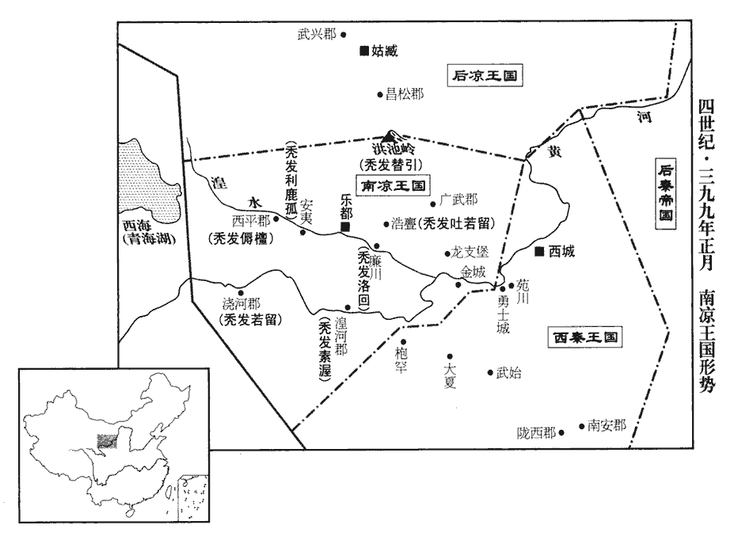
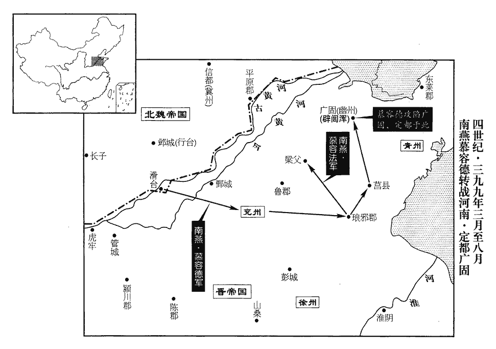
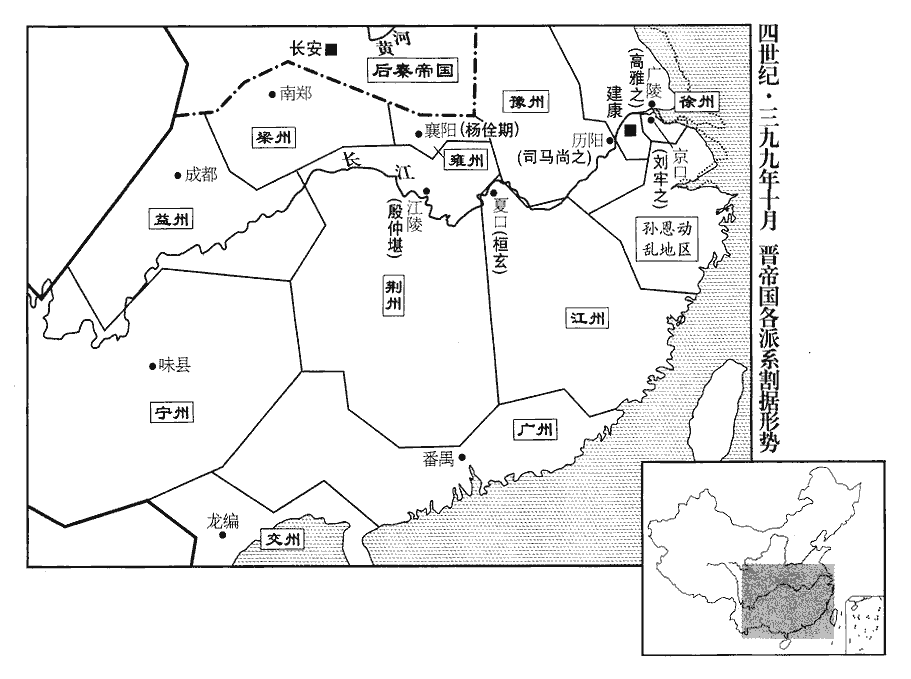
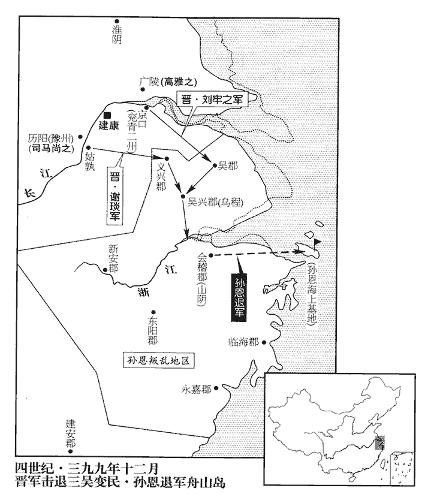
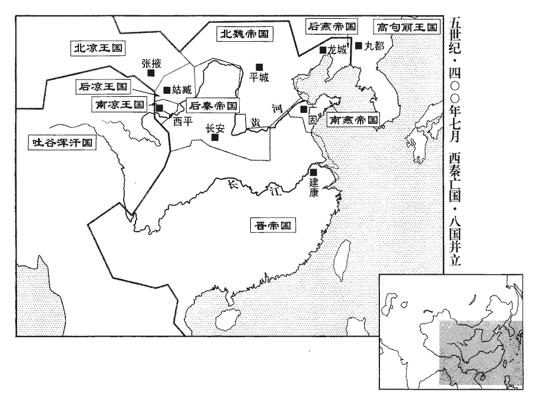
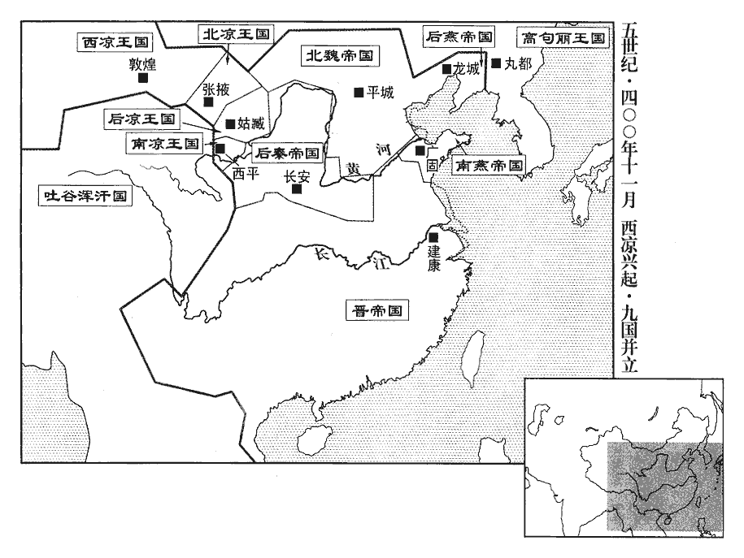
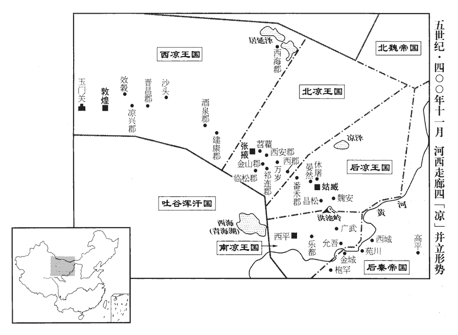

 晉紀三十三起屠維大淵獻（己亥），盡上章困敦（庚子），凡二年。

# 安皇帝丙

## 隆安三年（己亥、三九九）

1春，正月，辛酉‹四›，大赦。

〖译文〗 [1]春季，正月，辛酉（初四），东晋实行大赦。

2戊辰‹十一›，燕昌黎尹留忠謀反，誅；事連尚書令東陽公根、尚書段成，皆坐死；遣中衛將軍衛雙就誅忠弟【章：十二行本「弟」下有「幽州刺史」四字；乙十一行本同；孔本同；張校云：夾註「弟幽州刺史志於凡」八字作正文。】志於凡城‹河北平泉南›。以衛將軍平原公元為司徒、尚書令。

〖译文〗 [2]戊辰（十一日），后燕昌黎尹留忠阴谋叛变，被处死。事情牵连到了尚书令东阳公慕容根、尚书段成，也都被处死。慕容盛派中卫将军卫双去凡城诛杀留忠的弟弟幽州刺史留志。任命卫将军平原公慕容元为司徒、尚书令。

3庚午‹十三›，魏主珪‹时年二十九›北巡，分命大將軍常山王遵等三軍從東道出長川‹内蒙兴和西北›，長川在禦夷鎮西北，大漠之東垂也。下所謂西道、中道，蓋絕漠分為三路。鎮北將軍高涼王樂真等七軍從西道出牛川‹内蒙兴和西›，珪自將大軍從中道出駮髯水以襲高車‹蒙古北部›。將，即亮翻。駮bó，北角翻。髯，而占翻。

〖译文〗 [3]庚午（十三日），北魏国主拓跋去北方巡视，分别命令大将军常山王拓跋遵等三支军队从东路向长川进发，镇北将军高凉王拓跋乐真等七支军队从西路向牛川进发，拓跋则自己带领大军从中路在髯水出发，准备袭击高车部落。

4壬午‹二十五›，燕右將軍張眞、城門校尉和翰坐謀反，誅。

〖译文〗 [4]壬午（二十五日），后燕右将军张真、城门校尉和翰因谋反罪被杀。

5癸未‹二十六›，燕大赦，改元長樂。樂，音洛。燕主盛每十日一自決獄，不加拷掠，多得其情。拷，音考。掠，音亮。史言慕容盛以聰察殺身。

〖译文〗 [5]癸未（二十六日），后燕大赦，改年号为长乐。后燕国主慕容盛每隔十天，亲自审理判决一次讼事，虽然并不加以严刑拷打，但也能获得很多真实情况。

 

6武威王烏孤徙治樂都‹青海乐都›，治，直之翻。樂，音洛。以其弟西平公利鹿孤鎮安夷‹青海平安›，安夷縣，漢屬金城郡，晉分屬西平郡。廣武公傉檀鎮西平‹青海西宁›，西平治樂都縣，唐鄯州之湟水縣也。傉nù，奴沃翻。叔父素渥鎮湟河‹青海化隆›，若留鎮澆河‹青海贵德›，從弟替引鎮嶺‹甘肃天祝西北乌鞘岭›南，嶺南，即洪池嶺之南。洛回鎮廉川‹青海民和›，從叔吐若留鎮浩亹‹甘肃永登西南›；從，才用翻。浩亹在樂都之東，隋、唐併入湟水縣。浩，音誥；亹，音門。夷、夏俊傑，夏，戶雅翻。隨才授任，內居顯位，外典郡縣，咸得其宜。

〖译文〗 [6]南凉武威王秃发乌孤把都城迁到乐都，派遣他的弟弟西平公秃发利鹿孤镇守安夷，广武公秃发檀镇守西平，他的叔叔秃发素渥镇守湟河，另一个叔叔秃发若留镇守浇河，堂弟秃发替引镇守洪池岭以南的地区，另一个堂弟秃发洛回镇守廉川，派堂叔秃发吐若留镇守浩。对于其他夷族和汉族的一些贤俊杰出人士，也都根据他们的才能分别任命职务，或者在朝中官居显要位置，或者在地方上掌管郡县的事务，都得到了合适的安排。

烏孤謂群臣曰：「隴右、河西，本數郡之地，漢時河西置武威、張掖、酒泉、敦煌四郡；隴右置隴西、金城二郡。遭亂，分裂至十餘國，呂氏、乞伏氏、段氏最強，今欲取之，三者何先?」楊統曰：「乞伏氏本吾之部落，終當服從。乞伏與禿髮氏，皆鮮卑也。段氏書生，無能為患，且結好於我，攻之不義。好，呼到翻。呂光衰耄，嗣子微弱，謂光以子紹為嗣也。纂、弘雖有才而內相猜忌，若使浩亹、廉川乘虛迭出，彼必疲於奔命，不過二年，兵勞民困，則姑臧‹甘肃武威›可圖也。姑臧，呂光所都。姑臧舉，則二寇不待攻而服矣。」烏孤曰：「善！」

〖译文〗 秃发乌孤对大臣们说：“陇右、河西，本来不过就是几个郡大的地方，经受动乱之后，分裂成了十几个国家，吕氏、乞伏氏、段氏这三家势力最强大。现在我打算去攻取他们，应该先打哪一个？”杨统说：“乞伏氏本来是我们的一个部落，终究会归附我们。段业是一介书生，根本没有什么能力制造祸患，而且跟我们有很好的关系，进攻他不合道义。吕光衰老不堪，他的儿子吕绍又懦弱无能。吕纂、吕弘虽然很有才能，但内心互相猜忌。我们如果派浩、廉川两个郡的兵力乘虚轮流不断地进攻，吕氏一定会疲于奔命，不超过二年，就会军队劳累，百姓贫因，到那时，姑臧就可以谋取了。姑臧被我们拿下之后，乞伏氏和段氏这两伙强盗，不用等我们去攻打就会向我们投降了。”秃发乌孤说：“好！”

7二月，丁亥朔‹一›，魏軍大破高車三十餘部，獲七萬餘口，馬三十餘萬匹，牛羊百四十餘萬頭。衛王儀別將三萬騎絕漠千餘里，將，即亮翻。破其七部，獲二萬餘口，馬五萬餘匹，牛羊二萬餘頭。高車諸部大震。

〖译文〗 [7]二月，丁亥朔（初一），北魏北征的军队将高车的三十多个部落打得大败，俘虏七万多人，缴获马三十多万匹，牛羊一百四十多万头。卫王拓跋仪另外带领三万骑兵，深入沙漠一千多里，攻破了高车的七个余部，俘虏二万多人，缴获马五万多匹，牛羊二万多头。高车的各个部落非常震惊、恐慌。

8林邑‹都典冲，越南茶荞城›王范達陷日南‹越南顺化›、九真‹越南清化›，遂寇交趾‹府龙编，越南河内东北北宁府›，太守杜瑗擊破之。瑗yuàn，于眷翻。

〖译文〗 [8]南方的林邑国国王范达攻克了东晋日南、九真两个郡，于是进犯交趾郡。交趾太守杜瑷领兵将他打败。

9庚戌‹二十四›，魏征虜將軍庾岳破張超於勃海‹河北南皮›，斬之。張超據南皮，見上卷上年。

〖译文〗 [9]庚戌（二十四日），北魏征虏将军庾岳在勃海攻破了张超率领的变民部队，并把张超斩首。

10段業即涼王位，改元天璽；是為北涼。璽，斯氏翻。以沮渠蒙遜為尚書左丞，沮，子余翻。梁中庸為右丞。

〖译文〗 [10]段业即北凉王位，改年号为天玺。任命沮渠蒙逊为尚书左丞，梁中庸为尚书右丞。

11魏主珪大獵於牛川‹内蒙兴和西›之南，以高車人為圍，周七百餘里；因驅其禽獸，南抵平城，使高車築鹿苑，廣數十里。廣，古曠翻。三月，己未‹三›，珪還平城‹山西大同›。

〖译文〗 [11]北魏国主拓跋在牛川以南的地方大规模打猎，让高车人作为围子，周围七百多里。这样，他把圈子里的走兽向南驱赶到平城，又让高车人修筑起鹿苑，鹿苑方圆达数十里。三月，己未（初三），拓跋回到平城。

甲子‹八›，珪分尚書三十六曹及外署，凡置三百六十曹，令八部大夫主之。八部大夫，恐當作「八部大人」。魏王珪天興元年，置八部大人於皇城，四方、四維一面置一人，以擬八座，謂之八國，各有屬官，常侍、待詔直左右，出入王命。吏部尚書崔宏通署三十六曹，如令、僕統事。置五經博士，增國子太學生員合三千人。

〖译文〗 甲子（初八），拓跋将原尚书三十六曹以及一些京外官署整理划分为三百六十曹，派设八部大夫主管。吏部尚书崔宏负责统领原来的三十六曹，像令、仆射那样管辖事务。又设置了五经博士，增加国子太学生的名额，共达三千人。

珪問博士李先曰：「天下何物最善，可以益人神智?」對曰：「莫若書籍。」珪曰：「書籍凡有幾何，如何可集?」對曰：「自書契以來，世有滋益，以至于今，不可勝計。苟人主所好，何憂不集。」珪從之，命郡縣大索書籍，悉送平城。魏主珪之崇文如此，而魏之儒風及平涼州之後始振，蓋代北以右武為俗，雖其君尚文，未能回也。嗚呼！平涼之後，儒風雖振，而北人胡服，至孝文遷洛之時，未盡改也。用夏變夷之難如是夫！勝，音升。好，呼到翻。索，昔客翻。

〖译文〗 拓跋向博士李先询问说：“天下什么东西最好，可以用来补益人的智慧、精神？”李先回答他说：“没有什么能比得上书籍。”拓跋说：“书籍一共能有多少，怎么样才能把它们搜集到一起呢？”李先又回答说：“自从文字产生，一直到现在，图书的数量每代都有发展增加，已经不可能准确统计了。如果陛下有这方面的爱好，何必忧虑不能搜集呢？”拓跋听了他的话，命令各地郡县大规模索求、搜集书籍，全部送到平城。

12初，秦王登之弟廣帥眾三千依南燕王德，德以為冠軍將軍，處之乞活堡。帥，讀曰率。冠，古玩翻。乞活堡，晉惠帝時諸賊保聚之地。處，昌呂翻。會熒惑守東井，或言秦當復興，復，扶又翻。廣乃自稱秦王，擊南燕北地王鍾，破之。是時，滑臺孤弱，德徙滑臺，事見上卷上年。土無十城，眾不過一萬，鍾既敗，附德者多去德而附廣。德乃留魯陽王和守滑臺，自帥眾討廣，斬之。帥，讀曰率；下同。

〖译文〗 [12]当初，前秦王苻登的弟弟苻广率兵众三千人投顺了南燕王慕容德，慕容德任命他为冠军将军，安置在乞活堡。正赶上火星侵入井宿，有人说这种星象表示前秦应当复兴，苻广于是自称秦王，进攻南燕北地王慕容钟，并将他打败。这时，南燕慕容德驻地的滑台势单力薄，所辖治的地方不到十个城池，军队也不过一万人，慕容钟失败之后，依附慕容德的人大都离开了慕容德而依附苻广。慕容德留下鲁阳王慕容和驻守滑台，亲自统帅兵众去讨伐苻广，并把他斩了。

燕主寶之至黎陽‹河南浚县›也，事見上卷上年。魯陽王和長史李辯勸和納之，和不從。辯懼，故潛引晉軍至管城‹河南郑州›，事亦見上卷上年。欲因德出戰而作亂。既而德不出，辯愈不自安。及德討苻廣，辯復勸和反，復，扶又翻；下可復同。和不從，辯乃殺和，以滑臺降魏。降，下江翻。魏行臺尚書和跋在鄴‹河北临漳西南邺镇›，帥輕騎自鄴赴之，騎，奇寄翻。既至，辯悔之，閉門拒守。跋使尚書郎鄧暉說之，鄧暉，魏之鄴臺尚書郎也。說，輸芮翻。辯乃開門內跋，跋悉收德宮人府庫。德遣兵擊跋，跋逆擊，破之，又破德將桂陽王鎮，將，即亮翻。俘獲千餘人。陳、潁之民多附於魏。陳、潁，陳郡‹河南淮阳›、潁川‹河南许昌东›也。

〖译文〗 国主慕容宝来到黎阳的时候，鲁阳王慕容和的长史李辩劝说慕容和接纳他，慕容和不同意。李辩非常害怕，就暗地里招引东晋的军队来到管城，打算趁慕容德出外作战时发动叛乱。后来慕容德并没有出外作战，李辩心里更加焦虑不安。到这次慕容德出兵讨伐苻广，李辩再一次劝说慕容和反叛，慕容和仍然不听，李辩便杀了慕容和，献出滑台城，投降了北魏。北魏国行台尚书和跋正在邺城，便带领一支轻装骑兵部队，从邺城奔赴滑台，赶到的时候，李辩却又后悔了，赶忙关紧城门拒绝他们进城。和跋派遣尚书郎邓晖前去劝说，李辩开门把和跋迎入城内。和跋收缴了慕容德的所有姬妾宫女、府库资财。慕容德派兵进攻和跋，和跋反击，把燕军打败，又击败了赶来增援的慕容德的大将桂阳王慕容镇，俘虏了一千多人。陈郡、颍川郡的民众大多数便都归附了北魏。

南燕右衛將軍慕容雲斬李辯，帥將士家屬二萬餘口出滑臺赴德。帥，讀曰率。德欲攻滑臺，韓範曰：「嚮也魏為客，吾為主人；今也吾為客，魏為主人。人心危懼，不可復戰，復，扶又翻。不如先據一方，自立基本，乃圖進取。」微韓範之言，德若進攻滑臺，必至喪敗，固不待慕容超之時也。張華曰：「彭城‹江苏徐州›，楚之舊都，項羽都彭城，故云然。可攻而據之。」北地王鍾等皆勸德攻滑臺。尚書潘聰曰：「滑臺四通八達之地，滑臺當河津之要，魏自北渡河而南向，晉從清水入河，秦沿渭順河而下，皆湊於滑臺。又其城旁無山陵可依，車騎、舟師皆可以騁，故謂之四通八達之地。北有魏，南有晉，西有秦，居之未嘗一日安也。彭城土曠人稀，平夷無嶮，且晉之舊鎮，未易可取。易，以豉翻。又密邇江、淮，夏秋多水。乘舟而戰者，吳之所長，我之所短也。青州沃野二千里，精兵十餘萬，左有負海之饒，右有山河之固，廣固城‹山东青州›曹嶷所築，嶷，魚力翻。地形阻峻，足為帝王之都。三齊英傑，思得明主以立功於世久矣。辟閭渾昔為燕臣，孝武太元十九年，辟閭渾為慕容農所破，遂臣於燕。今宜遣辯士馳說於前，大兵繼踵於後，若其不服，取之如拾芥耳。兼弱攻昧，取亂侮亡，自三代之時仲虺已有是言，夫子定書，弗之刪也。後人泥古，專言王者之師，以仁義行之，若宋襄公可以為鑒矣。說，輸芮翻。既得其地，然後閉關養銳，伺隙而動，此乃陛下之關中、河內也。」用荀彧說魏武之言。伺，相吏翻。德猶豫未决。沙門竺朗素善占候，竺，朗之俗姓。德使牙門蘇撫問之，朗曰：「敬覽三策，潘尚書之議，興邦之言也。且今歲之初，彗星起奎、婁，掃虛、危；彗者，除舊布新之象，奎、婁為魯，虛、危為齊。晉天文志：奎、婁、胃，魯、徐州。虛、危，齊、青州。彗，祥歲翻，又旋芮翻，又徐醉翻。宜先取兗州，巡撫琅邪，至秋乃北徇齊地，此天道也。」撫又密問以年世，朗以周易筮之曰：「燕衰庚戌，年則一紀，世則及子。」其後燕亡於義熙六年，歲在上章閹茂。上章，庚也；閹茂，戌也。撫還報德，德乃引師而南，兗州北鄙諸郡縣皆降之。降，戶江翻；下同。德置守宰以撫之，禁軍士無得虜掠。百姓大悅，牛酒屬路。屬，之欲翻。

〖译文〗 南燕右卫将军慕容云斩杀了李辩，率领将士的家属共二万多口人冲出滑台城，去投奔慕容德。慕容德打算进攻滑台，部将韩范说：“过去魏人是客人，我们是主人；现在我们是客人，魏人却变成了主人。我们军中人人都非常害怕，不可以再让他们去打仗了。不如先据守一个地方，自己重新创立根本基业，然后才能再筹划考虑发展壮大进取的事情。”部将张华说：“彭城是西楚霸王的旧都城，可以把它攻下来占据它。”但是北地王慕容钟等人都劝说慕容德进攻滑台。尚书潘聪说：“滑台是一个四通八达的地方，北有魏，南有晋，西有秦，居住在那里没有一天感到是安全的。彭城地广人稀，一片平原，没有什么险要可以据守。而且那里是晋的旧有重镇，未必很容易就可以攻取下来。这地方又距长江、淮河很近，夏季、秋季降雨很多。乘舟在水上作战，那是吴地之人所最擅长的，而恰恰又是我们的短处。青州既拥有二千里的肥沃土地，又拥有十多万精锐的部队，左边有紧挨着大海的富饶，右边有依靠高山大河的险要，广固城是当年曹嶷所兴筑，地势险峻，足可以作为帝王的都城。三齐地方的英才俊杰，希望得到一个圣明的君主，拥戴他在世上建立宏伟的功业，已经有很长时间了。青州刺史辟闾浑以前也曾是燕的臣子，现在应该派遣能言善辩之士赶到他那里游说，紧接着再派遣大军进逼，如果他不听从我们的奉劝，击败他并夺取青州也不过像弯腰拣草那么容易罢了。得到那里之后，封锁关隘，养精蓄锐，等待时机而有所建树，这才是陛下的关中、河内呀！”慕容德犹豫再三，委决不下。一个叫竺朗的和尚一向善于占卜征候，慕容德遣使牙门苏抚前去探问，竺朗说：“我恭敬地看了他们提出的这三种策略，潘尚书的建议，才是兴邦立国的言论。而且今年年初的时候，彗星起自奎宿、娄宿，其尾扫过虚宿、危宿。彗星的出现，乃是消除陈腐、新机将布的星象，奎宿、娄宿天区为鲁国疆域，虚宿、危宿天区为齐国疆域。应该先去夺取兖州，再去安抚琅邪，到秋天的时候再向北攻占齐地，这是上天的旨意呀。”苏抚又偷偷地问他燕国的寿命如何，竺朗根据《周易》推算之后说：“燕国将在庚戌年衰亡，寿命为一纪，并可以把王位传给儿子。”苏抚回去向慕容德汇报，慕容德才率领大军向南进发，兖州以北偏远地区的郡县都投降了他。慕容德分别设置地方官员安抚百姓，严禁军队到处虏掠抢夺。百姓们非常高兴，一路上不断地有人送来慰劳大军的牛肉美酒。

13丙子‹二十›，魏主珪遣建義將軍庾真、越騎校尉奚斤擊庫狄、宥連、侯莫陳三部，皆破之，其後庫狄、侯莫陳二姓皆貴顯，而宥連之種微矣。追奔至大峨谷，置戍而還。還，從宣翻，又如字。

〖译文〗 [13]丙子（二十日），北魏国主拓跋派遣建义将军庾真、越骑校尉奚斤率兵袭击库狄、宥连、侯莫陈三个部落，并且把它们全部击破，追击奔袭到大峨谷，在那里安置了守卫部队之后才返回。

14己卯‹二十三›，追尊帝‹司马德宗，时年十八›所生母陳夫人‹陈归女›為德皇太后。

〖译文〗 [14]己卯（二十三日），安帝追尊他的亲生母亲陈夫人为德皇太后。

15夏，四月，鮮卑疊掘河內帥戶五千降于西秦‹都西城，甘肃靖远西›。西秦王乾歸以河內為疊掘都統，以宗女妻之。疊掘亦鮮卑一種也；河內其名。掘，其月翻。妻，七細翻。

〖译文〗 [15]夏季，四月，鲜卑族叠掘部落的首领河内率他所辖属的五千户居民，向西秦投降。西秦王乞伏乾归任命河内为叠掘都统，并把自己宗族的一个女儿嫁给他做妻子。

16甲午‹九›，燕大赦。

〖译文〗 [16]甲午（初九），后燕实行大赦。

17會稽王道子‹时年三十六›有疾，會，工外翻。且無日不醉。世子元顯知朝望去之，乃諷朝廷解道子司徒、揚州刺史。朝，直遙翻；下同。乙未‹十›，以元顯為揚州刺史。道子醒而後知之，大怒，無如之何。元顯以廬江‹安徽舒城›太守會稽‹浙江绍兴›張法順為謀主，會，工外翻。多引樹親黨，朝貴皆畏事之。為元顯、張法順俱被誅張本。

〖译文〗 [17]会稽王司马道子有病，而且又嗜酒成癖，没有一天不酩酊大醉。他的嫡长子司马元显知道他在朝廷已经没有声望。于是便委婉地劝说，请求朝廷解去了司马道子的司徒、扬州刺史职务。乙未（初十），安帝任命司马元显为扬州刺史。司马道子清醒之后知道了这件事，虽然忍不住暴跳如雷，但也没有办法。司马元显把庐江太守、会稽人张法顺作为自己的主要谋士，并且大量地引用亲信，树立党羽，朝中地位显贵的官员都以畏惧的心情对待他。

18燕散騎常侍餘超、左將軍高和等坐謀反，誅。散，悉亶翻。騎，竒寄翻。

〖译文〗 [18]后燕散骑常侍馀超、左将军高和等人，以谋反罪被杀。

19涼太子紹、太原公纂將兵伐北涼，河西四郡，張掖在北，故號北涼。將，即亮翻。北涼王業求救於武威王烏孤，烏孤遣驃騎大將軍利鹿孤及楊軌救之。驃，匹妙翻。騎，奇寄翻。業將戰，沮渠蒙遜諫曰：「楊軌恃鮮卑之強，有窺窬之志，禿髮，本鮮卑種也。沮，子余翻。紹、纂深入，置兵死地，不可敵也。今不戰則有泰山之安，戰則有累卵之危。」業從之，按兵不戰。紹、纂引兵歸。

〖译文〗 [19]后凉太子吕绍、太原公吕纂率军讨伐北凉，北凉王段业向南凉武威王秃发乌孤求救，秃发乌孤派遣骠骑大将军秃发利鹿孤，与杨轨一起前去救援。段业准备迎战，沮渠蒙逊劝阻他说：“杨轨这个人依仗着鲜卑人的强大，有对我趁机动手的野心，吕绍、吕纂此次敢于率军深入，已经把军队置之死地，我们抵挡不过。现在我们不出战，还有像泰山那样的安稳，出战，就会有累卵之危。”段业听从了他的劝告，按兵不动。吕绍、吕纂只好带着大军回去。

六月，烏孤以利鹿孤為涼州牧，鎮西平‹青海西宁›，召車騎大將軍傉檀入錄府國事。傉，奴沃翻。

〖译文〗 六月，秃发乌孤任命秃发利鹿孤为凉州牧，镇守西平，召回车骑大将军秃发檀，叫他入朝处理国家的大事。

20會稽世子元顯自以少年，不欲頓居重任；少，詩照翻。戊子‹四›，以琅邪王德文為司徒。

〖译文〗 [20]会稽王的嫡长子司马元显，知道自己还年轻，不打算马上担负起国家的重大责任。戊子（初四），朝廷任命琅邪王司马德文为司徒。

21魏前河間‹河北献县›太守【章：十二行本「守」下有「范陽」二字；乙十一行本同；孔本同；張校同；退齋校同。】盧溥pǔ帥其部曲數千家就食漁陽‹北京密云›，遂據有數郡。秋，七月，己未‹五›，燕主盛遣使拜溥幽州刺史。為下魏黜張衮、襲禽盧溥張本。帥，讀曰率。使，疏吏翻。

〖译文〗 [21]北魏前河间太守范阳人卢溥统率他手下的人几千家到渔阳谋生，于是占据了几个郡的土地。秋季，七月，己未（初五），后燕国主慕容盛派遣使节任命卢溥为幽州刺史。

22辛酉‹七›，燕主盛下詔曰：「法例律，公侯有罪，得以金帛贖，戰國時，魏文侯師李悝撰次諸國法，著法經。以為王者之政，莫急盜賊，盜賊須劾捕，故著網、捕二篇。其輕狡、越城、博戲、假借、不廉、淫侈、踰制，以為雜律一篇。又以其律具其加減。故所著六篇，皆罪名之制也。漢蕭何條益事律興、廄、戶三篇，合為九篇。魏陳群等采漢律，制新律十八篇。集罪例為刑名，冠於律首。盜律有劫略、恐猲hè、和賣買人，科有持質，皆非盜事，分以為劫略律。賊律有欺謾、詐偽、踰封、矯制，囚律有詐偽、生死，令丙有詐自復免，事類眾多，分為詐律。賊律有賊伐樹木，殺傷人畜產及諸亡印，金布律有毀傷、亡失縣官財物，分為毀亡律。囚律有告劾、傳覆，廄律有告反、逮受，科有登聞道辭，分為告劾律。囚律有繫囚、鞠獄、斷獄之法，興律有上獄之事，科有考事、報讞yàn，宜別為篇，分為繫訊斷獄律。盜律有受所監、受財枉法，雜律有假借、不廉，令乙有呵人受錢，科有使者驗賂，其事相類，分為請賕qiú律。盜律有勃辱、強賊，興律有擅興傜役，具律有出賣，科有擅作脩舍事，分為興擅律。興律有乏傜、稽留，賊律有儲峙不辦，廄律有乏軍、乏興及舊典有奉法不謹、不承用詔書，漢氏施行，不宜復以為法，別為之留律。秦世舊有廄置、乘傳、副車、食廚，後漢但設騎置，無車馬，而律猶著其文，則為虛設，故除廄律，取其可用合科者為郵驛令。告劾律上言變事、令以驚事告急與興律烽燧及科令者，以為驚事律。盜律有還贓畀主，金布律有罰贖入責、以呈黃金為價，科有平庸坐贓事，以為償贓律。律之初制，無免坐之文，張湯、趙禹始作監臨部主見知故縱之例，其見知而故不舉劾，以贖論；其不見、不知者不坐，科條免坐繁多，宜總為免例，以省科文，故更定以為免坐律。晉初賈充定法，就漢九章增十一篇，改舊律為刑名法例，辨囚律為告劾、繫訊、斷獄，分盜律為請賕、詐偽、水火、毀亡，因事類為衛禁、違制，撰周官為諸侯律，合二十篇。孔穎達曰：古之贖罪皆用銅，漢始改用黃金，但少其斤兩，令與金相敵。漢及後魏，贖罪皆用黃金，後魏以金難得，合金一兩，收絹十匹。今律乃復依古贖銅。此不足以懲惡而利於王府，甚無謂也。自今皆令立功以自贖，勿復輸金帛。復，扶又翻。

〖译文〗 [22]辛酉（初七），后燕国主慕容盛下诏书说：“法令判例规定，公、侯如果犯了罪，可以用金钱、布帛来赎罪，这不能达到惩罚罪恶的目的，却有利于王府，因此，毫无意义。从今往后，犯罪的人必须立功才能赎清自己的罪责，不得再收取金钱、布帛。”

23西秦丞相南川宣公出連乞都卒。南川，地名。宣，諡也。

〖译文〗 [23]西秦丞相、南川宣公出连乞都去世。

24秦齊公崇、鎮東將軍楊佛嵩寇洛陽‹河南洛阳东白马寺东›，河南太守隴西‹甘肃隴西›辛恭靖嬰城固守。雍州‹府襄阳，湖北襄樊›刺史楊佺期遣使求救於魏常山王遵，雍，於用翻。使，疏吏翻；下同。魏主珪以散騎侍郎西河‹山西离石›張濟為遵從事中郎以報之。佺期問於濟曰：「魏之伐中山，戎士幾何?」濟曰：「四十餘萬。」事見一百八卷孝武太元二十一年。佺期曰：「以魏之強，小羌不足滅也。且晉之與魏，本為一家，謂猗盧救劉琨時也。今既結好，好，呼到翻。義無所隱。此間兵弱糧寡，洛陽之救，恃魏而已。若其保全，必有厚報；若其不守，與其使羌得之，不若使魏得之。」若楊佺期者，豈可使之扞禦封疆哉！濟還報。八月，珪遣太尉穆崇將六萬騎往救之。

〖译文〗 [24]后秦齐公姚崇、镇东将军杨佛嵩进犯东晋的洛阳，河南太守陇西人辛恭靖围绕城池加固防守。雍州刺史杨期派遣使节向北魏常山王拓跋遵请求援助，北魏国主拓跋派散骑侍郎西河人张济作为拓跋遵的从事中郎前往。杨期向张济问道：“你们魏国去征伐中山，有多少军士？”张济说：“四十多万。”杨期说：“就你们魏国如此的强大来说，姚崇一伙小小的羌贼实在不值得你们去消灭。况且晋与魏之间，本来就是一家，现在既然已经结成友好关系，便不应该有什么隐瞒的。我这里兵力微弱，粮草也很少，救助洛阳的事，就依赖你们魏国了。如果洛阳可以完美无缺，对你们一定会有丰厚的报答；如果坚守不住，与其让羌人得到，还不如让你们得到！”张济回国汇报了杨期的态度。八月，拓跋派遣太尉穆崇带领六万骑兵前往援助杨期。

25燕遼西太守李朗在郡十年，威行境內，燕遼西郡治令支‹河北卢龙›。恐燕主盛疑之，累徵不赴。以其家在龍城，未敢顯叛，陰召魏兵，許以郡降魏；降，戶江翻；下同。遣使馳詣龍城，廣張寇勢。盛曰：「此必詐也。」召使者詰問，詰，去吉翻。果無事實。盛盡滅朗族；丁酉‹十四›，遣輔國將軍李旱討之。

〖译文〗 [25]后燕辽西太守李朗，担任郡守十年，在郡内威信很高，他害怕后燕国主慕容盛猜疑忌恨，因此几次被征召都不去。因为自己的家眷全在龙城，没有公开叛变，只是私下里招引北魏大军前来，答应统领全郡向北魏投降。他于是派遣信使跑到龙城去禀报，夸张辽西那里受到寇贼侵犯的形势。慕容盛说：“这一定是骗局。”把那个信使召来仔细审问，果然没有那么一回事。慕容盛把李朗的家人全部杀掉；丁酉（十四日），派遣辅国将军李旱前去讨伐。

26初，魏奮武將軍張袞以才謀為魏主珪所信重，委以腹心。珪問中州士人於袞，袞薦盧溥及崔逞，珪皆用之。

〖译文〗 [26]当初，北魏奋武将军张衮因为才干出众、谋略过人而得到北魏国主拓跋的信任与重用，把他当做心腹。拓跋向张衮询问中州的读书人谁比较有名，张衮荐举了卢溥和崔逞，拓跋都加以任用。

珪圍中山久未下，軍食乏，見一百九卷隆安元年。問計於群臣，逞為御史中丞，對曰：「桑椹可以佐糧；飛鴞食椹而改音，詩人所稱也。」珪雖用其言，聽民以椹當租，然以逞為侮慢，心銜之。詩：翩彼飛鴞，集于泮林，食我桑椹，懷我好音。註云：鴞，惡聲之鳥也。鴞恆惡鳴，今食桑椹，故改其鳴，歸就我以善音。珪本北人而入中原，故銜逞以為侮慢。秦人寇襄陽，雍州刺史郗恢以書求救於魏常山王遵曰：「賢兄虎步中原。」珪以恢無君臣之禮，命袞及逞為復書，必貶其主。袞、逞謂帝為貴主。珪怒曰：「命汝貶之而謂之『貴主』，何如『賢兄』也！」逞之降魏也，見一百九卷隆安元年。以天下方亂，恐無復遺種，種，章勇翻。使其妻張氏與四子留冀州‹河北冀县›，逞獨與幼子賾【嚴：「賾」改「頤」。】詣平城，賾zé，士革翻。所留妻子遂奔南燕。珪并以是責逞，賜逞死。盧溥受燕爵命，侵掠魏郡縣，殺魏幽州刺史封沓干。珪謂袞所舉皆非其人，黜袞為尚書令史。袞乃闔門不通人事，惟手校經籍，歲餘而終‹年七十二›。

〖译文〗 那时，拓跋围困中山城很长时间也没有攻克，部队的粮食非常缺乏，向群臣询问办法，当时崔逞是御史中丞，他回答说：“桑椹可以用来做辅助粮食。飞来飞去的猫头鹰吃了桑椹而改变了叫声，这是诗人说的。”拓跋虽然采纳了他的意见，允许百姓用桑椹充当地租交纳，但是却认为崔逞有意侮辱轻慢自己，记恨在心。后来后秦的军队进犯襄阳，东晋雍州刺史郗恢写信向北魏常山王拓跋遵求援说：“贤兄像猛虎那样纵横中原。”拓跋认为郗恢没有遵奉君臣之间的礼法，让张衮和崔逞代写回信，一定要贬斥东晋的君主。但张衮、崔逞在信中称东晋皇帝为“贵主”。拓跋见此，勃然大怒说：“我命令你们贬低他，你们却称他为‘贵主’，这怎么能和他叫我‘贤兄’相比呢！”崔逞投降北魏的时候，天下正处在动乱之中，恐怕不再能遗留下后代，所以让他的妻子张氏和四个儿子留在冀州老家，崔逞自己与最小的儿子崔赜来到平城，他的妻子张氏和四个儿子便投奔了南燕。拓跋把这几件事加在一起责问崔逞，下令让他自杀。卢溥接受后燕的官位和命令，侵犯袭掠北魏的郡县，又杀了北魏幽州刺史封沓干。拓跋认为张衮所举荐的人都不好，因此把张衮贬为尚书令史。张衮于是从此紧闭大门，不与外边来往，只是整天地校勘经史典藉，一年多之后去世。

燕主寶之敗也，中書令、民部尚書封懿降於魏。珪以懿為給事黃門侍郎、都坐大官。魏官有三都大官：都坐大官、外都大官、內都大都。坐，徂臥翻。珪問懿以燕氏舊事，懿應對疏慢，亦坐廢於家。珪蓋自疑，以為衣冠之士慢之也。

〖译文〗 国主慕容宝失败的时候，中书令、民部尚书封懿向北魏投降。拓跋任命封懿为给事黄门侍郎、都坐大官。拓跋向封懿询问燕氏政权过去的一些事情，封懿在回答时，疏略而且傲慢，也被免去一切官职，在家闲居。

27武威王禿髮烏孤醉，走馬傷脅而卒，遺令立長君。長，知兩翻。國人立其弟利鹿孤，諡烏孤曰武王，廟號烈祖。利鹿孤大赦，徙治西平‹青海西宁›。

〖译文〗 [27]南凉武威王秃发乌孤醉酒之后，骑马奔驰，伤了肋骨而死。留下遗命让年纪大的人为国君。国人拥立他的弟弟秃发利鹿孤，追谥秃发乌孤为武王，庙号烈祖。秃发利鹿孤下令大赦，把都城迁到西平。

28南燕王德遣使說幽州刺史辟閭渾，欲下之；晉氏南渡，僑立幽、冀、青、并四州於江北；秦圍幽州刺史田洛于三阿，是其證也。孝武太元之季，復取齊地，徙幽、冀二州於齊，是後鎮齊者，率領青、冀二州刺史。渾領幽州刺史，蓋自北而南，未純為晉臣，使領幽州而鎮廣固‹山东青州›也。說，輸芮翻。渾不從；德遣北地王鍾帥步騎二萬擊之。帥，讀曰率。德進據琅邪‹山东临沂›，徐、兖之民歸附者十餘萬。德自琅邪引兵而北，以南海王法為兗州刺史，鎮梁父‹山东泰安东南›。父，音甫。進攻莒城‹山东莒县›，守將任安委城走。德以潘聰為徐州刺史，鎮莒城。莒縣，前漢屬城陽國，後漢屬琅邪，晉分屬東莞郡。將，即亮翻。任，音壬。蘭汗之亂，燕吏部尚書封孚南奔辟閭渾，渾表為勃海太守；及德至，孚出降，降，戶江翻；下同。德大喜曰：「孤得青州不為喜，喜得卿耳！」遂委以機密。北地王鍾傳檄青州諸郡，諭以禍福。辟閭渾徙八千餘家入守廣固‹山东青州›，遣司馬崔誕戍薄荀【張：「荀」作「苟」。】固，平原太守張豁戍柳泉‹山东青州西›；薄荀，蓋人姓名，遇亂聚眾保固此地，因以為名。齊人率謂保聚之地為固。漢書地理志：北海郡有柳泉侯國，後漢、晉省。誕、豁承檄皆降於德。渾懼，攜妻子奔魏，德遣射聲校尉劉綱追之，及於莒城，斬之。渾子道秀自詣德，請與父俱死。德曰：「父雖不忠以辟閭渾背燕為不忠。而子能孝。」特赦之。渾參軍張瑛為渾作檄，瑛，音英。為，于偽翻。辭多不遜，德執而讓之。瑛神色自若，徐曰：「渾之有臣，猶韓信之有蒯通。通遇漢祖而生，事見十二卷高祖十一年。臣遭陛下而死，比之古人，竊為不幸耳！」德殺之。遂定都廣固‹山东青州›。

〖译文〗 [28]南燕王慕容德派遣使节前去游说东晋幽州刺史辟闾浑，打算拿下幽州，辟闾浑没有听从他们的劝告。慕容德派遣北地王慕容钟率领步、骑兵共两万人进攻辟闾浑。慕容德向前推进占据琅邪，徐州、兖州的百姓归附他的有十多万人。慕容德带兵从琅邪向北进发，任命南海王慕容法为兖州刺史，镇守梁父。然后又进攻莒城，东晋守将任安放弃城池逃走，慕容德任命潘聪为徐州刺史，镇守莒城。当年兰汗之乱时，后燕吏部尚书封孚向南投奔辟闾浑，辟闾浑向朝廷奏报，任命他做了勃海太守。慕容德来到的时候，封孚出城投降，慕容德非常高兴地说：“孤得到青州并不觉得是大喜的事，可喜的是我得到了你。”于是，把朝廷机密要事交给封孚掌管处理。后燕北地王慕容钟向青州的各郡传布檄文，向他们申明祸福、利害关系。辟闾浑把八千多户居民迁徒到广固去据守，又派司马崔诞去戍守薄荀固，派平原太守张豁戍守柳泉。崔诞、张豁接到慕容钟的檄文后，都向慕容德投降。辟闾浑非常害怕，便携带着妻子儿女，向北魏奔逃，慕容德派遣射声校尉刘纲前去追赶他，追到莒城把他杀了。辟闾浑的儿子辟闾道秀，自己去面见慕容德，请求让他与他的父亲一块死。慕容德叹息说：“父亲虽然不忠，但是他的儿子却能尽孝。”特地赦免了辟闾道秀。辟闾浑的参军张瑛曾经为辟闾浑草拟檄文，文中措辞大多不逊，慕容德把他抓住后谴责他。但张瑛神色自然，慢慢地说：“辟闾浑有我，就好像韩信有蒯通一样。蒯通遇到了汉高祖刘邦而能生存，我与陛下遭遇却要死，与古人相比，我只能觉得是一种不幸罢了！”慕容德把他杀了。于是，南燕定都在广固。

 

29燕李旱行至建安‹河北迁安北›，燕主盛急召之，群臣莫測其故。九月，辛未‹十八›，復遣之。李朗聞其家被誅，被，皮義翻。擁二千餘戶以自固；及聞旱還，謂有內變，不復設備，復，扶又翻。留其子養守令支‹河北迁安›，應劭曰：令，音鈴；師古曰：音郎定翻。孟康曰：支，音祗；裴松之其兒翻。自迎魏師於北平‹河北遵化›。前漢北平郡治平剛，後漢治土垠，晉治徐無，後魏治盧龍。壬子，旱襲令支，克之，遣廣威將軍孟廣平追及朗於無終‹天津蓟县›，斬之。無終，春秋無終子之國，自漢以來，為縣，屬右北平。劉昫曰：唐薊州玉田縣，漢無終縣地。

〖译文〗 [29]后燕辅国将军李旱，讨伐李朗行进到建安，后燕国主慕容盛把他紧急召回，大臣们都不知道是什么缘故。九月，辛未（十八日），又派他出征。李朗听说他的家眷全部被杀害，便集结二千多户居民，用以固守自己的城池，等到听说李旱突然回去，认为后燕国内部一定出现变化，所以不再设防，只是留下他的儿子李养据守令支，自己却去北平迎接北魏军。壬子（疑误），李旱袭击并攻破了令支，马上又派广威将军孟广平去追击李朗，在无终追上并把他杀了。

30秦主興以災異屢見，見，賢遍翻。降號稱王，下詔令群公、卿士、將牧、守宰各降一等；將，即亮翻。守，式又翻；下同。大赦，改元弘始。存問孤貧，舉拔賢俊，簡省法令，清察獄訟，守令之有政迹者賞之，貪殘者誅之，遠近肅然。

〖译文〗 [30]后秦国主姚兴因为天灾和异兆多次出现，降低名号，由皇帝改称王，并下达诏书，命令诸公卿、将帅、地方官吏，全部降职一级。下令大赦，改年号为弘始；安抚慰问孤寡之人与贫苦百姓，选举荐拔贤才俊士；简化缓和法令制度，清正明确地处理诉讼案件。地方官吏有政绩的奖赏，贪婪残暴的人诛杀。国中无论远近，秩序井然。

31冬，十月，甲午‹十一›，燕中衛將軍衛雙有罪，賜死。李旱還，聞雙死，懼，棄軍而亡，至板陘‹辽宁凌源›，陘，音刑。復還歸罪。復，扶又翻。燕主盛復其爵位，謂侍中孫勍曰：「旱為將而棄軍，罪在不赦。勍qíng，渠京翻。將，即亮翻。然昔先帝蒙塵，骨肉離心，公卿失節，惟旱以宦者忠勤不懈，始終如一，事見上卷二年。故吾念其功而赦之耳。」

〖译文〗 [31]冬季，十月，甲午（十一日），后燕中卫将军卫双因罪被赐死。李旱回朝之后，听说卫双已死，非常害怕，便抛下军队，只身逃亡，到板陉之后，又回去自首认罪。后燕国主慕容盛恢复了他的爵位和职务，对侍中孙说：“李旱作为将军却抛弃了自己的军队，他的罪过绝对是不可饶恕的。但是过去先帝遭受挫折、流亡的时候，自己的骨肉都离心离德，公卿们失去节操，只有李旱一人，虽然身为宦官，却能忠贞勤勉地护佑先帝，始终如一。我正是感念他的这些功劳，所以才赦免他的呀！”

32辛恭靖固守百餘日，魏救未至，秦兵拔洛陽‹河南洛阳东白马寺东›，獲恭靖。恭靖見秦王興，不拜，曰：「吾不為羌賊臣！」興囚之，恭靖逃歸。自淮、漢以北，諸城多請降，送任於秦。降，戶江翻。

〖译文〗 [32]东晋辛恭靖在洛阳坚守了一百多天，北魏的救援部队仍然没有到。后秦军攻克了洛阳，抓获了辛恭靖。辛恭靖被押解去见后秦王姚兴，不肯跪拜，说：“吾决不做羌贼的臣民！”姚兴把他囚禁起来，辛恭靖趁机逃了回去。这样，从淮河、汉水以北地区各城，有很多都请求投降，并向后秦送去担保。

33魏主珪以穆崇為豫州刺史，鎮野王‹河南沁阳›。秦既克洛陽，魏置鎮於野王，以備其渡河侵軼。

〖译文〗 [33]北魏国主拓跋任命穆崇为豫州刺史，镇守野王。

34會稽世子元顯，性苛刻，會，工外翻。生殺任意；發東土諸郡免奴為客者，奴戶者，有罪沒為官奴；公卿以下至九品官及宗室、國賓、先賢之後及士人子孫占蔭以為客戶，是謂免奴為客。號曰樂屬，樂，徒各翻。移置京師，以充兵役，東土囂然苦之。

〖译文〗 [34]会稽王的嫡长子司马元显，生性严酷刻薄，对人的生死，随心所欲地处置。他下令征召东方各郡中解除奴户身分而变成客户的人，把他们称为乐属，迁移到京师去居住，用做后备兵源，忧愁笼罩在东方各郡的广大土地之上，百姓深感痛苦。

孫恩因民心騷動，自海島帥其黨殺上虞令，上虞縣‹浙江上虞›，自漢以來屬會稽郡，西北距郡城百餘里。帥，讀曰率。遂攻會稽‹浙江绍兴›。會稽內史王凝之，羲之之子也，世奉天師道，天師道，即張道陵之所傳也。會，工外翻。不出兵，亦不設備，日於道室稽顙跪呪zhòu。道室，奉道之室也。稽，音啟。官屬請出兵討恩，凝之曰：「我已請大道，借鬼兵守諸津要，各數萬，賊不足憂也。」及恩漸近，乃聽出兵，恩已至郡下。甲寅‹二›，恩陷會稽，凝之出走，恩執而殺之，并其諸子。凝之妻謝道蘊，奕之女也，聞寇至，舉措自若，命婢肩輿，抽刀出門，手殺數人，乃被執。被，皮義翻。吳國‹苏州›內史桓謙、臨海‹浙江台州西北章安镇›太守新秦王崇、晉書作「新蔡王崇」。崇，汝南王祐之曾孫，自其祖父以來，嗣新蔡國封。「秦」，當作「蔡」。義興‹江苏宜兴›太守魏隱皆棄郡走。於是會稽謝鍼、吳郡陸瓌、吳興‹浙江湖州›丘尫、鍼zhēn，其廉翻。瓌guī，姑回翻。尫wāng，烏光翻。義興許允之、臨海周冑、永嘉‹浙江温州›張永等及東陽‹浙江金华›、新安‹浙江淳安›凡八郡人，一時起兵，殺長吏以應恩，旬日之中，眾數十萬。吳興太守謝邈、永嘉太守司馬逸、嘉興公顧胤、南康公謝明慧、黃門郎謝沖、張琨、中書郎孔道等皆為恩黨所殺。邈、沖，皆安之弟子也。時三吳承平日久，民不習戰，故郡縣兵皆望風奔潰。

〖译文〗 逃到海上去的孙恩因为百姓骚动不安，从海岛上率领他的部众，杀死了上虞令，进而对会稽发起了猛攻。会稽内史王凝之，是王羲之的儿子，世代信奉天师道，他既不出兵也不设防戒备，只是每天去道堂上磕头念咒。手下官员请求派兵出城讨伐孙恩，王凝之说：“我已请来了得道大仙，借来了鬼兵把守各个险要关卡，每个地方都有几万鬼兵，盗贼不值得担忧。”等到孙恩的兵马越来越近，才允许发兵抵敌，可是孙恩的大军已经到了郡城之下。甲寅（凝误），孙恩攻克了会稽城，王凝之逃出城去，被孙恩抓住杀了，同时还杀了他的几个儿子。王凝之的妻子谢道蕴，是谢奕的女儿，听说强盗来到，一举一动跟平常一样，从容不迫，她命令婢女们抬着她乘坐的轿子，拔出佩刀来到家门之外，亲手杀死了几个人，才被抓住。吴国内史桓谦、临海太守新蔡王司马崇、义兴太守魏隐等人都放弃了郡城逃走。一时之间，会稽人谢针、吴郡人陆、吴兴人丘、义兴人许允之、临海人周胄、永嘉人张永等，以及东阳、新安等共八个郡的百姓，同时拉起队伍，杀掉本地官员而响应孙恩。十天之内，聚集了几十万人。吴兴太守谢邈、永嘉太守司马逸、嘉兴公顾胤、南康公谢明慧、黄门郎谢冲、张琨、中书郎孔道等人都被孙恩的部队杀死。谢邈、谢冲都是谢安的侄儿。这时，三吴一带过太平的日子已经很久，百姓不善于打仗，所以郡县的守兵听见一点风声，便都奔逃溃散。

恩據會稽‹绍兴›，自稱征東將軍，逼人士為官屬，號其黨曰「長生人」，民有不與之同者，戮及嬰孩，死者什七、八。醢hǎi諸縣令以食其妻子，食，祥吏翻。不肯食者，輒支解之。支解者，隨其支節解剝，若解牛然。所過掠財物，燒邑屋，焚倉廩，刊木，堙yīn井，孔安國曰：刊，槎chá其木也；堙，塞也。相帥聚於會稽，帥，讀曰率；下同。婦人有嬰兒不能去者，投於水中，曰：「賀汝先登仙堂，我當尋後就汝。」恩表會稽王道子及世子元顯之罪，請誅之。

〖译文〗 孙恩占据了会稽，自称为征东将军，逼迫士人充当他的属官，并把手下的人称作“长生人”，百姓中如果有不跟随他的人，就连婴孩一起杀掉，因此，民众死在他的刀下的有十分之七八。他甚至把一些县令的尸体剁成肉酱，集合他们自己的妻子儿女吃下去，如果拒绝吃，便被支解分尸。他们路过一个地方便抢掠财物，烧毁房屋和官府的仓库，砍伐树木、填堵水井，民众相随着来到会稽聚集，有的妇女怀中有婴儿，不能跟他们一起去的，便被投到水中，说：“恭喜你先走一步登上天堂仙境，我一定会随后来找你的。”孙恩向安帝上表，历数会稽王司马道子和他的嫡长子司马元显的罪状，请求杀掉他们。

自帝即位以來，內外乖異，石頭‹南京西北›以南皆為荊、江所據，以西皆豫州所專，江水自荊、江二州界入揚州界，皆東北流；歷陽在江西，建康在江東。孫權築石頭城，蓋據江津之要衝也。京口‹江苏镇江›及江北皆劉牢之及廣陵‹扬州›相高雅之所制，朝政所行，惟三吳而已。朝，直遙翻。及孫恩作亂，八郡皆為恩有，八郡：會稽、臨海、永嘉、東陽、新安、吳、吳興、義興也。畿內諸縣，盜賊處處蠭起，恩黨亦有潛伏在建康者，人情危懼，常慮竊發，於是內外戒嚴。加道子黃鉞，元顯領中軍將軍，命徐州刺史謝琰兼督吳興、義興軍事以討恩；劉牢之亦發兵討恩，拜表輒行。牢之鎮京口。

〖译文〗 自从安帝即位以来，朝内朝外都是变乱丛生，石头城以南的地区都被荆州、江州所占据，以西的地区又全都归豫州所专有，京口地区以及长江以北都是刘牢之以及广陵相高雅之控制的地盘，朝廷政令所能达到、通行的地方，只有三吴这一小片地域。孙恩作乱之后，三吴的八郡又都被孙恩攻占，京畿几个县，也盗贼祸乱四起，孙恩的党羽也有潜伏在建康城中的人，因此人们心情恐惧，经常担心会发生什么意想不到的变乱，朝廷只好宣布全国戒严，安帝加授给司马道子黄钺，任命司马元显为中军将军，徐州刺史谢琰兼督吴兴、义兴等郡军事，来讨伐孙恩。刘牢之也出动军队征讨孙恩，向朝廷呈上奏章之后立即出师。

35西秦以金城‹甘肃兰州›太守辛靜為右丞相。

〖译文〗 [35]西秦任命金城太守辛静为右丞相。

36十二月，甲午‹十二›，燕燕郡太守高湖帥戶三千降魏。湖，泰之子也。為後高歡篡魏張本。降，戶江翻。

〖译文〗 [36]十二月，甲午（十二日），后燕燕郡太守高湖率部属三千多户居民投降北魏。高湖是高泰的儿子。

37丙午‹二十四›，燕主盛封弟淵為章武公，虔為博陵公，子定為遼西公。

〖译文〗 [37]丙午（二十四日），后燕国主慕容盛封他的弟弟慕容渊为章武公，慕容虔为博陵公，封他的儿子慕容定为辽西公。

38丁未‹二十五›，燕太后段氏卒，諡曰惠德皇后。

〖译文〗 [38]丁未（二十五日），后燕皇太后段氏去世，谥号叫惠德皇后。

 

39謝琰擊斬許允之，迎魏隱還郡，進擊丘尫，破之，與劉牢之轉鬬而前，所向輒克。琰留屯烏程‹浙江湖州›，烏程縣，前漢屬會稽郡，後漢屬吳郡，魏、晉以來屬吳興郡。遣司馬高素助牢之，進臨浙江‹钱塘江›。浙，之列翻。詔以牢之都督吳郡諸軍事。

〖译文〗 [39]东晋徐州刺史谢琰击杀了许允之，迎接魏隐回到了郡城，然后进军，袭败丘。谢琰与刘牢之边战边前进，所到之处，每攻必克。谢琰留在乌程屯扎，派遣司马高素前去为刘牢之助战，开进到浙江附近。这时，朝廷下诏，任命刘牢之都督吴郡诸军事。

初，彭城‹侨郡，江苏镇江›劉裕，生而母死，父翹僑居京口‹江苏镇江›，家貧，將棄之。同郡劉懷敬之母，裕之從母也，生懷敬未朞，走往救之，斷懷敬乳而乳之。從，才用翻。斷，丁管翻。上乳，如字；下乳，人喻翻。及長，勇健有大志。僅識文字，以賣履為業，好樗chū蒲，為鄉閭所賤。長，知兩翻。好，呼到翻。劉牢之擊孫恩，引裕參軍事，晉、宋之制，參軍不署曹者無定員。使將數十人覘賊。遇賊數千人，即迎擊之，從者皆死，覘，丑廉翻。從，才用翻。裕墜岸下。賊臨岸欲下，裕奮長刀仰斫殺數人，乃得登岸，仍大呼逐之，呼，火故翻。賊皆走，裕所殺傷甚眾。劉敬宣怪裕久不返，引兵尋之，見裕獨驅數千人，咸共歎息。因進擊賊，大破之，斬獲千餘人。劉裕事始此。

〖译文〗 当初，彭城人刘裕生下来后，母亲便死了。他的父亲刘翘客居京口，家境贫苦，想把他扔掉。同郡人刘怀敬的母亲是刘裕的姨母，她生下刘怀敬还不到一年，便来到刘裕的家把刘裕救了下来，断了刘怀敬的奶来喂养刘裕。刘裕长大后，异常勇武健壮，胸怀远大志向。他识字不多，依靠贩卖鞋子维持生计，又爱好樗蒲这种赌博游戏，被同村的人们所轻视。刘牢之征讨孙恩，把刘裕征召来任参军事，派他带几十个人去探听变民军队的动静。遇上一支数千人的变民军队，便立即迎上前去攻击，跟他同来的士兵全部被杀死，刘裕跌进岸下。变民士兵来到河岸边准备下去，刘裕奋勇地挥舞长杆大刀，仰面朝上砍杀了数名敌人，才得以重新登上岸来，仍然大声吼叫着追杀敌人，敌人全部逃走。刘裕杀死杀伤的人非常之多。刘敬宣奇怪刘裕为什么这么久没有回来，带着兵出去寻找他，正好看见刘裕一个人驱赶砍杀几千人的敌兵，大家同声感叹，于是趁机冲上前去一起追杀变民军队，将他们打得大败，斩杀的与抓获的加走来有一千多人。

初，恩聞八郡響應，謂其屬曰：「天下無復事矣，復，扶又翻；下同。當與諸君朝服至建康。」言欲踐位也。朝，直遙翻。既而聞牢之臨江‹钱塘江›，曰：「我割浙江以東，不失作句踐！」欲如越王句踐保有會稽也。句，音鉤。戊申‹二十六›，牢之引兵濟江，恩聞之曰：「孤不羞走。」江表傳：周瑜之破魏軍也，曹公曰：「孤不羞走。」故恩引以為言。遂驅男女二十餘萬口東走，多棄寶物、子女於道，官軍競取之，恩由是得脫，復逃入海島‹舟山岛›。復，扶又翻；下同。高素破恩黨於山陰，山陰縣屬會稽郡，郡城以北皆縣界。斬恩所署吳郡太守陸瓌，瓌guī，工回翻。吳興太守丘尫、餘姚‹浙江余姚›令吳興沈穆夫。餘姚縣屬會稽郡，在郡城東二百餘里。

〖译文〗 当初，孙恩听说八个郡的变民起来响应他，对他的僚属说：“天下再也不会有什么大事了，我将与诸位一起穿着朝廷的官服，到建康去。”不久听说刘牢之带兵来到浙江边上，他说：“我即使割据浙江以东的地区，不失作越王勾践。”戊申（二十六日），刘牢之带领大军渡过浙江，孙恩听说后说：“我并不觉得逃走就是羞辱。”于是驱赶裹胁男女百姓二十多万人向东逃走，一路上扔掉了许多金银财宝和妇女孩童，官军在路上竞相争抢拣取他们扔下的东西，孙恩因此才得以逃脱，再一次跑进了海岛。高素在山阴击败了孙恩的党羽，杀了孙恩委任的吴郡太守陆，吴兴太守丘、馀姚令吴兴人沈穆夫。

東土遭亂，企望官軍之至，企，去智翻。既而牢之等縱軍士暴掠，士民失望，郡縣城中無復人跡，月餘乃稍有還者。朝廷憂恩復至，以謝琰為會稽太守、都督五郡軍事，帥徐州文武戍海浦‹沿东海一带›。五郡，會稽、臨海、東陽、永嘉、新安也。今自龕山而東至蘭風、石堰、鳴鶴、松浦、蟹浦、定海，皆海浦也。帥，讀曰率。

〖译文〗 东部地区的几个郡遭逢战乱，盼望朝廷官军到来。不久，刘牢之等人放纵军士大肆抢掠，士人、百姓大失所望，各郡各县城中再也看不见人的踪迹，一个多月之后才渐渐有人回来。朝廷担心孙恩再来，任命谢琰为会稽太守、都督五郡军事，统率他的徐州旧部文武官员在东海沿线统驻防戍守。

以元顯錄尚書事。時人謂道子為東錄，元顯為西錄；西府車騎填湊，東第門可張羅矣。元顯無良師友，所親信者率皆佞諛之人，或以為一時英傑，或以為風流名士。由是元顯日益驕侈，諷禮官立議，以己德隆望重，既錄百揆，百揆皆應盡敬。舜納于百揆。禹宅百揆。周官曰：唐、虞稽古，建官維百，內有百揆四岳，外有州牧侯伯。皆以百揆為官名。孔安國曰：揆，度也；舜舉八凱，使揆度百事，是言以百揆名官之義也。晉人多以百揆為百官。於是公卿以下，見元顯皆拜。時軍旅數起，國用虛竭，自司徒以下，日廩七升，而元顯聚斂不已，富踰帝室。為元顯亡國敗家張本。數，所角翻。斂，力贍翻。

〖译文〗 安帝任命司马元显录尚书事。当时的人称司马道子是东录，司马元显是西录。西录府门前车马拥挤不堪；东录府门前却冷落得可以张开罗网捕雀。司马元显没有一个正派的老师或者朋友，他亲信的人都是阿谀奸佞的小人，有的说他是举世无双的英杰，有的说他是风流潇洒的名士。从此，司马元显是一天比一天骄纵奢侈，竟暗示礼官提议，说因为他自己德性隆高，深孚众望，既然已经统领文武百官，文武百官便应该对他示敬。从此公卿以下的所有官员，见到司马元显都实行跪拜之礼。当时军队几次征伐，国库空虚枯竭，司徒以下的官员，每天只能领七升粮食，但司马元显却仍然不停地搜刮民财、聚敛钱物。其富有竟然超过帝室。

 

40殷仲堪恐桓玄跋扈，乃與楊佺期結昏為援。佺期屢欲攻玄，仲堪每抑止之。玄恐終為殷、楊所滅，乃告執政，求廣其所統；執政亦欲交構，使之乖離，乃加玄都督荊州四郡軍事，執政，謂元顯。荊州四郡。謂長沙‹湖南长沙›、衡陽‹湖南湘潭西南古城乡›、湘東‹湖南衡阳湘水东岸›、零陵‹湖南永州›也。又以玄兄偉代佺期兄廣為南蠻校尉。佺期忿懼。楊廣欲拒桓偉，仲堪不聽，出廣為宜都‹湖北枝城›、建平‹重庆巫山›二郡太守。楊孜敬先為江夏‹湖北安陆›相，夏，戶雅翻。相，息亮翻。玄以兵襲而劫之，以為諮議參軍。

〖译文〗 [40]殷仲堪担心桓玄过于专横暴戾，就与杨期结成姻亲，互为助援。杨期几次打算进攻桓玄，每次都是殷仲堪竭力阻止。桓玄也恐怕自己最终被殷仲堪、杨期剿灭，于是向朝中的掌权者要求扩大他所统领的地区。朝中掌权者也打算在他们之间制造矛盾，使他们的联盟解体，于是加任桓玄为都督荆州四郡军事，同时，让桓玄的哥哥桓伟代替杨期的哥哥杨广做了南蛮校尉。杨期既气愤又害怕。杨广本想拒绝桓伟前来接任，但殷仲堪不允许，把杨广调出做宜都、建平两个郡的太守。杨孜敬原来是江夏相，桓玄派兵去袭击，并劫持了他，任命他做了自己的咨议参军。

佺期勒兵建牙，聲云援洛，欲與仲堪共襲玄。仲堪雖外結佺期而內疑其心，苦止之；猶慮弗能禁，遣從弟遹屯于北境，遹yù，以律翻。雍州治襄陽，在江陵之北。以遏佺期。佺期既不能獨舉，又不測仲堪本意，乃解兵。

〖译文〗 杨期整顿部队，建立军旗，声称要去援救洛阳，打算与殷仲堪一起去进攻桓玄。殷仲堪虽然外表是与杨期结交，内心里却怀疑他的用心，所以对杨期苦苦劝阻，还担心不能阻止杨期的行动，又派遣他的堂弟殷去北部地区驻扎，用来遏止杨期。杨期既无法自己独立起事，又推测不出殷仲堪的真实用意，只好停止行动。

仲堪多疑少決，少，詩沼翻。諮議參軍羅企生謂其弟遵生曰：「殷侯仁而無斷，必及於難。企，去智翻。斷，丁亂翻。難，乃旦翻。吾蒙知遇，義不可去，必將死之。」

〖译文〗 殷仲堪生性多疑，办事缺少决断。他的谘议参军罗企生对他的弟弟罗遵生说：“殷侯为人仁慈，却优柔寡断，一定会遭逢大难。我承蒙他的知遇之恩，在道义上是不能离开他的，将来一定会因他而死。”

是歲，荊州‹湖南湖北›大水，平地三丈，仲堪竭倉廩以賑飢民。賑，之忍翻。桓玄欲乘其虛而伐之，乃發兵西上，上，時掌翻。亦聲言救洛，與仲堪書曰：「佺期受國恩而棄山陵，宜共罪之。晉復洛陽以屬雍州統內，故玄以棄山陵罪佺期。今當入沔‹汉水›討除佺期，沔，彌兗翻。已頓兵江口‹汉水入江处›。若見與無貳，與，許也，從也，黨也。心持兩端為貳。可收楊廣殺之；如其不爾，便當帥兵入江。」入江，則欲攻江陵。帥，讀曰率；下同。時巴陵‹湖南岳阳›有積穀，玄先遣兵襲取之。梁州刺史郭銓當之官，路經夏口‹湖北武汉›，夏，戶雅翻。玄詐稱朝廷遣銓為己前鋒，乃授以江夏‹湖北安陆›之眾，使督諸軍並進，密報兄偉，令為內應。偉遑遽不知所為，遑，急也。遽，亦急也。自齎疏示仲堪。仲堪執偉為質，質，音致。令與玄書，辭甚苦至。玄曰：「仲堪為人無決，常懷成敗之計，為兒子作慮，為，于偽翻。我兄必無憂也！」

〖译文〗 这一年，荆州暴雨成灾，洪水泛滥，平地的水达三丈。殷仲堪把府库中的储备粮食全部拿出来赈济饥民。桓玄打算趁他内部空虚的时候征讨他，于是发动军队向西进发，也声言要去救助洛阳，并给殷仲堪写信说：“杨期接受国家的恩宠，但是放弃帝王的坟墓陵寝不管，我们应该一起向他兴师问罪。现在应当进入沔水讨伐杨期，我已经在沔水入长江口这一带集结了兵力。如果你的看法与我没有差别，可将杨广抓起来杀掉；如果不这样做，我就要率大军进入长江，攻击江陵。”这时，巴陵还有积存的粮食，桓玄首先派兵去袭击夺取。梁州刺史郭铨正赶去上任，途中经过夏口，桓玄骗殷仲堪说，朝廷派遣郭铨担任自己的前锋，于是把江夏的部队全部交给他管理，并让他监督统领各支队一起前进，暗中又告诉他的哥哥桓伟作为内应。桓伟既惊慌又害怕，不知道应该干些什么，后来把桓玄的密信送交给殷仲堪看。殷仲堪扣下作为人质，命令他给桓玄写信，文辞凄苦到极点。桓玄说：“殷仲堪为人没有决断，常常在打仗之前患得患失、计较成败，为自己的儿子考虑，留后路，我哥哥一定安全，不必忧虑。”

仲堪遣殷遹yù帥水軍七千至西江口‹湖北监利西南›，水經：江水東至長沙下雋juàn縣北，湘水從南來注之。江水又東左得二夏浦。註云：夏浦，俗謂之西江口。玄使郭銓、苻宏擊之，孝武太元十年，苻宏來奔，處之江州，玄因以為將。遹等敗走。玄頓巴陵，食其穀；仲堪遣楊廣及弟子道護等拒之，皆為玄所敗。敗，補邁翻。江陵‹湖北江陵›震駭。

〖译文〗 殷仲堪派殷率领水军七千人到达西江口，桓玄派郭铨、苻宏进攻他，殷等败走。桓玄驻扎在巴陵，吃的是殷仲堪留下的粮食。殷仲堪派遣杨广和自己的侄儿殷道护等人带兵抵抗，全部被桓玄打败。江陵一带为此大为震惊恐惧。

城中乏食，以胡麻廩軍士。胡麻，今謂之芝麻，粒小於粟，而黑，可以為油。九炊九曝，以為飯，食之，使人不飢。「廩」，當作「稟」，給也。玄乘勝至零口，零口，即靈溪入江之口。去江陵二十里，仲堪急召楊佺期以自救。佺期曰：「江陵無食，何以待敵！可來見就，共守襄陽。」仲堪志在全軍保境，不欲棄州逆走，乃紿之曰：紿dài，待亥翻。「比來收集，已有儲矣。」比，毗至翻；近也。佺期信之，帥步騎八千，精甲耀日，至江陵，仲堪唯以飯餉其軍。佺期大怒曰：「今茲敗矣！」不見仲堪，與其兄廣共擊玄；玄畏其銳，退軍馬頭‹湖北公安东北›。江陵縣南有江津戍，戍南對馬頭岸。明日，佺期引兵急擊郭銓，幾獲之；幾，居依翻。會玄兵至，佺期大敗，單騎奔襄陽。仲堪出奔酇城‹湖北老河口市西北›。酇zàn縣，即蕭何所封之邑；漢屬南陽郡，晉分屬順陽郡。酇，音贊。玄遣將軍馮該追佺期及廣，皆獲而殺之，傳首建康。佺期弟思平，從弟尚保、孜敬逃入蠻中。從，才用翻。仲堪聞佺期死，將數百人將奔長安，至冠軍城‹河南邓州西北冠军寨›，冠軍縣，即霍去病所封之邑，屬南陽郡，其地在唐鄧州臨湍縣南界。冠，古玩翻。該追獲之，還至柞zhà溪‹湖北江陵北十公里›，水經註：柞溪水出江陵縣北，蓋諸池散流，咸所會合，積以成川；東流逕驛路水，上有大橋，仲堪縊處也；又東注船官湖。柞，子各翻，又在各翻。逼令自殺，并殺殷道護。仲堪奉天師道，禱請鬼神，不吝財賄，而嗇於周急；好為小惠以悅人，好，呼到翻。病者自為診脈分藥；診，止忍翻。按脈以候病為診。為，于偽翻。用計倚伏煩密，而短於鑒略，故至於敗。

〖译文〗 江陵城中缺乏粮食，只能把胡麻发给士兵充饥。桓玄乘胜到达零口，距离江陵只有二十里远。殷仲堪急忙写信召请杨期前来救援自己。杨期却说：“江陵没有粮草，用什么来对付敌人！你可以屈尊到我这里来，我们一起据守襄阳。”殷仲堪的愿望在于保全自己的部队和地盘，不打算放弃自己的州属到别处流亡，于是欺骗杨期说：“最近我们征集到了许多粮草，已经有所储备了。”杨期相信了他，率步、骑兵共八千人，兵士精壮，铠甲闪光，到达江陵后，殷仲堪只能用一些米饭来犒饷他的军队。杨期十分生气地说：“这一次必败无疑了！”连殷仲堪也不去会见，便与他的哥哥杨广一起向桓玄发动进攻。桓玄害怕他的锐气，把部队退到马头。第二天，杨期又带兵紧急攻打郭铨，几乎抓到了郭铨，恰好赶上桓玄的兵马来到，杨期军队大败溃散，他一个人骑着马逃奔襄阳。殷仲堪也逃奔城。桓玄派遣将军冯该追捕杨期和杨广，把他们全部抓住杀掉了，又把他们的人头送到建康。杨期的弟弟杨思平，堂弟杨尚保、杨孜敬逃到蛮族地区。殷仲堪听说杨期已死，带着几百人正要投奔长安，走到冠军城，冯该带兵追上并把他抓了起来，回到柞溪，逼迫他自杀，并且杀死了殷道护。殷仲堪也信奉天师道，向鬼神祈祷祭祀从不吝惜钱财，对周济急需帮助的人却过于小气。他喜欢用一些小恩惠来取得别人的欢心，遇到有病的人亲自为他把脉诊治，开方分药。他工于心计，使用计谋时过于烦琐缜密，但是却缺乏远见卓识和雄才大略。所以导致惨败。

仲堪之走也，文武無送者，惟羅企生從之。路經家門，弟遵生曰：「作如此分離，何可不一執手！」企生旋馬授手，遵生有力，因牽下之，曰：「家有老母，去將何之?」企生揮淚曰：「今日之事，我必死之；汝等奉養，企，去智翻。養，羊尚翻；下同。不失子道。一門之中，有忠與孝，亦復何恨！」復，扶又翻。遵生抱之愈急，仲堪於路待之，見企生無脫理，策馬而去。及玄至，荊州人士無不詣玄者，企生獨不往，而營理仲堪家事。或曰：「如此，禍必至矣！」企生曰：「殷侯遇我以國士，為弟所制，不得隨之共殄醜逆，復何面目就桓求生乎！」復，扶又翻；下同。玄聞之怒，然待企生素厚，先遣人謂曰：「若謝我，當釋汝。」企生曰：「吾為殷荊州吏，荊州敗，不能救，尚何謝為！」玄乃收之，復遣人問企生欲何言。企生曰：「文帝殺嵇康，嵇紹為晉忠臣，殺嵇康事見七十八卷魏元帝景元三年。嵇紹死事見八十五卷惠帝永興元年。從公乞一弟以養老母！」玄乃殺企生而赦其弟。

〖译文〗 殷仲堪逃走的时候，文武官员没有出来送行的人，只有罗企生一个跟他走。罗企生路过家门时，他的弟弟罗遵生说：“我们现在这样分别，怎么能不握一下手？”罗企生把马转回来，伸手给弟弟，罗遵生非常有力，所以把他从马上拉了下来，说：“家里还有年迈的母亲，你要跑到哪里去？”罗企生有甩了一把眼泪说：“今天这事，我一定是要去死了。由你供养老母，不会失去儿子的孝道。我们一家之中，既有忠于主上的，也有尽孝道的，这还有什么可遗憾的呢？”罗遵生把他抱得越发紧了。殷仲堪在路上等着，看到罗企生根本没有挣脱的希望，就独自打马走了。桓玄来到这里的时候，荆州的人士没有不去拜见桓玄的，只有罗企生一个人不去，却在料理殷仲堪家里的事。有人说：“你这样做，一定会大祸临头！”罗企生说：“殷侯用对待国家栋梁那样的厚礼来对待重用我，我只是被弟弟牵制，才不能跟他一起去杀灭那些丑恶的叛逆之徒，还有什么脸面去桓玄那里，乞求保全性命呢！”桓玄闻听了这番话，很生气，但对待罗企生一直很好，他先是派人告诉罗企生说：“你如果向我道歉，我就会放过你。”罗企生却说：“我是殷仲堪手下的一员官吏，殷仲堪失败，我不能救助他，还有什么可以道歉的呢？”桓玄这才把他抓了起来，又派人去向罗企生还有什么话想说，罗企生说：“文帝杀了嵇康，他的儿子嵇绍却是晋朝的忠臣。我只向你请求，留下我的一个弟弟，让他侍奉我的老母！”桓玄于是杀了罗企生，而赦免了他的弟弟。

41涼王光疾甚，立太子紹為天王，自號太上皇帝；以太原公纂為太尉，常山公弘為司徒。謂紹曰：「今國家多難，三鄰伺隙，三鄰，謂禿髮、乞伏、段業也，難，乃旦翻。吾沒之後，使纂統六軍，弘管朝政，朝，直遙翻。汝恭己無為，委重二兄，庶幾可濟，幾，居依翻。若內相猜忌，則蕭牆之變，旦夕至矣！」又謂纂、弘曰：「永業才非撥亂，呂紹字永業。直以立嫡有常，猥居元首。君為元首。今外有強寇，人心未寧，汝兄弟緝睦，則祚流萬世；「緝」，當作「輯」。若內自相圖，則禍不旋踵矣！」纂、弘泣曰：「不敢。」又執纂手戒之曰：「汝性粗暴，深為吾憂。善輔永業，勿聽讒言！」是日，光卒。年六十三。紹祕不發喪，纂排閤入哭，盡哀而出。紹懼，以位讓之，曰：「兄功高年長，長，知兩翻。宜承大統。」纂曰：「陛下國之冢嫡，臣敢奸之！」奸，音干。紹固讓，纂不許。

〖译文〗 [41]后凉王吕光病势沉重，立太子吕绍为天王，自己号称太上皇帝，并任命太原公吕纂为太尉，常山公吕弘为司徒。他对吕绍说：“现在国家正处在多灾多难的时候，秃发氏、乞伏氏和段氏这三个强邻，正在等待时机吞并我们。我死之后，让吕纂统领六军，吕弘主管朝廷政事，你自己恭顺谨慎地坐在那里，不做什么事，只把大权交给两位哥哥，或许可以渡过难关。如果在自己内部互相猜疑忌恨，家门内的大祸，早晚会发生！”又对吕纂、吕弘说：“吕绍他不是具有拨乱反正之才的人，只因为让嫡出儿子即位符合常规，苟且居于君位。现在外有强大的敌人，人心又动荡不平，你们兄弟之间如果能紧密联合，精诚团结，皇位就可以流传万代。如果内部互相图谋，大祸就在转眼之间！”吕纂、吕弘都哭着说：“我们不敢。”吕光又抓住吕纂的手，特别告诫他说：“你性格粗鲁暴躁，是我最担忧的。你一定要好好地辅佐吕绍，千万不要听别人的挑拔离间啊！”这天，吕光去世。吕绍封锁消息，暂时不办丧事。吕纂推开东侧小门，进去恸哭不已，发泄完心中的哀痛才出来。吕绍很害怕，要把皇位让给他，说：“兄长功劳既高，年纪又大，应该继承皇位。”吕纂说：“陛下是国家的嫡子，臣怎么敢干犯呢！”吕绍坚持让位，吕纂只是不答应。

驃騎將軍呂超謂紹曰：「纂為將積年，驃，匹妙翻。騎，奇寄翻。將，即亮翻。威震內外，臨喪不哀，步高視遠，必有異志，宜早除之。」紹曰：「先帝言猶在耳，柰何棄之！吾以弱年負荷大任，荷，下可翻。方賴二兄以寧家國，縱其圖我，我視死如歸，終不忍有此意也。卿勿復言！」復，扶又翻；下同。纂見紹於湛露堂，超執刀侍側，目纂請收之，紹弗許。為超終殺纂張本。超，光弟寶之子也。

〖译文〗 骠骑将军吕超对吕绍说：“吕纂当大军的统帅已经很多年，声威震撼内外，面对老父亲的丧事，他并不悲哀，反而昂首阔步，心中一定有叛逆的想法，应该早点把他除掉。”吕绍说：“先帝说的话好像还在耳边回响，我怎么能不听呢！我以这么小的年龄来担负国家的大任，正要依赖两位哥哥的帮助，而使国家安定，纵然他们真的要图谋我，我也视死如归，怎么也不忍心有这种想法。你不要再说了！”吕纂到湛露堂拜见吕绍，吕超手里拿着刀侍立在吕纂的身旁，用眼睛示意吕绍允许自己把吕纂抓起来，吕绍不答应。吕超是吕光的弟弟，吕宝的儿子。

弘密遣尚書姜紀謂纂曰：「主上闇弱，未堪多難；難，乃旦翻。兄威恩素著，宜為社稷計，不可徇小節也。」纂於是夜帥壯士數百踰北城，攻廣夏門，弘帥東苑之眾斧洪範門。王隱晉書曰：涼州城‹姑臧，甘肃武威›東西三里，南北七里，本匈奴所築。及張氏之世，又增築四城，箱各千步；東城命曰講武場，北城命曰玄武圃，皆殖園果，有宮殿。廣夏門、洪範門，皆中城門也。帥，讀曰率。夏，戶雅翻。左衛將軍齊從守融明觀，觀，古玩翻。逆問之曰：「誰也?」眾曰：「太原公。」從曰：「國有大故，主上新立，太原公行不由道，夜入禁城，將為亂邪?」因抽劍直前，斫纂中額，中，竹仲翻。纂左右禽之。纂曰：「義士也，勿殺！」紹遣虎賁中郎將呂開帥禁兵拒戰於端門，呂超帥卒二千赴之，眾素憚纂，皆不戰而潰。纂入自青角門，升謙光殿。青角門，蓋涼州中城之東門也。謙光殿，張駿所起；自以專制河右而世執臣節，雖謙而光，故以名殿。紹登紫閤自殺。呂超奔廣武‹甘肃永登›。

〖译文〗 吕弘秘密派尚书姜纪对吕纂说：“主上昏庸懦弱，承受不住灾难。大哥威望恩德向来都很著名，应该为国家社稷考虑，万万不可拘泥小节呀。”吕纂于是当天夜里，带领几百个身强力壮的兵士翻跃过北城，进攻皇城的广夏门。吕弘也带着东苑的兵众，用斧头砍开皇城的洪范门。左卫将军齐从据守融明观，迎面喝问对面的来人说：“谁？”众人说：“太原公。”齐从说：“国家正面临大的变故，主上刚刚即位，太原公不从正道上行走，深更半夜深入禁城，难道要谋反叛乱吗？”于是，抽出佩剑迎上前来，砍杀吕纂，砍中了他的前额，吕纂的左右侍从把齐从抓住。吕纂说：“真是忠义的好汉，不要杀他！”吕绍派遣虎贲中郎将吕开率领宫廷禁军，在端门抵抗他们，吕超也率兵士二千人赶到。兵士们一向都很害怕吕纂，没有交手便自行溃散。吕纂从青角门进入禁城，登上谦光殿。吕绍逃到紫阁自杀。吕超逃奔广武。

纂憚弘兵強，以位讓弘。弘曰：「弘以紹弟也而承大統，眾心不順，是以違先帝遺命而廢之，慙負黃泉！杜預曰：地中之泉，故曰黃泉。今復踰兄而立，豈弘之本志乎！」纂乃使弘出告眾曰：「先帝臨終受詔如此。」群臣皆曰：「苟社稷有主，誰敢違者！」纂遂即天王位。纂字永緒，光之庶長子也。大赦，改元咸寧，諡光曰懿武皇帝，廟號太祖；諡紹曰隱王。以弘為大都督、督中外諸軍事、大司馬、車騎大將軍、司隸校尉、錄尚書事，改封番禾郡公。番，音盤。

〖译文〗 吕纂要把皇位让给吕弘。吕弘说：“我因为吕绍作为弟弟却继承国家的大业，大家心里不会畅顺，才违背先帝的遗命，把他废黜，不惜愧对九泉之下的父亲！现在如果再越过哥哥而当皇帝，那哪里是我吕弘的本来的愿望啊！”吕纂才让吕弘出宫告诉众人，说：“先帝临终的时候，我们接受了诏书，要我们这样做。”文武大臣们都说：“只要国家社稷有人主持，我们谁敢违背！”吕纂于是即天王位。下令大赦，改年号为咸宁，追谥吕光为懿武皇帝，庙号太祖；追谥吕绍为隐王。他又任命吕弘为大都督、督中外诸军事、大司马、车骑大将军、司隶校尉、录尚书事，改封他为番乐郡公。

纂謂齊從曰：「卿前斫我，一何甚也！」從泣曰：「隱王，先帝所立；陛下雖應天順人，而微心未達，唯恐陛下不死，何謂甚也！」纂賞其忠，善遇之。

〖译文〗 吕纂对齐从说：“你前次砍我，岂不是太过分了吗？”齐从流着泪说：“隐王是先帝所立。陛下虽然应合天理顺乎人心，我区区之心没有想通，因此，怕的只是砍不死陛下，怎么能说是过分了呢？”吕纂赏识他的忠诚，待他很好。

纂叔父征東將軍方鎮廣武‹甘肃永登›，纂遣使謂方曰：使，疏吏翻。「超實忠臣，義勇可嘉；但不識國家大體，權變之宜。方賴其用，以濟世難，難，乃旦翻。可以此意諭之。」超上疏陳謝，纂復其爵位。為超殺纂張本。

〖译文〗 吕纂的叔父、征东将军吕方镇守广武。吕纂派遣信使去对吕方说：“吕超确实是忠臣，他的道义与勇武，都值得嘉许。但是他不了解国家大事，也不懂得通达地考虑问题。我现在正要倚重任用他，共同渡过国家的难关。你可以把我的这些意思转告他。”吕超上疏奏诉歉疚之意，吕纂恢复了他的爵位。

42是歲，燕主盛以河間公熙‹时年十五›為都督中外諸軍事、尚書左僕射，領中領軍。

〖译文〗 [42]这一年，后燕国主慕容盛任命河间公慕容熙为都督中外诸军事、尚书左仆射，兼中领军。

43劉衛辰子文陳降魏；降，戶江翻。魏主珪妻以宗女，妻，七細翻。拜上將軍，賜姓宿氏。魏內入諸姓有宿六斤氏，改為宿氏；蓋使文陳與之合族屬。

〖译文〗 [43]原匈奴部落首领刘卫辰的儿子刘文陈，投降北魏。北魏国主拓跋把一个同族的女儿嫁给他，任命他为上将军，赐他姓氏为宿。

## 四年（庚子、四零零）

1春，正月，壬子朔‹一›，燕主盛‹时年二十八›大赦，自貶號為庶人天王。

〖译文〗 [1]春季，正月，壬子朔（初一），后燕国主慕容盛实行大赦，并贬低了自己的名号，称为庶人天王。

2魏材官將軍和跋【嚴：「跋」改「突」。】漢置材官將軍，領郡國材官士以出征，師還則省。晉、魏以後，置材官將軍，主工匠、土木之事，則漢右校令之任也。襲盧溥於遼西‹河北卢龙›，戊午‹七›，克之，溥附燕，見上年。禽溥及其子煥送平城‹山西大同›，車裂之。燕主盛遣廣威將軍孟廣平救溥不及，斬魏遼西守宰而還。

〖译文〗 [2]北魏材官将军和跋，在辽西向叛将卢溥发起进攻。戊午（初七），攻克，俘获了卢溥和他的儿子卢焕，押送到平城，用车裂把他们处死。后燕国主慕容盛派遣广威将军孟广平前去救卢溥，没有赶上，只斩了北魏国的辽西地方官吏，便回去了。

3乙亥‹二十四›，大赦。

〖译文〗 [3]乙亥（二十四日），东晋实行大赦。

4西秦王乾歸遷都苑川‹甘肃榆中东北›，乞伏氏本居苑川，乾歸遷于金城，今復都苑川。

〖译文〗 [4]西秦王乞伏乾归把都城迁到苑川。

5禿髮利鹿孤大赦，改元建和。

〖译文〗 [5]秃发利鹿孤实行大赦，改年号为建和。

6高句麗‹都丸都，吉林集安›王安事燕禮慢；句，如字，又音駒。麗，力知翻。二月，丙申‹十五›，燕王盛自將兵三萬襲之，將，即亮翻。以驃騎大將軍熙為前鋒，拔新城‹辽宁新宾›、南蘇‹辽宁抚顺境›二城，開境七百餘里，徙五千餘戶而還。還，從宣翻，又如字。熙勇冠諸將，盛曰：「叔父雄果，有世祖之風，慕容垂廟號世祖。冠，古玩翻；下同。但弘略不如耳！」

〖译文〗 [6]高句丽王高安对待后燕的礼数有些怠慢，二月，丙申（十五日），后燕国主慕容盛亲自带领三万兵马前去袭击，任命骠骑大将军慕容熙为前锋，攻克新城、南苏两座城池，扩大疆界七百多里，迁移裹胁五千多户居民之后回师。慕容熙的勇猛骠悍超出众将领，慕容盛说：“叔父英雄果决，真有世祖的风度，不过在宏图大略方面稍逊一筹！”

7初，魏主珪納劉頭眷之女，寵冠後庭，生子嗣。及克中山‹河北定州›，克中山見一百九卷隆安元年。獲燕主寶之幼女。將立皇后，用其國故事，鑄金人以卜之，劉氏所鑄不成，慕容氏成，三月，戊午‹八›，立慕容氏為皇后。北史曰：魏故事，將立皇后，必令手鑄金人，以成者為吉，不則不得立也。

〖译文〗 [7]当初，北魏国主拓跋纳娶匈奴部落首领刘头眷的女儿，在所有的后宫妃嫔中，她最受宠爱，生下了儿子拓跋嗣。攻克后燕都城中山的时候，拓跋又抓获、收娶了后燕前国主慕容宝最小的女儿。拓跋准备把她立为皇后，便遵照他们民族部落的传统，铸塑金人以卜问天意。刘氏没有铸成。慕容氏铸成了。三月，戊午（初八），拓跋正式立慕容氏为皇后。

8桓玄既克荊、雍，雍，於用翻。表求領荊、江二州。詔以玄為都督荊•司•雍•秦•梁•益•寧七州諸軍事、荊州刺史，以中護軍桓脩為江州刺史。玄上疏固求江州；於是進玄督八州及揚•豫八郡諸軍事，復領江州刺史。復，扶又翻。玄輒以兄偉為雍州刺史，朝廷不能違。又以從子振為淮南太守。玄既督八州及揚、豫八郡，則西極岷、嶓bō，東盡歷陽、蕪湖，皆其統內矣。漢、晉淮南郡本治壽春，成帝時，祖約、蘇峻為亂，胡寇又屢至，民南渡江者轉多，乃於江南僑立淮南郡，後又割丹楊之于湖為淮南境。玄遣振守之，是逼建康之漸也。從，才用翻。

〖译文〗 [8]桓玄攻克了荆州、雍州之后，向朝廷上疏请求管辖江、荆二州。安帝下诏，任命桓玄为都督荆、司、雍、秦、梁、益、宁七州诸军事，荆州刺史；任命中护军桓为江州刺史。桓玄再次上疏，坚持要兼管江州，于是朝廷提升桓玄督八州及扬、豫等八郡诸军事，再兼江州刺史。桓玄便擅自任命他的哥哥桓伟为雍州刺史，朝廷不敢拒绝。他又任命自己的侄儿桓振为淮南太守。

9涼王纂以大司馬弘功高地逼，忌之；弘亦自疑，遂以東苑‹甘肃武威东城›之兵作亂，攻纂。纂遣其將焦辨擊之，將，即亮翻。弘眾潰，出走。纂縱兵大掠，悉以東苑婦女賞軍，弘之妻子亦在中。纂笑謂群臣曰：「今日之戰何如?」侍中房晷對曰：「天禍涼室，憂患仍臻。先帝始崩，隱王廢黜；山陵甫訖，大司馬稱兵；京師流血，昆弟接刃。雖弘自取夷滅，亦由陛下無常棣之恩，左傳：富辰曰：「召穆公思周德之不類，糾合宗族於成周，而作詩曰：『常棣之華，鄂不韡韡wěi。凡今之人，莫如兄弟。』其四章曰：『兄弟鬩xì于牆，外禦其侮。』如是，則兄弟雖有小忿，不廢懿親。」當省己責躬以謝百姓。省，悉景翻。乃更縱兵大掠，囚辱士女，釁自弘起，百姓何罪！且弘妻，陛下之弟婦，弘女，陛下之姪也，柰何使無賴小人辱為婢妾，天地神明，豈忍見此！」遂歔欷流涕。歔，音虛。欷，許既翻，又音希。纂改容謝之；召弘妻子寘於東宮，厚撫之。

〖译文〗 [9]后凉王吕纂因为觉得大司马吕弘功劳高，地位逼人，很忌恨他。吕弘也疑心自己会受猜忌，于是，索性带着东苑军队实行叛乱，进攻吕纂。吕纂派他的部将焦辨回击，吕弘的部队溃散，吕弘自己也逃走。吕纂纵容士兵在城中大肆抢掠，并把东苑中的妇女全部赏赐给军卒们，吕弘的妻子女儿也在其中。吕纂笑着对周围的大臣们说：“今日这场战斗怎么样？”侍中房晷回答他说：“老天降灾祸给我们凉国，所以忧患灾祸才频繁不断地降临到我们头上。先帝刚刚去世，隐王便被废黜；先帝坟墓刚刚掩埋完毕，大司马又发动兵变；京师血流不止，兄弟之间白刃相接。这次虽然是吕弘自取灭亡，但也是陛下没有兄弟的恩情。陛下应该反省、遣责自己，以此向老百姓们致歉谢罪才是，反而纵容士兵大肆烧杀抢掠，囚禁、侮辱官员妇女。这场祸患的事端是吕弘引起，百姓有什么罪过！况且吕弘的妻子，是陛下的弟媳妇，吕弘的女儿，是陛下的亲侄女，怎么能使她们被那些卑鄙无赖的小人们当作婢女侍妾加以侮辱呢！天地如果有神明，岂会忍心目睹这样的惨事！”于是，泪流满面，抽泣不已。吕纂也耸然动容，向他表示歉意。随后，把吕弘的妻子女儿召回，安置在东宫居住，非常优厚地抚慰她们。

弘將奔禿髮利鹿孤，道過廣武‹甘肃永登›，詣呂方，方見之，大哭曰：「天下甚寬，汝何為至此！」乃執弘送獄，纂遣力士康龍就拉殺之。拉，盧合翻。

〖译文〗 吕弘打算投奔南凉秃发利鹿孤，途中经过广武，拜见叔父征东将军吕方。吕方看见他后，放声大哭，说：“天下非常之大，你为什么偏要跑到这里来呀？”于是把吕弘抓住，押进狱中。吕纂派遣大力士康龙，来到广武，把他摧折打死。

纂立妃楊氏為后，以后父桓為尚書左僕射、涼都尹。涼都姑臧‹甘肃武威›，改武威太守為涼都尹。

〖译文〗 吕纂立妃子杨氏为皇后，任命杨皇后的父亲杨桓为尚书左仆射、凉都尹。

10辛卯，燕襄平‹辽宁辽阳›令段登等謀反，誅。

〖译文〗 [10]辛卯（疑误），后燕襄平令段登等人谋反被杀。

11涼王纂將伐武威王利鹿孤，中書令楊穎諫曰：「利鹿孤上下用命，國未有釁，不可伐也。」不從。利鹿孤使其弟傉檀拒之，傉nù，奴沃翻。夏，四月，傉檀敗涼兵於三堆‹青海乐都北›，三堆，在浩亹mén河‹大通河›南。敗，補邁翻。斬首二千餘級。

〖译文〗 [11]后凉王吕纂准备讨伐南凉武威王秃发利鹿孤，中书令杨颖劝阻说：“秃发利鹿孤他们现在上下同心，严守号令，国内没有什么矛盾可以利用，不可征伐他们。”吕纂不听。秃发利鹿孤派他的弟弟秃发檀阻击后凉军队。夏季，四月，秃发檀在三堆把后凉军打败，斩首二千余级。

12初，隴西‹甘肃陇西›李暠好文學，有令名。暠hào，古老翻。好，呼到翻。嘗與郭黁及同母弟敦煌宋繇同宿，黁nún，奴昆翻。敦，徒門翻。黁起謂繇曰：「君當位極人臣，李君終當有國家，有騍kè馬生白額駒，騍馬，牝馬也。騍，音課。晉書作「騧guā」。此其時也。」及孟敏為沙州刺史，以暠為效穀‹甘肃敦煌西›令；效穀縣，自漢以來，屬敦煌郡。師古曰：本魚澤障也。桑欽說：孝武元封六年，濟南崔不意為魚澤尉，教力田，以勤效得穀，因立為縣名。後周併入敦煌縣。宋繇事北涼王業，為中散常侍。以中散大夫常侍左右也。散，悉亶翻。孟敏卒，敦煌護軍馮翊‹陕西大荔›郭謙、沙州治中敦煌索仙等索，昔各翻。以暠溫毅有惠政，推為敦煌太守。敦，徒門翻。暠初難之。會宋繇自張掖告歸，謂暠曰：「段王無遠略，終必無成。兄忘郭黁之言邪?白額駒今已生矣。」暠乃從之，遣使請命於業；使，疏吏翻。業因以暠為敦煌太守。

〖译文〗 [12]当初，陇西人李酷爱文学，有很好的名声。他曾经与郭、以及异父同母兄弟郭煌人宋繇住在一起，郭起身对宋繇说：“你将来一定官至极品，你的哥哥李君最终一定会拥有一个国家。母马生下白额毛的小马驹，就是你们出人头地的时候。”孟敏任沙州刺史时，提升李任效令。宋繇则为北凉王段业做事，任中散常侍。孟敏死后，敦煌护军冯翊人郭谦、沙州治中敦煌人索仙等人，认为李性情温和坚毅，能够施行仁政，推举他做了敦煌太守。李一开始觉得为难，正好赶上宋繇从张掖请假回家，对李说：“段王没有什么远谋大略，最后一定不会有什么成就建树。哥哥难道忘了郭说的话吗？白额头的小马驹现在已经降生了。”李听从了他的劝告，派遣信使去向段业请求任命。段业便任命李为敦煌太守。

右衛將軍敦煌索嗣言於業曰：「李暠不可使處敦煌。」索，昔各翻。處，昌呂翻。業遂以嗣代暠為敦煌太守，使帥五百騎之官。帥，讀曰率。嗣未至二十里，移暠迎己；未至敦煌纔二十里，移書於暠使迎己也。暠驚疑，將出迎之。效穀令張邈及宋繇止之曰：「段王闇弱，正是英豪有為之日；將軍據一國成資，奈何拱手授人！嗣自恃本郡，謂人情附己，不意將軍猝能拒之，可一戰擒也。」暠從之。先遣繇見嗣，啗以甘言。啗，徒敢翻，又徒陷翻。繇還，謂暠曰：「嗣志驕兵弱，易取也。」易，以豉翻。暠乃遣邈、繇與其二子歆、讓逆擊嗣，嗣敗走，還張掖。暠素與嗣善，尤恨之，表業請誅嗣。沮渠男成亦惡嗣，勸業除之；業乃殺嗣，段業既失張掖，又殺索嗣以自翦其羽翼，所以終死於沮渠蒙遜之手。惡，烏路翻。遣使謝暠，進暠都督涼興‹甘肃安西西南万佛峡›以西諸軍事、鎮西將軍。段業分敦煌之涼興、烏澤，晉昌之宜禾為涼興郡。至宇文氏，併晉之廣至、宜安、淵泉，合為涼興縣；隋、唐瓜州之常樂縣即其地也。

〖译文〗 右卫将军、敦煌人索嗣对段业说：“李这个人，不可让他在敦煌久留。”段业于是让索嗣去代替李做敦煌太守，命令他带着五百名骑兵上任。索嗣到了离敦煌二十里的地方，通知李前来迎接自己。李疑虑重重，准备出城去迎接。效令张邈和宋繇等人阻止他说：“段业昏庸懦弱，这正是英雄豪杰大有可为的天赐良机。将军您具有建立一个国家的现成条件，怎么能够拱手送给别人呢！索嗣自己依仗是本郡的人，以为人们一定会归附他，绝对不会意料到将军能突然对他进行阻击，可以一次战斗就把他抓住。”李依从了他们的建议。他先派宋繇前去拜见索嗣，用恭顺谦诚的好话将他稳住。宋繇回来后，对李说：“索嗣骄傲轻慢，兵力极弱，容易取胜。”李于是派遣张邈、宋繇以及他的两个儿子李歆、李让，带兵攻击索嗣，索嗣大败而走，逃回张掖。李向来与索嗣关系很好，所以对他这样排挤自己尤其痛恨，于是，他向段业上疏，请求处死索嗣。辅国将军沮渠男成也非常讨厌索嗣，也劝段业除掉他。段业果然杀掉索嗣，派遣使者向李去道歉，提升他为都督凉、兴以西诸军事，镇西将军。

13吐谷渾‹青海›視羆卒，世子樹洛干方九歲，弟烏紇hé堤立，妻樹洛干之母念氏，生慕璝、慕延。璝guī，古回翻。烏紇堤懦弱荒淫，不能治國；治，直之翻。念氏專制國事，有膽智，國人畏服之。

〖译文〗 [13]吐谷浑可汗视罴去世，他的嫡长子树洛于才九岁，他的弟弟乌纥堤继承王位。乌纥堤把树洛于的母亲念氏又纳为自己的妻子，生下了两个儿子：慕、慕延。乌纥堤生性懦弱，又荒淫无道，不能治理国家，所以，念氏专权，主持国家政事。她有胆量和智慧，因此，全国的百姓对她都很敬畏佩服。

14燕前將軍段璣，太后段氏之兄子也，為段登辭所連及，五月，壬子‹三›，逃奔遼西。為後段璣等弒盛張本。盛懲蘭汗，嚴刑以繩下，亦終於身死人手。人而不仁，疾之已甚，亂也。

〖译文〗 [14]后燕前将军段玑，是皇太后段氏的侄儿，他在襄平令段登的叛乱一案中受到牵连。五月，壬子（初三），他逃奔到辽西。

15丙寅‹十七›，衛將軍東亭獻侯王珣卒‹年五十二›。

〖译文〗 [15]丙寅（十七日），东晋卫将军、东亭献侯王去世。

16己巳‹二十›，魏主珪東如涿鹿‹河北涿鹿›，西如馬邑‹山西朔州›，觀灅源‹河北遵化沙河›。灅lěi，力水翻。

〖译文〗 [16]己已（二十日），北魏国主拓跋向东来到涿鹿，又向西来到马邑，沿途观看水的源流。

17戊寅‹二十九›，燕段璣復還歸罪；復，扶又翻。燕王盛赦之，賜號曰思悔侯，使尚公主，入直殿內。

〖译文〗 [17]戊寅（二十九日），后燕国段玑回到都城认罪自首。后燕王慕容盛赦免了他的罪过，赐给他名号为思悔侯，并让他娶了公主，到宫中任职。

18謝琰以資望鎮會稽‹浙江绍兴›，資，謂門地成資；望，謂時望。會，工外翻。不能綏懷，又不為武備。諸將咸諫曰：「賊近在海浦，伺人形便，宜開其自新之路。」琰不從，曰：「苻堅之眾百萬，尚送死淮南；琰與謝玄同破苻堅，遂輕孫恩。孫恩小賊，敗死入海，何能復出！復，扶又翻；下同。若其果出，是天欲殺之也。」既而恩寇浹jiā口‹浙江宁波东北甬江口›，浹口，今在明州定海縣虎蹲山外。浹，即叶翻。杜佑曰：浹口在明州鄮mào縣東北七十里。入餘姚‹浙江余姚›，破上虞‹浙江上虞›，進及邢浦‹浙江绍兴西›，晉書曰：邢浦去山陰北三十五里。琰遣參軍劉宣之擊破之，恩退走。少日，復寇邢浦，少，詩紹翻。復，扶又翻；下同。官軍失利，恩乘勝徑進。己卯‹三十›，至會稽。琰尚未食，曰：「要當先滅此賊而後食。」因跨馬出戰，兵敗，為帳下都督張猛所殺。吳興‹浙江湖州›太守庾桓恐郡民復應恩，殺男女數千人，恩轉寇臨海‹浙江台州西北章安镇›。朝廷大震，遣冠軍將軍桓不才、冠，古玩翻。輔國將軍孫無終、寧朔將軍高雅之拒之。

〖译文〗 [18]东晋谢琰，因为资深望重，镇守会稽，但是他不能安定抚慰百姓，又不整顿武备。他手下的将领们都劝告他说：“孙恩为首的盗贼近在海边，正在窥探我们的态度，应该给他们提供一个悔过自新的道路。”谢琰不以为然，说：“苻坚的军队有百万之多，还在淮南落得个送死的下场，孙恩这个小小的蟊贼，惨败之后逃到海中，怎么还能再跑出来呢？如果他真的回到陆地上来，那是老天爷准备杀他了。”不久，孙恩果然带兵进犯浃口，插进余姚，攻破上虞，进军到了邢浦。谢琰派遣参军刘宣之把他打败，孙恩暂时撤退回去。没有几天，他又重新进犯邢浦，官军在作战中失败，孙恩乘胜径直向纵深挺进。己卯（三十日），抵达会稽城。谢琰还没有吃饭，说：“我准备先消灭了这个贼盗之后再吃饭。”跨上战马，出城迎战，遭到惨败，被帐下都督张猛杀死。吴兴太守庾桓恐怕当地的百姓再响应孙恩，一连杀死男女百姓几千人。孙恩掉转方向进犯临海。东晋朝廷非常震惊，派遣冠军将军桓不才、辅国将军孙无终、宁朔将军高雅之等抵御。

19秦征西大將軍隴西公碩德將兵五千【嚴：「千」改「萬」。】伐西秦，五千，恐少，當考。入自南安峽‹甘肃秦安南›南安峽，在唐秦州隴城縣界。德將，即亮翻。西秦王乾歸帥諸將拒之，帥，讀曰率。軍于隴西‹甘肃陇西›。

〖译文〗 [19]后秦征西大将军陇西公姚硕德带领五千人讨伐西秦，从南安峡攻入对方国界。西秦王乞伏乾归率诸将抵抗，驻扎在陇西。

20楊軌、田玄明謀殺武威王利鹿孤，利鹿孤殺之。隆安二年，楊軌降利鹿孤。

〖译文〗 [20]杨轨、田玄明等人阴谋杀害南凉武威王秃发利鹿孤，被秃发利鹿孤处死。

21六月，庚辰朔‹一›，日有食之。

〖译文〗 [21]六月，庚辰朔（初一），出现日食。

22以琅邪王師何澄為尚書左僕射。晉諸王置師、友、文學各一人；初避景帝諱，改「師」為「傅」；後以祧tiāo廟不諱，復為「師」。澄，準之子也。何準見一百卷穆帝升平元年。

〖译文〗 [22]东晋任命琅邪王师何澄为尚书左仆射。何澄是何准的儿子。

23甲子，燕大赦。

〖译文〗 [23]甲子（疑误），后燕实行大赦。

24涼王纂將襲北涼‹都张掖，甘肃张掖›，姜紀諫曰：「盛夏農事方殷，且宜息兵。今遠出嶺西，自姑臧西北出張掖，其間有大嶺‹甘肃天祝西北乌鞘岭›，度嶺而西，西郡當其要。禿髮氏乘虛襲京師，將若之何！」不從。進圍張掖，西掠建康‹甘肃酒泉东南›。禿髮傉檀聞之，將萬騎襲姑臧，纂弟隴西公緯憑北城以自固。傉檀置酒朱明門上，鳴鐘鼓，饗將士，曜兵於青陽門，朱明門，姑臧城南門也；青陽門，東門也。傉nù，奴沃翻。掠八千餘戶而去。纂聞之，引兵還。

〖译文〗 [24]后凉王吕纂准备进攻北凉，尚书姜纪劝阻说：“现在正好是盛夏，农事很忙，开拔很远到岭西去作战，如果南凉秃发利鹿孤趁空虚进攻京师，怎么办呢？”吕纂不听劝阻，带领部队包围张掖，向西进扰建康。秃发檀听说后，率领骑兵一万人袭击后凉姑臧城。吕纂的弟弟陇西公吕纬据守北城，坚固自己的防守。秃发檀则在姑臧朱明门上摆酒，击钟敲鼓，犒赏将士，在青阳门检阅部队，炫耀兵力，抢掠裹胁八千多户人家而去。吕纂听说后带兵回来。

25秋，七月，壬子‹四›，太皇太后李氏‹李陵容›崩。

〖译文〗 [25]秋季，七月，壬子（初四），东晋太皇太后李氏驾崩。

26丁卯‹十九›，大赦。

〖译文〗 [26]丁卯（十九日），东晋实行大赦。

27西秦王乾歸使武衛將軍慕兀等屯守，秦軍樵采路絕，秦王興‹时年三十五›潛引兵救之。乾歸聞之，使慕兀帥中軍二萬屯柏楊‹甘肃清水西南›。水經註：伯陽水出伯陽谷，在董亭東；又東有伯陽城，城南謂之伯陽川。蓋李耳西入往逕所由，故川原畎quǎn谷，往往播其名，後又訛為柏楊。五代志：天水郡秦嶺縣，後魏置伯陽縣，隋開皇中更名秦嶺，唐併秦嶺入清水縣。帥，讀曰率；下同。鎮軍將軍羅敦帥外軍四萬屯侯辰谷‹甘肃清水境›。乾歸自將輕騎數千前候秦兵，將，即亮翻。騎，奇寄翻；下同。會大風昏霧，與中軍相失，為追騎所逼，入於外軍，旦，與秦戰，大敗，走歸苑川，其部眾三萬六千皆降於秦。興進軍枹罕‹甘肃临夏›。降，戶江翻。枹，音膚。

〖译文〗 [27]西秦王乞伏乾归，派武卫将军慕兀等人屯兵，后秦军砍柴的路被切断。后秦姚兴偷偷地带领部队前去援救。乞伏乾归听说后，派慕兀率中军二万人去柏杨驻守，镇军将军罗敦率外军四万人去侯辰谷驻守，乞伏乾归自己带领几千名轻骑兵迎上前去探听后秦军，正赶上狂风大作，遮天蔽日，失去了与中军的联络，被后秦追击的骑兵所逼，跑进了外军驻守的防地。第二天早晨，与秦兵展开激战，大败，逃回苑川。他的部众三万六千人都向后秦军投降。姚兴乘胜指挥后秦部队，进军罕。

乾歸奔金城‹甘肃兰州›，謂諸豪帥曰：帥，所類翻。「吾不才，叨竊名號，已踰一紀，孝武太元十三年，乾歸嗣國，至是十三年。今敗散如此，無以待敵，欲西保允吾‹甘肃永靖西北›。允吾縣，漢屬金城郡，晉志省。劉昫曰：唐鄯州龍支縣，漢允吾縣。允吾，音鉛牙。若舉國而去，必不得免；卿等留此，各以其眾降秦，以全宗族，勿吾隨也。」皆曰：「死生願從陛下。」乾歸曰：「吾今將寄食於人，若天未亡我，庶幾異日克復舊業，幾，居希翻。復與卿等相見，今相隨而死，無益也。」乃大哭而別。乾歸獨引數百騎奔允吾，乞降於武威王利鹿孤，利鹿孤遣廣武公傉檀迎之，寘於晉興‹青海民和›，張軌分西平界，置晉興郡。闞駰曰：允吾縣西四十里，有小晉興城。傉，奴沃翻。待以上賓之禮。鎮北將軍禿髮俱延言於利鹿孤曰：「乾歸本吾之屬國，因亂自尊，今勢窮歸命，非其誠款，若逃歸姚氏，必為國患，不如徙置乙弗之間‹青海湖西›，乙弗，亦鮮卑種，居西海。北史曰：吐谷渾北有乙弗勿敵國，國有曲海，海周回千餘里，種有萬落，風俗與吐谷渾同。北史又曰：乙弗世為吐谷渾渠帥，居青海，號青海王。使不得去。」利鹿孤曰：「彼窮來歸我，而逆疑其心，何以勸來者！」俱延，利鹿孤之弟也。

〖译文〗 乞伏乾归逃奔金城，对各位将帅豪俊说：“我没有才能，勉强地承受这不该属于我的帝王名号，已经有十三年了，今天惨败到这样的程度，没有办法抗击敌寇，我打算到西部去据守允吾。但如果我们全国的兵马都到那里去，大家一定不能幸免。所以，你们就留在此地，各自带领着部队投降后秦，保全我们的宗嗣，千万不要再追随我了。”大家都说：“我们无论生死，都甘愿跟从您。”乞伏乾归说：“我现在准备去别人那里找口饭吃，如果老天不让我们亡国，说不定哪一天能重新恢复我我们的旧业，那时就可以再和你们见面了。现在你们跟着我死，没什么好处啊！”于是，君臣相对大哭，洒泪而别。乞伏乾归只带几百名骑兵投奔允吾，向南凉武威王秃发利鹿孤请求投降。秃发利鹿孤派遣广武公秃发檀前去迎接，把他们安置在晋兴，用贵宾的礼节对待他们。镇北将军秃发俱延对秃发利鹿孤说道：“乞伏乾归本来就是我们的附庸国，趁乱自己称王。现在他们日暮途穷，来到我们这里归附听命，绝不是出于真心。如果再逃去归附后秦姚氏，一定会成为我们的祸患。不如把他们迁移到乙弗一带，让他们没有办法逃跑。”秃发利鹿孤说：“人家没有办法才跑来归附我们，我们却怀疑他的心意不诚，这样，我们以后怎么招劝别人前来归附！”秃发俱延是秃发利鹿孤的弟弟。

 

秦兵既退，南羌梁戈等密招乾歸，乾歸將應之。其臣屋引阿洛以告晉興太守陰暢，暢馳白利鹿孤，利鹿孤遣其弟吐雷帥騎三千屯捫天嶺‹甘肃兰州西›。捫天嶺，在允吾東南。乾歸懼為利鹿孤所殺，謂其太子熾磐曰：熾，昌志翻。「吾父子居此，必不為利鹿孤所容。今姚氏方強，吾將歸之，若盡室俱行，必為追騎所及，吾以汝兄弟及汝母為質，質，音致。彼必不疑，吾在長安，彼終不敢害汝也。」乃送熾磐等於西平。八月，乾歸南奔枹罕，遂降於秦。

〖译文〗 后秦军撤退之后，南羌部落的首领梁戈等人秘密派人接请乞伏乾归回去。乞伏乾归准备答应。他的臣下屋引阿洛把这件事告诉了晋兴太守阴畅，阴畅马上去告诉秃发利鹿孤。秃发利鹿孤派遣他的弟弟秃发吐雷率领骑兵三千人进驻扪天岭。乞伏乾归害怕被秃发利鹿孤杀掉，对他的太子乞伏炽磐说：“我们父子住在这里，一定不能被秃发利鹿孤容留。现今，姚氏的后秦正是最强大的时候，我就要去归顺他们，如果我们全家都去，一定会被追击的骑兵抓住，但我把你们兄弟和你们的母亲当人质，秃发利鹿孤一定不会怀疑，我在长安落下脚之后，他们也就不敢害你们了。”乞伏乾归便把乞伏炽磐等人送到西平。八月，乞伏乾归向南逃奔到罕，向后秦投降。

28丁亥‹九›，尚書右僕射王雅卒‹年六十七›。

〖译文〗 [28]丁亥（初九），东晋尚书左仆射王雅去世。

29九月，癸亥‹六›，地震。

〖译文〗 [29]九月，癸丑（初六）东晋发生地震。

30涼呂方降於秦，廣武民三千餘戶奔武威王利鹿孤。呂方鎮廣武‹甘肃永登›，既降於秦，其民無主，故奔禿髮氏。

〖译文〗 [30]后凉吕方向后秦投降。广武一带的三千多户居民投奔南凉武威王秃发利鹿孤。

31冬，十一月，高雅之與孫恩戰於餘姚‹浙江余姚›，雅之敗，走山陰‹浙江绍兴›，死者什七、八。詔以劉牢之都督會稽等五郡，帥眾擊恩，會，工外翻。帥，讀曰率。恩走入海。牢之東屯上虞‹浙江上虞›，使劉裕戍句章‹浙江宁波南›。句章縣，自漢以來屬會稽郡，今鄞yín縣以東定海、昌國，皆其地也。吳國內史袁崧【嚴：「崧」改「山松」。】築滬瀆‹上海青浦›壘以備恩。崧，喬之孫也。「袁崧」，當作「袁山松」。滬瀆，今在平江府吳縣東。陸龜蒙敘矢魚之具云：列竹於海澨shì曰滬。是瀆以此得名。吳都記：松江東瀉海，名曰扈瀆。輿地志曰：扈，業者濱海捕魚之名。插竹列於海中，以繩編之，向岸張兩翼，潮上即沒，潮落即出，魚隨海潮，礙竹不得去，名曰扈瀆。范成大吳郡志曰：列竹於海澨曰滬，吳之滬瀆是也。自滬瀆泝松江至吳郡將門，將門今訛為匠門。袁喬，見九十七卷穆帝永和二年、三年。

〖译文〗 [31]冬季，十一月，东晋宁朔将军高雅之与孙恩在余姚交战，高雅之大败，向山阴逃跑，战死的兵卒有十分之七八。朝廷下诏，任命刘牢之都督会稽等五个郡，统帅兵众攻击孙恩，孙恩被迫逃回大海。刘牢之向东在上虞驻扎，派遣刘裕去戍守句章。吴国内史袁山松修筑沪渎垒，用来防备孙恩的袭击。袁山松是袁乔的孙子。

32會稽世子元顯求領徐州，詔以元顯為開府儀同三司、都督揚•豫•徐•兗•青•幽•冀•并•荊•江•司•雍•梁•益•交•廣十六州諸軍事、領徐州刺史，雍，於用翻。封其子彥瑋【嚴：「瑋」改「璋」。】為東海王。

〖译文〗 [32]会稽王嫡长子司马元显请求兼管徐州，朝廷下诏任命司马元显为开府仪同三司，都督扬、豫、徐、兖、青、幽、冀、并、荆、江、司、雍、梁、益、交、广十六州诸军事，领徐州刺史，封他的儿子司马彦璋为东海王。

33乞伏乾歸至長安，秦王興以為都督河南諸軍事、河州刺史、歸義侯。此河南謂金城河之南。

〖译文〗 [33]乞伏乾归来到长安，后秦王姚兴让他担任都督河南诸军事、河州刺史，封为归义侯。

久之，乞伏熾磐欲逃詣乾歸，武威王利鹿孤追獲之。利鹿孤將殺熾磐，廣武公傉檀曰：「子而歸父，無足深責，宜宥之以示大度。」利鹿孤從之。禿髮傉檀勸其兄宥熾磐，而卒死於熾磐之手，豈非養虎自遺患乎！

〖译文〗 时间长了之后，在南凉国中做人质的乞伏炽磐也打算逃到父亲乞伏乾归那里去。半路上被南凉武威王秃发利鹿孤追上抓住。秃发利鹿孤准备杀了乞伏炽磐，广武公秃发檀说：“儿子要去归附父亲，没有什么值得过于指责的，我看应该原谅他，好显示我们气度宽宏。”秃发利鹿孤听从了他的劝告。

34秦王興遣晉將劉嵩等二百餘人來歸。劉嵩等蓋因洛陽陷而沒於秦。將，即亮翻。

〖译文〗 [34]后秦王姚兴，把被他俘虏的东晋将领刘嵩等二百多人遣送回东晋。

35北涼晉昌‹甘肃安西›太守唐瑤叛，移檄六郡，六郡，蓋敦煌‹甘肃敦煌›、酒泉‹甘肃酒泉›、晉昌、涼興‹甘肃安西西南万佛峡›、建康‹甘肃酒泉东南›、祁連也。推李暠為冠軍大將軍、沙州刺史、涼公、領敦煌太守。暠，古老翻。冠，古玩翻。暠赦其境內，改元庚子。北涼之地至此又分為西涼。以瑤為征東將軍，郭謙為軍諮祭酒，索仙為左長史，索，昔各翻。張邈為右長史，尹建興為左司馬，張體順為右司馬。遣從事中郎宋繇東伐涼興，并擊玉門‹甘肃敦煌西北›已西諸城，皆下之。

〖译文〗 [35]北凉晋昌太守唐瑶叛变，并向其他六郡送去檄文，推举镇西将军李为冠军大将军、沙州刺史、凉公，兼任敦煌太守。李在他所管辖的范围内实行大赦，改年号为庚子。任命唐瑶为征东将军，郭谦为军咨祭酒，索仙为左长史，张邈为右长史，尹建兴为左司马，张体顺为右司马。派遣从事中郎宋繇向东讨伐凉兴，并向玉门以西地区的那些城池发动进攻，宋繇把这些城池全部攻克。

酒泉太守王德亦叛北涼，自稱河州刺史。北涼王業使沮渠蒙遜討之。德焚城，將部曲奔唐瑤，蒙遜追至沙頭‹甘肃玉门西南›，大破之，沙頭縣本屬酒泉郡，惠帝分屬晉昌郡。沮，子余翻。將，即亮翻。虜其妻子、部落而還。還，從宣翻，又如字。

〖译文〗 酒泉太守王德也背叛了北凉，自称为河州刺史。北凉王段业派沮渠蒙逊带兵前去征讨。王德烧毁了酒泉城，带领部队投奔唐瑶。沮渠蒙逊在沙头追上，把他们打得大败，俘虏了王德的妻子儿女和部落居民之后才回去。

 

36十二月，戊寅‹二›，有星孛bèi于天津。天文志：天津九星横河中，一曰天漢，一曰天江；主四瀆津梁，所以度神通四方也。孛，蒲內翻。會稽世子元顯以星變解錄尚書事，會，工外翻。復加尚書令。復，扶又翻。吏部尚書車胤以元顯驕恣，車，尺遮翻。白會稽王道子，請禁抑之。元顯聞而未察，以問道子曰：「車武子屏人言及何事?」車胤，字武子。屏，必郢翻。道子弗答。固問之，道子怒曰：「爾欲幽我，不令我與朝士語邪！」朝，直遙翻。元顯出，謂其徒曰：「車胤間我父子。」密遣人責之。胤懼，自殺。間，古莧翻。

〖译文〗 [36]十二月，戊寅（初二），有异星出现在天津星旁。会稽王嫡长子司马元显，因为天象变化，被解除了录尚书事的官职，但是又加授了尚书令。吏部尚书车胤因为司马元显过于骄横放纵，晋见会稽王司马道子，请求加以制约。司马元显听说，但又不大清楚，便向司马道子说：“车武子把旁边的人都打发开，说的是什么事？”司马道子没有回答。司马元显坚持要问出个究竟，司马道子大怒地说：“你打算把我幽禁起来，不让我与朝中的官员们说话吗？”司马元显出来，对他的部下说：“车胤离间我们父子间的关系。”于是，暗中派人去斥责车胤。车胤非常害怕，自杀身亡。

37壬辰‹十六›，燕主盛立燕臺，統諸部雜夷。二趙以來，皆立單于臺以統雜夷，盛仍此立之。

〖译文〗 [37]壬辰（十六日），后燕国主慕容盛设立燕台，统领夷族各个部落。

38魏太史屢奏天文乖亂。魏主珪自覽占書，多云改王易政；乃下詔風勵群下，以帝王繼統，皆有天命，不可妄干；風，讀曰諷。又數變易官名，欲以厭塞災異。數，所角翻。厭，於葉翻。塞，悉則翻。

〖译文〗 [38]北魏太史几次奏报天上的星象错杂混乱。北魏国主拓跋亲自查阅占卜的书籍，大都说这是帝王变更、改朝换代的征兆。于是下诏书，让传告下属文武百官，说帝王继承治理天下的大任，都有上天的旨意，不要妄加干预、胡乱猜想。又几次改变官职的名称，想用这种方法禳镇阻止灾难变异的发生。

儀曹郎董謐獻服餌僊經，珪置仙人博士，立仙坊，煮鍊百藥，封西山以供薪蒸。西山，平城西山也。毛晃曰：粗曰薪，細曰蒸。藥成，令死罪者試服之，多死，不驗，而珪猶信之，訪求不已。

〖译文〗 仪郎董谧献上一部《服饵仙经》，拓跋特地设置了仙人博士，安排了仙坊，让他们在那里煮炼百药，下令把西山封了起来，把山上的木材用来做煮药的薪柴。药炼成之后，让那些已经被判死罪的人喝下去，结果，很多都死了，证明并不灵验。但拓跋还是相信有这种药，不停地到处访查、探求。

珪常以燕主垂諸子分據勢要，使權柄下移，遂至敗亡，深非之。博士公孫表希旨，上韓非書，上，時掌翻。勸珪以法制御下。左將軍李粟性簡慢，「粟」，或作「栗」。常對珪舒放不肅，咳唾任情；咳，口慨翻。珪積其宿過，遂誅之，群下震栗。史言魏主珪悖暴于治。

〖译文〗 拓跋常常认为，后燕国主慕容垂让自己的儿子分别把持要害地方，使大权下移，才导致自己的失败灭亡，他觉得这种做法非常错误。博士公孙表迎合他的意思，向他呈上了《韩非子》，劝说拓跋用严格的法令制度来驾驭属下，左将军李粟性格傲慢无礼，常常对拓跋随意放纵、十分不敬，甚至咳痰吐唾沫，也是无所顾忌。拓跋把他以往的这些过失加在一起，于是把他斩了，下属百官为此震惊惧怕。

 

39丁酉‹二十一›，燕王盛尊獻莊后丁氏為皇太后；立遼西公定為皇太子；大赦。

〖译文〗 [39]丁酉（二十一日），后燕国主慕容盛尊自己的母亲献庄皇后丁氏为皇太后，册立自己的儿子辽西公慕容定为皇太子，实行大赦。

40是歲，南燕王德‹时年六十五›即皇帝位于廣固‹山东青州›，德，字玄明，皝之少子也。大赦，改元建平。更名備德，更，工衡翻。欲使吏民易避。易，以豉翻。追諡燕主暐曰幽皇帝。以北地王鍾為司徒，慕輿拔為司空，封孚為左僕射，慕輿護為右僕射。立妃段氏為皇后。

〖译文〗 [40]这年，南燕王慕容德，在广固即皇帝位。实行大赦，改年号为建平，把自己的名字改为慕容备德，打算让官民在以后避讳起来容易些。追谥前燕国主慕容为幽皇帝，任命北地王慕容钟为司徒，慕舆拔为司空，封孚为左仆射，慕舆护为右仆射。立王妃段氏为皇后。

