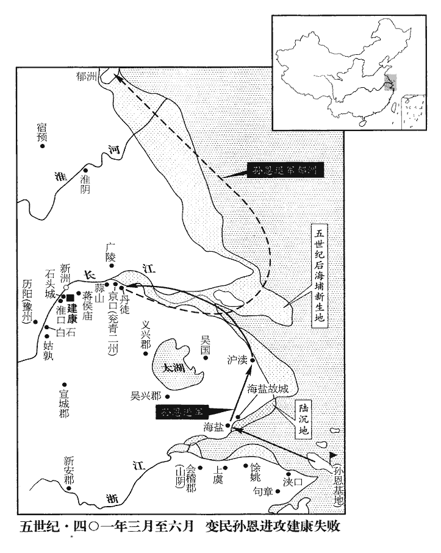
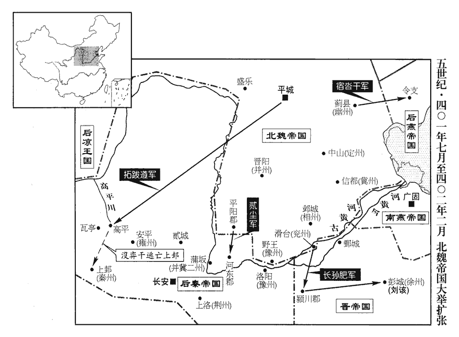
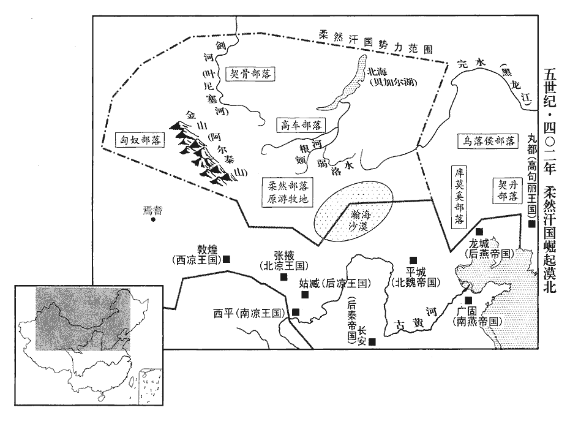
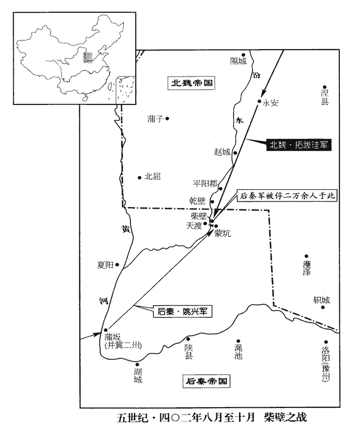

 晉紀三十四起重光赤奮若（辛丑），盡玄黓攝提格（壬寅），凡二年。

# 安皇帝丁

## 隆安五年（辛丑、四零一）

1春，正月，武威王利鹿孤欲稱帝，群臣皆勸之。安國將軍鍮tōu勿崙曰：安國將軍，漢獻帝以授張楊。鍮，託侯翻。崙，盧昆翻。「吾國自上世以來，被髮左衽，被，皮義翻。無冠帶之飾，逐水草遷徙，無城郭室廬，故能雄視沙漠，抗衡中夏。夏，戶雅翻。今舉大號，誠順民心。然建都立邑，難以避患，儲蓄倉庫，啟敵人心；不如處晉民於城郭，勸課農桑以供資儲，帥國人以習戰射，鄰國弱則乘之，強則避之，此久長之良策也。自漢以來，善為夷狄謀者，莫過此策矣。處，昌呂翻。帥，讀曰率。且虛名無實，徒足為世之質的，將安用之！」質受斧，的受矢。按詩：發彼有的，毛傳云：的，質也。正義曰：毛氏於射侯之事，正鵠hú不明；惟猗嗟傳云：二尺曰正，亦不言正之所施。周禮鄭眾、馬融註，皆云十尺曰侯，四尺曰鵠，二尺曰正，四寸曰質；則以為侯皆一丈，鵠及正、質於一侯之中為此等級，則以質為四寸也。王肅引爾雅云：射，張皮謂之侯，侯中謂之鵠，鵠中謂之正，正方二尺；正中謂之槷niè，槷方六寸。槷則質也。舊云方四寸，今云方六寸，爾雅說明，宜從之。肅意惟改質為六寸，餘同鄭、馬。賈逵周禮註云：四尺曰正，正五重，鵠居其內，而方二尺以為正，正大於鵠，鵠在正內，雖內外不同，亦共在一侯。鄭於周禮上下檢之，以為大射之侯，其中制皮為鵠，賓射之侯，其中采畫為正，正大如鵠，皆居侯中三分之一。其燕射則射獸侯，侯中畫為獸形，即鄉射記所謂熊侯白質之類。射義云：孔子曰：循聲而發；發而不失正鵠者，其惟賢者乎！詩云：發彼有的，以祈爾爵。既言正鵠，即引此的。則詩人之意以的為正鵠之謂也。司裘註說皮侯之狀云：以虎、熊、豹、麋之皮飾其側，又方制之以為質，謂之鵠。是鄭意以侯中所射之處為質也。此毛傳唯言的質也。利鹿孤曰：「安國之言是也。」乃更稱河西王，更，工衡翻。王武威則一郡而已，王河西則欲兼漢四郡之地，此利鹿孤之志也。以廣武公傉檀為都督中外諸軍事、涼州牧、錄尚書事。傉，奴沃翻。

〖译文〗 [1]春季，正月，南凉武威王秃发利鹿孤准备称皇帝，大臣们也都一致劝他进位。只有安国将军勿仑说：“我们国家自从祖先到现在，都习惯于披散头发，左边开衣襟，从来没有帽子腰带之类的装饰，只是追逐选择有水、有草的地方不断迁徙居住，没有城郭家室居所的拖累，所以我们能够在沙漠的各部族中称雄，与中原的汉族人相抗衡。现在提高为皇帝的名号，当然是顺应民心的事情，但是，如果设立都城，建筑固定的居住地，那么，就很难灵活地躲避战乱；如果把我们的积蓄全部储存在仓库之中，又容易引起敌人贪心，所以，我看不如把汉人安置在城郭之中，鼓励他们从事农田、养蚕，来供应我们的给养储备。同时再统领我们本族的人进行战斗射箭的训练。一旦我们相邻的国家弱小，那么我们就乘机把它吞并；相邻的国家强大，那么我们也可以随时躲避。这才是长久的好策略。况且，帝王的虚名，没有什么实际的意义，只是足够做世人的刀砧箭靶，成为别人攻击的目标，还能拿它干什么用呢？”秃发利鹿孤说：“安国将军所说的太对了。”于是改称为河西王，又任命广武公秃发檀为都督中外诸军事、凉州牧、录尚书事。

2二月，丙子‹一›，孫恩出浹口‹浙江宁波东北甬江口›，浹jiā，即叶翻。攻句章‹浙江宁波南›，不能拔。劉牢之擊之，恩復走入海‹舟山岛›。復，扶又翻。

〖译文〗 [2]二月，丙子（初一），孙恩又从浃口返回陆地，进攻句章，没有攻克。刘牢之率兵向他发起进攻，孙恩再一次逃进大海的岛中。

3秦王興使乞伏乾歸還鎮苑川‹甘肃榆中东北›，盡以其故部眾配之。為乞伏氏復強張本。

〖译文〗 [3]后秦王姚兴派乞伏乾归回去镇守苑川，把他过去的老部下、军队，全部分配给他。

4涼王纂zuǎn嗜酒好獵，好，呼到翻。太常楊穎諫曰：「陛下應天受命，當以道守之。今疆宇日蹙，崎嶇二嶺之間，姑臧‹甘肃武威›南有洪池嶺，西有丹嶺，一作「刪丹嶺」。陛下不兢兢夕惕以恢弘先業，而沈湎遊畋，沈，持林翻。不以國家為事，臣竊危之。」纂遜辭謝之，然猶不悛。

〖译文〗 [4]后凉王吕纂生性喜欢喝酒，爱好打猎，太常杨颖劝告他说：“陛下顺应上天的意旨，接受了治理国家的重任，所以应当用符合正道的方式恪守自己的使命。现在，我们国家的疆土面积一天比一天缩小，仅仅局限在坎坷不平的两道山岭中间，陛下不小心谨慎地早晚考虑，用什么办法恢复弘扬祖先的事业，反而却沉溺于游玩打猎，不把国家的事情当做一回事，依臣下的愚见，这样是很危险的呀！”吕纂非常谦恭地向他道歉，感谢他的提醒，但是却没能改过。

番禾‹甘肃永昌›太守呂超擅擊鮮卑思盤，番禾縣，漢屬張掖郡，後漢、晉省。番，音盤。此郡蓋呂氏置。劉昫曰：「唐涼州天寶縣，漢番禾縣地。悛，七緣翻。番，音盤。思盤遣其弟乞珍訴於纂，纂命超及思盤皆入朝。朝，直遙翻。超懼，至姑臧，深自結於殿中監杜尚。纂見超，責之曰：「卿恃兄弟桓桓，孔安國曰：桓桓，武貌。乃敢欺吾，今人謂相陵為相欺。要當斬卿，天下乃定！」超頓首謝。纂本以恐愒超，愒kài，許葛翻。實無意殺之。因引超、思盤及群臣同宴於內殿。超兄中領軍隆數勸纂酒，數，所角翻。纂醉，乘步輓wǎn車，步輓車不用牛馬若羊等，令人步而輓之。魏書禮志：步輓車，天子小駕，亦為副乘。將超等游禁中。將，如字。至琨華堂東閤，車不得過，纂親將竇川、駱騰倚劍於壁，推車過閤。將，即亮翻。推，吐雷翻。超取劍擊纂，纂下車禽超，超刺纂洞胸；刺，七亦翻。川、騰與超格戰，超殺之。纂后楊氏命禁兵討超；杜尚止之，超之結尚也，蓋有密約。皆捨仗不戰。將軍魏益多入，取纂首，楊氏曰：「人已死，如土石，無所復知，何忍復殘其形骸乎！」復，扶又翻。益多罵之，遂取纂首以徇曰：「纂違先帝之命，殺太子而自立，事見上卷三年。荒淫暴虐。番禾‹甘肃永昌›太守超順人心而除之，以安宗廟，凡我士庶，同茲休慶！」

〖译文〗 番禾太守吕超擅自攻击鲜卑部落的首领思盘，思盘派他的弟弟乞珍向吕纂告状。吕纂命令吕超和思盘都到朝中来。吕超很害怕，到了姑臧之后，私自与殿中监杜尚结成很深的交情。吕纂召见吕超，斥责他说：“你依仗你们兄弟勇武，结成一伙，竟敢欺侮到我的头上，我应当杀了你，天下才能安定吧？”吕超磕头认错。吕纂本来也就是要恐吓一下他，其实并没有杀他的意思，所以，把吕超、思盘，以及大臣们全部带到内殿，一起赴宴。吕超的哥哥中领军吕隆在宴会上不断地向吕纂劝酒，致使吕纂酩酊大醉，醒眼朦胧地乘坐着人拉着的辇车，带着吕超等人游玩观赏禁宫。到了琨华堂东阁，辇车不能过去，吕纂的亲信将领窦川、骆腾便把佩剑取下，倚靠在墙上，然后把车推过阁去。吕超突然拿起剑刺杀吕纂，吕纂赶紧下车来擒拿吕超，被吕超在胸口刺穿了一个血洞。窦川、骆腾空着手与吕超格斗，也被吕超杀掉。吕纂的皇后杨氏闻讯后赶出，命令禁卫军攻击吕超，但殿中监杜尚却出来阻止他们动手，所以，那些士兵们也都扔下武器，不参加战斗。这时，将军魏益多进宫，把吕纂的脑袋砍了下来，杨皇后说：“他人已经死了，尸体跟土和石头那样，再也没有什么知觉了，你怎么忍心又去摧残他的形骸呢？”魏益多大骂杨皇后，于是，把吕纂的人头拿出去对外面说：“吕纂违背先帝的遗嘱，杀害了太子，自己夺占皇位，并且荒淫、残暴、凶恶。番禾太守吕超顺应人心，把他除掉了，使国家的宗庙社稷得到和平安宁，凡是我国的官民人等，都应该一起庆贺！”

纂叔父巴西公佗、佗，徒河翻。弟隴西公緯皆在北城。緯，于貴翻。或說緯曰：「超為逆亂，公以介弟之親，杜預曰：介，大也。說，輸芮翻；下同。仗大義而討之，姜紀、焦辨在南城，楊桓、田誠在東苑，皆吾黨也，何患不濟！」緯嚴兵欲與佗共擊超。佗妻梁氏止之曰：「緯、超俱兄弟之子，何為舍超助緯，自為禍首乎！」舍，讀曰捨。佗乃謂緯曰：「超舉事已成，據武庫，擁精兵，圖之甚難；且吾老矣，無能為也。」超弟邈有寵於緯，說緯曰：「纂賊殺兄弟，謂殺紹又殺弘也。說，輸芮翻。隆、超順人心而討之，正欲尊立明公耳。方今明公先帝之長子，當主社稷，人無異望，夫復何疑！」長，知兩翻。復，扶又翻。緯信之，乃與隆、超結盟，單馬入城；超執而殺之。讓位於隆，隆有難色。超曰：「今如乘龍上天，豈可中下！」隆遂即天王位，隆，字永基，光弟寶之子也。大赦，改元神鼎。超先於番禾得小鼎，以為神瑞，故以紀元。尊母衛氏為太后，妻楊氏為后；以超為都督中外諸軍事、輔國大將軍、錄尚書事，封安定公；諡纂曰靈帝。

〖译文〗 吕纂的叔叔巴西公吕佗、弟弟陇西公吕纬此时都在北城。有人对吕纬说：“吕超制造叛乱，您以皇弟的名义和亲情，依仗大义来讨伐他们，又有姜纪、焦辨在南城，杨桓、田诚在东苑，都是我们的死党亲信，还有什么担心不能成功的！”因此，吕纬便号令部队整装待发，准备与吕佗一起发兵去进攻吕超。吕佗的妻子梁氏阻止他说：“吕纬、吕超都是我们的侄儿，你为什么要舍弃吕超而来帮助吕纬呢？难道要自己主动去做罪魁祸首吗？”吕佗于是去对吕纬说：“吕超发动事变已经成功，他占领了武器仓库，把持了精壮的部队，现在再去攻击他实在难以取胜，况且我们已经老了，不能再有什么作为了。”吕超的弟弟吕邈，得到吕纬的宠信，也劝说吕纬道：“吕纂这家伙，杀害自己的兄弟，吕隆、吕超顺应人心来讨伐他，正准备要来尊崇拥立明公您啊。现在您是先帝的儿子中最年长的，无疑应当主持国家大局，别人都没有别的想法，您还有什么可以怀疑的呢？”吕纬听信了他的话，于是，跟吕隆、吕超缔结了盟约，自己便一个人骑马进了都城，但吕超马上把他抓住杀了。吕超让位给吕隆，吕隆的脸上露出为难的表情。吕超说：“今天你好像是骑着龙向天上飞，怎么可以半路上下来呢？”吕隆于是登上了天王的座位，实行大赦，改年号为神鼎，尊称母亲卫氏为皇太后，立妻子杨氏为皇后，任命吕超为都督中外诸军事、辅国大将军、录尚书事，封安定公；追谥吕纂为灵帝。

纂后楊氏將出宮，超恐其挾珍寶，命索之。索，山客翻。楊氏曰：「爾兄弟不義，手刃相屠，我旦夕死人，安用寶為！」超又問玉璽所在。璽，斯氏翻。楊氏曰：「已毀之矣。」后有美色，超將納之，謂其父右僕射桓曰：「后若自殺，禍及卿宗！」桓以告楊氏。楊氏曰：「大人賣女與氐以圖富貴，一之謂甚，其可再乎！」引左傳之言。遂自殺，諡曰穆后。桓奔河西王利鹿孤，利鹿孤以為左司馬。

〖译文〗 吕纂的皇后杨氏，即将出宫，吕超怕她带走珍宝，便命人去搜查她。杨皇后说：“你们兄弟不义，互相亲手屠杀，我也是早晚要死的人，还用珍宝干什么？”吕超又问她玉玺在什以地方，杨皇后说：“已经把它毁掉了。”杨皇后相貌很美。吕超打算娶她，告诉她的父亲右仆射杨桓说：“杨皇后如果自杀，大祸就要降临你们全家族。”杨桓把这话告诉了杨皇后。杨皇后说：“父亲把女儿卖给氐人，用来谋求荣华富贵，卖一次就已经很过分了，怎么还可以再卖第二次呢？”于是自杀，谥号叫穆后。杨桓投奔南凉的河西王秃发利鹿孤，秃发利鹿孤任命他为左司马。

5三月，孫恩北趣海鹽‹浙江海盐›，海鹽縣本武原鄉，秦以為海鹽縣，漢屬會稽郡，後漢、晉屬吳郡，今在秀州東南八十里。趣，七喻翻。劉裕隨而拒之，築城於海鹽故治‹浙江平湖东南乍浦镇›。恩日來攻城，裕屢擊破之，斬其將姚盛。城中兵少不敵，將，即亮翻。少，詩沼翻。裕夜偃旗匿眾，明晨開門，使羸疾數人登城。羸，倫為翻。賊遙問劉裕所在。曰：「夜已走矣。」賊信之，爭入城。裕奮擊，大破之。恩知城不可拔，乃進向滬瀆‹上海青浦›，裕復棄城追之。滬，音戶。復，扶又翻。

〖译文〗 [5]三月，孙恩又回到大陆，向北逼近海盐。刘裕紧追不放，与他抵抗，在海盐的旧城址上修筑阵地。孙恩几乎每天都来对刘裕阵地发动进攻，但刘裕几次都把孙恩击败，斩杀了他的将领姚盛。城里的部队因为太少难以抵挡，刘裕当夜就把战旗全部放倒，把精锐部队埋伏起来，第二天早晨打开城门，让几个老弱残兵登上城墙，变民部队一看，远远地向他们打听刘裕到哪里去了。他们说：“昨天夜里已经逃跑了。”那些变民部队的士卒相信了他们的话，争先恐后地进了城。刘裕突然向他们发动了猛攻，将变民部队打得大败。孙恩知道不可能把这座城攻克，于是改向沪渎进军，刘裕便也放弃了这座城池，追击孙恩。

海鹽令鮑陋遣子嗣之帥吳兵一千，請為前驅。帥，讀曰率。裕曰：「賊兵甚精，吳人不習戰，若前驅失利，必敗我軍，敗，補邁翻。可在後為聲勢。」嗣之不從。裕乃多伏旗鼓。前驅既交，諸伏皆出，裕舉旗鳴鼓，賊以為四面有軍，乃退。嗣之追之，戰沒。裕且戰且退，所領死傷且盡，至向戰處，令左右脫取死人衣以示閒暇。閒，讀曰閑。賊疑之，不敢逼。裕大呼更戰，呼，火故翻。賊懼而退，裕乃引歸。

〖译文〗 海盐令鲍陋遣派他的儿子鲍嗣之率领吴地的军卒一千人，请求做刘裕部队的前锋。刘裕说：“强盗们的兵力非常精良，吴地人又不习惯于征战，如果一旦前锋部队失利，那么，必定会使我军遭到失败。你们可以在后面制造声势。”鲍嗣之却不听从安排，刘裕于是只好埋伏下很多战旗战鼓。吴地人的前锋部队与变民军队交上战之后，几支伏兵便都一齐杀出，刘裕又让人挥舞旗帜，呜击战鼓，变民的军队以为是四下里都有军队伏击，才退了下去。鲍嗣之莽撞跟踪追击，在战斗中被杀死。刘裕也一边交战一边撤退，所带领的军卒几乎全部伤亡，退到刚开始接战的地方，命令左中的军卒脱下死人的衣服拿走，用来显示自己情志闲暇，从容不迫。变民军队果然满腹狐疑，不敢逼进。刘裕突然高声呐喊，指挥军队回头再战，孙恩军队恐惧异常，掉头撤退，这样，刘裕才安全地带着部队回去。

6河西王利鹿孤伐涼，與涼王隆戰，大破之，徙二千餘戶而歸。

〖译文〗 [6]南凉河西王秃发利鹿孤讨伐后凉，与后凉王吕隆接战，将吕隆打得大败，强行迁移二千多户居民之后便回去了。

7夏，四月，辛卯‹十七›，魏人罷鄴行臺，魏置鄴行臺，見一百一十卷隆安二年。以所統六郡置相州，以庾岳為刺史。魏相州統魏郡、陽平、廣平、汲郡、頓丘、清河六郡。杜佑曰：後魏置相州於鄴，取河亶dǎn甲居相以名州。

〖译文〗 [7]夏季，四月，辛卯（十七日），北魏朝廷撤销设置在邺城的行台，把原由行台所管辖的六郡建置相州，任命庾岳为相州刺史。

8乞伏乾歸至苑川‹甘肃榆中东北›，以邊芮為長史，王松壽為司馬，公卿、將帥皆降為僚佐、偏裨pí。將，即亮翻。帥，所類翻。

〖译文〗 [8]后秦归义侯乞伏乾归回到苑川，任命边芮为长史，王松寿为司马，原来的公卿、将帅都降为慕僚佐属、偏军牙将等小官。

9北涼王業憚沮渠蒙遜勇略，欲遠之，沮，子余翻。遠，于願翻。蒙遜亦深自晦匿。業以門下侍郎馬權代蒙遜為張掖太守；守，式又翻。權素豪雋，為業所親重，常輕侮蒙遜。蒙遜譖之於業曰：「天下不足慮，惟當憂馬權耳。」業遂殺權。以余觀之，索嗣、馬權皆庸夫耳，恃倚世資而使氣，無能為也。

〖译文〗 [9]北凉王段业对张掖太守沮渠蒙逊的勇武谋略都很忌惮，所以打算疏远他，沮渠蒙逊也对此有所察觉，暗自尽量地韬光养晦，不使自己的才能外露。段任命门下侍郎马权代替沮渠蒙逊担任张掖太守。马权平时为人豪放俊拔，一直被段业亲信重用，所以，他常常依仗这轻慢、欺侮沮渠蒙逊。沮渠蒙逊于是向段业说马权的坏话道：“天下没有什么值得忧虑的事，您只应当提防马权就可以了。”段业于是杀了马权。

蒙遜謂沮渠男成曰：「段公無鑒斷之才，鑒，明也；斷，決也。斷，丁亂翻。非撥亂之主，曏所憚者惟索嗣、馬權，今皆已死，索嗣死見上卷四年。蒙遜欲除之以奉兄，何如?」男成曰：「業本孤客，為吾家所立，恃吾兄弟猶魚之有水。夫人親信我而圖之，不祥。」蒙遜乃求為西安‹甘肃山丹西›太守，業喜其出外，許之。

〖译文〗 沮渠蒙逊对沮渠男成说：“段公没有鉴别真假、判断优劣的才能，不是一个平定乱世的圣明君主，我以前所忌惮担心的只有索嗣，马权二人，现在他们都已经死了，我沮渠蒙逊准备除掉段业而来拥戴兄长您，怎么样？”沮渠男成说：“段业本来就是一个孤身而来的外乡人，是我们沮渠家拥立他登上王位的，他依靠我们兄弟就像鱼必须有水那样。像这样，人家亲近宠信我们，但我们却反过来要图谋他，一定不吉利。”沮渠蒙逊于是请求出京去做西安太守，段业对他能远远离开自己，到外地去做官，非常高兴，马上答应了他。

蒙遜與男成約同祭蘭門山‹甘肃山丹西南四十公里›，而陰使司馬許咸告業曰：「男成欲以取假日為亂，假，居訝翻，休假也。若求祭蘭門山，臣言驗矣。」至期，果然。業收男成賜死。男成曰：「蒙遜先與臣謀反，臣以兄弟之故，隱而不言。今以臣在，恐部眾不從，故約臣祭山而反誣臣，其意欲王之殺臣也。乞詐言臣死，暴臣罪惡，蒙遜必反，臣然後奉王命而討之，無不克矣。」業不聽，殺之。蒙遜泣告眾曰：「男成忠於段王，而段王無故枉殺之，諸君能為報仇乎?為，于偽翻。且始者共立段王，欲以安眾耳；今州土紛亂，非段王所能濟也。」男成素得眾心，眾皆憤泣爭奮，比至氐池‹甘肃张掖东›，氐池縣，漢屬張掖郡，晉省，其地屬唐甘州張掖縣界。比，必寐翻，及也。氐，丁尼翻，又音低。眾逾一萬；鎮軍將軍臧莫孩率所部降之，孩，河開翻。降，戶江翻；下同。羌、胡多起兵應蒙遜者。蒙遜進逼【章：甲十一行本「逼」作「壁」；乙十一行本同；孔本同；張校同。】侯塢‹甘肃张掖东›。

〖译文〗 沮渠蒙逊与沮渠男成约定一起去兰门山祭祀，但是，又暗地里派司马许咸事先向段业报告说：“沮渠男成打算在请假休息的时候发动政变，如果他来请求到兰门山去设祭，那么，臣的话就应验了。”到了那一天，果然是这样。段业不分青红皂白，把沮渠男成抓了起来，命令他自杀。沮渠男成马上明白了这件事的原委，说：“沮渠蒙逊一开始与臣阴谋造反，臣因为是兄弟的原因，才把这件事隐瞒下来没有说。现在因为有臣在这里，他害怕造反之后部众不肯跟他，所以事先约臣去兰门山设祭，但马上又反过来诬陷臣，他的意思就是让凉王您杀了臣呀。我请求陛下先假装着说臣已经死，并把臣的所谓罪恶公开。沮渠蒙逊一定会造反，臣随后奉陛下的命令、带兵去讨伐他，没有不能战胜的道理。”但是，段业不听，把沮渠男成杀了。沮渠蒙逊哭着对手下的众人说：“沮渠男成对段王忠诚不二，但是段王却无缘无故地把他给冤杀了，你们诸位能为他报仇雪恨吗？况且一开始的时候，我们一起拥立段王，本打算能使大家的生活安定。现在各地的疆土纷乱不堪，事实证明段王已经不能有所作为，拯救乱世了。”沮渠男成平素很得人心，因此，大家一听此话，都慷慨激昂，悲愤流泪，奋勇争先，等开进到了氐池的时候，主动参加进来的人已经超过一万。镇军将军臧莫孩率领着他所带的队伍也投降了过来，羌族、胡人也有许多人拉起队伍响应沮渠蒙逊。沮渠蒙逊的队伍向前逼近到了侯坞。

業先疑右將軍田昂，囚之；至是召昂，謝而赦之，使與武衛將軍梁中庸共討蒙遜。別將王豐孫言於業曰：將，即亮翻。「西平‹青海西宁›諸田，世有反者，昂貌恭而心險，不可信也。」業曰：「吾疑之久矣；但非昂無可以討蒙遜者。」昂至侯塢，率騎五百降於蒙遜，業軍遂潰，中庸亦詣蒙遜降。危疑反側之時，用言為難，而用人為尤難，當此之際，非有明略雄斷不能濟也。

〖译文〗 段业在这之前怀疑右将军田昂对自己不忠实，因此，把他囚禁起来。到了这时，又把田昂召了回来，向他道歉并赦免了他，派他与武卫将军梁中庸一起去征讨沮渠蒙逊，别将王丰孙向段业进言道：“西平郡出来的那些姓田的人，哪一代都有叛变的，田昂这个人外貌看来谦恭谨慎，但是内心里却阴险狡诈，不可信赖。”段业说：“我怀疑他已经很久了，但是如果不是田昂，我这里就再也没有可以带兵去征讨沮渠蒙逊的人了。”田昂带兵来到侯坞，率领着五百名骑兵向沮渠蒙逊投降，段业的军队于是便不战而自行溃散，梁中庸也来面见沮渠蒙逊投降。

五月，蒙遜至張掖，田昂兄子承愛斬關內之，業左右皆散。蒙遜至，業謂蒙遜曰：「孤孑然一己，為君家所推，願匄餘命，匄gài，古泰翻，乞也。使得東還與妻子相見。」蒙遜斬之。北涼段業四年而亡。

〖译文〗 五月，沮渠蒙逊的大军到达张掖，田昂的侄儿田承受砍开城门把他们放进城内，段业的左右侍从卫士们也都跑散了。沮渠蒙逊进城，段业对沮渠蒙逊说：“我孤零零地只有一个人，被你们家推举，才坐上了王位。我请求你留下我的活命，让我能够回到东土去，和我的妻子儿女相见。”沮渠蒙逊没有答应，把他杀了。

業，儒素長者，長，知兩翻。無他權略，威禁不行，群下擅命，尤信卜筮、巫覡，覡xí，刑狄翻。故至於敗。

〖译文〗 段业，是一个仅死板地信奉儒家学说的长者，并没有什么其它的权谋和智略，因此，他的声威和命令都不能很好地得到尊重和传达，他手下的人也都擅做主张，不听朝廷的调遣，尤其是，他又特别相信占卜和巫术，所以才导致了最后的失败。

沮渠男成之弟富占、将軍俱傫lěi帥户五百降于河西王利鹿孤。傫，石子之子也。傫，倫追翻。俱石子見一百六卷孝武太元十年。帥，讀曰率；下同。

〖译文〗 沮渠男成的弟弟沮渠富占、将军俱统率着五百户居民向南凉河西王秃发利鹿孤投降。俱是俱石子的儿子。

10孫恩陷滬瀆，殺吳國‹江苏苏州›內史袁崧，死者四千人。「崧」，當作「山松」。

〖译文〗 [10]孙恩的军队攻克了沪渎，杀了吴国内史袁崧，在这场战斗中死亡四千人。

11涼王隆多殺豪望以立威名，內外囂然，人不自保。魏安‹甘肃古浪东›人焦朗，魏安縣在武威昌松縣界，蓋曹魏所置也，而晉志不見。後魏置魏安郡。遣使說秦隴西公碩德曰：「呂氏自武皇棄世，呂光偽諡懿武皇帝。說，輸芮翻。兄弟相攻，政綱不立，競為威虐，百姓饑饉，死者過半。今乘其篡奪之際，取之易於返掌，易，以豉翻。「返」，當作「反」。不可失也。」碩德言於秦王興，帥步騎六萬伐涼，乞伏乾歸帥騎七千從之。

〖译文〗 [11]后凉王吕隆，采用大肆杀戮有声望的豪门大族的办法，用来树立自己的威信和名望，因此，朝廷内外议论纷纷，一片哗然，人人自危。魏安人焦朗派遣使节向后秦陇西公姚硕德游说道：“吕氏自从武皇吕光去世之后，兄弟之间互相攻击残害，朝廷的大政法纪也不能确立遵守，人们只是比赛着看谁更加粗鲁暴虐，百姓却因为饥饿灾荒，死的已经超过一半。现在乘他们之间正在热心于互相篡夺残杀的机会，消灭他们易如反掌。千万不可失去机会呀！”姚硕德把这话向后秦国主姚兴作了汇报，然后便率步、骑兵六万人，对后凉发动了大规模的进攻，归义侯乞伏乾归也带着一支七千人的骑兵部队，跟着姚硕德一起出征。

12六月，甲戌‹一›，孫恩浮海奄至丹徒‹江苏镇江东丹徒镇›，丹徒縣，古朱方也，後曰谷陽，秦改曰丹徒，漢屬會稽郡，後漢屬吳郡，晉屬晉陵郡。地理志曰：秦時，望氣者云其地有天子氣，始皇使赭zhě衣三千人鑿城敗其勢，改曰丹徒。戰士十餘萬，樓船千餘艘，艘，蘇遭翻。建康‹南京›震駭。乙亥‹二›，內外戒嚴，百官入居省內；冠軍將軍高素等守石頭‹南京西北›，冠，古玩翻。輔國將軍劉襲柵斷淮口，秦淮入江之口也。斷，丁管翻。丹陽尹司馬恢之戍南岸，冠軍將軍桓謙等備白石‹安徽当涂西南›，左衛將軍王嘏gǔ等屯中堂，徵豫州刺史譙王尚之入衛京師。

〖译文〗 [12]六月，甲戌（初一），孙恩从海上发兵，突然出现在丹徒，有士兵十多万人，战舰一千多艘。这使东晋的都城建康大为震惊恐慌。乙亥（初二），东晋都城内外戒严，文武百官全部聚集在台省机构内居住，随时办公。冠军将军高素等人据守石头，辅国将军刘袭则带兵用木栅栏将淮口切断，丹阳尹司马恢之戍守在长江南岸，冠军将军桓谦等人在白石驻防，左卫将军王嘏等屯兵中堂，征召豫州刺史谯王司马尚之来京师卫守。

劉牢之自山陰‹浙江绍兴›引兵邀擊恩，未至而恩已過，乃使劉裕自海鹽‹浙江海盐›入援。裕兵不滿千人，倍道兼行，與恩俱至丹徒。裕眾既少，少，詩紹翻。加以涉遠疲勞，而丹徒守軍莫有鬬志。恩帥眾鼓譟，登蒜山‹江苏镇江西金山›，蒜山，今在鎮江府城西三里，山上多蒜，故名。蒜，蘇貫翻。居民皆荷擔而立。荷，下可翻。擔，都濫翻。裕帥所領奔擊，大破之，帥，讀曰率；下同。投崖赴水【章：甲十一行本「水」下有「死」字；乙十一行本同；孔本同；張校同。】者甚眾，恩狼狽僅得還船。然恩猶恃其眾，尋復整兵徑向京師‹南京›。復，扶又翻；下同。後將軍元顯帥兵拒戰，頻不利。會稽王道子無他謀略，唯日禱蔣侯廟。蔣侯廟在蔣山，在今建康府上元縣東北十八里。漢末，秣陵‹江苏江宁南秣陵乡›尉蔣子文討賊，戰死山下，吳孫權為立廟，江東朝野禱之，率有靈應。恩來漸近，百姓恟懼。恟，許拱翻。譙王尚之帥精銳馳至，徑屯積弩堂。恩樓船高大，泝sù風不得疾行，數日乃至白石。恩本以諸軍分散，欲掩不備，既而知尚之在建康，復聞劉牢之已還，至新洲，新洲在京口西大江中，意即今之珠金沙是也。復，扶又翻。不敢進而去，浮海北走郁洲‹江苏连云港东小岛›。水經註曰：東海朐qú縣東北海中有大洲，謂之郁洲，山海經所謂「郁山在海中」者也。恩別將攻陷廣陵‹江苏扬州›，殺三千人。寧朔將軍高雅之擊恩於郁洲，為恩所執。寧朔將軍蓋晉置。

〖译文〗 刘牢之从山阴带兵前来截击孙恩，还没有赶到，孙恩的兵马已经过去了，于是，他让刘裕从海盐迅速赶来援助。刘裕的兵众一共也不满一千人，日夜兼程，一路急行军才与孙恩的部队几乎同时赶到了丹徒。刘裕的兵卒本来就少，再加上赶很远的路，已经疲惫不堪，而丹徒原有的东晋守军又没有丝毫的斗志。孙恩率领他的部队一齐高声呐喊，擂鼓助威，登上了蒜山，而当地的居民则都挑着担子站在那里。刘裕率领着他手下的士兵奔向前去，对孙恩部队发动攻击，并把他们打得大败，变民从山崖上摔下，落入水中淹死的非常多，孙恩也仓惶狼狈得仅仅逃回到船上，才保住了命。但是他仍然依仗他自己的兵多，很快便重新整顿好部队，径直向京师开进了。后将军司马元显率领部队前来迎战，但却不断地战败失利。会稽王司马道子没有其他办法，只是天天去到蒋侯庙去祭祀祈祷。孙恩的部队距离建康已经越来越近了，百姓人心惶惶，非常恐惧。谯王司马尚之统领着他的精锐部队及时赶到，直接驻守在积弩堂。孙恩的战舰非常高大，逆风行驭速度便无法加快，所以几天之后才到达白石。孙恩本来以为东晋各支部队驻守的地区比较分散，因此打算趁他们没有准备，发动突然袭击。但是到达白石后，得知司马尚之的部队正在建康，又听说刘牢之也已经回军，据守在新洲，所以，他再也不敢继续前进，只好回军，从海路，向北直扑郁洲。孙恩手下的其他将领攻克了广陵，杀死了三千人。宁朔将军高雅之在郁洲向孙恩发动进攻，却被孙恩的军队抓获。

 

桓玄厲兵訓卒，常伺朝廷之隙，伺，相吏翻。聞孫恩逼京師，建牙聚眾，上疏請討之。元顯大懼。會恩退，元顯以詔書止之，玄乃解嚴。

〖译文〗 荆州刺史桓玄无时无刻不在磨砺兵器，训练部队，经常严密注视着朝廷内部所出现的每一个对自己有利的微小变化。当他听说孙恩逼近京师，便赶紧树起军旗，集结队伍，向朝廷呈上疏奏，请求带兵去征讨孙恩。司马元显对此大为恐惧。正好赶上孙恩的军队撤了回去，于是，司马元显以诏书制止桓玄起兵，桓玄无奈，只好命令部队解除戒备。

13梁中庸等共推沮渠蒙遜‹时年三十四›為大都督、大將軍、涼州牧、張掖公，赦其境內，改元永安。蒙遜署從兄伏奴為張掖太守、和平侯，弟挐rú為建忠將軍、都谷侯，從，才用翻。挐，女余翻。田昂為西郡‹甘肃永昌西北›太守，臧莫孩為輔國將軍，房晷、梁中庸為左右長史，張騭、謝正禮為左右司馬；騭，之日翻。擢任賢才，文武咸悅。

〖译文〗 [13]北凉武卫将军梁中庸等人，一起推举沮渠蒙逊担任大都督、大将军、凉州牧、张掖公，他下令在他所管辖的范围内实行大赦，改年号为永安。沮渠蒙逊又任命他的堂兄沮渠伏奴为张掖太守、和平侯，任命他的弟弟沮渠为建忠将军、都谷侯，田昂为西郡太守，命臧莫孩为辅国将军，房晷、梁中庸为左右长史，张骘、谢正礼为左右司马。这样，他擢升、任用的都是贤明有才干的人物，文武官员都感到很舒心、很高兴。

14河西王利鹿孤命群臣極言得失。西曹從事史暠曰：暠hào，古老翻。「陛下命將出征，將，即亮翻；下同。往無不捷；然不以綏寧為先，唯以徙民為務；民安土重遷，故多離叛，此所以斬將拔城而地不加廣也。」利鹿孤善之。

〖译文〗 [14]南凉河西王秃发利鹿孤下令，让群臣畅所欲言，指出他为政的得失好坏。西曹从事史说：“陛下命令将领们去出征伐战，去了便没有不得胜的。但是，我们打仗，不把安定民心、使他们的生活得到安宁作为首要的目的，而只是把迁移人口作为要务，百姓喜定居本土，不愿迁徙，所以经常出现离心叛逆的现象，这就是我们之所以斩杀敌将、攻克敌城，但是地域却不能更加拓展的原因。”秃发利鹿孤觉得他说得很对。

15秋，七月，魏兗州刺史長孫肥魏未得兗州也，使肥以兗州刺史南略地耳。將步騎二萬南徇許昌‹河南许昌东›，東至彭城‹江苏徐州›，將軍劉該降之。將步，即亮翻。騎，奇寄翻。降，戶江翻；下同。

〖译文〗 [15]秋季，七月，北魏兖州刺史长孙肥带领着步、骑兵共二万人，向南夺取了东晋的许昌，又向东进军到彭城。东晋将军刘该投降了他。

16秦隴西公碩德自金城‹甘肃兰州›濟河，直趣廣武‹甘肃永登›，河西王利鹿孤攝廣武守軍以避之。趣，七喻翻。攝，收也。秦軍至姑臧，涼王隆遣輔國大將軍超、龍驤將軍邈等逆戰，驤，思將翻。碩德大破之，生禽邈，俘斬萬計。隆嬰城固守，巴西公佗帥東苑之眾二萬五千降於秦。帥，讀曰率。西涼公暠、河西王利鹿孤、沮渠蒙遜各遣使奉表入貢於秦。暠，古老翻。使，疏吏翻。沮，子余翻。

〖译文〗 [16]后秦陇西公姚硕德从金城附近渡过黄河，径直向广武逼近，南凉河西王秃发利鹿孤调动他在广武的守军撤退，避开了后秦国讨伐后凉国的军队。后秦军队到达姑臧，后凉王吕隆派遣辅国大将军吕超、龙骧将军吕邈等和后秦军迎战，姚硕德把他们打得大败，活捉了吕邈，俘虏杀戮的后凉军卒数以万计。吕隆围绕着都城，指挥固守阵地。后凉巴西公吕佗率领着东苑的部队二万五千人向后秦投降，西凉公李、南凉河西王秃发利鹿孤、北凉张掖公沮渠蒙逊等都分别派遣使节捧着奏章，去向后秦纳贡。

初，涼將姜紀降於河西王利鹿孤，廣武公傉檀與論兵略，甚愛重之，傉，奴沃翻。坐則連席，出則同車，每談論，以夜繼晝。利鹿孤謂傉檀曰：「姜紀信有美才，然視候非常，必不久留於此，不如殺之。紀若入秦，必為人患。」傉檀曰：「臣以布衣之交待紀，紀必不相負也。」八月，紀將數十騎奔秦軍，禿髮兄弟皆推傉檀之明略，余究觀傉檀始末，未敢許也。又究觀姜紀自涼入秦始末，則紀蓋反覆詭譎jué之士，而傉檀愛重之，則傉檀蓋以才辨為諸兄所重，而智略不能濟，此其所以亡國也。說碩德曰：「呂隆孤城無援，明公以大軍臨之，其勢必請降；然彼徒文降而已，未肯遂服也。請給紀步騎三千，與王松怱因焦朗、華純之眾，王松怱，秦將也；焦朗、華純皆涼人。說，輸芮翻。華，戶化翻。伺其釁隙，隆不足取也。不然，今禿髮在南，兵強國富，若兼姑臧而據之，威勢益盛，沮渠蒙遜、李暠不能抗也，必将歸之，如此，則為國家之大敵矣。」碩德乃表紀為武威太守，配兵二千屯據晏然‹甘肃武威北›。班固地理志，武威休屠縣，王莽改曰晏然，後復曰休屠。永寧中，張軌於姑臧西北置武興郡，晏然縣屬焉。

〖译文〗 当初，后凉将军姜纪向南凉河西王秃发利鹿孤投降，广武公秃发檀与他探讨兵家战略，对他非常喜爱、推崇，如果坐下的话，便紧挨着、坐垫相连，如果出门的话，便一定要同坐一辆车，每次在一起谈论事情，都是白天说不完，晚上接着说。秃发利鹿孤对秃发檀说：“姜纪的确具有很高的才华，但是我通过观察，觉得他不是一个有常性的人，一定不会长久地留在我们这里，所以，不如把他杀了，否则，姜纪如果去了秦，一定会成为我们的祸患。”秃发檀说：“我以平民的身分，平等地对待他，和他交朋友，姜纪一定不会对不起我。”八月，姜纪带着几十个骑兵投奔后秦军，对姚硕德说：“吕隆只守住一座孤城，却没有外来的部队援助，明公您指挥大军围困在他的城下，在那种情况下，他一定会请求投降。但是，他这只是嘴上说投降而已，心里并不一定马上便肯于服从我们。请您交给我步、骑兵三千人，与王松匆将军一起，利用后凉归顺过来的焦朗、华纯所带的部队，在旁边等待着他们内部矛盾的产生和机会的出现，那么，吕隆的被征服，就根本不成问题了。如果不这样的话，现在秃发利鹿孤在南方，军队强壮、国家富有，假若再把姑臧城兼并占有的话，那么，他的威霸之势便会越发强盛，而沮渠蒙逊和李没有力量抵抗他们，也一定会向他归附。一旦这样，那可就是秦的强大敌人了。”姚硕德于是上奏请求任命姜纪做武威太守，并配给他一支两千人的部队，让他在晏然驻守。

秦王興聞楊桓之賢而徵之，利鹿孤不敢留。史言諸涼畏秦之強。

〖译文〗 后秦王姚兴听说杨桓非常贤明能干，便征召他到京师长安来，南凉河西王秃发利鹿孤也不敢擅自把他留下来。

17詔以劉裕為下邳太守，討孫恩於郁洲，累戰，大破之。恩由是衰弱，復緣海南走，復，扶又翻。裕亦隨而邀擊之。

〖译文〗 [17]东晋朝廷下诏，任命刘裕为下邳太守，命他去郁洲征讨孙恩，几次接战，都把变民部队打得大败，孙恩的势力从此衰弱下来，再一次沿海向南败逃，刘裕也紧追不放，不断地向孙恩部队发动进攻。

18燕王盛懲其父寶以懦弱失國，務峻威刑，又自矜聰察，多所猜忌，群臣有纖介之嫌，皆先事誅之，先，悉薦翻。由是宗親、勳舊，人不自保。丁亥‹十五›，左將軍慕容國與殿上【嚴：「上」改「中」。】將軍秦輿、段讚謀帥禁兵襲盛，殿上將軍蓋慕容所置，緣晉之殿中將軍而名官也。帥，讀曰率。事發，死者五百餘人。壬辰‹二十›夜，前將軍段璣與秦輿之子興、段讚之子泰潛於禁中鼓譟大呼；呼，火故翻。盛聞變，帥左右出戰，帥，讀曰率。賊眾逃潰。璣被創，創，初良翻。匿廂屋間。俄有一賊從闇中擊盛，盛被傷，輦升前殿，申約禁衛，事定而卒。年二十九。慕容盛臨變而整，此其雄略亦有過人者，然以猜忌好殺致斃，則天下之人固非一人可舞其智略而盡殺也。

〖译文〗 [18]后燕王慕容盛鉴于他的父亲慕容宝因为过于懦弱，所以才丢掉国家大权的教训，所以，一心要加强自己的威严，施刑苛刻，加上他又自以为很明察，对手下的很多人都非常猜疑忌恨，大臣们稍有一点嫌疑，他都先杀掉再说，因此，即便是王室宗亲，功臣元老，也都不能自保。丁亥（十五日），左将军慕容国与殿上将军秦舆、段阴谋率领禁卫军袭击慕容盛，事情暴露，牵连致死的有五百多人。壬辰（二十日）夜里，前将军段玑与秦舆的儿子秦兴、段的儿子段泰潜进禁宫之中擂鼓呐喊，大声呼叫。慕容盛听到有兵变的消息，率领着左右的亲兵出来迎战，兵变的众人逃跑溃散。段玑受了伤，藏到旁边的房屋之内。不一会儿，有一个参预兵变的士兵从黑暗中突然向慕容盛偷袭，刺中慕容盛，使他受到重伤。但在这种情况下，慕容盛还是坐着轿来到前殿，重新申述强调禁宫的规定，布置警卫，等事情安定之后才断气而死。

中壘將軍慕容拔、冗從僕射郭仲白太后丁氏，以為國家多難，宜立長君。冗，而隴翻。從，才用翻。難，乃旦翻。長，知兩翻。時眾望在盛弟司徒、尚書令、平原公元，而河間公熙素得幸於丁氏，丁氏乃廢太子定，密迎熙入宮。明旦，群臣入朝，朝，直遙翻。始知有變，因上表勸進於熙。熙以讓元，元不敢當。癸巳‹二十一›，熙即天王位，熙，字道文，垂之少子也。捕獲段璣等，皆夷三族。甲午‹二十二›，大赦。丙申‹二十四›，平原公元以嫌賜死。闰月，辛酉‹十九›，葬盛於興平陵，諡曰昭武皇帝，廟號中宗。丁氏送葬未還，中領軍慕容提、步軍校尉張佛等謀立故太子定，事覺，伏誅，定亦賜死。燕立定為太子，見上卷四年。丙寅‹二十四›，大赦，改元光始。

〖译文〗 中垒将军慕容拔、冗从仆射郭仲向太后丁氏禀报，认为现在国家多灾多难，应该拥立一个年龄较大的人。当时，大家的希望寄托在慕容盛的弟弟司徒、尚书令、平原公慕容元身上，但是河间公慕容熙在平时却很得丁太后的宠爱，于是丁太后便废黜了太子慕容定，秘密迎接慕容熙进宫。第二天早晨，文武大臣们进朝议政，才知道事情发生了变化，因此只好呈上奏章劝说慕容熙进位。慕容熙让位给慕容元，慕容元不敢接受。癸巳（二十一日），慕容熙登上了天王的位子，把段玑等人抓获，把他们的三族全部杀了。甲午（二十二日），实行大赦。丙申（二十四日），平原公慕容元，因为受猜忌，慕容熙命令他自杀。闰月（八月），辛酉（十九日），把慕容盛埋葬在兴平陵，追谥他叫昭武皇帝，庙号中宗。丁太后出城为儿子送葬还没有回城的时候，中领军慕容提、步军校尉张佛等阴谋拥立原太子慕容定，事情被发觉，他们又全都被杀。慕容熙又命令慕容定自杀。丙寅（二十四日），实行大赦，改年号为光始。

19秦隴西公碩德圍姑臧累月，東方之人在城中者多謀外叛，魏益多復誘扇之，復，扶又翻，下復生同。欲殺涼王隆及安定公超，事發，坐死者三百餘家。碩德撫納夷、夏，分置守宰，夏，戶雅翻。守，式又翻。節食聚粟，為持久之計。

〖译文〗 [19]后秦陇西公姚硕德围困姑臧已经几个月，城中的许多原籍东方一带的人，都计划着向城外的后秦军叛降。后凉将军魏益多又在里面诱骗煽动人们，准备杀了后凉王吕隆和安定公吕超，不想事情败露，因此牵连被杀的人有三百多家。姚硕德接纳安抚夷族汉族的所有当地居民，并分别安排了一些地方官吏，如太守、县宰等。他又命令手下的部队，节省粮食、积聚稻米，以此作为准备坚持长久围困姑臧的办法。

涼之群臣請與秦連和，隆不許。安定公超曰：「今資儲內竭，上下嗷嗷，雖使張、陳復生，亦無以為策。張良、陳平，智謀之士，故稱之。陛下當思權變屈伸，何愛尺書、單使為卑辭以退敵！使，疏吏翻。敵去之後，脩德政以息民，若卜世未窮，何憂舊業之不復！周成王定鼎于郟jiá鄏rǔ‹洛阳›，卜世三十，卜年七百。若天命去矣，亦可以保全宗族。不然，坐守困窮，終將何如?」隆乃從之，九月，遣使請降於秦。降，戶江翻；下同。考異曰：姚興載記，姚平伐魏與姚碩德伐呂隆同時。魏書，天興五年五月姚平來侵。晉元興元年，秦弘始四年也。晉帝紀、晉春秋皆云「隆安五年降秦」。十六國、西秦春秋云：「太初十四年、五月，乾歸隨姚碩德伐涼。」南涼春秋云：「建和二年，七月，姚碩德伐呂隆，孤攝廣武守軍以避之。」皆隆安五年也。按秦小國，既與魏相持，豈暇更興兵伐涼！蓋載記之誤也。今以晉帝紀、晉春秋、十六國、西秦、南涼春秋為據。碩德表隆為鎮西大將軍、涼州刺史、建康公。隆遣子弟及文武舊臣慕容筑、楊穎等五十餘家入質于長安。慕容筑，燕宗室也。苻堅滅燕，其宗室悉補邊郡，故筑留河西。筑，張六翻。質，音致；下為質同。碩德軍令嚴整，秋毫不犯，祭先賢，禮名士，西土悅之。

〖译文〗 后凉大臣们请求与后秦讲和联手，但吕隆坚决不同意。安定公吕超说：“现在，我们内部的蓄积已经基本枯竭，上上下下全部嗷嗷待哺，在这种情况下，即使让张良、陈平复活，他们也不会有用来摆脱这种困境的方法。陛下应该考虑根据情况有所权宜变通，能屈能伸，为什么那么看重一纸书信和一介使节，而不愿以几句谦卑的话就把强大的敌人骗得退兵呢？敌人撤退之后，我们可以致力于完善仁德的政事，用来使百姓获得休养生息。如果我们国家天定的气运还没有穷尽，何必担忧旧有的大业不能够恢复呢？如果天命到头了，这样也可以保全我们的宗族。如果不这样的话，只是坐在这里等着困乏穷极，到头来能怎么样呢？”吕隆这才听从。九月，派遣使者向后秦请求投降。姚硕德向朝廷呈上奏章，请求任命吕隆为镇西大将军、凉州刺史、建康公。吕隆派遣子弟以及一些原来的文武大臣慕容筑、杨颖等五十多家的人口到长安去做人质。姚硕德军令严厉整肃，对当地的居民一丝一毫也不予侵犯，并且祭祀历史上的贤明之士，对当世有名望的人也是厚礼相待，所以，在西部土地上生活的百姓，都非常高兴。

沮渠蒙遜所部酒泉‹甘肃酒泉›、涼寧‹甘肃酒泉东北›二郡叛降於西涼，酒泉郡治福祿縣。魏收地形志，涼寧郡領園池、貢澤二縣。又聞呂隆降秦，大懼，遣其弟建忠將軍挐rú、牧府長史張潛蒙遜自稱涼州牧，置牧府長史。挐，女居翻。見碩德於姑臧，請帥其眾東遷。帥，讀曰率。碩德喜，拜潛張掖太守，挐建康‹甘肃酒泉东南›太守。潛勸蒙遜東遷。挐私謂蒙遜曰：「姑臧未拔，呂氏猶存，碩德糧盡將還，不能久也，何為自棄土宇，受制於人乎！」臧莫孩亦以為然。孩，何開翻。

〖译文〗 沮渠蒙逊所属的酒泉、凉宁两个郡，都向西凉叛降，他又听说吕隆也投降了后秦，因此，非常害怕，他派遣他的弟弟建忠将军沮渠、牧府长史张潜去姑臧拜见姚硕德，请求允许他带着他的所有部众向东迁移。姚硕德非常高兴，任命张潜为张掖太守，沮渠为建康太守。张潜竭力地劝沮渠蒙逊率部属向东迁移。沮渠却在私下里对沮渠蒙逊说：“姑臧现在还没有被攻克，吕氏政权也还继续存在，姚硕德的部队粮草用尽之后，一定就会回去，不能呆得太久，为什么自己主动放弃已有的疆土，而去受别人的控制呢？”臧莫孩也深以为然。

蒙遜遣子奚念為質於河西王利鹿孤，蒙遜既不東遷，故納質於利鹿孤以求援。利鹿孤不受，曰：「奚念年少，可遣挐也。」少，詩照翻。冬，十月，蒙遜復遣使上疏於利鹿孤曰：「臣前遣奚念具披誠款，而聖旨未昭，復徵弟挐。復，扶又翻。臣竊以為，苟有誠信，則子不為輕，若其不信，則弟不為重。今寇難未夷，難，乃旦翻。不獲奉詔，願陛下亮之。」利鹿孤怒，遣張松侯俱延、興城侯文支將騎一萬襲蒙遜，至萬歲‹甘肃山丹东南›、臨松‹甘肃张掖东南›，晉書地理志，酒泉郡有延壽縣，當是後改為萬歲。張天錫置臨松郡。五代志曰：臨松縣有臨松山，後周省入張掖縣。宋白曰：隋煬帝併萬歲入刪丹縣，屬張掖郡。將，即亮翻。騎，奇寄翻。執蒙遜從弟鄯善苟子從，才用翻；下同。鄯，時戰翻。康曰：鄯善，複姓，其先西域人，以國為姓，苟子其名。余據紀文，以鄯善苟子為蒙遜從弟，則鄯善非姓也明矣。虜其民六千餘戶。蒙遜從叔孔遮入朝于利鹿孤，朝，直遙翻。許以挐為質，利鹿孤乃歸其所掠，召俱延等還。文支，利鹿孤之弟也。

〖译文〗 沮渠蒙逊把自己的儿子沮渠奚念派到南凉秃发利鹿孤那里去做人质，向秃发利鹿孤求援。秃发利鹿孤不接受沮渠奚念，说：“沮渠奚念年纪太小，可以把沮渠派来。”冬季，十月，沮渠蒙逊再一次派使节，向秃发利鹿孤上疏说：“臣下前次派遣奚念到陛下那里去，的确是寄托着臣的一片诚意，但是陛下的圣意却未能明鉴臣的良苦用心，所以才再向臣索要弟沮渠。臣下心中认为，如果有诚心信义的话，那么儿子的重量就不轻，如果不讲信义，那么即使是弟弟，分量也不是很重的。现在，臣这里强盗来犯的危难还没有平复，所以，不能遵奉陛下的旨意，但愿陛下能够知道臣的难处，原谅臣。”秃发利鹿孤被沮渠蒙逊的话所激怒，派遣张松侯秃发俱延，兴城侯秃发文支，带领一万骑兵袭击沮渠蒙逊，很快便把部队推进到了万岁、监松一线，抓获了沮渠蒙逊的堂弟沮渠鄯善苟子，并虏掠了北凉百姓六千多户。沮渠蒙逊的堂叔沮渠孔遮，代表北凉来到南凉朝见秃发利鹿孤，答应把沮渠送来做人质，秃发利鹿孤这才把这次出兵抢回来的人口等，全部送还给了他们，召秃发俱延他们收兵回来。秃发文支是秃发利鹿孤的弟弟。

20南燕主備德‹时年六十六›宴群臣於延賢堂，備德，本名德，既據齊地，增上一字，名備德。酒酣，謂群臣曰：「朕可方自古何等主?」青州刺史鞠仲曰：「陛下中興聖主，少康、光武之儔。」少，詩照翻。備德顧左右，賜仲帛千匹；仲以所賜多，辭之。備德曰：「卿知調朕，朕不知調卿邪！調，徒了翻，又如字，調戲也。卿所對非實，故朕亦以虛言賞卿耳。」韓範進曰：「天子無戲言，今日之論，君臣俱失。」備德大悅，賜範絹五十匹。

〖译文〗 [20]南燕国主慕容备德，在延贤堂宴请文武大臣们，酒喝得最痛快、情绪最高涨的时候，他对大臣们说：“朕可以和自古以来的什么等级的君主相比？”青州刺史鞠仲回答说：“陛下是中兴国运的圣明君主，当然与夏朝的少康帝、汉朝的光武帝是一样的了。”慕容备德示意左右侍从，赏赐鞠仲一千匹绸缎。鞠仲因为赏赐的东西太多，连忙辞谢。慕容备德说：“你知道拿话来调笑我，难道朕就不知道调笑调笑你吗？你回答我的话不是实话，所以，朕也不过是用虚言空话来赏赐你罢了。”韩范进言道：“作为天子，是不应该说玩笑话的，今天你们两人所说的话，君主与臣下都是不对的。”慕容备德非常高兴，赏赐给韩范绢绸五十匹。

備德母及兄納皆在長安‹西安›，備德遣平原‹山东平原›人杜弘往訪之。弘曰：「臣至長安，若不奉太后動止，當西如張掖，德仕秦為張掖太守，其兄納因家于張掖，故弘欲往張掖訪之。以死為効。臣父雄年踰六十，乞本縣之祿以申烏鳥之情。」慈烏反哺，故云然。李密陳情表曰：「烏鳥私情，願乞終養。」中書令張華曰：「杜弘未行而求祿，要君之罪大矣。」要音邀。備德曰：「弘為君迎母，為父求祿，為，于偽翻。忠孝備矣，何罪之有！」以雄為平原令。弘至張掖，為盜所殺。

〖译文〗 慕容备德的母亲和哥哥慕容纳，都留在长安居住，慕容备德派遣平原人杜弘前去探望他们。杜弘说：“我到长安之后，如果找不到太后，不能了解太后们的身体生活等情况，那么，我会向西再到张掖去打听，尽全力完成任务，一直到死。但是，我的父亲杜雄，年龄已经过了六十岁，我请求陛下能给他一个做本县县令的俸禄，这样，才可以代我表明象乌鸦反哺那样的孝敬父母的心情。”中书令张华说：“杜弘还没有走，便事先请求俸禄，这样要挟君王，罪过太大了。”慕容备德却说：“杜弘既然为君主去寻找、迎接母亲，为自己的老父亲请求俸禄，可以说是忠孝两全了，有什么罪过呢？”果然任命杜雄为平原县令。杜弘到达张掖之后，就被强盗杀害了。

21十一月，劉裕追孫恩至滬瀆、海鹽，又破之，滬，音扈。俘斬以萬數，恩遂自浹口遠竄入海‹舟山岛›。浹jiā，音接。

〖译文〗 [21]十一月，东晋刘裕追击变民孙恩的部队，来到沪渎、海盐，又一次把他们打败，俘虏斩杀的人数以万计，孙恩于是只好从浃口远远地逃向大海。

22十二月，辛亥‹十一›，魏主珪遣常山王遵、定陵公和跋帥眾五萬襲沒弈干於高平‹宁夏固原›。高平，漢屬安定，魏收志屬涇州新平郡。又原州有高平郡；酈道元云：高平川西南去安定三百四十里。帥，讀曰率。

〖译文〗 [22]十二月，辛亥（十一日），北魏国主拓跋派遣常山王拓跋遵、定陵公和跋，率领军卒五万人，在高平进攻后秦车骑将军没弈干。

23乙卯‹十五›，魏虎威將軍宿沓干伐燕，攻令支‹河北迁安›；令，音鈴，又郎定翻。支，音祁，又音祗。乙丑‹二十五›，燕中領軍宇文拔救之；壬午，宿沓干拔令支而戍之。

〖译文〗 [23]乙卯（十五日），北魏虎威将军宿沓干带兵讨伐后燕，向令支发起进攻。乙丑（二十五日），后燕中领军宇文拔赶来援救。壬午（疑误），宿沓干攻克令支，据守在那里。

 

24呂超攻姜紀不克，遂攻焦朗。姜紀時據晏然‹甘肃武威北›，焦朗據魏安‹甘肃古浪东›。朗遣其弟子嵩為質於河西王利鹿孤以請迎，利鹿孤遣車騎將軍傉檀赴之；比至，超已退，質，音致。比，必寐翻。朗閉門拒之。傉檀怒，將攻之。鎮北將軍俱延諫曰：「安土重遷，人之常情。朗孤城無食，今年不降，降，戶江翻。後年自服，何必多殺士卒以攻之！若其不捷，彼必去從他國；棄州境士民以資鄰敵，非計也，不如以善言諭之。」傉檀乃與朗連和，遂曜兵姑臧‹甘肃武威›，壁於胡阬。胡阬在姑臧西。

〖译文〗 [24]后凉安定公吕超，进攻后秦姜纪驻守的晏然，没有攻克，于是，又转而去进攻焦朗所驻守的魏安。焦朗派他的侄儿焦嵩到南凉河西王秃发利鹿孤那里去做人质，请求他们派兵前来营救，秃发利鹿弧于是派遣车骑将军秃发檀向魏安进军。等他们赶到的时候，吕超已经带兵退走，焦朗却紧闭城门，拒绝迎接他们进城，秃发檀为此大怒，打算进攻魏安城。镇北将军秃发俱延劝阻说：“安于故土而不愿随便迁徙，这是人之常情。焦朗据守着一座孤城，没有粮食，即使今年不投降，再过一年也会自己前来拜服，何必现在一定要过多地杀戮士卒，来进攻他们呢？如果一旦攻打他又不能取胜，他一定会去归附别的国家。这样放弃本州地域之内的居民士人，送给与我们相邻的敌国，不是一个好办法。我看不如用好话来好好地安抚他们。”秃发檀这才与焦朗和好结盟，于是，他又到后凉国的都城姑臧去大肆炫耀自己的兵力。然后，便在胡扎下大营。

傉檀知呂超必來斫營，畜火以待之。超夜遣中壘將軍王集帥精兵二千斫傉檀營，帥，讀曰率；下同。傉檀徐嚴不起。集入壘中，內外皆舉火，光照如晝，縱兵擊之，斬集及甲首三百餘級。呂隆懼，偽與傉檀通好，好，呼到翻。請於苑內結盟。傉檀遣俱延入盟，俱延疑其有伏，毀苑牆而入；超伏兵擊之，俱延失馬步走，淩江將軍郭祖力戰拒之，俱延乃得免。傉檀怒，攻其昌松太守孟禕yī於顯美‹甘肃永昌东南›。昌松、顯美，漢、晉皆為縣，屬武威郡。呂光改昌松為東張掖郡，尋復為昌松郡。五代志，後周廢顯美入姑臧。禕yī，許韋翻。隆遣廣武將軍荀【嚴：「荀」改「苟」。】安國、寧遠將軍石可帥騎五百救之；安國等憚傉檀之強，遁還。

〖译文〗 秃发檀料知吕超当天晚上一定会来劫营，所以事先准备好了火把，等待他们，晚上吕超果然派遣中垒将军王集率领精锐部队二千人前来袭击秃发檀大营，秃发檀命令部队暂时不要反击。等到王集的部队全部冲进他的壁垒之中，他这才命令大军在营帐内外一同点起火把，火光把黑夜照得像白天一样，同时又驱兵攻打王集的军队，斩杀了王集以及其他顶盔带甲的士兵三百多人。吕隆为此大为害怕，假装要和秃发檀互相交好，并邀请他去宫中内花园里去缔结盟约。秃发檀派秃发俱延进城参加结盟仪式。秃发俱延怀疑后凉设有埋伏，因此捣毁了一处花园墙壁进入园中。吕超设下的伏兵果然向他偷袭，秃发俱延失去了战马，只好步行逃走，凌江将军郭阻竭力奋战，抵挡后凉伏兵的追杀，秃发俱延才得免一死。秃发檀在显美对后凉吕松太守孟发动猛攻。吕隆派遣广武将军苟安国、宁远将军石可带领骑兵五百人前去救援，但是，苟安国等人却因为害怕秃发檀部队的强大势力，很快便逃了回去。

25桓玄表其兄偉為江州‹江西、福建›刺史，鎮夏口‹湖北武汉›；夏，戶雅翻。司馬刁暢為輔國將軍、督八郡軍事，鎮襄陽‹湖北襄樊›；遣其將皇甫敷、馮該戍湓pén口‹江西九江›。移沮、漳蠻二千戶于江南，左傳曰：江、漢、沮、漳，楚之望也。水經：沮水出漢中房陵，東南過臨沮界，又東過枝江縣，南入于江。漳水出臨沮縣東荊山，南至枝江縣北入于沮。二水上下皆蠻所居也。沮，子余翻。漳，諸良翻。立武寧郡‹湖北荆门北›；更招集流民，立綏安郡‹湖北荆门›。綏安郡，治長寧縣，隋省長寧入長林。詔徵廣州刺史刁逵、豫章‹江西南昌›太守郭昶之，昶，丑兩翻。玄皆留不遣。

〖译文〗 [25]东晋荆州刺史桓玄向朝廷奏请，任命他的哥哥桓伟做了江州刺史，镇守夏口；任命司马刁畅为辅国将军、督八郡军事，镇守襄阳。桓玄派他手下大将皇甫敷、冯该据守湓口，强行迁移沮水、漳水流域的二千户蛮族居民，到长江以南去居住，设置了武宁郡。他又把一些四处流浪的饥民招集在一起，增设了绥安郡。朝廷下诏书，征召广州刺史刁逵、豫章太守郭昶之进京，桓玄都把他们留住，不让他们去。

玄自謂有晉國三分之二，數使人上己符瑞，數，所角翻。上，時掌翻。欲以惑眾；又致牋於會稽王道子曰：「賊造近郊，以風不得進，以雨不致火，食盡故去耳，非力屈也。會，工外翻。造，七到翻。謂孫恩也。昔國寶死後，王恭不乘此威入统朝政，朝，直遙翻；下在朝同。足見其心非侮於明公也，而謂之不忠。今之貴要腹心，有時流清望者誰乎?豈可云無佳勝?直是不能信之耳！江東人士，其名位通顯於時者，率謂之佳勝、名勝。爾來一朝一夕，遂成今日之禍。爾來，猶言如此以來也。在朝君子皆畏禍不言，玄忝任在遠，是以披寫事實。」元顯見之，大懼。

〖译文〗 桓玄自以为已经拥有了东晋三分之二的疆土，所以多次让人向他呈上他可以做君主的天命符征和吉兆，打算用这些来迷惑百姓；又给会稽王司马道子写信说：“孙恩那些盗贼，上次逼近京城的近郊，因为风不顺而没有能够攻打进来，又因为天下大雨，而没有机会运用火攻，所以在粮食吃完之后，自然便回去了，并不是力量不足。过去，王国宝死了之后，王恭没有乘这时的威势，进一步统领朝廷政务，这就完全可以让人看出他的居心，并没有对您有丝毫的不敬和侮辱，但是，您却说他不忠。现在的朝中权要贵官，国家的心腹栋梁，深孚众望声名远播的人，是谁？怎么能说没有更好的？只不过是您不能相信他罢了！从此以来，日复一日，才酿成像今天这样的祸患。在朝廷中的那些王公大臣们因为害怕大祸临头，所以，不敢说话。桓玄我有愧远在外地任职，才有胆量揭露这样的事实。”司马元显看到了这封信，非常害怕。

張法順謂元顯曰：「桓玄承藉世資，素有豪氣，既并殷、楊，專有荊楚；殷、楊，謂殷仲堪、楊佺期也。并殷、楊事見上卷隆安三年。第下之所控引止三吳耳。第，府第也；第下，猶言門下、閤下之類。孫恩為亂，東土塗地，公私困竭，玄必乘此縱其姦兇，竊用憂之。」元顯曰：「為之柰何?」法順曰：「玄始得荊州，人情未附，方務綏撫，未暇他圖。若乘此際使劉牢之為前鋒，而第下以大軍繼進，玄可取也。」元顯以為然。會武昌‹湖北鄂州›太守庾楷以玄與朝廷構怨，恐事不成，禍及於己，庾楷歸桓玄，見一百十卷隆安二年。密使人自結於元顯，云「玄大失人情，眾不為用，若朝廷遣軍，己當為內應。」元顯大喜，遣張法順至京口‹江苏镇江›，謀於劉牢之；牢之以為難。法順還，謂元顯曰：「觀牢之言色，必貳於我，不如召入殺之；不爾，敗人大事。」敗，必邁翻。元顯不從。於是大治水軍，徵兵裝艦，以謀討玄。治，直之翻。艦，戶黯翻。

〖译文〗 张法顺对司马元显说：“桓玄继承凭借他家世的名望和资历，双向来具有一股豪气，已经吞并了殷仲堪、杨期，自己独霸了荆楚一带的广大地区，但是您所能控制的真正可以算做属于您的疆界，也不过就是三吴之地罢了。孙恩制造祸乱，使东部地区损失巨大，一片荒芜，朝廷、百姓积蓄枯竭，生活窘困，桓玄一定会乘此机会大肆施展他的奸恶凶残的手段，实现他的阴险目的。我心中以为这是值得我们忧虑的一件事。”司马元显说：“对此我们能怎么办呢？”张法顺说：“桓玄刚刚把荆州强占到手，当地百姓的人心和情感也都并没有完全归附他，因此，他也正在努力平定局势，安定民心，没有功夫考虑别的事。如果乘着这个时候派遣刘牢之为前锋，而您随后亲自带领大部队进发征剿，那么，桓玄一定可以被我们消灭。”司马元显以为这话很对。正好这时武昌太守庾楷因为桓玄与朝廷的权要结下仇怨，恐怕事情以后不能成功，大祸牵连自己，所以偷偷地派人前来，主动向司马元显投靠，说：“桓玄非常不得人心，他的部下也不太听从他的命令，如果朝廷这时派军队去征讨，那么我一定作内应。”司马元显非常高兴，马上派遣张法顺到京口去，找刘牢之商量。刘牢之却觉得征讨桓玄很困难。张法顺回来后，对司马元显说：“我观察刘牢之的表情言谈，一定是与我们怀有二心，所以不如把他召到京城来杀掉。如果不这样，他就会败坏了我们的大事。”司马元显没有听他的活。东晋朝廷从此开始大规模地整治训练水上部队，征选兵卒、装备战舰，准备用来对桓玄发动进攻。

## 元興元年（壬寅、四零二）

1春，正月，庚午朔‹一›，是年三月，元顯敗，復隆安年號，桓玄尋改曰大亨，玄篡，又改曰永始。元興之元改於是年正月，通鑑自是年迄義熙初元，皆不改元興之元，不與桓玄之篡，撥亂世返之正也。下詔罪狀桓玄，以尚書令元顯為驃騎大將軍、征討大都督、都督十八州諸軍事、加黃鉞，時晉之境內有揚、徐、南徐、兗、南兗、豫、南豫、青、冀、司、荊、江、雍、梁、益、寧、交、廣十八州而已，元顯盡督之，使其果能誅桓玄，亦必凌上而篡奪之。驃，匹妙翻。騎，奇寄翻。又以鎮北將軍劉牢之為前鋒都督，前將軍譙王尚之為後部，因大赦，改元，內外戒嚴；加會稽王道子太傅。會，工外翻。

〖译文〗 [1]春季，正月，庚午朔（初一），东晋朝廷下诏书，历数荆州刺史桓玄的罪状，任命尚书令司马元显为骠骑大将军、征讨大都督、都督十八州诸军事，并把黄钺也加授给了他。又任命镇北将军刘牢之为前锋都督，任命前将军谯王司马尚之统率后卫部队。又下令实行大赦，改年号。在都城内外戒严，任命会稽王司马道子为太傅。

元顯‹时年二十一›欲盡誅諸桓。中護軍桓脩，驃騎長史王誕之甥也，誕有寵於元顯，因陳脩等與玄志趣不同，元顯乃止。誕，導之曾孫也。

〖译文〗 司马元显打算借此机会把桓氏家族的人全部诛灭。中护军桓是骠骑长史王诞的外甥，王诞又很得司马元显的宠爱信任，所以，他向司马元显禀告了桓等人与桓玄的志趣完全不同，司马元显才放弃了那个想法。王诞是王导的曾孙。

張法順言於元顯曰：「桓謙兄弟每為上流耳目，宜斬之以杜姦謀。且事之濟不，繫在前軍，不，讀曰否。而牢之反覆，萬一有變，則禍敗立至，可令牢之殺謙兄弟以示無貳心，若不受命，當逆為之所。」逆為之所，及禍患未來而先為之圖，欲殺牢之也。元顯曰：「今非牢之，無以敵玄；且始事而誅大將，將，即亮翻。人情不安。」再三不可。法順與元顯言之再三，終以為不可也。又以桓氏世為荊土‹湖北湖南›所附，桓沖特有遺惠，而謙，沖之子也，乃自驃騎司馬除都督荊•益•寧•梁四州諸軍事、荊州刺史，欲以結西人之心。

〖译文〗 张法顺对司马元显说：“骠骑司马桓谦兄弟常常当长江上游荆州方面的耳目，为桓玄提供情报，应该把他们斩了，来杜绝今后类似奸计阴谋的发生。而且此次出军讨伐桓玄，能否达到预期目的，关键就在前锋部队如何，但是刘牢之为人反复无常，万一他那里发生什么变化，那么我们的失败和大祸就会马上到来。所以，您可以让刘牢之杀掉桓谦兄弟，来说明他和我们没有二心。如果他不接受命令，那么我们好在祸患到来之前，先打算好怎么办。”司马元显说：“现在如果不是刘牢之，没有人可以与桓玄对敌。况且刚开始做这件事，便诛杀自己的大将，容易使人心不得安宁。”一而再、再而三地拒绝张法顺的请求，不加允许。他又因为桓氏家族世代都得到荆州一带居民的归附，桓冲尤其是为那里的百姓留下了很多好处，而桓谦又是桓冲的儿子，所以才把桓谦由骠骑司马调任都督荆、益、宁、梁四州诸军事及荆州刺史，打算用这种方法收买西部地区百姓的人心。

2丁丑‹八›，燕慕容拔攻魏令支‹河北迁安›戍，克之，宿沓干走，執魏遼西太守那頡。那，諾何翻，姓也。魏書官氏志內入諸姓有那氏。頡jié，胡結翻。燕以拔為幽州刺史，鎮令支，以中堅將軍遼西‹河北卢龙›陽豪為本郡太守。丁亥‹十八›，以章武公淵為尚書令，博陵公虔為尚書左僕射，尚書王騰為右僕射。

〖译文〗 [2]丁丑（初八），后燕中垒将军慕容拔向北魏戍守令支的部队发动进攻，攻克了令支，北魏将领宿沓干逃走。莫容拔抓获了北魏辽西太守那颉。后燕国任命慕容拔为幽州刺史，镇守令支；任命中坚将军辽西人阳豪为他家乡辽西郡的太守。丁亥（十八日），后燕国又任命章武公慕容渊为尚书令，博陵慕容虔为尚书左仆射，尚书王腾为右仆射。

3戊子‹十九›，魏材官將軍和突攻黜弗、素古延等諸部，破之。初，魏主珪‹时年三十二›遣北部大人賀狄干獻馬千匹求婚於秦，秦王興‹时年三十七›聞珪已立慕容后立慕容后事見上卷隆安四年。止狄干而絕其婚；沒弈干、黜弗、素古延，皆秦之屬國也，而魏攻之，由是秦、魏有隙。庚寅‹二十一›，珪大閱士馬，命并州諸郡積穀於平陽‹山西临汾›之乾壁‹山西襄汾东南›以備秦。魏收地形志，平陽禽昌縣，漢、晉之北屈也，有乾城。隋并禽昌入襄陵。又據姚興載記，乾壁即乾城。

〖译文〗 [3]戊子（十九日），北魏材官将军和突进攻黜弗、素古延等几个部落，把他们全都打败。当初，北魏国主拓跋派遣北部大人贺狄干向后秦进献一千匹马，为自己求亲。后秦王姚兴听说拓跋已经册立慕容氏为皇后，于是便把贺狄干扣留，拒绝了拓跋通婚的请求。而没弈干、黜弗、素古延几个部落，也都是后秦的附属国，北魏却经常去攻打他们，因此，后秦、北魏两个国家便产生了矛盾。庚寅（二十一日），北魏国主拓跋大规模地检阅自己的军队人马，并且命令并州的几个郡在平阳的乾壁城聚积粮草，用来防备后秦国的进攻。

柔然‹瀚海沙漠群›社崙方睦於秦，遣將救黜弗、素古延；崙，盧昆翻。將，即亮翻。辛卯‹二十二›，和突逆擊，大破之，社崙帥其部落遠遁漠北，奪高車之地‹蒙古北部›而居之。帥，讀曰率。斛律部帥倍侯利擊社崙，大為所敗，帥，所類翻。敗，補邁翻。倍侯利奔魏。社崙於是西北擊匈奴遺種日拔也鷄，【嚴：「鷄」改「稽」。】大破之，種，章勇翻。遂吞併諸部，士馬繁盛，雄於北方。其地西至焉耆‹新疆焉耆›，東接朝鮮‹都丸都，吉林集安›，朝，音潮，鮮，音仙。南臨大漠，旁側小國皆羈屬焉；自號豆代可汗。魏收書作「丘豆代」，魏言駕馭開張也。汗，音寒。杜佑曰：可汗之號起於柔然社崙，猶言皇帝也。而拓跋氏之先，通鑑皆書可汗，又在社崙之前。始立約束，以千人為軍，軍有將；百人為幢，幢有帥。軍將、幢帥，皆魏制，社崙蓋效而立之。將，即亮翻。幢，宅江翻。帥，所類翻。攻戰先登者賜以虜獲，畏懦者以石擊其首而殺之。柔然為魏患自此始。

〖译文〗 柔然可汗郁久闾社仑正在与后秦国和睦邦交，于是派遣将领带兵去救助黜弗、素古延部落。辛卯（二十二日），北魏和突迎战郁久闾社仑，将他打得大败。郁久闾社仑率领他的部落远远地逃到大漠以北，夺取了高车部落的一些地方定居下来。斛律部落的统帅斛律倍侯利袭击郁久闾社仑，却被郁久闾社仑打得大败。斛律倍侯利于是又投奔北魏。郁久闾社仑从此又攻击西北部的匈奴族遗留下来的后裔日拔也鸡，并且把他们打得大败，于是侵吞兼并了其他很多部落，兵马强壮，在北方地区称雄。他所统辖的疆土向西直至焉耆，向东与朝鲜接壤，南部与大荒漠相临，左近的许多小国全部被其征服而附属于他，郁久闾社仑自称为豆代可汗。并开始建立规章制度，把每千名兵卒整编为一个军，在军中设立将军；把每百名兵卒整编为一个幢，在幢中设立帅。在进攻作战时，抢先上前占领敌阵的人，便把一些缴获的战利品赏赐给他，临阵怯懦、畏缩不前的人便用石头砸他的脑袋，把他处死。

 

4禿髮傉nù檀克顯美‹甘肃永昌东南›，執孟禕yī而責之以其不早降。禿髮傉檀自去年攻顯美，至是乃克。禕曰：「禕受呂氏厚恩，分符守土；若明公大軍甫至，望旗歸附，恐獲罪於執事矣。」傉檀釋而禮之，徙二千餘戶而歸，以禕為左司馬。禕辭曰：「呂氏將亡，聖朝必取河右，朝，直遙翻。人無愚智皆知之。但禕為人守城不能全，復忝顯任，於心竊所未安。為，于偽翻。復，扶又翻。若蒙明公之惠，使得就戮姑臧，死且不朽。」傉檀義而歸之。

〖译文〗 [4]南凉车骑将军秃发檀攻克显美，抓住后凉国昌松郡守孟，对他大加斥责，因为他迟迟不降。孟说：“我孟接受吕氏的厚诚恩戴，承蒙他分授给我虎符，让我镇守一方疆土，如果不等到你们大军的到来，看见你们的旌旗便去依附投奔，恐怕要受到您的怪罪呀！”秃发檀把他释放，并且礼相待，强行迁移了二千多户当地居民，便撤兵回去了。他又任命孟为左司马。孟辞谢说：“吕氏就要灭亡了，圣明的贵国朝廷一定会攻占黄河以西的地方，这是无论聪明还是愚蠢的人都可以一目了然的事。但是，我孟给人家戍守城池却不能完成使命，保全防地，如果又厚颜冒然地接受您这么高的职务，我在内心里实在觉得不安。如果我要承蒙您的恩惠的话，就请您让我到姑臧去接受故国对我的诛杀，那么即使死，我也是不朽的了。”秃发檀被他的气节所感动，把他放回去了。

5東土遭孫恩之亂，因以饑饉，漕運不繼。桓玄禁斷江路，【章：甲十一行本「路」下有「商旅俱絕」四字；乙十一行本同；孔本同；張校同；退齋校同。】斷，讀曰短。公私匱乏，以粰、橡給士卒。粰fú，房尤翻。博雅曰：粰，粰𥹷，馓也；又曰：鬻也。又稃，穀皮也，音同。橡，似兩翻。說文曰：栩實也。玄謂朝廷方多憂虞，必未暇討己，可以蓄力觀釁。及大軍將發，從兄太傅長史石生密以書報之；從，才用翻。玄大驚，欲完聚保江陵‹湖北江陵›。長史卞範之曰：「明公英威振於遠近，元顯口尚乳臭，劉牢之大失物情，若兵臨近畿，示以禍福，土崩之勢可翹足而待，何有延敵入境，自取窮蹙者乎！」玄從之，留桓偉守江陵，抗表傳檄，罪狀元顯，舉兵東下。檄至，元顯大懼。二月，丙午‹七›，帝餞元顯於西池；元顯下船而不發。元顯內畏桓玄，故下船而不發。

〖译文〗 [5]东晋东部地区遭受孙恩变民所导致的战乱的影响，继以灾荒年景，百姓饥饿贫困，水路的粮食运输不能继续。荆州刺史桓玄又禁闭断绝长江通道，致使官府和私人间的物资积蓄全部空乏，部队也只能用一些粮食的麸皮和橡树的果实等给战士充饥。桓玄以为朝廷正处在多事之秋，值得忧虑的事很多，一定没有闲暇来讨伐自己，因此，可以趁此机会积蓄力量，等待时机。等到朝廷征讨他的大部队就要出发的时候，他的堂兄太傅长史桓石生秘密地用书信告诉了他这个消息，桓玄大吃一惊，打算把部队全部集结到江陵来据守。长史卞范之说：“明公的英名威振于远近，司马元显却是个嘴里还有乳臭的小孩子，刘牢之已经非常丧失民心，如果我们把大部队抢先开拔到都城建康的临近地区，向他指明安危祸福，那么，他们土崩瓦解的趋势，我们踮起脚尖就可以等到的了，怎么能把敌人引入自己境内心腹重地，自己找穷困呢？”桓玄听从了他的话，留下桓伟镇守江陵，向朝廷呈上奏表，并把檄文公告传遍各地，揭露司马元显的各项罪行，同时挥师向东部进发。檄文传到都城建康，司马元显看到之后，非常害怕。二月，丙午（初七），安帝在西池为司马元显饯行。司马元显害怕桓玄，登上战船，却没有马上出发。

6癸丑‹十四›，魏常山王遵等至高平‹宁夏固原›，去年十二月，魏遣遵等襲高平，至是而至。沒弈干棄其部眾，帥數千騎與劉勃勃奔秦州。秦州治上邽‹甘肃天水›。帥，讀曰率。騎，奇寄翻。魏軍追至瓦亭‹宁夏西吉东南›，不及而還，盡獲其府庫蓄積，馬四萬餘匹，雜畜九萬餘口，畜，許救翻。徙其民於代都，魏以平城‹山西大同›為代都。餘種分迸。種，章勇翻。迸，北孟翻。平陽‹山西临汾›太守貳塵復侵秦河東‹山西夏县›，姓譜：春秋貳、軫zhěn二國，後皆為氏。貳塵之貳，則虜姓也。復，扶又翻。長安大震，關中諸城晝閉，秦人簡兵訓卒以謀伐魏。

〖译文〗 [6]癸丑（十四日），北魏常山王拓跋遵等率领袭击没弈干的部队，抵达高平，没弈干放弃他的所有部众，率数千名骑兵，跟刘勃勃一起逃奔秦州。北魏国的部队追赶到瓦亭，没有追上便回去了，把没弈干的仓库中所有的物资积蓄，全部收缴，并掠获了马匹四万多匹，其他各种牲畜九万多头，又把没弈干所属辖的百姓迁到代都去居住，剩下的为数不多的那个种族的人，也都分崩离析。北魏平阳太守贰尘，再次侵犯后秦国河东郡，使后秦都城长安受到很大震动，函谷关以西关中地区的各个城池，在白天也都紧闭城门，后秦人选择武器，训练士卒，以此图谋征伐北魏。

7秦王興立子泓為太子，大赦。泓‹时年十五›孝友寬和，喜文學，喜，許記翻。善談詠，而懦弱多病；興欲以為嗣，而狐疑不決，久乃立之。為姚泓以懦弱亡秦張本。

〖译文〗 [7]后秦王姚兴立子姚泓为太子，实行大赦。姚泓为人孝顺友善，谦和宽厚，喜欢文学，擅长清谈歌咏，但是性格懦弱，身体一直多病，姚兴打算让他做自己的继承人，但又因此迟疑不决，拖了很长时间，才最后决定立他为太子。

8姑臧‹甘肃武威›大饑，米斗直錢五千，人相食，餓死者十餘萬口。城門晝閉，樵采路絕，民請出城為胡虜奴婢者，日有數百，呂隆惡其沮動眾心，惡，烏路翻。沮，在呂翻。盡阬之，積尸盈路。

〖译文〗 [8]后凉都城姑臧发生严重的饥荒，一斗米价值五千钱，出现了人吃人的现象，被饿死的人达到了十多万口。城门白天紧紧关闭，人们出城砍柴的道路也被断绝，百姓中请求出城做胡人奴隶、婢女的人，每天都有几百人，吕隆讨厌他们这样扰乱人心，所以，把他们全部活埋在大坑之中，积攒起来的尸体堆满道路。

沮渠蒙遜引兵攻姑臧，沮，子余翻。隆遣使求救於河西王利鹿孤。利鹿孤遣廣武公傉檀帥騎一萬救之；使，疏吏翻。傉，奴沃翻。帥，讀曰率。騎，奇寄翻。未至，隆擊破蒙遜軍。蒙遜請與隆盟，留穀萬餘斛遺之而還。遺，于季翻。傉檀至昌松‹甘肃武威南›，聞蒙遜已退，乃徙涼澤‹甘肃民勤东北›、段冢民五百餘戶而還。涼澤即禹貢之豬野澤也，在武威縣東，亦曰休屠澤。還，從宣翻。

〖译文〗 沮渠蒙逊带兵进攻后凉都城姑臧。吕隆遣派使节向南凉河西王秃发利鹿孤求救。秃发利鹿孤派广武公秃发檀率骑兵一万前去救援吕隆，还没有赶到，吕隆就已经把沮渠蒙逊的部队打垮。沮渠蒙逊请求与吕隆讲和结盟，并把粮谷一万多斛遗留下来，送给吕隆，便回去了。秃发檀来到昌松，听说沮渠蒙逊已经退兵，于是，便把凉泽、段冢一带的五百多户居民强行裹胁着迁移回去了。

中散騎常侍張融言於利鹿孤曰：散，悉亶翻。騎，奇寄翻。「焦朗兄弟據魏安‹甘肃古浪东›，潛通姚氏，數為反覆，數，所角翻。今不取，後必為朝廷憂。」利鹿孤遣傉檀討之，朗面縛出降，焦朗以魏安招秦軍，事見去年五月。降，戶江翻；下同。傉檀送于西平‹青海西宁›，徙其民於樂都‹青海乐都›。樂，音洛。

〖译文〗 南凉中散骑常侍张嘈对秃发利鹿孤进言道：“焦朗兄弟据守在魏安，暗地里勾结后秦姚氏，已经反复了几次了，现在不消灭他们，以后一定会成为朝廷的忧患。”秃发利鹿孤于是便派遣秃发檀前去征讨他们，焦朗将双手反绑着出城投降。秃发檀把他押送到西平，并把他统辖的百姓迁移到乐都。

9桓玄發江陵，慮事不捷，常為西還之計；及過尋陽‹江西九江›，不見官軍，意甚喜，將士之氣亦振。史言桓玄畏怯，劉牢之等不能仗順取之。將，即亮翻；下同。

〖译文〗 [9]东晋荆州刺史桓玄，从江陵出发，担心这次大规模军事行劝不能取胜，因此，常常怀着向西回军的打算，等到过了寻阳，还是看不见朝廷的部队，心中非常高兴，其他将士的斗志和士气也振作、旺盛起来。

庾楷謀泄，玄囚之。

〖译文〗 武昌太守庾楷做朝廷讨伐桓玄的内应的阴谋泄露，桓玄把他囚禁起来。

丁巳‹十八›，詔遣齊王柔之以騶虞幡宣告荊、江二州，使罷兵；騶，則尤翻。玄前鋒殺之。柔之，宗之子也。孝武太元十年，以柔之襲封齊王，紹攸、冏之祀；宗封南頓王。

〖译文〗 丁巳（十八日），东晋朝廷下诏，派齐王司马柔之持驺虞幡到荆州、江州两地及军中展示，告谕他们赶快停止军事行动。桓玄的前锋将领，把司马柔之杀了。司马柔之是司马宗的儿子。

丁卯‹二十八›，玄至姑孰‹安徽当涂›，使其將馮該等攻歷陽‹安徽和县›，豫州刺史治歷陽。襄城‹安徽繁昌›太守司馬休之嬰城固守。玄軍斷洞浦‹安徽和县东南长江渡口›，洞浦即洞口，魏曹休破呂範處。斷，丁管翻。焚豫州舟艦。艦，戶黯翻。豫州刺史譙王尚之帥步卒九千陣於浦上，帥，讀曰率。遣武都太守楊秋屯橫江‹安徽和县东南长江渡口›，秋降于玄軍。尚之眾潰，逃于涂中‹安徽滁州›境，玄捕獲之。涂，與滁同。司馬休之出戰而敗，棄城走。

〖译文〗 丁卯（二十八日），桓玄抵达姑孰，派遣他的部将冯该等人进攻历阳，襄城太守司马休之围绕城池坚持据守。桓玄的部队切断了洞浦道路，焚烧了豫州的舰船。豫州刺史谯王司马尚之率领步兵九千多人，在洞浦之上摆开战阵，派遗武都太守杨秋驻扎在横江，但杨秋却投降了桓玄的部队。司马尚之的部队溃散，他自己也逃到涂河之中，桓玄把他抓获。司马休之出城迎战失败，放弃了城池逃走。

劉牢之素惡驃騎大將軍元顯，惡，烏路翻。恐桓玄既滅，元顯益驕恣，又恐己功名愈盛，不為元顯所容；且自恃材武，擁強兵，欲假玄以除執政，復伺玄之隙而自取之，復，扶又翻。伺，相吏翻。故不肯討玄。元顯日夜昏酣，以牢之為前鋒，牢之驟詣門，不得見，及帝出餞元顯，遇之公坐而已。坐，徂臥翻。

〖译文〗 刘牢之平时一向厌恶骠骑大将军司马元显，他恐怕桓玄被消灭之后，司马元显会越发的骄横任性，同时又担心自己的功劳声威越来越高，不能被司马元显容留、忍受。而且，他自恃勇猛无敌，又拥有一支强大的部队，打算借桓玄的手来铲除朝中的当权者，而自己则等待桓玄的漏洞、机会再把他消灭，所以，他并不热心于去讨伐桓玄。司马元显白天黑夜酣饮昏醉，他任命刘牢之为前锋，刘牢之未经事先约定，而冒然前去晋见他，没有见到，直到安帝出来为司马元显饯行，刘牢之才在公众场合与他匆匆相遇面己。

牢之軍溧洲‹南京西南江中岛›，溧，音栗。溧水出溧陽縣，在建康東南；元顯遣牢之西上擊桓玄，非其路也。晉書劉牢之傳作「洌洲」。又，桓沖發建康，謝安送至溧洲。宋武陵王討元凶劭，四月戊午至南州；辛酉次溧洲；丙寅次江寧。今舟行自采石東下，未至三山，江中有洌山，即洌洲也。洌、溧聲相近，故又為溧洲。張舜民曰：過三山十餘里至溧洲，自溧洲過白土磯入慈湖夾。舜民郴行錄言泝流之先後水程也。參軍劉裕請擊玄，牢之不許。玄使牢之族舅何穆說牢之曰：「自古戴震主之威，挾不賞之功而能自全者，誰邪?越之文種，秦之白起，漢之韓信，皆事明主，為之盡力，說，輸芮翻。為，于偽翻。功成之日，猶不免誅夷，況為凶愚者之用乎！君如今日戰勝則傾宗，戰敗則覆族，欲以此安歸乎！不若翻然改圖，則可以長保富貴矣。古人射鉤、斬袪qū，猶不害為輔佐，齊桓公與子糾爭國，管仲射桓公中帶鈎，子糾死，桓公釋管仲之囚而以為相。晉獻公使寺人披伐公子重耳於蒲城‹山西隰县北›，重耳踰垣而走，披斬其袪；重耳反國，披屢納忠。射，而亦翻。況玄與君無宿昔之怨乎！」時譙王尚之已敗，人情愈恐；牢之頗納穆言，與玄交通。東海中尉東海‹江苏镇江›何無忌，牢之之甥也，與劉裕極諫，不聽。其子驃騎從事中郎敬宣諫曰：「今國家衰危，天下之重在大人與玄，玄藉父、叔之資，玄父溫，叔沖。據有全楚，割晉國三分之二，一朝縱之使陵朝廷，玄威望既成，恐難圖也，董卓之變，將在今矣。」董卓事見五十九卷漢靈帝中平六年、獻帝初平元年。牢之怒曰：「吾豈不知！今日取玄如反覆手耳；但平玄之後，令我柰驃騎何！」元顯為驃騎將軍，故稱之。三月，乙巳朔‹一›，牢之遣敬宣詣玄請降。降，戶江翻。玄陰欲誅牢之，乃與敬宣宴飲，陳名書畫共觀之，以安悅其意；敬宣不之覺，玄佐吏莫不相視而笑。玄版敬宣為諮議參軍。未有朝命，以版授之也。

〖译文〗 刘牢之驻军溧州，参军刘裕请求进攻桓玄，刘牢之没有允许。桓玄派刘牢之的一位族舅何穆向刘牢之游说道：“从古到今，带着震慑主上的威望，身负无法再加奖赏的功勋而又能保全自己的人，是谁呢？越国的文种，秦国的白起，汉朝的韩信，都能有幸为圣明的主上作事，并为之尽心竭力，但是，在他们功业完成的时候，仍旧还免不了遭到诛戮屠杀，更何况是被凶狠残暴、愚蠢昏庸的人所利用呢！您这一次如果打了胜仗，就会被杀了全家，如果打了败仗，那么，您的家族自然更会遭到夷灭，您难道还打算就这样平安地回去吗？依我看，不如反过来改变自己的主意，那样就可以永远保住您的荣华富贵了。古人有因为谋害君主而用箭射中带钩和因为追捕后来的君主而用剑砍断衣襟的，都还并不影响他当国家的辅佐大臣，更何况桓玄与您并没有任何宿怨呢！”当时，谯王司马尚之已经惨遭失败，人们的情绪更加恐慌。刘牢之基本上接受了何穆的劝告，与桓玄勾通了相互间的联系。东海中尉、东海人何无忌，是刘牢之的外甥，与刘裕一起极力劝阻他，他根本不听。他的儿子骠骑从事中郎刘敬宣劝说他道：“现在国家衰弱，危在旦夕，整个朝廷的重心与关键，都在您和桓玄两个人手中。桓玄凭借着他父亲、叔父所遗留下来的权位与威望，盘据并占有了整个楚地，割据了晋国三分之二的土地，如果放纵他、让他有朝一日凌驾于朝廷之上，那么，桓玄的威势声望形成之后，再想图谋铲除他，恐怕就更加困难了。像东汉董卓之变那样的灾难性的战乱，即将在现今重现了。”刘牢之愤怒地说：“我怎能不知道这些！我今天消灭桓玄，易如反掌，但是，扫平桓玄之后，你让我如何对付骠骑大将军司马元显？”三月，乙巳朔（初一），刘牢之派遣刘敬宣去拜见桓玄，请求投降。桓玄暗地里打算把刘牢之杀掉，于是便与刘敬宣一起开宴饮酒，并把一些著名的书法绘画陈列出来，陪同他观看欣尚，希望使他的心情安定舒畅。刘敬宣对桓玄的用心根本就没有任何察觉，桓玄手下那些辅佐的官吏们看见这种情形，没有不相视会意、点头暗笑的。桓玄暂时任命刘敬宣为谘议参军。

元顯將發，聞玄已至新亭‹南京西南›，棄船，退屯國子學，辛未‹三›，陳於宣陽門外。軍中相驚，言玄已至南桁，陳，讀曰陣。南桁，即朱雀桁，在臺城南。桁háng，戶剛翻。元顯引兵欲還宮。玄遣人拔刀隨後大呼曰：「放仗！」軍人皆崩潰，呼，火故翻。元顯乘馬走入東府，唯張法順一騎隨之。騎，奇寄翻。元顯問計於道子，道子但對之涕泣。玄遣太傅從事中郎毛泰收元顯送新亭，縛於舫前而數之；數，所具翻。舫，甫曠翻。元顯曰：「為王誕、張法順所誤耳。」

〖译文〗 司马元显刚刚准备出发，听说桓玄的大部队已经到了新亭，便马上扔掉船只，反身上岸，退到城中的国子学里驻守，辛未（初三），又到宣阳门外去排列开战阵，扎下大营。军营之中惊恐不安，传说桓玄的部队已经抵达南桁。司马元显带着部队准备回宫，这时，桓玄派遣先头部队拔出刀来，紧跟在他们的后边大声呐喊着说：“放下武器！”司马元显的部队彻底崩溃。司马元显乘着一匹马跑进了东府，只有张法顺一个人骑马紧跟着他。司马元显向司马道子询问有没有什么办法，司马道子也只是面对着儿子哭泣不止。桓玄派遣太傅从侍中郎毛泰把司马元显收押起来，送到新亭。桓玄把他绑在大船的前头，一条条列举他的罪状，司马元显说：“我不过是被王诞、张法顺所迷惑耽误罢了。”

壬申‹四›，復隆安年號。帝遣侍中勞玄於安樂渚。勞，力到翻。樂，音洛。玄入京師，稱詔解嚴，以玄總百揆，都督中外諸軍事、丞相、錄尚書事、揚州牧、領徐•荊•江三州刺史，假黃鉞。是時晉土全有荊、江、揚三州，徐州率多僑郡，而京口則重鎮也，玄悉領之，全有晉國矣；且將奪劉牢之之兵，故領徐州以制之。玄以桓偉為荊州刺史，桓謙為尚書左僕射，桓脩為徐、兗二州刺史，桓石生為江州刺史，卞範之為丹楊尹。卞範之為玄長史，謀主也。丹楊，京邑‹南京›，故使為尹。

〖译文〗 壬申（初四），东晋恢复隆安这个年号。安帝派侍中到安乐渚去慰劳桓玄。桓玄进入京师，宣称皇帝下诏书，命令解除戒严。朝廷于是便任命桓玄统领文武百官，都督中外诸军事、丞相、录尚书事、扬州牧，兼任徐、荆、江三州刺史，加授给他黄钺。桓玄任命桓伟为荆州刺史，桓谦为尚书左仆射，桓为徐、兖二州刺史，桓石生为江州刺史，卞范之为丹杨尹。

初，玄之舉兵，侍中王謐奉詔詣玄，玄親禮之。及玄輔政，以謐為中書令。謐，導之孫也。新安‹浙江淳安›太守殷仲文，覬之弟也，殷覬見一百九卷隆安元年。覬，音冀。玄姊為仲文妻。仲文聞玄克京師，棄郡投玄，玄以為諮議參軍。劉邁往見玄，玄曰：「汝不畏死，而敢來邪?」邁曰：「射鉤斬袪，并邁為三。」玄悅，以為參軍。邁折玄事見一百八卷孝武太元十七年。

〖译文〗 当初，桓玄起兵的时候，侍中王谧曾经到江陵来见桓玄，传达安帝的诏书，桓玄亲自接待他，礼遇非常优厚。等到桓玄入朝辅佐国家政要，便任命王谧为中书令。王谧是王导的孙子。新安太守殷仲文是殷觊的弟弟，桓玄的姐姐是殷仲文的妻子。殷仲文听说桓玄征服了京师，所以，也放弃了自己所辖的新安郡，前来投靠桓玄，桓玄任命他做谘议参军。当年曾经指责过桓玄的刘迈前去晋见桓玄，桓玄说：“你难道不害怕死，还敢来见我？”刘迈说：“射中带钩的管仲，斩断衣襟的勃，再加上我刘迈，正好合为三个。”桓玄非常高兴。任命他做参军。

癸酉‹五›，有司奏會稽王道子酣縱不孝，當棄市，會，工外翻。詔徙安成郡‹江西安福›；吳孫皓寶鼎二年，分豫章、長沙、廬陵立安成郡，唐吉州安福縣及袁州諸縣，皆其地也。劉昫曰：安福縣，吳安成郡治。斬元顯‹年二十一›及東海王彥璋、彥璋，元顯之子，隆安初，使繼東海王後。譙王尚之、庾楷、張法順、毛泰等於建康市。桓脩為王誕固請，長【章：甲十一行本「長」作「得」；乙十一行本同；孔本同；退齋校同。】流嶺南‹南岭之南›。為，于偽翻。

〖译文〗 癸酉（初五），有关部门呈上奏章，指责会稽王司马道子放纵酗酒，忤逆不孝，应该斩首弃尸示众。东晋朝廷下诏，命令把他赶出京城，贬逐到安成郡居住；把司马元显及其儿子东海王司马彦璋和谯王司马尚之，以及庾楷、张法顺、毛泰等人，押到建康城的街市上，全部斩首。桓为王诞竭力求情，所以，把他长期流放到大庾岭以南的偏荒地区去了。

玄以劉牢之為會稽‹绍兴›內史。牢之曰：「始爾，便奪我兵，禍其至矣。」劉敬宣請歸諭牢之使受命，玄遣之。敬宣勸牢之襲玄，牢之猶豫不決，移屯班瀆‹南京北›，班瀆在新洲西南。私告劉裕曰：「今當北就高雅之於廣陵，舉兵以匡社稷，卿能從我去乎?」裕曰：「將軍以勁卒數萬，望風降服，彼新得志，威震天下，朝野人情皆已去矣，降，戶江翻。朝，直遙翻。廣陵豈可得至邪！裕當反服還京口耳。反服，謂反初服也。離騷曰：退將脩吾初服。此言釋戎服而服常服。何無忌謂裕曰：「我將何之?」裕曰：「吾觀鎮北必不免，牢之以討孫恩功進號鎮北將軍。卿可隨我還京口。桓玄若守臣節，當與卿事之；不然，當與卿圖之。」此時劉裕已有誅玄之心。

〖译文〗 桓玄任命刘牢之为会稽内史。刘牢之说：“刚开始就来剥夺我的兵权，大祸就要来了。”刘敬宣向桓玄请求回到京口去劝告刘牢之，让他赶快上任，桓玄派他去了。刘敬宣回到京口后，却劝说刘牢之袭击桓玄，刘牢之犹豫，拿不定主意，只是把部队移到班渎去驻扎，并在私下里告诉刘裕说：“现在，我们应当北上，去到广陵和驻守在那里的高雅之会合，一同发动部队，来匡扶社稷，你能跟着我去吗？”刘裕说：“将军以拥有几万精壮士卒的实力，对桓玄也还都听见风声就去投降臣服，所以，他刚刚得以实现志向，声威震动天下，从朝廷到民间，人们的心愿都已经归附到他那里去了，您要去广陵，怎么可能顺利到达呢？我刘裕可要脱去军服，穿上百姓的衣服，回到京口去了。”何无忌对刘裕说：“我怎么办才好？”刘裕说：“我看镇北将军一定难逃一死，你可以跟随我回京口去。桓玄如果遵守做臣属的节度，我和你应当去为他做事；如果不那样，我便当和你一起想办法对付他。”

於是牢之大集僚佐，議據江北以討玄，參軍劉襲曰：「事之不可者莫大於反。將軍往年反王兗州，王兗州，謂王恭。近日反司馬郎君，司馬郎君，謂元顯。今復反桓公，復，扶又翻；下復推同。一人三反，何以自立！」語畢，趨出，佐吏多散走。牢之懼，使敬宣之京口迎家，失期不至。牢之以為事已泄，為玄所殺，乃帥部曲北走，帥，讀曰率。至新洲‹南京北江中岛›，縊而死。敬宣至，不暇哭，即渡江奔廣陵。將吏共殯斂牢之，將，即亮翻。斂，力贍翻。以其喪歸丹徒‹江苏镇江东丹徒镇›。玄令斲棺斬首，暴尸於市。暴，步卜翻，又如字。

〖译文〗 在这个时候，刘牢之把各级将领僚属，全部集中到一起，商议据守长江以北的地区来讨伐桓玄。参军刘袭说：“不可以去做的事情中，最大的不过于谋反。将军在以前反王恭，近些日子反司马元显，现在又要来反叛桓玄，一个人连续三次谋反，还能用什么使自己在天下立脚？”话刚说完，便快步走了出去，其他的将佐官吏也多一哄而散地走了。刘牢之非常害怕，派刘敬宣去京口迎接家属，过了约定的日期，也没有来。刘牢之以为谋反的事情已泄，被桓玄杀掉了，所以率领现有的部下向北逃跑，到达新洲的时候，终于上吊自杀。刘敬宣赶到这里之后，没有时间痛哭，便渡过长江，投奔广陵去了。刘牢之手下的将帅官吏们一起把他装敛起来，并把他的棺木运送回丹徒。桓玄下令劈开棺木，把刘牢之尸首上的脑袋也砍了下来，并把他的尸体扔到街上示众。

10大赦，改元大亨。

〖译文〗 [10]东晋实行大赦，改年号为大亨。

11桓玄讓丞相、荊•江•徐三州，玄既以其兄弟領荊、江、徐三州，且已得建康，握朝權，不復以丞相為重，故悉讓之。改授太尉、都督中外諸軍事、揚州牧、領豫州刺史，總百揆；以琅邪王德文為太宰。

〖译文〗 [11]桓玄辞去丞相及荆、江、徐三州刺史的职佐，改任太尉、都督中外诸军事、扬州牧，兼任豫州刺史，统领文武百官。任命琅邪王司马德文为太宰。

12司馬休之、劉敬宣、高雅之俱奔洛陽‹河南洛阳东白马寺东›，各以子弟為質於秦以求救。質，音致。秦王興與之符信，使於關中【章：甲十一行本「中」作「東」；乙十一行本同；孔本同；張校同。】募兵，得數千人，復還屯彭城‹江苏徐州›間。

〖译文〗 [12]司马休之、刘敬宣、高雅之都逃奔到洛阳，各把自己的儿子兄弟送到后秦做人质，以此向后秦请求救助。后秦王姚兴交给他们兵符印信，让他们到关中一带去招募兵丁，招到了几千人。然后，他们又回到彭城一带驻守去了。

13孫恩寇臨海‹浙江台州西北章安镇›，臨海太守辛景擊破之，恩所虜三吳男女，死亡殆盡。恩恐為官軍所獲，乃赴海死，其黨及妓妾從死者以百數，妓，渠綺翻。從，才用翻。謂之「水仙」。餘眾數千人復推恩妹夫盧循為主。復，扶又翻。循，諶之曾孫也。盧諶，盧志之子，初從劉琨，琨死，仕於段氏，段遼敗，仕趙。諶，氏壬翻。神采清秀，雅有材藝。少時，少，诗照翻。沙門惠遠嘗謂之曰：「君雖體涉風素，而志存不軌，如何?」太尉玄欲撫安東土，乃以循為永嘉‹浙江温州›太守。明帝太寧元年，分臨海立永嘉郡，今之溫州。循雖受命，而寇暴不已。盧循事始此。

〖译文〗 [13]变民首领孙恩又来进犯临海，临海太守辛景把他打得大败，孙恩所抢掠的三吴地区的男女百姓，在战乱中全部被杀死。孙恩恐怕自己被朝廷的部队抓获，于是跳海自杀，他的部下党羽以及姬妾艺妓等人中跟着他一起自杀的有上百人，人们把这些人称为“水仙”。其余的部众几千人又推举孙恩的妹夫卢循为首领。卢循是卢谌的曾孙，神态风采清秀雅静，多才多艺。小的时候，佛门僧人惠远曾经对他说：“你虽然体态状貌比较有素雅的儒风，但是心里却隐藏着不遵守法度的志向，是不是？”太尉桓玄打算用安抚的手段使东部地区的局势稳定下来，于是，任命卢循为永嘉太守。卢循虽然接受了任命，但是却依然为非作歹，行劫施暴。

14甲戌‹六›，燕大赦。

〖译文〗 [14]甲戌（初六），后燕实行大赦。

15河西王禿髮利鹿孤寢疾，遺令以國事授弟傉檀。初，禿髮思復鞬愛重傉檀，傉，奴沃翻。鞬，居言翻。謂諸子曰：「傉檀器識，非汝曹所及也。」故諸兄不以傳子而傳於弟。吳壽夢以少子季札為賢，故其諸子兄弟相傳，欲以次傳國於季札，而季札終於不受。禿髮烏孤、利鹿孤致國於傉檀，猶吳志也，豈知國亡於傉檀之手哉！利鹿孤在位，垂拱而已，垂拱，謂垂衣拱手無所為也。軍國大事皆委於傉檀。利鹿孤卒，傉檀襲位，更稱涼王，自此史稱禿髮氏為南涼。改元弘昌，遷于樂都‹青海乐都›，樂，音洛。諡利鹿孤曰康王。

〖译文〗 [15]南凉河西秃发利鹿孤病重，卧床不起，遗嘱命令把国家的政事交给弟秃发檀管理。当初，他们的父亲秃发思复喜爱、推重秃发檀，对儿子们说：“秃发檀的气度和见识，不是你们哥儿几个能赶得上的。”所以几个哥哥都不把王位传给儿子，而只是传给弟弟。秃发利鹿孤登位之后，实际上也只是垂衣拱手地不做什么实事，军队国家的大事都委托给秃发檀处理决定。秃发利鹿孤去世，秃发檀继承王位，改称凉王，改年号为弘昌，并把都城迁到乐都，追谥秃发利鹿孤为康王。

16夏，四月，太尉玄出屯姑孰‹安徽当涂›，辭錄尚書事，詔許之；而大政皆就諮焉，小事則決於尚書令桓謙及卞範之。

〖译文〗 [16]夏季，四月，太尉桓玄出都城建康，去姑孰驻扎，辞去了录尚书事的官职，安帝下诏同意，但是凡是大政方针，却都还要去他那里请示，其他小事就由尚书令桓谦和卞范之决定。

自隆安以來，中外之人厭於禍亂。及玄初至，黜姦佞，擢雋賢，京師欣然，冀得少安。少，詩沼翻。既而玄奢豪縱逸，政令無常，朋黨互起，陵侮朝廷，裁損乘輿供奉之具，帝幾不免飢寒，乘，繩證翻。幾，居希翻。由是眾心失望。三吳大饑，戶口減半，會稽‹绍兴›減什三、四，會，工外翻。臨海‹浙江台州西北章安镇›、永嘉‹浙江温州›殆盡，富室皆衣羅紈，懷金玉，閉門相守餓死。此固上之人失政所致，而人消物盡，亦天地之大數也。「周餘黎民，靡有孑遺」；以此觀之，容有是事。衣，於既翻。

〖译文〗 自隆安以来，东晋全国上下的百姓，对接连不断的天灾人祸、动乱战争，深感厌倦。等到桓玄刚刚来到京师，罢黜奸佞的小人，选拔贤明的才俊，建康的百姓非常高兴，都希望能得到一点安定的生活环境。但是，不久，桓玄便骄奢横暴，放纵享乐，政令变化无常，朋雄奸党纷纷出现，甚至对朝廷也大加欺凌侮辱，并把皇家御用的车马轿乘、供奉的食品用具等，也都随意裁减，连安帝也几乎不免不挨冻受饿。从此，民众的心里非常失望。三吴地区发生大饥荒，住户人口都减少了一半左右，其中，会稽郡是十人之中，能减少三四人；临海、永嘉两地人口则几乎全部死亡。即使是富贵人家，也都穿着绫罗绸缎，怀里抱着金玉，关起门来相互之间看着饿死。

17乞伏熾磐自西平‹青海西宁›逃歸苑川‹甘肃榆中东北›，乞伏乾歸送熾磐於西平，見上卷隆安四年。南涼王傉檀歸其妻子。乞伏乾歸使熾磐入朝于秦，朝，直遙翻。秦主興以熾磐為興晉‹甘肃临夏›太守。

〖译文〗 [17]被留在南凉的乞伏炽磐，终于从西平逃回苑川，南凉王秃发檀把他的妻子儿女也都归还给他。他的父亲乞伏乾归又让乞伏炽磐去到后秦都城长安去晋见后秦国主姚兴。姚兴任命乞伏炽磐为兴晋太守。

18五月，盧循自臨海入東陽‹浙江金华›，太尉玄遣撫軍中兵參軍劉裕將兵擊之，將，即亮翻；下同。循敗，走永嘉‹浙江温州›。走，音奏。

〖译文〗 [18]五月，东晋变民首领卢循从临海进犯东阳，太尉桓玄派遣抚军中兵参军刘裕带兵去进攻他。卢循失败，逃往永嘉。

19高句麗攻宿軍‹辽宁北宁›，宿軍城在龍城東北。句，如字，又音駒。麗，力知翻。燕平州刺史慕容歸棄城走。北燕平州刺史治宿軍。

〖译文〗 [19]高句丽对宿军城发动进攻，后燕国平州刺史慕容归放弃城池逃走。

20秦主興大發諸軍，遣義陽公平、尚書右僕射狄伯支等將步騎四萬伐魏，興自將大軍繼之，以尚書令姚晃輔太子泓守長安，沒弈干權鎮上邽‹甘肃天水›，廣陵公欽權鎮洛陽。平攻魏乾壁‹山西襄汾东南›六十餘日，拔之。秋，七月，魏主珪遣毗陵王順及豫州刺史長孫肥將六萬騎為前鋒，自將大軍繼發以擊之。

〖译文〗 [20]后秦国主姚兴大规模地发动各支军队，派遣义阳公姚平、尚书右仆射狄伯支等带领步、骑兵四万人，征伐北魏，姚兴自己带领大部队，紧跟他们而来。他派尚书令姚晃辅佐太子姚泓镇守都城长安，派没弈干暂时镇守上，派广陵公姚钦暂时镇守洛阳。姚平对北魏乾壁城发动攻击，经过六十多天的激战，终于攻克。秋季，七月，北魏国主拓跋，派遣毗陵王拓跋顺、以及豫州刺史长孙肥，带领六万骑兵做先锋，亲自统领大部队跟着出发，前来迎击后秦军。

21八月，太尉玄諷朝廷以玄平元顯功封豫章公，平殷、楊功封桂陽公，并本封南郡如故。玄以豫章封其子昇，桂陽封其兄子俊。

〖译文〗 [21]八月，太尉桓玄婉转地暗示朝廷根据桓玄平定司马元显的功劳，封他为豫章公，又根据他平定殷仲堪、杨期的功劳，而封他为桂阳公，并且还像原来那样，保持他原来受封的南郡公的爵位。桓玄把豫章公封给了他的儿子桓升，把桂阳公封给了他的侄儿桓俊。

22魏主珪至永安‹山西霍州›，永安本漢彘縣，屬河東郡，順帝改曰永安；晉屬平陽郡；隋、唐晉州之霍邑縣本永安縣也。酈道元曰：永安，故霍伯之都也，縣有霍太山。秦義陽公平遣驍將帥精騎二百覘魏軍，驍，堅堯翻。將，即亮翻。騎，奇寄翻。覘，丑廉翻，又丑豔翻。長孫肥逆擊，盡擒之。平退走，珪追之，乙巳‹九›，及於柴壁‹山西临汾西南›；平嬰城固守，魏軍圍之。秦王興將兵四萬七千救之，將據天渡運糧以餽平。柴壁在汾東，天渡蓋汾津之名，在汾水西岸。魏博士李先曰：「兵法：高者為敵所棲，深者為敵所囚。今秦皆犯之，宜及興未至，遣奇兵先據天渡，柴壁可不戰而取也。」珪命增築重圍，重，直龍翻；下同。內以防平之出，外以拒興之入。廣武將軍安同曰：「汾東有蒙坑‹山西襄汾南›，東西三百餘里，蹊徑不通。興來，必從汾西直臨柴壁，如此，虜聲勢相接，重圍雖固，不能制也；不如為浮梁，渡汾西，築圍以拒之，虜至，無所施其智力矣。」珪從之。興至蒲阪‹山西永济›，阪，音反。憚魏之強，久乃進兵。甲子‹二十八›，珪帥步騎三萬逆擊興於蒙阬之南，帥，讀曰率；下同。斬首千餘級，興退走四十餘里，平亦不敢出。珪乃分兵四據險要，使秦兵不得近柴壁。近，其靳翻。興屯汾西，憑壑為壘，束柏材從汾上流縱之，欲以毀浮梁，魏人皆鉤取以為薪蒸。粗曰薪，細曰蒸。

〖译文〗 [22]北魏国主拓跋的大军抵达永安，后秦义阳公姚平派遣骁将率领精壮的骑兵二百人前去侦察北魏军的虚实动静，长孙肥迎击他们，并把这些兵卒全部抓获。姚平带领部队撤退而走，拓跋追击他们。乙巳（初九），在柴壁城追上。姚平环城顽强据守，北魏大军把他们团团围住。后秦国主姚兴带领军卒四万七千人前去救援姚平，准备占据汾水以西的天渡，从这里运送粮食接济坚守柴壁的姚平部队。北魏博士李先说：“兵法云：驻军在高的地方，就要被敌人围困；驻军在地势低洼的地方，就要被敌人囚禁。现在秦军同时犯了这两项错误，我们应该赶在姚兴没有抵达之前，派遗一支出其不意的突击部队，抢先占据天渡，那样的话，柴壁城就可以不用开仗便拿下来了。”拓跋下令增加修筑一重又一重的围墙，对内预防姚平的向外突围，对外用来抗拒姚兴的向内进攻。广武将军安同说：“汾水的东面，有一个地方叫蒙坑，东西绵延三百多里，没有道路可以与它相通。姚兴如果来，一定会从汾水的西岸，直接逼临柴壁，倘若这样，敌军的声势互相呼应连接，那么我们设下的重重围障再坚固，也不能把他们制服。所以，依我看，不如在汾水之上搭起浮桥，把大部队渡到汾水西岸，在那里筑起围墙，用来抗拒敌人的进攻，这样，敌军即使来到这里，也已经没有他们施展智慧和力量的地方了。”拓跋听从了他的主张。姚兴抵达蒲阪，畏惧北魏兵力的强大，拖延很久才将部队向前推进。甲子（二十八日），拓跋率领步、骑兵三万人在蒙坑之南，迎击姚兴军，杀死一千多人，姚兴被迫撤退四十多里，姚平也不敢冲出柴壁接战。拓跋于是分派部队到四处去据守险峻重要的关卡，使后秦军无法接近柴壁城。姚兴也把主力驻扎在汾水以西的地区，凭借着山谷，建起营寨壁垒，又把一些柏树等木材捆缚在一起，从汾水上游投放河中，使其顺流而下，打算用这种方法来摧毁北魏军搭在汾水上的浮桥，但北魏军队却把这些木材全部用钩捞上岸来，当做取暖煮饭的劈柴了。

 

冬，十月，平糧竭矢盡，夜，悉眾突西南圍求出；興列兵汾西，舉烽鼓譟為應。興欲平力戰突免，平望興攻圍引接，但叫呼相和，和，戶臥翻。莫敢逼圍。平不得出，計窮，乃帥麾下赴水死，諸將多從平赴水；珪使善游者鉤捕之，無得免者。執狄伯支及越騎校尉唐小方等四十餘人，餘眾二萬餘人皆斂手就禽。興坐視其窮，力不能救，舉軍慟哭，聲震山谷。數遣使求和於魏，數，所角翻。珪不許，乘勝進攻蒲阪‹山西永济›，秦晉公緒固守不戰。會柔然謀伐魏，珪聞之，戊申‹十三›，引兵還。還，從宣翻，又如字。

〖译文〗 冬季，十月，姚平驻守的柴壁粮草吃完，箭矢用尽。夜里，姚平率领所有的军队从西南向外突围，姚兴也在汾水西岸列开阵势，燃起烽火，擂动战鼓，高声呼喊着，策应姚平军。姚兴想让姚平拚死力战突围出来，而姚平则盼望姚兴能向北魏的包围圈发动进攻，导引、接应他们出来，因此，彼此双方只是叫喊呼唤交相应和，却都不敢逼近北魏的重围。姚平没有突围出来，无计可施，于是，率领部下跳入汾水自杀，很多将领都跟着姚平跳水求死。拓跋派善于游泳的人把他们一一钩抓捕获，没有得到幸免的。被捕的有狄伯支、以及越骑校尉唐小方等四十多人，其余留下来的二万多部众，也都束手被擒。姚兴坐在汾水西岸，眼睁睁看着他们走投无路，却没有力量能够救援他们，因此，全军不禁失声恸哭，哭声震撼山谷。姚兴几次派遣使节去向北魏国请求讲和，拓跋坚决不许，乘胜对薄阪发动进攻。反秦守将晋公姚绪只是坚守，并不出战。正好赶上柔然打算征伐北魏，拓跋听说之后，戊申（十三日），带领部队撤退。

或告太史令鼂崇及弟黃門侍郎懿潛召秦兵，珪至晉陽‹山西太原›，賜崇、懿死。鼂，直遙翻。

〖译文〗 有人告发太史令晁崇，和他的弟弟黄门侍郎晁懿，在暗地里招引后秦军队来进攻。拓跋到达晋阳，赐令晁崇，晁懿二人自杀。

23秦徙河西豪右萬餘戶于長安‹西安›。

〖译文〗 [23]后秦把河西的豪门大户等一万多户迁移到都城长安居住。

24太尉玄殺吳興‹浙江湖州›太守高素、將軍竺謙之及謙之從兄朗之、劉襲并襲弟季武，皆劉牢之北府舊將也。從，才用翻。將，即亮翻。襲兄冀州刺史軌邀司馬休之、劉敬宣、高雅之等共據山陽‹江苏淮安›，沈約曰：山陽，本射陽縣境地名，義熙土斷，始分廣陵郡立山陽郡及山陽縣。唐楚州即其地。欲起兵攻玄，不克而走。將軍袁虔之、劉壽、高長慶、郭恭等皆往從之，將奔魏；至陳留南，分為二輩：軌、休之、敬宣奔南燕，虔之、壽、長慶、恭奔秦。

〖译文〗 [24]太尉桓玄杀掉了吴兴太守高素、将军竺谦之以及竺谦之的堂兄竺朗之、刘袭和刘袭的弟弟刘季武，这些人都是原来刘牢之所统辖的北府的旧部将。刘袭的哥哥冀州刺史刘轨邀请司马休之、刘敬宣、高雅之等人一起占据山阳，打算发动军队进攻桓玄，不能成功，因而退走。将军袁虔之、刘寿、高长庆、郭恭等人也都赶到这里跟他们一起逃亡。先是准备投奔北魏，到了陈留以南的时候，便分为两路：刘轨、司马休之、刘敬宣等人投奔南燕，袁虔之、刘寿、高长庆、郭恭等人投奔后秦。

魏主珪初聞休之等當來，大喜。後怪其不至，令兗州求訪，隆安五年，魏以長孫肥為兗州刺史，南徇地，然未能有兗州也。獲其從者，問其故，皆曰：「魏朝威聲遠被，從，才用翻。被，皮義翻。朝，直遙翻。是以休之等咸欲歸附；既而聞崔逞被殺，崔逞死見上卷三年。故奔二國。」珪深悔之，自是士人有過，頗見優容。

〖译文〗 北魏国主拓跋一开始的时候听说司马休之等人打算前来，非常高兴。后来他们没有来，觉得很奇怪，便命令兖州刺史长孙肥代为查访他们不来的原因，果然抓到了司马休之等的随从，询问缘故，都说：“魏朝的声威，传播很远，所以司马休之等人都打算来归附。但是，不久又听说崔逞被杀的事，因此又改变了主意，逃奔到其他两个国家去了。”拓跋深深懊悔自己逼杀了崔逞。从此以后，读书人即使有什么过错，也很能得到宽容和优待。

25南涼王傉檀攻呂隆於姑臧‹甘肃武威›。

〖译文〗 [25]南凉王秃发檀进攻据守姑臧的吕隆。

26燕王熙納故中山尹苻謨二女，燕王寶即位之初，苻謨為中山尹。長曰娀娥，為貴人，長，知兩翻。娀，音戎。幼曰訓英，為貴嬪，貴嬪尤有寵。丁太后怨恚，恚，於避翻。與兄子尚書信謀廢熙立章武公淵；事覺，熙逼丁太后，令自殺，葬以后禮，諡曰獻幽皇后。丁太后素與熙通，事見上年。十一月，戊辰‹三›，殺淵及信。

〖译文〗 [26]后燕王慕容熙收纳原中山尹苻谟的两个女儿为妃。其中，大女儿叫苻娥，做了贵人；小女儿叫苻训英，做了贵嫔。苻训英尤其受到宠爱。丁太后因此怨恨愤怒，跟自己的侄儿尚书丁信谋划废黜慕容熙，改立章武公慕容渊为帝。事情被发觉，慕容熙逼迫丁太后，让她自杀，仍用皇后的礼仪安葬，追谥她为献幽皇后。十一月，戊辰（初三），斩了慕容渊和丁信。

辛未‹六›，熙畋于北原，龍城北原也。石城‹辽宁建昌西›令高和石城縣，漢屬北平郡，燕屬建德郡。高和本為石城令，時以大喪會于龍城耳。與尚方兵於後作亂，殺司隸校尉張顯，入掠宮殿，取庫兵，脅營署，閉門乘城。熙馳還，城上人皆投仗開門，盡誅反者，唯和走免。甲戌‹九›，大赦。

〖译文〗 辛未（初六），慕容熙在龙城的北郊原野上打猎，石城令高和与一些守卫宫廷库房的士兵在京城内发动叛乱，杀了司隶校尉张显，冲入宫廷大殿抢掠，取出国库中的武器，胁迫军营官署，紧闭城门。占领城池。慕容熙等飞马回城，来到城下，城上的人都扔下手中的武器，打开城门，把参与叛乱的人全部杀死，只有高和逃走，免于一死。甲戌（初九），实行大赦。

27魏以庾岳為司空。

〖译文〗 [27]北魏任命庾岳为司空。

28十二月，辛亥‹十七›，魏主珪還雲中‹内蒙托克托›。

〖译文〗 [28]十二月，辛亥（十七日），北魏国主拓跋回到云中。

柔然‹瀚海沙漠群›可汗社崙聞珪伐秦，自參合陂‹内蒙凉城东›侵魏，至豺山‹山西右玉北›，豺山在善無縣北，魏天興六年，築宮於此。崙，盧昆翻。及善無‹山西右玉›北澤，魏常山王遵以萬騎追之，不及而還。

〖译文〗 柔然可汗郁久闾社仑听说拓跋出兵去征伐后秦，所以，便从参合陂出发向南进发，侵入北魏，兵到豺山，到达善无北面的草泽地带，才撤兵回北方，北魏常山王拓跋遵派遣一万骑兵前去追击他们，没有追上，便回来了。

29太尉玄使御史杜林防衛會稽文孝王道子至安成‹江西安福›，會，工外翻。林承玄旨，酖道子‹年三十九›，殺之。

〖译文〗 [29]太尉桓玄派御史杜林到安城，去监防护卫会稽文孝王司马道子。杜林接受桓玄的旨意，让司马道子喝下毒酒，把他杀了。

30沮渠蒙遜所署西郡太守梁中庸叛，奔西涼。蒙遜聞之，笑曰：「吾待中庸，恩如骨肉，而中庸不我信，但自負耳，孤豈在此一人邪！」乃盡歸其孥nú。

〖译文〗 [30]北凉沮渠蒙逊所统辖的西郡太守梁中庸叛变，投奔西凉。沮渠蒙逊听说这个消息后，笑着说：“我对待梁中庸恩情深厚，如同骨肉一般，但是他却对我不讲信义，因此，他只是自己背叛自己罢了。我怎么能在意他这样的一个人呢？”于是，把梁中庸的妻子儿女全部送还给他。

西涼公暠hào問中庸曰：「我何如索嗣?」中庸曰：「未可量也。」暠曰：「嗣才度若敵我者，我何能於千里之外以長繩絞其頸邪?」索嗣死見上卷四年。孥音奴。暠，古老翻。索，昔各翻。量，音良。中庸曰：「智有短長，命有成敗。殿下之與索嗣，得失之理，臣實未之能詳。若以身死為負，計行為勝，則公孫瓚豈賢於劉虞邪?」公孫瓚、劉虞事見六十卷漢獻帝初平四年。暠默然。

〖译文〗 西凉公李问梁中庸说：“我与索嗣相比，怎么样？”梁中庸说：“未可估量。”李说：“索嗣的才能如果能够和我相敌的话，我怎么能在千里之外用长绳索绞住他的脖颈？”梁中庸说：“人的智慧，有的时候显得有余，有的时候又显得不足；人的命运，有的时候可以让人成功，有的时候又可以让人失败。殿下与索嗣，得失成败的道理、原因，我实在还不能想明白。但是，如果认为身死的人，就是失败者，能够对自己设计得到顺遂的就是胜利者，那么，公孙瓒难道还要比刘虞贤能吗？”李沉默不语。

31袁虔之等至長安，秦王興問曰：「桓玄才略何如其父?卒能成功乎?」卒，子恤翻。虔之曰：「玄乘晉室衰亂，盜據宰衡，猜忌安忍，刑賞不公，以臣觀之，不如其父遠矣。玄今已執大柄，其勢必將篡逆，正可為他人驅除耳。」興善之，以虔之為廣州刺史。秦以廣州授袁虔之，示以名位寵授之耳。

〖译文〗 [31]袁虔之等人到达长安，后秦王姚兴问道：“桓玄的才能谋略与他的父亲桓温相比，怎么样？最后能不能成就大的功业？”袁虔之说：“桓玄乘晋室衰微动乱之机，窃取占据了可以操纵大局的宰相高位，为人多疑猜忌，刻薄残忍，刑罚赏赐又极不公平，根据我的观察，远不如他父亲。桓玄现在已经掌据了朝中的大权，看他的趋势是一定要篡夺政权，叛逆晋朝的，这样，正可以为别的人起来驱逐铲除他提供口实。”姚兴觉得这番话很有道理，任命袁虔之为广州刺史。

32是歲，秦王興立昭儀張氏為皇后，封子懿、弼、洸、宣、諶、愔、璞、質、逵、裕、國兒皆為公，洸，古黃翻。諶，氏壬翻。愔yīn，於今翻。遣使拜禿髮傉檀為車騎將軍、廣武公，沮渠蒙遜為鎮西將軍、沙州刺史、西海侯，李暠為安西將軍、高昌侯。

〖译文〗 [32]这一年，后秦王姚兴册立昭仪张氏为皇后，册封儿子姚懿、姚弼、姚、姚宣、姚谌、姚、姚璞、姚质、姚逵、姚裕、姚国儿等都为公爵。他又派遣使节任命秃发檀为车骑将军、广武公，沮渠蒙逊为镇西将军、沙州刺史、西海侯，李为安西将军，高昌侯。

秦鎮遠將軍趙曜帥眾二萬西屯金城‹甘肃兰州›，建節將軍王松怱帥騎助呂隆守姑臧‹甘肃武威›。松怱至魏安‹甘肃古浪东›，傉檀弟文真擊而虜之。傉檀大怒，送松怱還長安，深自陳謝。史言河、湟諸國皆畏姚秦之強。

〖译文〗 后秦镇远将军赵曜率领部众二万人向西驻扎在金城，建节将军王松匆率领骑兵协助后凉国吕隆戍守姑臧。王松匆途经魏安的时候，秃发檀的弟弟秃发文真向他发动进攻，并把他抓获。秃发檀为此非常愤怒，赶快把王松匆送回长安，又上奏章对自己深加谴责，一再道歉、认罪。

