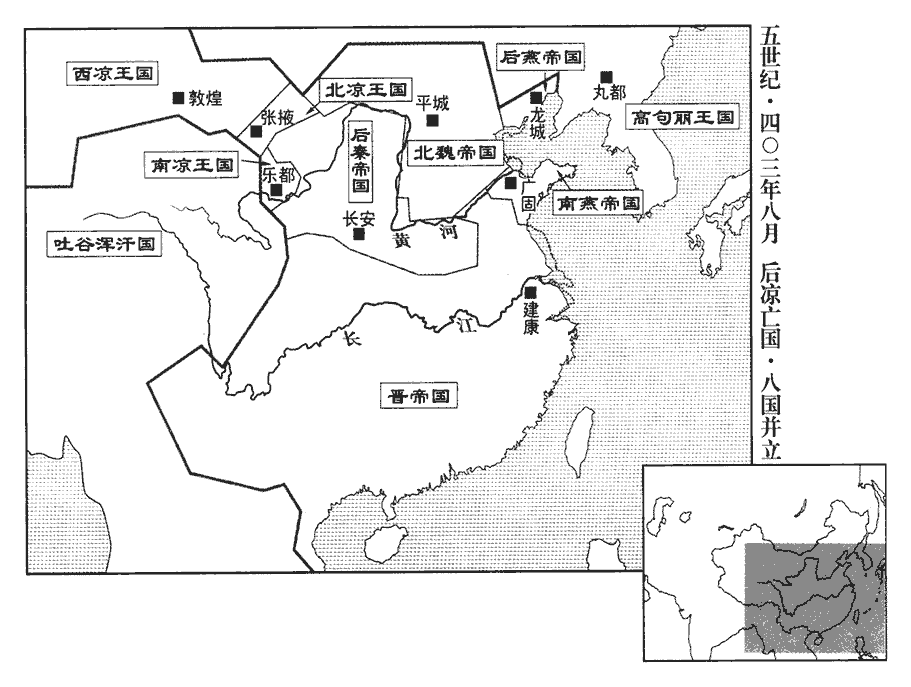
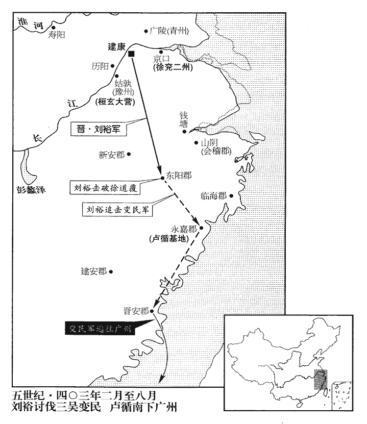
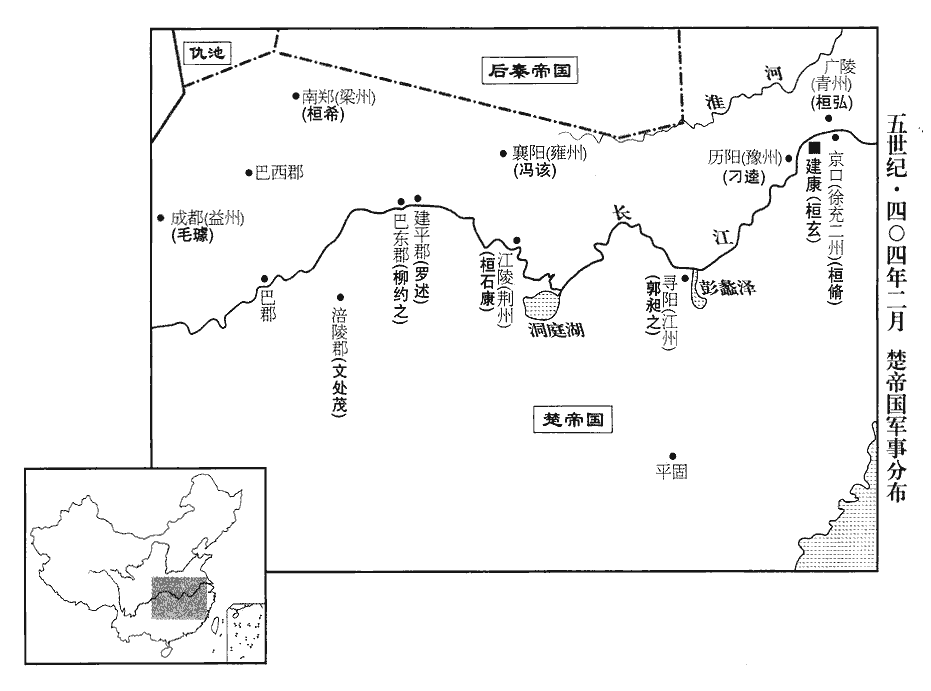
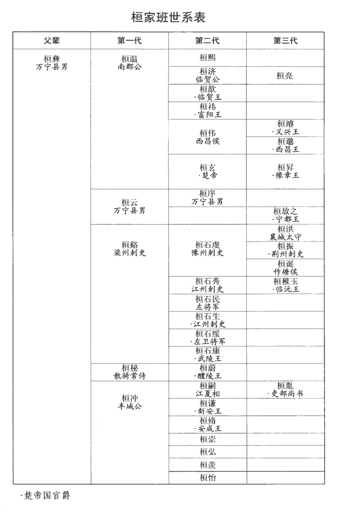
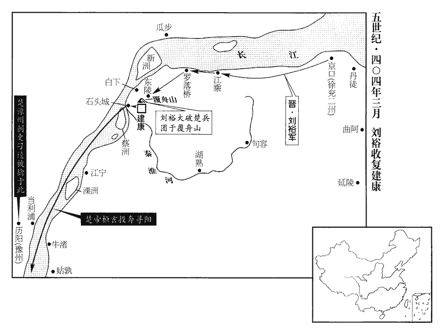
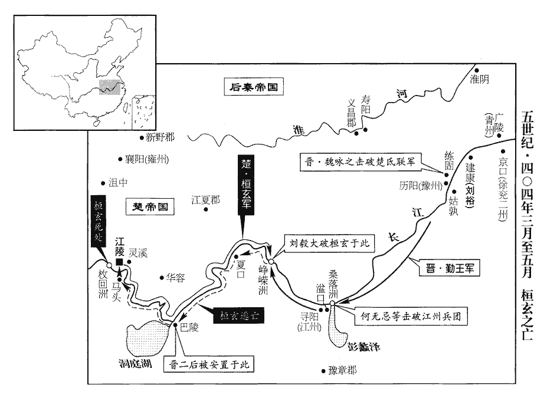

 晉紀三十五起昭陽單閼（癸卯），盡閼逢執徐（甲辰），凡二年。

# 安皇帝戊

## 元興二年（癸卯、四零三）

1春，正月，盧循使司馬徐道覆寇東陽‹浙江金华›；二月，辛丑‹八›，建武將軍劉裕擊破之。道覆，循之姊夫也。

〖译文〗 [1]春季，正月，乱民首领卢循派遣司马徐道覆进犯东阳。二月辛丑（初八），建武将军刘裕把徐道覆打败。徐道覆是卢循的姐夫。

2乙卯‹二十二›，以太尉玄為大將軍。大將軍，自漢以來，職名崇重，居其位者皆擅朝權。晉初，以司馬孚為太尉，奏以大將軍位太尉下，後復舊，在三司上。

〖译文〗 [2]乙卯（二十二日），封太尉桓玄为大将军。

3丁巳‹二十四›，玄殺冀州刺史孫無終。孫無終亦北府舊將也。

〖译文〗 [3]丁巳（二十四日），桓玄诛杀冀州刺史孙无终。

4玄上表請帥諸軍掃平關、洛，既而諷朝廷下詔不許，上，時掌翻。帥，讀曰率。朝，直遙翻。乃云：「奉詔故止。」玄初欲飭chì裝，先命作輕舸，載服玩、書畫。舸，加我翻，大舡chuán也。方言：南楚江湖謂之舸。畫與𦘕同。或問其故。玄曰：「兵凶戰危，脫有意外，當使輕而易運。」眾皆笑之。桓玄意態終始如此耳。時人誤以為雄豪而憚之，故每遇輒敗。崢嶸洲之戰，劉道規等知其為人而徑突之，一敗而不能復振矣。易，以豉翻。

〖译文〗 [4]桓玄上表请求统帅几路大军北伐，扫平关中、洛阳地区，随后又马上委婉地暗示朝廷下诏书，不允许他北伐，于是说：“遵照诏书的旨意，因此，我不得不停止。”桓玄一开始的时候，还打算整理行装，做个准备出征的样子，先命令制造轻便的船只，装满服饰珍玩、名人字画等。有人问他为什么这样，桓玄说：“军事行动充满凶险，战事一起更是危机四伏，倘或有什么意外的事情发生，那么运用这些轻便的船只，便容易运送东西脱逃。”大家对此都忍不住暗笑。

5夏，四月，癸巳朔‹一›，日有食之。

〖译文〗 [5]夏季，四月癸已朔（初一），出现日食。

6南燕‹都广固，山东青州›主備德‹时年六十八›故吏趙融自長安來，始得母兄凶問，備德號慟吐血，號，戶刀翻。吐，土故翻。因而寢疾。

〖译文〗 [6]南燕王慕容备德的旧日部下赵融从长安来，慕容备德才得到母亲和哥哥已死的消息，不禁哀号痛哭，以至口吐鲜血。幕容备德因而得病，卧床不起。

司隸校尉慕容達謀反，遣牙門皇璆攻端門，璆qiú，渠尤翻。殿中帥侯赤眉開門應之；殿中帥猶晉之殿中三部督也。帥，所類翻。中黃門孫進扶備德踰城匿於進舍。段宏等聞宮中有變，勒兵屯四門。廣固城‹山东青州›四門也。備德入宮，誅赤眉等；達出奔魏‹都平城，山西大同›。

〖译文〗 司隶校尉慕容达阴谋反叛，派遣牙门皇缪进攻端门，殿中帅侯赤眉打开宫门接应他，中黄门孙进扶起卧病在床的慕容备德跳出宫城，藏在孙进的家中。将军段宏等人听说宫中出现事变，紧急召集部队，严密盼守四面城门。慕容备德回到宫中，斩了侯赤眉等人。慕容达逃出城外，投奔北魏。

備德優遷徙之民，使之長復不役；復，方目翻，復除也。民緣此迭相蔭冒，或百室合戶，或千丁共籍，以避課役。尚書韓𧨳zhuó請加隱覈hé，合，音閤。𧨳，竹角翻。隱，度也。覈，實也。隱覈，度其實也。備德從之，使𧨳巡行郡縣，行，下孟翻。得蔭戶五萬八千。

〖译文〗 慕客备德优待从外地迁移而来的百姓，长期免除他们的劳役。很多人便因此反复不停地冒名顶替，有的是一百家合为一户，有的一千人共用一个户籍，用这种方法逃避田赋捐税和差役。尚书韩谇请求核实清查，慕容备德依从了他的建议，派遣韩谭到各个郡县去巡视调查，查出冒充的假户口五万八千家。

7泰山‹山东泰安东›賊王始聚眾數萬，自稱太平皇帝，署置公卿；南燕桂林王鎮討禽之。臨刑，或問其父及兄弟安在。始曰：「太上皇蒙塵于外，征東、征西為亂兵所害。」其妻怒之曰：「君正坐此口，柰何尚爾！」始曰：「皇后不知，自古豈有不亡之國！朕則崩矣，終不改號！」史言王始僭舉大號，至敗亡而不悔。

〖译文〗 [7]泰山一带的乱民首领王始聚集部众几万人，自称太平皇帝，设置公卿大臣。南燕桂林王慕容镇率领部队前去讨伐，并把他活捉。在处死他之前，有人问他的父亲以及兄弟等人都在哪里，王始说：“太上皇蒙受风尘在外地流亡，征东将军、征西将军被乱军所杀害。”他的妻子对他大发雷霆地说：“你正是因为这张嘴不好，才落得这个下场。怎么还是这样呢？”王始说：“皇后你有所不知，从古到今哪里有不灭亡的国家！朕即使是驾崩了，正统的名号也是永远不能改变的！”

8五月，燕王熙‹时年十九›作龍騰苑，方十餘里，役徒二萬人；築景雲山於苑內，基廣五百步，峰高十七丈。廣，古曠翻。高，古號翻。

〖译文〗 [8]五月，后燕王慕容熙兴筑龙腾苑，方圆十几里，役使民夫两万人。在这个花园中，堆筑了一座景云山，地基的面积有五百步，山峰高达十七丈。

9秋，七月，戊子‹二十七›，魏主珪‹时年三十三›北巡，作離宮於豺山‹山西右玉北›。

〖译文〗 [9]秋季，七月戊子（二十七日），北魏国主拓跋硅到北方巡视，在豺山兴建行宫。

平原‹山东平原›太守和跋奢豪喜名，喜，許記翻。珪惡而殺之，惡，烏路翻。使其弟毗等就與訣。跋曰：「灅北土瘠，可遷水南，勉為生計。」灅lěi，力水翻。且使之背己，背，蒲妹翻。曰：「汝何忍視吾之死也！」毗等諭其意，詐稱使者，逃入秦。珪怒，滅其家。中壘將軍鄧淵從弟尚書暉與跋善，從，才用翻。或譖諸珪曰：「毗之出亡，暉實送之。」珪疑淵知其謀，賜淵死。

〖译文〗 平原太守和跋，奢侈豪纵，喜欢虚名，拓跋蛙非常讨厌，因而把他杀了，在临刑之前，让他的弟弟和毗等人到跟前和他做最后的误别。和跋说：“漫水的北面，土地瘠薄，所以，你可以迁到浸水以南去居住，在那里还可以勉强维持生计。”并且，让他背对自己，说：“你怎能忍心看着我死！”和毗等人明白了他的用意，于是便撒谎说自己是朝廷的使节，逃到后秦去避难。拓跋硅大怒，杀了和氏全家。中垒将军邓渊的堂弟尚书邓晖平时与和跋关系很好，因此，有人把这个情况密告给拓跋硅，说：“和毗出逃时，其实有邓晖在秘密送行。”拓跋硅怀疑邓渊了解和毗等人的谋划，便下令让他自杀。

10南涼王傉檀‹时年三十九›及沮渠蒙遜‹时年三十六›互出兵攻呂隆，傉nù，奴沃翻。沮，子余翻。隆患之。秦之謀臣言於秦王興‹时年三十八›曰：「隆藉先世之資，專制河外，今雖飢窘，尚能自支，窘，渠隕翻。若將來豐贍，終不為吾有。涼州險絕，土田饒沃，不如因其危而取之。」興乃遣使徵呂超入侍。使，疏吏翻。隆念姑臧終無以自存，乃因超請迎于秦。興遣尚書左僕射齊難、鎮西將軍姚詰、左賢王乞伏乾歸、鎮遠將軍趙曜帥步騎四萬迎隆于河西，詰，去吉翻。帥，讀曰率。騎，奇寄翻。南涼王傉檀攝昌松‹甘肃武威南›、魏安‹甘肃古浪东›二戍以避之。攝，收也。傉，奴沃翻。八月，齊難等至姑臧‹甘肃武威›，隆素車白馬迎于道旁。隆勸難擊沮渠蒙遜，沮，子余翻。蒙遜使臧莫孩拒之，敗其前軍。孩，何開翻。敗，補邁翻。難乃與蒙遜結盟；蒙遜遣弟挐入貢于秦。挐rú，女居翻。難以司馬王尚行涼州刺史，配兵三千鎮姑臧，以將軍閻松為倉松太守，倉松，即漢昌松縣‹甘肃武威南›。郭將為番禾‹甘肃永昌›太守，番，音盤。分戍二城，徙隆宗族、僚屬及民萬戶于長安。載記曰：自光至隆十三載而滅。興以隆為散騎常侍，散，悉亶翻。騎，奇寄翻。超為安定‹甘肃镇原东南曙光乡›太守，自餘文武隨才擢敘。

〖译文〗 [10]南凉王秃发俘檀及北凉王沮渠蒙逊，分别出动军队进攻后凉国主吕隆，吕隆非常担心。后秦谋臣们对后秦王姚兴进言道：“吕隆凭借着前几代人留下来的基业，独占黄河以西的地区，现在虽然出现饥荒，形势窘迫，却还能够独立支撑，如果将来一旦获得丰收，国力富足强大起来，到头来是不会属于我们的。凉州地势险要奇绝，土地肥沃富饶，我看不如趁着他们现在危机干脆把他们吞并。”姚兴于是派遣使者前去征召吕超到后秦京师长安任职。吕隆考虑姑臧到最后也没有办法独立存在，于是，通过吕超请求后秦派兵前来迎接。姚兴派遣尚书左仆射齐难、镇西将军姚诘、左贤王乞伏乾归、镇远将军赵曜率领步兵、骑兵四万人到河西去迎接吕隆，南凉王秃发得檀撤退昌松、魏安两地的部队，避开秦国的军队。八月，齐难等人来到姑臧，吕隆乘坐白马拉的白车，在道旁迎接。吕隆劝说齐难带兵去进攻沮渠蒙逊，沮渠蒙逊派臧莫孩带兵抵抗，并把后秦军队的前锋部队打败，齐难于是和沮渠蒙逊缔结联盟。沮渠蒙逊派他的弟弟沮渠挈，到长安去进贡。齐难让司马王尚代理凉州刺史，配给他三千部队镇守姑臧，让将军阎松为仓松太守，郭将为番禾太守，分别驻戍在这两个城池，又把吕隆的宗族亲属、属下官员以及当地居民一万广迁移到长安。姚兴任命吕隆为散骑常侍，任命吕超为安定太守，其馀文武大臣，也都按照他们各自的才能擢升任用。

 

初，郭黁常言「代呂者王」，故其起兵，先推王詳，後推王乞基；事見一百九卷元年。黁nún，奴昆翻。及隆東遷，王尚卒代之。黁從乞伏乾歸降秦，卒，子恤翻。降，戶江翻。以為滅秦者晉也，遂來奔，秦人追得，殺之。郭黁自信其術，幸亂以徼福，而卒以殺身，足以明天道之難知矣。

〖译文〗 当初，原后凉太常郭摩经常说“代替吕氏称王的人，姓王”，所以，他先拉起部队，首先推立王详，随后又拥护王乞基。到了吕隆等人向东迁往长安的时候，这次王尚最终代替了吕氏。郭摩跟随乞伏乾归一同投降后秦，又认为将来消灭后秦的是东晋，所以跑出来打算投奔东晋，被后秦追兵赶上抓住杀掉。

沮渠蒙遜伯父中田護軍親信、臨松‹甘肃张掖南›太守孔篤，皆驕恣為民患，據晉書蒙遜載記，中田護軍蓋呂光所置，鎮臨松。蒙遜曰：「亂吾法者，二伯父也。」皆逼之使自殺。

〖译文〗 沮渠蒙逊的伯父中田扩军沮渠亲信、临松太守沮渠孔笃，都骄横狂暴，任性胡为，成为百姓的祸患，沮渠蒙逊说：“扰乱破坏我的法度的人，是这二位伯父。”因此，逼迫他们自杀。

秦遣使者梁構至張掖，蒙遜問曰：「禿髮傉檀為公而身為侯，何也?」秦封傉檀為廣武公，封蒙遜為西海侯，事見上卷上年。構曰：「傉檀凶狡，款誠未著，故朝廷以重爵虛名羈縻之。將軍忠貫白日，當入贊帝室，豈可以不信相待也！聖朝爵必稱功，朝，直遙翻。稱，尺證翻。如尹緯、姚晃，佐命之臣，齊難、徐洛，一時猛將，爵皆不過侯伯，緯，于貴翻。將，即亮翻。將軍何以先之乎！先，悉薦翻。昔竇融殷勤固讓，不欲居舊臣之右，事見四十三卷漢光武建武十三年。不意將軍忽有此問！」蒙遜曰：「朝廷何不即封張掖而更遠封西海邪?」構曰：「張掖，將軍已自有之，所以遠授西海者，欲廣大將軍之國耳。」蒙遜悅，乃受命。

〖译文〗 后秦国派遣使者梁构来到张掖，沮渠蒙逊问他道：“秃发僻檀被封为公爵，而我却只被封为侯爵，为什么？”梁构说：“秃发傅檀凶狠狡诈，他对朝廷的忠诚还不很明显，也未必是出自真心，所以，朝廷才用看似尊贵的爵位虚名而把他拴住。将军的忠诚可以与白日争辉，本应该让你到朝廷里去辅佐帝室执掌朝政，怎么可以用不信任的态度对待你呀！圣明的朝廷，加官封爵一定要和功劳相对等，像尹纬、姚晃，当初都是辅佐称命的大功臣，齐难、徐洛，也都是一时著名的勇猛大将，但是封他们爵位，也都不过是侯、或者伯，将军怎么可以超过他们呢？从前，窦融非常谨慎小心，坚决辞让被封的高官，不愿意让自己的官位处在旧臣老将们的前面，想不到将军会忽然提出这样的问题。”沮渠蒙逊说：“朝廷又为什么不就近封我为张掖侯，却反而远远地封我做西海侯？”梁构说：“张掖，将军您已经自己拥有了，之所以把遥远的西海封给您，不过是打算扩大您的封国的范围罢了。”沮渠蒙逊非常高兴，于是接受了这项任命。

11荊州刺史桓偉卒，大將軍玄以桓脩代之。從事中郎曹靖之說玄曰：說，輸芮翻。「謙、脩兄弟專據內外，權勢太重。」玄乃以南郡相桓石康為荊州刺史。石康，豁之子也。桓豁，溫之次弟。

〖译文〗 [11]东晋荆州刺史桓伟去世，大将军桓玄任命桓倚接替他的职位。从事中郎曹靖之提醒桓玄说：“桓谦、桓倚兄弟二人，在朝廷和地方上都手握大权，他们的权力威势过于重了。”桓玄于是便任命南郡相桓磊康为荆州刺史。桓石康是桓豁的儿子。

12劉裕破盧循於永嘉‹浙江温州›，追至晉安‹福建福州›，武帝太康三年，分建安立晉安郡，今泉州南安縣即其地。宋白曰：東晉南渡，衣冠士族多萃此地以求安堵，因立晉安郡，隋為泉州。屢破之，循浮海南走。

〖译文〗 [12]东晋建武将军刘裕，在永嘉把卢循的乱民部队打得大败，并且一直追击到晋安，交战几次，每次都把卢循打败。卢循只好从海上向南逃走。

何無忌潛詣裕，勸裕於山陰‹浙江绍兴›起兵討桓玄。裕謀於土豪孔靖，靖曰：「山陰去都道遠，舉事難成；且玄未篡位，不如待其已篡，於京口‹江苏镇江›圖之。」裕從之。靖，愉之孫也。孔愉歷事元、明、成三帝。

〖译文〗 刘牢之的外甥何无忌秘密地去拜见刘裕，劝说刘裕在山阴发动军队讨伐桓玄。刘裕同当地的豪杰孔靖商议，孔靖说：“山阴距离都城建康道路很远，如果发动事变，恐怕很难成功。况且桓玄还没有篡夺帝位，我看不如等到他篡夺帝位之后，再在京口一带对他发动进攻。”刘裕听从了他的计策。孔靖是孔愉的孙子。

13九月，魏主珪如南平城‹山西山阴北›，愍帝建興元年，代公猗盧城盛樂以為北都，脩故平城以為南都。更南百里，於灅水之陽黃瓜堆築新平城，所謂南平城也；唐朔州西南有新城，即其地。規度灅南，自灅水南抵夏屋山，皆灅南地也。度，徒洛翻。灅，力水翻。將建新都。

〖译文〗 [13]九月，北魏国主拓跋蛙前往南平城，在浸水以南的地方考察规划，打算兴建新的都城。

 

14侍中殷仲文、散騎常侍卞範之勸大將軍玄早受禪，陰撰九錫文及冊命。散，悉亶翻。騎，奇寄翻。禪，時戰翻。撰，士免翻。以桓謙為侍中、開府、錄尚書事，王謐為中書監、領司徒，桓胤為中書令，加桓脩撫軍大將軍。胤，沖之孫也。丙子‹十六›，冊命玄為相國，總百揆，封十郡，為楚王，加九錫，楚國置丞相以下官。

〖译文〗 [14]东晋侍中殷仲文、散骑常侍卞范之奉劝大将军桓玄早日接受禅位，当皇帝，暗地里撰写好了加授九锡以及安帝让位的文告。朝廷任命桓谦为侍中、开府、录尚书事，王谧为中书监、兼任司徒，桓胤为中书令。加授桓倚为抚军大将军的称号。桓胤是桓冲的孙子。丙子（十六日），朝廷册命桓玄为相国，统领文武百官，封地十个郡，做楚王，加授九锡。他所辖的楚国，也设置丞相以下的各级官吏。

桓謙私問彭城‹侨郡，江苏镇江›內史劉裕曰：「楚王勳德隆重，朝廷之情，咸謂宜有揖讓，卿以為何如?」裕曰：「楚王，宣武之子，桓溫，諡曰宣武。勳德蓋世，晉室微弱，民望久移，乘運禪代，有何不可?」謙喜曰：「卿謂之可即可耳。」劉裕一世之雄，桓謙問之以決可否，裕詭辭以順其意，故喜。

〖译文〗 桓谦私下里向彭城内史刘裕问道：“楚王功勋卓著，德望很高，朝廷中大多数人的想法，都认为应该举行禅让大典，拥立楚王做皇帝，你认为怎么样？”刘裕说：“楚王是南郡宣武公的儿子，功勋仁德都是超过当世所有人的。现在晋朝的帝室已经衰微，百姓的愿望早就改变，寄托在楚王的身上，乘着这个机运接受禅让，代替司马氏做皇帝，又有什么不可以的？”桓谦非常高兴，说：“你说可以，那就一定可以了。”

新野‹河南新野›人庾仄，殷仲堪之黨也，新野縣，漢屬南陽郡，晉武帝太康中，分屬義陽郡，惠帝又分立新野郡。仄，阻力翻，從「厂」，不從「广」。聞桓偉死，石康未至，乃起兵襲雍州刺史馮該於襄陽‹湖北襄樊›，走之。雍，於用翻。仄有眾七千，設壇，祭七廟，云「欲討桓玄」，江陵‹湖北江陵›震動。石康至州，發兵攻襄陽，仄敗，奔秦。

〖译文〗 新野人庾仄原是殷仲堪的党羽。听说桓伟死了之后，他趁桓石康还没到任的机会，便拉起军队到襄阳去袭击雍州刺史冯该，并把他赶走。庾仄拥有部众七千人，设立祭坛，祭祀司马宗族的七代祖庙，宣言说：“准备讨伐桓玄”，江陵地区为之震动。桓石康来到荆州上任后，马上调集部队去进攻襄阳，庾仄很快失败，投奔秦。

15高雅之表南燕主備德，請伐桓玄曰：「縱未能廓清吳、會，亦可收江北之地。」中書侍郎韓範亦上疏曰：「今晉室衰亂，江、淮南北，戶口無幾，戎馬單弱。重以桓玄悖逆，重，直用翻。悖，蒲內翻，又蒲沒翻。上下離心；以陛下神武，發步騎一萬臨之，彼必土崩瓦解，兵不留行矣。得而有之，秦、魏不足敵也；拓地定功，正在今日。失時不取，彼之豪傑誅滅桓玄，更脩德政，豈惟建康不可得，江北亦無望矣。」備德曰：「朕以舊邦覆沒，欲先定中原，乃平蕩荊、揚，故未南征耳。其令公卿議之。」因講武城西，步卒三十七萬人，騎五萬三千匹，車萬七千乘。乘，繩證翻。公卿皆以為玄新得志，未可圖，乃止。慕容德取青州，至是纔五年耳，有眾如此，不能乘時而用之，自審其才不足以辨桓玄也。

〖译文〗 [15]高雅之上奏表给南燕国主慕容备德，请求去讨伐桓玄，说：“纵使不能扫平吴郡会稽地区，起码也可以占据长江以北的大片土地。”中书侍郎韩范也上疏奏说：“现在晋室衰微混乱，长江、淮河南北两岸大部分地区，住户与人口已经所剩不多，军事力量也很单薄无力。再加上现在桓玄犯上作乱，不忠于朝廷，因此全国上下，离心离德。依靠陛下的神勇威武，发动步兵、骑兵一万人，商下征战，他们一定会土崩瓦解，兵卒全部跑光。那时候，我们取得并占有长江流域的大片土地，这样，秦、魏也就不会再是我们的对手了。开拓疆土、建立功业，今天正是时机。如果我们失去这个机会，而不去夺取，那么一旦他们中的豪杰诛杀了桓玄，来整顿推行德政，那么，我们岂只是建康没办法再得到，即便是长江以北地区，我们也没有希望得到了。”慕容备德说：“朕因为故国的土地沦丧，所以一直打算先平定中原，再来扫荡荆州、扬州等地区，因此才没有向南征伐。先让公卿大臣讨论一下这件事吧。”于是，在城西举行阅兵式，出动了步兵三十七万人，战马五万三千匹，战车一万七千辆。但是，公卿大臣们都认为桓玄刚刚实现志向，不可以贸然地打他的主意，所以，这件事才没有进行。

16冬，十月，楚王玄上表請歸藩，使帝作手詔固留之。又詐言錢塘‹杭州›臨平湖開，臨平湖草常蓁zhēn塞，開則天下太平。江州‹江西、福建›甘露降，使百僚集賀，用為己受命之符。又以前世皆有隱士，恥於己時獨無，求得西朝隱士安定‹甘肃镇原东南曙光乡›皇甫謐六世孫希之，晉氏東遷，以洛陽為西朝。皇甫謐在魏、晉之間徵辟不行，自號玄晏先生。朝，直遙翻。給其資用，使隱居山林；徵為著作郎，使希之固辭不就，然後下詔旌禮，號曰高士。時人謂之「充隱」。實非隱者而以之備數，故謂之充隱。又欲廢錢用穀、帛及復肉刑，制作紛紜，志無一定，變更回復，更，工衡翻。卒無所施行。性復貪鄙，人士有法書、好畫卒，子恤翻。性復，扶又翻。法書，謂如史籀zhòu，程邈、李斯、張芝、師宜、梁鵠、衛瓘guàn、索靖、鍾繇諸人真蹟，各有家法者。畫，與𦘕同。及佳園宅，必假蒲博而取之；尤愛珠玉，未嘗離手。離，力智翻。史言桓玄志度凡近。

〖译文〗 [16]冬季，十月，楚王桓玄呈上奏表，请求允许他回到他的封地去，然后又让安帝亲手写诏书，坚决挽留他。他又唆使手下的人造谣说，钱塘临平湖的湖水又突然盈满，江州也降下了甘露，就让文武百官聚集到一起来庆贺，以此作为自己接受皇帝禅让的吉祥预兆。他又因为前几代改朝换代的时候，都有隐士不出来做官，而觉得自己接受帝位的时候独独没有是一种耻辱，所以便通过访查，找到西晋的隐士安定人皇甫谧的第六代孙子皇甫希之，供给他生活的一切费用，让他隐居到深山老林里去，又反过来以朝廷的名义，征召他出山做著作郎，并让皇甫希之坚决推辞，不去任职，然后再下达诏书，表彰、称赞他，称他做高士。但当时的人们却说皇甫希之是冒充隐士的“充隐”。桓玄又打算废除钱币，而用粮食谷物、绸缎布匹等作为交换、流通的工具，以及恢复使用肉刑等。就这样，各种法令规章乱七八糟地制定了许多，但是桓玄却始终没有一个固定的想法，因此只是翻来覆去地不断变化更换，最后也都没有得以实行。桓玄的性情还贪婪卑鄙，别的人如果有好的书法、绘画作品，以及好的花园宅第等，他也一定会假借蒲博等赌博手段把这些占为己有，他尤其喜爱珍珠美玉，珍珠玉从不离手。

17乙卯‹二十五›，魏主珪立其子嗣為齊王，加位相國；紹為清河王，加征南大將軍；熙為陽平王；曜為河南王。

〖译文〗 [17]乙卯（二十五日），北魏国立拓跋硅封他的儿子拓跋嗣为齐王，并提升为相国。他的另外几个儿子，拓跋绍为清河王，加授征南大将军，拓跋熙为阳平王，拓跋曜为河南王。

18丁巳‹二十七›，魏將軍伊謂帥騎二萬襲高車‹蒙古北部›餘種袁紇、烏頻；十一月，庚午‹十一›，大破之。帥，讀曰率。騎，奇寄翻。種，章勇翻。紇，戶骨翻。

〖译文〗 [18]丁巳（二十七日），北魏将军伊谓率领骑兵两万人袭击高车遗民聚集的袁纥、鸟频两个部落。十一月庚午（十一日），把这两个部落全部攻破。

19詔楚王玄行天子禮樂，妃為王后，世子為太子。丁丑‹十八›，卞範之為禪詔，禪，時戰翻；下同。使臨川王寶逼帝書之。寶，晞之曾孫也。武陵王晞死於桓溫廢立之際。庚辰‹二十一›，帝臨軒，遣兼太保、領司徒王謐奉璽綬，禪位于楚；璽，斯氏翻。綬音受。壬午‹二十三›，帝出居永安宮；癸未‹二十四›，遷太廟神主于琅邪國，永嘉之亂，琅邪國人隨元帝過江者千餘戶，太興三年，立懷德縣。丹楊雖有琅邪相而無其地。成帝咸康元年，桓溫領琅邪太守，鎮江乘之蒲洲金城‹江苏句容北›，求割江乘縣境立郡，始有實土。穆章何皇后及琅邪王德文皆徙居司徒府。百官詣姑孰‹安徽当涂›勸進。十二月，庚寅朔‹一›，玄築壇於九井山‹安徽当涂南›北，九域志，太平州有九井山。今太平州，古姑孰之地也。蕪湖縣南有溪，猶曰姑孰溪。北征記云：九井山在丹楊南。壬辰‹三›，即皇帝位。冊文多非薄晉室，或諫之，玄曰：「揖讓之文，正可陳之於下民耳，豈可欺上帝乎！」大赦，改元永始；以南康之平固縣‹江西兴国南›武帝太康三年，以廬陵南部都尉立南康郡。平固，吳所置平陽縣也，太康元年，更名平固。九域志，虔州贛縣有平固鎮。封帝為平固王，降何后為零陵縣君，琅邪王德文為石陽縣公，武陵王遵為彭澤縣侯；追尊父溫為宣武皇帝，廟號太祖，南康公主為宣皇后，封子昇為豫章王；以會稽‹绍兴›內史王愉為尚書僕射，愉子相國左長史綏為中書令。綏，桓氏之甥也。戊戌‹九›，玄入建康宮，登御坐而牀忽陷，坐，讀曰座。群下失色。殷仲文曰：「將由聖德深厚，地不能載。」玄大悅。梁王珍之國臣孔樸奉珍之奔壽陽‹安徽寿县›。珍之，晞之曾孫也。晞子㻱出繼梁國，珍之之祖也。

〖译文〗 [19]安帝下诏，让楚王桓玄使用天子的礼仪和音乐，并把他的王妃改称王后，把他的嫡长子改称为太子。丁丑（十八日），散骑常侍卞范之拟写了禅让的诏书，让临川王司马宝逼迫安帝亲笔抄写。司马宝是司马唏的曾孙。庚辰（二十一日），安帝驾临宝殿，派遣兼太保、领司徒的王谧手捧皇帝的玉玺印绶呈献给桓玄，正式向他禅位。壬午（二十三日），安帝搬出皇城，改居永安宫。癸未（二十四日），把太庙神主迁到琅邪国，又让穆章何皇后和琅邪王司马德文都迁到司徒府暂时居住。文武百官则一起到姑孰去劝说桓玄尽快登基称帝。十二月庚寅朔（初一），桓玄在九井山的北侧修筑祭坛。壬辰（初三），正式登基。他在宣布即位的文告上，言辞中对晋朝统治有很多非议和贬低。有人劝止他这样做，桓玄却说：“皇帝禅位时的文告，正是应该把这些向天下百姓说明白，怎么可以欺骗上天呢？”桓玄下令实行大赦，改年号为永始。把南康的平固县封给安帝做封地，封他做平固王。把穆章何皇后降为零陵县君，把琅邪王司马德文降为石阳县公，把武陵王司马遵降为彭泽县侯。桓玄又追尊他的父亲桓温为宣武皇帝，庙号太祖，追尊他的母亲南康公主司马兴男为宣皇后，封他的儿子桓异为豫章王。任命会稽内史王愉为尚书仆射，任命王愉的儿子相国左长史王绥为中书令。王绥是桓家的外甥。戊戌（初九），桓玄进入建康宫，当他登上皇帝的御用宝座时，御座突然塌陷，群臣们大惊失色。殷仲文说：“这可能是因为皇上的恩德太深重，大地也都难以承载。”桓玄非常高兴。东晋梁王司马珍之的属臣孔朴护送司马珍之逃奔寿阳。司马珍之是司马唏的曾孙。

20戊申‹十九›，燕王熙尊燕主垂之貴嬪段氏為皇太后。段氏，熙之慈母也。己酉‹二十›，立苻貴嬪‹苻训英›為皇后，嬪，毗賓翻。大赦。

〖译文〗 [20]戊申（十九日），后燕王幕容熙尊封慕容垂的责妃段氏为皇太后。段氏是慕容熙的亲生母亲。己酉（二十日），又册立贵嫔苻训英力皇后，并下令实行大赦。

21辛亥‹二十二›，桓玄遷帝於尋陽。尋陽郡時治柴桑‹江西九江›。

〖译文〗 [21]辛亥（二十二日），桓玄把安帝迁到寻阳。

22燕以衛尉悅真為青州刺史，鎮新城‹辽宁义县境›；光祿大夫衛駒為并州刺史，鎮凡城‹河北平泉南›。

〖译文〗 [22]后燕任命卫尉悦真为青州刺史，镇守新城；任命光禄大夫卫驹为并州刺史，镇守凡城。

23癸丑‹二十四›，納桓溫神主于太廟。桓玄臨聽訟觀閱囚徒，洛都華林園北有聽訟觀，本平望觀也。魏明帝以刑獄天下大命也，每斷大獄，常幸觀聽之，太和三年，更名聽訟觀。建康倣洛都之制，亦置之。觀，古玩翻。罪無輕重，多得原放；有干輿乞者，時或卹之。其好行小惠如此。干，犯也；干輿，行犯乘輿也。乞者，丐衣食之物。好，呼到翻。

〖译文〗 [23]癸丑（二十四日），桓玄把父亲桓温的牌位安置在太庙。桓玄亲自到华林园的听讼观去审查囚犯，不管罪行轻还是重，大多数都得到原谅释放。有在道路上拦住他的车驾求告行乞的人，也时不时地可以得到他的周济。他喜欢用小恩小惠来笼络人心，如此而已。

24是歲，魏主珪始命有司制冠服，以品秩為差；然法度草創，多不稽古。

〖译文〗 [24]这一年，北魏国主拓跋蛙开始命令有关部门制作官员的服装，按照官员官阶品位的高低次序加以区别。但是，法律规章等都是草草创立，并且大多都不因循古代。

## 三年（甲辰、四零四）

1春，正月，桓玄立其妻劉氏為皇后。劉氏，喬之曾孫也。劉喬見八十六卷惠帝永興二年。玄以其祖彝以上名位不顯，不復追尊立廟。復，扶又翻。散騎常侍徐廣曰：「『敬其父則子悅，』孝經載孔子之言。請依故事立七廟。」玄曰：「禮，太祖東向，左昭右穆。禮，天子七廟，太祖正東向之位，左三昭，右三穆。決疑要錄曰：父南面，故曰昭；昭，明也。子北面，故曰穆；穆，順也。昭本如字，為漢諱昭，改音韶。或云，晉文帝名昭，改音韶。晉立七廟，宣帝不得正東向之位，何足法也！」祕書監卞承之謂廣曰：「若宗廟之祭果不及祖，有以知楚德之不長矣。」廣，邈之弟也。徐邈以文學為孝武所親信。

〖译文〗 [1]春季，正月，桓玄立他的妻子刘氏为皇后。刘氏是刘乔的曾孙女。桓玄因为他的祖父桓彝以上的前辈名声地位都不显赫，因此，不再追加给他们尊贵的庙号谥号。散骑常侍徐广说：“‘尊敬他的父亲，那么做儿子的就自然会高兴’，请陛下按照过去的常规，建立七代宗庙。”桓玄说：“按照礼仪，太祖的祭庙应该面向东方，左边面向南的三庙，称为昭，右面向北的三庙，称为穆。但是晋朝建立七庙，宣帝因为庙号高祖，因此却不能面向东方，有什么可效法的呢！”秘书监卞承之对徐广说：“如果宗庙里的祭祀连祖先都祭祀不到的话，从这儿就可以得知楚国的好运不会长久了。”徐广是徐邈的弟弟。

玄自即位，心常不自安。二月，己丑朔‹一›，夜，濤水入石頭，流殺人甚多，讙譁震天。讙huān，許元翻。玄聞之懼，曰：「奴輩作矣！」

〖译文〗 桓玄自登帝位以来，心里常常觉得不安。二月己丑朔（初一）深夜，长江波涛汹涌，江水卷进石头城中，被激流淹死卷走的人非常多，灾民的号叫哭喊声震天动地。桓玄听到之后非常害怕，说：“这些奴才们要造反了。”

玄性苛細，好自矜伐。好，呼到翻；下性好同。主者奏事，或一字不體，謂字之上下偏傍不合體也。或片辭之謬，必加糾擿，以示聰明。擿tī，他狄翻。尚書答詔誤書「春蒐sōu」為「春菟」，菟，同都翻。自左丞王納之以下，凡所關署，關，通也。皆被降黜。被，皮義翻。或手注直官，直官，入直者也。或自用令史，令史，尚書令僕所署用。詔令紛紜，有司奉答不暇；而紀綱不治，奏案停積，不能知也。又性好遊畋，或一日數出。數，所角翻。遷居東宮，更繕宮室，更，工衡翻。土木並興，督迫嚴促，朝野騷然，思亂者眾。

〖译文〗 桓玄的性情苛刻琐细，喜欢炫耀自己的能力和才干。他手下的主要官员在报告事情的奏章中，如果偶有一个字写得不好看，或者偶尔有一句话一个词不太恰当，他一定会对此加以纠正指出，用来表示他的聪明博学。尚书回答诏书的时候，把“春蓖”二字误写成“春菟”，因为这～点小事，从尚书左丞王纳之以下，凡是经过手、签过字的人，全部被降级甚至免职。桓玄有时还亲自选定官员入宫值日，或亲自指派一些小官吏干一些具体的事情，因此下来的诏书令旨繁多杂乱，有关部门根本就来不及办理，但是朝中政令纪律无法治理、混乱异常，公文因没有时间处置而大量积压，他却根本不可能知道。桓玄生性又喜欢游玩打猎。有的时候竞一天出去几次。后来他又暂时迁到东宫居住，更新修葺皇宫的殿室，大兴土木，又监督很严，时间规定得很紧，因此从朝廷官员到市井田野的黎民百姓，骚动不安。这时候，盼望变乱的人越来越多。

玄遣使加益州刺史毛璩散騎常侍、左將軍。璩執留玄使，不受其命。璩，寶之孫也。使，疏吏翻。散，悉亶翻。騎，奇寄翻。璩qú，強魚翻。玄以桓希為梁州刺史，分命諸將戍三巴以備之。三巴，巴郡‹重庆›、巴東‹重庆奉节东›、巴西‹四川阆中›也。杜佑曰：渝州古巴國，謂之三巴，以閬、白二水東南流，曲折三迴，如「巴」字也。璩傳檄遠近，列玄罪狀，遣巴東太守柳約之、建平‹重庆巫山›太守羅述、征虜司馬甄季之擊破希等，甄，之人翻。仍帥眾進屯白帝‹重庆奉节东›。史言劉裕未起，毛璩已仗義舉兵討玄。帥，讀曰率。

〖译文〗 桓玄派遣使节，加授益州刺史毛璩为散骑常侍、左将军。毛璩拘留了桓玄的使节，不接受他的任命。毛璩是毛宝的孙子。桓玄任命桓希为梁州刺史，分别命令几位大将戍守三巴，用来防备毛璩。毛璩到处传布檄文，列举桓玄的罪状，并且派遣巴东太守柳约之、建平太守罗述、征虏司马甄季之攻破桓希等人的防守，他自己也带领部众进发到白帝城集结驻守。

劉裕從徐•兗二州刺史、安成王桓脩入朝。朝，直遙翻。玄謂王謐曰：「裕風骨不常，蓋人傑也。」每遊集，必引接殷勤，贈賜甚厚。玄后劉氏，有智鑒，謂玄曰：「劉裕龍行虎步，視瞻不凡，恐終不為人下，不如早除之。」玄曰：「我方平蕩中原，非裕莫可用者；俟關、河平定，然後別議之耳。」

〖译文〗 刘裕跟随徐、兖二州刺史、安成王桓倚进京朝见桓玄。桓玄对王谧说：“刘裕这个人风度身材不像常人，是一个人中的豪杰。”每次出游和集会，他对刘裕一定格外亲切地招待、赠送赏赐给刘裕的东西也非常厚重。桓玄的皇后刘氏，很有智慧和见识，她对桓玄说：“刘裕走路的姿式犹如猛虎和蛟龙，连眼神都不同凡响，恐怕他到头来不会处在别人的手下，我看不如趁早把他除掉。”桓玄说：“我正要扫荡平定中原地区，不是刘裕就没有可以胜任的人。等关、河一带平定之后，再另外商议这件事吧！”

玄以桓弘為青州刺史，鎮廣陵‹江苏扬州›；刁逵為豫州刺史，鎮歷陽‹安徽和县›。弘，脩之弟；逵，彝之子也。刁彝見一百三卷簡文帝咸安二年。

〖译文〗 桓玄任命桓弘为青州刺史,镇守广陵;任命刁逵为豫州刺史,镇守历阳.桓弘是桓倚的弟弟；刁逵是刁彝的儿子。

劉裕與何無忌同舟還京口‹江苏镇江›，密謀興復晉室。劉邁弟毅家於京口，亦與無忌謀討玄。無忌曰：「桓氏強盛，其可圖乎?」毅曰：「天下自有強弱；苟為失道，雖強易弱，易，以豉翻。正患事主難得耳。」謂舉大事難得一人為主。無忌曰：「天下草澤之中非無英雄也。」毅曰：「所見唯有劉下邳。」裕先領下邳太守，故稱之。無忌笑而不答，還以告裕，遂與毅定謀。

〖译文〗 刘裕和何无忌同坐一只船回到京口，一起秘密谋划重新振兴、恢复晋朝皇室的事。谘议参军刘迈的弟弟刘毅，家在京口居住，也与何无忌计议讨伐桓玄。何无忌悦：“桓氏家族现在正在强盛时期，怎么可以打他们的主意呢！”刘毅说：“天下的事，自然是有强和弱的分别的，但是，如果行为不符合天道人情，那么，虽然是强大的一方、也容易变得弱小，值得忧虑的却只是很难得到一个英明称职的领导人罢了。”何无忌说：“普天之下、草莽河泽之中，也不是没有英雄。”刘毅说：“我听见到的，只有刘裕。”何无忌只是微笑，并不回答，回去之后，把刘毅的态度告诉了刘裕，于是他们便与刘毅一起制定了计划。

初，太原‹山西太原›王元德及弟仲德為苻氏起兵攻燕主垂，不克，來奔，王叡，字元德；王懿，字仲德；名犯宣、元二帝諱，故以字行。仲德為燕所敗，渡河依段遼，自遼所來奔。為，于偽翻。朝廷以元德為弘農‹河南灵宝东北›太守。仲德見桓玄稱帝，謂人曰：「自古革命誠非一族，然今之起者恐不足以成大事。」

〖译文〗 当初，太原人王元德和他的弟弟王仲德响应前泰国苻民政权的号召，拉起队伍进攻后燕王慕容垂，没有获胜，便来投奔东晋。东晋朝廷任命王元德为弘农太守。王仲德看到桓玄篡夺东晋政权，当上了皇帝，便对人说：“自古以来，因为受命于天而改朝换代的人，当然并不只一个，但是，现在这个起来当皇帝的却恐怕不是一个可以成就大事业的人。”

 

平昌‹山东诸城西北›孟昶為青州主簿，平昌縣，漢屬城陽國，魏文帝分城陽立平昌郡，後省。晉惠帝又立平昌郡。其地今屬密州安丘縣界。昶，丑兩翻。桓弘使昶至建康，玄見而悅之，謂劉邁曰：「素士中得一尚書郎，起於白屋者謂之素士。卿與其州里，寧相識否?」孟昶，平昌人。平昌郡屬青州。劉邁，彭城沛人。彭城屬徐州。蓋二人並僑居京口，故謂之同州里。邁素與昶不善，對曰：「臣在京口，不聞昶有異能，唯聞父子紛紛更相贈詩耳。」更，工衡翻。玄笑而止。昶聞而恨之。既還京口，裕謂昶曰：「草間當有英雄起，卿頗聞乎?」昶曰：「今日英雄有誰，正當是卿耳！」

〖译文〗 平昌人孟昶担任青州主簿，桓弘派孟昶出使建康，桓玄接见他，并对他大为欣赏，对刘迈说：“在平民百姓当中，我找到了一个尚书郎，你与他是同乡，难道不认识他？”刘迈平常与孟昶的关系很不融洽，便回答他说：“我在京口时，没有听说过孟昶有什么特殊的才能，只是听说他们父子之间频繁不断地互相赠诗唱和罢了。”桓玄大笑,于是取消了提升孟昶的想法。孟昶听说这件事后,对刘迈怀恨在心。等他回到京口之后，刘裕对孟昶说：“草野平民之中应该有英雄豪杰崛起了，你有没有听到什么消息？”盂昶说：“今天的英雄还能有谁呢？正应该是您啊！”

於是裕、毅、無忌、元德、昶及裕弟道規、任城‹山东济宁东南›魏詠之、任城縣，前漢屬東平國，後漢章帝元和元年分東平為任城國，而任城縣屬焉；晉氏南渡，省任城郡為任城縣，屬高平郡。任，音壬。高平‹山东金乡西北昌邑镇›檀憑之、琅邪‹江苏句容北›諸葛長民、河內太守隴西‹甘肃陇西›辛扈興、振威將軍東莞‹江苏镇江南›童厚之，莞，音官。相與合謀起兵。道規為桓弘中兵參軍，裕使毅就道規及昶於江北，共殺弘，據廣陵；長民為刁逵參軍，使長民殺逵，據歷陽；元德、扈興、厚之在建康，使之聚眾攻玄為內應，刻期齊發。

〖译文〗 于是，刘裕、刘毅、何无忌、王元德、王仲德、孟昶，以及刘裕的弟弟刘道规、任域人魏咏之、高平人檀凭之、琅邪人诸葛长民、河内太守陇西人辛扈兴、振威将军东莞人童厚之等人，互相联合起来，计划起兵讨伐桓玄。刘道规此时正担任青州刺史桓弘的中兵参军，刘裕派刘毅去到长江以北与刘道规和孟昶会合，一起杀掉桓弘，占据广陵。诸葛长民此时任刁逵的参军，刘裕又让他杀掉刁逵，占据历阳。王元德、辛扈兴、童厚之此时在建康，刘裕便让他们聚集部众直接对桓玄发起进攻，作为内应。约定时间，一齐发动政变。

孟昶妻周氏富於財，昶謂之曰：「劉邁毀我於桓公，使我一生淪陷，我決當作賊。卿幸早離絕，脫得富貴，相迎不晚也。」周氏曰：「君父母在堂，欲建非常之謀，豈婦人所能谏！事之不成，當於奚官中奉養大家，奚，如字，又胡禮翻。周禮註曰：古者從坐，男女沒入縣官為奴，其少才智以為奚。今之侍史、官婢，或曰奚官女。此言事若敗，沒為官婢，當於奚官中養姑。晉志，奚官令，屬少府。晉宋間子婦稱其姑曰「大家」，考南史孝義孫棘傳可見。義無歸志也。」昶悵然，久之而起。悵，丑亮翻。悵然，失志貌。周氏追昶坐，曰：「觀君舉措，非謀及婦人者，不過欲得財物耳。」因指懷中兒示之曰：「此而可賣，亦當不惜，」遂傾貲以給之。昶弟顗yǐ妻，周氏之從妹也，顗，魚豈翻。從，才用翻。周氏紿dài之曰：「昨夜夢殊不祥，紿，待亥翻。門內絳色物宜悉取以為厭勝。」厭，於涉翻，又於檢翻。妹信而與之，遂盡縫以為軍士袍。

〖译文〗 孟昶的妻子周氏.极为富有,孟昶对她说：“刘迈把我在桓玄那里的前途和出路全毁了.使我这一生沉沦落寞.因此.我决心作一个叛贼。你应该尽早地和我断绝关系,以后，如果我侥幸获得富贵，再去迎接你回来也为时不晚。”周氏说：“你的父亲和母亲，现在还都健在，但你也还打算采取不同寻常的行动,这怎么能是我作为一个妇人所能劝阻的呢？如果你的计划不能实现,我即使沦落为奴婢,也应该供奉侍养公婆，从大义出发，我是没有想回去的打算的。”孟昶怅然若失,呆坐很久，起身出去。周氏追孟昶让他回来坐下，说：“我看你的举止动作，不是来同我这个妇道人家商议的，你不过是打算得到一些钱财罢了。”所以，指着怀抱中的儿子告诉孟昶说：“如果这孩子可以卖掉的话，我也决不珍惜。”于是，她把自己的财产全部送给孟昶。孟昶弟弟孟额的妻子，是周氏的堂妹。周氏对她撒谎说：“我昨天夜里做了一个非常不吉利的梦，你应该把你家里红色的布匹全部拿出来给我，我好用它来诅咒禳镇魔道。”她的堂妹相信了她的话，果然把家中的红布全部拿出来交给她，于是她把这些布全部缝制成了战袍军衣。

何無忌夜於屏風里草檄文，其母，劉牢之姊也，登橙密窺之，橙，都鄧翻，床屬。泣曰：「吾不及東海‹山东郯城›呂母明矣。呂母事見三十八卷王莽天鳳四年。汝能如此，吾復何恨！」問所與同謀者。曰：「劉裕。」母尤喜，因為言玄必敗、舉事必成之理以勸之。復，扶又翻。為，于偽翻。

〖译文〗 何无忌晚上在屏风后面草拟檄文，他的母亲是刘牢之的姐姐，蹬着凳子偷偷地看他在干什么。她哭着说：“我当然赶不上东海吕母那样明白事理，但是你既然能这样，那么我还有什么遗憾呢？”然后问他，跟他共同策划的人是谁，何无忌告诉她说：“刘裕。”他的母亲更加高兴，于是又说了一些桓玄必定失败、发动事变一定能成功的道理，对他大加鼓励。

乙卯‹二十七›，裕託以遊獵，與無忌收合徒眾，得百餘人。丙辰‹二十八›，詰旦，京口城開，無忌著傳詔服，詰，去吉翻。著，側略翻。著傳詔之服，因自稱敕使。稱敕使，居前，使，疏吏翻。徒眾隨之齊入，即斬桓脩以徇。脩司馬刁弘帥文武佐吏來赴，帥，讀曰率。裕登城，謂之曰：城，謂京口之金城。「郭江州已奉乘輿返正於尋陽‹江西九江›，郭江州，謂郭昶之也。時帝在尋陽，裕詭言以誑弘等。乘，繩證翻。我等並被密詔，誅除逆黨，被，皮義翻。今日賊玄之首已當梟於大航‹朱雀桥›矣。梟，堅堯翻。說文曰：日至，捕梟磔之，以頭掛木上；今謂掛首為梟。諸君非大晉之臣乎，今來欲何為！」弘等信之，收眾而退。

〖译文〗 乙卯（二十七日），刘裕以出外打猎为借口，与何无忌到京口城外招集同谋的部众，一共有一百多人。丙辰（二十八日），清晨，京口城门一开，何无忌便穿着传达圣旨的使者服装，口称是皇帝的信使，当先进城，他手下的人也都跟着他一齐进入，立即杀死了桓惰。桓倚的司马刁弘率领着文武官员及其助手等听说后，连忙赶到这里。刘裕登上城墙，对他们说：“江州刺史郭昶之已经拥戴皇上，在寻阳重新恢复正统皇位了，我们这些人也都接到了皇上的秘密诏书，诛杀铲除叛逆党羽。今天，强盗桓玄的脑袋恐怕已经被挂在大航桥上示众了。你们几位难道不是大晋朝的臣子吗？现在你们到这里来打算干什么？”刁弘等人相信了他的话，又率领手下人回去了。

裕問無忌曰：「今急須一府主簿，何由得之?」無忌曰：「無過劉道民。」道民者，東莞劉穆之也。晉陵有南東莞郡，故穆之居京口。莞，音官。裕曰：「吾亦識之。」即馳信召焉。時穆之聞京口讙噪聲，讙，許元翻。「噪」當作「譟」。晨起，出陌頭，屬與信會。信，使也。屬，之欲翻。使，疏吏翻。穆之直視不言者久之，直視，注目直視不他屬。即而返室，壞布裳為袴，袴kù，脛衣也。晉志曰：袴褶之制，未詳所起，近世以為戎服。壞，音怪。往見裕。裕曰：「始舉大義，方造艱難，言造事之初，事事艱難也。須一軍吏甚急，卿謂誰堪其選?」穆之曰：「貴府始建，軍吏實須其才，倉猝之際，略當無見踰者。」裕笑曰：「卿能自屈，吾事濟矣。」即於坐署主簿。坐，讀曰座。

〖译文〗 刘裕问何无忌说：“现在急需一个主簿人选，你看怎么能得到呢？”何无忌说：“没有比刘道民更合适的。”刘道民走东莞人刘穆之的别名。刘裕说：“我也认识他。”便马上派信使骑快马召请他来这里任职。这时刘穆之听到京口方向人声鼎沸，因此一大早就起来，来到路边打听张望，正好和前来的信使相遇。刘穆之看信后，两眼向前直视，一句话不说，这样呆立了很长时间之后，才返身回家，把一件布衣服撕破，打好裹腿，跟信使一道去见刘裕。刘裕说：“我们刚刚举起大旗，发动这场符合道义的事变，一切从头开始，困难很多，急需一个在军队中负责文秘方面的人才。你说谁最适合做这种工作？”刘穆之说：“您的军府刚开始建立，所用的文官必须具有真才实学才行，在这种紧张仓促的情况之下，恐怕没有比我还强的人了。”刘裕高兴地说：“你能屈尊亲自担当这个职务，那么,我们的事一定能够成功.”就马上任命刘穆之做主簿。

孟昶勸桓弘其日出獵，天未明，開門出獵人；昶與劉毅、劉道規帥壯士數十人直入，帥，讀曰率；下同。弘方噉dàn粥，即斬之，因收眾濟江。噉，徒濫翻。裕使毅誅刁弘。

〖译文〗 孟昶在广陵，这一天他劝说青州刺史桓弘出去打猎，在天还没亮的时候，便打开州府的大门，放猎人们出去。孟昶与刘毅、刘道规率领精壮的士兵几十个人乘机直接闯进州府，见桓弘正在喝粥，便立即把他杀了，于是招集部众渡过长江。刘裕又派刘毅去把刁弘杀了。

先是，裕遣同謀周安穆入建康報劉邁，先，悉薦翻。邁雖酬許，意甚惶懼；安穆慮事泄，乃馳歸。玄以邁為竟陵‹湖北钟祥›太守，邁欲亟之郡，是夜，玄與邁書曰：「北府人情云何?卿近見劉裕何所道?」邁謂玄已知其謀，晨起，白之。玄大驚，封邁為重安侯。重，直龍翻。既而嫌邁不執安穆，使得逃去，乃殺之，悉誅元德、扈興、厚之等。

〖译文〗 在此之前，刘裕派遣同党周安穆到建康去向刘迈报告，刘迈虽然敷衍答应一同反叛，但是心中却非常惶恐害怕。周安穆见此情景，担心事情泄露，于是飞马跑了回去。桓玄任命刘迈为竞陵太守，刘迈打算快点到任。当天晚上，桓玄写信给刘迈说：“北府那边人们的情况怎么样？你最近看见刘裕，说了些什么？”刘迈以为桓玄已经发现了他们的计划，早晨起来，便把刘裕等人准备谋反的事向桓玄作了禀报。桓玄一听，大惊失色，马上册封刘迈为重安侯。后来又记恨刘迈没有抓住周安穆，让他逃了回去，于是把刘迈杀掉了。然后他又把王元德、辛扈兴、童厚之等人全部杀掉。

眾推劉裕為盟主，總督徐州事，以孟昶為長史，守京口‹江苏镇江›，檀憑之為司馬。彭城人應募者，裕悉使郡主簿劉鍾統之。丁巳‹二十九›，裕帥二州之眾千七百人，二州，兗、徐也。軍于竹里‹江苏句容北›，移檄遠近，聲言益州刺史毛璩已定荊楚，江州刺史郭昶之奉迎主上返正於尋陽，鎮北參軍王元德等並帥部曲保據石頭，揚武將軍諸葛長民已據歷陽。

〖译文〗 大家推举刘裕为征讨桓玄的盟主，总领督辖徐州的行政事务。刘裕又任孟昶为长史，镇守京口，任命檀凭之为司马。彭城人中所有应征的人，刘裕把他们全部交给郡主薄刘钟带领。丁巳（二十九日），刘裕率领这两个州的部众一千七百人，驻扎在竹里，并把出师的通告命令发布到远近地方，产称说益州刺史毛璩已经平定荆楚一带，江州刺史郭昶之已经在寻阳重新拥立皇上复位，镇北参军王元德等人一起统帅的部下据守石头，扬武将军诸葛长民已经占据了历阳。

玄移還上宮，玄始遷東宮，今以裕起，移還上宮。召侍官皆入止省中；侍官，自侍中下至黃、散之屬。加揚州刺史新野王桓謙征討都督，以殷仲文代桓脩為徐、兗二州刺史。謙等請亟遣兵擊裕。玄曰：「彼兵銳甚，計出萬死，若有蹉跌，蹉cuō，七何翻。跌，徒結翻。則彼氣成而吾事去矣，不如屯大眾於覆舟山‹南京东北›以待之。成帝咸康八年，於覆舟山南立北郊；山蓋在建康城北也，形如覆舟，故名。彼空行二百里，無所得，銳氣已挫，忽見大軍，必驚愕；我按兵堅陣，勿與交鋒，彼求戰不得，自然散走，此策之上也。」謙等固請擊之，乃遣頓丘太守吳甫之，右衛將軍皇甫敷相繼北上。自建康趣京口為北上。上，時掌翻。

〖译文〗 桓玄从东宫移驾回到皇宫，把侍从官员全部召进官衙中居住．任命扬州刺史新野王桓谦为征讨都督，任命殷仲文代替桓倚任徐、兖二州的刺史。桓谦等人请求马上派兵去进攻刘裕。桓玄说：“他的军队现在士气过于锋锐，因为他们已经想到这样做会万死一生。在此情况下，我们迎战如果有什么差错受到挫折，那么，他们的气势就一定会成功，而我的大业就会付诸东流。所以，我们不如把大部队屯聚覆舟山等待他们。他的部队白白跑了两百多里路，什么也没有得到，锐气自然已经受到挫伤，又忽然看见我们的大部队，一定会惊骇异常。那时，我们只是按兵不动，坚固自己的兵阵，并不与他们交锋，他们想要和我们打又无处下手，自然就会溃散逃走。这个办法才是上策。”桓谦等人一再坚持请求发兵迎击刘裕，桓玄这才派顿丘太守吴甫之、右卫将军皇甫敷带领部队相继向北进发。这些人在一起创立大业，哪能说不会成功呢！”

玄憂懼特甚。或曰：「裕等烏合微弱，勢必無成，陛下何慮之深?」玄曰：「劉裕足為一世之雄；劉毅家無檐石之儲，檐yán，與儋dàn同，下都濫翻，言一儋、一石也。儲無儋石，家貧之至也。楊雄家無儋石之儲，應劭shào註曰：齊人名小罌yīng為儋石，受二斛。晉灼曰：石，斗石也。前書音義曰：儋，言一斗之儲。方言曰：儋，罌也，齊東北海岱之間謂之儋。余據今江淮人謂一石為一擔。樗chū蒲一擲百萬；何無忌酷似其舅；共舉大事，何謂無成！」

〖译文〗 桓玄心里非常忧虑、恐惧。有人说：“刘裕等人是乌合之众，力量微弱，看样子一定不会有什么建树，陛下为什么要这样深深地忧虑呢？”桓玄说：“刘裕有足够的条件可以成为一世的英雄。刘毅家里穷得连一石粮食的积蓄也没有，但樗蒲赌博时一次就押下百万的赌注。何无忌又非常像他的舅舅刘牢之。

 

2南涼‹都乐都，青海乐都›王傉檀畏秦之強，乃去年號，傉，奴沃翻。元興元年，傉檀改元弘昌。去，羌呂翻。罷尚書丞郎官，遣參軍關尚使于秦。使，疏吏翻。秦王興曰：「車騎獻款稱藩，而擅興兵造大城，豈為臣之道乎?」興拜傉檀為車騎將軍，故稱之。尚曰：「王公設險以守其國，易坎卦彖tuàn辭。先王之制也。車騎僻在遐藩，密邇勍寇，勍qíng，渠京翻。蓋為國家重門之防；重，直龍翻。不圖陛下忽以為嫌。」興善之。傉檀求領涼州‹府姑臧，甘肃武威›，興不許。

〖译文〗 [2]南凉王秃发得檀畏惧后秦的强大，因此，去掉了自己的年号，废除了原来设置的尚书丞郎等官职，派遣参军关尚出使后秦国。后秦王姚兴说：“车骑将军既然前来献上供奉、自称藩属，那么，他又擅自动用军队兴造庞大的城池，这怎么能是做臣子的道理呢？”关尚说：“作为一国的王公设置险要，用来守卫自己的封国，这是前代君王早就确定了的制度。我们车骑将军住在偏僻遥远的封地，紧紧地与强大的贼寇相邻，主要是为国家加强边防考虑，想不到陛下会忽然对这生起疑心。”姚兴以为他回答得很好。秃发得檀请求统辖凉州，姚兴没有答应。

3初，袁真殺朱憲，見一百二卷海西公太和五年。憲弟綽逃奔桓溫。溫克壽陽‹安徽寿县›，綽輒發真棺，戮其尸。溫怒，將殺之，桓沖請而免之。綽事沖如父，沖薨，綽嘔血而卒。卒，子恤翻。劉裕克京口‹江苏镇江›，以綽子齡石為建武參軍。裕本為建武將軍，以齡石參軍事。三月，戊午朔‹一›，裕軍與吳甫之遇於江乘‹南京东北›。江乘，漢舊縣，屬丹楊郡。成帝咸康元年，桓溫領琅邪太守，鎮江乘之蒲州，奏割丹楊之江乘立南琅邪郡，江乘縣屬焉。將戰，齡石言於裕曰：「齡石世受桓氏厚恩，不欲以兵刃相向，乞在軍後。」裕義而許之。甫之，玄驍將也，驍，堅堯翻。將，即亮翻。其兵甚銳。裕手執長刀，大呼以衝之，眾皆披靡，呼，火故翻。披，普彼翻。即斬甫之，進至羅落橋。羅落橋在江乘縣南，蓋緣水設羅落，因以為名。皇甫敷帥數千人逆戰，帥，讀曰率。寧遠將軍檀憑之敗死。裕進戰彌厲，敷圍之數重，裕倚大樹挺戰。重，直龍翻。挺戰，挺身獨戰也。挺，他鼎翻，直也。敷曰：「汝欲作何死！」拔戟將刺之，裕瞋目叱之，敷辟易。刺，七亦翻。瞋，七人翻。辟，讀曰闢。易，如字。裕黨俄至，射敷中額而踣bó，射，而亦翻。中，竹仲翻。踣bó，蒲北翻。裕援刀直進。援，于元翻。敷曰：「君有天命，以子孫為託。」裕斬之，厚撫其孤。裕以檀憑之所領兵配參軍檀祗。祗，憑之之從子也。從，才用翻。

〖译文〗 [3]当初，袁真杀掉朱宪，朱宪的弟弟朱绰逃出来投奔桓温。桓温攻克寿阳，朱绰曾挖出袁真的棺材，砍杀袁真的尸体。桓温大怒，准备杀了他，桓冲出面求情才赦免了他。朱绰从此对待桓冲像自己的亲生父亲一样，后来桓冲去世，来绰伤痛过度，吐血而死。刘裕攻克京口，任命朱绰的儿子朱龄石为建武参军。三月戊午朔（初一），刘裕的部队与吴甫之的部队在江乘遭遇。双方正要开战，朱龄石对刘裕说：“龄石家几代人都承受桓氏的厚恩大德，不想用兵刃武器指向他们，因此，请求您允许我跟在大部队的后面。”刘裕认为他这样做符合道义，因此答应了他。吴甫之是桓玄手下的勇将，他带领的部队战斗力很强。刘裕手拿长把大刀，身先士卒，大声呼叫着冲向敌群，敌众都纷纷退避，于是便斩了吴甫之，追杀到罗落桥。皇甫敷率领几千人迎战刘裕，宁远将军檀凭之战败身死。刘裕却越战越勇，皇甫敷派兵里三层外三层地把刘裕团团围住，刘裕依然背靠一棵大树继续力战。皇甫敷说：“你打算怎么死？”拔出长戟准备刺他，刘裕圆睁双目痛斥皇甫敷。皇甫敷无地自容，不敢前进。这时，刘裕的部下顷刻赶来，用箭射中皇甫敷的额头，坠下马来。刘裕提刀直上。皇甫敷说：“你有上天的福命，我想把我的子孙托付给你。”刘裕斩了他，又厚抚他的遗孤。刘裕把檀凭之所统领的部队分配给参军檀祗。檀祗是檀凭之的侄儿。

玄聞二將死，大懼，召諸道術人推算及為厭勝。將，即亮翻。厭，於叶翻，又一琰翻。問群臣曰：「朕其敗乎?」吏部郎曹靖之對曰：「民怨神怒，臣實懼焉。」玄曰：「民或可怨，神何為怒?」對曰：「晉氏宗廟，飄泊江濱，謂遷晉宗廟主於琅邪國，尋又隨帝上尋陽也。大楚之祭，上不及祖，謂止祭桓溫於太廟。此其所以怒也。玄曰：「卿何不諫?」對曰：「輦上君子皆以為堯、舜之世，臣何敢言！」玄默然。使桓謙及游擊將軍何澹之屯東陵，游擊將軍，漢雜號將軍也，魏置為中軍，及晉，以領、護、左右衛、驍騎、游擊為六軍。建康之西有西陵，其東有東陵，東陵在覆舟山東北。澹，徒覽翻。侍中、後將軍卞範之屯覆舟山西，眾合二萬。

〖译文〗 桓玄听说两员大将已死，大为恐惧，召请各种巫师术士推算祸福吉凶，同时希望能用法术制服刘裕的部队。他询问群臣说：“朕难道真的要败吗？”吏部郎曹靖之回答他说：“百姓怨声载道，上天大发雷霆，臣下我实在很害怕。”桓玄说：“百姓或者可以不满，但上天的神灵为什么又震怒呢？”曹靖之对答道：“晋朝司马氏的宗庙，历经坎坷，在江滨地区漂泊；而大楚的宗室祭庙，最高的也没有祖父。这就是上天之所以发怒的原因。”桓玄说：“你为什么不早早提醒我？”曹靖之回答说：“朝廷高官们都以为现在是尧、舜重生那样的清明盛世，臣下哪里还敢说！”桓玄无言以对。他派遣桓谦和游击将军何澹之驻扎在东陵，又派侍中、后将军卞范之驻军在覆舟山以西，他们的部下合起来有两万人。

己未‹二›，裕軍食畢，悉棄其餘糧，進至覆舟山東，使羸弱登山，張旗幟為疑兵，羸，倫為翻。幟，昌志翻。數道並前，布滿山谷。玄偵候者還，云「裕軍四塞，偵，丑鄭翻。塞，悉則翻。不知多少。」玄益憂恐，遣武衛將軍庾賾zé之帥精卒副援諸軍。魏文帝踐阼，置領軍將軍，主五校、中壘、武衛等三營，後遂各置將軍。賾，士革翻。謙等士卒多北府人，素畏伏裕，莫有鬬志。裕與劉毅等分為數隊，進突謙陳；裕以身先之，陳，讀曰陣。先，悉薦翻。將士皆殊死戰，無不一當百，呼聲動天地。時東北風急，因縱火焚之，煙炎熛biāo天，呼，火故翻。炎，讀曰燄。熛，必遙翻。鼓噪之音震動京邑，謙等諸軍大潰。

〖译文〗 己未（初二），刘裕的部队吃罢饭，把剩下的那些粮食全部扔掉，开进到覆舟山以东的地区，派一些病弱的士兵登到山上，挥舞旗帜作为疑兵，并且分几路一起向前，把旌旗布满山谷。桓玄派出的探子回去后说：“刘裕的军队漫山遍野，到处都已驻满，不知道有多少人。”桓玄越发忧虑恐惧，派武卫将军庾赜之率领精壮士卒前去补充增援各路部队。桓谦等人所统辖的士卒很多都是北府部队的老部下，一向非常敬畏佩服刘裕，所烈根本没有斗志。刘裕与刘毅等人分为几路兵马，向前冲击桓谦的战阵。刘裕身先士卒，手下的将士也都拼死奋战，无不以一当百，喊杀声惊天动地。这时，东北风骤起，刘裕因此点起火来焚烧敌兵，浓烟烈火直冲云霄，鼓声喊声震动了京邑，桓谦等各路军队全部崩溃。

玄時雖遣軍拒裕，而走意已決，潛使領軍將軍殷仲文具舟於石頭；聞謙等敗，帥親信數千人，聲言赴戰，帥，讀曰率；下同。遂將其子昇、兄子濬出南掖門。遇前相國參軍胡藩，執馬鞚諫曰：「今羽林射手猶有八百，皆是義故，西人受累世之恩，鞚，音控，馬勒也。桓氏世居荊楚，西人皆其義舊，此蓋從玄東下，玄既篡，因以為羽林。不驅令一戰，一旦捨此，欲安之乎！」玄不對，但舉策指天；玄舉策指天，亦項羽所謂天之亡我之意。因鞭馬而走，西趨石頭，與仲文等浮江南走。經日不食，左右進粗飯，趨，七喻翻。粗，與麄同。玄咽不能下，昇抱其胸而撫之，玄悲不自勝。咽，於甸翻。勝，音升。

〖译文〗 桓玄这时虽然派出部队迎战刘裕，但是逃跑的主意已经拿定。他暗中派领军将军殷仲文在石头准备好船只。当他听说桓谦等军队已经惨败，便率领亲信部下几千人，声称去参加战斗，然后带着他的儿子桓异、侄儿桓溶从南掖门逃出。途中遇到前相国参军胡藩，抓住他的马勒口劝阻说：“现在羽林禁卫军的射箭手还有八百，都是讲信义的旧部，西部人受到桓家的几代大恩，不驱使他们去决一死战，却突然丢下他们，这怎么能让人安心呵！”桓玄并不对答，只是用马鞭指了指上天，然后便打马走了。向西来到石头，与殷仲文等人登船沿着长江向南而走。桓玄心事沉重，整天没有吃东西，左右的侍从人员给他端来粗糙的饭食，桓玄难以下咽，桓异拥抱着父亲的身子抚他的胸口，桓玄悲从中来，不能自禁。

裕入建康，王仲德抱元德子方回出候裕，裕於馬上抱方回與仲德對哭；追贈元德給事中，以仲德為中兵參軍。裕止桓謙故營，遣劉鍾據東府。庚申‹三›，裕屯石頭城，立留臺百官，焚桓溫神主於宣陽門外，造晉新主，納于太廟。桓玄初篡，遷七廟神主于琅邪國，既而遷帝於尋陽，宗廟主祏shí皆隨帝西上，故權造新主。遣諸將追玄，尚書王嘏gǔ帥百官奉迎乘輿，乘，繩證翻。誅玄宗族在建康者。裕使臧熹入宮，收圖書、器物，封閉府庫；有金飾樂器，裕問熹：「卿得無欲此乎?」熹正色曰：「皇上幽逼，播越非所，將軍首建大義，劬qú勞王家，雖復不肖，實無情於樂。」復，扶又翻。裕笑曰：「聊以戲卿耳。」熹，燾之弟也。劉裕娶于臧氏。

〖译文〗 刘裕带领部队进入建康，王仲德抱着王元德的幼子王方回，出来站在路边等侯刘裕，刘裕在马上抱着王方回与王仲德相对而泣。刘裕追任王元德为给事中，任命王仲德为中兵参军。刘裕下榻在桓谦过去的大营中，派遣刘钟据守东府。庚申（初三），刘裕驻扎石头城，设立留守官衙的文武百官，在宣阳门外焚烧了桓温等人的神像牌位，又重新制造新的晋朝宗室牌位，送到太庙中供奉。他又派遣几位将军前去追击桓玄，派遣尚书王嘏率领百官前去奉迎放逐寻阳的皇帝车驾，诛杀了桓玄宗族中所有仍然留在建康的人。刘裕派臧熹进入皇宫，收检图书、器物，关闭查封府衙仓库。其中有金银装饰的乐器，刘裕问臧熹：“你难道没有想得到这些东西吗？”臧熹严肃正色地说：“皇上被逼幽处，流亡到不应该他去的地方，将军第一个站出来倡导大义，为王家的事业鞠躬尽瘁，我虽然不能像您那样建功立业，却也实在没有心情去享乐。”刘裕笑着说：“我只不过用这话和你开个玩笑罢了。”臧熹是臧焘的弟弟。

 

壬戌‹五›，玄司徒王謐與眾議推裕領揚州，裕固辭。乃以謐為侍中、領司徒、揚州刺史、錄尚書事，謐推裕為使持節、都督揚•徐•兗•豫•青•冀•幽•并八州諸軍事、徐州刺史，使，疏吏翻。劉毅為青州刺史，何無忌為琅邪內史，孟昶為丹楊尹，劉道規為義昌‹安徽寿县西›太守。宋永初郡國志，安豐有義昌縣。蓋晉末嘗立郡，宋初廢為縣也。裕取義昌美名，使道規領太守。

〖译文〗 壬戌（初五），桓玄的司徒王谧与众人商议，准备推举刘裕统辖扬州，刘裕坚决辞谢。于是任命王谧为侍中、兼任司徒、扬州刺史、录尚书事，王谧又推举刘裕为使持节，都督扬、徐、兖、豫、青、冀、幽、并八州诸军事和徐川刺史。任命刘毅为青州刺史，何无忌为琅邪内史，孟昶为丹杨尹，刘道规为义昌太守。

裕始至建康，諸大處分皆委於劉穆之，處，昌呂翻。分，扶問翻。倉猝立定，無不允愜。愜，苦叶翻。裕遂託以腹心，動止諮焉；穆之亦竭節盡誠，無所遺隱。時晉政寬弛，綱紀不立，豪族陵縱，小民窮蹙，重以司馬元顯政令違舛chuǎn，重，直用翻。桓玄雖欲釐整，而科條繁密，眾莫之從。穆之斟酌時宜，隨方矯正；揉曲為矯。言隨事矯揉使歸於正。裕以身範物，先以威禁內外；百官皆肅然奉職，不盈旬日，風俗頓改。史言劉裕有撥亂反正之才。

〖译文〗 刘裕刚开始来到建康时，对那些重大事情的处理和安排，全部交给刘穆之，使那些仓猝间应办的公务马上安定就绪，没有不恰到好处的。刘裕于是把他当作自己的心腹，一举一动全都询问他的意见。刘穆之也是竭尽忠诚、极力筹措，没有任何遗漏和保留。当时晋朝的政令宽泛废弛，纲法纪律都没有建立起来，豪门大族凌傲放纵，但草野百姓却异常贫困穷苦，再加上司马元显又对政令多所违背破坏，桓玄虽然曾经打算进行整顿，但是却因各种规章的分类条目等过于繁琐细密，百姓无所适从。刘穆之仔细研究了当时的情况，按照轻重缓急进行清理矫正。刘裕也能以免作则，首先以威行严法进行管束，使朝廷内外的文武百官都能小心谨慎地奉行职守，不满十天，官风民俗顿时大为改观。

初，諸葛長民至豫州，失期，不得發。刁逵執長民，檻車送桓玄。至當利‹安徽和县东金河口›而玄敗，當利，浦名。送人共破檻出長民，還趣歷陽。趣，七喻翻。逵棄城走，為其下所執，斬於石頭，子姪無少長皆死，少，詩照翻。長，知兩翻。唯赦其季弟給事中騁。逵故吏匿其弟子雍送洛陽，刁雍後自秦入魏。雍，於容翻。秦王興以為太子中庶子。裕以魏詠之為豫州刺史，鎮歷陽，諸葛長民為宣城‹安徽宣州›內史。

〖译文〗 当初，诸葛长民来到豫州，因为耽误了约定的日期，所以没能发动政变。后来豫州刺史刁逵抓住了诸葛长民，把他押在囚车里送给桓玄，走到当利的时候，桓玄军队已经失败，押送的人一起打破囚车，救出诸葛长民，重新回到历阳。刁逵放弃城池逃走，被他的部下抓获，押往石头城斩首，他的儿子侄儿等亲人，不分男女老幼全部被杀，只把他的小弟弟给事中刁骋赦免。刁逵的老部下把他的侄儿刁雍藏了起来送到洛阳，后秦王姚兴命他为太子中庶子。刘裕任命魏咏之为豫州刺史，镇守历阳，诸葛长民为宣城内史。

初，裕名微位薄，輕狡無行，盛流皆不與相知，行，下孟翻。盛流謂當時貴盛之流。惟王謐獨奇貴之，謂裕曰：「卿當為一代英雄。」裕嘗與刁逵樗蒲，不時輸直，樗蒲不勝而不即納其所負之直，此亦博徒輕狡之常態。逵縛之馬枊。枊àng，魚浪翻，繫馬柱也，又五剛翻。謐見之，責逵而釋之，代之還直。由是裕深憾逵而德謐。

〖译文〗 当初，刘裕名声很小，官位也很低，轻浮狡狯，品行不端，社会的上层人士都不和他交往·只有王谧一人却单单以为他奇伟，对他异常推重爱惜，对刘裕说：“你一定会成为一代英雄。”刘裕曾经和刁逵在一起玩樗蒲赌博，经常输了钱还不起，一次刁逵把他捆绑在拴马桩上，被王谧看见，一边责备刁逵，一边把刘裕释放，并代他还了输的钱。从此，刘裕便深恨刁逵，同时又十分感激王谧的恩德。

蕭方等曰：蕭方等，梁元帝之嫡長子，撰三十國春秋。夫蛟龍潛伏，魚蝦褻之。是以漢高赦雍齒，魏武免梁鵠hú，雍齒事見十一卷漢高帝十一年。漢靈帝時，梁鵠為選部尚書，魏武欲為洛陽令，鵠以為北部尉。董卓之亂，鵠奔劉表。魏武破荊州，鵠懼而自縛詣門，使在祕書，以勤書自効。雍，於用翻。安可以布衣之嫌而成萬乘之隙也！乘，繩證翻。今王謐為公，刁逵亡族，醻恩報怨，何其狹哉！

〖译文〗 萧方等说：蛟龙潜伏在海底的时候，鱼虾都要欺负戏弄它。所以汉高祖赦免雍齿，魏武帝赦免了梁鹄，怎么能因为当百姓时结下了怨恨，到了当上帝王之后还要算账呢？现在王谧做了公卿，刁逵却满门抄斩，这样的过于感思报仇，是多么的心胸狭窄呀\!

4尚書左僕射王愉及子荊州刺史綏謀襲裕，事泄，族誅；綏弟子慧龍為僧彬所匿，得免。慧龍後遂逃奔秦，又自秦奔魏。

〖译文〗 [4]尚书左仆射王愉和他的儿子荆州刺史王绥图谋袭击刘裕，事情泄漏，全族被杀。王绥的侄儿王慧龙被僧彬藏了起来，得免一死。

5魏‹都平城，山西大同›以中土蕭條，詔縣戶不滿百者罷之。

〖译文〗 [5]北魏认为中原地区人口凋零，一片萧条，所以，下令取消居民住户不满百家的县份。

6丁卯‹十›，劉裕還鎭東府‹江苏镇江›。

〖译文〗 [6]丁卯（初十），刘裕回到东府镇守。

7桓玄至尋陽‹江西九江›，郭昶之給其器用、兵力。辛未‹十四›，玄逼帝西上，上，時掌翻。劉毅帥何無忌、劉道規等諸軍追之。帥，讀曰率。玄留龍驤將軍何澹之、前將軍郭銓與郭昶之守湓口。驤，思將翻。澹，徒覽翻。昶，丑兩翻。湓，蒲奔翻。玄於道自作起居注，杜佑通典曰：周官有左右史，蓋今起居注之本。動則左史書之，言則右史書之；左史記言，右史記事。漢武帝有禁中起居注，後漢馬皇后撰明帝起居注，則漢起居注似在宫中為女史之任，其後起居皆近侍之臣録記也。歴代有其職而無其官，後魏始置起居令史，每行幸宴會，則在御左右記錄帝言；後又別置脩起居注。敘討劉裕事，自謂經略，舉無遺策，諸軍違節度，以致奔敗。專覃tán思著述，覃，深也，廣也。思，相吏翻。不暇與群下議時事。起居注既成，宣示遠近。

〖译文〗 [7]桓玄逃到寻阳，郭昶之给他提供用品器具，补充兵力。辛未（十四日），桓玄逼迫挟持废帝司马德宗一同向西逃窜，刘毅统率何无忌、刘道规等几支军队随后紧追不舍。桓玄留下龙骧将军何澹之、前将军郭铨与郭昶之一起据守湓口。桓玄在路上自己坚持写《起居注》，叙述讨伐刘裕的事情，自称所使用的战略战术没有失策的地方，只是手下的军队违背自己的指挥调遣，所以才使自己奔走败逃。桓玄把心思完全用在写这些东西之上，根本没时间与手下的官员将军们议论时势、研究对策。《起居注》写完之后，公开展示给远远近近的许多人看。

8丙戌‹二十九›，劉裕稱受帝密詔，以武陵王遵承制總百官行事，加侍中、大將軍，因大赦，惟桓玄一族不宥。

〖译文〗 [8]丙戌（二十九日），刘裕号称接受安帝的密诏，命武陵王司马遵按照安帝旨意，总领百官治理国家事务。加授侍中、大将军等官职。所以，下令实行大赦，其中，只对桓玄一族不加宽宥。

9劉敬宣、高雅之結青州大姓及鮮卑豪帥謀殺南燕王備德‹时年六十九›，帥，所類翻。推司馬休之為主。備德以劉軌為司空，甚寵信之。雅之欲邀軌同謀，敬宣曰：「劉公衰老，有安齊之志，不可告也。」雅之卒告之，卒，子恤翻。軌不從。謀頗泄，敬宣等南走，南燕人收軌，殺之，追及雅之，又殺之。敬宣、休之至淮、泗間，聞桓玄敗，遂來歸，敬宣等奔南燕事見上卷元興元年。劉裕以敬宣為晉陵‹江苏镇江›太守。

〖译文〗 [9]刘敬宣、高雅之逃到南燕后，结交青州的豪门大族以及一些鲜卑族中有势力的酋长首领，谋划刺杀南燕王慕客备德，推举司马休之为盟主。慕容备德任命刘轨为司空，对他非常恩宠信任。高雅之打算邀集刘轨一同谋划举事，刘敬宣说：“刘轨已经衰老，有安心老死齐地的打算，万万不可告诉他。”高雅之不以为然，仍然把这些跟刘轨说了，刘轨果然拒绝。他们的这些计划因此全部泄漏，刘敬宣等人向南逃跑，南燕人于是逮捕刘轨，把他杀掉，又追上了高雅之，也杀了。刘敬宣、司马休之逃到淮河、泗水之间，听说桓玄已败，于是投奔东晋。刘裕任命刘敬宣为晋陵太守。

10南燕主備德聞桓玄敗，命北地王鍾等將兵欲取江南，會備德有疾而止。昔魯莊公伐齊，納子糾，小白自莒先入，所以有乾時之敗。當此之時，建康已定，使慕容鍾等之師果進，劉裕固有以待之矣。將，即亮翻。

〖译文〗 [10]南燕王慕容备德听说桓玄失败，命令北地王慕容仲等人带兵打算攻取江南，不巧正遇上慕容备德患病，这才停止。

11夏，四月，己丑‹二›，武陵王遵入居東宮，內外畢敬；遷除百官稱制書，教稱令書。以司馬休之監荊•益•梁•寧•秦•雍六州諸軍事、領荊州刺史。劉毅等之兵既進，故預以休之鎮南蕃。監，工銜翻。雍，於用翻。

〖译文〗 [11]夏季，四月己丑（初二），东晋武陵王司马遵进入东宫居住，朝廷内外对他都是异常恭敬。他把任免文武百官的命令叫做制书，把普通行政通告叫做令书。任命司马休之监荆、益、梁、宁、秦、雍六州诸军事，领荆州刺史。

庚寅‹三›，桓玄挾帝至江陵‹湖北江陵›，桓石康納之。玄更署置百官，以卞範之為尚書僕射。自以奔敗之後，恐威令不行，乃更增峻刑罰，眾益離怨。殷仲文諫，玄怒曰：「今以諸將失律，天文不利，故還都舊楚；而群小紛紛，妄興異議，方當糾之以猛，未可施之以寬也。」荊、江諸郡聞玄播越，有上表奔問起居者，玄皆不受，更令所在賀遷新都。唐人所謂「難將一人手，掩盡天下目」，桓玄是也。

〖译文〗 庚寅（初三）．桓玄挟特安帝来到江陵，桓石康收留了他们。桓玄重新设置文武百官，任命卞范之为尚书仆射。他自己想到奔逃失败之后，恐怕威望命令不能得到贯彻，于是更加重了严刑和惩罚，部众更加离心离德、怨声栽道。殷仲文规劝他，桓玄大怒说：“现在因为这些将领作战不讲章法，所以天象才对我们不利，我只好回到楚国旧都来。但是这些小崽子却还议论纷纷，随便提出奇谈怪论，我正应当用强硬的手段纠正他们的不恭，决不能用宽容的态度对待他们。”荆州、江州几个郡听说桓玄西撤的消息，有的郡宰上奏表或者赶来问安的，桓玄都一概不接受，命令这些人重来祝贺迁移新都。

初，王謐為玄佐命元臣，玄之受禪，禪，時戰翻。謐手解帝璽綬；璽，斯氏翻。綬，音受。及玄敗，眾謂謐宜誅，劉裕特保全之。劉毅嘗因朝會，問謐璽綬所在。璽，斯氏翻。綬，音受。朝，直遙翻。謐內不自安，逃奔曲阿‹江苏丹阳›。劉昫曰：唐潤州丹楊縣，古曲阿縣地。裕牋白武陵王，迎還復位。

〖译文〗 当初，王谧为桓玄开国的辅佐元勋，桓玄接受帝位的禅让时，王谧亲自动手解开安帝携带玉玺的绶带。到了桓玄失败，众人说王谧应当受诛，刘裕特别为此出面保全了他的性命。刘毅曾在一次朝廷议事的时候，问王谧现在皇帝的玉玺印绶在什么地方，王谧心中非常不安，所以逃奔到曲阿。刘裕上书给武陵王司马遵，要求把王谧接了回来，恢复了原来的官位。

12桓玄兄子歆引氐帥楊秋寇歷陽‹安徽和县›，帥，所類翻。魏詠之帥諸葛長民、劉敬宣、劉鍾共擊破之，帥，讀曰率；下同。斬楊秋於練固。練固在歷陽西北。

〖译文〗 [12]桓玄的侄儿桓歆勾引氐人的统率杨秋进犯历阳，魏咏之率领诸葛长民、刘敬宣、刘钟等人一起还击，将他们打得大败，并在练固斩杀了杨秋。

玄使武衛將軍庾稚祖、江夏‹湖北安陆›太守桓道恭帥數千人就何澹之等共守湓口‹江西九江境›。何無忌、劉道規至桑落洲‹九江北江中岛›，桑落洲在湓城東北大江中。杜佑曰：桑落洲在江州都昌縣，漢之彭澤縣也。庚戌‹二十三›，澹之等引舟師逆戰。澹之常所乘舫，舫，甫妄翻，方舟也。羽儀旗幟甚盛。幟，昌志翻。無忌曰：「賊帥必不居此，帥，所類翻。欲詐我耳，宜亟攻之。」眾曰：「澹之不在其中，得之無益。」無忌曰：「今眾寡不敵，戰無全勝，澹之既不居此舫，戰士必弱，我以勁兵攻之，必得之，得之，則彼勢沮而我氣倍，因而薄之，破賊必矣。」沮，在呂翻。道規曰：「善！」遂往攻而得之，因傳呼曰：「已得何澹之矣！」澹之軍中驚擾，無忌之眾亦以為然，乘勝進攻澹之等，大破之。無忌等克湓口，進據尋陽，遣使奉送宗廟主祏還京師。祏shí，音石；廟中臧木主石室也。既克尋陽，宗廟主祏乃得還。加劉裕都督江州諸軍事。

〖译文〗 桓玄派遣武卫将军庾稚祖、江夏太守桓道恭率领几千人到何澹之等人那里，与他们一起守卫湓口。何无忌、刘道规来到桑落洲。庚戌（二十三日），何澹之等人带领水师迎战，何澹之平时所乘坐的船只，装饰华美，旗帜很多。何无忌说：“贼寇的统帅一定不会坐在这条船上，不过就是想欺骗我们罢了。我们应该尽快攻击他们。”众人说：“何澹之不在这条船上，缴获了它也没什么好处。”何无忌说：“现在敌众我寡，很难抵敌，我们此战没有全胜的把握。何澹之既然不坐这条船，那么此船上的战士力量就一定很弱，我们以强大的兵力进攻它，一定会缴获这条船；得到了它，那么敌人的气势就会受到挫伤，我们的士气就会倍蹭，因而可以削弱敌人的力量。这样的话，消灭这些贼寇就是一定的了。”刘道规说：“太对了！”于是带兵前去猛攻那条船，并把它缴获，乘势大声呼喊道：“已经活捉何澹之了。”何澹之军队大为惊惧，纷扰四起，何无忌的部队中也以为真的是这样，于是乘胜大举进攻何澹之等的部队，把他们打得大败。何无忌等人攻克了湓口，开进寻阳据守，派遣使节奉送晋室宗庙的祖先牌位以及装牌位的石匣回到京师。朝廷加授刘裕为都督江州诸军事。

桑落之戰，胡藩所乘艦為官軍所燒，藩全鎧入水，潛行三十許步，乃得登岸。艦，戶黯翻。鎧，苦亥翻。時江陵‹湖北江陵›路已絕，官軍既克尋陽，故江陵之路絕。乃還豫章‹江西南昌›，劉裕素聞藩為人忠直，引參領軍軍事。

〖译文〗 桑落之战，胡藩所乘坐的战舰被刘裕的官军烧毁，胡藩穿着全副的铠甲落入水中，潜水游出三十步远左右的地方，才得以登上河岸。这时，通往江陵的道路已经断绝，他于是回到豫章。刘裕一向听说胡藩为人忠厚直率，把他征召来做了参领军军事。

13桓玄收集荊州兵，曾未三旬，有眾二萬，樓船、器械甚盛。甲寅‹二十七›，玄復帥諸軍挾帝東下，以苻宏領梁州‹府南郑，陕西汉中›刺史，為前鋒；又使散騎常侍徐放先行，說劉裕等曰：「若能旋軍散甲，當與之更始，各授位任，令不失分。」復，扶又翻。說，輸芮翻。更，工衡翻。分，扶問翻。

〖译文〗 [13]桓玄收募招集荆州兵马，还没过一个月，便得到两万部众，并且高大战舰、军械武器等也都配备整齐，军容异常盛大。甲寅（二十七日），桓玄再一次统帅几支大军挟持安帝向东进军，任命苻宏兼任梁州刺史，担任部队的前锋。又派遗散骑常侍徐放先走一步，去劝说刘裕等人说：“如果你们能撤回大军，解散部队，一定会给你们一个自新的机会，分别加授给你们相应的官职，绝不会让你们失望。”刘裕任命诸葛长民都督淮北诸

劉裕以諸葛長民都督淮北諸軍事，鎮山陽‹江苏淮安›；以劉敬宣為江州‹江西、福建›刺史。

〖译文〗 刘裕任命诸葛长民都督淮北诸军事，镇守山阳。任命刘敬宣为江州刺史。

14柔然‹瀚海沙漠群›可汗社崙從弟悅代大𨙻nuó謀殺社崙，崙，盧昆翻。從，才用翻。𨙻，與那同；奴合翻。不克，奔魏。

〖译文〗 [14]柔然可汗郁久闾社仑的堂弟郁久闾悦代大那谋杀郁久闾社仑，没有成功，投奔到北魏。

15燕‹都龙城，辽宁朝阳›王熙於龍騰苑起逍遙宮，連房數百，鑿曲光海，盛夏，士卒不得休息，暍yē死者太半。去年熙起龍騰苑。暍yē，於歇翻。傷暑也。

〖译文〗 [15]后燕王慕容熙在龙腾苑中兴建逍遥宫，房屋连绵不断达几百间之多，又开凿曲光海，在盛夏的时候，士卒得不到休息，中暑而死的人超过一半。

16西凉‹都敦煌，甘肃敦煌›世子譚卒。

〖译文〗 [16]西凉世子李谭去世

17劉毅、何無忌、劉道規、下邳‹江苏睢宁北古邳镇›太守平昌‹山东诸城西北›孟懷玉帥眾自尋陽‹江西九江›西上，帥，讀曰率。上，時掌翻。五月，癸酉‹十七›，與桓玄遇於崢嶸洲‹湖北鄂州西北›。水經註：江水東過武口，又東，右得李姥浦，北對崢嶸洲。劉毅破桓玄處，在今黃州、壽昌軍之間。杜佑曰：崢嶸洲在鄂州武昌縣。崢，仕耕翻。嶸，戶萌翻。毅等兵不滿萬人，而玄戰士數萬，眾憚之，欲退還尋陽。道規曰：「不可！彼眾我寡，強弱異勢，今若畏懦不進，必為所乘，雖至尋陽，豈能自固！玄雖竊名雄豪，內實恇怯；恇kuāng，曲陽翻，亦怯也。加之已經奔敗，眾無固心。決機兩陣，將雄者克，將，即亮翻。不在眾也。」因麾眾先進，毅等從之。玄常漾舸於舫側以備敗走，舸，古我翻。由是眾莫有鬬心。毅等乘風縱火，盡銳爭先，玄眾大潰，燒輜重夜遁。重，直用翻。郭銓詣毅降。

〖译文〗 [17]刘毅、何无忌、刘道规、下邳太守平昌人孟怀玉统帅部队从寻阳向西进发。五月癸酉（十七日），他们在峥嵘洲与桓玄的部队相遇。刘毅等人的部队士卒不到一万人，而桓玄手下的兵士却有几万人之多，因此大家对此都非常害怕，打算退回寻阳。刘道规说：“万万不可！敌众我寡，强弱的气势本来很明显，现在如果畏惧怯懦不想进攻，一定会被敌人抓住机会，即使回到寻阳，又怎么能使囱己的防守坚固呢？桓玄虽然窃取英雄豪杰的名号，但内心实在是空虚怯懦的，再加上他现在已经历过失败奔逃，部众根本就没有死战的决心。决定胜负的双方，以将领勇猛无敌为克敌制胜的关键，不在人数的多少。”所以，他先挥师挺进，刘毅等人也率军紧跟。桓玄在旗舰旁经常准备一艘小快船，以备失败的时候逃走，因此，众人都没有打仗的心思。刘毅等人借着江风放起火来，把精锐部队全部投入战斗，个个争先恐后,桓玄的部队彻底崩溃,烧掉自己的辎重物资,连夜逃跑。前将军郭铨拜见刘毅,投降。

玄故將劉統、馮稚等聚黨四百人襲破尋陽城。降，戶江翻。將，即亮翻。毅遣建威將軍劉懷肅討平之。懷肅，懷敬之弟也。劉懷敬見一百一十一卷隆安三年。

〖译文〗 桓玄过去的部将刘统、冯稚等人聚集党羽四百人攻破寻阳城。刘毅派遣建威将军刘怀肃讨伐平定他们。刘怀肃是刘怀敬的弟弟。

玄挾帝單舸西走，留永安何皇后‹何法倪›及王皇后‹王神爱›於巴陵‹湖南岳阳›。永安何皇后，穆帝‹司马聃›章皇后也。王皇后，帝‹司马德宗›之后也。殷仲文時在玄艦，求出別船收集散卒，因叛玄，奉二后奔夏口‹湖北武汉›，夏，戶雅翻。遂還建康。

〖译文〗 桓玄挟持安帝仅乘坐一艘小船向西逃走，把永安何皇后和王皇后留在巴陵。殷仲文这时在桓玄的船上，请求到别的船上去招集逃散的军卒，于是，便乘机叛离桓玄，恭奉两位皇后投奔夏口，又回到建康。

己卯‹二十三›，玄與帝入江陵。馮該勸使更下戰，玄不從；欲奔漢中‹陕西汉中›就桓希，桓希時為梁州刺史。而人情乖沮，號令不行。沮，在呂翻。庚辰‹二十四›，夜中，處分欲發，處，昌呂翻。分，扶問翻。城內已亂，乃與親近腹心百餘人乘馬出城西走。至城門，左右於闇中斫玄，不中，不中，竹仲翻。其徒更相殺害，更，工衡翻。前後交橫。玄僅得至船，左右分散，惟卞範之在側。

〖译文〗 己卯（二十三日），桓玄与安帝回到江陵。冯该劝说他再一次东征决一死战，桓玄没有听从。他打算逃往汉中投奔桓希，但是这时他已众叛亲离，人心沮丧，号令发下也没人执行。庚辰（二十四日），深夜，桓玄准备停当打算出发，城内已经大乱，于是只好和一百多个亲近的心腹，乘马出城，向西逃跑。刚到城门，他左右的亲信中突然有人在暗处砍杀桓玄，没有砍中。于是他的这些亲信又自相残杀，尸横遍地。桓玄狼狈不堪，仅保住活命逃到船上，手下的卫士们早已四散逃命，只有卞范之跟在身旁。

辛巳‹二十五›，荊州別駕王康產奉帝‹司马德宗›入南郡府舍‹在湖北江陵›，太守王騰之帥文武為侍衛。帥，讀曰率；下同。

〖译文〗 辛巳（二十五日）．荆州别驾王康产把安帝奉迎到南郡府衙的官舍，太守王腾之率领文武官员做侍卫。

玄將之漢中；屯騎校尉毛脩之，璩qú之弟子也，誘玄入蜀，玄從之。誘，音酉。寧州‹府滇池，云南晋宁东晋城镇›刺史毛璠，璠fán，音繁。璩之弟也，卒於官。璩使其兄孫祐之及參軍費恬帥數百人送璠喪歸江陵，費，扶沸翻。壬午‹二十二›，遇玄於枚回洲‹湖北江陵西南›。水經註：江水逕江陵縣南，有洲曰枚回洲。祐之、恬迎擊玄，矢下如雨，玄嬖bì人丁仙期、萬蓋等以身蔽玄，皆死。嬖，卑義翻；又博計翻。益州督護漢嘉‹四川名山县北›馮遷抽刀，前欲擊玄，玄拔頭上玉導與之，魏、晉以來，冠幘有簪，有導，至尊以玉為之。導，引也，所以引髮入冠幘之內也。曰：「汝何人，敢殺天子！」遷曰：「我殺天子之賊耳！」遂斬之‹年三十六›，又斬桓石康、桓濬、庾賾之，【章：甲十一行本「賾」作「頤」；乙十一行本同；退齋校同。】賾zé，士革翻。執桓昇‹年六岁›送江陵，斬於市。乘輿返正於江陵，以毛脩之為驍騎將軍。乘，繩證翻。驍，堅堯翻。騎，奇寄翻。甲申‹二十八›，大赦，諸以畏逼從逆者一無所問。戊寅‹二十二›，奉神主于太廟。納尋陽所奉送宗廟主祏也。劉毅等傳送玄首，梟于大桁。傳，株戀翻。梟，堅堯翻。

〖译文〗 桓玄准备前往汉中。屯骑校尉毛倚之，是毛璩的侄儿。他引诱桓玄前往蜀地，桓玄听信了他的话。宁州刺史毛瑶，是毛璩的弟弟，死在官任上。毛璩派他哥哥的孙子毛祜之和参军费恬带领几百人护送乇瑶的灵柩回江陵。壬午（二十六日），他们与桓玄在枚回洲相遇。毛祜之、费恬迎头袭击桓玄，箭如雨下，桓玄所宠爱的弄臣丁仙期、万盖等用自己的身体掩护桓玄，都死于非命。益州督护汉嘉人冯迁抽出佩刀，冲上前去准备刺杀桓玄，桓玄连忙拿下头上玉做的头饰递给冯迁，说：“你是什么人？竟敢刺杀天子！”冯迁说：“我这不过是杀天子的盗贼罢了！”于是把他杀了，又杀了桓石康、桓漭、庾赜之，活捉了桓异押送到江陵，在街市上问斩。安帝在江陵重新复位，并任命毛倚之为骁骑将军。甲申（二十八日）．下令实行大赦，那些由于害怕桓玄的威逼而参与或从属桓玄叛逆的人，一律不加追究。戊寅（二十二日），将司马氏祖先的牌位重新供于太庙。刘毅等人又把桓玄的首级送到建康，挂于大桁示众。

 

毅等既戰勝，以為大事已定，不急追躡，又遇風，船未能進，玄死幾一旬，幾，居希翻，又音祈。諸軍猶未至。時桓謙匿於沮中，沿沮水上下為沮中，臨沮、上黃二縣皆其地也。沮，子余翻。揚武將軍桓振匿於華容浦‹湖北监利北›，華容縣自漢以來屬南郡。水經註：江水左迤為中夏口，右則中郎浦出焉。華容縣今在監利縣界。晉書振傳曰：匿於華容之涌中。左傳：閻敖游涌而逸。杜預註云：涌水在南郡華容縣。涌，音勇。玄故將王稚徽戍巴陵‹湖南岳阳›，遣人報振云：「桓歆已克京邑，馮稚復克尋陽，將，即亮翻。復，扶又翻；下復陷同。劉毅諸軍並中路敗退。」振大喜，聚黨得二百人，襲江陵，桓謙亦聚眾應之。閏月，己丑‹三›，復陷江陵，殺王康產、王騰之。振見帝於行宮，躍馬奮戈，直至階下，問桓昇所在。聞其已死，瞋目謂帝曰：瞋，七人翻。「臣門戶何負國家，而屠滅若是！」琅邪王德文下牀謂曰：「此豈我兄弟意邪！」振欲殺帝，謙苦禁之，乃下馬，斂容致拜而出。壬辰‹六›，振為玄舉哀，立喪庭，諡曰武悼皇帝。為，于偽翻。

〖译文〗 刘毅等作战取得胜利之后，认为大事已经平定，因此，并不急于追击敌人馀部，又正好遇见西风忽起，船只不能逆水而进，所以，到桓玄已死将近十天的时候，他们的几支部队还是没有赶到。此时桓谦藏在沮中，扬武将军桓振藏在华容浦。桓玄的老部将王稚徽戍守巴陵，派人向桓振报信说：“桓歆已经攻克京邑，冯稚又攻克了寻阳，刘毅等人所统辖的几路大军一起在中途溃败撤退。”桓振非常高兴，聚集自己的党羽，一共凑了二百人，袭击江陵，桓谦也聚集部众响应他。闰五月己丑（初三），再一次攻陷了江陵，杀了王康产、王腾之。桓振去行宫见安帝，催马挥戈，直到石阶之下，询问桓异在哪里。当他听说桓异已死，瞪圆了眼睛对安帝说：“我们桓家一门有什么对不起国家的，而竞被你们这样屠杀！”琅邪王司马德文从床座上下来，告诉他说：“这哪里是我们兄弟二人的意愿呢？”桓振打算杀掉安帝，桓谦苦苦地制止他。于是，桓振跳下马来，板着面孔勉强向安帝敬礼之后便退出去了。壬辰（初六），桓振为桓玄举办丧事，表示哀悼，设立灵堂，追谥为武悼皇帝。

癸巳‹七›，謙等帥群臣奉璽綬於帝曰：帥，讀曰率。「主上法堯禪舜，今楚祚不終，百姓之心復歸於晉矣。」以琅邪王德文領徐州刺史，振為都督八郡諸軍事、荊州刺史，謙復為侍中、衛將軍，加江、豫二州刺史，帝侍御左右，皆振之腹心。

〖译文〗 癸巳（初七），桓谦等人统帅群臣把玉玺印绶奉还给安帝说：“主上效法尧帝把帝位禅让给舜帝的风范，现在楚国的寿命福分不长，百姓的民心已经重新扫附晋室了。”安帝于是任命琅邪王司马德文兼任徐州刺史，任命桓振为都督八郡诸军事、荆州刺史，任命桓谦恢复侍中、卫将军的旧职，又加授江、豫二州刺史的职务，安帝的侍臣卫兵、左右人等，都是桓振的心腹之人。

振少薄行，玄不以子妷zhí齒之。行，下孟翻。以年敘長幼為齒，又，齒，列也。言不使預子姪之列。至是，歎曰：「公昔不早用我，遂致此敗。若使公在，我為前鋒，天下不足定也。今獨作此，安歸乎?」遂縱意酒色，肆行誅殺。謙勸振引兵下戰，己守江陵，振素輕謙，不從其言。

〖译文〗 桓振小的时候就为人轻浮，品行不端，桓玄不把他当成侄儿，非常厌恶他。到了这时，桓振叹息说：“你过去不早早地重用我，所以才导致了这次的惨败。假使你还在世的话，我来当前锋，天下的平定实在是不在话下的。现在，让我一个人在此做这样的官，我将来的归宿究竟在哪儿呢？”于是纵情恣意于酒色之中，放肆地任性杀人。桓谦规劝桓振带领大军向东征战，自己据守江陵。桓振一向轻视桓谦，因此并不听从他的话。

劉毅至巴陵‹湖南岳阳›，誅王稚徽。何無忌、劉道規進攻桓謙於馬頭‹湖北公安东北›，馬頭岸在大江南岸，北對江津口。桓蔚於龍泉，水經註：靈溪之東有龍陂，廣員二百餘步，水至淵深，有龍見于其中，故曰龍陂。皆破之。蔚，祕之子也。桓祕見一百三卷孝武寧康元年。

〖译文〗 刘毅的部队抵达巴陵，诛杀了王稚徽。何无忌、刘道规在马头向桓谦发动进攻，又在龙泉进攻桓蔚，都大破敌军。桓蔚是桓秘的儿子。

無忌欲乘勝直趣江陵，趣，七喻翻。道規曰：「兵法屈申有時，不可苟進。諸桓世居西楚，群小皆為竭力；振勇冠三軍，為，于偽翻。冠，古玩翻。難與爭鋒。且可息兵養銳，徐以計策縻mí之，不憂不克。」無忌不從。振逆戰於靈溪‹湖北江陵东›，水經註：江水自江陵縣南，東逕燕尾洲，北合靈溪水。江、溪之會有靈溪戍，背阿面江，西帶靈溪。馮該以兵會之，無忌等大敗，死者千餘人。退還尋陽，與劉毅等上牋請罪。上，時掌翻。劉裕以毅節度諸軍，免其青州刺史。桓振以桓蔚為雍州刺史，鎮襄陽‹湖北襄樊›。雍，於用翻。

〖译文〗 何无忌打算乘胜直接向江陵进发，刘道规说：“兵法云，作战时进军收军都应该有个时机，万万不可随便冒进。桓氏家族世代居住在西楚，那些小民都愿意为他们卖力气。桓振又勇猛异常，在军队之中首屈一指，与他在战场上交战，很难得到好处。我们正可以暂时休息一下兵力，养精蓄锐，慢慢地再用计策制服他，不怕不能攻克他。”何无忌却不听从他的劝告。桓振在灵溪迎战何无忌的军队，冯该带兵与其会战,结果何无忌等人的部队大败,死的人达一千多个。他们退回寻阳，与刘毅等人一起向刘裕上书请罪。刘裕因刘毅是协调节度几支军队的主帅，免去了他青州刺史的职务。桓振任命桓蔚为雍州刺史，镇守襄阳。

柳約之、羅述、甄季之聞桓玄死，自白帝‹重庆奉节东›進軍至枝江‹湖北枝江›，枝江縣自漢以來屬南郡，我朝省為鎮，屬松滋縣。甄，之人翻。聞何無忌等敗於靈溪，亦引兵退。俄而述、季之皆病，約之詣桓振偽降，欲謀襲振，事泄，振殺之。約之司馬時延祖、時，姓也。涪陵太守文處茂收其餘眾，保涪陵‹重庆彭水县›。處，昌呂翻。涪，音浮。

〖译文〗 柳约之、罗述、甄季之听说桓玄已死，便带领部众从白帝进发到枝江，又听说何无忌等在灵溪战败，所以也带着兵退回了。不久，罗述、甄季之都得了病，柳约之便去拜见桓振假装投降，打算寻机偷袭桓振，事情泄密，桓振把他杀了。柳约之的司马时延祖、涪陵太守文处茂接收了他的剩馀兵众，守卫涪陵。

六月，毛璩qú遣將攻漢中‹陕西汉中›，斬桓希，璩自領梁州。

〖译文〗 六月，毛璩派将领带兵进攻汉中，斩杀了桓希，毛璩自己兼管梁州事务；

18秋，七月，戊申‹二十三›，永安皇后何氏‹何法倪›崩‹年六十六›。

〖译文〗 [18]秋季，七月戊申（二十三日），永安皇后何氏去世。

19燕苻昭儀‹苻娀sōng娥›有疾，龍城人王榮自言能療之。昭儀卒，卒，子恤翻。燕王熙立榮於公車門，支解而焚之。

〖译文〗 [19]后燕苻昭仪得病，龙城人王荣自称能治她的病。苻昭仪很快死了，后燕王慕容熙把王荣站着绑在皇宫公车门外，用支解的酷刑把他慢慢处死之后，又焚烧了他的尸体。

20八月，癸酉‹十九›，葬穆章皇后‹何法倪›于永平陵‹南京北幕府山南›。

〖译文〗 [20]八月癸酉（十九日），东晋把追谥为穆章皇后的永安皇后何氏安葬在永平陵。

21魏置六謁官，準古六卿。

〖译文〗 [21]北魏国按照古代六卿的模式，设置六个谒官。

22九月，刁騁謀反，伏誅，刁氏遂亡。刁逵之誅，惟赦騁，而雍得逃走投北；騁又誅，則江南之刁氏亡矣。刁氏素富，奴客縱橫，橫，戶孟翻。專固山澤，為京口‹江苏镇江›之患。劉裕散其資蓄，令民稱力而取之，稱，尺證翻。彌日不盡；時州郡饑弊，民賴之以濟。

〖译文〗 [22]九月，东晋给事中刁骋阴谋反叛，被杀掉，刁氏家族于是灭绝。刁氏平素很富有，家奴和食客横行霸道，垄断控制了山货和水产，成为京口的一大祸患。刘裕把他家的资产积蓄全部散发给百姓，让他们尽自己的力量来拿，一整天也没有拿完。当时地方上正赶上闹饥荒，百姓们就依靠这些钱财得以渡过难关。

23乞伏乾歸及楊盛戰于竹嶺，上邽‹甘肃天水›西南有南山、竹嶺。為盛所敗。敗，補邁翻。

〖译文〗 [23]后后秦归义侯乞伏乾归与氐王杨盛在竹岭展开战斗，被杨盛打败。

24西涼公暠立子歆為世子。暠hào，古老翻。

〖译文〗 [24]西凉公李焉册立儿子李歆为世子。

25魏主珪臨昭陽殿改補百官，引朝臣文武，親加銓擇，隨才授任。朝，直遙翻。列爵四等：王封大郡，公封小郡，侯封大縣，伯封小縣。其品第一至第四，舊臣有功無爵者追封之，宗室疏遠及異姓襲封者降爵有差。又置散官五等，其品第五至第九；散，悉亶翻。文官造士才能秀異、武官堪為將帥者，其品亦比第五至第九；將，即亮翻。帥，所類翻。百官有闕，則取於其中以補之。其官名多不用漢、魏之舊，倣上古龍官、鳥官，左傳：郯tán子曰：昔太皞hào氏以龍紀，故為龍師而龍名。我高祖少皞摯之立也，鳳鳥適至，故為鳥師而鳥名；鳳鳥氏，曆正也；玄鳥氏，司分者也；伯趙氏，司至者也；青鳥氏，司啟者也；丹鳥氏，司閉者也；祝鳩氏，司徒也；鴡jū鳩氏，司馬也；鳲shī鳩氏，司空也；爽鳩氏，司寇也；鶻gǔ鳩氏，司事也；五鳩，鳩民者也。五雉為五工正，九扈為九農正。杜預註曰：太皞氏有龍瑞，故以龍名官。應劭曰：以龍紀其官長：春官為青龍，夏官為赤龍，秋官為白龍，冬官為黑龍，中官為黃龍。張晏曰：庖犧將興，神龍負圖而至，因以名官與師也。謂諸曹之使為鳧鴨，魏書官氏志作「諸曹走使」。取其飛之迅疾也；謂候官伺察者為白鷺，取其延頸遠望也；餘皆類此。

〖译文〗 [25]北魏国主拓跋硅来到昭阳殿调配、选拔文武百官，把朝廷文武大臣一一召到跟前来，亲自加以考核选择，按照他们的才能授给官职。列出爵位四等：王爵封地为一个大郡，公爵封地为一个小郡，侯爵封地为一个大县，伯爵封地为一个小县。他们的品位为一品到四品，旧有的部下有功但是无爵位的追封他们爵位，宗室里血缘关系较为疏远以及异姓中承袭爵封的人都分别按不同级别降低他们的爵位。又设置普通的官员五等，从五品到九品。文官士子才能的确秀拔异常、武官可以担当将帅的人，他们的品位也列入五品到九品之中，百官之中如有空缺，便在这些人中选取一个适当的递补上去。这些官名大多不用汉朝和曹魏时期的旧称呼，而是摹仿上古时代龙官、鸟官等，称各衙门的信使为凫鸭，取它的飞行迅速敏捷之意。称探听情报的官员为白鹭，取它的伸长脖子向远处看的意思。其馀的，都与此类似。

26盧循寇南海，攻番禺‹广州›。番，音潘。禺，音愚。廣州刺史濮陽‹河南濮阳西南›吳隱之拒守百餘日，濮，博木翻。冬，十月，壬戌‹九›，循夜襲城而陷之，燒府舍、民室俱盡，執吳隱之。循自稱平南將軍，攝廣州事，聚燒骨為共冢，葬於洲上，得髑髏三萬餘枚。髑dú，徒谷翻。髏，郎侯翻。說文曰：髑髏，頂也。又使徐道覆攻始興‹广东韶关›，吳孫皓甘露元年，分桂陽南部都尉立始興郡，唐為韶州。執始興相阮腆之。相，息亮翻。腆tiǎn，他典翻。

〖译文〗 [26]卢循进犯东晋南海，攻打番禺。广州刺史濮阳人吴隐之抵抗坚守了一百多天。冬季，十月壬戌（初九），卢循连夜攻城，终于攻陷，他们焚烧了府衙的房舍和民众的居室，使城内变成一片焦土，又抓住了吴隐之。声循自称为平南将军，接管广州郡的事务，把烧焦的尸骨收集起来，在小岛上建一座大坟，埋在一起，共收得骷髅三万多具。他又派遣徐道覆进攻始兴，抓住了始兴相阮腆之。

27劉裕領青州刺史。劉毅免青州，裕自領之。

〖译文〗 [27]刘裕兼任青州刺史。

劉敬宣在尋陽，聚糧繕船，未嘗無備，故何無忌等雖敗退，賴以復振。復，扶又翻；下復自同。桓玄兄子亮自稱江州刺史，寇豫章‹江西南昌›，敬宣擊破之。

〖译文〗 刘敬宣在寻阳，收集军粮，修缮船只，并不是没有防备，所以，何无忌等人败退回来，又依靠这些物资重新振作。桓玄的侄儿桓亮，自称江州刺史，进犯豫章，刘敬宣把他打得大败

劉毅、何無忌、劉道規復自尋陽西上，至夏口‹湖北武汉›。夏，戶雅翻。桓振遣鎮東將軍馮該守東岸‹武汉西›，揚武將軍孟山圖據魯山城‹武汉汉水南岸›，輔國將軍桓仙客守偃月壘‹武汉西南›，眾合萬人，水陸相援。毅攻魯山城，道規攻偃月壘，無忌遏中流，自辰至午，二城俱潰，漢水與江會于魯山西南，漢水之左有卻月城，亦曰偃月壘，故曲陵縣也，後更為沙羨縣治。生禽山圖、仙客，該走石城‹湖北钟祥›。走，音奏。竟陵縣，古石城戍也。郢州圖經曰：子城三面墉基皆天造，正西絕壁下臨漢江。石城之名蓋本於此。

〖译文〗 刘毅、何无忌、刘道规再次从寻阳出发，向西进军，抵达夏口。桓振派遣镇东将军冯该守住长江东岸，扬武将军孟山图据守鲁山城，辅国将军桓仙客镇守偃月垒，兵力合起来达到一万人，并且水军与陆军互相援助。刘毅进攻鲁山城，刘道规进攻偃月垒，何无忌控制江中，从早晨一直战斗到中午，两座城池全部崩溃，生擒了孟山图、桓仙客，冯该败退逃往石城。

28辛巳‹二十八›，魏大赦，改元天賜。築西宮。十一月，魏主珪如西宮，命宗室置宗師，八國置大師、小師，州郡亦各置師，以辨宗黨，舉才行，如魏、晉中正之職。魏書官氏志曰：以八國姓族難分，故國立大師、小師，令辨其宗黨，品舉人才。自八國以外，郡各立師，職分如八國，比今之中正也。宗室立宗師，亦如州郡八國之職。行，下孟翻。

〖译文〗 [28]辛巳（二十八日），北魏实行大赦，改年号为天赐。兴筑西宫。十一月，北魏国主拓跋硅驾临西宫，命令宗室设置宗师这种考选官，八个贵族部落，按大小分别设置大师、小师，州郡也都分别设置师，用来辨别宗族亲党的隶属，荐举有才能又有德性的贤明之士，就像魏、晋时期的中正之职一样。

29燕王熙與苻后‹苻训英›遊畋，北登白鹿山‹辽宁喀喇沁左翼西南白狼山东›，東踰青嶺，水經註：大遼水東南過遼東郡房縣西，又右會白狼水，水出右北平白狼縣東南，北屈，逕白鹿山西，即白狼山也。青嶺即青陘，在龍城東南四百餘里。魏收地形志，建德郡石城縣有白鹿山祠。南臨滄海而還，滄海在遼西郡海陽縣‹河北滦县西南›南。還，從宣翻，又如字。士卒為虎狼所殺及凍死者五千餘人。

〖译文〗 [29]后燕王慕容熙与苻皇后一起出外游猎，向北登上白鹿山，向东越过青岭，向南到了沧海之后才回去，士卒中被猛虎豺狼咬死或者冻死的人达五千多人。

30十二月，劉毅等進克巴陵‹湖南岳阳›。毅號令嚴整，所過百姓安悅。劉裕復以毅為兗州刺史。

〖译文〗 [30]十二月，刘毅等人带兵西进，攻克巴陵。刘毅号令严明整肃，所过之处，百姓平安无恙。刘裕重新任命刘毅为兖州刺史。

桓振以桓放之為益州刺史，屯西陵‹湖北宜昌›；文處茂擊破之，放之走還江陵‹湖北江陵›。

〖译文〗 桓振任命桓放之为益州刺史，屯守西陵。文处茂把他打得大败，桓放之逃回江陵。

31高句麗‹都丸都，吉林集安›侵燕。句，如字，又音駒。麗，力知翻。

〖译文〗 [31]高句丽侵犯后燕。

32戊辰‹十六›，魏主珪如豺山宮‹山西右玉北›。

〖译文〗 [32]戊辰（十六日），北魏国主拓跋眭来到豺山宫。

33是歲，晉民避亂，襁負之淮北者，道路相屬。襁，居兩翻。屬，之欲翻。

〖译文〗 [33]这一年，东晋的百姓，为了躲避战乱，扶老携幼，肩负行李逃往淮河以北去的人，路上接连不断。

