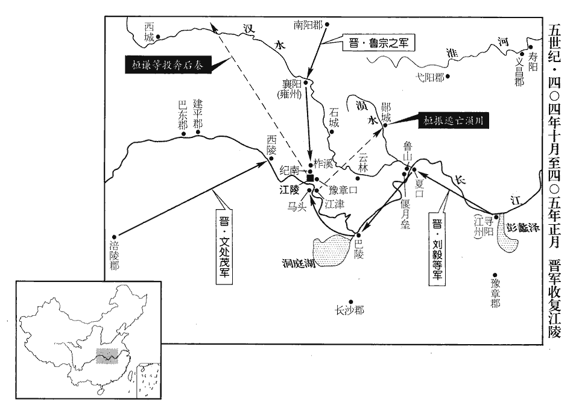
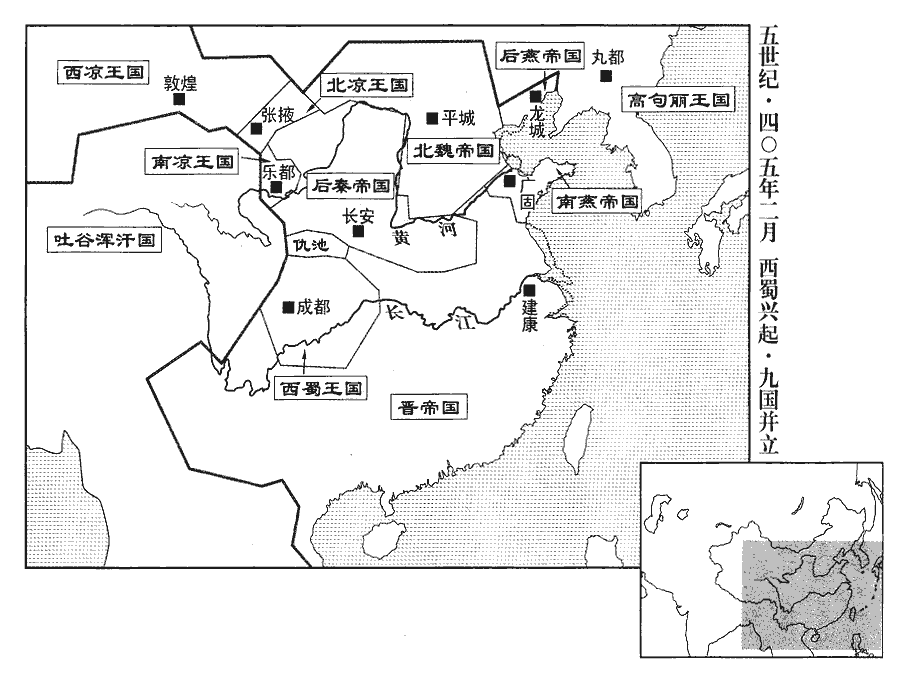
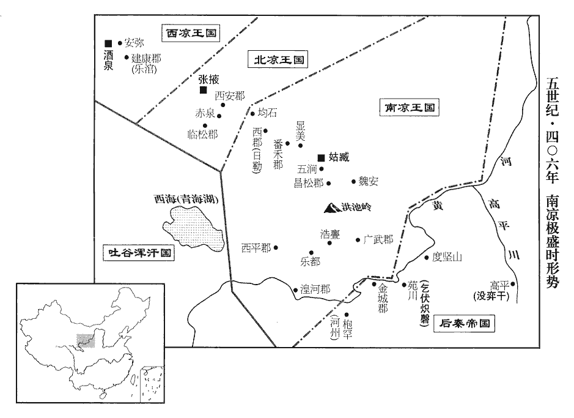
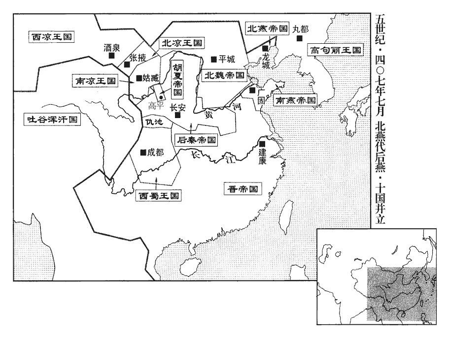
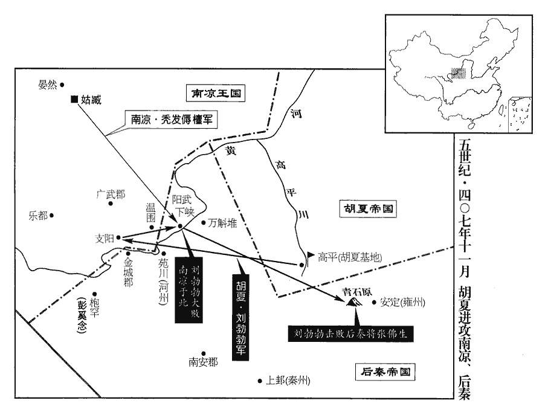

 晉紀三十六起旃蒙大荒落（乙巳），盡著雍涒灘（戊申），凡四年。

# 安皇帝己

## 義熙元年（乙巳、四零五）

1春，正月，南陽‹河南南阳›太守扶風‹陕西眉县›魯宗之起兵襲襄陽‹湖北襄樊›，桓蔚走江陵‹湖北江陵›。蔚，紆勿翻。己丑‹七›，劉毅等諸軍至馬頭‹湖北公安东北›。桓振挾帝‹时年二十四›出屯江津‹江陵东南十公里›，江津戍在江陵，南臨江滸。荊州記曰：江陵縣東三里有津鄉。水經註：江陵城南有馬牧城。此洲始自枚回下迄于此，長七十餘里，洲上有奉城，江津長所治。遣使求割江、荊二州，奉送天子；毅等不許。辛卯‹九›，宗之擊破振將溫楷于柞溪‹江陵北十公里›，水經註：柞溪水出江陵縣北，蓋諸池散流，咸所會合，積以成川，東流逕魯宗之壘南，又東注船官湖。將，即亮翻。柞，才各翻，又音作。進屯紀南‹江陵北五公里纪南城›。郡國志：江陵縣北十餘里有紀南城。振留桓謙、馮該守江陵，引兵與宗之戰，大破之。劉毅等擊破馮該於豫章口‹江陵东十公里长江口岸›，水經註：江水過江陵而東，得豫章口，夏水所通也；西北有豫章岡，蓋因岡而得名，其地去江陵城二十里。桓謙棄城走。毅等入江陵，執卞範之等，斬之。桓振還，望見火起，知城已陷，其眾皆潰，振逃于溳yún川。水經註：溳水出漢南陽郡蔡陽縣東南大洪山，東南流，過隨縣西，又南過江夏安陸縣西，又東南入于夏。溳，音云。

〖译文〗 [1]春季，正月，东晋南阳太守扶风人鲁宗之，发动军队袭击襄阳，桓蔚失败后逃往江陵。己丑（初七），刘毅等人的几支军队抵达马头。桓振挟持着安帝出兵屯据在江津，派遣使节请求割据江、荆两个州，以送回安帝作为交换条件。刘毅等人没有答应。辛卯（初九），鲁宗之在柞溪将桓振的部将温楷击败，进军屯扎在纪南。桓振留下桓谦、冯该镇守江陵，率领部队与鲁宗之展开决战，并打败了他。刘毅等人又在豫章口把冯该打败，桓谦放弃守城，逃跑。刘毅等人的部队进入江陵，抓住卞范之等人，全部杀掉。桓振回师，望见城中大火四起，知道江陵已经被攻陷，他所带的军队全部溃散，桓振逃到川。

 

乙未‹十三›，詔大處分悉委冠軍將軍劉毅。處，昌呂翻。分，扶問翻。冠，古玩翻。

〖译文〗 乙未（十三日），安帝下诏说，把国家的重大事件的处理权，全部交给冠军将军刘毅。

戊戌‹十六›，大赦，改元，惟桓氏不原；以桓沖忠於王室，特宥其孫胤。以魯宗之為雍州刺史，毛璩qú為征西將軍、都督益•梁•秦•涼•寧五州諸軍事，璩弟瑾為梁、秦二州刺史，瑗為寧州刺史，雍，於用翻。璩，求於翻。瑾，渠吝翻。瑗，于眷翻。劉懷肅追斬馮該於石城‹湖北钟祥›，桓謙、桓怡、桓蔚、桓謐、何澹之、溫楷皆奔秦。蔚，紆yū勿翻。澹，徒览翻。怡，弘之弟也。桓弘死見上卷上年。

〖译文〗 戊戌（十六日），下令实行大赦，改年号为义熙，只有桓氏家族的成员不加原宥。因为桓冲一心忠于王室司马家族，特别赦免了他的孙子桓胤。任命鲁宗之为雍州刺史，任命毛璩为征西将军及都督益、梁、秦、凉、宁五州诸军事，任命毛璩的弟弟毛瑾为梁、秦二州的刺史，毛瑷为宁州刺史。刘怀肃在石城追上冯该并把他杀了。桓谦、桓怡、桓蔚、桓谧、何澹之、温楷等人都逃奔后秦。桓怡是桓弘的弟弟。

2燕‹都龙城，辽宁朝阳›王熙‹时年二十一›伐高句麗‹都丸都，吉林集安›。句，如字，又音駒。麗，力知翻。戊申‹二十六›，攻遼東‹辽宁辽阳›；城且陷，熙命將士：「毋得先登，俟剗平其城，朕與皇后‹苻训英›乘輦而入。」剗chǎn，楚限翻。由是城中得嚴備，不克而還。後齊高緯之攻晉州，亦若是矣。還，從宣翻，又如字。

〖译文〗 [2]后燕王慕容熙征伐高句丽。戊申（二十六日），进攻辽东。在将要攻下城墙的时候，慕容熙命令手下的将士说：“不得抢先登城，等到把城墙铲成平地的时候，我跟皇后坐在车上一同进城。”因此，城中得到喘息的机会，加强了防备，于是他们没法攻破，只好回去了。

秦王興‹时年四十›以鳩摩羅什為國師，奉之如神，親帥群臣及沙門聽羅什講佛經，帥，讀曰率；下同。又命羅什翻譯西域經、論三百餘卷，古之譯者傳四夷之言；今羅什翻夷言為華言，故曰譯。大營塔寺，沙門坐禪者常以千數。禪，靜也，寂也。傳燈錄曰：禪有五：有凡夫禪，有外道禪，有小乘禪，有大乘禪，有最上乘禪。禪，時連翻。公卿以下皆奉佛，由是州郡化之，事佛者十室而九。

〖译文〗 后秦王姚兴任命鸠摩罗什为国师，像侍奉神灵那样尊重他，亲自率领大臣们以及一些僧人听鸠摩罗什讲授佛经，又命令鸠摩罗什翻译从西域传来的佛家“经”、“论”共三百多卷，并大量营造佛塔、寺院等建筑，在那里坐禅修行的僧人常常有千人之多。朝廷公、卿以下的官员也都信奉佛教，于是，地方上也都受这种风气的熏，信佛的人在十家当中往往有九家。

3乞伏乾歸擊吐谷渾‹青海›大孩，大破之，俘萬餘口而還；大孩走死胡園。晉書吐谷渾傳：吐谷渾王烏紇堤，一名大孩。「胡園」作「胡國」。孩，何開翻。視羆世子樹洛干帥其餘眾數千家奔莫何川‹青海同德西倾山西北›，莫何川在西傾山東北。西傾，亦名嵹jiàng臺山。帥，讀曰率。自稱車騎大將軍、大單于、吐谷渾王。騎，奇寄翻。單，音蟬。樹洛干輕傜薄賦，信賞必罰，吐谷渾復興，復，扶又翻。沙‹沙川，青海贵德西南›、漒‹漒川，洮河流域›諸戎皆附之。段國曰：澆河郡西南一百七十里有黃沙，南北一百二十里，東西七十里，西極大楊川，望之若人委糒bèi糠於地，不生草木，蕩然黃沙，周迴數百里。洮水出嵹臺山東北，逕吐谷渾中。自洮、嵹南北三百里中，地草皆是龍鬚，而無樵柴，謂之嵹川。嵹，渠良翻。

〖译文〗 [3]后秦归义侯乞伏乾归进攻吐谷浑可汗大孩，并把他打得大败，俘获了一万多人后回师。大孩逃往胡园，死在那里。前任可汗视罴的嫡长子树洛干率领剩下的部众几千家逃奔莫何川，自己号称车骑大将军、大单于、吐谷浑王。树洛干减轻徭役和赋税，有功必赏，有罪必罚，所以吐谷浑很快便复兴起来。沙州、川一带的那些戎族部落都归附了他们。

4西涼‹都敦煌，甘肃敦煌›公暠‹时年五十五›自稱大將軍、大都督、領秦•涼二州牧，暠，古老翻。大赦，改元建初，遣舍人黃始梁興間行奉表詣建康。間，古莧翻。

〖译文〗 [4]西凉公李自己号称大将军、大都督并兼秦、凉二州牧，下令实行大赦，改年号为建初，派遣舍人黄始、梁兴携带奏章，抄小路去建康诣见东晋朝廷。

5二月，丁巳‹五›，留臺備法駕迎帝於江陵，劉毅、劉道規留屯夏口‹湖北武汉›，夏，戶雅翻。何無忌奉帝東還。

〖译文〗 [5]二月，丁巳（初五），东晋留台准备皇帝专用的车驾仪仗，去江陵迎接安帝，刘毅、刘道规留在夏口驻扎，何无忌陪同护卫安帝东下还都。

6初，毛璩qú聞桓振陷江陵，帥眾三萬順流東下，將討之，使其弟西夷校尉瑾、蜀郡太守瑗出外水‹岷江›，璩，求於翻。瑾，渠吝翻。瑗，于眷翻。蜀有內水、外水。內水，涪水也；外水，即蜀江發源於岷山者。參軍巴西‹四川阆中›譙縱、侯暉出涪水‹涪江›。蜀人不樂遠征，暉至五城水口‹四川中江县›，涪，音浮。樂，音洛。水經註：涪水自南安郡南流，其枝流西逕廣漢五城縣為五城水，又西至成都入于江。又曰：江水東絕綿、洛，逕五城界至廣都北岸，南入于江，謂之五城水口，斯為北江。沈約宋志：五城縣屬廣漢郡，晉武帝咸寧四年立。華陽國志云：漢時立倉，發五縣人，尉部主之，晉因立五城縣，在五城山。按五代志，蜀郡玄武縣，舊曰伍城。玄武縣，唐屬梓州。與巴西陽昩謀作亂。昩，莫葛翻。縱為人和謹，蜀人愛之，暉、昩共逼縱為主。縱不可，走投于水；引出，以兵逼縱登輿。縱又投地，叩頭固辭，暉縛縱於輿。還，襲毛瑾於涪城‹四川绵阳›，殺之，涪，音浮。推縱為梁、秦二州刺史。璩至略城‹四川盐亭›，據晉書毛璩傳，略城去成都四百里。聞變，奔還成都，遣參軍王瓊將兵討之，將，即亮翻。為縱弟明子所敗，敗，補邁翻。死者什八九。益州營戶李騰開城納縱兵，民有流離逃叛分配軍營者為營戶。殺璩及弟瑗，滅其家。縱稱成都王，以從弟洪爲益州刺史，以明子為巴州刺史，屯白帝‹重庆奉节东›。於是蜀大亂，漢中‹陕西汉中›空虛，氐王楊盛遣其兄子平南將軍撫據之。

〖译文〗 [6]当初，毛璩听说桓振攻陷了江陵，便率领三万人的部队顺长江向东进发，准备讨伐他，派遣他的弟弟西夷校尉毛瑾、蜀郡太守毛瑷从外水出发，参军巴西人谯纵、侯晖从涪水出发。蜀地的人不喜欢到远方征战，侯晖到了五城水口，与巴西人阳昧谋划发动叛乱。谯纵为人谦和谨慎，蜀地的人都很拥戴他，侯晖、阳昧一起逼迫谯纵为盟主。谯纵严辞拒绝，纵身投江，被叛军救了上来。他们又用兵刃逼迫谯纵登上车轿，谯纵又扑倒在地，向大家磕头，坚决拒绝，侯晖把谯纵绑在车上，回军，在涪城袭击毛瑾，并把他杀了，拥推谯纵为凉、秦二州刺史。毛璩来到略城，听说军中发生叛乱，飞马回成都，派遣参军王琼带兵前去讨伐，被谯纵的弟弟谯明子打败，被杀死者十有八九。益州营户李腾打开城门迎入谯纵的军队，杀了毛璩和他的弟弟毛瑷，屠灭了他们全家。谯纵号称成都王，任命堂弟谯洪为益州刺史，任命谯明子为巴州刺史，驻守白帝。从此，蜀地局势大乱，汉中的实力也十分空虚。氐王杨盛派遣他的侄儿平南将军杨抚占据了那里。

7癸亥‹十一›，魏‹都平城，山西大同›主珪‹时年三十五›還自豺山‹山西右玉北›，罷尚書三十六曹。魏三十六曹始見於一百九卷隆安元年。

〖译文〗 [7]癸亥（十一日），北魏国主拓跋从豺山回京，撤销了尚书三十六曹等官署。

8三月，桓振自鄖城‹湖北安陆›襲江陵，杜預曰：江夏雲杜縣東南有鄖城，古鄖子之國。鄖，音云。振先逃于溳川，鄖城蓋在溳川也。溳，音云。荊州刺史司馬休之戰敗，奔襄陽，振自稱荊州刺史。建威將軍劉懷肅自雲杜‹湖北仙桃西›引兵馳赴，與振戰於沙橋；沙橋在江陵城北。劉毅遣廣武將軍唐興助之，臨陳斬振，陳，讀曰陣。復取江陵。復，扶又翻；下復詣、尋復、復說同。

〖译文〗 [8]三月，桓振自郧城发兵袭击江陵，荆州刺史司马休之迎战，大败，逃奔襄阳，桓振自称为荆州刺史。建威将军刘怀肃从云杜带兵迅速赶到，在沙桥与桓振展开决战。刘毅派遣广武将军唐兴前来助战，就在战场上将桓振杀死，重新夺回江陵。

甲午‹十三›，帝至建康。乙未‹十四›，百官詣闕請罪，詔令復職。

〖译文〗 甲午（十三日），安帝抵达建康。乙未（十四日），文武百官前往宫门拜见请罪。安帝下诏命令他们恢复职务。

尚書殷仲文以朝廷音樂未備，言於劉裕，請治之。治，直之翻。裕曰：「今日不暇給，且性所不解。」解，戶買翻，曉也；下同。仲文曰：「好之自解。」裕曰：「正以解則好之，故不習耳。」英雄之言，政自度越常流；世之嗜音者，可以自省矣。好，呼到翻。

〖译文〗 尚书殷仲文因为朝廷音乐设施不完备，告之刘裕，请求重建。刘裕说：“现在没有时间做这件事，而且我也不懂它的道理。”殷仲文说：“如果你喜欢它，那就自然懂了。”刘裕说：“正因为懂了就会喜爱，所以我才不去学习它。”

 

庚子‹十九›，以琅邪王德文為大司馬，武陵王遵為太保，劉裕為侍中、車騎將軍、都督中外諸軍事，徐、青二州刺史如故，劉毅為左將軍，何無忌為右將軍、督豫州•揚州五郡軍事、豫州刺史，劉道規為輔國將軍、督淮北諸軍事、并州刺史，魏詠之為征虜將軍、吳國內史。裕固讓不受；加錄尚書事，又不受，屢請歸藩。歸藩，歸京口‹江苏镇江›也。詔百官敦勸，帝親幸其第；裕惶懼，復詣闕陳請，乃聽歸藩。以魏詠之為荊州刺史，代司馬休之。

〖译文〗 庚子（十九日），任命琅邪王司马德文为大司马，武陵王司马遵为太保，刘裕为侍中、车骑将军、都督中外诸军事，原任的徐、青二州刺史仍然兼任，刘毅为左将军，何无忌为右将军、督豫州和扬州五郡诸军事、豫州刺史。刘道规为辅国将军、督淮北诸军事、并州刺史，魏咏之为征虏将军、吴国内史。刘裕坚决辞让，不接受这些官职。安帝加封他为录尚书事，他还是不接受，几次请求仍回到他的属地去。安帝命令文武百官一起敦促、规劝，安帝也亲自驾临到他的宅第。刘裕惶恐害怕，再次前往宫门去拜见，陈述理由，最后，安帝终于准许他回属地去了。安帝又任命魏咏之为荆州刺史，代替司马休之。

初，劉毅嘗為劉敬宣寧朔參軍，劉敬宣為寧朔將軍，毅為參軍。時人或以雄傑許之。敬宣曰：「夫非常之才自有調度，調，徒弔翻。豈得便謂此君為人豪邪！此君之性，外寬而內忌，自伐而尚人，若一旦遭遇，亦當以陵上取禍耳。」敬宣之論毅，其知之固審矣，然幾以此掇duō禍；聖人包周身之防，正為是耳。毅聞而恨之。及敬宣為江州‹府寻阳，江西九江›；辭以無功，不宜授任先於毅等，先，悉薦翻。裕不許。毅使人言於裕曰：「劉敬宣不豫建義。猛將勞臣，方須敘報，將，即亮翻。如敬宣之比，宜令在後。若使君不忘平生，裕參劉牢之軍事，牢之父子雅敬待之，故云然。正可為員外常侍耳。員外散騎常侍，魏末置。聞已授郡，實為過優；敬宣自北來歸，裕以為晉陵太守。尋復為江州，尤用駭惋。」惋，烏貫翻。敬宣愈不自安，自表解職，乃召還為宣城‹安徽宣州›內史。

〖译文〗 当初，刘毅曾经做过刘敬宣的宁朔参军，当时有的人认为他是一个英雄豪杰。刘敬宣说：“非常的人才自有胸怀和水平，何以见得他就是人中豪杰呢？此人的性格，外表宽厚，但心胸狭窄，自视很高，总想在别人之上，如果一旦掌握大权，也一定会因为犯上而招到祸患。”刘毅听说之后，心中对刘敬宣十分怀恨。到了朝廷任命刘敬宣为江州刺史的时候，他认为自己无功，诚恳辞让，不应该在刘毅等人之前接受任命。刘裕没有答应他的请求。刘毅这时派人去对刘裕说：“刘敬宣并没有参与勤王讨逆的义举。现在，平乱中的勇猛之将、劳顿之臣才要论功行赏，像刘敬宣那样的官员，应该让他们靠后一些。如果你不忘记过去的情谊，不妨给他一个员外常侍之类的官做，就可以了。现在听说已经授给他郡守的官职，实在已经是太过于优厚了。不久又再次把江州交给他管辖，尤其让人惊骇惋惜。”刘敬宣越加感到心中不安，自己上表请求解去职务，于是，朝廷把他召回做宣城内史。

9夏，四月，劉裕旋鎮京口，改授都督荊、司等十六州諸軍事，加領兗州刺史。

〖译文〗 [9]夏季，四月，刘裕回到京口镇守。朝廷改任他为都督荆、司等十六州诸军事，兼任兖州刺史。

10盧循遣使貢獻。使，疏吏翻。時朝廷新定，未暇征討；壬申‹二十一›，以循為廣州刺史，徐道覆為始興‹广东韶关›相。循遺劉裕益智粽，遺，于季翻。本草曰：益智子生崑崙國，今嶺南州郡往往有之。顧微交州記曰：益智葉如蘘ráng荷，莖如竹箭，子從心出，一枝有十子，子肉白滑，四破去之，密煮為粽，味辛。粽，作弄翻，角黍shǔ也。裕報以續命湯。循以益智調裕，裕以續命報之，此雖淺陋，亦兵機也。

〖译文〗 [10]卢循派遣使节前来建康进贡。这时，东晋朝廷刚刚稳定下来，没有时间前去征讨。壬申（二十一日），朝廷任命卢循为广州刺史，徐道覆为始兴相。卢循赠送给刘裕益智粽，刘裕回赠给他续命汤。

循以前琅邪內史王誕為平南長史。誕說循曰：「誕本非戎旅，在此無用；說，輸芮翻。王氏，江南衣冠稱首，故云本非戎旅。素為劉鎮軍所厚，若得北歸，必蒙寄任，公私際會，仰答厚恩。」循甚然之。劉裕與循書，令遣吳隱之還，循不從。誕復說循曰：復，扶又翻。「將軍今留吳公，公私非計。孫伯符豈不欲留華子魚邪?但以一境不容二君耳。」於是循遣隱之與誕俱還。元興元年，桓玄流王誕於嶺南。二年，盧循破廣州，虜吳隱之，誕并沒於循所。漢獻帝建安四年，華歆以豫章歸孫策；策死，曹操表召歆，孫權遣還許。華，戶化翻。

〖译文〗 卢循任命前琅邪内史王诞为平南长史。王诞游说卢循道：“王诞我本来不是军旅出身，留在这里也没什么用处。我一向被刘镇军厚爱，如果能够回到北方去的话，一定会得到他的委派重用，这样，不管是为公为私，遇到机会，我一定要报答您的厚恩。”卢循认为他说得很对。这时刘裕写给卢循一封信，让他派吴隐之回去，卢循没有听从。王诞又对卢循说：“将军这次扣留吴公，对公对私都不是好计策。孙策岂能不想扣留华歆？只是因为一个地方容不下两个君长罢了。”于是，卢循派吴隐之与王诞一起回去了。

11初，南燕‹都广固，山东青州›主備德仕秦為張掖‹甘肃張掖›太守，事見一百二卷海西公太和五年。其兄納與母公孫氏居于張掖。備德之從秦王堅寇淮南也，寇淮南見一百五卷孝武帝太元八年。留金刀與其母別。備德與燕王垂舉兵於山東‹崤山之东›，張掖太守苻昌收納及備德諸子，皆誅之，公孫氏以老獲免，納妻段氏方娠，未決。獄掾呼延平，備德之故吏也，掾，于絹翻。竊以公孫氏及段氏逃于羌中。段氏生子超，十歲而公孫氏病；臨卒，以金刀授超曰：「汝得東歸，當以此刀還汝叔也。」呼延平又以超母子奔涼。及呂隆降秦，超隨涼州民徙長安‹西安›。秦徙涼州民事見上卷元興二年。平卒，段氏為超娶其女為婦。

〖译文〗 [11]当初，南燕国主慕容备德在前秦担任张掖太守。他的哥哥慕容纳与母亲公孙氏居住在张掖。后来，慕容备德跟随秦王苻坚进犯淮南，留下一把金刀向母亲告别。慕容备德与燕王慕容垂在崤山之东起兵反叛，张掖太守苻昌便抓获慕容纳以及慕容备德的几个儿子，都杀掉了。他的母亲公孙氏因为年老而得到赦免，慕容纳的妻子段氏正在怀孕，也没有被马上处死。监狱看守呼延平，是原来慕容备德的老部下，暗地里把在押的公孙氏和段氏放跑，带她们逃到羌中去了。段氏生下儿子慕容超。孩子十岁的时候，公孙氏得了重病，临死的时候，把金刀交给慕容超说：“你将来如果有机会回到东方去的话，你应当把这把刀还给你的叔叔。”呼延平又带着慕容超母子二人投奔后凉国。到了吕隆投降后秦之后，慕容超又随着凉州的百姓一起被迁到长安。呼延平死后，段氏为慕容超娶了呼延平的女儿做媳妇。

超恐為秦人所錄，為，于偽翻。錄，采也，收也。為所收采，則不得歸南燕矣。乃陽狂行乞；秦人賤之，惟東平公紹見而異之，言於秦王興曰：「慕容超姿幹瓌偉，瓌guī，公回翻。殆非真狂，願微加官爵以縻之。」興召見，與語，超故為謬對，或問而不答。興謂紹曰：「諺云『妍皮不裹癡骨』，徒妄語耳。」乃罷遣之。

〖译文〗 慕容超担心自己被后秦扣押，于是表面上假装疯癫，到处乞食为生。后秦国的人都觉得他很贱，歧视他，只有东平公姚绍看见他后，认为他很奇异特殊，对后秦王姚兴说道：“慕容超身材魁梧，举措轩昂，恐怕不是真疯，希望您能稍稍给他一个小官当，把他拴住。”姚兴召见慕容超，与他说话，慕容超故意往错处回答。姚兴对姚绍说：“谚语说得好，‘好皮不包蠢骨头’，他只不过是胡说八道罢了。”于是把他放了出去。

備德聞納有遺腹子在秦，遣濟陰‹山东菏泽东北›人吳辯往視之，濟，子禮翻。辯因鄉人宗正謙賣卜在長安，以告超。宗正，以官為氏。超不敢告其母妻，潛與謙變姓名逃歸南燕。行至梁父‹山东泰安东南›，父，音甫。鎮南長史悅壽以告兗州刺史慕容法。南燕以法為兗州刺史，鎮梁父。法曰：「昔漢有卜者詐稱衛太子，見二十三卷漢昭帝始元五年。今安知非此類也！」不禮之。超由是與法有隙。為超立、法謀反張本。

〖译文〗 慕容备德听说慕容纳有一个遗腹子还在后秦，便派遣济阴人吴辩去那里查访。吴辩因为同乡人宗正谦在长安依靠占卜算卦为生，便通过他与慕容超取得了联系。慕容超不敢把这个消息告诉母亲和妻子，只有暗地里与宗正谦改名换姓逃回到南燕。他们走到梁父的时候，镇南长史悦寿把消息告诉给兖州刺史慕容法。慕容法说：“过去在汉代的时候有个卜卦的人谎称自己是卫太子，现在怎么知道此人不是这类的骗子呢？”因此对慕容超不甚恭敬，慕容超从此与慕容法产生隔阂。

備德聞超至，大喜，遣騎三百迎之。騎，奇寄翻；下同。超至廣固‹山东青州›，以金刀獻於備德；備德慟哭，悲不自勝。勝，音升。封超為北海王，拜侍中、驃騎大將軍、司隸校尉、驃，匹妙翻。開府，妙選時賢，為之僚佐。備德無子，欲以超為嗣。超入則侍奉盡歡，出則傾身下士，下，戶嫁翻。由是內外譽望翕然歸之。

〖译文〗 慕容备德听说慕容超已经到来，非常高兴，派遣三百名骑兵前来迎接。慕容超抵达广固，把那把金刀献给慕容备德，慕容备德失声恸哭，悲痛不能自己。册封慕容超为北海王，任命他为侍中、骠骑大将军、司隶校尉、开府，并精心遴选一时的贤俊、英杰，作为他的僚属辅佐他。慕容备德没有儿子，打算让慕容超做自己的后嗣，将来继承王位。慕容超入宫陪同侍奉叔父，就可以使叔父尽情欢快，出宫办事也能礼贤下士、谦诚待人。从此，朝廷内外美誉声望全部归于慕容超。

12五月，桂陽‹湖南郴州›太守章武王秀義陽王望子河間王洪生子威，徙封章武，傳至孫，無嗣，河間王欽以子範之繼之。秀，範之子也。及益州刺史司馬軌之謀反，伏誅。秀妻，桓振之妹也，故自疑而反。

〖译文〗 [12]五月，东晋桂阳太守、章武王司马秀和益州刺史司马轨之阴谋反叛，被杀。司马秀的妻子是桓振的妹妹，所以他自己疑心受到牵连，索性反叛。

13桓玄餘黨桓亮、苻宏等擁眾寇亂郡縣者以十數，劉毅、劉道規、檀祗等分兵討滅之，荊、湘、江、豫皆平。詔以毅為都督淮南等五郡軍事、豫州刺史，淮南、廬江、歷陽、晉熙、安豐，凡五郡。何無忌為都督江東五郡軍事、會稽‹浙江绍兴›內史。會，工外翻。

〖译文〗 [13]桓玄的余党桓亮、苻宏等人，裹胁着百姓，几十次侵扰为祸地方郡县，刘毅、刘道规、檀祗等人分别带兵将他们剿灭，荆、湘、江、豫等几个地方的局势全部得到平安。朝廷下诏，任命刘毅为都督淮南等五郡军事、豫州刺史，任命何无忌为都督江东五郡军事、会稽内史。

14北青州刺史劉該反，引魏為援，隆安五年，劉該固嘗降魏矣。沈約曰：江左青州治廣陵。清河、陽平二郡太守孫全聚眾應之。六月，魏豫州刺史索度真、大將斛斯蘭斛斯，亦虜姓也。寇徐州，圍彭城‹江苏徐州›。劉裕遣其弟南彭城內史道憐、東海‹山东郯城›太守孟龍符將兵救之，將，即亮翻。斬該及全，魏兵敗走。龍符，懷玉之弟也。

〖译文〗 [14]东晋北青州刺史刘该叛变，勾结北魏为外援，清河、阳平两个郡的太守孙全拉起队伍响应他。六月，北魏豫州刺史索度真、大将斛斯兰进犯徐州，围攻彭城。刘裕派遣他的弟弟南彭城内史刘道怜、东海太守孟龙符带兵前去救援，斩杀了刘该和孙全，北魏军失败而退走。孟龙符是孟怀玉的弟弟。

15秦隴西公碩德伐仇池‹甘肃西和南›，屢破楊盛兵；將軍斂俱攻漢中‹陕西汉中›斂，羌之種姓；俱，其名。拔成固‹陕西城固›，徙流民三千餘家於關中。秋，七月，楊盛請降於秦。降，戶江翻。秦以盛為都督益•寧二州諸軍事、征南大將軍、益州牧。

〖译文〗 [15]后秦陇西公姚硕德，征伐仇池，多次打败杨盛的部队。将军敛俱进攻汉中，攻克成固，把三千多家流民迁徙到关中。秋季，七月，杨盛向后秦请求投降。后秦任命杨盛为都督益、宁二州诸军事，征南大将军，益州牧。

16劉裕遣使求和於秦，使，疏吏翻。且求南鄉‹河南淅川›等諸郡，秦王興許之。群臣咸以為不可，興曰：「天下之善一也。劉裕拔起細微，能誅討桓玄，興復晉室，內釐庶政，外脩封疆，吾何惜數郡，不以成其美乎！」遂割南鄉、順陽‹河南淅川东›、新野‹河南新野›、舞陰‹河南泌阳北›等十二郡歸于晉。隆安二年，淮、漢以北多降於秦，此十二郡蓋皆在漢北。漢建安中，割南陽右壤為南鄉郡；晉立順陽郡，以南鄉為縣，蓋其後復分立郡也。按晉南鄉郡，秦漢陰縣及酇縣之地，今為光化軍。舞陰縣屬南陽郡，未知立郡之始。

〖译文〗 [16]刘裕派遣使节向后秦求和，并要求归还南乡等几个郡，后秦王姚兴答应了他。姚兴的大臣们都觉得这样不行，姚兴说：“天底下的善行都是一样的。刘裕从社会底层最卑贱的地位上发展起来，能够诛杀桓玄，重新振兴晋室，对内整顿日常政务，对外核查勘定封地疆土，我怎么能为了珍惜几个郡，便因此不成全他的好事呢？”于是割让南乡、顺阳、新野、舞阴等十二个郡，归还给东晋。

八月，燕遼西‹河北卢龙›太守邵颜有罪，亡命為盜；九月，中常侍郭仲讨斬之。

〖译文〗 八月，后燕辽西太守邵颜犯罪，出外逃命当了盗贼。九月，中常侍郭仲出兵征讨并把他杀了。

17汝水‹女水，流经山东淄博东南›竭，「汝」當作「女」。郭緣生述征記：齊桓公冢在齊城南二十里，冢東有女水。或曰：齊桓公女冢在其上，故以名水。女水導川東北流，甚有神焉；化隆則水生，政薄則津竭。地理志：葂miǎn頭山，女水所出，東北至臨菑入鉅淀。鉅淀即漢鉅定地。晉書地理志：女水出齊國東安平縣東北。南燕主備德惡之，惡，烏路翻。俄而寢疾；北海王超請禱之，備德曰：「人主之命，短長在天，非汝水所能制也。」固請，不許。

〖译文〗 [17]汝水枯竭，南燕国主慕容备德为此十分焦虑，不久便得病，卧床不起。北海王慕容超请求为此祷告，慕容备德说：“作为人主，他的寿命长短，全由上天决定，不是汝水所能制约得了的。”慕容超一再请求，慕容备德只是不允许。

戊午，備德引見群臣于東陽殿，見，賢遍翻。議立超為太子。俄而地震，百官驚恐，備德亦不自安，還宮。是夜，疾篤，瞑不能言。段后大呼曰：「今召中書作詔立超，可乎?」呼，火故翻。備德開目頷之。乃立超為皇太子，大赦。備德尋卒。年七十。為十餘棺，夜，分出四門，潛瘞山谷。瘞yì，一計翻。

〖译文〗 戊午（十月初一），慕容备德在东阳殿召见群臣，商议册立慕容超为太子。不巧突然间发生地震，文武百官非常惊恐，慕容备德心里也非常不安，于是回宫。这天夜里，他的病情加重，眼睛紧闭，不能说话。段后大声对他说：“现在召中书官进宫写诏书，立慕容超为太子，可以吗？”慕容备德睁开眼睛点了点头。于是，册立慕容超为皇太子，下令大赦。慕容备德很快便去世了。他们制作了十几个相同的棺材，在夜间，分别抬着从四个城门出去，埋在不同的地方，暗地里却把真的棺木秘密葬在山谷之中。

己未，超即皇帝位‹时年二十一›，超，字祖明，德兄北海王納之子。大赦，改元太上。尊段后為皇太后。以北地王鍾都督中外諸軍、錄尚書事，慕容法為征南大將軍、都督徐•兗•揚•南兗四州諸軍事，加慕容鎮開府儀同三司，以尚書令封孚為太尉，麴「麴」，當作「鞠」。仲為司空，封嵩為尚書左僕射。癸亥，虛葬備德於東陽陵，諡曰獻武皇帝，廟號世宗。

〖译文〗 己未（十月十一日），慕容超登上皇帝位，下令大郝，改年号为太上。尊奉段后为皇太后。任命北地王慕容钟都督中外诸军事、录尚书事，慕容法为征南大将军并都督徐、兖、扬、南兖四州诸军事，加封慕容镇开府仪同三司，任命尚书令封孚为太尉，鞠仲为司空，封嵩为尚书左仆射。癸亥（十月十五日），表面上把没有慕容备德尸体的空棺葬在东阳陵，并把他追谥为献武皇帝，庙号世宗。

超引所親公孫五樓為腹心。備德故大臣北地王鍾、段宏等皆不自安，求補外職。超以鍾為青州牧，宏為徐州刺史。公孫五樓為武衛將軍，領屯騎校尉，內參政事。封孚諫曰：「臣聞親不處外，羇不處內。左傳申無宇諫楚靈王曰：親不在外，羇不在內。處，昌呂翻。鍾，國之宗臣，社稷所賴；宏，外戚懿望，百姓具瞻；正應參翼百揆，不宜遠鎮外方。今鍾等出藩，五樓內輔，臣竊未安。」超不從。鍾、宏心皆不平，相謂曰：「黃犬之皮，恐終補狐裘也。」史記：騶忌相齊，淳于髡kūn謂之曰：「狐裘雖弊，不可補以黃狗之皮。」騶忌曰：「謹受令，請謹擇君子，毋雜小人其間。」五樓聞而恨之。

〖译文〗 慕容超把他过去的亲信公孙五楼当做心腹。慕容备德原来的大臣北地王慕容钟、段宏等都在心里感到不安，请求去外地任职。慕容超任命慕容钟为青州牧，任命段宏为徐州刺史。又任命公孙五楼为武卫将军，领屯骑校尉，参与处理国家政事。封孚劝阻说：“臣下我听说，亲人不能排斥到外地，客人却不能让进内室。慕容钟是国家的皇族重臣，政权的倚靠；段宏，在外戚中极负盛名，百姓也都十分景仰。正应该让他们协助并带动文武百官，辅佐陛下，而不应该让他们到很远的外地去镇守。现在，慕容钟等出外守边，公孙五楼却在朝中辅佐，臣下我内心里觉得是不妥的。”慕容超拒不听从。慕容钟、段宏心中都感到愤愤不平，相对着说：“黄狗的皮毛，恐怕终将要补狐皮衣服了。”公孙五楼听说这话之后，怀恨在心。

18魏詠之卒，江陵令羅脩謀舉兵襲江陵，奉王慧龍為主。劉裕以并州刺史劉道規為都督荊•寧等六州諸軍事、荊州刺史。脩不果發，奉慧龍奔秦。慧龍得免，見上卷元興三年。

〖译文〗 [18]东晋魏咏之去世，江陵令罗阴谋发动兵变袭击江陵，拥奉王慧龙为盟主。刘裕任命并州刺史刘道规为都督荆、宁等六州诸军事及荆州刺史。罗来不及发动叛乱，只好随同王慧龙逃往后秦。

19乞伏乾歸伐仇池‹甘肃西和南›，為楊盛所敗。敗，補邁翻。

〖译文〗 [19]后秦归义侯乞伏乾归征伐仇池，被杨盛打败。

20西涼‹都敦煌，甘肃敦煌›公暠與長史張邈謀徙都酒泉‹甘肃酒泉›以逼沮渠蒙遜‹时年三十八›；沮，子余翻。以張體順為建康‹甘肃酒泉东南›太守，鎮樂涫，漢志，樂涫縣屬酒泉郡；張氏分為建康郡。涫，音官。以宋繇為敦煌護軍，與其子敦煌太守讓鎮敦煌，遂遷于酒泉。李暠遷酒泉欲以逼沮渠蒙遜，安知反為蒙遜所逼邪！敦，徒門翻。

〖译文〗 西凉公李与长史张商议，把都城迁往酒泉，用来对北凉国沮渠蒙逊施加威胁与压力，于是任命张体顺为建康太守，镇守乐涫，任命宋繇为敦煌护军，和他的儿子敦煌太守宋让一起镇守敦煌，于是把都城迁到酒泉。

暠手令戒諸子，以為：「從政者當審慎賞罰，勿任愛憎，近忠正，遠佞諛，近，其靳翻。遠，于願翻。勿使左右竊弄威福。毀譽之來，當研覈真偽；聽訟折獄，必和顏任理，慎勿逆詐億必，朱子曰：逆，未至而迎之也。詐，謂人欺己也。億，未見而意之也。必，期必也。譽，音余。輕加聲色。務廣咨詢，勿自專用。吾蒞事五年，雖未能息民，然含垢匿瑕，朝為寇讎，夕委心膂，粗無負於新舊，粗，坐五翻。事任公平，坦然無纇，纇lèi，盧對翻，絲節也，疵也。初不容懷，有所損益。計近則如不足，經遠乃為有餘，庶亦無愧前人也。」

〖译文〗 李写下一首手谕，告诫他的几个儿子，认为：“从事政务的人应当对奖赏或惩罚非常谨慎，万万不能任凭自己的爱憎，随意而为，接近忠直正派的人，疏远奸佞阿谀的小人，不让自己左右亲近的人暗地里操纵权力，作威作福。别人毁谤或者赞誉你的时候，应当仔细斟酌辩别是真是假。听取讼诉，判定案情，一定要和颜悦色地按规章情理仔细处置，千万不要事先推测对方心怀奸诈，主观臆断，轻易地发脾气。要尽量争取多听别人的意见，不要自己独断专行。我主持政事五年来，虽然不能说使百姓得到了很好的休息安抚，但是，我尽量地宽容别人的错误，掩饰别人的缺点，所以才使早上还是对手、仇人的人，到晚上便可能成为知心朋友。大体上，没有什么对不起那些新知旧友的地方，因为我处事公平，胸怀坦荡，没有偏差，一点儿也不许因私意有所变更。这样做，从眼前的利益来考虑，好像是要受到些损失，但是时间一久，才能看出好处来，也只有这样，在前人的面前，我才可说是无愧的。”

21十二月，燕王熙襲契丹‹内蒙西辽河上游›。契丹本東胡種，其先為匈奴所破，保鮮卑山。魏青龍中，部酋軻比能桀驁，為幽州刺史王雄所殺，部眾遂微，逃潢水之南，黃龍之北，後自號曰契丹，種類繁盛。契，欺詰翻。程大昌曰：契丹之契，讀如喫chī。

〖译文〗 [20]十二月，后燕王慕容熙进攻契丹。

## 二年（丙午、四零六）

1春，正月，甲申‹八›，魏主珪‹时年三十六›如豺山宮‹山西右玉北›。諸州置三刺史，郡置三太守，縣置三令長；刺史、令長各之州縣，長，知兩翻。之，往也。太守雖置而未臨民，功臣為州者皆徵還京師‹平城，山西大同›，以爵歸第。

〖译文〗 [1]春季，正月，甲申（初八），北魏国主拓跋来到豺山宫。并下令，每个州设置三个刺史，每个郡设置三个太守，每个县设置三个令长。其中，刺史、令长等各去到所在州县上任，太守虽然设置了却并不上任，有功之臣管辖州所的，都被征召回京师，保持原有的爵位，回家。

2益州刺史司馬榮期擊譙明子于白帝‹重庆奉节东›，破之。

〖译文〗 [2]东晋益州刺史司马荣期，在白帝进攻西蜀政权的谯明子，将他打败。

3燕‹都龙城，辽宁朝阳›王熙‹时年二十二›至陘北，陘北，冷陘山之北也。陘，音刑。畏契丹之眾，欲還，苻后‹苻训英›不聽；戊申，遂棄輜重，重，直用翻。輕兵襲高句麗‹都丸都，吉林集安›。

〖译文〗 [3]后燕王慕容熙抵达陉北，因为害怕契丹部落人多，打算回去，但苻皇后却不听从。戊申（二月初二），慕容熙只好放弃笨重的军用物资，用轻装部队袭击高句丽。

4南燕‹都广固，山东青州›主超‹时年二十二›猜虐日甚，政出權倖，盤于遊畋，盤，樂也，言樂于田獵遊逸。封孚、韓𧨳zhuó屢諫不聽。丁度曰：𧨳zhuó，竹角翻。超嘗臨軒問孚曰：「朕可方前世何主?」對曰：「桀、紂。」超慙怒，孚徐步而出，不為改容。為，于偽翻。鞠仲謂孚曰：「與天子言，何得如是！宜還謝。」孚曰：「行年七十，惟求死所耳！」竟不謝。超以其時望，優容之。

〖译文〗 [4]南燕国主慕容超的猜忌、暴虐一天比一天厉害，政令完全由受他宠幸的掌权者颁发，自己则沉迷于游牧打猎，封孚、韩多次规劝，他也不听。慕容超曾有一次在金殿之上问封孚道：“联可以和前代的哪位君主相比？”封孚回答说：“桀、纣。”慕容超既惭愧又气愤，封孚则缓缓地从容走出，神色不改。鞠仲对封孚说：“与天子说话，怎么能够这样呢？你应该回去谢罪。”封孚说：“我现在已经年过七十，只求死得其所罢了！”竟然不去请罪。慕容超因为他在当时声望很高，所以特别地宽容了他。

5桓玄之亂，河間王曇tán之子國璠fán、叔璠奔南燕，河間王顒死，無後，元帝以彭城王植子融為顒嗣。薨，又無子，帝復尋以彭城王釋子欽為融嗣。欽薨，曇之嗣；曇之薨，國鎮嗣。國璠蓋國鎮兄弟。劉裕興復，篡意未彰，國璠宜如劉敬宣輩南歸可也。乃攻擾晉邊者，欽孫秀嗣封章武，國璠從兄弟也，秀以桓振妹婿謀反誅，故國璠兄弟不敢南歸耳，豈知裕之必篡哉！曇，徒含翻。璠，孚袁翻。二月，甲戌‹二十八›，國璠等攻陷弋陽‹河南潢川›。

〖译文〗 [5]东晋桓玄叛乱时，河间王司马昙之的儿子司马国、司马叔逃奔南燕。二月，甲戌（二十八日），司马国等人攻陷弋阳。

6燕軍行三千餘里，士馬疲凍，死者屬路，屬，之欲翻。攻高句麗木底城‹辽宁新宾西›，不克而還。木底城在南蘇之東，唐置木底州。句，如字，又音駒。麗，力知翻。夕陽公雲傷於矢，且畏燕王熙之虐，遂以疾去官。為後燕人弒熙立雲張本。

〖译文〗 [6]后燕军走了三千多里，兵士和马匹因疲惫寒冷，一路不断有死掉的。他们进攻高句丽木底城，没有攻克，只好回去。夕阳公慕容云被箭射伤，加上又害怕后燕王慕容熙的凶残暴虐，于是以有病为借口，辞官回家。

7三月，庚子‹二十五›，魏主珪還平城‹山西大同›；夏，四月，庚申‹十五›，復如豺山宮；復，扶又翻。甲午‹二十九›，【嚴：「午」改「子」。】還平城。

〖译文〗 [7]三月，庚子（二十五日），北魏国主拓跋回到平城。夏委，四月，庚申（十五日），再一次来到豺山宫。甲子（十九日），又回到平城。

8柔然‹瀚海沙漠群›社崙侵魏邊。崙，盧昆翻。

〖译文〗 [8]柔然可汗郁久闾社仑，侵犯北魏边境。

9五月，燕主寶之子博陵公虔、上黨公昭，皆以嫌疑賜死。

〖译文〗 [9]五月，后燕国主慕容宝的儿子博陵公慕容虔、上党公慕容昭，都因为嫌疑而被逼自杀。

10六月，秦‹都长安，陕西西安›隴西公碩德自上邽‹甘肃天水›入朝，秦王興為之大赦；為，于偽翻。及歸，送之至雍‹陕西凤翔›，乃還。雍，於用翻。興事晉公緒及碩德皆如家人禮，車馬、服玩，先奉二叔而自服其次，國家大政，皆咨而後行。

〖译文〗 [10]六月，后秦陇西公姚硕德从上来到都城朝见。后秦国主姚兴为此下令实行大赦。等他回去的时候，姚兴又把他送到雍城，才回来。姚兴对待晋公姚绪和姚硕德，都用家里亲人的礼节，车马、衣服、珍玩等也都先送给两位叔父，然后自己才留用差一点的。国家的大政方针，都事先请示他们之后再决定。

11禿髮傉檀‹时年四十二›伐沮渠蒙遜，傉，奴沃翻。沮，子余翻。蒙遜嬰城固守。傉檀至赤泉‹甘肃民乐北›而還，赤泉在張掖氐池縣北。獻馬三千匹、羊三萬口于秦。秦王興以為忠，以傉檀為都督河右諸軍事、車騎大將軍、涼州刺史，鎮姑臧‹甘肃武威›，徵王尚還長安。涼州人申屠英等遣主簿胡威詣長安請留尚，興弗許。威見興，流涕言曰：「臣州奉戴王化，於茲五年，隆安五年九月呂隆降秦，至是猶未五朞。土宇僻遠，威靈不接，士民嘗膽抆wěn血，共守孤城；抆wěn，武粉翻，又文運翻，拭也。仰恃陛下聖德，俯杖良牧仁政，克自保全，以至今日。陛下柰何乃以臣等貿馬三千匹、羊三萬口；貿，音茂，易也，市賣也。賤人貴畜，畜，許又翻。無乃不可！若軍國須馬，直煩尚書一符，臣州三千餘戶，各輸一馬，朝下夕辦，何難之有！昔漢武傾天下之資力，開拓河西，以斷匈奴右臂。今陛下無故棄五郡之地忠良華族，以資暴虜。斷，丁管翻。此五郡，謂漢所開武威、張掖、敦煌、酒泉、金城。豈惟臣州士民墜於塗炭，恐方為聖朝旰食之憂。」旰gàn，古案翻。興悔之，使西平人車普馳止王尚，又遣使諭傉檀。會傉檀已帥步騎三萬軍于五澗，五澗，在姑臧南。車，尺遮翻。使，疏吏翻。帥，讀曰率。普先以狀告之；傉檀遽逼遣王尚；尚出自清陽門，傉檀入自涼風門。「清陽」當作「青陽」，涼風門，姑臧城南門也。

〖译文〗 [11]南凉景王秃发檀讨伐北凉沮渠蒙逊，沮渠蒙逊环城坚守。秃发檀抵达赤泉之后便回去了，把三千匹马、三万只羊献给后秦。后秦王姚兴认为他很忠诚，任命秃发檀为都督河右诸军事、车骑大将军、凉州刺史，镇守姑臧。征调王尚回长安。凉州人申屠英等派遗主簿胡威前往长安拜见后秦王，请求让王尚留任，姚兴没有答应。胡威见到姚兴，流着眼泪说：“我们凉州，遵照陛下的教化，至今已有五年，土地偏僻遥远，朝廷的威力命令，很难到达我们那里。官吏百姓卧薪尝胆，自抚伤口血渍，一起同心协力守卫孤城。仰仗陛下的恩德贤明，又幸亏有一个好的州牧施行仁政，才得以自我保全，维持到今天。陛下怎么能够用我们这些人换来三千匹马、三万只羊呢？轻贱人而珍视牧畜，这是无论如何也说不通的！如果说国家军队需要马匹，只要尚书下一道公文就是了，我们凉州三千多户百姓，每户捐献一匹马，早晨下令，傍晚便办完了，又有什么困难的呢！过去汉武帝用尽天下所有的财力，开辟河西的疆土，从此斩断了匈奴的右臂。现在陛下无缘无故地放弃了五郡土地上忠良的高华之族，用来资助残暴的敌虏，这哪里只是我们一州的官民坠陷于生灵涂炭的深渊，恐怕这也正是我们国家将来的忧患。”姚兴对此非常后悔，派遗西平人车普飞马前去阻止王尚，又派使节通知秃发檀。正赶上秃发檀已经率步、骑兵三万人驻扎在五涧，车普先把诏令的内容告诉给了他。秃发檀于是马上催促王尚回去。王尚从清阳门出城，秃发檀便入凉风门进了城。

別駕宗敞送尚還長安，宗，姓也。漢有南陽宗資。傉檀謂敞曰：「吾得涼州三千餘家，情之所寄，唯卿一人，柰何捨我去乎！」敞曰：「今送舊君，所以忠於殿下也。」傉檀曰：「吾新牧貴州，懷遠安邇之略如何?」敞曰：「涼土雖弊，形勝之地。殿下惠撫其民，收其賢俊以建功名，其何求不獲！」因薦本州文武名士十餘人；傉檀嘉納之。王尚至長安，興以為尚書。

〖译文〗 别驾宗敞护送王尚回长安，秃发檀告诉宗敞说：“我得到凉州三千多家居民，但是感情所瞩望寄托的，却只有你一个，你为什么舍去我而走呢？”宗敞说：“现在我护送我旧日的上司，也就是对您的忠诚呵。”秃发檀说：“我刚刚执掌你们凉州的权力，你以为应该采取哪种怀柔远方、安抚近土的策略？”宗敞说：“凉州的土地虽然贫瘠，但是却是地形非常重要的地方。殿下您好好地安抚黎民百姓，收纳这里的贤明俊杰之士，用他们建立功名，有什么目标不能达到呢？”随后，他又推荐本州的文武有名之士十多个人给秃发檀，秃发檀非常高兴地一一任用了他们。王尚回到长安，姚兴任命他为尚书。

傉檀燕群臣於宣德堂，仰視歎曰：「古人有言：『作者不居，居者不作，』信矣。」武威孟禕yī曰：「昔張文王始為此堂，於今百年，十有二主矣，張駿卒，私諡曰文王。張氏自駿至重華、曜靈、祚、玄靚、天錫凡六主，梁熙、呂光、呂紹、呂纂、呂隆、王尚又六主，通十二主。禕，許韋翻。惟履信思順者可以久處。」處，昌呂翻。傉檀善之。

〖译文〗 秃发檀在宣德堂设宴，宴请大臣们，仰头看着这座建筑，叹息说：“古人说得说，‘盖房的人，自己不住；住房的人，自己不盖’，太对了。”武威人孟说：“从前，张文王开始建筑这座大堂，到今天已将近一百年了，经历的主人也有十二个了，只有讲信义顺民心的人才可以在这里久住。”秃发檀觉得他说得很对。

12魏主珪規度平城‹山西大同›，度，徒洛翻。欲擬鄴‹河北临漳西南邺镇›、洛‹河南洛阳东白马寺东›、長安‹陕西西安›，脩廣宮室。以濟陽‹河南兰考东北堌阳镇›太守莫題有巧思，惠帝分陳留為濟陽國，後因以為郡。濟，子禮翻。思，相吏翻。召見，與之商功。題久侍稍怠，珪怒，賜死。題，含之孫也。此莫題非高邑公莫題。莫含見八十九卷愍帝建興三年。於是發八部五百里內男丁築灅lěi南宮，魏先有八部大人，既得中原，建平城為代都，分布八部於畿內。灅，力水翻。闕門高十餘丈，高，居傲翻。穿溝池，廣苑囿，規立外城，方二十里，分置市里，三十日罷。

〖译文〗 [12]北魏国主拓跋规划设计平城，打算按照邺城、洛阳、长安的样子，扩建宫殿。因为济阳太守莫题有很多精巧微妙的想法，便把他征召来，与他商议宫殿式样以及施工进度等。莫题侍奉魏主的时间一长，态度稍稍有些怠慢，拓跋大怒，命他自杀。莫题是莫含的孙子。从此，他征发四面八方五百里以内的男丁，修筑南宫，宫的门高十多丈。另外又挖掘水沟池塘，扩大花园的面积，再按计划建立外城，方圆二十里，分别设置市区街道，三十天之后完成。

13秋，七月，魏太尉宜都丁公穆崇薨。周公諡法：述義不克曰丁。

〖译文〗 [13]秋季，七月，北魏太尉、宜都丁公穆崇去世。

14八月，禿髮傉檀以興城侯文支鎮姑臧‹甘肃武威›，自還樂都‹青海乐都›；樂，音洛。雖受秦爵命，然其車服禮儀，皆如王者。

〖译文〗 [14]八月，秃发檀命令兴城侯秃发文支镇守姑臧，自己回到乐都。他虽然接受后秦国的爵位任命，但他所使用的车辇、服装、礼仪等，都与帝王的一样。

15甲辰‹一›，魏主珪如豺山宮‹山西右玉北›，遂之石漠。自陰山以北皆大漠，有白漠、黑漠、石漠；白、黑二漠以其色為名，石漠蓋其地皆石。據北史，石漠在漢定襄郡武要縣西北塞外。九月，度漠北；癸巳‹二十›，南還長川‹内蒙兴和境›。水經註：長川城在柔玄鎮西。

〖译文〗 [15]甲辰（初一），北魏国主拓跋来到豺山宫，然后又前往石漠。九月，穿过大漠向北。癸巳（二十日），向南回长川。

劉裕聞譙縱反，遣龍驤將軍毛脩之將兵與司馬榮期、文處茂、時延祖共討之。處，昌呂翻。脩之至宕渠‹四川渠县东北三汇镇›，宕渠縣，漢屬巴郡，劉蜀分屬巴西郡，惠帝復分巴西置宕渠郡。按五代志，果州南充縣舊置宕渠郡，合州石鏡縣亦置宕渠郡，皆當自白帝上成都之路。宕，徒浪翻。榮期為其參軍楊承祖所殺，承祖自稱巴州刺史，脩之退還白帝。

〖译文〗 东晋刘裕听说谯纵叛变，派遣龙骧将军毛之带兵，与司马荣期、文处茂、时延祖等人一起去讨伐他。毛之抵达宕渠，司马荣期被他的参军杨承祖杀害。杨承祖自称为巴州刺史。毛之只好退回到白帝。

16禿髮傉檀求好於西涼，好，呼到翻。西涼公暠‹时年五十六›許之。

〖译文〗 [16]秃发檀向西凉请求和好。西凉公李答应了。

沮渠蒙遜襲酒泉，至安珍‹酒泉东›。安珍即漢酒泉郡安彌縣也，後人從省書之，以「彌」為「弥」；傳寫之訛，又以「弥」為「珍」。暠戰敗城守，蒙遜引還。

〖译文〗 北凉国沮渠蒙逊袭击酒泉，到达安珍。李在战斗失败后，进城固守，沮渠蒙逊带兵回师。

17南燕公孫五樓欲擅朝權，朝，直遙翻。譖北地王鍾於南燕主超，請誅之。南燕主備德之卒也，卒，子恤翻。慕容法不奔喪，超遣使讓之；使，疏吏翻。法懼，遂與鍾及段宏謀反。超聞之，徵鍾；鍾稱疾不至，超收其黨侍中慕容統等，殺之。征南司馬卜珍告左僕射封嵩數與法往來，疑有姦，超收嵩下廷尉。太后懼，泣告超曰：「嵩數遣黃門令牟常說吾云：『帝非太后所生，恐依永康故事。』數，所角翻。說，輸芮翻。下，遐稼翻。燕主寶永康元年逼殺其母段氏，事見一百八卷孝武帝太元二十一年我婦人識淺，恐帝見殺，即以語法，法為謀見誤，知復何言。」語，牛倨翻。復，扶又翻。超乃車裂嵩。西中郎將封融奔魏。

〖译文〗 [17]南燕王公孙五楼打算独揽朝政大权，在南燕国主慕容超面前进谗言陷害北地王慕容钟，请求杀了他。南燕国主慕容备德去世时，慕容法没有前来奔丧，慕容超派信使前去责备他，慕容法因而非常害怕，于是便与慕容钟、段宏等人商议，准备反叛。慕容超听说这个消息之后，征召慕容钟进京，慕容钟却以身体有病为理由，拒绝前来。慕容超便把他的亲信党羽侍中慕容统等人抓起来，杀掉。征南司马卜珍告发左仆射封嵩经常与慕容法来往，怀疑他们有什么奸谋。慕容超便把封嵩抓起来，交付廷尉议罪。皇太后段氏大为害怕，哭着告诉慕容超说：“封嵩几次派黄门令牟常前来动员我说：‘皇上不是太后您自己亲生儿子，恐怕像永康年间那样的旧事又要重演了。’我一个妇道人家，见识浅，害怕您杀了我，就把这话告诉了慕容法，慕容法为我出主意，所以被他引入歧途，现在您知道了，我还有什么话可说？”慕容超于是用车裂的酷刑处死封嵩。西中朗将封融投奔北魏。

超遣慕容鎮攻青州，慕容昱攻徐州，右僕射濟陽王凝及韓範攻兗州。南燕青州刺史鎮東萊，徐州刺史鎮莒城，兗州刺史鎮梁父。濟，子禮翻。昱拔莒城‹山东莒县›，段宏奔魏。封融與群盜襲石塞城‹山东长清西南›，殺鎮西大將軍餘鬱，國中振恐。濟陽王凝謀殺韓範，襲廣固，範知之，勒兵攻凝，凝奔梁父；範并將其眾，攻梁父，克之。父，音甫。法出奔魏，凝出奔秦。慕容鎮克青州，鍾殺其妻子，為地道以出，與高都公始皆奔秦。秦以鍾為始平‹陕西兴平›太守，凝為侍中。

〖译文〗 慕容超派遣慕容镇带兵攻打青州，派慕容昱攻打徐州，派右仆射济阳王慕容凝和韩范一起攻打兖州。慕容昱攻克莒城，段宏投奔北魏。封融率领盗贼袭击石塞城，杀死了镇西大将军余郁，全国上下大为震惊恐慌。济阳王慕容凝阴谋刺杀韩范，袭击广固，韩范知道了这件事，集中部队攻打慕容凝，慕容凝逃奔梁父。韩范收编了他的部队，自己领导着攻打梁父，攻陷了这座城，慕容法逃出投奔北魏，慕容凝逃出投奔后秦。慕容镇也攻克了青州，慕容钟杀了他的妻子儿女，挖了一条地道逃了出去，与高都公慕容始一起全都投奔了后秦。后秦任命慕容钟为始平太守，慕容凝为侍中。

南燕主超好變更舊制，朝野多不悅；又欲復肉刑，增置烹轘huàn之法，好，呼到翻。更，工衡翻。轘，戶慣翻，車裂也。眾議不合而止。

〖译文〗 南燕国主慕容超喜欢改变旧有的一些制度，朝廷内外对此都很反感。他又打算恢复肉刑，并增加设置烹刑和刑，因为官员们都说不应该，才作罢。

冬，十月，封孚卒。慕容超之立，雖非少主，乃國疑而大臣未附之時，超不能推心和輯，使之阻兵，以至於奔亡，超誰與立哉！雖劉裕之兵未至，固知其必滅矣。

〖译文〗 冬季，十月，封孚去世。

18尚書論建義功，奏封劉裕豫章郡公，劉毅南平郡公，何無忌安成【章：甲十一行本「成」作「城」；乙十一行本同；孔本同。】郡公，自餘封賞有差。

〖译文〗 [18]东晋尚书评定勤王举义的功劳，秦请封刘裕为豫章郡公，刘毅为南平郡公，何无忌为安成郡公，其余的人加封赏赐高低、多少不等。

19梁州刺史劉稚反，劉毅遣將討禽之。將，即亮翻。

〖译文〗 [19]东晋梁州刺史刘稚叛变，刘毅派遣将领前去讨伐，并把他抓获。

20庚申‹十八›，魏主珪還平城。

〖译文〗 [20]庚申（十八日），北魏国主拓跋回到平城。

21乙亥，以左將軍孔安國為尚書左僕射。

〖译文〗 [21]乙亥（十一月初三），东晋任命左将军孔安国为尚书左仆射。

22十一月，秃髮傉檀遷于姑臧。

〖译文〗 [22]十一月，南凉国秃发檀把都城迁到姑臧。

23乞伏乾歸入朝于秦。朝，直遙翻。

〖译文〗 [23]后秦归义侯乞伏乾归到长安去朝见后秦王姚兴。

24十二月，以何無忌為都督荊•江•豫三州八郡軍事、江州‹府寻阳，江西九江›刺史。八郡，蓋荊州之武昌，江州之尋陽、豫章、廬陵、臨川、鄱陽、南康，豫州之晉熙。

〖译文〗 [24]十二月，东晋任命何无忌为都督荆、江、豫三州八郡军事，江州刺史。

25是歲，桓石綏與司馬國璠、陳襲聚眾胡桃山‹安徽和县北›為寇，胡桃山當在歷陽郡界。璠，孚袁翻。劉毅遣司馬劉懷肅討破之。石綏，石生之弟也。

〖译文〗 [25]这一年，东晋桓石绥与司马国、孙袭等人在胡桃山招兵，当了强盗。刘毅派遣司马刘怀肃带兵把他们剿灭。桓石绥是桓石生的弟弟。

 

## 三年（丁未、四零七）

1春，正月，辛丑朔‹一›，燕‹都龙城，辽宁朝阳›大赦，改元建始。

〖译文〗 [1]春季，正月，辛丑朔（初一），后燕实行大赦，改年号为建始。

2秦‹都长安，陕西西安›王興‹时年四十二›以乞伏乾歸‹时驻苑川，甘肃榆中东北›寖強難制，留為主客尚書，漢成帝置四曹尚書，其四曰主客，主外國夷狄事。以其世子熾磐行西夷校尉，監其部眾。是後秦政漸衰，熾磐日以盛，而乾歸亦不可得而留矣。熾，昌志翻。校，戶教翻。監，工銜翻。

〖译文〗 [2]后秦王姚兴认为乞伏乾归的势力逐渐强大，难以控制，便把他留在都城长安，任命他做主客尚书，任命他的嫡长子乞伏炽磐代理西夷校尉的职务，监管他的部众。

3二月，己酉‹九›，劉裕詣建康，固辭新所除官，欲詣廷尉；詔從其所守，裕乃還丹徒‹江苏镇江东丹徒镇›。

〖译文〗 [3]二月，己酉（初九）。刘裕前往都城建康，坚决辞让刚刚加封他的那些官职，否则打算自己投监问罪。安帝下诏同意他所坚持的意见，刘裕才回到丹徒。

4魏‹都平城，山西大同›主珪‹时年三十七›立其子脩為河間王，處文為長樂王，處，昌呂翻。樂，音洛。連為廣平王，黎為京兆王。

〖译文〗 [4]北魏国主拓跋册立他的儿子拓跋为河间王，拓跋处文为长乐王，拓跋连为广平王，拓跋黎为京兆王。

5殷仲文素有才望，自謂宜當朝政，悒悒不得志；悒悒，憂悒不自安之意。仲文黨於桓玄，以才望希進而不得進，故不自安也。朝，直遙翻。出為東陽‹浙江金华›太守，尤不樂。樂，音洛。何無忌素慕其名；東陽，無忌所統，無忌都督浙江東五郡，東陽其一也。仲文許便道脩謁，無忌喜，欽遲之。遲，直吏翻，待也；後企遲同。而仲文失志恍惚，遂不過府；府，謂督府，何無忌治所也。恍，呼廣翻。惚，音忽。無忌以為薄己，大怒。會南燕‹都广固，山东青州›入寇，無忌言於劉裕曰：「桓胤、殷仲文乃腹心之疾，北虜不足憂也。」閏月，劉裕府將駱冰謀作亂，將，即亮翻。事覺，裕斬之。因言冰與仲文、桓石松、曹靖之、卞承之、劉延祖潛相連結，謀立桓胤為主，皆族誅之。

〖译文〗 [5]东晋殷仲文一向很有才智声望，自己以为应当管理朝政，所以一直闷闷不乐，觉得没有实现自己的志向。后来出京做了东阳太守，更加不高兴。何无忌平常就仰慕他的名气。东阳又在何无忌的管辖之内，殷仲文答应他得便顺路去拜访，何无忌非常高兴，谨慎恭敬地对待这件事。但是，殷仲文因为官场失意，常常神情恍惚，所以才没能过来相见。何无忌以为他这是瞧不起自己，大为恼怒。正好南燕此时进兵侵犯，何无忌便对刘裕说：“桓胤、殷仲文是我们的心腹大患，而北方的强盗却不必担心。”闰二月，刘裕官府的将军骆冰阴谋制造叛乱，事情被发觉，刘裕把他杀了。于是，他们又声称骆冰和殷仲文、桓石松、曹靖之、卞承之、刘延祖等人在暗中互相勾结，打算拥立桓胤为盟主，所以把这些人连同他们的家族，全部杀掉。

6燕王熙‹时年二十三›為其后苻氏‹苻训英›起承華殿，為，于偽翻。負土於北門，土與穀同價。宿軍‹辽宁北宁›典軍杜靜載棺詣闕極諫，熙斬之。北燕營州刺史鎮宿軍。

〖译文〗 [6]后燕王慕容熙为他的皇后苻氏兴建承华殿，从北门外把土运来，使土的价格上涨到与粮食的价格一样。宿军典军杜静带着棺木来到皇宫门外拜见后燕王，极力劝阻，慕容熙把他杀了。

苻氏嘗季夏思凍魚，煎魚為凍，今人多能之；季夏六月暑盛，則不能凍。仲冬須生地黃，本草曰：地黃葉如甘露子，花如脂麻花，但有細斑點，北人謂之牛嬭nǎi子；二月、八月，採根陰乾；解諸熱，破血，通利月水。熙下有司切責，不得而斬之。下，遐稼翻。

〖译文〗 苻皇后曾经在盛夏的时候，想吃冻鱼，而在隆冬季节又忽然要生地黄，慕容熙于是命令有关的主管官吏想办法弄到，弄不到的，就把当事人杀掉。

夏，四月，癸丑，苻氏卒，熙哭之懣絕，久而復蘇；懣，音悶。喪之如父母，服斬衰，食粥。喪，息郎翻。衰，倉回翻。命百官於宮內設位而哭，使人按檢哭者，無淚則罪之，群臣皆含辛以為淚。高陽王妃張氏，熙之嫂也，高陽王隆之妃也。美而有巧思，思，相吏翻。熙欲以為殉，乃毀其襚鞾中得弊氈，襚suì，音遂，送終曰襚。鞾xuē，許加翻。遂賜死。右僕射韋璆qiú等皆恐為殉，沐浴俟命。公卿以下至兵民，戶率營陵，費殫府藏。璆，渠尤翻。藏，徂浪翻。陵周圍數里，熙謂監作者曰：「善為之，朕將繼往。」觀熙此言，死期將至。監，工銜翻。

〖译文〗 夏季，四月，癸丑（疑误），苻皇后去世，慕容熙悲哀痛哭甚至气闷昏晕，很长时间才苏醒过来。他好像死了父母那样，披麻戴孝，只喝稀粥。命令文武百官在宫内设置皇后牌位，一起痛哭，并派人一个个地检查哭的人，没有眼泪的就要治罪，群臣没有办法，全都含着辛辣的东西，刺激自己落泪。高阳王慕容隆的王纪张氏，是慕容熙的嫂子，美貌而聪明机敏，慕容熙打算用她来为为苻皇后殉葬，于是，拆开她特地缝制的丧鞋，发现里面有不好的毛毡，命令她自杀。右仆射韦等人都害怕指定自己去殉葬，每天都洗澡换衣，恭恭敬敬地等候皇命。公卿以下的官员直到士卒百姓，每一户都去参加营建皇后陵墓的劳动，使国库的积蓄花销殆尽。陵墓的四周长达几里，慕容熙告诉监工的头目说：“好好干吧，我随后就到。”

丁酉‹二十八›，燕太后段氏去尊號，出居外宮。去，羌呂翻。段氏，熙之慈母也，見上卷元興二年。

〖译文〗 丁酉（二十八日），后燕太后段氏被除去尊号，逐出外宫居住。

7氐王‹府仇池，甘肃西和南›楊盛以平北將軍苻宣為梁州督護，將兵入漢中，將，即亮翻。秦梁州‹府南郑，陕西汉中›別駕呂瑩等起兵應之；呂瑩蓋為秦之梁州別駕，以後面秦王興遣南梁州刺史王敏敕譙縱觀之可見。刺史王敏攻之。瑩等求援於盛，盛遣軍臨濜jìn口‹陕西勉县西›，敏退屯武興‹陕西略阳›。水經：沔水東逕白馬戍南，濜水入焉。註云：濜水北發武都氐中，南逕張魯城東，又南過陽平關西而南入于沔，謂之濜口，有濜口城。郡國縣道記：梁州西縣本名白馬城，又曰濜口城。劉蜀置武興督於漢中沔陽縣，隋、唐為興州，今沔州城古武興城也。濜，徐刃翻。盛復通於晉，孝武太元十九年，楊盛來稱藩；其所以不與晉通者，以桓玄之亂也。復，扶又翻。晉以盛為都督隴右諸軍事、征西大將軍、開府儀同三司，盛因以宣行梁州刺史。通鑑以晉紀年，則以盛為都督之上不必書晉，「晉」字當作「詔」字。

〖译文〗 [7]氐王杨盛任命平北将军苻宣为梁州督护，带兵向汉中进犯。后秦梁州别驾吕莹等发动军队响应他们。梁州刺史王敏出兵讨伐。吕莹等人向杨盛求援，杨盛派出军队来到口，王敏只好退到武兴驻扎。杨盛又与东晋联络，东晋任命杨盛为都督陇右诸军事、征西大将军、开府仪同三司，杨盛于是任命苻宣代理梁州刺史职务。

五月，丙【章：甲十一行本「丙」作「壬」；乙十一行本同；孔本同；熊校同。】戌，燕尚書郎苻進謀反，誅。進，定之子也。孝武太元十一年苻定降燕，見一百六卷。

〖译文〗 五月，丙戌（疑误），后燕国尚书郎苻进阴谋反叛，被杀。苻进是苻定的儿子。

8魏主珪北巡至濡源‹濡水（闪雷河）源头，河北沽源县›。濡rú，乃官翻。

〖译文〗 [8]北魏国主拓跋向北巡视，抵达濡源。

9魏常山王遵以罪賜死‹坐醉昏乱失礼于太原公主›。

〖译文〗 [9]北魏常山王拓跋遵因为犯罪，被勒令自杀。

10初，魏主珪滅劉衛辰‹时驻马邑，山西朔州›，其子勃勃奔秦，見一百卷孝武太元十六年。秦高平公沒弈干以女妻之。妻，七細翻。勃勃魁岸，美容儀，性辯慧，秦王興見而奇之，與論軍國大事，寵遇踰於勳舊。興弟邕諫曰：「勃勃不可近也。」近，其靳翻。興曰：「勃勃有濟世之才，吾方與之平天下，柰何逆忌之！」乃以為安遠將軍，使助沒弈干鎮高平，以三城‹陕西延安›、朔方‹内蒙杭锦旗北黄河南岸›雜夷魏收地形志，偏城郡廣武縣有三城。唐延州豐林縣，古廣武縣地。及衛辰部眾三萬配之，使伺魏間隙。間，古莧翻。邕固爭以為不可。興曰：「卿何以知其為人?」邕曰：「勃勃奉上慢，御眾殘，貪猾不仁，輕為去就；寵之踰分，分，扶問翻。恐終為邊患。」興乃止；久之，竟以勃勃為安北將軍、五原公，配以三交‹陕西榆林境›五部鮮卑及雜虜二萬餘落，鎮朔方。為勃勃病秦，興悔不用邕言張本。

〖译文〗 [10]当初，北魏国主拓跋消灭匈奴部落首领刘卫辰，他的儿子刘勃勃投奔后秦，后秦高平公没奕干把女儿嫁给他做妻子。刘勃勃身材魁梧伟岸，容貌漂亮，仪表堂堂，生性善辩，聪慧机智。后秦王姚兴见到他之后觉得他是一个奇才，便与他谈论军队、国家的大事，对他的宠爱超过了功臣旧属。姚兴的弟弟姚邕劝说他道：“刘勃勃这个人不可过于亲近。”姚兴说：“刘勃勃有拯救乱世的才干，我正要和他一起平定天下，你们怎么这样疑心猜忌他呢？”于是，任命刘勃勃为安远将军，让他协助没弈干镇守高平，并把三城、朔方等地的各夷族部落和刘卫辰的老部下三万人交付给他统辖，让他严密监视北魏的行动，等待机会。姚邕坚持争辩，认为万万不可这样。姚兴说：“你怎么知道他的为人？”姚邕说：“刘勃勃对待上级，态度傲慢无礼；对待下属部众，手段残忍、贪婪狡猾，不讲仁义，对待去留问题，都轻率决定。这样的人，过分地宠爱他，将来一定会成为边疆的祸患。”姚兴这才放弃了原来的想法。但时间一长，又任命刘勃勃为安北将军、五原公，把三交地区的五个鲜卑部落以及其他杂族二万多部落交给他，让他镇守朔方。

魏主珪歸所虜秦將唐小方于秦。將，即亮翻。秦王興請歸賀狄干，仍送良馬千匹以贖狄伯支，珪許之。秦留賀狄干見一百十二卷元興元年。狄伯支、唐小方被禽亦見是年。

〖译文〗 北魏国主拓跋把所俘虏的后秦将领唐小方，归还给后秦。后秦王姚兴要求归还贺狄干，并决定送给北魏一千匹好马，用来赎回狄伯支，拓跋同意了。

勃勃‹本年二十七岁›聞秦復與魏通而怒，復，扶又翻。乃謀叛秦。楚白公勝所以作亂於楚者，其事正如此。柔然‹瀚海沙漠群›可汗社崙獻馬八千匹于秦，至大城‹内蒙杭锦旗东南›，大城縣前漢屬西河郡，後漢屬朔方郡，魏、晉省。崙，盧昆翻。勃勃掠取之，悉集其眾三萬餘人偽畋於高平川‹宁夏南部清水河流域›，因襲殺沒弈干而并其眾。

〖译文〗 刘勃勃听说后秦又与北魏和好，非常愤怒，于是，计划叛变后秦。柔然可汗郁久闾社仑向后秦献上八千匹马，走到大城的时候，刘勃勃把马匹全部抢走，并把自己的三万多部众全部集结在一起，假装去高平川打猎，却借机突然袭击杀死了没弈干，并且收编了他的军队。

 

勃勃自謂夏后氏之苗裔，史記及漢書皆云匈奴夏后氏苗裔淳維之後，勃勃，匈奴餘種，故云然。夏，戶雅翻；下同。六月，自稱大夏天王，大單于，晉書曰：勃勃，字屈孑，匈奴右賢王去卑之後，劉元海之族，劉武之曾孫，劉衛辰之子。劉武，即劉虎，晉書避唐國諱，改虎為武。單，音蟬。大赦，改元龍升，置百官。以其兄右地代為丞相，封代公；力俟提為大將軍，封魏公；叱于阿利為御史大夫，封梁公；弟阿利羅引為司隸校尉，若門為尚書令，叱以鞬為左僕射，鞬，居言翻。乙斗為右僕射。

〖译文〗 刘勃勃自称是夏后氏的后代，六月，自封为大夏天王、大单于，下令大赦，改年号为龙升，设置文武百官。任命他的哥哥刘右地代为丞相，加封代公；刘力俟提为大将军，加封魏公；刘叱于阿利为御史大夫，加封梁公；任命他的弟弟刘阿利罗引为司隶校尉，刘若门为尚书令，刘叱以为左仆射，刘乙斗为右仆射。

賀狄干久在長安，常幽閉，因習讀經史，舉止如儒者。及還，魏主珪見其言語衣服皆類秦人，以為慕而效之，怒，并其弟歸殺之。

〖译文〗 贺狄干长期被扣押在长安，因为经常被幽禁，所以有时间熟读了儒家经典与历史书藉，到后来，一举一动都变成与读书人一样了。到他回到北魏之后，国主拓跋见他言谈语调衣着服饰全与后秦人一样，以为他是倾慕后秦而有意摹仿，非常生气，把他和他的弟弟贺狄归一起杀掉了。

11秦王興以太子泓錄尚書事。

〖译文〗 [11]后秦王姚兴命太子姚泓录尚书事。

12秋，七月，戊戌朔‹一›，日有食之。

〖译文〗 [12]秋季，七月，戊戌朔（初一），出现日食。

13汝南王遵之坐事死。遵之，亮之五世孫也。汝南王亮死於楚王瑋之難。

〖译文〗 [13]东晋汝南王司马遵之，被指控犯法，处死。司马遵之是司马亮的五世孙。

14癸亥‹二十六›，燕王熙葬其后苻氏‹苻训英›于徽平陵‹辽宁朝阳西›。喪車髙大，毁北門而出，熙被髮徒跣，步從二十餘里。被皮義翻。從才用翻。甲子‹二十七›，大赦。

〖译文〗 [14]癸亥（二十六日），后燕王慕容熙把他的皇后苻氏埋葬在徽平陵，因为送丧的车驾太高大，所以拆毁了北城门才出去。慕容熙披散头发，光着双脚，跟着灵柩步行了二十多里。甲子（二十七日），实行大赦。

初，中衛將軍馮跋及弟侍御郎素弗皆得罪於熙，熙欲殺之，跋亡【章：甲十一行本「亡」上有「兄弟」二字；乙十一行本同；孔本同；張校同。】命山澤。熙賦役繁數，民不堪命；數，所角翻。跋、素弗與其從弟萬【張：「萬」作「万」。】泥謀曰：「吾輩還首無路，還首，自歸請罪也。首，式救翻。不若因民之怨，共舉大事，可以建公侯之業；事之不捷，死未晚也。」遂相與乘車，使婦人御，潛入龍城‹辽宁朝阳›，匿於北部司馬孫護之家。及熙出送葬，跋等與左衛將軍張興及苻進餘黨作亂。跋素與慕容雲善，乃推雲為主。雲以疾辭，雲稱疾見上年。跋曰：「河間淫虐，人神共怒，此天亡之時也。公，高氏名家，何能為人養子，為養子事見一百九卷隆安元年。而棄難得之運乎?」扶之而出。跋弟乳陳等帥眾攻弘光門，帥，讀曰率。鼓噪而進，禁衛皆散走；遂入宮授甲，閉門拒守。中黃門趙洛生走告于熙，熙曰：「鼠盜何能為！朕當還誅之。」乃置后柩於南苑，柩，巨救翻。收髮貫甲，馳還赴難。難，乃旦翻。夜，至龍城，攻北門，不克，宿於門外。乙丑‹二十八›，雲即天王位，雲，字子雨，祖父高和，句麗之支庶，慕容寶養以為子。大赦，改元正始。

〖译文〗 当初，中卫将军冯跋和他的弟弟侍御郎冯素弗都在慕容熙那里获罪，慕容熙打算杀了他们，冯跋等人便逃到深山僻水之间。后来，慕容熙征收繁重的赋税，徭役也经常摊派，百姓无法忍受。冯跋、冯素弗便与堂弟冯万泥商议说：“我们已经没有办法再回去认罪了，还不如趁着百姓怨声载道的时刻，一起发动变乱，或许也可以建立一番公侯那样的大功业。事情即使不成，那时死也不晚。”于是，他们相继乘上一辆马车，让一个妇女驾驭着，暗中混进了龙城，藏在北部司马孙护之家中。等到慕容熙出城送葬，冯跋等人便和左卫将军张兴，以及苻进的余党发动了叛乱。冯跋平常一直与慕容云关系友善，于是，推举慕容云为盟主。慕容云以自己有病为借口，辞谢不去，冯跋说：“慕容熙淫乱暴虐，百姓和上天都已怒不可遏，这正是老天让他灭亡的时候。您出生在名门高氏家族，怎么能做别人的养子而放弃这一难得的机运呢？”强把他扶出家门。冯跋的弟弟冯乳陈等人率领兵众攻打弘光门，呐喊着冲了进去，禁卫军的士兵全部溃散逃走。于是，他们进得宫来，分发宫中的武器盔甲，关闭城门坚守。中黄门赵洛生逃出城去向慕容熙报告，慕容熙说：“这几个老鼠一样的强盗，能干什么大事！我现在就回去诛杀他们。”于是把苻皇后的灵柩放在南花园，系好头发，穿上甲胄，飞马回来解救都城危难。当夜，赶回龙城，向北门发动进攻，没有攻克，露宿在城门之外。乙丑（二十八日），慕容云即天王位，实行大赦，改年号为正始。

熙退入龍騰苑，尚方兵褚頭踰城從熙，稱營兵同心效順，唯俟軍至。熙聞之，驚走而出，左右莫敢迫。熙從溝下潛遁，良久，左右怪其不還，相與尋之，唯得衣冠，不知所適。中領軍慕容拔謂中常侍郭仲曰：「大事垂捷，而帝無故自驚，深可怪也。然城內企遲，遲，直利翻，待也。至必成功，不可稽留。吾當先往趣城，趣，七喻翻。卿留待帝，得帝，速來；若帝未還，吾得如意安撫城中，徐迎未晚。」乃分將壯士二千餘人登北城。將士謂熙至，皆投仗請降。將，即亮翻。降，戶江翻。既而熙久不至，拔兵無後繼，眾心疑懼，復下城赴苑，復，扶又翻；下復貳、可復同。遂皆潰去。拔為城中人所殺。丙寅‹二十九›，熙微服匿於林中，為人所執，送於雲，雲數而殺之，年二十三。史言慕容熙淫虐，天奪其魄，身死國滅。載記曰：自垂至熙四世，凡二十四年而滅。數，所具翻。并其諸子。雲復姓高氏。

〖译文〗 慕容熙退到龙滕苑驻守。尚方兵褚头翻跃城墙投奔慕容熙，说护卫营的士兵仍然一心效忠，只等大军到来。慕容熙听说这番话后，却惊恐不安，跑了出去，左右的人也都不敢追随。慕容熙从河道边上偷偷跑走，很久之后，左右将领们觉得他还不回来很奇怪，互相跟着出去寻找，只找到了慕容熙的衣服帽子，人却不知跑到哪里去了。中领军慕容拔对中常侍郭仲说：“大事马上就要成功了，但是皇上却无缘无故地自己惊恐，实在是太奇怪了。”但是城中将士正在盼望我们回去，如果回去，就一定会成功，因此，我们不能在这里多耽搁。我应当先去攻城，你留在这里等着皇上，如果皇上找到了，那就快来；如果皇上还是没回来，那么等我按计划把都城平定安抚了之后，再慢慢寻找迎接皇上回来也不晚。”于是，与其他将领分别率领两千多名壮士向北城发动强攻。城里的官兵以为是慕容熙回来了，都纷纷放下武器请求投降。然而，慕容熙很长时间也没露面，慕容拔的军队又没有后续的影子，所以攻城的士兵们心中既怀疑又恐惧，最后，重新放弃攻城，回到龙腾苑，然后又全部溃散逃走。慕容拔被城中的乱军杀死。丙寅（二十九日），慕容熙穿着平民百姓的衣服，藏在树林中，被人抓住，押送给了慕容云，慕容云数了他的罪状后，把他杀了。又杀死了他的几个儿子。慕容云又恢复姓高。

幽州刺史上庸公懿以令支‹河北迁安›降魏，令，音鈴，又郎定翻。支，音祁。魏以懿為平州牧、昌黎王。懿，評之孫也。前燕之亡，慕容評之罪也。

〖译文〗 后燕幽州刺史上庸公慕容懿，献出自己的辖地令支，投降北魏。北魏任命慕容懿为平州牧、昌黎王。慕容懿是慕容评的孙子。

 

15魏主珪自濡源西如參合陂‹山西阳高东北›，濡，乃官翻。乃還平城。

〖译文〗 [15]北魏国主拓跋从濡源向西抵达参合陂之后，才回到平城。

16禿髮傉檀‹时年四十三›復貳於秦，傉，奴沃翻。復，扶又翻；下同。遣使邀乞伏熾磐，熾磐斬其使送長安。為秦襲傉檀張本。使，疏吏翻；下同。熾，昌志翻。

〖译文〗 [16]南凉国王秃发檀再次背叛后秦，派遣使节邀约代理西夷校尉乞伏炽磐，一同起事。乞伏炽磐杀死了他的使者送到长安。

17南燕‹都广固，山东青州›主超‹时年二十三›母、妻猶在秦，超遣御史中丞封愷使於秦以請之。秦王興曰：「昔苻氏之敗，太樂諸伎悉入于燕。長安之陷，太樂諸伎入于西燕；西燕之亡，慕容垂收以歸于中山；中山之陷，相率奔鄴，由是南燕得之。伎，渠綺翻。燕今稱藩，送伎或送吳口千人，所請乃可得也。」超與群臣議之，左僕射段暉曰：「陛下嗣守社稷，不宜以私親之故遂降尊號；且太樂先代遺音，不可與也，不如掠吳口與之。」尚書張華曰：「侵掠鄰國，兵連禍結，此既能往，彼亦能來，非國家之福也。陛下慈親在人掌握，豈可靳惜虛名，不為之降屈乎！靳，居焮xìn翻。為，于偽翻。中書令韓範嘗與秦王俱為苻氏太子舍人，若使之往，必得如志。」超從之，乃使韓範聘于秦，稱藩奉表。

〖译文〗 [17]南燕国主慕容超的母亲和妻子还在后秦居住。慕容超派遣御史中丞封恺出使后秦，请求接回来。后秦王姚兴说：“过去苻氏败亡的时候，皇家御用音乐和那些歌舞伎人，便都遗留在燕国。后燕现在如果愿意做我的一个藩属国，并把那些歌舞伎人送给我、或者送给我一千口吴地的居民，那么你们所要求的才可以得到。”慕容超与大臣们商议这件事，左仆射段晖说：“陛下承继守护江山社稷，不应该因为个人亲情的缘故，就随便降低国家的尊贵名号，况且，皇家御用的音乐是前代君王遗留下来的作品，万万不可拱手送给别人。我看不如派军队到东晋抢掠吴地的居民送给他们。”尚书张华说：“侵略掠夺相邻的国家，兵祸就会连绵不断，我们既然可以去抢他们，他们也就可以来抢我们，这不是国家的福分呀！陛下的慈母姻亲正在受人掌握，怎么可以看重虚无的名号，不肯降低声名、委屈求全呢？中书令韩范曾经与秦王一起做过苻氏的太子舍人，如果让他去出使，一定会满足我们的愿望。”慕容超听从了他的意见，于是，派韩范出使后秦国，呈递奏章，愿做藩属。

慕容凝言於興曰：「燕王得其母妻，不可復臣，宜先使送伎。」興乃謂範曰：「朕歸燕王家屬必矣；然今天時尚熱，當俟秋涼。」八月，秦使員外散騎常侍韋宗聘於燕。超與群臣議見宗之禮，張華曰：「陛下前既奉表，今宜北面受詔。」封逞曰：「大燕七聖重光，自廆、皝、雋、暐至垂、德、超凡七主。重，直龍翻。柰何一旦為豎子屈節！」超曰：「吾為太后屈，願諸君勿復言！」為，于偽翻。復，扶又翻。遂北面受詔。

〖译文〗 慕容凝对姚兴说道：“慕容超一旦得到母亲和妻子，便不可能再向您称臣，所以应该先让他送歌舞伎人来。”姚兴于是对韩范说：“我把燕王的家属送回去那是一定的，但是，现在天气还很热，应当等到秋凉之后再送。”八月，后秦派员外散骑常侍韦宗出使南燕。慕容超与大臣们商议召见韦宗的礼仪，张华说：“陛下在这之前既然已经送去了奏表，承认藩属，那么，现在就应该面向北方接受诏书。”封逞说：“我大燕几代圣主光芒辉耀，怎么能一下子为一个小崽子丧失气节！”慕容超说：“我这是为太后屈服，希望你们不要再多说了！”于是，面向北方接受后秦的诏书。

18毛脩之與漢嘉‹四川名山北›太守馮遷合兵擊楊承祖，斬之。脩之欲進討譙縱，益州‹府巴东，重庆奉节›刺史鮑陋不可。脩之上表言：「人之所以重生，實有生理可保。臣之情地，生塗已竭；謂其父瑾、伯璩qú舉家為蜀人所滅，脩之欲致死復讎，不復求生路也。所以借命朝露者，朝露易晞，言不久生也。庶憑天威誅夷讎逆。今屢有可乘之機，而陋每違期不赴；臣雖効死寇庭，而救援理絕，將何以濟！」劉裕乃表襄城‹安徽繁昌›太守劉敬宣帥眾五千伐蜀，晉氏南渡，置襄城郡於江南，仍領繁昌等縣。孝武罷襄城郡為繁昌縣，屬淮南僑郡，今太平州繁昌縣即其地。繁昌本漢潁川郡屬縣，因僑立而是縣之名遂移於江南。此襄城蓋敬宣以舊郡僑領太守也。帥，讀曰率。以劉道規為征蜀都督。

〖译文〗 [18]东晋龙骧将军毛之与汉嘉太守冯迁联合兵力进攻杨承祖，杀了他。毛之打算继续进军讨伐谯纵，益州刺史鲍陋不同意。毛之向朝廷呈上奏表，说：“人之所以看重自己的生命，实在因为有得以生存之理可保。臣下现在所处的情势地位，生存的道理已经断绝。我还像早晨的露水那样苟活在世的原因，也不过就是希望凭借着上天的威力屠灭仇敌和叛匪罢了。现在几次出现可以乘便进攻的机会，但每次都是鲍陋违背约定不来配合。我虽然愿意直捣匪巢，以死报国，但是救援的部队没能跟上来，这怎么可以成功呢！”刘裕于是上疏推荐襄城太守刘敬宣率领五千兵丁讨伐蜀地，任命刘道规为征蜀都督。

19魏主珪如豺山宮‹山西右玉北›。候官告：「司空庾岳，服飾鮮麗，行止風采，擬則人君。」候官見上卷元興三年。珪收岳，殺之。

〖译文〗 [19]北魏国主拓跋来到豺山宫。候官报告说：“司空瘐岳，衣服装饰新鲜华美，行为举止、风度神采，都模仿君王。”拓跋把瘐岳抓起来，杀掉了。

20北燕王雲以馮跋為都督中外諸軍事、開府儀同三司、錄尚書事，馮萬泥為尚書令，馮素弗為昌黎尹，馮弘為征東大將軍，孫護為尚書左僕射，張興為輔國大將軍。弘，跋之弟也。

〖译文〗 [20]北燕王高云任命冯跋为都督中外诸军事、开府仪同三司、录尚书事，任命冯万泥为尚书令，冯素弗为昌黎尹，冯弘为征东大将军，孙护为尚书左仆射，张兴为辅国大将军。冯弘是冯跋的弟弟。

21九月，譙縱稱藩於秦。

〖译文〗 [21]九月，谯纵向后秦请求归降，成为藩属国。

22禿髮傉檀將五萬餘人伐沮渠蒙遜，傉，奴沃翻。將，即亮翻。沮，子余翻。蒙遜與戰於均石‹甘肃山丹西›，大破之。均石在張掖之東，西陝之西，蓋西郡界。蒙遜進攻西郡太守楊統於日勒‹甘肃永昌西北›，降之。日勒縣，漢屬張掖郡，後分置西郡，治日勒。賢曰：日勒故城，在今甘州刪丹縣東南。

〖译文〗 [22]南凉王秃发檀带领五万多人讨伐北凉王沮渠蒙逊，沮渠蒙逊与他在均石展开激战，将他打得大败。沮渠蒙逊又在日勒进攻西郡太守杨统，迫使杨统投降。

23冬十月，秦河州刺史彭奚念叛，降於禿髮傉檀，秦以乞伏熾磐行河州刺史。熾，昌志翻。

〖译文〗 [23]冬季，十月，后秦河州刺史彭奚念叛变，向秃发檀投降。后秦任命乞伏炽磐代理河州刺史。

24南燕主超使左僕射張華、給事中宗正元獻太樂伎一百二十人於秦，秦王興乃還超母、妻，厚其資禮而遣之，超親帥六宮迎於馬耳關‹山东五莲东›。伎，渠綺翻。帥，讀曰率。據水經，濟南臺縣有馬耳山關，盧水出焉。魏收地形志，泰山郡臺縣有馬耳山。

〖译文〗 [24]南燕国主慕容超派遣左仆射张华、给事中宗正元作为使节，向后秦进献皇家歌舞伎一百二十人。后秦王姚兴于是归还慕容超的母亲、妻子，给她们很优厚的礼品钱财，并为她们送行。慕容超亲自率领文武百官和后宫嫔妃前往马耳关迎候。

25夏王勃勃破鮮卑薛千等三部，「薛千」，晉書載記作「薛千」，蜀本作「薛干」。降其眾以萬數，降，戶江翻。進攻秦三城‹陕西延安›已北諸戍，斬秦將楊丕、姚石生等。諸將皆曰：「陛下欲經營關中，宜先固根本，使人心有所憑係。高平‹宁夏固原›山川險固，土田饒沃，可以定都。」勃勃曰：「卿知其一，未知其二。吾大業草創，士眾未多；姚興亦一時之雄，諸將用命，關中未可圖也。我今專固一城，彼必并力於我，眾非其敵，亡可立待。不如以驍騎風馳，將，即亮翻。驍，堅堯翻。騎，奇寄翻。出其不意，救前則擊後，救後則擊前，使彼疲於奔命，我則游食自若。不及十年，嶺北‹陕西礼泉九嵕山北›、河東‹山西西南›盡為我有。待興既死，嗣子闇弱，徐取長安‹西安›，在吾計中矣。」於是侵掠嶺北，嶺北諸城，門不晝啟。興乃歎曰：「吾不用黃兒之言，以至於此！」黃兒，興弟邕小字也。

〖译文〗 [25]夏王刘勃勃攻破了鲜卑族首领薛千等三个部落，收降那里的部众一万多人。他又进攻后秦三城以北的几个边境要塞，斩杀了后秦将领杨丕、姚石生等。他的部将们都说：“陛下如果打算夺取关中，那么应该首先巩固自己的根基，使我们的人心有一个寄托凭借的地方。高平山高河深，地势险要，容易驻守，土地又很富饶肥沃，可以在这里定都。”刘勃勃说：“你们只知其一，不知其二。我的宏伟大业才不过刚刚开始，士卒部众还不够多。姚兴也是一个时代的英雄，他的那些将领又都肯于为他卖命，关中是极不容易到手的。我现在如果只是固守一个城池，他一定会全力向我发动进攻，我们人少，绝不是他的敌手，灭亡那是立刻就会到来的。不如像现在这样战马驰骋，来去如风，趁他们不注意的时候，他们营救前面，我们便袭击后面，他们营救后面，我们便袭击前面，使他们疲于奔命，自顾不暇，我们却游击四处，猎取现成的食物，从容自若。这样不到十年，岭北、河东地区便都是我们的了。等到姚兴死后，他继位的儿子昏庸懦弱，我们便可以慢慢地攻陷长安。这些都是在我的计划中的。”从此，他们侵扰抢掠岭北地区的居民。岭北各个城池，白天也不敢打开城门。姚兴于是叹息说：“吾不听信黄儿姚邕的话，才到了这个地步！”

 

勃勃求婚於禿髮傉檀，傉檀不許。十一月，勃勃帥騎二萬擊傉檀，至于支陽‹甘肃永登南›，枝陽縣，漢屬金城郡，晉張寔分屬廣武郡。劉昫曰：唐蘭州廣武縣，漢枝陽縣。杜佑曰：唐會州會寧縣，漢枝陽縣。殺傷萬餘人，驅掠二萬七千餘口、牛馬羊數十萬而還。還，從宣縣，又如字。傉檀帥眾追之，帥，讀曰率。焦朗曰：「勃勃天姿雄健，御軍嚴整，未可輕也。不如從溫圍‹甘肃皋兰›北渡，趣萬斛堆‹甘肃靖远›，溫圍，水名。水經：河水北過武威媼圍縣東北。溫圍其即漢之媼圍縣歟?趣，七喻翻。阻水結營，扼其咽喉，咽，音煙。百戰百勝之術也。」傉檀將賀連怒曰：「勃勃敗亡之餘，烏合之眾，柰何避之，示之以弱，宜急追之！」傉檀從之。勃勃於陽武下峽‹甘肃靖远境›鑿凌埋車以塞路，凌，力證翻，冰也，又閭承翻。鑿冰塞路，置兵死地，使人自為戰。塞，悉則翻。勒兵逆擊傉檀，大破之，追奔八十餘里，殺傷萬計，名臣勇將死者什六七。將，即亮翻。傉檀與數騎奔南山，漢書地理志：武威郡蒼松縣有南山、松陝。余謂此南山自羌中連延西平、金城之界，東出秦、雍，至于終南，皆此山也。傉檀所奔，枝陽之南山也。幾為追騎所得。幾，居希翻。騎，奇寄翻。勃勃積尸而封之，號曰髑髏臺。髑，徒谷翻。髏，音婁。勃勃又敗秦將張佛生於青石原‹甘肃镇原西南›，敗，補邁翻。後漢書西羌傳：安定有青石岸。安定，唐之涇州；涇州有青石嶺。俘斬五千餘人。

〖译文〗 刘勃勃向秃发檀请求联姻，秃发檀没有答应。十一月，刘勃勃率二万骑兵袭击秃发檀，走到支阳，屠杀一万多人，驱赶掠夺平民百姓二万七千多口人以及几十万头牛马羊等方才回师。秃发檀率领大军追击他们，焦朗说：“刘勃勃身材雄伟劲健，治理军队严肃整齐，不可轻视，我看不如从温围向北渡过黄河，直逼万斛堆，堵住河水，扎下大营，扼住刘勃勃的咽喉，这才是百战百胜的好方法。”秃发檀的将领贺连大怒说：“刘勃勃不过是一个战败逃亡的残渣余孽，率领的也都是乌合之众，为什么要躲避他，向他表示我们的软弱，应该快些去追击他！”秃发檀听信了他的话。刘勃勃在阳武下峡谷中凿开黄河中的冰块，用冰与车辆堵死峡谷的出口，带兵回击秃发檀，将他们打得大败，又追击了八十多里才收兵。这一战杀死的将士有一万多人，有名的大臣和勇猛的武将战死的也十有六七。秃发檀仅与几个骑兵逃奔南山，差一点又被追击的骑兵抓获，刘勃勃把战场的尸体堆积起来，一起掩埋，并称之为髑髅台。刘勃勃又在青石原击败后秦将领张佛生，俘虏斩杀的加在一起有五千多人。

傉檀懼外寇之逼，徙三百里內民皆入姑臧‹甘肃武威›；國人駭怨，屠各成七兒因之作亂，屠，直於翻。一夕聚眾至數千人。殿中都尉張猛大言於眾曰：「主上陽武之敗，蓋恃眾故也，責躬悔過，何損於明，而諸君遽從此小人為不義之事！殿中兵今至，禍在目前矣！」眾聞之，皆散；七兒奔晏然‹甘肃武威西北›，追斬之。軍諮祭酒梁裒póu、輔國司馬邊憲等謀反，傉檀皆殺之。自是之後，禿髮氏之勢日以衰矣。

〖译文〗 秃发檀对外来贼寇的威逼进犯非常恐惧，把三百里以内的居民全部迁进姑臧。国内的百性非常惊骇，怨声载道，屠各部落的首领成七儿因此趁机叛乱，一个晚上便聚众达几千人。殿中都尉张猛大声对他们说：“主上在阳武那次的惨败，就是依仗人多的缘故，他深深地自责，后悔所做的错事，这对他的英明又有什么损害呢。但是你们却突然跟从这个小人做这样不义的事！宫殿禁卫军的兵马现在就要到了，你们的灾祸就在眼前了。”大家听说后，全部溃散。成七儿逃奔晏然，南凉派兵把他追上斩首。军谘祭酒梁、辅国司马边宪等人阴谋反叛、秃发檀把他们全部杀掉。

26魏主珪還平城。

〖译文〗 [26]北魏国主拓跋返回平城。

27十二月，戊子‹二十三›，武岡文恭侯王謐薨‹年四十八›。諡法：既過能改曰恭。

〖译文〗 [27]十二月，戊子（二十三日），东晋扬州刺史、武冈文恭侯王谧去世。

28是歲，西涼‹都酒泉›，甘肃酒泉公暠‹时年五十七›以前表未報，前奉表見上元年。暠，古老翻。復遣沙門法泉間行奉表詣建康。復，扶又翻。間，古莧翻。

〖译文〗 [28]这一年，西凉公李因为上次呈送给东晋的奏表没有得到答复，又再次派遣和尚法泉带奏章，抄小路前往建康，拜谒东晋朝廷。

## 四年（戊申、四零八）

1春，正月，甲辰‹九›，以琅邪王德文領司徒。

〖译文〗 [1]春季，正月，甲辰（初九），东晋任命琅邪王司马德文兼司徒职务。

劉毅等不欲劉裕入輔政，議以中領軍謝混為揚州刺史；王謐薨，揚州刺史缺官，故議用其人。或欲令裕於丹徒‹江苏镇江东丹徒镇›領揚州，以內事付孟昶。昶，丑兩翻。遣尚書右丞皮沈以二議諮裕，皮，姓也。沈，持林翻。沈先見裕記室錄事參軍劉穆之，具道朝議。朝，直遙翻。穆之偽起如廁，密疏白裕曰：「皮沈之言不可從。」裕既見沈，且令出外，呼穆之問之。穆之曰：「晉朝失政日久，朝，直遙翻；下同。天命已移。公興復皇祚，勳高位重，今日形勢，豈得居謙，遂為守藩之將耶！將，即亮翻。劉、孟諸公，與公俱起布衣，共立大義以取富貴，事有先後，故一時相推，非為委體心服，宿定臣主之分也；分，扶問翻。力敵勢均，終相吞噬。後果如穆之之言。揚州根本所係，不可假人，前者以授王謐，事出權道；見上卷元興三年。今若復以他授，復，扶又翻；下而復同。便應受制於人。一失權柄，無由可得，將來之危，難可熟念。今朝議如此，宜相酬答，必云在我，措辭又難，唯應云：『神州治本，宰輔崇要，治，直吏翻。此事既大，非可懸論，便蹔入朝，共盡同異。』公至京邑，彼必不敢越公更授餘人，明矣。」裕從之。朝廷乃徵裕為侍中、車騎將軍、開府儀同三司、揚州刺史、錄尚書事，徐、兗二州刺史如故。騎，奇寄翻。裕表解兗州，以諸葛長民為青州刺史，鎮丹徒，劉道憐為并州刺史，戍石頭‹南京西北›。

〖译文〗 刘毅等人不希望刘裕进入朝中辅佐政事，因而商议任命中领军谢混为扬州刺史，也有人打算让刘裕在丹徒兼管扬州，而把朝中的政务交给孟昶管理。朝廷特意派尚书右丞皮沈带着这两个方案，前去征求刘裕意见。皮沈首先拜见刘裕的记室录事参军刘穆之，把朝廷讨论的情形全部告诉了他。刘穆之假装起身上厕所，秘密地写了一篇书疏告诉刘裕说：“皮沈说的话，千万不要同意。”刘裕召见皮沈后，暂时先让他出去，又把刘穆之叫进去询问。刘穆之说：“晋朝对朝政失去控制，时间已经很久了，现在上天的福命已经转移。您兴复皇家的事业，功高德勋，地位重要，在今天的形势之下，怎么还能一味谦让，而去永远做一个老守藩地的普通地方将领呢？刘毅、孟昶几个人，与您都是从百姓开始起家的，当年一起倡导大义，争取富贵。但举事的时候，有先有后，所以当时便都推举您做了盟主，他们并不是诚心诚意地对您心服口服、不惜献身，也不是决定和您有君臣的名分。所以，当他们的力量和您相当，地位也差不太多的时候，终究是要互相吞并、排挤的。正因如此，扬州是可以起到决定性作用的根本所在，决不可以把它拱手让给别人。上一次把它交给王谧，不过是处理事情的权宜之计，这次如果再把它交给别人，可就要受到别人的制约。权柄一旦丧失，再想得到，但没有理由和机会了，那样一来，将来的危险，实在无法想象。现在朝廷这样商议，您理应表明一下态度，作出回答。但是如果说只有我自己合适，又未免难于启齿用辞，所以，只应该这样说：‘中央地区是治理国家的根本所在，辅佐君王的宰相一级官员，地位也非常重要。选定这样的官员一事既然如此重大，便决不可以在外地随便发几声空议论敷衍，最近我抽时间前往京都，再与你们一起充分地交换意见。’您到了都城，他们一定不敢越过您再把这官职交给别的人，这是不言自明的。”刘裕听从了他的话。朝廷于是征召刘裕任侍中、车骑将军、开府仪同三司、扬州刺史、录尚书事，他原来的徐、兖二州刺史的职务仍然兼任。刘裕上表请求解除自己兖州的职务，任命诸葛长民为青州刺史，镇守丹徒，任命刘道怜为并州刺史，戍卫石头。

2庚申‹二十五›，武陵忠敬王遵薨‹年三十五›。

〖译文〗 [2]庚申（二十五日），东晋武陵忠敬王司马遵去世。

3魏主珪‹时年三十八›如豺山宮‹山西右玉北›，遂至寧川‹河北张家口境›。寧川即後漢上谷郡之寧縣也，前漢曰寧縣。地理志曰：于延水出代郡且如縣塞外，東至寧入沽。水經註曰：于延水逕罡城南，又東左與寧川水合，水出小寧縣西北，東南流注于延水，又東逕小寧縣故城南，地理志寧縣也。師古曰：且，子如翻。

〖译文〗 [3]北魏国主拓跋来到豺山宫，又到宁川。

4南燕‹都广固，山东青州›主超‹时年二十四›尊其母段氏為皇太后，妻呼延氏為皇后。超祀南郊，有獸如鼠而赤，大如馬，來至壇側。須臾，大風晝晦，羽儀帷幄皆毀裂。賈公彥曰：在旁曰帷，四合象宮室曰幄。超懼，以問太史令成公綏，對曰：「陛下信用姦佞，誅戮賢良，賦斂繁多，事役殷重之所致也。」斂，力贍翻。超乃大赦，黜公孫五樓等，俄而復用之。復，扶又翻。

〖译文〗 [4]南燕国主慕容超尊奉他的母亲段氏为皇太后，封他的妻子呼延氏为皇后。慕容超到南郊祭祀上天，有一种野兽，样子像老鼠一样，红毛，像马一般大，来到祭坛的旁边。一会儿，狂风骤起，天色昏暗，王室仪仗的羽饰帘帐全部被吹毁。慕容超非常恐惧，问太史令成公绥这是怎么回事，成公绥回答说：“这是陛下宠信重用奸佞的小人，诛杀屠戮俊贤良才，赋税繁重，过分劳役百姓所导致。”慕容超于是下令大赦，罢免了公孙五楼等人，但不久又再次任用了他。

5北燕‹都龙城，辽宁朝阳›王雲立妻李氏為皇后，子彭城為太子。

〖译文〗 [5]北燕王高云册立他的妻子李氏为皇后，立他的儿子高彭城为太子。

三月，庚申‹二十六›，葬燕王熙‹慕容熙›及苻后‹苻训英›于徽平陵‹辽宁朝阳西›，諡熙曰昭文皇帝。

〖译文〗 三月，庚申（二十六日），把后燕王慕容熙和苻皇后安葬在徽平陵。追谥慕容熙为昭文皇帝。

高句麗‹都丸都，吉林集安›遣使聘北燕，且敘宗族，雲本高句麗支屬，詳見一百九卷隆安元年。使，疏吏翻。北燕王雲遣侍御史李拔報之。

〖译文〗 高句丽派遣使者前往北燕访问，并讲述两国宗族血统的关系。北燕王高云也派遣侍御史李拔进行了回访。

6夏，四月，尚書左僕射孔安國卒；甲午，以吏部尚書孟昶代之。昶，丑兩翻。

〖译文〗 [6]夏季，四月，东晋国尚书左仆射孔安国去世。甲午（疑误），任命吏部尚书孟昶代替他的职务。

7北燕大赦。

〖译文〗 [7]北燕实行大赦。

8五月，北燕以尚書令馮萬泥為幽、冀二州牧，鎮肥如‹河北迁安东北›；中軍將軍馮乳陳為并州牧，鎮白狼‹辽宁喀喇沁左翼西南›；前漢右北平郡有白狼縣。師古曰：有白狼山，故以名縣。後漢、晉省縣。魏收地形志曰：世祖太平真君八年置建德郡，治白狼城。其地屬唐營州柳城縣界。撫軍大將軍馮素弗為司隸校尉，司隸校尉務銀提為尚書令。

〖译文〗 [8]五月，北燕任命尚书令冯万泥为幽、冀二州牧，镇守肥如。任命中军将军冯乳陈为并州牧，镇守白狼。任命抚军大将军冯素弗为司隶校尉。任命司隶校尉务银提为尚书令。

9譙縱遣使稱藩於秦，使，疏吏翻。又與盧循潛通。縱上表請桓謙於秦，欲與之共擊劉裕。秦王興以問謙，謙曰：「臣之累世，著恩荊、楚，若得因巴、蜀之資，順流東下，士民必翕然響應。」興曰：「小水不容巨魚，若縱之才力自足辦事，亦不假君以為鱗翼。宜自求多福。」遂遣之。謙至成都，虛懷引士；縱疑之，置於龍格‹四川华蓥yíng›，使人守之。龍格蓋即今成都府廣都縣龍爪灘之地。謙泣謂諸弟曰：「姚主之言神矣！」

〖译文〗 [9]谯纵派使节前往后秦，请求作为后秦的藩属国，同时又与卢循暗中勾结。谯纵向后秦呈上奏章，请求允许桓谦前来，打算和他一起进攻刘裕。后秦王姚兴就这件事问桓谦，桓谦说：“臣下几代人，都对荆、楚一带的百姓有恩，如果有机会凭借巴、蜀之地的力量，顺长江水流向东挺进，当地的官民一定会纷纷起来响应。”姚兴说：“小河沟里容不下大鱼，如果谯纵的才能力量足以一个人就能办得好事，也就不会借助你做他的鳞甲和羽翼了。你应该多考虑自己的福佑。”于是，派他去了。桓谦到了成都，虚心谦恭，招纳各地投靠的人士。谯纵对他渐渐生起猜忌之心，把他软禁成龙格，并派人看守他。桓谦流着泪对几个弟弟说：“姚主的话真是神算呵！”

10秦主興以禿髮傉檀外內多難，時傉檀軍諮祭酒梁裒、輔國司馬邊憲等謀反，傉檀悉誅之。晉書載記曰：傉檀外有陽武之敗，內有邊梁之亂。難，乃旦翻。欲因而取之，使尚書郎韋宗往覘之。覘chān，丑簾翻，又丑艷翻。傉檀‹时年四十四›與宗論當世大略，縱橫無窮。縱，子容翻。宗退，歎曰：「奇才英器，不必華夏，夏，戶雅翻。明智敏識，不必讀書，吾乃今知九州之外，五經之表，復自有人也。」傉檀之才辨，內足以欺其父兄，外足以欺敵人之覘國者，而卒以敗亡者，輕用兵也。揆之於古，蓋智伯瑤之流，而才識又不及焉。復，扶又翻。歸，言於興曰：「涼州雖弊，傉檀權譎過人，未可圖也。」譎jué，古穴翻。興曰：「劉勃勃以烏合之眾猶能破之，況我舉天下之兵以加之乎！」宗曰：「不然。形移勢變，返覆萬端，蜀本作「返復」，當從之。陵人者易敗，易，以豉翻。戒懼者難攻。傉檀之所以敗於勃勃者，輕之也。今我以大軍臨之，彼必懼而求全。臣竊觀群臣才略，無傉檀之比者，雖以天威臨之，亦未敢保其必勝也。」興不聽，使其子中軍將軍廣平公弼、後軍將軍斂成、鎮遠將軍乞伏乾歸帥步騎三萬襲傉檀，左僕射齊難帥騎二萬討勃勃。帥，讀曰率；下同。吏部尚書尹昭諫曰：「傉檀恃其險遠，故敢違慢；不若詔沮渠蒙遜及李暠討之，使自相困斃，不必煩中國之兵也。」亦不聽。

〖译文〗 [10]后秦王姚兴认为南凉国秃发檀现处在朝廷内外多难之秋，所以打算趁机消灭他，派尚书郎韦宗前去观察局势。秃发檀与韦宗谈论当世的大事，纵横驰骋，酣畅淋漓。韦宗告辞之后，叹道：“奇异之才，英雄之器，不一定只华夏中原有；明晰的智慧，敏锐的见识，也不一定只有读书才能获得。我今天才知道九州地域之外，除了儒学《五经》，也还大有人在。”韦宗回去，对姚兴说：“凉州虽然凋敝破败，但秃发檀的权谋诡诈却超过常人，不可对他打什么主意。”姚兴说：“刘勃勃依靠一群乌合之众，还能把他打败，何况我要发动天下所有的兵马来对付他呢？”韦宗说：“不对。情况转变，形势不同，变化虽多种多样，但仗势欺人的人，容易失败，戒备谨慎的人，却很难攻取。秃发檀之所以败给刘勃勃的原因，就是轻敌。现在我们用大部队去进攻他，他一定会非常恐惧，想办法保全自己。臣下我私下里观察我们这些官员的才能谋略，没有一个能和秃发檀相比的，虽然您自己可以亲自带兵前去征伐，但也不敢保证到那时一定会胜利。”姚兴不听，派遣他的儿子中军将军广平公姚弼、后军将军敛成、镇远将军乞伏乾归率步、骑兵三万人进攻秃发檀，又派左仆射齐难率骑兵二万讨伐刘勃勃。吏部尚书尹昭劝阻说：“秃发檀依仗他所处地域的险峻遥远，所以才胆敢违抗怠慢朝廷。我看不如下诏给沮渠蒙逊和李，让他们去讨伐秃发檀，使他们自己互相之间消耗力量，自行毁灭，不必劳烦中原这里的兵力。”姚兴仍然不听。

興遺傉檀書曰：遺，于季翻。「今遣齊難討勃勃，恐其西逸，故令弼等於河西邀之。」傉檀以為然，遂不設備。弼濟自金城‹甘肃兰州›，自金城濟河也。姜紀言於弼曰：「今王師聲言討勃勃，傉檀猶豫，守備未嚴，願給輕騎五千，騎，奇寄翻。掩其城門，則山澤之民皆為吾有，孤城無援，可坐克也。」弼不從，進至漠口‹甘肃永登西南›，漠口在昌松郡界，謂之昌松漠口。魏收地形志，昌松郡有漠口縣。昌松‹甘肃武威南›太守蘇霸閉城拒之。弼遣人諭之使降，霸曰：「汝棄信誓而伐與國，吾有死而已，何降之有！」降，戶江翻。弼進攻，斬之，長驅至姑臧‹甘肃武威›。傉檀嬰城固守，出奇兵擊弼，破之，弼退據西苑。城中人王鍾等謀為內應，事泄，傉檀欲誅首謀者而赦其餘。前軍將軍伊力延侯曰：「今強寇在外，而姦人竊發於內，危孰甚焉，不悉阬之，何以懲後！」傉檀從之，殺五千餘人。命郡縣悉散牛羊於野，斂成縱兵鈔掠；鈔，楚交翻。傉檀遣鎮北大將軍俱延、鎮軍將軍敬歸等擊之，秦兵大敗，斬首七千餘級。傉檀散牛羊以餌敵，而斂成掠之，宜其敗也。姚弼固壘不出，傉檀攻之，未克。

〖译文〗 姚兴写信给秃发檀说：“现在，我派遣齐难讨伐刘勃勃，我担心他向西逃跑，所以命令姚弼等人带兵在河西一带截击他们。”秃发檀以为真是这样，所以便不再增设防备。姚弼从金城一带渡过黄河。姜纪对姚弼说道：“这次我们大军表面上说要讨伐刘勃勃，所以秃发檀才犹豫不决，守卫戒备也不很严，请您拨给我轻装骑兵五千人，径直突袭他们都城的城门，那么，住在城外草野山川里的居民便都归我们所有，剩下他那一座孤城，没有救援到来，我们就可以坐在那里等着他们城破了。”姚弼却不接受他的意见。大军开到漠口，昌松太守苏霸紧闭城门抗拒他们。姚弼派人前去劝说，让他们投降。苏霸说：“你们背信弃义讨伐友好的国家，我只有一死罢了，哪里有投降的道理。”姚弼果然攻克这座城，把苏霸杀了。然后又挥动大军长驱直入，进逼姑臧。秃发檀环城坚固拒守，并出动奇兵回击姚弼，将他打败，姚弼退到西苑据守。城中王钟等人阴谋做后秦军的内应，事情泄漏后，秃发檀准备杀死主谋而赦免其他的人。前军将军伊力延侯说：“现在强大的敌人就在城外，而奸人又私下里准备在城内发动叛乱，危险是多么的严重呵！如果不全部把他们活埋的话，用什么来惩戒后来的人！”秃发檀听从了他的话，坑杀了五千多人。他又命令群县把牛羊等全部驱散到野外去，后秦军将领敛成纵容他的部下大肆抢掠。这时秃发檀派遣镇北大将军秃发俱延、镇军将军秃发敬归等联合进攻，后秦军队大败，被斩首的有七千多人。姚弼坚守堡垒，不出来交战，秃发檀进攻他们，没有攻克。

秋，七月，興遣衛大將軍常山公顯帥騎二萬為諸軍後繼，至高平‹宁夏固原›，聞弼敗，倍道赴之。顯遣善射者孟欽等五人挑戰於涼風門，挑，徒了翻。弦未及發，傉檀材官將軍宋益等迎擊，斬之。顯乃委罪斂成，遣使謝傉檀，慰撫河外，引兵還。傉檀遣使者徐宿詣秦謝罪。使，疏吏翻。

〖译文〗 秋季，七月，姚兴派遣卫大将军常山公姚显统帅骑兵二万作为各路军队的后继队伍，来到高平，听说姚弼战败，便加快行军速度，兼程赶到那里。姚显派遣善于射箭的孟钦等五人，在凉风门向敌兵挑战，弓弦上的箭还没来得及发射出去，秃发檀的材官将军宋益等便赶到迎战，把他们杀了。姚显于是把罪过推托给敛成，派人向秃发檀认错，安抚慰问黄河以外地区的百姓，带领大军回去了。秃发檀也派遣使节徐宿到后秦首都拜谒谢罪。

夏王勃勃‹时年二十八›聞秦兵且至，退保河曲。河曲在朔方東北；黃河千里一曲。齊難以勃勃既遠，縱兵野掠；勃勃潛師襲之，俘斬七千餘人。難引兵退走，勃勃追至木城‹陕西榆林›，禽之，虜其將士萬三千人。於是嶺北夷、夏附於勃勃者以萬數，夏，戶雅翻。勃勃皆置守宰以撫之。姚弼之敗，禿髮未能為秦患也。齊難之敗，則赫連之患熾矣。

〖译文〗 夏王刘勃勃听说后秦兵马很快就要来到，退到河曲据守。齐难以为刘勃勃已经跑远，放纵自己的士兵到处抢掠。刘勃勃暗中回师袭击他们，俘虏、斩杀的一共有七千多人。齐难带兵退走，刘勃勃追到木城，把他活捉，又俘虏了他手下的将士有一万三千人之多。从此，岭北夷族和汉人归附刘勃勃的有一万多人，刘勃勃都分别安排了守、宰一类的地方官，用来安抚他们。

11司馬叔璠自蕃城‹山东滕州›寇鄒山‹山东邹县东南›，璠fán，孚袁翻。蕃，音皮，又音反，讀曰翻。魯郡‹山东曲阜›太守徐邕棄城走，車騎長史劉鍾擊卻之。

〖译文〗 [11]东晋叛将军司马叔从蕃城进犯邹山，鲁郡太守徐邕放弃城池逃走，车骑长史刘钟迎击，并把他打退。

12北燕王雲封慕容歸為遼東公，使主燕祀。

〖译文〗 [12]北燕王高云封慕容归为辽东公，让他主管燕帝室宗庙的祭祀工作。

13劉敬宣既入峽，所謂三峽也‹西陵峡、巫峡、瞿塘峡›。遣巴東‹重庆奉节东›太守溫祚以二千人出外水‹岷江›，自帥益州刺史鮑陋、輔國將軍文處茂、龍驤將軍時延祖由墊江‹涪江›轉戰而前。帥，讀曰率。處，昌呂翻。驤，思將翻。此由內水而進也。墊，音疊。譙縱求救於秦，秦王興遣平西將軍姚賞、南梁州刺史王敏將兵二萬赴之。敬宣軍至黃虎‹四川射洪›，去成都五百里。黃虎近涪城。縱輔國將軍譙道福悉眾拒嶮，相持六十餘日，敬宣不得進；食盡，軍中疾疫，死者太半，乃引軍還。還，從宣翻，又如字。敬宣坐免官，削封三分之一，荊州刺史劉道規以督統降號建威將軍。春秋責帥之義也；道規時為征蜀都督。九月，劉裕以敬宣失利，請遜位，詔降為中軍將軍，開府如故。劉毅欲以重法繩敬宣，裕保護之；何無忌謂毅曰：「柰何以私憾傷至公！」私憾見上元年。毅乃止。

〖译文〗 [13]东晋刘敬宣进入三峡后，派遗巴东太守温祚率领二千人从外水进军，自己则统帅益州刺史鲍陋、辅国将军文处茂、龙骧将军时延祖从垫江一边作战一边前进。谯纵向后秦求救，后秦王姚兴派遣平西将军姚赏、南凉州刺史王敏带兵二万人前去解救。刘敬宣的大军开到黄虎，距成都还有五百里。谯纵的辅国将军谯道福把兵力全部调动起来据险要地势抵抗。双方在这里对抗僵持了六十多天，刘敬宣无法向前推进，粮食吃完，军中又流行疾病瘟疫，病死的人超过一半，于是只好带兵退了回去。刘敬宣因指挥不利被免去官职，削去他的封地的三分之一，荆州刺史刘道规也因此从督统的名号贬降为建威将军。九月，刘裕因为刘敬宣的战场失利，请求退位。朝廷下诏把他降为中军将军，开府的待遇不变。刘毅打算重刑惩处刘敬宣，刘裕多方保护，方才得免。何无忌对刘毅说：“怎么能用私人间的恩怨伤害天下的大公道呢！”刘遂这才停止。

14乞伏熾磐以秦政浸衰，且畏秦之攻襲，熾，昌志翻。冬，十月，招結諸部二萬餘人築城于嵻㟍山‹甘肃榆中南马衔山›而據之。丁度曰：嵻㟍山在西羌。予據乞伏氏據苑川，其地西至枹罕，東極隴坻，北限赫連，南界吐谷渾。嵻㟍山當在苑川西南。宋朝西境盡秦、渭，嵻㟍山始在西羌中。嵻，丘岡翻。㟍，盧當翻。

〖译文〗 [14]后秦河州刺史乞伏炽磐，认为后秦的政权越来越衰退，而且又害怕后秦前来进攻，冬季，十月，征召集结各部落的二万多人在山修城池进行据守。

15十一月，禿髮傉檀復稱涼王，大赦，改元嘉平，置百官。立夫人折掘氏為王后，世子武臺為太子，錄尚書事。武臺，本名虎臺，唐人作晉書，避唐祖諱，改「虎」為「武」，通鑑因之。左長史趙鼂、右長史郭倖為尚書左、右僕射，鼂，古朝字，音直遙翻。昌松侯俱延為太尉。

〖译文〗 [15]十一月，南凉秃发檀重新自称凉王，实行大赦，改年号为嘉平，设置文武百官。册立夫人折掘氏为王后，封嫡长子秃发武台为太子、录尚书事。任命左长史赵晁、右长史郭为尚书左、右仆射。任命昌松侯秃发俱延为太尉。

16南燕汝水竭；「汝」，當作「女」。‹女水，流经山东淄博东南›河凍皆合，而澠水‹发源于山东淄博东临淄镇，西北注入小清河›不冰。水經註：澠水出營城東，西北流入時水。營城即臨淄城。時水通有澠水之名，亦謂之時澠水。時水東北入淄水，淄水又東北合濁水，濁水東北流逕廣固城西，濁水亦或通名之為澠水。昔趙攻廣固，望氣者以為澠水帶城非可攻拔，若塞五龍口，城必當陷，指是水也。澠，神陵翻。南燕主超惡之，問於李宣，對曰：「澠水無冰，良由逼帶京城，近日月也。」惡，烏路翻。近，其靳翻。超大悅，賜朝服一具。朝，直遙翻。

〖译文〗 [16]南燕汝水枯竭。所有的河水全部结冻、冰封，而只有渑水没有结冰，南燕国主慕容超心里对此非常忌讳，向李宣询问这是怎么回事，李宣回答说：“渑水没有冻冰，主要是因为它流经都城，跟日月靠得很近的缘故。”慕容超听后非常高兴，赐给李宣一套官服。

17十二月，乞伏熾磐攻彭奚念於枹罕‹甘肃临夏›，為奚念所敗而還。枹，音膚。敗，補邁翻。還，從宣翻，又如字。

〖译文〗 [17]十二月，后秦河州刺史乞伏炽磐在罕进攻叛将彭奚念，被彭奚念打败，撤回。

18是歲，魏主珪殺高邑公莫題。初，拓跋窟咄之伐珪也，見一百六卷孝武太元十一年。題以珪年少，少，詩照翻。潛以箭遺窟咄曰：「三歲犢豈能勝重載邪！」遺，于季翻。勝，音升。載，才再翻。珪心銜之。至是，或告題居處倨傲、擬則人主者，珪使人以箭示題而謂之曰：「三歲犢果如何?」題父子對泣；詰朝，收斬之。處，昌呂翻。詰，去吉翻。

〖译文〗 [18]这一年，北魏国主拓跋诛杀高邑公莫题。当初，拓跋窟咄征伐拓跋的时候，莫题以为拓跋年纪小，不可依靠，便在暗地里与拓跋窟咄联络，赠箭盟誓说：“三岁大的小牛犊，怎么能拉得动重载的车呢！”拓跋一直怀恨在心。到了这时，有人告发莫题平时接人待物高傲无理，好像有意摹仿君主的样子。拓跋便派人拿着那支箭给莫题看，并告诉他说：“三岁的牛犊结果怎么样？”莫题父子二人相对而哭。第二天早晨，便被抓起来杀了。

