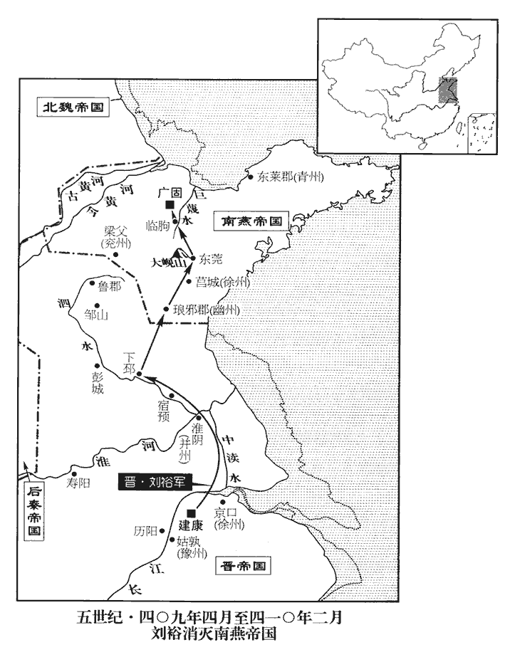
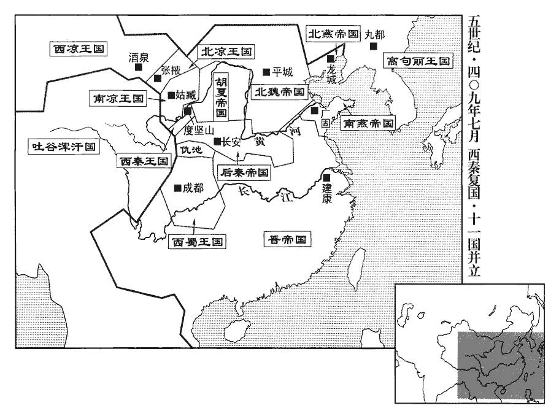
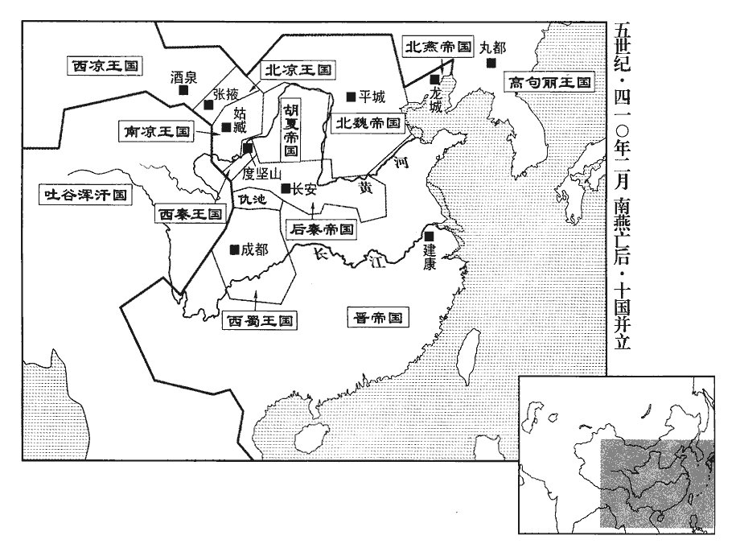
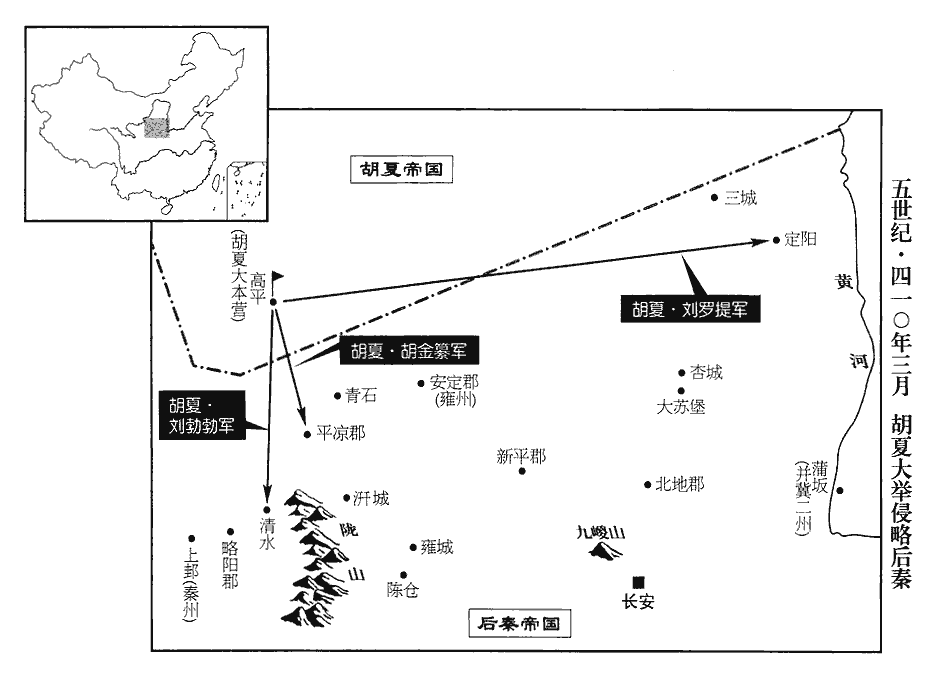
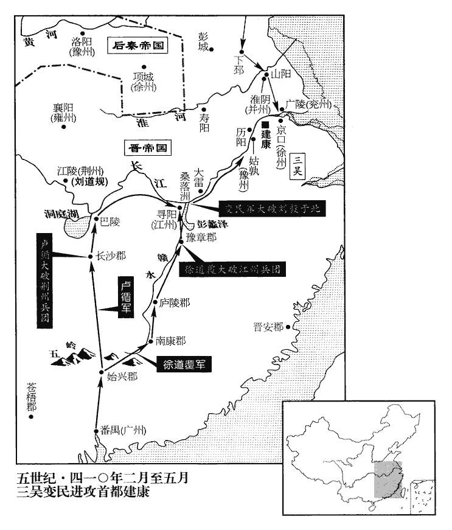
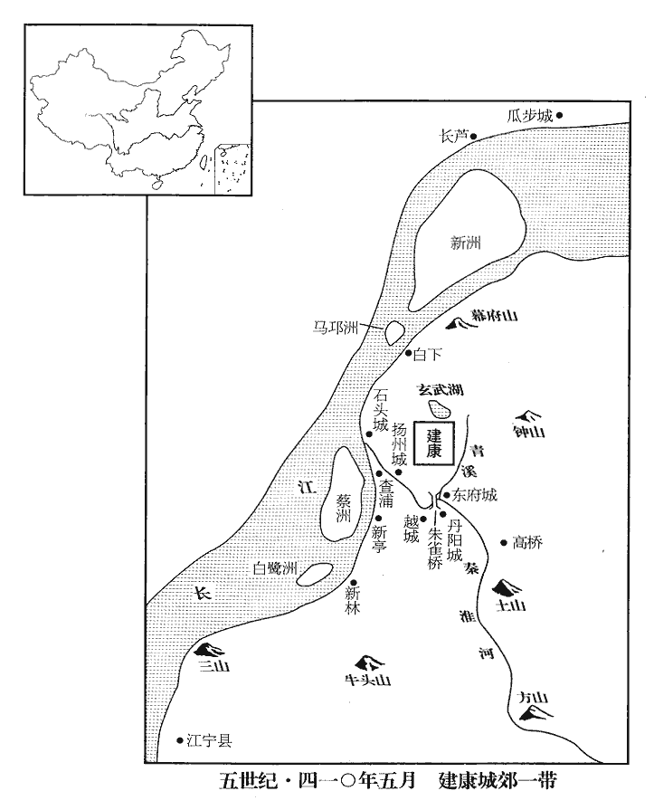
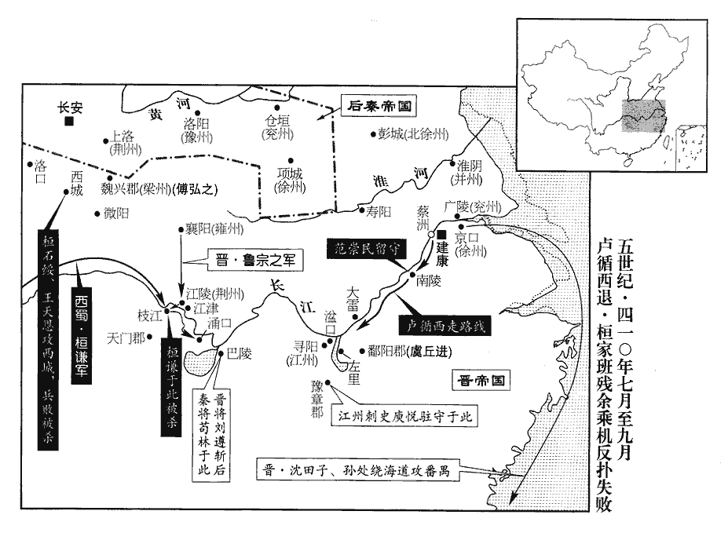

 晉紀三十七起屠維作噩（己酉），盡上章閹茂（庚戌），凡二年。

# 安皇帝庚

## 義熙五年（己酉、四零九）

1春，正月，庚寅朔‹一›，南燕‹都广固，山东青州›主超‹时年二十五›朝會群臣，歎太樂不備，三年，超獻太樂伎于秦，故歎其不備。朝，直遙翻。議掠晉人以補伎。伎，渠綺翻。領軍將軍韓𧨳zhuó曰：丁度曰：𧨳zhuó，竹角翻。「先帝以舊京傾覆，戢翼三齊。中山‹河北定州›陷，慕容德棄鄴，保滑臺；既而復失滑臺，乃東取齊地而據之。事並見前。戢jí，疾立翻。陛下不養士息民，以伺魏釁，恢復先業，而更侵掠南鄰以廣讎敵，可乎！」超曰：「我計已定，不與卿言」。史言慕容超愎諫致寇而亡。伺，相吏翻。

〖译文〗 [1]春季，正月，庚寅朔（初一），南燕国主慕容超临朝大会群臣，感叹帝室的御用音乐不完备，商议虏掠一些晋人作为补充的歌舞伎人。领军将军韩说：“先帝因为故有的国都失守，所以才退守到三齐。陛下不计划让天下的士民得到休养生息，用以等待魏国内部出现分歧矛盾，然后利用机会恢复过去的国家大业，相反却要再去侵扰掠夺南面的邻国，扩大我们仇敌的范围，这怎么可以！”慕容超说：“我的计划已定，不跟你多说。”

2辛卯‹二›，大赦。

〖译文〗 [2]辛卯（初二），东晋实行大赦。

3庚戌‹二十一›，以劉毅為衛將軍、開府儀同三司。毅愛才好士，好，呼到翻。當世名流莫不輻湊，獨揚州主簿吳郡‹江苏苏州›張卲shào不往。或問之，卲曰：「主公命世人傑，何煩多問！」劉裕領揚州，故稱之為主公。

〖译文〗 [3]庚戌（二十一日），东晋任命刘毅为卫将军、开府仪同三司。刘毅爱好人才，喜欢读书人，所以，当时的知名人士几乎没有不聚集到他身边去的，惟独只有扬州主簿吴郡人张邵不去。有人问他为什么，张邵说：“我的主公刘裕是应运而生的人中豪杰，哪里还用多问！”

4秦‹都长安，陕西西安›王興‹时年四十四›遣其弟平北將軍沖、征虜將軍狄伯支等帥騎四萬，帥，讀曰率。騎，奇寄翻。擊夏王勃勃。沖至嶺北‹九嵕山北，陕西礼泉北›，謀還襲長安，伯支不從而止，因酖殺伯支以滅口。

〖译文〗 [4]后秦王姚兴，派遣他的弟弟平北将军姚冲、征虏将军狄伯支等率领四万骑兵，进攻夏王刘勃勃。姚冲大军抵达岭北地区，打算回击长安篡权，因狄伯支不同意才中止。姚冲因此用药酒毒死狄伯支灭口。

5秦王興遣使册拜譙縱為大都督、相國、蜀王，加九錫，承制封拜，悉如王者之儀。

〖译文〗 [5]后秦王姚兴派遣使节前去册封谯纵为大都督、相国、蜀王，加授九锡，并可奉制书直接任命官员、封赏爵位，所用礼仪全部与君王一样。

6二月，南燕將慕容興宗、斛穀提、公孫歸等帥騎寇宿豫‹江苏宿迁›，拔之，宿豫城在淮北，帝置宿豫郡及宿豫縣；唐代宗諱豫，改為宿遷縣，屬徐州。宋白曰：宿豫城在下邳東南百八十里，蓋本宋人遷宿處也，宋滅，為邑；漢為仇猶縣，屬臨淮郡；晉安帝立宿豫縣，唐改宿遷縣。將，即亮翻。大掠而去，簡男女二千五百付太樂教之。歸，五樓之兄也。是時，五樓為侍中、尚書、領左衛將軍，專總朝政，朝，直遙翻。宗親並居顯要，王公內外無不憚之。南燕主超論宿豫之功，封斛穀提等並為郡、縣公。桂林王【嚴：「林」改「陽」。】鎮諫曰：「此數人者，勤民頓兵，頓，讀曰鈍。為國結怨，為，于偽翻。何功而封?」超怒，不答。尚書都令史王儼諂事五樓，漢尚書有令史十八人，後增為二十一人，其後員數愈增，置都令史以總之。比歲屢遷，官至左丞。比，毗至翻。禮記：比年入學。註：每歲也。漢書，比年，頻年也。國人為之語曰：「欲得侯，事五樓。」超又遣公孫歸等寇濟南，俘男女千餘人而去。此濟南郡亦是僑置於淮北。濟，子禮翻。自彭城‹江苏徐州›以南，民皆堡聚以自固。詔并州刺史劉道憐鎮淮陰‹江苏淮陰›以備之。

〖译文〗 [6]二月，南燕将领慕容兴宗、斛谷提、公孙归等人率领骑兵进犯并攻克东晋的宿豫，大肆抢掠一番之后，便回去了，挑选俘虏的男女青年二千五百人，交付给管理王室音乐的机构，教习训练。公孙归是公孙五楼的哥哥。这时，公孙五楼任侍中、尚书、领左卫将军，在朝中专权，总揽国家的一切政务，他的宗族亲属也都在朝廷官居显要位置，王公大臣、朝廷内外，对他没有不忌惮害怕的。南燕国主慕容超评定宿豫之战的功劳，封斛谷提等人为郡公、县公。桂林王慕容镇劝阻说：“这几个人，劳师动众，为国家结下仇怨，有什么功劳可封？”慕容超大怒，不予回答。尚书都令史王俨谄媚巴结公孙五楼，几年来屡次升迁，官职到了左丞。所以当时百姓根据这些编了句歌谣：“要想封侯，巴结五楼。”慕容超又派公孙归等侵犯济南，俘获了男女一千多人回去。因此，从彭城往南，东晋居民全都修筑城堡聚居一起，进行自卫。朝廷下诏，命并州刺史刘道怜镇守淮阴，用来戒备南燕骚扰。

7乞伏熾磐入見秦太原公懿於上邽‹甘肃天水›，熾，昌志翻。彭奚念乘虛伐之。熾磐聞之，怒，不告懿而歸，擊奚念，破之，遂圍枹罕‹甘肃临夏›。乞伏乾歸從秦王興如平涼‹甘肃华亭›；熾磐克枹罕，彭奚念據枹罕。枹，音膚。遣人告乾歸，乾歸逃還苑川。乾歸為秦所留，見上卷三年。

〖译文〗 [7]后秦河州刺史乞伏炽磐到上拜见后秦太原公姚懿，叛将彭奚念趁他后方空虚，出兵讨伐。乞伏炽磐听说之后，大怒，来不及与姚懿告别，急忙回去迎击彭奚念，把他打得大败，于是包围了罕。乞伏乾归跟从后秦王姚兴来到平凉。乞伏炽磐攻克罕，派人向乞伏乾归报告，乞伏乾归便逃回苑川。

馮翊‹陕西大荔›人劉厥聚眾數千，據萬年‹陕西临潼›作亂，秦王興在平涼，故厥乘間作亂。秦太子泓遣鎮軍將軍彭白狼帥東宮禁兵討之，斬厥，赦其餘黨。諸將請露布，表言廣其首級。帥，讀曰率。將，即亮翻。泓不許，曰：「主上委吾後事，不能式遏寇逆，當責躬請罪，尚敢矜誕自為功乎！」姚泓優游文義，自儒者觀之，似得子道，然非撥亂才也。

〖译文〗 冯翊人刘厥聚集变民几千人，占据万年作乱。后秦太子姚泓派遣镇军将军彭白狼率东宫禁卫兵讨伐他，斩杀了刘厥，赦免了他的党羽。各位将领请求公开宣布这次胜利，上疏的时候多写些杀伤敌人的数量。姚泓没有允许。说：“皇上把后方的事全部托付给我，我不能预先消灭强盗叛逆，本当自责请罪，怎么还敢狂傲地以欺骗的手段自己夸饰功劳呢？”

秦王興自平涼如朝那‹辽宁彭阳西古城乡›，聞姚沖之謀，謂欲還襲長安也。賜沖死。

〖译文〗 后秦王姚兴从平凉抵达朝那，听说了姚冲曾想回击长安的阴谋，命令姚冲自杀。

8三月，劉裕抗表伐南燕，朝議皆以為不可，朝，直遙翻。惟左僕射孟昶、車騎司馬謝裕、參軍臧熹以為必克，勸裕行。裕以昶監中軍留府事。監中軍將軍留府事也。昶，丑兩翻。監，古銜翻。謝裕，安之兄孫也。

〖译文〗 [8]三月，东晋刘裕上表请求讨伐南燕，朝廷中商议，大臣们都以为不可轻举妄动。只有左仆射孟昶、车骑司马谢裕、参军臧熹认为一定能胜利，劝说刘裕出征。刘裕任命孟昶为监中军留府事。谢裕是谢安哥哥的孙子。

初，苻氏之敗也，王猛之孫鎮惡來奔，以為臨澧‹湖南桑植›令。武帝太康四年立臨澧縣，屬天門郡，隋、唐併入澧州澧陽縣。澧，音禮。鎮惡騎乘非長，關弓甚弱，關，讀曰彎。而有謀略，善果斷，喜論軍國大事。或薦鎮惡於劉裕，裕與語，說之，斷，丁亂翻。喜，許記翻。說，讀曰悅。因留宿；明旦，謂參佐曰：「吾聞將門有將，將，即亮翻。鎮惡信然。」即以為中軍參軍。

〖译文〗 当初，前秦苻氏政权衰败的时候，王猛的孙子王镇恶投奔到东晋，朝廷任命他为临澧令。王镇恶对骑术不很擅长，拉弓射箭的能力也很弱，但是却有深谋远略，善于对事情作出果决的判断，很喜欢谈论军队国家的大事。有人把王镇恶推荐给刘裕，刘裕和他交谈一番，很喜欢他，所以留宿在家里。第二天早晨，对参军佐僚们说：“我听说名将之门当出大将，王镇恶的确是这样。”便任命他为中军参军。

9恆山‹河北曲阳北›崩。恆，戶鄧翻。

〖译文〗 [9]恒山出现山崩。

10夏，四月，乞伏乾歸如枹罕，留世子熾磐鎮之，收其眾得二萬，徙都度堅山‹甘肃靖远西›。度堅山，乞伏之先司繁所居也。

〖译文〗 [10]夏季，四月，后秦镇远将军乞伏乾归从苑川来到罕，留下嫡长子乞伏炽磐镇守那里，收集自己的部众共二万，把都城迁到度坚山。

11雷震魏‹都平城，山西大同›天安殿東序；魏主珪‹时年三十九›惡之，命左校以衝車攻東、西序，皆毀之。初，珪服寒食散，晉人多服寒食散，今千金方中有數方。蘇軾曰：世有食鍾乳、烏喙而縱酒色以求長年者，蓋始於何晏。晏少而富貴，故服寒食散以濟其欲。凡服之者，疽背、嘔血相踵也。久之，藥發，性多躁擾，忿怒無常，至是寖劇。躁，則到翻。又災異數見，見，賢遍翻。占者多言當有急變生肘腋。腋，音亦。珪憂懣不安，懣，音悶，又音滿。或數日不食，或達旦不寐，追計平生成敗得失，獨語不止。疑群臣左右皆不可信，每百官奏事至前，追記其舊惡，輒殺之；其餘或顏色變動，或鼻息不調，氣一出一入謂之息。或步趨失節，或言辭差繆，皆以為懷惡在心，發形於外，往往手擊殺之，史言魏主珪死期將至。死者皆陳天安殿前。朝廷人不自保，百官苟免，莫相督攝，盜賊公行，里巷之間，人為希少。為，于偽翻。少，詩沼翻。珪亦知之，曰：「朕故縱之使然，待過災年，更當清治之耳。」治，直之翻。是時，群臣畏罪，多不敢求親近；近，其靳翻。唯著作郎崔浩恭勤不懈，或終日不歸。浩，吏部尚書宏之子也。宏未嘗忤旨，亦不諂諛，故宏父子獨不被譴。懈，居隘翻。忤，五故翻。被，皮義翻。

〖译文〗 [11]雷电击中北魏国天安殿的东墙。北魏国主拓跋非常忌讳这件事，命令左校用攻城时的一种冲车撞击东西墙，把墙全部撞倒。当初，拓跋服食寒食散，时间一长，药性发作，他的性情便变得急躁烦闷，喜怒无常。到了这时，病情更加严重。加上最近又灾祸怪事屡次发现，占卜算卦的人大多都说要在自己身旁发生急剧性的变化，使拓跋更加忧虑愤恨，心中不安。他或者几天不吃饭，或者整夜不睡觉，追忆感怀自己一生来的成功与失败、所得与所失，而不停地自言自语。他怀疑大臣们和左右的侍从护卫都是不可相信的，每当文武是百官上前启奏国事，他都往往想起启奏者过去的错误和罪过，并将其杀掉。其余的人，如有面色稍变，或呼吸不匀，或步履不稳，或话语出现错差的，他都会以为是心中有鬼、居心不良所以才表现在外表上，往往亲手把他们刺死。死的人都被摆放在天安殿前。朝廷中人人觉得朝不保夕，文武百官苟且偷安，根本不考虑互相之间监督勤政的事，所以国内强盗贼寇公然作案犯法，都城的大街小巷中间，行人稀少。拓跋也知道这种情况，说：“我这不过是故意放纵他们罢了，等到过去了这个灾年，我再重新清理整治这些吧。”这时，大臣们都害怕惹祸怪罪，多数人不敢去与拓跋接近，只有著作郎崔浩恭谨勤奋，坚持不懈，有的时候整天不回家。崔浩是吏部尚书崔宏的儿子。崔宏不曾冒犯过国主，也不谄媚阿谀，所以只有崔宠父子二人，没有受到谴责。

12夏王勃勃‹时年二十九›率騎二萬攻秦，騎，奇寄翻。掠取平涼‹甘肃华亭›雜胡七千餘戶，進屯依力川‹甘肃华亭南›。魏收地形志：平涼城在漢安定鶉chún陰界，唐為原州之地。依力川又當在其東南。

〖译文〗 [12]夏王刘勃勃率领骑兵二万人进攻后秦，抢掠了平凉地区杂居的胡族七千多户，开进到依力川屯聚。

13己巳‹十一›，劉裕發建康，帥舟師自淮入泗‹泗水›。帥，讀曰率。五月，至下邳‹江苏睢宁北古邳镇›，留船艦、輜重，艦，戶黯翻。重，直用翻。步進至琅邪‹山东临沂›，所過皆築城，留兵守之。慮南燕以奇兵斷其後也。或謂裕曰：「燕人若塞大峴xiàn‹山东临朐南沂山›之險，水經註：沭水出琅邪東莞縣西北山，東南流，右合峴水。水北出大峴山，今有大峴關。魏收志，齊郡盤陽縣有大峴山。五代志，臨朐縣有大峴山。杜佑曰：大峴在沂州沂水縣北。塞，悉則翻。峴，戶典翻。或堅壁清野，大軍深入，不唯無功，將不能自歸，奈何?」裕曰：「吾慮之熟矣，鮮卑貪婪，婪，盧含翻。不知遠計，進利虜獲，退惜禾苗，謂我孤軍遠入，不能持久；不過進據臨朐‹山东临朐›，魏收志曰：臨朐即漢之朐縣也，屬東海郡；晉曰臨朐，屬東莞郡。宋白曰：因臨朐山而名。朐，音劬qú。退守廣固‹山东青州›，必不能守險清野，敢為諸君保之。」為，于偽翻。

〖译文〗 [13]己巳（十一日），刘裕从建康出发，率水军从淮水进入泗水。五月，东晋部队到达下邳，把船舰、笨重的军用物资留下，步行开进到琅邪，所路过的地方，都修筑起城池，留下军队把守。有人对刘裕说：“燕国人如果把大岘山的险要堵塞住，或者坚固城墙，使散居百姓聚居进去，只把空荡荡的田野留给我们，那么，我们的大部队深入到敌国重地，便不单不能建立什么功业，而且还可能无法安全返回，怎么办？”刘裕说：“我已经把这些考虑成熟了，鲜卑人生性贪婪，没有长远的打算，前进的时候只盼望多多地抢夺掳掠，后退的时候又吝惜田中禾苗。他们以为我们孤军深入一定不能长久坚持，因此不外乎进军驻守临朐，或者退兵戍卫广固，一定不会据险要之地抵抗、清肃四野防备我们。我敢向你们保证。”

南燕主超聞有晉師，引群臣會議。征虜將軍公孫五樓曰：「吳兵輕果，利在速戰，不可爭锋；宜據大峴，使不得入，曠日延時，沮其銳氣，沮，在呂翻。然後徐簡精騎二千，循海而南，絕其糧道，別敕段暉帥兗州之眾，緣山東下，南燕兗州治梁父；緣梁父之山而東下也。騎，奇寄翻。帥，讀曰率。腹背擊之，此上策也。各命守宰依險自固，校其資儲之外，餘悉焚蕩，芟除禾苗，芟，所銜翻；下同。使敵無所資，彼僑軍無食，僑，渠嬌翻。求戰不得，旬月之間，可以坐制，此中策也。縱賊入峴，出城逆戰，此下策也。」超曰：「今歲星居齊，以天道推之，不戰自克。客主勢殊，以人事言之，彼遠來疲弊，勢不能久。吾據五州之地，南燕以并州牧鎮陰平‹江苏沭阳›，幽州刺史鎮發干，徐州刺史鎮莒城‹山东莒县›，兗州刺史鎮梁父，青州刺史鎮東萊‹山东莱州›，所謂五州也。擁富庶之民，鐵騎萬群，麥禾布野，柰何芟苗徙民，先自蹙弱乎！不如縱使入峴，以精騎蹂之，何憂不克。」蹂，人九翻。輔國將軍廣寧王賀賴盧苦諫不從，退謂五樓曰：「必若此，亡無日矣！」太尉桂林王鎮曰：「陛下必以騎兵利平地者，宜出峴逆戰，戰而不勝，猶可退守；不宜縱敵入峴，自棄險固也。」超不從。鎮出，謂韓𧨳zhuó曰：丁度曰：𧨳，竹角翻。「主上既不能逆戰卻敵，又不肯徙民清野，延敵入腹，坐待攻圍，酷似劉璋矣。劉璋事見六十七卷漢獻帝建安十八年。今年國滅，吾必死之。卿中華之士，復為文身矣。」古者東南之民斷髮文身，故鎮云然。超聞之，大怒，收鎮下獄。下，戶稼翻。乃攝莒、梁父二戍，父，音甫。修城隍，簡士馬，以待之。

〖译文〗 南燕国主慕容超听说有东晋军队来讨伐，便召集大臣们在一起商议对策。征虏将军公孙五楼说：“吴地的兵众轻装果决，方便的是速战速决，不能与他们迎面作战。应该据守大岘，让他们无法进入，拖延时间，把他们的锐气泄掉，然后再从容地挑选精壮骑兵二千人，沿着海滨南下，断绝他们运粮草的通道，另外再命令段晖率兖州的军队沿着山地向东进军，在后背处进攻他们。这是最好的办法，分别命令各地的守宰官员依靠险要自己固守，考虑估计自己所用的粮食物质等以外，剩下的全部烧毁，再把田野中的庄稼全部割光，让来犯的敌人没有东西可补充给养，他们远征的部队既没粮草，求战又找不到对手，一个月之间，我们就可以坐在那里控制他们了。这是一般的办法。把贼兵放入岘山，然后我们再出城迎战他们，这是最不好的办法了。”慕容超说：“今年，上天的吉星正在我们三齐的头上，按照天道推测，我们用不着作战，就会胜利。现在客军和主人的势力相差太悬殊，按照人间事理来看，他们远道而来，疲惫不堪一定不能耽搁太久。我据守五个州的地域，拥有富庶的百姓，强大的骑兵万群，茁壮的庄稼遍布四野，怎么能割倒庄稼迁移百姓，首先自己向人示弱呢？我看，不如放他们进入大岘山，再派精壮骑兵前去践踏他们，何必担心打不败他们。”辅国将军广宁王慕容贺赖卢苦苦劝阻，慕容超只是不听。退朝后，慕容贺赖卢对公孙五楼说：“如果一定这样的话，亡国也就没几天了！”太尉、桂林王慕容镇说：“陛下如果一定认为骑兵在平地作战方便的话，就应该冲出岘山去迎战敌人，即使在战斗中不能取胜，也还可以退守。”不应该放纵敌兵进入岘山，自己放弃险要的地势。”慕容超拒不听从。慕容镇退出后，对韩说：“主上既不想主动迎战，把敌人击退，又不同意迁移居民，清肃原野。把敌人引进自己的腹地，坐在那里等待敌人的进攻围困，这一点太像汉末的刘璋了。今年之内我们国家就要灭亡，我只有一死。但是你作为中原人士，却要像江南人那样被重新纹身了。”慕容超听说这话后，暴跳如雷，把慕容镇抓起来送进了监狱。于是他下令撤回莒城、梁父两地的守军，加固修筑都城的防御工程，遴选将士和战马，等待东晋兵来。

劉裕過大峴‹山东临朐南沂山›，燕兵不出。裕舉手指天，喜形于色。左右曰：「公未見敵而先喜，何也?」裕曰：「兵已過險，士有必死之志；謂已得過大峴之險。餘糧棲畝，人無匱乏之憂。謂燕人不芟除禾苗。虜已入吾掌中矣。六月，己巳‹十二›，裕至東莞‹山东沂水县东北›。莞，音官。超先遣公孫五樓、賀賴盧及左將軍段暉等將步騎五萬屯臨朐‹山东临朐›；朐，音劬。聞晉兵入峴，自將步騎四萬往就之，使五樓帥騎進據巨蔑水‹流经临朐南›。巨蔑水，國語謂之具水，袁宏謂之巨昧水，水經謂之巨洋水。水出朱虛縣太山北，過其縣西，又北過臨朐縣東。上下沿水，悉是劉裕伐廣固營壘所在。前鋒孟龍符與戰，破之，五樓退走。裕以車四千乘為左右翼，乘，繩證翻。方軌徐進，與燕兵戰於臨朐南，日向昃，日過中為向昃。昃，阻力翻。勝負猶未決。參軍胡藩言於裕曰：「燕悉兵出戰，臨朐城中留守必寡，願以奇兵從間道取其城，此韓信所以破趙也。」間，古莧翻。韓信事見九卷漢高帝三年。裕遣藩及諮議參軍檀韶、建威將軍河內‹河南沁阳›向彌潛師出燕兵之後，攻臨朐，聲言輕兵自海道至矣。向彌擐甲先登，遂克之。向，式亮翻。擐huàn，音宦。超大驚，單騎就段暉於城南。超自臨朐城中出城南就暉。裕因縱兵奮擊，燕眾大敗，斬段暉等大將十餘人，超遁還廣固‹山东青州›，獲其玉璽、輦及豹尾。服虔曰：大駕屬車八十一乘，作三行，尚書、御史乘之，最後一乘，懸豹尾，豹尾以前皆為省中。晉志：法駕屬車三十六乘，最後車懸豹尾。璽，斯氏翻。裕乘勝逐北至廣固；丙子‹十九›，克其大城。超收眾入保小城。裕築長圍守之，圍高三丈，穿塹三重；高，古號翻。重，直龍翻；塹，七豔翻。撫納降附，采拔賢俊，華、夷大悅。於是因齊地糧儲，悉停江、淮漕運。

〖译文〗 刘裕顺利通过大岘，南燕的军队一直没有出现。刘裕举起手来，指着上天，禁不住脸上露出喜色。左右的侍从们说：“您没有看见敌人却先高兴起来，这是为什么？”刘裕说：“大军已过险关，军队没有退路可走，因此一定会有拼死作战的决心；余粮尚在田亩之中储存，我们又没有了缺乏粮草的忧虑。盗匪已经完全落入了我的手中。”六月，己巳（十二日），刘裕大军抵达东莞。慕容超先派遣公孙五楼、慕容贺赖卢以及左将军段晖等人统领步、骑兵共五万人屯据在临朐，听说东晋兵马已经通过岘山，便亲自带领步、骑兵共四万人前去迎战，并派公孙五楼率领骑兵开进巨蔑水据守。东晋部队的前锋孟龙符与他展开激战，将他打败，公孙五楼败退而走。刘裕用四千乘军车作为左右的屏障，排成方阵缓缓向前推进，在临朐以南的地方与南燕军队进行会战，太阳渐渐西移，双方的胜负还没有最后明朗。东晋参军胡藩对刘裕说：“南燕倾巢出动，与我们作战，临朐城中的守军一定很少。我愿意带领一支出敌不意的部队从小路去夺取这座城池，这是韩信击败赵国的办法。”刘裕于是派遣胡藩以及谘议参军檀韶、建成将军河内人向弥暗自带兵绕到南燕军队的后面，进攻临朐，号称是轻装部队从海路直接赶来增援的。向弥身披铠甲，首先登上城墙，于是攻破该城。慕容超听说后，大吃一惊，单人匹马从城中逃出，赶到城南投奔段晖。刘裕趁势催动大军奋力战斗，南燕军队大败，斩杀了段晖等大将十多人，慕容超逃回广固，晋兵缴获了他的玉玺、车辇以及挂在车后的豹尾。刘裕乘胜追击，直到广固。丙子（十九日），又攻克了广固外围的外城。慕容超聚集众人进入内城据守。刘裕兴筑长墙围困他们，墙高三丈，挖了三道地沟。好言抚慰接纳投降归附的人士，选择提拔贤才俊杰，不管是汉人还是夷人，都很高兴。从此，因为夺取了齐地这里储存的粮草，便把从长江、淮河水路运输军粮的工作，全部停止。

 

超遣尚書郎張綱乞師於秦，赦桂林王鎮，以為錄尚書、都督中外諸軍事，引見，謝之，且問計焉。鎮曰：「百姓之心，係於一人。今陛下親董六師，奔敗而還，還，從宣翻，又如字。群臣離心，士民喪氣。聞秦人自有內患，謂秦內有赫連之患也。喪，息浪翻。恐不暇分兵救人。散卒還者尚有數萬，宜悉出金帛以餌之，更決一戰。若天命助我，必能破敵；如其不然，死亦為美，比於閉門待盡，不猶愈乎！」司徒樂浪王惠曰：「不然。樂浪，音洛琅。晉兵乘勝，氣勢百倍，我以敗軍之卒當之，不亦難乎！秦雖與勃勃相持，不足為患；且與我分據中原，勢如脣齒，安得不來相救！但不遣大臣則不能得重兵。尚書令韓範為燕、秦所重，事見上卷三年。宜遣乞師。」超從之。

〖译文〗 慕容超派遣尚书郎张纲向后秦请求救兵，又赦免了桂林王慕容镇，任命他为录尚书、都督中外诸军事，把他请来相见，并谢了罪，又问他有什么好办法。慕容镇说：“百姓的心事、希望，全部维系在您一个人身上。现在陛下亲自指挥大部队前去迎战，结果是战败跑回，不但大臣们的心思难以统一，百姓也都丧失了胆气。我听说秦国自己也正有内患没有清除，恐怕也没有功夫分出兵力解救别人。现在我们逃散的士兵回来的还有几万，应该把国库中的金银布匹等全部拿出来引诱他们，让他们再去决一死战。如果天命应该帮助我们，那么这一次一定能击败敌人；如果不这样，那么死了也是一件美事。这和关起门来坐在这里等死，不也还强出许多吗？”司徒、乐浪王慕容惠说：“不对。晋军乘胜而来，气势旺盛，比原来还要超出百倍，我们用刚刚惨败的士卒抵挡他们，不也是太难了吗？秦国虽然与刘勃勃互相僵持、斗争不休，但是也不足以把这当成祸患。况且他们与我们分别占据中原地区，彼此依傍，形势就像唇齿一样，怎么能够不来救助我们呢？但是，不派出官职重要的大臣去，就请不来更多的援兵。尚书令韩范一直被我们和秦国所重视，应该派他去请求援军。”慕容超听从了他的意见。

秋，七月，加劉裕北青、冀二州刺史。晉氏南渡，立南青、冀二州於淮南，北青、冀二州於齊地。

〖译文〗 秋季，七月，东晋加授刘裕为北青、北冀二州的刺吏。

南燕尚書略陽‹甘肃天水东›垣尊及弟京兆太守苗踰城來降，裕以為行參軍。垣氏子孫後遂為南國邊將，著功名。尊、苗皆超所委任以為腹心者也。

〖译文〗 南燕尚书略阳人垣尊和他的弟弟京兆太守垣苗，跳出城墙向东晋部队投降，刘裕任命他们为行参军。垣尊、垣苗都是慕容超喜欢、重用并引为心腹的人。

或謂裕曰：「張綱有巧思，思，相吏翻。若得綱使為攻具，廣固必可拔也。」會綱自長安還，太山‹山东泰安东›太守申宣執之，送於裕。裕升綱於樓車，杜預曰：樓車，車上望櫓。使周城呼曰：呼，火故翻。「劉勃勃大破秦軍，無兵相救。」城中莫不失色。江南每發兵及遣使者至廣固，裕輒潛遣兵夜迎之，明日，張旗鳴鼓而至，董卓之入洛，計亦出此。北方之民執兵負糧歸裕者，日以千數，圍城益急。張華、封愷皆為裕所獲。超請割大峴以南地為藩臣，裕不許。

〖译文〗 有人对刘裕说：“张纲心灵手巧，如果把他抓来，让他制作攻城用具，广固一定可以攻克。”正好张纲从长安回来，太山太守申宣把他抓住，送给刘裕。刘裕让张纲登上很高的楼车，命令他在城的四周对城内高喊：“刘勃勃把秦军打得大败，所以没有谁能派兵来救你们了。”城中将士听到这话没有不大惊失色的。东晋从江南每次发兵前来增援，或者派遣使者来广固慰问，刘裕都常常暗自派兵卒在前一天夜里迎候，第二天再打着大旗、敲着锣鼓到来。北方的百姓拿着武器、背着粮食归降刘裕的人，每天都有一千多。晋军对广固的围攻，更加猛烈。南燕大臣张华、封恺都先后被刘裕俘虏。慕容超请求割让大岘山以南的地区讲和，并愿做东晋的藩臣，刘裕没有答应。

秦王興遣使謂裕曰：「慕容氏相與鄰好，好，呼到翻。今晉攻之急，秦已遣鐵騎十萬屯洛陽；晉軍不還，當長驅而進。」裕呼秦使者謂曰：「語汝姚興：使，疏吏翻；下同。語，牛倨翻；下相語同。我克燕之後，息兵三年，當取關、洛；今能自送便可速來！」劉穆之聞有秦使，馳入見裕，而秦使者已去。裕以所言告穆之。穆之尤之尤，怪也，過也。曰：「常日事無大小，必賜預謀，此宜善詳，善，謂善為之辭；詳，謂審諦也。云何遽爾答之！此語不足以威敵，適足以怒之。若廣固未下，羌寇奄至，不審何以待之?」裕笑曰：「此是兵機，非卿所解，解，戶買翻，曉也。故不相語耳。語，牛倨翻。夫兵貴神速，彼若審能赴救，必畏我知，寧容先遣信命，逆設此言！是自張大之辭也。晉師不出，為日久矣。羌見伐齊，殆將內懼，自保不暇，何能救人邪！」

〖译文〗 后秦王姚兴派遣使者对刘裕说：“慕容氏与我们相邻，关系友好。现在你们晋国这样急迫地进攻他们，我们秦国已派遣十万精锐强壮的骑兵屯聚在洛阳。你们的部队如果不撤，那么，我们就要长驱进军了。”刘裕把后秦的使节叫到跟前来说：“告诉你们姚兴：我攻克燕国之后，停止军事行动三年，然后就要去夺取你们的关中、洛阳。今天你们要是能自己送来，那就快点来吧！”刘穆之听说有后秦使节来，便骑着快马跑来拜见刘裕，但后秦使节已经走了。刘裕把自己说的话告诉给了刘穆之。刘穆之埋怨他说：“平常的时候事情无论大小，都一定找我商量。这件事太重大，应该好好考虑一下再决定，为什么就这样冒然地答复他呢？你说的这话不但不足以把敌人威慑住，相反却足以激怒他。如果广固没有攻下，而那些羌族强盗又突然到来，不知道你怎么对付他们？”刘裕笑着说：“这是用兵之道，不是你所能明白的，所以才不告诉你。大凡用兵，贵在神奇迅速，他们如果真的能赶来救援的话，一定是害怕我们知道，哪里还能事先派人前来通知我，说下这番话呢？这是他们的大话。晋军不出国征战，时间已经很久了。羌人看见我们大举讨伐三齐之地，心中已经开始畏惧。他们保全自己还来不及，怎么还能援救别人呢？”

14乞伏乾歸復即秦王位，復，扶又翻。大赦，改元更始，更，工衡翻。公卿以下皆復本位。乾歸降公卿將帥為僚佐偏裨，見一百十二卷隆安五年。

〖译文〗 [14]后秦镇远将军乞伏乾归重新登上秦王之位，下令大赦，改年号为更始，公卿以下的官员，全部恢复以前的职位。

15慕容氏在魏者百餘家，謀逃去，魏主珪盡殺之。

〖译文〗 [15]慕容氏家族，在北魏有一百多户，他们计划逃走，被北魏国主拓跋全部杀掉了。

16初，魏太尉穆崇與衛王儀伏甲謀弒魏主珪，不果；珪惜崇、儀之功，祕而不問。及珪有疾，殺【章：甲十一行本「殺」上有「多」字；乙十一行本同；孔本同；張校同。】大臣。儀自疑而出亡，追獲之。八月，賜儀死。

〖译文〗 [16]当初，北魏太尉穆崇与卫王拓跋仪，布下埋伏全副武装的兵士，阴谋刺杀北魏国主拓跋，没有成功。拓跋惋惜穆崇、拓跋仪过去的赫赫战功，把此事压下，没有追查。到了拓跋有病之后，杀了许多大臣，拓跋仪担心自己难逃一死，逃亡外地，被追上抓获。八月，命令拓跋仪自杀。

17封融詣劉裕降。封融奔魏，見上卷二年。魏殺慕容氏，故融歸裕。降，戶江翻。

〖译文〗 [17]南燕故臣、后来投奔北魏的封融，前去拜见刘裕，投降。

18九月，加劉裕太尉；裕固辭。

〖译文〗 [18]九月，东晋加封刘裕为太尉。刘裕坚决推辞。

 

19秦王興自將擊夏王勃勃，至貳城‹陕西黄陵西北›，貳城，貳縣城也，在杏城西北、平涼東南。遣安遠將軍姚詳等分督租運。勃勃乘虛奄至，興懼，欲輕騎就詳等。騎，奇寄翻。右僕射韋華曰：「若鑾輿一動，眾心駭懼，必不戰自潰，詳營亦未必可至也。」興與勃勃戰，秦兵大敗，將軍姚榆生為勃勃所禽，左將軍姚文崇【章：甲十一行本「崇」作「宗」；乙十一行本同；孔本同；張校同。】等力戰，勃勃乃退，興還長安。勃勃復攻秦敕奇堡、黃石固‹甘肃平凉北›、魏收地形志：原州長城郡有黃石縣。五代志，西魏改黃石為長城；隋開皇初，廢郡為縣，大業初，改長城縣為百泉縣。復，扶又翻。我羅城，皆拔之，徙七千餘家於大城‹内蒙杭锦旗东南›，以其丞相右地代領幽州牧以鎮之。

〖译文〗 [19]后秦主姚兴准备亲自带兵征讨夏王刘勃勃，到达贰城，派遣安远将军姚详等人分别督运粮草。刘勃勃乘虚突然前来袭击，姚兴非常害怕，打算轻装骑马去到姚详那里躲避。右仆射韦华说：“如果陛下的大驾一动，部众的心中就会惊骇恐惧，一定不等打仗便自行崩溃，那样的话，恐怕陛下也不一定能跑到姚详的军营中去。”姚兴与刘勃勃对战，后秦军大败，将军姚榆生也被刘勃勃抓获。左将军姚文崇乘等人拼死力战，刘勃勃才退兵，姚兴回到长安。刘勃勃又进攻后秦的敕奇堡、黄石固、我罗城，全部攻克，把七千多户居民迁移到大城，任命他的丞相右地代兼幽州牧，镇守在那里。

初，興遣衛將軍姚強帥步騎一萬，隨韓範往就姚紹於洛陽，并兵以救南燕，帥，讀曰率。騎，奇寄翻。及為勃勃所敗，敗，補邁翻。追強兵還長安。韓範歎曰：「天滅燕矣！」南燕尚書張俊自長安還，降於劉裕，降，戶江翻；下同。因說裕曰：說，輸芮翻。「燕人所恃者，謂韓範必能致秦師也，今得範以示之，燕必降矣。」裕乃表範為散騎常侍，散，悉亶翻。騎，奇寄翻。且以書招之。長水校尉王蒲勸範奔秦，範曰：「劉裕起布衣，滅桓玄，復晉室，今興師伐燕，所向崩潰，此殆天授，非人力也。燕亡，則秦為之次矣，吾不可以再辱。」遂降於裕。漢李陵降匈奴，霍光、上官桀使其故人任立政招之使歸，陵曰：「大丈夫不能再辱。」裕將範循城，城中人情離沮。將，如字，引也。沮，在呂翻。或勸燕主超誅範家。超以範弟𧨳zhuó盡忠無貳，并範家赦之。

〖译文〗 当初，姚兴派遣右将军姚强，统帅步兵骑兵共一万人，随韩范到洛阳与姚绍会合，然后两个合兵一起去救援南燕，等到被刘勃勃打败之后，又派人追上姚强，让他带领部队回长安。韩范叹息说：“上天让我燕灭亡了！”南燕尚书张俊从长安回来，投降了刘裕，又对刘裕说：“燕人所仗恃的，是以为韩范一定能请来秦的军队。现在抓住韩范让他们看看，那么燕国一定会投降。”于是，刘裕一面上疏给朝廷，请求封韩范为散骑常侍，一面写信给韩范，招降他。后秦长水校尉王蒲劝说韩范投奔后秦国，韩范说：“刘裕从一个平民百姓起家，剿灭桓玄，兴复晋朝皇室，这次起兵讨伐燕国，所到之处，无不土崩瓦解，这一定是上天的旨意，不是人力所能做到的。燕国亡，那么秦国紧跟着就是第二个，我不能再受一次亡国之辱。”于是，投降了刘裕。刘裕带着韩范绕城一周，城中人见了，情绪顿时一落千丈，人心离散。有人劝说南燕国主慕容超诛杀韩范全家，慕容超则因为韩范弟弟韩为国尽忠，从无二心，所以赦免了韩范的家属。

冬，十月，段宏自魏奔于裕。宏奔魏見上卷三年。

〖译文〗 冬季，十月，投奔北魏的南燕旧臣段宏，从北魏投奔刘裕。

張綱為裕造攻具，盡諸奇巧；超怒，縣其母於城上，支解之。為，于偽翻。縣，讀曰懸。

〖译文〗 张纲为刘裕设计制造的攻城用具，每件都是奇妙精巧无比。慕容超大怒，把他的母亲悬挂在城墙之上，并把她活活支解。

20西秦王乾歸立夫人邊氏為皇【章：甲十一行本「皇」作「王」；乙十一行本同；孔本同；張校同。】后，世子熾磐為太子，仍命熾磐都督中外諸軍、錄尚書事。熾，昌志翻。以屋引破光為河州刺史，鎮枹罕‹甘肃临夏›；枹，音膚。以南安‹甘肃陇县东南›焦遺為太子太師，與參軍國大謀。乾歸曰：「焦生非特名儒，乃王佐之才也。」謂熾磐曰：「汝事之當如事吾。」熾磐拜遺於床下。遺子華至孝，乾歸欲以女妻之。妻，七細翻。辭曰：「凡娶妻者，欲與之共事二親也。今以王姬之貴，周，姬姓也，故王女謂之王姬，後世因而稱之，凡王者之女皆謂之王姬。下嫁蓬茅之士，誠非其匹，臣懼其闕於中饋，易家人之六二曰：在中饋。言以陰應陽，居中得正，盡婦人之義，職乎中饋，巽順而已。饋，食也。非所願也。」乾歸曰：「卿之所行，古人之事，孤女不足以強卿。」乃以為尚書民部郎。魏尚書郎有民曹，晉初分置左民、右民，江左以後，省右民郎，有左民郎。民部郎至是始見于通鑑。強，其兩翻。

〖译文〗 [20]西秦王乞伏乾归册立他的夫人边氏为皇后，立他的世子乞伏炽磐为太子，仍然命乞伏炽磐都督中外诸军、录尚书事。任命屋引破光为河州刺史，镇守罕。任命南安人焦遗为太子太师，参与军事、国家的机密大事。乞伏乾归说：“焦先生不但是一位著名的儒士，而且还是一位辅佐君王的大人才。”对乞伏炽磐说：“你对待他应该像对待我一样。”乞伏炽磐就在焦遗所坐床座之前，拜倒在地。焦遗的儿子焦华，非常孝顺，乞伏乾归打算把女儿嫁给他。焦华推辞说：“凡是娶妻的人，大都打算和她一起服侍二位老人。现在，她以王姬那样的高贵身份，下嫁给我这样一个居住在茅草屋中的贫寒之士，实在不是合适的匹配，我害怕她将来不能很好地操持家务，尽妇人的孝道，这不是我的愿望。”乞伏乾归说：“你所坚持的，是只有古人才有的高洁纯朴之风，我这个女儿，是不配勉强你来娶她的。”于是任命他为尚书民部郎。

21北燕‹都龙城，辽宁朝阳›王雲自以無功德而居大位，內懷危懼，常畜養壯士以為腹心、爪牙。畜，吁玉翻。寵臣離班、桃仁專典禁衛，離、桃，皆姓也；班、仁，其名。賞賜以巨萬計，衣食起居皆與之同，而班、仁志願無厭，厭，於鹽翻。猶有怨憾。戊辰‹十三›，雲臨東堂，班、仁懷劍執帋而入，帋zhǐ，與紙同，通俗書也。稱有所啟。班抽劍擊雲，雲以几扞之，仁從旁擊雲，弒之。高雲以勇力發身，叨居君位，自謂非壯士以為翼衛，不足以防其身，豈知小人之難養也。是以古之綴衣虎賁，左右攜僕，必用吉士，其慮患誠深遠也。雲得燕見上卷三年。

〖译文〗 [21]北燕王高云自以为没有功德，但却登上如此重大的高位，所以心中总有危险恐惧的感觉。他常常选拔、供养一些精壮的武士作为自己的心腹、爪牙。他的宠爱之臣离班、桃仁专门掌管帝室、宫廷的警卫工作，他对这二人的赏赐也都不计其数，甚至他们的衣食住行也都跟自己一样。而离班、桃仁二人又贪得无厌，即使这样，他们也还满腹怨言。戊辰（十三日），高云来到东堂，离班、桃仁怀里藏着利剑，手里拿着通俗书籍走了进来，声称有事禀报。离班突然抽出剑来直刺高云，高云用茶几抵挡，桃仁又从旁边刺高云，把他杀死。

馮跋升洪光門以觀變，帳下督張泰、李桑言於跋曰：「此豎勢何所至，請為公斬之！」為，于偽翻。及奮劍而下，桑斬班于西門，泰殺仁于庭中。眾推跋為主，跋以讓其弟范陽公素弗，素弗不可。跋乃即天王位於昌黎‹辽宁朝阳›，載記：馮跋，字文起，長樂信都人，其先畢萬之後也；萬之子孫有食采馮鄉者，因氏焉。大赦，詔曰：「陳氏代姜，不改齊國，周師尚父始封於齊，姜姓也。戰國時，齊太公田和，陳敬仲之後也，篡姜氏之後而取其國，仍號曰齊。宜即國號曰燕。」改元太平，諡雲曰惠懿皇帝。跋尊母張氏為太后，立妻孫氏為王后，子永為太子，以范陽公素弗為車騎大將軍、錄尚書事，孫護為尚書令，張興為左僕射，汲郡公弘為右僕射，廣川公萬泥為幽‹府令支，河北迁安›、平‹府宿军，辽宁北宁›二州牧，上谷公乳陳為并‹府白狼，辽宁喀喇沁左翼西南›、青‹府营丘，辽宁大凌河市境›二州牧。素弗少豪俠放蕩，少，詩照翻。俠，戶頰翻。蕩，徒浪翻。嘗請婚於尚書左丞韓業，業拒之。及為宰輔，待業尤厚；好申拔舊門，好，呼到翻。謙恭儉約，以身帥下，帥，讀曰率。百僚憚之，論者美其有宰相之度。溫公作通鑑，雖相小國者，苟有片善，必因舊史而表章之，以言為輔之難。

〖译文〗 冯跋登上宫城的洪光门观察事态的变化，他手下的帐下督张泰、李桑对冯跋说：“这两个小人想闹到什么程度，请您看着，我们替您把他们杀了。”于是挺剑跳下洪光门，李桑在西门杀了离班，张泰在院中杀了桃仁，大家推举冯跋做国主，冯跋则让位给自己的弟弟范阳公冯素弗，冯素弗不同意。于是冯跋便在昌黎登上天王宝座，下令大赦，并发布诏书说：“春秋战国时陈氏家族取代姜家，掌握了国家政权，但是却不改变齐国的名称。所以，我们也应该继续把国家称做燕。”改年号太平，追谥高云为惠懿皇帝。冯跋尊自己的母亲张氏为太后，立自己的妻子孙氏为王后，立儿子冯永为太子。任命范阳公冯素弗为车骑大将军、录尚书事，孙护为尚书令，张兴为左仆射，汲郡公冯弘为右仆射，广川公冯万泥为幽、平二州牧，上谷公冯乳陈为并、青二州牧。冯素弗小的时候便豪爽侠义、行为放荡，曾经向尚书左丞韩业求婚，被韩业拒绝。等到他做了宰相辅佐朝政，对待韩业反而更加优厚。他喜欢提拔旧的豪门士族，谦虚恭谨，勤俭节约，以身作则，给下级作出了榜样，因此文武百官都敬畏他，议论朝朝政的人也都赞美他有宰相的风采气度。

22魏主珪將立齊王嗣為太子；魏故事，凡立嗣子輒先殺其母，乃賜嗣母劉貴人死。珪召嗣諭之曰：「漢武帝殺鉤弋夫人，以防母后豫政，外家為亂也。事見二十二卷漢武帝後元元年。汝當繼統，吾故遠迹古人，蜀本作「故吾」。為國家長久之計耳。」嗣性孝，哀泣不自勝。珪怒之。嗣還舍，日夜號泣，勝，音升。號，戶高翻。珪知而復召之。復，扶又翻。左右曰：「上怒甚，入將不測，不如且避之，俟上怒解而入。」嗣乃逃匿於外，惟帳下代人車路頭、車焜kūn氏，拓跋氏之疏屬也，至後魏孝文改為車氏。京兆‹西安›王洛兒二人隨之。

〖译文〗 [22]北魏国主拓跋准册立齐王拓跋嗣为太子。按照北魏历史上的传统习惯，大凡立继承王位的人选的时候，常常要把他的母亲事先杀死。于是，拓跋便令拓跋嗣的母亲刘贵人自杀。拓跋召见拓跋嗣告诉他说：“汉武帝杀死钩弋夫人，用来防止母后将来干预朝政及外戚家族作乱。你应当继承国家大业，所以我效法遥远的古人的作为，这是为了国家的长久之计呵！”拓跋嗣生性孝顺，悲哀涕泣，不能自己。拓跋为此大为恼火。拓跋嗣回到住处，整天整夜地哭号悲泣，拓跋听说之后又召他进宫去。左右的侍从告诉拓跋嗣说：“皇上非常气愤，你如果进去的话，结果恐怕不好预测，不如暂时回避一下，等皇上的怒气平定之后再进宫。”拓跋嗣于是逃到外面藏了起来，只有自己手下的人代人车路头、京兆人王洛儿两人跟随。

初，珪如賀蘭部‹内蒙阴山北›，見獻明賀太后之妹美，珪父寔shí，魏昭成帝什翼犍之嫡子也，先昭成而薨，追諡獻明皇帝。賀太后從夫諡。言於賀太后，請納之。賀太后曰：「不可。是過美，必有不善。左傳：晉叔向欲娶於申公巫臣氏，其母止之曰：「甚美必有甚惡。」此語類之。且已有夫，不可奪也。」珪密令人殺其夫而納之，生清河王紹。紹兇很無賴，好輕遊里巷，劫剝行人以為樂。很，戶墾翻。好，呼到翻。樂，音洛。珪怒之，嘗倒懸井中，垂死，乃出之。齊王嗣屢誨責之，紹由是與嗣不協。

〖译文〗 当初，拓跋前往贺兰部落，见到自己母亲献明贺太后的妹妹非常美丽，便对贺太后说了，请求收纳她为妾。贺太后说：“不行。太美的东西，一定有不好的地方。况且她已有了丈夫，不可强夺。”拓跋秘密派人把她的丈夫杀掉，把她迎娶进宫，生下了清河王拓跋绍。拓跋绍凶狠无赖，喜欢在大街小巷里游逛，往往抢劫行人，以剥光别人的衣服逗笑取乐。拓跋非常气愤，曾经把他倒悬在井中惩罚他，奄奄一息的时候才把他拉上来。齐王拓跋嗣多次教训责备他，拓跋绍从此与拓跋嗣的关系很不协调。

戊辰‹十三›，珪譴責賀夫人，譴，去戰翻。囚，將殺之，會日暮，未決。夫人密使告紹曰：「汝何以救我?」左右以珪殘忍，人人危懼。紹年十六，夜，與帳下及宦者宮人數人通謀，踰垣入宮，至天安殿。左右呼曰：「賊至！」呼，火故翻。珪驚起，求弓刀不獲，遂弒之。年三十九。明元帝永興二年，上諡曰宣武皇帝，廟號烈祖；泰常五年，改諡道武。

〖译文〗 戊辰（十三日），拓跋责骂夫人，并把她囚禁起来，要杀掉她，正好赶上天黑了，才没有决定。贺夫人秘密地派人去告诉拓跋绍说：“你怎么救我？”左右侍从都因为拓跋凶狠残暴，个个恐惧异常。拓跋绍年十六，当夜，与帐下武士以及宦官宫中人员等几个人联络谋划，跳墙进入宫中，来到天安殿。左右侍卫高喊：“有贼！”拓跋惊醒坐起，一摸弓箭腰刀都不在，于是，被拓跋绍杀死。

己巳‹十四›，宮門至日中不開。紹稱詔，集百官於端門前，宮門正南門曰端門。北面立。句斷。紹從門扉間扉，門扇也。謂百官曰：「我有叔父，亦有兄，公卿欲從誰?」眾愕然失色，莫有對者。良久，南平公長孫嵩曰：「從王。」長，知兩翻。眾乃知宮車晏駕，而不測其故，莫敢出聲，唯陰平公烈大哭而去。烈，儀之弟也。魏之克燕，儀有功焉；是年八月賜死。於是朝野恟恟，人懷異志。朝，直遙翻。恟，許拱翻。肥如侯賀護舉烽於安陽城‹河北蔚县西北›北，安陽城，即漢代郡之東安陽縣城也。魏收地形志：永熙中，置高柳郡，治安陽。賀蘭部人皆赴之，其餘諸部亦各屯聚。紹聞人情不安，大出布帛賜王公以下，崔宏獨不受。史言崔宏有識。

〖译文〗 己巳（十四日），宫门到中午也没有打开。拓跋绍谎称奉诏书，把文武百官集合在端门之前，面向北方而立。拓跋绍从门缝中对百官们说：“我有叔父，也有哥哥，你们打算听从谁的？”大家全都大惊失色，一时间全愣住了，没有一个回答的。很长时间后，南平公长孙嵩等说：“拥护大王。”众人才知道拓跋已死，但是又不明白死的原因，所以没人胆敢出声，只有阴平公拓跋烈放声大哭，转身离去。拓跋烈，是拓跋仪的弟弟。于是，从朝廷到民间，议论纷纷，每个人都各有打算。肥如侯贺护到安阳城北，点起警报的烽火，贺兰部落的人都纷纷赶来，其他那些部落也都各自把部队集合在一起。拓跋绍听说人心不定，便拿出大量的绸缎布匹，分别赏赐给王公以下的官员，希望以此收买人心，只有崔宏不接受。

齊王嗣聞變，乃自外還，晝伏匿山中，夜宿王洛兒家。洛兒鄰人李道潛奉給嗣，民間頗知之，喜而相告；紹聞之，收道，斬之。紹募人求訪嗣，欲殺之。獵郎叔孫俊拓跋氏起於代北，俗尚獵，故置獵郎，以豪望子弟有材勇者為之，亦漢期門郎、羽林郎之類也。魏書官氏志：天賜元年置散騎郎、獵郎、諸省令史、省事、典籤qiān等。後魏孝文以獻帝叔父之後乙旃zhān氏為叔孫氏。與宗室疏屬拓跋磨渾磨渾，元城侯屈之子也。自云知嗣所在，紹使帳下二人與之偕往；俊、磨渾得出，即執帳下詣嗣，斬之。俊，建之子也。王洛兒為嗣往來平城‹山西大同›，通問大臣，為，于偽翻。夜，告安遠將軍安同等。眾聞之，翕然響應，爭出奉迎。嗣至城西，衛士執紹送之。嗣殺紹及其母賀氏，并誅紹帳下及宦官宮人為內應者十餘人；其先犯乘輿者，群臣臠食之。乘，繩證翻。

〖译文〗 齐王拓跋嗣听说都城发生事变，于是从外地赶回，白天藏在山里，晚上住宿在王洛儿家。王洛儿的邻居李道暗中给拓跋嗣供应食物。百姓有很多人都知道了这件事，高兴得奔走相告。拓跋绍听说之后，逮捕了李道，并把他杀了。拓跋绍收买人到处打听拓跋嗣的下落，打算杀了他。猎郎叔孙俊与皇家宗族比较疏远的一个亲属拓跋磨浑，自己说知道拓跋嗣藏身的地方，拓跋绍便派手下的两个亲信和他们一起前往。叔孙俊与拓跋磨浑出城以后，便抓住那两个家伙前去拜见拓跋嗣，并把二人杀了。叔孙俊是叔孙建的儿子。王洛儿为拓跋嗣，多次往来平城，与各位重要的大臣取得联系，夜里又禀告安远将军安同等人，文武官员们听说了拓跋嗣的消息后，纷纷起来响应他，争先恐后地出城迎接。拓跋嗣来到城西，皇宫卫士抓住了拓跋绍。押送给他。拓跋嗣杀掉拓跋绍和她的母亲贺夫人，并诛杀拓跋绍手下武士以及作内应的宦官宫中人员，共十几人。其中最先刺杀拓跋的人，大臣们把他剁成肉酱吃了。

壬申‹十七›，嗣即皇帝位‹时年十八›，嗣，道武皇帝之長子也。蕭子顯曰：嗣，字木末。大赦，改元永興。追尊劉貴人曰宣穆皇后；公卿先罷歸第不預朝政者，悉召用之。朝，直遙翻。詔長孫嵩與北新侯安同、山陽侯奚斤、後魏孝文以獻帝第三兄之後為達奚氏，尋又改為奚氏。白馬侯崔宏、元城侯拓跋屈等八人坐止車門右，臣子至宮門皆下車而入，故謂之止車門。共聽朝政，時人謂之八公。屈，磨渾之父也。嗣以尚書燕鳳逮事什翼犍，什翼犍為代王，以鳳為左長史。犍，居言翻。使與都坐大官封懿等魏謂尚書都省為尚書都坐。都坐大官蓋尚書長官也。坐，徂臥翻。入侍講論，出議政事。以王洛兒、車路頭為散騎常侍，叔孫俊為衛將軍。散，悉亶翻。騎，奇寄翻。拓跋磨渾為尚書，皆賜爵郡、縣公。嗣問舊臣為先帝所親信者為誰。王洛兒言李先。先，慕容永之謀主也，永滅，徙中山‹河北定州›，魏伐燕，先歸魏，道武親信之。嗣召問先：「卿以何才何功為先帝所知?」對曰：「臣不才無功，但以忠直為先帝所知耳。」詔以先為安東將軍，常宿於內，以備顧問。

〖译文〗 壬申（十七日），拓跋嗣即帝位，下令实行大赦，改年号为永兴。追尊刘贵人为宣穆皇后，原来被罢官回家、不参预朝廷政务的公卿们，全部召集回来任用。下诏命长孙嵩与北新侯安同、山阳侯奚斤、白马侯崔宏、元城侯拓跋屈等八人坐在皇城止车门的右首，一起仲裁国家的朝政，当时的人称他们为八公。拓跋屈是拓跋磨浑的父亲。拓跋嗣因为尚书燕凤一直侍奉自己的祖父拓跋什翼犍，便让他与都坐大官封懿等人一起，入宫给自己讲解经书，出宫参与议论政事。任命王洛儿、车路头为散骑常侍，任命叔孙俊为卫将军，任命拓跋磨浑为尚书，并把他们全部封为郡公或者县公。拓跋嗣向老臣们询问，先帝最信任和赏识的是谁，王洛儿说是李先，拓跋嗣便把李先召来问道：“你因为什么才能什么功劳被先帝知遇？”李先回答说：“臣下既无才能又无功劳，只是因为忠诚正直才为先帝厚爱罢了。”拓跋嗣便下诏任命李先为安东将军，常让他住在宫内，以备随时向他征询意见。

朱提王悅，虔之子也，拓跋虔見一百八卷孝武太元二十一年。朱提，音銖時。有罪，自疑懼。閏十一月，丁亥‹三›，悅懷匕首入侍，將作亂。叔孫俊覺其舉止有異，引手掣chè之，索懷中，得匕首，掣，昌列翻。索，山客翻。遂殺之。

〖译文〗 朱提王拓跋悦是拓跋虔的儿子。他犯下罪行，自己常常疑虑不安，万分恐惧。闰十一月，丁亥（初三），拓跋悦怀里藏有匕首，进宫值班，准备制造祸乱。叔孙俊觉得他的举动有些反常，抓住他的手把他拉过来，搜索他的怀中，找到匕首，于是把他杀了。

23十二月，乙巳‹二十二›，太白犯虛、危。虛二星，危三星。晉天文志：自須女八度至危十五度為玄枵xiāo，齊之分野，屬青州。南燕靈臺令張光勸南燕主超出降，降，戶江翻；下同。超手殺之。

〖译文〗 [23]十二月，乙巳（二十二日），金星侵犯虚宿和危宿。南燕灵台令张光劝南燕主慕容超出城投降，慕容超亲手把他杀了。

24柔然‹瀚海沙漠群›侵魏。

〖译文〗 [24]柔然侵略北魏。

## 六年（庚戌、四一零）

1春，正月，甲寅朔‹一›，南燕主超‹时年二十六›登天門，天門，廣固內城南門也。朝群臣於城上。朝，直遙翻。乙卯‹二›，超與寵姬魏夫人登城，見晉兵之盛，握手對泣。韓𧨳zhuó諫曰：𧨳，竹角翻。「陛下遭堙厄之運，正當努力自強以壯士民之志，而更為兒女子泣邪！」為，于偽翻；下為民同。超拭目謝之。尚書令董詵shēn勸超降，超怒，囚之。詵，疏臻翻。

〖译文〗 [1]春季，正月，甲寅朔（初一），南燕国主慕容超登上天门，在城墙上朝会群臣。乙卯（初二），慕容超与宠爱的侍姬魏夫人登上城墙，看见东晋军队的强盛景况，握住对方的手相对哭泣。韩规劝说：“陛下遭受险恶的命运，正应该不懈努力，强行振作，用来鼓舞将士百姓的斗志，怎么能做这小女子似的痛哭流涕的事呢？”慕容超擦了擦眼睛上的眼泪，表示歉意。尚书令董诜规劝慕容超设降，慕容超大怒，把他囚禁起来。

2魏‹都平城，山西大同›長孫嵩將兵伐柔然‹瀚海沙漠群›。

〖译文〗 [2]北魏长孙嵩领兵前去讨伐柔然。

3魏主嗣‹时年十九›以郡縣豪右多為民患，悉以優詔徵之。民戀土不樂內徙，樂，音洛。長吏逼遣之，於是無賴少年逃亡相聚，長，知兩翻。少，詩照翻。所在寇盜群起。嗣引八公議之曰：「朕欲為民除蠹，而守宰不能綏撫，使之紛亂。今犯者既眾，不可盡誅，吾欲大赦以安之，何如?」元成侯屈曰：「民逃亡為盜，不罪而赦之，是為上者反求於下也，不如誅其首惡，赦其餘黨。」崔宏曰：「聖王之御民，務在安之而已，不與之較勝負也。夫赦雖非正，可以行權。屈欲先誅後赦要為兩不能去，兩不能去，言先不能去誅，後又不能去赦也。去，羌呂翻。曷若一赦而遂定乎！赦而不從，誅未晚也。」嗣從之。二月，癸未朔‹一›，遣將軍于栗磾將騎一萬討不從命者，所向皆平。史言魏有謀臣，所以靖亂。磾，丁奚翻。將，即亮翻。騎，奇寄翻；下同。

〖译文〗 [3]北魏国主拓跋嗣因为郡县之中的土豪劣绅大多数都是百姓的祸患，所以，便用措辞缓和的诏书征召他们全部来京。这些豪民留恋故土，不愿迁往都城，而郡县的官吏又逼迫他们前来，于是，有一些无赖的年轻人便逃出家乡聚在一起，因此，到处强盗、贼寇蜂起。拓跋嗣召见八公议论这件事说：“我打算为民除害，但地方官吏却不能对他们平安抚慰，所以，反倒迫使他们纷纷起来叛乱。现在，犯法的人既然已经很多，又不能把他们全杀掉，因此，我想下令大赦，以此使他们安心，怎么样？”元城侯拓跋屈说：“百姓逃亡出去做了强盗，不治他们罪反而赦免，这是在上的人反过来求在下的人了，不如杀了他们为首作恶的，把那些党羽赦免。”崔宏说：“圣上统御人民，目的就是要让他们安定，不是要和他们比赛谁胜谁负。因此大赦虽然不是最好的办法，却可以通达权变。拓跋屈打算先杀后赦，关键在于两个步骤缺一不可，哪里比得上大赦一次就把他们平定了呢？大赦之后，如果有人不从，再杀也不晚哪！”拓跋嗣接受他的意见。二月，癸未朔（初一），派遣将军于栗带领骑兵一万人讨伐不听从大赦命令，仍然叛乱的人，所到之处，全部平定。

4南燕賀賴盧、公孫五樓為地道出擊晉兵，不能卻。城久閉，城中男女病腳弱者太半，出降者相繼。降，戶江翻。超輦而登城，尚書悅壽說超曰：說，輸芮翻。「今天助寇為虐，戰士凋瘁，瘁，秦醉翻。獨守窮城，絕望外援，天時人事亦可知矣。苟曆數有終，堯、舜避位，陛下豈可不思變通之計乎！」超歎曰：「廢興，命也。吾寧奮劍而死，不能銜璧而生！」

〖译文〗 [4]南燕贺赖卢、公孙五楼挖了一条地道出来袭击东晋部队，却不能把他们击退。广固城门关闭太久，城中男女百姓患软脚病的人超过一半，因此出城投降的人一个接着一个。慕容超乘辇车登上城墙，尚书悦寿劝说慕容超道：“现在，上天帮助强盗制造罪恶，我们的将士疲惫凋零，单独困守这一座穷破的城池，外援已经毫无希望，天时和人心的倾向也是可以想见的。如果大数已尽，命该如此，那么，即使是尧、舜也都不能不退位，陛下怎么可以不想一下变通的办法呢？”慕容超叹息说：“天下的兴起和覆亡，都是天命。我宁可高举利剑战斗而死，也决不能口里衔着璧玉投降求生。”

丁亥‹五›，劉裕悉眾攻城。或曰：「今日往亡，不利行師。」曆書二月以驚蟄後十四日為往亡日。裕曰：「我往彼亡，何為不利！」四面急攻之。悅壽開門納晉師，超與左右數十騎踰城突圍出走，追獲之。裕數以不降之罪，數，所具翻。降，戶江翻。超神色自若，一無所言，惟以母託劉敬宣而已。敬宣先嘗奔燕，故超以母託之。夫孝莫大於寧親，超以母之故，屈節事秦，竭聲伎以奉之，既又掠取晉人以足聲伎，由是致寇，至於母子並為俘虜，乃更欲以託劉敬宣，何庸淺也！

〖译文〗 丁亥（初五），刘裕动员全部兵力，奋力攻城。有人说：“今天是往亡日，不利于调动军队。”刘裕说：“我去他死，怎么是不利！”在城的四面发动猛攻。悦寿打开城门，把东晋部队放了进来。慕容超与左右侍卫几十个骑兵越过城墙突围出去，被东晋军队追上抓获。刘裕一一用拒不投降的罪行斥责他，慕容超神色平静，一言不发，只是把母亲托付给刘敬宣照顾而已。

裕忿廣固久不下，欲盡阬之，以妻女賞將士。韓範諫曰：「晉室南遷，中原鼎沸，士民無援，強則附之，既為君臣，必須為之盡力。為，于偽翻。彼皆衣冠舊族，先帝遺民；今王師弔伐而盡阬之，使安所歸乎！竊恐西北之人無復來蘇之望矣。」湯征諸侯，東面而征西夷怨，南面而征北狄怨，曰：「奚為後我?」攸徂之民，室家胥慶，曰：「傒我后，后來其蘇。」裕改容謝之，然猶斬王公以下三千人，沒入家口萬餘，夷其城隍，送超詣建康，斬之‹年二十六›。隆安二年，慕容德建國，號南燕，二主，十三年而亡。

〖译文〗 刘裕忿恨广固久攻不下，打算把所有军民全部活埋，然后把他们的妻子女儿，赏给自己的将士。韩范劝阻说：“晋朝帝室迁移到南方去之后，中原地区混乱不堪，士人百姓无依无靠，对待强有力的政权，自然便依附过去了。既然做了人家的臣民，就一定要为人家尽力拼命。他们都是古老的世族，先帝遗留下来的子民。今天，王家的军队前来讨伐异族拯救他们，却要把他们全部活埋，那么您打算让百姓往哪里去呢？我私下里担心西北的百姓从此不会再有盼望我们去拯救他们的愿望了。”刘裕马上肃然起敬，向他道歉，但是还是杀了王公以下的三千多人，没收的家庭人口也有一万多，拆毁了广固城墙。把慕容超押回建康，斩首。

 

臣光曰：晉自濟江以來，威靈不競，戎狄橫騖，虎噬中原。劉裕始以王師翦平東夏‹山东半岛›，騖，音務。夏，戶雅翻。不於此際旌禮賢俊，慰撫疲民，宣愷悌之風，滌殘穢之政，使群士嚮風，遺黎企踵，而更恣行屠戮以快忿心；迹其施設，曾苻、姚之不如，宜其不能蕩壹四海，成美大之業，豈非雖有智勇而無仁義使之然哉！

〖译文〗 臣司马光曰：晋自从南渡长江以来，国势神威，不得伸展振作，致使戎狄异族，横行无忌，如猛虎船吞噬中原。刘裕开始指挥王家军队，平定华夏东部地区。但是，他却不在这个时候礼贤下士，旌表俊才，安慰平抚疲惫的百姓，提倡谦抑详和的世风，清除破败污秽的劣政，使有识之士望风响应，各地遗民踮脚盼望，反而却要变本加厉地肆意而为，大开杀戒，以此快慰自己一时的愤怒。查阅他的所作所为，竟连苻氏姚氏都赶不上，这也正是他不能平定四海，成就一番美好大业的真正原因。难道不是虽有智谋勇略但却没有仁义之心才使他这样的吗？

5初，徐道覆聞劉裕北伐，勸盧循乘虛襲建康，循不從。道覆自至番禺‹广州›番禺，音潘愚。說循曰：「本住嶺外，說，輸芮翻。交、廣之地在五嶺之外。豈以理極於此，傳之子孫邪?正以劉裕難與為敵故也。今裕頓兵堅城之下，未有還期，我以此思歸死士孫泰徒黨本三吳之人，孫恩所掠者又三吳人也；久在海中，故皆懷土思歸。掩擊何、劉之徒，如反掌耳。何、劉，謂何無忌、劉毅也。不乘此機而苟求一日之安，朝廷常以君為腹心之疾；若裕平齊之後，息甲歲餘，以璽書徵君，裕自將屯豫章‹江西南昌›，遣諸將帥銳師過嶺‹南岭›，璽，斯氏翻。將，即亮翻。帥，讀曰率；下同。雖復以將軍之神武，恐必不能當也。復，扶又翻。今日之機，萬不可失。若先克建康，傾其根蔕，裕雖南還，無能為也。君若不同，便當帥始興之眾直指尋陽‹江西九江›。」元興三年，循使道覆攻陷始興，因使守之。循甚不樂此舉而無以奪其計，乃從之。樂，音洛。

〖译文〗 [5]当初，东晋始兴相徐道覆听说刘裕带兵向北征伐南燕，便劝说卢循乘东晋中空虚袭击建康，卢循没有听从。徐道覆亲自来到番禺，向卢循游说道：“我们住在这五岭以南的地区，难道你还以为是因为理该如此，并且可以把它传给子孙吗？我们正是因为刘裕力量强大，很难跟他为敌才这样的。现在刘裕的大军集结在坚固的城池之下，什么时候回来还说不定，我们用手下这些希望回到故乡去的敢于拼命的士兵，突然进攻何无忌、刘毅这些小辈，不过就像把手掌翻过来罢了。不趁这个时机起事，而只是追求一天的平安，朝廷却一直把您当做心腹大患。如果刘裕平安三齐地区之后，让军队休息一二年，再先用诏书征召您进京，随后刘裕亲自在豫章屯兵，派遣几个将领率领部队翻过五岭，即使将军再有神机勇武，恐怕也一定不能抵挡了。今天这个机会，是万万不可错过的。如果我们抢先攻克了建康，把他们的根基全部摧毁，刘裕即使回来，也没有什么办法了。您如果不同意，我就要率领始兴的兵众直接进攻寻阳。”卢循非常不愿意起事，但又没有说服徐道覆的办法，因此，只好同意了他的意见。

初，道覆使人伐船材於南康山‹大庾岭›，南康山，南康縣之山也。吳立安南縣於漢豫章梅嶺，武帝太康元年更名南康。所謂梅嶺，今大庾嶺是也。南康山，即大庾諸山，皆在今南安軍界。至始興，賤賣之，自南康西至始興四百里。居人爭市之，船材大積而人不疑，至是，悉取以裝艦，艦，戶黯翻。旬日而辦。循自始興寇長沙‹湖南长沙›，道覆寇南康‹江西赣州›、廬陵‹江西吉水县›、豫章‹江西南昌›，諸守相皆委任奔走。守，式又翻。相，息亮翻。道覆順流而下，順贛石之流‹赣江›而下。舟械甚盛。時克燕之問未至，朝廷急徵劉裕。裕方議留鎮下邳‹江苏睢宁北古邳镇›，經營司‹河南中部›、雍‹陕西中部›，雍，於用翻。會得詔書，乃以韓範為都督八郡軍事、燕郡‹山东青州›太守，青州舊督齊、濟南、樂安、城陽、東莱、長廣、平昌、高密八郡；而所謂燕郡者，蓋南燕於廣固置燕都尹，而今改為燕郡太守耳。封融為勃海太守，檀韶為琅邪‹山东临沂›太守；戊申‹二十六›，引兵還。韶，祗之兄也。久之，劉穆之稱範、融謀反，皆殺之。二人燕之舊臣，穆之恐其為變，故殺之。

〖译文〗 当初，徐道覆派人到南康山中去砍伐制造船只的木材，到始兴廉价出售，居民们都争相购买，因而造船木材虽然堆积许多但是却引不起别人的怀疑。到了这个时候，他把这些木材全部聚集到一起，制造船只，十天左右就办成了。卢循从始兴出发进犯长沙，徐道覆进犯南康、庐陵、豫章，这些地方的官员都放弃了职守逃跑。徐道覆顺赣江直下，船只器械异常强盛，这时，攻克南燕的消息还没有传回朝廷，所以朝廷紧急征召刘裕。刘裕正在讨论是否留下来镇守下邳，整顿处理司、雍二州的事务，恰好接到皇帝的诏书，于是任命韩范为都督八郡军事、燕郡太守，任命封融为勃海太守，任命檀韶为琅邪太守。戊申（二十六日），刘裕带兵南归。檀韵是檀祗的哥哥。后来，刘穆之以韩范、封融阴谋反叛为借口，把他们全杀了。

6安成忠肅公何無忌自尋陽‹江西九江›引兵拒盧循。諡法：危身奉上曰忠；剛德克就曰肅。長史鄧潛之諫曰：「國家安危，在此一舉。聞循兵艦大盛，勢居上流，宜決南塘，守二城以待之，贛水出漢豫章南壄yě縣聶都山；漢南壄，晉南康之地也。贛水至南昌縣，歷南塘；南塘在徐孺子宅西。二城，謂豫章、尋陽也。水經註曰：豫章城東大湖，十里二百二十六步，北與城齊，南緣迴折至南塘，本通贛江，增減與江水同。漢永元中，太守張躬築塘以通南路，兼遏此水。若決南塘，則盧循之舟兵無所用，可以堅守而待其敝。彼必不敢捨我遠下。蓄力養銳，俟其疲老，然後擊之，此萬全之策也。今決成敗於一戰，萬一失利，悔將無及。」參軍殷闡曰：「循所將之眾皆三吳舊賊，百戰餘勇，始興溪子，拳捷善鬬，未易輕也。始興溪子，謂徐道覆所統始興兵也。詩云：無拳無勇。毛傳曰：拳，力也。將，即亮翻。易，以豉翻。將軍宜留屯豫章，徵兵屬城，兵至合戰，未為晚也；若以此眾輕進，殆必有悔。」無忌不聽。三月，壬申‹二十›，與徐道覆遇於豫章，賊令強弩數百登西岸小山邀射之。射，而亦翻。會西風暴急，飄無忌所乘小艦向東岸。賊乘風以大艦逼之，眾遂奔潰。無忌厲聲曰：「取我蘇武節來！」節至，執以督戰。賊眾雲集，無忌辭色無撓，撓，奴教翻。握節而死。於是中外震駭，朝議欲奉乘輿北走，就劉裕；朝，直遙翻。乘，繩證翻。既而知賊未至，乃止。

〖译文〗 [6]东晋安成忠肃公何无忌从寻阳带兵出发迎击卢循。长史邓潜之劝阻说：“国家的安危存亡，就在于这次行动了。听说卢循军队的船只设备精良，气势盛大，又位于赣江的上游，所以我们应该挖开南塘的堤坝，使赣江水位下降，然后坚守豫章、寻阳两座城，等待他们。他们一定不敢放下我们不管，径自向更远的地方进发。我们正好积蓄力量，养精蓄锐，等待他们疲倦不堪之后，再发动进攻，这是万全之策。现在，以一战决胜负，万一我们失利，后悔也就来不及了。”参军殷阐说：“卢循所带的部队都是三吴一带过去的强盗，身经百战，颇有勇力，而在始兴招募的溪族兵丁，也都力大敏捷，善于争斗，不应该轻视。将军应该留在豫章屯守，征招兵丁集中到这里，等各路大军到齐之后，再一起出战，也不算太晚。如果仅仅依靠现有的这些军队轻易前进的话，恐怕将来您一定要后悔。”何无忌并不听从。三月，壬申（二十日），与徐道覆的军队在豫章遭遇。徐道覆命令几百名强弩手爬上西岸的小山拦腰射击东晋部队，正好赶上西风骤起，把何无忌所乘坐的小船吹向东岸。贼兵又乘风用大舰进逼，东晋军卒于是纷纷奔逃溃散。何无忌厉声高叫道：“拿我的苏武节来！”苏武节送来，他拿着此节亲自督战。敌兵越来越多，像黑云一样包抄过来，何无忌的言辞神色仍然毫不气馁，最后手持苏武节而死。何无忌战死的消息，使东晋朝廷内外，震骇惊恐，朝会的时候，有人提议打算保护着安帝向北撤退，去投奔刘裕。后来知道敌兵还没有到来，这才停止。

7西秦‹都度坚山，甘肃靖远西›王乾歸攻秦金城郡‹甘肃兰州›，拔之。

〖译文〗 [7]西秦王乞伏乾归进攻并攻克了后秦金城郡。

8夏王勃勃遣尚書胡金纂攻平涼‹甘肃华亭›，秦王興‹时年四十五›救平涼，擊金纂，殺之。勃勃又遣兄子左將軍羅提攻拔定陽‹陕西宜川西北›，魏收地形志，敷城郡有定陽縣；在今鄜fū州鄜城縣界。阬將士四千餘人。秦將曹熾、曹雲、王肆佛等各將數千戶內徙，將，即亮翻。興處之湟山及陳倉‹陕西宝鸡东陈仓镇›。據載記，湟山，澤名。處，昌呂翻。勃勃寇隴右‹陇山以西›，破白崖堡，遂趣清水‹甘肃清水县›，清水縣，前漢屬天水郡，後漢省，晉分屬略陽郡。元豐九域志：清水縣在秦州東九十里，有白沙鎮，縣西又有白石堡。趣，七喻翻。略陽‹甘肃天水东›太守姚壽都棄城走，勃勃徙其民萬六千戶於大城‹内蒙杭锦旗东南›。興自安定追之，至壽渠川，不及而還。

〖译文〗 [8]夏王刘勃勃派遣尚书胡金纂进攻平凉。后秦王姚兴带兵去援救平凉，进攻胡金纂并把他杀了。刘勃勃又派遣侄儿、左将军刘罗提进攻定阳，攻克之后，把虏获的四千多名将士全部活埋。后秦将领曹炽、曹云、王肆佛等各带领几千户边民迁往内地，姚兴把他们安置在湟山和陈仓。刘勃勃进犯陇右，击破白崖堡，于是直奔清水。略阳太守姚寿都放弃城池逃跑，刘勃勃把那里的一万六千户居民迁往大城，姚兴从安定出发，追击他们，到寿渠川仍未追上，只好回去。

9初，南涼‹都姑臧，甘肃武威›王傉檀‹时年四十六›遣左將軍枯木等伐沮渠蒙遜‹时年四十三›，掠臨松‹甘肃张掖南›千餘戶而還。張天錫分張掖置臨松郡。五代志：甘州張掖縣，後周併臨松入焉。傉，奴沃翻。沮，子余翻。還，從宣翻，又如字；下同。蒙遜伐南涼，至顯美‹甘肃武威西北›，徙數千戶而去。顯美縣，前漢屬張掖郡，後漢、晉屬武威郡。五代志：後周廢顯美入姑臧縣。南涼太尉俱延復伐蒙遜，大敗而歸。復，扶又翻。是月，傉檀自將五萬騎伐蒙遜。將，即亮翻。戰于窮泉，傉檀大敗，單馬奔還。蒙遜乘勝進圍姑臧，姑臧人懲王鍾之誅，皆驚潰，王鍾誅見上卷四年。夷、夏萬餘戶降于蒙遜。夏，戶雅翻。降，戶江翻；下同。傉檀懼，遣司隸校尉敬歸及子佗為質於蒙遜以請和，何承天姓苑：敬姓，黃帝孫敬康之後；風俗通：陳敬仲之後。質，音致。蒙遜許之；歸至胡阬，逃還，佗為追兵所執，蒙遜徙其眾八千餘戶而去。右衛將軍折掘奇鎮據石驢山‹甘肃武威西南›以叛。石驢山在姑臧西南長寧川西北，屬晉昌郡界。張寔討曹袪qū於晉昌，自姑臧西踰石驢，據長寧。折，而設翻。掘，其月翻。傉檀畏蒙遜之逼，且懼嶺‹甘肃天祝西北乌鞘岭›南為奇鎮所據，乃遷于樂都‹青海乐都›，樂，音洛。留大司農成公緒守姑臧。傉檀纔出城，魏安‹甘肃古浪东›人侯諶等晉書載記作「焦諶、王侯等」。諶chén，氏壬翻。閉門作亂，收合三千餘家，據南城，推焦朗為大都督、龍驤大將軍，諶自稱涼州刺史，降于蒙遜。傉檀自據姑臧之後，與四鄰交兵，所遇輒敗，不惟失姑臧，亦不能保樂都矣。詩曰：「毋田甫田，維莠驕驕。毋思遠人，勞心忉忉。」正謂此也。

〖译文〗 [9]当初，南凉王秃发檀派遣左将军枯木等带兵讨伐沮渠蒙逊，掳掠了临松的一千多户居民班师。沮渠蒙逊讨伐南凉，到达显美，也迁走几千户居民回去。南凉太尉秃发俱延再一次讨伐沮渠蒙逊，却被打得大败而归。当月，秃发檀亲自带领五万骑兵征讨沮渠蒙逊，双方在穷泉会战，结果，秃发檀大败，单人匹马跑了回去。沮渠蒙逊乘胜进军，包围了姑臧。姑臧人害怕再像王钟那样的被牵连，都惊恐溃散，夷族和汉人一万多户向沮渠蒙逊投降。秃发檀大为惊恐，派遣司隶校尉敬归和他的儿子敬佗到沮渠蒙逊那里去做人质，以此请求和解，沮渠蒙逊答应了他。敬归走到胡的时候，趁机逃了回来，敬佗却又被追兵抓了回去。沮渠蒙逊把当地的八千多户百姓全部迁走。这时南凉右卫将军折掘奇镇又占据石驴山叛变。秃发檀既害怕沮渠蒙逊的威胁逼迫，又担心折掘奇镇控制了整个岭南地区，于是只有迁都到乐都，留下大司农成公绪镇守姑臧。秃发檀刚刚出城，魏安人侯谌等人便关闭城门反叛，集合起了三千多家部众，占据南城，推举焦朗为大都督、垅骧大将军，侯谌自称为凉州刺史，向沮渠蒙逊投降。

 

10劉裕至下邳，以船載輜重，重，直用翻。自帥精銳步歸。帥，讀曰率。至山陽‹江苏淮安›，聞何無忌敗死，慮京邑失守，卷甲兼行，卷，讀曰捲。與數十人至淮上，李延壽南史作「江上」，當從之，蓋裕至山陽則已渡淮也。問行人以朝廷消息。行人曰：「賊尚未至，劉公若還，便無所憂。」裕大喜。將濟江，風急，眾咸難之。裕曰：「若天命助國，風當自息；若其不然，覆溺何害！」溺，奴狄翻。即命登舟，舟移而風止。過江，至京口‹江苏镇江›，眾乃大安。夏，四月，癸未‹二›，裕至建康。以江州覆沒，表送章綬，詔不許。綬，音受。

〖译文〗 [10]刘裕到达下邳，用船只装载军事物资，自己则统领精锐部队步行赶回。到山阳，听说何无忌兵败战死，担心都城陷落，下令军士脱去铠甲，急行军，自己先与几十个人赶到长江北岸，向过路人打听朝廷的消息。过路人说：“敌人还没有到这里，刘公如果回来了，便没有什么值得忧虑的了。”刘裕非常高兴。他想要渡江，但是风太大，众人都说太难。刘裕说：“如果天公有意帮助我们国家的话，风就应该自动止息。如果不是这样的话，翻船淹死又有什么害处呢？”便命令上船，船刚刚启动，风果然就停了。渡过长江之后，抵达京口，大家于是彻底安下心来。夏季，四月，癸未（初二），刘裕来到建康。因为江州已经沦陷，他上表交回印信，安帝下诏拒绝。

青州刺史諸葛長民、兗州刺史劉藩、并州刺史劉道憐各將兵入衛建康。青州、兗州、并州，時皆僑在江、淮間，將，即亮翻；下同。藩，豫州刺史毅之從弟也。從，才用翻。毅聞盧循入寇，將拒之而疾作；既瘳chōu，將行。劉裕遺毅書曰：「吾往習擊妖賊，孫泰以左道惑眾，孫恩、盧循皆其黨也，故謂之妖賊。遺，于季翻。妖，於嬌翻。曉其變態。賊新獲姦利，其鋒不可輕。今脩船垂畢，當與弟同舉。克平之日，上流之任，皆以相委。」又遣劉藩往，諭止之。毅怒，謂藩曰：「往以一時之功相推耳，汝便謂我真不及劉裕邪！」投書於地，帥舟師二萬發姑孰‹安徽当涂›。毅時以豫州刺史鎮姑孰。帥，讀曰率。

〖译文〗 青州刺史诸葛长民、兖州刺史刘藩、并州刺史刘道怜，分别带领部队来到建康防卫。刘藩是豫州刺史刘毅的堂弟。刘毅听说卢循带兵进犯，正要发兵抵抗他们的时候，自己却得了病。病好之后，准备出发。刘裕给他写信说：“我过去几次和这伙强盗交战，知道他们狡滑多变。这次，他们刚刚饶幸获得胜利，他们的气焰及实力不可轻视。现在，我们对战船的修缮马上就要完毕，自当与老弟一同起兵。扫平敌人之后，长江上游的管辖重任，便全部交给你了。”又派刘藩前去，让他暂时停止行动。刘毅勃然大怒，对刘藩说：“过去我们不过因他有一点功劳，推他做临时的盟主罢了，你就以为我真的赶不上刘裕吗？”把刘裕的信扔在地下，率领着两万水军从姑孰出发。

循之初入寇也，使徐道覆向尋陽‹江西九江›，循自將攻湘中‹湖南›諸郡。湘中諸郡，漢長沙、零、桂之地。荊州刺史劉道規遣軍逆戰，敗於長沙‹湖南长沙›。循進至巴陵‹湖南岳阳›，將向江陵‹湖北江陵›。徐道覆聞毅將至，馳使報循曰：使，疏吏翻。「毅兵甚盛，成敗之事，係之於此，宜并力摧之；若此克捷，江陵不足憂也。」循即日發巴陵，與道覆合兵而下。五月，戊午‹七›，毅與循戰于桑落洲‹鄱阳湖口长江江心小岛›，毅兵大敗，棄船，以數百人步走，餘眾皆為循所虜，所棄輜重山積。重，直用翻。

〖译文〗 卢循刚开始向北方进犯时，派徐道覆进攻寻阳，自己准备攻打湘中地区各郡。荆州刺史刘道规派遣部队迎战他们，在长沙战败。卢循开进到巴陵，打算直奔江陵。徐道覆听说刘毅就要攻来，派信使飞马报告卢循说：“刘毅的军队很强大，我们的成功失败，关键就在这次战斗，所以，应该同心协力把他打败。如果这次能够取得胜利，那么，江陵就不值得担忧了。”卢循当天便从巴陵出发，与徐道覆的兵力会合，然后顺流而下。五月，戊午（初七），刘毅与卢循在桑落州摆开战场，结果刘毅的军队被打得大败。他扔掉船只，只带着几百名下属步行逃走，剩下的士兵全部被卢循俘虏。他们丢弃的军事物质堆成了小山。

初，循至尋陽，聞裕已還，猶不信；既破毅，乃得審問，審者，悉其實也；問，音問也。與其黨相視失色。循欲退還尋陽，攻取江陵，據二州以抗朝廷。二州，謂荊、江也。道覆謂宜乘勝徑進，固爭之。循猶豫累日，乃從之。

〖译文〗 当初，卢循抵达寻阳的时候，听说刘裕已经回来，还有些不相信。击败刘毅的军队后，才从俘虏的口中得到证实，他和他的党羽们互相对看着面色大变。卢循打算退回到寻阳，攻克江陵，占据这两个州来和朝廷对抗。徐道覆则说应该乘胜直接进攻，并坚持自己的观点。卢循犹豫了好几天，才依从了他的建议。

 

己未‹八›，大赦。裕募人為兵，賞之同京口赴義之科。裕起兵於京口以討桓玄，赴義之人，酬賞重於當時。發民治石頭城‹南京西北›。治，直之翻。議者謂宜分兵守諸津要，裕曰：「賊眾我寡，若分兵屯守，則測人虛實；且一處失利，則沮三軍之心。沮，在呂翻。今聚眾石頭，隨宜應赴，既令彼無以測多少，少，詩沼翻。又於眾力不分。若徒旅轉集，徐更論之耳。」

〖译文〗 己未（初八），东晋实行大赦。刘裕招募百姓，充实兵力，酬赏的数量同当年从京口发兵讨伐桓玄时所酬赏的数量相同。又发动百姓营建石头城。有人议论说，应该分出兵力去把守各个交通要道，刘裕说：“敌人兵多，我们兵少，如果分开兵力据守各地，就容易把我们的虚实暴露给敌人，况且一旦一个地方失利，就会使全体军队的士气受到打击。现在我们把部队全部聚集在石头，按照情况的需要，应变行事，这样，既可以让敌人无法知道我们的实力多少，又可以使军队的力量不致分散。如果各地的军队都能够及时地辗转集结，那就以后再说吧。”

朝廷聞劉毅敗，人情恟懼。時北師始還，將士多創病，恟，許拱翻。創，初良翻。建康戰士不盈數千。循既克二鎮，二鎮，謂江、豫也。戰士十餘萬，舟車百里不絕，樓船高十二丈，高，古號翻。敗還者爭言其強盛。孟昶、諸葛長民欲奉乘輿過江，裕不聽。時江西、江北皆無城池可倚。昶、長民欲奉天子過江，不過東走廣陵，西據歷陽耳。昶，丑兩翻。初，何無忌、劉毅之南討也，昶策其必敗，已而果然。至是，又謂裕必不能抗循，眾頗信之，惟龍驤將軍東海虞丘進廷折昶等，以為不然。驤，思將翻。虞丘，複姓，史記楚相有虞丘子。折，之舌翻。中兵參軍王仲德言於裕曰：「明公命世作輔，新建大功，威震六合，魏尚書曹有中兵郎，諸公府征鎮亦因而置中兵參軍。新建大功，謂滅燕也。妖賊乘虛入寇，既聞凱還，自當奔潰；若先自遁逃，則勢同匹夫。匹夫號令，何以威物！此謀若立，請從此辭。」裕甚悅。昶固請不已，裕曰：「今重鎮外傾，強寇內逼，人情危駭，莫有固志；若一旦遷動，便自土崩瓦解，江北亦豈可得至！設令得至，不過延日月耳。今兵士雖少，少，詩沼翻；下同。自足一戰。若其克濟，則臣主同休；苟厄運必至，我當橫尸廟門，遂其由來以身許國之志，不能竄伏草間苟求存活也。我計決矣，卿勿復言！」昶恚其言不行，恚huì，於避翻。且以為必敗，因請死。裕怒曰：「卿且申一戰，申，重也。死復何晚！」復，扶又翻。昶知裕終不用其言，乃抗表自陳曰：「臣裕北討，眾並不同，唯臣贊裕行計，事見上年。致使強賊乘間，社稷危逼，臣之罪也。間，古莧翻。謹引咎以謝天下。」封表畢，仰藥而死。

〖译文〗 东晋朝廷听说刘毅被打得大败，人心慌乱不安。这时北伐的军队刚刚回来，将士不是受伤便是有病，而留在建康的战士又不超过几千人。卢循攻克江州、豫州之后，战士达到十几万人，战船战车浩浩荡荡，绵延一百里，仍然看不到头，大的楼船高达十二丈。官军战败跑回来的人都争着传说敌兵的强盛。孟昶、诸葛长民打算护卫安帝渡长江向北撤退，刘裕不同意。当初，何无忌、刘毅迎击从南方袭来的敌军时，孟昶估计他们一定失败，过后果然失败。到了这个时候，他又以为刘裕一定抵挡不住卢循的进攻，大家对他的话都很相信，只有龙骧将军、东海人虞丘进在朝廷中驳斥孟昶等人，以为不是那么回事。中兵参军王仲德对刘裕说：“明公您受上天之命，当国家的辅佐，又刚刚建立了大功，声威震动天下。这些妖贼乘我们国内空虚，公然进犯，听到您带兵胜利归来，自会奔逃溃散。我们如果首先自己逃跑，那么其实就和一个没用的蠢才一样了，蠢才下令，又用什么建立威信呢？这个渡江避难的建议如果被采纳，就请您允许我就此告辞。”刘裕非常高兴。孟昶一直坚持自己的请求，刘裕说：“现在，我们的重要藩镇在外地失败，强大的敌人又步步近逼，人心恐惧不安，没有一个坚定的信心。如果我们一旦向北移动，便自然会土崩瓦解，长江以北的地区又哪里能赶得到！即便是到了那里，也不过是拖延一些时日罢了。现在，我们的兵士虽然很少，却也足够作最后一次决战，如果真的克敌制胜，那我们君臣一同庆幸，如果恶运一定要来，我也应当死在晋室宗庙之前，实现我长期以来以身报国的志向，但决不能逃窜到荒草林野之间只想保全个人的性命。我的决心已经下定，你不要再多说了！”孟昶因为自己的建议不被采纳而恼羞成怒，又因为认定自己这一方必定失败，所以请求先杀了自己。刘裕大怒说：“你打完这一仗，再死也不晚！”孟昶知道刘裕一定不会采纳他的意见了，于是呈上奏表，表明自己的想法：“刘裕北伐的时候，文武百官都不同意，只有我赞同刘裕出兵的计划，致使强大的敌人乘虚而入，使国家的安全受到威胁，这是我的罪过。我只好承认自己的罪责，用以告慰天下人。”把奏表封上之后，他便喝下毒药自杀了。

乙丑‹十四›，盧循至淮口，秦淮入江之口也。中外戒嚴。琅邪王德文都督宮城諸軍事，屯中堂皇，堂無四壁曰皇。劉裕屯石頭，諸將各有屯守。裕子義隆始四歲，裕使諮議參軍劉粹輔之，鎮京口‹江苏镇江›。粹、毅之族弟也。

〖译文〗 乙丑（十四日），卢循大军抵达秦淮河口，东晋朝廷都城内外戒严。琅邪王司马德文都督宫城诸军事，住在中堂大殿处理军务，刘裕则在石头驻扎，其他各位将领各有自己的防地。刘裕的儿子刘义隆只有四岁，刘裕派谘议参军刘粹辅佐他，镇守京口。刘粹是刘毅的同门族弟。

裕見民臨水望賊，怪之，以問參軍張劭，劭曰：「若節鉞yuè未反，民奔散之不暇，亦何能觀望！今當無復恐耳。」復，扶又翻。裕謂將佐曰：「賊若於新亭‹南京西南›直進，其鋒不可當，宜且迴避，勝負之事未可量也；量，音良。若迴泊西岸，西岸，即蔡洲‹南京西南江中岛›。此成禽耳。」

〖译文〗 刘裕见到许多百姓站在江边看着江中的敌军，觉得很奇怪，问参军张劭这是怎么回事，张劭说：“如果您没有回来，百姓奔逃溃散还嫌来不及，又怎么能站在那里观望呢？现在当然是不再害怕了。”刘裕对各位将领说：“贼兵如果从新亭直接挺进，那么他们的锋芒就不可阻挡，应该暂且回避一下，是胜是负也就不可推测了。他们如果回到西岸去停泊，这就可以擒获了。”

徐道覆請於新亭至白石焚舟而上，上，時掌翻。數道攻裕。循欲以萬全為計，謂道覆曰：「大軍未至，孟昶便望風自裁；以大勢言之，自當計日潰亂。今決勝負於一朝，乾没求利，乾，音干。既非必克之道，且殺傷士卒，不如按兵待之。」道覆以循多疑少決，乃歎曰：「我終為盧公所誤，事必無成；使我得為英雄驅馳，天下不足定也。」為，于偽翻。

〖译文〗 徐道覆请求从新亭进军白石，然后烧掉战船登陆，分几路进攻刘裕。卢循打算以尽可能保险为目的，对徐道覆说：“我们的大军还没有到，只听见一些风声孟昶便被吓得自杀，根据大趋势来说。敌人自会在几天内崩溃散乱。现在，决定胜负也就是一个早上的事，一味凭侥幸在战场投机取利，既不是一定能战胜敌人的办法，又能损伤我的士卒，我看不如按兵不动，等他们上来。”徐道覆因为卢循疑心太重又缺决断，于是叹息道：“我终将被卢公耽误，事情一定不会成功。如果我能有幸为一位英雄卖命奔波的话，天下早就平定了。”

裕登石頭城望循軍，初見引向新亭，顧左右失色；既而迴泊蔡洲，乃悅。蔡洲在石頭西岸，今建康府上元縣西二十五里有蔡洲。於是眾軍轉集。裕恐循侵軼，軼，徒結翻。用虞丘進計，伐樹柵石頭淮口，脩治越城‹南京南›，築查浦、藥園、廷尉三壘，查浦在大江南岸，近秦淮口。藥園，蓋種芍藥之所。廷尉寺舍所在，因以為地名。查，莊加翻。據晉書帝紀，三壘皆在淮口。皆以兵守之。

〖译文〗 刘裕登上石头城，遥望卢循的部队，最初看见他们向新亭方向移动，刘裕看看两旁随从，脸色稍变。后来他看见敌军船只回到蔡州停泊下来，这才高兴起来。于是，他调动各路军队转移集中。刘裕恐怕卢循发动突然袭击，所以采用了虞丘进的建议，砍伐树木在石头城和秦淮河口等地全部立起栅栏。同时，他命人尽快整修越城，兴筑查浦、药园、廷尉三座堡垒，都派兵在那里把守。

劉毅經涉蠻、晉，西陽上下群蠻所居之地，謂之蠻；其為王民應租稅征役者，謂之晉。僅能自免，從者飢疲，死亡什七八。從，才用翻。丙寅‹十五›，至建康，待罪。裕慰勉之，使知中外留事。知都督中外諸軍府留事也。毅乞自貶，詔降為後將軍。

〖译文〗 刘毅战败以后，穿过蛮族和汉族地区，历经艰险，仅仅保住一条活命，跟随他的人连饿带累，十个人中也死了七八个。丙寅（十五日），终于赶回建康，等候定罪。刘裕对他善加鼓励安慰，并让他担任知中外留事。刘毅自己请求贬谪，安帝下诏把他降为后将军。

11魏長孫嵩至漠北而還，還，從宣翻，又如字；下同。柔然追圍之於牛川‹内蒙兴和西›。壬申‹二十一›，魏主嗣北擊柔然。柔然可汗社崙聞之，遁走，道死；崙，盧昆翻。其子度拔尚幼，部眾立社崙弟斛律，號藹豆【章：甲十一行本「豆」作「苦」；乙十一行本同；孔本同；退齋校同。】蓋可汗。可，讀從刊入聲；汗，音寒。嗣引兵還參合陂‹内蒙凉城东›。

〖译文〗 [11]北魏长孙嵩征讨柔然，到了大漠以北才回来，柔然军在牛川追上长孙嵩部队并把他们包围。壬申（二十一日），北魏国主拓跋嗣向北进军攻击柔然。柔然可汗郁久闾社仑听说这人消息后，急忙逃走，结果死在路上。他的儿子郁久闾度拔年纪还小，大臣们便拥立郁久闾社仑的弟弟郁久闾斛律，叫做蔼豆盖可汗。拓跋嗣带兵回参合陂。

12盧循伏兵南岸，南岸，即秦淮口南岸。使老弱乘舟向白石，聲言悉眾自白石步上。上，時掌翻。劉裕留參軍沈林子、徐赤特戍南岸，斷查浦，斷，丁管翻。戒令堅守勿動；裕及劉毅、諸葛長民北出拒之。林子曰：「妖賊此言，未必有實，宜深為之防。」裕曰：「石頭城險，且淮柵甚固，留卿在後，足以守之。」林子，穆夫之子也。沈穆夫，吳興武康人。隆安三年，孫恩寇會稽，三吳響應。穆夫在會稽，恩以為餘姚令，恩為劉牢之所破，并殺穆夫。

〖译文〗 [12]卢循把伏兵布置在秦淮口南岸，命令一些老弱将士坐船向白石进发，并声称全部大军准备从白石登岸作战。刘裕留下参军沈林子、徐赤特戍守南岸，切断通往查浦的交通，命令他们坚守阵地，不要轻举妄动。刘裕和刘毅、诸葛长民等向北出兵迎击敌军。沈林子说：“贼兵这样说，却不一定真这样做，应该多加防备。”刘裕说：“石头城地势险峻，而且淮口的栅栏很坚固，把你留在后方，足可以守住了。”沈林子是沈穆夫的儿子。

庚辰‹二十九›，盧循焚查浦，進至張侯橋。徐赤特將擊之，林子曰：「賊聲往白石而屢來挑戰，挑，徒了翻。其情可知。吾眾寡不敵，不如守險以待大軍。」赤特不從，遂出戰；伏兵發，赤特大敗，單舸奔淮北。秦淮北岸也。林子及將軍劉鍾據柵力戰，朱齡石救之，賊乃退。循引精兵大上，至丹陽郡‹南京›。丹陽郡，丹陽尹治所也。上，時掌翻。裕帥諸軍馳還石頭，帥，讀曰率。斬徐赤特，解甲久之，乃出陳於南塘。南塘，秦淮南岸也。陳，讀曰陣。

〖译文〗 庚辰（二十九日），卢循火烧查浦，进兵到张侯桥。徐赤特准备迎战，沈林子说：“贼兵声言去了白石，却几次来到这里挑战，他们的险恶用心，我们可以猜到。我们的军队人少无法抵敌，不如坚守险要，等待大军回来。”徐赤特却不听从，于是出兵交战，敌兵的伏兵突然出现，徐赤特被打得大败，乘着一条船逃往秦淮河北岸。沈林子及将军刘钟据守栅栏奋力作战，朱龄石又率援军赶来相救，敌军才撤了下去。卢循带着一支精锐部队急进，到达丹阳郡。刘裕率着几路部队立即赶回石头，斩了徐赤特，休息了很长一段时间，才带兵到南塘列开战阵。

 

13六月，以劉裕為太尉、中書監、加黃鉞；裕受黃鉞，餘固辭。以車騎中軍司馬庾悅為江州刺史。悅，準之子也。劉裕為車騎將軍，以劉敬宣征蜀失利，乞降號中軍將軍，故車騎、中軍二府共一司馬。庾準，庾亮之孫也。

〖译文〗 [13]六月，东晋任命刘裕为太尉、中书监，加授黄铖。刘裕接受了黄铖，其他的职位却坚决推辞。朝廷又任命车骑中军司马庾悦为江州刺史。庾悦是庾淮的儿子。

14司馬國璠及弟叔璠、叔道奔秦。璠fán，孚袁翻。秦王興曰：「劉裕方誅桓玄，輔晉室，卿何為來?」對曰：「裕削弱王室，臣宗族有自脩立者，裕輒除之；方為國患，甚於桓玄耳。」興以國璠為揚州刺史，叔道為交【嚴：「交」改「兗」。】州刺史。

〖译文〗 [14]东晋叛将司马国和他的弟弟司马叔、司马叔道投奔后秦。后秦国王姚兴说：“刘裕刚刚剿灭了桓玄，辅佐晋朝宗室，你们为什么还要到这里来？”他们回答说：“刘裕削弱王室的力量，我们宗族之中如果有自己发奋成才的人，常常都被刘裕除掉。他这样正是为国家制造祸患，甚至比桓玄还厉害。”姚兴任命司马国为扬州刺史，任命司马叔道为交州刺史。

15盧循寇掠諸縣無所得，謂徐道覆曰：「師老矣，不如還尋陽‹江西九江›，并力取荊州‹府江陵，湖北江陵›，據天下三分之二，徐更與建康爭衡耳。」秋，七月，庚申‹十›，循自蔡洲南還尋陽，留其黨范崇民將五千人據南陵‹安徽贵池›。南陵在宣城郡宣城縣西，梁置南陵郡及南陵縣，蓋漢丹陽郡石城縣之界也，今為池州貴池縣地。循慮兵有利鈍，欲南歸番禺，故使崇民守之以固彭蠡湖口。宋白曰：柵江口對岸即舊南陵縣地，今為繁昌縣。甲子‹十四›，裕使輔國將軍王仲德、廣川太守劉鍾、河間內史蘭陵‹江苏常州西北›蒯恩、中軍諮議參軍孟懷玉等帥眾追循。帥，讀曰率。

〖译文〗 [15]卢循进犯掠夺了几个县，什么也没抢到，对徐道覆说：“军队出来时间太长，已经疲惫不堪，我看不如回到寻阳，合力攻取荆州，这样，我们占据了三分这二的天下，就可以慢慢地再与建康的东晋政权争强斗胜了。”秋季，七月，庚申（初十），卢循从蔡州向南撤退回寻阳，留下他的部将范崇民带领五千人据守南陵。甲子（十四日），刘裕派遣辅国将军王仲德、广川太守刘钟、河间内史兰陵人蒯恩、中军谘议参军孟怀玉等人带兵追击卢循。

16乙丑‹十五›，魏主嗣還平城‹山西大同›。

〖译文〗 [16]乙丑（十五日），北魏国主拓跋嗣回到平城。

17西秦王乾歸討越質、屈機等十餘部‹甘肃静宁西南›，越質，鮮卑種也；其酋曰叱黎。叱黎之子曰詰歸，孝武太元十六年降於乾歸，二十一年叛降秦。屈機即詰歸也，語稍訛耳。降其眾二萬五千，降，戶江翻。徙於苑川‹甘肃榆中东北›。八月，乾歸復都苑川。乞伏氏本都度堅山‹甘肃靖远西›，乾歸強盛，始都苑川。既為秦所破而降於秦，秦使鎮苑川，復叛，恐為秦所襲，還保度堅山。今部眾浸盛，不畏秦，復都苑川。

〖译文〗 [17]西秦王乞伏乾归讨伐越质屈机等十几个部落，收降当地的士民二万五千人，并把他们迁到苑川居住。八月，乞伏乾归恢复苑川为自己的都城。

18沮渠蒙遜伐西涼‹都酒泉，甘肃酒泉›，敗西涼世子歆于馬廟，古者祭馬祖，後世因立廟以祭之，故名其地為馬廟。禽其將朱元虎而還。涼公暠hào‹时年六十›以银二千斤、金二千兩贖元虎；蒙遜歸之，遂與暠結盟而還。將，子亮翻。暠，古老翻。

〖译文〗 [18]北凉王沮渠蒙逊讨伐西凉，在马庙把西凉公李的嫡长子李歆打败，生擒西凉将领朱元虎，回师。西凉公李用二千斤白银、二千两黄金赎救朱元虎。沮渠蒙逊归还了他。于是，与李结下了联盟之后便回去了。

19劉裕還東府‹京口，江苏镇江›，盧循退，裕乃還東府。大治水軍，治，直之翻。遣建威將軍會稽孫處、振武將軍沈田子，帥眾三千自海道襲番禺‹广州›。會，工外翻。處，昌呂翻。帥，讀曰率。番禺，音潘愚。田子，林子之兄也。眾皆以為「海道艱遠，必至為難，且分撤見力，見，賢遍翻；下同。非目前之急。」裕不從，敕處曰：「大軍十二月之交必破妖虜，卿至時，先傾其巢窟，使彼走無所歸也。」

〖译文〗 [19]东晋刘裕回到东府，大规模建设水军。他派遣建威将军会稽人孙处、振武将军沈田子率领部众三千人从海上绕道，前去袭击番禺。沈田子是沈林子的哥哥。大家都以为“海上行军艰难遥远，一定要抵达那里是一件很难完成的任务，而且分出现有兵力去进攻广州，也不是当务之急。”刘裕却不听从，命令孙处说：“朝廷的大部队在十二月初一定会打败贼兵，你到那个时候，首先把他们的老窝捣毁，让他们逃跑也无家可归。”

20‹西蜀。都成都，四川成都›譙縱遣侍中譙良等入見於秦，請兵以伐晉。見，賢遍翻。縱以桓謙為荊州刺史，譙道福為梁州刺史，帥眾二萬寇荊州；秦王興遣前將軍苟林帥騎兵會之。

〖译文〗 [20]西蜀谯纵派遣侍中谯良等人去到后秦诣见，请求出兵讨伐东晋。谯纵任命桓谦为荆州刺史，任命谯道福为梁州刺史，率领二万人的军队进犯荆州。后秦王姚兴派遣前将军苟林率领骑兵和他们会合。

江陵自盧循東下，不得建康之問，問，音問也。群盜互起。荊州刺史劉道規遣司馬王鎮之帥天門‹湖南石门›太守檀道濟、吳孫休永安六年，分武陵立天門郡。充縣有松梁山，山有石，石開處數十丈，其高，以弩仰射不至，其上名天門，因以名郡。輿地志：澧州石門縣，古天門郡。帥，讀曰率；下同。廣武將軍彭城‹江苏徐州›到彥之入援建康。道濟，祗之弟也。

〖译文〗 江陵自从卢循东下之后，便再也没有得到京都建康的消息，因此一群群的强盗蜂涌而起。荆州刺史刘道规派遣司马王镇之率领天门太守檀道济、广武将军彭城人到彦之进兵去救援京都建康。檀道济是檀祗的弟弟。

鎮之至尋陽‹江西九江›，為苟林所破。盧循聞之，以林為南蠻校尉，分兵配之，使乘勝伐江陵，聲言徐道覆已克建康。桓謙於道召募義舊，桓氏世居荊楚，舊恩所結，義不相忘，謂之義舊。民投之者二萬人。謙屯枝江‹湖北枝江›，枝江縣自漢以來屬南郡，春秋之羅國也。江水於縣西別出為沱，而東復合於江，故曰枝江。我朝熙寧六年，省枝江為鎮，入松滋縣。林屯江津‹湖北江陵东南›，二寇交逼，江陵士民多懷異心。道規乃會將士告之曰：「桓謙今在近道，聞諸長者頗有去就之計，長，知兩翻。吾東來文武足以濟事；東來文武，謂道規從行將佐兵士也。若欲去者，本不相禁。」因夜開城門，達曉不閉。眾咸憚服，莫有去者。

〖译文〗 王镇之到达寻阳，被后秦将军苟林打败。卢循听到了这个消息，任命苟林为南蛮校尉，分出一些兵交给他统辖，让他乘胜讨伐江陵，并声称徐道覆已经攻克了建康。桓谦在路上招集了一些讲究恩义的旧部下，投奔他的达到二万人。桓谦屯扎在枝江，苟林屯扎在江津，这两伙军队交相逼迫，使江陵城中的许多士人百姓在心中都做好了另外的打算。刘道规于是把将士们集合在一起，对他们说：“桓谦现在就在附近，听说先生们很多都有去投靠他的打算，我们这些从东方过来任职的文武官员足以应付各种事变。如果有打算去的人，我绝不禁止。”于是，当夜打开城门，一直到早晨也没有关闭。众人都非常害怕佩服，没有人离去。

雍州刺史魯宗之，帥眾數千自襄陽‹湖北襄樊›赴江陵。雍，於用翻。或謂宗之情未可測，道規單馬迎之，宗之感悅。道規使宗之居守，守，式又翻。委以腹心，自帥諸軍攻謙。諸將佐皆曰：「今遠出討謙，其勝難必。苟林近在江津，伺人動靜，伺，相吏翻。若來攻城，宗之未必能固；脫有蹉跌，蹉，倉何翻。跌，徒結翻。大事去矣。」道規曰：「苟林愚懦，無他奇計，以吾去未遠，必不敢向城。吾今取謙，往至便克；沈疑之間，已自還返。沈，持林翻，沈吟不決也。還，音旋。謙敗則林破膽，豈暇得來！且宗之獨守，何為不支數日！」乃馳往攻謙，水陸齊進。謙等大陳舟師，兼以步騎，戰於枝江。檀道濟先進陷陳，陷陳，讀曰陣。謙等大敗。謙單舸奔苟林，道規追斬之。還，至涌口‹湖北监利境›，水經註：涌水自夏水南通於江，謂之涌口。春秋左氏傳所謂閻敖游涌而逸者也，在江陵城東。杜預曰：涌水在南郡華容縣。涌，音勇。討林，林走，道規遣諮議參軍臨淮‹江苏盱眙›劉遵帥眾追之。初，謙至枝江，江陵士民皆與謙書，言城內虛實，欲為內應；至是檢得之，道規悉焚不視，眾於是大安。

〖译文〗 雍州刺史鲁宗之率领部众几千人从襄阳赶赴江陵。有人说，鲁宗之的意图还不可预料，但刘道规却单人匹马前去相迎，鲁宗之既感动又高兴。刘道规请鲁宗之留在这里坚守，把他当做心腹之人，自己则统帅几支军队进攻桓谦。那些将领们说：“这次您到很远的地方去讨伐桓谦，能否胜利还很难说定。苟林就在很近的江津，等待着我们的动静，如果他来攻打这座城，鲁宗之也不一定能守住。一旦有什么闪失挫折，那么，我们的情况可就糟了。”刘道规说：“苟林愚蠢懦弱，没什么惊人的计谋，他以为我离开得不远，一定不敢攻城。我这次进攻桓谦，一到那里就可以胜利，就在敌人犹豫不决的时候，我已经回来了。桓谦失败，那么苟林便会被吓破胆了，哪里还有闲心到这里来！况且鲁宗之独自率兵在这里坚守，怎么还不支持几天！”于是他火速进军攻击桓谦，水军、陆军同时发动。桓谦出动了几乎所有的水师船队，用步兵骑兵相配合，在枝江双方会战。檀道济抢先冲锋陷阵，桓谦的军队大败。桓谦坐着一条船逃走去投奔苟林，刘道规追上把他杀了。他们又回军，到达涌口，进攻苟林，苟林逃跑，刘道规派遣谘议参军临淮人刘遵率众人前去追击。当初，桓谦抵达枝江时，江陵的各阶层百姓，都给桓谦写信，告诉他城内的情况，打算在桓谦攻城时做内应。到这时，在桓谦大营搜检到了那些信，刘道规却命令人把信全部烧了，一封也不看，江陵的百姓从此人心非常安定。

 

21江州刺史庾悅以鄱陽‹江西波阳›太守虞丘進為前驅，屢破盧循兵，進據豫章‹江西南昌›，絕循糧道。九月，劉遵斬苟林于巴陵‹湖南岳阳›。

〖译文〗 [21]江州刺史庾悦任用鄱阳太守虞丘进为前锋，几次打败卢循的部队，开进到豫章据守，切断了卢循的运粮通道。九月，刘遵在巴陵斩杀了苟林。

桓石綏因循入寇，起兵洛口‹陕西洋县境›，水經註：漢水過魏興安陽縣，又東至灙城南，與洛谷水合，水北出洛谷，谷北通長安，其水南流注漢水，所謂洛口也。自號荊州刺史，徵陽‹湖北竹山县西北›令王天恩自號梁州刺史，「徵陽」，當作「微陽」。晉地理志：微陽縣屬上庸郡。沈約曰：魏立建始縣，晉武帝改曰微陽。周武王之伐紂，庸、蜀、羌、髳máo、微、盧、彭、濮八國從之。竊意微陽縣，蓋因古微國而得名，而史無其據。襲據西城‹魏興郡，陕西安康›。梁州刺史傅韶遣其子魏興太守弘之討石綏等，皆斬之，桓氏遂滅。韶，暢之孫也。

〖译文〗 桓石绥因为卢循的进犯，自己也在洛口拉起一支队伍，自称为荆州刺史，徵阳令王天恩自称为梁州刺史，他们攻占了西城。梁州刺史傅韶派他的儿子魏兴太守傅弘之征讨桓石绥等，把他们全部杀了。桓氏家族从此彻底灭绝。傅韶是傅畅的孙子。

22西秦王乾歸攻秦略陽‹甘肃天水东›、南安‹甘肃陇西东南›、隴西‹甘肃陇西›諸郡，皆克之，徙民二萬五千戶於苑川‹甘肃榆中东北›及枹罕‹甘肃临夏›。枹，音膚。

〖译文〗 [22]西秦王乞伏乾归进攻后秦略阳、南安、陇西等几个郡，都攻克了，把那里的百姓二万五千家迁移到苑川和罕居住。

23甲寅‹五›，葬魏主珪於盛樂‹内蒙和林格尔›金陵‹和林格尔西北›，諡曰宣武，廟號烈祖。宋高祖永初元年，魏改諡珪曰道武皇帝。

〖译文〗 [23]甲寅（初五），把北魏国主拓跋安葬在盛乐的金陵，谥号宣武，庙号烈祖。

24劉毅固求追討盧循，長史王誕密言於劉裕曰：「毅既喪敗，不宜復使立功」。喪，息浪翻。復，扶又翻；下無復同。裕從之。冬，十月，裕帥兗州刺史劉藩、寧朔將軍檀韶、冠軍將軍劉敬宣等南擊盧循，帥，讀曰率；下同。冠，古玩翻。以劉毅監太尉留府，後事皆委焉。監，工銜翻。癸巳‹十四›，裕發建康。

〖译文〗 [24]东晋刘毅坚决要求追击征讨卢循，长史王诞偷偷地对刘裕说：“刘毅既然已经战败，丧失了队伍和权力，就不应该再让他立功了。”刘裕接受了这个建议。冬季，十月，刘裕率领兖州刺史刘藩、宁朔将军檀韶、冠军将军刘敬宣等向南进军攻打卢循，任命刘毅监太尉留府，把后方的杂事全交给了他。癸巳（十四日），刘裕从建康出发。

25徐道覆率眾三萬趣江陵，奄至破冢。破冢在江津‹湖北江陵东南›之東。趣，七喻翻。時魯宗之已還襄陽‹湖北襄樊›，追召不及，人情大震。或傳循已平京邑，遣道覆來為刺史，江、漢士民感劉道規焚書之恩，無復貳志。復，扶又翻。道規使劉遵別為遊軍，自拒道覆於豫章口‹湖北江陵东南›，前驅失利；遵自外橫擊，大破之，斬首萬餘級，赴水死者殆盡，道覆單舸走還湓口。湓pén，蒲奔翻。初，道規使遵為遊軍，眾咸以為強敵在前，唯患眾少，不應分割見力，置無用之地。見，賢遍翻。及破道覆，卒得遊軍之力，卒，子恤翻。眾心乃服。

〖译文〗 [25]徐道覆率领三万部众，直指江陵，突然抵达破冢。这时鲁宗之已经回到襄阳，刘道规派人去追赶他，召他回来，已经来不及。因此江陵人心异常震惊恐慌。有人传说卢循已经扫平了京邑，这是派徐道覆来做刺史，但是江、汉地区的各阶层百姓却感激刘道规焚烧书信、不计前嫌的恩德，都不再有二心了。刘道规派刘遵分兵到外地去做为游击部队，自己则在豫章口抵抗徐道覆的进攻，结果，他的前锋部队失利。刘遵这时从外围拦腰横击徐道覆军队，把他们打得大败，杀死一万多人，其余的跳水淹死很多，敌军几乎死光。徐道覆仅坐一条船逃回湓口。当初，刘道规派刘遵去做游击军，众人都认为现在强大的敌人在前，本来担心兵力太少，就不应该再把现在本来就不多的兵力分割，安排在没有用处的地方，等到打败徐道覆之后，全是依靠这支游击军的力量，大家的心中才感到佩服。

26鮮卑僕渾、羌句豈、輸報、鄧若等帥戶二萬降于西秦‹都苑川，甘肃榆中东北›。鮮卑有僕渾部；句豈、輸報、鄧若則羌種也。句，古侯翻。

〖译文〗 [26]鲜卑族仆浑部落，羌族句岂部落、输报部落、邓若部落等，率领二万户居民向西秦投降。

27王仲德等聞劉裕大軍且至，進攻范崇民於南陵‹安徽贵池›；崇民戰艦夾屯西【章：甲十一行本「西」作「兩」；乙十一行本同；孔本同；張校同。】岸。艦，戶黯翻。十一月，劉鍾自行覘賊，覘，丑廉翻，又丑豔翻。天霧，賊鉤得其舸。鍾因帥左右攻艦戶，艦戶，今舟人謂之馬門。賊遽閉戶拒之，鍾乃徐還，與仲德共攻崇民，崇民走。崇民走，則裕可徑進，循失湖口之險。

〖译文〗 [27]东晋辅国将军王仲德等听说刘裕的大部队就要到来，便在南陵进攻范崇民的军队。范崇民的军舰呈夹击长江的形势，屯泊在两岸。十一月，刘钟亲自去侦察敌情，天降大雾，敌人把他的船用铁钩钩住，刘钟于是领着左右随从进攻敌舰的舱门，敌兵只好飞快地把舱门关上挡住他们，刘钟于是从容而回。他与王钟德一起进攻范崇民，范崇民逃跑。

28癸丑‹五›，益州刺史鮑陋卒。譙道福陷巴東‹重庆奉节东›，殺守將溫祚、時延祖。溫祚本巴東太守。時延祖自劉敬宣、黃虎之退，皆屯巴東。將，即亮翻。

〖译文〗 [28]癸丑（初五），东晋益州刺史鲍陋去世。谯道福攻陷了巴东，杀死那里的守将温祚、时延祖。

29盧循兵守廣州者不以海道為虞。庚戌‹二›，孫處乘海奄至，會大霧，四面攻之，即日拔其城。處撫其舊民，戮循親黨，勒兵謹守，分遣沈田子等擊嶺表‹南岭以南›諸郡。

〖译文〗 [29]卢循留下镇守广州的军队，不认为海道上会有什么危险。庚戌（初二），孙处等人带兵在海上乘船突然来到，正好赶上大雾迷漫，便从四面围攻广州，当天就攻克了这座城池。孙处安抚那里旧有的居民，杀死了卢循的亲朋党羽，并在这里时刻备战，严密防守。他又分别派遣沈田子等人带兵进攻五岭以南各郡。

30劉裕軍雷池‹安徽宿松东南大官湖›。盧循揚聲不攻雷池，當乘流徑下；裕知其欲戰，十二月，己卯‹一›，進軍大雷‹安徽望江›。杜佑曰：晉大雷戍，舒州望江縣是，今皖口之西有雷江口，即其地。宋書志云：望江縣西岸有大雷江，自尋陽柴桑沿流三百里入江，即望江縣。庚辰‹二›，盧循、徐道覆帥眾數萬塞江而下，塞，悉則翻。前後莫見舳艫之際。舳zhú，音逐；艫，音盧。裕悉出輕艦，帥眾軍齊力擊之；又分步騎屯於西岸，先備火具。裕以勁弩射循軍，射，而亦翻。因風水之勢以蹙之。循艦悉泊西岸，岸上軍投火焚之，烟炎漲天；烟，與煙同。炎，讀曰燄。循兵大敗，走還尋陽‹江西九江›。將趣豫章‹江西南昌›，趣，七喻翻。乃悉力柵斷左里‹江西都昌北›；左里以其地在章江之左，故名。杜佑曰：左里即江州尋陽縣彭蠡湖口。斷，丁管翻。丙申‹十八›，裕軍至左里，不得進。裕麾兵將戰，所執麾竿折，幡沈于水，眾並怪懼。裕笑曰：「往年覆舟之戰，謂討桓玄與桓謙等戰時也。折，而設翻。沈，持林翻。幡竿亦折，今者復然，復，扶又翻。賊必破矣。」即攻柵而進，循兵雖殊死戰，弗能禁。循單舸走，舸gě，古我翻。所殺及投水死者凡萬餘人。納其降附，宥其逼略，降，戶江翻。遣劉藩、孟懷玉輕軍追之。循收散卒，尚有數千人，徑還番禺‹广州›；番禺，音潘愚。道覆走保始興‹广东韶关›。裕版建威將軍褚裕之行廣州刺史。裕之，裒之曾孫也。褚裒，崇德太后之父。裒póu，蒲侯翻。裕還建康。劉毅惡劉穆之，每從容與裕言穆之權太重，惡，烏路翻。從，千容翻。裕益親任之。

〖译文〗 [30]刘裕在雷池驻军。卢循扬言不去进攻雷池，而要顺江水直接东下。刘裕知道他打算进行一场决战。十二月，己卯（初一），他带兵进军到大雷。庚辰（初二），卢循、徐道覆统帅几万部众涌满长江，向下游进发，前后都看不见船队的头尾。刘裕出动自己所有的轻型战船，率领几路大军一齐奋力进攻敌人。他又分出一部分步兵骑兵驻扎在长江西岸，事先准备好火攻的用具。刘裕下令用强劲的弩箭射击卢循的军队，配合着大风和水流的情势逼迫敌军。卢循的军队战船只好全部停泊在西岸。这时，岸上埋伏的东晋军队纷纷把火投向敌船，焚烧敌人，顿时浓烟四起，火焰冲天，卢循的部队大败，只好逃回寻阳，他们准备赶到豫章，于是全力在左里路上构筑栅栏等工事。丙申（十八日），刘裕的大部队抵达左里，不能前进。刘裕挥旗指挥军队准备战斗，他所拿的旗竿突然折断，指挥旗落入水中，大家为此感到奇怪和恐惧。刘裕笑着说：“当年，在覆舟山那场战役中，我的指挥旗竿也折断了，现在又是那样，敌人一定失败了。”便突破栅栏路障等向前进军。卢循的军队虽然拼命决战，但是也无法阻挡。卢循坐着一只船逃走，他的部下被杀和被淹死的有一万多人。官军收降了敌军的一些士兵，并宽释了那些被逼参加的人。刘裕又派遣刘藩、孟怀玉带领轻装部队追击逃跑的敌人。卢循收拢逃散的士卒，还有几千人，想直接回番禺。徐道覆逃回始兴固守。刘裕指派建威将军褚裕之代理广州刺史。褚裕之是褚裒的曾孙。刘裕回建康。刘毅讨厌刘穆之，经常对刘裕怂恿说刘穆之的权力太大，刘裕却对刘穆之越加信任亲热。

31燕‹都和龙，辽宁朝阳›廣川公萬泥、上谷公乳陳，自以宗室，有大功，慕容熙之死，萬泥、乳陳皆有功。謂當入為公輔。燕王跋以二藩任重，久而弗徵，跋以萬泥為幽、平二州牧，鎮肥如‹河北卢龙东北›；乳陳為并、青二州牧，鎮白狼‹辽宁喀喇沁左翼西南›。二人皆怨。是歲，乳陳密遣人告萬泥曰：「乳陳有至謀，願與叔父圖之。」萬泥遂奔白狼，與乳陳俱叛，跋遣汲郡公弘與張興將步騎二萬討之。弘先遣使諭以禍福；萬泥欲降，乳陳不可。將，即亮翻。騎，奇寄翻。使，疏吏翻。降，戶江翻；下同。興謂弘曰：「賊明日出戰，今夜必來驚我營，宜為之備。」弘乃密令人課草十束，畜火伏兵以待之。是夜，乳陳果遣壯士千餘人來斫營，眾火俱起，伏兵邀擊，俘斬無遺。萬泥、乳陳懼而出降，弘皆斬之。跋以范陽公素弗為大司馬，改封遼西公；弘為驃騎大將軍，改封中山公。驃，匹妙翻。騎，奇寄翻。

〖译文〗 [31]北燕广川公冯万泥、上谷公冯乳陈，自以为是北燕国宗室的人，又立有大功，所以应该入朝担任要职，辅佐朝政。可是北燕王冯跋却认为他们镇守的地方非常重要，过了很长时间也不把他们征调回来。两个人都满腹怨气。这一年，冯乳陈秘密派人告诉冯万泥说：“我有一个很好的计划，愿意和叔父一起商量着办。”冯万泥于是跑到白狼，与冯乳陈一起叛变，冯跋派遣汲郡公弘与张兴带领两万步兵骑兵，前去征讨他们。冯弘先派人告诉他们祸福利害，冯万泥打算投降，冯乳陈却不同意。张兴对冯弘说：“他们决定明天来决战，今天夜里就一定会来进攻我们大营，应该准备对付他们。”冯弘于是秘密命令每个人都准备好十把草，收好火种，埋伏好了之后，等待敌兵的到来。当天夜里，冯乳陈果然派遣精壮的士兵一千多人，前来劫营，官军的火把一起点燃，伏兵冲出，前后截击，把叛军杀的杀，俘虏的俘虏，全部歼灭。冯万泥、冯乳陈恐惧异常，出城投降，冯弘把他们全部杀了。冯跋任命范阳公冯素弗为大司马，改封辽西公；任命冯弘为骠骑大将军，改封中山公。

