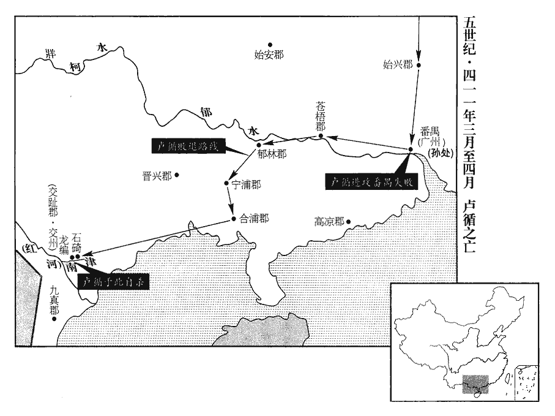
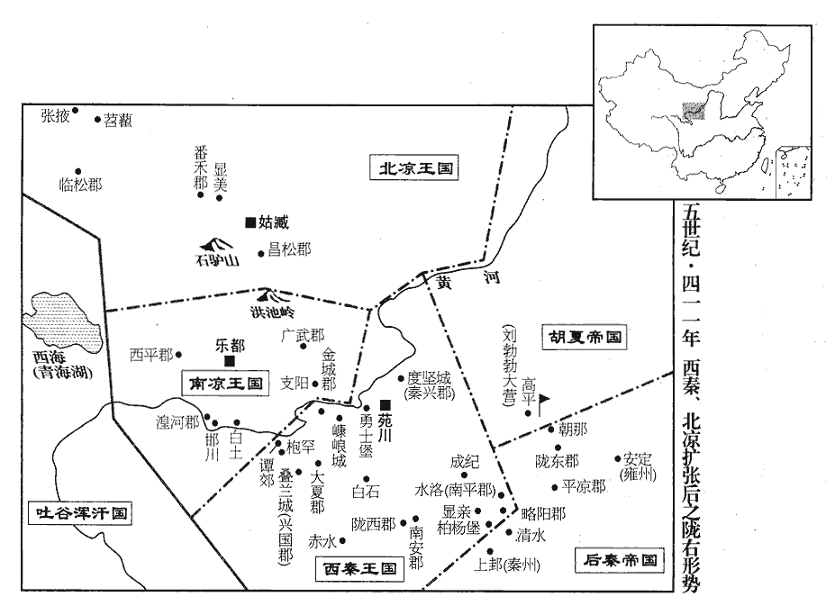
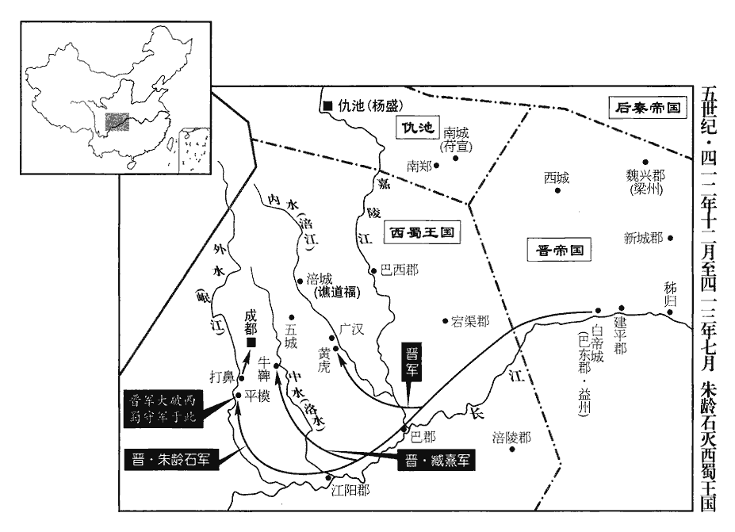
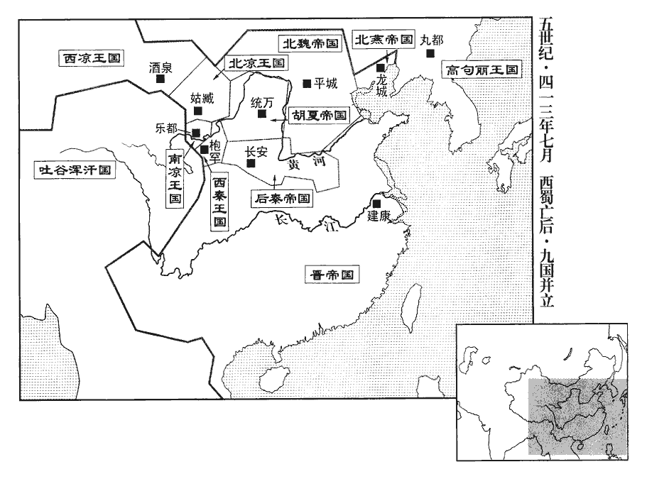
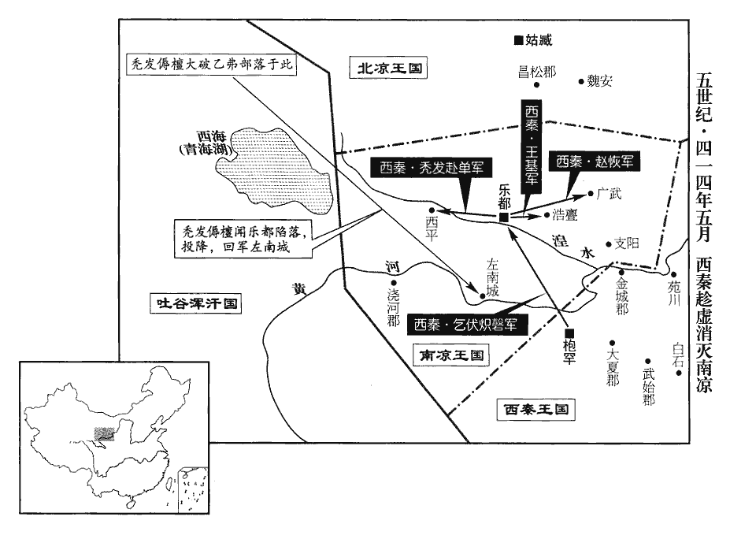
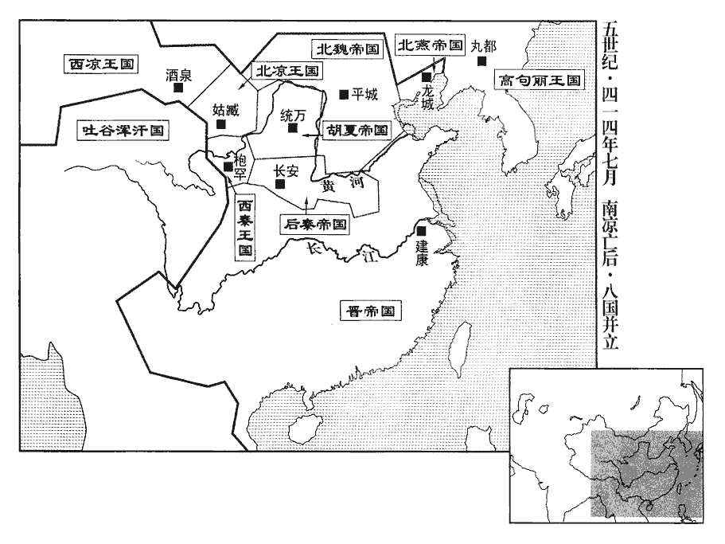

 晉紀三十八起重光大淵獻（辛亥），盡閼逢攝提格（甲寅），凡四年。

# 安皇帝辛

## 義熙七年（辛亥、四一一）

1春，正月，己未‹十二›，劉裕還建康‹南京›。

〖译文〗 [1]春季，正月，己未（十二日），刘裕回到建康。

2秦‹都长安，陕西西安›廣平公弼有寵於秦王興‹时年四十六›，為雍州刺史，鎮安定‹甘肃镇原东南曙光乡›。姚秦分嶺北五郡置雍州刺史，鎮安定。雍，於用翻。姜紀諂附於弼，勸弼結興左右以求入朝。興徵弼為尚書令、侍中、大將軍。弼遂傾身結納朝士，朝，直遙翻。收采名勢，以傾東宮；國人惡之。惡，烏路翻。會興以西北多叛亂，欲命重將鎮撫之；將，即亮翻；下待將同。隴東‹甘肃平凉西北›太守郭播請使弼出鎮；魏收地形志有隴東郡，領涇陽、祖厲、撫夷三縣，不載立郡之始，蓋苻、姚所置也。西魏置隴東於汧源，唐之隴州是也。興不從，以太常索稜為太尉、領隴西‹甘肃陇西›內史，使招撫西秦。為索稜降西秦張本。索，昔各翻。西秦王乾歸遣使送所掠守宰，謝罪請降。謂去年克南安、略陽、隴西諸郡所得守宰也。使，疏吏翻。降，戶江翻。興遣鴻臚拜乾歸都督隴西•嶺‹九嵕山›北、【章：甲十一行本「北」下有「匈奴」二字；乙十一行本同；孔本同；張校同。】雜胡諸軍事、征西大將軍、河州‹府枹罕，甘肃临夏›牧、單于、河南王，太子熾磐為鎮西將軍、左賢王、平昌公。臚，陵如翻。單，音蟬。熾，昌志翻。

〖译文〗 [2]后秦广平公姚弼，受到后秦王姚兴的宠爱，担任雍州刺史，镇守安定。姜纪投靠姚弼，极尽谄媚，他劝说姚弼结交姚兴身边的人，争取回到朝廷任职。姚兴征召姚弼为尚书令、侍中、大将军。姚弼于是谦恭地与朝中官员交往结纳，树立名望，培植势力，以此排挤太子姚泓，国内官民，对他非常讨厌。正赶上姚兴因为西北地区的叛乱层出不穷，打算派一名重要的将领到那里镇抚，所以陇东太守郭播便请求派姚弼去镇守。姚兴并不听从，任命太常索棱为太尉、兼陇西内史，让他去招扶西秦。西秦王乞伏乾归派使节送还被他俘虏的守、宰等地方官，承认罪过，请求投降。姚兴便派鸿胪拜乞伏乾归都督陇西、岭北、杂胡诸军事及征西大将军、河州牧、单于、河南王，封太子乞伏炽磐为镇西将军、左贤王、平昌公。

興命群臣搜舉賢才。右僕射梁喜曰：「臣累受詔而未得其人，可謂世之乏才。」興曰：「自古帝王之興，未嘗取相於昔人，相，息亮翻。待將於將來，隨時任才，皆能致治。將，即亮翻。治，直吏翻。卿自識拔不明，豈得遠誣四海乎?」群臣咸悅。姚興之折梁喜誠是矣，群臣體興之意而明揚仄陋者誰乎?此所謂好虛名而無實用者也。

〖译文〗 姚兴命令大臣们寻找荐举贤能的人才。右仆射梁喜说：“臣几次接受诏命却没有得到一个那样的人，可以说世上的确缺乏人才。”姚兴说：“自古以来，帝王之业兴起的时候，从不曾在古人的行列中借取宰相，也不曾等待在将来出生的人中选拔大将，他们都是随时随地在当世选任才俊，却也都能使国家得到较好的治理。你自己缺乏识才拔才的眼光，怎么可以诬蔑说广大的四海没有俊才呢？”大臣们都很高兴。

3秦姚詳屯杏城‹陕西黄陵›，為夏王勃勃‹时年三十一›所逼，夏，戶雅翻。南奔大蘇‹陕西黄陵南›；勃勃遣平東將軍鹿弈干追斬之，盡俘其眾。勃勃南攻安定‹甘肃镇原东南曙光乡›，破尚書楊佛嵩于青石北原‹安定东›，降其眾四萬五千；降，戶江翻。進攻東鄉‹安定东›，下之，徙三千餘戶于貳城‹陕西黄陵西北›。秦鎮北參軍王買德奔夏，夏王勃勃問以滅秦之策，買德曰：「秦德雖衰，藩鎮猶固，願且蓄力以待之。」勃勃以買德為軍師中郎將。買德遂為夏之謀臣。秦王興遣衛大將軍常山公顯迎姚詳，弗及，遂屯杏城。

〖译文〗 [3]后秦安远将军姚详屯扎在杏城，被夏王刘勃勃逼迫，向南逃奔大苏。刘勃勃派遣平东将军鹿弈干追上他并把他杀了，俘虏了他的全部部众。刘勃勃向南进攻安定，在青石北面的原野，击败尚书杨佛嵩，收降他的部众四万五千。随后，他又进攻东乡，攻克那里，把当地的三千多户居民强行迁到贰城。后秦镇北参军王买德投降夏国，夏王刘勃勃向他询问消灭后秦的办法，王买德说：“后秦的德势虽然已经衰败，但是地方势力却还很稳固，所以我希望您暂时积蓄力量等待机会。”刘勃勃任命王买德为军师中郎将。后秦王姚兴派遣卫大将军、常山公姚显前去迎救姚详，没有来得及，于是便屯扎在杏城。

4劉藩帥孟懷玉等諸將，追盧循至嶺表‹南岭以南›，帥，讀曰率。二月，壬午‹五›，懷玉克始興‹广东韶关›，斬徐道覆。

〖译文〗 [4]东晋兖州刺史刘藩率领孟怀玉等几位将领追击卢循到达五岭以南。二月，壬午（初五），孟怀玉攻克始兴，杀死了徐道覆。

5河南王乾歸徙鮮卑僕渾部三千餘戶于度堅城‹甘肃靖远西›，僕渾降乾歸見上卷上年。度堅城即乞伏先所都度堅山城也。以子敕勃為秦興太守以鎮之。乞伏乾歸本建國號曰秦，故置秦興郡于度堅山。

〖译文〗 [5]后秦刚刚加封的河南王乞伏乾归，把鲜卑族仆浑部落的三千多户居民强行迁往度坚城，任命儿子乞伏敕勃为秦兴太守，镇守那里。

6焦朗猶據姑臧‹甘肃武威›，朗據姑臧見上卷上年。沮渠蒙遜‹时年四十四›攻拔其城，沮，子余翻。執朗而宥之；以其弟拏為秦州刺史，鎮姑臧。拏，女居翻。遂伐南涼，圍樂都‹青海乐都›，樂，音洛。三旬不克；南涼王傉檀‹时年四十七›以子安周為質，乃還。質，音致。

〖译文〗 [6]南凉将军焦朗还占据着姑臧。北凉沮渠蒙逊攻克了这座城市，活捉焦朗，又把他宽释了，并任命自己的弟弟沮渠为秦州刺史，镇守姑臧。于是，他们继续征伐南凉围困乐都城，过了三十天也不能攻克。南凉王秃发檀用自己的儿子秃发安周作为人质交给了北凉国，沮渠蒙逊才撤兵。

7吐谷渾‹青海›樹洛干伐南涼，敗南涼太子虎臺。敗，補邁翻。

〖译文〗 [7]吐谷浑可汗树洛干讨伐南凉国，打败了南凉太子秃发虎台。

8南涼王傉檀欲復伐沮渠蒙遜，邯川‹青海化隆›護軍孟愷諫曰：復，扶又翻。水經：河水自西平郡東流，逕澆河郡故城北，又東逕石城南，又東逕邯川城南。劉昫曰：廓州化隆縣東，古邯川地。杜佑曰：後漢和帝時，侯霸置東、西邯屯田五部。邯，水名也，分流左右，在寧塞郡。據唐志，寧塞本澆河郡，唐玄宗天寶中更名；今之廓州。「蒙遜新并姑臧，凶勢方盛，不可攻也。」傉檀不從，五道俱進，至番禾‹甘肃永登›、苕tiáo藋diào‹甘肃张掖东›，番，音盤。藋，徒弔翻。掠五千餘戶而還。還，從宣翻，又如字；下同。將軍屈右曰：「今既獲利，宜倍道旋師，早度險阨。蒙遜善用兵，若輕軍猝至，大敵外逼，徙戶內叛，此危道也。」衛尉伊力延曰：「彼步我騎，騎，奇寄翻。勢不相及。今倍道而歸則示弱，且捐棄資財，非計也。」俄而昏霧風雨，蒙遜兵大至，傉檀敗走。蒙遜進圍樂都‹青海乐都›，傉檀嬰城固守，以子染干為質以請和，質，音致。蒙遜乃還。

〖译文〗 [8]南凉王秃发檀打算再一次征伐沮渠蒙逊，邯川护军孟恺劝阻说：“沮渠蒙逊刚刚吞并了姑臧，凶猛的势头正在极盛的时候，不可以去进攻他。”秃发檀不听，兵分五路，同时进军，抵达番禾、苕，抢掠了五千多户居民回军。将军屈右说：“这次既然已经得到了好处，就应该火速班师，早点摆脱危险的环境。沮渠蒙逊善于指挥军队，如果他派一支轻装的部队突然来到，强大的敌人在外围步步威逼，我们裹胁的这些迁移百姓在里面叛乱，这可是危险的事呵！”卫尉伊力延说：“他们步行我们骑马，按道理他们是赶不上我们的。现在如果我们加速回去，就是向敌人显示我们懦弱，而且要扔掉许多军用物资，不是好办法。”不久，天气昏暗，大雾弥漫，风雨交加，沮渠蒙逊的军队大批出现，秃发檀败退而走。沮渠蒙逊进军围困乐都，秃发檀绕着城池，坚持防守，最后又用儿子秃发染干作为人质，向对方请求和解，沮渠蒙逊才收兵回去。

9三月，劉裕始受太尉、中書監，加太尉見上卷五年。加中書監見六年。以劉穆之為太尉司馬，陳郡‹河南淮阳›殷景仁為行參軍。行參軍，未得與參軍事班也，註已見前。裕問穆之曰：「孟昶參佐誰堪入我府者?」穆之舉前建威中兵參軍謝晦。晦，安兄據之曾孫也，孟昶為建威將軍，辟晦為中兵參軍。裕即命為參軍。裕嘗訊囚，其旦，刑獄參軍有疾，以晦代之；於車中一覽訊牒，催促便下。下，遐稼翻。相府多事，相，息亮翻。獄繫殷積，晦隨問酬辨，曾無違謬；裕由是奇之，即日署刑獄賊曹。刑獄蓋分民曹、賊曹，賊曹掌盜賊事。宋志，諸府參軍有長流賊曹、刑獄賊曹、城局賊曹；刑獄無民曹。謝晦為參軍，未掌曹職，今乃升署。晦美風姿，善言笑，博贍多通，贍shàn，時豔翻。裕深加賞愛。

〖译文〗 [9]三月，东晋刘裕开始接受太尉、中书监的职务。他任命刘穆之为太尉司马，任命陈郡人殷景仁为行参军。刘裕问刘穆之说：“孟昶手下的人谁可以到我这里做事？”刘穆之荐举前建威中兵参军谢晦。谢晦是谢安的哥哥谢据的曾孙。刘裕便命他为参军。刘裕曾经亲自去审问囚犯，那天早晨，恰好刑狱参军有病，便让谢晦去顶替。谢晦在车中，只把各种诉状口供看了一遍，催促令立刻就能下达。宰相府的杂事繁多，讼案更是堆积了很多，谢晦随着询问便进行安排分辨，从没有发生过错误。刘裕因此认为他是一个奇才，当天便调他任刑狱贼曹。谢晦风度优美，善于言谈逗趣，见多识广，刘裕对他非常欣赏喜爱。

10盧循行收兵至番禺‹广州›，遂圍之，孫處拒守二十餘日。番禺，音潘愚。處，昌呂翻。沈田子言於劉藩曰：「番禺城雖險固，本賊之巢穴；今循圍之，或有內變。且孫季高眾力寡弱，孫處，字季高。不能持久，若使賊還據廣州，凶勢復振矣。」復，扶又翻。夏，四月，田子引兵救番禺，擊循，破之，所殺萬餘人。循走，田子與處共追之，又破循於蒼梧‹广西梧州›、鬱林‹广西桂平›、寧浦‹广西横县›。蒼梧、鬱林，漢古郡。寧浦郡，吳分合浦郡立。蒼梧，唐之鬱州；鬱林，唐之鬱林州；寧浦，唐之橫州。會處病，不能進，循奔交州‹府龙编，越南河内东北北宁府›。

〖译文〗 [10]卢循在撤退的过程中收集残兵败将，来到番禺，于是把番禺包围，孙处在那里抵抗坚守了二十多天。沈田子对刘藩说：“番禺城池虽然险要坚固，但是却本来就是敌兵的老窝，现在被卢循围困着，或许城里会出现变乱。况且孙处的军队少，力量弱，不可能坚持太久，如果让这些贼兵回来占据了广州，那么他们的凶恶势力就要重振了。”夏季，四月，沈田子带兵去援救番禺，进攻卢循，并把他打败，杀死一万多人。卢循逃跑，沈田子与孙处一起去追击他，又在苍梧、郁林、宁浦等地几次打败卢循。正巧此时孙处病倒，大军不能继续前进，卢循乘机投奔交州。

 

初，九真‹越南清化›太守李遜作亂，九真，漢古郡，唐之愛州。交州刺史交趾杜瑗討斬之。瑗卒，瑗yuàn，于眷翻。卒，子恤翻。朝廷以其子慧度為交州刺史。詔書未至，循襲破合浦‹广西合浦东北›，合浦，漢古郡，唐之廉州。徑向交州；慧度帥州府文武拒循於石碕‹越南河内东南›，破之。碕qí，渠羈翻。岸曲曰碕。帥，讀曰率。循餘眾猶三千人，李遜餘黨李脫等結集俚獠五千餘人以應循。俚，音里。獠，魯皓翻。庚子‹二十四›，循晨至龍編南津；交趾郡龍編縣，州郡皆治焉。水經註：漢建安二十三年，立州之始，蛟龍磐編於水南北二津，故改龍淵曰龍編。余據二漢志皆作「龍編」，無亦師古、章懷避唐諱，因亦改「淵」為「編」乎！慧度悉散家財以賞軍士，與循合戰，擲雉尾炬焚其艦，雉尾炬，束草之一頭，施鐵鏃，草尾則散開如雉尾然，爇ruò火以投敵。艦，戶黯翻。以步兵夾岸射之，射，而亦翻。循眾艦俱然，兵眾大潰。循知不免，先鴆妻子，召妓妾問曰：妓，渠綺翻。「誰能從我死者?」多云：「雀鼠貪生，就死實難。」或云：「官尚當死，某豈願生！」乃悉殺諸辭死者，因自投于水。慧度取其尸斬之，并其父子及李脫等，函七首送建康。

〖译文〗 当初，九真太守李逊起兵叛乱，交州刺史交趾人杜瑗前去讨伐，并把他斩杀。杜瑗去世，朝廷任命他的儿子杜慧度为交州刺史。诏书还没有到达，卢循已经攻占了合浦，一直奔向交州。杜慧度率领州府的文武官员在石迎击卢循，把他打败。卢循剩下的残兵还三千人，李逊的余党李脱等人也结集俚獠族人五千多响应卢循。庚子（二十四日），卢循早晨到达龙编南面的渡口，杜慧度把自己家的财产全部散发给军士们做奖赏，与卢循展开决战。杜慧度军队投掷许多雉尾炬，用来焚烧对方的战舰，又用步兵在两岸开弓射箭进攻敌人，卢循军队的那些船全部着火，部众彻底溃散。卢循知道自己这次难免一死，于是先用毒酒毒死妻子，然后把那些歌妓、小妾等召集在一起问道：“你们谁能跟我一起死？”这些人都说：“即使是一只麻雀、一个老鼠也都贪生，跟你一起死，实在太难。”但也有的说：“您都要死了，我怎能愿意再活下去！”卢循于是把那些不愿死的全部杀掉，随后自己也投水自杀。杜慧度把他的尸体涝上来，割下人头，再加上他父亲、儿子以及李脱等共七颗人头，装在木盒中，送往都城建康。

11初，劉毅在京口‹江苏镇江›，貧困，與知識射於東堂。庾悅為司徒右長史，後至，奪其射堂；眾人皆避之，毅獨不去。悅廚饌甚盛，不以及毅；毅從悅求子鵝炙，饌zhuàn，雛戀翻，又雛睆翻。炙，之夜翻。子鵝為炙尤肥美。悅怒不與，毅由是銜之。至是，毅求兼督江州，詔許之。因奏稱：「江州內地，以治民為職，治，直之翻。不當置軍府彫耗民力，宜罷軍府移鎮豫章‹江西南昌›；而尋陽接蠻，可即州府千兵以助郡戍。」於是解悅都督、將軍官，以刺史鎮豫章。毅以親將趙恢領千兵守尋陽‹江西九江›；悅府文武三千悉入毅府，符攝嚴峻。符攝，符下江州追攝之也。悅忿懼，至豫章，疽發背卒。疽jū，千余翻。卒，子恤翻。

〖译文〗 [11]当初，刘毅在京口居住时，家庭很贫困，一次与熟人在东堂比赛射箭。庾悦当时是司徒右长史，后来到这里，夺用了这个射箭的大堂。别的人全都回避走了，只有刘毅不走，庾悦在这里大摆宴席，酒菜非常丰盛，却不给刘毅吃。刘毅跟他要一块烤小鹅肉吃，庾悦大怒，没有给，刘毅从此对他怀恨在心。到了现在，刘毅请求兼管江州，安帝下诏允许。于是，他便呈上奏章说：“江州属于国家的腹地，江州刺史应该以治理民间事务为主要职守，不应该再配置一个军府消耗百姓的力量，应该解除军府，移到豫章镇守。寻阳接近蛮夷地区，所以也可在州府的部队中分出一千名兵丁加强该郡的防卫。”于是解除了江州刺史庾悦的都督、将军等官职，仅以刺史的身分镇守豫章。刘毅派亲信的将领赵恢带领一千名士兵去戍守寻阳，而庾悦府中的三千名文武官员等全部并入刘毅的府中办公。刘毅对庾悦不断下达严苛的命令又催逼甚紧。庾悦既愤怒又惧怕，到豫章后不久，后背上生疽痈，去世。

12河南王乾歸徙羌句豈等部眾五千餘戶于疊蘭城‹甘肃和政›句豈降乾歸見上卷上年。疊蘭城在大夏西南，嵻㟍東北。以兄子阿柴為興國‹府疊蘭城，甘肃和政›太守以鎮之；漢末，興國氐王阿貴據興國城，在略陽郡界，乞伏因其地名置郡。五月，復以子木弈干為武威‹甘肃武威›太守，鎮嵻㟍城‹甘肃榆中南›。嵻㟍城，四年，乞伏熾磐所築。復，扶又翻。

〖译文〗 [12]后秦河南王乞伏乾归把羌族句岂等部落的五千多户居民强行迁到叠兰城居住。任命自己的侄儿乞伏阿柴为兴国太守，镇守那里。五月，他又任命儿子乞伏木弈干为武威太守，镇守城。

13丁卯‹二十二›，魏‹都平城，山西大同›主嗣‹时年二十›謁金陵‹故都盛乐（内蒙和林格尔）境›，山陽侯奚斤居守。守，式又翻。昌黎王慕容伯兒謀反；己巳‹二十四›，奚斤并其黨收斬之。

〖译文〗 [13]丁卯（二十二日），北魏国主拓跋嗣拜谒金陵，命令山阳侯奚斤留在都城镇守。昌黎王慕容伯儿谋反。己巳（二十四日），奚斤把他连同他的党羽抓起来后，一同斩首。

14秋，七月，燕‹都龙城，辽宁朝阳›王跋以太子永領大單于，置四輔。太子領大單于始於劉漢，時置左、右輔而已，跋增置前輔、後輔。單，音蟬。

〖译文〗 [14]秋季，七月，北燕国主冯跋任命太子冯永兼任大单于，设置四位辅佐大臣。

柔然‹瀚海沙漠群›可汗斛hú律遣使獻馬三千匹於跋，可，從刊入聲。汗，音寒。使，疏吏翻。求娶跋女樂浪公主；樂浪，音洛琅。跋命群臣議之。遼西公素弗曰：「前世皆以宗女妻六夷，宜許以妃嬪之女，嬪，毗賓翻。樂浪公主不宜下降非類。」跋曰：「朕方崇信殊俗，柰何欺之！」乃以樂浪公主妻之。妻，七細翻。

〖译文〗 柔然可汗郁久闾斛律派遣使节向冯跋献上三千匹好马，请求迎娶冯跋的女儿乐浪公主。冯跋命令大臣们讨论这件事。辽西公冯素弗说：“前代的君主都把宗室女儿嫁给那些夷人为妻，现在应该把妃嫔所生的女儿许配给他，至于乐浪公主，就不应该下嫁给地位不相当的人了。”冯跋说：“我正要在蛮荒地区树立威信，怎么能够欺骗他呢？”于是把乐浪公主嫁给郁久闾斛律为妻。

跋勤於政事，勸課農桑，省傜役，薄賦斂；斂，力贍翻。每遣守宰，必親引見，見，賢遍翻。問為政之要，以觀其能。燕人悅之。

〖译文〗 冯跋对国家政务勤勤恳恳，鼓励人民务农种桑，减少徭役，降低赋税，每次任命、下派守宰一类的地方官时，总要亲自召见他们，问他们施政的基本打算，观察他的能力。北燕百姓对此十分欢悦。

15河南王乾歸遣平昌公熾磐及中軍將軍審虔伐南涼。審虔，乾歸之子也。八月，熾磐兵濟河，此濟金城河也。熾，昌志翻。南涼王傉檀遣太子虎臺逆戰於嶺‹甘肃天祝西北乌鞘岭›南；傉，奴沃翻。南涼兵敗，虜牛馬十餘萬而還。還，從宣翻，又如字；下同。

〖译文〗 [15]后秦河南王乞伏乾归派遣平昌公乞伏炽磐以及中军将军乞伏审虔讨伐南凉国。乞伏审虔是乞伏乾归的儿子。八月，乞伏炽磐的大军渡过金城河，南凉王秃发檀派遣太子秃发虎台在岭南地区迎战，结果，南凉国军队被打得大败。乞伏炽磐抢掠了十几万匹牛马便回去了。

 

16沮渠蒙遜帥輕騎襲西涼‹都酒泉，甘肃酒泉›，帥，讀曰率。騎，奇寄翻。西涼公暠曰：「兵有不戰而敗敵者，暠，古老翻。敗，補邁翻。挫其銳也。蒙遜新與吾盟，事見上卷上年。而遽來襲我，我閉門不與戰，待其銳氣竭而擊之，蔑不克矣。」頃之，蒙遜糧盡而歸，暠遣世子歆帥騎七千邀擊之，蒙遜大敗，獲其將沮渠百年。

〖译文〗 [16]沮渠蒙逊率领轻装骑兵袭击西凉国，西凉公李说：“用兵的人有不用战斗而把敌人打败的，那就是挫伤他的锐气。沮渠蒙逊刚刚与我们结盟，却又突然前来袭击我们，我们关紧城门不和他们接战，等到他们锐气枯竭之后再来进攻他们，没有不获胜的。”不久，沮渠蒙逊的军队粮食吃完，撤军，李派嫡长子李歆率领骑兵七千人拦腰进攻他们，沮渠蒙逊部队惨败，西凉俘获了他们的大将沮渠百年。

17河南王乾歸攻秦略陽太守姚龍於柏陽堡‹甘肃天水东南›，克之；冬十一月，進攻南平太守王憬於水洛城‹甘肃庄浪›，水經註：水洛亭在隴山之西，漢略陽縣界。鄭戩曰：水洛城西占隴坻通秦州往來路，隴之二水環城西流，繞帶渭河，川平土沃，廣數百里。元豐九域志：德順軍西南一百里有水洛城，仁宗朝鄭戩使劉滬hù所築也。憬，居永翻。又克之，徙民三千餘戶於譚郊‹甘肃临夏西北›。譚郊在冶城西北。遣乞伏審虔帥眾二萬城譚郊。帥，讀曰率。十二月，西羌彭利髮襲據枹罕‹甘肃临夏›，枹，音膚。自稱大將軍、河州牧，乾歸討之，不克。

〖译文〗 [17]河南王乞伏乾归进攻后秦略阳太守姚龙于柏阳堡，攻陷了这座城。冬季，十一月，又到水洛城进攻南平太守王憬，也攻克了。把那里的三千多户百姓强行迁往谭郊，派儿子乞伏审虔统帅二万士卒筑谭郊城。十二月，西羌部落首领彭利发攻占了罕，自称为大将军、河州牧，乞伏乾归前去讨伐，没有攻克。

18是歲，并州‹侨州，府淮阴，江苏淮阴›刺史劉道憐為北徐州刺史，移鎮彭城‹江苏徐州›。

〖译文〗 [18]这一年，东晋并州刺史刘道怜改任北徐州刺史，迁移到彭城镇守。

## 八年（壬子、四一二）

1春，正月，河南王乾歸復討彭利髮，復，扶又翻。至奴葵谷。利髮棄眾南走，乾歸遣振威將軍乞伏公府追至清水‹甘肃清水›，斬之，收羌戶一萬三千，以乞伏審虔為河州刺史，鎮枹罕‹甘肃临夏›而還。

〖译文〗 [1]春季，正月，河南王乞伏乾归再一次出兵讨伐彭利发，抵达奴葵谷。彭利发扔下部众向南逃走，乞伏乾归派遣振威将军乞伏公府追到清水，把他杀了。这一战，收集了羌族居民一万三千户，任命乞伏审虔为河州刺史，镇守罕，大军回师。

2二月，丙子‹五›，以吳興‹浙江湖州›太守孔靖為尚書右僕射。

〖译文〗 [2]二月，丙子（初五），东晋任命吴兴太守孔靖为尚书右仆射。

3河南王乾歸徙都譚郊‹甘肃临夏西北›，命平昌公熾磐鎮苑川‹甘肃榆中东北›。乾歸擊吐谷渾‹青海›阿若干於赤水‹甘肃岷县北›，降之。五代志：隋大業五年平吐谷渾，置河源郡於古赤水城，蓋近積石山。魏收地形志：臨洮郡有赤水縣。水經註：赤水城亦曰臨洮東城。降，戶江翻。

〖译文〗 [3]河南王乞伏乾归把都城迁到谭郊，命令平昌公乞伏炽磐镇守苑川。乞伏乾归在赤水袭击吐谷浑汗国的阿若干，收降了他。

4夏，四月，劉道規以疾求歸，許之。道規在荊州累年，元年，道規刺荊州。秋毫無犯。及歸，府庫帷幕，儼然若舊。隨身甲士二人遷席於舟中，道規刑之於市。

〖译文〗 [4]夏季，四月，东晋荆州刺史刘道规因为身体有病，请求解职回京，朝廷准许。刘道规在荆州任职几年，丝毫也没有侵占百姓的利益。到他回京的时候，府库的帷幕都和他刚来时一模一样。他的随从中有两个卫兵把一条草席带上了船，刘道规也把他们拉到市井中斩首。

以後將軍豫州刺史劉毅為衛將軍、都督荊•寧•秦•雍四州諸軍事、荊州刺史。雍，於用翻。毅謂左衛將軍劉敬宣曰：「吾忝西任，欲屈卿為長史南蠻，為南蠻校尉府長史也。豈有見輔意乎?」敬宣懼，以告太尉裕，裕笑曰：「但令老兄平安，必無過慮。」

〖译文〗 东晋朝廷任命后将军、豫州刺史刘毅为卫将军，都督荆、宁、秦、雍四州诸军事，荆州刺史。刘毅对左卫将军刘敬宣说：“我忝居西方重任，打算委屈你为南蛮长史，你有没有帮我忙的意思？”刘敬宣很害怕，把这件事告诉了太尉刘裕，刘裕笑着说：“总会让你老兄平安，一定不要过分忧虑。”

毅性剛愎，愎，弼力翻。自謂建義之功與裕相埒，埒liè，龍輟翻，等也。深自矜伐，雖權事推裕而心不服；觀去年答弟藩之言可知已。及居方岳，常怏怏不得志。怏，於兩翻。裕每柔而順之，毅驕縱滋甚，嘗云：「恨不遇劉、項，與之爭中原！」及敗於桑落，事見上卷六年。知物情已去，彌復憤激。復，扶又翻。裕素不學，而毅頗涉文雅，故朝士有清望者多歸之，朝，直遙翻。與尚書僕射謝混，丹楊尹郗僧施，深相憑結。僧施，超之從子也。郗，丑之翻。郗超黨於桓溫，僧施黨於劉毅，超僅免而僧施及禍矣。從，才用翻。毅既據上流，陰有圖裕之志，求兼督交、廣二州，裕許之。毅又奏以郗僧施為南蠻校尉後軍司馬，毛脩之為南郡‹湖北江陵›太守，裕亦許之，以劉穆之代僧施為丹楊尹。毅表求至京口‹江苏镇江›辭墓，裕往會之於倪塘‹南京东南›。寧遠將軍胡藩言於裕曰：「公謂劉衛軍終能為公下乎?」毅為衛將軍，故稱之。裕默然，久之，曰：「卿謂何如?」藩曰：「連百萬之眾，攻必取，戰必克，毅以此服公；至於涉獵傳記，師古曰：涉，若涉水；獵，若獵獸；言歷覽之，不專精也。傳，直戀翻。一談一詠，自許以為雄豪；以是搢紳白面之士輻湊歸之。恐終不為公下，不如因會取之。」裕曰：「吾與毅俱有克復之功，其過未彰，不可自相圖也。」裕雖以是言答藩，陰有以處毅者矣。

〖译文〗 刘毅性格刚愎自用，自以为当年勤王举义的功劳与刘裕相等，心里深深为此骄矜自负，因此，虽然暂时拥戴听从刘裕，但是心里却并不服气，等到独当一面，当上一个地区的首脑之后，仍然经常郁闷不乐，觉得志向不得实现。刘裕每每对他容让顺从，这更加纵容滋长了他的狂傲，曾说：“真遗憾没有遇到刘邦、项羽，跟他们争夺中原！”到了在桑落惨败之后，他知道自己的情势已去，更增加了他的烦恼和愤激。刘裕一向不读书，刘毅却相当地涉猎过一些文墨，所以朝中有很多名望清高的有学识的人，都与他往来密切。他与尚书仆射谢混、丹阳尹郗僧施关系最好，感情最深，互相结纳。郗僧施是郗超的侄儿。刘毅把持了长江上游一带的大权之后，暗地里有图谋刘裕的志向，便请求兼管交、广二州的军事，刘裕也答应了他。刘毅又奏请任命郗僧施为南蛮校尉后军司马，任命毛之为南郡太守，刘裕又答应了他，改派刘穆之代替郗僧施为丹阳尹。刘毅上表请求到京口去向祖先的坟墓辞行，刘裕前往倪塘与他相会。宁远将军胡藩对刘裕进言道：“您说刘毅能永远地做您的部下吗？”刘裕沉默不语，很久，说：“你认为应当怎么办？”胡藩说：“统帅百万大军，攻击一定得手，交战一定胜利，刘毅以此佩服您。至于博览群书，谈吐吟咏，他却自认为是英雄豪杰。正因如此，高雅的士绅、白面的书生等集中归附到他那里。我担心他终将不会甘心在您之下，不如趁这次会面的机会，干脆除掉他。”刘裕说：“我与刘毅都有使国家复兴的功劳，他的罪过还没有表露出来，不可自相残杀。”

5乞伏熾磐攻南涼三河‹青海循化撒拉族自治县›太守吳隂于白土‹三河郡府›，克之，以乞伏出累代之。水經：河水過邯川城南，又東逕臨津城北、白土城南。闞駰十三州志曰：左南津西六十里，有白土城，在大河之北，為緣河濟渡之地。累，力追翻。魏收曰：白土縣，漢屬上郡，晉屬金城郡，後魏屬新平郡。余謂後魏新平之白土乃漢上郡之白土，晉金城之白土乃左南西之白土，各是一處。五代志：邠bīn州新平縣、舊曰白土，此漢上郡及後魏之白土也。南涼之白土當在唐鄯州界。

〖译文〗 [5]乞伏炽磐在白土进攻南凉三河太守吴阴，击败了他，让乞伏出累代替吴阴镇守白土。

六月，乞伏公府弒河南王乾歸，公府，國仁之子也，以不得立，故行弒逆。并殺其諸子十餘人，走保大夏‹甘肃广河›。夏，戶雅翻；下同。平昌公熾磐遣其弟廣武將軍智達、揚武將軍木弈干帥騎三千討之；以其弟曇達為鎮京【嚴：「京」改「東」。】將軍，鎮譚郊‹甘肃临夏西北›，乞伏都譚郊，自謂為京師，故置鎮京將軍以鎮之。帥，讀曰率。騎，奇寄翻；下同。曇，徒含翻。驍騎將軍婁機鎮苑川‹甘肃榆中东北›。驍，堅堯翻。熾磐帥文武及民二萬餘戶遷于枹罕‹甘肃临夏›。

〖译文〗 六月，西秦振威将军乞伏公府刺杀了河南王乞伏乾归。同时杀死了乞伏乾归的十几个儿子。逃到大夏据守。平昌公乞伏炽磐派他的弟弟广武将军乞伏智达、杨武将军乞伏木弈干率领三千骑兵，前去讨伐。任命他的另一个弟弟乞伏昙达为镇东将军，镇守谭郊；任命骁骑将军乞伏娄机镇守苑川。乞伏炽磐统帅文武官员及二万多户百姓迁移到罕。

秦‹都长安，陕西西安›人多勸秦王興‹时年四十七›乘亂取熾磐，興曰：「伐人喪，非禮也。」夏王勃勃‹时年三十二›欲攻熾磐，軍師中郎將王買德諫曰：「熾磐，吾之與國，今遭喪亂，喪，息郎翻。吾不能恤，又恃眾力而伐之，匹夫猶且恥為，況萬乘乎！」乘，繩證翻。勃勃乃止。

〖译文〗 后秦国人有很多都劝后秦王姚兴乘西秦国内危亡动乱之机，消灭乞伏炽磐，姚兴说：“趁别人遭丧之时，讨伐他，不合礼仪。”夏王刘勃勃打算进攻乞伏炽磐，军师中郎将王买德劝阻说：“乞伏炽磐是我们的邻邦，现在遭受丧乱，我们不能去体恤帮助，反而依仗人多力大去讨伐他，这样的事，连普通的老百姓都觉得可耻而不去做，何况您是拥有万乘之尊的天王了！”刘勃勃这才停止。

6閏月，庚子‹一›，南郡烈武公劉道規卒‹年四十三›。

〖译文〗 [6]闰六月，庚子（初一），东晋南郡烈武公刘道规去世。

7秋，七月，己巳朔‹一›，魏主嗣‹时年二十一›東巡，置四廂大將、十二小將；以山陽侯斤、元城侯屈行左、右丞相。奚斤封山陽侯，拓跋屈封元城侯。庚寅‹二十二›，嗣至濡‹闪电河›源‹河北沽源境›，濡rú，乃官翻。巡西北諸部落。

〖译文〗 [7]秋季，七月，己巳朔（初一），北魏国主拓跋嗣巡视东方，设置了四厢大将、十二小将等官。任命山阳侯奚斤、元城侯拓跋屈担任左、右丞相。庚寅（二十二日），拓跋嗣抵达濡源，巡视西北的那些部落。

8乞伏智達等擊破乞伏公府於大夏‹甘肃广河›。公府奔疊蘭城‹甘肃临夏东南›，就其弟阿柴；智達等攻拔之，斬阿柴父子五人。公府奔嵻㟍南山‹甘肃榆中南马衔山›，嵻，音康。㟍，音郎。追獲之，并其四子，轘之於譚郊‹甘肃临夏西北›。轘huàn，音宦。

〖译文〗 [8]乞伏智达等人在大夏击败乞伏公府。乞伏公府逃奔叠兰城，投靠他的弟弟乞伏阿柴。乞伏智达等攻陷了那里，斩杀了乞伏阿柴他们父子五人。乞伏公府又逃到以南的山区，被追上抓获，连同他的四个儿子一起，在谭郊城内用车裂刑处死。

八月，乞伏熾磐自稱大將軍、河南王，熾磐，乾歸長子。大赦，改元永康；葬乾歸於枹罕‹甘肃临夏›，枹，音膚。諡曰武元，廟號高祖。

〖译文〗 八月，乞伏炽磐自称为大将军、河南王，下令大赦，改年号为永康。把乞伏乾归安葬在罕，追谥他为武元王，庙号高祖。

9皇后王氏‹王神爱，年二十九›崩。

〖译文〗 [9]东晋皇后王氏去世。

10庚戌‹十二›，魏主嗣還平城‹山西大同›。出巡而還也。

〖译文〗 [10]庚戌（十二日），北魏国主拓跋嗣回到平城。

11九月，河南王熾磐以尚書令武始‹甘肃临洮›翟勍為相國，勍qíng，渠京翻。侍中、太子詹事趙景為御史大夫，罷尚書令、僕、尚書六卿、侍中等官。

〖译文〗 [11]九月，西秦河南王乞伏炽磐任命尚书令武始人翟为相国，任命侍中、太子詹事赵景为御史大夫，撤销了尚书令、仆、尚书六卿、待中等官职。

12癸酉‹六›，葬僖皇后于休平陵‹南京东蒋山西南›。

〖译文〗 [12]癸酉（初六），东晋把僖皇后王氏安葬在休平陵。

13劉毅至江陵‹湖北江陵›，多變易守宰，輒割豫州‹府姑孰，安徽当涂›文武、江州‹府豫章，江西南昌›兵力萬餘人以自隨。會毅疾篤，郗僧施等恐毅死，其黨危，乃勸毅請從弟兗州‹府广陵，江苏扬州›刺史藩以自副，從，才用翻；下同。太尉裕偽許之。藩自廣陵入朝，朝，直遙翻。己卯‹十二›，裕以詔書罪狀毅，云與藩及謝混共謀不軌，收藩及混賜死。

〖译文〗 [13]刘毅抵达江陵，对下属的守宰等地方官进行很大的变动、撤换，他擅自抽调豫州原来的老文武僚属、江州的原部众一万多人跟随自己到荆州。正好赶上刘毅病重，郗僧施等人恐怕刘毅死掉，他们这一党处境危险，于是劝说刘毅请求朝廷派自己的堂弟兖州刺史刘藩做自己的副手，太尉刘裕假装答应了他。刘藩从广陵前往建康来朝见皇帝。已卯（十二日），刘裕用皇帝的名义下诏书，公布刘毅的罪状，指出他与刘藩以及谢混等人一起阴谋叛乱，抓住了刘藩和谢混，命令他们自杀。

初，混與劉毅款昵，昵，尼質翻。混從兄澹常以為憂，澹，徒覽翻。漸與之疏；謂弟璞及從子瞻曰：「益壽此性，終當破家。」益壽，混小字也。澹，安之孫也。

〖译文〗 当初，谢混与刘毅感情密切亲昵，谢混的堂兄谢澹常常为此担忧，逐渐与他疏远，并对弟弟谢璞和侄儿谢瞻说：“谢混这种性情，将来一定会家破人亡。”谢澹是谢安的孙子。

庚辰‹十三›，詔大赦，以前會稽‹浙江绍兴›內史司馬休之為都督荊•雍•梁•秦•寧•益六州諸軍事、荊州刺史；雍，於用翻。北徐州刺史劉道憐為兗•青二州刺史，鎮京口‹江苏镇江›。北徐州刺史治彭城‹江苏徐州›。使道憐鎮京口，以為建康北藩之重。使豫州刺史諸葛長民監太尉留府事。監，工銜翻。裕疑長民難獨任，乃加劉穆之建武將軍，置佐吏，配給資力以防之。是時裕已有殺長民之心矣。

〖译文〗 庚辰（十三日），东晋安帝下诏命令大赦。任命前会稽内史司马休之为都督荆、雍、梁、秦、宁、益六州诸军事，荆州刺史；任命北徐州刺史刘道怜为兖、青二州刺史，镇守京口；命豫州刺史诸葛长民监太尉留府事。刘裕担心诸葛长民很难单独胜任，于是加封刘穆之为建武将军，设置辅佐官员，配备军事力量，防备意外。

壬午‹十五›，裕帥諸軍發建康，參軍王鎮惡請給百舸為前驅。帥，讀曰率。舸gě，古我翻。丙申‹二十九›，至姑孰‹安徽当涂›，以鎮惡為振武將軍，與龍驤將軍蒯恩將百舸前發，驤，思將翻。蒯，苦怪翻。將，即亮翻。裕戒之曰：「若賊可擊，擊之；不可者，燒其船艦，艦，戶黯翻。留屯水際以待我。」於是鎮惡晝夜兼行，揚聲言劉兗州上。上，時掌翻；下步上、藩上同。

〖译文〗 壬午（十五日），刘裕率领几支部队从建康出发，参军王镇恶请求交给他一百条船担任先锋。丙申（二十九日），抵达姑孰，任命王镇恶为振武将军，与龙骧将军蒯恩带领一百条船提前出发，刘裕告诫他们说：“如果敌人可以战胜，便进攻他们；如果不能取胜，便把他们的船舰烧毁，停留在水边等待我来。”于是王镇恶白天黑夜地加速前进，声言说是刘藩到来。

冬，十月，己未‹二十二›，鎮惡至豫章口‹湖北江陵东南›，去江陵城二十里，捨船步上。蒯恩軍居前，鎮惡次之。舸留一二人，對舸岸上立六七旗，旗下置鼓，語所留人；語，牛倨翻；下同。「計我將至城，便鼓嚴，令若後有大軍狀。」鼓嚴，擂鼓也。又分遣人燒江津‹江陵东南›船艦。鎮惡徑前襲城，語前軍士：告語在前軍士也。「有問者，但云劉兗州至。」津戍及民間皆晏然不疑。未至城五、六里，逢毅要將朱顯之要將者，所親之將，掌兵要者。欲出江津，問：「劉兗州何在?」軍士曰：「在後。」顯之至軍後不見藩，而見軍人擔彭排戰具，彭排，即今之旁排，所以扞鋒矢。孫愐曰：樐lǔ，彭排。釋名曰：彭排，軍器也。彭，旁也，在旁排敵禦攻也。望江津船艦已被燒，鼓嚴之聲甚盛，知非藩上，上，時掌翻。便躍馬馳去告毅，行令閉諸城門。鎮惡亦馳進，門未及下關，軍人因得入城。衛軍長史謝純入參承毅，僚佐省府公謂之參承。出聞兵至，左右欲引車歸。純叱之曰：「我，人吏也，言為人之吏。逃將安之！」馳還入府。純，安兄據之孫也。鎮惡與城內兵鬬，且攻其金城，凡城內牙城，晉、宋時謂之金城。自食時至中晡bū，日加申為晡。中晡，正申時也。申末為下晡。城內人敗散。鎮惡穴其金城而入，遣人以詔及赦文并裕手書示毅，毅皆燒不視，與司馬毛脩之等督士卒力戰。城內人猶未信裕自來，軍士從毅自東來者，與臺軍多中表親戚，且鬬且語，知裕自來，人情離駭。逮夜，聽事前兵皆散，斬毅勇將趙蔡，將，即亮翻。毅左右兵猶閉東西閤拒戰。鎮惡慮闇中自相傷犯，乃引軍出圍金城，開其南面。毅慮南有伏兵，夜半，帥左右三百許人，帥，讀曰率。開北門突出。毛脩之謂謝純曰：「君但隨僕去。」純不從，為人所殺。

〖译文〗 冬季，十月，己未（二十二日），王镇恶抵达豫章口，离江陵城只有二十里，因此，他们下船，步行进军。蒯恩带兵走在前面，王镇恶紧跟着他。每条船上只留一二个人，停船的岸上立起六七面旗帜，旗下放置战鼓，告诉留下的人：“估计我们就要到江陵城时，你们便不停地擂起战鼓，做出后面好像还有大部队的样子。”又分别派人去火烧江津那里的船舰。王镇恶径直去突袭江陵城，告诉前面的军士：“如果有人问，就说刘藩到了。”渡口卫兵和当地百姓都安下心来，毫不怀疑。离城还有五六里远时，正好碰上刘毅手下的重要将领朱显之准备去江津，问道：“刘藩在哪里？”军士们说：“在后面。”朱显之到了部队的后面也没有看到刘藩，却看见军士扛着盾牌、旁排等作战工具，又看见江津的船舰已经火起被烧，江边擂鼓的声音又很大，恍然大悟不是刘藩到来，便跳上马背，飞马回城向刘毅报告，下令赶快关闭各个城门。王镇恶也跟着跑进城去，城门还没来得及关闭，军队所以得以进入江陵城。卫军长史谢纯进府去拜见刘毅，出来的时候，听说军队杀到，左右侍从打算拉着他的车回去，射纯呵斥他们说：“我是人家的下属，逃能逃到哪里去？”于是驰回刘毅府中。谢纯是谢安的哥哥谢据的孙子。王镇恶与城内的士兵展开激战，一面又进攻江陵的牙城，从中午直到傍晚，城内的守军终于败退溃散。王镇恶从牙城挖一个洞，冲了进去，派人把皇帝的诏书和赦免他的文件以及刘裕写给他的亲笔信交给刘毅，刘毅看也不看，便全部烧掉了。他与司马毛之等人督促士卒拼力死战。城内的人还不相信刘裕亲自到来，可是军队中那些跟着刘毅从东方来的士兵，与朝廷来的兵有一些是表亲的关系，他们一边交战一边对话。知道的确是刘裕亲自来了，人心为此震骇离乱。到了夜晚，刘毅办公的府前卫兵全部逃散，并杀掉了刘毅手下的勇将赵蔡；刘毅身边的侍卫还关紧东西大门顽强抗拒。王镇恶担心黑暗之中自己的士兵彼此误伤，于是又把部众带出围困牙城，并把南面打开一个出口。刘毅害怕南面有埋伏的官兵，半夜的时候，率领三百个左右的侍卫，打开北门突围出去。毛之对谢纯说：“你只管跟我去。”谢纯不同意，被别人杀掉了。

毅夜投牛牧佛寺。牛牧寺在江陵城北二十里。初，桓蔚之敗也，事見一百一十四卷元年。蔚，紆勿翻。走投牛牧寺僧昌，昌保藏之，毅殺昌。至是，寺僧拒之曰：「昔亡師容桓蔚，為劉衛軍所殺，今實不敢容異人。」毅歎曰：「為法自弊，一至於此！」史記：商君得罪於秦，亡至關下，欲舍。客舍人不知其是商君也，曰：「商君之法，舍人無驗者坐之。」商君歎曰：「嗟乎！為法自敝，一至此哉！」遂縊而死。明日，居人以告，乃斬首於市，并子姪皆伏誅。毅兄模奔襄陽，魯宗之斬送之。

〖译文〗 刘毅连夜投奔牛牧佛寺。当初，桓蔚失败的时候，便跑到这里投奔牛牧寺的僧人昌。昌把桓蔚藏了起来，保护他，刘毅则杀了昌。到这时，寺里的僧人们拒绝了他，说：“过去我们亡故的师傅昌容留醒蔚，被你杀死，现在实在再不敢容留他人了。”刘毅哀叹说：“自己制订法律规章断绝自己的活路，竟然到了这种程度！”于是，他自己上吊而死。第二天，当地居民报告，王镇恶便将他的尸体拖到市中，砍下脑袋。他的儿子、侄子等也都一起被杀。刘毅的哥哥刘模逃奔到襄阳，雍州刺史鲁宗之斩了他，并把人头送到建康。

初，毅季父鎮之閒居京口‹江苏镇江›，不應辟召，常謂毅及藩曰：「汝輩才器，足以得志，但恐不久耳。我不就爾求財位，亦不同爾受罪累。」累，力瑞翻。每見毅、藩導從到門，輒詬之。從，才用翻。詬，許候翻，又古侯翻，罵也。毅甚敬畏，未至宅數百步，悉屏儀衛，屏，必郢翻。與白衣數人俱進。及毅死，太尉裕奏徵鎮之為散騎常侍、光祿大夫，散，悉亶翻。騎，奇寄翻。固辭不至。

〖译文〗 当初，刘毅的叔父刘镇之在京口闲居，不应朝廷的征召，常常对刘毅和刘藩说：“凭你们的才能天赋，足可以实现自己的志向，干一番大事业，但是恐怕不会得势太长时间。我不依靠你们谋求钱财和地位，也不和你们一起受到罪行的连累。”他每次看见刘毅、刘藩领着部下路过家门，都出去辱骂他们。刘毅对他非常尊敬而又害怕，回家时，在没到家宅的几百步远的地方，便把仪仗卫兵等全部屏退，只和几个部下的小官吏的人一起进屋。等到刘毅死后，太尉刘裕奏请征召刘镇之为散骑常侍、光禄大夫，刘镇之仍然坚决推辞，不来上任。

14仇池公楊盛叛秦，義熙元年，盛降秦，今復叛。侵擾祁山‹甘肃西和东北›；秦王興遣建威將軍趙琨為前鋒，立節將軍姚伯壽繼之，前將軍姚恢出鷲峽‹甘肃成县西北›，鷲，音就。秦州刺史姚嵩出羊頭峽‹山西汾阳西北羊头山›，右衛將軍胡翼度出汧城‹陕西陇县南›，以討盛。興自雍赴之，汧qiān，苦堅翻。雍，於用翻。與諸將會于隴口‹陕西陇县西›。隴道之口也。將，即亮翻。

〖译文〗 [14]被后秦封为仇池公的氐王杨盛，背叛后秦，侵犯骚扰祁山。后秦国王姚兴派遣建威将军赵琨率领先行部队，派立节将军姚伯寿率领后援部队，派前将军姚恢进军鹫峡，派秦州刺史姚嵩进军羊头峡，派右卫将军胡翼度进军城，同时讨伐杨盛。姚兴从雍城带兵前去，与那些将领在陇口会合。

天水太守王松怱言於嵩曰：「先帝神略無方，徐洛生以英武佐命，再入仇池，無功而還；姚萇再攻仇池，當考。非楊氏智勇能全也，直地勢險固耳。今以趙琨之眾，使君之威，準之先朝，實未見成功。使君具悉形便，何不表聞！」嵩不從。盛帥眾與琨相持，伯壽畏懦不進，琨眾寡不敵，為盛所敗。帥，讀曰率；下同。敗，補邁翻。興斬伯壽而還。

〖译文〗 天水太守王松向姚嵩进言道：“先帝奇谋神智，变化莫测，徐洛生又以自己的英才勇武辅佐王命，就是那样的条件，二次进攻仇池的时候，也免不了没有任何收获，空手而回。这不是因为杨氏的智谋勇力能够保全自己，只不过是那里的地势艰险牢固罢了。现在依靠赵琨等人的大军，依靠您的威信名望，和先帝的朝代相比，实在也不见得能够成功。您全盘了解这样的形势，为什么不报告皇上呢？”姚嵩没有听从。杨盛率领部众与赵琨对抗，双方僵持不下，姚伯寿畏惧怯懦，不进兵增援，赵琨力量单薄，难以抵敌，被杨盛打败。姚兴斩了姚伯寿之后回军。

興以楊佛嵩為雍州刺史，帥嶺‹九嵕山›北見兵以擊夏。秦雍州統嶺北五郡，治安定。見，賢遍翻。行數日，興謂群臣曰：「佛嵩每見敵，勇不自制，吾常節其兵不過五千人。今所將既多，遇敵必敗，行已遠，追之無及，將若之何?」佛嵩與夏王勃勃戰，果敗，為勃勃所執，絕亢而死。亢，與吭háng同，居郎翻。

〖译文〗 姚兴任命杨佛嵩为雍州刺史，率领岭北现有的军队进击夏国。军队走了几天，姚兴对大臣们说：“杨佛嵩每当看见敌人，便奋勇向前，无法自己克制，我常常限制他的军队不让它超过五千人。这次他所统领的兵力已经太多了，遇到敌人便一定要失败，但是他们已经走远，追也追不上了，怎么办好呢？”杨佛嵩与夏王刘勃勃交战，果然失败，被刘勃勃抓获，扼住喉咙掐死。

15秦立昭儀齊氏為后。

〖译文〗 [15]后秦册立昭仪齐氏为王后。

16沮渠蒙遜遷于姑臧‹甘肃武威›。

〖译文〗 [16]北凉沮渠蒙逊把都城迁到姑臧。

17十一月，己卯‹十三›，太尉裕至江陵，殺郗僧施。初，毛脩之雖為劉毅僚佐，素自結於裕，故裕特宥之。賜王鎮惡爵漢壽子。裕問毅府諮議參軍申永曰：「今日何施而可?」永曰：「除其宿釁，倍其惠澤，貫敘門次，魏、晉以來，率以門地高下為用人之次第；貫敘者，以次敘之，若穿錢貫然也。顯擢才能，如此而已。」裕納之，下書寬租省調，調，徒弔翻。節役原刑，禮辟名士，荊人悅之。

〖译文〗 [17]十一月，己卯（十三日），东晋太尉刘裕抵达江陵，杀死郗僧施。当初，毛之虽然是刘毅的幕僚属下，但却一向暗自与刘裕结交，所以刘裕特别宽宥了他。朝廷赐给王镇恶以汉寿子爵位。刘裕问刘毅府的谘议参军申永说：“现在应当怎么做才合适？”申永说：“消除那些以往的隔阂，加倍向百姓官员施加恩惠，重新严格按照门第来加封官职，公开地擢升有才能的人，不过这样罢了。”刘裕采纳了他的建议，下令减少赋税役差，放宽刑罚，以礼相聘有名望的人士。荆州的百姓非常拥护他。

18諸葛長民驕縱貪侈，所為多不法，為百姓患，常懼太尉裕按之。及劉毅被誅，長民謂所親曰：「『昔年醢hǎi彭越，今年殺韓信。』漢薛公之言。被，皮義翻。禍其至矣！」乃屏人問劉穆之曰：屏，必郢翻；下同。「悠悠之言，皆云太尉與我不平，何以至此?」穆之曰：「公泝流遠征，以老母稚子委節下；若一豪不盡，稚，直利翻。豪，古毫字通。豈容如此邪！」長民意乃小安。

〖译文〗 [18]东晋豫州刺史诸葛长民骄横放纵，贪婪奢侈，干的事大多都不合法度，成了百姓的一大祸患。他也常常担心太尉刘裕查处他。到了刘毅被杀，诸葛长民便对他所亲近的人说：“‘前年杀彭越，今年杀韩信。’我的大祸就要来了！”于是，他把别人屏退，问刘穆之说：“大家纷纷传言，都说太尉对我非常不满，这是什么原因？”刘穆之说：“刘公逆流而上，远征刘毅，把老母和幼子全都交给您照顾，如果有一点点的不信任，哪里能这样呢？”诸葛长民的心里才稍稍安定一些。

長民弟輔國大將軍黎民說長民曰：說，輸芮翻。「劉氏之亡，亦諸葛氏之懼也，宜因裕未還而圖之。」長民猶豫未發，既而歎曰：「貧賤常思富貴，富貴必履危機。今日欲為丹徒布衣，豈可得邪！」長民，琅邪陽都人，僑居丹徒‹江苏镇江东丹徒镇›。因遺冀州刺史劉敬宣書曰：「盤龍狠戾專恣，自取夷滅。遺，于季翻。劉毅，小字盤龍。異端將盡，世路方夷，富貴之事，相與共之。」敬宣報曰：「下官自義熙以來，忝三州、七郡，敬宣自北還，拜晉陵太守，遷江州，鎮尋陽，兼領郡事，徵拜宣城內史，領襄城太守，遷鎮蠻護軍，安豐太守，梁國內史，又遷青州刺史，尋改冀州。常懼福過災生，思避盈居損。富貴之旨，非所敢當。」且使以書呈裕，裕曰：「阿壽故為不負我也。」敬宣，字萬壽，故裕稱之曰阿壽。

〖译文〗 诸葛长民的弟弟、辅国大将军诸葛黎民，劝说诸葛长民道：“刘毅的死，也就是诸葛氏的可怕的下场，应该趁着刘裕还没有回来，抢先动手。”诸葛长民犹豫不决，没有行动，过后叹息说：“贫贱的时候，常常想着富贵，富贵之后又一定会有危险。现在要想当一个丹徒的老百姓，怎么能行呢！”于是，给冀州刺史刘敬宣写信道：“刘毅狠毒暴戾，专横任性，自己找的灭亡。现在，有叛乱之心的人已经要被剿灭，天下就要太平，如果有富贵的事情的话，希望我们一同享受。”刘敬宣回信说：“下官我从义熙初年以来，不称职地当过三个州的刺史，七个郡的太守，常常害怕福份就要过去，灾祸就要降在头上，因此只想回避太满的好处，宁可吃亏受损。您所说的富贵的意思，我实在不敢承当。”而且又把信送给刘裕，刘裕说：“刘敬宣还是没有辜负我。”

劉穆之憂長民為變，屏人問太尉行參軍東海何承天曰：「公今行濟否?」承天曰：「荊州不憂不時判，判，決也。別有一慮耳。公昔年自左里‹江西都昌北›還入石頭‹南京西北›，甚脫爾；謂破盧循還時也。脫爾，謂輕脫而還，不為嚴備也。今還，宜加重慎。」穆之曰：「非君，不聞此言。」

〖译文〗 刘穆之担心诸葛长民制造叛乱，屏退别人问太尉行参军、东海人何承天说：“刘公这次能不能成功？”何承天说：“荆州不怕不马上被平定，不过有另外一个值得忧虑的事。刘公过去在左里大胜之后回到石头，非常轻松随便，但这次回来，却应该加倍谨慎。”刘穆之说：“不是你，听不到这样的忠告。”

裕在江陵，輔國將軍王誕白裕求先下，裕曰：「諸葛長民似有自疑心，卿詎jù宜便去！」誕曰：「長民知我蒙公垂盼，今輕身單下，必當以為無虞，乃可以少安其意耳。」裕笑曰：「卿勇過賁、育矣。」盼，匹莧翻。少，詩沼翻。賁，音奔。乃聽先還。

〖译文〗 刘裕在江陵，辅国将军王诞向刘裕表示，请求先行东还，刘裕说：“诸葛长民好像自己非常担心，你怎么敢轻易地就走！”王诞说：“诸葛长民知道我一向承蒙您的垂爱照顾，我现在轻装简从，单身而回，他就一定会觉得没有危险，这样也可以稍稍安定一下他的心意。”刘裕笑着说：“你的勇气，超过孟贲、夏育了。”于是就听凭他先回去。

19沮渠蒙遜即河西王位，沮渠蒙遜，臨松盧水胡人也，其先世為匈奴左沮渠，遂以官為氏。大赦，改元玄始，置官僚如涼王光為三河王故事。呂光稱三河王，見一百七卷孝武太元十四年。

〖译文〗 [19]沮渠蒙逊登上河西王的位子，下令大赦，改年号为玄始，设置的官员，就像后凉王吕光为三河王时设置的官员一样。

20太尉裕謀伐蜀，擇元帥而難其人。帥，所類翻。以西陽‹湖北黄州›太守朱齡石既有武幹，又練吏職，欲用之。眾皆以為齡石‹时年三十四›資名尚輕，難當重任；裕不從。十二月，以齡石為益州‹府巴东，重庆奉节东›刺史，帥寧朔將軍臧熹、河間太守蒯恩、下邳‹江苏睢宁北古邳镇›太守劉鍾等伐蜀，帥，讀曰率。分大軍之半二萬人以配之。熹，裕之妻弟，位居齡石之右，亦隸焉。

〖译文〗 [20]东晋太尉刘裕计划讨伐蜀地，选择元帅的时候，觉得很难找到合适的人选。他认为西阳太守朱龄石既有武勇，又熟悉胜任官吏的职责，打算任用他。大家却都认为朱龄石的资历名望还轻，难以承当重任。刘裕不听从。十二月，任命朱龄石为益州刺史，统帅宁朔将军臧熹、河间太守蒯恩、下邳太守刘钟等人前去讨伐蜀地，并把自己大军的一半共二万人配给他指挥。臧熹是刘裕的内弟，职位也比朱龄石高，但也接受朱龄石的统领。

裕與齡石密謀進取，曰：「劉敬宣往年出黃虎‹四川射洪›，無功而退。事見一百十四卷四年。賊謂我今應從外水‹岷江›往，而料我當出其不意，猶從內水‹涪江›來也。庾仲雍曰：巴郡江州縣對二水口，右則涪，內水；左則蜀，外水。如此，必以重兵守涪城‹四川绵阳›以備內道。涪，音浮。若向黃虎，正墮其計。今以大眾自外水取成都，疑兵出內水，此制敵之奇也。」而慮此聲先馳，賊審虛實。別有函書封付齡石，署函邊曰：「至白帝‹重庆奉节东›乃開。」諸軍雖進，未知處分所由。處，昌呂翻。分，扶問翻。

〖译文〗 刘裕与朱龄石密谋进攻取胜的办法，说：“刘敬宣以前进军到黄虎，没建立什么功业便退回来了。所以，敌兵以为我们这次应当从外水出发，又防备我们出其不意仍然还从内水进兵。这样，他们一定会用重兵把守涪城，封锁内水。如果我们进军黄虎，正中他们的计策。现在，我们以大部队经过外水直取成都，另派一支迷惑敌人的军队进攻内水，这是克敌制胜的奇计。”他担心这种计划事先传扬出去，敌人摸清了自己的虚实动静，便另外写了一封信装在盒子里，交给朱龄石，在盒子边上写：“到白帝城再打开。”这几路大军虽然开始行动，但却不知道为什么要这样安排。

毛脩之固請行；裕恐脩之至蜀，必多所誅殺，土人與毛氏有嫌，亦當以死自固，不許。以毛璩qú之家為蜀人所滅故也。

〖译文〗 毛之坚决要求随大军出发，刘裕恐怕毛之到蜀地后大肆屠杀，而当地人因为与毛之有宿怨，也可能拼死坚守抵抗，所以，没有答应他的请求。

21分荊州十郡置湘州。成帝咸和三年，省湘州入荊州，今復置。

〖译文〗 [21]东晋把荆州的十个郡分出来，设立湘州。

22加太尉裕太傅、揚州牧。

〖译文〗 [22]东晋朝廷加授太尉刘裕为太傅、扬州牧。

23丁巳‹二十一›，魏主嗣北巡，至長城而還。秦所築長城也。

〖译文〗 [23]丁巳（二十一日），北魏国主拓跋嗣，巡视北方，到达长城后返回。

## 九年（癸丑、四一三）

1春，二月，庚戌‹十五›，魏主嗣‹时年二十二›如高柳川‹山西阳高境›；甲寅‹十九›，還宮。

〖译文〗 [1]春季，二月，庚戌（十五日），北魏国主拓跋嗣前往高柳川；甲寅（十九日），回宫。

2太尉裕自江陵‹湖北江陵›東還，還，從宣翻，又如字；下同。駱驛遣輜重兼行而下，重，直用翻。前刻至日，每淹留不進。諸葛長民與公卿頻日奉候於新亭‹南京西南›，輒差其期。乙丑晦‹三十›，裕輕舟徑進，潛入東府。劉穆之、何承天所慮者，裕已了了於胸中矣。三月，丙寅朔‹一›旦，長民聞之，驚趨至門。裕伏壯士丁旿於幔中，旿wǔ，阮古翻。引長民卻人間語，凡平生所不盡者皆及之。長民甚悅。丁旿自幔後出，於座拉殺之，幔，莫半翻。拉，盧合翻。輿尸付廷尉。收其弟黎民，黎民素驍勇，驍，堅堯翻。格鬬而死。并殺其季弟大司馬參軍幼民、從弟寧朔將軍秀之。從，才用翻。

〖译文〗 [2]东晋太尉刘裕从江陵东下，返回建康，陆续把军用物资尽快地运送回去，在预定的日期以前，常常滞留，不能按期进发。诸葛长民与公卿们每天都到新亭去等候，每每错过日期。乙丑（三十日）夜，刘裕乘快速小艇迅速前进，暗中回到了东府。三月，丙寅朔（初一）凌晨，诸葛长民才得到消息，大吃一惊，急往晋见。刘裕命武士丁埋伏在幔中，然后迎接诸葛长民入内，把别人屏退，单独谈话，把凡是一生以来谈不透的话全部谈到了。诸葛长民非常高兴，却不料丁从帷幔后跳出来，在座位上弄死他。刘裕命令用车子把他的尸体拉到延尉去判罪。又去抓他的弟弟诸葛黎民，诸葛黎民一向非常骁勇，拒捕格斗，被杀死。又杀了他的小弟弟大司马参军诸葛幼民、他的堂弟宁朔将军诸葛秀之。

3庚午‹五›，秦王興‹时年四十八›遣使至魏脩好。使，疏吏翻。好，呼到翻。

〖译文〗 [3]庚午（初五），后秦王姚兴派遣使节前往北魏建立友好关系。

4太尉裕上表曰：「大司馬溫以『民無定本，傷治為深』，庚戌土斷以一其業；庚戌制見一百一卷哀帝興寧二年。于時財阜國豐，實由於此。自茲迄今，漸用頹弛，請申前制。」於是依界土斷，唯徐、兗、青三州居晉陵‹江苏镇江›者，不在斷例；徐、青、兗三州都督率治晉陵，故難以土斷。斷，丁亂翻。諸流寓郡縣多所併省。戊寅‹十三›，加裕豫州刺史，裕固讓太傅、州牧。辭去年冬所加也。

〖译文〗 [4]东晋国太尉刘裕呈上奏表说：“从前，大司马桓温因为‘民众没有固定的根基，对国家的治理危害极大’，所以，颁布‘庚戌’诏书，规定按照现在的住所，确定流亡居民的籍贯，让他们安居乐业。当时财富的逐渐积累、国家的充实强盛，实在是由于这个缘故。从那个时候到现在，对这种规定的执行逐渐放松，因此，请求重新强调以前的这项政策。”于是按照现在居民的住所重新确定籍贯，只有徐、兖、青这三个州居住在晋陵的人，不在这个限制之内，那些寄居在别郡之上的郡县，有很多不是被合并，就是被撤销。

5林邑‹越南中部›范胡達寇九真‹越南清化›，杜慧度擊斬之。

〖译文〗 戊寅（十三日），东晋加任刘裕为豫州刺史。刘裕坚定辞让太傅、州牧等职。

6河南王熾磐遣鎮東將軍曇達、平東將軍王松壽，將兵東擊休官權小郎、呂破胡於白石川（原缺四十六字）含翻。將，即亮翻。大破之，虜其男女萬餘口，進據白石城‹甘肃渭源西北›。顯親‹甘肃秦安西北›休官權小成、呂奴迦等二萬餘戶據白阬不服，迦，居牙翻。曇達攻斬之，隴右休官悉降。秦太尉索稜以隴西‹甘肃陇西›降熾磐，七年，秦令索稜守隴西以招撫乞伏。索，昔各翻。降，戶江翻。熾磐以稜為太傅。

〖译文〗 [5]林邑国范胡达进犯东晋九真郡，杜慧度回击并把他杀了。

7夏王勃勃‹时年三十三›大赦，改元鳳翔；以叱干阿利領將作大匠，發嶺‹九嵕山›北夷、夏十萬人築都城於朔方水‹无定河›北、黑水‹细河›之南。水經註：奢延水又謂之朔方水，源出奢延縣西南赤沙阜，東北流逕奢延縣故城南。赫連於是水之南築統萬城。奢延水又東流，黑水入焉，水出奢延縣黑澗，東南歷沙陵，注奢延水。統萬城唐為夏州定難節度使治所。夏，戶雅翻。勃勃曰：「朕方統一天下，君臨萬邦，宜名新城曰統萬。」阿利性巧而殘忍，蒸土築城，錐入一寸，即殺作者而并築之。勃勃以為忠，委任之。凡造兵器成，呈之，工人必有死者：射甲不入則斬弓人，射，而亦翻。入則斬甲匠。又鑄銅為一大鼓，飛廉、翁仲、銅駝、龍虎之屬，飾以黃金，列於宮殿之前。凡殺工匠數千，由是器物皆精利。

〖译文〗 [6]河南王乞伏炽磐派遣镇东将军乞伏昙达、平东将军王松寿带领部队进攻东部休官部落首领权小郎、吕破胡所据守的白石川，并把他们打得大败，把当地的男女百姓一万多口俘虏，进占白石城。显亲休官部落首领权小成、吕奴迦等共二万多户人占据白，不服。乞伏昙达攻克了那里，把他们杀了。陇右的休官部落全部投降。后秦太尉索棱，献出他所据守的陇西，向乞伏炽磐投降。乞伏炽磐任命索棱为太傅。

勃勃自謂其祖從母姓為劉，非禮也。載記曰：漢高祖以宗女妻單于冒頓，約為兄弟，故其子孫冒姓劉氏。古人氏族無常，乃改姓赫連氏，言帝王係天為子，其徽赫與天連也；其非正統者，皆以鐵伐為氏，勃勃父衛辰本鐵弗氏，故改其非正統者為鐵伐氏。言其剛銳如鐵，皆堪伐人也。

〖译文〗 [7]夏王刘勃勃下令实行大赦，改年号为凤翔。任命叱干阿利兼任将作大匠，征发岭北胡人、汉人共十万，在朔方水以北、黑水以南的地方建筑都城。刘勃勃说：“我正要统一天下，以君王的地位统辖所有地区，因此，新城的名字应该叫‘统万’。”叱干阿利性情乖巧伶利，但却凶暴残忍。他用蒸过的土修筑城墙，验收时铁锥如果能插入一寸深，他就要把泥工杀掉并把他的尸首筑进城中。刘勃勃认为他非常忠诚，便把筑城的事全部交给了他。凡是把兵器造成，呈送给他过目的时候，做工的人当中就一定会有人被杀死：弓箭射不透铠甲，那么就杀掉作弓的人；如果射透了，就要杀死作铠甲的工匠。他又用铜铸成一面大鼓，把“飞廉”、“翁仲”、“铜驼”、“龙”、“虎”等塑像，面上装饰黄金，排列在宫殿之前。前后大约杀掉了几千名工匠，因此，武器什物等都打磨得非常锋利和精良。

8夏，四月，乙卯‹二十一›，魏主嗣西巡，命鄭兵將軍奚斤、「鄭兵」，北史作「都兵」。鴻飛將軍尉古真、都將閭大肥等擊越勤部於跋那山‹内蒙乌拉特前旗东乌拉山›。大肥，柔然‹瀚海沙漠群›人也。鴻飛將軍，拓跋氏所創置。將，即亮翻。柔然姓郁久閭氏，今曰閭，從省便也。跋那山蓋在廣寧郡之塞外。

〖译文〗 刘勃勃自认为他的祖先沿用母姓，姓刘，不合礼法。鉴于古人用姓氏也没有常规，于是自己改姓“赫连”，意思是说帝王是天的儿子，他的伟大光耀与天相连。那些不是直系亲属的旁支后裔，都用“铁伐”为姓，意思是说他们钢强锐利如铁，都可以攻伐别人。

9河南王熾磐遣安北將軍烏地延、冠軍將軍翟紹擊吐谷渾‹青海›別統句旁于泣勤【張：「泣勤」作「涇勒」。】川，大破之。冠，古玩翻。別統，猶別帥也，別統部落者也。句，古侯翻。

〖译文〗 [8]夏季，四月，乙卯（二十一日），北魏国主拓跋嗣向西巡视，下令郑兵将军奚斤、鸿飞将军尉古真、都将闾大肥等进军跋那山，袭击越勤部落。闾大肥是柔然人。

10河西王蒙遜‹时年四十六›立子政德為世子，加鎮衛大將軍、錄尚書事。

〖译文〗 [9]河南王乞伏炽磐派遣安北将军乌地延、冠军将军翟绍进攻吐谷浑所属的远方部落首领句旁所据守的泣勤川，并把他们打得大败。

南涼‹都乐都，青海乐都›王傉檀‹时年四十九›伐河西王蒙遜，蒙遜敗之於若厚塢，又敗之於若涼；敗，補邁翻。因進圍樂都‹青海乐都›，樂，音洛；下長樂同。二旬不克。南涼湟河‹青海化隆›太守文支以郡降于蒙遜，降，戶江翻。蒙遜以文支為廣武‹甘肃永登›太守。蒙遜復伐南涼，傉檀以太尉俱延為質，乃還。復，扶又翻。質，音致。

〖译文〗 [10]北凉河西王沮渠蒙逊册立儿子沮渠政德为世子，加封为镇卫大将军、录尚书事。

11蒙遜西如苕藋‹甘肃张掖东›，藋diào，徒弔翻。遣冠軍將軍伏恩將騎一萬襲卑和、烏啼二部‹内蒙额济纳旗嘎顺诺尔湖附近›，大破之，漢有卑和羌，居鮮水海。俘二千餘落而還。

〖译文〗 [11]南凉王秃发檀讨伐河西王沮渠蒙逊，沮渠蒙逊在若厚坞把他打败，又在若凉再一次击败他。于是，沮渠蒙逊进军围困秃发檀的都城乐都，过了二十天也没有攻破。南凉湟河太守秃发文支献出湟河郡，向沮渠蒙逊投降。沮渠蒙逊任命秃发文支为广武太守。沮渠蒙逊再一次讨伐南凉，秃发檀把太尉秃发俱延交给他作为人质，他才撤军。

蒙遜寢于新臺，閹人王懷祖擊蒙遜傷足，其妻孟氏禽斬之。

〖译文〗 沮渠蒙逊向西巡视，前往苕，派遣冠军将军伏恩带领一万骑兵进攻卑和、乌啼两个部落，并把他们击败，俘虏了两千多帐落的百姓回来。

蒙遜母車氏卒。車，尺遮翻。

〖译文〗 沮渠蒙逊在新台皇宫就寝，宦官王怀祖突然向他袭击，但却只伤到了他的脚，沮渠蒙逊的妻子孟氏把王怀祖活捉然后杀了。

五月，乙亥‹十一›，魏主嗣如雲中舊宮‹盛乐，内蒙和林格尔›。唐單于都護府領金河一縣，秦漢之雲中也。新書云：金河本後魏道武所都。丙子‹十二›，大赦。西河‹山西西部›胡張外等聚眾為盜；乙卯‹十五›，嗣遣會稽公長樂劉絜jié等屯西河‹山西离石›招討之。按乙亥至丙子幾四十日，五月無乙卯明矣，恐是己卯。會，工外翻。六月，嗣如五原‹内蒙包头›。

〖译文〗 沮渠蒙逊的母亲车氏去世。

12朱齡石等至白帝發函書，曰：「眾軍悉從外水‹岷江›取成都，臧熹從中水‹绵阳河›取廣漢‹四川广汉›，水經註：洛水出洛縣章山南，逕洛縣故城南，廣漢郡治也，又南逕新都縣與緜水合，又與湔jiān水合，亦謂之郫pí江，又逕犍為牛鞞bēi水，又東逕資中縣，謂之緜水。緜水至江陽縣方山下入江，謂之緜水口，曰中水。老弱乘高艦十餘，從內水‹涪江›向黃虎。」艦，戶黯翻。於是諸軍倍道兼行。譙縱果命譙道福將重兵鎮涪城，將，即亮翻。涪，音浮；下同。以備內水。

〖译文〗 [12]五月，乙亥（十一日），北魏国主拓跋嗣前往云中的旧日宫殿。丙子（十二日），实行大赦。西河的胡人张外等人招集部众，成了强盗。乙卯（疑误），拓跋嗣派遣会稽公、长乐人刘等带兵集结在西河，招降或者讨伐他们。六日，拓跋嗣前往五原。

13齡石至平模‹四川彭山县南›，去成都二百里；縱遣秦州刺史侯暉、尚書僕射譙詵shēn帥眾萬餘屯平模，詵，莘shēn臻翻。夾岸築城以拒之。齡石謂劉鍾曰：「今天時盛熱而賊嚴兵固險，攻之未必可拔，祇增疲困；且欲養銳息兵以伺其隙，何如?」鍾曰：「不然。前揚聲言大眾向內水，譙道福不敢捨涪城。今重軍猝至，出其不意，侯暉之徒已破膽矣。賊阻兵守險者，是其懼不敢戰也。因其兇懼，兇，許勇翻。盡銳攻之，其勢必克。克平模之後，自可鼓行而進，成都必不能守矣。若緩兵相守，彼將知人虛實。涪軍忽來，并力拒我，人情既安，良將又集，良將謂譙道福。將，即亮翻。此求戰不獲，軍食無資，二萬餘人悉為蜀子虜矣。」齡石從之。

〖译文〗 [13]东晋朱龄石等人带兵抵达白帝，打开盒中刘裕写的书信，上面说：“大部队全部从外水进攻成都，臧熹从水中进攻广汉，老弱残兵乘坐高大的战舰十几条，从内水向黄虎进发。”于是，几路大军火速向目标进发。谯纵果然命令谯道福带领主力部队镇守涪城，用来防备从内水进攻的敌人。

諸將以水北城地險兵多，欲先攻其南城，齡石曰：「今屠南城，不足以破北，若盡銳以拔北城，則南城不麾自散矣。」

〖译文〗 朱龄石抵达平模，距离成都还有二百里。谯纵派遣秦州刺史侯晖、尚书仆射谯诜率领一万多部众屯扎在平模，在江水两岸筑起城墙，抗拒敌兵。朱龄石对刘钟说：“现在正赶上天气太热，但是敌兵又防守严密、地热险固，进攻他们也不一定能够攻克，只是白白地增加士兵的疲劳困顿。我想暂时停止进攻，养精蓄锐，等待机会，怎么样？”刘钟说：“不行。开始的时候我们扬言大部队从内水进攻，谯道福所以才不敢放弃涪城。现在大军到了这里，出乎敌人的意料之外，侯晖这帮家伙已经吓破了胆。贼兵之所以挡住去路、坚守险要，是因为他们害怕，不敢迎战。正应趁他们非常害怕，调动全部的精锐部队进攻他们，结果我们一定会胜利。攻克平模之后，自然可以擂动战鼓，勇往直前，成都也便一定不能坚守了。如果把进攻援解下来，相持不下，他们就会了解到我们的虚实。涪城的守军再忽然到来，把兵力合在一起，抵抗我们，他们的人心也已经安定，良将也集结过来。这样，我们希望对战又没有办法把敌人引出来，军中粮食又无法供应，那么，我们的二万多人就要全部被蜀中小子俘虏了。”朱龄石听从了他的劝告。

 

秋，七月，齡石帥諸軍急攻北城，克之，斬侯暉、譙詵；引兵迴趣南城，帥，讀曰率。趣，七喻翻。南城自潰。齡石捨船步進；譙縱大將譙撫之屯牛脾‹四川简阳›，「牛脾pí」，當作「牛鞞bēi」。孟康曰：鞞，音髀bì。師古曰：音必爾翻。牛鞞縣自漢以來屬犍為郡。何承天曰：晉穆帝度屬蜀郡。今簡州西岸有古牛鞞戍城。譙小苟塞打鼻‹四川彭山县南›。打鼻山在今眉州彭山縣南十餘里，山形孤起，東臨江水。俗云：昔周鼎淪於此，或見其鼻，故名。塞，悉則翻。臧熹擊撫之，斬之，小苟聞之，亦潰。於是縱諸營屯望風相次奔潰。

〖译文〗 诸将领认为江北的城垣地势险要，守兵众多，所以打算先进攻江南的城池。朱龄石说：“现在，我们即使屠灭了南城，也没有办法攻克北城，如果集中精锐攻克北城，那么南城便不用挥旗进攻也会自动星散的。”秋季，七月，朱龄石率领几支部队向北城发动猛烈进攻，终于攻克。斩杀了侯晖、谯诜，又带兵回师进攻南城，南城自动溃败。朱龄石把船遗留在江中，上岸步行向成都进发。谯纵的大将谯抚之在牛脾屯聚兵力，谯小苟驻防打鼻。臧熹进攻谯抚之，把他杀了；谯小苟听说这个消息，也全军崩溃。于是谯纵手下的那些军营卫所，一听见东晋部队到来的消息，便都一个接一个地崩溃瓦解。

戊辰‹五›，縱棄成都出走，尚書令馬耽封府庫以待晉師。壬申‹九›，齡石入成都，誅縱同祖之親，餘皆按堵，使復其業。縱出成都，先辭墓，其女曰：「走必不免，祇取辱焉；等死，死於先人之墓可也。」縱不從。譙道福聞平模不守，自涪引兵入赴，縱往投之。道福見縱，怒曰：「大丈夫有如此功業而棄之，將安歸乎！人誰不死，何怯之甚也！」因投縱以劍，中其馬鞍。中，竹仲翻。縱乃去，自縊死，縊，於賜翻，又於計翻。巴西‹四川阆中›人王志斬其首以送齡石。道福謂其眾曰：「蜀之存亡，實係於我，不在譙王，今我在，猶足一戰。」眾皆許諾；道福盡散金帛以賜眾，眾受之而走。道福逃於獠中‹嘉陵江流域›，獠，魯皓翻。巴民杜瑾執送之，斬于軍門。義熙元年，譙縱據蜀，九年而滅。瑾，渠吝翻。齡石徙馬耽於越巂‹四川会理›，嶲音髓。耽謂其徒曰：「朱侯不送我京師，欲滅口也，謂齡石多取庫物，殺耽以滅口。吾必不免。」乃盥洗而臥，引繩而死。須臾，齡石使至，戮其尸。使，疏吏翻。詔以齡石進監梁、秦州六郡諸軍事，監，古銜翻。賜爵豐城縣侯。

〖译文〗 戊辰（初五），谯纵放弃成都出逃，尚书令马耽把府库封存起来，等待东晋军队。壬申（初九），朱龄石进入成都，诛杀了谯纵同祖父的亲属，其余的人都安居如常，让他们恢复正常的生产经营。谯纵逃出成都，先去辞别祖先陵墓，他女儿说：“逃跑也一定不能逃脱，只是取得更多的侮辱，同样是死，可以死在祖先的墓旁。”谯纵不听。谯道福听说平模失守，从涪城带兵赶来救援，谯纵前去投奔他。谯道福看见谯纵，大怒说：“大丈夫有这样伟大的功名事业，却把它丢弃了，你要回到哪里去！一个人谁能不死，怎么怕成这个样子！”于是把佩剑狠狠地向谯纵掷去，只砍中了他的马鞍。谯纵只好离去，自己上吊而死。巴西人王志把他的脑袋砍下来，送给朱龄石。谯道福对他的部众们说：“蜀国的生存和灭亡，其实是维系在我的身上，不在谯王的身上。现在我还活着，因此，还足以进行一次决战。”部下都表示同意。谯道福把金银财宝全部分发给手下的人，众人接过东西，却都逃走了。谯道福无奈，逃到獠人部落之中，巴地居民杜瑾把他抓住，送交东晋军，就在军营门前斩首。朱龄石把马耽放逐到越，马耽对他的部下说：“朱龄石不把我送往京师，是打算杀我灭口。我必定难逃一死。”于是，沐浴之后，躺在床上，自缢而死。不一会儿，朱龄石的使者便到了，砍下了他尸体上的人头。东晋下诏朱龄石升任监梁、秦州六郡诸军事，赐爵位为丰城县侯。

 

14魏奚斤等破越勤於跋那山‹内蒙乌拉特前旗东乌拉山›西，徙二萬餘家於大寧‹河北张家口›。

〖译文〗 [14]北魏奚斤等人在跋那山以西的地区打败越勤部落，把当地居民二万多家强行迁移到大宁。

15河西‹山西西南›胡曹龍等擁部眾二萬人來入蒲子‹山西隰县›，張外降之，推龍為大單于。降，戶江翻。單，音蟬。

〖译文〗 [15]河西的胡人曹龙等人带领部众二万多人前来进犯蒲子，西河胡人张外向他投降，推举曹龙为大单于。

16丙戌‹二十三›，魏主嗣如定襄大洛城‹内蒙清水河县›。二漢志：定襄郡有駱縣。

〖译文〗 [16]丙戌（二十三日），北魏国主拓跋嗣前往定襄郡大洛城。

17河南王熾磐擊吐谷渾‹青海›支旁于長柳川‹青海东南境›，虜旁及其民五千餘戶而還。

〖译文〗 [17]河南王乞伏炽磐在长柳川进攻吐谷浑的支帝部落，把支旁和他的部众五千多户俘虏，然后回师。

18八月，癸卯‹十一›，魏主嗣還平城。

〖译文〗 [18]八月，癸卯（十一日），北魏国主拓跋嗣回到平城。

19曹龍請降于魏，執送張外，斬之。

〖译文〗 [19]曹龙向北魏请求投降，把张外抓住，送往北魏。北魏杀掉张外。

20丁丑，魏主嗣如豺山宮‹山西右玉北›；癸未，還。

〖译文〗 [20]丁丑（疑误），北魏国主拓跋嗣前往豺山宫。癸未（疑误），回平城。

21九月，再命太尉裕為太傅、揚州牧；固辭。

〖译文〗 [21]九月，东晋再次任命太尉刘裕为太傅、扬州牧。刘裕坚决推辞。

22河南王熾磐擊吐谷渾別統掘逵於渴渾川‹甘肃靖远西南›，大破之，虜男女二萬三千。冬，十月，掘逵帥其餘眾降于熾磐。掘，其月翻。帥，讀曰率。

〖译文〗 [22]河南王乞伏炽磐进军渴浑川袭击吐谷浑的属下掘逵部落，并把那里攻破，俘虏了当地男女百姓二万三千人。冬季，十月，掘逵率领他的剩下的部众向乞伏炽磐投降。

23吐京‹山西石楼›胡與離石‹山西离石›胡出以眷叛魏，水經註曰：吐京即漢西河土軍縣，夷、夏俗音訛也。後魏真君九年，置吐京郡，隋為隰州石樓縣地。魏主嗣命元城侯屈督會稽公劉絜、永安侯魏勤以討之。丁巳‹二十六›，出以眷引夏兵邀擊絜，禽之以獻於夏；勤戰死。會，工外翻。夏，戶雅翻。嗣以屈亡二將，將，即亮翻。欲誅之；既而赦之，使攝并州刺史。屈到州，縱酒廢事，嗣積其前後罪惡，檻車徵還，斬之。魏主嗣之入立也，屈子磨渾有功焉；屈恃之而驕。積其惡而誅之，非所以保功臣之門也。

〖译文〗 [23]吐京胡人与离石胡人的首领出以眷背叛北魏，北魏国主拓跋嗣命令元城侯拓跋屈督率会稽公刘、记安侯魏勤等带兵前去讨伐。丁巳（二十六日），出以眷带领夏国军队拦腰阻击刘，并把刘活捉献给夏国。魏勤战死。拓跋嗣因为拓跋屈损失了两员大将，打算杀了他，但不久又把他赦免了，让他暂时代理并州刺史。拓跋屈来到并州治所，天天酗酒，荒废政事，拓跋嗣把他前前后后的罪恶积累到一起，用囚车将他押解回京，斩首。

24十一月，魏主嗣遣使請昏於秦，使，疏吏翻。秦王興許之。

〖译文〗 [24]十一月，北魏国主拓跋嗣派遣使节到后秦去求亲。后秦王姚兴答应了。

25是歲，以敦煌索邈為梁州刺史，郭，徒門翻。索，昔各翻。苻宣乃還仇池‹甘肃西和南›。苻宣入漢中，見一百一十四卷元年。初，邈寓居漢川‹汉水流域›，與別駕姜顯有隙，凡十五年而邈鎮漢川；顯乃肉袒迎候，邈無慍色，慍yùn，於問翻。待之彌厚。退而謂人曰：「我昔寓此，失志多年，若讎姜顯懼者不少。少，詩沼翻。但服之自佳，何必逞志！」於是闔境聞之皆悅。鞠羨之安東萊亦若是而已。世人脩怨以致禍者，由不知此道也。

〖译文〗 [25]这一年，东晋任命敦煌人索邈为梁州刺史，于是苻宣仍回仇池。当初，索邈居住在汉川，与梁州别驾姜显有矛盾，过了十五年，索邈反过来镇守汉川。姜显于是脱去衣服，光着上身出来等候迎接他。索邈见了姜显，脸没有丝毫不高兴的样子，而且对他还更加优厚。索邈退入内宅之后，对别人说：“我过去在这里居住，有许多年都不如意，如果记恨姜显，那么害怕的人一定还有很多。只要他能服从就很好了，为什么一定要报仇解恨，逞自己一时的快意呢！”全州境内的百姓官员，听说了他这话之后，都非常高兴。

## 十年（甲寅、四一四）

1春，正月，辛酉‹一›，魏‹都平城，山西大同›大赦，改元神瑞。

〖译文〗 [1]春季，正月，辛酉（初一），北魏实行大赦，改年号为神瑞。

辛巳‹二十一›，魏主嗣‹时年二十三›如繁畤‹山西浑源西南›；畤zhì，音止。二月，戊戌‹九›，還平城。

〖译文〗 辛巳（二十一日），北魏国主拓跋嗣前往繁。二月，戊戌（初九），返回平城。

2夏‹都统万，陕西靖边北白城子›王勃勃‹时年三十四›侵魏河東‹山西夏县›蒲子‹山西隰县›。

〖译文〗 [2]夏王赫连勃勃入侵北魏河东的蒲子。

3庚戌‹二十一›，魏主嗣如豺山宮‹山西右玉北›。

〖译文〗 [3]庚戌（二十一日），北魏国主拓跋嗣前往豺山宫。

4魏并州‹府晋阳，山西太原›刺史婁【嚴：「婁」改「樓」。】伏連，襲殺夏所置吐京‹山西石楼›護軍及其守兵。魏書官氏志：內入諸姓有匹婁氏，後改為婁氏。去年，夏破拓跋屈，因置守兵於吐京。

〖译文〗 [4]北魏并州刺史娄伏连，进攻并杀死了夏国所设置的吐京护军和那里的守卫士卒。

5司馬休之在江陵‹湖北江陵›，頗得江‹长江›、漢‹汉水›民心。子譙王文思在建康‹南京›，文思，休之之長子也。譙王尚之死於桓玄之難，帝反正，以文思嗣國。性凶暴，好通輕俠；太尉裕惡之。好，呼到翻。惡，烏路翻。三月，有司奏文思擅捶殺國吏，捶，止橤翻。詔誅其黨而宥文思。休之上疏謝罪，請解所任，不許。裕執文思送休之，令自訓厲，意欲休之殺之；休之但表廢文思，并與裕書陳謝。裕由是不悅，為後裕伐休之張本。以江州‹府寻阳，江西九江›刺史孟懷玉兼督豫州六郡以備之。豫州六郡，宣城、襄城、淮南、廬江、安豐、歷陽也。

〖译文〗 [5]东晋司马休之江陵任职，很得江汉一带百姓的民心。他的儿子谯王司马文思留在建康，性情凶狠残暴，喜欢结交江湖侠士。太尉刘裕非常讨厌他。三月，有关部门报告司马文思擅自打死封国的官吏，朝廷下诏杀了他的手下差役，却独独赦免了司马文思。司马休之呈上疏奏请求处罚，承认罪过，并要求解除他现在的职务，朝廷不许。刘裕把司马文思抓住，送给司马休之，让他自己训戒惩罚，意思是让司马休之自己把儿子杀了。司马休之只上表请求废黜司马文思的爵位，并写信给刘裕陈说谢罪。刘裕因此非常不高兴，任命江州刺史孟怀玉兼任督豫州六郡，用来戒备司马休之。

6夏，五月，辛酉‹三›，魏主嗣還平城。

〖译文〗 [6]夏季，五月，辛酉（初三），北魏国主拓跋嗣回到平城。

7秦‹都长安，陕西西安›後將軍斂成討叛羌，為羌所敗，敗，補邁翻。懼罪，出奔夏。

〖译文〗 [7]后秦后将军敛成，讨伐叛乱的羌族部落，被羌人打败，为此他非常害怕，出去投奔夏国。

8秦王興‹时年四十九›有疾。妖賊李弘與氐仇常反於貳城‹陕西黄陵西北›，妖，於驕翻。興輿疾往討之，斬常，執弘而還。還，從宣翻，又如字。

〖译文〗 [8]后秦王姚兴有病。妖贼首领李弘与氐人部落首领仇常在贰城反叛，姚兴带病坐在车轿上前去讨伐他们，斩杀了仇常，活捉李弘而回京。

9秦左將軍姚文宗有寵於太子泓，廣平公弼惡之，惡，烏路翻。誣文宗有怨言；秦王興怒，賜文宗死，於是群臣畏弼側目。弼言於興，無不從者；以所親天水尹沖為給事黃門侍郎，唐盛為治書侍御史，治，直之翻；下同。興左右掌機要者，皆其黨也。右僕射梁喜、侍中任謙、京兆尹尹昭承間言於興曰：「父子之際，人所難言；然君臣之義，不薄於父子，任，音壬。間，古莧翻。父子、君臣，皆人之大倫，故云然。故臣等不得默然。廣平公弼，潛有奪嫡之志，陛下寵之太過，假其威權；傾險無賴之徒輻湊附之。道路皆言陛下將有廢立之計，信有之乎?」興曰：「豈有此邪！」喜等曰：「苟無之，則陛下愛弼，適所以禍之；願去其左右，去，羌呂翻。損其威權，如此，非特安弼，乃所以安宗廟、社稷。」興不應。大司農寶【章：甲十一行本「寶」作「竇」；乙十一行本同；孔本同；熊校同。】溫、司徒左長史王弼皆密疏勸興立弼為太子，興雖不從，亦不責也。

〖译文〗 [9]后秦左将军姚文宗受到太子姚泓的宠爱，广平公姚弼很讨厌他，诬告姚文宗说过不满的话。姚兴大怒，命令姚文宗自杀。于是文武大臣们畏惧姚弼，不敢正眼看他。姚弼对姚兴说的，姚兴无不听从，姚弼让他的亲信天水人尹冲为给事黄门侍郎，唐盛为治书侍御史。姚兴身边掌管机要事务的人，都是姚弼的党羽。右仆射梁喜、侍中任谦、京兆尹尹昭寻找机会对姚兴说；“父子之间的事情，别人很难插言。但是君臣之间的大义，却不比父子之间的关系疏远，因此，我们不能默然不语。广平公姚弼暗地里有夺嫡的想法，陛下您对他的宠爱太过分了，又交给他大权，培养他的威势，这样，那些阴险无赖的家伙们便纷纷像车辐那样，集结依附到他那里。路上的人都说陛下有废长立幼的打算，真有这事吗？”姚兴说：“哪里有这事？”梁喜等人说：“如果没有这事，那么陛下爱护姚弼，却正是给他惹祸呢。希望把他身边的官员全部除去，减小他的权力和威势，这样的话，不但是保护姚弼，而且也是在保护祖宗祭庙和国家政权的安全呵！”姚兴默不作声。大司农窦温、司徒左长史王弼都秘密上奏疏劝说姚兴改立姚弼为太子，姚兴虽然不同意，但是也不责怪他们。

興疾篤，弼潛聚眾數千人，謀作亂。姚裕遣使以弼逆狀，告諸兄在藩鎮者，使，疏吏翻。於是姚懿治兵於蒲阪‹山西永济›，鎮東將軍豫州牧洸治兵於洛陽‹河南洛阳东白马寺东›，懿、洸，皆興子也。治，直之翻。洸guāng，姑黃翻。平西將軍諶治兵於雍‹陕西凤翔›，諶chén，氏壬翻。雍，於用翻。皆欲赴長安討弼。會興疾瘳，瘳chōu，且留翻。見群臣，征虜將軍劉羌泣以告興。梁喜、尹昭請誅弼，且曰：「苟陛下不忍殺弼，亦當奪其權任。」興不得已，免弼尚書令，使以將軍、公還第。弼為大將軍，封廣平公。懿等各罷兵。

〖译文〗 姚兴病重，姚弼暗地里聚集部众几千人阴谋制造叛乱。姚裕派遣使者把姚弼将要叛逆的情形告诉给那些在外地镇守藩地的哥哥。于是姚懿在蒲阪动员部队，镇东将军、豫州牧姚在洛阳动员部队，平西将军姚谌在雍城动员部队，都打算到长安去讨伐姚弼。正好这时姚兴病情好转，召见文武百官，征虏将军刘羌便哭着把这种情况向姚兴作了禀告。梁喜、尹昭请求诛杀姚弼，又说：“如果陛下不忍心杀姚弼，也应该把他的权力职位全部剥夺。”姚兴万不得已，免去了姚弼的尚书令职务，让他以将军、公爵的身份回家赋闲。姚懿等人也都各自停止军事行动。

懿、洸、諶與姚宣皆入朝，使裕入白興，求見，朝，直遙翻。見，賢遍翻；下同。興曰：「汝等正欲論弼事耳，吾已知之。」裕曰：「弼苟有可論，陛下所宜垂聽；若懿等言非是，便當寘之刑辟，辟，毗亦翻。柰何逆拒之！」於是引見懿等於諮議堂。宣流涕極言，興曰：「吾自處之，處，昌呂翻；下同。非汝曹所憂。」撫軍東曹屬姜虬上疏曰：「廣平公弼，釁成逆著，道路皆知之。昔文王之化，刑于寡妻；詩思齊曰：刑于寡妻，至于兄弟。今聖朝之亂，起自愛子，雖欲含忍掩蔽，而逆黨扇惑不已，弼之亂心何由可革！宜斥散凶徒，以絕禍端。」興以虬表示梁喜曰：「天下人皆以吾兒為口實，孔安國曰：口實，謂常不去口。將何以處之?」喜曰：「信如虬言，陛下宜早裁決。」興默然。史言姚興不聽臣子之言，養成泓、弼爭国之禍。

〖译文〗 姚兴的几个儿子姚懿、姚、姚谌与姚宣等都回到都城，让姚裕进宫告诉姚兴，求见父王。姚兴说：“你们几个不过就是打算谈论姚弼的事罢了，我已经知道了。”姚裕说：“姚弼的事如有谈论价值，陛下也应该听一听。如果姚懿等人说的不是属实的，便应该用刑法处罚他们，为什么要凭空猜测因而拒绝和他们谈话呢？”于是，姚兴在谘议堂召见姚懿等人。姚宣流着眼泪，仗义直言，姚兴说：“我自己决定这事，不用你们担心。”抚军东曹属姜虬呈上疏奏说：“广平公姚弼，灾祸已经形成，叛逆的迹象已经明显，路上的人谁都知道。过去周文王的教化之所以能够推广，是因为他首先用礼法要求自己的妻子。而今国家的变乱，是缘起于陛下的爱子，虽然打算包涵容忍掩饰庇护，但是那些叛党们却在不停地煽动蛊惑，姚弼的叛乱之心怎么能够消除呢！应该驱散姚弼身边的那些恶棍凶徒，以此断绝灾祸的来源。”姚兴把姜虬的奏书给梁喜看，说：“天下的人都拿我的儿子当动乱的借口，应该怎么办才好呢？”梁喜说：“真的就像姜虬说的，陛下应该尽早裁决，”姚兴默然不语。

10唾契汗、乙弗等部‹青海湖西›皆叛南涼‹都乐都，青海乐都›，契，欺訖翻。汗，何干翻。北史曰：乙弗國有契翰一部，風俗亦同。杜佑曰：乙弗敵，後魏聞焉，在吐谷渾北，眾有萬餘落，風俗與吐谷渾同，然不識五穀，唯食魚與蘇子。蘇子狀若中國枸杞子，或赤或黑。西有契翰一部，風俗亦同。南涼王傉檀‹时年五十›欲討之。邯川護軍孟愷諫曰：邯，戶甘翻。「今連年饑饉，南逼熾磐‹西秦，都枹罕，甘肃临夏›，北逼蒙遜‹北凉，都姑臧，甘肃武威›，百姓不安。遠征雖克，必有後患；不如與熾磐結盟通糴dí，慰撫雜部，足食繕兵，俟時而動。」傉檀不從，謂太子虎臺曰：「蒙遜近去，不能猝來；旦夕所慮，唯在熾磐。然熾磐兵少易禦，汝謹守樂都‹青海乐都›，少，詩沼翻。易，以豉翻。樂，音洛；下同。吾不過一月必還矣。」乃帥騎七千襲乙弗，帥，讀曰率。騎，奇寄翻。大破之，獲馬牛羊四十餘萬。

〖译文〗 [10]唾契汗、乙弗等部落全都背叛了南凉，南凉王秃发檀打算去讨伐他们。邯川护军孟恺劝阻说：“现在，我们连续几年遭受饥荒，南部有乞伏炽磐威胁，北部又有沮渠蒙逊逼迫，百姓的生活得不到安定。这次即使通过遥远的征伐取得了胜利，那也一定会留下后患。不如和乞伏炽磐结成联盟，沟通粮食的贸易，安慰平抚那些各族的部落，积足粮食，训练军队，等候时机再采取行动。”秃发檀不听从，对太子秃发虎台说：“沮渠蒙逊刚刚回去不久，不会突然再来。早晚值得忧虑的，只有乞伏炽磐。但是乞伏炽磐的兵众却很少，容易抵抗，你只要小心守卫乐都，我不超过一个月一定就能回来了。”于是率领七千名骑兵去袭击乙弗，并将它打得大败，缴获了马、牛、羊等四十多万。

河南王熾磐聞之，欲襲樂都，群臣咸以為不可。太府主簿焦襲曰：「傉檀不顧近患而貪遠利，近患，謂蒙遜、熾磐；遠利，謂乙弗。我今伐之，絕其西路，樂都之西路，此傉檀自乙弗還樂都路也。使不得還救，則虎臺獨守窮城，可坐禽也。此天亡之時，必不可失。」熾磐從之，帥步騎二萬襲樂都。虎臺憑城拒守，熾磐四面攻之。

〖译文〗 河南王乞伏炽磐听说这个消息，打算进攻乐都，文武大臣都认为不可。太府主簿焦袭说：“秃发檀不顾眼前的忧患，却去贪图远方的好处，我们今天讨伐他，断绝乐都以西的路，使他没有办法回来援救，那么，秃发虎台单独守卫一座穷困的城市，我们坐着便可以擒获他了。这是上天覆亡他的时机，一定不能错过。”乞伏炽磐听从了他的建议，率领步兵、骑兵二万人袭击乐都。秃发虎台依靠城防拒敌防守，乞伏炽磐从城的四面发动进攻。

南涼撫軍從事中郎尉肅言於虎臺曰：「外城廣大難守，殿下不若聚國人守內城，國人，謂鮮卑禿髮之種落。肅等帥晉人拒戰於外，雖有不捷，猶足自存。」虎臺曰：「熾磐小賊，旦夕當走，卿何過慮之深！」虎臺疑晉人有異心，夷人謂華人為晉人。悉召豪望有謀勇者閉之於內。孟愷泣曰：「熾磐乘虛內侮，國家危於累卵。愷等進欲報恩，退顧妻子，人思效死，而殿下乃疑之如是邪！」虎臺曰：「吾豈不知君之忠篤，懼餘人脫生慮表，以君等安之耳。」

〖译文〗 南凉抚军从事中郎尉肃向秃发虎台进言道：“外城太大难以坚守，殿下不如把本国人聚集起来守卫内城，我率领汉族人在外城坚持迎战敌人，虽然可能不会取胜，但也还足可以保存自己。”秃发虎台说：“乞伏炽磐这个小毛贼，早晚就要逃走，你何必这么深深地过于忧虑呀！”秃发虎台怀疑汉族人有其他想法，便把汉人中有豪名英望、有勇有谋的人全部召进内城软禁。孟恺哭着说：“乞伏炽磐乘国内空虚悍然进犯，国家的局势比堆在一起的鸡蛋还危险。我孟恺等人进则打算报答王家的恩遇，退则还要照顾妻子儿女，人人都想为国家拚死力战，但殿下却怀疑我们如此地步！”秃发虎台说：“我怎能不知道你的忠诚笃厚，害怕的只是别的人出现意外，让你们去安定人心。”

 

一夕，城潰，熾磐入樂都，遣平遠將軍捷虔帥騎五千追傉檀，以鎮南將軍謙屯為都督河右諸軍事、涼州刺史，鎮樂都；捷虔、謙屯，皆乞伏種。禿髮赴單為西平太守，鎮西平‹青海西宁›，以趙恢為廣武太守，鎮廣武‹甘肃永登›；曜武將軍王基為晉興太守，鎮浩亹‹甘肃永登西南›；浩亹mén，音誥門。徙虎臺及其文武百姓萬餘戶于枹罕‹甘肃临夏›。枹，音膚。赴單，烏孤之子也。

〖译文〗 一天晚上，城防崩溃，乞伏炽磐进入乐都，派遣平远将军乞伏捷虔率领五千骑兵迎击秃发檀，任命镇南将军乞伏谦屯为都督河右诸军事、凉州刺史，镇守乐都。任命秃发赴单为西平太守，镇守西平。任命赵恢为广武太守，镇守广武。任命曜武将军王基为晋兴太守，镇守浩。把秃发虎台和他的文武官员、百姓一万多户强行迁移到罕居住。秃发赴单是秃发乌孤的儿子。

11河間‹河北献县›人褚匡言於燕‹都龙城，辽宁朝阳›王跋曰：「陛下龍飛遼、碣，舊邦族黨，傾首朝陽，言日生於東，猶馮跋興於遼、碣也。其族黨在長樂者，傾首而東望之。碣jié，其謁翻。以日為歲，請往迎之。」跋曰：「道路數千里，復隔異國，如何可致?」復，扶又翻。匡曰：「章武臨海，跋之先，長樂信都人，而章武郡則晉分漢勃海郡所置也。自信都‹河北冀县›至章武‹河北大城›，可以浮海至遼西。舟楫可通，出於遼西臨渝‹河北抚宁东榆关镇›，不為難也。」臨渝縣，漢屬遼西郡。師古曰：渝，音喻。水經曰：碣石在縣南。跋許之，以匡為游擊將軍、中書侍郎，厚資遣之。匡與跋從兄買、從弟睹從，才用翻。自長樂帥五千餘戶歸于和龍‹辽宁朝阳›，漢高帝置信都郡，景帝二年為廣川國，明帝更名樂成，安帝改曰安平，晉改曰長樂。樂，音洛。帥，讀曰率。契丹、庫莫奚‹内蒙西拉木伦河上游›皆降於燕。契，欺訖翻，又音喫chī。降，戶江翻。跋署其大人為歸善王。跋弟丕避亂在高句麗‹都丸都，吉林集安›，句，如字，又音駒。麗，力知翻。跋召之，以為左僕射，封常山公。

〖译文〗 [11]北燕河间人褚匡向北燕王冯跋进言道：“陛下在辽、碣这里登上帝位，长乐的那些故旧亲友，却在家乡仰头向东，盼望陛下去营救，度日如年，请允许我前去迎接他们。”冯跋说：“道路遥远达几千里，中间又隔着别的国家，怎么去呢？”褚匡说：“章武郡靠着海边，乘船可以通过，从辽西的临渝穿过，不会太难。”冯跋批准了他的计划，任命褚匡为游击将军、中书侍郎，交给他一笔丰厚的费用，派他前去。褚匡与冯跋的堂兄冯买、堂弟冯睹，从长乐带领五千多户居民回到和龙。契丹部落和库莫奚部落都向北燕投降。冯跋封他们的首领为归善王。冯跋的弟弟冯丕在高句丽躲避战乱，冯跋召他回来，任命他为仆射，封为常山公。

12柔然‹瀚海沙漠群›可汗斛律將嫁女於燕，可，從刊入聲。汗，音寒。斛律兄子步鹿真謂斛律曰：「幼女遠嫁憂思，請以大臣樹黎等女為媵。」媵yìng，以證翻。斛律不許。步鹿真出，謂樹黎等曰：「斛律欲以汝女為媵，遠適他國。」樹黎恐，與步鹿真謀使勇士夜伏於斛律穹廬之後，伺其出而執之，與女皆送於燕，伺，相吏翻。立步鹿真為可汗而相之。相，息亮翻。

〖译文〗 [12]柔然可汗郁久闾斛律，想把女儿嫁给北燕王冯跋，郁久闾斛律的侄儿郁久闾步鹿真对郁久闾斛律说：“幼女远嫁别的国家，难免忧愁思念，最好是让大臣树黎等人的女儿作为陪嫁的婢妾。”郁久闾斛律没有允许。郁久闾步鹿真出来后，对树黎等人说：“郁久闾斛打算让你的女儿做陪嫁的婢妾，远嫁到别的国家去。”树黎非常害怕，与郁久闾步鹿真商量，派勇武的壮士夜里藏在郁久闾斛律的帐篷之后，等郁久闾斛律出来便抓住他，把他和他的女儿一起送到北燕。于是，树黎拥立郁久闾步鹿真为可汗，自己当了宰相。

初，社崙之徙高車也，事見一百十二卷元興元年。崙，盧昆翻。高車人叱洛侯為之鄉導以併諸部，鄉，讀曰嚮。社崙德之，以為大人。步鹿真與社崙之子社拔共至叱洛侯家，淫其少妻，妻告步鹿真曰：「叱洛侯欲奉大檀為主。」大檀者，社崙季父僕渾之子也，領別部鎮西境，素得眾心。步鹿真歸而發兵圍叱洛侯，叱洛侯自殺。遂引兵襲大檀，大檀逆擊，破之，執步鹿真及社拔，殺之，自立為可汗，號牟汗紇升蓋可汗。魏收曰：魏言制勝也。

〖译文〗 当初，郁久闾社仑把高车部落迁走，高车人叱洛侯做他的向导，使他得以兼并了几个部落，郁久闾社仑很感激他，任命他为高车部落的大人，现在，郁久闾步鹿真和郁久闾社仑的儿子郁久闾社拔一起到叱洛侯家，奸淫叱洛侯年轻的妻子，这位妻子告诉郁久闾步鹿真说：“叱洛侯打算拥立郁久闾大檀为可汗。”郁久闾大檀是郁久闾社仑的叔父郁久闾仆浑的儿子，他统领着其他部落镇守在西部边境，一向很得人民的拥戴。郁久闾步鹿真回去后，便发动军队包围了叱洛侯部落，叱洛侯自杀。于是，他又带兵去袭击郁久闾大檀，郁久闾大檀迎头痛击，并把郁久闾步鹿真的部队打得大败，抓住郁久闾步鹿真和郁久闾社拔，把他们杀掉，他自立为可汗，称做牟汗纥升盖可汗。

斛律至和龍‹辽宁朝阳›，燕王跋賜斛律爵上谷侯，館之遼東‹辽宁朝阳›，待以客禮，納其女為昭儀。斛律上書請還其國，跋曰：「今棄國萬里，又無內應，若以重兵相送，則饋運難繼，兵少則不足成功，少，詩沼翻。如何可還?」斛律固請，曰：「不煩重兵，願給三百騎，送至敕勒‹蒙古北部›，國人必欣然來迎。」跋乃遣單于前輔萬陵帥騎三百送之。騎，奇寄翻。單，音蟬。帥，讀曰率；下同。陵憚遠役，至黑山‹内蒙呼和浩特境›，黑山在唐振武之北塞外，即殺胡山也。殺斛律而還。大檀亦遣使獻馬三千匹、羊萬口于燕。使，疏吏翻。

〖译文〗 郁久闾斛律抵达和龙，北燕王冯跋封他为上谷侯，并让他在辽东定居，用宾客的礼节招待他，收纳他的女儿为昭仪。郁久闾斛律呈上奏疏请求允许他回到自己国家去，冯跋就：“现在，你已经离开本国万里之遥，国中又没有内应，如果用大部队去送你，那么军粮物资等又实在难以供应，兵力太少又不足以夺取胜利，你怎么可能回去呢？”郁久闾斛律坚持请求，说：“不用劳烦大部队，你只要给我三百名骑兵，把我送到敕勒，那么我们国家的人民就一定会高高兴兴地来迎接我。”冯跋于是派遣单于前辅万陵率领三百名骑兵护送他。万陵害怕远行的劳苦和疲惫，到达黑山，便把郁久闾斛律杀掉，回去了。郁久闾大檀也派遣使节向北燕献上好马三千匹，羊一万头。

13六月，泰山‹山东泰安东›太守劉研等帥流民七千餘家、河西胡酋劉遮等帥部落萬餘家，皆降於魏。酋，慈由翻。降，戶江翻。

〖译文〗 [13]六月，东晋泰山太守刘研等人率领流亡难民七千多家，河西的匈奴部落酋长刘遮等帅领部落的一万多家，都向北魏国投降。

14戊申‹二十›，魏主嗣如豺山宮‹山西右玉北›；丁亥，還平城。

〖译文〗 [14]戊申（二十日），北魏国主拓跋嗣前往豺山宫。丁亥（疑误），回到平城。

15樂都之潰也，南涼安西將軍樊尼自西平‹青海西宁›奔告南涼王傉檀，傉檀謂其眾曰：「今妻子皆為熾磐所虜，退無所歸，卿等能與吾藉乙弗之資，取契汗以贖妻子乎?」契，期訖翻。汗，音寒。乃引兵西；眾多逃還，傉檀遣鎮北將軍段苟追之，苟亦不還。於是將士皆散，唯樊尼與中軍將軍紇勃，後軍將軍洛肱、散騎侍郎陰利鹿不去，散，悉亶翻。騎，奇寄翻。傉檀曰：「蒙遜、熾磐昔皆委質於吾，蒙遜稱臣於利鹿孤，見一百一十二卷隆安五年；熾磐父子歸利鹿孤，見一百一十一卷四年。質，之日翻。今而歸之，不亦鄙乎！四海之廣，無所容身，何其痛也！與其聚而同死，不若分而或全。樊尼，吾長兄之子，樊尼蓋烏孤之子也。長，知兩翻。宗部所寄；吾眾在北者戶垂一萬，蒙遜方招懷士民，存亡繼絕，汝其從之；紇勃、洛肱亦與尼俱行。紇hé，戶骨翻。吾年老矣，所適不容，寧見妻子而死！」遂歸于熾磐，唯陰利鹿隨之。傉檀謂利鹿曰：「吾親屬皆散，卿何獨留?」利鹿曰：「臣老母在家，非不思歸；然委質為臣，忠孝之道，難以兩全。臣不才，不能為陛下泣血求救於鄰國，為，于偽翻。敢離左右乎！」離，力智翻。傉檀歎曰：「知人固未易。易，以豉翻。大臣親戚皆棄我去，今日忠義終始不虧者，唯卿一人而已！」

〖译文〗 [15]南凉都城乐都陷落之后，南凉安西将军秃发樊尼从西平逃出，前去报告南凉王秃发檀。秃发檀对他的部下们说：“现在，我们的妻子儿女全部被乞伏炽磐抢走，想撤退也已没有立足之地了，你们能与我一起凭借乙弗的财力物力，攻克契汗，用这来赎回自己的妻子儿女吗？”于是，他又带兵向西进发，他的部众有很多逃回去了，秃发檀派遣镇北将军段苟去追回他们，段苟也没有回来，就这样，他手下的将领士兵全部逃散，只有秃发樊尼与中军将军秃发纥勃、后军将军秃发洛肱、散骑侍郎阴利鹿没有逃跑。秃发檀说：“沮渠蒙逊、乞伏炽磐过去都曾经把人质交给我们，向我们称臣，今天我如果去投靠他们，不有些可耻吗？四海之内，大地之广，没有我容身的地方，这是多么令人痛心的事呵！我们与其聚在一起一同死掉，不如就此分手，或者还可以保全生命。秃发樊尼是我大哥的儿子，是我们宗族部落的希望所在。我们的部众在北方还有将近一万户，现在沮渠蒙逊正在招抚士大夫和老百姓，扶助将要灭亡的部落，维持他们的生存；你应该投奔他。秃发纥勃、秃发洛肱，也应与秃发樊尼一道去。我年纪老了，到哪里也不会有人接纳，宁愿见妻子儿女以后便死。”于是，归降了西秦王乞伏炽磐，只有阴利鹿跟随前往。秃发檀对阴利鹿说：“我的亲人和部属全都各自散去，你为什么独自一个人留下来？”阴利鹿说：“我家里有老母在堂，不是不想回家；既然委身为臣，忠孝就难以两全。我没有什么才能，不能为陛下两眼哭出血来向邻国求救，但怎么能够离开您的左右呢？”秃发檀叹息说：”真正了解一个人实在不易，如今大臣亲戚都弃我而去，直到现在，忠诚仗义自始至终完美无缺的只有你一个人！”

傉檀諸城皆降於熾磐，降，戶江翻。獨尉賢政屯浩亹‹甘肃永登西南›，浩亹，音告門。固守不下。熾磐遣人謂之曰：「樂都已潰，卿妻子皆在吾所，獨守一城，將何為也?」賢政曰：「受涼王厚恩，為國藩屏。屏，必郢翻。雖知樂都已陷，妻子為禽，先歸獲賞，後順受誅；然不知主上存亡，主上，謂傉檀也。未敢歸命；妻子小事，豈足動心！若貪一時之利，忘委付之重者，大王亦安用之！」熾磐乃遣虎臺以手書諭之，賢政曰：「汝為儲副，不能盡節，面縛於人，棄父忘君，墮萬世之業，墮，讀曰隳。賢政義士，豈效汝乎！」聞傉檀至左南‹青海化隆南›，乃降。闞駰十三州志曰：左南城在金城白土縣東六十里。晉志：張氏置晉興郡，左南縣屬焉。是縣蓋亦張氏所置也。

〖译文〗 南凉王秃发檀所属的各城守将，都投降了乞伏炽磐，唯独驻守在浩的尉贤政坚守城池，不肯出降。乞伏炽磐派人质问他说：“乐都已经陷落，你的妻子儿女都被我们俘虏，你固守一座孤城，究竟是为什么？”尉贤政说：“我蒙受凉王的厚恩，作为国家的藩镇屏障，虽然知道乐都已经陷落，妻子儿女已经被擒，先投降可以得到奖赏，后归顺难免被杀，但是，我现在并不知道主上是存是亡，所以还不敢前去归附受命。妻子儿女与国家来比，实在是小事，怎能足以使我动摇信念呢？如果贪图一时的小利，而却忘了朝廷托付给我的重任，你们大王又怎么能擢用我呢？”乞伏炽磐于是命令秃发虎台亲手写信让他投降，尉贤政说：“你身为国家的王储副手，不能尽守操节，却被人两手反绑，抛弃老父忘记国君，使国家的万世伟业受到摧折，我尉贤政是忠义之士，怎么能效法你呢！”等到他听说秃发檀已经到左南城，这才投降。

熾磐聞傉檀至，遣使郊迎，待以上賓之禮。使，疏吏翻。秋，七月，熾磐以傉檀為驃騎大將軍，賜爵左南公，驃，匹妙翻。騎，奇寄翻。南涼文武，依才銓敘。歲餘，熾磐使人鴆傉檀；左右請解之，傉檀曰：「吾病豈宜療邪！」遂死‹年五十一›，諡曰景王。載記曰：禿髮烏孤至傉檀三世，十九年而滅。虎臺亦為熾磐所殺。傉檀子保周、賀，俱延子覆龍，利鹿孤孫副周，烏孤孫承钵，皆奔河西王蒙遜，久之，又奔魏。魏以保周為張掖王，覆龍為酒泉公，賀西平公，副周永平公，承钵昌松公。魏主嗣愛賀之才，謂曰：「卿之先與朕同源，賜姓源氏。」為源氏昌大於魏張本。

〖译文〗 乞伏炽磐听说秃发檀来到，使派遣使节到郊外迎接，用对待上宾的礼节对待他。秋季，七月，乞伏炽磐任命秃发檀为骠骑大将军，赐封为左南公爵，其他南凉的文武官员也都按照他们各自的才能，依次录用。一年多以后，乞伏炽磐派人用药酒去毒杀秃发檀，他的左右侍从请求为他解毒，秃发檀说：“我的病难道还要去治吗？”于是死去，谥号为景王。秃发虎台也被乞伏炽磐杀死。秃发檀的其他几个儿子秃发保周、秃发贺，秃发俱延的儿子秃发覆龙，秃发利鹿孤的孙子秃发副周，秃发乌孤的孙子秃发承钵，都逃去投奔河西王沮渠蒙逊，很久之后，又投奔北魏。北魏封秃发保周为张掖王，封秃发覆龙为酒泉公，封秃发贺为西平公，封秃发副周为永平公，封秃发承体为昌松公。北魏国主拓跋嗣喜爱秃发贺的才能，对他说：“你的祖先与我是同一个起源，就赐你姓源吧！”

 

16八月，戊子‹一›，魏主嗣遣馬邑侯陋孫使於秦，辛丑‹十四›，遣謁者于什門使於燕，悅力延使於柔然‹瀚海沙漠群›。使，疏吏翻。于什門至和龍‹辽宁朝阳›，不肯入見，曰：「大魏皇帝有詔，須馮王出受，然後敢入。」燕王跋使人牽逼令入；什門見跋不拜，跋使人按其項，什門曰：「馮王拜受詔，吾自以賓主致敬，何苦見逼邪！」跋怒，留什門不遣，什門數眾辱之。左右請殺之，跋曰：「彼各為其主耳。數，所角翻。為，于偽翻。乃幽執什門，欲降之，什門終不降。降，戶江翻。久之，衣冠弊壞略盡，蟣jǐ蝨shī流溢；跋遺之衣冠，遺，于季翻。什門皆不受。

〖译文〗 [16]八月，戊子（初一），北魏国主拓跋嗣派遣马邑人侯陋孙去后秦出使，辛丑（十四日），又派遣谒者于什门去北燕出使，派遣悦力延去柔然出使。于什门抵达和龙，不肯进去拜见，说：“大魏国皇帝有诏，必须冯王出来受诏之后，我才敢进去。”北燕王冯跋派人牵着他迫使他进来。于什门看见冯跋又不跪拜施礼，冯跋让人按他的脖子，强行使礼，于什门说：“冯王先来拜受诏书，我自己使会以宾主的礼仪向你致敬，何苦这般逼迫我呢？”冯跋大怒，把于什门扣留下来，不让他回去。于什门几次当众侮辱冯跋。冯跋的侍从们请求杀了他，冯跋说：“他这不过是为效忠自己的主人罢了。”于是，把于什门软禁起来，打算招降他，于什们最终也没有投降。过了很久，他的衣服帽子完全破旧，虱子、虮子到处都是，冯跋送给他新的衣帽，于什门全不接受。

17魏主嗣以博士王諒為平南參軍，使以平南將軍、相州刺史尉太真書與太尉裕相聞。太真，古真之弟也。

〖译文〗 [17]北魏国主拓跋嗣任命博士王谅为平南参军，让他以平南将军、相州刺史尉太真的名义写信给东晋太尉刘裕，致以问侯。尉太真是尉古真的弟弟。

18九月，丁巳朔‹一›，日有食之。

〖译文〗 [18]九月，丁巳逆（初一），出现日食。

19冬，十月，河南王熾磐復稱秦王，置百官。熾磐嗣位，自稱河南王；今并南涼，復稱秦王。

〖译文〗 [19]冬季，十月，河南王乞伏炽磐再一次号称“秦王”，设置文武百官。

20燕主跋與夏連和，夏王勃勃遣御史中丞烏洛孤如燕涖盟。春秋之時，列國釋仇通好，兩君不及相見而盟，必使其臣涖盟。左傳：陳五父如鄭涖盟是也。杜預曰：涖，臨也。

〖译文〗 [20]北燕王冯跋与夏国联合，夏王赫连勃勃派遣御史中丞乌洛孤前往北燕签订盟约。

21十一月，壬午‹二十七›，魏主嗣遣使者巡行諸州，行，下孟翻。校閱守宰資財，守，式又翻。非家所齎，悉簿為贓。

〖译文〗 [21]十一月，壬午（二十七日），北魏国主拓跋嗣派遣使者到各州巡察，检查核对守宰等地方官的资产钱财，凡不是从家里自己带出来的东西，全部当作赃物记录下来。

22西秦王熾磐立妃禿髮氏為后。妃，傉檀之女也。

〖译文〗 [22]西秦王乞伏炽磐册立妃子秃发氏为皇后。

23十二月，丙戌朔‹一›，柔然可汗大檀侵魏；丙申‹十一›，魏主嗣北擊之。大檀走，遣奚斤等追之，遇大雪，士卒凍死及墮指者什二三。

〖译文〗 [23]十二月，丙戌朔（初一），柔然可汗郁久闾大檀进犯北魏。丙申（十一日），北魏国主拓跋嗣向北进军，迎击他。郁久闾大檀逃走，拓跋嗣派遣奚斤等人追击，路遇大雪，士卒冻死及冻掉手指的，十人当中约有二三人。

24\]河內‹河南沁阳›人司馬順宰自稱晉王，魏人討之，不克。

〖译文〗 [24]北魏国河内人司马顺宰自称为晋王，北魏军队讨伐他，没有攻克。

25燕遼西公素弗卒，燕王跋比葬七臨之。古者大臣卒，君三臨其喪。比，必寐翻，及也。

〖译文〗 [25]北燕辽西公冯素弗去世，北燕王冯跋到安葬他的时候，已经前去吊唁了七次。

26是歲，司馬國璠兄弟聚眾數百潛渡淮，夜入廣陵城‹江苏扬州›。祗傳曰：自北徐州界渡淮。璠fán，孚袁翻青州刺史檀祗領廣陵相，國璠兵直上聽事，上，時掌翻。聽，讀作廳。祗驚出，將禦之，被射傷而入，射，而亦翻。謂左右曰：「賊乘闇得入，欲掩我不備；但擊五鼓，彼懼曉，必走矣。」左右如其言，國璠兵果走。【章：甲十一行本「走」下有「追殺百餘人」五字；乙十一行本同；孔本同；退齋校同。】國璠之擾淮，至是十年矣。

〖译文〗 [26]这一年，叛离东晋的司马国兄弟，聚集几百个部众，偷偷渡过淮河，趁夜混入广陵城。青州刺史檀祗兼任广陵相。司马国带兵直接冲向官署的大厅，檀祗惊觉之后走出来，正要抵抗，被乱箭射伤退回去，对左右的侍从说：“贼人趁天黑冲了进来，打算在我没防备的情况下袭击我们。只要敲击五鼓，他们害怕天亮，一定会逃跑。”侍从们听从他的吩咐去做了，司马国的兵果然逃走。

27魏博士祭酒崔浩為魏主嗣講易及洪範，為，于偽翻。嗣因問浩天文、術數；浩占決多驗，由是有寵，凡軍國密謀皆預之。

〖译文〗 [27]北魏博士祭酒崔浩给国主拓跋嗣讲解《易经》和《尚书·洪范》，拓跋嗣于是向崔浩询问天文、术数等知识。崔浩占卜的结果大多数都应验了，从此，他得到了国主的宠信，凡是国家的和军事上的秘密计划，他都参预意见。

28夏王勃勃立夫人梁氏為王后，子璝為太子；璝guī，古回翻。封子延為陽平公，昌為太原公，倫為酒泉公，定為平原公，满為河南公；安為中山公。

〖译文〗 [28]夏王赫连勃勃册立夫人梁氏为王后，册立儿子赫连为太子。册封儿子赫连延为阳平公，赫连昌为太原公，赫连伦为酒泉公，赫连定为平原公，赫连满为河南公，赫连安为中山公。

