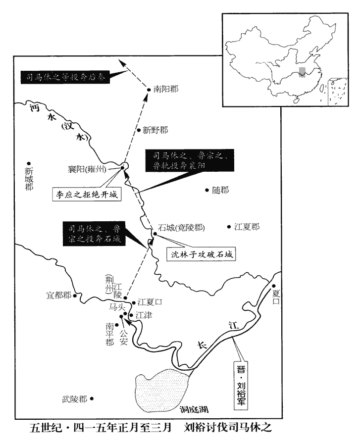
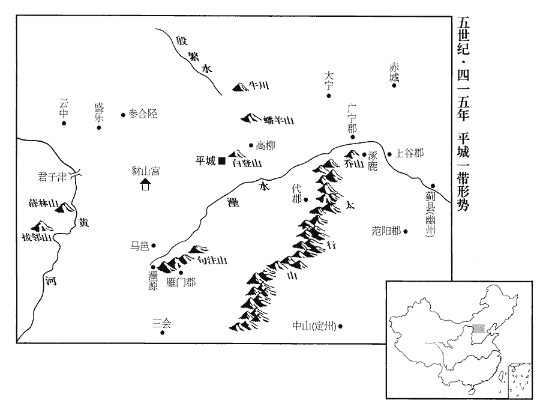
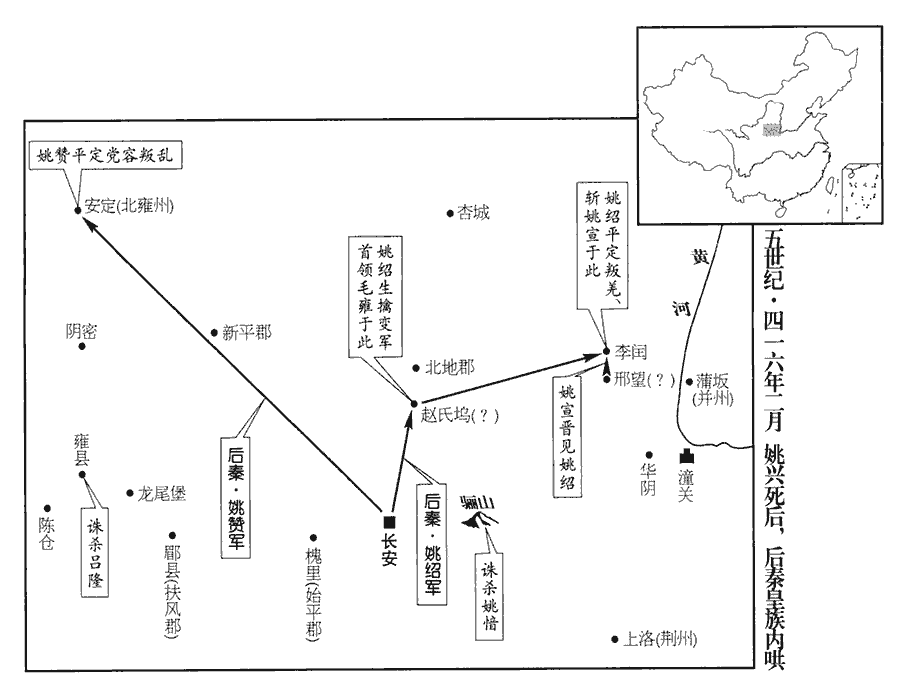
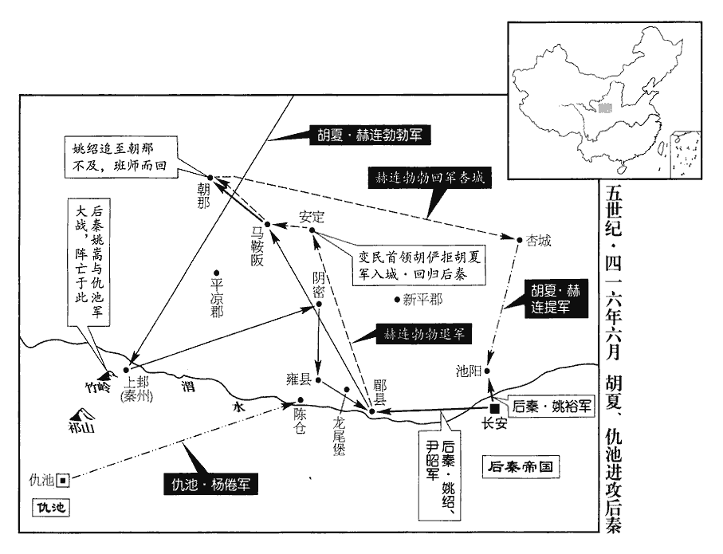
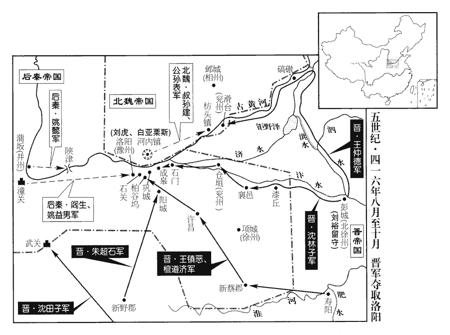

 晉紀三十九起旃蒙單閼（乙卯），盡柔兆執徐（丙辰），凡二年。

# 安皇帝壬

## 義熙十一年（乙卯、四一五）

1春，正月，丙辰‹二›，魏主嗣‹时年二十四›還平城‹山西大同›。至自伐柔然也。

〖译文〗 [1]春季，正月，丙辰（初二），北魏国主拓跋嗣回到平城。

2太尉裕收司馬休之次子文寶、兄子文祖，並賜死；發兵擊之。詔加裕黃鉞，領荊州刺史。庚午‹十六›，大赦。

〖译文〗 [2]东晋太尉刘裕逮捕了司马休之的次子司马文宝、侄子司马文祖，并命令他们自杀。刘裕发动军队，西上进攻司马休之。安帝下诏把皇帝专门用来诛杀的黄钺加授给刘裕，并命令他兼任荆州刺史。庚午（十六日），实行大赦。

3丁丑‹二十三›，以吏部尚書謝裕為尚書左僕射。

〖译文〗 [3]丁丑（二十三日），东晋朝廷任命吏部尚书谢裕为尚书左仆射。

4辛巳‹二十七›，太尉裕發建康。以中軍將軍劉道憐監留府事，監，工銜翻。劉穆之兼右僕射；事無大小，皆決於穆之。又以高陽內史劉鍾領石頭戍事，屯冶亭。冶亭，今謂之東冶亭，在半山寺後。自建康東門往蔣山，至此半道，因以為名。王安石詩：「遙望鍾山岑，因知冶城路。」陸游曰：今天慶觀在冶城山之麓。休之府司馬張裕、南平‹湖北公安›太守檀範之聞之，皆逃歸建康。守，式又翻。裕，卲之兄也。張卲見一百十五卷五年。雍州刺史魯宗之自疑不為太尉裕所容，雍，於用翻。與其子竟陵‹湖北钟祥›太守軌起兵應休之。二月，休之上表罪狀裕，勒兵拒之。

〖译文〗 [4]辛巳（二十七日），东晋太尉刘裕统辖的军队，从京城建康出发。刘裕任命中军将军刘道怜监留府事，任命刘穆之兼右仆射。朝廷的事情，无论大小，都由刘穆之决定。他又任命高阳内史刘钟领石头戍事，屯扎在冶亭。司马休之府内的司马张裕、南平太守檀范之听说这事之后，都逃回到建康。张裕，是张邵的哥哥。雍州刺史鲁宗之怀疑自己终究不会被刘裕宽容，便与他的儿子竟陵太守鲁轨起兵响应司马休之。二月，司马休之呈上奏书给安帝，列举刘裕的罪状，同时也率领军队，准备抵抗刘裕。

裕密書招休之府錄事參軍南陽‹河南南阳›韓延之，延之復書曰：「承親帥戎馬，遠履西畿，周禮：王畿千里之外曰侯畿、甸畿、男畿、采畿、衛畿、蠻畿、夷畿、鎮畿、蕃畿。謂之畿者，責以共王稅貢為職。韓延之以荊楚為西畿，取此義。帥，讀曰率。闔境士庶，莫不惶駭。辱疏，知以譙王‹司马文思›前事，良增歎息。司馬平西體國忠貞，休之為平西將軍，故稱之。款懷待物，以公有匡復之勲，家國蒙賴，推德委誠，每事詢仰。譙王往以微事見劾，猶自表遜位；事見上卷上年。劾，戶概翻，又戶得翻。況以大過，而當嘿然邪！前已表奏廢之，所不盡者命耳。推寄相與，正當如此；推寄，謂推心置人腹中也。而遽興兵甲，所謂『欲加之罪，其無辭乎！』左傳晉大夫里克之言。劉裕足下，海內之人，誰不見足下此心，而復欲欺誑國士！誑，居況翻。來示云『處懷期物，自有由來』，復，扶又翻。處，昌呂翻；下同。今伐人之君，啗dàn人以利，真可謂『處懷期物，自有由來』者乎！啗，土濫翻，又土覽翻。劉藩死於閶闔之門，諸葛斃於左右之手；劉藩事見上卷八年；諸葛事見九年。甘言詫chà方伯，襲之以輕兵；謂襲劉毅也。事見上卷八年。詫，丑亞翻。遂使席上靡款懷之士，閫外無自信諸侯，以是為得算，良可恥也！貴府將佐及朝廷賢德，寄命過日。將，即亮翻。朝，直遙翻。吾誠鄙劣，嘗聞道於君子，以平西之至德，寧可無授命之臣乎！必未能自投虎口，比迹郗僧施之徒明矣。郗僧施事見上卷八年。郗，丑之翻。假令天長喪亂，九流渾濁，太史談序九流。班固曰：儒家者流，蓋出於司徒之官，助人君順陰陽，明教化者也。道家者流，蓋出於史官，歷紀成敗禍福古今之道，此人君南面之術也。法家者流，蓋出於理官，信賞必罰，以輔禮制。陰陽家者流，蓋出於羲和之官，敬順昊天，曆象日月星辰。名家者流，蓋出於禮官，古者名位不同，禮亦異數。孔子曰：「必也正名乎！」墨家者流，蓋出於清廟之守。茅屋、采椽chuán，是以貴儉；養三老、五更，是以兼愛；選士、大射，是以尚賢；宗祀嚴父，是以右鬼。從橫家者流，蓋出於行人之官。雜家者流，蓋出於議官。農家者流，蓋出於農稷之官。皆六經之支與流裔，有益於治道，而不能無弊，使其渾濁，則無所取衷矣。長，知兩翻。喪，息浪翻。當與臧洪遊於地下，臧洪事見六十一卷漢獻帝興平二年。不復多言。」復，扶又翻。裕視書歎息，以示將佐曰：「事人當如此矣。」延之以裕父名翹，字顯宗，乃更其字曰顯宗，更，工衡翻。名其子曰翹，以示不臣劉氏。

〖译文〗 刘裕写密信给司马休之府的录事参军、南阳人韩延之，招请他背叛司马休之，为自己效力。韩延之回信说：“承蒙你亲自统领军马，踏上遥远的西方疆域，荆州全境的士民庶人，没有不惊慌震骇的。你屈尊给我写信，我才知道这次起兵完全是因为谯王司马文思过去的那件事，更使我增加许多感叹。司马休之忠心爱国，待人处事又宽怀诚恳，因为你立过匡复朝廷的巨大功勋，朝廷与宗室还需依赖你辅佐，因此推重你的德行，对你一片赤诚，几乎做每件事都听你的指教，看你的脸色。谯王司马文思过去因为一件小事受到弹劾责难，司马休之还曾自己上表请求辞职，何况谯王如果再犯大错，司马休之哪能闭口无言！前一段时间司马休之已经上表奏请撤销了谯王的王位，唯一没有做绝的不过是留下了司马文思的一条命罢了。推己及人，把这事交给别人，谁都会这么做的。但是你却因此突然兴师问罪，这真是‘欲加之罪，何患无辞’！刘裕，四海之内的人，谁看不出你的这番用心？但是你却还要说谎欺骗国内的通达之士！你的来信说：‘怀有谦敬之心，对别人的要求历来如此。’今天，你出兵征伐别人的君主，写信用私利引诱别人，这难道真是所谓的‘怀有谦敬之心，对别人的要求历来如此’吗？刘藩死在皇宫的阊阖门，诸葛长民死在你的侍卫之手；用甜言蜜语夸耀地方要员，先稳住他们，然后再用轻装部队对他们发动突然袭击；于是，使朝廷的座席之上没有诚信忠贞的人，使京城之外没有了对自己的性命放心的封疆大吏，把这看成是实现了自己的目的，实在是可耻！你手下的那些将领佐僚以及朝廷里的贤明有德之人，都在把性命交给你过日子，我诚然是鄙陋粗劣，但是也曾经向君子学过做人的道理。像司马休之这样的德性好的人，怎么可以没有以性命相托的臣下呢？我一定不能去自投虎口，这种迹象，郗僧施这些人的遭遇已经表现得很明确了的。假如上天注定丧乱的局面还要延长，各派的纷争还要继续污浊不堪，那么我自然要与臧洪那样的人一起到九泉之下去游荡了，不再多言。”刘裕看到他的信，不禁叹息。他把信拿给手下的将领和官员们看，说：“做别人的属下，应当这样呵！”朝延之因为刘裕的父亲名叫刘翘，字显宗，于是，把自己的字改成显宗，并给他的儿子取名叫韩翘，用这表示绝不做刘氏的臣下。

5琅邪‹山东临沂›太守劉郎帥二千餘家降魏。帥，讀曰率。降，戶江翻。

〖译文〗 [5]东晋琅邪太守刘朗率领二千多家百姓投降了北魏。

6庚子‹十六›，河西胡劉雲等帥數萬戶降魏。

〖译文〗 [6]庚子（十六日），河西一带的胡族首领刘云等人统率几万户投降北魏。

7太尉裕使參軍檀道濟、朱超石將步騎出襄陽‹湖北襄樊›。將，即亮翻。騎，奇寄翻。超石，齡石之弟也。江夏‹湖北安陆›太守劉虔之將兵屯三連，夏，戶雅翻。立橋聚糧以待道濟等，積日不至。魯軌襲擊虔之，殺之。裕使其婿振威將軍東海‹山东郯城›徐逵之統參軍蒯恩、王允之、沈淵子為前鋒，出江夏口‹湖北荆州南夏水入江处›。水經：江水過江陵城南，又東至華容縣西，夏水出焉；又東過公安縣北，又東左合子夏口。註云：江水左迤yǐ北出，通於夏水，故曰子夏也。蒯，苦怪翻。逵之等與魯軌戰於破冢‹湖北江陵东南›，兵敗，逵之、允之、渊子皆死，獨蒯恩勒兵不動。蒯，苦怪翻。軌乘勝力攻之，不能克，乃退。淵子，林子之兄也。

〖译文〗 [7]东晋太尉刘裕派遣参军檀道济、朱超石带领步兵骑兵进攻襄阳。朱超石是朱龄石的弟弟。江夏太守刘虔之带领部队屯驻在三连，修筑桥梁，积聚粮草，等待他们的到来，但是檀道济的军队却过了许多天也没有到来。鲁轨袭击刘虔之，并把他杀了。刘裕派他的女婿、振威将军、东海人徐逵之统领参军蒯恩、王允之、沈渊子等为前锋，出击江夏口。徐逵之等人在破冢与鲁轨交战，大军失败，徐逵之、王允之、沈渊子等都被杀，只有蒯恩的部队压住了阵脚，没有败退下去。鲁轨乘胜对他发动了猛攻，却不能攻克他的防守，于是退了下去。沈渊子是沈林子的哥哥。

裕軍於馬頭‹湖北公安东北›，據水經註，馬頭岸在大江之南，北對江陵之江津戍。聞逵之死，怒甚；三月，壬午‹二十九›，帥諸將濟江。魯軌、司馬文思將休之兵四萬，臨峭岸置陳，峭，七笑翻。陳，讀曰陣。軍士無能登者。裕自被甲欲登，被，皮義翻。諸將諫，不從，怒愈甚。太尉主簿謝晦前抱持裕，裕抽劍指晦曰：「我斬卿！」晦曰：「天下可無晦，不可無公！」此裕所謂晦頗識機變者也。建武將軍胡藩領遊兵在江津‹湖北江陵西南›，裕呼藩使登，藩有疑色。裕命左右錄來，欲斬之。錄，收也。藩顧曰：「正欲擊賊，不得奉教！」乃以刀頭穿岸，劣容足指，騰之而上；劣，少也。上，時掌翻。隨之者稍多。既登岸，直前力戰。休之兵不能當，稍引卻。當胡藩之初登也，精騎數十可以制之，休之之兵不動，故得以直前力戰，又人心素懾服裕，故藩既進而不能當也。裕兵因而乘之，休之兵大潰，遂克江陵。休之、宗之俱北走，軌留石城‹湖北钟祥›。裕命閬中侯下邳‹江苏睢宁北古邳镇›趙倫之、太尉參軍沈林子攻之；遣武陵‹湖南常德›內史王鎮惡以舟師追休之等。

〖译文〗 刘裕在马头集结军队，听说徐逵之战死，愤怒异常。三月，壬午（二十九日），率领各位将领渡过长江。鲁轨、司马文思统领着司马休之的军队四万人，依傍着陡峭的江岸排下战阵，刘裕的军队士卒，没有人能攀登上去。刘裕披挂起铠甲，打算亲自攀登，各位将领纷纷劝阻，他却坚决不听，越发怒不可遏。太尉主簿谢晦上前抱住刘裕，刘裕拔着佩剑指着谢晦说：“我杀了你！”谢晦说：“天下可以没有我谢晦，但是却不可以没有您！”建武将军胡藩率领游击部队，此时正在江津，刘裕派人去叫胡藩，让他登岸，胡藩有些疑虑。刘裕命令身边的侍从去把他抓来，打算杀了他。胡藩看着来人说：“我正打算去进攻贼兵，没时间前去受教！”于是，用刀尖在江岸上掘出小洞，仅能容下脚趾，他便踩着飞身跃上江岸，后边跟着他向上爬的人渐渐多了。登上江岸之后，便直奔上前，拚力死战。司马休之的军队无法抵挡，渐渐向后撤退。刘裕军队因此趁机猛攻，司马休之的部队完全溃败，刘裕于是攻克江陵。司马休之、鲁宗之一齐向北逃走，鲁轨留守在石城。刘裕命令阆中侯下邳人赵伦之、太尉参军沈林子进攻鲁轨；派遣武陵内史王镇恶带领水军船队追击司马休之等人。

 

有群盜數百夜襲冶亭‹南京东门至蒋山之间›，京師震駭；劉鍾討平之。

〖译文〗 有一群盗匪共几百人在夜色掩护下袭击治亭，京师震惊恐慌。刘钟带兵讨伐，把他们剿灭。

8秦‹都长安，陕西西安›廣平公弼譖姚宣於秦王興‹时年五十›，去年宣入朝，力言弼罪，弼銜而譖之。宣司馬權丕至長安，興責以不能輔導，將誅之；丕懼，誣宣罪惡以求自免。興怒，遣使就杏城‹陕西黄陵›收宣下獄，命弼將三萬人鎮秦州‹府上邽，甘肃天水›。下，遐稼翻。將，即亮翻；下同。尹昭曰：「廣平公與皇太子不平，今握強兵於外，陛下一旦不諱，社稷必危。『小不忍，亂大謀』，論語載孔子之言。陛下之謂也。」興不從。

〖译文〗 [8]后秦国广平公姚弼向后秦王姚兴进谗言诬陷姚宣，正好姚宣的司马权丕到长安办事，姚兴责备他不能很好地辅助引导姚宣，准备杀了他。权丕大为恐惧，也诬陷姚宣罪恶深重，以此求得对自己的宽恕。姚兴大怒，派遣使节到杏城把姚宣抓起来打入牢狱，命令姚弼带领三万人去镇守秦州。尹昭说：“广平公与皇太子关系不和，现在让他手握重兵，在外镇守，将来如果陛下一旦去世，那么国家一定就会面临危险。‘小不忍则乱大谋”，正是对陛下的最好形容。”姚兴不听。

9夏‹都统万，陕西靖边北白城子›王勃勃攻秦杏城‹陕西黄陵›，拔之，執守將姚逵，阬士卒二萬人。秦王興如北地‹陕西耀县›，遣廣平公弼及輔國將軍斂曼嵬wéi向新平‹陕西彬县›，興還長安‹西安›。

〖译文〗 [9]夏王赫连勃勃进攻后秦杏城，攻克，抓获了那里的守将姚逵，把敌军的二万士卒全部活埋。后秦王姚兴前往北地，派遣广平公姚弼以及辅国将军敛曼嵬率军向新平进发，姚兴回长安。

10河西王蒙遜‹时年四十八›攻西秦‹都枹罕，甘肃临夏›廣武郡‹甘肃永登›，拔之。西秦王熾磐遣將軍乞伏魋tuí尼寅邀蒙遜於浩亹‹甘肃永登西南›，蒙遜擊斬之；浩亹，音告門。又遣將軍折斐等帥騎一萬據勒姐嶺‹青海平安境›，闞駰志，金城安夷縣東有勒姐河，與金城河合。勒姐嶺蓋勒姐河所出之山也。漢時，勒姐羌居之，因以為名。姐，子也翻，又音紫。蒙遜擊禽之。

〖译文〗 [10]河西王沮渠蒙逊进攻西秦的广武郡，攻克。西秦王乞伏炽磐派遣将军乞伏尼寅在浩拦截沮渠蒙逊，沮渠蒙逊进攻他并把他杀了。乞伏炽磐又派遣将军折斐等率领一万骑兵据守勒姐岭，沮渠蒙逊进击并把他擒获。

11河西饑胡相聚於上黨‹山西黎城西南›，推胡人白亞栗斯為單于，單，音蟬。改元建平。以司馬順宰為謀主，順宰起兵，見上卷二年。寇魏河內‹河南沁阳›。夏，四月，魏主嗣命公孫表等五將討之。將，即亮翻；下同。

〖译文〗 [11]河西一带受饥饿困扰的胡族人在上党聚集在一起，推举胡人白亚栗斯为单于，改年号为建平。他们任用司马顺宰为主要谋士，进犯北魏的河内。夏季，四月，北魏国主拓跋嗣命令公孙表等五位大将前去讨伐他们。

12青、冀二州‹二州府设东阳，山东青州›刺史劉敬宣參軍司馬道賜，宗室之疏屬也。聞太尉裕攻司馬休之，道賜與同府辟閭道秀、道賜與道秀俱為敬宣僚屬，故曰同府。左右小將王猛子謀殺敬宣，據廣固‹山东青州›以應休之。乙卯‹三›，敬宣召道秀，屏人語，屏，必郢翻。左右悉出戶。猛子逡巡在後，取敬宣備身刀殺敬宣‹年四十五›。文武佐吏即時討道賜等，皆斬之。

〖译文〗 [12]东晋青、冀二州刺史刘敬宣的参军司马道赐是晋朝宗室的远亲。听说太尉刘裕进攻司马休之，司马道赐便与同僚辟闾道秀、身边的小将王猛子阴谋刺杀刘敬宣，然后占据广固，响应司马休之。乙卯（初三），刘敬宣召见辟闾道秀，把别人全部屏退，秘密交谈，他身边的侍卫也全部被隔在窗外。王猛子慢慢绕到刘敬宣身后，突然抢过刘敬宣防身用的佩刀，把刘敬宣杀了。刘敬宣手下的文武将佐、官吏马上声讨司马道赐等人，并把他们全部斩杀。

13己卯‹二十七›，魏主嗣北巡。

〖译文〗 [13]己卯（二十七日），北魏国主拓跋嗣向北巡视。

14西秦王熾磐子元基自長安逃歸，元基蓋從熾磐入秦以朝，因留長安也。熾磐以為尚書左僕射。

〖译文〗 [14]西秦王乞伏炽磐的儿子乞伏元基从长安逃了回来。乞伏炽磐任命他为尚书左仆射。

15五月，丁亥‹五›，魏主嗣如大寧‹河北张家口›。

〖译文〗 [15]五月，丁亥（初五），北魏国主拓跋嗣前往大宁。

16趙倫之、沈林子破魯軌於石城，司馬休之、魯宗之救之不及，遂與軌奔襄陽，宗之參軍李應之閉門不納。甲午‹十二›，休之、宗之、軌及譙王文思、新蔡王道賜、此又一司馬道賜也。新蔡王晃以武陵王晞事廢，後以道賜襲爵。梁州‹府南城，陕西南郑南›刺史馬敬、南陽太守魯範俱奔秦。宗之素得士民心，爭為之衛送出境。王鎮惡等追之，盡境而還。不敢窮兵追之，懼出境而遇伏也。

〖译文〗 [16]东晋赵伦之、沈林子在石城打败鲁轨，司马休之、鲁宗之准备营救，却没有来得及，于是，与鲁轨一起逃奔襄阳，鲁宗之的参军李应之紧闭城门，不让他们进去。甲午（十二日），司马休之、鲁宗之、鲁轨，以及谯王司马文思、新蔡王司马道赐、梁州刺史马敬、南阳太守鲁范等人全部逃奔后秦。鲁宗之平时很受百姓拥护，人们纷纷掩护、保卫他，把他送出国境。王镇恶等人前来追捕他们，到了国境没有追上，使回去了。

初，休之等求救於秦、魏，秦征虜將軍姚成王及司馬國璠引兵至南陽‹河南南阳›，璠，孚袁翻。魏長孫嵩至河東‹山西夏县›，聞休之等敗，皆引還。休之至長安‹西安›，秦王興以為揚州刺史，使侵擾襄陽。侍御史唐盛言於興曰：「據符讖之文，司馬氏當復得河、洛。讖，楚譖翻。今使休之擅兵於外，猶縱魚於渊也；不如以高爵厚禮，留之京師。」興曰：「昔文王卒免羑yǒu里‹河南汤阴北›，紂囚文王於羑里，既而釋之。復，扶又翻。卒，子恤翻。高祖不斃鴻門，見九卷漢高祖元年。苟天命所在，誰能違之！脫如符讖之言，留之適足為害。」遂遣之。史言姚興知命。

〖译文〗 当初，司马休之等向后秦、北魏国请求救助，后秦征虏将军姚成王及司马国带兵抵达南阳，北魏长孙嵩抵达河东，听说司马休之等已经失败，便都带兵回去了。司马休之到了长安，后秦王姚兴任命他为扬州刺史，让他去侵袭骚扰襄阳。侍御史唐盛对姚兴说：“根据预言帝王受命吉凶的符命谶讳说，司马氏应当重新夺取河、洛一带。现在让他带兵在外，就像把鱼又放回湖海一样。我看不如封他高官，给他优厚的待遇，把他留在京师。”姚兴说：“过去，周文王最终在里得到赦免，汉高祖在鸿门没有被杀，这都是天命在左右，谁能违抗得了！如果真像符谶所说的那样，把他留下来却正好是促使灾害加重。”于是，派遣司马休之去了。

17詔加太尉裕太傅、揚州牧，劍履上殿，入朝不趨，贊拜不名。朝，直遙翻。以兗、青二州刺史劉道憐為都督荊•湘•益•秦•寧•梁•雍七州諸軍事、驃騎將軍、荊州刺史。雍，於用翻。驃，匹妙翻。騎，奇寄翻。道憐貪鄙，無才能，裕以中軍長史晉陵‹江苏常州›太守謝方明為驃騎長史、南郡‹湖北江陵›相，道憐府中眾事皆諮決於方明。方明，沖之子也。謝沖，奕之從子。方明，裕之從祖弟也。

〖译文〗 [17]东晋下诏加封太尉刘裕为太傅、扬州牧，特许他可以带剑穿鞋上殿，进宫朝见皇帝不必小步走，奏事时不必司仪称名通报。任命兖、青二州刺史刘道怜为都督荆、湘、益、秦、宁、梁、雍七州诸军事，骠骑将军，荆州刺史。刘道怜为人贪婪鄙俗，没有才能。刘裕任命中军长史、晋陵太守谢方明为骠骑长史、南郡相，刘道怜府中的所有事务都向谢方明请教后再决定。谢方明是谢冲的儿子。

18益州‹府成都，四川成都›刺史朱齡石遣使詣河西王蒙遜，使，疏吏翻。諭以朝廷威德。蒙遜遣舍人黃迅詣齡石，且上表言：「伏聞車騎將軍裕欲清中原，願為右翼，驅除戎虜。」

〖译文〗 [18]东晋益州刺史朱龄石派遣使节前去拜见北凉河西王沮渠蒙逊，宣扬东晋朝廷的威势和德政。沮渠蒙逊派遣舍人黄迅前来拜见朱龄石，并且呈上奏表，说：“听说车骑将军刘裕打算清剿中原地区，我甘愿做他的右翼部队，帮助他驱逐戎族强盗。”

19夏王勃勃遣御史中丞烏洛孤與蒙遜結盟，蒙遜遣其弟湟河‹青海化隆›太守漢平蒞盟于夏。夏，戶雅翻。

〖译文〗 [19]夏王赫连勃勃派遣御史中丞乌洛孤与沮渠蒙逊缔结盟约，沮渠蒙逊派他的弟弟湟河太守沮渠汉平前往夏国，在盟约上签字。

20西秦王熾磐率眾三萬襲湟河，沮渠漢平拒之，遣司馬隗仁夜出擊熾磐，破之。沮，子余翻。隗wěi，五罪翻，熾，昌志翻。熾磐將引去，漢平長史焦昶、將軍段景潛召熾磐，熾磐復攻之；昶，丑兩翻。復，扶又翻。昶、景因說漢平出降。說，輸芮翻。降，戶江翻；下同。仁勒壯士百餘據南門樓，三日不下，力屈，為熾磐所禽。熾磐欲斬之，散騎常侍武威‹甘肃武威›段暉諫曰：「仁臨難不畏死，散，悉亶翻。騎，奇寄翻。難，乃旦翻。忠臣也，宜宥之以厲事君。」乃囚之。熾磐以左衛將軍匹達為湟河太守，擊乙弗窟乾，降其三千餘戶而歸。以尚書右僕射出連虔為都督嶺北諸軍、嶺北，洪池嶺‹甘肃天祝西北乌鞘岭›北也。涼州刺史；以涼州刺史謙屯為鎮軍大將軍、河州牧。隗仁在西秦五年，段暉又為之請，史書武威段暉，以別南燕之段暉也。又為，于偽翻。熾磐免之，使還姑臧。

〖译文〗 [20]西秦王乞伏炽磐统率三万大军袭击湟河，沮渠汉平抵抗，派遣司马隗仁连夜出击乞伏炽磐，把他打败。乞伏炽磐刚打算带兵回去，沮渠汉平的长史焦昶、将军段景暗地里召引乞伏炽磐来攻，乞伏炽磐再次挥师进攻，焦昶、段景于是劝说沮渠汉平出城投降。隗仁带领一百多名壮士占据南门楼，坚决不投降，围攻了三天也没有攻下，最后，他们精疲力尽，被乞伏炽磐抓获。乞伏炽磐打算杀了他，散骑常侍武威人段晖劝说道：“隗仁面临危难不怕死，是一个忠臣，应该宽宥他，以此鼓励那些忠于君王的人们。”于是，把他囚禁起来。乞伏炽磐任命左卫将军乞伏匹达为湟河太守，进攻乙弗窟乾，收降了那里的三千多户百姓回来。又任命尚书右仆射出连虔为都督岭北诸军事、凉州刺史；任命凉州刺史乞伏谦屯为镇军大将军、河州牧。隗仁在西秦被囚五年之后，段晖又为他求情，乞伏炽磐赦免了他，让他回姑臧。

21戊午‹十›，魏主嗣行如濡源‹河北沽源›，遂至上谷‹河北怀来›、涿鹿‹河北涿鹿›、廣寧‹河北涿鹿西北›；涿鹿縣，漢屬上谷郡，晉分屬廣寧郡。魏土地記：下洛縣東南六十里有涿鹿城，西北百三十里有大寧城，即漢廣寧縣也。蓋在唐媯州界。濡，乃官翻。秋，七月，癸未‹二›，還平城。

〖译文〗 [21]戊午（疑误），北魏国主拓跋嗣前往濡源，于是又到上谷、涿鹿、广宁等地。秋季，七月，癸未（初二），回到平城。

22西秦王熾磐以秦州刺史曇達為尚書令，曇，徒含翻。光祿勳王松壽為秦州刺史。

〖译文〗 [22]西秦王乞伏炽磐任命秦州刺史乞伏昙达为尚书令，任命光禄勋王松寿为秦州刺史。

23辛亥晦‹三十›，日有食之。

〖译文〗 [23]辛亥晦（三十日），出现日食。

24八月，甲子‹十三›，太尉裕還建康，固辭太傅、州牧，其餘受命。以豫章公世子義符‹时年十岁›為兗州刺史。

〖译文〗 [24]八月，甲子（十三日），东晋太尉刘裕回到建康，坚决辞让太傅、扬州牧，接受其余任命。任命世子豫章公刘义符为兖州刺史。

25丁未，謝裕卒‹年四十七›；以劉穆之為左僕射。

〖译文〗 [25]丁未（疑误），东晋尚书左仆射谢裕去世，任命刘穆之为尚书左仆射。

26九月，己亥‹十九›，大赦。

〖译文〗 [26]九月，己亥（十九日），东晋实行大赦。

 

27魏比歲霜旱，比，毗至翻。雲、代之民多飢死。雲、代，雲中‹内蒙和林格尔›、代郡‹河北蔚县›二郡之地。太史令王亮、蘇坦言於魏主嗣曰：「按讖書，魏當都鄴‹河北临漳西南邺镇›，可得豐樂。」樂，音洛。嗣以問群臣，博士祭酒崔浩、特進京兆周澹曰：澹，徒覽翻。「遷都於鄴，可以救今年之饑，非久長之計也。山‹崤山›東之人，以國家居廣漢之地，「廣漢」，據北史崔浩傳作「廣漠」，當從之。漠，大也。謂其民畜無涯，號曰『牛毛之眾』。今留兵守舊都，謂平城‹山西大同›也。分家南徙，不能满諸州之地，參居郡縣，情見事露，見，賢遍翻。恐四方皆有輕侮之心；且百姓不便水土，疾疫死傷者必多。又，舊都守兵既少，少，詩沼翻；下同。屈丐‹胡夏›、柔然將有窺窬之心，舉國而來，雲中、平城必危，朝廷隔恆、代千里之險，自恆山至代，有飛狐之口‹河北涞源境›、倒馬之關‹河北唐县西北›，夏屋、廣昌、五迴之險。難以赴救，此則聲實俱損也。今居北方，假令山東有變，我輕騎南下，布濩林薄之間，騎，奇寄翻。濩hù，胡故翻。郭璞曰：布濩hù，猶布露也。毛晃曰：布濩，流散也；草叢生曰薄。孰能知其多少！百姓望塵懾服，此國家所以威制諸夏也。懾，之涉翻。夏，戶雅翻。來春草生，湩酪將出，湩dòng，覩勇翻，又多貢翻，乳汁也。酪lào，歷各翻，乳漿也。西漢太僕屬官有挏dòng馬。應劭曰：主乳馬取其汁，挏治之，味酢zuò可飲，因以名官。如淳曰：主乳馬以韋革為夾兜，受數斗，盛馬乳，挏取其上肥，因名挏馬。今梁州名馬酪為馬酒。師古曰：挏dòng，音徒孔翻。兼以菜果，得及秋熟，則事濟矣。」嗣曰：「今倉廩空竭，既無以待來秋，若來秋又饑，將若之何?」對曰：「宜簡飢貧之戶，使就食山‹太行山›東；若來秋復饑，當更圖之，復，扶又翻。但方今不可遷都耳。」嗣悅曰：「唯二人與朕意同。」乃簡國人尤貧者詣山東三州就食，拓跋氏起於漠北，統國三十六，姓九十九。道武既并中原，徙其豪桀於雲、代，與北人雜居，以其北來部落為國人。山東三州，定‹河北中北部›、相‹河北南部›、冀‹河北东部›也。遣左部尚書代人周幾帥眾鎮魯口‹河北饶阳›以安集之。魏初，四方四維置八部大人，分東、西、南、北、左、右、前、後，後，又置八部尚書。魏書官氏志：拓跋鄰以次兄為普氏，後改為周氏。蓋魏建代都，周幾遂為代人。帥，讀曰率。嗣躬耕藉田，且命有司勸課農桑；明年，大熟，民遂富安。

〖译文〗 [27]北魏一连几年发生霜旱，收成不好，云中、代郡一带的老百姓有很多都饿死了。太史令王亮、苏坦向北魏国主拓跋嗣进言道：“按着谶书的说法，我们魏国应把都城建在邺城，那样的话，才可以得到富足欢乐。”拓跋嗣向各位大臣征求对这事的意见，博士祭酒崔浩、特进京兆周澹说：“迁都城到邺地，可以解救今年的饥荒，但却不是长久的办法。崤山以东的人民，认为国家本来居住在辽阔的大漠之上，以为国民和牲畜一定无数，因此，称作是‘牛毛那样多’。现在，一旦迁都，便要留下军队戍守旧都，只能分出一部分人向南迁移，这些人不可能住满几个州的土地，只好与汉人参杂居住在各郡各县，这样，我们人少的情势就会暴露，恐怕四方的邻国也都会因此产生轻视我们的想法。况且我们的百姓，不习惯那里的水土，得病、受伤、死亡的人一定很多。再者，旧都的守兵减少之后，屈丐、柔然等国就会有窃取我们的想法，假如他们动员全国的军队前来进攻，云中、平城一定会发生危机，南迁后的朝廷由于有恒山、代郡的千里险要重重阻隔，很难前去营救，这样的话，就会在名声和实际利益上都爱到损害。现在我们居住在北方，假如崤山之东的地区有什么变乱，我们派遣轻装骑兵向南进攻，把部队分布在林野中间，谁能知道我们人数的多少？老百姓看见我们的征尘就会畏慑敬服，这就是我们国之所以用威力制服汉人的真正原因。明年春天到来之后，杂草生长起来，家畜吃饱之后，牛奶乳酪等也便可以供应上了，再加上蔬菜水果，便可以维持到秋天粮食成熟的季节，我们面临的这些暂时困难便可以克服了。”拓跋嗣说：“现在国库彻底空了，已经没有办法再等到来年的秋天，如果明年秋天又出现饥荒，我们将怎么对付呢？”崔浩等回答说：“应该把最贫穷饥馁的人家挑选出来，让他们去太行山以东的地区去谋生，找饭吃。如果明年再饥荒，到时候再想办法，只是现在不可迁都。”拓跋嗣高兴地说：“只有你们二人与我的想法一致。”于是挑选百姓中最贫寒的人家前往太行山以东的三个州去谋生，并派左部尚书代郡人周几统率军队镇守鲁口，安抚召集他们。拓跋嗣本人也亲自下农田耕种，又命令有关部门劝勉指导人们从事农业和种桑养蚕的劳动。第二年，庄稼丰收，人民于是富足安定。

28夏赫連建將兵擊秦，執平涼‹甘肃华亭›太守姚軍【章：甲十一行本「軍」作「周」；乙十一行本同；孔本同；退齋校同。】都，將，即亮翻。遂入新平‹陕西彬县›。廣平公弼與戰於龍尾堡‹山西岐山›，劉昫xù地理志：鳳翔府岐山縣，唐武德七年，移治龍尾城。禽之。

〖译文〗 [28]夏国赫连建带领部队进攻后秦，抓获了平凉太守姚军都，于是又进犯新平。后秦广平公姚弼与他们在龙尾堡接战，把赫连建活捉。

29秦王興藥動。廣平公弼稱疾不朝，朝，直遙翻。聚兵於第。興聞之，怒，收弼黨唐盛、孫玄等，殺之。太子泓請曰：「臣不肖，不能緝諧兄弟，緝，當作輯。使至於此，皆臣之罪也。若臣死而國家安，願賜臣死；若陛下不忍殺臣，乞退就藩。」興惻然憫之，召姚讚、梁喜、尹昭、斂曼嵬wéi與之謀，囚弼，將殺之，窮治黨與；嵬，五回翻。治，直之翻。泓流涕固請，乃并其黨赦之。泓待弼如初，無忿恨之色。

〖译文〗 [29]后秦王姚兴药性发作。广平公姚弼声称有病，不去参加朝见，却把手下的部队聚集在自己的府第之中。姚兴听说这事后，大怒，抓住姚弼的党羽唐盛、孙玄等人，杀掉。太子姚泓请求说：“臣子不肖，不能团结兄弟，所以才导致这样的结果，这都是我的罪过。如果我死之后国家可以得到安定，我希望您命我自杀。如果陛下不忍心杀掉我，那么我请求退居藩属的位置。”姚兴心中悲悯姚泓，召见姚、梁喜、尹昭、敛曼嵬等，与他们商议，逮捕了姚弼，准备杀掉他，并彻底追查处理了他的亲信党羽。姚泓流着眼泪，一再请求，姚兴这才赦免了姚弼和他的那些同党。姚泓对待姚弼跟以前一样，没有丝毫愤恨的样子。

30魏太史奏：「熒惑在匏páo瓜中，據晉書天文志：匏瓜‹天鸡›在天津之南，天漢分流夾之。張淵觀象賦註曰：匏瓜五星在麗珠北，天津九星在匏瓜北。忽亡不知所在，於法當入危亡之國，先為童謠妖言，然後行其禍罰。法，謂推占之常法。妖，於驕翻。魏主嗣召名儒十餘人，使與太史議熒惑所詣。崔浩對曰：「按春秋左氏傳：『神降于莘』，以其至之日推知其物。浩蓋據春秋左氏外傳也。外傳曰：「周惠王‹姬阆›十五年‹前六六二年›，有神降于莘‹河南三门峡东硖石镇›，王問於內史過。對曰：『其丹朱乎。』王曰：『其誰受之?』對曰：『在虢guó土‹三门峡›。』王曰：『虢其幾何?』對曰：『昔堯臨民以五。今其冑見。神之見也，不過其物。若由是觀之，不過五年。』十九年，晉取虢。」傳，直戀翻。庚午‹十九›之夕，辛未‹二十›之朝，天有陰雲；熒惑之亡，當在二日。庚之與午，皆主於秦‹陕西中部›；辛為西夷。晉書天文志：自東井十六度至柳八度為鶉chún首，於辰在未，秦之分野。自柳九度至張十二度為鶉火，於辰在午，周之分野。時姚秦兼有關洛之地，故云皆主於秦。庚、辛西方也，故為西夷。今姚興據長安，熒惑必入秦矣。」眾皆怒曰：「天上失星，人間安知所詣！」浩笑而不應。後八十餘日，熒惑出東井，留守句己，久之乃去。新唐書天文志曰：「去而復來，是謂句己。」晉書天文志曰：「熒惑為亂，為賊，為疾，為喪，為饑，為兵，所居國受殃。環繞鉤己，芒角動搖變色，乍前乍後，乍左乍右，其殃愈甚。句，讀曰鉤。鉤己，謂環繞而行如鉤，又成己字也。秦大旱，昆明池‹西安西南›竭，童謠訛言，徒歌謂之謠。國人不安，間一歲而秦亡。眾乃服浩之精妙。

〖译文〗 [30]北魏太史启奏说：“火星在匏瓜星座中出现，忽然又不知跑到哪里去了。按道理说，它应该到形势危险严峻、马上就要灭亡的国家去，先出现童谣妖言，然后再发生祸乱，实行对该国的惩罚。”北魏国主拓跋嗣召见十几个有名的儒士，让他们与太史一起讨论参悟火星所示的含义，推测星落的方位。崔浩对答说：“按照《春秋左氏传》的说法：‘神灵在莘地降落’，根据它降落的日期推测，可以得知这个神灵是谁。庚午（八月十九日）的晚上，辛未（八月二十日）的早晨，天上有阴云密布，火星失踪的时间，应该是在这两天。庚和午，在地上指的都是秦国，辛指的是西方的夷族。现在姚兴据守在长安，火星一定是降临到秦国去了。”众人都不客气地说：“天上没有了一颗星，人间怎么能够知道它掉到哪里去了！”崔浩微笑着并不回答。八十多天以后，火星突然又从井宿附近出现了，在那里若明若暗，很长时间才消失。后秦出现大旱，昆明池中的水也已枯竭，儿童歌谣和各种谣传纷纷四起，国中的百姓人心不安，只隔一年，后秦国便灭亡了。大家这才佩服崔浩的神奇精妙。

31冬，十月，壬子‹二›，秦王興使散騎常侍姚敞等送其女西平公主于魏，散，悉亶翻。騎，奇寄翻；下同，魏主嗣以后禮納之；鑄金人不成，魏立嗣、立后，皆鑄金人以卜之。乃以為夫人，而寵遇甚厚。

〖译文〗 [31]冬季，十月，壬子（初二），后秦王姚兴派遣散骑常侍姚敞等人护送他的女儿西平公主出嫁到北魏。北魏国主拓跋嗣以皇后的礼节迎娶了她，但是铸金人没有成功，所以，按照北魏国的传统，她便不能做皇后。拓跋嗣于是封她为夫人，但对她的宠爱和照顾极为优厚。

32辛酉‹十一›，魏主嗣如沮洳城‹内蒙兴和北›；沮jù，將豫翻。洳rù，呂庶翻。沮洳，漸濕之地。北方地高燥，此城蓋以下濕而得名。癸亥‹十三›，還平城。十一月丁亥‹八›，復如豺山宮‹山西右玉北›；復，扶又翻。庚子‹二十一›，還。

〖译文〗 [32]辛酉（十一日），北魏国主拓跋嗣前往沮洳城。癸亥（十三日），回到平城。十一月丁亥（初八），他又前往豺出宫。庚子（二十一日），返回。

33西秦王熾磐遣襄武侯曇達等，將騎一萬擊南羌彌姐、康薄于赤水‹甘肃岷县北›，降之；水經註：赤亭水出南安郡東山赤谷，西流，逕城北，南入渭水。曇，徒含翻。將，即亮翻。姐，子也翻，又音紫。降，戶江翻。以王孟保為略陽太守，鎮赤水。

〖译文〗 [33]西秦王乞伏炽磐派遣襄武侯乞伏昙达等带领一万骑兵袭击南羌的弥姐部落和康薄部落所据守的赤水，收降了他们。乞伏炽磐任命王孟保为略阳太守，镇守赤水。

34燕尚書令孫護之弟伯仁為昌黎尹，與其弟叱支乙拔皆有才勇，從燕王跋起兵有功，謂殺慕容熙時也，事見一百十四卷三年。求開府不得，有怨言，跋皆殺之。進護開府儀同三司、錄尚書事，以慰其心，護怏怏不悅，跋酖殺之。怏，於兩翻。遼東太守務銀提自以有功，出為邊郡，怨望，謀外叛，跋亦殺之。萬泥、乳陳既死，孫護兄弟及務銀提又誅，馮跋亦少恩矣。

〖译文〗 [34]北燕尚书令孙护的弟弟孙伯仁为昌黎尹，与他的另一个弟弟孙叱支乙跋都有才略勇武，他们跟随燕王冯跋起兵，立过汗马功劳，但是，他们请求开府的待遇，却没有得到朝廷的同意，因此口出怨言，表示不满，冯跋把他们全部杀掉。却提升孙护为开府仪同三司、录尚书事，用来安慰他。孙护一直闷闷不乐，冯跋于是就用毒酒把他杀了。辽东太守务银提也自认为有功，却被派出镇守边郡，心中愤愤不平，图谋叛变投奔外邦，冯跋也把他杀了。

35林邑‹越南中部›寇交州‹府龙编，越南河内东北北宁府›，州將擊敗之。將，即亮翻。敗，補邁翻。

〖译文〗 [35]林邑进犯东晋的交州，州的守将把来敌打败。

## 十二年（丙辰、四一六）

1春，正月，甲申‹六›，魏主嗣‹时年二十五›如豺山宮‹山西右玉北›；戊子‹十›，還平城‹山西大同›。

〖译文〗 [1]春季，正月，甲申（初六），北魏国主拓跋嗣前往豺山宫。戊子（初十），回到平城。

2加太尉裕兗州刺史、都督南秦州，凡都督二十二州；二十二州：徐、南徐、豫、南豫、兗、南兗、青、冀、幽、并、司、郢、荊、江、湘、雍、梁、益、寧、交、廣、南秦也。以世子義符‹时年十一›為豫州‹府姑孰，安徽当涂›刺史。

〖译文〗 [2]东晋加封太尉刘裕为兖州刺史，都督南秦州，至此，他共都督二十二州。任命他的世子刘义符为豫州刺史。

3秦王興‹时年五十一›使魯宗之將兵寇襄陽‹湖北襄樊›，未至而卒。卒，子恤翻。其子軌引兵入寇，雍州‹府襄阳›刺史趙倫之擊敗之。雍，於用翻。敗，補邁翻。

〖译文〗 [3]后秦王姚兴派遣鲁宗之带兵进犯襄阳，还没有到，鲁宗之便突然去世。他的儿子鲁轨继续带兵进犯。雍州刺史赵伦之把他打败。

4西秦‹都枹罕，甘肃临夏›王熾磐攻秦洮陽公彭利和於漒川‹甘肃卓尼›，洮，土刀翻。漒，其良翻。‹北凉，都姑臧，甘肃武威›沮渠蒙遜‹时年四十九›攻石泉‹甘肃临夏西北›以救之。熾磐至沓中‹甘肃临潭西南›，引還。二月，熾磐遣襄武侯曇達救石泉，曇，徒含翻。蒙遜亦引去。蒙遜遂與熾磐結和親。自熾磐滅禿髮氏，與蒙遜為鄰敵，歲歲交兵，今乃結和。

〖译文〗 [4]西秦王乞伏炽磐在川进攻后秦洮阳公彭利和，沮渠蒙逊进攻西秦所属的石泉，以此解救彭利和。乞伏炽磐的大军抵达沓中，听说消息后，带兵回国。二月，乞伏炽磐派遣襄武侯乞伏昙达营救石泉，沮渠蒙逊也带兵回去了。沮渠蒙逊于是和乞伏炽磐通婚讲和。

5秦王興如華陰‹陕西华阴›，使太子泓監國，華，戶化翻。監，工銜翻。入居西宮。太子居東宮；西宮，秦王所居也。興疾篤，還長安。黃門侍郎尹沖謀因泓出迎而殺之。興至，泓將出迎，宮臣諫曰：凡東宮官屬皆曰宮臣。「主上疾篤，姦臣在側，姦臣謂尹沖等。殿下今出，進不得見主上，退有不測之禍。」泓曰：「臣子聞君父疾篤而端居不出，何以自安！」對曰：「全身以安社稷，孝之大者也。」泓乃止。尚書姚沙彌謂尹沖曰：「太子不出迎，宜奉乘輿幸廣平公第；宿衛將士聞乘輿所在，自當來集，乘，繩證翻。將，即亮翻。太子誰與守乎！且吾屬以廣平公之故，已陷名逆節，將何所自容！今奉乘輿以舉事，乃杖大順，不惟救廣平之禍，吾屬前罪亦盡雪矣。」乘，繩證翻。沖以興死生未可知，欲隨興入宮作亂，不用沙彌之言。

〖译文〗 [5]后秦王姚兴前往华阴，让太子姚泓主持朝廷政务，进入西宫居住。姚兴病重，回长安。黄门侍郎尹冲谋划，要趁姚泓出去迎接的机会杀掉他。姚兴驾到，姚泓准备出去迎接，宫中官员劝阻道：“主上病危，奸臣就在身旁，殿下现在如果出去，向前也看不见主上，后退则一定有难以预料的灾祸。”姚泓说：“作为臣下和儿子听说君王和父亲病重，却稳稳当当地坐在那里不出去迎候，心里哪能平安呢？”下属们回答说：“保全自己目的是为了使国家稳定，这是最大的孝心了。”姚泓这才没有出去。尚书姚沙弥对尹冲说：“太子不出来迎接，我们应该把皇帝的车轿抬到广平公的府第去。禁卫军的将士听说皇上在这里，自然应当集中过来，谁去保护太子呢？况且我们因为广平公的缘故，名字已经被注定是叛逆了，将来到哪里安身？现在趁机挟持皇帝发动事变，是名正言顺的，不但是把广平公从祸患中解救出来，而且我们这些人以前的罪名也可以全部洗雪了。”尹冲因为姚兴的死活还不知道，打算跟随姚兴进宫，然后再寻找机会叛乱，便不采纳姚沙弥的建议。

興入宮，命太子泓錄尚書事，東平公紹及右衛將軍胡翼度典兵禁中，防制內外。紹，興之弟也。遣殿中上將軍斂曼嵬收弼第中甲仗，內之武庫。晉置殿中將軍，姚秦復有殿中上將軍，使統殿中諸主帥。

〖译文〗 姚兴进了内宫，命令太子姚泓录尚书事，命令东平公姚绍及右卫将军胡翼度带兵驻防王宫，对内外情势，严加防御。派遣殿中上将军敛曼嵬搜查收缴姚弼府第中的武器装备，存入国家的武器仓库。

興疾轉篤，其妹南安長公主問疾，不應。長，知兩翻。幼子耕兒出，告其兄南陽公愔yīn曰：「上已崩矣，宜速決計。」愔即與尹沖帥甲士攻端門，愔，於今翻。帥，讀曰率。斂曼嵬、胡翼度等勒兵閉門拒戰。愔等遣壯士登門，緣屋而入，及于馬道。泓侍疾在諮議堂，太子右衛率姚和都，率東宮兵入屯馬道南。愔等不得進，遂燒端門，興力疾臨前殿，賜弼死。禁兵見興，喜躍，爭進赴賊，賊眾驚擾；和都以東宮兵自後擊之，愔等大敗。愔逃于驪山‹陕西临潼东南›，其黨建康公呂隆奔雍‹陕西凤翔›，雍，於用翻。尹沖及弟泓來奔。興引東平公紹及姚讚、梁喜、尹昭、斂曼嵬入內寢，受遺詔輔政。明日，興卒。年五十一。考異曰：晉本紀、三十國、晉春秋皆云：義熙十一年二月姚興卒；魏本紀、北史本紀，姚興、姚泓載記皆云十二年。按後魏書崔鴻傳：太祖天興二年，姚興改號，鴻以為元年，故晉本紀、三十國、晉春秋凡弘始後事，皆在前一年，由鴻之誤也。泓‹时年二十九›祕不發喪，捕南陽公愔及呂隆、大將軍尹元等，皆誅之，乃發喪，即皇帝位，泓，字元子，興之長子也。大赦，改元永和。泓命齊公恢殺安定‹甘肃镇原东南曙光乡›太守呂超。隆、超，兄弟也，皆黨於弼。齊公恢時鎮安定。恢猶豫久之，乃殺之。泓疑恢有貳心，恢由是懼，陰聚兵謀作亂。為後姚恢舉兵張本。泓葬興于偶陵，諡曰文桓皇帝，廟號高祖。

〖译文〗 姚兴的病越来越重，他的妹妹南安长公主前来探病，问候他，他没有回答。他的小儿子姚耕儿出宫，告诉他的哥哥南阳公姚说：“皇上已经驾崩了，应该快点决定对策。”姚便与尹冲率领全副武装的战士进攻端门，敛曼嵬、胡翼度等人指挥军队紧闭宫门拒守力战。姚等人派遣精壮的士兵登上门楼，沿着屋檐前进，到了马道的地方。她泓在谘议堂侍奉父亲的病，太子右卫率姚和都率领太子宫的军队进驻马道以南。姚等没有办法前进，于是，便放火烧了端门。姚兴勉强支撑起来，来到前殿，命令姚弼自杀。禁卫部队看到姚兴，欢呼跳跃，争先恐后地发动冲锋攻击敌兵，敌兵惊慌失措。姚和都又带领太子宫卫队从后面夹击敌人，姚等人大败。姚逃奔骊山，他的同党建康公吕隆逃奔雍城，尹冲和他的弟弟尹泓逃奔东晋。姚兴把东平公姚绍以及姚、梁喜、尹昭、敛曼嵬召进内宫他的床边，交给他们遗诏，让他们辅佐朝政。第二天，姚兴去世。姚泓封锁姚兴的死讯，不发布消息，下令逮捕南阳公姚和吕隆、大将军尹元等人，全部杀掉，然后才公布父亲去世的消息，登上帝位，下令大赦，改年号为永和。姚泓命令齐公姚恢杀掉安定太守吕超。姚恢犹豫很久，才把吕超杀了。姚泓怀疑姚恢对他有二心，姚恢因此非常害怕，暗地里聚集军队阴谋叛乱。姚泓把姚兴安葬在偶陵，追谥为文桓皇帝，庙号高祖。

 

初，興徙李閏‹陕西大荔北›羌三千戶於安定‹甘肃镇原东南曙光乡›。興卒，羌酋党容叛，孫愐曰：党本去聲，今為上聲，本出西羌。姚秦有將軍党耐虎，自云夏后氏之後，為羌豪。酋，慈由翻；下同。党，底朗翻。泓遣撫軍將軍姚讚討降之，降，戶江翻。徙其酋豪于長安，餘遣還李閏。北地‹陕西耀县›太守毛雍據趙氏塢‹陕西耀县境›以叛，趙氏塢，孝武太元九年，秦主堅擊後秦所屯之地。東平公紹討禽之。時姚宣鎮李閏，參軍韋宗聞毛雍叛，說宣曰：「主上新立，威德未著，國家之難，未可量也，難，乃旦翻。殿下不可不為深慮。邢望險要，宜徙據之，此霸王之資也。」宣從之，帥戶三萬八千，棄李閏，南保邢望。帥，讀曰率。諸羌據李閏以叛，東平公紹進討，破之。宣詣紹歸罪，紹殺之。

〖译文〗 当初，姚兴把李闰的羌族三千户强行迁移到安定居住。姚兴去世之后，羌族首领党容反叛。姚泓派遣抚军将军姚前去讨伐并收降了他们，把他们的首领和豪族强行迁到长安，其他的都遣回李闰。北地太守毛雍据守赵氏坞叛变，东平公姚绍前往征讨并把他抓获。这时姚宣镇守李闰，参军韦宗听说毛雍反叛，劝说姚宣道：“主上刚刚登基，威望和德行还没有表现得很明显，国家的灾难是无法预测的，殿下不能不为此多想一想。邢望那里地势险要，应该迁到那里去据守，那是称王称霸的基本条件呵！”姚宣听从了他的话，率领三万八千户居民，放弃李闰，向南去保守邢望。几个羌族部落占据李闰反叛，东平公姚绍进兵讨伐，把他们打败。姚宣前去拜见姚绍请罪，姚绍把他杀了。

6二月，【張：「二月」作「三月」。】加太尉裕中外大都督。裕戒嚴將伐秦，‹司马德宗，时年三十五›詔加裕領司、豫二州刺史，以其世子義符‹时年十一›為徐、兗二州刺史。琅邪王德文請啟行戎路，詩曰：「元戎十乘，以先啟行。」行，戶剛翻。脩敬山陵；詔許之。

〖译文〗 [6]三月，东晋朝廷加授太尉刘裕为中外大都督。刘裕动员军队严加戒备，准备讨伐后秦，安帝下诏加授刘裕兼任司、豫二州刺史，任命他的世子刘义符为徐、兖二州刺史。琅邪王司马德文请求率领部队在前开路，到洛阳去整修祖先的陵墓。安帝下诏允许。

7夏，四月，壬子‹五›，魏大赦，改元泰常。

〖译文〗 [7]夏季，四月，壬子（初五），北魏实行大赦，改年号为泰常。

8西秦襄武侯曇達等擊秦秦州刺史姚艾於上邽‹甘肃天水›，破之，徙其民五千餘戶於枹罕‹甘肃临夏›。曇，徒含翻。枹，音膚。

〖译文〗 [8]西秦国襄武侯乞伏昙达等在上袭击后秦国秦州刺史姚艾，并把他打败，把当地的五千多户居民强行迁移到罕。

9五月，癸巳‹十七›，加太尉裕領北雍州刺史。晉初置雍州於長安，永嘉之亂，沒於劉、石。苻秦之亂，雍州流民南出樊沔，孝武始於襄陽僑立雍州。今裕欲取長安，故領北雍州刺史，以別襄陽之雍州也。雍，於用翻；下同。

〖译文〗 [9]五月，癸巳（十七日），东晋加授太尉刘裕兼任北雍州刺史。

10六月，丁巳‹十一›，魏主嗣北巡。

〖译文〗 [10]六月，丁已（十一日），北魏国主拓跋嗣巡视北方。

11并州‹府蒲坂，山西永济›胡數萬落叛秦，入于平陽‹山西临汾›，推匈奴曹弘為大單于，弘蓋匈奴右賢王曹轂子寅之後，所謂東曹者也。單，音蟬。攻立義將軍姚成都于匈奴堡‹山西临汾境›。此匈奴種落相率保聚之地，因以為名。征東將軍姚懿自蒲坂‹山西永济›討之，執弘，送長安，徙其豪右萬五千落于雍州。秦雍州治安定。

〖译文〗 [11]并州的几万帐落的胡人背叛后秦，来到平阳，推举匈奴人曹弘为大单于，向匈奴堡开进，攻伐立义将军姚成都。征东将军姚懿从蒲坂发兵讨伐他们，抓住了曹弘，押送到长安，并把他们中间的一万五千落篷帐的豪门大族迁往雍州。

12氐王楊盛攻秦祁山‹甘肃礼县东北›，拔之，進逼秦州‹府上邽，甘肃天水›。秦後將軍姚平救之；盛引兵退，平與上邽守將姚嵩追之。將，即亮翻。夏‹都统万，陕西靖边北白城子›王勃勃‹时年三十六›帥騎四萬襲上邽，帥，讀曰率。騎，奇寄翻。未至，嵩與盛戰於竹嶺‹甘肃天水西南›，敗死。水經註：籍水歷當亭川，又東南流，與竹嶺水合，水出南山竹嶺，東北入籍水。籍水東北入上邽縣。勃勃攻上邽，二旬，克之，殺秦州刺史姚軍都及將士五千餘人，因毀其城；進攻陰密‹甘肃灵台西南›，陰密，古密人之國，詩所謂「密人不恭，敢拒大邦」者也。自漢以來為縣，屬安定郡。括地志：陰密故城，在涇州鶉觚gū縣西，其東接縣城，即古密國。又殺秦將姚良子及將士萬餘人，將，即亮翻。以其子昌為雍州刺史，鎮陰密。征北將軍姚恢棄安定，奔還長安，安定人胡儼等帥戶五萬據城降於夏。帥，讀曰率。降，戶江翻。勃勃使鎮東將軍羊苟兒將鮮卑五千鎮安定，進攻秦鎮西將軍姚諶chén于雍城‹陕西凤翔›，諶委鎮奔長安。勃勃據雍，進掠郿城‹陕西眉县›。將鮮，即亮翻。諶，氏壬翻。雍，於用翻。郿，音媚，又音眉。秦東平公紹及征虜將軍尹昭等將步騎五萬擊之，勃勃退趨安定，趨，七喻翻。胡儼閉門拒之，殺羊苟兒及所將鮮卑，復以安定降秦。復，扶又翻；下同。紹進擊勃勃於馬鞍阪‹甘肃泾川西北›，破之，追至朝那‹宁夏彭阳西古城乡›，不及而還。還，從宣翻，又如字。勃勃歸杏城‹陕西黄陵›。楊盛復遣兄子倦擊秦，至陳倉‹陕西宝鸡东陈仓镇›，秦歛曼嵬擊卻之。夏王勃勃復遣兄子提南侵泄陽，晉書載記作「池陽‹陕西泾阳›」，當從之。池陽縣屬扶風郡，唐為京兆雲陽縣。復，扶又翻。秦車騎將軍姚裕等擊卻之。

〖译文〗 [12]氐王杨盛进攻后秦的祁山，攻克了那里，并进而向秦州逼近。后秦后将军姚平赶来援救。杨盛带兵撤退，姚平与上守将姚嵩追击他。夏王赫连勃勃率领四万骑兵袭击上，还未赶到，姚嵩便在竹岭与杨盛的激战中兵败身死。赫连勃勃进攻上，二十天之后，攻克，杀死秦州刺史姚军都及将士五千多人，并摧毁了城墙。他进而进攻阴密，又杀死了后秦国守将姚良子以及一万多将领军卒。他任命自己的儿子赫连昌为雍州刺史，镇守阴密。后秦征北将军姚恢放弃安定，逃奔回长安，安定人胡俨等率领五万户居民占据城池向夏国投降。赫连勃勃让镇东将军羊苟儿带领五千鲜卑人镇守安定，去雍城进攻后秦镇西将军姚谌，姚谌放弃了防地逃奔长安。赫连勃勃据守雍城，进军劫掠城。后秦东平公姚绍及征虏将军尹昭等率领步兵、骑兵五万人迎击他们，赫连勃勃退至安定，胡俨紧闭城门抵抗他，并杀了羊苟儿和他所带领的鲜卑人，再次献出安定，归降后秦。姚绍进军到马鞍阪，向赫连勃勃发动攻击，并把他打败，一直追到朝那，没有追上便回来了。赫连勃勃回杏城。杨盛再次派遣侄儿杨倦进攻后秦，抵达陈仓，后秦的敛曼嵬把他击退。夏王赫连勃勃又派侄儿赫连提向南侵犯泄阳，后秦车骑将军姚裕等把他打跑。

 

13涼‹都酒泉，甘肃酒泉›司馬索承明上書，勸涼公暠‹时年六十六›伐河西王蒙遜，索，昔各翻。暠，古老翻。暠引見，謂之曰：「蒙遜為百姓患，孤豈忘之！顧勢力未能除耳。卿有必禽之策，當為孤陳之；為，于偽翻。直唱大言，使孤東討，此與言『石虎小豎，宜肆諸市朝』者何異！」朝，直遙翻。承明慚懼而退。

〖译文〗 [13]西凉司马索承明呈上奏疏，劝说凉公李讨伐北凉河西王沮渠蒙逊。李召他进宫见面，对他说：“沮渠蒙逊成为百姓的祸患，我怎么能够忘了他！只不过我的气势力量还不能把他除掉罢了。你如果有一定可以擒获他的计策，就应该把它告诉我。只是一味地唱高调、说大话，让我向东讨伐，这和说‘石虎这小崽子，应该抓起来绑到市井上去斩首’的人有什么差别？”索承明羞惭惶恐而退。

14秋，七月，魏主嗣大獵於牛川‹内蒙兴和西›，臨殷繁水‹经内蒙集宁东注入黄旗海›而還；北史曰；登釜山，臨殷繁水。括地志曰：釜山在媯州懷戎縣北三里。戊戌‹二十三›，至平城‹山西大同›。

〖译文〗 [14]秋季，七月，北魏国主拓跋嗣在牛川大规模打猎，到了殷繁水才回来。戊戌（二十三日），抵达平城。

15八月，丙午‹一›，大赦。

〖译文〗 [15]八月，丙午（初一），东晋实行大赦。

16寧州‹云南›獻琥珀枕於太尉裕。琥珀出哀牢夷。廣雅曰：琥珀生地中，其上及旁不生草。深者八九尺，大如斛hú，削去皮，成琥珀如斗。初時如桃膠，凝堅乃成。博物志：松脂淪入地，千年化為茯苓，茯苓千年化為琥珀。今太山有茯苓而無琥珀，永昌有琥珀而無茯苓。裕以琥珀治金創，治，直之翻。創，初良翻。得之大喜，命碎擣分賜北征將士。

〖译文〗 [16]东晋宁州把一个琥珀做的枕头进献给太尉刘裕。刘裕因为琥珀可以治疗外伤，所以得到这个枕头非常高兴，命令把它捣碎，分别赐给即将要去北方征战的将士。

裕以世子義符為中軍將軍，監太尉留府事。劉穆之為左僕射，領監軍、中軍二府軍司，監軍，謂義符，監太尉留府軍也。監，工銜翻。入居東府，總攝內外；以太尉左司馬東海徐羨之為穆之之副；左將軍朱齡石守衛殿省，徐州刺史劉懷慎守衛京師，揚州別駕從事史張裕任留州事。任留州事，任揚州留後事也。懷慎，懷敬之弟也。

〖译文〗 刘裕任命自己的世子刘义符为中军将军，监太尉留府事。任命刘穆之为左仆射，兼任监军、中军二府军司，并让他进入东府居住，总管朝廷内外的一切事务。任命太尉左司马东海人徐羡之为刘穆之的副手，命左将军朱龄石守卫宫廷及国家办事机构，命徐州刺史刘怀慎守卫京师，命扬州别驾从事史张裕任留州事。刘怀慎是刘怀敬的弟弟。

劉穆之內總朝政，外供軍旅，決斷如流，事無擁滯。朝，直遙翻。斷，丁亂翻。賓客輻湊，求訴百端，內外諮稟，盈階满室；盈階满室，謂諮稟之文書也。目覽辭訟，手答牋書，耳行聽受，口並酬應，不相參涉，悉皆贍舉。又喜賓客，贍，時豔翻。喜，許記翻。言談賞笑，彌日無倦。裁有閒暇，手自寫書，尋覽校定。性奢豪，食必方丈，旦輒為十人饌，未嘗獨餐。饌，雛戀翻，又雛皖翻。嘗白裕曰：「穆之家本貧賤，贍生多闕。自叨忝以來，叨，土刀翻。雖每存約損，而朝夕所須，微為過豐，自此外一毫不以負公。」中軍諮議參軍張卲言於裕曰：「人生危脆，必當遠慮。穆之若邂逅不幸，脆，此芮翻。邂，戶隘翻。逅，胡茂翻。誰可代之?尊業如此，尊業，言裕已成之功業也；尊者，尊稱之也。苟有不諱，處分云何?」處，昌呂翻。分，扶問翻。裕曰：「此自委穆之及卿耳。」

〖译文〗 刘穆之在内总管朝廷政务，在外供应军旅的给养，遇事当机立断，快如流水，因此一切事情，没有堆积迟滞的。各方宾客从四面八方集中到这里，各种请求诉讼千头万绪，内内外外，谘询禀报，堆满台阶屋子。他竟然能够眼睛看辞作讼书，手写答复信件，耳朵同时听属下的汇报，嘴里也应酬自如，而且同时进行的这四种工作互相之间又不混淆错乱，全都处置得当。他又喜欢宾客来往，说笑谈天，从早到晚，毫无倦意。偶尔有闲暇时间，他便亲自抄书，参阅古籍，校订错误。他的性格奢放豪迈，吃饭一定要宽大的饭桌，一大早便经常要准备十个人左右的饭食，从来没有一个人单独进餐。他曾经告诉刘裕说：“我刘穆之的家庭出身本来贫穷微贱，维持生计都很艰难。自从得到您的信任忝任高位以来，虽然心中常常想着节俭，但从早到晚所需要的花销，仍然稍微显得过于丰厚了一点，除此而外，没有一点儿是对不起您的了。”中军谘议参军张邵对刘裕说：“人生危机脆弱，必须有一个长远的打算。刘穆之如果遇到什么不幸，谁可以代替他呢？而你所开创的功业已经到了这种程度，如果一旦发生不幸，你说该如何处理后事？”刘裕说：“这自然要完全交给刘穆之和你了。”

丁巳‹十二›，裕發建康，遣龍驤將軍王鎮惡、冠軍將軍檀道濟將步軍自淮、淝向許、洛，驤，思將翻。冠，古玩翻。將步，即亮翻。新野‹河南新野›太守朱超石、寧朔將軍胡藩趨陽城‹河南登封›，振武將軍沈田子、建威將軍傅弘之趨武關‹陕西商南西南›，趨，七喻翻。建武將軍沈林子、彭城‹江苏徐州›內史劉遵考將水軍出石門‹河南荥阳北›，自汴入河，汴水首受濟，東南與淮通，漢書地理志所謂狼湯渠是也。狼，音浪；湯，音宕。昔大禹塞熒澤，開此渠以通淮、泗，禹貢所謂「導沇水，東流為濟，入于河，溢為滎，東出于陶丘北」者也。漢脩河隄，始立石門以遏水；水盛則通於河，水耗則輟流。以冀州‹府东阳，山东青州›刺史王仲德督前鋒諸軍，開鉅野‹山东巨野境巨野沼泽›入河。水經：濟水北至東燕縣，與河合。酈道元註曰：濟水自乘氏縣兩分，東北入于鉅野濟之故瀆，又北，右合洪水，洪水上承鉅野薛訓渚，自渚迄于北口一百二十里，名曰洪水。桓溫以太和四年率眾北入，掘渠通濟。義熙十三年，劉武帝西入長安，又廣其功。自洪口以上，又謂桓公瀆，濟自是北注也。遵考，裕之族弟也。劉穆之謂王鎮惡曰：「公今委卿以伐秦之任，卿其勉之！」鎮惡曰：「吾不克關中，誓不復濟江！」復，扶又翻。

〖译文〗 丁巳（十二日），刘裕从建康出发。他派遣龙骧将军王镇恶、冠军将军檀道济带领步兵从淮河、淝水向许昌、洛阳进发；派遣新野太守朱超石、宁朔将军胡藩进军阳城；派遣振武将军沈田子、建威将军傅弘之进军武关；派遣建武将军沈林子、彭城内史刘遵考带领水师从石门出发，自汴水入黄河；派遣冀州刺史王仲德督领前锋的几支部队，开通钜野被淤塞的旧河道，进入黄河。刘遵考是刘裕的本家弟弟。刘穆之对王镇恶说：“刘公这次交给你讨伐秦国的重任，你可要努力呀！”王镇恶说：“我如果不攻克收复关中地区，发誓不再过长江！”

裕既行，青州刺史檀祗自廣陵‹江苏扬州›輒率眾至涂中‹安徽滁州滁水流域›掩討亡命。涂，讀曰滁。劉穆之恐祗為變，議欲遣軍。時檀韶為江州刺史，張卲曰：「今韶據中流，道濟為軍首，謂為伐秦諸軍之首。若有相疑之跡，則大府立危，大府，謂太尉留府，其實指建康也。不如逆遣慰勞以觀其意，必無患也。」勞，力到翻。穆之乃止。

〖译文〗 刘裕起兵出发之后，青州刺史檀祗便从广陵擅自率领军队到涂中掩杀讨伐逃亡的人。刘穆之担心檀祗趁机制造变乱，商议准备派军队防备。当时，檀韶任江州刺史，张邵说：“现在檀韶占据长江中游，檀道济为讨伐秦国军队的重要将领，如果露出一些怀疑他的迹象，那么，留在京都的太尉府乃至朝廷，便会马上陷入危险，不如派人迎上去慰劳他，顺便观察一下他的意图，一定没什么可担忧的。”刘穆之这才停止行动。

17初，魏主嗣使公孫表討白亞栗斯，事見上年。曰：「必先與秦洛陽戍將相聞，使備河南岸，然後擊之。」表未至，胡人廢白亞栗斯，更立劉虎為率善王。表以胡人內自攜貳，勢必敗散，遂不告秦將而擊之，大為虎所敗，將，即亮翻。敗，補邁翻。士卒死傷甚眾。

〖译文〗 [17]当初，北魏国主拓跋嗣派遣公孙表前去讨伐白亚栗斯，说：“一定事先通知秦国的洛阳守将，让他们在黄河南岸严密设防，然后进攻他。”公孙表还没有到达，胡人便废黜了白亚栗斯，重新拥立刘虎为率善王。公孙表以为胡人内部勾心斗角、毫不团结，结果一定会失败溃散，于是并不通告后秦的守将，便发动了进攻，被刘虎打得大败，士卒中死伤的人很多。

嗣謀於群臣曰：「胡叛踰年，討之不克，其眾繁多，為患日深。今盛秋不可復發兵，妨民農務，謂妨農收也。復，扶又翻。將若之何？」白馬侯崔宏曰：「胡眾雖多，無健將御之，將御，即亮翻；下同。終不能成大患。表等諸軍，不為不足，但法令不整，處分失宜，以致敗耳。處，昌呂翻。分，扶問翻。得大將素有威望者，將數百騎往攝表軍，無不克矣。攝，持也。相州‹府邺城，河北临漳西南邺镇›刺史叔孫建前在并州‹府晋阳，山西太原›，為胡、魏所畏服，胡、魏，猶言胡、晉也。諸將莫及，可遣也。」嗣從之，以建為中領軍，督表等討虎。九月，戊午，大破之，斬首萬餘級，虎及司馬順宰皆死，俘其眾十萬餘口。

〖译文〗 拓跋嗣与各位大臣商议说：“胡人背叛我们，已超过了一年，征讨他们也没有获胜，他们的人数又很多，制造的祸患也一天比一天深。现在又正值盛秋，不可以再次发动军队前去讨伐，以免妨碍百姓收获庄稼，怎么办好呢？”白马侯崔宏说：“胡人虽然数量很多，却没有特别称职的大将统辖他们，终究不能成为太大的祸患。公孙表等的几支军队，不能说力量不够，但是他们的军纪法令却不能严格统一，对战机的把握和对事情的处理都有失妥当，因此才导致了失败。我看只要选好一员平时便很有威望的大将带领几百名骑兵，前去统御公孙表的军队，便没有不打胜仗的。相州刺史叔孙建，以前在并州任职，胡人、汉人对他都很害怕敬服，其他将领都赶不上他，可以派他去。”拓跋嗣依从了他的建议，任命叔孙建为中领军，监督公孙表等人去讨伐刘虎。九月，戊午（疑误），把敌军打得大败，杀死了一万多人，刘虎和司马顺宰全部战死，俘虏了那里的百姓十万多口。

18太尉裕至彭城‹江苏徐州›，加領徐州刺史；以太原王玄謨為從事史。裕領徐州，以玄謨為徐州從事史。漢制：諸州刺史皆有從事史、假佐。其後宋文帝用玄謨以喪師；至孝武之初，義宣、臧質之變，卒賴以寧。則裕之用人，猶有漢高祖、諸葛孔明之識；唐太宗託徐世勣jì，喜薛仁貴，未足以進此也。

〖译文〗 [18]东晋太尉刘裕抵达彭城，朝廷加任他领徐州刺史。任命太原人王玄谟为从事史。

初，王廞xīn之敗也，事見一百九卷隆安元年。廞，許今翻。沙門曇永匿其幼子華，曇，徒含翻。使提衣襆自隨。襆fú，防玉翻，帊pà也，以裹衣物。魏舒「襆被而出」，韓文「襆被入直」，皆此義也。津邏疑之。曇永呵華曰：「奴子何不速行！」棰之數十，邏，郎佐翻。棰，止橤翻。由是得免；遇赦，還吳‹江苏苏州›。以其父存亡不測，布衣蔬食，絕交遊不仕，十餘年。裕聞華賢，欲用之，乃發廞喪，使華制服。服闋，辟為徐州主簿。裕用王華，亦留以遺文帝。闋，若穴翻。

〖译文〗 当初，王失败的时候，僧人昙永把他的小儿子王华藏了起来，让他扮做童仆，提着自己的衣裳行李，跟在后面。码头巡逻检查的人对这孩子产生怀疑，昙永呵斥王华说：“你这小奴才，为什么不快走？！”用棍子打了他几十下，因此才免于被识破。后来，遇到大赦，他才到吴郡。他因为父亲下落不明，不知是死是活，所以只穿布衣，只吃蔬菜，拒绝与别人交游，不出来做官，这样过了十几年。刘裕听说王华贤明，打算征用他，于是便为王发丧，让王华穿了三年的丧服。三年之后，征召他为徐州主簿。

王鎮惡、檀道濟入秦境，所向皆捷。秦將王苟生以漆丘‹河南商丘›降鎮惡，漆丘蓋在梁郡蒙縣。昔莊周為蒙漆園吏，後人因以漆丘名城。將，即亮翻。降，戶江翻；下同。徐州刺史姚掌以項城‹河南沈丘›降道濟，諸屯守皆望風款附。惟新蔡‹河南新蔡›太守董遵不下，新蔡縣，漢屬汝南郡。蔡平侯自蔡徙此，故曰新蔡。魏分屬汝陰郡，晉惠帝分汝陰立新蔡郡。道濟攻拔其城，執遵，殺之。進克許昌‹河南许昌›，獲秦潁川‹府许昌›太守姚垣及大將楊業。沈林子自汴入河，襄邑‹河南睢县›人董神虎聚眾千餘人來降，太尉裕版為參軍。林子與神虎共攻倉垣‹河南开封东北›，克之，秦兗州‹府倉垣›刺史韋華降。神虎擅還襄邑‹河南睢县›，林子殺之。

〖译文〗 王镇恶、檀道济进入了后秦的境界，所过之处，全部告捷。后秦将领王苟生献出漆丘，向王镇恶投降；后秦徐州刺史姚掌献出项城，投降了檀道济。其他的那些保卫地方的守军也都听见东晋军消息便前来归顺，只有新蔡太守董遵不肯屈服。檀道济攻克了他所坚守的城池，抓住了董遵，把他杀了。他们进军克复了许昌，抓获了后秦颖川太守姚垣，以及大将军杨业。沈林子从汴水进入黄河，襄邑人董神虎聚集了一千多部众赶来投降，太尉刘裕任命他为参军。沈林子与董神虎一起进攻仓垣，并把那里攻破，后秦兖州刺史韦华投降，董神虎擅自回到家乡襄邑，沈林子把他杀了。

 

秦東平公紹言於秦主泓曰：「晉兵已過許昌；安定孤遠，難以救衛，宜遷其鎮戶，內實京畿，可得精兵十萬，姚萇之興也，以安定為根本；後得關中，以安定為重鎮，徙民以實之，謂之鎮戶。雖晉、夏交侵，猶不亡國。不然，晉攻豫州‹府洛阳›，夏攻安定，將若之何?夏，戶雅翻。事機已至，宜在速決。」左僕射梁喜曰：「齊公恢有威名，為嶺‹九嵕山›北所憚，鎮人已與勃勃深仇，謂鎮兵常與勃勃血戰，有父兄子弟之仇。理應守死無貳。勃勃終不能越安定遠寇京畿；若無安定，虜馬必至於郿‹陕西眉县›。郿，音媚，又音眉。今關中兵足以拒晉，無為豫自損削也。」泓從之。吏部郎懿橫密言於泓曰：「恢於廣平之難，有忠勳於陛下。姓譜曰：懿以諡為氏。謂殺呂超也。難，乃旦翻。自陛下龍飛紹統，未有殊賞以答其意。今外則置之死地，內則不豫朝權，朝，直遙翻。安定人自以孤危逼寇，思南遷者十室而九，若恢擁精兵數萬，鼓行而向京師，得不為社稷之累乎！累，力瑞翻。宜徵還朝廷以慰其心。」泓曰：「恢若懷不逞之心，徵之適所以速禍耳。」又不從。

〖译文〗 后秦东平公姚绍向后秦国主姚泓进言道：“晋军已经过了许昌，安定遥远孤立，很难救援守卫，应该把迁到那里充实防务和农耕的镇户全部迁回，充实京畿的力量，这样，可以得到十万精锐部队，虽然晋朝和夏国轮流入侵，也还不至于使国家沦亡。如果不这样的话，晋国进攻豫州，夏国进攻安定，我们怎么办呢？事情的关键时刻已经到来，应该尽快决定。”左仆射梁喜说：“齐公姚恢一向有威勇的名声，岭北一带的军民对他都很害怕，镇守在那里的人也已与赫连勃勃结下深仇，所以理所应当拚死拒守，没有别的想法。赫连勃勃到最后也不会越过安定，远征京师。如果没有安定这座屏障，强盗的战马一定会进发到县。现在，关中的兵马足可以抵抗东晋，不应该自己先损害削弱自己。”姚泓听从了他的话。吏部郎懿横秘密地向姚泓进言道：“姚恢在广平之难的时候，对陛下忠诚不二，立下大功。自从陛下继承大统当上皇帝之后，也没有给他特别的封赏，报答他的忠心。现在，对他来说，在外是把他遗弃在必死之地，在内又不让他参预朝廷的决策，安定的百姓自认为一座孤城岌岌可危，强敌又渐渐逼近，因此希望迁回南方的人十有九个。如果姚恢操纵几万精锐部队，擂起战鼓向京师进发，岂不是国家的大麻烦吗？应该把他征召回朝廷，安慰他的情绪。”姚泓说：“姚恢如果心怀不轨，阴谋叛逆，把他征召回朝，不过正好加速灾祸的到来罢了。”又不接受他的意见。

王仲德水軍入河，將逼滑臺‹河南滑县›。魏兗州刺史尉建畏懦，帥眾棄城，北渡河。帥，讀曰率。仲德入滑臺，宣言曰：「晉本欲以布帛七萬匹假道於魏，不謂魏之守將棄城遽去。」將，即亮翻。魏主嗣聞之，遣叔孫建、公孫表自河內‹河南沁阳›向枋頭‹河南淇县东南淇门渡›，既破劉虎，因遣建等引兵南向。枋音方。因引兵濟河，斬尉建於城下，投尸于河。呼仲德軍人，問以侵寇之狀；仲德使司馬竺和之對曰：「劉太尉使王征虜自河入洛，清掃山陵，非敢為寇於魏也。魏之守將自棄滑臺去，王征虜借空城以息兵，行當西引，於晉、魏之好無廢也；好，呼到翻；下好持同。何必揚旗鳴鼓以曜威乎！」嗣使建以問太尉裕。裕遜辭謝之曰：「洛陽，晉之舊都，而羌據之；晉欲脩復山陵久矣。諸桓宗族，司馬休之、國璠兄弟，魯宗之父子，皆晉之蠹也，而羌收之以為晉患。義熙元年，桓謙等奔秦，六年入寇。十一年，司馬休之、魯宗之等奔秦，秦使將兵擾襄陽。六年，司馬國璠等奔秦，數帥眾擾邊。璠，孚袁翻。今晉將伐之，欲假道於魏，非敢為不利也。」魏河內鎮將于栗磾有勇名，築壘於河上以備侵軼。將，即亮翻。磾，丁奚翻。軼，直結翻，突也。陸德明曰：又音逸。裕以書與之，題曰「黑矟shuò公麾下」。栗磾好操黑矟以自標，故裕以此目之。魏因拜栗磾為黑矟將軍。矟，色角翻。通俗文：矛長丈八者謂之矟。

〖译文〗 东晋王仲德率领的水师进入黄河，即将迫近滑台。北魏兖州刺史尉建怯懦畏惧，统率部众放弃守城，向北渡过黄河。王仲德进入了滑台，并宣告说：“我们晋朝本来打算用七万匹布帛做代价向魏国借道，却想不到魏国的守将却突然放弃城池逃跑。”北魏国主拓跋嗣听说后，派遣叔孙建、公孙表从河内向枋头进军，又带兵渡过黄河，在滑台城下杀掉尉建，把他的尸体投入黄河，并向王仲德的部下诘问为什么入侵进犯，王仲德派司马竺和之上前回答说：“刘太尉派遣征虏将军王仲德从黄河进军洛阳，去清扫晋室的祖先陵墓，并不敢向魏国发动进攻。魏的守将自己放弃滑台逃走，王将军才借助这座空城安歇部队，我们马上就要向西进发，对晋、魏的和睦关系并不妨碍。你们有什么必要高扬战旗，紧擂战鼓显示威力呢？”拓跋嗣又派叔孙建质问东晋太尉刘裕，刘裕谦逊地道歉说：“洛阳是我们晋朝的旧都，但是，却被羌人占据了，我们晋朝打算修复晋室祖先陵墓已经有很长时间了。而桓氏的同属亲属，司马休之、司马国兄弟，鲁宗之父子等人，都是晋朝的蠹虫和叛逆，但是羌贼们却收留他们，给我们留下后患。现在我们晋朝准备讨伐他，打算向你们魏国借一条道，不敢对你们有什么不利的举动。”北魏镇守河内的大将于栗有勇武的名声，在黄河岸上构筑堡垒，防备东晋的侵扰。刘裕写一封信给他，上面的称呼是：“黑公麾下。”于栗喜欢使用黑做武器，因此这成了他的标志，所以，刘裕才这样称呼他。北魏于是拜授于栗为黑将军。

19冬，十月，壬戌‹十八›，魏主嗣如豺山宮。

〖译文〗 [19]冬季，十月，壬戌（十八日），北魏国主拓跋嗣前往豺山宫。

20初，燕‹都龙城，辽宁朝阳›將庫傉nù官斌降魏，既而復叛歸燕。將，即亮翻。傉，奴沃翻。斌，音彬。降，戶江翻；下同。復，扶又翻。魏主嗣遣驍騎將軍延普渡濡水‹闪电河›擊斌，斬之；水經：濡水從塞外來，過遼西令支縣北，又東南過海陽縣西南，入于海。驍，堅堯翻。騎，奇寄翻。魏書官氏志：神元時，餘部諸姓內入者可地延氏，孝文時改為延氏。濡，乃官翻。遂攻燕幽州‹府令支，河北迁安›刺史庫傉官昌、征北將軍庫傉官提，皆斬之。

〖译文〗 [20]当初，北燕将领库宫斌投降了北魏，不久又背叛北魏重新归附北燕。北魏国主拓跋嗣派遣骁骑将军延普，渡过濡水去进攻库官斌，把他杀了。于是，他们又乘胜进攻北燕幽州刺史库官昌、征北将军库官提，把他们全部杀掉。

21秦陽城‹河南登封›、滎陽‹河南荥阳›二城皆降，晉兵進至成皋‹河南荥阳西北汜水镇›。秦征南將軍陳留公洸鎮洛陽，洸，姑黃翻。遣使求救於長安。秦主泓遣越騎校尉閻生帥騎三千救之，使，疏吏翻。帥，讀曰率。武衛將軍姚益男將步卒一萬助守洛陽，又遣并州牧姚懿南屯陝津‹河南三门峡西黄河渡口›，陝縣在大河之南，考之水經，則陝縣故城在大河之北，二城之間，謂之陝津。左傳：秦伯伐晉，自茅津濟，封殽尸而還。茅津即陝津也。姚秦并冀二州治蒲阪。陝，式冉翻。為之聲援。寧朔將軍趙玄言於洸曰：「今晉寇益深，人情駭動；眾寡不敵，若出戰不捷，則大事去矣。宜攝諸戍之兵，固守金墉‹洛阳西北角›，以待西師之救。金墉不下，晉必不敢越我而西，是我不戰而坐收其弊也。」司馬姚禹陰與檀道濟通，主簿閻恢、楊虔，皆禹之黨也，共嫉玄，言於洸曰：「殿下以英武之略，受任方面；今嬰城示弱，得無為朝廷所責乎！」洸以為然，乃遣趙玄將兵千餘南守柏谷塢‹河南偃师东南›，水經註：洛水東逕偃師縣南，又東逕百谷塢北。戴延之西征記曰：塢在川南，因高為塢，高一十餘丈。杜佑曰：柏谷塢在緱氏縣東北。廣武將軍石無諱東戍鞏城‹河南巩县›。玄泣謂洸曰：「玄受三帝重恩，所守正有死耳。萇、興、泓為三帝。但明公不用忠臣之言，為姦人所誤，後必悔之。」既而成皋、虎牢皆來降，降，戶江翻；下同。檀道濟等長驅而進，無諱至石關‹河南偃师西›，奔還。自洛城東至偃師四十五里。偃師西山有漢廣野君酈lì食其廟，廟東有二石闕。龍驤司馬滎陽毛德祖與玄戰於柏谷，玄兵敗，被十餘創，據地大呼。驤，思將翻。被，皮義翻。創，初良翻。呼，火故翻。玄司馬蹇鑒冒刃抱玄而泣，玄曰：「吾創已重，創，初良翻。君宜速去！」鑒曰：「將軍不濟，鑒去安之！」與之皆死。姚禹踰城奔道濟。甲子‹二十›，道濟進逼洛陽，丙寅‹二十二›，洸出降。道濟獲秦人四千餘人，議者欲盡阬之以為京觀。杜預曰：積尸封土其上，謂之京觀。觀，古亂翻。道濟曰：「伐罪弔民，正在今日！」皆釋而遣之。於是夷、夏感悅，歸之者甚眾。夏，戶雅翻。閻生、姚益男未至，聞洛陽已沒，不敢進。

〖译文〗 [21]后秦阳城、荥阳两座城全部投降，东晋部队进发到成皋。后秦征南将军陈留公姚镇守洛阳，派遣信使向长安请求救援。后秦王姚泓派遣越骑校尉阎生率领三千骑兵赶来救助，派遣武卫将军姚益男带领一万步兵去协助镇守洛阳，又派并州牧姚懿向南去屯扎在陕津，作为他们的声援。宁朔将军赵玄对姚进言道：“现在晋寇越来越深入我们国土，人心震骇动摇。他们人多我们人少无法抵挡他们，如果出去迎战，反而不能取胜，那么我们的宏伟事业便会一去不复返了。所以，我们应该按几处镇守的大军不动，坚守金墉，以等待西部的军队前来救援。金墉不被攻克，晋军一定不敢越过我们向西进发，这样，我们便可以不去迎战，坐在这里等待他们出现漏洞。”司马姚禹暗地里与东晋的檀道济勾结、通谋，主簿阎恢、杨虔都是姚禹的党羽，他们都非常嫉妒、厌恶赵玄，所以便对姚进言道：“殿下因为有英明勇武的谋略和能力，接受独当一面的国家重任。现在只是环城坚守，向敌人显示自己的懦弱，怎么能不受到朝廷的责备呢？”姚也认为是这样，于是派遣赵玄带领部众一千多人，向南驻守柏谷坞，派广武将军石无讳向东戍卫巩城。赵玄流着泪对姚说：“我赵玄接受三代皇帝的重恩，所一直坚守的志向正是以死相报而已。但是您不采纳忠臣的良言，被奸臣耽误，以后一定后悔。”不久，成皋、虎牢都投降东晋，檀道济等人带领大部队长驱直入。石无讳抵达石关，逃了回来。东晋龙骧司马荥阳人毛德祖，在柏谷与赵玄展开战斗，赵玄的军队失败，他身受十几处伤，跌倒在地，大声呼喊。赵玄的司马蹇鉴，冒着被杀的危险，抱住赵玄而哭。赵玄说：“我的伤太重了，你应该快点逃走！”蹇鉴说：“将军不脱离危险，我蹇鉴到哪里去？”最后与他一起死了。姚禹跳出城来投奔檀道济。甲子（二十日），檀道济进军逼近洛阳，丙寅（二十二日），姚出城投降。檀道济俘获后秦国人四千多，有提建议的人打算把他们全部活埋，筑起一座土丘。檀道济说：“讨伐罪人，安抚平民，今天正是时候！”于是，把他们全部释放，遣送回家。从此，不管是夷族还是汉族，都非常感激高兴，前来归附的人非常多。阎生、姚益男还没有赶到，听说洛阳已经沦陷，没有敢继续前进。

己丑，詔遣兼司空高密王恢之脩謁五陵，置守衛。彭城王紘hóng之子俊嗣高密王略國，恢之，其孫也。五陵，宣帝陵在河陰曰高原；景帝陵曰峻平，文帝陵曰崇陽，武帝陵曰峻陽，惠帝陵曰太陽。太尉裕以冠軍將軍毛脩之為河南、河內二郡太守，行司州事，戍洛陽。冠，古玩翻。

〖译文〗 乙丑（疑误），东晋安帝下诏派遣兼司空、高密王司马恢之修复拜谒五位皇帝的陵墓，并设置守卫部队。太尉刘裕任命冠军将军毛之为河南、河内二郡太守，代理司州的政事，戍守洛阳。

22西秦王熾磐使秦州刺史王松壽鎮馬頭‹甘肃天水西南›，以逼秦之上邽。丁度曰：嶓bō冢山在古上邽縣，西有神馬山。

〖译文〗 [22]西秦王乞伏炽磐派遣秦州刺史王松寿镇守马头，用来对后秦的上造成压力。

23十一月，甲戌‹一›，魏主嗣還平城。

〖译文〗 [23]十一月，甲戌（初一），北魏国主拓跋嗣回到平城。

24太尉裕遣左長史王弘還建康，諷朝廷求九錫。時劉穆之掌留任，而旨從北來，穆之由是愧懼發病。劉穆之輔劉裕，豈惟才智不及荀彧，而識又不及焉。弘，珣之子也。王珣始見重於桓溫，後為孝武所親任。十二月，壬申‹二十九›，詔以裕為相國、總百揆、揚州牧，封十郡為宋公，備九錫之禮，位在諸侯王上，領征西將軍、司•豫•北徐•雍四州刺史如故。雍，於用翻。裕辭不受。

〖译文〗 [24]太尉刘裕派遣左长史王弘返回建康，委婉地向安帝请求，加授自己九锡。这时刘穆之执掌留守的大权，但是这旨意却是刘裕自己在北方提出，又通过别人传来，刘穆之从此既惭愧又害怕，得了疾病。王弘是王的儿子。十二月，壬申（二十九日），安帝下诏任命刘裕为相国、总百揆、扬州牧，加封为食邑十郡的宋公，备办九锡的礼仪，尊位在各诸侯王之上，并仍像原来那样兼任征西将军，司、豫、北徐、雍四州刺史。刘裕推辞，不接受任命。

25西秦王熾磐遣使詣太尉裕，使，疏吏翻；下同。求擊秦以自効。裕拜熾磐平西將軍、河南公。

〖译文〗 [25]西秦王乞伏炽磐派遣使节前来拜见东晋太尉刘裕，请求进攻后秦，主动为刘裕效力。刘裕授乞伏炽磐为平西将军、河南公。

26秦姚懿司馬孫暢說懿使襲長安，說，輸芮翻。誅東平公紹，廢秦主泓而代之。懿以為然，乃散穀以賜河北‹山西西南部›夷、夏，河北縣，自漢以來屬河東郡，在蒲阪東，時夷、夏之民錯居之。懿至陝津，因散穀以賜焉。夏，戶雅翻。欲樹私恩。左常侍張敞、侍郎左雅諫曰：左常侍、侍郎，皆懿國官。「殿下以母弟居方面，安危休戚，與國同之。今吳寇內侵，四州傾沒，秦徐州鎮項城，兗州鎮倉垣，豫州鎮洛陽，荊州當鎮上洛，時悉為晉所取。西虜擾邊，秦、涼覆敗，謂赫連勃勃克上邽，沮渠蒙遜入姑臧。朝廷之危，有如累卵。穀者，國之本也，而殿下無故散之，虛損國儲，將若之何?」懿怒，笞殺之。

〖译文〗 [26]后秦姚懿的司马孙畅劝说姚懿，让他去回击长安，杀死东平公姚绍，废掉国主姚泓，自己代替他登基。姚懿认为很对，于是把粮食发放给河北的夷族与汉族，打算以此树立一些个人的恩德，收买民心。左常侍张敞、侍郎左雅劝阻他说：“殿下以皇帝的同母弟弟的身份坐镇一方，自己的安危悲喜，与皇帝和国家是一样的。现在吴地的敌人前来侵犯，四州已经丧失，西部的强盗也不断地骚扰边境，秦州、凉州已经倾覆失败，朝廷的危险程度，像垒在一起的鸡蛋那样。粮食是国家政权稳定的基础，殿下无缘无故地把它散发掉，倒空损耗国家的储备，将来怎么办？”姚懿勃然大怒，鞭打他们至死。

泓聞之，召東平公紹，密與之謀。紹曰：「懿性識鄙淺，從物推移，造此謀者，必孫暢也。但馳使徵暢，遣撫軍將軍讚據陝城‹河南三门峡›，臣向潼關‹陕西潼关›，為諸軍節度。若暢奉詔而至，臣當遣懿帥河東‹山西西南›見兵共禦晉師；帥，讀曰率。見，賢遍翻。若不受詔命，便當聲其罪而討之。」泓曰：「叔父之言，社稷之計也。」乃遣姚讚及冠軍將軍司馬國璠、建義將軍虵玄屯陝津，冠，古玩翻。璠，孚袁翻。虵，以者翻，又如字。武衛將軍姚驢屯潼關。

〖译文〗 姚泓听说了这个消息，召东平公姚绍进宫与他秘密商议。姚绍说：“姚懿性格卑鄙，见识浅薄，听人话行事，想出这种主意的，一定是孙畅。只要派信使飞马去把孙畅征召来，再派抚军将军姚据守陕城，我再去潼关调遣指挥各支军队。如果孙畅接受诏书来京，我便派遣姚懿统领河东的现有部队去抵抗晋军；如果他不接受征召，便可以公布他的罪状，公开讨伐他。”姚泓说：“叔叔这些话，真是拯救国家的好办法。”于是派遣姚和冠军将军司马国、建义将军玄，驻扎在陕津，派遣武卫将军姚驴屯扎在潼关。

懿遂舉兵稱帝，傳檄州郡，欲運匈奴堡‹山西临汾境›穀以給鎮人。匈奴堡在平陽。鎮人，懿鎮蒲阪所領之眾也。寧東將軍姚成都拒之，懿卑辭誘之，送佩刀為誓，成都不從。誘，音酉。懿遣驍騎將軍王國帥甲士數百攻成都，成都擊禽之，遣使讓懿曰：「明公以至親當重任，國危不能救，而更圖非望；三祖之靈，其肯佑明公乎！姚弋仲廟號始祖，萇廟號太祖，興廟號高祖，所謂三祖也。成都將糾合義兵，往見明公於河上耳。」蒲阪臨河，故曰河上。於是傳檄諸城，諭以逆順，徵兵調食以討懿。調，徒釣翻。懿亦發諸城兵，莫有應者，惟臨晉‹陕西大荔›數千戶應懿。成都引兵濟河，擊臨晉叛者，破之。鎮人安定郭純等起兵圍懿。東平公紹入蒲阪，執懿，誅孫暢等。

〖译文〗 姚懿于是发动大军，自称皇帝，向各州郡传递公告檄文，打算把匈奴堡的粮食运来蒲阪供应自己的部众。宁东将军姚成都拒绝，姚懿用谦卑的话引诱他，并把自己的佩刀送给他做盟誓的见证，姚成都仍然不听从。姚懿派遣骁骑将军王国带领几百名全副武装的士卒去袭击姚成都，姚成都把他们击败抓获，派遣使者责备姚懿说：“您以皇帝至亲的身份担当重任，国家危急的时候不能上前解救，却反倒图谋非分的想望。三位祖先的在天神灵，怎么能够保佑您呢？我姚成都准备纠集义兵，前往黄河之上与您相见。”于是向各个城池传送檄文，明确告诉他们什么是顺天，什么是叛逆，征集部队调动军粮，用来讨伐姚懿。姚懿也发动几个城的守军，但是却没有响应他的，只有临晋的几千户人家响应。姚成都带兵渡过黄河，对临晋的叛军发动进攻，把他们打败。姚懿手下的蒲阪士兵、安定人郭纯等人拉起队伍包围姚懿。东平公姚绍进入蒲阪，抓获姚懿，杀死孙畅等人。

27是歲，魏衛將軍安城孝元王叔孫俊卒‹年二十八›。魏主嗣甚惜之，謂其妻桓氏曰：「生同其榮，能沒同其戚乎?」桓氏乃縊而祔fù焉。嗣之立也，叔孫俊有功，事見一百一十五卷四年。

〖译文〗 [27]这一年，北魏卫将军、安城孝元王叔孙俊去世。北魏国主拓跋嗣非常惋惜他，对他的妻子桓氏说：“生的时候可以和他一起享受荣华富贵，死后能和他一起承受悲哀吗？”桓氏于是自己上吊而死，死后二人合葬。

28丁零翟猛雀驅掠吏民，入白澗山‹山西阳城西北›為亂；白澗山當在漢河東濩huò澤縣西。水經註：濩澤水出濩澤城西白澗嶺，東逕濩澤。濩澤，唐澤州陽城縣即其地。師古曰：濩，音烏虢翻。魏內都大官河內張蒲與冀州刺史長孫道生討之。道生，嵩之從子也。長，知兩翻。從，才用翻。道生欲進兵擊猛雀，蒲曰：「吏民非樂為亂，為猛雀所迫脅耳。今不分別，并擊之，樂，音洛。別，彼列翻。雖欲返善，其道無由，必同心協力，據險以拒官軍，未易猝平也。易，以豉翻。不如先遣使諭之，以不與猛雀同謀者皆不坐，則必喜而離散矣。」使，疏吏翻。道生從之，降者數千家，使復舊業。猛雀與其黨百餘人出走，蒲等追斬猛雀首；左部尚書周幾窮討餘黨，悉誅之。

〖译文〗 [28]北魏境内的丁零部落酋长翟猛雀掠挟驱赶当地的官民，进入白涧山叛乱。北魏内都大官、河内人张蒲与冀州刺史长孙道生讨伐他们。长孙道生是长孙嵩的侄儿。长孙道生打算直接进兵袭击翟猛雀，张蒲说：“官民们不愿意制造叛乱，不过是被翟猛雀逼迫威胁罢了。现在如果不加以分别，对他们一并进攻，他们虽然打算弃恶从善，但是也已经无路可走，因此，他们一定会同心协力，据守险要抵抗官军的进攻，那样，就不容易马上把他们剿平了。不如先派遣使者前去告诉他们，说不和翟猛雀一同谋反的人一律不予株连定罪，那么，他们一定非常高兴地叛离翟猛雀，主动散去。”长孙道生听从了他的话，投降过来的果然有几千家，让他们恢复过去的家业。翟猛雀和他的一百多名死党出逃，张蒲等人追上，把他杀掉。左部尚书周几对他的余党穷追不舍，严加讨伐，终于把他们全部杀掉。

