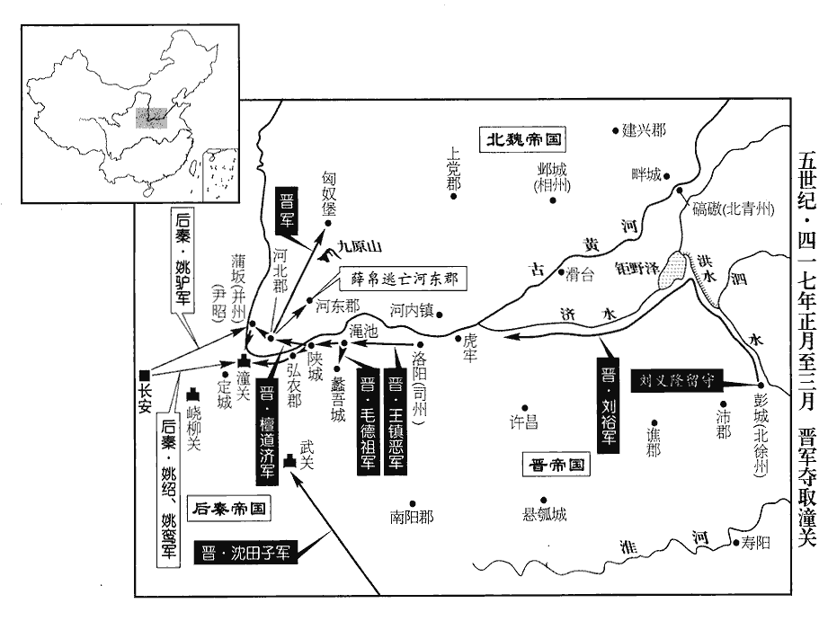
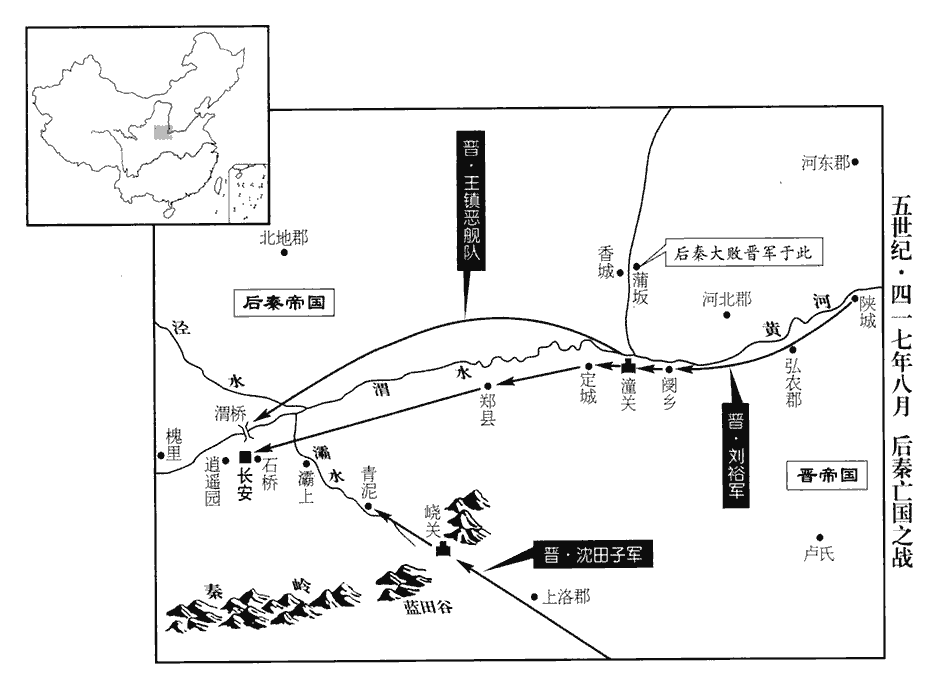
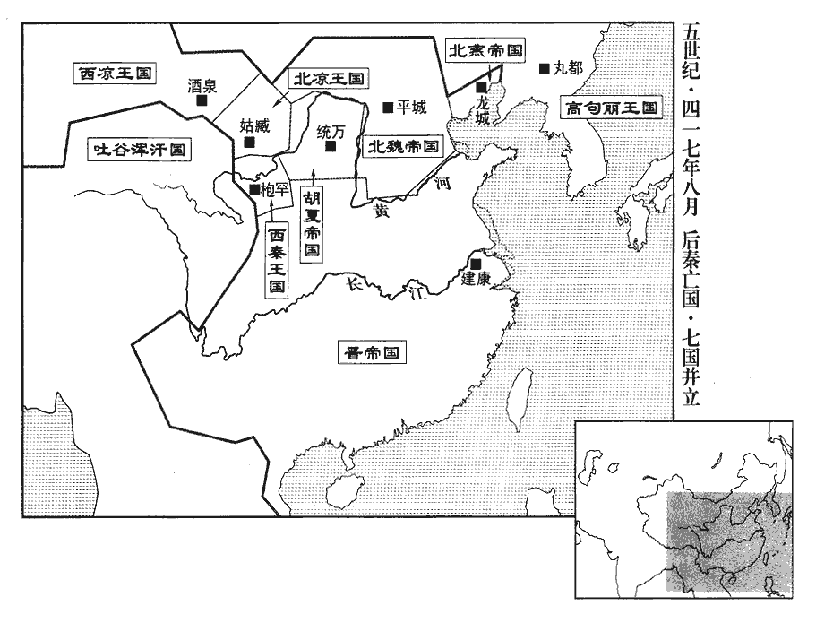
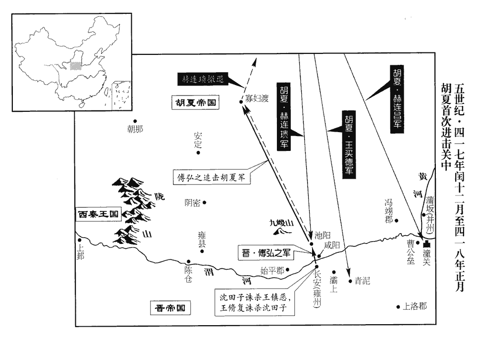
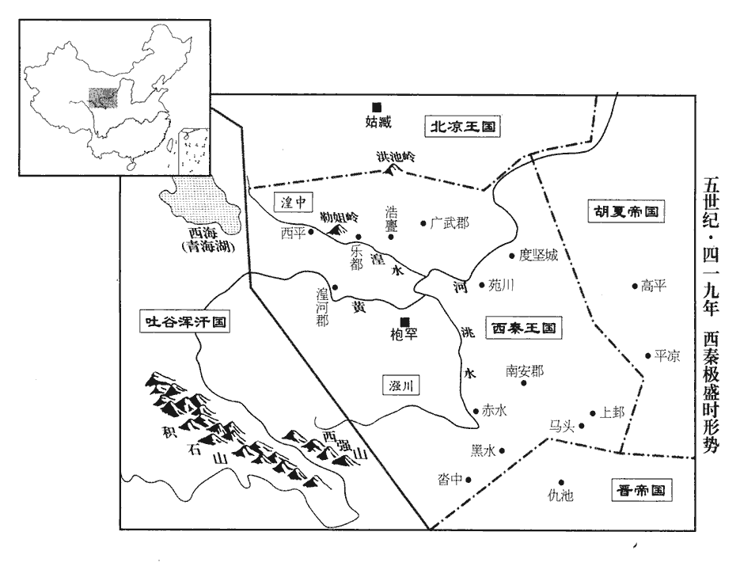

 晉紀四十起強圉大荒落（丁巳），盡屠維協洽（己未），凡三年。

# 安皇帝癸

## 義熙十三年（丁巳、四一七）

1春，正月，甲戌朔‹一›，日有食之。

〖译文〗 [1]春季，正月，甲戌朔（初一），出现日食。

2秦主泓‹时年三十›朝會百官於前殿，朝，直遙翻。以內外危迫，君臣相泣。以內則兄弟搆難，外爲晉、夏所迫也。征北將軍齊公恢帥安定‹甘肃镇原东南曙光乡›鎭戶三萬八千，焚廬舍，自北雍州趨長安，秦分嶺北五郡爲北雍州，鎭安定。泓不用東平公紹、懿橫之言以召亂。帥，讀曰率。雍，於用翻。趨，七喻翻。自稱大都督、建義大將軍，移檄州郡，欲除君側之惡；揚威將軍姜紀帥衆歸之，建節將軍彭完都棄陰密‹甘肃灵台西南›奔還長安。恢至新支，姜紀說恢曰：「國家重將、大兵皆在東方，京師空虛，公亟引輕兵襲之，必克。」恢不從，南攻郿城‹陕西眉县›；鎭西將軍姚諶爲恢所敗，說，輸芮翻。敗，補邁翻。將，卽亮翻。郿，音眉，又音媚。諶chén，氏壬翻。姚諶去年棄雍東奔，遂屯于郿。長安大震。泓馳使徵東平公紹，遣姚裕及輔國將軍胡翼度屯澧西。關中無澧水，「澧」當作「灃」。灃水出鄠hù南灃谷，北過上林苑入渭。使，疏吏翻。扶風太守姚儁jùn等皆降於恢。降，戶江翻。東平公紹引諸軍西還，與恢相持於靈臺‹陕西西安西›，《水經註》：漢靈臺在秦阿房宮南，鎬水逕其北。姚讚留寧朔將軍尹雅爲弘農‹河南灵宝东北›太守，守潼關‹陕西潼关›，太守，式又翻。亦引兵還。恢衆見諸軍四集，皆有懼心；其將齊黃等詣大軍降。恢進兵逼紹，讚自後擊之，恢兵大敗，殺恢及其三弟。泓哭之慟，葬以公禮。

〖译文〗 [2]后秦国主姚泓，在王宫前殿接受文武百官的朝贺，因国家内患外忧交迫，君臣们相对哭泣。征北将军、齐公姚恢率领安定当地居民三万八千户人家，纵火焚烧了房屋，从北雍州直奔长安而来。姚恢自称大都督、建义大将军，向所过州县传布檄文，声称要铲除君主身边的恶人。扬威将军姜纪率领部众归附了姚恢，建节将军彭完都放弃了阴密城，逃回长安。姚恢大队人马抵达新支，姜纪对姚恢说：“朝廷重要将领和军队主力都在东方，京师空虚，您如果迅速率领轻装的军士袭击长安，定能攻克。”姚恢没有同意，却向南进攻城。镇西将军姚谌被姚恢击败，长安受到很大震动。姚泓派人飞马前去征召东平公姚绍，并派姚裕和辅国将军胡翼度屯驻澧西。扶风太守姚俊等人都投降了姚恢。东平公姚绍率各路人马紧急向西回军，与姚恢的军队在灵台相持。姚留下宁朔将军尹雅为弘农太守，镇守潼关，然后也率军回到长安。姚恢的部众看到各路兵马四面集中过来，都心惊胆战，大将齐黄等人前往官军大营投降。姚恢挥师进逼姚绍军，姚从后面进攻姚恢，姚恢的部众大败，四处逃散，官军斩杀了姚恢和他的三个弟弟。姚泓闻知姚恢的死讯失声恸哭，用公爵的礼仪把他们安葬。

3太尉裕引水軍發彭城‹江苏徐州›，留其子彭城公義隆鎭彭城。詔以義隆爲監徐•兗•青•冀四州諸軍事、徐州刺史。監，工銜翻。

〖译文〗 [3]东晋太尉刘裕从彭城率水军出发西上，留下他的儿子、彭城公刘义隆镇守彭城。晋安帝司马德宗下诏，任命刘义隆为监徐、兖、青、冀四州诸军事，兼徐州刺史。

4涼‹都酒泉，甘肃酒泉›公暠寢疾，暠hào，古老翻。遺命長史宋繇曰：「吾死之後，世子猶卿子也，善訓導之。」二月，暠卒‹年六十七›。卒，子恤翻；下將卒同。官屬奉世子歆爲大都督、大將軍、涼公、領涼州牧。大赦，改元嘉興。尊歆母天水‹甘肃天水›尹氏爲太后；以宋繇錄三府事。三府，大都督、大將軍府，涼公府，州牧府也。諡暠曰武昭王，廟號太祖。

〖译文〗 [4]西凉公李患病卧床，临终前，他嘱咐长史宋繇说：“我死以后，世子李歆就像你的儿子，你要好好训导他。”二月，李去世。朝廷文武百官拥立世子李歆为大都督、大将军、凉公、领凉州牧。下令大赦，改年号为嘉兴。尊奉李歆的母亲、天水人尹氏为太后。李歆任命宋繇为录三府事。追加李谥号称武昭王，庙号称太祖。

5西秦‹都枹罕，甘肃临夏›安東將軍木弈干擊吐谷渾‹青海›樹洛干，破其弟阿柴於堯杆川，堯杆川在塞外。杆，居寒翻，又居案翻。俘五千餘口而還。還，從宣翻，又如字。樹洛干‹时年二十六›走保白蘭山‹青海中部›，慙憤發疾，將卒，謂阿柴曰：「吾子拾虔幼弱，今以大事付汝。」樹洛干卒，卒，子恤翻。阿柴立，自稱驃騎將軍、沙州刺史。驃，匹妙翻。騎，奇寄翻。諡樹洛干曰武王。阿柴稍用兵侵倂其傍小種，種，章勇翻。地方數千里，遂爲強國。

〖译文〗 [5]西秦安东将军乞伏木弈干，进攻吐谷浑汗国可汗树洛干，在尧杆川大败他的弟弟阿柴，俘虏五千多人班师。树洛干逃走，退保白兰山；他又羞又愤，大病不起，临死前，他对阿柴说：“我的儿子慕容拾虔年小，我如今把身后大事托付给你。”树洛干去世，阿柴继位，自称为骠骑将军、沙州刺史。追赠树洛干为武王。阿柴逐渐兴兵向外扩张，吞并吐谷浑周围的弱小部落，扩展疆域数千里，于是成为一个强大国家。

6河西王蒙遜‹时年五十›遣其將襲烏啼部‹甘肃山丹境›，大破之；烏啼虜居張掖删丹縣金山之西。將，卽亮翻。又擊卑和部‹内蒙额济纳旗境›，降之。卑和羌居西海。降，戶江翻。

〖译文〗 [6]北凉河西王沮渠蒙逊，派遣他的部将袭击乌啼部落，大败乌啼军。随即又袭击卑和部落，收降他们。

7王鎭惡進軍澠池‹河南洛宁西›，澠，彌兗翻。遣毛德祖襲尹雅於蠡吾城‹河南洛宁西北›，禽之；秦以雅爲弘農太守，屯蠡吾城。據《載記》，蠡吾城當在宜陽之西。宋白曰：蠡吾城，後魏初猶屬弘農，唐以來爲澠池縣理所。余按蠡吾自是漢清河國界亭名，此乃蠡城，非蠡吾城也。《通鑑》蓋承《晉書》之誤。雅殺守者而逃。鎭惡引兵徑前，抵潼關。

〖译文〗 [7]东晋龙骧将军王镇恶，进军渑池，又派毛德祖袭击后秦弘农太守尹雅据守的蠡吾城，生擒尹雅。尹雅杀死了看守他的兵卒逃走。王镇恶一直向前进攻，抵达潼关。

檀道濟、沈林子自陝‹河南三门峡›北渡河，拔襄邑堡‹山西芮城›，陝，式冉翻。秦河北‹府襄邑堡›太守薛帛奔河東‹山西夏县›。襄邑堡在河北郡河北縣，漢、晉屬河東郡，秦分立河北郡。又攻秦幷州刺史尹昭於蒲阪‹山西永济›，不克。阪，音反。別將攻匈奴堡‹山西临汾境›，爲姚成都所敗。將，卽亮翻；下同。敗，蒲邁翻。

〖译文〗 檀道济、沈林子等从陕城北面渡过黄河，攻陷襄邑堡。后秦河北太守薛帛逃奔河东。东晋军继续前进，又攻击后秦并州刺史尹昭据守的蒲阪，没有攻克。东晋另一路将领进攻匈奴堡，被守将姚成都击败。

辛酉‹十九›，滎陽守將傅洪以虎牢‹河南荥阳西北汜水镇›降魏‹都平城，山西大同›。

〖译文〗 辛酉（十九日），东晋荥阳守将傅洪，献出虎牢城，投降北魏。

秦主泓以東平公紹爲太宰、大將軍、都督中外諸軍事，假黃鉞，改封魯公，使督武衛將軍姚鸞等步騎五萬守潼關，又遣別將姚驢救蒲阪。

〖译文〗 后秦国主姚泓任命东平公姚绍为太宰、大将军、都督中外诸军事，颁赐帝王专用的黄钺，改封鲁公。命他督率武卫将军姚鸾等，率步、骑兵共五万人镇守潼关，又遣另一大将姚驴，援救蒲阪。

沈林子謂檀道濟曰：「蒲阪城堅兵多，不可猝拔，攻之傷衆，守之引日。王鎭惡在潼關，勢孤力弱，不如與鎭惡合勢幷力以爭潼關；若得之，尹昭不攻自潰矣。」道濟從之。

〖译文〗 东晋建武将军沈林子对檀道济说：“蒲阪城池坚固，守军又多，不可能一举攻克。强攻则白白使我军伤亡，不强攻又会拖延时间。现在，王镇恶在潼关，势单力弱，我们不如与王镇恶会师，合兵攻打潼关。如能攻克潼关，尹昭在蒲阪，就可以不攻自破了。”檀道济同意。

三月，道濟、林子至潼關。秦魯公紹引兵出戰，道濟、林子奮擊，大破之，斬獲以千數。紹退屯定城‹陕西潼关西›，郭緣生《述征記》曰：定城去潼關三十里，夾道各一城，渭水逕其北。據險拒守，謂諸將曰：「道濟等兵力不多，懸軍深入，不過堅壁以待繼援。吾分軍絕其糧道，可坐禽也。」乃遣姚鸞屯大路以絕道濟糧道。自澠池西入關，有兩路。南路由回谿阪，自漢以前皆由之。曹公惡南路之險，更開北路，遂以北路爲大路。《載記》曰：紹留鸞守險以絕道濟糧道。蓋鸞雖屯大路，亦據險而邀絕糧道也。紹初遣胡翼度據東原，蓋與大路相爲脣齒，所謂據險也。及沈林子襲鸞營，翼度不能救，何也？人心危駭，面面受敵故也。

〖译文〗 三月，檀道济、沈林子抵达潼关。后秦鲁公姚绍率兵出城迎战，檀道济、沈林子奋勇进攻，大破后秦军，斩杀和俘虏敌人数以千计。姚绍率领后秦军撤退，屯驻定城，凭依险要的地势固守城池。姚绍对他手下的将领们说：“檀道济他们的兵力不多，而且孤军深入，所以他只能加强营垒固守，等待后继援军。我现在分兵几路，切断他的粮饷供给之路，就可以稳坐这里生擒他。”于是，姚绍派姚鸾把守大路要道，断绝檀道济的送粮道路。

 

鸞遣尹雅將兵與晉戰於關南，關南，潼關之南也。爲晉兵所獲，將殺之。雅曰：「雅前日已當死，幸得脫至今，死固甘心。然夷、夏雖殊，夏，戶雅翻。君臣之義一也。晉以大義行師，獨不使秦有守節之臣乎！」乃免之。

〖译文〗 姚鸾派尹雅率兵与东晋军在潼关之南会战，尹雅再度被东晋士卒俘虏，就要斩首，尹雅说：“我前不久被俘就应当被杀，幸亏逃脱，才得以活到今天，死也当然甘心情愿。然而。汉人与夷人虽然民族不同，君臣之间的大义却是一样的。晋国既然可以出于大义兴兵遣将，为什么只是不让秦国有守节的大臣呢！”东晋军才赦免了他的死罪。

丙子‹四›夜，沈林子將銳卒襲鸞營，斬鸞，殺其士卒數千人。紹又遣東平公讚屯河上以斷水道；斷，丁管翻；下兵斷同。沈林子擊之，讚敗走，還定城。薛帛據河曲來降。河水自蒲阪南至潼關，激而東流，蒲阪‹山西永济›、河北‹山西芮城›之間，謂之河曲。

〖译文〗 丙子（初四），夜间，沈林子率领精锐部队突然偷袭姚鸾的大营，斩杀姚鸾以及他手下的士卒几千人。姚绍又派东平公姚驻军黄河岸边，企图断绝东晋军的水道；沈林子又率军进攻姚，姚军大败，姚本人则逃回定城。后秦河北太守薛帛，献出河曲，投降了东晋军。

太尉裕將水軍自淮‹淮河›、泗‹泗水›入清河‹济水›，將泝河西上，上，時掌翻；下必上、北上同。先遣使假道於魏；使，疏吏翻。秦主泓亦遣使請救於魏。魏主嗣‹时年二十六›使羣臣議之，皆曰：「潼關天險，劉裕以水軍攻之，甚難；若登岸北侵，其勢便易。易，以豉翻。裕聲言伐秦，其志難測。且秦，婚姻之國，不可不救也。秦女歸魏，見上卷十一年。宜發兵斷河上流，勿使得西。」博士祭酒崔浩曰：「裕圖秦久矣。今姚興死，子泓懦劣，國多內難。難，乃旦翻。裕乘其危而伐之，其志必取。若遏其上流，裕心忿戾，必上岸北侵，是我代秦受敵也。今柔然寇邊，民食又乏，若復與裕爲敵，發兵南赴，則北寇愈深，救北則南州復危，南州，謂魏之南境相州瀕河諸郡。復，扶又翻。非良計也。不若假之水道，聽裕西上，然後屯兵以塞其東。塞，悉則翻。使裕克捷，必德我之假道；不捷，吾不失救秦之名；此策之得者也。且南北異俗，借使國家棄恆山以南，恆，戶登翻。裕必不能以吳、越之兵與吾爭守河北之地，安能爲吾患乎！夫爲國計者，惟社稷是利，豈顧一女子乎！」議者猶曰：「裕西入關，則恐吾斷其後，腹背受敵；北上，則姚氏必不出關‹潼关›助我，其勢必聲西而實北也。」嗣乃以司徒長孫嵩督山東諸軍事，長，知兩翻。又遣振威將軍娥清、孫愐曰：娥，姓也。冀州刺史阿薄干《魏書•官氏志》，內入諸姓，阿伏干氏後爲阿氏。將步騎十萬屯河北岸。

〖译文〗 东晋太尉刘裕率领水军从淮河、泗水进入清河，准备再逆流西上，开进黄河，他先派使节向北魏借路。后秦国主姚泓也派人出使北魏，请求救援。北魏国主拓跋嗣命令文武百官共同商讨这件事，群臣们都说：“潼关是天险，刘裕用水军攻克恐怕难以达到。但是，如果从黄河北岸登陆向北方侵入，那就容易得多。刘裕声称讨伐秦，他的真实目的难以猜测；而且秦是与我们有婚姻关系的国家，不可以不出兵相助。我们应派兵切断黄河上游，阻止晋军西上。”博士祭酒崔浩说：“刘裕吞并秦国的野心由来已久。如今，姚兴去世。他的儿子姚泓愚劣懦弱，国内灾难一再发生。刘裕乘他国内危机而兴兵讨伐，他的决心是一定要夺取。我们如果切断黄河上游，阻截晋军，刘裕一怒之下，必然登陆向我们进攻，这样一来，我们等于代替秦国挨打。如今柔然进攻我们边境，百姓又缺少粮食，如果再与刘裕为敌，发兵南下进攻晋，那么北边敌军柔然就会更加深入。那时，大军救援北方，南方的州县又将告急，这不是好计策。不如借给刘裕水道，听任刘裕西上，然后我们出兵驻防东部，阻塞他的退路。如果刘裕得胜告捷，一定会感激我们借路的恩德；如果失败，我们也会有援救秦国的美名，这是很多办法中比较好的一个。况且，南方与北方风俗不同，即使朝廷放弃恒山以南的领土，刘裕也决不会用来自吴、越的军队与我们争夺据守黄河以北的土地，怎么会成为我们的威胁呢？为国家制定方略的人，应该只为国家的利益考虑，怎么可以顾念一个嫁过来的女子呢！”大臣们还说：“刘裕向西进入潼关，便害怕我们切断他的退路，腹背同时遭到攻击；而刘裕如果北上进攻我们，那么秦国姚氏一定不会从潼关出兵救援，所以看刘裕的样子虽然是声称向西，但实际一定是北上。”拓跋嗣于是命令司徒长孙嵩为督山东诸军事。又派振威将军娥清、冀州刺史阿薄干，率领步、骑兵十万人屯军黄河北岸。

庚辰‹八›，裕引軍入河，以左將軍向彌爲北青州刺史，留戍碻qiāo磝áo‹山东茌chí平西南›。晉氏南渡，僑置青州於江北；裕平廣固，置北青州於東陽‹山东青州›，而江北之青州如故。今向彌以北青州刺史戍碻磝，東陽之青州亦如故。向，式亮翻。

〖译文〗 庚辰（初八），刘裕率领水军开进黄河，任命左将军向弥为北青州刺史，留下戍守。

初，裕命王鎭惡等：「若克洛陽，須大軍到俱進。」鎭惡等乘利徑趨潼關，趨，七喻翻。爲秦兵所拒，不得前。久之，乏食，衆心疑懼，或欲棄輜重還赴大軍。重，直用翻。沈林子按劍怒曰：「相公志清六合，今許、洛已定，關右將平，事之濟否，繫於前鋒。柰何沮乘勝之氣，棄垂成之功乎！沮，在呂翻。且大軍尚遠，賊衆方盛，雖欲求還，豈可得乎！下官授命不顧，《論語》：子張曰：「士見危授命。」今日之事，當自爲將軍辦之，爲，于僞翻。未知二三君子將何面以見相公之旗鼓邪！」相公，謂裕也。鎭惡等遣使馳告裕，求遣糧援。裕呼使者，開舫北戶，使，疏吏翻。舫，甫妄翻，方舟也，大舟也。指河上魏軍以示之曰：「我語令勿進，今輕佻深入。語，牛倨翻。佻，他雕翻。岸上如此，何由得遣軍！」鎭惡乃親至弘農，說諭百姓，說，輸芮翻。百姓競送義租，軍食復振。復，扶又翻；下則復、子復同。

〖译文〗 当初，刘裕命令王镇恶等人：“如果攻克洛阳，一定要等主力大军到达后共同前进。”王镇恶等人却乘胜直接进攻潼关，被后秦兵牵制，不能前进，时间一长，军中粮饷接济不上，士卒中发生恐慌和疑虑，有人打算放弃笨重的军用品回去投奔大军。沈林子手按佩剑怒斥道：“相公大志是统一天下，而今许昌、洛阳均已平定，关右也将要收复，大事成功与否，就在前锋部队的行动。为什么要挫伤胜利后的士气，放弃就要得到的功业？况且现在主力大军距我们还远，敌人的力量正强盛，即使我们打算撤退，又怎么能够走脱，我接受了命令就不作回头的打算。今天的事，我自己率军完成任务，不知你们这些君子，将来有什么面目去见宋公的旗鼓！”王镇恶等人派人飞马报告刘裕，要求支援粮草和兵力。刘裕把王镇恶的使节叫到面前，打开战船的北窗，指着黄河岸边的北魏大军给他看，说：“我告诉他们不能单独前进，如今却轻率地深入敌境，岸上的形势如此严重，我怎么派得出军队！”王镇恶于是亲自回到弘农，向百姓说明情况，晓以大义，百姓争相捐献粮草，军队的粮饷重新得到补充。

魏人以數千騎緣河隨裕軍西行；軍人於南岸牽百丈，百丈者，所以挽船。今南人用麻繩，北人以竹爲之。陸游曰：蜀人百丈，以巨竹四破爲之，大如人臂。風水迅急，有漂渡北岸者，漂，匹招翻。輒爲魏人所殺略。裕遣軍擊之，裁登岸則走，退則復來。夏，四月，裕遣白直隊主丁旿wǔ裕選白丁之壯勇者入直左右，使旿領之。杜佑曰：白直無月給之數。旿，阮古翻。帥仗士七百人、車百乘，帥，讀曰率。乘，繩證翻。渡北岸，去水百餘步，爲卻月陣，兩端抱河，車置七仗士，事畢，使豎一白毦ěr；豎，上主翻。《說文》曰：豎，立也。毦，仍吏翻，績羽爲之。魏人不解其意，解，戶買翻，曉也。皆未動。裕先命寧朔將軍朱超石戒嚴，白毦旣舉，超石帥二千人馳往赴之，齎jí大弩百張，一車益二十人，設彭排於轅上。魏人見營陣旣立，乃進圍之；長孫嵩帥三萬騎助之，四面肉薄攻營，薄，普各翻。肉薄者，以身迫營血戰。弩不能制。時超石別齎大鎚及矟千餘張，鎚，傳爲翻。乃斷矟長三四尺，以鎚鎚之，一矟輒洞貫三四人。魏兵不能當，一時奔潰，死者相積；臨陳斬阿薄干，魏人退還畔城‹山东聊城西›。斷，丁管翻。長，直亮翻。陳，與陣同。魏收《地形志》：平原郡聊城縣有畔城。超石帥寧朔將軍胡藩、寧遠將軍劉榮祖追擊，又破之，殺獲千計。魏主嗣聞之，乃恨不用崔浩之言。

〖译文〗 北魏军队的几千名骑兵，一直沿着黄河随着刘裕的大军向西行进。东晋士卒在黄河南岸，用长绳牵引战船，风大浪急，有的牵绳突然折断，战船漂流到北岸，船上的晋军全都遭到北魏军队诛杀劫掠。刘裕派军还击北魏军队，东晋军一上岸，北魏军就逃走，等东晋军回到船上，北魏军又返回岸边。夏季，四月，刘裕派白直队主丁，统率武士七百人，战车一百辆，登上黄河北岸，在距河岸一百步的地方，构筑新月形战阵，以河岸作为月弦，两端抱住河道。每个战车上布置七个武士。新月阵布置完毕，在阵中竖一个白色羽旗。北魏军队不知道这是什么意思，都不敢轻举妄动。刘裕先派宁朔将军朱超石严加戒备，准备出战，等新月阵中的白旗一举起来，朱超石率领二千人飞奔而至，进入新月阵，携带大弩一百张，每个战车上增加到二十人，并在车辕上安置了防箭木板。北魏军看到战阵已经完成，开始进攻包围。长孙嵩又率三万骑兵作为后继援军，从四面八方向新月阵展开肉搏冲锋，东晋军的强弓不能阻止敌人的势头。当时，朱超石另外还携带了大铁锺和铁一千支，这时朱超石命人把铁折成三四尺长，用大锺锺打铁，一下去，能贯穿三四人。北魏士卒招架不住，一时间全都四处溃散，争相逃命，阵亡将士的尸体堆积成山。东晋军在战阵中斩杀了北魏冀州刺史阿薄干，北魏军败退，逃回畔城。朱超石率领宁朔将军胡藩、宁远将军刘荣祖乘胜追击，又一次大破北魏军，斩杀和俘虏敌人数以千计。北魏国主拓跋嗣听到报告，才后悔没有采用崔浩的建议。

秦魯公紹遣長史姚洽、寧朔將軍安鸞、護軍姚墨蠡、蠡，魯戈翻。河東‹山西夏县›太守唐小方帥衆二千屯河北之九原‹九原山，山西新绛西北›，阻河爲固，欲以絕檀道濟糧援。《載記》曰：紹欲以絕弘農諸縣糧援。沈林子邀擊，破之，斬洽、墨蠡、小方，殺獲殆盡。林子因啓太尉裕曰：「紹氣蓋關中，今兵屈於外，國危於內，恐其凶命先盡，不得以膏齊斧耳。」齊，讀曰資。應劭曰：齊，利也。張晏曰：齊，如字，征伐斧也，以整齊天下也。一說：「齊」作「齋zhāi」，凡師出入，齋戒入廟而受斧鉞也。紹聞洽等敗死，憤恚，發病嘔血，以兵屬東平公讚而卒。恚，於避翻。屬，之欲翻。卒，子恤翻。讚旣代紹，衆力猶盛，引兵襲林子，林子復擊破之。復，扶又翻。

〖译文〗 后秦鲁公姚绍派长史姚洽、宁朔将军安鸾、护军姚墨蠡、河东太守唐小方，率领二千人驻军黄河北岸的九原，依据黄河天险，打算切断檀道济军队的粮草供应。东晋建武将军沈林子阻击后秦军，大败敌人，斩杀了姚洽、姚墨蠡和唐小方，这支后秦部队被杀被俘几乎全军覆灭。于是，沈林子奏报太尉刘裕说：“姚绍的威名，遍扬关中，但如今在外，他的大军遭到多次失败；在内，他的国家又危机四伏，恐怕他的寿命提前结束，等不到让我们用利斧来斩杀他了。”姚绍听说姚洽等人战败身死，又伤心又愤怒，得了重病，吐血不止，把兵权交给东平公姚，便死去了。姚代替姚绍之后，后秦的兵势仍很强盛，姚领兵袭击沈林子，沈林子又一次打败后秦军。

太尉裕至洛陽，行視城塹，行，下孟翻。嘉毛脩之完葺qì之功，賜衣服玩好，直二千萬。好，呼到翻。

〖译文〗 东晋太尉刘裕抵达洛阳，巡视东晋军队的城堡工事，嘉奖毛之整理修护的功劳，赐给毛之许多衣服珍宝，价值高达二千万。

8丁巳‹十六›，魏主嗣如高柳‹山西阳高›；壬戌‹二十一›，還平城。

〖译文〗 [8]丁巳（十六日），北魏国主拓跋嗣前往高柳，壬戌（二十一日），返回京都平城。

9河西王蒙遜大赦。遣張掖‹甘肃张掖›太守沮渠廣宗詐降以誘涼公歆，沮，子余翻。降，戶江翻；下同。歆發兵應之。蒙遜將兵三萬伏於蓼liǎo泉，《新唐書•地理志》，甘州張掖郡西北百九十里有祁連山，山北有建康軍，軍西百二十里有蓼泉守捉城。歆覺之，引兵還。蒙遜追之，歆與戰於解支澗‹甘肃酒泉东›，「解支澗」，《晉書》作「鮮支澗」，當從之。大破之，斬首七千餘級。蒙遜城建康‹甘肃酒泉东南›，置戍而還。

〖译文〗 [9]北凉河西王沮渠蒙逊大赦天下。他派张掖太守沮渠广宗向西凉诈降，引诱西凉公李歆派兵出来迎接，李歆果然发兵接应。而沮渠蒙逊率领三万士兵埋伏在蓼泉，李歆发觉，率兵撤退。沮渠蒙逊率众追击，李歆与沮渠蒙逊在解支涧会战，李歆大破北凉军，斩杀七千余人。沮渠蒙逊修建建康城，设置戍所，然后回国。

10五月，乙未‹二十四›，齊郡太守王懿降於魏，上書言：「劉裕在洛，宜發兵絕其歸路，可不戰而克。」魏主嗣善之。

〖译文〗 [10]五月，乙未（二十四日），东晋齐郡太守王懿投降了北魏，他上书北魏朝廷说：“刘裕现在洛阳，应该迅速发兵切断他的归路，可以不战而胜。”北魏国主拓跋嗣表示赞许。

崔浩侍講在前，嗣問之曰：「劉裕伐姚泓，果能克乎？」對曰：「克之。」嗣曰：「何故？」對曰：「昔姚興好事虛名而少實用，子泓懦而多病，兄弟乖爭。好，呼到翻。少，詩沼翻。謂弼、懿、恢皆與泓爭國。裕乘其危，兵精將勇，何故不克！」將，卽亮翻。嗣曰：「裕才何如慕容垂？」對曰：「勝之。垂藉父兄之資，修復舊業，國人歸之，若夜蟲之就火，少加倚仗，易以立功。少，詩沼翻。易，以豉翻。劉裕奮起寒微，不階尺土，討滅桓玄，興復晉室，事見一百一十三卷元興三年。北禽慕容超，事見一百一十五卷五年、六年。南梟盧循，事見六年、七年。梟，堅堯翻。所向無前，非其才之過人，安能如是乎！」嗣曰：「裕旣入關，不能進退，我以精騎直擣彭城‹江苏徐州›、壽春‹安徽寿县›，騎，奇寄翻。裕將若之何？」對曰：「今西有屈丐，《北史》曰：明元改赫連勃勃名曰屈丐。北方言屈丐者，卑下也。北有柔然，窺伺國隙。伺，相吏翻。陛下旣不可親御六師，雖有精兵，未睹良將。將，卽亮翻。長孫嵩長於治國，短於用兵，非劉裕敵也。治，直之翻；下同。興兵遠攻，未見其利；不如且安靜以待之。凡兵之動，知敵之主，知敵之將，此之謂也。裕克秦而歸，必篡其主。關中華、戎雜錯，風俗勁悍；悍，侯旰翻，又下罕翻。裕欲以荊、揚之化，施之函、秦，此無異解衣包火，張羅捕虎；雖留兵守之，人情未洽，趨尚不同，適足爲寇敵之資耳。赫連之得關中，崔浩固料之矣。願陛下按兵息民以觀其變，秦地終爲國家之有，可坐而守也。」嗣笑曰：「卿料之審矣。」浩曰：「臣嘗私論近世將相之臣：若王猛之治國，苻堅之管仲也；治，直之翻。慕容恪之輔幼主，慕容暐之霍光也；劉裕之平禍亂，司馬德宗之曹操也。」嗣曰：「屈丐何如？」浩曰：「屈丐國破家覆，孤孑一身，孑，居列翻，單也。寄食姚氏，受其封殖。不思醻恩報義，而乘時徼利，盜有一方，事見一百一十四卷三年。徼jiǎo，一遙翻。結怨四鄰；謂與魏、秦、涼構怨也。撅豎小人，撅，與掘同，其月翻。撅豎，言撅起自豎立也。雖能縱暴一時，終當爲人所吞食耳。」嗣大悅，語至夜半，賜浩御縹醪十觚gū，縹，匹紹翻。青白色曰縹。醅pēi酒曰醪láo。觚，飲器，受三升。此魏主所自御者，故曰御縹醪。水精鹽一兩，鹽透明如水精，故謂之水精鹽。曰：「朕味卿言，如此鹽、酒，故欲與卿共饗其美。」然猶命長孫嵩、叔孫建各簡精兵伺裕西過，自成皋濟河，南侵彭、沛；若不時過，則引兵隨之。彭、沛，謂彭城、沛郡也。

〖译文〗 当时，崔浩在前面为拓跋嗣讲解经典，拓跋嗣问崔浩说：“刘裕讨伐姚泓，果真能攻克吗？”崔浩回答说：“定能攻克！”拓跋嗣问：“为什么！”崔浩说：“当年姚兴喜欢追求虚名而不做实事，他的儿子姚泓生性懦弱，身体多病，兄弟之间争权夺势，不能团结一心。如今刘裕乘人之危，他的将士勇猛善战，训练有素，有什么理由不能取胜！”拓跋嗣又问：“刘裕的才华与慕容垂相比如何？”崔浩说：”刘裕胜过慕容垂。慕容垂凭借父兄的资荫，复兴故有的基业，国人都投靠他，就像夜间的昆虫飞向火光一样，对此稍加凭借，就能轻而易举地建功立业。而刘裕则出身微贱贫寒，没有一尺土地可以凭借，却消灭了桓玄，兴复了晋朝宗室的统治。在北方生擒慕容超，在南方砍下卢循的首级，所过之处，没有敌手，他如果不是才智过人，怎么会这样呢？”拓跋嗣说：“刘裕既然已经进入函谷关，一时不能前进，也不能后退，而我们以精锐骑兵直捣他的老巢彭城、寿春，刘裕将会怎么样！”崔浩回答说：“如今我们西面有夏国赫连勃勃，北有柔然，他们都在时刻窥伺我们的行动，准备乘机来攻。陛下既然不能亲自指挥军队，我军虽然有精兵，却没发现有良将，长孙嵩的长处是善于治理国家，短处是不善于用兵，根本不是刘裕的对手。我军大举兴兵远征，看不到实际利益，不如暂且按兵不动，静观事态的发展。刘裕攻克秦国后回国，一定会篡取皇帝宝座。关中地区汉族、戎族杂居一处，风俗强悍。刘裕打算用教化荆州、扬州百姓的方法统治函谷关和秦国这一带的百姓，这就好像脱下衣服包火，张开罗网捕捉老虎一样，难以奏效。刘裕虽然会留下军队驻守，可一时人心难以信服，志趣习俗又不一样，恰好为别人入侵提供了好条件。希望陛下停止出兵征讨，让百姓休养生息，观察局势的变化，秦国的地盘终究会为我国所有，我们可以坐在这里，就能到手。”拓跋嗣笑着说：“你分析得很周详。”崔浩说：“我曾经私下评论过近世的将领和宰相，比如王猛治理国家，是苻坚的管仲；慕容恪辅佐幼主，是慕容的霍光；刘裕平定桓玄祸乱，是司马德宗的曹操呀。”拓跋嗣又问：“赫连勃勃怎么样？”崔浩说：“赫连勃勃当年国破家亡，孤身一人，寄食在姚家门下，接受姚氏的官禄。不但不想报答姚氏的恩情，反而乘人之危，占据一方地盘，与四邻结下了仇怨。像他这样的撅起自我竖立的小人，虽然能强大暴虐一时，终究要被别人吞并。”拓跋嗣非常高兴，君臣二人一直谈论到深夜，拓跋嗣把御用青白色醅酒三十升、水精盐一两赏赐崔浩，说：“我听了你一席话，就像品味这盐和酒的滋味一样，所以我想和你一起共享这种美好的感受。”然而，拓跋嗣还是命令长孙嵩、叔孙建各自挑选精兵备战，如果刘裕再向西部深入，他们则从成皋渡黄河南下，进攻彭城、沛郡；如果刘裕推进很慢，则仍继续在岸上紧紧跟随。

11魏主嗣西巡至雲中‹内蒙托克托›，遂濟河，畋于大漠‹库布齐沙漠›。

〖译文〗 [11]北魏国主拓跋嗣向西巡视，抵达云中；然后渡过黄河，在大漠上狩猎。

12魏置天地四方六部大人，以諸公爲之。諸公，謂時居公位及位從公者。

〖译文〗 [12]北魏朝廷设置天、地、东、西、南、北六部大人，一律选用爵以及地位相当于公爵的大臣担任。

13秋，七月，太尉裕至陝。陝，式冉翻。沈田子、傅弘之入武關‹陕西商南西南›，秦戍將皆委城走。將，卽亮翻。田子等進屯青泥‹陕西蓝田›，秦主泓使給事黃門侍郎姚和都屯嶢柳‹蓝田东南›以拒之。嶢，音堯。

〖译文〗 [13]秋季，七月，东晋太尉刘裕抵达陕城，沈田子、傅弘之等率兵进入武关，后秦的守将纷纷弃城逃走。沈田子等进兵驻守青泥。后秦国主姚泓命给事黄门侍郎姚和都，在柳驻兵屯守，阻截东晋军。

14西秦相國翟勍卒；勍qíng，渠京翻。八月，以尚書令曇達爲左丞相，左僕射元基爲右丞相，御史大夫麴景爲尚書令，侍中翟紹爲左僕射。翟勍旣卒，曇達皆序遷，《通鑑》卽西秦舊史書之。曇，徒含翻。

〖译文〗 [14]西秦相国翟去世。八月，西秦朝廷任命尚书令乞伏昙达为左丞相，左仆射乞伏元基为右丞相，御史大夫麴景为尚书令，侍中翟绍为左仆射。

15太尉裕至闅鄕‹河南灵宝西›。闅wén，音旻mín。沈田子等將攻嶢柳，秦主泓欲自將以禦裕軍，將，卽亮翻。恐田子等襲其後，欲先擊滅田子等，然後傾國東出；乃帥步騎數萬，奄至青泥‹陕西蓝田›。帥，讀曰率。騎，奇寄翻。田子本爲疑兵，所領裁千餘人，聞泓至，欲擊之；傅弘之以衆寡不敵止之，田子曰：「兵貴用奇，不必在衆。且今衆寡相懸，勢不兩立，若彼結圍旣固，則我無所逃矣。不如乘其始至，營陳未立，先薄之，可以有功。」遂帥所領先進，弘之繼之。秦兵合圍數重。陳，讀曰陣。重，直龍翻。田子撫慰士卒曰：「諸君冒險遠來，正求今日之戰，死生一決，封侯之業於此在矣！」士卒皆踴躍鼓譟，執短兵奮擊，秦兵大敗，沈田子以千餘人敗姚泓數萬之衆者，置兵死地，人自爲戰也。斬馘guó萬餘級，得其乘輿服御物，乘，繩證翻。秦主泓奔還灞上‹陕西西安东灞河畔›。

〖译文〗 [15]东晋太尉刘裕抵达乡。沈田子等将领准备进攻柳。后秦国主姚泓打算亲自统兵出征，抵御刘裕的大军，又害怕沈田子等人突袭他的后方，就想先消灭沈田子等人，然后出动全国的兵力向东攻打刘裕。于是，姚泓率领步、骑兵数万人，突然抵达青泥。沈田子这支部队，本来就是为迷惑敌人布置的疑兵，一共才一千多人。沈田子听说姚泓亲征，打算迎战，建威将军傅弘之认为敌众我寡无法抵敌，从而劝止他。沈田子说：“用兵贵在出奇制胜，不一定在人数多。况且如今敌我寡众悬殊，看形势不能并存。如果等到敌人集结的阵势稳固，我们就会无处可逃。不如乘他们刚刚到达，营地和战阵都没有建立，我们主动挑战，定能成功。”于是，沈田子率领他的部众首先出动，傅弘之作为后继援军紧跟。后秦兵把这支东晋军重重包围。沈田子安抚激励士卒们说：“各位不畏艰险、远道而来，就是为了像今天这样的会战，生死对决，封侯升官的大业就在这里了！”士卒们大声疾呼，跃跃欲试，手执短兵器奋勇杀敌。后秦军大败，被斩杀共一万多人，缴获姚泓的御车御衣，以及王家专用的器物。姚泓逃回灞上。

初，裕以田子等衆少，少，詩沼翻。遣沈林子將兵自秦嶺往助之，秦嶺在長安南，班固《西都賦》所謂「前乘秦嶺」。自此出藍田關。裕蓋遣林子自陽華循山西南至秦嶺。至則秦兵已敗，乃相與追之，關中郡縣多潛送款於田子。

〖译文〗 当初，刘裕认为沈田子兵员太少，就派沈林子率兵从秦岭赶赴救助。等他们到达青泥，后秦军已经失败，于是沈林子与沈田子合兵追击敌人，关中郡县很多向沈田子暗中投降。

辛丑‹二›，太尉裕至潼關，以朱超石爲河東太守，使與振武將軍徐猗之會薛帛於河北，共攻蒲阪。秦平原公璞與姚和都共擊之，姚和都，蓋青泥旣敗而奔蒲阪也。或曰：「和都」，當作「成都」。猗之敗死，超石奔還潼關。東平公讚遣司馬國璠引魏兵以躡裕後。璠，孚袁翻。躡，尼輒翻。

〖译文〗 辛丑（初二），东晋太尉刘裕抵达潼关，他任命朱超石为河东太守，命他与振武将军徐猗之在河北与薛帛会师，共同进攻蒲阪。后秦平原公姚璞与姚和都迎击东晋军，徐猗之战败身亡，朱超石逃回潼关。后秦东平公姚，派司马国率领北魏军队尾随刘裕大军之后。

王鎭惡請帥水軍自河入渭以趨長安，帥，讀曰率。《水經》：河水歷船司空與渭水會，春秋之渭汭ruì卽其地也。趨，七喻翻。裕許之。秦恢武將軍姚難自香城引兵而西，香城在渭水之北，蒲津之口。恢武將軍蓋姚秦創置。鎭惡追之；秦主泓自灞上引兵還屯石橋以爲之援，石橋，在長安城洛門東北，有石橋。《水經註》曰：石橋水南出馬嶺山，積石據其東，驪山距其西，其水北逕鄭城西，水上有橋，東去鄭城十里，故世以橋名水。《三輔黃圖》曰：洛門，長安城北出東頭第一門。鎭北將軍姚彊與難合兵屯涇上以拒鎭惡。涇水出安定涇陽縣幵頭山，東南至陽陵入渭。此涇上在漢京兆陽陵界。鎭惡使毛德祖進擊，破之，彊死，難奔長安。

〖译文〗 东晋龙骧将军王镇恶，请求率水军从黄河开进渭水，然后直趋长安，刘裕应允。后秦恢武将军姚难，从香城率军向西退却，王镇恶挥师追击。后秦国主姚泓从灞上率军返回，屯驻石桥，准备援救姚难。后秦镇北将军姚强与姚难会师，屯兵泾水岸边，抵抗王镇恶的追击。王镇恶命毛德祖进攻，大破后秦军，姚强战死，姚难逃回长安。

東平公讚退屯鄭城‹陕西华县›，太尉裕進軍逼之。泓使姚丕守渭橋，胡翼度屯石積，東平公讚屯灞東，泓屯逍遙園。《水經註》：沈水上承樊川皇子陂，北逕長安城西，與昆明池水合。其枝津東北流，逕鄧艾祠南，又東分爲二水，一水入逍遙園。

〖译文〗 后秦东平公姚退守郑城，东晋太尉刘裕进逼城下。姚泓命姚丕守住渭桥，胡翼度屯驻石积，东平公姚驻守灞东。姚泓自己则驻守逍遥园。

鎭惡泝渭而上，上，時掌翻。乘蒙衝小艦，行船者皆在艦內；秦人見艦進而無行船者，皆驚以爲神。艦，戶黯翻。壬戌‹二十三›旦，鎭惡至渭橋，令軍士食畢，皆持仗登岸，後登者斬。衆旣登，渭水迅急，艦皆隨流，倐忽不知所在。時泓所將尚數萬人。將，卽亮翻。鎭惡諭士卒曰：「吾屬並家在江南，此爲長安北門，去家萬里，舟楫、衣糧皆已隨流。今進戰而勝，則功名俱顯；不勝，則骸骨不返，無他岐矣。岐，旁出之道。卿等勉之！」乃身先士卒，先，悉薦翻。衆騰踊爭進，大破姚丕於渭橋。泓引兵救之，爲丕敗卒所蹂踐，不戰而潰；姚諶chén等皆死，蹂，人九翻。踐，慈演翻。諶，氏壬翻。泓單馬還宮。鎭惡入自平朔門，漢無平朔門，蓋長安城北門也，後人改其名耳。泓與姚裕等數百騎逃奔石橋。東平公讚聞泓敗，引兵赴之，衆皆潰去；胡翼度降於太尉裕。

〖译文〗 王镇恶率水军在渭水中逆流而上，乘坐蒙冲小舰，划桨的士卒都在船内。后秦人看到战舰行进却没有划船的人，都惊奇地以为神仙下凡。壬戌（二十三日）凌晨，王镇恶军抵达渭桥，命令战士们吃饱喝足以后，全部手持兵器登岸，最后登陆的人斩首。士卒们登陆完毕，渭水流急，东晋的战舰随波东下，倏忽之间，不见踪影。当时姚泓统率的军队还有几万人。王镇恶向士卒们宣告说：“我们的亲人和家园都在江南，这里是长安北门，离故乡有万里之遥。现在，战船、衣服、粮食都随波飘走，今天我们进攻，战胜可以建功立名；失败，我们的尸骨都回不了家，没有第三条路可走。你们大家共勉吧！”于是，王镇恶身先士卒，冲在最前面，士卒们士气高涨，踊跃奋击，在渭桥大败后秦姚丕的军队。姚泓率兵救援，却被姚丕的败兵冲击践踏，不战自溃。姚谌等人全都战死，姚泓单人匹马逃回皇宫。王镇恶从长安的平朔门进城，姚泓和姚裕等率几百名骑兵逃奔石桥。东平公姚听说姚泓战败，急忙率军赴难救援，可是，后秦军心大乱，士卒们四处逃散。胡翼度向东晋太尉刘裕投降。

 

泓將出降，其子佛念，年十一，言於泓曰：「晉人將逞其欲，雖降必不免，不如引決。」降，戶江翻。引決，謂自裁也。泓憮然不應。憮，音武，悵也，失意貌。佛念登宮牆自投而死。姚佛念雖不及劉諶，然以童稚之年，氣烈如此，亦可尚也。癸亥‹二十四›，泓將妻子、羣臣詣鎭惡壘門請降，鎭惡以屬吏。屬，之欲翻。城中夷、晉六萬餘戶，鎭惡以國恩撫慰，號令嚴肅，百姓安堵。

〖译文〗 姚泓打算出城投降，他的儿子姚佛念，年仅十一岁，对姚泓说：“晋人势必要在我们身上满足欲望，即使投降也难免一死，不如自杀。”姚泓心里痛楚，没有回答。姚佛念自己登上宫墙，投下摔死。癸亥（二十四日），姚泓携妻子儿女、文武百官，前往王镇恶的大营投降，王镇恶把他们交给下属官吏关押。长安城中的汉族人和夷族人共有六万多户，王镇恶宣扬东晋的恩德，加以安抚，号令严明，百姓安居乐业。

九月，太尉裕至長安，鎭惡迎於灞上。裕勞之曰：「成吾霸業者卿也！」鎭惡再拜謝曰：「明公之威，諸將之力，鎭惡何功之有！」裕笑曰：「卿欲學馮異邪？」謂馮異謙退不伐，而能定關中。鎭惡性貪，秦府庫盈積，鎭惡盜取，不可勝紀；勝，音升。裕以其功大，不問。或譖諸裕曰：「鎭惡藏姚泓僞輦，將有異志。」裕使人覘之，覘，丑廉翻，又丑豔翻。鎭惡剔取其金銀，棄輦於垣側，裕意乃安。

〖译文〗 九月，太尉刘裕抵达长安，王镇恶在灞上迎接。刘裕慰劳他说：“是你帮助我完成了霸业！”五镇恶再拜谦让说：“全仰赖您的英明指挥和威望，各位将领的努力，我有什么功劳！”刘裕笑着说：“你难道要学习冯异吗？”其实，王镇恶一向贪财好利，后秦府库仓储十分丰富，王镇恶私自盗取的财物，不计其数，刘裕因为他的功劳很大，所以不予过问。有人向刘裕诬陷王镇恶说：“王镇恶私藏姚泓的御用辇车，可能会叛变。”刘裕派人侦察。原来，王镇恶剔取了辇车上的金银珠饰，然后把辇车抛弃到城墙外面。刘裕这才安心。

 

裕收秦彝器、渾儀、土圭、記里鼓、指南車送詣建康。《左傳》：祝佗曰：成王分魯公以官司、彝器。杜預《註》：彝器，常用之器。漢武帝時，洛下閎、鮮于妄人、耿壽昌造員儀以考曆度。和帝時，賈逵又加黃道。順帝時，張衡又制渾象，具內外規、黃赤道、南北極，列二十四氣、二十八宿、中外星官及日月、五緯，以漏水轉之於殿上室內，星中出沒，與天相應。其後，吳陸績造渾象，王蕃制渾儀。舊渾象以二分爲一度，凡周七尺三寸半分。張衡更制，以四分爲一度，凡周一丈四尺六寸。王蕃以古制局小，星辰稠穊jì，衡器傷大，難可轉移，更制渾象，以三分爲一度，凡周天一丈九寸五分分之三。《周禮》：大司徒以土圭之法測土深，正日景，以求地中。日南則景短多暑，日北則景長多寒，日東則景夕多風，日西則景朝多陰。日至之景，尺有五寸，謂之地中。《註》云：土圭所以致四時、日月之景也。鄭司農云：測土深，謂南北東西之深也。日南，立表處太南，近日也。日北，謂立表處太北，遠日也。景夕，謂日昳dié景乃中，立表處太東，近日也。景朝，謂日未中而景中，立表處太西，遠日也。玄謂晝漏半而置土圭，表陰陽，審其南北。景短於土圭，謂之日南，是地於日爲近南也。景長於土圭，謂之日北，是地於日爲近北也。東於土圭謂之日東，是地於日爲近東也。西於土圭謂之日西，是地於日爲近西也。如是，則寒暑陰風偏而不和，是未得其所求。凡日景於地千里而差一寸。鄭司農又云：土圭之長尺有五寸，以夏至之日立八尺之表，其景適與土圭等，謂之地中。今潁川陽城地爲然。《晉•輿服志》：記里鼓車，駕四馬，制如司南車。崔豹《古今註》曰：大章車所以識道里也，起於西京，亦曰記里車。車上有二層，皆有木人，行一里，下層擊鼓；行十里，上層擊鐲zhuó。黃帝作指南車。《晉•輿服志》：司南車，一名指南車，駕四馬。其下制如樓，三級四角，金龍銜羽葆。刻木爲仙人，衣羽衣，立車上，車雖回轉，手常南指。大駕出行，爲先啓之乘。蕭子顯曰：指南車，四周廂上施屋，指南人衣裙襦rú天衣在廂中，上四角皆施龍子竿，緣雜色眞孔雀毦ěr，烏布皁複幔，漆畫輪，駕牛，皆銅校飾。記里鼓車制如指南，上施華蓋子，䌝jìn衣漆畫，鼓機皆在內。渾，戶本翻。其餘金玉、繒帛、珍寶，皆以頒賜將士。繒zēng，慈陵翻。秦平原公璞、幷州刺史尹昭以蒲阪降，東平公讚帥宗族百餘人詣裕降，降，戶江翻。帥，讀曰率。裕皆殺之。送姚泓至建康，斬於市。孝武太元九年，姚萇建國，改元白雀，歲在甲申，傳三主，三十四年而亡。

〖译文〗 刘裕下令没收后秦的宗室祭祀用具彝器、浑天仪、测日仪器土圭、计程用的记里鼓、指南车等，送往建康。其余金银玉石、绫罗绸缎、稀世珍宝都赏赐给将士。后秦平原公姚璞、并州刺史尹昭，献出了蒲阪城投降；东平公姚，率领皇室一百多人，前往刘裕的大营投降，刘裕把他们全部杀死。然后把姚泓送到建康，绑到市井刑场斩首。

裕以薛辯爲平陽‹山西临汾›太守，使鎭捍北道。

〖译文〗 刘裕任命薛辩为平阳太守，令他镇守和保卫东晋北部边防。

裕議遷都洛陽。諮議參軍王仲德曰：「非常之事，固非常人所及，必致駭動。今暴師日久，士卒思歸，遷都之計，未可議也。」裕乃止。

〖译文〗 刘裕提议迁都洛阳。谘议参军王仲德说：“不寻常的事，本来不是寻常人所能接受，一旦迁都，必然引起举国惊骇骚动。如今军队在外作战已久，人心思归，迁都的计划，不能提出讨论。”刘裕才作罢。

羌衆十餘萬口西奔隴上‹陇山以西›，沈林子追擊至槐里‹陕西兴平›，俘虜萬計。姚氏，羌也；姚氏旣滅，故羌衆西奔。

〖译文〗 羌族部落的部众十余万口，向西逃奔陇上，沈林子追击羌人直到槐里，俘虏数以万计。

河西王蒙遜聞太尉裕滅秦，怒甚。門下校郎劉祥入言事，自曹操、孫權置校事司察羣臣，謂之校郎，後遂因之。蒙遜置諸曹校郎，如門下校郎、中兵校郎是也。蒙遜曰：「汝聞劉裕入關，敢硏硏然也！」遂斬之。楊正衡曰：硏，五見翻；然有其音而無其義。河西士民乃心晉室。蒙遜胡人，竊據其上，聞裕入關，慮其響應，故斬祥以威衆，以鎭服其心也。姦雄之喜怒，豈苟然哉！《魏書•沮渠傳》作「姸姸」，華人服飾姸靡自喜，故蒙遜云然。姸，讀如字，音義皆通，當從《魏書》。

〖译文〗 北凉河西王沮渠蒙逊听说东晋太尉刘裕灭掉了后秦，十分愤怒。门下校郎刘祥进宫向蒙逊奏事，沮渠蒙逊暴跳说：“你听说刘裕进关，还敢穿得如此漂亮！”于是斩杀了刘祥。

初，夏‹都统万，陕西靖边北白城子›王勃勃‹时年三十七›聞太尉裕伐秦，謂羣臣曰：「姚泓非裕敵也。且其兄弟內叛，安能拒人！裕取關中必矣。然裕不能久留，必將南歸；留子弟及諸將守之，將，卽亮翻；下鎭將同。吾取之如拾芥耳。」乃秣馬礪兵，訓養士卒，進據安定，秦嶺北‹九嵕山以北›郡縣鎭戍皆降之。裕遣使遺勃勃書，降，戶江翻。使，疏吏翻。遺，于季翻。約爲兄弟；勃勃使中書侍郎皇甫徽爲報書而陰誦之，對裕使者，口授舍人使書之。裕讀其文，歎曰：「吾不如也！」史言夷豪多權數。

〖译文〗 当初，夏王赫连勃勃听说刘裕讨伐后秦，对文武百官说：“姚泓不是刘裕的对手。而且他的兄弟们纷纷背叛，怎么还能抗拒别人？刘裕定能夺取关中。可是，刘裕自己也不会长久留在关中，最后还得回到江南，留下子弟和一些战将守卫在那里。那时，我再去夺取关中，就像拾一根草叶一样容易。”于是，他秣马厉兵，让士卒充分休息，加以训练。然后，赫连勃勃兵进占据了安定。后秦岭北各郡县、军事重镇、戍所纷纷投降了夏国。刘裕派人出使夏国，致信给赫连勃勃，相约结为兄弟之国。赫连勃勃命中书侍郎皇甫徽代写一封回信，暗地里背诵下来，然后当着刘裕使臣的面，口授舍人命他照写。刘裕看到后，叹息说：“我比不上他！”

16廣州‹府番禺，广东广州›刺史謝欣卒；東海‹山东郯城›人徐道期聚衆攻陷州城‹广州›，進攻始興‹广东韶关›，始興相彭城劉謙之討誅之。詔以謙之爲廣州刺史。

〖译文〗 [16]东晋广州刺史谢欣去世。东海人徐道期召集部众，攻克州城番禺，进攻始兴，始兴相、彭城人刘谦之讨伐徐道期，徐道期被杀。东晋朝廷下诏任命刘谦之为广州刺史。

17癸酉‹四›，司馬休之、司馬文思、司馬國璠、司馬道賜、魯軌、韓延之、刁雍、王慧龍及桓溫之孫道度、道子、族人桓謐、桓璲、陳郡‹河南淮阳›袁式等皆詣魏長孫嵩降。姚秦旣滅，司馬休之等懼爲裕所誅，故皆降魏。璠，孚袁翻。雍，於容翻。璲，音遂。降，戶江翻。秦匈奴鎭將姚成都及弟和都舉鎭降魏。魏主嗣詔民間得姚氏子弟送平城者賞之。冬，十月，己酉‹十一›，嗣召長孫嵩等還。司馬休之尋卒於魏。卒，子恤翻。魏賜國璠爵淮南公、道賜爵池陽子、魯軌爵襄陽公。刁雍表求南鄙自效，嗣以雍爲建義將軍。建義將軍，魏以是號寵刁雍，言使之建義以復父兄之讎。雍聚衆於河‹黄河›、濟‹济水›之間，濟，子禮翻。擾動徐‹江苏北部›、兗‹山东西部›；太尉裕遣兵討之，不克。雍進屯固山‹山东长清东南›，衆至二萬。

〖译文〗 [17]癸酉（初四），先后从东晋流亡后秦的司马休之、司马文思、司马国、司马道赐、鲁轨、韩延之、刁雍、王慧龙，以及桓温的孙子桓道度、桓道子、族人桓谧、桓、陈郡人袁式等，全都投降了北魏司徒长孙嵩。后秦匈奴堡守将姚成都与他的弟弟姚和都，举献城池，投降了北魏。北魏国主拓跋嗣下诏，声称民间百姓凡是救出姚氏子弟送到平城的人，重重有赏。冬季，十月，己酉（十一日），拓跋嗣征召长孙嵩等班师回朝。不久，司马休之死在北魏。北魏朝廷赐封司马国为淮南公、司马道赐为池阳子、鲁轨为襄阳公。刁雍上书请求到南部边疆，报效北魏，拓跋嗣任命刁雍为建义将军。刁雍在黄河、济水之间集结部队，骚扰东晋所属的徐州、兖州；太尉刘裕出兵讨伐，不能攻克。刁雍进驻固山，手下兵员达二万人。

18詔進宋公‹刘裕›爵爲王，增封十郡；辭不受。

〖译文〗 [18]东晋安帝司马德宗下诏封宋公刘裕为宋王，采邑增加十个郡，刘裕辞让，没有接受。

19西秦王熾磐遣左丞相曇達等擊秦故將姚艾，艾，秦上邽‹甘肃天水›之鎭將。將，卽亮翻。艾遣使稱藩，使，疏吏翻。熾磐以艾爲征東大將軍、秦州牧。徵王松壽爲尚書左僕射。十二年，熾磐遣松壽屯馬頭以逼秦之上邽；上邽降，故徵還。

〖译文〗 [19]西秦王乞伏炽磐派遣左丞相乞伏昙达等进攻后秦旧将姚艾。姚艾遣使到西秦，愿为藩属，乞伏炽磐任命姚艾为征东大将军、秦州牧。召回王松寿，任命他为尚书左仆射。

20十一月，魏叔孫建等討西山‹太行山›丁零翟蜀洛支等，平之。西山，魏安州之西山。

〖译文〗 [20]十一月，北魏征南大将军叔孙建等征讨西山丁零部落酋长翟蜀洛支，平定了该部。

21辛未‹三›，劉穆之卒‹年五十八›，太尉裕聞之，驚慟哀惋者累日。卒，子恤翻。惋，烏貫翻。始，裕欲留長安經略西北，而諸將佐皆久役思歸，多不欲留。將，卽亮翻。會穆之卒，裕以根本無託，遂決意東還。還，從宣翻，又如字。

〖译文〗 [21]辛未（初三），东晋左仆射、军司刘穆之去世。太尉刘裕听说后，一连几天震惊悲痛，不胜哀惋。当初，刘裕打算留在长安，继续征服西北，但是，东晋的各位将领都因长期征战，思念故土，大多数都不愿再留。正巧，刘穆之去世，刘裕鉴于朝中没有可以托付的人，才决定东返。

穆之之卒也，朝廷恇懼，恇kuāng，音匡，怯也。欲發詔，以太尉左司馬徐羨之代之。中軍諮議參軍張卲曰：「今誠急病，任終在徐；然世子無專命，宜須諮之。」裕欲以王弘代穆之。從事中郎謝晦曰：「休元輕易，不若羨之。」王弘，字休元。易，以豉翻。乃以羨之爲吏部尚書、建威將軍、丹楊尹，代管留任。於是朝廷大事常決於穆之者，並悉北諮。

〖译文〗 刘穆之去世之后，东晋朝廷不胜惶恐，打算颁下诏书，任命太尉左司马徐羡之代替刘穆之的职位。中军谘议参军张邵说：“现在情势确实危急，看来最终还要委任徐羡之。然而，世子刘义符还没有决定一方的权力，应该询问刘裕裕。”刘裕又想让王弘代替刘穆之，从事中郎谢晦说：“王弘轻率简单，不如徐羡之。”于是刘裕才决定任命徐羡之为吏部尚书、建威将军、丹杨尹，代管留任的事务。从此，过去朝廷中由刘穆之决定的大事，现在都送到北方，由刘裕亲自决定。

裕以次子桂陽公義眞爲都督雍•梁•秦三州諸軍事、安西將軍、領雍•東秦二州刺史。雍，於用翻。義眞時年十二。以太尉諮議參軍京兆王脩爲長史，王鎭惡爲司馬、領馮翊‹陕西大荔›太守，沈田子、毛德祖皆爲中兵參軍，仍以田子領始平‹陕西兴平›太守，德祖領秦州刺史、天水太守，傅弘之爲雍州治中從事史。

〖译文〗 刘裕任命他的次子、桂阳公刘义真为都督雍、梁、秦三州诸军事，安西将军，领雍、东秦二州刺史。刘义真当时只有十二岁。又任命太尉谘议参军、京兆人王为长史；王镇恶为司马，兼任冯翊太守；沈田子、毛德祖都为中兵参军。命沈田子兼任始平太守，毛德祖兼任秦州刺史、天水太守，傅弘之为雍州治中从事史。

先是，隴上‹陇山以西›流戶寓關中者，望因兵威得復本土；及置東秦州，時裕未得天水，東秦州卽毛德祖所領。或曰，裕置東秦州，使義眞兼領。先，悉薦翻。知裕無復西略之意，復，扶又翻；下同。皆歎息失望。

〖译文〗 在此之前，陇上流亡到关中寄居的流民，冀望东晋军队乘胜西上，光复故土。等到刘裕设置东秦州，知道刘裕没有继续西上的意图，都叹息失望。

關中人素重王猛，裕之克長安，王鎭惡功爲多，由是南人皆忌之。沈田子自以嶢柳之捷，與鎭惡爭功不平。裕將還，田子及傅弘之屢言於裕曰：「鎭惡家在關中，不可保信。」裕曰：「今留卿文武將士精兵萬人，彼若欲爲不善，正足自滅耳。勿復多言。」裕私謂田子曰：「鍾會不得遂其亂者，以有衛瓘guàn故也。會、瓘事見七十八卷魏元帝咸熙元年。語曰：『猛獸不如羣狐，』卿等十餘人，何懼王鎭惡！」爲沈田子殺王鎭惡張本。

〖译文〗 关中人一向看重王猛的威名，刘裕攻克长安，王镇恶的功劳最大，所以南方的将领都忌恨王镇恶。沈田子自以为柳大捷，功绩不凡，与王镇恶争功，心里十分不平。刘裕将回建康，沈田子和傅弘之多次对刘裕说：“王镇恶的老家在关中，不能完全信任他。”刘裕说：“现在，我留你们这些文武官员、将领和精锐士卒一万人，王镇恶如果图谋不轨，只能是自取灭亡。你们别再多说了。”刘裕私下对沈田子说：“钟会之所以没有作乱，是因为卫的缘故。俗话说：‘猛兽不如群狐’，你们十多人，难道还惧怕王镇恶不成？”

臣光曰：古人有言：「疑則勿任，任則勿疑。」裕旣委鎭惡以關中，而復與田子有後言，是鬬之使爲亂也。惜乎，百年之寇，千里之土，得之艱難，失之造次，造，七到翻。使豐‹陕西户县东北›、鄗‹陕西西安西镐京镇›之都復輸寇手。鄗，音浩。荀子曰：「兼幷易能也，堅凝之難。」信哉！

〖译文〗 臣司马光曰：古人有言道：“疑人不用，用人不疑。”刘裕既然委任王镇恶镇守关中，而又与沈田子说了后面那些话，是挑拨他们相斗为乱。太可惜了，百年之久的敌人，千里之广的疆土，取得不易，却因一时不慎而丢掉，使丰邑、京这些古都，又重新落入敌手。荀况说过：“兼并容易，凝结为一体就难了。”这话太对了！

22三秦‹陕西中部›父老聞裕將還，詣門流涕訴曰：「殘民不霑王化，於今百年，始覩衣冠，人人相賀。長安十陵是公家墳墓，咸陽宮殿是公家室宅，漢高帝‹刘邦›長陵、惠帝‹刘盈›安陵、文帝‹刘恒›霸陵、景帝‹刘启›陽陵、武帝‹刘彻›茂陵、昭帝‹刘弗陵›平陵、宣帝‹刘病已›杜陵、元帝‹刘奭›渭陵、成帝‹刘骜›延陵、哀帝‹刘欣›義陵、平帝‹刘箕子›康陵，皆在關中，凡十一陵；言十者，舉大數也。長安、咸陽宮殿皆漢故跡。裕，劉氏子孫，故父老以是爲言而留之。捨此欲何之乎！」裕爲之愍然，爲，于僞翻。慰諭之曰：「受命朝廷，不得擅留。誠多諸君懷本之志，今以次息次息，猶言次子也。與文武賢才共鎭此境，勉與之居。」十二月，庚子‹三›，裕發長安，自洛入河，開汴渠而歸。汴，音卞。

〖译文〗 [22]三秦地区的父老，听说刘裕就要返回江南，都痛哭流涕地来到大营门前诉说：“我们这些残余的汉人，没有接受朝廷的教化，至今已有一百年之久，直到今天才看到汉民族衣冠装束，人人都互相庆贺。长安十陵是你们刘家的坟墓，咸阳宫殿是你们刘家的住宅，你放弃它们想要去哪里！”刘裕也很伤感，安慰他们说：“我接受朝廷的命令，不敢擅自停留。感谢诸位怀念故国的诚意，现在留下我的次子与文武贤才共同镇守这里，希望你们和好共处。”十二月，庚子（初三），刘裕从长安出发，自洛水进入黄河，开掘汴渠东返。

23氐豪徐駭奴、齊元子等擁部落三萬在雍‹陕西凤翔›，遣使請降於魏。雍，於用翻。使，疏吏翻。降，戶江翻。魏主嗣遣將軍王洛生、河內太守楊聲等西行以應之。

〖译文〗 [23]氐族酋长徐骇奴、齐元子等率领部落部众三万人在雍城，派遣使臣投降了北魏。北魏国主拓跋嗣，派遣将军王洛生、河内太守杨声等向西行进，接应氐族部落。

24閏月，壬申‹五›，魏主嗣如大寧‹河北张家口›、長川‹内蒙兴和西北›。

〖译文〗 [24]闰十二月，壬申（初五），北魏国主拓跋嗣前往大宁、长川。

25秦‹甘肃南部›、雍‹陕西中部›人千餘家推襄邑‹河南睢县›令上谷‹河北怀来›寇讚爲主，以降於魏，讚，秦之襄邑令也。魏主嗣拜讚魏郡‹河北临漳西南邺镇›太守。久之，秦、雍人流入魏之河南、滎陽、河內者，戶以萬數，嗣乃置南雍州，以讚爲刺史，封河南公，治洛陽；治，直之翻。立雍州郡縣以撫之。讚善於招懷，流民歸之者，三倍其初。

〖译文〗 [25]秦州、雍州土著居民一千多家，推举襄邑令、上谷人寇为盟主，投降了北魏。北魏国主拓跋嗣任命寇为魏郡太守。很久以后，秦州、雍州的百姓流亡到北魏的河南、荥阳、河内的有几万户，拓跋嗣于是设置南雍州，任命寇为南雍州刺史，封河南公，州治设在洛阳，设立雍州郡县安抚流民。寇善于招抚怀柔，前来归附的流民，比当初多了三倍。

26夏王勃勃聞太尉裕東還，大喜，善用兵者觀釁而動。問於王買德曰：「朕欲取關中，卿試言其方略。」買德曰：「關中形勝之地，而裕以幼子守之，狼狽而歸，正欲急成篡事耳，不暇復以中原爲意。劉裕之心事，崔浩、王買德皆知之。復，扶又翻。此天以關中賜我，不可失也。青泥‹陕西蓝田›、上洛‹陕西商州›，南北之險要，宜先遣遊軍斷之；東塞潼關，斷，丁管翻。塞，悉則翻。絕其水陸之路；然後傳檄三輔‹陕西中部›，施以威德，則義眞在網罟gǔ之中，不足取也。」勃勃敗義眞取關中，卒如買德之計。罟，音古。勃勃乃以其子撫軍大將軍璝都督前鋒諸軍事，帥騎二萬向長安，璝，古回翻。帥，讀曰率。騎，奇寄翻。前將軍昌屯潼關，以買德爲撫軍右長史，屯青泥，劉裕得洛陽而不能禁寇讚窺伺於其側，使義眞守關中而不能禁夏兵之斷潼關、青泥，南歸彭城，席未煖nuǎn而義眞敗。旣棄天下，肉未寒而四鎭失，宜也。勃勃將大軍爲後繼。將，卽亮翻；下同。

〖译文〗 [26]夏王赫连勃勃，听说东晋太尉刘裕返回江南，大喜，向王买德询问说：“我打算夺取关中，你说说你的方法策略。”王买德说：“关中的地理位置十分重要，而刘裕却叫他的幼子镇守，自己则狼狈而回，正打算快点办完篡夺帝位的事，没时间再把中原这块地盘放在心上。这是上天把关中赏赐给我们，不能错过这个机会。青泥、上洛，是南北的险要重镇，应该先派出游击部队，切断他们的补给和退路，然后在东部阻住潼关，切断他们与本国的水陆通道。然后向三辅地区发布檄文，恩威并施。这样，刘义真就等于掉进了网篓之中，不用费劲就可以生擒。”于是，赫连勃勃任命他的儿子、抚军大将军赫连为都督前锋诸军事，率领骑兵二万人直奔长安。命前将军赫连昌屯驻潼关；任命王买德为抚军右长史，屯驻青泥；赫连勃勃本人则亲自统率大军尾随在后。

27是歲，魏都坐大官章安侯封懿卒。坐，徂臥翻。

〖译文〗 [27]这一年，北魏都坐大官、章安侯封懿去世。

## 十四年（戊午、四一八）

1春，正月，丁酉朔‹一›，魏主嗣‹时年二十七›至平城‹山西大同›，命護高車中郎將薛繁帥高車、丁零北略，至弱水‹蒙古土拉河›而還。魏倣漢置匈奴中郎將之官，置護高車中郎將。帥，讀曰率。

〖译文〗 [1]春季，正月，丁酉朔（初一），北魏国主拓跋嗣抵达平城。命护高车中郎将薛繁，率领高车、丁零部落向北进攻，推进到弱水，班师。

2辛巳，大赦。

〖译文〗 [2]辛巳（疑误），东晋下令实行大赦。

3夏‹都统万，陕西靖边北白城子›赫連璝至渭陽‹渭水北岸›，關中民降之者屬路。降，戶江翻。屬，之欲翻。龍驤將軍沈田子將兵拒之，驤，思將翻。畏其衆盛，退屯劉迴堡，遣使還報王鎭惡。鎭惡謂王脩曰：「公以十歲兒付吾屬，當共思竭力；而擁兵不進，虜何由得平！」使者還，以告田子。田子與鎭惡素有相圖之志，由是益忿懼。未幾，鎭惡與田子俱出北地‹陕西耀县›以拒夏兵，赫連璝已至渭陽，王、沈烏能出北地乎？此言北地者，謂長安以北之地耳。幾，居豈翻。軍中訛言：「鎭惡欲盡殺南人，以數十人送義眞南還，因據關中反。」辛亥‹十五›，田子請鎭惡‹年四十六›至傅弘之營計事；田子求屛人語，屛，必郢翻。使其宗人沈敬仁斬之幕下，矯稱受太尉令誅之。弘之奔告劉義眞，義眞與王脩被甲，登橫門以察其變。橫門，長安城北出東頭第一門。被，皮義翻。橫，音光。俄而田子帥數十人來，言鎭惡反，脩執田子，數以專戮，斬之‹年三十六›；數，所具翻。以冠軍將軍毛脩之代鎭惡爲安西司馬。冠，古玩翻。傅弘之大破赫連璝於池陽‹陕西泾阳›，又破之於寡婦渡‹甘肃庆阳境›，按宋白《續通典》，今慶州北十五里有寡婦山，蓋水發源是山，其下流爲寡婦渡。斬獲甚衆，夏兵乃退。

〖译文〗 [3]夏国抚军大将军赫连率军开到渭阳，关中前来投降的百姓，在道上前后相连。东晋龙骧将军沈田子，率军迎战，害怕夏军人多势众，退守刘回堡。然后派人立即回去向王镇恶报告。王镇恶对王说：“刘公把十岁小儿托付给我们，我们应该同心协力。沈田子拥兵众多，却迟迟不进攻，敌人怎么会击退！”使节回去，把这些话报告给沈田子。沈田子与王镇恶平时就有互不相容心思，现在更是又愤又惧。不久，沈田子和王镇恶同时出军北地，抵抗夏兵的进攻。东晋军中传言：“王镇恶打算全部杀掉南方人，然后派几十人把刘义真送回江南，自己占据关中，背叛朝廷。”辛亥（十五日），沈田子请王镇恶来到傅弘之的大营商讨战事。沈田子请求屏退左右侍从密谈，然后命他的族人沈敬仁，在虎帐下将王镇恶斩杀，声称是奉太尉刘裕的旨意行事。傅弘之急忙跑去报告刘义真，刘义真和王全副武装登上横门，观察局势的变化。不久，沈田子率领几十人赶来，声称王镇恶谋反。王逮捕沈田子，历数他擅自杀戮的罪行，将他斩首。然后命令冠军将军毛之代替王镇恶为安西司马。傅弘之在池阳大破赫连，在寡妇渡再一次大败夏军，斩杀和俘虏夏军士卒很多，夏军撤退。

壬戌‹二十六›，太尉裕至彭城‹江苏徐州›，解嚴。琅邪王德文先歸建康。

〖译文〗 壬戌（二十六日），东晋太尉刘裕抵达彭城，解除戒严。琅邪王司马德文提前返回建康。

裕聞王鎭惡死，表言「沈田子忽發狂易，奄害忠勳，」狂易，謂病狂而變易其常心。易，如字。追贈鎭惡左將軍、青州刺史。

〖译文〗 刘裕听到王镇恶的死讯，上疏东晋安帝司马德宗说：“沈田子忽然发狂，杀害忠良功臣。”东晋朝廷追赠王镇恶为左将军、青州刺史。

以彭城內史劉遵考爲幷州刺史、領河東‹山西夏县›太守，鎭蒲阪‹山西永济›；徵荊州‹府江陵，湖北江陵›刺史劉道憐爲徐、兗二州‹府京口，江苏镇江›刺史。

〖译文〗 东晋朝廷任命彭城内史刘遵考为并州刺史、兼任河东太守，镇守蒲阪；征召荆州刺史刘道怜为徐州、兖州二州刺史。

 

裕欲以世子義符鎭荊州，以徐州刺史劉義隆爲司州刺史，鎭洛陽‹河南洛阳东白马寺东›。中軍諮議張卲諫曰：諮議，諮議參軍也。「儲貳之重，四海所繫，不宜處外。」處，昌呂翻。乃更以義隆爲都督荊•益•寧•雍•梁•秦六州諸軍事、西中郎將、荊州刺史，更，工衡翻。雍，於用翻。以南郡‹湖北江陵›太守到彥之爲南蠻校尉，張卲爲司馬、領南郡相，冠軍功曹王曇首爲長史，冠，古玩翻。曇，徒含翻。北徐州從事王華爲西中郎主簿，晉置南徐州於京口，北徐州仍治彭城。到彥之、王曇首、王華輔義隆入立，遂居將相之任。沈林子爲西中郎參軍。義隆尚幼，府事皆決於卲。曇首，弘之弟也。裕謂義隆曰：「王曇首沈毅有器度，宰相才也，汝每事諮之。」沈，持林翻。

〖译文〗 刘裕打算派世子刘义符镇守荆州，以徐州刺史刘义隆为司州刺史，镇守洛阳。中军谘议张劝阻说：“世子是储君，维系四海人心，不能派到外地驻守。”于是，刘裕改派刘义隆为都督荆州、益州、宁州、雍州、梁州、秦州六州诸军事，兼任西中郎将、荆州刺史。又任命南郡太守到彦之为南蛮校尉；张为司马，兼任南郡相；冠军功曹王昙首为长史；北徐州从事王华为西中郎主簿；沈林子为西中郎参军。刘义隆年纪尚小，府中大小事务都由张决定。王昙首，是王弘的弟弟。刘裕对刘义隆说：“王昙首沉着坚毅，有器度，是宰相之才。你每件事都要征求他的意见。”

以南郡公劉義慶爲豫州刺史。義慶，道憐之子也。

〖译文〗 东晋朝廷任命南郡公刘义庆为豫州刺史。刘义庆是刘道怜的儿子。

裕解司州，領徐、冀二州刺史。

〖译文〗 东晋朝廷解除刘裕司州刺史职务，任命他兼徐、冀二州刺史。

4秦‹都枹罕，甘肃临夏›王熾磐以乞伏木弈干爲沙州刺史，鎭樂都‹青海乐都›。樂，音洛。

〖译文〗 [4]西秦王乞伏炽磐任命乞伏木弈干为沙州刺史，镇守乐都。

5二月，乙弗烏地延‹青海湖西北一带›帥戶二萬降秦。

〖译文〗 [5]二月，乙弗部落、乌地延部落酋长率二万户部众归降西秦。

6三月，遣使聘魏‹都平城，山西大同›。使，疏吏翻。

〖译文〗 [6]三月，东晋朝廷派遣使臣访问北魏。

7夏，四月，己巳‹四›，魏徙冀‹府信都，河北冀县›、定‹府中山，河北定州›、幽‹府蓟县，北京›三州徒河‹辽宁锦州›於代都‹山西大同›。魏主珪皇始二年克中山，置安州，又立行臺以鎭撫其民。天興三年，改曰定州，領中山、常山、鉅鹿、博陵、北平、河間、高陽、趙郡。宋白曰：初置安州，尋改定州，以安定天下爲名。徒河，蓋徒河之民從慕容入中國留居三州者，魏人因謂之徒河。

〖译文〗 [7]夏季，四月，己巳（初四），北魏强行迁徙散居在冀州、定州、幽州三州的徒河人到代郡。

8初，和龍‹辽宁朝阳›有赤氣四塞蔽日，塞，悉則翻。自寅至申，燕太史令張穆言於燕王跋曰：「此兵氣也。今魏方強盛，而執其使者，謂留于什門也，事見一百十六卷義熙十年。好命不通，臣竊懼焉。」好，呼到翻。跋曰：「吾方思之。」五月，魏主嗣東巡，至濡源‹河北沽源›及甘松，濡，乃官翻。遣征東將軍長孫道生、安東將軍李先、給事黃門侍郎奚觀帥精騎二萬襲燕，觀，古玩翻。帥，讀曰率。騎，奇寄翻。又命驍騎將軍延普、幽州刺史尉諾自幽州‹府蓟县，北京›引兵趨遼西‹河北迁安›，爲之聲勢，《魏書•官氏志》，內入諸姓可地延氏爲延氏。驍，堅堯翻。西方尉遲氏，後改爲尉氏。尉，音鬱。嗣屯突門嶺‹辽宁凌源西北›以待之。道生等拔乙連城‹辽宁喀喇沁左翼境›，進攻和龍‹辽宁朝阳›，與燕單于右輔古泥戰，破之，義熙七年，跋置單于四輔。單，音蟬。殺其將皇甫軌。將，卽亮翻。燕王跋嬰城自守，魏人攻之，不克，掠其民萬餘家而還。還，從宣翻，又如字。

〖译文〗 [8]当初，北燕都城和龙四周弥满了赤气，遮住了太阳。从寅时直到申时才消失。北燕太史令张穆对北燕国王冯跋说：“这是战争之气呀。如今魏国的势力正十分强盛，而我们扣留他们的使臣，致使两国交好的使命不能通达，我深感恐惧。”冯跋说：“我正在考虑这件事。”五月，北魏国主拓跋嗣向东巡视，先后抵达濡源和甘松。他征调征东将军长孙道生、安东将军李先、给事黄门侍郎奚观等人，率领精锐骑兵二万人袭击北燕；又命骁骑将军延普、幽州刺史尉诺，从幽州率兵直扑辽西，为长孙道生声援；拓跋嗣亲自屯驻突门岭督战。长孙道生等人攻克乙连城，进攻和龙，与北燕单于右辅古泥会战，大破北燕军，斩杀他们的将领皇甫轨。北燕王冯跋绕城固守，北魏加紧围攻，不能攻克，劫掠北燕百姓一万余家班师回国。

9六月，太尉裕始受相國、宋公、九錫之命，十二年命下，至是乃受。赦國中殊死以下，崇繼母蘭陵‹江苏常州西北›蕭氏‹萧文寿›爲太妃，以太尉軍諮祭酒孔靖爲宋國尚書令，左長史王弘爲僕射，領選，選，須絹翻。從事中郎傅亮、蔡廓皆爲侍中，謝晦爲右衛將軍，右長史鄭鮮之爲奉常，行參軍殷景仁爲祕書郎，其餘百官，悉依天朝之制。朝，直遙翻；下同。靖辭不受。亮，咸之孫；傅咸仕於武、惠之間，以直顯。廓，謨之曾孫；蔡謨歷事成、康、穆三朝，出蕃入輔，皆有聲績。鮮之，渾之玄孫；鄭渾見六十六卷漢獻帝建安十七年。景仁，融之曾孫也。殷融見九十四卷成帝咸和三年。景仁學不爲文，敏有思致；思，相吏翻。口不談義，深達理體；至於國典、朝儀、舊章、記注，莫不撰錄，撰，士免翻。識者知其有當世之志。

〖译文〗 [9]六月，东晋太尉刘裕接受了相国、宋公、九锡之命。赦免了宋公封邑内死罪以下的囚徒。尊崇刘裕的继母、兰陵人萧氏为太妃；任命太尉军谘祭酒孔靖为宋国尚书令，左长史王弘为仆射，兼管官员的选举和任免；任命从事中郎傅亮、蔡廓都担任侍中，谢晦为右卫将军，右长史郑鲜之为奉常，行参军殷景仁为秘书郎，其他文武官员，也都按照朝廷的编制设置。孔靖谢绝，没有接受。傅亮是傅咸的孙子；蔡廓，是蔡谟的曾孙；郑鲜之，是郑浑的玄孙；殷景仁，是殷融的曾孙。殷景仁学识超人，但不写文章，敏捷而善于思考，从不空谈义理，却深通情理大体，以至于朝廷的法律制度、礼仪规章、行政司法的注释和记录，都抄录下来，有识之士都知道他有治理国家的雄心大志。

10魏天部大人白馬文貞公崔宏疾篤，去年，魏置天地四方六部大人。魏主遣侍臣問病，一夜數返。及卒，詔羣臣及附國渠帥皆會葬。渠，大也。卒，子恤翻。帥，所類翻。

〖译文〗 [10]北魏天部大人、白马公崔宏病重，北魏国主拓跋嗣派他的侍从询问病情，一夜之间，返往数次。不久，崔宏去世，拓跋嗣下诏，命群臣和归附的部落酋长都来参加葬礼。

11秋，七月，戊午‹二十四›，魏主嗣至平城。

〖译文〗 [11]秋季，七月，戊午（二十四日），北魏国主拓跋嗣抵达平城。

12九月，甲寅‹二十一›，魏人命諸州調民租，戶五十石，積於定‹府中山，河北定州›、相‹府邺城，河北临漳西南邺镇›、冀‹府信都，河北冀县›三州。魏主珪天興四年，置相州於鄴，領魏、陽平、廣平、汲郡、東郡、頓丘、濮陽、清河等郡，冀州所領止長樂、勃海、武邑、章武、樂陵而已。調，徒弔翻。相，息亮翻。

〖译文〗 [12]九月，甲寅（二十一日），北魏朝廷命令各州县征收租赋，每户交纳五十石，屯积在定州、相州、冀州三州。

13‹北凉都姑臧，甘肃武威›河西王蒙遜復引兵伐涼‹都酒泉，甘肃酒泉›，復，扶又翻；下復歸同。涼公歆將拒之，左長史張體順固諫，乃止。蒙遜芟其秋稼而還。芟shān，所銜翻。

〖译文〗 [13]北凉河西王沮渠蒙逊再次率兵讨伐西凉，西凉公李歆准备出兵迎战，左长史张体顺坚决劝阻，李歆才停止行动。沮渠蒙逊收割了长成的庄稼，班师回国。

歆遣使來告襲位。冬，十月，以歆爲都督七郡諸軍事、鎭西大將軍、酒泉公。都督敦煌‹甘肃敦煌›、酒泉‹甘肃酒泉›、晉興、建康‹甘肃酒泉东南›、涼興‹甘肃安西西南万佛峡›及歆父暠所置會稽、廣夏，凡七郡。

〖译文〗 李歆派人出使东晋，报告他继位。冬季，十月，东晋朝廷任命李歆为都督七郡诸军事、镇西大将军、酒泉公。

14姚艾叛秦，降河西王蒙遜，姚艾稱藩於乞伏，事見上年。降，戶江翻。蒙遜引兵迎之。艾叔父雋言於衆曰：「秦王寬仁有雅度，自可安居事之，何爲從河西王西遷！」衆咸以爲然，乃相與逐艾，推雋爲主，復歸於秦。秦王熾磐徵雋爲侍中、中書監，賜【章：甲十一行本「賜」上有「征南將軍」四字；乙十一行本同；孔本同；退齋校同。】爵隴西公，以左丞相曇達爲都督洮•罕以東諸軍事、征東大將軍、秦州牧，鎭南安‹甘肃陇西东南›。洮、罕，謂臨洮、枹罕也。曇，徒含翻。洮，土刀翻。

〖译文〗 [14]西秦秦州牧姚艾叛变，投降了北凉河西王沮渠蒙逊，沮渠蒙逊出兵迎接。姚艾的叔父姚隽对他的部众说：“秦王乞伏炽磐宽厚仁爱有雅量，我们可以安心留下来事奉他，为什么要跟随沮渠蒙逊西迁？”部众都认为有理，就联合起来驱逐了姚艾，推举姚隽为首领，又归附了西秦。西秦王乞伏炽磐委任姚隽为侍中、中书监，赐封陇西公；又任命左丞相乞伏昙达为都督洮、罕以东诸军事、征东大将军、秦州牧，镇守南安。

15劉義眞年少，少，詩照翻。賜與左右無節，王脩每裁抑之。左右皆怨，譖脩於義眞曰：「王鎭惡欲反，故沈田子殺之。脩殺田子，是亦欲反也。」義眞信之，使左右劉乞等殺脩。

〖译文〗 [15]东晋雍州、东秦州二州刺史刘义真，年纪还小，随意赏赐左右侍从，没有节制。长史王常常限制他。于是，刘义真左右都怨恨王，在刘义真面前陷害王，说：“王镇恶打算叛变，所以沈田子杀了他。王杀死沈田子，这样也是打算造反呀。”刘义真信以为真，派亲信刘乞等杀死了王。

脩旣死，人情離駭，莫相統壹。義眞悉召外軍入長安，外軍，謂屯蒲阪‹山西永济›以捍魏、屯渭北以捍夏之軍也。閉門拒守。關中郡縣悉降於夏。赫連璝夜襲長安，不克。降，戶江翻。璝，古回翻。夏王勃勃進據咸陽‹陕西咸阳›，長安樵采路絕。

〖译文〗 王一死，人心惧怕离散，各自为政，无法统一。刘义真把驻防在外地的军队全部调入长安，关闭城门自守。关中的各个郡县全都投降了夏国。赫连在夜间突袭长安，不能攻克。夏王赫连勃勃进兵占据了咸阳，长安的砍柴的路被切断。

宋公裕聞之，使輔國將軍蒯恩如長安，召義眞東歸；蒯，苦怪翻。以相國右司馬朱齡石爲都督關中諸軍事、右將軍、雍州刺史，代鎭長安。晉先置雍州於襄陽；此爲北雍州。雍，於用翻。裕謂齡石曰：「卿至，可敕義眞輕裝速發，旣出關，然可徐行。「然」下當有「後」字。若關右必不可守，可與義眞俱歸。」又命中書侍郎朱超石慰勞河、洛。勞，力到翻。

〖译文〗 东晋宋公刘裕听说这种情况后，派辅国将军蒯恩前往长安，征召刘义真回到江南；任命相国右司马朱龄石为都督关中诸军事、右将军、雍州刺史，代替刘义真镇守长安。刘裕对朱龄石说：“你到了那里，可以命令刘义真轻装疾速前进。等出了潼关，才可以放慢脚步。如果关右确实难以驻守，你可以与刘义真一道回来。”随后，刘裕又命中书侍郎朱超石慰劳黄河、洛水一带的军民，安定人心。

十一月，齡石至長安。義眞將士貪縱，大掠而東，將，卽亮翻。多載寶貨、子女，方軌徐行。雍州別駕韋華奔夏。韋華本姚氏臣也，裕用爲雍州別駕。赫連璝帥衆三萬追義眞；建威將軍傅弘之曰：「公處分亟進；今多將輜重，帥，讀曰率。處，昌呂翻。分，扶問翻。重，直用翻。一日行不過十里，虜追騎且至，騎，奇寄翻；下同。何以待之！宜棄車輕行，乃可以免。」義眞不從。俄而夏兵大至，傅弘之、蒯恩斷後，斷，丁管翻。力戰連日。至青泥‹陕西蓝田›，晉兵大敗，弘之、恩皆爲王買德所禽；買德先屯青泥，故二將爲所邀而見禽。司馬毛脩之與義眞相失，亦爲夏兵所禽。義眞行在前，會日暮，夏兵不窮追，故得免；左右盡散，獨逃草中。中兵參軍段宏單騎追尋，緣道呼之，義眞識其聲，出就之，曰：「君非段中兵邪？身在此，行矣！晉人多自稱爲身。必不兩全，可刎身頭以南，使家公望絕。」魏、晉之間，凡人子者稱其父曰家公，人稱之曰尊公。刎，扶粉翻。宏泣曰：「死生共之，下官不忍。」乃束義眞於背，單馬而歸。義眞謂宏曰：「今日之事，誠無算略；然丈夫不經此，何以知艱難！」

〖译文〗 十一月，朱龄石抵达长安。刘义真手下的将士贪婪放纵，在长安周围大肆掠夺以后才准备返回江南。刘义真的车辆上，都装满了金银财宝、子女，然后两车并进，缓慢向东撤退。东晋雍州别驾韦华逃奔夏国。夏国大将赫连率领三万人追击刘义真。东晋建威将军傅弘之对刘义真说：“宋公让你疾速前进，而现在你带这么多辎重，一日走不出十里，敌人的骑兵马上就要追到，你该怎么办？应该放弃车辆，轻装前进，才有可能幸免。”刘义真没有听从。不久，夏国的大军追到，傅弘之、蒯恩在后面掩护，奋力拚战，连续几天不能休息。在青泥，东晋军大败，傅弘之、蒯恩都被王买德生擒。司马毛之与刘义真走散，也被夏军擒获。刘义真在最前面奔逃，正巧夜色降临，夏兵没有继续追赶，所以才幸免于难。刘义真的左右亲兵都被夏兵冲散，他一个人藏在草丛中。东晋中兵参军段宏，单枪匹马追踪找寻，一道呼叫刘义真。刘义真听出是他的声音，才跑出来，说：“你是不是段中兵？我在这儿呢，咱们走吧！你保护我上路一定不能两全，如果情势危急，可以割下我的头，带回南方，叫我的父亲不再想念我。”段宏哭着说：“我们要生死与共，下官不忍心那样做。”于是，段宏把刘义真绑在自己的背上，两人乘一匹马逃回。刘义真对段宏说：“今天发生的事情，实在由于少谋失算，然而大丈夫不经这次大难，怎么知道事情的艰难。”

夏王勃勃欲降傅弘之，降，戶江翻。弘之不屈，【章：甲十一行本「屈」下有「時天寒」三字；乙十一行本同；孔本同；張校同。】勃勃裸之，弘之叫罵而死‹年四十二›。裸，郎果翻。勃勃積人頭爲京觀，號曰髑髏臺。觀，古玩翻。髑，徒谷翻。髏，洛侯翻。長安百姓逐朱齡石，齡石焚其宮殿，奔潼關。義眞旣大掠長安而歸，長安之人固仇視晉人矣。齡石奉宋公之命與義眞俱歸可也，癡坐長安以待逐，何歟？勃勃入長安，大饗將士，舉觴謂王買德曰：「卿往日之言，一朞而驗，可謂算無遺策。此觴所集，非卿而誰！」以買德爲都官尚書，封河陽侯。

〖译文〗 夏王赫连勃勃打算让傅弘之归降，傅弘之宁死不屈。赫连勃勃脱光了他的衣服，傅弘之叫骂不停而死。赫连勃勃把死人的头骨堆积成山，建为大坟，号称髑髅台。长安城的百姓驱逐朱龄石，朱龄石纵火焚烧了长安的宫殿，逃回潼关。赫连勃勃进入长安，大举犒赏将士。在庆功宴上，赫连勃勃举杯对王买德说：“你往日的预言，仅一年就应验了，可以说是预谋没有丝毫的失算。这一杯酒，不敬你敬谁？”然后，他任命王买德为都官尚书，封爵为河阳侯。

龍驤將軍王敬先戍曹公壘‹陕西潼关境›，曹公壘在潼關，曹操伐韓、馬所築也。驤，思將翻。齡石往從之。朱超石至蒲阪，聞齡石所在，亦往從之。赫連昌攻敬先壘，斷其水道；斷，丁管翻。衆渴，不能戰。城且陷，齡石謂超石曰：「弟兄俱死異域，使老親何以爲心！爾求間道亡歸，間，古莧翻。我死此，無恨矣。」超石持兄泣曰：「人誰不死，寧忍今日辭兄去乎！」遂與敬先及右軍參軍劉欽之皆被執送長安，勃勃殺之；被，皮義翻。欽之弟秀之悲泣不歡燕者十年。欽之，穆之之從兄子也。從，才用翻。

〖译文〗 东晋龙骧将军王敬先驻守在曹公垒，朱龄石前往投奔。朱超石抵达蒲阪，得知朱龄石在曹公堡，也投奔到那里。夏国前将军赫连昌进攻王敬先的堡垒，切断堡中的水源，东晋士卒干渴乏力不能战斗，城池将被攻克时，朱龄石对朱超石说：“我们兄弟俩都死在异城他乡，父母亲会何等伤心！你快从小路逃走，我死在这里，也就没有遗恨了。”朱超石握着哥哥的手说：“人谁能不死，我怎么忍心在这个时候与你辞别而去！”于是，兄弟二人与王敬先，以及右军参军刘钦之都被俘虏，押送到长安。赫连勃勃杀害了他们。刘钦之的弟弟刘秀之不胜悲哀，十年间不曾欢歌宴饮。刘钦之，是刘穆之的堂侄。

宋公裕聞青泥敗，未知義眞存亡，【章：甲十一行本「亡」下有「怒甚」二字；乙十一行本同；孔本同；退齋校同。】刻日北伐。使裕能復北伐，則聞青泥之敗，當投袂而起矣，何待刻日乎！英雄所爲，固非常人所測識也。侍中謝晦諫以「士卒疲弊，請俟他年」；不從。晦請俟他年，亦裕所謂識機變者也。鄭鮮之之言則異於是。鄭鮮之上表，以爲：「虜聞殿下親征，必倂力守潼關。徑往攻之，恐未易可克；易，以豉翻。若輿駕頓洛，則不足上勞聖躬。且虜雖得志，不敢乘勝過陝‹河南三门峡›者，猶攝服大威，陝，失冉翻。攝，讀曰懾。爲將來之慮故也。若造洛而反，虜必更有揣量之心，或益生邊患。造，七到翻。揣，初委翻。量，音良。況大軍遠出，後患甚多。昔歲西征，劉鍾狼狽；謂十一年盜襲冶亭時也。去年北討，廣州傾覆；謂徐道期陷廣州也。旣往之效，後來之鑒也。今諸州大水，民食寡乏，三吳羣盜攻沒諸縣，皆由困於征役故也。江南士庶，引領顒顒顒yóng，魚容翻。以望殿下之返旆，聞更北出，不測淺深之謀，往還之期，臣恐返顧之憂更在腹心也。若慮西虜更爲河、洛之患者，宜結好北虜；北虜親則河南安，北虜，魏也。好，呼到翻。河南安則濟、泗靜矣。」濟，子禮翻。會得段宏啓，知義眞得免，裕乃止，但登城北望，慨然流涕而已。降義眞爲建威將軍、司州刺史；以段宏爲宋臺黃門郎、領太子右衛率。率，所律翻。裕以天水太守毛德祖爲河東太守，代劉遵考守蒲阪。裕雖知德祖善守而用之，然人心已搖，宜其不能固也。爲下德祖棄蒲阪張本。

〖译文〗 东晋宋公刘裕听说晋军在青泥大败的消息，不知刘义真的生生边患。况大军远出，后患甚多。昔岁西征，刘钟狼狈；去年北讨，广州倾覆死，约定日期，准备北伐。侍中谢晦劝阻刘裕，认为“如今干卒疲劳不堪，难以作战，请等来年再说。”刘裕没有采纳。郑鲜之上疏，认为“敌人如果听说殿下亲自出征，一定会齐心合力固守潼关。如果直接进攻潼关，恐怕也不易攻克。如果殿下在洛阳停留，那样就更没有必要亲征了。现在敌人虽然志得意满，士气正旺，但还不敢乘胜打过陕城，这是因为他们还畏服您的威名，为将来留一条退路。我们如果推进到洛阳后就班师回朝，敌人看破我们的实力，一定产生测度之心，可能会加深边疆危机。何况大军远征，后患很多。当年西征，刘钟十分狼狈；去年北伐，广州一度陷落。以往的经验，是将来的借鉴。如今境内各州县发生水灾，饥馑频频发生，三吴地区盗匪遍地，攻克各县，都是因为苦于出征服役的缘故。江南的士大夫和老百姓，都伸长脖子盼望您的归来。忽然听说您又要北伐，都不了解其中的真实情况和大军班师的日期，我恐怕要在心腹之地发生异变成为后顾之忧。殿下如果担心西边的夏虏不断侵扰河洛地区，最好是与北方的魏国结盟。我们与魏国关系友好，黄河之南自然安定，黄河之南安定，济水、泗水流域也会平静了。”正巧，刘裕刚接到段宏的报告，得知刘义真已经幸免，刘裕才放弃西征的计划。只不过登上城楼向西眺望，都禁不住感慨流涕。于是，下令把刘义真贬降为建威将军、司州刺史；任命段宏为宋台黄门郎，兼领太子右卫率。刘裕还任命天水太守毛德祖为河东太守，代替刘遵考镇守蒲阪。

16夏王勃勃築壇於灞上‹陕西西安东灞河畔›，卽皇帝位，改元昌武。

〖译文〗 [16]夏王赫连勃勃，在灞上建筑高台，正式登上皇帝宝座，改年号为昌武。

17西秦王熾磐東巡；十二月，徙上邽民五千餘戶于枹罕。枹，音膚。

〖译文〗 [17]西秦王乞伏炽磐向东巡视；十二月，强行将上的百姓五千余户迁徙到罕。

18彗星出天津，入太微，經北斗，絡紫微，《晉書•天文志》曰：箕四星，一曰天津，又曰天漢，經尾、箕之間，謂之漢津。太微，天子庭也，在北斗南。紫微十五星，在北斗北。彗，祥歲翻。八十餘日而滅。魏主嗣復召諸儒、復，扶又翻。術士問之曰：「今四海分裂，災咎之應，果在何國？朕甚畏之。卿輩盡言，勿有所隱！」衆推崔浩使對，浩曰：「夫災異之興，皆象人事，人苟無釁，又何畏焉？釁xìn，許覲翻。昔王莽將篡漢，彗星出入，正與今同。《漢書•天文志》曰：哀帝建平二年，彗星出牽牛七十餘日。《傳》曰：彗者，所以除舊布新。牽牛，日、月、五星所從起，三正之始；彗而出之，改更之象也。其後卒有王莽篡國之禍。國家主尊臣卑，民無異望。晉室陵夷，危亡不遠；彗之爲異，其劉裕將篡之應乎！」衆無以易其言。

〖译文〗 [18]彗星从天津星穿出，进入太微星，经过北斗星，联结紫微星，八十多天以后，彗星消失。北魏国主拓跋嗣，再次征召名儒、术士，问道：“如今天下四分五裂，各自为主。这次天上变异所暗示的灾祸，到底应在哪一国？我心中十分恐惧，你们可以畅所欲言，不要有所隐瞒。”众人都推举崔浩回答这个问题，崔浩说：“天灾异变的发生，通常照应地上人间的事变，如果人间的统治没有发生问题，又有什么值得畏惧的？当年王莽将要篡夺汉位时，彗星出入的方向，正与今天相同。我们魏国，主尊臣卑，老百姓就没有不安分的想法。现在晋朝皇室日趋没落，危亡不远。彗星的出现，莫非预示刘裕将要篡夺皇位！”其他人都没有不同意见。

19宋公裕以《讖》云「昌明之後尚有二帝」，《晉書•帝紀》曰：初，簡文帝見《讖》云：「晉祚盡昌明。」及孝武帝之在孕也，李太后夢神人，謂之曰：「汝生男，以昌明爲字。」及產，東方始明，因以爲名。簡文後悟，乃流涕。又曰：《讖》云：「昌明之後有二帝。」裕乃使縊帝而立恭帝，以應二帝云。讖，楚譖翻。乃使中書侍郎王韶之與帝左右密謀酖帝而立琅邪王德文。德文常在帝左右，飲食寢處，未嘗暫離；處，昌呂翻。離，力智翻。韶之伺之經時，不得間。會德文有疾，出居於外。戊寅‹十七›，韶之以散衣縊帝於東堂。年三十七。伺，相吏翻。間，古莧翻。散，悉亶翻。縊，於賜翻，又於計翻。韶之，廙之曾孫也。廙yì，王敦之從弟。廙，羊至翻，又逸職翻。裕因稱遺詔，奉德文卽皇帝位，大赦。

〖译文〗 [19]东晋宋公刘裕，认为谶书上有句话：“昌明之后，还有两个皇帝。”于是，派中书侍郎王韶之，与晋安帝左右亲信密谋毒死安帝司马德宗，另立琅邪王司马德文。司马德文常在司马德宗身边，饮食睡眠，都不曾暂时离开。王韶之窥伺多时，没有机会下手。正巧，司马德文患病，出宫休养。戊寅（十七日），王韶之用衣裳拧成绳索，在东堂勒死司马德宗。王韶之是王的曾孙。刘裕于是声称奉司马德宗的遗诏，拥立司马德文即皇帝位，大赦天下。

20是歲，河西王蒙遜奉表稱藩，拜涼州刺史。

〖译文〗 [20]本年，北凉河西王沮渠蒙逊，向东晋呈上奏章，自称藩属。东晋朝廷任命他为凉州刺史。

21尚書右僕射袁湛卒。

〖译文〗 [21]东晋尚书右仆射袁湛去世。

恭皇帝諱德文‹时年三十四›，字德文，安帝母弟也。《諡法》：「尊賢貴義」、「敬事供上」、「尊賢敬讓」、「愛民長弟」、「執禮御賓」、「芘親之闕」皆曰恭。長弟，謂順長接弟；御賓，迎待賓也。

〖译文〗 晋恭帝

## 元熙元年（己未、四一九）

1春，正月，壬辰朔‹一›，改元。

〖译文〗 [1]春季，正月，壬辰朔（初一），东晋改年号元熙。

2立琅邪王妃褚氏‹褚灵媛›爲皇后；后，裒之曾孫也。褚裒póu，崇德太后之父。裒，蒲侯翻。

〖译文〗 [2]东晋朝廷立琅邪王妃褚氏为皇后；褚皇后是褚裒的曾孙女。

3魏主嗣‹时年二十八›畋于犢渚。據《北史》，犢渚，在柞山，西臨河。

〖译文〗 [3]北魏国主拓跋嗣在犊渚狩猎。

4甲午‹三›，徵宋公裕入朝，朝，直遙翻。進爵爲王；裕辭。

〖译文〗 [4]甲午（初三），东晋恭帝司马德文召宋公刘裕回朝，入宫晋见。司马德文封他为宋王，刘裕谢绝。

5癸卯‹十二›，魏主嗣還平城‹山西大同›。

〖译文〗 [5]癸卯（十二日），北魏国主拓跋嗣返回平城。

6庚申‹二十九›，葬安皇帝于休平陵‹南京东蒋山西南›。

〖译文〗 [6]庚申（二十九日），东晋朝廷在休平陵安葬晋安帝司马德宗。

7剌劉道憐司空出鎭京口‹江苏镇江›。「剌」者，「敕」字之誤也。【章：乙十一行本正作「敕」；張校同；甲十一行本作空格。】「司空」之上又當逸「以」字。

〖译文〗 [7]东晋恭帝司马德文，诏命刘道怜为司空，镇守京口。

8夏‹都统万，陕西靖边北白城子›將叱奴侯提帥步騎二萬攻毛德祖於蒲阪‹山西永济›，將，卽亮翻。帥，讀曰率。騎，奇寄翻。阪，音反。德祖不能禦，全軍歸彭城‹江苏徐州›。二月，宋公裕以德祖爲滎陽太守，戍虎牢‹河南荥阳西北汜水镇›。宋白曰：虎牢，古東虢國，春秋爲鄭之制邑，漢爲成皋縣。《穆天子傳》：天子獵于鄭，有虎在葭中，七萃之士禽之以獻，命畜之東虢，號曰虎牢。後爲成皋縣，北臨黃河。後漢爲成皋關，後魏爲東中郎將府，唐爲汜水縣。

〖译文〗 [8]夏国将领叱奴侯提率领步、骑兵二万人，进攻毛德祖据守的蒲阪。毛德祖没有能力抵抗，撤退。全军退回彭城。二月，宋公刘裕任命毛德祖为荥阳太守，驻守虎牢。

9夏主勃勃‹时年三十九›徵隱士京兆‹西安›韋祖思。祖思旣至，恭懼過甚，勃勃怒曰：「我以國士徵汝，汝乃以非類遇我！汝昔不拜姚興，今何獨拜我？我在，汝猶不以我爲帝王；我死，汝曹弄筆，當置我於何地邪！」遂殺之。勃勃之殺祖思，虐矣。然祖思之恭懼過甚，勃勃以爲薄己而殺之，則勃勃爲有見，而祖思爲無所守也。

〖译文〗 [9]夏主赫连勃勃征召隐士、京兆人韦祖思。韦祖思来到长安，过于谦卑恐惧，赫连勃勃大怒道：“我把你当成国家的高士，征召来京，你却把我当作异族来对待。你当年不向姚兴叩头，今天为什么偏偏来拜见我？我活着的时候，你就不把我当作帝王；我死后，你们这些人舞文弄墨，还不知把我作践到何种地步！”于是，杀掉了韦祖思。

羣臣請都長安。勃勃曰：「朕豈不知長安歷世帝王之都，沃饒險固！然晉人僻遠，終不能爲吾患。魏與我風俗略同，土壤鄰接，自統萬距魏境裁百餘里，朕在長安，統萬必危；若在統萬，魏必不敢濟河而西。諸卿適未見此耳。」皆曰：「非所及也。」使勃勃常在，猶云可也；勃勃死，則統萬爲魏有。古人所以貽厥子孫者，固有道也。乃於長安置南臺，以赫連璝領大將軍、雍州牧、錄南臺尚書事；璝，工回翻。雍，於用翻。勃勃還統萬，大赦，改元眞興。

〖译文〗 夏国朝廷中的文武百官，都请求把都城迁到长安。赫连勃勃说：“我怎会不知道长安是历代帝王之都，土地肥沃，地势险固！然而，晋人鞭长莫及，终究不会与我们为敌。魏国的风俗人情与我们大略相同，疆域相连，从统万到魏国边境只有一百余里，我在长安，统万一定危险。我留在统万，魏军绝不敢渡过黄河西上。你们各位没有考虑到这一点。”文武百官都说：“我们是望尘莫及的。”于是，在长安设置南台，任命赫连为领大将军、雍州牧、录南台尚书事。赫连勃勃回到统万，大赦天下，改年号为“真兴”。

勃勃性驕虐，視民如草芥。常居城上，置弓劍於側，有所嫌忿，手自殺之。羣臣迕視者鑿其目，《索隱》曰：迕者，逆也。迕wǔ，五故翻。笑者決其脣，諫者先截其舌而後斬之。

〖译文〗 赫连勃勃生性骄躁暴虐，视百姓如草芥。常常登上城楼，旁边放置弓剑，每每心中不快，就亲自杀人泄愤。群臣中如有斜眼看他的，就会被挖去眼睛。如有胆敢随便发笑的，用刀豁开他的嘴唇；有进言劝阻的，先割掉舌头，再斩下头颅。

10初，司馬楚之奉其父榮期之喪歸建康，榮期死見一百一十四卷安帝義熙二年。會宋公稱【章：甲十一行本「稱」作「裕」；乙十一行本同；孔本同。】誅翦宗室之有才望者，楚之叔父宣期、兄貞之皆死，楚之亡匿竟陵‹湖北钟祥›蠻中。及從祖休之自江陵‹湖北江陵›奔秦，休之，宣帝弟魏中郎進之六世孫，楚之，宣帝弟太常馗之八世孫，故休之於楚之爲從祖。休之奔秦見上卷義熙十一年。從，才用翻。楚之亡之汝、潁間‹河南中部›，聚衆以謀復讎。楚之少有英氣，能折節下士，少，詩照翻。折，而設翻。下，遐稼翻。有衆萬餘，屯據長社‹河南长葛›。裕使刺客沐謙往刺之。沐，莫卜翻，姓也。《風俗通》：漢有東平太守沐寵，蜀本作「沭」，音述，非也。楚之待謙甚厚。謙欲發，未得間，乃夜稱疾，知楚之必往問疾，因欲刺之。間，古莧翻。刺，七亦翻。楚之果自齎湯藥往視疾，情意勤篤，謙不忍發，乃出匕首於席下，以狀告之曰：「將軍深爲劉裕所忌，願勿輕率，以自保全。」遂委身事之，爲之防衛。

〖译文〗 [10]当初，东晋益州刺史司马荣期被叛将暗杀，他的儿子司马楚之，送灵柩回建康安葬。而宋公刘裕正在着手斩除晋室皇族司马氏中有才士、有名望的人，司马楚之的叔父司马宣期、哥哥司马贞之都被处死。于是司马楚之流亡至竟陵蛮人中躲藏。后来，他的堂祖父司马休之从江陵投奔后秦，司马楚之又逃亡到汝水、颍水流域，集结部众准备复仇。司马楚之年青有为，有英雄气概，能够放下架子，礼遇士人。他拥有一万多人的军队，屯驻在长社。刘裕派刺客沐谦去暗杀他，司马楚之对沐谦礼貌周到，格外重视。沐谦打算下手，总没有机会，于是他在一个夜晚声称有病，知道司马楚之一定会赶来探望，想要借机刺杀他。司马楚之果然端着汤药亲自赶来，问候病情，情意真挚诚恳，沐谦不忍动手，于是从席下拿出匕首，把实情一一报告给司马楚之，说：“刘裕对于将军，深为忌恨，希望你不要轻率跟人亲近，借以保全自己。”于是投效司马楚之，担任司马楚之的贴身卫士。

王鎭惡之死也，沈田子殺其兄弟七人，唯弟康得免，逃就宋公裕於彭城，裕以爲相國行參軍。晉制：諸公府置諸曹參軍，又有正參軍、行參軍、長兼行參軍等員。康求還洛陽視母；會長安不守，康糾合關中徙民，得百許人，驅帥僑戶七百餘家，共保金墉城。帥，讀曰率；下同。時宗室多逃亡在河‹黄河›南，有司馬文榮者，帥乞活千餘戶屯金墉城南；惠帝時，幷州饑荒，其吏民隨東燕王騰東下，號曰「乞活」。是後流徙逐糧者亦曰乞活。又有司馬道恭，自東垣‹河南新安›帥三千人屯城西，按魏收《地形志》，洛州新安郡有東垣縣。《註》云：二漢、晉屬河東；後屬（按：此下當有佚文）。參考《漢》《晉志》，河東郡有垣縣，無東垣。孝武太元十一年，馮該擊斬苻丕於東垣，此時已有東垣之名。宋白曰：宋武入洛，更置東垣、西垣二縣。《新唐書•地理志》：河南府新安縣，高祖武德初析置東垣縣。則知東垣在新安界。司馬順明帥五千人屯陵雲臺，司馬楚之屯柏谷塢‹河南偃师东南›。魏河內‹河南沁阳›鎭將于栗磾遊騎在芒山上‹洛阳北›，將，卽亮翻。磾，丁奚翻。騎，奇寄翻。攻逼交至，康堅守六旬。裕以康爲河東‹山西夏县›太守，遣兵救之，平等皆散走。詳考上文，未知平等爲何人。康勸課農桑，百姓甚親賴之。

〖译文〗 王镇恶被杀以后，沈田子又杀死了王氏兄弟七人，只有王镇恶的弟弟王康逃走，才得以幸免。王康来到彭城投奔宋公刘裕，刘裕任命他为相国行参军。王康请求回洛阳探望老母，正巧长安失守，王康纠集关中流亡的逃民，共百多人，又裹胁客居洛阳的外郡人七百多户，共同保卫金墉城。当时晋朝宗室的人，大多数都在河南流亡。其中有个叫司马文荣的人，率领流民一千多户屯驻在金墉城南；还有司马道恭，从东垣东下，率领三千多人屯驻在金墉城西；司马顺明，率领五千人屯驻在陵云台；司马楚之则驻防在柏谷坞。北魏河内守将于栗的游击骑兵，在芒山上逗留，等待时机。各方面敌人交相逼近金墉城下，王康坚守孤城达六十天。刘裕任命王康为河东太守，派兵赶赴救援，敌人才被驱散逃走。王康劝百姓耕种土地，植桑养蚕，当地百姓都非常信赖他。

司馬順明、司馬道恭及平陽‹山西临汾›太守薛辯皆降於魏，降，戶江翻；下同。魏以辯爲河東太守以拒夏人。

〖译文〗 司马顺明、司马道恭，以及平阳太守薛辩都投降了北魏。北魏朝廷任命薛辩为河东太守，抵拒夏国军队的进攻。

11夏，四月，秦‹都枹罕，甘肃临夏›征西將軍孔子帥騎五千討吐谷渾‹青海›覓地於弱水南，孔子，亦乞伏氏也。《禹貢》：導弱水至于合黎，餘波入于流沙。《地志》云：弱水出删丹縣，亦謂之張掖河。合黎在酒泉會水縣東北。流沙，張掖居延縣東北之居延澤是也。曾氏曰：弱水出窮谷。大破之，覓地帥其衆六千降於秦，拜弱水護軍。

〖译文〗 [11]夏季，四月，西秦征西将军乞伏孔子，率领骑兵五千人，在弱水之南进攻吐谷浑国酋长觅地，大破吐谷浑军队，觅地率领他的部众六千人归降了西秦，被西秦委任为弱水护军。

12庚辰‹二十一›，魏主嗣有事于東廟‹山西大同东北›，古制，左祖，右社。魏建宗廟於平城宮之東，因曰東廟。杜佑曰：明元永興四年，立太祖道武廟於白登山，歲一祭，無常月；又於白登西太祖舊遊之處立昭成、獻明、太祖廟，常以九月、十月之交親祀焉。則東廟者，白登山廟也；以山西又有廟，故以此爲東廟。助祭者數百國；辛巳‹二十二›，南巡至鴈門‹山西代县›。五月，庚寅朔‹一›，魏主嗣觀漁於灅水；己亥‹十›，還平城。灅，力水翻。

〖译文〗 [12]庚辰（二十一日），北魏国主拓跋嗣在白登山东皇家祖庙祭祀祖先，前来陪祭的有几百个部落酋长。辛巳（二十二日），拓跋嗣向南巡视，抵达雁门。五月，庚寅朔（初一），拓跋嗣在水观看捕鱼；己亥（初十），返回平城。

13涼‹都酒泉›公歆用刑過嚴，又好治宮室，好，呼到翻。治，直之翻。從事中郎張顯上疏，以爲：「涼土三分，謂李氏、沮渠、乞伏也。勢不支久。兼幷之本，在於務農；懷遠之略，莫如寬簡。今入歲已來，陰陽失序，風雨乖和；是宜減膳徹懸，古者，天子膳用六牲，具馬、牛、羊、犬、豕、雞。諸侯膳用三牲。懸，樂懸也，天子宮懸，諸侯軒懸。大荒，大札，天地有烖zāi，國有大故，則減膳徹樂。《穀梁傳》曰：五穀不升爲天饑。一穀不升謂之嗛qiàn，二穀不升謂之饑，三穀不升謂之饉，四穀不升謂之康，五穀不升謂之大侵。大侵之禮，君食不兼味，臺榭不塗，弛侯廷道不除，百官布而不祭，鬼神禱而不祀。《白虎通》曰：一穀不升徹鶉、鷃yàn，二穀不升徹鳧、鴈，三穀不升徹雉、兔，四穀不升損囿獸，五穀不升不備三牲。側身脩道，而更繁刑峻法，繕築不止，殆非所以致興隆也。昔文王以百里而興，二世以四海而滅，周文王興於岐周，地方百里。秦二世承始皇之後，奄有四海，卒以滅亡。前車之軌，得失昭然。太祖以神聖之姿，爲西夏所推，左取酒泉，右開西域。李暠廟號太祖。爲西夏所推，事見一百一十二卷安帝隆安四年；取酒泉，見五年；開西域，亦見四年。夏，戶雅翻。殿下不能奉承遺志，混壹涼土‹甘肃›，侔móu蹤張后，張后，謂張軌及其子若孫也。將何以下見先王乎！沮渠蒙遜，胡夷之傑，內脩政事，外禮英賢，攻戰之際，身均士卒；百姓懷之，樂爲之用。沮，子余翻。樂，音洛。臣謂殿下非但不能平殄蒙遜，亦懼蒙遜方爲社稷之憂。」歆覽之，不悅。

〖译文〗 [13]西凉公李歆用刑过于严厉，又喜欢大造宫殿，从事中郎张显上疏劝告说：“凉州疆土被一分为三，势必不会长久维持这种局面。军事兼并的根本，在于发展农耕；怀柔远方部族的方法，莫过于统治宽大，刑罚简单。今年新年以来，阴阳失序，风雨失调，正应该减少膳食，撤除乐器，谨身修道。而如今，刑罚繁重，法规严峻，又大兴土木，不停地修造，这样不能使国家兴隆。当年，周文王只依据一百多里的土地，兴起帝王大业；秦二世虽然拥有四海之广，却被消灭。前车之鉴，成功失败，非常明显。太祖以神圣的英姿，受到西夏百姓的拥戴，东取酒泉，西开西域之道。殿下不能继承太祖遗志，统一凉州疆土，与张轨相媲美，将来有什么面目去见先王呢！沮渠蒙逊是胡族中的一代英杰，他对内政治修明，对外礼遇贤才。每遇战事，都能身同士卒，老百姓对他深为敬服，愿意接受他的统治。我认为，殿下不仅不能削平沮渠蒙逊，还恐怕沮渠蒙逊图谋我们的疆土。”李歆看过奏章，非常不高兴。

主簿氾稱上疏諫曰：氾fán，音凡。「天之子愛人主，殷勤至矣；故政之不脩，下災異以戒告之，改者雖危必昌，不改者雖安必亡。元年‹四一七›，三月，癸卯，敦煌謙德堂陷；張駿據河西，起謙光殿於姑臧。自謂專制一方，而事晉不改臣節，雖謙而光也。李暠得敦煌，亦稱藩於晉，起謙德堂，其志猶張氏也。敦煌，徒門翻。八月，效穀‹甘肃敦煌西›地裂；二年‹四一八›，元日，昏霧四塞；四月，日赤無光，二旬乃復；十一月，狐上南門；今茲春、夏，地頻五震；六月，隕星于建康‹甘肃酒泉东南›。臣雖學不稽古，行年五十有九，請爲殿下略言耳目之所聞見，不復能遠論書傳之事也。塞，悉則翻。上，時掌翻。爲，于僞翻。不復，扶又翻。傳，直戀翻。乃者咸安之初‹三七一›，西平‹青海西宁›地裂，狐入謙光殿前；俄而秦師奄至，都城‹甘肃武威›不守。咸安，簡文帝年號。涼土以姑臧‹甘肃武威›爲都城。孝武太元元年，秦入姑臧，蓋地裂、狐入在咸安之初，而其應在太元之初也。梁熙旣爲涼州，不撫百姓，專爲聚斂，斂，力贍翻。建元十九年‹三八三›，姑臧南門崩，隕石於閑豫堂；明年爲呂光所殺。太元元年，秦主堅建元之十二年也。堅以梁熙鎭涼州。建元十九年，堅敗於淮南，晉太元之八年也。明年，呂光殺梁熙。段業稱制此方，三年之中，地震五十餘所；旣而先王龍興於瓜州‹府敦煌›，瓜州，敦煌郡也。考之《晉志》，張氏置沙州於敦煌，未嘗置瓜州。又考之《唐志》，沙洲敦煌郡，本瓜州，武德五年曰西沙州，貞觀七年曰沙州。瓜州晉昌郡，武德五年析沙州之常樂置。蓋李暠興於敦煌，自稱秦、涼二州牧，其後遷于酒泉，以敦煌爲瓜州；至唐復以敦煌爲沙州，以晉昌爲瓜州，而瓜州分爲二州矣。蒙遜篡弒於張掖。此皆目前之成事，殿下所明知也。效穀，先王鴻漸之地；暠自效穀令得敦煌，遂有七郡，故云然。《易》所謂鴻漸者，鴻，水鳥也，自水而漸于干，又漸于磐，又漸于陸，又漸于木：自下而進，漸升而上也。謙德，卽尊之室；基陷地裂，大凶之徵也。日者，太陽之精，中國之象；赤而無光，中國將衰。諺曰：諺，音彥。『野獸入家，主人將去。』狐上南門，亦變異之大者也。今蠻夷益盛，中國益微。願殿下亟罷宮室之役，止遊畋之娛，延禮英俊，愛養百姓，以應天變、防未然。」歆不從。

〖译文〗 西凉主簿称也上疏劝告说：“上天把人主当作儿子来爱护，百般殷勤周到。所以政治不清明，上天就要降下灾异警告人主。凡是能够改正的人主，国家眼下虽危，最终还会昌盛起来；不能改正的人主，现在统治安定，最后难免灭亡。嘉兴元年，三月，癸卯（疑误），敦煌谦德堂塌陷；八月，效发生地裂。二年，正月初一，天降大雾，四处弥漫；四月，太阳赤红，黯淡无光，二十天以后才恢复原状；十一月，狐狸跳上南门城楼。今年春、夏两季，地震频发，连续发生五次；六月，又有陨星坠落在建康。我的学问虽然不能考证古书，年龄却已有五十九岁，请允许我为殿下大略陈述一下耳闻目睹的灾变，不再引证史书记载的事情。记得在咸安初年，西平发生地裂，狐狸窜进谦光殿的前面。不久，秦国大军突然兵临城下，都城失守。梁熙既为凉州刺史，不安抚百姓，只知搜刮贪污。建元十九年，姑臧南门突然崩塌，陨石落到闲豫堂。第二年，梁熙被吕光诛杀。段业在此地称王的时候，三年之中，发生了五十多次地震。不久，先王在瓜州兴起，沮渠蒙逊也在张掖杀主篡位。这些都是眼前现成的事例，殿下知道得十分清楚。效，是先王发祥之地；谦德堂是继承王位的宝殿。根本之地发生崩塌陷裂，是非常凶险的征兆。太阳，是阳气的精华，中国的象征；太阳红而无光，预示中国将要衰微。俗谚说：‘野兽闯进家门，主人就要逃奔。’狐狸窜上南门，也是大的变异。如今夷族更加强盛，中原汉族统治更加衰落。希望殿下赶快停止兴建宫室，停止出游狩猎娱乐，延请并礼遇英才俊杰，爱护并用心休养百姓，以应答上天的警告，防范于未然。”李歆没有听从。

14秋，七月，宋公裕始受進爵之命。八月，移鎭壽陽‹安徽寿县›，以度支尚書劉懷愼爲督淮北諸軍事、徐州刺史，鎭彭城。曹魏文帝置度支尚書，掌軍國支計；晉因之。度，徒洛翻。

〖译文〗 14秋季，七月，东晋宋公刘裕接受了晋封为宋王的诏命。八月，从彭城移驻寿阳，任命度支尚书刘怀慎为督淮北诸军事、徐州刺史，镇守彭城。

15辛未‹十三›，魏主嗣東巡；甲申‹二十六›，還平城。

〖译文〗 [15]辛未（十三日），北魏国主拓跋嗣向东巡视；甲申（二十六日），返回平城。

16九月，宋王裕自解揚州牧。

〖译文〗 [16]九月，东晋宋王刘裕主动辞去扬州牧一职。

 

17秦左衛將軍匹達等將兵討彭利和于漒川‹甘肃卓尼›，大破之，利和單騎奔仇池‹甘肃西和南›；獲其妻子，徙羌豪三千戶于枹罕，漒川羌三萬餘戶皆安堵如故。冬，十月，以尚書右僕射王松壽爲益州刺史，鎭漒川。漒，其良翻。騎，奇寄翻。枹，音膚。

〖译文〗 [17]西秦左卫将军乞伏匹达率军讨伐彭利和据守的川，大破彭利和军，彭利和单枪匹马逃奔仇池。乞伏匹达俘虏了他的妻子。把羌族豪民三千户强行迁到罕。川羌族三万多户百姓仍然像过去一样安居乐业。冬季，十月，西秦任命尚书右仆射王松寿为益州刺史，镇守川。

18宋王裕以河南蕭條，乙酉‹二十八›，徙司州刺史義眞爲揚州刺史，鎭石頭‹南京西北›。蕭太妃‹萧文寿›謂裕曰：「道憐汝布衣兄弟，宜用爲揚州。」裕曰：「寄奴於道憐，豈有所惜！裕，小字寄奴。道憐，蕭太妃所生也。揚州根本所寄，事務至多，非道憐所了。」太妃曰：「道憐年出五十，豈不如汝十歲兒邪？」裕曰：「義眞雖爲刺史，事無大小，悉由寄奴。道憐年長，不親其事，於聽望不足。」聽望，猶言觀聽也。長，知兩翻。太妃乃無言。道憐性愚鄙而貪縱，故裕不肯用。

〖译文〗 [18]东晋宋王刘裕鉴于河南人稀荒凉，乙酉（二十八日），召回司州刺史刘义真，改任扬州刺史，镇守石头。萧太妃对刘裕说：“刘道怜是你从小患难与共的兄弟，应该让他担任扬州刺史。”刘裕说：“我对于道怜，还有什么舍不得的！可是扬州是京师重地，国家的根本，事务繁多，恐怕不是道怜所能胜任的。”萧太妃说：“刘道怜已经年过五十，难道还不如你那十几岁的小儿吗？”刘裕说：“刘义真虽然名为刺史，但事无大小，都由我亲自决定。道怜年长，不亲自处理事务，有损于声望名位。”萧太妃才无言以对。刘道怜生性愚蠢卑鄙，贪婪放纵，所以刘裕不肯任用他。

19十一月，丁亥朔‹一›，日有食之。

〖译文〗 [19]十一月，丁亥朔（初一），出现日食。

20十二月，癸亥‹七›，魏主嗣西巡至雲中‹内蒙托克托›，從君子津‹内蒙托克托东南黄河渡口›西渡河，大獵於薛林山‹内蒙准格尔旗东北›。按《魏書•帝紀》：薛林山在屋竇城西。

〖译文〗 [20]十二月，癸亥（初七），北魏国主拓跋嗣向西巡视，抵达云中。然后从君子津向西渡过黄河，在薛林山大举狩猎。

21辛卯，宋王裕加殊禮，進王太妃‹萧文寿›爲太后，世子‹刘义符›爲太子。

〖译文〗 [21]辛卯（疑误），东晋宋王刘裕被朝廷加授特殊礼仪，进封萧太妃为太后，称世子刘义符为太子。

