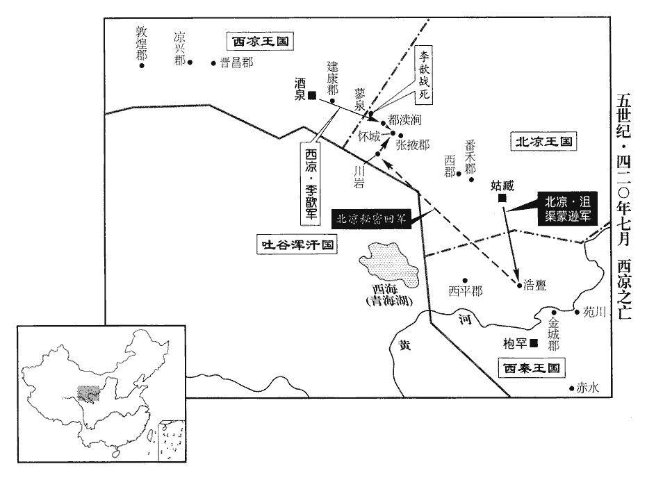
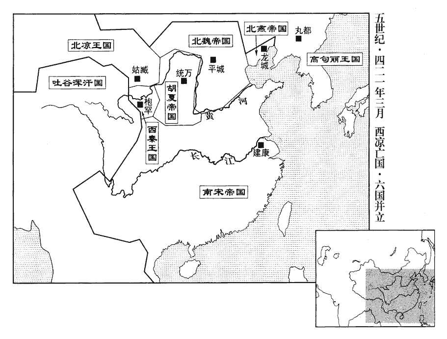
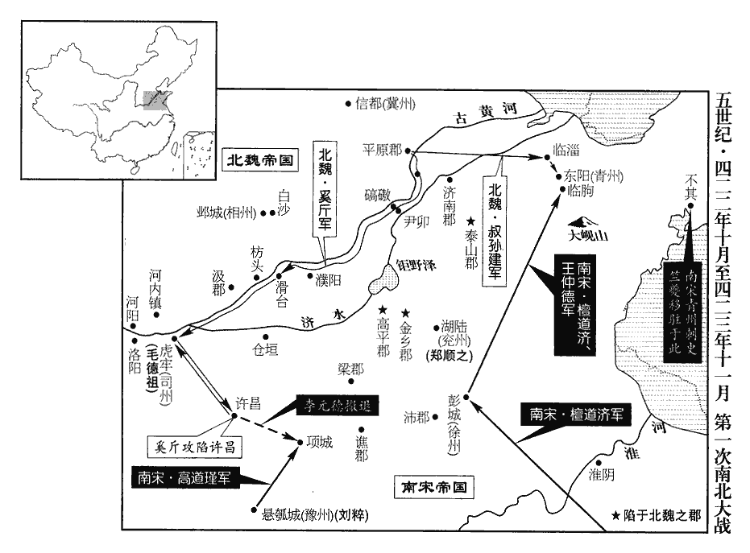
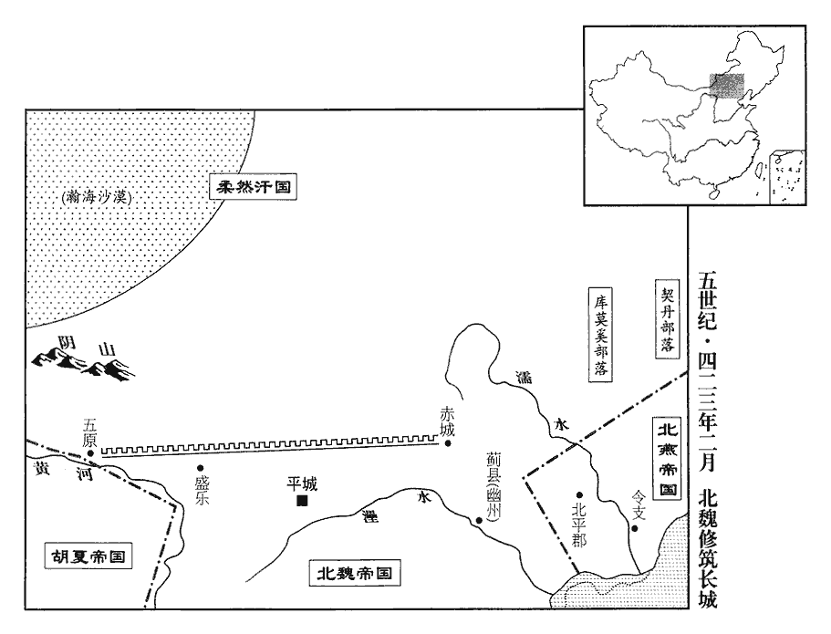
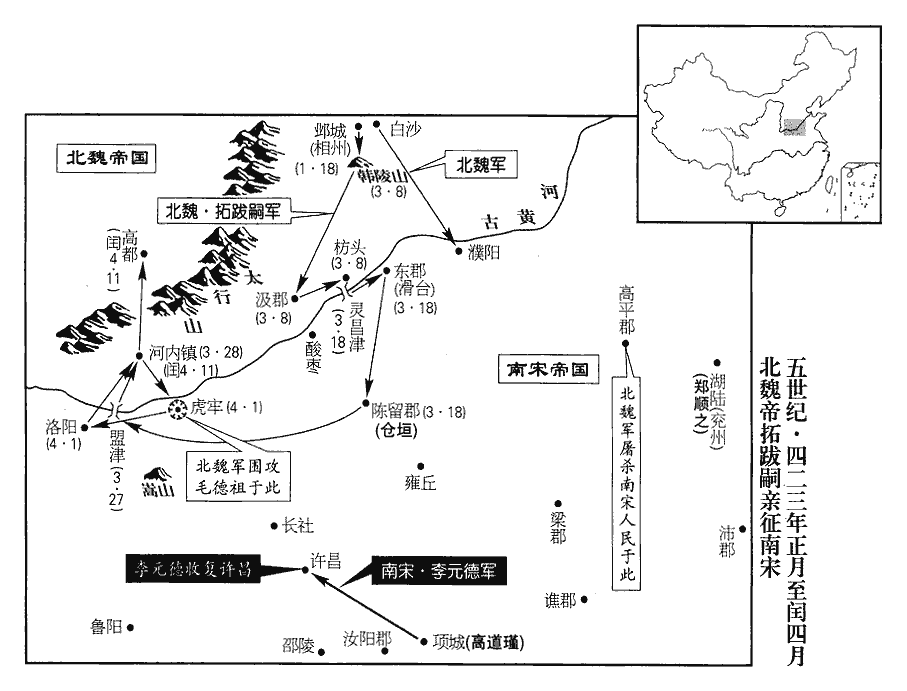
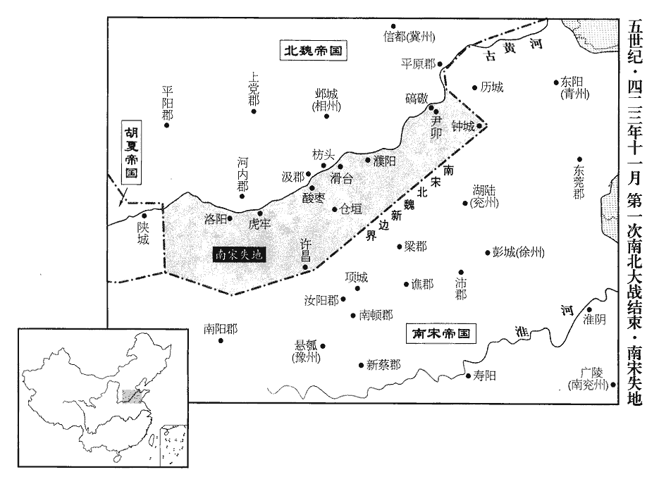
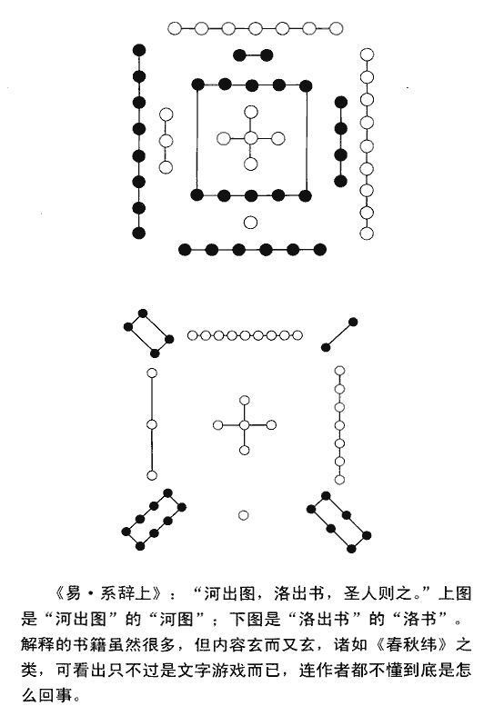

 宋紀一起上章涒灘（庚申），盡昭陽大淵獻（癸亥），凡四年。劉氏世居彭城，彭城於春秋之時宋土也，故帝之始建國號曰宋。

# 高祖武皇帝諱裕，字德輿，小字寄奴，姓劉氏，彭城縣綏德里人，漢楚元王交二十一世孫也。彭城，楚都，故苗裔家焉。晉氏東遷，劉氏移居晉陵丹徒之京口里。

## 永初元年（庚申、四二零）是年六月改元。

1春，正月，己亥‹十四›，魏主‹拓跋嗣，时年二十九›還宮。晉有天下，《通鑑》於魏主率兼書名；是年，宋受禪，始改書用列國之例。

〖译文〗 [1]春季，正月，乙亥（十四日），北魏国主拓跋嗣回宫。

2秦‹都枹罕，甘肃临夏›王熾磐立其子乞伏【章：甲十六行本無上二字；乙十一行本同；孔本同；退齋校同；熊校同。】暮末爲太子，熾，昌志翻。《考異》曰：《晉書》作「乞伏慕末」，《宋書》又作「乞佛茂蔓」。今從崔鴻《十六國春秋》。仍領撫軍大將軍、都督中外諸軍事，大赦，改元建弘。

〖译文〗 [2]西秦王乞伏炽磐封他的儿子乞伏暮末为太子，仍然兼任抚军大将军，总掌全国内外的军事，宣布大赦，改年号为建弘。

3宋王欲受禪而難於發言，乃集朝臣宴飲，此宋朝之臣也。朝，直遙翻。從容言曰：從，千容翻。「桓玄篡位，鼎命已移。我首唱大義，興復帝室，南征北伐，平定四海，功成業著，遂荷九錫。荷，下可翻。今年將衰暮‹时年五十八›，崇極如此，物忌盛滿，非可久安；今欲奉還爵位，歸老京師。」羣臣惟盛稱功德，莫諭其意。日晚，坐散。坐，徂臥翻。中書令傅亮還外，乃悟，而宮門已閉，亮叩扉請見，見，賢遍翻。王卽開門見之。亮入，但曰：「臣暫宜還都。」王解其意，無復他言，解，戶買翻，曉也。復，扶又翻。直云：「須幾人自送？」亮曰：「數十人可也。」卽時奉辭。亮出，已夜，見長星竟天，拊髀bì歎曰：「我常不信天文，今始驗矣。」長星所以除舊布新，故云然。亮至建康，夏，四月，徵王入輔。王留子義康爲都督豫•司•雍•幷四州諸軍事、豫州刺史，鎭壽陽。豫州，後漢治譙；魏治汝南安成；晉平吳，治陳國；江左治壽陽、蕪湖、邾城、牛渚、歷陽、馬頭、壽春、姑孰，不常厥居。安帝之末，帝欲開拓河南，綏定豫土，割揚州大江以西、大雷以北，悉屬豫州；豫州基址，因此而立。帝旣平關、洛，置司州刺史，治虎牢，領河南、滎陽、弘農實土三郡，河內、東京兆二僑郡，雍州仍僑治襄陽。秦、幷州刺史鎭蒲阪，毛德祖旣自蒲阪退屯虎牢，則幷州當寄治虎牢也。雍，於用翻。義康尚幼，以相國參軍南陽‹河南南阳›劉湛zhàn爲長史，決府、州事。府、州，都督府及豫州也。湛自弱年卽有宰物之情，常自比管、葛，謂管仲、諸葛亮也。博涉書史，不爲文章，不喜談議。喜，許記翻。王甚重之。

〖译文〗 [3]东晋宋王刘裕希望晋恭帝司马德文能以禅让的形式把帝位传给自己，却难于启齿，于是，他召集手下朝臣饮酒欢宴。在筵席上，刘裕若无其事地说：“当年桓玄篡位，晋国大权旁落。是我首先提倡大义，复兴皇帝宗室，南征北讨，平定了天下，可谓大功告成，业绩卓著，于是承蒙皇上恩赐而有九锡之尊。如今我的年纪也快老了，地位又如此尊崇，无以复加，天下的事最忌讳装得太满而盈溢出来，那样就不可以得到长久的安宁了，现在我要将爵位奉还皇上，回到京师颐养天年。”群臣不理解他的真正含意，只是一味盛称他的功德。这日天色已晚，群臣散去。中书令傅亮走出宫门，方才悟出宋王一席话的真实用意，但是宫门已经关闭，傅亮便叩门请求见宋王，宋王即令开门召见他。傅亮入宫，只说：“我应该暂且返回京师。”宋王刘裕明白他的用意，也不再多说别的，直接问：“你需要多少人护送？”傅亮回答说：“数十人就足够了。”随即与宋王刘裕辞别。傅亮出宫时已是半夜时分，只见彗星划过夜空，傅亮拍腿叹曰：“我过去常常不信天象，今天看来天象开始应验了。”傅亮来到京师建康，当时正值初夏四月，晋恭帝征召刘裕入京辅弼。宋王刘裕让他的儿子刘义康留守，都督豫、司、雍、并四州诸军事，豫州刺史，坐镇寿阳。刘义康年纪还很幼小，刘裕于是任用相国参军南阳人刘湛为长史，帮助决策和处理府、州日常军政事务。刘湛自幼就有做宰辅的远大志向，常常以管仲、诸葛亮自比，他博览书史，却不喜做文章，不爱空发议论，因此刘裕特别器重他的才干。

4五月，乙酉‹二›，魏更諡宣武帝曰道武帝。魏主嗣永興二年，諡父珪曰宣武皇帝。更，古衡翻。

〖译文〗 [4]五月，乙酉（初二），北魏变更宣武帝拓跋的谥号，改称道武帝。

5魏淮南公司馬國璠、池陽子司馬道賜謀外叛，司馬文思告之。庚戌‹二十七›，魏主殺國璠、道賜，賜文思爵鬱林公。國璠等降魏，見上卷晉安帝義熙十三年。璠，孚袁翻。國璠等連引平城豪桀，坐族誅者數十人，章安侯封懿之子玄之當坐。魏主以玄之燕朝舊族，慕容廆興於昌黎，封氏依之，遂世仕於燕，貴顯。欲宥其一子。玄之曰：「弟子磨奴早孤，乞全其命。」乃殺玄之四子而宥磨奴。

〖译文〗 [5]北魏淮南公司马国、池阳子司马道赐阴谋反叛，司马文思告发了他们。庚戌（二十七日），北魏国主拓跋嗣杀司马国与司马道赐，赐封司马文思为郁林公。司马国一伙的阴谋牵连了平城的大户豪强，全族被诛的就有数十人，章安侯封懿的儿子封玄之也应斩首。北魏国主念及封玄之是燕朝旧族，想要宽宥他的一个儿子。封玄之说：“我的侄儿封磨奴幼年丧父，乞求您留他一命。”北魏国主于是杀掉了封玄之的四个儿子而饶恕了封磨奴。

6六月，壬戌‹九›，王至建康。傅亮諷晉恭帝‹司马德文，时年三十五›禪位於宋，具詔草呈帝，使書之。帝欣然操筆，謂左右曰：「桓玄之時，晉氏已無天下，重爲劉公所延，將二十載；晉安帝元興三年，裕討桓玄，至是凡十七年。操，千高翻，重，直龍翻。載，子亥翻。今日之事，本所甘心。」遂書赤紙爲詔。

〖译文〗 [6]六月，壬戌（初九），宋王刘裕来到建康。傅亮用委婉的语言暗示晋恭帝将帝位禅让给宋王，并且草拟了退位诏书呈给晋恭帝，让他亲自抄写一遍。晋恭帝欣然提笔，并对左右侍臣说：“桓玄之乱的时候，晋朝已失掉天下，后来幸赖刘公才得以延续将近二十年；今日禅位给他，是我甘心所为。”于是将傅亮呈来的草稿作为正式诏书抄写在红纸上。

甲子‹十一›，帝遜于琅邪第，百官拜辭，祕書監徐廣流涕哀慟。晉武帝泰始元年受禪，歲在乙酉；建興四年，長安陷，歲在丙子；凡五十二年。次年，元帝建號於江東，改元建武，至是年，歲在庚申，凡一百單三年。西、東享國共一百五十七年而亡。

〖译文〗 甲子（十一日），晋恭帝司马德文让位，回到了琅邪旧邸，百官叩拜辞别，秘书监徐广痛哭流涕，不胜哀恸。

丁卯‹十四›，王爲壇於南郊，卽皇帝位。禮畢，自石頭備法駕入建康宮。徐廣又悲感流涕，侍中謝晦謂之曰：「徐公得無小過！」廣曰：「君爲宋朝佐命，朝，直遙翻。身是晉室遺老，悲歡之事，固不可同。」廣，邈之弟也。徐邈爲晉孝武所親重。

〖译文〗 丁卯（十四日），宋王刘裕在南郊设坛，即帝位。典礼结束后，刘裕乘皇帝的车驾从石头进入建康宫。徐广又悲痛不已。侍中谢晦对他说：“徐公如此未免有点过分了吧！”徐广说：“您是宋朝佐命大臣，我是晋室遗老，悲欢之情，当然是各不相同。”徐广是徐邈的弟弟。

帝臨太極殿，大赦，改元。其犯鄕論清議，一皆蕩滌，與之更始。犯鄕論清議，蓋得罪於名敎者。更，工衡翻。

〖译文〗 刘宋武帝刘裕登太极殿，大赦天下，改年号为永初。刘裕宣布，凡是行为不道德，受过舆论抨击的人，一律清除罪名，使之改过自新。

裴子野論曰：昔重華受終，四凶流放；《書》：堯使舜嗣位，正月上日，受終於文祖；流共工于幽州，放驩兜于崇山，竄三苗于三危，殛鯀于羽山，四罪而天下咸服。重，直龍翻。武王克殷，頑民遷洛‹河南洛阳›。武王克殷，遷頑民于洛邑。天下之惡一也，鄕論清議，除之，過矣！

〖译文〗 裴子野论曰：当年虞舜姚重华接受国家大任，流放共工、兜、三苗、鲧等四凶；武王征服殷商，将顽劣的遗民迁到洛阳。天下的罪恶何时都是相同的，而刘裕一概免除触犯众怒的人的罪名，是做得太过分了！

7奉晉恭帝‹司马德文›爲零陵王；優崇之禮，皆倣晉初故事，卽宮于故秣陵縣‹江苏江宁南秣陵乡›，沈約曰：秣陵縣本治去京邑六十里，今故治村是也，晉安帝義熙九年，移治京邑，在鬬場。恭帝元熙元年，省揚州禁防參軍，縣移治其處。使冠軍將軍劉遵考將兵防衛。冠，五玩翻。將，卽亮翻。降褚后‹褚灵媛›爲王妃。

〖译文〗 [7]刘宋武帝封晋恭帝为零陵王；他对待晋室的优崇之礼，一律仿照晋初优待魏室的先例。随即又在故秣陵县为晋恭帝兴建王宫，派遣冠军将军刘遵考率兵保卫。又将晋恭帝的皇后褚灵媛降为王妃。

追尊皇考‹刘翘›爲孝穆皇帝，皇妣趙氏爲孝穆皇后；尊王太后蕭氏‹萧文寿›爲皇太后。帝父翹娶趙氏，生帝而殂，繼室以蕭氏。上事蕭太后素謹，及卽位，春秋已高‹刘裕时年五十八›，每旦入朝太后，朝，直遙翻。未嘗失時刻。

〖译文〗 刘宋武帝追尊他的父亲为孝穆皇帝，母亲赵氏为孝穆皇后；尊封其继母王太后萧氏为皇太后。刘裕事奉萧太后一向恭谨，即皇帝位以后，虽然他年事已高，每天清晨必入后宫给太后问安，从未错过时刻。

詔晉氏封爵，當隨運改，獨置始興、廬陵、始安、長沙、康樂五公，降爵爲縣公及縣侯，始興、廬陵、始安、長沙皆郡公，獨康樂縣公耳。據《南史》，降始興郡公爲華容縣公，廬陵公爲柴桑縣公，始安公爲荔浦縣侯，長沙公爲醴陵縣侯。樂，音洛。以奉王導、謝安、溫嶠、陶侃、謝玄之祀，其宣力義熙、豫同艱難者，一仍本秩。

〖译文〗 刘裕又下诏说，晋朝时所封的爵位，应当随着改朝换姓而有所更改，于是他将过去封置的始兴公、庐陵公、始安公、长沙公由郡公降爵为县公；康乐公由县公降为县侯，以使王导、谢安、温峤、陶侃、谢玄等人的祭祀香火得以延续。凡是当年与刘裕同甘共苦抗击过桓玄的人，仍保持其爵位和俸禄不变。

庚午‹十七›，以司空道憐爲太尉，封長沙王。追封司徒道規爲臨川王，以道憐子義慶襲其爵。其餘功臣徐羨之等，增位進爵各有差。

〖译文〗 庚午（十七日），刘宋武帝提升司空刘道怜为太尉，封他为长沙王。追封司徒刘道规为临川王，并以刘道怜的儿子刘义庆继承刘道规的爵位。其余的功臣徐羡之等等，也分别加官增禄或进升爵位。

追封劉穆之爲南康郡公，王鎭惡爲龍陽縣侯。上每歎念穆之，曰：「穆之不死，當助我治天下。治，直之翻。可謂『人之云亡，邦國殄瘁』！」《詩•瞻卬》之辭。瘁，秦醉翻。又曰：「穆之死，人輕易我。」易，以豉翻。

〖译文〗 刘宋武帝又追封刘穆之为南康郡公，王镇恶为龙阳县侯。刘裕常常想念刘穆之，叹息着说：“刘穆之如果不死，一定能帮助我治理天下。真可谓是‘好人散去，国家遭殃’！”又说：“刘穆之一死，人们将很容易对付我了。”

立皇子桂陽公義眞爲廬陵王，彭城公義隆爲宜都王，義康爲彭城王。

〖译文〗 刘宋武帝又封皇子桂阳公刘义真为庐陵王、彭城公刘义隆为宜都王，刘义康为彭城王。

己卯‹二十六›，改《泰始曆》爲《永初曆》。以元改曆。

〖译文〗 己卯（二十六日），取消《泰始历》，改用《永初历》。

8魏主如翳yì犢山‹疑内蒙凉城北蛮汉山›，遂至馮滷池‹陕西定边盐池›。據《北史》，翳犢山在平城之西，五原之東。馮滷池卽五原鹽池，唐屬鹽州界。滷，龍五翻。聞上受禪，驛召崔浩告之曰：「卿往年之言驗矣，浩言見上卷晉安帝義熙十四年。朕於今日始信天道。」

〖译文〗 [8]北魏国主拓跋嗣前往翳犊山，又西去冯卤池。他闻知刘裕接受禅让，用驿车征召崔浩，对他说：“你当年的预言全部都应验了，我到今日才开始相信天道。”

9秋，七月，丁酉‹十五›，魏主如五原‹内蒙包头›。

〖译文〗 [9]秋季，七月，丁酉（十五日），北魏国主拓跋嗣抵达五原。

10甲辰‹二十二›，詔以涼公歆爲都督高昌等七郡諸軍事、征西大將軍、酒泉公；秦王熾磐爲安西大將軍。熾，昌志翻。

〖译文〗 [10]甲辰（二十二日），刘裕下诏，任命西凉公李歆为都督高昌等七郡诸军事、征西大将军，进封他为酒泉公。又任命西秦王乞伏炽磐为安西大将军。

11交州‹府龙编，越南河内东北北宁府›刺史杜慧度擊林邑‹越南中部›，大破之，林邑屢爲寇，故慧度擊之。所殺過半。林邑乞降，前後爲所鈔掠者皆遣還。降，戶江翻。鈔，楚交翻。慧度在交州，爲政纖密，一如治家，治，直之翻。吏民畏而愛之；城門夜開，道不拾遺。

〖译文〗 [11]刘宋交州刺史杜慧度进攻林邑，大破林邑军，斩杀敌人过半。林邑请求投降，并将前后入寇所抢劫掳掠的人口和财产全部归还。杜慧度在交州任职，处理公务，细密谨慎，仿佛管理自己的家事，官吏和百姓对他都十分敬畏；城门夜不关闭，路不拾遗。

12己【章：甲十六行本「己」作「丁」；乙十一行本同；孔本同；張校同。】未‹二十五›，魏主如雲中‹内蒙托克托›。

〖译文〗 [12]己未（疑误），北魏国主拓跋嗣抵达云中。

13河西王蒙遜‹时年五十三›欲伐涼，先引兵攻秦浩亹‹甘肃永登西南›；浩亹，音告門。旣至，潛師還屯川巖‹甘肃张掖西南›。

〖译文〗 [13]北凉河西王沮渠蒙逊准备进攻西凉，于是，他设计先在东方进攻西秦的浩，大军一到浩，立即秘密回师，驻军川岩。

涼公歆欲乘虛襲張掖；宋繇、張體順切諫，不聽。太后尹氏謂歆曰：「汝新造之國，地狹民希，自守猶懼不足，何暇伐人！先王臨終，李暠卒見上卷晉安帝義熙十三年。殷勤戒汝，深愼用兵，保境寧民，以俟天時。言猶在耳，柰何棄之！蒙遜善用兵，非汝之敵，數年以來，常有兼幷之志。汝國雖小，足爲善政，脩德養民，靜以待之。彼若昏暴，民將歸汝；若其休明，休，美也。汝將事之；豈得輕爲舉動，僥冀非望！以吾觀之，非但喪師，喪，息浪翻。殆將亡國！」亦不聽。宋繇歎曰：「今茲大事去矣！」

〖译文〗 西凉公李歆得到沮渠蒙逊进攻浩的消息，便想要乘北凉西部防务空虚，进攻张掖。右长史宋繇、左长史张体顺恳切地劝阻他，李歆不听。李歆的母亲、太后尹氏警告李歆说：“你的王国是一个新建的国家，地狭民少，自卫还怕力量不够，哪有余力去讨伐别人！先王临死时，一再叮咛你，对于军事行动千万要慎重，要保境安民，等待良机。言犹在耳，为什么就抛在一边？沮渠蒙逊善于用兵，你不是他的对手，何况他多年来一直有吞并我们的野心。你的王国虽然很小，但足以施行善政，修德养民，冷静地休养生息以等待时机。沮渠蒙逊如果昏庸暴虐，人民自会归附于你；他如果英明有德政，你应该事奉于他。怎么可以轻举妄动，去讨伐别人，只图侥幸成功。依我看来，你此番举动，不但会全军覆没，还将亡国！”李歆还是不接受。宋繇叹息说：“到如此地步，大势去矣！”

歆將步騎三萬東出。將，卽亮翻。騎，奇寄翻。蒙遜聞之曰：「歆已入吾術中；然聞吾旋師，必不敢前。」乃露布西境，云已克浩亹，將進攻黃谷。此露布非必建之漆竿，如魏、晉告捷之制，但露檄布言其事耳。歆聞之，喜，進入都瀆澗‹甘肃张掖西›。蒙遜引兵擊之，戰於懷城‹张掖西›，歆大敗。或勸歆還保酒泉。歆曰：「吾違老母之言以取敗，不殺此胡，何面目復見我母！」復，扶又翻。遂勒兵戰於蓼liǎo泉‹张掖西›，爲蒙遜所殺。歆弟酒泉太守翻、新城太守預、領羽林右監密、左將軍眺、右將軍亮西奔敦煌。敦，徒門翻。

〖译文〗 李歆率领步、骑兵三万人自都城酒泉向东进发。沮渠蒙逊闻知大喜，说：“李歆已经中了我的圈套，但是如果他听说我回军埋伏，一定不敢继续前进。”于是沮渠蒙逊下令在西部边境，遍传攻克浩的消息，并扬言大军还要进攻黄谷。李歆得到这个消息，大喜，立即率大军开进都渎涧，沮渠蒙逊率军进攻，两支军队在怀城决战，结果李歆率领的西凉军大败。有人劝李歆退军保卫都城酒泉。李歆说：“我违背母亲的教训才遭到如此挫败，不杀掉这个胡蛮，我有何面目再见老母。”于是率领又手下的将士在蓼泉与蒙逊军队展开第二次会战，西凉军大败，李歆被沮渠蒙逊杀掉。李歆的弟弟酒泉太守李翻、新城太守李预、领羽林军右监李密、左将军李眺、右将军李亮，向西逃往敦煌。

 

蒙遜入酒泉，安帝隆安四年，李暠據敦煌，凡二主，二十一年而滅。禁侵掠，士民安堵。以宋繇爲吏部郎中，委之選舉；涼之舊臣有才望者，咸禮而用之。以其子牧犍爲酒泉太守。犍，居言翻。守，式又翻。敦煌太守李恂，翻之弟也，與翻等棄敦煌奔北山。蒙遜以索嗣之子元緒行敦煌太守。索嗣死事見一百十一卷晉安帝隆安四年。索，昔各翻。

〖译文〗 沮渠蒙逊于是进入酒泉，他严明纪律，禁止士兵抢劫，人民生活安定。沮渠蒙逊任命宋繇为吏部郎中，掌管全国官员的任免和升迁调补。西凉旧有臣僚中有才干和声望的，都以礼对待他们并延聘任官。沮渠蒙逊任命他的儿子沮渠牧犍为酒泉太守。西凉敦煌太守李恂，是李翻的弟弟，这时也与李翻等一道放弃敦煌，逃往北山。沮渠蒙逊任命索嗣的儿子索元绪代理敦煌太守。

蒙遜還姑臧，見涼太后尹氏而勞之。尹氏曰：「李氏爲胡所滅，知復何言！」蒙遜，張掖盧水胡也。勞，力到翻。復，扶又翻；下可復同。或謂尹氏曰：「今母子之命在人掌握，柰何傲之！且國亡子死，曾無憂色，何也？」尹氏曰：「存亡死生，皆有天命，柰何更如凡人，爲兒女子之悲乎！吾老婦人，國亡家破，豈可復惜餘生，爲人臣妾乎！惟速死爲幸耳。」蒙遜嘉而赦之，娶其女爲牧犍婦。

〖译文〗 沮渠蒙逊返回都城姑臧，见到西凉国尹太后，极尽安抚慰问。尹太后说：“李氏家族为胡人所灭，还有什么可说。”有人对尹太后说：“而今，你们母子的性命都握在别人手中，怎么可以如此傲慢！况且国家灭亡，儿子被杀，你却连一点忧色都没有，为什么？”尹太后说：“存亡生死，都是上天的旨意，为什么要象普通人那样，作小儿女般的悲恸？我已经是个老太婆了，如今国破家亡，怎么可以爱惜余生，为人家臣妾呢！我只求快快死掉，就是万幸了。”沮渠蒙逊嘉许她的言行，赦免了她，并娶她的女儿做自己儿子沮渠牧犍的妻子。

14八月，辛未‹十九›，追諡妃臧氏‹臧爱亲›爲敬皇后。癸酉‹二十一›，立王太子義符爲皇太子。

〖译文〗 [14]八月，辛未（十九日），刘裕追赠妃臧爱亲谥号敬皇后。癸酉（二十一日），立王太子刘义符为皇太子。

15閏月，壬午‹一›，詔晉帝諸陵悉置守衛。

〖译文〗 [15]闰月，壬午（初一），刘裕下诏：东晋历代皇帝陵墓，都设置守卫。

16九月，秦振武將軍王基等襲河西王蒙遜胡園戍，俘二千餘人而還。還，從宣翻，又如字。

〖译文〗 [16]九月，西秦振武将军王基等在胡园戍地方袭击了北凉河西王沮渠蒙逊的部队，俘获二千余人而回。

17李恂在敦煌有惠政；索元緒粗險好殺，大失人和。好，呼到翻。郡人宋承、張弘密信招恂。冬，恂帥數十騎入敦煌，元緒東奔涼興‹甘肃安西东南万佛峡›。涼興郡在唐瓜州常樂縣界。帥，讀曰率。承等推恂爲冠軍將軍、涼州刺史，冠，古玩翻。改元永建。河西王蒙遜遣世子政德攻敦煌，恂閉城不戰。

〖译文〗 [17]西凉敦煌太守李恂在任时，对百姓有德政，深得民心，而北凉新派的太守索元绪粗暴凶狠、阴险嗜杀，大失人心。敦煌人宋承、张弘秘密写信给前太守李恂，请他回来主政。这年冬季，李恂率领骑兵数十人进入敦煌，索元绪向东逃往凉兴。宋承等推举李恂为冠军将军、凉州刺史，改年号为永建。北凉河西王沮渠蒙逊派遣世子沮渠政德进攻敦煌，李恂等紧闭城门，不出来应战。

18十二月，丁亥‹七›，杏城‹陕西黄陵›羌酋狄溫子帥三千餘家降魏。背夏降魏也。酋，慈由翻。帥，讀曰率。降，戶江翻。

〖译文〗 [18]十二月，丁亥（初七日），夏国所属杏城羌族部落酋长狄温子，率三千余家背叛夏国，投奔北魏。

19是歲，魏姚夫人卒，追諡昭哀皇后。姚夫人歸魏見一百十七卷晉安帝義熙十一年。

〖译文〗 [19]本年，北魏姚夫人去世。追赠谥号昭哀皇后。

## 二年（辛酉、四二一）

1春，正月，辛酉‹十二›，上‹刘裕，本年五十九岁›祀南郊，大赦。

〖译文〗 [1]春季，正月，辛酉（十二日），刘宋武帝到南郊圜丘，祭祀天神，大赦天下。

裴子野論曰：夫郊祀天地，修歲事也；赦彼有罪，夫何爲哉！

〖译文〗 裴子野论曰：在南郊祭祀天神地神，是每年例行的典礼；刘裕却赦免有罪的人，不知他的用心何在！

2以揚州刺史廬陵王義眞‹本年十六岁›爲司徒，尚書僕射徐羨之爲尚書令、揚州刺史，中書令傅亮爲尚書僕射。

〖译文〗 [2]刘宋武帝任命扬州刺史庐陵王刘义真为司徒，尚书仆射徐羡之为尚书令、扬州刺史，中书令傅亮为尚书仆射。

3辛未‹二十二›，魏主嗣‹时年三十›行如公陽。

〖译文〗 [3]辛未（二十二日），北魏国主拓跋嗣一行前往公阳。

4河西王蒙遜‹时年五十四›帥衆二萬攻李恂于敦煌。

〖译文〗 [4]北凉河西王沮渠蒙逊亲自率兵二万人攻打西凉李恂所据守的敦煌。

5秦王熾磐遣征北將軍木弈干、輔國將軍元基攻上邽‹甘肃天水›，遇霖雨而還。

〖译文〗 [5]西秦王乞伏炽磐派遣征北将军乞伏木弈干、辅国将军乞伏元基攻打夏国所属的上，遇到连绵大雨，班师回朝。

6三月，甲子‹十六›，魏陽平王熙卒。

〖译文〗 [6]三月，甲子（十六日），北魏阳平王拓跋熙去世。

7魏主發代都‹山西大同›六千人築苑，東包白登‹大同东›，周三十餘里。

〖译文〗 [7]北魏国主拓跋嗣征调代郡百姓六千人兴筑御花园，东面包括白登，周围三十余里。

8河西王蒙遜築隄壅水以灌敦煌；李恂乞降，不許。恂將宋承等舉城降，恂自殺。蒙遜屠其城，獲恂弟子寶，囚于姑臧‹甘肃武威›。李氏滅矣。李寶卒以此開有唐之基。天之所啓，誰能廢之！於是西域諸國皆請□□【章：甲十一行本「請」作「詣」，空格作「蒙遜」二字；乙十一行本同；孔本同；熊校同。】稱臣朝貢。將，卽亮翻。朝，直遙翻。

〖译文〗 [8]北凉河西王沮渠蒙逊兴筑长堤，采用水攻的方法，把敦煌城围困起来；李恂请求投降，沮渠蒙逊拒绝。李恂手下的大将宋承等再次背叛，举献城池投降了沮渠蒙逊，李恂自杀。沮渠蒙逊下令屠城，生擒了李恂的侄儿李宝，送到姑臧囚禁起来。于是，西域各国纷纷请求归附北凉，自称臣属，遣使朝贡。

 

9夏，四月，己卯朔‹一›，詔：「所在淫祠自蔣子文以下皆除之；其先賢及以勳德立祠者，不在此例。」

〖译文〗 [9]夏季，四月，己卯朔（初一），刘宋武帝下诏：所有不正规的祠庙，包括蒋子文以下的祠庙，一律撤除。但是祭祀先辈圣贤，以及有功勋、有德望的先辈宗祠，仍可保留。

10吐谷渾‹青海›王阿柴遣使降秦，使，疏吏翻。降，戶江翻。秦王熾磐以阿柴爲征西大將軍、開府儀同三司、安州牧、白蘭王。秦蓋以吐谷渾之地爲安州。

〖译文〗 [10]吐谷浑王慕容阿柴派遣使臣向西秦投降。西秦国王乞伏炽磐任命慕容阿柴为征西大将军、开府仪同三司、安州牧、白兰王。

11六月，乙酉‹八›，魏主北巡至蟠羊山‹内蒙兴和西南›；蟠羊山在參合陂東。秋，七月，西巡至河。

〖译文〗 [11]六月，乙酉（初八），北魏国主拓跋嗣向北巡视，抵达蟠羊山；秋季，七月，拓跋嗣又向西巡视，抵达黄河。

12河西王蒙遜遣右衛將軍沮渠鄯善、建節將軍沮渠苟生帥衆七千伐秦。秦王熾磐遣征北將軍木弈干等帥步騎五千拒之，敗鄯善等于五澗‹甘肃武威与乌鞘岭之间›，五澗在洪池嶺‹乌鞘岭›北。《水經註》：五澗水出姑臧城東而西，北流注馬城河。敗，補邁翻。虜苟生，斬首二千而還。

〖译文〗 [12]北凉河西王沮渠蒙逊派遣右卫将军沮渠鄯善、建节将军沮渠苟生率军七千人攻打西秦。西秦王乞伏炽磐派遣征北将军乞伏木弈干等率领步、骑兵五千人抵抗北凉军队的进攻，在五涧大败沮渠鄯善的军队，生擒沮渠苟生，斩首二千人，班师告捷。

13初，帝‹刘裕›以毒酒一甖甖yīng，於耕翻，瓦器也。授前琅邪郎中令張偉，使酖零陵王‹司马德文，时年三十五›，偉歎曰：「酖君以求生，不如死！」乃於道自飲而卒。卒，子恤翻。偉，卲之兄也。初，帝領揚州，辟卲爲僚屬。太常褚秀之、侍中褚淡之，皆王之妃兄也，王每生男，帝輒令秀之兄弟方便殺之。方便者，隨宜處分，不令其事彰露也。王自遜位，深慮禍及，與褚妃共處一室，處，昌呂翻。自煑食於牀前，飲食所資，皆出褚妃，故宋人莫得伺其隙。伺，相吏翻。九月，帝令淡之與兄右衛將軍叔度往視妃‹褚灵媛，时年三十八›，妃出就別室相見。兵人踰垣而入，進藥於王。王不肯飲，曰：「佛敎，自殺者不復得人身。」兵人以被掩殺之。復，扶又翻。《考異》曰：《宋•本紀》，「九月己丑，零陵王薨」；《晉•本紀》，「九月丁丑」；據《長曆》，九月丙午朔，無己丑、丁丑，今不書日。帝帥百官臨於朝堂三日。自是之後，禪讓之君，罕得全矣。帥，讀曰率。臨，力鴆翻。朝，直遙翻。

〖译文〗 [13]当初，刘宋武帝曾把一瓦罐毒酒交给前琅邪郎中令张伟，让他毒死东晋废帝、改封为零陵王的司马德文，张伟叹息说：“毒杀君王而求活命，不如一死”。于是就在路上自饮而亡。张伟是张的哥哥。太常褚秀之、侍中褚淡之，二人都是零陵王的王妃褚灵秀的哥哥，司马德文的妻妾中，每每有人生下男孩，刘裕便命褚秀之兄弟趁便扼杀。司马德文逊位后，他深恐自己也不免毒手，就与褚妃同住一室，在床前煮饭烧汤，饮食等所需用的都由褚妃亲手操办。所以刘裕的人一时没有机会下手。九月，刘宋武帝命令褚淡之与其兄右卫将军褚叔度前往探视他们的妹妹褚妃。褚妃出来到另一间房子与二兄相见。伏兵翻墙而入，把毒药递给零陵王司马德文。司马德文不肯饮服，说：“佛教的教义，自杀而死的，再世投胎时，将不能得到人身。”士卒一拥而上，用被蒙住司马德文的头，将他闷死。刘裕率领文武百官亲临朝堂哭泣哀悼三天。

14庚戌‹五›，魏主還宮。

〖译文〗 [14]庚戌（初五），北魏国主拓跋嗣回宫。

15冬，十月，己亥‹二十四›，詔以河西王蒙遜爲鎭軍大將軍、開府儀同三司、涼州刺史。

〖译文〗 [15]冬季，十月，己亥（二十四日），刘宋武帝下诏，任命北凉河西王沮渠蒙逊为镇军大将军、开府仪同三司、凉州刺史。

16己亥‹二十四›，魏主如代‹河北蔚县›。

〖译文〗 [16]己亥（二十四日），北魏国主拓跋嗣前往代郡。

17十一月，辛亥‹七›，葬晉恭帝于沖平陵‹南京东蒋山西南›，帝帥百官瞻送。

〖译文〗 [17]十一月，辛亥（初七），刘宋将晋恭帝司马德文安葬于冲平陵，刘宋武帝亲自率领文武百官护送灵柩。

18十二月，丙申‹二十二›，魏主西巡，至雲中‹内蒙托克托›。

〖译文〗 [18]十二月，丙申（二十二日），北魏国主拓跋嗣视察西部边防，抵达云中。

19秦王熾磐遣征西將軍孔子等，帥騎二萬擊契汗禿眞於羅川‹甘肃正宁北›。契，欺訖翻。汗，音寒。

〖译文〗 [19]西秦王乞伏炽磐派遣征西将军乞伏孔子等率领骑兵二万人，袭击匈奴部落酋长契汗秃真据守的罗川。

20河西王蒙遜所署晉昌‹甘肃安西›太守唐契據郡叛，蒙遜遣世子政德討之。契，瑤之子也。唐瑤見一百十一卷晉安帝隆安四年。

〖译文〗 [20]北凉河西王沮渠蒙逊所属的晋昌太守唐契据郡叛变，沮渠蒙逊派遣其世子沮渠政德讨伐叛军。唐契是唐瑶的儿子。

21上之爲宋公也，謝瞻爲宋臺中書侍郎，其弟晦爲右衛將軍。時晦權遇已重，自彭城‹江苏徐州›還都‹南京›迎家，上爲宋公，建宋臺於彭城。賓客輻湊，門巷塡咽。瞻在家驚駭，謂晦曰：「汝名位未多，而人歸趣乃爾！趣，七喻翻。吾家素以恬退爲業，不願干豫時事，交遊不過親朋。而汝遂勢傾朝野，朝，直遙翻。此豈門戶之福邪！」乃以籬隔門庭曰：「吾不忍見此。」及還彭城，言於宋公曰：「臣本素士，父祖位不過二千石。瞻、晦，晉太常謝裒之玄孫，於謝安爲從孫，是其高曾與謝安同其所自出，但名位不及耳。弟年始三十，志用凡近，榮冠臺府，冠，古玩翻。位任顯密。福過災生，其應無遠，特乞降黜，以保衰門。」前後屢陳之。晦或以朝廷密事語瞻，語，牛倨翻。瞻故向親舊陳說，用爲戲笑，以絕其言。及上卽位，晦以佐命功，位任益重，瞻愈憂懼。是歲，瞻爲豫章‹江西南昌›太守，遇病不療。臨終，遺晦書曰：「吾得啓體幸全，亦何所恨！遺，于季翻。曾子有疾，召門弟子曰：「啓予足，啓予手。《詩》云『戰戰兢兢，如臨深淵，如屢薄冰，』而今而後，吾知免夫，小子！」孔子曰：「身體髮膚，受之父母，不敢毀傷。父母全而生之，子全而歸之。」弟思自勉勵，爲國爲家。」居寵思危，謝瞻有焉。爲謝晦殺身亡家張本。爲，于僞翻。

〖译文〗 [21]刘宋武帝刘裕还是东晋的宋公时，谢瞻为宋国的中书侍郎，他的弟弟谢晦为右卫将军。当时谢晦的权势和地位已经很重，他自彭城回京迎接家属，宾客们从四面八方涌来，车马盈门堵塞巷口。谢瞻在家看到如此情形不胜惊骇，对谢晦说：“你的声望和职位并不很高，人们却如此奉承你！你们谢家一向淡泊权利，不愿干预朝政，交游的人不是亲戚便是朋友。而你却权倾朝野，这哪里是家门之福！”于是，他用篱笆把两家门庭隔开说：“我不忍心见到这种场面。”等到回到彭城，谢瞻对宋公刘裕说：“我本出身于清贫之家，祖、父的官禄不过二千石，我的弟弟谢晦年方三十，志向平庸，才能不高，却荣居高位，地位格外尊崇，掌理机要。享福太过，灾难必生，应验不远，请求您贬降谢晦的官阶，以保存我们衰微的家门！”此后又多次向刘裕陈请。谢晦有时把朝廷中的机密告诉谢瞻，谢瞻就故意传给亲戚朋友，作为取笑的谈资，目的在于使谢晦闭口。宋公刘裕即位后，谢晦因有辅助开国的功劳，官位更高，责任愈重，谢瞻也为此更加忧惧。这年，谢瞻担任豫章太守，患病不治。临终前，他留一封遗嘱给谢晦，说：“我幸能保全一身，还有什么恨事？你要自思勉励，为国为家。”

## 三年（壬戌、四二二）

1春，正月，甲辰朔‹一›，魏主‹拓跋嗣，时年三十一›自雲中‹内蒙托克托›西巡，至屋竇城。據《北史》，屋竇城在薛林山東。

〖译文〗 [1]春季，正月，甲辰朔（初一），北魏国主拓跋嗣从云中出发继续向西巡视，抵达屋窦城。

2癸丑‹十›，以徐羨之爲司空、錄尚書事，刺史如故。江州‹府寻阳，江西九江›刺史王弘爲衛將軍、開府儀同三司；中領軍謝晦爲領軍將軍兼散騎常侍，入直殿省，總統宿衛。散，悉亶翻。騎，奇寄翻。徐羨之起自布衣，徐羨之爲桓脩撫軍中兵參軍，與帝同府，深相親結；及起義兵，益見親任。又無術學，直以志力局度，一旦居廊廟，朝野推服，咸謂有宰臣之望。沈密寡言，不以憂喜見色；朝，直遙翻。沈，持林翻，見，賢遍翻。頗工奕棋，觀戲，常若未解，解，戶買翻，曉也。當世倍以此推之。傅亮、蔡廓常言：「徐公曉萬事，安異同。」嘗與傅亮、謝晦宴聚，亮、晦才學辯博，羨之風度詳整，時然後言。鄭鮮之歎曰：「觀徐、傅言論，不復以學問爲長。」復，扶又翻。

〖译文〗 [2]癸丑（初十），刘宋武帝任命徐羡之为司空、录尚书事，继续兼任扬州刺史。任命江州刺史王弘为卫将军、开府仪同三司；中领军谢晦为领军将军兼散骑常侍，入宫值班，总管宫廷安全保卫事务。徐羡之由平民起家，又没有学问，但有很大的志向和气度，一旦居于高位，掌理国家大权，朝野上下，都推崇佩服，都认为他有宰相的声望。徐羡之平时沉默寡言，喜怒不形于色，精于奕棋，但观看别人对局，又好像什么都不懂，当时的人因此加倍推崇他。傅亮、蔡廓常说：“徐公通晓万事，善于调解纠纷。”徐羡之曾经与傅亮、谢晦酒筵欢聚，傅亮、谢晦才学渊博，善于辞辩，徐羡之风度庄重严肃，在适当的时候才发言。奉常官郑鲜之曾叹息地说：“观察徐羡之、傅亮的言论，已经不再是以学问见长了。”

3秦‹都枹罕，甘肃临夏›征西將軍孔子等大破契汗禿眞‹时驻罗川，甘肃正宁北›，契，欺訖翻。汗，音寒。禿，吐谷翻。獲男女二萬口，牛羊五十餘萬頭。禿眞帥騎數千西走，其別部樹奚帥戶五千降秦。帥，讀曰率。降，戶江翻。

〖译文〗 [3]西秦征西将军乞伏孔子等大破匈奴部落酋长契汗秃真的军队，俘获男女共二万人，牛羊五十余万头。契汗秃真仅率数千人向西逃走。另外一支匈奴部落酋长契汗树奚，率领五千户人家投降了西秦。

4二月，丁丑‹四›，詔分豫州淮以東爲南豫州‹安徽中部›，治歷陽‹安徽和县›，以彭城王義康爲刺史。義熙之初，帝欲開拓河南，綏定豫土，至九年，割揚州大江以西、大雷以北悉屬豫州。至是，以淮西之地爲北豫州，治汝南。沈約《志》，南豫州領歷陽、南譙、廬江、南汝陰、南梁、晉熙、弋陽、安豐、南汝南、新蔡、東郡、南潁、潁川、西汝陰、汝陽、陳留、南陳左郡、邊城左郡、光城左郡十九郡。按徐《志》及《永初郡國志》止領十三郡，蓋沈《志》有景平以後續置郡在其間也。又分荊州十郡置湘州，治臨湘‹湖南长沙›，晉安帝義熙十三年省湘州，今復置。臨湘，漢舊縣，唐爲潭州長沙縣。以左衛將軍張卲爲刺史。

〖译文〗 [4]二月，丁丑（初四），刘宋武帝下诏，分割豫州淮河以东土地为南豫州，州治设在历阳，任命彭城王刘义康为南豫州刺史。又分割荆州十个郡，建立湘州，州治设在临湘，任命左卫将军张为湘州刺史。

5丙戌‹十三›，魏主還宮。

〖译文〗 [5]丙戌（十三日），北魏国主拓跋嗣回宫。

6三月，上不豫，太尉長沙王道憐、司空徐羨之、尚書僕射傅亮、領軍將軍謝晦、護軍將軍檀道濟並入侍醫藥。羣臣請祈禱神祇，上不許，唯使侍中謝方明以疾告宗廟而已。上性不信奇怪，微時多符瑞，及貴，史官審以所聞，上拒而不答。

〖译文〗 [6]三月，刘宋武帝病重，太尉长沙王刘道怜、司空徐羡之、尚书仆射傅亮、领军将军谢晦、护军将军檀道济一道进宫，侍侯刘裕治疗服药。朝中大臣们请求向神灵祈祷，刘裕不许，只派侍中谢方明到宗庙焚香，把病情向祖先报告。刘裕一向不信神怪，当他还是一个平民的时候，曾有许多祥兆，等到后来大贵，史官们向他查证传闻，刘裕都拒而不答。

檀道濟出爲鎭北將軍、南兗州刺史，鎭廣陵‹江苏扬州›，悉監淮南諸軍。晉成帝立南兗州，治京口，自此治廣陵，領廣陵、海陵、山陽、盱眙、秦郡、南沛等郡。監，工銜翻。

〖译文〗 檀道济出任镇北将军、南兖州刺史，镇守广陵，兼领淮南各路军队。

皇太子多狎羣小，謝晦言於上曰：「陛下春秋旣高，宜思存萬世，神器至重，不可使負荷非才。」晦發此言，已有廢昏立明之意。荷，下可翻，又音如字。上曰：「廬陵何如？」晦曰：「臣請觀焉。」出造廬陵王義眞，造，七到翻。義眞盛欲與談，晦不甚答。還曰：「德輕於才，非人主也。」丁未‹五›，出義眞爲都督南豫•豫•雍•司•秦•幷六州諸軍事、車騎將軍、開府儀同三司、南豫州刺史。爲晦等殺義眞張本。雍，於用翻。騎，奇寄翻。是後，大州率加都督，多者或至五十州，不可復詳載矣。迄宋之季，境內惟二十二州。至梁武帝時，沿邊分置諸州，始有五十州。復，扶又翻。

〖译文〗 皇太子刘义符常和一些奸佞小人厮混，谢晦曾对刘宋武帝说：“陛下年事已高，应考虑如何使大业万世长存，帝位至关重要，不能交给没有才能的人。”刘裕问道：“你看庐陵王刘义真如何？”谢晦说：“且容我观察观察！”出宫后即去拜访庐陵王刘义真。刘义真盛情款待谢晦，并想要与他长谈，谢晦支吾其辞，不愿答话。回宫对宋武帝刘裕说：“德行低于才能，不是人主呵。”丁未（初五），刘裕命刘义真出任都督南豫、豫、雍、司、秦、并六州诸军事及车骑将军、开府仪同三司、南豫州刺史。从此以后，大州州牧官职之上又加都督之职便成定例，有的都督所辖，最多达到五十个州，已无法详细列出。

7帝‹刘裕›疾瘳，瘳chōu，丑留翻。己未‹十七›，大赦。

〖译文〗 [7]刘宋武帝大病稍愈，己未（十七日），大赦天下。

8秦、雍流民南入梁州‹府南城，陕西南郑南›；庚申‹十八›，遣使送絹萬匹，且漕荊‹府江陵，湖北江陵›、雍‹府襄阳，湖北襄樊›之穀以賑之。秦雍之雍，古雍州也，關中之地。荊雍之雍，晉末所置南雍州也，治襄陽。使，疏吏翻。賑，之忍翻。

〖译文〗 [8]秦州、雍州逃难的流民南下进入了刘宋所辖的梁州；庚申（十八日），刘宋武帝派遣使臣送一万匹绢，并且将荆州、雍州二处的谷米漕运到梁州，赈济那里的流民。

9刁逵之誅也，事見一百十三卷晉安帝元興三年。其子彌亡命。辛酉‹十九›，彌帥數十人入京口‹江苏镇江›，帥，讀曰率。太尉留府司馬陸仲元擊斬之。時長沙王道憐以太尉鎭京口，入侍醫藥，故有留府。

〖译文〗 [9]当初，刁逵伏诛，他的儿子刁弥逃亡。辛酉（十九日），刁弥率领数十人攻入京口，太尉留府司马陆仲元迎击，并斩杀了刁弥。

10乙丑‹二十三›，魏河南王曜卒。

〖译文〗 [10]乙丑（二十三日），北魏河南王拓跋曜去世。

11夏，四月，甲戌‹二›，魏立皇子燾‹时年十五›爲太平王，拜相國，加大將軍；丕爲樂平王，彌爲安定王，範爲樂安王，健爲永昌王，崇爲建寧王，俊爲新興王。

〖译文〗 [11]夏季，四月，甲戌（初二），北魏国主拓跋嗣封皇子拓跋焘为太平王，拜授相国，加授大将军；封皇子拓跋丕为乐平王、拓跋弥为安定王、拓跋范为乐安王、拓跋健为永昌王、拓跋崇为建宁王、拓跋俊为新兴王。

12乙亥‹三›，詔封仇池公楊盛爲武都王。

〖译文〗 [12]乙亥（初三），刘宋武帝下诏封仇池公杨盛为武都王。

13秦王熾磐以折衝將軍乞伏是辰爲西胡校尉，築列渾城於汁羅‹甘肃正宁北›以鎭之。汁羅蓋卽羅川之地。

〖译文〗 [13]西秦王乞伏炽磐，任命折冲将军乞伏是辰为西胡校尉，并在汁罗兴筑列浑城对胡人加以镇抚。

14五月，帝疾甚，召太子誡之曰：「檀道濟雖有幹略，而無遠志，非如兄韶有難御之氣也。徐羨之、傅亮，當無異圖。謝晦數從征伐，頗識機變，若有同異，必此人也。」帝固有疑晦之心矣。數，所角翻。又爲手詔曰：「後世若有幼主，朝事一委宰相，母后不煩臨朝。」朝，直遙翻。司空徐羨之、中書令傅亮、領軍將軍謝晦、鎭北將軍檀道濟同被顧命。癸亥‹二十一›，帝殂於西殿。年六十。自是以後，南北朝之君沒皆稱殂。被，皮義翻。顧，音古。帝清簡寡欲，嚴整有法度，被服居處，儉於布素，遊宴甚稀，嬪御至少。處，昌呂翻。少，詩沼翻。嘗得後秦高祖從女，後秦王興，廟號高祖。從，才用翻。有盛寵，頗以廢事；謝晦微諫，卽時遣出。財帛皆在外府，內無私藏。藏，徂浪翻。嶺南‹南岭南›嘗獻入筒細布，一端八丈，帝惡其精麗勞人，揚雄《蜀都賦》曰：布則蜘蛛作絲，不可見風；筩中黃潤，一端數金。言其細也。惡，烏路翻。卽付有司彈太守，彈，徒丹翻。以布還之，幷制嶺南禁作此布。公主出適，遣送不過二十萬，無錦繡之物。內外奉禁，莫敢爲侈靡。

〖译文〗 [14]五月，刘宋武帝病重，他把太子刘义符召到床前，告诫他说：“檀道济虽有才干，精于谋略，却无野心，不像他的哥哥檀道韶，有一种难以驾御的气质。徐羡之、傅亮，当不会有其他企图。谢晦多次随我南北征战，善于随机应变，将来如果有问题，一定是他。”然后，刘裕又亲笔写下遗诏：“后世如果出现年幼的君主，朝中政事一概委托给宰相，皇太后用不着临朝主政。”司空徐羡之、中书令傅亮、领军将军谢晦、镇北将军檀道济，共同接受遗命。癸亥（二十一日），刘宋武帝刘裕在西殿去世。刘裕生前清心寡欲，生活简朴，起居有常，严整有度。衣服和住所都很朴素，游览欢宴也次数很少，后宫嫔妃也不多。他曾经获得后秦文桓帝姚兴的侄女，对她倍加宠爱，并因此耽误了政事。谢晦稍加劝谏，他立即把姚妃遣送出宫。刘裕的财产全放在国库，宫内没有私藏。岭南曾经进贡过一种筒装细布，一筒竟能容纳八丈。刘裕嫌它过于精美华丽，耗费人力，于是他命令有关部门弹劾岭南太守，把进贡的细布还给当地，并且亲自下令禁止岭南织做这种细布。公主出嫁，嫁妆不过二十万，另外再也没有锦绣等精品。宫内宫外，都严奉禁约，没有人敢奢侈浪费。

太子卽皇帝位，年十七，大赦，尊皇太后‹萧文寿›曰太皇太后，立妃司馬氏‹司马茂英›爲皇后。后，晉恭帝女海鹽公主也。

〖译文〗 皇太子刘义符即皇帝位，年仅十七岁，下令大赦，尊皇太后萧文寿为太皇太后；封太子妃司马茂英为皇后。司马茂英是晋恭帝的女儿海盐公主。

15魏主‹拓跋嗣，时年三十一›服寒食散，頻年藥發，災異屢見，見，賢遍翻。頗以自憂。遣中使密問白馬公崔浩曰：使，疏吏翻。「屬者日食趙、代之分。屬者，猶言比者、近者。屬，之欲翻。分，扶問翻。朕疾彌年不愈，恐一旦不諱，諸子並少，少，詩照翻。將若之何？其爲我思身後之計！」爲，于僞翻。浩曰：「陛下春秋富盛，行就平愈；必不得已，請陳瞽言。自聖代龍興，不崇儲貳，是以永興之始，社稷幾危。事見一百十五卷晉安帝義熙五年。幾，居希翻，又音祁。今宜早建東宮，選賢公卿以爲師傅，左右信臣以爲賓友；入總萬機，出撫戎政。如此，則陛下可以優遊無爲，頤神養壽。萬歲之後，國有成主，民有所歸，姦宄guǐ息望，禍無自生矣。皇子燾年將周星，歲星十二年一周天。明叡溫和，立子以長，禮之大經，若必待成人然後擇之，倒錯天倫，則召亂之道也。」倒錯，謂廢長立少。長，知兩翻；下同。魏主復以問南平公長孫嵩。復，扶又翻。對曰：「立長則順，置賢則人服；燾長且賢，天所命也。」帝從之，立太平王燾爲皇太子，使之居正殿臨朝，爲國副主。朝，直遙翻。以長孫嵩及山陽公奚斤、魏收《官氏志》：後魏獻帝弟爲達奚氏，孝文改爲奚氏。北新公安同爲左輔，坐東廂，西面；崔浩與太尉穆觀、散騎常侍代人丘堆爲右弼，後魏孝文以獻帝第五兄敦丘氏爲丘氏。坐西廂，東面；百官總己以聽焉。坐東廂者西面，坐西廂者東面，皆朝拱皇太子。帝避居西宮，時隱而窺之，自隱蔽其身而窺之也。聽其決斷，斷，丁亂翻。大悅，謂侍臣曰：「嵩宿德舊臣，歷事四世，功存社稷；嵩事昭成帝‹拓跋什翼犍›及道武帝‹拓跋珪›、明元帝‹拓跋嗣›及太子燾爲四世。斤，辯捷智謀，名聞遐邇；聞，音問。同，曉解俗情，明練於事；觀，達於政要，識吾旨趣；浩，博聞強識，精察天人；堆，雖無大用，然在公專謹。以此六人輔相太子，吾與汝曹巡行四境，伐叛柔服，足以得志於天下矣。」解，胡買翻。行，下孟翻。

〖译文〗 [15]北魏国主拓跋嗣，一直服用寒食散，一连几年，药性发作，天上变异与地上灾难也屡屡出现，他自己深感忧虑。于是派宦官秘密询问白马公崔浩说：“最近，赵、代地区多次发生日食，而朕的病又多年不愈，我担心如果我一旦去世，皇子们还都年幼，那该如何是好？请你为我考虑考虑身后的办法。”崔浩回答说：“陛下正值壮年，您的病很快就会痊愈。如果您一定要听听我的意见，那我就说几句不一定合适的话。自从我们魏国创立以来，一向不注重选立储君。所以永兴初年发生的宫廷巨变，国家几乎倾覆。现在我们亟待要做的就是早早建东宫立太子，遴选贤明的公卿做太子的师傅，让您左右亲信的大臣作他的宾客和朋友；让太子在京师时主持朝政，出京时则统率军队安抚百姓，讨伐敌人。如果这样，陛下您就可以身心悠闲，不必亲自处理政事，在宫中颐养天年。陛下百年之后，国家有确定的君主，百姓亦有所归附，奸佞之徒不敢再生其他企图，灾祸也无从出现。皇子拓跋焘，年将十二岁，聪明睿智，性情温和，以长子立为太子，是礼制的最高原则，如果一定要等到他们长大成人，再在他们中间选择太子，那就很可能废长立幼，使天伦倒错，从而召致天下大乱。”北魏国主又就立太子的问题征询南平公长孙嵩的意见。长孙嵩回答说：“立长为储君，名正言顺，选贤为太子，则人心信服。拓跋焘既是长子又很贤能，这是上天的旨意。”北魏国主同意他的意见，于是，下诏立太平王拓跋焘为皇太子，并让他坐在正殿，处理朝中大事，作为国家的副主，北魏国主又任命长孙嵩及山阳公奚斤、北新公安同等为左辅官，座位设在东厢，面向西方；命白马公崔浩，太尉穆观，散骑常侍代郡人丘堆为右辅官，座位设在西厢，面向东方，共同辅弼太子。百官则居于左右辅官之下，听候差遣。拓跋嗣则避居西宫，但亦不时悄悄出来，从旁窥视，观察太子和辅臣如何裁断政事。他听后非常高兴，对左右侍臣们说：“长孙嵩是德高望重的老臣。曾经事奉过四代皇帝，功在国家；奚斤足智多谋，能言善辩，远近闻名；安同通晓世情，了解民间疾苦，处事明达干练；穆观深通政务，能领悟我的旨意；崔浩博闻强记，精于观察天象和民情；丘堆虽无大才，但他专心为公，谨慎处世。用这样六个人来辅佐太子，我跟你们只要巡视四方边境，对叛逆加以讨伐，对臣服者加以安抚，就足以称霸天下了。

嵩，實姓拔拔，斤姓達奚，觀姓丘穆陵，堆姓丘敦。是時，魏之羣臣出於代‹河北蔚县›北者，姓多重複，及高祖遷洛，始皆改之。舊史惡【章：甲十六行本「惡」作「患」；乙十一行本同；孔本同；張校同。】其煩雜難知，故皆從後姓以就簡易，今從之。

〖译文〗 公孙嵩本姓“拔拔”，奚斤姓“达奚”，穆观姓“丘穆陵”，丘堆姓“丘敦”。当时，北魏的文武官员，凡出身于代郡以北的，仍保持多音节的复姓，等到孝文帝拓跋宏迁都洛阳以后，才开始改为单姓，旧史书嫌恶复姓繁复难记，所以在叙述改姓前的事时，也采用改姓后的姓，以求简易。本书也采用这个做法。

魏主又以典東西部劉絜、門下奏事代人古弼、重，直龍翻。惡，烏路翻。易，以豉翻。道武天賜四年，置侍官，侍直左右，出納詔命。《魏書•官氏志》：內入諸姓，吐奚氏爲古氏。直郎徒河‹辽宁锦州›盧魯元拓跋與慕容、段氏同出鮮卑，其後強盛，謂東種爲徒河。《官氏志》：內入諸姓，吐伏盧氏爲盧氏。忠謹恭勤，使之給侍東宮，分典機要，宣納辭令。太子聰明，有大度；羣臣時奏所疑，帝曰：「此非我所知，當決之汝曹國主也。」

〖译文〗 北魏国主拓跋嗣又因为典东西部官刘，门下奏事代郡人古弼、直郎徒河人卢鲁元等人忠心谨慎，节俭勤劳，分派他们为东宫官属，分别负责掌管机要，传达政令和报告。太子拓跋焘聪明，胸襟开阔，文武百官有时就疑难问题请示拓跋嗣，拓跋嗣就说：“这个我不知道，去让你们的国主决定吧！”

16六月，壬申‹一›，以尚書僕射傅亮爲中書監、尚書令，以領軍將軍謝晦領中書令，侍中謝方明爲丹楊尹。方明善治郡，治，直之翻。所至有能名；承代前人，不易其政，必宜改者，則以漸移變，使無迹可尋。

〖译文〗 [16]六月，壬申（初一），刘宋任命尚书仆射傅亮为中书监、尚书令，领军将军谢晦为中书令，侍中谢方明为丹杨尹。谢方明善于治理地方，凡是他任过职的地方，都盛赞他的才能。他继续前任的工作，不改其方针政策，如果有非改不可的，他就逐渐地加以改变，使人看不出更改的痕迹。

17戊子‹十七›，長沙景王道憐卒‹年五十五›。

〖译文〗 [17]戊子（十七日），长沙景王刘道怜去世。

18魏建義將軍刁雍寇青州‹府东阳，山东青州›，州兵擊破之。雍收散卒，走保大鄕山‹山东菏泽境›。魏收《地形志》：濟陰郡乘氏縣有大鄕城。雍，於容翻。

〖译文〗 [18]北魏建义将军刁雍进犯刘宋的青州，青州守兵击退了敌人的进攻。刁雍于是收集残兵，逃入大乡山自保。

19秋，七月，己酉‹八›，葬武皇帝于初寧陵，陵在丹陽建康縣蔣山。廟號高祖。

〖译文〗 [19]秋季，七月，己酉（初八），刘宋在初宁陵安葬了武帝刘裕，庙号高祖。

20河西王蒙遜‹时年五十五›遣前將軍沮渠成都帥衆一萬，耀兵嶺‹甘肃天祝西北乌鞘岭›南，遂屯五澗‹甘肃武威南›。蓋耀兵於洪池嶺‹乌鞘岭›南，而還屯五澗也。沮，子余翻。帥，讀曰率，下同。九月，秦王熾磐遣征北將軍出連虔等帥騎六千擊之。

〖译文〗 [20]北凉河西王沮渠蒙逊派遣前将军沮渠成都，率军一万人，到岭南显示武力，然后大军屯驻在五涧。九月，西秦王乞伏炽磐，派遣征北将军出连虔等，率领骑兵六千人袭击沮渠成都的部队。

21初，魏主聞高祖克長安‹西安›，見上卷晉安帝義熙十三年。大懼，遣使請和，自是每歲交聘不絕。及高祖殂，殿中將軍沈範等奉使在魏，晉置二衛，仍置殿中將軍。使，疏吏翻；下同。還，及河，魏主遣人追執之，議發兵取洛陽‹河南洛阳东白马寺东›、虎牢‹河南荥阳西北汜水镇›、滑臺‹河南滑县›。崔浩諫曰：「陛下不以劉裕欻xū起，納其使貢，欻，許勿翻。裕亦敬事陛下。不幸今死，遽乘喪伐之，雖得之不足爲美。且國家今日亦未能一舉取江南也，而徒有伐喪之名，禮不伐喪。竊爲陛下不取。爲，于僞翻。臣謂宜遣人弔祭，存其孤弱，恤其凶災，使義聲布於天下，則江南不攻自服矣。況裕新死，黨與未離，兵臨其境，必相帥拒戰，帥，讀曰率。功不可必。不如緩之，待其強臣爭權，變難必起，難，乃旦翻。然後命將出師，可以兵不疲勞，坐收淮北也。」將，卽亮翻。魏主曰：「劉裕乘姚興之死而滅之，事見一百十七卷晉安帝義熙十二年及上卷義熙十三年。今我乘裕喪而伐之，何爲不可？」浩曰：「不然。姚興死，諸子交爭，故裕乘舋伐之。今江南無舋，不可比也。」舋xìn，與釁同，許覲翻。魏主不從，假司空奚斤節，加晉兵大將軍、行揚州刺史，使督宋兵將軍•交州刺史周幾、後魏孝文以獻帝次兄普氏之後爲周氏。吳兵將軍•廣州刺史公孫表同入寇。晉兵、宋兵、吳兵、鄭兵、楚兵等將軍，皆魏所置。

〖译文〗 [21]最初，北魏国主拓跋嗣听到东晋的太尉刘裕克复长安的消息，大为恐惧，立即派遣使臣请和。从此以后，两国使臣每年互访，来往不断。刘裕去世的时候，刘宋使臣殿中将军沈正出使北魏，告辞返国，刚到黄河，北魏国主便派人追赶，生擒而回。北魏还打算发兵攻取黄河南岸的洛阳、虎牢和滑台。白马公崔浩劝阻说：“当初陛下您没有因为刘裕骤然得势，而接纳他派遣的使臣和礼物，而刘裕对陛下也十分恭敬。不幸他现在去世了，我们却乘人家遭丧而兴兵讨伐，即使得手也不是光彩的事。更何况以我们国家眼下的实力，也不可一举夺取江南，却只落得个伐丧的恶名，我自以为陛下不该这样做。在我看来，我们应该派使节前往吊丧，抚慰孤儿寡妇，同情他们的不幸，从而使我们仁义的名声，传播天下，这样一来，长江以南的江山，不攻自服了。况且如今刘裕刚刚去世，其党羽还不曾离析，一旦大军压境，他们势必会同心协力抵抗，我们不一定能成功。不如稍稍延缓，等待他们的权臣争权内讧，变故和灾难必然发生，然后我们再调兵遣将，军士还不曾疲劳，即可坐收淮北的大片土地。”北魏国主拓跋嗣问道：“当年刘裕乘姚兴之死，一举灭掉了秦国。如今我要乘刘裕之死，讨伐刘宋，有什么不可以？”崔浩说：“那不一样。姚兴死后，他的儿子们拼命内争，刘裕才得以乘机讨伐。现在，江南的刘宋无机可乘，所以不可同日而语呀！”北魏国主拒不接受崔浩的意见，授司空奚斤以符节，命他加授晋兵大将军、代理扬州刺史等官职，率领宋兵将军、交州刺史周几，吴兵将军、广州刺史公孙表等，一起向刘宋进攻。

22乙巳‹五›，魏主‹拓跋嗣›如灅南宮‹山西朔州南›，遂如廣寧‹河北涿鹿›。晉愍帝建興元年，猗盧築新平城於灅北，其後築宮於灅南。酈道元曰：廣寧去平城五十里。廣寧縣，漢屬上谷郡，晉太康中立爲郡。灅，力水翻。

〖译文〗 [22]乙巳（初五），北魏国主拓跋嗣抵达南宫，又前往广宁。

23辛亥‹十一›，魏人築平城外郭，周圍三十二里。

〖译文〗 [23]辛亥（十一日），北魏在平城兴筑外城，周围三十二里。

24魏主如喬山‹河北涿鹿南›。《五代志》：喬山在涿郡懷戎縣。劉昫曰：唐嬀州懷戎縣，後漢上谷之潘縣也。遂東如幽州‹府蓟县，北京›；冬，十月，甲戌‹五›，還宮。

〖译文〗 [24]北魏国主拓跋嗣抵达乔山，再东行到达幽州。冬季，十月，甲戌（初五），回宫。

25魏軍將發，公卿集議於監國‹拓跋焘›之前，監，工銜翻。以先攻城與先略地。奚斤欲先攻城，崔浩曰：「南人長於守城。昔苻氏攻襄陽‹湖北襄樊›，經年不拔。事見一百四卷晉孝武太元三年、四年。今以大兵坐攻小城，若不時克，挫傷軍勢，敵得徐嚴而來，我怠彼銳，此危道也。不如分軍略地，至淮爲限，列置守宰，收斂租穀，則洛陽、滑臺、虎牢更在軍北，絕望南救，必沿河東走；不則爲囿yòu中之物，不，讀曰否。何憂其不獲也！」公孫表固請攻城，魏主從之。

〖译文〗 [25]北魏南征的大军将要出发，朝中的公卿显官在太子拓跋焘的殿前，举行会议，讨论应先攻城池还是先占领土地？奚斤认为应先攻取城池，崔浩反对，说：“南方人擅长守城。从前苻氏进攻襄阳，一年有余，不能破城。现在，我们以大军攻小城，如果不立即攻克，必定会挫伤军力，敌人就会慢慢的增援，我军疲劳而敌人气势正盛，这是十分危险的办法。我们不如分别派兵，夺取土地，以淮河为界限，依次委派地方官，征收田赋租金，把洛阳、滑台、虎牢远隔在我们大军的后方。当他们对南方的救援感到绝望的时候，必定会沿黄河往东走；即使不走，他们也已经是我们苑中的猎物，还用担心不能擒获？”吴军将军公孙表却仍然坚持先行攻城，拓跋嗣应许了公孙表的请求。

於是奚斤等帥步騎二萬，帥，讀曰率。騎，奇寄翻。濟河，營於滑臺‹河南滑县›之東。時司州刺史毛德祖戍虎牢，東郡‹河南滑县›太守王景度告急於德祖，王景度以東郡太守戍滑臺。德祖遣司馬翟廣等將步騎三千救之。翟zhái，萇伯翻。將，卽亮翻；下同。

〖译文〗 于是，北魏的奚斤统率步、骑兵二万人，渡过了黄河，在滑台之东安营扎寨。这时，刘宋的司州刺史毛德祖镇守虎牢，东郡太守王景度向毛德祖紧急求救。于是，毛德祖派遣司马翟广等率领步、骑兵三千前去救援。

先是，司馬楚之聚衆在陳留‹河南开封东›之境，聞魏兵濟河，遣使迎降。先，悉薦翻。使，疏吏翻。降，戶江翻。魏以楚之爲征南將軍、荊州刺史，使侵擾北境。此謂宋之北境。德祖遣長社‹河南长葛›令王法政將五百人戍邵陵‹河南郾城东›，邵陵縣，漢屬汝南郡，晉以後屬潁川郡。杜佑曰：蔡州郾陵縣有古召陵城。將軍劉憐將二百騎戍雍丘‹河南杞县›以備之。楚之引兵襲憐，不克。會臺送軍資，憐出迎之，酸棗‹河南延津›民王玉馳以告魏。酸棗縣自漢以來屬陳留郡，唐屬滑州。丁酉‹二十八›，魏尚書滑稽引兵襲倉垣‹河南开封东北›，康曰：滑，戶八切，姓也，本滑伯國，姬姓，其後因國爲氏。漢有詹事滑典。兵吏悉踰城走，陳留太守馮翊‹陕西大荔›嚴稜詣斤降。魏以王玉爲陳留太守，給兵守倉垣。魏收《地形志》：陳留郡治浚儀縣，有倉垣城。

〖译文〗 在此之前，司马楚之在陈留境内招兵买马，集结力量。他听说北魏大军渡过黄河的消息，立即派遣使臣前往迎降。于是，北魏便任命司马楚之为征南将军、荆州刺史，命他侵略并骚扰刘宋的北部边境。毛德祖派遣长社县令王法政，率领五百人守卫邵陵，将军刘怜率领二百骑兵驻防雍丘，准备迎击敌人。司马楚之率军突袭刘怜，不能攻克。这时，正赶上刘宋朝廷为守军送来军用物资，刘怜出城迎接，酸枣县的居民王玉飞奔告诉了北魏军队。丁酉（二十八日），北魏尚书滑稽率兵袭击仓垣，守兵和官吏全都翻城逃走，陈留太守冯翊人严棱向奚斤投降。北魏任命王玉为陈留太守，拨给他军队，镇守仓垣。

奚斤等攻滑臺，不拔，求益兵，魏主怒，切責之。壬辰‹二十三›，自將諸國兵五萬餘人南出天關‹北京西›，踰恆嶺‹恒山，河北曲阳北›，此卽晉孝武太元二十一年燕主垂襲魏平城之路，魏主珪旣平中山，自望都鐵關鑿恆嶺至代五百餘里。將，卽亮翻；下同。爲斤等聲援。

〖译文〗 奚斤等率兵围攻滑台，不能攻破，请求增兵。北魏国主拓跋嗣闻之大怒，严厉斥责了奚斤。壬辰（二十三日），拓跋嗣亲自率领各部落联军五万余人南下，出天关，越过恒岭，声援奚斤。

26秦出連虔與河西沮渠成都戰，禽之。沮渠成都時屯五澗‹甘肃武威南›。

〖译文〗 [26]西秦征北将军出连虔，与河西沮渠成都交战，生擒沮渠成都。

27十一月，魏太子燾‹时年十五›將兵出屯塞上，魏主南援攻河南之兵，故太子屯塞上以備柔然。使安定王彌與安同居守。守，式又翻。

〖译文〗 [27]十一月，北魏国太子拓跋焘率军出京，在塞上屯聚军队，命令安定王拓跋弥和北新公安同留守京师。

庚戌‹十一›，奚斤等急攻滑臺，拔之。王景度出走；景度司馬陽瓚爲魏所執，不降而死。瓚，藏旱翻。降，戶江翻。魏主以成皋侯苟兒爲兗州刺史，鎭滑臺。《魏書•官氏志》：內入諸姓，若干氏爲苟氏。

〖译文〗 庚戌（十一日），北魏大将奚斤等猛攻滑台。终于攻克。刘宋守将东郡太守王景度逃走。王景度手下的司马阳瓒被北魏兵擒获，不降被杀。拓跋嗣任命成皋侯苟儿为兖州刺史，镇守滑台。

斤等進擊翟廣等於土樓‹河南滑县西›，破之，土樓在虎牢東。《九域志》，澶州臨河縣有土樓鎭。乘勝進逼虎牢；毛德祖與戰，屢破之。魏主別遣黑矟將軍于栗磾將三千人屯河陽‹河南孟县›，謀取金墉‹洛阳西北角›，矟shuò，色角翻。磾，丁奚翻。德祖遣振威將軍竇晃等緣河拒之。十二月，丙戌‹十八›，魏主至冀州‹府信都，河北冀县›，遣楚兵將軍、徐州刺史叔孫建將兵自平原‹山东平原›濟河，徇青、兗。豫州刺史劉粹遣治中高道瑾將步騎五百據項城‹河南沈丘›，宋豫州領汝南、新蔡、譙、梁、陳、南頓、潁川、汝陽、汝陰、陳留等郡。徐州刺史王仲德將兵屯湖陸‹山东鱼台东南›。徐州領彭城、沛、下邳、蘭陵、東海、東莞、東安、琅邪、淮陽、陽平、濟陰、北濟陰、鍾離、馬頭等郡。于栗磾濟河，與奚斤幷力攻竇晃等，破之。

〖译文〗 奚斤等进攻翟广所驻守的土楼，很快攻破翟广军队，乘胜进逼虎牢。镇守虎牢的刘宋司州刺史毛德祖反攻，多次击败北魏军。拓跋嗣又另派黑将军于栗率领三千人屯驻河阳，打算夺取金墉。毛德祖派遣振威将军窦晃等沿黄河南岸布防抵抗。十二月，丙戌（十八日），拓跋嗣抵达冀州，派遣楚兵将军、徐州刺史叔孙建率兵，从平原渡过黄河，夺取青州、兖州。刘宋豫州刺史刘粹派遣总管内务的治中高道瑾率领步、骑兵五百人据守项城，徐州刺史王仲德率兵屯驻湖陆。北魏大将于栗渡过黄河，与奚斤合兵进攻窦晃，大破窦晃的军队。

魏主遣中領軍代人‹鲜卑人›娥清、期思侯柔然閭大肥將兵七千人會周幾、叔孫建南渡河，軍于碻qiāo磝áo‹山东茌chí平西南›，碻磝城臨河津，後魏爲濟州治所。《水經註》曰：城卽故茌平縣也。癸未‹十五›，兗州刺史徐琰棄尹卯‹山东东阿西北›南走。《水經》：濟水自須昌縣西北逕漁山東，又北過穀城縣西。《註》云：濟水側岸有尹卯壘，南去漁山四十餘里。是穀城縣界故春秋之小穀城也。於是泰山‹山东泰安东›、高平‹山东金乡西北昌邑镇›、金鄕‹山东金乡›等郡皆沒於魏。金鄕縣，漢屬山陽，晉屬高平，蓋晉末分置郡也。叔孫建等東入青州，司馬愛之、季之先聚衆於濟東，皆降於魏，濟水之東則青州界。濟，子禮翻。

〖译文〗 北魏国主拓跋嗣派遣中领军代郡人娥清、期思侯柔然人闾大肥率兵七千人，会同周几、叔孙建等，南渡黄河，驻扎在。癸未（十五日），刘宋兖州刺史徐琰放弃尹卯城向南逃走。于是，泰山、高平、金乡等郡全部陷入北魏之手。北魏楚兵将军叔孙建等向东攻入青州。东晋逃亡的皇族司马爱之、司马季之等，原先便在济水之东集结部众，这时也都投降了北魏。

 

戊子‹二十›，魏兵逼虎牢。青州刺史東莞‹山东莒县›竺夔鎭東陽城‹山东青州›，青州自曹嶷以來治廣固。武帝克慕容超，夷其城，青州遷治東陽城，在廣縣西南。宋白曰：今青州治益都縣，州東城卽東陽城。晉武帝太康初，分琅邪立東莞郡。青州領齊、濟南、高密、樂安、平昌、北海、東萊、太原、長廣等郡。莞，音官。遣使告急。使，疏吏翻。己丑‹二十一›，詔南兗州刺史檀道濟監征討諸軍事，監，工銜翻。與王仲德共救之。廬陵王義眞遣龍驤將軍沈叔貍將三千人就劉粹，量宜赴援。義眞時鎭壽陽‹安徽寿县›，劉粹時鎭懸瓠‹河南汝南›。驤，思將翻。量，音良。

〖译文〗 戊子（二十日），北魏军逼进虎牢。刘宋青州刺史东莞人竺夔当时正在镇守东阳城，立即派人告急求救。己丑（二十一日），刘宋下诏，命令南兖州刺史檀道济督察征讨诸军事，会同徐州刺史王仲德一起前去救援。庐陵王刘义真派遣龙骧将军沈叔率兵三千人，奔赴豫州刺史刘粹的驻地，察看时机前去救援。

28秦王熾磐徵秦州牧曇達爲左丞相、征東大將軍。曇，徒含翻。

〖译文〗 [28]西秦王乞伏炽磐，召回秦州牧乞伏昙达，任命他为左丞相、征东大将军。

營陽王諱義符，小字車兵，武帝長子也。《考異》曰：《宋•本紀》，高氏《小史》皆作「滎陽」；《臧后》、《謝晦》、《蔡廓傳》作「營陽」。營陽，南方郡名也，今從之。

〖译文〗 宋营阳王景平元年（癸亥，公元423年）

## 景平元年（癸亥、四二三）

1春，正月，己亥朔‹一›，大赦，改元。

〖译文〗 [2]辛丑（初三），刘宋少帝刘义符到南郊祭祀天神。

2辛丑‹三›，帝‹刘义符，时年十八›祀南郊。

〖译文〗 [3]北魏于栗进攻金墉。癸卯（初五），宋河南太守王涓之弃城逃走。北魏国主拓跋嗣任命于栗为豫州刺史，镇守洛阳。

3魏‹都平城，山西大同›于栗磾攻金墉‹洛阳西北角›，癸卯‹五›，河南太守王涓之棄城走。魏主以栗磾爲豫州刺史，鎭洛陽‹河南洛阳东白马寺东›。磾，丁奚翻。

〖译文〗 [4]北魏国主拓跋嗣南巡到北岳恒山。丙辰（十八日），抵达邺城。

4魏主‹拓跋嗣，时年三十二›南巡恆嶽‹北岳恒山›，恆，戶登翻。丙辰‹十八›，至鄴‹河北临漳西南邺镇›。去年十二月已書魏主至冀州，今又書南巡恆嶽，必有一誤。

〖译文〗 [5]己未（二十一日），刘宋下诏，征召豫章太守蔡廓为吏部尚书。蔡廓对尚书令傅亮说：“官员的任免和升迁调补的权力，如果全部交给我，我就接受，否则，我将不接受任命。”傅亮把这番话转达给录事尚书徐羡之。徐羡之说：“黄门侍郎、散骑常侍以下的任免，全权委托蔡廓，我们不再参与意见。但这些官职以上的人选，还应该由我们共同研究，统一意见。”蔡廓说：“我不能在徐干木签署过的黄纸尾上署名！”拒绝受官。干木，是徐羡之的小名。官员任免和升迁调补的签呈文件，通常写在黄纸上，然后由录尚书与吏部尚书共同签名，方才有效。所以蔡廓才这样说。

5己未‹二十一›，詔徵豫章‹江西南昌›太守蔡廓爲吏部尚書，自晉以來，謂吏部尚書爲大尚書，以其在諸曹之右，且其權任要重也。廓謂傅亮曰：「選事若悉以見付，不論；不論者，不復置議論於辭受之際也。不然，不能拜也。」亮以語錄事尚書徐羨之，語，牛倨翻。「錄事尚書」當作「錄尚書事。」羨之曰：「黃、散以下悉以委蔡，吾徒不復措懷；黃、散，謂黃門侍郎及散騎常侍、侍郎也。復，扶又翻。自此以上，故宜共參同異。」廓曰：「我不能爲徐干木署紙尾！」爲，于僞翻。遂不拜。干木，羨之小字也。選案黃紙，錄尚書與吏部尚書連名，選案，選曹文案也。洪邁曰：葉石林言制敕用黃紙始高宗時，非也。晉恭帝時，王韶之遷黃門侍郎，凡諸詔黃，皆其辭也。則東晉時已用黃紙寫詔矣。又，宋明帝時，吏部尚書褚淵就赭圻qí行選，是役也，皆先戰授位，版檄不供，由是有黃紙札。則宋世就軍補官賞功，又多用黃紙矣。又，徐羨之召蔡廓爲吏部尚書，廓曰：「我不能爲徐干木署紙尾，」則是宋世以黃紙爲案矣。至齊世，立左、右丞書案之制：曰白案，則右丞書名在上，左丞次書；黃案，則左丞上書，右丞下書。雖世遠莫知何者之爲黃案，何者之爲白案，所可知者，其紙已分黃、白二色決矣。至東昏時，閹人以紙包裹魚肉還家，並是五省黃案。然則文書之用黃紙，其來已久。高宗時，凡謄téng寫詔制以下州縣始皆用黃紙耳；槪言詔書用黃紙始於高宗，不審也。選，須絹翻。故廓云然。

〖译文〗 沈约论曰：蔡廓坚决不接受吏部尚书的职位，把不能全权作主，使自己的意志服从于他人看作是一种耻辱。他难道不知道吏部尚书和录尚书事是两位一体，不能有所偏重吗？实际上他是鉴于当时君主昏庸，时势艰难，而不愿一人担当可以疏通人才也可以阻塞人才的渠道的责任而已，见识实在远大啊！

沈約論曰：蔡廓固辭銓衡，恥爲志屈；豈不知選、錄同體，義無偏斷乎！吏部典選；錄尚書兼錄諸曹尚書事。斷，丁亂翻。良以主闇時難，不欲居通塞之任。銓衡之任，得其人則賢路通，不得其人則賢路塞。塞，悉則翻。遠矣哉！

〖译文〗 [6]庚申（二十二日），刘宋檀道济的大军驻扎在彭城。

6庚申‹二十二›，檀道濟軍于彭城‹江苏徐州›。

〖译文〗 北魏叔孙建攻入临淄，他的大军所到，刘宋城池全部崩溃。刘宋青州刺史竺夔召集百姓，于东阳城固守城垣。凡是不愿入城的居民，也令他们分别依据险要的山势，把田野里的庄稼全部割掉，使北魏军来到后，无法就地取得粮食。济南太守垣苗率众投靠了竺夔。

魏叔孫建入臨淄‹山东淄博东临淄镇›，所向城邑皆潰。《考異》曰：《索虜傳》云：「虜又遣楚兵將軍•徐州刺史•安平公涉歸幡能健、越兵將軍•青州刺史•臨淄侯薛道千、陳兵將軍•淮州刺史壽張子張模東擊青州，所向城邑皆奔走。」《本紀》亦云「安平公涉歸寇青州」。按《後魏書》無涉歸等姓名，蓋皆胡中舊名，卽叔孫建等也。竺夔聚民保東陽城‹山东青州›，其不入城者，使各依據山險，芟夷禾稼，芟，所銜翻。魏軍至，無所得食。濟南‹山东济南›太守垣苗帥衆依夔。垣苗棄歷城依夔。濟，子禮翻。帥，讀曰率；下同。

〖译文〗 北魏刁雍前往邺城晋见北魏国主拓跋嗣，拓跋嗣说：“叔孙建等进入青州地区，老百姓纷纷躲藏，而城又久攻不下。你在青州一向有威信，现在我派你前去助阵。”于是，任命刁雍为青州刺史，拨付给他马匹，命他一路招募士卒来攻取青州。北魏南征军渡过黄河，奔赴青州的骑兵共有六万，刁雍一路募兵又集结五千人，他对境内的绅士平民；竭力安抚慰劳，当地人都愿为刁雍的军队提供粮草。

刁雍見魏主於鄴，魏主曰：「叔孫建等入青州，民皆藏避，攻城不下。彼素服卿威信，雍先聚兵河、濟之間。雍，於容翻。今遣卿助之。」乃以雍爲青州刺史，給雍騎，使行募兵以取青州。魏兵濟河向青州者凡六萬騎，騎，奇寄翻。刁雍募兵得五千人，撫慰士民，皆送租供軍。

〖译文〗 [7]柔然汗国南下侵略北魏的边境。二月，戊辰（初一），北魏兴筑长城，从赤城往西直到五原，连绵二千余里，同时在边境各要塞配备戍卒，以抵御柔然。

7柔然‹瀚海沙漠群›寇魏邊。二月，戊辰‹一›，魏築長城，自赤城‹河北赤城›西至五原‹内蒙包头›，延袤二千餘里，袤，音茂。備置戍卒，以備柔然。

〖译文〗 [8]丁丑（初十），刘宋太皇太后萧氏去世。

8丁丑‹十›，太皇太后蕭氏‹萧文寿，年八十一›殂。

〖译文〗 [9]北凉河西王沮渠蒙逊和吐谷浑王慕容阿柴都派遣使臣向刘宋进贡。庚辰（十三日），刘宋下诏，任命沮渠蒙逊为都督凉、秦、河、沙四州诸军事及骠骑大将军、凉州牧、河西王；任命慕容阿柴为督塞表诸军事、安西将军、沙州刺史、浇河公。

9‹北凉都姑臧，甘肃武威›河西王蒙遜‹时年五十六›及吐谷渾‹青海›王阿柴皆遣使入貢。使，疏吏翻。庚辰‹十三›，詔以蒙遜爲都督涼•秦•河•沙四州諸軍事、驃騎大將軍、涼州牧、河西王；以阿柴爲督塞表諸軍事、安西將軍、沙州刺史、澆河公。吐谷渾據塞外沙漒之地，故令督塞表諸軍事。澆，堅堯翻。

〖译文〗 [10]三月，壬子（十五日），刘宋在兴宁陵安葬孝懿皇后。

10三月，壬子‹十五›，葬孝懿皇后于興寧陵‹江苏镇江东丹徒镇东南›。興寧陵在晉陵丹徒縣諫壁里雩yú山。

〖译文〗 [11]北魏大将奚斤、公孙表等合兵进攻虎牢，北魏国主拓跋嗣从邺城遣兵助战。刘宋司州刺史毛德祖，在虎牢城内挖掘地道，深达七丈，分为六道，直通魏军的包围圈外。同时又招募敢死勇士四百人，由参军范道基率领，从地道爬出去袭击敌人的后背，北魏军队不胜惊慌。范道基斩杀敌人数百，然后焚毁了敌人攻城的器械，返回城中。北魏兵虽然暂时溃散，很快又集结到一起，更猛烈地进攻虎牢城。

 

11魏奚斤、公孫表等共攻虎牢‹河南荥阳西北汜水镇›，魏主自鄴遣兵助之。毛德祖於城內穴地入七丈，分爲六道，出魏圍外；募敢死之士四百人，使參軍范道基等帥之，從穴中出，掩襲其後。魏軍驚擾，斬首數百級，焚其攻具而還。還，從宣翻；又如字。魏兵雖退散，隨復更合，復，扶又翻；下復嬰、未復、復作、復戰同。攻之益急。

〖译文〗 奚斤从虎牢统率步、骑兵三千人，在许昌攻打颍川太守李元德，李元德放弃守城败退逃走。北魏任命颍川人庾龙为颍川太守，据守许昌。

奚斤自虎牢將步騎三千攻潁川太守李元德等於許昌‹河南许昌东›，元德等敗走。魏以潁川人庾龍爲潁川太守，戍許昌。

〖译文〗 毛德祖率兵出城与北魏公孙表大战，从早晨到傍晚，斩杀魏兵数百人。正巧奚斤从许昌得胜而回，二人合击毛德祖，毛德祖大败，损失士卒一千多人，只好固守城池坚持守御。

毛德祖出兵與公孫表大戰，從朝至晡，殺魏兵數百。會奚斤自許昌還，合擊德祖，大破之，亡甲士千餘人，復嬰城自守。

〖译文〗 北魏国主拓跋嗣又派出一万余人，从白沙渡黄河南下，屯驻濮阳南。

魏主又遣萬餘人從白沙‹河北临漳东南›渡河，屯濮陽‹河南濮阳西南›南。濮陽對岸則頓丘之境，白沙當在今澶州之界。

〖译文〗 刘宋朝臣们经讨论一致认为，项城距北魏南征军很近，守军力量薄弱，难以抵御魏军的攻击。于是命令豫州刺史刘粹，召回项城守将高道瑾，退守寿阳。如果龙骧将军沈叔已经开进悬壶，也一并撤退。刘粹上疏力争说：“敌人正集中力量进攻虎牢，尚未南下，如果我们轻率地放弃项城，淮河以西各郡就失去依靠；沈叔的军队已进驻肥口，也不应立即撤退。”当时，颍川刺史李元德，率领残兵败将二百人逃回项城，刘粹命令他帮助高道瑾严守项城，并请示朝廷宽免了李元德许昌战败之罪，朝议对此并予赞许。

朝議以項城‹河南沈丘›去魏不遠，朝，直遙翻；下同。非輕軍所抗，使劉粹召高道瑾還壽陽‹安徽寿县›；若沈叔貍已進，亦宜且追。【張：「追」作「退」。】粹奏：「虜攻虎牢，未復南向，若遽攝軍捨項城，則淮西諸郡無所憑依；沈叔貍已頓肥口，肥口，肥水入淮之口。又不宜遽退。」時李元德帥散卒二百至項，劉粹使助高道瑾戍守，請宥其奔敗之罪，朝議並許之。

〖译文〗 乙巳（初八），北魏国主拓跋嗣到韩陵山狩猎，然后抵达汲郡，又前往枋头。

乙巳‹八›，魏主畋於韓陵山‹河南安阳东北›，魏郡鄴縣有韓陵山。遂如汲郡‹河南卫辉›，至枋頭‹河南淇县东南淇门渡›。

〖译文〗 当初，毛德祖在北方时，与公孙表有旧谊。公孙表有权谋，毛德祖深感忧虑，于是决定用反间手段。他致信公孙表，向他问候。公孙表也回信答谢。然后毛德祖秘密派人告诉奚斤，说公孙表与毛德祖有阴谋。毛德祖每次给公孙表的信，都故意涂改。公孙表每次接到毛德祖的信，都呈给奚斤看，奚斤却更加怀疑，于是就把毛德祖和公孙表的事报告了拓跋嗣。从前，公孙表与太史令王亮同在一个官署做事，公孙表一向看不起王亮，经常轻蔑地侮辱王亮。现在，王亮乘机上奏拓跋嗣说：“公孙表把军营安扎在虎牢之东，方向不利，有意使敌人不致立时覆灭。”北魏国主拓跋嗣一向迷信巫术，认为果然如此，又勾起多年的积忿，于是，派人深夜入公孙表的军帐，把公孙表绞死。

初，毛德祖在北，毛德祖本滎陽人。武帝未取關、洛，德祖自北來歸。與公孫表有舊。表‹时年六十四›有權略，德祖患之，乃與交通音問；密遣人說奚斤，云表與之連謀。每答表書，多所治定；此曹操間韓、馬之智也。說，輸芮翻。治，直之翻。表以書示斤，斤疑之，以告魏主‹拓跋嗣›。先是，表與太史令王亮少同營署，好輕侮亮；亮奏「表置軍虎牢東，不得便地，故令賊不時滅。」魏主素好術數，以爲然，積前後忿，使人夜就帳中縊殺之。先，悉薦翻。少，詩照翻。好，呼到翻。

〖译文〗 乙卯（十八日），北魏国主拓跋嗣从灵昌津渡黄河南下，前往东郡、陈留。

乙卯‹十八›，魏主濟自靈昌津‹河南延津东北›，靈昌津，古延津也；石勒襲劉曜，塗出於此，以河冰爲神靈之助，改曰靈昌津。遂如東郡‹滑台·河南滑县›、陳留‹仓垣·河南开封东北›。

〖译文〗 北魏叔孙建率领三万骑兵进逼东阳城，城中文武官兵才一千五百人。竺夔、垣苗全力固守，而且不时出奇兵袭击魏军，击败了北魏的进攻。于是北魏步、骑兵绕城排列，阵地纵深十多里，大规模地兴造功城武器。竺夔组织挖掘的四道堑濠，魏军填平了三道，并制造车撞击城墙。竺夔派人从地道中出击，用粗绳把撞车拉翻，使它摧折。魏军又组成大的包围圈，攻势越发凶猛。时间一久，东阳城城墙纷纷崩溃，战士死伤惨重，剩下的残兵，又困又乏，东阳城陷落在即。这时，刘宋镇北将军檀道济率军抵达彭城，因司州、青州同时告急，所率军队人数太少，不能分兵救援。因距青州的东阳城道路较近，竺夔兵力又弱，檀道济便与徐州刺史王仲德日夜兼程，赶赴东阳城救援。

 

叔孫建將三萬騎逼東陽城‹山东青州›，城中文武纔一千五百人，竺夔、垣苗悉力固守，時出奇兵擊魏，破之。魏步騎繞城列陳十餘里，大治攻具；夔作四重塹，魏人塡其三重，爲橦chuáng車以攻城，陳，讀曰陣。重，直龍翻。治，直之翻。橦，與撞同，傳江翻，擣也。夔遣人從地道中出，以大麻絚gēng挽之令折。絚，居曾翻，大索也，又居鄧翻。折，而設翻。魏人復作長圍，進攻逾急。歷時浸久，城轉墮壞，墮，讀曰隳；下墮其同。戰士多死傷，餘衆困乏，旦暮且陷。檀道濟至彭城，以司、青二州並急，而所領兵少，少，詩沼翻。不足分赴；青州道近，竺夔兵弱，乃與王仲德兼行先救之。

〖译文〗 甲子（二十七日），刘宋豫州刺史刘粹，派颍川太守李元德，袭击许昌，斩杀北魏委任的颍川太守庾龙。李元德于是留驻许昌，安抚百姓，缴上征收的租赋。

甲子‹二十七›，劉粹遣李元德襲許昌，斬庾龍。元德因留綏撫，幷上租糧。上，時掌翻。

〖译文〗 北魏国主拓跋嗣抵达盟津。黑将军于栗在冶阪津搭建黄河浮桥。乙丑（二十八日），拓跋嗣率军北渡黄河，向西前往河内。中领军娥清、宋兵将军周几、期思侯闾大肥，带兵攻略土地，他们先后到达湖陆、高平，当地的居民聚集在城堡中，发箭射击。娥清等大怒，连续攻破高平各县，屠杀数千家，掠获一万余人。当时，刘宋兖州刺史郑顺之驻守湖陆，因手下兵少，不敢出击。

魏主至盟津‹河南孟津东黄河渡口›。于栗磾造浮橋於冶阪津‹河南孟津西黄河北岸›。郭緣生《述征記》曰：踐土，今冶阪城是。《水經註》：河陽縣故城在冶阪西北。《魏土地記》云：冶阪城，舊名漢祖渡，城險固，南臨孟津，在洛陽西北四十二里。盟，讀曰孟。乙丑‹二十八›，魏主引兵北濟，西如河內‹河南沁阳›。娥清、周幾、閭大肥徇地至湖陸‹山东鱼台东南›、高平‹山东金乡西北昌邑镇›，民屯聚而射之。射，而亦翻。清等盡攻破高平諸縣，滅數千家，虜掠萬餘口；兗州刺史鄭順之戍湖陸，以兵少不敢出。

〖译文〗 北魏国主拓跋嗣又派遣并州刺史伊楼拔帮助奚斤进攻虎牢；刘宋守将毛德祖随机应变，顽强抵抗，斩杀很多魏兵，而自己的将士也日渐减少。

魏主又遣幷州‹府晋阳，山西太原›刺史伊樓拔助奚斤攻虎牢；伊婁，虜複姓。樓，與婁同。毛德祖隨方抗拒，頗殺魏兵，而將士稍零落。

〖译文〗 夏季，四月，丁卯（初一），北魏国主拓跋嗣到达成皋，切断了虎牢到黄河汲水的道路。停留了三日，然后亲自督战，攻打虎牢城，仍然没有攻下。于是他又绕道前往洛阳观看《石经》。派遣使臣祭祀嵩山。

夏，四月，丁卯‹一›，魏主如成皋，絕虎牢汲河之路。《北史》：虎牢乏水，城內懸綆gěng汲河。魏主令連艦上施轒fén轀wēn，絕其汲路。停三日，自督衆攻城，竟不能下，遂如洛陽觀《石經》。《石經》，後漢蔡邕所書者，註詳見五十七卷漢靈帝熹平四年。遣使祀嵩高‹嵩山›。使，疏吏翻。

〖译文〗 北魏楚兵将军叔孙建正在攻打东阳城，东阳城的北城坍塌三十余步，北魏青州刺史刁雍请示从此缺口冲进城去，叔孙建不同意，于是东阳城仍攻取不下。等到他们听说檀道济的援军即将到来，刁雍又对叔孙建说：“竺夔等畏惧我们骑兵的突击，所以把车辆锁在一起，构筑方阵。大岘山以南，道路狭窄，车辆不能并行，我请您允许我带领我所募集的五千士卒，据守险要，阻击宋兵，定能取胜。”当时正值大暑，天气炎热，魏军士卒很多都染上了瘟疫。叔孙建说：“部队中一半以上的士卒都染上了疫病，如果僵持下去，士卒会死光，哪里需要敌人再战？现在保存实力，安全撤退是上策。”己巳（初三），刘宋征北将军檀道济驻军临朐。壬申（初六），叔孙建等焚烧大营及各种军械，撤退。檀道济大军抵达东阳，军饷不济，不能追击北魏逃军。青州刺史竺夔因东阳城破坏较重，不能再守，于是移兵不其城镇守。

叔孫建攻東陽‹山东青州›，墮其北城三十許步；墮，讀曰隳。刁雍請速入，建不許，遂不克。及聞檀道濟等將至，雍又謂建曰：「賊畏官軍突騎，以鎖連車爲函陳。函陳，方陳也。陳，讀曰陣。大峴‹山东临朐南沂山›已南，處處狹隘，車不得方軌，雍請將所募兵五千據險以邀之，破之必矣。」將，卽亮翻。時天暑，魏軍多疫。建曰：「兵人疫病過半，若相持不休，兵自死盡，何須復戰！今全軍而返，計之上也。」己巳‹三›，道濟軍于臨朐‹山东临朐›。朐，音劬qú。《考異》曰：裴子野《宋略》作「乙巳」。按《長曆》，是月丁卯朔，無乙巳，必己巳也。壬申‹六›，建等燒營及器械而遁；道濟至東陽，糧盡，不能追。竺夔以東陽城壞，不可守，移鎭不其城‹山东即墨›。不其縣，前漢屬琅邪郡，後漢屬東萊郡，晉屬長廣郡。如淳曰：其，音基。賢曰：不其故城，在今萊州卽墨縣西南。

〖译文〗 叔孙建率部从东阳前往滑台，刘宋大将檀道济派遣王仲德向尹卯挺进。檀道济则驻军湖陆。王仲德还没有到尹卯，听说魏兵已逃得很远，于是不再追赶，回军与檀道济会合。而北魏的青州刺史刁雍留下驻守尹卯，招募谯郡、梁郡、彭城郡、沛郡等地百姓五千余家，设立二十七个营寨由刁雍统一指挥。

叔孫建自東陽趨滑臺，趨，七喻翻。道濟分遣王仲德向尹卯‹山东东阿东北›。道濟停軍湖陸，仲德未至尹卯，聞魏兵已遠，還就道濟。刁雍遂留鎭尹卯，招集譙‹安徽亳州›、梁‹河南商丘›、彭‹江苏徐州›、沛‹安徽淮北›民五千餘家，置二十七營以領之。

〖译文〗 [12]中原蛮族首领梅安率领手下将帅数十人，向北魏进贡。最初，各个蛮族部落本来居住在淮河、长江之间地带，后来部落人口增长很快，使蛮族人的势力遍布数州，东连寿春，西达巴、蜀，北到汝水、颍水，到处都有。在曹魏时期，为患还不太大；到了晋朝，蛮族更加繁盛，于是渐渐变成强大的强盗势力。等到刘曜、石勒等南侵大乱中原时，这些蛮族部落更加肆无忌惮，又逐渐向北迁徙，于是，伊阙以南的地区，山间谷底遍布的全是蛮人。

12蠻王梅安帥渠帥數十人入貢于魏。帥渠帥，上讀曰率，下所類翻。初，諸蠻本居江、淮之間，其後種落滋蔓，種，章勇翻。蔓，音萬。布於數州，東連壽春‹安徽寿县›，西通巴、蜀，北接汝、潁，往往有之。在魏世不甚爲患；及晉，稍益繁昌，漸爲寇暴。及劉、石亂中原，諸蠻無所忌憚，漸復北徙，伊闕‹洛阳›以南，滿於山谷矣。據史，此諸蠻乃盤瓠之後也。復，扶又翻。

〖译文〗 [13]河西世子沮渠政德攻击唐契据守的晋昌，随即攻克。唐契跟他的弟弟唐和、外甥李宝一道逃往伊吾，招收逃亡的遗民，归附他们的有二千余家，向柔然汗国称臣。柔然汗国封唐契为伊吾王。

13河西世子政德攻晉昌‹甘肃安西›，克之。唐契及弟和、甥李寶同奔伊吾‹新疆哈密›，唐契以晉昌叛河西，見武帝永初二年。招集遺民，歸附者至二千餘家，臣於柔然‹瀚海沙漠群›；柔然以契爲伊吾王。

〖译文〗 [14]西秦王乞伏炽磐，对他的文武百官说：“现在宋虽然拥有江南，夏国雄据关中，都没有什么了不起。唯独魏主，世代英明威武，能任用贤才，而且谶书说：‘恒山及代郡之北，一定有真龙天子，’我将统率全国官民，事奉魏主。”于是，乞伏炽磐派遣尚书郎莫者阿胡等人，前往北魏朝见，进贡黄金二百斤，并呈献讨伐夏国方略。

14秦‹都枹罕，甘肃临夏›王熾磐謂其羣臣曰：「今宋雖奄有江南，夏人雄據關中，皆不足與也。獨魏主奕世英武，賢能爲用，且讖云，『恆代之北當有眞人』，吾將舉國而事之。」讖，楚譖翻。乃遣尚書郎莫者阿胡等入見于魏，見，賢遍翻。貢黃金二百斤，幷陳伐夏‹都统万，陕西靖边北白城子›方略。

〖译文〗 [15]闰月，丁未（十一日），北魏国主拓跋嗣抵达河内，登太行山。又到达高都。

15閏月，丁未‹十一›，魏主如河內，登太行，至高都‹山西晋城›，高都縣自漢以來屬上黨郡。劉昫曰：唐澤州晉城縣，漢高都縣地。行，戶剛翻。

〖译文〗 北魏将军叔孙建从滑台向西增援，与大将奚斤合兵一处，攻打虎牢城。虎牢被围困已有二百多天，没有一天不在作战，守城的精锐士卒几乎全部战死，而北魏围城军却越增越多。北魏军已摧毁了虎牢的外城。刘宋守将毛德祖又构筑了三层内城用来抵御，北魏再摧毁其中二城。毛德祖只保持最后一城，日夜奋战，守城的将士不能睡眠，眼睛都长疮。毛德祖与士卒们恩义相结，始终团结一心。这时，檀道济驻军湖陆，豫州刺史刘粹驻军项城，龙骧将军沈叔驻军高桥，都畏惧北魏兵强势盛，不敢前来救援。丁巳（二十一日），北魏军挖地道，宣泄虎牢城里的井水，井深四十丈，山势高峻陡峭，守军无法阻止魏军挖掘。城中开始缺水，人马干渴倦乏，受伤的人已流不出鲜血，再加上饥饿和瘟疫，守军难以坚持下去。北魏军仍然发动急迫的强攻。己未（二十三日），城破。将士们想要保护毛德祖突围，毛德祖说：“我发誓与此城一同毁灭，大义所在，我不能使城陷而我仍然生存。”拓跋嗣传令攻城将士：“碰上毛德祖，必须生擒。”北魏将军、代郡人豆代田俘虏了毛德祖，呈献给拓跋嗣。刘宋将领在虎牢城中的，也都被魏军生擒，唯独参军范道基率领二百人突围，返回江南。北魏南征士卒死于瘟疫的，也有十分之二三。

叔孫建自滑臺西就奚斤，共攻虎牢。虎牢被圍二百日，被，皮義翻。無日不戰，勁兵戰死殆盡，而魏增兵轉多。魏人毀其外城，毛德祖於其內更築三重城以拒之，魏人又毀其二重。德祖唯保一城，晝夜相拒，將士眼皆生創；重，直龍翻。人夜不得睡，則眼眊mào燥，以手揩之則生創。創，初良翻；下同。德祖撫之以恩，終無離心。時檀道濟軍湖陸，劉粹軍項城，沈叔貍軍高橋，皆畏魏兵強，不敢進。丁巳‹二十一›，魏人作地道以洩虎牢城中井，井深四十丈，深，式禁翻。山勢峻峭，不可得防；城中人馬渴乏，被創者不復出血，重以飢疫。被，皮義翻。復，扶又翻。重，直用翻。魏仍急攻之，己未‹二十三›，城陷；將士欲扶德祖出走，德祖曰：「我誓與此城俱斃，義不使城亡而身存也！」魏主命將士：「得德祖者，必生致之。」將軍代人‹鲜卑人›豆代田執德祖以獻。豆，姓也。《漢書》有校尉豆如意。將佐在城中者，皆爲魏所虜，唯參軍范【嚴：「范」改「沈」。】道基將二百人突圍南還。將，卽亮翻。魏士卒疫死者亦什二三。

〖译文〗 北魏大将奚斤等完全占领了刘宋的司州、兖州、豫州所属各郡县，设置地方官安抚治理。北魏国主拓跋嗣命将军周几镇守河南，河南人安于北魏的统治。

奚斤等悉定司‹河南中部›、兗‹山东西部›、豫‹河南东部›諸郡縣，置守宰以撫之。是時司州之地盡入於魏。兗州之地自湖陸以南，豫州之地自項城以南，皆爲宋守，魏未能悉定諸郡縣也。魏主命周幾鎭河南‹府洛阳›，河‹黄河›南人安之。

〖译文〗 刘宋司空徐羡之、尚书令傅亮、领军将军谢晦因为前方战败，丧失国土，上疏自请处分。下诏，不作追究。

徐羨之、傅亮、謝晦以亡失境土，上表自劾；劾，戶槪翻，又戶得翻。詔勿問。

〖译文〗 [16]徐羡之的侄儿、吴郡太守徐佩之经常干预朝廷政事，与侍中王韶之、程道惠，中书舍人邢安泰、潘盛，结成党羽。当时谢晦一直患病，不能接见宾客。徐佩之怀疑谢晦装病，另有阴谋，于是他声称这是徐羡之的想法，把它告诉了傅亮，想要让傅亮草拟诏书，诛杀谢晦。傅亮说：“我们三人共同接受先帝遗诏，怎么可以自相残杀！你们一定要这样做，我只好换上平民衣服，徒步走出宫城侧门！”徐佩之一伙才罢休。

16徐羨之兄子吳郡‹江苏苏州›太守珮之頗豫政事，與侍中王韶之、程道惠、中書舍人邢安泰、潘盛結爲黨友。時謝晦久病，不堪見客。珮之等疑其詐疾，有異圖，乃稱羨之意以告傅亮，欲令亮作詔誅之。亮時進中書監，中書掌詔命。亮曰：「我等三人同受顧命，豈可自相誅戮！諸君果行此事，亮當角巾步出掖門耳。」宮門正南門曰端門，左右二門謂之左掖門、右掖門。珮之等乃止。

〖译文〗 [17]五月，北魏国主拓跋嗣返回平城。

17五月，魏主還平城‹山西大同›。《考異》曰：《後魏•帝紀》：「五月庚寅，還次鴈門」，「庚寅，車駕至自南巡」，必有一誤，今皆不取。

〖译文〗 [18]六月，己亥（初四），北魏宜都文成王穆观去世。

18六月，己亥‹四›，魏宜都文成王穆觀卒‹年三十五›。

〖译文〗 [19]丙辰（二十一日），北魏国主向北视察，抵达参合陂。

19丙辰‹二十一›，魏主北巡，至參合陂‹山西阳高东北›。

〖译文〗 [20]秋季，七月，刘宋少帝尊母亲张夫人为皇太后。

20秋，七月，【章：甲十六行本「月」下有「癸酉」‹八›二字；乙十一行本同；孔本同；張校同；退齋校同。】尊帝母張夫人爲皇太后。

〖译文〗 [21]北魏国主拓跋嗣到达三会屋侯泉。八月，辛丑（初七），又抵达马邑，察看水源头。

21魏主如三會屋侯泉‹三会河，牧马河，流经山西忻州东南›；魏收《地形志》：秀容郡肆盧縣治新會城，眞君七年併三會城屬焉。八月，辛丑‹七›，如馬邑‹山西朔州›，觀灅源‹朔州南›。灅，力水翻。

〖译文〗 [22]柔然汗国攻击河西，北凉河西王沮渠蒙逊命令他的世子沮渠政德迎战。沮渠政德率轻骑兵进攻，为柔然所杀。沮渠蒙逊立其次子沮渠兴为世子。

22柔然寇河西，河西王蒙遜命世子政德擊之。政德輕騎進戰，騎，奇寄翻。爲柔然所殺；蒙遜立次子興爲世子。

〖译文〗 [23]九月，乙亥（十一日），北魏国主拓跋嗣回宫。召奚斤返回平城，留下军队镇守虎牢。同时命中领军娥清、将军周几镇守枋头；以司马楚之率领的部众设置汝南、南阳、南顿、新蔡四郡，来增加豫州的管辖范围。

23九月，乙亥‹十一›，魏主還宮。召奚斤還平城，留兵守虎牢；使娥清、周幾鎭枋頭；以司馬楚之所將戶口置汝南、南陽、南頓、新蔡四郡，晉惠帝分汝陰立新蔡郡，分汝南立南頓郡。魏未能有四郡之地，僑置之耳。以益豫州‹府洛阳›。

〖译文〗 [24]冬季，十月，癸卯（初十），北魏扩建平城西宫外墙，周围长二十里。

24冬，十月，癸卯‹十›，魏人廣西宮外垣，周二十里。平城西宮也。魏主珪天賜元年所築。

〖译文〗 [25]当初，南凉景王秃发檀被毒死后，北凉河西王沮渠蒙逊派人引诱南凉太子秃发虎台，承诺把番禾、西安二郡借给他，并借给他军队，让他去讨伐西秦，为父报仇，光复故土。秃发虎台暗地里答应下来了，后来消息泄漏，只好作罢。西秦王乞伏炽磐的王后，是秃发虎台的妹妹，所以乞伏炽磐对待秃发虎台仍跟从前一样。但是秃发王后却与其兄秃发虎台秘密策划说：“秦国本是我们的世仇，虽然结成了姻亲，也不过是一时权宜之计。先王的死，不是寿终天年，临死吩咐不要治疗，于是，他们与武卫将军越质洛城共同策划谋杀乞伏炽磐。秃发王后的妹妹是乞伏炽磐的左夫人，她知道了秃发王后的阴谋后，报告了乞伏炽磐，乞伏炽磐于是斩杀秃发王后、秃发虎台等十余人。

25禿髮傉檀之死也，事見一百十六卷晉安帝義熙十年。傉，奴沃翻。河西王蒙遜遣人誘其故太子虎臺，許以番禾‹甘肃永昌›、西安‹甘肃张掖东南›二郡處之，誘，音酉。番，音盤。處，昌呂翻。且借之兵，使伐秦，報其父讎，復取故地。虎臺陰許之，事泄而止。秦王熾磐之后，虎臺之妹也，熾磐待之如初。后密與虎臺謀曰：「秦本我之仇讎，雖以婚姻待之，蓋時宜耳。先王之薨，又非天命；遺令不治者，欲全濟子孫故也。治，直之翻；不治，謂被鴆而不解也，事見一百十六卷晉安帝義熙十年。爲人子者，豈可臣妾於仇讎而不思報復乎！」乃與武衛將軍越質洛城謀弒熾磐。后妹爲熾磐左夫人，【章：甲十六行本「人」下有「有寵」二字；乙十一行本同；孔本同；張校同；退齋校同。】知其謀而告之，熾磐殺后及虎臺等十餘人。

〖译文〗 [26]十一月，北魏将军周几进攻许昌，许昌城崩溃，刘宋颍川太守李元德逃奔项城。戊辰（初五），北魏军围攻汝阳，刘宋汝阳太守王公度也逃到项城。于是，刘宋豫州刺史刘粹派遣将领姚耸天等率兵增援，固守项城。北魏军夷平了许昌城，毁坏了钟城的城墙，确定魏宋新的边界，然后便回去了。

26十一月，魏周幾寇許昌‹河南许昌东›，許昌潰，潁川太守李元德奔項。戊辰‹五›，魏人圍汝陽‹河南商水›，汝陽太守王公度亦奔項。沈約曰：《晉太康地志》、王隱《地道》無汝陽郡，應是江左分汝南立，汝陽，漢舊縣，屬汝南郡。劉粹遣其將姚聳sǒng夫等將兵助守項城。將，卽亮翻。魏人夷許昌城，毀鍾城‹山东济南南›，以立封疆而還。鍾城在泰山界，夷許昌以立豫州封疆，毀鍾城以立兗州封疆也。還，從宣翻，又如字。

〖译文〗 [27]己巳（初六），北魏国主拓跋嗣去世。壬申（初九），太子拓跋焘登极，大赦天下。

27己巳‹六›，魏太宗‹拓跋嗣›殂。年三十二。壬申‹九›，世祖‹时年十六›卽位，世祖，諱燾，明元皇帝之長子也。蕭子顯曰：燾，字佛貍。大赦。十二月，庚子‹八›，魏葬明元帝于金陵‹内蒙和林格尔西北›。此雲中之金陵。據《北史》，道武帝葬盛樂金陵，蓋魏諸陵皆曰金陵。杜佑曰：後魏盛樂縣在雲中郡。廟號太宗。

〖译文〗 十二月，庚子（初八），北魏在金陵安葬了明元帝拓跋嗣，庙号太宗。

魏主追尊其母杜貴嬪爲密皇后。密，諡也。自司徒長孫嵩以下普增爵位。以襄城公盧魯元爲中書監，會稽公劉絜爲尚書令，會，工外翻。司衛監尉眷、散騎侍郎劉庫仁等八人分典四部。司衛監，蓋魏所置，以掌宿衛。此又一劉庫仁，非什翼犍所用之劉庫仁也。尉，音紆勿翻。散，悉亶翻。騎，奇寄翻。四部，東、西、南、北四部也。眷，古眞之弟子也。尉古眞見一百六卷晉孝武太元十年。

〖译文〗 北魏国主拓跋焘追尊其母杜贵嫔为密皇后。自司徒长孙嵩以下普遍擢升爵位。任命襄城公卢鲁元为中书监，会稽公刘为尚书令，司卫监尉眷、散骑侍郎刘库仁等八人分别掌管东、西、南、北四部。尉眷是尉古真的侄儿。

以河內鎭將代人‹鲜卑人›羅結爲侍中、外都大官，《魏書•官氏志》：內入諸姓，叱羅氏爲羅氏。魏有外都大官、內都大官。將，卽亮翻。總三十六曹事。結時年一百七，精爽不衰，杜預曰：爽，明也。魏主以其忠慤què，親任之，使兼長秋卿，監典後宮，出入臥內；監，工銜翻。年一百一十，乃聽歸老，朝廷每有大事，遣騎訪焉。騎，奇寄翻。又十年乃卒。

〖译文〗 北魏任命河内镇将代郡人罗结为侍中、外都大官，总管三十六个部门的事务。罗结当时已有一百零七岁，精力旺盛，拓跋焘认为他忠诚憨直，十分尊敬信任他。命他再兼长秋卿，负责管理后宫日常事务，可以出入卧室寝殿。一百一十岁时，才准许他告老还乡，朝廷每有大事。仍派人骑马去向他请教。又过了十年他才去世。

 

左光祿大夫崔浩硏精經術，練習制度，魏、晉以來，左、右光祿大夫在光祿大夫上，假金章紫綬。硏精者，窮其精力。凡朝廷禮儀，軍國書詔，無不關掌。浩不好老、莊之書，曰：「此矯誣之說，不近人情。」託聖賢以伸其說謂之矯；聖賢無是事，寓言而加詆謂之誣。好，呼到翻。近，其靳翻。老耼習禮，仲尼所師，《史記》及《大戴記》皆云仲尼問禮於老耼。耼dān，他甘翻。豈肯爲敗法之書以亂先王之治乎！」敗，補邁翻。治，直吏翻。尤不信佛法，曰：「何爲事此胡神！」及世祖卽位，左右多毀之；帝不得已，命浩以公歸第，然素知其賢，每有疑議，輒召問之。浩纖姸潔白如美婦，孅，細也；姸，美好也。常自謂才比張良而稽古過之。旣歸第，因脩服食養性之術。

〖译文〗 北魏左光禄大夫崔浩精通儒家经典，对于朝廷制度和各级机构的功能，尤其熟悉。因此，凡是朝廷礼仪典章、军国诏令，全由他负责。崔浩不喜欢老子、庄子的著作，说：“这些都是虚妄、矫情的学说，和人情世态不大切近。老聃研究礼仪，是孔丘尊为老师的人，怎么竟然写出败坏礼教的著作，而搞乱先古圣王的治世之道呢！”崔浩尤其不信佛教，说：“为什么要崇拜这个胡人的神！”拓跋焘即位后，他的左右亲信大臣常常攻击崔浩；拓跋焘不得已，只好命崔浩保留公爵，返回私宅。但是，因为他素知崔浩的贤明智慧，朝廷凡是发生争议，出现疑难问题，拓跋焘总是要召见他，听取他的意见。崔浩肌肤洁白细腻，如同美妇，常自以为才干可与张良相比，而考辨古制方面更超过张良。返回私宅后，崔浩又研究修身养性的方法。

初，嵩山道士寇謙之，讚之弟也，修張道陵之術，自言嘗遇老子降，命謙之繼道陵爲天師，張道陵，後漢人，修五斗米道，俗所謂天師也。授以辟穀輕身之術及《科戒》二十卷，今道家《科戒》蓋始於此。使之清整道敎。又遇神人李譜文，譜，博古翻。云老子之玄孫也，授以《圖籙lù眞經》六十餘卷，使之輔佐北方太平眞君；出天宮靜輪之法，其中數篇，李君之手筆也。謙之奉其書獻於魏主。朝野多未之信，朝，直遙翻。崔浩獨師事之，從受其術，且上書贊明其事曰：「臣聞聖王受命，必有天應，《河圖》、《洛書》皆寄言於蟲獸之文，河出圖，伏羲象以畫八卦；洛出書，禹得之以敍九疇，故曰：「龍圖授羲，龜書畀姒sì。」又《尚書中候》曰：「堯沈璧於洛，玄龜負書，背中赤文朱字，止於壇畔。舜禮壇于河畔，黃龍負卷舒圖出于水。」未若今日人神接對，手筆粲然，辭旨深妙，自古無比；豈可以世俗常慮而忽上靈之命！臣竊懼之。」帝欣然，使謁者奉玉帛、牲牢祭嵩嶽，迎致謙之弟子在山中者，以崇奉天師，顯揚新法，宣布天下。起天師道場於平城‹山西大同›之東南，重壇五層；《水經註》：濕水南逕平城之東，水左有大道壇，寇謙之所建也。濕水卽灅水。給道士百二十人衣食，每月設廚會數千人。

〖译文〗 最初，嵩山道士寇谦之，即寇赞之的弟弟，修炼张道陵的法术，自称曾经见过老子降临人世，老子命令他继承张道陵的法统，担任天师，并传授他不进饮食和飞腾升空的法术，以及符咒《科戒》二十卷，命他重新清理整顿道教。后来，又遇见了神人李谱文，据说是老子的玄孙，授以《图真经》六十余卷，命他辅佐北方太平真君。又传授天宫静轮之法，其中有几篇还是出自李谱文的手笔。寇谦之把这本书呈献给北魏国主拓跋焘。朝野上下很多人都不相信。唯独崔浩把寇谦之当作老师尊奉，追随他学习法术，并且上疏皇帝赞扬寇谦之说：“臣曾经听说，圣明的君王接受天命，上天必定有祥瑞相应。《河图》、《洛书》都是象虫子一样的古文字，不象今天，人神面对，手书笔迹十分清晰，辞意深奥奇妙，自古以来，无与伦比。怎么可以因世俗的顾虑，忽视上天的旨意！臣感到恐惧。”拓跋焘大喜，命令谒者携带璧玉、绸缎、猪牛羊祭祀嵩山，并迎接寇谦之在山中修炼的弟子到平城，表示崇奉天师，宣场道法，遍告天下周知。于是，在平城东南建立天师道场，设坛，坛高五层，朝廷供经道士一百二十人衣股饮食，每月道场设置厨房，供给膳食，与会的有数千人。

 

臣光曰：老、莊之書，大指欲同死生，輕去就。而爲神仙者，服餌修鍊以求輕舉，鍊草石爲金銀，谷永說漢成帝曰：「諸言世有仙人服食不終之藥，遙興輕舉，登遐倒景，覽觀縣圃，浮游蓬萊，黃冶變化，皆姦人惑衆，挾左道，懷詐僞，以欺罔世主。」服餌修鍊以求輕舉，卽谷永所謂服食不終之藥遙興輕舉者也；鍊草石以爲金銀，卽谷永所謂黃冶變化者也。其爲術正相戾矣；是以劉歆《七略》敍道家爲諸子，神仙爲方技。以其相戾，故《七略》不得合爲一。其後復有符水、禁呪zhòu之術，符水、禁呪，卽張道陵之術。至謙之遂合而爲一；至今循之，其訛甚矣！崔浩不喜佛、老之書而信謙之之言，其故何哉！喜，許記翻。昔臧文仲祀爰居，孔子以爲不智；海鳥爰居避風，止於魯東門之外，臧文仲使國人祀之。孔子以爲臧文仲不智者三，祀爰居其一也。如謙之者，其爲爰居亦大矣。「《詩》三百，一言以蔽之，曰『思無邪』。」君子之於擇術，可不愼哉！

〖译文〗 臣司马光曰：老子、庄子的著作，主要是要人们超脱生死，把生与死一样看待，轻视人世的来去进退。而要成仙的人，靠吞服丹药，常加修炼以求飞腾升天，烧炼草木石以求变成黄金白银。这方法跟老庄的基本思想恰恰相反。所以刘歆著《七略》，把道家归入《诸子略》，神仙归入《方技略》。此后又有符水、咒语等等法术。到寇谦之将以上种种合而为一，一直因循至今，这是一个大错误啊！崔浩不崇信佛教，不喜读老子的著作，却相信寇谦之的话，这是什么缘故呢！过去臧文仲祭祀爱居鸟，孔丘认为他不明智。至于寇谦之，比起爰居鸟，则大得多了！“《诗经》三百首，一言以蔽之，就是思无邪。”君子对于思想和学说的选择，不能不谨慎啊！

