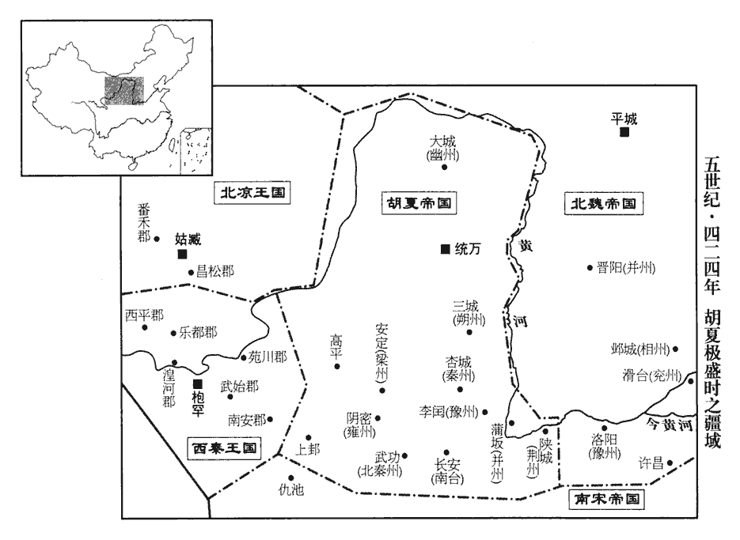
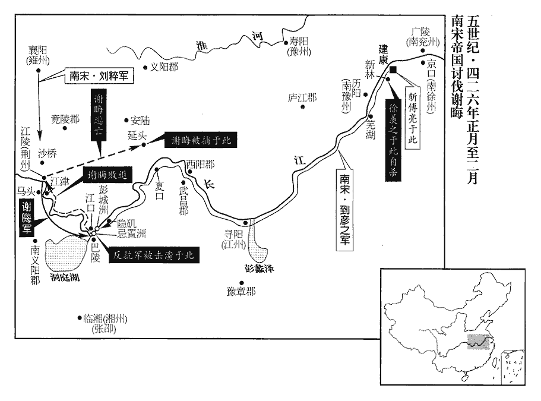
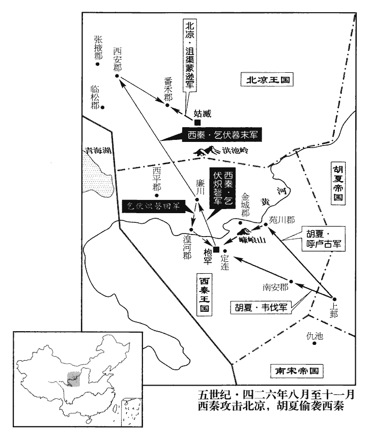
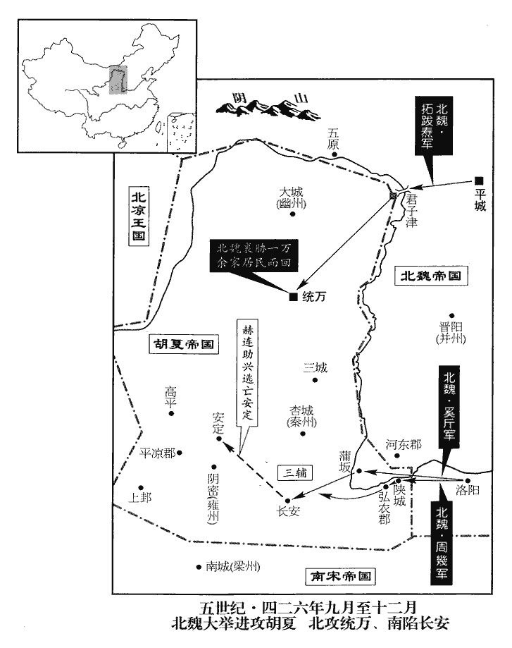
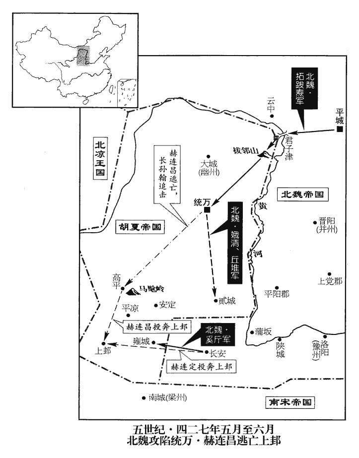

 宋紀二起閼逢困敦（甲子），盡強圉單閼（丁卯），凡四年。

# 太祖文皇帝上之上諱義隆，小字車兒，武帝第三子也。

## 元嘉元年（甲子、四二四）是年八月始改元。

1春，正月，考異曰：宋本紀：「正月癸巳朔，日有食之。」宋紀「二月己巳」，宋略「二月癸巳」，李延壽南史「二月己卯朔」，皆誤也。按長曆，是年正月丁巳、二月丁亥朔，後魏書紀、志，是年無日食，今從之。魏改元始光。

〖译文〗 [1]春季，正月，北魏改年号为始光。

2丙寅‹四›，魏安定殤王彌卒。

〖译文〗 [2]丙寅（初四），北魏安定殇王拓跋弥去世。

3營陽王‹刘义符，时年十九›居喪無禮，好與左右狎暱，好，呼到翻；下情好同。遊戲無度。特進致仕范泰上封事曰：「伏聞陛下時在後園，頗習武備，鼓鞞在宮，聲聞於外。鞞pí，與鼙同，音駢迷翻。聞，音問。黷武掖庭之內，諠譁省闥之間，非徒不足以威四夷，祇生遠近之怪。陛下踐阼，委政宰臣，實同高宗諒闇之美；闇，讀如陰。而更親狎小人，懼非社稷至計，經世之道也。」不聽。泰，寧之子也。范寧，汪之子，以儒學為孝武帝所親。

〖译文〗 [3]营阳王刘义符在为其父宋武帝刘裕服丧期间，喜欢与左右侍从亲昵轻佻，嬉戏游乐，不能自我节制。以特进衔退休的范泰呈上一本用皂囊封板的奏章，说：“我听说陛下常常在后花园习武练功，鼓虽在宫中，鼓声却远传宫外，在禁宫深院，打闹砍杀，又在朝廷各部公堂之间，喧哗嘶喊。如此，则不但不能威服四方夷族，而只能使远近各邦觉得怪诞不经。陛下即位以来，把政务都交给了宰相大臣，实际上同商朝的高宗武丁一样，有着服丧期间闭口不言的美誉。想不到您却与小人亲近，恐怕这不是治理国家的好办法和维持世风的好策略。”刘义符没有理会范泰的劝告。范泰是范宁的儿子。

南豫州刺史廬陵王義真，警悟愛文義，而性輕易，易，以豉翻。與太子左衛率謝靈運、員外常侍顏延之、曹魏之末，置員外散騎常侍。率，所律翻。慧琳道人情好款密。嘗云：「得志之日，以靈運、延之為宰相，慧琳為西豫州都督。」西豫州即豫州也。宋南豫州治歷陽‹安徽和县›，豫州治壽陽‹安徽寿县›，壽陽在歷陽西，故亦謂豫州為西豫州。靈運，玄之孫也，靈運，玄子瑍之子也。性褊傲，不遵法度；褊biǎn，方緬翻。朝廷但以文義處之，處，昌呂翻。不以為有實用。靈運自謂才能宜參權要，常懷憤邑。延之，含之曾孫也，顏含見九十六卷晉成帝咸康四年。嗜酒放縱。

〖译文〗 刘宋南豫州刺史庐陵王刘义真，聪睿敏捷，喜爱文学，但是性情轻浮，常与太子左卫率谢灵运、员外常侍颜延之以及慧琳道人等情投意合，过从甚密。刘义真曾经说：“有朝一日我当上皇帝，就任命谢灵运、颜延之任宰相，慧琳道人为西豫州都督。”谢灵运是谢玄的孙子，性情傲慢偏激，不遵守法令及世俗的约束。当时朝廷只把他放在文学侍从之臣的位置上，却不认为他有从事实际工作的才干。而谢灵运却自认为他的才能应该参与朝廷机要，因而常常愤愤不平。颜延之是颜含的曾孙，喜爱饮酒，放荡不羁。

徐羨之等惡義真與靈運等遊，義真故吏范晏從容戒之，義真曰：「靈運空疏，延之隘薄，魏文帝所謂『古今文人類不護細行』者也；惡，烏路翻。從，千容翻。行，下孟翻。但性情所得，未能忘言於悟賞耳。」悟，開覺也。賞，褒嘉也。於是羨之等以為靈運、延之構扇異同，非毀執政，出靈運為永嘉‹浙江温州›太守，延之為始安‹广西桂林›太守。守，式又翻。

〖译文〗 司空徐羡之等对刘义真与谢灵运的交游，十分厌恶。刘义真的旧部范晏曾婉言规劝刘义真，刘义真说：“谢灵运思想空疏不切实际，颜延之心胸狭窄，见识浅薄，正如魏文帝曹丕所说的‘古今文人，多不拘小节’呀！然而，我们几人性情相投，不能象古人说的互相理解而忘了言语那样。”于是，徐羡之等认为谢灵运、颜延之挑拨是非，离间亲王与朝廷的关系，诽谤朝廷要臣，贬谢灵运为永嘉太守，颜延之为始安太守。

義真至歷陽‹安徽和县›，多所求索，執政每裁量不盡與；裁，剸zhuān節也。量，概度也。索，山客翻。量，音良。義真深怨之，數有不平之言，數，所角翻。又表求還都，諮議參軍廬江‹安徽舒城›何尚之屢諫，不聽。時羨之等已密謀廢帝，而次立者應在義真；乃因義真與帝有隙，先奏列其罪惡，廢為庶人，徙新安郡‹浙江淳安›。前吉陽‹湖北竹溪西›令堂邑‹江苏六合›張約之上疏曰：吉陽縣屬廬陵郡。今吉州有吉水縣，蓋吳立縣於吉水之陽，因以為名也。「廬陵王‹刘义真›少蒙先皇優慈之遇，長受陛下睦愛之恩，故在心必言，所懷必亮，亮，信也，明也，導也。言義真凡有所懷，自信以為是，必明而導之，無所回避也。少，詩照翻。長，知兩翻。容犯臣子之道，致招驕恣之愆。言容有犯臣道之事，以致招驕恣之罪。至於天姿夙成，實有卓然之美，宜在容養，錄善掩瑕，訓盡義方，進退以漸。今猥加剝辱，幽徙遠郡，剝辱，謂褫爵為庶人。上傷陛下常棣之篤，下令遠近恇然失圖。恇kuāng，去王翻。臣伏思大宋開基造次，造，七到翻。根條未繁，宜廣樹藩戚，敦睦以道。人誰無過，貴能自新；以武皇之愛子，陛下之懿弟，豈可以其一眚shěng，長致淪棄哉！」書奏，以約之為梁州府‹陕西南郑›參軍，尋殺之。

〖译文〗 刘义真来到历阳之后，不断向朝廷索要供应，掌权的朝臣每次都裁减，不完全听命。刘义真深怀怨恨，经常有愤懑不平的言论，又上书朝廷请求回到京师建康。谘议参军庐江人何尚之多次进言劝阻，刘义真拒不接受。此时，徐羡之等已经在密谋策划废黜少帝刘义符，但废黜刘义符后，身为次子的刘义真依照顺序，应当继位。于是，徐羡之等便利用刘义真与刘义符之间早已存在的宿怨，先上疏弹劾刘义真的种种罪行，将刘义真贬为平民，放逐到新安郡。前吉阳县令堂邑人张约之上疏说：“庐陵王从小就得到先帝优厚慈爱的待遇，长大后又受到陛下和睦友爱的恩宠，所以心里有什么话，一定要说出来，内心想什么，一定会不加掩饰地表现出来。或许在某些地方违背了为臣之道，招致骄傲放纵而带来的灾祸。但他聪明早熟，确有过人的才华，应该对他宽容教养，发挥他的长处，宽恕他的缺点，以恰当的方法训戒引导，升降都不应该过急。如今朝廷突然剥夺了他的爵位，把他放逐并幽禁到边远的地方。对上伤害了陛下手足之情，对下使远近民心仓皇失措。我认为，我们大宋刚刚建立，宗室枝叶未繁，应该广泛树立藩属屏障，互相之间，敦厚和睦。人谁能无过，可贵的是能够改过自新。刘义真是武皇帝的爱子，是陛下的品德美好的弟弟，怎么可以因为他一时之过，就长期地舍弃放逐！”奏疏呈上后，朝廷任命张约之为梁州府参军，不久，便把他杀了。

4夏，四月，甲辰‹十四›，魏主‹拓跋焘，时年十七›東巡大寧‹河北张家口›。

〖译文〗 [4]夏季，四月，甲辰（十四日），北魏国主拓跋焘向东巡视，抵达大宁。

5秦‹都枹罕，甘肃临夏›王熾磐遣鎮南將軍吉毗等，帥步騎一萬南伐白苟、車孚、崔提、旁為四國，皆降之。白狗國至唐猶存，蓋生羌也；其地與東會州接。車孚、崔提、旁為無所考。帥，讀曰率。騎，奇寄翻。降，戶江翻。

〖译文〗 [5]西秦王乞伏炽磐派遣镇南将军乞伏吉毗等，率领步、骑兵共一万人，向南讨伐白苟、车孚、崔提、旁为等四个部族，全部降服。

6徐羨之等以南兗州‹府广陵，江苏扬州›刺史檀道濟沈約曰：中原亂，北州流民多南渡。晉成帝立南兗州，寄治京口；文帝始割江、淮間為境，治廣陵。先朝舊將，威服殿省，且有兵眾，乃召道濟及江州‹府寻阳，江西九江›刺史王弘入朝；將，即亮翻。朝，直遙翻。五月，皆至建康，以廢立之謀告之。

〖译文〗 [6]刘宋司空徐羡之等因南兖州刺史檀道济是刘宋武帝时代的大将，威望震慑朝廷内外，而且掌握强大的军队，于是，便征召檀道济及江州刺史王弘入朝。五月，二人先后抵达京师建康，徐羡之等就把废立皇帝的计划告诉了他们。

甲申‹二十四›，謝晦以領軍府屋敗，悉令家人出外，聚將士於府內，又使中書舍人邢安泰、潘盛為內應。夜，邀檀道濟同宿，晦悚動不得眠，道濟就寢便熟，晦以此服之。服其處大事而不變其常度也。

〖译文〗 甲申（二十四日），领军将军谢晦声称：领军将军府第破败，于是将家人全部迁到别的地方，而在府中聚集了将士，又派中书舍人刑安泰、潘盛为内应。这天夜里，谢晦邀请檀道济同居一室，谢晦又紧张又激动，不能合眼，檀道济却倒头便睡，十分酣畅，谢晦不由得大为敬服。

時帝‹刘义符›于華林園為列肆，親自沽賣；又與左右引船為樂，夕，游天淵池，即龍舟而寢。樂，音洛。魏氏作華林園、天淵池於洛中。晉氏南渡，放其制，作之于建康；華林園在宮城北隅。乙酉‹二十五›詰旦，詰，去吉翻。道濟引兵居前，羨之等繼其後，入自雲龍門；安泰等先誡宿衛，莫有禦者。帝未興，軍士進殺二侍者，傷帝指，扶出東閣，收璽綬，璽，斯氏翻。綬，音受。群臣拜辭，衛送故太子宮。

〖译文〗 当时，少帝刘义符在皇家华林园造了一排商店，亲自买入卖出，讨价还价；又跟左右佞臣一起，划船取乐。傍晚，刘义符又率左右游逛天渊池，夜里就睡在龙舟上。乙酉（二十五日）凌晨，檀道济引兵开路，徐羡之等随后继进，从云龙门入宫。刑安泰等已先行说服了皇家禁卫军，所以没有人出来阻挡。刘义符还没有起床，军士已经闯入，杀掉刘义符的两个侍从，砍伤刘义符的手指，将刘义符扶持出东阁，收缴了皇帝的玉玺和绶带。文武百官向他叩拜辞行，由军士把刘义符送回到他的故居太子宫。

侍中程道惠勸羨之等立皇弟南豫州刺史義恭。羨之等以宜都王義隆素有令望，又多符瑞，景平初，有黑龍見西方，五色雲隨之。二年，江陵城上有紫雲，望氣者皆以為帝王之符，當在西方。又江陵西至上明，東及江津，其間有九十九洲。楚諺云：「洲滿百，當出王者。」時忽有一洲自生，汀流迴薄而成。皆為上龍飛之應。乃稱皇太后令，數帝過惡，數，所具翻。廢為營陽王，以宜都王纂承大統，赦死罪以下。又稱皇太后令，奉還璽紱；紱，音弗。並廢皇后‹司马茂英›為營陽王妃，遷營陽王‹刘义符›于吳‹江苏苏州›。使檀道濟入守朝堂。朝，直遙翻。王至吳，止金昌亭；六月，癸丑‹二十四›，羨之等使邢安泰就弒之。王多力，突走出昌門，金昌亭在昌門內。孫權記注云：閶門，吳西郭門，夫差作；以天門通閶闔，故名之。後春申君改為昌門。金昌亭，以其在西門內，故曰金昌。追者以門關踣而弒之‹年十九›。踣bó，蒲北翻。

〖译文〗 侍中程道惠劝徐羡之等人拥立皇弟、南豫州刺史刘义恭。徐羡之等却认为宜都王刘义隆一向有很高的声望，又多有祥瑞之兆出现，于是，就宣称奉皇太后张氏之命，列举刘义符过失罪恶，废为营阳王，而由宜都王刘义隆继承皇帝之位，赦免死罪以下人犯。又声称奉皇太后之命，收回皇帝印信，贬皇后司马茂英为营阳王妃，把刘义符送到吴郡，由檀道济入宫守卫朝堂。刘义符抵达吴郡后，被软禁在金昌亭。六月，癸丑（二十四日），徐羡之等派刑安泰，前去刺杀刘义符。刘义符年轻力壮，奋战突围，逃出昌门，追兵用门闩捶击，将刘义符打翻在地杀死。

裴子野論曰：古者人君養子，能言而師授之辭，能行而傅相之禮。相，息亮翻。宋之教誨，雅異於斯，居中則任僕妾，處外則近趨走。處，昌呂翻。近，其靳翻。趨走，執役者也。太子、皇子，有帥，有侍，帥，所類翻。是二職者，皆台皁也。左傳申無宇曰：士臣皁僕臣台。制其行止，授其法則，導達臧否，否音鄙。罔弗由之；言不及於禮義，識不達於今古，謹敕者能勸之以吝嗇，狂愚者或誘之以凶慝。誘，音酉。慝，吐得翻。雖有師傅，多以耆艾大夫為之；雖有友及文學，多以膏粱年少為之；具位而已，亦弗與遊。王置文學、師、友各一人，晉制也。禮，五十曰艾，服官政；六十曰耆，指使。孔穎達曰：艾者，年至五十，氣力已衰，髮蒼白如艾也。賀瑒chàng曰：耆，至也，至老之境也。少，詩照翻。幼王臨州，長史行事，宣傳教命；行事，行府州事也。又有典簽，往往專恣，竊弄威權，南史曰：故事，府州部內論事，皆簽前直敘所論之事；後云「謹簽」，日月下又云「某官某簽」；故府州置典簽以領之。本五品吏，宋初改為士職。宋末，多以幼少皇子為藩鎮，時主以左右親近領典簽，其權任遂重。是以本根雖茂而端良甚寡。嗣君沖幼，世繼奸回，雖惡物醜類，天然自出，然習則生常，其流遠矣。降及太宗‹刘彧›，舉天下而棄之，亦昵比之為也。昵，尼質翻。比，毗至翻。嗚呼！有國有家，其鑒之矣！裴子野究言宋氏亡國之禍，通鑑載之於此，欲使有國有家謹于其初也。

〖译文〗 裴子野论曰：古代君王养育儿子，儿子会说话的时候，由师傅教他文辞；会走路的时候，由师傅教他礼仪，刘宋国的皇家教育，一向与此不同；皇子在宫里的时候，交给奴仆婢女；在宫外，则依靠左右跟班。不论是太子，还是皇子，都有所属的“帅”和“侍”，但是，担任这二种职务的人，都是等级低下的臣仆。太子、皇子们的言谈举止，教育修养，以及行善行恶都由他们诱导。而他们口中从不谈论礼义，见识不知古今。因此，拘束谨慎的人，能把太子和皇子引向小气鄙俗，而狂妄粗暴的人，则可能把太子和皇子引向凶暴与邪恶。太子、皇上们虽然也有师傅，多由年迈力衰的大臣充任，虽然也有“友”和《文学》这些设置，但多是些纨子弟充当，徒有其名而已。何况，皇子们也不愿跟这些人来往。年幼的亲王，赴州就任，而负实际责任的，却是长史，并由长史推广教化，执行政务，又设有典签一职。他们也往往窃弄权柄，恣意横行。所以，皇族根部虽然很茂盛，优良的枝叶却很少。继位的小皇帝年纪幼小，邪恶奸佞之人世代不断。虽然恶物丑类，出自上天，然而习惯已成，流毒久远呵！直到刘宋太宗皇帝刘，更是无道，连整个国家都丢弃了他，也是由于亲近奸佞小人的缘故呀！呜呼！有国有家的人，应当以此为鉴。

7傅亮帥行台百官奉法駕迎宜都王於江陵。帥，讀曰率。祠部尚書蔡廓晉氏渡江，始有祠部尚書，常與右僕射通職，不常置，以右僕射攝之；若右僕射闕，則祠部尚書攝知右事。至尋陽，遇疾不堪前；亮與之別。廓曰：「營陽‹刘义符›在吳，宜厚加供奉；一旦不幸，卿諸人有弒主之名，欲立於世，將可得邪！」時亮已與羨之議害營陽王，乃馳信止之，不及。羨之大怒曰：「與人共計議，如何旋背即賣惡於人邪！」旋背，猶今人言轉背也；背，如字。羨之等又遣使者殺前廬陵王義真‹时年十九›於新安‹浙江淳安›。考異曰：宋南史本紀，二月廢義真徙新安之下，即云「執政使使者誅義真於新安」。宋義真傳：「六月癸未，羨之等遣使殺義真於徙所。」羨之傳亦云：「廢帝後，殺義真於新安，殺帝于吳縣。」按長曆，六月庚寅朔，無癸未，蓋癸丑也。

〖译文〗 [7]刘宋尚书令傅亮率领行台的文武百官，携带皇帝专用的法驾，前往江陵迎接宜都王刘义隆。随行的祠部尚书蔡廓走到寻阳，患病不能继续前进。傅亮与蔡廓辞别时，蔡廓说：“如今营阳王刘义符在吴郡，朝廷的供奉应十分优厚。万一发生不幸，你们几人有弑君之罪名，到那时候，仍想活在世上就难了！”当时，傅亮已经与徐羡之商量好，决定谋害营阳王刘义符，听了蔡廓这番话后，便急忙写信给徐羡之，阻止这次行动，但已来不及。徐羡之大怒，说：“与人共同商议的计划，怎么能够转过身就改变主意，而把恶名加给别人呢！”徐羡之等又派人杀死了流放在新安的庐陵王刘义真。

羨之以荊州地重，恐宜都王至，或別用人，乃亟以錄命除領軍將軍謝晦行都督荊•湘等七州諸軍事、荊州刺史，錄命，錄尚書自出命也。欲令居外為援，精兵舊將，悉以配之。羨之、亮、晦所以為身謀者如此，而亦無救於廢弒之誅。伊、霍以至公血誠處之，而師春所紀有異于書，蓋不羨于伊尹、霍光，僅能保其身而不能保其族。此天地之大變，固人臣之所難居也。將，即亮翻。

〖译文〗 徐羡之认为荆州之地十分重要，恐怕宜都王刘义隆抵达京师后，或许任命别人继任，于是他以录尚书事、总领朝政的名义，任命领军将军谢晦代理都督荆、湘等七州诸军事，兼荆州刺史，希望谢晦居外地作为声援。于是，为谢晦配备了精锐军队和能征善战的将领。

秋，七月，行台至江陵，立行門于城南，題曰「大司馬門」。傅亮帥百僚詣門上表，進璽紱，儀物甚盛。帥，讀曰率。上，時掌翻。璽，斯氏翻。紱，音弗。宜都王時年十八，下教曰：「猥以不德，謬降大命，顧己兢悸，何以克堪！悸，其季翻。輒當暫歸朝廷，展哀陵寢，並與賢彥申寫所懷。望體其心，勿為辭費」府州佐史並稱臣，請題牓諸門，一依宮省；王皆不許。教州、府、國綱紀宥所統內見刑，原逋bū責。州，荊州；府，都督府；國，宜都國；綱紀，上佐掾屬也。見，賢遍翻。逋，欠也，負也。責，如字，又仄懈翻。漢書高紀：兩家折券棄責，無音。淮陽王傳：張博負責，仄懈翻。

〖译文〗 秋季，七月，行台到江陵，把象征性的宫城城门立在城南，题名“大司马门”。傅亮率领文武百官前往“大司马门”，呈上奏章和皇帝玉玺和服装，仪式盛大隆重。宜都王刘义隆当时年仅十八岁，发布文告说：“我无才无德，蒙上天错爱降下大命。我实在惶恐惊悸，怎么能够担负起如此大任！现在暂且回到京师，哀祭祖先陵墓，并与朝中贤能的大臣陈述我的意见，希望诸位大臣体谅我的用心，不要再说别的。”荆州府州长史及其他辅助官员一律称臣，并请求仿效国都宫城，更改各门名称。刘义隆一概不许。而且命令荆州、都督府和宜都国的官署宽怒管辖地区内已叛决的罪人，和无力偿还的债务。

諸將佐聞營陽、廬陵王死，皆以為疑，勸王不可東下。司馬王華曰：「先帝‹刘裕›有大功于天下，四海所服；雖嗣主不綱，人望未改。徐羨之中才寒士，傅亮布衣諸生，非有晉宣帝、王大將軍之心明矣；王大將軍，敦也。受寄崇重，未容遽敢背德。畏廬陵嚴斷，背，蒲妹翻。斷，丁亂翻。將來必不自容；以殿下寬叡慈仁，遠近所知，且越次奉迎，冀以見德；冀以定策為德也。悠悠之論，殆必不然。又，羨之等五人，同功並位，孰肯相讓！五人，謂徐羨之、傅亮、謝晦、檀道濟、王弘也。就懷不軌，勢必不行。廢主若存，慮其將來受禍，致此殺害；蓋由貪生過深，寧敢一朝頓懷逆志！不過欲握權自固，以少主仰待耳。殿下但當長驅六轡，以副天人之心。」王曰：「卿復欲為宋昌邪！」少，詩照翻。復，扶又翻。宋昌事見十三卷漢高后八年。長史王曇首、南蠻校尉到彥之皆勸王行，姓譜：到本自高陽氏，楚令尹屈到之後，後漢有東平太守到質。曇，徒含翻。曇首仍陳天人符應，王乃曰：「諸公受遺，不容背義。背，蒲妹翻。且勞臣舊將，內外充滿，今兵力又足以制物，夫何所疑！」乃命王華總後任，留鎮荊州。王欲使到彥之將兵前驅，彥之曰：「了彼不反，了，決知也。將，即亮翻。便應朝服順流；朝，直遙翻。若使有虞，此師既不足恃，更開嫌隙之端，非所以副遠邇之望也。」彥之此言誠合大理，而亦自知其才不足以制檀道濟也。會雍州刺史褚叔度卒，雍，於用翻。乃遣彥之權鎮襄陽‹湖北襄樊›。

〖译文〗 刘义隆左右将领和亲信闻知营阳王刘义符、庐陵王刘义真二人被杀身死，都认为可疑，劝刘义隆不要东下。司马王华说：“先帝功盖天下，四海威服；虽然继承人违法犯纪，皇家的威望却没有改变。徐羡之才能中等、出身寒士；傅亮也是由平民起家的书生。他们并没有晋宣帝司马懿、王敦那样的野心，这一点是很明显的。他们接受托孤的重任，享有崇高的地位，一时不会背叛。只是害怕庐陵王刘义真下肯宽宥，将来无地自容，才痛下毒手。殿下聪睿机敏，仁慈宽厚，远近闻名。他们这次破格率众前来奉迎，是希望殿下感激他们。毫无根据的谣言，一定不是真的。另外，徐羡之等五人，功劳地位相同，谁肯服谁？即使他们中有人心怀不轨，企图背叛，也势必不成。被废黜的君主如果活着，他们担心将来遭到报复，所以才起杀机，是因为他们过于贪生怕死的缘故，他们怎么敢一朝之间突然谋反呢！只不过想牢牢地掌握大权，巩固地位，奉立年轻的君主使自己得到重视而已！殿下只管坐上六匹马拉的车驾，长驱直入，才能不辜负上天及百姓的希望。”宜都王刘义隆说：“你莫非想当宋昌第二！”长史王昙首、南蛮校尉到彦之等都劝刘义隆动身东行。王昙首又分析了天象和人间的种种祥瑞征兆。刘义隆才说：“徐羡之等接受先帝的遗命，不致于背义忘恩。而且功臣旧将，布满朝廷内外，现有的兵力又足以制服叛乱，如此，我还有什么可疑虑的呢！”于是，刘义隆命令王华总管善后事务，留守荆州，又想派到彦之率军作前锋，先行出发开道，到彦之说：“如果肯定他们不反，就应该穿上官服，顺流而下，倘若万一发生不测，我的这支军队根本不能抵御，却使他们由此产生误会，不符合远近人民对我们的期望。”正好雍州刺史褚叔度去世，刘义隆就派遣到彦之暂且镇守襄阳。

甲戌‹十五›，王發江陵，引見傅亮，號泣，哀動左右。見，賢遍翻。號，戶高翻。既而問義真及少帝薨廢本末，少，詩照翻。悲哭嗚咽，侍側者莫能仰視。亮流汗沾背，不能對；乃布腹心於到彥之、王華等，深自結納。王以府州文武嚴兵自衛，台所遣百官眾力不得近部伍。近，其靳翻。中兵參軍朱容子抱刀處王所乘舟戶外，不解帶者累旬。防非常也。處，昌呂翻。

〖译文〗 甲戌（十五日），刘义隆一行从江陵出发，他接见了傅亮，痛哭不已，悲哀的情绪感动了左右侍从人员。过了一会儿，刘义隆又问及刘义真及少帝刘义符被废及被杀的经过，不胜哀恸，悲哭不止，两旁侍从都不敢抬头。傅亮汗流浃背，张口结舌不能应对。过后，傅亮派心腹去结交到彦之、王华这些人，与他们建立亲密的关系。刘义隆命令他的府州文武百官和军队加强保护，严密戒备。从建康来的临时朝廷文武官员和军队则不能接近他的队伍。中兵参军朱容子，手抱佩刀，守卫在刘义隆所乘船舱房门外，衣不解带地守卫长达几十天。

8魏主‹拓跋焘›還宮。

〖译文〗 [8]北魏国主拓跋焘回宫。

9秦王熾磐遣太子暮末帥征北將軍木弈干等步騎三萬出貂渠谷，攻河西白草嶺‹青海西宁境›、臨松郡‹甘肃张掖南›，皆破之，水經註：西平鮮谷塞東南有白草嶺。帥，讀曰率。騎，奇寄翻。徙民二萬餘口而還。還，從宣翻。

〖译文〗 [9]西秦王乞伏炽磐派遣太子乞伏暮末率征北将军木弈干等以及步、骑兵三万人向貂渠谷出击，进攻北凉的白草岭和临松郡，秦军都攻破这几个地方，俘虏居民二万余人而还。

10八月，丙申‹八›，宜都王至建康，群臣迎拜於新亭‹南京西南›。徐羨之問傅亮曰：「王‹刘义隆›可方誰？」亮曰：「晉文‹姬重耳›、景‹刘启›以上人。」羨之曰：「必能明我赤心。」亮曰：「不然。」亮固知其不得免矣。

〖译文〗 [10]八月，丙申（初八），宜都王刘义隆抵达京师建康，朝廷文武百官都赶赴新亭迎接叩拜。徐羡之问傅亮说：“宜都王可以比历史上的谁？”傅亮说：“比晋文帝，景帝还要高明。”徐羡之说：“他一定明白我们的一片忠心。”傅亮说：“未必。”

丁酉‹九›，王謁初寧陵‹南京东蒋山东南›，還，止中堂。晉孝武以太學在秦淮南，去臺城懸遠，權以中堂為太學，親釋奠於先聖。則中堂亦在秦淮北，但在臺城之外耳。百官奉璽綬，綬，音受。王‹刘义隆，时年十八›辭讓數四，乃受之，即皇帝位於中堂。備法駕入宮，御太極前殿，大赦，改元，文武賜位二等。

〖译文〗 丁酉（初九），刘义隆拜谒了其父宋武帝的陵墓初宁陵，回来停留在中堂。朝廷的文武百官呈上皇帝的印信，刘义隆推让了几次，才接受，在中堂继承了皇位。然后又乘坐皇帝专用的法驾入宫，登太极前殿，下令大赦，改年号为元嘉，文武百官一律加官二等。

戊戌‹十›，謁太廟。詔復廬陵王先封，迎其柩及孫修華、謝妃還建康，孫修華，義真之母；謝，義真之妃也。南史云：晉武帝采漢、魏之制，以淑妃、淑媛、淑儀、修華、修容、修儀、婕妤、容華、充華，是為九嬪，位視九卿。李延壽曰：貴嬪，魏文帝所制；夫人，魏武初建魏國所制；貴人，漢光武所制；晉為三夫人，位視三公。淑妃，魏明帝所制；淑媛，魏文帝所制；淑儀、修華，晉武帝所制；修容，魏文帝所制；修儀，魏明帝所制；婕妤、容華，前漢舊號；充華，晉武帝所制；美人，漢光武所制。

〖译文〗 戊戌（初十），刘义隆祭拜皇家祖庙。下诏恢复刘义真庐陵王的封号，把刘义真的灵柩及刘义真的母亲孙修华、刘义真的正室谢妃，迎回建康。

庚子‹十二›，以行荊州刺史謝晦為真。晦將行，與蔡廓別，屏人問曰：屏，必郢翻。「吾其免乎？」廓曰：「卿受先帝顧命，任以社稷，廢昏立明，義無不可。但殺人二兄而以之北面，挾震主之威，據上流之重，以古推今，自免為難。」蔡廓父子以亮直名於宋朝。觀其抗言無所避就，若不足以保身；而卒能以身名終，何也？蓋其素行已孚乎人，而言事無所依違，又所以遂其直。彼其問者，方怵於利害，就以求決，則聽之也，固合於心，而焉敢以為諱乎！晦始懼不得去，既發，顧望石頭城喜曰：「今得脫矣！」

〖译文〗 庚子（十二日），刘义隆下诏，命代理荆州刺史谢晦改为实任。谢晦赴任前，向祠部尚书蔡廓辞行，屏去左右侍从，问蔡廓：“你看我能够幸免吗？”蔡廓说：“你们接受先帝临终托孤大事，以社稷的兴衰为己任，废黜昏庸无道的君主而改立英明的皇帝，从道义上讲，没有什么不可。可是，杀害人家的两个哥哥，却又北面称臣，则有震主之威。你又镇守长江上流重镇，这样，以古推今，你恐怕在劫难逃。”谢晦这才开始害怕无法得以逃脱，等到船只离岸，谢晦回首顾望石头城，按捺不住内心的喜悦，说：“今日终于得以脱险了！”

癸卯‹十五›，徐羨之進位司徒，王弘進位司空，傅亮加開府儀同三司，謝晦進號衛將軍，檀道濟進號征北將軍。謝晦自領軍將軍進號，檀道濟自鎮北將軍進號。

〖译文〗 癸卯（十五日），刘义隆下诏，擢升司空徐羡之为司徒，王弘进升为司空，傅亮加授开府仪同三司，谢晦则加授卫将军，檀道济进号征北将军。

有司奏車駕依故事臨華林園聽訟。詔曰：「政刑多所未悉；可如先者，二公推訊。」二公，謂徐羨之、王弘。

〖译文〗 有关部门上疏奏请文帝，依照惯例到华林园听取诉讼。刘义隆下诏说：“我对于政务刑法很不熟悉，可以跟从前一样，仍请徐羡之、王弘二公主持。”

帝以王曇首、王華為侍中，曇首領右衛將軍，華領驍騎將軍，朱容子為右軍將軍。魏明帝有左軍將軍；晉武帝置前軍、右軍，又置後軍，是為四軍。驍騎將軍、遊擊將軍，並漢雜號將軍也，魏置為中軍。及晉，以領、護、左•右衛、驍騎、遊擊為六軍。驍，堅堯翻。騎，奇寄翻。

〖译文〗 随后，刘义隆又任命王昙首、王华为侍中，王昙首还兼任右卫将军，王华兼任骁骑将军，朱容子为右军将军。

11甲辰‹十六›，追尊帝母胡婕妤曰章皇后。婕妤，音接予。諡法：敬慎高明曰章。封皇弟義恭為江夏王，夏，戶雅翻。義宣為竟陵王，義季為衡陽王；仍以義宣為左將軍，鎮石頭。

〖译文〗 [11]甲辰（十六日），刘义隆追尊生母胡婕妤为章皇后。封皇弟刘义恭为江夏王，刘义宣为竟陵王，刘义季为衡阳王。仍命刘义宣任左将军，镇守石头。

徐羨之等欲即以到彥之為雍州，雍，於用翻。帝不許；征彥之為中領軍，委以戎政。彥之自襄陽南下，謝晦已至鎮，慮彥之不過己。過，古禾翻。彥之至楊口‹湖北潜江北›，步往江陵，深布誠款；晦亦厚自結納。彥之留馬及利劍、名刀以與晦，晦由此大安。

〖译文〗 徐羡之等打算任命到彦之为雍州刺史，文帝不许；文帝征召到彦之来京，担任中领军，负责京师守卫。到彦之于是从襄阳南下赴京，这时，领军将军谢晦已经到荆州，担心到彦之不会来看自己。到彦之一到杨口，就从陆路前往江陵探望谢晦，真挚地表达自己的诚意。谢晦也推心置腹，缔结友情。到彦之留下自己的名马及利剑、名刀赠给谢晦，谢晦至此才完全安定下来。

12柔然‹瀚海沙漠群›紇升蓋可汗聞魏太宗殂，將六萬騎入雲中‹内蒙和林格尔›，殺掠吏民，攻拔盛樂宮。魏之先什翼犍始居雲中之盛樂宮，築盛樂城于故城南八里。紇，戶骨翻。可，從刊入聲。汗，音寒。將，即亮翻。騎，奇寄翻。樂，音洛。魏世祖‹拓跋焘›自將輕騎討之，三日二夜至雲中。紇升蓋引騎圍魏主五十餘重，騎逼馬首，相次如堵；將士大懼，魏主顏色自若，眾情乃安。紇升蓋以弟子於陟斤為大將，魏人射殺之；紇升蓋懼，遁去。重，直龍翻。射，而亦翻。考異曰：後魏本紀云：「赭陽子尉普文率輕騎討之，虜乃退走。」李延壽北史紀云：「帝帥輕騎討之，虜乃退走。」今據蠕蠕傳，從北史。尚書令劉絜言于魏主曰：「大檀自恃其眾，必將復來，復，扶又翻。請俟收田畢，大發兵為二道，東西並進以討之。」魏主然之。

〖译文〗 [12]柔然汗国纥升盖可汗郁久闾大檀闻知北魏明元帝拓跋嗣去世的消息，率骑兵六万人攻入云中地区，屠杀掳掠吏民百姓，并且攻陷了盛乐宫。北魏国主拓跋焘亲自率领轻骑兵前往讨伐，他们三天两夜，才抵达云中。纥升盖可汗率领柔然骑兵将拓跋焘的轻骑队伍包围五十余重，铁骑紧逼拓跋焘的马首，依次排列，如同铁墙。北魏将士大为恐惧，拓跋焘却神情自若，十分镇静，军心这才安定。纥升盖可汗任命他的侄儿郁久闾于陟斤为大将。北魏用箭射杀了郁久闾于陟斤；纥升盖可汗郁久闾大檀恐慌，率柔然大军逃走。尚书令刘对拓跋焘说：“郁久闾大檀仗恃他的兵多将广，一定会卷土重来。请等秋天田里的庄稼收割以后，我们派遣大军分兵两路，从东、西两个方向同时并进，加以讨伐。”拓拔焘允准。

13九月，丙子‹十八›，立妃袁氏‹袁齐妫guī›為皇后；耽之曾孫也。袁耽見九十五卷成帝咸康元年。

〖译文〗 [13]九月，丙子（十八日），刘宋皇帝刘义隆封王妃袁齐妫为皇后。袁齐妫是袁耽的曾孙女。

14冬，十月，吐谷渾‹青海›威王阿柴卒。阿柴有子二十人。疾病，召諸子弟謂之曰：「先公車騎，以大業之故，捨其子拾虔而授孤；孤敢私於緯代而忘先君之志乎！先公，謂樹洛干也。樹洛干自號車騎將軍，授阿柴國，見一百一十八卷晉安帝義熙十三年。緯，於貴翻。我死，汝曹當奉慕璝為主。」緯代者，阿柴之長子；慕璝者，阿柴之母弟、叔父烏紇提之子也。烏紇提之立也，妻樹洛干母，生二子，慕璝、慕利延。緯，於貴翻。璝，姑回翻。「提」，當作「堤」。

〖译文〗 [14]冬季，十月，吐谷浑可汗慕容阿柴去世。慕容阿柴共有二十个儿子。病重时，慕容阿柴把他的子弟们召集到病榻前，对他们说：“先公车骑将军因维持汗国大业的缘故，不教他的儿子慕容拾虔继承汗位，而把大任交给了我。我怎么敢用私心把汗位传给自己的儿子慕容纬代，而忘记先帝的伟大志向呢！我死后，你们要拥戴慕容慕为汗。”慕容纬代是慕容阿柴的长子；慕容慕是慕容阿柴同母异父的弟弟、叔父慕容乌纥堤的儿子。

阿柴又命諸子各獻一箭，取一箭授其弟慕利延使折之。慕利延折之。又取十九箭使折之，慕利延不能折。折，而設翻。阿柴乃諭之曰：「汝曹知之乎？孤則易折，易，以豉翻。眾則難摧。汝曹當戮力一心，然後可以保國寧家。」言終而卒。

〖译文〗 慕容阿柴又命令所有的儿子，每人各拿出一箭，在其中抽出一支，叫他的弟弟慕容慕利延折断，慕容慕利延就把它折断。阿柴又把剩下的十九支箭合在一起，叫慕容慕利延折断，慕利延无法折断。慕容阿柴于是告诫大家说：“你们知道吗？一支箭容易折断，一把箭则难以摧折。你们应该同心合力，然后才可以保国保家。”说完就去世了。

慕璝亦有才略，撫秦、涼失業之民及氐、羌雜種至五、六百落，部眾轉盛。種，章勇翻。

〖译文〗 慕容慕也富有才干韬略，他妥善地安抚了来自凉州、秦州失业的难民，以及羌族、氐族等各部族共五六百余部落，增加了部众人数和国家的实力。

 

15十二月，魏主命安集將軍長孫翰、安北將軍尉眷北擊柔然，魏主自將屯柞山‹内蒙和林格尔东›。柞山在平城之西，大河之東。柞，則洛翻。柔然北遁，諸軍追之，大獲而還。翰，肥之子也。長孫肥事魏主珪，為將，數有功。

〖译文〗 [15]十二月，北魏国主拓跋焘，派安集将军长孙翰、安北将军尉眷，北上进攻柔然汗国。拓跋焘亲自率兵，屯驻在柞山。柔然汗国的部众闻讯北逃，北魏的几路大军紧紧追击，大获全胜而回。长孙翰是长孙肥的儿子。

16詔拜營陽王母張氏為營陽太妃。

〖译文〗 [16]刘宋文帝下诏，封营阳王的母亲张氏为营阳太妃。

17林邑‹越南中部›王范陽邁寇日南‹越南广溪›、九德‹越南荣市›諸郡。沈約曰：九德郡故屬九真，孫吳分立九德郡，隋、唐為驩州。

〖译文〗 [17]林邑王范阳迈，进犯刘宋日南、九德等郡。

18宕昌‹甘肃宕昌›王梁彌怱遣子彌黃入見於魏。宕，徒浪翻。見，賢遍翻。宕昌，羌之別種也。羌地東接中國，西通西域，長數千里，長，直亮翻。各有酋帥，部落分地，不相統攝；而宕昌最強，有民二萬余落，諸種畏之。北史曰：宕昌蓋三苗之胤。杜佑曰：其界自仇池以西，東西千里；席水以南，南北八百里，地多山阜。宕，徒浪翻。酋，慈由翻。帥，所類翻。種，章勇翻。

〖译文〗 [18]宕昌王梁弥匆，派遣他的儿子梁弥黄，前往北魏朝见。宕昌是羌族的一个支派。羌族所居住的地域，东与中原相接，西与西域相通，东西长数千里。羌族各支各有首领，部落与部落之间也分地而居，不相管辖。其中，属宕昌部的实力最强，共有二万多个部落，其他各部族都非常畏惧他们。

19夏‹都统万，陕西靖边北白城子›主‹赫连勃勃，时年四十四›將廢太子璝而立少子酒泉公倫。璝聞之，將兵七萬北伐倫。璝錄南台，自長安北伐倫。璝，姑回翻。少，詩照翻。將，即亮翻；下同。倫將騎三萬拒之，戰于高平‹宁夏固原›，倫敗死。倫兄太原公昌將騎一萬襲璝，殺之，並其眾八萬五千，歸於統萬‹陕西靖边北白城子›。夏主大悅，立昌為太子。

〖译文〗 [19]夏王赫连勃勃，准备废黜太子赫连而改立幼子酒泉公赫连伦。赫连听到这个消息，立即率兵七万人北上进攻赫连伦。赫连伦率兵三万人迎击，双方在高平大战。赫连伦兵败身死。赫连伦的同胞兄、太原公赫连昌率骑兵一万人袭击赫连的大军，斩杀赫连，收服了他的部众八万五千人，回到国都统万，夏王大喜，封赫连昌为太子。

夏主好自矜大，好，呼到翻。名其四門：東曰招魏，南曰朝宋，西曰服涼，北曰平朔。朝，直遙翻。

〖译文〗 夏王赫连勃勃一向妄自尊大，他给都城统万的四个城门分别命名：东门为招魏门，南门为朝宋门，西门为服凉门，北门为平朔门。

## 二年（乙丑、四二五）

1春，正月，徐羨之、傅亮上表歸政；表三上，上，時掌翻。帝乃許之。丙寅‹十›，始親萬機。羨之仍遜位還第；徐珮之、程道惠及吳興‹浙江湖州›太守王韶之等並謂非宜，守，式又翻。敦勸甚苦；乃復奉詔視事。速徐、傅之死者，珮之諸公也。復，扶又翻。

〖译文〗 [1]春季，正月，刘宋司徒徐羡之、尚书令傅亮上书刘宋文帝，请求文帝亲自主持朝政，归还政权，一连上奏了三次，文帝才批准。丙寅（初十），文帝开始亲自处理朝廷政务。徐羡之于是辞职返回私宅。徐佩之、侍中程道惠、吴兴太守王韶之等都认为徐羡之此举不合适，苦苦规劝敦促徐羡之返回朝廷。徐羡之于是接受诏书，当朝视事。

2辛未‹十五›，帝祀南郊，大赦。

〖译文〗 [2]辛未（十五日），刘宋文帝前往南郊，祭祀天神。下令大赦。

3己卯‹二十三›，魏‹都平城，山西大同›主‹拓跋焘，时年十八›還平城。

〖译文〗 [3]己卯（二十三日），北魏国主拓跋焘返回平城。

4二月，燕‹都和龙，辽宁朝阳›有女子化為男；燕主以問群臣。尚書左丞傅權對曰：「西漢之末，雌雞化為雄，猶有王莽之禍。漢書五行志：宣帝黃龍元年，未央殿輅軨中雌雞化為雄，毛衣變化而不鳴，不將，無距。元帝初元，丞相府史家雌雞伏子，漸化為雄，冠距鳴將。其後，王后群弟世權，以至於莽，遂篡天下。況今女化為男，臣將為君之兆也。」

〖译文〗 [4]二月，北燕国中有女子变成了男子。北燕王以此询问朝中文武官员的意见。尚书左丞傅权回答说：“西汉末年，母鸡变为公鸡，结果出现了王莽篡汉的大祸。何况今天发生的是女子变为男子，这是臣属变成君王的先兆！”

5三月，丙寅‹十一›，魏主尊保母竇氏為保太后。密后之殂也，密后，即魏主之母杜貴嬪。世祖尚幼，太宗以竇氏慈良，有操行，行，下孟翻。使保養之。竇氏撫視有恩，訓導有禮，世祖德之，故加以尊號，奉養不異所生。養，羊亮翻。

〖译文〗 [5]三月，丙寅（十一日），北魏国主拓跋焘尊奉他的乳母窦氏为保太后。拓跋焘的母亲杜贵嫔死时，拓跋焘年纪尚幼。明元帝拓跋嗣因为窦氏心地善良，品德好，所以让她哺育拓跋焘。窦氏精心照顾拓跋焘，至为疼爱，教导也很有方，拓跋焘十分感激，所以继位后奉上尊号，奉养她跟生母一样。

6丁巳‹二›，魏以長孫嵩為太尉，長孫翰為司徒，奚斤為司空。

〖译文〗 [6]丁巳（初二），北魏国主拓跋焘任命长孙嵩为太尉，长孙翰为司徒，奚斤为司空。

7夏，四月，秦‹都枹罕，甘肃临夏›王熾磐遣平遠將軍叱盧犍等，襲河西鎮南將軍沮渠白蹄於臨松‹甘肃张掖南›，擒之，徙其民五千余戶於枹罕‹甘肃临夏›。犍，居言翻。沮，子餘翻。枹，音膚。

〖译文〗 [7]夏季，四月，西秦王乞伏炽磐派遣平远将军叱卢犍等袭击北凉国镇南将军沮渠白蹄镇守的临松，擒获沮渠白蹄，把临松五千余户居民强行迁徙到罕。

8魏主遣龍驤將軍步堆等來聘，始復通好。魏書官氏志：西方步鹿孤氏改為步氏。驤，思將翻。復，扶又翻。好，呼到翻。

〖译文〗 [8]北魏国主拓跋焘派遣龙骧将军步堆等前来刘宋访问，两国又恢复了友好关系。

9六月，武都惠文王楊盛卒。初，盛聞晉亡，不改義熙年號，謂世子玄曰：「吾老矣，當終為晉臣；汝善事宋帝。」及盛卒，卒，子恤翻。玄自稱都督隴右諸軍事、征西大將軍、開府儀同三司、秦州刺史、武都王，遣使來告喪，始用元嘉年號。使，疏吏翻。

〖译文〗 [9]六月，受东晋封号的氐族首领、武都惠文王杨盛去世。当初，杨盛听说东晋灭亡的消息，坚持不改东晋的义熙年号，对他的世子杨玄说：“我已经老朽了，应当至死当晋朝的臣民；而你们则应好好事奉宋国。”等到杨盛去世，杨玄自称都督陇右诸军事、征西大将军、开府仪同三司、秦州刺史和武都王，派遣使臣前往刘宋报丧。这时，才开始改用元嘉年号。

10秋，七月，秦王熾磐遣鎮南將軍吉毗等南擊黑水‹甘肃舟曲西南›羌酋丘擔，大破之。黑水羌在鄧至西北。水經註曰：白水出臨洮縣西南西傾山，東南流，與黑水合。黑水出羌中，西南逕黑水城西，又西南入於白水。擔，都甘翻。

〖译文〗 [10]秋季，七月，西秦王乞伏炽磐派镇南将军乞伏吉毗等，南下袭击黑水羌族部落酋长丘担，大败丘担的军队。

11八月，夏武烈帝殂‹赫连勃勃，年四十五›，葬嘉平陵，廟號世祖；太子昌即皇帝位。昌字還國，勃勃第二子也。大赦，改元承光。

〖译文〗 [11]八月，夏国武烈帝赫连勃勃去世，安葬在嘉平陵，庙号称世祖；夏太子赫连昌即皇帝位，下令大赦，改年号为承光。

12王弘自以始不預定策，不受司空；表讓彌年，乃許之。弘以此得免徐、傅之禍。乙酉‹二›，以弘為車騎大將軍、開府儀同三司。騎，奇寄翻。

〖译文〗 [12]王弘因最初未能参与废黜少帝、拥戴文帝的政变，因此不接受司空一职的任命，不断地呈上奏章，辞让了一年，文帝才下诏批准。乙酉（初二），宋文帝任命王弘为车骑大将军、开府仪同三司。

13冬，十月，丘擔以其眾降秦，降，戶江翻。秦以擔為歸善將軍；拜折沖將軍乞伏信帝為平羌校尉以鎮之。

〖译文〗 [13]冬季，十月，黑水羌族部落酋长丘担，率领他的部众归降西秦。西秦任命丘担为归善将军。另行任命折冲将军乞伏信帝为平羌校尉，以镇抚归附的黑水羌族部落。

14癸卯‹二十一›，魏主大【章：甲十六行本「大」下有「舉」字；乙十一行本同；孔本同；熊校同。】伐柔然‹瀚海沙漠群›，五道並進：長孫翰等從東道，出黑漠，考異曰：翰傳云：「與娥清出長川。」今從蠕蠕傳。廷尉卿長孫道生等出白、黑二漠之間，長川、牛川同是大漠之地，拓跋分其地名耳。長川有白、黑二漠，黑在東，白在西。魏主從中道，東平公娥清出栗園，栗園在中道之西，西道之東。考異曰：清傳云：「與長孫翰出長川。」今從蠕蠕傳。奚斤等從西道，出爾寒山。諸軍至漠南，舍輜重，舍，讀曰捨。重，直用翻。輕騎，齎十五日糧，度漠擊之。騎，奇寄翻。柔然部落大驚，絕跡北走。

〖译文〗 [14]癸卯（二十一日），北魏国主拓跋焘大规模讨伐柔然汗国，五路兵马，同时并进。司徒长孙翰等从东路，出兵黑漠；廷尉卿长孙道生等出兵白漠、黑漠之间；拓跋焘亲自率军，从中道直入；东平公娥清出兵栗园；奚斤等从西道，出兵尔寒山。几路军队到达漠南以后，舍弃辎重，改作轻骑兵，每人带十五天的干粮，深入大漠攻击。柔然各部落大吃一惊，全部撤退，向北逃窜。

15十一月，以武都世子玄為北秦州刺史、武都王。時南秦州治漢中，故以武都為北秦州。考異曰：宋本紀，癸酉；南史，庚午。按十一月壬午朔，無癸酉及庚午。今不書日。

〖译文〗 [15]十一月，刘宋任命武都惠文王杨盛的世子杨玄为北秦州刺史和武都王。

16初，會稽孔寧子為帝鎮西諮議參軍，會，工外翻。及即位，以寧子為步兵校尉；與侍中王華並有富貴之願，疾徐羨之、傅亮專權，日夜構之於帝。史言徐、傅偪上固當誅，而王華等之構間亦非也。會謝晦二女當適彭城王義康、新野侯義賓，遣其妻曹氏及長子世休送女至建康。帝欲誅羨之、亮，併發兵討晦，聲言當伐魏，又【章：甲十六行本「又」上有「取河南」三字；乙十一行本同；孔本同；張校同；退齋校同。】言拜京陵‹江苏镇江东丹徒镇东南›，京陵，興寧陵也。治行裝艦。治，直之翻。艦，戶黯翻。亮與晦書曰：「薄伐河朔，事猶未已，朝野之慮，憂懼者多。」又言「朝士多諫北征，朝，直遙翻。上當遣外監萬幼宗往相諮訪。」南史曰：制局監、外監，領器仗兵役，多以嬖倖為之。時朝廷處分異常，其謀頗泄。處，昌呂翻。分，扶問翻。

〖译文〗 [16]最初，刘宋会稽人孔宁子为刘义隆镇西谘议参军。刘义隆即位以后，任命孔宁子为步兵校尉。孔宁子与侍中王华都有追求荣华富贵的强烈愿望，对徐羡之、傅亮等专揽大权深怀不满。于是，他们日夜在刘义隆面前，捏造罪状，陷害徐、傅二人。正巧，谢晦的两个女儿将分别嫁给彭城王刘义康、新野侯刘义宾，所以，谢晦派他的妻子曹氏和长子谢世休送女儿抵达建康。文帝打算诛杀徐羡之、傅亮，并准备发兵讨伐谢晦。于是，他宣称要征伐北魏，又声称到京口的兴宁陵祭拜祖母孝懿皇后，整治行装，放到战舰上。傅亮写信给谢晦说：“目前，朝廷就要动员讨伐黄河以北，事情并不到此为止。朝廷内外的官吏和百姓，对此多深感忧虑和恐惧。”又写道：“朝中多数官员都劝阻皇上北征，皇上将要派遣外监万幼宗去荆州听取你的意见。”当时朝廷的举动不同寻常，文帝的清洗计划有些泄漏。

## 三年（丙寅、四二六）

1春，正月，謝晦弟黃門侍郎㬭馳使告晦，㬭jiào，子肖翻。晦猶謂不然，以傅亮書示諮議參軍何承天曰：「計幼宗一二日必至。傅公慮我好事，故先遣此書。」承天曰：「外間所聞，咸謂西討已定，幼宗豈有上理！」好事，猶言好生事，微省其辭，若隱語然。好，呼到翻。上，時掌翻。晦尚謂虛妄，使承天豫立答詔啟草，言伐虜宜須明年。江夏‹湖北安陆›內史程道惠得尋陽‹江西九江›人書，夏，戶雅翻；下同。言「朝廷將有大處分，其事已審」，使其輔國府中兵參軍樂冏封以示晦。道惠蓋帶輔國將軍也。晦問承天曰：「若果爾，卿令我云何？」對曰：「蒙將軍殊顧，常思報德。事變至矣，何敢隱情！然明日戒嚴，動用軍法，區區所懷，懼不得盡。」晦懼曰：「卿豈欲我自裁邪？」承天曰：「尚未至此。以王者之重，舉天下以攻一州，大小既殊，逆順又異。境外求全，上計也。其次，以腹心將兵屯義陽‹河南信阳›，將軍自帥大眾戰于夏口‹湖北武汉›；若敗，即趨義陽以出北境，其次也。」承天二策皆勸晦奔魏以求全。將，即亮翻。帥，讀曰率。趨，七喻翻。晦良久曰：「荊州用武之地，兵糧易給，聊且決戰，走復何晚！」易，以豉翻。復，扶又翻。乃使承天造立表檄；又與衛軍諮議參軍琅邪‹侨郡，江苏句容北›顏卲謀舉兵，晦帶衛將軍。卲飲藥而死。

〖译文〗 [1]春季，正月，谢晦的弟弟黄门侍郎谢，派专人飞驰警告谢晦。但谢晦仍以为不至于此，并拿出傅亮的信给谘议参军何承天看，说：“估计万幼宗一二日之内就会到达，傅亮怕我招惹是非，所以先送此信。”何承天说：“我在外面听到的，都说向西讨伐我们的计划已经确定，万幼宗怎么会有到这里来的道理！”谢晦仍然认为谣言虚妄不可信，就命何承天先行起草回答诏书的奏章，建议朝廷如果讨伐北魏，最好延到明年。江夏内史程道惠接到一封寻阳方面送来的信，信中说：“朝廷将有大规模的非常行动，事情已经明确了。”程道惠派辅国府中兵参军乐，把信封好送给谢晦。谢晦问何承天：“如果真有不测，你认为我该怎么办呢？”何承天说：“我蒙受将军您的特殊照顾，常想报答您的恩惠。如今事情已经发生了变化，怎么敢隐瞒真情！可是，一旦明天下令戒严，动不动就用军法制裁，我心中要说的话，恐怕不能说尽。”谢晦惊恐地问道：“你难道让我自杀吗？”何承天说：“还不到这个地步。以帝王的威严和全国的力量去进攻一个州，实力大小既悬殊，民心逆顺又迥异·您到国境外保全性命，是上策。其次，派心腹将领驻军义阳，将军您亲率大军与敌人在夏口决战；如果失败，可以取道义阳北上出境，投奔北魏，这是中策。”谢晦沉吟良久才说：“荆州是兵家必争之地，兵力和粮草都容易接济，不妨先来一次决战，打败了再走也不晚。”于是，命令何承天撰写檄文；又与卫军谘议参军琅邪人颜商讨起兵反抗。颜服毒自杀。

晦立幡戒嚴，謂司馬庾登之曰：「今當自下，欲屈卿以三千人守城‹江陵›，備禦劉粹。」登之曰：「下官親老在都，又素無部眾，情計二三，不敢受此旨。」晦仍問諸將佐：「戰士三千足守城否？」南蠻司馬周超對曰：「非徒守城而已，若有外寇，可以立功。」超蓋為南蠻校尉府司馬。登之因曰：「超必能辨，下官請解司馬、南郡以授之。」登之，晦府司馬，領南郡太守，乞解以授超。晦即於坐命超為司馬，領南義陽‹侨郡，湖南安乡›太守。沈約曰：晉末以義陽流民僑立南義陽郡，屬荊州，領厥西、平氏二縣。坐，徂臥翻。轉登之為長史，南郡如故。登之，蘊之孫也。庾蘊死於海西之廢。

〖译文〗 谢晦竖起大旗，下令戒严，对司马庾登之说：“我现在要亲自东下出征，打算委屈你以三千人守卫江陵，防备刘粹。”庾登之说：“我的双亲都已年迈，身在建康，而我自己又从来没有过直属的部队，我考虑再三，不敢接受这项命令。”谢晦又问其他将领和佐臣：“战士三千人，够不够守城？”南蛮司马周超说：“不仅足够守城，如有敌人从外面攻击，还可以立功。”庾登之于是说：“周超一定能够胜任，我愿意解除司马和南郡太守两个职务转授给他。”谢晦当即就在座位上任命周超为司马，兼任南义阳郡太守。改庾登之为长史，仍任南郡太守如初。庾登之是庾蕴的孙子。

帝‹刘义隆，时年二十›以王弘、檀道濟始不預廢弒之謀，弘弟曇首又為帝所親委，事將發，密使報弘，且召道濟，欲使討晦。王華等皆以為不可，帝曰：「道濟止於脅從，本非創謀，殺害之事，又所不關；吾撫而使之，必將無慮。」乙丑‹十五›，道濟至建康。

〖译文〗 刘宋文帝认为王弘、檀道济在开始并没有参预废弑刘义真、刘义符的阴谋，王弘的弟弟王昙首又是刘宋文帝亲近信任的心腹。所以，在开始行动之前，刘义隆秘密派人告诉王弘，并且召见檀道济，打算派檀道济去讨伐谢晦。王华等刘义隆身边的大臣都坚决反对。刘义隆说：“檀道济当初只不过是被胁迫而随从徐羡之等行事，本不是他主动提出，而谋杀的事，更与他没有关系。我安抚并使用他，不必有其他顾虑。”乙丑（十五日），檀道济抵达建康。

丙寅‹十六›，下詔暴羨之、亮、晦殺營陽‹刘义符›、廬陵王‹刘义真›之罪，命有司誅之，且曰：「晦據有上流，或不即罪，即，就也。朕當親帥六師為其過防。帥，讀曰率。可遣中領軍到彥之即日電發，征北將軍檀道濟駱驛繼路，符衛軍府州，以時收翦，符衛軍府及荊州官屬，使收誅晦也。已命雍州刺史劉粹等雍，於用翻。斷其走伏。走，逃也；伏，匿也；斷其逃匿之路也。斷，丁管翻。罪止元兇，余無所問。」

〖译文〗 丙寅（十六日），刘宋文帝下诏公布徐羡之、傅亮、谢晦杀害营阳王刘义符、庐陵王刘义真的罪状，命有关部门逮捕诛杀，并且说：“谢晦据守长江上游，可能不会立即伏法。朕将亲自统率朝廷的大军前往讨伐。可派中领军到彦之即日开始急速出发，征北将军檀道济陆续出发为后继。符卫军府及荆州官属，应及时逮捕并诛杀谢晦。已命雍州刺史刘粹等截击，切断其逃跑或潜伏的道路。罪犯只限谢晦一人，其他胁从者一律不加追究。”

是日，詔召羨之、亮。羨之行至西明門外，洛城西面有廣陽、西明、閶闔三門，建康倣之。謝㬭jiào正直，㬭為黃門侍郎，正入直省內也。遣報亮云：「殿內有異處分。」亮辭以嫂病暫還，遣使報羨之，羨之還西州，揚州刺史治臺城西，故曰西州。乘內人問訊車出郭，步走至新林‹江苏江宁西›，新林浦去建康城二十里。入陶竈zào中自經死‹年六十三›。亮乘車出郭門，乘馬奔兄迪墓，屯騎校尉郭泓收之。至廣莫門，廣莫門，建康城北門，亦倣洛城之制。騎，奇寄翻。校，戶教翻。上遣中書舍人以詔書示亮，並謂曰：「以公江陵之誠，謂亮迎帝於江陵也。當使諸子無恙。」亮讀詔書訖，曰：「亮受先帝布衣之眷，遂蒙顧託。黜昏立明，社稷之計也。欲加之罪，其無辭乎！」晉大夫里克之言。於是誅亮‹年五十三›而徙其妻子于建安‹福建建瓯›；誅羨之二子，而宥其兄子珮之。又誅晦子世休，收系謝㬭。

〖译文〗 这天，文帝下诏召见徐羡之、傅亮。徐羡之走到建康城西明门外，谢正在值班，派人飞报傅亮说：“殿内举动异常！”傅亮马上借口嫂嫂生病，暂时回家，派人通知徐羡之，徐羡之回到西城，乘坐宫廷内部人出差的车逃出建康城，又步行走到新林，在一个烧陶器的窑里，自缢身死。傅亮乘车逃出建康城，再乘马奔其兄傅迪的墓园，屯骑校尉郭泓将他逮捕。到建康城北门广莫门，文帝刘义隆派中书舍人拿诏书给傅亮看，对他说：“因你当初在江陵迎驾时，态度至为诚恳，所以饶恕你的儿子们不死。”傅亮读过诏书说：“我出身平民，蒙先帝垂爱，赋予托孤大任。废黜昏君，迎立明主，全是为国家百年大计。要想把罪过强加在我身上，还怕没有借口吗？”于是，傅亮被杀，他的妻室和子女被放逐到建安。又斩杀了徐羡之的两个儿子，而饶恕了他的侄儿徐佩之。诛杀了谢晦的儿子谢世休，逮捕谢。

帝將討謝晦，問策于檀道濟，對曰：「臣昔與晦同從北征，事見一百十八卷晉安帝義熙十三年。入關十策，晦有其九，才略明練，殆為少敵。少，詩沼翻。然未嘗孤軍決勝，戎事恐非其長。「其」下當有「所」字。臣悉晦智，晦悉臣勇。今奉王命以討之，可未陳而擒也。」陳，與陣同。丁卯‹十七›，征王弘為侍中、司徒、錄尚書事、揚州刺史，以彭城王義康為都督荊•湘等八州諸軍事、荊州刺史。

〖译文〗 刘宋文帝将要讨伐谢晦，向檀道济询问策略，檀道济说：“我当年与谢晦一同北伐，当时得以入关的十项计策，有九项是由谢晦提出的。谢晦才略精明老练，大约很少有敌手。但他从没有单独带领部队打过胜仗，战场上的军事行动，恐怕不是他所擅长的。我了解谢晦的才智，谢晦也了解我的勇敢。今天我奉皇帝的命令来讨伐他，可以在他没有摆开阵势以前，就把他擒获。”丁卯（十七日），宋文帝召见王弘，并任命他为侍中、司徒、录尚书事和扬州刺史；任命彭城王刘义康为都督荆、湘等八州诸军事和荆州刺史。

樂冏復遣使告謝晦以徐、傅及㬭等已誅。復，扶又翻；下磐復同。使，疏吏翻。晦先舉羨之、亮哀，次發子弟凶問，既而自出射堂勒兵。晦從高祖征討，指麾處分，莫不曲盡其宜，數日間，四遠投集，得精兵三萬人。乃奉表稱羨之、亮等忠貞，橫被冤酷。橫，戶孟翻。且言：「臣等若志欲執權，不專為國，為，於偽翻。初廢營陽，陛下在遠，武皇之子尚有童幼，擁以號令，誰敢非之！豈得泝流三千里，自建康至江陵泝流而上，凡三千里。虛館七旬，仰望鸞旗者哉！景平二年五月乙酉，廢少帝，八月丙申，帝至建康，凡七旬。故廬陵王，于營陽之世積怨犯上，自貽非命。不有所廢，將何以興！亦晉里克之言。耿弇yǎn不以賊遺君、父，此耿弇討張步之言，晦引以為言，自謂殺廬陵所以除偪，不以累帝也。遺，于季翻。臣亦何負于宋室邪！此皆王弘、王曇首、王華險躁猜忌，讒構成禍。躁，則到翻。今當舉兵以除君側之惡。」

〖译文〗 辅国府中兵参军乐，再派人报告谢晦，说徐羡之、傅亮、谢等已被杀。于是，谢晦先为徐羡之、傅亮举行祭礼，又为弟弟及儿子发布死讯。然后亲自走出虎帐统率军队。谢晦当年随刘宋武帝南征北讨，经验丰富，所以发号施令，指挥调动，莫不切实妥当，几天之间，人们从四面八方投奔谢晦，很快就聚集了精兵三万人。于是，谢晦上表，盛赞徐羡之、傅亮等都是忠贞之臣，却遭受横暴的冤杀。又说：“我们这些人如果想长久地把握权柄，不一心为国家着想，我们当初在废黜营阳王时，陛下您远在荆州，武皇帝的儿子中还有幼童，我们完全可以拥戴小皇帝，发号施令，谁敢说个不字！怎么会逆流而上三千里，虚位七十多天，去迎接陛下的鸾旗！已故的庐陵王刘义真，在营阳王在位的时候，就曾积恨，冒犯皇上，是他自己死于非命，不有所废黜，怎么会有兴起！耿不曾把贼寇遗留给君王，我又有什么地方辜负了宋皇室呢！这都是因为王弘、王昙首、王华一伙阴险、狂暴，多所猜忌和挑拨离间造成的灾祸。现在，我要发动大军，以清除陛下身边的邪恶之徒。”

2秦‹都枹罕，甘肃临夏›王熾磐復遣使如魏‹都平城，山西大同›，請用師于夏‹都统万，陕西靖边北白城子›。秦入貢于魏以請伐夏，事始上卷營陽王景平元年。復，扶又翻。使，疏吏翻。

〖译文〗 [2]西秦王乞伏炽磐，再次派使臣前往北魏，请求对夏国采取军事行动。

3初，袁皇后‹袁齐妫›生皇子劭，后自詳視，使馳白帝‹刘义隆›曰：「此兒形貌異常，必破國亡家，不可舉。」即欲殺之。帝狼狽至后殿戶外，手撥幔禁之，乃止。為劭弒逆張本。幔，莫半翻。以尚在諒闇，闇，音陰。故秘之。閏月，丙戌‹六›，始言劭生。

〖译文〗 [3]最初，刘义隆的皇后袁氏，生下皇子刘劭以后，端详婴儿良久，派人飞快报告刘义隆，说：“此儿相貌异常，将来一定会弄得国破家亡，不能养他！”就要动手把婴儿弄死。刘义隆急急忙忙赶到后殿门外，用手拨开门帘阻止，这才留下刘劭一命。只是在为父亲守丧期间生子，违犯礼教，所以一直保密。闰正月，丙戌（初六），才宣布皇子刘劭诞生。

4帝下詔戒嚴，大赦，諸軍相次進路以討謝晦。晦以弟遯為竟陵‹湖北钟祥›內史，將萬人總留任，帥眾二萬發江陵，列舟艦自江津‹湖北江陵东南›至於破冢‹湖北江陵东南›，將，即亮翻。帥，讀曰率。艦，戶黯翻。冢，知隴翻。旌旗蔽日。歎曰：「恨不得以此為勤王之師。」

〖译文〗 [4]文帝下诏戒严，实行大赦，各路军队依次出发，讨伐谢晦。谢晦任命他的弟弟谢遁为竟陵内史，率领一万人留守江陵。他自己则亲自率兵二万人从江陵出发，他指挥的战舰，从江津一直排列到破冢，旌旗招展，遮天蔽日，谢晦长叹一声，说：“真恨不得这是一支保护皇家的大军！”

 

晦欲遣兵襲湘州‹府临湘，湖南长沙›刺史張卲，何承天以卲兄益州‹府成都，四川成都›刺史茂度與晦善，曰：「卲意趣未可知，不宜遽擊之。」晦以書招卲，卲不從。

〖译文〗 谢晦想要派兵袭击湘州刺史张，何承天因为张的哥哥、益州刺史张茂度与谢晦私交甚好，就说：“张的态度还不明朗，不应该轻率地发动攻击。”谢晦写信招抚张，张不肯追随谢晦。

5二月，戊午‹九›，以金紫光祿大夫王敬弘為尚書左僕射，晉制：左、右光祿大夫，金章紫綬，後遂為金紫光祿大夫。建安‹福建建瓯›太守鄭鮮之為右僕射。敬弘，廙yì之曾孫也。王廙見八十九卷晉愍帝建興三年。廙，羊至翻，又逸職翻。

〖译文〗 [5]二月，戊午（初九），刘宋文帝任命金紫光禄大夫王敬弘为尚书左仆射，任命建安太守郑鲜之为右仆射。王敬弘是王的曾孙。

庚申‹十一›，上發建康。命王弘與彭城王義康居守，入居中書下省；中書有上省、下省。守，手又翻。侍中殷景仁參掌留任；帝姊會稽長公主留止台內，總攝六宮。台內，即禁中。會，工外翻。長，知兩翻。

〖译文〗 庚申（十一日），刘义隆从建康出发。命令王弘与彭城王刘义康留守京师建康，进驻中书下省；侍中殷景仁也参预负责留守京师的任务。文帝的姐姐会稽长公主刘兴弟住进皇宫，总管后宫事务。

謝晦自江陵東下，何承天留府不從。晦至江口‹湖北监利›，江口，即西江口。從，才用翻。到彥之已至彭城洲‹湖南岳阳东北›。庾登之據巴陵‹湖南岳阳›，畏懦不敢進；會霖雨連日，參軍劉和之曰：「彼此共有雨耳；檀征北尋至，東軍方強，惟宜速戰。」登之恇怯，使小將陳祐作大囊，貯茅懸於帆檣，云可以焚艦，恇kuāng，去王翻。將，即亮翻。貯，丁呂翻。艦，戶黯翻。用火宜須晴，以緩戰期。晦然之，停軍十五日。乃使中兵參軍孔延秀攻將軍蕭欣于彭城洲，破之。水經註：江水過長沙下雋縣北，又東逕彭城口，水東有彭城磯。又攻洲口柵，陷之。諸將咸欲退還夏口‹湖北武汉›，到彥之不可，乃保隱圻qí‹湖南临湘东北›。水經註：江水自彭城磯東逕如山北，山北對隱磯。晦又上表自訟，且自矜其捷，曰：「陛下若梟四凶於廟庭，懸三監于絳闕，以王弘、王曇首、王華比虞之共工、驩兜、苗、鯀，周之管叔‹河南荥阳，姬鲜›、蔡叔‹河南开封，姬度›、霍叔‹山西霍州，姬处›也。梟，堅堯翻。臣便勒眾旋旗，還保所任。」

〖译文〗 谢晦从江陵东下，何承天留守江陵没有随从。谢晦抵达西江口，到彦之的军队已开进彭城洲。庾登之据守巴陵，胆怯畏缩，不敢前进。当时正值大雨连绵，数日不停，参军刘和之警告庾登之说：“我们遇雨，敌人也遇雨，征北将军檀道济的大军不久就要到了，官军实力正强，我们应该速战速决才好。”庾登之还是畏惧不敢战，却令手下的小军官陈，制造了一个大型口袋，装满茅草悬挂在桅杆之上，声称可以用来焚毁敌人的舰船。用火攻必须等到天晴，他用这个办法，延缓会战的日期，谢晦却同意了庾登之的做法，逗留了十五日，才派中兵参军孔延秀进攻驻扎在彭城洲的将军萧欣，大败萧欣的军队，又进攻彭城洲口官军营垒阵地，一举攻克。官军的大小将领都主张退走，据守夏口，到彦之反对，于是退守隐圻。谢晦又上疏为自己辩护，并且十分骄傲地夸耀自己在军事上的胜利，说：“陛下如果把‘四凶’斩首，把‘三监’的人头悬挂在宫墙上，我就立刻停止进攻，回转旌期，折返我的任所。”

初，晦與徐羨之、傅亮為自全之計：以為晦據上流，而檀道濟鎮廣陵‹江苏扬州›，各有強兵，足以制朝廷；羨之、亮居中秉權，可得持久。及聞道濟帥眾來上，惶懼無計。

〖译文〗 当初，谢晦与徐羡之、傅亮为了保全自己，就用谢晦把守长江上游，又把檀道济安置在广陵，使他们各自拥有强兵，足以胁制朝廷；而徐羡之、傅亮在朝中居高官、掌实权，可以维持长久的安定。等到谢晦听说檀道济率兵来攻打自己，不禁大为惶恐，束手无策。

道濟既至，與到彥之軍合，牽艦緣岸。晦始見艦數不多，輕之，不即出戰。至晚，因風帆上，前後連咽；上，時掌翻。連，謂沿江戰艦連接不斷；咽，謂戰艦塞江，前後填咽。西人離沮，無復鬬心。戊辰‹十九›，台軍至忌置洲尾‹湖南岳阳北›，沮，在呂翻。水經註：江水東過長沙下雋juàn縣北，湘水自南注之。又東，左得二夏浦，俗謂之西江口；又東逕忌置山南，又東過彭城口。復，扶又翻。列艦過江，晦軍一時皆潰。晦夜出，投巴陵‹湖南岳阳›，得小船還江陵‹湖北江陵›。

〖译文〗 檀道济的大军一到隐圻，立即与到彦之的军队合兵一处，战舰沿岸停泊。谢晦最初看见战舰不多，毫不在意，也不马上发动攻击。到了晚上，东风大起，官军的船舰，帆篷满张，陆续抵达，前后相连，塞满江面。谢晦军队的士气涣散，军心沮丧，不再有斗志。戊辰（十九日），官军舰队挺进到忌置洲尾，战舰排列着渡过长江，谢晦的军队一触即溃，全军大败。谢晦在夜色的掩护下出走，投奔巴陵，找到一艘小船回到江陵。

先是，帝遣雍州刺史劉粹自陸道帥步騎襲江陵，至沙橋；先，悉薦翻。雍，於用翻。帥，讀曰率；下同。騎，奇寄翻。沙橋在江陵北。周超帥萬余人逆戰，大破之，士卒傷死者過半。俄而晦敗問至。初，晦與粹善，以粹子曠之為參軍；帝疑之，王弘曰：「粹無私，必無憂也。」及受命南討，一無所顧，帝以此嘉之。晦亦不殺曠之，遣還粹所。

〖译文〗 最初，刘宋文帝派遣雍州刺史刘粹从陆路，率领步骑兵袭击江陵，刘粹的军队刚到沙桥，谢晦的司马周超就率军一万多人迎战，刘粹军大败，死伤的士卒在一半以上。不久，就传来谢晦战败的消息。最初，谢晦与刘粹私交甚好，并任命刘粹的儿子刘旷之为参军；宋文帝对刘粹的态度，感到怀疑。王弘说：“刘粹没有野心，一定不会出差错。”等到刘粹接受朝廷的命令讨伐谢晦，则一无反顾，宋文帝因此对刘粹倍加赞许。谢晦也并没有因此杀害刘旷之，反而把他送回到刘粹那里。

丙子‹二十七›，帝自蕪湖‹安徽蕪湖›東還。

〖译文〗 丙子（二十七日），刘宋文帝从芜湖东归建康。

晦至江陵，無他處分，唯愧謝周超而已。其夜，超捨軍單舸詣到彥之降。舸gě，古我翻。晦眾散略盡，乃攜其弟遯等七騎北走。遯肥壯，不能乘馬，晦每待之，行不得速。己卯‹三十›，至安陸‹湖北安陆›延頭‹湖北黄陂西›，水經註：武湖水上通安陸之延頭。九域志：武湖在黃洲界，蓋此湖上接延頭也。杜佑曰：武湖在黃洲黃陂縣東，黃祖習戰閱武之所。為戍主光順之所執，戍主、戍副，宋、齊以下至隋咸有其官。姓譜：光，姓也；晉書有光逸。檻送建康。

〖译文〗 谢晦逃回江陵，也没有做其他部署，只是惭愧地向周超道歉。当天晚上，周超舍弃他指挥的军队，一个人乘舟前往到彦之的营地请降。谢晦的部将全部散尽，于是，谢晦携同他的弟弟谢遁等人共七匹马向北逃去。谢遁体胖且壮，不能骑马，谢晦常常要停下来等候，因此他们的速度很慢。己卯（三十日）谢晦一行才逃到安陆延头，被当地戍守的将领光顺之俘虏，用囚车送到京师建康。

到彥之至馬頭‹湖北公安东北›，何承天自歸。彥之因監荊州府事，監，工銜翻。以周超為參軍；劉粹以沙橋之敗告，乃執之。於是誅晦‹年三十七›、㬭jiào、遯及其兄弟之子，並同黨孔延秀、周超等。晦女彭城王妃被髮徒跣，與晦訣曰：「大丈夫當橫屍戰場，柰何狼藉都市！」被，皮義翻。藉，而亦翻。庾登之以無任，免官禁錮；何承天及南蠻行參軍新興‹山西忻州›王玄謨等皆見原。據南史：王玄謨，太原祁縣人。漢建安二十年，集塞下荒地置新興郡，魏黃初初，遷於陘嶺之南。玄謨蓋本新興人而居太原之祁縣界也。晦之走也，左右皆棄之，唯延陵蓋追隨不捨，帝以蓋為鎮軍功曹督護。延陵，複姓，蓋吳延陵季子之後；蓋，其名也；為鎮軍府功曹，又兼督護之官也。晉氏渡江，有參軍督護，功曹參軍兼督護，即參軍督護之任也。洪适曰：參軍督護，江左置，皆有部曲，宋則無矣。

〖译文〗 到彦之的军队进抵马头，谢晦的谘议参军何承天投降。到彦之于是主持荆州政务，任命周超为参军，等到刘粹把沙桥之败的情形上报，才逮捕了周超。于是，刘义隆下令斩谢晦、谢、谢遁以及他们兄弟的儿子，同时被斩的还有谢晦的同党孔延秀、周超等人。谢晦的女儿、彭城王妃披散头发，光着双脚，与父亲诀别，她说：“大丈夫应当战死沙场，为什么要行为不法以致在都城的市上被斩！”庾登之因为在谢晦军中没有实权，所以被免除官职，监禁起来。何承天及南蛮行参军、新兴人王玄谟等都得到朝廷的赦免。谢晦败走的时候，左右亲信都抛弃他各自逃命，唯独延陵盖一人追随谢晦不肯离去，刘宋文帝又命延陵盖为镇军功曹督护。

晦之起兵，引魏南蠻校尉王慧龍為援。魏以王慧龍為南蠻校尉，以擾汝、潁之間。慧龍帥眾一萬拔思陵戍‹河南开封西北›，思陵戍在陳郡西北。進圍項城‹河南沈丘›，聞晦敗，乃退。

〖译文〗 谢晦起兵之时，曾连络北魏南蛮校尉王慧龙为外援。王慧龙率军队一万人，攻陷思陵戍，进而包围了项城，等到听说谢晦战败，才退回北魏境内。

益州‹府成都›刺史張茂度受詔襲江陵；晦敗，茂度軍始至白帝‹重庆奉节东›。議者疑茂度有貳心，帝‹刘义隆›以茂度弟卲有誠節，赦不問，代還。

〖译文〗 益州刺史张茂度也曾接受文帝的诏书去袭击江陵；谢晦战败的时候，张茂度的军队才到白帝城。当时的人怀疑张茂对朝廷有二心，刘宋文帝却因为张茂度的弟弟张忠诚，有节操，对张茂度的行为不加追究，只是派人接替而召他回京师。

三月，辛巳‹二›，帝還建康，征謝靈運為秘書監，顏延之為中書侍郎，賞遇甚厚。

〖译文〗 三月，辛己（初二），刘宋文帝返回建康，征召谢灵运担任秘书监、颜延之为中书侍郎，赏赐和礼遇都非常优厚。

帝以惠琳道人善談論，因與議朝廷大事，遂參權要，賓客輻湊，門車常有數十兩，門車，謂門前候見之車。兩，音亮。四方贈賂相系，方筵七八，座上恒滿。琳著高屐，著，陟略翻。披貂裘，置通呈、書佐。通呈，典謁之職；書佐，掌書翰。會稽孔覬jì嘗詣之，遇賓客填咽，暄涼而已。言但敘寒溫，不及餘語。會，工外翻。覬，音冀。覬慨然曰：「遂有黑衣宰相，可謂冠屨失所矣！」廬陵廢而三人斥，徐、傅誅而三人進，可謂矯枉過正矣。

〖译文〗 文帝因为慧琳道人擅长谈论分析，所以常跟他商讨国家大事，慧琳道人因此得到参预国家机要的机会。于是，宾客们四面八方争先恐后地拥到慧琳道人的门庭，门前等侯召见的车常有数十辆之多，各地送来的财物，前后相接，每天的筵席就有七八桌，座位常满。慧琳道人脚穿高齿木屐，身披貂皮外衣，在府中设立负责传达的通呈官和掌书翰的官佐。会稽人孔觊曾经拜访慧琳道人，正遇宾客拥挤，两个人只能寒暄两句，不能多说别的话。孔觊感慨叹息，说：“如今穿黑衣服的和尚都做了宰相，这真可以说衣冠文士失所了！”

夏，五月，乙未‹十七›，以檀道濟為征南大將軍、開府儀同三司、江州刺史，到彥之為南豫州‹府历阳，安徽和县›刺史。遣散騎常侍袁渝等十六人分行諸州郡縣，觀察吏政，訪求民隱；散，悉亶翻。騎，奇寄翻。行，下孟翻。又使郡縣各言損益。丙午‹二十八›，上‹刘义隆›臨延賢堂聽訟，延賢堂在建康華林園。自是每歲三訊。周禮：秋官以三刺斷庶民獄訟之中：一曰訊群臣，二曰訊群吏，三曰訊萬民。註云：刺，殺也，三訊罪定則殺之。訊，言也。

〖译文〗 夏季，五月，乙未（十七日），刘宋文帝任命檀道济为征南大将军、开府仪同三司和江州刺史；擢升到彦之为南豫州刺史。又派遣散骑常侍袁渝等十六人，分别巡察各州郡县，考察官员的政绩，访求民间无处申诉的疾苦。刘宋文帝还命郡县上疏奏报当地的行政得失。丙午（二十八日），刘宋文帝亲自到延贤堂听取诉讼。从此，每年前来三次。

左僕射王敬弘，性恬淡，有重名；關署文案，初不省讀。省，悉景翻。嘗預聽訟，上問以疑獄，敬弘不對。上變色，問左右：「何故不以訊牒副僕射？」謂不以訊牒副本納呈敬弘也。敬弘曰：「臣乃得訊牒讀之，正自不解。」解，戶買翻，曉也。上甚不悅，雖加禮敬，不復以時務及之。復，扶又翻。禮敬不替，而不以時務及之，此法正勸蜀先主以加禮許靖之智也。

〖译文〗 左仆射王敬弘，性情恬然，甘于淡泊，在朝廷内外享有盛誉。可是在签署文稿时，从来不事先审阅。有一次，他随同刘宋文帝听取民间诉讼，文帝就一件有疑问的案件询问王敬弘，王敬弘回答不出。文帝脸色大变，问左右侍臣：“你们为什么不把案卷的副本送给王仆射？”王敬弘回答说：“我已看到了案卷的副本，可是看不懂。”文帝非常不高兴，虽然对他仍然礼敬，却不再与他讨论国家大事。

六月，以右衛將軍王華為中護軍，侍中如故。華以王弘輔政，王曇首為上所親任，與己相埒，埒liè，龍輟翻。自謂力用不盡，每歎息曰：「宰相頓有數人，天下何由得治！」治，直吏翻。是時，宰相無常官，唯人主所與議論政事、委以機密者，皆宰相也，故華有是言。亦有任侍中而不為宰相者；然尚書令•僕、中書監•令、侍中、侍郎、給事中，皆當時要官也。

〖译文〗 六月，刘宋文帝任命右卫将军王华为中护军，同时仍兼任侍中。王华认为，司徒王弘是文帝的辅弼之臣，侍中王昙首又是皇上十分信任的心腹，他们的地位与自己相当。因此，王华自以为自己的才能，无法完全施展，他常常叹息着说：“朝中宰相，一时之间多达数人，天下怎么能够治理！”当时，朝中没有固定的宰相，只要谁与皇帝讨论国家大事，国家机要大事交给谁办，谁就是宰相，所以王华才有这样的议论。当时也有任侍中的职务而不是宰相的人；然而，尚书令、仆射、中书监、中书令、侍中、侍郎、给事中等都是重要的官职。

華與劉湛、王曇首、殷景仁俱為侍中，風力局幹，冠冕一時。上嘗與四人於合殿宴飲，甚悅。合殿在齋閣之後。李延壽曰：晉世諸帝，多處內房，朝宴所臨，東西二堂而已。孝武末年，清暑方構。永初受命，無所改作，所居惟稱西殿，不制嘉名；文帝因之，亦有合殿之稱。既罷出，上目送良久，歎曰：「此四賢，一時之秀，同管喉唇，恐後世難繼也。」喉唇，言出納王命也。

〖译文〗 王华与刘湛、王昙首、殷景仁都担任侍中的职务，他们风采卓然，精明干练，荣显一时。刘宋文帝曾经在合殿设宴款待他们四人，与他们共同欢饮，特别高兴。筵席散后，文帝目送他们好久好久，叹息道：“这四位贤才，是一时之俊杰，一起作为我的喉唇，恐怕后世很难再出现。”

黃門侍郎謝弘微與華等皆上所重，當時號曰五臣。弘微，琰之從孫也。琰yǎn，安之子也。從，才用翻；下同。精神端審，時然後言，婢僕之前不妄語笑；由是尊卑大小，敬之若神。從叔混特重之，常曰：「微子異不傷物，同不害正，吾無間然。」呂大臨曰：無間隙可言其失。謝顯道曰：猶言我無得而議之也。嗚呼！此江左所謂清談也。間，古莧翻。

〖译文〗 黄门侍郎谢弘微与王华等都深得刘宋文帝的重用，当时他与王华、刘湛、王昙首、殷景仁等号称五臣。谢弘微，是谢琰的侄孙。他一向端重严谨，在适当的时机，才开口说话，在仆役奴婢面前，也从不随便说笑，因此不论尊卑大小，都象对待神明一样恭敬他。他的堂叔谢混对他尤其推崇敬重，常说：“谢弘微这人，与别人相异时不会伤害别人，与别人相同时也不会违背正道，对他我是没什么毛病可挑的了。”

上欲封王曇首、王華等，拊御床曰：「此坐非卿兄弟，無復今日。」因出封詔以示之。以誅徐、傅等為曇首、華之功。坐，徂臥翻。曇首固辭曰：「近日之事，賴陛下英明，罪人斯得；臣等豈可因國之災以為身幸！」上乃止。

〖译文〗 刘宋文帝打算封王昙首、王华等人爵位，他抚摸着御座说：“这个宝座，如果不是你们兄弟，我今天就坐不上。”于是，他就拿出封爵的诏书给他们看。王昙首坚决辞让说：“近来发生的事，全仰赖陛下英明决断，使罪人得到应有的惩罚；我们怎么可以因为国家的灾难，而自己得到好处！”文帝才作罢。

6魏‹都平城，山西大同›主‹拓跋焘，时年十九›詔問公卿：「今當用兵，赫連、蠕蠕，二國何先？」杜佑曰：柔然，後魏太武以其無知，狀類於蟲，故改其號曰蠕蠕；宋、齊謂之芮芮。蠕，人兗翻。長孫嵩、長孫翰、奚斤皆曰：「赫連土著，著，直略翻。未能為患。不如先伐蠕蠕，若追而及之，可以大獲；不及，則獵於陰山，取其禽獸皮角以充軍實。」太常崔浩曰：「蠕蠕鳥集獸逃，言其來則如鳥之集，走則如獸之逃也。舉大眾追之則不能及，輕兵追之又不足以制敵。赫連氏土地不過千里，政刑殘虐，人神所棄，宜先伐之。」尚書劉絜、武京侯安原請先伐燕‹都和龙，辽宁朝阳›。於是魏主自雲中‹内门托克托›西巡至五原‹内蒙包头›，因畋於陰山，東至和兜山‹山西大同西北›；和兜山蓋在陰山之東，長川之南。秋，八月，還平城‹山西大同›。

〖译文〗 [6]北魏国主拓跋焘下诏书遍问朝中文武大臣：“现在我们要出兵讨伐赫连和蠕蠕，应当先讨伐哪一国？”太尉长孙嵩、司徒长孙翰、司空奚斤都说：“赫连氏土生土长，暂时还不足为患。不如先伐蠕蠕，如果能够追到他们，可以大获全胜；如果追不到，我们则到阴山作一次大狩猎，可以获取大批禽兽的毛皮骨角，用来充实军用物资。”太常崔浩说：“蠕蠕来的时候，象飞鸟一样霎时集结；去的时候，也象野兽一样霎时逃散。用大军追赶，一定不会追上，如果用少量的军队追赶，又无法把他们制服。赫连氏土地不过一千里，政治残暴，刑法酷烈，得不到上天的保佑和人民的拥护，应当先行讨伐赫连。”尚书刘、武京侯安原则请求先行讨伐北燕。于是，北魏国主拓拔焘从云中向西视察，抵达五原，到阴山狩猎，又往东抵达和兜山。秋季，八月，拓跋焘才返回平城。

7詔殿中將軍吉恒聘于魏。恒，戶登翻。

〖译文〗 [7]刘宋文帝下诏，派殿中将军吉恒出使北魏。

8燕太子永卒，立次子翼為太子。

〖译文〗 [8]北燕太子冯永去世，封次子冯翼为太子。

9秦王熾磐伐河西，至廉川‹青海民和›，遣太子暮末等步騎三萬攻西安‹甘肃张掖东南›，不克，又攻番禾‹甘肃永昌›。河西王蒙遜‹时年五十九›發兵禦之，且遣使說夏主‹赫连昌›，騎，奇寄翻。番，音盤。使，疏吏翻。說，輸芮翻。使乘虛襲枹罕‹甘肃临夏›。枹，音膚。夏主遣征南大將軍呼盧古將騎二萬攻苑川‹甘肃榆中东北›，車騎大將軍韋伐將騎三萬攻南安‹甘肃陇西东南›。熾磐聞之，引歸。蒙遜借助于夏以退秦師。秦既敝于夏，夏亦僨fèn于魏，而涼亦不能以自立。是以親仁善鄰，國之寶也。九月，徙其境內老弱、畜產於澆河‹青海贵德›杜佑曰：澆河城在廓州達化縣西一百二十里。及莫河‹青海同仁›仍寒川‹西顷山北›，留左丞相曇達守枹罕。韋伐攻拔南安，獲秦秦州刺史翟爽、南安太守李亮。

〖译文〗 [9]西秦王乞伏炽磐讨代北凉，大军抵达廉川，乞伏炽磐派遣太子乞伏暮末等率领步、骑兵共三万人，进攻西安，不能攻克，于是又转攻番禾。北凉河西王沮渠蒙逊出军迎战，极力抵御，同时又派使臣出使夏国游说，请夏国国主赫连昌乘西秦国内空虚之际，袭击西秦的都城罕。夏国国主赫连昌派遣征南大将军呼卢古率领骑兵二万人，进攻西秦的苑川；派车骑大将军韦伐率领骑兵三万人，进攻南安。西秦国王乞伏炽磬听到这个消息，立即从北凉撤军回国。九月，乞伏炽磐把境内的老弱妇孺和家畜，集中迁徙到浇河郡和莫河的仍寒川，同时又命令左丞相乞伏昙达留守京师罕。夏国的车骑大将军韦伐率众攻陷南安城，生擒西秦秦州刺史翟爽和南安太守李亮。

10吐谷渾握逵等帥部眾二萬落叛秦，奔昴川‹四川阿坝›，附于吐谷渾王慕璝。史言乞伏兵勢漸衰。帥，讀曰率。璝，姑回翻。

〖译文〗 [10]隶属西秦的吐谷浑部落酋长慕容握逵率所属二万帐落背叛西秦，逃到昂川，归附了吐谷浑可汗慕容慕。

11大旱，蝗。

〖译文〗 [11]天下大旱，出现蝗灾。

 

12左光祿大夫范泰上表曰：「婦人有三從之義，婦人在室從父母，既嫁從夫，夫死從子。無自專之道。謝晦婦女猶在尚方，唯陛下留意。」有詔原之。

〖译文〗 [12]刘宋左光禄大夫范泰上疏说：“女子有三从的大义，而没有自作主张的道理。现在谢晦家的妇女仍被羁押在尚方作坊里做苦工，敬请陛下留意。”于是，刘宋文帝下诏赦免了她们。

13魏主聞夏世祖殂，諸子相圖，謂倫、璝、昌相殺也。國人不安，欲伐之。長孫嵩等皆曰：「彼若城守，以逸待勞，大檀聞之，乘虛入寇，此危道也。」崔浩曰：「往年以來，熒惑再守羽林、鉤己而行，其占秦亡；事見一百十七卷晉安帝義熙十一年。今年五星並出東方，利以西伐。天人相應，不可失也。」嵩固爭之，帝大怒，責嵩‹时年六十九›在官貪污，命武士頓辱之。嵩歷事四朝，魏之元臣也。頓辱，捽其首使頓地以辱之。於是遣司空奚斤帥四萬五千人襲蒲阪‹山西永济›，阪，音反。宋兵將軍周幾帥萬人襲陝城‹河南三门峡›，陝，失冉翻。以河東‹山西夏县›太守薛謹為鄉導。謹，辯之子也。薛辯見一百十八卷晉安帝義熙十三年。鄉，讀曰嚮。

〖译文〗 [13]北魏国主拓跋焘听到夏国主赫连勃勃去世，儿子们内哄，民心不安的消息，打算征讨夏国。长孙嵩等人都说：“夏国如果围绕城池固守，以逸待劳，而柔然汗国的郁久闾大檀听说了这一消息，会乘我们国内空虚，大举进攻，这可是危险的策略。”太常崔浩说：“说起当年，火星两次紧傍着羽林星和钩己星运转，算卦占卜都预示着秦国一定灭亡。今年，金、木、水、火、土五星同时出现在东方，显示西征一定胜利。上天的旨意和凡世的人心是互相呼应的，良机不可失去。”长孙嵩仍然坚持不能西征，拓跋焘暴跳如雷，斥责长孙嵩做官贪赃枉法，命令武士强按他的头，猛烈触地，殴打侮辱。于是，拓跋焘派遣司空奚斤率领四万五千人袭击夏国的蒲阪；派宋兵将军周几率一万人袭击陕城；命令河东太守薛谨为大军的向导。薛谨是薛辩的儿子。

魏主‹拓跋焘›欲以中書博士平棘‹河北赵县南›李順總前驅之兵，平棘縣，二漢屬常山，晉、魏屬趙郡。訪于崔浩，浩曰：「順誠有籌略；然臣與之婚姻，深知其為人果於去就，不可專委。」帝乃止。浩與順由是有隙。為後魏主以浩言誅順張本。

〖译文〗 北魏国主拓跋焘打算让中书博士、平棘人李顺全权指挥前锋部队。他征求崔浩的意见，崔浩说：“李顺确实很有谋略，善于筹划，但是，我与李顺是姻亲，深知他为人非常自信，不可委任他要职。”拓跋焘于是停止了他的任命。崔浩和李顺之间因此产生了隔阂。

冬，十月，丁巳‹十一›，魏主發平城。

〖译文〗 冬季，十月，丁己（十一日），拓跋焘一行从平城出发。

14秦左丞相曇達與夏呼盧古戰於嵻㟍山‹甘肃榆中南马衔山›，曇，徒含翻。嵻kāng，丘岡翻。㟍láng，盧當翻。曇達兵敗。十一月，呼盧古、韋伐進攻枹罕‹甘肃临夏›。枹，音膚。秦王熾磐遷保定連‹临夏东南›。呼盧古入南城，南城，枹罕南城。鎮京將軍趙壽生率死士三百人力戰，卻之。呼盧古、韋伐又攻沙州刺史出連虔於湟河‹青海化隆›，虔遣後將軍乞伏萬年擊敗之。敗，補邁翻。又攻西平‹青海西宁›，執安西將軍庫洛干，阬戰士五千余人，掠民二萬餘戶而去。

〖译文〗 [14]西秦左丞相乞伏昙达与夏国的征南大将军呼卢古在山会战，乞伏昙达兵败。十一月，呼卢古与车骑大将军韦伐合兵进攻西秦的都城罕。西秦王乞伏炽磐迁都定连，率众据城死守。夏国大将呼卢古攻入罕南城。西秦镇京将军赵寿生率领敢死队三百人，浴血抵抗，击退呼卢古。呼卢古、韦伐又合兵攻打沙州刺史出连虔据守的湟河。出连虔派遣后将军乞伏万年击退了呼卢古和韦伐的进攻。呼卢古、韦伐率军再攻西平，俘获了西秦的安西将军库洛干，活埋了西秦战士五千余人，掠走居民二万余户，班师回国。

15仇池‹甘肃西和南›氐楊興平求內附。梁、南秦二州‹府南城，陕西南郑›刺史吉翰晉泰始之初，立梁州於漢中，至安帝之世，秦州又治漢中；自是鎮漢中者帶梁、南秦二州刺史。遣始平太守龐諮據武興‹陕西略阳›。武興，漢武都郡之沮縣也，蜀以其地當沖要，置武興督以守之；宋立東益州，梁立武興蕃王國；西魏改東益為興州，因武興郡為名。至我本朝，以吳曦之變，改為沔州。氐王楊玄遣其弟難當將兵拒諮，將，即亮翻。諮擊走之。

〖译文〗 [15]仇池氐族部落酋长杨兴平请求归附刘宋。刘宋梁州、南秦州二州刺史吉翰派始平太守庞谘进军占据武兴。氐王杨玄派他的弟弟杨难当率军迎击庞谘，被庞谘击退。

16魏主行至君子津‹内蒙托克托东南黄河渡口›，會天暴寒，冰合，戊寅‹三›，帥輕騎二萬濟河襲統萬‹陕西靖边北白城子›。帥，讀曰率。騎，奇寄翻。壬午‹七›，冬至，夏主‹赫连昌›方燕群臣，魏師奄至，上下驚擾。魏主軍于黑水，去城三十餘里。夏主出戰而敗，退走入城。門未及閉，內三郎豆代田帥眾乘勝入西宮，內三郎，魏宿衛之官也，三郎將領之。又按魏道武帝天興初置幢主、幢將，主內三郎。內三郎，衛士也。焚其西門；宮門閉，代田踰宮垣而出。魏主拜代田勇武將軍。勇武將軍之號，魏始置。魏軍夜宿城北，癸未‹八›，分兵四掠，殺獲數萬，得牛馬十余萬。魏主謂諸將曰：將，即亮翻；下守將同。「統萬未可得也，他年當與卿等取之。」乃徙其民萬餘家而還。還，從宣翻，又如字。

〖译文〗 [16]北魏国主拓跋焘，抵达君子津，正遇天气酷寒，气温急骤下降，黄河冰封。戊寅（初三），拓跋焘亲自统率轻骑兵二万人，踏冰渡过黄河，袭击夏国都城统万。壬午（初七），冬至，夏王赫连昌正在与文武群臣欢歌宴饮。北魏大军的突然出现，使夏国上下不胜惊恐。北魏国主拓跋焘驻军在黑水，距统万城只有三十余里。赫连昌率兵迎战，大败而回，急向城中撤退。城门还没有来得及关闭，北魏禁军内三郎豆代田率众乘胜攻进西宫，纵火焚烧了西宫城门；夏军关闭了所有的宫门，豆代田跳出宫墙撤退。拓跋焘擢升豆代田为勇武将军。这天夜里，北魏军队在城北扎营。癸未（初八），北魏军队四处出动，抢夺掳掠，斩杀及俘虏夏国军民数万人，缴获牛马十余万头。拓跋焘对他手下的各位大将说：“统万城恐怕打不下了，以后跟各位再来攻取。”于是，裹胁当地居民一万余户，班师回国。

夏弘農‹河南灵宝东北›太守曹達聞周幾將至，不戰而走；魏師乘勝長驅，遂入三輔。會幾卒於軍中，蒲阪守將東平公乙斗聞奚斤將至，遣使詣統萬告急。使者至統萬，阪，音反。使，疏吏翻；下同。魏軍已圍其城；還，告乙斗曰：「統萬已敗矣。」乙斗懼，棄城西奔長安，斤遂克蒲阪。夏主之弟助興先守長安，乙斗至，與助興棄長安，西奔安定‹甘肃镇原东南曙光乡›。考異曰：奚斤傳作「乙升」，今從帝紀。十二月，斤入長安，秦‹府杏城，陕西黄陵›、雍‹府阴密，甘肃灵台西南›氐羌皆詣斤降。雍，於用翻。降，戶江翻。河西王蒙遜及氐王楊玄聞之，皆遣使附魏。兵以氣勢為用者也，統萬圍而諸鎮失守，氣勢然也。

〖译文〗 夏国的弘农太守曹达听说北魏将军周几率军将要打来，没等大军到达，先弃城逃走。北魏军队乘胜长驱直入，迅速深入长安附近的三辅地区。不料周几在行军途中去世。夏国镇守蒲阪的守将东平公赫连乙斗听说北魏司空奚斤率领的大军就要到达，派使节往都城统万告急。使者到统万时，看到北魏的大军已经包围统万，便回去报告赫连乙斗：“统万已经被攻陷。”赫连乙斗惊惧不已，放弃蒲阪城，向西逃往长安。奚斤于是攻克了蒲阪。夏王赫连昌的弟弟赫连助兴正在镇守长安，赫连乙斗到后，赫连助兴与赫连乙斗放弃长安向西逃往安定。十二月，奚斤率军进入长安，夏国秦州、雍州所属的氐族部落和羌族部落，全向奚斤投降。北凉河西王沮渠蒙逊和氐王杨玄听到这个消息，也都派遣使臣向北魏帝国归附。

17前吳郡太守徐珮之聚党百餘人，謀以明年正會於殿中作亂，事覺，壬戌‹十七›，收斬之。正會，明年正月朔旦朝會也，亦曰元會。

〖译文〗 [17]刘宋前吴郡太守徐佩之，集结党羽一百余人，阴谋策划明年元旦朝会时，在殿中发动叛乱，事情泄漏。壬戌（十七日），逮捕了徐佩之，斩首。

18營陽太妃張氏卒。

〖译文〗 [18]刘宋营阳太妃张氏去世。

 

19秦征南將軍吉毗鎮南漒‹甘肃卓尼南›，乞伏國仁置十二郡，漒川其一也；南漒當又在漒川之南。漒qiáng，其良翻。隴西‹甘肃隴西›人辛澹帥戶三千據城逐毗，毗走還枹罕，澹南奔仇池。澹，徒覽翻。帥，讀曰率。

〖译文〗 [19]西秦征南将军乞伏吉毗镇守南，陇西人辛澹率领部众三千户占据南城，驱逐乞伏吉毗，乞伏吉毗逃回罕，辛澹向东南撤退，逃往仇池。

20魏初得中原，民多逃隱。天興中，詔采諸漏戶，令輸繒帛；魏皇始二年克中山，始得中原，晉安帝之隆安元年也；明年，改元天興。繒，慈陵翻。於是自占為紬繭羅縠戶者甚眾，占，之贍翻。紬chóu，除留翻。縠hú，戶穀翻。不隸郡縣；賦役不均。是歲，始詔一切罷之，以屬郡縣。

〖译文〗 [20]北魏最初占领中原时，当地的居民大多逃亡、隐藏。天兴年间，拓跋下诏清查这些没有纳入户籍的人家，命他们缴纳绸缎布匹。于是，自己申报缴纳绸缎布匹的人家非常多，不隶属任何郡县，使赋税徭役很不均匀。这一年，北魏国主拓跋焘下诏停止一切清查，将上述人家隶属郡县。

## 四年（丁卯、四二七）

1春，正月，辛巳‹七›，帝‹刘义隆，时年二十一›祀南郊。

〖译文〗 [1]春季，正月，辛己（初七），刘宋文帝前往都城建康南郊，祭祀天神。

2乙酉‹十一›，魏‹都平城，山西大同›主‹拓跋焘，时年二十›還平城。統萬徙民在道多死，能至平城者什纔六七。

〖译文〗 [2]乙酉（十一日），北魏国主拓跋焘回到平城。从统万强行迁徙的民户在途中死亡甚多，能到达平城的，不过十分之六七。

己亥‹二十五›，魏主如幽州‹府蓟县，北京›。夏‹都统万，陕西靖边北白城子›主‹赫连昌›遣平原公定帥眾二萬向長安‹西安›。魏主聞之，伐木陰山，大造攻具，再謀伐夏。

〖译文〗 己亥（二十五日），拓跋焘前往幽州。夏王赫连昌派遣平原公赫连定率军二万人，准备收复长安。拓跋焘听到消息后，下令砍伐阴山林木，大规模兴造攻城械具，准备第二次进攻夏国。

3山羌叛秦‹都枹罕，甘肃临夏›。羌分居武始‹甘肃临洮›、洮陽‹甘肃临潭西南›南山者曰山羌。二月，秦王熾磐遣左丞相曇達招慰武始諸羌，征南將軍吉毗招慰洮陽諸羌。晉惠帝置洮陽縣，屬狄道郡。曇，徒含翻。羌人執曇達送夏；吉毗為羌所擊，奔還，士馬死傷者什八九。

〖译文〗 [3]山地羌族部落背叛了西秦。二月，西秦王乞伏炽磐派遣左丞相乞伏昙达招抚慰问武始山地羌族部落，又命征南将军乞伏吉毗安抚洮阳各个羌族部落。羌族人生擒西秦乞伏昙达，把他献给夏国。乞伏吉毗也受到洮阳羌族的攻击，大败而回，士卒马匹死亡伤残的占十之八九。

4魏主‹拓跋焘›還平城。

〖译文〗 [4]北魏国主拓跋焘回到平城。

5乙卯‹十一›，帝如丹徒‹江苏镇江东丹徒镇›；己巳‹二十五›，謁京陵‹丹徒东南›。初，高祖‹刘裕›既貴，命藏微時耕具以示子孫。帝至故宮，晉之東遷也，劉氏自彭城移居晉陵丹徒之京口里，陵墓及故宮在焉。見之，有慚色。近侍或進曰：「大舜‹姚重华›躬耕歷山‹山西永济境›，伯禹‹姒文命›親事水土。舜耕於歷山，歷山之人皆讓畔。伯禹親事水土，手足胼胝zhī。陛下不覩遺物，安知先帝之至德，稼穡之艱難乎！」

〖译文〗 [5]乙卯（十一日），刘宋文帝前往丹徒。己己（二十五日），祭拜京陵。最初，刘宋武帝在富贵之后，下命把他幼年贫穷微贱时所用耕田农具收藏起来，以展示给子孙。文帝抵达故宫，看到他父亲早年用过那些耕具，深感惭愧。他身边侍臣中有人进言说：“当年大舜亲自在历山耕田种地，大禹也曾亲自治理水土。陛下不看到这些遗物，怎么能够知道先帝崇高的仁德和耕种的艰难呢！”

6二【章：甲十六行本「二」作「三」；乙十一行本同；張校同。】月，丙子‹三›，魏主遣高涼王禮鎮長安‹西安›。禮，斤之孫也。拓跋斤見一百四卷晉孝武太元元年。又詔執金吾桓貸造橋于君子津‹内蒙托克托东南黄河渡口›。

〖译文〗 [6]二月，丙子（初三），北魏国主拓跋焘亲自委派高凉王拓跋礼镇守长安。拓跋礼是拓跋斤的孙子。同时又下诏命令执金吾桓贷在君子津建造大桥。

7丁丑‹四›，魏廣平王連卒。

〖译文〗 [7]丁丑（初四），北魏广平王拓跋连去世。

8丁亥‹十四›，帝還建康。

〖译文〗 [8]丁亥（十四日），刘宋文帝刘义隆返回建康。

9戊子‹十五›，尚書右僕射鄭鮮之卒‹年六十四›。

〖译文〗 [9]戊子（十五日），刘宋尚书右仆射郑鲜之去世。

10秦王熾磐以輔國將軍段暉為涼州刺史，鎮樂都‹青海乐都›；樂，音洛。平西將軍麴景為沙州刺史，鎮西平‹青海西宁›；寧朔將軍出連輔政為梁州刺史，鎮赤水‹甘肃临夏南›。

〖译文〗 [10]西秦王乞伏炽磐任命辅国将军段晖为凉州刺史，驻守乐都；任命平西将军景为沙州刺史，镇守西平；又命宁朔将军出连辅政为梁州刺史，坐镇赤水。

11夏，四月，丁未‹四›，魏員外散騎常侍步堆等來聘。曹魏之末，置員外散騎常侍。散，悉亶翻。騎，奇寄翻。

〖译文〗 [11]夏季，四月，丁未（初四），北魏特使员外散骑常侍步堆等前往刘宋访问。

12庚戌‹七›，以廷尉王徽之為交州‹府龙编，越南河内东北北宁府›刺史，征前刺史杜弘文。弘文有疾，自輿就路；或勸之待病癒，弘文曰：「吾杖節三世，弘文父慧度、祖瑗，三世鎮交州。常欲投軀帝庭，況被征乎！」遂行，卒于廣州。被，皮義翻。卒，子恤翻。弘文，慧度之子也。

〖译文〗 [12]庚戌（初七），刘宋任命廷尉王徽之为交州刺史，征召前交州刺史杜弘文回京。当时杜弘文正患重病，得到命令后，亲自备车上路，有人劝告他等病稍好些再走，杜弘文说：“我家祖孙三代镇守边陲，平时就渴望到京城去，何况今日又得到征召！”于是，杜弘文抱病启程，走到广州去世。杜弘文是杜慧度的儿子。

13魏奚斤與夏平原公定相持于長安。魏主欲乘虛伐統萬，簡兵練士，部分諸將，分，扶問翻。命司徒長孫翰等將三萬騎為前驅，常山王素等將步兵三萬為後繼，南陽王伏真等將步兵三萬部送攻具，將軍賀多羅將精騎三千為前候。前候者，居前為候騎。將，即亮翻。騎，奇寄翻；下同。素，遵之子也。拓跋遵見一百八卷晉孝武太元二十年。五月，魏主發平城，命龍驤將軍代人‹鲜卑人›陸俟督諸軍鎮大磧以備柔然。魏書官氏志：內入諸姓，步六孤氏後改為陸氏。驤，思將翻。磧qì，七跡翻。辛巳‹九›，濟君子津。

〖译文〗 [13]北魏司空奚斤跟夏国的平原公赫连定在长安对峙。北魏国主拓跋焘打算乘夏国后方空虚，攻打夏国的都城统万，于是，挑选精兵，严格训练，部署将领。拓跋焘还任命司徒长孙翰等率领三万骑兵为前锋，任命常山王拓跋素等率领步兵三万人为后继，派遣南在前锋部队之前，负责搜索侦察。拓跋素是拓跋遵的儿子。五月，北魏国主拓跋焘亲自从平城出发，临行前又命令龙骧将军、代郡人陆俟统率北方各路兵马镇守大碛，防备柔然汗国乘虚来攻。辛巳（初九），拓跋焘一行从君子津渡黄河西上。

14壬午‹十›，中護軍王華卒‹年四十三›。

〖译文〗 [14]壬午（初十），刘宋中护军王华去世。

15魏主至拔鄰山‹内蒙准格尔旗›，拔鄰山在黑水東北。築城，捨輜重，北史「捨」作「舍」，當從之，讀如字。重，直用翻。以輕騎三萬倍道先行。群臣咸諫曰：「統萬城堅，非朝夕可拔。今輕軍討之，進不可克，退無所資，不若與步兵、攻具一時俱往。」帝曰：「用兵之術，攻城最下；必不得已，然後用之。今以步兵、攻具皆進，彼必懼而堅守。若攻不時拔，食盡兵疲，外無所掠，進退無地。不如以輕騎直抵其城，彼見步兵未至，意必寬弛；吾羸形以誘之，羸，倫為翻。誘，音酉。彼或出戰，則成擒矣。所以然者，吾之軍士去家二千餘里，又隔大河，所謂『置之死地而後生』者也。去國遠鬬，人皆致死，故其鋒不可當。故以之攻城則不足，決戰則有餘矣。」遂行。

〖译文〗 [15]北魏国主拓跋焘抵达拔邻山，在那里兴筑城堡，留下辎重，然后率领轻骑兵三万人，加速先行进发。朝中随行的文武官员都劝阻他说：“统万城十分坚固，不是一日之内就可以攻克的。如今您率领轻装部队去讨伐，恐怕不能一时攻破，想要退回又没有粮饷及其他军用物资，不如与步兵一道，携带攻城械具进攻统万。”拓跋焘说：“用兵的策略，攻城是最下策；非到万不得已，不可使用。现在我们如果以步兵携攻城械具一起开进，敌人见状，一定会恐惧并坚守城池。如果我们不能按时攻下，粮食吃完，兵士疲劳，城外又没什么可以抢夺的，那时我们就会进退不得，陷入窘境。不如先用骑兵长驱直抵统万城下，敌人见到我们的步兵没有来，一定不太在意。我们再故意装出羸弱不堪的样子，引诱他们出击，他们如果出城迎战，就会被我们生擒。所以这样的原因，是因为我们的将士离家二千余里，又隔着一条黄河，这就是所谓‘置之死地而后生’啊！三万人的轻骑兵，攻城自然不够，但用来决战，还绰绰有余。”于是大军启程。

16六月，癸卯朔‹一›，日有食之。

〖译文〗 [16]六月，癸卯朔（初一），出现日食。

17魏主‹拓跋焘›至統萬，分軍伏於深谷，以少眾至城下。藏匿其眾，以少眾至城下，誘其出戰。少，詩沼翻。夏將狄子玉降魏，將，即亮翻。降，戶江翻。言：「夏主‹赫连昌›聞有魏師，遣使召平原公定，定曰：『統萬堅峻，未易攻拔。易，以豉翻。待我擒奚斤，然後徐往，內外擊之，蔑不濟矣。』故夏主堅守以待之。」魏主患之，患其不出戰也。乃退軍以示弱，遣娥清及永昌王健帥騎五千西掠居民。帥，讀曰率。騎，奇寄翻；下同。

〖译文〗 [17]北魏国主拓跋焘抵达统万，大军分别埋伏在深谷之中，只派少数部队来到城下。夏国的大将狄子玉投降了北魏，他向拓跋焘报告说：“夏王赫连昌听说北魏大军将到，就派人征召平原公赫连定回军，赫连定说：‘统万城坚固险峻，不容易攻破，等我生擒奚斤然后再赶赴统万，内外夹击北魏大军，没有不成功的道理。’所以夏王赫连昌专心守城，等待赫连定。”拓跋焘听到这席话，十分忧虑。于是命令军队撤退，显示懦弱。又派遣娥清和永昌王拓跋健率领骑兵五千人向西大肆劫掠居民。

魏軍士有得罪亡奔夏者，言魏軍糧盡，士卒食菜，輜重在後，步兵未至，宜急擊之。夏主從之，使魏主用間亦不如是之巧，殆天啟之也。重，直用翻。甲辰‹二›，將步騎三萬出城。長孫翰等皆言：「夏兵步陳難陷，陳，讀曰陣。宜避其鋒。」魏主曰：「吾遠來求賊，惟恐不出。今既出矣，乃避而不擊，彼奮我弱，非計也。」遂收眾偽遁，引而疲之。

〖译文〗 北魏军中的士卒有人因犯罪逃走，投降了夏军，他向夏国报告说，魏军的粮草已经用尽，军中士卒每天只吃菜，而辎重补给还在后方，步兵也尚未到达，应当乘机急速地袭击他们。”赫连昌同意。甲辰（初二），赫连昌亲自统率步、骑兵共三万人出城。北魏的大臣司徒长孙翰等人都说：“夏国的骑、步兵的阵势难以攻破，我们应该避开他的锋锐。”拓跋焘说：“我们远道而来，就是要引诱敌人出城，唯恐他们不出。现在他们既然出城了，我们却避而不打，只能使敌人士气旺盛，我们却被削弱，这不是用兵的好计策！”于是，命令部队集结假装逃走，引诱敌人追赶，使他们疲惫。

夏兵為兩翼，鼓譟追之，行五六里，會有風雨從東南來，揚沙晦冥。宦者趙倪，頗曉方術，言于魏主曰：「今風雨從賊上來，我向之，彼背之，背，蒲妹翻。天不助人；且將士饑渴，願陛下攝騎避之，攝，收也。更待後日。」崔浩叱之曰：「是何言也！吾千里制勝，一日之中，豈得變易！言先定必勝之計，故千里行師，不可以風雨之故變易成算於一日之間。賊貪進不止，後軍已絕，宜隱軍分出，掩擊不意。風道在人，豈有常也！」言風在人用之，分兵出其後，順風擊之，則風為我用，豈有常勢哉！魏主曰「善！」乃分騎為左右隊以掎之。掎jǐ，居蟻翻。魏主馬蹶而墜，幾為夏兵所獲；拓跋齊以身捍蔽，決死力戰，夏兵乃退。魏主騰馬得上，刺夏尚書斛黎文，殺之，又殺騎兵十餘人，身中流矢，幾，巨依翻。上，時掌翻。刺，七亦翻。中，竹仲翻。斛黎，虜複姓。奮擊不輟，夏眾大潰。齊，翳槐之玄孫也。翳槐，什翼犍之兄，晉成帝咸和四年立。

〖译文〗 夏国的军队兵分两路，左右追击包抄，鼓声震天，追了五六里路，就赶上大风雨从东南而来，漫漫尘沙，遮天蔽日。北魏军中的宦官赵倪相当通晓神道法术，就对魏主拓跋焘说：“如今风雨是从敌人那边袭来，我们逆风，敌人顺风，这表明天不助我。更何况我们的将士饥渴交加，希望陛下暂时避开他们的锋锐，等以后再寻找时机。”太常崔浩厉声喝止说：“这是什么话！我们千里而来，自有制胜的策略，一天之内怎么可以说变就变！敌人贪图胜利的战果，不会停止追击，根本没有后继军队。我们应该把精兵隐蔽起来，分别出击，对他们作一次意外的突袭。刮风下雨，要看人们怎么利用，怎么可以硬套常规而认定对我们不利！”拓跋焘说：“你说的极对！”于是，把骑兵分作两队，牵制敌军。北魏国主拓跋焘忽因坐骑失蹄摔倒，掉下马来，几乎被夏国的军卒所抓获。拓跋齐用自己的身体护卫遮挡敌人对拓跋焘的进攻，拼死尽力搏战，夏国围攻的士兵才被打退。北魏国主拓跋焘趁此机会，翻身跳上马背，直刺夏国尚书斛黎文，当即把他杀死，随后又杀死敌人骑兵十多个人，自己也被流箭射中，但他仍然奋力杀敌，苦战不休，夏国的部队完全崩溃。拓跋齐是拓跋翳槐的玄孙。

魏人乘勝逐夏主‹赫连昌›至城北，殺夏主之弟河南公滿及兄子蒙遜，死者萬余人。夏主不及入城，遂奔上邽‹甘肃天水›。魏主微服逐奔者，入其城；拓跋齊固諫，不聽。夏人覺之，諸門悉閉；魏主因與齊等入其宮中，得婦人裙，系之槊上，魏主乘之而上，僅乃得免。會日暮，夏尚書僕射問至奉夏主之母出走，問，姓；至，名。孫愐曰：襄州有問姓。長孫翰將八千騎追夏主至高平‹宁夏固原›，不及而還。

〖译文〗 北魏国部队乘胜把夏国残兵追到统万城北，杀死了夏王赫连昌的弟弟阿南公赫连满和侄儿赫连蒙逊，杀死士卒一万多人。夏王赫连昌来不及跑进城去，于是便逃奔上。北魏国主拓跋焘换上士兵的服装追赶逃跑的敌人，并进入了统万城。拓跋齐苦苦劝阻，拓跋焘坚决不听。后来夏国人发觉了这件事，把几个城门都关了起来。拓跋焘于是与拓跋齐等人混进内宫之中，弄到了几件女人穿的裙子，用它当绳索，绑在铁槊上，拓跋焘借此爬上城墙，逃出城外，才免于被擒。等到了黄昏的时候，夏国的尚书仆射问至保护着赫连昌的母亲逃出城外。北魏司徒长孙翰率领八百骑兵追赶夏王赫连昌，一直追到高平，没有追上，便回来了。

 

乙巳‹三›，魏主入城，獲夏王、公、卿、將、校及諸母、后妃、姊妹、宮人以萬數，馬三十余萬匹，牛羊數千萬頭，府庫珍寶、車旗、器物不可勝計，將，即亮翻。校，戶教翻。勝，音升。頒賜將士有差。

〖译文〗 乙巳（初三），北魏国主拓跋焘进入统万城，俘虏夏国的亲王、公爵、高级文官、军事将领以及赫连昌的太后太妃皇后嫔妃、姐妹、宫女等数以万计。还缴获马匹三十余万匹，牛羊几千万头，国库中的珍宝、车辆、旌旗，各种精美的器物，多得不可胜数，拓跋焘把它们按等级分别赏赐给自己的将士。

初，夏世祖性豪侈，夏王勃勃，廟號世祖。築統萬城，事見一百十六卷晉安帝義熙九年。高十仞，基厚三十步，上廣十步，宮牆高五仞，高，古號翻。厚，戶遘翻。廣，古曠翻。其堅可以厲刀斧。臺榭壯大，皆雕鏤圖畫，被以綺繡，窮極文采。魏主顧謂左右曰：「蕞爾國而用民如此，被，皮義翻。蕞zuì，徂內翻。欲不亡得乎！」

〖译文〗 当初，夏王赫连勃勃，性情奢侈，兴筑了这座统万城，城墙高十仞，墙基厚达三十步，上宽十步，宫墙高约五仞，它坚硬得可以用来磨砺刀斧。亭台楼阁、水榭也都十分雄伟壮丽，全都雕刻图画，用锦绣装饰，精致侈华，无以复加。北魏国主拓跋焘看到这些，回头对左右侍从官员说：“一个小国，却把百姓奴役到这种地步，怎么能够不亡国呢？”

得夏太史令張淵、徐辯，復以為太史令。得故晉將毛脩之、秦將軍庫洛干，歸庫洛干于秦，以毛脩之善烹調，用為太官令。毛脩之為夏所禽，見一百十八卷晉安帝義熙十四年。庫洛干被禽，見上年。魏主見夏著作郎天水趙逸所為文，譽夏主太過，譽，音餘。怒曰：「此豎無道，何敢如是！誰所為邪？當速推之！」欲按其罪也。崔浩曰：「文士褒貶，多過其實，蓋非得已，不足罪也。」乃止。魏主納夏世祖三女為貴人。

〖译文〗 北魏还俘虏了夏国太史令张渊和徐辩，任命他们仍旧担任太史令。拓跋焘还俘虏了前东晋的大将毛之以及西秦的将领库洛干，把库洛干送回西秦。因毛之擅长烹调，就任命他为北魏的太官令。拓跋焘还看到一篇夏国著作郎天水人赵逸写的文章，过分吹捧赫连昌，大怒说：“这小子是个无道君主，怎么胆敢如此，谁写的文章？应当快快查出问罪！”崔浩劝阻说：“文人写文章，无论是赞颂，还是抨击，大多数都是言过其实，不一定发自内心，只不过是不得不写而已，用不着惩罚。”拓跋焘这才作罢。拓跋焘把赫连勃勃的三个女儿收入后宫作自己的妃子。

奚斤與夏平原公定猶相拒于長安。魏主命宗正娥清、太僕丘堆帥騎五千略地關右。定聞統萬已破，遂奔上邽；斤追至雍‹陕西凤翔›，不及而還。雍，於用翻。清、堆攻夏貳城‹陕西黄陵西北›，拔之。

〖译文〗 北魏司空奚斤与夏国的平原公赫连定仍在长安对峙。北魏国主拓跋焘命令宗正娥清、太仆丘堆率骑兵五千人开赴关右一带，去占领地盘。赫连定听说统万城已经被攻破，于是他率众投奔上。奚斤率部追击，追到雍城，没有追上，只好班师。娥清与丘堆联合进攻夏国的贰城，攻克贰城。

魏主詔斤等班師。斤上言：「赫連昌亡保上邽，鳩合餘燼，未有蟠據之資；今因其危，滅之為易。易，以豉翻。請益鎧馬，平昌而還。」鎧，可亥翻。魏主不許。斤固請，乃許之，給斤兵萬人，遣將軍劉拔送馬三十【章：甲十六行本「十」作「千」；乙十一行本同；孔本同。】匹，並留娥清、丘堆使共擊夏。

〖译文〗 拓跋焘下诏命令奚斤等将领班师。奚斤上疏说：“如今赫连昌逃到上自保，集结残部，还不足以长久盘踞在那里。现在，我们乘他危急，彻底消灭他极其容易，请增加士卒和马匹，等我削平赫连昌再班师。”拓跋焘不许。奚斤坚决请求，拓跋焘才应允，又拨给奚斤士卒一万人，派遣将军刘拔送去战马三千匹，并且留下娥清，丘堆二人，命令他们配合奚斤一道攻击夏国。

辛酉‹十九›，魏主自統萬東還，以常山王素為征南大將軍、假節，與執金吾桓貸、莫雲留鎮統萬。魏書官氏志，內入諸姓，烏丸氏為桓氏。雲，題之弟也。莫題見一百十四卷晉安帝義熙四年。

〖译文〗 辛酉（十九日），北魏国主拓跋焘从统万出发，向东回国。拓跋焘任命常山王拓跋素为征南大将军、假节，命他与执金吾桓贷、莫云留下镇守统万。莫云是莫题的弟弟。

18秦王熾磐還枹罕‹甘肃临夏›。夏既破，故熾磐還。枹，音膚。

〖译文〗 [18]西秦王乞伏炽磐回到罕城。

19秋，七月，己卯‹七›，魏主‹拓跋焘›至柞嶺‹内蒙和林格尔东›。柞嶺即柞山之嶺。柞，則洛翻。柔然寇雲中‹内蒙和林格尔›，聞魏已克統萬，乃遁去。

〖译文〗 [19]秋季，七月，己卯（初七），北魏国主拓跋焘抵达柞岭。当时，柔然汗国正在进犯云中，他们听说北魏的军队已经攻克了统万，才撤退北逃。

20秦王熾磐謂群臣曰：「孤知赫連氏必無成，冒險歸魏，事見上卷營陽王景平元年。今果如孤言。」八月，遣其叔父平遠將軍渥頭等入貢于魏。

〖译文〗 [20]西秦王乞伏炽磐对他手下的文武群臣说：“我早就知道赫连氏必定不会成大气候，才冒险归降了北魏，现在发生的一切都应验了我的预言。”八月，乞伏炽磐派他的叔父、平远将军乞伏渥头等人到北魏朝拜进贡。

21壬子‹十一›，魏主還至平城，以所獲頒賜留台百官有差。

〖译文〗 [21]壬子（十一日），北魏国主拓跋焘返抵平城，把缴获的战利品按等级分别赏赐给留守的文武百官。

魏主為人，壯健鷙勇，臨城對陳，陳，讀曰陣。親犯矢石，左右死傷相繼，神色自若；由是將士畏服，咸盡死力。將，即亮翻；下同。性儉率，服御飲膳，取給而已。群臣請增峻京城及修宮室曰：「易云：『王公設險，以守其國。』易坎卦彖辭。又蕭何云：『天子以四海為家，不壯不麗，無以重威。』」事見十一卷漢高帝七年。帝曰：「古人有言：『在德不在險。』吳起之言。屈丐蒸土築城而朕滅之，豈在城也？今天下未平，方須民力，土功之事，朕所未為。蕭何之對，非雅言也。」雅，正也。每以為財者軍國之本，不可輕費。至於賞賜，皆死事勳績之家，親戚貴寵未嘗橫有所及。橫，戶孟翻。命將出師，指授節度，違之者多致負敗。明於知人，或拔士于卒伍之中，唯其才用所長，不論本末。聽察精敏，下無遁情，賞不違賤，罰不避貴，雖所甚愛之人，終無寬假。常曰：「法者，朕與天下共之，何敢輕也。」然性殘忍，果於殺戮，往往已殺而復悔之。如崔浩之類是也。復，扶又翻。

〖译文〗 北魏国主为人壮健勇敢，沉着稳重，无论是攻打城池，还是两军对阵，短兵相接，都能亲自冒着乱箭飞石，身先士卒。他的左右士卒相继倒下，或死或伤，他却神色自若，毫不畏惧。因此，将士们对他无不畏惧钦佩，都愿尽力效死。他生性节俭，衣服饮食够用就已满足。文武百官请求加固京师的城墙，修缮皇宫的建筑，说：“《易经》说：‘王公设险，固守国家。’萧何也曾经说过：‘天子以四海为家，不壮不丽，不能增加威严。’”拓跋焘却说：“古人曾经说过：‘只在恩德，不在险要。’赫连屈丐用蒸过的土建筑城墙，却被我灭掉了，这怎么在城的坚固不坚固呢？而今，天下还没有太平，正需要人力，大兴土木的事，我不想去做。萧何的话并不正确。”拓跋焘常常把财物看做是军队和国家的基础，不可以轻意浪费。至于赏赐，也都赏给为国死难将士的遗属或有功之家，皇亲国戚以及倍受恩宠的人和显贵达官很少有人无缘无故得到赏赐。他选任将领出征，亲自指挥谋划，面授机宜，凡是违背他旨意的人，大多失败。他知人善任，有时在士卒中选拔将领，只看重并使用他的才干，不在乎他的出身。拓跋焘观察敏锐，部下没有什么隐情能逃出他的眼睛。他赏赐不论贫贱，惩罚不避权贵，赏罚分明，既使是他平时最宠爱的人，也绝不纵容包庇。他常说：“国家的法律，是我与天下臣民应共同遵守的，怎么敢轻视呢。”然而，拓跋焘却生性残忍，杀人从不手软，但是杀人之后，又常常后悔。

22九月，丁酉‹二十六›，安定‹甘肃镇原东南曙光乡›民舉城降魏。夏都既破，安定亦降。降，戶江翻；下同。

〖译文〗 [22]九月，丁酉（二十六日），夏国所属的安定城居民献出城池，投降北魏。

23氐王楊玄遣將軍苻白作圍秦梁州刺史出連輔政於赤水‹甘肃临夏南›；城中糧盡，民執輔政以降。輔政至駱谷，逃還。冬，十月，秦以驍騎將軍吳漢為平南將軍、梁州刺史，鎮南漒‹甘肃卓尼南›。驍，堅堯翻。騎，奇寄翻。漒，其良翻。

〖译文〗 [23]氐王杨玄派遣将军苻白作，在赤水围攻西秦梁州刺史出连辅政。赤水城中粮草断绝，百姓生擒出连辅政，开城门投降。出连辅政在被押送途中，走到骆谷，逃回西秦。冬季，十月，西秦王乞伏炽磐任命骁骑将军吴汉为平南将军和梁州刺史，驻守南。

24十一月，魏主遣軍司馬公孫軌兼大鴻臚，持節策拜楊玄為都督荊•梁等四州諸軍事、梁州刺史、南秦王。封玄為南秦王以別乞伏熾磐。臚，陵如翻。及境，玄不出迎；軌責讓之，欲奉策以還，玄懼而郊迎。魏主善之，以軌為尚書。軌，表之子也。表死于營陽王景平元年。

〖译文〗 [24]十一月，北魏国主拓跋焘派遣军司马公孙轨兼任大鸿胪，持节策，任命氐王杨玄为都督荆、梁等四州诸军事和梁州刺史，封南秦王。公孙轨一行抵达杨玄辖境之后，杨玄却不出来迎接，公孙轨斥责他，并打算奉诏书回去。杨玄才感到恐惧，亲自赶到效外迎接。拓跋焘认为公孙轨处理得当，提升公孙轨为尚书。公孙轨是公孙表的儿子。

25十二月，秦梁州刺史吳漢為群羌所攻，帥戶二千還於枹罕。帥，讀曰率。

〖译文〗 [25]十二月，西秦梁州刺史吴汉遭到羌族各部落的攻击，率领二千户部属返回罕。

26魏主行如中山‹河北定州›；癸卯‹四›，還平城‹山西大同›。

〖译文〗 [26]北魏国主拓跋焘出巡，前往中山；癸卯（初四），返回平城。

