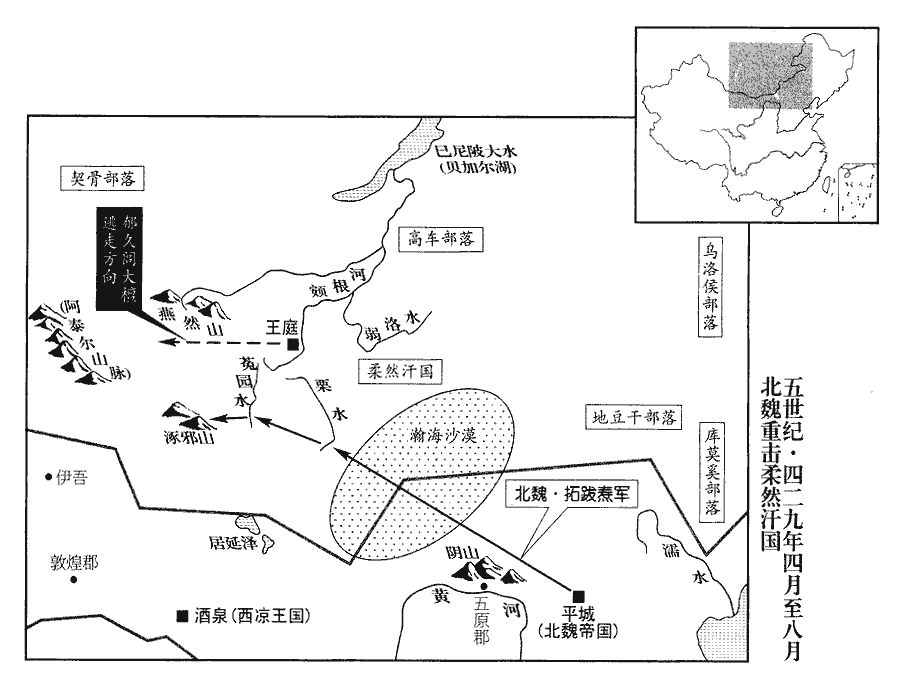
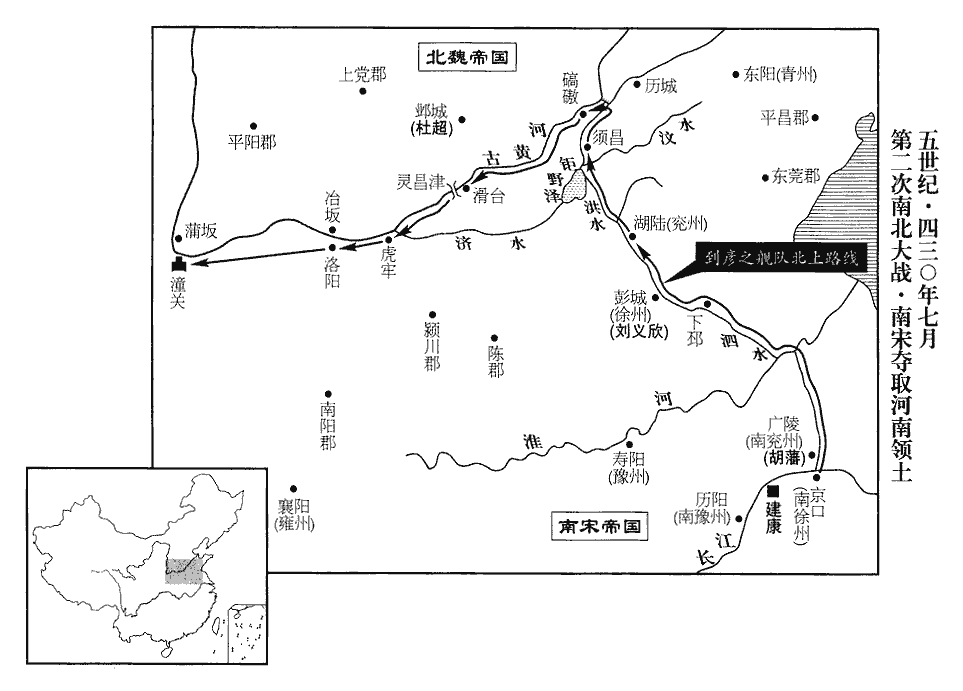
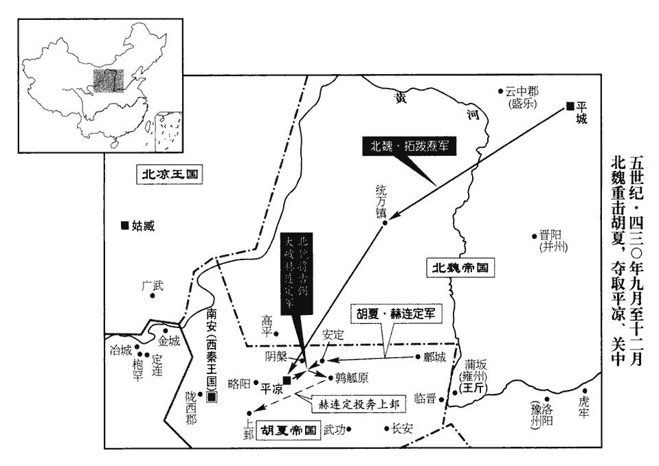
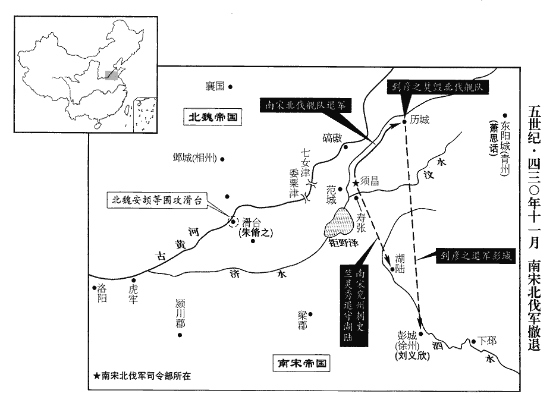

 宋紀三起著雍執徐（戊辰），盡上章敦牂（庚午），凡三年

# 太祖文皇帝上之中

## 元嘉五年（戊辰、四二八）

1春，正月，辛未‹二›，魏‹都平城，山西大同›京兆王黎卒。

〖译文〗 [1]春季，正月，辛未（初二），北魏京兆王拓跋黎去世。

2荊州‹湖北›刺史、彭城王義康，性聰察，在州職事修治。治，直吏翻。左光祿大夫范泰謂司徒王弘曰：「天下事重，權要難居。卿兄弟盛滿，當深存降挹。謂弘及弟曇首皆居權要。彭城王，帝之次弟，宜征還入朝，共參朝政。」朝，直遙翻。弘納其言。時大旱、疾疫，弘上表引咎遜位，帝‹刘义隆，时年二十二›不許。

〖译文〗 [2]刘宋荆州刺史、彭城王刘义康，生性聪明，详察下情，他在荆州，凡是职权范围内的事都办得很好。刘宋左光禄大夫范泰对司徒王弘说：“国家大事，责任很重，权要的地位，也很难久居。你们兄弟的权力和地位，已经达到了顶峰，应该深深地想到要谦虚谨慎。彭城王刘义康是皇上的二弟，最好征召他回京，共同参与处理朝廷大事。”王弘接受了范泰的劝告。当时，刘宋境内正遭受严重的旱灾，瘟疫流行，王弘上疏引咎自责，请求解除自己的职务，宋文帝刘义隆没有批准。

3秦‹都枹罕，甘肃临夏›商州刺史領澆河‹青海贵德›太守姚濬叛，降河西‹北凉，都姑臧，甘肃武威›，晉時，張祚以敦煌郡為商州。時敦煌屬河西，熾磐蓋以濬遙領商州而守澆河也。澆，堅堯翻。降，戶江翻。秦王熾磐以尚書焦嵩代濬，帥騎三千討之。帥，讀曰率。騎，奇寄翻。二月，嵩為吐谷渾‹青海›元緒所執。

〖译文〗 [3]西秦国商州刺史兼浇河太守姚浚反叛，投降了北凉。西秦王乞伏炽磐任命尚书焦嵩任商州刺史兼浇河太守，并率领三千人讨伐姚浚。二月，焦嵩被吐谷浑汗国酋长慕容元绪擒获。

4魏改元神䴥。䴥jiā，居牙翻，牡鹿也。以獲神鹿改元。魏書靈徵志：時定州獲白䴥。白䴥，鹿也。又見於樂陵。

〖译文〗 [4]北魏改年号为神。

5魏平北將軍尉眷攻夏主‹赫连昌›於上邽‹甘肃天水›，尉，紆勿翻。夏主退屯平涼‹甘肃华亭›。奚斤進軍安定‹甘肃镇原东南曙光乡›，與丘堆、娥清章：甲十六行本「清」作「青」；乙十一行本同。軍合。斤馬多疫死，士卒乏糧，乃深壘自固。遣丘堆督租於民間，士卒暴掠，不設儆備，夏主襲之，堆兵敗，以數百騎還城。夏主乘勝，日來城下鈔掠，不得芻牧，諸將患之，監軍侍御史安頡曰：鈔，楚交翻。將，即亮翻。監，工銜翻。頡，戶結翻。「受詔滅賊，今更為賊所困，退守窮城；若不為賊殺，當坐法誅，進退皆無生理。而諸王公晏然曾不為計乎？」奚斤封宜城王，為司空。斤曰：「今軍士無馬，以步擊騎，必無勝理，當須京師救騎至，合擊之。」頡曰：「今猛寇游逸於外，吾兵疲食盡，不一決戰，則死在旦夕，救騎何可待乎！等於就死，死戰，不亦可乎！」斤又以馬少為辭。騎，奇寄翻。少，詩沼翻。頡曰：「今斂諸將所乘馬，可得二百匹，頡請募敢死之士出擊之，就不能破敵，亦可以折其銳。且赫連昌狷而無謀，好勇而輕，狷，吉縣翻。好，呼到翻。輕，遣政翻。每自出挑戰，挑，徒了翻。眾皆識之。若伏兵掩擊，昌可擒也。」斤猶難之。頡乃陰與尉眷等謀，選騎待之。既而夏主來攻城，頡出應之。夏主自出陳前搏戰，陳，讀曰陣。軍士識其貌，爭赴之。會天大風，揚塵，晝昏，夏主敗走；頡追之，夏主馬蹶而墜，逐擒之。考異曰：十六國春秋鈔云：「承光三年五月，戰于黑渠，為魏所敗，昌與數千騎奔還，魏追騎亦至。昌河內公費連烏提守高平，徙諸城民七萬戶于安定以都之。四年二月，魏軍至安定，三城潰，昌奔秦州，魏東平公娥清追擒之，送于魏。」與後魏紀、傳不同，今從後魏書。頡，同之子也。安同，永興初八公之一也。

〖译文〗 [5]北魏平北将军尉眷，围攻夏王赫连昌所在的上，赫连昌退到平凉据守。北魏大将奚斤率领军队抵达安定，与娥清、丘堆率领的大军会师。奚斤军中的战马染上了温疫，大批死亡，士卒又缺乏粮饷，所以只好深挖沟堑，营造堡垒固守。奚斤派遣丘堆率军队到乡村征粮逼租，北魏的士卒残暴无端，大肆抢掠，对敌人未加防备，夏主赫连昌乘机进攻，丘堆的军队大败，只带着几百名骑兵逃回安定。赫连昌乘胜追击，每天到城下抢掠，北魏的军队得不到粮秣，将领们深感忧虑。监军侍御史安颉说道：“我们接受朝廷的诏命是要消灭敌寇，而如今我们却被敌人包围，困守孤城，即令不被敌人杀戮，也要受到军法的惩罚，无论是进、是退都没有生路。而各位王公还安稳地坐在那里，就没有克敌制胜的计谋吗？”奚斤说：“现在我们的军士没有马匹，用步兵来进攻骑兵，断然没有取胜的可能。只有等朝廷派救兵和战马赶来救援，内外夹击敌人。”安颉说：“现在强敌在城外示威，我们城内的士卒精疲力尽，粮食又已经吃完，如果不立刻与敌人决战，我们早晚之间就会全军覆没，救兵怎么能够等到呢？同样是去死，决一死战不也是可以的吗？”奚斤又以战马太少为理由，推辞不肯决战。安颉说：“现在我们把各个将领的坐骑集中起来，可以凑到二百匹，我请求招募敢死的士卒，冲出城去打击敌人，即使不能击破敌人，也可以打击他们的锐气。况且，赫连昌急躁无谋，却轻率好斗，常常亲自出阵挑战，军中的士卒都认识他的模样。如果设伏兵突然袭击他，一定能生擒赫连昌。”奚斤仍然面有难色。安颉于是与尉眷暗中谋划，挑选精骑等待时机。不久，赫连昌果然又来攻城，安颉出城应战。赫连昌亲自出阵与安颉交锋，北魏的士卒都认出他的面貌，争相围攻赫连昌。正值狂风突起，尘沙飞扬遮天蔽日，白天如同黑夜一样昏暗，赫连昌抵挡不住，打马逃走，安颉在后紧追，赫连昌的坐骑突然栽倒，赫连昌坠马倒地，于是被安颉生擒。安颉是安同的儿子。

夏大將軍、領司徒、平原王定收其餘眾數萬，奔還平涼，即皇帝位，定，小字直獖fén，夏王勃勃第五子。大赦，改元勝光。

〖译文〗 夏国的大将军、领司徒、平原王赫连定，收集夏军残部数万人，一路奔走，逃回平凉。赫连定即皇帝位，下令实行大赦，改年号为胜光。

三月，辛巳‹十三›，赫連昌至平城‹山西大同›，魏主‹拓跋焘，时年二十一›館之於西宮，門內器用皆給乘輿之副，又以妹始平公主妻之；乘，繩證翻。妻，七細翻。假常忠將軍，賜爵會稽公。會，工外翻。以安頡為建節將軍，賜爵西平公；尉眷為寧北將軍，進爵漁陽公。

〖译文〗 三月，辛巳（十三日），赫连昌被押解到平城，北魏国主拓跋焘在西宫为赫连昌安排了客舍，房间里的日常用具都跟皇帝使用的一样，又把自己的妹妹始平公主嫁给他，给他常忠将军头衔，并封为会稽公。拓跋焘任命安颉为建节将军，封为西平公；尉眷为宁北将军，晋封他为渔阳公。

魏主常使赫連昌侍從左右，從，才用翻。與之單騎共逐鹿，深入山澗。昌素有勇名，諸將咸以為不可。魏主曰：「天命有在，亦何所懼！」親遇如初。

〖译文〗 拓跋焘常常让赫连昌侍从在自己身边，两人单独打猎，两马相并追逐麋鹿，深入高山危谷。赫连昌一向享有勇猛的威名，拓跋焘手下的将领们都认为拓跋焘不可这样做。拓跋焘却说：“天命自有定数，有什么可畏惧的呢！”所以对赫连昌仍然亲近，跟当初一样。

奚斤自以為元帥，而昌為偏裨所擒，深恥之。乃捨輜重，重，直用翻；下同。齎jí三日糧，追夏主于平涼。娥清欲循水而往，清蓋欲循涇水而進。斤不從，自北道邀其走路。至馬髦嶺‹宁夏固原西南›，馬髦山之嶺也。夏軍將遁，會魏小將有罪亡歸於夏，告以魏軍食少無水。少，詩沼翻。夏主乃分兵邀斤，前後夾擊之，魏兵大潰，斤及娥清、劉拔皆為夏所擒，去年，魏遣劉拔與斤共擊夏。士卒死者六七千人。考異曰：宋索虜傳：「元嘉五年，使大將吐伐斤西伐長安，生擒赫連昌于安定，封昌為公，以妹妻之。昌弟定在隴上，吐伐斤乘勝以騎三萬討之。定設伏於隴山彈箏谷，破之，斬吐伐斤，盡坑其眾。定率眾東還，復克長安。燾又自攻，不克，乃分軍戍大城而還。」今從後魏書。

〖译文〗 奚斤自以为是元帅，但夏王赫连昌却被他手下的偏将活捉了，因此深感羞耻。于是他命令军队舍弃辎重，只带三日粮秣，进攻赫连定据守的平凉。娥清建议沿着泾水而行，奚斤不同意，坚持走北道以便截击赫连定的退路。北魏军走到马髦岭，夏国军队正要逃走，正巧北魏军中的一名小将因为犯罪投降了夏军，把北魏军中缺粮少水的窘况都报告了赫连定。赫连定于是分兵几路拦载奚斤的军队，前后夹击，北魏军顿时溃败如潮，奚斤、娥清、刘拔等将领都被夏军活捉，士卒中也有六七千人战死。

丘堆守輜重在安定，聞斤敗，棄輜重奔長安‹西安›，與高涼王禮偕奔蒲阪‹山西永济›，阪，音反。夏人復取長安。復，扶又翻；下復勸同。魏主大怒，命安頡斬丘堆，代將其眾，鎮蒲阪以拒之。將，即亮翻。

〖译文〗 北魏大将丘堆在安定城留守，看管军用物资，他听说奚斤战败的消息，立刻放弃辎重逃往长安，又与高凉王拓跋礼一道放弃长安，逃奔蒲阪，夏国的军队又重新占据了长安城。拓跋焘闻知大怒，命令安颉斩丘堆，代替他统领他的部众镇守蒲阪来抗拒夏军。

6夏，四月，夏主‹赫连定›遣使請和于魏，魏主以詔諭之使降。使，疏吏翻。降，戶江翻。

〖译文〗 [6]夏季，四月，夏王赫连定派使臣到北魏国，请求和解。北魏国主拓跋焘下诏命令赫连定投降。

7壬子‹十五›，魏主西巡；戊午‹二十一›，畋於河西‹陕西北部›；此君子津之西也。大赦。

〖译文〗 [7]壬子（十五日），北魏国主拓跋焘向西巡察。戊午（二十一日），拓跋焘在河西打猎；下令大赦。

8五月，秦文昭王熾磐卒，太子暮末即位，大赦，改元永弘。

〖译文〗 [8]五月，西秦王乞伏炽磐去世，太子乞伏暮末继承王位，大赦天下，改年号为永弘。

9平陸‹山东汶上›令河南‹洛阳›成粲平陸縣自漢以來屬東平郡。復勸王弘遜位，復，扶又翻。弘從之，累表陳請。帝不得已，六月，庚戌‹十四›，以弘為衛將軍、開府儀同三司。

〖译文〗 [9]刘宋平陆县令、河南人成粲再度劝司徒王弘退位，王弘采纳了他的建议，一再上疏，坚决请求辞去职务。刘宋文帝不得已，六月，庚戌（十四日），调任王弘为卫将军、开府仪同三司。

10甲寅‹十八›，魏主如長川‹内蒙兴和西北›。魏書帝紀：泰常八年，築長城於長川之南。

〖译文〗 [10]甲寅（十八日），北魏国主拓跋焘抵达长川。

11葬秦文昭王‹乞伏熾磐›于武平陵，廟號太祖。秦王暮末以右丞相元基為侍中、相國、都督中外諸軍、錄尚書事，以鎮軍大將軍、河州牧謙屯為驃騎大將軍，河州治枹罕，乞伏氏所都。驃，匹妙翻。騎，奇寄翻；下同。征安北將軍、涼州刺史段暉為輔国大將軍、御史大夫，段暉先鎮樂都‹青海乐都›。叔父右禁將軍千年為鎮北將軍、涼州牧、鎮湟河‹青海化隆›，以征北將軍木弈干為尚書令、車騎大將軍，以征南將軍吉毗為尚書僕射、衛大將軍。

〖译文〗 [11]西秦国在武平陵安葬了文昭王乞伏炽磐，庙号太祖。西秦王乞伏暮末任命右丞相乞伏元基为侍中、相国、都督中外诸军事、录尚书事等职务；同时任命镇军大将军、河州牧乞伏谦屯为骠骑大将军；征召安北将军、凉州刺史段晖为辅国大将军、御史大夫；任命叔父、右禁将军乞伏千年为镇北将军、凉州牧，镇守湟河；又任命征北将军乞伏木弈干为尚书令、车骑大将军；任命征南将军乞伏吉毗为尚书仆射、卫大将军。

河西王蒙遜‹时年六十一›因秦喪，伐秦西平‹青海西宁›，西平太守麴承謂之曰：「殿下若先取樂都，則西平必為殿下之有；苟章：甲十六行本「苟」上有「西平」二字；乙十一行本同。望風請服，亦明主之所疾也。」蒙遜乃釋西平，攻樂都。相國元基帥騎三千救樂都，元基自枹罕救樂都。樂，音洛。甫入城，而河西兵至，攻其外城，克之；絕其水道，城中饑渴，死者太半。東羌乞提從元基救樂都，陰與河西通謀，下繩引內其兵，登城者百餘人，鼓譟燒門；元基帥左右奮擊，河西兵乃退。帥，讀曰率。

〖译文〗 北凉河西王沮渠蒙逊利用乞伏炽磐去世的机会，进攻西秦所属的西平，西平太守承，对前来攻城的沮渠蒙逊说：“殿下如果能够先攻取乐都，那么西平一定会归附殿下。假如我望风而降，英明君主也看不起这样的守将。”沮渠蒙逊于是放弃西平，改变方向去进攻乐都。西秦的相国乞伏元基率领骑兵三千人救援乐都。乞伏元基的援兵刚刚进城，沮渠蒙逊的大军也开到了城下，开始攻击，很快就攻陷了乐都外城；切断了乐都城的水源，城中有一半以上的人死于饥渴。东羌部落酋长乞提原来跟随乞伏元基救援乐都，却暗中与城外的北凉军队勾结，从城上抛下绳索，从内部牵引北凉士卒登城，很快登城的北凉军士达百余人，他们大声呐喊，纵火焚烧城门，乞伏元基率领左右亲军奋力抗击，北凉的军队才被打退。

初，文昭王‹乞伏熾磐›疾病，謂暮末曰：「吾死之後，汝能保境則善矣。沮渠成都為蒙遜所親重，汝宜歸之。」至是，暮末遣使詣蒙遜，許歸成都以求和。成都為秦禽，事見一百十九卷武帝永初三年。沮，子餘翻。使，疏吏翻；下同。蒙遜引兵還，遣使入秦弔祭。暮末厚資送成都，遣將軍王伐送之。蒙遜猶疑之，使恢武將軍沮渠奇珍伏兵於捫天嶺‹甘肃兰州西›，執伐幷其騎士三百人以歸。既而遣尚書郎王杼zhù送伐還秦，並遺暮末馬千匹及錦罽jì銀繒。遺，于季翻。罽，音計。繒，慈林翻。秋，七月，暮末遣記室郎中馬艾如河西報聘。

〖译文〗 最初，文昭王乞伏炽磐重病时，曾对太子乞伏暮末说：“我死以后，你能够保住国土不失，就已经不错了。沮渠成都一向得到沮渠蒙逊的信任和重用，你应该把他送回国去。”这时，乞伏暮末遣使来到沮渠蒙逊的营中，答应归还沮渠成都，请求和解。沮渠蒙逊接受了西秦的建议，撤军回国，随即又派遣使臣赴西秦吊丧。乞伏暮末用厚重的礼物，送沮渠成都回国，并派将军王伐护送。沮渠蒙逊对西秦的做法仍深怀疑虑，就派恢武将军沮渠奇珍，在扪天岭设下埋伏，擒获王伐及其三百骑兵回国。不久，又派尚书郎王杼护送王伐返回了西秦，并送给乞伏暮末战马一千匹以及其他锦缎绫罗。秋季，七月，乞伏暮末派遣记室郎中马艾前往北凉回访。

12魏主‹拓跋焘›還宮。八月，復如廣寧‹河北涿鹿›觀溫泉。水經註：下洛縣故城，魏燕州廣寧縣，廣寧郡治。魏土地記：下洛城東南四十里有橋山，山下有溫泉。泉上有祭堂，彫簷華宇，被于浦上，石池吐泉，湯湯其下。炎涼代序，是水灼焉無改；能治百疾，赴者若流。復，扶又翻。

〖译文〗 [12]北魏国主拓跋焘回宫。八月，拓跋焘又前往广宁观赏温泉。

柔然‹瀚海沙漠群›紇升蓋可汗‹郁久闾大檀›遣其子將萬余騎寇魏邊，紇，戶骨翻。可，讀從刊入聲。汗，音寒。將，即亮翻。騎，奇寄翻。魏主自廣寧還，追之，不及；九月，還宮。

〖译文〗 柔然汗国纥升盖可汗郁久闾大檀派他的儿子率领一万多骑兵进犯北魏的边境。拓跋焘从广宁返回首都平城，率兵追击柔然汗国的军队，没有追上。九月，拓跋焘回宫。

冬，十月，甲辰‹十›，魏主北巡；壬子‹十八›，畋于牛川‹内蒙兴和西›。

〖译文〗 冬季，十月，甲辰（初十），拓跋焘到北方巡视；壬子（十八日），到牛川狩猎。

13秦涼州牧乞伏千年，嗜酒殘虐，不恤政事，秦王暮末遣使讓之，千年懼，奔河西‹北凉›。奔河西王蒙遜也。暮末以叔父光祿大夫沃陵為涼州牧，鎮湟河‹青海化隆›。

〖译文〗 [13]西秦凉州牧乞伏千年，酗酒暴虐，不理公务。西秦王乞伏暮末派遣使臣责备他，乞伏千年大为恐惧，投奔北凉。乞伏暮末任命他的叔父、光禄大夫乞伏沃陵为凉州牧，镇守湟河。

14徐州刺史王仲德遣步騎二千伐魏濟陽‹河南兰考东北堌阳镇›、陳留‹浚仪，河南开封›。濟陽縣，漢、晉以來屬陳留郡；此時陳留郡治浚儀。杜佑曰：濟陽縣故城在曹州冤句縣西南。濟，子禮翻。考異曰：後魏紀云「淮北鎮將」。按南史，仲德時為安北將軍、徐州刺史。宋書仲德傳闕。又，宋書、南史本紀、北史本紀及宋魏諸臣列傳、魏劉裕傳、宋索虜傳，皆無是年王仲德等伐魏事，唯後魏本紀有之，今從之。

〖译文〗 [14]刘宋徐州刺史王仲德派遣步、骑兵二千人进攻北魏所属的济阳、陈留。

15魏主還宮。

〖译文〗 [15]北魏国主拓跋焘回宫。

16魏定州‹府中山，河北定州›丁零鮮于臺陽等二千餘家叛，入西山‹太行山›，魏主珪皇始二年置安州於中山，天興三年改曰定州。西山，即曲陽西山也。州郡不能討；閏月，魏主遣鎮南將軍叔孫建討之。

〖译文〗 [16]北魏定州丁零部落酋长鲜于台阳等率两千余家背叛了北魏，进入西山；地方州郡都无力讨伐他们。闰月，拓跋焘命镇南将军叔孙建前往征讨。

17十一月，乙未朔‹一›，日有食之。

〖译文〗 [17]十一月，乙未朔（初一），出现日食。

18魏主如西河‹内蒙托克托一带›校獵；河水逕漢雲中楨陵縣西南，平城在其東北，故謂之西河。十二月，甲申‹二十一›，還宮。

〖译文〗 [18]北魏国主拓跋焘前往西河，举行围猎。十二月，甲申（二十一日），回宫。

19河西王蒙遜伐秦，至磐夷‹青海西宁西南›，秦相國元基等將騎萬五千拒之。蒙遜還攻西平，征虜將軍出連輔政等將騎二千救之。將，即亮翻。騎，奇寄翻。

〖译文〗 [19]北凉河西王沮渠蒙逊再次讨伐西秦，北凉军开到磐夷，遇到西秦相国乞伏元基率领骑兵一万五千人阻击。沮渠蒙逊率军回攻西平，西秦征虏将军出连辅政等率领骑兵二千人赶赴救援。

20秘書監謝靈運，自以名輩才能，應參時政；上唯接以文義，每侍宴談賞而已。王曇首、王華、殷景仁，名位素出靈運下，並見任遇，靈運意甚不平，多稱疾不朝直；不入朝、不入直也。曇，徒含翻。朝，直遙翻。或出郭遊行，且二百里，經旬不歸，既無表聞，又不請急。上不欲傷大臣意，諷令自解。靈運乃上表陳疾，上賜假，令還會稽‹浙江绍兴›；假，居訝翻。會，工外翻。而靈運游飲自若，為法司所糾，坐免官。

〖译文〗 [20]刘宋秘书监谢灵运，自以为他的才能、名望和辈分，都足以有资格参与朝政。可是刘宋文帝只看重他的文才，只是常常让他参加宴会，跟他谈论和欣赏诗文而已。王昙首、王华、殷景仁的名望和地位，一向居于谢灵运之下，他们都得到了重用，并被委以国家机要大事，谢灵运因此愤愤不平，经常声称有病，不参加朝会；有时出城游玩旅行，走出二百里，十余日也不回来，即不上疏奏报，也从不请假。刘宋文帝不愿伤害大臣的面子，婉转地让他自己辞职。谢灵运于是上书，声称自己有病。刘义隆批准他休假，让他返回会稽养病。谢灵运回会稽后，仍然游乐欢宴，被法司纠举，于是被免除了官职。

21是歲，師子‹锡兰岛，斯里兰卡›王刹利摩訶及天竺‹印度›迦毗黎王月愛皆遣使奉表入貢，表辭皆如浮屠之言。南史：師子國，天竺旁國也。其地和適，無冬夏之異；五穀隨人種，不須時節。天竺有迦毗黎、蘇摩黎、斤陀利、婆黎等國，皆事佛道。剎，初轄翻。迦，古牙翻，又居伽翻。使，疏吏翻。

〖译文〗 [21]这一年，师子国王刹利摩诃以及天竺迦毗黎王月爱都派遣使臣前往刘宋进贡。他们奏章上的辞句都类似佛经上的语言。

22魏鎮遠將軍平舒侯燕鳳卒。燕鳳歷事拓跋氏四世。

〖译文〗 [22]北魏镇远将军、平舒侯燕凤去世。

## 六年己巳、四二九

1春，正月，王弘上表乞解州、錄，以授彭城王義康，州、錄，揚州及錄尚書事也。帝優詔不許。癸丑‹二十›，以義康爲侍中、都督揚•南徐•兗三州諸軍事、司徒、錄尚書事、領南徐州‹府京口，江苏镇江›刺史。武帝永初二年，加京口之徐州曰南徐，淮北之徐州但曰徐。南徐領南東海、南琅邪、晉陵、義興、南蘭陵、南東莞、臨淮、淮陵、南彭城、南清河、南高平、南平昌、南濟陰、南濮陽、南泰山、濟陽、南魯郡等郡。弘與義康二府並置佐領兵，共輔朝政。佐，參佐也，所謂佐吏。朝，直遙翻。弘旣多疾，且欲委遠大權，每事推讓義康；遠，于願翻。推，吐雷翻。由是義康專總內外之務。爲義康專擅致禍張本。

〖译文〗 [1]春季，正月，刘宋扬州刺史王弘上疏要求辞去扬州刺史和录尚书事等职，并请求皇上把这两项要职委任给彭城王刘义康。刘宋文帝下达一份褒奖诏书，但没有批准。癸丑（二十日），下诏任命刘义康为侍中，都督扬、南徐、兖三州诸军事，司徒，录尚书事，领南徐州刺史。王弘与刘义康二人的官署，都设置属官卫，二人共同辅佐朝廷政务。王弘体弱多病，况且又早下决心远离权势，因此每件事都推给刘义康处理。刘义康于是一个人总管内外事务。

又以撫軍將軍江夏王義恭爲都督荊•湘等八州諸軍事、荊州刺史，夏，戶雅翻。以侍中劉湛爲南蠻校尉，行府州事。帝與義恭‹时年十七›書，誡之曰：「天下艱難，家國事重，雖曰守成，實亦未易。隆替安危，在吾曹耳，豈可不感尋王業，大懼負荷！感念致王業之艱難而尋繹爲治之理也。《傳》曰：其父析薪，其子不克負荷。易，以豉翻。荷，下可翻，又音如字。

〖译文〗 刘宋文帝又任命抚军将军、江夏王刘义恭为都督荆、湘等八州诸军事，兼任荆州刺史；任命侍中刘湛为南蛮校尉，代理府、州政务。刘宋文帝写信给刘义恭，告诫他说：“天下时事，十分艰难，家事国事，关系重大。虽说是继承并保住现成的基业，实际上也还是相当不容易。国家的兴隆或衰落，安定或危覆都在于我们的努力，怎么可以不感到王业艰难而寻求治国之道，从而对自己肩负重担而惶恐不安呢！

汝性褊急，志之所滯，其欲必行；滯，疑也，積也。褊，方緬翻。意所不存，從物回改；此最弊事，宜念裁抑。衛青遇士大夫以禮，與小人有恩；西門、安于，矯性齊美；西門豹性剛急，常佩韋以自緩。董安于性寬緩，常佩弦以自警。關羽、張飛，任偏同弊；事見六十九卷魏文帝黃初二年。行己舉事，深宜鑒此！

〖译文〗 “你的性情急躁偏激，心里想着什么，就要不顾一切地达到目的。有时你的心里并没有某些愿望，一受外界引诱，你就立刻产生欲望，这是最容易招致祸端的，应该时刻提醒自己，极力克制。卫青对待士大夫礼貌谦恭，对小人也有恩惠；西门豹性情刚直急躁，常常佩带苇草；董安于性情宽容，做事缓慢，常常佩带弓弦，都是为了警告自己，矫正自己的性情，他们的美名一齐得到了后世的传颂。关羽、张飞则不然，二人的性格都任性偏激，缺点相同。你侍己处事，要深刻体会古人的行为，作为借鉴。

若事異今日，嗣子幼蒙，陸德明曰：蒙，稚也。司徒當周公之事，汝不可不盡祗順之理。爾時天下安危，決汝二人耳。

〖译文〗 “倘若有一天朝中发生不测，我的儿子年纪还小，身为司徒的刘义康必然要负起周公的责任，你也不可不尽到恭敬辅弼的道义。到那个时候，国家的安危存亡，就全取决于你们二人了。

汝一月自用錢不可過三十萬，若能省此，益美。西楚府舍，略所諳究，諳，烏含翻。計當不須改作，日求新異。江左謂荊州爲西楚。凡訊獄多決當時，難可逆慮，此實爲難；至訊日，虛懷博盡，愼無以喜怒加人。能擇善者而從之，美自歸己；不可專意自決，以矜獨斷之明也！斷，丁亂翻。

〖译文〗 “你每月的私人开支，不能超过三十万，倘若还能比这节省，那就更好。荆州的府舍，我略为熟悉了解，估计还不用重新改建，去追求新异。至于讯案断狱，大多要当时裁决，很难事先做周到的考虑，当然，这是一件很不容易的事。在审讯的时候，要虚心听取各方面的陈述，千万谨慎处置，不要把自己的喜怒强加于人。平时做事，能择善而从，自己就会获得好的声誉，切不可一意孤行，来炫耀自己的独断和英明。

名器深宜愼惜，不可妄以假人；昵近爵賜，尤應裁量。吾於左右雖爲少恩，昵，尼質翻。量，音良。少，詩沼翻。如聞外論不以爲非也。

〖译文〗 “名分一定要谨慎珍惜，不可以随便赏给他人；对亲近的人封赐爵位，则更应再三考虑定夺。我对于身边的人，虽然很少有特别的赏赐，但如果听说外面有人议论我，我也不认为他们说的不对。

以貴凌物，物不服；以威加人，人不厭；此易達事耳。易，以豉翻。

〖译文〗 “凭权势欺凌别人，别人自然不服，用威望统辖别人，别人便不会满意，这是显而易见的事。

聲樂嬉遊，不宜令過；蒲酒漁獵，一切勿爲。蒲，樗chū蒲也。供用奉身，皆有節度，奇服異器，不宜興長。長，丁丈翻；今知兩翻。

〖译文〗 “声色犬马，嬉戏游乐都不能过分。饮酒赌博、捕鱼狩猎这一切都不应该做，日常用品、衣服饮食，都应有节制。至于新奇的服饰和器物，不应鼓励制作。

又宜數引見佐史。「佐史」當作「佐吏」，晉、宋之間，藩府率謂參佐爲佐吏。數，所角翻；下同。相見不數，則彼我不親；不親，無因得盡人情；人情不盡，復何由知衆事也！」詳觀宋文帝此書，則江左之治稱元嘉，良有以也。復，扶又翻。

〖译文〗 “你还应该多多接见府中的官员，召见的次数少，就会彼此不亲近；不亲近，你就没有办法知道官员们的思想感情，不了解他们的思想感情，因此也就无法知道民间的具体情况。”

2夏‹都平涼，甘肃华亭›酒泉公雋自平涼奔魏。

〖译文〗 [2]夏国的酒泉公赫连隽从平凉出逃，投奔北魏。

3丁零‹时驻太行山›鮮于臺陽等請降於魏，降，戶江翻。魏主‹拓跋焘，时年二十二›赦之。赦其去年叛入西山之罪。

〖译文〗 [3]丁零部落酋长鲜于台阳等人，请求再次归降北魏，北魏国主拓跋焘赦免了他们的罪过。

4秦‹都枹罕，甘肃临夏›出連輔政等未至西平‹青海西宁›，河西王蒙遜‹时年六十二›拔西平，執太守麴承。蒙遜去年攻西平。

〖译文〗 [4]西秦征虏将军出连辅政等率领援军还没有赶到西平，北凉王沮渠蒙逊已经攻陷了西平城，活捉了西平太守承。

5二月，秦王暮末立妃梁氏爲皇【章：甲十六行本「皇」作「王」；乙十一行本同；孔本同。】后，子萬載爲太子。

〖译文〗 [5]二月，西秦王乞伏暮末，立妃梁氏为王后，封王子乞伏万载为太子。

6三月，丁巳‹二十五›，立皇子劭爲太子；戊午‹二十六›，大赦。

〖译文〗 [6]三月，丁巳（二十五日），刘宋文帝立皇子刘劭为太子；戊午（二十六日），下令大赦。

7辛酉‹二十九›，以左衛將軍殷景仁爲中領軍。帝以章太后‹胡道安›早亡，章太后胡氏生帝五年，被譴賜死，帝卽位，諡曰章。奉太后所生蘇氏甚謹。蘇氏卒，帝往臨哭，欲追加封爵，使羣臣議之，景仁以爲古典無之，乃止。

〖译文〗 [7]辛酉（二十九日），刘宋文帝任命左卫将军殷景仁为中领军。文帝因为生母章太后胡氏早死，事奉外祖母苏氏十分恭谨。苏氏去世后，文帝到灵前恸哭，并打算追封爵位，命文武官员讨论。殷景仁认为自古没有封外祖母爵位的先例，文帝才作罢。

8初，秦尚書隴西‹甘肃隴西›辛進從文昭王遊陵霄觀，彈飛鳥，誤中秦王暮末之母，傷其面。觀，古玩翻。中，竹仲翻。及暮末卽位，問母面傷之由，母以狀告。暮末怒，殺進幷其五族二十七人。史言暮末以虐亡國。

〖译文〗 [8]当初，西秦尚书、陇西人辛进，跟从文昭王乞伏炽磐在陵霄观游览，用弹弓击飞鸟，不想竟误中秦王乞伏暮末的母亲，损伤了她的容貌。等到乞伏暮末即位，问及他母亲面部受伤的原因，他母亲把当时的情况据实地告诉了他，乞伏暮末大发雷霆，斩杀了辛进及其五族内的亲属二十七人。

9夏，四月，癸亥‹二›，以尚書左僕射王敬弘爲尚書令，臨川王義慶爲左僕射，吏部尚書濟陽‹河南兰考东北堌阳镇›江夷爲右僕射。濟，子禮翻。

〖译文〗 [9]夏季，四月，癸亥（初二），刘宋文帝任命尚书左仆射王敬弘为尚书令；临川王刘义庆为左仆射；吏部尚书、济阳人江夷为右仆射。

10初，魏太祖命尚書鄧淵撰《國記》十餘卷，未成而止。世祖更命崔浩與中書侍郎鄧穎等續成之，爲浩以史事得禍張本。爲《國書》三十卷。穎，淵之子也。

〖译文〗 [10]当初，北魏道武帝拓跋，命令尚书邓渊撰写《国记》十余卷，书未写成就停止了。于是，拓跋焘改命崔浩与中书侍郎邓颖等人继续编撰，称《国书》，共三十卷。邓颖是邓渊的儿子。

11魏主將擊柔然，治兵於南郊，治，直之翻。先祭天，然後部勒行陳。行，戶剛翻。陳，讀曰陣。內外羣臣皆不欲行，保太后固止之；獨崔浩勸之。

〖译文〗 [11]北魏国主拓跋焘将进攻柔然汗国，在平城的南郊举行阅兵大典。先行祭拜天神，然后下令排列战阵。朝廷内外的文武群臣都不愿意打这一仗，连拓跋焘的乳娘保太后都坚决劝阻，只有太常崔浩极力赞成。

尚書令劉絜等共推太史令張淵、徐辯使言於魏主曰：「今茲己巳，三陰之歲，干以甲、丙、戊、庚、壬爲陽，乙、丁、己、辛、癸爲陰；支以子、寅、辰、午、申、戌爲陽，丑、卯、巳、未、酉、亥爲陰。己、巳皆陰，而干支合於己巳，是爲三陰之歲。歲星襲月，太白在西方，不可舉兵。北伐必敗，雖克，不利於上。」羣臣因共贊之曰：「淵等少時嘗諫苻堅南伐，堅不從而敗，所言無不中，不可違也。」少，詩照翻。中，竹仲翻。魏主意不快，詔浩與淵等論難於前。難，乃旦翻。

〖译文〗 尚书令刘等人共同推举太史令张渊、徐辩向拓跋焘分析形势说：“今年是己巳年，恰恰是三种阴气聚集在一起的年分，木星突然靠近月亮，太白星出现在西方，不可以发动军事进攻，北伐一定失败，即使取胜，也对皇上不利。”文武群臣也异口同声地称赞张渊和徐辩的说法，都说：“张渊年轻的时候，曾经劝阻过苻坚，不可以南伐，苻坚不肯接受，结果大败。张渊的预言几乎没有一件事不应验的。不可以违背。”拓跋焘心里不高兴，下诏命令崔浩与张渊在御前辩论。

浩詰淵、辯曰：「陽爲德，陰爲刑；故日食脩德，月食脩刑。夫王者用刑，小則肆諸市朝，大則陳諸原野；陳諸原野，用甲兵也。此言本出《漢書•刑法志》。詰，去吉翻。朝，直遙翻。今出兵以討有罪，乃所以脩刑也。臣竊觀天文，比年以來，月行掩昴，至今猶然。其占，三年天子大破旄頭之國。比，毗至翻。昴爲旄頭，胡星也。蠕蠕、高車，旄頭之衆也。蠕，人兗翻。願陛下勿疑。」淵、辯復曰：復，扶又翻。「蠕蠕，荒外無用之物，得其地不可耕而食，得其民不可臣而使，輕疾無常，難得而制；有何汲汲，而勞士馬以伐之？」浩曰：「淵、辯言天道，猶是其職，至於人事形勢，尤非其所知。此乃漢世常談，自韓安國、主父偃至于嚴尤，其論皆如此。施之於今，殊不合事宜。何則？蠕蠕本國家北邊之臣，中間叛去。見一百八卷晉孝武太元十九年。今誅其元惡，收其良民，令復舊役，非無用也。世人皆謂淵、辯通解數術，明決成敗，臣請試問之：解，戶買翻。屬者統萬未亡之前，屬，之欲翻。有無敗徵？若其不知，是無術也；知而不言，是不忠也。」時赫連昌在座，坐，徂臥翻。淵等自以未嘗有言，慙不能對。魏主大悅。

〖译文〗 崔浩质问张渊、徐辩说：“阳是恩德，阴是刑杀；所以出现日食时，君主要积德；出现月食的时候，就要注意刑罚。帝王使用刑法，从小处说是把犯人处决于市朝，从大处说是对敌国用兵于原野。今天，出兵讨伐有罪之国，正是加强刑罚。我观察天象，近年以来月亮运行遮盖昴星，到现在仍然如此。这表明，三年之内天子将大破旄头星之国。柔然、高车都是旄头星的部众，希望陛下不要犹豫怀疑。”张渊、徐辩又说：“柔然，是远荒外没有用的东西，我们得到他们的土地，也不能耕种收获粮食；得到他们的百姓也不能当作臣民驱使。而且他们疾速往来，行动没有规律，很难攻取并彻底制服；有什么事如此急迫，要动员大队人马去讨伐他们？”崔浩说：“张渊、徐辩如果谈论天文，还是他们的本职；至于说到人间的事情和当前的形势，尤其不是他们能确切了解的。这是汉朝以来的老生常谈，用在今天，完全不切实际。为什么呢？柔然本来是我们国家北方的藩属，后来背叛而去。今天我们要诛杀叛贼元凶，收回善良的百姓，使他们能够为我国效力，不是毫无用处的。世上的人都信服张渊、徐辩深通天文历法，预知成功或失败。那么，我倒想问问他们，在统万城没有攻克之前有没有溃败的征兆？如果不知道，是没有能力；如果知道了却不说，是对皇上不忠。”当时夏国前国主赫连昌也在座，张渊等人因为自己确实没有说过，十分惭愧，无法回答。拓跋焘非常高兴。

旣罷，公卿或尤浩曰：「今南寇方伺國隙，伺，相吏翻。而捨之北伐；若蠕蠕遠遁，前無所獲，後有彊寇，將何以待之？」浩曰：「不然。今不先破蠕蠕，則無以待南寇。南人聞國家克統萬以來，內懷恐懼，故揚聲動衆以衛淮北。比吾破蠕蠕，往還之間，南寇必不動也。比，必寐翻。且彼步我騎，騎，奇寄翻。彼能北來，我亦南往；在彼甚困，於我未勞。況南北殊俗，水陸異宜，設使國家與之河南，彼亦不能守也。崔浩之料宋人審矣。帝後屢出兵爭河南，卒以自弊。吳呂蒙不肯取魏徐州，正慮此耳。何以言之？以劉裕之雄傑，吞倂關中，留其愛子，輔以良將，精兵數萬，猶不能守，全軍覆沒，事見一百十八卷晉安帝義熙十四年。將，卽亮翻；下同。號哭之聲，至今未已。號，戶高翻。況義隆今日君臣，非裕時之比；主上英武，士馬精強，彼若果來，譬如以駒犢鬬虎狼也，馬子曰駒，牛子曰犢。何懼之有！蠕蠕恃其絕遠，謂國家力不能制，自寬日久；故夏則散衆放畜，秋肥乃聚，背寒向溫，背，蒲妹翻。南來寇鈔。鈔，楚交翻。今掩其不備，必望塵駭散。牡馬護牝，牝馬戀駒，驅馳難制，不得水草，不過數日，必聚而困弊，可一舉而滅也。蹔勞永逸，時不可失，蹔，與暫同。患在上無此意。今上意已決，柰何止之！」寇謙之謂浩曰：「蠕蠕果可克乎？」浩曰：「必克。但恐諸將瑣瑣，前後顧慮，不能乘勝深入，使不全舉耳。」瑣瑣，細小也，言志趣細小，不能一舉而全取之也。

〖译文〗 御前辩论结束后，朝中公卿重臣中有人责怪崔浩说：“如今南方宋国的敌人正在伺机侵入，而我们却置之不顾兴兵北伐；如果柔然听说我们攻来，逃得无影无踪，我们前进没有收获，后面却有强敌逼近，那时我们将怎么办？”崔浩说：“事情不会是这样的。如今我们如果不先攻破柔然，就没有办法对付南方的敌寇。南方人自从听说我们攻克夏国都城统万以来，对我们一直深怀恐惧，所以扬言要出动军队，来保卫淮河以北的土地。等到我们击破蠕蠕，一去一回的时间里，南寇一定不敢兴兵动武。况且，南寇多是步兵而我们主要是骑兵；他们能北来，我们也可以南下；在他们来说已经疲备不堪；而对我们来说还不曾疲劳。更何况南方和北方的风俗习惯大不相同；南方河道交错，北方一片平原；即使我国把黄河以南的土地让给他们，他们也守不住。为什么这样说呢？当年，以刘裕的雄才大略，吞并了关中，留下他的爱子镇守，又配备了经验丰富的战将和数万名精兵，还没有守住，最后落得个全军覆没。原野中的哭号之声，至今还没有停止。况且，今日刘义隆和他的文武群臣，其才略根本无法与刘裕时代的君臣相比。而我们的皇上英明威武，军队兵强马壮，如果他们真的打来，就象是马驹、牛犊与虎狼争斗一样，有什么可畏惧的呢！蠕蠕一直仗恃与我国距离遥远，以为我国没有力量制服他们，防备松懈已经很久。一到夏季，就把部众解散，各处逐水草放牧；秋季马肥兵壮，才又聚集，离开寒冷的荒野，面向温暖的中原，南下掠夺。而今我们乘其不备出兵，他们一看到飞扬的尘沙，一定会惊慌失措地四处逃散。公马护着母马，母马恋着小马，难以控制驱赶，等到找不着水草，不过几天的功夫，他们会再行聚集，乘他们疲劳困顿之际，我们的军队就可以一举歼灭他们。短时间的劳苦将换来永久的安逸，这样的时机千万不能放弃，我在忧虑皇上没有这样的决心。现在皇上的决心已经下定了，为什么还要阻挠！”寇谦之问崔浩说：“蠕蠕果真可以一举攻克吗？”崔浩回答说：“必克无疑。只恐怕将领们顾虑太多，瞻前顾后，不能乘胜深入，以致于不能一举取得彻底的胜利。”

先是，帝因魏使者還，告魏主曰：「汝趣歸我河南地！先，悉薦翻。使，疏吏翻。趣，讀曰促。不然，將盡我將士之力。」魏主方議伐柔然，聞之，大笑，謂公卿曰：「龜鼈小豎，東南，澤國也，故詆之曰龜鼈小豎。自救不暇，夫何能爲！就使能來，若不先滅蠕蠕，乃是坐待寇至，腹背受敵，非良策也。吾行決矣。」

〖译文〗 在此之前，刘宋文帝趁北魏使者回国，让使者转告北魏国主拓跋焘说：“你应该赶快归还我黄河以南的领土！否则，我们的将士只好竭力攻取。”当时，拓跋焘正在讨论讨伐柔然的事宜，听到这个消息，大笑不已，对左右大臣们说：“龟鳖小丑，他救护自己还来不及，还能有什么作为！即使他真能打来，如果我们不先灭掉蠕蠕，那就是在家门口坐等敌人来攻，腹背受敌，不是好的计策。我决心立即讨伐。”

庚寅‹二十九›，魏主發平城，使北平王長孫嵩、廣陵公樓伏連居守。守，手又翻。《魏書•官氏志》：獻帝次弟爲伊婁氏，又有乙郍nà婁氏，後並改爲婁氏。魏主自東道向黑山‹内蒙呼和浩特境›，使平陽王長孫翰自西道向大娥山，同會柔然之庭‹蒙古哈尔和林›。

〖译文〗 庚寅（二十九日），拓跋焘从平城出发。命令北平王长孙嵩、广陵公楼伏连等留守京师。拓跋焘向东取道黑山，派平阳王长孙翰向西取道大娥山，约定在柔然汗国的王庭会师。

12五月，壬辰朔‹一›，日有食之。

〖译文〗 [12]五月，壬辰朔（初一），出现日食。

13王敬弘固讓尚書令，表求還東。還，從宣翻，又如字；下同。癸巳‹二›，更以敬弘爲侍中、特進、左光祿大夫，聽其東歸。自建康歸會稽‹浙江绍兴›爲東歸。

〖译文〗 [13]王敬弘坚决辞让尚书令，上疏请求返回故乡会稽。癸巳（初二），改任王敬弘为侍中、特进、左光禄大夫，准许他回到东边。

14丁未‹十六›，魏主至漠南，捨輜重，帥輕騎兼馬襲擊柔然，至栗水‹蒙古翁金河›。重，直用翻。帥，讀曰率。騎，奇寄翻。兼馬者，每一騎兼有副馬也。栗水在漠北，近稽落山，有漢將軍竇憲故壘在焉。柔然紇升蓋可汗‹郁久闾大檀›先不設備，民畜滿野，驚怖散去，訖，下沒翻。可，從刊入聲。汗，音寒。怖，普布翻。莫相收攝。攝，錄也，飭整也。紇升蓋燒廬舍，絕迹西走，莫知所之。其弟匹黎先主東部，聞有魏寇，帥衆欲就其兄；遇長孫翰，翰邀擊，大破之，殺其大人數百。

〖译文〗 [14]丁未（十六日），北魏皇帝拓跋焘抵达漠南，留下所有辎重，亲自率领轻骑兵和备用马匹袭击柔然汗国，大军很快逼近栗水。柔然汗国纥升盖可汗郁久闾大檀果然事先没有防备，原野上到处都有牲畜和放牧的人们，当他们发现北魏的大军突然袭来，惊慌失措各自逃散，根本无法集结。纥升盖可汗只好放火焚烧房屋，向西逃走，没有人知道他的下落。纥升盖可汗的弟弟郁久闾匹黎先主持东部的防务，听说北魏的军队大举攻来，立即召集他的部众打算向他的哥哥靠拢；刚刚出发，就与北魏平阳王长孙翰的军队遭遇，长孙翰拦截并袭击了郁久闾匹黎先及其部队，大破柔然军，斩杀他们酉长等头目数百人。

15夏主‹赫连定›欲復取統萬，引兵東至侯尼城，侯尼城在平涼東。不敢進而還。

〖译文〗 [15]夏王赫连定打算收复统万城，他统率大军向东抵达侯尼城，不敢再向前进发，只好班师。

16‹北凉，都姑臧，甘肃武威›河西王蒙遜伐秦，秦王暮末留相國元基守枹罕‹甘肃临夏›，遷保定連‹甘肃临夏东南›。

〖译文〗 [16]北凉河西王沮渠蒙逊讨伐西秦，西秦王乞伏暮末命相国乞伏元基留守都城罕，他自己则退保定连城。

南安‹甘肃陇西东南›太守翟承伯等據罕幵jiān谷‹甘肃临夏西南›以應河西，《水經註》：隴西白石縣東有罕幵溪，又東則枹罕縣故城；枹，音膚。幵，苦堅翻。暮末擊破之，進至治城‹临夏西北›。魏收《地形志》：涼州東陘郡有治城縣，其地當在黃河南。又涼州有建昌郡，亦有治城縣。

〖译文〗 西秦南安太守翟承伯叛变，他据守罕谷，响应北凉的军队的进攻。乞伏暮末大败翟承伯的军队，进抵治城。

西安太守莫者幼眷據汧qiān川以叛，此汧川非扶風之汧，當亦在枹罕左右。汧，口堅翻。暮末討之，爲幼眷所敗，敗，補邁翻。還于定連‹甘肃临夏东南›。

〖译文〗 西秦西安太守莫者幼眷，占据川，背叛西秦，乞伏暮末发兵讨伐，被莫者幼眷击败，乞伏暮击又回到定连。

蒙遜至枹罕，遣世子興國進攻定連。六月，暮末逆擊興國於治城，擒之，追擊蒙遜至譚郊‹甘肃临夏西北›。

〖译文〗 沮渠蒙逊大军包围了西秦的都城罕，又派他的世子沮渠兴国进攻定连。六月，乞伏暮末在治城反击沮渠兴国的围攻，生擒沮渠兴国。沮渠蒙逊率军立即撤退，乞伏暮末追击北凉军，一直追到谭郊。

吐谷渾‹青海›王慕璝遣其弟沒利延將騎五千會蒙遜伐秦，沒利延，卽慕利延，沒、慕聲相近也。璝，古回翻。暮末遣輔國大將軍段暉等邀擊，大破之。

〖译文〗 吐谷浑可汗慕容慕派他的弟弟慕容没利延率领骑兵五千人与沮渠蒙逊的大军会师，合兵讨伐西秦。西秦王乞伏暮末派遣辅国大将军段晖等拦击敌人，大败北凉军和吐谷浑汗国的骑兵。

17柔然紇hé升蓋可汗‹郁久闾大檀›旣走，部落四散，竄伏山谷，雜畜布野，畜，許救翻。無人收視。魏主循栗水西行，至菟園水‹蒙古图音河，流经巴彦洪戈尔东›，菟園水在燕然山南，去平城三千七百餘里，菟，同都翻，又土故翻。分軍搜討，東西五千里，南北三千里，俘斬甚衆。高車諸部‹蒙古北部›乘魏兵勢，鈔掠柔然。柔然種類前後降魏者三十餘萬落，鈔，楚交翻。種，章勇翻。降，戶江翻；下同。獲戎馬百餘萬匹，畜產、車廬，彌漫山澤，亡慮數百萬。亡、無字通。

〖译文〗 [17]柔然汗国纥升盖可汗郁久闾大檀逃走以后，他的部落四处流散，躲藏在荒山深谷之中，牛马等牲畜遍布原野，没有人收集照料。北魏国主拓跋焘沿着栗水一直向西行进，抵达菟园水，大军分散搜索柔然军残部，东西五千里，南北三千里，斩杀和俘虏的敌人很多。高车国的部落，乘着北魏的兵势，攻打并掠夺柔然汗国。这样一来，柔然汗国的各部落先后投降北魏的就有三十多万帐落，北魏军缴获的战马达一百多万匹，牲畜、车辆帐篷，遍布山谷水畔，大约有几百万之多。

魏主‹拓跋焘›循弱水西行，至涿邪山‹蒙古古尔班察罕山›，邪，讀曰耶。諸將慮深入有伏兵，勸魏主留止，寇謙之以崔浩之言告魏主，魏主不從。秋，七月，引兵東還；至黑山，以所獲班賜將士有差。旣而得降人言：「可汗先被病，被，皮義翻。聞魏兵至，不知所爲，乃焚穹廬，以車自載，將數百人入南山。民畜窘聚，無【章：甲十六行本「無」上有「方六十里」四字；乙十一行本同；孔本同；張校同；退齋校同。】人統領，窘，渠隕翻。相去百八十里；追兵不至，乃徐西遁，唯此得免。」後聞涼州賈胡言：「若復前行二日，則盡滅之矣。」賈，音古。復，扶又翻。魏主深悔之。

〖译文〗 拓跋焘又沿着弱水向西前进，抵达涿邪山。北魏的领将们考虑到，再向西深入恐怕会遇埋伏，所以都劝拓跋焘停止。寇谦之又把崔浩讲的那番话告诉拓跋焘，希望大军乘胜追击，彻底消灭柔然军，拓跋焘没有采纳。于是，秋季，七月，拓跋焘率领大军向东回国，到了黑山，把战利品依照等级分别赏赐给将士们。不久，听到投降的柔然人的报告，说：“可汗前些时，害病卧床，听说魏兵杀来，不知如何是好，仓卒之间焚烧了毡帐，躺在车上，率领几百人潜入南山。人和牲畜挤在一起，没有人统领，距涿邪山只有一百八十里；只因魏国的军队没有继续追赶，才慢慢向西逃去，得以幸免。”后来，还听到凉州的匈奴商人说：“魏军如果再前进二日，柔然汗国就被彻底消灭了。”拓跋焘听到这些话，深为后悔。

紇升蓋可汗憤悒而卒，子吳提立，號敕連可汗。魏收曰：敕連，魏言神聖也。

〖译文〗 柔然汗国纥升盖可汗郁久闾大檀忧愤交加，不久去世。他的儿子郁久闾吴提继承汗位，号称敕连可汗。

18武都孝昭王楊玄疾病，欲以國授其弟難當。難當固辭，請立玄子保宗而輔之，玄許之。玄卒，保宗立。難當妻姚氏勸難當自立，難當乃廢保宗，自稱都督雍•涼•秦三州諸軍事、征西大將軍、開府儀同三司、秦州刺史、武都王。爲後保宗、難當爭國張本。雍，於用翻。

〖译文〗 [18]武都孝昭王杨玄患病不起，打算把王位传授给他的弟弟杨难当。杨难当坚决拒绝接受，请求立杨玄的儿子杨保宗继承大位，他自己辅佐侄子，杨玄同意。杨玄去世后，杨保宗继位。可是杨难当的妻子姚氏劝说杨难当自立为王，于是杨难当废黜了杨保宗，自封为都督雍州、凉州、秦州三州诸军事、征西大将军、开府仪同三司、秦州刺史和武都王。

 

19河西王蒙遜遣使送穀三十萬斛以贖世子興國于秦，使，疏吏翻。秦王暮末不許。蒙遜乃立興國母弟菩提爲世子，蒙遜取佛書以名其子。梵言菩提，華言正道也。菩，薄乎翻。暮末以興國爲散騎常侍，散，悉亶翻。騎，奇寄翻；下同。以其妹平昌公主妻之。妻，七細翻。

〖译文〗 [19]北凉王沮渠蒙逊派遣使臣出使西秦，送谷三十万斛请求赎回世子沮渠兴国。西秦王乞伏暮末拒绝。沮渠蒙逊于是立沮渠兴国的胞弟沮渠菩提为世子。乞伏暮末则任命沮渠兴国为散骑常侍，并把自己的妹妹平昌公主嫁给他。

20八月，魏主至漠南，聞高車東部屯巳尼陂‹贝加尔湖›，《北史》：烏洛侯國西北二十日行，有于巳尼大水，所謂北海也。烏洛侯直濡源西北，巳尼陂又當在其西北也。人畜甚衆，去魏軍千餘里，遣左僕射安原等將萬騎擊之。高車諸部迎降者數十萬落，將，卽亮翻。降，戶江翻；下同。獲馬牛羊百餘萬。

〖译文〗 [20]八月，北魏国主拓跋焘抵达漠南，听说高车国东部屯居在已尼陂，人口繁盛，牲畜众多，距魏军只有一千余里。于是，拓跋焘派遣左仆射安原等统率一万名骑兵进攻高车。高车国各部落投降魏军的有几十万帐落。魏军缴获的牛羊也有一百多万头。

冬，十月，魏主還平城。徙柔然、高車降附之民於漠南，東至濡‹闪电河›源‹河北沽源›，濡，乃官翻。西曁五原‹内蒙包头›陰山，三千里中，使之耕牧而收其貢賦；命長孫翰、劉絜、安原及侍中代人‹鲜卑人›古弼同鎭撫之。自是魏之民間馬牛羊及氈皮爲之價賤。爲，于僞翻；下必爲同。

〖译文〗 冬季，十月，拓跋焘返回平城。把柔然汗国高车国各部落降附的百姓迁徙到漠南，安置在东到濡源，西到五原阴山的三千多里广阔草原上，命他们在这里耕种、放牧，向他们征收赋税。拓跋焘命令长孙翰、刘、安原以及侍中代郡人古弼共同镇守安抚他们。从此以后，北魏民间马、牛、羊及毡皮的价格下降。

魏主加崔浩侍中、特進、撫軍大將軍，以賞其謀畫之功。浩善占天文，常置銅鋌於酢器中，酢zuò，與醋同，倉故翻。夜有所見，卽以鋌畫紙作字以記其異。魏主每如浩家，問以災異，或倉猝不及束帶；奉進疏食，不暇精美，疏，粗也。食，祥吏翻。魏主必爲之舉筯，或立嘗而還。嘗，口識其味也。魏主嘗引浩出入臥內，從容謂浩曰：「卿才智淵博，事朕祖考，著忠三世，從，千容翻。道武‹拓跋珪›、明元‹拓跋嗣›及帝爲三世。故朕引卿以自近。近，其靳翻。卿宜盡忠規諫，勿有所隱。朕雖或時忿恚，不從卿言，恚huì，於避翻。然終久深思卿言也。」嘗指浩以示新降高車渠帥曰：「汝曹視此人尫纖懦弱，不能彎弓持矛，尫wāng，弱也。纖，細也。帥，所類翻。尫，烏黃翻。然其胸中所懷，乃過於兵甲。朕雖有征伐之志而不能自決，前後有功，皆此人所敎也。」又敕尚書曰：「凡軍國大計，汝曹所不能決者，皆當咨浩，然後施行。」

〖译文〗 拓跋焘加授崔浩侍中、特进、抚军大将军等职务，酬赏他谋划的功劳。崔浩善于根据天象预告未来，常把生铜放在装有醋的容器中，夜间观天每每有所发现，立即用那块生铜在纸上写字，记录异象。拓跋焘每次到崔浩家问询有关灾异天变的情况，有时崔浩仓卒出来迎接，连腰带都来不及系上。崔浩呈献的饮食也十分粗糙，来不及精心烹调。拓跋焘总是拿起筷子吃一点，有时站着尝一口就走。拓跋焘曾经把崔浩领到他的寝殿，语重心长地对崔浩说：“你富有才智，学识渊博，事奉过我的祖父和父亲，忠心耿耿辅佐了三代君王，所以我一向把你当作亲信近臣。你应该竭尽忠心，直言规劝，不要有什么隐瞒。我虽有时盛怒，不听你的劝告，但是我最后还是深思你的话。”拓跋焘还曾经指着崔浩，介绍给新近投降北魏的高车部落酋长们说：“你们看这个人瘦小文弱，既不能弯弓，又拿不动铁矛，然而，他胸中的智谋远胜于兵甲。我虽有征伐的志向，却不能决断，前前后后建立的功勋业绩，都是得到这个人的教导呀！。”拓跋焘又特意下诏命令尚书省说：“凡是军国大事，你们所不能决定的，都应该向崔浩请教，然后再付诸实施。”

21秦王暮末之弟軻殊羅烝於文昭王左夫人禿髮氏，下淫上曰烝。暮末知而禁之。軻殊羅懼，與叔父什寅謀殺暮末，奉沮渠興國以奔河西。沮，子余翻。使禿髮氏盜門鑰，鑰誤，門者以告暮末。暮末悉收其黨，殺之，而赦軻殊羅。執什寅，鞭之，什寅曰：「我負汝死，不負汝鞭！」暮末怒，刳kū其腹，投尸于河。

〖译文〗 [21]西秦王乞伏暮末的弟弟乞伏轲殊罗与他父亲乞伏炽磐的遗孀、左夫人秃发氏通奸。乞伏暮末得知此事后禁止他。乞伏轲殊罗惊恐不安，于是与他的叔父乞伏什寅策划谋杀乞伏暮末，然后带着沮渠兴国投奔北凉。乞伏轲殊罗让秃发氏偷取寝殿的钥匙，不想却偷错了钥匙，守门人把情况报告给乞伏暮末，乞伏暮末逮捕了所有参与这项阴谋的同党，全部杀掉，只赦免了乞伏轲殊罗。乞伏暮末又逮捕叔父乞伏什寅，鞭打不止，乞伏什寅说：“我欠你一命，但不欠你一顿鞭子。”乞伏暮末大怒，剖开乞伏什寅的肚子，把他的尸体扔进河里。

22夏主‹赫连定›少凶暴無賴，不爲世祖‹赫连勃勃›所知。是月，畋于陰槃‹甘肃平涼东›，少，詩照翻。陰槃縣，漢屬安定，晉屬京兆。魏收《地形志》：屬平原郡。註又見前。登苛藍山‹甘肃平涼境›，《五代志》：平涼郡平涼縣有苛藍山。漢涇陽縣故城在平涼縣南。望統萬城泣曰：「先帝若以朕承大業者，豈有今日之事乎！」

〖译文〗 [22]夏王赫连定小的时候就凶狠残暴，不务正业，武烈帝赫连勃勃不了解。本月，赫连定在阴守猎，他登上苛蓝山遥望统万城，痛哭不已，说：“先帝如果早让我继承大业，怎么会有今天的事！”

23十一月，己丑朔‹一›，日有食之，不盡如鉤；星晝見，至晡方沒，河北地闇。見，賢遍翻。

〖译文〗 [23]十一月，己丑朔（初一），出现日食，太阳只剩下象钩一样的小部分；白天可见星辰，直到下午才发生日全食，黄河以北地区，一片黑暗。

24魏主西巡，至柞山‹内蒙和林格尔东›。柞，則洛翻。

〖译文〗 [24]北魏国主拓跋焘向西巡视，抵达柞山。

25十二月，河西王蒙遜、吐谷渾王慕璝皆遣使入貢。璝，古回翻。使，疏吏翻。

〖译文〗 [25]十二月，北凉河西王沮渠蒙逊、吐谷浑可汗慕容慕都派使臣往刘宋进贡。

26是歲，魏內都大官中山文懿公李先、青•冀二州‹府信都，河北冀县›刺史安同皆卒。先年九十五。李先自燕降魏，見一百八卷晉孝武太元二十一年。

〖译文〗 [26]本年，北魏内都大官、中山文懿公李先以及青州、冀州二州刺史安同先后去世。李先卒年九十五岁。

27秦地震，野草皆自反。

〖译文〗 [27]西秦发生地震，野草都根部朝天。

## 七年（庚午、四三零）

1春，正月，癸巳‹六›，以吐谷渾王慕璝爲征西將軍、沙州刺史、隴西公。

〖译文〗 [1]春季，正月，癸巳（初六），刘宋文帝任命吐谷浑可汗慕容慕为征西将军、沙州刺史，封为陇西公。

2庚子‹十三›，魏‹都平城，山西大同›主‹拓跋焘，时年二十三›還宮；壬寅‹十五›，大赦；癸卯‹十六›，復如廣寧‹河北涿鹿›，臨溫泉。復，扶又翻。

〖译文〗 [2]庚子（十三日），北魏国主拓跋焘回宫。壬寅（十五日），下令大赦。癸卯（十六日），又前往广宁，观赏温泉。

3二月，丁卯‹十›，魏陽平【章：甲十六行本「陽平」二字互乙；乙十一行本同；孔本同。】威王長孫翰卒。

〖译文〗 [3]二月，丁卯（初十），北魏阳平威王长孙翰去世。

4戊辰‹十一›，魏主還宮。

〖译文〗 [4]戊辰（十一日），北魏国主拓跋焘回宫。

5帝‹刘义隆，时年二十四›自踐位以來，有恢復河南之志。三月，戊子‹二›，詔簡甲卒五萬給右將軍到彥之，統安北將軍王仲德、兗州‹府湖陆，山东鱼台东南›刺史竺靈秀舟師入河，又使驍騎將軍段宏將精騎八千直指虎牢‹河南荥阳西北汜水镇›，驍，堅堯翻。騎，奇寄翻。宏將，卽亮翻。豫州‹府寿阳，安徽寿县›刺史劉德武將兵一萬繼進，後將軍長沙王義欣將兵三萬監征討諸軍事。監，工銜翻。義欣，道憐之子也。道憐，武帝之弟。

〖译文〗 [5]刘宋文帝自从即位以来，就有收复黄河以南失地的雄心。三月，戊子（初二），文帝下诏挑选披甲精兵五万人，分配给右将军到彦之，并责令到彦之统率安北将军王仲德、兖州刺史竺灵秀带水军进入黄河。同时，文帝又派骁骑将军段宏率领精锐骑兵八千人，直指虎牢；命令豫州刺史刘德武率军一万人随后进发；命令后将军、长沙王刘义欣统兵三万人，监征讨诸军事。刘义欣是刘道怜的儿子。

先遣殿中將軍田奇使於魏，使，疏吏翻。告魏主曰：「河南舊是宋土，中爲彼所侵，魏取河南，見一百十九卷營陽王景平元年。今當脩復舊境，不關河北。」魏主大怒曰：「我生髮未燥，已聞河南是我地。此豈可得！必若進軍，今當權斂戍相避，須冬寒地淨，河冰堅合，自更取之。」

〖译文〗 在军事行动开始以前，刘宋文帝先派殿中将军田奇出使北魏，正告北魏国主拓跋焘说：“黄河以南的土地本来就是宋国的领土，中途却被你们侵占。现在，我们收复旧土恢复旧日疆界，与黄河以北的国家毫无关系。”拓跋焘暴怒如雷，喝道：“我生下来头发还没干，就已经听说黄河以南是我国的土地。这块土地怎么是你们能妄想得到的呢！你们如果一定要出兵攻取，现在我们会暂且撤军相避，等到冬天天寒地净，黄河结上坚冰，我们自然会重新夺回来。”

甲午‹八›，以前南廣平太守尹沖爲司州刺史。江左僑置廣平郡於襄陽，宋以朝陽縣境爲實土，屬雍州。

〖译文〗 甲午（初八），刘宋文帝任命前南广平太守尹冲为司州刺史。

長沙王義欣出鎭彭城‹江苏徐州›，爲衆軍聲援；以游擊將軍胡藩戍廣陵‹江苏扬州›，行府州事。

〖译文〗 长沙王刘义欣出兵坐镇彭城，为各路大军的声援；又命游击将军胡藩戍守广陵，全权代理州、府事务。

6壬寅‹十六›，魏封赫連昌爲秦王。

〖译文〗 [6]壬寅（十六日），北魏国主拓跋焘封被俘的前夏王赫连昌为秦王。

7魏有新徙敕勒千餘家‹内蒙乌兰察布盟一带›，苦於將吏侵漁，將，卽亮翻。出怨言，期以草生馬肥，亡歸漠北。尚書令劉絜、左僕射安原奏請及河冰未解，徙之河西，向春冰解，使不得北遁。魏主曰：「此曹習俗，放散日久，譬如囿中之鹿，急則奔突，緩之自定。吾區處自有道，不煩徙也。」處，昌呂翻。絜等固請不已，仍聽分徙三萬餘落于河西，西至白鹽池‹宁夏盐池北›。五原郡有白鹽池、黑鹽池，唐置鹽州，以此得名。敕勒皆驚駭，曰：「圈我於河西，欲殺我也！」圈，其卷翻，又其權翻。謀西奔涼州。劉絜屯五原河北，《水經註》：河水自朔方屈南過五原‹内蒙包头›縣西。安原屯悅拔城‹即代来城，内蒙伊金霍洛旗西北›以備之。癸卯‹十七›，敕勒數千騎叛北走，絜追討之；走者無食，相枕而死。枕，之任翻。

〖译文〗 [7]北魏新近强行迁徙的敕勒部落牧民一千余家，不堪北魏军将和官吏的敲榨勒索之苦，怨声载道，暗中约定等到野草繁盛牧马肥壮时，逃回漠北的故乡。尚书令刘、左仆射安原上疏拓跋焘，奏请趁黄河冰封尚未融化的时候，把他们强行迁移到河西，等到春天黄河冰解，让他们无法向北逃走。拓跋焘说：“他们这些人的习俗，就是长期游牧放荡。就好象关在栅栏里的野鹿，逼得太急就会乱闯乱跳，对他们缓和宽容一些，自然就会安定下来了。我自有对付办法，不必再行迁徙了。”刘等人一再请求，拓跋焘最后只好允许分出三万多帐落的牧民迁移到河西。向西行进到白盐池，敕勒部的牧民都惊骇不已，说：“朝廷把我们圈到河西，是要杀我们呀！”于是，又策划乘机向西逃奔凉州。刘当时屯驻在五原黄河以北；安原则驻扎在悦拔城，严密防备。癸卯（十七日），敕勒部落的移民几千人骑马向北逃去，刘指挥军队紧紧追击；敕勒部落逃走的移民因为无食无水，互相挤压着死在一起。

8魏南邊諸將將，卽亮翻；下同。表稱：「宋人大嚴，將入寇，請兵三萬，先其未發，逆擊之，先，悉薦翻。足以挫其銳氣，使不敢深入。」因請悉誅河北流民在境上者以絕其鄕導。鄕，讀曰嚮。魏主使公卿議之，皆以爲當然。當然，猶言當如此也。崔浩曰：「不可。南方下濕，天地之性，西北高而東南下，故東南之地卑濕沮洳。入夏之後，水潦方降，草木蒙密，地氣鬱蒸，易生疾癘，不可行師。且彼旣嚴備，則城守必固。易，以豉翻。守，式又翻；下戍守同。留屯久攻，則糧運不繼；分軍四掠，則衆力單寡，無以應敵。以今擊之，未見其利。彼若果能北來，宜待其勞倦，秋涼馬肥，因敵取食，徐往擊之，此萬全之計也。朝廷羣臣及西北守將，從陛下征伐，西平赫連，事見上卷四年。北破蠕蠕，事見上年。多獲美女、珍寶，牛馬成羣。南邊諸將聞而慕之，亦欲南鈔以取資財，鈔，楚交翻。皆營私計，爲國生事，不可從也。」魏主乃止。

〖译文〗 [8]北魏守卫南方边境的将领们上疏说：“宋人已经戒严，很快就要向我们进攻，我们请求增援三万人，在他们尚未进攻之前先发制人迎击敌人。这样，足以挫折他们的锐气，使他们不敢深入我们国土。”因而请求把边境一带黄河以北的流民全部屠杀，以便断绝刘宋军的向导。拓跋焘命令朝廷中的文武大臣讨论，大家全都同意。崔浩却说：“不行。南方地势低洼潮显，入夏以后雨水增多，草木茂盛，地气闷热，容易生病，不利于军事行动。况且，宋国已经加强戒备，因此城防一定坚固。我们的军队驻守城下长期进攻，后方粮秣就会供应接继不上；把军队分散，四处掠夺，就会使本来集中的力量分散削弱，没有办法对付敌人。所以，在眼下这个季节出师进攻宋国，还没看出有什么好外。宋国的军队假如真的敢来进攻，我们应当以逸待劳，与他们周旋，等到秋天天气凉爽战马肥壮的时候，夺取敌人的粮食，慢慢地进行反击，这才是万全之计呀。朝廷中文武群臣和西北边防守将跟从陛下出征作战，向西削平了夏国的赫连氏，向北大破柔然汗国，俘获了许多美女、珍宝和成群的牛马。驻守南部边防的将领们听说后早就羡慕不已，也想南下攻打宋国，抢劫资财，他们都是为自己的利益，却为国家惹事生非，他们的请求，万万不能答应。”拓跋焘才停止。

諸將復表：「南寇已至，爲，于僞翻。復，扶又翻；下乃復、復叛同。所部兵少，少，詩沼翻。乞簡幽州‹府蓟县，北京›以南勁兵助己戍守，及就漳水造船嚴備以拒之。」欲就漳水造船，分布河津以備宋也。公卿皆以爲宜如所請，幷署司馬楚之、魯軌、韓延之等爲將帥，使招誘南人。將，卽亮翻。帥，所類翻。誘，音酉。浩曰：「非長策也。楚之等皆彼所畏忌，今聞國家悉發幽州以南精兵，大造舟艦，隨以輕騎，艦，戶黯翻。騎，奇寄翻。謂國家欲存立司馬氏，誅除劉宗；必舉國震駭，懼於滅亡，當悉發精銳，幷心竭力，以死爭之，則我南邊諸將無以禦之。今公卿欲以威力卻敵，乃所以速之也。張虛聲而召實害，此之謂矣。故楚之之徒，往則彼來，止則彼息，其勢然也。且楚之等皆纖利小才，止能招合輕薄無賴而不能成大功，徒使國家兵連禍結而已。昔魯軌說姚興以取荊州，至則敗散，事見一百十七卷晉安帝義熙十二年，說，輸芮翻。爲蠻人掠賣爲奴，終於禍及姚泓，此已然之效也。」魏主未以爲然。浩乃復陳天時，復，扶又翻。以爲南方舉兵必不利，曰：「今茲害氣在揚州，一也；庚午自刑，先發者傷，二也；揚州於辰在丑，而是歲在午。丑爲金庫，午爲火旺，以火害金，故害氣在揚州。歲在庚午：庚，金也；午，火也；以火尅金，故爲自刑。日食晝晦，宿值斗、牛，三也；熒惑伏於翼、軫，主亂及喪，四也；太白未出，進兵者敗，五也。去年十一月朔，日食於星紀之分，宿值斗、牛。熒惑，罰星也，所居之宿，國受殃，爲死喪寇亂。翼、軫，楚之分野，屬荊州。太白未出，不利進兵。太白，兵象也。宿，音秀。夫興國之君，先脩人事，次盡地利，後觀天時，故萬舉萬全。今劉義隆新造之國，人事未洽；災變屢見，見，賢遍翻。天時不協；舟行水涸，地利不盡。三者無一可，而義隆行之，必敗無疑。」魏主不能違衆言，乃詔冀、定、相三州造船三千艘，魏道武帝天興四年置相州於鄴。相，息亮翻。簡幽州以南戍兵集河上以備之。

〖译文〗 北魏南部边防守将又上疏奏报：“南方的敌寇已经攻来，我们的兵员太少，请朝廷挑选幽州以南的劲旅帮助守卫城池。并请在漳水沿岸，建造战舰，来抵抗宋兵的进攻。”北魏朝中的文武大臣们，都认为应该批准这项请求，并应该任命司马楚之、鲁轨、韩延之等为将帅，使他们引诱刘宋的百姓归附。崔浩却说：“这不是长久之计。司马楚之等人都是宋国畏惧和忌惮的人物，如今宋国一旦听说我们调动全部幽州以南的精锐部队，并且兴造舰只，又有大批轻骑兵为后继部队，他们一定会以为我们朝廷打算恢复晋朝司马氏的政权，消灭刘氏家族；一定会全国震惊，害怕灭亡。于是，他们就会动员全国的精锐部队，齐心竭力，拼死抵抗。这样一来，我们南方驻防的各将领就无法抵抗宋军的攻势。现在诸位大臣打算用声威击退敌人，其结果只能是加速他们的进攻。虚张声势，却招来了实际的损害，指的正是这种做法。所以司马楚之这些叛变过来的将领去打宋国，宋国一定北来；不去，他们一定停止，这是必然的。而且司马楚之这些人，都是目光短浅、贪图小便宜的人物，只能招集一些见识浅薄的无赖之徒，不能成就大事，白白使国家兵连祸结而已。当年鲁轨劝说姚兴派叛人夺取荆州，刚进入东晋境内，大军突然瓦解，士卒们被南蛮人活捉，卖为奴隶，造成的灾祸最终殃及姚泓，这是看得到的结果啊！”拓跋焘对崔浩这一席话却不以为然。崔浩于是又为拓跋焘分析天象，说明刘宋发动军事攻击，一定会损兵折将，说：“今年的‘害气’在扬州，这是第一。今年‘庚午’，‘庚’‘午’相克，先发动战争的必受伤害，这是第二。发生日食白天昏暗，太阳停留在斗宿牛宿，这是第三。火星隐藏在翼宿、轸宿，预示天下大乱和丧亡，这是第四。金星没有出现，军事上的攻击一定失败，这是第五。作为一个有志于振兴国家的君主，应该先治理好百姓的事，然后充分利用地利，最后顺应天时，所以才能做什么事都成功。而今，刘义隆统治的是一个刚刚建立的国家，君臣与百姓的关系并未融洽；天变和灾异多次出现，这是天时不助；各地河水干涸，舟行困难，这是地利不畅。天时、地利、人和三者之中，没有一项对他们有利，而刘义隆却举兵进攻，结果一定要失败，毫无疑问。”拓跋焘还是不能不考虑大多数人的意见，于是下诏命令在冀州、相州、定州三州造战船三千艘；选派幽州以南各地驻军在黄河北岸集结戒备。

9秦‹都枹罕，甘肃临夏›乞伏什寅母弟前將軍白養、鎭衛將軍去列，以什寅之死，有怨言，秦王暮末皆殺之。暮末淫刑以逞，衆叛親離，不亡得乎！

〖译文〗 [9]西秦国乞伏什寅的胞弟、前将军乞伏白养，镇卫将军乞伏去列二人对于乞伏什寅的死，深怀怨恨，口出怨言，被乞伏暮末先后杀死。

10夏，四月，甲子‹八›，魏主如雲中‹内蒙托克托›。

〖译文〗 [10]夏季，四月，甲子（初八），北魏国主拓跋焘前往云中。

11敕勒萬餘落復叛走，復，扶又翻。魏主使尚書封鐵追討，滅之。

〖译文〗 [11]被北魏俘虏的敕勒部落的牧民一万多帐落，再次叛逃。拓跋焘派尚书封铁前去追击讨伐，把他们全部消灭了。

12六月，己卯‹二十四›，以氐王楊難當爲冠軍將軍、秦州刺史、武都王。冠，古玩翻。

〖译文〗 [12]六月，己卯（二十四日），刘宋朝廷任命氐王杨难当为冠军将军、秦州刺史，晋封武都王。

13魏主使平南大將軍、丹陽王大毗屯河上，以司馬楚之爲安南大將軍，封【章︰甲十六行本「封」上有「荊州刺史」四字；乙十一行本同；孔本同；張校同；退齋校同。】琅邪王，屯潁川‹河南许昌东›以備宋。

〖译文〗 [13]北魏国主拓跋焘命令平南大将军、丹阳王拓跋大毗驻防黄河北岸；任命司马楚之为安南大将军，封琅邪王，屯驻颍川来防备宋军的进攻。

14吐谷渾‹青海›王慕璝將其衆萬八千襲秦定連‹甘肃临夏东南›，璝，古回翻。將，卽亮翻。秦輔國大將軍段暉等擊走之。

〖译文〗 [14]吐谷浑汗国可汗慕容慕率领他的部众一万八千人，突袭西秦所属的定连。西秦辅国大将军段晖等击退了来犯的吐谷浑军队。

15到彥之自淮入泗，水滲，滲，所禁翻。《說文》曰：水下漉lù爲滲。日行纔十里，自四月至秋七月，始至須昌‹山东东平西北›。須昌縣，前漢屬東郡，後漢、晉屬東平郡。杜佑曰：鄆州，古須句國，漢爲東平國地，治須昌縣。漢無鹽故城在今縣東，東平國故城亦在縣東。乃泝河西上。上，時掌翻。

〖译文〗 [15]刘宋右将军到彦之率领大军从淮河进入泗水，天旱水浅，每天行军才十里，从四月出发一直到秋季七月，才抵达须昌。于是，进入黄河逆流而上。

魏主以河南四鎭兵少，命諸軍悉收衆北渡。四鎭，金墉‹河南洛阳东白马寺东›、虎牢‹河南荥阳西北汜水镇›、滑臺‹河南滑县›、碻qiāo磝‹山东茌平西南›。少，詩沼翻。戊子‹四›，魏碻磝戍兵棄城去；戊戌‹十四›，滑臺戍兵亦去。庚子‹十六›，魏主以大鴻臚陽平公杜超爲都督冀•定•相三州諸軍事、太宰，進爵陽平王，鎭鄴，爲諸軍節度。超，密太后之兄也。臚，陵如翻。冀州，漢末所置，治信都‹河北冀县›。定州，春秋鮮虞國，戰國爲中山國。後燕慕容氏都中山，後魏道武帝滅之，於中山置安州，天興三年改定州。相州，春秋晉東陽之地，戰國時爲魏之鄴邑。晉時，趙王石虎自襄國徙都之。魏道武滅後燕，至鄴，欲立州，訪於羣下。對者曰：「昔河亶dǎn甲居相，宜曰相州。」道武從之。庚戌‹二十六›，魏洛陽、虎牢戍兵皆棄城去。

〖译文〗 北魏国主拓跋焘认为黄河以南四个军事重镇的兵力太少，命令坐镇的各路将军一律收兵，撤退到黄河以北。戊子（初四），北魏驻防在的军队弃城而去；戊戌（十四日），滑台的守军也撤离。庚子（十六日），拓跋焘任命大鸿胪、阳平公杜超为都督定、相、冀三州诸军事、太宰，进封为阳平王，负责镇守邺城，总领各路大军。杜超是拓跋焘乳娘密太后杜氏的哥哥。庚戌（二十六日），洛阳、虎牢两镇北魏的守军也都弃城逃去。

到彥之留朱脩之守滑臺，尹沖守虎牢，建武將軍杜驥守金墉。驥jì，預之玄孫也。晉初杜預有平吳之功。諸軍進屯靈昌津‹河南卫辉东古黄河渡口›，列守南岸，至于潼關‹陕西潼关›。於是司、兗旣平，諸軍皆喜，王仲德獨有憂色，曰：「諸賢不諳北土情僞，諳，烏南翻。必墮其計。胡虜雖仁義不足，而凶狡有餘，今斂戍北歸，必幷力完聚。若河冰旣合，將復南來，豈可不以爲憂乎！」復，扶又翻。

〖译文〗 到彦之留下司徒从事郎中朱之镇守滑台，司州刺史尹冲驻守虎牢、建武将军杜骥驻守金墉。杜骥是杜预的玄孙。刘宋其他各路大军进驻灵昌津，沿黄河南岸列阵守御，一直到潼关。于是，司州、兖州全部收复，各路军队都大喜过望。只有安北将军王仲德满面忧愁，说：“各位将军完全不解北方的真实情况，一定会中敌人的计谋。胡虎虽仁义道德不足，凶险狡诈却有余，他们今天弃城北归，一定正在集结会师。如果黄河冰封，势必会再次南下进攻，怎能不让人担忧！”

 

16甲寅‹三十›，林邑‹越南中部›王范陽邁遣使入貢，使，疏吏翻。自陳與交州‹府龙编，越南河内东北北宁府›不睦，乞蒙恕宥。林邑自范奴文以來，世與交州交兵。

〖译文〗 [16]甲寅（三十日），林邑国王范阳迈派遣使臣到刘宋进贡，承认与刘宋所属的交州有冲突，请求宽恕。

17八月，魏主遣冠軍將軍安頡督護諸軍，擊到彥之。冠，古玩翻。頡，尸結翻。丙寅‹十二›，彥之遣裨將吳興‹浙江湖州›姚聳夫渡河攻冶坂‹河南孟县西南›，與頡戰；將，卽亮翻。聳夫兵敗，死者甚衆。戊寅‹二十四›，魏主遣征西大將軍長孫道生會丹楊王大毗屯河上以禦彥之。

〖译文〗 [17]八月，北魏国主拓跋焘，派遣冠军将军安颉统御各路人马，袭击到彦之的军队。丙寅（十二日），到彦之派遣副将军吴兴人姚耸夫渡黄河北上，进攻冶坂，迎战安颉。结果，姚耸夫兵败，战死的士卒很多。戊寅（二十四日），拓跋焘派征西大将军长孙道生会合丹杨王拓跋大毗屯兵黄河北岸，防御到彦之。

18燕‹都龙城，辽宁朝阳›太祖寢疾，燕王跋也。召中書監申秀、侍中陽哲於內殿，屬以後事。屬，之欲翻。九月，病甚，輦而臨軒，命太子翼攝國事，勒兵聽政，以備非常。

〖译文〗 [18]北燕王冯跋重病，征召中书监申秀、侍中阳哲来到寝殿嘱托后事。九月，冯跋病情加重，乘辇车到金銮殿，命令皇太子冯翼主持朝政，统率全国的军队，防止发生意外的变化。

宋夫人欲立其子受居，惡翼聽政，謂翼曰：「上疾將瘳，柰何遽欲代父臨天下乎！」翼性仁弱，遂還東宮，日三往省疾。宋夫人矯詔絕內外，遣閽寺傳問而已，省，悉景翻。鄭康成曰：閽人，司晨昏以啓閉者。寺之言侍也。翼及諸子、大臣並不得見，見，賢遍翻。唯中給事胡福獨得出入，專掌禁衛。

〖译文〗 冯跋的妃子宋夫人，打算立自己的儿子冯受居继承帝位，她厌恶太子冯翼主持朝政，对冯翼说：“皇上的病就要痊愈了，你何必急于代替父亲君临天下呢？”冯翼的性情文弱仁厚，他听从了宋夫人的话，退位返回了东宫，每天三次去看望父皇。冯翼出来后，宋夫人就假传圣旨，不许朝廷内外的官员再进宫探病，如有事，只能派宦官传达。冯翼及其它几个皇子、朝中文武重臣全都不能见到皇帝。唯有中给事胡福一个人，可以自由出入，专门负责皇宫的安全警卫。

福慮宋夫人遂成其謀，乃言於司徒、錄尚書事、中山公弘，弘與壯士數十人被甲入禁中，被，皮義翻。宿衛皆不戰而散。宋夫人命閉東閤，弘家僮庫斗頭勁捷有勇力，踰閤而入，至于皇堂，射殺女御一人。射，而亦翻。鄭康成曰：女御，所謂御妻。御，猶進也，侍也。太祖驚懼而殂，弘遂卽天王位，弘，字文通，跋之少弟。遣人巡城告曰：「天降凶禍，大行崩背，背，蒲妹翻。太子不侍疾，羣公不奔喪，疑有逆謀，社稷將危。吾備介弟之親，介，大也。遂攝大位以寧國家；百官扣門入者，進陛二等。」陛，階級也；謂進階也。

〖译文〗 胡福非常忧虑宋夫人的阴谋将会成功，于是，就把宋夫人的异常举动报告给司徒、录尚书事、中山公冯弘。冯弘亲自率领几十个全副武装的武士，闯进后宫。负责宫廷禁卫的军队未加抵抗就一哄而散了。宋夫人命令关闭东，冯弘的家僮库斗头敏捷而有勇力，翻墙跳过门进入寝宫，一箭射死一个宫女。冯跋躺在床上看到眼前发生的一切，不胜惊骇，霎时气绝而死。冯弘乘势来到金銮殿，登上了大位，他派人到城中街巷中宣告：“天上降下大祸，皇帝驾崩，太子冯翼不在病塌前侍候，朝中文武大臣也不赶来奔丧，恐怕有人阴谋叛逆不道，危及社稷。于是我以天王大弟的身份，暂时登上大位，安定国家；百官中入宫朝见的人，进级二等。”

太子翼帥東宮兵出戰而敗，兵皆潰去，弘遣使賜翼死。帥，讀曰率。使，疏吏翻。太祖有子百餘人，弘皆殺之。諡太祖曰文成皇帝，葬長谷陵。

〖译文〗 太子冯翼统率东宫卫队出宫抵抗，大败，他手下的士卒全部溃散，冯弘派人逼迫冯翼自尽。北燕王冯跋共有儿子一百余人，冯弘把他们全部杀死。谥冯跋称文成皇帝，庙号称太祖，安葬于长谷陵。

19己丑‹六›，夏主遣其弟謂以代伐魏鄜fū城‹陕西洛川东南›，鄜城在漢上郡界，魏後置敷城郡，隋改曰鄜城，讀與敷同。魏平西將軍始平公隗歸等擊之，隗，五罪翻。殺萬餘人，謂以代遁去。夏主自將數萬人邀擊隗歸於鄜城東，將，卽亮翻。留其弟上谷公社干、廣陽公度洛孤守平涼，遣使來求和，使，疏吏翻。約合兵滅魏，遙分河北：自恆山以東屬宋，以西屬夏。恆，戶登翻。

〖译文〗 [19]己丑（初六），夏王赫连定派他的弟弟赫连谓以代攻击北魏的城。北魏平西将军、始平公拓跋隗归等，率兵反击，杀死夏军一万余人，赫连谓以代远逃。赫连定又亲自统率数万人，在城以东截击拓跋隗归，留下他的弟弟、上谷公赫连社干和广阳公赫连度洛孤驻守平凉。又派使臣出使刘宋请求和解，约定联合起来灭掉北魏，预先瓜分黄河以北地区：从恒山以东，划归刘宋；恒山以西，划归夏国。

 

魏主聞之，治兵將伐夏，治，直之翻。羣臣咸曰：「劉義隆兵猶在河中，言在河之中流。捨之西行，前寇未必可克，而義隆乘虛濟河，則失山東矣。」此山東謂太行、恆山以東，卽河北之地。魏主以問崔浩，對曰：「義隆與赫連定遙相招引，以虛聲唱和，和，戶臥翻。共窺大國，義隆望定進，定待義隆前，皆莫敢先入；譬如連雞，不得俱飛，無能爲害也。臣始謂義隆軍來，當屯止河中，兩道北上，上，時掌翻。東道向冀州，西道衝鄴，如此，則陛下當自討之，不得徐行。今則不然。東西列兵徑二千里，一處不過數千，形分勢弱。以此觀之，儜兒情見，儜níng，尼耕翻，困也，弱也。見，賢遍翻。此不過欲固河自守，無北渡意也。赫連定殘根易摧，易，以豉翻。擬之必仆。克定之後，東出潼關，席卷而前，卷，讀曰捲。則威震南極，江、淮以北無立草矣。聖策獨發，非愚近所及，願陛下勿疑。」甲辰‹二十一›，魏主如統萬‹陕西靖边北白城子›，遂襲平涼，以衛兵將軍王斤鎭蒲坂‹山西永济›。坂，音反。斤，建之子也。王建佐魏主珪取中原。

〖译文〗 北魏国主拓跋焘得到这个消息，立即动员军队，准备进攻夏国。朝廷中的文武群臣都说：“刘义隆的大军，还在黄河中游逗留，我们却放弃南方的防御，转赴西征。前面夏国的军队未必能一举攻克，后方的刘义隆就要举兵渡过黄河，乘虚而入，我们就会失去太行山以东的大片领土。”拓跋焘又征求崔浩的意见，崔浩回答说：“刘义隆与赫连定遥相勾结，互相呼应，只不过是虚张声势，一唱一和，共同窥伺强邻。刘义隆希望赫连定大举进攻，赫连定却等待刘义隆先打，结果没有一个敢先打进我们的国土。他们就象被捆缚在一起的两只鸡一样，不能同时起飞，当然也就不会产生威胁。我当初认为：刘义隆的大军开来，应该据守黄河中游，分兵两路北伐。东路军直指冀州，西路军则进攻邺城，这样一来，陛下您就可以亲自出马打击他们，不能怠慢。现在形势的发展却完全不同，宋军从东向西所设的防线，长达二千里，每个地方分布的兵力量多不过几千人，兵力分散，力量削弱。如此看来，他们困顿虚弱的本质已经暴露无遗，这只不过是打算固守黄河防线，并没有北伐的意图呀。而赫连定，就象枯树的残根，很容易摧毁，一击就倒。我们攻克赫连定以后，就可以东出潼关，席卷向前，必会威震最南面的地方，而长江、淮河以北将没有一根草可以生存。皇上的英明决断，不是一般愚劣之人所能领会的，希望陛下不要迟疑。”甲辰（二十一日），拓跋焘前往统万，于是指挥军队袭击平凉，命卫兵将军王斤镇守蒲坂。王斤是王建的儿子。

20秦自正月不雨，至于九月，民流叛者甚衆。

〖译文〗 [20]西秦从正月以后，天旱无雨，直到九月，百姓流亡叛逃的人数很多。

21冬，十月，以竟陵王義宣爲南徐州刺史，猶戍石頭‹南京西北›。義宣先戍石頭，而南徐州鎭京口，蓋帶刺史而猶戍石頭也。

〖译文〗 [21]冬季，十月，刘宋文帝任命竟陵王刘义宣为南徐州刺史，仍旧驻守石头。

22戊午，立錢署，鑄四銖錢。

〖译文〗 [22]戊午（初五），刘宋设置钱币署，铸造四铢钱。

23到彥之、王仲德沿河置守，還保東平。東平郡時治須昌‹山东东平西北›。

〖译文〗 [23]刘宋右将军到彦之、安北将军王仲德沿黄河南岸布防之后，回守东平。

乙亥‹二十二›，魏安頡自委粟津‹河南范县东古黄河渡口›濟河，攻金墉。金墉不治旣久，治，直之翻。又無糧食；杜驥欲棄城走，恐獲罪。初，高祖滅秦，遷其鍾虡於江南，虡，音巨。有大鍾沒於洛水，帝使姚聳夫將千五百人往取之。驥紿之曰：「金墉城已脩完，糧食亦足，所乏者人耳。今虜騎南渡，當相與倂力禦之；將，卽亮翻。紿，蕩亥翻。騎，奇寄翻。大功旣立，牽鍾未晚。」聳夫從之。旣至，見城不可守，乃引去，驥遂南遁。丙子‹二十三›，安頡拔洛陽，殺將士五千餘人。杜驥歸，言於帝曰：「本欲以死固守，姚聳夫及城遽走，人情沮敗，不可復禁。」沮，在呂翻。復，扶又翻。上大怒，誅聳夫於壽陽‹安徽寿县›。聳夫勇健，諸偏裨莫及也。

〖译文〗 乙亥（二十二日），北魏冠军将军安颉从委粟津渡过黄河南下，攻打金墉城。金墉已经很久没有得到修缮，防御工事破败，加上城中缺少粮食。刘宋守将杜骥打算弃城逃走，又惧怕受到朝廷的军法惩治。当初，刘裕消灭后秦时，把后秦皇家巨钟运回江南，途中有一只巨钟沉没洛水。这时，刘义隆派姚耸夫率领一千五百人前去打捞。杜骥哄骗姚耸夫说：“金墉城已修整完竣，粮食也充足，最为缺少的就是兵员。如今魏国胡虏的骑兵大举南下，我们应当齐心协力地抵御敌人的进攻，等大功告成，再去打捞沉钟也不迟。”姚耸夫同意了杜骥的一番话。等到了金墉，姚耸夫看到城池难以据守，于是率军退走。杜骥也乘机放弃破城，向南逃走。丙子（二十三日），北魏将军安颉攻陷洛阳城，屠杀刘宋守城将士五千余人。杜骥逃回京师，向刘宋文帝报告说：“我本打算拼死固守金墉，可是姚耸夫刚一进城转身就走，使城中的将士人心涣散，情绪低落，难以挽救。”文帝听到这些，暴怒如雷，立即下诏将姚耸夫在寿阳就地斩首。姚耸夫勇猛善战，其他将领都赶不上他。

魏河北諸軍會於七女津‹河南台前古黄河渡口›。七女津當在東平西北岸。到彥之恐其南渡，遣裨將王蟠龍泝流奪其船，杜超等擊斬之。安頡與龍驤將軍陸侯進攻虎牢，按《北史》，「陸侯」當作「陸俟」。【章：甲十六行本正作「俟」；乙十一行本同。】驤，思將翻。辛巳‹二十八›，拔之；尹沖及滎陽太守清河‹山东临清›崔模降魏。降，戶江翻。《考異》曰：《宋書》云：「模抗節不降，投塹死。」按《後魏書》，模仕魏爲武城男，《宋書》誤也。

〖译文〗 北魏黄河以北的各路军队在七女津会师。到彦之担心敌人要渡过黄河南下进攻，就派副将王蟠龙逆流而上，劫夺敌人的战船，却被北魏阳平王杜超等击败，王蟠龙被杀。于是，北魏冠军将军安颉、龙骧将军陆俟合兵进攻虎牢。辛巳（二十八日），攻克虎牢城。司州刺史尹冲以及荥阳太守清河人崔模投降了北魏。

24秦王暮末爲河西所逼，遣其臣王愷、烏訥闐請迎於魏，闐，徒賢翻，又徒見翻。魏人許以平涼、安定封之。暮末乃焚城邑，毀寶器，帥戶萬五千，東如上邽‹甘肃天水›。帥，讀曰率。《考異》曰：《後魏•乞伏國仁傳》云：「爲赫連定所逼，遣烏訥等求迎。」《宋•氐胡傳》云：「茂蔓聞赫連定敗，將家戶及興國東征，欲移居上邽。」今從《十六國春秋》。至高田谷，高田谷當在南安郡界，未及至上邽也。給事黃門侍郎郭恆謀劫沮渠興國以叛；事覺，暮末殺之。恆，戶登翻。夏主聞暮末將至，發兵拒之。暮末留保南安‹甘肃陇西东南›，其故地皆入於吐谷渾。自苑川至西平、枹罕皆乞伏氏故地。晉孝武帝太元八年，歲在癸未，乞伏國仁據隴西，南安亦其地也。

〖译文〗 [24]西秦王乞伏暮末在北凉的军事威胁下，派使臣王恺、乌讷阗出使北魏，请求派兵援助。北魏许诺把尚在夏国掌握中的平凉郡和安定郡封给乞伏暮末。乞伏暮末于是纵火焚烧城邑，捣毁了宝物，统率部众一万五千户，向东前往上。乞伏暮末的大队人马刚走到高田谷，给事黄门侍郎郭恒等人阴谋劫特沮渠兴国，反叛西秦。郭恒的密谋泄漏，乞伏暮末杀掉了郭恒。夏王赫连定听说乞伏暮末的大军将来进攻，发兵抵抗。乞伏暮末只好就地固守南安，西秦的故土全被吐谷浑汗国占领。

25十一月，乙酉‹三›，魏主至平涼‹甘肃华亭›，夏上谷公社干等嬰城固守；魏主使赫連昌招之，不下，乃使安西將軍古弼等將兵趣安定。趣，七喻翻。夏主自鄜城還安定，將步騎二萬北救平涼，與弼遇，弼僞退以誘之；將，卽亮翻。騎，奇寄翻。誘，音酉。夏主追之，魏主使高車馳擊之，夏兵大敗，斬首數千級。夏主還走，登鶉chún觚gū原‹甘肃灵台东南›，鶉觚縣，前漢屬北地，後漢、晉屬安定，有鶉觚原；唐天寶元年，改曰靈臺縣，屬涇州。鶉，殊倫翻。觚，音孤。爲方陳以自固，陳，讀曰陣。魏兵就圍之。

〖译文〗 [25]十一月，乙酉（初三），北魏国主拓跋焘抵达平凉，夏国上谷公赫连社干等人绕城固守。拓跋焘命赫连昌招抚他们，赫连社干等不听赫连昌的劝招。于是，拓跋焘派安西将军古弼等率兵直指安定。夏王赫连定从城返回安定，率领步、骑兵二万人向北增援平凉。途中，正巧与古弼军遭遇，古弼假装撤退，诱敌深入。夏王赫连定紧追不舍，拓跋焘派高车部落飞速增援，截击夏国军队，夏军大败，被斩首的士卒达几千人。赫连定仓皇逃回，退守鹑觚原，布置方阵自保。北魏军队赶来把他团团包围。

26壬辰‹十›，加征南大將軍檀道濟都督征討諸軍事，帥衆伐魏。帥，讀曰率；下同。

〖译文〗 [26]壬辰（初十），刘宋加授征南大将军檀道济为都督征讨诸军事，统率大队人马讨伐北魏。

甲午‹十二›，魏壽光侯叔孫建、汝陰公長孫道生濟河而南。

〖译文〗 甲午（十二日），北魏寿光侯叔孙建、汝阴公长孙道生渡过黄河南下。

到彥之聞洛陽、虎牢不守，諸軍相繼奔敗，欲引兵還。殿中將軍垣護之以書諫之，以爲宜使竺靈秀助朱脩之守滑臺，自帥大軍進擬河北，且曰：「昔人有連年攻戰，失衆乏糧，猶張膽爭前，莫肯輕退。況今青州‹山东北部›豐穰，濟漕流通，濟，子禮翻；下入濟同。士馬飽逸，威力無損。若空棄滑臺，坐喪成業，喪，息浪翻。豈朝廷受任之旨邪！」「受」，當作「授」。彥之不從。護之，苗之子也。垣苗，邊將也。武帝西征長安，令苗鎭河、濟之會，俗謂之垣苗城，祖、子、孫三世皆著功名於邊垂。

〖译文〗 到彦之听说洛阳、虎牢失守，各路军队相继失败的消息，打算撤军。殿中将军垣护之写信给到彦之劝阻他，认为到彦之应派竺灵秀帮助朱之死守滑台，然后亲自统率军队进攻黄河以北，还说：“过去，曾有人连年攻战，损兵折将，粮草断绝，仍然奋勇出击，不肯轻易向后退却。何况如今青州粮食丰收，粮草充足，济河漕运畅通，将士战马都饱食强健，战斗力并没有受到削弱。如果白白地放弃滑台，坐视成功的大业丢失，岂不是辜负了朝廷的重托吗！”到彦之没有接受。垣护之是垣苗的儿子。

彥之欲焚舟步走，王仲德曰：「洛陽旣陷，虎牢不守，自然之勢也。今虜去我猶千里，滑臺尚有強兵，若遽捨舟南走，士卒必散。當引舟入濟，至馬耳谷口，更詳所宜。」馬耳谷口卽馬耳關。彥之先有目疾，至是大動；且將士疾疫，乃引兵自清入濟。《水經》：濟水東北過壽張縣西界安民亭南，汶水從東北來注之。《註》云：濟水又北，汶水注之，戴延之所謂清口也。郭緣生《述征記》曰：清河首受洪水，北流濟，或謂清卽濟也。《禹貢》：濟東北會于汶。今枯渠注巨澤，巨澤北則清水與汶會也。京相璠曰：今濟北東阿東北有故清亭，卽春秋所謂清者也。是濟水通得清之目焉，亦水色清深，用兼厥稱。是故燕王曰：「吾聞齊有清濟、濁河以爲固。」卽此水也。南至歷城‹山东济南›，焚舟棄甲，步趨彭城。趨，七喻翻。竺靈秀棄須昌，南奔湖陸‹山东鱼台东南›，青、兗大擾。長沙王義欣在彭城，將佐恐魏兵大至，將，卽亮翻。勸義欣委鎭還都，義欣不從。

〖译文〗 到彦之打算烧毁战船步行撤退，安北将军王仲德说：“洛阳陷落，虎牢失守，这是必然的趋势。但是，现在敌人距我们还有千里之遥，滑台城又有强兵把守，如果突然放弃战船步行逃走，士卒们一定会四处溃散。我们应该乘战船进入济河，等到了马耳谷的关口，再作进一步的决定。”到彦之原先就有眼病，这时更加严重，疼痛难忍。况且军中将士染上瘟疫的人也很多，到彦之于是率军从清口驶进济水，又南下抵达历城，焚毁战舟，抛弃铠甲，步行直奔彭城。兖州刺史竺灵秀也放弃须昌，南下逃往湖陆，青州、兖州陷于混乱。长沙王刘义欣这时正在彭城，他的将领们惧怕北魏大军大批攻来，都劝刘义欣放弃彭城返回京师，刘义欣没有听从。

 

魏兵攻濟南，濟南郡治歷城。濟南太守武進‹江苏常州西北›蕭承之帥數百人拒之。晉武帝太康二年，分丹徒曲阿立武進縣，屬晉陵郡；南渡後，屬南東海郡。今奔牛、青城、萬歲諸鎭皆其地。魏衆大集，承之使偃兵，開城門。衆曰：「賊衆我寡，柰何輕敵之甚！」承之曰：「今懸守窮城，事已危急，若復示弱，必爲所屠，唯當見強以待之耳。」復，扶又翻。見，賢遍翻。魏人疑有伏兵，遂引去。承之，蕭道成之父也。

〖译文〗 北魏的军队开始进攻济南，济南太守武进人萧承之率领几百名士卒奋勇抵抗。北魏军队聚集城下，准备攻城。萧承之命令士卒们隐蔽起来，大开城门。萧承之的部下说：“现在敌众我寡，怎么可以如此轻敌！”萧承之说：“我们困守一座被抛弃在敌人后方的孤城，情势危急。如果向敌人示弱，必定会遭到屠杀，只有摆出强大的姿态来等待敌人。”北魏兵看到这种情形，怀疑城里有重兵埋伏，于是撤退。

27魏軍圍夏主‹赫连定›數日，斷其水草，斷，丁管翻。人馬飢渴。丁酉‹十五›，夏主引衆下鶉觚原。魏武衛將軍丘眷擊之，夏衆大潰，死者萬餘人。夏主中重創，單騎走，中，竹仲翻。創，初良翻。騎，奇寄翻。收其餘衆，驅民五萬，西保上邽‹甘肃天水›。魏人獲夏主之弟丹楊公烏視拔、武陵公禿骨及公侯以下百餘人。是日，魏兵乘勝進攻安定，夏東平公乙斗棄城奔長安，驅略數千家，西奔上邽。

〖译文〗 [27]北魏军队围攻赫连定已有几天，切断了水源和粮草运输线。夏国的人马饥渴交加。丁酉（十五日），夏王赫连定率众冲下了鹑觚原。北魏武卫将军丘眷截击敌人，夏国军队全军溃败，被杀一万多人。赫连定也身负重伤，只身骑马逃跑，途中又集结残兵败将，驱使老百姓五万人，向西退保上。魏军生擒赫连定的弟弟丹杨公赫连乌视拔武陵公赫连秃骨以及公、侯以下的贵族和大臣一百多人。这天，北魏军又乘胜进攻安定，守城的夏国东平公赫连乙斗丢弃城池，逃奔长安。又强行裹胁百姓数千家向西逃往上。

28戊戌‹十六›，魏叔孫建攻竺靈秀於湖陸，靈秀大敗，死者五千餘人。建還屯范城‹山东梁山县西›。卽東平郡之范縣城也。杜佑曰：濮州范縣，晉大夫士會之邑。

〖译文〗 [28]戊戌（十六日），北魏寿光侯叔孙建，进攻刘宋兖州刺史竺灵秀据守的湖陆，竺灵秀大败，被斩杀的士卒达五千多人。叔孙建得胜收兵，驻防范城。

29己亥‹十七›，魏主如安定；庚子‹十八›，還，臨平涼‹甘肃华亭›，掘塹圍之，掘，其月翻。塹，七豔翻。安慰初附，赦秦、雍之民，賜復七年。雍，於用翻。復，方目翻，除其賦役也。夏隴西‹甘肃隴西›守將降魏。將，卽亮翻。降，戶江翻。

〖译文〗 [29]己亥（十七日），北魏国主拓跋焘抵达安定。庚子（十八日），返回平凉城外，指挥将士在平凉城四周，深挖沟堑，重重包围。拓跋焘又安抚慰问新归附的百姓，免除秦、雍二州百姓的赋役七年。夏国陇西守将向北魏军投降。

30辛丑‹十九›，魏安頡督諸軍攻滑臺。

〖译文〗 [30]辛丑（十九日），北魏冠军将军安颉督率各路军队攻打滑台。

31河西王蒙遜遣尚書郎宗舒等入貢于魏，魏主‹拓跋焘›與之宴，執崔浩之手以示舒等曰：「汝所聞崔公，此則是也。才略之美，於今無比。朕動止咨之，豫陳成敗，若合符契，未嘗失也。」

〖译文〗 [31]北凉河西王沮渠蒙逊派遣尚书郎宗舒等人到北魏进贡。拓跋焘设宴招待，拉住崔浩的手，向宗舒介绍说：“你们听说的崔先生，就是这位。他智略与才华的高妙，举世无双。我的一举一动，都要征求他的意见。他预测战场上的成败，就象合在一起的符信一样，不差分毫，从来没有失误。”

32魏以叔孫建都督冀、青等四州諸軍事。魏未得青州也，使建督諸軍經略之耳。

〖译文〗 [32]北魏朝廷任命叔孙建为都督冀州、青州等四州诸军事。

33魏尚書庫結帥騎五千迎秦王暮末。《魏書•官氏志》：北方諸姓，庫傉官氏後改爲庫氏。帥，讀曰率；下同。騎，奇寄翻；下同。秦衛將軍吉毗以爲不宜內徙，暮末從之，庫結引還。

〖译文〗 [33]北魏尚书库结率领骑兵五千，迎接西秦国王乞伏暮末。西秦卫将军乞伏吉毗认为不应内迁投靠北魏，乞伏暮末同意。库结只好领兵而回。

南安‹甘肃陇西东南›諸羌萬餘人叛秦，推安南將軍、督八郡諸軍事、廣甯‹甘肃漳县›太守焦遺爲主，魏收《地形志》：廣寧郡治隴西鄣縣。「甯」，當作「寧」。鄣縣，後漢所置，唐爲渭州隴西縣地。遺不從；乃劫遺族子長城護軍亮爲主，《五代志》：平涼郡百泉縣，後魏置長城郡。帥衆攻南安。暮末請救於氐王楊難當。難當遣將軍苻獻帥騎三千救之，暮末與之合擊諸羌。諸羌潰，亮奔還廣寧，暮末進軍攻之。以手令與焦遺使取亮，十二月，遺斬亮首出降，暮末進遺號鎭國將軍。秦略陽‹甘肃天水东›太守弘農楊顯以郡降夏。晉武帝分天水置略陽郡。降，戶江翻；下同。

〖译文〗 南安的各羌族部落一万余人背叛了西秦的统治，共同推举安南将军、督八郡诸军事、广宁太守焦遗为盟主，焦遗拒绝。羌族部众于是劫持焦遗的族侄、长城护军焦亮为盟主，聚众攻打南安城。乞伏暮末向氐王杨难当请求援兵，杨难当派将军苻献率骑兵三千人，赶赴救援，与乞伏暮末合兵反击各羌族部落军队的进攻。羌军溃败，焦亮逃回广宁，乞伏暮末进攻广宁。亲自下手令命焦遗诛杀焦亮。十二月，焦遗将焦亮斩首，出城投降。乞伏暮末为焦遗加封号称镇国将军。西秦略阳太守弘农人杨显献出郡城，投降夏国。

34辛酉‹九›，以長沙王義欣爲豫州刺史，鎭壽陽。壽陽土荒民散，城郭頹敗，盜賊公行；義欣隨宜經理，境內安業，道不拾遺，城府完實，遂爲盛藩。芍陂‹安徽寿县西南安丰塘›久廢，義欣脩治隄防，治，直之翻。引河‹淮河›水入陂，漑田萬餘頃，無復旱災。引肥河之水入芍陂也。復，扶又翻。

〖译文〗 [34]辛酉（初九），刘宋朝廷任命长沙王刘义欣为豫州刺史，镇守寿阳。寿阳土地荒芜，人民流散，城垣坍塌，盗贼公开抢劫。刘义欣根据具体情况，采取适当的措施治理寿阳，不久，寿阳境内的人民就安居乐业，路不拾遗，城池坚固，仓廪充实，于是成了强盛的藩镇势力。芍陂也早已残旧不堪，刘义欣修整堤防，引肥河水入陂，灌溉农田一万余顷，从此没有再出现旱灾。

35丁卯‹十五›，夏上谷公社干、廣陽公度洛孤出降，魏克平涼‹甘肃华亭›。

〖译文〗 [35]丁卯（十五日），夏国上谷公赫连社干、广阳公赫连度洛孤出城投降，北魏军攻克了平凉。

關中侯豆代田得奚斤、娥清等，獻於魏主‹拓跋焘›。魏主以夏主‹赫连定›之后賜代田，命斤膝行執酒以奉代田，謂斤曰：「全汝生者，代田也。」賜代田爵井陘侯，曹魏置關中侯，有爵未有邑，猶秦、漢之關內侯爵，級在列侯下。拓跋賞豆代田，自關中侯進爵井陘侯，則有邑矣，而亦非君有實土也。陘，音刑。加散騎常侍、右衛將軍，領內都幢將。百人爲幢，幢有帥，柔然之法也。魏幢將主三郎衛士，直宿禁中者，自侍中已下、中散已上皆統之。將，卽亮翻；下同。

〖译文〗 北魏关中侯豆代田，救出了被俘司空奚斤、宗正娥清等，呈献给拓跋焘。拓跋焘把赫连定的皇后赏赐给豆代田，命令奚斤跪下用膝盖行走，向豆代田敬酒。拓跋焘对奚斤说：“是豆代田保全了你的性命。”赐封豆代田为井陉侯，加授散骑常侍、右卫将军，兼领内都幢将。

夏長安‹西安›、臨晉‹陕西大荔›、武功‹陕西武功›守將皆走，關中悉入於魏。魏主留巴東公延普鎭安定，以鎭西將軍王斤鎭長安。壬申‹二十›，魏主東還，以奚斤爲宰士，使負酒食以從。宰士掌膳飲。以斤敗軍失身，辱之也。時魏有宰官尚書，宰士蓋其屬也。從，才用翻。

〖译文〗 夏国长安、临晋、武功等城的守将都弃城逃走，关中大片土地都纳入魏国版图。拓跋焘留下巴东公拓跋延普镇守安定；命镇西将军王斤镇守长安。壬申（二十日），拓跋焘班师东还，任命奚斤为宰士，命他背驮着酒类、饭菜跟从左右。

王斤驕矜不法，信用左右，調役百姓；調，徒弔翻。民不堪命，南奔漢川‹汉水流域›者數千家。魏主案治得實，斬斤以徇。治，直之翻。

〖译文〗 北魏镇西将军王斤骄恣纵欲，多行不法，纵容左右亲信，随意调动和役使百姓。人民不堪忍受，向南逃往刘宋汉川的有几千家。拓跋焘访查证实了王斤的罪状，斩王斤示众。

36右將軍到彥之、安北將軍王仲德皆下獄免官，下，戶嫁翻。兗州刺史竺靈秀坐棄軍伏誅。上‹刘义隆›見垣護之書而善之，以爲北高平‹山东济宁东南›太守。南高平郡，僑郡也，屬南兗州。北高平郡，古郡也，屬兗州，治湖陸。

〖译文〗 [36]刘宋右将军到彦之、安北将军王仲德都被免职，逮捕入狱。兖州刺史竺灵秀，因弃军逃跑，斩首。文帝刘义隆看到殿中将军垣护之给到彦之的信，大加称许，随即任命垣护之为北高平太守。

彥之之北伐也，甲兵資實甚盛；及敗還，委棄盪盡，府藏、武庫爲之空虛。爲，于僞翻。他日，上與羣臣宴，有荒外降人在坐。自南北分治，各以其封略之外爲荒外。降，戶江翻。坐，徂臥翻。上問尚書庫部郎顧琛：「庫中仗猶有幾許？」琛詭對：「有十萬人仗。」曹魏置尚書二十三郎，庫部其一也，掌戎器、鹵簿、儀仗。琛，丑林翻。上旣問而悔之，得琛對，甚喜。琛，和之曾孫也。顧和見九十卷晉元帝大興元年。

〖译文〗 到彦之大军北伐之时，武器及各种军用物资十分充实，等到大败而回，一路上抛弃殆尽。朝廷仓库和武器库，因此空虚。有一天，文帝召集大臣们宴饮，有远方归降的人在座。刘义隆问尚书库部郎顾琛：“军械库中还有多少武器？”顾琛虚报说：“只够十万人使用。”文帝问完就很后悔，听到顾琛的回答，才略觉宽慰，十分高兴。顾琛是顾和的曾孙。

37彭城王義康與王弘並錄尚書，義康意猶怏怏，怏，於兩翻。欲得揚州，形於辭旨；以弘弟曇首居中，爲上所親委，愈不悅。弘以老病，屢乞骸骨，曇首自求吳郡‹江苏苏州›，上皆不許。義康謂人曰：「王公久病不起，神州詎宜臥治！」治，直之翻。曇首勸弘減府中文武之半以授義康，上聽割二千人，義康乃悅。曇，徒含翻。

〖译文〗 [37]刘宋彭城王刘义康与王弘共同担任录尚书事，刘义康仍感到怏怏不快，打算代替王弘兼任扬州刺史，在言辞中毫不隐瞒。又因为王弘的弟弟王昙首在朝中担任要职，深得文帝的倚重和信赖，就愈加不满。这时王弘年老多病，多次请求辞职回乡；王昙首主动要求担任吴郡太守，文帝都一概不许。刘义康对别人说：“王弘患病长期卧床，难道能在床上治理天下吗？”王昙首劝王弘把府中文武官员的一半，分给刘义康管理。文帝下诏同意拨给刘义康二千人，刘义康这才高兴。

