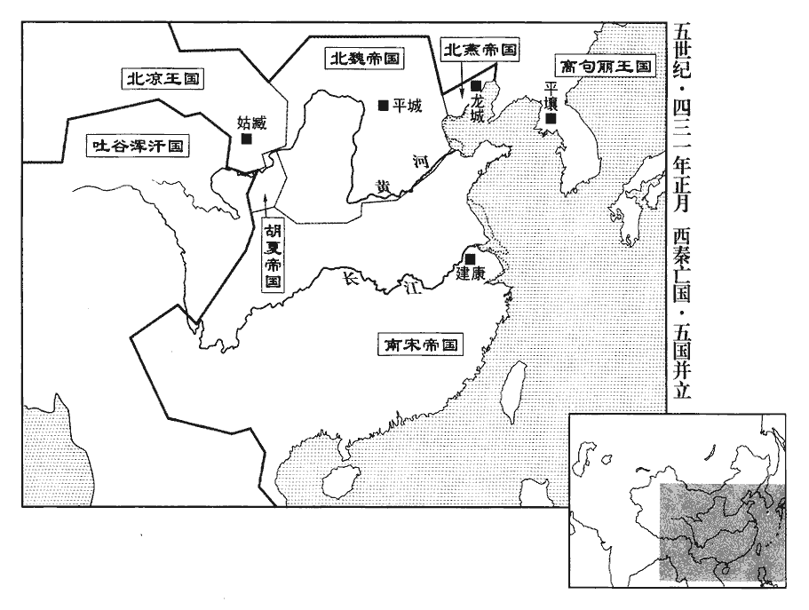
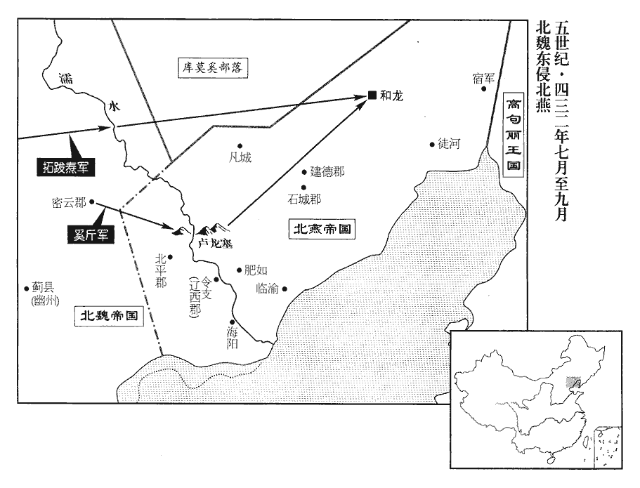
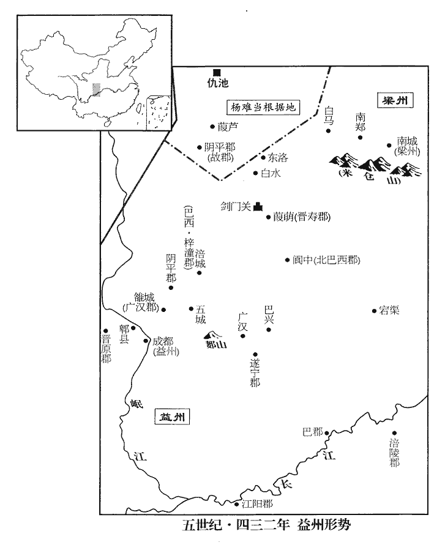
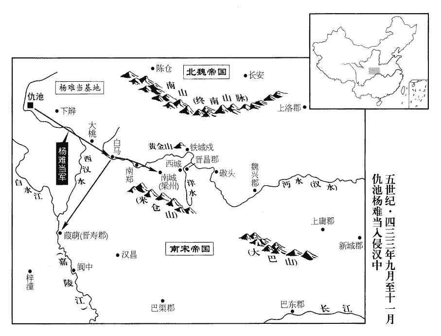
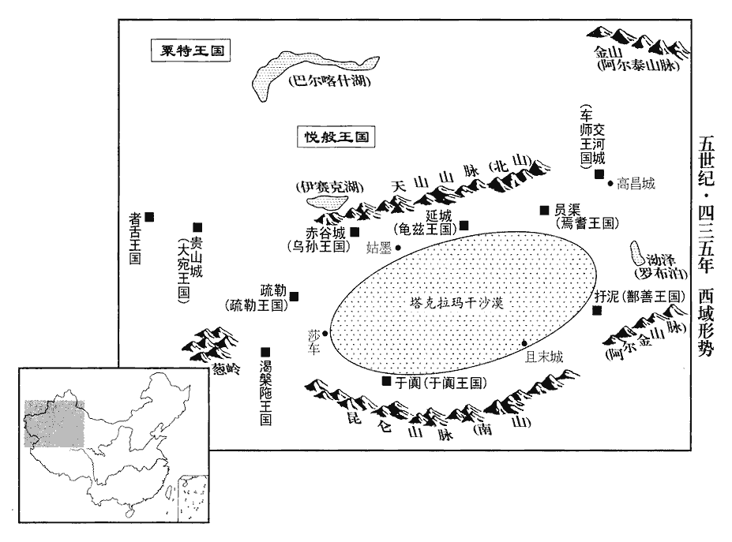

 宋紀四起重光協洽（辛未），盡旃蒙大淵獻（乙亥），凡五年。

# 太祖文皇帝上之下

## 元嘉八年（辛未、四三一）

1春，正月，壬午朔‹一›，燕‹都龙城，辽宁朝阳›大赦，改元大興。

〖译文〗 [1]春季，正月，壬午朔（初一），北燕大赦天下，改年号为大兴。

2丙申‹十五›，檀道濟等自清水救滑臺‹河南滑县›，魏‹都平城，山西大同›叔孫建、長孫道生拒之。丁酉‹十六›，道濟至壽張‹山东东平西南›，遇魏安平公乙旃zhān眷，魏收《官氏志》：獻帝命叔父之裔爲乙旃氏。道濟帥寧朔將軍王仲德、驍騎將軍段宏奮擊，大破之；帥，讀曰率。驍，堅堯翻。騎，奇寄翻。轉戰至高梁亭，斬魏濟州刺史悉煩庫結。魏明元帝泰常八年，置濟州，治碻qiāo磝城。濟，子禮翻。

〖译文〗 [2]丙申（十五日），刘宋檀道济等从清水出兵，救援被北魏军围攻的滑台。北魏叔孙建、长孙道生率军抵抗。丁酉（十六日），檀道济的军队抵达寿张，与北魏安平公拓跋乙旃眷的军队遭遇。檀道济率领宁朔将军王仲德、骁骑将军段宏奋勇抗击魏军，大破拓跋乙旃眷的军队。又转战开进高梁亭，斩杀北魏济州刺史悉烦库结。

3夏主‹赫连定›擊秦將姚獻，敗之；將，卽亮翻。敗，補邁翻。遂遣其叔父北平公韋伐帥衆一萬攻南安‹甘肃陇西东南›。去年暮末保南安。城中大饑，人相食。秦侍中•征虜將軍出連輔政、侍中•右衛將軍乞伏延祚、吏部尚書乞伏跋跋踰城奔夏；秦王暮末窮蹙，輿櫬出降，乞伏氏四主，四十九年而滅。櫬chèn，初覲翻。降，戶江翻。幷沮渠興國送於上邽‹甘肃天水›。興國爲秦所禽，見上卷六年。沮，子余翻。秦太子司直焦楷奔廣寧‹甘肃漳县›，太子司直，掌糾劾宮僚及率府兵。《晉志》無是官，當是二趙、燕、秦所置。泣謂其父遺曰：「大人荷國寵靈，荷，下可翻。居藩鎭重任。今本朝顚覆，豈得不率見衆唱大義以殄寇讎！」朝，直遙翻。見，賢遍翻。遺曰：「今主上已陷賊庭，吾非愛死而忘義，顧以大兵追之，是趣絕其命也。趣，讀曰促。不如擇王族之賢者，奉以爲主而伐之，庶有濟也。」楷乃築壇誓衆，二旬之間，赴者萬餘人。會遺病卒，卒，子恤翻。楷不能獨舉事，亡奔河西‹北凉，都姑臧，甘肃武威›。

〖译文〗 [3]夏王赫连定突袭西秦大将姚献，大败姚献军。随即又派遣他的叔父，北平公赫连韦伐率领一万人攻打西秦国王乞伏暮末据守的南安城。当时，南安城中正发生饥馑，人与人相食。西秦侍中、征虏将军出连辅政，侍中、右卫将军乞伏延祚，吏部尚书乞伏跋跋等，逃出城去，投降了夏国。西秦王乞伏暮末穷途末路，用车辆载着空棺材出城投降。赫连韦伐把乞伏暮末连同沮渠兴国，一并押送到上。西秦国太子司直焦楷，逃奔广宁，哭泣着对他的父亲焦遗说：“您一向承蒙朝廷的重用，身居藩镇大员，统领一方。如今国家颠覆，您怎能不率领大家，首倡大义，消灭寇仇！”焦遗说：“现在主上已经陷入敌手，我不是那种惜命忘义的人，如果派大兵追击，只能加速主上的死亡。不如选择王族中贤能之人，拥护他继承王位，然后再去出兵讨伐，或许还有希望。”焦楷于是修筑高台，召集部众盟誓，二十天的时间里，竟有一万余人赶来归附。不巧的是，焦遗病逝，焦楷没有力量独立承担这项大事，于是，率领部下逃往北凉。

4二月，戊午‹七›，以尚書右僕射江夷爲湘州‹府临湘，湖南长沙›刺史。

〖译文〗 [4]二月，戊午（初七），刘宋朝廷任命尚书右仆射江夷为湘州刺史。

 

5檀道濟等進至濟上，濟，子禮翻；下同。二十餘日間，前後與魏三十餘戰，道濟多捷。軍至歷城‹山东济南›，歷城縣自漢以來屬濟南郡，宋爲冀州刺史治所。叔孫建等縱輕騎邀其前後，焚燒草穀，騎，奇寄翻。道濟軍乏食，不能進；由是安頡、司馬楚之等得專力攻滑臺，頡，戶結翻。魏主復使楚兵將軍王慧龍助之。復，扶又翻。朱脩之堅守數月，糧盡，與士卒熏鼠食之。辛酉‹十›，魏克滑臺，執脩之及東郡太守申謨，東郡自漢、魏以來治白馬；白馬，滑臺之地也。虜獲萬餘人。謨，鍾之曾孫也。申鍾見九十五卷晉成帝咸和九年。

〖译文〗 [5]刘宋檀道济的军队开进济水，二十多天的时间里，先后与魏军交战三十多次，而檀道济多半取胜。宋军开到历城，北魏叔孙建等派遣轻骑兵往来截击，出没在大军的前前后后，还纵火焚烧了刘宋军的粮草，檀道济因为军中缺粮，不能前进。所以北魏冠军将军安颉、安南大将军司马楚之等能够以全部力量进攻滑台。拓跋焘又派楚兵将军王慧龙增援。刘宋滑台守将朱之坚守滑台已有几个月之久，城中粮食吃光了，士卒们用烟熏出老鼠，烤熟吃掉。辛酉（初十），北魏军攻破滑台，朱之和东郡太守申谟以及一万余名士卒被俘。申谟是申钟的曾孙。

6癸酉‹二十二›，魏主還平城，大饗，告廟，將帥及百官皆受賞，戰士賜復十年。賞北伐柔然、西伐夏、南禦宋之功也。將，卽亮翻。帥，所類翻。復，方目翻，復勿事也；下復境同。

〖译文〗 [6]癸酉（二十二日），北魏国主拓跋焘返回平城，举行盛大宴会，祭告祖庙。朝廷中所有的将帅和官员都得到了赏赐，士卒们一律免除十年的赋役。

於是魏南鄙大水，民多餓死。尚書令劉絜言於魏主曰：「自頃邊寇內侵，戎車屢駕；天贊聖明，所在克殄；方難旣平，難，乃旦翻。皆蒙優錫。而郡國之民，雖不征討，服勤農桑，以供軍國，實經世之大本，府庫之所資。今自山以東，徧遭水害，應加哀矜，以弘覆育。」覆，敷又翻；下米覆同。魏主從之，復境內一歲租賦。

〖译文〗 这时，北魏南部边境发生严重的水灾，百姓多半饿死。尚书令刘对拓跋焘说：“自从宋寇侵犯我们国土，我们屡次抗击。上天帮助皇上圣明，保佑我们的军队所向披靡。如今，战事已经平息，有功的将领也都得到了赏赐。各个州郡和封国的老百姓，虽然没有亲自出征讨伐，但是他们勤奋地务农养蚕，供应国家和军队的需要，实在是治理国家的根本，更是国库薪饷的重要来源。现在，从崤山以东，遍地洪水成灾，应该妥善抚慰和可怜这些受灾的百姓，弘扬朝廷一向保护和养育百姓的恩德。”拓跋焘同意他的劝告，下诏免除全国百姓一年的田赋和捐税。

7檀道濟等食盡，自歷城引還；軍士有亡降魏者，具告之。魏人追之，衆忷懼，將潰。降，戶江翻。忷，許拱翻。道濟夜唱籌量沙，以所餘少米覆其上。量，音良。少，詩沼翻；下同。及旦，魏軍見之，謂道濟資糧有餘，以降者爲妄而斬之。時道濟兵少，魏兵甚盛，騎士四合。道濟命軍士皆被甲，被，皮義翻。己白服乘輿，引兵徐出。魏人以爲有伏兵，不敢逼，稍稍引退，道濟全軍而返。

〖译文〗 [7]刘宋檀道济的大军因为粮尽，只好从历城撤军。军中有逃走投降北魏军的士卒，把刘宋军的困难境遇，一一报告给北魏军。于是，北魏军追击刘宋军，刘宋军军心涣散，人人自危，马上就要溃散。檀道济利用夜色的掩护，命士卒把沙子当作粮食，一斗一斗地量，而且边量边唱出数字，然后用军中仅剩下的一点谷米覆在沙子上。第二天早晨，北魏看到这种情况，以为檀道济军中的粮食还很充裕，就给那个降卒定了欺军之罪杀掉了。当时，檀道济兵员很少，而北魏兵人多势众，骑兵部队从四面八方包围了檀道济军。檀道济命令军士们都披上铠甲，而自己则穿着白色的便服，率领军队缓缓地出城。北魏军以为檀道济有伏兵，不敢逼近，而且还稍稍撤退，这样，檀道济保全了军队，安全撤军。

青州‹府东阳，山东青州›刺史蕭思話聞道濟南歸，欲委鎭保險，宋青州治東陽城。濟南‹山东济南›太守蕭承之固諫，不從。丁丑‹二十六›，思話棄鎭奔平昌‹山东安丘›；平昌縣，前漢屬琅邪，後漢屬北海；《晉太康地志》屬城陽，惠帝分立平昌郡。《五代志》：密州膠西縣舊曰黔qián陬zōu，置平昌郡。參軍劉振之戍下邳‹江苏睢宁北古邳镇›，聞之，亦委城走。魏軍竟不至，而東陽積聚已爲百姓所焚。積，子智翻；凡指所聚之物曰積，則去聲。聚，才諭翻。思話坐徵，繫尚方。

〖译文〗 刘宋青州刺史萧思话听说檀道济的大军撤退南下，就打算放弃城池退到险要地带自保。济南太守萧承之一再劝阻他，萧思话都没有接受。丁丑（二十六日），萧思话弃城逃奔平昌。参军刘振之正驻守下邳，听说这个消息，也弃城逃走。结果，北魏军竟然没有来，但是东阳城积聚的大批物资，却被百姓纵火焚毁。萧思话被指控有罪，召回京师，逮捕下狱。

8燕王‹冯弘›立夫人慕容氏爲王后。

〖译文〗 [8]北燕王冯弘封夫人慕容氏为皇后。

9庚戌‹三十›，魏安頡等還平城。魏主嘉朱脩之守節，【章：甲十一行本「節」下有「拜侍中」三字；乙十一行本同；孔本同；張校同。】妻以宗女。爲脩之自北還張本。妻，子細翻。

〖译文〗 [9]庚戌（疑误），北魏安颉等人返回平城。北魏国主拓跋焘非常赞赏刘宋滑台守将朱之的气节，把皇族宗室的女儿嫁给他。

初，帝之遣到彥之也，戒之曰：「若北國兵動，先其未至，徑前入河；先，悉薦翻。若其不動，留彭城勿進。」及安頡jié得宋俘，魏主始聞其言。謂公卿曰：「卿輩前謂我用崔浩計爲謬，驚怖固諫。怖，普布翻。崔浩計見上卷元年。常勝之家，始皆自謂踰人，至於歸終，歸終，謂事勢究極處。乃不能及。」

〖译文〗 当初，刘宋文帝派到彦之北伐出征前，就告诫他说：“如果魏国的军队有所举动，你们应该在敌人没有攻到之前，先行渡过黄河；如果他们没有动静，你们就要留守彭城，不要前进。”等到安颉俘虏刘宋的将士，拓跋焘才听到刘义隆的这席话，对朝中的文武大臣们说：“以前，你们总说我用崔浩的计策是错误的，以致惊惧失措，百般劝阻。一直打胜仗的人，开始都自以为超过了别人，到了最后，才发现自己还不如别人。”

司馬楚之上疏，以爲諸方已平，請大舉伐宋，魏主以兵久勞，不許。徵楚之爲散騎常侍，散，悉亶翻。騎，奇寄翻。以王慧龍爲滎陽‹河南荥阳›太守。魏雖置滎陽太守，實以虎牢爲重鎭。按《魏書•官氏志》：高宗太安三年，始以諸部護軍各爲太守。蓋是時惟以滎陽太守命王慧龍，至太安三年遂悉改之也。守，式又翻。

〖译文〗 北魏安南大将军司马楚之上疏，认为北魏四方邻国都已经平定，请求朝廷出兵大举进攻刘宋。拓跋焘则认为连年征战，将士们早已疲劳不堪，没有同意。征召司马楚之回京，任命他为散骑常侍；任命王慧龙为荥阳太守。

慧龍在郡十年，農戰並脩，大著聲績，歸附者萬餘家。帝縱反間於魏，云「慧龍自以功高位下，欲引宋人入寇，因執司馬楚之以叛。」間，古莧翻。楚之時屯潁川‹河南许昌东›。魏主‹拓跋焘›聞之，賜慧龍璽書曰：「劉義隆畏將軍如虎，欲相中害；璽，斯氏翻。中，竹仲翻。朕自知之。風塵之言，想不足介意。」帝‹刘义隆›復遣刺客呂玄伯刺之，復，扶又翻。曰：「得慧龍首，封二百戶男，賞絹千匹。」玄伯詐爲降人，降，戶江翻。求屛人有所論。慧龍疑之，使人探其懷，得尺刀。屛，必郢翻。探，吐南翻。玄伯叩頭請死，慧龍曰：「各爲其主耳。」釋之。爲，于僞翻。左右諫曰：「宋人爲謀未已，不殺玄伯，無以制將來。」慧龍曰：「死生有命，彼亦安能害我！我以仁義爲扞蔽，又何憂乎！」遂捨之。史因慧龍守滎陽終言之。

〖译文〗 王慧龙在荥阳十年，既劝民农桑，又积极备战，成绩显著，声名远播。前后赶来归附的百姓有一万余家。刘宋文帝乘机施用了反间计，说：“王慧龙自认为劳苦功高，却长期不得重用，所以打算勾引宋人前来进犯，然后活捉司马楚之背叛魏国。”拓跋焘听到这些传言，颁赐给王慧龙一封亲笔诏书，说：“刘义隆害怕将军就象害怕老虎一样，打算从中陷害，我知道他的诡计。至于外面的风言风语，想你不会介意。”刘义隆又派刺客吕玄伯前去刺杀王慧龙，许诺说：“你如果砍下王慧龙的人头，封你为食邑二百户男爵，赏绢一千匹。”于是，吕玄伯假装投降，要求单独面见王慧龙，声称有话要说。王慧龙有点疑心，派人搜身，结果从腰中搜出短刀。吕玄伯叩头请求处死，王慧龙说：“我们都是各自为主上行事罢了。”释放了吕玄伯。王慧龙的左右亲信都劝阻他说：“宋人的阴谋不会停止，不杀吕玄伯，没有办法阻止将来再发生这样的事。”王慧龙却说：“生死都是命中注定的，他刘义隆又怎么能害得了我！我只用仁义作为屏藩来保护自己，又有什么可忧虑的呢？”于是释放了吕玄伯。

10夏，五月，庚寅‹十一›，魏主如雲中‹内蒙托克托›。

〖译文〗 [10]夏季，五月，庚寅（十一日），北魏国主拓跋焘前往云中。

11六月，乙丑‹十六›，大赦。

〖译文〗 [11]六月，乙丑（十六日），刘宋实行大赦。

12夏主‹赫连定›殺乞伏暮末及其宗族五百人。

〖译文〗 [12]夏王赫连定斩杀了被俘的西秦王乞伏暮末，以及西秦国皇族五百人。

13夏主畏魏人之逼，擁秦民十餘萬口，秦民，所得乞伏氏之民也。自治【章：甲十一行本「治」作「冶」；乙十一行本同。】城‹甘肃临夏西北›濟河，欲擊河西王蒙遜而奪其地。吐谷渾‹青海›王慕璝遣益州刺史慕利延、寧州刺史拾虔璝，古回翻。《考異》曰：《十六國春秋》作「沒利延、拾虎」，今從《宋書》。帥騎三萬，乘其半濟，邀擊之，執夏主定以歸，赫連氏歷三主二十六年而滅。自是中原及西北之地一歸於魏矣。帥，讀曰率。騎，奇寄翻。沮渠興國被創而死。沮，子余翻。被，皮義翻。創，初良翻。拾虔，樹洛干之子也。樹洛干卒於晉安帝義熙十三年。

〖译文〗 [13]夏王赫连定惧怕北魏的逼迫，劫持西秦国的老百姓十余万人，从治城渡过黄河，打算袭击北凉河西王沮渠蒙逊，夺取北凉的国土。吐谷浑可汗慕容慕派遣益州刺史慕容慕利延、宁州刺史慕容拾虔统率三万骑兵，乘夏军渡河过了一半，截击敌人，生擒了夏王赫连定，乘胜班师，沮渠兴国受重伤而死。慕容拾虔是慕容树洛干的儿子。

 

14魏之邊吏獲柔然‹瀚海沙漠群›邏者二十餘人，魏主賜衣服而遣之。柔然感悅。閏月，乙未‹十六›，柔然敕連可汗‹郁久闾吴提›遣使詣魏，魏主‹拓跋焘›厚禮之。邏，郎佐翻。使，疏吏翻。

〖译文〗 [14]北魏边防官员，俘获柔然汗国的巡逻兵二十余人，拓跋焘赏赐给他们衣服，释放了他们。柔然人又感动又喜悦。闰月，乙未（十六日），柔然汗国敕连可汗，派使臣出使北魏，北魏国主拓跋焘用优厚的礼节招待了他们。

15魏主遣散騎侍郎周紹來聘，散，悉亶翻。騎，奇寄翻。且求昏；帝‹刘义隆›依違答之。

〖译文〗 [15]北魏国主拓跋焘派散骑侍郎周绍出使刘宋，并且请求通婚，刘宋文帝含糊其辞地给以回答。

16荊州‹府江陵，湖北江陵›刺史江夏王義恭，年寖長‹时年十九›，欲專政事，長史劉湛zhàn每裁抑之，遂與湛有隙。宋制：幼王臨州，率以長史行府州事，事皆決於行事。義恭欲專之而湛不可，遂有隙。長，知兩翻。帝心重湛，使人詰讓義恭，且和解之。詰，去吉翻。是時，王華、王曇首皆卒，卒，子恤翻。領軍將軍殷景仁素與湛善，白帝以時賢零落，徵湛爲太子詹事，加給事中，共參政事。以雍州‹府襄阳，湖北襄樊›刺史張卲代湛爲撫軍長史、南蠻校尉。

〖译文〗 [16]刘宋荆州刺史、江夏王刘义恭，年纪渐渐长大，打算独自处理政务，而长史刘湛总是阻挠他，于是刘义恭与刘湛之间产生了裂痕。刘宋文帝心里十分尊重刘湛，派人诘问并责备刘义恭，而且从中调解他们之间的矛盾。这时，王华、王昙首都已去世，领军将军殷景仁一向与刘湛关系密切，提醒文帝说，当今不少贤才去世。建议文帝征召刘湛为太子詹事，加官给事中，共同参与朝政。刘义隆又任命雍州刺史张代替刘湛为抚军长史、南蛮校尉。

頃之，卲坐在雍州營私蓄聚，贓滿二百四十五萬，下廷尉，當死。永嘉五年，卲刺雍州。雍，於用翻。左衛將軍謝述上表，陳「卲先朝舊勳，武帝‹刘裕›討桓玄，卲白父嘏gǔ表獻忠款，又不附劉毅。宜蒙優貸」。帝‹刘义隆›手詔酬納，免卲官，削爵土。述謂其子綜曰：「主上矜卲夙誠，特加曲恕，吾所言謬會，故特見酬納耳。若此迹宣布，則爲侵奪主恩，不可之大者也。」使綜對前焚之。帝後謂卲曰：「卿之獲免，謝述有力焉。」

〖译文〗 不久，张因为在雍州时，营私舞弊，中饱私囊，赃款高达二百四十五万，被逮捕下廷狱，按律应当处以死刑。左卫将军谢述上疏，陈述张是刘裕时代的旧功臣，应得到宽恕优待。文帝采纳了谢述的建议，亲自下诏书，命令免除张的官职，削去了张的爵位和采邑。谢述对他的儿子谢综说：“皇上怜惜张一向忠诚，特别赦免了他的罪过。我的建议只是碰巧与皇上的意图相吻合，被皇上采纳了。如果借此四处宣扬，那就侵夺了皇家的恩德，是绝对不可行的。”让谢综当着他的面，把奏章烧掉。文帝后来对张说：“对于你的死罪的免除，谢述可出了大力的呀！”

17秋，七月，己酉‹一›，魏主如河西‹河套地区›。

〖译文〗 [17]秋季，七月，己酉（初一），北魏国主拓跋焘前往河西。

18八月，乙酉‹七›，河西王蒙遜遣子安周入侍于魏。

〖译文〗 [18]八月，乙酉（初七），北凉河西沮渠蒙逊派他的儿子沮渠安周前往北魏充当人质。

19吐谷渾‹青海›王慕璝遣侍郎謝太寧奉表于魏，請送赫連定。己丑‹十一›，魏以慕璝爲大將軍、西秦王。璝，古回翻。

〖译文〗 [19]吐谷浑可汗慕容慕，派侍郎谢太宁，出使北魏，呈上奏章，表示愿意献出所俘虏的夏王赫连定。己丑（十一日），北魏任命吐谷浑可汗慕容慕为大将军，封为西秦王。

20左僕射臨川王義慶固求解職；甲辰‹二十六›，以義慶爲中書令，丹楊尹如故。

〖译文〗 [20]刘宋左仆射、临川王刘义庆坚决要求辞去职务。甲辰（二十六日），刘宋文帝任命刘义庆为中书令，仍兼任丹杨尹。

21九月，癸丑‹六›，魏主還宮。庚申‹十三›，加太尉長孫嵩柱國大將軍，柱國大將軍始此。以左光祿大夫崔浩爲司徒，征西大將軍長孫道生爲司空。道生性清儉，一熊皮鄣泥，數十年不易。《類篇》：馬障泥曰韂。韂chàn，昌豔翻。《蜀註》云：遮擁泥濘也。魏主使歌工歷頌羣臣曰：「智如崔浩，廉若道生。」

〖译文〗 [21]九月，癸丑（初六），北魏国主拓跋焘回宫。庚申（十三日），加授太尉长孙嵩为柱国大将军。任命左光禄大夫崔浩为司徒，征西大将军长孙道生为司空。长孙道生性情淡泊、清廉节俭，一个用熊皮做的遮泥障，数十年都不换。拓跋焘让歌工一一歌颂群臣：“象崔浩那样足智多谋，象道生那样两袖清风。”

22魏主欲選使者詣河西‹北凉›，崔浩薦尚書李順，乃以順爲太常，拜河西王蒙遜爲侍中、都督涼州•西域•羌•戎諸軍事、太傅、行征西大將軍、涼州牧、涼王，王武威、張掖、敦煌、酒泉、西海、金城、西平七郡；使，疏吏翻。王武，于況翻。敦，徒門翻。册曰：「盛衰存亡，與魏升降。北盡窮髮，南極庸‹上庸，湖北竹山西南田家坝›、㟭mín‹岷山，四川南坪›，西被崐嶺‹昆仑山›，東至河曲‹甘肃兰州一带黄河流域›，《經典釋文》：司馬曰：窮髮，北極之下無毛之地也。按：毛，草也。《地理書》云：山以草木爲髮。庸，魏興上庸之地，㟭，㟭山也。崐嶺，謂崐崙。河曲，朔方之河曲也。㟭，與岷同。被，皮義翻。王實征之，以夾輔皇室。置將相、羣卿、百官，承制假授；建天子旌旗，出入警蹕，如漢初諸侯王故事。」

〖译文〗 [22]北魏国主拓跋焘打算选派使者出使北凉。崔浩推荐尚书李顺。于是拓跋焘任命李顺为太常，前去任命北凉河西王沮渠蒙逊为侍中，都督凉州、西域、羌、戎诸军事，太傅，征西大将军，凉州牧和凉王，采邑包括武威、张掖、敦煌、酒泉、西海、金城、西平等七郡。册封的诏书上说：“凉国的盛衰存亡，与魏国密切相关，死生与共。北到穷发，南到上庸和岷山，西至昆仑山，东至河曲的广大地区，都归凉王征讨统治，从旁辅佐皇室。”同时，在凉国设置将军、宰相、各位公卿、文武百官，凉王可以代表皇帝直接任命。还可以竖起天子专用的旌旗，出行时开路清道，戒备森严，全然仿照汉朝初年各侯王的制度。

23壬申‹二十五›，魏主‹拓跋焘›詔曰：「今二寇摧殄，將偃武脩文，理廢職，舉逸民。范陽‹河北涿州›盧玄、博陵‹河北安平›崔綽、趙郡‹河北赵县›李靈、河間‹河北献县›邢穎、勃海‹河北南皮›高允、廣平‹河北鸡泽›游雅、太原‹山西太原›張偉等，皆賢雋之冑，冠冕周邦。「周」，當作「州」。【章：甲十一行本正作「州」；乙十一行本同；孔本同。】《易》曰：『我有好爵，吾與爾縻mí之。』《易•中孚》九二《爻辭》。如玄之比者，盡敕州郡以禮發遣。」遂徵玄等及州郡所遣至者數百人，差次敍用。崔綽以母老固辭。玄等皆拜中書博士。玄，諶之曾孫；晉永嘉之後，盧諶展轉於石氏之間，冉閔之敗，遂死於兵。諶chén，氏壬翻。靈，順之從父兄也。從，才用翻。

〖译文〗 [23]壬申（二十五日），北魏国主拓跋焘下诏说：“如今宋夏二寇已经分别被我们击败和消灭了，我们将停止武备，发展文事。整顿过去被废驰和忽略的工作，荐举过去隐居不出来做官的人。范阳人卢玄、博陵人崔绰、赵郡人李灵、河间人邢颖、勃海人高允、广平人游雅、太原人张伟等人，都是圣贤的后裔，他们的才干在地方州郡都是第一流的。《易经》说：‘我有好的酒器，和你一起享用。’凡是才华能与卢玄相仿佛的，各州郡都要遵照朝廷的敕令，礼敬贤才并把他们送京师来。”于是，征召卢玄等人以及地方州郡荐举的贤士几百人来京，依照他们的能力，分别委以官职。崔绰因为母亲年迈，坚决拒绝作官。卢玄等人都被授予中书博士。卢玄是卢谌的曾孙。李灵是李顺的堂兄。

玄舅崔浩，每與玄言，輒歎曰：「對子眞使我懷古之情更深。」盧玄，字子眞。浩欲大整流品，明辨姓族。玄止之曰：「夫創制立事，各有其時；樂爲此者，詎有幾人！宜加三思。」樂，音洛。三，息暫翻。浩不從，由是得罪於衆。

〖译文〗 卢玄的舅舅是司徒崔浩，崔浩每次跟卢玄谈话，常常叹息说：“面对卢（玄）子真，使我思古之幽情更深。”当时，崔浩打算严格整顿朝中官员的流品，辨明官员的出身和姓氏等级。卢玄劝阻他说：“创立一种制度，改革现行的规章，必须因时而宜。赞成您这项措施的，能有几个人！希望您能三思而行。”崔浩没有听从，因此便得罪了许多大臣。

24初，魏昭成帝始制法令：‹拓跋›什翼犍諡昭成帝。「反逆者族；其餘當死者聽入金、馬贖罪；殺人者聽與死家牛馬、葬具以平之；盜官物，一備五；私物，一備十。」備，陪償也，今人多云陪備。四部大人共坐王庭決辭訟，無繫訊連逮之苦，境內安之。太祖‹拓跋珪›入中原，道武帝廟號太祖。患前代律令峻密，命三公郎王德删定，務崇簡易。事見一百十卷晉安帝隆安二年。易，以豉翻。季年被疾，刑罰濫酷；事見一百十一卷晉安帝隆安四年。被，皮義翻。太宗‹拓跋嗣›承之，吏文亦深。明元帝廟號太宗。冬，十月，戊寅‹一›，世祖‹拓跋焘›命崔浩更定律令，除五歲、四歲刑，增一年刑；巫蠱者，負羖gǔ羊、抱犬沈諸淵。羖，果五翻。《說文》：夏羊壯曰羖；一說，羖，䍽lì羊也。沈，持林翻。初令官階九品者得以官爵除刑。漢官以石秩爲差，魏、晉始定品秩之次。婦人當刑而孕，產後百日乃決。闕左懸登聞鼓以達冤人。禹令有獄訟者搖鞀táo。《周禮》：左嘉石以平罷民。皆所以達幽枉也。登聞鼓，令負冤者得詣闕檛zhuā鼓，登時上聞也。

〖译文〗 [24]当初，北魏昭成帝时开始制定法令：“谋反叛逆者诛灭全族；其他犯有死罪的人可以缴纳金钱、马匹赎罪；杀人凶手允许他们给死者家属牛马、葬具私自和解；盗窃官府财物，偷一赔五；盗窃私物，偷一赔十。”当时，四部总监共同坐在公堂之上，一道处理诉讼案件，从没有羁押、囚禁、久拖不决的苦处，境内安定。道武帝拓跋进入中原以后，认为前代的法律过于苛刻严密，于是，命令三公郎王德重新删改，制定新的法律，一切都以简单易懂为原则，拓跋晚年身患重病，滥施刑罚，法律残酷。明元帝拓跋嗣继位后，继承了前代的法律制度，对官吏权限职责等的规定，也有些过于苛刻。冬季，十月，戊寅（初一），太武帝拓跋焘命令司徒崔浩重新制定法令，废除了五年、四年有期徒刑，增设一年有期徒刑。用巫术毒害人的人，身背黑色羊，胸前抱狗，投入河潭。新定法令，凡官阶在九品之内的官员犯法，可以用官职和爵位赎罪。妇人当执行死刑而怀有身孕的，生产一百天后再予处决。又规定在宫阙的左边悬挂登闻鼓，使有冤情的人，能够击鼓申冤。

25魏主如漠南。十一月，丙辰‹十›，北部敕勒莫弗庫若干高車酋長謂之莫弗。《考異》曰：《後魏書》、《北史•本紀》皆作「敕勒」，《鄧淵傳》皆作「高車」。按高車卽敕勒別名也。帥所部數萬騎，驅鹿數百萬頭，詣魏主行在。帥，讀曰率。騎，奇寄翻。魏主大獵以賜從官。從，才用翻。十二月，丁丑‹一›，還宮。

〖译文〗 [25]北魏国主拓跋焘前往漠南。十一月，丙辰（初十），北方敕勒部落酋长库若干，率领他的部众数万名骑兵，驱赶着几百万头的鹿群，拜谒拓跋焘的行宫。于是，拓跋焘举行大规模的狩猎，赏赐随从的官员。十二月，丁丑（初一），拓跋焘回宫。

26是歲，涼王改元義和。

〖译文〗 [26]本年，北凉改年号为义和。

27林邑‹越南中部›王范陽邁寇九德‹越南荣市›，交州兵擊卻之。九德郡，古越裳氏國，隋、唐爲驩huān州。

〖译文〗 [27]林邑王范阳迈，攻击刘宋的九德郡，刘宋交州军队击退了他们。

## 九年（壬申、四三二）

1春，正月，丙午‹一›，魏主‹拓跋焘，时年二十五›尊保太后竇氏爲皇太后，尊保母爲母，非禮也。立貴人赫連氏爲皇后，子晃爲皇太子；大赦；改元延和。

〖译文〗 [1]春季，正月，丙午（初一），北魏国主拓跋焘，尊封他的乳母保太后窦氏为皇太后。封贵人赫连氏为皇后，封儿子拓跋晃为皇太子，大赦天下，改年号为延和。

2燕‹都龙城，辽宁朝阳›王‹冯弘›立慕容后之子王仁爲太子。

〖译文〗 [2]北燕王冯弘封慕容皇后的儿子冯王仁为太子。

3三月，庚戌‹六›，衛將軍王弘進位太保，加中書監。丁巳‹十三›，征南大將軍檀道濟進位司空，還鎭尋陽‹江西九江›。道濟自歷城‹山东济南›還師至建康‹南京›，復使之還鎭尋陽。

〖译文〗 [3]三月，庚戌（初六），刘宋卫将军王弘晋升为太保，加授中书监。丁巳（十三日），征南大将军檀道济晋升为司空，回寻阳镇守。

4壬申‹二十八›，吐谷渾‹青海›王慕璝送赫連定于魏，魏人殺之。慕璝上表曰：「臣俘擒僭逆，獻捷王府，爵秩雖崇而土不增廓，車旗旣飾而財不周賞；願垂鑒察。」魏主下其議。下，戶嫁翻。公卿以爲：「慕璝所致唯定而已，塞外之民皆爲己有，而貪求無厭，不可許也。」厭，於鹽翻。魏主乃詔曰：「西秦王所得金城‹甘肃兰州›、枹罕‹甘肃临夏›、隴西‹甘肃陇西›之地，枹，音膚。朕卽與之，乃是裂土，何須復廓。復，扶又翻。西秦款至，綿絹隨使疏數，臨時增益，非一賜而止也。」使，疏吏翻；下同。疏，與疎同。數，所角翻。自是慕璝貢使至魏者稍簡。

〖译文〗 [4]壬申（二十八日），吐谷浑汗国可汗慕容慕将夏王赫连定献给北魏，北魏斩杀赫连定。慕容慕上疏说：“我生擒了叛逆赫连定，呈献给皇上。陛下赏赐的官爵是虽然尊崇，但土地却没有增加；车辆旗帜虽然已经得到装饰，但是却没有财物赏赐部下，希望您能俯察下情。”拓跋焘把他的奏章交给朝廷文武官员们讨论。大臣们认为：“慕容慕的功劳，不过是俘虏了赫连定而已，塞外的百姓都已归吐谷浑汗国所有。但慕容慕却贪得无厌，不能答应他的要求。”拓跋焘于是下诏说：“西秦王慕容慕所攻下的金城、罕、陇西等地，我同意归你，这已经是分封给你的采邑了，还有什么必要再增加土地？西秦对我们具有诚意，我们赏赐的绵绢，根据来使次数是否频繁，临时增加，并不是只赏赐一次，以后不再有。”从此，慕容慕所派的出使北魏的贡使稍加减少。

5魏方士祁纖奏改代‹平城，山西大同›爲萬年，以代尹爲萬年尹，代令爲萬年令。崔浩曰：「昔太祖應天受命，兼稱代、魏以法殷商。帝嚳都亳；子契受封於商，自契至湯八遷，湯始都亳，從先王居，謂之亳殷，故兼稱殷、商。國家積德，當享年萬億，不待假名以爲益也。纖之所聞，皆非正義，宜復舊號。」魏主從之。

〖译文〗 [5]北魏的方士祁纤上奏朝廷，建议把代郡改称万年，改代尹为万年尹，代令为万年令。司徒崔浩说：“从前，太祖顺应天命人心，效法殷商，而兼称代魏，国家累积下来的恩德，应该使国家的寿命长达亿万年之久，不必借助名称得益。祁纤所奏报的，都不是正当大义，应当恢复旧号。”拓跋焘采纳了崔浩的意见。

6夏，五月，壬申‹二十九›，華容文昭公王弘卒‹年五十四›。弘明敏有思致，而輕率少威儀。性褊biǎn隘，好折辱人，人以此少之。思，相吏翻。少，詩沼翻。褊，方緬翻。好，呼到翻。折，之舌翻。雖貴顯，不營財利；及卒，家無餘業。帝‹刘义隆，时年二十六›聞之，特賜錢百萬，米千斛。

〖译文〗 [6]夏季，五月，壬申（二十九日），刘宋太保、华容文昭公王弘去世。王弘聪明敏捷有思想，但往往轻率行事，威仪不足以使人佩服。他性情狭隘偏激，常常侮辱别人，人们因而对他表示不满。他虽然地位尊崇，又是朝中显贵，却不营求财利。到了去世的时候，家里竟没有多余的财产。刘宋文帝听说后，特地赏赐王弘的家属钱一百万，米一千斛。

7魏主治兵於南郊，謀伐燕。治，直之翻。

〖译文〗 [7]北魏国主拓跋焘，在京师南郊训练兵马，准备攻打北燕。

8帝‹刘义隆›遣使者趙道生聘于魏。

〖译文〗 [8]刘宋文帝派遣使者赵道生前往北魏访问。

9六月，戊寅‹五›，司徒、南徐州‹府京口，江苏镇江›刺史彭城王義康改領揚州刺史。王弘卒，義康始領揚州。

〖译文〗 [9]六月，戊寅（初五），刘宋司徒、南徐州刺史、彭城王刘义康改任扬州刺史。

10詔分青州置冀州，宋冀州領廣川‹山东邹平东›、平原‹梁邹城，山东邹平北›、清河‹盘阳城，山东淄博南›、樂陵‹山东博兴›、魏郡‹山东淄博东北›、河間‹山东寿光东›、頓丘‹山东济南东›、高陽‹山东淄博东北›、勃海‹被阳城，山东高青东南›九郡，皆僑置於河、濟間。治歷城‹山东济南›。

〖译文〗 [10]刘宋文帝下诏，把青州分割出一部分，设置冀州，州治在历城。

11吐谷渾‹青海›王慕璝遣其司馬趙敍入貢，且來告捷。告擒赫連定之捷也。璝，古回翻。

〖译文〗 [11]吐谷浑汗国可汗慕容慕派司马赵叙到刘宋进贡，并奏报军事上的大捷。

12庚寅‹十七›，魏主伐燕。命太子晃錄尚書事，時晃纔五歲。又遣左僕射安原、建寧王崇等屯漠南以備柔然。

〖译文〗 [12]庚寅（十七日），北魏国主拓跋焘亲自率军进攻北燕。拓跋焘任命太子拓跋晃为录尚书事，当时拓跋晃只有五岁。拓跋焘又派左仆射安原、建宁王拓跋崇等人驻防漠南，准备抵御柔然汗国的进攻。

13辛卯‹十八›，魏主遣散騎常侍鄧穎來聘。

〖译文〗 [13]辛卯（十八日），北魏国主拓跋焘派散骑常侍邓颖出使刘宋，进行回访。

14乙未‹二十二›，以吐谷渾王慕璝爲都督西秦•河•沙三州諸軍事、征西大將軍、西秦•河二州刺史，進爵隴西王，且命慕璝悉歸南方將士先沒於夏者，得百五十餘人。劉義眞之敗沒於夏者。

〖译文〗 [14]乙未（二十二日），刘宋任命吐谷浑可汗慕容慕为都督西秦、河、沙三州诸军事，征西大将军，西秦、河二州刺史，封爵为陇西王。又命令慕容慕全部归还被夏国俘获的南方将士，共一百五十余人。

又加北秦州刺史楊難當征西將軍。難當以兄子保宗爲鎭南將軍，鎭宕昌‹甘肃宕昌›；宕昌，隋、唐爲宕州之地。宕，徒浪翻。以其子順爲秦州刺史，守上邽‹甘肃天水›。保宗謀襲難當，事泄，難當囚之。

〖译文〗 刘宋朝廷又加授北秦州刺史杨难当为征西将军；杨难当任命侄子杨保宗为镇南将军，镇守宕昌；杨难当任命儿子杨顺为秦州刺史，驻守上。杨保宗谋划袭击他的叔父杨难当，事情泄漏，杨难当囚禁了杨保宗。

15壬寅‹二十九›，以江夏王義恭爲都督南兗等六州諸軍事、開府儀同三司、南兗州‹府广陵，江苏扬州›刺史，臨川王義慶爲都督荊•雍等七州諸軍事、荊州‹府江陵，湖北江陵›刺史，雍，於用翻。竟陵王義宣爲中書監，衡陽王義季爲南徐州‹府京口，江苏镇江›刺史。初，高祖‹刘裕›以荊州居上流之重，土地廣遠，資實兵甲居朝廷之半，故遺詔令諸子居之。上以義慶宗室令美，且烈武王有大功於社稷，臨川王道規諡烈武王。故特用之。

〖译文〗 [15]壬寅（二十九日），刘宋朝廷任命江夏王刘义恭为都督南兖等六州诸军事，开府仪同三司，南兖州刺史；任命临川王刘义庆为都督荆、雍等七州诸军事，荆州刺史；任命竟陵王刘义宣为中书监；衡阳王刘义季为南徐州刺史。当初，刘宋武帝刘裕认为，荆州是长江上游的军事重镇，土地辽阔，财物和军事实力占全国的一半，所以临死前下遗诏，命令必须由皇子来镇守。刘宋文帝刘义隆认为刘义庆是宗室子弟，并有美好的声誉。何况他的父亲烈武王刘道规，对宋国的建立有大功，所以特别擢用了他。

16秋，七月，己未‹十七›，魏主至濡水‹闪电河›。《水經》：濡水自塞外來，過遼西令支、肥如、海陽等縣而入于海。濡，乃官翻。庚申‹十八›，遣安東將軍奚斤發幽州‹府蓟县，北京›民及密雲‹提携城，北京密云东北古北口›丁零萬餘人，魏收曰：道武帝皇始二年，置密雲郡密雲縣，治提攜城，本漢厗奚縣地。孟康曰：厗tí，音提。運攻具，出南道‹卢龙道›，會和龍‹辽宁朝阳›。魏主至遼西‹河北迁安›，燕王遣其侍御史崔聘奉牛酒犒師。己巳‹二十七›，魏主‹拓跋焘›至和龍。

〖译文〗 [16]秋季，七月，己未（十七日），北魏国主拓跋焘率军抵达濡水。庚申（十八日），拓跋焘派安东将军奚斤征发幽州百姓和密云境内的丁零部落一万余人，运送攻城器具，通过南道，与北魏大军在北燕都城和龙城下会师。拓跋焘抵达辽西，北燕王冯弘派遣侍御史崔聘，呈上美酒牛肉，犒赏北魏军队。己巳（二十七日），拓跋焘抵达和龙。

 

17庚午‹二十八›，以領軍將軍殷景仁爲尚書僕射，太子詹事劉湛爲領軍將軍。

〖译文〗 [17]庚午（二十八日），刘宋任命领军将军殷景仁为尚书仆射，太子詹事刘湛为领军将军。

18益州‹府成都，四川成都›刺史劉道濟，粹之弟也，信任長史費謙、別駕張熙等，聚斂興利，費，扶弗翻。傷政害民，立官冶，禁民鼓鑄而貴賣鐵器，商賈失業，吁嗟滿路。斂，力瞻翻。賈，音古。

〖译文〗 [18]刘宋益州刺史刘道济是刘粹的弟弟。他宠信王府的长史费谦、别驾张熙等人，所行的是收聚搜括财利的作法，损害正常治理，祸害百姓。他设立官营的冶铸机构，禁止民间冶炼铸造，而用高价出卖铁器，造成商人失业，百姓怨声载道。

流民許穆之，變姓名稱司馬飛龍，自云晉室近親，往依氐王楊難當。難當因民之怨，資飛龍以兵，使侵擾益州。飛龍招合蜀人，得千餘人，攻殺巴興‹四川蓬溪›令，沈約曰：巴興令，徐《志》不註置立，疑李氏所立，屬遂寧郡。宋白曰：晉永和十一年置巴興縣，西魏改曰長江縣，唐屬遂州。逐陰平‹侨郡，四川德阳西北›太守；晉孝武帝泰始中，置陰平郡，至武帝永初間，又分爲南陰平、北陰平。此南陰平也。隋併南陰平入雒縣。宋白曰：文州，古陰平也。戰國氐、羌所據，漢爲陰平道，魏、晉爲陰平郡陰平縣。永嘉末，太守王鑒以郡降李雄，晉人於是悉流移於蜀、漢，其氐、羌並屬楊茂搜，此郡不復預受正朔，故《南史》諸《志》悉無所錄。其晉人流寓於蜀者，仍於益州立南、北二陰平，寓於漢中者亦於梁州立南、北二陰平。今劍州陰平縣，益州之北陰平郡也。道濟遣軍擊斬之。

〖译文〗 流民许穆之，改名换姓，自称司马飞龙，自己说是东晋皇室的近亲，投奔了氐王杨难当。杨难当利用益州的民怨，借给司马飞龙一支军队，让他率兵进犯并骚扰益州。司马飞龙在蜀郡招兵买马，集结了一千余人，攻打巴兴县城，杀死了巴兴县令。随即又驱逐了阴平太守。刘道济派军队击斩了司马飞龙及其军队。

道濟欲以五城‹四川中江›人帛氐奴、梁顯爲參軍督護，孫愐曰：帛，姓也。費謙固執不與。氐奴等與鄕人趙廣構扇縣人，詐言司馬殿下猶在陽泉山‹四川绵竹境›中，聚衆得數千人，引向廣漢‹四川三台›；沈約曰：蜀分緜竹立陽泉縣，屬廣漢郡，隋復併入緜竹。道濟參軍程展會治中李抗之將五百人擊之，皆敗死。巴西‹四川阆中›人唐頻聚衆應之，趙廣等進攻涪城‹四川绵阳›，陷之。將，卽亮翻。涪，音浮。於是涪陵‹四川涪陵›、江陽‹四川泸州›、遂寧‹四川射洪南柳树镇›諸郡守皆棄城走，蜀土僑、舊俱反。沈約曰：遂寧郡，《永初郡國志》有之，疑晉末分廣漢所立，唐爲遂州。守，手又翻；下太守同。

〖译文〗 刘道济打算任命五城人帛氐奴、梁显为参军督护，长史费谦坚决反对。于是，帛氐奴与他的同乡赵广相互勾结，煽动县民，宣称司马飞龙仍在阳泉山中，聚集部众几千人，进军广汉。刘道济派参军程展，会同治中李抗之，率领五百人攻击，战败，二人阵亡。巴西人唐频聚众响应帛氐奴；赵广等人进攻涪城，涪城陷落。于是，涪陵、江阳、遂宁等郡的太守都闻风弃城逃走。随即益州境内的土著居民和外地侨民，一时间全都揭竿而起，纷纷起兵。

19燕石城‹辽宁建昌西›太守李崇等十郡降于魏。石城縣，前漢屬右北平，燕分置石城郡。魏眞君八年，置建德郡於白狼，以石城爲縣，屬焉。降，戶江翻。魏主發其民三萬穿圍塹以守和龍‹辽宁朝阳›。崇，績之子也。李績見一百卷晉穆帝升平四年。塹，七豔翻。

〖译文〗 [19]北燕石城太守李崇等十个郡，投降了北魏大军。北魏国主拓跋焘，征发北燕百姓三万人，兴筑工事，挖掘濠沟，守卫和龙城。李崇是李绩的儿子。

八月，燕王使數萬人出戰，魏昌黎公丘等擊破之，「公丘」之下當有漏字。死者萬餘人。燕尚書高紹帥萬餘家保羌胡固；帥，讀曰率。辛巳‹九›，魏主攻紹，斬之。平東將軍賀多羅攻帶方‹侨郡，辽宁义县境›，撫軍大將軍永昌王健攻建德‹白狼城，辽宁喀喇沁左翼西南›，驃騎大將軍樂平王丕攻冀陽‹辽宁建平›，皆拔之。

〖译文〗 八月，北燕王派数万人出城迎战北魏军，北魏昌黎公拓跋丘击败北燕军，斩杀一万多人。北燕国尚书高绍率领一万余家，退保羌胡固。辛巳（初九），拓跋焘亲自率军进攻高绍的军队，斩杀了高绍。与此同时，北魏的平东将军贺多罗进攻带方，抚军大将军、永昌王拓跋健进攻建德，骠骑大将军、乐平王拓跋丕进攻冀阳，全部攻克。

 

九月，乙卯‹十四›，魏主‹拓跋焘›引兵西還，徙營丘‹辽宁大凌河市境›、成周‹辽宁锦州南›、遼東‹侨郡，辽宁北宁›、樂浪‹侨郡，辽宁义县境›、帶方‹侨郡，辽宁义县境›、玄菟‹侨郡，辽宁北宁境›六郡民三萬家於幽州‹府蓟县，北京›。《五代志》曰：後魏置營州於和龍城，領建德、冀陽、遼東、樂浪、營丘等郡，龍城、大興、永樂、帶方、定荒、石城、廣都、陽武、襄平、新昌、平剛、柳城、富平等縣。蓋燕國自慕容以來，分置郡縣於遼西，其後或省或併，爲郡爲縣，皆不可考；如玄菟郡亦當置於遼西也。驃，匹妙翻。騎，奇寄翻。樂浪，音洛琅。菟，同都翻。

〖译文〗 九月，乙卯（十四日），拓跋焘班师，西去回国。同时，北魏军强行将营丘、成周、辽东、乐浪、带方、玄菟等六个郡的百姓三万家迁徙到幽州。

燕尚書郭淵勸燕王送款獻女於魏，乞爲附庸。燕王曰：「負釁在前，結忿已深，降附取死，不如守志更圖也。」釁，許覲翻。降，戶江翻。

〖译文〗 北燕尚书郭渊，曾经劝北燕王冯弘，向北魏表示诚意，献上女儿，充当北魏的藩属。冯弘说：“两国之间早就产生裂痕，结下的仇怨已经很深了，降附北魏是自取灭亡，还不如固守城池，等待转机。”

魏主之圍和龍也，宿衛之士多在戰陳，陳，與陣同。行宮人少。雲中鎭將朱脩之謀與南人襲殺魏主，因入和龍，浮海南歸；以告冠軍將軍毛脩之，毛脩之不從，乃止。少，詩沼翻。將，卽亮翻。冠，古玩翻。旣而事泄，朱脩之逃奔燕。魏人數伐燕，數，所角翻。燕王遣脩之南歸求救。脩之汎海至東萊‹山东莱州›，遂還建康，拜黃門侍郎。

〖译文〗 拓跋焘包围和龙城时，他身边护驾的卫士都在沙场冲锋陷阵，留在行宫的很少。北魏云中镇将朱之阴谋策划并联络南方降附之人，突袭并杀掉拓跋焘，然后投奔北燕和龙，再乘海船回到刘宋。朱之把这个阴谋告诉了刘宋降将、冠军将军毛之，毛之拒绝参与，朱之只好作罢。不久，阴谋泄漏，朱之逃奔北燕。北魏军多次猛攻北燕，北燕王冯弘派朱之南归，向刘宋求救。朱之经海道到东莱，既而回到建康，刘宋朝廷任命他为黄门侍郎。

20趙廣等進攻成都，劉道濟嬰城自守。賊衆屯聚日久，不見司馬飛龍，欲散去。廣懼，將三千人及羽儀詣陽泉寺，以羽爲儀，故曰羽儀。詐云迎飛龍。至，則謂道人枹罕程道養曰：枹，音膚。「汝但自言是飛龍，則坐享富貴；不則斷頭！」斷，丁管翻。道養惶怖許諾。怖，普布翻。廣乃推道養爲蜀王、車騎大將軍、益•梁二州牧，改元泰始，備置百官。以道養弟道助爲驃騎將軍、長沙王，鎭涪城‹四川绵阳›；趙廣、帛氐奴、梁顯及其黨張尋、嚴遐皆爲將軍，奉道養還成都，衆至十餘萬，四面圍城。使人謂道濟曰：「但送費謙、張熙來，我輩自解去。」道濟遣中兵參軍裴方明、任浪之各將千餘人出戰，皆敗還。任，音壬。

〖译文〗 [20]刘宋益州叛民赵广等率众进攻成都，益州太守刘道济只好绕城防御。叛军集结已经很长时间，却看不到首领司马飞龙，就打算各自散去。赵广大为惶恐，率领三千人和迎驾的仪仗队前往阳泉寺，声称迎接司马飞龙。到阳泉寺后，他对那里的道士罕人程道养说：“你只要自称是司马飞龙，就可以稳享荣华富贵，否则你的人头就保不往了。”程道养听罢惊慌失措，只好应允。于是，赵广就推举程道养为蜀王、车骑大将军、益梁二州州牧，改年号为泰始，设置文武百官。又任命程道养的弟弟程道助为骠骑将军、长沙王，负责镇守涪城。此外，赵广、帛氐奴、梁显及其党羽张寻、严遐等，也都任将军，拥奉着程道养返回成都。很快，四面八方前来投奔的百姓多至十余万人，把成都围得水泄不通。赵广等派人告刘道济说：“只要你交出费谦、张熙二人，我们一定自动解围。”刘道济派城里的中兵参军裴方明、任浪之等二人，分别率领士卒一千余人出城迎战，都大败而回。

21冬，十一月，乙巳‹四›，魏主還平城。

〖译文〗 [21]冬季，十一月，乙巳（初四），北魏国主拓跋焘返回平城。

22壬子‹十一›，以少府中山‹河北定州›甄法崇爲益州‹府成都›刺史。代劉道濟也。甄，之人翻。

〖译文〗 [22]壬子（十一日），刘宋朝廷任命少府中山人甄法崇为益州刺史。

23初，燕王嫡妃王氏，生長樂公崇，崇於兄弟爲最長。樂，音洛。最長，知兩翻。及卽位，立慕容氏爲王后，王氏不得立，又黜崇，使鎭肥如‹河北卢龙›。燕以幽州刺史鎭肥如，遼西之地也。崇母弟廣平公朗、樂陵公邈相謂曰：「今國家將亡，人無愚智皆知之。王復受慕容后之譖，復，扶又翻。吾兄弟死無日矣。」乃相與亡奔遼西‹河北迁安›，說崇使降魏，崇從之。會魏主使給事郎王德招崇，「給事郎」，《北史》作「給事中」。說，輸芮翻。降，戶江翻；下同。十二月，己丑‹十九›，崇使邈如魏，請舉郡降。燕王聞之，使其將封羽圍崇於遼西。將，卽亮翻；下同。

〖译文〗 [23]当初，北燕王冯弘的嫡纪王氏，生下了长乐公冯崇，冯崇在他的兄弟中年纪最大。等到冯弘即位后，立慕容氏为王后，王氏却不能当王后，接着冯弘又废黜了冯崇，派他出去镇守肥如。冯崇的同胞弟弟广平公冯朗和乐陵公冯邈私下商量说：“如今国家危在旦夕，不论是聪明人还是愚昧的人都看得非常清楚。现在父王又听信慕容王后的谗言，我们兄弟死期不远了。”于是兄弟两人相伴一同逃往辽西，劝说冯崇投降北魏，冯崇同意了。正巧，北魏国主拓跋焘派给事郎王德，向冯崇招降。十二月，己丑（十九日），冯崇派冯邈前往北魏，准备献出全郡投降。冯弘听到这个消息，派将领封羽在辽西团团包围了冯崇。

 

24魏主徵諸名士之未仕者，州郡多逼遣之。魏主聞之，下詔，令「守宰以禮申諭，申，重也。重，直龍翻。守，式又翻。任其進退，毋得逼遣。」

〖译文〗 [24]北魏国主拓跋焘，征召国内没有做官的知名人士，地方州郡官府多强行逼迫遣送。拓跋焘听到这个消息，立即颁下诏书，命令地方官要有礼节地传达皇上的旨意，让他们自己决定去留，不得强行遣送。

25初，帝以少子紹爲盧陵孝獻王嗣，義眞諡曰孝獻。少，詩照翻。以江夏王義恭子朗爲營陽王‹刘义符›嗣；庚寅‹二十›，封紹爲廬陵王，朗爲南豐縣王。

〖译文〗 [25]当初，刘宋文帝把自己的小儿子刘绍过继给庐陵王刘义真为子。命江夏王刘义恭的儿子刘朗过继给营阳王刘义符为子。庚寅（二十日），封刘绍为庐陵王，封刘朗为南丰县王。

26裴方明等復出擊程道養營，破之，復，扶又翻；下衆復、豈復、順復同。焚其積聚。積，子賜翻。聚，才諭翻。

〖译文〗 [26]刘宋成都中兵参军裴方明等人再次出城进攻程道养的大营，大破叛军，然后纵火烧了叛军的军用物资。

賊黨江陽‹四川泸州›楊孟子將千餘人屯城南‹成都城南›，江陽，隋併入陽州隆山縣。參軍梁儁之統南樓，投書說諭孟子，邀使入城見劉道濟，道濟版爲主簿，克期討賊。趙廣知其謀，孟子懼，將所領奔晉原‹四川崇州›，晉原太守文仲興與之同拒守。趙廣遣帛氐奴攻晉原，破之，李雄分蜀郡爲漢原郡，晉穆帝更名晉原郡，治江原縣，唐爲蜀州晉原縣。宋白曰：晉原縣本漢江原縣地，李雄立江原郡，晉改爲多融縣，又改晉原，以縣界晉原山爲名。仲興、孟子皆死。裴方明復出擊賊，屢戰，破之，賊遂大潰；程道養收衆得七千人，還廣漢‹四川三台›，趙廣別將五千餘人還涪城‹四川绵阳›。

〖译文〗 叛军将领、江阳人杨孟子率领一千余人屯驻城南，参军梁俊之镇守成都南城城楼。梁俊之写信劝说杨孟子归降。杨孟子投降，进城见到刘道济，刘道济暂时任命他为主簿，约定日期，共同讨伐叛军。赵广知道了杨孟子的阴谋，杨孟子非常恐惧，率领他手下的部众逃进晋原。晋原太守文仲兴与杨孟子共同抵抗固守城池。赵广派帛氐奴进攻晋原，攻破晋原城，文仲兴、杨孟子先后战死。裴方明再次出城，几次战斗，打败了叛军。叛军四处溃散。程道养集结残兵败将七千人，回到了广汉，赵广另率五千余人，返回涪城。

先是，張熙說道濟糶tiào倉穀，先，悉薦翻。說，輸芮翻。故自九月末圍城至十二月，糧儲俱盡。方明將二千人出城求食，爲賊所敗，敗，補邁翻。單馬獨還，賊衆復大集。方明夜縋而上，縋，馳僞翻。上，時掌翻。道濟爲設食，爲，于僞翻；下微爲同。涕泣不能食。道濟曰：「卿非大丈夫，小敗何苦！賊勢旣衰，臺兵垂至，但令卿還，何憂於賊！」卽減左右以配之。賊於城外揚言，云「方明已死」，城中大恐。道濟夜列炬火，出方明以示衆，衆乃安。道濟悉出財物於北射堂，令方明募人。時城中或傳道濟已死，莫有應者。梁攜之說道濟遣左右給使三十餘人出外，梁攜之，蓋卽梁儁之，「攜」字誤也。且告之曰：「吾病小損，各聽歸家休息。」給使旣出，城中乃安，應募者日有千餘人。

〖译文〗 当初，别驾张熙建议益州刺史刘道济出售仓库粮食，所以从九月底叛军包围成都城起，一直到十二月，储存的粮食全都吃光了。裴方明率领二千人出城寻找粮食充饥，被叛军打败。裴方明单枪匹马，一个人得以生还。叛军又重新聚集围城。裴方明半夜逃到城下，城里的士卒用绳子把他接回城里。刘道济为裴方明准备饭食，裴方明痛哭流泣，不能下咽。刘道济说：“你这样不是一个大丈夫，这次小小的败仗，不值得如此沮丧！敌人的势力已经在衰落，朝廷的援军就要开到，只要你能活着回来，就不必担心敌人不败。”随即，刘道济挑选一部分左右亲兵分配给裴方明指挥。叛军在城外四处扬言，声称“裴方明已经战死。”城中的将士听到这个谣言都十分恐慌。刘道济在当天夜里，命人点燃一排火把，让裴方明出来与大家相见。这样，城中的军心才安定。刘道济拿出所有的财物放在北射堂，命裴方明等人招募新军。当时城中有人谣传刘道济已经死了，因而没有人肯来应征。梁俊之建议刘道济，把侍奉左右的奴仆三十余人送出刺史府，并告诉他们：“我的病情已经稍微减轻，你们可以随便回家休息。”奴仆侍从们出了刺史府之后，城中百姓的情绪才稳定下来，每天前来应募当兵的都有一千余人。

27初，晉謝混尚晉陵公主。晉陵公主，晉孝武之女。混死，見一百十六卷晉安帝義熙八年。詔公主與謝氏絕婚；公主悉以混家事委混從子弘微。從，才用翻。混仍世宰輔，僮僕千人，唯有二女，年數歲，弘微爲之紀理生業，一錢尺帛有文簿。爲，于僞翻。九年而高祖‹刘裕›卽位，公主降號東鄕君，聽還謝氏。入門，室宇倉廩，不異平日，田疇墾闢，有加於舊。東鄕君歎曰：「僕射平生重此子，可謂知人；僕射爲不亡矣！」混仕晉爲尚書左僕射。親舊見者爲之流涕。是歲，東鄕君卒，爲，于僞翻。卒，子恤翻。公私咸謂貲財宜歸二女，田宅、僮僕應屬弘微。弘微一無所取，自以私祿葬東鄕君。

〖译文〗 [27]当初，东晋的谢混娶晋陵公主为妻。谢混死后，晋安帝司马德宗下诏，命晋陵公主与谢家断绝婚姻关系。晋陵公主于是把谢家的事全都托付给谢混的侄儿谢弘微。谢混家几世都是朝廷宰相辅臣，仅僮仆就有一千人之多。谢混没有儿子，只有两个女儿，年纪也仅有几岁，谢弘微为谢混经营生计，一文钱或一尺丝帛都登记入帐。过了九年，刘裕称帝即位，晋陵公主降号称东乡君，刘宋朝廷准许她再回到谢家。东乡君进门以后，看到房屋粮仓跟平时一样，又开垦一些荒地，农田比以前还多。东乡君叹息说：“谢混在世时，一直看重这个孩子，可以说有知人之明。谢混可以虽死犹生了。”亲戚旧友看到这情形，也不禁为之流泪。这一年，东乡君去世了。无论官府和谢氏家族都认为，谢家的金银财宝应归二个女儿，而田宅、仆役应该归谢弘微所有。谢弘微却什么都不要，而且用自己的俸禄，安葬了东乡君。

混女夫殷叡好摴蒱，好，呼到翻。聞弘微不取財物，乃奪其妻妹及伯母、兩姑之分以還戲責。分，扶問翻。責，如字，又讀曰債。內人皆化弘微之讓，一無所爭。或譏之曰：「謝氏累世財產，充殷君一朝戲責，理之不允，莫此爲大。卿視而不言，譬棄物江海以爲廉耳。設使立清名而令家內不足，亦吾所不取也。」弘微曰：「親戚爭財，爲鄙之甚，今內人尚能無言，豈可導之使爭乎！分多共少，不至有乏，身死之後，豈復見關也？」

〖译文〗 谢混的女婿殷睿喜欢赌博，听说谢弘微不要谢家的财物，于是，夺取妻子的妹妹、伯母和两位姑母应得的谢家财产，用来偿还赌债。谢家人受谢弘微谦让精神的感化，没有任何争执。有人指责谢弘微说：“谢氏家族几代的家产，都成了殷睿一日之间的赌债，没有比这更不合理的事情了。而你却视而不见，就好像把财物都抛进江海之中却自以为清廉一样。假如为了博取一个清白的名声，而使家里生计困难，也是我认为不可取的做法。”谢弘微说：“亲戚之间争夺财物，是最为卑鄙的事情。如今家里的人都还不干预，我怎么可以教她们去争！家产分多分少，总不至于匮乏。人死之后，谁还在乎身外之物？”

28禿髮保周自涼‹都姑臧，甘肃武威›奔魏，保周奔涼見一百十六卷晉安帝義熙十年。魏封保周爲張掖公。

〖译文〗 [28]投奔北凉的秃发保周又从北凉逃奔北魏。北魏朝廷封秃发保周为张掖公。

29魏李順復奉使至涼。復，扶又翻。使，疏吏翻。涼王蒙遜‹时年六十五›遣中兵校郎楊定歸謂順曰：「年衰多疾，腰髀不隨，不堪拜伏；比三五日消息小差，當相見。」此，必寐翻，及也。順曰：「王之老疾，朝廷所知；豈得自安，不見詔使！」明日，蒙遜延順入至庭中，蒙遜箕坐隱几，無動起之狀。師古曰：謂伸兩脚而坐，其形如箕。隱，於靳翻。順正色大言曰：「不謂此叟無禮乃至於此！今不憂覆亡而敢陵侮天地；魂魄逝矣，何用見之！」握節將出。涼王使定歸追止之，曰：「太常旣雅恕衰疾，雅，素也。傳聞朝廷有不拜之詔，是以敢自安耳。」順曰：「齊桓公九合諸侯，一匡天下；周天子賜胙zuò，命無下拜，桓公猶不敢失臣禮，下拜登受。齊桓公合諸侯於葵丘，王使宰孔賜胙，齊侯將下拜。孔曰：「天子以伯舅耄老，加勞賜一級，無下拜。」對曰：「天威不違顏咫尺。小白余敢貪天子之命無下拜？恐隕越于下，以爲天子羞，敢不下拜！」下拜，登受。今王雖功高，未如齊桓；朝廷雖相崇重，未有不拜之詔；而遽自偃蹇，此豈社稷之福邪！」蒙遜乃起，拜受詔。

〖译文〗 [29]北魏太常李顺，再次出使北凉。北凉王沮渠蒙逊派中兵校郎杨定归对李顺说：“我年老多病，腰腿不太灵便，不能下跪叩拜。等三五天稍稍好转，再与你相见。”李顺说：“你年迈多疾，朝廷早就知道，怎么可以自己苟且偷安，不出来会见钦差大使！”第二天，沮渠蒙逊请李顺入宫，来到庭上，沮渠蒙逊靠着几案坐在那里不动，全无起身行礼的表示。李顺态度严肃，大声说：“没有想到你这个老头儿竟无礼到这种地步！如今你不担心国破家亡，竟敢侮辱天地，你已经魂飞魄散了，还有什么必要见你。”于是，他带着符节，转身就要出去。沮渠蒙逊急忙让杨定归追上，并劝阻他说：“太常你既然已经宽恕我们主上年老有病，而且又听说朝廷有特许不行叩拜大礼的诏命，所以才敢这样放肆。”李顺说：“当年齐桓公九次荣任各诸侯国的盟主，匡扶号令天下。周天子赏他祭祀用的肉，命他不必叩拜，齐桓公却仍不失臣子对君主的礼节，仍在台下叩拜，再上台接受祭肉。如今大王的功德虽高，终究比不上齐桓公。朝廷虽然特别尊重你，却从来没有下过特许不拜的诏书，而你自己却举止傲慢，这怎么能是贵国的福分！”沮渠蒙逊这才起身叩拜，接受诏书。

使還，魏主問以涼事。順曰：「蒙遜控制河右，踰三十年，晉安帝隆安五年蒙遜殺段業，篡有其國，至是三十一年。經涉艱難，粗識機變，粗，坐五翻。綏集荒裔，羣下畏服；雖不能貽厥孫謀，猶足以終其一世。然禮者德之輿，敬者身之基也；蒙遜無禮、不敬，以臣觀之，不復年矣。」復，扶又翻，言其死在朝夕。魏主曰：「易世之後，何時當滅？」順曰：「蒙遜諸子，臣略見之，皆庸才也。如聞敦煌太守牧犍，器性粗立，敦，徒門翻。犍，居言翻。繼蒙遜者，必此人也。然比之於父，皆云不及。此殆天之所以資聖明也。」《考異》曰：《後魏書》，順初奉册拜沮渠蒙遜爲涼州牧，卽有蒙遜不拜及順使還論牧犍事。《南史》，順册拜蒙遜還，拜都督四州、長安鎭都大將、開府，徵爲四部尚書，加常侍。延和初使涼，始有不拜等事。今據順云「不復周矣」；明年蒙遜死，帝曰：「卿言蒙遜死，驗矣」。故從《南史》。魏主曰：「朕方有事東方，謂方圖燕也。未暇西略。如卿所言，不過數年之外，不爲晚也。」

〖译文〗 李顺回到平城，北魏国主拓跋焘询问北凉的情况。李顺回答说：“沮渠蒙逊控制河西，已超过三十年了。他历经艰难，也多少知道随机应变。怀柔远方民族，群臣及部众既敬畏又服从。虽不能给子孙留下基业，仍足以在有生之年掌握大权。然而，礼仪是道德的表现，恭敬是修身的基础。沮渠蒙逊无礼，不敬，在我看来，他的日子也不长了。”拓跋焘说：“下一代继位后，什么时候会灭亡？”李顺说：“沮渠蒙逊的几个儿子，经我大致考察，都是平庸无能之辈。而我听说敦煌太守沮渠牧犍还比较成器，将来继承王位的一定是他。可是他与他的父亲蒙逊相比还差得很远。这是上天帮助您建立伟业呀！”拓跋焘说：“我现在正在东方，与燕国用兵，还没有机会进攻西方。如果真的象你所说的那样，我们吞并凉国也就是数年之后的事，并不算晚。”

初，罽賓‹都善见，克什米尔斯利那加附近›沙門曇無讖，自云能使鬼治病，且有祕術。《北史》曰：曇無讖自云能使鬼療病，令婦人多子。罽，音計。曇，徒含翻。讖，楚譖翻。治，直之翻。涼王蒙遜甚重之，謂之「聖人」，諸女及子婦皆往受術。魏主聞之，使李順往徵之。蒙遜留不遣，仍殺之。魏主由是怒涼。

〖译文〗 最初，宾的僧人昙无谶，自称能够驱使鬼神，医治百病，而且有秘密的法术。北凉王沮渠蒙逊非常重视他，称他为“圣人”，沮渠蒙逊的女儿和儿媳也都在昙无谶那里接受他的法术。北魏国主拓跋焘听说后，派李顺前往北凉征召昙无谶。沮渠蒙逊却不肯放行，然后杀了昙无谶。因此，拓跋焘对北凉十分恼怒。

蒙遜荒淫猜虐，羣下苦之。爲魏滅涼張本。

〖译文〗 沮渠蒙逊荒淫无道，猜忌暴虐，群臣和百姓深感痛苦。

## 十年（癸酉、四三三）

1春，正月，乙卯‹十五›，魏‹都平城，山西大同›主‹拓跋焘，时年二十六›遣永昌王健督諸軍救遼西‹河北迁安›。以馮崇被圍也。

〖译文〗 [1]春季，正月，乙卯（十五日），北魏国主拓跋焘派遣永昌王拓跋健督率各路兵马，赶赴辽西救援。

2己未‹十九›，‹南宋，都建康，江苏南京›大赦。

〖译文〗 [2]己未（十九日），刘宋下令大赦。

3丙寅‹二十六›，魏以樂安王範爲都督秦•雍等五州諸軍事、衛大將軍、開府儀同三司、長安鎭都大將。都大將又在鎭大將之上。雍，於用翻。將，卽亮翻；下同。魏主以範年少，少，詩照翻。更選舊德平西將軍崔徽、征北大將軍鴈門‹山西代县›張黎爲之副，共鎭長安‹西安›。徽，宏之弟也。崔宏，崔浩之父也。範謙恭寬惠，徽務敦大體，黎清約公平，政刑簡易，易，以豉翻。輕傜薄賦，關中遂安。

〖译文〗 [3]丙寅（二十六日），北魏朝廷任命乐安王拓跋范为都督秦、雍等五州诸军事及卫大将军、开府仪同三司、长安镇都大将等职。北魏国主拓跋焘因为拓跋范年纪幼小，又特别选拔了德高望重的老将平西将军崔徽，征北大将军、雁门人张黎担任拓跋范副将，共同镇守长安。崔徽是崔宏的弟弟。拓跋范谦虚恭谨，对属下宽厚体谅。崔徽能顾全大局，张黎清廉公正，使当地政务简单，刑法合理，役少税轻，关中安定。

4二月，庚午‹一›，魏主以馮崇爲都督幽•平•東夷諸軍事、車騎大將軍、幽•平二州牧，封遼西王，錄其國尚書事，食遼西‹河北迁安›十郡，承制假授尚書、刺史、征虜已下官。自征虜以下雜號將軍皆得假授。騎，奇寄翻。

〖译文〗 [4]二月，庚午（初一），北魏国主拓跋焘任命冯崇为都督幽州、平州、东夷等地诸军事，车骑大将军，幽、平二州州牧等职，封为辽西王，以及录辽西封国尚书事，指定辽西十郡为他的采邑。并可按照朝廷旧制有权任命尚书、刺史、征虏将军以下的官职。

5魏平涼‹甘肃华亭›休屠征西將軍金崖、句斷。屠，直於翻。羌涇州‹府安定，甘肃泾川›刺史狄子玉魏置涇州於安定郡，治臨涇城。與安定‹甘肃泾川›鎭將延普爭權，崖、子玉舉兵攻普，不克，退保胡空谷‹陕西彬县西南›。卽胡空堡之地。魏主以虎牢鎭‹河南荥阳西北汜水镇›大將陸俟爲安定鎭大將，擊崖等，皆擒之。

〖译文〗 [5]北魏平凉地区匈奴族休屠部落人征西将军金崖、羌族人泾州刺史狄子玉二人，与安定的守将延普争夺权力。金崖、狄子玉兴兵攻打延普，没有取胜，率军撤退，固守胡空谷。拓跋焘任命驻守虎牢镇的大将陆俟为安定镇大将军，袭击金崖、狄子玉的部众，先后生擒了金、狄二人。

魏主徵陸俟爲散騎常侍，出爲懷荒鎭‹河北张北县›大將，懷荒鎭，魏降高車所置六鎭之一也。散，悉亶翻。騎，奇寄翻。未期歲，高車‹内蒙乌兰察布盟一带›諸莫弗訟俟嚴急無恩，復請前鎭將郎孤。復，扶又翻；下無復、將復同。魏主徵俟還，以孤代之。俟旣至，言於帝曰：「不過期年，郎孤必敗，高車必叛。」期，讀曰朞。帝怒，切責之，使以建業公歸第。明年，諸莫弗果殺郎孤而叛。帝大驚，立召俟問之曰：「卿何以知其然也？」俟曰：「高車不知上下之禮，故臣臨之以威，制之以法，欲以漸訓導，使知分限。分，扶問翻。而諸莫弗惡臣所爲，惡，烏路翻。訟臣無恩，稱孤之美。臣以罪去，孤獲還鎭，悅其稱譽，譽，音余。益收名聲，專用寬恕待之。無禮之人，易生驕慢，易，以豉翻。不過期年，無復上下，孤所不堪，必將復以法裁之。如此，則衆心怨懟，必生禍亂矣。」魏裴潛去代郡而烏桓叛，事亦如此。懟，直類翻。帝笑曰：「卿身雖短，思慮何長也！」卽日復以爲散騎常侍。

〖译文〗 北魏国主拓跋焘随即征召陆俟担任散骑常侍官，出任怀荒镇大将。不到一年，北方高车部落诸莫弗指控陆俟执法严苛，性情暴躁，对属下没有恩德，请求准许前镇将郎孤复职。拓跋焘于是将陆俟召还回京，重新起用郎孤代替陆俟。陆俟回到京师后，对拓跋焘说：“用不了一年，郎孤一定失败，高车部落一定叛变。”拓跋焘大怒，严厉斥责了陆俟，不再授予他官职，命他以建业公的身份返回私宅。第二年，高车部落诸莫弗果然杀掉郎孤，背叛了朝廷。拓跋焘十分惊异，立即召见陆俟，询问他说：“你是怎么知道会出现今天的局面呢？”陆俟说：“高车人不知道上下尊卑的礼节，所以我才用威严的手段统治他们，用法律制服和约束他们的行为，打算逐渐引导和训练，使他们知道尊卑，懂得约束自己的行为。然而，诸莫弗却厌恶我的所作所为，就控告我严酷寡恩，而盛赞郎孤的美德。我因罪被免职回家，郎孤得以官复原职重新镇守怀荒镇，他为自己的声誉沾沾自喜，更加用意博得别人对他的赞誉，专用宽厚的态度对待他们。象高车部落这般不懂礼义的人，更容易骄傲怠慢，不过一年，就不再有一点上下的观念，朗孤也不能忍受他们的所为，就又用刑法制裁他们。这样一来，高车部落心怀怨恨，一定产生祸乱呀。”拓跋焘笑着说：“你的身材虽短，思虑却很长远！”当日，又重新任命陆俟为散骑常侍。

6壬午‹十三›，魏主如河西‹河套地区›，遣兼散騎常侍宋宣來聘，且爲太子晃求婚；爲，于僞翻。帝‹刘义隆，时年二十七›依違答之。

〖译文〗 [6]壬午（十三日），北魏国主拓跋焘前往河西，同时派遣兼散骑常侍宋宣前往刘宋访问，并为太子拓跋晃求婚。刘宋文帝含糊其辞地回答他。

7劉道濟卒，梁儁之、裴方明等密埋其尸於齋後，詐爲道濟敎命以答籤疏，雖其母妻亦不知也。程道養於毀金橋登壇郊天，方明將三千人出擊之，將，卽亮翻；下同。道養等大敗，退保廣漢‹四川三台›。

〖译文〗 [7]刘宋益州刺史刘道济去世。梁俊之、裴方明等人在秘密状态下，把他的尸体掩埋在书斋后面，然后摹仿刘道济的笔迹，批答下属的签呈和文书，就连刘道济的母亲、妻子也不知道真相。叛军首领、蜀王程道养，在毁金桥登上土坛，祭祀天神。裴方明率三千人出击，程道养等大败，退守广汉。

荊州‹府江陵，湖北江陵›刺史臨川王義慶以巴東‹重庆奉节东›太守周籍之督巴西‹四川阆中›等五郡諸軍事，將二千人救成都‹四川成都›。

〖译文〗 荆州刺史、临川王刘义庆任命巴东太守周籍之为督巴西等五郡诸军事，率领二千士卒救援成都。

8三月，亡人司馬天助降於魏，自稱晉會稽世子元顯之子；降，戶江翻。會，工外翻。魏人以爲青•徐二州刺史、東海公。

〖译文〗 [8]三月，流亡中的前东晋皇族司马天助投降了北魏。他自称是东晋会稽王世子司马元显的儿子。北魏朝廷任命司马天助为青州、徐州二州刺史，东海公。

9壬子‹十三›，魏主還宮。

〖译文〗 [9]壬子（十三日），北魏国主拓跋焘回宫。

10趙廣等自廣漢‹四川三台›至郫‹四川郫县›，郫縣自漢以來屬蜀郡。師古曰︰郫，音疲。連營百數。周籍之與裴方明等合兵攻郫，克之，進擊廣等於廣漢，廣等走還涪‹四川绵阳›及五城‹四川中江›。涪，音浮。夏，四月，戊寅‹十›，始發劉道濟喪。

〖译文〗 [10]赵广等人从广汉来到郫县，构筑阵地，数百个营盘互相连接。周籍之和裴方明等合兵一处，共同进攻郫县，攻克郫县后，又进兵广汉击败了赵广，赵广等人先后逃回涪城和五城。夏季，四月，戊寅（初十），裴方明等才发布刘道济的死讯。

11帝‹刘义隆›聞梁、南秦二州‹府南城，陕西南郑›刺史甄法護刑政不治，甄，之人翻。失氐、羌之和，乃自徒中起蕭思話爲梁、南秦二州刺史。《考異》曰：《思話傳》云：「楊難當寇漢中，乃用思話。」按《本紀》及《氐胡傳》，難當寇漢中皆在十一月。法護，法崇之兄也。

〖译文〗 [11]刘宋文帝听说梁州、南秦州刺史甄法护，统治不力，造成氐族和羌族部落对朝廷怀有二心。于是，文帝起用正在服刑的囚徒萧思话为梁、南秦二州刺史。甄法护是甄法崇的哥哥。

12涼王蒙遜病甚，國人共議，以世子菩提幼弱，立菩提之兄敦煌太守牧犍爲世子，加中外都督、大將軍、錄尚書事。菩，薄乎翻。犍，居言翻。《考異》曰：《宋書》、《十六國春秋》作「茂虔」。《後魏書•紀》《傳》作「牧犍」，今從之。蒙遜卒‹年六十六›，謚曰武宣王，廟號太祖。牧犍卽河西王位，大赦，改元永和。立子封壇爲世子，加撫軍大將軍、錄尚書事。遣使請命于魏。牧犍聰穎好學，使，疏吏翻。好，呼到翻。和雅有度量，故國人立之。

〖译文〗 [12]北凉王沮渠蒙逊病情严重，国内贵族和大臣们共同商议，认为世子沮渠菩提年纪幼小，决定立沮渠菩提的哥哥、敦煌太守沮渠牧犍为世子，并加授沮渠牧犍为中外都督、大将军、录尚书事。不久，沮渠蒙逊去世，谥号为武宣王，庙号称太祖。沮渠牧犍继承王位，下令大赦，改年号为永和。又立自己的儿子沮渠封坛为世子，加授抚军大将军、录尚书事。沮渠牧犍又派使节前往北魏，请求任命。沮渠牧犍聪明好学，文雅和气，宽厚而有度量，所以贵族们拥护他登上王位。

先是，魏主遣李順迎武宣王女爲夫人，先，悉薦翻。會卒，牧犍稱先王遺意，遣左丞宋繇送其妹興平公主于魏，拜右昭儀。李延壽曰：魏主增置左、右昭儀。

〖译文〗 当初，北魏国主拓跋焘派李顺迎娶沮渠蒙逊的女儿为夫人，正巧赶上沮渠蒙逊去世。沮渠牧犍声称尊照先王沮渠蒙逊的遗意，派朝廷左丞宋繇，护送他的妹妹兴平公主到北魏，拓跋焘封兴平公主为右昭仪。

魏主謂李順曰：「卿言蒙遜死，今則驗矣；又言牧犍立，何其妙哉！朕克涼州，亦當不遠。」於是賜絹千匹，廐馬一乘，乘，繩證翻。進號安西將軍，寵待彌厚，政事無巨細皆與之參議。李順以言中見寵待，而亦以爲涼隱受誅，爲臣之不易也如此！

〖译文〗 拓跋焘对李顺说：“你说过蒙逊将死，今天应验了；你还说沮渠牧犍将即位，也应验了，多么奇妙呵！我攻克凉州的日子，恐怕也不远了。”于是，赏赐李顺绢一千匹，御马四匹，进号安西将军。从此对李顺倍加宠信尊重，朝廷政事无论大小都与他共同商量讨论。

遣順拜牧犍都督涼•沙•河三州•西域•羌•戎諸軍事、車騎將軍、開府儀同三司、涼州刺史、河西王，騎，奇寄翻。以宋繇爲河西王右相。牧犍以無功受賞，留順，上表乞安、平一號；謂若安西將軍、若平西將軍，乞一號。優詔不許。

〖译文〗 拓跋焘又派李顺出使北凉，拜沮渠牧犍为都督凉、沙、河三州和西域羌、戎诸军事，兼任车骑将军、开府仪同三司、凉州刺史等职，封为河西王。同时又任命宋繇为北凉国右宰相。沮渠牧犍自以为无功受赏，于心不安，就留下李顺，上疏表示，只要被任命为安西或平西将军一个称号，就足够了。拓跋焘下诏，措辞温和地婉拒了。

牧犍尊敦煌劉昺bǐng爲國師，敦，徒門翻。親拜之，命官屬以下皆北面受業。

〖译文〗 沮渠牧犍尊奉敦煌人刘为国师，亲自拜授，命朝中官属以下，都北面向他叩拜，接受他的训导。

13五月，己亥‹一›，魏主如山北‹山西大同西北云冈石窟›。武周山之北也。

〖译文〗 [13]五月，己亥（初一），北魏国主拓跋焘前往山北。

14林邑‹越南中部›王范陽邁遣使入貢，求領交州‹府龙编，越南河内东北北宁府›；使，疏吏翻。詔答以道遠，不許。

〖译文〗 [14]林邑国王范阳迈派使臣到刘宋进贡，要求兼任交州刺史。刘宋文帝下诏，借口林邑距交州太远，没有准许。

15裴方明進軍向涪城，破張尋、唐頻，擒程道助，斬嚴遐，於是趙廣等皆奔散。

〖译文〗 [15]刘宋成都守将裴方明，向叛军的大营涪城进军，先后击败张寻、唐频，生擒程道助，斩杀严遐。从此赵广等人四处逃散，叛军瓦解。

16六月，魏永昌王健、左僕射安原督諸軍擊和龍‹辽宁朝阳›，將軍樓㪍bó別將五千騎圍凡城‹河北平泉南›。《魏書•官氏志》：內入諸姓，賀樓氏改爲樓氏。將，卽亮翻；下同。燕守將封羽以凡城降，降，戶江翻；下同。收其三千餘家而還。

〖译文〗 [16]六月，北魏永昌王拓跋健、左仆射安原等督率各路军队进攻和龙，将军楼勃另外率五千骑兵围攻凡城。北燕凡城守将封羽，举献城池投降，北魏军裹胁凡城三千多家百姓班师。

17辛巳‹十四›，魏人發秦‹府蒲坂，山西永济›、雍‹府长安，陕西西安›兵一萬，築小城於長安城內。雍，於用翻。

〖译文〗 [17]辛巳（十四日），北魏朝廷征调秦州、雍州的士卒一万人，在长安城内另筑一小城。

18秋，八月，馮崇上表請說降其父；說，輸芮翻。魏主不聽。

〖译文〗 [18]秋季，八月，冯崇上疏朝廷，请允许回国劝说他的父亲冯弘投降，拓跋焘不准。

19九月，益州刺史甄法崇至成都，收費謙，誅之。費，扶沸翻。程道養、張尋將二千餘家逃入郪山‹四川射洪南›，廣漢郪縣之山也。師古曰：郪，音妻，又音千私翻。餘黨各擁衆藏竄山谷，時出爲寇不絕。

〖译文〗 [19]九月，刘宋益州刺史甄法崇抵达成都，逮捕了费谦，斩首。叛军领袖程道养、张寻等率二千余家逃入山，其余党羽也各自统率部众隐藏在深山峡谷之中，时常出山骚扰不绝。

20戊午‹二十二›，魏主遣兼大鴻臚崔賾zé持節拜氐王‹府仇池，甘肃西和南›楊難當爲征南大將軍、開府儀同三司、秦•梁二州牧、南秦王。賾，逞之子也。崔逞自燕歸魏，以侮慢爲魏主珪所殺。賾，士革翻。

〖译文〗 [20]戊午（二十二日），北魏国主拓跋焘派兼大鸿胪崔赜携带符节任命氐王杨难当为征南大将军、开府仪同三司，兼任秦、梁二州牧，封为南秦王。崔赜是崔逞的儿子。

21楊難當因蕭思話未至，甄法護將下，舉兵襲梁州，破白馬‹陕西勉县西›，獲晉昌‹陕西西乡›太守張範，白馬戍在沔水北，卽陽平關。晉桓溫平蜀，以巴、漢流人立晉昌郡於上庸之西。敗法護參軍魯安期等；敗，補邁翻。又攻葭萌‹四川广元西南›，獲晉壽‹府葭萌›太守范延朗。晉孝武太元十五年，梁州刺史周馥表分梓潼立晉壽郡，古葭萌之地也。葭，音家。冬，十一月，丁未‹十二›，法護棄城奔洋川‹汉水支流，流经陕西西乡›之西城‹陕西安康›。後魏方立洋川郡於漢中之西鄕縣，此蓋因其地有洋水，故謂之洋川。洋，音祥，又如字。難當遂有漢中‹汉水上游›之地，以其司馬趙溫爲梁、秦二州‹府南城，陕西南郑›刺史。

〖译文〗 [21]氐王杨难当趁刘宋新任梁、南秦二州刺史萧思话尚未到任，而原刺史甄法护即将东下之机，大举兴兵，进攻梁州，攻克白马城，俘虏了晋昌太守张范，打败了甄法护手下的参军鲁安期等的军队。随即，杨难当又攻打葭萌，生擒晋寿太守范延朗。冬季，十一月，丁未（十二日），甄法护弃城逃走，投奔洋川郡的西城。杨难当于是占据了汉中的广大地区，任命他手下的司马赵温为梁、秦二州刺史。

22甲寅‹十九›，魏主還宮。

〖译文〗 [22]甲寅（十九日），北魏国主拓跋焘回宫。

23十二月，己巳‹五›，魏大赦。

〖译文〗 [23]十二月，己巳（初五），北魏实行大赦。

24辛未‹七›，魏主如陰山之北。

〖译文〗 [24]辛未（初七），拓跋焘前往阴山之北。

25魏寧朔將軍盧玄來聘。

〖译文〗 [25]北魏宁朔将军卢玄来刘宋访问。

26前祕書監謝靈運，好爲山澤之遊，五年，靈運免官，故曰前。好，呼到翻。窮幽極險，從者數百人，從，才用翻。伐木開徑；百姓驚擾，以爲山賊。會稽‹浙江绍兴›太守孟顗yǐ與靈運有隙，會，工外翻。顗，魚豈翻。表其有異志，發兵自防。靈運詣闕自陳，上‹刘义隆›以爲臨川‹江西临川›內史。

〖译文〗 [26]刘宋前秘书监谢灵运喜欢游历山川，探险搜奇。跟从他游玩的有几百人，往往在山林中伐木开路，当地百姓不胜惊恐，以为是山贼前来抢劫。会稽太守孟与谢灵运有矛盾，上疏朝廷，指控谢灵运心怀不轨，阴谋叛乱，并且发动军队防备。谢灵运亲自赴皇宫门前，为自己申辩，文帝刘义隆任命他为临川内史。

靈運遊放自若，廢棄郡事，爲有司所糾。是歲，司徒遣使隨州從事鄭望生收靈運；使，疏吏翻。望生蓋爲江州‹府寻阳，江西九江›從事。靈運執望生，興兵逃逸，作詩曰：「韓亡子房奮，秦帝魯連恥。」靈運自以世爲晉臣，故賦是詩。子房事見七卷秦始皇二十九年；魯連事見《考異》。追討，擒之。廷尉奏靈運率衆反叛，論正斬刑。上愛其才，欲免官而已。彭城王義康堅執，謂不宜恕。乃降死一等，徙廣州‹两广›。

〖译文〗 谢灵运`任职后，仍然寻游放纵自若，全然不管郡中政事，被有关部门弹劾。这一年，司徒刘义康派使节随同州从事郑望生，前往逮捕谢灵运。谢灵运却生擒郑望生，率领军队逃走，写下诗句说：“韩国灭亡张良起，秦王称帝仲连耻。”刘宋朝廷派兵追赶讨伐，生擒谢灵运。廷尉上奏朝廷说，谢灵运率众反叛朝廷，论他的罪刑，应叛死刑。文帝珍爱谢灵运的才华，打算只免掉他的官职，不必伏法。彭城王刘义康却坚持认为，谢灵运的罪过不宜宽恕。于是，文帝下诏，谢灵运减罪一等，流放到广州。

久之，或告靈運令人買兵器，結健兒，欲於三江口‹广西梧州西南›篡取之，不果。《水經》：溫水出牂柯夜郎縣，東至鬱林廣鬱縣爲鬱水。灕水出陽海山，南過蒼梧荔浦縣，又南至廣信縣入于鬱。封水出臨賀郡馮乘縣西牛屯山，西南流入廣信縣，南流注于鬱水。此蓋三水所會之地，謂之三江口。詔於廣州棄市‹年四十九›。

〖译文〗 过了很长时间，有人告发谢灵运命人购买兵器，结交武士，打算在夺取三江口后反叛，没有成功。刘义隆下诏，将谢灵运在广州就地斩首，弃市示众。

靈運恃才放逸，多所陵忽，故及於禍。

〖译文〗 谢灵运恃才傲物，放荡不羁，看不起别人，不注意小节，结果招来大祸。

27魏立徐州於外黃‹河南民权西北内黄集›，以刁雍爲刺史。雍，於容翻。

〖译文〗 [27]北魏在外黄设置徐州，任命刁雍为徐州刺史。

## 十一年（甲戌、四三四）

1春，正月，戊戌‹四›，燕‹都和龙，辽宁朝阳›王‹冯弘›遣使請和於魏；使，疏吏翻。魏‹都平城，山西大同›主‹拓跋焘，时年二十七›不許。

〖译文〗 [1]春季，正月，戊戌（初四），北燕王冯弘派使臣出使北魏，请求和解。北魏国主拓跋焘拒绝。

2‹氐王，府仇池，甘肃西和南›楊難當以克漢中‹陕西南郑›告捷於魏，送雍州流民七千家於長安‹西安›。雍，於用翻。蕭思話至襄陽‹湖北襄樊›，遣橫野司馬蕭承之爲前驅。思話時以橫野將軍鎭梁州，以承之爲司馬。承之緣道收兵，得千人，進據磝頭‹陕西安康境›。《水經註》：漢水逕黃金南，東流歷敖頭，魏興安康縣治。磝、敖同音。楊難當焚掠漢中，引衆西還，留趙溫守梁州‹府南城，陕西南郑南›；又遣其魏興‹陕西安康›太守薛健據黃金山‹陕西洋县东南›。思話遣陰平‹侨郡，四川德阳西北›太守蕭坦攻鐵城戍，拔之。黃金山註見七十四卷魏邵陵厲公正始五年。《水經註》：鐵城與黃金戍相對，一城在山上，一城在山下。

〖译文〗 [2]氐王杨难当把他攻克宋汉中的捷报奏报北魏朝廷，并把雍州逃到汉中的流民七千多家送往长安。刘宋新委任的梁州、南秦州刺史萧思话，抵达襄阳后，立即派遣横野将军府司马萧承之为前锋，准备收复失地。萧承之沿途招兵买马，募集一千人，进驻头。杨难当在汉中大肆烧杀抢劫，然后率众离开了汉中，向西返回仇池。留下赵温据守梁州，又派他的魏兴太守薛健屯驻黄金山。萧思话派阴平太守萧坦进攻铁城戍，攻克了铁城戍。

二月，趙溫、薛健與其馮翊太守蒲甲子合攻坦營，坦擊破之，溫等退保西水。《水經註》「西水」作「酉水」。臨川王義慶遣龍驤將軍裴方明將三千人助承之，驤，思將翻。將，卽亮翻；下同。拔黃金戍而據之。溫棄州城，退據小城，健、甲子退保下桃城‹陕西南郑东南›。思話繼至，與承之共擊趙溫等，屢破之。行參軍王靈濟別將出洋川，攻南城‹陕西城固›，拔之，沈約曰：譙縱滅，梁州刺史還治漢中之苞中縣，所謂南城也。余考前史漢中郡無苞中縣，意卽褒中縣，蓋因語近而字遂訛也。褒中縣在南鄭西南，故謂之南城。擒其守將趙英。南城空無所資，靈濟引兵還，與承之合。

〖译文〗 二月，氐王杨难当的部将赵温、薛健与他们的冯翊太守蒲甲子，联兵进攻萧坦的大营，萧坦率兵打败了他们，赵温等人只好撤退，盘踞在西水。刘宋临川王刘义庆派遣龙骧将军裴方明率领士卒三千人援助萧承之，攻克并占据了黄金戍。赵温放弃州城，退保小城；薛健和蒲甲子则退保下桃城。萧思话率军随后到达，与萧承之合师攻打赵温等人，屡战屡胜。刘宋行参军王灵济，另率一支队伍，直指洋川，攻击南城，攻克敌镇，生擒守将赵英。南城粮秣一空，无法供给军队，王灵济只好率兵撤退，与萧承之会师。

3魏主以西海公主妻柔然敕連可汗‹郁久闾吴提›；妻，七細翻。可，從刊入聲。汗，音寒。又納其妹爲夫人，遣潁川王提往逆之。丁卯‹四›，敕連遣其異母兄禿鹿傀送妹，幷獻馬二千匹。傀，公回翻。魏主以其妹爲左昭儀。提，曜之子也。

〖译文〗 [3]北魏国主拓跋焘把西海公主嫁给了柔然汗国的敕连可汗郁久闾吴提。同时，又娶郁久闾吴提的妹妹为夫人，派遣颍川王拓跋提前往送亲迎亲。丁卯（初四），敕连可汗郁久闾吴提派他的异母哥哥秃鹿傀，护送妹妹南下，并向北魏献马二千匹。拓跋焘封他的妹妹为左昭仪。拓跋提是拓跋曜的儿子。

4辛卯‹二十八›，魏主還宮；三月，甲寅‹二十一›，復如河西‹河套地区›。復，扶又翻。

〖译文〗 [4]辛卯（二十八日），北魏国主拓跋焘回宫。三月，甲寅（二十一日），拓跋焘又前往河西。

5楊難當遣其子和將兵與蒲甲子等共擊蕭承之，相拒四十餘日，圍承之數十重，短兵接，弓矢無所復施。氐悉衣犀甲，戈矛所不能入。重，直龍翻。復，扶又翻；下可復同。衣，於旣翻。《周禮•考工記》：犀甲壽百年，以牛皮爲之。承之斷矟長數尺，以大斧椎之，一矟輒貫數人。斷，丁管翻。矟shuò，色角翻。長，直亮翻。氐不能當，燒營走，據大桃‹陕西略阳东›。閏月，承之等追擊之，至南城。氐敗走，斬獲甚衆，悉收漢中故地，置戍於葭萌水‹白水江，嘉陵江支流›，《水經註》：白水出臨洮縣西南西傾山，東南流，至葭萌縣北，因謂之葭萌水；水有津關，卽所謂白水關也。

〖译文〗 [5]杨难当派他的儿子杨和率兵与蒲甲之等共同进攻萧承之，双方对峙四十多天。氐王的军队将萧承之的部队包围了几十重，两军短兵相接，弓箭飞石都无法施用。氐军士卒，都身穿犀牛皮制成的铠甲，刀砍不入，枪刺不进。萧承之命令折断长，仅留几尺长，然后用大斧捶击断，一可以穿透数个敌人。氐军不能抵挡，纵火焚烧了大营，仓皇逃走，屯据大桃。闰三月，萧承之等率军乘胜追击，直抵南城。氐军战败逃走，被斩杀的士卒众多。这样，刘宋全部收复了汉中故土，在葭萌水设置戍所。

初，桓希旣敗，希敗見一百十三卷晉安帝元興三年。氐王楊盛據漢中，梁州刺史范元之、傅歆皆治魏興‹陕西安康›，治，直之翻。唯得魏興、上庸‹湖北竹山西南田家坝›、新城‹湖北房县›三郡。及索邈爲刺史，見一百十六卷晉安帝義熙九年。索，昔各翻。乃治南城。至是，南城爲氐所焚，不可復固，蕭思話徙鎭南鄭‹陕西汉中›。自此梁州治南鄭。

〖译文〗 当初，桓希战败，氐王杨盛占据汉中。东晋梁州刺史范元之、傅歆都把州政府设在魏兴，所统辖的地区也只有魏兴、上庸、新城三郡。等到索邈担任梁州刺史，则把州治设在南城。到这时，南城被氐军纵火焚烧，不能再重新加固，萧思话决定把州治迁到南郑。

6甲戌‹十一›，赫連昌叛魏西走；丙子‹十三›，河西候將格殺之。此河西，五原河西也。候將，斥候將也。將，卽亮翻。魏人幷其羣弟誅之。

〖译文〗 [6]甲戌（十一日），前夏王赫连昌背叛了北魏，向西逃走。丙子（十三日），北魏河西边哨将领斩杀赫连昌。不久北魏朝廷下令诛杀赫连昌所有的兄弟。

7己卯‹十六›，魏主還宮。

〖译文〗 [7]己卯（十六日）北魏国主拓跋焘回宫。

8辛巳‹十八›，燕王‹冯弘›遣尚書高顒上表稱藩，請罪于魏，顒yóng，魚容翻。乞以季女充掖庭；魏主乃許之，徵其太子王仁入朝。

〖译文〗 [8]辛巳（十八日），北燕王冯弘派尚书高上疏北魏朝廷请罪，甘为北魏藩属，并乞请献出自己的小女儿充实北魏后宫。拓跋焘允许，征召北燕的太子冯王仁，前来平城朝见。

燕王送魏使者于什門還平城‹山西大同›。朝，直遙翻。使，疏吏翻；下同。什門在燕二十一年，不屈節。什門使燕見一百十六卷晉安帝義熙十年。《考異》曰：《後魏書•節義傳》云：「什門在燕，歷二十四年。」按《後魏•本紀》，神瑞元年八月，遣于什門招諭馮跋，至此年，二十一年矣。若二十四年，乃在太延三年；而太延二年馮氏亡矣。魏主下詔褒稱，以比蘇武，拜治書御史，治，直之翻。賜羊千口，帛千匹，策告宗廟，頒示天下。

〖译文〗 冯弘把当年北魏的使者于什门送归平城。于什门在燕国被囚禁二十一年，不曾丧失气节。拓跋焘下诏褒奖于什门，把他比做苏武，任命他为治书御史，赏赐羊一千头，布帛一千匹，把这件事记载下来祭告列祖列宗，并布告天下。

9戊子‹二十五›，休屠金當川圍魏陰密‹甘肃灵台西南›，陰密縣，漢、晉屬安定郡，魏收《志》屬平涼郡。《括地志》：陰密故城，在涇州鶉觚縣西。屠，直於翻。夏，四月，乙未‹三›，魏征西大將軍常山王素擊之。丁未‹十五›，魏主行如河西‹河套地区›。壬戌‹三十›，獲當川，斬之。

〖译文〗 [9]戊子（二十五日），北魏叛变的平凉匈奴族休屠部落首领金当川，包围了北魏所属的阴密。夏季，四月，乙未（初三），北魏征西大将军、常山王拓跋素进攻金当川。丁未（十五日），北魏国主拓跋焘前往河西。壬戍（三十日），北魏军擒获金当川，就地斩首。

10甄法護坐委鎭，賜死於獄。甄，之人翻。楊難當遣使奉表謝罪，帝下詔赦之。

〖译文〗 [10]刘宋前任梁州、南秦州刺史甄法护，因弃城逃走，被朝廷强令在狱中自尽。氐王杨难当派使节，携奏章前往刘宋谢罪，刘宋文帝下诏赦免他。

11河西王牧犍遣使上表，告嗣位。戊寅‹十六›，詔以牧犍爲都督涼•秦等四州諸軍事、征西大將軍、涼州刺史、河西王。犍，居言翻。

〖译文〗 [11]北凉王沮渠牧犍派人出使刘宋，呈上奏章，报告他已继位。戊寅（疑误），刘宋文帝下诏，任命沮渠牧犍为都督凉、秦等四州诸军事，兼任征西大将军、凉州刺史，封河西王。

12六月，甲辰‹十三›，魏主還宮。

〖译文〗 [12]六月，甲辰（十三日），北魏国主拓跋焘回宫。

13燕王‹冯弘›不遣太子質魏，質，音致。散騎常侍劉滋諫曰：散，悉亶翻。騎，奇寄翻。「昔劉禪有重山之險，孫晧有長江之阻，皆爲晉擒。劉禪事見七十八卷魏元帝景元四年。孫晧事見七十九卷晉武帝太康元年。重，直龍翻。何則？強弱之勢異也。今吾弱於吳、蜀而魏強於晉，不從其欲，將有危亡之禍。願亟遣太子，而修政事，撫百姓，收離散，賑飢窮，勸農桑，省賦役，社稷猶庶幾可保。」燕王怒，殺之。

〖译文〗 [13]北燕王冯弘不愿意把太子冯王仁送到北魏充当人质。散骑常侍刘滋劝他说：“当年，刘禅拥有重山作为屏障，孙也拥有长江天险，结果还是都被晋朝生擒。这是为什么呢？是由于实力的强弱太悬殊了。如今，我国的势力比当年的吴国、蜀国还弱，而魏国的势力比当年的晋国还要强盛。不满足魏国的要求，国家会有危亡的惨祸。希望您尽快遣送太子到魏国，稳定局势，然后在国内整顿吏治，安抚百姓，招集流离失所的难民，赈济穷困饥饿中的人，发展农业，鼓励种桑养蚕，减轻赋役，燕国的江山社稷或许还能保住。”冯弘大怒，杀掉了刘滋。

辛亥‹二十›，魏主遣撫軍大將軍永昌王健等伐燕，收其禾稼，徙民而還。還，從宣翻，又如字。

〖译文〗 辛亥（二十日），北魏国主拓跋焘派抚军大将军、永昌王拓跋健等人讨伐北燕，收获了当地的庄稼，强行胁迫北燕的百姓随军班师回国。

14秋，七月，壬午‹二十一›，魏主如美稷‹内蒙准格尔旗›，遂至隰xí城‹山西柳林西›，隰城縣自漢以來屬西河郡。劉昫曰：汾州西河縣，漢美稷縣，隋爲隰城縣，上元元年，更名西河。蓋二縣皆併於汾州西河縣矣。命陽平王它督諸軍擊山胡白龍於西河‹山西离石›。山胡卽稽胡，一曰步落稽，蓋匈奴別種，劉元海五部之苗裔也。或云：山戎赤狄之後。自離石以西，安定以東，方七八百里，居山谷間，種落繁熾。它，熙之子也。陽平王熙見一百十九卷武帝永初二年。

〖译文〗 [14]秋季，七月，壬午（二十一日），北魏国主拓跋焘抵达美稷，又前往隰城。在那里，拓跋焘下令阳平王拓跋它，督率各路兵马在西河进攻山胡部落酋长白龙。拓跋它是拓跋熙的儿子。

魏主輕山胡，日引數十騎登山臨視之。騎，奇寄翻。白龍伏壯士十餘處掩擊之，魏主墜馬，幾爲所擒。幾，居希翻。內入行長代人‹鲜卑人›陳建以身扞之，內入行長，魏官也。蓋選勇力之士，入直禁中，行長則其部帥也。《魏書•官氏志》：次南諸姓，侯莫陳氏改爲陳氏。行，戶剛翻。長，知兩翻。大呼奮擊，殺胡數人，身被十餘創，呼，火故翻。被，皮義翻。魏主乃免。

〖译文〗 拓跋焘轻视山胡部落，每天他都只带几十名骑兵登山俯视。白龙在周围十多个地方都埋伏了精兵，突然袭击拓跋焘，拓跋焘从马上掉下来，几乎被山胡伏兵生擒。幸亏内入行长代人陈建以身相护，一面大声呼喊，一面英勇奋击，斩杀山胡士卒几人，身上受伤十余处，才使拓跋焘得以幸免。

九月，戊子‹二十八›，大破胡衆，斬白龍，屠其城。冬，十月，甲午‹五›，魏人破白龍餘黨於五原，誅數千人，以其妻子賜將士。

〖译文〗 九月，戊子（二十八日），北魏军大败山胡部落，斩杀了山胡酋长白龙，屠杀了全城的居民。冬季，十月，甲午（初五），北魏军又攻克白龙余党据守的五原，诛杀几千人，拓跋焘把被杀的山胡部落士卒的妻子女儿赏赐给军中将士。

十一月，魏主還宮；十二月，甲辰‹十六›，復如雲中‹内蒙托克托›。復，扶又翻。

〖译文〗 十一月，拓跋焘回宫。十二月，甲辰（十六日），拓跋焘再去云中。

## 十二年（乙亥、四三五）

1春，正月，己未朔‹一›，日有食之。

〖译文〗 [1]春季，正月，己未朔（初一），出现日食。

2辛酉‹三›，大赦。

〖译文〗 [2]辛酉（初三），刘宋实行大赦。

3辛未‹十三›，上祀南郊。

〖译文〗 [3]辛未（十三日），刘宋文帝赴南郊祭祀天神。

4燕王‹冯弘›數爲魏所攻，數，所角翻。遣使詣建康‹南京›稱藩奉貢。癸酉‹十五›，詔封爲燕王；江南謂之黃龍國。以其都和龍也。今北國以和龍爲黃龍府。

〖译文〗 [4]北燕多次遭北魏进攻，北燕王冯弘派使臣来到建康进贡，甘为藩属。癸酉（十五日），刘宋文帝下诏，封北燕王冯弘为燕王。江南人称北燕为黄龙国。

5甲申‹二十六›，魏大赦，改元太延。

〖译文〗 [5]甲申（二十六日），北魏实行大赦，改年号为太延。

6有老父投書於敦煌東門，敦，徒門翻。求之，不獲。書曰：「涼王三十年若七年。」河西王牧犍以問奉常張愼，對曰：「昔虢‹河南三门峡›之將亡，神降于莘‹三门峡硖石镇西›。《左傳》：莊公三十二年，有神降于莘。虢公使祝應、宗區、史嚚享焉。神賜之土田。史嚚曰：「虢其亡乎！吾聞之：『國將興，聽於民；將亡，聽於神。』神，聰明正直而壹者也，依人而行。虢多涼德，其何土之能得！」後七年，晉滅虢。犍，居言翻。虢，古百翻。願陛下崇德脩政，以享三十年之祚；若盤于遊田，荒于酒色，臣恐七年將有大變。」牧犍不悅。史言涼之將亡。

〖译文〗 [6]北凉有位老叟把一封信投放到敦煌城的东门之内。官府派人追查，没有找到。那封信上说：“凉王三十又七年。”北凉河西王沮渠牧犍就信的含义请教奉常张慎。张慎说：“当年虢国快要灭亡的时候，有神仙降临在莘。我希望陛下推广恩德，励精图治，可能还可以在国王的宝座上统治三十年。如果过分沉溺于游猎，贪恋酒色而荒废政事，我担心七年以后，将有大变。”沮渠牧犍听罢很不高兴。

7二月，丁未‹二十›，魏主‹拓跋焘，时年二十八›還宮。

〖译文〗 [7]二月，丁未（二十日），北魏国主拓跋焘回宫。

8三月，癸亥‹六›，燕王遣大將湯燭入貢於魏，將，卽亮翻。辭以太子王仁有疾，故未之遣。

〖译文〗 [8]三月，癸亥（初六），北燕王冯弘派大将汤烛前往北魏进贡。借口太子冯王仁有病，所以没有派他来魏国。

9領軍將軍劉湛與僕射殷景仁素善，湛之入也，景仁實引之。見上八年。湛旣至，以景仁位遇本不踰己，而一旦居前，意甚憤憤；俱被時遇，以景仁專管內任，謂爲間己，被，皮義翻。間，古莧翻。猜隙漸生。知帝信仗景仁，不可移奪，時司徒義康專秉朝權，朝，直遙翻；下同。湛嘗爲義康上佐，見一百十九卷武帝永初元年。遂委心自結，欲因宰相之力以回上意，傾黜景仁，獨當時務。

〖译文〗 [9]刘宋领军将军刘湛与仆射殷景仁一向私交很好。刘湛入朝作官，实际上是由殷景仁推荐的。刘湛任职以后，却认为殷景仁的职位本来不比自己高，而现在竟位居自己之上，于是愤愤不平。当时刘、殷二人都被刘宋文帝宠信，刘湛认为殷景仁专门负责内部事务，恐怕会离间自己与皇上的关系，逐渐萌生了猜忌之心。刘湛深知皇帝信任并依靠殷景仁，难以夺宠。当时司徒刘义康掌握朝中大权，刘湛曾经担任过刘义康的上佐，于是他尽力结交刘义康，打算用刘义康的影响改变皇上的意图，罢黜殷景仁，以独揽朝政。

夏，四月，己巳‹十九›，帝加景仁中書令、中護軍，卽家爲府；湛加太子詹事。湛愈憤怒，使義康毀景仁於帝，帝遇之益隆。景仁對親舊歎曰：「引之令入，入便噬人！」乃稱疾解職，表疏累上；上，時掌翻。帝‹刘义隆›不許，使停家養病。

〖译文〗 夏季，四月，己巳（疑误），刘宋文帝加授殷景仁中书令、中护军等官职，可以在私宅办公。刘湛也加授太子詹事。刘湛因此更加恼怒，怂恿刘义康在文帝面前诋毁殷景仁，而文帝却更加信任殷景仁。殷景仁对亲朋旧友叹息道：“我把他引荐入朝，进了朝廷就咬人！”于是，殷景仁称病要求辞职，一再上疏，刘宋文帝没有批准，让他在家安心养病。

湛議遣人若劫盜者於外殺之，以爲帝雖知，當有以解之，不能傷義康至親之愛。帝微聞之，遷護軍府於西掖門外，使近宮禁，近，其靳翻。故湛謀不行。

〖译文〗 刘湛建议刘义康乘殷景仁外出时，派人假扮强盗杀掉他。即使皇上知道了真相，也可以想办法解释，总不致因殷景仁的缘故伤害了与刘义康的手足之情。文帝略知他们的阴谋，就把殷景仁的私宅中护军府迁到西掖门外，使它靠近皇宫禁院。因此，刘湛的阴谋不能施行。

義康僚屬及諸附麗湛者，潛相約勒，無敢歷殷氏之門。彭城王主簿沛郡‹安徽淮北›劉敬文父成，未悟其機，詣景仁求郡。敬文遽往謝湛曰：「老父悖耄，遂就殷鐵干祿。鐵，景仁小字也。悖，蒲內翻。由敬文闇淺，上負生成，闔門慙懼，無地自處。」史言劉湛怙權，時輩諂事之。處，昌呂翻。唯後將軍司馬庾炳之遊二人之間，皆得其歡心，而密輸忠於朝廷。景仁臥家不朝謁，帝常使炳之銜命往來，湛不疑也。爲後廢義康誅湛張本。炳之，登之之弟也，庾登之見一百二十卷元嘉三年。

〖译文〗 刘义康的慕僚以及追随刘湛的党羽，暗中相互约束，谁也不敢登殷景仁的门。彭城王府主簿沛郡人刘敬文的父亲刘成，不明白其中的内幕，来到殷景仁家请求担任郡守。刘敬文知道后，赶紧晋见刘湛谢罪说：“我父亲老糊涂了，竟到殷铁（景仁）家中求职。都怪我愚蠢浅簿，辜负大恩，我们全家惭愧恐惧，无地自容。”当时，只有后将军司马瘐炳之在殷、刘二人之间来往交游，二人对他都很信任。而瘐炳之却秘密向朝廷报告，以表达忠心。殷景仁有病在家不能每天朝见，文帝常派瘐炳之传递消息，刘湛也不疑心。瘐炳之是瘐登之的弟弟。

10燕王遣右衛將軍孫德來乞師。

〖译文〗 [10]北燕王冯弘派右卫将军到刘宋，乞求派兵救援。

11五月，庚申‹四›，魏主進宜都公穆壽爵爲王，汝陰公長孫道生爲上黨王，宜城公奚斤爲恆農王，奚斤先封宜城王，以罪降爲公。魏顯祖諱弘，乃改弘農爲恆農；史以後來郡名書之。長，知兩翻。恆，戶登翻。廣陵公樓伏連爲廣陵王；加壽征東大將軍。壽辭曰：「臣祖父崇所以得効功前朝，流福於後者，由梁眷之忠也。事見一百六卷晉孝武太元十年。今眷元勳未錄，而臣獨奕世受賞，心實愧之。」魏主悅，求眷後，得其孫，賜爵郡公。壽，觀之子也。穆觀見一百十九卷武帝永初三年。

〖译文〗 [11]五月，庚申（初五），北魏国主拓跋焘进封宜都公穆寿为宜都王，汝阴公长孙道生为上党王，宜城公奚斤为恒农王，广陵公楼伏连为广陵王。此外加授穆寿为征东大将军。穆寿推辞说：“我祖父穆崇，之所以能够在前朝为朝廷效力建立功勋，使福祉荫及后代，全是由于梁眷的忠诚。现在，梁眷有大功尚未获得录用，我却累世独受朝廷赏赐，心里实感惭愧。”拓跋焘非常高兴，四处寻访梁眷的后人，终于找到了梁眷的一个孙子，赐封为郡公。穆寿是穆观的儿子。

 

12龜茲‹都延城，新疆库车›、疏勒‹都疏勒，新疆喀什›、烏孫‹都赤谷城，因塞克湖东南›、悅般‹都列普西，巴尔喀什湖东南›、渴槃陁tuó‹都渴槃陁，新疆塔什库尔干›、鄯善‹都扜wū泥，新疆若羌›、焉耆‹都员渠，新疆焉耆›、車師‹都交河城，新疆吐鲁番›、粟持‹巴尔喀什湖西北›九國入貢于魏。龜茲、疏勒、烏孫、鄯善、焉耆、車師，漢時舊國也。悅般國在烏孫西北，去代一萬九百三十里，其先北匈奴之部落，爲竇憲所破，北單于度金微山，西走康居，其羸弱不能去，住龜茲北地爲悅般國，涼州人猶謂之單于王。渴槃陁國在葱嶺東，朱駒波西。「粟持」，當從《魏書》、《隋書》作「粟特」。粟特國在葱嶺之西，當康居西北，去代一萬六千里，漢之奄蔡國也。龜茲，音丘慈。般，《釋典》音鉢。槃，薄官翻。陁，徒河翻。鄯，上扇翻。《考異》曰：《後魏書》皆作「烏耆」，云漢時舊國也，按《漢書》作「焉耆」，今從之。魏主以漢世雖通西域，有求則卑辭而來，無求則驕慢不服；蓋自知去中國絕遠，大兵不能至故也。今報使往來，徒爲勞費，終無所益，欲不遣使。使，疏吏翻；下同。有司固請，以爲「九國不憚險遠，慕義入貢，不宜拒絕，以抑將來。」乃遣使者王恩生等二十輩使西域。恩生等始渡流沙，爲柔然所執，恩生見敕連可汗‹王庭在蒙古哈尔和林›，可，從刊入聲。汗，音寒。持魏節不屈。魏主聞之，切責敕連，敕連乃遣恩生等還，竟不能達西域。

〖译文〗 [12]西域龟兹、疏勒、乌孙、悦般、渴、鄯善、焉耆、车师、粟持等九国都派使臣向北魏进贡。拓跋焘认为，虽然从汉朝开始，西域各国就与中原互通使臣，但是，西域人通常都是有求时言辞恭谨，归附朝廷；没有求于中原时，就态度傲慢，不受朝廷约束。因为他们知道西域距中原太远，中原军队不能远征。所以如今让使节互相往来，劳民伤财，终究没有什么益处，因此不打算遣使回访。有关部门一再请求，认为“西域九国不远万里，不惧路途多险，仰慕我朝的仁义恩德，前来朝贡，不应拒绝，那样会阻止将来关系的发展。”于是，北魏朝廷派出使者王恩生等二十人出使西域各国，王恩生等刚渡过沙漠就被柔然汗国俘虏。王恩生等见到敕连可汗郁久闾吴提，手持北魏皇帝的符节，不肯屈服。拓跋焘听说后，派人严厉斥责敕连可汗，敕连可汗只好放王恩生等人回国，最后竟未能到达西域。

13甲戌‹十八›，魏主如雲中‹内蒙托克托›。

〖译文〗 [13]甲戌（十八日），拓跋焘前往云中。

14六月，甲午‹八›，魏主以時和年豐，嘉瑞沓臻，詔大酺五日，酺，音蒲。徧祭百神，用答天貺kuàng。

〖译文〗 [14]六月，甲午（初八），北魏国主拓跋焘认为最近风调雨顺，五谷丰登，吉祥的征兆频频出现，于是下诏，命全国聚会饮酒五天，祭拜所有神祗，报答上天的赐福。

15丙午‹二十›，高句麗‹都平壤，朝鲜平壤›王璉遣使入貢于魏，句，如字，又音駒。麗，力知翻。璉，力展翻。且請國諱。魏主使錄帝系及諱以與之；拜璉都督遼海諸軍事、征東將軍、遼東郡公、高句麗王。璉，釗之曾孫也。高句麗王釗爲燕所破，見八十七卷晉成帝咸康八年。

〖译文〗 [15]丙午（二十日），高句丽王高琏派使臣向北魏进贡。同时请求示知当今皇帝以及列祖列宗的名字，以免犯讳。拓跋焘下令抄录皇帝世系和祖先的名字给他们。任命高琏为都督辽海诸军事、征东将军、辽东郡公、高句丽王。高琏是高钊的曾孙。

16戊申‹二十二›，魏主命驃騎大將軍樂平王丕、驃，匹妙翻。騎，奇寄翻。樂，音洛。鎭東大將軍徒河‹辽宁锦州›屈垣【嚴：「垣」作「恆」。】等帥騎四萬伐燕。《魏書•官氏志》：內入諸姓，尸突氏爲屈氏。

〖译文〗 [16]戊申（二十二日），北魏国主拓跋焘命令骠骑大将军、乐平王拓跋丕，镇东大将军徒河人屈垣等率领骑兵四万人攻打北燕。

17揚州諸郡大水，己酉‹二十三›，運徐‹江苏北部›、豫‹安徽北部中部›、南兗‹江苏中部›穀以賑之。賑，津忍翻。揚州西曹主簿沈亮建議，以爲酒糜穀而不足療飢，自晉以來，公府分東、西曹，各有掾屬、主簿。請權禁止；詔從之。亮，林子之子也。沈林子隨武帝征伐有功。

〖译文〗 [17]刘宋扬州各郡发生严重水灾。己酉（二十三日），刘宋朝廷运送徐州、豫州、南兖州的谷米到扬州，赈济灾民。扬州西曹主簿沈亮建议，酿酒浪费谷米而不能充饥，请朝廷下诏暂时禁止。刘宋文帝下诏依从这个建议。沉亮是沈林子的儿子。

18秋，七月，魏主畋于稒陽‹内蒙包头东›。稒陽北出卽光祿塞，漢五原之北邊也。師古曰：稒gū，音固。

〖译文〗 [18]秋季，七月，北魏国主拓跋焘在阳狩猎。

19己卯‹二十四›，魏樂平王丕等至和龍；燕王以牛酒犒軍，犒，苦到翻。獻甲三千。屈垣責其不送侍子，掠男女六千口而還。

〖译文〗 [19]己卯（二十四日），北魏乐平王拓跋丕等人抵达北燕都城和龙城下。北燕王冯弘用牛肉和美酒犒赏北魏军，献出铠甲三千副。北魏镇东大将屈垣斥责冯弘不送儿子做人质，掳掠了男女六千口回国。

20八月，丙戌‹一›，魏主如河西‹河套地区›；九月，甲戌‹二十›，還宮。

〖译文〗 [20]八月，丙戌（初一），北魏国主拓跋焘前往河西。九月，甲戌（二十日），拓跋焘回宫。

21魏左僕射河間公安原，恃寵驕恣。或告原謀爲逆；冬，十月，癸卯‹十九›，原坐族誅。

〖译文〗 [21]北魏朝廷左仆射、河间公安原，仗恃皇上对他的宠信，骄傲狂恣。有人告发安原阴谋反叛。冬季，十月，安原及其全族被杀。

22甲辰‹二十›，魏主如定州‹府中山，河北定州›；十一月，乙丑‹十二›，如冀州‹府信都，河北冀县›；己巳‹十六›，畋于廣川‹河北枣强东北›；丙子‹二十三›，如鄴‹河北临漳西南邺镇›。

〖译文〗 [22]甲辰（二十日），北魏国主拓跋焘前往定州。十一月，乙丑（十二日），再往冀州；己巳（十六日），拓跋焘在广川狩猎；丙子（二十三日），前往邺城。

23魏人數伐燕，數，所角翻。燕日危蹙，上下憂懼。太常楊㟭復勸燕王速遣太子入侍。㟭，音岷。復，扶又翻。燕王曰：「吾未忍爲此。若事急，且東依高麗以圖後舉。」㟭曰：「魏舉天下以擊一隅，理無不克。高麗無信，始雖相親，終恐爲變。」燕王不聽，密遣尚書陽伊請迎於高麗。爲燕王爲高麗所殺張本。麗，力知翻。

〖译文〗 [23]北魏多次派兵讨伐北燕，北燕国势危急，全国上下都笼罩在恐惧的氛围中。太常杨再次劝说北燕王冯弘，迅速派太子冯王仁到魏国充作人质。冯弘说：“我实在不忍心这样做。如果国家危急，我打算暂且去东方投靠高句丽，等待时机，再重新振兴国家。”杨说：“北魏发动全国的军队来攻打一个小国，没有不攻克的道理。高句丽王室一向不讲信用，开始时虽然表示亲近，最后恐怕还是会发生变化。”冯弘不听，秘密派遣尚书阳伊去高句丽，请求派军迎接。

24丹楊尹蕭摹之上言：「佛化被于中國，已歷四代，四代，漢、魏、晉、宋也。被，皮義翻。形像塔寺，所在千數。自頃以來，情敬浮末，不以精誠爲至，更以奢競爲重，材竹銅綵，糜損無極；無關神祇，有累人事，累，力瑞翻。不爲之防，流遁未息。請自今欲鑄銅像及造塔寺者，皆當列言，須報乃得爲之。」詔從之。摹之，思話從叔也。從，才用翻。

〖译文〗 [24]刘宋丹杨尹萧摹之上疏进言：“佛教传入中国，已经历四个朝代。佛像、宝塔、寺庙数以千计。最近以来，世俗崇尚浮华，不以正心诚意为人生的重要内容，却更加争相比赛奢侈。木材、竹料、铜铁、绸缎的消耗浪费没有限制。对神祗并无益处，对百姓却有伤害。如不加以禁止，流弊不会自动停止。请下令从今以后，如有打算铸铜像和建造宝塔、寺庙的人，都应事先呈报，等批准后才可以动工。”文帝刘义隆下诏同意。萧摹之是萧思话的堂叔。

25魏秦州‹府蒲坂，山西永济›刺史薛謹擊吐沒骨，滅之。

〖译文〗 [25]北魏秦州刺史薛谨，袭击吐没骨部落，彻底消灭了该部落。

26楊難當釋楊保宗之囚，囚保宗事，見上九年。使鎭童亭‹甘肃天水东北›。《水經註》：谷水出上邽東南注谷之山，東北歷董亭下；楊難當使兄子保宗鎭董亭，卽是亭也。董、童字相近。《考異》曰：《後魏書》作「薰亭」。《宋書》作「童」，今從之。

〖译文〗 [26]氐王杨难当，释放了被囚禁的侄儿杨保宗，命令他镇守童亭。

