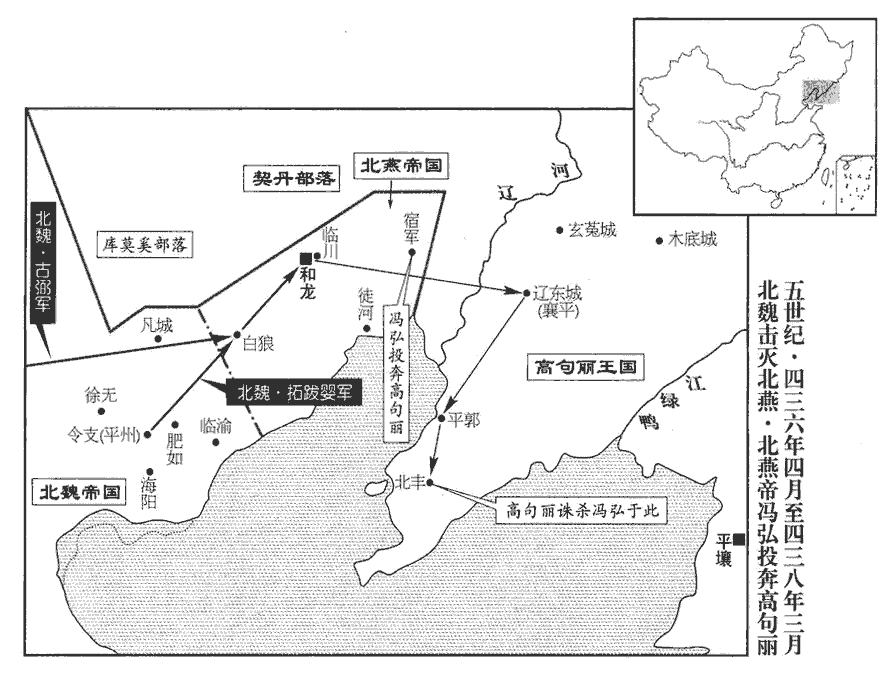
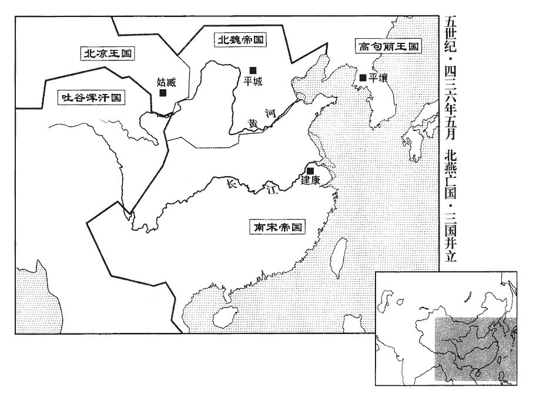
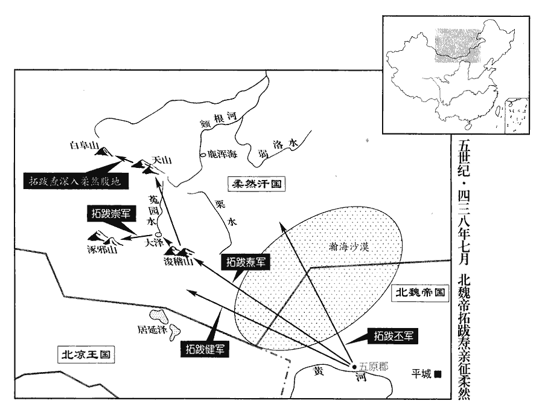
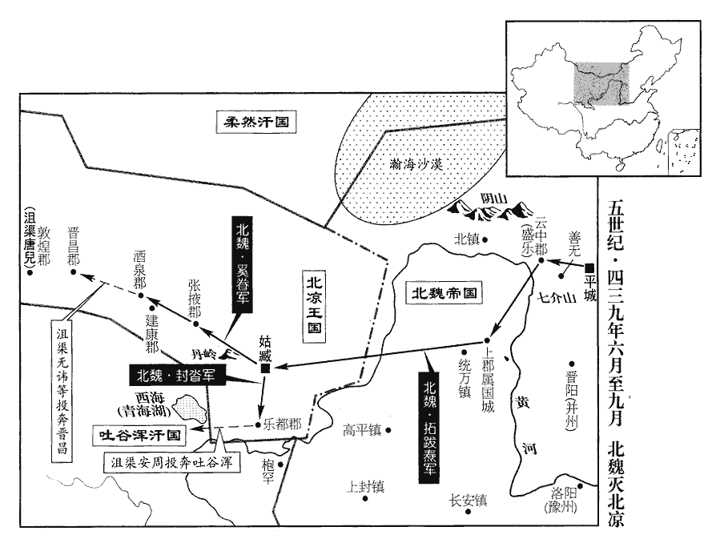
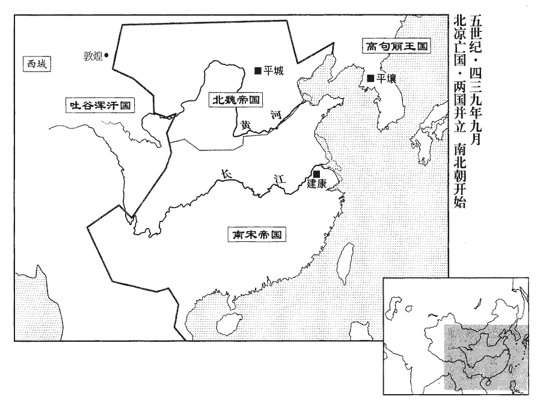

 宋紀五起柔兆困敦（丙子），盡重光大荒落（辛巳），凡六年。

# 太祖文皇帝中之上

## 元嘉十三年（（丙子、四三六）

1春，正月，癸丑朔‹一›，上‹刘义隆，时年三十›有疾，不朝會。朝，直遙翻；下同。

〖译文〗 [1]春季，正月，癸丑朔（初一），刘宋文帝患病，不举行朝会。

2甲寅‹二›，魏主‹拓跋焘，时年二十九›還宮。

〖译文〗 [2]甲寅（初二），北魏国主拓跋焘回宫。

3二月，戊子‹六›，燕‹都和龙，辽宁朝阳›王‹冯弘›遣使入貢于魏，使，疏吏翻；下同。請送侍子。魏主不許，燕王屢請送侍子而不至，魏主知其詐，故不許。將舉兵討之；壬辰‹十›，遣使者十餘輩詣東方高麗等諸國告諭之。諭以燕王之罪，使不得與通；或有奔逸，使不得容受之也。

〖译文〗 [3]二月，戊子（初六），北燕王冯弘派使臣向北魏进贡，请求允许立即送太子冯王仁充当人质。拓跋焘拒绝，并准备兴兵讨伐北燕。壬辰（初十），北魏派出使节十余人，分别前往东方高句丽等国，告诉北魏将对北燕采取军事行动。

4司空、江州‹府寻阳，江西九江›刺史、永脩公檀道濟，漢靈帝中平中，立永脩縣，屬豫章郡，隋開皇九年，併入建昌縣。立功前朝，威名甚重，左右腹心並經百戰，諸子又有才氣，朝廷疑畏之。朝，直遙翻。帝久疾不癒，劉湛說司徒義康，以爲「宮車一日晏駕，道濟不復可制。」說，輸芮翻。復，扶又翻；下足復同。會帝疾篤，義康言於帝，召道濟入朝。其妻向氏謂道濟曰：《姓譜》：祁姓之後爲向國。向，式亮翻，又如字。「高世之勳，自古所忌。今無事相召，禍其至矣。」旣至，留之累月。帝稍間，間，如字。將遣還，已下渚，道濟將還江州，船已下秦淮渚。未發；會帝疾動，義康矯詔召道濟入祖道，因執之。三月，己未‹八›，下詔稱：「道濟潛散金貨，招誘剽猾，誘，音酉。剽，匹妙翻。因朕寢疾，規肆禍心。」收付廷尉，幷其子給事黃門侍郎植等十一人誅之，唯宥其孫孺。唯宥諸孫之在童孺者。又殺司空參軍薛彤、高進之；二人皆道濟腹心，有勇力，時人比之關、張。關羽、張飛也。

〖译文〗 [4]刘宋司空、江州刺史、永公檀道济，在刘裕时代就立下奇功，享有很重的威名。他左右心腹战将都身经百战，几个儿子都有才气，刘宋文帝对他又猜忌又畏惧。这时，文帝久病不愈，领军将军刘湛劝说司徒刘义康说：“皇上一旦驾崩，檀道济将不可控制。”正巧文帝的病情加重，刘义康劝说文帝，征召檀道济入京朝见。檀道济的妻子向氏对他说：“高于当世的功勋大臣，自古以来都易被猜忌。如今没有战事却召你入京，大祸降临了。”檀道济来到建康以后，文帝留他在京一个多月。文帝病情稍稍好转，就要遣送他回到任所，船已下到码头，还没有出发。而文帝的病情突然加重，刘义康假传圣旨召回檀道济到祭祀路神的地方，声称为他设宴饯行，将他逮捕。三月，己未（初八），刘宋文帝下诏称：“檀道济暗中散发金银财物，招募地痞无赖。乘我病重之时，图谋不轨。”将檀道济交到专管司法的廷尉处理，连同他的儿子、给事黄门侍郎檀植等十一人，一并诛杀，仅仅饶恕了他年幼的孙子。同时，又杀死了司空参军薛彤、高进之二人，他们都是檀道济的心腹爱将，勇猛善战，当时的人把他们比作关羽、张飞。

道濟見收，憤怒，目光如炬，脫幘投地曰：「乃壞汝萬里長城！」壞，音怪。魏人聞之，喜曰：「道濟死，吳子輩不足復憚。」爲後魏人入寇，帝思道濟張本。

〖译文〗 檀道济被逮捕时，怒不可遏，两道目光象火炬一样，把头巾狠狠地摔在地上说：“你们是在毁坏你们自己的万里长城！”北魏人听到檀道济被杀的消息非常高兴，都说：“檀道济死了，东吴那些竖子就没有值得我们忌惮的了。”

庚申‹九›，大赦；以中軍將軍南譙王義宣爲江州‹府寻阳，江西九江›刺史。

〖译文〗 庚申（初九），刘宋大赦天下。朝廷任命中军将军、南谯王刘义宣为江州刺史。

5辛未‹二十›，魏平東將軍娥清、安西將軍古弼將精騎一萬伐燕，平州‹府肥如，河北卢龙›刺史拓跋嬰帥遼西‹河北东北部›諸軍會之。將，卽亮翻。騎，奇寄翻。帥，讀曰率；下同。

〖译文〗 [5]辛未（二十日），北魏平东将军娥清、安西将军古弼统率精锐骑兵一万人，讨伐北燕。平州刺史拓跋婴，率领辽西各路军队与娥清等会师。

6氐王‹府仇池，甘肃西和南›楊難當自稱大秦王，改元建義。立妻爲王后，世子爲太子，置百官皆如天子之制，然猶貢奉宋、魏不絕。

〖译文〗 [6]氐王杨难当自称大秦王，改年号为建义。封正室为王后，封世子为太子，仿照天子的制度设置文武百官。然而，他仍然向刘宋和北魏进贡，从不停止。

 

7夏，四月，魏娥清、古弼攻燕白狼城‹辽宁喀喇沁左翼西南›，克之。白狼縣，漢屬右北平郡。燕以白狼城爲重鎭，置幷州。魏後併入建德郡廣都縣。有白狼山，白狼水。

〖译文〗 [7]夏季，四月，北魏大将娥清、古弼围攻北燕的白狼城，一举攻克。

高麗遣其將葛盧孟光將衆數萬，隨陽伊至和龍迎燕王。去年，燕遣陽伊請迎於高麗。高麗屯于臨川。臨川，在和龍城東。燕尚書令郭生因民之憚遷，開城門納魏兵，《考異》曰：《後魏•古弼傳》作「大臣古泥」，今從《十六國春秋鈔》。魏人疑之，不入。生逐勒兵攻燕王‹冯弘›，王引高麗兵入自東門，與生戰于闕下，生中流矢死。中，竹仲翻。葛盧孟光入城，命軍士脫弊褐，取燕武庫精仗以給之，大掠城中。

〖译文〗 高丽派遣将领葛卢孟光率领几万部众，随同北燕的使臣阳伊来到和龙迎接北燕王冯弘。然后高丽军队屯驻在临川。北燕尚书令郭生因为百姓不愿迁徙他乡，开启城门迎接城外的北魏军，魏军却以为北燕故意诱敌深入，不敢进城。郭生于是指挥军队，进攻冯弘。冯弘开启东门迎接高丽军入城，与郭生的叛军在皇宫前会战，郭生身中流箭阵亡。葛卢孟光率军进入和龙城，他命令高丽将士脱掉身上的破军衣，夺取了北燕的军械库和国库，重新武装自己的军队，在和龙城中大肆抢劫。

五月，乙卯‹五›，燕王帥龍城‹辽宁朝阳›見戶東徙，帥，讀曰率。見，賢遍翻。馮氏歷二主二十八年而滅。焚宮殿，火一旬不滅；令婦人被甲居中，陽伊等勒精兵居外，葛盧孟光帥騎殿後，被，皮義翻。殿，丁甸翻。方軌而進，前後八十餘里。古弼部將高苟子帥騎欲追之，將，卽亮翻。帥，讀曰率。騎，奇寄翻。弼醉，拔刀止之，故燕王得逃去。魏主聞之，怒，檻軍徵弼及娥清至平城，皆黜爲門卒。

〖译文〗 五月，乙卯（初五），冯弘率领和龙城中所有的居民向东迁徒。临走前，北燕军纵火焚烧了宫殿，大火烧了十天还不曾熄灭。北燕逃亡的队伍中，由妇女身披铠甲在大军中间，阳伊等率精兵在外，高句丽的将领葛卢孟光率领骑兵殿后，组成方阵前进，前后长达八十余里。北魏安西将军古弼的部将高苟子打算率领骑兵追赶，古弼当时酩酊大醉，拔出佩刀阻止高苟子，因此，冯弘等得以逃脱。北魏国主拓跋焘听说后，怒不可止，把古弼和娥清装入囚车，押返平城，二人都罢黜官职。贬为看门士卒。

戊午‹八›，魏主遣散騎常侍封撥使高麗，散，悉亶翻。騎，奇寄翻。使，疏吏翻。令送燕王。

〖译文〗 戊午（初八日），拓跋焘派散骑常侍封拨出使高丽，命令他们把冯弘送往北魏。

8丁卯‹十七›，魏主如河西‹河套地区›。

〖译文〗 [8]丁卯（十七日），北魏国主拓跋焘前往河西。

 

9六月，詔寧朔將軍蕭汪之將兵討程道養；軍至郪口‹四川遂宁西北›，郪江源出今潼川府銅山縣，歷遂寧府長江縣而合於涪水，謂之郪口。郪，音妻。帛氐奴請降。降，戶江翻。道養兵敗，還入郪山‹四川射洪南›。

〖译文〗 [9]六月，刘宋文帝下诏，命宁朔将军萧汪之率兵讨伐程道养。萧汪之的军队开到口，帛氐奴投降。随即，程道养兵败，又潜入山。

10赫連定之西遷也，事見上卷八年。楊難當遂據上邽‹甘肃天水›。秋，七月，魏主遣驃騎大將軍樂平王丕、尚書令劉絜督河西、高平‹宁夏固原›諸軍以討之，先遣平東將軍崔賾齎詔書諭難當。驃，匹妙翻。騎，奇寄翻。賾zé，士革翻。

〖译文〗 [10]前夏王赫连定西迁以后，氐王杨难当就占据了上。秋季，七月，北魏国主拓跋焘派遣骠骑大将军、乐平王拓跋丕和尚书令刘等人督率河西、高平的各路军队讨伐杨难当。在大军开进以前，拓跋焘先派平东将军崔赜，携带皇帝诏书，晓谕杨难当。

11魏散騎侍郎游雅來聘。《姓譜》：鄭公子偃字子游，後以爲氏，魏爲廣平望姓。

〖译文〗 [11]北魏散骑侍郎游雅到刘宋访问。

12己未‹十›，零陵王太妃褚氏‹褚灵媛›卒‹年五十三›，追諡曰晉恭思皇后，葬以晉禮。

〖译文〗 [12]己未（初十），刘宋零陵王的母亲、太妃褚灵媛去世。刘宋朝廷追加谥号称晋恭思皇后，用东晋皇家的礼节和仪式安葬她。

13八月，魏主畋于河西。

〖译文〗 [13]八月，北魏国主拓跋焘在河西狩猎。

14魏主遣廣平公張黎發定州‹府中山，河北定州›兵一萬二千通莎泉道‹山西灵丘西›。莎泉在靈丘。魏收《地形志》：靈丘郡有莎泉縣。隋廢靈丘爲縣，併莎泉入焉。莎，素何翻。

〖译文〗 [14]北魏国主拓跋焘派广平公张黎征调定州的军队一万二千人，开通莎泉大道。

15九月，庚戌‹二›，魏樂平王丕等至略陽‹甘肃天水东›；楊難當懼，請奉詔，攝上邽守兵還仇池‹甘肃西和南›。諸將議以爲：「不誅其豪帥，帥，所類翻。軍還之後，必相聚爲亂。又，大衆遠出，不有所掠，無以充軍實，賞將士。」丕將從之，中書侍郎高允參丕軍事，諫曰：「如諸將之謀，是傷其向化之心；大軍旣還，爲亂必速。」丕乃止，還，從宣翻，又如字。撫慰初附，秋毫不犯，秦、隴‹甘肃南部›遂安。難當以其子順爲雍州刺史，鎭下辨‹甘肃成县西›。雍，於用翻。辨，步莧翻。

〖译文〗 [15]九月，庚戌（初二），北魏乐平王拓跋丕的大军抵达洛阳。杨难当这才感到恐慌，言请接受诏令，把驻守在上的军队撤回仇池。北魏军各将领讨论，一致认为：“不杀掉这个凶悍的首领，等我们班师以后，他们一定会重新集结作乱。另外，我们大军离家远征，如果不掠夺些财物，无法补充军饷，也无法犒赏将士。”拓跋丕打算听从众将的意见。中书侍郎高允正在军中担任拓跋丕的军事参谋，他劝阻拓跋丕说：“如果听从诸位将领的意见，就会伤害他们归化朝廷的心意；大军班师后，叛乱必将来得更快。”拓跋丕才打消进攻的念头，妥善地安抚新近归附的部落，军纪严明，秋毫无犯，秦陇地区于是民心安定。杨难当任命他的儿子杨顺为雍州刺史，驻守下辨。

16高麗不送燕王於魏，遣使奉表，稱「當與馮弘俱奉王化」。魏主以高麗違詔，議擊之，將發隴右騎卒，麗，力知翻。使，疏吏翻。騎，奇寄翻。劉絜曰：「秦、隴新民，且當優復，新民，新附之民也。復，方目翻。俟其饒實，然後用之。」樂平王丕曰：「和龍新定，宜廣脩農桑以豐軍實，然後進取，則高麗一舉可滅也。」魏主乃止。

〖译文〗 [16]高丽不把北燕王冯弘送交给北魏，并且派使臣携带奏疏出使北魏，请求：“准许跟冯弘同时接受朝廷的教化。”拓跋焘根据高丽违反朝廷命令的种种表现，与群臣讨论讨伐高丽，要征调陇右的精锐骑兵。刘说：“秦、陇地区新近归附，应当减免那里的赋役，等他们富庶充实以后，再加以使用。”乐平王拓跋丕说：“和龙新近平定，应当大力发展农桑来充实军备，然后再进一步攻取，高丽就可以被我们一举消灭了。”拓跋焘于是放弃了进攻的计划。

17癸丑‹五›，封皇子濬jùn爲始興王，駿爲武陵王。

〖译文〗 [17]癸丑（初五），刘宋文帝封皇子刘浚为始兴王，刘骏为武陵王。

18冬，十一月，己酉‹一›，魏主如稒陽‹内蒙包头东›，稒，音固。驅野馬於雲中‹故都盛乐，内蒙和林格尔›，置野馬苑；閏月，壬子‹五›，還宮。

〖译文〗 [18]冬季，十一月，己酉（初一），北魏国主拓跋焘前往阳，驱赶野马到云中，在那里设置了野马苑。闰十一月，壬子（初五），拓跋焘回宫。

19初，高祖‹刘裕›克長安‹西安›，事見一百十八卷晉安帝義熙十三年。得古銅渾儀，渾，戶本翻。儀狀雖舉，不綴七曜。日月五星謂之七曜。是歲，詔太史令錢樂之更鑄渾儀，徑六尺八分，以水轉之，昏明中星與天相應。孟春之月，昏，參中；旦，尾中。仲春之月，昏，弧中；旦，建星中。季春之月，昏，七星中；旦，牽牛中。孟夏之月，昏，冀中；旦，婺wù女中。仲夏之月，昏，亢中；旦，危中。季夏之月，昏，火中；旦，奎中。孟秋之月，昏，建星中；旦，畢中。仲秋之月，昏，牽牛中；旦，觜zī觿xī中。季秋之月，昏，虛中；旦，柳中。孟冬之月，昏，危中；旦，七星中。仲冬之月，昏，東壁中；旦，軫zhěn中。季冬之月，昏，婁中；旦，氐中。更，工衡翻。

〖译文〗 [19]当初，刘裕攻克长安时，得到了一部古人制作的铜质浑天仪。浑天仪的构架虽然完整，但七星已经残缺。这一年，文帝诏令太史令钱乐之重新铸造浑天仪，直径六尺八分，用水作为动力旋转，仪上的星象，日出、日落和日中时与天上的星象相对应。

20柔然‹瀚海沙漠群›與魏絕和親，犯魏邊。柔然與魏和，見上卷八年。

〖译文〗 [20]柔然汗国与北魏断绝了和亲友好关系，开始骚扰北魏的边境。

21吐谷渾惠王慕璝卒，弟慕利延立。璝，古回翻。

〖译文〗 [21]吐谷浑汗国可汗慕容慕去世，他的弟弟慕容慕利延继承汗位。

## 十四年（丁丑、四三七）

1春，正月，戊子‹十二›，魏北平宣王長孫嵩卒‹年八十›。長，知兩翻。

〖译文〗 [1]春季，正月，戊子（十二日），北魏北平王长孙嵩去世。

2辛卯‹十五›，大赦。

〖译文〗 [2]辛卯（十五日），刘宋实行大赦。

3二月，乙卯‹九›，魏主‹拓跋焘，时年三十›如幽州‹府蓟县，北京›。三月，丁丑‹二›，魏主以南平王渾爲鎭東大將軍、儀同三司，鎭和龍‹辽宁朝阳›。己卯‹四›，還宮。

〖译文〗 [3]二月，乙卯（初九），北魏国主拓跋焘前往幽州。三月，丁丑（初二），拓跋焘任命南平王拓跋浑为镇东大将军、仪同三司，镇守和龙。己卯（初四），拓跋焘回宫。

4帝‹刘义隆，时年三十一›遣散騎常侍劉熙伯如魏議納幣，散，悉亶翻。騎，奇吏翻。會帝女亡而止。魏請婚始上卷十年。

〖译文〗 [4]刘宋文帝派遣散骑常侍刘熙伯出使北魏，商量公主出嫁的事宜。正巧公主去世，因而停止。

5夏，四月，趙廣、張尋、梁顯等各帥衆降；別將王道恩斬程道養，送首，餘黨悉平。九年，趙廣等反，今乃平。帥，讀曰率。降，戶江翻。將，卽亮翻。丁未‹二›，以輔國將軍周籍之爲益州‹府成都，四川成都›刺史。

〖译文〗 [5]夏季，四月，益州叛民领袖赵广、张寻、梁显等人帅众投降了朝廷。别将王道恩斩杀了程道养，送程道养的人头进京，程道养的余党被平定。丁未（初二），刘宋朝廷任命辅国将军周籍之为益州刺史。

6魏主以民官多貪，郡守、縣令，親民之官。夏，五月，己丑‹十五›，詔吏民得舉告守令不如法者。於是姦猾專求牧宰之失，迫脇在位，橫於閭里；橫，戶孟翻。而長吏咸降心待之，貪縱如故。長，知兩翻。

〖译文〗 [6]北魏国主拓跋焘认为地方郡守、县令大多贪赃枉法。夏季，五月，己丑（十五日），拓跋焘下诏，命令官吏和百姓可以检举告发地方郡守、县令贪污不法的行为。从此，地方一些地痞流氓乘机专挑地方官的过失，威胁要挟在位的地方官，在民间横行。地方官则自低身分对待这些人，照样贪赃枉法。

7丙申‹二十二›，魏主如雲中‹内蒙托克托›。

〖译文〗 [7]丙申（二十二日），北魏国主拓跋焘前往云中。

8秋，七月，戊子‹十五›，魏永昌王健等討山胡白龍餘黨於西河‹河套地区›，滅之。

〖译文〗 [8]秋季，七月，戊子（十五日），北魏永昌王拓跋健等讨伐山胡部落酋长白龙的余党所据守的西河，彻底消灭了他们。

9八月，甲辰‹一›，魏主如河西‹河套地区›；九月，甲申‹十二›，還宮。

〖译文〗 [9]八月，甲辰（初一），北魏国主拓跋焘前往河西。九月，甲申（十二日），拓跋焘回宫。

10丁酉‹二十五›，魏主遣使者拜吐谷渾‹青海›王慕利延爲鎭西大將軍、儀同三司，改封西平王。

〖译文〗 [10]丁酉（二十五日），拓跋焘派使臣出使吐谷浑汗国，封新即位的吐谷浑可汗慕容慕利延为镇西大将军、仪同三司，改封为西平王。

11冬，十月，癸卯‹一›，魏主如雲中；十一月，壬申‹一›，還宮。

〖译文〗 [11]冬季，十月，癸卯（初一），北魏国主拓跋焘前往云中。十一月，壬申（初一），回宫。

12魏主復遣散騎侍郎董琬、高明等多齎金帛使西域，招撫九國。復，扶又翻；下不復、爲復同。九國入貢，見上卷十二年。琬等至烏孫‹都赤谷城，因塞克湖东南›，其王甚喜，曰：「破落那‹都贵山城，乌兹别克斯坦卡散塞城›、者舌‹都者舌，塔什干市›二國破落那，漢大宛國也，去代萬四千四百五十里。者舌，漢康居國也，去代萬五千四百五十里也。皆欲稱臣致貢於魏，但無路自致耳，今使君宜過撫之。」乃遣導譯送琬詣破落那，明詣者舌。旁國聞之，爭遣使者隨琬等入貢，凡十六國，自是每歲朝貢不絕。朝，直遙翻。

〖译文〗 [12]北魏国主拓跋焘再次派遣散骑侍郎董琬、高明等携带大批金银绸缎出使西域，招抚西域九国。董琬等人来到乌孙，乌孙国王大为欢喜，说：“破落那、者舌二国，也都想向魏国称臣进贡，可是没有门路可以表达自己的意向，如今你们应绕道前往安抚他们。”于是，乌孙国王特派向导兼翻译送董琬前往破落那，高明前往者舌。邻近其他国家听到这个消息，也争先恐后地派遣使臣，随同董琬等人一道向北魏进贡，共有十六国之多。从此以后，西域各国每年都到北魏朝贡，从不停止。

13魏主以其妹武威公主妻河西王牧犍‹北凉，都姑臧，甘肃武威›，妻，七細翻。犍，居言翻。河西王遣宋繇奉表詣平城謝，且問公【章：甲十一行本「公」上有「其母及」三字；乙十一行本同；孔本同；張校同；退齋校同。】主所宜稱。魏主使羣臣議之，皆曰：「母以子貴，妻從夫爵。《春秋》之義，母以子貴。《禮記》：婦人無爵，從夫之爵。牧犍母宜稱河西國太后，公主於其國‹北凉›稱王后，於京師‹山西大同›則稱公主。」魏主從之。

〖译文〗 [13]北魏国主拓跋焘把他的妹妹武威公主嫁给北凉王沮渠牧犍。沮渠牧犍派右相宋繇携带奏书前往平城谢恩，并请教将来怎么称呼武威公主。拓跋焘让大臣们讨论，都说：“母以子贵，妻随夫爵。沮渠牧犍的母亲应称为河西国太后，武威公主在河西国内应称作王后，在京师则仍旧称为公主。”拓跋焘同意。

初，牧犍娶涼‹西凉›武昭王‹李暠›之女，及魏公主至，李氏與其母尹氏遷居酒泉‹甘肃酒泉›。頃之，李氏卒，尹氏撫之，不哭，曰：「汝國破家亡，今死晚矣。」牧犍之弟無諱鎭酒泉，謂尹氏曰：「后諸孫在伊吾‹新疆哈密›，李寶奔伊吾，見一百十九卷營陽王景平元年。后欲就之乎？」尹氏未測其意，紿之曰：「吾子孫漂蕩，託身異域；餘生無幾，當死此，不復爲氈裘之鬼也。」未幾，潛奔伊吾。無諱遣騎追及之，尹氏謂追騎曰：「沮渠酒泉許吾歸北，何爲復追！汝取吾首以往，吾不復還矣。」追騎不敢逼，引還。尹氏卒於伊吾。史言尹氏義烈。紿dài，蕩亥翻。幾，居豈翻。復，扶又翻。騎，奇寄翻。卒，子恤翻。

〖译文〗 当初，沮渠牧犍娶西凉武昭王李的女儿为妻。现在，北魏的公主下嫁，李氏与她的母亲迁居酒泉。不久，李氏去世，她的母亲尹氏抚摸她的尸体，却不曾恸哭，说：“你国破家亡，今天才死，太晚了。”当时，沮渠牧犍的弟弟沮渠无讳镇守酒泉，对尹氏说：“您的几个孙儿都在伊吾，您是否打算投奔他们去呢？”尹氏没有揣测出沮渠无讳的真实用意，就欺骗他说：“我的子孙们到处逃亡，流落天涯，在他乡异域寄身。我还能活几天，就死在这儿吧，不再去当游牧地区的野鬼了。”不久，尹氏偷偷地投奔伊吾。沮渠无讳派骑兵追上了她，尹氏对追赶她的骑兵说：“沮渠无讳允许我回到北方，为什么还要派兵追赶。你拿我的人头回去交差吧，我不会再回去了。”追兵不敢逼迫，只好返回。尹氏在伊吾去世。

牧犍遣將軍沮渠旁周入貢于魏，魏主遣侍中古弼、尚書李順賜其侍臣衣服，幷徵世子封壇入侍。是歲，牧犍遣封壇如魏，亦遣使詣建康‹南京›，使，疏吏翻。獻雜書及敦煌趙𢾺所撰《甲寅元曆》，敦，徒門翻。𢾺，讀爲斐。《魏書》作「𣤆」。撰，士免翻。幷求雜書數十種，種，章勇翻。帝‹刘义隆›皆與之。

〖译文〗 沮渠牧犍派将军沮渠旁周向北魏进贡。北魏国主拓跋焘派侍中古弼、尚书李顺赐赏北凉侍从臣僚衣服，并征召北凉世子沮渠封坛到京师平城充当人质。这一年，北凉王沮渠牧犍派遣沮渠封坛到平城。同时也遣使前往刘宋都城建康，呈献各种书籍以及敦煌人赵撰写的《甲寅元历》，并索取杂书数十种，文帝都满足了他们。

李順自河西還，魏主問之曰：「卿往年言取涼州之策，朕以東方有事，未遑也。今和龍已平，吾欲卽以此年西征，可乎？」對曰：「臣疇昔所言，見上卷十年。以今觀之，私謂不謬。然國家戎車屢動，士馬疲勞，西征之議，請俟他年。」魏主乃止。

〖译文〗 北魏尚书李顺从北凉回国，拓跋焘问他说：“你当年提出的攻取北凉的计划，我当时因为正对燕国用兵，没有来得及实行。如今和龙已经平定，我打算立即在年内西征，你看怎么样？”李顺回答说：“我当年说的那番话，用今天的形势来验证，我自以为没有错误。但是国家频频兴兵，东征西讨，士卒和战马都疲劳不堪，西征的计划，还是请推迟几年再说。”拓跋焘同意了。

## 十五年（戊寅、四三八）

1春，二月，丁未‹七›，以吐谷渾‹青海›王慕利延爲都督西秦•河•沙三州諸軍事、鎭西大將軍、西秦•河二州刺史、隴西王。

〖译文〗 [1]春季，二月，丁未（初七），刘宋朝廷任命吐谷浑可汗慕容慕利延为都督西秦、河、沙三州诸军事，兼任征西大将军，西秦、河二州刺史，封陇西王。

2三月，癸未‹十三›，魏‹都平城，山西大同›主‹拓跋焘，时年三十一›詔罷沙門年五十以下者。以其強壯，罷使爲民，以從征役。

〖译文〗 [2]三月，癸未（十三日），北魏国主拓跋焘下诏命令五十岁以下的和尚，一律还俗。

3初，燕王弘至遼東‹辽宁辽阳›，高麗王璉遣使勞之曰：麗，力知翻。璉，力展翻。使，疏吏翻。勞，力到翻。「龍城王馮君，爰適野次，士馬勞乎？」弘慙怒，稱制讓之；高麗處之平郭‹辽宁盖州›，處，昌呂翻。尋徙北豐‹辽宁瓦房店›。弘素侮高麗，政刑賞罰，猶如其國；高麗乃奪其侍人，取其太子王仁爲質。質，音致。弘怨高麗，遣使上表求迎，上‹刘义隆›遣使者王白駒等迎之，幷令高麗資遣。高麗王不欲使弘南來，遣將孫漱、高仇等殺弘于北豐‹辽宁瓦房店›，幷其子孫十餘人，果如楊㟭之言。將，卽亮翻；下同。諡弘曰昭成皇帝。白駒等帥所領七千餘人掩討漱、仇、殺仇，生擒漱。高麗王以白駒等專殺，遣使執送之。上以遠國，不欲違其意，下白駒等獄，下，遐稼翻。已而原之。

〖译文〗 [3]当初，北燕王冯弘来到辽东以后，高丽王高琏派遣使臣慰劳他说：“龙城王冯君，光临敝国荒郊，人马都很劳苦吧？”冯弘又惭愧又恼怒，以国王的身份斥责高琏。高丽把冯弘安置在平郭，不久，又迁往北丰。冯弘一向轻侮高丽，政务刑法，奖励惩罚，仍然象在北燕国一样。高丽于是强行夺走了冯弘的侍从，逼迫北燕的太子冯王仁作人质。冯弘怨恨高丽，派使臣到刘宋请求迎他南下。刘宋文帝派使臣王白驹等迎接冯弘一行，并令高丽出资遣送。高丽王高琏不愿放冯弘南下，就派他手下的将领孙漱、高仇等人，在北丰杀掉了冯弘及其子孙十余人。追赠冯弘谥号为昭成皇帝。刘宋使臣王白驹等率领七千多人讨伐孙漱、高仇，斩杀了高仇，生擒孙漱。高琏认为王白驹在他的国土上擅自杀害他的大将，派人逮捕王白驹，遣送回国。文帝认为高丽是远方小国，不愿让高琏失望，就把王白驹等人关进监狱。不久宽恕了他们。

4夏，四月，納故黃門侍郎殷淳女爲太子劭妃。

〖译文〗 [4]夏季，四月，刘宋文帝迎娶已故黄门侍郎殷淳的女儿，为太子刘劭的正妃。

5五月，戊寅‹九›，魏大赦。

〖译文〗 [5]五月，戊寅（初九），北魏实行大赦。

 

6丙申‹二十七›，魏主如五原‹内蒙包头›；秋，七月，自五原北伐柔然‹瀚海沙漠群›。命樂平王丕督十五將出東道，永昌王健督十五將出西道，魏主自出中道。至浚稽山‹蒙古肯特山›，復分中道爲二：陳留王崇從大澤‹蒙古鄂罗克泊，图青河南源头›向涿邪山‹蒙古古尔班察罕山›，魏主從浚稽北向天山‹燕然山，蒙古杭爱山›，西登白阜‹杭爱山主峰之一›，天山在漠北，卽唐鐵勒思結、多濫葛所保之地，非伊吾之折羅漫山也。白阜，疑卽雪山。復，扶又翻。邪，讀曰耶。不見柔然而還。時漠北大旱，無水草，人馬多死。

〖译文〗 [6]丙申（二十七日），北魏国主拓跋焘前往五原。秋季，七月，拓跋焘从五原向北进攻，讨伐柔然汗国。拓跋焘命令乐平王拓跋丕督率十五个将领从东路出兵；永昌王拓跋健督率十五个将领从西路出兵；拓跋焘则亲自率军从中路进攻。大军开到浚稽山，又分中路军为两部分：一部分由陈留王拓跋崇率领，从大泽直指涿邪山，一部分由拓跋焘统率，从浚稽一直向北，直奔天山。再向西登上白阜山，没有发现柔然汗国的部落，班师回国。当时漠北发生严重的旱灾，没有水草，北魏军中的人和马匹死亡很多。

7冬，十一月，丁卯朔‹一›，日有食之。

〖译文〗 [7]冬季，十一月，丁卯朔（初一），发生日食。

8十二月，丁巳‹二十二›，魏主至平城‹山西大同›。

〖译文〗 [8]十二月，丁巳（二十二日），北魏国主拓跋焘抵达平城。

9豫章‹江西南昌›雷次宗好學，好，呼到翻；下同。隱居廬山‹江西九江南›。廬山在尋陽，今在南康城北十五里，尋陽之南，正面廬山。嘗徵爲散騎侍郎，不就。是歲，以處士徵至建康，爲開館於雞籠山‹南京北›，雞籠山在臺城北郊。散，悉亶翻。騎，奇寄翻。處，昌呂翻。爲，于僞翻。使聚徒敎授。帝‹刘义隆，时年三十二›雅好藝文，使丹楊尹廬江‹安徽舒城›何尚之立玄學，太子率更令何承天立史學，《晉志》，太子率更令主宮殿門戶及賞罰事，職如光祿勳、衛尉。更，工衡翻。司徒參軍謝元立文學，幷次宗儒學爲四學。元，靈運之從祖弟也。帝數幸次宗學館，令次宗以巾褠gōu侍講，從，才用翻。數，所角翻。褠，古侯翻。江南人士交際以爲盛服，蓋次於朝服。毛脩之不肯以巾褠到殷景仁之門是也。蜀《註》曰：巾謂巾幘，褠謂單衣。資給甚厚。又除給事中，不就。久之，還廬山。

〖译文〗 [9]刘宋豫章人雷次宗勤奋好学，隐居在庐山。刘宋朝廷曾经征召他为散骑侍郎，他拒绝入仕。这一年，雷次宗以隐士的身份，被征召到首都建康。朝廷在鸡笼山为他开设学馆，让他招聚学生，讲授学业。刘宋文帝素来喜欢文学艺术，特命丹杨尹、庐江人何尚之专设玄学，命太子率更令何承天设立史学，命司徒参军谢元开设文学，加上雷次宗的儒学并称为“四学”。谢元是谢灵运的族弟。文帝多次临幸雷次宗的学馆，命令雷次宗不必穿朝服为皇上讲授儒学。赏赐的财物特别丰厚。文帝又任命雷次宗为给事中，雷次宗拒绝。过了很久，雷次宗回到庐山。

臣光曰：《易》曰：「君子多識前言往行以畜其德。」行，下孟翻。《易•大畜•彖辭》。孔子曰：「辭達而已矣。」《論語》所記。然則史者儒之一端，文者儒之餘事；至於老、莊虛無，固非所以爲敎也。夫學者所以求道；天下無二道，安有四學哉！

〖译文〗 臣司马光曰：《易经》说：“贤明的人大多都熟知前人的教诲，接受过去的经验，用来培养自己的德性。”孔子曾说：“辞意通达便可以了。”然而，史学是儒学的一部分，文学只是儒学的余事。至于老子、庄子的虚无学说，则根本不可以讲授和传播。做学问的人，是在于追求真理。而天下的真理没有第二个，怎么可以有“四学”呢！

10帝‹刘义隆›性仁厚恭儉，勤於爲政；守法而不峻，容物而不弛。百官皆久於其職，守宰以六期爲斷；吏不苟免，民有所係。三十年間，四境之內，晏安無事，戶口蕃息；斷，丁斷翻。蕃，音煩。出租供傜，止於歲賦，歲賦，常賦也，言不額外取民。晨出暮歸，自事而已。自適己事而已。閭閻之間，講誦相聞；士敦操尚，鄕恥輕薄。江左風俗，於斯爲美，後之言政治者，皆稱元嘉焉。治，直吏翻。

〖译文〗 [10]刘宋文帝性情宽厚仁慈，恭谨勤俭，勤奋刻苦，从不荒怠朝廷政务。他遵循法规而不苛刻，对人宽容却不放纵。朝廷的文武百官都能久居职位。郡守、县宰也都以六年为一任期。官吏不轻易免职，百姓才有所依托。三十年间，刘宋境内，平安无事，人口繁盛。至于租赋徭役，从不增加，只收取常赋，从不额外征收。百姓早晨出去耕作，晚上回家休息，可以随意做事，安居乐业。乡里街巷之间，读书的声音不绝于耳。士大夫重视操守，乡下人也讨厌轻薄无识的人。江左的风俗，在这个时代最为美好。后代评论前世政治得失的人，都称道元嘉治世。

## 十六年（己卯、四三九）

1春，正月，庚寅‹二十五›，司徒義康進位大將軍、領司徒，自漢以來，大將軍位三公上。司徒，丞相職也。義康旣進位，猶領司徒職。南兗州‹府广陵，江苏扬州›刺史、江夏王義恭進位司空。夏，戶雅翻。

〖译文〗 [1]春季，正月，庚寅（二十五日），刘宋朝廷提升司徒刘义康为大将军，仍兼任司徒职务；提升南兖州刺史、江夏王刘义恭为司空。

2魏‹都平城，山西大同›主‹拓跋焘，时年三十二›如定州‹府中山，河北定州›。

〖译文〗 [2]北魏国主拓跋焘前往定州。

3初，高祖‹刘裕›遺詔，令諸子次第居荊州‹府江陵，湖北江陵›。臨川王義慶在荊州八年，欲爲之選代，爲，于僞翻。其次應在南譙王義宣。帝‹刘义隆，时年三十三›以義宣人才凡鄙，置不用；二月，己亥‹五›，以衡陽王義季爲都督荊•湘等八州諸軍事、荊州刺史。義季嘗春月出畋，有老父被苫而耕，被，皮義翻。苫shān，詩廉翻。左右斥之，老父曰：「盤于遊畋，古人所戒。夏太康以遊畋失國。周公以文王戒成王盤樂也。今陽和布氣，一日不耕，民失其時，柰何以從禽之樂而驅斥老農也！」樂，音洛。義季止馬曰：「賢者也。」命賜之食，辭曰：「大王不奪農時，則境內之民皆飽大王之食，老夫何敢獨受大王之賜乎！」義季問其名，不告而退。

〖译文〗 [3]当初，刘宋武帝有遗诏，命令他的几个儿子依照长幼次序，驻守荆州。这时，临川王刘义庆在荆州已经有八年了，朝廷打算另选一个亲王代替他。按照顺序，应该派南谯王刘义宣。刘宋文帝却认为刘义宣的人品和才能都很平庸低下，不予任用。二月，己亥（初五），文帝任命衡阳王刘义季为都督荆、湘等八州诸军事，荆州刺史。刘义季曾经在春天外出打猎，有个老农夫身披苫衣，在田中耕种，不肯回避。刘义季的左右侍从斥责老农，老农说：“游猎取乐，古人深以为戒。如今天暖气湿，一天不耕种，百姓就会错过农时，怎么可以放纵狩猎的快乐，而驱赶勤于耕作的老农呢？”刘义季听罢，勒住马缰说：“他是贤人！”命令左右亲信赐给老农食物，老农拒绝说：“大王您不侵夺农时，境内的百姓都可以吃饱大王赐予的饮食，我老汉怎么敢独自领受您的赏赐呢！”刘义季询问老农夫的姓名，农夫不肯回答，告退。

4三月，魏雍州‹府长安，陕西西安›刺史葛那寇上洛‹陕西商州›，魏雍州刺史治長安。此北上洛也；南上洛寄治魏興。《魏書•官氏志》：內入諸姓，賀葛氏改爲葛氏。雍，於用翻。上洛太守鐔xín長生棄郡走。鐔，徐林翻。

〖译文〗 [4]三月，北魏雍州刺史葛那进攻刘宋所属的上洛。刘宋上洛太守镡长生放弃郡城逃走。

5辛未‹七›，魏主還宮。

〖译文〗 [5]辛未（初七），北魏国主拓跋焘回宫。

6楊保宗與兄保顯自童亭‹甘肃天水东北›奔魏。保宗鎭童亭見上卷十二年。庚寅‹二十六›，魏主以保宗爲都督隴西諸軍事、征西大將軍、開府儀同三司、秦州牧、武都王，鎭上邽‹甘肃天水›，妻以公主；妻，七細翻。保顯爲鎭西將軍、晉壽公。

〖译文〗 [6]氐王杨难当的侄儿杨保宗与他的哥哥杨保显从驻地童亭投奔北魏。庚寅（二十六日），北魏国主拓跋焘任命杨保宗为都督陇西诸军事、征西大将军、开府仪同三司、秦州牧、武都王，镇守上。并把皇室公主嫁给他为妻。又任命杨保显为镇西将军，封晋寿公。

7河西‹北凉，都姑臧，甘肃武威›王牧犍通於其嫂李氏，兄弟三人傳嬖之。傳，遞也。以便辟得幸曰嬖。嬖bì，卑義翻。陸德明必計翻。李氏與牧犍之姊共毒魏公主，公主，魏主妹也。魏主遣解毒醫乘傳救之，得愈。傳，知戀翻。魏主徵李氏，牧犍不遣，厚資給，使居酒泉‹甘肃酒泉›。

〖译文〗 [7]北凉王沮渠牧犍与他的嫂子李氏通奸，他们兄弟三人都轮流和她相好。于是，李氏与沮渠牧犍的姐姐合谋下毒害北魏武威公主。北魏国主拓跋焘派出解毒医生乘坐驿站的马车驰往救治，才把武威公主救活。拓跋焘下令索取李氏，沮渠牧犍不肯交出，只是给李氏很多财物，命她迁居酒泉。

魏每遣使者詣西域，使，疏吏翻；下同。常詔牧犍發導護送出流沙‹塔克拉玛干沙漠›。使者自西域還，至武威，牧犍左右有告魏使者曰：「我君承蠕蠕可汗妄言云：可，從刊入聲。汗，音寒。『去歲魏天子自來伐我，士馬疫死，大敗而還；還，從宣翻，又如字；下同。我擒其長弟樂平王丕。』我君大喜，宣言於國。又聞可汗遣使告西域諸國，稱『魏已削弱，今天下唯我爲強，若更有魏使，勿復供奉。』西域諸國頗有貳心。」復，扶又翻；下能復同。兩屬曰貳。西域旣貢奉魏，又信柔然之言，是有貳心。使還，具以狀聞。魏主遣尚書賀多羅使涼州觀虛實，多羅還，亦言牧犍雖外脩臣禮，內實乖悖。悖，蒲內翻，又蒲沒翻。

〖译文〗 北魏每次派遣使者出使西域，常常命令沮渠牧犍派出向导，护送魏使走出流沙出没的大沙漠。北魏使者从西域返回，抵达武威。沮渠牧犍左右有人告诉北魏的使臣说：“我们大王听到了柔然汗国的可汗大言不惭地说‘去年，魏国的皇帝亲自来讨伐我们，结果士卒和战马大多染上疫病而死，大军惨败而回。我们生擒了他的长弟乐平王拓跋丕。’我们大王听说后非常高兴，在国内大肆宣传。又听说柔然汗国可汗派使臣，出使西域各国，声称：‘现在魏国已经被削弱，普天之下只有我们汗国才是最强大的，如果再有魏国的使臣前来访问，你们不要供应他们。’因此，西域各国对魏国也怀有二心。”北魏使臣回国以后，把所听到的一切，汇报给朝廷。拓跋焘派尚书贺多罗出使北凉观察虚实。贺多罗回来，也说沮渠牧犍虽然表面上对魏称臣纳贡，内心却叛离乖张。

魏主欲討之，以問崔浩。對曰：「牧犍逆心已露，不可不誅。官軍往年北伐，雖不克獲，實無所損。戰馬三十萬匹，計在道死傷不滿八千，常歲羸死亦不減萬匹。羸，倫爲翻。而遠方乘虛，遽謂衰耗不能復振。今出其不意，大軍猝至，彼必駭擾，不知所爲，擒之必矣。」魏主曰：「善！吾意亦以爲然。」於是大集公卿議於西堂。魏平城太極殿有東、西堂。

〖译文〗 拓跋焘打算讨伐北凉，向崔浩询问对策。崔浩说：“沮渠牧犍叛逆之心，早已显露，不能不杀。我军前几年北伐，虽说没有取得太大的胜利，实际上也没遭受什么损失。战马共三十万匹，算起来在征途中死伤的不满八千。平时每年正常死亡的也不少于一万匹。而远方借此便咬定我们的国力消耗殆尽，不能恢复。现在，我军出其不意，突然出现在他们面前，他们惊恐万状，自相骚扰，不知如何是好，我们一定可以擒获敌人。”拓跋焘说：“太好了，我也是这样想的。”于是，召集公卿在太极殿西堂讨论。

弘農王奚斤等三十餘人皆曰：「牧犍，西垂下國，雖心不純臣，然繼父位以來，職貢不乏。朝廷待以藩臣，妻以公主；妻，七細翻。今其罪惡未彰，宜加恕宥。國家新征蠕蠕，蠕，人兗翻。士馬疲弊，未可大舉。且聞其土地鹵瘠，鹹xián地曰鹵，墝qiāo地曰瘠。難得水草，大軍旣至，彼必嬰城固守。攻之不拔，野無所掠，此危道也。」

〖译文〗 弘农王奚斤等三十余人都说：“沮渠牧犍是西方边陲归附的下等小国，虽然心中对我们不太臣服，但是自从继位以后，每年进贡从不间断减少。朝廷也把他作为一个藩臣来看待，嫁公主给他为妻。如今，他的罪行还不十分明显，应该加以宽恕。我国最近刚刚讨伐柔然汗国归来，人马疲惫，不能够再大举兴兵征讨了。况且，我还听说，凉国的土地贫瘠，盐碱地居多，水草也不多。我们大军兵临城下，他们一定环城固守。我军久攻不克，荒郊野外也没有什么可劫掠，这可是个危险的策略。”

初，崔浩惡尚書李順，伐夏之役，浩、順有隙。順以使涼爲魏主所寵待，浩愈惡之。惡，烏路翻。順使涼州凡十二返，使，疏吏翻。魏主以爲能。涼武宣王數與順遊宴，沮渠蒙遜諡武宣王。數，所角翻。對其羣下時爲驕慢之語；恐順泄之，隨以金寶納於順懷，順亦爲之隱。亦爲，于僞翻。浩知之，密以白魏主，魏主未之信。及議伐涼州，順與尚書古弼皆曰：「自溫圉水‹流经宁夏中卫入黄河›以西至姑臧‹甘肃武威›，據《北史》，「溫圉水」當作「溫圍」。地皆枯石，絕無水草。彼人言，『姑臧城南天梯山‹甘肃武威西南冷龙岭›上，冬有積雪，深至丈餘，春夏消釋，下流成川，居民引以漑灌。』彼聞軍至，決此渠口，水必乏絕。彼人，謂涼人也。環城百里之內，環，音宦。地不生草，人馬飢渴，難以久留。斤等之議是也。」魏主乃命浩與斤等相詰難，衆無復他言，但云「彼無水草」。浩曰：「《漢書•地理志》稱『涼州之畜爲天下饒』，若無水草，畜何以蕃？詰，去吉翻。難，乃旦翻。復，扶又翻；下敢復同。《漢書•地理志》曰：涼州土廣民稀，水草宜畜牧，故涼州之畜爲天下饒。畜，許救翻，又許六翻。蕃，音繁。又，漢人終不於無水草之地築城郭，建郡縣也。且雪之消釋，僅能斂塵，何得通渠漑灌乎！此言大爲欺誣矣。」欺，誑也。誣，詐也。李順曰：「耳聞不如目見，吾嘗目見，何可共辯？」浩曰：「汝受人金錢，欲爲之遊說，謂我目不見便可欺邪！」帝隱聽，聞之，爲，于僞翻。說，輸芮翻。隱聽者，隱屛而聽也。乃出見斤等，辭色嚴厲，羣臣不敢復言，唯唯而已。唯，于癸翻。

〖译文〗 当初，崔浩讨厌尚书李顺。李顺出使北凉，往返共十二次，拓跋焘认为李顺有才能。当年，北凉武宣王沮渠蒙逊多次与李顺一起游乐宴饮，沮渠蒙逊常对群臣下属说一些骄傲无礼的大话，害怕李顺泄漏给北魏朝廷，就随即把金银财宝塞进李顺的怀里，李顺也就替他隐瞒。崔浩知道后，就秘密报告给拓跋焘，拓跋焘不相信。等到这时讨论进攻北凉时，李顺和古弼都说：“从温圉水以西直到姑臧，遍地都是枯石，绝对没有水草。当地人说：姑臧城南的天梯山上，冬天有积雪，深达几丈。春季和夏季的时候，积雪融化，从山上流下来，形成河流，当地居民就是引雪水入渠，灌溉农田。如果凉州人听说我们大军开到，一定会掘开渠口，让水流尽，我军的人马就无水可用。姑臧城方圆百里之内，土地因无水杂草不生，我军人马饥渴，也难以久留。奚斤他们的意见是正确的。”拓跋焘于是让崔浩和奚斤辩论，众人再没有别的话可说，只是声称“凉州没有水草”。崔浩说：“《汉书·地理志》中讲道：‘凉州的畜产，天下最为富饶。’如果那里没有水草，牲畜怎么繁殖？另外，汉朝绝不会在没有水草的土地上兴筑城郭，设置郡县。况且，高山冰雪融化以后，只能浸湿地皮，收敛尘土，怎么能够挖通渠道，灌溉农田呢！这种话实在是荒谬不可信。”李顺说：“耳闻不如亲眼所见。我曾经亲眼看到，你有什么资格和我辩论？”崔浩说：“你接受了人家的金钱贿赂，想要替人家说话，你以为我没有亲眼看到就能被你蒙蔽吗！”隐藏在屏风后面的拓跋焘听到这些话，就走出来面见奚斤等人，声音和表情都十分严厉，群臣不敢再说什么，唯唯听命而已。

羣臣旣出，振威將軍代人‹鲜卑人›伊馛言於帝馛bó，蒲撥翻。曰：「涼州若果無水草，彼何以爲國？衆議皆不可用，宜從浩言。」帝善之。

〖译文〗 文武群臣走出太极殿后，振威将军、代郡人伊对拓跋焘说：“凉州如果真的没有水草，他们怎么建立王国？大多数人说的都不可采用，您应该听崔浩的话。”拓跋焘同意他的说法。

夏，五月，丁丑‹十四›，魏主治兵於西郊；治，直之翻。六月，甲辰‹十一›，發平城。使侍中宜都王穆壽輔太子晃監國，決留臺事，內外聽焉。監，工銜翻。又使大將軍長樂王稽敬、「稽敬」，《北史》作「嵇敬」，當從之。《魏書•官氏志》：北方諸姓，紇奚氏改爲嵇氏。輔國大將軍建寧王崇將二萬人屯漠南以備柔然。王將，卽亮翻。命公卿爲書以讓河西王牧犍，數其十二罪，且曰：「若親帥羣臣委贄zhì遠迎，數，所具翻。帥，讀曰率。古者執贄以見，拜贄，首則委之於地，起則取而進之，此之謂委贄。謁拜馬首，上策也。六軍旣臨，面縛輿櫬，其次也。若守迷窮城，不時悛悟，櫬chèn，初覲翻。悛quān，丑緣翻。身死族滅，爲世大戮。宜思厥中，自求多福！」

〖译文〗 夏季，五月，丁丑（十四日），拓跋焘在平城西郊训练军队。六月，甲辰（十一日），大军从平城出发。命令侍中、宜都王穆寿辅佐太子拓跋晃，主持朝政，裁决日常事务，朝廷内外都要遵从。拓跋焘又派大将军、长乐王嵇敬，以及辅国大将军、建宁王拓跋崇，率领二万人，屯驻漠南，防备柔然汗国乘虚进攻。拓跋焘又命令大臣们发布文告，历数北凉王沮渠牧犍的十二项罪状，并且警告沮渠牧犍说：“你如果亲自率领群臣，远远地出来伏在地上迎接，然后在我马首跪拜请罪，这是上策；我军兵临城下，你双手反绑携带空棺出城迎接，这是中策；你要是困守孤城，不及时醒悟，就要身死族灭，受到天下最酷烈的惩罚！你要权衡利害，为自己寻一条生路。”

8己酉‹十六›，改封隴西王吐谷渾慕利延爲河南王。

〖译文〗 [8]己酉（十六日），刘宋改封陇西王吐谷浑可汗慕容慕利延为河南王。

9魏主自雲中‹故都盛乐，内蒙和林格尔›濟河；秋，七月，己巳‹七›，至上郡‹陕西榆林南鱼河堡›屬國城‹陕西榆林北›。漢置屬國於邊郡以處降胡，此屬國城，漢舊城也。班《書•地理志》：上郡龜茲縣，屬國都尉治。壬午‹二十›，留輜重，部分諸軍，重，直用翻。分，扶問翻。使撫軍大將軍永昌王健、尚書令劉絜與常山王素爲前鋒，兩道並進；驃騎大將軍樂平王丕、太宰陽平王杜超爲後繼；驃，匹妙翻。騎，奇寄翻。以平西將軍源賀爲鄕導。鄕，讀曰嚮。

〖译文〗 [9]北魏国主拓跋焘从云中渡过黄河。秋季，己巳（初七），抵达上郡属国城。壬午（二十日），大军留下辎重，部署分派各军，命令抚军大将军、永昌王拓跋健，与尚书令刘、常山王拓跋素为前锋，分两路同时进发；又命令骠骑大将军、乐平王拓跋丕，太宰、阳平王杜超为后备军；又命平西将军源贺为向导。

魏主問賀以取涼州方略，對曰：「姑臧城旁有四部鮮卑，皆臣祖父舊民，禿髮傉檀據姑臧，旣而爲沮渠所取，有四部鮮卑留居城外。賀，傉檀之子也。臣願處軍前，處，昌呂翻。宣國威信，示以禍福，必相帥歸命。帥，讀曰率。外援旣服，然後取其孤城，如反掌耳。」魏主曰：「善！」

〖译文〗 拓跋焘曾向源贺询问攻取北凉的作战方案，源贺回答说：“姑臧城的旁边有四个鲜卑族部落，都是我祖父的老部下，我愿意在大军未到之前，向他们宣扬我国的威信，分析祸福利害，他们一定会相继归降。城外的援军一旦瓦解，然后攻取孤城，就易如反掌了。”拓跋焘说：“太好了！”

八月，甲午‹二›，永昌王健獲河西畜產二十餘萬。

〖译文〗 八月，甲午（初二），北魏永昌王拓跋健缴获北凉的各种牲畜共二十余万头。

河西王牧犍聞有魏師，驚曰：「何爲乃爾！」用左丞姚定國計，不肯出迎，求救於柔然。遣其弟征南大將軍董來將兵萬餘人出戰於城南，來將，卽亮翻。望風奔潰。劉絜用卜者言，以爲日辰不利，斂兵不追，董來遂得入城‹甘肃武威›。魏主由是怒之。爲魏誅劉絜張本。

〖译文〗 北凉王沮渠牧犍听说北魏大军前来的消息，大吃一惊，说：“怎么会是这样！”随后，他采用了左丞相姚定国的计策，不肯出城迎接，却向柔然汗国请求救兵。沮渠牧犍派他的弟弟征南大将军沮渠董来统兵一万多人，在城南出城迎战北魏军，北凉军望风崩溃。北魏前锋将领刘听信占卜人的预言，以为日子不吉利，所以召回军队没有乘胜追击，沮渠董来才得以逃进姑臧城。拓跋焘因此对刘十分恼怒。

丙申‹四›，魏主至姑臧‹甘肃武威›，遣使諭牧犍令出降。使，疏吏翻。降，戶江翻。牧犍聞柔然欲入魏邊爲寇，冀幸魏主東還，遂嬰城固守；其兄子祖踰城出降。魏主具知其情，乃分軍圍之。源賀引兵招慰諸部下三萬餘落，故魏主得專攻姑臧，無復外慮。復，扶又翻；下不復同。

〖译文〗 丙申（初四），北魏国主拓跋焘抵达姑臧城下，派人通知沮渠牧犍，让他迅速出城投降。沮渠牧犍听说柔然汗国就要进攻北魏的边境，所以他还希望拓跋焘率军东还，援救国内。于是，沮渠牧犍命令将士绕城固守。沮渠牧犍的侄儿沮渠祖，翻越城墙投降了北魏军。拓跋焘于是了解了北凉的真实情况，拓跋焘分军包围了姑臧城。源贺率兵招抚了他祖父的旧部三万多个帐落，所以拓跋焘得以集中全力攻城，没有顾虑。

 

魏主見姑臧城外水草豐饒，由是恨李順，謂崔浩曰：「卿之昔言，今果驗矣。」自是魏主決意誅李順矣。對曰：「臣之言不敢不實，類皆如此。」

〖译文〗 拓跋焘看到姑臧城外水草茂盛，由此痛恨李顺，对崔浩说：“你当年说过的话，今天果然应验了。”崔浩回答说：“我不敢不讲实话，一向如此。”

魏主‹拓跋焘›之將伐涼州也，太子晃亦以爲疑。至是，魏主賜太子詔曰：「姑臧城【章：甲十一行本「城」下有「東」字；乙十一行本同；孔本同；張校同；退齋校同。】西門外，涌泉合於城北，其大如河。自餘溝渠流入漠中，其間乃無燥地。故有此敕，以釋汝疑。」

〖译文〗 拓跋焘决计讨伐北凉，太子拓跋晃有些疑虑。这时，拓跋焘在诏书中告诉他：“姑臧城西门外边，有源源涌出的泉水，一直与北门外的泉水相接，水流之大，就象一条河。除供灌溉农田外，其余都顺着沟渠流到沙漠之中，因此这一带没有干田燥地。特意敕书告诉你，以解除你的疑虑。”

10庚子‹八›，立皇子鑠爲南平王。鑠shuò，書藥翻。

〖译文〗 [10]庚子（初八），刘宋立皇子刘铄为南平王。

11九月，丙戌‹二十五›，河西王牧犍兄子萬年帥所領降魏。《考異》曰：《宋書•氐胡傳》曰：「茂虔兄子萬年爲虜內應，茂虔見執。」今從《後魏書》。帥，讀曰率。降，戶江翻；下同。姑臧城潰，牧犍帥其文武五千人面縛請降；魏主釋其縛而禮之。收其城內戶口二十餘萬，倉庫珍寶不可勝計。使張掖王禿髮保周、保周奔魏，封張掖公，今進爲王。保周，源賀之兄也。勝，音升。龍驤將軍穆羆pí、【章：甲十一行本「羆」作「罷」；乙十一行本同；孔本同。】驤，思將翻。安遠將軍源賀分徇諸郡，雜胡降者又數十萬。

〖译文〗 [11]九月，丙戌（二十五日），北凉王沮渠牧犍的侄儿沮渠万年率领他的部众投降北魏。姑臧城随即被北魏军攻陷，沮渠牧犍率领文武官员五千人，双手反绑，亲自请降。拓跋焘解开沮渠牧犍的绳索，以礼相待。共接收姑臧城内的居民二十余万户，仓库中的珍奇异宝不可胜数。拓跋焘又命令张掖王秃发保周、龙骧将军穆罴、安远将军源贺，分别向地方各郡宣布消息，各族胡人投降北魏的又有几十万。

 

初，牧犍以其弟無諱爲沙州刺史、都督建康‹甘肃酒泉东南›以西諸軍事、領酒泉太守，宜得爲秦州刺史、都督丹嶺‹山丹岭›以西諸軍事、領張掖‹甘肃张掖›太守，丹嶺在姑臧西，卽删丹嶺。安周爲樂都‹青海乐都›太守，乞伏衰滅，樂都亦爲沮渠所有。樂，音洛。《考異》曰：《宋書》「宜得」作「儀德」，「安周」作「從子豐周」，今從《後魏書》。從弟唐兒爲敦煌太守。從，才用翻。敦，徒門翻。及姑臧破，魏主遣鎭南將軍代人奚眷擊張掖，鎭北將軍封沓擊樂都；宜得燒倉庫，西奔酒泉，安周南奔吐谷渾‹青海›，封沓掠數千戶而還。還，從宣翻，又如字。奚眷進攻酒泉，無諱、宜得收遺民奔晉昌‹甘肃安西›，遂就唐兒於敦煌。魏主使弋陽公元絜守酒泉，及武威、張掖皆置將守之。將，卽亮翻。

〖译文〗 当初，沮渠牧犍任命他的弟弟沮渠无讳为沙州刺史、都督建康以西诸军事，兼任酒泉太守；任命沮渠宜得为秦州刺史、都督丹岭以西诸军事，兼任张掖太守；任命沮渠安周为乐都太守；还任命他的堂弟沮渠唐儿为敦煌太守。等到姑臧城被攻陷，北魏国主拓跋焘，派镇南将军、代郡人奚眷袭击张掖；派镇北将军封沓进攻乐都。沮渠宜得烧毁仓库，向西逃往酒泉；沮渠安周则向南逃往吐谷浑。封沓裹胁数千户居民班师，奚眷则继续进攻酒泉，酒泉太守沮渠无讳与沮渠宜得一道，招集残部投奔晋昌，又前往敦煌投奔沮渠唐儿。拓跋焘命令戈阳公元驻守酒泉，武威、张掖两城也分别遣将驻守。

魏主置酒姑臧，謂羣臣曰：「崔公智略有餘，吾不復以爲奇。復，扶又翻。伊馛bó弓馬之士，而所見乃與崔公同，深可奇也。」馛善射，能曳牛卻行，走及奔馬，而性忠謹，故魏主特愛之。

〖译文〗 拓跋焘在姑臧城大宴群臣，他对文武百官们说：“崔公足智多谋，我已经不再感到新奇。伊是一个擅长骑马射箭的武夫，他的见识竟能与崔公相同，实在是令人惊奇。”伊善长射箭，力气也很大，能拖着牛倒着走，跑起来，能够赶上奔腾的马。同时伊又十分忠诚谨慎，拓跋焘特别喜爱他。

魏主之西伐也，穆壽送至河上，自平城送魏主西至河。魏主敕之曰：「吳提與牧犍相結素深，聞朕討牧犍，吳提必犯塞，柔然敕連可汗名吳提。朕故留壯兵肥馬，使卿輔佐太子。收田旣畢，卽發兵詣漠南，分伏要害以待虜至，引使深入，然後擊之，無不克矣。涼州路遠，朕不得救，卿勿違朕言！」壽頓首受命。壽雅信中書博士公孫質，以爲謀主。壽、質皆信卜筮，以爲柔然必不來，不爲之備。質，軌之弟也。公孫軌見一百二十卷四年。

〖译文〗 拓跋焘即将率军西征时，宜都王穆寿一直送他到黄河岸边。拓跋焘告诫他说：“柔然汗国可汗郁久闾吴提与沮渠牧犍交情很深，他听说我要征讨沮渠牧犍，一定会来进犯我国边境，所以我故意留下精兵和壮马，使你辅佐太子。等到田里的庄稼收割完毕，我立即发兵征讨漠南，我军分别潜伏在要害地区，等待柔然贼兵到来，再诱敌深入，然后攻击他们，必能全部攻克。凉州离国内太远，我不能救你的危难，你千万不要违背我的嘱咐。”穆寿叩头接受了命令。穆寿一向信任中书博士公孙质，就把他当做自己的谋士。而穆寿、公孙质二人都相信占筮卜卦，认为柔然汗国的军队一定不会前来进犯，因此不加防备。公孙质是公孙轨的弟弟。

柔然敕連可汗聞魏主向姑臧，乘虛入寇，留其兄乞列歸與嵇敬、建寧王崇相拒於北鎭‹懷朔鎭，内蒙固阳›。北鎭，卽魏主破降高車所置六鎭也。以在平城之北，故曰北鎭。或曰，北鎭直代都北，卽懷朔鎭。自帥精騎深入，帥，讀曰率。騎，奇寄翻。至善無‹山西右玉›七介山‹右玉西南›，平城‹山西大同›大駭，民爭走中城。走，音奏。穆壽不知所爲，欲塞西郭門，塞，悉則翻。請太子避保南山，竇太后不聽而止。竇太后，卽保太后。遣司空長孫道生、征北大將軍張黎拒之於吐頹山‹山西朔州西北›。會嵇敬、建寧王崇擊破乞列歸於陰山之北，擒之，幷其伯父他吾無鹿胡及將帥五百人，將，卽亮翻。帥，所類翻。斬首萬餘級。敕連聞之，遁去，追至漠南而還。

〖译文〗 柔然汗国敕连可汗郁久闾吴提听说拓跋焘西征姑臧，立即乘北魏国内空虚，大举入侵。当时，郁久闾吴提留他的哥哥郁久闾乞列归与北魏长乐王嵇敬、建宁王拓跋崇在北镇相持。郁久闾吴提自己则亲自率兵深入北魏腹地，直抵善无的七介山。北魏平城居民大为惊恐，争相逃进内城。穆寿不知所措，打算堵塞西城门，请太子拓跋晃逃往南山躲避，窦太后不让他这样处理，才告停止。随即，穆寿派遣司空长孙道生、征北大将军张黎在吐颓山阻击敌人。正巧赶上嵇敬和建宁王拓跋崇在阴山北面击败了郁久闾乞列归的军队，并生擒郁久闾乞列归及其伯父郁久闾他吾无鹿胡，以及柔然的将领五百人，斩杀士卒一万多人。柔然汗国可汗郁久闾吴提听说后，率部逃走。北魏的军队一直追到漠南才返回。

冬，十月，辛酉‹一›，魏主東還，留樂平王丕及征西將軍賀多羅鎭涼州，徙沮渠牧犍宗族及吏民三萬戶于平城。《考異》曰：《十六國春秋鈔》云「十萬戶」，今從《後魏書》。

〖译文〗 冬季，十月，辛酉（初一），北魏国主拓跋焘东返，留下乐平王拓跋丕以及征西将军贺多罗镇守凉州，强行迁徙沮渠牧犍王室以及北凉的官员和老百姓共三万户到平城。

12癸亥‹三›，禿髮保周帥諸部鮮卑據張掖叛魏。帥，讀曰率。

〖译文〗 [12]癸亥（初三），北魏张掖王秃发保周，据守张掖叛变。

13十二月，乙亥‹十六›，太子劭‹时年十四›加元服，大赦。劭美鬚眉，好讀書，便弓馬，喜延賓客；好，呼到翻。喜，許記翻；下尤喜同。意之所欲，上必從之，東宮置兵與羽林等。師古曰：羽林，宿衛之官，言其如羽之疾，如林之多也。爲劭以東宮兵弒逆張本。

〖译文〗 [13]十二月，乙亥（十六日），刘宋太子刘劭举行冠礼，大赦天下。刘劭眉目清秀，喜欢读书，擅长骑马射箭，喜爱延接宾客。只要他有所要求，文帝都满足。于是刘劭在东宫设置亲兵的数目与羽林军相等。

14壬午‹二十三›，魏主至平城，以柔然入寇，無大失亡，故穆壽等得不誅。魏主猶以妹壻待沮渠牧犍，征西大將軍、河西王如故。牧犍母卒，葬以太妃之禮；武宣王置守冢三十家。爲沮渠蒙遜置守冢。

〖译文〗 [14]壬午（二十三日），北魏国主拓跋焘返回平城。因柔然汗国的进攻没有造成重大的损失和伤亡，所以没有处决宜都王穆寿等人。拓跋焘仍把沮渠牧犍当作妹婿来对待，仍命沮渠牧犍象过去一样担任征西大将军、河西王。沮渠牧犍的母亲去世，拓跋焘下令用太妃的礼仪安葬。另外，又为北凉武宣王沮渠蒙逊专门设置守冢户三十家。

涼州‹甘肃中、西部›自張氏以來，號爲多士。永嘉之亂，中州之人士避地河西，張氏禮而用之，子孫相承，衣冠不墜，故涼州號爲多士。沮渠牧犍尤喜文學，以敦煌闞駰爲姑臧太守，敦，徒門翻。闞，苦濫翻。駰，音因。張湛zhàn爲兵部尚書，曹魏置五兵尚書。據此，則兵部之號起於河西。劉昞、索敞、陰興爲國師助敎，金城‹甘肃兰州›宋欽爲世子洗馬，索，昔各翻。洗，悉薦翻。趙柔爲金部郎，曹魏置二十三郎，金部其一也，主財帛委輸。廣平‹河北鸡泽›程駿、駿從弟弘爲世子侍講。從，才用翻。魏主克涼州，皆禮而用之，以闞駰、劉昞爲樂平王丕從事中郎。安定‹甘肃镇原东南曙光乡›胡叟，少有俊才，少，詩照翻。往從牧犍，牧犍不甚重之，叟謂程弘曰：「貴主居僻陋之國而淫名僭禮，以小事大而心不純壹，外慕仁義而實無道德，其亡可翹足待也。吾將擇木，《左傳》：衛孔文子將攻太叔疾，訪於仲尼，仲尼曰：「甲兵之事，未之學也。」退，命駕而行，曰：「鳥則擇木，木豈能擇鳥！」先集于魏；與子暫違，非久闊也。」遂適魏。歲餘而牧犍敗。魏主以叟爲先識，拜虎威將軍，賜爵始復男。按地名無始復。《漢書•地理志》，越巂郡有姑復縣，或者「始」字其「姑」字之誤乎！河內‹河南沁阳›常爽，世寓涼州，不受禮命，魏主以爲宣威將軍。河西右相宋繇從魏主至平城而卒。相，息亮翻。卒，子恤翻。

〖译文〗 凉州自从前凉国建立以来，一直号称人才济济。沮渠牧犍尤其喜欢文学，任命敦煌人阚为姑臧太守，张湛为兵部尚书，刘、索敞、阴兴为国师助教，金城人宋钦为世子洗马，赵柔为金部郎，广平人程骏，以及程骏的堂弟程弘为世子侍讲。拓跋焘攻克凉州以后，对这些士大夫都以礼相待，因才而用。于是，拓跋焘任命阚、刘为乐平王拓跋丕的从事中郎。安定人胡叟自幼便才华横溢，前往姑臧为沮渠牧犍效力，沮渠牧犍却不十分重视他。胡叟对程弘说：“贵国的主人身居穷乡僻壤的小国，却敢滥用名分，超越礼制；以小国事奉大国却又不诚心敬服；表面上仰慕仁义，实际上却不讲道德，他的灭亡就在眼前了。我将象鸟儿一样，择木而栖，先到魏国去。与你暂且辞别，不会久别的。”于是，胡叟来到北魏。一年之后，北凉灭亡。拓跋焘因为胡叟有先见之明，任命他为虎威将军，赐封爵位为始复男爵。河内人常爽世世代代寓居凉州，从不接受北凉的礼遇和任官，拓跋焘任命他为宣威将军。河西人、北凉国右丞相宋繇随从拓跋焘到平城，不久去世。

魏主以索敞爲中書博士。時魏朝方尚武功，朝，直遙翻。貴遊子弟不以講學爲意。鄭玄曰：貴遊子弟，王公之子弟；遊，無官司者。敞爲博士十餘年，勤於誘導，肅而有禮，誘，音酉。貴遊皆嚴憚之，多所成立，前後顯達至尚書、牧守者數十人。守，手又翻。常爽置館於溫水‹大同西南›之右，《水經註》：桑乾城西十里有溫湯。敎授七百餘人；爽立賞罰之科，弟子事之如嚴君。由是魏之儒風始振。高允每稱爽訓厲有方，曰：「文翁柔勝，先生剛克，漢景帝末，文翁爲蜀郡守，仁愛好敎化，選郡縣小吏開敏有才者詣京師受業博士；又修起學官，於成都市中招下縣子弟爲學官弟子，爲除更繇，由是大化。至今巴、蜀好儒雅，文翁之敎也。克，亦勝也，言文翁以柔勝而常爽以剛勝也。立敎雖殊，成人一也。」

〖译文〗 拓跋焘又委任索敞为中书博士。当时北魏朝廷正崇尚武功，贵族子弟都不把读书当作一件大事。索敞担任中书博士十余年，勤于诱导，对学生严肃而有礼节，贵族子弟们都敬畏他，大多数都能刻苦学习，建功立业，前后在朝中担任尚书、牧守的，就有几十人。常爽在温水的西岸设置学馆，教授学生七百多人。常爽订立赏罚条例，弟子们服从他，就象事奉严明的君主。从此以后，北魏的读书风气开始振兴。中书侍郎高允每每称赞常爽对待学生教训有方，说：“汉代的文翁以柔取胜，而先生您却用刚直的方法取胜，方法虽然有异，但造就人才的功效是一样的。”

陳留‹河南开封东›江強，寓居涼州，獻經、史、諸子千餘卷及書法，亦拜中書博士。魏延昌三年，強孫式上表曰：「臣聞伏羲氏作而八卦形其畫，軒轅氏興而靈龜彰其彩。古史倉頡，覽二象之爻，觀鳥獸之迹，別刱chuàng文字以代結繩，用書契以維事，迄于三代，厥體頗異，雖依類取制，未能違倉氏矣。故《周禮》八歲入小學，保氏敎以六書，蓋是史頡之遺法。及宣王太史史籀zhòu著《大篆》十五篇，與古文或同或異，時人謂之籀書。孔子脩《六經》，左丘明述《春秋》，皆以古文，厥意可得而言。其後七國殊軌，文字乖舛，曁秦兼天下，丞相李斯乃奏蠲juān罷不合秦文者。斯作《倉頡篇》，中車府令高作《爰歷篇》，太史令胡母敬作《博學篇》，皆取史籀式，頗有省改，所謂小篆者也。於是秦燒經書，滌除舊典，官獄繁多，以趣簡易，始用隸書；古文自此息矣。隸書者，始皇使下杜人程邈附於小篆所作也；世人以邈徒隸，卽謂之隸書。故秦有八體：一曰大篆，二曰小篆，三曰符書，四曰蟲書，五曰摹印，六曰署書，七曰殳shū書，八曰隸書。漢興，有尉律學，復敎以籀書，又習八體試之，課最，以爲尚書史，書省字不正，輒舉劾焉。又有草書，莫知誰始，其形書雖無厥誼，亦一時之變通也。孝宣時，召通《倉頡》讀者，獨張敞從受之；涼州刺史杜業、沛人爰禮、講學大夫秦近亦能言之。孝平時，徵禮等百餘人說文字於未央宮中；以禮爲小學元士；黃門侍郎揚雄採以作《訓纂篇》。及亡新居攝，自以運應制作，使大司馬甄豐校文字之部，頗改定古文。時有六書：一曰古文，孔子壁中書也；二曰奇字，卽古文而異者；三曰篆書，云小篆也；四曰佐書，秦隸書也；五曰繆篆，所以摹印也；六曰鳥蟲，所以書旛信也。壁中書者，魯恭王壞孔子宅而得《禮》、《尚書》、《春秋》、《論語》、《孝經》也。又，北平侯張蒼獻《春秋左氏傳》，書體與孔氏相類，卽前代之古文矣。後漢扶風曹喜號曰工篆，小異斯法而甚精巧，自是後學，皆其法也。又詔侍中賈逵脩理舊文，殊藝異術，王敎一端，苟有可以加於國者，靡不悉集。逵卽汝南許愼古文學之師也。後愼嗟時人之好奇，歎俗儒之穿鑿，故撰《說文解字》十五篇，首一終亥，各有部屬，可謂類聚羣分，雜而不越，文質彬彬，最可得而論也。左中郎將蔡邕採李斯、曹喜之法以爲古今雜形，詔於太學立石碑，刊載《五經》，題書楷法，多是邕書也。後開鴻都，書畫奇能，莫不雲集。時諸方獻篆，無出邕者。魏初，博士清河張揖著《埤pí蒼》、《廣雅》、《古今字詁gǔ》，方之許篇，古今體用，或得或失。陳留邯鄲淳亦與揖同時，博古開藝，特善《蒼》、《雅》、許氏字指，八體六書，精究厥理，有名於揖，以書敎諸皇子。又建《三字石經》於漢碑西，其文蔚煥，三體復宜；較之《說文》，篆、隸大同而古字小異。又有京兆韋誕、河東衛覬，二家並號能篆，當時臺觀牓題、寶器之銘，悉是誕書；咸傳之子孫，世稱其妙。晉世呂忱表上《字林》六卷，尋其況趣，附託許愼《說文》而按偶章句，隱別古籀奇惑之字，文得正隸，不差篆意也。忱弟靜，別倣故左校令李登《聲類》之法，作《韻集》五卷，使宮、商、龣jiǎo、徵、羽各爲一篇，而文字與兄，便是魯、衛，音讀楚、夏，時有不同。皇魏承百王之季，紹五運之緒，世易風移，文字改變，篆形謬錯，隸體失眞。俗學鄙習，復加虛巧，談辨之士，以意爲疑，炫惑於時，難以釐改，乃曰「追來爲歸，」「巧言爲辯」，「小兔爲䨲nóu」，「神虫爲蠶」，如斯甚衆，皆不合孔氏古書、史籀大篆、許氏《說文》、《石經》三字也。嗟夫！文字者，六籍之宗，王敎之始，前人所以垂今，今人所以識古。臣六世祖瓊，家世陳留，往晉之初，與從父兄應元皆受學於衛覬，古篆之法，《蒼》、《雅》、《方言》、《說文》之誼，當時並收善譽。而祖遇洛陽之亂，避地河西，數世傳習，斯業所以不墜也。世祖太延中，牧犍內附，臣亡祖文威杖策歸國，奉獻五世傳掌之書、古篆八體之法，時蒙褒錄，敍列於儒林，官班文省，家號世業。臣藉六世之資，奉尊祖考之訓，切慕古人之軌，企踐儒門之轍，輒求撰集古來文字，以許愼《說文》爲主，及孔氏《尚書》、《五經音註》、《籀zhòu篇》、《三倉》、《凡將》、《方言》、《通俗文》、祖文宗、《埤蒼》、《廣雅》、《古今字詁》、《三字石經》、《字林》、《韻集》、諸賦文字，有六書之誼者，以類編聯，文無複重，統爲一部。其古籀奇惑，俗隸諸體，咸使班於篆下，各有區別。訓詁假借之誼，隨文而解；音讀楚、夏之聲，逐字而註；其所不知，則闕如也。冀省百氏之觀而同文字之域。」詔如所請。中書，自曹魏置監、令以來，未嘗置博士，蓋拓跋氏初置是官也。魏主命崔浩監祕書事，監，工銜翻。綜理史職；以中書侍郎高允、散騎侍郎張偉參典著作。曹魏明帝景初初，中書改置監、令，又置通事郎；及晉，改曰中書侍郎。散，悉亶翻。騎，奇寄翻。浩啓稱：「陰仲逵、【章：甲十一行本「逵」作「達」；乙十一行本同，下同；張校同。】段承根，涼土美才，請同脩國史。」皆除著作郎。仲逵，武威人；承根，暉之子也。段暉事乞伏熾磐、暮末父子。

〖译文〗 陈留人江强，寄居在凉州，他向北魏朝廷呈献经、史以及诸子百家的经典有一千多卷，另外还有研究文字学的书籍，亦被拓跋焘任命为中书博士。拓跋焘命崔浩监理秘书事，综合整理历史史料文献；又任命中书侍郎高允、散骑侍郎张伟参预处理掌管这些事并修撰史籍。崔浩奏称：“阴仲逵、段承根，都是凉州的才子，请征召他们共同修撰国史。”二人都被授予著作郎。阴仲逵是武威人。段承根是段晖的儿子。

浩集諸曆家，考校漢元以來日月薄食、五星行度，漢元，漢初也。幷譏前史之失，別爲《魏曆》，以示高允。允曰：「漢元年，十月，五星聚東井，見九卷漢高帝元年《考異》。此乃曆術之淺事；今譏漢史而不覺此謬，恐後人之譏今猶今之譏古也。」浩曰：「所謬云何？」允曰：「按《星傳》：『太白、辰星，常附日而行。』十月日在尾、箕，孟冬之月，日在尾；言在尾、箕者，竟一月言之也。傳，直戀翻。昏沒於申南，而東井方出於寅北，二星何得背日而行？背，蒲妹翻。是史官欲神其事，不復推之於理也。」復，如字，又扶又翻。浩曰：「天文欲爲變者，何所不可邪？」允曰：「此不可以空言爭，宜更審之。」坐者咸怪允之言，唯東宮少傅游雅曰：東宮少傳，卽太子少傳。少，詩照翻。「高君精於曆數，當不虛也。」後歲餘，浩謂允曰：「先所論者，本不經心；及更考究，果如君言。五星乃以前三月聚東井，非十月也。」衆乃歎服。允雖明曆，初不推步及爲人論說，爲，于僞翻。唯游雅知之。雅數以災異問允，數，所角翻。允曰：「陰陽災異，知之甚難；旣已知之，復恐漏泄，復，扶又翻。不如不知也。天下妙理至多，何以問此！」雅乃止。魏主問允：「爲政何先？」時魏多封禁良田，允曰：「臣少賤，允自言其少賤也。少，詩照翻。唯知農事；若國家廣田積穀，公私有備，則饑饉不足憂矣。」帝乃命悉除田禁以賦百姓。

〖译文〗 崔浩收集各家历书，考订核对汉朝建立以来发生的日食、月食，以及金、木、水、火、土五星运行的度数，对从前史书的错误加以批评，又另行编纂了一部《魏历》，请高允过目。高允说：“汉高祖元年十月时，五星会聚在井宿，这是历书上一个小错。现在你不满于汉朝人修的史书，却不觉自己荒谬，恐怕后人也会象我们今天批评古人一样，来批评我们。”崔浩说“你所谓的荒谬指什么？”高允说：“根据《星传》：‘金星、水星，常常环绕太阳转行。’十月，太阳早晨在尾宿、箕宿之间，黄昏时，在申南消失，而井宿这时才从寅北出现。金星和火星怎么会背着太阳运行？这是史官为了增加事件的神秘色彩，不再加以客观推断和考究的结果。”崔浩说：“天文现象发生异常变化，怎么会不可能呢？”高允说：“这不是我们空口无凭地急辩所能解决的，应该更进一步地考察审断。”当时在座的人都认为高允的谈论怪诞，只有东宫少傅游雅说：“高允先生精通历法，应不会是空言虚论。”一年多以后，崔浩对高允说：“上次我们谈论的，我没有仔细研究。等到重新考核推断，果然象你所说的那样。五星是在前三个月在井宿聚集，而不是十月。”众人都赞叹佩服。高允虽然通晓天文历法，却从不推算，并向众人论说，只有游雅知道他的学识。游雅多次就灾变询问高允，高允说：“阴阳灾变，很难明知，即使已经知道了，又害怕泄漏天机，还不如不知道呢。天下值得探索的道理很多，何必偏问这个。”游雅才不再问下去。拓跋焘曾问高允：“治理国家，什么是第一位的？”当时北魏境内的许多良田，都被朝廷划为禁地，因此，高允说：“我幼年贫贱，只知道农事。如果国家扩大农田、积聚谷米，使朝廷和百姓都有粮食储备，就不忧虑饥馑了。”拓跋焘于是下令，解除被划为禁地的农田，让百姓耕作，国家收取田赋。

15吐谷渾‹青海›王慕利延聞魏克涼州，大懼，帥衆西遁，踰沙漠。帥，讀曰率。魏主以其兄慕璝有擒赫連定之功，事見上卷八年。遣使撫諭之，使，疏吏翻。慕利延乃還故地。

〖译文〗 [15]吐谷浑可汗慕容慕利延，听说北魏已经攻克凉州，大为惊恐，率领他的部众向西逃去，越过了沙漠。北魏国主拓跋焘因为谷浑可汗的哥哥慕容慕有生擒并呈献赫连定的功劳，因此派使臣招抚逃走的吐谷浑可汗慕容慕利延，慕容慕利延才率部众返回故地。

16氐王楊難當將兵數萬寇魏上邽‹甘肃天水›，將，卽亮翻；下同。秦州‹甘肃南部›人多應之。東平‹山东東平›呂羅漢說鎭將拓跋意頭曰：「難當衆盛，今不出戰，示之以弱，衆情離沮，不可守也。」意頭遣羅漢將精騎千餘出衝難當陳，所向披靡，說，輸芮翻。陳，讀曰陣。披，普彼翻。殺其左右騎八人，難當大驚。會魏主以璽書責讓難當，璽，斯氏翻。難當引還仇池‹甘肃西和南›。

〖译文〗 [16]氐王杨难当率兵几万人进犯北魏的上，秦州百姓响应他的很多。东平人吕罗汉劝说北魏的守将拓跋意头说：“杨难当势力正强盛，现在不出城迎战，向敌人示弱，我军士气将受挫折，军民就会离散，那时城池就守不住了。”拓跋意头就派吕罗汉率领精锐骑兵一千多人，出城冲击杨难当的战阵，北魏骑兵所向披靡，斩杀杨难当左右亲兵共八人，杨难当大为惊慌。这时，拓跋焘斥责杨难当的诏书也到了，杨难当于是率众退回了仇池。

17南豐太妃司馬氏‹司马茂英›卒‹年四十七›，故營陽王‹刘义符›之后也。九年，帝以江夏王義恭子朗爲南豐王，奉營陽王祀，以后爲南豐太妃。

〖译文〗 [17]刘宋南丰太妃司马氏去世，司马氏是已故营阳王刘义符的王后。

18趙廣、張尋等復謀反，伏誅。十四年，廣、尋降，至建康，復謀反。復，扶又翻；下復能、復那、不復、無復同。

〖译文〗 [18]被招抚的刘宋叛民首领赵广、张寻等，再度反叛朝廷，被斩首。

## 十七年（庚辰、四四零）

1春，正月，己酉‹二十›，沮渠無諱寇魏酒泉‹甘肃酒泉›，元絜輕之，出城與語；壬子‹二十三›，無諱執絜以圍酒泉。

〖译文〗 [1]春季，正月，己酉（二十日），逃亡到敦煌的前北凉沙州刺史沮渠无讳进攻北魏占领的酒泉。北魏戈阳公元，轻视沮渠无讳，出城与敌人对话。壬子（二十三日），沮渠无讳生擒元，然后包围了酒泉。

2二月，魏假通直常侍邢穎來聘。散騎常侍，秦官也。曹魏末，增置員外散騎常侍。晉武帝泰始十年，使員外二人與散騎常侍通直，故謂之通直散騎常侍。穎假以出使，非正官也。

〖译文〗 [2]二月，北魏的通直常侍邢颖，来刘宋访问。

3三月，沮渠無諱拔酒泉。

〖译文〗 [3]三月，沮渠无讳攻克酒泉。

4夏，四月，戊午朔‹一›，日有食之。

〖译文〗 [4]夏季，四月，戊午朔（初一），出现日食。

5庚辰‹二十三›，沮渠無諱寇魏張掖‹甘肃张掖›，禿髮保周屯删丹‹甘肃山丹›；删丹縣，漢屬張掖郡，後分屬西郡，唐屬甘州；居延海在縣界。丙戌‹二十九›，魏主‹拓跋焘，时年三十三›遣撫軍大將軍永昌王健督諸將討之。將，卽亮翻。

〖译文〗 [5]庚辰（二十三日），沮渠无讳继续进攻北魏占领下的张掖，张掖守将秃发保周屯驻在删丹。丙戌（二十九日），北魏国主拓拔焘派抚军大将军、永昌王拓跋健率领各路兵马，讨伐沮无渠无讳等。

6司徒義康專總朝權。上‹刘义隆，时年三十四›羸疾積年，羸，倫爲翻。心勞輒發，屢至危殆；義康盡心營奉，藥石非口所親嘗不進，或連夕不寐；內外衆事皆專決施行。性好吏職，好，呼到翻；下好於同。糾剔文案，莫不精盡。上由是多委以事，凡所陳奏，入無不可；方伯以下，並令義康選用，生殺大事，或以錄命斷之。義康錄尚書，故謂其命爲錄命。斷，丁亂翻。勢傾遠近，朝野輻湊，每旦府門常有車數百乘，朝，直遙翻。乘，繩證翻。義康傾身引接，未嘗懈倦。復能強記，耳目所經，終身不忘，好於稠人廣席，標題所憶以示聰明。士之幹練者，多被意遇。懈，古隘翻。復，扶又翻；下同。好，呼到翻。被，皮義翻。嘗謂劉湛曰：「王敬弘、王球之屬，竟何所堪！坐取富貴，復那可解！」王敬弘恬淡有重名，王球簡貴虛靜，皆以門望位八坐，不以文案關心，故義康云然。解，戶買翻。然素無學術，不識大體，朝士有才用者皆引入己府，府僚無施及忤旨者乃斥爲臺官。晉、宋以來謂天朝爲天臺。忤，五故翻。自謂兄弟至親，不復存君臣形迹，率心而行，曾無猜防。私置僮六千餘人，不以言臺。四方獻饋，皆以上品薦義康而以次者供御；上嘗冬月噉dàn甘，甘似橘而巨，其皮黃於橘，其味甘於橘。歎其形味並劣。義康曰：「今年甘殊有佳者。」遣人還東府取甘，大供御者三寸。

〖译文〗 [6]刘宋司徒刘义康独揽朝政大权。文帝多年患病，稍微操劳，旧病就复发，多次病危。刘义康对文帝尽心侍奉，药物非经自己亲口尝过，绝不让文帝服用，有时一连几夜都不睡觉。朝廷内外的大小事务，他都一个人决定施行。因为生性就喜爱办理公务，所以阅读公文，处理诉讼等政务，他都处理得无不精密妥善。文帝因此把很多大事都委派给他。刘义康只要有奏请，立即就被批准。州刺史以下官员的人选，文帝都授权刘义康选拔任用。至于赦免和诛杀这类大事，有时刘义康就以录尚书事的身分裁决。因而，刘义康的势力倾动远近，朝野上下的各方人士，都集中在他周围。每天早晨，刘义康府第前面常有车数百辆，刘义康对来访客人亲自接待，从不懈怠。刘义康记忆力极强，一经耳闻目睹，终生不忘，他喜好在大庭广众的场合下，提起自己记忆中的事情，用来显示自己的聪明才干。许多有才能的士大夫，都被他委以重任。刘义康曾对刘湛说：“王敬弘、王球这些人，有什么能力？坐享荣华富贵，真让人费解！”然而，刘义康一向没有学问，不识大体，朝中有才干的士大夫都被他延聘到府中来，府中没有才能的，或冒犯他的幕僚，都被贬斥到朝廷机构任职。他自以为，兄弟之间是至亲手足，因此他也不严格用君臣的礼节约束自己的行为，常常任性行事，从不考虑他的行为是否会触犯禁忌。他在府中私养僮仆六千多人，未曾上奏朝廷。各地进贡的物品，都把上品呈献给刘义康，而把次等的呈献文帝。有一年冬天文帝吃柑，叹息柑的外形和味道太差。刘义康说：“今年的柑也有好的！”于是派人到府中去取，取来的柑比进贡文帝的直径大三寸。

領軍劉湛與僕射殷景仁有隙，事見上卷十二年。湛欲倚義康之重以傾之。義康權勢已盛，湛愈推崇之，無復人臣之禮，上浸不能平。湛初入朝，上恩禮甚厚。湛善論治道，諳前代故事，敍致銓理，致，極致也；理，文理也；言敍其極致，又銓次其文理也。治，直吏翻。諳，烏含翻。聽者忘疲。每入雲龍門，御者卽解駕，左右及羽儀隨意分散，不夕不出，以此爲常。及晚節驅煽義康，馬方走而疾其鞭策曰驅，火方熾而鼓其氣燄曰煽。上意雖內離而接遇不改，嘗謂所親曰：「劉班方自西還，吾與語，常視日早晚，慮其將去；比入，吾亦視日早晚，苦其不去。」湛，小字班虎，故稱之爲班。比，毗至翻，近也。

〖译文〗 领军将军刘湛与仆射殷景仁结怨很深。刘湛打算倚靠刘义康的势力，排挤殷景仁。当时刘义康的势力十分强盛，刘湛更加推崇他的权势，使刘义康对文帝不能再保持臣属的礼节，文帝的内心很不平静。刘湛刚刚进朝廷作官时，文帝对他十分优待。刘湛特别善长谈论经邦治国的道理，熟悉前代的历史掌故，每每说起来，条分缕晰，使人忘记疲劳。每次进宫朝见，一到云龙门，车夫就解开车马，刘湛的左右侍从及仪仗队伍也都各自散去。不到傍晚，不出来，都习以为常了。等到后来，刘湛煽动和唆使刘义康恣意妄为，文帝对他心怀不满，但对他礼遇却仍不改变。文帝曾对他的亲信说：“当年刘班（刘湛）从西方回来，我与他谈话，常看时间早晚，唯恐他离去；最近他入宫，我也常看时间早晚，苦于他不快走。”

殷景仁密言於上曰：「相王權重，非社稷計，宜少加裁抑！」相，息亮翻。少，詩沼翻。上陰然之。

〖译文〗 殷景仁秘密报告文帝说：“相王刘义康权势太重，并非国家久远的考虑，应该对他稍加抑制！”文帝心里暗暗同意。

司徒左長史劉斌，湛之宗也；斌，音彬。大將軍從事中郎王履，謐之孫也；王謐識武帝於微時，晉、宋之際，位任通顯。及主簿劉敬文、祭酒魯郡‹山东曲阜›孔胤秀，皆以傾諂有寵於義康；見上多疾，皆謂「宮車一日晏駕，宜立長君。」長，知兩翻。上嘗疾篤，使義康具顧命詔，義康還省，流涕以告湛及景仁。湛曰：「天下艱難，詎jù是幼主所御！」義康、景仁並不答。《考異》曰：《南史》以爲義康有此言，湛、景仁並不答。按義康雖不識大體，豈敢自爲此言！湛常欲推崇義康，豈肯聞而不答！今從《宋書》及《宋略》。而胤秀等輒就尚書議曹索晉咸康末立康帝舊事，「議曹」，《南史》作「儀曹」，當從之。曹魏置二十三郎，儀曹其一也。立康帝事見九十七卷。索，山客翻。義康不知也；及上疾瘳chōu，微聞之。瘳，丑留翻。而斌等密謀，欲使大業終歸義康，遂邀結朋黨，伺察禁省，伺，相吏翻。有不與己同者，必百方構陷之，又採拾景仁短長，或虛造異同以告湛。自是主、相之勢分矣。相，息亮翻。

〖译文〗 司徒左长史刘斌是刘湛的同族，大将军从事中郎王履是王谧的孙子，他们和簿刘敬文，祭酒、鲁郡人孔胤秀都因为阴险诌媚，排挤别人，而深得刘义康的宠信。他们看到文帝多病，都说“皇上一旦晏驾，应该拥护年长的人为君主。”文帝一度病重，命刘义康起草托孤诏书。刘义康回到府中，痛哭流涕地告诉刘湛和殷景仁，刘湛说：“治理国家，不胜艰难，怎么是年幼君主所能胜任的！”刘义康、殷景仁都没有答腔。而孔胤秀等人擅自前往尚书议曹，索取当年晋成帝去世，改立他的弟弟晋康帝的旧档案，刘义康并不知道这件事。等到文帝愈后，略微听到这些情况。而刘斌等人却加紧活动，秘密策划，打算让刘义康最后登上帝位。于是，他们结成死党，窥视朝廷和宫中的变化，凡是与自己不同心的，就千方百计地陷害他。同时，他们又百般搜集殷景仁的材料，或者捏造事实提供给刘湛。从此以后，文帝与宰相之间，离心离德。

義康欲以劉斌爲丹楊尹，斌，音彬。言次，啓上陳其家貧。言未卒，卒，子恤翻。上曰：「以爲吳郡‹江苏苏州›。」後會稽‹浙江绍兴›太守羊玄保求還，會，工外翻。義康又欲以斌代之，啓上曰：「羊玄保求還，不審以誰爲會稽？」上時未有所擬，倉猝曰：「我已用王鴻。」自去年秋，上不復往東府。史言帝巳疏忌義康，而義康貪戀權勢，惑於附麗者，不能引退。復，扶又翻；下同。

〖译文〗 刘义康打算任用刘斌为丹杨尹，说话中间向文帝报告刘斌家境贫寒，还没有说完，文帝就说：“可以让他去当吴郡太守。”后来，会稽太守羊玄保请求调回京师，刘义康又打算让刘斌接替他，就上奏文帝说：“羊玄保请求调回，不知用谁去管会稽的事？”文帝当时还没有考虑妥当，仓猝之间回答说：“我已任用了王鸿！”从去年秋天开始，文帝就不再临幸刘义康的相府。

五月，癸巳‹六›，劉湛遭母憂去職。湛自知罪釁已彰，無復全地，釁，許覲翻。謂所親曰：「今年必敗。常日正賴口舌爭之，故得推遷耳；今旣窮毒，謂母子相訣，則人理窮而罹荼毒也。無復此望，禍至其能久乎！」《考異》曰：《南史》云：「湛伏甲於室，以俟上臨弔，謀又泄，竟弗之幸。」《宋書》無此事。按湛若謀泄，當卽伏誅，豈得尚延半歲！今從《宋書》。

〖译文〗 五月，癸巳（初六），刘湛因母亲去世，按礼制离职回家守丧。刘湛自知罪行已经暴露，已没有再保全性命的可能，便对亲近的人说：“今年一定失败！过去只靠口舌利为自己争辩，所以得以支吾拖延而已。如今人情事理发展到了尽头，就要遭受荼毒，不再有什么希望了，祸患到来的时间不会太久了！”

7乙巳‹十八›，沮渠無諱復圍張掖‹甘肃张掖›，不克，退保臨松‹张掖南›。臨松郡臨松縣，當是沮渠氏所置，後宇文周廢入張掖。復，扶又翻；下同。魏主不復加討，但以詔諭之。

〖译文〗 [7]乙巳（十八日），前北凉州刺史沮渠无讳再次包围张掖，不能攻克。于是撤退，固守临松。拓跋焘也不再举兵进攻，只是下诏命他投降归顺。

8六月，丁丑‹二十一›，魏皇孫濬生，大赦，改元太平眞君，取寇謙之《神書》云「輔佐北方太平眞君」故也。寇謙之《神書》見一百十九卷營陽王景平元年。

〖译文〗 [8]六月，丁丑（二十一日），北魏国主拓跋焘的皇孙拓跋浚诞生。下令大赦，改年号为太平真君。因道士寇谦之的《神书》上有言“辅佐北方太平真君”，所以采用这个年号。

9太子劭‹时年十七›詣京口‹江苏镇江›拜京陵‹兴宁陵，镇江东丹徒镇东南›，司徒義康、竟陵王誕等並從，從，才用翻。南兗州‹府广陵，江苏扬州›刺史、江夏王義恭自江都‹江苏扬州南›會之。夏，戶雅翻。

〖译文〗 [9]刘宋太子刘劭前往京口拜谒京陵。司徒刘义康、竟陵王刘诞等随同前往。南兖州刺史、江夏王刘义恭从江都前来会合。

10秋，七月，己丑‹三›，魏永昌王健擊破禿髮保周于番禾‹甘肃永昌›；保周走，遣安南將軍尉眷追之。番，音盤。尉，紆勿翻。

〖译文〗 [10]秋季，七月，己丑（初三），北魏永昌王拓跋健在番禾击败了秃发保周；秃发保周逃走，拓跋健派安南将军尉眷追击。

11丙申‹十›，魏太后竇氏殂。

〖译文〗 [11]丙申（初十），北魏皇太后窦氏去世。

12壬子‹二十六›，皇后袁氏‹袁齐妫›殂‹年三十六›。太子劭弒逆之心萌於此矣。

〖译文〗 [12]壬子（二十六日），刘宋皇后袁氏去世。

13癸丑‹二十七›，禿髮保周窮迫自殺。

〖译文〗 [13]癸丑（二十七日），秃发保周走投无路，自杀。

八月，甲申‹二十九›，沮渠無諱使其中尉梁偉詣魏永昌王健請降，降，戶江翻。歸酒泉郡及所虜將士元絜等。魏主使尉眷留鎭涼州‹府姑臧，甘肃武威›。

〖译文〗 八月，甲申（二十九日），沮渠无讳派他的中尉梁伟前往北魏永昌王拓跋健的营地，请求投降。归还酒泉郡，释放被俘的北魏将领元等人。拓跋焘命令尉眷留下，镇守凉州。

14九月，壬子‹二十七›，葬元皇后‹袁齐妫›。

〖译文〗 [14]壬子（二十七日），刘宋安葬袁皇后。

15上‹刘义隆›以司徒彭城王義康嫌隙已著，將成禍亂，冬，十月，戊申‹三›，收劉湛付廷尉；下詔暴其罪惡，就獄誅之‹年四十九›，幷誅其子黯、亮、儼及其黨劉斌、劉敬文、孔胤秀等八人，徙尚書庫部郎何默子等五人於廣州‹府番禺，广东广州›，曹魏置尚書二十三郎，庫部其一也。因大赦。是日，敕義康入宿，留止中書省。其夕，分收湛等；青州‹府东阳，山东青州›刺史杜驥勒兵殿內以備非常，遣人宣旨告義康以湛等罪狀。義康上表遜位，詔以義康爲江州刺史，侍中、大將軍如故，出鎭豫章‹江西南昌›。

〖译文〗 [15]刘宋文帝认为司徒、彭城王刘义康的猜忌怨恨已经明显，势必酿成祸乱。冬季，十月，戊申（疑误），命令逮捕刘湛交付廷尉，并且下诏公布刘湛的罪行，在狱中就地处决，同时斩杀了刘湛的儿子刘黯、刘亮、刘俨以及刘湛的党羽刘斌、刘敬文、孔胤秀等八人，下令将尚书库部郎何默子等五人，流放到广州，因此下令大赦。这天，文帝命令刘义康进宫值班，随即把他软禁在中书省。晚上，分别逮捕了刘湛等人。青州刺史杜骥统兵在金銮殿防备意外情况发生。最后，文帝派人把刘湛等人的罪状传达给刘义康。刘义康上疏请求辞职，文帝下诏命刘义康为江州刺史，仍然保留侍中、大将军职，出京镇守豫章。

初，殷景仁臥疾五年，景仁臥疾始上卷十二年。雖不見上，而密函去來，日以十數，朝政大小，必以咨之；朝，直遙翻。影迹周密，莫有窺其際者。收湛之日，景仁使拂拭衣冠，左右皆不曉其意。其夜，上出華林園延賢堂，召景仁。景仁猶稱腳疾，以小牀輿就坐；誅討處分，一以委之。坐，徂臥翻。處，昌呂翻。分，扶問翻。

〖译文〗 当初，殷景仁卧病五年，虽然不与文帝相见，但是密信往来，每天有十几次，朝廷大事小事，文帝都征求他的意见，行踪十分隐密，竟没有一个人发现蛛丝马迹。逮捕刘湛那天，殷景仁命令家人打扫衣冠，左右家人都不明白他的用意。那天夜里，文帝前往华林园延贤堂，召见殷景仁。殷景仁仍然声称患有脚病，用小椅子抬进宫就座。文帝把诛杀讨伐刘湛党羽的所有事情，全都委任殷景仁处理。

初，檀道濟薦吳興‹浙江湖州›沈慶之忠謹曉兵，上使領隊防東掖門。劉湛爲領軍，嘗謂之曰：「卿在省歲久，比當相論。」省，謂領軍省。比，毗寐翻。謂當爲之論敍也。慶之正色曰：「下官在省十年，自應得轉，不復以此仰累！」復，扶又翻；下同。累，力瑞翻。收湛之夕，上開門召慶之，慶之戎服縛袴而入，上曰：「卿何意乃爾急裝？」慶之曰：「夜半喚隊主，江南軍制，呼長帥爲隊主、軍主。隊主者，主一隊之稱；軍主者，主一軍之稱。不容緩服。」史言沈慶之有識略。上遣慶之收劉斌，殺之。

〖译文〗 当初，檀道济举荐吴兴人沈庆之忠诚谨慎，通晓兵法，文帝命他领兵在东掖门驻防。刘湛为领军将军，曾经对他说：“你留在这个职位上已经很久，最近应该考虑这个问题。”沈庆之面色严肃地说：“我在这里已经十年了，自然应该调职，不敢再麻烦你。”逮捕刘湛的那天晚上，文帝开启宫门召见沈庆之，沈庆之全副武装束紧裤管进门晋见，文帝说：“你为什么这般装束？”沈庆之说：“夜半召见队主，定有急事，不能宽服大袖。”文帝派沈庆之逮捕刘斌，斩首。

驍騎將軍徐湛之，逵之之子也，徐逵之，武帝愛壻，死於司馬楚之、魯宗之之難。驍，堅堯翻。騎，奇寄翻。與義康尤親厚，上深銜之。義康敗，湛之被收，罪當死。其母會稽公主‹刘兴弟›，於兄弟爲長嫡，被，皮義翻。會，工外翻。長，知兩翻。素爲上所禮，家事大小，必咨而後行。高祖‹刘裕›微時，嘗自於新洲‹南京北江中岛›伐荻，有納布衫襖，納，與衲同。臧皇后‹臧爱亲›手所作也；旣貴，以付公主曰：「後世有驕奢不節，可以此衣示之。」至是，公主入宮見上，號哭，不復施臣妾之禮，以錦囊盛納衣擲地號，戶高翻。盛，時征翻。曰：「汝家本貧賤，此是我母爲汝父所作；爲，于僞翻；下右爲、嘗爲同。今日得一飽餐，遽欲殺我兒邪！」上乃赦之。

〖译文〗 骁骑将军徐湛之是徐逵之的儿子，与刘义康关系特别亲密，刘义隆心里恼恨他。刘义康失败后，徐湛之被捕，罪当处死。他的母亲会稽公主，在兄弟姊妹中，她是敬皇后所生，年龄又最大，一向被文帝礼遇。皇室事务不论大小，一定征求她的意见以后再决定。刘裕贫贱的时候，曾经到新洲砍割荻草，身穿补过的布衫棉袄，都是敬皇后亲手缝制的。刘裕即皇帝位以后，把穿过的旧衣服拿给公主看，说：“后世子孙，如有人骄傲奢侈，不知节俭，你可以把衣服拿给他们看。”现在，因为徐湛之，会稽公主入宫晋见皇上，大声哭号，不再向文帝行臣妾节，把用绸缎包裹的破衣服抛在地上说：“你们家本来出身贫贱，这是我母亲为你父亲做的衣裳，才吃一天饱饭，就要杀我的儿子了！”文帝于是赦免徐湛之的死罪。

吏部尚書王球，履之叔父也，以簡淡有美名，爲上所重。履性進利，言履務進而好利也。深結義康及湛；球屢戒之，不從。誅湛之夕，履徒跣告球，跣，先典翻。球命左右爲取履，先溫酒與之，謂曰︰「常日語汝云何？」語，牛倨翻。履怖懼不得答，怖，普布翻。球徐曰：「阿父在，汝亦何憂！」江南人士呼叔父、伯父爲阿父，亦爲伯父、叔父者以自呼。阿，烏葛翻。上以球故，履得免死，廢於家。據《南史》，帝初爲宜都王，以球爲友，簡淡見重，蓋素知之也。

〖译文〗 吏部尚书王球是王履的叔父。他淡泊于名利，一向俭朴，名声很好，为文帝所重。王履却生性务进好利，与刘义康及刘湛交情很深，王球多次劝告他，他不听从。诛杀刘湛的那天晚上，王履光着双脚，跑去把情况告诉了王球，王球命左右侍从为他取来鞋子，先温酒为他压惊，对他说：“我平时都跟你说什么了？”王履吓得答不出来，王球慢慢地说：“有你父我在，你还担忧什么！”文帝因为尊重王球的缘故，赦免了王履的死罪，免职回家。

義康方用事，人爭求親暱，暱，尼質翻。唯司徒主簿江湛早能自疏，求出爲武陵‹湖南常德›內史。檀道濟嘗爲其子求婚於湛，湛固辭；道濟因義康以請之，湛拒之愈堅，故不染於二公之難。難，乃旦翻。上聞而嘉之。湛，夷之子也。江夷嚮用於元嘉之初。

〖译文〗 刘义康权势鼎盛的时候，人们都争相奉迎，与他亲近。唯独司徒主簿江湛早有远见，与他疏远，要求出任武陵内史。檀道济曾经为他的儿子向江湛求婚，江湛坚决推辞。檀道济又请刘义康出面，江湛推辞的态度更加坚决。因此没有受到檀道济、刘义康大祸的牵连。文帝听说后，对他加以奖励。江湛是江夷的儿子。

彭城王義康停省十餘日，見上奉辭，便下渚；上惟對之慟哭，餘無所言，上遣沙門慧琳視之，義康曰：「弟子有還理不？」不，讀曰否。慧琳曰：「恨公不讀數百卷書！」

〖译文〗 彭城王刘义康被软禁在中书省十多天，晋见文帝并辞行，来到码头。文帝看到他时，悲伤痛哭，没有一句话。文帝派僧人慧琳去看望他，刘义康说：“您看我还有回到京师的可能吗？”慧琳说：“真遗憾你不多读几百卷书！”

初，吳興‹浙江湖州›太守謝述，裕之弟也。謝裕見一百十五卷晉安帝義熙五年。累佐義康，數有規益；早卒。義康鎭江陵，述爲驃騎長史、南郡太守；義康入相，又爲司徒左長史。數，所角翻。義康將南，將自建康南徙豫章。歎曰：「昔謝述惟勸吾退，劉班惟勸吾進；今班存而述死，其敗也宜哉！」上亦曰：「謝述若存，義康必不至此。」

〖译文〗 当初，吴兴太守谢述是谢裕的弟弟，多年辅佐刘义康，屡次规劝，不幸早死。刘义康将要南下豫章，叹息说：“当初只有谢述劝我急流勇退，刘班（刘湛）劝我不断进取，后来刘班活着，谢述却死了，我身败名裂也是理所应当的了。”文帝也说：“谢述如果活着，刘义康也不会落到这个地步。”

以征虜司馬蕭斌爲義康諮議參軍，領豫章太守，事無大小，皆以委之。斌，摹之之子也。蕭摹之見上卷十二年。使龍驤將軍蕭承之將兵防守。驤，思將翻。之將，卽亮翻。義康左右愛念者，並聽隨從；從，才用翻。資奉優厚，信賜相係，朝廷大事皆報示之。

〖译文〗 文帝任命征虏司马萧斌为刘义康谘议参军，兼任豫章太守，大小事务都委任他决断。萧斌是萧摹之的儿子。又命龙骧将军萧承之，率军驻防戒备。刘义康左右亲信僚属，有愿追随的，都准许一同前往。文帝赐赏刘义康的财物十分丰厚，而且信件不断，朝中大事都告诉刘义康。

久之，上就會稽公主‹刘兴弟›宴集，甚懽；主起，再拜叩頭，悲不自勝。勝，音升。上不曉其意，自起扶之。主曰：「車子歲暮必不爲陛下所容，今特請其命。」義康，小字車子。因慟哭，上亦流涕，指蔣山曰：「必無此慮。若違今誓，便是負初寧陵。」高祖‹刘裕›葬初寧陵，在蔣山。卽封所飲酒賜義康，幷書曰：「會稽姊飲宴憶弟，所餘酒今封送。」故終主之身，義康得無恙。恙，余亮翻。

〖译文〗 过了很久，文帝驾临会稽公主家赴宴，兄弟姐妹在一起非常愉快。突然，会稽公主起身跪在地上，再拜叩头，不胜悲伤。文帝不明白她的用意，亲自把她扶起来。会稽公主说：“车子（义康）到了晚年，陛下一定不能容他，今天特地求你饶他一命。”随后痛哭不止。文帝也泪流满面。他指着蒋山说：“你不必担心。我如果违背今天的誓言，就是辜负了高帝。”于是，把正在饮用的酒封起来，送给刘义康，附一封信说：“我与会稽姐宴饮，想起了你，把剩下的酒封起来送给你。”因此，会稽公主在世的日子里，刘义康得以平安。

臣光曰：文帝之於義康，友愛之情，其始非不隆也；終於失兄弟之歡，虧君臣之義。迹其亂階，正由劉湛權利之心無有厭已。厭，於鹽翻。《詩》云：「貪人敗類，」芮良夫《桑柔》之詩。敗，補邁翻。其是之謂乎！

〖译文〗 臣司马光曰：宋文帝与刘义康手足友爱的情意，开始时不是不重。但最后却以失去兄弟之间的感情，损害君臣之间的大义而告终。追溯祸乱的根源，正是由于刘湛贪权慕利的欲望没有止境。《诗经》说“贪婪的人败坏同类”，正是对这种情况的形容呵！

16徵南兗州刺史江夏王義恭爲司徒、錄尚書事。戊寅‹二十三›，以臨川王義慶爲南兗州刺史；殷景仁爲揚州刺史，僕射、吏部尚書如故。義恭懲彭城之敗，雖爲總錄，奉行文書而已，上乃安之。彭城，義康也。上年給相府錢二千萬，他物稱此；相，息亮翻。稱，尺證翻。而義恭性奢，用常不足，上又別給錢，年至千萬。

〖译文〗 [16]刘宋文帝征召南兖州刺史、江夏王刘义恭为司徒、录尚书事。戊寅（二十三日），任命临川王刘义庆为南兖州刺史，殷景仁为扬州刺史，仍任仆射、吏部尚书如故。刘义恭吸取刘义康失败的教训，虽然担任录尚书事，却不敢过问政事，只在文书上签字而已，文帝这才放心。文帝每年拨付相府的钱，有二千万，其他物品也与此差不多。但是刘义恭生性奢侈，费用常常不足，文帝又另外给他一些钱，每年高达一千万。

17十一月，丁亥‹三›，魏主如山北‹山西大同西武周山之北›。

〖译文〗 [17]十一月，丁亥（初三），北魏国主前往山北。

18殷景仁旣拜揚州，羸疾遂篤，羸，倫爲翻。上爲之敕西州‹南京西›道上不得有車聲；爲，于僞翻。揚州治所在建康臺城西，故謂之西州。宋白曰：秣陵縣，秦屬鄣郡。《丹楊圖》云：自句容以西屬鄣郡，以東屬會稽郡，武帝元封二年，改鄣郡爲丹楊郡，置揚州刺史，理秣陵，西州橋、冶城之間是其理處。劉繇爲揚州刺史，始移理曲阿。孫策號此爲西州。癸丑‹二十九›，卒‹年五十一›。卒，子恤翻。

〖译文〗 [18]刘宋扬州刺史殷景仁到任后，病情愈加严重。文帝下令，禁止西州道上有车马经过，以免发出声音。癸丑（二十九日），殷景仁去世。

十二月，癸亥‹九›，以光錄大夫王球爲僕射。戊辰‹十四›，以始興王濬爲揚州刺史。時濬尚幼‹时年十二›，州事悉委後軍長史范曄yè、主簿沈璞。曄，泰之子；璞，林子之子也。范泰爲高祖所賞愛。林子從高祖爲將有功。曄尋遷左衛將軍，以吏部郎沈演之爲右衛將軍，對掌禁旅；又以庾炳之爲吏部郎，俱參機密。演之，勁之曾孫也。沈勁守死於洛陽，以雪父充爲逆之罪。

〖译文〗 十二月，癸亥（初九），文帝任命光禄大夫王球为仆射。戊辰（十四日），任命始兴王刘浚为扬州刺史。当时刘浚年纪幼小，州里具体事务全部委派给后军长史范晔和主簿沈璞。范晔是范泰的儿子；沈璞是沈林子的儿子。不久，范晔提升为左卫将军。同时朝廷任命吏部郎沈演之为右卫将军，共同掌理皇家禁军。文帝还任命庾炳之为吏部郎，都参与处理朝廷机要。沈演之是沈劲的曾孙。

曄有雋才，而薄情淺行，數犯名敎，爲士流所鄙。行，下孟翻。數，所角翻。性躁競，自謂才用不盡，常怏怏不得志。爲後范曄謀亂張本。吏部尚書何尚之言於帝‹刘义隆›曰：「范曄志趨異常，趨，與趣同，七著翻。請出爲廣州刺史；若在內釁成，不得不加鈇fū鉞，鈇鉞亟行，釁，許覲翻。亟，區記翻。非國家之美也。」帝曰︰「始誅劉湛，復遷范曄，復，扶又翻；下復稱同。人將謂卿等不能容才，朕信受讒言；但共知其如此，無能爲害也。」

〖译文〗 范晔富有才干，却轻薄放荡，多次触犯礼教人伦规范，受到士大夫们的鄙视。他热中名利，急于进取，自以为才能无法充分发挥，常常闷闷不乐。吏部尚书何尚之对文帝说：“范晔野心太大，志趣与常人不同，应该派他出去担任广州刺史。如果留在朝廷，一旦犯下罪行，就不能不诛灭。不断诛杀，不是国家的好事。”文帝说：“刚杀了刘湛，又把范晔赶出京师，别人会议论你们不能包容有才能的人，说我听信谗言。只要我们都知道范晔的问题，他就不能为害朝廷了。”

19是歲，魏寧南將軍王慧龍卒‹年五十›，呂玄伯留守其墓，終身不去。慧龍不殺玄伯，見上卷八年。

〖译文〗 [19]本年，北魏宁南将军王慧龙去世。吕玄伯留守他的墓园，终身不肯离去。

20魏主欲以伊馛bó爲尚書，封郡公，馛辭曰：「尚書務殷，公爵至重，非臣年少愚近所宜膺受。」馛，蒲撥翻。少，詩照翻。帝問其所欲，對曰：「中、祕二省多諸文士，中、祕，謂中書省、祕書省也。若恩矜不已，請參其次。」帝善之，以爲中護軍將軍、祕書監。

〖译文〗 [20]北魏国主拓跋焘打算任命伊为尚书，封郡公。伊辞让说：“尚书职务繁忙重要，公爵地位崇高，不是象我这样的年少愚鲁的臣属所能胜任的。”拓跋焘问他想担任什么职位？伊回答说：“中书省、秘书省中的官员大多是文士，如果承蒙赏赐的话，请允许我参加他们的行列。”拓跋焘欣然同意，就任命他为中护军将军、秘书监。

21‹府仇池，甘肃西和南›大秦王楊難當復稱武都王。十三年，難當自稱大秦王。

〖译文〗 [21]自称为大秦王的氐王杨难当，又恢复旧号，称武都王。

## 十八年（辛巳、四四一）

1春，正月，癸卯‹二十›，魏以沮渠無諱‹时驻甘肃酒泉›爲征西大將軍、涼州牧、酒泉王。

〖译文〗 [1]春季，正月，癸卯（二十日），北魏朝廷任命沮渠无讳为征西大将军、凉州牧、酒泉王。

2彭城王義康至豫章‹江西南昌›，辭刺史，辭江州刺史也。甲辰‹二十一›，以義康都督江、交、廣三州諸軍事。前龍驤參軍巴東‹重庆奉节东›扶令育詣闕上表，驤，思將翻。扶，姓也。稱：「昔袁盎諫漢文帝曰：『淮南王若道路遇霜露死，陛下有殺弟之名。』文帝不用，追悔無及。見十四卷文帝六年。彭城王義康，先朝之愛子，朝，直遙翻。陛下之次弟，若有迷謬之愆，正可數之以善惡，數，所具翻。導之以義方，柰何信疑似之嫌，一旦黜削，遠送南垂！草萊黔首，皆爲陛下痛之。爲，于僞翻；下竊爲同。廬陵往事，足爲龜鑑。見百二十卷元年。恐義康年窮命盡，奄忽于南，臣雖微賤，竊爲陛下羞之。陛下徒知惡枝之宜伐，豈知伐枝之傷樹！伏願亟召義康返于京甸，兄弟協和，君臣輯睦，則四海之望塞，多言之路絕矣。塞，悉則翻。何必司徒公、揚州牧然後可以置彭城王哉。若臣所言於國爲非，請伏重誅以謝陛下。」表奏，卽收付建康獄，賜死。

〖译文〗 [2]刘宋彭城王刘义康抵达豫章，辞去江州刺史的职务。甲辰（二十一日），文帝任命刘义康为都督江、交、广三州诸军事。前龙骧将军、巴东人扶令育前往皇宫，呈上奏章，说：“当年袁盎劝阻汉文帝说：‘淮南王刘长如果在路上遇到风霜而死，陛下有杀弟的罪名。’汉文帝没有接受，后悔也来不及了。彭城王刘义康是先帝钟爱的儿子，是陛下的二弟。如果一时糊涂犯了错误，陛下可以用善恶的标准责备他，用道义来引导他，怎么可以相信未加证实的嫌疑，一日之间被罢官黜爵，贬谪到南方边陲！荒野小民，都为陛下痛心。庐陵王被迁被杀的往事，足以引为借鉴。深恐刘义康一旦不幸丧命，死在南方，我虽然身份低微卑贱，也暗为陛下羞惭。陛下只知坏掉的枝叶应该砍掉，怎么不知道砍枝叶也会伤及树干呢！我诚心希望陛下把刘义康迅速召回京师，兄弟和睦友爱，君臣互相勉励，这样，四海之内的怨恨就会消除了，诽谤的谣言也可以息止了。并有一定非要重新把彭城王置于司徒公、扬州牧的位子上呵！如果我的话对国家有害，我愿意被处死向陛下谢罪。”奏章呈上以后，朝廷便把他逮捕，投入建康监狱，命他自杀。

裴子野論曰：夫在上爲善，若雲行雨施，施，式智翻。萬物受其賜；及其惡也，若天裂地震，萬物所驚駭，其誰弗知，其誰弗見！豈戮一人之身，鉗一夫之口，所能攘逃，所能弭滅哉？是皆不勝其忿怒而有增於疾疹也。勝，音升。疹zhěn，丑刃翻。以太祖之含弘，尚掩耳於彭城之戮；自斯以後，誰易由言！鄭玄曰：由，用也。易，以豉翻。有宋累業，罕聞直諒，豈骨骾之氣，俗愧前古？抑時王刑政使之然乎？張約隕於權臣，事見百二十卷元年。扶育斃於哲后，宋之鼎鑊，吁，可畏哉！

〖译文〗 裴子野论曰：身居高位的人行善施恩，就如同聚集云彩，降下甘霖，天下万物都得到他的恩惠。可是，身居高位的人做下恶事，就如同天崩地裂，天下万物所受到的惊恐，谁不知道，谁看不到！岂是杀一个人的性命，钳一个人的口舌就能掩盖逃脱，就能消灭的？这都是因为不能克制自己的怒火，而加重已有的疾病呀！以刘义隆的宽宏大度，还要对杀害刘义康的劝谏掩耳不听。从此以后，谁还敢轻易说话！宋一朝几代，很少有直言谏诤的人，这岂是朝中正直骨的大臣不如古人？还是当时政治、刑法不够开明造成的结果？张约冤死在权臣手中，扶令育却死在明君的手里。宋的杀人法网酷刑，唉！真可怕呀！

3魏新興王俊荒淫不法，三月，庚戌‹二十八›，降爵爲公。俊母先得罪死，俊積怨望，有逆謀；事覺，賜死。

〖译文〗 [3]北魏新兴王拓跋俊荒淫不法。三月，庚戌（二十八日），降为公爵。拓跋俊的母亲在这以前因罪被杀，拓跋俊一直心怀怨恨，阴谋反叛朝廷。事情泄漏，被赐死。

4辛亥‹二十九›，魏賜郁久閭乞列歸爵爲朔方王，沮渠萬年爲張掖王。十六年，魏擒乞列歸，沮渠萬年亦以是年以姑臧降魏。

〖译文〗 [4]辛亥（二十九日），北魏封柔然汗国郁久闾乞列归为朔方王，封沮渠万年为张掖王。

5夏，四月，沮渠唐兒叛沮渠無諱；無諱留從弟天周守酒泉，從，才用翻。與弟宜得引兵擊唐兒，唐兒敗死。魏以無諱終爲邊患，庚辰‹二十八›，遣鎭南將軍奚眷擊酒泉。

〖译文〗 [5]夏季，四月，敦煌太守沮渠唐儿背叛了沮渠无讳，沮渠无讳留下他的堂弟沮渠天周镇守酒泉；他亲自与他的弟弟沮渠宜得率兵追击沮渠唐儿，沮渠唐儿战败身死。北魏朝廷担心沮渠无讳早晚是边疆的隐患。庚辰（二十八日），拓跋焘派镇南将军奚眷进攻酒泉。

6秋，八月，辛亥‹一›，魏遣散騎侍郎張偉來聘。

〖译文〗 [6]秋季，八月，辛亥（初一），北魏派散骑侍郎张伟出访刘宋。

7九月，戊戌‹十九›，魏永昌王健卒。

〖译文〗 [7]九月，戊戌（十九日），北魏永昌王拓跋健去世。

8冬，十一月，戊子‹十›，王球卒‹年四十九›。己亥‹二十一›，以丹楊尹孟顗爲尚書僕射。顗，魚豈翻。

〖译文〗 [8]冬季，十一月，戊子（初十），刘宋仆射球去世。己亥（二十一日），刘宋朝廷任命丹杨尹孟为尚书仆射。

9酒泉城中食盡，萬餘口皆餓死，沮渠天周殺妻以食戰士。食，祥吏翻。庚子‹二十二›，魏奚眷拔酒泉，獲天周，送平城，殺之。沮渠無諱乏食，且畏魏兵之盛，乃謀西度流沙，遣其弟安周西擊鄯善‹都扜wū泥，新疆若羌›。鄯善王欲降，鄯，上善翻。降，戶江翻。會魏使者至，勸令拒守；安周不能克，退保東城‹若羌东›。鄯善國之東城也。

〖译文〗 [9]被北魏围困的酒泉城中粮食吃尽，一万多人饿死，守将沮渠天周杀掉自己的妻子，分送战士们充饥。庚子（二十二日），北魏军将领奚眷攻克酒泉城，俘虏了沮渠天周，押送到平城斩首。沮渠无讳的军中也缺乏粮食，又害怕北魏的强大兵力，于是打算向西渡过沙漠，派他的弟弟沮渠安周向西进攻鄯善国。鄯善国王打算投降，正巧北魏的使臣赶到，劝他坚决防守。因此沮渠安周难以攻克，只好撤退，固守已占据的东城。

10氐王楊難當傾國入寇，謀據蜀土，遣其建忠將軍苻沖出東洛‹四川青川东北›以禦梁州‹府南郑，陕西汉中›兵；《五代志》：義城郡景谷縣，舊白水縣也，後周省東洛郡入焉。余據白水縣，漢屬廣漢，晉屬梓潼，時屬晉壽，則東洛在晉壽界也。梁、秦二州刺史劉眞道擊沖，斬之。眞道，懷敬之子也。劉懷敬見一百一十一卷晉安帝隆安三年。難當攻拔葭萌‹四川广元西南›，獲晉壽‹府葭萌›太守申坦，遂圍涪城‹四川绵阳›；涪，音浮。巴西、梓潼二郡‹府涪城›太守劉道錫嬰城固守，難當攻之十餘日，不克，乃還。道錫，道產之弟也。十二月，癸亥‹十五›，詔龍驤將軍裴方明等帥甲士三千人，又發荊‹府江陵，湖北江陵›、雍‹府襄阳，湖北襄樊›二州兵以討難當，皆受劉眞道節度。裴方明，益州之良將也。程道養，趙廣之亂屢有戰功，故用之。爲明年平仇池張本。驤，思將翻。帥，讀曰率。雍，於用翻。《考異》曰：《氐胡傳》作「十九年，正月，遣方明等。」今從《帝紀》。

〖译文〗 [10]氐王杨难当动员全国的兵马入侵刘宋，计划占据蜀地，派他手下的建忠将军苻冲从东洛出兵抵御刘宋梁州的军队。刘宋梁、秦二州刺史刘真道迎击苻冲，斩杀了苻冲，刘真道是刘怀敬的儿子。杨难当攻陷葭萌，俘获了晋寿太守申坦，进而又包围了涪城。巴西、梓潼二郡太守刘道锡绕城固守，杨难当连续进攻十多日，不能攻克，于是返回。刘道锡是刘道产的弟弟。十二月，癸亥（十五日），刘宋文帝下诏，命令龙骧将军裴方明等率领全副武装的士卒三千人，又征调荆州、雍州二州的兵力讨伐杨难当，都由刘真道统一指挥。

11晉寧‹云南晋宁›太守爨cuàn松子反，寧州‹府味县，云南曲靖›刺史徐循討平之。晉惠帝永安二年，分建寧西七縣爲益州郡，至懷帝，更名晉寧郡。

〖译文〗 [11]刘宋晋宁太守松子谋反，宁州刺史徐循镇压了叛军。

12天門‹湖南石门›蠻田向求等反，破漊中‹湖南慈利西›；沈約曰：漊中縣，二漢無，《晉太康地志》有，疑是吳立，屬天門郡。漊lóu，郎侯翻。荊州刺史衡陽王義季遣行參軍曹孫念討破之。

〖译文〗 [12]天门蛮族酋长田向求等人谋反，攻陷中。刘宋荆州刺史、衡阳王刘义季派遣代理参军曹孙念彻底平定叛乱。

13魏寇謙之言於魏主曰：「今陛下以眞君御世，建靜輪天宮之法，開古以來，未之有也。應登受符書以彰聖德。」帝從之。

〖译文〗 [13]北魏道士寇谦之对北魏国主拓跋焘说：“现在陛下是以真君的名义统治天下，建立静轮天宫大法，这是开天辟地以来从未有过的事。应该登台接受符书表彰和宣扬皇上圣明的恩德。”拓跋焘同意了。

