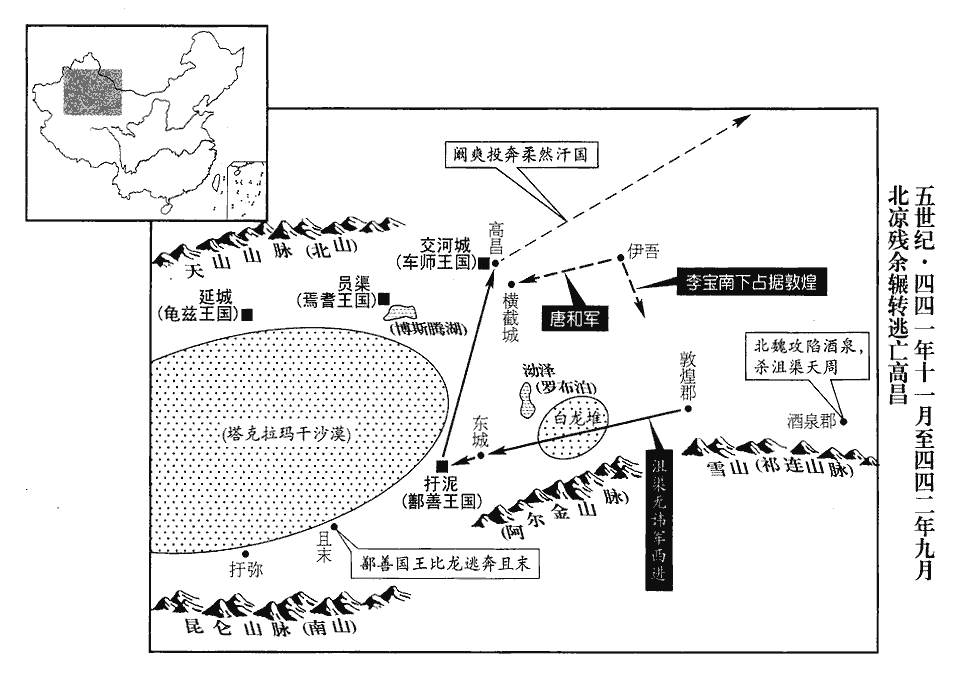
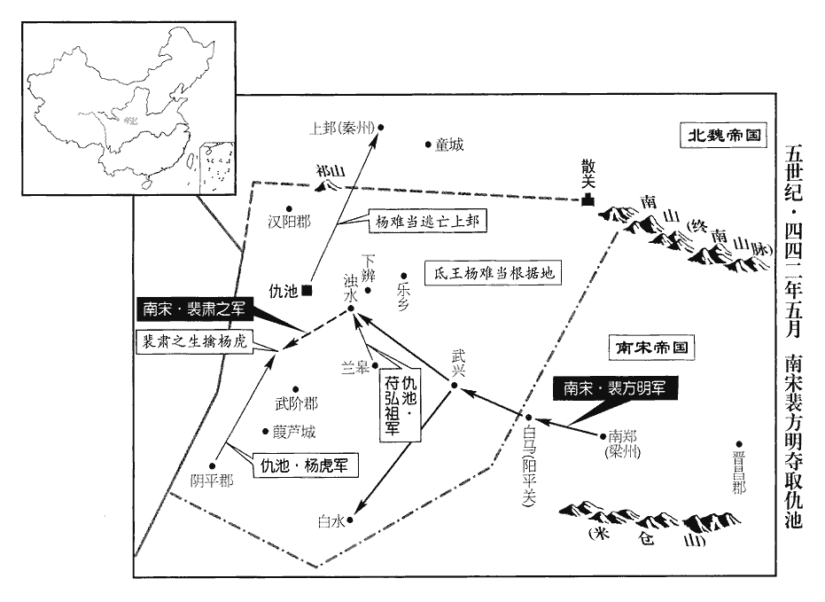
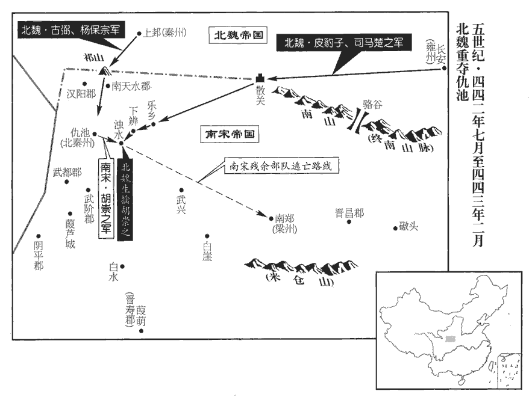
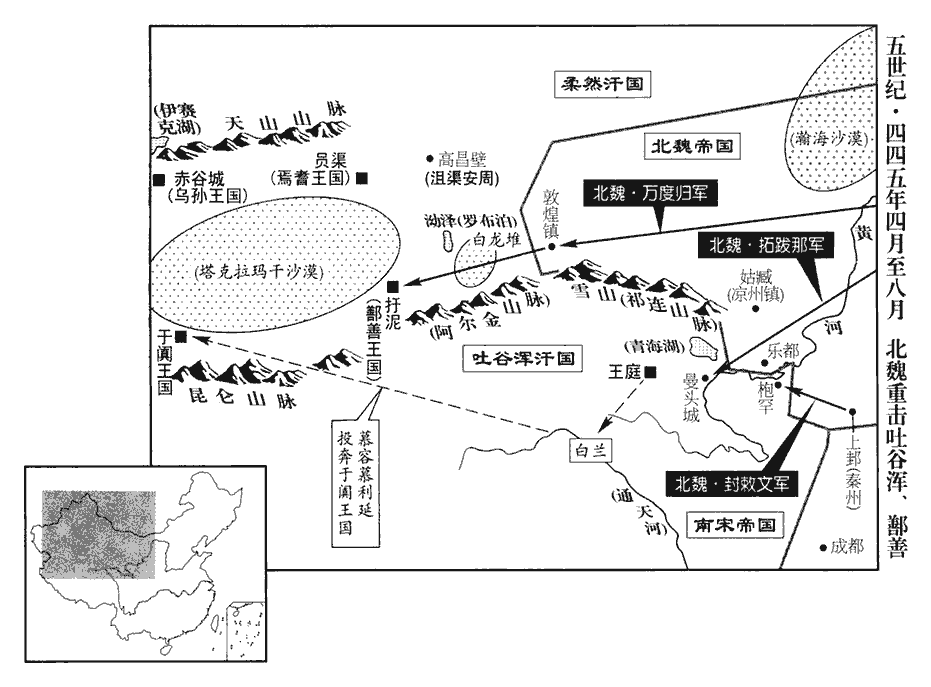
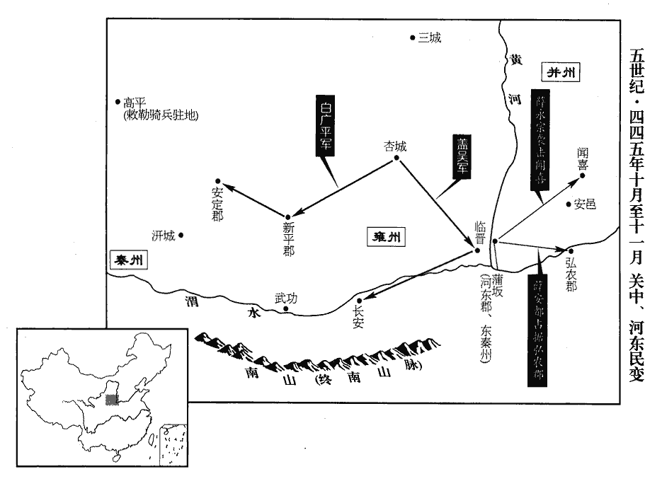
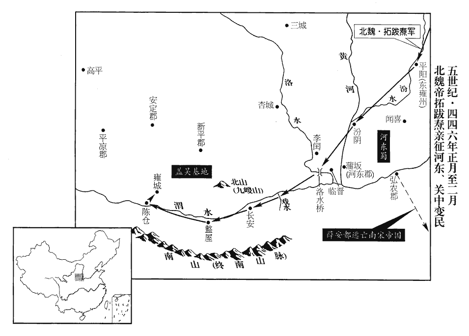

 宋紀六起玄黓敦牂（壬午），盡柔兆閹茂（丙戌），凡五年。

# 太祖文皇帝中之中

## 元嘉十九年（壬午、四四二）

1春，正月，甲申‹七›，魏主‹拓跋焘，时年三十五›備法駕，詣道壇受符籙lù，旗幟盡青。自是每帝卽位皆受籙。此所受者，今道士所謂法籙也。《隋志》曰：道士受道之法，初受《五千文籙》，次受《三洞籙》，次受《洞玄籙》，次受《上清籙》。籙皆素書，紀諸天曹官屬佐吏之名。又有諸符錯在其間，文章詭怪，世所不識。籙，龍玉翻。謙之又奏作靜輪宮，《水經註》：靜輪宮在道壇東北，道壇在平城東灅lěi水之左。必令其高不聞雞犬，欲以上接天神。崔浩勸帝爲之，功費萬計，經年不成。太子晃諫曰：「天人道殊，卑高定分，分，扶問翻。不可相接，理在必然。今虛耗府庫，疲弊百姓，爲無益之事，將安用之！必如謙之所言，請因東山萬仞之高，謂平城‹山西大同›之東山也。爲功差易。」易，以豉翻。帝不從。

〖译文〗 [1]春季，正月，甲申（初七），北魏国主拓跋焘备好车驾，打着全青色的旗帜来到道教神坛前接受符。从此以后，北魏每位皇帝即位时都要接受符。寇谦之又奏请建造静轮宫，并一定要建得很高，高到人在上面听不到鸡鸣犬吠之声，目的是想伸向天上与天神相接。宰相崔浩也力劝拓跋焘兴建，花费了数以万计的财力物力，建了几年仍未完工。太子拓跋晃劝谏太武帝说：“上天与世人的道不同，谁高谁低已有定分，二者不能相接，这是理所当然的事。现在我们白白地浪费财力物力，老百姓也累得疲惫不堪，做这种无益的事，干什么用呢？如果一定要照寇谦之所说的去做，我请求建造在万仞高的东山上，这样做，工事就容易些。”拓跋焘没有接受。

2夏，四月，沮渠無諱將萬餘家，棄敦煌‹甘肃敦煌›，西就沮渠安周。未至，鄯善‹都扜泥，新疆若羌›王比龍畏之，將其衆奔且末‹新疆且末›，沮，子余翻。將，卽亮翻。敦，徒門翻。鄯，上扇翻。且末，漢故國，在鄯善西，去代八千三百二十里。且，子餘翻。其世子降於安周。降，戶江翻。無諱遂據鄯善，其士卒經流沙渴死者太半。

〖译文〗 [2]夏季，四月，沮渠无讳率领一万多家舍弃敦煌，西去沮渠安周那里与他会合。还没有到，鄯善王比龙很害怕，率领人马逃到且末，他的嫡长子向沮渠安周投降。沮渠无讳于是占据了鄯善，但他的士卒在过沙漠地区时因干渴而死亡的人超过了一半。

李寶自伊吾‹新疆哈密›帥衆二千入據敦煌，帥，讀曰率。繕脩城府，安集故民。

〖译文〗 逃亡到伊吾的李宝这时又从伊吾率将士二千人进占了敦煌，修缮敦煌城府，安定集结当地百姓。

沮渠牧犍之亡也，見上卷十六年。犍，居言翻。涼州人闞爽據高昌‹新疆吐鲁番东›，自稱太守。唐契爲柔然‹瀚海沙漠群›所逼，擁衆西趨高昌，闞，苦濫翻。守，手又翻。趨，七喻翻。欲奪其地。柔然遣其將阿若追擊之，契敗死。營陽王景平元年，契與李寶同奔伊吾。契弟和收餘衆奔車師前部‹都交河城，新疆吐鲁番›王伊洛。時沮渠安周屯橫截城，和攻拔之，又拔高寧、白力二城，李延壽曰：高昌國有四十六鎭，交河、田地、高寧、白刃、橫截等；餘不具載。「白力」，當作「白刃」。遣使請降於魏。使，疏吏翻。

〖译文〗 沮渠牧犍从高昌逃走之后，凉州人阚爽占据了高昌并自封太守。唐契由于受柔然国逼迫难以忍受，于是率其部下西去高昌，并想攻取高昌。柔然派遣大将阿若追杀他们，唐契战败而亡。唐契的弟弟唐和召集残余将士投奔车师前部王伊洛。这时，沮渠安周正屯居在横截城，唐和攻克了横截城，又攻克了高宁、白力二城，并派遣使节前往北魏请降。

3甲戌‹二十八›，上‹刘义隆，时年三十六›以疾愈，大赦。

〖译文〗 [3]甲戌（二十八日），刘宋文帝刘义隆因病痊愈，实行大赦。

 

4五月，裴方明等至漢中‹陕西汉中›，與劉眞道等分兵攻武興‹陕西略阳›、下辯‹甘肃成县›、白水‹四川青川东沙洲乡›，皆取之。「下辯」，《漢書》作「下辨」。並，音皮莧翻。楊難當遣建節將軍符弘祖守蘭皋‹甘肃康县›，《元豐九域志》：階州將利縣有蘭皋鎭。按《五代志》，將利縣，後魏武興郡之石門縣也。蕭子顯曰：武興西北有蘭皋戍，去仇池二百里。「符」，恐當作「苻」；楊氏、苻氏，皆氐種也。使其子撫軍大將軍和將重兵爲後繼。方明與弘祖戰于濁水‹甘肃成县西›，濁水城在上祿縣東南，武街城西北。酈道元曰：濁水卽白水也。武街城故下辨縣治。大破之，斬弘祖；和退走，追至赤亭‹甘肃陇西东›，又破之。難當奔上邽‹甘肃天水›；獲難當兄子建節將軍保熾。難當以其子虎爲益州刺史，守陰平‹甘肃文县›，聞難當走，引兵還，至下辨；方明使其子肅之邀擊之，擒虎，送建康‹南京›，斬之；仇池‹甘肃西和南›平。以輔國司馬胡崇之爲北秦州刺史，鎭其地；立楊保熾爲楊玄後，使守仇池‹甘肃西和南›。楊難當廢玄子保宗而自立，見一百二十一卷六年。魏人遣中山王辰迎楊難當詣平城‹山西大同›。秋，七月，以劉眞道爲雍州‹府襄阳，湖北襄樊›刺史，雍，於用翻。裴方明爲梁、南秦二州‹府南郑，陕西汉中›刺史；方明辭不拜。《考異》曰：《眞道傳》，此事在胡崇之沒後；《氐胡傳》，崇之沒在明年二月；卽《眞道傳》誤。

〖译文〗 [4]五月，龙骧将军裴方明等抵达汉中，他联合梁州刺史刘真道等人分别派兵攻取了武兴、下辩、白水三地。杨难当派遣建节将军符弘祖据守兰皋城，又派他自己的儿子抚军大将军杨和率重兵作为他的后续部队。裴方明与符弘祖在浊水大战，裴方明大胜，将符弘祖斩首。杨和溃退而逃，裴方明追到了赤亭，又把杨和击败。杨难当逃奔到了上，裴方明生擒杨难当的侄子、建节将军杨保炽。杨难当任命自己的儿子杨虎为益州刺史，镇守阴平，杨虎听说杨难当离开上，便率兵返回，走到下辩时，裴方明已派他的儿子裴肃之赶来拦击，抓获杨虎，押送到建康斩首，仇池平定。刘宋朝廷派辅国司马胡崇之担任北秦州刺史，镇守该地；又命杨保炽承继杨玄王位，驻守仇池。北魏朝廷派遣中山王崐拓跋辰迎接杨难当到平城。秋季，七月，任命刘真道做雍州刺史，裴方明为梁、南秦二州刺史，但裴方明辞谢了。

丙寅‹二十二›，魏主使安西將軍古弼《考異》曰：《宋•索虜傳》作「吐奚愛弼」，《氐胡傳》作「吐奚弼」，蓋其舊姓。今從《後魏書》。督隴右諸軍及殿中虎賁賁，音奔。與武都王楊保宗自祁山‹甘肃礼县东北›南入，保宗奔魏見上卷十六年。征西將軍漁陽‹北京密云›皮豹子與琅邪王司馬楚之督關中諸軍自散關‹陕西宝鸡西南›西入，俱會仇池‹甘肃西和南›。又使譙王司馬文思督洛、豫諸軍南趨襄陽，營陽王景平二年，魏取河南，置洛州於洛陽‹河南洛阳东白马寺东›，豫州於虎牢‹河南荥阳西北汜水镇›。趨，七喻翻；下同。征南將軍刁雍東趨廣陵‹江苏扬州›，雍，於容翻。移書徐州‹江苏北部›，稱爲楊難當報仇。爲，于僞翻。

〖译文〗 丙寅（二十二日），北魏国主派安西将军古弼督统陇右各支军队及朝廷内的勇士与武都王杨保宗从祁山向南开进，征西将军渔阳人皮豹子与琅邪王司马楚之督统关中的诸路军队从散关向西开进，两路人马在仇池会师。又派谯王司马文思督统洛、豫各支部队南近襄阳，征南将军刁雍东近广陵，并派人将文告传送到徐州，声称替杨难当报仇。

 

5甲戌晦‹三十›，日有食之。

〖译文〗 [5]甲戌晦（疑误），出现日食。

6唐契之攻闞爽也，《考異》曰：《宋•氐胡傳》作「闕爽」。今從《後魏書》。爽遣使詐降於沮渠無諱，欲與之共擊契。使，疏吏翻。降，戶江翻。八月，無諱將其衆趨高昌‹新疆吐鲁番东›；比至，將，卽亮翻；下同。比，必利翻，及也。契已死，爽閉門拒之。九月，無諱將衛興奴夜襲高昌，屠其城，《考異》曰：《宋書》，「衛興奴」作「衛尞」，今從《後魏書》。爽奔柔然。無諱據高昌，遣其常侍氾雋奉表詣建康‹南京›。氾，音凡。詔以無諱都督涼•河•沙三州諸軍事、征西大將軍、涼州刺史、河西王。《考異》曰：《宋•本紀》，封爵在六月，《傳》在九月末。今從《傳》。

〖译文〗 [6]唐契向阚爽进攻，阚爽派使节诈降沮渠无讳，表示与沮渠无讳共同攻打唐契。八月，沮渠无讳率兵前往高昌，将要到达时，唐契已战死，阚爽紧闭城门拒绝会见沮渠无讳。九月，沮渠无讳带领卫兴奴夜袭高昌，血洗全城。阚爽投奔柔然。沮渠无讳占据高昌，派常侍隽带着奏表到了建康。刘宋文帝下诏任命沮渠无讳为都督凉、河、沙三州诸军事、征西大将军、凉州刺史和河西王。

7冬，十月，己卯‹六›，魏立皇子伏羅爲晉王，翰爲秦王，譚爲燕王，建爲楚王，余爲吳王。

〖译文〗 [7]冬季，十月，己卯（初六），北魏封皇子拓跋伏罗为晋王，拓跋翰为秦王，拓跋谭为燕王，拓跋建为楚王，拓跋余为吴王。

8甲申‹十一›，柔然遣使詣建康。

〖译文〗 [8]甲申（十一日），柔然派使节到宋都城建康。

9十二月，辛巳‹九›，魏襄城孝王盧魯元卒。

〖译文〗 [9]十二月，辛巳（初九），北魏襄城孝王卢鲁元去世。

10丙申‹二十四›，詔魯郡‹山东曲阜›脩孔子廟及學舍，蠲juān墓側五戶課役以供灑掃。灑，所賣翻，又所買翻。掃，素報翻，又蘇老翻。

〖译文〗 [10]丙申（二十四日），刘宋文帝下诏，让鲁郡修缮孔庙及学校房舍。免除孔子墓地附近五家住户的赋税差役，让他们清扫保护孔庙。

11李寶遣其弟懷達、子承奉表詣平城‹山西大同›；魏人以寶爲都督西垂諸軍事、遠邊曰垂。鎭西大將軍、開府儀同三司、沙州牧、敦煌公，敦，徒門翻。四品以下聽承制假授。

〖译文〗 [11]李宝派他的弟弟李怀达、儿子李承带着奏表到达平城。北魏任命李宝为都督西垂诸军事、镇西大将军、开府仪同三司、沙州牧和敦煌公。四品以下官员均由他秉承皇帝旨意全权委派。

12雍州刺史晉安襄侯劉道產卒。道產善爲政，民安其業，大小豐贍，由是民間有《襄陽樂歌》。雍，於用翻。贍，時豔翻。卒，子恤翻。樂，音洛。山蠻前後不可制者皆出，緣沔‹汉水›爲村落，戶口殷盛。及卒，蠻追送至沔口‹湖北武汉境›。未幾，羣蠻大動，道產卒未幾而羣蠻作亂，後之人不能容養之也。沔，彌兗翻。幾，居豈翻。征西司馬朱脩之討之，不利；詔建威將軍沈慶之代之，殺虜萬餘人。

〖译文〗 [12]刘宋雍州刺史晋安襄侯刘道产去世。刘道产善于治理政务，老百姓安居乐业，户户富庶，因此，民间流传有《襄阳乐歌》。一直藏在山中没人能制服的山蛮都走出深山，沿着沔水定居下来，而且人丁兴旺。刘道产死后，山蛮们一直送他的灵柩到沔口。不久，山蛮纷纷叛乱，征西司马朱之出兵讨伐，没有成功；文帝诏令建威将军沈庆之代替朱之前去讨伐山蛮，结果杀伤俘虏山蛮一万多人。

13魏主使尚書李順差次羣臣，賜以爵位；順受賄，品第不平。是歲，涼州人徐桀告之，魏主怒，且以順保庇沮渠氏，面欺誤國，事見上卷十六年。賜順死。

〖译文〗 [13]北魏国主让尚书李顺评定文武百官的等级，并据此来进行封赏赐爵。李顺接受贿赂，所定等级极不公平。这年，凉州人徐桀告发了他，认为李顺是在公开欺君误国，所以命令李顺自杀。

## 二十年（癸未、四四三）

1春，正月，魏皮豹子進擊樂鄕‹甘肃成县东北›，將軍王奐之等敗沒。魏軍進至下辯‹甘肃成县›，將軍強玄明等敗死。強，其兩翻。二月，胡崇之與魏戰於濁水‹甘肃成县西›，崇之爲魏所擒，餘衆走還漢中‹陕西汉中›。將軍姜道祖兵敗，降魏，降，戶江翻。魏遂取仇池‹甘肃西和南›。楊保熾走。

〖译文〗 [1]春季，正月，北魏征西将军皮豹子进犯乐乡，刘宋将军王奂之等战败，全军覆灭。北魏军队进抵下辩，刘宋将军强玄明等战败而亡。二月，刘宋刺史胡崇之与北魏军队在浊水相战，胡崇之被北魏所俘，剩余的部下士卒逃回汉中。将军姜道祖也大败，投降了北魏。北魏于是夺取了仇池。杨保炽逃走。

2丙午‹五›，魏主‹拓跋焘，时年三十六›如恆山‹河北曲阳北›之陽‹山之南、水之北皆为阳›；恆，戶登翻。三月，庚申‹二十›，還宮。

〖译文〗 [2]丙午（疑误），北魏国主前往恒山之南。三月，庚申（二十日），魏主回到皇宫。

 

3壬戌‹二十二›，烏洛侯國‹内蒙东北大兴安岭东麓›遣使如魏。烏洛侯國在地豆干國北，去代四千五百餘里。地豆干在室韋西千餘里，室韋當勿吉之北，勿吉在高麗之北，則烏洛侯東夷也。使，疏吏翻。初，魏之居北荒也，鑿石爲廟‹内蒙鄂伦春旗嘎仙洞›，在烏洛侯西北，以祀其先，高七十尺，深九十步。度高曰高，音居號翻。度深曰深，音式禁翻。及烏洛侯使者至魏，言石廟具在，魏主遣中書侍郎李敞詣石廟致祭，刻祝文於壁而還，去平城‹山西大同›四千餘里。

〖译文〗 [3]壬戌（二十二日），乌洛侯国派使节前往北魏。当初，北魏居住在荒凉的北方边地的时候，在乌洛侯国的西北祭祀祖先，凿石头建寺庙，高七十尺、深九十步。乌洛侯使者到达北魏的时候，说石庙仍在，魏主便派中书侍郎李敞到石庙去祭祀。李敞在石庙的墙壁上刻下祝文后返回。石庙距平城四千多里。

4魏河間公齊與武都王楊保宗對鎭雒谷‹陕西周至西南›，雒谷，卽駱谷，《北史》作「駱」。保宗弟文德說保宗，令閉險自固以叛魏。說，輸芮翻。或以告齊，夏，四月，齊誘執保宗，送平城，殺之。前鎭東司苻達、「司」上當有「軍」字；否則「司」下當有「馬」字。【章：十二行本「司」下正有「馬」字；孔本同；張校同。】征西從事中郎任朏fěi等苻達等皆楊氏官屬也。任，音壬。朏，敷尾翻。遂舉兵立楊文德爲主，據白崖‹陕西宁强东北›，今大安軍東北八十里有白崖。大安軍，古葭萌地也。《考異》曰：《宋•氐胡傳》云：「拓跋齊聞兵起，遁走，達追擊斬齊，因據白崖。」按《後魏•河間公齊傳》云：「文德求援於宋，宋遣房亮之、苻昭、啖龍等帥衆助文德，斬龍，禽亮之，氐遂平，以功拜內都大官，卒。」然則《宋書》誤也。分兵取諸戍，進圍仇池，自號征西將軍、秦•河•梁三州牧、仇池公。《考異》曰：《宋書》在三月；《魏書》在四月，今從之。

〖译文〗 [4]北魏河间公拓跋齐和武都王杨保宗分别驻守在谷两旁。杨保宗的弟弟杨文德劝杨保宗据守险要，以此背叛北魏。有人将此报告给了拓跋齐。夏季，四月，拓跋齐诱使杨保宗前来并抓住了他，将他押送平城斩首。前任镇东将军苻达、征西从事中郎任等于是起兵立杨文德为盟主，占据白崖，分几路大军夺取各个据点，进兵包围了仇池，杨文德自封为征西将军，秦、河、梁三州牧和仇池公。

5甲午‹二十四›，立皇子誕爲廣陵王。

〖译文〗 [5]甲午（二十四日），刘宋立皇子刘诞为广陵王。

6丁酉‹二十七›，魏大赦。

〖译文〗 [6]丁酉（二十七日），北魏实行大赦。

7己亥‹二十九›，魏主如陰山。

〖译文〗 [7]己亥（二十九日），北魏国主拓跋焘前去阴山。

8五月，魏古弼發上邽‹甘肃天水›、高平‹宁夏固原›、岍城‹陕西陇县›諸軍擊楊文德，「岍qiān城」，意當作「汧qiān城」。汧，口堅翻。文德退走。皮豹子督關中諸軍至下辯‹甘肃成县›，聞仇池‹甘肃西和南›解圍，欲還；弼遣人謂豹子曰：「宋人恥敗，必將復來。復，扶又翻。軍還之後，再舉爲難，不如練兵蓄力以待之。不出秋冬，宋師必至；以逸待勞，無不克矣。」豹子從之。魏以豹子爲仇池鎭將。

〖译文〗 [8]五月，北魏安西将军古弼征发上、高平、城等地的几支军队进攻杨文德，杨文德退走。征西将军皮豹子督统关中各路大军到下辩，听说仇池解除围困，打算回去。古弼马上派人对皮豹子说：“宋国耻于这次战败，一定会再回来。你的军队回去之后，再次举兵是很难的，不如在此训练士卒，积蓄力量等待宋兵。出不了秋冬二季，宋军一定会来。我们以逸待劳，没有不能攻克的。”皮豹子听从了他的话。北魏任命皮豹子做仇池镇将。

楊文德遣使來求援。使，疏吏翻。秋，七月，癸丑‹十四›，詔以文德爲都督北秦•雍二州諸軍事、征西大將軍、北秦州刺史、武都王。雍，於用翻。文德屯葭蘆城‹甘肃武都东南›，《五代志》：武都郡盤堤縣，西魏之南五部縣也。魏又置武陽郡及茄蘆縣，後周皆併入盤堤。祝穆曰：盤池山在階州福津縣東南七十里。《郡縣志》：魏將鄧艾與蜀將姜維相持於此，置茄蘆戍，後於此置縣。以任朏fěi爲左司馬；武都‹甘肃武都›、陰平‹甘肃文县›氐多歸之。

〖译文〗 杨文德派使节来宋求援。秋季，七月，癸丑（十四日），刘宋文帝下诏，任命杨文德为都督北秦、雍二州诸军事，征西大将军，北秦州刺史，武都王。杨文德屯兵葭芦城，任命任为左司马。武都、阴平一带的氐人大多归附于他。

9甲子‹二十五›，前雍州‹府襄阳，湖北襄樊›刺史劉眞道、梁•南秦二州‹府南郑，陕西汉中›刺史裴方明坐破仇池減匿金寶及善馬，下獄死。宋人捨功錄過，自戮良將，宜其爲魏人所窺。下，遐稼翻。

〖译文〗 [9]甲子（二十五日），刘宋前雍州刺史刘真道，梁、南秦二州刺史裴方崐明被查出在仇池侵吞金银财宝及良马一事，被抓进牢狱，处以死刑。

10九月，辛巳‹三›，魏主如漠‹瀚海沙漠›南。甲辰‹六›，捨輜重，重，直用翻。以輕騎襲柔然，騎，奇寄翻；下同。分軍爲四道：樂安王範、建寧王崇各統十五將出東道，樂平王丕督十五將出西道，魏主出中道，中山王辰督十五將爲後繼。將，卽亮翻。

〖译文〗 [10]九月，辛己（疑误），北魏国主前往漠南。甲辰（初六），魏军舍弃辎重，率轻骑袭击柔然。分兵四路：乐安王拓跋范、建宁王拓跋崇各率十五名将领从东路进军，乐平王拓跋丕督统十五名将领从西路进军，北魏国主从中路进军，中山王拓跋辰督统十五名将领作为后援。

魏主至鹿渾谷‹蒙古哈尔和林北›，鹿渾谷卽鹿渾海之谷也，本高車袁紇部所居，其地直平城西北，其東卽弱洛水。遇敕連可汗‹郁久闾吴提›。可，從刊入聲。汗，音寒。太子晃言於魏主曰：「賊不意大軍猝至，宜掩其不備，速進擊之。」尚書令劉絜固諫，以爲「賊營中塵盛，其衆必多，出至平地，恐爲所圍，不如須諸軍大集，須，待也。然後擊之」。晃曰︰「塵之盛者，由軍士驚怖擾亂故也，怖，普布翻。何得營上而有此塵乎！」魏主疑之，不急擊。柔然遁去，追至石水‹蒙古色楞格河上游楚鲁特河›，不及而還。石水在頞è根河北。還，從宣翻，又如字。旣而獲柔然候騎曰：「柔然不覺魏軍至，上下惶駭，引衆北走，經六七日，知無追者，乃始徐行。」魏主深恨之。爲魏誅劉絜、中山王辰等張本。自是軍國大事，皆與太子謀之。

〖译文〗 北魏国主来到鹿浑谷，正好与柔然国的敕连可汗相遇。太子拓跋晃对北魏国主说：“柔然贼兵没想到我们的大部队突然到此，我们该趁他们没有防备时立刻进攻。”尚书令刘却竭力劝阻，他认为：“柔然军营中尘土很大，他们的人一定很多，到平地去与他们交战，恐怕会被柔然军队包围，不如等到各路大军会集到这里之后再攻打。”拓跋晃说：“柔然军营尘土飞扬，是因为柔然士卒惊慌失措到处乱跑所造成的，不然，怎么会在军营上空有如此多的尘土呢！”北魏国主为此也将信将疑，没有马上攻打。柔然部队趁机逃走，北魏国主追到石水，没有追上而返回。不久，俘获了柔然的侦察骑兵说：“柔然国没有发觉魏兵的到来，所以当得知魏兵已到时，整个军营慌作一团，敕连可汗赶快率将士向北而逃，跑了六七天，知道后面没有追赶的魏兵，才开始缓步行进。”北魏国主听后非常后悔。从此以后，每遇军队或国家大事，北魏国主都要和拓跋晃商量。

司馬楚之別將兵督軍糧，鎭北將軍封沓亡降柔然，說柔然令擊楚之以絕軍食。降，戶江翻。說，輸芮翻。俄而軍中有告失驢耳者，諸將莫曉其故，楚之曰：「此必賊遣姦人入營覘伺，覘，丑廉翻，又丑豔翻。伺，相吏翻。割驢耳以爲信耳。賊至不久，宜急爲之備。」乃伐柳爲城，以水灌之令凍；城立而柔然至，冰堅滑，不可攻，乃散走。

〖译文〗 琅邪王司马楚之另外率领一支部队督运军粮。镇北将军封沓逃走归降柔然，他劝说柔然攻打司马楚之，以断绝北魏兵士的粮饷。不久，司马楚之军中有人报告说有一只驴子的耳朵没有了，各位将领不知这是什么缘故，司马楚之说：“这一定是贼军派奸人偷偷到我们这里察看动静，割掉一只驴的耳朵作为证据。贼军马上就会来进犯，我们应该迅速做好准备。”于是，司马楚之命砍伐柳树建造城堡，然后把水浇在上面使之结冰。城堡刚刚建好，柔然兵就到了，由于城堡地面冰坚而滑，柔然兵无法攻城，于是就撤走了。

11十一月，將軍姜道盛與楊文德合衆二萬攻魏濁水戍，魏皮豹子、河間公齊救之，道盛敗死。

〖译文〗 [11]十一月，刘宋将军姜道盛同杨文德合兵共二万人，攻打北魏的浊水戍。北魏皮豹子和河间公拓跋齐赶来营救，姜道盛战败身亡。

甲子‹二十七›，魏主還，至朔方‹河套地区›，下詔令皇太子副理萬機，總統百揆。《考異》曰：《宋•索虜傳》：「晃與大臣崔氏、寇氏不睦，崔、寇譖之。玄高道人有道術，晃使祈福，七日七夜。佛貍夢其祖父並怒，手刃向之曰：『汝何故信讒，欲害太子！』佛貍驚覺，下僞詔曰：『王者大業，篡承爲重，儲宮嗣紹，百王舊例。自今以往，事無巨細，必經太子然後上聞。』」事節小異，今從《後魏書》。且曰：「諸功臣勤勞日久，皆當以爵歸第，隨時朝請，饗宴朕前，論道陳謨而已，不宜復煩以劇職；朝，直遙翻。復，扶又翻。更舉賢俊以備百官。」十二月，丁【章：十二行本「丁」作「辛」；乙十一行本同；孔本同；退齋校同。】卯‹一›，魏主還平城。自伐柔然還也。

〖译文〗 [12]甲子（二十七日），北魏国主拓跋焘在返回京城的途中来到朔方，下诏让太子拓跋晃协佐总管全国日常事务，统领文武百官。拓跋焘还说：“各位功臣劳苦很长时间了，都应该按自己的爵位回到府中去养老。按时朝见或在朕面前参加宴会，谈论一些治国之道，陈述一下自己的见解，这样也就可以了。不适于再担任繁重的职务来劳烦自身。我们要另外推荐贤能俊才来完备百官职位。”十二月，丁卯（初一），北魏国主返回平城。

## 二十一年（甲申、四四四）

1春，正月，己亥‹三›，帝‹刘义隆，时年三十八›耕藉田，大赦。藉，秦昔翻。《考異》曰：《宋略》「辛酉，藉田，大赦」下有「戊午」，又有「辛酉」，誤也。今從《宋書》。

〖译文〗 [1]春季，正月，己亥（初三），刘宋文帝举行亲耕仪式，实行大赦。

2壬寅‹六›，魏太子‹拓跋晃›始總百揆，命侍中•中書監穆壽、司徒崔浩、侍中張黎、古弼輔太子決庶政，上書者皆稱臣，儀與表同。

〖译文〗 [2]壬寅（初六），北魏太子拓跋晃开始总管百官事务。拓跋焘任命中侍、中书监穆寿，司徒崔浩，侍中张黎、古弼辅佐太子拓跋晃裁决日常政务。凡上书给太子时都要称臣，礼仪与所称呼的尊卑一致。

古弼爲人，忠愼質直；嘗以上谷‹河北怀来›苑囿太廣，乞減太半以賜貧民，入見魏主‹拓跋焘，时年三十七›，欲奏其事。據《北史•古弼傳》：「時上谷人上書，言苑囿過度，人無田業，宜減太半以賜貧者。」蓋上谷距代都甚遠，魏未嘗置苑囿於其地。而道武帝起鹿苑於南臺陰，北距長城，東苞白登，屬之西山，廣輪數十里。天興六年，幸南平城，規度灅南夏屋山背黃瓜堆以建新邑。至天賜三年，遂築灅南宮闕，引溝穿池，廣苑囿，所謂太廣者此也，不在上谷。當以《北史》爲正。見，賢遍翻。帝方與給事中劉樹圍碁，志不在弼；弼侍坐良久，不獲陳聞。坐，徂臥翻。忽起，捽樹頭，捽zuó，昨沒翻。掣chè下牀，搏其耳，毆其背，掣，尺列翻。毆，烏口翻。曰：「朝廷不治，實爾之罪！」治，直之翻。帝失容，捨碁曰：「不聽奏事，朕之過也，樹何罪！置之！」弼具以狀聞，帝皆可其奏。弼曰：「爲人臣無禮至此，其罪大矣。」出詣公車，免冠徒跣請罪。帝召入，謂曰：「吾聞築社之役，蹇蹶而築之，蜀《註》曰：跛蹇而顚蹶也。端冕而事之，神降之福。然則卿有何罪！其冠履就職。苟可以利社稷，便百姓者，竭力爲之，勿顧慮也。」

〖译文〗 古弼为人忠厚谨慎，善良正直，曾经因为上谷的皇家苑囿占地面积太大而请求减去一半面积，赐给贫民百姓。当他进宫晋见拓跋焘，打算奏请这件事时，拓跋焘正在同给事中刘树下围棋，他的心思没在古弼身上。古弼坐等许久，没有得到说话的机会，他忽然跳起来，揪住刘树的头发，把他拉下床，揪着他的耳朵殴打他的后背，说：“朝廷没有治理好，实在是你的罪过！”拓跋焘大惊失色，放下棋子说：“不听你奏请事情，是我的过错，刘树有什么罪过！放了他！”古弼把要奏请的事情全都说了出来，拓跋焘完全同意。古弼说：“我身为臣属，竟无礼到这种程度，罪过实在太大。”说完出宫来到公车官署，脱掉帽子、光着脚请求处罚。拓跋焘召他入宫，对他说：“我听说过建造社坛的工事，是要一跛一拐地去干活；完工后，要衣冠端正地去祭祀，神灵就降福于他。可是你有什么罪过呢！戴上帽子穿上鞋做你该做的事去吧。如果是对国家有利，方便百姓的事，就要尽全力去做，不要有任何顾虑。”

太子‹拓跋晃›課民稼穡，使無牛者借人牛以耕種，而爲之芸田以償之，爲，于僞翻。凡耕種二十二畝而芸七畝，大略以是爲率。使民各標姓名於田首以知其勤惰，禁飲酒遊戲者。於是墾田大增。

〖译文〗 太子拓跋晃督促百姓种庄稼，让没有牛的人家去向有牛的人家借牛来耕种，然后再替有牛的人家锄地来作为偿还，通常是耕种二十二亩，替人家锄地七亩，大概都以这种比例来进行。让百姓把自己的姓名标在地头，这样就可以看到谁勤谁懒。同时，禁止百姓喝酒和游玩。因此，开垦的农田大大增加。

3戊申‹十二›，魏主詔：「王、公以下至庶人，有私養沙門、巫覡於家者，男曰巫，女曰覡。覡xí，刑狄翻。皆遣詣官曹；過二月十五日不出，沙門、巫覡死，主人門誅。」門誅者，闔門盡誅之。庚戌‹十四›，又詔：「王、公、卿、大夫之子皆詣太學，其百工、商賈之子，當各習父兄之業，賈，音古。毋得私立學校；校，戶敎翻。違者，師死，主人門誅。」

〖译文〗 [3]戊申（十二日），北魏国主拓跋焘下诏说：“王公以下直到平民，私自在家供养僧侣、男女巫师的人都要送到官府。超过二月十五日而不交出者，处死僧侣和巫师，私藏者满门抄斩。”庚戌（十四日），又下诏说：“王、公、卿、大夫的儿子都要送到太学读书，而百工、商人之子，都要学习并继承父兄的职业，不能私设学校。违犯规定的，老师处死，当事人全家抄斩。”

4二月，辛未‹六›，魏中山王辰、內都坐大官薛辨、魏置中都大官、外都大官、都坐大官，皆掌折獄，謂之三都。坐，徂臥翻。尚書奚眷等八將將，卽亮翻；下同。坐擊柔然後期，斬於都南。

〖译文〗 [4]二月，辛未（初六），北魏中山王拓跋辰、内都坐大官薜辨、尚书奚眷等八名将领因在攻打柔然时没能按时到达，在平城南郊被斩首。

初，魏尚書令劉絜，久典機要，宋高祖永初末，魏明元帝寢疾，魏主監國，劉絜與古弼等選侍東宮，對綜機要，至是二十餘年矣。恃寵自專，魏主心惡之。惡，烏路翻。及將襲柔然，絜諫曰：「蠕蠕遷徙無常，前者出師，勞而無功，絜之言蓋指太延四年魏主伐柔然至白阜時也。蠕，人兗翻。不如廣農積穀以待其來。」崔浩固勸魏主行，魏主從之。絜恥其言不用，欲敗魏師；敗，補邁翻。魏主與諸將期會鹿渾谷‹蒙古哈尔和林北›，絜矯詔易其期。帝至鹿渾谷【章：十二行本「谷」下有「欲擊柔然，絜諫止之，使待諸將。帝留鹿渾谷」十七字；乙十一行本同；孔本同；張校同。】六日，諸將不至，柔然遂遠遁，追之不及。軍還，經漠中‹瀚海沙漠群›，糧盡，士卒多死。絜陰使人驚魏軍，勸帝委軍輕還，帝不從。絜以軍出無功，請治崔浩之罪。治，直之翻；下同。帝曰：「諸將失期，遇賊不擊，浩何罪也！」浩以絜矯詔事白帝，帝至五原‹内蒙包头›，收絜，囚之。帝之北行也，絜私謂所親曰：「若車駕不返，吾當立樂平王。」絜聞尚書右丞張嵩家有圖讖，問曰︰「劉氏應王，繼國家後，吾有姓名否？」嵩曰：「有姓無名。」帝聞之，命有司窮治，索嵩家，得讖書。索，山客翻。事連南康公狄鄰，絜、嵩、鄰皆夷三族，死者百餘人。絜在勢要，好作威福，好，呼到翻。諸將破敵，所得財物皆與絜分之。旣死，籍其家，財巨萬，帝每言之則切齒。

〖译文〗 当初，北魏尚书令刘长期主管朝廷机要事务，他依仗主上的宠信，独断专行，北魏国主拓跋焘厌恶他。北魏要去攻袭柔然汗国时，刘劝谏说：“蠕蠕经常迁徙，没有固定居处，上次我们出兵，劳而无功，不如扩大农业生产、广屯粮食，等待他们前来。”司徒崔浩则坚持劝拓跋焘前去征讨，拓跋焘接受了他的建议。刘为自己的建议未被采纳而感到羞愧，打算想办法使北魏军队打败仗。拓跋焘与各位将领约好日期在鹿浑谷会师，刘却假传诏令，私改了日期。拓跋焘到达鹿浑谷已经六天，其他将领还未到达，柔然王于是远远逃走，北魏将士追赶而未追上。北魏军队回师，途经沙漠地带，粮食已经吃完，将士死了很多。刘又私下派人惊扰魏军军心，刘本人力劝拓跋焘抛下军队自己轻装回京，拓跋焘没有接受。刘以这次军队出师无功而要求追究崔浩的罪责。拓跋焘说：“各路将领延误了会师日期，我自己遇上贼兵而没有攻打，崔浩有什么罪呢！”崔浩把刘假传诏令之事告诉了拓跋焘，拓跋焘抵达五原，将刘逮捕囚禁起来。拓跋焘北征时，刘暗中对与他亲近的人说：“如果车驾回不来了，我就拥立乐平王拓跋丕做皇帝。”刘听说尚书右丞张嵩家藏有图谶，就问张嵩：“刘氏应该称王，承继国家以后的大业，那里有我的姓名吗？”张嵩说：“有姓而没有名。”拓跋焘听到这件事后，命令有关部门严厉追究查治，搜查张嵩家宅，果然得到了那本谶书。这件事还牵连了南康公狄邻。最终，刘张嵩和狄邻都被屠灭三族，死了一百多人。刘在位时，喜欢作威作福，将领们打败了敌人，得到的财宝都要与他同分。刘被处死后，查抄他的家，财产以万万计。太武帝每次谈起这件事都恨得咬牙切齿。

癸酉‹八›，樂平戾王丕以憂卒。初，魏主築白臺，高二百餘尺。魏主嗣泰常二年秋七月乙酉，起白臺於平城南，高二十丈。丕夢登其上，四顧不見人，命術士董道秀筮之，道秀曰：「大吉。」丕默有喜色。及丕卒，道秀亦坐棄市。高允聞之，曰：「夫筮者皆當依附爻象，勸以忠孝。漢嚴君平卜筮於成都市，人有邪惡非正之間，則依蓍龜爲言利害，與人子言依於孝，與人弟言依於順，與人臣言依於忠︰各因勢道之以善。高允之言，祖君平之術也。王之問道秀也，道秀宜曰：『窮高爲亢。《易》曰：「亢龍有悔，」又曰：「高而無民，」《易•乾》上九及《文言》之辭。亢，苦浪翻。皆不祥也，王不可以不戒。』如此，則王安於上，身全於下矣。道秀反之，宜其死也。」

〖译文〗 癸酉（初八），乐平戾王拓跋丕忧虑过度而去世。当初，北魏国主曾建造白台，高二百多尺。拓跋丕梦见自己登上了白台，四处望去却不见人影，他叫术士董道秀为他占卜，董道秀说：“大吉。”拓跋丕面露喜色。等到拓跋丕去世，董道秀也因罪被押往刑场斩首。高允听说这件事后，说：“占卜的人都应当按照六爻的形象去规劝人们忠于国家孝敬父母。乐平王向董道秀问卦时，董道秀应该说：‘高到极点就是亢。《易经》说：“亢龙有悔”，又说：“高则无民”，都是不吉祥的兆头，乐平王不能不以此为戒。’如果这样，在上，乐平王平安无事；在下，董道秀保全性命。董道秀却反其道而行之，他当然应该被处死。”

5庚辰‹十五›，魏主幸廬‹山西临猗西北›。自南、北國分治，人主所至，例不書幸，此必誤也。

〖译文〗 [5]庚辰（十五日），北魏国主来到卢地。

6己丑‹二十四›，江夏王義恭進位太尉，領司徒。夏，戶雅翻。

〖译文〗 [6]己丑（二十四日），刘宋江夏王刘义恭晋升太尉，兼任司徒。

7庚寅‹二十五›，以侍中、領右衛將軍沈演之爲中領軍，左衛將軍范曄爲太子詹事。

〖译文〗 [7]庚寅（二十五日），刘宋任命侍中、兼右卫将军沈演之为中领军，左卫将军范晔为太子詹事。

8辛卯‹二十六›，立皇子宏爲建平王。

〖译文〗 [8]辛卯（二十六日），刘宋立皇子刘宏为建平王。

9三月，甲辰‹九›，魏主還宮。

〖译文〗 [9]三月，甲辰（初九），北魏国主回到皇宫。

10癸丑‹十八›，魏主遣司空長孫道生鎭統萬‹陕西靖边北白城子›。長，知兩翻。

〖译文〗 [10]癸丑（十八日），北魏国主派司空长孙道生镇守统万。

11夏，四月，乙亥‹十一›，魏侍中、太宰、陽平王杜超爲帳下所殺。

〖译文〗 [11]夏季，四月，乙亥（十一日），北魏侍中、太宰、阳平王杜超被手下的卫士杀死。

12六月，魏北部民殺立義將軍衡陽公莫孤，帥五千餘落北走，遣兵追擊之，至漠南，殺其渠帥，餘徙冀‹府信都，河北冀县›、相‹府邺城，河北临漳西南邺镇›、定‹府中山，河北定州›三州爲營戶。杜佑曰：魏道武天興中，詔採漏戶，令輸綸綿。自後諸逃戶占爲紬chóu繭羅縠hú者甚衆，於是雜營戶率徧於天下，不隸守宰，賦役不同；景穆皇帝一切罷之，以屬郡縣。孤帥，讀曰率；渠帥，所類翻。相，息亮翻。

〖译文〗 [12]六月，北魏北方地区百姓杀了立义将军衡阳公莫孤，聚集五千多帐落崐向北逃去，北魏朝廷派兵前去追击，追到漠南，杀了他们的首领，其余的百姓则迁到冀、相、定三州成为营户。

13吐谷渾‹青海›王慕利延兄子緯世與魏使者謀降魏，緯世，卽阿柴之長子緯代也，《北史》避唐太宗諱，改「世」爲「代」。使，疏吏翻。降，戶江翻。慕利延殺之。是月，緯世弟叱力延等八人奔魏，魏以叱力延爲歸義王。

〖译文〗 [13]吐谷浑可汗慕容慕利延的侄子慕容纬世同北魏使节密谋要向北魏投降，慕容慕利延杀了他。这个月，慕容纬世的弟弟慕容叱力延等八人投奔北魏，北魏朝廷封慕容叱力延为归义王。

14沮渠無諱卒，沮，子余翻。弟安周代立。

〖译文〗 [14]沮渠无讳去世，其弟沮渠安周代替他为王。

15魏入中國以來，雖頗用古禮祀天地、宗廟、百神，而猶循其舊俗，所祀胡神甚衆。崔浩請存合於祀典者五十七所，其餘複重及小神悉罷之。重，直龍翻。魏主從之。

〖译文〗 [15]北魏进入中原以来，虽然也常常使用古代礼仪来祭祀天地、祖庙和各种神灵，却仍在沿循旧有习俗，祭祀的胡族神很多。司徒崔浩请求只留下符合祭祀典章的五十七所寺庙，其余重复的寺庙和过小的神祗都取消。北魏国主同意他的建议。

16秋，七月，癸卯‹十›，魏東雍州‹府禽昌，山西临汾›刺史沮渠秉謀反，伏誅。《隋志》：絳郡，後魏置東雍州，後周改曰絳州。雍，於用翻。

〖译文〗 [16]秋季，七月，癸卯（初十），北魏东雍州刺史沮渠秉图谋造反，被朝廷处死。

17八月，乙丑‹三›，魏主畋于河西‹河套地区›，尚書令古弼留守。守，手又翻。詔以肥馬給獵騎，弼悉以弱者給之。帝大怒曰：「筆頭奴敢裁量朕！騎，奇寄翻。量，音良。朕還臺，先斬此奴！」弼頭銳，故帝常以筆目之。弼官屬惶怖，恐幷坐誅，怖，普布翻。弼曰：「吾爲人臣，不使人主盤于遊畋，盤，樂也。其罪小；不備不虞，乏軍國之用，其罪大。今蠕蠕方強，南寇未滅，吾以肥馬供軍，弱馬供獵，爲國遠慮，爲，于僞翻。雖死何傷！且吾自爲之，非諸君之憂也。」帝聞之，歎曰：「有臣如此，國之寶也。」賜衣一襲，衣一稱爲一襲，猶今言一副衣服也。馬二匹，鹿十頭。

〖译文〗 [17]八月，乙丑（初三），北魏国主拓跋焘去河西狩猎，尚书令古弼留守平城。拓跋焘下诏让古弼将肥壮的马送给打猎骑兵，但古弼提供的却全是瘦弱的马。拓跋焘勃然大怒说：“笔头奴胆敢对我的诏令打折扣。我回去，先折了这个奴才！”古弼的头长得很尖，拓跋焘经常把他的脑袋比作笔尖。古弼的属下官员惶然恐怖，唯恐自己受牵连被杀。古弼却说：“我身为人臣，不让人主沉湎于游玩狩猎之中，这个罪过是小的。如果不预防国家出现的不测之事，使国家缺少军队所用的物资，这个罪过才是大的。现在蠕蠕正处于强盛时期，南方贼寇还未消灭，我把肥壮的马供军队所用，瘦弱的马供打猎所用，这是为国家做长远打算，虽然被处死了又有什么关系呢？！况且这一切是我一个人所做的，你们不要担心。”拓跋焘听说后，感叹说：“我有这样的臣子，是国家之宝呀。”赏赐给古弼一套礼服、两匹马和十头鹿。

他日，魏主復畋於山‹武周山›北，山北，平城北山之北。復，扶又翻。獲糜鹿數千頭。詔尚書發車五百乘以運之。觀下載弼表，蓋發民車也。乘，繩證翻。詔使已去，魏主謂左右曰：「筆公必不與我，汝輩不如以馬運之。」遂還。行百餘里，得弼表曰：「今秋穀懸黃，麻菽布野，豬鹿竊食，鳥鴈侵費，風雨所耗，朝夕三倍。言夕之所收，較於朝之所收得失三倍，收穫不可以不速，載糜鹿猶可緩。乞賜矜緩，使得收載。」帝曰：「果如吾言，筆公可謂社稷之臣矣！」

〖译文〗 又一天，拓跋焘再次去山北打猎，捕获了几千头麋鹿。拓跋焘下诏给尚书，让尚书派出五百辆车来运送麋鹿。拿着诏书的信使已经走了，拓跋焘对左右将士说：“笔头公一定不会给我这么多车，你们不如用马来运送。”说完他就回宫了。拓跋焘刚走了一百多里，就收到古弼的奏表说：“今年秋天谷穗下垂而且颜色金黄，桑麻大豆遍布在田野里，野猪野鹿偷吃，飞鸟大雁啄食，加之风吹雨打，这样损耗早晚就会相差三倍。乞请允许推迟延缓运送麋鹿，以便把谷子尽快收割运送完毕。”拓跋焘说：“果然如我所说的那样，笔头公可称得上是国家栋梁之臣啦！”

18魏主使員外散騎常侍高濟來聘。散，悉亶翻。騎，奇寄翻。

〖译文〗 [18]北魏国主拓跋焘派员外散骑常侍高济去刘宋探访。

19戊辰‹六›，以荊州‹府江陵，湖北江陵›刺史衡陽王義季爲征北大將軍、開府儀同三司、南兗州‹府广陵，江苏扬州›刺史，以南譙王義宣爲荊州刺史。初，帝‹刘义隆›以義宣不才，故不用，會稽公主‹刘兴弟›屢以爲言，帝不得已用之。會稽公主，高祖長女，帝深加禮敬，家事大小必咨之。會，工外翻。先賜中詔敕之曰：「師護以在西久，詔自中出，不經門下者，謂之中詔，今之手詔是也。敕，戒也。義季，小字師護。比表求還，比，毗至翻，頻也。今欲聽許，以汝代之。師護雖無殊績，絜己節用，絜，與潔同。通懷期物，不恣羣下，聲著西土，爲士庶所安，論者乃未議遷之。今之回換，更爲汝與師護年時一輩，爲，于僞翻。欲各試其能。汝往，脫有一事減之者，旣於西夏交有巨礙，江左六朝以荊楚爲西夏。夏，戶雅翻。遷代之譏，必歸責於吾矣。言遷代之際，所任非人也。此事亦易勉耳，無爲使人復生評論也！」易，以豉翻。復，扶又翻。義宣至鎭，勤自課厲，事亦脩理。

〖译文〗 [19]戊辰（初六），刘宋朝廷任命荆州刺史衡阳王刘义季为征北大将军、开府仪同三司和南兖州刺史，南谯王刘义宣为荆州刺史。当初，文帝认为刘义宣没有什么才能，因而不用他，姐姐会稽公主总是替刘义宣说话，文帝才不得不用他。正式诏令下达之前，文帝先给他下了一份手诏，告诫他说：“师护（刘义季）在西边呆得时间太长了，近来表奏要求回来，现在我打算答应他，让你接替他的职务。师护虽然没有特殊的成就，但他洁身自好，俭朴廉正，胸怀宽广，待人诚实，不骄纵属下，因而其声名在西部广为传诵，被士族和平民所拥戴，监察论政的人才没有提出调他离任的动议。现在我换了你，还是因为你跟师护辈份一样，想试试你们各自的能力。你去西边，假若有一件事处理得不如他，就会同荆楚一带产生隔阂，讥刺我换人不当，将责任归于我一身。对这个差事，你也不过就是努力治理，谨慎为之罢了，不能让别人又来指指点点，说出别的话来。”刘义宣到了他的住地，勤勉严格，各种事务做得也很有条不紊。

20庚辰‹十八›，會稽長公主‹刘兴弟›卒。長，知兩翻。卒，子恤翻。

〖译文〗 庚辰（十八日），刘宋会稽长公主去世。

21吐谷渾叱力延等請師於魏，以討吐谷渾王慕利延，魏主使晉王伏羅督諸軍擊之。

〖译文〗 [20]吐谷浑的慕容叱力延等请求北魏朝廷出兵讨伐吐谷浑可汗慕容慕利延，北魏国主派晋王拓跋伏罗督统各路大军袭击慕容慕利延。

22九月，甲辰‹十二›，以沮渠安周爲都督涼•河•沙三州諸軍事、涼州刺史、河西王。

〖译文〗 [21]九月，甲辰（十二日），刘宋朝廷任命沮渠安周为都督凉、河、沙三州诸军事，凉州刺史和河西王。

23丁未‹十五›，魏主如漠南，將襲柔然，柔然敕連可汗‹郁久闾吴提›遠遁，乃止。敕連尋卒，子吐賀眞立，號處羅可汗。魏收曰：處羅，魏言唯也。可，從刊入聲。汗，音寒。

〖译文〗 [22]丁未（十五日），北魏国主前去漠南，准备袭击柔然，柔然敕连可汗远远逃走，于是停止。不久，敕连可汗去世，他的儿子郁久闾吐贺真继位，号称处罗可汗。

24魏晉王伏羅至樂都‹青海乐都›，樂，音洛。引兵從間道襲吐谷渾，間，古莧翻。至大母橋。吐谷渾王慕利延大驚，逃奔白蘭‹通天河流域›，慕利延兄子拾寅奔河西‹青海兴海县西›；魏軍斬首五千餘級。慕利延從弟伏念等帥萬三千落降於魏。慕利延背阿柴折箭之誡，使之招引外寇，至於衆叛親離，固其宜也。從，才用翻。帥，讀曰率。降，戶江翻。

〖译文〗 [23]北魏晋王拓跋伏罗到达乐都，带领军队从小路袭击吐谷浑，到达大母桥。吐谷浑可汗慕容慕利延非常惊恐逃到了白兰，他的侄子慕容拾寅逃奔河西。北魏军队杀了五千多吐谷浑人。慕容慕利延的堂弟慕容伏念等人率一万三千多帐落向北魏投降。

25冬，十月，己卯‹十七›，以左軍將軍徐瓊爲兗州‹山东西部›刺史，大將軍參軍申恬爲冀州‹山东西北部›刺史。徙兗州鎭須昌‹山东东平西北›，沈約曰：武帝定河南，以兗州治滑臺，文帝元嘉十三年治鄒山，又寄治彭城；此又自彭城徙須昌也。冀州鎭歷下‹山东济南›。歷下，卽歷城。恬，謨之弟也。

〖译文〗 [24]冬季，十月，己卯（十七日），刘宋任命左军将军徐琼做兖州刺史，大将军参军申恬为冀州刺史。将兖州的治所迁到须昌，冀州治所迁到了历下。申恬是申谟的弟弟。

26十二月，【章：十二行本「月」下有「丙戌」二字；乙十一行本同；孔本同；張校同。】魏主還平城。

〖译文〗 [25]十二月，北魏国主回到了平城。

27是歲，沙州‹府敦煌，甘肃敦煌›牧李寶入朝于魏，魏人留之，以爲外都大官。爲李氏貴盛張本。朝，直遙翻。

〖译文〗 [26]这一年，沙州牧李宝来到平城朝见北魏国主。北魏朝廷把他留在了平城，任命他为外都大官。

28太子率更令何承天撰《元嘉新曆》，表上之。更，工衡翻。上，時掌翻；下所上同。以月食之衝知日所在。日與月對衝，光相揜yǎn而知之。又以中星檢之，知堯時冬至日在須女十度，此以《堯典》「日短星昴」推之。今在斗十七度。又測景校二至，差三日有餘，此亦用《周禮》測日至之景之法也。知今之南至日應在斗十三四度。於是更立新法，冬至徙上三日五時，日之所在，移舊四度。又月有遲疾，前曆合朔，月食不在朔望；「月食」上當有「日」字。今皆以贏縮定其小餘，以正朔望之日。「贏」或作「盈」。曆法有大餘、小餘。《史記•曆書》曰：大餘者，日也；小餘者，月也。周天三百六十五度四分度之一日，日行一度，十二月而一周天。歲十二月，凡三百五十四日，以六除之，五六三百日，餘五十四日爲大餘。周天三百六十五度，以六甲除之，六六三百六十，餘五爲大餘，小餘卽四分之一未滿日之分數也。其分，每滿三十二則成一日。蓋奇日爲大餘，奇分爲小餘，積而成閏也。詔付外詳之。太史令錢樂之等奏，皆如承天所上，唯月有頻三大，頻二小，比舊法殊爲乖異，謂宜仍舊。詔可。

〖译文〗 [27]刘宋太子率更令何承天撰写《元嘉新历》，呈报给文帝。他认为从月崐食时日月相对的关系就能知道太阳的位置。他又用中星进行检查，测出帝尧时期冬至这天太阳位于须女星十度之处，现在在斗星十七度的位置上。何承天还测量了日影，以此来校正冬至和夏至，最后测出有三天多的误差。他认为现在的冬至太阳应该在斗星十三四度的位置上。于是，他改订新的历法：将冬至往前移动了三天零五个时辰。太阳从它现在的位置上向原来的位置上移动了四度。又由于月亮运转或快或慢，把原来的历法中的初一和十五拿来对照，发现月食并不在初一和十五这两个日子上。现在，他全部用每月天数的多少来推出闰月，以此调正了初一、十五的位置。文帝下诏交给宫外其他大臣详细考察。太史令钱乐之等上奏，认为这一切都和何承天所讲的一样，但是何承天历法的月份有一连三个月都为大月、一连两个月都是小月的情况，比起旧历法来差异较大，更加有谬，认为还应该使用旧历法。文帝下诏同意。

## 二十二年（乙酉、四四五）

1春，正月，辛卯朔‹一›，始行新曆。初，漢京房以十二律中呂上生黃鍾，不滿九寸，更演爲六十律。中，讀曰仲。更，工衡翻；下同。錢樂之復演爲三百六十律，復，扶又翻。日當一管。何承天立議，以爲上下相生，三分損益其一，蓋古人簡易之法，易，以豉翻。猶如古曆周天三百六十五度四分度之一也。而京房不悟，謬爲六十，乃更設新律，林鍾長六寸一釐，則從中呂還得黃鍾，十二旋宮，聲韻無失。長，直亮翻。中，讀曰仲。《律曆志》：黃鍾律九寸；三分損一，下生林鍾，律六寸；三分林鍾益一，上生太簇；三分太簇損一，下生南呂；三分南呂益一，上生姑洗；三分姑洗損一，下生應鍾；三分應鍾益一，上生蕤賓；三分蕤賓損一，下生大呂；三分大呂益一，上生夷則；三分夷則損一，下生夾鍾；三分夾鍾益一，上生無射；三分無射損一，下生中呂。陰陽相生，自黃鍾始，而左旋，八八爲伍。孟康《註》曰：從子數至未得八，下生林鍾；數未至寅得八，上生太簇。律上下相生，皆以此爲率。伍，耦也。八八爲耦。然《月令註》：中呂律長六寸萬九千六百八十三分寸之萬二千九百七十四。若上生黃鍾，當不止九寸。故孔穎達考其同異於《月令疏》曰：十二律有上生、下生、同位、異位、長短分寸之別，故鄭註《周禮•太師職》云：其相生則以陰陽六體，黃鍾初九，下生林鍾之初六，林鍾又上生太簇之九二，太簇又下生南呂之六二，南呂又上生姑洗之九三，姑洗又下生應鍾之六三，應鍾又上生蕤賓之九四，蕤賓又上生大呂之六四，大呂又下生夷則之九五，夷則又上生夾鍾之六五，夾鍾又下生無射之上九，無射又上生中呂之上六。同位者，象夫妻；異位者，象子母；所謂律娶妻而呂生子也。同位象夫妻者，則黃鍾之初九下生林鍾之初六。同是初位，故爲夫婦，又是律娶妻也。異位爲子母者，謂林鍾上生太簇。林鍾是初位，太簇是二位，故云異位爲子母，又是呂生子也。云五下、六上者，鄭《註》云：五下、六上，乃一終矣，謂林鍾、夷則、南呂、無射、應鍾，皆被子午以東之管，三分減一，而下生之；大呂、太簇、夾鍾、姑洗、中呂、蕤賓，皆被子午以西之管三分益一，而上生之。子午皆上生，應云七上，而云六上者，以黃鍾爲諸律之首，物莫之先，似若無所稟生者，故不數黃鍾也。其實十二律終於中呂，反歸黃鍾，生於中呂，三分益一，大略得應黃鍾九十之數也。《律曆志》云：黃鍾爲天統，林鍾爲地統，太簇爲人統，故數整；餘律則各有分數，隨其相生之次。每辰各自爲宮，各有五聲：黃鍾爲第一宮，下生林鍾爲徵，上生太簇爲商，下生南呂爲羽，上生姑洗爲角。林鍾爲第二宮，上生太簇爲徵，下生南呂爲商，上生姑洗爲羽，下生應鍾爲角。太簇爲第三宮，下生南吕爲徵，上生姑洗爲商，下生應鍾爲羽，上生蕤賓爲角。南呂爲第四宮，上生姑洗爲徵，下生應鍾爲商，上生蕤賓爲羽，下生大呂爲角。姑洗爲第五宮，下生應鍾爲徵，上生蕤賓爲商，上生大呂爲羽，下生夷則爲角。應鍾爲第六宮，上生蕤賓爲徵，【上恐當作下】，上生大呂爲商，下生夷則爲羽，上生夾鍾爲角。蕤賓爲第七宮，上生大呂爲徵，下生夷則爲商，上生夾鍾爲羽，下生無射爲角。大呂爲第八宮，下生夷則爲徵，上生夾鍾爲商，下生無射爲羽，上生中呂爲角。夷則爲第九宮，上生夾鍾爲徵，下生無射爲商，上生中呂爲羽，上生黃鍾爲角。夾鍾爲第十宮，下生無射爲徵，上生中呂爲商，上生黃鍾爲羽，下生林鍾爲角。無射爲第十一宮，上生中呂爲徵，上生黃鍾爲商，下生林鍾爲羽，下生太簇爲角。中呂爲第十二宮，上生黃鍾爲徵，下生林鍾爲商，上生太簇爲羽，下生南宮爲角。是十二宮各有五聲，凡六十聲。京房六十律相生之法，以上生下，皆三生二；以下生上，皆三生四；陽下生陰，陰上生陽，終於中呂，而十二律畢矣。中呂上生執始，執始下生去滅，上下相生，終於南事，而六十律畢矣。夫十二律之變至於六十，猶八卦之變至於六十四也。六十律之名，詳見《續漢書補志》。

〖译文〗 [1]春季，正月，辛卯朔（初一），刘宋开始使用新历法。当初，西汉京房将十二音律中的中吕、上生、黄钟，凡没有超过九寸的，都改到六十音律。钱乐之又把它扩大到三百六十音律。每日使用一种乐器。何承天提出见解，认为上下相生，于三分之中增减其一，是古人所用的简便易行的方法，如同古代历法中的能见到的天空三百六十五度四分度中的一个单位，但京房却没有明白其中的真义，而把它错误地定为六十。于是，何承天改设新的音律，林钟长六寸一厘，便从中吕回到黄钟的位置，每十二律吕又回到第一音级，声韵毫无损失。

2壬辰‹二›，以武陵王駿爲雍州‹府襄阳，湖北襄樊›刺史。雍，於用翻。帝‹刘义隆，时年三十九›欲經略關‹函谷关›、河‹黄河›，故以駿鎭襄陽。

〖译文〗 [2]壬辰（初二），刘宋文帝任命武陵王刘骏为雍州刺史。文帝想要收回关、河一带北方土地，因此让刘骏去镇守襄阳。

3魏主‹拓跋焘，时年三十八›使散騎常侍宋愔來聘。散，悉亶翻。騎，奇寄翻。愔yīn，於今翻。

〖译文〗 [3]北魏国主让散骑常侍宋来刘宋探访。

4二月，魏主如上黨‹山西长治北›，西至吐京‹山西石楼›，酈道元曰：吐京卽漢西河郡吐軍縣，夷、夏俗音訛也。後魏置吐京郡。隋隰xí州石樓縣，魏吐京郡地。討徙叛胡，出配郡縣。

〖译文〗 [4]二月，北魏国主来到上党，西到吐京，征讨并迁移叛变的胡人，将他们发配到各郡县。

5甲戌‹十四›，立皇子禕yī爲東海王，昶爲義陽王。禕，吁韋翻。昶，丑兩翻。

〖译文〗 [5]甲戌（十四日），文帝立皇子刘为东海王，刘昶为义阳王。

6三月，庚申‹一›，魏主還宮。

〖译文〗 [6]三月庚申（疑误），北魏国主返回平城。

7魏詔：「諸疑獄皆付中書，以經義量決。」量，音良。

〖译文〗 [7]北魏朝廷下诏说：“所有有疑问的诉讼案件都交给中书，中书凭借经典来衡量裁决。”

8夏，四月，庚戌‹二十二›，魏主遣征西大將軍高涼王那等，擊吐谷渾‹青海›王慕利延於白蘭‹青海中部通天河流域›，秦州刺史代人‹鲜卑人›封敕文、安遠將軍乙烏頭擊慕利延兄子什歸於枹罕‹甘肃临夏›。枹，音膚。

〖译文〗 [8]夏季，四月，庚戌（疑误），北魏国主派遣征西大将军高凉王拓跋那等人在白兰袭击逃亡的吐谷浑可汗慕容慕利延，秦州刺史代郡人封敕文、安远将军乙乌头在罕向慕容慕利延的侄子慕容什归发起了进攻。

9河西‹北凉›之亡也，鄯善‹都扜泥，新疆若羌›人以其地與魏鄰，大懼，鄯，上扇翻。曰：「通其使人，知我國虛實，取亡必速。」乃閉斷魏道，閉斷魏通西域之道也。使，疏吏翻；下同。斷，丁管翻。使者往來，輒鈔劫之。鈔，楚交翻。由是西域不通者數年。魏主使散騎常侍萬度歸發涼州以西兵擊鄯善。

〖译文〗 [9]河西灭亡后，鄯善人认为自己的土地与北魏相邻，大为惊惧，说：“如果允许北魏的使节到我们这里来，知道我们的虚实，我们会很快灭亡。”于是，将与北魏相通的道路全部封锁。北魏的使节来往经过这里，他们就抢劫。因此，北魏与西域隔绝了几年的时间。北魏国主派散骑常侍万度归率凉州以西的士卒攻打鄯善人。

10六月，壬辰‹五›，魏主北巡。

〖译文〗 [10]六月，壬辰（初五），北魏国主到北方巡视。

11帝謀伐魏，罷南豫州‹安徽中部›入豫州‹河南东部›，以【章：十二行本「以」上有「辛亥」二字；乙十一行本同；孔本同；張校同。】南豫州‹府历阳，安徽和县›刺史南平王鑠爲豫州‹府寿阳，安徽寿县›刺史。高祖永初二年，分淮東之地爲南豫州，治歷陽；淮西爲豫州，或治壽陽，或治汝南。鑠shuò，式約翻。

〖译文〗 [11]文帝计划讨伐北魏，他先撤销南豫州，将其归并到豫州，任命南豫州刺史南平王刘铄为豫州刺史。

12秋，七月，己未‹二›，以尚書僕射孟顗爲左僕射，顗，魚豈翻。中護軍何尚之爲右僕射。

〖译文〗 [12]秋季，七月，己未（初二），刘宋文帝任命尚书仆射孟为左仆射，中护军何尚之为右仆射。

13武陵王駿將之鎭‹湖北襄樊›，時緣沔‹汉水›諸蠻猶爲寇，沔，彌兗翻。水陸梗礙；駿分軍遣撫軍中兵參軍沈慶之掩擊，大破之。駿至鎭，蠻斷驛道，斷，丁管翻。欲攻隨郡‹湖北随州›；隨郡太守河東‹侨郡，湖北松滋西北›柳元景募得六七百人，邀擊，大破之。遂平諸蠻，獲七萬餘口。溳yún山‹湖北随州西大洪山›蠻最強，《水經註》云：水出蔡陽縣東南大洪山，山在隨郡之西南，竟陵之東北，槃基所跨，廣圓一百餘里。溳水出于其山之陰，時人以爲溳水所導，亦曰溳山。溳，音云。沈慶之討平之，獲三萬餘口，徙萬餘口於建康‹南京›。

〖译文〗 [13]刘宋武陵王刘骏将到襄阳镇守，此时，沔水两岸各蛮族仍然以打家劫舍为生，水陆交通受到阻塞。刘骏派出一部分军队由抚军中兵参军沈庆之指挥突然攻袭那些强盗，把他们打得大败。刘骏到达襄阳后，蛮夷人切断了他与外界通信的道路，打算攻打随郡。随郡太守河东人柳元景招募到六七百人截击蛮夷人，将他们打得大败，各地蛮夷叛乱因此平定，共俘获了七万多人。山蛮夷势力最强，沈庆之前去讨伐，平定了那里，俘获三万多人，将一万多人迁移到了都城建康。

14吐谷渾什歸聞魏軍將至，棄城夜遁。八月，丁亥‹一›，封敕文入枹罕‹甘肃临夏›，分徙其民千家還上邽‹甘肃天水›，留乙烏頭守枹罕。枹，音膚。

〖译文〗 [14]吐谷汗的慕容什归听说北魏军将要到达罕，他放弃城池，连夜逃走。八月，丁亥（初一），封敕文进入罕，将一千多户百姓迁入上，让乙乌头留守罕。

15萬度歸至敦煌‹甘肃敦煌›，留輜重，以輕騎五千度流沙，襲鄯善。壬辰‹六›，鄯善王眞達面縛出降。度歸留軍屯守，與眞達詣平城，敦，徒門翻。重，直用翻。騎，奇寄翻。降，戶江翻。《考異》曰︰《本紀》作「眞達興」，今從《西域傳》。西域復通。復，扶又翻。

〖译文〗 [15]北魏万度归到达敦煌，留下辎重，率领轻骑兵五千人向西渡过流沙，袭击鄯善部落。壬辰（初六），鄯善王真达反绑双臂出来投降。万度归留下部分军队驻守，他同真达回到了平城。西域之路再次开通。

16魏主如陰山之北，發諸州兵三分之一，各於其州戒嚴，以須後命。須，待也。徙諸種雜民五千餘家於北邊，種，章勇翻。令就北畜牧，以餌柔然。

〖译文〗 [16]北魏国主到了阴山之北，下令发动每个州三分之一的兵力在本州警戒，等待以后命令。把五千多户不同民族的居民迁移到北方边地，让他们在北方放牧牲畜，以引诱柔然。

17壬寅‹十六›，魏高涼王那軍至寧【嚴：「寧」改「曼」。】頭城‹青海共和西南›，寧頭城當在白蘭東北。吐谷渾王慕利延擁其部落西度流沙‹青海西北柴达木盆地风蚀区›。吐谷渾慕璝之子被囊逆戰；那擊破之；被囊遁走，中山公杜豐帥精騎追之，璝，古回翻。帥，讀曰率。度三危，至雪山‹祁连山›，酈道元曰：三危山在敦煌縣南。生擒被囊及吐谷渾什歸、乞伏熾盤之子成龍，皆送平城。乞伏成龍蓋因赫連定之敗沒于吐谷渾。慕利延遂西入于闐‹新疆和田›，闐，徒賢翻，又徒見翻。殺其王，據其地，死者數萬人。

〖译文〗 [17]壬寅（十六日），北魏高凉王拓跋那率兵到达宁头城。吐谷浑可汗慕容慕利延带着他的部落穿过沙漠向西逃去。吐谷浑前可汗慕容慕之子慕容被囊领兵迎战，被拓跋那击败。慕容被囊逃走。中山公杜丰又率精锐骑兵追赶，穿过三危山，来到雪山，活捉了慕容被囊、慕容什归和乞伏炽磐的儿子乞伏成龙，全部押送到平城。慕容慕利延于是又向西进入于阗国，杀了国王，占领了该国的属地，死了几万人。

18九月，癸酉‹十七›，上‹刘义隆›餞衡陽王義季于武帳岡。餞義季往鎭南兗。杜佑曰︰武帳岡在廣莫門外宣武場，設行宮殿便坐於其上，因名。上將行，敕諸子且勿食，至會所設饌；日旰gàn，不至，饌，雛宛翻，又雛晥翻。旰，古案翻。有飢色。上乃謂曰：「汝曹少長豐佚，少，詩照翻。長，知兩翻。不見百姓艱難。今使汝曹識有飢苦，知以節儉御物耳。」

〖译文〗 [18]九月，癸酉（十七日），刘宋文帝在武帐冈为衡阳王刘义季饯行。文帝将要离开皇宫时，他告诉儿子们暂时不要吃东西，等到达送别刘义季的地方再设宴进餐。直到太阳西斜，刘义季还没有来到，大家饿得脸色很难看。文帝这才对大家说：“你们从小生活在富裕安适的环境中，看不到老百姓生活的艰难。今天就是想让你们知道还有饥饿困苦，让你们以后知道使用东西要节俭罢了。”

裴子野論曰：善乎太祖之訓也！夫侈興於有餘，儉生於不足。欲其隱約，莫若貧賤！習其險艱，利以任使；爲【章：十二行本「爲」作「達」；乙十一行本同；孔本同。】其情僞，易以躬臨。易，以豉翻。太祖若能率此訓也，難其志操，卑其禮秩，敎成德立，然後授以政事，則無怠無荒，可播之於九服矣。周制九服，侯服、甸服、男服、采服、衛服、蠻服、夷服、鎭服【藩服】每服五百里。謂之服者，責以服事天子爲職也。

〖译文〗 裴子野论曰：太祖刘义隆这番训导真是正确啊！奢华浪费产生在富足的环境中，节俭出在贫穷困苦之中。如果打算让他懂得忧困然后成材的道理，不如让他生长在贫贱的环境中。学会在艰难困苦的环境中生活，能更好地担当重任；亲身经历民情真伪，易于君临天下。太祖如若能以他的训导为表率，就应该让他的儿子们的志向操行受到磨炼，降低他们的官职待遇，教育他们树立良好的道德风范，然后再将国家大事交给他们，他们就不会懈怠、荒唐行事，就可以让远近悦服。

高祖‹刘裕›思固本枝，崇樹襁褓；後世遵守，迭據方岳。謂義眞、義康、義恭、義宣皆迭居方面。襁，居兩翻。褓，音保。及乎泰始之初，升明之季，絕咽於衾衽者動數十人。謂明帝殺孝武諸子，而宋、齊禪代之際，蕭氏夷劉氏也。咽，音煙。國之存亡，旣不是繫，早肆民上，《左傳》：晉師曠曰：「天之愛民甚矣，豈其使一人肆於民上！」非善誨也。

〖译文〗 高祖刘裕打算巩固本家族的地位，对皇家襁褓中的婴儿都封以很高的爵位，后代也遵循他的办法，先后让小孩子独镇一方。到了泰始初年、升明末年，幼小亲王在襁褓中就被掐死的动辄有几十人。国家存亡，既然不维系在那些小孩子身上，那么让他们过早地居于万民之上的高位，实在不是好的教诲。

 

19魏民間訛言「滅魏者吳」，盧水‹石平河，流经甘肃武威、永昌›胡蓋吳聚衆反於杏城‹陕西黄陵›，蓋吳，蓋安定盧水胡種而分居杏城。蓋，古盍翻。諸種胡爭應之，種，章勇翻。有衆十餘萬；遣其黨趙綰來，上表自歸。冬，十月，戊子‹三›，長安鎭‹西安›副將拓跋紇帥衆討吳，紇敗死。上，時掌翻。將，卽亮翻。紇hé，下沒翻。吳衆愈盛，民皆渡渭‹渭水›奔南山‹终南山›。長安南山也。魏主發高平‹宁夏固原›敕勒騎赴長安，命將軍叔孫拔領攝幷‹山西中部›、秦‹甘肃南部›、雍‹陕西中部›三州兵屯渭北。騎，奇寄翻。雍，於用翻。

〖译文〗 [19]北魏民间传说一种谣言“灭亡北魏的是吴”。卢水胡人盖吴在杏城聚众反叛，各族胡人都争先恐后地前来响应，聚有部众十多万人。盖吴派遣他的同伙赵绾来到刘宋朝廷，上疏请求归降。冬季，十月，戊子（初三），长安镇副将拓跋纥率众兵征讨盖吴，却战败而死。盖吴的兵卒越来越多，老百姓都渡过渭水逃奔南山。北魏国主征调高平敕勒骑兵奔赴长安，命令将军叔孙拔统领并、秦、雍三州的军队屯居渭水之北。

20十一月，魏發冀州‹河北东部›民造浮橋於碻qiāo磝津‹山东茌平西南黄河渡口›。

〖译文〗 [20]十一月，北魏调遣冀州百姓在津建造浮桥。

21蓋吳遣別部帥白廣平帥，所類翻。西掠新平‹陕西彬县›，安定‹甘肃泾川›諸胡皆聚衆應之。又分兵東掠臨晉‹陕西大荔›巴東，「巴」當作「巳」。將軍章直擊破之，溺死於河者三萬餘人。溺，奴狄翻。吳又遣兵西掠，至長安‹西安›，將軍叔孫拔與戰於渭北，大破之，斬首三萬餘級。

〖译文〗 [21]盖吴派遣另一支部队的统帅白广平西去新平劫掠财物，安定的各族胡人群起响应，盖吴又分兵向东劫掠临晋以东的地方，北魏将军章直把他击败，被河水淹死达三万多人。盖吴又派兵向西劫掠，走到长安，与北魏将军叔孙拔在渭水之北交战，结果被叔孙拔打得大败，斩首三万多人。

河東‹山西永济›蜀薛永宗聚衆以應吳，蜀人遷居河東者，謂之河東蜀，居絳郡者謂之絳蜀，居關中赤水者謂之赤水蜀。襲擊聞喜‹山西闻喜›。聞喜縣，屬河東郡；春秋時晉武公所居之曲沃也，秦改爲左邑；漢武帝於此聞南越破，改曰聞喜，後魏分屬絳郡。聞喜縣無兵仗，令憂惶無計；縣人裴駿帥厲鄕豪擊之，帥，讀曰率。永宗引去。

〖译文〗 河东蜀人薛永宗聚众响应盖吴，袭击闻喜，由于闻喜县没有军队驻守，县令惊忧害怕不知如何是好，本县人裴骏率领各乡豪士对抗，薛永宗引兵撤退。

魏主命薛謹之子拔糾合宗、鄕，宗謂薛之宗族，鄕謂鄕人。壁於河際，以斷二寇往來之路。二寇，謂薛永宗、蓋吳。斷，丁管翻。庚午‹十五›，魏主使殿中尚書拓跋處直等將二萬騎討薛永宗，殿中尚書乙拔將三萬騎討蓋吳，晉置殿中尚書，與吏部、五兵、田曹、度支、左民爲六曹。杜佑曰：後魏初，有殿中、樂部、駕部、南部、北部五尚書。殿中掌殿內兵馬、倉庫，樂部掌伎樂及角使、伍伯，駕部掌牛馬、驢騾，南部掌南邊諸州郡，北部掌北邊諸州郡。《魏書•官氏志》：內入諸姓，乙弗氏改爲乙氏。處，昌呂翻。將，卽亮翻。騎，奇寄翻；下同。西平公寇提將萬騎討白廣平。《官氏志》︰內入諸姓，若口引氏改爲寇氏。吳自號天台王，署置百官。

〖译文〗 北魏国主拓跋焘命令薛谨的儿子薛拔纠合宗族乡里百姓，在黄河边上建造营垒，以此来切断盖吴与薛永宗相联系的道路。庚午（十五日），拓跋焘派殿中尚书拓跋处直等人率二万骑兵讨伐薛永宗，派殿中尚书乙拔率三万骑兵讨伐盖吴，派西平公寇提统领一万骑兵讨伐白广平。盖吴自称天台王，手下设置文武百官。

 

22辛未‹十六›，魏主還宮。自陰山還也。

〖译文〗 [22]辛未（十六日），北魏国主回到平城宫内。

23魏選六州驍騎二萬，六州，冀、定、相、幷、幽、平。驍，堅堯翻。使永昌王仁、高涼王那分將之爲二道，掠淮‹淮河›、泗‹泗水›以北，徙青‹山东半岛›、徐‹江苏北部›之民以實河‹黄河›北。

〖译文〗 [23]北魏从六个州中选出二万骁勇骑兵，派永昌王拓跋仁、高凉王拓跋那分别统率，分二路劫淮河、泗水以北的地方，迁移青州、徐州老百姓充实河北。

24癸未‹二十八›，魏主西巡。

〖译文〗 [24]癸未（二十八日），北魏国主去西部巡察。

25初，魯國‹山东曲阜›孔熙先博學文史，兼通數術，有縱橫才志；縱，子容翻。爲員外散騎侍郎，不爲時所知，憤憤不得志。父默之爲廣州‹府番禺，广东广州›刺史，以贓獲罪，大將軍彭城王義康爲救解得免。爲，于僞翻。及義康遷豫章‹江西南昌›，義康遷，見上卷十七年。熙先密懷報効。且以爲天文、圖讖，讖，楚譖翻。帝必以非道晏駕，由骨肉相殘；江州‹府豫章，江西南昌›應出天子。以范曄志意不滿，欲引與同謀，而熙先素不爲曄所重。太子中舍人謝綜，曄之甥也。太子中舍人，晉咸寧四年置，以舍人才學美者爲之，與中庶子共掌文翰，職如黃門侍郎，在中庶子下，洗馬上。熙先傾身事之，綜引熙先與曄相識。

〖译文〗 [25]当初，鲁国人孔熙先精通文学和历史，并通晓数术，有纵横天下的才气和抱负。担任员外散骑侍郎时，不被当世人所了解，愤愤而不得志。他的父亲孔默之任广州刺史，因为贪赃枉法犯罪，多亏大将军彭城王刘义康相救才免于判刑。刘义康被贬到豫章时，孔熙先感激刘义康，决心效力报恩。而且他又认为根据天文、图谶，都表明刘宋文帝一定死于非命，原因是骨肉互相残杀，江州应该出天子。孔熙先感到范晔心中也有对朝廷的不满情绪，想拉范晔一起来谋划。但是，孔熙先平时并不被范晔所看重。太子中舍人谢综是范晔的外甥，孔熙先全力以赴来巴结谢综，谢综将孔熙先引见给范晔，让他们相识。

熙先家饒於財，數與曄博，故爲拙行，以物輸之。數，所角翻。凡博、弈，以計數誘人謂之行；拙行者，僞爲不能也。行，下孟翻。曄旣利其財，又愛其文藝，由是情好款洽。熙先乃從容說曄曰：「大將軍英斷聰敏，好，呼道翻。從，千容翻。斷，丁亂翻。大將軍，謂義康。人神攸屬，屬，之欲翻。失職南垂，謂遷豫章也。天下憤怨。小人受先君遺命，以死報大將軍之德。頃人情騷動，天文舛錯，此所謂時運之至，不可推移者也。若順天人之心，結英豪之士，表裏相應，發於肘腋；腋，音亦。然後誅除異我，崇奉明聖，號令天下，誰敢不從！小人請以七尺之軀、三寸之舌，立功立事而歸諸君子，丈人以爲何如？」曄甚愕然。熙先曰：「昔毛玠竭節於魏武‹曹操›，張溫畢議於孫權，彼二人者，皆國之俊乂，豈言行玷缺，然後至於禍辱哉？皆以廉直勁正，不得久容。毛玠見六十七卷漢獻帝建安二十一年。張溫事，見六十九卷魏文帝黃初五年。行，下孟翻；下內行同。玷，多忝翻。丈人之於本朝，不深於二主，人間雅譽，過於兩臣，讒夫側目，爲日久矣，比肩競逐，庸可遂乎！言與時貴比肩競逐，榮利所在，衆所共爭，將不得遂其志也。朝，直遙翻。近者殷鐵一言而劉班碎首，見上卷十七年。彼豈父兄之讎，百世之怨乎？所爭不過榮名勢利先後之間耳。及其末也，唯恐陷之不深，發之不早；戮及百口，猶曰未厭。是可爲寒心悼懼，豈書籍遠事也哉！今建大勳，奉賢哲，圖難於易，易，以豉翻。以安易危，享厚利，收鴻名，一旦苞舉而有之，豈可棄置而不取哉！」曄猶疑未決。熙先曰：「又有過於此者，愚則未敢道耳。」曄曰：「何謂也？」熙先曰：「丈人奕葉清通，曄曾祖汪、祖寧、父泰，皆有名行。而不得連姻帝室，人以犬豕相遇，而丈人曾不恥之，欲爲之死，不亦惑乎！」爲，于僞翻。曄門無內行，故熙先以此激之。曄默然不應，反意乃決。

〖译文〗 孔熙先家非常富有，他常常和范晔在一块儿赌博，他故意赌得不好，将钱输给范晔。范晔既爱他的钱财，又喜欢他的才华，由此，二人慢慢亲近起来。孔熙先才渐渐地游说范晔道：“大将军刘义康果断聪敏，百姓及神明都愿归属于他，但他却被罢免职务发配到南部边陲，普天之下都为他愤恨不平。小人我接受了先父的遗言，要以死来报答大将军刘义康的大恩大德。近来，天下人心骚动不定，天象错乱，这就是人们常说的时运已经来到，这是不可以改变的事情。如果我们顺应上天、百姓的心愿，结交英雄豪杰，内外接应，在宫廷内起兵，尔后杀掉反对我们的人，拥戴圣明的天子，号令天下，有谁能敢不服从呢！小人我愿意用我这七尺之躯、三寸不烂之舌，建立大功、成就大事而归之于各位君子，老人家认为怎么样？”范晔感到非常吃惊。孔熙先说：“从前，毛对魏武帝曹操忠心耿耿，张温对孙权侃侃而谈，那二人都是国家的俊杰，难道他们是因为自己的言行不当而后招致祸害屈辱的吗？他们都是因为自己太廉洁正直、刚烈清正而不能长期被人所容纳。老人家您在本朝受到的信任程度并不比曹操、孙权宠信毛、张温更深，可是您在老百姓中间的名声却远远超过那两个忠臣。想要诬陷您的人对您侧目而视已经很久了，而您却要同他们肩并肩地平等竞争，这怎么能够办得到呢！最近，殷铁（景仁）只一句话，刘班就被击碎头颅，他们难道是因为父兄之间的仇恨或是存有百代的夙怨吗？他们之间所争夺的实际上不过是名利、权势谁先谁后的问题。争到最后，双方都怕自己陷得不深、动手不早，杀了一百人还说自己并未满足。这可以说是令人心寒、恐慌的，这难道是书读得多了就不懂得世事的缘故吗！现在，是建立大的功业，崇奉贤明睿智之人的良好时机，在容易的时候图谋难办的事，用安逸代替危险，而且，也可以享受荣华富贵，坐收大的美名，一个早晨举兵就能够得到这些，怎么能放弃而不去争取呢！”范晔犹豫不决。孔熙先说：“还有比这更厉害的事情，我不敢说出来。”范晔说：“是什么？”孔熙先说：“老人家您代代清白，却不能和皇室联姻，人家把您当作猪狗来对待，而您却不曾认为这是一种耻辱，还想要为皇帝献身，这不也是很糊涂的事吗？！”范晔家人品行崐不端，所以，孔熙先就用这些来激怒范晔。范晔默不作声，造反的决心于是下定了。

曄與沈演之並爲帝所知，曄先至，必待演之俱入，演之先至，嘗獨被引，被，皮義翻。引，引見也。曄以此爲怨。曄累經義康府佐，中間獲罪於義康。謝綜及父述，皆爲義康所厚，綜弟約娶義康女。綜爲義康記室參軍，自豫章還，申義康意於曄，求解晚隙，復敦往好。復，扶又翻。好，呼到翻。大將軍府史仲承祖，有寵於義康，聞熙先有謀，密相結納。丹楊尹徐湛之，素爲義康所愛，承祖因此結事湛之，告以密計。道人法略、尼法靜，皆感義康舊恩，並與熙先往來。法靜妹夫許曜，領隊在臺，江南謂禁中爲臺。許爲內應。法靜之豫章，熙先付以牋書，陳說圖讖。於是密相署置，及素所不善者，並入死目。條分名目，凡素所不善者，皆欲置之死地。熙先又使弟休先作檄文，稱：「賊臣趙伯符肆兵犯蹕，禍流儲宰，趙伯符時爲領軍將軍，故欲以弒逆之罪歸之。言禍流儲宰，蓋欲併殺太子劭。湛之、曄等投命奮戈，卽日斬伯符首及其黨與。今遣護軍將軍臧質奉璽綬迎彭城王正位辰極。」北辰爲天極，故以帝位爲辰極。璽，斯氏翻。綬，音受。熙先以爲舉大事宜須以義康之旨諭衆，曄又詐作義康與湛之書，令誅君側之惡，宣示同黨。

〖译文〗 范晔和吏部尚书沈演之都为文帝所信任。每次范晔先到朝廷时，一定要等待沈演之，然后一同入宫。可是沈演之先到，却曾经单独被文帝先行召见，范晔因为这事怀有怨气。范晔曾经一直做刘义康的府佐，在此期间，他得罪过刘义康。但谢综和他的父亲谢述却都受到刘义康的厚待，谢综的弟弟谢约又娶了刘义康的女儿。谢综现在是刘义康的记室参军，他从豫章回到建康，向范晔申述了刘义康对他所表示的歉意，请求范晔谅解过去的隔阂，于是，二人又象往日一样友好。大将军府史仲承祖受到刘义康的宠爱，听说孔熙先图谋反叛，于是与他秘密结交。丹杨尹徐湛之平素也一直被刘义康所喜爱，所以仲承祖便因此极力结交奉事徐湛之，并把孔熙先等人的秘密计划告诉了徐湛之。道士法略、尼姑法静都感激刘义康的旧恩，也跟孔熙先来往。法静的妹夫许曜在宫廷中率领禁卫，他向孔熙先等人许诺做他们的内应。法静到豫章，孔熙先交给她一封信，向刘义康陈说图谶的含义。这样，他们暗地计划布署，对于平素与他们关系不好的人，都一并列入诛死的名册里。孔熙先又派他的弟弟孔休先作一篇声讨的文章，言称：“叛臣赵伯符恣意使用武器冒犯皇帝，并对皇太子刘劭造成了极大的威胁，为此，徐湛之、范晔等人不顾自己的性命奋力挥戈战斗，即日内杀赵伯符和他的党羽。现在，派护军将军臧质捧着皇帝的玉玺绶带去迎接彭城王刘义康正式登基。”孔熙先认为发起大事应该用刘义康的旨令告谕大家，于是，范晔又伪造刘义康写给徐湛之的书信，命令他杀掉文帝身边的坏人，把这封信拿给同党们看。

帝之燕武帳岡也，曄等謀以其日作亂。許曜侍帝，扣刀目曄，拔刀微出削爲扣刀。曄不敢仰視。俄而座散，徐湛之恐事不濟，密以其謀白帝。帝使湛之具探取本末，探，吐南翻。得其檄書、選署姓名，上之。上，時掌翻。帝乃命有司收掩窮治。治，直之翻。其夜，呼曄置客省，客省，凡四方之客入見者居之，屬典客令。先於外收綜及熙先兄弟，皆款服。帝遣使詰問曄，曄猶隱拒；詰，去吉翻。熙先聞之，笑曰：「凡處分、符檄、書疏，皆范所造，處，昌呂翻。分，扶問翻。云何於今方作如此抵蹋邪？」帝以曄墨迹示之，乃具陳本末。

〖译文〗 文帝到武帐冈赴宴，范晔等人图谋在这天发动叛乱。许曜侍卫文帝，将佩刀微微拔出，向范晔使眼色。范晔不敢抬起头来看。不一会儿，宴席结束，徐湛之害怕事情不能成功，就将孔熙先等人的阴谋全都报告了文帝。文帝让徐湛之仔细探听事情的先后情况，徐湛之拿到了他们起兵的檄文以及被选入参加叛乱的人的名单呈送给文帝。文帝于是命令有关部门严密搜捕追查。这天夜里，范晔被召唤入宫后就被软禁在客省内。事先已经在外面逮捕了谢综和孔熙先兄弟，他们全部服罪。文帝又派人审问范晔，范晔还在隐瞒抗拒，孔熙先听到这个情况后，大笑着说：“我们所有的筹划、讨伐檄文及信件等等都出于范晔之手，为什么到现在还这样抵赖呢？”文帝将范晔亲笔写的东西拿出来给他看，他才将事件的始末招供出来。

明日，仗士送付廷尉。仗士，士之執兵仗者。熙先望風吐款，辭氣不橈。橈náo，奴敎翻。上奇其才，遣人慰勉之曰：「以卿之才而滯於集書省，散騎侍郎，集書省官也。蕭子顯曰：自散騎侍郎及通直員外、給事中、奉朝請、駙馬都尉，皆集書省職也。理應有異志，此乃我負卿也。」又責前吏部尚書何尚之曰：「使孔熙先年將三十作散騎郎，那不作賊！」熙先於獄中上書謝恩，且陳圖讖，深戒上以骨肉之禍，讖，楚譖翻。曰：「願勿遺棄，存之中書。若囚死之後，或可追錄，庶九泉之下，少塞釁責。」少，詩沼翻。塞，悉則翻。釁，許覲翻。

〖译文〗 第二天，全副武装的兵士将他们送交廷尉。孔熙先见风使舵，从容道来，言辞语气没有丝毫胆怯。文帝对他的才华感到十分惊奇，派人慰问并勉励他说崐：“凭着你的才气，在集书省埋没这么久，理该有别的想法，这是我亏待了你。”他又责怪前吏部尚书何尚之说：“让年龄即将三十的孔熙先做散骑郎，他怎么能不成为叛贼！”孔熙先在狱中上书文帝，感谢他的恩典，并将图谶上所显示的征兆告诉文帝，特别告诫文帝要小心骨肉之间的祸变，他说：“请不要把我写的这些东西扔掉，把它放在书省。如果我坐监死了以后，也许可以想起来查看，我在九泉之下，也会稍稍减少我闯下这一大祸的罪责。”

曄在獄爲詩曰：「雖無嵇生琴，庶同夏侯色。」嵇康爲晉文王所殺，臨命，顧視日影，索琴而彈。夏侯玄爲晉景王所殺，及赴東市，顏色不變。曄本意謂入獄卽死，而上窮治其獄，遂經二旬，曄更有生望。獄吏戲之曰：「外傳詹事或當長繫。」曄聞之，驚喜。綜、熙先笑之曰：「詹事疇昔攘袂瞋目，躍馬顧盼，自以爲一世之雄；今擾攘紛紜，畏死乃爾！曄爲太子詹事，故稱之。瞋，七人翻。設令賜以性命，人臣圖主，何顏可以生存！」

〖译文〗 范晔在狱中作诗说：“虽不像嵇康被杀时索琴而弹，却可以像夏侯玄临刑时面不改色。”范晔本来以为自己入狱当天就会被处死，可是，文帝却在彻底追查这一案件，过了二十天没有什么动静，范晔又有了生的希望。狱吏嘲弄他说：“外边传说太子詹事有可能被长期囚禁狱中。”范晔听后，惊喜交加。谢综、孔熙先笑话他说：“詹事范晔当初是卷袖怒目、跃马驰骋，顾盼自如，自认为是一代豪杰。如今混乱纷纭，却怕死到了这种程度，即便皇上赐他不死，作为人臣而图谋皇上，他还有什么脸面活着呢？”

十二月，乙未‹十一›，曄、綜、熙先及其子弟、黨與皆伏誅。曄母至市，涕泣責曄，以手擊曄頸，曄顏色不怍；怍zuò，疾各翻，慙也。妹及妓妾來別，曄悲涕流漣。妓，渠綺翻。漣，泣下貌。綜曰：「舅殊不及夏侯色。」曄‹时年四十八›收淚而止。

〖译文〗 十二月，乙未（十一日），范晔、谢综、孔熙先和他们的儿子、兄弟及同党全部被杀。范晔的母亲赶到刑场，痛哭流涕责骂范晔，用手打范晔的脖子，范晔并未显出惭愧的样子，范晔的妹妹及妻妾歌妓们前来作别时，范晔却悲从心起，涕泪横流。谢综在一边说：“舅舅这样做可赶不上夏修玄那时的样子。”范晔于是又止住了泪水。

謝約不預逆謀，見兄綜與熙先遊，常諫之曰：「此人輕事好奇，不近於道，果銳無檢，言無檢束也。好，呼到翻。近，其靳翻。未可與狎。」綜不從而敗。綜母以子弟自蹈逆亂，獨不出視。曄語綜曰：「姊今不來，勝人多矣。」

〖译文〗 谢约没有参预这场反叛，当初他看见哥哥谢综与孔熙先聚在一起时，常劝诫他说：“孔熙先这个人常常轻率从事，行为离奇，不走正路，做事果断决绝却不检点，不能和他过于亲近。”谢综没有听从而导致身败。谢综的母亲因为儿子和弟弟自己制造叛乱，独独不到法场上去看他们。范晔对谢综说：“我姐姐今天不来，比别人高明得多。”

收籍曄家，樂器服玩，並皆珍麗，妓妾不勝珠翠。語，牛倨翻。不勝，音升。母居止單陋，唯有一廚盛樵薪；盛，時征翻。弟子冬無被，叔父單布衣。

〖译文〗 朝廷没收范晔家产，见那些音乐器具、服饰珍玩，都非常珍奇华丽，歌妓妻妾们有用不完的珠宝翡翠，唯独范晔母亲居住的房子简陋不堪，只有一个堆着木柴的厨房，他的侄子冬天没有棉被盖，叔父冬天只穿一件单薄的布衣。

裴子野論曰：夫有逸羣之才，必思沖天之據；沖，與翀chōng同，上飛也。古語云：「一飛沖天。」蓋俗之量，則僨fèn常均之下。常均，猶言平常也。其能守之以道，將之以禮，殆爲鮮乎！鮮，息淺翻。劉弘仁、范蔚宗，劉湛，字弘仁。范曄，字蔚宗。蔚，於勿翻。皆忸志而貪權，忸，女九翻，驕也，玩也，狎也。矜才以徇逆，累葉風素，一朝而隕。嚮之所謂智能，翻爲亡身之具矣。

〖译文〗 裴子野论曰：有超过常人的才能的人，一定有想一飞冲天的抱负；有超世越俗的胸怀的人，常常不想久居人下。能够恪守道德规范，用礼教去约束自己行为的，恐怕很少！刘弘仁（湛）、范蔚宗（晔）都志傲而贪权，矜傲自己的才能而图谋叛逆，几代留存下来的清白家风毁于一旦。平时所称道的智慧才能，反而成了他们毁灭自身的工具。

26徐湛之所陳多不盡，爲曄等辭所連引，上赦不問。臧質，熹之子也，臧熹，臧燾之弟，質在戚里，於帝爲中表之親。先爲徐、兗二州‹府彭城，江苏徐州›刺史，與曄厚善，曄敗，以爲義興‹江苏宜兴›太守。

〖译文〗 [26]丹杨尹徐湛之向文帝告发，有很多没有陈说出来，被范晔等人在供词中牵连出来，但文帝赦免了他，不再追究。臧质是臧熹的儿子，曾经做徐、兖二州的刺史，与范晔关系很好，范晔被处死之后，文帝调他做了义兴太守。

有司奏削彭城王義康爵，收付廷尉治罪。治，直之翻。丁酉‹十三›，詔免義康及其男女皆爲庶人，絕屬籍，徙付安成郡‹江西安福›；以寧朔將軍沈卲爲安成相，領兵防守。相，息亮翻。卲，璞之兄也。義康在安成，讀書，見淮南厲王長事，廢書歎曰：「自古有此，我乃不知，得罪爲宜也。」

〖译文〗 有关部门奏请文帝削掉彭城王刘义康的爵位，将他逮捕交给廷尉定罪。丁酉（十三日），文帝下诏免去刘义康及其亲属的爵位官职，全部贬为平民，从宗室中除名，将他们解送到安成郡。任命宁朔将军沈邵为安成相，统领军队防守、看管。沈邵是沈璞的哥哥。刘义康在安成，用看书来消磨时光，当他看到西汉的淮南厉王刘长的事情时，丢下书感叹着说：“古时就有这样的事，我却一点都不知道。看起来我获罪受惩也是应该的了。”

庚戌‹二十六›，以前豫州‹府寿阳，安徽寿县›刺史趙伯符爲護軍將軍。伯符，孝穆皇后之弟子也。高祖母趙氏追諡孝穆皇后；后弟倫之。

〖译文〗 庚戌（二十六日），刘宋文帝任命前豫州刺史赵伯符为护军将军。赵伯符是孝穆皇后赵氏的侄子。

27初，江左二郊無樂，宗廟雖有登歌，亦無二舞。是歲，南郊始設登歌。《禮記•郊特牲》曰︰奠酬而工升歌發德也。歌者在上，匏páo竹在下，貴人聲也。二舞，文舞、武舞也。

〖译文〗 [27]当初，江东南、北郊祭时还都没有音乐，皇室祖庙虽然有祭祀时唱的歌，但也没有文、武这二种舞蹈。这一年，南郊祭祀开始作了祭祀歌。

28魏安南、平南府移書兗州‹府须昌，山东东平西北›，安南、平南二將軍府。以南國僑置諸州多濫北境名號；又欲遊獵具區‹太湖流域›。《周官•職方氏》：揚州藪sǒu曰具區。師古曰：具區在吳。兗州答移曰：「必若因土立州，則彼立徐、揚，豈有其地？復知欲遊獵具區，復，扶又翻。觀化南國。開館飾邸，則有司存；呼韓入漢，厥儀未泯，饋餼xì之秩，每存豐厚。」饋，餉也。饋餼，餉客以生食及芻米也。《詩傳》曰：牲腥曰餼。餼，許旣翻。

〖译文〗 [28]北魏安南府和平南府送给刘宋兖州一封信，指责刘宋土地上所设的各种侨州大多乱用北魏各州的名称；同时，他们要求去太湖游玩狩猎。兖州府回信答复说：“如果一定要就土地来设立州郡，那么，你们设立徐州和扬州，难道也有这块土地吗？我们又知道你们想来太湖游玩狩猎，参观我们南国的风土教化，设置旅邸并进行装饰，由有关部门负责办理；当年呼韩邪单于到汉朝时所使用的仪式并未废除，用来款待你们的生肉粗米，经常储存而且丰富。”

## 二十三年（丙戌、四四六）

1春，正月，庚申‹六›，尚書左僕射孟顗罷。

〖译文〗 [1]春季，正月，庚申（初六），刘宋尚书左仆射孟被免职。

2戊辰‹十四›，魏主‹拓跋焘，时年三十九›軍至東雍州‹府禽昌，山西临汾›，雍，於用翻。臨薛永宗壘，崔浩曰：「永宗未知陛下自來，衆心縱弛。今北風迅疾，宜急擊之。」魏主從之，庚午‹十六›，圍其壘。永宗出戰，大敗，與家人皆赴汾水死。據《南史•薛安都傳》，諸薛家于河東汾陰，世爲強族。其族人安都先據弘農‹河南灵宝东北›，棄城來奔。

〖译文〗 [2]戊辰（十四日），北魏国主率领军队来到东部的雍州，临近薛永宗的城堡，崔浩说：“薛永宗不知道陛下您亲自前来，他们的军心一定放纵松驰。现在正是北风又急又快的时候，我们应该趁此机会赶快攻打。”拓跋焘同意他的意见。庚午（十六日），北魏军队包围了薛永宗营垒。薛永宗出来迎战，结果大败，他和家里人都投入汾水自杀。他的同族人薛安都在此之前据守弘农，听到这个消息后，放弃了弘农而投奔刘宋。

辛未‹十七›，魏主南如汾陰‹山西万荣西南荣河镇›，濟河，至洛水橋。此華陰之洛水。《史記》秦孝公之元年所謂「魏築長城自鄭濱洛」者也。聞蓋吳在長安‹西安›北，帝以渭北地無穀草，欲渡渭南，循渭而西；以問崔浩，對曰：「夫擊蛇者先擊其首，首破則尾不能掉。掉，徒弔翻。今蓋吳營去此六十里，輕騎趨之，騎，奇寄翻。趨，七喻翻。一日可到，到則破之必矣。破吳，南向長安亦不過一日，一日之乏，未至有傷。若從南道，則吳徐入北山‹陕西礼泉北九嵕山›，猝未可平。」帝不從，自渭南向長安。庚辰‹二十六›，至戲水‹流经陕西临潼›。戲，許宜翻。吳衆聞之，悉散入北地山，「地」字衍。軍無所獲。帝悔之。二月，丙戌‹二›，帝至長安‹西安›，丙申‹十二›，如盩厔‹陕西周至›，盩厔，音舟窒。歷陳倉‹陕西宝鸡东陈仓镇›，還，如雍城‹陕西凤翔›，雍，於用翻；下同。所過誅民、夷與蓋吳通謀者。乙拔等諸軍大破蓋吳於杏城‹陕西黄陵›。

〖译文〗 辛未（十七日），北魏国主拓跋焘南去汾阴，渡过黄河，来到洛水桥。听说盖吴驻扎在长安北边，拓跋焘认为渭河以北没有粮食和青草，就打算渡到渭河的南部，沿着渭河向西挺进。拓跋焘问崔浩这个想法如何，崔浩回答说：“打蛇的人先打蛇头，头被击坏，尾巴就无法调动了。如今盖吴营地与我们相距六十里，派轻骑前去攻打，一天就能到了，到达那里，就一定能击败盖吴。打败盖吴后，我们再南下长安也不过一天，多一天的辛苦并不会有什么损失。如果从渭河之南进发，盖吴就会从容地进入北山，我们一下子是平定不了他们的。”拓跋焘没有按照崔浩说的去做，而从渭河南岸向长安进发。庚辰（二十六日），军队到达戏水。盖吴众人得到消息，全都分散进入北山，北魏军队没有什么收获。拓跋焘为此非常后悔。二月，丙戌（初二），拓跋焘到达长安，丙申（十二日），到达，又经过陈仓，尔后返回，前往雍城，所过之处，凡遇到汉人、夷蛮与盖吴串通的人一律诛杀。乙拔等各军在杏城大败盖吴。

 

吳復遣使上表求援，使，疏吏翻，下以義翻。詔以吳爲都督關•隴諸軍事、雍州刺史、北地公，使雍、梁二州發兵屯境上，爲吳聲援；遣使賜吳印一百二十一紐，使吳隨宜假授。

〖译文〗 盖吴又派使节去刘宋呈上奏表请求救援，文帝下诏任命盖吴为都督关、陇诸军事、雍州刺史，封为北地公。然后又派雍、梁二州出动军队驻扎在边境，作为盖吴的声援后盾。派遣使节赐给盖吴一百二十一个大印，让盖吴随时代替朝廷封赐官爵。

3初，林邑‹越南中部›王范陽邁，雖進【章：十二行本「進」作「遣」；乙十一行本同；孔本同。】使入貢，而寇盜不絕，使【章：十二行本「使」作「所」；乙十一行本同；孔本同；張校同；退齋校同。】貢亦薄陋；帝‹刘义隆，时年四十›遣交州‹府龙编，越南河内东北北宁府›刺史檀和之討之。南陽‹河南南阳›宗慤què；家世儒素，慤叔父少文，高尚不仕；諸子羣從，皆愛好墳典。慤獨好武事，好，呼到翻。常言「願乘長風破萬里浪」。及和之伐林邑，慤自奮請從軍，詔以慤爲振武將軍，和之遣慤爲前鋒。陽邁聞軍出，遣使請還所掠日南‹越南美丽县›民，輸金一萬斤，銀十萬斤。帝詔和之：「若陽邁果有款誠，亦許其歸順。」和之至朱梧戍，朱梧縣，自漢以來屬日南郡，時於其地置戍。宋白曰：漢日南郡治朱吾，又南行四百餘里至林邑國。遣府戶曹參軍姜仲基等詣陽邁，府者，交州刺史府。陽邁執之；和之乃進軍圍林邑將范扶龍於區粟城。《水經註》：盧容水出日南盧容縣區粟城南高山，東逕區粟城北，林邑兵器戰具悉在城中。將，卽亮翻。陽邁遣其將范毗沙達救之，宗慤潛兵迎擊毗沙達，破之。

〖译文〗 [3]当初，林邑王范阳迈虽然派遣使节向刘宋朝廷进贡，但依旧不断犯事骚扰，他们进献的贡品很少而且简陋。于是，文帝派交州刺史檀和之去讨伐林邑。南阳人宗世世代代都是清白的儒士，只有宗欢军事，他常常说：“我愿乘长风破万里浪。”檀和之要去讨伐林邑时，宗告奋勇请求从军，文帝任命宗振武将军，檀和之派宗前锋。范阳迈听说宋军要来讨伐，就派使节请求文帝还回所掳掠的日南老百姓，并用一万斤黄金、十万斤白银作为赎金。文帝给檀和之下诏说：“如果范阳迈真的有这么大的诚意，应该允许他归顺。”檀和之到达朱梧戍，派府户曹参军姜仲基等人前去拜访范阳迈，范阳迈却把他们抓了起来。于是，檀和之率兵包围了林邑将领范扶龙所驻守的区粟城。范阳迈派他的大将范毗沙达前去营救，宗悄悄派兵迎击范毗沙达把他打得大败。

4魏主與崔浩皆信重寇謙之，奉其道。浩素不喜佛法，喜，許記翻。每言於魏主，以爲佛法虛誕，爲世費害，宜悉除之。及魏主討蓋吳，至長安，入佛寺，沙門飲從官酒；從官入其室，飲，於鴆翻。從，才用翻。見大有兵器，出以白帝，帝怒曰：「此非沙門所用，必與蓋吳通謀，欲爲亂耳。」命有司按誅闔寺沙門，閱其財產，大得釀具及州郡牧守、富人所寄藏物以萬計，守，式又翻。又爲窟室以匿婦女。窟，苦骨翻。浩因說帝悉誅天下沙門，毀諸經像，說，輸芮翻。帝從之。寇謙之與浩固爭，浩不從。先盡誅長安沙門，焚毀經像，幷敕留臺下四方，令一用長安法。魏主出征，太子居守，故謂平城爲留臺。下，遐稼翻。詔曰：「昔後漢荒君，信惑邪僞以亂天常，佛法自漢明帝時入中國，楚王英最先好之，至桓帝始事浮屠。自古九州之中，未嘗有此。夸誕大言，不本人情，叔季之世，莫不眩焉。目無常主，不辯白黑，謂之眩。由是政敎不行，禮義大壞，九服之內，鞠爲丘墟。鞠，窮也。朕承天緒，欲除僞定眞，復羲、農之治，治，直吏翻。其一切盪除，滅其蹤跡。自今已後，敢有事胡神及造形像泥人、銅人者門誅。有非常之人，然後能行非常之事，非朕孰能去此歷代之僞物！去，羌呂翻。有司宣告征、鎭諸軍、刺史，諸有浮圖形像及胡經，皆擊破焚燒，沙門無少長悉阬之！」少，詩照翻。長，知兩翻。太子晃素好佛法，好，呼到翻。屢諫不聽；乃緩宣詔書，使遠近豫聞之，得各爲計，沙門多亡匿獲免，或收藏經像，唯塔廟在魏境者無復孑遺。復，扶又翻。

〖译文〗 [4]北魏国主拓跋焘同司徙崔浩都很尊重信任寇谦之，也信奉寇谦之的道教。崔浩向来就不喜欢佛教，经常向拓跋焘进言，认为佛教虚幻荒诞，在世上浪费财物损害百姓，应该全部灭掉。拓跋焘讨伐盖吴，后来到长安，进入一座佛教寺院，和尚让拓跋焘的侍从将官们喝酒。拓跋焘的侍从将官来到和尚居住的房里时，发现那里有许多兵器，出来告诉了拓跋焘。拓跋焘勃然大怒，说：“这不是和尚应该使用的东西，他们一定是同盖吴相通，想作乱的。”于是，命令有关部门将全寺院的和尚都杀了。查封寺院的财产时，又发现酿酒的工具及州郡牧守、富人们所寄藏在这里数以万计的东西，又发现和尚挖的地下密室用来藏匿妇女。崔浩因此劝说拓跋焘将世上的和尚全都斩尽杀绝，毁掉各种佛经佛像，拓跋焘接受了他的建议。寇谦之极力劝阻崔浩，崔浩不听。他们首先杀了长安的和尚，焚毁佛经和佛像，并下诏给留台，让他通令全国，按长安诛杀和尚的办法去做。诏书上说：“从前，后汉荒淫无道的昏君信奉迷惑人的又假又邪的神来扰乱天道常规，这是自古以来，在九州之内未曾发生过的事。夸张荒诞的大话，根本不符合人的常情常理，在国家将要灭亡时是没有人不受到迷惑的。因此，因家政治教化不能推行，礼义大遭破坏，普天之下，荡乏穷困，都变成了荒丘废墟。我承继上天的旨令，想要铲除伪善，保留真正实在的东西，恢复伏羲、神农时期的太平安定的社会，应将佛教全都荡除，消灭它的痕迹。从今以后，胆敢事奉胡人所信奉的神以及塑造这些神的泥像、铜像者满门抄崐斩。有不平常的人，然后才会有不平常的事。不是我，又有谁能消除这历经多少代的虚假的东西！有关部门要通告在外地征战或驻守的各位将领、刺史，凡有佛像和佛经等等的东西都必须打毁焚烧，和尚不管年纪大小都活埋了。”太子拓跋晃平素就喜欢佛法，他多次劝谏，但拓跋焘不听。他只好拖延时间，慢慢将诏书发下去，这就使远近寺院的和尚事先得到消息，各自想办法脱身，许多和尚都逃走藏了起来，幸免于难，有的把佛经佛像收藏起来，只有在北魏境内的佛塔、寺庙全都不复存在。

5魏主徙長安工巧二千家於平城‹山西大同›。還，至洛水，分軍誅李閏‹陕西大荔北›叛羌。

〖译文〗 [5]北魏国主将长安的工匠、巧匠二千户迁到平城。回师，走到洛水，北魏国主又派出部分军队诛杀以李闰为首反叛的羌族部落。

6太原‹侨郡，山东长清西南›顏白鹿私入魏境，太原郡本屬幷州，江左以郡人南徙者僑立太原郡。晉安帝義熙中土斷，立太原縣，屬泰山郡。元嘉十年，割濟南泰山爲太原郡境，屬青州。爲魏人所得，將殺之，詐云青州‹府东阳，山东青州›刺史杜驥使其歸誠。魏人送白鹿詣平城，魏主喜曰：「我外家也。」魏主母杜氏，故謂驥爲外家。使崔浩作書與驥，且命永昌王仁、高涼王那將兵迎驥，攻冀州刺史申恬於歷城‹山东济南›；杜驥遣其府司馬夏侯祖歡等將兵救歷城。魏人遂寇兗‹山东西部›、青‹山东半岛›、冀三州，至清‹泗水上游›東而還，清東，清水之東也。殺掠甚衆，北邊騷動。《考異》曰：《宋文帝紀》：「三月，索虜寇兗、豫、青、冀，刺史申恬破之。」《魏太武紀》：「二月，永昌王仁至高平，禽劉義隆將王章，略金鄕、方與，遷其民五千家於河北。高涼王那至濟南東平陵，遷其民六千餘家於河北。」蓋宋、魏各據奏到之月書之耳。《宋•索虜傳》又云：「虜破掠太原，得四千餘口」，蓋魏人夸張其數，故不同耳。

〖译文〗 [6]刘宋太原人颜白鹿私下进入北魏境内，被北魏抓获，要杀他，他欺骗对方说，青州刺史杜骥派他来归降北魏。北魏人将颜白鹿送到平城，北魏国主高兴地说：“杜骥是我外公的一家子。”北魏国主让崔浩给杜骥写信，并且命令永昌王拓跋仁、高凉王拓跋那率军迎接杜骥，并到历城攻伐冀州刺史申恬。杜骥派他的司马夏侯祖欢等人统率军队前去历城援救，北魏军队攻打兖、青、冀三州，直打到清水东边才回来，诛杀掳掠了许多人，刘宋北部边境的百姓深感不安，有些骚动。

帝‹刘义隆›以魏寇爲憂，咨訪羣臣。御史中丞何承天上表，以爲：「凡備匈奴之策，不過二科：武夫盡征伐之謀，儒生講和親之約。今欲追蹤衛、霍，自非大田淮、泗，內實青、徐，使民有贏儲，野有積穀，然後發精卒十萬，一舉蕩夷，則不足爲也。若但欲遣軍追討，報其侵暴，則彼必輕騎奔走，不肯會戰；騎，奇寄翻。徒興巨費，不損於彼，報復之役，將遂無已，斯策之最末者也。安邊固守，於計爲長。臣竊以曹、孫之霸，才均智敵，江、淮之間，不居各數百里。曹、孫、謂曹操、孫權也。何者？斥候之郊，非耕牧之地，故堅壁清野以俟其來，整甲繕兵以乘其弊；保民全境，不出此塗。要而歸之，其策有四：一曰移遠就近。今青、兗舊民及冀州新附，在界首者三萬餘家，可悉徙置大峴‹山东临朐南沂山›之南，以實內地。峴，戶典翻。二曰多築城邑以居新徙之家，假其經用，春夏佃牧，佃，讀曰田。秋冬入保。寇至之時，一城千家，堪戰之士，不下二千，其餘羸弱，猶能登陴pī鼓譟，足抗羣虜三萬矣。羸，倫爲翻。陴，音疲。三曰纂偶車牛以載糧械。纂zuǎn，綜集也。計千家之資，不下五百耦牛，爲車五百兩，兩，力讓翻。參合鉤連以衛其衆；設使城不可固，平行趨險，趨，七喻翻。賊所不能干，有急徵發，信宿可聚。四曰計丁課仗。凡戰士二千，隨其便能，各自有仗，素所服習，銘刻由己，還保輸之於庫，出行請以自新。請器仗，各自磨礪使精新。弓簳gǎn利鐵，民不得者，官以漸充之。簳，古旱翻。數年之內，軍用粗備矣。粗，坐五翻，近郡之師，遠屯清、濟，近郡，謂南徐州所領諸僑郡及三吳，近在邦域之中者。濟，子禮翻。功費旣重，嗟怨亦深，以臣料之，未若卽用彼衆之易也。易，弋豉翻。今因民所利，導而帥之，帥，讀曰率。兵強而敵不戒，國富而民不勞，比於優復隊伍，復，方目翻。坐食糧廩者，不可同年而校矣。」

〖译文〗 文帝对北魏的侵犯非常担心，向大臣们征求意见。御史中丞何承天呈上奏表，认为：“大凡防备匈奴侵犯的计策不过有两种：武将想尽征伐作战的办法，儒士却主张利用和亲的办法建立互不侵犯的关系。现在想要追寻卫青、霍去病的做法，自然就非要在淮河、泗水流域扩大农田面积不可，并使青州、徐州内部力量充实起来，老百姓有丰盈的存储，田野里有积存起来的谷子，然后，发动十万精兵，一举荡平夷蛮，就不是什么费力的事了。如果仅仅是想派兵追击讨伐，报复其侵犯暴虐的仇怨，他们一定会轻装逃走，不肯与我们正面打一仗。白白地浪费巨大的财物，而他们却无丝毫损失，这种互相报复的征伐，从此将不会停止，这是最下等的办法。安定边境，巩固边防才是长远之计。我私下里认为，曹操、孙权之所以能各霸一方，是因为他们才能智慧势均力敌。长江、淮河之间地带，各自有数百里没有人家居住。为什么？因为那是各自细探出没的地方，而不是耕地放牧的地方。因此，坚壁清野等待他们的到来，整顿士卒修缮兵器以抓住他们的弱点。保护老百姓，维持国家领土的完整，不会超出这条途径。简要归纳说来，办法有四项：一是将住在远处的老百姓迁到附近来。现在青州、兖州的当地百姓和冀州新归附的人，在边界上住有三万多户，可崐以将他们全部迁到大岘的南边，以此来充实境内的力量。二是多多修建城邑，让新迁来的人家有房子住，一个城堡内有一千户，能够参加战斗的人不会少于二千，剩下那些老幼病残的，还能登到城堡上呐喊助战，这样一来，足能抵抗住寇贼三万人。三是将百姓使用的车、牛编排搭配起来，用来拉粮食、武器，合计一千户的财产，不少于一千头牛、五百辆车，将它们放在一起，相互搭配好，用来保护众人。即使城池不牢固了，还可以从平地进入险要地带，这样一来，贼寇就不能再进一步干犯了，一旦有紧急情况发生，临时聚众，两夜就可以聚合好。四是计算士卒数目、准备武器。一个城池大致要有二千名士卒，按照他们各自的长处，发给他们不同的器械，使他们每个人都有武器，平时进行军事训练，让他们自己刻上记号，练习完毕后，将武器交回到军库内统一保存，出战时就把它们拿出来自己将它磨好。在民间不能得到的弓箭和锐利的铁制武器，官府应该逐渐补充齐全。几年之内，军事等方面的准备就可初具规模了。附近各郡军队，要到很远的清水、济水驻扎，费事费财，哀怨和叹息也会更深。依我所见，不如用当地的老百姓更容易些。现在，我们应该按照对老百姓有好处的准则去做，引导并统率他们，这样，兵力强盛就没有敌寇进犯的忧虑，国家富强了而老百姓并不劳苦，同原来免除士卒的赋税，只是坐吃粮食相比，是不能相提并论的。”

7魏金城‹甘肃兰州›邊固、【嚴：「固」改「冏」；下同。】天水‹甘肃天水›梁會，與秦、益雜民萬餘戶據上邽‹甘肃天水›東城反，攻逼西城。秦、益二州刺史封敕chì文拒卻之。氐、羌萬餘人，休官、屠各二萬餘人休官、屠各二種。屠，直於翻。皆起兵應固、會，敕文擊固，斬之，餘衆推會爲主，與敕文相攻。

〖译文〗 [7]北魏金城人边固、天水人梁会和秦、益两地杂居的老百姓一万多户据守上东城，起来造反，他们的攻势直逼西城。秦、益二州刺史封敕文抵抗并击退了叛乱者。氐、羌两族一万多人、休官、屠各部族两万多人都起兵响应边固、梁会。封敕文迎击边固，把他杀了，其余造反的人又推举梁会做他们的领头人，同封敕文相对抗。

8夏，四月，甲申‹一›，魏主至長安。

〖译文〗 [8]夏季，四月，甲申（初一），北魏国主到达长安。

9丁未‹二十四›，大赦。

〖译文〗 [9]丁未（二十四日），刘宋实行大赦。

10仇池‹甘肃西和南›人李洪聚衆，自言應王；梁會求救於氐王楊文德，文德曰：「兩雄不並立，若須我者，宜先殺洪。」會誘洪斬之，誘，音酉。送首於文德。五月，癸亥‹十一›，魏主遣安豐公閭根帥騎赴上邽‹甘肃天水›，帥，讀曰率。騎，奇寄翻。未至，會棄東城走。敕文先掘重塹於外，重，直龍翻。嚴兵守之，格鬬從夜至旦。敕文曰：「賊知無生路，致死於我，多殺傷士卒，未易克也。」易，以豉翻。乃以白虎幡宣告會衆，降者赦之，降，戶江翻。會衆逐潰；分兵追討，悉平之。略陽‹甘肃天水东›人王元達聚衆屯松多川，《水經註》：松多水出隴山，西南流，逕降隴城北，又西南注秦水。敕文又討平之。

〖译文〗 [10]仇池人李洪集结百姓，自称应该做王。梁会向氐王杨文德求救，杨文德说：“两雄不能同行并立，如果一定需要我帮忙，你应该先杀了李洪。”于是，梁会诱骗出李洪将他杀了，并把李洪的头颅送给杨文德看。五月，癸亥（十一日），北魏国主拓跋焘派安丰公闾根率领骑兵奔赴上，还未到达，梁会就已放弃上东城逃走了。封敕文事先就在外围挖好了几重壕沟，然后派兵严加防守，两军在这里搏斗，从夜里一直杀到第二天早晨。封敕文说：“贼人知道他们没有活路，同我们以命相拼，杀死和杀伤了我们很多士卒，我们不容易战胜他们。”于是，封敕文高举起一块白虎幡，大声告诉梁会部下，投降的可得到赦免。梁会部众立刻崩溃。封敕文分别派兵讨伐，结果将这次造反全部平定了。略阳人王元达集结民众屯居于松多川，封敕文又前去讨伐，平定了他们。

11蓋吳收兵屯杏城‹陕西黄陵›，自號秦地王，聲勢復振。復，扶又翻。魏主遣永昌王仁、高涼王那督北道諸軍討之。北道諸軍，謂魏兵分屯長安以北者。

〖译文〗 [11]北魏叛民领盖吴收集残余部众屯居杏城，自封秦地王，声势又高涨起来。北魏国主派永昌王拓跋仁、高凉王拓跋那督统北道各路军队前去讨伐。

12檀和之等拔區粟，斬范扶龍，乘勝入象浦；象浦卽盧容浦。盧容縣卽秦象郡象林縣地，故亦謂之象浦。林邑王陽邁傾國來戰，以具裝被象，前後無際。馬甲謂之具裝。被，皮義翻。宗慤曰：「吾聞外國有師子，威服百獸。」師子似虎，正黃，有𩓿耏ér，尾端茸毛大如斗。《爾雅翼》曰：《穆天子傳》：狻suān猊日走五百里，其爲物最猛，雖虎豹亦畏之。象至，以鼻捲泥自塗數尺，數數噴鼻隅立，師子直搏而殺之。乃製其形，與象相拒，象果驚走，林邑兵大敗。和之遂克林邑‹典冲城，越南茶荞城›，《水經註》：林邑國都治典沖，在壽泠縣阿賁浦，西去海岸四十里。《考異》曰：《本紀》在六月，《傳》在五月。當是六月賞檀和之等。今從《傳》。陽邁父子挺身走。所獲未名之寶，不可勝計，宗慤一無所取，還家之日，衣櫛蕭然。勝，音升。櫛zhì，側瑟翻，梳枇總名。

〖译文〗 [12]檀和之等人攻下区粟，斩了范扶龙，并乘胜追击到象浦。林邑国王范崐阳迈发动全国兵力出来迎战，把马匹的锐甲披到大象身上，象阵前后望不到头。宗说：“我听说外国有狮子，它的威严可以使百兽顺从。”于是，他们制造了许多狮子形的东西，与大象相对峙，大象果然被狮子惊吓逃跑，林邑国军队大败。檀和之于是攻占了林邑国。范阳迈父子赶紧逃走。刘宋军得到叫不上名字的财宝不可胜数，宗没拿一件东西，回家那天，他的穿着仍很俭朴。

13六月，癸未朔‹一›，日有食之。

〖译文〗 [13]六月，癸未朔（初一），出现日食。

14甲申‹二›，魏發冀、相、定三州兵二萬人相，息亮翻。屯長安南山‹终南山›諸谷，以備蓋吳竄逸。丙戌‹四›，又發司、幽、定、冀四州兵十萬人築畿‹山西大同›上塞圍，魏都平城，置司州於代都。宋白曰︰唐雲州雲中郡是。起上谷‹河北怀来›，西至河‹黄河›，廣縱千里。廣，古曠翻。縱，子容翻。

〖译文〗 [14]甲申（初二），北魏出动冀、相、定三州二万兵，屯驻长安南山各个山谷中，防备盖吴败后窜逃到别的地方去。丙戌（初四），又出动司、幽、定、冀四州十万兵修筑京畿外围的要塞，这一工程东起上谷、西到黄河，绵延覆盖达一千里。

15帝‹刘义隆›築北隄，立玄武湖，以其地在臺城之後，故名玄武湖，在今建康府上元縣北十里。祝穆曰：湖今爲後軍寨。築景陽山於華林園。

〖译文〗 [15]刘宋文帝下令修筑北堤，建造玄武湖，在华林园建造景阳山。

16秋，七月，辛未‹二十›，以散騎常侍杜坦爲青州刺史。坦，驥之兄也。初，杜預之子耽，避晉亂，居河西，仕張氏。前秦克涼州，子孫始還關中。高祖滅後秦，坦兄弟從高祖過江。時江東王、謝諸族方盛，北人晚渡者，朝廷悉以傖荒遇之，傖cāng，助耕翻；南人呼北人爲傖。荒，言其自荒外來也。雖復人才可施，皆不得踐清塗。上‹刘义隆›嘗與坦論金日磾，曰：「恨今無復此輩人！」復，扶又翻。磾dī，丁奚翻。坦曰：「日磾假生今世，養馬不暇，豈辦見知！」上變色曰：「卿何量朝廷之薄也！」量，音良。坦曰：「請以臣言之：臣本中華高族，晉氏喪亂，喪，息浪翻。播遷涼土，世業相承，不殞其舊；直以南渡不早，便以荒傖賜隔。日磾，胡人，身爲牧圉：乃超登內侍，齒列名賢。金日磾事見二十二卷漢武帝後元二年。聖朝雖復拔才，臣恐未必能也。」上默然。

〖译文〗 [16]秋季，七月，辛未（二十日），文帝任命散骑常侍杜坦为青州刺史。杜坦是杜骥的哥哥。当初，晋朝名将杜预的儿子杜耽为躲避晋朝战乱迁移到河西居住，在张氏那里做官。前秦攻克了凉州后，杜家的子孙才回到关中。刘宋高祖灭了后秦后，杜坦兄弟跟着高祖渡过长江。此时，江东的王、谢几个家族正处于兴盛时期，晚来的北方人就受到歧视，朝廷把他们看成是从北方荒凉之地来的乡巴佬，即便有才能可以任用也不允许在朝廷中担任清贵之官。文帝曾同杜坦谈论过金日，说：“遗憾的是现在世上再也没有金日这类难得之才了！”杜坦说：“假如金日生活在今天，让他去养马都忙不过来，哪里还能为人所知呢！”文帝脸色大变说：“你为什么认为朝廷对人太薄了呢？”杜坦说：“请以我自身为例：我原来是中华的豪富望族，因为晋氏作乱，不得不迁移到凉州居住，世世代代承袭官职，并没有因为迁徙而受到削减。可是，如今仅仅是因为我们渡江南晚了些，就把我们排斥为边远的粗野之人。金日是匈奴人，身为朝廷马厩管马之人，却能越级提拔做到了内侍，而且与其他名才贤士们相并列。如果像现在这样，即使圣明的朝廷再次选拔贤才，恐怕也不一定能轮到我的。”文帝听罢默不作无声。

17八月，魏高涼王那等破蓋吳，獲其二叔；諸將欲送詣平城，長安鎭將陸俟曰：「長安險固，風俗豪忮，將，卽亮翻。忮zhì，支義翻，狠也。平時猶不可忽，況承荒亂之餘乎！今不斬吳，則長安之變未已也。吳一身潛竄，非其親信，誰能獲之！若停十萬之衆以追一人，又非長策。不如私許吳叔，免其妻子，使自追吳，擒之必矣。」諸將咸曰：「今賊黨衆已散，唯吳一身，何所能至？」俟曰：「諸君不見毒蛇乎！不斷其首，猶能爲害。斷，丁管翻。吳天性凶狡，今若得脫，必自稱王者不死，以惑愚民，爲患愈大。」諸將曰：「公言是也。但得賊不殺，而更遣之，若遂往不返，將何以任其罪？」俟曰：「此罪，我爲諸君任之。」爲，于僞翻。任，音壬。高涼王那亦以俟計爲然，遂赦二叔，與刻期而遣之。及期，吳叔不至，諸將皆咎俟，俟曰：「彼伺之未得其便耳，必不負也。」後數日，吳叔果以吳首來，傳詣平城。伺，相吏翻。傳，知戀翻，又直戀翻。《考異》曰：《宋•索虜傳》云：「屠各反，吳自攻之，爲流矢所中死。吳弟吾生率衆入木面山，尋皆破散。」今從《魏書》。永昌王仁討吳餘黨白廣平、路那羅，悉平之。以陸俟爲內都大官。

〖译文〗 [17]八月，北魏高凉王拓跋那等率将士击败盖吴，俘获了盖吴的两个叔父。将士们想要把他们押送到平城，镇守长安的大将陆俟说：“长安险要坚固，风俗豪爽强悍，和平时期都不应该被忽视，何况正是在战乱之后呢！现在如果不杀了盖吴，长安的战乱就不会停止。盖吴如今一人潜逃鼠窜，不是他的亲信，谁能把他抓获呢！如果留下十万人去追捕盖吴一人，也不是长久之策。我崐们不如私下里释放盖吴的叔父，同时也赦免他们的妻子和孩子，让他们自己去寻找盖吴，这样，我们一定会抓到盖吴”。众将领都说：“现在盗贼党羽已经溃散，只有盖吴一人逃走了，他能逃到什么地方呢？”陆俟说：“各位没有看见过毒蛇吗？不斩断它的头，它还能去伤害人。盖吴天性凶狠狡诈，如今如果得以逃脱，一定会宣称做王的人不会被杀死，以此来迷惑愚昧无知的百姓，这样一来，给我们造成的祸患会更大。”众将领们说：“你说得很对。只是俘获了贼寇不杀，反而放走，假如他们不再回来了，谁来承担这一罪过呢？”陆俟说：“这一罪过，我替各位承担。”高凉王拓跋那也认为陆俟的计策是正确的，于是赦免盖吴的两个叔父，同他们定下返回日期后就将他们放走了。到了约定的日期，盖吴的两个叔父没有回来，各将领都怪罪陆俟，陆俟说：“他们只不过是还没有机会下手罢了，他们一定不会辜负我们。”几天后，盖吴的叔父果然拿着盖吴的头回来了，消息很快传到了平城。永昌王拓跋仁讨伐盖吴余党白广平和路那罗，都平定了。北魏任命陆俟为内都大官。

會安定‹甘肃泾川›盧水胡劉超等聚衆萬餘人反，魏主‹拓跋焘›以俟威恩著於關中，復加俟都督秦、雍二州諸軍事，鎭長安，復，扶又翻；下復選、復還同。謂俟曰：「關中奉化日淺，魏主平夏，始得關中。恩信未洽，吏民數爲逆亂。數，所角翻。今朕以重兵授卿，則超等必同心協力，據險拒守，未易攻也；易，以豉翻。若兵少，則不能制賊；少，詩沼翻。卿當自以方略取之。」俟乃單馬之鎭。超等聞之，大喜，以俟爲無能爲也。

〖译文〗 正巧又赶上安定的卢水胡人刘超等人集聚一万多人造反，北魏国主拓跋焘因为陆俟的威力和恩德在关中都很有名，又加授陆俟为都督秦、雍二州诸军事，镇守长安。拓跋焘对陆俟说：“关中接受我们的教化还没有多长时间，我们的恩德信誉还没有树立起来，因此，那里的官吏和老百姓几次发动叛乱。现在，我把重兵交给你，刘超等知道后也必然会齐必协力，共同把守险要抗拒你，他们不是很容易就攻取的，我们派的兵少，不能制服贼寇。你应该自己谋划策略取得胜利。”陆俟一个人骑马到长安去镇守。刘超等人听到这个消息后，非常高兴，他们认为陆俟不能有所作为。

俟旣至，諭以成敗，誘納超女，與爲姻戚以招之；超自恃其衆，猶無降意。俟乃帥其帳下親往見超，誘，音酉。降，戶江翻。帥，讀曰率。超使人逆謂俟曰：「從者過三百人，從，才用翻。當以弓馬相待；不及三百人，當以酒食相供。」俟乃將二百騎詣超。將，卽亮翻。騎，奇寄翻。超設備甚嚴，俟縱酒盡醉而還。還，從宣翻，又如字。頃之，俟復選敢死士五百人出獵，復，扶又翻。因詣超營；約曰：「發機當以醉爲限。」旣飲，俟陽醉，上馬大呼，呼，火故翻。手斬超首，士卒應聲縱擊，殺傷千數，遂平之。魏主徵俟還，爲外都大官。

〖译文〗 陆俟到了那里后，以事情的成败，生死存亡的利害来劝导刘超等人，还以娶刘超的女儿为妻做诱饵，通过与刘超联姻而达到招纳刘超归顺的目的。但是，刘超却自恃他手下人多，还是没有归降的意思。于是，陆俟就带着他的侍卫将领亲自去见刘超。刘超派人前去迎接，对陆俟说：“你的随从士卒超过三百人，我们就用弓箭战马来对待，如果不到三百人，我们就会用美酒佳肴来款待。”于是，陆俟就带了二百名骑士到了刘超那里，刘超戒备很严，而陆俟却只是纵酒豪饮，直喝到酩酊大醉才返回自己的驻地。不久，陆俟又挑选出五百名敢死士卒出外狩猎，顺便到了刘超所在的军营，他要求士卒们说：“发动攻击的时间应该以我喝醉的时候为限。”刘超款待了陆俟，酒喝了一会儿，陆俟表面上假装大醉，跳上马大声呼喊，亲手斩了刘超的头，他手下的士卒应声而起进行狙击，杀死杀伤刘超将士一千多人，于是，平定了那里。拓跋焘将陆俟召回平城，封他为外都大官。

18是歲，吐谷渾復還舊土。去年吐谷渾西奔。

〖译文〗 [18]这一年，吐谷浑汗国又回到过去的土地上生活。

