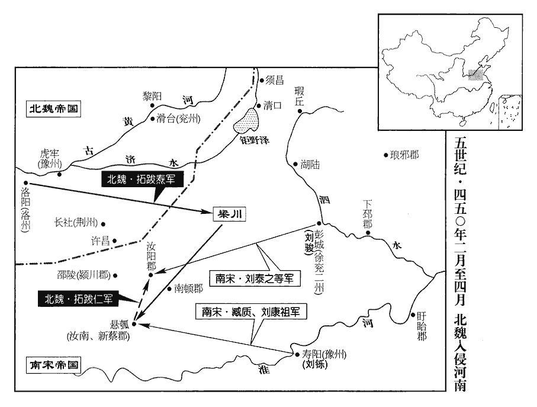
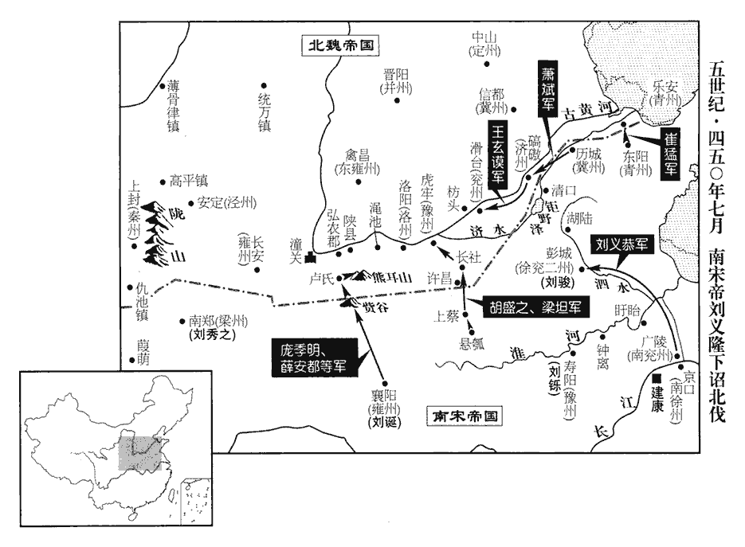
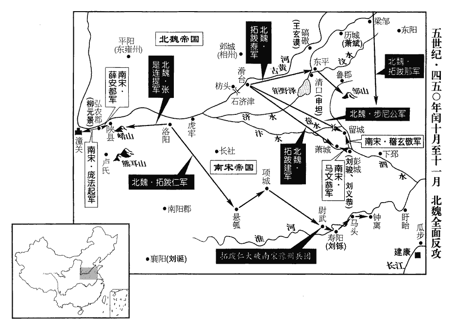
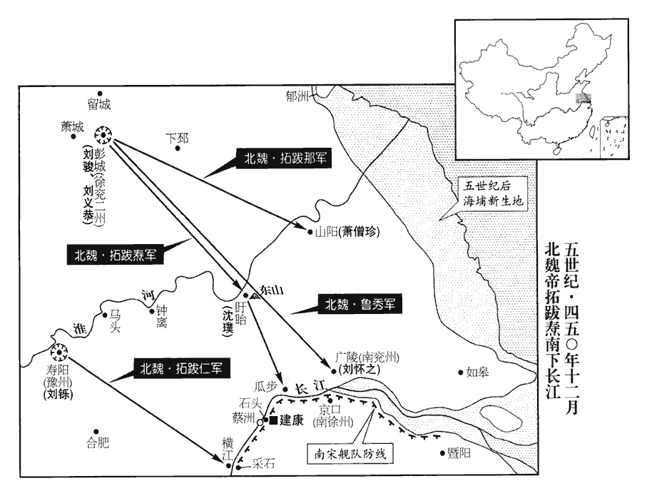

 宋紀七起強圉大淵獻（丁亥），盡上章攝提格（庚寅），凡四年。

# 太祖文皇帝中之下

## 元嘉二十四年（丁亥、四四七）

1春，正月，甲戌‹二十六›，大赦。

〖译文〗 [1]春季，正月，甲戌（二十六日），刘宋实行大赦。

2魏‹都平城，山西大同›吐京‹山西石楼›胡及山胡曹僕渾等反；二月，征東將軍武昌王提等討平之。

〖译文〗 [2]北魏吐京胡和山胡酋长曹仆浑等起来反叛。二月，北魏征东将军武昌王拓跋提等人前去讨伐并平定了叛乱。

3癸未‹五›，魏主‹拓跋焘，时年四十›如中山‹河北定州›。

〖译文〗 [3]癸未（初五），北魏国主拓跋焘前往中山。

4魏師之克敦煌也，「敦煌」，當作「姑臧」‹北凉故都，甘肃武威›。事見一百二十三卷十六年。沮渠牧犍使人斫開府庫，沮，子余翻。犍，居言翻。取金玉及寶器，因不復閉；復，扶又翻；下同。小民爭入盜取之，有司索盜不獲。索，山客翻；下同。至是，牧犍所親及守藏者告之，藏，徂浪翻。且言牧犍父子多蓄毒藥，潛殺人前後以百數；況復姊妹皆學左道。謂學曇無讖之術也。有司索牧犍家，得所匿物；魏主大怒，賜沮渠昭儀死，幷誅其宗族，唯沮渠祖以先降得免。祖降亦見十六年。又有告牧犍猶與故臣民交通謀反者，三月，魏主遣崔浩就第賜牧犍死，諡曰哀王。

〖译文〗 [4]北魏大军攻克敦煌后，沮渠牧犍派人砍开了府库，拿走了金银珠宝玉器，府库大门再也没有能够关上，当地老百姓争抢着进去偷走金银财宝，有关部门搜捕盗贼而没有抓获到一个。到此时，沮渠牧犍的亲信及守护府库的人才向北魏朝廷告发了沮渠牧犍，并且说沮渠牧犍父子藏起了许多毒药，偷偷杀掉的人前后有一百多。还有，沮渠牧犍的姐妹们都学会邪门歪道的法术。有关部门搜查了沮渠牧犍的家，得到了沮渠牧犍匿藏的东西。拓跋焘大怒，下令沮渠昭仪自杀，并诛灭了沮渠宗族，只有沮渠祖由于最早投降而免于一死。又有人告发说沮渠牧犍还在与他的旧时官吏、百姓秘密来往，图谋反叛，三月，拓跋焘派崔浩去沮渠牧犍家，让他在家里自杀，谥号为哀王。

5魏人徙定州丁零三千家於平城。

〖译文〗 [5]北魏将定州的丁零部落三千户迁到了平城。

6六月，魏西征諸將西征，謂討蓋吳之將也。將，卽亮翻。扶風公處眞等八人，處，昌呂翻。坐盜沒軍資及虜掠，贓各千萬計，並斬之。

〖译文〗 [6]六月，北魏西征诸将领扶风公拓跋处真等八名大将因盗卖和吞没军用物资，及抢夺掳掠赃物每人各得钱财数以千万计，一起被处死。

7初，上‹刘义隆，时年四十一›以貨重物輕，改鑄四銖錢。元嘉七年鑄四銖錢，見一百二十一卷。民多翦鑿古錢，取銅盜鑄。上患之。錄尚書事江夏王義恭建議，請以大錢一當兩。夏，戶雅翻。右僕射何尚之議曰：「夫泉貝之興，以估貨爲本，估，音古。事存交易，豈假多鑄！數少則幣重，少，詩沼翻；下同。數多則物重，多少雖異，濟用不殊。況復以一當兩，徒崇虛價者邪！復，扶又翻。若今制遂行，富人之貲自倍，貧者彌增其困，懼非所以使之均壹也。」上卒從義恭議。卒，子恤翻；下同。

〖译文〗 [7]当初，刘宋文帝认为钱币面值太大而东西的价格却很低，下令改铸新的四铢钱，老百姓也有很多人把古钱毁掉，用这些铜自己偷偷铸造新钱，文帝为此很忧虑。录尚书事江夏王刘义恭向文帝建议，请求用一个大钱当两个小钱。右仆射何尚之发表议论说：“钱币的兴起，是以估量货物的价值为标准的，这种事情只要有买卖交易就会存在，怎能凭借多铸钱币来影响它呢！钱币数量少钱币价值就高，钱币数量多货物价值就高，钱币的数量多少虽然不一样，但它们的使用功能却没有什么不同。何况用一个大钱当作二个小钱，只是增加了表面价值呢！如果我们实行这个以一个大钱当二个小钱花的办法，富人的财物自然会成倍增加，贫苦百姓则会更加贫困起来，这样做恐怕并不是我们要使社会达到贫富均衡的好办法。”文帝最终采纳了刘义恭的建议。

8秋，八月，乙未‹二十›，徐州‹府彭城，江苏徐州›刺史衡陽文王義季卒‹时年三十三›。義季自彭城王義康之貶，義康貶見一百二十三卷十七年。遂縱酒不事事。帝以書誚責，且戒之；誚qiào，才笑翻。義季猶酣飲自若，以至成疾而終。

〖译文〗 [8]秋季，八月，乙未（二十日），刘宋徐州刺史衡阳文王刘义季去世。自从彭城王刘义康被贬后，刘义季就开始纵酒，不做他应该做的事。文帝写信讥讽责备，并且劝诫他，刘义季还是一如既往地豪饮不止，以致因酗酒过度成病而死。

9魏樂安宣王範卒。

〖译文〗 [9]北魏乐安宣王拓跋范去世。

10冬，十月，壬午‹八›，胡藩之子誕世殺豫章‹江西南昌›太守桓隆之，據郡反，胡藩家于豫章。欲奉前彭城王義康爲主；前交州‹府龙编，越南河内东北北宁府›刺史檀和之去官歸，過豫章，擊斬之。過，工禾翻。

〖译文〗 [10]冬季，十月，壬午（初八），刘宋胡藩的儿子胡诞世杀了豫章太守桓隆之，占据豫章郡反叛朝廷。他想要拥戴前彭城王刘义康做皇帝，前交州刺史檀和之在卸任回京途中，路过豫章，击败斩杀了胡诞世。

11十一月，甲寅‹十›，封皇子渾爲汝陰王。

〖译文〗 [11]十一月，甲寅（初十），封皇子刘浑为汝阴王。

12十二月，魏晉王伏羅卒。《考異》曰：《宋•索虜傳》曰：「燾所住屠蘇爲疾雷所擊，屠蘇倒，見壓殆死。左右皆號泣，晉王獨不悲。燾怒，賜死。」此出於傳聞。今從《後魏書》。

〖译文〗 [12]十二月，北魏晋王拓跋伏罗去世。

13楊文德據葭蘆城‹甘肃武都东南›，《水經註》：羌水出隴西羌道，東南流逕宕昌城東，西北去仇池五百餘里，又東逕葭蘆城西。招誘氐、羌，武都等五郡氐皆附之。魏取仇池置武都‹甘肃武都›、天水‹南天水郡，甘肃礼县东›、漢陽‹甘肃礼县›、武階‹甘肃武都东南›、仇池‹甘肃西和南›五郡。誘，音酉。

〖译文〗 [13]杨文德占据了北魏的葭芦城，并招抚诱降氐、羌族人，武都等五个郡的氐人全部归附。

## 二十五年（戊子、四四八）

1春，正月，魏仇池‹甘肃西和南›鎭將皮豹子帥諸軍擊之。將，卽亮翻。帥，讀曰率。文德兵敗，棄城奔漢中‹陕西汉中›。豹子收其妻子、僚屬、軍資及楊保宗所尚魏公主而還。還，從宣翻，又如字。

〖译文〗 [1]春季，正月，北魏仇池镇将皮豹子率领各路大军攻伐杨文德。杨文德军队战败，放弃葭芦城，逃回汉中。皮豹子逮捕了杨文德的妻子、孩子、幕僚臣属，没收了他所有的军用物资，同时又逮捕了杨保宗所娶的北魏公主，大胜而回。

初，保宗將叛，保宗叛魏，見上卷二十年。公主勸之。或曰：「柰何叛父母之國？」公主曰：「事成，爲一國之母，豈比小縣公主哉！」魏主‹拓跋焘，时年四十一›賜之死。

〖译文〗 当初，杨保宗要叛离北魏时，公主力加劝诱鼓励。有人问公主说：“你为什么要背叛你父母的国家？”公主回答说：“此事成功，我就是一国之母，这怎能同我现在的小县公主身份相比呢？”北魏国主拓跋焘命她自杀。

楊文德坐失守，免官，削爵土。宋免削之也。

〖译文〗 杨文德因为失去所镇守的土地，因而被罢免了官职，削去了爵位和封地。

2二月，癸卯‹一›，魏主如定州‹府中山，河北定州›，罷塞圍役者；築塞圍見上卷二十三年。遂如上黨‹山西长治北›，誅潞縣叛民二千餘家，徙河西離石‹山西离石›民五千餘家于平城。「河西」當作「西河」‹山西汾阳›。

〖译文〗 [2]二月，癸卯（疑误），北魏国主拓跋焘前去定州，命令解散在京畿外围修筑要塞工事的人。然后又前往上党，下令诛戮潞县反叛百姓二千多户，并强迫河西郡、离后镇百姓五千多户迁到平城。

3閏月，己酉‹七›，帝‹刘义隆，时年四十二›大蒐sōu于宣武場。建康倣洛都之制，築宣武場於臺城北。

〖译文〗 [3]闰二月，己酉（初七），刘宋文帝在宣武场举行阅兵大典。

4初，劉湛旣誅，湛誅見一百二十三卷十七年。庾炳之遂見寵任，累遷吏部尚書，勢傾朝野。炳之無文學，性強急輕淺。旣居選部，好詬詈賓客，且多納貨賂；士大夫皆惡之。選，須絹翻。好，呼報翻。惡，烏路翻。

〖译文〗 [4]当初，刘湛被诛杀后，吏部郎庾炳之受到文帝的宠信，官职不断升迁直到吏部尚书，其势力在朝野上下无人能及。但是，庾炳之没有才学，而且性情暴躁又极浅薄。官居吏部尚书之后，喜欢污辱漫骂来访的客人，并且大肆接受贿赂，士大夫们都非常讨厌、憎恶他。

炳之留令史二人宿於私宅，尚書令史掌省中文案，不當宿尚書私家。爲有司所糾。上薄其過，欲不問。僕射何尚之因極陳炳之之短曰：「炳之見人有燭盤、佳驢，無不乞匄gài；選用不平，不可一二；言其罪不可一二數也。交結朋黨，構扇是非，亂俗傷風，過於范曄，所少，賊一事耳。言所少者，唯不至如范曄作賊一事。少，詩沼翻。縱不加罪，故宜出之。」上欲以炳之爲丹楊尹。尚之曰：「炳之蹈罪負恩，方復有尹京赫赫之授，復，扶又翻。引用《詩》「赫赫師尹」以諭京尹。然《詩》所謂師尹者，乃太師尹氏也。乃更成其形勢也。古人云：『無賞無罰，雖堯、舜不能爲治。』漢宣帝詔曰：有功不賞，有罪不誅，雖唐、虞不能以化。治，直吏翻。臣昔啓范曄，事見一百二十三卷十七年。亦懼犯顏，苟白愚懷，九死不悔。言苟愚懷所欲吐者，雖冒九死猶將言之而不悔。歷觀古今，未有衆過藉藉，藉，秦昔翻。受貨數百萬，更得高官厚祿如炳之者也。」上乃免炳之官，以徐湛之爲丹楊尹。

〖译文〗 庾炳之在个人私宅留宿两名令史，受到有关部门弹劾，而文帝认为他的错误很小，想不作处理。仆射何尚之因此竭力揭发庾炳之的缺点错误，说：“庾炳之看见别人有蜡烛盘、好驴等，没有他不想去要的；他选人用人不公正事例更不是一两件。他结交培养自己的党羽，制造拨弄是非，离间他人，伤风败俗，超过了范晔，他比范晔少的就是还没有反叛朝廷这一件事而已。即使不加罪于他，也应该将他降职外放。”文帝想要让庾炳之作丹杨尹。何尚之说：“庾炳之犯了罪辜负了给予他的恩德，现在又煊赫地封授他堂堂丹杨尹这样的美差，这是进一步增加他的气势。古人说：‘有功不赏，有过不罚，即使是尧、舜也不能使天下太平！’我过去在陛下面前谈论范晔，也害怕会冒犯龙颜，可是现在我想只要把我心中一些想法都说出来，即使冒着九死的危险，也是不后悔崐的。历观从古至今的诸多大事，从没有过恶迹昭彰，收受贿赂达几百万，而能进一步得到高官厚禄象庾炳之这样的人呀。”文帝这才罢免了庾炳之的官职，任命徐湛之作丹杨尹。

5彭城‹江苏徐州›太守王玄謨上言：「彭城要兼水陸，魏人南寇，水行自清入泗，陸行自歷城、瑕丘，皆湊彭城，故云要兼水陸。請以皇子撫臨州事。」夏，四月，乙卯‹十四›，以武陵王駿爲安北將軍、徐州刺史。

〖译文〗 [5]刘宋彭城太守王玄谟上书文帝说：“彭城位兼水陆交通要道，请求派皇子亲临彭城主持政事。”夏季，四月，乙卯（十四日），文帝任命武陵王刘骏为安北将军、徐州刺史。

6五月，甲戌‹四›，魏以交趾公韓拔爲鄯善王，《魏書•官氏志》：內入諸姓，出大汗氏改爲韓氏。鄯，上扇翻。鎭鄯善‹都扜泥，新疆若羌›，賦役其民，比之郡縣。

〖译文〗 [6]五月，甲戌（初四），北魏任命交趾公韩拔为鄯善国国王，镇守鄯善，对老百姓征发的赋税和劳役，参照北魏内地郡县。

7當兩大錢行之經時，公私不以爲便；己卯‹九›，罷之。

〖译文〗 [7]刘宋用一个大钱顶两个小钱的流通办法，实行了一段时间，朝廷和个人都认为太不方便。己卯（初九），下令废除这一规定。

8六月，丙寅‹二十六›，荊州‹府江陵，湖北江陵›刺史南譙王義宣進位司空。

〖译文〗 [8]六月，丙寅（二十六日），刘宋荆州刺史南谯王刘义宣晋升为司空。

9辛酉‹二十一›，魏主如廣德宮‹在阴山北麓›。魏主起殿於陰山北，殿成而楊難當來朝，因命曰廣德宮。

〖译文〗 [9]辛酉（二十一日），北魏国主前往广德宫。

10秋，八月，甲子‹二十五›，封皇子彧爲淮陽王。彧，於六翻。

〖译文〗 [10]秋季，八月，甲子（二十五日），刘宋朝廷封皇子刘为淮阳王。

11西域般悅國‹都列普西，巴尔喀什湖东南›去平城萬有餘里，據《北史》，「般悅」當作「悅般」。般，音鉢。遣使詣魏，使，疏吏翻。請與魏東西合擊柔然；魏主許之，中外戒嚴。

〖译文〗 [11]西域般悦国离平城有一万多里，派使节到北魏，请求和北魏联合从东西方向共同夹击柔然国。北魏国主同意，下令北魏内外严格警戒。

12九月，辛未‹二›，以尚書右僕射何尚之爲左僕射，領軍將軍沈演之爲吏部尚書。

〖译文〗 [12]九月，辛未（初二），刘宋任命尚书右仆射何尚之为左仆射，领军将军沈演之为吏部尚书。

13丙戌‹十七›，魏主如陰山。

〖译文〗 [13]丙戌（十七日），北魏国主前去阴山。

14魏成周公萬度歸擊焉耆‹都员渠，新疆焉耆›，大破之，焉耆王鳩尸卑那奔龜茲‹都延城，新疆库车›。龜茲，音丘慈。魏主詔唐和與前部王車伊洛帥所部兵會度歸討西域。車伊洛，車師‹新疆吐鲁番›大帥也，世附於魏，魏封爲前部王。帥，讀曰率。和說降柳驢等六城，說，輪芮翻。因共擊波居羅城，拔之。

〖译文〗 [14]北魏成周公万度归攻伐焉耆国，大败焉耆。焉耆国王鸠尸卑那逃奔到龟兹。北魏国主下诏，命令唐和与前部王车伊洛率领所部军队与万度归会师，然后讨伐西域。唐和劝说并收降了柳驴等六个城池，于是又趁机共同攻伐波居罗城，最后把它攻克。

15冬，十月，辛丑‹三›，魏弘農昭王奚斤卒‹年八十›，子它觀【張：「觀」下脫「應」字。】襲。魏主曰：「斤關西之敗，事見一百二十一卷五年。罪固當死；朕以斤佐命先朝，朝，直遙翻。復其爵邑，使得終天年，君臣之分亦足矣。」分，扶問翻。乃降它觀爵爲公。

〖译文〗 [15]冬季，十月，辛丑（初三），北魏弘农昭王奚斤去世，他的儿子奚它观继承王位。北魏国主拓跋焘说：“奚斤在关西之战战败，论罪行本来应该处死。我因为他曾经辅佐过先帝，所以恢复了他的爵位和封邑，这才使得他能够寿终天年，国君与臣子的情分到此也足够了。”于是，将奚它观的爵位降为公爵。

16癸亥‹二十五›，魏大赦。

〖译文〗 [16]癸亥（二十五日），北魏实行大赦。

17十二月，魏萬度歸自焉耆西討龜茲，留唐和鎭焉耆。柳驢戍主乙直伽謀叛，伽，求迦翻。和擊斬之，由是諸胡咸服，西域復平。復，扶又翻；下復伐同。

〖译文〗 [17]十二月，北魏万度归从焉耆向西挺进征讨龟兹，留下唐和镇守焉耆。驻守柳驴的官员乙直伽阴谋反叛，唐和进行反击，斩了乙直伽。从此，诸胡人都畏服于唐和，西域重新平定。

18魏太子‹拓跋晃›朝于行宮，陰山之行宮也。朝，直遙翻。遂從伐柔然。至受降城‹蒙古南部边境›，卽漢武帝所築受降城。降，戶江翻。不見柔然，因積糧於城內，置戍而還。還，從宣翻，又如字。

〖译文〗 [18]北魏太子拓跋晃到行宫朝见北魏国主拓跋焘，跟着父亲征伐柔然，进崐军到受降城，却看不见柔然兵卒的影子，因而将粮食囤积在城内，在那里设置戍边军队，尔后返回。

## 二十六年（己丑、四四九）

1春，正月，戊辰朔‹一›，魏主‹拓跋焘，时年四十二›饗羣臣於漠南。甲戌‹七›，復伐柔然‹瀚海沙漠群›。高涼王那出東道，略陽王羯兒出西道，羯，居謁翻。魏主與太子出涿邪山‹蒙古古尔班察罕山›，邪，讀曰耶。行數千里。柔然處羅可汗‹郁久闾吐贺真›恐懼遠遁。處，昌呂翻。可，從刊入聲。汗，音寒。

〖译文〗 [1]春季，正月，戊辰朔（初一），北魏国主在漠南犒劳各位大臣。甲戌（初七），再次讨伐柔然。高凉王拓跋那从东路进军，略阳王拓跋羯儿由西路挺进，北魏国主和太子拓跋晃则率军穿过涿邪山，行军几千里。柔然国处罗可汗郁久闾吐贺真非常恐惧，远远逃走。

2二月，己亥‹三›，上‹刘义隆，时年四十三›如丹徒‹江苏镇江东丹徒镇›，謁京陵‹丹徒镇东南›。三月，丁巳，大赦。募諸州樂移者數千家以實京口‹江苏镇江›。樂，音洛。

〖译文〗 [2]二月，己亥（初三），文帝前去丹徒，拜谒京陵。三月，丁巳（疑误），实行大赦。募集各个州郡愿意移居的几千户迁来充实京口。

3庚寅‹二十四›，魏主還平城。

〖译文〗 [3]庚寅（二十四日），北魏国主返回平城。

4夏，五月，壬午‹十七›，帝還建康。

〖译文〗 [4]夏季，五月，壬午（十七日），文帝回到建康。

5庚寅‹二十五›，魏主如陰山。

〖译文〗 [5]庚寅（二十五日），北魏国主前往阴山。

6帝‹刘义隆›欲經略中原，羣臣爭獻策以迎合取寵。彭城‹江苏徐州›太守王玄謨尤好進言，守，手又翻。好，呼到翻。帝謂侍臣曰：「觀玄謨所陳，令人有封狼居胥‹蒙古乌兰巴托东肯特山›意。」漢霍去病伐匈奴，封狼居胥，禪于姑衍，以臨瀚海。御史中丞袁淑言於上曰：「陛下今當席卷趙、魏，卷，讀曰捲。檢玉岱宗；封泰山用玉檢。臣逢千載之會，願上封禪書。」載，子亥翻。上，時掌翻。上悅。淑，耽之曾孫也。袁耽見《晉成帝紀》。

〖译文〗 [6]刘宋文帝想要收复中原，文武百官们争相献计献策去迎合，希望以此受到文帝的宠爱。彭城太守王玄谟尤其喜好进言，文帝对侍臣说：“仔细琢磨王玄谟的陈述，使人顿有霍去病封狼居胥时的感觉。”御史中丞袁淑对文帝说：“陛下您现在应该席卷赵魏旧土，去泰山祭祀天地神祗。我正赶上这千载难逢的机会，愿意向您奉上封禅书。”文帝很高兴。袁淑是袁耽的曾孙。

秋，七月，辛未‹七›，以廣陵王誕爲雍州‹府襄阳，湖北襄樊›刺史。雍，於用翻。上以襄陽外接關、河，欲廣其資力，乃罷江州‹府豫章，江西南昌›軍府，文武悉配雍州；沈約曰：晉孝武始於襄陽立雍州，幷立僑郡縣；至是，割荊州之襄陽、南陽、新野、順陽、隨五郡爲雍州，而僑郡縣猶寄寓在諸郡界。湘州‹府临湘，湖南长沙›入臺租稅，悉給襄陽。

〖译文〗 秋季，七月，辛未（初七），任命广陵王刘诞为雍州刺史。文帝认为襄阳向外与函谷关、黄河相接壤，因此打算扩大充实襄阳的财力，于是，撤销了江州军府，将江州的文武百官全都配备给雍州；湘州人向朝廷交纳的田租税款也全都转给了襄阳。

7九月，魏主伐柔然，高涼王那出東道，略陽王羯兒出中道。柔然處羅可汗‹郁久闾吐贺真›悉國內精兵圍那數十重；那掘塹堅守，【章：十二行本「守」下有「相持數日」四字；乙十一行本同；孔本同；張校同；退齋校同。】處羅數挑戰，輒爲那所敗。重，直龍翻。掘，其月翻。塹，七豔翻。數，所角翻。挑，徒了翻。敗，補邁翻。以那衆少而堅，少，詩沼翻。疑大軍將至，解圍夜去；那引兵追之，九日九夜。處羅益懼，棄輜重，踰穹隆嶺‹蒙古杭爱山东段一峰›遠遁；那收其輜重，重，直用翻。引軍還，與魏主會於廣澤‹蒙古博格多城南鄂罗克泊›。略陽王羯兒收柔然民畜凡百餘萬。自是柔然衰弱，屛跡不敢犯魏塞。屛，必郢翻。冬，十二月，戊申‹十七›，魏主還平城‹山西大同›。

〖译文〗 [7]九月，北魏国主讨伐柔然国，高凉王拓跋那从东路率军挺进，略阳王拓跋羯儿从中路进军。柔然国处罗可汗郁久闾吐贺真将国内所有精锐部队调来，把拓跋那的部队包围了几十层，拓跋那挖深沟坚守阵地。郁久闾吐贺真几次向拓跋那挑战，都被拓跋那打败。郁久闾吐贺真认为拓跋那士卒人数少却很顽强，怀疑援助拓跋那的主力大军将要来到，因此，撤去包围，连夜率军离开。拓跋那带邻士卒奋勇追击九天九夜。郁久闾吐贺真越发害怕，丢下辎重物资，穿过穹隆岭远远逃走。拓跋那缴获了郁久闾吐贺真丢下的辎重物资，率领大军返回，同北魏国主在广泽会合。略阳王拓跋羯儿俘虏了柔然百姓和牲畜差不多有一百多万。从此，柔然国国力衰败，躲起来不再敢侵犯北魏边塞地区。冬季，十二月，戊申（十七日），北魏国主回到平城。

8沔‹汉水›北諸山蠻寇雍州‹湖北北部›，建威將軍沈慶之帥後軍中兵參軍柳元景、隨郡太守宗慤等二萬人討之，帥，讀曰率。八道俱進。先是，諸將討蠻者皆營於山下以迫之，蠻得據山發矢石以擊，官軍多不利。乘高臨下，矢石之勢所及過於平原相遇者，故軍多不利。先，悉薦翻。慶之曰：「去歲蠻田大稔，積穀重巖，重，直龍翻。不可與之曠日相守也。不若出其不意，衝其腹心，破之必矣。」乃命諸軍斬木登山，鼓譟而前，羣蠻震恐；因其恐而擊之，所向奔潰。斬木登山，八道並進，蠻救首救尾之不暇，故震恐而奔潰。若一道而進，蠻聚兵據險拒戰，雖欲斬木而登山，庸可得乎！

〖译文〗 [8]沔水北部居住的各山地蛮族侵犯雍州，刘宋建威将军沈庆之率领后军中兵参军柳元景、随郡太守宗等二万人讨伐，分八路一同进军。在此之前，各个将领们讨伐蛮人，都在山下驻扎营地以此迫使他们投降。蛮人就占据陡峻山势，发射乱石利箭来回击，刘宋将领们多次失利。杨庆之说：“去年，蛮人的庄稼大获丰收，他们把粮食都囤积在悬崖峭壁上，我们不能和他们长期对抗。不如出其不意，直杀入他们的内部，一定会打败他们。”于是，命令各路大军砍伐树木，向山上攀登，擂着鼓呐喊着，向前进攻，各蛮族震惊恐慌。沈庆之等趁他们惊恐发动进攻，所过之处，各蛮族立刻全线崩溃，四处逃散。

## 二十七年（庚寅、四五零）

1春，正月，乙酉‹二十四›，魏主‹拓跋焘，时年四十三›如洛陽‹河南洛阳东白马寺东›。

〖译文〗 [1]春季，正月，乙酉（二十四日），北魏国主前去洛阳。

2沈慶之自冬至春，屢破雍州‹湖北北部›蠻，因蠻所聚穀以充軍食，前後斬首三千級，虜二萬八千餘口，降者二萬五千餘戶。降，下江翻。幸諸山大羊蠻憑險築城，守禦甚固。慶之擊之，命諸軍連營於山中，開門相通，各穿池於營內，朝夕不外汲。頃之，風甚，蠻潛兵夜來燒營，諸軍以池水沃火，多出弓弩夾射之，射，而亦翻。蠻兵散走。蠻所據險固，不可攻，慶之乃置六戍以守之。久之，蠻食盡，稍稍請降，悉遷於建康以爲營戶。史言沈慶之又能持久以弊諸蠻。降，戶江翻。

〖译文〗 [2]建威将军沈庆之从去年冬季到今年春季，多次击败雍州境内的蛮族反抗势力，依靠蛮族囤积的粮食，充实自己军队的粮草，前后共杀蛮族三千人，俘虏了二万八千多人，收降了二万五千多户。幸诸山的大羊蛮族凭借险要地势构筑城堡，防守抵御都很牢固。沈庆之前来攻打，他命令军队在山里连营扎寨，营房房门都打开互相接通，然后在营地内挖掘水池，从早到晚都不外出取水。不久，风刮得越来越厉害，蛮人偷偷派兵在夜里潜入放火烧营。沈庆之用蓄水池中的水浇灭了大火，用大批弓弩在两边发射，蛮族军队逃散。他们所占据的位置险要坚固，无法攻破。沈庆之又设六个戍所来监守。时间一长，蛮族军队的粮食吃完了，慢慢地有人请求归降，朝廷便把他们作为“营户”全部迁到了建康。

3魏主將入寇，二月，甲午‹三›，大獵於梁川‹河南商丘境›。梁川，後魏天平二年置梁城郡於其地，領參合、旋鴻二縣。帝‹刘义隆，时年四十四›聞之，敕淮、泗諸郡：「若魏寇小至，則各堅守；大至，則拔民歸壽陽‹安徽寿县›。」邊戍偵候不明，偵，丑鄭翻。辛亥‹二十›，魏主自將步騎十萬奄至。將，卽亮翻。騎，奇寄翻。《考異》曰：《宋書》：「是月辛丑，南平王鑠進號西平。辛巳，索虜寇汝南。」按《長曆》，二月壬辰朔，十日辛丑，二十日辛亥。「巳」當作「亥」。南頓‹河南沈丘›太守鄭琨、南頓縣本屬汝南，晉惠帝分置南頓郡。潁川‹侨郡，河南郾城东›太守鄭【章：十二行本「鄭」作「郭」；乙十一行本同；孔本同；張校同。】道隱並棄城走。

〖译文〗 [3]北魏国主拓跋焘将要侵犯刘宋。二月，甲午（初三），北魏国主先到梁川进行大规模的打猎。文帝听说后，立刻诏令淮河、泗水沿岸的各个州郡：“如果魏寇小规模进犯，就各自坚守自己的城池；如果大规模进犯，就带着老百姓全部撤到寿阳。”由于边境侦察不准确而情况不明。辛亥（二十日），北魏国主亲自率领十万骑兵突然越过边境。刘宋南顿太守郑琨、颖川太守郑道隐都弃城逃跑。

是時，豫州刺史南平王鑠鎭壽陽‹安徽寿县›，遣左軍行參軍陳憲行汝南郡事，守懸瓠‹河南汝南›，《水經註》：汝水自汝南上蔡縣東逕懸瓠城北，今豫州刺史，汝南郡治。汝水枝別左出，西北流，又屈西東轉，又西南會汝，形若懸瓠，故以名城。瓠，戶故翻，又音乎。城中戰士不滿千人，魏主圍之。

〖译文〗 这时，豫州刺史南平王刘铄正镇守寿阳，他派左军行参军陈宪代理汝南郡事务，驻守悬瓠。悬瓠城中士卒不到一千人，北魏国主率兵围住了悬瓠。

三月，以軍興，減內外百官俸三分之一。

〖译文〗 三月，刘宋因为战事兴起，减少朝廷内外文武百官俸禄的三分之一。

魏人晝夜攻懸瓠，多作高樓，臨城以射之，射，而亦翻。矢下如雨，城中負戶以汲，施大鉤於衝車之端以牽樓堞，壞其南城；堞，達叶翻。壞，音怪。陳憲內設女牆，外立木栅以拒之。魏人塡塹，肉薄登城，薄，迫也。塹，七豔翻。憲督厲將士苦戰，將，卽亮翻。積屍與城等。魏人乘屍上城，短兵相接，憲銳氣愈奮，戰士無不一當百，殺傷萬計，城中死者亦過半。

〖译文〗 北魏军队不分白天黑夜地连续围攻悬瓠，他们建起了许多楼车，临近城池进行射击，一时间，利箭如雨般纷纷射出。守卫悬瓠的士卒都身背门板，到井里提水。北魏军队开始在冲车的一头抛出大铁钩来勾住城楼围墙，然后再用冲车牵引大铁钩，南部城墙被扯倒了。陈宪又赶快在围墙内筑了一层小墙，小墙外部再加设一层木栅，继续抵抗。北魏军队将护城壕沟给填平了，登上城墙与刘宋军展开肉搏。陈宪督统将士苦苦奋战。当时双方战死将士的尸首堆积得同崐城墙一样高。北魏军队踏着尸首向城上攀登，双方短兵相接、激烈搏斗，陈宪锐气不减，愈战愈勇，其手下士卒也是以一当百，杀死及击伤北魏将士数以万计，守城将士也死了一多半。

 

魏主遣永昌王仁將步騎萬餘，驅所掠六郡生口北屯汝陽‹河南商水›。汝陽縣本屬汝南郡，江左分立汝陽郡。時徐州‹府彭城，江苏徐州›刺史武陵王駿鎭彭城‹江苏徐州›，帝遣間使命駿發騎，齎三日糧襲之。間，古莧翻。使，疏吏翻。騎，奇寄翻；下同。駿發百里內馬得千五百匹，分爲五軍，遣參軍劉泰之《考異》曰：《後魏•紀》作「劉坦之」，今從《宋書》。帥安北騎兵行參軍垣謙之、田曹行參軍臧肇之、集曹行參軍尹定、田曹，主營田；集曹，主安集流散，猶漢之安集掾也。時駿爲安北將軍，謙之等皆府僚也。武陵左常侍杜幼文、晉制：王國置左右常侍各一人。殿中將軍程天祚等將之，將，卽亮翻。直趨汝陽。趨，七喻翻。魏人唯慮救兵自壽陽來，不備彭城。丁酉，泰之等潛進，擊之，殺三千餘人，燒其輜重，重，直用翻。魏人失【章：十二行本「失」作「奔」；乙十一行本同；孔本同；張校同；退齋校同；熊校同。】散，諸生口悉得東走。魏人偵知泰之等兵無繼，偵，丑鄭翻。復引兵擊之。復，扶又翻。垣謙之先退，士卒驚亂，棄仗走。泰之爲魏人所殺，肇之溺死，天祚爲魏所擒，謙之、定、幼文及士卒免者九百餘人，馬還者四百匹。

〖译文〗 北魏国主派永昌王拓跋仁率领步、骑兵一万多，驱赶着他们在六郡所掠虏的百姓北上屯守汝阳。与此同时，刘宋徐州刺史武陵王刘骏正镇守彭城，文帝派遣秘密使节去通知刘骏，命令他出动骑兵，带上够三天吃的粮食去袭击北魏军队。刘骏发动方圆百里的一千五百匹马，分成五路，派参军刘泰之率领安北骑兵行参军坦谦之、田曹行参军臧肇之、集曹行参军尹定、武陵左常侍杜幼文、殿中将军程天祚等分别统率这五路大军，直奔汝阳。北魏军队只顾虑刘宋的援军从泰阳来，对彭城方面毫无防备。丁酉（疑误），刘泰之等率兵偷偷向前推进，袭击北魏军队，杀死三千多人，烧毁了北魏的辎重物资，北魏士卒四处逃散、不知所往，被俘虏的刘宋军卒和老百姓也都得以乘机向东逃走。北魏军队侦探到刘泰之等没有后援部队，便又领兵反攻。坦谦之首先退却，士卒为此惊恐，大乱，纷纷抛下武器四处逃散。刘泰之被北魏军队杀死，臧肇之掉到河里溺水身亡，程天祚被北魏军队抓获，只有坦谦之、尹定、杜幼文及一些士卒共计九百多人得以逃脱，另外还有四百匹马也和他们一块返回。

魏主攻懸瓠四十二日，帝遣南平‹湖北公安›內史臧質詣壽陽，與安蠻司馬劉康祖共將兵救懸瓠。時南平王鑠領安蠻校尉，以康祖爲司馬。魏主遣殿中尚書任城公乞地眞將兵逆拒之。魏殿中尚書知殿內兵馬倉庫。任，音壬。質等擊斬乞地眞。康祖，道錫之從兄也。劉道錫見一百二十三卷十八年。從，才用翻。

〖译文〗 北魏国主围攻悬瓠达四十二天，刘宋文帝派南平内史臧质到寿阳，让他和安蛮司马刘康祖一同率兵援救悬瓠。北魏国主派遣殿中尚书任城公拓跋乞地真率军抗击，臧质等人迎击并杀了拓跋乞地真。刘康祖是刘道锡的堂兄。

夏，四月，魏主引兵還，還，從宣翻，又如字。癸卯‹十三›，至平城。

〖译文〗 夏季，四月，北魏国主率军撤退，癸卯（十三日），抵达平城。

壬子‹二十二›，安北將軍武陵王駿降號鎭軍將軍，垣謙之伏誅，尹定、杜幼文付尚方；輸作尚方也。以陳憲爲龍驤將軍、汝南•新蔡二郡‹府悬瓠，河南汝南›太守。驤，思將翻。

〖译文〗 壬子（二十二日），刘宋安北将军武陵王刘骏被贬为镇军将军，坦谦之被杀，尹定、杜幼文则被交付尚方做苦役，提升陈宪为龙骧将军和汝南、新蔡二郡的太守。

魏主遺帝書曰：「前蓋吳反逆，扇動關、隴。彼復使人就而誘之，丈夫遺以弓矢，婦人遺以環釧chuàn；復，扶又翻。誘，音酉。遺，于季翻。通使蓋吳事見上卷二十二年、二十三年。釧，尺絹翻，臂環也。是曹正欲譎誑取賂，譎，古穴翻。誑，居況翻。豈有遠相服從之理！爲大丈夫，何不自來取之，而以貨誘我邊民？募往者復除七年，是賞姦也。復，方目翻。我今來至此土，所得多少，孰與彼前後得我民邪？

〖译文〗 北魏国主拓跋焘给刘宋文帝的信说：“以前，盖吴反叛逆行，煽动关、陇一带居民起来叛乱。你又派人前去诱导他们，把弓箭赠送给男人，把耳环金钏馈赠给女人。这只不过是他们想用欺诈诳骗的手段获取这些贿赂之财，否则，哪里会有相距甚远却甘愿服从的道理！作为大丈夫，为什么不自己前来获取，却用金银财宝诱惑我边陲百姓？你又下令说，前往投奔你的，免除七年的捐税，这是你在明目张胆地奖赏奸佞之人。我现在来到你们的国土上所得到的百姓数量，同你在此前后得到的我国百姓的数量相比，谁多谁少呢？

彼若欲存劉氏血食者，當割江以北輸之，攝守南渡，攝，收也，言收江北守兵，南渡江也。當【章：十二行本「當」上有「如此」二字；乙十一行本同；孔本同；張校同。】釋江南使彼居之。不然，可善敕方鎭、刺史、守宰嚴供帳之具，守，式又翻。「帳」，當作「張」，音竹亮翻。來秋當往取揚州。大勢已至，終不相縱。彼往日北通蠕蠕，西結赫連、沮渠、吐谷渾，東連馮弘、高麗；事並見前。蠕，人兗翻。沮，子余翻。吐，從暾入聲。谷，音浴。麗，力知翻。凡此數國，我皆滅之。以此而觀，彼豈能獨立！

〖译文〗 “如果你还想保存刘氏家族的祖庙烟火，你就应当把长江以北的地方全部割让给我，长江以北的守兵撤到江南；我放弃长江以南让你居住。不然，你就应该好好命令你的方镇、刺史、太守、宰令恭恭敬敬地准备好床帐、饮食器具崐，明年秋天，我将前去攻取扬州。这是大势所趋，我最终不会放弃。以前，你北边与柔然汗国来往，西边与赫连、沮渠和吐谷浑勾结，向东又与冯弘、高丽联系，这些国家如今都被我消灭了。由此看来，你怎么能够独立存在呢？

蠕蠕吳提、吐賀眞皆已死，我今北征，先除有足之寇。柔然多馬，故言其有足。彼若不從命，來秋當復往取之；復，扶又翻；下復縱、復非同。以彼無足，故不先討耳。我往之日，彼作何計，爲掘塹自守，爲築垣以自障也？塹，七豔翻。我當顯然往取揚州，不若彼翳行竊步也。翳，於計翻，蔽也。言隱蔽其身而行也。彼來偵諜，我已擒之，復縱還。其人目所盡見，委曲善問之。偵，丑鄭翻。

〖译文〗 “柔然可汗郁久闾吴提，郁久闾吐贺真都已死去，如今我就要向北征伐，首先铲除这些骑马的贼寇，你如果不遵照我的命令去做，明年秋天我当再次亲自前来攻取。因为你没有那么多骑马贼寇，所以，我先不去讨伐。我前往攻取那一天，你怎么办呢？无论你是挖壕沟自守，还是构筑城墙作为屏障，我都会大大方方地前去攻取扬州，而不像你遮遮掩掩地去耍一些小诡计。你派来的侦探我已经抓获，又把他放回去了。这个人看到了我们这里所有的一切，详细的情况你可以仔仔细细地去问他。

彼前使裴方明取仇池，旣得之，疾其勇功，己不能容；有臣如此，尚殺之，事見上卷二十年。烏得與我校邪！彼非我敵也。彼常欲與我一交戰，我亦不癡，復非苻堅，何時與彼交戰？觀此，魏人猶有憚南兵之心，蓋高祖之餘威，而邊垂諸將猶爲有人也。晝則遣騎圍繞，夜則離彼百里外宿；騎，奇寄翻。離，力智翻。吳人正有斫營伎，伎，渠綺翻。彼募人以來，不過行五十里，天已明矣。彼募人之首，豈得不爲我有哉！

〖译文〗 “你以前派裴方明前去攻取仇池，得到了这块土地之后，你却妒嫉裴方明的勇略和战功，自己不能容纳。有这么好的大将，你尚且要杀了他，你又有什么资格前来同我较量呢！你已经不是我的对手了。你经常想要同我交战，我不是白痴，又不是自大骄横的苻坚，什么时候和你打一仗呢？我白天派轻骑围在你营地的周围，晚上就让他们在距离你们一百里以外的地方宿营。你们吴人恰好有夜间侵袭对方兵营宿地的伎俩，但是，你募集的这些士卒到这里来，走不了五十里，天色已经大亮了。你所募集的这些士卒的头颅，又怎么能不被我砍下呢？

彼公‹刘裕›時舊臣雖老，猶有智策，知今已殺盡，謂謝晦、檀道濟輩。豈非天資我邪！取彼亦不須我兵刃，此有善呪zhòu婆羅門，天竺國有婆羅門，善呪術。當使鬼縛以來耳。」

〖译文〗 “你父亲时代的旧臣属虽然年纪已老，都还是很有智谋的，我知道他们已经被你斩尽杀绝了，这难道不是天助我吗？战胜你也不需要动用我的兵刃器具，这里有很会念咒的婆罗门，自然会有鬼神前去把你绑送到我这里来。”

4侍中、左衛將軍江湛遷吏部尚書。湛性公廉，與僕射徐湛之並爲主上‹刘义隆›所寵信，時稱江、徐。

〖译文〗 [4]刘宋侍中、左卫将军江湛升任吏部尚书。江湛秉性公正廉洁，他和仆射徐湛之同时受文帝所宠信，当时并称江徐。

5魏司徒崔浩，自恃才略及魏主所寵任，專制朝權，嘗薦冀、定、相、幽、幷五州之士數十人，皆起家爲郡守。朝，直遙翻。相，息亮翻。守，式又翻。太子晃曰：「先徵之人，亦州郡之選也；先徵之人，謂游雅、李靈、高允等。在職已久，勤勞未答，宜先補郡縣，以新徵者代爲郎吏。且守令治民，宜得更事者。」守，手又翻。治，直之翻。更，工衡翻。浩固爭而遣之。中書侍郎、領著作郎高允聞之，謂東宮博士管恬曰：「崔公其不免乎！苟遂其非而校勝於上，將何以堪之！」

〖译文〗 [5]北魏司徒崔浩，自恃才能谋略很高并被北魏国主所宠爱信任，独揽朝中大权。他曾经推荐冀、定、相、幽、并五州的士人几十人直接做郡守。太子拓跋晃说：“早先征聘的人才，也是被作为州郡官入选的，他们担任这一职务已经很久了，辛勤劳苦却一直没得到过朝廷的报答，应该首先补充他们作郡县守令，让新征聘的人代替他们做郎吏。而且太守、县令管理百姓，应该由经历过世面有经验的人来担当。”但是，崔浩坚持力争，派这些人就任。中书侍郎兼著作郎高允听说后对东宫博士管恬说：“崔浩恐怕免不了一场灾祸。为了顺遂自己未必正确的私心而同朝廷有权势的人对抗争胜，他将用什么来保全自己呢？

魏主以浩監祕書事，監，工銜翻。使與高允等共譔《國記》，譔，雛免翻，譔述也。曰：「務從實錄。」著作令史閔湛、郗標，郗xī，丑之翻。性巧佞，爲浩所寵信。浩嘗註《易》及《論語》、《詩》、《書》，湛、標上疏言：「馬、鄭、王、賈不如浩之精微，馬融、鄭玄、王肅、賈逵也。乞收境內諸書，班浩所註，令天下習業。令習肄yì浩所註《經》以爲家業。幷求敕浩註《禮傳》，傳，直戀翻。令後生得觀正義。」浩亦薦湛、標有著述才。湛、標又勸浩刊所譔《國史》于石，以彰直筆。高允聞之，謂著作郎宗欽曰：「湛、標所營，分寸之間，恐爲崔門萬世之禍，吾徒亦無噍類矣！」噍jiào，才笑翻。浩竟用湛、標議，刊石立於郊壇東，方百步，據《水經註》，平城西郭外有郊天壇。用功三百萬。浩書魏之先世，事皆詳實，列於衢路，往來見者咸以爲言。北人無不忿恚，北人，謂其先世從拓跋氏來自北荒者。恚，於避翻。相與譖浩於帝，以爲暴揚國惡。帝大怒，使有司按浩及祕書郎吏等罪狀。

〖译文〗 北魏国主任命崔浩兼管秘书事务，让他和高允等人共同撰写《国记》，对他们说：“一定要根据事实撰写。”著作令史闵湛、郗标，性情乖巧、奸佞，很受崔浩宠信，崔浩曾经注解《易经》、《论语》、《诗经》、《书经》，闵湛、郗标就上疏建议说：“马融、郑玄、王肃、贾逵所作的注解，都不如崔浩的准确有深度，我们恳求陛下没收国内由这些人作注的各种书，颁布崔浩的注本，命令全国上下都来学习。我们还请求陛下下令让崔浩继续注解《礼记》，使后人将来能看到正确的释义。”崔浩也极力推荐闵湛、郗标有著书立说的才能。而闵湛、郗标反过来又建议崔浩把他所撰写的《国史》刻在石碑上，以此来显示作者崔浩的秉笔直书。高允听说这件事后又对著作郎宗钦说：“闵湛、郗标所搞的这一切，若有一点差错，恐怕就会给崔家带来万世的灾祸，我们这些人也不会幸免。”崔浩竟然采纳了闵湛、郗标的建议，把《国史》刻在石碑上，立在郊外祭祀的神坛东侧，占地一百步见方，这一工程共使用劳力三百万。崔浩写北魏祖先们的事迹，每件事都非常详细真实，他把这些陈列在交通要道上，来来往往过路的人看见后都用这些做为谈论的材料，北方鲜卑人对此没有不非常愤怒的，他们纷纷向北魏国主说崔浩的坏话，认为这是大肆张扬祖先的过错和污点。北魏国主大怒，派有关部门调查处理崔浩和其他秘书郎吏的罪。

初，遼東公翟黑子有寵於帝，奉使幷州，使，疏吏翻。受布千匹。事覺，黑子謀於高允曰：「主上問我，當以實告，爲當諱之？」允曰：「公帷幄寵臣，有罪首實，首，式救翻。庶或見原，原，赦也。不可重爲欺罔也。」重，直用翻。中書侍郎崔覽、公孫質曰：「若首實，罪不可測，不如諱之。」黑子怨允曰：「君柰何誘人就死地！」人見帝，不以實對，帝怒，殺之。誘，音酉。見，賢遍翻。帝使允授太子《經》。

〖译文〗 当初，辽东公翟黑子被北魏国主所庞信，奉命出使并州，在并州接受一千匹绢布的贿赂，事发后，翟黑子向高允讨计说：“主上审问我时，我是应该把实情说出来呢，还是应该把它藏起来不承认呢？”高允说：“你是朝廷宠臣，犯了罪就应该讲实话，这样或许还会被皇上赦免，不能再次欺骗皇上。”中书侍郎崔览、公孙质则说：“如果你讲实话自首，很难预测皇上该怎么处理你，不如隐瞒不说。”翟黑子埋怨高允说：“你为什么要引诱我去置身于死地呢？”翟黑子入宫拜见北魏国主，没有把实情讲出来，北魏国主大怒，斩了翟黑子。后来，北魏国主又派高允教授太子拓跋晃经书。

及崔浩被收，被，皮義翻。太子召允至東宮，因留宿。明旦，與俱入朝，朝，直遙翻。至宮門，謂允曰：「入見至尊，吾自導卿；脫至尊有問，但依吾語。」允曰：「爲何等事也？」爲，于僞翻。太子曰：「入自知之。」太子見帝，言「高允小心愼密，且微賤；制由崔浩，請赦其死！」帝召允，問曰：「《國書》皆浩所爲乎？」對曰：「《太祖記》，前著作郎鄧淵所爲；《先帝記》及《今記》，臣與浩共爲之。然浩所領事多，總裁而已，謂總其大綱，裁其可否也。至於著述，臣多於浩。」帝怒曰：「允罪甚於浩，何以得生！」太子懼曰：「天威嚴重，允小臣，迷亂失次耳。臣曏問，皆云浩所爲。」帝問允：「信如東宮所言乎？」對曰：「臣罪當滅族，不敢虛妄。殿下以臣侍講日久，哀臣，欲匄其生耳。匄gài，古大翻。實不問臣，臣亦無此言，不敢迷亂。」帝顧太子曰：「直哉！此人情所難，而允能爲之！臨死不易辭，信也；爲臣不欺君，貞也。宜特除其罪以旌之。」遂赦之。

〖译文〗 等到崔浩被捕入狱，太子拓跋晃召高允到东宫，留他住了一夜。第二天早晨，拓跋晃与高允一同进宫朝见，二人来到宫门时，拓跋晃对高允说：“我们进去拜见皇上，我自会引导你该做些什么。一旦皇上有什么问话，你只管按照我的话去回答。”高允问他说：“出了什么事吗？”太子拓跋晃说：“你进去自然就知道了。”太子拜见北魏国主说：“高允做事小心审慎，而且地位卑贱，人微言轻，所有的一切都是由崔浩主管制定的，我请求您赦免他的死罪。”北魏国主召见高允，问高允说：“《国书》都是崔浩一人写的吗？”高允回答说：“《太祖记》由前著作郎邓渊撰写，《先帝记》和《今记》是我和崔浩两人共同撰写的。但是崔浩兼事很多，他只不过是总揽了一下《国书》的大纳而已，并未亲自撰写多少，至于撰写工作，我做得要比崔浩多得多。”北魏国主大怒说：“高允的罪行比崔浩要严重，怎么能让他不死呢？”太子拓跋晃很害怕，说：“陛下盛怒之下威严凝重，高允这么一个小臣被您的威严吓得惊慌失崐措、失去理智而语无伧次了。我以前曾经问过他这件事，他说全是崔浩一人干的。”北魏国主质问高允说：“真的像太子所说的那样吗？”高允回答说：“以我的罪过是应该灭族的，不敢用虚假的话欺骗您。太子是因为我很久以来一直在他身边侍奉讲书而可怜我的遭遇，想要放我一条生路。实际上，他确实没有问过我，我也确实没有对他说这些话，我不敢胡言乱语欺骗您。”北魏国主回过头去对太子说：“这就是正直呵！这在人情上很难做到，而高允却能做得到！马上就要死了却也不改变他说的话，这就是诚实。作为臣子，不欺骗皇帝，这就是忠贞。应该特别免除他的罪，作为榜样而褒扬他的品质。”于是，赦免了高允。

於是召浩前，臨詰之。詰，去吉翻。浩惶惑不能對。允事事申明，皆有條理。帝命允爲詔，誅浩及僚屬宗欽、段承根等，下至僮吏，凡百二十八人，皆夷五族；允持疑不爲。帝頻使催切，允乞更一見，然後爲詔。帝引使前，允曰：「浩之所坐，若更有餘釁，釁，許覲翻。非臣敢知；若直以觸犯，罪不至死。」觸犯，謂直書國惡，不爲尊者諱也。帝怒，命武士執允。太子爲之拜請，爲，于僞翻；下欲爲同。帝意解，乃曰：「無斯人，當有數千口死矣。」

〖译文〗 此时，北魏国主又召见崔浩前来，亲自审问他。崔浩恐慌迷惑回答不上来。而高允当时却是件件事申述得明明白白，有条有理。北魏国主于是命令高允写诏书：诛斩崔浩和他的幕僚宗钦、段承根等人，以及他们的部属、僮仆，共有一百二十八人，全都夷灭五族。高允犹豫不敢下笔，北魏国主多次派人催促，高允恳求再晋见北魏国主一次，然后再写诏书。北魏国主命人将他带到自己跟前，高允说：“崔浩被捕入狱，如果还有其他别的原因，我不敢多说。如果仅仅是因为他冒犯了皇族，他的罪过还达不到被处死的程度。”北魏国主大怒，命令武士逮捕高允。太子拓跋晃为他求情，北魏国主的怒气才稍稍平息，说：“没有这个人，就该会有几千人被处死。”

六月，己亥‹十›，詔誅清河‹山东临清›崔氏與浩同宗者無遠近，及浩姻家范陽‹河北涿州›盧氏、太原‹山西太原›郭氏、河東‹山西永济›柳氏，並夷其族，浩所連姻，皆士望也，非有憑附屬請之罪，以浩故皆赤其族。擇耦可不謹哉！餘皆止誅其身。縶浩置檻內，送城南，檻，檻車也。後魏刑人必於城南。縶zhí，陟立翻。衛士數十人溲其上，溲，所鳩翻；小便也。呼聲嗷嗷，嗷，五刀翻。聞於行路。聞，音問。宗欽臨刑歎曰：「高允其殆聖乎！」

〖译文〗 六月，己亥（初十），北魏国主下诏，诛斩清河崔氏老幼和与崔浩属于同一宗族的人，不管血缘关系的疏密远近；与崔浩有姻亲关系的范阳卢氏、太原郭氏、河东柳氏，都被诛灭全族，其他人都只诛斩罪犯一人。崔浩被放在一个四周都是栏杆的囚车里，由士卒押送到平城南郊，押送士兵几十人在崔浩的头上撒尿，崔浩悲惨地嗷嗷呼叫，在路上行走的人都听得清清楚楚。宗钦在临近斩首时感叹说：“高允近乎于圣人呀！”

他日，太子讓允曰：「人亦當知機。吾欲爲卿脫死，旣開端緒；而卿終不從，激怒帝如此。每念之，使人心悸。」悸，其季翻。允曰：「夫史者，所以記人主善惡，爲將來勸戒，故人主有所畏忌，愼其舉措。崔浩孤負聖恩，以私欲沒其廉潔，愛憎蔽其公直，此浩之責也。至於書朝廷起居，言國家得失，此爲史之大體，未爲多違。允言浩死非其罪。臣與浩實同其事，死生榮辱，義無獨殊。誠荷殿下再造之慈，荷，下可翻。違心苟免，非臣所願也。」太子動容稱歎。允退，謂人曰：「我不奉東宮指導者，恐負翟黑子故也。」

〖译文〗 过了几天，太子拓跋晃责怪高允说：“人也应该知道见机行事，我想替你开脱死罪，已经有了好的开端，可是你却始终不照我说的去做，使皇上气愤到那种程度。现在每次回想起来都令人心有余悸。”高允说：“史官，是要记载人主的善恶，作为对后人的鼓励或劝诫，因此，人主心生畏忌，对自己的行为举止都十分小心谨慎。崔浩辜负了圣上的大恩，用他自己的私欲盖过了他的廉洁，用他个人的爱憎好恶遮住了他的公正秉直，这是崔浩的责任和错误。至于书写皇上的起居生活，谈论国家行政的得失，这是史官的重要任务，不能说这有多大罪过。我和崔浩事实上是一同从事这项工作，生死荣辱，在道义不应该不一样。我接受殿下您使我再生的大恩，如果违背自己的良心得以幸免，这不是我所愿意做的。”太子拓跋晃容颜感动，不断赞叹。高允退下后对人说：“我之所以不按照太子的引导去做，就是为了怕辜负了翟黑子。”

初，冀州刺史崔賾，武城男崔模，與浩同宗而別族；賾zé，士革翻。別，分也，依宋祁《國語補音》：彼列翻。浩常輕侮之，由是不睦。及浩誅，二家獨得免。賾，逞之子也。崔逞歸魏，爲太祖所殺。

〖译文〗 当初，冀州刺史崔赜、武城男爵崔模和崔浩属于同一祖宗，但不是同一族系。崔浩经常侮辱怠慢他们，因此，感情一直不和。等到崔浩被斩、诛灭全族，只有这两家得以幸免。崔赜是崔逞的儿子。

辛丑‹十二›，魏主北巡陰山。魏主旣誅崔浩而悔之。會北部尚書【章：十二行本「書」下有「宣城公」三字；乙十一行本同；孔本同；張校同。】李孝伯病篤，魏北部尚書知北邊州郡。或傳已卒。魏主悼之曰：「李宣城可惜！」李孝伯封宣城公。旣而曰：「朕失言；崔司徒可惜，李宣城可哀！」孝伯，順之從父弟也，李順亦爲魏主所寵任，得罪而死。從，才用翻。自浩之誅，軍國謀議皆出孝伯，寵眷亞於浩。

〖译文〗 辛丑（十二日），北魏国主北去阴山巡察。北魏国主诛杀了崔浩后就很后悔，偏巧，北部尚书李孝伯患病很重，有人传说他已经去世了。北魏国主哀悼他说：“李宣城死得可惜！”不一会儿，又说：“朕说错了。应该是崔司徒死得可惜，李宣城的死令人哀痛！”李孝伯是李顺的堂弟，自从崔浩被斩后，国家军政大事的谋划都由李孝伯决定，北魏国主对他的宠信次于崔浩。

6初，車師‹新疆吐鲁番西交河城›大帥車伊洛世服於魏，帥，所類翻。魏拜伊洛平西將軍，封前部王。伊洛將入朝，沮渠無諱斷其路，沮渠無諱時屯高昌‹新疆吐鲁番东›。朝，直遙翻。斷，丁管翻。伊洛屢與無諱戰，破之。無諱卒，卒於元嘉二十一年。弟安周奪其子乾壽兵，伊洛遣人說乾壽，乾壽遂帥其民五百餘家奔魏；帥，讀曰率。伊洛又說李寶弟欽等五十餘人下之，皆送于魏。說，輸芮翻。伊洛西擊焉耆‹都员渠，新疆焉耆›，留其子歇守城‹吐鲁番西交河城›，沮渠安周引柔然兵間道襲之，間，古莧翻。攻拔其城。歇走就伊洛，共收餘衆，保焉耆鎭，魏破焉耆以爲鎭。遣使上書於魏主，言：「爲沮渠氏所攻，首尾八年，元嘉十九年，無諱襲據高昌，自此與車師相攻。使，疏吏翻。百姓飢窮，無以自存。臣今棄國出奔，得免者僅三分之一，已至焉耆東境，乞垂賑救！」魏主詔開焉耆倉以賑之。賑，津忍翻。

〖译文〗 [6]当初，车师国大帅车伊洛世代臣服于北魏，北魏任命车伊洛为平西将军，封为前部王。车伊洛将要去平城朝见北魏国主，据守高昌的沮渠无讳拦断了去路，车伊洛几次与沮渠无讳交战，并把沮渠无讳打得大败。不久，沮渠无讳去世，其弟沮渠安周夺了沮渠无讳儿子沮渠乾寿所统率的军队，车伊洛趁此机会派人前去游说沮渠乾寿，沮渠乾寿于是率领他手下五百多户投奔北魏。车伊洛又游说李宝的弟弟李钦等五十多人，游说成功，他把这些人都送到了北魏。车伊洛西去袭击焉耆，留下他的儿子车歇固守车师城。沮渠安周率领柔然兵从小路偷袭他们，攻克了车师城。车歇逃到了父亲车伊洛所在地，父子两人共同收集残余部众，保卫焉耆镇，同时，派使节前去平城上书给北魏国主，信中说：“我们被沮渠氏围攻袭击，前前后后已经八年了，老百姓挨饿受苦，没有办法养活自己。我现在放弃自己的国土逃奔在外，同我一同逃走免于一死的人仅剩下了三分之一，我们现在已到达焉耆东部边界，乞求您能救济我们一下。”于是，北魏国主下诏命令打开焉耆的粮仓，赈济车师将士。

7吐谷渾‹青海›王慕利延爲魏所逼，上表求入保越巂‹四川西昌›，唐時吐蕃與雲南窺蜀，卽此路也。蓋自漢武帝開昆明之後，後人遂通此路耳。巂，音髓。上許之；慕利延竟不至。

〖译文〗 [7]吐谷浑王慕容慕利延被北魏逼迫，上书给文帝请求进入到越自保。文帝同意，可慕容慕利延却没有去。

8上‹刘义隆›欲伐魏，丹楊尹徐湛之、吏部尚書江湛、彭城太守王玄謨等並勸之；左軍將軍劉康祖以爲「歲月已晚，請待明年。」上曰：「北方苦虜虐政，義徒並起。頓兵一周，沮向義之心，不可。」沮，在呂翻。

〖译文〗 [8]文帝想要攻伐北魏，丹杨尹徐湛之、吏部尚书江湛、彭城太守王玄谟等人都赞成和拥护，只有左军将军刘康祖认为：“今年已到年底，等到明年再说。”文帝说：“北方老百姓苦于北方蛮虏的虐政，反抗义军不断兴起，我们停兵延迟一年进攻，就会使这些义军的抗暴之心受挫，我们不能这么做。”

太子步兵校尉沈慶之諫曰：時東宮置兵與羽林等，故亦有步兵校尉。《南史》曰：高祖永初二年，置東宮屯騎、步兵、翊yì軍三校尉。「我步彼騎，其勢不敵。騎，奇計翻。檀道濟再行無功，營陽王景平二年，道濟出師，元嘉七年，至濟上，皆無功而還。到彥之失利而返。見一百二十一卷七年。今料王玄謨等，未踰兩將，將，卽亮翻。六軍之盛，不過往時，恐重辱王師。」重，直用翻。上曰：「王師再屈，別自有由，道濟養寇自資，彥之中塗疾動。謂彥之目疾大動也。虜所恃者唯馬；今夏水浩汗，河道流通，汎舟北下，碻qiāo磝‹山东茌平西南›必走，滑臺‹河南滑县›小戍，易可覆拔。易，以豉翻。克此二城，館穀弔民，館穀，就食敵人所積之穀。虎牢‹河南荥阳西北汜水镇›、洛陽，自然不固。比及冬初，比，必利翻。城守相接，虜馬過河，卽成擒也。」慶之又固陳不可。上使徐湛之、江湛難之。難，乃旦翻。慶之曰：「治國譬如治家，耕當問奴，織當訪婢。治，直之翻。陛下今欲伐國，而與白面書生輩謀之，事何由濟！」上大笑。

〖译文〗 太子步兵校尉沈庆之进谏说：“我们是步兵，他们是骑兵，在攻势上我们敌不过他们。檀道济两次出兵都没有打赢，到彦之也是失利而回。如今，我估计王玄谟等人的能力也不会超过前两位将领。我们军队的气势也不如以前了，恐怕会使我们的军队再次招来羞辱和灾难。”文帝说：“我们的大军两次受屈，另有它自己的原因：檀道济保存贼寇以抬高自己，到彦之在进攻的半路上正好眼病加重。蛮虏魏所能依仗的只有马。今年夏天雨水很多，河道畅通无阻，如果我们乘船北上，魏的守军一定会逃走，而驻守滑台的小股军队，也很容易全盘攻克。攻克了这两个城，就利用他们粮仓里堆积的粮秣去安抚老百姓崐，虎牢、洛阳自然也就保不住了。等到冬天到来，我们的城池之间已经相互连接，蛮虏的战马如果跨过黄河，我们就可以把他们活活抓住。”沈庆之还是坚持不该现在讨伐北魏的意见，于是，文帝就让徐湛之、江湛同他辩论。沈庆之说：“治理国家就像治理自己的家一样，耕田种地的事，应该请教种地农夫，纺织的事该问纺织婢女。陛下您现在想要去讨伐一个国家，却和白面书生们谋划大略，这对大事又有什么帮助呢？”文帝大笑。

太子劭及護軍將軍蕭思話亦諫，上皆不從。

〖译文〗 太子刘劭和护军将军萧思话也歇力劝谏，文帝都没接受他们的建议。

魏主聞上將北伐，復與上書曰：「彼此和好日久，而彼志無厭，復，扶又翻。和好，呼到翻。厭，於鹽翻。誘我邊民。誘，音酉。今春南巡，聊省我民，省，悉井翻。驅之便還。今聞彼欲自來，設能至中山及桑乾川，乾，音干。隨意而行，來亦不迎，去亦不送。若厭其區宇者，可來平城居，我亦往揚州，相與易地。彼年已五十，未嘗出戶，雖自力而來，如三歲嬰兒，與我鮮卑生長馬上者果如何哉！觀魏主與帝二書，誠有憚江南之心。大明以後，北不復憚南矣。長，知兩翻。更無餘物可以相與，今送獵馬十二匹幷氈、藥等物。彼來道遠，馬力不足，可乘；或不服水土，藥可自療也。」

〖译文〗 北魏国主拓跋焘听说刘宋文帝要率领大军大举北伐，就又一次给文帝去信说：“我们两国和好的时间已经很长了，可你却贪得无厌，引诱我边境的老百姓。今年春季我南下巡察，顺便去看看我那些逃亡到你那里的人民，驱赶他们回到自己的土地上。现在听说你打算自己亲自来，倘若你能到中山及桑干川，就请随便行动。来的时候，我不迎接，离开这里我也不相送。如果你已厌倦你所居住的国土，那么，你可以到平城来居住，我也前去扬州居住，我们不妨易地而居。你已有五十岁了，还未曾迈出过家门口，虽然你自己有力量前来，你也不过像三岁的孩子，同我们生长在马背上的鲜卑人相比，你该是个什么模样呢？我们也没有多余的东西可以送给你，现在暂且送给你十二匹猎马和毛毡、药物等等。你从很远的地方来此，你的马力不足，可以乘我送给你的马。或许有时水土不服，可以吃我送去的药自己治疗。”

秋，七月，庚午‹十二›，詔曰：「虜近雖摧挫，謂攻懸瓠不克而退也。獸心靡革。比得河朔、秦、雍，華、戎表疏，比，毗寐翻，近也。雍，於用翻。歸訴困棘，棘，急也。跂望綏拯，跂，丘弭翻，又去智翻。舉踵而望，脚跟不著地也。潛相糾結以候王師；芮芮亦遣間使芮芮，卽蠕蠕，南人語轉耳。間，古莧翻。遠輸誠款，誓爲掎角；掎jǐ，居蟻翻。經略之會，實在茲日。可遣寧朔將軍王玄謨帥太子步兵校尉沈慶之、鎭軍諮議參軍申坦水軍入河，受督於青、冀二州刺史蕭斌；帥，讀曰率。斌，音彬。太子左衛率臧質、驍騎將軍王方回徑造許‹河南许昌东›、洛‹洛阳›；率，所律翻。驍，堅堯翻。騎，奇寄翻。造，七到翻。徐、兗二州刺史武陵王駿、豫州刺史南平王鑠各勒所部，東西齊舉；梁、南•北秦三州刺史劉秀之震盪汧、隴；汧，苦堅翻。太尉、江夏王義恭出次彭城，爲衆軍節度。」夏，戶雅翻。坦，鍾之曾孫也。申鍾見九十五卷晉成帝咸和九年。

〖译文〗 秋季，七月，庚午（十二日），文帝下诏说：“蛮虏魏虽然近来被我们挫败，但是，他们的野兽般的心并没有除去。最近，朝廷得到河朔、秦、雍等州的汉族和戎族上疏表奏，他们都诉说了自己的痛苦，举踵翘首地等待我们前去拯救，他们已经暗中秘密相互联合起来，等待朝廷派去的军队。甚至柔然汗国也派遣秘密使节，从小路赶来向我朝廷表达他们的诚意，发誓联合夹击。向北征伐的机会，正在这天。现在，可派遣宁朔将军王玄谟率领太子步兵校尉沈庆之、镇军谘议参军申坦率领水军进入黄河，受青、冀二州刺史萧斌的督统。太子左卫率臧质、骁骑将军王方回直接到许昌、洛阳。徐、兖二州刺史武陵王刘骏，豫州刺史南平王刘铄各目统领自己的部队，在东西两个方向一起举兵进攻。梁州、南秦、北秦三州刺史刘秀之在、陇一带骚扰破坏。太尉、江夏王刘义恭出驻彭城，但任各路大军的调度、指挥。”申坦是申钟的曾孙。

是時軍旅大起，王公、妃主及朝士、牧守，下至富民，各獻金帛、雜物以助國用。朝，直遙翻。又以兵力不足，悉發青、冀、徐、豫、二兗六州二兗，南兗、北兗也。三五民丁，倩使蹔行，三五者，三丁發其一，五丁發其二。倩，七政翻。符到十日裝束；自符到之日，以十日爲裝束，過此期卽行。緣江五郡集廣陵‹江苏扬州›，緣淮三郡集盱眙‹江苏盱眙›。緣江五郡，南東海、南蘭陵、南琅邪、南東莞、晉陵也。緣淮三郡，臨淮、淮陵、下邳也。盱眙，音吁怡。又募中外有馬步衆藝武力之士應科者，皆加厚賞。有司又奏軍用不充，揚、南徐、兗、江四州此兗謂南兗州。富民家貲滿五十萬，僧尼滿二十萬，並四分借一，事息卽還。

〖译文〗 此时，全国军队大规模动员，上起王公、王妃、公主及朝廷官员、牧守，下到富有的民众，每人都捐献出金银、玉帛及其他物品来援助国家的用度。因为兵力不足，又动员并征召了青州、冀州、徐州、豫州、北兖、南兖六个州郡的青壮年，以每三个壮丁抽一人、每五个壮丁抽二人的比例进行征召，也可以雇用他人代替参军。命令到达之日起，十天时间整理行李衣物，然后出发。沿长江五郡的应征青年在广陵集合，淮河一带三郡的应征青年在盱眙集台。同时，朝廷又募集国内有骑兵、步兵专长的勇武壮士，对他们都加以厚赏。有关部崐门又向朝廷启奏说军队费用、物资都不充足，因此扬州、南徐州，南兖州、江州四州，凡是富足人家家产超过五十万钱的，僧侣尼姑的积蓄有满二十万钱的，都要借出四分之一来供军队急用，战事结束即归还。

建武司馬申元吉引兵趨碻qiāo磝‹山东茌平西南›。乙亥‹十七›，魏濟州‹府碻qiāo磝›刺史王買德棄城走。魏明元帝泰常八年，置濟州於碻磝城。趨，七喻翻。濟，子禮翻。《考異》曰：《宋略》云：「虜濟州刺史王淮敗走，虜支解王淮，傳示列戍。」今從《宋書》。蕭斌遣將軍崔猛攻樂安‹山东广饶›，魏青州‹府樂安›刺史張淮之亦棄城走。樂安，千乘、博昌之地，唐青州千乘縣，此時樂安郡也。斌與沈慶之留守碻磝，使王玄謨進圍滑臺。《考異》曰：《宋略》：「九月庚申，玄謨前軍次白馬，與虜兗州刺史歌得跋戰，破之；玄謨進攻滑臺。」今從《宋書》。雍州刺史隨王誕雍，於用翻。遣中兵參軍柳元景、振威將軍尹顯祖、奮武將軍曾方平，《南史》作「魯方平」，參考《水經》，作「魯」爲是。建武將軍薛安都、略陽太守龐法起將兵出弘農‹河南灵宝东北›。龐，皮江翻。將，卽亮翻。後軍外兵參軍龐季明，年七十餘，自以關中豪右，請入長安招合夷、夏，夏，戶雅翻。誕許之；乃自貲谷‹河南卢氏南›入盧氏‹河南卢氏›，盧氏民趙難納之。貲谷在盧氏縣南山之南。盧氏縣，漢屬弘農郡，晉分屬上洛郡，唐屬虢州。季明遂誘說士民，誘，音酉。說，輸芮翻。應之者甚衆，安都等因之，自熊耳山出；熊耳山在盧氏故縣東。元景引兵繼進。豫州刺史南平王鑠遣中兵參軍胡盛之出汝南‹河南汝南›，梁坦出上蔡‹河南上蔡›向長社‹河南长葛›，《考異》曰：《鑠傳》作「到坦之」，今從《宋略》。魏荊州刺史魯爽鎭長社，棄城走。爽，軌之子也。軌，魯宗之之子。幢主王陽兒擊魏豫州刺史僕蘭，破之，軍有幢主、隊主，總一軍者謂之軍主。僕蘭，亦姓拓跋。《魏書•官氏志》：內入諸姓，僕蘭氏改爲僕氏。幢chuáng，傳江翻。僕蘭奔虎牢‹河南荥阳西北汜水镇›；虎牢，魏豫州刺史治所也。鑠又遣安蠻司馬劉康祖將兵助坦，進逼虎牢。

〖译文〗 建武司马申元吉率领军队向趋近。乙亥（十七日），北魏济州刺史王买德弃城逃跑。刘宋青、冀二州刺史萧斌派遣将军崔猛攻打乐安，北魏的青州刺史张淮之也弃城逃走。萧斌和沈庆之留下据守，派王玄谟进攻包围滑台。雍州刺史随王刘诞命令中兵参军柳元景、振威将军尹显祖、奋武将军曾方平、建武将军薛安都、略阳太守庞法起率军进攻弘农。后军外兵参军庞季明，年纪已七十多岁，他自认为自己是关中的豪门望族，请求允许他偷偷进入长安招募汉夷民众，刘诞同意他的请求。庞季明就从赀谷进入卢氏，卢氏人赵难收容了他。庞季明就诱劝说服当地的士大夫和老百姓，响应他的人非常多，薛安都等人借此从熊耳山通过。柳元景率领士卒随后跟着前进。豫州刺史南平王刘铄命令中兵参军胡盛之从汝南出发，梁坦从上蔡出发向长社进军。北魏荆州刺史鲁爽镇守长社，弃城逃走。鲁爽是鲁轨的儿子。刘宋军幢主王阳儿进击北魏豫州刺史仆兰，仆兰被击败而逃奔虎牢。刘铄再次命令安蛮司马刘康祖率兵援助梁坦，进逼虎牢。

 

魏羣臣初聞有宋師，言於魏主‹拓跋焘›，請遣兵救緣河穀帛。魏主曰：「馬今未肥，天時尚熱，速出必無功。若兵來不止，且還陰山避之。國人本著羊皮袴，何用綿帛！國人，謂同自北荒來之種人也。著，陟略翻。展至十月，吾無憂矣。」展，寬也。

〖译文〗 北魏朝廷众大臣刚刚听说刘宋发动军队攻击，马上报告给了北魏国主，请求派遣兵力抢救黄河沿岸储存的粮食、布帛。北魏国主说：“现在我们的战马还没有养肥，天气还处于炎热期，我们反击，一定不会取胜。倘若刘宋军不断地前进，我们暂且撤退到阴山躲避一下。我们鲜卑人本来就是穿羊皮裤子的，要这些棉布丝帛有什么用？！只要拖到十月，我就没有什么可忧虑的了。”

九月，辛卯‹四›，魏主引兵南救滑臺，命太子晃屯漠南以備柔然，吳王余守平城。庚子‹十三›，魏發州郡兵五萬分給諸軍。

〖译文〗 九月，辛卯（疑误），北魏国主率领军队南去援助滑台，命令太子拓跋晃屯驻漠南，以防备柔然的进攻，又命令吴王拓跋余留守平城。庚子（疑误），北魏征招国内各州郡五万士卒分配给各支部队。

王玄謨士衆甚盛，器械精嚴；而玄謨貪愎好殺。愎，弼力翻。好，呼到翻。初圍滑臺，城中多茅屋，衆請以火箭燒之。杜佑曰：以小瓢盛油冠矢端，射城樓櫓板木上，瓢敗油散，因燒矢內簳中射油散處，火立燃，復以油瓢續之，則樓櫓盡焚，謂之火箭。玄謨曰：「彼，吾財也，何遽燒之！」城中卽撤屋穴處。處，昌呂翻。時河、洛之民競出租穀、操兵來赴者日以千數，操，千高翻。玄謨不卽其長帥而以配私暱；卽，就也，言不能就其長帥而用之，使各爲部隊，而以其人分配私所愛暱者。長，知兩翻。帥，所類翻。暱，尼質翻。家付匹布，責大梨八百；由是衆心失望。攻城數月不下，聞魏救將至，衆請發車爲營，玄謨不從。玄謨豈不知爲車營可憑而戰哉？蓋於時已有走心矣。

〖译文〗 刘宋宁朔将军王玄谟的军队士气旺盛，武器精良，但是，王玄谟刚愎自用，贪婪好战。最初包围滑台时，滑台城里有很多茅草房，众士卒请求用火箭把这些茅草房烧掉。王玄谟说：“那些茅草房是我们的财产，为什么马上烧了它们？”这样一来，滑台城里的北魏守军就赶快撤掉茅草房而挖掘洞穴住进去。当时，居住在黄河、洛水沿岸的老百姓都争先恐后地给刘宋军队送粮秣，而且，每天都有数以千计的人拿着武器前来投奔，王玄谟不按这些人的原来组织统率，而把他们配备给与自己关系密切的人使用。他发放给每家一匹布，却又命令每家交出八百个大梨，于是，众人失望。王玄谟进攻滑台，几个月都没有攻下，听说北魏救援军队就要来到，众将士请求用马车作为营垒，王玄谟没有同意。

冬，十月，癸亥‹七›，魏主至枋頭‹河南淇县东南淇门渡›，使關內侯代人陸眞夜與數人犯圍，潛入滑臺，撫慰城中，且登城視玄謨營曲折還報。乙丑‹九›，魏主渡河，衆號百萬，鞞鼓之聲，震動天地；鞞pí，部迷翻。玄謨懼，退走。魏人追擊之，死者萬餘人，麾下散亡略盡，委棄軍資器械山積。

〖译文〗 冬季，十月，癸亥（疑误），北魏国主来到枋头，派关内侯、代郡人陆真在深夜同几个人穿过刘宋军的包围，偷偷进入滑台，安抚那里的守城军队，登上城头察看王玄谟军营情况，辗转返回报告给太武帝。乙丑（疑误），北魏国主渡过黄河，号称百万士兵，敲鼓之声如打雷般震天动地。王玄谟见状害怕了，赶快撤退逃走。北魏军队追击他们，杀死一万多人，王玄谟部下逃跑战死，到最后几乎没剩一人，丧失的军用物资及武器堆积如山。

 

先是，玄謨遣鍾離‹安徽凤阳东北临淮关›太守垣護之以百舸爲前鋒，據石濟‹河南卫辉东古黄河渡口›，鍾離縣，漢屬九江郡，晉屬淮南郡，晉安帝分立鍾離郡，屬南兗州。沈約《志》，屬徐州。《水經》曰：河水逕東燕縣故城北，則有濟水自北來注之。《註》云：垣護之守石濟，卽此處。先，悉薦翻。舸gě，古我翻。守，手又翻。在滑臺西南百二十里。護之聞魏兵將至，馳書勸玄謨急攻，曰：「昔武皇‹刘裕›攻廣固‹南燕都，山东青州›，死沒者甚衆。事見一百一十五卷晉安帝義熙五年、六年。況今事迫於曩nǎng日，豈得計士衆傷疲！願以屠城爲急。」玄謨不從；使玄謨從護之計，急攻而得滑臺，魏兵隨至，固無以善其後也。及玄謨敗退，不暇報護之。魏人以所得玄謨戰艦連以鐵鎖三重，斷河艦，戶黯翻。重，直龍翻。斷，音短。以絕護之還路。河水迅急，護之中流而下，每至鐵鎖，以長柯斧斷之，斷，音短。魏不能禁；唯失一舸，餘皆完備而返。柯，古我翻。

〖译文〗 在这之前，王玄谟派遣钟离太守垣护之率领一百只船作前锋，据守石济，距滑台西南一百二十里处。埂护之听说北魏军队就要到来，立即派人骑骏马送信，劝王玄谟发动紧急攻势，说：“昔日，武皇帝围攻广固时，死亡的人很多，何况现在面临的事要比那时紧急得多，怎能再考虑士卒们的存亡劳苦！我希望把屠灭滑台作为最急迫的事情来办。”王玄谟没有这样做。等到王玄谟战败撤退，他来不及向垣护之通报。北魏军队把缴获王玄谟的战舰用铁链拴起来，一连拴了三道，切断了黄河，断绝了垣护之的退路。黄河河水湍急迅猛，垣护之从中流顺流而下，每遇到铁锁链，就用长柄大斧把它们砍断，北魏军队无法制止，所以，到最后，垣护之只损失了一只船，其余的船只都完好无损、安全返回。

蕭斌遣沈慶之將五千人救玄謨，將，卽亮翻。慶之曰：「玄謨士衆疲老，寇虜已逼，得数萬人乃可進，小軍輕往，無益也。」斌固遣之。會玄謨遁還，斌將斬之，慶之固諫曰：「佛貍威震天下，魏主小字佛狸，佛，音弼。控弦百萬，豈玄謨所能當！且殺戰將以自弱，非良計也。」將，卽亮翻。斌乃止。

〖译文〗 萧斌派沈庆之统领五千士卒前去援助王玄谟。沈庆之说：“王玄谟的士卒身体疲惫、士气不足，而寇虏已经逼近，我们必须有几万人的兵力才可以前进。一小部分军队轻率前去，是没有什么好处的。”萧斌坚持要他去。这时正赶上王玄谟逃回来，萧斌要斩王玄谟，沈庆之坚决劝阻，他说：“佛狸（拓跋焘）威震天下，统率着百万大军，怎能是王玄谟抵挡得住的呢？况且斩杀战将削弱自己的力量，这不是好办法。”萧斌于是没有斩杀王玄谟。

斌欲固守碻qiāo磝‹山东茌平西南›，慶之曰：「今青、冀虛弱，而坐守窮城，若虜衆東過，清東‹山东半岛›非國家有也。東過，謂越碻磝而過，東入青、冀界。清東，謂清水‹济水›以東也。碻磝孤絕，復作朱脩之滑臺耳。」朱脩之事見一百二十二卷八年。復，扶又翻；下復召同。會詔使至，不聽斌等退師。使，疏吏翻。斌復召諸將議之，並謂宜留，慶之曰：「閫外之事，將軍得以專之。詔從遠來，不知事勢。節下有一范增不能用，引漢高帝之言。空議何施！」斌及坐者並笑曰：「沈公乃更學問！」更，經也，歷也，音工衡翻。慶之厲聲曰：「衆人雖知古今，不如下官耳學也。」耳學，謂雖未嘗目覽書傳，能以耳聽人所講說者而學之。斌乃使王玄謨戍碻磝，申坦、垣護之據清口‹山东梁山县›，清水南通淮，北通河；此謂清水入河之口。《水經》：濟水東北過壽張縣西界安民亭南，汶水從東北來注之。《註》云：戴延之所謂清口也。自帥諸軍還歷城‹山东济南›。帥，讀曰率；下同。自此以上，皆王玄謨攻滑臺事。

〖译文〗 萧斌打算在固守，沈庆之说：“如今青、冀二州内部防务空虚，我们却在这里空守这座孤城。假如蛮虏向东进军，那么，清水以东就不是我们的领土了。一旦被孤立隔绝起来，那么，恐怕又会重演朱之守滑台一幕。”这时，正巧传达诏书的使者来到，告诉萧斌不许他们撤退。于是，萧斌又召集各将领商讨，大家都异口同声说应该留下来坚守，沈庆之说：“宫城以外的大事，将军完全可以自行决断。诏书从很远的地方传下来，皇上下诏书时并不了解目前这里的形势。节下您有一个范增却不用他，只是这么空谈，又会有什么计策可以使用呢？”萧斌和在坐的各位将领都忍不住大笑说：“沈公您的学问真是有长进啊！”沈庆之厉声说道：“你们虽然通古博今，却不如下官我用耳朵仔细地学习。”于是，萧斌派王玄谟戍守，申坦、垣护之据守清口，自己率领各路大军返回历城。

閏月，龐法起等諸軍入盧氏‹河南卢氏›，斬縣令李封，以趙難爲盧氏令，使帥其衆爲鄕導。鄕，讀曰嚮。柳元景自百丈崖從諸軍於盧氏。百丈崖，在溫谷南。法起等進攻弘農，辛未‹十五›，拔之，擒魏弘農太守李初古拔。薛安都留屯弘農；丙戌‹三十›，龐法起進向潼關‹陝西潼關›。自閏月以下，皆柳元景攻關、陝事。

〖译文〗 闰十月，庞法起等各路大军进入卢氏，斩了卢氏县县令李封，任命赵难为崐卢氏令，让赵难率领他手下的将士坦任向导。这时，中兵参军柳元景从百丈崖跟随各路大军来到了卢氏。庞法起等开始攻打弘农，辛未（十五日），攻克了弘农，活捉了北魏弘农太守李初古拔。建武将军薛安都留守弘农。丙戌（三十日），庞法起向潼关进军。

魏主命諸將分道並進：永昌王仁自洛陽趨壽陽，尚書長孫眞趣馬頭‹安徽怀远南马城›，沈約曰：馬頭郡故淮南當塗縣地，晉安帝立馬頭郡，因山形而名，屬南豫州，宋屬徐州。將，卽亮翻。趣，七喻翻；下同。楚王建趣鍾離‹安徽凤阳东北临淮关›，高涼王那自青州趣下邳‹江苏睢宁北古邳镇›，魏主自東平‹山东东平›趣鄒山‹山东邹县东›。

〖译文〗 北魏国主命令各位大将率领士卒分道一起进击。永昌王拓跋仁从洛阳向寿阳挺进，尚书长孙真直逼马头，楚王拓跋建直取钟离，高凉王拓跋那从青州直取下邳，北魏国主自己率军从东平直入邹山。

十一月，辛卯‹五›，魏主至鄒山，《考異》曰：《宋略》云：「戊子，至鄒山。」今從《後魏書》。魯郡‹山东曲阜›太守崔邪利爲魏所擒。宋魯郡時治鄒山。魏主見秦始皇石刻，使人排而仆之，秦始皇二十八年，上鄒嶧yì山，立石頌德。以太牢祠孔子。

〖译文〗 十一月，辛卯（初五），北魏国主抵达邹山，鲁郡太守崔邪利被北魏生擒。北魏国主看见秦始皇石刻，命令士卒把它推倒，同时又命人用牛、羊、猪三种牲畜去祭祀孔子。

楚王建自清西進，屯蕭城‹安徽萧县›；步尼公自清東進，屯留城。魏收《地形志》：沛郡蕭縣有蕭城，彭城郡之留縣有留城。武陵王駿遣參軍馬文恭將兵向蕭城，江夏王義恭遣軍主嵇玄敬將兵向留城。文恭爲魏所敗。敗，補賣翻。步尼公遇玄敬，引兵趣苞橋‹江苏沛县西›，欲渡清西；沛縣民燒苞橋，夜於林中擊鼓，魏以爲宋兵大至，爭渡苞水，《水經註》：泡水亦曰豐水，水上承大薺陂，東逕已氏及平樂縣，又東逕豐縣故城南，又東合黃水。水上舊有梁，謂之苞橋，沛縣民燒泡橋，魏兵溺死之地也。又東逕沛縣故城南。溺死者殆半。自此以上，魏主分遣諸將事也。

〖译文〗 刘宋楚王刘建从清河向西挺进，屯兵萧城，步尼公从清河向东挺进，屯兵留城。武陵王刘骏派遣参军马文恭率军增援萧城，江夏王刘义恭派遣军主嵇玄敬率军增援留城。马文恭被北魏军队击败，步尼公途中跟嵇玄敬相遇，二人率军转而向苞桥进攻，他们打算渡过清水，向西进军。沛县百姓正在放火焚烧苞桥，半夜在树林里不断地敲鼓，北魏军队以为是刘宋大部队来了，都争先恐后地抢渡苞水，被淹死的差不多有一半。

詔以柳元景爲弘農太守。元景使薛安都、尹顯祖先引兵就龐法起等於陝‹河南三门峡›，元景於後督租。陝城險固，諸軍攻之不拔。陝，失冉翻。魏洛州刺史張是連提《考異》曰：《宋略》作「張是連踶」，今從《宋書》。帥衆二萬度崤救陝，自洛至陝有三崤之險。帥，讀曰率。安都等與戰於城南。魏人縱突騎，諸軍不能敵；騎，奇寄翻；下同。安都怒，脫兜鍪，解鎧，鍪móu，音牟。唯著絳納兩當衫，著，陟略翻。前當心，後當背，謂之兩當衫。馬亦去具裝，瞋目橫矛，單騎突陳，所向無前，魏人夾射不能中。如是數四，殺傷不可勝數。去，羌呂翻。瞋，七人翻。陳，讀曰陣。射，而亦翻。中，竹仲翻。勝，音升。會日暮，別將魯元保引兵自函谷關至，魏兵乃退。元景遣軍副柳元怙將步騎二千救安都等，一軍之將謂之軍主，副將謂之軍副。夜至，魏人不之知。明日，安都等陳於城西南。陳，讀曰陣。曾方平謂安都曰：「今勍敵在前，勍qíng，渠京翻。堅城在後，是吾取死之日。卿若不進，我當斬卿；我若不進，卿當斬我也！」安都曰：「善，卿言是也！」遂合戰。元怙引兵自南門鼓譟直出，旌旗甚盛，魏衆驚駭。安都挺身奮擊，流血凝肘，矛折，折，而設翻。易之更入，諸軍齊奮。自旦至日昃，魏衆大潰，斬張是連提及將卒三千餘級，其餘赴河塹死者甚衆，生降二千餘人。昃zè，阻力翻。將，卽亮翻。塹，七豔翻。降，下江翻。明日，元景至，讓降者曰：「汝輩本中國民，今爲虜盡力，力屈乃降，何也？」爲，于僞翻。皆曰：「虜驅民使戰，後出者滅族，以騎蹙步，未戰先死，此將軍所親見也。」諸將欲盡殺之，元景曰：「今王旗北指，當使仁聲先路。」先，悉薦翻。盡釋而遣之，皆稱萬歲而去。甲午‹八›，克陝城‹河南三门峡›。

〖译文〗 刘宋文帝任命柳元景为弘农太守。柳元景让薛安都、尹显祖先率领士卒到陕城与庞法起等会师，柳元景则在后方征收粮食租款。陕城险峻坚固，刘宋军围攻没有攻下。北魏洛州刺史张是连提率领二万名士卒翻过崤山险要前去陕城增援，薛安都等在陕城城南迎战。北魏派出突击骑兵，刘宋各路大军抵挡不住，薛安都勃然大怒，脱去战盔，解下铠甲，只穿着红色的无袖汗衫，他骑的战马也除掉了护甲，怒目而视、手持长矛，单枪匹马，大声呐喊着直入北魏军中，长矛所指，无人敢拦挡，北魏军队左右夹射也未能射中。薛安都这样突入敌阵几次，杀死杀伤北魏将士不可胜数。正巧天黑了，另一名刘宋将鲁元保率领军队从函谷关来到这里，北魏军队才退走。柳元景派军副柳元怙率领二千步骑兵救援薛安都等，深夜抵达陕城城南，北魏军队并不知道。第二天，薛安都等在陕城西南地带陈兵，曾方平对薛安都说：“现在，强敌当前，坚城在后，这正是我们应该去战死的时候。如果你不前进，我就斩了你；如果我不前进，你就斩了我！”薛安都说：“好，你说得对！”于是，两军交战。柳元怙率领士卒从陕城南门击鼓呐喊杀出，旌旗招展，北魏将士非常恐惧。薛安都一马当先，挺身奋战，他身体受伤，血流在肘部凝住，长矛也断了，换了一杆又重新进入战场搏崐斗。各路大军也是越战越勇。从早晨太阳出来直到黄昏，北魏军队大败，刘宋军队斩了张是连提及其将士三千多人，剩下的北魏将士都跳进河沟，也死了很多，另有二千多人投降。第二天，柳元景抵达，责备投降的人说：“你们原本就是中原之国百姓，现在却替胡虏卖力，等到没有力量抵抗了才投降，为什么要这样做？”北魏投降士卒们异口同声地说：“胡虏驱赶我们这些老百姓为他们打仗，晚一些出来打仗的要被诛灭全族，他们用骑兵来驱赶我们这些步兵，很多人在未打仗前就死去了，这是将军你亲眼见到的事情。”各将领打算将他们全部杀掉，柳元景说：“现在，皇帝的旗帜指向北方，我们应该让仁爱做我们的先导，为我们开路。”于是，把这些投降者全都释放，让他们回家，他们都喊着万岁离去。甲午（初八），刘宋军攻克陕城。

龐法起等進攻潼關，魏戍主婁須棄城走，法起等據之。關中豪桀所在蠭起，及四山羌、胡皆來送款。關中之地，四面阻山，時羌、胡皆依山而居，自爲聚落。

〖译文〗 庞法起等进攻潼关，北魏的守将娄须闻讯弃城逃走，庞法起等占据了潼关。关中豪杰侠士纷纷起来反抗北魏统治，居住在四山的羌、胡二族也都送来犒劳将士的东西，表示归附。

上以王玄謨敗退，魏兵深入，柳元景等不宜獨進，皆召還。元景使薛安都斷後，斷，丁管翻。引兵歸襄陽。詔以元景爲襄陽太守。此以上柳元景攻關陝事。

〖译文〗 文帝认为王玄谟战败退逃，使北魏军队深入国境，柳元景等人不应该单独进攻，于是，便把他们都传召回来。柳元景派薛安都断后，自己率军回到了襄阳。文帝下诏任命柳元景为襄阳太守。

魏永昌王仁攻懸瓠‹河南汝南›、項城‹河南沈丘›，拔之。帝恐魏兵至壽陽，召劉康祖使還。癸卯‹十七›，仁將八萬騎追及康祖於尉武‹安徽寿县西北›。將，卽亮翻。騎，奇計翻。《考異》曰：《宋略》及《南平王鑠傳》皆作「尉氏」。按《康祖傳》云：「去壽陽裁數十里」，然則非尉氏也。今從《康祖》及《索虜傳》作「尉武」。今按沈約《志》，秦郡有尉氏縣。秦郡治堂邑，屬南兗州，非南平王鑠所統，其地又不在壽陽北數十里。溫公之考覈精矣。按《北史•拓跋崙傳》：尉武，亭名；劉康祖戰死于此。康祖有衆八千人，軍副胡盛之幢、隊、軍皆有主副。欲依山險，間行取至，間，古莧翻。取至，謂取至壽陽也。康祖怒曰：「臨河求敵，遂無所見；幸其自送，柰何避之！」乃結車營而進，下令軍中曰：「顧望者斬首，轉步者斬足！」魏人四面攻之，將士皆殊死戰。自旦至晡，殺魏兵萬餘人，流血沒踝，踝huái，胡瓦翻，足踝也。康祖身被十創，被，皮義翻。創，初良翻。意氣彌厲。魏分其衆爲三，且休且戰。會日暮風急，魏以騎負草燒軍營，康祖隨補其闕。有流矢貫康祖頸，墜馬死，餘衆不能戰，遂潰，魏人掩殺殆盡。《考異》曰：《康祖傳》云：「大戰一日一夜」，又云：「虜死者太半」。今從《宋略》。

〖译文〗 北魏永昌王拓跋仁进攻悬瓠、项城，攻克了这两个地方。文帝害怕北魏军队攻到寿阳，就命令安蛮司马刘康祖班师回朝。癸卯（十七日），拓跋仁率领八万骑兵追击刘康祖，在尉武追上。刘康祖只有八千将士，副将胡盛之打算依靠山势的险要，让军队从小路到达寿阳，刘康祖大怒，说：“我们亲自到黄河搜索敌人，没有搜索到；值得庆幸的是他们自己送上门来了，怎么能躲避他们呢？”于是，让军队结成一个个车阵，继续前进。刘康祖对军队下令说：“回头看的人斩首，转过身去的人砍断双脚。”北魏军队从四面包抄围攻，刘宋军将士都拼死同北魏军队搏斗。战斗从早晨一直进行到下午，刘宋军击杀了北魏一万多人，血流淹过人的脚踝。刘康祖身上十处受伤，但斗志却更加高昂。北魏军队将剩下的将士一分为三，采用车轮战术，边休息边作战。这时，正赶上夜幕降临，风力很大，北魏军队借此就用战马驮草，火烧刘宋军营，刘康祖随着救火随着补救营垒。一支流箭飞来穿透了他的脖子，刘康祖从马上栽下身亡，其余士众不能继续战斗，随即崩溃，北魏军队追击堵截，几乎将刘宋军斩尽杀绝。

南平王鑠使左軍行參軍王羅漢以三百人戍尉武。魏兵至，衆欲依卑林以自固，羅漢以受命居此，不去。魏人攻而擒之，鎖其頸，使三郎將掌之；三郎將，蓋主內三郎。魏謂衛士曰三郎將。將，卽亮翻。羅漢夜斷三郎將首，斷，丁管翻。抱鎖亡奔盱眙。盱眙，音吁怡。

〖译文〗 刘宋南平王刘铄派左军行参军王罗汉率领三百名将士戍守尉武。北魏军队突然涌入，王罗汉的将士们想要依靠附近的矮林进行自卫，王罗汉则认为自己接受命令驻守于此，不能离开。北魏大军攻入尉武，结果生擒了王罗汉，他们用铁链锁住了王罗汉的脖子，让三郎将看守。深夜，王罗汉砍掉了三郎将的头颅，自己抱着铁锁逃到了盱眙。

魏永昌王仁進逼壽陽，焚掠馬頭、鍾離；南平王鑠嬰城固守。自此以上，魏兵向壽陽事。

〖译文〗 北魏永昌王拓跋仁向寿阳进军，他们沿途纵火焚烧，劫掠了马头、钟离两地。南平王刘铄围绕城池，加固防守。

魏兵在蕭城，去彭城十餘里。彭城兵雖多而食少，少，詩沼翻；下同。太尉江夏王義恭欲棄彭城南歸。安北中兵參軍沈慶之以爲歷城‹山东济南›兵少食多，欲爲函箱車陳，以精兵爲外翼，奉二王及妃女直趨歷城；陳，讀曰陣。趨，七喻翻。分兵配護軍蕭思話，使留守彭城‹江苏徐州›。太尉長史何勗xù欲席卷奔鬱洲‹江苏连云港东小岛›，東海郡贛榆縣東海中有鬱洲，今東海軍是其地。泰始三年，於此僑立青州，齊、梁爲青、冀二州刺史治所。卷，讀曰捲。鬱，音聿yù。自海道還京師。義恭去意已判，判，亦決也。惟二議彌日未決。沈慶之之議，自彭城趨歷城猶曰主於進；何勗之議，則主於奔退耳。安北長史沛郡太守張暢曰：「若歷城、鬱洲有可至之理，下官敢不高贊！時沛郡治蕭城。張暢以安北長史帶沛郡太守。高，抗也；贊，助也；言抗聲以助決其議也。今城中乏食，百姓咸有走志，但以關扃嚴固，欲去莫從耳。扃jiōng，古熒翻，外閉之關也。此言門守嚴固，百姓無從得去。一旦動足，則各自逃散，欲至所在，何由可得！今軍食雖寡，朝夕猶未窘罄；窘，渠隕翻。豈有捨萬安之術而就危亡之道！若此計必行，下官請以頸血汚公馬蹄。」汚，烏故翻。武陵王駿謂義恭曰：「阿父旣爲總統，去留非所敢干，義恭頓彭城爲諸軍節度，故曰總統。阿，讀從安入聲。道民忝爲城主，而委鎭奔逃，實無顏復奉朝廷，義恭於駿，諸父也。駿小字道民。徐州刺史治彭城，故曰城主。復，扶又翻。必與此城共其存沒，張長史言不可異也。」義恭乃止。

〖译文〗 北魏军队占领了萧城，萧城距离彭城十多里。在彭城驻守的刘宋军数量虽多，但军粮不足，太尉江夏王刘义恭打算放弃彭城，返回南方。安北中兵参军沈庆之认为历城兵少粮多，想要用箱式战车装载，派精锐部队作外侧羽翼，夹道护送江夏王刘义恭、武陵王刘骏二王和他们的妃子和女儿，直奔历城。又分出一部分士卒给护军萧思话，让他留下驻守彭城。太尉长史何勖则建议奔向郁洲，然后乘船从海路返回京师。刘义恭离开的决心已定，只是对这两个提议有争议，讨论了一天最终也未决定。安北长史沛郡太守张畅说：“如果我们可以到达历城、郁洲，我怎么敢不高声表示赞成！而如今彭城内军队缺少粮食，老百姓都有逃命的想法，只是由于城门紧闭，城池防守坚固不能出城而已。老百姓一旦走出城门，就会各自四处逃散，我们想让他们到达应该到达的地方，又怎么能够办得到呢？现在，我们军中粮食虽然不多，但短期内还不会吃完，哪里有抛却安全的办法而往危险死亡的路上去的呢？如果一定弃城离去，我请求用自己颈项上的鲜血去玷污大王的马蹄。”武陵王刘骏对刘义恭说：“阿父你既然身为统帅，要走要留不是我能干预得了的。可我身为一城之主，如果也放弃城池奔命逃生，我实在没有脸再在朝廷任职，我也一定要和彭城共存亡，张长史所说的话，我们不能不听呀。”刘义恭决定留下不走了。

壬子‹二十六›，魏主至彭城‹江苏徐州›，立氈屋於戲馬臺以望城中。戲馬臺，在彭城城南，其高十仞，廣袤百步，項羽所築也。

〖译文〗 壬子（二十六日），北魏国主抵达彭城，在戏马台上设立毡屋行宫，以此来望和观察城内情况。

馬文恭之敗也，隊主蒯應沒於魏。此上蕭城之敗也。蒯，苦怪翻。魏主遣應至小市門求酒及甘蔗；甘蔗，《說文》所謂諸蔗也。生於南方，北人嗜之。蔗，之夜翻。武陵王駿與之，仍就求橐駝。韋昭曰：橐tuó駝，背肉似橐而善負物。顏師古曰：言能負橐而馱物，故曰橐駝。《爾雅翼》：駝，外國之奇畜，背有兩封如鞍，其足三節，色蒼褐，負物至千斤，日三百里。凡欲椿chūn載，必先屈足受之，所載未盡其量，終不起。古語謂之橐佗。橐，囊也；佗，負荷也。今云駱駝，蓋橐音之轉。明日‹二十七›，魏主使尚書李孝伯至南門，餉義恭貂裘，餉駿橐駝及騾，騾，盧戈翻；驢父馬母，堅耐健走。且曰：「魏主致意安北，可蹔出見我；蹔，與暫同。我亦不攻此城，何爲勞苦將士，備守如此！」駿使張暢開門出見之曰：「安北致意魏主，常遲面寫，遲，直利翻，待也。但以人臣無境外之交，恨不蹔悉。悉，詳盡也，言恨不蹔時得詳盡所懷也。備守乃邊鎭之常，悅以使之，則勞而無怨耳。」《易•兌卦•彖辭》曰：悅以先民，民忘其勞。魏主求甘橘及借博具，皆與之；復餉氈及九種鹽胡豉。《孝伯傳》曰：凡此諸鹽，各有所宜：白鹽，食鹽；主上日所食；黑鹽，療腹脹氣滿，末之六銖，以酒而服；胡鹽，療目痛，戎鹽，療諸瘡；赤鹽、駮bó鹽、臭鹽、馬齒鹽四種並非食鹽。豉，是義翻，《說文》曰：配鹽幽尗shú也。胡豉，胡人所造。尗，與菽同，豆也。復，扶又翻。種，章勇翻。又借樂器，義恭應之曰：「受任戎行，行，戶剛翻。不齎jí樂具。」孝伯問暢：「何爲怱怱閉門絕橋？」暢曰：「二王以魏主營壘未立，將士疲勞，此精甲十萬，恐輕相陵踐，故閉城耳。待休息士馬，然後共治戰場，刻日交戲。」《左傳》：晉楚將戰于城濮，楚令尹子玉遣使謂晉曰：請與君之士戲。踐，息演翻。治，直之翻。孝伯曰：「賓有禮，主則擇之。」《左傳》魯大夫羽父語薛侯之言。暢曰：「昨見衆賓至門，未爲有禮。」魏主使人來言曰：「致意太尉、安北，何不遣人來至我所？彼此之情，雖不可盡，要須見我小大，知我老少，觀我爲人。若諸佐不可遣，亦可使僮幹來。」諸佐，謂佐吏也。僮幹，則給使令者耳。魏主此言，猶知宋爲有人。暢以二王命對曰：「魏主形狀才力，久爲來往所具。李尚書親自銜命，不患彼此不盡，故不復遣使。」復，扶又翻；下無復同。孝伯又曰：「王玄謨亦常才耳，南國何意作如此任使，以致奔敗？自入此境七百餘里，主人竟不能一相拒逆。鄒山之險，君家所憑，前鋒始接，崔邪利遽藏入穴，諸將倒曳出之。鄒山多石穴，土人謂穴爲嶧，相率入保藏以避兵，故孝伯云然。魏主賜其餘生，今從在此。」暢曰：「王玄謨南土偏將，不謂爲才，但以之爲前驅。大軍未至，河冰向合，玄謨因夜還軍，致戎馬小亂耳。崔邪利陷沒，何損於國！魏主自以數十萬衆制一崔邪利，乃足言邪！知入境七百里無相拒者，此自太尉神算，鎭軍聖略，武陵王駿降號鎭軍將軍。用兵有機，不用相語。」語，牛倨翻。孝伯曰：「魏主當不圍此城，自帥衆軍直造瓜步‹江苏六合南›。瓜步山，在秦郡尉氏縣界。尉氏，隋改爲六合縣。《南北對境圖》曰：今桃葉山卽瓜步鎭之地。帥，讀曰率。造，七到翻。南事若辦，彭城不待圍；若其不捷，彭城亦非所須也。我今當南飲江湖以療渴耳。」暢曰：「去留之事，自適彼懷。若虜馬遂得飲江，便爲無復天道。」先是童謠云：先，悉薦翻。「虜馬飲江水，佛貍死卯年。」佛，音弼。故暢云然。暢音容雅麗，孝伯與左右皆歎息。孝伯亦辯贍，且去，謂暢曰：「長史深自愛，相去步武，舉足而行曰步，足迹曰武。恨不執手。」暢曰：「君善自愛，冀蕩定有期，君【章：十二行本「君」上有「相見無遠」四字；乙十一行本同；孔本同；張校同；退齋校同。】若得還宋朝，今爲相識之始。」兵交，使在其間。史言行人善於辭令，亦足以增國威。朝，直遙翻。

〖译文〗 参军马文恭在萧城战败时，队主蒯应被北魏军队俘获，北魏国主又派蒯应到彭城小市门向守军索要酒和甘蔗，武陵王刘骏给了他，并向北魏国主索要骆驼作为回报。北魏国主第二天派尚书李孝伯来到彭城南门，送给刘义恭貂裘，送给刘骏骆驼及骡子，李孝伯说：“魏主向安北将军表示问候，你们可以暂时崐走出城门出来相见，我们也决不攻打彭城，你们又何必使手下将士辛苦劳累，严加防备到如此地步？”于是，刘骏派张畅打开城门出去跟李孝老伯见面，张畅对李考伯说：“安北将军向魏主表示问候，并一直希望能会面，只因为身为臣属，不能随便与境以外的人建立交情，所以，很遗憾暂时不能抽出时间来见面。军事防备守护，是国家边境城镇正常的事，只要使当地人民平安快乐地生活，我们就是劳苦受累也心甘情愿无所怨恨。”北魏国主又向刘宋索求甜橘和赌博用的赌具，刘宋军把这些东西都送给了他。北魏国主又派人送去了毛毯和九种盐及胡豆豉作为回报。接着，北魏国主又向刘宋军借乐器，刘义恭回答说：“我们身在军旅，没有带乐器这类东西。”李孝伯问张畅：“为什么匆匆忙忙关闭城门，拉起吊桥？”张畅回答说：“两位王爷认为魏主还没有扎稳营地，将士疲惫。我们这里有十万精锐甲士，我们唯恐他们忍耐不住，轻率出击与贵国大军相互残杀，所以现在先关上城门。等待你们的将士休整一段时间，士气是盛，战马奔腾，到那时，我们共同治理战场，然后定下日期游戏一场。”李孝伯说：“客人如果彬彬有礼，就可由主人任意来选择。”张畅说：“昨天我们看见大批客人涌到城门附近，似乎并不彬彬有礼。”正在这时，北魏国主派人前来说：“向太尉、安北将军致意，你们为什么不派人到我们这里来？我们彼此之间的感情，虽说不能尽情倾诉，但你们也应该出来看看我是大是小，知道我是老是少？观察一下我的为人。如果你们不能派左右助手来，也可以派僮仆前来看看。”张畅以两位王的名义回答说：“魏主的外形相貌和才能力量，我们早已从来往的使节口中知道了。李尚书又亲自带着魏主的命令前来我们这里，这样就不用担心我们彼此之间不能全面了解了，正因为如此，我们也不用再派遣使节去你们那里了。”李孝伯又说：“王玄谟只是一个普通将才罢了，你们为什么要将如此大的事情交给他呢？以致使他溃败逃命。自从我进入你们境内七百多里，你们竟连一次真正的抵抗行动都没有过。邹山险要坚固，实际上你们可以用来作为屏障依靠的，而我们的先头部队刚刚开始接近你们，你们的崔邪利就吓得马上藏进了洞穴，将士们把他倒着拖了出来。我们国主赐他不死，饶了他一命，如今，他也跟随我们的军队来到了这里。”张畅说：“王玄谟仅仅是我们国土上的一位偏将，不能称得上是有才之士，我们不过仅仅是让他作军队的先锋罢了。那时，只因为我们的主力大军还未赶到，而黄河当时已经封冰，所以，王玄谟决定乘夜班师回朝，以致导致兵马发生小小骚乱。崔邪利被俘，对我们又有什么损失呢？魏主亲自率领十万大军，仅仅制服了小小一个崔邪利，这有什么值得夸耀的呢？知道进入我国境内七百里而没看到我们有抵抗行动，这正是出自我们太尉的神机妙算，以及镇军将军的高明策略，用兵就有用兵的机密，不便相告。”李孝伯说：“我们国主不会围攻彭城，但他会亲自率领大军直接造访瓜步。如果将南方事务办理妥当，彭城也不用我们围攻；如果我们没有取得胜利，彭城也不是我们所需要的。我们现在该南下去喝长江水来解渴了。”张畅说：“要去要留，当然要由你们自己决定。如果胡虏的马匹能够喝到长江水，那就是没有天理的事情了。”从前有童谣说：“虏马饮江水，佛狸（拓跋焘）卯年死。”因此，张畅说了上述一番话。张畅言谈举止文雅庄重，李孝伯和他的左右随从都为他的行为举止所叹服。但李孝伯也进行了滔滔雄辩，临离开时对张畅说：“长史您多加保重，我们相距只有几步，遗憾的是却不能握手言欢。”张畅说：“你也要好好保重自己，我们希望天下太平之日不远，你那时如果能回到宋国，今天就是我们相识的开始。”

上起楊文德爲輔國將軍，引兵自漢中‹陕西汉中›西入，搖動汧、隴。汧，苦堅翻。文德宗人楊高帥陰平‹甘肃文县›、平武‹四川平武›羣氐拒之，帥，讀曰率。文德擊高，斬之，陰平、平武悉平。陰平縣，漢屬廣漢屬國，晉泰始中置陰平郡。劉蜀分陰平置平廣縣，晉太康元年更名平武。陰平、平武，皆今龍州地也。宋白曰：陰平，今文州；平武，今龍州。梁、南秦二州刺史劉秀之遣文德伐啖提氐，不克，執送荊州；使文德從祖兄頭戍葭蘆‹甘肃武都东南›。啖，徒覽翻，又徒濫翻。從，才用翻。

〖译文〗 文帝擢升杨文德为辅国将军，派他率领军队从汉中的西边进入北魏边境，骚扰、陇一带。杨文德的同族人杨高率领阴平、平武的众氐人抗拒杨文德的进攻，杨文德击败杨高，杀了他，阴平、平武全部平定。梁、南秦二州刺史刘秀之派杨文德讨伐啖提氐部落，没有攻克，刘秀之就派人逮捕了杨文德，把他押送到了荆州，派杨文德同曾祖父的哥哥杨头戍守葭芦。

9丁未‹二十一›，大赦。

〖译文〗 [9]丁未（二十一日），刘宋实行大赦。

10魏主攻彭城，不克。十二月，丙辰朔‹一›，引兵南下，使中書郎魯秀出廣陵‹江苏扬州›，高涼王那出山陽‹江苏淮安›，永昌王仁出橫江‹安徽和县东南›，所過無不殘滅，城邑皆望風奔潰。戊午‹三›，建康‹南京›纂zuǎn嚴。己未‹四›，魏兵至淮上。《考異》曰：《魏•本紀》云：「丁卯至淮。」按《宋略》：「己未，虜至淮西。」《宋•本紀》：「乙丑，胡崇之等敗。」今從之。

〖译文〗 [10]北魏国主攻彭城，没有攻克。十二月，丙辰朔（初一），北魏国主率领大军向南进发，派中书郎鲁秀发兵广陵，高凉王拓跋那出兵山阳，永昌王拓跋仁发兵横江，北魏军队途经之处无不抢掠烧杀，所有城池，听说北魏军队前来进犯，都马上奔逃溃散。戊午（初三），刘宋都城建康实行戒严。己未（初四），北魏军队抵达淮上。

上使輔國將軍臧質將萬人救彭城，將，卽亮翻。至盱眙，魏主已過淮。盱眙，音吁怡。質使宂從僕射胡崇之、積弩將軍臧澄之營東山‹江苏盱眙东南›，宂rǒng，而隴翻。從，才用翻。《考異》曰：《序傳》作「臧證之」，今從《帝紀》、《質傳》作「澄之」。建威將軍毛熙祚據前浦，東山、前浦皆在盱眙城左右：東山在今盱眙城東南，東山之北則高家山，高家山之東則陡山，稍南則都梁山，都梁山之東北則古盱眙城。城臨遇明河，又東逕楊茅澗口，又東逕富陵河口，則君山。魏太武作浮橋於此，自此渡淮。稍東則龜山。質營於城南。《考異》曰：《宋略》云：「質屯盱眙城北。」今從《宋書》。乙丑‹十›，魏燕王譚攻崇之等，三營皆敗沒，質按兵不敢救。澄之，燾之孫；臧燾，高祖敬皇后之兄。熙祚，脩之之兄子也。毛脩之從高祖爲將，青泥之敗，沒于赫連，後入于魏。是夕，質軍亦潰，質棄輜重器械，單將七百人赴城‹江苏盱眙›。重，直用翻。將，卽亮翻。

〖译文〗 刘宋文帝派辅国将军臧质率领一万士卒增援彭城，走到盱眙，发现北魏国主率领大军已经渡过淮河。臧质赴快派冗从仆射胡崇之、积弩将军臧澄之驻守东山，又派建威将军毛熙祚据守前浦，臧质自己率兵在盱眙城地驻守。乙丑（初十），北魏燕王拓跋谭围攻胡崇之等，三个驻地都被拓跋谭击破，臧质不敢前去援救。胡澄之是胡焘的孙子。毛熙祚是毛之的侄子。当天夜晚，臧质的部队也被拓跋谭的军队击溃，臧质抛弃辎重器械，率领七百将士投赴盱眙城。

初，盱眙太守沈璞到官，盱眙縣，前漢屬臨淮郡，後漢屬下邳國，晉復屬臨淮郡，晉安帝分立盱眙郡，今爲招信軍。王玄謨猶在滑臺，江淮無警。璞以郡當衝要，乃繕城浚隍，積財穀，儲矢石，爲城守之備。僚屬皆非之，朝廷亦以爲過。及魏兵南向，守宰多棄城走。或勸璞宜還建康，璞曰：「虜若以城小不顧，夫復何懼！夫，音扶。復，扶又翻。若肉薄來攻，此乃吾報國之秋，諸君封侯之日也，薄，伯各翻。柰何去之！諸君嘗見數十萬人聚於小城之下而不敗者乎？昆陽‹河南叶县›、合肥‹安徽合肥›，前事之明驗也。」王尋、王邑以百萬敗於昆陽，諸葛恪以二十萬敗於合肥；故曰用兵之計，攻城最下。衆心稍定。璞收集得二千精兵，曰：「足矣。」及臧質向城，衆謂璞曰：「虜若不攻城，則無所事衆；若其攻城，則城中止可容見力耳，見，賢遍翻。地狹人多，鮮不爲患。鮮，息淺翻。且敵衆我寡，人所共知。若以質衆能退敵完城者，則全功不在我；若避罪歸都，會資舟楫，必更相蹂踐。蹂，人九翻。踐，慈演翻。正足爲患，不若閉門勿受。」璞歎曰：「虜必不能登城，敢爲諸君保之。爲，于僞翻。舟楫之計，固已久息。虜之殘害，古今未有，屠剝之若，衆所共見，其中幸者，不過驅還北國作奴婢耳。彼雖烏合，寧不憚此邪！所謂『同舟而濟，胡、越一心』者也。王弼曰：同舟而濟，則胡、越何患乎異心！今兵多則虜退速，少則退緩。吾寧可欲專功而留虜乎！」乃開門納質。質見城中豐實，大喜，衆皆稱萬歲；因與璞共守。

〖译文〗 当初，盱眙太守沈璞接任时，王玄谟正在围攻滑台，长江、淮河一带平安无事。沈璞认为盱眙郡正处在交通要道上，于是，他下令修缮城池，加固城墙，疏通并挖深环城壕沟，积蓄财力粮食，储备利箭石头，作城池一旦被围时的准备。当时，他的幕僚臣属们都认为没有必要，朝廷也认为他做得太过分了。现在北魏军队向南进攻，各地太守、宰丞大多都放弃城池各自逃命，有人也劝说沈璞应该回到建康去，沈璞说：“如果胡虏认为我们是个小城而不加理会的话，我们又有什么可怕的呢？如果他们要用肉搏攻城，这恰恰是我报答国家的时机，也是各位封侯之日呀，我们为什么要逃走呢？各位曾经看见过几十万大军聚集在一个小城之下而守城者却不失败的情况吗？王寻攻昆阳、诸葛恪攻合肥都失败，就是明显的验证。”大家听后内心稍稍安定，沈璞征集了二千名精锐士卒后说：“这些就够了。”不久，臧质逃奔到盱眙城，众将对沈璞说：“如果胡虏不前来围攻，我们就用不着这么多人；如果他们前来围攻，城里也只能容得下现有的兵力。地方狭小而人却很多，不能不成忧患。况且敌众我寡，这是人人皆知的。如果臧质的军队能够击退敌人保住城池，功劳就不都是我们的；如果我们撤退回到都城，双方都要依靠船只，这样又必然会进一步相互残杀，却足以给我们带来祸害。不如关闭城门不接收他们。”沈璞叹息说：“胡虏肯定不能攻破我们的城池，我敢于向各位保证。我们乘船撤退的计划，本来早就否定了，胡虏的凶狠残暴却是自古至今都没有过的。他们屠杀掠夺的苦难，是有目共睹的，其中最幸运的人，最终也只不过是被驱赶到北魏做奴隶、婢女。臧质虽然统领的是一批乌合之众，难道他们不怕这些吗？所谓‘乘同一条船过河，胡人、越人也会齐心’的说法，正是指的这些事情。因此，现在我们兵多，胡虏就会很快地退却，兵少，他们退却就慢。难道我们可以为了独占这份功劳，而让胡虏留下为患吗？”于是，城门打开，接纳了臧质一行。臧质看到盱眙城内准备充实，生活富足，十分高兴，手下将士都欢呼万岁，臧质于是就与沈璞一同驻守盱眙城。

 

魏人之南寇也，不齎糧用，唯以抄掠爲資。及過淮，民多竄匿，抄掠無所得，人馬飢乏；抄，初交翻。聞盱眙有積粟，欲以爲北歸之資。旣破崇之等，一攻城不拔，卽留其將韓元興以數千人守盱眙，守，言以兵相守也。將，卽亮翻；下同。自帥大衆南向。由是盱眙得益完守備。爲明年魏主還攻盱眙不克張本。帥，讀曰率。

〖译文〗 北魏军队南下进犯，不准备粮食用品等，只靠掳掠来维持生活。他们渡过淮河时，老百姓大多都躲了起来，他们打家劫掠时没有得到什么东西，致使人马处于饥饿困乏中，听说盱眙有存粮，就打算把盱眙的粮食作为回国的财资用。北魏国主击败了胡崇之等，围攻盱眙没有攻克，就留下大将韩元兴率领几千人驻守在盱眙城外，自己率领大军南下。为此，盱眙得以进一步完善防备工程。

庚午‹十五›，魏主至瓜步‹江苏六合南›，壞民廬舍，壞，音怪。及伐葦爲筏，聲言欲渡江。建康震懼，民皆荷擔而立，荷擔而立，急則迸走。荷，戶可翻，又如字。擔，丁濫翻。壬午‹二十七›，內外戒嚴。丹楊統內盡戶發丁，凡人戶見丁，無論多少盡發之。王公以下子弟皆從役。命領軍將軍劉遵考等將兵分守津要，遊邏上接于湖‹安徽当涂南›，下至蔡洲‹南京西南江中岛›，陳艦列營，周亘江濱，自採石‹安徽马鞍山西南›至于曁陽‹江苏江阴›，今太平州當塗縣北三十里有采石山，山下有采石磯。曁陽，今江陰軍。邏，郎佐翻。艦，戶黯翻。亘，古鄧翻。六七百里。太子劭出鎭石頭‹南京西北›，總統水軍，丹楊尹徐湛之守石頭倉城，吏部尚書江湛兼領軍，軍事處置悉以委焉。處，昌呂翻。

〖译文〗 庚午（十五日），北魏国主抵达瓜步，毁掉老百姓的房舍，又砍伐芦苇建造小筏，声称要南渡长江。建康受到震惊，一片恐怖，老百姓都挑着担子站在那里，准备随时逃走。壬午（二十七日），建康城内城外戒严。丹杨境内所有的壮丁以及王公以下的子弟，全都服役从军。刘宋文帝又命令领军将军刘遵考等率军分别据守沿江渡口及险要地带，巡逻上起于湖，下到蔡洲，江面排列着一排排的船只，且沿岸相互连接，从采石矶一直到暨阳，长达六七百里。太子刘劭率领军队镇守石头，全权指挥水军。丹杨尹徐湛之镇守石头所属仓城。吏部尚书江湛兼任领军，军事上的部署全都由他一人来裁决。

上‹刘义隆›登石頭城，有憂色，謂江湛曰：「北伐之計，同議者少。謂唯江、徐贊北伐之計，羣臣之議多不同也。少，詩沼翻。今日士民勞怨，不得無慚，貽大夫之憂，予之過也。」又曰：「檀道濟若在，豈使胡馬至此！」上又登莫府山，幕府山在今建康府城西二十五里，晉元帝初渡江，丞相王導建幕府於其上。宋白曰：元帝渡江，秣陵荒落，以府第居縣北幕府山，幕府之名自此。《南史》，幕府山在臨沂縣。觀望形勢，購魏主及王公首，許以封爵、金帛；又募人齎野葛酒置空村中，欲以毒魏人，竟不能傷。野葛有毒，食之殺人。

〖译文〗 刘宋文帝登临石头城，不禁面露忧色，对江湛说：“当初我们决定向北征伐时，赞同的人本来就很少。如今将士、百姓劳顿怨苦，我们不能不感到惭愧。我为大家带来了灾难，这是我的过失。”又说：“如果檀道济仍然在世，岂能让胡虏军马跑到这里来！”文帝又登上莫府山，观察形势，下诏悬赏购买北魏国主及其王、公的首级，许诺若有成功者就加封爵位，赏赐金银绸缎。同时，文帝又派人把用野葛酿成的毒酒放在空无人烟的荒村，想毒死北魏将士，但却没能伤到他们。

魏主鑿瓜步山爲蟠道，於其上設氈屋，《考異》曰：《魏•帝紀》云：「癸未，車駕臨江，起行宮於瓜步山，」蓋謂此也。今從《宋書》。魏主不飲河南水，以橐駝負河北水自隨。餉上橐駝、名馬，幷求和，請婚。上遣奉朝請田奇餉以珍羞、異味。奉朝請者，奉朝會請召而已。朝，直遙翻。魏主得黃甘，卽噉之，甘卽今之柑。噉dàn，徒濫翻，又徒覽翻。幷大進酃líng酒。《荊州記》曰：長沙郡酃縣有酃湖，周迴二里；取湖水爲酒，酒極甘美。杜佑曰：衡州衡陽縣，漢酃縣地。孟康曰：酃，音零。左右有附耳語者，疑食中有毒。魏主不應，舉手指天，以其孫示奇曰：「吾遠來至此，非欲爲功名，實欲繼好息民，永結姻援。宋若能以女妻此孫，我以女妻武陵王，自今匹馬不復南顧。」好，呼到翻。妻，七細翻。復，扶又翻。

〖译文〗 北魏国主拓跋焘下令开凿瓜步山，修筑盘山路，在山上搭好毛毡帐篷房。北魏国主不喝黄河以南的水，用骆驼驮着黄河以北的水跟随在自己身边。同时，他又派人送给文帝骆驼、名马等礼物，要求和解，并请求与刘宋皇室联姻。文帝也派遣奉朝请田奇带着奇珍异果送给北魏国主。北魏国主得到黄柑，拿过来就吃，并痛饮酃酒。站在北魏国主身边的左右侍从中有人趴在北魏国主耳边低语，怀疑食物里边有毒药。北魏国主没有回答，而抬起手，用手指着天，把他的孙子叫过来给田奇看，说：“我从很远的地方来到这里，不是想要成就功业，传播自己的名声，其实是想维持过去的友好，安定百姓，永远结成婚姻，永远相互援助。宋国皇帝如果能够把他的女儿嫁给我这个孙子，我也把自己的女儿许配给武陵王为妻，那样，从今以后不会再让一匹马南下骚扰。”

奇還，上召太子劭及羣臣議之，衆並謂宜許，江湛曰：「戎狄無親，許之無益。」劭怒，謂湛曰：「今三王在阨，謂江夏王義恭、武陵王駿在彭城，南平王鑠在壽陽也。詎宜苟執異議！」聲色甚厲。坐散，俱出，坐，徂臥翻。劭使班劍及左右排湛，湛幾至僵仆。班劍，持劍爲班，列在車前。幾，居希翻。僵，居良翻。

〖译文〗 田奇回到建康，文帝召集太子刘劭及各位大臣前来商议，大家一致认为应该答应北魏的联姻，只有江湛反对说：“戎狄没有亲情，答应他不会有什么好处。”刘劭非常生气，对江湛说：“如今，三位王都处于危险境地，拒绝他们，他们就会逮捕三位王，我们怎么可以这样坚持反对？”刘劭声色俱厉。大家商议完毕，都一同走出来，刘劭指使持剑人和左右侍从推撞江湛，江湛几乎被崐撞昏倒地。

劭又言於上曰：「北伐敗辱，數州淪破，獨有斬江湛、徐湛之可以謝天下。」上曰：「北伐自是我意，江、徐但不異耳。」言不持異議也。由是太子與江、徐不平，史言劭於此時已有弒逆之心。魏亦竟不成婚。《考異》曰：《魏•帝紀》云：「甲申，義隆使獻百牢，貢其方物，又請進女於皇孫以求和好。帝以師婚非禮，許和而不許婚，使散騎侍郎夏侯野報之。詔皇孫爲書，致馬通問。」此皆《魏史》夸辭，今從《宋書》。

〖译文〗 刘劭又对文帝说：“北上讨伐，我们失败招来了奇耻大辱，异致我们几个州郡沦陷残破，只有杀了江湛、徐湛之，我们才能够向天下老百姓谢罪。”文帝说：“北上征伐这本来是我一个人的意思，江湛、徐湛之只是不表示异议而已。”从此，太子刘劭同江湛、徐湛之结下了怨仇。北魏所提出的皇家联姻的建议，最终也没能实现。

