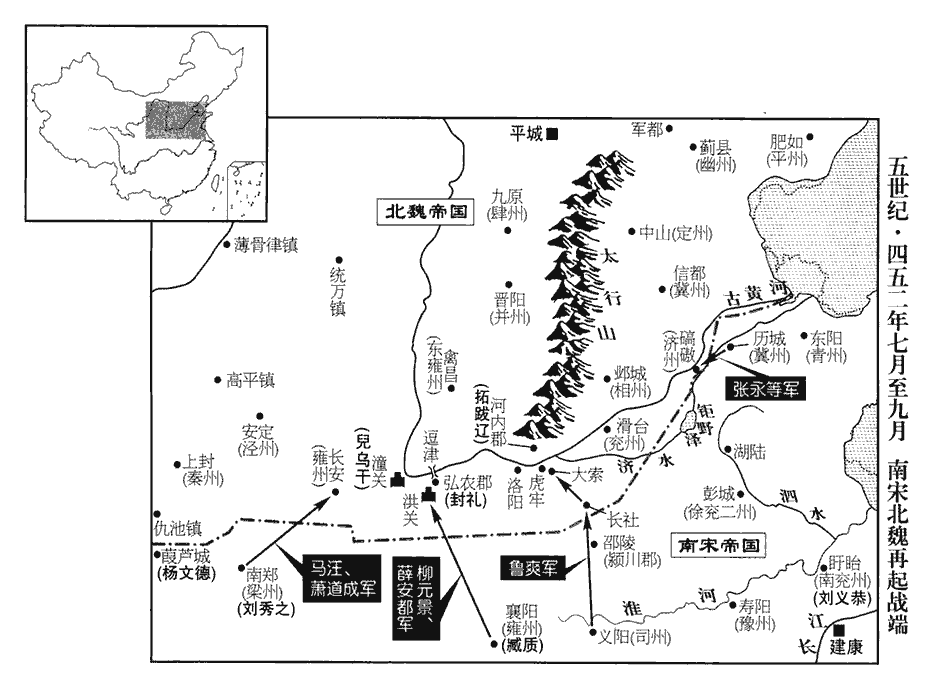
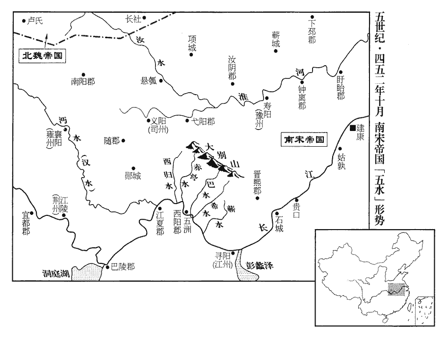

 宋紀八起重光單閼（辛卯），盡玄黓執徐（壬辰），凡二年。

# 太祖文皇帝下之上

## 元嘉二十八年（辛卯、四五一）

1春，正月，丙戌朔‹一›，魏主‹拓跋焘，时年四十四›大會羣臣於瓜步山‹江苏六合东南›上，班爵行賞有差。魏人緣江舉火；太子左【章：十二行本「左」作「右」；乙十一行本同；退齋校同。】衛率尹弘言於上‹刘义隆，时年四十五›曰：「六夷如此，必走。」北兵欲退，慮南兵之追截，故舉火以示威。尹弘習知北人軍情，因言於上。自晉氏失馭，劉、石以來，始有六夷之名。率，所律翻。丁亥‹二›，魏掠居民，焚廬舍而去。

〖译文〗 [1]春季，正月，丙戌朔（初一），北魏国主拓跋焘在瓜步山上召集全体官员，按照功劳大小，分别封爵升官进行奖赏。北魏人沿长江北岸燃起烽火，刘宋太子左卫率尹弘对文帝说：“胡虏这种行动，一定是要撤退。”丁亥（初二），北魏军队劫掠驻地的居民，焚烧了老百姓的房屋，向北而去。

胡誕世之反也，見上卷二十四年。江夏王義恭等奏彭城王義康數有怨言，搖動民聽，故不逞之族因以生心。夏，戶雅翻。數，所角翻。不逞之族，謂廢放之家不得逞志於時者也。請徙義康廣州‹府番禺，广东广州›。上將徙義康，先遣使語之；使，疏吏翻。語，牛倨翻。義康曰：「人生會死，吾豈愛生！必爲亂階，雖遠何益！請死於此，恥復屢遷。」復，扶又翻。屢，力住翻，又如字。竟未及往。魏師至瓜步，人情忷懼。忷，許拱翻。上慮不逞之人復奉義康爲亂；太子劭及武陵王駿、尚書左僕射何尚之屢啓宜早爲之所；武陵王駿時在彭城，蓋馳密啓言之也。上乃遣中書舍人嚴龍齎藥賜義康死。義康不肯服，曰：「佛敎不許自殺；佛敎謂自殺者不復得人身。願隨宜處分。」處，昌呂翻。分，扶問翻。使者以被揜yǎn殺之‹年四十三›。

〖译文〗 胡诞世聚众反叛时，江夏王刘义恭等人奏报彭城王刘义康经常说些怨愤的话，影响百姓的视听，使一些废黜放逐不能得志的家族产生了野心。他们请求将刘义康贬斥到广州。刘宋文帝刘义隆要放逐刘义康时，先派使臣告诉了他。刘义康说：“人的一生最终总是要死的，我怎能贪生怕死！如果我一定要成为动乱的因由，即使把我放逐到很远的地方，又会有什么好处呢？我请求死在这里，不愿受到再次被贬谪的奇耻大辱。”刘义康终于没有被贬到广州。北魏大军开到了瓜步，老百姓万分惊恐。文帝担心不能得志的人会再次拥戴刘义康进行叛乱，太子刘劭和武陵王刘骏、尚书左仆射何尚之也不断提醒文帝应该尽早决定怎么办，文帝这才派遣中书舍人严龙携带毒药前去，命令刘义康服药自杀，刘义康拒绝服药，说：“佛教不允许人自杀，你们怎么方便就怎么办吧。”严龙就用被子捂住了刘义康的头，将他活活闷死了。

2江夏王義恭以碻qiāo磝‹山东茌平西南›不可守，召王玄謨還歷城‹山东济南›；魏人追擊敗之，遂取碻磝。敗，蒲賣翻。去年，蕭斌使王玄謨戍碻磝。

〖译文〗 [2]江夏王刘义恭认为不能继续坚守下去，就征召王玄谟退回历城。北魏追击王玄谟军队，并把他们击败，于是夺取了。

初，上聞魏將入寇，命廣陵‹江苏扬州›太守劉懷之逆燒城府、船乘，守，手又翻。敵未至而先燒，故曰逆。乘，謂車也，音繩證翻。盡帥其民渡江。帥，讀曰率。山陽‹江苏淮安›太守蕭僧珍悉斂其民入城，臺送糧仗詣盱眙‹江苏盱眙›及滑臺‹河南滑县›者，以路不通，皆留山陽；晉安帝義熙中土斷，分廣陵立山陽郡，境內有地名山陽，因以名郡，今楚州卽其地。盱眙，音吁怡。蓄陂水令滿，須魏人至，決以灌之。須，待也。魏人過山陽，不敢留，因攻盱眙。

〖译文〗 当初，刘宋文帝得到北魏将要入侵的消息后，命令广陵太守刘怀之预先放火烧掉城内官府和水上船只，率领广陵全体老百姓渡过长江，山阳太守萧僧珍将广陵所有老百姓都纳聚山阳城中；朝廷运送粮食、武器到盱眙和滑台去的官兵，因为道路不能通行，也都留在了山阳城。萧僧珍下令将山阳城附近的山坡池塘全都灌满水，等北魏军队到达山阳时，决开池塘，放水淹灌北魏军队。因此，北魏军队在撤退路过山阳城时，不敢滞留，顺势去攻取盱眙。

魏主就臧質求酒，質封溲便與之；溲，疎鳩翻。便，毗連翻。魏主怒，築長圍，一夕而合；運東山‹江苏盱眙东南›土石以塡塹，作浮橋於君山‹盱眙东北›，絕水陸道。今盱眙縣北七里有長圍山。《圖經》云：臧質守盱眙，魏太武於都梁山築長城，造浮橋，絕水路，卽此。塹，七豔翻。魏主遺質書曰：遺，于季翻。「吾今所遣鬬兵，盡非我國人，國人，謂與拓跋氏同出北荒之子孫也。凡九十九姓。城東北是丁零與胡，南是氐、羌。設使丁零死，正可减常山‹河北正定›、趙郡‹河北高邑›賊；丁零自翟眞叛慕容皆投常山、趙郡界，阻山而居，故云然。胡死，減幷州‹山西中部›賊；自後漢納南匈奴分居幷州界，其地率皆雜處胡、漢；西河、離石以西則皆稽胡據之爲寇。氐、羌死，減關中‹陕西中部›賊。自苻、姚據關中，其種類蕃滋，雖其國已滅，而其種實繁。卿若殺之，無所不利。」言於魏國無所不利。質復書曰：「省示，具悉姦懷。省示，省來書所示也。悉，詳也，盡也。省，悉景翻。爾自恃四足，屢犯邊。恃四足，謂負戎馬足也。王玄謨退於東，申坦散於西，按王玄謨自滑臺敗退，蕭斌使申坦據清口。戴延之所謂清口在壽張縣西界安民亭南，以《水經註》考之，其地不在滑臺之西；此當謂梁坦出上蔡之師至虎牢潰散耳。爾知其所以然邪？爾獨不聞童謠之言乎？蓋卯年未至，故以二軍開飲江之路耳；冥期使然，非復人事。謂冥冥之中，大期將至，天使之然，非由人事爲之也。復，扶又翻；下容復同。寡人受命相滅，古者諸侯自稱曰寡人。質自以當藩方之任，自稱寡人。期之白登‹山西大同东›，師行未遠。爾自送死，豈容復令爾生全，饗有桑乾哉！白登山、桑乾川皆在平城左右。質言本期直指白登，師行至淮而逢魏兵，要當勦滅，不容令魏主生歸，饗有桑乾之地也。此嫚書也。兩陳相向，惡聲至，必反之，毋庸以此爲據也。乾，音干。爾有幸得爲亂兵所殺，不幸則生相鎖縛，載以一驢，直送都市耳。我本不圖全，若天地無靈，力屈於爾，齏之，粉之，細切薑蒜謂之齏，硏碎米麥謂之粉。齏jī，牋西翻。屠之，裂之，猶未足以謝本朝。朝，直遙翻。爾智識及衆力，豈能勝苻堅邪！今春雨已降，兵方四集，爾但安意攻城，勿遽走！糧食乏者可見語，語，牛倨翻；下爾語同。當出廩相貽yí。得所送劍刃，【章：十二行本「刃」作「刀」；乙十一行本同；張校同，云無註本亦作「刃」。】欲令我揮之爾身邪？」魏主大怒，作鐵牀，於其上施鐵鑱chán，鑱，士衫翻，又士懺翻，刺也，錐也。曰：「破城得質，當坐之此上。」質又與魏衆書曰：「爾語虜中諸士庶：佛貍所與書，相待如此。以魏主書言其兵鬬死正減國中賊也，因而攜之，術莫近乎此矣。魏主得質此書，豈不悔前所與質書乎？爾等正朔之民，何爲自取糜滅，豈可不知轉禍爲福邪！」中原之民本稟漢、晉正朔，故謂之正朔之民。幷寫臺格以與之云：「斬佛貍首，封萬戶侯，賜布、絹各萬匹。」臺格，宋臺所立賞格也。佛，讀如弼。

〖译文〗 北魏国主派人向盱眙守将臧质索要好酒，臧质在罐子里撒了泡尿送给他。北魏国主大怒，下令修筑长围墙，一个晚上就修好接在了一起。又搬来东山上的泥土石头填平壕沟，在君山上造起了一座浮桥，从而彻底切断了盱眙的水陆通道。北魏国主给臧质写了封信，说：“我现在派出去的攻城军队，都不是我们本国本族人，城东北的丁零人和匈奴人，城南的是氐人和羌人，假设让丁零人死了，正可以减少常山、赵郡的贼寇；匈奴人死了，正好减少了并州的贼寇；氐人、羌人死了，当然也就减少了关中的贼寇。你如果真的杀掉了他们，对我们没有什么不利的地方。”臧质回信说：“看了你的信，我完全明白了你的奸诈之心。你自己依仗着四条腿，多次进犯我国边境。王玄谟被你击败在东边，申坦军又在西边被你攻散，你知道这是为什么吗？你难道没有听说一首童谣里所说的吗？只因卯年还没有来到，所以，我们用两路军队引导着你们走上饮长江水的道路罢了。冥期已经注定，这并不是任何人所能改变得了的。我奉命前来消灭你们，原预定要到达白登，可是，军队还没有走出多远，就遇到你们自己前来送死了，我怎么能让你再活着回去，到桑干河享受荣华富贵呢？如果你幸运的话，当被乱军所杀；如果你不走运，被我们活捉后，就会用锁链锁住你的脖子，让一头小毛驴驮着你，把你一直押送到我们的都城建康。我本来就不打算全尸，如果天地没有显灵，我被你打败，即使被剁成肉酱，碾成粉末，宰割车裂，也都不足以向我们朝廷表示我的歉疚。你的智慧见识以及军队的力量，哪里超得过荷坚呢！如今，已经下起春雨，我们的各路大军就要集合起来，你只管一心一意去攻城吧，千万不要立刻逃走！如果你们粮食不够吃，可以告诉我们，我们一定会打开粮仓馈赠给你们。你派人送来的刀剑我已收到，你的意思是不是想让我挥刀斩了你呢？”北魏国主看完臧质的信，气得浑身发抖，他命令手下人制造了一个大铁床，把刀尖锥尖朝上放在铁床上，说：“攻破城池，抓住臧质，我一定让他坐在这张铁床上。”臧质又给北魏大军写了封信，说：“你们告诉胡虏中各位士人百姓：佛拓跋焘在给我写的信上，这样对待你们。你们本来是汉人，为什么要去自取灭亡呢？你们怎么不知道转祸为福呢？”同时，臧质又将朝廷的悬赏写在信上告诉他们说：“砍下佛的人头的，封为万户侯，赏赐绵布、丝绸各一万匹。”

魏人以鉤車鉤城樓，城內繫以彄絚，彄kōu，恪侯翻。絚gēng，古恆翻，大索也。數百人叫呼引之，車不能退。旣夜，縋桶懸卒出，截其鉤，獲之。縋，馳僞翻。桶，他董翻；箍木爲之。明旦，又以衝車攻城，城土堅密，每至，句絕。謂衝車至著城身也。頹落不過數升。魏人乃肉薄登城，分番相代，墜而復升，復，扶又翻。莫有退者，殺傷萬計，尸與城平。凡攻之三旬，不拔。會魏軍中多疾疫，或告以建康遣水軍自海入淮，水軍自建康下江，自江出海，轉料角則入淮。又敕彭城‹江苏徐州›斷其歸路；斷，丁管翻。二月，丙辰朔‹一›，魏主燒攻具退走。盱眙人欲追之，沈璞曰：「今兵不多，雖可固守，不可出戰，但整舟楫，示若欲北渡者：示若欲自盱眙渡淮而北以追截其後者。以速其走，計不須實行也。」

〖译文〗 北魏军队用钩车钩住城楼，城内军队就用铁环制成的大铁链，拴住钩车，然后再让几百士卒高声呼喊拉住铁链使北魏军的钩车无法后退。入夜以后，守军用大桶把军士从城上放下，砍断北魏军的车钩，缴获了这种工具。第二天天亮，北魏军又改用冲城车攻城，但城墙坚硬牢固，冲城车每次冲撞，撞下墙土也不超过几升。于是，北魏军就采用肉搏战术开始攻城，他们把士卒分为几个梯队，轮番往城墙上爬，从城上摔下又继续向上爬，没有一个人后退，死伤士卒数以万计，尸体堆积得与城墙一样高。北魏军这样围攻了三十天，仍未攻下。这时，又赶上北魏军中瘟疫流行，有人报告说，宋朝水军从东海进入淮河了，刘宋朝廷又下令彭城守军切断北魏军队回归的道路。二月，丙辰朔（疑误），北魏国主下令焚毁攻城器具，而后撤退。盱眙守军想要追击，沈璞说：“现在，我们的兵力并不多，虽然可以固守城池，却不可以出城讨战。不过，我们仍然要整治好船只，做出要北渡淮河的样子，这样，就可以促使他们更快地离开，估计并不需要真的去做。”

臧質以璞城主，使之上露版，露版者，書獲捷之狀，露版上聞，使天下悉知之也。上，時掌翻。璞固辭，歸功於質。上‹刘义隆›聞，益嘉之。已嘉璞之功，又益嘉其讓。

〖译文〗 臧质认为沈璞是盱眙城主，就请他向朝廷发出报捷的奏表，沈璞坚决辞让，而把功劳全都归于臧质一人。文帝听说后，对他更是倍加嘉许。

魏師過彭城‹江苏徐州›，江夏王義恭震懼不敢擊。夏，戶雅翻。或告「虜驅南口萬餘，夕應宿安王陂，去城數十里，今追之，可悉得。」諸將皆請行，義恭禁不許。明日，驛使至，使，疏吏翻。上敕義恭悉力急追。魏師已遠，義恭乃遣鎭軍司馬檀和之向蕭城‹安徽萧县›。魏人先已聞之，盡殺所驅者而去。程天祚逃歸。天祚爲魏所禽，見上卷二十六年。

〖译文〗 北魏军队经过彭城，江夏王刘义恭震惊恐惧，不敢出击。有人来报告说：“胡虏正驱赶着南方一万多口人，晚上将住在安王陂，离彭城有几十里，现在我们去追击他们，正可以全部俘获。”各大将都纷纷请求出击，刘义恭下令制止，不许出兵。第二天，朝廷信使抵达这里，文帝命令刘义恭立即全力追击魏军。北魏军队这时已经走远，刘义恭就派镇军司马檀和之奔向萧城追赶。北魏军队事先已经得到了这一消息，于是将所驱赶的南方百姓全都杀掉，然后北上。程天祚逃了回来。

魏人凡破南兗、徐、兗、豫、青、冀六州，殘破六州之生聚耳，六州城守未嘗失也。殺傷不可勝計，勝，音升。丁壯者卽加斬截，嬰兒貫於槊上，槊，色角翻。盤舞以爲戲。所過郡縣，赤地無餘，春燕歸，巢於林木。室廬焚蕩，燕無所歸，故巢林木。魏之士馬死傷亦過半，國人皆尤之。

〖译文〗 北魏军队一共击破了南兖、徐、北兖、豫、青、冀等六州，杀死杀伤的人无法统计。他们抓到青壮年立即斩首或拦腰砍断，婴幼儿则用铁矛刺穿，然后挥动铁矛进行游戏。魏军经过的郡县，都成千里荒地。春天，燕子回来了，只能在树林里筑巢。北魏军的人马也死伤了一多半，北魏国人也都大有怨言。

上‹刘义隆›每命將出師，常授以成律，交戰日時，亦待中詔，是以將帥趑趄，莫敢自決。將，卽亮翻。帥，所類翻。趑，取私翻。趄，七余翻。趑趄zījū，不進也。又江南白丁，輕易進退，易，以豉翻。此其所以敗也。自是邑里蕭條，元嘉之政衰矣。史言亟用兵之禍。

〖译文〗 文帝每次命令将领们率兵作战，常常把已拟定好的作战计划交给他们，甚至交战的日子，也都要等待皇帝的命令，因此，军中将帅总是犹犹豫豫，没有谁胆敢自己决定什么。此外，没有经过训练的江南士卒，常常是打胜了就争着前进，打败了则争先恐后地逃命，这就是刘宋军所以战败的重要原因。从此以后，刘宋国内走向萧条衰败阶段，元嘉时代的盛况日趋衰落了。

癸酉‹十九›，詔賑恤郡縣民遭寇者，蠲其稅調。賑，津忍翻。蠲juān，工玄翻。調，徒釣翻。

〖译文〗 癸酉（十九日），刘宋文帝下诏，赈济抚恤受到寇敌残害蹂躏的各郡县百姓，免除田赋捐税。

甲戌‹二十›，降太尉義恭爲驃騎將軍、開府儀同三司。驃，匹妙翻。騎，奇計翻。

〖译文〗 甲戌（二十日），将太尉刘义恭降职为骠骑将军、开府仪同三司。

戊寅‹二十四›，魏主濟河。自丙辰盱眙退師，二十三日始濟河。

〖译文〗 戊寅（二十四日），北魏国主率军渡过黄河。

辛巳‹二十七›，降鎭軍將軍武陵王駿爲北中郎將。

〖译文〗 辛巳（二十七日），刘宋朝廷将镇军将军武陵王刘骏降职为北中郎将。

壬午‹二十八›，上‹刘义隆›如瓜步。是日，解嚴。

〖译文〗 壬午（二十八日），文帝前往瓜步。这一天，刘宋解除戒严。

初，魏中書學生盧度世，玄之子也，魏神䴥jiā四年，徵盧玄。坐崔浩事亡命，匿高陽‹河北高阳东›鄭羆pí家。崔浩事見上卷二十七年。高陽縣，前漢屬涿郡，後漢屬河間國，晉分屬高陽郡。吏囚羆子，掠治之。掠，音亮。羆戒其子曰：「君子殺身成仁，《論語》載孔子之言。雖死不可言。」其子奉父命；吏以火爇其體，爇ruò，如悅翻。終不言而死。及魏主臨江，上遣殿上將軍黃延年使於魏，自晉以來有殿中將軍，殿上將軍當是宋所置。使，疏吏翻。魏主問曰：「盧度世亡命，已應至彼。」延年曰：「都下不聞有度世也。」魏主乃赦度世及其族逃亡籍沒者，凡度世之族逃亡而籍沒其家者並赦之。度世自出，魏主以爲中書侍郎。《考異》曰：《宋•柳元景傳》：「元景從祖弟光世，先留鄕里，索虜以爲折衝將軍、河北太守，封西陵男。光世姊夫爲司徒崔浩，虜之相也。元嘉二十七年，虜主拓跋燾南寇汝、潁，浩密有異圖。光世要河北義士與浩應接，謀泄被誅，河東大姓坐連謀夷滅者甚衆，光世南奔得免，太祖以爲振武將軍。」與《魏事（書）》不同。今從《魏書》。度世爲其弟娶鄭羆妹以報德。爲，于僞翻。

〖译文〗 当初，北魏中书学生卢度世是卢玄的儿子，因为受崔浩事件的牵连逃走，躲藏到高阳人郑罴家里，高阳府官吏逮捕了郑罴的儿子，酷刑拷打盘问卢度世的下落。郑罴告诫他的儿子说：“君子应当杀身成仁，你即使被打死了也不要说出来。”郑罴的儿子遵奉父亲的命令坚守秘密。官吏们用火烧他的身体，他最终也没有招出来，被折磨致死。北魏国主抵达长江北岸时，文帝派遣殿上将军黄延年出使北魏，魏主问道：“卢度世逃走了，应该已经逃到你们那里。”黄延年说：“我从来没有听说过卢度世这个人。”北魏国主于是下令赦免卢度世以及他的同族中逃亡外地或被抄家产的人，卢度世这才自动露面，北魏国主任命他为中书侍郎。卢度世让他的弟弟娶了郑罴的妹妹，以此来报答郑家的恩德。

三月，乙酉‹一›，帝還宮。

〖译文〗 三月，乙酉（初一），文帝从瓜步返回了朝廷。

己亥‹十五›，魏主還平城‹山西大同›，魏主戊寅濟河，行二十二日至平城。飲至告廟，《左傳》：凡公行告于廟，反行飲至，舍爵策勳焉，禮也。又曰：三年而治兵，入而振旅，歸而飲至，以數軍實。杜預《註》曰：飲於廟，以數車徒器械及所獲也。以降民五萬餘家分置近畿。近畿，謂環平城千里之地。降，戶江翻。

〖译文〗 己亥（十五日），北魏国主回到平城，然后，他在祖庙内设下祭祀酒席，把这次南下征讨的经过报告了祖宗，同时，又把从南宋裹胁来的五万多户人家分别安置在京畿附近。

初，魏主過彭城，遣人語城中曰：語，牛倨翻。「食盡且去，須麥熟更來。」及期，江夏王義恭議欲芟麥翦苗，移民堡聚。芟，所銜翻。鎭軍錄事參軍王孝孫曰：《白氏六帖》曰：州主簿、郡督郵，並今錄事參軍。余按晉琅邪王睿都督揚州，以陳頵jūn爲錄事參軍。當時自別有州主簿、督郵之吏，亦猶存古；而錄事之職，掌正違失，涖符印。「虜不能復來，復，扶又翻。旣自可保；如其更至，此議亦不可立。百姓閉在內城，饑饉日久，方春之月，野採自資；一入堡聚，餓死立至，民知必死，何可制邪！虜若必來，芟麥無晚。」四坐默然，莫之敢對。坐，徂臥翻。長史張暢曰：「孝孫之議，實有可尋。」尋，繹理也，用也。《左傳》：將尋師焉。又曰，日尋干戈。杜預《註》皆云：尋，用也。鎭軍府典籤董元嗣侍武陵王駿之側，進曰：「王錄事議不可奪。」別駕王子夏曰：「此論誠然。」暢斂版白駿曰：版，手版。僚佐於府公之前斂版白事，崇敬也。「下官欲命孝孫彈子夏。」錄事參軍掌糾彈，故云然。彈，徒丹翻。駿曰：「王別駕有何事邪？」暢曰：「芟麥移民，可謂大議，一方安危，事繫於此。子夏親爲州端，州別駕居羣僚之右，故曰州端。曾無同異；及聞元嗣之言，則懽笑酬答。阿意左右，何以事君！」子夏、元嗣皆大慚，義恭之議遂寢。

〖译文〗 当初，北魏国主经过彭城时，派人告诉彭城守军说：“我们粮食吃完了，暂且回去，等到你们麦熟季节我们会再来。”麦子成熟时，江夏王刘义恭想把小麦全部割光，把所有人都转移到城堡里。这时，镇军录事参军王孝孙说：“胡虏绝不会再来，我们可以保全自己。如果他们真的又回来了，这一动议也是不能实行的。因为我们的老百姓被关在城内，忍饥挨饿也已很久了，此时正是春暖花开的时节，他们完全可以挖些野菜摘些野果来充饥。一旦再让他们迁到城堡里，那么，他们马上就会饿死。老百姓知道自己会被饿死，我们又怎么能控制住他们呢？倘若胡虏一定要前来进犯，我们等他们来了再割麦子也不晚。”在座的人都沉默地坐着，没有人敢说话。长史张畅说：“王孝孙说的这些，实在有道理。”镇军府典签董元嗣站立在武陵王刘骏的身边，他也劝说道：“王录事的意见是不可改变的。”别驾王子夏说：“这一见解，果然不错。”张畅举一下手版，对刘骏说：“我打算让王孝孙弹劾王子夏。”刘骏吃惊地问：“王子夏出什么事了？”张畅说：“收割麦子，让老百姓转移到城堡里，这些都是很重要的决策，一个地方的安危都与此有关。王子夏身为一个州的最高官员，还从未发表过意见，等到听董元嗣这么一说，才立刻露出了笑容表示赞同。这种阿谀奉迎之人，怎么能够为您做事呢？”王子夏、董元嗣听了张畅的话，都深为惭愧。刘义恭的计划于是也被取消了。

3初，魯宗之奔魏，晉安帝義熙十一年，魯宗之自襄陽奔秦，十三年，秦亡奔魏。其子軌爲魏荊州‹府长社，河南长葛›刺史、襄陽公，鎭長社‹河南长葛›，常思南歸；以昔殺劉康祖及徐湛之父，劉康祖父虔之，徐湛之父逵之，義熙十一年爲魯軌所殺。故不敢來。軌卒，子爽襲父官爵。爽少有武幹，少，詩照翻。與弟秀皆有寵於魏主。【章：十二行本「主」下有「秀爲中書郎」五字；乙十一行本同；孔本同；張校同；退齋校同。】旣而兄弟各有罪，魏主詰責之。爽粗中使酒多過失，秀以檢校鄴‹河北临漳西南邺镇›人謀反事，因病還遲，並爲魏主所詰責。詰，去吉翻。爽、秀懼誅，從魏主自瓜步還，至湖陸‹山东鱼台东南›，請曰：「奴與南有仇，每兵來，常恐禍及墳墓，爽祖父皆葬長社。乞共迎喪還葬平城。」魏主許之。爽至長社，殺魏戍兵數百人，帥部曲及願從者千餘家奔汝南‹河南汝南›。自長社至汝南不及三百里。帥，讀曰率。夏，四月，爽遣秀詣壽陽，奉書於南平王鑠以請降。鑠，式灼翻。降，戶江翻。上聞之，大喜，以爽爲司州刺史，鎭義陽‹河南信阳›；沈約曰：司州刺史，漢之司隸校尉也，晉江左以來，淪沒戎寇。雖永和、太元，王化蹔及，及太和、隆安，還復湮陷。武帝北平關、洛，河南底定，置司州刺史，治虎牢，領河南、滎陽、弘農實土三郡。少帝景平初，司州復沒，元嘉末，僑立，治汝南，是後遂治義陽，領義陽、隨陽、安陸、南汝南郡。秀爲潁川‹河南郾城东›太守，《考異》曰：《宋略》云「滎陽太守」，今從《宋書》。余謂帝蓋以秀兄弟自潁川來降，遂因以潁川太守授秀。餘弟姪並授官爵，賞賜甚厚。魏人毀其墳墓。徐湛之以爲廟算遠圖，特所獎納，不敢苟申私怨，乞屛居田里；不許。屛，迸郢翻。

〖译文〗 [3]当初，东晋雍州刺史鲁宗之投奔北魏，他的儿子鲁轨做了北魏的荆州刺史、襄阳公，镇守长社，他经常想回到南方，只是由于当年曾经杀了刘康祖和徐湛之的父亲，所以不敢回去。鲁轨去世后，他的儿子鲁爽承袭了父亲的官爵职位。鲁爽从小就有武略才能，他和他的弟弟鲁秀都深受魏主的宠爱。可是不久，他们兄弟二人都犯了罪，北魏国主盘问责备他们，鲁爽和鲁秀害怕会被诛杀，因此，当他们俩跟着北魏国主从瓜步返回，来到湖陆时，二人向北魏国主请求说：“奴才与南方有深仇大恨，每次大军南下，我们都害怕这种灾祸会殃及我们的祖坟，因此，我们请求把祖先的棺木，移送到平城安葬。”北魏国主答应了他们的请求。鲁爽到长社后，杀了几百名北魏戍守士卒，就率领自己的军队以及愿意跟着自己的一千多家部众投奔了汝南。夏季，四月，鲁爽派鲁秀前往寿阳，送信给刘宋南平王刘铄，请求投降。文帝听说后，十分高兴，立刻任命鲁爽为司州刺史，镇守义阳，鲁秀为颍川太守，其余的弟弟、侄子等等也一并被封官授爵，给予他们的赏赐格外厚重。北魏军队捣毁了鲁爽家族的坟墓。徐湛之认为朝廷是为了国家的长远利益打算，对他们特别嘉奖优待，所以自己也不敢计较个人的恩怨，请求辞官回乡隐居，文帝没有批准。

4青州‹山东半岛›民司馬順則自稱晉室近屬，聚衆號齊王。梁鄒‹山东邹平北›戍主崔勳之詣州，五月，乙酉‹二›，順則乘虛襲梁鄒城。梁鄒縣，漢屬濟南郡，晉省；宋置梁鄒戍，爲平原太守治所。《水經註》：濟水自管縣東過梁鄒縣北，又東北過臨濟縣南。參而考之，其地蓋在唐齊州臨濟縣界。又有沙門自稱司馬百年，亦聚衆號安定王以應之。

〖译文〗 [4]刘宋青州平民司马顺则宣称自己是东晋皇家的近族，聚众造反，自称齐王。这时，梁邹守将崔勋之前去州府办事，五月，乙酉（初二），司马顺则乘城中防守空虚偷袭了梁邹城。同时，又有一和尚自称司马百年，也聚众造反崐，号安定王，以此响应司马顺则。

5壬寅‹十九›，魏大赦。

〖译文〗 [5]壬寅（十九日），北魏实行大赦。

6己巳‹二十二›，以江夏王義恭領南兗州刺史，徙鎭盱眙，增督十二州諸軍事。

〖译文〗 [6]己巳（疑误），刘宋朝廷任命江夏王刘义恭兼任南兖州刺史，将州府迁到了盱眙，加授他为督十二州诸军事。

7戊申‹二十五›，以尚書左僕射何尚之爲尚書令，太子詹事徐湛之爲僕射、護軍將軍，《晉志》曰：自魏、晉迄于江左，僕射置二則分左、右，或不兩置，但曰尚書僕射；令闕，則左爲省主；若左右並闕，則置尚書僕射以主左事。今湛之蓋以尚書僕射領護軍將軍也。尚之以湛之國戚，湛之，帝之甥，會稽公主‹刘兴弟›之子。任遇隆重，每事推之。詔湛之與尚之並受辭訴。尚之雖爲令，而朝事悉歸湛之。朝，直遙翻。

〖译文〗 [7]戊申（二十五日），刘宋朝廷任命尚书左仆射何尚之为尚书令，太子詹事徐湛之为仆射、护军将军。何尚之因为徐湛之是皇亲国戚，深受文帝的宠信和重用，所以每次遇到大事都全部推给徐湛之。文帝又下诏，命令徐湛之与何尚之共同受理裁决公务。何尚之虽然身为尚书令，但实际上朝廷事务全由徐湛之一人去裁断。

8六月，壬戌‹九›，魏改元正平。

〖译文〗 [8]六月，壬戌（初九），北魏改年号为正平。

9魏主命太子少傅游雅、中書侍郎胡方回等更定律令，多所增損，凡三百九十一條。

〖译文〗 [9]北魏国主命令太子少傅游雅、中书侍郎胡方回等人改订国家法律，进行了大量的更定和补充，修订完的法律共有三百九十一条。

10魏太子晃監國，監，工銜翻。頗信任左右，又營園田，收其利，高允諫曰：「天地無私，故能覆載；覆，敷又翻。王者無私，故能容養。今殿下國之儲貳，萬方所則；而營立私田，畜養雞犬，畜，許六翻。乃至酤gū販市廛chán，與民爭利，廛，市中空地；一曰，居也。《說文》曰：廛，一畝半，一家之居也。孔穎達曰：市廛而不稅者，廛，謂公家邸舍，使商人停物於中，直稅其所舍之處，不稅其在市所賣之物。市內空地曰廛，城內空地曰肆。按《載師》云；以廛里任國中之地。鄭《註》云：廛里，邑居里矣，廛，民居之區域也。司農云：廛，市中空地未有肆，城中空地未有宅者也。遂人授民田，夫一廛，田百畝。《詩》：胡取禾三百廛兮。《傳》云：一夫之居曰廛。謂一夫之田百畝也。揚子云：有田一廛，謂百畝之居，與《詩傳》同。夫田之廛與市廛之廛，其義不同，各有攸當也。謗聲流布，不可追掩。夫天下者，殿下之天下，富有四海，何求而無，乃與販夫、販婦競此尺寸之利乎！昔虢‹河南三门峡›之將亡，神賜之土田，註見前。漢靈帝‹刘宏›私立府藏，事見五十七卷光和元年。藏，徂浪翻。皆有顚覆之禍；前鑒若此，甚可畏也。武王‹姬发›愛周‹姬旦›、邵‹姬奭›、齊‹姜子牙›、畢‹姬高›，所以王天下；《史記•周紀》：武王卽位，太公望爲師，周公旦爲輔，召公、畢公之徒左右王師，一戎衣而天下大定。王，于況翻。殷紂‹子受辛›愛飛廉、惡來，所以喪其國。飛廉多力，惡來善走，父子俱以才力事紂。惡來善毀讒，諸侯以此益疏。喪，息浪翻。今東宮儁乂不少，頃來侍御左右者，恐非在朝之選。少，詩沼翻。朝，直遙翻。願殿下斥去佞邪，親近忠良；去，羌呂翻。近，其靳翻。所在田園，分給貧下；販賣之物，以時收散；收，謂收藏其物；散，謂散與貧民。一曰：以時收散者，言穫斂之時，民力可以償稱逋負則收之；停滯居物，至民所欲得之時則散之。如此，則休聲日至，謗議可除矣。」不聽。

〖译文〗 [10]北魏太子拓跋晃主持国家事务，十分相信自己左右近侍，他自己私下里经营庄园农田，收取利润。高允劝告他说：“天地因为不存私心，所以能覆盖、承载万物；帝王因为没有私心，所以能够宽容养育百姓。如今殿下您是一国的储君，是国家上上下下作为典范的人，却自己私下经营个人的田地，养鸡养狗，甚至派人去集市上摆摊贩卖，与市井小民争夺小利，以致于诽谤您的话到处流传，没法让人去追回或掩盖。国家，是殿下您个人的国家，您富裕得拥有四海，要什么会没有？何必要与贩夫、贩妇们去争夺这尺寸大小的微利呢！过去，虢国快要灭亡时，神灵将土地赐给了它；东汉灵帝私自设立钱庄，都招来了被颠覆的灾祸。像这样的前车之鉴，是很令人可怕的。周武王宠信周公姬旦、召公姬、齐公姜子牙和毕公姬高，才在天下称王；而殷商纣王由于宠信飞廉、恶来这种恶人，才导致了国破家亡。如今，太子宫内的俊杰之士有很多，但近来侍奉在您左右的人，恐怕并不是当朝的合适人选。我盼望殿下您排除奸邪谄佞的小人，多同忠厚善良的忠良之士亲近。将您所占有的田地庄园，分别赏给下边的贫苦百姓；将您做生意卖的东西，即时收起来或者尽早分给百姓。如果这样去做，那么，美好的声誉将会一天天增多起来，诽谤的议论也就能够消除了。”拓跋晃并没有接受高允的劝谏。

太子‹拓跋晃›爲政精察，而中常侍宗愛，性險暴，多不法，太子惡之。惡，烏故翻。給事中仇尼道盛、侍郎任平城侍郎，卽給事黃門侍郎。仇尼，複姓，出於徒河。任，音壬。有寵於太子，頗用事，皆與愛不協。愛恐為道盛等所糾，遂構告其罪，魏主怒，斬道盛等於都街，都街，卽都市。東宮官屬多坐死，帝怒甚。戊辰‹十五›，太子以憂卒‹年二十四›。《考異》曰：《宋•索虜傳》云：「燾至汝南瓜步，晃私遣取諸營鹵獲甚衆。燾歸，聞知，大加搜檢。晃懼，謀殺燾。燾乃詐死，使其近習召晃迎喪，於道執之；及國，罩以鐵籠，尋殺之。」蕭子顯《齊書》亦云：「晃謀殺佛貍，見殺。」《宋略》曰：「燾旣南侵，晃淫于內，謀欲殺燾。燾知之，歸而詐死，召晃迎喪。晃至，執之，罩以鐵籠，捶之三百，曳于叢棘以殺焉。」又《索虜傳》云：「晃弟秦王烏奕旰與晃對掌國事，晃疾之，訴其貪暴。燾鞭之二百，遣鎭枹罕。」此皆江南傳聞之誤。今從《後魏書》。壬申‹十九›，葬金陵‹内蒙和林格尔西北›，諡曰景穆。帝徐知太子無罪，甚悔之。爲後宗愛弒帝張本。

〖译文〗 太子拓跋晃为政精明，洞察细微。中常侍宗爱却是个性格阴险暴躁的人，有很多违法行为，因此，拓跋晃很讨厌他。给事中仇尼道盛、侍郎任平城很受拓跋晃的宠信，都掌握不少权力，都跟宗爱不能和睦相处。宗爱恐怕自己会被仇尼道盛等检举揭发，于是编假话向北魏国主控告二人有罪，北魏国主非常气愤，下令将仇尼道盛等绑到街市上斩首示众，东宫内的官员们有很多被牵连进去，也都被斩首，北魏国主为此非常气愤。戊辰（十五日），太子拓跋晃因忧崐虑过度生病去世。壬申（十九日），拓跋晃的遗体被安葬在金陵，谥号景穆。北魏国主后来慢慢知道太子拓跋晃并没有犯法，因此感到非常后悔。

11秋，七月，丁亥‹五›，魏主如陰山。

〖译文〗 [11]秋季，七月，丁亥（初五），北魏国主前往阴山。

12青、冀二州刺史蕭斌遣振武將軍劉武之等擊司馬順則、司馬百年，皆斬之。斌，音彬。癸亥‹十一›，梁鄒平。

〖译文〗 [12]刘宋青、冀二州刺史萧斌派振武将军刘武之等前去攻打司马顺则和司马百年，将二人斩首。癸亥（疑误），梁邹的反叛被彻底平息了。

13蕭斌、王玄謨皆坐退敗免官。上問沈慶之曰：「斌欲斬玄謨而卿止之，何也？」對曰：「諸將奔退，莫不懼罪，將，卽亮翻。自歸而死，將至逃散，故止之。」慶之諫斬玄謨事見上卷上年。

〖译文〗 [13]萧斌、王玄谟都被控告打了败仗而后退，因此被免去职务。宋文帝问沈庆之：“萧斌打算斩了王玄谟，你却阻止他，这是为什么？”沈庆之回答说：“大将们都纷纷后退逃走，没有谁不怕受到惩处。假如有一个人自己回来了却要被处死，那么，其余将领们肯定会四处逃亡不再回来了，因此，我阻止了萧斌这样做。”

14九月，癸巳‹十二›，魏主還平城；冬，十月，庚申‹九›，復如陰山。復，扶又翻。

〖译文〗 [14]九月，癸巳（十二日），北魏国主回到平城。冬季，十月庚申（初九），再次前往阴山。

15上遣使至魏，魏遣殿中將軍郎法祐來脩好。好，呼到翻。

〖译文〗 [15]文帝派使节到北魏，北魏则派殿中将军郎法前来恢复友好。

16己巳‹十八›，魏上黨靖王長孫道生卒‹年八十二›。

〖译文〗 [16]己巳（十八日），北魏的上党靖王长孙道生去世。

17十二月，丁丑‹二十七›，魏主封景穆太子之子濬‹时年十二›爲高陽王；旣而以皇孫世嫡，不當爲藩王，乃止。觀此，則魏世祖立孫之意定矣。時濬生四年，聰達過人，魏主愛之，常置左右。徙秦王翰爲東平王，燕王譚爲臨淮王，楚王建爲廣陽王，吳王余爲南安王。翰等皆魏主子。以國王徙封郡王，當考。

〖译文〗 [17]十二月，丁丑（二十七日），北魏国主封景穆太子拓跋晃的儿子拓跋浚为高阳王。不久，因为拓跋浚是皇室中的嫡亲皇孙，不应该封为藩王，因而取消。这一年，拓跋浚四岁，他聪明伶俐过人，北魏国主很喜爱他，常常把他带在身边。北魏国主后又改封秦王拓跋翰为东平王，燕王拓跋谭为临淮王，楚王拓跋建为广阳王，吴王拓跋余为南安王。

18帝‹刘义隆›使沈慶之徙彭城流民數千家於瓜步，征北參軍程天祚徙江西流民數千家於姑孰‹安徽当涂›。彭城、江西流民，皆避魏寇而南者。

〖译文〗 [18]文帝派沈庆之将几千家彭城难民迁移到瓜步，派征北参军程天祚将几千户江西难民迁移到姑孰。

19帝以吏部郎王僧綽爲侍中。僧綽，曇首之子也，曇首輔政於元嘉之初。曇，徒含翻。幼有大成之度，衆皆以國器許之。好學，有思理，好，呼到翻。思，相吏翻。思理，猶言思致也。練悉朝典。朝，直遙翻；下同。尚帝女東陽獻公主。在吏部，諳悉人物，舉拔咸得其分。諳，烏含翻。分，扶問翻。言能隨其分量而授任也。及爲侍中，年二十九，沈深有局度，有局則能處事，有度則能容物。沈，持林翻。不以才能高人。帝頗以後事爲念，以其年少，少，詩照翻。欲大相付託，朝政大小，皆與參焉。帝之始親政事也，委任王華、王曇首、殷景仁、謝弘微、劉湛，次則范曄、沈演之、庾炳之，最後江湛、徐湛之、何瑀yǔ之及僧綽，凡十二人。「何瑀之」，恐當作「何尚之」。

〖译文〗 [19]刘宋文帝任命吏部郎王僧绰为侍中。王僧绰是王昙首的儿子，他从小就有成就大事的胸怀，因此，大家也都认定他是国家的栋梁之材。王僧绰刻苦好学，思维细致慎密，非常熟悉国家的典章制度。他娶了文帝的女儿东阳献公主为妻。在吏部任职时，他了解并熟悉各种各样的人物，推荐选拔人物也都非常恰当。他当上侍中时才二十九岁，他沉着稳重，处事有分寸、有度量，而且不因为自己才能高人一等而对他人傲慢无礼。文帝一直挂记自己身后之事交托给谁。因王僧绰年纪轻，所以文帝想把国家重任全部托付给他，朝廷内无论讨论大大小小事情，都命令他去参与。文帝刚开始亲自处理政事时，最宠信王华、王昙首、殷景仁、谢弘微、刘湛，后来就是范晔、沈演之、庾炳之，最后则是江湛、徐湛之、何之及王僧绰，总计十二人。

20唐和入朝于魏，魏主厚禮之。唐和鎭焉耆‹新疆焉耆›，有撫安西域之功，故厚禮之。

〖译文〗 [20]北魏镇守西域焉耆的唐和，前往平城朝见北魏国主，北魏国主用优厚的礼仪来款待他。

## 二十九年（壬辰、四五二）

1春，正月，魏‹都平城，山西大同›所得宋民五千餘家在中山‹河北定州›者謀叛，州軍討誅之。州軍，定州之軍也。冀州‹府信都，河北冀县›刺史張掖王沮渠萬年坐與叛者通謀，賜死。沮，子余翻。

〖译文〗 [1]春季，正月，北魏所俘获的刘宋百姓五千余户在中山居住的人图谋造反，该州军队前去讨伐，把他们全部诛杀。冀州刺史张掖王沮渠万年与反叛者相互勾结，北魏国主赐他自杀。

2魏世祖‹拓跋焘›追悼景穆太子‹拓跋晃›不已；中常侍宗愛懼誅，二月，甲寅‹五›，弒帝，年四十五，諡曰太武皇帝。《考異》曰：《宋書》作「庚申」，今從《魏書》。尚書左僕射蘭延、《魏書•官氏志》：北方諸姓，烏洛蘭氏改爲蘭氏。侍中和𤴓yǎ、薛提等祕不發喪。𤴓yǎ【章：十二行本「𤴓」上有「延」字；乙十一行本同；孔本同；張校同。】以皇孫濬沖幼，欲立長君，𤴓，五下翻。長，知兩翻。徵秦王翰，置之祕室；祕室，祕密之室。提以濬嫡皇孫，不可廢。議久不決。宗愛知之，自以得罪於景穆太子，而素惡秦王翰，惡，烏路翻。善南安王余，乃密迎余自中宮便門入禁中，矯稱赫連皇后令召延等。赫連皇后，夏主勃勃之女也。延等以愛素賤，不以爲疑，皆隨入。愛先使宦者三十人持兵伏於禁中，延等入，以次收縛，斬之；殺秦王翰於永巷而立余。大赦，改元承平，尊皇后爲皇太后，以愛爲大司馬、大將軍、太師、都督中外諸軍事、領中祕書，封馮翊王。史言魏亂。

〖译文〗 [2]北魏国主一直在追念、哀痛太子拓跋晃。中常侍宗爱害怕自己被杀，二月，甲寅（初五），刺杀了北魏国主。尚书左仆射兰延、侍中和疋、薛提等人，没有宣布死讯。和疋认为皇孙拓跋浚年纪尚小，所以，打算立年龄稍大的君王。于是，征召秦王拓跋翰入宫，把他安置在一个秘密房间里。但薛提却认为拓跋浚是嫡亲皇孙，不应该废黜。反复讨论很久也没有决定下来。宗爱得到消息，自认为他已得罪于景穆太子，而平时一向就讨厌秦王拓跋翰，只跟南安王拓跋余关系密切，于是，他就把拓跋余秘密迎来，从中宫小门进入后宫，然后，他假传赫连皇后的命令，召见兰延等人。兰延等人认为宗爱的地位一向很低，所以根本没有怀疑，全都随宗爱进宫了。在这之前，宗爱就已经派三十个宦官手持武器在宫中埋伏起来，兰延等人入宫，就被这些伏兵一个个抓起来杀了。在永巷把秦王拓跋翰杀掉，而拥护南安王拓跋余登基。拓跋余登基后，实行大赦，改年号为承平，将皇后赫连尊立为皇太后，任命宗爱为大司马、大将军、太师、都督中外诸军事及领中秘书，封为冯翊王。

3庚午‹二十一›，立皇子休仁爲建安王。

〖译文〗 [3]庚午（二十一日），刘宋文帝立皇子刘休仁为建安王。

4三月，辛卯‹十三›，魏葬太武皇帝于金陵‹内蒙和林格尔西北›，葬雲中金陵。廟號世祖。

〖译文〗 [4]三月，辛卯（十三日），北魏在金陵埋葬了北魏国主太武帝拓跋焘，庙号为世祖。

5上聞魏世祖殂，更謀北伐，魯爽等復勸之。復，扶又翻。上訪於羣臣，太子中庶子何偃以爲「淮、泗數州淮、泗數州，謂青、冀、徐、兗、司、豫也。瘡痍未復，不宜輕動。」上不從。偃，尚之之子也。

〖译文〗 [5]刘宋文帝听到北魏世祖去世，打算再次向北讨伐，司州刺史鲁爽也表示赞成。文帝征求其他文武官员的意见，太子中庶子何偃认为：“淮河、泗水几个州郡，受到北魏入侵的创伤，至今还没有恢复过来，不应该轻举妄动。”文帝没有接受何偃的建议。何偃是何尚之的儿子。

夏，五月，丙申‹十九›，詔曰：「虐虜窮凶，著於自昔；未勞資斧，已伏天誅。拯溺蕩穢，今其會也。可符驃騎、司空二府，時江夏王義恭降號驃騎將軍，鎭盱眙‹江苏盱眙›；南譙王義宣鎭江陵‹湖北江陵›，進位司空。驃，匹妙翻。騎，奇計翻。各部分所統，分，扶問翻。東西應接。歸義建績者，隨勞酬獎。」於是遣撫軍將軍蕭思話督冀州‹府历城，山东济南›刺史張永等向碻qiāo磝‹山东茌平西南›，魯爽、魯秀、程天祚將荊州‹府江陵›甲士四萬出許‹河南许昌东›、洛‹河南洛阳东白马寺东›，據《魯爽傳》，天祚去年助戍彭城，爲魏所獲，勸爽弟秀南歸，是年遂與爽、秀俱來奔，故並用之。將，卽亮翻。雍州‹府襄阳，湖北襄樊›刺史臧質帥所領趣潼關‹陕西潼关›。帥，讀曰率。《考異》曰：《索虜》、《徐爰》、《張永傳》，並云王玄謨亦北伐。《玄謨傳》中不曾行，蓋脫誤。《魏紀》載：「六月，劉義隆將檀和之寇濟州，梁坦及魯安生軍于京、索，龐萌、薛安都寇恆農。」都不言蕭思話等；而《宋紀》亦無此數人者。至七月云：「韓元興討之，和之退，梁坦、安生亦走。」不言思話之歸。《宋略》有臧質遣柳元景徇蒲阪，《元景傳》亦有之。今從《宋書》、《宋略》。今按《考異》所謂《索虜》、《徐爰》、《張永傳》，亦《宋書》也。永，茂度之子也。張裕，字茂度，避武帝諱，以字行。沈慶之固諫北伐；上以其異議，不使行。

〖译文〗 夏季，五月，丙甲（十九日），文帝下诏书说：“残暴的胡虏穷凶极恶，自古至今都很少见，不用辛苦我们使用武力去讨伐，他就已经遭到上天的诛杀了。拯救快要淹死的人，荡涤世间污泥浊水，今天正是好机会。现在，我下令骠骑、司空二府各自统率自己的军队，东西相互呼应。对于起义立功、回到自己土地上的人，按照他的功劳的大小进行奖励酬劳。”于是，派遣抚军将军萧思话督统冀州刺史张永等，向进攻；派鲁爽、鲁秀、程天祚率领荆州甲士四万人向许昌、洛阳发起攻势；雍州刺史臧质率领他所统率的部众向潼关进军。张永是张裕的儿子。沈庆之竭力劝谏文帝不要北征，文帝因为他与自己意见不同，不派他率军出征。

青州‹府东阳，山东青州›刺史劉興祖上言，以爲：「河南阻飢，《書》曰：黎民阻飢。孔安國《註》曰：阻，難也。野無所掠；脫諸城固守，非旬月可拔。稽留大衆，轉輸方勞；應機乘勢，事存急速。今僞帥始死，帥，所類翻。兼逼暑時，國內猜擾，不暇遠赴。愚謂宜長驅中山‹河北定州›，據其關要。自中山至代，有倒馬關、飛狐關。冀州以北，民人尚豐，兼麥已向熟，因資爲易，謂因敵取資，於事爲易。易，弋豉翻。嚮義之徒，必應響赴。若中州震動，黃河以南，自當消潰。臣請發青、冀七千兵，遣將領之，將，卽亮翻。直入其心腹。若前驅克勝，張永及河南衆軍，宜一時濟河，使聲實兼舉，並建司牧，撫柔初附，西拒太行，北塞軍都‹北京昌平境›，欲因山險置兵，以苞舉相、定、幽、冀之地。行，戶剛翻。塞，息則翻。因事指揮，隨宜加授，加授，謂仕於魏有官者，加其官，未有官而能聚衆以應宋師者，先授之以官。畏威欣寵，人百其懷。言其懷恩百倍於常時也。若能成功，清壹可待；謂河南、北肅清，混壹之功可待也。若不克捷，不爲大傷。並催促裝束，伏聽敕旨。」上意止存河南，亦不從。劉興祖之言，上策也；上策，非命世之英不可行。上又使員外散騎侍郎琅邪徐爰隨軍向碻磝，銜中旨授諸將方略，臨時宣示。散，悉亶翻。騎，奇計翻。

〖译文〗 青州刺史刘兴祖上疏，他认为：“黄河以南的老百姓饥饿受苦，千里荒野抢不到任何可以充饥的东西。万一魏各城守军坚持固守不后退，这就不是十天半月能够攻克的。浩浩大军被困在城外，粮食物资的运送也会很困难。因此，为了抓住时机，应该利用机会乘胜进军，速战速决。现在，伪魏的统帅刚刚死去，又加上正是炎热酷暑之际，他们朝廷内部相互怀疑猜忌，还来不及派兵远征。我以为应该直入中山，先占领这一险要关卡。而且，冀州以北老百姓的生活尚比较富裕，加上这时正是麦子已经成熟的季节，借敌人的物资供应我们是轻而易举的事。在那里响应我们号召的义士也一定会纷纷起来归附。倘若中原震动起来，黄河以南的魏国势力，自然而然就会土崩瓦解。我请求允许我征召青、冀二州七千名士卒，派大将率领他们，直接攻入敌人的心脏。如果我们的前锋克敌制胜，张永以及黄河以南的各路大军，也应该同时渡黄河北上，使我们的进攻声势与进攻实际力量同步前进。同时在当地建立我们的州府，委派官员前来安抚刚刚归附的百姓。在西部依据太行山，北部阻隔把守军都，按照情况的变化再行指挥前进，根据功勋大小加封官职，这样，人们敬畏我们的威严，感激我们的关心，而会百倍怀念我们的恩典。如果能够获得成功，天下统一的大业就指日可待了；如果我们没有取得胜利，也不会有什么大的损失。我已敦促我的部下整理好装束，我只等圣上您的命令了。”文帝只是想夺回黄河以南的土地，没有接受刘兴祖的建议。文帝又派员外散骑侍郎琅琊人徐爰，随同大军一起向进军，他按照皇帝旨意把方针策略授予各个将领，在适当的时候宣布。

6尚書令何尚之以老‹时年七十一›請置【章：十二行本「置」作「致」；乙十一行本同；孔本同。】仕，退居方山‹江苏江宁东南›。方山在建康東北，有方山埭dài，截淮立埭於山南。曰方山者，山形方如印。議者咸謂尚之不能固志。旣而詔書敦諭者數四，六月，戊申朔‹一›，尚之復起視事。復，扶又翻。御史中丞袁淑錄自古隱士有迹無名者爲《眞隱傳》以嗤之。有迹無名，如晨門、荷蕢kuì、荷蓧、野王二老、漢陰丈人之類。

〖译文〗 [6]尚书令何尚之因为自己年纪大了，就请求退职，去方山隐居，但人们都认为何尚之不会固守他的信念一直隐居下去。不久，文帝颁下诏书，前后多次传达旨令，要征召何尚之回来。六月，戊申朔（初一），何尚之果然又出来接受文帝的委派处理事务。御史中丞袁淑为此搜集自古以来有事迹而不能确知姓名的隐士，编辑成《真隐传》，以此表示对何尚之行为的嗤笑。

7秋，七月，張永等至碻磝，引兵圍之。《考異》曰《宋略》：「七月壬辰，永師及碻磝。」下又有「乙酉、壬辰」。按《長曆》，此月丁丑朔，四日庚辰，六日壬午，十六日壬辰，疑永以庚辰、壬午至碻磝，非壬辰也。

〖译文〗 [7]秋季，七月，张永等到达，率兵包围了该城。

8壬辰‹十六›，徙汝陰王渾爲武昌王，淮陽王彧爲湘東王。彧，於六翻。

〖译文〗 [8]壬辰（十六日），刘宋朝廷将汝阴王刘浑改封为武昌王，淮阳王刘改封为湘东王。

9初，潘淑妃生始興王濬。《考異》曰：《太子劭傳》云：「濬母卒，使潘淑妃養之。」《濬傳》及《文九王傳》，皆云濬實潘子。《南史》亦云「淑妃養爲子，淑妃愛濬，濬心不附。」今從《濬本傳》。元皇后性妬，以淑妃有寵於上，恚恨而殂，袁皇后諡曰元。后殂於十七年。恚，於避翻。淑妃專總內政。由是太子劭深惡淑妃及濬。惡，烏故翻。濬懼爲將來之禍，乃曲意事劭，劭更與之善。

〖译文〗 [9]当初，潘淑妃生下刘浚，被封为始兴王。元皇后袁妫生性好嫉妒，因为潘淑妃很受文帝的宠爱，她自己怨恨而死，潘淑妃和刘浚都深为痛恨。刘浚害怕成为将来的后患，于是就委屈求全，极力讨好刘劭，刘劭也慢慢解除了自己的敌意，跟刘浚的感情也越来深厚了。

吳興‹浙江湖州›巫嚴道育，嚴道育，女巫也，其夫爲劫，坐沒入奚官。自言能辟穀服食，役使鬼物；因東陽公主‹刘英娥›婢王鸚鵡出入主家。道育謂主曰：「神將有符賜主。」主‹刘英娥›夜臥，見流光若螢，飛入書笥sì，笥，相吏翻，竹器也，篋qiè也；圓曰簞dān，方曰笥。開視，得二青珠；由是主與劭、濬皆信惑之。劭、濬並多過失，數爲上所詰責；使道育祈請，欲令過不上聞。數，所角翻。詰，去吉翻。聞，音問。道育曰：「我已爲上天陳請，爲，于僞翻。上，時掌翻。必不泄露。」劭等敬事之，號曰天師。其後遂與道育、鸚鵡及東陽主奴陳天與、黃門陳慶國共爲巫蠱，琢玉爲上形像，埋於含章殿前；劭補天與爲隊主。

〖译文〗 吴兴女巫严道育，自称参不食人间烟火，驱使鬼神做事。由于东阳公主刘英娥的婢女王璎鹉的推荐，使得她也得以出入公主家宅。严道育对公主说：“神灵要有吉祥物赏赐给公主。”晚上，公主躺在床上，果然就看见一道像萤火样的流光闪过，飞进竹制的书箱里，打形书箱一看，看见里面的两颗青色宝珠崐。自此以后，刘英娥和刘劭、刘浚三兄妹，都对严道育的巫术深信不疑。刘劭、刘浚二人犯了很多错误，为此也多次受文帝的责怪盘问，于是，二人就请严道育祈求鬼神，请求鬼神帮忙，要让文帝再也听不到他们犯的错误。严道育说：“我已经替你们向上天诉说你们的情况，上天已经答应以后一定不会再让皇上知道你们的过失。”刘劭等对严道育更加尊敬，恭敬侍奉，给她立号为天师。从此以后，刘劭、刘浚就跟严道育、王鹦鹉及东阳公主刘英娥的家奴陈天与、黄门陈庆国一起从事巫术害人的活动，他们用玉石雕刻了一座文帝的雕像，把它理在含章殿前。刘劭又增补陈天与为太子宫的队主。

東陽主‹刘英娥›卒，卒，子恤翻。鸚鵡應出嫁，劭、濬恐語泄，慮巫蠱之語泄也。濬府佐吳興‹浙江湖州›沈懷遠，素爲濬所厚，以鸚鵡嫁之爲妾。

〖译文〗 东阳公主刘英娥去世，王鹦鹉应该出嫁，但刘劭、刘浚唯恐他们的巫术活动汇露出去。刘浚府中的辅佐、吴兴人沈怀远一向受刘浚的厚爱，刘浚就把王鹦鹉嫁给了沈怀远为妾。

上聞天與領隊，以讓劭曰：「汝所用隊主副，並是奴邪？」劭懼，以書告濬。濬復書曰：「彼人若所爲不已，正可促其餘命，或是大慶之漸耳。」據此，則弒逆之謀，濬實啓之。劭在都，濬在京口‹江苏镇江›，故以書往來。詳察書意，則劭、濬逆謀豈一朝一夕之故哉！其所由來者漸矣。此書乃贊決其逆謀，非啓之也。劭、濬相與往來書疏，常謂上爲「彼人」，或曰「其人」，謂江夏王義恭爲「佞人」。夏，戶雅翻。

〖译文〗 文帝听到陈天与担任队主的消息后，责怪刘劭说：“你所任用的队主、队副，为什么都是家奴？”刘浚回信说：“那个人如果一直问个不休，正可以加速缩短他的余生，或许这也是值得大庆的日子即将到来了。”在刘劭和刘浚二人相互往来的信件上，经常把文帝称为：“彼人”，“其人”，而把江夏王刘义恭称为“佞人”。

鸚鵡先與天與私通，旣適懷遠，恐事泄，白劭使密殺之。陳慶國懼，曰：「巫蠱事，惟我與天與宣傳往來。今天與死，我其危哉！」乃具以其事白上。上大驚，卽遣收鸚鵡；封籍其家，得劭、濬書數百紙，皆呪咀巫蠱之言；呪，職救翻。咀，莊助翻。又得所埋玉人，命有司窮治其事。治，直之翻。道育亡命，捕之不獲。

〖译文〗 王鹦鹉以前曾和陈天与私通过，嫁给沈怀远以后，她害怕过去的奸情败露出去，就把此事告诉了刘劭，让刘劭派人暗地里把陈天与杀了灭口。陈天与被杀后，陈庆国害怕了，说：“巫术害人之事，只有我同陈天与上下传达。如今陈天与死了，我也就岌岌可危了。”于是，就将以上所有事情全都报告了文帝。文帝听后大吃一惊，马上派人逮捕了王鹦鹉，搜查了她的家，在她家里搜取了刘劭、刘浚二人的几百封往来信件，信上所写的都是巫术害人的话。又挖出了埋藏在含章殿前的玉石雕刻的文帝像。文帝下令有关部门将这件事严加追查。严道育出走逃命，没有抓到。

先是，濬自揚州【章：十二行本「州」下有「刺史」二字；乙十一行本同；孔本同；張校同。】出鎭京口，十八年，濬爲揚州刺史，出鎭京口，史逸其事始。先，息薦翻。及廬陵王紹以疾解揚州，紹，帝第五子，出繼廬陵王義眞後。意謂已必復得之。旣而上用南譙王義宣，濬殊不樂，乃求鎭江陵；濬求代義宣鎭江陵，然義宣未及離江陵，濬自京口至都，則弒逆之禍發矣。復，扶又翻；下同。樂，音洛。上許之。濬入朝，朝，直遙翻。遣還京口，爲行留處分，至京口數日而巫蠱事發。上惋歎彌日，處，昌呂翻。分，扶問翻。惋，烏貫翻，驚惋也。謂潘淑妃曰：「太子圖富貴，更是一理，虎頭復如此，濬，小字虎頭。非復思慮所及。汝母子豈可一日無我邪！」言一日無帝，則淑妃及濬將爲劭所殺也。遣中使切責劭、濬，使，疏吏翻。劭、濬惶懼無辭，惟陳謝而已。上雖怒甚，猶未忍罪也。「當斷不斷，反受其亂。」文帝之謂也。

〖译文〗 在此以前，刘浚从扬州刺史而被调到京口镇守。庐陵王刘绍因病辞去扬州刺史时，刘浚心想，自己一定会再次得到扬州刺史这一官职。不久，文帝却任用了南谯王、荆州刺史刘义理为扬州刺史，刘浚很不高兴，于是，他向文帝请求去镇守江陵，文帝答应了他的要求。刘浚就从京口回到京师朝见文帝，文帝让他再回京口，办理交接事情。他回到京口几天，他们的巫术害人一事败露。文帝为此整天惊叹、惋惜，对潘淑妃说：“太子刘劭贪图荣华富贵，还可以理解他有自己的理由，但虎头（刘浚）也做出这样的事来，这不是我反复思考所能想到的事。你们母子二人怎么能够可以一天没有我呢？”文帝又派中使严厉斥责气愤，但最终还是不忍心处罚他们。

10諸軍攻碻qiāo磝，治三攻道：張永等當東道，濟南太守申坦等當西道，揚武司馬崔訓當南道。攻之累旬不拔。自帝經略河南，到彥之之出師，四鎭皆斂戍北去。王玄謨之出師，碻磝望風而下，滑臺則堅壁矣。今之出師，碻磝亦固守以抗張永等。魏人固習知宋人之情態，以爲無能爲也。治，直之翻。濟，子禮翻。八月，辛亥‹五›夜，魏人自地道潛出，燒崔訓營及攻具；癸丑‹七›夜，又燒東圍及攻具；尋復毀崔訓攻道。復，扶又翻。張永夜撤圍退軍，不告諸將，將，卽亮翻。士卒驚擾；魏人乘之，死傷塗地。蕭思話自往，增兵力攻，旬餘不拔。是時，青、徐不稔，軍食乏。丁卯‹二十一›，思話命諸軍皆退屯歷城‹山东济南›，斬崔訓，繫張永、申坦於獄。

〖译文〗 [10]各路大军进攻，兵分三路一齐进发：张永等从城东进攻，济崐南太守申坦等从城西进攻，扬武司马崔训则从城南进攻。猛攻几十天也没能攻下。八月，辛亥（初五）夜里，北魏军从地道里偷偷出来，烧毁了崔训的军营手他们进攻所使用的武器。癸丑（初七），夜晚，北魏军又偷偷出来烧毁了围攻东城的宋兵营和攻城武器器械。不久，又摧毁了崔训攻城的地道。张永率领军队乘夜后撤，没有通知其他将领，士卒大为惊慌。北魏军乘机进攻，刘宋军死伤者遍地都是。萧思话亲自前往，增兵攻城，十几天仍未攻克。这时，又赶上青州、徐州庄稼收成不好，军内缺少粮食。丁卯（二十一日），萧思话下令各路大军全都撤退到历城驻扎，斩了崔说，逮捕了张永、申坦，送进监狱。

魯爽至長社‹河南长葛›，魏戍主禿髡幡棄城走。「禿髡kūn」，恐當作「禿髮」。【章：「髡」，十二行本正作「髮」；孔本同；張校同。】魯爽父子兄弟先居長社，以南兵來，聲勢旣盛，禿髮幡恐其有內應，故不能守而走。臧質頓兵近郊，謂頓兵襄陽之近郊也。杜子春《周禮註》曰︰五十里爲近郊，百里爲遠郊。不以時發，獨遣冠軍司馬柳元景臧質以冠軍將軍鎭襄陽，以柳元景爲司馬。冠，古玩翻；下同。帥後軍行參軍薛安都等【章：十二行本「等」下有「向潼關，元景等」六字；乙十一行本同；孔本同；張校同；退齋校同。】進據洪關‹河南灵宝西南›。《水經註》：洛水自上洛縣東北於拒城之西北分爲二水，枝渠東北出爲門水，門水又北歷陽華之山，又東北歷峽謂之鴻關水，水東有城，卽關亭也；水西有堡，謂之鴻關堡。帥，讀曰率。梁州刺史劉秀之遣司馬馬汪與左軍中兵參軍蕭道成將兵向長安‹西安›。道成，承之之子也。蕭道成始見于此。蕭承之有復漢中之功，見一百二十二卷元嘉十年。將，卽亮翻。魏冠軍將軍封禮自浢津‹河南灵宝东北黄河渡口›南渡，赴弘農‹河南灵宝东北›。《水經註》：門水自鴻關東北流，又北逕弘農縣故城東。故城卽故函谷關也。其水側城北流，而注于河。河水於此有浢津之名。浢，音豆。九月，司空高平公兒烏干屯潼關，《魏書•官氏志》：內入諸姓，賀兒氏爲兒氏。平南將軍黎公遼屯河內‹河南沁阳›。

〖译文〗 鲁爽抵达长社，北魏守将秃发幡弃城逃走。臧质率领大军驻扎在襄阳近郊，没有及时发兵，而只派了冠军司马柳元景率领后军行参军薛安都等攻占了洪关。梁州刺史刘秀之派司马马汪和左军中兵参军萧道成统领大军向长安进攻。萧道成是萧承之的儿子。北魏冠军将军封礼从津渡黄河南下，增援弘农。九月，北魏司空高平公儿乌干屯驻潼关，平南将军黎公辽屯驻河内。

 

11吐谷渾‹青海›王慕利延卒，樹洛干之子拾寅立，樹洛干卒於晉安帝義熙十三年。始居伏羅川‹青海都兰县察汗乌苏河流域›；居伏羅川，猶未敢遠離白蘭之險也。遣使來請命，亦請命于魏。丁亥‹十一›，以拾寅爲安西將軍、西秦•河•沙三州刺史、河南王；魏以拾寅爲鎭西大將軍、沙州刺史、西平王。

〖译文〗 [11]吐谷浑汗国可汗慕容慕利延去世，慕容树洛干的儿子慕容拾寅承继王位。最初，居住在伏罗川，派使节往刘宋请求封赏，同时也去北魏请求封赏。丁亥（十一日），刘宋任命慕容拾寅为安西将军，西秦、河、沙三州刺史，河南王。北魏朝廷则任命慕容拾寅为镇西大将军、沙州刺史、西平王。

12庚寅‹十四›，魯爽與魏豫州刺史拓跋僕蘭戰于大索‹河南荥阳›，破之，杜預曰：成皋東有大索城。京相璠曰：京縣有大索亭、小索亭，大、小索氏兄弟居之，故有大小之號。《括地志》曰：滎陽卽大索城；小索故城在滎陽縣北四里。進攻虎牢‹河南荥阳西北汜水镇›。聞碻磝敗退，與柳元景皆引兵還。蕭道成、馬汪等聞魏救兵將至，還趣仇池‹甘肃西和南›。趣，七喻翻。己丑‹十三›，詔解蕭思話徐州，更領冀州刺史，鎭歷城‹山东济南›。更，工衡翻。

〖译文〗 [12]庚寅（十四日）鲁爽与北魏豫州刺史拓跋仆兰在大索会战，鲁爽击败了拓跋仆兰，而后又进攻虎牢。此时，他听说城打了败仗撤退下来，就和柳元景一同率军撤退返回。萧道成、马汪等听到北魏的增援部队就要到来，也撤回仇池。己丑（十三日），文帝颁发诏书，解除了萧思话的徐州刺史职务，改兼冀州刺史，镇守历城。

上以諸將屢出無功，不可專責張永等，賜思話詔曰：「虜旣乘利，方向盛冬，若脫敢送死，兄弟父子自共當之耳。言諸將皆不可任也。言及增憤！可以示張永、申坦。」使示永、坦，欲以激厲之。又與江夏王義恭書曰：「早知諸將輩如此，恨不以白刃驅之。今者悔何所及！」亦憤憤之辭也。義恭尋奏免思話官，從之。

〖译文〗 文帝因为自己的各个将领屡次出击都没有建立功绩，不能仅仅责怪张永等人，就下诏给萧思话说：“胡虏已经乘机取得了胜利，而此时正值隆冬季节，如果他们胆敢前来送死，那么我们父子兄弟自己会共同抵挡。说到这里，更增加我的愤怒之情。可以把此诏让张永和申坦看看。”然后，文帝又给江夏王刘义恭写信说：“早知道各位将领们如此怯懦无能，我真恨自己没有抽刀在他们背后督战。现在后悔都来不及了。”不久，刘义恭奏请免除萧思话的官职，文帝批准了。

13魏南安隱王余自以違次而立，余以少子爲宗愛所立，非次也。《諡法》：不顯尸國曰隱。厚賜羣下，欲以收衆心；旬月之間，府藏虛竭。藏，徂浪翻。又好酣飲及聲樂、畋獵，不恤政事。好，呼到翻。宗愛爲宰相，錄三省，魏蓋以尚書、侍中、中祕書爲三省，亦猶今以尚書、門下、中書爲三省也。總宿衛，坐召公卿，專恣日甚。余患之，謀奪其權，愛憤怒。冬，十月，丙午朔‹一›，余夜祭東廟‹山西大同东›，《魏書》：明元帝永興四年，立太祖道武廟於白登山，歲一祭，具太牢；無常月。又於白登山西太祖舊遊之處，立昭成獻明太祖廟，常以九月、十月之交，帝親祭，牲用馬牛羊。白登在平城東，故曰東廟。愛使小黃門賈周等就弒余，而祕之，余立纔二百二十餘日。惟羽林郎中代人‹鲜卑人›劉尼知之。羽林郎，自漢以來有之。漢羽林郎秩比三百石，郎中可以槪推矣。魏以劉尼爲羽林郎中，與殿中尚書俱典兵宿衛，則其位任蓋重於漢朝也。尼勸愛立皇孫濬，愛驚曰：「君大癡人！皇孫若立，豈忘正平時事乎！」景穆太子之死，魏正平元年也。正平元年卽上年。尼曰：「若爾，今當立誰？」愛曰：「待還宮，當擇諸王賢者立之。」

〖译文〗 [13]北魏南安隐王拓跋余自认为自己没有按照长幼顺序当的皇帝，就用极为优厚的东西赏赐给下属，打算以此收买人心，一个月的时间，国库被动用一空。加之拓跋余自己喜欢喝得酩酊大醉，纵情声色、犬马，喜欢去野外狩猎，而不过问国家大事。宗爱身居宰相高位，总管三省政务，负责皇家的安全事务，他身居高位，对公卿等呼来唤去，专权跋扈，一日比一日厉害。拓跋余深为崐不安，就想谋划肃夺他的大权，宗爱知道后甚为愤怒。冬季，十月，丙午朔（初一），拓跋余夜里去东庙祭祀，宗爱命令小黄门贾周等人，靠近拓跋余，暗中杀死他。宗爱一直封锁消息，只有羽林郎中代郡人刘尼知道。刘尼劝宗爱拥戴皇孙拓跋浚做皇帝，宗爱大吃一惊，说：“你简直是个大白痴，如果皇孙被立为皇帝，他怎么能够忘记正平年景穆太子的事！”刘尼说：“如果不这样做，那么现在应该立谁为皇帝呢？”宗爱说：“等我们回宫之后，在各王中选拔有贤能的人做皇帝。”

尼恐愛爲變，密以狀告殿中尚書源賀。賀時與尼俱典兵宿衛，乃與南部尚書陸麗謀曰：「宗愛旣立南安，還復殺之。復，扶又翻。今又不立皇孫，將不利於社稷。」遂與麗定謀，共立皇孫。麗，俟之子也。史言陸俟父子皆有智略，忠於後魏。

〖译文〗 刘尼深怕宗爱变卦，就把这些事情都偷偷告诉了殿中尚书源贺。源贺此时和刘尼同时领兵负责宫廷内部禁卫，他就同南部尚书陆丽商量说：“宗爱已经拥戴南安王做了皇帝，又把他杀了。现在又不让皇孙登基，这样做，对我们的国家将是没有好处的。”源贺就和陆丽商量定计，共同拥戴皇孙。陆丽是陆俟的儿子。

戊申‹三›，賀與尚書長孫渴侯嚴兵守衛宮禁，使尼、麗迎皇孫於苑中。魏都平城有鹿苑。麗抱皇孫於馬上，入平城，賀、渴侯開門納之。尼馳還東廟，大呼曰：「宗愛弒南安王，大逆不道，呼，火故翻。劉尼僅以弒南安王爲宗愛罪，不能正其弒世祖之罪也。皇孫已登大位，有詔，宿衛之士皆還宮！」衆咸呼萬歲，遂執宗愛、賈周等，勒兵而入，奉皇孫卽皇帝位‹时年十三›。帝諱濬，太武皇帝之嫡孫，景穆太子之長子也。蕭子顯曰：濬，字烏雷直勒。登永安殿，《北史》：魏太武帝始光二年，改東宮爲萬壽宮，起永安、安樂二殿。大赦，改元興安。《考異》曰：《宋•索虜傳》：「燾以烏弈旰有武略，用以爲太子。會燾死，使嬖人宗愛立可博眞爲後。宗愛、博眞恐爲弈旰所危，矯殺之而自立，號年承平。博眞懦弱，不爲國人所附。晃子濬字烏雷直懃，素爲燾所愛，燕王謂國人曰：『博眞非正，不宜立；直懃嫡孫，應立耳。』乃殺博眞及宗愛而立濬爲主，號年正平。」與《後魏書》不同。又云在二十八年。皆《宋書》之誤也。殺愛、周，皆具五刑，夷三族。

〖译文〗 戊申（初三），源贺同尚书长孙渴侯率兵严密把守皇宫，派刘尼、陆丽将长孙抱在马上，进入平城，源贺、长孙渴侯打开宫门，迎接皇孙一行。刘尼骑马奔回到东庙，大声呼喊说：“宗爱谋杀了南安王，大逆不道，现在嫡皇孙已登上了皇位，颁下诏令，让宿卫士卒赶快回宫。”大家都高喊万岁，逮捕了宗爱、贾周等人，率兵而入，拥戴嫡皇孙即帝位。嫡皇孙拓跋浚登上永安殿，实行大赦，改年号兴安。尔后，斩了宗爱、贾周，二人都被施用五刑，诛灭三族。

14西陽‹湖北黄州›五水羣蠻反，《水經註》：蘄qí水出江夏蘄春縣北山。水首受希水，枝津西南流，歷蘄山，出蠻中，故以此水爲五水蠻。五水‹皆源于湖北境大别山而南注长江›，謂巴水、蘄水、希水‹浠水›、赤亭水‹举水›、西歸水‹倒水›。蠻左憑阻山川，世爲抄暴。宋沈慶之於西陽上下誅討，卽五水蠻也。自淮‹淮河›、汝‹汝水›至于江‹长江›、沔‹汉水›，咸被其患。《南史》曰：蠻所在深阻，種落熾盛，北接淮、汝，南極江、漢，地方數千里。沔，迷遠翻。被，皮義翻；下同。詔太尉中兵參軍沈慶之督江‹江西及福建›、豫‹安徽中部北部›、荊‹湖北西部›、雍‹湖北北部›四州兵討之。爲沈慶之以討蠻之兵輔武陵王駿起義張本。雍，於用翻。

〖译文〗 [14]刘宋西阳五水一带的各蛮族起兵反抗，从淮河、汝水，到长江、沔水，都受到骚扰。文帝颁发诏令，命令太尉中兵参军沈庆之统率江、豫、荆、雍四州的士卒前去讨伐。

15魏以驃騎大將軍拓跋壽樂爲太宰、都督中外諸軍、錄尚書事，壽樂，拓跋悉鹿之後。驃，匹妙翻。騎，奇計翻。樂，音洛。長孫渴侯爲尚書令，加儀同三司。賞定策之功也。十一月，壽樂、渴侯坐爭權，並賜死。

〖译文〗 [15]北魏朝廷任命骠骑大将军拓跋寿乐为太宰、都督中外诸军、录尚书事，任命长孙渴侯为尚书令，加封为仪同三司。十一月，拓跋寿乐和长孙渴侯因争夺权利，二人同时被命令自杀。

16癸未‹八›，魏廣陽簡王建、臨淮宣王譚皆卒。

〖译文〗 [16]癸未（初八），北魏广阳简王拓跋建、临淮宣王拓跋谭氏去世。

17甲申‹九›，魏主‹拓跋濬›母閭氏卒。按《北史》，魏主母姓郁久閭氏，河東王毗之妹也。

〖译文〗 [17]甲申（初九），北魏国主拓跋浚的母亲郁久闾氏去世。

18魏南安王余之立也，以古弼爲司徒，張黎爲太尉。及高宗立，弼、黎議不合旨，黜爲外都大官；坐有怨言，且家人告其爲巫蠱，皆被誅。古弼、張黎，魏世祖之所親任者也。宗愛弒逆，不能聲其罪而誅之；南安之立，首居公位；雖不爲巫蠱，罪固不容於死矣。被，皮義翻。

〖译文〗 [18]北魏南安王拓跋余即帝位时，任命古弼为司徒、张黎为太尉。文成帝拓跋浚即位，古弼和张黎的见解与文成帝不合，二人被贬为外都大官。又因发表怨恨言论，他们的家人又告发他们从事巫术诅咒活动，于是，二人都被诛杀。

 

19壬寅‹二十七›，廬陵昭王紹卒‹年二十一›。

〖译文〗 [19]壬寅（二十七日），刘宋庐陵昭王刘绍去世。

20魏追尊景穆太子‹拓跋晃›爲景穆皇帝，皇妣閭氏爲恭皇后，尊乳母常氏爲保太后。

〖译文〗 [20]北魏追尊景穆太子拓跋晃为景穆皇帝，母亲郁久闾氏为恭皇后，尊封乳母常氏为保太后。

21隴西‹甘肃陇西›屠各王景文叛魏，屠，直於翻。署置王侯；魏統萬‹陕西靖边北白城子›鎭將南陽王惠壽、外都大官于洛拔督四州之衆討平之，四州，謂秦‹甘肃南部›、雍‹陕西中部›、河‹甘肃洮水流域›、涼。徙其黨三千餘家於趙、魏。此言戰國時趙、魏大界。

〖译文〗 [21]北魏陇西郡匈奴屠各部落人王景文聚兵反叛，设立王爵侯爵。北魏统崐万镇将南阳王拓跋惠寿，外都大官于洛拔督统四个州的军队，前去讨伐，平灭了反叛，将王景文的党徒三千多户强行迁往古赵魏地区。

22十二月，戊申‹四›，魏葬恭皇后于金陵。

〖译文〗 [22]十二月，戊申（初四），北魏朝廷把恭皇后郁久闾氏安葬在金陵。

23魏世祖‹拓跋焘›晚年，佛禁稍弛，魏禁佛見一百二十四卷二十三年。民間往往有私習者。及高宗‹拓跋濬›卽位，羣臣多請復之。乙卯‹十一›，詔州郡縣衆居之所，各聽建佛圖一區；民欲爲沙門者，聽出家，捨俗爲僧謂之出家。大州五十人，小州四十人。於是曏所毀佛圖，率皆修復。佛圖，卽浮屠，或曰：佛圖，卽佛寺。魏主親爲沙門師賢等五人下髮，爲，于僞翻。下髮，剃髮也，亦謂之祝髮。以師賢爲道人統，道人統，猶宋之都僧錄，北人謂之僧總攝。《魏書》：沙門師賢，本罽jì賓國‹都善见，克什米尔斯利那加附近›王種人，少入道，東遊涼州，涼平赴代。罷佛法時，師賢假爲醫術還俗，而守道不改。於修復日，卽反沙門，爲道人統。和平初，師賢卒，曇曜代之，更名沙門統。

〖译文〗 [23]北魏太武帝晚年，对佛教的禁令稍稍放松了些，民间往往有人私下偷偷信奉佛教。文成帝即位后，很多大臣都来请求恢复佛教。乙卯（十一日），拓跋浚诏令各州郡县老百姓在集中居住的地方，允许建立一座寺庙。老百姓有打算当和尚、做尼姑的，允许自由出家，大州郡可五十人，小州可四十人。于是，各地过去所摧毁的寺庙佛像如今大都修复。文成帝还亲自给和尚师贤等五人剃了发，任命师贤为道人统。

24丁巳‹十三›，魏以樂陵王周忸爲太尉，忸，女九翻。南部尚書陸麗爲司徒，鎭西將軍杜元寶爲司空。麗以迎立之功，受心膂之寄，朝臣無出其右者。朝，直遙翻；下同。賜爵平原王，麗辭曰：「陛下，國之正統，世嫡皇孫，故曰正統。當承基緒；效順奉迎，臣子常職，不敢慆天之功慆tāo，義與叨同，貪也。以干大賞。」再三不受。魏主‹拓跋濬›不許。麗曰：「臣父奉事先朝，忠勤著效。陸俟事世祖，威行北鎭，功著關中。今年逼桑榆，桑榆，晚景也。願以臣爵授之。」帝曰：「朕爲天下主，豈不能使卿父子爲二王邪！」戊午‹十四›，進其父建業公俟爵爲東平王。《考異》曰：《魏紀》曰「戊申」。按上有丁巳，下有癸亥，不當中有戊申；蓋「戊午」字誤耳。又命麗妻爲妃，復其子孫，復，方目翻。麗力辭不受。帝益嘉之。

〖译文〗 [24]丁巳（十三日），北魏朝廷任命乐陵王拓跋周忸为太尉，南部尚书陆丽为司徒，镇西将军杜元宝为司空。陆丽因为有迎奉拓跋浚即位的功劳，所以，被拓跋浚当作心腹，朝廷内没有一个官员比他更受拓跋浚宠信的。拓跋浚赐他平原王爵位，陆丽辞让说：“陛下是我们国家的正统，理当继承帝位，我只是顺应人心，奉迎圣上登上帝位，这是臣下应份之事，我不敢有贪天之功，接受您如些的重赏。”一再辞让不接受，文成帝不答应。陆丽只好说：“臣下的父亲事奉先帝，忠厚、勤奋，因此在那时享有很高的声誉。如今他已进入桑榆之年，我愿意把我的爵位让给他。”拓跋浚说：“朕身为国家的主宰，难道不能让你们父子二人都封为王爵吗？”戊午（十四日），封赐陆丽的父亲、建业公陆俟为东平王。拓跋浚又封赐陆丽的妻子为王妃，免除陆丽子孙们的田赋捐税，陆丽竭力推辞，不肯接受。文成帝对他越发嘉许。

以東安公劉尼爲尚書僕射，西平公源賀爲征北將軍，並進爵爲王。帝班賜羣臣，謂源賀曰：「卿任意取之。」賀辭曰：「南北未賓，府庫不可虛也。」謂魏南有宋，北有柔然，不可一日弛備；府庫所以供軍國之用，不可虛於賞賜。固與之，乃取戎馬一匹。示欲宣力於邊垂。

〖译文〗 拓跋浚任命东安公刘尼为尚书仆射，西平公源贺为征北将军，二人同时被晋升为王爵。文成帝又按照各个官员的功劳大小，依次封赏，对源贺说：“你喜欢什么就可以拿什么。”源贺辞谢说：“我们南面和北面的敌人还没被平定，我们的国库不能空了。”但拓跋浚还是坚持送给他点儿什么，源贺只好取了一匹战马。

高宗‹拓跋濬›之立也，高允預其謀，陸麗等皆受重賞，而不及允，允終身不言。高允不言功，其後位遇隆厚，天豈嗇其報也！

〖译文〗 拓跋浚能够登上王位，高允也参预了谋划。陆丽等人都受到了重赏，只有高允没有得到，而高允本人也终身没有吐露这件事。

甲子‹二十›，周忸坐事，賜死。時魏法深峻，源賀奏：「謀反之家，男子十三以下本不預謀者，宜免死沒官。」從之。

〖译文〗 甲子（二十日），拓跋周忸因罪，被命令自杀。当时，北魏刑法非常严酷，源贺就奏请说：“造反叛乱者的家属，男子在十三岁以下没有参加谋反的，应该免除死刑，交给官府当奴隶。”拓跋浚批准了他的建议。

25江夏王義恭還朝。自盱眙還也。夏，戶雅翻。朝，直遙翻。辛未‹二十七›，以義恭爲大將軍、南徐州刺史，欲以代始興王濬也。錄尚書如故。

〖译文〗 [25]刘宋江夏王刘义恭从盱眙返回建康。辛未（二十七日），文帝任命刘义恭为大将军、南徐州刺史，仍然保留他的录尚书之职。

26初，魏入中原，晉孝武帝太元二十一年，魏伐燕，至安帝隆安二年克中山，始得中原。用《景初曆》，《景初曆》，楊偉所造，曹魏明帝景初元年行之。世祖‹拓跋焘›克沮渠氏‹北凉›，見一百二十三卷十六年。沮，子余翻。得趙𢾺fěi《玄始曆》，徧考字書無「𢾺」字，以偏傍從「匪」從「文」，離而合之於上下，讀如斐字。時人以爲密，是歲，始行之。

〖译文〗 [26]当初，北魏入侵中原时，使用《景初历》。太武帝战胜北凉沮渠氏后，得到赵所著的《玄始历》，当时人们认为很精密。从这一年开始，北魏开崐始使有《玄始历》纪年。

