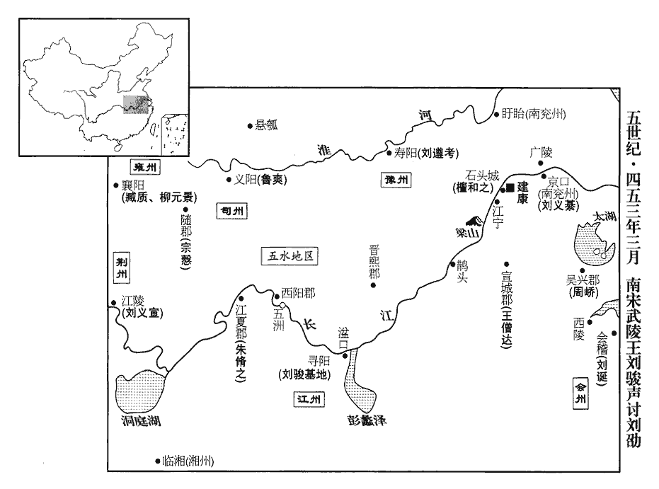
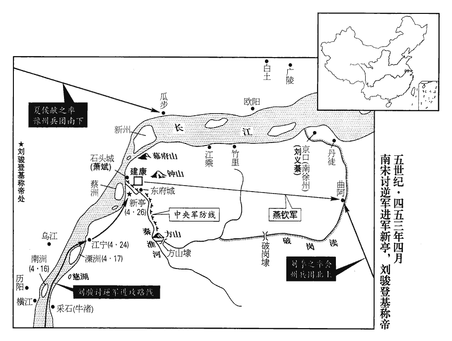
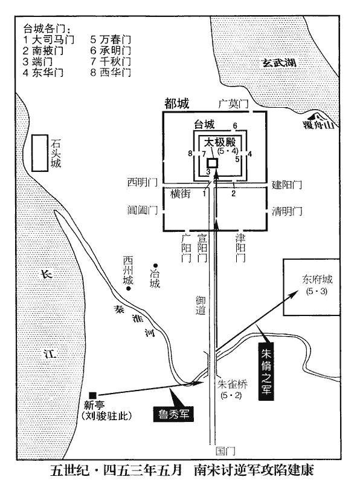

 宋紀九昭陽大荒落（癸巳），一年。

# 太祖文皇帝下之下

## 元嘉三十年（癸巳、四五三）

1春，正月，戊寅‹四›，以南譙王義宣爲司徒、揚州刺史。用義宣刺揚州，至是始出命。

〖译文〗 [1]春季，正月，戊寅（初四），刘宋文帝任命南谯王刘义宣为司徒、扬州刺史。

2蕭道成等帥氐、羌攻魏武都‹甘肃武都›，魏高平‹宁夏固原›鎭將苟莫于將突騎二千救之。帥，讀曰率。將，卽亮翻，騎，奇計翻。道成等引還南鄭‹陕西汉中›。南鄭，宋梁、南秦二州刺史治所。《兵志》所謂「知難而退」，蕭道成有焉。

〖译文〗 [2]左军中兵参军萧道成等人率领氐、羌各部落进攻北魏的武都。北魏驻守高平的镇将苟莫于率领骁勇骑兵二千人救援武都。萧道成等人率兵退回到南郑。

3壬午‹八›，以征北將軍始興王濬爲荊州‹府江陵，湖北江陵›刺史。帝‹刘义隆，时年四十七›怒未解，故濬久留京口‹江苏镇江›；旣除荊州，乃聽入朝。朝，直遙翻。

〖译文〗 [3]壬午（初八），文帝任命征北将军、始兴王刘浚为荆州刺史。文帝对刘浚的怒气一直未消，所以刘浚长时间被留在京口。直到任命他做荆州刺史，才允许他进京朝见。

4戊子‹十四›，詔江州‹府寻阳，江西九江›刺史武陵王駿統諸軍討西陽‹湖北黄州›蠻，軍于五洲‹湖北浠水县江中岛›。《水經註》：江水東逕江夏軑dài縣故城南。縣，故弦國也。城在山之陽，南對五洲。江中有五洲相接，故以爲名，其地當在今黃州、江州之間。孟康曰：軑，音汰。師古曰：軑，又音徒系翻。

〖译文〗 [4]戊子（十四日），文帝诏令江州刺史、武陵王刘骏统率各路大军，讨伐西阳蛮。刘骏率军进驻五洲。

5嚴道育之亡命也，道育亡命事始上卷上年。上分遣使者搜捕甚急。使，疏吏翻。道育變服爲尼，匿於東宮，又隨始興王濬至京口‹江苏镇江›，或出止民張旿家。旿wǔ，疑古翻。濬入朝，復載還東宮，復，扶又翻。欲與俱往江陵。丁巳‹十四›，上臨軒，濬入受拜。受拜荊州刺史之命。是日，有告道育在張旿家者，上遣掩捕，得其二婢，云道育隨征北還都。濬爲征北將軍，故稱之。上謂濬與太子劭已斥遣道育，而聞其猶與往來，惆悵惋駭，惆，丑鳩翻。惋，烏貫翻。乃命京口送二婢，須至檢覆，乃治劭、濬之罪。言待二婢至，檢覈hé覆審其事，乃罪二子也。治，直之翻。

〖译文〗 [5]女巫严道育逃走之后，文帝派出人马，到各地严加搜捕，形势很紧迫。严道育把自己打扮成尼姑的样子，一直躲藏在太子宫内，后来又随始兴王刘浚到了京口，有时，她也出入当地居民张家里。刘浚进京朝见文帝，又把她偷偷带回到了太子宫，打算携她一道前往江陵。丁巳（十一日），文帝升殿，刘浚入殿，接受荆州刺史之职。当天，有人向朝廷告发严道育藏在张家，文帝派人突然前去搜捕，抓到了严道育的两个婢女，供说严道育已经跟着征北将军刘浚回到了京都。文帝一直认为刘浚和太子刘劭已经赶走了严道育，现在忽然听说他仍然和严道育秘密来往，不禁大为惊异叹惋，非常伤心。他命令京口官府把两个婢女押送到京师，等到调查完后，再决定如何定刘劭和刘浚的罪过。

潘淑妃抱濬泣曰：「汝前祝詛事發，事見上卷上年。祝，讀與呪同，職救翻。猶冀能刻意思愆；何意更藏嚴道育！上怒甚，我叩頭乞恩不能解，今何用生爲！可送藥來，當先自取盡，謂欲先自殺也。不忍見汝禍敗也。」濬奮衣起曰：「天下事尋自當判，願小寬慮，必不上累！」累，力瑞翻。判，決也，欲決意爲商臣之事也。濬辭氣凶悖如此，潘妃承帝寵又如此，而不以濬言白上，何也？婦人之仁，知愛子而欲掩覆之，不知其變愈激也。

〖译文〗 潘淑妃抱住刘浚，哭着说：“你上次与严道育一起进行巫咒蛊惑的事情败露，当时我还希望你能仔细反省自己的过失，哪里想到你还把严道育窝藏起来了！皇上气得不得了，尽管我跪下叩头乞求他开恩，都不能使他平息愤怒，现在这样，我活着还有什么用呢？你可以先把毒药给我送来，我该先行一步自杀，因为我实在不忍心看见你自己闯祸，弄得身败名裂啊。”刘浚听完，立刻挣脱开母亲，跳起来说：“天下大事都要靠自己来解决裁断，我希望您能稍放宽心，我肯定不会连累您。”

6己未‹十六›，魏京兆王杜元寶坐謀反誅；建寧王崇及其子濟南王麗皆爲元寶所引，賜死。史言魏難未已。濟，子禮翻。

〖译文〗 [6]己未（十六日），北魏京兆王杜元宝因谋反，被斩。建宁王拓跋崇和他的儿子济南王拓跋丽，都受杜元宝事件的牵连，被赐自杀。

7帝欲廢太子劭，賜始興王濬死，先與侍中王僧綽謀之；使僧綽尋漢、魏以來廢太子、諸王典故，典，經常之籍也。故，舊事也。送尚書僕射徐湛之及吏部尚書江湛。送典故與二人也。

〖译文〗 [7]文帝打算废黜太子刘劭，并要赐始兴王刘浚自杀，事先和侍中王僧绰商议。文帝让王僧绰查找汉魏以来废黜太子、诸亲王的事例，分别送给尚书仆射徐湛之和吏部尚书江湛。

武陵王駿素無寵，故屢出外藩，不得留建康；駿自彭城還，復出刺江州。南平王鑠、建平王宏皆爲帝所愛。鑠妃，江湛之妹；隨王誕妃，徐湛之之女也；湛勸帝立鑠，湛之意欲立誕。史言江、徐各私其私以亂國殺身。僧綽曰：「建立之事，仰由聖懷。臣謂唯宜速斷，不可稽緩。『當斷不斷，反受其亂。』按《漢書》齊相召平所引道家之言。斷，丁亂翻；下同。願以義割恩，略小不忍；《論語》孔子曰：小不忍則亂大謀。不爾，便應坦懷如初，謂坦懷待之，如父子天性之初也。無煩疑論。事機雖密，易致宣廣，不可使難生慮表，取笑千載。」易，以豉翻。難，乃旦翻。載，祖亥翻。言禍難生於思慮之外，將取笑於後世也。帝曰：「卿可謂能斷大事。然此事至重，不可不慇懃三思。且彭城始亡，彭城王義康死見上卷二十八年。三，息暫翻，又音如字。人將謂我無復慈愛之道。」復，扶又翻。僧綽曰：「臣恐千載之後，言陛下惟能裁弟，不能裁兒。」帝默然。江湛同侍坐，坐，徂臥翻。出閣，謂僧綽曰：「卿向言將不太傷切直！」僧綽曰：「弟亦恨君不直！」僧綽年少於湛，故自稱爲弟。

〖译文〗 武陵王刘骏平时得不到宠爱，他总是到外地藩镇做官，而不能留在建康任职。南平王刘铄、建平王刘宏二人都受文帝的宠爱。刘铄的妃子是江湛的妹妹，随王刘诞的妃子是徐湛之的女儿。江湛鼓动文帝立刘铄为太子，徐湛之则想立刘诞为太子。王僧绰说：“封立太子这件事，应由陛下作主决定。我以为应该立即决断，不能再等待拖延了。‘当断不断，反受其乱。’但愿陛下您能用国家大义去割舍您的骨肉亲情，不要在小事上不忍。不然您就应该像当初那样以父情对待儿子，不再不厌其烦地怀疑谈论这些事。决定重新封立太子一事虽然是在极保密的情况下进行的，最终也还是容易泄漏出去，不应该让灾难发生在您的意料之外，而被后世所耻笑。”文帝说：“你真可以说是能够决断大事的人。可是，这件事事关重大，不能不非常小心谨慎，三思而后行。而且，彭城王刘义康刚刚去世，我这样做，别人将会说我是不再有慈爱之心的人了。”王僧绰说：“我恐怕千年以后，人们会说陛下您只能制裁弟弟，而不能制裁儿子。”文帝沉默无语。当时，江湛也一同陪座，出了宫门后，他对王僧绰说：“你刚才说的那些话，恐怕过于直切些了！”王僧绰回答说：“我也很遗憾你太不直切了。”

鑠自壽陽‹安徽寿县›入朝，旣至，失旨。帝欲立宏‹时年二十›，嫌其非次，建平王宏之齒未也，於兄弟長幼之序爲非次。是以議久之不決。每夜與湛之屛人語，或連日累夕。常使湛之自秉燭，繞壁檢行，慮有竊聽者。屛，必郢翻。帝自以爲謀莫密於此矣。帝以其謀告潘淑妃，淑妃以告濬，《左氏傳》有言：謀及婦人，宜其死也。宋文帝處此事，其識略又在吳孫亮之下。濬馳報劭。劭乃密與腹心隊主陳叔兒、齋帥張超之等謀爲逆。齋帥主齋內仗衛，又掌湯沐、燈燭、汛掃、鋪設。帥，所類翻。

〖译文〗 刘铄从寿阳回朝，到京之后，很令文帝失望。文帝打算封立刘宏为太子，可是，他又担心不符合长幼次序，因而，商议许久也决定不下来。每天夜里，文帝都要跟徐湛之秘密商谈，有时甚至是整天整夜。文帝还经常让徐湛之亲自举着蜡烛，绕着墙壁进行检查，唯恐有人窃听。文帝把这一计划告诉了潘淑妃。潘淑妃告诉了刘浚，刘浚骑马飞奔去告诉了刘劭。刘劭于是立刻和他的心腹、队主陈叔儿及斋帅张超之等人谋划制造叛乱。

初，帝以宗室強盛，慮有內難，慮諸弟爲難也。難，乃旦翻。特加東宮兵，使與羽林相若，事見一百二十三卷十六年。至有實甲萬人。《考異》曰：《宋•元凶劭傳》云：「二十八年，彗星入太微，掃帝座。二十九年十一月，霖雨連雪，太陽罕曜。三十年正月，風霰且雷。上憂有竊發，輒加劭兵衆，東宮實甲萬人。」按二十九年，劭、濬巫蠱事已發，豈有因十二月及明年正月災異而更加劭兵！今從《宋略》。劭性黠而剛猛，黠xiá，下八翻，桀也，慧也。帝深倚之。及將作亂，每夜饗將士，或親自行酒。王僧綽密以啓聞。王僧綽又啓聞此事，劭之逆狀彰灼無可疑者，而帝猶豫不斷，殆天奪之鑒也。將，卽亮翻。會嚴道育婢將至，癸亥‹二十›夜，《考異》曰：《劭傳》云「二十一日夜」。按《長曆》，是月甲辰朔。《宋略》云「癸亥夜」，乃二十日也。今從之。劭詐爲帝詔云：「魯秀謀反，汝可平明守闕，帥衆入。」帥，讀曰率。因使張超之等集素所畜養兵士二千餘人，皆被甲；畜，許六翻。被，皮義翻。召內外幢隊主副，豫加部勒，云有所討。幢，傳江翻。夜，呼前中庶子右軍長史蕭斌、蕭斌前嘗爲太子中庶子，而此時則爲右軍長史也。斌，音彬。左衛率袁淑、中舍人殷仲素、左積弩將軍王正見晉武帝泰始四年罷振威、揚威護軍，置左右積弩將軍。宋、齊之制，東宮亦置左右積弩將軍。並入宮。劭流涕謂曰：「主上信讒，將見罪廢。內省無過，不能受枉。省，所景翻。明旦當行大事，《左傳》：楚潘崇謂商臣曰：「能行大事乎？」對曰：「能。」遂以宮甲圍其父成王而弒之。望相與戮力。」因起，徧拜之，衆驚愕，莫敢對。淑、【章：十二行本「淑」上有「久之」二字；乙十一行本同；孔本同；張校同。】斌皆曰：「自古無此。願加善思。」善思，猶今人言好思量也。劭怒，變色。斌懼，與衆俱曰：「當竭身奉令。」淑叱之曰：「卿便謂殿下眞有是邪？殿下幼嘗患風，或是疾動耳。」言病風喪心，或致有是言。劭愈怒，因眄淑曰：「事當克不？」眄，眠見翻，目偏合而斜視也。不，讀曰否。淑曰：「居不疑之地，何患不克！但恐旣克之後，不爲天地所容，大禍亦旋至耳。旋，還反也，疾也。假有此謀，猶將可息。」左右引淑出，曰：「此何事，而云可罷乎！」淑還省，還左衛率省也。繞牀行，至四更乃寢。更，工衡翻。

〖译文〗 当初，文帝认为皇室力量强大，唯恐内部发生变难，因此，他特别加强了东宫的兵力，让东宫的兵力和羽林军的兵力差不多，实际兵力达到了一万人。刘劭性情狡猾而又刚强勇猛，文帝一直深深地依赖着他。刘劭将要反叛时，每天夜里都要设宴犒劳东宫卫队的将士们，有时甚至亲自前来敬酒。王僧绰听说后，秘密报告给了文帝。这时正赶上严道育的两个婢女就要被押到朝廷。癸亥（疑误）夜晚，刘劭伪造了文帝的诏书说：“鲁秀图谋反叛，命令你清晨守住宫门，率领众兵入宫。”刘劭又命令张超之等集合起平时特别豢养的士卒二千多人，让他们全副武装。接着，刘劭又召集内外巡逻队的正副队长，事先加以安排布置声称有紧急征讨。这天深夜，刘劭传唤前中庶子右军长史萧斌、左卫率袁淑、中舍人殷仲素和左积弩将军王正见，一同进入东宫。刘劭涕泪横流，崐对他们说：“主上听信别人的谗言，要把我治罪废黜。我自己反省并没有什么过失，不能被别人冤枉了。明天一早，我就该做出一件大事，希望你们和我共同努力。”说完，刘劭就从座位上站了起来，向在座各位下拜。大家听后都极为惊愕震憾，没有谁敢于回答。袁淑和萧斌都说：“自古以来都没有过这样的事情，希望再好好考虑考虑。”刘劭听后不禁勃然大怒，板起面孔。萧斌一看，感到害怕，就和其他人一起说：“我们自当竭尽全力执行您的命令。”袁淑听后，叱责他们说：“你们以为殿下是真要这样吗？殿下小时候曾经得过疯病，大概是疯病发作了。”刘劭听后更是怒不可遏，斜着眼睛看着袁淑说：“我的事能不能办成？”袁淑回答说：“你现在处在绝对不会被人怀疑的地位，怎么能做不到呢！只是担心你在做成之后，不会被天地所容，大祸也会马上随之而来。假使真有这种打算还可以收回。”左右之人把袁淑拉出去说：“这是什么事，怎么可以说半途而废呢？”袁淑从太子刘劭那里回来后，反复琢磨。绕着床铺来回走动，直到四更才上床睡觉。

甲子‹二十一›，宮門未開，劭以朱衣加戎服上，乘畫輪車，朱衣，太子入朝之服。《晉志》曰：畫輪車，駕牛，以綵漆畫輪轂，故名曰畫輪車。上起四夾杖，左右開四望，綠油幢，朱絲絡，其上形制事事如輦，其下猶如犢車耳。太子法駕亦謂之鸞路，非法駕則乘畫輪車，兩箱裏飾以金錦、黃金，塗五采。與蕭斌共載，衛從如常入朝之儀。從，才用翻。朝，直遙翻。呼袁淑甚急，淑眠不起，劭停車奉化門奉化門，東宮西門。催之相續。淑徐起，至車後；劭使登車，又辭不上，上，時掌翻。劭命左右殺之‹年四十六›。守門開，停留以候門開曰守。從萬春門入。萬春門，臺城東門。舊制，東宮隊不得入城。言不得入臺城也。劭以僞詔示門衛曰：「受敕，有所收討。」令後隊速來。張超之等數十人馳入雲龍門及齋閣，拔刀徑上合殿。李延壽曰：晉世諸帝多處內房，朝宴所臨，東、西二堂而已。孝武末年，清暑方構，永初受命，無所改作，所居惟稱西殿，不製嘉名，文帝因之，亦有合殿之稱。帝其夜與徐湛之屛人語至旦，燭猶未滅，門階戶席直衛兵尚寢未起。帝見超之入，舉几捍之，五指皆落，遂弒之。年四十七。湛之驚起，趣北戶，未及開，兵人殺之‹年四十四›。趣，七喻翻。劭進至合殿中閤，聞帝已殂，出坐東堂。蕭斌執刀侍直，呼中書舍人顧嘏gǔ，嘏震懼，不時出，旣至，問曰：「欲共見廢，何不早啓？」嘏未及答，卽於前斬之。江湛直上省，侍中省有上省、下省，上省在禁中。湛時爲侍中，入直上省。聞諠譟聲，歎曰：「不用王僧綽言，以至於此！」乃匿傍小屋中，劭遣兵就殺之‹年四十六›。宿衛舊將羅訓、徐罕皆望風屈附。《南史•卜天與傳》作「徐牢」。將，卽亮翻。左細仗主、廣威將軍吳興‹浙江湖州›卜天與宋宿衛之官，有細鎧主、細鎧將、細仗主等。不暇被甲，被，皮義翻。執刀持弓，疾呼左右出戰。徐罕曰：「殿下入，汝欲何爲！」天與罵曰：「殿下常來，云何於今乃作此語！只汝是賊！」手射劭於東堂，幾中之。射，而亦翻。幾，居豈翻。中，竹仲翻。劭黨擊之，斷臂而死。隊將張泓之、朱道欽、陳滿與天與俱戰死。斷，丁管翻。將，卽亮翻。左衛將軍尹弘惶怖通啓，求受處分。怖，普布翻。處，昌呂翻。分，扶問翻。劭使人從東閤入，東閤，東閤門也。殺潘淑妃及太祖親信左右數十人，劭尊帝廟號中宗；孝武帝卽位，改廟號曰太祖。急召始興王濬使帥衆屯中堂。

〖译文〗 甲子（二十一日），皇宫宫门还未打开，刘劭身穿朝服，内穿戎装，乘坐画轮车，与萧斌一同乘坐，侍卫随从们和平时入朝朝见的样子一样。刘劭派人急急忙忙地去叫袁淑，袁淑此时正在沉沉入睡，不肯起床，刘劭将车停在奉化门帝，不断派人前去催促。袁淑慢腾腾地起床了，来到刘劭乘坐的车的后边，刘劭让他登上车，袁淑又推辞不肯上去，刘劭命令左右斩了袁淑。宫门打开，刘劭从万春门进去。按照以往的宫廷制度，太子宫卫队是不能进入宫城的。刘劭为此就把自己伪造的皇帝诏令拿给守卫看，说：“我奉皇帝旨令，要进宫讨伐叛逆。”又催促后面的队伍赶快前来。张超之等几十人从云龙门跑进了斋阁，拔出佩刀直接来到合殿。文帝那天夜里和徐湛之屏退旁人秘密商谈直到第二天早上，蜡烛还没有熄灭，门前、台阶、窗外值班的卫士还在睡觉没有起床。文帝看见张超之进来了，立刻举起身旁的小几来抵挡，五个手指全部被砍掉了，于是，张超之就把文帝杀了。徐湛之大吃一惊，起身向北窗奔去，还没有打开北窗，士卒们就杀了他。刘劭走到合殿中屋，听说文帝已死，立刻出来登临东堂。萧斌持刀站在一旁侍卫。刘劭传唤中书舍人顾嘏，顾嘏大为震惊，吓得没有按时到，他来到刘劭面前，刘劭问他说：“皇上想把我们一齐废了，你为什么不早点儿来告诉我”。顾嘏还没来得及回答，刘劭就上前斩了他。江湛此时正在上省值班，听到外面一片喧哗嘈杂声，就叹息着说道：“不听王僧绰的话，事情才落到了这种地步。”他藏到了旁边的一间小屋里，刘劭派兵前来搜查，将他立刻斩了。皇宫卫队原来的将领罗训、徐罕见状，都望风归降。左细仗主、广威将军吴兴人卜天与来不及披上铠甲，就一手拿刀一手持弓，大声呼唤左右人出来迎战。徐罕说：“殿下入宫，你想要做什么？”卜天与大声骂他说：“殿下常常入宫，你为何今天才说这种话？你就是逆贼！”接着，卜天与手持弓箭，在东堂一箭射向刘劭，几乎射中刘劭。刘劭党羽群起而攻之，卜天与被砍断手臂身亡，皇宫宿卫中将士张泓之、朱道钦、陈满等人和卜天与一起战死。左卫将军尹弘惊惶恐怖，赶快晋见刘劭，请求处罚。刘劭又派人从东阁门闯入后宫，杀了潘淑妃以及文帝生前的亲信左右共计几十人。同时，又紧急传召崐始兴王刘浚前来，让他率领手下士卒屯扎中堂。

濬時在西州‹南京西›，濬自京口入朝，蹔居西州。帥，讀曰率。府舍人朱法瑜府舍人者，濬府之舍人也。自晉以來，諸王府舍人十人。奔告濬曰：「臺內喧譟，宮門皆閉，道上傳太子反，未測禍變所至。」濬陽驚曰：「今當柰何？」法瑜勸入據石頭。濬未得劭信，不知事之濟不，濟不，讀曰否。騷擾不知所爲。將軍王慶曰：「今宮內有變，未知主上安危，凡在臣子，當投袂赴難；難，乃旦翻。憑城自守，非臣節也。」濬不聽，乃從南門出，徑向石頭，文武從者千餘人。時南平王鑠戍石頭，兵士亦千餘人。從，才用翻。史言濬、鑠之衆足以討除逆亂。俄而劭遣張超之馳馬召濬，濬屛人問狀，屛，必逞翻。卽戎服乘馬而去。朱法瑜固止濬，濬不從；出中門，王慶又諫曰：「太子反逆，天下怨憤。明公但當堅閉城門，坐食積粟，石頭倉城有積粟。不過三日，凶黨自離。公情事如此，今豈宜去！」濬曰：「皇太子令，敢有復言者斬！」復，扶又翻。旣入，見劭，劭【章：十二行本「劭」下有「謂濬」二字；乙十一行本同；孔本同；張校同。】曰：「潘淑妃遂爲亂兵所害。」濬曰：「此是下情由來所願。」梟食母，破獍jìng食父，若濬者，兼梟獍之心以爲心。

〖译文〗 此时，刘浚正在西州，府舍人朱法瑜飞奔前来告诉刘浚说：“宫内人声喧哗得很，宫门紧紧关着，路上传说太子谋反，还不知灾祸变化的结果如何。”刘浚听后，假装大吃一惊，说：“现在我们应该怎么办？”朱法瑜鼓动刘浚回去占据石头。刘浚没有得到刘劭的消息，不知道事变成功与否，所以，情绪烦乱，不知干什么是好。将军王庆说：“现在，宫内发生变化，还不知主上安危与否，凡是身为臣属和儿子的，都应当起来义无返顾地前去救难。如果只是把守自己的城池，不是为人臣所应有的气节。”刘浚没有听他的话，就从南门出去，一直奔向石头，文武官员一千多人跟着他。此时，南平王刘铄正戍守石头，士卒也有一千多。不一会儿，刘劭派张超之骑马赶到，召唤刘浚回朝，刘浚屏退左右向张超之详细寻问了这件事的前后经过，然后就全副武装骑马而去。朱法瑜极力阻止刘浚，刘浚不听。等他来到中门，王庆又劝谏他说：“太子反叛，天下人怨恨愤怒。明公你应该紧闭城门不出，坐吃积储的粮食，不超过三天，反叛的党徒自然会土崩瓦解。此事如此明了，你怎么还去呢？”刘浚说：”皇太子的命令，有人胆敢再劝阻，定斩不饶！”刘浚入宫拜见刘劭，刘劭告诉他说：“潘淑妃已被乱兵所害。”刘浚说：“这正是我一直盼望的事。”

劭詐以太祖詔召大將軍義恭、尚書令何尚之入，拘於內；內，謂臺內。幷召百官，至者纔數十人。劭遽卽位，下詔曰：「徐湛之、江湛弒逆無狀，吾勒兵入殿，已無所及，號惋崩衂nǜ，號，戶刀翻。惋，烏貫翻。衂，女六翻。肝心破裂。今罪人斯得，元凶克殄，可大赦，改元太初。」

〖译文〗 刘劭假称文帝的诏令，征召大将军刘义恭、尚书令何尚之入宫，将二人囚禁在宫内。同时，又召集文武百官，但来的人才几十人。刘劭马上继承帝位，颁布诏令，说：”徐湛之、江湛二人图谋反叛，逆弑皇上。我率领士卒入殿，已经来不及，只能悲号痛哭，心肝欲裂。而今，罪恶之徒已被杀，元凶也被消灭，所以实行大赦，改年号为太初。”

卽位畢，亟稱疾還永福省，永福省，太子所居也，在禁中。不敢臨喪；以白刃自守，夜則列燈以防左右。以蕭斌爲尚書僕射、領軍將軍，以何尚之爲司空，前右衛率檀和之戍石頭，征虜將軍營道侯義綦qí鎭京口。義綦，義慶之弟也。義慶，長沙王道憐第二子，嗣臨川王道規國。乙丑‹二十二›，悉收先給諸處兵還武庫，殺江、徐親黨尚書左丞荀赤松、右丞臧凝之等。凝之，燾之孫也。以殷仲素爲黃門侍郎，王正見爲左軍將軍，張超之、陳叔兒皆拜官、賞賜有差。輔國將軍魯秀在建康，劭謂秀曰：「徐湛之常欲相危，事見上卷二十八年。我已爲卿除之矣。」爲，于僞翻。使秀與屯騎校尉龐秀之對掌軍隊。騎，奇計翻。校，戶敎翻。軍隊，軍主、隊主所統之兵。劭不知王僧綽之謀，以僧綽爲吏部尚書，王僧綽於此時不受劭官，繼之以死，則人臣之節盡矣。司徒左長史何偃爲侍中。

〖译文〗 刘劭登基即位后，立即宣称自己有病，回到了永福省。他不敢亲自主持父亲的葬礼。他只是手持佩刀自己守护，夜里则点得灯火通明，以防备左右有人谋害它。刘劭任命萧斌为尚书仆射、领军将军，何尚之为司空；命前右卫率檀和之镇守石头，征虏将军、营道侯刘义綦镇守京口。刘义綦是刘义庆的弟弟。乙丑（二十二日），刘劭将以前发放各处的兵器全都收缴，放入武器仓库。刘劭诛杀江湛、徐湛之的亲属党羽尚书左丞荀赤松、右丞臧凝之等人。臧凝之是臧焘的孙子。刘劭又任命殷仲素为黄门侍郎，王正见为左军将军。张超之、陈叔儿也都按照他们的贡献大小，分别封了官职，赏赐了东西。辅国将军鲁秀这时正在建康，刘劭对鲁秀说：“徐湛之过去经常想害你，如今，我已经为你除掉了这一祸害。”然后，他命令鲁秀和屯骑校尉庞秀之一起掌握左右军队。刘劭不知道王僧绰也参与了废立的密谋，任命王僧绰为吏部尚书，司徒左长史何偃为侍中。

武陵王駿屯五洲，沈慶之自巴水‹于湖北黄州东入江›來，咨受軍略。《水經》：巴水出廬江雩yú婁縣之巴山，南歷蠻中，又南流注于江；今謂之巴河，在蘄qí州界；源出板石山。去年，帝使沈慶之討蠻，是年，使武陵王駿統討蠻諸軍，故慶之來詣駿咨受軍略，軍略，謂用兵之策略也。三月，乙亥‹二›，典籤qiān董元嗣武陵王鎭彭城，董元嗣已爲府典籤。自建康至五洲，具言太子殺逆，殺，讀曰弒。【章：十二行本正作「弒」；孔本同；張校同。】駿使元嗣以告僚佐。宣劭弒逆之罪，將舉兵也。沈慶之密謂腹心曰：「蕭斌婦人，言其怯弱無能爲也。其餘將帥，皆易與耳。易，以豉翻。東宮同惡，不過三十人；謂張超之、陳叔兒等。此外屈逼，謂魯秀、龐秀之等。必不爲用。今輔順討逆，順謂武陵王，逆謂劭也。不憂不濟也。」沈慶之以此言作諸人義勇之氣。

〖译文〗 武陵王刘骏屯驻五洲，沈庆之从巴水前来请教军事方略。三月，乙亥（初二），典签董元嗣从建康来到五洲，将太子刘劭反叛杀害父亲的事全都告诉给了刘骏和沈庆之，刘骏让董元嗣把这一消息告诉手下文武僚属。沈庆之偷偷对他的心腹说：“萧斌像个妇道人家。其他将帅都很容易对付。东宫中死心踏地地与刘劭一同作恶的人，超不过三十个，除此而外都是被逼迫暂时屈从的，决不会为他效死力。如今，我们辅佐顺应天下人心的人前去讨伐叛逆之贼，不用担心不会成功。”

8壬午‹九›，魏主‹拓跋濬›，时年十四尊保太后爲皇太后，尊保太后見上卷上年。以乳母爲母，非禮也。追贈祖考，官爵兄弟，皆如外戚。史言魏主寵秩私昵之過。

〖译文〗 [8]壬午（初九），北魏国主尊自己的乳母保太后常氏为皇太后，并追赠常氏的祖父、父亲，对常氏的兄弟们也都加官进爵，跟外戚一样。

9太子劭分浙‹钱塘江›東五郡爲會州‹府会稽，浙江绍兴›，以會稽名州也。會，古外翻。省揚州，立司隸校尉，浙東五郡本屬揚州，分爲會州，又改揚州爲司隸校尉以統京畿，欲倣魏、晉都洛舊制。以其妃‹殷玉英›父殷沖爲司隸校尉。沖，融之曾孫也。殷融見九十四卷晉成帝咸和三年。以大將軍義恭爲太保，荊【嚴：「荊」改「揚」。】州刺史南譙王義宣爲太尉，始興王濬爲驃騎將軍，驃，匹妙翻。騎，奇計翻。雍州‹府襄阳›刺史臧質爲丹楊尹，雍，於用翻。會稽‹浙江绍兴›太守隨王誕爲會州刺史。欲就會稽用誕統浙東五郡。

〖译文〗 [9]太子刘劭把浙江东部的五郡分出，设立会州，撤掉扬州，另外设立司隶校尉。命妃子殷氏的父亲殷冲为司隶校尉。殷冲是殷融的曾孙。刘劭又任命大将军刘义恭为太保，任命荆州刺史南谯王刘义宣为太尉，任命始兴王刘浚为骠骑将军，任命雍州刺史臧质为丹杨尹，任命会稽太守随王刘诞为会州刺史。

劭料檢文帝巾箱料，音聊。巾箱所以藏要密文書，便於尋閱。及江湛家書疏，得王僧綽所啓饗士幷前代故事，卽所上廢太子諸王典故。疏，所去翻。甲申‹十一›，收僧綽，殺之‹年三十一›。僧綽弟僧虔爲司徒左西屬，左西屬，左西曹屬也。舊制，司徒府有東西曹，曹有掾，有屬。宋於西曹又分左、右。所親咸勸之逃，僧虔泣曰︰「吾兄奉國以忠貞，撫我以慈愛，今日之事，苦不見及耳；若得同歸九泉，猶羽化也。」羽化，猶言登仙，神仙家所謂飛昇也。劭因誣北第諸王侯，云與僧綽謀反，諸王侯列第於臺城北，故曰北第。此皆穆、武子孫也。殺長沙悼王瑾、瑾弟【章：十二行本「弟」下有「楷」字；乙十一行本同；孔本同；張校同；退齋校同。】臨川哀王爗yè、臨川王義慶本長沙王道憐之子，嗣臨川王道規，今爗又以長沙王瑾弟嗣義慶。瑾，渠吝翻。桂陽孝侯覬、新渝懷侯玠，覬，音冀。「新渝」當作「新喻」。《考異》曰：《劭傳》作「球」，今從《長沙王道憐傳》。皆劭所惡也。惡，烏路翻。瑾，義欣之子；義欣，長沙王道憐之子。爗，義慶之子；覬、玠，義慶之弟子也。

〖译文〗 刘劭整理检查文帝装机密文件档案的箱子以及江湛家的奏疏和信件，查到了王僧绰曾呈报给文帝的关于犒劳勇士和前代废黜太子、诸王的材料。甲申（十一日）逮捕王僧绰，并将其斩首。王僧绰的弟弟王僧虔为司徒左西属，他的亲近僚属们都劝他赶快逃走，王僧虔哭着说：“我哥哥以自己的忠贞报效国家，以慈爱之心将我抚养成人，今天发生的事，我怕的是它不波及我。如果我能得以和他一同回到九泉之下，那也就好像飞升成仙了一样。”刘劭乘机诬陷住在台城以北的各王爵、侯爵，说他们和王僧绰一块儿参与图谋反叛的阴谋，杀死了长沙悼王刘瑾、刘瑾的弟弟临川哀王刘烨、桂阳孝侯刘觊和新渝怀侯刘，因为这些人都是刘劭平时最厌恶的人。刘瑾是刘义欣的儿子，刘烨是刘义庆的儿子，刘觊和刘都是刘义庆的侄儿。

劭密與沈慶之手書，令殺武陵王駿。慶之求見王，王懼，辭以疾。慶之突入，以劭書示王，王泣求入內與母訣，武陵王母路淑媛‹路惠男›。慶之曰：「下官受先帝厚恩，今日之事，惟力是視；殿下何見疑之深！」王起再拜曰：「家國安危，皆在將軍。」慶之卽命內外勒兵。府主簿顏竣曰：竣，七倫翻。「今四方未知義師之舉，劭據有天府，天府謂建康。若首尾不相應，首，謂武陵已倡義於九江；尾，謂諸方征鎭。此危道也。宜待諸鎭協謀，然後舉事。」慶之厲聲曰：「今舉大事，而黃頭小兒皆得參預，男女始生爲黃頭小兒。言其如嬰兒，未有知識也。何得不敗！宜斬以徇！」王令竣拜謝慶之，慶之曰：「君但當知筆札事耳！」於是專委慶之處分。旬日之間，內外整辦，人以爲神兵。《宋•帝紀》曰：三月乙未，建牙于軍門。是時多不悉舊儀，有一翁班白，自稱少從武帝征伐，頗悉其事；因使指麾，事畢忽失所在。余謂沈慶之甚練軍事，西征北伐，久在兵間，安有不悉舊儀之理！或者舉義之時，託武帝神靈以昭神人之助順，啓諸方赴義之心也。《通鑑》不語怪，故不書。處，昌呂翻。分，扶問翻。竣，延之之子也。顏延之與謝靈運俱以文義著稱；靈運死，延之獨擅名於時，時在建康。

〖译文〗 刘劭给沈庆之写了一封密信，命令他杀了武陵王刘骏。沈庆之前来请求晋见刘骏，刘骏极为害怕，就以生病为借口拒绝和他见面。沈庆之却突然闯了进来，把刘劭的信拿给刘骏看，刘骏看后，哭着请求沈庆之允许他到内室跟自己的母亲诀别。沈庆之说：“我承受先帝的厚恩，今天的事情，我会尽我全部的力量。殿下您为什么对我有如此重的疑心呢？”刘骏听后，起来两次叩谢，说：“个人和国家的安危，全在将军你。”沈庆之听后，就下令全部文武百官收拾武器，进入临战状态。王府内的主簿颜竣说：“如今，四面八方并不知道我们这支仁义大军即将举义，刘劭占据着建康京城，如果我们起义后首尾不能相互接应，可是一条危险的路啊。我看，应该等到各路将帅来到此后，共同谋划，然后再一起举兵起事也不晚。”沈庆之厉声说道：“如今我们正是做大事的时候，连黄毛小子也都可以参与谋划，刘劭怎么能不被打败？应该斩了他示众。崐”刘骏赶忙命令颜竣向沈庆之赔罪道歉。沈庆之说：“你只要负责撰写公文一类的事情。”于是，刘骏就把军务交给沈庆之全权处理。十天之内，沈庆之就把军队内外事务整办好了，人们都称这支军队为神兵。颜竣是颜延之的儿子。

庚寅‹十七›，武陵王戒嚴誓衆。以沈慶之領司馬；襄陽‹湖北襄樊›太守柳元景、隨郡‹湖北随州›太守宗慤爲諮議參軍，領中兵；江夏‹湖北安陆›內史朱脩之行平東將軍；記室參軍顏竣爲諮議參軍，領錄事，兼總內外；柳元景、宗慤以諮議參軍領中兵參軍，以前驅之任命二人也。顏竣本記室參軍，陞諮議，領錄事參軍，以總錄軍府之任命竣也。記室參軍掌牋記。夏，戶雅翻。諮議參軍劉延孫爲長史、尋陽太守，行留府事。延孫，道產之子也。劉道產鎭襄陽有政績，見一百二十四卷十九年。

〖译文〗 庚寅（十七日），武陵王刘骏下令戒严誓师，任命沈庆之兼任府司马，襄阳太守柳元景、随郡太守宗悫为谘议参军，统领中军，江夏内史朱之代理平东将军，记室参军颜竣为谘议参军、领录事并兼理内外全局，谘议参军刘延孙为长史、寻阳太守并兼行留府事。刘延孙是刘道产的儿子。

南譙王義宣及臧質皆不受劭命，與司州‹府义阳，河南信阳›刺史魯爽同舉兵以應駿。質、爽俱詣江陵見義宣，司、雍皆受督於義宣，故俱詣之。且遣使勸進於王。使，疏吏翻。辛卯‹十八›，臧質子敦等在建康者聞質舉兵，皆逃亡。《考異》曰：《宋略》：「庚申，武陵王戒嚴。辛亥，臧敷逃。」按《長曆》，是月甲戌朔，無庚申、辛亥。又《宋略》上有甲申，下有癸巳，此必庚寅、辛卯字誤也。《宋書》「敷」作「敦」，今從之。劭欲相慰悅，下詔曰：「臧質，國戚勳臣，臧質，高祖敬皇后之姪，故曰國戚；有邊功，故曰勳臣。方翼贊京輦，謂用爲丹楊尹也。而子弟波迸，良可怪歎。迸，北諍翻。可遣宣譬令還，咸復本位。」劭尋錄得敦，毛晃曰：錄，收拾也。使大將軍義恭行訓杖三十，以外戚子弟，行杖以訓敕之，故曰訓杖。厚給賜之。

〖译文〗 南谯王刘义宣、雍州刺史臧质都不接受刘劭的委任命令，而同司州刺史鲁爽一起举兵起义，响应刘骏。臧质、鲁爽全都来到江陵晋见刘义宣，并且又派人前去鼓动刘骏，劝他早日登基称帝。辛卯（十八日），臧质在建康的儿子臧敦等人听到父亲臧质举兵起义的消息，都逃走了。刘劭仍打算安慰、取悦于他们，颁发诏令说：“臧质是皇亲国戚有功之臣，正要振翼帮助我一同治理京师，他的子弟们却要四外逃散，这真令人奇怪、叹惜啊。可以派人转达我的意思，让他们回来，全都官复原位。”不久，刘劭抓到了臧敦，命令大将军刘义恭打他三十大棍以示教训，然后再厚厚赏赐他。

10癸巳‹二十›，劭葬太祖‹刘义隆›于長寧陵‹南京东北蒋山东南›，據《齊書•豫章王嶷傳》，長寧陵隧道出嶷第前路，則陵近臺城矣。諡曰景皇帝，廟號中宗。史不用劭所上諡號，而用孝武帝所改諡號，正劭弒逆之罪，絕之也。

〖译文〗 [10]癸巳（二十日），刘劭把文帝安葬在长宁陵，谥号为景皇帝，庙号为中宗。

 

11乙未‹二十二›，武陵王發西陽‹湖北黄州›；丁酉‹二十四›，至尋陽‹江西九江›。庚子‹二十七›，王命顏竣移檄四方，《考異》曰︰《宋略》移檄亦在庚申日。按《謝莊傳》曰︰「奉三月二十七日檄」，然則發檄在庚子日也。使共討劭。州郡承檄，翕然響應。南譙王義宣遣臧質引兵詣尋陽，與駿同下，留魯爽於江陵。

〖译文〗 [11]乙未（二十二日），武陵王刘骏从西阳出发。丁酉（二十四日），到达寻阳。庚子（二十七日），刘骏命令颜竣向四方发布讨伐檄文，让他们共同讨伐刘劭。各州郡接到檄文，全都起来响应。南谯王刘义宣派臧质率领军队前往寻阳，和刘骏会师后一同东下，只留下鲁爽在江陵镇守。

劭以兗、冀二州‹府历城›刺史蕭思話爲徐、兗二州‹府彭城›刺史，起張永爲青州‹府东阳›刺史。思話自歷城‹山东济南›引部曲還平城‹山东章丘›，起兵以應尋陽‹江西九江›；濟南郡東平陵縣有平陸城。余謂「平城」當作「彭城」。還，從宣翻，又如字。建武將軍垣護之在歷城，亦帥所領赴之。帥，讀曰率；下同。南譙王義宣版張永爲冀州刺史。永遣司馬崔勳之等將兵赴義宣。將，卽亮翻。義宣慮蕭思話與永不釋前憾，思話繫張永於獄，事見上卷上年。自爲書與思話，使長史張暢爲書與永，張暢，永之羣從也，故義宣使之爲書。勸使相與坦懷。

〖译文〗 刘劭任命兖、冀二州的刺史萧思话为徐、兖二州刺史，起用张永为青州刺史。萧思话从历城率领自己的部曲回到了平城，起兵响应寻阳武陵王刘骏。建武将军垣护之此时正在历城，也率领自己的军队赶到那里。南谯王刘义宣任命张永为冀州刺史。张永派遣司马崔勋之等人率领军队同刘义宣会师。刘义宣担心萧思话同张永之间解不开以前的怨气，就亲自给萧思话写了一封信，又命令长史张畅给张永也写了一封信，劝他们二人能够坦诚相待，通力合作。

隨王誕將受劭命，受會州刺史之命。參軍事沈正說司馬顧琛曰：說，輸芮翻。「國家此禍，開闢未聞。今以江東驍銳之衆，此江東，謂浙江之東也。驍，堅堯翻。唱大義於天下，其誰不響應！豈可使殿下北面兇逆，受其僞寵乎！」琛曰：「江東忘戰日久，雖逆順不同，然強弱亦異，琛意謂雖以順討逆，然建康強而江東弱，其勢異也。當須四方有義舉者，須，待也。然後應之，不爲晚也。」正曰：「天下未嘗有無父無君之國，寧可自安讎恥而責義於餘方乎！今正以弒逆冤酷，義不共戴天，《禮記》曰：父母之讎，不共戴天。舉兵之日，豈求必全邪！馮衍有言：『大漢之貴臣，將不如荊、齊之賤士乎！』此蓋馮衍責田邑之言。荊、齊之賤士，謂申包胥赴秦求救以存荊，王孫賈殺淖zhuō齒以存齊也。況殿下義兼臣子，事實國家者哉！」琛乃與正共入說誕，誕從之。說，輸芮翻。正，田子之兄子也。沈田子從武帝入關有功，後以殺王鎭惡受誅。

〖译文〗 随王刘诞将要接受刘劭的任命，参军事沈正游说司马顾琛说：“国家这次灾祸，自开天辟地以来还没有听说过。现在，指挥长江以东骁勇精锐的军队，倡导国家的大义向全国发出号召，又有谁能不去响应呢？我们怎么可以让殿下面向北方叩拜凶恶叛逆之人，接受他的虚假的宠信呢！”顾琛说：“长江以崐东之地忘记了战争已经很长时间了，虽然顺从与叛逆是不一样的，但强弱大小也是不同的，所以，我们等到四方都有人起义讨伐后再起来响应也不算晚。”沈正说：“天下还未曾有过无父无君的国家，我们怎么可以自己安于眼前大仇大耻的现状，而把这起义的职责推给别人？如今，正是由于弑父叛逆，酿成沉冤惨事，在道义上讲是不共戴天的，仗义起兵之日，岂能乞求一定准备周全！冯衍曾说过：‘大汉王朝的尊贵高官，难道都不如楚国、齐国的卑贱的读书人吗！’何况殿下不仅仅是臣属，而且还是儿子，对他来说，国家和个人都是一回事呀。”于是，顾琛就和沈正一起进府，劝说刘诞，刘诞接受了他们的建议。沈正就是沈田子哥哥的儿子。

劭自謂素習武事，語朝士曰：「卿等但助我理文書，勿措意戎旅；若有寇難，語，牛倨翻。朝，直遙翻。難，乃旦翻。吾自當之；但恐賊虜不敢動耳。」及聞四方兵起，始憂懼，戒嚴，悉召下番將吏，宿衛分上下番，便休迭代。今悉召下番將吏以自備，更不分番。遷淮‹秦淮河›南【章：十二行本「南」下有「岸」字；乙十一行本同；孔本同；退齋校同。】居民於北岸，秦淮南岸當新亭、石頭來路，北岸卽臺城。遷淮南居民於北岸，欲阻淮以自固。盡聚諸王及大臣於城內，防其出奔也。移江夏王義恭處尚書下舍，分義恭諸子處侍中下省。處，昌呂翻。據《南史》，侍中下省在神虎門外。

〖译文〗 刘劭自认为自己从小就熟悉军事，对朝廷文武官员们说：“你们只要帮助我整理文件书信就可以了，不必担心战场上的情况。如果有什么贼寇前来发难，我自己就能抵挡得了。只是怕贼寇们不敢有所举动罢了。”听到四方起兵讨伐时，才开始忧虑害怕起来。他下令实行戒严，将正在休假的将士全都召集起来，把秦淮河南岸的百姓全都迁到秦淮河北岸居住，而把所有王和大臣全都聚集在建康城里。强迫江夏王刘义恭住在尚书下舍，把刘义恭的几个儿子分别软禁在侍中下省处。

夏，四月，癸卯朔‹一›，柳元景統寧朔將車薛安都等十二軍發湓口‹江西九江东›，湓，音盆。司空中兵參軍徐遺寶以荊州之衆繼之。南譙王義宣旣進位司空，以徐遺寶爲中兵參軍。丁未‹五›，武陵王發尋陽，沈慶之總中軍以從。從，才用翻。

〖译文〗 夏季，四月，癸卯朔（初一），柳元景统领宁朔将军薛安都等十二路兵马，从湓口出发，司空中兵参军徐遗宝率领荆州军队在后面相接。丁未（初五），武陵王刘骏从寻阳发兵，沈庆之总领中军随在左右。

劭立妃殷氏‹殷玉英›爲皇后。

〖译文〗 刘劭封立王妃殷氏为皇后。

庚戌‹八›，武陵王檄書至建康，劭以示太常顏延之曰：「彼誰筆也？」延之曰：「竣之筆也。」劭曰：「言辭何至於是！」延之曰：「竣尚不顧老臣，安能顧陛下！」劭怒稍解。悉拘武陵王子於侍中下省，南譙王義宣子於太倉空舍。劭欲盡殺三鎭士民家口。三鎭，謂雍、荊、江。江夏王義恭、何尚之皆曰：「凡舉大事者不顧家；且多是驅逼，今忽誅其室累，正足堅彼意耳。」累，力瑞翻。劭以爲然，乃下書一無所問。

〖译文〗 庚戌（初八），武陵王刘骏的声讨檄文传到建康，刘劭拿给太常颜延之说：“它是出自谁的手笔？”颜延之看后说：“这是颜竣写的。”刘劭又说：“言语词句为什么到了这种令人难堪的地步？”颜延之回答说：“颜竣连老臣我的安危与否都不考虑了，哪里还能顾虑陛下您呢？”刘劭的怒气稍稍平息了些。刘劭把武陵王刘骏在建康的儿子全都抓起来囚禁在侍中下省，把南谯王刘义宣的儿子都关在太仓空屋子内。刘劭还打算把雍、荆、江三州将士们留居在京城的家属全都杀死，江夏王刘义恭和何尚之都说：“凡是图谋大事的人，都不会顾念自己的家，而且很多人又是出于无奈而这样做的，如果现在突然把他们的家属亲人全都杀了，这正好坚定了他们的斗志。”刘劭认为他们说得对，就下书说不再追究家属。

劭疑朝廷舊臣皆不爲己用，乃厚撫魯秀及右軍參軍王羅漢，悉以軍事委之；二人皆驍勇善戰，故厚撫之，委以軍事，冀得其力。以蕭斌爲謀主，殷沖掌文符。蕭斌勸劭勒水軍自上決戰，不爾則保據梁山‹安徽和县、当涂之间›。上，時掌翻。今太平州當塗縣西南三十里有天門山，亦曰蛾眉山。兩山夾大江對峙，東曰博望山，西曰梁山。江夏王義恭以南軍倉猝，船舫陋小，不利水戰，江水東流至武昌以下，漸漸向北流。蓋南紀諸山所迫，坡陀之勢，漸使之然也。至于江寧，江流愈北。建康當下流都會，望尋陽、武昌皆直南，望歷陽、壽陽皆直西，故建康謂歷陽、皖城以西皆曰江西，而江西亦謂建康爲江東。建康謂采石爲南州，京口爲北府，皆地勢然也。江夏王義恭在建康，以義師爲南軍，卽此義。舫，甫妄翻。乃進策曰：「賤駿小年未習軍旅，遠來疲弊，宜以逸待之。今遠出梁山，則京都空弱，東軍乘虛，或能爲患。東軍，謂會稽隨王誕之兵也。若分力兩赴，則兵散勢離，不如養銳待期，坐而觀釁。割棄南岸，栅斷石頭，此先朝舊法，釁，許靳翻。斷，丁管翻。朝，直遙翻。先朝舊法，謂晉明帝拒王含及武帝拒盧循時用兵之法。不憂賊不破也。」劭善之。斌厲色曰：「南中郎二十年少，能建如此大事，豈復可量！時武陵王駿爲南中郎將、江州刺史，故稱之。武陵王時年二十四。少，詩照翻。復，扶又翻。量，音良。三方同惡，勢據上流；三方，謂荊、雍、江。沈慶之甚練軍事，柳元景、宗慤屢嘗立功，沈慶之常與蕭斌同在碻磝；柳元景討蠻，出關、陝皆有功；宗慤有平林邑之功，又有討蠻之功；故斌皆憚之。形勢如此，實非小敵。唯宜及人情未離，尚可決力一戰；端坐臺城，何由得久！今主、相咸無戰意，豈非天也！」弒逆事起，蕭斌以宮僚之舊，逼於兇威，遂爲同惡。其心慙負天地，無所自容，唯欲幸一戰之勝，相與苟活。今劭不肯逆戰，斌知必敗，故歸之天。相，息亮翻。劭不聽。或勸劭保石頭城。劭曰：「昔人所以固石頭城者，俟諸侯勤王耳。我若守此，誰當見救！唯應力戰決之；不然，不克。」日日自出行軍，慰勞將士，行，下孟翻。勞，力到翻。親督都水治船艦。都水，漢官，處處有之；前漢屬水衡都尉，後漢屬少府，其後分屬郡國；晉屬大司農。治，直之翻。壬子‹十›，焚淮南岸室屋、淮內船舫，悉驅民家渡水北。秦淮水之北也。

〖译文〗 刘劭怀疑朝廷内旧日大臣们都不愿意效忠自己，于是，他就特别厚待鲁秀崐和右军参军王罗汉，并把军事重任全都交付给这二人。又让萧斌作主要谋划者，殷冲掌管府内文告兵符。萧斌劝刘劭亲自率领水军西上迎战，不然就据守梁山。大将军江夏王刘义恭认为南边来的讨伐军队起兵仓猝，所使用的船只简陋狭小，不利于水上作战，进献计策说：“逆贼刘骏年纪小，不熟悉军事情况，远道而来，将士们都已疲惫不堪，应该以逸待劳。现在，如果我们远去梁山迎战，京师就空虚无兵，东边的叛军就会乘虚而入，这样有可能出现祸患。假如兵分两路，分别迎战，又会分散兵力，势力孤单，不如养精蓄锐，等待叛军前来，坐在这里寻找机会。还可以放弃秦淮河以南的地区，用木栅围起石头城，这也是过去对付外来入侵的老办法，不用担心贼寇不会被打败。”刘劭听后表示赞同。而萧斌却声严厉色地说：“南中郎刘骏是个二十岁的少年，却能领导如此大的行动，我们怎能小看他？三州同时作乱，而且占据着上流有利地形。沈庆之在军事方面非常练达，而柳元景、宗悫也曾屡次建立战功，目前情形是这样，他们实在不是一股不堪一击的小敌。唯一的办法就是趁军心没有分崩离析，进行一次拚死决战。如果稳坐在台城等着，怎能够长久存活呢？如今，主上和宰相都没有打仗的决心，难道这不是天意吗？”刘劭没有听从。有人劝刘劭保住石头城。刘劭说：“过去人们之所以能够固守石头城，是因为能够等待其他援军前来援助。我固守石头城，有谁能前来援救呢？所以，我们只有全力与敌人决一死战，不然，就不会取胜。”刘劭每天都亲自来到军营慰劳将士们，亲自督促都水制造船只。壬子（初十），刘劭放火烧毁了秦淮河南岸所有的房屋建筑和秦淮河上的游船画舫，把这里的老百姓赶到了秦淮河以北。

立子偉之爲皇太子。以始興王濬妃父褚湛之爲丹楊尹。湛之，裕之之兄子也。褚裕之見一百十卷晉安帝義熙六年。濬爲侍中、中書監、司徒、錄尚書六條事，加南平王鑠開府儀同三司，以南兗州刺史建平王宏爲江州刺史。欲以代武陵王。太尉司馬龐秀之自石頭先衆南奔，人情由是大震。劭委龐秀之以掌軍隊，秀之先奔南軍，故人情大脤。先，息薦翻。以營道侯義綦爲湘州刺史，檀和之爲雍州刺史。欲以代臧質。雍，於用翻。

〖译文〗 刘劭立皇子刘伟之为太子。任命始兴王刘浚的岳父褚湛之为丹杨尹。褚湛之就是褚裕之的侄子。任命刘浚为侍中、中书监、司徒和录尚书六条事，加授南平王刘铄为开府仪同三司，任命南兖州刺中建平王刘宏为江州刺史。太尉司马庞秀之从石头城逃走，南去投奔讨伐军，刘劭军中人心大为震惊。刘劭又任命营道侯刘义綦为湘州刺史，檀和之为雍州刺史。

癸丑‹十一›，武陵王軍于鵲頭‹安徽铜陵北›。鵲頭在宣城郡界。《左傳》：楚以諸侯伐吳，吳敗之于鵲岸。《唐志》：宣州南陵縣有鵲頭鎭兵，蓋其地在鵲洲之頭。宣城‹安徽宣州›太守王僧達得武陵王檄，未知所從。客說之曰：「方今釁逆滔天，說，輸芮翻。釁，許覲翻。古今未有。爲君計，莫若承義師之檄，移告傍郡。苟在有心，誰不響應！謂凡有人心者，皆若響之應聲。此上策也。如其不能，可躬帥向義之徒，帥，讀曰率。詳擇水陸之便，致身南歸，亦其次也。」僧達乃自候道南奔，候道，伺候邊上警急之道也。今沿路列置烽臺者卽候道。逢武陵王於鵲頭‹安徽铜陵北›。王卽以爲長史。僧達，弘之子也。王弘歷事武、文，位任隆重。王初發尋陽，沈慶之謂人曰：「王僧達必來赴義。」人問其故。慶之曰：「吾見其在先帝前議論開張，意向明決；以此言之，其至必也。」王氏江南冠族，僧達又名公之子也。沈慶之於建義之初，欲致之以爲民望耳。

〖译文〗 癸丑（十一日），武陵王刘骏在鹊头屯兵。宣城太守王僧达收到武陵王刘骏的声讨檄文后，不知道自己应该跟随谁好。他的一位门客劝他说：“如今，叛逆弑父之贼罪恶滔天，古今未曾有过。为你自己的未来着想，你不如接受讨逆军队的檄文，同时，将此檄文转告给邻近各郡。假若良心还在，谁能不响应呢？这才是上策。如果办不到，还可以自己率领归附正义的人，仔细选择水路和陆路的交通便道，全身而退，逃往南方，这也不失为中策。”于是，王僧达选择了中策，从捷便的小路向南方逃奔，在鹊头正遇上了武陵王刘骏，刘骏任命他为长史。王僧达是王弘的儿子。刘骏刚刚从寻阳出发时，沈庆之就曾对人说：“王僧达一前来响应我们的大义之举。”别人问这是为什么，沈庆之回答说：“我曾经看见他在先帝面前发表议论，阐述己见，头脑很清楚，志向很坚决。由此来推断，王僧达前来响应是一定的。”

柳元景以舟艦不堅，憚於水戰，乃倍道兼行，丙辰‹十四›，至江寧‹江苏江宁西南江宁乡›步上，江寧縣臨江渚，晉咸和之後，以江外無事，於南浦置江寧縣。宋白曰：江寧縣本秣陵之地，晉置江寧縣，在今縣南七十里，故城存焉。隋開皇十年，移於冶城。按宋白所謂今縣，乃天祐十四年楊氏所置縣也。艦，戶黯翻。上，時掌翻。使薛安都帥鐵騎曜兵於淮上，秦淮之上也。移書朝士，爲陳逆順。朝，直遙翻。爲，于僞翻。觀柳元景用兵方略，固有必勝之理矣。

〖译文〗 柳元景知道船舰不坚固，所以害怕同刘劭的船队在江上作战，于是，他日夜兼程，以加倍速度前进，丙辰（十四日），到达江宁，江边码头，派薛安都率领铁甲骑兵在秦淮河畔炫耀兵威，又给朝廷官员们写信，分析陈述叛逆与讨逆之间的区别和大义。

劭加吳興‹浙江湖州›太守汝南‹河南汝南›周嶠冠軍將軍。隨王誕檄亦至，嶠素恇怯，回惑不知所從；冠，古玩翻。恇，去王翻。府司馬丘珍孫殺之，舉郡應誕。

〖译文〗 刘劭加授吴兴太守汝南人周峤为冠军将军。就在此时，随王刘诞的声讨檄文也到了，周峤平时就胆怯无能，慌惑惊恐之中，不知道该跟谁走好。府中司马丘珍孙趁势杀了周峤，举郡响应刘诞。

戊午‹十六›，武陵王至南洲‹安徽当涂西江中岛›，降者相屬；南洲，屬姑孰。降，戶江翻；下同。屬，之欲翻。己未‹十七›，軍于溧洲‹冽洲，南京西南江中›。溧，音栗。王自發尋陽，有疾不能見將佐，唯顏竣出入臥內，在室在舟，凡寢臥之所皆謂之臥內。將，卽亮翻。擁王於膝，親視起居。疾屢危篤，不任咨稟，竣皆專決。言病甚不能決事，凡內外咨稟，竣皆專決。任，音壬。軍政之外，間以文敎書檄，應接遐邇，間，古莧翻。昏曉臨哭，若出一人。臨，力鴆翻。如是累旬，自舟中甲士亦不知王之危疾也。按是月丁未，王發尋陽，己未至溧洲，十三日耳，丙寅至江寧，方二十日；今曰累旬，當是以至江寧爲限耳。

〖译文〗 戊午（十六日），武陵王刘骏抵达南洲，前来归降的人络绎不绝。己未（十七日），军队又到溧洲驻扎。武陵王刘骏从寻阳出发时，就因为身患疾病而不能接见各位将领辅佐，只有颜竣一人可以出入刘骏的卧室，照顾刘骏，他把刘骏抱在自己的膝上，亲自料理刘骏的生活起居。刘骏病情几次加重，无法接受请示听取报告，所有这一切都由颜竣独自决断。除了军事政治大事外，还要处理公文、信件，并亲自接待安排远近前来归附的人士，在黄昏和拂晓，每天两次他代替刘骏到文帝灵前致哀恸哭，就好像是真的刘骏一样。这样做了有几十天，就是船舰上的全副武装的士兵们都不知道刘骏病重。

癸亥‹二十一›，柳元景潛至新亭‹南京西南›，依山爲壘。《考異》曰：《宋略》云：「壬戌，元景次新林，依山爲壘。」按《本紀》：「癸亥，元景至新亭。」《元景傳》：「元景至新亭經日，劭乃水陸出軍。」今從之。新降者皆勸元景速進，元景曰：「不然。理順難恃，同惡相濟，輕進無防，實啓寇心。」《兵法》所謂「先爲不可勝以待敵之可勝」，柳元景以之。

〖译文〗 癸亥（二十一日），柳元景秘密出兵，来到新亭，紧靠着山麓筑起营垒。新归降的人们都劝柳元景火速进攻，柳元景说：”不能这样。情理顺达不一定可以依靠，共同作恶的人也往往可以一起渡过难关。如果我们草率进攻，没有防备，一旦失败，反而会激发贼人的野心。”

元景營未立，劭龍驤將軍詹叔兒覘知之，驤，思將翻。勸劭出戰，劭不許。甲子‹二十二›，劭使蕭斌統步軍，褚湛之統水軍，與魯秀、王羅漢、劉簡之精兵合萬人，史言唯魯秀、王羅漢、劉簡之所部之兵精耳。攻新亭壘，劭自登朱雀門督戰。元景宿令軍中曰：「鼓繁氣易衰，叫數力易竭；宿令者，先未戰之日而令之也。易，以豉翻。數，所角翻。但銜枚疾戰，一聽吾鼓聲。」劭將士懷劭重賞，皆殊死戰。元景水陸受敵，意氣彌強，麾下勇士，悉遣出鬬，左右唯留數人宣傳。宣傳號令也。劭兵勢垂克，魯秀擊退鼓，劭衆遽止。師之耳目在於旗鼓，鼓疾所以進衆，鼓徐所以退衆，魯秀誤鳴退鼓，天使之也。元景乃開壘鼓譟以乘之，劭衆大潰，墜淮死者甚多。劭更帥餘衆，自來攻壘，帥，讀曰率。元景復大破之，所殺傷過於前戰，士卒爭赴死馬澗，澗爲之溢；死者塞澗，故澗水溢。復，扶又翻。爲，于僞翻。劭手斬退者，不能禁。劉簡之死，蕭斌被創，被，皮義翻。創，初良翻。劭僅以身免，走還宮。魯秀、褚湛之、檀和之皆南奔。

〖译文〗 柳元景的营垒还没有建好，刘劭的部下龙骧将军詹叔儿窥视到了柳元景军中的情况，于是，他劝说刘劭出兵迎战，刘劭没有答应。甲子（二十二日），刘劭才派萧斌率领陆军出去作战，又命令褚湛之统领水兵，与鲁秀、王罗汉、刘简之率领精锐兵士共计上万人，一齐进攻新亭的营垒，刘劭自己亲自登上朱雀门督战。柳元景命令军中将士说：“战鼓擂得过多，声势就容易衰退，呐喊助威时间太久，力量就容易枯竭。你们只管不动声色，竭尽全力作战，只听我的鼓声进攻。”刘劭的将士都贪图刘劭许下的重赏，都殊死作战。柳元景虽然水路、陆路都被敌人围困，但其手下的将士却是斗志高昂，越战越强，他大旗下的勇士，全都被派出来投入战斗，左右只留下几个人，用来传达号令。刘劭军队马上就要大获全胜，鲁秀击鼓撤退，刘劭的将士立即停止了作战。柳元景却趁此打开了营垒大门，战鼓齐鸣，乘胜进攻，刘劭军队霎时崩溃败退，掉到秦淮河里淹死的人很多。刘劭于是重新率领剩下的将士，亲自前来攻打柳元景的营垒，柳元景率兵再次大破刘劭，杀死杀伤士卒超过了前次，刘劭手下的将十们争先恐后地投身死马涧，涧水溢出了河道。刘劭亲手诛杀后退逃命的士卒，可还是阻止不了。最后，刘简之战死，萧斌身受重伤，刘劭仅仅免于一死，逃回到了宫内。鲁秀、褚湛之和檀和之一齐南下，投奔声讨刘劭的军队。

丙寅‹二十四›，武陵王至江寧‹江苏江宁西南江宁乡›。丁卯‹二十五›，江夏王義恭單騎南奔；夏，戶雅翻。騎，奇計翻。劭殺義恭十二子。

〖译文〗 丙寅（二十四日），武陵王刘骏抵达江宁。丁卯（二十五日），江夏王刘义恭单枪匹马，南下投奔声讨刘劭的大军。刘劭把刘义恭留在建康的十二个儿子全都杀死了。

劭、濬憂迫無計，以輦迎蔣侯神像置宮中，稽顙乞恩，拜爲大司馬，封鍾山王；蔣侯，蔣子文也；廟食鍾山。吳孫氏以其祖諱鍾，改曰蔣山。稽，音啓。拜蘇侯神爲驃騎將軍。據《齊書•崔祖思傳》，蘇侯神卽蘇峻。驃，匹妙翻。騎，奇計翻。以濬爲南徐州刺史，與南平王鑠並錄尚書事。

〖译文〗 刘劭、刘浚焦虑忧心，束手无策。于是，就用皇帝专用的辇车，把蒋侯庙的神像迎接到宫内供奉，向神像叩头，乞求神灵给予恩典，并拜蒋侯为大司马，封蒋侯为钟山王。又拜苏侯神为骠骑将军。刘劭任命刘浚为南徐州刺史，命崐令他和南平王刘铄一同主管尚书事务。

戊辰‹二十六›，武陵王軍于新亭，大將軍義恭上表勸進。散騎侍郎徐爰在殿中誑劭，云自追義恭，遂歸武陵王。因出追義恭，遂得歸順。散，悉亶翻。誑，居況翻。時王軍府草創，不曉朝章；爰素所諳練。諳，烏含翻。乃以爰兼太常丞，撰卽位儀注。己巳‹二十七›，王‹刘骏，时年二十四›卽皇帝位，大赦。文武賜爵一等，從軍者二等。謂從軍自尋陽至新亭，進爵二等以優之。改諡大行皇帝曰文，廟號太祖。以大將軍義恭爲太尉、錄尚書六條事、南徐州刺史。是日，劭亦臨軒拜太子偉之。大赦，唯劉駿、義恭、義宣、誕不在原例。此劭所下赦文所該也。庚子‹二十八›，以南譙王義宣爲中書監、丞相、錄尚書六條事、揚州刺史，隨王誕爲衛將軍、開府儀同三司、荊州刺史，臧質爲車騎將軍、開府儀同三司、江州刺史，騎，奇計翻；下同。沈慶之爲領軍將軍，蕭思話爲尚書左僕射。壬申‹三十›，以王僧達爲右僕射，柳元景爲侍中、左衛將軍，宗慤爲右衛將軍，張暢爲吏部尚書，劉延孫、顏竣並爲侍中。

〖译文〗 戊辰（二十六日），武陵王刘骏驻军新亭，大将军刘义恭上表，劝说刘骏登基即位。散骑侍郎徐爰在宫内骗刘劭说，自己要去追击刘义恭。于是徐爰去投奔了武陵王刘骏。这时，武陵王府内军事总部草草成立，大家还都不知道朝廷的法令规章。这却是徐爰平时最熟悉的事，就让徐爰兼任太常丞，拟定安排皇帝即位时需要的礼仪。己巳（二十七日），武陵王刘骏即皇帝位，实行大赦，文武官员赐爵一等，随从讨伐的升二等。同时，将刘劭加给父亲的谥号撤掉，改称文皇帝，庙号为太祖。刘骏又任命大将军刘义恭为太尉、录尚书六条事、南徐州刺史。这一天，刘劭也来到金殿平台，封皇子刘伟之为太子，实行大赦，只有刘骏、刘义恭、刘义宣和刘诞不在赦令之列。庚子（二十八日），刘骏任命南谯王刘义宣为中书监、丞相、录尚书六条事、扬州刺史，随王刘诞为卫将军、开府仪同三司、荆州刺史，臧质为车骑将军、开府仪同三司、江州刺史，沈庆之为领军将军，萧思话为尚书左仆射。壬申（三十日），又任命王僧达为右仆射，柳元景为侍中、左卫将军，宗悫为右卫将军，张畅为吏部尚书，刘延孙和颜竣同为侍中。

五月，癸酉朔‹一›，臧質以雍州兵二萬至新亭。雍，於用翻。豫州刺史劉遵考遣其將夏侯獻之帥步騎五千軍于瓜步‹江苏六合南长江渡口›。將，卽亮翻。帥，讀曰率。

〖译文〗 五月，癸酉朔（初一），臧质率领雍州将士二万人，抵达新亭。豫州刺史刘遵考派将领夏侯献之率领步、骑兵五千人，驻扎在瓜步。

先是，世祖‹刘骏›遣寧朔將軍顧彬之將兵東入，受隨王誕節度。孝武帝廟號世祖。時初卽位，而遽以廟號書之，蓋因舊史耳。先，悉薦翻。誕遣參軍劉季之將兵與彬之俱向建康，誕自頓西陵‹浙江萧山西北›，爲之後繼。西陵，今紹興府蕭山縣西興鎭是也。其地西臨浙江，吳越王錢鏐以陵非吉語，改曰西興。將，音卽亮翻。劭遣殿中將軍燕欽等拒之，相遇於曲阿‹江苏丹阳›奔牛塘，今常州武進縣有奔牛鎭及奔牛堰，故老相傳，云古有金牛奔此，因以名之。欽等大敗。劭於是緣淮樹栅以自守，又決破崗‹江苏句容东南›、方山埭dài‹江苏江宁东南›以絕東軍。破崗在晉陵郡延陵縣西北，亦有埭。埭，音代。時男丁旣盡，召婦女供役。

〖译文〗 以前，刘骏曾派宁朔将军顾彬之率领军队从东边进入，接受随王刘诞的管辖和调遣。刘诞派参军刘季之率领军队与顾彬之的军队一同前往建康。刘诞自己率兵驻守西陵，作为后继部队。刘劭派殿中将军燕钦等率兵抵抗，两军在曲阿奔牛塘相遇，燕钦等大败。刘劭于是沿着秦淮河竖立栅栏，以此自卫，又挖开破岗、方山埭的河堤，以断绝从东边进攻的军队。此时，青壮年男子已经全都征尽，就征召妇女充当使役。

 

甲戌‹二›，魯秀等募勇士攻大航，克之。大航，卽朱雀航。航，戶剛翻。《考異》曰：《元凶傳》云「其月三日」。按《宋略》，甲戌乃二日也。王羅漢聞官軍已渡，卽放仗降，緣渚幢隊以次奔散，渚，謂秦淮渚也。時劭兵緣渚備守以禦義師，卽秦淮北岸也。幢隊，幢隊主副所領兵也。降，戶江翻。器仗鼓蓋，充塞路衢。塞，悉則翻。是夜，劭閉守六門，臺城六門，大司馬門、東華門、西華門、萬春門、太陽門、承明門也。於門內鑿塹立栅；城中沸亂，塹，七豔翻。丹楊尹尹弘等文武將吏爭踰城出降。降，戶江翻；下同。劭燒輦及袞冕服于宮庭。蕭斌宣令所統，使皆解甲，自石頭戴白幡來降；詔斬斌於軍門。濬勸劭載寶貨逃入海，劭以人情離散，不果行。

〖译文〗 甲戌（初二），鲁秀等人招募敢死的勇士去进攻大航，大获全胜。王罗汉听到声讨大军已渡过秦淮河，就放下武器投降了，秦淮河北岸沿岸所有守军，一个接一个奔逃离散，刀枪弓箭、战鼓仪仗，充塞了整个街道。这天夜里，刘劭关闭台城六门，紧紧防守。又在门内挖掘了壕沟、立起栅栏。京城内部一片混乱，丹杨尹尹弘等文武将士们都争先恐后地跳出城墙，向声讨军投降。刘劭在宫中焚烧了辇车以及加冕时的冠帽衣裳。萧斌命令他所统率的部队全体将士放下武器，脱下战服，从石头城顶着白旗前来投降。刘骏下诏，命令在军门外将萧斌斩首。刘浚劝说刘劭带着金银财宝逃向大海，刘劭认为众叛亲离，没有走成。

乙亥‹三›，輔國將軍朱脩之克東府，丙子‹四›，諸軍克臺城，各由諸門入會于殿庭，獲王正見，斬之。張超之走至合殿御床之所，爲軍士所殺，刳kū腸割心，諸將臠其肉，生噉之。噉，徒覽翻，又徒濫翻。建平等七王號哭俱出。七王，建平王宏及東海王禕、義陽王昶、武昌王渾、湘東王彧、建安王休仁；餘一人當是休祐，但未封。劭蓋拘七王於宮中，故號哭俱出。號，戶高翻。劭穿西垣，入武庫井中，隊副高禽執之。劭曰：「天子何在？」禽曰：「近在新亭。」至殿前，臧質見之慟哭，劭曰：「天地所不覆載，丈人何爲見哭？」覆，敷又翻。臧質，武敬皇后之姪，故劭呼爲丈人。又謂質曰：「劭可啓得遠徙不？」不，讀曰否，質曰：「主上近在航南，航南，謂大航之南。自當有處分。」處，昌呂翻。分，扶問翻。縛劭於馬上，防送軍門。時不見傳國璽，璽，斯氏翻。以問劭，劭曰：「在嚴道育處。」就取，得之。斬劭‹年二十八›及四子於牙下。濬帥左右數十人挾南平王鑠南走，帥，讀曰率。遇江夏王義恭於越城。濬下馬曰：「南中郎今何所作？」義恭曰：「上已君臨萬國。」又曰：「虎頭來得無晚乎？」義恭曰：「殊當恨晚。」又曰：「故當不死邪？」義恭曰：「可詣行闕請罪。」天子出行幸，所居之所謂之行宮；豹尾之內同之禁中；旌門之外謂之行闕。又曰：「未審能賜一職自效不？」不，讀曰否。史言劭、濬狂愚望生。義恭又曰：「此未可量。」量，音良。勒與俱歸，於道斬之‹年二十五›，及其三子。劭、濬父子首並梟於大航，梟，堅堯翻。暴尸於市。劭妃殷氏及劭、濬諸女、妾媵，皆賜死於獄。媵，以證翻。汙瀦劭所居齋。古者，臣弒君，子弒父，殺無赦；壞其室，汙其宮而瀦焉。鄭玄曰：瀦，都也。南方人謂都爲瀦，釋停水曰瀦。殷氏‹殷玉英›且死，謂獄丞江恪曰：「汝家骨肉相殘，何以枉殺無罪人？」恪曰：「受拜皇后，非罪而何？」殷氏曰：「此權時耳，當以鸚鵡爲后。」褚湛之之南奔也，濬卽與褚妃離絕，故免於誅。史言褚妃得免死之由。嚴道育、王鸚鵡並都街鞭殺，焚尸，揚灰於江。殷沖、尹弘、王羅漢及淮南太守沈璞皆伏誅。璞累爲濬參佐，守于湖不迎義師，故誅。

〖译文〗 乙亥（初三），辅国将军朱之攻克刘劭所据守的东府。丙子（初四），各路大军又攻克了台城，之后，又分别从各门涌进，在殿前会师，抓获了王正见，斩了他。张超之匆匆逃到合殿皇帝御床的地方，被军中将士所杀，挖了他的心，掏了他的肠子，各路将士争着割下他的肉，生吞活剥了他。建平王等七王从被囚禁的地方号哭着逃了出来。刘劭挖通西墙，自己藏到了武器仓库的井里，被卫士队队副高禽抓住，刘劭问他说：“天子在哪里？”高禽说：“就在附近的新亭。”高禽将刘劭押送到金銮殿前，臧质看见刘劭，不禁失声恸哭，刘劭说：“这是天地不容，老人家为何哭呢？”又对臧质说：“我刘劭能不能请求流放到远方边疆之地？”臧质说：“主上如今就近在大航的南边，他自己自会对你裁决。”于是，就把刘劭捆绑在马上，护送到了军营大门。当时，找不到传国玉玺，就问刘劭，刘劭说：“玉玺在严道育处。”立刻派人到严道育处去拿，果然拿到玉玺。刘骏下令在牙旗下将刘劭和他的四个儿子全部斩首。刘浚带领随从几十人挟持着南平王刘铄向南逃去，走到越城时遇到了江夏王刘义恭，刘浚翻身下马，说：“南中郎刘骏现在在做什么？”刘义恭回答说：“皇上现在已君临万国。”刘浚又问：“虎头我来得不晚吗？”刘义恭回答说：“实在遗憾的是太晚了。”刘浚又问：“我该不会被判死罪吧？”刘义恭回答说：“你可以回到行宫，请求处罚。”刘浚又问：“不知道皇上还能不能赐给我一个官职，让我为他效忠尽力？”刘义恭回答说：“这不好估计。”于是，刘义恭就带着刘浚一起从越城往京师返，走到中途就把他斩了，同时也斩了跟着他的三个儿子。刘劭和刘浚父子的头都被砍下来悬挂在大航，他们的尸体也被拖到集市上曝尸示众。刘劭的妃子殷氏以及刘劭、刘浚所有的女儿、姬妾也都在监狱里被命令自杀。在刘劭的住处挖了一个大土坑，里面灌满了污水。刘劭的妃子殷氏在自杀之前，曾对狱丞江恪说：“他们刘家亲骨肉之间相互残杀，为什么也要杀了我这个没有犯罪的人？”江恪说：“你被立为皇后，这不是罪过又是什么呢？”殷氏说：“我为皇后只不过是暂时的罢了，马上就该封王鹦鹉为皇后了。”褚湛之投降刘骏大军后，刘浚就同正室褚妃断绝了关系，所以，这次褚妃得以不死。严道育、王鹦鹉全都被押到街上，用皮鞭抽打至死，又焚烧了她们的尸体，烧后的骨灰被扔到长江里去。殷冲、尹弘、王罗汉以及淮南太守沈璞也全被诛杀。

庚辰‹八›，解嚴。辛巳‹九›，帝如東府，百官請罪，詔釋之。甲申‹十二›，尊帝母路淑媛‹路惠男›爲皇太后。淑媛，魏文帝所制。晉武帝采漢、魏之制，淑妃、淑媛、淑儀、脩華、脩儀、脩容、婕妤、容華、充華，爲九嬪，位視九卿。媛，于眷翻。太后，丹楊人也。

〖译文〗 庚辰（初八），建康解除戒严。辛巳（初九），刘骏前往东府，文武百官公别向刘骏请求治罪，刘骏下诏不再追究。甲申（十二日），刘骏尊封母亲路淑媛为皇太后。路太后是丹杨人。乙酉（十三日），封立妃子王氏为皇后。王皇后的父亲王偃是王导的玄孙。戊子（十六日），刘骏任命柳元景为雍州刺史。辛卯（十九日），追赠袁淑为太尉，谥号为忠宪公；追赠徐湛之为司空，谥号为忠烈公；追赠江湛为开府仪同三司，谥号为忠简公；追赠王僧绰为金紫光崐禄大夫，谥号为简侯。壬辰（二十日），任命太尉刘义恭为扬、南徐二州刺史，并晋升为太傅，兼领大司马。

乙酉‹十三›，立妃王氏‹王宪嫄›爲皇后。后父偃，導之玄孫也。王導，東晉元臣，子孫爲江左衣冠甲族。戊子‹十六›，以柳元景爲雍州刺史。雍，於用翻。辛卯‹十九›，追贈袁淑爲太尉，諡忠憲公；徐湛之爲司空，諡忠烈公；江湛爲開府儀同三司，諡忠簡公；王僧綽爲金紫光祿大夫，諡簡侯。旌其死難也。壬辰‹二十›，以太尉義恭爲揚、南徐二州刺史，進位太傅，領大司馬。

 

初，劭以尚書令何尚之爲司空、領尚書令，子征北長史偃爲侍中，父子並居權要。及劭敗，尚之左右皆散，自洗黃閤。舊制，三公聽事置黃閤。《五代志》曰：三公府三門，當中開黃閤，設內屛。殷沖等旣誅，人爲之寒心。爲，于僞翻。帝以尚之、偃素有令譽，且居劭朝用智將迎，時有全脫，所謂全脫者，活三鎭士民家口。朝，直遙翻。故特免之；復以尚之爲尚書令，偃爲大司馬長史，位遇無改。

〖译文〗 当初，刘劭曾提升尚书令何尚之为司空、领尚书令，提升何尚之的儿子征北长史何偃为侍中，父子居于要位。刘劭被击败，何尚之的左右人员也都四处逃散，何尚之只好自己动手清洗黄阁。殷冲等人被诛杀以后，大家都替何尚之担忧。刘骏认为何尚之和何偃一直都有很好的名声，而且在刘劭朝中都能用智慧准备迎接讨逆大军，经常救助他人免于大祸，因此，刘骏决定特别赦免了何氏父子。同时，恢复何尚之原来的尚书令职务，何偃仍为大司马长史，二人的地位待遇都没有改变。

甲午‹二十二›，帝謁初寧‹刘裕墓›、長寧陵‹刘义隆墓›。追贈卜天與益州刺史，謚壯侯，旌死節也。與袁淑等四家，長給稟祿。卜天與、袁淑、徐湛之、江湛四家。稟，筆錦翻，賜穀也，供給也；又力錦翻，廩食也。張泓之等各贈郡守。旌其戰死也。戊戌‹二十六›，以南平王鑠爲司空，建平王宏爲尚書左僕射，蕭思話爲中書令、丹楊尹。六月，丙午‹五›，帝還宮。還自謁陵也。

〖译文〗 甲午（二十二日），刘骏祭拜初宁、长宁二陵，追赠卜天与为益州刺史，谥号为壮侯，加上袁淑等共计四家，由朝廷长期支付他们后代的俸禄。张泓之等人各个都被追赠为郡守。戊戌（二十六日），刘骏任命南平王刘铄为司空，任命建平王刘宏为尚书左仆射，萧思话为中书令和丹杨尹。六月，丙午（初五），刘骏返回宫内。

12初，帝之討西陽蠻也，屯五州時。臧質使柳元景將兵會之。及質起兵，欲奉南譙王義宣爲主，潛使元景帥所領西還，帥，讀曰率。還，從宣翻。元景卽以質書呈帝，語其信曰：語，牛倨翻。信，使也。「臧冠軍當是未知殿下義舉耳。臧質以冠軍將軍鎭襄陽。冠，古玩翻。方應伐逆，不容西還。」質以此恨之。及元景爲雍州，雍，於用翻。質慮其爲荊、江後患，建議元景當爲爪牙，不宜遠出。帝重違其言，戊申‹七›，以元景爲護軍將軍，領石頭戍事。

〖译文〗 [12]当初，刘骏奉命前去讨伐西阳蛮人的时候，雍州刺史臧质派遣柳元景率领军队前往与他的大军汇合。臧质起兵反抗刘劭，打算拥戴南谯王刘义宣为皇帝时，又偷偷派人让柳元景率领自己的军队赶快向西返回，柳元景把臧质的密信呈报给了刘骏，并告诉那个送信的人说：“臧冠军将军一定是还不知道武陵王殿下的大义之举。现在应当讨伐叛逆之人，不容许我撤退回师。”臧质因此对柳元景非常痛恨。到了朝廷任命柳元景为雍州刺史的时候，臧质十分担心柳元景将来会成为荆州和江州的后患，因此，他向刘骏建议，说柳元景是朝廷的得力帮手，不应该让他远离京师，而应留在朝廷。刘骏就改变自己的决定，戊申（初七），改任柳元景为护军将军，兼任石头戍事。

13己酉‹八›，以司州刺史魯爽爲南豫州刺史。庚戌‹九›，以衛軍司馬徐遺寶爲兗州‹府湖陆，山东鱼台东南›刺史。爲魯爽、徐遺寶與臧質同反張本。

〖译文〗 [13]己酉（初八），刘宋任命司州刺史鲁爽为南豫州刺史。庚戌（初九），任命卫军司马徐遗宝为兖州刺史。

14庚申‹十九›，詔有司論功行賞，封顏竣等爲公、侯。竣，七倫翻。

〖译文〗 [14]庚申（十九日），刘骏颁布诏令，命令有关部门按照将士们功劳的大小，分别给予赏赐。加封颜竣等一批人为公爵和侯爵。

15辛未‹三十›，徙南譙王義宣爲南郡王，隨王誕爲竟陵王，立義宣次子宜陽侯愷爲南譙王。

〖译文〗 [15]辛未（三十日），改封南谯王刘义宣为南郡王，改封随王刘诞为竟陵王，封刘义宣的次子宜阳侯刘恺为南谯王。

16閏月，壬申‹一›，以領軍將軍沈慶之爲南兗州刺史，鎭盱眙‹江苏盱眙›。盱眙，音吁怡。癸酉‹二›，以柳元景爲領軍將軍。

〖译文〗 [16]闰六月，壬申（初一），任命领军将军沈庆之为南兖州刺史，镇守盱眙。癸酉（初二），任命柳元景为领军将军。

17乙亥‹四›，魏太皇太后赫連氏殂。

〖译文〗 [17]乙亥（初四），北魏国的太皇太后赫连氏去世。

18丞相義宣固辭內任及子愷王爵。甲午‹二十三›，更以義宣爲荊、湘二州刺史，沈約曰：晉懷帝分荊州立湘州，成帝咸和三年省，安帝義熙八年復立，十二年又省，宋武帝永初三年又立，文帝元嘉八年省，十七年又立，二十九年又省，孝武帝孝建元年又立。今按是年四月，元凶劭以營道侯義綦爲湘州刺史，蓋以義宣以荊州舉義，欲分其軍府耳。帝旣卽位，遂以義宣爲荊、湘二州刺史，湘州之立寔在是年也。更，工衡翻。愷爲宜陽縣王，將佐以下並加賞秩。將，卽亮翻。以竟陵王誕爲揚州刺史。

〖译文〗 [18]丞相刘义宣坚决辞让自己在朝廷所担任的职务以及他儿子刘恺所封的崐王爵爵位。甲午（二十三日），刘宋改任刘义宣为荆、湘二州刺史，刘恺为宜阳县王，对将佐以下的大小官员们一律加以赏赐。任命竟陵王刘诞为扬州刺史。

19秋，七月，辛酉【章：十二行本「酉」作「丑」；乙十一行本同；孔本同。】朔‹一›，日有食之。甲寅‹十四›，詔求直言。辛酉‹二十一›，詔省細作幷尚方彫文塗飾；貴戚競利，悉皆禁絕。宋有細作署令，大明四年改爲左右御府令。

〖译文〗 [19]秋季，七月，辛酉朔（初一），出现日食。甲寅（十四日），刘骏颁下诏令，要求文武官员畅所欲言，对朝廷内政进行评说。辛酉（二十一日），再一次下诏，裁减细作署，并入尚方署；宫廷雕刻和装饰，皇亲贵戚竟相贪利，一律加以禁绝。

中軍錄事參軍周朗上疏，以爲：「毒之在體，必割其緩處。歷下、泗間，不足戍守。歷下，謂歷城；泗間，謂彭城湖陸。議者必以爲胡衰不足避，當時議者，蓋以魏連有內難，遂謂之衰。而不知我之病甚於胡矣。兵甲饋餫yùn之費，虛內以給外，則吾國之病甚於胡運之衰。今空守孤城，徒費財役。使虜但發輕騎三千，更互出入，騎，奇計翻。更，工衡翻。春來犯麥，秋至侵禾，水陸漕輸，居然復絕；虜騎至則江南之人不敢至彭、泗，水陸漕輸絕矣。復，扶又翻。於賊不勞而邊已困，不至二年，卒散民盡，可蹻足而待也。蹻qiāo，巨驕翻。今人知不以羊追狼、蟹捕鼠，而令重車弱卒與肥馬悍胡相逐，其不能濟固宜矣。言不濟事也。悍，下罕翻，又侯旰翻。又，三年之喪，天下之達喪；漢氏節其臣則可矣，薄其子則亂也。短喪自漢景帝始，詳見十五卷漢文帝後七年。凡法有變於古而刻於情，則莫能順焉；至乎敗於禮而安於身，必遽而奉之。今陛下以大孝始基，宜反斯謬。言帝旣能討元凶劭之罪，當行三年之喪，以反短喪之謬。又，舉天下以奉一君，何患不給？一體炫金，不及百兩，炫，胡練翻；炫金，今之銷金是也。一歲美衣，不過數襲；而必收寶連櫝，集服累笥，目豈常視，身未時親，是櫝帶寶、笥著衣也，著，陟略翻。何糜蠹之劇，惑鄙之甚邪！且細作始幷，以爲儉節；而市造華怪，卽傳於民。如此，則遷也，非罷也。此等語切中當時之病。凡欲言時政，若此可也；否則，迎合以徼利祿耳。凡厥庶民，制度日侈，見車馬不辨貴賤，視冠服不知尊卑。尚方今造一物，小民明已䁹睨；明，謂來旦也。䁹，與睥同，匹詣翻。宮中朝製一衣，庶家晚已裁學。侈麗之源，實先宮閫。嗚呼！我宋之將亡，其習俗亦如此，吾是以悲二宋之一轍也，嗚呼！先，悉薦翻。又，設官者宜官稱事立，人稱官置。稱，尺證翻。王侯識未堪務，不應強仕。此強仕，謂強之使仕也。強，其兩翻。且帝子未官，人誰謂賤？但宜詳置賓友，茂擇正人，亦何必列長史、參軍、別駕從事，然後爲貴哉？此言亦深切宋藩王出鎭之弊。又，俗好以毀沈人，不察其所以致毀；好，呼到翻。沈，持林翻；沈，言沒人之實也。以譽進人，不察其所以致譽。譽，音余；下同。毁徒皆鄙，則宜擢其毀者；譽黨悉庸，則宜退其譽者。如此，則毀譽不妄，善惡分矣。《論語》：子貢問孔子曰：「鄕人皆好之，何如？」子曰：「未可也。」「鄕人皆惡之，何如？」子曰：「未可也。不如鄕人之善者好之，其不善者惡之。」周朗之言，正得此意。蓋晉、宋以來，諸州中正品定人物，高下其手，毀譽之失實也久矣。凡無世不有言事，無時不有下令。然升平不至，昏危相繼，何哉？設令之本非實故也。」朗指帝求言非實。書奏，忤旨，自解去職。朗，嶠之弟也。周嶠爲丘珍孫所殺，事見上。忤，五故翻。

〖译文〗 中军录事参军周朗给刘骏上书，认为：“如果毒素在身体内，就一定要从看似不要紧的时候下刀子。如今，历下和泗水之间，用不着派重兵戍守。谈论国事的人都认定胡虏已经衰退，我们不用回避害怕他们，但他们却不知道我们国家的弊病比胡虏要严重得多。现在，我们空守这么一座孤城，这不过是白白浪费财力物力和人力。假使胡虏派出三千轻骑兵，对我们边境轮番进行攻击和骚扰，春天的时候，他们前来践踏我们的麦苗；秋天的时候，他们前来掠夺我们收割好的粮食，我们的水路和陆路两方面的运输漕米，也会被他们两次切断，这么做，胡虏一点不感到劳累，而我们的边境却已困苦不堪，不出二年时间，我们边境的戍边士卒就会四散逃光，老百姓也会搬家逃走，这是踮起脚跟就可以等来的。当今之世，人人都知道不可以羊追狼，不可以蟹捕鼠，可我们却恰恰是在让那些笨重的战车和衰弱不堪的士卒同肥壮的战马和强悍的胡虏追逐厮杀，这样做是不行的，这本是情理之中的事。而且，三年丧礼，是遍及天下的大丧，当年，汉王朝命令臣下节制丧期，这是可以的，但假如让当儿子的节制丧期，就乱了礼数。大凡对古代之法有所改变而薄于人情，没有一个是能够顺利进行的。可是，对于败坏礼教，使自己安逸舒服地活着的事，却肯定马上就去接受和执行。如今，陛下您是以天下大孝作为基础开始您的事业的，这就更应该一反这种改变三年之丧的错误。另外，拿普天之下的财富来侍奉一个君主，哪里用得着担心会供应不上？即使是一身的黄金装饰，这也用不上一百两。一年都穿华贵漂亮的衣服，也不过几套就够了。可却一定要把这些珠宝全都锁在柜子里留着不用，把一件件漂亮的衣服收起来放在箱子里不穿，眼睛不能常常看见这些东西，身体也不能经常穿一穿，最终却是这些柜子，箱子拥有这些珠宝、穿戴这些衣服了。为什么要浪费到这种地步？为什么要让自己这么糊涂呢？而且，细作署刚刚和尚方合并，这是为了实行勤俭节约。可是，市上所制造的华丽奇巧的东西，已经传到了老百姓中间。这些华丽奇巧的东西只是从宫廷传到了民间，转移了地方，却并没有把它消灭。民间百姓的生活习俗一天天奢靡起来，从他们乘坐的车马上看，不能分辨出地位的高低贵贱，从他们所戴的帽子、所穿的衣服上不能了解他们职位的尊卑。尚方署如果今天制造了一崐个小小的器物，那么民间第二天就能知道它的制作方法；宫内如果在早晨缝制了一件衣服，老百姓家里晚上就能知道怎么裁剪。民间奢侈华丽的源头，实在是最早出现在皇宫之中。再者，朝廷设立官位，官位应当和管理的事务相称，任职官员应当和官位相称。如果王爷、侯爵们的才能不能胜任某一职位，就不应该强迫他们做官。况且，皇帝的儿子即使不做官又有谁能说他低贱呢？只是应该仔细地为他们设置属官，选择正直、有才能的人，何必一定要具有长史、参军、别驾从事这些官职，尔后才能算是尊贵的人呢？另外，如今的风气是人们喜欢诽谤人而埋没人的才能，而却不去详查被诽谤者所以被诽谤的原因；人们喜欢根据赞誉的话去提升某人，而不去详查被赞誉者所以被赞誉的原因。如果诽谤者是一个卑鄙无耻之徒，那么，朝廷就应该提升被他诽谤的人。如果赞誉者都是一些平庸无能之辈，那么，朝廷就应该辞退被他们赞誉的人。这样一来，无论是诽谤或赞誉，都不致于是虚妄错误的，善与恶也就很分明了。大体上说，没有一个时代没有直言上书的事，也没有一个时代没有询问下情、征求直言上书的事。可是，如果太平盛世并没有出现，而昏暗危险却相继来临，那是什么原因呢？最根本的原因可能就是，征求直言上书并不是出于真心”。周朗把奏章呈报给刘骏，完全不合刘骏的心意，所以他自行辞职回家了。周朗是周峤的弟弟。

侍中謝莊上言：「詔云：『貴戚競利，悉皆禁絕。』此實允愜民聽。若有犯違，則應依制裁糾；若廢法申恩，便爲明詔旣下而聲實乖爽也。爽，差也。臣愚謂大臣在祿位者，尤不宜與民爭利。不審可得在此詔不？」不，讀曰否。莊，弘微之子也。謝弘微進用於元嘉之初。

〖译文〗 侍中谢庄上书说：“陛下诏书说：‘皇亲国戚竞相争利，一律加以禁绝’。这实在是满足了老百姓的愿望。假如有人违反了这一规定，就应该按照法律制裁他。如果不按照法律去制裁，而只是强调皇室的宽大厚恩，那就表明诏令虽然已经颁下来，而名声和实际不相符合。臣冒昧地认为，有俸禄有地位的大臣，更不应该同老百姓争夺小利。我的这点意见，不知道是否符合诏令的本意。”谢庄是谢弘微的儿子。

上‹刘骏›多變易太祖‹刘义隆›之制，郡縣以三周爲滿，宋之善政，於是乎衰。元嘉之制，守宰以六期爲斷。然自時厥後，率以三周爲滿，而又有數更數易，不及三周者。

〖译文〗 刘骏对文帝所制订的典章制度，大都做了改变。郡、县长的任职期限以三年为限。刘宋良好的政治风尚，从此走向衰败。

20乙丑‹二十五›，魏濮陽王閭若文、征西大將軍永昌王仁皆坐謀叛，仁賜死於長安，若文伏誅。

〖译文〗 [20]乙丑（二十五日），北魏濮阳王闾若文和征西大将军、永昌王拓跋仁，图谋反叛，拓跋仁在长安被赐自杀，闾若文被斩首。

21南平穆王鑠素負才能，意常輕上；又爲太子劭所任，出降最晚。鑠爲始興王濬所挾而走，遇江夏王義恭乃降，非本心也。降，戶江翻。上潛使人毒之，己巳‹二十九›，鑠卒‹年二十三›，贈司徒，以商臣之諡諡之。楚世子商臣弒君父而自立，卒後諡曰穆。

〖译文〗 [21]刘宋南平穆王刘铄对自己的才华能力一向很自负，所以平时在言谈举止之间多少有点轻视刘骏，他又曾接受刘劭的任命，是最后一个出来投降的。于是，刘骏偷偷派人向刘铄下毒。己巳（二十九日），刘铄去世。刘骏下诏，追赠他为司徒，并用楚国太子商臣的谥号作为刘铄的谥号。

22南海‹广东广州›太守蕭簡據廣州反。簡，斌之弟也。蕭斌以逆黨誅，其弟懼連坐而反。詔新南海太守南昌‹江西南昌›鄧琬、《考異》曰：《蕭簡傳》作「劉玩」，今從《本紀》。始興‹广东韶关›太守沈法系討之。法系，慶之之從弟也。從，才用翻。簡誑其衆曰：「臺軍是賊劭所遣。」衆信之，爲之固守。誑，居況翻。爲，于僞翻。琬先至，止爲一攻道；法系至，曰：「宜四面並攻；若守一道，何時可拔！」琬不從。法系曰：「更相申五十日。」申，容也。又，緩爲之期曰申。日盡又不克，乃從之。八道俱攻，一日卽破之。九月，丁卯‹二十八›，斬簡，廣州平。法系封府庫付琬而還。史言沈氏兄弟皆能宣力於一時。還，從宣翻，又如字。

〖译文〗 [22]刘宋南海太守萧简占据广州城反叛。萧简是萧斌的弟弟。刘骏颁下诏令，任命新任南海太守、南昌人邓琬和始兴太守沈法系一齐出兵前去讨伐。沈法系是沈庆之的堂弟。萧简欺骗他手下的人说：“朝廷来的军队，是叛贼刘劭派遣来的。”他手下的人相信了萧简的谎言，所以为他卖命固守广州城池。邓琬率兵首先到达，只作一面攻击。随后，沈法系赶到，说：“我们应该从四方同时进攻，如果只是从一面攻战，什么时候才能攻下来呢”？邓琬没有接受沈法系的建议。沈法系说：“我们再把约定进攻期限延长五十天。”五十天的期限到了，他们仍然没有攻下广州，邓琬这才接受沈法系的建议，军队从八路同时围攻，只一天的功夫就攻克了广州城。九月，丁卯（二十八日），将萧简斩首，广州叛乱全部平息。沈法系查封了广州城内的仓库，把它交付给邓琬，自崐己率领军队返回。

23冬，十一月，丙午‹八›，以左軍將軍魯秀爲司州刺史。爲魯秀從臧質等稱兵張本。

〖译文〗 [23]冬季，十一月，丙午（初八），刘宋任命左军将军鲁秀为司州刺史。

24辛酉‹二十三›，魏主如信都‹河北冀县›、中山。

〖译文〗 [24]辛酉（二十三日），北魏国主前往信都、中山。

25十二月，癸未‹十五›，以將置東宮，省太子率更令等官，中庶子等各減舊員之半。懲元凶劭之禍也。晉制：東宮中庶子四人，中舍人四人，庶子四人，舍人十六人，洗馬八人。更，工衡翻。

〖译文〗 [25]十二月，癸未（十五日），刘宋因为将要设置东宫，撤销太子率更令等官职，中庶子等官职按旧编制减少一半。

26甲午‹二十六›，魏主‹拓跋濬›還平城。

〖译文〗 [26]甲午（二十六日），北魏国主返回平城。

