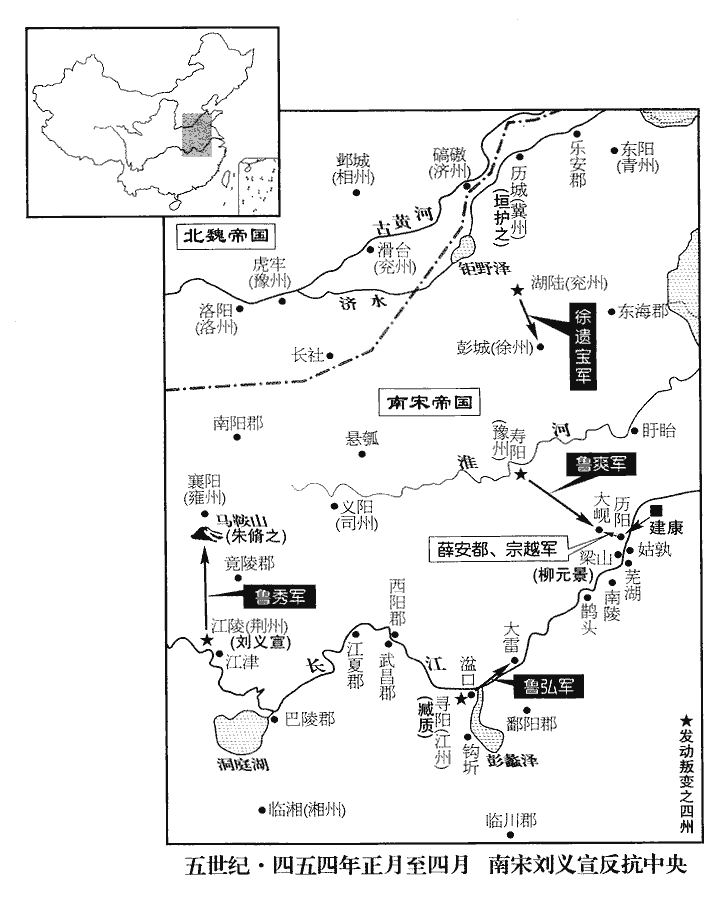
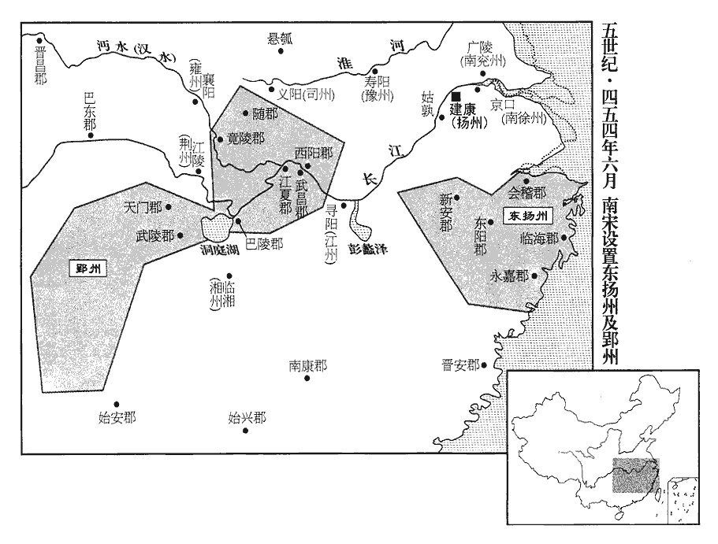
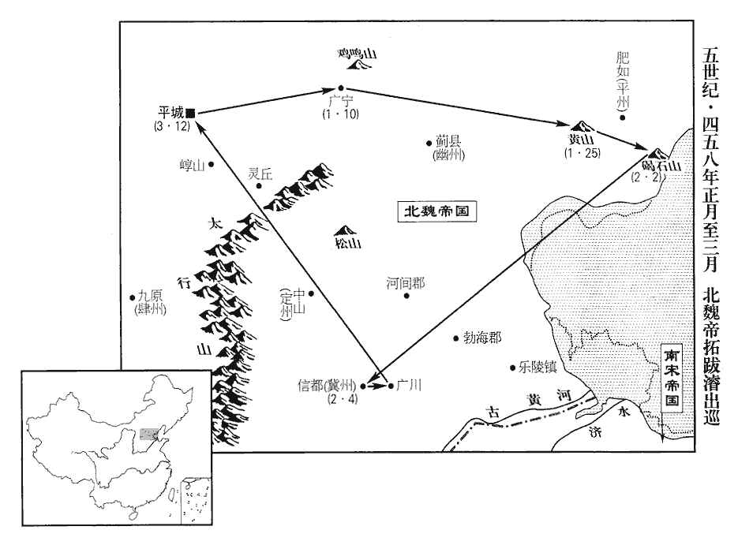
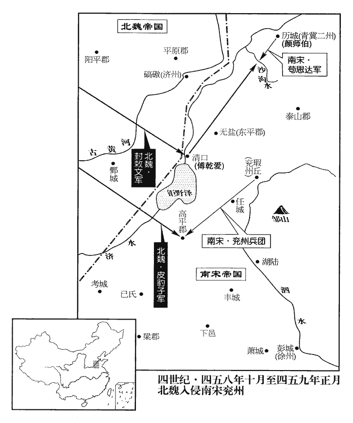

 宋紀十起閼逢敦牂（甲午），盡著雍閹茂（戊戌），凡五年。

# 世祖孝武皇帝上諱駿，字休龍，小字道民，文帝第三子也。

## 孝建元年（甲午、四五四）

1春，正月，己亥朔‹一›，上‹刘骏，时年二十五›祀南郊，改元，大赦。上旣平元凶之亂，依故事卽位踰年而後改元。孝建者，蓋欲以孝建平禍亂安宗廟之功。甲辰‹六›，以尚書令何尚之爲左光祿大夫、護軍將軍，以左衛將軍顏竣爲吏部尚書、領驍騎將軍。竣，七倫翻。驍，堅堯翻。騎，奇寄翻。

〖译文〗 [1]春季，正月，已亥朔（初一），刘宋孝武帝刘骏前往南郊祭天，改年号为孝建，实行大赦。甲辰（初六），任命尚书令何尚之为左光禄大夫、护军将军，左卫将军颜竣为吏部尚书、领骁骑将军。

2壬戌‹二十四›，更鑄孝建四銖錢。更，工衡翻。

〖译文〗 [2]壬戌（二十四日），刘宋改铸孝建四铢钱。

3乙丑‹二十七›，魏以侍中伊馛爲司空。馛bó，蒲撥翻。

〖译文〗 [3]乙丑（二十七日）,北魏任命侍中伊为司空。

4丙子‹二十八›，【嚴：「子」改「寅」。】立皇子子業‹时年六岁›爲太子。

〖译文〗 [4]丙子（二十八日），刘宋孝武帝立皇子刘子业为太子。

5初，江州‹府寻阳，江西九江›刺史臧質，自謂人才足爲一世英雄；太子劭之亂，質潛有異圖，以荊州‹府江陵，湖北江陵›刺史南郡王義宣庸闇易制，易，以豉翻。欲外相推奉，因而覆之。質於義宣爲內兄，臧質，武敬皇后之姪，年長於義宣，故爲內兄。旣至江陵，質初起兵與魯爽同詣江陵，事見上卷上年。卽稱名拜義宣。義宣驚愕問故。質曰：「事中宜然。」謂國家多事之中，宜相推奉也。時義宣已奉帝爲主，故其計不行。及至新亭‹南京西南›，去年五月朔，質至新亭。又拜江夏王義恭，夏，戶雅翻。曰：「天下屯危，禮異常日。」屯，陟倫翻。

〖译文〗 [5]当初，刘宋江州刺史臧质认为自己的聪明才智，足可以称为一代英雄。太子刘劭杀父时，臧质暗中有叛逆的打算。他认为荆州刺史、南郡王刘义宣昏庸无能，容易受人控制，所以，准备表面拥戴刘义宣称帝，再趁机推翻他。臧质是刘义宣的表哥，他到了江陵以后，却自称名字去叩拜刘义宣，刘义宣见状极为惊愕，问他为什么要这么做，臧质回答说：“事变之中，理应如此。”当时刘义宣已明确表示拥护刘骏称帝，臧质的计划没有实现。他们到达新亭的时候，臧质又用同样的礼仪去叩拜江夏王刘义恭，并且说：“此刻天下危机四伏，岌岌可危，礼仪也应跟平时的日子不一样。”

劭旣誅，義宣與質功皆第一，由是驕恣，事多專行，凡所求欲，無不必從。必上之從己。義宣在荊州十年，文帝元嘉二十年義宣鎭荊州。財富兵強；朝廷所下制度，意有不同，一不遵承。史歷言義宣、質驕橫之由。下，遐稼翻。質自建康之江州‹府寻阳，江西九江›，舫千餘乘，部伍前後百餘里。舫，甫妄翻。乘，繩證翻。帝‹刘骏›方自攬威權，而質以少主遇之，少，詩照翻。政刑慶賞，一不咨稟。擅用湓口‹江西九江东›、鉤圻‹江西新建东北›米，湓口米，荊、湘、郢三州之運所積也。鉤圻米，南江之運所積也。《水經註》：灨水自南昌歷郴丘城下，又歷鉤圻邸閣下，而後至彭澤。圻qí，音畿。臺符屢加檢詰，漸致猜懼。檢詰，謂檢校米斛，而詰問擅用之由也。詰，去吉翻。

〖译文〗 刘劭被斩以后，刘义宣和臧质的功劳都列为第一等，于是他们又开始骄横跋扈起来，做事大都独断专行，横行霸道，他们向朝廷所要求的东西，没有不被依从的。刘义宣在镇守荆州十年期间，财产丰富、兵力强盛。朝廷颁布的法令章程，刘义宣只要不同意，就不遵照执行。臧质从建康前往江州就任时，带了一千多艘船，船队前后相接有一百多里。孝武帝此时也正独揽大权以显示自己的威严和权要。可是，臧质却把他当成一个不懂事的少年君主来对待，因此，有关行政、刑法和庆贺奖赏之类的事情，他都一律不奏请刘骏批准。臧质又擅自动用湓口和钩圻粮仓里的粮食，因此，朝廷多次调查追问臧质这一事件，双方渐渐相互猜忌对立起来。

帝‹刘骏›淫義宣諸女，義宣由是恨怒。質迺遣密信說義宣，密信，密使也。說，輸芮翻；下說誘同。以爲「負不賞之功，挾震主之威，自古能全者有幾？今萬物係心於公，聲迹已著；見幾不作，將爲他人所先。幾，居希翻。先，悉薦翻。若命徐遺寶、魯爽驅西北精兵來屯江上，徐遺寶刺兗州‹府湖陆，山东鱼台东南›，直建康北；魯爽刺南豫‹府寿阳，安徽寿县›，直建康西。魯爽素奉義宣，徐遺寶由義宣府參軍起，故欲命之同逆。質帥九江樓船爲公前驅，帥，讀曰率。已爲得天下之半。公以八州之衆，徐進而臨之，義宣都督荊、雍、梁、益、湘、交、廣、寧八州。雖韓、白更生，不能爲建康計矣。韓、白，謂韓信、白起。且少主失德，聞於道路；聞，音問，同。沈、柳諸將，亦我之故人，沈慶之與質同以武幹事文帝，質爲雍州，柳元景其部曲將也。將，卽亮翻；下同。誰肯爲少主盡力者！爲，于僞翻；下爲公同。夫不可留者年也，不可失者時也。質常恐溘先朝露，溘kè，苦答翻，又苦合翻。溘，奄也。朝露，言其易晞。溘先朝露，言奄然而死在朝露未晞之先。先，悉薦翻。不得展其旅力，毛萇曰：旅，衆也。考孔安國《書註》亦然。爲公掃除，於時悔之何及。」義宣腹心將佐諮議參軍蔡超、司馬竺超民等咸有富貴之望，蔡超等以江州將佐從帝起義以得富貴，故懷非望。欲倚質威名以成其業，共勸義宣從其計。質女爲義宣子採之婦。義宣謂質無復異同，復，扶又翻。遂許之。超民，夔之子也。景平、元嘉之間，竺夔守東陽有功。臧敦時爲黃門侍郎，帝使敦至義宣所，道經尋陽‹江西九江›，質更令敦說誘義宣，誘，音酉。義宣意遂定。

〖译文〗 孝武帝奸淫了刘义宣留在建康的所有女儿，刘义宣听说后，十分气愤和怨恨。臧质就偷偷派遣密使前去游说刘义宣，认为：“立下无法奖赏的大功，身负使皇帝都感到震惊的威望，自古以来有几个人能够保全自己呢？如今，万众一心，归向于您，您的名声和信誉已经传播到四方去了，这样好的机会不采取行动，就会被别人抢先。假如您命令徐遗宝、鲁爽驱使西北的精锐部队前来驻崐屯长江，我臧质就率领九江的船只做您的前锋，那样就为您得到一半天的下。您可以率领八个州的军队，缓慢地向前推进，兵临建康，那么，即使是韩信、白起转世再生，也不能为建康想出什么好的办法来。况且，如今少主丧失道德，丑名路人尽知。沈庆之和柳元景各位将士，也都是我旧日的朋友，又有谁肯于替少主尽心尽力的呢？人世上无法留住的是岁月，而不可失去的是时机。我经常害怕自己在朝露还没有消失之前就死去了，而无法使大家能够施展自己的才能抱负，替你扫清前进中的障碍，以至临到死时，后悔都来不及了”。刘义宣的心腹将领、谘议参军蔡超和司马竺超民等人都希望自己能得到更多的荣华富贵，也想依仗臧质勇于作战的赫赫威名来成就自己的大业，他们也都来劝说刘义宣接受臧质的建议。臧质的女儿是刘义宣的儿子刘采之的正室，所以，刘义宣认为，臧质肯定不会有其他想法，他采纳了臧质的建议。竺超民是竺夔的儿子。臧质的儿子臧敦，此时正在建康担任黄门侍郎，孝武帝派臧敦去刘义宣那里办事，经过寻阳，臧质再次命令臧敦前去游说、劝诱刘义宣，刘义宣的决心终于下定。

豫州刺史魯爽有勇力，義宣【章：甲十一行本「宣」下有「質」字；乙十一行本同；孔本同；張校同。】素與之相結。義宣密使人報爽及兗州刺史徐遺寶，期以今秋同舉兵。使者至壽陽‹安徽寿县›，爽方飲醉，失義宣指，卽日舉兵。《考異》曰：《宋•本紀》：「二月庚午，爽、臧質、南郡王義宣、徐遺寶舉兵反。」《義宣傳》云其年正月便反。《宋略》云：「二月，義宣等反。」按爽之反，帝猶遣質收魯弘，則非同日反明矣。又按《長曆》，是日戊辰朔；然則庚午三日也。《義宣傳》，起兵在二月二十六日，但不知爽反在正月與二月耳。爽弟瑜在建康，聞之，逃叛。爽使其衆戴黃標，戴黃以爲標識。竊造法服，登壇，自號建平元年；疑長史韋處穆、中兵參軍楊元駒、治中庾騰之不與己同，皆殺之。處，昌呂翻。徐遺寶亦勒兵向彭城‹江苏徐州›。

〖译文〗 豫州刺史鲁爽勇敢有武力，刘义宣平时一直跟他结交。刘义宣派密使偷偷把他自己的决定告诉给了鲁爽和兖州刺史徐遗宝，约定在这年的秋季共同发兵起义。使者到达寿阳时，正赶上鲁爽喝醉，他听错了密使向他传达的刘义宣的意思，而在当天就起兵反叛了。鲁爽的弟弟鲁瑜此时正在建康，听到这一消息，吓得逃走。鲁爽命令他手下的士卒们戴上黄色标志，偷偷缝制皇帝穿的礼服，然后登上高坛誓师。自己改年号为建平元年。他怀疑长史韦处穆、中兵参军杨元驹和治中庚腾之同自己的意见不一致，于是把这三个人全都杀了。徐遗宝也率领军队向彭城进攻。

二月，義宣聞爽已反，狼狽舉兵。魯瑜弟弘爲質府佐，帝‹刘骏›敕質收之，質卽執臺使，舉兵。使，疏吏翻。

〖译文〗 二月，刘义宣得到鲁爽已经反叛的消息，他也只好仓促起兵响应鲁爽。鲁瑜的弟弟鲁弘是臧质的府佐，孝武帝命令臧质逮捕鲁弘。臧质却把孝武帝派来的使节抓了起来，也起兵反叛。

義宣與質皆上表，言爲左右所讒疾，欲誅君側之惡。義宣進爽號征北將軍。爽於是送所造輿服詣江陵，使征北府戶曹版義宣等，晉、宋之制，藩方權宜授官者謂之版授。文曰：「丞相劉，今補天子，名義宣；車騎臧，今補丞相，名質；平西朱，今補車騎，名脩之：先是，臧質進號車騎將軍，鎭尋陽；朱脩之進號平西將軍，鎭襄陽；進義宣丞相，辭不受。皆版到奉行。」義宣駭愕，爽所送法物並留竟陵‹湖北钟祥›，不聽進。質加魯弘輔國將軍，下戍大雷‹安徽望江›。義宣遣諮議參軍劉諶之將萬人就弘，諶chén，氏壬翻。將，卽亮翻。召司州‹府义阳，河南信阳›刺史魯秀，欲使爲諶之後繼。秀至江陵見義宣，出，拊膺曰：「吾兄誤我，乃與癡人作賊，今年敗矣！」

〖译文〗 刘义宣和臧质都上表，宣称自己受到皇帝左右小人的谗言陷害，因而起兵，打算杀了皇帝身边的邪恶之徒。刘义宣提升鲁爽为征北将军，鲁爽又把他所缝制的皇帝穿的礼服送到了江陵，派征北府户曹向刘义宣公布各方临时人事任命情况，文告说：“丞相刘，现在要递补为天子，名为义宣。车骑将军臧，递补为丞相，名叫质。平西将军朱，现在递补为车骑将军，名叫之。这一命令从到达之日起生效执行。”刘义宣看完这篇文告后，吓得直发呆，他命令将鲁爽所送的皇室内的东西，全都留在竟陵，不允许继续带着前进。与此同时，臧质又加授鲁弘为辅国将军，在大雷屯兵。刘义宣派遣谘议参军刘谌之率领一万名士卒增援鲁弘，将司州刺史鲁秀召回，想要让他做刘谌之的后续部队。鲁秀到达江陵，见到了刘义宣，出来后，他不禁捶胸顿足地说：“我哥哥害了我了，我竟要和这种白痴一块儿造反，今年一定会失败！”

義宣兼荊‹湖北西部›、江‹江西及福建›、兗‹山东西部›、豫‹安徽中部、北部›四州之力，威震遠近。帝‹刘骏›欲奉乘輿法物迎之，乘，繩證翻。竟陵王誕固執不可，曰：「柰何持此座與人！」乃止。竟陵王誕時爲揚州刺史。

〖译文〗 刘义宣兼有荆州、江州、兖州、豫州四个州的军事力量，其声势浩大，威震远近四方。孝武帝打算奉上皇帝专用的法驾和专用器物迎接刘义宣，但竟陵王刘诞坚决反对，说：“你怎么能把帝位轻易地让给他人？”孝武帝才没有这么做。

己卯‹十二›，以領軍將軍柳元景爲撫軍將軍；辛卯‹二十四›，以左衛將軍王玄謨爲豫州刺史。欲以代魯爽。命元景統玄謨等諸將以討義宣。癸巳‹二十六›，進據梁山洲‹安徽和县南江中岛›，時梁山江中有洲，玄謨等舟師據之。於兩岸築偃月壘，水陸待之。義宣自稱都督中外諸軍事，命僚佐悉稱名。

〖译文〗 已卯（十二日），孝武帝任命领军将军柳元景为抚军将军。辛卯（二十四日），又任命左卫将军王玄谟为豫州刺史。下令柳元景统领王玄谟等各路将士讨伐刘义宣。癸巳（二十六日），柳元景进军占据梁山洲，在梁山洲两岸修筑月牙形阵地，从水路和陆路同时准备，等待迎战。刘义宣自称是都督中外诸军事，命令自己手下人彼此之间全都称名字而不称官衔。

 

6甲午‹二十七›，魏主‹拓跋濬，时年十五›詣道壇受圖籙。寇謙之之遺敎也。

〖译文〗 [6]甲午（二十七日），北魏国主来到道教神坛，接受道教符。

7丙申‹二十九›，以安北司馬夏侯祖歡爲兗州刺史。代徐遺寶。三月，己亥‹二›，內外戒嚴。《考異》曰：《宋•本紀》、《宋略》皆作癸亥，下有辛丑。按《長曆》，是月戊戌朔，癸亥二十六日，辛丑乃四日也；當作己亥。辛丑‹四›，以徐州刺史蕭思話爲江州刺史，欲以代臧質。柳元景爲雍州‹府襄阳›刺史。欲以代朱脩之。雍，於用翻。癸卯‹六›，以太子左衛率龐秀之爲徐州刺史。欲以代蕭思話。

〖译文〗 [7]丙申（二十九日），刘宋朝廷任命安北司马夏侯祖欢为兖州刺史。三月，己亥（初二），建康城内外戒严。辛丑（初四），任命徐州刺史萧思话为江州刺史，柳元景为雍州刺史。癸卯（初六），任命太子左卫率庞秀之为徐州刺史。

義宣移檄州郡，加進位號，使同發兵。雍州刺史朱脩之僞許之，而遣使陳誠於帝。遣使，疏吏翻；下同。益州‹府成都，四川成都›刺史劉秀之斬義宣使者，遣中兵參軍韋崧【嚴：「崧」改「山松」。】將萬人襲江陵。將，卽亮翻；下使將同。

〖译文〗 刘义宣传布檄方到各州郡，给各州郡长加官晋爵，让他们一起出兵响应自己。雍州刺史朱之假装响应刘义宣的号召，但私下里却派遣使者向孝武帝表示自己的忠诚。益州刺史刘秀之斩了刘义宣派来的使者，派中兵参军韦崧率领一万人袭击江陵。

戊申‹十一›，義宣帥衆十萬發江津‹湖北江陵东南›，舳艫數百里。帥，讀曰率。舳zhú，音逐。艫，音盧。以子慆tāo爲輔國將軍，與左司馬竺超民留鎭江陵。慆，土刀翻。檄朱脩之使發兵萬人繼進，脩之不從。義宣知脩之貳於己，乃以魯秀爲雍州刺史，使將萬餘人擊之。王玄謨聞秀不來，魯秀善戰，故王玄謨憚之。喜曰：「臧質易與耳。」易，以豉翻。

〖译文〗 戊申（十一日），刘义宣亲自率领十万大军从江津出发，船只相继连绵几百里。刘义宣任命自己的儿子刘为辅国将军，命令他与左司马竺超民留下镇守江陵。刘义宣又下令，让朱之出兵一万名随后前进，朱之没有听从。刘义宣深知朱之跟自己不是一条心，于是，他又任命鲁秀为雍州刺史，并派鲁秀率领一万多人前去进攻朱之。朝廷派来的将领王玄谟听说鲁秀不会前来进攻自己，不禁高兴地说：“臧质容易对付了。”

冀州‹府历城，山东济南›刺史垣護之妻，徐遺寶之姊也，遺寶邀護之同反，護之不從，發兵擊之。遺寶遣兵襲徐州長史明胤於彭城，不克。蕭思話已離彭城，長史明胤守之。胤與夏侯祖歡、垣護之共擊遺寶於湖陸，宋兗州治湖陸。遺寶棄衆焚城，奔魯爽。

〖译文〗 冀州刺史垣护之的正室是徐遗宝的姐姐，徐遗宝邀请垣护之与他一起起兵反叛，垣护之没有答应，相反却出动军队攻击徐遗宝。徐遗宝派遣军队袭击徐州长史明胤所镇守的彭城，没有攻下。明胤和夏侯祖欢、垣护之联合起来，在湖陆袭击徐遗宝的军队。徐遗宝丢下将士，放火焚烧了湖陆城，投奔了鲁爽。

義宣至尋陽，以質爲前鋒而進，爽亦引兵直趣歷陽‹安徽和县›，趣，七喻翻。與質水陸俱下。殿中將軍沈靈賜將百舸，破質前軍於南陵‹安徽贵池›，擒軍主徐慶安等。舸，古我翻。質至梁山‹安徽和县南›，夾陳兩岸，與官軍相拒。陳，讀曰陣。

〖译文〗 刘义宣抵达寻阳，命令臧质做前锋率军前进，鲁爽率领军队南下，直奔历阳，与臧质从水路和陆路同时发兵。殿中将军沈灵赐率领一百艘船只，在南陵大败臧质的先头部队，活捉了军主徐庆安等人。臧质率军抵达梁山，在两岸建筑了营垒，以此跟朝廷的军队相抗衡。

夏，四月，戊辰‹二›，以後將軍劉義綦爲湘州刺史；甲申‹十八›，以朱脩之爲荊州刺史。義宣爲荊、湘二州刺史而反，故二州皆命代，以朱脩之效順，使制其後，故命以荊州。

〖译文〗 夏季，四月，戊辰（初二），孝武帝任命后将军刘义綦为湘州刺史。甲申（十八日），又任命朱之为荆州刺史。

上‹刘骏›遣左軍將軍薛安都、龍驤將軍南陽‹河南南阳›宗越等戍歷陽‹安徽和县›，驤，思將翻。與魯爽前鋒楊胡興等戰，斬之。《考異》曰：《安都傳》作「胡與」，今從《宗越傳》。爽不能進，留軍大峴‹安徽含山北›，使魯瑜屯小峴‹安徽含山西北›。小峴在合肥之東，大峴又在小峴之東。峴xiàn，戶典翻。上復遣鎭軍將軍沈慶之濟江，督諸將討爽，復，扶又翻。爽食少，引兵稍退，自留斷後；少，詩沼翻。斷，音短；斷後，古之所謂殿也。慶之使薛安都帥輕騎追之，帥，讀曰率。騎，奇寄翻。丙戌‹二十›，及爽於小峴。爽將戰，飲酒過醉，安都望見爽，卽躍馬大呼，直往刺之，呼，火故翻。刺，七亦翻。應手而倒，左右范雙斬其首。爽衆奔散，瑜亦爲部下所殺，遂進攻壽陽，克之。爽爲南豫州刺史，鎭壽陽。徐遺寶奔東海‹山东郯城›，東海人殺之。

〖译文〗 孝武帝派左军将军薛安都、龙骧将军南阳人宗越等人戍守历阳，同鲁爽的先头部队杨胡兴等大战，斩了杨胡兴。鲁爽因此不能前进，将军队驻留在大岘，派鲁瑜屯兵小岘。孝武帝再次派遣镇军将军沈庆之渡过长江，北上督统各路将士讨伐鲁爽。鲁爽的粮食越来越少，率军稍稍向后撤退，自己留下殿后。沈庆之派薛安都率领轻骑部队追击鲁爽。丙戌（二十日），薛安都在小岘追上了鲁爽，鲁爽将要出去迎战，却饮酒过度，酩酊大醉，薛安都看到鲁爽，立刻飞马上前，大声呐喊，直刺鲁爽，鲁爽应声栽到马下，其左右随从范双砍下鲁爽的人头。鲁爽的士卒四处奔跑逃命。鲁瑜也被他的部下所杀。朝廷军队于是向寿阳进攻，攻克寿阳。徐遗宝向东海逃去，被东海人杀了。

李延壽論曰：凶人之濟其身，非世亂莫由焉。魯爽以亂世之情，而行之於平日，平日，謂安平無事之日。其取敗也宜哉！《考異》曰：此語本出沈約《宋書•吳喜黃回傳贊》，而延壽取之。以約施用失所，故絀其名。

〖译文〗 李延寿论曰：凶恶之人，能够获得成功，如果不是世道混乱那是没有可能的。鲁爽把乱世的那一套拿到太平的社会里来施用，他自取失败，也是理所必然的呀！

8南郡王義宣至鵲頭‹安徽铜陵北›，慶之送爽首示之，幷與書曰：「僕荷任一方，而釁生所統。去年，慶之鎭盱眙，今使之專征，蓋兼督兗、豫。荷，下可翻。釁，許觐翻。近聊帥輕師，指往翦撲，輕師，言非重兵。撲，普卜翻。軍鋒裁及，賊爽授首。公情契異常，言義宣與爽相結，情契異於常人。或欲相見，及其可識，指送相呈。」爽累世將家，魯爽父軌，軌父宗之，三世將家。驍猛善戰，號萬人敵；驍，堅堯翻。義宣與質聞其死，皆駭懼。

〖译文〗 [8]南郡王刘义宣抵达鹊头，沈庆之将鲁爽的人头送给刘义宣看，同时又给他写了一封信说：“我负责管理一方土地，可是，在我所管理的这个地区内，却发生了事端，近日，我率领轻骑部队，前去消除事端，锐利的刀锋一到，奸贼鲁爽便献出了自己的人头。我深知您与他有很深的友情，或许您还想见他一面。所以在他的面目还没有腐烂可以辨别之前，我特别把他呈送给您看一看。”鲁爽家几代为将，骁勇悍猛，善于交战，号称万人敌。刘义宣和臧质听说鲁爽已死，都极为震惊害怕。

柳元景軍于採石‹安徽马鞍山西南›；王玄謨以臧質衆盛，遣使來求益兵，使，疏吏翻。上使元景進屯姑孰‹安徽当涂›。《考異》曰：《垣護之傳》作「南州」，蓋南州卽姑孰也。按宋白《續通典》曰：「桓玄居南州，以在國南，故曰南州，」載之宣州之下。《晉書》云：「桓玄於南州起齋，號曰盤龍齋。劉毅小字盤龍。玄旣敗，毅以豫州刺史出鎭姑孰，正居是齋。」桓玄旣誅司馬元顯，出鎭姑孰，起盤龍齋，蓋是時也。《晉書》正指姑孰爲南州，宋白誤矣。

〖译文〗 抚军将军柳元景驻兵在采石。豫州刺史王玄谟因为臧质的军队力量强大，就派遣使节前往建康请求增加兵力，孝武帝派柳元景进入姑孰屯扎。

太傅義恭與義宣書曰：「往時仲堪假兵，靈寶尋害其族；孝伯推誠，牢之旋踵而敗。假兵、推誠事並見一百一十卷晉安帝隆安二年，桓玄殺殷仲堪見一百一十一卷三年。桓玄，字靈寶。王恭，字孝伯。臧質少無美行，弟所具悉。質少輕薄無檢，爲文帝所嫌。少，詩照翻。行，下孟翻。今藉西楚之強力，圖濟其私；凶謀若果，果，勝也，克也，決也。恐非復池中物也。」復，扶又翻。義宣由此疑之。五月，甲辰‹八›，義宣至蕪湖‹安徽芜湖›，質進計曰：「今以萬人取南州，則梁山中絕；柳元景屯南州爲梁山後鎭，若取之，則梁山之路中絕。萬人綴梁山，則玄謨必不敢動；下官中流鼓棹，直趣石頭，此上策也。」沈慶之、薛安都等在江西，柳元景、王玄謨等與義宣相持；若質計得行，建康殆矣。趣，七喻翻。義宣將從之。劉諶chén之密言於義宣曰：「質求前驅，此志難測。不如盡銳攻梁山，事克然後長驅，此萬安之計也。」義宣乃止。

〖译文〗 太傅刘义恭给刘义宣写信说：“以前，殷仲堪将兵权交给了桓玄，不久桓玄就杀害了殷仲堪全族。王恭对刘牢之推心置腹、坦诚相待，刘牢之转过身去就背叛了王恭，导致自己失败。臧质从小就没有好的德行，弟弟你是最清楚他的。而如今，他凭借着楚地的强大兵力，其目的只不过是要满足他自己的私欲。如果他凶恶的阴谋得以实现，那么，恐怕他也就不再是池塘里的一条小鱼了”。刘义宣开始对臧质起疑。五月，甲辰（初八），刘义宣到达芜湖，臧质向他献计说：“现在出动一万人的兵力攻取南州，梁山就会被完全隔断，如果用这一万人把守住梁山，王玄谟肯定不敢轻举妄动。我率领船队，沿着长江中流划行，直奔石头，这才是上策”。刘义宣想按照此计执行，谘议参军刘谌之却偷偷对刘义宣说：“臧质自己请求做先头部队，其目的很难推测。不如全力进攻梁山，攻克梁山之后，再长驱直入建康，这才是万全的计策啊！”刘义宣听后才没有接受臧质的提议。

宂從僕射胡子反等守梁山西壘‹长江西岸›，會西南風急，質遣其將尹周之攻西壘；因西南風急而攻西壘，東壘之兵難以逆風赴救。宂rǒng，而隴翻。從，才用翻。將，卽亮翻。子反方渡東岸就玄謨計事，聞之，馳歸。【章：甲十一行本「歸」下有「周之攻壘甚急」六字；乙十一行本同；孔本同；張校同；退齋校同。】偏將劉季之帥水軍殊死戰，帥，讀曰率。求救於玄謨，玄謨不遣；大司馬參軍崔勳之固爭，乃遣勳之與積弩將軍垣詢之救之。比至，城已陷，勳之、詢之皆戰死。比，必寐翻，及也。《考異》曰：《義宣傳》曰：「五月十九日，西南風猛。」《宋略》曰：「己亥，質遣尹周之攻梁山西壘，陷之。」按《長曆》，是月丁酉朔，三日己亥，八日甲辰，十八日甲寅。《宋略》於己亥上有甲辰，下有甲寅，然則決非十九日與己亥，或者是己酉與辛亥也。今不書日，闕疑。詢之，護之之弟也。子反等奔還東岸。質又遣其將龐法起將數千兵趨南浦‹安徽芜湖北›，欲自後掩玄謨，龐，皮江翻。趨，七俞翻。時玄謨使其將鄭琨、武念戍南浦，其地則今之大信港也，俗謂之扁擔河。游擊將軍垣護之引水軍與戰，破之。此以上皆梁山交戰事。

〖译文〗 冗从仆射胡子反等固守梁山西部营垒，正赶上刮起了西南风，风力很强，崐所以，臧质就派他手下的将领尹周之进攻梁山西营。胡子反正巧在梁山东岸，同王玄谟商量军务，得到报告后，立即飞奔返回西营。偏将刘季之率领船队同臧质的船队进行殊死搏斗，并向王玄谟求救，王玄谟没有派出军队前去营救。大司马参军崔勋之竭力争取，王玄谟才派遣崔勋之和积弩将军垣询之前去救援。他们到达时，西营已经失陷，崔勋之和垣询之全都战死。垣询之是垣护之的弟弟。胡子反等人逃回东岸。臧质又派遣他的将领庞法起率领几千名士卒，直取南浦，打算从后面包抄切断王玄谟军队的后路。游击将军垣护之率领水军同臧质的军队作战，结果大败臧质。

朱脩之斷馬鞍山‹襄阳城南›道，《水經註》：檀溪水出襄陽西柳子山下，東爲鴨湖，湖在馬鞍山東北。按馬鞍山今謂之望楚山，晉劉弘所改名也，高處有三磴。斷，丁管翻。據險自守。魯秀攻之，不克，屢爲脩之所敗，敗，補邁翻。乃還江陵，脩之引兵躡之。或勸脩之急追，脩之曰：「魯秀，驍將也；獸窮則攫，不可迫也。」《兵法》有言：知彼知己，百戰不殆。朱脩之此戰近之。驍，堅堯翻。將，卽亮翻。

〖译文〗 雍州刺史朱之切断了马鞍山的交通，依靠自己占据的险要位置坚守阵地。鲁秀向朱之发起攻势，未能攻克，却屡次被朱之击败，于是，他回到了江陵。朱之率军尾随追击。有人劝朱之加快追击的速度，朱之说：“鲁秀是一名骁勇将士。野兽在走投无路时，就要不顾一切地抓人咬人，我们不能急迫追击”。

王玄謨使垣護之告急於柳元景曰：「西城不守，唯餘東城萬人。賊軍數倍，強弱不敵，欲退還姑孰，就節下協力當之，更議進取。」元景不許，曰：「賊勢方盛，不可先退，吾當卷甲赴之。」護之曰：「賊謂南州有三萬人，而將軍麾下裁十分之一，若往造賊壘，造，七到翻。則虛實露矣。王豫州必不可來，不如分兵援之。」元景曰：「善！」乃留羸弱自守，悉遣精兵助玄謨，多張旗幟。羸，倫爲翻。幟，昌志翻。梁山望之如數萬人，皆以爲建康兵悉至，衆心乃安。

〖译文〗 王玄谟派垣护之向柳元景告急，说：“西城现在失守，只剩下东城的一万人。但贼寇的兵力却高于我们几倍，敌强我弱，相差悬殊，我打算撤退返回姑孰防守，在您的指挥下和您齐心协力一同抵抗敌人的进攻，然后再商议下一步如何进取。”柳元景没有答应，说：“贼寇的势力正在强盛时期，我们绝对不可以先行后退，我自会披上铠甲，率领全军跟你会合”。垣护之说：“贼寇还以为南州有三万大军，可事实上，将军您旗帜下仅仅有三万大军的十分之一，假如您率兵直接到战场上，与贼寇相战，您内部兵力的虚实情况就会都暴露出来。王玄谟一定不能退到姑孰来，不如分几路前去救援。”柳元景说：“好！”于是，柳元景留下一些老弱病残的士卒在大营守卫，而把精锐兵力全都派遣去援助王玄谟，他们故意到处都张扬着旗帜。梁山的守军们一眼望去，好像来了几万大军增援，他们以为建康的大军全都赶来援助了，士卒们才安定下来。

質自請攻東城。諮議參軍顏樂之說義宣曰：「質若復克東城，樂，音洛。說，輸芮翻。復，扶又翻。則大功盡歸之矣；宜遣麾下自行。」義宣乃遣劉諶之與質俱進。甲寅‹十八›，義宣至梁山，頓兵西岸，義宣自鵲頭至梁山西岸。質與劉諶之進攻東城。玄謨督諸軍大戰，薛安都帥突騎先衝其陳之東南，陷之，帥，讀曰率。騎，奇寄翻。陳，讀曰陣。斬諶之首，劉季之、宗越又陷其西北，質等兵大敗。垣護之燒江中舟艦，煙焰覆水，艦，戶黯翻。覆，敷又翻；下覆頭同。延及西岸營壘殆盡；諸軍乘勢攻之，義宣兵亦潰。義宣單舸迸走，閉戶而泣，舸，古我翻。迸，北孟翻。戶，艦戶也。荊州人隨之者猶百餘舸。質欲見義宣計事，而義宣已去，質不知所爲，亦走，其衆皆降散。降，戶江翻。己未‹二十三›，解嚴。

〖译文〗 臧质自己请求去进攻东城。谘议参军颜乐之劝刘义宣道：“如果臧质再一次攻克了东城，所有的大战功恐怕就都要归在他一人身上了。您最好派自己手下的将士去。”刘义宣就派遣刘谌之和臧质一起出兵进击东城。甲寅（十八日），刘义宣到达梁山，在梁山西岸安营扎寨，臧质和刘湛之向东城发起进攻。王玄谟督统各路大军出来迎战，薛安都率领突击骑后首先冲入敌方在东南方的阵营，攻下那里，砍下刘谌之的人头。刘季之和宗越又攻陷了敌方的西北阵地，臧质的大军大败。垣护之放火焚烧了长江上的船只，江上大火熊熊，火焰盖住了江水，又蔓延到西岸的堡垒阵营，敌军营垒几乎化为灰烬。各路大军乘胜前进，刘义宣率领的大军也一败涂地。刘义宣单身一人乘小船逃走，他将船上的门窗关得紧紧的，躲在里面不停地哭泣，追随他的荆州将士还有一百多只船跟在后边。臧质打算去见刘义宣商议战事，可是，刘义宣已经逃走，臧质不知道自己怎么办是好，也逃走了，手下士卒也都投降或逃散。己未（二十三日），朝廷下令解除戒严。

9癸亥‹二十七›，以吳興‹浙江湖州›太守劉延孫爲尚書右僕射。守，手又翻。

〖译文〗 [9]癸亥（二十七日），刘宋朝廷提升吴兴太守刘延孙为尚书右仆射。

10六月，丙寅‹一›，魏主‹拓跋濬›如陰山。

〖译文〗 [10]六月，丙寅（初一），北魏国主前往阴山。

11臧質至尋陽，焚燒府舍，載妓妾西走；使嬖人何文敬領餘兵居前，至西陽‹湖北黄州›。西陽太守魯方平紿文敬曰：妓，渠綺翻。嬖，卑義翻，又博計翻。紿dài，蕩亥翻。「詔書唯捕元惡，餘無所問，不如逃之。」文敬棄衆亡去。質先以妹夫羊沖爲武昌郡‹湖北鄂州›，《晉起居注》：武帝太康元年改江夏爲武昌郡。又按《晉志》，吳主權以東鄂置武昌郡；今壽昌軍是也。質往投之；沖已爲郡丞胡庇之所殺，質無所歸，乃逃于南湖‹湖北鄂州东›，南湖今在壽昌軍武昌縣東八里。掇蓮實噉之。掇duō，丁括翻。噉，徒濫翻，又徒覽翻。追兵至，以荷覆頭，自沈於水，出其鼻。沈，持林翻。戊辰‹五›，軍主鄭俱兒望見，射之，中心，射，而亦翻。中，竹仲翻。兵刃亂至，腸胃縈水草，斬首送建康‹年五十五›，子孫皆棄市，幷誅其黨樂安‹山东广饶›太守【章：甲十一行本作「豫章太守樂安」六字；乙十一行本同；孔本同；張校云：「黨」下脫「豫章太守」四字，「安」下衍「太守」二字。】任薈之、任，音壬。薈，烏外翻。臨川‹江西临川›內史劉懷之、鄱陽‹江西波阳东北›太守杜仲儒。仲儒，驥之兄子也。杜驥，元嘉中刺青州。功臣柳元景等封賞各有差。

〖译文〗 [11]臧质逃到寻阳，放火焚烧了寻阳的州府房舍，带着妻妾歌伎们继续向西逃命。他派自己最信任的人何文敬率领剩余的士卒在前边开路，到达西阳。西阳太守鲁方平骗何文敬说：“皇上的诏令说只逮捕元凶，对其余的人不再追究，你不如自己逃走算了。”何文敬听后，立刻抛弃他所率领的军队，独自一人逃走。臧质原来让他的妹夫羊冲担任武昌郡守，于是，他前往武昌去投奔羊冲。羊冲已经被郡丞胡庇之杀死，臧质找不到立足安身之处，只好又逃到了南湖，采摘湖里的莲子充饥。追兵到来，他就用荷叶盖住自己的头，将整个身子全都沉到了湖水里，只露出鼻子喘气。戊辰（初三），他的行踪还是被军主郑俱儿发现，郑俱儿举箭便射，正中心脏，士卒们乱刀齐下，臧质的肠胃全都流了出来，和湖中的水草缠在了一起。追兵们砍下他的头送到了建康。臧质的子孙也都被斩首示众。朝廷同时还诛杀了臧质的党羽乐安太守任荟之、临川内史刘怀之、鄱阳太守杜仲儒。杜仲儒是杜骥哥哥的儿子。朝廷对有功之臣如柳元景等，全都按照功劳的大小进行了不同等级的封赏。

丞相義宣走至江夏‹湖北武汉›，聞巴陵‹湖南岳阳›有軍，巴陵之軍，蓋韋崧之兵也；或曰：湘州刺史劉遵考之兵也。夏，戶雅翻。回向江陵，衆散且盡，與左右十許人徒步，脚痛不能前，僦民露車自載，僦jiù，卽就翻，賃也。緣道求食。至江陵郭外，遣人報竺超民，超民具羽儀兵衆迎之。時荊州帶甲尚萬餘人，左右翟靈寶誡義宣使撫慰將佐，翟zhái，萇伯翻。將，卽亮翻。以：「臧質違指授之宜，用致失利。今治兵繕甲，更爲後圖。治，置之翻。昔漢高百敗，終成大業……」而義宣忘靈寶之言，誤云「項羽千敗」，衆咸掩口。掩口而笑也。魯秀、竺超民等猶欲收餘兵更圖一決；而義宣惛沮，無復神守，入內不復出，沮，在呂翻。復，扶又翻；下夜復同。左右腹心稍稍離叛。魯秀北走，《考異》曰：《宋略》云：「秀自襄陽敗退，將及江陵，聞敗北走。」今從《宋書》。義宣不能自立，欲從秀去，乃攜息慆息，子也。及所愛妾五人，著男子服相隨。著，陟略翻。城內擾亂，白刃交橫，義宣懼，墜馬，遂步進；竺超民送至城外，更以馬與之，歸而城守。守，手又翻。義宣求秀不得，左右盡棄之，夜，復還南郡空廨；南郡太守廨舍，蓋在江陵城外。廨，古隘翻。旦日，超民收送刺姦。自漢以來，公府有刺姦掾。義宣止獄戶，坐地歎曰：「臧質老奴誤我！」五妾尋被遣出，義宣號泣，語獄吏曰：「常日非苦，今日分別始是苦。」被，皮義翻。號，戶高翻。語，牛倨翻。別，如字；分別，猶分離也。魯秀衆散，不能去，還向江陵，城上人射之，射，而亦翻。秀赴水死，就取其首。

〖译文〗 丞相刘义宣逃到了江夏，听说巴陵有朝廷的军队，吓得又向江陵回逃，追随他的将士差不多都散逃了。刘义宣只得跟着他的左右十几个人徒步前进，他的脚疼得不能继续走，向当地老百姓租了没有顶篷的车辆，自己赶着继续走，沿路讨饭充饥。到达江陵郊外，就派人前去通报留守在江陵的左司马竺超民，竺超民立刻派出华丽的仪仗部队前去迎接刘义宣。此时，在荆州一带，刘义宣还有一万多名武装将士，左右侍从翟灵宝劝刘义宣出来安抚慰劳手下将士，告诉手下将士：“臧质违反了作战命令，以致于使我们失利。从现在开始，我们再重新整治武器、训练将士，进一步为我们将来的图谋打打下基础。从前，汉高祖刘邦百次失败，最终成就了大业……。”刘义宣在犒劳士卒时，却忘记了翟灵宝对他说的话，竟误说成“项羽失败了一千次”，惹得手下将士全都掩口窃笑。鲁秀、竺超民等人还打算收拾好残余士卒，再一次进行决战，刘义宣却是沮丧无志，总是魂不守舍，进入后宅后就躲起来，不再出来见人，左右心腹之人逐渐背叛离去。鲁秀向北逃去。刘义宣不能自己独立，打算跟着鲁秀一块儿逃走，于是带着自己的儿子刘以及自己喜欢的五个爱妾，命令她们改穿男子衣服随同鲁秀逃走。城内一片混乱，白刃相接，刀枪横飞，刘义宣害怕，从马上掉了下来，改作步行前进。竺超民把这一行人送到城外，换了一匹马让刘义宣骑，然后自己回到城里坚守。刘义宣寻找鲁秀，没有找到，左右侍从们也全都抛弃了他。深夜，刘义宣走投无路，只得回到南郡的空无一人的太守府里呆着。第二天早晨，竺超民派人把他抓了起来，送到监狱。刘义宣在监狱里，坐在地上不住叹息说：“臧质这个老奴才害了我！”刘义宣的五个爱妾不久就被押送出去了，刘义宣忍不住悲号哭喊，对狱吏说：“平时的日了并不算苦崐，今天和她们分别才是真苦啊！”鲁秀的手下将士也都四散一空，他不能再向北前进，只好返回到江陵，江陵城上的守军一齐向鲁秀发箭。鲁秀投水自尽，江陵守军砍下了他的头。

詔右僕射劉孝【章：甲十一行本「孝」作「延」；乙十一行本同；孔本同；張校同；退齋校同。】孫使荊、江二州，旌別枉直，使，疏吏翻。別，彼列翻。就行誅賞；且分割二州之地，議更置新州。由是遂分荊、湘、江、豫之地置郢州。

〖译文〗 孝武帝诏令右仆射刘延孙前往荆州和江州，调查甄别忠奸曲直，就地进行奖赏和惩处。并且，将这二州的地区进行分割，拟议再设置一个新州。

初，晉氏南遷，以揚州‹江苏南部及浙江›爲京畿，穀帛所資皆出焉；以荊、江爲重鎭，甲兵所聚盡在焉；常使大將居之。將，卽亮翻。三州戶口，居江南之半，上惡其強大，故欲分之。惡，烏路翻；下同。癸未‹十八›，分揚州浙東五郡置東揚州，治會稽‹浙江绍兴›；五郡：會稽‹浙江绍兴›、東陽‹浙江金华›、永嘉‹浙江温州›、臨海‹浙江台州西北章安镇›、新安‹浙江淳安›。會，工外翻。分荊、湘、江、豫州之八郡置郢州，治江夏‹湖北武汉›；分荊州之江夏‹湖北武汉›、竟陵‹湖北钟祥›、隨、武陵‹湖南常德›、天門‹湖南石门›、湘州巴陵‹湖南岳阳›、江州武昌‹湖北鄂州›、豫州西陽‹湖北黄州›凡八郡。《永初郡國志》及何承天《志》，江夏太守本治安陸，自此之後徙治夏口‹湖北武汉›；今鄂州治江夏縣卽其地。夏，戶雅翻；下夏口同。罷南蠻校尉，遷其營於建康。晉武帝置護南蠻校尉於襄陽，江左初省，尋又置於江陵。《水經註》：南蠻校尉府在方城；自油口以東，屯營相接，悉是南蠻府屯兵。校，戶敎翻。太傅義恭議使郢州治巴陵‹湖南岳阳›，尚書令何尚之曰：「夏口在荊、江之中，正對沔口，通接雍‹湖北北部›、梁‹陕西南部›，實爲津要。自夏口入沔，泝流而上，至襄陽，又泝流而上至漢中，故云通接雍、梁。雍，於用翻。由來舊鎭，根基不易，夏口自吳以來爲重鎭。旣有見城，見，賢遍翻。浦大容舫，於事爲便。」守江之備，船艦爲急，故以浦大容舫爲便。舫，甫妄翻。上從之。旣而荊、揚因此虛耗。尚之請復合二州，復，扶又翻。上不許。

〖译文〗 当初，晋朝向南迁移时，曾经把扬州作为京畿，朝廷所需要的布帛粮食等等，都由扬州提供。同时，晋朝又把荆州和江州作为重要的军事要镇，全国的精锐部队全都聚集在这二州，常派大将驻守。这三个州的人口数目，占了长江以南地区人口总数的一半。如今，孝武帝嫌这三地的军力、民力过于强大，所以打算把它们分割开来。癸未（十八日），在京畿地区扬州分出浙江以东五个郡，设立东扬州，治所设在会稽。又从荆州、湘州、江州、豫州中分出八个郡，设立郢州，治所设置在江夏。撤销南蛮校尉，将其所属部队调回建康。太傅刘义恭打算让郢州州府设在巴陵，尚书令何尚之说：“夏口位于荆州和江州中间，正以着沔口，又直接通向雍州和梁州，实在是一个险要的津口，它自古以来就是军事重镇，基础稳固，不容易改变，而且，它既有现成的城池，又有很大的港湾，可以停泊很多船只，在此设立州府，是再合适不过的了。”孝武帝批准。不久，荆州和杨州由于这种变动而财力消耗很多。尚书令何尚之请求重新恢复这二州原来的辖地，孝武帝不允许。

12戊子‹二十三›，省錄尚書事。上‹刘骏›惡宗室強盛，不欲權在臣下；太傅義恭知其指，故請省之。

〖译文〗 [12]戊子（二十三日），孝武帝下令撤掉录尚书事。他对皇室的力量不断强大深为厌恶，更不想让自己的臣属们把持着大权。太傅刘义恭看准了他的心思，所以请求撤掉。

13上使王公、八座與荊州刺史朱脩之書，《晉志》曰：五曹尚書、一僕射、二令爲八座。宋蓋二僕射，一令。令丞相義宣自爲計。書未達，庚寅‹二十五›，脩之入江陵，殺義宣‹年四十›，幷誅其子十六人，及同黨竺超民、從事中郎蔡超、諮議參軍顏樂之等。超民兄弟應從誅，何尚之上言：「賊旣遁走，一夫可擒。若超民反覆昧利，卽當取之，非唯免愆，亦可要不義之賞。而超民曾無此意，微足觀過知仁。何尚之此言爲竺超民兄弟道地耳。要，一遙翻。且爲官保全城府，謹守庫藏，爲，于僞翻。藏，徂浪翻。端坐待縛。今戮及兄弟，則與其餘逆黨無異，於事爲重。」上乃原之。

〖译文〗 [13]孝武帝下令王、公以及八座，给荆州刺史朱之写信，让朱之告诉丞相刘义宣自己裁断。信还没送到，庚寅（二十五日），朱之已经进入江陵，杀了刘义宣，同时诛杀了刘义宣的十六个儿子以及刘义宣的同党竺超民、从事中郎蔡超、谘议参军颜乐之等。竺超民的兄弟在以前就应该在斩首，何尚之上书说：“贼寇刘义宣已经远远逃走，一个人就可以抓获他。如果竺超民是个反复无常、贪图小利的人，那么，他就应该逮捕刘义宣，这样，不但自己可以免于惩处，而且，还可以得到不义的封赏。但是，竺超民却并没有这种想法，从他的这一过失中，我们足可以看到他的仁义之心。而且，竺超民为朝廷保住了江陵城池，他一直是小心地坚守江陵的仓库，端坐在那里等待被抓。如果我们今天连他的兄弟也要杀了，同其他叛贼逆党一样对待而无分别，刑罚是过于重了。”于是，孝武帝赦免了竺超民的兄弟。

14秋，七月，丙申朔‹一›，日有食之。

〖译文〗 [14]秋季，七月，丙申朔（初一），出现日食。

15庚子‹五›，魏皇子弘生；辛丑‹六›，大赦，改元興光。

〖译文〗 [15]庚子（初五），北魏皇子拓跋弘出生。辛丑（初六），北魏实行大赦，并把年号改为兴光。

16丙辰‹二十一›，大赦。

〖译文〗 [16]丙辰（二十一日），刘宋实行大赦。

 

17八月，甲戌‹十›，魏趙王深卒。

〖译文〗 [17]八月，甲戌（初十），北魏的赵王拓跋深去世。

18乙亥‹十一›，魏主‹拓跋濬›還平城。是年夏，書魏主如陰山。

〖译文〗 [18]乙亥（十一日），北魏国主返回平城。

19冬，十一月，戊戌‹五›，魏主如中山‹河北定州›，遂如信都‹河北冀县›；十二月，丙子‹十四›，還，幸靈丘‹陕西灵丘›，靈丘縣自漢以來屬代郡，唐爲蔚州。至溫泉宮；庚辰‹十八›，還平城。

〖译文〗 [19]冬季，十一月，戊戌（初五），北魏国主前往中山，顺路又去了信都。十二月，丙子（十四日），北魏国主启程返回，经过灵丘，又到了温泉宫。庚辰（十八日），回到平城。

## 二年（乙未、四五五）

1春，正月，魏‹都平城，山西大同›車騎大將軍樂平王拔有罪賜死。騎，奇寄翻。

〖译文〗 [1]春季，正月，北魏车骑大将军乐平王拓跋拔有罪，被命令自杀。

2鎭北大將軍、南兗州‹府广陵，江苏扬州›刺史沈慶之請老；二月，丙寅‹五›，以爲左光祿大夫、開府儀同三司。慶之固讓，表疏數十上，又面自陳，乃至稽顙泣涕。上，時掌翻。稽，音啓。上‹刘骏，时年二十六›不能奪，聽以始興公就第，厚加給奉。頃之，上復欲用慶之，復，扶又翻；下同。使何尚之往起之。尚之累陳上意，慶之笑曰：「沈公不效何公，往而復返。」尚之不能固志，見一百二十六卷文帝元嘉二十八年。尚之慚而止。辛巳‹二十›，以尚書右僕射劉延孫爲南兗州刺史。

〖译文〗 [2]镇北大将军、南兖州刺史沈庆之请求告老还乡。二月，丙寅（初五），朝廷任命沈庆之为左光禄大夫、开府仪同三司。沈庆之坚决辞让，几十次上奏章，同时，又当孝武帝面自己陈说，言辞恳切，甚至于到了叩头哭泣的地步，孝武帝无法改变他的意志，只好让他以始兴公爵的身份回到了自己的私宅养老，并优厚地供给他的用度和俸禄。不久，孝武帝想要再次起用沈庆之，就派何尚之前往去劝说。何尚之一次次地反复陈述孝武帝的想法，沈庆之笑着对何尚之说：“沈公不致仿效何公，离开了又再次回去。”何尚之听后，面有愧色，也就不再去劝说沈庆之。辛己（二十日），朝廷任命尚书右仆射刘延孙为南兖州刺史。

3夏，五月，戊戌‹八›，以湘州‹府临湘，湖南长沙›刺史劉遵考爲尚書右僕射。

〖译文〗 [3]夏季，五月，戊戌（初八），朝廷任命湘州刺史刘遵考为尚书右仆射。

4六月，壬戌‹二›，魏改元太安。

〖译文〗 [4]六月，壬戌（初二），北魏改年号为太安。

5甲子‹四›，大赦。

〖译文〗 [5]甲子（初四），刘宋朝下令大赦。

6甲申‹二十四›，魏主‹拓跋濬›還平城。史亦不書所如之地。

〖译文〗 [6]甲申（二十四日），北魏国主返回平城。

7秋，七月，癸巳‹四›，立皇弟休祐爲山陽王，休茂爲海陵王，休業爲鄱陽王。

〖译文〗 [7]秋季，七月，癸巳（初四），孝武帝立皇弟刘休为山阳王、刘休茂为海陵王、刘休业为鄱阳王。

8丙辰‹二十七›，魏主如河西‹河套地区›。

〖译文〗 [8]丙辰（二十七日），北魏国主前往河西。

9雍州‹府襄阳，湖北襄樊›刺史武昌王渾朱脩之已赴江陵，柳元景又留建康，以渾刺雍州。雍，於用翻。與左右作檄文，自號楚王，改元永光，備置百官，以爲戲笑。長史王翼之封呈其手迹。八月，庚申‹一›，廢渾爲庶人，徙始安郡‹广西桂林›。上遣員外散騎侍郎東海‹侨郡，江苏镇江›戴明寶詰責渾，散，悉亶翻。騎，奇寄翻。詰，去吉翻。因逼令自殺，時年十七。

〖译文〗 [9]刘宋雍州刺史、武昌王刘浑和其左右侍从们一起写了一份檄文，自己号称楚王，改年号为永光，设立文武百官，以此作为戏笑。长史王翼之把刘浑亲笔写的这一文告，呈报给了朝廷。八月，庚申（初一），孝武帝下令，把刘浑贬为平民，放逐到始安郡。孝武帝又派遣员外散骑侍郎、东海人戴明宝前去严加盘问斥责刘浑，并因此强令他自杀。这一年，刘浑十七岁。

10丁亥‹二十八›，魏主還平城。

〖译文〗 [10]丁亥（二十八日），北魏国主返回平城。

11詔祀郊廟，初設備樂，從前殿中曹郎荀萬秋之議也。晉氏南渡草創，二郊無樂；宗廟雖有登歌，亦無二舞。及破苻堅，得樂工，始有金石之樂。文帝元嘉二十二年，南郊，始設登歌。此所謂備樂，非能備雅樂，魏、晉以來世俗之樂耳。順帝昇明二年，王僧虔所謂「朝廷禮樂多違舊典」，蓋指此類。

〖译文〗 [11]孝武帝颁下诏令，要去南郊祭祀。朝廷首次设置规模比较完备的音乐，这一做法，是接受了前殿中曹郎荀万秋提出的建议。

12上欲削弱王侯。冬，十月，己未‹一›，江夏王義恭、竟陵王誕奏裁【章：甲十一行本「裁」下有「損」字；乙十一行本同；孔本同。】王、侯車服、器用、樂舞制度，凡九事；上因諷有司奏增廣爲二十四條，聽事，不得南面坐，施帳幷𢃕tà。蕃國官正、冬不得徒跣登國殿及夾侍國師，傳令及油戟。公主、妃傳令不得朱服。輿不得重掆。鄣扇不得雉尾。槊毦不得孔雀白𣰉。夾轂隊不得絳襖。平乘但馬不得過二匹。胡伎不得綵衣。舞妓正、冬著袿guī衣，不得莊面蔽花。正、冬會不得劍舞、杯柈舞。長蹻伎、䞬tòu舒丸劍、博山伎、緣大橦伎、五案伎，自非正、冬會奏舞曲不得舞。諸妃、主不得著緄gǔn帶。信幡，非臺省官悉用絳。郡、縣內史、相及封內官長，於其封君，旣非在三，罷官則不復追敬；不合稱臣，止宜上下官敬而已。諸鎭常行車，前後不得過六隊，白直夾轂不在其限；刀不得過銀銅飾。諸王女封縣主，諸王子孫襲封，王之妃及封侯者夫人，行並不得鹵簿。諸王子繼體爲王，婚葬吉凶，悉依諸國公侯之禮，不得同皇弟、皇子。車輿非軺車不得油幢。平乘船皆平兩頭，作露平形，不得擬象龍舟。悉不得朱油帳。錯不得作五花及竪筍形。聽事不得南向坐；劍不得爲鹿盧形；晉灼曰：古長劍，首以玉作井鹿盧形。內史、相及封內官長止稱下官，不得稱臣，罷官則不復追敬。長，知兩翻。復，扶又翻。詔可。

〖译文〗 [12]孝武帝打算削弱皇家王公侯爵的权力。冬季，十月，己未（初一），江夏王刘义恭、竟陵王刘诞向孝武帝启奏，请求先裁减王爵、侯爵使用的车马、服饰、用具器物以及歌舞制度，一共有九条。孝武帝就暗示有关部门，再进一步增加到二十四条，诸如：在处理事务时，不能直接面向南坐，剑柄不能做成辘轳的形状，内史、宰相以及所封的其他官员对王、侯自称为下官，不能称臣，罢官以后，不再追加其他封赐。孝武帝下诏许可。

13庚午‹十二›，魏以遼西王常英爲太宰。

〖译文〗 [13]庚午（十二日），北魏任命辽西王常英为太宰。

14壬午‹二十四›，以太傅義恭領揚州刺史，竟陵王誕爲司空、領南徐州‹府京口，江苏镇江›刺史，建平王宏爲尚書令。

〖译文〗 [14]壬午（二十四日），朝廷任命太傅刘义恭兼任扬州刺史，竟陵王刘诞为司空、领南徐州刺史，建平王刘宏为尚书令。

15是歲，以故氐王楊保宗子元和爲征虜將軍，楊頭爲輔國將軍。頭，文德之從祖兄也。元和雖楊氏正統，從，才用翻。楊保宗，氐王楊玄之子，故元和爲楊氏正統。朝廷以其年幼才弱，未正位號；部落無定主。頭先戍葭蘆‹甘肃武都东南›，母妻子弟並爲魏所執，文帝元嘉二十年，魏克仇池‹甘肃西和南›，楊文德敗走；頭母妻子弟爲魏所執，當在是年。二十七年，始使頭戍葭蘆。而頭爲宋堅守無貳心。爲，于僞翻。雍州刺史王玄謨上言：雍，於用翻。上，時掌翻。「請以頭爲假節、西秦州刺史，用安輯其衆。俟數年之後，元和稍長，使嗣故業。若元和才用不稱，長，知兩翻。稱，尺證翻。便應歸頭。頭能藩扞漢川‹陕西南部›，使無虜患，彼四千戶荒州殆不足惜。若葭蘆不守，漢川亦無立理。」上不從。

〖译文〗 [15]这一年，朝廷任命已故氐王杨保宗的儿子杨元和为征虏将军，杨头为辅国将军。杨头是杨文德的兄。杨元和虽然是氐王杨保宗家族的嫡系正统，但是，朝廷却因为他年纪太小、才能又弱，所以，一直没有给他正式封号，致使氐部落也一直没有一个固定的首领。杨头先前戍守葭芦时，他的母亲、妻子、孩子及兄弟们都被北魏军队抓走了，但是，杨头仍然为南宋坚守葭芦，忠贞不二。雍州刺史王玄谟上疏给孝武帝说：“请求加封杨头为假节、西秦州刺史，以此来安抚集结氐部落的老百姓。等几年以后，杨元和年纪稍稍长大一些，再命令他继承祖先开创的大业。如果杨元和的才能承担不了这一重任，那么就可以按照常理由杨头承担。杨头能够誓死保卫汉川，使该地没有胡虏的祸患，他所管辖的只有四千户人家的荒凉的州郡，看起来似乎并不足以爱惜，但是，如果一旦葭芦守不住，敌人入侵，那么汉川一地也就不可能有继续存在下去的道理了。”孝武帝却没有听从王玄谟的劝告。

## 三年（丙申、四五六）

1春，正月，庚寅‹四›，立皇弟休範爲順陽王，休若爲巴陵王。戊戌‹十二›，立皇子子尚爲西陽王。

〖译文〗 [1]春季，正月，庚寅（初四），孝武帝立皇弟刘休范为顺阳王，刘休若为巴陵王。戊戌（十二日），孝武帝立皇子刘子尚为西阳王。

2壬子‹二十六›，納右衛將軍何瑀女‹何令婉›爲太子妃。瑀yǔ，澄之曾孫也。甲寅‹二十八›，大赦。

〖译文〗 [2]壬子（二十六日），孝武帝为太子刘子业娶右卫将军何的女儿何令婉为太子妃。何是何澄的曾孙。甲寅（二十八日），实行大赦。

3乙卯‹二十九›，魏立貴人馮氏爲皇后。后，遼西郡公朗之女也；馮朗降魏見一百二十二卷文帝元嘉九年。朗爲秦、雍二州刺史，雍，於用翻。坐事誅，后由是沒入宮。爲馮后專魏政張本。

〖译文〗 [3]乙卯（二十九日），北魏立贵人冯氏为皇后。冯皇后是辽西郡公冯朗的女儿。冯朗做秦州和雍州刺史，因罪被诛，冯皇后于是也被发配到宫中做奴婢。

4二月，丁巳‹一›，魏主‹拓跋濬，时年十七›立子弘‹时三岁›爲皇太子，先使其母李貴人條記所付託兄弟，然後依故事賜死。

〖译文〗 [4]二月，丁巳（初一），北魏国主立皇子拓跋弘为皇太子。先让拓跋弘的亲生母亲李贵人把要托付给兄弟们的事一一记下来，然后，按照以前的规定命她自杀。

5甲子‹八›，以廣州‹府番禺，广东广州›刺史宗慤爲豫州‹府寿阳，安徽寿县›刺史。故事，府州部內論事，皆籤前直敍所論之事，置典籤以主之。宋世諸皇子爲方鎭者多幼，時主皆以親近左右領典籤，近，其靳翻。典籤之權稍重。至是，雖長王臨藩，長，知兩翻。素族出鎭，典籤皆出納敎命，執其樞要，刺史不得專其職任。及慤爲豫州，臨安‹浙江临安›吳喜爲典籤。吳分餘杭爲臨水縣，晉武帝太康元年，更名臨安，屬吳興郡。慤刑政所施，喜每多違執，慤大怒，曰：「宗慤年將六十，爲國竭命，爲，于僞翻。正得一州如斗大，正，一作「止」。不能復與典籤共臨之！」喜稽顙流血，乃止。復，扶又翻。稽，音啓。

〖译文〗 [5]甲子（初八），刘宋任命广州刺史宗悫为豫州刺史。按照以往的惯例，地方州府内部开会或谈论其他事情，参加的人员全都要在一纸条上写出自己的看法，然后，把这张条子送到典签那里，由典签负责整理。刘宋各位皇子出任地方行政首领的时候，大多年纪还很小，皇帝就都派自己左右亲近的人去担任典签，这样一来，典签的权力就比别的官职重些。到了这时，即使是年长的皇子去藩镇地方担任首领，或者是出身贫民的官员去地方镇守，典签也都独揽大局，接受官员们的报告，传达朝廷的命令，把持着重要的权力，刺史不能独自去行使权力。宗悫当上豫州刺史后，临安人吴喜作了典签。宗悫在刑法政令上的一些决定，吴喜往往违抗不执行。宗悫大为生气，说：“我宗悫已经快六十岁了，为国家竭忠尽力，到现在才得到了豫州这么一个斗大的地方，我不能再和典签一起处理州府事务。”吴喜吓得磕破了头，才将宗悫的怒气平息了。

6丁零數千家匿井陘山‹河北鹿泉南›中爲盜，陘，音刑。魏選部尚書陸眞《初學記》：漢成帝置列曹尚書四人，其一曰常侍曹；光武改常侍曹曰吏部，主選舉；靈帝改吏部爲選部。後魏初有殿中、樂部、駕部、南部、北部五尚書，選部尚書蓋此時方置。與州郡合兵討滅之。

〖译文〗 [6]北魏丁零部落几千户人家，躲藏到井陉山做强盗，北魏选部尚书陆真和地主州郡联合出兵，消灭了这伙强盗。

7閏月，戊午‹三›，以尚書左僕射劉遵考爲丹楊尹。

〖译文〗 [7]闰三月，戊午（初三），刘宋朝廷任命尚书左仆射刘遵考为丹杨尹。

8癸酉‹十八›，鄱陽哀王休業卒。

〖译文〗 [8]癸酉（十八日），刘宋鄱阳哀王刘休业去世。

9太傅義恭以南兗州‹府广陵，江苏扬州›刺史西陽王子尚有寵，將避之，乃辭揚州。秋，七月，解義恭揚州；丙子‹二十三›，以子尚爲揚州刺史。時熒惑守南斗，上廢西州舊館，使子尚移治東城以厭之。厭，於葉翻，又於琰翻。斗，揚州分，故厭之。揚州別駕從事沈懷文曰：「天道示變，宜應之以德。今雖空西州，恐無益也。」不從。懷文，懷遠之兄也。

〖译文〗 [9]太傅刘义恭因为感到南兖州刺史、西阳王刘子尚很受孝武帝的宠爱，所以他打算回避，于是，就辞去扬州刺史的官职。秋季，七月，孝武帝批准解除了刘义恭扬州刺史的职务。丙子（二十三日），任命刘子尚为扬州刺史。此时，正值火星紧挨在南半星的旁边，孝武帝下令废除西州的旧日官府，命令刘子尚把官府移到东府城，以此镇压这一凶兆。扬州别驾从事沈怀文说：“上天星辰日月在显示变化，我们应该以推广德政来对此作出反应，现在，即使是把西州空出来恐怕也不会有什么好处。”孝武帝没有听他的话。沈怀文是沈怀远的哥哥。

10八月，魏平西將軍漁陽公尉眷擊伊吾‹新疆哈密›，克其城，大獲而還。李寶以伊吾、敦煌降魏。寶旣入朝，伊吾復叛，故擊之。尉，紆勿翻。還，從宣翻，又如字。

〖译文〗 [10]八月，北魏平西将军、渔阳公尉眷进击伊吾，攻克了伊吾城，掳掠很多东西返回。

11九月，壬戌‹十›，以丹楊尹劉遵考爲尚書右僕射。

〖译文〗 [11]九月，壬戌（初十），刘宋朝廷任命丹杨尹刘遵考为尚书右仆射。

12冬，十月，甲申‹二›，魏主‹拓跋濬›還平城。亦不書所如之地。

〖译文〗 [12]冬季，十月，甲申（初二），北魏国主返回平城。

13丙午‹二十四›，太傅義恭進位太宰，領司徒。

〖译文〗 [13]丙午（二十四日），刘宋太傅刘义恭晋升为太宰，兼任司徒。

14十一月，魏以尚書西平王源賀爲冀州‹府信都，河北冀县›刺史，更賜爵隴西王。更，工衡翻。賀上言：「今北虜遊魂，南寇負險，疆埸之間，猶須防戍。埸，音亦。臣愚以爲自非大逆、赤手殺人，其坐贓盜及過誤應入死者，皆可原宥，讁zhé使守邊；則是已斷之體受更生之恩，傜役之家蒙休息之惠。」魏高宗‹拓跋濬›從之。久之，謂羣臣曰：「吾用賀言，一歲所活不少，少，詩沼翻。增戍兵亦多。卿等人人如賀，朕何憂哉！」會武邑‹河北武邑›人石華告賀謀反，武邑縣，前漢屬信都，後漢屬安平，晉武帝分立武邑郡，至隋、唐爲武邑、武強、衡水三縣地。有司以聞，帝曰：「賀竭誠事國，朕爲卿等保之，爲，于僞翻。無此，明矣。」命精加訊驗；華果引誣，自引服誣告之罪。帝誅之，因謂左右曰：「以賀忠誠，猶不免誣謗，不及賀者可無愼哉！」

〖译文〗 [14]十一月，北魏任命尚书、西平王源贺为冀州刺史，改赐爵位为陇西王。源贺上书说：“如今，北方蛮虏不断进攻、骚扰，南方贼寇也时时对我们产生威胁，因此，我们的边疆一带，还必须要增加兵力，严加防守。我个人认为：除了大逆不道图谋造反的与杀人犯外，其余凡是因贪赃、偷盗以及犯有罪过崐应该被判死刑的，都可以得到宽恕，将他们发配到边境上戍守。这样做，等于使他们已经断了的身体接受朝廷的再生之恩，负担徭役的人家，也因此能够得到歇息的实惠。”北魏国主文成帝表示同意。很久以后，文成帝对众大臣说：“我采纳源贺的建议，一年之内，救活了不少人，边防的守卫兵力也增强了许多。你们这些人如果也像源贺这样，朕还有什么可担忧的呢？”偏巧，此时正赶上武邑人石华控告源贺要阴谋反叛，有关部门把这一消息告诉了文成帝。文成帝说：“源贺竭心尽力为国家做事，朕敢于向你们担保他，绝对不会有这样的事发生，这是很明显的。”文成帝命令详细查访验证，石华果然承认自己是诬告源贺，文成帝诛杀了石华，然后，对左右说：“像源贺这种忠心耿耿的人还免不了要被别人诬蔑诽谤，而那些赶不上源贺的人，又怎么能不小心谨慎呢！”

15十二月，濮陽‹侨郡，山东郓城西›太守姜龍駒、新平太守楊自倫棄【章：甲十一行本「棄」上有「帥吏民」三字；乙十一行本同；孔本同；張校同。】郡奔魏。按沈約《志》：濮陽、新平皆屬兗州而不載治所，蓋僑郡也。新平郡，又明帝泰始七年立，當考。又按《五代志》：鄄城縣舊置濮陽郡。濮，博木翻。

〖译文〗 [15]十二月，刘宋濮阳太守姜龙驹、新平太守杨自伦放弃自己镇守的郡城，逃奔到了北魏。

16上欲移青‹府东阳，山东青州›、冀‹府历城›二州幷鎭歷城‹山东济南›，議者多不同。青、冀二州刺史垣護之曰：「青州北有河、濟濟，子禮翻。又多陂澤，非虜所向；每來寇掠，必由歷城。二州幷鎭，此經遠之略也。北又近河，歸順者易。近，其靳翻。易，以豉翻。近息民患，遠申王威，安邊之上計也。」由是遂定。青州本治東陽，冀州治歷城，今幷爲一鎭。

〖译文〗 [16]刘宋孝武帝打算把青州和冀州州府全都移到历城，参与议论的人大多都不同意。青州、冀州二州刺史垣护之说：“青州北面有黄河、济水，又有很多河泽湖泊，不是胡虏所想要去的地方。每次有贼寇前来入侵，他们都一定先进攻历城。二州州府同时设在历城一地，这确实是长远之计啊。况且，它也北近黄河，前来归降的魏人容易安抚。从近处说，这样做可以消除老百姓的忧患，从远处看，它是伸扬国威、安定边疆的上策。”于是，这一方案就定下来了。

17元嘉中，官鑄四銖錢，輪郭、形制與五銖同，用費無利，言鑄一錢之費適當一錢之用，無贏利也。故民不盜鑄。及上卽位，又鑄孝建四銖，形式薄小，輪郭不成。錢，外圓爲輪，內方爲郭。於是盜鑄者衆，雜以鉛、錫；翦鑿古錢，錢轉薄小。守宰不能禁，坐死、免者相繼。盜鑄益甚，物價踊貴，朝廷患之。去歲春，詔錢薄小無輪郭者悉不得行，民間喧擾。是歲，始興郡公沈慶之建議，以爲「宜聽民鑄錢，郡縣置錢署，樂鑄之家皆居署內，樂，音洛。平其準式，去其雜僞。去，羌呂翻。去春所禁新品，一時施用，今鑄悉依此格。萬稅三千，嚴檢盜鑄。」檢，束也，勘察也。丹楊尹顏竣駁之，竣，七倫翻。駁，北角翻。以爲「五銖輕重，定於漢世，漢武帝元狩五年行五銖錢。魏、晉以降，莫之能改；誠以物貨旣均，改之僞生故也。今云去春所禁一時施用，若巨細總行而不從公鑄，利己旣深，情僞無極，私鑄、翦鑿盡不可禁，財貨未贍，大錢已竭，數歲之間，悉爲塵土矣。今新禁初行，品式未一，須臾自止，不足以垂聖慮；唯府藏空匱，實爲重憂。藏，徂浪翻；下同。今縱行細錢，官無益賦之理；百姓雖贍，贍，昌豔翻。無解官乏。唯簡費去華，去，羌呂翻。專在節儉，求贍之道，莫此爲貴耳。」議者又以爲「銅轉難得，欲鑄二銖錢。」竣曰：「議者以爲官藏空虛，宜更改鑄；天下銅少，宜減錢式以救交弊，官藏空虛，無錢以贍用，而天下銅少，又無以鑄錢，是交弊也。議者緣此欲改鑄小錢以救之。少，詩沼翻。賑國舒民。賑，富也，又舉救也。舒，緩也，寬也。賑，津忍翻。愚以爲不然。今鑄二銖，恣行新細，於官無解於乏，而民間姦巧大興，天下之貨將糜碎至盡；空嚴立禁，而利深難絕，不一二年，其弊不可復救。言不待一二年而弊甚也。復，扶又翻。民懲大錢之改，兼畏近日新禁，市井之間，必生紛擾。遠利未聞，切患猥及，富商得志，貧民困窘，此皆甚不可者也。」乃止。窘，渠隕翻。

〖译文〗 [17]元嘉时期，官方铸制了四铢钱，四铢钱的轮廓、外形、样式和五铢钱一样，铸造这种钱没有什么赢利，因此，民间老百姓就没有人偷偷仿制这种钱。孝武帝即位，又继续铸制孝建四铢钱，这种钱币外形又薄又小，轮廓也不清楚明显。仿造的人很多很多，有的又在钱里掺杂上铅、锡；敲凿古钱，以图得到铸钱的原料，致使古钱又薄又小。守宰等地方官们禁绝不了偷铸制钱币，为此，被处死或被免职的事接连不断发生。偷铸钱币的反而越来越多，物价飞涨，朝廷深为忧患。去年春季，朝廷颁下诏令，说钱太薄太小而且轮廓不清的，一律不能使用，立刻引起民间的喧嚷骚动。这一年，始兴郡公沈庆之提出一个建议：“我们应该允许老百姓自己铸造钱币，各郡县都设立一个钱署，把愿意铸造钱币的人家全都安排在钱署里，由朝廷制定一定的铸钱标准，不准他们在钱内掺加杂物。去年春天朝廷所查禁的那些新铸的钱币也都拿出来，允许继续使用一段时间，而从此以后，铸造钱币全都按照新制定的规格标准进行，一万钱收取税三千，严格检查是否还有偷偷铸币的人家。”但是，丹杨尹颜竣却反崐对这样做，他反驳说：“五铢钱币的轻重，是从汉代开始就规定了的标准，魏、晋以后，还没有谁能够更改。这实是由于钱币的价值和货物的价值已经相等，要是随意改变就一定会出现掺假的钱币的缘故。现在说去年春天所禁止使用的钱币还可以继续使用，如果让这些大小薄厚不均的钱币，全都可以在公开场合下流通，而不用由朝廷监制，可以说，这对个人有很大的好处，重利之下，作奸犯事的就会没有穷尽，而私自铸造钱币和偷偷剪凿破旧钱币的，也就永远不能禁绝。这样一来，财货还没有增加，而大钱却已用尽，用不了几年时间，四铢钱全都会变成尘土了。现在，新的禁令刚刚开始实行，市面上流通的钱币的样式标准还没有统一。老百姓的骚动喧扰之声，不久自然而然就会停止，这不足以让皇上忧虑。库藏出现亏空，才是最令人担忧的事。如今，即使是允许使用小钱，朝廷也没有增加赋税的。即使老百姓富足起来了，也解决不了朝廷财力物力上的短缺。现在，我们只有崇尚俭朴、反对浪费奢华，把心思都用在勤俭节约上，寻求富裕之路，没有比这更好的了。”讨论这个问题的人中，又有人认为：”铜矿不容易找到，应该改铸二铢钱”。颜竣说：“提这一建议的人都认为现在国库财物缺乏，应该改铸钱币。天下铜很少，就应该减轻钱币的重量，以此来制止恶性循环的局面，使国家富足，老百姓宽裕。我认为这些想法并不是好办法。现在如果铸造二铢钱，只是一味地使用小钱薄钱，这样做，并不能解决朝廷的困难，而民间反而会发生更多的作奸犯科的事，天下的所有财货也将会被人们抢先用尽。只是空口说应该严格禁绝，但是获利大，就很难禁绝。不用一二年，这一弊病就会达到令人无法挽救的地步。老百姓已经察觉到了我们要把大钱改为小钱，加之，他们害怕近日颁布的新的禁令，在市井街巷肯定会发生混乱、纠纷。我们还没有看到长远的利益，而急切的弊端就已经显露出来了。致使豪富的商贾们越来越有钱、越来越逞心，而贫苦百姓们的生活却是越来越穷困、越来越艰难，这样做，是绝对不行的。”于是，这场争论告一段落。

18魏定州‹府中山，河北定州›刺史高陽‹河北高阳›許宗之求取不節，深澤‹河北深泽›民馬超謗毀宗之，深澤縣，前漢屬涿郡，後漢屬安平，晉以來屬博陵郡。後魏博陵郡屬定州。唐以博陵郡爲定州，後分定州置祁州，深澤縣屬焉。宗之毆殺超，毆，烏口翻，擊也。恐其家人告狀，上超詆訕朝政。上，時掌翻。魏高宗‹拓跋濬›曰：「此必妄也。魏字衍。朕爲天下主，何惡於超而有此言！惡，烏路翻。必宗之懼罪誣超。」案驗，果然。斬宗之於都南。

〖译文〗 [18]北魏定州刺史、高阳人许宗之贪赃没有节制，深泽平民马超毁谤许宗之，许宗之把马超活活打死。许宗之害怕马超家里人告状，就上书皇帝，说马超攻击诋毁、讥讽朝政。北魏文成帝说：“这一定是虚假的。朕为一国之主，怎么惹恼了马超，使他能对我说出那样难听的话来！一定是许宗之自己害怕被告受罚，而先行诬陷马超。”文成帝命令详细调查，果然是那样。许宗之在城外南郊被斩首。

19金紫光祿大夫顏延之卒‹年七十三›。延之子竣貴重，凡所資供，供，居用翻。延之一無所受，布衣茅屋，蕭然如故。常乘羸牛笨車，笨，部本翻，竹裏也；一曰，不精也。逢竣鹵簿，卽屛住道側。導從之次第曰鹵簿。屛，必郢翻。常語竣曰：「吾平生不憙見要人，語，牛倨翻。憙，許記翻。今不幸見汝！」竣起宅，延之謂曰：「善爲之，無令後人笑汝拙也。」延之嘗早詣竣，見賓客盈門，竣尚未起，延之怒曰：「汝出糞土之中，升雲霞之上，遽驕傲如此，其能久乎！」物忌盛滿。顏竣之禍，其父知之矣。竣丁父憂，丁，當也；郭璞曰：值也。裁踰月，起爲右將軍，丹楊尹如故。竣固辭，表十上；上，時掌翻。上‹刘骏›不許，遣中書舍人戴明寶抱竣登車，載之郡舍，之，往也。郡舍，丹楊尹廨也。賜以布衣一襲，絮以綵綸，遣主衣就衣諸體。主衣，主御衣服，唐尚衣奉御之職也。就衣，於旣翻。

〖译文〗 [19]刘宋金紫光禄大夫颜延之去世。颜延之的儿子颜竣人贵位重，颜延之对于儿子所送给他的财物等等，一律都不接受。他们仍身穿粗陋的布衣，住在茅草房里，清贫地生活，一如往昔。平时，颜延之经常乘坐由羸弱的老牛拉着的破车，有时，在街上碰见颜竣的开路卫队仪仗，就马上躲藏在路边。颜延之还经常对儿子颜竣说：“我平生都不喜欢看见身居要位的重要人物，今天不幸的是我看见了你。”颜竣要兴建自己的宅邸，颜延之对他说：“好好地盖房子，不要让后代耻笑你笨拙无能。”颜延之曾经在某天早上前去看望儿子颜竣，看见前来求见他的宾客、下属们挤满了屋子，可是颜竣却还没有起床。颜延之见状，勃然大怒，说：“你是出身于粪土之中的人，好不容易升到了云霄之上，就立刻骄横傲慢到如此地步，你怎么能够持久呢？”颜延之去世后，按照规定，颜竣应该离职回家，为父亲服孝三年，可是，才刚刚过了一个月，孝武帝就征召他回来，起用他为右将军，同时仍旧保留丹杨尹的官职。颜竣坚决推辞，写了十次奏章，孝武帝还是没有答应，派中书舍人戴明宝把颜竣抱上驿车，将他拉到了丹杨郡府。孝武帝赐给颜竣一身布织衣服，里面絮上一层染色的棉崐絮，派主衣官亲自送上门去，给颜竣穿上。

## 大明元年（丁酉、四五七）

1春，正月，辛亥朔‹一›，改元，大赦。

〖译文〗 [1]春季，正月，辛亥朔（初一），刘宋改年号，宣布大赦。

2壬戌‹十二›，魏主‹拓跋濬，时年十八›畋於崞山‹山西浑源›，崞山在鴈門郡崞縣。崞guō，古博翻。戊辰‹十八›，還平城‹山西大同›。

〖译文〗 [2]壬戌（十二日），北魏国主到崞山狩猎，戊辰（十八日），返回平城。

3魏以漁陽王尉眷爲太尉、錄尚書事。尉，紆勿翻。

〖译文〗 [3]北魏朝廷任命渔阳王尉眷为太尉和录尚书事。

4二月，魏人寇兗州‹山东西部›，向無鹽‹山东东平东›，敗東平太守南陽‹河南南阳›劉胡。無鹽縣，自漢以來屬東平郡。敗，補邁翻。詔遣太子左衛率薛安都將騎兵，東陽‹浙江金华›太守沈法系將水軍，向彭城‹江苏徐州›以禦之，率，所律翻。將，卽亮翻。騎，奇寄翻。並受徐州刺史申坦節度。比至。比，必利翻，及也。魏兵已去。先是，羣盜聚任城‹山东济宁›荊榛中，累世爲患，謂之任榛。先，悉薦翻。任，音壬。任城縣，前漢屬東平郡，後漢分爲任城國，後遂爲郡。宋省郡爲任城縣，屬高平郡。申坦請回軍討之。上‹刘骏，时年二十八›許之。任榛聞之，皆逃散。時天旱，人馬渴乏，無功而還。還，從宣翻，又如字。安都、法系坐白衣領職。坦當誅，羣臣爲請，莫能得。爲，于僞翻。沈慶之抱坦哭於市曰：「汝無罪而死。我哭汝於市，行當就汝矣！」有司以聞，上乃免之。

〖译文〗 [4]二月，北魏进攻兖州，指向无盐。击败了东平太守、南阳人刘胡。孝武帝下诏，派太子左卫率薛安都率领骑兵，东阳太守沈法系率领水军，一同向彭城挺进，以防御敌人的侵入，这两支大军同受徐州刺史申坦的指挥调遣。两路大军赶到彭城时，北魏的军队已经离开。在此之前，成群的盗寇聚集在任城丛林里，几代以来一直成为当地的祸患，当地人称他们为任榛。申坦请求趁大军班师回朝的机会，前去讨伐。孝武帝同意了他的请求。任榛听到这一消息后，全都四下逃散。此时，正赶上大旱季节，申坦的军队人马干渴困乏，没有结果而返回。为此，薛安都和沈法系免去官衔，只以平民的身份担任现职。申坦应该被判死刑，文武官员替申坦求情，没有效果。沈庆之在刑场上抱住申坦，失声痛哭，说：“你没有罪却被判死刑。我在这里哭你，等你走了，我也就跟着你到地下去了。”有关部门把这些话报给了孝武帝，才赦免了申坦。

5三月，庚申‹十一›，魏主畋于松山‹河北保定西北›；己巳‹二十›，還平城。

〖译文〗 [5]三月，庚申（十一日），北魏国主到松山狩猎。己巳（二十日），返回平城。

6魏主立其弟新成爲陽平王。

〖译文〗 [6]北魏国主封立他的弟弟拓跋新为阳平王。

7上‹刘骏›自卽吉之後，三年之喪旣除而卽吉。奢淫自恣，多所興造。丹楊尹顏竣以藩朝舊臣，上爲藩王時，竣爲僚佐，是藩朝舊臣也。晉、宋之間，郡曰郡朝，府曰府朝，藩王曰藩朝。宋武帝爲宋王，齊高帝爲齊王，時曰霸朝。朝，直遙翻；下同。數懇切諫爭，數，所角翻。爭，則迸翻。無所回避，上浸不悅。竣自謂才足幹時，恩舊莫比，當居中永執朝政，而所陳多不納，疑上欲疏之，乃求外出以占上意。夏，六月，丁亥‹九›，詔以竣爲東揚州‹府会稽，浙江绍兴›刺史，竣始大懼。爲帝殺竣張本。

〖译文〗 [7]刘宋孝武帝自从为父亲服丧期满后，就开始过起荒淫无度、奢侈糜烂的生活，他随心所欲地大兴土木。丹杨尹颜竣自以为是刘骏当王时的旧臣，所以，一连几次诚恳地劝谏，他进言直切、诚恳，无所保留和回避，孝武帝渐渐对他不满起来。但颜竣自认为自己才能卓越，才华盖世，他和孝武帝的交情，是其他文武官员无法相比的，觉得自己应该在朝廷永远把持大权。但是，他所建议的事情，孝武帝大多不采纳，于是，颜竣开始怀疑孝武帝有意要疏远他，就上书请求调到外地郡府任职，以试探孝武帝的想法。夏季，六月，丁亥（初九），孝武帝颁下诏令，任命颜竣为东扬州刺史，颜竣才开始害怕起来。

8癸卯‹二十五›，魏主如陰山。

〖译文〗 [8]癸卯（二十五日），北魏国主前往阴山。

9雍州所統多僑郡縣，雍，於用翻；下同。刺史王玄謨上言：「僑郡縣無有境土，新舊錯亂，租課不時，請皆土斷。」斷，丁亂翻。秋，七月，辛未‹二十四›，詔幷雍州三郡十六縣爲一郡。郡縣流民不願屬籍，屬土著之籍也。訛言玄謨欲反。時柳元景宗強，羣從多爲雍部二千石，柳元景，河東解‹山西临猗西南›人，南徙，僑居于雍部。羣從，羣從兄弟。從，才用翻。乘聲皆欲討玄謨。玄謨令內外晏然以解衆惑，馳使啓上，具陳本末。使，疏吏翻。上知其虛，遣主書吳喜撫慰之，主書，後漢尚書令史之職。漢尚書曹有主書令史二十一人；江左以來，中書省有主書。且報曰：「七十老公，反欲何求！君臣之際，足以相保，聊復爲笑，伸卿眉頭耳。」復，扶又翻。玄謨性嚴，未嘗妄笑，故上以此戲之。

〖译文〗 [9]刘宋雍州境内，设有很多侨郡县，刺史王玄谟向孝武帝进言说：“侨郡县没有真正的领地，新设立的和过去的相互交错在一起，十分混乱，田赋捐税无法按时征收，请求在这些新侨郡县中整顿户籍，让百姓纳税服役。”秋季崐，七月，辛未（二十四日），朝延颁下诏令，将雍州的三个郡十六个县合并成一个郡。侨郡、侨县一些流亡百姓不愿意归属于当地的户籍，就制造谣言，谎称王玄谟打算起来反叛朝廷。当时，骠骑将军柳元景家族势力很强。族兄族弟中有很多人在王玄谟手下做官，这些人也想利用这些谣言声讨王玄谟。王玄谟马上命令大家安静下来，再解除大家的疑虑。随后，王玄谟派人骑马奔回建康，向孝武帝详细陈述了事情的始末。孝武帝知道所谓王玄谟图谋反叛的消息是假的，就派主书吴喜专程前去安慰王玄谟，告诉王玄谟说：“已经是七十岁的老翁了，谋反想要得到什么呢？君臣之间，足可以相互作保。姑且跟你开个玩笑，把你紧锁的眉头伸展开吧。”王玄谟生性严肃，从没有随随便便开过玩笑，所以，孝武帝就借此事跟他开玩笑。

10八月，己亥‹二十二›，魏主‹拓跋濬›還平城。

〖译文〗 [10]八月，己亥（二十二日），北魏国主返回平城。

11甲辰‹二十七›，徙司空、南徐州‹府京口，江苏镇江›刺史竟陵王誕爲南兗州‹府广陵，江苏扬州›刺史，以太子詹事劉延孫爲南徐州刺史。初，高祖‹刘裕›遺詔，以京口要地，去建康密邇，自非宗室近親，不得居之。延孫之先雖與高祖同源，而高祖屬彭城，延孫屬莒縣‹山东莒县›，《南史•延孫傳》作「呂縣」。呂縣屬彭城郡，而莒縣屬東莞郡。詳而考之，呂縣爲是。彭城、呂二縣並屬彭城郡，延孫與帝室同源同郡，特異縣耳。從來不序昭穆。昭，讀如字。上‹刘骏›旣命延孫鎭京口，仍詔與延孫合族，使諸王皆序長幼。長，知兩翻。

〖译文〗 [11]甲辰（二十七日），朝廷任命司空、南徐州刺史、竟陵王刘诞为南兖州刺史，太子詹事刘延孙为南徐州刺史。当初，刘宋高祖刘裕曾留下遗言，认为京口是战略要地，距离建康非常近，除非皇室近亲，其他人不能驻守。刘延孙的祖先虽然和高祖是同一宗族，但是，高祖刘裕是彭城支系，刘延孙的祖先属于莒县支系，因此，两家从来不谈论血缘关系。孝武帝命令刘延孙去镇守京口后，才颁下诏书，跟刘延孙家合为一族，并让各个王和刘延孙之间排列辈分和长幼。

上閨門無禮，不擇親疏、尊卑，流聞民間，無所不至。誕寬而有禮，又誅太子劭、丞相義宣，皆有大功，誕起兵討劭見上卷文帝元嘉三十年；勸止上迎義宣事見上。人心竊向之。誕多聚才力之士，蓄精甲利兵，上由是畏而忌之，不欲誕居中，使出鎭京口；猶嫌其逼，更徙之廣陵。南兗州時治廣陵。以延孫腹心之臣，使鎭京口以防之。爲帝討誕張本。

〖译文〗 孝武帝在深宫内，荒淫无礼，不论女子的亲疏、尊卑关系如何，丑闻流传民间，没有不知道的。但是，刘诞却是生性厚道，待人温文有礼，而且，又在诛杀太子刘劭和讨伐丞相刘义宣的战事中立下了大功，因此，大家在心里都暗暗向着他。刘诞募集了许多有才能、有勇力的人，收藏了粗良的甲胄、锐利的兵刃，孝武帝因此对刘诞又是害怕又是猜忌，所以，他不希望刘诞还留在朝廷，便下令他镇守京口。以后，还嫌他在京口离建康太近，又把他调到了广陵。由于刘延孙是心腹大臣，所以派他镇守京口，防备刘诞。

12魏主‹拓跋濬›將東巡，冬，十月，詔太宰常英起行宮於遼西‹河北卢龙北›黃山‹河北迁西东南›。魏收《地形志》，遼西郡肥如縣有黃山。

〖译文〗 [12]北魏国主将要去东部巡查，冬季，十月，颁下诏令，命太宰常英在辽西黄山兴建行宫。

13十二月，丁亥‹十二›，更以順陽王休範爲桂陽王。休範，孝建三年封順陽王。更，工衡翻。

〖译文〗 [13]十二月，丁亥（十二日），刘宋朝廷改封顺阳王刘休范为桂阳王。

## 二年（戊戌、四五八）

1春，正月，丙午朔‹一›，魏設酒禁，釀、酤、飲者皆斬之；釀者、酤者、飲者皆斬。吉凶之會，聽開禁，有程日。魏主‹拓跋濬，时年十九›以士民多因酒致鬬及議國政，故禁之。增置內外候官，伺察諸曹及州、鎭，魏自道武帝以來有候官，今增其員。伺，相吏翻。或微服雜亂於府寺間，以求百官過失，有司窮治，訊掠取服；治，直之翻。百官贓滿二丈者皆斬。又增律七十九章。

〖译文〗 [1]春季，正月，丙午朔（初一），北魏颁布禁酒令，酿酒、卖酒、饮酒的人，一律斩首；遇到喜事、丧事的时候，暂时可以开禁，但一定要有日期限制。北魏国主因为士民、百姓常常由于酗酒而导致相互殴打，或者借着喝酒而在一起议论国家政事，因此，颁布了禁酒令。北魏朝廷又增加了内外候官，监察各曹、州、镇，有时，内外侯官还换上平民百姓穿的家常衣服，混杂在政府、寺庙等地，以此来寻找文武百官是否有什么过失，一旦发现，有关部门就会严加追究、盘查，抓起来，严刑拷打，逼招口供。文武百官接受贿赂赃物，布匹达到两丈，即予斩首。又增加七十九章法律条文。

2乙卯‹十›，魏主如廣寧‹河北涿鹿›溫泉宮，遂巡平州‹府肥如，河北卢龙北›；魏平州之地，止遼西、北平二郡。庚午‹二十五›，至黃山宮‹河北迁西东南›；二月，丙子‹二›，登碣石山‹河北昌黎北›，觀滄海；戊寅‹四›，南如信都‹河北冀县›，畋於廣川‹河北枣强东北›。廣川縣，前漢屬廣川國，後漢屬清河郡，晉屬勃海郡，魏收《地形志》屬長樂郡，長樂卽信都也。《五代志》曰：北齊廢廣川入棗強。劉昫曰：隋於舊縣東八十里置新縣，尋改爲長河縣，屬德州。

〖译文〗 [2]乙卯（初十），北魏国主前往广宁温泉宫，顺便巡查平州。庚午（二十五日），抵达黄山宫。二月，丙子（初二），登临碣石山，在山上远眺一望无际的茫茫大海。戊寅（初四），又南下前往信都。再到广川狩猎。

 

3乙酉‹十一›，以金紫光祿大夫褚湛之爲尚書左僕射。

〖译文〗 [3]乙酉（十一日），刘宋朝廷任命金紫光禄大夫褚湛之为尚书左仆射。

4丙戌‹十二›，建平宣簡王宏以疾解尚書令；三月，丁未‹三›，卒‹年二十五›。

〖译文〗 [4]丙戌（十二日），刘宋建平宣简王刘宏因为病重，免去了尚书令。三月，丁未（初三），刘宏去世。

5丙辰‹十二›，魏高宗還平城，起太華殿。酈道元曰：魏太和十六年，破太華、安昌諸殿，造太極殿東西堂及朝堂。是時，給事中郭善明，性傾巧，說帝大起宮室，說，輸芮翻。中書侍郎高允諫曰：「太祖始建都邑，其所營立，必因農隙。況建國已久，永安前殿足以朝會，朝，直遙翻。西堂、溫室足以宴息，紫樓足以臨望；縱有脩廣，亦宜馴致，《易》曰：馴致其道。向秀曰：馴，從也。程頤曰：馴，謂習，習而漸至於盛。馴，似遵翻。不可倉猝。今計所當役凡二萬人，老弱供餉又當倍之，期半年可畢。一夫不耕，或受之飢，況四萬人之勞費，可勝道乎！勝，音升。此陛下所宜留心也。」帝納之。

〖译文〗 [5]丙辰（十二日），北魏文成帝返回平城，兴建太华殿。当时，给事中郭善明生性乖巧善变，他又游说文成帝大肆兴筑宫殿。中书侍郎高允劝谏说：“太祖时开始兴建城池街市，兴建时他一定让人利用农闲的时节。何况，我们国家已经建立很久了，永安前殿足够朝会时使用。宴请、歇息，有西堂、温室也足够了。紫楼足可以用来登高远眺。况且，纵然要扩大建设工程，也应该慢慢进行，不能仓猝行事。现在核算一下，要抽调民差役二万人，而羸老、病弱供应饭食的，又得增加一倍，预期半年可以完工。一个农夫不种田，就会有人挨饿，何况现在是动用四万人，劳力和费用是无法计算的。这是陛下您所应该留心的事。”文成帝接受了他的劝谏。

允好切諫，朝廷事有不便，允輒求見，帝常屛左右以待之。好，呼到翻。屛，必郢翻。屛左右者，欲其言無不盡。或自朝至暮，或連日不出；羣臣莫知其所言。語或痛切，帝所不忍聞，命左右扶出，然終善遇之。時有上事爲激訐jié者，帝省之，上，時掌翻。訐，居謁翻。省，悉景翻。謂羣臣曰：「君、父一也。父有過，子何不作書於衆中諫之？而於私室屛處諫者，屛，蔽也。屛處，隱蔽之處。屛，必郢翻。豈非不欲其父之惡彰於外邪！至於事君，何獨不然。君有得失，不能面陳，而上表顯諫，欲以彰君之短，明己之直，此豈忠臣所爲乎！如高允者，乃【章：甲十一行本「乃」下有「眞」字；乙十一行本同；孔本同】忠臣也。朕有過，未嘗不面言，至有朕所不堪聞者，允皆無所避。朕知其過而天下不知，可不謂忠乎！」

〖译文〗 高允喜欢直言相谏，朝廷内有什么事做得不适当时，他就立刻请求晋见。文成帝常常屏退左右侍从，单独一人和他商谈。有时，二人从早到晚相谈，甚至一连几天都不出来，各位大臣不知他们谈些什么。有时，高允说话时言词激烈、切中要害，文成帝听不下去，就命令左右侍从把高允搀扶下去，但是他始终对高允很好。当时，有人上书措辞激烈地批评朝政，文成帝看完后对大臣们说：“君王和父亲是完全一样的。父亲有错，儿子为什么不把它写在纸上，在大庭广众之中进行劝谏，而偏偏私下在隐蔽之处劝谏？这难道不是不想让他父亲的罪恶昭彰在外，让天下人都知道吗？至于说臣子侍奉君主，又何尝不是这样？君主有了什么过失，作为臣子，不能够当面直言劝谏，却要上书进行公开指责，这是想要使君主的短处昭彰于世，显示他自己的正直，这难道是一名忠君之臣所应该做的事吗？像高允那样的人，才是地地道道的忠君之臣。朕有了过失，他没有不当面直接批评的，甚至有时有些话，朕已经难以接受，但高允并不回避。朕由此知道了自己的过失，但天下人却不知道，难道这不能说是忠心吗？”

允所與同徵者游雅等徵允等見一百二十二卷文帝元嘉八年。皆至大官，封侯，部下吏至刺史、二千石者亦數十百人，部下吏，謂中書之吏嘗事允在部下者。而允爲郎，二十七年不徙官。魏世祖神䴥四年，允徵拜中書博士，領著作郎，至是年二十五年耳。帝謂羣臣曰：「汝等雖執弓刀在朕左右，徒立耳。言徒能侍立而不能規諫。未嘗有一言規正；唯伺朕喜悅之際，伺，相吏翻。祈官乞爵，今皆無功而至王公。允執筆佐我國家數十年，爲益不小，不過爲郎，汝等不自愧乎！」乃拜允中書令。上云二十七年不徙官，意允拜中書令不在是年。

〖译文〗 与高允同时被征召的游雅等人，全都做了大官，被封为侯，部下们官至刺史、有二千石俸禄的人也有几十成百名了，可是，高允还仍然为著作郎，二十七年从来没有升过官。文成帝对各大臣说：“你们这些人虽然每天手持刀箭，站在朕旁边侍侯，却不过是白白地站着，没有一个人劝谏过我一句话。而只是在看到我心情高兴时，要求赏赐一官半爵，现在，你们全都没有什么功劳，却做了王公。高允仅用一枝笔辅佐治理国家几十年了，他的贡献不小，可他仍然不过是个郎官，你们这些人难道不感到惭愧吗？”于是，提升高允为中书令。

時魏百官無祿，允常使諸子樵采以自給。司徒陸麗言於帝曰：「高允雖蒙寵待，而家貧，妻子不立。」立，成也，置也，建也；謂不能建置家業也。帝曰：「公何不先言，今見朕用之，乃言其貧乎！」卽日，至允第，惟草屋數間，布被，縕袍，孔安國曰：縕，枲xǐ著也。謂雜用枲麻以著袍。《禮記》曰：縕爲袍。鄭康成《註》曰：縕，舊絮也，又亂麻。縕，於粉翻。廚中鹽菜而已。帝歎息，賜帛五百匹，粟千斛，拜長子悅【嚴：「悅」改「忱」。】爲長樂‹河北冀县›太守。樂，音洛。守，手又翻。允固辭，不許。帝重允，常呼爲令公而不名。

〖译文〗 当时，北魏文武百官们都没有俸禄，高允常让他的儿子们上山砍柴，来维持家里的生计。司徒陆丽对文成帝说：“高允虽然蒙受您的优待，但是，他家的生活却相当贫困，他的妻子和孩子也没有生活来源。”文成帝说：“你为什么不早说？偏偏看朕重用了高允，才告诉我说他穷。”当天，文成帝亲自来到高允家，看见高允家里只有几间草房，几床粗布被褥和用旧麻絮做的棉袍，厨房里也只有一些青菜和盐。文成帝忍不住叹息，赏赐给高允家五百匹绢帛，一千斛粟米，任命高允的长子高悦为长乐太守。高允竭力推辞，但文成帝不同意。文成帝很器重高允，平时经常称高允为令公，而不叫他的名字。

游雅常曰：「前史稱卓子康、劉文饒之爲人，卓茂，字子康。劉寬，字文饒。褊心者或不之信。褊biǎn，補典翻。余與高子游處四十年，處，昌呂翻。未嘗見其喜慍之色，慍yùn，於問翻。乃知古人爲不誣耳。高子內文明而外柔順，其言吶吶不能出口。吶nè，如悅翻，又奴劣翻；吶吶，言緩也。昔崔司徒嘗謂余云：『高生豐才博學，一代佳士，所乏者，矯矯風節耳。』余亦以爲然。及司徒得罪，起於纖微，詔指臨責，司徒聲嘶股栗，殆不能言；嘶，先齊翻；聲破曰嘶。宗欽已下，伏地流汗，皆無人色。高子獨敷陳事理，申釋是非，辭義清辯，音韻高亮。人主爲之動容，聽者無不神聳，事見一百二十五卷文帝元嘉二十七年。爲，于僞翻。此非所謂矯矯者乎！宗愛方用事，威振四海。嘗召百官於都坐，魏有都坐大官。魏之都坐，猶唐之朝堂也。或曰都坐尚書。都坐卽唐之政事堂。坐，徂臥翻。王公已下皆趨庭望拜，高子獨升階長揖。由此觀之，汲長孺可以臥見衛青，何抗禮之有！言以高允之揖宗愛觀之，則汲黯可以臥見衛青，與之抗禮，未爲過也。汲黯字長孺；抗禮事見十九卷漢武帝元朔五年。此非所謂風節者乎！夫人固未易知；易，以豉翻。吾旣失之於心，崔又漏之於外，發之於言，則是漏之於外。此乃管仲所以致慟於鮑叔也。」管仲曰：「生我者父母，知我者鮑子也。」致慟，蓋感其知己之深。

〖译文〗 游雅常说：“从前史书上曾经称赞汉代卓茂、刘宽的为人，心地狭窄的人不相信那是真的。我和高允相处为官四十年了，从未看见他把喜怒哀乐表现在脸上，为此，我才知道古人古事都不是假的。高允内心文采光明，外表温和柔顺，他说话时总是慢腾腾的，就好像不会表达一样。从前，司徒崔浩曾经对我说：‘高允博才多学，是一代俊杰，他所缺乏的，恐怕只是一点儿刚毅的风骨。’我也认为是这样，直到崔浩犯了罪，不过是因为一些细微小事，可是，皇上亲自审问时，崔浩吓得浑身发抖，声嘶力竭说不出话来。宗钦以下的官员，也都吓得爬在地上，汗流浃背，个个都面无人色。只有高允一人站在那里详细陈说事件的经过，进一步阐述是非曲直，表达清晰而有条理，阐明的事理清楚有深度，且声音高亢、宏亮，连皇上听着都为之动容，听的人没有不为他捏着一把汗的，这种行为，不是刚毅的风骨又是什么呢？在宗爱正好高升，把持着大权的时候，其威风凛凛，震撼四海。宗爱曾经召集文武百官到朝堂论事，王公以下的官员，全都小步前行到宗爱面前，向宗爱叩拜，只有高允一人走上台阶，只对宗爱长揖了一下。从这件事上看，汉汲黯可以躺在床上会见卫青，行对等的礼节，有什么不可以的？这难道不就是我们所说的高风亮节吗？了解一个人，本来就不是一件容易的事。我已经看错了他的内在品德，而崔浩又看漏了他的外在气质，这就是管仲之所以对鲍叔牙的死感到万分悲痛的真正原因啊！”

6乙丑‹二十一›，魏東平成王陸俟卒‹年六十七›。

〖译文〗 [6]乙丑（二十一日），北魏东平成王陆俟去世。

7夏，四月，甲申‹十一›，立皇子子綏爲安陸王。

〖译文〗 [7]夏季，四月，甲申（十一日），刘宋孝武帝立皇子刘子绥为安陆王。

8帝‹刘骏›不欲權在臣下，六月，戊寅‹六›，分吏部尚書置二人，吏部尚書掌銓選，以其權重，江左謂之大尚書，言其位任與諸曹殊絕也。今置二人以分其權。以都官尚書謝莊、度支尚書吳郡‹江苏苏州›顧覬之爲之。漢置六曹尚書，中都官曹主水火盜賊事；魏、晉省，宋復置。隋改都官爲刑部尚書，改度支爲民部尚書。唐避太宗諱，改民部爲戶部，度，徒洛翻。覬jì，音冀；下同。又省五兵尚書。曹魏置五兵尚書，隋改曰兵部尚書。

〖译文〗 [8]孝武帝不希望把大权交给自己的臣属。六月，戊寅（初六），吏部尚书分设两名，任命都官尚书谢庄、度支尚书吴郡人顾觊之分别担任，同时，撤销了五兵尚书这一官位。

初，晉世，散騎常侍選望甚重，上之所遴簡爲選，時之所瞻屬爲望。散，悉亶翻。騎，奇寄翻。與侍中不異；其後職任閒散，散，悉但翻。用人漸輕。上欲重其選，乃用當時名士臨海‹浙江台州西北章安镇›太守孔覬、司徒長史王彧爲之。彧，於六翻。侍中蔡興宗謂人曰：「選曹要重，常侍閒淡，改之以名而不以實，雖主意欲爲輕重，人心豈可變邪！」旣而常侍之選復卑，選部之貴不異。言選部貴重與前時無以異也。選部，須絹翻。復，扶又翻。覬，琳之之孫；孔琳之事桓玄，不務迎合，諫其廢錢用穀帛，復肉刑。彧，謐之兄孫；興宗，廓之子也。王謐識武帝於龍潛。蔡廓以方直著於宋初。

〖译文〗 当初，晋朝时期，散骑常侍官职的选授很被天下人看重，和侍中没有两样崐。后来，这一官职的工作清闲松散，所以，担任这一职务的人也变得越来越无足轻重了。现在，孝武帝打算提高它的地位，所以，他任用当时很有名望的临海太守孔觊、司徒长史王担当这一职务。侍中蔡兴宗对人说：“吏部地位重要，而常侍工作清闲、无关紧要，如果仅仅是在名称上更改一下，而不是加强实际权力，尽管是皇上想要提高它的地位，人心又怎么能够改变过来呢？”不久，散骑常侍的地位再度降低，而吏部的尊贵，却与从前没什么两样。孔觊是孔琳之的孙子。王是王谧哥哥的孙子。蔡兴宗是蔡廓的儿子。

裴子野論曰：官人之難，先王之言，尚矣。《書》：皋陶曰：在知人。禹曰：惟帝其難之，知人則哲，能官人。周禮，始於學校，校，戶敎翻。論之州里，告諸六事，而後貢于王庭。六事，周之六卿也。其在漢家，州郡積其功能，五府舉爲掾屬，掾，以絹翻。三公參其得失，尚書奏之天子；一人之身，所閱者衆，閱，更歷也。故能官得其才，鮮有敗事。鮮，息淺翻。魏、晉易是，所失弘多。弘，大也。夫厚貌深衷，險如谿壑，擇言觀行，猶懼弗周；況今萬品千羣，俄折乎一面，行，下孟翻；下戒行同。折，之列翻，斷也。一面，一覿dí面之頃也。庶僚百位，專斷於一司，一司，謂選部。斷，丁亂翻。於是囂風遂行，不可抑止。囂風，謂喧競之風。干進務得，兼加諂瀆；《易•大傳》曰：君子上交不諂，下交不瀆。無復廉恥之風，謹厚之操；官邪國敗，《左傳》曰：國家之敗，由官邪也。復，扶又翻。不可紀綱。假使龍作納言，尚書，古之納言也。舜居南面，而治致平章，不可必也，《堯典》曰：平章百姓。孔《註》曰：百姓，百官。平和章明，不可必言，不可必致也。治，直吏翻。況後之官人者哉！孝武雖分曹爲兩，謂吏部置兩尚書。不能反之於周、漢，朝三暮四，其庸愈乎！莊子曰：狙公賦芧xù，曰：「朝三而暮四。」衆狙皆怒。曰：「然則朝四而暮三。」衆狙皆喜。名實未虧而喜怒爲用。

〖译文〗 裴子野论曰：选用适当的人任某一官职，是件很困难的事，前代君王早已说过，这已经很久了。按周朝的礼仪来说，从学校开始就注重人才的培养，首先在他的家乡加以评论，把评论的结果告诉给各个州郡的六事，再由六事把这些人的姓名呈报给朝廷。在汉王朝时代，各个州郡搜集一些有才能有功劳人的情况，再由五府任命他们为辅佐。三公前来具体考察他们工作的得失，尚书把考察结果呈报给天子。一个人才，经过了这么多道的审查，因此，为官者能够称职，人尽其才，很少把事情做坏。魏、晋时代不是这样，选用官员的失误特别多。有些人长着一副忠厚诚恳的面孔，但内心却是阴险狡猾得很，就好像那万丈深渊一样难以摸透。即或是听其言、观其行，恐怕也还是不能全面了解。何况现在千千万万的为官者，只靠偶尔见过一面的印象，就要决定是晋升还是削免；成百的僚属的任用，由一个部门独断专行。从此，投机钻营的恶劣风气猖獗，不能遏止。为了能升官进爵满足自已的贪欲，就用尽一切手段去谄媚、渎职枉法，廉耻之风荡然无存，官吏们不再有谨慎宽厚的操行。贪官污吏作恶多端，致使国家政局混乱腐败，不能再加约束。纵使是舜帝面南主持朝政，让龙作尚书，要想使国家达到太平盛世，恐怕也未必做得到，更何况后代那些为官的人呢。如今，孝武帝虽然把吏部尚书一分为二，却已无法再回到周、汉时代了。仅仅是朝三暮四更改名称，这岂不是变本加厉吗？

9丙申‹二十四›，魏主畋于松山‹河北保定西北›；庚【章：甲十一行本「庚」上有「秋七月」三字；乙十一行本同；孔本同。】午‹二十八›，如河西‹河套地区›。

〖译文〗 [9]丙申（二十四日），北魏国主到松山狩猎。庚午（二十八日），前往河西。

10南彭城‹侨郡，江苏镇江›民高闍、晉氏南渡，僑立南彭城郡於晉陵界。闍shé，視遮翻。沙門曇標以妖妄相扇，曇，徒貪翻。妖，於遙翻。與殿中將軍苗允等謀作亂，立闍爲帝。事覺，甲辰‹二›，皆伏誅，死者數十人。於是下詔沙汰諸沙門，設諸科禁，嚴其誅坐；自非戒行精苦，並使還俗。行，下孟翻。而諸尼多出入宮掖，此制竟不能行。

〖译文〗 [10]刘宋南彭城平民高、和尚昙标用妖邪虚妄的语言胡言乱语，煽动人心，同殿中将军苗允等人秘密勾结，阴谋叛乱，拥护高作皇帝。事情被发觉，甲辰（初二），全被抓起来处死，同时受牵连被斩首的人有几十个。为此，孝武帝颁下诏令，清除所有和尚，并公布各种禁令，严格执行株连制度。除了能严守戒规、苦心修行的高僧外，其余的都要还俗。可是，有很多尼姑经常出入深宫，这项规定竟然执行不了。

中書令王僧達，幼聰警能文，而跌蕩不拘。跌，徒結翻。蕩，徒浪翻。不拘，言其不拘常檢也。帝初踐阼，擢爲僕射，居顏、劉之右。顏竣、劉延孫，帝之腹心也。自負才地，地，謂門地。謂當時莫及，一二年間，卽望宰相。旣而遷護軍，怏怏不得志，怏，於兩翻。累啓求出。上不悅，由是稍稍下遷，五歲七徙，七徙官也。再被彈削。僧達旣恥且怨，所上表奏，辭旨抑揚，又好非議朝政，上，時掌翻。好，呼到翻。朝，直遙翻。上已積憤怒。路太后‹路惠男›兄子嘗詣僧達，趨升其榻，僧達令舁yú棄之。路太后兄慶之嘗爲王氏門下騶，故僧達麾其子。舁，音余，又羊茹翻，對舉也。孔光屈身於董賢以保其祿位，人以爲諂；王僧達抗意於路瓊之以殺其身，人以爲褊躁。遠小人不惡而嚴，君子蓋必有道也。太后大怒，固邀上令必殺僧達。會高闍反，上因誣僧達與闍通謀，八月，丙戌‹十五›，收付廷尉，賜死‹年三十六›。

〖译文〗 中书令王僧达，自幼聪明伶俐，写得一手好文章，可是，他个人却是放荡行事，不拘小节。孝武帝刚刚登上帝位，曾提拔他做仆射，官位在颜竣、刘延孙二人之上，因此，王僧达自负才能和门地，认为当世之人没有谁能比得上他，一二年的功夫，他就能升为宰相。不久，他却被贬为护军将军，所以，心里郁郁不得志，几次上书请求到外地任职。孝武帝很不高兴，从此以后慢慢把他崐降级，五年之间，连贬七次，最后，又被弹劾。王僧达既觉得耻辱，又心怀不满和怨恨，每次写给孝武帝的奏章，言辞之间多有不平，又特别喜欢指责朝政的弊端，孝武帝早已积着一股怨气。偏巧，皇太后路氏哥哥的儿子曾经拜访王僧达，他直接就坐到了王僧达的床上，王僧达下令把床扔出去，路太后因此非常恼怒，把孝武帝叫来让他一定把王僧达杀了。这时，正赶上高谋反，孝武帝顺势陷害王僧达与高是同谋。八月，丙戌（十五日），逮捕了王僧达交付廷尉，命他自杀。

沈約論曰：夫君子、小人，類物之通稱，蹈道則爲君子，違之則爲小人。稱，尺證翻。是以太公起屠釣爲周師，傅說去版築爲殷相，太公屠牛於朝歌，釣於渭濱，周文王迎以爲師。傅說築於傅巖之野，殷高宗求以爲相。說，於悅翻。相，息亮翻。明敭yáng幽仄，《書》曰：明明揚側陋。敭，與揚同。唯才是與。逮于二漢，茲道未革：胡廣累世農夫，致位公相；黃憲牛醫之子，名重京師；非若晚代分爲二途也。魏武‹曹操›始立九品，蓋以論人才優劣，詳見八十一卷晉武帝太康五年。非謂世族高卑。而都正俗士，隨時俯仰，憑藉世資，用相陵駕；都正，謂諸州中正也。因此相沿，遂爲成法。周、漢之道，以智役愚；魏、晉以來，以貴役賤；士庶之科，較然有辨矣。

〖译文〗 沈约论曰：所谓君子与小人不过是分别对一类人物的通称。走正路，就是君子；不走正路，就是小人。所以，姜太公起于屠夫渔夫之中做了周朝的太师，傅说放下筑屋垒墙的工作，做了殷朝的宰相。从下层中发现被埋没的人才，完全取决于他本人是否有才能。直到两汉时期，这个道理还没有改变：胡广出身于世代务农的农夫家里，他却能高升到公相的位置；黄宪也不过是个兽医的儿子，名声竟也威震京师。并不像后代把人分成士族和庶族两等。魏武帝开始建立九品中正制度，依此来评价人才的优劣，却不是用来评价家世的高低贵贱，但是地方的都正俗人们却为了个人利益，随波逐流，他们依仗着自己门第的高贵、出身的显赫，以此高踞于别人之上，并由此而形成了习惯，最后竟然成为一种约定俗成的法规。周、汉的方法，是有才智的人役使愚昧无知的人。魏、晋以后则是出身高贵、地位高贵的人驱使出身卑贱的人。士族与庶族的不同品类就有明显的区别了。

裴子野論曰：古者，德義可尊，無擇負販；苟非其人，何取世族！名公子孫，還齊布衣之伍；士庶雖分，本無華素之隔。華，榮也，輝也；故榮貴之族謂之華宗，其子弟謂之華胄。素，白也，質也；故白屋謂之素門，寒士謂之素士。自晉以來，其流稍改，草澤之士，猶顯清途，降及季年，專限閥閱。《史記》：明其等曰閥，積其功曰閱。又，門在左曰閥，在右曰閱。閥，音伐。自是三公之子，傲九棘之家，《周禮》：朝士掌外朝之法；左九棘，孤、卿、大夫位焉；右九棘，公、侯、伯、子、男位焉。後世直謂九棘爲九卿。黃散之孫，蔑令長之室；散，悉亶翻。長，知兩翻。轉相驕矜，互爭銖兩，唯論門戶，不問賢能。以謝靈運、王僧達之才華輕躁，使其生自寒宗，猶將覆折；折，而設翻。重以怙其庇廕，召禍宜哉。重，直用翻。

〖译文〗 裴子野论曰：古代，只要是有道德讲仁义的人，都会受到尊敬，不管他的出身地位是贩夫还是走卒。如果这个人品质低劣，即使他出身世族，又有什么可取的呢？名公高位的人的子孙们和普通老百姓是一样的。虽然士族和庶族有所区别，但却没有什么豪华与凡素的对立。从晋代以来，这一潮流渐渐改变，出身草野荒泽的寒士，还可以在清正的仕途中得到显贵。到了晋末，就专门注意人的门第出身了。从此，三公的儿子瞧不起一般官宦人家；朝中官员的子孙，更看不起地方官吏的后代。彼此之间相互傲慢骄矜，争比高低，斤斤计较。只看出身门第，而不问贤德才能。像谢灵运、王僧达这种身负才华，却又性情轻狂骄躁的人，即使让他们生在寒门之家，也仍然要遭到覆亡摧折，何况他们还要仗恃着自己出身显贵的特权，最终为自己招来杀身之祸，是理所当然的事啊！

11九月，乙巳‹四›，魏主還平城。自河西還。

〖译文〗 [11]九月，乙巳（初四），北魏国主返回平城。

12丙寅‹二十五›，魏大赦。

〖译文〗 [12]丙寅（二十五日），北魏实行大赦。

13冬，十月，甲戌‹四›，魏主北巡，欲伐柔然，至陰山，會雨雪，魏主欲還，太尉尉眷曰：「今動大衆以威北狄，【章：甲十一行本「狄」作「敵」；乙十一行本同；孔本同。】去都不遠而車駕遽還，虜必疑我有內難。尉尉，下紆勿翻。難，乃旦翻。將士雖寒，不可不進。」魏主從之，辛卯‹额十一›，軍于車崙山。「車崙山」，《北史》作「車輪山」。魏收《地形志》：秀容郡敷城縣有車輪泉神。

〖译文〗 冬季，十月，甲戌（初四），北魏国主向北巡察，想要讨伐柔然，走到阴山，正赶上下大雪，北魏国主打算回去。太尉尉眷说：“现在，我们发动全军去威震北狄，离开都城还没有多远，却要突然班师回朝，蛮虏们一定怀疑我们国内发生了动乱。将士们虽然感到寒冷，但却不能不继续前进。”北魏国主接受了劝告。辛卯（二十一日），北魏大军屯扎在车仑山。

14積射將軍殷孝祖築兩城於清水‹济水›之東。文帝元嘉九年置積射、強弩等將軍。沈約曰：晉太康十年置。魏鎭西將軍封敕文攻之，清口‹山东梁山县汶水注入济水处›戍主、振威將軍傅乾愛拒破之。孝祖，羨之曾孫也。殷羨，殷浩之父。上‹刘骏›遣虎賁主龐孟虯救清口，虎賁主，主虎賁士。賁，音奔。《考異》曰：《宋•顏師伯傳》云：「魏遣清水公捨賁敕文寇清口，世祖遣孟虯及殷孝祖赴討。」《魏•本紀》：「孝祖脩兩城於清水東，詔封敕文擊之。」今從之。青、冀二州‹府历城，山东济南›刺史顏師伯遣中兵參軍苟思達助之，敗魏兵於沙溝‹流经山东长清南›。按此清口非清水入淮之口，乃濟水與汶水合之口，《水經》：濟水東北過壽張縣西安民亭南，汶水從東北來注之。《註》云：戴延之所謂清口也。濟水又北過須昌、穀城、臨邑、盧縣，又東北與中川水合。《註》云：中川水與賓溪水合而北流，逕盧縣故城東，又北流入濟，俗謂之沙溝水。敗，補邁翻。師伯，竣之族兄也。上遣司空參軍卜天生將兵會傅乾愛及中兵參軍江方興共擊魏兵，屢破之，江方興蓋司空中兵參軍。將，卽亮翻；下同。斬魏將窟瓌公等數人。窟，苦骨翻。瓌guī，姑回翻。十一月，魏征西將軍皮豹子等將三萬騎助封敕文寇青州‹山东半岛›，顏師伯禦之，輔國將【章：甲十一行本「將」作「參」；乙十一行本同；孔本同。】軍焦度刺豹子墜馬，獲其鎧矟shuò具裝，手殺數十人。度，本南安‹甘肃陇西东南›氐也。刺，七亦翻。鎧，苦亥翻。矟，色角翻。

〖译文〗 [13]刘宋积射将军殷孝祖，在清水东岸建造了两座城池。北魏镇西将军封敕文向那里发动进攻，清口镇将、振威将军傅乾爱率军抵抗，大败封敕文。殷孝祖是殷羡的曾孙。孝武帝派遣虎贲主庞孟虬援助清口，青州、冀州刺史颜师伯派遣中兵参军苟思达也赶来相助，在沙沟大败北魏大军。颜师伯是颜竣的族兄。孝武帝又派遣司空参军卜天生率领大军和傅乾爱及中兵参军江方兴会师，一起抗击北魏大军，他们几次大败敌军，并斩了北魏大将窟公等几人。十一月，北魏征西将军皮豹子等人率领三万骑兵援助封敕文，入侵青州，刘宋颜师伯抵御，辅国将军焦度刺中皮豹子，皮豹子从马背上摔下，焦度抢到皮豹子的铠甲、长矛等全套装备，亲手杀死几十人。焦度本来是南安氐人。

 

15魏主‹拓跋濬›自將騎十萬、車十五萬兩擊柔然，度大漠，旌旗千里。柔然處羅可汗‹郁久闾吐贺真›遠遁，其別部烏朱駕頹等帥數千落降于魏。騎，奇寄翻。兩，音亮。可，從刊入聲。汗，音寒。帥，讀曰率。降，戶江翻。魏主刻石紀功而還。還，從宣翻。

〖译文〗 [14]北魏国主亲自统率十万骑兵、十五万辆战车，进攻柔然国。他们穿过大沙漠，旌旗飘扬，绵延千里。柔然国处罗可汗郁久闾吐贺真远远逃走。其支派乌朱驾颓等人率领几千个帐落向北魏投降。北魏国主文成帝在柔然国刻石记下战功，然后班师回朝。

16初，上‹刘骏›在江州‹府寻阳›，山陰‹浙江绍兴›戴法興、戴明寶、蔡閑爲典籤；及卽位，皆以爲南臺侍御史兼中書通事舍人。御史臺謂之南臺。晉初置中書舍人、通事各一人，江左令舍人通事，謂之通事舍人，掌呈奏案，又掌詔命。是歲，三典籤並以初舉兵預密謀，賜爵縣男；閑已卒，追賜之。

〖译文〗 [15]当初，孝武帝在江州时，山阴人戴法兴、戴明宝、蔡闲担任典签，待孝武帝登基做了皇帝后，就把这三人全都任命为南台侍御史兼任中书通事事人。这一年，这三位典签官都因为最初起兵讨伐刘劭时参预了密谋，而被赐为县级男爵。蔡闲已经去世，被追赠给这一爵位。

時上親覽朝政，朝，直遙翻。不任大臣；而腹心耳目，不得無所委寄。法興頗知古今，素見親待。魯郡‹山东曲阜›巢尚之，人士之末，涉獵文史，爲上所知，亦以爲中書通事舍人。凡選授【章：甲十一行本「授」下有「遷徙」二字；乙十一行本同；孔本同，張校同。】誅賞大處分，處，昌呂翻。分，扶問翻；下定分同。上皆與法興、尚之參懷；宋、齊之間，凡參決機務，率皆謂之參懷。內外雜事，多委明寶。三人權重當時；而法興、明寶大納貨賄，凡所薦達，言無不行，天下輻湊，門外成市，家產並累千金。

〖译文〗 当时，孝武帝亲自上朝处理政务，而不信任手下大臣。他的心腹、耳目不能无所寄托。戴法兴非常熟悉古代历史和当代政治，平时一直受到孝武帝的亲近和厚待。鲁郡人巢尚之出身寒门，他通览文史，深受孝武帝的赏识，也任命他为中书通事舍人。凡是官员的遴选、免职、赏赐、诛杀等重大事情，孝武帝都要和戴法兴、巢尚之商量讨论，宫廷内外事务大都委托戴明宝处理。在当时，三人权力重大，超过所有人。但戴法兴、戴明宝大肆收受贿赂，凡是他们推荐上的官员，从来没有不通过的。天下趋炎附势的人都集中到他们那里争相巴结，家门外像闹市一样人来人往，他们的家产也都积累到了千金。

吏部尚書顧覬之獨不降意於法興等。蔡興宗與覬之善，嫌其風節太峻，覬之曰：「辛毗有言：『孫、劉不過使吾不爲三公耳。』」魏明帝時，劉放、孫資制斷時政，大臣莫不交好，而辛毗不與往來。毗子敞諫曰：「劉、孫用事，衆皆影附，大人宜少降意；不然，必有謗言。」毗正色曰：「吾之立身，自有本末；就與孫、劉不平，不過不爲三公。大丈夫欲爲公而毀其高節邪！」覬，音冀。覬之常以爲：「人稟命有定分，分，扶問翻。非智力可移，唯應恭己守道；而闇者不達，妄意僥倖，僥，堅堯翻。徒虧雅道，無關得喪。」喪，息浪翻。乃以其意命弟子原著《定命論》以釋之。「原」，《南史》作「愿」。

〖译文〗 吏部尚书顾觊之偏偏不巴结戴法兴等人，侍中蔡兴宗和顾觊之关系不错，但他嫌顾觊之风骨气节太硬，顾觊之说：“辛毗有句话：‘孙资、刘放顶多让我当不上三公罢了。’”顾觊之自己经常认为：“人的天赋才能和人的命运好坏，上天都是有定分的，不是靠才智、聪慧就能够改变的，所以，人只应该恭良克己、严守正道。但是，愚蠢的人并不完全了解这一点，他们只是一味地胡思乱想，总想能侥幸得到这些。结果白白地使自己在正直的道路上走偏了，而对自己的得与失并没有什么用处。”于是，按照这种想法，他命令自己的侄子顾原撰写了《定命论》，用以解释、阐明自己的这一观点。

