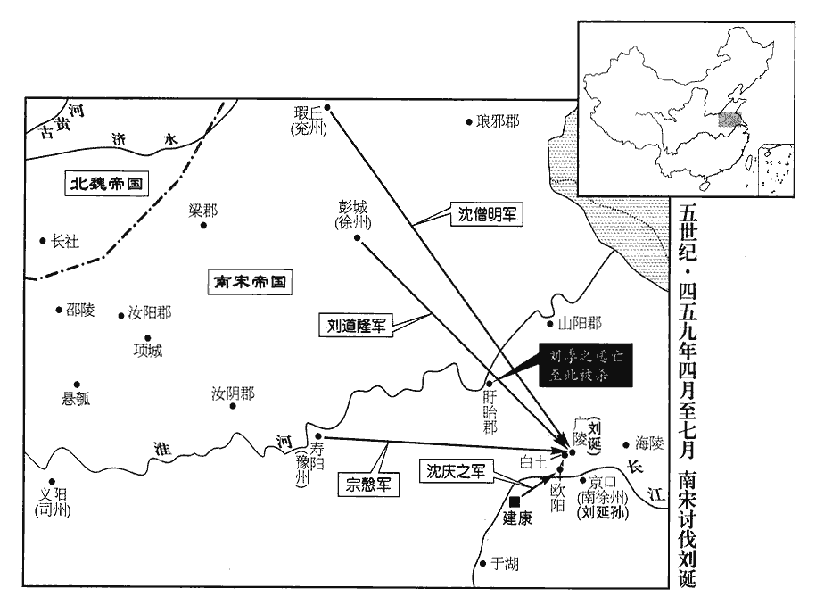
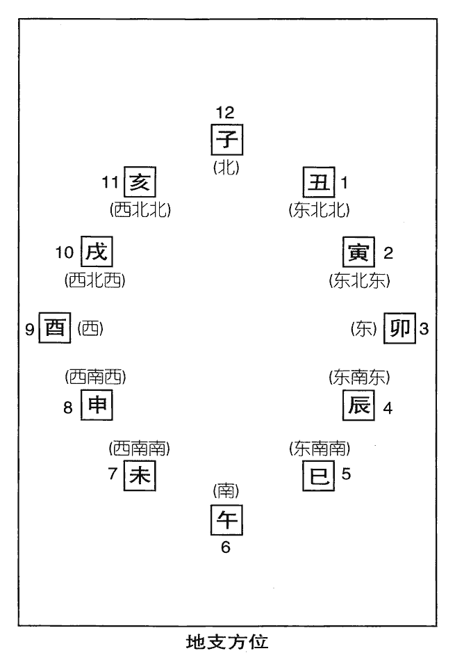
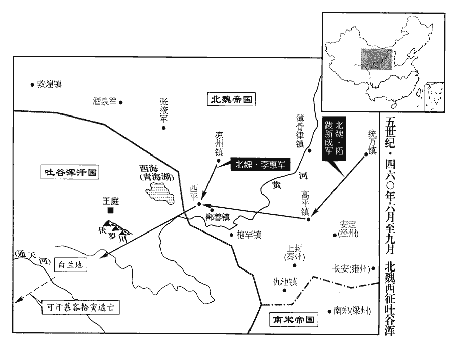
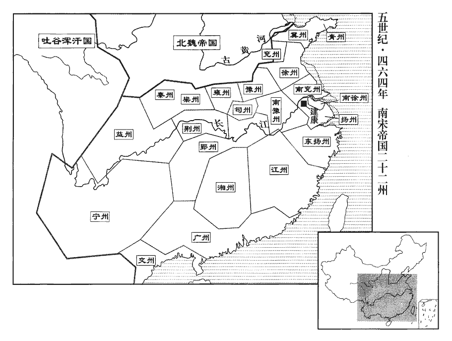

 宋紀十一起屠維大淵獻（己亥），盡閼逢執徐（甲辰），凡六年。

# 世祖孝武皇帝下

## 大明三年（己亥、四五九）

1春，正月，己巳朔‹一›，兗州‹府瑕丘，山东兖州›兵與魏皮豹子戰于高平‹山东鱼台东北›，兗州兵不利。

〖译文〗 [1]春季，正月，己巳朔（初一），刘宋兖州军队同北魏的征西将军皮豹子在高平大战，兖州军失利。

2己丑‹二十一›，以驃騎將軍柳元景爲尚書令，驃，匹妙翻。騎，奇寄翻。右僕射劉遵考爲領軍將軍。

〖译文〗 [2]己丑（二十一日），刘宋朝廷任命骠骑将军柳元景为尚书令，右仆射刘遵考为领军将军。

3己酉‹十一›，魏河南公伊馛bó卒。馛，蒲撥翻。卒，子恤翻。

〖译文〗 [3]己酉（十一日），北魏河南公伊去世。

4三月，乙卯‹二›，以揚州六郡爲王畿；六郡：丹陽、淮南、宣城、吳郡、吳興、義興也。更以東揚州爲揚州，徙治會稽‹浙江绍兴›，置東揚州見上卷孝建元年。會，工外翻。猶以星變故也。星變見上卷孝建三年。

〖译文〗 [4]三月，乙卯（初二），刘宋朝廷把扬州六郡划为王畿，把东扬州改称为扬州，州府迁到了会稽，这样做，是由于天上星象变化的缘故。

5三月，庚寅‹二十三›，以義興‹江苏宜兴›太守垣閬爲兗州刺史。閬，遵之子也。垣遵，卽垣苗也。武帝西征長安，使遵守洛當城；城據河、濟之會，後人謂之垣苗城。守，式又翻。

〖译文〗 [5]三月，庚寅（二十三日），朝廷任命义兴太守垣阆为兖州刺史。垣阆是垣遵的儿子。

6夏，四月，乙巳‹八›，魏主‹拓跋濬，时年二十›立其弟子推爲京兆王。

〖译文〗 [6]夏季，四月，乙巳（初八），北魏国主封立他弟弟的儿子拓跋推为京兆王。

7竟陵王誕知上‹刘骏，时年三十›意忌之，亦潛爲之備；因魏人入寇，修城浚隍，聚糧治仗。治，直之翻。誕記室參軍江智淵知誕有異志，請假先還建康，假，古訝翻。假，休假也。上以爲中書侍郎。智淵，夷之弟子也，江夷，江湛之父；夷之弟曰僧安。少有操行，少，詩照翻。操，七到翻。行，下孟翻。沈懷文每稱之曰：「人所應有盡有，人所應無盡無者，其唯江智淵乎！」

〖译文〗 [7]刘宋竟陵王刘诞知道孝武帝猜忌他，也私下里做好了应变的准备。他利用北魏大军侵入的时机，修筑城墙，疏通护城河，积蓄粮食，整治武器。刘诞手下的记室参军江智渊知道刘诞有谋反的打算，就向刘诞请假，先回到了建康，孝武帝刘骏任命他为中书侍郎。江智渊是江夷弟弟的儿子，从小就很有操行，沈怀文常常称赞他，说：“人所应该具有的，他都有，人所应该没有的，他都没有，这样的人，恐怕就只有江智渊了吧！”

是時，道路皆云誕反。會吳郡‹江苏苏州›民劉成上書稱：「息道龍昔事誕，息，子也。見誕在石頭城修乘輿法物，習唱警蹕。此蓋言誕爲揚州刺史時。誕時一心奉上，必無是事，劉成誣告之也。乘，繩證翻。道龍憂懼，私與伴侶言之，誕殺道龍。」《考異》曰：《宋略》、《南史》作「道就」。今從《宋書》。又豫章‹江西南昌›民陳談之上書稱：「弟詠之在誕左右，見誕書陛下年紀姓諱，往巫鄭師憐家祝詛。祝，職叔翻。詛，莊助翻。詠之密以啓聞，誕誣詠之乘酒罵詈，殺之。」劉道龍、陳詠之蓋先皆爲誕所殺，其父兄希指誣告以報子弟之讎耳。詈，力智翻。上乃令有司奏誕罪惡，請收付廷尉治罪。治，直之翻。乙卯‹十八›，詔貶誕爵爲侯，遣之國‹竟陵›，湖北钟祥。詔書未下，下，遐稼翻。先以羽林禁兵配兗州刺史垣閬，使以之鎭爲名，與給事中戴明寶襲誕。

〖译文〗 这时，人们都在传言，说刘诞就要反叛。偏巧，赶上吴郡平民刘成上书声称：“我的儿子刘道龙过去在刘诞那儿做事，看见刘诞在石头城修治皇帝专用的马车和仪仗器物，并练习皇帝出宫时的警卫清道。刘道龙见后，又惊又怕，私下里把他所见到的事跟他的伙伴们说了，刘诞知道后斩了刘道龙。”与此同时，豫章平民陈谈之也上书称：“我弟弟陈咏之在刘诞左右任职，看见刘诞写下陛下的年龄、姓名等避讳的东西，前往巫师郑师怜家里进行巫术诅咒活动。陈咏之马上把这一秘密呈报，但刘诞却反诬陈咏之这是借酒辱骂他，就把陈咏之杀了。”孝武帝立刻命令有关部门奏报刘诞的罪行，有关部门请求把刘诞抓进监狱，判刑惩治。乙卯（十八日），孝武帝下诏，将刘诞的爵位贬为侯爵，遣返回他所在的封国。诏书还没有颁下，孝武帝先把羽林禁卫军配给兖州刺史垣阆，让垣阆以前往镇守的名义和给事中戴明宝联合袭击刘诞。

閬至廣陵‹江苏扬州›，誕未悟也。明寶夜報誕典籤蔣成，使明晨開門爲內應。成以告府舍人許宗之，宗之，竟陵王府舍人也。宗之入告誕；誕驚起，呼左右及素所畜養數百人畜，許六翻。執蔣成，勒兵自衛。天將曉，明寶與閬帥精兵數百人猝至，而門不開；誕已列兵登陴，帥，讀曰率。陴，頻彌翻。自在門上斬蔣成，赦作徒、繫囚，作徒，坐徒罪居作者。繫囚，逮捕在獄者。開門擊閬，殺之，《考異》曰：《宋略》云己亥殺閬。按《本紀》，乙卯貶誕爵，今從之。明寶從間道逃還。間，古莧翻。詔內外纂嚴。《考異》曰：《宋略》乙亥纂嚴。按《長曆》，是月戊戌朔，無乙亥；蓋己亥也。以始興公沈慶之爲車騎大將軍、開府儀同三司、南兗州刺史，將兵討誕。騎，奇寄翻。將，卽亮翻；下同。甲子‹二十七›，上‹刘骏›親總禁兵頓宣武堂。

〖译文〗 垣阆到达广陵，刘诞还没有醒悟过来。戴明宝连夜通知刘诞的典签蒋成，崐命令他第二天早晨打开城门作为内应。蒋成马上把这事报告给了府舍人许宗之，许宗之又赶快进去报告给了刘诞。刘诞大吃一惊，从床上跳起，赶快召集左右人员和平常训练蓄养的将士几百人，逮捕了蒋成，下令军队进入临战状态，进行自卫。天色将要破晓时，戴明宝和垣阆率领精锐士卒几百人突然涌来，可是，城门却没有打开，刘诞则已登上城楼，列好队形，亲自在城楼上斩了蒋成，赦免了那些做奴工和被关押的囚徒，打开城门，迎击垣阆，并将垣阆杀死。戴明宝从小路逃回。孝武帝颁下诏令，命全国进入戒严状态。任命始兴公沈庆之为车骑大将军、开府仪同三司、南兖州刺史，率领大军，讨伐刘诞。甲子（二十七日），孝武帝亲自统领禁卫军，驻扎宣武堂。

司州‹府义阳，河南信阳›刺史劉季之，誕故將也，誕爲會稽，季之爲參軍，及起兵討元凶，以季之爲將。素與都督宗慤有隙，宗慤爲豫州，兼督司州。聞誕反，恐爲慤所害，委官，間道自歸朝廷，至盱眙‹江苏盱眙›，盱眙太守鄭瑗疑季之與誕同謀，邀殺之。盱眙，音吁怡。

〖译文〗 司州刺史刘季之是刘诞以前的将领，他平时就和都督宗悫有隔阂，听说刘诞起兵反叛，害怕自己被宗悫陷害，就放弃了官职，从小路一个人奔回朝廷，起到盱眙时，盱眙太守郑瑗怀疑刘季之和刘诞是同谋，就在中途截杀了刘季之。

沈慶之至歐陽‹江苏仪征东闸口›，《水經註》曰：吳城邗溝，通江、淮。自永和中，江都水斷。其水上承歐陽，引江入埭dài，六十里至廣陵城。余據此地則今之眞州閘也。誕遣慶之宗人沈道愍齎書說慶之，餉以玉環刀。慶之遣道愍反，數以罪惡。誕焚郭邑，驅居民悉使入城，閉門自守，說，輸芮翻。數，所具翻。守，手又翻。分遣書檄，邀結遠近。時山陽‹江苏淮安›內史梁曠，家在廣陵‹江苏扬州›，誕執其妻子，遣使邀曠，曠斬使拒之；使，疏吏翻。誕怒，滅其家。

〖译文〗 沈庆之率军赶到欧阳，刘诞派沈庆之的同族人沈道愍带着自己的亲笔信，前去沈庆之那里游说，并送给沈庆之一把玉环刀。沈庆之将沈道愍送了回去，并向沈道愍列举了刘诞的种种罪状。刘诞放火烧了附近的城邑、村落，将老百姓全部驱赶到了城里，然后关闭城门，自行坚守。同时，他又分别让人送出文告，邀请结交远近人士起来响应。当时，山阳内史梁旷，家在广陵，刘诞把他的妻子、孩子抓了起来，然后，派遗使者邀请梁旷出兵响应，梁旷斩了使者，拒绝刘诞的邀约。刘诞大怒，杀了梁旷全家。

誕奉表投之城外曰：「陛下信用讒言，遂令無名小人來相掩襲；不任枉酷，任，音壬。卽加誅翦。雀鼠貪生，仰違詔敕。今親勒部曲，鎭扞徐、兗。先經何福，同生皇家？誕於帝同氣也，故云然。今有何愆，便成胡、越？陵鋒蹈【章：甲十一行本「蹈」作「奮」；乙十一行本同；孔本同。】戈，萬沒豈顧；萬沒，猶言萬死也。盪定之期，冀在旦夕。」又曰：「陛下宮帷之醜，豈可三緘！」《家語》：孔子觀周，入后稷之廟，有金人，三緘其口而銘其背曰：「古之愼言人也。」上大怒，凡誕左右、腹心、同籍、期親在建康者並誅之，同籍，諸同宗屬之籍者；期親，謂期喪之親也。死者以千數，或有家人已死，方自城內‹扬州›出奔者。

〖译文〗 刘诞把呈送给孝武帝的奏章，投到了城外，说：“陛下听信谗言，于是派无名小辈突然前来偷袭我。我忍受不了这种残酷的冤屈，所以就把他们诛杀了。麻雀、老鼠尚且贪生怕死，我不得不违抗圣旨。今天，亲自率领部下，誓死保卫徐州、兖州。以前，我有什么样的福份，和你一同生在了皇家？如今，我又有什么过失，同你成了胡、越那样的死敌？冒着刀锋，脚踩戈矛，我万死不辞，大局稳定的日子，希望就在早晚间实现。”又说：“对陛下宫帷内的丑闻，我又怎能缄口不语？”孝武帝大怒，下令凡是在建康城内刘诞的左右心腹、同一个祖系中穿孝服一年以上的亲戚，全都杀头，当时被杀的数以千计。有些人家属已被杀了，本人却正从广陵城内逃出来。

慶之至城下‹江苏扬州›，誕登樓謂之曰：「沈公垂白之年，白髮下垂，故曰垂白。何苦來此！」慶之曰：「朝廷以君狂愚，不足勞少壯故耳。」少，詩照翻。

〖译文〗 沈庆之率军来到广陵城下，刘诞登上城楼，对沈庆之说：“沈公已到了满头白发的年龄了，何苦还来此地呢！”沈庆之回答说：“朝廷认为你狂妄愚蠢，所以不需要烦劳那些青壮年出马。”

上慮誕奔魏，使慶之斷其走路，斷，音短。慶之移營白土‹扬州西›，去城十八里，又進軍新亭。此新亭在廣陵城外，非建康之新亭也。豫州刺史宗慤、徐州刺史劉道隆並帥衆來會；帥，讀曰率。兗州刺史沈僧明，慶之兄子也，亦遣兵助慶之。先是誕誑其衆，云「宗慤助我」；慤至，繞城躍馬呼曰：「我，宗慤也！」先，悉薦翻。呼，火故翻。誑，居況翻。

〖译文〗 孝武帝担心刘诞会投奔到北魏，所以，就派沈庆之切断了刘诞的逃路。沈庆之把军营移到了白土，该地距离广陵城有十八里。尔后，又进军新亭。豫州刺史宗悫、徐州刺史刘道隆，也一同率领大军和沈庆之会师。兖州刺史沈僧明，是沈庆之哥哥的儿子，他也派遣兵力前来援助沈庆之。在这之前，刘诞诳骗他的部下们说：“宗悫可以援助我们。”宗悫抵达这里后，骑马绕城一周，大声呼喊：“我就是宗悫。

誕見諸軍大集，欲棄城北走，留中兵參軍申靈賜守廣陵；自將步騎數百人，將，卽亮翻。騎，奇寄翻。親信並自隨，聲云出戰，邪趨海陵‹江苏泰州›道，晉安帝分廣陵立海陵郡，今泰州也。誕自廣陵北門聲言出戰，邪而趨東，則海陵之路。趨，七喻翻。慶之遣龍驤將軍武念追之。驤，思將翻。誕行十餘里，衆皆不欲去，互請誕還城，誕曰：「我還易耳，卿能爲我盡力乎？」衆皆許諾。誕乃復還，易，以豉翻。爲，于僞翻。復，扶又翻。築壇歃血以誓衆，歃，色洽翻。凡府州文武皆加秩。府，司空、竟陵王府；州，南兗州。以主簿劉琨之爲中兵參軍；琨之，遵考之子也。劉遵考時在朝爲尚書右僕射。辭曰：「忠孝不得並。琨之老父在，不敢承命。」誕囚之十餘日，終不受，乃殺之。

〖译文〗 刘诞眼看朝廷各路大军聚集在广陵城下，打算放弃城池，向北逃路，留下中兵参军申灵赐坚守广陵。他自己率领几百名步骑兵，连同跟随他的亲信随从，声称要出城作战，顺着斜路奔向海陵。沈庆之派龙骧将军武念前去追击。刘诞走了十几里，大家都不愿意离开，纷纷请求再回广陵城。刘诞说：“我们回去是很容易的事，回去之后，你们能为我竭心尽力吗？”大家都许下诺言。于是，刘诞又返回广陵。他建起一座高台，与众将士歃血为盟。将全体官员的官职都升了一级，任命主簿刘琨之为中兵参军。刘琨之是刘遵孝的儿子，他辞让说：“忠与孝不能两全，我老父还在建康，我不能接受任命。”刘诞囚禁了刘琨之十几天，刘琨之最终还是不接受任命，刘诞就把他杀了。

右衛將軍垣護之、虎賁中郎將殷孝祖等擊魏還，至廣陵，上並使受慶之節度。賁，音奔。慶之進營，逼廣陵城。誕餉慶之食，提挈者百餘人，出自北門；慶之不開視，悉焚之。誕於城上授函表，「授」，《南史》作「投」，當從之。請慶之爲送，慶之曰：「我受詔討賊，不得爲汝送表。汝必欲歸死朝廷，自應開門遣使，吾爲汝護送。」誕之爲此，以帝猜忍，欲以間慶之也。慶之峻絕之，蓋亦自爲謀耳。爲，于僞翻。

〖译文〗 右卫将军垣护之、虎贲中郎将殷孝祖等进击北魏后班师回朝，走到广陵，孝武帝让他们一并听从沈庆之的指挥。沈庆之率军前进，直逼广陵城。刘诞派人将饭菜和美酒等送给沈庆之，由一百多人抬着从北门出来，沈庆之连打开看都没有看，就全都烧了。刘诞从城楼上把给孝武帝的奏章拿给他看，请求沈庆之能替他呈送给孝武帝。沈庆之说：“我是接受诏令前来讨伐叛贼的，不能替你呈送奏表。如果你一定要回到朝廷，接受死罪，你自己就应该打开城门，派遣使者，我为你护送前往。”

 

8東揚州刺史顏竣遭母憂，送喪還都，上恩待猶厚，竣時對親舊有怨言，竣，七倫翻。或語及朝廷得失。會王僧達得罪，僧達死見上卷上年。疑竣譖之；將死，具陳竣前後怨望誹謗之語。上乃使御史中丞庾徽之劾奏，免竣官。鄭樵曰：御史之名，周官有之，蓋掌贊書而授法令，非今任也。戰國時，秦、趙澠池之會，各命御史書事。又，淳于髡謂齊王曰：「御史在前，」則皆記事之任。至秦、漢爲糾察之任。竣愈懼，上啓陳謝，且請生命；上益怒，詔答曰：「卿訕shàn訐jié怨憤，已孤本望；乃復過煩思慮，懼不自全，訐，居謁翻。復，扶又翻；下復沈同。豈爲下事上誠節之至邪！」及竟陵王誕反，上遂誣竣與誕通謀，五月，收竣付廷尉，先折其足，折，而設翻。然後賜死。妻子徙交州‹府龙编，越南河内东北北宁府›，至宮亭湖‹鄱阳湖›，宮亭湖，卽彭蠡湖，在彭澤縣西。復沈其男口。沈，持林翻。顏竣失職怨望，固爲可罪；而自尋陽東下之時，保護之功，不可忘也。旣殺其身，又沈其男口，孝武帝亦少恩哉！

〖译文〗 [8]东扬州刺史颜竣母亲去世，他把母亲的灵枢送到建康，孝武帝待他还是很好。但是，颜竣时常对亲信旧友们满腹怨言，有时还评论朝廷上的得失。此时，恰巧王僧达犯罪被捕，他怀疑是颜竣陷害了自己，所以，在临被斩首前，他上书孝武帝，详细叙述了颜竣前前后后对朝廷怨恨、非议的话。孝武帝就派御史中丞庚徽之弹劾颜竣，将颜竣免职。颜竣越发害怕，就上书孝武帝，请求处分谢罪，并乞求饶他一命。孝武帝更加气愤，下诏回答他说：“你讥笑、讽刺朝廷，大发怨恨之言，早已辜负了我对你的期望。如今，你又来过分烦扰思虑，害怕保不住性命，这哪里是臣子侍奉君主的忠诚、守节的榜样呢？”等到竟陵王刘诞起兵反叛，孝武帝顺势诬陷颜竣与刘诞是同谋，五月，将颜竣抓进廷尉，先砸断了颜竣的双脚，然后再命他自杀。颜竣的妻子、孩子被放逐到交州，走到宫亭湖时，孝武帝又下令，将颜竣家中所有男子都投到宫亭湖淹死。

9六月，戊申‹十二›，魏主‹拓跋濬›如陰山。

〖译文〗 [9]六月，戊申（十二日），北魏国主前往阴山。

10上命沈慶之爲三烽於桑里，桑里，在廣陵城西南。若克外城，舉一烽，克內城，舉兩烽，擒劉誕，舉三烽；璽書督趣，前後相繼。璽，斯氏翻。趣，讀曰促。慶之焚其東門，塞塹，造攻道，立行樓、土山幷諸攻具，塞，悉則翻。塹，七豔翻。爲樓車推進以攻城，故曰行樓。值久雨，不得攻城。上使御史中丞庾徽之奏免慶之官，詔勿問，以激之。自四月至于秋七月，雨止，城猶未拔。上怒，命太史擇日，將自濟江討誕；太宰義恭固諫，乃止。

〖译文〗 [10]孝武帝命令沈庆之在桑里建造三座烽火台，攻克了广陵外城，就燃起一堆烽火；如果攻克了广陵内城，就点起两堆烽火；如果活捉了刘诞，就点起三堆烽火。孝武帝督促进攻的诏书一个接着一个，沈庆之烧了广陵城东门，填平了护城河，开掘进攻道路，竖起攻城楼车，造起土山，制造了其他攻城工具崐。这时正赶上广陵大雨连绵不断，不能攻城。孝武帝就让御史中丞庚徽之上书要求罢免沈庆之的官职，而又假装下诏说不要追究，想以此刺激沈庆之攻战。从四月直到秋季七月，大雨停止，广陵城还没有攻克下来。孝武帝大怒，命令太史选择日期，他要亲自渡过长江去讨伐刘诞。太宰刘义恭竭力劝谏，才没有去。

誕初閉城拒使者，使，疏吏翻。記室參軍山陰‹浙江绍兴›賀弼固諫，誕怒，抽刀向之，乃止。誕遣兵出戰屢敗，將佐多踰城出降。將，卽亮翻。降，戶江翻；下同。或勸弼宜早出，弼曰：「公舉兵向朝廷，此事旣不可從；荷公厚恩，又義無違背，荷，下可翻。背，蒲妹翻。唯當以死明心耳！」乃飲藥自殺。參軍何康之謀開門納官軍，不果，斬關出降。誕爲高樓，置康之母於其上，暴露之，不與食，母呼康之，數日而死。誕以中軍長史濮【章：甲十一行本「濮」作「濟」；乙十一行本同；孔本同。】陽‹侨郡，山东郓城西›范義爲左司馬。濮，博木翻。義母妻子皆在城內，或謂義曰：「事必不振，言誕必陷敗不能振起也。子其行乎！」義曰：「吾，人吏也；人吏，言爲人之佐吏。子不可以棄母，吏不可以叛君。必若何康之而活，吾弗爲也。」

〖译文〗 当初，刘诞关闭城门，拒绝会见朝廷派来的使者，记室参军、山阴人贺弼坚决劝谏，刘诞大怒，抽出佩刀，直指贺弼胸膛，贺弼才不再劝谏。后来，刘诞多次派兵出战，屡战屡败，手下将士也大多越出城墙投降。有人劝贺弼应该早点儿出去归降，贺弼说：“刘公起兵反抗朝廷，这件事我是不应该跟从的；可是，我平日承蒙刘公大恩厚遇，所以在大义上，我又是不能背叛他的。我只有一死来表明自己的心迹罢了。”说完，就喝毒药自杀了。参军何康之计划打开城门，将朝廷大军引进城内，没有成功。于是，他就砍开城门的门闩，出城投降。刘诞知道后，就在城楼上建起一座高楼，把何康之的母亲缚在楼上，让她赤身露体呆在那里，不给她饭吃，何康之的母亲呼喊着何康之的名字，几天才死。刘诞任命中军长史、濮阳人范义为左司马。范义的母亲、妻子和孩子此时都在广陵城里，有人对范义说：“此事一定不能成功，你怎么不走啊？”范义说：“我是人家的属官。孩子不能抛弃他的母亲，官吏不能背叛他的君主。如果一定要像何康之那样才能活下来，那么，我不能这样做。”

沈慶之帥衆攻城，身先士卒，親犯矢石，帥，讀曰率。先，悉薦翻。乙巳‹三›，克其外城；乘勝而進，又克小城。誕聞兵入，走趨後園，趨，七喻翻。隊主沈胤之等追及之，擊傷誕，墜水，引出，斬之‹年二十七›。誕母、妻皆自殺。誕母，文帝殷脩華；妻，徐妃。

〖译文〗 沈庆之率领士卒向广陵城发起猛攻，他身先士卒，亲自冒着飞箭和石头，向前冲杀。乙巳（疑误），攻克广陵外城。沈庆之又率大军乘胜追击，不久，又攻克内城。刘诞听说朝延大军已攻入城内，就马上逃到后花园里。队主沈胤之等人追上，把他击伤。刘诞掉到水里，沈胤之等把他拉上来，斩了他。刘诞的母亲、妻子全都自杀。

上聞廣陵平，出宣陽門，敕左右皆呼萬歲。侍中蔡興宗陪輦，上顧曰：「卿何獨不呼？」興宗正色曰：「陛下今日正應涕泣行誅，豈得皆稱萬歲！」謂同氣相殘，乃天理人倫之變；必若以義滅親，應涕泣而行誅也。上不悅。

〖译文〗 孝武帝听说广陵叛乱被平，亲自走出宣阳门，下令左右一起高呼万岁。侍中蔡兴宗陪坐在辇车旁，孝武帝回过头问他说：“你为何不喊？”蔡兴宗严肃地说：“陛下今天正应该对施行诛杀痛哭流涕，怎么能让大家都喊万岁呢？”孝武帝很不高兴。

詔貶誕姓留氏；廣陵城中士民，無大小悉命殺之。沈慶之請自五尺以下全之，其餘男子皆死，女子以爲軍賞；猶殺三千餘口。長水校尉宗越臨決，皆先刳kū腸抉眼，抉jué，於決翻。或笞面鞭腹，苦酒灌創，然後斬之，苦酒，蓋醯xī之類也。創，初良翻。越對之，欣欣若有所得。史言宗越之忍。上聚其首於石頭南岸爲京觀，沈慶之蓋悉獻其首，故聚於石頭南岸。觀，古玩翻。侍中沈懷文諫，不聽。史言當時近侍皆正人，但諫不行、言不聽耳。

〖译文〗 孝武帝颁下诏令，贬刘诞姓留。将广陵城内的所有居民，无论男女老少，全部杀掉。沈庆之请求留下身高五尺以下的人不杀，其余的男子全都处死，女子全都赏给将士们作妾或作婢女，最后还是杀了三千多人。长水校尉宗越，在执行这项诛杀任务时，对被处死的人他都要首先剖开肚子，挖出肠胃，再挖出眼珠，或者用鞭子抽打被诛者的脸和肚子，再在这些创口上浇上苦酒盐水，然后再杀了他们。宗越面对自己这种惨无人道的手法，欣欣然好像从中得到了什么。孝武帝下令，将死人的头颅送到石头南岸，堆成一座大坟。侍中沈怀文劝阻，但孝武帝没听。

初，誕自知將敗，使黃門呂曇濟與左右素所信者將世子景粹匿於民間，將，攜也。曇，徒含翻。謂曰：「事若不濟，思相全脫；如其不免，可深埋之。」謂深埋景粹之尸也。各分以金寶齎送。旣出門，並散走；唯曇濟不去，攜負景粹十餘日，捕得，斬之。

〖译文〗 当初，刘诞就知道自己最终会失败，所以，他事先就派黄门吕昙济及左右平时所宠信的人，带着世子刘景粹躲藏到了民间，对他们说：“此事如果不成功，就请想法逃走。如果真的没有逃脱得了，就请把尸体深深埋起来。”然后，分别送给这些人一些金银财宝。可是，这些人走出城门后，却全都逃散了，只有吕昙济一人不肯逃命，他把刘景粹背在背上，走了十几天，被抓获，然后同时被斩。

臨川‹江西临川›內史羊璿坐與誕素善，下獄死。璿xuán，音旋。下，遐稼翻。

〖译文〗 临川内史羊因平时与刘诞关系很好，孝武帝也把他逮捕，在狱中处死。

擢梁曠爲後將軍，贈劉琨之給事黃門侍郎。

〖译文〗 孝武帝提升梁旷为后将军，追赠刘琨之为给事黄门侍郎。

蔡興宗奉旨慰勞廣陵。興宗與范義素善，收斂其尸，送喪歸豫章。范義蓋寓居豫章也。蔡興宗之先亦濟陽人。勞，力到翻。斂，力贍翻。上謂曰：「卿何敢故觸王憲？」興宗抗言對曰：「陛下自殺賊，臣自葬故交，何不可之有！」上有慙色。兄弟、朋友，皆天倫也。興宗能不忘故交，而帝忍誅屠同氣，故慙。

〖译文〗 蔡兴宗奉旨前去广陵慰劳将士。蔡兴宗和范义平素关系很好，所以，他把范义的尸体收殓起来，送回到豫章下葬。孝武帝对他说：“你怎么敢故意触犯王法？”蔡兴宗顶撞说：“陛下你杀你的贼寇，我葬我的朋友，这有什么不可以的呢？”孝武帝面有愧色。

宗越治軍嚴，善爲營陳。每數萬人止頓，越自騎馬行前，使軍人隨其後，馬止營合，未嘗參差。治，直之翻。陳，讀曰陣。參，初今翻；差，叉宜翻，又初佳翻；參差，不齊也。

〖译文〗 宗越治理军队十分严格，他尤其擅长摆营阵。每当数万人安营扎寨时，宗越自己骑马走在前面，让浩浩大军跟在身后，等到他骑马停下时，营阵已经摆好，不曾有一点儿混乱和差错。

11辛未‹五›，大赦。廣陵旣平，故肆赦。

〖译文〗 [11]辛未（初五），刘宋宣布大赦。

12丙子‹十›，以丹楊尹劉秀之爲尚書右僕射。

〖译文〗 [12]丙子（初十），刘宋朝廷任命丹杨尹刘秀之为尚书右仆射。

13丙戌‹二十›，以南兗州刺史沈慶之爲司空，刺史如故。

〖译文〗 [13]丙戌（二十日），刘宋任命南兖州刺史沈庆之为司空，仍旧兼任刺史。

14八月，庚戌‹十五›，魏主如雲中‹内蒙托克托›；壬戌‹二十七›，還平城。

〖译文〗 [14]八月，庚戌（十五日），北魏国主前往云中。壬戌（二十七日），返回平城。

 

15九月，壬辰‹二十七›，築上林苑於玄武湖北。文帝元嘉二十二年，築北隄，立玄武湖於樂游苑北。

〖译文〗 [15]九月，壬辰（二十七日），刘宋孝武帝下令，在玄武湖北兴建上林苑。

16初，晉人築南郊壇於巳位，尚書右丞徐爰以爲非禮，詔徙於牛頭山‹江苏江宁西南›西，牛頭山在今建康府上元縣南四十里，兩峯如闕。直宮城之午位。及廢帝卽位，以舊地爲吉，復還故處。復，扶又翻。史終言之。帝又命尚書左丞荀萬秋造五路，依金根車，加羽葆蓋。五路之制與金根車不同，加羽葆蓋，愈非古矣。沈約曰：秦閱三代之車，獨取殷制。古曰桑根車，秦曰金根車。

〖译文〗 [16]当初，东晋在都城建康南郊巳方位置上，建了一座祭天的土坛，尚书右丞徐爰认为这样做不合古礼，所以，孝武帝诏令将其迁到牛头山的西部，面对宫城的午位。等到后来废帝刘子业即位时，认为巳位是吉利的，所以，又把它迁回到了原地。孝武帝又命尚书左丞荀万秋，制作玉、金、象、革、木五种座车，并按照金根车的样子，在每辆车上都加上珍贵的羽毛装饰的顶盖。

## 四年（庚子、四六零）

1春，正月，甲子朔‹一›，魏大赦，改元和平。

〖译文〗 [1]春季，正月，甲子朔（初一），北魏实行大赦，改年号为和平。

2乙亥‹十二›，上耕籍田，大赦。

〖译文〗 [2]乙亥（十二日），刘宋孝武帝举行扶犁耕田典礼，宣布大赦。

3己卯‹十六›，詔祀郊廟，初乘玉路。

〖译文〗 [3]己卯（十六日），孝武帝下诏，亲自去郊外皇家祖庙举行祭祀活动，并第一次乘坐玉车。

4庚寅‹二十七›，立皇子子勛爲晉安王，勛，古勳字。子房爲尋陽王，子頊爲歷陽王，子鸞爲襄陽王。

〖译文〗 [4]庚寅（二十七日），孝武帝立皇子刘子勋为晋安王，刘子房为寻阳王，刘子顼为历阳王，刘子鸾为襄阳王。

5魏散騎侍郎馮闡來聘。散，悉亶翻。騎，奇寄翻。

〖译文〗 [5]北魏散骑常侍北阐来刘宋聘问。

6二月，魏衛將軍樂安王良討河西‹陕西北部›叛胡。以下文叛胡詣長安首罪觀之，此河西蓋謂自龍門東至華陰河之西岸也。

〖译文〗 [6]二月，北魏卫将军、乐安王拓跋良讨伐河西反叛的胡人。

7三月，魏人寇北陰平‹四川广元西南›，陰平道，漢屬廣漢屬國都尉，晉武帝泰始中，分立陰平郡，宋分立南陰平、北陰平二郡。《五代志》：普安郡陰平縣，宋立北陰平郡。宋白曰：文州陰平郡，戰國時氐、羌所據。永嘉之後，羌虜數叛，遂立郡以遏之。《輿地志》云：晉永嘉末，太守王鑒以郡降李雄，晉人於是悉流移於蜀漢，其氐、羌並屬楊茂搜，此郡不復預受正朔，故《南史》諸志悉無所錄。其晉人流寓於蜀者，仍於益州立南、北二陰平；寓於漢中者，亦於梁州立南、北二陰平。朱提‹孔提，甘肃武都东北›太守楊歸子擊破之。《考異》曰：《宋•帝紀》：「索虜寇北陰平，孔堤太守楊歸子擊破之。」《宋略》云︰「索虜寇壯降平，朱太守楊歸子擊破之。」按郡縣名無「壯降平」及「孔堤」、「北陰平」，參酌二書，當爲朱提。今按魏收《地形志》，武都郡有孔堤縣。《五代志》：武都建威縣，後周併西魏之孔堤郡及縣入焉。此時魏人蓋寇北陰平之孔堤，爲北陰平太守楊歸子所破也。當從《宋紀》。朱提郡在南中，時屬寧州，去陰平甚遠，蓋《考異》誤以《宋紀》、《宋略》二書所載合爲朱提也，當讀作孔堤，屬上句。《宋略》所謂「壯降平」，亦「北陰平」三字之誤，「朱」字於下文無所附着，當爲衍字。

〖译文〗 [7]三月，北魏军侵犯北阴平，刘宋朱提太守杨归子迎击，并大败敌人。

8甲申‹二十二›，皇后‹王宪嫄›親桑于西郊，皇太后‹路惠男›觀禮。

〖译文〗 [8]甲申（二十二日），刘宋皇后王氏亲自到建康西郊行摘桑典礼，皇太后路氏观礼。

9夏，四月，魏太后常氏殂。本保太后，尊爲太后，見一百二十七卷文帝元嘉三十年。五月，癸丑‹十二›，魏葬昭太后於鳴雞山‹河北怀来西北›。《魏土地記》曰：下洛城東北三十里有延河，東流，北有鳴雞山。《史記》：趙襄子殺代王于夏屋，其姊爲代王夫人，襄子迎之，至此，曰：「代已亡矣，吾將安歸乎！」遂磨筓jī於山而自殺。代人憐之，爲立祠焉，因名爲磨筓山。每夜有野雞羣鳴王祠屋上，故亦謂之鳴雞山。杜佑曰：嬀guī州治懷戎縣，有鳴雞山，本名磨筓山。

〖译文〗 夏季，四月，北魏太后常氏去世。五月，癸丑（疑误），北魏葬昭太后于鸣鸡山。

10丙戌‹二十五›，尚書左僕射褚湛之卒‹年五十›。

〖译文〗 [10]丙戌（二十五日），刘宋尚书左仆射褚湛之去世。

11吐谷渾‹青海›王拾寅兩受宋、魏爵命，吐，從暾入聲。谷，音浴。居止出入，擬於王者，魏人忿之。定陽侯曹安表言：「拾寅今保白蘭‹青海玉树北›，若分軍出其左右，必走保南山，不過十日，人畜乏食，可一舉而定。」六月，甲午‹四›，魏遣征西大將軍陽平王新成等督統萬‹陕西靖边北白城子›、高平‹宁夏固原›諸軍出南道，南郡公中山李惠等督涼州‹甘肃武威›諸軍出北道，以擊吐谷渾。

〖译文〗 [11]吐谷浑可汗慕容拾寅，分别接受刘宋和北魏所赐封的官爵，所以，无论是他的住所，还是他使的车马，都可以和皇帝相比拟。北魏人对他很愤恨。定阳侯曹安上奏表说：“慕容拾寅现在守卫白兰，如果我们兵分两路，从左右夹攻，他们一定会逃往南山固守，超不过十天，他们人和牲畜全都缺少吃的，那我们就可以一举平定他们。”六月，甲午（初四），北魏派遣征西大将军、阳平王拓跋新成等人督统统万、高平各路大军从南路出发，南郡公、中山人李惠等督统凉州各路大军，从北路出发，同时向吐谷浑起攻势。

12魏崔浩之誅也，見一百二十五卷宋文帝元嘉二十七年。史官遂廢，至是復置。復，扶又翻。

〖译文〗 [12]自从崔浩被诛杀，北魏的史官也就被废除了，从这年开始才正式恢复这一官职。

13河西‹陕西北部›叛胡詣長安首罪，樂安王良兵威臨之，故首罪。首，式又翻。魏遣使者安慰之。

〖译文〗 [13]河西反叛胡人的首领前往长安自首认罪，北魏派出使者安抚、慰问。

14秋，七月，遣使如魏。

〖译文〗 [14]秋季，七月，刘宋朝廷派出使节前往北魏。

15甲戌‹十四›，開府儀同三司何尚之卒‹年七十九›。

〖译文〗 [15]甲戌（十四日），刘宋开府仪同三司何尚之去世。

16壬午‹二十二›，魏主如河西‹河套地区›。

〖译文〗 [16]壬午（二十二日），北魏国主前往河西。

17魏軍至西平‹青海西宁›，西平，漢落都之地；禿髮所都樂都，卽落都也；唐爲鄯州。吐谷渾王拾寅走保南山。九月，魏軍濟河追之，會疾疫，引還，獲雜畜三【章：甲十一行本「三」作「二」；乙十一行本同，孔本同。】十餘萬。畜，許又翻。

〖译文〗 [17]北魏军到达西平，吐谷浑可汗慕容拾寅逃往南山守卫。九月，北魏大军南渡黄河，乘胜追击，正赶上瘟疫流行，北魏军返回，掠获了各种牲畜三十多万头。

18庚午‹十一›，魏主還平城。

〖译文〗 [18]庚午（十一日），北魏国主返回平城。

19丁亥‹二十八›，徙襄陽王子鸞爲新安王。

〖译文〗 [19]丁亥（二十八日），刘宋朝廷改封襄阳王刘子鸾为新安王。

20冬，十月，庚寅‹一›，詔沈慶之討緣江蠻。

〖译文〗 [20]冬季，十月，庚寅（初一），孝武帝下诏，命令沈庆之率军讨伐长江沿岸的夷蛮。

 

21前廬陵‹江西省吉水县›內史周朗，言事切直，見一百二十七卷文帝元嘉三十年。上銜之，使有司奏朗居母喪不如禮，傳送寧州‹府味县，云南曲靖›，傳，知戀翻，又直戀翻。於道殺之‹年三十六›。朗之行也，侍中蔡興宗方在直，請與朗別；坐白衣領職。蔡興宗立於猜暴之朝，葬范義，別周朗，犯時主之怒而不加刑，素行有以孚乎人也。

〖译文〗 [21]刘宋前庐陵内史周朗，说话直率急切，孝武帝一直对他怀恨在心，让有关部门弹劾周朗，说他在为母亲守丧期间言行不合礼法，因此用驿车将他发配到宁州，在路上把他杀了。周朗出发前辞行时，正赶上侍中蔡兴宗在值班。蔡兴宗请求和周朗道别，于是，他也被削去官职，以平民的身份代理现职。

22十一月，魏散騎常侍盧度世等來聘。散，悉亶翻。騎，奇寄翻。

〖译文〗 [22]十一月，北魏散骑常侍卢度世来刘宋通问致意。

23是歲，上徵青、冀二州刺史顏師伯爲侍中。師伯以諂佞被親任，被，皮義翻。羣臣莫及，多納貨賄，家累千金。上嘗與之樗蒲，上擲得雉，自謂必勝；師伯次擲，得盧，樗蒲采名：有黑犢，有雉，有盧；得盧者勝。上失色。師伯遽斂子曰：「幾作盧！」子，五木也。此亦師伯爲佞之一端。幾，居希翻。是日，師伯一輸百萬。

〖译文〗 [23]这一年，孝武帝征调青州、冀州二州刺史颜师伯担任侍中。颜师伯因为善于谄媚、阿谀奉迎，很得孝武帝的欢心和信任，其他臣属无法相比。颜师伯大肆接受贿赂，家产累计达千金之多。孝武帝曾经和他一起下樗蒲棋赌博，孝武帝掷下骰子，五个全是“雉”，认为自己一定赢了。颜师伯第二个掷骰子，竟掷出了五个“卢”，赢了。孝武帝大惊失色，颜师伯突然偷偷把骰子一收，然后说：“差一点全是‘卢’了。”这一天，颜师伯一次就输了一百万钱。

24柔然‹瀚海沙漠群›攻高昌‹新疆吐鲁番东›，殺沮渠安周，滅沮渠氏，文帝元嘉十六年，魏克涼州，沮渠無諱與弟安周西走，保據高昌，今爲柔然所滅。沮，子余翻。以闞伯周爲高昌王。高昌稱王自此始。

〖译文〗 [24]柔然国进攻高昌，杀了沮渠安周。灭了沮梁全族，任命阚伯周为高昌王。高昌国称王，从这时开始。

## 五年（辛丑、四六一）

1春，正月，戊午朔‹一›，朝賀。朝，直遙翻。雪落太宰義恭衣，有六出，義恭奏以爲瑞；上‹刘骏，时年三十二›悅。義恭以上猜暴，懼不自容，每卑辭遜色，曲意祗奉；由是終上之世，得免於禍。

〖译文〗 [1]春季，正月，戊午朔（初一），刘宋朝廷新年朝贺。雪花飘落在了太宰刘义恭的衣服上，雪花有六个瓣，刘义恭启奏孝武帝，说这是一种吉祥的兆头。孝武帝大为高兴。刘义恭因为孝武帝善于猜忌，又很残暴，害怕自己不能被容纳，所以每次他都言辞谦恭，面色恭顺，曲意奉迎，因此，在孝武帝在位时期，他一直得以幸存，免于大祸。

2二月，辛卯‹四›，魏主‹拓跋濬，时年二十二›如中山‹河北定州›；丙午‹十九›，至鄴‹河北临漳西南邺镇›，遂如信都‹河北冀县›。

〖译文〗 [2]二月，辛卯（初四），北魏国主前往中山。丙午（十九日），到达邺城，尔后又前往信都。

3三月，遣使如魏。使，疏吏翻。

〖译文〗 [3]三月，刘宋朝廷派遣使节前去北魏。

4魏主發幷‹陕西中部›、肆州‹山西东部›民五千人治河西獵道；魏道武天賜二年，分幷州北境爲九原鎭，太武眞君七年，置肆州。宋白曰：《十三州志》云：漢末大亂，匈奴侵邊，自定襄已西，盡雲中、鴈門之間遂空。曹公集荒郡之戶，聚之九原界，以立新興郡，領五原等縣，卽唐忻州定襄縣之地。《後魏書》云：太平二年，置肆州，寄理秀容城。秀容縣，忻州所治，卽漢末所置九原縣也。治，直之翻。辛巳‹二十五›，還平城‹山西大同›。

〖译文〗 [4]北魏国主征发并州、肆州五千民工，修河西狩猎的专用道路。辛巳（二十五日），返回平城。

5夏，四月，癸巳‹七›，更以西陽王子尚爲豫章王。

〖译文〗 [5]夏季，四月，癸巳（初七），刘宋朝廷改封西阳王刘子尚为豫章王。

6庚子‹十四›，詔經始明堂，直作大殿於丙、己之地，制如太廟，唯十有二間爲異。

〖译文〗 [6]庚子（十四日），孝武帝颁诏，命令开始兴建明堂，并且大殿必须建在丙、己方位，形制如同皇家祖庙，只有十二间和祖庙不同。

7雍州‹府襄阳，湖北襄樊›刺史海陵王休茂，年十七，雍，於用翻。司馬新野‹河南新野›庾深之行府事。休茂性急，欲自專處決，處，昌呂翻。深之及主帥每禁之，主帥，典籤也；又齋內亦有主帥，謂之齋帥。帥，所類翻。常懷忿恨。左右張伯超有寵，多罪惡，主帥屢責之。伯超懼，說休茂曰：說，輸芮翻。「主帥密疏官過失，欲以啓聞，如此恐無好。」疏，使去翻，記也。好，如字；無好，猶今人言無好處，言將得罪也。休茂曰：「爲之柰何？」伯超曰：「惟有殺行事及主帥，行事，謂庾深之；江左率謂長史、司馬行府州事者爲行事。舉兵自衛。此去都數千里，雍州鎭襄陽，去建康，水行四千餘里。縱大事不成，不失入虜中爲王。」休茂從之。

〖译文〗 [7]雍州刺史、海陵王刘休茂，这年十七岁，当时，司马新野人庾深之主持王府事务。刘休茂生性急躁，总是想要自己专权，庾深之和主师每次都禁止他这样做，所以刘休茂对二人一直怀恨在心。左右侍从张伯超受刘休茂宠信，经常作恶，主帅因而也多次斥责他。张伯超很害怕，就游说刘休茂说：“主帅正偷偷把你的过失写在奏疏上，打算奏报给皇上，如果是这样，恐怕你不会有什么好结果了。”刘休茂说：“那该怎么办呢？”张伯超回答说：“只有杀了庾深之和主帅，尔后起兵自卫。这里距离京都建康几千里，即使是大事没有办成，你也可以逃到胡虏那里，他们不会不封你为王。”刘休茂依从了这一提议。

丙午‹二十›夜，休茂與伯超等帥夾轂隊，宋諸王有夾轂隊，蓋左右親兵也，出則夾車爲衛。帥，讀曰率；下同。殺典籤楊慶於城中，出金城‹内城›，殺深之及典籤戴雙；徵集兵衆，建牙馳檄，使佐吏上己爲車騎大將軍，開府儀同三司，加黃鉞。凡府州僚屬皆謂之佐吏。上，時掌翻。騎，奇寄翻。侍讀博士荀詵諫，侍讀博士，授諸王《經》者也。詵shēn，疏臻翻。休茂殺之。伯超專任軍政，生殺在己，休茂左右曹萬期挺身斫休茂，不克而死。

〖译文〗 丙午（二十日）深夜，刘休茂和张伯超率领左右护车卫队，先杀了在城里崐的典签杨庆，然后，出金城，又杀了庾深之和典签戴双。征集兵众，竖起旗帜，向全国发表檄文。刘休茂又让自己的左右侍从们，拥立自己为车骑大将军、开府仪同三司，加授黄钺。侍读博士荀诜劝谏刘休茂不要这样做，刘休茂杀了他。张伯超把持军政事务，掌握生杀大权，刘休茂的左右侍从曹万期突然挺身用刀猛砍刘休茂，但未能成功，被杀死。

休茂出城行營，行，下孟翻，巡行也。諮議參軍沈暢之等帥衆閉門拒之。休茂馳還，不得入。義成‹湖北丹江口›太守薛繼考爲休茂盡力攻城，爲，于僞翻。義成太守治襄陽；註詳見前。克之，斬暢之及同謀數十人。其日，參軍尹玄慶復起兵攻休茂，生擒，斬之‹年十七›，母、妻皆自殺，復，扶又翻。休茂母，文帝蔡美人。同黨伏誅。城中擾亂，莫相統攝。中兵參軍劉恭之，秀之之弟也，劉秀之，孝建元年不附義宣，時爲尚書右僕射。衆共推行府州事。繼考以兵脅恭之，使作啓事，言「繼考立義」，自乘驛還都；上以爲北中郎諮議參軍，賜爵冠軍侯；冠，古玩翻。事尋泄，伏誅。以玄慶爲射聲校尉。校，戶敎翻。

〖译文〗 刘休茂走出襄阳城，巡查军营。谘议参军沈畅之等率领众人关闭了城门，拒绝刘休茂回城。等刘休茂乘马回来，进不了城。义成太守薛继考为刘休茂全力攻城，最终攻克，斩了沈畅之以及他的同谋，共计几十人。就在这天，参军尹玄庆又起兵围攻刘休茂，活捉了刘休茂，将其斩首。刘休茂的母亲、妻子全都自杀，他的党羽们也全被诛杀。襄阳城内一片混乱，彼此之间不能管束。中兵参军刘恭之是刘秀之的弟弟，被大家推举代理府州事。可是，薛继考却用武力威逼刘恭之，命令刘恭之给孝武帝奏报，说：“薛继考匡扶正义”，然后，他就拿着这封奏报，乘坐驿车返回建康都城。孝武帝见到奏报，立即任命薛继考为北中郎谘议参军，封赐爵位为冠军侯。这事不久就被泄漏出去，薛继考被诛，孝武帝提升尹玄庆为射声校尉。

上自卽位以來，抑黜諸弟；旣克廣陵‹江苏扬州›，欲更峻其科。沈懷文曰：「漢明不使其子比光武之子，前史以爲美談。見四十五卷漢明帝永平十五年。陛下旣明管、蔡之誅，願崇唐、衛之寄。」周成王旣誅管叔，囚蔡叔，封叔虞於唐，封康叔於衛，以藩屛周室。及襄陽平，太宰義恭探知上指，【章：甲十一行本「請」上有「復上表」三字；乙十一行本同；孔本同。】請裁抑諸王，不使任邊州，及悉輸器甲，禁絕賓客；沈懷文固諫以爲不可，乃止。

〖译文〗 孝武帝自从即位以后，一直压制、贬排他的所有兄弟。攻克广陵后，更打算加重对其兄弟们的控制。侍中沈怀文说：“汉明帝不让他自己的儿子超过光武帝的儿子，从前的史书上，都把它作为美谈来记载。陛下您已经诛杀了管叔、蔡叔那样的人，但愿此后会推崇周成王封步虞、康叔于唐、卫的举动，使国家有所寄托。”等到襄阳被平，太宰刘义恭探知孝武帝心里想的是什么，便先行上疏，请求进一步裁减、限制各个亲王，不允许他们统领沿边各州，并且收缴卫队的所有铠甲、武器，禁止各个亲王结交宾客朋友。可是，沈怀文却坚决劝阻，认为不能这么做，最后才停止。

8上‹刘骏›畋遊無度，嘗出，夜還，敕開門。侍中謝莊居守，守，手又翻。以棨信或虛，棨qǐ，音啓，傳也，刻木爲合符。執不奉旨，須墨敕乃開。墨敕，手敕也。上後因燕飲，從容曰：「卿欲效郅君章邪？」郅惲，字君章。事見四十三卷漢光武建武十三年。從，千容翻。對曰：「臣聞王者祭祀、畋遊，出入有節。今陛下晨往宵歸，宵，夜也。臣恐不逞之徒，妄生矯詐，是以伏須神筆，乃敢開門耳。」

〖译文〗 [8]孝武帝打猎、游山玩水没有节制。有一次出城，深夜才回，孝武帝下令打开城门。侍中谢庄正在值班，他以为这一凭证也许是假的，把守城门不开，一定要看到皇帝亲笔命令才开。孝武帝后来在一次宴请上，安闲自若地对谢庄说：“你是想仿效汉代的郅恽吗？”谢庄回答说：“我曾听说过，皇帝祭祀、狩猎，出入都有一定的规定和节制。如今，陛下清晨出去，深夜才回来，臣怕有对帝王不满的家伙假造圣旨欺骗我们，因此一定要看到陛下的御笔，才敢打开城门。”

9魏大旱，詔：「州郡境內，神無大小，悉灑掃致禱；灑，所賣翻；掃，素報翻；又各上聲。俟豐登，各以其秩祭之。」於是羣祀之廢者皆復其舊。魏罷羣祀，見一百二十四卷文帝元嘉二十七年。

〖译文〗 [9]北魏大旱。诏令：“各州郡境内，无论神庙大小，全都要打扫干净，焚香祷告。等到庄稼丰收后，再按照神灵等级大小，分别祭祀。”于是，各州郡废掉的神庙，经过整修加工，又全都恢复了昔日的样子。

10秋，七月，戊寅‹二十四›，魏主立其弟小新成爲濟陽王，大明元年，魏主立其弟新成爲陽平王。此小新成，又陽平王之弟也。濟，子禮翻。加征東大將軍，鎭平原‹山东聊城›；平原，河津之要。時魏未得青、齊，故於此置鎭。天賜爲汝陰王，加征南大將軍，鎭虎牢‹河南荥阳西北汜水镇›；虎牢，宋舊鎭，爲司州刺史治所，魏得之，置孫州。萬壽爲樂浪王，加征北大將軍，鎭和龍‹辽宁朝阳›；和龍，燕舊都，魏得之，以爲鎭，後爲營州。樂浪，音洛琅。洛侯爲廣平王。

〖译文〗 [10]秋季，七月，戊寅（二十四日），北魏国主封立他的弟弟拓跋小新成为济阳王，加授征东大将军，镇守平原；拓跋天赐为汝阴王，加授征南大将军，镇守虎牢；拓跋万寿为乐浪王，加授征北大将军，镇守和龙；拔跋洛侯为广崐平王。

11壬午‹二十八›，魏主巡山‹山西大同武周山›北；八月，丁丑‹二十四›，還平城。

〖译文〗 [11]壬午（二十八日），北魏国主巡察山北。八月，丁丑（二十四日），返回平城。

12戊子‹四›，立皇子子仁爲永嘉王，子眞爲始安王。

〖译文〗 [12]戊子（初四），孝武帝立皇子刘子仁为永嘉王，刘子真为始安王。

13九月，甲寅朔‹一›，日有食之。

〖译文〗 [13]九月，甲寅朔（初一），出现日食。

14沈慶之固讓司空，柳元景固讓開府儀同三司，詔許之；仍命慶之朝會位次司空，俸祿依三司，朝，直遙翻；下同。《考異》曰：《宋略》，此事在戊戌。按《長曆》，是月甲寅朔，無戊戌。元景在從公之上。晉制：文官光祿三大夫，武官驃騎、車騎、衛將軍及諸大將軍開府者，位從公。從，從用翻。

〖译文〗 [14]沈庆之坚决辞让自己的司空之职，柳元景也坚持辞让自己的开府仪同三司职务，孝武帝下诏批准。仍然让沈庆之在朝会时排在司空之下，俸禄比照三司。柳元景的地位在从公之上。

慶之目不知書，家素富，產業累萬金，童奴千計，再獻錢千萬，穀萬斛。先有四宅，又有園舍在婁湖‹南京南›；按《南史》齊武帝永明元年，望氣者云：新林婁湖東府西有王氣。正月甲子，築青溪舊宮，作新婁湖苑以厭之；則婁湖當在新林、東府間也。慶之一夕攜子孫及中表親戚徙居婁湖，以四宅輸官。慶之多畜妓妾，妓，渠綺翻。優游無事，盡意歡娛，非朝賀不出門；車馬率素，從者不過三五人，從，才用翻。遇之者不知其爲三公也。

〖译文〗 沈庆之没读过书，目不识丁，家里素来富有，家产累计有万金，童仆、家奴数以千计。他再次献给朝廷一千万钱和万斛粮食。他原来就有四座宅院，在娄湖又有别墅。一天傍晚，沈庆之领着儿孙以及内表亲戚，迁居到娄湖居住，而把自己的四座宅院献给了官府。沈庆之蓄养了许多歌舞妓和小妾，闲暇无事时，他就尽情地和她们娱乐，不是朝贺时，他绝不走出家门。他的车马都很朴素，侍从也超不过三五个人，所以，走在路上遇到他的人，都不知他位居三公高位。

15甲戌‹二十一›，移南豫州治‹历阳，安徽和县›于湖‹姑孰，安徽当涂›。沈約《宋志》曰：晉江左胡寇強盛，豫部殲覆。元帝永昌元年，豫州刺史祖約自譙城退屯壽春。成帝咸和四年，僑立豫州，庾亮爲刺史，鎭蕪湖。咸康四年，毛寶爲刺史，鎭邾城。八年，庾懌爲刺史，又鎭蕪湖。穆帝永和元年，刺史趙胤鎭牛渚。二年，刺史謝尚鎭蕪湖；四年，進屯壽春；九年，還鎭歷陽；十一年，進馬頭。升平元年，刺史謝奕戍譙。哀帝隆和元年，刺史袁眞自譙退守壽春。簡文咸安元年，刺史桓熙戍歷陽。孝武寧康元年，刺史桓沖戍姑孰。太元十年，刺史朱序戍馬頭。十二年，刺史桓石虔戍歷陽。安帝義熙二年，刺史劉毅戍姑孰。宋武帝欲開拓河南，綏定豫土，九年，割揚州大江以西，大雷以北，悉屬豫州，豫之基址因此而立。十三年，刺史劉義慶鎭壽陽。永初二年，分淮東爲南豫州，治歷陽；淮西爲豫州。文帝元嘉七年，又分……五年，割揚州之淮南，宣城又屬焉，徙治姑孰。今按自宋元以來，分立兩豫：豫州治淮西，南豫治壽陽。孝建之初，魯爽以南豫州刺史鎭壽陽，居然可知也。移南豫州於姑孰，實在大明五年。自永初至元嘉七年，兩豫必嘗復合；而所謂「五年割揚州之淮南，宣城又屬焉，徙治姑孰」者，蓋指帝之大明五年。後人傳寫沈《志》，於「文帝元嘉七年又分」上下文皆有漏脫。而劉義慶鎭壽陽，《通鑑》在義熙十四年；罷南豫州入豫州，在元嘉二十二年。丁丑‹二十四›，以潯陽王子房爲南豫州刺史。

〖译文〗 [15]甲戌（二十一日），朝廷将南豫州的治所迁移到于湖。丁丑（二十四日），任命浔阳王刘子房为南豫州刺史。

16閏月，戊子‹五›，皇太子‹刘子业›妃何氏‹何令婉，年十七›卒，諡曰獻妃。

〖译文〗 [16]闰九月，戊子（初五），皇太子的妃子何令婉去世，谥号为献妃。

17壬寅‹十九›，更以歷陽王子頊爲臨海王。《考異》曰：《宋略》作「子項」，今從《宋書》。

〖译文〗 [17]壬寅（十九日），朝廷改封历阳王刘子顼为临海王。

18冬，十月，甲寅‹二›，以南徐州‹府京口，江苏镇江›刺史劉延孫爲尚書左僕射，右僕射劉秀之爲雍州刺史。雍，於用翻。

〖译文〗 [18]冬季，十月，甲寅（初二），朝廷任命南徐州刺史刘延孙为尚书左仆射，右仆射刘秀之为雍州刺史。

19乙卯‹三›，以新安王子鸞‹时年六岁›爲南徐州刺史。子鸞母殷淑儀，寵傾後宮，子鸞愛冠諸子，冠，古玩翻。凡爲上所眄遇者，莫不入子鸞之府。眄miǎn，彌見翻，或作「盼」。及爲南徐州，割吳郡‹江苏苏州›以屬之。吳郡自晉氏渡江以來屬揚州，最爲近畿大郡。

〖译文〗 [19]乙卯（初三），孝武帝任命新安王刘子鸾为南徐州刺史。刘子鸾的母亲殷淑仪在后宫最受皇帝的宠爱，刘子鸾受到的宠爱也超过了其他皇子。凡是孝武帝看上或喜欢的东西，没有不进入刘子鸾府内的。刘子鸾被任命为南徐州刺史后，孝武帝把吴郡也划归南徐州管理。

初，巴陵王休若爲北徐州‹府彭城，江苏徐州›刺史，以山陰‹浙江绍兴›【章：甲十一行本「陰」下有「令」字；乙十一行本同；孔本同。】張岱爲諮議參軍，行府、州、國事。諸幼王臨州，率置行府、州事，此命岱幷巴陵國事行之。後臨海王子頊爲廣州‹府番禺，广东广州›，豫章王子尚爲揚州‹府会稽，浙江绍兴›，晉安王子勛爲南兗州‹府广陵，江苏扬州›，勛，古勳翻。岱歷爲三府諮議、三王行事，與典籤、主帥共事，帥，所類翻。事舉而情不相失。或謂岱曰：「主王旣幼，江左以來，諸王出鎭，僚屬呼爲主王；諸公，府僚呼爲主公。執事多門，而每能緝和公私，「緝」，一作「輯」。云何致此？」岱曰：「古人言：『一心可以事百君。』我爲政端平，待物以禮，悔吝之事，無由而及；明闇短長，更是才用之多少耳。」少，詩沼翻。及子鸞爲南徐州，復以岱爲別駕、行事。復，扶又翻。岱，永之弟也。

〖译文〗 当初，巴陵王刘休若做北徐州刺史时，任命山阴人张岱为谘议参军，代理府、州、国事。后来，临海王刘子顼做广州刺史，豫章王刘子尚为扬州刺史，晋安王刘子勋为南兖州刺史时，张岱历任这三个州府的谘议参军，做这三位王的行事，和典签、主帅共同处理事务，他每件事都做得很成功，而跟同属僚们的关系并不受影响。有人对张岱说：“主王的年纪小，能主事的部门又有很多，而你却每次都能把公私关系协调好，你说说，你是怎么做到的？”张岱说：“古人说：‘一心可以事奉百君。’我为政公平端正，待人接物总是以礼相迎，所以，让人追悔莫及的事，也就没有机会发生。聪明或者愚蠢，笨拙或者能干崐，更不过是才能的高下而已。”刘子鸾作了南徐州刺史后，他又起用张岱为别驾、行事。张岱是张永的弟弟。

20魏員外散騎常侍游明根等來聘。明根，雅之從祖弟也。散，悉亶翻。騎，奇寄翻。從，才用翻。

〖译文〗 [20]北魏派遣员外散骑常侍游明根等人，前来刘宋朝廷聘问。游明根是游雅堂祖父的弟弟。

21魏廣平王洛侯卒。

〖译文〗 [21]北魏广平王拓跋洛侯去世。

22十二月，壬申‹二十›，以領軍將軍劉遵考爲尚書右僕射。

〖译文〗 [22]十二月，壬申（二十日），刘宋朝廷任命领军将军刘遵考为尚书右仆射。

23甲戌‹二十二›，制民戶歲輸布四匹。

〖译文〗 [23]甲戌（二十二日），刘宋朝廷规定，每户人家每年向朝廷缴纳四匹布。

24是歲，詔士族雜婚者皆補將吏。雜婚，謂與工商雜戶爲婚也。將，卽亮翻。士族多避役逃亡，乃嚴爲之制，捕得卽斬之，往往奔竄湖山爲盜賊。水則入湖，陸則阻山，皆依險而爲盜賊。沈懷文諫，不聽。

〖译文〗 [24]这一年，刘宋朝廷规定，凡是豪门士族与平民人家通婚的，都要补为武职。与平民通婚的一些豪门士族，大都为躲避兵役逃往他处。朝廷为此又进一步严格制定了法律，抓到逃亡者，立即斩首，于是，逃亡者常常是投奔江河山泽之中，当了强盗。沈怀文劝阻，孝武帝未接受。

## 六年（壬寅、四六二）

1春，正月，癸未‹二›，魏樂浪王萬壽卒。樂浪，音洛琅。

〖译文〗 [1]春季，正月，癸未（初二），北魏乐浪王拓跋万寿去世。

2辛卯‹十›，上初祀五帝於明堂，大赦。

〖译文〗 [2]辛卯（初十），孝武帝在明堂第一次祭祀五帝。宣布大赦。

3丁未‹二十六›，策秀、孝于中堂。秀、孝，秀才、孝廉也。揚州‹府会稽，浙江绍兴›秀才顧法對策曰：「源清則流潔，神聖則刑全。聖，當作「王」，音于況翻。刑，當作「形」。躬化易於上風，體訓速於草偃。」顧法對策之意，欲帝謹厥身於宮帷、衽席之間，則可以化天下。易，以豉翻。上覽之，惡其諒也，許愼《說文》曰：諒，信也。諸儒說《經》者莫能易此義。今此當以諒直爲義。參考經典，則直自是直，諒自是諒。惡，烏路翻。投策於地。

〖译文〗 [3]丁未（二十六日），孝武帝在中堂举行秀才、孝廉甄选考核。扬州秀才顾法回答策问道：“水源清澈，则河流清洁；精神振奋有力，则身体健康。身体力行的效果，很容易崇尚风教，而亲自奉行的影响，则比野草倒伏的速度更快。”考武帝看后，很讨厌他的大胆直言，把他的卷子扔到了地上。

4二月，乙卯‹四›，復百官祿。文帝元嘉二十七年，以軍興減內外百官俸三分之一；繼而國有內難，日不暇給，今始復百官祿。

〖译文〗 [4]二月，乙卯（初四），刘宋恢复文武百官的俸禄。

5三月，庚寅‹十›，立皇子子元爲邵陵王。

〖译文〗 [5]三月，庚寅（初十），孝武帝立皇子刘子元为邵陵王。

6初，侍中沈懷文，數以直諫忤旨。數，所角翻。忤，五故翻。懷文素與顏竣、周朗善，竣，七倫翻。上謂懷文曰：「竣若知我殺之，亦當不敢如此。」懷文嘿然。侍中王彧，言次稱竣、朗人才之美，懷文與相酬和，彧，於六翻。和，胡臥翻。顏師伯以白上，上益不悅。上嘗出射雉，自曹魏以來，人主率好自出射雉。射，而亦翻。風雨驟至，懷文與王彧、江智淵約相與諫。會召入雉場，懷文曰：「風雨如此，非聖躬所宜冒。」彧曰：「懷文所啓，宜從。」智淵未及言，上注弩作色曰：「卿欲效顏竣邪，何以恆知人事！」恆，戶登翻。又曰：「顏竣小子，恨不先鞭其面！」每上燕集，在坐者皆令沈醉，坐，徂臥翻。沈，持林翻。嘲謔無度。謔，迄卻翻。懷文素不飲酒，又不好戲調，好，呼到翻。調，田聊翻。上謂故欲異己。謝莊嘗戒懷文曰：「卿每與人異，亦何可久！」懷文曰：「吾少來如此，少，詩照翻。豈可一朝而變！非欲異物，性所得耳。」上乃出懷文爲晉安王子勛征虜長史，子勛帶號征虜將軍，以懷文爲長史。領廣陵‹江苏扬州›太守。子勛鎭南兗州，故懷文以長史領廣陵太守。

〖译文〗 [6]当初，侍中沈怀文几次都因为直言劝谏而惹怒了孝武帝。沈怀文平日和颜竣、周朗关系不错，孝武帝对沈怀文说：“颜竣如果当初知道我会杀他，恐怕他也早就不致这样放肆无礼了。”沈怀文沉默无语。侍中王在言谈之间，称赞颜竣、周朗才华出众，沈怀文也同意这种赞誉，二人一唱一和。颜师伯立即把这件事报告给了孝武帝，孝武帝愈加不高兴。孝武帝曾经出外打野鸡，突然，刮起了大风，又下起了大雨，沈怀文和王、江智渊趁机约定进言劝谏。正巧，此时孝武帝召他们来到射猎野鸡的围场，沈怀文说：“暴风骤雨如此急迫，不是圣体所应该承受的。”王接着说：“沈怀文的启奏，应该听。”还未等江智渊接着说，孝武帝已是眼睛盯着弓箭，面带怒色说：“你想仿效颜竣吗？为什么要经常来管别人的事情？”接着，又说：“颜竣这小子，我至今仍恨不得先把他的脸抽个稀烂。”孝武帝每次在宴请时，都下令在座者必须喝崐得酩酊大醉，然后再对他们极力嘲讽、戏谑。沈怀文一向不喝酒，而且又不喜欢戏弄玩笑，孝武帝认为沈怀文是故意和自己作对。谢庄曾经警告过沈怀文，说：“你每次都和别人不一样，这样，又怎么能长久下去呢？”沈怀文回答说：“我从小就这个样子，哪里是一个早晨就能改变过来的！我并不是要故意和别人不一样，这不过是天性所致罢了。”于是，孝武帝命令沈怀文出任晋安王刘子勋的征虏长史，兼领广陵太守。

懷文詣建康朝正，朝正，謂赴元正朝會也。朝，直遙翻。事畢遣還，還，從宣翻，又如字；下同。以女病求申期，申，重也；申期，重爲之期也。至是猶未發；免【章：甲十一行本「免」上有「爲有司所糾」五字；乙十一行本同；孔本同；張校同。】官，禁錮十年。懷文賣宅，欲還東，懷文，吳興人；吳興‹浙江湖州›在建康東。上聞，【章：甲十一行本「聞」下有「之」字；乙十一行本同；孔本同；張校同。】大怒，收付廷尉，丁未‹二十七›，賜懷文死。懷文三子，澹、淵、沖，行哭爲懷文請命，見者傷之。澹，徒覽翻。爲，于僞翻。柳元景欲救懷文，言於上曰：「沈懷文三子，塗炭不可見；見，視也；言其在塗炭之中，不堪著眼也。願陛下速正其罪。」言速正其罪者，婉而導之，謂若正其罪，當不至於死也。上竟殺之‹年五十四›。

〖译文〗 沈怀文到达建康参加朝廷举行的元旦朝拜后，孝武帝命令他返回任所。当时，沈怀文因为女儿生病，所以请求延长回去的期限，直到这时他还没有启程。于是，孝武帝免除沈怀文的官职，禁止从政十年。沈怀文将自己在京城的房宅卖了，想要东下回到吴兴老家。孝武帝听说后，怒不可遏，下令逮捕他收交廷尉，丁未（二十七日），命令沈怀文自杀。沈怀文的三个儿子，沈澹、沈渊、沈冲，一路哭着奔走，为父亲沈怀文请求饶命，沿途看见的人，无不为之难过。柳元景想要救沈怀文，就对孝武帝说：“沈怀文的三个儿子，悲痛难过，祈愿陛下快点适当地为沈怀文定罪。”最后，孝武帝还是杀了沈怀文。

7夏，四月，淑儀殷氏卒。《考異》曰：《南史》曰：殷淑儀，南郡王義宣女也；義宣敗後，帝密取之，假姓殷氏；左右言泄者多死。或云，貴妃是殷琰yǎn家人，入義宣家，義宣敗，入宮。今從《宋書》。追拜貴妃，諡曰宣。上痛悼不已，精神爲之罔罔，罔罔，失志也，若有若無也。爲，于僞翻。頗廢政事。

〖译文〗 [7]夏季，四月，孝武帝的宠姬殷淑仪孙去世，追赠为贵妃，谥号为宣。孝武帝为殷淑仪的死伤心不已，不断凭吊，以致于精神恍惚，无心处理朝廷政事。

8五月，壬寅‹二十三›，太宰義恭解領司徒。

〖译文〗 [8]五月，壬寅（二十三日），刘宋太宰刘义恭被解除司徒兼职。

9六月，辛酉‹十二›，東昌文穆公劉延孫卒‹年五十二›。沈約《志》，廬陵郡有東昌國，吳立；隋開皇十一年，省東昌入太和縣。

〖译文〗 [9]六月，辛酉（十二日），刘宋东昌文穆公刘延孙去世。

10庚午‹二十一›，魏主‹拓跋濬，时年二十三›如陰山。

〖译文〗 [10]庚午（二十一日），北魏国主前往阴山。

11魏石樓‹山西石楼›胡賀略孫反，石樓胡，卽吐京胡也。吐京有石樓山。隋廢吐京郡爲石樓縣，唐屬隰州。長安鎭將陸眞討平之。將，卽亮翻。魏主命真城長蛇鎮‹陕西陇县西南›。長蛇鎮在南田縣東南，有長蛇水，唐隴州呉山縣即其地。氐豪仇傉檀反，傉nù，奴沃翻。真討平之，卒城而還。卒，子恤翻。

〖译文〗 [11]北魏石楼胡贺略孙起兵反叛，长安镇将陆真前去讨伐，平定了这起事件。北魏国主命令陆真兴建长蛇镇。氐人豪族仇檀又起兵反叛，陆真前去讨平，修建完长蛇镇后返回。

12秋，七月，壬寅‹二十四›，魏主如河西。

〖译文〗 [12]秋季，七月，壬寅（二十四日），北魏国主前往河西。

13乙未‹十七›，立皇子子雲爲晉陵王；是日卒‹年四岁›，諡曰孝。

〖译文〗 [13]乙未（十七日），刘宋孝武帝立皇子刘子云为晋陵王。当天，刘子云去世，谥号孝。

14初，晉庾冰議使沙門敬王者，桓玄復述其議，復，扶又翻。並不果行，至是，上使有司奏曰：「儒、法枝派，名、墨條分，班《志》：儒家助人君，順陰陽，明敎化；游文於《六經》之中，留意於仁義之際；祖述堯、舜，憲章文、武，宗師仲尼，以重其言，於道最爲高。法家信賞必罰，以輔禮制。名家正名，名位不同，禮亦異數。墨家貴儉，兼愛，上賢，右鬼，非命，尚同。至於崇親嚴上，厥猷yóu靡爽。唯浮圖爲敎，反經提傳，釋氏以自西天竺來者爲經，中國沙門譯而演其義者爲傳。提，拈掇也。傳，直戀翻。拘文蔽道，在末彌扇。夫佛以謙卑自牧，忠虔爲道，寧有屈膝四輩而簡禮二親，謂拜四輩而不拜父母也。釋氏有所謂戒外四聖：佛，一也；菩薩，二也；圓覺，三也；聲聞，四也。亦謂之四輩。稽顙耆臘là而直體萬乘者哉！沙門重戒臘，以捨俗爲僧之年爲始。耆，老也。直體，謂不屈身也。稽，音啓。臣等參議，以爲沙門接見，比當盡虔；比，毗志翻，並也，總也。禮敬之容，依其本俗。」九月，戊寅‹一›，制沙門致敬人主。及廢帝‹刘子业›卽位，復舊。

〖译文〗 [14]当初，东晋中书监庾冰建议，让僧徒恭敬帝王，太尉桓玄以后又再次提出这项建议，最后都没有成功。到了这时，孝武帝命令有关部门上奏，说：“儒家和法家是不同的流派，名家和墨家有明显的区别，但他们主张崇拜祖先、尊敬皇帝，因此他们的主旨没有细微的差别。只有佛教，把自己的教义当作经典，加以阐释宣传，用他们的教义去蒙蔽真正的道义，近来，这种行为更加猖狂。佛是用谦卑来约束自己，是以忠诚作为自己行事的尺度，怎么能只对四圣跪拜，而对自己的父母却简慢无礼呢？怎么能只对老僧叩头，而却和皇帝平起平坐呢？我们建议，要让僧徒晋见皇帝，而且应当恭敬、虔诚。至于礼节上的恭敬程度，可以依照原有的习俗进行。”九月，戊寅（初一），制定了僧徒恭敬皇帝的一些实施办法。废帝即位后，又恢复如初了。

15乙未‹十八›，以尚書右僕射劉遵考爲左僕射，丹楊尹王僧朗爲右僕射。僧朗，彧之父也。

〖译文〗 [15]乙未（十八日），朝廷任命尚书右仆射刘遵考为左仆射，丹杨尹王僧朗为右仆射。王僧朗是王的父亲。

16冬，十月，壬申‹二十五›，葬宣貴妃於龍山‹江苏江宁西南›。《九域志》：江寧府有龍山，山形似龍。江寧府卽建康。鑿岡通道數十里，民不堪役，死亡甚衆；亡，逃亡也。自江南葬埋之盛，未之有也。又爲之別立廟。古者，宗廟之制，妾祔於妾祖姑。漢氏以來，薄太后生文帝，鉤弋夫人生昭帝，皆就園置寢廟，未嘗別立廟也。史言帝溺於女寵，縱情敗禮。爲，于僞翻。

〖译文〗 [16]冬季，十月，壬申（二十五日），孝武帝在龙山埋葬了宣贵妃，在山上开凿山路几十里，老百姓忍受不了这一艰苦的劳役，死亡、逃走的人很多。自从江南有葬礼以来，这一葬礼的隆重场面，还从来没有过。又给宣贵妃另建了一座祭庙。

17魏員外散騎常侍游明根等來聘。

〖译文〗 [17]北魏派遣员外散骑常侍游明根等前来刘宋朝廷聘问。

18辛巳‹五›，加尚書令柳元景司空。

〖译文〗 [18]辛巳（初五），刘宋朝廷加授尚书令柳元景为司空。

19壬寅‹二十六›，魏主還平城。自河西還也。

〖译文〗 [19]壬寅（二十六日），北魏国主返回平城。

20南徐州‹府京口，江苏镇江›從事史范陽‹河北涿州›祖沖之自漢以來，諸州皆有從事史、假佐。上言，何承天【章：甲十一行本「天」下有「元嘉」二字；乙十一行本同；孔本同；張校同；退齋校同。】曆疏舛猶多，何承天撰曆，見一百二十四卷文帝元嘉二十一年。更造新曆，更，工衡翻。以爲：「舊法，冬至日有定處，未盈百載，輒差二度。載，子亥翻。今令冬至日度，歲歲微差，將來久用，無煩屢改。又，子爲辰首，位在正北；虛爲北方列宿之中。今曆，上元日度，發自虛一。又，日辰之號，甲子爲先；今曆，上元歲在甲子。又，承天法，日、月、五星各自有元。今法，交會、遲疾，悉以上元歲首爲始。」所謂今曆、今法，皆祖沖之更造者也。曆家分上元、中元、下元甲子，各六十年，凡一百八十年，而下元甲子終矣，復於上元甲子。上令善曆者難之，不能屈。會上晏駕，不果施行。難，乃旦翻。

〖译文〗 [20]南徐州从事史、范阳人祖冲之上书孝武帝说，何承天制定的历法错误，疏漏的地方还是很多，所以，他又另外制定了一部新历法，他认为：“现在使用的历法，将冬至的节气固定在某一天，这样一来，每不到一百年，就会相差二度。如今要制定的新历法，是把冬至放到年终，每年只有微小的差距，将来长期使用下去，那么就不用再多次改动。另外，现行的历法是把‘子’作为‘辰’的开头，位置在正北方。‘虚’又排列在北方各个星座之中。将要制订的历法，则是把上元放在年终，从虚一开始。另外，现行的历法是把日月星辰的标志，以甲子作为开头放在最前面。新历法则是将上元每年放在甲子上。另外，何承天的历法，是日、月、五星各自都有自己的元。而新的历法则是将日、月、五星的交会以及运行的快慢，全都以上元的岁首作为开始。”孝武帝命令对历法有研究的人同祖冲之辩论，但驳不倒祖冲之。不久，正赶上孝武帝驾崩，所以，祖冲之的新历法也没能实施起来。

## 七年（癸卯、四六三）

1春，正月，丁亥‹十二›，以尚書右僕射王僧朗爲太常，衛將軍顏師伯爲尚書僕射。

〖译文〗 [1]春季，正月，丁亥（十二日），刘宋朝廷任命尚书右仆射王僧明朗太常、卫将军，颜师伯为尚书仆射。

上每因晏集，使【章：甲十一行本「使」上有「好」字；乙十一行本同；孔本同；張校同。】羣臣自相謿訐jié以爲樂。謔人以成其過，謂之謿；發人之陰私，謂之訐。訐，居謁翻。樂，音洛。吏部郎江智淵素恬雅，漸不會旨。會，合也。嘗使智淵以王僧朗戲其子彧。智淵正色曰：「恐不宜有此戲！」上怒曰：「江僧安癡人，癡人自相惜。」僧安，智淵之父也。智淵伏席流涕，古人畏聞父母名，惟君所無私諱。今人雖各有家諱，然稠人廣座中，往往不敢以爲諱。吾是以歎隋世以前人士，猶爲近古也。由是恩寵大衰。武帝以是怒江智淵，何異孫晧之怒韋昭邪！又議殷貴妃諡曰懷，上以爲不盡美，甚銜之。他日與羣臣乘馬至貴妃墓，舉鞭指墓前石柱，石柱，墓表也。謂智淵曰：「此上不容有『懷』字！」智淵益懼，竟以憂卒‹年四十六›。《考異》曰：《宋略》曰︰「帝旣以僧安辱智淵，自是詆之無度，智淵不堪其恥，退而自殺。」今從《宋書》。

〖译文〗 孝武帝每次在宴请饮酒时，都命令臣属们彼此之间相互嘲讽、攻击，以此取乐。吏部郎江智渊平素安恬、文雅，他的行为慢慢不合孝武帝心意。孝武帝曾经让江智渊传令，让王僧朗嘲弄自己的儿子王。江智渊严肃地说：“恐怕不应该有这样的玩笑！”孝武帝大怒说：“江僧安真是一个大傻瓜，傻瓜同情傻瓜。”江僧安是江智渊的父亲。江智渊立刻把脸埋在座席上，痛哭流涕。从此，孝武帝对他的宠爱大为减弱。江智渊又提议追谥殷贵妃为怀贵妃，孝武帝认为这不是个最美的名号，所以，对江智渊更加怀恨在心。某一天，孝武帝和大臣骑马来到殷贵妃的坟墓，孝武帝举起鞭子，指着墓前的石柱，对江智渊说：“这上面不能有怀字。”江智渊更加恐惧，最后，竟因忧虑过度，去世。

2己丑‹十四›，以尚書令柳元景爲驃騎大將軍、開府儀同三司。驃，匹妙翻。騎，奇寄翻。

〖译文〗 [2]己丑（十四日），朝廷任命尚书令柳元景为骠骑大将军、开府仪同三司。

3二月，甲寅‹九›，上巡南豫‹府于湖，安徽当涂南›、南兗‹府广陵，江苏扬州›二州；丁卯‹十二›，【嚴：「卯」改「巳」。】校獵於烏江‹安徽和县东北乌江镇›；烏江縣，始見於《晉書》，屬淮南郡，不記置立；宋屬歷陽郡。宋白曰：晉太康六年於東城界置烏江縣。校，戶敎翻。壬戌‹十七›，大赦；甲子‹十九›，如瓜步山‹江苏六合南长江›北岸；壬申‹二十七›，還建康‹南京›。

〖译文〗 [3]二月，甲寅（初九），孝武帝巡视南豫州和南兖州。丁卯（十二日），在乌江比试狩猎。壬戌（十七日），宣布大赦。甲子（十九日），孝武帝前往瓜步山。壬申（二十七日），返回建康。

4夏，四月，甲子‹二十›，詔：「自非臨軍戰陳，並不得專殺；其罪應重辟者，陳，讀曰陣。辟，毗亦翻。皆先上須報；先上其罪狀，待報乃行刑；此漢法也。上，時掌翻。違犯者以殺人論。」

〖译文〗 [4]夏季，四月，甲子（二十日），孝武帝颁下诏令：“任何官将，如果不是在战场上与敌人作战，一律不得随便利用权力杀人。罪行严重，应该重判斩首的罪犯，必须先向朝廷呈报，等候批准。如有违犯这一诏令的，即以杀人罪处罚。”

5五月，丙子‹二›，詔曰：「自今刺史、守宰，動民興軍，皆須手詔施行；唯邊隅外警及姦釁內發，變起倉猝者，不從此例。」釁，許覲翻。

〖译文〗 [5]五月，丙子（初二），孝武帝再次颁下诏令：“从今以后，刺史、守宰动员百姓发起军队，都必须按照手诏实行。只有边疆偏远地区有敌人进犯，或宫廷内突然发生奸佞作乱，可以不在此限。”

6戊辰‹四›，【嚴：「辰」改「寅」。】以左民尚書蔡興宗、曹魏置左民尚書。左衛將軍袁粲爲吏部尚書。粲，淑之兄子也。袁淑死於元凶劭之難。

〖译文〗 [6]戊辰（初四），朝廷任命左民尚书蔡兴宗、左卫将军袁粲为吏部尚书。袁粲是袁淑哥哥的儿子。

上好狎侮羣臣，好，呼到翻。自太宰義恭以下，不免穢辱。常呼金紫光祿大夫王玄謨爲老傖，江南人呼中州人爲傖。王玄謨，太原人也，故呼之爲老傖。傖cāng，助庚翻。僕射劉秀之爲老慳，顏師伯爲齴；齴yǎn，魚蹇翻，露齒也。其餘短、長、肥、瘦，皆有稱目。黃門侍郎宗靈秀體肥，拜起不便，每至集會，多所賜與，欲其瞻謝傾踣，以爲歡笑。踣bó，蒲北翻。又寵一崑崙奴‹马来人›，崑崙奴者，言其狀似崑崙國人也。崑崙國在林邑南。崙，盧昆翻。令以杖擊羣臣，尚書令柳元景以下皆不能免；唯憚蔡興宗方嚴，不敢侵媟。媟xiè，私列翻。顏師伯謂儀曹郎王耽之曰：曹魏置二十三郎，儀曹其一也。「蔡尚書常免昵戲，去人實逺。」昵，尼質翻。耽之曰：「蔡豫章昔在相府，亦以方嚴不狎，武帝宴私之日，未嘗相召。蔡豫章，興宗父廓也，嘗爲豫章太守，故稱之。相府，謂武帝相晉時，廓爲司徒左長史也。相府，息亮翻。蔡尚書今日可謂能負荷矣。」《左傳》：子產曰：「其父析薪，其子不克負荷。」荷，音下可翻，又如字。

〖译文〗 孝武帝喜欢捉弄、侮辱手下臣属们，从太宰刘义恭以下的大臣，没有一个人没被污言秽语侮辱过。孝武帝经常把金紫光禄大夫王玄谟叫做“北方佬”，把仆射刘秀之喊做“老抠门”，把颜师伯叫做“大板牙”，其他无论是高矮、胖瘦，都给起过外号。黄门侍郎宗灵秀身体肥胖，叩拜后起身很不方便，每次聚会，孝武帝偏偏不断赏赐给他东西，就是想要看他跌跌撞撞谢恩的样子，以此取笑。孝武帝还宠爱一个昆仑奴，他经常让昆仑奴拿着棍棒殴击各位官员，自尚书令柳元景以下，都不免挨打。这个昆仑奴只忌惮蔡兴宗的方正严肃，不敢戏弄。颜师伯对仪曹郎王耽之说：“蔡尚书能经常免遭戏弄，和普通人相距实在太远。”王耽之回答说：“以前，蔡豫章在宰相府时，也是以方正严肃、不苟言笑而免于嘲弄，而武帝在举办私人欢宴时，也从不邀请蔡豫章参加。今天的蔡尚书可以说是能继承他父亲的优秀品德了。”

7壬寅‹二十八›，魏主‹拓跋濬，时年二十四›如陰山。

〖译文〗 [7]壬寅（二十八日），北魏国主前往阴山。

8六月，戊辰‹二十五›，以秦郡‹侨郡，江苏六合›太守劉德願爲豫州‹府寿阳，安徽寿县›刺史。德願，懷愼之子也。

〖译文〗 [8]六月，戊辰（二十五日），朝廷任命秦郡太守刘德愿为豫州刺史。刘德愿是刘怀慎的儿子。

上旣葬殷貴妃，數與羣臣至其墓，數，所角翻。謂德願曰：「卿哭貴妃，悲者當厚賞。」德願應聲慟哭，撫膺擗踊，涕泗交流。膺，胸也。擗，毗亦翻，以手擊胸也。《詩註》曰：自目曰涕，自鼻曰泗。上甚悅，故用豫州刺史以賞之。「用」下當有「爲」字。上又令醫術人羊志哭貴妃，志亦嗚咽極悲。他日有問志者曰：「卿那得此副急淚？」志曰：「我爾日自哭亡妾耳。」史言上淫荒，爲下所侮弄。

〖译文〗 孝武帝安葬了殷贵妃后，几次和臣属来到殷贵妃的墓前凭吊。他对刘德愿说：“你哭殷贵妃，如果哭得很悲伤，我就厚厚地赏赐你。”话刚说完，刘德愿已经失声痛哭起来，捶胸顿足，眼泪、鼻涕都流到了一起。孝武帝大为高兴，就把豫州刺史的官职赏赐给了他。孝武帝又命令医师羊志也哭殷贵妃，羊志也鸣鸣咽咽地哭得极其悲痛。过了些日子，有人问羊志：“你从哪里这么快弄来了这些眼泪？”羊志回答说：“我那时不过是哭自己死去了的小妾罢了。”

上爲人，機警勇決，學問博洽，文章華敏；省讀書奏，能七行俱下。省，悉景翻。行，戶剛翻。一注目間，能了七行文義。又善騎射，騎，奇寄翻。而奢欲無度。自晉氏渡江以來，宮室草創，朝宴所臨，東、西二堂而已。晉孝武‹司马昌明›末，始作清暑殿。宋興，無所增改。上始大脩宮室，土木被錦繡，嬖妾幸臣，賞賜傾府藏。壞高祖‹刘裕›所居陰室，被，皮義翻。藏，徂浪翻。壞，音怪。江左諸帝旣崩，以其所居殿爲陰室，藏諸御服。於其處起玉燭殿，與羣臣觀之。牀頭有土障，壁上挂葛燈籠，麻蠅拂。以葛爲燈籠，以麻爲蠅拂。侍中袁顗yǐ因盛稱高祖儉素之德。上不答，獨曰：「田舍公得此，已爲過矣。」周公《無逸》之書曰：否則侮厥父母，曰：「昔之人無聞知。」宋孝武是也。顗，淑之兄子也。

〖译文〗 孝武帝为人机警、勇敢、果断、迅速，他学问渊博，文章写得敏捷华丽，他阅读书信或奏章能一目七行。同时，他又善于骑马和射箭，但是，他奢侈、纵欲没有节制。从东晋渡过长江南下以来，宫殿都是草草建造的，朝会或宴请也不过在东堂或西堂而已。晋孝武帝末年才建造了清暑殿。刘宋兴起后，也没有什么增加或改动。到了孝武帝，就开始大兴土木，扩建宫室，墙上和柱子上都用锦绣装饰。对他宠爱的妻妾和臣属的赏赐，把国库内所有的东西都拿空了。他曾经毁掉武帝刘裕住过的屋子，在那里兴建了玉烛殿，和手下大臣一起前去观看，旧屋床头上还有一截土墙，墙上挂着麻葛灯笼和麻线蝇拂。侍中袁看完，盛赞武帝节俭朴素的品德。孝武帝没有回答什么，只是自言自语地说：“庄稼汉得到这种享受已经是很过分的了。”袁是袁淑哥哥的儿子。

9秋，八月，乙丑‹二十三›，立皇子子孟爲淮南王，子產爲臨賀王。

〖译文〗 [9]秋季，八月，乙丑（二十三日），刘宋孝武帝立皇子刘子孟为淮南王，刘子产为临贺王。

10丙寅‹二十四›，魏主畋于河西；九月，辛巳‹九›，還平城。

〖译文〗 [10]丙寅（二十四日），北魏国主在河西打猎。九月，辛巳（初九），返回平城。

11庚寅‹十八›，以新安王子鸞‹时年八岁›兼司徒。

〖译文〗 [11]庚寅（十八日），刘宋朝廷任命新安王刘子鸾兼任司徒。

12丙申‹二十四›，立皇子子嗣爲東平王。

〖译文〗 [12]丙申（二十四日），孝武帝立皇子刘子嗣为东平王。

13冬，十月，癸亥‹二十二›，以東海王禕yī爲司空。

〖译文〗 [13]冬季，十月，癸亥（二十二日），朝廷任命东海王刘为司空。

14己巳‹二十八›，上校獵姑孰‹安徽当涂›。

〖译文〗 [14]己巳（二十八日），孝武帝到姑孰比试打猎。

15魏員外散騎常侍游明根等來聘。明根奉使三返，上以其長者，禮之有加。明根連三年來聘。長，知兩翻。

〖译文〗 [15]北魏员外散骑常侍游明根等前来刘宋聘问。游明根担任北魏使节，曾三次出使刘宋，孝武帝因为他年龄大，对他特别礼遇。

16十一月，癸巳‹二十二›，上習水軍於梁山‹安徽和县南›。

〖译文〗 [16]十一月，癸巳（二十二日），孝武帝在梁山训练水军。

十二月，丙午‹六›，如歷陽‹安徽和县›。

〖译文〗 十二月，丙午（初六），孝武帝前往历阳。

甲寅‹十四›，大赦。

〖译文〗 甲寅（十四日），刘宋实行大赦。

17己未‹十九›，太宰義恭加尚書令。

〖译文〗 [17]己未（十九日），朝廷加授太宰刘义恭为尚书令。

18癸亥‹二十三›，上還建康。

〖译文〗 [18]癸亥（二十三日），孝武帝回到建康。

## 八年（甲辰、四六四）

1春，正月，丁亥‹十七›，魏主‹拓跋濬，时年二十五›立其弟雲爲任城王。任，音壬。

〖译文〗 [1]春季，正月，丁亥（十七日），北魏国主封立他的弟弟拓跋云为任城王。

2戊子‹十八›，以徐州刺史新安王子鸞‹时年九岁›領司徒。

〖译文〗 [2]戊子（十八日），孝武帝任命徐州刺史，新安王刘子鸾兼任司徒。

夏，閏五月，壬寅‹五›，太宰義恭領太尉。

〖译文〗 夏季，闰五月，壬寅（初五），朝廷任命太宰刘义恭兼任太尉。

3上末年尤貪財利，刺史、二千石罷還，必限使獻奉，又以蒲戲取之，蒲戲，樗chū蒲之戲也。要令罄盡乃止。終日酣飲，少有醒時。少，詩沼翻。常憑几昏睡，或外有奏事，卽肅然整容，無復酒態。復，扶又翻。由是內外畏之，莫敢弛惰。庚申‹二十三›，上殂於玉燭殿。年三十五。遺詔：「太宰義恭解尚書令，加中書監；以驃騎將軍、南兗州‹府广陵，江苏扬州›刺史柳元景領尚書令，入居城內。入居臺城之內也。建康無外城，設六籬門而已。百官第宅皆在臺城之外。驃，匹妙翻。騎，奇寄翻。事無巨細，悉關二公，大事與始興公沈慶之參決；若有軍旅，悉委慶之；尚書中事，委僕射顏師伯；外監所統，委領軍將軍王玄謨。」舊制：外監不隸領軍，宜相統攝者，自有別詔。文帝元嘉十八年，以趙伯符爲領軍將軍，始統領外監。李延壽曰︰若徵兵動衆，大興人役，優劇遠近，斷於外監之心。延壽之言，爲宋末嬖倖專擅發也。是日，太子卽皇帝位，諱子業，小字法師，孝武帝長子也。年十六；大赦。吏部尚書蔡興宗親奉璽綬，璽，斯氏翻。綬，音受。太子受之，傲惰無戚容。興宗出，告人曰：「昔魯昭‹姬裯chóu›不戚，叔孫知其不終。《左傳》：魯襄公薨，立昭公。叔孫穆子曰：「是人也，居喪而不哀，在慼qī而有嘉容。是謂不度。」比葬，三易衰，衰袵如故衰。於是昭公十九年矣，猶有童心，君子是以知其不終也。家國之禍，其在此乎！」爲明年帝以狂暴見弒張本。

〖译文〗 [3]孝武帝晚年，更是贪财好利，凡是刺史、二千石官员免官回京时，一定限令他们进献贡奉，同时，还和他们一块儿赌博，直到把他们的钱赢光才停止。他整天都是开怀畅饮，很少有清醒的时候。经常是伏在案几上昏睡过去，有时一旦外面有急事呈奏，他马上抖擞精神，整理好容装，一点酒意都没有了。因此，内臣外属们，对他都十分畏惧，没有一个人敢做事懈怠。庚申（二十三日），孝武帝在玉烛殿去世。留下遗诏说：“免去太宰刘义恭的尚书令一职，加授中书监。任命骠骑将军、南兖州刺史柳元景兼任尚书令，进入内城居住。朝廷事务，无论大小，全都要奏启二人。国家大事要和始兴公沈庆之商量决定。如果有军务，就全都委托沈庆之处理。尚书府的事务，托付给仆射颜师伯处理。统领外监事务，交给领军将军王玄谟处理。”这一天，太子刘子业登基即位，时年十六岁，下令大赦。吏部尚书蔡兴宗亲自将玉玺捧上来，交给刘子业，刘子业接了过来，可是，他态度懈怠无礼，脸上一点悲哀的样子都没有。蔡兴宗退出来，对人说：“从前，鲁昭公即位时，毫无悲伤之色，叔孙穆子就知道他不会有什么好结果。如今，刘宋国家的灾祸，莫非就要在他身上出现吗？”

4甲子‹二十七›，詔復以太宰義恭錄尚書事，柳元景加開府儀同三司，領丹楊尹，解南兗州。

〖译文〗 [4]甲子（二十七日），诏令太宰刘义恭再任录尚书事。加封柳元景为开府仪同三司，兼任丹杨尹，免去南兖州刺史之职。

5六月，丁亥‹二十›，魏主如陰山。

〖译文〗 [5]六月，丁亥（二十日），北魏国主前往阴山。

6秋，七月，己亥‹二›，以晉安王子勛爲江州‹府寻阳，江西九江›刺史。爲明年子勛起兵張本。勛，古勳字。

〖译文〗 [6]秋季，七月，己亥（初二），任命晋安王刘子勋为江州刺史。

7柔然‹瀚海沙漠群›處羅可汗‹郁久闾吐贺真›卒，子予成立，號受羅部眞可汗，魏收曰：受羅部眞，魏言惠也。可，從刊入聲。汗，音寒。改元永康。部眞帥衆侵魏；帥，讀曰率。辛丑‹四›，魏北鎭遊軍擊破之。

〖译文〗 [7]柔然处罗可汗郁久闾吐贺真去世，他的儿子郁久闾予成继立，号为受罗部真可汗。改年号为永康。郁久闾予成率军南下侵犯北魏。辛丑（初四），北魏北方镇守的流动军队击败郁久闾予成。

8壬寅‹五›，魏主如河西‹河套地区›。高車五部相聚祭天，衆至數萬。魏主親往臨視之，高車大喜。

〖译文〗 [8]壬寅（初五），北魏国主前往河西。高车五个部落聚集在一起，举行祭天仪式，人数达数万之多。北魏国主亲自前往观看，高车人大为高兴。

9丙午‹九›，葬孝武皇帝‹刘骏›于景寧陵‹南京西南岩山›，景寧陵在丹楊秣陵縣巖山。廟號世祖。

〖译文〗 [9]丙午（初九），在景宁陵将孝武帝安葬，庙号称为世祖。

10庚戌‹十三›，尊皇太后‹路惠男›曰太皇太后，皇后‹王宪嫄›曰皇太后。

〖译文〗 [10]庚戌（十三日），刘子业尊祖母皇太后为太皇太后，尊母亲皇后王氏为皇太后。

11乙卯‹十八›，罷南北二馳道，世祖大明五年，立南北二馳道，自閶闔門至于朱雀門，又自承明門至于玄武湖。及孝建‹刘骏›以來所改制度，還依元嘉‹刘义隆›。尚書蔡興宗於都座慨然謂顏師伯曰：此都座，謂尚書八座會坐之所，猶今之都堂也。「先帝‹刘骏›雖非盛德之主，要以道始終。三年無改，古典所貴。《論語》曰：三年無改於父之道，可謂孝矣。今殯宮始撤，山陵未遠，而凡諸制度興造，不論是非，一皆刊削，雖復禪代，亦不至爾。復，扶又翻；下復非、復留同。天下有識，當以此窺人。」師伯不從。

〖译文〗 [11]乙卯（十八日），刘子业下令废掉南北御用大道，废除孝建年以来更改的规章制度，恢复元嘉时代的制度。吏部尚书蔡兴宗在都座，不禁感慨地对颜师伯说：“先帝虽然并不是品德极高的皇帝，总的说来他还始终没有离开正路。三年不改父亲的制度，这是古代经典认为难能可贵的事。如今，先帝的祭堂刚刚撤掉，还没有离开他的墓陵多远，那时所有的规章制度，不管它对错、好坏，就要一律削砍改变。虽然这是改朝换代，也不至于到如此地步。天下有识之士，可以据此判断一个人。”颜师伯不这样认为。

太宰義恭素畏戴法興、巢尚之等，雖受遺輔政，而引身避事，由是政歸近習。法興等專制朝權，朝，直遙翻。威行近遠，詔敕皆出其手；尚書事無大小，咸取決焉，義恭與顏師伯但守空名而已。義恭錄尚書事，師伯爲僕射，而尚書事決於法興等，是守空名也。

〖译文〗 太宰刘义恭平素一直害怕戴法兴、巢尚之等人，虽然他接受遗命辅佐朝政，但他总是退缩不愿多管政事。所以，大权实际上是握在皇帝身边的宠臣手里。戴法兴等人专权独断，威势使远近的人们都很害怕。皇帝的诏令、文告，一概出自他们之手。尚书事务，无论大小巨细，也都由他们全权决定。刘义恭和颜师伯实际上不过是守空名而已。

蔡興宗自以職管銓衡，興宗爲吏部尚書。每至上朝，上，時掌翻。朝，直遙翻；下同。輒爲義恭陳登賢進士之意，爲，于僞翻。又箴zhēn規得失，博論朝政。義恭性恇撓，恇，怯也。撓，屈也。恇，去王翻。撓，奴敎翻。阿順法興，恆慮失旨，恆，戶登翻。聞興宗言，輒戰懼無答。興宗每奏選事，選，須絹翻。選事，選曹事也。法興、尚之等輒點定回換，僅有在者。興宗於朝堂謂義恭、師伯曰：「主上諒闇，不親萬機；闇，音陰。而選舉密事，多被删改，復非公筆，被，皮義翻。復，扶又翻；下同。亦不知是何天子意！」數與義恭等爭選事，往復論執。義恭、法興皆惡之。數，所角翻。惡，烏路翻；下同。左遷興宗新昌‹越南和平县›太守；吳孫晧建衡三年，分交趾立新興郡，晉武帝太康三年，更名新昌郡，屬交州。《五代志》：交州嘉寧縣，舊置新昌郡。旣而以其人望，復留之建康。

〖译文〗 吏部尚书蔡兴宗自认为自己的职权是管理铨选授官，所以，每到上朝时，他都要向刘义恭谈论举荐贤能人才的意思，又不时地检讨得失，多方议论朝政。刘义恭性格怯懦、屈从，对戴法兴极尽阿谀顺从，常常害怕不对他们的心思。他每次听蔡兴宗这么说，就吓得战战兢兢，不敢回答一句。蔡兴宗每次呈奏要任命的名单，戴法兴和巢尚之等人就圈圈点点、反复更换，很少能保住名单上所列的人选。蔡兴宗在朝堂上对刘义恭和颜师伯说：“主上正值守丧期间，不能亲自处理纷繁的朝政，而选任官员是朝廷秘密大事，可是，每次都要被删、涂改，涂改的笔迹又不是你们的，也不知这是不是天子的意思。”蔡兴宗多次跟刘义恭等争论任选官员的事情，来来回回各执己见。刘义恭和戴法兴等人都很讨厌他。于是，就把蔡兴宗贬到新昌任太守。不久，又因蔡兴宗声望太高，又把他留在建康。

12丙辰‹十九›，追立何妃‹何令婉›曰獻皇后。何妃，大明五年薨。

〖译文〗 [12]丙辰（十九日），刘子业追封已去世的太子妃何令婉为献皇后。

13乙丑‹二十八›，新安王子鸞解領司徒。戴法興等惡王玄謨剛嚴，八月，丁卯‹一›，以玄謨爲南徐州‹府京口，江苏镇江›刺史。

〖译文〗 [13]乙丑（二十八日），新安王刘子鸾被解除司徒兼职。戴法兴等人讨厌王玄谟的刚毅严正，八月，丁卯（初一），任命王玄谟为南徐州刺史。

14王太后‹王宪嫄›疾篤，使呼廢帝‹刘子业›。帝曰：「病人間多鬼，那可往！」太后怒，謂侍者：「取刀來，剖我腹，那得生寧馨兒！」寧，相傳讀從去聲。劉禹錫詩從平聲。己丑‹二十三›，太后殂‹年三十八›。

〖译文〗 [14]皇太后王宪病势严重，派人去叫废帝刘子业。废帝说：“病人房子里鬼多，我怎么能去。”王太后气得大怒，对身旁侍者说：“拿把刀来，剖开我肚子看看，我怎么会生出这种东西。”己丑（二十三日），王太后去世。

15九月，辛丑‹五›，魏主還平城。自河西還也。

〖译文〗 [15]九月，辛丑（初五），北魏国主返回平城。

16癸卯‹七›，以尚書左僕射劉遵考爲特進、右光祿大夫。

〖译文〗 [16]癸卯（初七），刘宋朝廷任命尚书左仆射刘遵考为特进、右光禄大夫。

17乙卯‹十九›，葬文穆皇后‹王宪嫄›于景寧陵‹南京西南岩山›。王后從孝武帝諡，當作「武穆」。

〖译文〗 [17]乙卯（十九日），刘子业在景宁陵安葬母亲文穆皇后。

18冬，十二月，壬辰‹二十八›，以王畿諸郡爲揚州，大明三年，以丹楊等六郡爲王畿。以揚州‹府会稽，浙江绍兴›爲東揚州。以會稽爲揚州，亦見三年。癸巳‹二十九›，以豫章王子尚爲司徒、揚州刺史。

〖译文〗 [18]冬季，十二月，壬辰（二十八日），刘宋朝廷把王畿各个郡划为扬州，把现在的扬州仍称东扬州。癸巳（二十九日），任命豫章王刘子尚为司徒、扬州刺史。

 

是歲，青州移治東陽‹山东青州›。青州移治歷城‹山东济南›，見上卷孝建三年。

〖译文〗 这年，朝廷又把青州州府移回东阳。

宋之境內，凡有州二十二，郡二百七十四，縣千二百九十九，戶九十四萬有奇。此大較以沈約《宋志》爲據，沈約作《志》，大較以是年爲正，然是年止二十一州耳。沈《志》所謂二十二州，以明帝泰始七年分交廣置越州足之；而此時又已省司州，蓋止二十一州也。揚州‹京畿›，領丹楊、吳興、淮南、宣城、義興五郡。東揚州‹会稽，浙江绍兴›，領會稽、東陽、臨海、永嘉、新安五郡。南徐州‹京口，江苏镇江›，領南東海、南琅邪、晉陵、吳、南蘭陵、南東莞、淮陵、臨淮、南彭城、南清河、南高平、南平昌、南濟陰、南濮陽、南泰山、濟陽、南魯郡十七郡。徐州‹彭城，江苏徐州›，領彭城、沛、下邳、蘭陵、東海、東莞、東安、琅邪、陽平、濟陰、北濟陰十二郡。南兗州‹广陵，江苏扬州›，領廣陵、海陵、山陽、盱眙、秦郡、南沛、鍾離、北沛、臨江九郡。兗州‹瑕丘，山东兖州›，領泰山、高平、魯、東平、陽平、濟北六郡。南豫州‹姑孰，安徽当涂›，領歷陽、南譙、廬江、南汝陰、南梁、晉熙、弋陽、安豐、南汝南、南新蔡、東郡、南潁、南潁川、西汝陰、南汝陽、南陳留、南陳左郡、邊城左郡、光城左郡十九郡。豫州‹寿阳，安徽寿县›，領汝南、新蔡、譙、梁、陳、南頓、潁川、汝陰、汝陽、陳留、馬頭十一郡。江州‹寻阳，江西九江›，領尋陽、豫章、鄱陽、臨川、廬陵、安成、南康、南新蔡、建安、晉安十郡。青州‹东阳，山东青州›，領齊、濟南、樂安、高密、平昌、北海、東萊、太原、長廣九郡。冀州‹东阳›，領廣川、平原、清河、樂陵、魏、河間、頓丘、高陽、勃海九郡。司州‹义阳，河南信阳›，領義陽、隨陽、安陸、南汝南四郡。荊州‹江陵，湖北江陵›，領南郡、南平、宜都、巴東、汶陽、南義陽、新興、南河東、建平、長寧、武寧十一郡。郢州‹夏口，湖北武汉›，領江夏、竟陵、隨、武陵、天門、巴陵、武昌、西陽八郡。湘州‹临湘，湖南长沙›，領長沙、衡陽、桂陽、零陵、營陽、湘東，邵陵、始興、臨慶、始安十郡。雍州‹襄阳，湖北襄樊›，領襄陽、南陽、新野、順陽、京兆、始平、扶風、南上洛、河南、廣平、義成、馮翊、天水、建昌、華山、北河南、弘農十七郡。梁州‹南郑，陕西汉中›，領漢中、魏興、新興、新城、上庸、晉壽、華陽、新巴、北巴西、北陰平、南陰平、巴渠、懷安、宋熙、白水、南上洛、北上洛、安康、南宕渠、懷安二十郡。秦州‹南郑›，領武都、略陽、安固、西京兆、南太原、南安、馮翊、隴西、始平、金城、安定、天水、西扶風、北扶風十四郡。益州‹成都，四川成都›，領蜀郡、廣漢、巴西、梓潼、巴郡、遂寧、江陽、懷寧、寧蜀、越嶲、汶山、南陰平、犍爲、始康、晉熙、晉原、永寧、安固、南漢中、北陰平、武都、新城、南新巴、南晉壽、宋興、南宕渠、天水、東江陽、沈黎二十九郡。寧州‹味县，云南曲靖›，領建寧、晉寧、牂柯、平蠻、夜郎、朱提、南廣、建都、西平、西河陽、東河陽、興寧、興古、梁水十五郡。廣州‹番禺，广东广州›，領南海、蒼梧、晉康、新寧、永平、鬱林、桂林、高涼、新會、東官、義安、宋康、綏康、海昌、宋熙、寧浦、晉興、樂昌、臨鄣十九郡。交州‹龙编，越南河内东北北宁府›，領交趾、武平、新昌、九眞、九德、日南、合浦、義昌、宋平九郡。合二百六十八。蓋以新立百梁、𢤱lǒng蘇、永寧、安昌、富昌、南流六郡，足爲二百七十四。其間荒外有郡而無縣，有縣而無戶口，有戶數而無口數，亦不能詳也。奇，居宜翻。東方諸郡連歲旱饑，東方諸郡，謂三吳及浙江東五郡。米一升錢數百，建康亦至百餘錢，餓死什六七。

〖译文〗 刘宋国境内，总共有二十二个州、二百七十四个郡、一千二百九十九个县、九十四万多户。东边各郡经常连年干旱，出现饥荒，买一升米要几百钱，建康也达到了一百多钱，因此，十分之六七的人都被饿死了。

