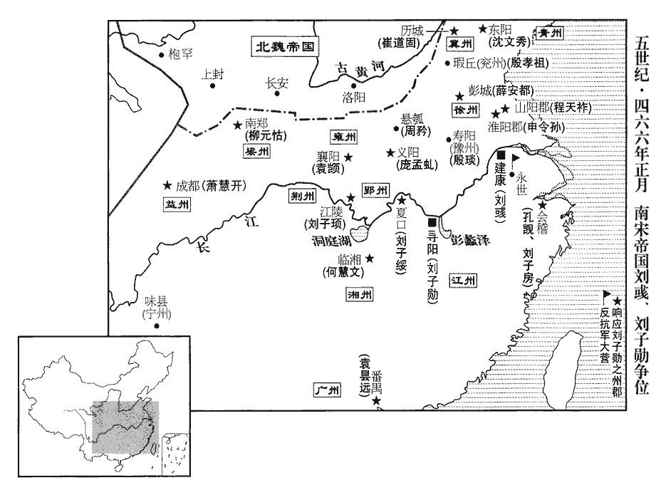
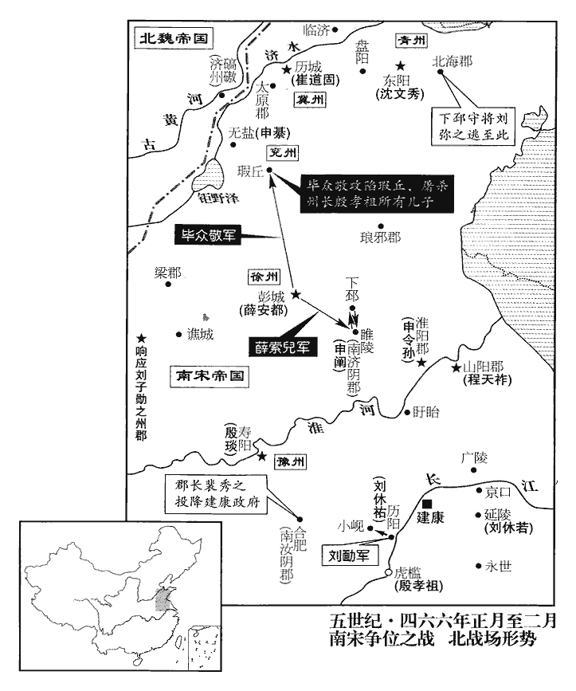
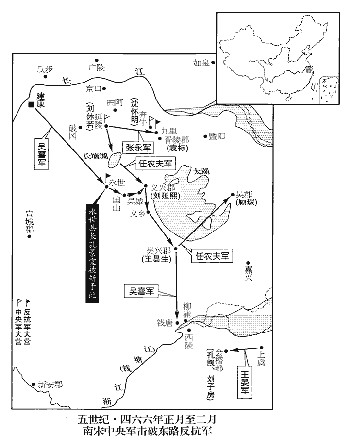
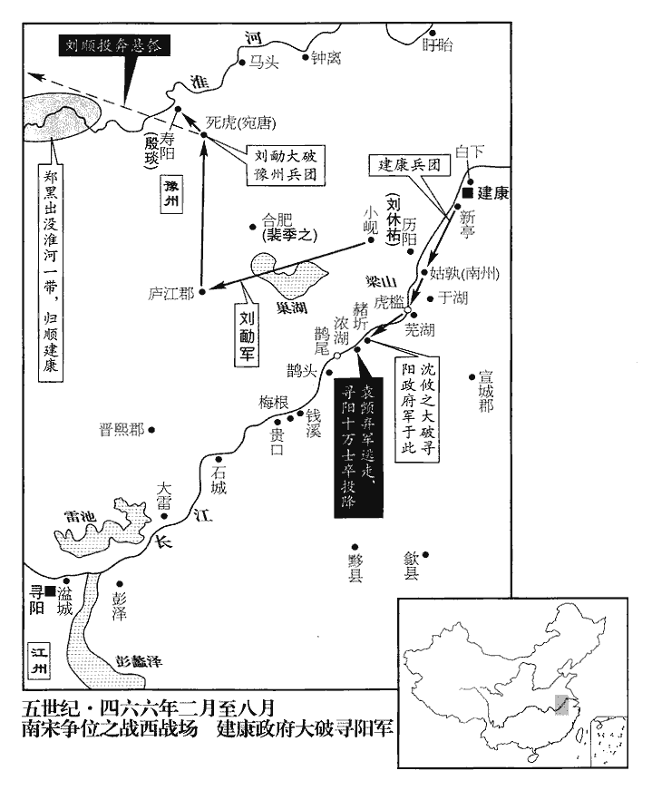
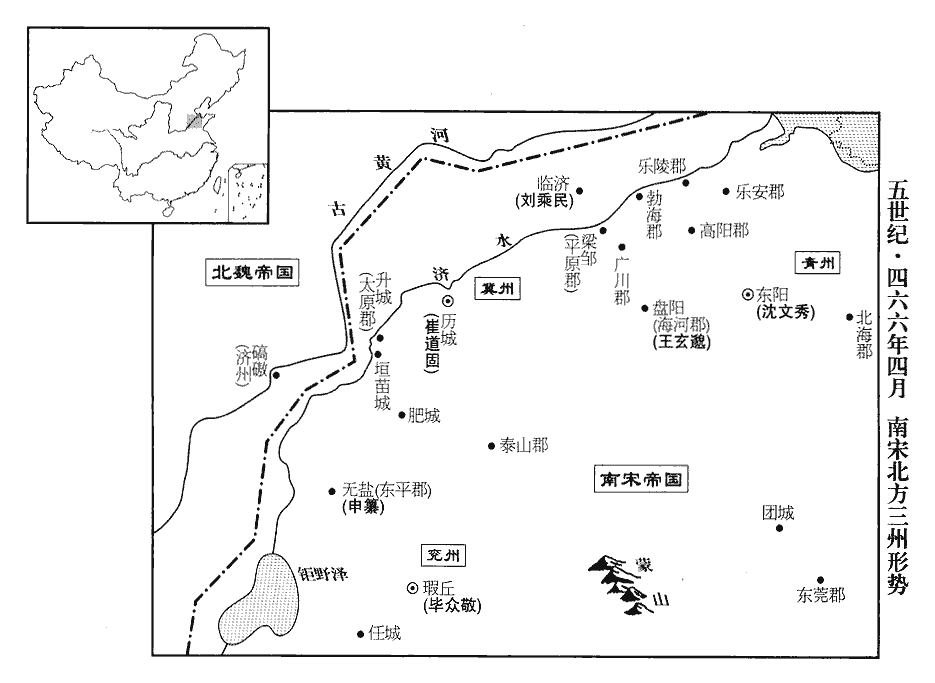
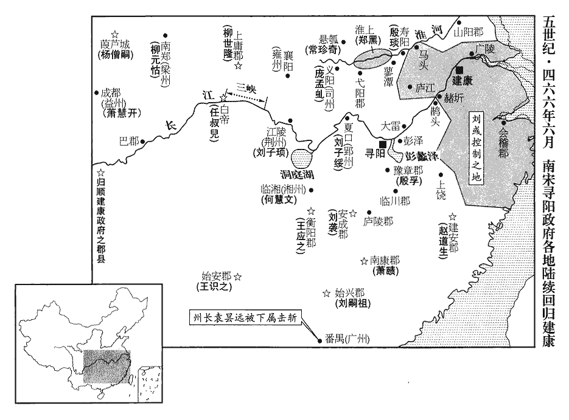
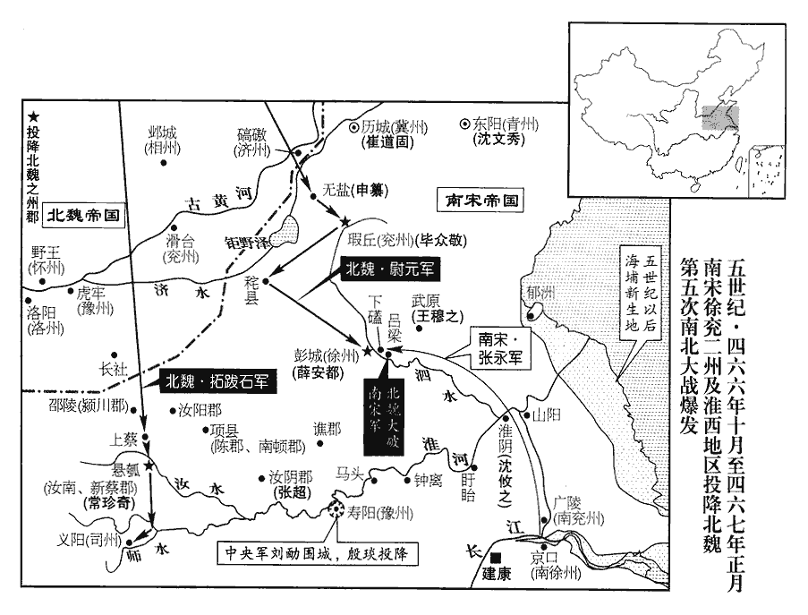

 宋紀十三柔兆敦牂（丙午），一年。

# 太宗明皇帝上之下

## 泰始二年（丙午、四六六）

1春，正月，己丑朔‹一›，魏‹都平城，山西大同›大赦，改元天安。

〖译文〗 [1]春季，正月，己丑朔（初一），北魏宣布大赦，改年号天安。

2癸巳‹五›，徵會稽‹浙江绍兴›太守尋陽王子房爲撫軍將軍，以巴陵王休若代之。去年，子房已舉兵應尋陽，欲以休若代之。會，工外翻。

〖译文〗 [2]癸巳（初五），刘宋明帝刘征召会稽太守寻阳王刘子房任抚军将军，命巴陵王刘休若接替刘子房的职位。

甲午‹六›，中外戒嚴。以司徒建安王休仁都督征討諸軍事，車騎將軍、江州刺史王玄謨副之。使王玄謨拒尋陽之兵，因以爲江州；不復用休祐。休仁軍於南州‹姑孰，安徽当涂›，以沈攸之爲尋陽‹江西九江›太守，將兵屯虎檻‹安徽芜湖江中岛›。虎檻，洲名，在赭圻東北江中，蕪湖之西南也。守，式又翻。將，卽亮翻；下同。時玄謨未發，前鋒凡十軍，絡繹繼至，每夜各立姓號，不相稟受。攸之謂諸將曰：「今衆軍姓號不同，若有耕夫、漁父夜相呵叱，呵，虎何翻。叱，昌栗翻。便致駭亂，取敗之道也。請就一軍取號。」衆咸從之。史言沈攸之有將帥之略，所以能立功。

〖译文〗 甲午（初六），刘宋朝廷内外戒严。任命司徒建安王刘休仁为都督征讨诸军事，命车骑将军、江州刺史王玄谟做他的副手。刘休仁驻军南州，任命沈攸之为寻阳太守，带兵驻扎虎槛。当时，王玄谟大军还没有出发，前锋部队共十路兵马，络绎相继到达前线。每天晚上，各军营用自己的号令，谁也不听谁的。沈攸之对名将领说：“现在各军营的号令不同，如果有农夫、渔夫夜里互相喊叫呵叱，便可能引起军中的惊骇，发生混乱，这是取败之道。我建议以一个军营的号令作为全军的号令。”众将领都同意。

3鄧琬稱說符瑞，詐稱受路太后‹路惠男›璽書，帥將佐上尊號於晉安王子勛。璽，斯氏翻。帥，讀曰率。上，時掌翻。勛，古勳字。乙未‹七›，子勛卽皇帝位於尋陽‹江西九江›，改元義嘉。以安陸王子綏爲司徒、揚州刺史；尋陽王子房、臨海王子頊並加開府儀同三司；以鄧琬爲尚書右僕射，張悅爲吏部尚書，袁顗加尚書左僕射；顗，魚豈翻。自餘將佐及諸州郡，除官進爵號各有差。

〖译文〗 [3]邓琬以上天显示的种种祥瑞为借口，诈称接到路太后的密诏，率领各将领、僚佐等向晋安王刘子勋奉上皇帝尊号。乙未（初七），刘子勋在寻阳登基称帝，改年号为义嘉。任命安陆王刘子绥为司徒、扬州刺史，寻阳王刘子房、临海王刘子顼，都加封为开府仪同三司，还任命邓琬为尚书右仆射，张悦为吏部尚书，加封袁为尚书左仆射。其他各将领、僚佐以及各州郡等地方长官，按等级进官加爵。

4丙申‹八›，以征虜司馬申令孫爲徐州刺史。令孫，坦之子也。元嘉、孝建之間，申坦爲將帥。置司州於義陽‹河南信阳›；文帝元嘉末，置司州於汝南，孝武大明中省廢，今復置之，領義陽、隨陽、安陸、南汝南四郡；水行至建康二千七百里，陸行一千七百里。以義陽內史龐孟虯爲司州刺史。龐，皮江翻。虯，渠幽翻。

〖译文〗 [4]丙申（初八），明帝任命征虏司马申令孙为徐州刺史。申令孙是申坦的儿子。在义阳建立司州府，提升义阳内史庞孟虬为司州刺史。

 

徐州‹府彭城，江苏徐州›刺史薛安都、冀州‹府历城，山东济南›刺史清河‹侨郡，山东淄博南›崔道固皆舉兵應尋陽。上‹刘彧，时年二十八›徵兵於青州‹府东阳，山东青州›刺史沈文秀，文秀遣其將【章：甲十一行本「將」下有「平原」二字；乙十一行本同；孔本同。】劉彌之等將兵赴建康。會薛安都遣使邀文秀，文秀更令彌之等應安都。濟陰‹江苏睢宁›太守申闡據睢陵應建康，將，卽亮翻。使，疏吏翻。濟，子禮翻。睢，音雖。睢陵縣，前漢屬臨淮郡，後漢屬下邳郡，孝武大明元年，度屬濟陰郡。沈約曰：濟陰本屬兗州，其民流寓徐土，因割地爲郡境。隋幷睢陵入夏丘縣，唐以夏丘爲虹縣，属泗州，復漢舊縣名也。虹，《漢書》音貢，今音絳。杜佑曰：睢陵縣故城，在泗州下邳縣東南。安都遣其從子直閤將軍索兒、太原‹侨郡，山东长清西南›太守清河傅靈越等攻之。文帝元嘉十年，割濟南、太山立太原郡；唐齊州長清縣，宋太原郡地也。從，才用翻。守，手又翻。闡，令孫之弟也。安都壻裴祖隆守下邳‹江苏睢宁北古邳镇›，劉彌之至下邳，更以所領應建康，襲擊祖隆。祖隆兵敗，與征北參軍垣崇祖奔彭城。崇祖，護之之從子也。垣護之爲將，著功名於元嘉、孝建之間。彌之族人北海‹山东昌乐东南›太守懷恭、從子善明皆舉兵以應彌之，薛索兒聞之，釋睢陵，引兵擊彌之。彌之戰敗，走保北海。申令孫進據淮陽‹安徽宿州东北›，晉安帝義熙中，土斷，立淮陽郡於下邳角城；唐泗州治宿豫縣，古角城也。請降於索兒。降，戶江翻。龐孟虯亦不受命，舉兵應尋陽。

〖译文〗 徐州刺史薛安都，冀州刺史清河人崔道固，都起兵响应寻阳的刘子勋。明帝向青州刺史沈文秀征兵，沈文秀派遣他的将领刘弥之等率军南下，增援建康。正巧，薛安都派人邀请沈文秀拥护刘子勋，沈文秀于是改命刘弥之中途去薛安都那里待命。济阴太守申阐据守睢陵，效忠建康朝廷。薛安都派遣他的侄儿直将军薛索儿和太原太守清河人傅灵越等攻打申阐。申阐是申令孙的弟弟。薛安都的女婿裴祖隆驻守下邳，刘弥之到达下邳后，带着他的部众，效忠于建康朝廷，袭击裴祖隆。裴祖隆战败，会同征北参军垣崇祖逃到彭城。垣崇祖是垣护之的侄儿。刘弥之的同族人北海太守刘怀恭、侄儿刘善明都起兵响应刘弥之。薛索儿知道后，放弃对睢陵的攻击，发兵转攻刘弥之。刘弥之战败，逃到北海据守。申令孙进据淮阳，请求薛索儿允许他投降。庞孟虬也背叛了朝廷，起兵响应寻阳刘子勋。

帝‹刘彧›召尋陽王長史行會稽郡事孔覬爲太子詹事，以平西司馬庾業代之；又遣都水使者孔璪zǎo入東慰勞。漢官有都水長，屬少府，晉屬大司農；後遂置都水使者，掌河津、漕渠凡水利事幷督治船艦。會，工外翻。覬，音冀。使，疏吏翻。璪，子皓翻。勞，力到翻。璪說覬以「建康虛弱，不如擁五郡以應袁、鄧。」東揚州所統五郡。說，輸芮翻。覬遂發兵，馳檄奉尋陽。吳郡‹江苏苏州›太守顧琛、吳興‹浙江湖州›太守王曇生、琛，丑林翻。曇，徒含翻。義興‹江苏宜兴›太守劉延熙、晉陵‹江苏常州›太守袁標皆據郡應之。上又以庾業代延熙爲義興，業至長塘湖‹江苏溧阳北›，卽與延熙合。

〖译文〗 明帝征召寻阳王长史、代理会稽郡事孔觊为太子詹事，另派平西司马庾业接替孔觊的职位，又派都水使者孔到东方各郡慰劳。孔反而游说孔觊：“建康力量虚弱，不如以所管辖的东方五个郡来响应袁、邓琬。”孔觊遂下令起兵，宣布拥护刘子勋。一时间，吴郡太守顾琛、吴兴太守王昙生、义兴太守刘延熙、晋陵太守袁标都占据郡城响应孔觊，拥护寻阳政权。明帝又命庾业接替刘延熙为义兴太守，庾业走至长塘湖，却与刘延熙联合，反叛朝廷。

益州‹府成都，四川成都›刺史蕭惠開，聞晉安王子勛舉兵，集將佐謂之曰：「湘東‹刘彧›，太祖‹刘义隆›之昭；晉安‹刘子勋›，世祖‹刘骏›之穆；其於當璧，並無不可。《左傳》：楚共王無冢適；有寵子五人，無適立焉。乃大事於羣望而祈曰：「請神擇於五人，使主社稷。」乃徧以璧見於羣望曰：「當璧而拜者，神所立也。」旣乃密埋璧於太室之庭，使五人齋，而長入拜；康王跨之，靈王肘加焉，子干、子皙皆遠之；平王弱，抱而入，再拜，皆厭紐，其後卒有楚國。昭，市招翻。但景和雖昏，本是世祖之嗣；廢帝改元景和。不任社稷，其次猶多。吾荷世祖之眷，當推奉九江。」任，音壬。荷，下可翻。自宋以來，率謂江州爲九江。晁氏《志》曰：太湖一湖而曰五湖。昭餘祁一澤而曰九澤；九江一水而曰九江。余按《書•禹貢》曰：荊及衡陽爲荊州。江、漢朝宗于海，九江孔殷。孔安國《註》曰：江於此州界分爲九道，甚得地勢之中。《漢書•地理志》：廬江郡尋陽縣，《禹貢》九江在南，皆東合於大江。應劭曰：江自廬江、尋陽分爲九。《尋陽地記》曰：九江：一曰烏江，二曰蜯bàng江，三曰烏白江，四曰嘉靡江，五曰畎quǎn江，六曰源江，七曰廩lǐn江，八曰提江，九曰箘jùn江。張須元《九江圖》云：一曰三里江，二曰五州江，三曰嘉靡江，四曰烏土江，五曰白蚌江，六曰白烏江，七曰箘江，八曰沙提江，九曰廩江：參差隨水長短，或百里，或五十里，始於鄂陵，終於江口，會于桑落洲。《太康地記》曰：九江，劉歆以爲湖漢九水入彭蠡澤也。夏撰曰：據此數說，皆謂江水至是分爲九道；獨曾氏謂爲不然。曾氏謂下文「導江過九江，至于東陵東，迤北會于匯。」說者謂東陵，巴陵也。蓋今巴陵與夷陵相爲東西，夷陵一曰西陵，則巴陵爲東陵可知。許愼曰：迤，邪行也。今江水過洞庭至巴陵而後，東北邪行，合於彭蠡，卽《經》所謂「過九江至于東陵東，迤北會于匯」也。由是觀之，九江不在潯陽明矣；所謂九江者，蓋今洞庭也。考之前志，沅水、漸水、潕wǔ水、辰水、敍水、酉水、醴水、湘水、資水皆合洞庭中，東入于江，所謂九江者，豈非此乎！宋白曰：江州尋陽郡，《禹貢》：「九江孔殷，彭蠡旣瀦，」彭蠡在州南東五十三里，九江在州西北二十五里是也。然則彭蠡以東爲揚州之域，九江以西卽荊州之域。周景式《廬山記》云：柴桑，彭蠡之郊，古三苗國，舊屬廬江地。又按《尋陽記》云：春秋時爲吳之西境，楚之東境，本在大江之北，今蘄qí州界古蘭城是也。秦幷天下，以此屬廬江郡，漢屬淮南國，後漢爲豫章、廬江二郡之境。三國之時，此地雖爲督護要津，而未立郡，吳但分尋陽隸武昌。晉初，尋陽猶理江北，溫嶠移於此，始置尋陽郡，隋爲九江郡。余按秦幷天下，置九江郡。項羽封黥布爲九江王，都六，《漢•地理志》所謂「九江在潯陽縣南。」沈約《宋志》：尋陽本縣名，因水名縣。水南注江，二漢屬廬江，吳立蘄春郡，尋陽縣屬焉。此時尋陽之地在江北。晉亂，立尋陽郡，後郡治於柴桑，而尋陽之名遂移於江南。晉惠帝置江州，治豫章，成帝移江州治尋陽。時人蓋因《漢志》所謂「九江在尋陽縣南」，而尋陽又爲江州治所，遂謂尋陽爲九江。若《禹貢》之九江，其地實難考見。若必以夷陵爲西陵，遂以巴陵爲《禹貢》之東陵，摭取會洞庭之水爲九江；考之前志，會洞庭者不止九水，而酈道元《水經註》，謂廬江郡有東陵鄕，江夏有西陵縣，故是言東，《尚書》云「江水過九江，至于東陵」者也。西南流，水積爲湖，湖西有青林山。又考《水經註》，自沔口以下有湖口水，加湖江水、武口水、烏石水、舉水、巴水、希水、蘄水、利水皆南流注于江，而後至青林水口，亦可傅合九水之說，但未敢以爲是。九河之迹，至漢已不可悉考；而欲強爲九江之說，難矣。乃遣巴郡‹重庆›太守費欣壽將五千人東下。於是湘州‹府临湘，湖南长沙›行事何慧文、廣州‹府番禺，广东广州›刺史袁曇遠、梁州‹府南郑，陕西汉中›刺史柳元怙、山陽‹江苏淮安›太守程天祚皆附於子勛。元怙，元景之從兄也。費，扶沸翻。將，卽亮翻。曇，徒含翻。從，才用翻。

〖译文〗 益州刺史萧惠开，听到晋安王刘子勋起兵，召集将领，对他们说：“湘东王是太祖的儿子，晋安王是世祖的儿子，无论哪一个继承皇位，都没什么不合法的。刘子业虽然昏暴，却是世祖的后嗣，他虽不能继续主持国事，却还有很多弟弟。我受世祖的恩宠，应当遵奉晋安王刘子勋。”于是就派遣巴郡太守费欣寿带领五千人顺江东下。这时，湘州行事何慧文、广州刺史袁昙远、梁州刺史柳元怙、山阳太守程天祚都起兵拥护刘子勋。柳元怙是柳元景的堂兄。

是歲，四方貢計皆歸尋陽，貢，謂貢方物；計，謂上計帳。朝廷所保，唯丹楊‹南京›、淮南‹姑孰›等數郡，其間諸縣或應子勛，東兵已至永世‹江苏溧阳›，吳分溧陽爲永平縣，晉武帝太康元年更名永世縣，屬丹楊郡，其地蓋在今安吉州、建康府、廣德軍三郡界。下云「永世令叛，義興兵垂至延陵」，則其地又犬牙入今常州界。東兵欲自此進取曲阿。宮省危懼。上‹刘彧›集羣臣以謀成敗。蔡興宗曰：「今普天同叛，【章：甲十一行本「叛」下有「人有異志」四字；乙十一行本同；孔本同；張校同。】宜鎭之以靜，至信待人。叛者親戚布在宮省，若繩之以法，則土崩立至，宜明罪不相及之義。父、子、兄、弟，罪不相及，古義也。物情旣定，人有戰心，六軍精勇，器甲犀利，以待不習之兵，其勢相萬耳。願陛下勿憂。」上善之。蔡興宗豈特以方嚴自將，蓋識時審勢者也。

〖译文〗 这一年，各地的贡品和报告都送往寻阳。建康朝廷的势力范围，只剩下丹杨、淮南等几个郡，而这几个郡中又有很多县起兵响应刘子勋，东线的反朝廷军队已到达永世。建康朝廷惊恐危急。明帝召集群臣讨论国家的安危。蔡兴宗说：“当今之时，几乎举国一起反叛，我们应该镇静，以诚待人。叛臣的亲戚，很多在宫廷或朝廷任职，如果绳之以法，我们就会立刻土崩瓦解。应该强调父子兄弟之间，犯罪互不株连的大义，民心安定之后，将士才能有斗志。朝廷的六军精练勇猛，武器犀利，用来对付那些没有经过训练的叛乱部队，形势相差很多，请陛下不要忧虑。”明帝认为他的分析有理。

5建武司馬劉順說豫州刺史殷琰使應尋陽；說，輸芮翻。琰以家在建康，未許。右衛將軍柳光世自省內出奔彭城，過壽陽‹安徽寿县›，言建康必不能守。琰信之，且素無部曲，爲土豪前右軍參軍杜叔寶等所制，不得已而從之。琰以叔寶爲長史，內外軍事，皆叔寶專之。上‹刘彧›謂蔡興宗曰：「諸處未平，殷琰已復同逆；復，扶又翻。頃日人情云何？事當濟不？」不，讀曰否。興宗曰：「逆之與順，臣無以辨。今商旅斷絕，米甚豐賤，四方雲合，而人情更安，湘東纂位，非其本心；尋陽起兵，名正言順；故曰逆之與順，臣無以辨。商旅斷絕，米甚豐賤者，前朝之積也；四方雲合，人情更安者，積苦於狂暴而驟樂寬政也。天下嗷嗷，新主之資，斯言豈不信哉！以此卜之，清蕩可必。但臣之所憂，更在事後，猶羊公言：『旣平之後，方當勞聖慮耳。』羊祜之言，見八十卷晉武帝咸寧四年。上曰：「誠如卿言。」上知琰附尋陽非本意，乃厚撫其家以招之。

〖译文〗 [5]建武司马刘顺劝说豫州刺史殷琰，让他响应寻阳政权。殷琰因家人都在建康，没有答应。右卫将军柳光世从朝廷逃出来，投奔彭城，路过寿阳，他说建康一定保不住。殷琰相信他的判断，而且，殷琰一向没有自己的部曲，受到当地的豪族、前任右军参军杜叔宝等人的挟持，不得已归顺刘子勋。殷琰任命杜叔宝为长史，里里外外一切军事要事，都由杜叔宝独断专行。明帝对蔡兴宗说：“各地的叛乱，还没有平息，殷琰又起兵附逆，近日来民心如何？事情能够成功吗？”蔡兴宗说：“谁是叛逆，谁是正统，我不必分辨。现在，交通中断，商旅绝迹。可是粮食积存丰富，米价便宜。四面八方风起云涌，而民心反而更加安定。由此看来，动乱一定可以平息。我所担忧的不是眼前，而是未来，正象羊祜所说的：‘夺取胜利之后，才更要劳烦陛下多多思虑。’”明帝说：“正像你所说的！”明帝知道殷琰归附寻阳政权，并非本意，于是对殷琰留在建康的家人特别安抚厚待，招引他重新归顺。

6汝南、新蔡二郡太守周矜起兵於懸瓠‹河南汝南›以應建康。汝南郡時治懸瓠。宋以新蔡郡帖治汝南，故周矜領二郡太守；自是二郡太守多矣。袁顗誘矜司馬汝南常珍奇執矜，斬之，誘，音酉。以珍奇代爲太守。

〖译文〗 [6]汝南、新蔡二郡太守周矜，在悬瓠起兵宣布效忠建康。袁引诱周矜崐的司马、汝南人常珍奇活捉周矜，将其斩首。于是任命常珍奇接任太守。

7上使宂從僕射垣榮祖還徐州說薛安都，諸垣自略陽歸南，世在青、徐立効，爲土人所信重，故使還說薛安都。宂，而隴翻。從，才用翻。說，輸芮翻；下說孝同。安都曰：「今京都無百里地，京都，謂建康；四方皆奉尋陽，故言無百里地。不論攻圍取勝，自可拍手笑殺；且我不欲負孝武。」榮祖曰：「孝武之行，足致餘殃。不善之積，必有餘殃。孝武貪淫，濟以奢虐，人倫道盡，故榮祖云然。行，下孟翻。今雖天下雷同，雷之發聲，物無不隨時而應者；故以響應爲雷同。正是速死，無能爲也。」安都不從，因留榮祖使爲將。將，卽亮翻。榮祖，崇祖之從父兄也。從，才用翻。

〖译文〗 [7]明帝派冗从仆射垣荣祖回徐州游说薛安都。薛安都说：“如今，建康势力范围，不到百里地，无论攻城还是野战，我们都可以在拍手大笑中取胜。并且，我不想辜负孝武皇帝。”垣荣祖说：“孝武皇帝的行为，足以为他的后代留下祸殃。现在虽然天下响应，不过是加快灭亡的速度，不可能有什么作为。”薛安都不接受，反而留下垣荣祖任职。垣荣祖是垣崇祖的堂哥。

8兗州‹府瑕丘，山东兖州›刺史殷孝祖之甥司法參軍【章：甲十一行本「軍」下有「潁川」二字；乙十一行本同；孔本同；張校同。】葛僧韶請徵孝祖入朝，據《南史》，「司法參軍」當作「司徒參軍」。「請」下當有「徵」字。【章：胡註「請下當有徵字」。甲十一行本「徵」作「殷」；乙十一行本同。按「徵」字乃後來所改。退齋校云：從宋方與註合。】朝，直遙翻。上遣之。時薛索兒屯據津逕。僧韶間行得至，間，古莧翻。說孝祖曰：「景和凶狂，開闢未有；朝野危極，假命漏刻。朝，直遙翻；下同，主上夷兇翦暴，更造天地，國亂朝危，宜立長君。更，工衡翻。長，知兩翻。而羣迷相煽，搆造無端，貪利幼弱，競懷希望。使天道助逆，羣凶事申，則主‹刘子勋，时年十一›幼時艱，權柄不一，兵難互起，豈有自容之地！舅少有立功之志，難，乃旦翻。少，詩照翻。若能控濟義勇，還奉朝廷，控，引也。濟，謂濟河，音子禮翻。《南史》作「控濟河義勇」，文意尤爲明暢。非唯匡主靜亂，乃可以垂名竹帛。」孝祖具問朝廷消息，僧韶隨方詶chóu譬，幷陳兵甲精強，主上欲委以前驅之任。孝祖卽日委妻子於瑕丘‹山东兖州›，瑕丘縣，故魯瑕邑，漢屬山陽郡，魏、晉省，宋爲兗州治所。帥文武二千人，隨僧韶還建康。帥，讀曰率。時四方皆附尋陽，朝廷唯保丹楊一郡；而永世‹江苏溧阳›令孔景宣復叛，復，扶又翻。義興兵垂至延陵‹江苏丹阳南延陵镇›，晉武帝太康二年，分曲阿之延陵鄕立延陵縣，屬晉陵郡。內外憂危，咸欲奔散。孝祖忽至，衆力不少，並傖楚壯士；江南謂中原人爲傖，荊州人爲楚。少，詩照翻。傖，助庚翻。人情大安。甲辰‹十六›，進孝祖號撫軍將軍，假節、都【章：甲十一行本無「都」字；乙十一行本同。】督前鋒諸軍事，遣向虎檻，寵賚甚厚。賚lài，來代翻。

〖译文〗 [8]兖州刺史殷孝祖的外甥任司法参军的葛僧韶，请求明帝征召殷孝祖来京朝见，明帝派葛僧韶前往。当时，薛索儿驻军各渡口和各要道，葛僧韶绕小路北上，才得以到达，游说殷孝祖说：“刘子业凶暴疯狂，自从开天辟地以来，从未有过。朝野面临崩溃，人人生命危在旦夕。主上翦险凶暴，重建天下。国家沸混乱，朝廷危急，应该拥护年长者为君王。想不到一群糊涂虫互相煽动，无缘无故地制造事端，利用晋安王的年幼无知，各人有各人的打算。假使上天帮助叛逆，这些坏蛋如愿以偿，而主上年幼，时势艰难，权柄不能集中，兵变事变不断发生，天下之大，岂有容身之地！舅父自小就有建功立业的大志，如能率领济水一带的义勇将士，回京保卫朝廷，不但可以扶助君王平定叛乱，而且可以名垂青史。”殷孝祖详细询问了朝廷的情况，葛僧韶随机应变，陈述士卒强壮，武器精良，明帝准备任命他为前锋总领。殷孝祖当天就把妻子儿女留在瑕丘，率文武官员及士卒两千人，随同葛僧韶返回建康。此时，所有的郡县都归附寻阳政权，朝廷所保留的仅丹杨一郡。而永世县令孔景宜，也在这时背叛。义兴叛军将到达延陵，建康内外忧虑惊恐，民心瓦解，大家都想逃走。正在此时，殷孝祖忽然到达，部队浩浩荡荡，而且都是北方及荆州的精壮战士，人心大为安定。甲辰（十六日），明帝提升殷孝祖为抚军将军、持节、都督前锋诸军事。派他进驻虎槛，恩庞赏赐十分优厚。

 

初，上‹刘彧›遣東平‹山东东平东›畢衆敬詣兗州‹山东西部›募人，至彭城，薛安都以利害說之，說，輸芮翻。矯上命以衆敬行兗州事，衆敬從之。殷孝祖使司馬劉文石守瑕丘‹山东兖州›，衆敬引兵擊殺之。安都素與孝祖有隙，使衆敬盡殺孝祖諸子。州境皆附之，爲畢衆敬以兗州降魏張本。唯東平太守申纂據無鹽，不從。爲申纂以城拒魏而死張本。無鹽縣，自漢、晉以來屬東平，隋廢省，其地當在唐鄆州界。《水經註》：濟水逕壽張縣須朐qú城西。濟水西有安民亭，亭北對安民山，東臨濟水，水東卽無鹽縣界也。杜佑曰；鄆州治須昌縣，漢無鹽故城在今縣東，東平國故城亦在縣東。纂，鍾之曾孫也。申鍾見九十五卷晉成帝咸和九年。

〖译文〗 当初，明帝派遣东平人毕众敬到兖州招兵买马，经过彭城时，薛安都以利害关系说服毕众敬，还假造明帝的诏书，任命毕众敬管理兖州事务，毕众敬接受。殷孝祖让司马刘文石据守瑕丘，毕众敬率军袭击，杀了刘文石，薛安都一向与殷孝祖有矛盾，他命毕众敬把殷孝祖所有儿子全部杀掉，兖州全境全部归附毕众敬。只有东平太守申纂据守无盐，不肯投降。申纂是申钟的曾孙。

9丙午‹十八›，上‹刘彧›親總兵，出頓中堂。辛亥‹二十三›，以山陽王休祐爲豫州刺史，督輔國將軍彭城劉勔、勔miǎn，彌兗翻。寧朔將軍廣陵呂安國等諸軍西討殷琰。《考異》曰：《宋略》：「二月庚申，以休祐都督西討。」今從《宋書》。巴陵王休若督建威將軍吳興沈懷明、尚書張永、輔國將軍蕭道成等諸軍東討孔覬。時將士多東方人，父兄子弟皆已附覬。覬，音冀。上因送軍，普加宣示曰：「朕方務德簡刑，使父子兄弟罪不相及，將【章：甲十一行本「將」作「助」；乙十一行本同；孔本同；退齋校同；熊校同。】順同逆者，一以所從爲斷。斷，丁亂翻。卿等當深達此懷，勿以親戚爲慮也。」衆於是大悅，凡叛者親黨在建康者，皆使居職如故。

〖译文〗 [9]丙午（十八日），明帝亲自统率全军到中堂驻扎。辛亥（二十三日），任命山阳王刘休为豫州刺史，指挥辅国将军彭城人刘、宁朔将军广陵人崐吕安国等各路人马，向西讨伐殷琰。命令巴陵王刘休若指挥建威将军吴兴人沈怀明、尚书张永、辅国将军萧道成等各路人马，向东讨伐孔觊。当时，建康的许多将领是东方各郡人士，父子兄弟全都投靠了孔觊。明帝因此在送他们出征时，向全军宣布说：“朕正在推行皇家恩德，减轻刑罚，使父子兄弟之间的罪行，互不株连，无论顺从或叛逆者，都以他自己的行为作判断标准。你们要深刻理解朕的用意，不要替亲戚担忧。”军心为此欢欣鼓舞，凡是叛党留在建康的亲属，都让他们像过去那样，保持原来的官职。

10壬子‹二十四›，路太后‹路惠男，年五十五›殂。《考異》曰：《宋略》、《南史》皆曰：「義嘉之難，太后心幸之，延上飲酒，置毒以進。侍者引上衣，上寤，起，以其卮上壽。是日，太后崩，喪事如禮。」《宋書》無之，今不取。

〖译文〗 [10]壬子（二十四日），路太后去世。

11孔覬遣其將孫曇瓘guàn等軍於晉陵九里，其地在晉陵西北九里，因以爲名。將，卽亮翻。曇，徒含翻。部陳甚盛。陳，讀曰陣；下戰陳同。沈懷明至奔牛‹江苏常州西北›，所领寡弱，乃築壘自固。張永至曲阿‹江苏丹阳›，未知懷明安否；百姓驚擾，永退還延陵‹江苏丹阳南延陵镇›，就巴陵王休若，諸將帥咸勸休若退保破岡‹江苏句容东南›。帥，所類翻。其日，大寒，風雪甚猛，塘埭決壞，埭dài，徒耐翻；以土遏水曰埭。衆無固心。休若宣令：「敢有言退者斬！」衆小定，乃築壘息甲。尋得懷明書，賊定未進，軍主劉亮又至，兵力轉盛，人情乃安。亮，懷愼之從孫也。從，才用翻。

〖译文〗 [11]孔觊派他的将领孙昙等驻军晋陵九里，军容盛大。建康将领沈怀明抵达奔牛，率领的军队人数既少，战斗力又不强，只好修筑堡垒固守。尚书张永前进到曲阿，不知道前方的沈怀明胜败如何，不敢再进，而民心又惶恐，张永于是便退回延陵，与巴陵王刘休若会师，所有将领都劝刘休若撤退到破冈据守。这天，天气严寒，狂风卷起大雪，很多池塘堤岸崩裂，军心动摇。刘休若下令：“有敢说撤退者，斩首。”军心才稍稍安定，于是开始兴筑营垒，士卒得以解甲休息。不久，接到沈怀明报告，知道敌人仍然停止不前，而带兵将领刘亮又前来增援，兵力转强，人心终于安定。刘亮是刘怀慎的侄孙。

殿中御史吳喜以主書事世祖‹刘骏›，稍遷河東‹湖北松滋西北›太守。晉成帝咸康三年，庾亮鎭荊州，以司州僑戶立河東郡，隋、唐之松滋縣卽其地也。至是，請得精兵三百，致死於東。上假喜建武將軍，簡羽林勇士配之。議者以「喜刀筆主者，未嘗爲將，不可遣。」將，卽亮翻；下同。中書舍人巢尚之曰：「喜昔隨沈慶之，屢經軍旅，性旣勇決，又習戰陳；若能任之，必有成績。諸人紛紜，皆是不別才耳。」別，彼列翻。乃遣之。喜先時數奉使東吳，先，悉薦翻。數，所角翻。使，疏吏翻。性寬厚，所至人並懷之。百姓聞吳河東來，皆望風降散，降，戶江翻。故喜所至克捷。

〖译文〗 殿中御史吴喜，原来是世祖孝武帝的主书，逐渐升到河东太守之职。到了这时，请求调给他精锐部队三百人，到东战场去效命。明帝暂时任命吴喜为建武将军，在羽林禁卫军中挑选勇士配备给他。有人认为：“吴喜是个拿笔杆子的文官，从来没有当过将领，不可派他作战。”中书舍人巢尚之说：“当年，吴喜曾跟随沈庆之，屡次出征，性情勇敢果决，见惯疆场阵战，如果能起用他，一定会有战绩，大家议论纷纷，都是由于不识人才。”于是命吴喜出发。吴喜过去曾任过朝廷的使节，多次去过东方吴地。他性情宽厚，所到过的地方，人民对他都很怀念，因此，老百姓听到他来，都闻风归顺或者逃散，所以吴喜所到之处，总能战胜，传出捷报。

永世‹江苏溧阳›人徐崇之攻孔景宣，斬之，喜版崇之領縣事。喜至國山‹江苏宜兴西南›，國山在陽羨縣界。晉立義興郡，分陽羨置國山縣屬焉。隋廢國山入義興縣。遇東軍，進擊，大破之。自國山進屯吳城，吳城當在義興西南，《九域志》所謂泰伯城是也。劉延熙遣其將楊玄等拒戰。喜兵力甚弱，玄等衆盛，喜奮擊，斬之，進逼義興。延熙栅斷長橋‹江苏宜兴南›，保郡自守，義興，今常州之宜興也。我朝太平興國元年，避太宗御名，改爲宜興。此長橋蓋在荊溪之上。今宜興縣南二十步有荊溪，上承百瀆，兼受數郡之水。劉延熙蓋栅斷荊溪之橋以自保。《輿地志》曰：今常州宜興縣南三十步有長橋，卽周處斬蛟之所。喜築壘與之相持。

〖译文〗 永世人徐崇之攻打孔景宣，并杀了他，吴喜任命徐崇之代理永世县令。吴喜抵达国山，遇到东战场的叛军，进攻并把敌人打得大败。吴喜于是又从国山推进到吴城驻扎，叛军刘延熙派他的将领杨玄等抵抗，吴喜兵力较弱，杨玄兵力强大，吴喜奋勇攻击，杀了杨玄，进逼义兴。刘延熙立木栅拒马，阻断长桥，自保郡城。吴喜兴筑营垒，同刘延熙对峙。

庾業於長塘湖口‹江苏溧阳北›夾岸築城，有衆七千人，與延熙遙相應接。庾業叛建康與延熙合，見上。沈懷明、張永與晉陵軍相持，久不決。外監朱幼舉司徒參軍督謢任農夫驍勇有膽力，任，音壬。驍，堅堯翻。上以四百人配之，使助東討，農夫自延陵出長塘，庾業築城猶未合，農夫馳往攻之，力戰，大破之，庾業棄城走義興。走，音奏。農夫收其船仗，進向義興助吳喜。二月，己未朔‹一›，喜渡水攻郡城，渡荊溪之水也。分兵擊諸壘，登高指麾，若令四面俱進者。義興人大懼，諸壘皆潰，延熙赴水死，遂克義興。

〖译文〗 寻阳政权的庾业，在长塘湖夹湖口两岸修筑城堡，部队有七千人，与刘延熙遥相呼应。建康将领沈怀明、张永与据守晋陵的东战场叛军正面对峙，很长时间不能决出胜负。皇宫外监朱幼推荐司徒参军督护任农夫，说他骁勇胆大，又有臂力。明帝配给他四百人，让他增援东战场。任农夫自延陵出发，攻击长塘湖崐，庾业筑城还没有完工，任农夫率军急行挺进，猛烈攻击，大破庾业军。庾业放弃城堡，逃回义兴。任农夫接收遗留下来的武器、船只，向义兴进军，增援吴喜。二月，己未朔（初一），吴喜渡过荆溪，攻打义兴城池，同时派出军队，分别攻打其他营垒。吴喜站在高处挥动小旗发令，像是指挥很多军队同时进攻的样子。义兴城叛军大为恐惧，各营垒霎时崩溃，刘延熙投河自杀，吴喜于是攻克义兴。

12魏丞相太原王乙渾專制朝權，朝，直遙翻；下同。多所誅殺。安遠將軍賈秀掌吏曹事，渾屢言於秀，爲其妻求稱公主，秀曰：「公主豈庶姓所宜稱！魏制：掌吏曹事，卽掌選曹事，吏部尚書之職也。凡非國之同姓，皆謂之庶姓。爲，于僞翻。秀寧取死今日，不可取笑後世！」渾怒，罵曰：「老奴官，慳qiān！」會侍中拓跋丕告渾謀反，庚申‹二›，馮太后‹时年二十五›收渾，誅之。秀，彝之子；賈彝見一百八卷晉孝武太元二十年。丕，烈帝之玄孫也。拓跋翳槐追諡烈皇帝。太后臨朝稱制，引中書令高允、中書侍郎【章：甲十一行本「郎」下有「漁陽」二字；乙十一行本同；孔本同。】高閭及賈秀共參大政。

〖译文〗 [12]北魏丞相太原王乙浑，专制独裁，许多人被他诛杀。安远将军贾秀掌管吏曹事务，乙浑多次告诉贾秀，想办法封他的妻子为公主，贾秀说：“公主怎么能是异姓的女儿所应该称呼的！我宁肯今日去死，也不可为后世讥笑。”乙浑大怒，骂道：“老奴才，死抠门！”正巧，侍中拓跋丕控告乙浑谋反，庚申（初二），冯太后下令逮捕乙浑，把他斩首。贾秀是贾彝的儿子。拓跋丕是皇族祖先烈帝的玄孙。冯太后主持朝政，代皇帝行使职权。她把中书令高允、中书侍郎高闾及安远将军贾秀引进中枢机构，共同参与朝政。

 

13沈懷明、張永、蕭道成等軍於九里西，與東軍相持。東軍聞義興敗，皆震恐。上遣積射將軍濟陽‹侨郡，江苏盱眙南›江方興、御史王道隆至晉陵‹江苏常州›視東軍形勢。濟，子禮翻。孔覬將孫曇瓘、程扞宗列五城，互相連帶。扞宗城猶未固，王道隆與諸將謀曰：「扞宗城猶未立，可以藉手，上副聖旨，下成衆氣。」辛酉‹三›，道隆帥所領急攻，拔之，帥，讀曰率。斬扞宗首。永等因乘勝進擊曇瓘等，壬戌‹四›，曇瓘等兵敗，與袁標俱棄城走，遂克晉陵‹江苏常州›。

〖译文〗 [13]沈怀明、张永、萧道成等驻防九里以西的地方，与东战场叛军相互僵持。叛军听到义兴战败，上下都非常惊恐。明帝派遣积射将军济阳人江方兴、御史王道隆前往晋陵，视察东战场形势。叛军首领孔觊的部将孙昙、程宗修筑五个城堡，互相连接。程宗城堡的泥土还没有凝固的时候，王道隆与各位将领谋划说：“程宗的城堡尚未完成，眼下正是下手的良机，上符皇上的意旨，下振众人士气。”辛酉（初三），王道隆率各将领发动急攻，攻克城堡，杀了程宗。张永等乘胜进攻孙昙等。壬戌（初四），孙昙等大败，与晋陵袁标一起弃城逃跑。于是晋陵被攻克。

吳喜軍至義鄕‹浙江长兴西北›。晉惠帝永興元年，分吳興之長城立義鄕縣，屬義興郡。今湖州，古吳興也；長興縣，古長城也，在州西北七十里。孔璪zǎo屯吳興南亭，太守王曇生詣璪計事；聞臺軍已近，璪大懼，墮duò牀，曰：「懸賞所購，唯我而已；今不遽走，將爲人擒！」遂與曇生奔錢唐‹浙江杭州›。孔璪將命于東，乃勸孔覬舉兵，故懼而走。璪，子皓翻。喜入吳興，任農夫引兵向吳郡，顧琛棄郡奔會稽。琛，丑林翻。會，工外翻。上以四郡旣平，四郡：晉陵、義興、吳興、吳郡也。乃留吳喜使統沈懷明等諸將東擊會稽，召張永等北擊彭城，江方興等南擊尋陽。

〖译文〗 吴喜进军到义乡。叛军孔驻防吴兴南亭，吴兴太守王昙生到孔处商讨事情。孔听说建康官军已经逼近，十分恐惧，从床上跌下来，说：“他们悬赏捉拿的就是我，今天再不逃走，无疑将被他们活捉。”于是，与王昙生放弃城池，投奔钱唐。吴喜于是进入吴兴。任农夫率军进攻吴郡，顾琛也弃郡投奔会稽。明帝因四郡都已平定，才命吴喜率领沈怀明等诸将领继续东征，攻打会稽，命张永等北上，攻打彭城；命江方兴等南下，攻打寻阳。

14以吏部尚書蔡興宗爲左僕射，侍中褚淵爲吏部尚書。

〖译文〗 [14]明帝任命吏部尚书蔡兴宗为左仆射，侍中褚渊为吏部尚书。

15丁卯‹九›，吳喜軍至錢唐‹杭州›，孔璪、王曇生奔浙‹钱塘江›東。喜遣強弩將軍任農夫等引兵向黃山浦‹浙江余杭西南›，黃山浦，今漁浦是也。漁浦東南卽後黃山。《諸曁志》：長寧鄕在縣東四十五里，管五里，一曰黃山里，在今越州西北四十五里。東軍據岸結寨，農夫等擊破之。喜自柳浦渡‹杭州凤凰山下›，取西陵‹浙江萧山西北›，柳浦，卽今浙江亭東跨浦橋之浦也。劉昫《唐書》曰：隋於餘杭縣置杭州，又自餘杭徙治錢唐，又移州於柳浦，今州城是。擊斬庾業。會稽人大懼，將士多奔亡，孔覬不能制。將，卽亮翻。覬，音冀。戊寅‹二十›，上虞‹浙江上虞›令王晏起兵攻郡，覬逃奔嵴山；嵴jǐ，資昔翻。據《南史》，覬門生載覬以小船，竄于嵴山村。車騎從事中郎張綏封府庫以待吳喜。騎，奇寄翻。己卯‹二十一›，王晏入城，殺綏，執尋陽王子房‹时年十一›於別署。張綏蓋遷子房於別署，故王晏就執之。縱兵大掠，府庫皆空；獲孔璪zǎo，殺之。庚辰‹二十二›，嵴山民縛孔覬送晏，晏謂之曰：「此事孔璪所爲，無預卿事，可作首辭，首，式又翻。首辭，所以首罪。當相爲申上。」爲，于僞翻。上，時掌翻。覬曰：「江東處分，莫不由身；處，昌呂翻。分，扶問翻。委罪求活，便是君輩行意耳。」晏乃斬之‹年五十一›。史言孔覬臨死不改節。顧琛、王曇生、袁標等詣吳喜歸罪，自歸而請罪也。喜皆宥之。東軍主凡七十六人，一軍之帥，謂之軍主。臨陳斬十七人，其餘皆原宥。爲吳喜得罪張本。陳，讀曰陣。

〖译文〗 [15]丁卯（初九），吴喜率军到达钱唐，叛军孔、王昙生逃往浙东。吴喜派强弩将军任农夫等，率军进攻黄山浦，叛军沿岸安营扎寨，任农夫等攻击崐，打败了叛军。吴喜自柳浦渡口进军，攻下西陵，斩庾业。会稽人心恐慌，将领士卒大多逃亡，孔觊不能制止。戊寅（二十日），上虞县令王晏起兵攻击郡城，孔觊逃往嵴山，他的部下车骑从事中郎张绥，查封州府及仓库，等待吴喜。己卯（二十一日），王晏先行入城，杀张绥，在王府别墅中逮捕寻阳王刘子房，然后放纵士兵，大肆抢劫，官府仓库全被抢空。抓获孔，斩首。庚辰（二十二日），嵴山村民捆绑住孔觊，送给王晏。王晏对他说：“这次背叛朝廷，都是孔一个人策划的，与你并不相干，只要你写一份自首状书，我当替你向上面申诉。”孔觊说：“东战场发号施令，都由我一人作主，把责任推给别人，自己求得活命，那是你这种人才做得出来的。”王晏于是斩孔觊。顾琛、王昙生、袁标等人都向吴喜投降，请求处分，吴喜都予以宽大处理。东战场叛军军官共七十六人，作战阵亡的有十七人，其他的人都得到宽恕。

16薛索兒攻申闡，久不下；使申令孫入睢陵說闡，闡出降，索兒幷令孫殺之。古人有言：「禍莫大於殺已降。」爲申令孫之子殺薛索兒張本。說，輪芮翻。降，戶江翻；下同。

〖译文〗 [16]薛索儿围攻申阐，很久没有攻克。薛索儿派申令孙入城说服申阐，申阐出来投降。薛索儿把申令孙、申阐一并杀掉。

17山陽王休祐在歷陽‹安徽和县›，輔國將軍劉勔進軍小峴‹安徽含山西北›。勔，彌兗翻。峴，戶典翻。殷琰所署南汝陰太守裴季之以合肥‹安徽合肥›來降。沈約曰：江左置南汝陰郡，所治卽合肥縣。降，戶江翻。

〖译文〗 [17]山阳王刘休，驻防历阳，辅国将军刘进军小岘。叛军殷琰委任的南汝阴太守裴季之，献出合肥，投降建康朝廷。

18鄧琬性鄙闇貪吝，旣執大權，父子賣官鬻爵，使婢僕出市道販賣；酣歌博弈，日夜不休；酣，戶甘翻。大自矜遇，賓客到門者，歷旬不得前；內事悉委褚靈嗣等三人，羣小橫恣，競爲威福。於是士民忿怨，內外離心。史言尋陽敗亡之由。橫，戶孟翻。

〖译文〗 [18]邓琬性情昏庸，人品卑劣，贪财而又吝啬。掌握大权之后，父子二人卖官鬻爵，派他家的婢女奴仆到市场上贩卖货物赚钱。畅饮狂歌，下棋赌博，日夜不停地欢乐。傲慢自大，不可一世，宾客上门求见，有达十天之久见不到面的。内部事务全部委托中书舍人褚灵嗣等三人，这一群卑劣小人，横行霸道，作威作福。于是，官员百姓无不忿怨，内外都与他离心。

琬遣孫沖之帥龍驤將軍薛常寶、陳紹宗、焦度等兵一萬爲前鋒，據赭圻‹安徽繁昌西›。劉昫曰：池州南陵縣，漢春穀縣地，秦置南陵縣，治赭圻城，唐長安四年移治青陽城。帥，讀曰率。赭，音者。圻，音畿。沖之於道與晉安王子勛書曰：「舟檝已辦，糧仗亦整，檝，與楫同。三軍踴躍，人爭効命；便欲沿流挂帆，直取白下‹南京北›。白下，在江寧縣界臨江津。願速遣陶亮衆軍兼行相接，分據新亭‹南京西南›、南州‹姑孰，安徽当涂›，則一麾定矣。」子勛加沖之左衛將軍；以陶亮爲右衛將軍，統郢、荊、湘、梁、雍五州兵雍，於用翻。合二萬人，一時俱下。陶亮本無幹略，聞建安王休仁自上，上，時掌翻。殷孝祖又至，不敢進，屯軍鵲洲‹安徽繁昌江中岛›。鵲洲，在宣城郡南陵縣，《左傳》之鵲岸也。杜預曰：鵲岸，謂廬江舒縣鵲尾渚。審是，則鵲頭在宣城界，鵲尾在廬江界，鵲洲則江中之洲也。

〖译文〗 邓琬命孙冲之任前锋，率龙骧将军薛常宝、陈绍宗、焦度等部队一万人作为前锋，进驻赭圻。孙冲之在行军途中上疏给晋安王刘子勋说：“船只已准备妥当，粮秣武器已配备齐全，三军踊跃，人人争先恐后，以死报效晋安王。现在就要张满篷帆，直取白下。请命陶亮率兵马随后发，接续上来，分别占领新亭、南州，一次攻击即可平定。”刘子勋加授孙冲之为左卫将军，任命陶亮为右卫将军，指挥郢、荆、湘、梁、雍五个州的部队，共计两万人，同时东下。陶亮本无谋略才干，听说建安王刘休仁亲自率军逆江而上，殷孝祖又随后赶到，便不敢前进，驻扎在鹊洲。

殷孝祖負其誠節，誠節，謂委鎭勤王，不顧妻子也。陵轢lì諸將，陵，侵也，侮也。轢，車踐也，音狼狄翻。臺軍有父子兄弟在南者，孝祖悉欲推治。南，南軍也。南，謂尋陽在南，臺軍泝江南上而攻之。治，直之翻。由是人情乖離，莫樂爲用。樂，音洛。寧朔將軍沈攸之，內撫將士，外諧羣帥，衆並賴之。孝祖每戰，常以鼓蓋自隨，軍中人相謂：「殷統軍可謂死將矣！撫將，卽亮翻；下同。帥，所類翻。今與賊交鋒，而以羽儀自標顯，若善射者十人共射之，共射，而亦翻。欲不斃，得乎？」三月，庚寅‹三›，衆軍水陸並進，攻赭圻；陶亮等引兵救之，孝祖於陳爲流矢所中，死‹年五十二›。陳，讀曰陣。中，竹仲翻。軍主范潛帥五百人降於亮。帥，讀曰率；下同。降，戶江翻。人情震駭，並謂沈攸之宜代孝祖爲統。

〖译文〗 殷孝祖自以为天下之大，只有他最忠心，常欺侮羞辱其他将领，建康军中有父子兄弟在寻阳政权辖区的，殷孝祖打算都逮捕审判，于是，军心涣散，将士愤懑，不肯听从他的指挥。宁朔将军沈攸之，对内安抚官兵，对外同其他将领和睦相处，大家对他十分信赖。殷孝祖每次出战，常常携带显示他高贵身分的云盖和战鼓，军中同僚以及士卒都互相说：“殷孝祖可谓‘死将’，他跟敌人作战，却带着豪华的仪仗队，自己暴露自己，敌人如果挑出十个射箭能手，同时射箭，他想不死，怎么可能呢？”三月，庚寅（初三），建康军水陆并进，攻打赭圻。陶亮等率军前来增援，殷孝祖在交战中被流箭射中，阵亡。军主崐范潜率五百人投降陶亮，军心震惊，人们都说沈攸之应该接替殷孝祖的指挥权。

時建安王休仁屯虎檻‹安徽芜湖江中岛›，遣寧朔將軍江方興、龍驤將軍襄陽劉靈遺各將三千人赴赭圻‹安徽繁昌西›。驤，思將翻。各將，卽亮翻。攸之以爲孝祖旣死，亮等有乘勝之心，明日若不更攻，則示之以弱。方興名位相亞，必不爲己下；攸之、方興皆寧朔將軍，故言名位相亞。亞，次也。軍政不壹，致敗之由也。乃帥諸軍主詣方興曰：「今四方並反，國家所保，無復百里之地。唯有殷孝祖爲朝廷所委賴，鋒鏑裁交，輿尸而反，文武喪氣，喪，息浪翻。朝野危心。事之濟否，唯在明旦一戰；戰若不捷，大事去矣。詰朝之事，詰，起吉翻。杜預曰：詰朝，明旦。諸人或謂吾應統之，自卜懦薄，幹略不如卿。今輒相推爲統，但當相與勠力耳。」方興甚悅，許諾。攸之旣出，諸軍主並尤之，攸之曰：「吾本濟國活家，豈計此之升降！且我能下彼，彼必不能下我，【章：甲十一行本「我」下有「共濟艱難」四字；乙十一行本同；孔本同；張校同；退齋校同。】豈可自措同異也！」沈攸之成尋陽之功，攝也；郢城之敗，驕也。下，戶嫁翻。

〖译文〗 当时，建安王刘休仁驻军虎槛，派宁朔将军江方兴、龙骧将军襄阳人刘灵遗各率三千人马，前往赭圻。沈攸之认为殷孝祖既已阵亡，叛军陶亮等一定会乘胜进攻，官军第二天如果再不主动发起攻势，就会向敌人暴露出自己力量薄弱。江方兴的名望和地位跟自己相等，绝不可能受自己的指挥，而军事行动不能统一，是导致失败的原因。于是，就率部下各将领拜访江方兴，说：“现在，四面八方都起兵叛乱，朝廷所占据的不过百里之地。朝廷所依赖的也只殷孝祖一人，不想，刚刚兵戈相接，他就陈尸马下，文武官员全都沮丧，朝野人士提心吊胆。朝廷大事能否成功，只看明日一战。如果战而不胜，朝廷就会全盘瓦解。有关明日之战，将领中有人说应该由我指挥，可我自问魄力不够，才能和谋略都不如你。所以我们现在打算推举你为统帅，大家同心协力。”江方兴十分喜悦，满口承诺。沈攸之告辞出来，各将领抱怨他，沈攸之说：“我只希望拯救国家，岂能计较官职高低！而且，我能向他低头，他却一定不肯向我低头，怎么可以自己先内斗起来！”

孫沖之謂陶亮曰：「孝祖梟將，一戰便死，天下事定矣，不須復戰，便當直取京都。」亮不從。孫沖之狃殷孝祖之死，便欲順流長驅。輕敵如此，使陶亮從其計，必與沈攸之等遇，亦將以輕敵取敗矣。梟，堅堯翻。將，卽亮翻。復，扶又翻。

〖译文〗 孙冲之对陶亮说：“殷孝祖是一员悍将，一战就把他杀死，天下大事已经定了，不必再战，现在就应该直接进攻京都。”陶亮不同意。

辛卯‹四›，方興帥諸將進戰，帥，讀曰率；下同。建安王休仁又遣軍主郭季之、步兵校尉杜幼文、屯騎校尉垣恭祖、龍驤將軍濟地頓生京兆段佛榮「濟地頓生」四字必有誤。等三萬人往會戰，自寅及午，大破之，追北至姥山而還。今太平州當塗縣西北四十五里有慈姥山；又巢湖中有姥山。幼文，驥之子也。元嘉中，杜驥任當方面。

〖译文〗 辛卯（初四），江方兴率领各将领进攻叛军，建安王刘休仁又派军主郭季之、步兵校尉杜幼文、屯骑校尉垣恭祖、龙骧将军京兆人段佛荣等三万人前去增援助战。自凌晨厮杀到中午，大破叛军，向北追击到姥山而回。杜幼文是杜骥的儿子。

孫沖之於湖、白口巢湖口及白水口也。築二城，軍主竟陵‹湖北钟祥›張興世攻拔之。

〖译文〗 叛军孙冲之在巢湖口和白水口修筑两座城池，军主竞陵人张兴世进攻并攻克该地。

壬辰‹五›，詔以沈攸之爲輔國將軍、假節，代殷孝祖督前鋒諸軍事。

〖译文〗 壬辰（初五），明帝下诏提升沈攸之为辅国将军、假节，接替殷孝祖的督前锋诸军事。

 

陶亮聞湖、白二城不守，大懼，急召孫沖之還鵲尾，留薛常寶等守赭圻；先於姥山及諸岡分立營寨，亦各散還，共保濃湖‹安徽繁昌西荻港›。濃湖在鵲尾下。先，悉薦翻。

〖译文〗 陶亮听到巢湖口、白水口失守的消息，大为恐惧，急令孙冲之撤回鹊尾，而留薛常宝等驻防赭圻。在此之前在姥山及各山冈修建的营垒要塞，也分别解散撤回，士卒各返原来部队，共同保卫浓湖。

時軍旅大起，國用不足，募民上錢穀者，賜以荒縣、荒郡，或五品至三品散官有差。荒郡、荒縣，極邊郡縣被兵荒殘者也；賜之者，以郡守、縣令及參佐等職名賜之。上，時掌翻。散，悉亶翻。

〖译文〗 当时，战乱四起，朝廷财源不足。于是号召人民捐钱捐粮，依照捐献多少，分别任命他们当荒凉偏远地区的郡守、县令以及五品至三品之间散官不等。

軍中食少，少，詩沼翻。建安王休仁撫循將士，均其豐儉，弔死問傷，身自隱卹；隱，度也，痛也。恤，憂也，愍也。故十萬之衆，莫有離心。

〖译文〗 军中粮秣缺乏，建安王刘休仁安抚军心，鼓励将士，平均分配物品，哀悼死者，慰问伤员，休戚与共。所以，十万大军，没有离心。

鄧琬遣其豫州刺史劉胡帥衆三萬，鐵騎二千，東屯鵲尾，幷舊兵凡十餘萬。舊兵，謂尋陽先所遣陶亮、孫沖之等之兵。騎，奇寄翻；下同。胡，宿將，勇健多權略，屢有戰功，將士畏之。將，卽亮翻；下同。司徒中兵參軍冠軍‹河南邓州西北冠军寨›蔡那，蔡那，南陽冠軍人。冠，古玩翻。子弟在襄陽，胡每戰，懸之城外；劉胡自襄陽東下，拘蔡那子弟以隨軍。爲蔡道淵執子勛張本。那進戰不顧。吳喜旣定三吳，帥所領五千人，幷運資實，至于赭圻‹安徽繁昌西›。史言建康兵勢益盛。

〖译文〗 邓琬派遣豫州刺史刘胡率领步兵三万人，精锐骑兵两千人，东行进驻鹊尾，加上原有士卒，共十余万人。刘胡是一员老将，勇敢而有谋略，屡次建立战功，将领、士卒都对他十分敬畏。司徒中兵参军冠军人蔡那的儿子和弟弟都在襄阳。刘胡每次作战，都将蔡那的儿子悬挂城外，蔡那照样猛烈攻击毫无顾忌。吴喜平定三吴之后，又率军队五千人，连同军用物品，向西增援刘休仁，进驻赭圻。

19薛索兒將馬步萬餘人自睢陵渡淮，進逼青、冀二州刺史張永營。丙申‹九›，詔南徐州刺史桂陽王休範統北討諸軍事進據廣陵‹江苏扬州›；又詔蕭道成將兵救永。

〖译文〗 [19]薛索儿率步、骑兵一万多人，自睢陵渡过淮河，进逼青、冀二州刺史张永的营寨。丙申（初九），明帝诏命南徐州刺史桂阳王刘休范统领北讨诸军事，进驻广陵，又命萧道成率兵增援张永。

20戊戌‹十一›，尋陽王子房至建康，上宥之，貶爵爲松滋侯。

〖译文〗 [20]戊戌（十一日），建康官军将寻阳王刘子房由会稽押解到建康。明帝下令赦免，贬他为松滋侯。

21庚子‹十三›，魏以隴西王源賀爲太尉。

〖译文〗 [21]庚子（十三日），北魏任命陇西王源贺太尉。

22上遣寧朔將軍劉懷珍帥龍驤將軍王敬則等步騎五千，助劉勔討壽陽，斬廬江‹安徽舒城›太守劉道蔚。懷珍，善明之從子也。劉善明，彌之之從子。蔚，紆勿翻。從，才用翻。

〖译文〗 [22]明帝派遣宁朔将军刘怀珍率领龙骧将军王敬则等步、骑兵五千人，增援刘攻打寿阳，杀了庐江太守刘道蔚。刘怀珍是刘善明的侄儿。

23中書舍人戴明寶啓上‹刘彧›，遣軍主竟陵‹湖北钟祥›黃回募兵擊斬尋陽所署馬頭‹安徽怀远南马城›太守王廣元。杜佑曰：馬頭城在壽州盛唐縣北。

〖译文〗 [23]中书舍人戴明宝向明帝推荐派军主竟陵人黄回招兵买马，向叛军进攻，杀了寻阳政权任命的马头太守王广元。

24前奉朝請壽陽鄭黑，起兵於淮上以應建康，東扞殷琰，西拒常珍奇；乙巳‹十八›，以黑爲司州刺史。以鄭黑之東扞西拒觀之，則起兵淮上，蓋在東西正陽之間。朝，直遙翻，《考異》曰：《宋•殷琰傳》作「鄭墨」今從《宋•本紀》、《宋略》。

〖译文〗 [24]前任奉朝请寿阳人郑黑，在淮河上游起兵，响应建康朝廷，东拒寿阳的殷琰，西拒驻扎悬瓠的常珍奇。乙巳（十八日），明帝任命郑黑为司州刺史。

25殷琰將劉順、柳倫、皇甫道烈、龐天生等馬步八千人東據宛唐‹安徽寿县东›；「宛唐」，按《水經註》作「死雩yú」，云：肥水過九江成德縣西北，入芍陂；又北，右合閻潤水，水積爲陽湖。陽湖水自塘西北，逕死雩亭，宋泰始初，劉順據之以拒劉勔。杜佑《通典》作「死虎」，曰：死虎，地名，在壽州壽春縣東四十餘里。龐，皮江翻。劉勔帥衆軍並進，去順數里立營。勔，彌兗翻。帥，讀曰率；下同。時琰所遣諸軍，並受順節度；而以皇甫道烈土豪，柳倫臺之所遣，順本卑微，唯不使統督二軍。土豪旣不可令，臺之所遣者又不可令，則置帥果何爲也？其敗宜矣。勔始至，塹壘未立；塹，七豔翻。順欲擊之，道烈、倫不同，順不能獨進，乃止。勔營旣立，不可復攻，因相持守。復，扶又翻。

〖译文〗 [25]殷琰派部将刘顺、柳伦、皇甫道烈、庞天生等骑兵、步兵八千人，驻防东面的宛唐。刘率率各路人马，同时并进，在距刘顺阵营数里处官营扎寨。当时，殷琰所派各方军队统一由刘顺指挥。只是因皇甫道烈原是当地的土豪，柳伦原是建康官军的军官，而刘顺出身卑微，所以不让他统率这两支军队。刘刚到，营垒还没有筑成，刘顺想出击，可皇甫道烈、柳伦不同意，刘顺又不能孤军出击，只好作罢。等刘筑营完成后，已不能再攻，因而两军互相对峙坚守。

26壬子‹二十五›，斷新錢，幷元嘉四銖、孝建四銖，皆斷不用也。斷，讀如短。專用古錢。

〖译文〗 [26]壬子（二十五日），建康朝廷下令禁止用新钱，专用古钱。

27沈攸之帥諸軍圍赭圻‹安徽繁昌西›。薛常寶等糧盡，告劉胡求救；胡以囊盛米，繫流查及船腹，盛，時征翻。查，鋤加翻，水中浮木也。船腹，船中心也。陽覆船，順風流下以餉之。沈攸之疑其有異，遣人取船及流查，大得囊米。丙辰‹二十九›，劉胡帥步卒一萬，夜，斫山開道，以布囊運米餉赭圻。平旦，至城下，猶隔小塹，未能入。沈攸之帥諸軍邀之，殊死戰，胡衆大敗，捨糧棄甲，緣山走，斬獲甚衆。胡被創，僅得還營；被，皮義翻。常寶等惶懼，夏，四月，辛酉‹四›，開城突圍，走還胡軍。攸之拔赭圻城，斬其寧朔將軍沈懷寶等，納絳數千人。陳紹宗單舸奔鵲尾。降，戶江翻。舸，古我翻。建安王休仁自虎檻進屯赭圻。

〖译文〗 [27]沈攸之率领各路人马包围赭圻。薛常宝等部粮食用尽，向刘胡求救，刘胡用布袋装米，绑在木排和船舱上，然后故意使船翻覆，船底朝天顺流而下，接济薛常宝。沈攸之怀疑这么多翻船中有诈，派人打捞翻船及木排，得了好崐多袋米。丙辰（二十九日），刘胡率领步兵一万人，趁着黑夜，开山凿道，用布袋装米，运送给赭圻。天将亮时，来到赭圻城下，可是还隔着一条小沟，进不了城。沈攸之率领各军截击，拚死战斗，刘胡大败，丢粮弃甲，沿山逃走，被杀被抓的很多。刘胡受伤，只身回营。薛常宝等惊慌恐惧，夏季，四月，辛酉（初四），开城门突围，逃回刘胡军营。沈攸之攻破了赭圻城，杀了宁朔将军沈怀宝等，接受降军数千人。寻阳政权的领陈绍宗乘一只小船逃走投奔鹊尾。随后，建安王刘休仁从虎槛进驻赭圻。

劉胡等兵猶盛。上欲綏慰人情，遣吏部尚書褚淵至虎檻，選用將士。時以軍功除官者衆，版不能供，程大昌曰：魏、晉至梁、陳，授官有版，長一尺二寸，厚一寸，闊七寸。授官之辭，在於版上，爲鵠hú頭書。始用黃紙。

〖译文〗 刘胡的兵力仍然十分强大，明帝为安抚军心，派吏部尚书褚渊前往虎槛，征选提拔有功将士。当时，由于有战功而被封为官的人很多，以至任命版不够用，于是开始用黄纸。

 

鄧琬以晉安王子勛之命，徵袁顗下尋陽，顗悉雍州之衆馳下。琬以黃門侍郎劉道憲行荊州事，侍中孔道存行雍州事。雍，於用翻。上庸‹湖北竹山西南田家坝›太守柳世隆乘虛襲襄陽，不克。世隆，元景之弟子也。

〖译文〗 邓琬根据晋安王刘子勋的命令，征召袁前来寻阳。袁率领雍州所有兵将急行军南下。邓琬任命黄门侍郎刘道宪掌管荆州，任命侍中孔道存掌管雍州。上庸太守柳世隆，乘襄阳空虚，发动攻击，没有攻克。柳世隆是柳元景的侄儿。

28散騎侍郎明僧暠起兵，攻沈文秀以應建康。明氏自云吳太伯之裔，百里奚之子孟明視以明爲姓。散，悉亶翻。騎，奇寄翻。暠hào，工老翻。壬午‹二十五›，以僧暠爲青州‹府东阳，山东青州›刺史。平原‹梁鄒，山东邹平北›、樂安‹千乘，山东广饶›二郡太守王玄默據琅邪‹山东临沂›，武帝平齊，置平原郡於梁鄒，樂安郡於千乘。玄默據琅邪起兵，非就郡起兵也。劉昫曰：平原，隋改曰龔丘，屬兗州。清河‹盤陽，山东淄博南›、廣川‹武強，山东邹平东›二郡太守王玄邈據盤陽城‹山东淄博南›，武帝置清河郡於盤陽，廣川郡於武強。《五代志》：齊郡長山縣，舊曰武強，置廣川，後併東清河、平原二郡入焉，改曰東平原郡；隋廢郡，改武強曰長山。則是平原、清河、廣川三郡皆置於隋長山縣界。盤陽，漢般陽縣也，屬濟南郡。應劭曰：在般水之陽。按《水經註》：般陽縣西南卽梁鄒縣。劉昫曰：唐淄州淄川縣，漢般陽縣地也。高陽‹山东桓台东›、勃海‹山东高青西南›二郡太守劉乘民據臨濟城‹山东高青西南›，文帝置高陽郡於樂安地，孝武置勃海郡於臨淄地；臨濟縣屬樂安郡。按《水經註》：臨濟縣在梁鄒東北。臨濟，子禮翻。並起兵以應建康。玄邈，玄謨之從弟；乘民，彌之之從子也。從，才用翻。沈文秀遣軍主解彥士攻北海‹平寿，山东昌乐东南›，拔之，殺劉彌之。乘民從弟伯宗，合帥鄕黨，復取北海，解，戶買翻。帥，讀曰率。復，扶又翻；下而復、更復、可復、假復、國復、復嬰同。因引兵向青州所治東陽城‹山东青州›。杜佑曰：東陽城，青州所治益都縣東城是也。治，直之翻。文秀拒之，伯宗戰死。僧暠、玄默、玄邈、乘民合兵攻東陽城，每戰輒爲文秀所破，離而復合，如此者十餘，卒不能克。言不能克東陽城。卒，子恤翻。

〖译文〗 [28]散骑侍郎明僧聚众起兵，攻打青州刺史沈文秀，以响应建康朝廷。壬午（二十五日），建康朝廷任命明僧为青州刺史。平原、乐安两郡太守王玄默占据琅邪，清河、广川两郡太守王玄邈占据盘阳城，高阳、勃海两郡太守刘乘民占据临济城，全都起兵响应建康朝廷。王玄邈是王玄谟的堂弟；刘乘民是刘弥之的侄儿。沈文秀派部将解彦士攻击并攻克北海，杀了刘弥之。刘乘民的堂弟刘伯宗，集结地方武装，再夺回北海，接着，又乘势攻打青州州府所在地东阳城。沈文秀迎战，刘伯宗战死。明僧、王玄默、王玄邈、刘乘民合兵攻打东阳城，每次攻击都被沈文秀击败，士兵被打散又重新集结再攻，这样反复十余次，最后还是不能攻克。

29杜叔寶謂臺軍住歷陽‹安徽和县›，不能遽進；及劉勔等至，上下震恐。劉順等始行，唯齎一月糧，旣與勔相持，糧盡。叔寶發車千五百乘，載米餉順，自將五千精兵送之。乘，繩證翻。將，卽亮翻。呂安國聞之，言於劉勔曰：「劉順精甲八千，我衆不能居半。相持旣久，強弱勢殊，更復推遷，則無以自立；所賴者，彼糧行竭，我食有餘耳。若使叔寶米至，非唯難可復圖，我亦不能持久。今唯有間道襲其米車，間，古莧翻。出彼不意，若能制之，當不戰走矣。」勔以爲然，以疲弱守營，簡精兵千人配安國及龍驤將軍黃回，使從間道出順後，於橫塘抄之。《水經註》：閻潤水上承施水於合肥縣北，復逕縣西，積爲陽湖。陽湖水自塘西北，逕死雩亭南，夾橫塘西注。宋泰始初，劉順據之以拒劉勔，杜叔寶送糧死雩，劉勔破之此塘。驤，思將翻。抄，楚交翻。

〖译文〗 [29]豫州长史杜叔宝认为官军驻扎历阳，不能马上向前推进。刘等人到达后，历阳部队上下惊恐震动。部将刘顺等开始东下驻防宛唐，只带一个月的粮食，跟刘相持不下，粮食很快便吃完了。杜叔宝派运输车一千五百辆，装满米送给刘顺，亲自率五千精兵押送。吕安国得到消息，就对刘说：“刘顺拥有精甲八千，我们的兵力不到他的一半。相持的时间一长，强弱的差距将会更大，再托延下去，我们简直不能自存。唯一的希望是对方的粮食将要枯竭，而我们的粮食还有余。若是让杜叔宝的米运到，我们不但难以打胜仗，而且也难以久守。现在只有从小道出发，袭击他们的运米车队，出其不意，如果能摧毁对方，那么他们便会不战而走。”刘认为这样很对，于是留下老弱残兵留守军营，选精兵一千人配备给吕安国和龙骧将军黄回，令他们从小路绕到刘顺的背后，在横塘袭击他们。

安國始行，齎二日熟食；食盡，叔寶不至，將士欲還，安國曰：「卿等旦已一食。今晚米車不容不至；若其不至，夜去不晚。」叔寶果至，以米車爲函箱陳，陳，讀曰陣。叔寶於外爲遊軍。幢主楊仲懷將五百人居前，幢chuáng，傳江翻。安國、回等擊斬之，及其士卒皆盡。叔寶至，回欲乘勝擊之，安國曰：「彼將自走，不假復擊。」退三十里，止宿，夜遣騎參候，騎，奇寄翻。叔寶果棄米車走。安國復夜往燒米車，驅牛二千餘頭而還。還，從宣翻，又如字。

〖译文〗 吕安国出发时，仅带两天熟食。熟食吃光，还不见杜叔宝到来，将士们纷纷要求回军，吕安国说：“你们早上已吃过一顿。依我看，今晚运米车队不会不来，如果不到，我们夜里撤退，也为时不晚。”杜叔宝果然到来，车队呈“函箱阵”，杜叔宝在函箱阵外，游动搜索前进。幢主杨仲怀率五百人在车队前开路。吕安国、黄回等发动袭击，杀了杨仲怀，连同他的部下全部斩尽。杜叔宝赶到时，黄回打算乘胜追击，吕安国说：“他会自己逃掉，用不着再动手。”于是，撤退三十里，停下来住宿。夜里派骑兵前去侦察，杜叔宝果然丢下运米的车队逃跑。吕安国就在夜里返回去，纵火烧毁米车，虏获牛两千余头而还。

五月，丁亥朔‹一›夜，劉順衆潰，走淮西‹河南东南›就常珍奇。常珍奇據懸瓠‹河南汝南›，在淮水之西。走，音奏。於是劉勔鼓行，進向壽陽。叔寶斂居民及散卒，嬰城自守，勔與諸軍分營城外。

〖译文〗 五月，丁亥朔（初一），夜晚，刘顺的部队崩溃，向淮西投奔悬瓠的常珍奇。此时刘擂鼓前进，向寿阳进军。杜叔宝把城外居民及散兵聚集城内，绕城自守。刘与各路部队，分别在城外扎营。

山陽王休祐與殷琰書，爲陳利害，爲，于僞翻；下同。上‹刘彧›又遣御使王道隆齎詔宥琰罪。勔與琰書，幷以琰兄瑗子邈書與之。琰與叔寶等皆有降意，降，戶江翻；下同。而衆心不壹，復嬰城固守。

〖译文〗 山阳王刘休写信给殷琰，分析利害得失。明帝又派御史王道隆携带诏书，赦免殷琰。刘也写信给殷琰，并附上殷琰哥哥殷瑗的儿子殷邈的一封家书。殷琰和杜叔宝都有投降之意，可是，大家意见不一，又继续守城。

弋陽‹河南潢川›西山蠻田益之起兵應建康，詔以益之爲輔國將軍，督弋陽西蠻事。壬辰‹六›，以輔國將軍沈攸之爲雍州刺史。雍，於用翻。丁未‹二十一›，以尚書左僕射王景文爲中軍將軍。庚戌‹二十四›，以寧朔將軍劉乘民爲冀州‹府历城，山东济南›刺史。沈攸之在南征軍前，欲以代袁顗；劉乘民在臨濟，就以冀州授之。

〖译文〗 弋阳西山蛮族首领田益之起兵，响应建康朝廷。明帝下诏任命田益之为辅国将军，统领弋阳西蛮的事务。壬辰（初六），任命辅国将军沈攸之为雍州刺史。丁未（二十一日），任命尚书左仆射王景文为中军将军。庚戌（二十四日），任命宁朔将军刘乘民为冀州刺史。

30甲寅‹二十八›，葬昭太后‹路惠男›於脩寧陵。路太后諡曰昭；脩寧陵在孝武陵‹刘骏墓›東南。

〖译文〗 [30]甲寅（二十八日），刘宋在修宁陵安葬路太后，谥号为昭。

31張永、蕭道成等與薛索兒戰，大破之，索兒退保石梁‹安徽天长西›；今揚州六合縣有石梁河，江左置石梁郡，隋唐之間置石梁縣。食盡而潰，走向樂平‹侨县，安徽凤阳东南›，樂平縣，前漢曰清，屬東郡，後漢章帝更名樂平；江左界樂平縣民流寓者，僑立樂平縣於鍾離郡界。爲申令孫子孝叔所斬。申孝叔報父之讎也。薛安都子道智走向合肥，詣裴季之降。傅靈越走至淮西‹河南东南›，武衛將軍沛郡‹安徽萧县›王廣之生獲之，送詣劉勔。勔詰其叛逆，詰，去吉翻。靈越曰：「九州唱義，豈獨在我！薛公不能專任智勇，委付子姪，此其所以敗也。人生歸於一死，實無面求活。」勔送詣建康。上欲赦之，靈越辭終不改，乃殺之。

〖译文〗 [31]张永、萧道成等与薛索儿作战，大破薛索儿军，薛索儿退守石梁，粮尽，大军溃散，薛索儿投奔乐平，被申令孙的儿子申孝叔击杀。薛安都的儿子薛道智逃往合肥，到裴季之处投降。傅灵越逃到淮水之西，被朝廷武卫将军沛郡人王广之活捉，押送给刘，刘指责他叛逆，傅灵越说：“全国各地纷纷起义，岂只我一人！薛安都不能任用贤才，只信任他的儿子和侄儿，这是他失败的原因。人生在世总归一死，实在没脸求活。”刘把他押送到建康，明帝打算赦免他，但傅灵越始终不肯改口，便杀了他。

32鄧琬以劉胡與沈攸之等相持久不決，乃加袁顗督征討諸軍事。六月，甲戌‹十八›，顗帥樓船千艘，戰士二萬，來入鵲尾。顗本無將略，性又怯橈，顗，魚豈翻。帥，讀曰率。艘，蘇遭翻。將，卽亮翻。橈náo，奴敎翻。在軍中未嘗戎服，語不及戰陳，唯賦詩談義而已，不復撫接諸將；劉胡每論事，酬對甚簡。陳，讀曰陣。復，扶又翻。酬，答也。由此大失人情，胡常切齒恚恨。恚，於避翻。胡以南運米未至，軍士匱乏，就顗借襄陽之資，顗不許，曰：「都下兩宅未成，方應經理。」兩敵相同，勝負之決，存亡係焉。袁顗乃欲留襄陽之資以經理私宅，子勛旣敗，都下兩宅豈顗有哉！又信往來之言，云「建康米貴，斗至數百，」以爲將不攻自潰，擁甲以待之。擁甲，猶言擁兵也。

〖译文〗 [32]邓琬因刘胡跟建康官军沈攸之等对阵僵持，很久分不出胜负，于是加授袁为督征讨诸军事。六月，甲戌（十八日），袁率楼船一千艘，兵士两万人，抵达鹊尾。袁本无大将的才略，又性情卑怯。在军营中，他从不穿军服，谈话也不涉及战阵，而只吟诗作赋，谈论义理，对各将领既不安抚鼓励，又不肯接见。刘胡每次讨论军事，袁对他的回答和应酬都很简略、怠慢。于崐是，袁大失人心，刘胡对他恨之入骨。刘胡因后方补给未到，士卒缺粮，向袁借襄阳的存粮，袁拒绝，说：“京师还有两处住宅没有完工，正要用钱料理。”又相信过路人的传言，说：“建康米价飞涨，一斗高达数百钱。”认为用不着进攻，建康将自行崩溃，所以按兵不动，坐等胜利。

33田益之帥蠻衆萬餘人圍義陽‹河南信阳›，宋白曰：義陽本漢平氏縣義陽鄕之地，魏黃初中，分平氏屬義陽郡及義陽縣。鄧琬使司州刺史龐孟虯帥精兵五千救之，益之不戰潰去。

〖译文〗 [33]田益之率西山蛮族军队一万多人包围义阳。邓琬派司州刺史宠孟虬率精锐部队五千人援救，田益之不敢迎战，所率军队溃散。

34安成‹江西安福›太守劉襲，始安‹广西桂林›內史王識之，《考異》曰：《宋書》作「王職之」。今從《宋略》。建安‹福建建瓯›內史趙道生，並舉郡來降。降，戶江翻。襲，道憐之孫也。道憐，武帝‹刘裕›之弟。

〖译文〗 [34]安成太守刘袭、始安内史王识之、建安内史赵道生，全部献出城池，投降朝廷。刘袭是刘道怜的孙子。

 

35蕭道成世子賾爲南康贛‹江西赣州›令，賾，士革翻。蕭道成爲齊公，賾始爲世子，此「世」字衍。贛縣，漢屬豫章郡，吳屬廬陵郡，晉分屬南康郡，章、貢二水合而爲贛，音古暗翻。鄧琬遣使收繫之。使，疏吏翻。門客蘭陵‹江苏常州西北›桓康擔賾妻裴氏及其子長懋、子良逃於山中，與賾族人蕭欣祖等結客得百餘人，攻郡‹江西赣州›，破獄出賾。南康相沈肅之帥將吏追賾，賾與戰，擒之。賾自號寧朔將軍，據郡‹江西赣州›起兵，據南康郡也。帥，讀曰率。將，卽亮翻。《考異》曰：《宋•鄧琬傳》云：「世子與南康相沈用之等據郡起義。」《宋略》亦云：「沈肅之以郡起義。」按賾始自獄中劫出，琬所署南康相不容便與之同。今從蕭子顯《南齊書•紀》。與劉襲等相應。琬以中護軍殷孚爲豫章‹江西南昌›太守，督上流五郡豫章‹江西南昌›、廬陵‹江西吉水›、臨川‹江西临川›、安成‹江西安福›、南康‹江西赣州›五郡，皆在南江上流。以防襲等。

〖译文〗 [35]萧道成的儿子萧赜任南康赣县令，邓琬派人前去逮捕了他。萧赜的门客兰陵人桓康，担着萧赜的妻子裴氏和萧赜的两个儿子萧长懋、萧子良逃到山中。跟萧赜的同族萧欣祖等结集佃客一百余人，袭击郡城，攻破监狱，救出萧赜。南康相沈肃之率将士追赶萧赜，萧赜迎战，活捉了沈肃之。萧赜于是自称宁朔将军，据郡起兵，与安成郡的刘袭等呼应。邓琬任命中护军殷孚为豫章太守，总管赣江上游五个郡，防御刘袭等。

36衡陽‹湖南株洲西南›內史王應之起兵應建康，襲擊湘州‹府临湘，湖南长沙›行事何慧文於長沙。應之與慧文捨軍身戰，斫慧文八創，創，初良翻。慧文斫應之斷足，殺之。

〖译文〗 [36]衡阳内史王应之聚众起兵，响应建康朝廷，袭击在长沙的湘州行事何慧文。王应之与何慧文离开兵士单独决斗，王应之砍伤何慧文八处，何慧文砍断了王应之一只脚并杀了他。

37始興‹广东韶关›人劉嗣祖等據郡起兵應建康，廣州刺史袁曇遠遣其將李萬周等討之。嗣祖誑萬周云「尋陽已平」。萬周還襲番禺‹广州›，擒曇遠，斬之。曇，徒含翻。誑，居況翻。番禺，音潘愚。上以萬周行廣州事。

〖译文〗 [37]始兴人刘嗣祖等占据郡城以响应建康朝廷。广州刺史袁昙远派他的部将李万周等讨伐刘嗣祖。刘嗣祖欺骗李万周说：“寻阳战乱已平”。李万周相信并回军袭击番禺，活捉袁昙远，将其斩首。明帝任命李万周掌管广州事务。

38初，武都王楊元和治白水‹四川青川东沙州乡›，據《北史》，此武都之白水也。按《五代志》：武昌建威縣舊立白水郡，建威，唐省入階州將利縣。微弱不能自立，棄國奔魏。元和從弟僧嗣復自立，屯葭蘆‹甘肃武都东南›。從，才用翻。復，扶又翻；下開復同。

〖译文〗 [38]最初，武都王杨元和把王府设在白水，力量薄弱，不能自存。于是抛弃部族投奔北魏。杨元和的堂弟杨僧嗣又自立为武都王，驻扎在葭芦。

費欣壽至巴東‹府白帝，重庆奉节东›，費，扶沸翻。巴東人任叔兒據白帝，自號輔國將軍，擊欣壽，斬之，蕭惠開遣欣壽東下，見上正月。叔兒遂阻守三峽。江水自巴東至夷陵，其間有廣溪峽、巫峽、西陵峽，謂之三峽。一曰，三峽：西峽、歸峽、巫峽。七百里中，兩岸連山，略無缺處，隱天蔽日，非日中夜分，不見日月。蕭惠開復遣治中程法度將兵三千出梁州‹府南郑，陕西汉中›，楊僧嗣帥羣氐斷其道，間使以聞。帥，謂曰率。斷，丁管翻。間，古莧翻。使，疏吏翻。秋，七月，丁酉‹十二›，以僧嗣爲北秦州刺史、武都王。

〖译文〗 费欣寿率军东下进抵巴东。巴东人任叔儿占据白帝城，自称为辅国将军，前来迎战，杀费欣寿。随后，任叔儿封锁了三峡。萧惠开第二次派治中程法度带领兵士三千人北上梁州。杨僧嗣率氐族各部落切断了程法度的道路，派人由小路奏报建康朝廷。秋季，七月，丁酉（十二日），明帝任命杨僧嗣为北秦州刺史并封为武都王。

39諸軍與袁顗相拒於濃湖‹安徽繁昌西荻港›，久未決。龍驤將軍張興世建議曰：「賊據上流，兵強地勝，我雖持之有餘而制之不足。若以奇兵數千潛出其上，因險而壁，見利而動，使其首尾周遑，進退疑阻，中流旣梗，糧運自艱，此制賊之奇也。錢溪‹安徽贵池东北›江岸最狹，《新唐書•地理志》：宣州南陵縣有梅根監錢官，下云：陳慶至錢溪，軍於梅根，蓋今之梅根港是也；以有鑄錢監，故謂之錢溪。去大軍不遠，下臨洄洑，旋流曰洄，伏流曰洑。船下必來泊岸，又有橫浦可以藏船，千人守險，萬夫不能過，衝要之地，莫出於此。」沈攸之、吳喜並贊其策。會龐孟虯引兵來助殷琰，龐孟虯自義陽來援壽陽。劉勔遣使求援甚急，勔，彌兗翻。使，疏吏翻。建安王休仁欲遣興世救之。沈攸之曰：「孟虯蟻聚，必無能爲，遣別將馬步數千，足以相制。將，卽亮翻；下同。興世之行，是安危大機，必不可輟。」乃遣段佛榮將兵救勔，而選戰士七千、輕舸二百配興世。

〖译文〗 [39]各路官军与袁在浓湖对峙，很久不能决出胜负。龙骧将军张兴世建议说：“叛贼盘据上游，兵力强大，地势险要，我们的力量与他们对峙是绰绰崐有余，但不足以剿灭他们。若是派出数千奇兵潜入他们的背后，在险要的地方筑城布阵，伺机发动进攻，就会使他们首尾难顾，进退两难。上游一旦被我们切断，粮食运输一定艰难，这是克制叛贼的奇妙良策。钱溪一带长江两岸最为狭窄，又距大军不远，水道曲折湍急，船只经过必须紧靠岸边，那里又有天然的码头可以停船。千人把守，万人不能通过。其他要害之地，都不能超过此地。”沈攸之、吴喜全都赞成。这时，庞孟虬率兵前来增援殷琰，刘派人请求援兵，情况紧急。建安王刘休仁打算派张兴世率军增援刘，沈攸之说：“庞孟虬的部队，像一群蚂蚁，一定没什么作为，派遣另一位将领，交给他步、骑兵数千人，足以把庞孟虬制住。张兴世这次攻击，可是安危成败的关键，决不可半途而废。”于是命段佛荣率军增援刘，而另外挑选战士七千人，轻快小船二百艘，配给张兴世。

興世帥其衆泝流稍上，尋復退歸，舸，古我翻。帥，讀曰率。上，時掌翻。復，扶又翻。如是者累日。劉胡聞之，笑曰：「我尚不敢越彼下取揚州，揚州，謂建康。張興世何物人，欲輕據我上！」不爲之備。一夕，四更，更，工衡翻。值便風，興世舉帆直前，渡湖、白，過鵲尾。胡旣覺，乃遣其將胡靈秀將兵於東岸，翼之而進。戊戌‹十三›夕，興世宿景洪浦，靈秀亦留。興世潛遣其將黃道標帥七十舸徑趣錢溪‹安徽贵池东北›，立營寨；趣，七喻翻。己亥‹十四›，興世引兵進據之，靈秀不能禁。庚子‹十五›，劉胡自將水步二十六軍來攻錢溪。《考異》曰：《宋略》曰：「胡進軍鵲頭，遣其將陳慶以三百舸逼錢溪。」今從《宋書》。將士欲迎擊之，興世禁之曰：「賊來尚遠，氣盛而矢驟；驟旣易盡，言矢易盡。易，以豉翻；下同。盛亦易衰，不如待之。」令將士治城如故。俄而胡來轉近，船入洄洑；興世命壽寂之、任農夫帥壯士數百擊之，衆軍相繼並進，胡敗走，斬首數百，胡收兵而下。時興世城寨未固，建安王休仁慮袁顗幷力更攻錢溪，欲分其勢。辛丑‹十六›，命沈攸之、吳喜等以皮艦進攻濃湖，以牛皮冒艦以禦矢石，因謂之皮艦。艦，戶黯翻。斬獲千數。是日，劉胡帥步卒二萬、鐵馬一千，欲更攻興世，未至錢溪數十里，袁顗以濃湖之急，遽追之，錢溪城由此得立。胡遣人傳唱，「錢溪已平」，衆並懼，沈攸之曰：「不然。若錢溪實敗，萬人中應有一人逃亡得還者，必是彼戰失利，唱空聲以惑衆耳。」勒軍中不得妄動；勒，約勒也。錢溪捷報尋至。攸之以錢溪所送胡軍耳鼻示濃湖，袁顗駭懼。攸之日暮引歸。

〖译文〗 张兴世率二百艘小船，逆流而上，接着又返回，一连数天，都是如此。刘胡听到消息，取笑说：“我还不敢越过他们阵地，夺取扬州，张兴世是什么东西，居然想轻易占领我的上游阵地。”于是，不做防备。一天晚上四更，正好刮起顺风，张兴世的船队，张满风帆，向西鼓浪前进，穿过湖口、白水口，再过鹊尾。刘胡发觉之后，急忙派他的将领胡灵秀领兵在东岸追赶，紧跟张兴世的船队前进。戊戌（十三日），晚上，张兴世停泊于景洪浦，胡灵秀也留在此处。张兴世暗中派遣部将黄道标，率七十条快艇直插钱溪，安营扎寨。己亥（十四日），张兴世率主力西进，直接进驻钱溪新营，胡灵秀无法阻止。庚子（十五日），刘胡亲自率领水陆联合的二十六支军队，前来攻击钱溪，张兴世的将士打算迎战，张兴世不允许，说：“贼寇离我们还远，气势旺盛，打起仗来，箭如雨下。然而气太盛，容易衰弱，箭太多，容易枯竭，不如等待。”命令将士照旧加强工事。不久，刘胡船队接近，进入漩涡，张兴世命寿寂之、任农夫率精壮军士数百人先行攻击，主力部队相继一起前进，刘胡败退，数百人陈亡，刘胡收兵而回。当时，张兴世营寨还不够坚固，建安王刘休仁担心袁回军与刘胡合力再攻钱溪，打算分散他们的势力。辛丑（十六日），命沈攸之、吴喜等用皮蒙在船上攻击浓湖，杀数千人。当天，刘胡率步兵两万人，披甲骑兵一千人，打算再攻张兴世，进抵钱溪相距只有数十里时，袁因浓湖吃紧，命刘胡回兵增援。钱溪的营寨因此得以建成。刘胡派人散布谣言说：“钱溪已经平定。”官军大为恐惧，沈攸之说：“不对，钱溪如果战败，众人中至少会有一人逃亡回来，必定是他们攻击失利，散布假情报扰乱军心。”下令军中不得妄动。不多时，钱溪捷报传到。沈攸之把钱溪送来刘胡士卒的耳朵、鼻子，送给浓湖守军，袁异常惊骇恐惧。沈攸之黄昏时回军。

40龍驤將軍劉道符攻山陽‹江苏淮安›，程天祚請降。程天祚附子勛，見上正月。

〖译文〗 [40]龙骧将军刘道符，进攻山阳，程天祚向刘道符投降。

41龐孟虯進至弋陽‹河南潢川›，劉勔遣呂安國等迎擊於蓼liǎo潭‹河南固始东北›，《漢志》，六安國有蓼縣，晉屬安豐郡。《水經註》：決水逕蓼縣故城東，灌水會焉。所謂蓼潭，當在此處。大破之。孟虯走向義陽‹河南信阳›。王玄謨之子曇善起兵據義陽以應建康，曇，徒含翻。孟虯走死蠻中。

〖译文〗 [41]庞孟虬前进到弋阳，刘派吕安国等在蓼潭迎击，大破庞孟虬军。庞孟虬逃到义阳。王玄谟的儿子王昙善聚众起兵，夺取义阳，归附建康朝廷。庞孟虬逃到蛮族居住的山区，死在那里。

42劉胡遣輔國將軍薛道標襲合肥，殺汝陰太守裴季之，裴季之以合肥降劉勔，見上二月。劉勔遣輔國將軍垣閎擊之。閎，閬之弟；垣閬見一百二十九卷孝武帝大明三年。道標，安都之子也。

〖译文〗 [42]刘胡派遣辅国将军薛道标袭击合肥，杀了汝阴太守裴季之。刘派辅国将军垣闳反击。垣闳是垣阆的弟弟。薛道标是薛安都的儿子。

43淮西‹河南东南部›人鄭叔舉起兵擊常珍奇以應鄭黑；辛亥‹二十六›，以叔舉爲北豫州刺史。

〖译文〗 [43]淮西人郑叔举起兵攻击常珍奇，响应郑黑。辛亥（二十六日），朝廷任命郑叔举为北豫州刺史。

44崔道固爲土人所攻，閉門自守。崔道固以歷城應尋陽，見上正月。上遣使宣慰，道固請降，降，户江翻，下同。甲寅‹二十九›，復以道固為徐州刺史。道固本刺冀州。復，扶又翻；下不復、足復同。

〖译文〗 [44]崔道固受到当地百姓围攻，关闭城门自守。明帝派人前来安慰招抚，崔道固请求投降。甲寅（二十九日），明帝又任命崔道固为徐州刺史。

45八月，皇甫道烈等聞龐孟虯敗，並開門出降。死虎師潰，皇甫道烈蓋奔還壽陽。

〖译文〗 [45]八月，皇甫道烈等听到庞孟虬战败，开城门出来投降。

46張興世旣據錢溪‹安徽贵池东北›，濃湖軍乏食。鄧琬大送資糧，畏興世，不敢進。劉胡帥輕舸四百，由鵲頭‹安徽铜陵北›內路欲攻錢溪，鵲洲在江中；江水分流，故有內路、外路。舸，古我翻。旣而謂長史王念叔曰：「吾少習步戰，未閑水鬬。少，詩照翻。閑，亦習也。若步戰，恆在數萬人中；水戰在一舸之上，舸舸各進，不復相關，恆，戶登翻。復，扶又翻。正在三十人中，此非萬全之計，吾不爲也。」乃託瘧疾，住鵲頭不進，瘧，逆約翻。疾而寒熱迭作爲瘧。遣龍驤將軍陳慶將三百舸向錢溪，戒慶不須戰：「張興世吾之所悉，自當走耳。」陳慶至錢溪，軍於梅根。

〖译文〗 [46]张兴世占领钱溪之后，叛军浓湖大营粮食开始缺乏。郑琬打算运送大量军需物资接济，但怕张兴世截击，不敢前进。刘胡率轻装船只四百艘，从鹊头江中内航道前进，打算攻打钱溪，中途对长史王念叔说：“我从小习惯于陆地打仗，不懂水战。步兵作战时，我是在数万人中间，可是水上作战，只能在一条船的上边，船与船单独行进，互相不能照顾，我在一船不过三十人中间，这不是安全之计，我不去干。”于是，推托得了疟疾，停靠鹊头，不敢前进。只派龙骧将军陈庆率三百艘船驶向钱溪，吩咐陈庆不要与敌人接战，说：“张兴世这个人，我非常熟悉他，他会自动逃走的！”陈庆抵达钱溪，驻扎梅根。

胡遣別將王起將百舸攻興世，興世擊起，大破之。胡帥其餘舸馳還，謂顗曰：「興世營寨已立，不可猝攻；昨日小戰，未足爲損。陳慶已與南陵、大雷‹安徽望江›諸軍共遏其上，大軍在此，鵲頭諸將又斷其下流；斷，丁管翻。已墮圍中，不足復慮。」顗怒胡不戰，謂曰：「糧運鯁塞，當如此何？」鯁塞，言若魚骨之鯁塞咽喉然。塞，悉則翻。胡曰：「彼尚得泝流越我而上，上，時掌翻。此運何以不得沿流越彼而下邪！」乃遣安北府司馬沈仲玉將千人步趣南陵迎糧。趣，七喻翻；下同。

〖译文〗 刘胡又派部将王起率一百余艘船攻打张兴世，张兴世反击，大败王起军。刘胡率其余的船队撤回浓湖，对袁说：“张兴世营寨已经建成，短期内不可能攻破。昨天小小交战，谈不上损失。陈庆已与南陵、大雷各军共同扼住张兴世的上游，我们大营在此，鹊头诸将领又切断了他的下游，他已坠入我们的包围圈中，不必再为此忧虑。”袁对刘胡不亲自作战，十分恼怒，对刘胡说：“运粮路线被切断，对此我们应该怎么办？”刘胡说：“他们能越过我们逆流而上，我们这次运粮为什么不能越过他们顺江而下呢？”于是派遣安北府司马沈仲玉带领一千人徒步前往南陵，迎接军粮。

仲玉至南陵，載米三十萬斛，錢布數十舫，豎榜爲城，舫，甫妄翻。豎，臣庾翻，立也。榜，補曩翻，木片也。規欲突過。行至貴口‹安徽贵池西北，秋浦河入江处›，不敢進，《水經註》，江水自石城東入爲貴口。今池州貴池縣之池口卽貴口也。張舜民曰：自銅陵舟行六十許里至梅根港，又五十許里至貴池口。遣間信報胡，間，古莧翻。令遣重軍援接。張興世遣壽寂之、任農夫等將三千人至貴口擊之，仲玉走還顗營，悉虜其資實；胡衆駭懼，胡將張喜來降。將，卽亮翻。降，戶江翻；下同。

〖译文〗 沈仲玉到达南陵，把三十万斛的米装到船上，又装军饷、布匹等共数十船，在船上用木板钉成围墙，打算突围。可是船队行至贵口，不敢前进，派人抄小路报告刘胡，请求增派重兵前来迎接。张兴世命寿寂之、任农夫等率三千人直奔贵口，攻击沈仲玉。沈仲玉丢下辎重，逃回袁大营，所有军用物资，全被夺走。刘胡的部队惊恐万状，部将张喜投降朝廷官军。

鎭東中兵參軍劉亮進兵逼胡營，胡不能制。袁顗懼曰：「賊入人肝脾裏，何由得活！」胡陰謀遁去，己卯‹二十四›，誑顗云：「欲更帥步騎二萬，誑，居況翻。帥，讀曰率。騎，奇寄翻。上取錢溪，兼下大雷餘運。」令顗悉選馬配之。其日，胡委顗去，徑趣梅根。先令薛常寶辦船，悉發南陵諸軍，燒大雷諸城而走。至夜，顗方知之，大怒，罵曰：「今年爲小子所誤！」呼取常所乘善馬「飛鷰」，謂其衆曰：「我當自追之！」因亦走。

〖译文〗 镇东中兵参军刘亮向前推进，直逼刘胡军营，刘胡抵抗不住，袁惊慌地崐说：“敌人已侵入人的肝脾重地中间，怎么能活命！”刘胡准备暗中逃走，己卯（二十四日），谎报袁说：“我打算率步、骑兵两万人，到上游夺回钱溪，并运回积存在大雷的余粮。”要求袁挑选马匹全都配备给他。当天，刘胡丢下袁，直奔梅根。先命薛常宝征集船只，又命南陵各军全部出发，纵火焚烧大雷各城而逃。当夜，袁才得知消息，勃然大怒，骂道：“今年可被这小子害苦了！”呼唤侍从牵来他平日所骑的马，名叫“飞燕”，对他的部属说：“我要亲自追击刘胡！”于是也乘机逃走。

庚辰‹二十五›，建安王休仁勒兵入顗營，納降卒十萬，遣沈攸之等追顗。顗走至鵲頭，與戍主薛伯珍幷所領數千人偕去，欲向尋陽。夜，止山間，殺馬以勞將士，勞，力到翻。將，卽亮翻。顧謂伯珍曰：「我非不能死；且欲一至尋陽，謝罪主上‹刘子勋›，然後自刎耳。」因慷慨叱左右索節，無復應者。及旦，伯珍請屛人言事，刎，扶粉翻。索，山客翻。復，扶又翻。屛，必郢翻。遂斬顗首‹年四十七›，《南史》：顗走至青林山見殺。詣錢溪軍【章：甲十一行本「軍」上有「馬」字；乙十一行本同；孔本同；退齋校同。】主襄陽俞湛之。湛之因斬伯珍，幷送首以爲己功。

〖译文〗 庚辰（二十五日），建安王刘休仁率兵进入袁遗弃的大营，接纳十万人投降，同时派沈攸之等追捕袁。袁逃到鹊头，与镇守那里的主将薛伯珍会合，并带他所属的部队数千人一同向西撤退，打算前往寻阳。夜晚，住宿山间，袁杀马慰劳将士，回头对薛伯珍说：“我并不是怕死，只不过想要到寻阳，在主上面前请罪，然后自刎！”慷慨激昂，吆喝左右侍从，取来刘子勋赐给的符节，左右侍从无人理他。等到天亮，薛伯珍请求与他单独谈话，遂砍下袁人头，前往钱溪，向军主襄阳人俞湛之投降。俞湛之斩薛伯珍，连同袁的人头一起上缴作为自己的功劳。

劉胡帥二萬人向尋陽‹江西九江›，詐晉安王子勛云：「袁顗已降，軍皆散，唯己帥所領獨返；宜速處分，爲一戰之資。帥，讀曰率。處，昌呂翻。分，扶問翻。當停據湓城‹江西九江东›，誓死不貳。」乃於江外夜趣沔口‹湖北武汉，汉水入江处›。江中洲嶼節節有之，舟行附南岸者謂之內路，附北岸者謂之外路。

〖译文〗 刘胡率两万人奔回寻阳，谎报晋安王刘子勋说：“袁已经投降，全军溃散，只有我率领我的部属，单独逃回。应紧急采取措施，决一死战，我暂时驻防湓城，誓死效忠您。”于是，率船队从江中外航道西上，连夜直奔沔口。

鄧琬聞胡去，憂惶無計，呼中書舍人褚靈嗣等謀之，並不知所出。張悅詐稱疾，呼琬計事，令左右伏甲帳後，戒之：「若聞索酒，便出。」索，山客翻。琬旣至，悅曰：「卿首唱此謀，今事已急，計將安出！」琬曰：「正當斬晉安王‹刘子勋›，封府庫，以謝罪耳。」悅曰：「今日寧可賣殿下求活邪！」因呼酒。子洵提刀出斬琬‹年六十›。洵，悅子也。中書舍人潘欣之聞琬死，勒兵而至。悅使人語之曰：語，牛倨翻。「鄧琬謀反，今已梟戮。」梟，堅堯翻。欣之乃還。取琬子，並殺之。悅因單舸齎jí琬首馳下，詣建安王休仁降。舸，古我翻。降，下江翻。

〖译文〗 邓琬听到刘胡逃走的消息，惊恐忧虑，无计可施，急忙召集中书舍人褚灵嗣等策划对策，大家都不知如何是好。吏部尚书张悦假装有病，请邓琬到私宅商讨大事，密令左右全副武装，在帐后埋伏，吩咐：“听见我命你们拿酒，便出来动手。”邓琬到后，张悦说：“你当初第一个坚持称帝，今天事已吃紧，你有什么办法？”邓琬说：“应当杀掉晋安王，查封仓库，以此来赎罪。”张悦说：“现在你宁可出卖殿下，也要保全自己活命吗！”于是呼唤拿酒，张悦的儿子张洵，提刀冲出，砍下邓琬人头。中书舍人潘欣之听说邓琬被杀的消息，率兵抵达张悦家门。张悦派人告诉潘欣之说：“邓琬打算谋反，已经斩首。”潘欣之才撤回。张悦逮捕了邓琬的儿子，一并杀掉。张悦于是单乘一只小船提着邓琬的人头东下，向朝廷建安王刘休仁投降。

尋陽亂。無主，故亂。蔡那之子道淵在尋陽被繫作部，作部，主作器仗，在尋陽城外。脫鎖入城，執子勛，囚之。沈攸之諸軍至尋陽，斬晉安王子勛，傳首建康，時年十一。晉安舉兵，實義舉也。鄧琬不足道，若袁顗、孔覬豈可謂不得其死哉！世無以成敗論之。

〖译文〗 寻阳大乱，蔡那的儿子蔡道渊原被囚禁在寻阳专门制造兵器的作坊里，这时挣脱枷锁，进入寻阳城，逮捕了刘子勋，投入大牢。不久，沈攸之等大军抵达寻阳，杀掉刘子勋，把人头押送到建康。刘子勋时年十一岁。

初，鄧琬遣臨川‹江西临川›內史張淹自鄱陽‹江西波阳东北›嶠jiào道入三吳，軍于上饒‹江西上饶›，《晉太康地志》：鄱陽郡有上饒縣，而《晉書》無之，當是吳立。今爲信州，有路通鄱陽。宋白曰：信州上饒縣，本秦番縣界，漢爲番陽縣；今州古城遺蹟，開皇中所廢古上饒也。所謂上饒者，以其旁下饒州之故也。《九域志》：番陽東南至上饒五百四十里。聞劉胡敗，軍副鄱陽太守費曄斬淹以降。淹，暢之子也。張暢，元嘉之季，從世祖爲徐州長史。費，父沸翻。

〖译文〗 当初，邓琬派遣临川内史张淹从鄱阳山路进入三吴，驻扎在上饶。听到刘胡战败，张淹部队的副统帅鄱阳太守费晔，杀掉张淹投降。张淹是张畅的儿子。

廢帝‹刘子业›之世，衣冠懼禍，咸欲遠出。至是流離外難，難，乃旦翻。百不一存，衆乃服蔡興宗之先見。先見，事見上卷元年。

〖译文〗 废帝在位时，读书人或在职官员为了避免灾祸，都打算离开京师，远到他崐乡。到今天，流离失所遭受祸难，侥幸生存的，一百人中不见得有一人，大家这才都佩服蔡兴宗的先见之明。

九月，壬辰‹八›，以山陽王休祐爲荊州刺史。

〖译文〗 九月，壬辰（初八），明帝任命山阳王刘休为荆州刺史。

癸巳‹九›，解嚴，大赦。

〖译文〗 癸巳（初九），解除戒严，宣布大赦。

庚子‹十六›，司徒休仁至尋陽，遣吳喜、張興世向荊州，沈懷明向郢州，劉亮及寧朔將軍南陽‹河南南阳›張敬兒向雍州，雍，於用翻。孫超之向湘州，沈思仁、任農夫向豫章‹江西南昌›，平定餘寇。

〖译文〗 庚子（十六日），司徒刘休仁抵达寻阳，分别派吴喜、张兴世进攻荆州，沈怀明进攻郢州，刘亮及宁朔将军南阳人张敬儿进攻雍州，孙超之进攻湘州，沈思仁、任农夫进攻豫章，平定刘子勋的残余力量。

劉胡逃至石城‹湖北钟祥›，此竟陵之石城，今郢州長壽縣是也。捕得，斬之。郢州行事張沈變形爲沙門，潛走，追獲，殺之。沈，持林翻。荊州行事劉道憲聞濃湖平，散兵，遣使歸罪。使，疏吏翻。荊州治中宗景等勒兵入城，殺道憲，執臨海王子頊以降。孔道存知尋陽已平，遣使請降；尋聞柳世隆、劉亮當至，【章：甲十一行本「至」下有「衆悉逃潰」四字；乙十一行本同；孔本同；張校同；退齋校同。】道存及三子皆自殺。孔道存時爲雍州行事。上‹刘彧›以何慧文才兼將吏，有將才，又有吏才也。將，卽亮翻。使吳喜宣旨赦之。慧文曰：「旣陷逆節，手害忠義，謂殺王應之也。何面見天下之士！」遂自殺。史言何慧文不肯苟活。安陸王子綏、臨海王子頊‹年十一›、邵陵王子元‹年九岁›並賜死，劉順及餘黨在荊州‹湖北西部›者皆伏誅。劉順自死虎奔淮西，又自淮西奔荊州。詔追贈諸死節之臣，及封賞有功者各有差。

〖译文〗 刘胡逃到石城，被捕并被斩首。寻阳政权的郢州行事张沈剃光头发，扮作和尚，暗中逃走，被追缉抓获，斩首。荆州行事刘道宪听说浓湖被平定，便解散部众，派人到官军驻所请求处罚。荆州治中宗景等率军进城，诛杀刘道宪，逮捕临海王刘子顼后投降。孔道存得知寻阳已经平定，派人到官军驻所请求投降。不久听说柳世隆、刘亮大军将要到来，孔道存和三个儿子一同自杀。明帝因何慧文文武全才，特命吴喜传旨赦免，何慧文说：“我既然已陷入叛逆集团，亲手加害忠义，还有什么脸面见天下人士！”于是自杀。安陆王刘子绥、临海王刘子顼、邵陵王刘子元，都被明帝赐死。刘顺及其逃到荆州的余党，全部被斩首。明帝下诏，追赠守节而死的官员，并对有功的官员依照等级封赏。

47己酉‹二十五›，魏初立郡學，置博士、助敎、生員，從中書令高允、相州‹府邺城，河北临漳西南邺镇›刺史李訢xīn之請也。古者，家有塾，黨有庠xiáng，術有序，國有學。秦雖焚書坑儒，齊、魯學者未嘗廢業。漢文翁守蜀，起立學官，學者比齊、魯。武帝令天下郡國皆立學校官，則學官之立尚矣。此書魏初立郡學、置官及生員者，蓋悲五胡兵爭，不暇立學，魏起北荒，數世之後始及此；旣悲之，猶幸斯文之墜地而復振也。相，息亮翻。訢，許斤翻。訢，崇之子也。此別一李崇，非頓丘之李崇也。

〖译文〗 [47]己酉（二十五日），北魏开始在每个郡设立学校，设置博士、助教、生员，这是采纳中书令高允、相州刺史李的建议而兴办的。李是李崇的儿子。

48上‹刘彧›旣誅晉安王子勛等，待世祖‹刘骏›諸子猶如平日。司徒休仁還自尋陽，言於上曰：「松滋侯兄弟尚在，將來非社稷計，宜早爲之所。」冬，十月，乙卯‹一›，松滋侯子房‹年十一›、永嘉王子仁‹年十岁›、始安王子眞‹年十岁›、淮南王子孟‹年八岁›、南平王子產、廬陵王子輿、子趨、子期、東平王子嗣‹年四岁›、子悅並賜死，及鎭北諮議參軍路休之、司徒從事中郎路茂之、二路，皆昭太后子姪。兗州刺史劉祗zhī、中書舍人嚴龍皆坐誅。世祖二十八子於此盡矣。休仁尚書下省之禍，自取之也。導上使去其兄子，上手滑矣，其視諸弟何有哉！蕭齊易姓，劉氏殲焉，骨肉相殘，禍至此極。有國有家者，其鑒于茲！祗，義欣之子也。

〖译文〗 [48]明帝已经诛杀晋安王刘子勋等，对世祖的其他儿子仍然和善如故。司徒刘休仁从寻阳返回京师，对明帝说：“松滋侯刘子房的兄弟仍在人间，将来一定会对国家不利，应该及早打算如何处置。”冬季，十月，乙卯（初一），明帝下诏：松滋侯刘子房、永嘉王刘子仁、始安王刘子真、淮南王刘子孟、南平王刘子产、庐陵王刘子舆、刘子趋、刘子期、东平王刘子嗣、刘子悦等全部赐死，镇北谘议参军路休之、司徒从事中郎路茂之、兖州刺史刘祗、中书舍人严龙等人都受株连被杀。孝武帝共有二十八个儿子，至此杀尽。刘祗是刘义欣的儿子。

49劉勔圍壽陽，垣閎攻合肥，俱未下。勔患之，召諸將會議。馬隊主王廣之曰：「得將軍所乘馬，判能平合肥。」判，斷也，決也。幢主皇甫肅怒曰：「廣之敢奪節下馬，可斬！」勔笑曰：「觀其意，必能立功。」卽推鞍下馬與之。幢，傳江翻。推，吐雷翻。廣之往攻合肥，三日，克之；薛道標突圍奔淮西歸常珍奇。勔擢廣之爲軍主。廣之謂肅曰：「節下若從卿言，何以平賊？卿不賞才，乃至於此！」肅有學術，及勔卒，卒，子恤翻。更依廣之，廣之薦於齊世祖‹萧赜›爲東海‹府京口，江苏镇江›太守。史竟其事，以言王廣之能以恩易怨。

〖译文〗 [49]刘包围寿阳，垣闳攻打合肥，都没攻克。刘大为烦恼，召集各位将领开军事会议，马队主王广之说：“将军如将你的马送给我，我就能夺取合崐肥。”幢主皇甫肃大怒说：“王广之竟敢贪图将军的马，应该斩首。”刘却笑着说：“看他的心意，一定可以立功。”于是连同马鞍一齐送给王广之。王广之前去攻打合肥，只用三天时间使把它攻克。守将薛道标突围，逃往淮西，投奔常珍奇。刘提升王广之为军主。王广之对皇甫肃说：“将军如果听你的话，怎么能平定盗贼！你不赏识人才，才有那种想法。”皇甫肃很有学问，后来，刘去世，皇甫肃投靠王广之为门客。王广之把皇甫肃推荐给齐武帝萧赜，萧赜任命皇甫肃为东海太守。

50沈靈寶自廬江‹安徽舒城›引兵攻晉熙‹安徽潜山县›，晉安帝分廬江立晉熙郡，今舒州卽其地也。晉熙先附尋陽，故攻之。晉熙太守閻湛之棄城走。

〖译文〗 [50]沈灵宝自庐江率军攻打晋熙，晋熙太守阎湛之弃城而逃。

51徐州刺史薛安都、益州刺史蕭惠開、梁州刺史柳元怙、《考異》曰：《宋略》作「元哲」。今從《宋書》。兗州刺史畢衆敬、《考異》曰：《宋略》作「畢榛」，《後魏書》云「小名㮏nài」，今從《本傳》。豫章太守殷孚、汝南太守常珍奇，並遣使乞降。尋陽已平，故並乞降。使，疏吏翻。降，戶江翻。上以南方已平，欲示威淮北，乙亥‹二十一›，命鎭軍將軍張永、中領軍沈攸之將甲士五萬迎薛安都。將甲，卽亮翻。《考異》曰：《後魏•紀》安都與常珍奇降皆在九月，而《宋•本紀》、《宋略》遣張永等北出皆在十月，今從之。蔡興宗曰：「安都歸順，此誠非虛，正須單使尺書。使，疏吏翻。今以重兵迎之，勢必疑懼；或能招引北虜，爲患方深。若以叛臣罪重，不可不誅，則曏之所宥亦已多矣。況安都外據大鎭，密邇邊陲，地險兵強，攻圍難克，考之國計，尤宜馴養；馴，松倫翻。如其外叛，將爲朝廷旰食之憂。」上不從，爲上愧蔡興宗張本。旰gàn，苦汗翻。謂征北司馬行南徐州事蕭道成曰：「吾今因此北討，卿意以爲何如？」對曰：「安都狡猾有餘，今以兵逼之，恐非國之利。上曰：「諸軍猛銳，何往不克！卿勿多言！」蔡興宗、蕭道成，人地雖殊，所見不異，蓋識時達變，唯智者能之，文武無二道也。安都聞大兵北上，地勢，西北高，東南下。濟、泗、沂之水皆南流，逕彭城而注于淮，故謂南兵北向爲北上。上，時掌翻。懼，遣使乞降於魏，常珍奇亦以懸瓠降魏，《考異》曰：《宋略》：「十二月，甲寅，珍奇復以郡叛。」蓋於時宋朝始聞之耳。皆請兵自救。

〖译文〗 [51]徐州刺史薛安都、益州刺史萧惠开、梁州刺史柳元怙、兖州刺史毕众敬、豫章太守殷孚、汝南太守常珍奇，都派使节请求归降。明帝认为西南的叛军已经平定，打算向淮河以北的叛军炫耀威力。乙亥（二十一日），下诏命镇军将军张永、中领军沈攸之率大军五万人北上迎接薛安都。尚书左仆射蔡兴宗说：“薛安都归顺朝廷，绝对不假，现在正需派一个人，手拿一封信，前去迎接。现在用重兵迎接他，他一定会惊疑忧虑，甚至可能招引北方的胡虏，灾患势必更深。如果说他身为叛逆，罪恶深重，非诛杀不可，那么从前所赦免的人可太多了。何况薛安都在外，据守的是北战场的一个大要镇，紧接边界，地势险要，兵力强大，无论包围还是攻击，都难以克制。为了国家的利益，尤其应该使用和平手段安抚。一旦他叛投北魏，那么朝廷就要昼夜辛劳去对付后患了。”明帝不接受他的意见，对征北司马代理南徐州事务的萧道成说：“我正想利用薛安都反抗的机会加以讨伐，你认为如何？”萧道成回答说：“薛安都十分狡猾，今天如果用大军逼他，恐怕对朝廷没有好处。”明帝说：“各路人马都很精锐，哪次出击不能战胜！你不要多说了！”薛安都听到大军北上的消息，果然非常恐惧，派遣使节向北魏投降。常珍奇也向北魏投降，献出郡城悬瓠，二人同时请北魏发兵救援。

52戊寅‹二十四›，立皇子昱yù‹时年四岁›爲太子。

〖译文〗 [52]戊寅（二十四日），明帝立皇子刘昱为太子。

 

53薛安都以其子爲質於魏，質，音致。魏遣鎭東大將軍代人‹鲜卑人›尉元、鎭東將軍魏郡‹河北临漳西南邺镇›孔伯恭等帥騎一萬出東道，救彭城；鎭西大將軍西河公石、都督荊•豫•南雍州諸軍事張窮奇出西道，救懸瓠‹河南汝南›。尉，紆勿翻。帥，讀曰率。騎，奇寄翻。雍，於用翻。魏無南雍州；下又書安都都督徐、雍五州諸軍事，蓋一時創置，尋省併也。西河公石，魏之宗室。以安都爲都督徐•雍【章：甲十一行本「雍」作「兗」；孔本同；張校同。】等五州諸軍事、鎭南大將軍、徐州刺史、河東公；常珍奇爲平南將軍、豫州刺史、河內公。

〖译文〗 [53]薛安都把儿子送到北魏充为人质，北魏派镇东大将军代郡人尉元、镇东将军魏郡人孔伯恭等率骑兵一万人，向东支援彭城，派镇西大将军西河公拓跋石，都督荆、豫、南雍州诸军事张穷奇向西支援悬瓠。任命薛安都为都督徐雍等五州诸军事、镇南大将军、徐州刺史、河东公；任命常珍奇为平南将军、豫州刺史、河内公。

兗州刺史申纂詐降於魏，尉元受之而陰爲之備。魏師至無鹽‹山东东平东›，纂閉門拒守。爲魏攻殺申纂張本。

〖译文〗 兖州刺史申纂向北魏诈降，尉元接受但暗中严密戒备。北魏军抵达无盐，申纂关闭城门，登城固守。

薛安都之召魏兵也，畢衆敬不與之同，遣使來請降；是年春，畢衆敬叛建康從薛安都，及安都降魏，乃不與之同耳。上以衆敬爲兗州刺史。衆敬子元賓在建康，先坐它罪誅。《考異》曰：《後魏書•衆敬傳》云：「元賓有他罪，彧獨不捨之。」《宋略》云「榛息在都已誅矣」，今從之。衆敬聞之，怒，拔刀斫柱曰：「吾皓首唯一子，不能全，安用獨生！」十一月，壬子‹二十九›，魏師至瑕丘‹山东兖州›，衆敬請降於魏。尉元遣部將先據其城，將，卽亮翻。衆敬悔恨，數日不食。元長驅而進，十二月，己未‹六›，軍于秺dù‹山东成武›。秺縣，漢屬濟陰郡，後漢省，其地當在唐曹州界。孟康曰：秺，音妬。

〖译文〗 薛安都向北魏求兵时，毕众敬反对，派人到朝廷来请求投降。明帝任命毕崐众敬为兖州刺史。毕众敬的儿子毕元宾原在建康，在此之前，因别的罪名被杀。毕众敬听到这个消息，怒气冲天，拔出佩刀猛砍庭柱，说：“我白发苍苍，就这么一个儿子，却不能保全，我怎么还能一个人活着！”十一月，壬子（二十九日），北魏军队抵达瑕丘，毕众敬于是向北魏军请求投降。尉元派部将先占领这座城池，毕众敬后悔愤恨，几天不进饮食。尉元长驱直入，十二月，己未（初六），驻扎县。

西河公石至上蔡‹河南上蔡›，常珍奇帥文武出迎。石欲頓軍汝北，未卽入城，懸瓠城‹河南汝南›在汝水南。中書博士鄭羲曰：「今珍奇雖來，意未可量。量，音良。不如直入其城，奪其管籥yuè，管，鍵也。籥，關牡也。據有府庫，制其腹心，策之全者也。」石遂策馬入城，因置酒嬉戲。羲曰：「觀珍奇之色甚不平，不可不爲之備。」乃嚴兵設備。其夕，珍奇使人燒府屋，欲爲變，以石有備而止。羲，豁之曾孫也。

〖译文〗 北魏西河公拓跋石抵达上蔡，常珍奇率文武官员前往迎接。拓跋石打算驻扎汝水北岸，没有立刻进城，中书博士郑羲说：“今日常珍奇虽然亲自出来迎接，但他内心诚意难以预测。不如直接进城，控制城门，占领仓库和官府，夺取他的要害，这是最安全的策略。”拓跋石于是拍马入城，在城内摆下筵席，饮酒欢乐。郑羲说：“观察常珍奇的脸色，有些愤愤不平，不可不做暗中戒备。”于是严加守卫。当天晚上，常珍奇派人纵火焚烧官府房屋，打算发动变乱，但因拓跋石有严密戒备，只好中途停止。郑羲是郑豁的曾孙。

淮西七郡民多不願屬魏，連營南奔。淮西七郡：汝南、新蔡‹府悬瓠›、汝陽‹河南商水›、汝陰‹安徽阜阳›、陳郡‹项城，河南沈丘›、南頓‹府项城›、潁川‹邵陵，河南郾城东›。魏遣建安王陸馛bó宣慰新附。民有陷軍爲奴婢者，馛悉免之，馛，蒲撥翻。新民乃悅。

〖译文〗 淮西七郡百姓大多不愿归附北魏，村与村联合向南逃奔。北魏派建安王陆前来宣慰安抚新近归附的地区。百姓中有被军队掠夺当奴仆婢女的，陆下令全部释放，新近归附地区的百姓才欢欣鼓舞。

54乙丑‹十二›，詔坐依附尋陽削官爵禁錮者，皆從原蕩，隨才銓用。

〖译文〗 [54]乙丑（十二日），明帝下诏，凡因拥护寻阳政权而被免除官爵囚禁起来的人，一律赦免，量才录用。

55劉勔圍壽陽，自首春至于末冬，內攻外禦，戰無不捷，以寬厚得將士心。將，卽亮翻。尋陽旣平，上使中書爲詔諭殷琰，蔡興宗曰：「天下旣定，是琰思過之日。陛下宜賜手詔數行以相慰引。慰者，安其心；引者，引使歸順。行，戶剛翻。今直中書爲詔，彼必疑謂非眞，非所以速清方難也。」難，乃旦翻。方難，謂一方之難。不從。琰得詔，謂劉勔詐爲之，不敢降。降，戶江翻；下同。杜叔寶閉絕尋陽敗問，有傳者卽殺之，守備益固。凡有降者，上輒送壽陽城下，使與城中人語，由是衆情離沮。沮，在呂翻。

〖译文〗 [55]刘包围寿阳，自本年初春到冬末，无论进攻还是抵抗，每战都告捷，因心肠宽厚，深得将士的拥护。寻阳政权灭亡后，明帝命中书发出诏书，向守将殷琰招降。蔡兴宗说：“天下已经平定，正是殷琰检讨自己过错的时候，陛下只要亲笔写几行字，安抚宽慰，加以引导，他就可以归降。今天由中书颁发诏书，他一定怀疑不是真的，这不是迅速消灭一方灾难的办法。”明帝不接受。殷琰看到诏书，果然认为是刘设下的圈套，不敢投降。杜叔宝严密封锁寻阳政权灭亡的消息，凡是传递这些消息的人，立刻杀掉，城防越发坚固。后来，凡有人出城投降，明帝都让他们到寿阳城下，使他们与城中守军对话，守军知道外面的情况，军心开始动摇。

琰欲請降於魏，主簿譙郡‹安徽蒙城›夏侯詳說琰曰：說，輸芮翻；下同。「今日之舉，本効忠節。若社稷有奉，便當歸身朝廷，何可北面左衽乎！且今魏軍近在淮次，謂西河公石在汝南之軍也。官軍未測吾之去就，若建使歸款，「建使」當作「遣使」。款，誠也。使，疏吏翻。必厚相慰納，豈止免罪而已。」琰乃使詳出見劉勔。詳說勔曰：「今城中士民知困而猶固守者，畏將軍之誅，皆欲自歸於魏。願將軍緩而赦之，則莫不相帥而至矣。」帥，讀曰率；下同。勔許諾，使詳至城下，呼城中人，諭以勔意。丙寅‹十三›，琰帥將佐面縛出降，勔悉加慰撫，不戮一人。入城，約勒將士，將，卽亮翻。士民貲財，秋毫無所失。壽陽人大悅。魏兵至師水‹源于大别山，东北流至河南罗山县入淮河›，《水經註》：師水源出大潰山，又北逕賢首山西，又東逕義陽故城北。《南北對境圖》：溮河在今信陽軍羅山縣西北界。將救壽陽；聞琰已降，乃掠義陽數千人而去。久之，琰復仕至少府而卒‹年五十九›。復，扶又翻。卒，子恤翻。

〖译文〗 殷琰打算投降北魏，主簿谯郡人夏侯详劝殷琰说：“我们今天所以拥护寻阳政权，本意是效忠皇家。如果朝廷有人主持，就应该归附朝廷，怎么可以投向北方，穿上左边开襟的衣服！而且现在魏军已接近淮河，建康官军还不知道我们的意向，如果派使节去表示我们的诚心，他们一定会高兴接纳，岂止是免死而已。”殷琰于是派夏侯详出城晋见刘，夏侯详劝刘说：“现在城中军民，虽然知道陷入困境，但仍然固守的缘故，是害怕将军诛杀，因而大家都打崐算降魏。希望将军不要再攻击，下令赦免，那么他们自然没有不相继来归降的了。”刘答应，让夏侯详到寿阳城下，呼唤城中人，转告刘的承诺。丙寅（十三日），殷琰率领他的部将自行反绑双手，出城投降。刘全都加以安抚，不杀一个人，进城之后，对军队严格约束，于是，城中百姓的生命财产，没有丝毫损失，寿阳人欢天喜地。北魏的军队已经到达师水，将要救援寿阳，听到殷琰已经投降，于是掳掠义阳数千人而回。后来，殷琰再次做官，担任少府时去世。

56蕭惠開在益州，多任刑誅，蜀人猜怨。聞費欣壽敗沒，費，扶沸翻。程法度不得前，事並見上六月。於是晉原‹四川崇州›一郡反，沈約曰：李雄分蜀郡之江原、臨邛爲漢原郡，晉穆帝更名晉原。唐爲蜀州。諸郡皆應之，合兵圍成都。城中東兵不滿二千，惠開悉遣蜀人出，獨與東兵拒守。東兵，惠開隨行部曲也。蜀人聞尋陽已平，爭欲屠城，衆至十餘萬人。惠開每遣兵出戰，未嘗不捷。

〖译文〗 [56]萧惠开任益州刺史时，性情残暴，随意诛杀。蜀地人民十分怨恨，听到东下的费欣寿全军覆没，北上的程法度无法前进，于是，晋原郡首先反叛，其他各郡纷纷响应，各郡联军于是包围成都。成都城内的东方军队不满两千人，萧惠开把当地居民全部放出，自己单独与东方军队登城固守。益州人听说寻阳政权已经灭亡，个个争先恐后，打算入城屠杀。各郡联军多达十余万人。然而，萧惠开每次派兵出战，都传出捷报。

上遣其弟惠基自陸道使成都，赦惠開罪。惠基至涪‹四川绵阳›，蜀人遏留惠基，不聽進。惠基帥部曲擊之，斬其渠帥，使，疏吏翻。涪，音浮。基帥，讀曰率。渠帥，所類翻。然後得前。惠開奉旨歸降，城圍得解。

〖译文〗 明帝派萧惠开的弟弟萧惠基，从陆路前往成都，赦免萧惠开。萧惠基行至涪城，益州人阻止萧惠基前进。萧惠基率领部曲发动攻击，杀了他们的长官，然后才得以前进。萧惠开接受诏书，开城归降。成都的包围这才得有解除。

上‹刘彧›遣惠開宗人寶首自水道慰勞益州。寶首欲以平蜀爲己功，更獎說蜀人，使攻惠開。勞，力到翻。獎，勸也。說，式芮翻，誘也。於是處處蜂起，凡諸離散者一時還合，與寶首進逼成都，衆號二十萬。惠開欲擊之，將佐皆曰：「今慰勞使至而拒之，使，疏吏翻；下同。何以自明？」惠開曰：「今表啓路絕，不戰則何以得通使京師？」乃遣宋寧‹府寄治成都›太守蕭惠訓等將萬兵與戰，大破之，生擒寶首，囚於成都。沈約曰：文帝元嘉十年，免吳營，僑立宋寧郡，寄治成都。將，卽亮翻；下同。遣使言狀。上使執送寶首，召惠開還建康。【章：甲十行本「康」下有「旣至」二字；乙十一行本同；孔本同；張校同。】上問以舉兵狀。惠開曰：「臣唯知逆順，不識天命；且非臣不亂，非臣不平。」上釋之。

〖译文〗 明帝又派萧惠开的同族萧宝首从水路前往益州，宣慰安抚。萧宝首打算把平息叛乱作为自己的功劳，于是从中挑拨、煽动益州人再次起兵，攻击萧惠开。一时间，各处战火重燃，已经解散了的各郡联军，再度集结，追随萧宝首，进攻成都，部众号称二十万人。萧惠开打算攻击，将领们说：“萧宝首是天子所派的慰劳使节，我们如果抗拒，怎么说明自己的心意！”萧惠开说：“我们前往京师的道路被切断，不打这一仗，怎么能沟通与京师的联络？”于是派宋宁太守萧惠训等率大军一万人，出城迎战，大破联军，活捉萧宝首，囚禁于成都。然后派使臣到朝廷报告情况。明帝命将萧宝首押回建康，同时征召萧惠开返京。明帝问他为何响应寻阳政权，萧惠开说：“我只知道什么是逆，什么是顺，却不识天命所在。况且，如果不是我也不能作乱，如果不是我也无法平息叛乱。”明帝赦免了他。

57是歲，僑立兗州，治淮陰‹江苏淮阴›；徐州治鍾離‹安徽凤阳东北临淮关›；青、冀二州共一刺史，治鬱洲‹江苏连云港东小岛›。兗、徐、青、冀皆降於魏，故立僑州。鬱洲在海中，周數百里，累石爲城，高八九尺，高，居傲翻。虛置郡縣，荒民無幾。幾，居豈翻。

〖译文〗 [57]这一年，刘宋设立侨居南方的兖州，治所设在淮阴，徐州治所设在钟离，青、冀二州共设一个刺史，治所设在郁州。郁州在大海之中，方圆数百里，用石头筑城，高八九尺，虚设很多郡县，但所剩百姓无几。

58張永、沈攸之進兵逼彭城，軍于下礚‹江苏徐州东南›，礚kē，丘蓋翻。分遣羽林監王穆之將卒五千守輜重於武原‹江苏邳州西北›。《水經註》：武原縣在下邳縣西北。按，武原縣，自漢以來屬彭城郡。《宋志》，南彭城郡有武原縣，而徐州之彭城無之。蓋自晉氏永嘉之亂，其民南徙，而故縣丘墟也。杜佑曰：泗州下邳縣北有漢武原縣故城。重，直用翻。

〖译文〗 [58]张永、沈攸之率军逼近彭城，驻军下。另派羽林监王穆之率兵五千人，在武原守备军用物资。

魏尉元至彭城，薛安都出迎。元遣李璨與安都先入城，收其管籥；別遣孔伯恭以精甲二千安撫內外，然後入。受降如受敵，尉元得之。其夜，張永攻南門，不克而退。

〖译文〗 北魏尉元抵达彭城，薛安都出城迎接。尉元派部将李璨跟薛安都先行入城，控制所有城门，另派孔伯恭率精锐部队二千人，巡逻于城内外，然后进城。当天晚上，张永攻击南门，不能攻克，回军。

元不禮於薛安都，安都悔降，復謀叛魏，降，戶江翻。復，扶又翻。元和【張：「和」作「知」。】之，不果發。和之者，諧輯之也。或曰：和之，當作「知之」。安都重賂元等，委罪於女壻裴祖隆而殺之。元使李珠【章：甲十一行本「珠」作「璨」；乙十一行本同；孔本同；退齋校同。】與安都守彭城，自將兵擊張永，絕其糧道，又破王穆之於武原‹江苏邳州西北›。穆之帥餘衆就永，元進攻之。帥，讀曰率。

〖译文〗 尉元对薛安都很不礼貌，薛安都后悔投降，打算再度背叛北魏。尉元得到报告，薛安都因此没敢发动。薛安都重重地贿赂尉元等，而把罪责推给女婿裴祖隆，把他杀了。尉元命李璨协助薛安都守卫彭城，自己率军攻打张永，切断了张永的粮道，又攻陷王穆之留守的辎重基地武原。王穆之率残余部队投奔张永，尉元率军追击他。

