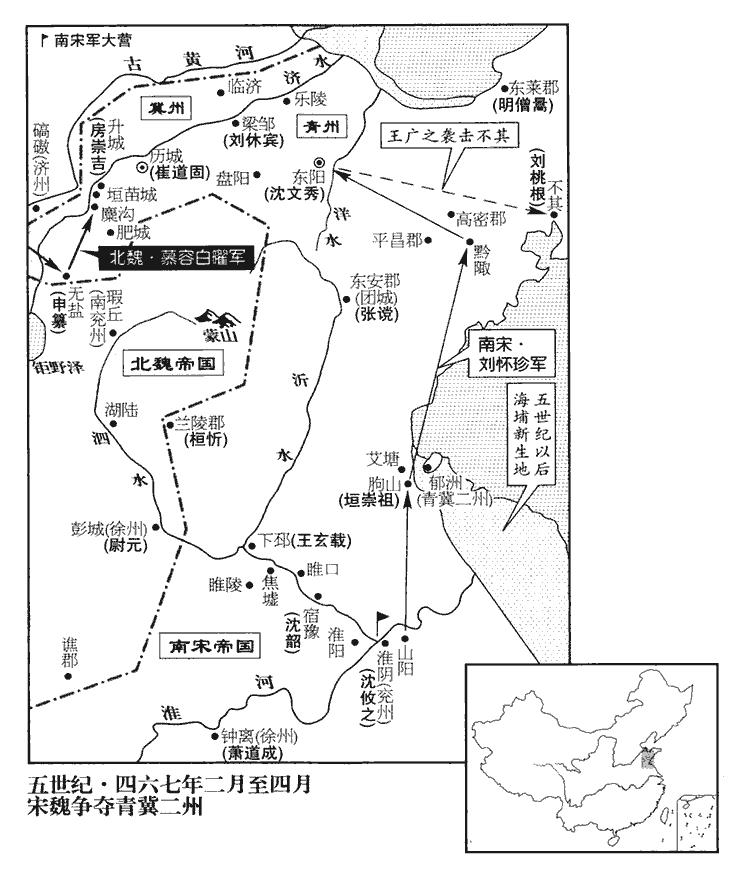
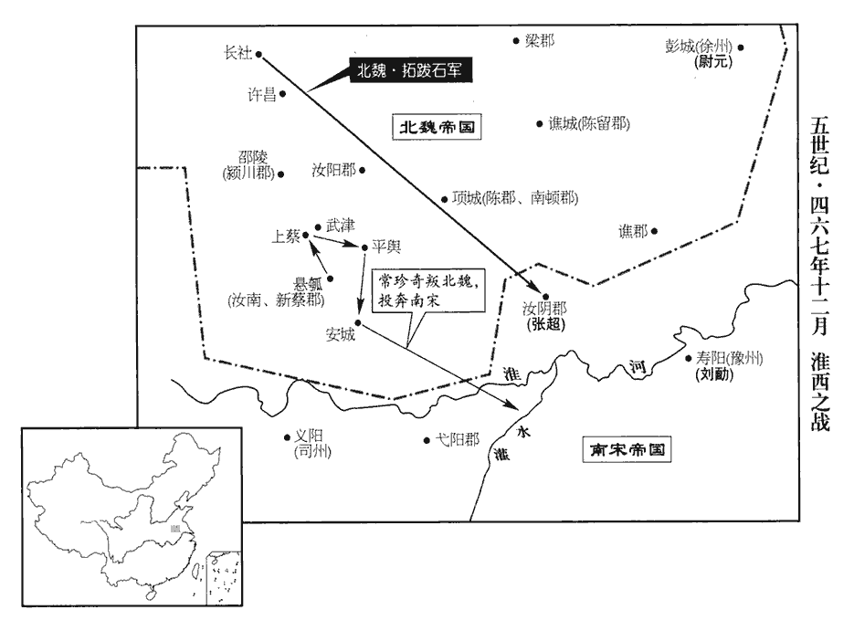
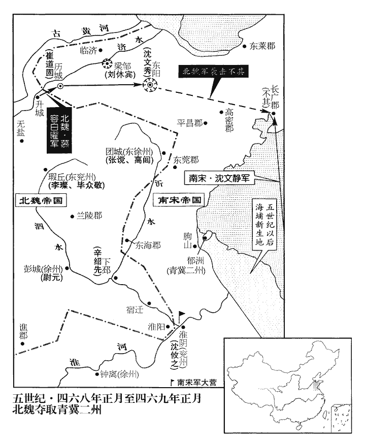
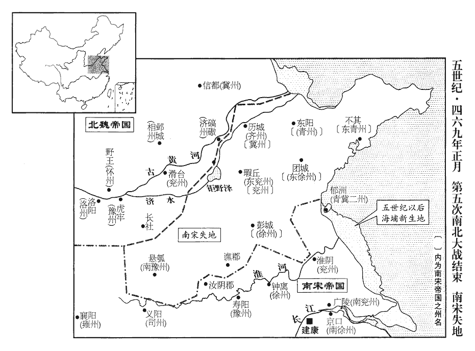

 宋紀十四起強圉協洽（丁未），盡上章閹茂（庚戌），凡四年。

# 太宗明皇帝中

## 泰始三年（丁未、四六七）

1春，正月，張永等棄城夜遁。《考異》曰：《宋•本紀》，去年冬，「永、攸之大敗，遂失淮北四州及豫州淮西地。」《宋略》，今年正月，「永、攸之師次彭城，虜掩其輜重，敗王穆之於武原，薛安都開彭城以納虜，永等引退；虜追之，王師敗績；畢捺nà亦舉兗州歸虜，遂失淮北之地。」《魏•帝紀》，去年九月，「常珍奇、薛安都內屬，張永、沈攸之擊安都，詔尉元救彭城，西河公石救懸瓠。十一月，畢衆敬內屬。十二月己未，次于秺dù，周凱、張永、沈攸之相繼退走。」今年正月癸巳，「尉元破永、攸之於呂梁東。閏月，沈文秀、崔道固舉州內屬。」按青冀今歲始叛宋，去年豈得已失淮北！安都爲永、攸之所逼，故降魏，豈得今年永、攸之始次彭城，安都始納魏兵乎！蓋去冬穆之等已敗退，今春永大敗耳。今從《後魏•帝紀》。會天大雪，泗水冰合，永等棄船步走，士卒凍死者太半，手足斷者什七八。尉元邀其前，薛安都乘其後，大破永等於呂梁‹江苏徐州东南›之東，《水經註》：泗水自彭城東南過呂縣南。泗水之上有石梁焉，故曰呂梁。尉，紆勿翻。死者以萬數，枕尸六十餘里，枕，職任翻。委棄軍資器械不可勝計；勝，音升。永足指亦墮，與沈攸之僅以身免，梁、南秦二州刺史垣恭祖等爲魏所虜。上‹刘彧，时年二十九›聞之，召蔡興宗，以敗書示之曰：「我愧卿甚！」永降號左將軍；攸之免官，以貞陽公領職，還屯淮陰‹江苏淮阴›。《漢志》，桂陽郡有湞陽縣。沈約《志》，宋泰始三年改湞爲貞，屬廣興公相。由是失淮北四州及豫州淮西之地。淮北四州，青、冀、徐、兗。豫州淮西，汝南、新蔡、譙、梁、陳、南頓、潁川、汝南、汝陰諸郡也。《考異》曰：《後魏•帝紀》：閏月，「沈文秀、崔道固舉州內屬。」《宋•索虜傳》曰：「永、攸之敗退，虜攻青、冀二州，執文秀、道固。又下書曰：『淮北三州民，自天安二年正月三十日壬寅昧爽已前罪，一切原免。』按青州破在五年，淮北三州，蓋謂徐、司、豫。壬寅二十日，壬子三十日也。

〖译文〗 [1]春季，正月，张永等放弃下城，连夜逃走。正赶上天下大雪，泗水冰封，船只不能移动，张永命部队放弃船只，徒步南奔。士卒冻死的有一大半，手脚折断的有十分之七八。尉元绕到前面堵截，薛安都在后面追杀，在吕梁的东面大败张永军，被杀者数以万计，六十里之遥，尸体重叠，抛弃的军用物资及武器，更无法计数。张永的脚趾也被冻掉，与沈攸之仅仅逃出性命。梁、南秦二州刺史垣恭祖等被北魏俘虏。明帝得到消息，召见尚书左仆射蔡兴宗，把大军战败的报告拿给他看，说：“在你面前，我深感惭愧。”贬张永为左将军，免除沈攸之的官职，命他以贞阳公的名义兼任现职，返回淮阴驻扎。从此，刘宋失去淮河以北四州和豫州的淮西地区。

裴子野論曰：昔齊桓‹姜小白›矜於葵丘‹河南民权东北›而九國叛；《公羊傳》曰：貫澤之會，齊桓公有憂中國之心，不召而至者，江人、黃人也。葵丘之會，桓公震而矜之，叛者九國。曹公不禮張松而天下分。見六十五卷漢獻帝建安十三年。一失豪釐，其差遠矣。太宗之初，威令所被，不滿百里，被，皮義翻。卒有離心，士無固色，而能開誠心，布款實，莫不感恩服德，致命效死，故西摧北蕩，㝢內褰qiān開。旣而六軍獻捷，方隅束手，天子欲賈其餘威，賈，音古。師出無名，長淮以北，倐shū忽爲戎。惜乎！若以嚮之虛懷，不驕不伐，則三叛奚爲而起哉！三叛，薛安都、畢衆敬、常珍奇也。高祖‹刘裕›蟣虱生介冑，蟣jǐ，居豨翻。蝨子也。蝨，色櫛翻。經啓疆埸；埸，音亦。後之子孫，日蹙百里。《大雅•召旻mín》之詩曰：昔先王受命，有如召公，日辟國百里；今也日蹙國百里。播穫堂構，豈云易哉！《書•大誥》曰：若考作室，旣底法，厥子乃弗肯堂，矧shěn肯構！厥父菑，厥子乃弗肯播，矧肯穫！易，以豉翻。

〖译文〗 裴子野论曰：从前，齐桓公在葵丘会盟时态度傲慢，九个国家同时背叛。曹操对张松没有礼遇，竟使中国三分天下。一点点疏忽，造成如此重大的差错。明帝刚刚登基之时，统治的地域不超过百里，士卒有离散之心，士大夫情绪也不稳定。但他能够敞开诚心，吐露真言，人们没有不感念他的恩德的，为他效忠，誓死不渝。所以才能西讨北征，平定叛乱。不久，各地捷报频传，割据势力束手就降。就在这时，明帝打算显示余威，而师出无名，以致淮河以北的土地，霎时间落入北魏之手，实在可惜呀！如果能像当初那样，虚怀若谷，不骄不躁，不夸耀自己功劳，那么三个叛贼，何至起兵对抗！武帝刘裕创业时，盔甲上都生虮虱，辛苦开辟疆域，可是，后代子孙，每天几乎都要丧失百里之地。要保住祖先的基业，谈何容易！

2魏尉元以彭城‹江苏徐州›兵荒之後，公私困竭，請發冀‹府信都，河北冀县›、相‹府邺城，河北临漳西南邺镇›、濟‹府碻磝，山东茌平西南›、兗‹府滑台，河南滑县›四州粟sù，相，息亮翻。濟，子禮翻。取張永所棄船九百艘，沿清‹泗水上游›運載，以賑新民；新民，謂新取徐州之民；謂沿清水而運載也。艘，蘇遭翻。賑，津忍翻。魏朝從之。朝，直遙翻。

〖译文〗 [2]北魏尉元因彭城兵荒马乱之后，无论官府还是民间，财力全都枯竭，所以特向朝廷请求拨发冀、湘、济、兖四州的库存粮食，用张永所抛弃的九百艘船只，顺清河运载，赈济新并入版图的居民，北魏朝廷批准了。

3魏東平王道符反於長安‹陕西西安›，殺副將駙馬都尉萬古眞等，副將，副鎭將也。將，卽亮翻；下同。丙午‹二十四›，司空和其奴等將殿中兵討之。丁未‹二十五›，道符司馬段太陽攻道符，斬之；以安西將軍陸眞爲長安鎭將以撫之。道符，翰之子也。秦王翰死於正平宗愛之禍。

〖译文〗 [3]北魏东平王拓跋道符在长安叛变，诛杀副将驸马都尉万古真等。丙午（二十四日），司空和其奴等率宫廷禁卫军讨伐他。丁未（二十五日），拓跋道符的司马段太阳攻击拓跋道符，并将其斩首。任命安西将军陆真为长安镇将，安抚军民。拓跋道符是拓跋翰的儿子。

4閏月，魏以頓丘王李峻爲太宰。

〖译文〗 [4]闰正月，北魏任命顿丘王李峻为太宰。

5沈文秀、崔道固爲土人所攻，土人，謂青‹府东阳，山东青州›、冀‹府历城，山东济南›二州之人。遣使乞降於魏，使，疏吏翻。降，戶江翻；下同。且請兵自救。

〖译文〗 [5]沈文秀、崔道固受到当地民军围攻，派使节前往北魏，请求归降，并请求派兵解救。

6二月，魏西河公石自懸瓠‹河南汝南›引兵攻汝陰‹安徽阜阳›太守張超，不克；此汝陰郡蓋猶治汝陰也；當在隋蔡州新蔡縣界。守，式又翻。《考異》曰：《宋•帝紀》云：「索虜寇汝陰，太守張景遠擊破之。」景遠，卽超也。《宋略》，「七月，張景遠先卒，汝陰城又陷」，亦誤也。今從《後魏書》。退屯陳項‹河南沈丘›，陳、項本二邑，時陳郡治項，因曰陳項。議還長社‹河南长葛›，待秋擊之。鄭羲曰：「張超蟻聚窮命，糧食已盡，不降當走，可翹足而待也。今棄之遠去，超修城浚隍，積薪儲穀，更來恐難圖矣。」石不從，遂還長社。爲石再攻汝陰‹安徽阜阳›不克張本。

〖译文〗 [6]二月，北魏西河公拓跋石自悬瓠率军攻击汝阴太守张超，没有攻克。于是退回陈项驻扎，打算撤到长社，等到秋季再进攻。郑羲说：“张超像一群蚂蚁聚在一起走投无路，粮食已经用尽。不是投降，就是逃走，不久便可看到结果。现在如果放弃他而远远离去，张超将加固城墙，挖深壕沟，储备粮草，再来时恐怕更难对付。”拓跋石不听，于是，返回长社。

 

7初，尋陽‹江西九江›旣平，帝遣沈文秀弟文炳以詔書諭文秀，又遣輔國將軍劉懷珍將馬步三千人與文炳偕行。未至，值張永等敗退，懷珍還鎭山陽‹江苏淮安›。文秀攻青州刺史明僧暠，僧暠起兵見上卷上年。暠hào，古老翻。帝使懷珍帥龍驤將軍王廣之將五百騎、步卒二千人浮海救之，帥，讀曰率。驤，思將翻。將，卽亮翻。騎，奇寄翻。至東海，僧暠已退保東萊‹山东莱州›。懷珍進據朐qú城‹江苏连云港›，衆心兇懼，欲且保郁洲‹江苏连云港东小岛›，兇，許拱翻。兇，恐懼聲。朐城，漢東海之朐縣城也。《水經註》曰：朐山西側，有朐縣故城。東北海中有大洲，故謂之郁洲。朐，音劬qú。懷珍曰：「文秀欲以青州‹山东半岛›歸索虜，索，昔各翻。計齊之士民，安肯甘心左衽邪！今揚兵直前，宣布威德，諸城可飛書而下；柰何守此不進，自爲沮撓乎！」沮，在呂翻。撓，奴敎翻，屈也。遂進，至黔qián陬zōu‹山东胶州西南›，黔陬縣，前漢屬琅邪郡，後漢屬東萊郡，晉屬城陽郡，宋屬高密郡。陬，子侯翻。《隋志》：膠州膠西縣，舊曰黔陬。杜佑曰：漢黔陬縣故城，在密州諸城縣東北。文秀所署高密‹山东高密›、平昌‹山东安丘›二郡太守棄城走。高密，漢郡。平昌郡，魏文帝分城陽立。《宋志》，高密郡領黔陬、淳于、高密、夷安、營陵、昌安；平昌郡領安丘、平昌、東武、琅邪、朱虛。《五代志》：黔陬縣舊置平昌郡。懷珍送致文炳，達朝廷意，文秀猶不降；降，戶江翻；下同。百姓聞懷珍至，皆喜。文秀所署長廣‹府不其，山东即墨›太守劉桃根將數千人戍不其城‹山东即墨›。不其縣，前漢屬琅邪郡，後漢屬東萊郡，晉分屬長廣郡。唐萊州膠水縣卽長廣郡地。章懷太子賢曰：不其故城，在今萊州卽墨縣西南。其，音基。懷珍軍於洋水‹流经山东寿光›，《水經》：巨洋水出朱虛縣東泰山北，過縣西北，過臨朐縣東，又北過劇縣西，又東北過壽光縣西，又東北入于海。師古曰：洋，音祥。衆謂且宜堅壁伺隙，懷珍曰：「今衆少糧竭，少，詩沼翻。懸軍深入，正當以精兵速進，掩其不備耳。」乃遣王廣之將百騎襲不其城，拔之。文秀聞諸城皆敗，乃遣使請降，使，疏吏翻。帝復以爲青州刺史。崔道固亦請降，復以爲冀州刺史。懷珍引還。懷珍旣還，兵勢不接，故青、冀二州尋爲魏有。復，扶又翻。

〖译文〗 [7]当初，寻阳政权平定后，明帝派遣沈文秀的弟弟沈文炳，携带诏书去招抚沈文秀，又派遣辅国将军刘怀珍率步骑兵三千人，与沈文炳同行。还没到达，正赶上张永攻击彭城的大军溃败，刘怀珍退回山阳镇守。沈文秀攻击青州刺史明僧，明帝命刘怀珍指挥龙骧将军王广之率骑兵五百人、步兵两千人，渡海前往救援。刘怀珍进抵东海，明僧已退守东莱。刘怀珍进入朐城据守，军心十分不安，有人主张退保郁州，刘怀珍说：“沈文秀打算以青州归附魏虏，古齐国的士民，怎么甘心让衣襟开到左边？当今应该驱兵直入，宣扬皇帝的恩德和威严，各地城池，送去一封书信，便可收复，何必守在这里，不肯出动，自己阻挠自己。”于是继续前进，抵达黔陬。沈文秀任命的高密、平昌二郡太守弃城逃跑。刘怀珍把沈文炳送到东阳，传达朝廷旨意，沈文秀还是拒绝投降。但百姓听到官军将领刘怀珍到来，皆大欢喜。沈文秀任命的长广太守刘桃根率数千人，驻防不其城。刘怀珍率军驻扎洋水，众将领都主张筑城备战，刘怀珍说：“现在我们人少，粮草又不足，孤军深入敌境，正应当命精锐部队迅速进攻，趁他们不备进行突袭。”于是派王广之率一百名骑兵，袭击不其城并攻克。沈文秀得到各城全部失败的消息，于是立即派使节请求投降，明帝任命沈文秀仍为青州刺史。崔道固也请求投降，明帝也任命他为冀州刺史。刘怀珍随即撤退。

8魏濟陰王小新成卒。濟，子禮翻。

〖译文〗 [8]北魏济阴王拓跋小新成去世。

9沈攸之之自彭城還也，留長水校尉王玄載守下邳‹江苏睢宁北古邳镇›，校，戶敎翻。積射將軍沈韶守宿豫‹江苏宿迁›，睢陵‹江苏睢宁›、淮陽‹安徽宿州东北›皆留兵戍之。玄載，玄謨之從弟也。王玄謨以功名著於太祖、世祖二朝。從，才用翻。時東平太守申纂守無鹽‹山东东平东›，幽州刺史劉休賓守梁鄒‹山东邹平北›，梁鄒縣，漢屬濟南郡。幷州刺史清河‹山东淄博南›房崇吉守升城‹山东长清西南›，魏收《志》：東太原郡太原縣治升城，其地在唐濟州長清縣界。輔國將軍清河‹山东淄博南›張讜守團城‹山东沂水县›，《水經註》：琅邪郡東莞縣，春秋之鄆邑，今有鄆亭在團城東北四十里。及兗州刺史王整、蘭陵‹山东滕州东南›太守桓忻，沈約《志》：蘭陵太守治昌慮，漢舊縣也。肥城‹山东肥城›、糜溝‹肥城境›、垣苗‹山东长清西南›等戍皆不附於魏。肥城縣，前漢屬泰山郡，後漢屬濟北郡，晉罷，宋復置濟北郡於肥城。魏收《志》：糜溝、垣苗二城亦在東太原郡大原縣界。又據《水經註》：濟水自平陰城西東北流，逕垣苗城西。宋武帝西征長安，令垣苗鎭此，故俗以爲稱。濟水又東北過盧縣北。賢曰：肥城縣故城，在今濟州平陰縣東南。則此三戍皆在漢太山郡盧縣及肥城縣界，至後漢和帝永安二年，始分太山爲濟北郡。休賓，乘民之兄子也。劉乘民見上卷上年。

〖译文〗 [9]沈攸之从彭城败回时留下长水校尉王玄载驻防下邳，积射将军沈韶驻防宿豫，睢陵、淮阳也都留下部队驻守。王玄载是王玄谟的堂弟。当时，东平太守申纂驻守无盐，幽州刺史刘休宾驻守梁邹，并州刺史清河人房崇吉驻守升城，辅国将军、清河人张谠驻守团城，交州刺史王整、兰陵太守桓忻，还有肥城、糜沟、垣苗等地的驻军，都拒绝投靠北魏。刘休宾是刘乘民的侄儿。

魏遣平東將軍長孫陵等將兵赴青州，長，知兩翻。征南大將軍慕容白曜將騎五萬爲之繼援。白曜，燕太祖之玄孫也。燕王皝，號太祖。白曜至無鹽‹山东东平东›，欲攻之；將佐皆以爲「攻具未備，不宜遽進。」左司馬范陽‹河北涿州›酈範曰：「今輕軍遠襲，深入敵境，豈宜淹緩！且申纂必謂我軍來速，不暇攻圍，將不爲備；師速而疾者，略也；略，謂略地也，無暇於攻城圍邑。白曜以形形申纂，故料其不爲備也。今若出其不意，可一鼓而克。」白曜曰：「司馬策是也。」乃引兵僞退。申纂不復設備，白曜夜中部分，復，扶又翻。分，扶問翻。三月，甲寅‹三›旦，攻城，食時，克之；纂走，追擒，殺之。《考異》曰：《宋略》云「七月，纂戰死。」蓋贈官之月。今從《魏•帝紀》。白曜欲盡以無鹽人爲軍賞，酈範曰：「齊，形勝之地，宜遠爲經略。今王師始入其境，人心未洽，連城相望，咸有拒守之志，苟非以德信懷之，未易平也。」易，以豉翻。白曜曰：「善！」皆免之。

〖译文〗 北魏派平东将军长孙陵等领兵，进攻青州，征南大将军慕容白曜率领骑兵五万人，继续进发作为后援。慕容白曜是前燕国燕太祖的玄孙。慕容白曜抵达崐无盐，想要攻城，部属将领及僚佐都认为攻城的器具还不完备，不宜马上进攻。左司马范阳人郦范说：“我们用轻装部队远途偷袭，深入敌人领土，怎么能作久留的打算！而且申纂一定认为我们来得太快，还来不及围攻，所以没有戒备，现在如果出其不意，可以一战而胜。”慕容白曜说：“司马的主意很对。”于是率兵假装撤退。申纂果然不再戒备，慕容白曜在午夜时分进行布署。三月，甲寅（初三），凌晨，向无盐城进攻，早饭时，攻破。申纂逃走，被追捕生擒并斩首。慕容白曜打算将无盐全城人一律当作战利品赏赐部下，郦范说：“古齐国地区，形势重要，应当有长远经营计划。而今，王师刚刚入境，人心还没有归顺，城池相连，互相观望，都有固守不降的志向，假如不以恩德和信誉安抚他们，不容易平定啊。”慕容白曜说：“好！”便把百姓一律赦免。

白曜將攻肥城‹山东肥城›，酈範曰：「肥城雖小，攻之引日；勝之不能益軍勢，不勝足以挫軍威。彼見無鹽之破，死傷塗地，不敢不懼；若飛書告諭，縱使不降，亦當逃散。」此卽李左車敎韓信以破趙之勢而喻燕故智也。降，戶江翻；下同。白曜從之，肥城果潰，獲粟三十萬斛。白曜謂範曰：「此行得卿，三齊不足定也。」遂取垣苗、糜溝二戍，一旬中連拔四城，威震齊土。史言慕容白曜能用酈範之計以取勝。

〖译文〗 慕容白曜将要进攻肥城，郦范说：“肥城虽然很小，但攻打起来，很费时间，胜了他不能增加我们的声势，失败则有损于我们的军威。他们看到无盐城被攻陷的惨状，遍地死伤，也不会不感到恐惧，如果送去一封警告信，他们即使不投降，也会四处逃散。”慕容白曜同意，肥城果然崩溃，北魏大军缴获粟米三十万斛。慕容白曜对郦范说：“这次出征，有你出谋，三齐不怕不能平定。”于是夺取垣苗、糜沟二城。十天之内，一连攻克四城，声威震撼齐地。

10丙子‹二十五›，以尚書左僕射蔡興宗爲郢州刺史。

〖译文〗 [10]丙子（二十五日），明帝任命尚书左仆射蔡兴宗为郢州刺史。

11房崇吉守升城‹山东长清西南›，勝兵者不過七百人。勝，音升，任也。勝兵者，謂能操五兵而戰也。慕容白曜築長圍以攻之，自二月至于夏四月，乃克之。白曜忿其不降，欲盡阬城中人，參軍事昌黎‹辽宁朝阳›韓麒麟諫曰：「今勍敵在前而阬其民，勍qíng，渠京翻。自此以東，諸城人自爲守，不可克也。師老糧盡，外寇乘之，此危道也。」白曜乃慰撫其民，各使復業。

〖译文〗 [11]刘宋房崇吉坚守升城，能作战的士卒不过七百人。北魏慕容白曜兴筑长墙，发动攻击，自二月攻到夏季四月，才攻陷城池。慕容白曜对这么一个小城誓死不投降，大为忿怒，打算把城内百姓全部活埋，参军事昌黎人韩麒麟劝阻说：“眼下强敌在前，而坑杀他们的百姓，恐怕从此向东，各个城的人都会坚守，无法攻克。军队出征太久，粮食吃尽，外面贼寇乘机进攻，这可是危险之道。”慕容白曜于是对百姓慰问安抚，使他们恢复正常生活。

崇吉脫身走。崇吉母傅氏，申纂妻賈氏，與濟州刺史盧度世有中表親，然已疏遠。濟，子禮翻。及爲魏所虜。度世奉事甚恭，贍給優厚。親者毋失其爲親，故者毋失其爲故，其盧度世之謂乎。度世閨門之內，和而有禮。雖世有屯夷，屯，陟倫翻，多難也。夷，平易也。家有貧富，百口怡怡，豐儉同之。史言盧度世有行。

〖译文〗 房崇吉只身逃亡，他的母亲傅氏及申纂的妻子贾氏，与北魏济州刺史卢度世原是表亲，不过关系早已疏远。等到傅、贾两人被北魏军俘虏，卢度世对待她们十分恭敬，生活供给也非常优厚。卢度世家门之内，详和而有礼节，虽然时势有时动乱有时安定，财产有的贫穷有的富有，但百口之家，心情欢快，苦乐共同承担。

崔道固閉門拒魏。沈文秀遣使迎降於魏，請兵援接，白曜欲遣兵赴之。酈範曰：「文秀室家墳墓皆在江南，沈文秀，吳興武康人。擁兵數萬，城固甲堅，強則拒戰，屈則遁去。我師未逼其城，無朝夕之急，何所畏忌而遽求援軍！且觀其使者，視下而色愧，語煩而志怯，此必挾詐以誘我，不可從也。春秋之時，諸侯交兵，謀人之軍師者，多能以此覘敵；酈範亦祖其故智耳。誘，音酉。不若先取歷城，克盤陽‹山东临朐东南›，般陽縣，漢屬濟南郡。應劭曰：在般水之陽。師古曰：般，音盤。劉昫曰：唐淄州淄川縣，漢盤陽縣也。下梁鄒，平樂陵‹山东博兴›，晉武帝分平原立樂陵郡，宋文帝置樂陵郡於故千乘地，皆在隋、唐青州界。然後按兵徐進，不患其不服也。」白曜曰：「崔道固等兵力單弱，不敢出戰；吾通行無礙，直抵東陽，彼自知必亡，故望風求服，夫又何疑！」範曰：「歷城兵多糧足，非朝夕可拔。文秀坐據東陽，爲諸城根本。今多遣兵則無以攻歷城，少遣兵則不足以制東陽；少，詩沼翻。若進爲文秀所拒，退爲諸城所邀，腹背受敵，必無全理。願更審計，無墮賊彀中。」彀gòu，古候翻。張子厚曰：彀，指拇也。彀弓旣持滿，以指拇爲度，而發矢以志於中。墮彀中者，言敵彀弓指我，而我不知避，則矢必集于我而受其害。白曜乃止。文秀果不降。

〖译文〗 崔道固关闭城门抗拒北魏军。沈文秀却派人向北魏投降，请求派兵增援，慕容白曜打算派兵前往。郦范说：“沈文秀的家室和祖先坟墓，都在长江以南，掌握重兵数万，城墙坚固，武器精良，强大时挺身作战，衰弱时起身逃走，我军并未逼到他的城下，他也没有燃眉之急，有什么可怕的，而请求我们派兵增援？并且，我看他的使节，眼睛一直向下看，脸色惭愧，说话罗嗦而胆怯，这一定心怀奸诈，引诱我们走进圈套，不可轻信。不如先夺取历城、盘阳，再拿下梁邹、乐陵，然后慢慢向前推进，不怕他们不屈服。”慕容白曜说：“崔道固等兵力单薄，不敢出战，我们可以通行无阻，一直抵达东阳，沈文秀自知必亡，所以望风投降，又有什么可怀疑的！”郦范说：“历城兵力雄厚，粮食充足，不是早晚之间就能攻克的。沈文秀雄据东阳，是各城的根本。现在派兵太多，则无法攻打历城；派兵太少，又不足以制服东阳。如果前进遭沈文秀抵御，后退又被各城联军阻击，腹背受敌，绝对没有安全的道理。请再三考虑，不要落入贼寇的圈套。”慕容白曜才停止，而沈文秀果然不降。

魏尉元上表稱：「彭城賊之要藩，不有重兵積粟，則不可固守；若資儲旣廣，雖劉彧師徒悉起，不敢窺淮北之地。」彧，於六翻。又言：「若賊向彭城，必由清、泗過宿豫，歷下邳‹江苏睢宁北古邳镇›；趨青州，亦由下邳、沂水‹泗水支流，于江苏睢宁北古邳镇注入泗水›經東安‹山东沂水县›；東安縣，前漢屬城陽國，後漢屬琅邪郡，晉屬東莞郡，惠帝元康七年分東莞置東安郡，唐沂州沂水縣卽東安郡地。趨，七喻翻。此數者，皆爲賊用師之要。今若先定下邳，平宿豫，鎭淮陽‹江苏淮阴西›，戍東安，則青、冀諸鎭可不攻而克；若四城不服，青、冀雖拔，百姓狼顧，猶懷僥倖之心。僥，堅堯翻。臣愚以爲宜釋青、冀之師，先定東南之地，斷劉彧北顧之意，斷，丁管翻。絕愚民南望之心；夏水雖盛，無津途可由，冬路雖通，無高城可固。如此，則淮北自舉，暫勞永逸。兵貴神速，久則生變；若天雨旣降，彼或因水通，運糧益衆，規爲進取，恐近淮之民翻然改圖，青、冀二州猝未可拔也。」《考異》曰：《尉元傳》，先上表論取四城利害，後乃云「沈攸之欲援下邳，遣孔道恭擊破之。」按元以泰始二年九月受詔救薛安都，此表云「受命出疆，再離寒暑。」又云：「今雖向熱，猶可行師。」則似上表時在四年春末夏初也。又按沈攸之以三年八月出師，尋卽敗退；則上表當在攸之敗後。今此表但言陳顯達循宿豫，不言攸之救下邳。又慕容白曜以四年二月十七日拔歷城，而此表欲「釋青、冀之師，先定東南之地」，則此表不在其年春末夏初決矣。蓋「再」當作「載」，是語助之辭，非謂兩經寒暑也。故置於此。

〖译文〗 北魏尉元上书朝廷说：“彭城是贼寇的重要基地，如果不驻防重兵，储存粮草，就不能守住。如果军用物资丰富，就是刘出动全部军队，也不敢窥伺淮北之地。”又说：“如果贼寇攻击彭城，一定经由清水、泗水，穿过宿豫、下邳。如果攻击青州，也要从下邳顺着沂水，穿过东安。这几个地方，都是贼寇用兵的要地。现在，如果我们能先占领下邳，平定宿豫，驻防淮阳、戍守东安，那么青州、冀州各个据点便可以不攻而破。如果这四个城池不肯屈服，那么青州、冀州虽然攻破，居民百姓回望刘，仍怀侥幸的心理。以我的愚见，应该召回逗留青、冀二州的部队，先平定东南地区，断了刘北伐的念头，清除愚民回归南方的愿望。使他们明白：夏季雨水虽大，却没有河道可走；冬天陆路虽通，却没有高大的城墙可用来固守。这样，淮河以北的土地就可以占领。暂时辛劳，可以换来永久安逸。兵贵神速，时间长就容易发生变化。如果进入雨季，对方因河路畅通，得以运送粮食，增派军队，再去进攻，恐怕淮河两岸居民将改变立场，青、冀二州仓促之间也就难以攻克了。”

12五月，壬戌‹十二›，以太子詹事袁粲爲尚書右僕射。

〖译文〗 [12]五月，壬戌（十二日），刘宋任命太子詹事袁粲为尚书右仆射。

13沈攸之自送運米至下邳，沈攸之自淮陰至下邳。魏人遣清、泗間人詐攸之云：「薛安都欲降，降，戶江翻。求軍迎接。」軍副吳喜請遣千人赴之，攸之不許。旣而來者益多，喜固請不已，攸之乃集來者告之曰：「君諸人旣有誠心，若能與薛徐州子弟俱來者，皆卽假君以本鄕縣，唯意所欲；如其不爾，無爲空勞往還。」自是一去不返。以攸之知其情也。攸之使軍主彭城陳顯達將千人助戍下邳而還。將，卽亮翻；下同。還，從宣翻，又如字。

〖译文〗 [13]沈攸之亲自运粮到下邳。北魏军队不断派清水、泗水间居民向沈攸之谎报说：“薛安都打算回归朝廷，请求派兵迎接。”沈攸之部队的军副吴喜请沈攸之派一千人前往，沈攸之不允许。不久，通风报信的人越来越多，吴喜坚持派军，沈攸之就把来报信的那些人集中起来，宣布说：“各位既有这份诚心，如果有能与薛安都的子弟同来的，我就任命他为本乡本县的地方官，满足你们的意愿。如果不能，就不必跑来跑去。”那些人于是一去不复返。沈攸之命军主彭城人陈显达率领一千人进驻下邳协助防守，自己则返回基地。

薛安都子令伯亡命梁、雍之間，雍，於用翻。聚黨數千人，攻陷郡縣。秋，七月，雍州刺史巴陵王休若遣南陽‹河南南阳›太守張敬兒等擊斬之。

〖译文〗 薛安都的儿子薛令伯，在梁州、雍州之间奔波，纠集党羽数千人，攻陷郡县。秋季，七月，雍州刺史巴陵王刘休若，派南阳太守张敬儿等击斩薛令伯。

14上‹刘彧›復遣中領軍沈攸之等擊彭城。攸之以爲清、泗方涸，糧運不繼，固執以爲不可。使者七返，上怒，強遣之。復，扶又翻。強，其兩翻。《考異》曰：《宋•沈攸之傳》、《宋略》皆云：帝怒攸之云：「卿若不行，便可使吳喜獨去。」按《喜傳》乃無與攸之討彭城事。《後魏書》作吳僖公，不知卽吳喜，爲別一人也？按《南史》亦有謂吳喜爲吳喜公者。八月，壬寅‹二十三›，以攸之行南兗州‹府广陵›刺史，將兵北出；使行徐州‹府钟离，安徽凤阳东北临淮关›事蕭道成將千人鎭淮陰‹江苏淮阴›。去年僑立徐州於鍾離，今使蕭道成屯淮陰，爲沈攸之後鎭。道成收養豪俊，賓客始盛。爲後蕭道成取宋張本。

〖译文〗 [14]明帝再次下诏命中领军沈攸之等攻打彭城。沈攸之认为清水、泗水干涸，粮食不能源源不断地供应，坚持认为不可采取军事行动。派去的使节往返七次，明帝大怒，强迫沈攸之出兵。八月，壬寅（二十三日），任命沈攸之代理南兖州刺史，率军北上，派代理徐州事务的萧道成率一千人进驻淮阴。萧道成广交各路豪杰，他手下人才济济。

魏之入彭城也，事見上卷上年。垣崇祖將部曲奔朐山‹江苏连云港›，據之，魏收曰：朐縣，漢屬東海；晉曰臨朐，屬琅邪郡；有朐山臨海瀕。今按《晉志》，臨朐屬東莞郡，後魏復曰朐，屬琅邪郡。朐，音劬。遣使來降；蕭道成以爲朐山戍主。朐山瀕海孤絕，人情未安，崇祖浮舟水側，欲有急則逃入海。魏東徐州刺史成固公戍圂hùn城‹山东沂水县境›，魏收《地形志》：魏置南青州於圂城。圂城當在唐沂州沂水縣界。圂，戶困翻。崇祖部將有罪，亡降魏。成固公遣步騎二萬襲朐山，將，卽亮翻。降，戶江翻。騎，奇寄翻；下同。去城二十里；崇祖方出送客，城中人驚懼，皆下船欲去，崇祖還，謂腹心曰：「虜非有宿謀，承叛者之言而來耳，易誑也。易，以豉翻。誑，居況翻。今得百餘人還，事必濟矣。但人情一駭，不可斂集，卿等可亟去此一里外，大呼而來云：『艾塘‹江苏连云港西›義人已得破虜，呼，火故翻。艾塘當在唐海州懷仁縣界；北齊於此置義塘郡。宋人謂淮北起兵拒魏者爲義人。須戍軍速往，相助逐之。』舟中人果喜，爭上岸。上，時掌翻。崇祖引入，據城；遣羸弱入島，島，海中山也。羸，倫爲翻。人持兩炬火，登山鼓譟。魏參騎以爲軍備甚盛，乃退。參騎，候騎也。上以崇祖爲北琅邪‹山东临沂›、蘭陵‹山东滕州东南›二郡太守。

〖译文〗 北魏军队进入彭城时，垣崇祖率部曲投奔朐山，派人到朝廷请求归降。萧道成便任命垣崇祖为镇守朐山的主将。朐山紧邻大海，荒凉孤单，与世隔绝，人心不安。垣崇祖把船集中在海边，打算一旦发生意外，就逃向大海。北魏东徐州刺史成固公驻防城。垣崇祖一个部将因为犯罪，逃跑去投降了北魏军。成固公派步、骑兵两万人袭击朐山，距城只有二十里。垣崇祖恰恰出城送客，城中百姓惊恐万状，全都跑到船上，准备乘船逃走。垣崇祖回城后，对心腹官员说：“胡虏这次进攻，并不是有计划的行动，不过是听了叛贼的报告而临时发兵，所以容易使他们中计。现在，只要有一百余人回到城里，事情就可以成功。不过，人心已乱，不可能使他们集结，你们可以迅速跑到一里以外，大声呼喊，飞奔而来说：‘艾塘义勇军已攻破胡虏，等待驻防军的支援，共同追击。’”船上的人果然大为兴奋，争相登岸。垣崇祖引导他们回城，将病弱者送到海岛，人人手持两枝火把，登山擂鼓、呐喊。北魏的骑兵军官以为守军力量强大，于是撤退。明帝任命垣崇祖为北琅邪、兰陵二郡太守。

垣榮祖亦自彭城奔朐山，以奉使不效，奉使說薛安都，見上卷上年。畏罪不敢出，往依蕭道成于淮陰。榮祖少學騎射，或謂之曰：「武事可畏，謂矢刃交乎前，生死在於須臾也。少，詩照翻。何不學書！」榮祖曰：「昔曹公父子上馬橫槊，下馬談詠，謂魏王操及文帝兄弟也。上，時掌翻。槊，色角翻。此於天下，可不負飲食矣。君輩無自全之伎，伎，渠綺翻，能也，藝也。何異犬羊乎！」此犬羊，直謂其無防身之術耳。劉善明從弟僧副將部曲二千人避魏居海島，道成亦召而撫之。從，才用翻。

〖译文〗 垣荣祖也从彭城逃到朐山，因奉命游说薛安都不成，恐怕皇帝怪罪下来，不敢露面，前往淮阴投靠萧道成。垣荣祖少年时代就学习骑马、射箭，曾有人对他说：“舞枪弄刀，十分危险，为什么不走读书之路！”垣荣祖说：“从前，曹操父子上马手舞长矛，下马提笔写诗，这样生在天地之间，才可说是不幸负天地养育之恩。像你们这些读书人，连保护自己的能力都没有，跟犬羊有什么区别！”刘善明的堂弟刘僧副，率自己的军队两千人，逃避北魏，躲到一个海岛上。萧道成对他们招降，加以安抚。

15魏於天宮寺作大像，高四十三尺，高，居傲翻。用銅十萬斤，黃金六百斤。

〖译文〗 [15]北魏在天宫寺铸造巨大佛像，高四十三尺，共用铜十万斤，黄金六百斤。

16魏尉元遣孔伯恭帥步騎一萬拒沈攸之，帥，讀曰率。騎，奇寄翻。又以攸之前敗所喪士卒瘃zhú墮膝行者悉還攸之，以沮其氣。喪，息浪翻。瘃，陟玉翻，寒瘡也。沮，在呂翻。上尋悔遣攸之等，復召使還，復，扶又翻。攸之至焦墟，去下邳五十餘里，陳顯達引兵迎攸之至睢清口‹江苏宿迁睢水入泗水处›，清水合於泗水，故泗水亦得清水之名。《水經註》：泗水過下邳縣西，又東南得睢水口。泗水又東南入于淮水，故謂之睢清口。睢，音雖。伯恭擊破之。攸之引兵退，伯恭追擊之，攸之大敗，龍驤將軍姜彥産之等戰沒。攸之創重，驤，思將翻。創，初良翻。入保顯達營；丁酉‹十八›夜，衆潰，攸之輕騎南走，委棄軍資器械以萬計，還屯淮陰。

〖译文〗 [16]北魏的尉元，派遣孔伯恭率步、骑兵一万人，抗拒刘宋北伐军沈攸之，把正月战役中俘虏的双脚冻烂、只能用膝盖爬行的沈攸之的部属送还给沈攸之，用以打击他的士气。明帝强迫沈攸之等出发不久，也忽然后悔，又派人让他回军。此时沈攸之已前进到焦墟，距离下邳只有五十余里。陈显达率军迎接沈攸之，在睢清口会师，孔伯恭发动攻击，大破陈显达。沈攸之于是当即撤退，孔伯恭尾随追击，沈攸之大败，龙骧将军姜产之等战死，沈攸之也身负重伤，逃入陈显达的营垒。丁酉（十八日），深夜，陈显达营垒崩溃，沈攸之乘轻骑向南逃命，丢弃的军用物资和武器数以万计。沈攸之逃回淮阴基地驻扎。

尉元以書諭徐州‹府下邳›刺史王玄載，玄載棄下邳走，沈攸之留王玄載戍下邳，因領徐州刺史。魏以隴西‹甘肃陇西›辛紹先爲下邳太守。守，式又翻。紹先不尚苛察，務舉大綱，敎民治生禦寇而已；由是下邳安之。治，直之翻。

〖译文〗 尉元写信给刘宋徐州刺史王玄载，王玄载于是放弃下邳逃走。北魏任命陇西人辛绍先为下邳太守。辛绍先处理事情，反对繁琐苛刻，凡事只把握纲要。他只是教人民生产，以及防御贼寇，如此而已。从此，下邳百姓安居乐业。

孔伯恭進攻宿豫，宿豫戍將魯僧遵亦棄城走。魏將孔大恆等將千騎南攻淮陽‹江苏淮阳西，角城›，淮陽太守崔武仲焚城走。尉元取下邳等城，不愆于素，使沈攸之不敗於再舉，元亦未敢輕動也。淮陽太守治角城，角城在唐泗州宿遷縣界。宿遷，卽宿豫，唐避諱改焉。

〖译文〗 孔伯恭进攻宿豫，宿豫守将鲁僧遵也弃城逃跑。北魏将领孔大恒等率一千多骑兵，南下攻击淮阳，淮阳太守崔武仲纵火烧城后逃走。

慕容白曜進屯瑕丘‹山东兖州›。崔道固之未降也，降，戶江翻；下同。綏邊將軍房法壽爲王玄邈司馬，屢破道固軍，歷城人畏之。崔道固鎭歷城，其軍皆歷城人。及道固降，皆罷兵。道固畏法壽扇動百姓，迫遣法壽使還建康。會從弟崇吉自升城‹山东长清西南›來，從，才用翻。以母妻爲魏所獲，謀於法壽。法壽雅不欲南行，雅，素也。怨道固迫之。時道固遣兼治中房靈賓督清河、廣川二郡事，戍磐【嚴：「磐」改「盤」；下同。】陽‹山东临朐东南›，法壽乃與崇吉謀襲磐陽，據之，降於慕容白曜，以贖崇吉母妻。道固遣兵攻之，白曜自瑕丘遣將軍長孫觀救磐陽，磐陽，卽盤陽。道固兵退。白曜表冠軍將軍韓麒麟與法壽對爲冀州刺史，冠，古玩翻。以法壽從弟靈民、思順、靈悅、伯憐、伯玉、叔玉、思安、幼安等八人皆爲郡守。此冀州，卽宋所置冀州，以命法壽。郡守，卽守冀州所領廣川、平原、清河、樂陵、魏郡、河間、頓丘、高陽、勃海，皆僑郡也。

〖译文〗 慕容白曜进兵驻扎瑕丘。崔道固拥护寻阳政权时，朝廷所属绥边将军房法寿担任王玄邈的司马，屡次击败崔道固军。以历城人为主的崔道固军对他非常畏惧。崔道固归降朝廷后，双方才都停战。但崔道固害怕房法寿煽动百姓继续与他为难，所以，用压力迫使房法寿返回建康。正巧，房法寿的堂弟房崇吉从升城逃来，因母亲和妻子被北魏俘虏，向房法寿请教对策。房法寿内心实在不愿去江南，所以对崔道固逼迫他南下十分怨恨。当时，崔道固派遣兼治中房灵宾任督清河、广川二郡事，驻防磐阳。房法寿于是与房崇吉袭击磐阳，占领那里向慕容白曜投降，用来赎回房崇吉的母亲和妻子。崔道固派军进攻他们，慕容白曜从瑕丘派将军长孙观，解救磐阳，崔道固撤退。慕容白曜表奏北魏，推荐冠军将军韩麒麟与房法寿同时任冀州刺史，房法寿的堂弟房灵民、房思顺、房灵悦、房伯怜、房伯玉、房叔玉、房思安、房幼安等八人，都当郡守。

白曜自瑕丘引兵攻崔道固於歷城，遣平東將軍長孫陵等攻沈文秀於東陽。道固拒守不降，白曜築長圍守之。陵等至東陽，文秀請降；陵等入其西郭，縱士卒暴掠。文秀悔怒，閉城拒守，擊陵等，破之。《考異》曰：《文秀傳》云：「八月，虜蜀郡公拔式入西郭。」今從《慕容白曜傳》。陵等退屯清西，屢進攻城，不克。

〖译文〗 慕容白曜自瑕丘率军攻击崔道固据守的历城，另外派平东将军长孙陵等攻击沈文秀据守的东阳。崔道固登城抵抗，不肯投降，慕容白曜构筑长墙包围了他。长孙陵等抵达东阳，沈文秀请求投降，长孙陵等进入东阳西门外城，放纵士卒凶残横行，大肆抢夺。沈文秀既后悔又愤怒，关闭城门，攻击长孙陵等，击溃长孙陵的部队，重新据守东阳。长孙陵等撤退到清水以西，屡次攻城，没有攻克。

17癸卯‹二十四›，大赦。

〖译文〗 [17]癸卯（二十四日），刘宋宣布大赦。

18戊申‹二十九›，魏主‹拓跋弘，时年十四›李夫人生子宏。夫人，惠之女也。李惠蓋李貴人兄弟。貴人，魏主之母，賜死，見一百二十八卷宋孝建三年，夫人則惠之女而宏之母也。宏，是爲魏孝文帝。馮太后自撫養宏；頃之，還政於魏主。魏主始親國事，勤於爲治，治，直吏翻。賞罰嚴明，拔清節，黜貪汙，於是魏之牧守始有以廉潔著聞者。

〖译文〗 [18]戊申（二十九日），北魏国主的李夫人生下皇子拓跋宏。李夫人是李惠的女儿。冯太后亲自扶养拓跋宏。不久，把国家政事重新交还给北魏国主拓跋弘，拓跋弘开始亲自处理国事，辛勤治理国家，奖罚严明，提拔清廉有操守的人，罢黜贪官污吏。于是，北魏州、郡地方官中开始有人因为政廉洁而闻名了。

19太中大夫徐爰，自太祖‹刘义隆›時用事，徐爰事始一百二十六卷文帝元嘉二十八年。素不禮於上。上銜之，詔數其姦佞之罪，數，所具翻。徙交州‹府龙编，越南河内东北北宁府›。

〖译文〗 [19]刘宋太中大夫徐爰，从文帝时开始掌权，对于当时还是亲王的刘一向不以礼相待。刘一直记恨在心，于是下诏，一条条列出徐爰奸诈谄媚的罪状，贬谪到交州。

20冬，十月，辛巳‹三›，詔徙義陽王昶爲晉熙王，昶，丑兩翻。《考異》曰：《宋•帝紀》在十一月，今從《宋略》。使員外郎李豐以金千兩贖昶於魏。昶奔魏見一百三十卷元年。魏人弗許，使昶與上書，爲兄弟之儀；上責其不稱臣，不答。魏主復使昶與上書，復，扶又翻；下復攻、復以同。昶辭曰：「臣本實彧兄，昶，文帝第九子；帝，文帝第十二子。未經爲臣。若改前書，事爲二敬；旣稱臣於魏，復稱臣於宋，是爲二敬也。苟或不改，彼所不納。臣不敢奉詔。」乃止。魏人愛重昶，凡三尚公主。

〖译文〗 [20]冬季，十月，辛巳（初三），明帝下诏改封义阳王刘昶为晋熙王，派员外郎李丰带一千两黄金，向北魏赎回刘昶。北魏人不答应，但让刘昶写信给明帝，以兄弟相称。明帝斥责刘昶竟不称“臣”，拒绝回信。北魏国主命刘昶再写信给明帝，刘昶不写，说：“事实上我是刘的哥哥，从来没当过他的臣崐属。如今更改前一封信上的称呼，是我向两国君王，同时称臣。如果不改，他又不肯接受，我不敢听从命令。”于是才罢休。北魏人爱惜器重刘昶，刘昶先后娶三位公主为妻。

21十一月，乙卯‹八›，分徐州置東徐州，以輔國將軍張讜爲刺史。張讜時守團城，就置東徐州，以刺史命之。讜，音黨。

〖译文〗 [21]十一月，乙卯（初八），刘宋分出徐州若干郡县，设立东徐州，任命辅国将军张谠为东徐州刺史。

十二月，庚戌‹三›，以幽州刺史劉休賓爲兗州刺史。時兗州之境已沒於魏。劉休賓守梁鄒，就以刺史命之。休賓之妻，崔邪利之女也，生子文曄，與邪利皆沒於魏。邪利沒於魏見一百二十五卷文帝元嘉二十七年。慕容白曜將其妻子至梁鄒城下示之。休賓密遣主簿尹文達至歷城見白曜，且視其妻子；休賓欲降，而兄子聞慰不可。白曜使人至城下呼曰：「劉休賓數遣人來見僕射約降，呼，火故翻。數，所角翻。降，戶江翻。何故違期不至！」由是城中皆知之，共禁制休賓不得降，魏兵圍之。

〖译文〗 十二月，庚戌（疑误），任命幽州刺史刘休宾为兖州刺史。刘休宾的妻子是崔邪利的女儿，生子刘文晔，与崔邪利同时被北魏俘虏。慕容白曜把他的妻子和儿子送到梁邹城下，让他看到。刘休宾秘密派他的主簿尹文达前往历城晋见慕容白曜，并代他探望妻子和儿子。刘休宾打算投降，可是侄儿刘闻慰反对。慕容白曜派人在城下呼喊：“刘休宾几次派人，来见我们的仆射，相约投降，为什么过了约定时间，还不实行？”于是城中守军都知道这件事，把刘休宾软禁起来，不准他投降。北魏军于是包围梁邹。

 

22魏西河公石復攻汝陰‹安徽阜阳›，今年春石攻汝陰不克。汝陰有備，無功而還。還，從宣翻，又如字。常珍奇雖降於魏，實懷貳心；劉勔復以書招之。會西河公石攻汝陰，珍奇乘虛燒劫懸瓠，驅掠上蔡、安成‹河南正阳东北›、平輿‹正阳东北›三縣民，屯於灌水‹淮河支流，流经河南固始北›。《水經註》：灌水導源廬江金蘭縣西北東陵鄕大蘇山東北，逕蓼縣故城西，而北注決水。許愼曰：灌水出雩yú婁縣。輿，音預。

〖译文〗 [22]北魏西河公拓跋石再次进攻汝阴，汝阴防守严密，没有什么收获便回来了。常珍奇虽然投降北魏，但实际怀有二心。刘又写信招抚。正赶上北魏西河公拓跋石攻打汝阴，常珍奇乘虚纵火焚掠悬瓠城，驱逐掳掠上蔡、安成、平舆三县人民，聚集在灌水。

## 四年（戊申、四六八）

1春，正月，己未‹十三›，上祀南郊，大赦。

〖译文〗 [1]春季，正月，己未（十三日），明帝到建康南郊祭天，实行大赦。

2魏汝陽‹河南商水县›司馬趙懷仁帥衆寇武津‹河南上蔡东›，汝陽司馬，汝陽郡司馬也。沈約曰：武津縣屬汝陽郡。何《志》不註置立。在隋、唐上蔡縣界。帥，讀曰率。豫州‹府寿阳，安徽寿县›刺史劉勔遣龍驤將軍申元德擊破之，又斬魏于都公閼于拔於汝陽臺東，魏收《地形志》：汝陽郡汝陽縣有章華臺。此書汝陽臺者，蓋以別南郡之章華臺也。獲運車千三百乘。乘，繩證翻。魏復寇義陽‹河南信阳›，復，扶又翻。勔使司徒參軍孫臺瓘guàn擊破之。「臺瓘」當作「曇瓘」。

〖译文〗 [2]北魏汝阳司马赵怀仁率军攻击武津。豫州刺史刘派龙骧将军申元德迎战，击败赵怀仁军，在汝阳台东又斩北魏于都公阏于跋，缴获运输车一千三百辆。北魏军再攻义阳，刘派司徒参军孙昙迎战，挫败北魏军。

淮西‹河南东南部›民賈元友上書，陳伐魏取陳、蔡之策，宋豫州淮西之地，春秋陳、蔡之地也。上以其書示劉勔。勔上言：「元友稱『虜主幼弱，內外多難，難，乃旦翻。天亡有期。』臣以爲虜自去冬蹈藉王土，磐據數郡，百姓殘亡；今春以來，連城圍逼，國家未能復境，何暇滅虜！元友所陳，率多夸誕狂謀，皆無事實，言之甚易，行之甚難。易，以豉翻。臣竊尋元嘉以來，傖荒遠人，多干國議，負擔歸闕，傖，助庚翻。擔，丁濫翻。皆勸討虜，從來信納，皆貽後悔。境上之人，唯視強弱：王師至彼，必壺漿候塗；裁見退軍，便抄截蜂起。抄，楚交翻。此前後所見，明驗非一也。」上乃止。史言劉勔諳識邊情。

〖译文〗 淮西百姓贾元友上书明帝，陈述攻伐北魏及夺取淮西陈、蔡的策略，明帝把这份书奏交给刘看。刘上疏说：“贾元友指出：‘胡虏主上年幼，能力薄弱，内外交困，上天注定它灭亡的日子为期不远。’我认为，胡虏自去年冬季，踏入我国领土后，盘据几个郡，我国百姓大量伤亡。本年自春季以来，城池重镇，连连被围，或被攻击，对已失去的国土都无力收复，哪有力量消灭胡虏？贾元友所陈述的意见，很多地方荒谬狂妄，无事实根据，谈起来头头是道，做起来非常艰难。我私下认为，自元嘉年间以来，北方归附的流民，都爱议论国家大事，挑担子的下等人回到建康，都是劝伐胡虏。可是，朝廷接受的结果，每次都是失败后悔。边境居民，只看谁强谁弱，朝廷军队到达之处，他们一定送茶送饭，在路旁恭候迎接，可是，大军一退，居民就拿起刀箭，抄掠的事情又不断发生。这是大家常见的事，事实已清楚证明不仅是一次了。”明帝才作罢。

3魏尉元遣使說東徐州‹府團城›刺史張讜，讜以團城‹山东沂水县›降魏。魏已得彭城，又得團城，故因宋所置東徐州以命讜。據《水經註》：東莞郡治團城，城在春秋之鄆邑西南四十里。魏後徙東徐州治下邳。說，輸芮翻。魏以中書侍郎高閭與讜對爲東徐州刺史，《考異》曰：《尉元傳》：「沈攸之旣走，元以書諭王玄載，玄載與魯僧遵、崔武仲、楊繼皆走，遂以高閭與張讜對爲東徐州刺史。」按三年十一月乙卯始以讜爲東徐州刺史，則於時未降魏也；故置於此。李璨與畢衆敬對爲東兗州‹府瑕丘，山东兖州›刺史。宋兗州治瑕丘。畢衆敬以瑕丘降魏，魏以爲東兗州，蓋先已有兗州也。元又說兗州刺史王整，說，輸芮翻。沈約曰：宋失淮北，僑立兗州，寄治淮陰。時蕭道成鎭淮陰，王整蓋屯徐州界，領兗州刺史耳。此時宋、魏交兵，疆吏能自守者，卽以州刺史命之，無常處也。蘭陵‹山东滕州南›太守桓忻，整、忻皆降於魏。魏以元爲開府儀同三司、都督徐•南•北兗三州諸軍事、徐州刺史，鎭彭城。兗州治瑕丘，以王整新降，故分南、北兗。召薛安都、畢衆敬入朝，朝，直遙翻。至平城，魏以上客待之，羣從皆封侯，賜第宅，資給甚厚。從，才用翻。

〖译文〗 [3]北魏尉元派人劝东徐州刺史张谠，张谠拱手献出团城投降。北魏任命中书侍郎高闾与张谠一起做东徐州刺史；又任命李璨与毕众敬一起做东兖州刺史。尉元又派人劝兖州刺史王整，及兰陵太守桓忻，王整、桓忻于是都投降北魏。北魏提升尉元为开府仪同三司，都督徐、南北兖三州诸军事和徐州刺史，镇守彭城。北魏朝廷征召薛安都、毕众敬入朝。二人抵达平城，北魏以上宾之礼款待他们，同族的兄弟，都封侯晋爵，赏赐住宅，供给物资及金钱，待遇十分优厚。

4慕容白曜圍歷城‹山东济南›經年，二月，庚寅‹十四›，拔其東郭；癸巳‹十七›，崔道固面縛出降。《考異》曰：《宋略》云：「丙申，索虜陷歷城，執崔道固。」按《後魏•列傳》道固表云：「以今月十四日臣東郭失守，以十七日面縛請罪。」《長曆》是月丁丑朔。今從之。白曜遣道固之子景業與劉文曄同至梁鄒‹山东邹平北›，劉休賓亦出降。白曜送道固、休賓及其僚屬於平城‹山西大同›。

〖译文〗 [4]慕容白曜包围历城已有一年。二月，庚寅（十四日），攻陷东门外城。癸巳（十七日），崔道固自己反绑双臂，出城投降。慕容白曜派崔道固的儿子崔景业与刘文晔一同前往梁邹，刘休宾也出城投降。慕容白曜把崔道固、刘休宾及其僚属，送到平城。

5辛丑‹二十五›，以前龍驤將軍常珍奇爲都督司•北豫二州諸軍事、司州刺史。魏西河公石攻之，珍奇單騎奔壽陽。常珍奇自灌水奔壽陽。驤，思將翻。騎，奇寄翻；下同。

〖译文〗 [5]辛丑（二十五日），刘宋任命前龙骧将军常珍奇为都督司、北豫二州诸军事和司州刺史。北魏西河公拓跋石攻击常珍奇，常珍奇单人匹马投奔寿阳。

6乙巳‹二十九›，車騎大將軍、曲江莊公王玄謨卒‹年八十一›。曲江縣，漢屬桂陽郡，宋屬廣興公相。《諡法》：屢征殺伐曰莊；武征而不遂曰莊。

〖译文〗 [6]乙巳（二十九日），刘宋车骑大将军、曲江庄公王玄谟去世。

7三月，魏慕容白曜進圍東陽‹山东青州›。白曜旣得歷城，始進圍東陽，用酈範之計也。

〖译文〗 [7]三月，北魏慕容白曜进军包围东阳。

上以崔道固兄子僧祐爲輔國將軍，將兵數千從海道救歷城；至不其‹山东即墨›，聞歷城已沒，遂降於魏。將，卽亮翻。其，音基。降，戶江翻。

〖译文〗 明帝任命崔道固的侄儿崔僧为辅国将军，率军数千人从海路北上，援救历城，到达不其城时，听说历城已经沦陷，于是崔僧也投降北魏。

 

8交州‹府龙编，越南河内东北北宁府›刺史劉牧卒。州人李長仁殺牧北來部曲，據州反，自稱刺史。

〖译文〗 [8]交州刺史刘牧去世。交州人李长仁聚众起兵，把刘牧从北方带来的部曲杀光，占领州城反叛，自称刺史。

9廣州‹府番禺，广东广州›刺史羊希使晉康‹广东德庆›太守沛郡‹安徽萧县›劉思道伐俚。晉穆帝永和七年，分蒼梧立晉康郡，今端州卽其地。李延壽曰：《記》云：南方曰蠻，有不火食者矣。然其種類非一，與華人錯居；其流曰蜑dàn，曰獽ráng，曰俚，曰獠，曰㐌yí，居無君長，隨山洞而居。俚，音里。思道違節度失利，希遣收之；思道帥所領攻州，帥，讀曰率。希兵敗而死。龍驤將軍陳伯紹將兵伐俚，還擊思道，擒斬之。驤，思將翻。將，卽亮翻。希，玄保之兄子也。羊玄保見一百二十三卷文帝元嘉十七年。

〖译文〗 [9]广州刺史羊希派晋康太守沛郡人刘思道讨伐俚族部落。刘思道违背上级命令，作战失败。羊希派人逮捕他，刘思道率领他的部队反攻羊希，羊希兵败被杀。龙骧将军陈伯绍也率兵征伐俚族部落，得到消息后，还击并活捉刘思道，将其斩首。羊希是羊玄保的侄儿。

10夏，四月，己卯‹四›，復減郡縣田租之半。復，扶又翻。

〖译文〗 [10]夏季，四月，己卯（初四），刘宋又免减郡县一半田赋。

11徙東海王禕yī爲廬江王，山陽王休祐爲晉平王。上以廢帝‹刘子业›謂禕爲驢王，見百三十卷元年。故以廬江‹安徽舒城›封之。

〖译文〗 [11]改封东海王刘为庐江王，山阳王刘休为晋平王。明帝因废帝称刘是“驴王”，所以把庐江封给他。

12劉勔敗魏兵於許昌‹河南许昌东›。敗，補邁翻。

〖译文〗 [12]刘在许昌击败北魏军队。

13魏以南郡公李惠爲征南大將軍、儀同三司、都督關右諸軍事、雍州刺史，進爵爲王。雍，於用翻。

〖译文〗 [13]北魏任命南郡公李惠为征南大将军、仪同三司、都督关右诸军事、雍州刺史，封南郡王。

14五月，乙卯‹十一›，魏主‹拓跋弘，时年十五›畋于崞guō山‹山西浑源境›，遂如繁畤‹山西浑源西南›；崞山縣，卽漢晉雁門之崞縣，魏曰崞山，天平二年分屬繁畤郡。《隋志》，雁門崞縣有崞山。據《水經註》，山在繁畤之西，灅水之南。孟康曰：崞，音郭。《九域志》：繁畤縣在代州之東六十里。辛酉‹十七›，還宮。

〖译文〗 [14]五月，乙卯（十一日），北魏国主前往崞山打猎，后又到繁。辛酉崐（十七日），回宫。

15六月，魏以昌黎王馮熙爲太傅。熙，太后之兄也。

〖译文〗 [15]六月，北魏任命昌黎王冯熙为太傅。冯熙是冯太后的哥哥。

16秋，七月，庚申‹十六›，以驍騎將軍蕭道成爲南兗州‹府广陵，江苏扬州›刺史。代沈攸之也。南兗州治廣陵。驍，堅堯翻。騎，奇寄翻。

〖译文〗 [16]秋季，七月，庚申（十六日），任命骁骑将军萧道成为南兖州刺史。

17八月，戊子‹十五›，以南康‹江西赣州›相劉勃爲交州刺史。相，息亮翻。

〖译文〗 [17]八月，戊子（十五日），刘宋任命南康相刘勃为交州刺史。

18上以沈文秀之弟征北中兵參軍文靜爲輔國將軍，統高密‹山东高密›等五郡軍事，五郡，蓋高密‹山东高密›、平昌‹山东安丘›、長廣‹府不其，山东即墨›、東海‹山东苍山西南兰陵镇›、東莞‹山东莒县›也。自海道救東陽‹山东青州›。至不其城‹山东即墨›，爲魏所斷，其，音基。斷，丁管翻。因保城自固；魏人攻之，不克。辛卯‹十八›，分青州置東青州‹府不其，山东即墨›，以文靜爲刺史。

〖译文〗 [18]明帝任命沈文秀的弟弟、征北中兵参军沈文静为辅国将军，指挥高密等五郡军事，从海路北上，援救东阳。大军行至不其城，被北魏军截断，因此守城自保。北魏军进攻他们，没有攻克。辛卯（十八日），朝廷分出一部分青州地域，设立东青州、任命沈文静为东青州刺史。

19九月，辛亥‹八›，魏立皇叔楨爲南安王，楨，音貞。長壽爲城陽王，太洛爲章武王，休爲安定王。

〖译文〗 [19]九月，辛亥（初八），北魏封皇叔拓跋桢为南安王，拓跋长寿为城阳王，拓跋太洛为章武王，拓跋休为安定王。

20冬，十月，癸酉朔‹一›，日有食之。發諸州兵北伐。

〖译文〗 [20]冬季，十月，癸酉朔（初一），出现日食。刘宋征发各州军队，开始北伐。

21十一月，李長仁遣使請降，使，疏吏翻。降，戶江翻。自貶行州事；許之。

〖译文〗 [21]十一月，交州变民首领李长仁派使节请求投降，自贬为代理州事，朝廷批准。

22十二月，魏人拔不其城，殺沈文靜，入東陽‹山东青州›西郭。

〖译文〗 [22]十二月，北魏军队攻克不其城，杀了沈文静，又攻入东阳西门外城。

23義嘉之亂，巫師請發脩寧陵‹路惠男墓›，戮玄宮爲厭勝。是歲，改葬昭太后‹路惠男›。昭太后陵曰脩寧。晉安王子勛，於昭后孫也，改元義嘉。《南史》曰：脩寧陵在孝武陵東南。厭，衣檢翻，又益涉翻，禳ráng也。

〖译文〗 [23]刘子勋叛乱时，在巫师请求下，刘宋明帝挖掘刘子勋的祖母路太后的修宁陵，摧毁墓穴，作为对寻阳政权的一次巫术镇压。直到这一年，才把路太后再次安葬。

24先是，中書侍郎、舍人皆以名流爲之，史曰先是，謂元嘉以前，《通鑑》因而書之。先，悉薦翻。太祖‹刘义隆›始用寒士秋當，秋當，人姓名。《姓譜》：秋姓，秋胡之後。世祖‹刘骏›猶雜選士庶，巢尚之、戴法興皆用事。士，謂巢尚之；庶，謂戴法興。皆，俱也。及上‹刘彧›卽位，盡用左右細人，細，微也，纖也，小也。細人，言纖微小人也。游擊將軍阮佃夫、中書通事舍人王道隆、員外散騎侍郎楊運長等，並參預政事，權亞人主，巢、戴所不及也。佃夫尤恣橫，人有順迕wǔ，禍福立至。佃，音田。散，悉亶翻。騎，奇寄翻。橫，下孟翻。迕，五故翻。謂順之則有福，迕之則有禍。大納貨賂，所餉減二百匹絹，則不報書。園宅飲饌，過於諸王；妓樂服飾，宮掖不如也。朝士貴賤，莫不自結。僕隸皆不次除官，捉車人至虎賁中郎將，馬士至員外郎。捉車人，持車者。馬士，控馬者。員外郎，謂員外散騎郎也。饌，雛戀翻，又雛皖翻。妓，渠綺翻。朝，直遙翻。賁，音奔。將，卽亮翻。

〖译文〗 [24]在此之前，中书侍郎、中书舍人都是由社会上知名度很高的人士担任。文帝开始录用寒门出身的秋当。孝武帝时还混杂遴选士族和庶族出身的人联合担任，巢尚之、戴法兴都掌握大权。到了明帝即位，任用的全是地位低微的侍从。游击将军阮佃夫、中书通事舍人王道隆、员外散骑侍郎杨运长等，都参与政事，权力仅次于皇帝，当年巢尚之、戴法兴的权势也远不及他们。阮佃夫尤其骄纵横暴，肆无忌惮，有人谄媚他时，立刻受赏，偶尔冒犯，便大祸临头。他大肆收受贿赂，送给他的绢如少于二百匹，则连封信都不回。他的住宅、园林、饮食等等，豪华都超过诸王。他的歌女乐工的服饰，连宫廷里的人都赶不上。朝中无论大小官吏，没有一个不对他巴结奉承。他的奴仆差役，纷纷被破格提拔为官吏，车夫甚至当上了虎贲中郎将，马夫甚至成了员外郎。

## 五年（己酉、四六九）

1春，正月，癸亥‹二十二›，上‹刘彧，时年三十一›耕籍田，大赦。

〖译文〗 [1]春季，正月，癸亥（二十二日），明帝举行亲耕典礼，实行大赦。

2沈文秀守東陽‹山东青州›，魏人圍之三年，泰始三年，魏始攻文秀；至此時，首尾涉三年也。外無救援，士卒晝夜拒戰，甲冑生蟣蝨，無離叛之志。乙丑‹二十四›，魏人拔東陽，史言沈文秀善守，以援兵不接而沒。蟣，居豨xī翻。文秀解戎服，正衣冠，取所持節坐齋內。魏兵交至，問：「沈文秀何在？」文秀厲聲曰：「身是！」身，猶今人言我。魏人執之，去其衣，去，羌呂翻。縛送慕容白曜，使之拜，文秀曰：「各兩國大臣，何拜之有！」白曜還其衣，爲之設饌，鎖送平城。魏主‹拓跋弘，时年十六›數其罪而宥之，爲，于僞翻。數，所具翻。數其罪者，以文秀旣迎降，復拒守也。待爲下客，給惡衣、疏食；疏食，粗飯也。食，祥吏翻。旣而重其不屈，稍嘉禮之，拜外都下大夫。外都下大夫，外都大官之屬僚也。拓跋氏所置。於是青‹山东半岛›、冀‹山东西北部›之地盡入於魏矣。

〖译文〗 [2]沈文秀据守东阳，北魏军队围城已经三年。东阳外无援兵，士卒日夜抵抗，头盔铠甲不能离身，都生了虱子，但无背叛之心。乙丑（二十四日），北魏军队攻下东阳，沈文秀脱下戎衣，换穿文职官服，整理周正，手拿皇帝颁发的符节，端坐在屋里。北魏士卒先后涌到，问：“沈文秀在哪里？”沈文秀大声说：“我就是。”北魏士卒上去把他捉住，剥下他的衣服，捆绑着押送给慕容白曜，逼迫他叩头下拜，沈文秀说：“两人都是国家的大臣，为什么要我下跪！”慕容白曜还给他衣服，送给他饭菜，加上脚镣手铐，押送平城。北魏国主列举他的罪过，加以斥责，然后赦免，把他当作下等宾客相待，穿粗布衣服，吃素食。不久，因为敬重他决不屈服的气慨，稍稍以礼相待，任命他为外都下大夫。从此，青、冀之地全部并入北魏的版图。

3戊辰‹二十七›，魏平昌宣王和其奴卒。

〖译文〗 [3]戊辰（二十七日），北魏平昌宣王和其奴去世。

4二月，己卯‹九›，魏以慕容白曜爲都督青•齊•東徐三州諸軍事、征南大將軍、開府儀同三司、青州刺史，宋置冀州於歷城‹山东济南›；魏旣得之，改爲齊州，統東魏、東平原、東清河、廣川、濟南、東太原六郡。東徐州統東安、東莞二郡。進爵濟南王。濟，子禮翻。白曜撫御有方，東人安之。荀卿有言：兼幷易也，堅凝之難。魏幷青、徐，淮北四州之民未忘宋也；惟其撫御有方，民安其生，不復引領南望矣。《書》云：撫我則后，虐我則讎。信哉！

〖译文〗 [4]二月，乙卯（初九），北魏任命慕容白曜为都督青、齐、东徐三州诸军事，征南大将军，开府仪同三司，青州刺史，封为济南王。慕容白曜安抚有方，征服的东齐一带的人民安心生活。

魏自天安以來，泰始二年，魏改元天安。比歲旱饑，重以青、徐用兵，山東之民疲於賦役。比，毗至翻。重，直用翻。師之所聚，荊棘生焉，大兵之後，必有凶年，豈謂是邪！顯祖命因民貧富爲三等輸租之法，等爲三品：上三品輸平城，中輸他州，下輸本州。又，魏舊制：常賦之外，有雜調十五；至是悉罷之，由是民稍贍給。調，徒釣翻。史言魏能紓民力。

〖译文〗 北魏自天安年间以来，连年大旱饥荒，再加上对青、徐等州用兵，崤山以东人民的田赋徭役非常沉重。献文帝命令根据人民的贫富分为三等，作为征收赋税的标准，每等再分三级，上三级运到平城，中三级运到其他各州，下三级则运到本州州府。另外，北魏旧制度规定：除正常的田赋之外，还有十五种杂税。这一年全部废除，从此人民生活稍稍可以自给了。

 

5河東‹湖北松滋西北›柳欣慰等謀反，欲立太尉廬江王禕yī。禕自以於帝爲兄，而帝及諸兄弟皆輕之，遂與欣慰等通謀相酬和。禕，吁韋翻。和，戶臥翻。征北諮議參軍杜幼文告之，丙申‹二十六›，詔降禕爲車騎將軍、開府儀同三司、南豫州刺史，出鎭宣城‹安徽宣州›，帝遣腹心楊運長領兵防衛。欣慰等並伏誅。

〖译文〗 [5]河东郡人柳欣慰等聚众谋反，打算拥护太尉庐江王刘当皇帝。刘自以为是明帝的哥哥，但明帝和其他兄弟都对他很轻视，于是刘与柳欣慰等结交，制订计划互相呼应配合。征北谘议参军杜幼文向朝廷告发。丙申（二十六日），明帝下诏贬黜刘为车骑将军、开府仪同三司、南豫州刺史，镇守宣城。明帝派心腹侍从杨运长率军防卫。柳欣慰等全被诛杀。

6三月，魏人寇汝陰‹安徽阜阳›，太守楊文萇擊卻之。

〖译文〗 [6]三月，北魏军队进攻汝阴。汝阴太守杨文苌击退北魏的进攻。

7夏，四月，丙申‹二十七›，魏大赦。

〖译文〗 [7]夏季，四月，丙申（二十七日），北魏实行大赦。

8五月，魏徙青‹山东半岛›、齊‹山东西北部›民於平城‹山西大同›，置升城、歷城、民望於桑乾，立平齊郡‹山西朔州东南›以居之；據《崔道固傳》，立平齊郡於平城西北北新城。《五代志》：馬邑郡雲內縣，後魏立平齊郡。乾，音干。自餘悉爲奴婢，分賜百官。

〖译文〗 [8]五月，北魏把青州、齐州的百姓迁移到平城，把升城、历城的豪门望族安置在桑干，设立平齐郡，让他们居住在这里。其他居民则被当作奴婢，分别赏赐给文武百官。

魏沙門統曇曜奏：沙門統，猶今之僧錄。曇，徒含翻。「平齊‹桑干河上游›戶及諸民有能歲輸穀六十斛入僧曹者，卽爲僧祇qí戶，粟爲僧祇粟，遇凶歲，賑給飢民。」又請「民犯重罪及官奴，以爲佛圖戶，以供諸寺洒掃。」魏主並許之。於是僧祇戶、粟及寺戶徧於州鎭矣。魏自北方幷有諸夏，亦依魏、晉制置諸州刺史，其西北被邊夷、晉雜居之地，則置鎭將以鎭之。祇，翹移翻。史言魏割民力以奉釋氏。

〖译文〗 北魏的沙门统昙曜奏请：“平齐郡郡民及其他种族人，凡能够每年捐赠谷米六十斛给寺庙的，称‘僧祗户’，所捐献的谷米，称‘僧祗粟’。遇到饥荒，拿出来赈灾，救济饥民。”又请求：“民间的重刑犯和发配到官府的奴隶，可以当作‘佛图户’，到各寺庙当差洒扫。”北魏国主全部批准。于是“僧祗户”、“僧祗粟”、“佛图户”遍及各州镇。

9六月，魏立皇子宏爲太子。

〖译文〗 [9]六月，北魏立皇子拓跋宏为太子。

10癸酉‹五›，以左衛將軍沈攸之爲郢州‹府夏口，湖北武汉›刺史。

〖译文〗 [10]癸酉（初五），任命左卫将军沈攸之为郢州刺史。

11上又令有司奏廬江王禕忿懟有怨言，懟duì，直類翻。請窮治；不許。治，直之翻。丁丑‹九›，免禕官爵，遣大鴻臚持節奉詔責禕，臚，陵如翻。因逼令自殺‹年三十五›；子輔國將軍充明廢徙新安‹浙江淳安›。

〖译文〗 [11]明帝命下属有关部门启奏，说庐江王刘忿恨不满而且口出怨言，请求彻底处理他。明帝不许。丁丑（初九），明帝下诏：免除刘的所有官爵，派大鸿胪持节带着诏书前去斥责刘，从而逼令刘自杀。刘的儿子辅国将军刘充明也被废默，放逐到新安。

12冬，十月，丁卯朔‹一›，日有食之。

〖译文〗 [12]冬季，十月，丁卯朔（初一），出现日食。

13魏頓丘王李峻卒。

〖译文〗 [13]北魏顿丘王李峻去世。

14十一月，丁未‹十一›，魏復遣使來脩和親，自是信使歲通。自元嘉之末，南、北不復通好。帝卽位之三年、四年，再遣聘使。是歲，魏使來，復通好。復，扶又翻。使，疏吏翻。

〖译文〗 [14]十一月，丁未（十一日），北魏再次派使节来请求两国和亲。自此，两国恢复邦交，每年都有使节来往。

15閏月，戊子‹二十二›，以輔師將軍孟陽爲兗州刺史，始治淮陰‹江苏淮阴›。是歲，改輔國將軍爲輔師將軍。兗州本治瑕丘；旣入於魏，始治淮陰。蕭子顯曰：淮陰縣，前漢屬臨淮郡，後漢屬下邳國，晉屬廣陵郡；穆帝永和中，荀羨北討鮮卑，以淮陰舊鎭，地形都要，水陸交通，乃營立城池。是時旣失淮北，遂爲重鎭；後爲北兗州治所。《九域志》：楚州淮陰縣，在州西四十里。

〖译文〗 [15]闰十一月，戊子（二十二日），任命辅师将军孟阳为兖州刺史，开始时治所设在淮阴。

16十二月，戊戌‹三›，司徒建安王休仁解揚州。休仁‹时年二十八›年與上‹时年三十一›鄰亞，素相友愛，景和‹刘子业›之世，上‹刘彧›賴其力以脫禍。事見上卷元年。及泰始初，四方兵起，休仁親當矢石，克成大功，事亦見上卷元年、二年。任總百揆，親寄甚隆；由是朝野輻湊，上漸不悅。爲帝殺休仁張本。朝，直遙翻。休仁悟其旨，故表解揚州。己未‹二十四›，以桂陽王休範爲揚州刺史。

〖译文〗 [16]十二月，戊戌（初三），解除司徒、建安王刘休仁的扬州刺史职务。刘休仁跟明帝刘年龄相差不大，一向友爱。废帝时代，刘每次发生危险时，都靠刘休仁的机智救他不死。到了泰始初年，全国四处兵起，刘休仁率军出征，亲冒滚石飞箭，最后终于建立大功，总管文武百官，受到明帝的宠爱和信任。这样自然而然，朝廷官员、民间人士，都奔走在他的门下，明帝渐渐有些不高兴。刘休仁察觉到明帝的心思，所以上疏请求解除扬州刺史的职务。己未（二十四日），明帝任命桂阳王刘休范为扬州刺史。

17分荊州‹府江陵›之巴東‹重庆奉节东›、建平‹重庆巫山县›、益州‹府成都›之巴西‹四川阆中›、梓潼郡‹四川绵阳›，置三巴校尉，治白帝‹重庆奉节东›。校，戶敎翻。三峽蠻、獠歲爲抄暴，故立府以鎭之。先，悉薦翻。抄，楚交翻。府，謂三巴校尉府也。上以司徒參軍東莞‹山东莒县›孫謙爲巴東、建平二郡太守。謙將之官，敕募千人自隨，謙曰：「蠻夷不賓，蓋待之失節耳，何煩兵役以爲國費！」固辭不受。至郡，開布恩信，蠻、獠翕然懷之，獠，魯皓翻。競餉金寶；謙皆慰諭，不受。

〖译文〗 [17]刘宋分割荆州的巴东郡、建平郡，益州的巴西郡、梓潼郡，设立三巴校尉，治所设在白帝。在此之前，三峡一带蛮族及獠族，年年抢劫抄掠，所以设立三巴府镇压他们。明帝任命司徒参军东莞人孙谦为巴东、建平二郡太守。孙谦将要前去上任，明帝准他招募一千人同去，孙谦说：“蛮夷所以叛乱，是官府对他们太苛刻之故，何必兴师动众，消耗国家经费！”坚决不肯接受。孙谦抵达郡府，开诚布公，推广恩德信义，蛮、獠族全都心服口服，纷纷争着进献金银财宝。孙谦一一安慰教导，拒绝馈赠。

18臨海‹浙江台州西北章安镇›賊帥田流自稱東海王，剽掠海鹽‹浙江海盐›，殺鄞yín‹浙江奉化东›令，帥，所類翻。剽，匹妙翻。鄞縣，自漢以來屬會稽郡。師古曰：鄞yín，音牛斤翻。今屬明州。東土大震。

〖译文〗 [18]临海郡强盗首领田流自称东海王，抢劫海盐，杀了鄞县县令，东方各郡大为震惊。

## 六年（庚戌、四七零）

1春，正月，乙亥‹十›，初制間二年一祭南郊，間一年一祭明堂。昔周公郊祀后稷以配天，宗祀文王於明堂以配上帝。三歲一郊，始於漢武帝。平帝元始中，始行祫xiá祭明堂之禮，明帝永平初，始盛其儀；亦曰宗祀。《公羊傳》曰：古者五年而再殷祭，謂祫祭也。然古之所謂祫者，合祭於太祖之廟；而明堂宗祀，則嚴父以配帝。此先儒之說所以異也。蔡邕謂明堂卽太廟，蓋有見於此歟！然明堂九室而太廟七室，則又不得而合也。間年一祭，非古也，故曰初制。間，古莧翻。

〖译文〗 [1]春季，正月，乙亥（初十），开始建立祭礼规定：每隔二年，到南郊祭一次天；每隔一年，在明堂祭祀一次祖先。

2二月，壬寅‹八›，以司徒休仁爲太尉，領司徒；固辭。辭者，以上不悅也；然終不能免於禍。

〖译文〗 [2]二月，壬寅（初八），任命司徒刘休仁为太尉，仍兼任司徒。刘休仁坚决辞谢。

3癸丑‹十九›，納江智淵孫女‹江简珪›爲太子‹刘昱›妃。甲寅‹二十›，大赦。令百官皆獻物；始興太守孫奉伯止獻琴、書，上‹刘彧，时年三十二›大怒，封藥賜死，旣而原之。

〖译文〗 [3]癸丑（十九日），明帝命太子刘昱娶江智渊的孙女江简为太子妃。甲寅（二十日），实行大赦。明帝命文武百官呈献礼物，始兴太守孙奉伯只呈崐献弦琴、书籍。明帝大怒，派人送去毒药，赐孙奉伯一死，但马上又下令原谅了他。

4魏‹都平城，山西大同›以東郡王陸定國爲司空。定國，麗之子也。宗愛之亂，陸麗有立嫡之功；乙渾之亂，麗死之。

〖译文〗 [4]北魏任命东郡王陆定国为司空。陆定国是陆丽的儿子。

5魏主‹拓跋弘，时年十七›遣征西大將軍上黨王長孫觀擊吐谷渾‹青海›。長，知兩翻。吐，從暾入聲。谷，音浴。

〖译文〗 [5]北魏国主派征西大将军上党王长孙观攻打吐谷浑。

6夏，四月，辛丑‹八›，魏大赦。

〖译文〗 [6]夏季，四月，辛丑（初八），北魏实行大赦。

7戊申‹十五›，魏長孫觀與吐谷渾王拾寅戰於曼頭山‹青海共和西南›，隋伐吐谷渾，置河源郡，有曼頭城，蓋因山得名也。《考異》曰：《宋•本紀》作「拾虔」。今從《後魏書》。拾寅敗走，遣別駕康盤龍入貢，魏主囚之。

〖译文〗 [7]戊申（十五日），北魏长孙观与吐谷浑王慕容拾寅在曼头山大战，慕容拾寅战败逃走，派别驾康盘龙到北魏进贡，北魏国主把他囚入监牢。

8癸亥‹三十›，立皇子燮xiè爲晉熙王，奉晉熙王昶後。昶時在魏。

〖译文〗 [8]癸亥（三十日），明帝立皇子刘燮为晋熙王，继承晋熙王刘昶为其后嗣。

9五月，魏立皇弟長樂爲建昌王。樂，音洛。

〖译文〗 [9]五月，北魏立皇弟拓跋长乐为建昌王。

10六月，癸卯‹十一›，以江州‹府寻阳，江西九江›刺史王景文爲尚書左僕射、揚州刺史，以尚書僕射袁粲爲右僕射。

〖译文〗 [10]六月，癸卯（十一日），任命江州刺史王景文为尚书左仆射、扬州刺史，尚书仆射袁粲为右仆射。

上‹刘彧›宮中大宴，裸婦人而觀之，裸，郎果翻。王后‹王贞风›以扇障面。上怒曰：「外舍寒乞！寒乞，猶言窮陋也。今共爲樂，何獨不視！」后曰：「爲樂之事，其方自多；豈有姑姊妹集而裸婦人以爲笑！外舍之樂，雅異於此。」樂，音洛。上大怒，遣后起。后兄景文聞之曰：「后在家劣弱，今段遂能剛正如此！」

〖译文〗 明帝在宫中大摆宴席，命妇女脱光衣服，让大家欣赏，皇后用扇子挡住面庞，明帝大怒说：“真是穷家的寒酸相！今天大家一同取乐，为什么只你不看！”皇后说：“寻求欢乐的方法很多，哪有姑嫂姐妹聚在一起观看裸体妇女取乐的！我们家的欢乐，与此不同。”明帝更是大怒，赶皇后出去。皇后的哥哥王景文听说这件事，说：“我妹妹在家时，性情柔弱，想不到这次竟如此刚正。”

11南兗州刺史蕭道成在軍中久，據蕭子顯《齊書》，文帝元嘉十九年，遣道成討竟陵蠻，則在軍中久矣。民間或言道成有異相，當爲天子。《齊書》言道成姿表奇異，龍顙鍾聲，鱗文遍體。相，息亮翻。上疑之，徵爲黃門侍郎、越騎校尉。騎，奇寄翻。校，戶敎翻。道成懼，不欲內遷，而無計得留。冠軍參軍廣陵‹江苏扬州›荀伯玉勸道成遣數十騎入魏境，安置標榜，道成時假冠軍將軍，以伯玉爲參軍。冠，古玩翻。魏果遣遊騎數百履行境上；行，下孟翻。道成以聞，上使道成復本任。秋，九月，命道成遷鎭淮陰‹江苏淮阴›。按三年八月，蕭道成以行徐州事鎭淮陰，以沈攸之北伐，使爲後鎭也。攸之北還，道成代爲南兗州刺史，鎭廣陵，今復使遷鎭淮陰。以侍中、中領軍劉勔爲都督南徐•兗等五州諸軍事，鎭廣陵‹江苏扬州›。

〖译文〗 [11]南兖州刺史萧道成在军旅中已经很长时间。民间有人传言说萧道成的相貌和普通人不一样，应当做天子。明帝有了疑虑，下诏征召萧道成回京任黄门侍郎、越骑校尉。萧道成很恐惧，不想回京，可是又没有办法留下来不走。冠军参军广陵人荀伯玉劝萧道成派数十个骑兵，深入北魏国境，张贴布告，号召居民起义。北魏果然派出游骑兵数百人，沿边境巡逻。萧道成紧急报告朝廷，明帝才恢复萧道成的原职。秋季，九月，明帝命萧道成迁驻淮阴。任命侍中、中领军刘为都督南徐州、兖州等五州诸军事，镇守广陵。

12戊寅‹十七›，立總明觀，置祭酒一人，儒、玄、文、史學士各十人。文帝元嘉十五年，立儒、玄、文、史四學，今置總明觀祭酒以總之。觀，古玩翻。

〖译文〗 [12]戊寅（十七日），设立总明观，任命祭酒一人，儒学、玄学、文学、史学学士各十人。

13柔然‹瀚海沙漠群›部眞可汗‹郁久闾予成›侵魏，可，從刊入聲。汗，音寒。魏主引羣臣議之。尚書右僕射南平公目辰曰：「若車駕親征，京師危懼，不如持重固守。虜懸軍深入，糧運無繼，不久自退；遣將追擊，破之必矣。」將，卽亮翻。給事中張白澤曰：「蠢爾荒愚，輕犯王略，杜預曰：略，界也。毛晃曰：略，封界也。若鑾輿親行，必望麾崩散，豈可坐而縱敵！以萬乘之尊，嬰城自守，非所以威服四夷也。」乘，繩證翻。魏主‹拓跋弘›從之。白澤，袞之孫也。魏道武之建國也，張袞有功焉。

〖译文〗 [13]柔然汗国部真可汗侵略北魏，北魏国主集合群臣商议。尚书右仆射南平公拓跋目辰说：“如果皇上御驾亲征，京师将陷入惊恐，不如小心慎重，采取守势。胡虏孤军深入，粮秣补给，不能供应，用不了多久，就会自行撤退；到那时派将士追击，一定会把他们击败。”给事中张白泽说：“蛮荒地带的愚崐蠢丑类，轻率冒犯边界，如果御驾能够亲征，望见我们旗帜，他们就会一哄而散，怎么能坐在这里放纵敌人横行！陛下以万乘之尊，而环城自守，这样不能威服四方夷族。”北魏国主同意。张白泽是张兖的孙子。

魏主使京兆王子推等督諸軍出西道，任城王雲等督諸軍出東道，任，音壬。汝陰王天賜等督諸軍爲前鋒，隴西王源賀等督諸軍爲後繼，鎭西將軍呂羅漢等掌留臺事。諸將會魏主於女水‹流经内蒙武川县›之濱，將，卽亮翻。與柔然戰，柔然大敗，乘勝逐北，斬首五萬級，降者萬餘人，獲戎馬器械不可勝計。勝，音升。旬有九日，往返六千餘里。改女水曰武川。按《魏紀》女水當在長川之西，赤城之西北，後魏置武川鎭。《隋書》：宇文述，代郡武川人。代郡，指代都平城也。魏都平城，謂之代都。代都以北，列置鎭將。其後罷鎭置州，則武川屬代郡。司徒東安王劉尼坐昏醉，軍陳不整，免官。陳，讀曰陣。壬申‹十一›，還至平城。

〖译文〗 北魏国主命京兆王拓跋子推等率各军从西路进击，任城王拓跋云等率各军从东路进击，汝阴王拓跋天赐等率各军为先锋，陇西王源贺等率各军为后继部队，镇西将军吕罗汉等留守朝廷。各将领与北魏国主在女水河畔会合，迎战柔然汗国军队，柔然军队大败。北魏军乘胜追击，杀了五万人，受降一万多人，缴获战马、武器数不胜数。北魏军在十九天中，往返六千多里。女水从此改名为武川。司徒东安王刘尼因酒醉昏迷，军阵混乱不堪，被罢了官。壬申（十一日），返回平城。

是時，魏百官不給祿，少能以廉白自立者。前言魏主拔清節，黜貪汙，魏之牧守始有以廉潔著聞者。此言魏之百官，少能以廉白自立。蓋法行於州郡，未行於朝廷也。少，詩沼翻。魏主詔：「吏受所監臨羊一口、酒一斛者，死；與者以從坐論；監，工銜翻。有能糾告尚書已下罪狀者，隨所糾官輕重授之。」張白澤諫曰：「昔周之下士，尚有代耕之祿。《孟子》曰：周室班爵祿，下士與庶人在官者同祿，祿足以代其耕也。今皇朝貴臣，服勤無報；若使受禮者刑身，受禮，謂受羊酒之禮；刑身，謂刑加其身。朝，直遙翻。糾之者代職，臣恐姦人闚望，忠臣懈節，懈，居隘翻。如此而求事簡民安，不亦難乎！請依律令舊法，仍班祿以酬廉吏。」魏主乃爲之罷新法。爲，于僞翻。

〖译文〗 当时，北魏的文武百官没有俸禄，很少有人能清正廉洁，北魏国主下诏：“官员接受所管辖范围内的一只羊、一斛酒的，处死；行贿的人以从犯论处。如果有人揭发尚书以下官员犯罪，则免除被揭发官员的职位，由揭发人接任。”张白泽劝谏说：“从前周王时，最低级的官，都有足够他雇人耕田的薪俸。而今朝廷贵臣，辛勤工作却无报酬。如果让接受礼物的官员受到刑罚，而由揭发者代替他的职位，我恐怕奸邪之辈，乘机制造事端，忠贞之士，灰心懈怠。想如此而求得简政民安，那不也是太难了嘛！请依照过去所颁布的法令，发给俸禄，以酬谢清廉官吏。”北魏国主这才撤销新办法。

14冬，十月，辛卯‹一›，詔以世祖‹刘骏›繼體，陷憲無遺，事見上卷二年。以皇子智隨爲世祖子，立爲武陵王。孝武廟號世祖。《考異》曰：《宋•本紀》作「智贊」，《宋略》作「贊」，《列傳》作「智隨」。按太宗生子皆筮之，以卦爲其字。今從《列傳》。

〖译文〗 [14]冬季，十月，辛卯（初一），宋明帝下诏说：孝武帝的儿子，因为身犯国法，全被诛杀。命皇子刘智随过继到孝武帝名下为子，封为武陵王。

15初，魏乙渾專政，事見上卷元年、二年。慕容白曜頗附之。魏主追以爲憾，遂稱白曜謀反，誅之，及其弟如意。

〖译文〗 [15]当初，北魏丞相乙浑当权时，慕容白曜对他很是巴结奉承。北魏国主忌恨在心，就说慕容白曜阴谋反叛，杀了他和他的弟弟慕容白如意。

16初，魏南部尚書李敷，儀曹尚書李訢，蕭子顯曰：魏南部尚書知南邊州郡，儀曹尚書蓋知禮儀。按魏初有殿中、樂部、駕部、南部、北部五尚書。儀曹、選曹等尚書，中世所置。訢，許斤翻。少相親善，少，詩照翻。與中書侍郎盧度世皆以才能爲世祖‹拓跋焘›、顯祖‹拓跋弘›所寵任，參豫機密，出納詔命。其後訢出爲相州‹府邺城，河北临漳西南邺镇›刺史，相，息亮翻。受納貨賂，爲人所告，敷掩蔽之。顯祖‹拓跋弘›聞之，檻車徵訢，案驗服罪，當死。是時敷弟奕得幸於馮太后，帝意已疏之。有司以中旨諷訢告敷兄弟陰事，可以得免。訢謂其壻裴攸曰：「吾與敷族世雖遠，恩踰同生，今在事勸吾爲此，在事，謂有司也。言在官而主案敷之事。吾情所不忍。每引簪自刺，刺，七亦翻。解帶自絞，終不得死。且吾安能知其陰事！將若之何？」攸曰：「何爲爲人死也！爲爲，上如字，下于僞翻。有馮闡者，先爲敷所敗，敗，補邁翻。其家深怨之。今詢其弟，敷之陰事可得也。」訢從之。又趙郡‹河北赵县›范檦biāo條列敷兄弟事狀凡三十餘條。檦，與標同，音卑遙翻。有司以聞。帝大怒，誅敷兄弟。爲馮太后鴆魏主張本。告李敷兄弟者范檦，其後告李訢者亦范檦也。訢得減死，鞭髡配役。未幾，復爲太倉尚書，攝南部事。魏中世分殿中尚書所掌倉庫，置太倉尚書，掌倉粟事也。幾，居豈翻。復，扶又翻。敷，順之子也。李順以才能事魏太武而爲崔浩所告而誅。

〖译文〗 [16]当初，北魏南部尚书李敷、仪曹尚书李从小感情亲密，他们与中书侍郎卢度世都因为有才能而受太武帝及献文帝的宠爱信任，参与国家的机密决策，负责撰写、发布诏书。后来，李任相州刺史，接受贿赂钱财，被人告发，李敷为他掩饰。献文帝听说后，用囚车押李回平城，调查审理的结果，贪赃枉法的证据确凿，应当处死。当时，李敷的弟弟李奕受冯太后的宠爱，献文帝心里已对他疏远。有关部门奉献文帝之命，暗示李：如果他能出面揭发李敷兄弟二人的隐私，可以免死。李对他的女婿裴攸说：“我与李敷虽然不同族，但二人的恩情超过亲兄弟。如今主管官员劝我做这种事，我于心不忍。几次拔下头簪刺自己，解下腰带自己上吊自杀，但都没有死成。而且我怎么能知崐道他们的隐私呢！你说怎么办？裴攸说：“你何必做替死的事呢？有个叫冯阐的人，先前被李敷害死，他的家里人深恨李敷，现在去问问他的弟弟，一定能探得李敷的隐私。”李同意。正巧，赵郡人范上书告发李敷兄弟三十余条罪状，有关部门奏报，魏主献文帝大怒，诛杀李敷、李奕兄弟。李得以免死，被鞭打，剃光头发，发配到奴工营服役。稍后，又命他为太仓尚书，兼管南部事务。李敷是李顺的儿子。

17魏陽平王新成卒。

〖译文〗 [17]北魏阳平王拓跋新成去世。

18是歲，命龍驤將軍義興‹江苏宜兴›周山圖將兵屯浹口‹浙江宁波东北甬江口›討田流，平之。驤，思將翻。浹jiā，卽協翻。

〖译文〗 [18]这年，刘宋命令龙骧将军义兴人周山图率兵进驻浃口，讨伐变民首领田流，并把他平定。

19柔然攻于闐‹都于阗，新疆和田›，于闐遣使者素目伽奉表詣魏求救。魏主命公卿議之，皆曰：「于闐去京師幾萬里，《北史》曰：于闐國去代九千八百里。闐，徒賢翻，又堂見翻。使，疏吏翻。伽，求迦翻。幾，居依翻。蠕蠕‹柔然›唯習野掠，蠕，人兗翻。不能攻城；若其可攻，尋已亡矣。雖欲遣師，勢無所及。」魏主以議示使者，使者亦以爲然。乃詔之曰：「朕應急敕諸軍以拯汝難。難，乃旦翻。但去汝遐阻，必不能救當時之急。汝宜知之！朕今練甲養士，一二歲間，當躬帥猛將，爲汝除患。帥，讀曰率。爲，于僞翻。汝其謹脩警候以待大舉！」

〖译文〗 [19]柔然汗国大军进攻于阗国，于阗国派使臣素目伽携带奏章，前往北魏请求救援。北魏国主命王公大臣讨论，都说：“于阗国距京师近万里，蠕蠕只知道野地抢劫，不会攻城，如果他们会攻城，于阗国早已灭亡了，就是想派兵救援，也来不及了。”北魏国主把大家的意见拿给于阗使臣看，使臣也认为是这样，于是命使者带回诏书：“朕自当紧急动员各路大军，援救你的灾难，可是既距离你们遥远路又难行，一定无法解救你们眼前的紧急情况，希望你能了解。朕现在正在严格训练部队，更新铠甲武器，一两年间，当亲率雄兵猛将，为你除患。你应谨慎警戒，等待大规模军事行动。”

