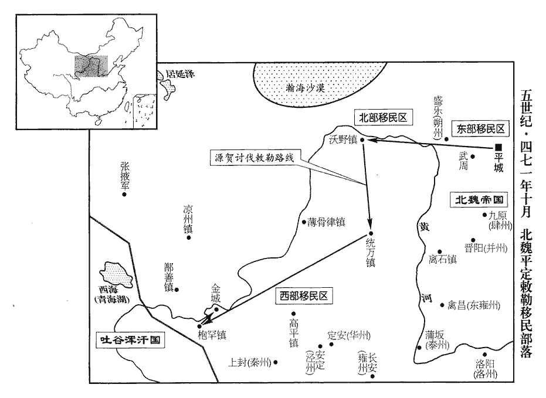
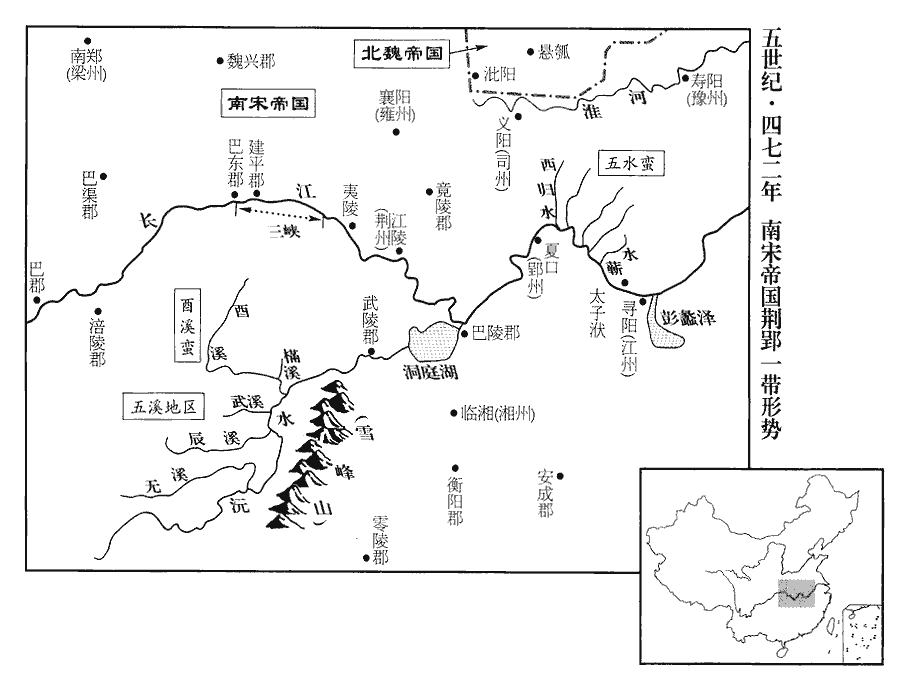
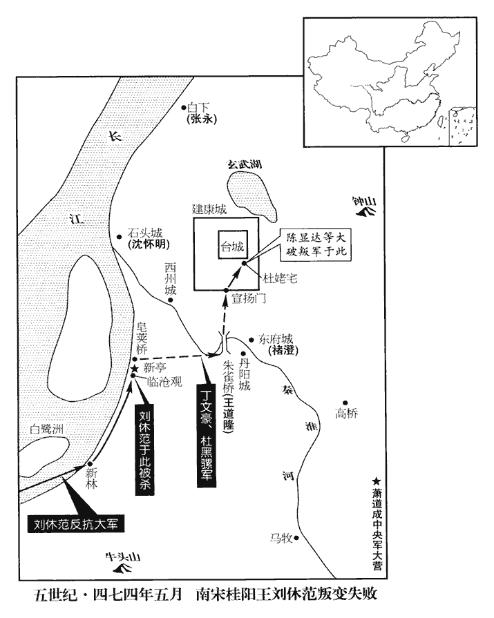

 宋紀十五起重光大淵獻（辛亥），盡旃蒙單閼（乙卯），凡五年。

# 太宗明皇帝下

## 泰始七年（辛亥、四七一）

1春，二月，戊戌‹十›，分交‹府龙编，越南河内东北北宁府›、廣‹府番禺，广东广州›置越州，治臨漳‹广西合浦东北›。劉昫曰：廉州治合浦縣，秦象郡地，吳改爲珠官郡，宋分置臨漳郡及越州，領郡三，治於此。又據沈約《志》：越州領百梁、龍蘇、永寧、永昌、富昌、南流、臨漳、合浦、宋壽九郡。蕭子顯曰：臨漳郡本合浦郡之北界也。按沈約《宋志》作「臨障」，宋白《續通典》作「臨瘴」，以臨界內瘴江爲名。瘴江，一名合浦江。

〖译文〗 [1]春季，二月，戊戌（初十），刘宋从交州、广州分出一部分郡县，设立越州，州府设在临漳。

2初，上‹刘彧，时年三十三›爲諸王，寬和有令譽，獨爲世祖‹刘骏›所親。卽位之初，義嘉之黨多蒙全宥，晉安王子勛改元義嘉。隨才引用，有如舊臣。及晚年，更猜忌忍虐，好鬼神，好，呼到翻。多忌諱，言語、文書，有禍敗、凶喪及疑似之言應回避者數百千品，有犯必加罪戮。改「騧」字爲「𩢍」，騧guā，古花翻。以其似禍字故也。左右忤意，往往有刳kū斮zhuó者。忤，五故翻。斮，側略翻，斬也。

〖译文〗 [2]当初，刘宋明帝还是亲王时，性情宽厚平和，有良好的声誉，只有他深受孝武帝的宠爱。即位初年，对拥护寻阳政权的官员，大多数都留住他们的性命，加以原谅，而且按照各人的才干，分别任用，像对旧有臣下一样对待。到了晚年，却猜疑、嫉妒、残忍、暴虐，迷信鬼神巫术，忌讳多端。无论言论、文书，对祸、败、凶、丧以及含混难辨的话和字有成百上千条，都加以回避，如有触犯，一定加以惩罚和诛杀。把“”改成“”，因为“”看起来象“祸”字。左右官员只要触犯禁忌，常常有被挖心或剖出五脏的人。

時淮、泗用兵，府藏空竭，內外百官，並斷俸祿。藏，徂浪翻。斷，丁管翻。《考異》曰：《宋•本紀》云「日給料祿俸」。今從《南史》。自失青、徐之後，宋、魏交兵於淮、泗之間。而奢費過度，每所造器用，必爲正御、副御、次副各三十枚。嬖倖用事，貨賂公行。嬖，卑義翻，又博計翻；後同。

〖译文〗 当时，淮河、泗水一带多次发生军事行动，当地府库空竭，朝廷内外的百官，全都断了俸禄。但明帝却过度奢侈浪费，每次制造器物用具，都要分为正用、备用、次备用，各制三十件。侍候左右的亲信当权，贪赃枉法，贿赂公行。

上素無子，密取諸王姬有孕者內宮中，生男則殺其母，孕，以證翻。《考異》曰：《宋書》云「閉其母於幽房」，今從《宋略》。使寵姬子之。

〖译文〗 明帝一直没有儿子，就把各亲王怀有身孕的姬妾秘密接到宫中，如生男孩，就把生母杀掉，由他自己的宠妃认作儿子。

至是寢疾，以太子‹刘昱，时年九岁›幼弱，深忌諸弟。南徐州刺史晉平剌王休祐，前鎭江陵‹湖北江陵›，貪虐無度，休祐鎭江陵事始上百三十一卷二年。剌，來葛翻。上不使之鎭，留之建康，遣上佐行府州事。上佐，謂長史、司馬也。休祐性剛狠，前後忤上非一，狠，戶墾翻。忤，五故翻。上積不能平；且慮將來難制，欲方便除之。施方略，乘便利而殺之也。甲寅‹二十六›，休祐從上於巖山‹江苏江宁南›射雉，據《休祐傳》，巖山在建康城南。又據《宋紀》，巖山在秣陵縣界，世祖景寧陵在焉。射，而亦翻。左右從者並在仗後。從，才用翻。日欲闇，上遣左右壽寂之等數人，逼休祐令墜馬，因共毆，拉殺之‹年二十七›，傳呼「驃騎落馬！」毆，烏口翻。拉，盧合翻。驃，匹妙翻。騎，奇寄翻。上陽驚，遣御醫絡驛就視，絡驛，猶絡繹也。比其左右至，休祐已絕，比，必寐，及也。絕，氣絕也。去車輪，輿還第。去，羌呂翻；下悉去同。追贈司空，葬之如禮。

〖译文〗 到这一年，明帝患病，因为太子年纪还小，他唯恐自己的弟弟们纂夺政权。南徐州刺史晋平刺王刘休，从前镇守江陵时，贪污暴虐，无法无天。这次调任路过京师，明帝不让他去赴任，把他留在建康，派他的高级属官代理府州事务。刘休性情暴烈凶恶，冒犯明帝不止一次，明帝都记在心中，无法再忍，并且考虑到将来儿子没有能力控制他，所以准备找个机会把他除掉。甲寅（二十六日），刘休随同明帝前往岩山射猎野鸡，兄弟二人向前奔驰，左右侍从被抛在后面。天将黄昏，明帝派亲信寿寂之等数人，把刘休从马背上挤下来，大家一拥而上，痛打一气，直至死亡，然后传呼：“骠骑将军落马！”明帝假装大吃一惊，立即派出御医，一个接一个地前往诊视。等到刘休左右侍从赶到，刘休已气绝身亡，把他所乘车的轮子拆掉，改作病床，由人抬回家。明帝下诏追赠刘休为司空，用应有丧礼安葬。

建康民間訛言，荊州刺史巴陵王休若有至貴之相，上以此言報之，休若憂懼。戊午‹三十›，以休若代休祐爲南徐州刺史。休若腹心將佐，皆謂休若還朝，必不免禍，中兵參軍京兆‹侨郡，湖北襄樊北›王敬先說休若曰：相，息亮翻。將，卽亮翻。朝，直遙翻；下同。說，輸芮翻。「今主上彌留，《書•顧命》曰：疾大漸，惟幾；病日臻，旣彌留。呂祖謙曰：疾大進而瀕於死，病日加則愈留。夏撰曰：重疾謂之病，言重病日至而又久留於體，曾不減去，將必死也。政成省閤，羣豎恟恟，欲悉去宗支以便其私。恟，許拱翻。去，起呂翻。殿下聲著海內，受詔入朝，必往而不返。荊州帶甲十餘萬，地方數千里，上可以匡天子，除姦臣，下可以保境土，全一身；孰與賜劍邸第，使臣妾飲泣而不敢葬乎！」呂向曰：泣，淚也；淚入口曰飲。休若素謹畏，僞許之。敬先出，使人執之，以白於上而誅之。

〖译文〗 建康民间传播谣言，说荆州刺史巴陵王刘休若，有尊贵的面相。明帝写信将此言告诉了他，刘休若忧虑恐惧。戊午（三十日），明帝任命刘休若接替刘休为南徐州刺史。刘休若心腹将领一致认为：刘休若只要回到建康，就难逃大祸。中兵参军京兆人王敬先劝刘休若说：“现在，皇上病重正处在弥留之际，朝廷大权握在省之手，一群奸恶之徒，来势汹汹，准备把皇上的兄弟全部崐铲除，以此来满足自己的私欲。殿下的名声，传播海内，如接受诏书，前往京师朝见，一定有去无回。荆州武装部队十余万，土地数千里。上可以辅佐天子，铲除奸臣；下可以保全一州，救自己一命。这和回到建康家宅，接受皇上赐给你自杀的佩剑，使你的臣妾饮泣吞声相比较，又怎么样呢！”刘休若一向谨慎胆怯，于是假装答应。王敬先一出王府，立刻派人把他抓起来，把他说的话奏报明帝，并将他处死。

3三月，辛酉‹三›，魏‹都平城，山西大同›假員外散騎常侍邢祐來聘。散，悉亶翻。騎，奇寄翻。

〖译文〗 [3]三月，辛酉（初三），北魏代理员外散骑常侍邢前来聘问。

4魏主‹拓跋弘，时年十八›使殿中尚書胡莫寒簡西部敕勒爲殿中武士。《魏書•官氏志》：拓跋鄰以兄爲紇骨氏，後改爲胡氏。自魏世祖破柔然，高車、敕勒皆来降，其部落附塞下而居，自武周塞‹山西左云南›外以西謂之西部，以東謂之東部，依漠南而居者謂之北部。莫寒大納貨賂，衆怒，殺莫寒及高平‹宁夏固原›假鎭將奚陵。假鎭將者，未得爲眞。將，卽亮翻；下同。夏，四月，諸部敕勒皆叛。魏主使汝陰王天賜將兵討之，以給事中羅雲爲前鋒；敕勒詐降，襲雲，殺之，降，戶江翻。天賜僅以身免。

〖译文〗 [4]北魏国主派殿中尚书胡莫寒选拔西部敕勒部落中的武士，担任宫廷警卫。胡莫寒大肆收纳贿赂，激起民愤，民众诛杀胡莫寒及高平代理镇将奚陵。夏季，四月，敕勒部落全都起兵反叛。北魏国主派汝阴王拓跋天赐率军讨伐，由给事中罗云担任前锋。敕勒部落诈降，袭击罗云，将其斩首，拓跋天赐仅逃出一命。

5晉平剌王‹刘休祐›旣死，剌，來達翻。建安王休仁益不自安。上與嬖臣楊運長等爲身後之計，運長等亦慮上晏駕後，休仁秉政，己輩不得專權，彌贊成之。上疾嘗暴甚，內外莫不屬意於休仁，屬，之欲翻。主書以下皆往東府訪休仁所親信，豫自結納；其或在直不得出者，皆恐懼。上聞，愈惡之。惡，烏路翻。五月，戊午‹一›，召休仁入見，見，賢遍翻。旣而謂曰：「今夕停尚書下省宿，明可早來。」其夜，遣人齎jí藥賜死。休仁罵曰：「上得天下，誰之力邪！事見一百三十一卷元年、二年。孝武‹刘骏›以誅鉏chú兄弟，子孫滅絕。孝武誅鉏兄弟，謂殺南平王鑠、竟陵王誕、海陵王休茂也；子孫滅絕於泰始之世，事並見前。今復爲爾，復，扶又翻；下已復同。宋祚其能久乎！」上慮有變，力疾乘輿出端門，休仁死‹年二十九›，乃入。下詔稱：「休仁規結禁兵，謀爲亂逆，朕未忍明法，申詔詰厲。詰，起吉翻。休仁慙恩懼罪，遽自引決。可宥其二子，降爲始安縣王，聽其子伯融襲封。」

〖译文〗 [5]晋平刺王刘休被杀之后，建安王刘休仁越发惶恐不安。明帝常跟亲信杨运长等商讨身后之计，杨运长等也担心明帝死了之后，刘休仁当政，他们这些人不能独断专行，所以都赞成明帝的计划。明帝一度病情十分危险，无论朝廷还是民间都把希望寄托在刘休仁主持朝政上，连主书以下的低级官员，都往东府拜访刘休仁的亲信，想预先结下交情。有些人正巧当班，不能出来从事结交活动，都心急而恐惧。明帝听说后，更为气愤。五月，戊午（初一），明帝命刘休仁进宫朝见，不久又通知他说：“今晚你可在尚书下省安歇，明天一早再来。”当夜，明帝派人送去毒药，强迫他吞服。刘休仁骂道：“你能得到天下，是谁的力量！孝武帝因为诛杀兄弟的缘故，子孙灭绝，今天你又要诛杀兄弟，宋的统治岂能长久！”明帝担心有变，提起精神，乘轿到皇城端门坐镇，直到刘休仁气绝，才回后宫，下诏宣布：“刘休仁计划结交宫廷禁卫官兵，阴谋叛乱，朕不忍心把他交付法庭审判，而只下诏严厉斥责，刘休仁对自己的忘恩负义，畏惧羞愧，不能自容，服毒自杀。可以宽恕他的两个儿子，贬刘休仁为始安县王，由其子刘伯融继承爵位。”

上慮人情不悅，乃與諸大臣及方鎭詔，稱：「休仁與休祐深相親結，語休祐云：『汝但作佞，此法自足安身；我從來頗得此力。』休祐之隕，本欲爲民除患，而休仁從此日生嬈懼。語，牛倨翻。爲，于僞翻。嬈，《集韻》，爾紹翻，擾也。吾每呼令入省，便入辭楊太妃。楊太妃，休仁所生母也。吾春中多與之射雉，射，而亦翻。或陰雨不出，休仁輒語左右云：『我已復得今一日。』休仁旣經南討，謂南拒尋陽‹江西九江›之兵故也。與宿衛將帥經習狎共事。將，卽亮翻。帥，所類翻。吾前者積日失適，失適，謂體中不安和也。休仁出入殿省，無不和顏，厚相撫勞。如其意趣，人莫能測。事不獲已，反覆思惟，不得不有近日處分。恐當不必卽解，勞，力到翻。處，昌呂翻。分，扶問翻。解，戶買翻，曉也。故相報知。」

〖译文〗 明帝害怕引起公愤，乃颁发诏书给朝廷各大臣及地方官员，说：“刘休仁与刘休相交很深，刘休仁对刘休说：‘你只管奉承皇上，这妙法足可以安身，我一向很得益于这种办法。’刘休之死，本来只打算为民除害，可是刘休仁却从此越发恐慌，我每次传他进宫，他都进去向母亲杨太妃告别。春天，我常常与他一块去打野鸡，偶遇阴天下雨，不能外出，刘休仁就告诉左右：‘今天又多活了一天。’刘休仁曾经因为南征的缘故，与皇家禁卫将领在一起共事，情投意合。我以前有好些日子身体不适，刘休仁出入宫廷，见到这些将领，一律和颜悦色，进行安抚慰劳。像他这样的意图，别人无法加以估量。事情已经不能阻止了，反复思考，不得不做这项处分，恐怕你们不一定知道内情，崐所以特此向你们告知。”

上‹刘彧›與休仁素厚，雖殺之，每謂人曰：「我與建安年時相鄰，謂年齒不相遠也。少便款狎。景和、泰始之間，勳誠實重；事計交切，不得不相除，痛念之至，不能自已。」因流涕不自勝。少，詩照翻。勝，音升。史言帝殘害骨肉，不能自揜yǎn其天性之傷。

〖译文〗 明帝与刘休仁素来十分友好，虽然他害死刘休仁，但常对人说：“我与建安王刘休仁，年纪差不多，幼年时候，便在一起玩耍，景和、泰始年间，他一片忠心，建功立业，功勋的确不小。可是，到了利害关头，不得不先行下手除掉他，哀痛想念之至，不能排除。”于是，流泪哭泣，悲不自胜。

初，上在藩，與褚淵以風素相善；風素相善者，以其風標雅素而與之善也。蕭子顯《齊書》「風」作「夙」。及卽位，深相委仗。上寢疾，淵爲吳郡‹江苏苏州›太守，蕭子顯《齊書•褚淵傳》云，「爲吳興太守。」按吳郡，近畿大郡也，吳興，次郡也，淵以大尚書出守，當得大郡；吳郡爲是。急召之。旣至，入見，見，賢遍翻。上流涕曰：「吾近危篤，近，其靳翻。故召卿，欲使著黃𧟌耳。」黃𧟌者，乳母服也。著，則略翻。𧟌luò，力賀翻，女人上衣也。言託孤於淵。上與淵謀誅建安王休仁，淵以爲不可，上怒曰：「卿癡人！不足與計事！」淵懼而從命。復以淵爲吏部尚書。泰始之初，淵爲吏部尚書；今去郡還朝，復爲之。復，扶又翻。庚午‹十三›，以尚書右僕射袁粲爲尚書令，褚淵爲左僕射。

〖译文〗 当初，明帝为亲王时，因褚渊风度翩翩，气质雅素，而与他成为至好的朋友。明帝即位后，彼此也十分信赖依托。明帝病重，褚渊正任吴郡太守，明帝急召褚渊入宫。褚渊到京后，入宫晋见，明帝痛哭流涕说：“我的病情危险，所以召见你，打算请你穿黄棉袄！”黄棉袄是乳母的服装，意为向他托孤。明帝与褚渊谋划诛杀建安王刘休仁，褚渊认为不能那样做，明帝大怒说：“你是个呆子，不足与你共计国家大事。”褚渊惧怕，只好从命。于是，明帝再任命褚渊为吏部尚书。庚午（十三日），又提升尚书右仆射袁粲为尚书令，褚渊为左仆射。

6上惡太子屯騎校尉壽寂之勇健；會有司奏寂之擅殺邏尉，徙越州，惡，烏路翻。邏，郎左翻。徙合浦也。於道殺之。

〖译文〗 [6]明帝对太子屯骑校尉寿寂之的勇敢雄健恐惧不安。正巧，有关部门奏报寿寂之擅自诛杀巡逻军官。明帝把寿寂之贬到越州，在途中把他杀掉。

7丙戌‹二十九›，追廢晉平王休祐爲庶人。

〖译文〗 [7]丙戌（二十九日），将已杀死的晋平王刘休追废为平民。

8巴陵王休若至京口‹江苏镇江›，聞建安王死，益懼。上以休若和厚，能諧緝物情，恐將來傾奪幼主，欲遣使殺之，慮不奉詔；欲徵入朝，又恐猜駭。使，疏吏翻。朝，直遙翻。六月，丁酉‹十›，以江州‹府寻阳，江西九江›刺史桂陽王休範爲南徐州刺史，以休若爲江州刺史。手書殷勤，召休若使赴七月七日宴。

〖译文〗 [8]巴陵王刘休若抵达京口，听到建安王刘休仁被毒死的消息，更加恐惧。明帝认为刘休若性情温和，品格憨厚，能调解纠纷，各方人士对他都十分敬重，害怕他将来有一天夺取幼主刘昱的帝位。明帝原打算派使臣前往诛杀刘休若，怕他拒不从命，打算征召他到朝廷朝见，又怕引起他猜疑震惊。六月，丁酉（初十），明帝任命江州刺史桂阳王刘休范为南徐州刺史；任命刘休若为江州刺史。明帝亲笔写信给刘休若，十分亲切地召刘休若前来京师，参加七月七日的皇家盛宴。

9丁未‹二十›，魏主如河西‹河套地区›。

〖译文〗 [9]丁未（二十日），北魏国主前往河西。

10秋，七月，巴陵哀王休若至建康；乙丑‹九›，賜死於第，贈侍中、司空。復以桂陽王休範爲江州刺史。復，扶又翻。時上諸弟俱盡，唯休範以人才凡劣，不爲上所忌，故得全。爲後休範稱兵張本。

〖译文〗 [10]秋季，七月，巴陵哀王刘休若，抵达建康。乙丑（初九），明帝派人到巴陵王府，命刘休若自杀。追赠刘休若为侍中、司空。再命桂阳王刘休范回任江州刺史。当时，明帝的所有兄弟全部铲除，只有刘休范因人品低劣，才能平庸，不为明帝所忌患，故得以保全性命。

沈約論曰：聖人立法垂制，所以必稱先王，蓋由遺訓餘風，足以貽之來世也。太祖‹刘义隆›經國之義雖弘，隆家之道不足。彭城王‹刘义康›照不窺古，徒見昆弟之義，未識君臣之禮，冀以家情行之國道，主猜而猶犯，恩薄而未悟，致以呵訓之微行，遂成滅親之大禍。謂文帝殺彭城王義康也。沈約言義康之罪，文帝當呵而訓之，不當遂殺之也。行，下孟翻。開端樹隙，垂之後人。太宗因易隙之情，據已行之典，翦落洪枝，謂據文帝已行之典而翦除兄弟也。洪，大也；枝，兄弟也。嫡統爲本，支庶爲枝。易，弋豉翻。不待顧慮。旣而本根無庇，幼主孤立，神器以勢弱傾移，靈命隨樂推回改，樂，音洛。斯蓋履霜有漸，堅冰自至，所由來遠矣。

〖译文〗 沈约论曰：圣人制定法律，建立制度，一定要称引古代明圣君王。其缘故，为的是古代明圣君王遗留下来的教训和风范，足以为后世的榜样。太祖文帝崐治理国家的规划虽然弘大，可是使家族兴隆的办法却有不足。彭城王刘义康对历史一无所知，所以只看到兄弟之情，却不懂君臣之礼，想把家族中的亲情，用于治国之道。人主已经猜忌，他仍然冒犯；宠信已经衰竭，他仍然不醒悟。以致不过犯了只须斥责训诫的小过，却招来杀身灭门之大祸。开创猜忌的先例，为后人提供了启示。太宗明帝因袭猜忌的心理，依照先例，残杀兄弟，无所顾忌。随后，朝廷的根本受不到保护，幼主孤孤单单，坐在宝座之上，国家的威严与权柄因皇帝势弱而转移，皇室的命运也随着人心而改变。这就同降霜结冰一样，逐渐形成，原因可追溯到很久以前。

裴子野論曰：夫噬虎之獸，知愛己子；搏貍之鳥，非護異巢。太宗‹刘彧›保字螟蛉，剿拉同氣，旣迷在原之天屬，未識父子之自然。《詩》曰：螟蛉之子，蜾guǒ臝luǒ負之。敎誨爾子，式穀似之。故世俗謂抱養者爲螟蛉。又曰：脊令在原，兄弟急難。剿，子小翻，絕也。拉，盧合翻。宋德告終，非天廢也。夫危亡之君，未嘗不先棄本枝，嫗yù煦旁孼niè；鄭康成曰：體曰嫗，氣曰煦。陸德明曰：嫗，於具翻；徐於甫翻。煦，許具翻；徐況甫翻。孼，魚列翻。《說文》：庶子爲孼。旁孼，旁枝之庶子也。推誠嬖狎，嬖，卑義翻，又博計翻。疾惡父兄。惡，烏路翻。前乘覆車，後來幷轡。借使叔仲有國，猶不失配天；而他人入室，將七廟絕祀；曾是莫懷，甘心揃落。揃jiǎn，子踐翻。晉武‹司马炎›背文明‹其母，文明皇后›之託，而覆中州者賈后‹贾南风›；事見《晉武帝紀》。背，蒲妹翻。太祖‹刘义隆›棄初寧之誓，而登合殿者元凶‹刘劭›。事見《文帝紀》。禍福無門，奚其豫擇！友于兄弟，不亦安乎！

〖译文〗 裴子野论曰：吞食猛虎的野兽，知道爱它的儿子；搏斗狸猫的飞鸟，不保护异类鸟的巢穴。太宗明帝为了保护他的养子，却屠杀一母同胞兄弟，昏庸无道已极，自然不了解兄弟天性、父子伦常。刘宋统治的败亡，并不是上天之意。亡国之君，没有一个不是先砍断本枝，而去养育旁枝的。对邪恶的亲信推心置腹，对父亲或兄弟却深恶痛绝。前面的车子翻了，后面的车子仍并驾齐驱。如果兄弟继承帝位，祖先的灵位仍可配享上天，而他人登上宝座，七座祖庙的祭祀将全部断绝。不将此事挂怀，甘心把本枝一一剪落。晋武帝违背母亲王元姬的托付，结果贾后使中原沉沦。太祖文帝违背初宁陵誓言，结果元凶刘劭登上宝座。祸福无门，哪能事先选择；兄弟相亲相爱，岂不平安！

11丙寅‹十›，魏主‹拓跋弘›至陰山。

〖译文〗 [11]丙寅（初十），北魏国主抵达阴山。

12初，吳喜之討會稽‹浙江绍兴›也，言於上曰：「得尋陽王子房及諸賊帥，皆卽於東戮之。」會，工外翻。帥，所類翻。旣而生送子房，釋顧琛等。事見一百三十一卷之二年。上以其新立大功，不問，而心銜之。及克荊州，剽掠，贓以萬計。尋陽旣平，建安王休仁遣喜進克荊州。剽，匹妙翻。壽寂之死，喜爲淮陵‹江苏盱眙›太守，督豫州‹安徽中部›諸軍事，淮陵，漢縣，屬臨淮郡，後屬下邳國；晉復屬臨淮，惠帝永寧元年，以爲淮陵國；宋爲郡，屬南徐州。宋白曰：泗州招信縣，本漢淮陵縣。聞之，內懼，啓乞中散大夫，漢大夫掌論議。中散大夫，《後漢志》始有之，魏、晉以來，以爲宂散。散，悉亶翻。上‹刘彧›尤疑駭。或譖蕭道成在淮陰‹江苏淮阴›有貳心於魏，《考異》曰：《南齊書•太祖紀》云：「帝常嫌太祖非人臣相，而民間流言蕭諱當爲天子，帝愈以爲疑。」今從《宋略》。上封銀壺酒，使喜自持賜道成。道成懼，欲逃，喜以情告道成，且先爲之飲，道成卽飲之。爲，于僞翻。《考異》曰：《南齊紀》云：「太祖戎服出門迎，卽酌飲之。喜還，帝意乃解。」《宋略》云：「道成懼，弗肯飲，將出奔。喜語以情，先爲之酌。於是喜得罪，而道成被徵。」蓋《南齊書》欲成太祖之美，故云爾。今從《宋略》。喜還朝，保證道成。朝，直遙翻。或密以啓上，上以喜多計數，素得人情，恐其不能事幼主；乃召喜入內殿，與共言謔甚款，旣出，賜以名饌。謔，迄却翻。饌，雛戀翻，又雛皖翻。尋賜死‹年四十五›，然猶發詔賻賜。賻fù，音附。

〖译文〗 [12]当初，吴喜讨伐寻阳政权的会稽郡时，报告明帝说：“如果俘虏寻阳王刘子房与贼寇的将领，就在东部当场诛杀。”后来活捉了刘子房，押送建康，并释放了吴郡太守顾琛等。明帝因吴喜刚刚建立大功，没有追究，但内心深为痛恨。等到攻克荆州，吴喜大肆抢劫，贪赃以万计。寿寂之被诛杀时，吴喜正任淮陵太守，督豫州诸军事，得到消息，十分恐惧，上书明帝请求调任中散大夫，明帝大起疑心。这时，有人暗中指控萧道成在淮阴私通北魏。明帝用银壶装酒，加上封条，派吴喜亲自送给萧道成。萧道成惊恐，打算逃走，吴喜把实情告诉萧道成，并且先饮下一些，萧道成才敢喝下。吴喜回到京师，向皇上保证萧道成忠贞。然而，有人秘密检举，明帝认为吴喜计谋太多，而又素有人缘，恐怕不能侍奉幼主，于是召吴喜到后宫内殿，纵情闲谈，间或打趣开开玩笑，十分亲密。吴喜告辞出来，明帝又赏赐给他名菜，接着命他自杀，但仍下诏颁发丧葬费用。

又與劉勔等詔曰：「吳喜輕狡萬端，苟取物情。昔大明中‹刘骏时›，黟yī‹安徽黟县›、歙shè‹安徽歙县›有亡命數千人，攻縣邑，殺官長，劉子尚遣三千精甲討之，再往失利。孝武‹刘骏›第二子曰豫章王子尚，與景和同母也。黟，音伊。歙，音攝。長，知兩翻。孝武‹刘骏›以喜將數十人至縣，說誘羣賊，將，卽亮翻。說，輸芮翻。誘，音酉。賊卽歸降。詭數幻惑，詭，過委翻。幻，戶辦翻。乃能如此。及泰始初東討，止有三百人，直造三吳‹太湖及钱塘江流域›，造，七到翻。凡再經薄戰，薄，伯各翻。而自破岡‹江苏句容东南›以東，至海十郡，無不清蕩。十郡，謂晉陵、義興、吳郡、吳興、南東海、會稽、東陽、臨海、永嘉、新安等郡也。百姓聞吳河東來，便望風自退，若非積取三吳人情，何以得弭伏如此！弭，緜婢翻。尋喜心迹，豈可奉守文之主，遭國家可乘之會邪！譬如餌藥，當人羸冷，資散石以全身，散，如寒食散之類；石，謂丹石也。羸，倫爲翻。散，悉但翻。及熱勢發動，去堅積以止患，非忘其功，勢不獲已耳。」用人如此，人不自保，其肯終爲之用乎！

〖译文〗 明帝又下诏刘等人，解释杀吴喜的原因说：“吴喜轻浮狡狯，变化万端，专会收买人心。从前，大明年间，黟县、歙县有亡命徒数千人，攻击县城，杀戮官员，刘子尚派三千精锐部队前去讨伐，但两次都被击败。孝武帝命吴喜率领几十人抵达县城，游说诱降群贼，群贼立即归降。诡秘蛊惑之人，才能如崐此。到了泰始初年，命吴喜东征，他只带三百人，竟能直入三吴，经过两次小小的搏战，自破冈以东，直至大海，共十郡，全部荡平。百姓听说吴喜到来，都望风自退，如果不是多年来赢得三吴人士的感情，怎么能使他们如此心服。探寻吴喜的心迹，绝不会尊奉正统君主，而坐失千载难篷的良机！譬如吃药，当人发冷时，应服热身之药；当人发热时，应服退热之药。并非忘掉他的功劳，而属迫不得已罢了。”

13戊寅‹二十二›，以淮陰爲北兗州，淮陰爲南兗州，事見上卷上年。徵蕭道成入朝。朝，直遙翻；下同。道成所親以朝廷方誅大臣，勸勿就徵，道成曰：「諸卿殊不見事！主上自以太子稚弱，稚，持利翻。翦除諸弟，何預他人！今唯應速發；淹留顧望，必將見疑。且骨肉相殘，自非靈長之祚，禍難將興，方與卿等戮力耳。」史言骨肉相殘，則姦雄生心因之而起，爲蕭氏取宋張本。難，乃旦翻。旣至，拜散騎常侍、太子左衛率。散，悉但翻。騎，奇寄翻。率，所律翻。

〖译文〗 [13]戊寅（二十二日），刘宋把淮阴划归北兖州，征召萧道成回京。萧道成的亲信认为，朝廷正在诛杀大臣，劝萧道成拒绝征召。萧道成说：“你们还没有看透当前的形势，皇上只因为太子年纪太小，所以把兄弟一一翦除，跟别人无关。现在必须立即出发，稍微延误观望，一定受到猜疑。而且，骨肉相残，政权势必难以长久，大祸将临，各位要与我同心协力。”回京师之后，明帝任命萧道成为散骑常侍、太子左卫率。

14八月，丁亥‹一›，魏主還平城。

〖译文〗 [14]八月，丁亥（初一），北魏国主返回平城。

15戊子‹二›，以皇子躋繼江夏文獻王義恭。景和之初，義恭父子皆死，事見一百三十一卷。夏，戶雅翻。

〖译文〗 [15]戊子（初二），明帝把皇子刘跻过继给江夏文献王刘义恭。

16庚寅‹四›，上疾有間，間，讀如字。大赦。

〖译文〗 [16]庚寅（初四），明帝病势转轻，宣布大赦。

17戊戌‹十二›，立皇子準爲安成王，實桂陽王休範之子也。

〖译文〗 [17]戊戌（十二日），明帝封皇子刘准为安成王。刘准实际上是桂阳王刘休范的儿子。

18魏顯祖‹拓跋弘›聰睿夙成，剛毅有斷；而好黃、老、浮屠之學，每引朝士及沙門共談玄理，雅薄富貴，常有遺世之心。以叔父中都大官京兆王子推沈雅仁厚，素有時譽，欲禪以帝位。中都大官卽□□□□□穆帝之子。斷，丁亂翻。沈，持林翻。時太尉源賀督諸軍屯漠南，馳傳召之。傳，株戀翻。旣至，會公卿大議，皆莫敢先言。任城王雲，子推之弟也，任，音壬。對曰：「陛下方隆太平，臨覆四海，覆，敷又翻。豈得上違宗廟，下棄兆民。且父子相傳，其來久矣。陛下必欲委棄塵務，則皇太子宜承正統。夫天下者，祖宗之天下；陛下若更授旁支，恐非先聖之意，啓姦亂之心，斯乃禍福之原，不可不愼也。」源賀曰：「陛下今欲禪位皇叔，臣恐紊亂昭穆，後世必有逆祀之譏。《春秋》：魯莊公薨，子般弒，季友立閔公；閔公復弒，立僖公。閔公，弟也，僖公，兄也。及僖公薨，魯人以先大後小爲順，遂躋僖公於閔公之上。仲尼以臧文仲不知者三，縱逆祀其一也。言宗廟之祀，姪爲昭而叔爲穆，亂也，後世必以逆祀貽譏。更，工衡翻。紊，亡運翻。昭，時招翻。願深思任城‹拓跋雲›之言。」東陽公丕等曰：「皇太子‹拓跋宏，时年五岁›雖聖德早彰，然實沖幼。陛下富於春秋，始覽萬機，柰何欲隆獨善，不以天下爲心，其若宗廟何！其若億兆何！」尚書陸馛bó曰：「陛下若捨太子，更議諸王，臣請刎頸殿庭，不敢奉詔！」馛，蒲撥翻。刎，扶粉翻。帝怒，變色；以問宦者選部尚書酒泉‹甘肃酒泉›趙黑，黑曰：「臣以死奉戴皇太子，不知其他！」帝默然。陸馛之言則怒而變色，趙黑之言則默然心服者，以衆屬於正嫡也。但朝廷大議，作色於陸馛而默爾於宦官，臣庶何觀！魏之朝綱可想而見矣。選，須絹翻。時太子宏生五年矣，帝以其幼，故欲傳位子推。中書令高允曰：「臣不敢多言，願陛下上思宗廟託付之重，追念周公抱成王之事。」帝乃曰：「然則立太子，羣公輔之，有何不可！」高允之言婉而當，且發於衆言交進之後，故轉移上意，爲力差易。又曰：「陸馛bó，直臣也，必能保吾子。」乃以馛爲太保，與源賀持節奉皇帝璽紱傳位於太子。璽，斯氏翻。《考異》曰：《後魏•天象志》云：「上迫於太后，傳位太子。」按馮太后若迫顯祖傳位，當奪其大政，安得猶總萬機！今從《帝紀》。丙午‹二十›，高祖卽皇帝位，諱宏，顯祖獻文皇帝之長子也。大赦，改元延興。

〖译文〗 [18]北魏献文帝拓跋弘从小就聪明睿智，刚毅果断，爱好黄老哲学和佛学，每次接见朝廷官员及和尚僧侣，共同谈玄论理，对世俗的荣华富贵，非常淡泊鄙薄，时常有离家修行的想法。认为叔父中都大官、京兆王拓跋子推沉稳文雅仁厚，一向有较高的声誉，打算把帝位禅让给他。当时，太尉源贺率各军驻防漠南，献文帝迅速传召他回京。源贺抵达时，正举行公卿会议，没有一个人敢先发言。任城王拓跋云是拓跋子推的弟弟，他说：“陛下正逢太平盛世，君临四海，怎么可以对上违背祖宗，对下抛弃人民。而且，父子相传，由来已久。陛下一定要放弃尘世上的俗务，那么皇太子理应继承大统。天下是祖先的天下，陛下如果把朝廷授予旁支，恐怕不是明圣祖先的本意，将要引起奸人的乱心，这是祸福的源头，不可不格外谨慎。”源贺说：“陛下现今打算禅位给皇叔，我深恐扰乱皇家祖庙祭祀的顺序，后世将讥讽我们逆祀。请三思任城王之言。”东阳公拓跋丕等说：“皇太子虽然神圣恩德早已显彰，但年龄实在太小，而陛下正当壮年，刚开始亲自主持朝政，为何只顾独善其身，不把天下放在心上？如果那样的话，皇家祖庙将怎么办，亿万人民将怎么办！”尚书陆说崐：“陛下若舍弃太子，传位亲王，我宁可在金銮殿上自刎，也不敢奉诏。”献文帝勃然大怒，脸色霎时改变，转过头问宦官选部尚书酒泉人赵黑，赵黑说：“我以死效忠皇太子，不知其他。”献文帝沉默不语。这一年，皇太子拓跋宏仅仅五岁。献文帝因他太小，所以准备传位给拓跋子推。中书令高允说：“我不敢多言，愿陛下不忘祖先托付之重，而追念周公辅佐幼主成王的故事。”献文帝说：“那么，让皇太子登基，由各位辅佐，有何不可！”又说：“陆是忠直之臣，一定能保护我的儿子。”于是任命陆为太保，与源贺一同持节，把皇帝的玉玺呈献给皇太子拓跋宏。丙午（二十日），高祖孝文帝即位，宣布大赦，改年号为延兴。

高祖‹拓跋宏›幼有至性，前年，顯祖‹拓跋弘›病癰，高祖親吮。吮shǔn，徂兗翻。及受禪，悲泣不自勝。勝，音升。顯祖問其故，對曰：「代親之感，內切於心。」

〖译文〗 孝文帝从小就感情丰富，两年前，献文帝身上长疮，孝文帝亲自用嘴为父亲吮脓。等到接受父亲的禅让，悲痛哭泣，不能自胜。献文帝问他缘故，他回答说：“接替父亲的位置，内心非常痛切。”

丁未‹二十一›，顯祖‹拓跋弘›下詔曰：「朕希心玄古，志存澹泊，爰命儲宮踐升大位，澹，徒覽翻。踐，慈衍翻。朕得優遊恭己，栖心浩然。」

〖译文〗 丁未（二十一日），献文帝下诏说：“朕向往太古生活，志向恬淡，不图名利，特命太子升为皇帝，朕只求悠闲自得，修身养性。”

羣臣奏曰：「昔漢高祖稱皇帝，尊其父爲太上皇，明不統天下也。見十一卷漢高帝六年。今皇帝幼沖，萬機大政，猶宜陛下總之。謹上尊號曰太上皇帝。」太上皇帝之號始此。上，時掌翻。顯祖從之。

〖译文〗 文武官员上奏说：“从前，汉高祖刘邦当了皇帝，尊称他的父亲为太上皇，表明并非自己统治天下。而今，皇上年纪幼小，朝廷大政仍宜由陛下掌管，谨恭上尊号太上皇帝。”献文帝同意。

己酉‹二十三›，上皇‹拓跋弘›徙居崇光宮，采椽不斲，徐廣曰：采，一名櫟lì，一作柞zuò。《索隱》曰：采，木名，卽今之櫟木也。余謂采椽者，蓋自山采來之椽，因而用之，不施斧斤，示樸也。椽chuán，重緣翻。土階而已；國之大事咸以聞。崇光宮在北苑中，又建鹿野浮圖於苑中之西山，釋子相傳，以爲尸迦國波羅柰城東北十里許有鹿野苑，本辟支佛住此，常有野鹿，故以名苑。今倣西國而建浮圖也。又據《魏書》，道武帝天興二年，破高車，以其衆起鹿苑於南臺陰，北距長城，東苞白登，屬之西山，廣輪數百里，蓋因代都鹿苑之舊名，附合西國鹿野之事而建此浮圖也。與禪僧居之。禪，時連翻。

〖译文〗 己酉（二十三日），太上皇帝迁到崇光宫居住，用刚刚采来未经砍伐的木材为房椽，台阶仍为土质，朝廷大事，仍向他请示。崇光宫在北苑中，又在苑中西山兴建佛教寺庙，名叫鹿野浮图，让和尚僧侣居住。

19冬，十月，魏沃野‹古朔方城，内蒙杭锦旗北黄河南岸›、統萬‹陕西靖边北白城子›二鎭敕勒叛，沃野，卽漢朔方郡沃野縣也；統萬，卽赫連故都，魏以爲鎭，置鎭將。陸恭之《風土記》：朔方故城，後魏改爲沃野鎭，去統萬八百餘里。遣太尉源賀帥衆討之；降二千餘落，帥，讀曰率。降，戶江翻。追擊餘黨至枹罕‹甘肃临夏›、金城‹甘肃兰州›，大破之，枹，音膚。斬首八千餘級，虜男女萬餘口，雜畜三萬餘頭。詔賀都督三道諸軍，屯于漠‹瀚海沙漠›南。

〖译文〗 [19]冬季，十月，北魏沃野、统万二镇所辖的敕勒部落叛乱，派太尉源贺率军讨伐，接受两千多个帐篷的居民投降，追击残余势力。追到罕、金城时，大破敕勒军，杀八千余人，俘虏男女一万余人，牲畜三万余头。孝文帝下诏，命源贺统领三路的几支军队，驻扎沙漠之南。

先是，魏每歲秋、冬發軍，三道並出以備柔然，春中乃還。還，從宣翻，又如字；下同。賀以爲「往來疲勞，不可支久；請募諸州鎭武健者三萬餘人，築三城以處之，先，悉薦翻。處，昌呂翻。使冬則講武，春則耕種。」此卽古屯田之說也。不從。

〖译文〗 在此之前，北魏每年秋冬之季，分东、中、西三路同时发兵，防备柔然汗国的入侵，直到次年春季中期，才撤退。源贺认为：“如此一往一来，士卒疲惫不堪，无法长期保持斗志。请求招募各州、镇壮士三万余人，沿边兴筑三座城，让他们据守，冬季练兵，春季种地。”朝廷不准。

20庚寅‹五›，魏以南安王楨爲都督涼州及西戎諸軍事，領護西域校尉，鎭涼州‹甘肃武威›。校，戶敎翻。

〖译文〗 [20]庚寅（初五），北魏任命南安王拓跋桢为都督凉州及西戎诸军事，兼护西域校尉，镇守凉州。

 

21上‹刘彧›命北琅邪、蘭陵二郡太守垣崇祖經略淮北，守，式又翻。崇祖自郁洲‹江苏连云港东小岛›將數百人入魏境七百里，據蒙山‹山东蒙阴南›。此指言舊琅邪蘭陵郡也，本屬徐州。彭城旣沒，崇祖率部曲據郁洲，使領二郡太守，未能有其地也。魏收《志》：蒙山在東安郡新泰縣東南。《水經註》：朐山縣東北海中有大洲，謂之郁洲，《山海經》所謂郁山在海中者是也。杜佑曰：鬱洲在海州東海縣，亦曰郁洲。十一月，魏東兗州‹府瑕丘，山东兖州›刺史于洛侯擊之，崇祖引還。

〖译文〗 [21]刘宋明帝命北琅邪、兰陵二郡太守垣崇祖，策划收复淮河以北。垣崇祖率领数百人，从郁州出发，深入北魏七百里，占领蒙山。十一月，北魏东兖州刺史于洛侯反攻，垣崇祖带兵撤回。

22上‹刘彧›以故第爲湘宮寺，始封湘東王，故以故第爲湘宮寺。備極壯麗；欲造十級浮圖而不能，乃分爲二。新安‹浙江淳安›太守巢尚之罷郡入見，見，賢遍翻。上謂曰：「卿至湘宮寺未？此是我大功德，用錢不少。」少，詩沼翻。通直散騎侍郎會稽虞愿侍側，散騎侍郎，曹魏初與散騎常侍同置，至晉武帝置員外散騎侍郎，及元帝太興元年，使員外二人與散騎侍郎同員直，故謂之通直散騎侍郎，後增爲四人。散，悉亶翻。騎，奇寄翻。會，工外翻。曰：「此皆百姓賣兒貼婦錢所爲，貼婦，謂夫先有婦，苦於上之征求而不能贍，縱之外求淫夫，貼以贍之。又，帖，亦賣也；《通典》：北齊武平以後，聽人帖賣園田。佛若有知，當慈悲嗟愍；罪高浮圖，何功德之有！」侍坐者失色；坐，徂臥翻。上怒，使人驅下殿。愿徐去，無異容。

〖译文〗 [22]明帝把原来的府邸改为庙院，称湘宫寺，装潢修建，极为壮观华丽。准备兴建十层佛塔，不能成功，于是便修成两座。新安太守巢尚之解除职务后，回京朝见，明帝对他说：“你去过湘宫寺没有？那可是我的大功德，花费不少钱。”通直散骑侍郎会稽人虞愿正在一边侍立，说：“那是百姓用卖子、卖妻的钱所建造的，佛陀如果有灵，会慈悲为怀，哭泣哀叹。罪恶高过佛塔，有什么功德！”在座的人脸色全都大变，明帝大怒，命人把虞愿驱逐出殿。虞愿慢慢离开，没有恐惧的表情。

上好圍棋，好，呼到翻；下同。棋甚拙，與第一品彭城丞王抗圍棋，當時圍棋之品，王抗爲第一。抗每假借之，曰「皇帝飛棋，臣抗不能斷。」圍棋之勢，聯屬不斷，然後可以勝人；若爲人斷之，則爲所勝。斷，如字。上終不悟，好之愈篤。愿又曰：「堯以此敎丹朱，《博物志》：堯造圍棋以敎子丹朱；或云舜以子商均愚，故作圍棋以敎之。其法非智者不能也。胡旦曰：以棋爲易，則聰明者而或不能；以爲難，則愚下小人往往精絕。非人主所宜好也。」上雖怒甚，以愿王國舊臣，上爲湘東王，愿爲國常侍。每優容之。

〖译文〗 明帝爱下围棋，但棋艺非常拙劣，常跟围棋国手彭城丞王抗对弈。王抗只好常常暗中让他，说：“皇上一飞，臣无法切断。”明帝始终不知内情，对围棋越发爱不释手。虞愿又说：“这是尧用来教他儿子丹朱的玩艺儿，不是人主所应该嗜好的。”明帝怒不可遏，但由于虞愿是自己任亲王时的旧属，所以总是非常宽容他。

23王景文常以盛滿爲憂，屢辭位任，上不許，然中心以景文外戚貴盛，張永累經軍旅，疑其將來難信，乃自爲謠言曰：「一士不可親，弓長射殺人。」射，而亦翻。景文彌懼，自表解揚州，情甚切至。詔報曰：「人居貴要，但問心若爲耳。言但問其存心如何耳。大明之世，巢、徐、二戴，位不過執戟，權亢人主。巢，謂巢尚之；徐，謂徐爰；二戴，謂法興、明寶。亢，口浪翻，高也。今袁粲作僕射領選，選，須絹翻。而人往往不知有粲，粲遷爲令，居之不疑；人情向粲，淡然亦復不改常日。以此居貴位要任，當有致憂競不？袁粲之簡淡雅素，自足以鎭雅俗；而明帝謂其可以託孤，則眞違才易務矣。然粲才雖不足，以死繼之，無愧於爲臣之大節；其視褚淵，相去豈不遠哉！復，扶又翻。「競」，當作「兢」。不，讀曰否。夫貴高有危殆之懼，卑賤有塡壑之憂，有心於避禍，不如無心於任運，存亡之要，巨細一揆耳。」

〖译文〗 [23]王景文一直为家门富贵过分而深感忧虑，屡次辞让官职，明帝都不准许。然而，明帝内心却因王景文是皇家外戚，地位高贵，家族昌盛，而孝昌侯张永长期率领大军，怀疑他们将来难以信任，于是，亲自写首歌谣：“一士不可亲，弓长射杀人。”王景文越发恐惧，再一次上书请求辞去扬州刺史，情意十分恳切。明帝下诏回答说：“一个人身居尊贵、重要职位，只要看他存心如何罢了。大明之世，巢尚之、徐爰、戴法兴、戴明宝官职不过是个手持长矛的侍从，其权力竟大于人主。而今，袁粲任仆射兼管吏部，人们往往不知道袁粲是谁？袁粲提升为尚书令，他并没有丝毫猜疑，人们都亲近他，而他淡漠得跟平常一样，以这种态度身居高位重职，难道会感到惶惶不安？高贵固然有倾危的恐惧，卑贱也会有被填沟壑的忧虑。用尽心机避祸，不如不用心机，听候命运的安排，兴衰存亡，道理相同。”

## 泰豫元年（壬子、四七二）

1春，正月，甲寅朔‹一›，上‹刘彧，时年三十四›以疾久不平，改元。戊午‹五›，皇太子會四方朝賀者於東宮，幷受貢計。朝，直遙翻。

〖译文〗 [1]春季，正月，甲寅朔（初一），刘宋明帝因患病很久，不能痊愈，于是改年号泰豫。戊午（初五），皇太子刘昱在东宫接见四方前来朝贺的官员，并接受各地方的贡品及报告。

2大陽‹湖北蕲qí春›蠻酋桓誕擁沔水‹汉水›以北、滍‹沙河›•葉‹河南叶县西南›以南八萬餘落降於魏‹都平城，山西大同›，此卽五水蠻也。宋置大陽戍於蘄陽縣西。此縣卽漢江夏郡蘄春縣也。沔水以北，滍zhì、葉以南，皆羣蠻所居。誕擁以降魏，而誕實大陽蠻酋也。酋，慈由翻。沔，彌兗翻。滍，直里翻。葉，式涉翻。降，戶江翻。自云桓玄之子，亡匿蠻中，以智略爲羣蠻所宗。魏以誕為征南將軍、東荊州‹府沘阳，河南泌阳›刺史、襄陽王，東荊州治比陽縣。聽自選郡縣吏；使起部郎京兆‹西安›韋珍與誕安集新民，區置諸事，皆得其所。據《晉志》：武帝置起部郎。杜佑《通典》曰：晉、宋有起部而不常置。起部，工部也，取《虞書》「百工起哉」爲義。自是之後，諸蠻皆倚魏以侵擾南國。

〖译文〗 [2]太阳蛮酋长桓诞，率领沔水以北，水、叶县以南，共计八万余帐落，投降北魏。桓诞自称是桓玄的儿子，当初逃到蛮族居住的山区，用他的智慧和谋略，受到各蛮族部落的推崇。北魏任命桓诞为征南将军、东荆州刺史，封襄阳王。授权给他，可自己挑选郡太守、县令。朝廷派起部郎、京兆人韦珍同桓诞一起安抚慰问新居民，处理各种事务，安排得很适当。

3二月，柔然侵魏，上皇‹拓跋弘，时年十九›遣將擊之；將，卽亮翻；下同。柔然走。東部敕勒叛奔柔然，上皇自將追之，至石磧，磧qì，七迹翻。石磧，卽石漠。不及而還。

〖译文〗 [3]二月，柔然汗国南下侵北魏。北魏太上皇派将领迎战，柔然军撤退。东部敕勒部落叛变，投奔柔然汗国，太上皇亲自率军追击，追到石碛，没有追上，回师。

4上疾篤，慮晏駕之後，皇后‹王贞风›臨朝，江安懿侯王景文以元舅之勢，必爲宰相，景文，皇后兄也。朝，直遙翻。相，息亮翻。門族強盛，或有異圖。己未‹七›，遣使齎藥賜景文死，使，疏吏翻。手敕曰：「與卿周旋，欲全卿門戶，故有此處分。」處，昌呂翻。分，扶問翻。敕至，景文正與客棋，叩函看已，已，畢也。復置局下，神色不變，方與客思行爭劫。棋有行，有劫。行者，欲擊東而聲出於西也；劫者，先有彼我兩急之勢，彼欲出此，則我劫彼以制之也。行，下孟翻。局竟，斂子內匳畢，子，棋子也。弈戲旣畢，則斂而納諸匳中。匳lián，力鹽翻。徐曰：「奉敕見賜以死。」方以敕示客。句斷。中直兵焦度、趙智略憤怒，中直兵，典親兵將官也。洪适曰：宋有中直兵、外兵、騎兵參軍。曰：「大丈夫安能坐受死！州中文武數百，足以一奮。」王景文時爲揚州刺史。景文曰：「知卿至心；若見念者，爲我百口計。」乃作墨啓答敕致謝，飲藥而卒‹年六十›。《考異》曰：《南史》云：「帝使謂景文曰：『朕不謂卿有罪，然吾不能獨死，請子先之。』若使者有此語，則坐客不容不知，更終棋局。又曰：「景文酌酒謂客曰：『此酒不可相勸。』自仰而飲之。」按焦度勸拒命，必不對坐客言之；何得死時客猶在坐也！今從《宋書》。贈開府儀同三司。

〖译文〗 [4]刘宋明帝病情加重，考虑到死后，皇后王贞风一定临朝主政，而她的哥哥江安侯王景文以国舅的势力非当宰相不可，王氏家族强大，可能会有篡位的想法。己未（初七），明帝派人送毒药给王景文命他自杀，并亲写诏书说：“我与你为多年朋友，为了保全王家一门，所以做出这个决定。”使节到时，王景文正与客人下围棋，打开封套看罢，放到棋盘下，神色不变，正想着与客人争先打劫。一盘棋下完，把棋子收到盒内，王景文慢慢地说：“接到圣旨，命我自尽。”这才把明帝的亲笔诏书拿给客人看。中直兵焦度、赵智略非常愤怒，说：“大丈夫怎么能坐以待毙，州中文武官员数百人，足可以一拼。”王景文说：“我知道你们的心，如果要想帮助我，应当为我家男女老少一百余口想一想！”于是研墨写奏，回敬诏书，引罪自责，饮药身亡。明帝下诏追赠王景文为开府仪同三司。

上夢有人告曰：「豫章‹江西南昌›太守劉愔反。」旣寤，遣人就郡殺之。愔yīn，於含翻。

〖译文〗 明帝梦见有人报告他说：“豫章太守刘谋反。”梦醒后，派人前往郡城，杀了刘。

5魏顯祖‹拓跋弘›還平城。書顯祖，以別魏主。

〖译文〗 [5]北魏献文帝返回平城。

6庚午‹十八›，魏主‹拓跋宏，时年六岁›耕籍田。

〖译文〗 [6]庚午（十八日），北魏国主亲自主持耕田仪式。

7夏，四月，以垣崇祖行徐州事，徙戍龍沮‹江苏沭阳›。魏收《地形志》：東彭城郡有龍沮縣，縣有卽丘城。《五代志》：琅邪郡治臨沂縣，舊曰卽丘。沮jǔ，子余翻。

〖译文〗 [7]夏季，四月，任命垣崇祖为代理徐州事，迁往龙沮戍守。

8己亥‹十七›，上‹刘彧›大漸，《書•顧命》云：疾大漸。呂祖謙《註》曰：疾大進而瀕於死也。以江州‹府寻阳，江西九江›刺史桂陽王休範爲司空，又以尚書右僕射褚淵爲護軍將軍，加中領軍劉勔右僕射，勔，彌兗翻。詔淵、勔與尚書令袁粲、荊州‹府江陵，湖北江陵›刺史蔡興宗、郢州‹府夏口，湖北武汉›刺史沈攸之並受顧命。褚淵素與蕭道成善，引薦於上，詔又以道成爲右衛將軍，領衛尉，左、右衛，晉官；衛尉，漢官也。史言禁衛兵柄皆歸道成。與袁粲等共掌機事。是夕，上殂。年三十四。庚子‹十八›，太子‹刘昱，时年十岁›卽皇帝位，大赦。時蒼梧王方十歲，袁粲、褚淵秉政，承太宗‹刘彧›奢侈之後，務弘節儉，欲救其弊；而阮佃夫、王道隆等用事，貨賂公行，不能禁也。佃，音田。

〖译文〗 [8]己亥（十七日），明帝病危，任命江州刺史、桂阳王刘休范为司空，又命尚书右仆射褚渊为护军将军，加授中领军刘为右仆射。下诏指定褚渊、刘和尚书令袁粲、荆州刺史蔡兴宗、郢州刺史沈攸之同时接受托孤遗命。褚渊与萧道成的关系一向十分亲密，就把萧道成推荐给明帝，明帝再下诏，任命萧道成为右卫将军、兼卫尉，与袁粲等共同掌管朝廷大事。当晚，明帝去世。庚子（十八日），太子刘昱即皇帝位，宣布大赦。此时苍梧王刘昱年仅十岁。袁粲、褚渊主持朝政，在明帝奢侈糜烂的生活之后，力求节俭，想革除积弊。但是，阮佃夫、王道隆等人依然掌权，贿赂公开施行，袁粲、褚渊无力禁止。

9乙巳‹二十三›，以安成王準爲揚州刺史。

〖译文〗 [9]乙巳（二十三日），任命安成王刘准为扬州刺史。

10五月，戊寅‹二十七›，葬明皇帝‹刘彧›于高寧陵‹南京北幕府山东南›，據《南史》，陵在臨沂縣莫府山。廟號太宗。六月，乙巳‹二十四›，尊皇后‹王贞风›曰皇太后，《考異》曰：《宋略•本紀》作「癸未」。今從《宋•本紀》。立妃江氏‹江简珪›爲皇后。

〖译文〗 [10]五月，戊寅（二十七日），将明帝安葬在高宁陵，庙号太宗。六月，乙巳（二十四日），尊嫡母、皇后王贞风为皇太后，封太子妃江简为皇后。

11秋，七月，柔然部帥無盧眞將三萬騎寇魏敦煌‹甘肃敦煌›，鎭將尉多侯擊走之。多侯，眷之子也。尉眷事魏太武，有平赫連之功。帥，所類翻。將，卽亮翻；下同。騎，奇寄翻。敦，徒門翻。尉，紆勿翻。又寇晉昌‹甘肃安西›，守將薛奴擊走之。《魏書•官氏志》：西方諸姓，叱干氏改爲薛氏。

〖译文〗 [11]秋季，七月，柔然汗国部落酋长无卢真率领骑兵三万人，攻击北魏的敦煌，镇守将领尉多侯击退柔然军。尉多侯是尉眷的儿子。无卢真又侵犯晋昌，晋昌守将薛奴把他击退。

12戊午‹七›，魏主‹拓跋宏›如陰山。

〖译文〗 [12]戊午（初七），北魏国主前往阴山。

13戊辰‹十七›，尊帝‹刘昱›母陳貴妃‹陈妙登›爲皇太妃，更以諸國太妃爲太姬。更，工衡翻。姬，音怡。

〖译文〗 [13]戊辰（十七日），刘宋尊皇帝生母、贵妃陈妙登为皇太妃。改称各亲王的太妃为太姬。

14右軍將軍王道隆以蔡興宗強直，不欲使居上流，閏月，甲辰‹二十四›，以興宗爲中書監，更以沈攸之爲都督荊•襄等八州諸軍事、荊州刺史。興宗辭中書監不拜。王道隆每詣興宗，躡履到前，不敢就席，良久去，竟不呼坐。

〖译文〗 [14]右军将军王道隆因为蔡兴宗刚强正直而不愿意让他扼守长江上游。闰七月，甲辰（二十四日），任命蔡兴宗为中书监，调任沈攸之为都督荆、襄等八州诸军事和荆州刺史。蔡兴宗推辞中书监的官职不肯就任。王道隆每次拜访蔡兴宗，都缓步轻行到面前，不敢径自坐下来，很久才离开，蔡兴宗也不请他入座。

沈攸之自以材略過人，自至夏口‹湖北武汉›以來，陰蓄異志；夏口，郢州也。攸之鎭郢州，見上卷五年。夏，戶雅翻。及徙荊州，擇郢州士馬，器仗精者，多以自隨。到官，以討蠻爲名；大發兵力，招聚才勇，部勒嚴整，常如敵至。重賦斂以繕器甲，斂，力贍翻。舊應供臺者皆割留之，養馬至二千餘匹，治戰艦近千艘，治，直之翻。艦，戶黯翻。近，其靳翻。艘，蘇遭翻。倉稟、府庫莫不充積。士子、商旅過荊州者，多爲所羈留，四方亡命，歸之者皆蔽匿擁護；所部或有逃亡，無遠近窮追，必得而止。舉錯專恣，不復承用符敕，錯，千故翻。復，扶又翻。朝廷疑而憚之。爲後攸之稱兵張本。臺省所下者爲符，出命經中書、門下者爲敕。爲政刻暴，或鞭撻士大夫；上佐以下，面加詈辱。詈lì，力智翻。然吏事精明，人不敢欺，境內盜賊屛息，屛，必郢翻。夜戶不閉。

〖译文〗 沈攸之自认为才能胆略过人，自从镇守夏口以来，暗中准备，有夺取政权的野心。等调任荆州，临走时把郢州的兵士战马以及精良武器，尽量携带同往。到荆州之后，借口讨伐蛮族，大肆动员境内人力，招兵买马，加强战斗训练，经常戒备，好像大敌当前一样。加重人民的田赋捐税以制造武器铠甲，原来应向朝廷缴纳的军用物资一律留下，不再缴纳。养战马多到二千多匹，制造船舰近一千艘，粮仓，钱库都十分充实。读书人、旅客和商人，经过荆州的，大多被留下不放。各地的亡命之徒，投奔荆州的都受到庇护藏匿。自己的部属中，如果有人逃亡，无论逃到哪里，都穷追不舍，一定要逮捕到手才停止。各项措施，全都独断专行，不再使用朝廷的名义。朝廷怀疑他但又有所忌惮。沈攸之为政刻薄凶暴，有时甚至鞭打士大夫，对高级僚属以下的官吏，往往当面就诟骂侮辱。然而，沈攸之做事精明，别人不敢欺骗他。荆州境内，盗贼不敢轻举妄动，百姓夜不闭户。

攸之賧dǎn罰羣蠻太甚，何承天《纂文》曰：賧，蠻夷贖罪貨也。音徒濫翻。又禁五溪魚鹽，蠻怨叛。酉溪‹流经湖南沅陵注入沅江›蠻王田頭擬死，《水經》：酉水導源巴郡臨江縣，東逕遷陵縣故城北，又東逕酉陽故縣南，又東逕沅陵縣北，又南注沅水。弟婁侯篡立，其子田都走入獠中。獠，魯皓翻。於是羣蠻大亂，掠抄至武陵‹湖南常德›城下。抄，楚交翻。武陵內史蕭嶷遣隊主張英兒擊破之，誅婁侯，立田都，羣蠻乃定。嶷，賾zé之弟也。史言蕭道成二子皆有幹時之用。嶷，魚力翻。賾，士革翻。

〖译文〗 沈攸之对各蛮族部落勒索过分，又禁止五溪一带居民捕鱼、贩盐，各蛮族怨愤，起兵叛乱。酉溪蛮族首领田头拟去世。他的弟弟田娄侯篡位，儿子田都逃到獠族地区。于是，众蛮族部落大乱，武装抢掠，兵至武陵城。武陵内史萧嶷派队主张英儿击破蛮族各部落军，杀了田娄侯，恢复田都王位，众蛮族部落才安定。萧嶷是萧赜的弟弟。

15八月，戊午‹八›，樂安宣穆公蔡興宗卒‹年五十八›。

〖译文〗 [15]八月，戊午（初八），乐安宣穆公蔡兴宗去世。

 

16九月，辛巳‹二›，魏主‹拓跋宏›還平城。

〖译文〗 [16]九月，辛巳（初二），北魏国主返回平城。

17冬，十月，柔然侵魏，及五原‹内蒙包头›，十一月，上皇‹拓跋弘›自將討之。將，卽亮翻。將度漠，柔然北走數千里，上皇乃還。還，從宣翻，又如字。

〖译文〗 [17]冬季，十月，柔然汗国侵略北魏，逼近五原。十一月，北魏太上皇亲自率军讨伐，准备北渡大沙漠，柔然军向北逃走数千里，太上皇这才班师回朝。

18丁亥‹九›，魏封上皇之弟略爲廣川王。

〖译文〗 [18]丁亥（初九），北魏封太上皇的弟弟拓跋略为广川王。

19己亥‹二十一›，以郢州刺史劉秉爲尚書左僕射。秉，道憐之孫也，和弱無幹能，以宗室清令，令，善也。故袁、褚引之。史言袁、褚尚虛名而無實用，所以受制於姦雄也。

〖译文〗 [19]己亥（二十一日），刘宋擢升郢州刺史刘秉为尚书左仆射。刘秉是刘道怜的孙子，性情温和懦弱，没有才干，只因他是皇族，清高显贵，所以袁粲、褚渊提出推荐他。

20中書通事舍人阮佃夫晉初，初置中書舍人、通事各一人。江左令舍人通事，謂之中書通事舍人。佃，音田。加給事中、輔國將軍，權任轉重。欲用其所親吳郡‹江苏苏州›張澹爲武陵郡；袁粲等皆不同，佃夫稱敕施行，粲等不敢執。史言袁粲等橈於權倖，不能裁之以正。澹，徒覽翻。

〖译文〗 [20]中书通事舍人阮佃夫被加授为给事中、辅国将军，权势更加扩大，职位更重要。他打算任用他的亲信、吴郡人张澹为武陵郡太守，袁粲等都不同意，阮佃夫声称是奉圣旨，袁粲等不敢坚持。

21魏有司奏諸祠祀合一千七十五所，歲用牲七萬五千五百。上皇惡其多殺，惡，烏路翻。詔：「自今非天地、宗廟、社稷，皆勿用牲，薦以酒脯而已。」

〖译文〗 [21]北魏有关部门奏报：全国寺庙共一千零七十五所，每年祭祀用牲畜七万五千五百头。太上皇厌恶他们杀害牲畜太多，下诏：“从今以后，除了祭祀天地、皇家祖庙、土神谷神，其他全不准用牲畜，只用酒和肉干就可以了。”

# 蒼梧王上諱昱，字德融，明帝長子也，小字慧震。

## 元徽元年（癸丑、四七三）

1春，正月，戊寅朔‹一›，改元，大赦。

〖译文〗 [1]春季，正月，戊寅朔（初一），刘宋改年号元徽，实行大赦。

2庚辰‹三›，魏員外散騎常侍崔演來聘。散，悉亶翻。騎，奇寄翻。

〖译文〗 [2]庚辰（初三），北魏员外散骑常侍崔演来访。

3戊戌‹二十一›，魏上皇‹拓跋弘›還，至雲中‹内蒙托克托›。還自討柔然。

〖译文〗 [3]戊戌（二十一日），北魏太上皇率领大军回师，抵达云中。

4癸丑‹六›，魏詔守令勸課農事，同部之內，貧富相通，家有兼牛，通借無者；若不從詔，一門終身不仕。

〖译文〗 [4]癸丑（二月初六），北魏诏命各太守、县令都要鼓励农民耕田种桑，一郡一县之中，贫富应该互相帮助，家里有两头牛的，应借给没有牛的人一头。如果不遵守诏书规定，全家人终身不能做官。

5戊午‹十一›，魏上皇至平城‹山西大同›。自雲中至平城。

〖译文〗 [5]戍午（十一日），北魏太上皇返平城。

6甲戌‹二十七›，魏詔：「縣令能靜一縣劫盜者，兼治二縣，卽食其祿；能靜二縣者，兼治三縣，治，直之翻；下同。三年遷爲郡守。守，式又翻。二千石能靜二郡上至三郡亦如之，三年遷爲刺史。」

〖译文〗 [6]甲戌（二十七日），北魏下诏：“县令如果能平定一县的盗匪，准许他管辖两个县，并发双份奉禄。如果能平定两个县的盗匪，准许他兼管三个县，三年之后，提升为郡守。俸禄二千石的太守如果能平定二郡、三郡，也按照这个规律，三年之后，升为刺史。”

7桂陽王休範，素凡訥，少知解，凡，庸常也；訥，言難也。少，詩沼翻。解，戶買翻。解，曉也。不爲諸兄所齒遇，齒，列也；遇，待也；不以諸弟之列待之也。物情亦不向之，故太宗之末得免於禍。及帝卽位，年在沖幼，素族秉政，近習用權。素族，謂袁、褚也。近習，謂阮佃夫、王道隆、楊運長也。休範自謂尊親莫二，帝諸父皆誅死，唯休範在，故謂尊親莫二。應入爲宰輔；旣不如志，怨憤頗甚。典籤新蔡‹河南固始›許公輿爲之謀主，令休範折節下士，折，而設翻。下，戶嫁翻。厚相資給，於是遠近赴之，歲中萬計；收養勇士，繕治器械。朝廷知其有異志，亦陰爲之備。會夏口‹湖北武汉›闕鎭，夏，戶雅翻。朝廷以其地居尋陽‹江西九江›上流，欲使腹心居之。二月，乙亥‹二十八›，以晉熙王燮爲郢州刺史。燮始四歲，以黃門郎王奐爲長史，行府州事黃門郎，卽黃門侍郎。配以資力，使鎭夏口‹湖北武汉›，夏，戶雅翻。復恐其過尋陽爲休範所劫留，復，扶又翻。使自太洑‹湖北黄梅南›徑去。《南史•休範傳》作「太子洑」，此蓋卽劉胡自江外趣沔口之路。休範聞之，大怒，密與許公輿謀襲建康；表治城隍，多解材板而蓄之。奐，景文之兄子也。

〖译文〗 [7]桂阳王刘休范一向平凡庸俗，口舌木讷，愚昧无知，兄弟们都瞧不起他，社会上也没有人称赞他。所以，明帝对亲骨肉屠杀时，他得以幸免。太子刘昱即位时，年纪还幼小，寒门平民出身的官员主持朝政，左右亲近掌握大权。刘休范自认为无论是地位尊贵还是皇家血统，都没有人能超过他，他应该到朝廷担任宰相。意愿未得实现，就异常怨恨，不能自制。典签、新蔡人许公舆做他的主要谋士，教刘休范礼贤下士，广交朋友，给他们优厚的待遇，于是，无论远近，许多人前来投奔，一年之中集结的人数以万计，并收养勇士，制造武器。朝廷察觉刘休范行为异常，定怀二心，因此也暗中戒备。此时，正赶上夏口无人镇守，朝廷认为那里位居寻阳上游，打算派亲信去镇守。二月，乙亥（二十八日），任命晋熙王刘燮为郢州刺史。刘燮本年才四岁，任命黄门郎王奂为长史代理府州事，配备雄厚的军事物资和兵力，镇守夏口，又唯恐刘燮等经过寻阳时被刘休范强行劫留，便让他们绕过寻阳，从太小路前往。刘休范得知后，勃然大怒，跟许公舆密谋袭击建康。他上疏朝廷，要求整修城池，但背地里却把很多筑城用的木板储藏起来。王奂是王景文的侄儿。

8吐谷渾‹青海›王拾寅‹慕容拾寅›寇魏澆河‹青海贵德›，夏，四月，戊申‹二›，魏以司空長孫觀爲大都督，發兵討之。吐，從暾入聲。谷，音浴。澆，堅堯翻。長，知兩翻。

〖译文〗 [8]吐谷浑王慕容拾寅，攻击北魏的浇河郡。夏季，四月，戊申（初二），北魏任命司空长孙观为大都督，发兵讨伐他们。

9魏以孔子二十八世孫乘爲崇聖大夫，崇聖大夫，以尊崇先聖名官。給十戶以供洒掃。洒，所賣翻；掃，素報翻；又並上聲。

〖译文〗 [9]北魏任命孔子的第二十八代孙孔乘为崇圣大夫，由官府拨付十户人家，负责孔庙的清洁洒扫。

10秋，七月，魏詔：「河南六州之民，河南六州，青、徐、兗、豫、齊、東徐也。戶收絹一匹，綿一斤，租三十石。」

〖译文〗 [10]秋季，七月，北魏诏令“黄河以南六州百姓，每户人家，收征缎一匹，绵一斤，谷米三十石。”

11乙亥‹一›，魏主‹拓跋宏›如陰山。

〖译文〗 [11]乙亥（初一），北魏国主前往阴山。

12八月，庚申‹十六›，魏上皇‹拓跋弘›如河西‹河套地区›。

〖译文〗 [12]八月，庚申（十六日）北魏太上皇前往河西。

長孫觀入吐谷渾境，芻其秋稼。吐谷渾王拾寅窘急請降，窘，巨隕翻。降，戶江翻。遣子斤入侍。自是歲脩職貢。

〖译文〗 北魏长孙观进入吐谷浑境内，强行收割秋季成熟的庄稼。慕容拾寅窘困着急而请求投降，派他的儿子慕容斤前往北魏充当人质。从此，吐谷浑每年都向北魏国进贡。

九月，辛巳‹八›，上皇還平城。

〖译文〗 九月，六巳（初八），北魏太上皇返回平城。

13遣使如魏。報聘也。使，疏吏翻。

〖译文〗 [13]刘宋派使节前往北魏。

14冬，十月，癸酉‹三十›，割南兗、豫州之境置徐州，治鍾離‹安徽凤阳东北临淮关›。鍾離，禹塗山氏之國，春秋鍾離子之國；漢爲縣，屬九江郡；晉屬淮南郡，晉安帝分立鍾離郡；宋立徐州於此。宋白曰：今鍾離縣東四十里有鍾離城。

〖译文〗 [14]冬季，十月，癸酉（三十日），刘宋分割南兖州、豫州若干郡，设立徐州，州府设在钟离。

15魏上皇將入寇，詔：「州郡之民十丁取一以充行，以充征行也。戶收租五十石以備軍糧。」

〖译文〗 [15]北魏太上皇将要大举进攻刘宋，下令全国人民，十个青年中，征召一人入伍，每户征收五十石粮食，作为军粮储备。

16魏武都‹甘肃武都›氐反，攻仇池‹甘肃西和南›，詔長孫觀回師討之。

〖译文〗 [16]北魏武都氐族部落谋反，攻击仇池。北魏国主下诏令长孙观回师讨伐他们。

17武都王楊僧嗣卒於葭蘆‹甘肃武都东南›，從弟文度自立爲武興王，從，才用翻。遣使降魏；魏以文度爲武興‹陕西略阳›鎭將。將，卽亮翻；下同。

〖译文〗 [17]武都王杨僧嗣在葭芦去世。堂弟杨文度自立为武兴王，派人投降北魏。北魏任命杨文度为武兴镇将。

18十一月，丁丑‹四›，尚書令袁粲以母憂去職。

〖译文〗 [18]十一月，丁丑（初四），刘宋尚书令袁粲，因母亲去世，辞职守丧。

19癸巳‹二十›，魏上皇南巡，至懷州‹府野王，河南沁阳›。魏天安二年，以河內郡置懷州，因古地名以名州也。枋頭‹河南淇县东南淇门渡›鎭將代人‹鲜卑人›薛虎子，先爲馮太后所黜，爲門士。魏有宰士、門士；宰士掌酒食，門士守門戶。枋，音方。先，悉薦翻。時山‹崤山›東饑，盜賊競起，相州‹府邺城，河北临漳西南邺镇›民孫誨等五百人稱虎子在鎭，境內清晏，乞還虎子。上皇‹拓跋弘›復以虎子爲枋頭鎭將；相，息亮翻；下同。復，扶又翻，又如字。卽日之官，數州盜賊皆息。數州，謂冀、相、懷等州。

〖译文〗 [19]癸巳（二十日），北魏太上皇南下巡视，抵达怀州。枋头镇将代郡人薛虎子，先前因冒犯了冯太后，被贬为看门禁卫。现在，山东大饥荒，盗贼竞相涌现。相州人孙诲等五百人联名上疏，指称薛虎子在任时，境内一片清平，请求重新起用薛虎子。太上皇再次任命薛虎子任枋头镇将。薛虎子当天即行上任，几个州盗贼归降平息。

20十二月，癸卯朔‹一›，日有食之。

〖译文〗 [20]十二月，癸卯朔（初一），出现日食。

21乙巳‹三›，江州刺史桂陽王休範進位太尉。

〖译文〗 [21]乙巳（初三），江州刺史、桂阳王刘休范升任太尉。

22詔起袁粲，以衛軍將軍攝職；所謂起復也。粲固辭。

〖译文〗 [22]征召袁粲以卫军将军的身份，代理尚书令，袁粲坚决辞让。

23壬子‹十›，柔然‹瀚海沙漠群›侵魏，柔玄鎭‹内蒙兴和北›二部敕勒應之。據《水經註》：柔玄鎭在長川城東，城南小山，于延水所出也。此卽六鎭之一。

〖译文〗 [23]壬子（初十），柔然汗国南下侵入北魏，柔玄镇所属的两个敕勒部落，起兵响应。

24魏州鎭十一水旱，相州民餓死者二千八百餘人。

〖译文〗 [24]北魏十一个州镇水旱成灾，相州百姓两千八百余人饿死。

25是歲，魏妖人劉舉聚衆自稱天子。妖，於遙翻。齊州‹府历城，山东济南›刺史武昌王平原討斬之。平原，提之子也。武昌王提，見一百二十五卷宋文帝元嘉二十四年。

〖译文〗 [25]本年，北魏妖人刘举聚结部众，自称皇帝。齐州刺史武昌王拓跋平原讨伐，杀了刘举。拓跋平原是拓跋提的儿子。

## 二年（甲寅、四七四）

1春，正月，丁丑‹五›，魏‹都平城，山西大同›太尉源賀以疾罷。

〖译文〗 [1]春季，正月，丁丑（初五），北魏太尉源贺因病被解除职务。

2二月，甲辰‹三›，魏上皇‹拓跋弘，时年二十一›還平城。

〖译文〗 [2]二月，甲辰（初三），北魏太上皇返回平城。

3三月，丁亥‹十六›，魏員外散騎常侍許赤虎來聘。

〖译文〗 [3]三月，丁亥（十六日），北魏员外散骑常侍许赤虎来访。

4夏，五月，壬午‹十二›，桂陽王休範反。《考異》曰：《宋書》作「壬子」。按《長曆》，此月辛未朔，無壬子。今從《宋略》。掠民船，使軍隊稱力請受，軍有軍主、副，隊有隊主、副。稱力請受者，稱其衆力之多少而請船也。稱，尺證翻。付以材板，合手裝治，合，音閤。治，直之翻。數日卽辦。丙戌‹十六›，休範率衆二萬、騎五百發尋陽‹江西九江›，騎，奇寄翻。晝夜取道；以書與諸執政，稱：「楊運長、王道隆蠱惑先帝，使建安、巴陵二王無罪被戮，事見上明帝泰始七年。蠱，音古。被，皮義翻。望執錄二豎，以謝冤魂。」豎，常句翻。

〖译文〗 [4]夏季，五月，壬午（十二日），桂阳王刘休范起兵反抗朝廷。掠夺百姓船只，让各军各队根据实力申报所需数量，发给他们木板，依照规格装配船只，数日之间就办理完毕。丙戌（十六日），刘休范率军两万人，骑兵五百人，从寻阳出发，昼夜不停地前进。写信给朝廷各位执政官员，宣称：“杨运长、王道隆蛊惑蒙蔽先帝，使建安、巴陵二位亲王无罪被杀，请逮捕这两个奸臣，用来向冤魂谢罪。”

庚寅‹二十›，大雷‹安徽望江›戍主杜道欣馳下告變，朝廷惶駭。護軍褚淵、征北將軍張永、領軍劉勔、僕射劉秉、右衛將軍蕭道成、游擊將軍戴明寶、驍騎將軍阮佃夫、右軍將軍王道隆、中書舍人孫千齡、員外郎楊運長員外郎，卽員外散騎侍郎。驍，堅堯翻。騎，奇寄翻。集中書省計事，莫有言者。道成曰：「昔上流謀逆，皆因淹緩致敗，謂南郡王義宣、晉安王子勛等也。休範必遠懲前失，輕兵急下，乘我無備。今應變之術，不宜遠出；若偏師失律，則大沮衆心。沮，在呂翻。宜頓新亭‹南京西南›、白下‹南京北›，堅守宮城、東府‹南京南›、石頭‹南京西北›，以待賊至。千里孤軍，後無委積，委，於僞翻。積，子智翻。《周禮》：遺人，凡賓客會同、師役，掌其道路之委積。《註》云：少曰委，多曰積。又宰夫，掌牢禮委積。《註》云：委積，謂牢米薪芻。《左傳》：居則具一日之積。杜預《註》云：芻、米、薪。求戰不得，自然瓦解。我請頓新亭以當其鋒，征北守白下；領軍屯宣陽門爲諸軍節度；諸貴安坐殿中，不須競出，我自破賊必矣。」因索筆下議。衆並注「同」。並注名同道成議也，索，山客翻。孫千齡陰與休範通謀，獨曰：「宜依舊遣軍據梁山‹安徽和县南›。」道成正色曰：「賊今已近，梁山豈可得至！新亭旣是兵衝，所欲以死報國耳。常時乃可屈曲相從，今不得也！」坐起，坐，徂臥翻。道成顧謂劉勔曰：「領軍已同鄙議，不可改易！」袁粲聞難，扶曳入殿，袁粲居喪毀瘠，故扶曳而入。難，乃旦翻。卽日，內外戒嚴。

〖译文〗 庚寅（二十日），大雷戍主杜道欣飞驰东下，报告事变，朝廷惶恐震惊。护军褚渊、征北将军张永、领军刘、仆射刘秉、右卫将军萧道成、游击将军戴明宝、骁骑将军阮佃夫、右军将军王道隆、中书舍人孙千龄、员外郎杨运长在中书省紧急集会，商讨对策，没有人肯先发言。萧道成说：“过去，凡是长江上游发动的叛乱，都因为行动迟缓，导致失败，刘休范一定吸取前人的教训，率轻装部队，急流东下，乘我们没有防备，来一个突然袭击。当今应变的策略，是不派军到远处出征，因为只要一支军队被击败，军心就会大受沮丧。我们应该防守新亭、白下，坚守宫城、东府、石头，等待贼寇攻击。他们一支孤军，千里而来，粮秣供应不上，求战不得，自然就会瓦解。我请求驻防新亭，首先抵挡叛军的前锋，张永驻守白下，刘驻扎宣阳门，指挥各军。其他尊贵官员，可安坐殿中，不必争着出来，我一定能够击破贼寇。”于是，索取笔墨，写下记录，大家全都签注“同意”。孙千龄秘密与刘休范通谋，唯有他反对，说：“应该按照过去的办法，派军据守梁山。”萧道成严肃地说：“贼寇已逼近梁山，我们派军怎么能赶到！新亭是必争之地，我打算以死报效国家罢了。平时我可以委曲求全，听你的意见，今天不行！”大家散会离座，萧道成回头看一下刘，说：“刘领军已经完全同意我的意见，不可变更！”袁粲听到消息，让人扶着来到殿中。当天，朝廷内外戒严。

道成將前鋒兵出屯新亭，將，卽亮翻。張永屯白下，前南兗州‹府广陵›刺史沈懷明戍石頭，袁粲、褚淵入衛殿省。時倉猝不暇授甲，開南北二武庫，隨將士意所取。

〖译文〗 萧道成率领前锋军进驻新亭，张永进驻白下，前南兖州刺史沈怀明戍守石崐头，袁粲、褚渊进驻宫城，加强防卫。时间紧迫，来不及点发武器，只好打开南北两个大军械库，由将士自己随意挑选。

蕭道成至新亭，治城壘未畢；將，卽亮翻；下同。治，直之翻。辛卯‹二十一›，休範前軍已至新林。新林浦去今建康城二十里。道成方解衣高臥以安衆心，徐索白虎幡，索，山客翻。登西垣，使寧朔將軍高道慶、羽林監陳顯達、員外郎王敬則帥舟師與休範戰，頗有殺獲。帥，讀曰率。壬辰‹二十二›，休範自新林捨舟步上，上，時掌翻。其將丁文豪請休範直攻臺城。休範遣文豪別將兵趣臺城，趣，七喻翻。自以大衆攻新亭壘。道成率將士悉力拒戰，自巳至午，外勢愈盛，衆皆失色，道成曰：「賊雖多而亂，尋當破矣。」

〖译文〗 萧道成抵达新亭，开始修筑工事，但没有完成。辛卯（二十一日），刘休范前锋军已到新林，萧道成脱衣大睡，以安定军心，从容不迫地拿出白虎幡，登上西城墙，派宁朔将军高道庆、羽林监陈显达、员外郎王敬则，率舰队迎战刘休范，获得相当大的战果。壬辰（二十二日），刘休范自新林登岸，他的部将丁文豪，请求刘休范直接攻打台城，刘休范不同意，另派丁文豪手下其他将领攻打台城，而自己率大军攻击新亭萧道成的营垒。萧道成率军拼全力抵抗，从上午巳时苦战到午时，叛军攻势越来越猛，官军渐难支持，部众全都惊骇失色。萧道成说：“贼寇虽然多，可是杂乱无章，不久我们就会把他们击败。”

 

休範白服，乘肩輿，自登城南臨滄觀，臨滄觀在勞山上，江寧縣南十五里，亦曰勞勞亭。觀，古玩翻。以數十人自衛。《考異》曰：《張敬兒傳》云：「左右數百人皆散走。」按休範左右若有數百人，黃回、敬兒雖勇，何敢徑往取之！今從《休範傳》。屯騎校尉黃回與越騎校尉張敬兒謀詐降以取之。騎，奇寄翻。校，戶敎翻。降，戶江翻；下同。回謂敬兒曰：「卿可取之，我誓不殺諸王。」敬兒以白道成。道成曰：「卿能辦事，當以本州相賞。」敬兒，南陽冠軍‹河南邓州西北冠军寨›人。本州，謂雍州也。爲後敬兒求雍州張本。乃與回出城南，放仗走，大呼稱降。休範喜，召至輿側。回陽致道成密意，休範信之，以二子德宣、德嗣付道成爲質。呼，火故翻。質，音致。二子至，道成卽斬之。休範置回、敬兒於左右，所親李恆、鍾爽諫，不聽。恆，戶登翻。時休範日飲醇酒，回見休範無備，目敬兒；敬兒奪休範防身刀，斬休範首‹年二十五›，左右皆散走。敬兒馳馬持首歸新亭。

〖译文〗 刘休范身穿白色便服，坐着两人抬的轻便小轿，亲自登上新亭南面的临沧观，仅带数十名卫士。官军屯骑校尉黄回与越骑校尉张敬儿，商量向刘休范诈降，以便偷袭他。黄回对张敬儿说：“你可以取刘休范的性命，我曾发誓绝不诛杀亲王！”张敬儿把这打算报告萧道成，萧道成说：“如果你能够成功，就把本州赏赐给你。”张敬儿于是跟黄回出城南下，放下武器，边跑边大喊“投降”。刘休范大喜，把二人叫到轿旁，黄回假装传达萧道成的秘密旨意，刘休范信以为真，把两个儿子刘德宣、刘德嗣，送给萧道成作为人质。两个儿子一到，萧道成立即把他们斩首。刘休范把黄回、张敬儿留在身边，他的亲信李恒、钟爽，都加以劝阻，刘休范不听。这时刘休范每天饮酒，黄回看刘休范没有防备，便向张敬儿使一个眼色，张敬儿抽出刘休范的防身佩刀，砍下刘休范的人头，侍卫人员惊慌逃窜，张敬儿骑马飞奔，带着刘休范的人头跑回新亭。

道成遣隊主陳靈寶送休範首還臺。靈寶道逢休範兵，弃首於水，《考異》曰：《南齊書》云「埋首道側。」《宋略》云「弃諸溝中。」今從《宋書》。挺身得達，唱云「已平」，而無以爲驗，衆莫之信。休範將士亦不之知，其將杜黑騾攻新亭甚急。將，卽亮翻。騾，盧戈翻。《考異》曰：《宋書》、《南齊書》作「黑蠡」，今從《宋略》。蕭道成在射堂，司空主簿蕭惠朗帥敢死士數十人突入東門，休範先爲司空，以惠朗爲主簿。帥，讀曰率；下同。至射堂下。道成上馬，帥麾下搏戰，惠朗乃退，道成復得保城。復，扶又翻。惠朗，惠開之弟也，蕭惠開見一百三十一卷明帝泰始之元年、二年。其姊爲休範妃。惠朗兄黃門郎惠明，時爲道成軍副，在城內，了不自疑。《左傳》：宋元公與華氏戰于新里。翟僂新居于新里，旣戰，說甲于公而歸。華姓居于公里，亦如之。杜預《註》曰：古之爲軍，不呰zǐ小忿。僂，力主翻。姓，他口翻。呰，子斯翻，又音紫。

〖译文〗 萧道成派队主陈灵宝，把刘休范的人头送回宫城。陈灵宝途中遇到刘休范的军队，一时紧急，把刘休范的人头扔到路边的水沟里，脱身抵达宫城，大声高喊：“乱事已平！”可是没有刘休范的人头做证，大家对此都不相信。刘休范的将士也不知道主帅已死，将领杜黑骡对新亭发动攻击，越攻越猛。萧道成在射堂，叛军司空主簿萧惠朗率敢死队数十人，突破东门，直逼射堂。萧道成上马，率部下奋战，萧惠朗这才退走，萧道成得以再次保住新亭城池。萧惠朗是萧惠开的弟弟；他的姐姐是刘休范的妃子；萧惠朗的哥哥、黄门郎萧惠明此时任萧道成的军副，驻防城中，他并不认为自己会被怀疑。

道成與黑騾拒戰，自晡達旦，矢石不息；其夜，大雨，鼓叫不復相聞。復，扶又翻。將士積日不得寢食，軍中馬夜驚，城內亂走。道成秉燭正坐，厲聲呵之，如是者數四。

〖译文〗 萧道成与杜黑骡酣战，自午后一直战到次日天明，流箭飞石，始终不停。当天夜晚，天下大雨，战鼓和呐喊声音互不相闻，将领士卒整天整夜不吃不睡。而军中马匹忽然夜惊，跑出马厩，满城乱跑。萧道成在指挥部手持蜡烛，正襟危坐，不断地厉声呵责，竟达四五次之多。

丁文豪破臺軍於皂莢橋，皂莢橋當在新亭之北。直至朱雀桁南；朱雀桁，卽大航也，在秦淮水上；以其在朱雀門外，故名。桁，與航同，音戶剛翻。杜黑騾亦捨新亭北趣朱雀桁。趣，七喻翻。右軍將軍王道隆將羽林精兵在朱雀門內，急召鄱陽忠昭公劉勔於石頭。勔至，命撤桁以折南軍之勢，道隆怒曰：「賊至，但當急擊，寧可開桁自弱邪！」勔不敢復言。道隆趣勔進戰，折，之舌翻。復，扶又翻。趣，讀曰促。勔渡桁南，戰敗而死。黑騾等乘勝渡淮，道隆弃衆走還臺，黑騾兵追殺之。蕭道成所謂諸貴不須競出者，正慮此也。黃門侍郎王蘊重傷，踣於御溝之側，踣bó，蒲北翻。或扶之以免。蘊，景文之兄子也。於是中外大震，道路皆云「臺城已陷」，白下、石頭之衆皆潰。張永、沈懷明逃還。宮中傳新亭亦陷。太后‹王贞风›執帝‹刘昱，时年十二›手泣曰：「天下敗矣！」

〖译文〗 叛军大将丁文豪，在皂荚桥击败官军，一直挺进到朱雀桁南。杜黑骡也舍弃新亭北上，到朱雀桁跟丁文豪会师。朝廷右军将军王道隆率羽林禁卫军的精锐，驻防在朱雀门内，看到形势危急，马上召驻守石头的鄱阳忠昭公刘增援。刘达到后，命令撤除朱雀桁，阻止叛军的攻击之势。王道隆大发雷霆，说：“贼兵到了，只应头痛击，怎么能撤除浮桥，先使自己居手劣势！”刘不敢顶撞这位得宠的权贵，不再说什么。王道隆催促刘进攻，刘过朱雀桁南下，战败身亡。杜黑骡等叛军乘胜渡过秦淮河，王道隆弃军而逃，奔向台城，杜黑骡追击，杀了王道隆。黄门侍郎王蕴身负重伤，倒在御水河旁，幸而有人扶起他逃走，才保住性命。王蕴是王景文哥哥的儿子。于是，朝廷内外，人心受到很大震惊。民间到处传言说：“宫城已经陷落”。白下、石头驻军全都溃散，张永、沈怀明逃回。宫中又传言新亭也已陷落，皇太后王贞风握着小皇帝的手，哭泣说：“天下败落了！”

先是，月犯右執法，太白犯上將，先，悉薦翻。太微南蕃中二星曰端門，東曰左執法，西曰右執法。東蕃四星，其北曰上將；西蕃四星，南第一星亦曰上將。或勸劉勔解職。勔曰：「吾執心行己，無愧幽明，若災眚shěng必至，避豈得免！」勔晚年頗慕高尚，立園宅，名爲東山，遺落世務，罷遣部曲。蕭道成謂勔曰：「將軍受顧命，輔幼主，當此艱難之日，而深尚從容，從，千容翻。廢省羽翼，一朝事至，悔可追乎！」勔不從而敗。

〖译文〗 在这之前，月亮侵犯右执法星，太白金星侵犯上将星，有人劝刘辞职。刘说：“我们心检讨我的行为，无愧天地神明，如果灾难一定要来，躲也躲不掉！”刘到了晚年，很追求高雅，建立林荫花园、修筑亭台楼阁，名叫东山，远离世俗杂务，遣散部曲。萧道成劝告刘说：“将军接受先帝遗命，辅佐幼主，当此艰难的日子，却醉心于悠闲生活，翦除自己的羽翼，一旦发生大事，追悔莫及！”刘不以为然，果然战败而亡。

甲午‹二十四›，撫軍長史褚澄開東府門納南軍，《考異》曰：《宋書》作「撫軍典籤茅恬開東府納賊」，《南齊書》作「車騎典籤茅恬」，蓋皆爲褚澄諱耳。今從《宋略》。擁安成王準據東府，稱桂陽王敎曰：「安成王，吾子也，勿得侵犯。」澄，淵之弟也。杜黑騾徑進至杜姥宅，晉成帝杜皇后母裴氏立第南掖門外，世謂之杜姥宅。姥mǔ，莫補翻。中書舍人孫千齡開承明門出降。文帝元嘉二十五年，新作閶闔、廣莫二門，改廣莫門曰承明門。降，戶江翻。宮省恇擾。恇，去王翻。時府藏已竭，藏，徂浪翻。皇太后‹王贞风›、太妃‹陈妙登›剔取宮中金銀器物以充賞，衆莫有鬬志。

〖译文〗 甲午（二十四日），抚军长史褚澄，开东府门，迎接叛军，拥戴安成王刘准占领东府，宣称桂阳王刘休范有令：“安成王本是我的儿子，不可侵犯。”褚澄是褚渊的弟弟。叛军将领杜黑骡一直挺进到杜姥宅。中书舍人孙千龄打开承明门出来投降，宫中和朝廷，乱成一团。当时，国库已经枯竭，皇太后、皇太妃把宫中所有的金银财宝器物都捡剔出来，用作赏赐，无奈军士已经没有斗志。

俄而丁文豪之衆知休範已死，稍欲退散。文豪厲聲曰：「我獨不能定天下邪！」許公輿詐稱桂陽王‹刘休范›在新亭，士民惶惑，詣蕭道成壘投刺者以千數。凡求見之禮，先投刺以自達。毛晃曰：書姓名以自白，故曰刺。道成得，皆焚之，登北城謂曰：「劉休範父子昨已就戮，尸在南岡下。南岡，卽勞山之岡也；以在新亭城南，故謂之南岡。身是蕭平南，道成之出屯新亭也，加平南將軍。諸君諦視之。諦，音帝，審也。名刺皆已焚，勿憂懼也。」

〖译文〗 不久，丁文豪部队得知刘休范已死的消息，稍稍后退打算解散。丁文豪厉声说：“难道我不能单独夺取天下！”许公舆许诈称桂阳王刘休范没有死，正在新亭，官民恐惧困惑，纷纷奔往新亭，把萧道成的大营当成刘休范的大营，呈递求见的名片的人，多到数以千计。萧道成看到后，把名片都烧掉，登上北城门，对大家说：“刘休范父子昨天已经被杀，尸体抛在劳山南冈下。我是平南将军萧道成，诸位不妨看个仔细。名片都已被烧掉，不必担心害怕。”

道成遣陳顯達、張敬兒及輔師將軍任農夫、馬軍主東平‹侨郡，江苏淮阴›周盤龍等將兵自石頭濟淮‹秦淮河›，從承明門入衛宮省。袁粲慷慨謂諸將曰：「今寇賊已逼而衆情離沮，孤子受先帝付託，不能綏靜國家，粲時居喪，故自稱孤子。任，音壬。將，卽亮翻。沮，在呂翻。請與諸君同死社稷！」被甲上馬，將驅之。被，皮義翻。於是陳顯達等引兵出戰，大破杜黑騾於杜姥宅，飛矢貫顯達目。丙申‹二十六›，張敬兒等又破黑騾等於宣陽門，斬黑騾及丁文豪，進克東府，餘黨悉平。蕭道成振旅還建康，還，從宣翻，又如字。百姓緣道聚觀，曰：「全國家者此公也！」道成與袁粲、褚淵、劉秉皆上表引咎解職；不許。丁酉‹二十七›，解嚴，大赦。

〖译文〗 萧道成派陈显达、张敬儿和辅师将军任农夫、马军主东平人周盘龙等率兵自石头渡秦淮河，从承明门入宫保卫宫廷及朝廷各机构。袁粲对各将领慷慨激昂地说：“现在，贼寇已逼到眼前，而人心离散，我受先帝托孤，不能安定国家，只有跟各位一道为国家效死。”穿上铠甲，跨上战马，准备冲出，陈显达等率军出战，与叛军展开激战，在杜姥宅大破杜黑骡，一支流箭射中陈显达的眼睛。丙申（二十六日），张敬儿等又在宣阳门大破叛军，杀了杜黑骡和丁文豪。乘胜攻克东府，叛党余孽全部平定。萧道成整顿大军，返抵建康。百姓夹道观看，说：“保全国家的就是这位将军啊！”萧道成与袁粲、褚渊、刘秉都上表引咎辞职，没有批准。丁酉（二十七日），解除戒严，宣布大赦。

5柔然‹瀚海沙漠群›遣使來聘。使，疏吏翻。

〖译文〗 [5]柔然汗国派使节来访。

6六月，庚子‹一›，以平南將軍蕭道成爲中領軍、南兗州刺史，留衛建康，道成自此得政矣。與袁粲、褚淵、劉秉更日入直決事，號爲四貴。

〖译文〗 [6]六月，庚子（初一），擢升南平将军萧道成为中领军、南兖州刺史，留守京师建康，并与袁粲、褚渊、刘秉轮流进宫值班，裁决政事，当时称四人为四贵。

7桂陽王休範之反也，使道士陳公昭作《天公書》，題云「沈丞相」，付荊州刺史沈攸之門者。攸之不開視，推得公昭，送之朝廷。《考異》曰：《宋略》云：「桂陽遺攸之書，署曰『沈丞相』，攸之斬其使。」今從《宋書》。及休範反，攸之謂僚佐曰：「桂陽必聲言我與之同。若不顚沛勤王，顚沛勤王者，危難之際，奔走顚仆以從王事也。必增朝野之惑。」乃與南徐州刺史建平王景素、郢州刺史晉熙王燮、湘州刺史王僧虔、雍州刺史張興世，雍，於用翻。同舉兵討休範。休範留中兵參軍毛惠連等守尋陽，燮遣中兵參軍馮景祖襲之。癸卯‹四›，惠連等開門請降，降，戶江翻。《考異》曰：《宋略》作「癸亥」，按下有戊申。今從《宋書》。殺休範二子，諸鎭皆罷兵。景素，宏之子也。建平王宏，文帝之子也。

〖译文〗 [7]桂阳王刘休范发动政变时，让道士陈公昭撰写《天公书》，上题“沈丞相”，送交荆州刺史沈攸之的看门人，沈攸之没有打开看，就搜捕送书人，穷追深查，最后抓到陈公昭，把他送到朝廷。等到刘休范谋反，沈攸之对他的同僚门客说：“刘休范一定声称我响应他的行动，如果不奋身勤王，必将曾加朝野对我的误会。”于是会同南徐州刺史建平王刘景素、郢州刺史晋熙王刘燮、湘州刺史王僧虔、雍州刺史张兴世，共同举兵，讨伐刘休范。刘休范留下中兵参军毛惠连等守卫寻阳。刘燮派中兵参军冯景祖率军袭击毛惠连。癸卯（初四），毛惠连等开门投降，冯景祖诛杀刘休范的两个儿子，各州才把军队撤回去。刘景素是刘宏的儿子。

8乙卯‹十六›，魏‹拓跋宏，时年八岁›詔曰：「下民兇戾，不顧親戚，一人爲惡，殃及闔門。朕爲民父母，深所愍悼。自今非謀反大逆外叛，罪止其身。」於是始罷門、房之誅。門誅者，誅其一門；房誅者，誅其一房；時河北大族如崔、如李，子孫分派，各自爲房。

〖译文〗 [8]乙卯（十六日），北魏下诏说：“卑劣的小民，凶恶暴戾，从不顾及亲属，一个人作恶，祸及全家。朕为百姓的父母，深感怜悯哀痛。从今以后，除非是谋反、大逆、外叛，其他犯罪，只惩罚一人。”于是，撤销灭门、灭房的诛戮。

魏顯祖‹拓跋弘›勤於爲治，治，直吏翻。賞罰嚴明，愼擇牧守，守，式又翻。進廉退貪。諸曹疑事，舊多奏決，又口傳詔敕，或致矯擅。上皇命事無大小，皆據律正名，不得爲疑奏；合則制可，違則彈詰，盡用墨詔，制可者，手詔可其所奏。彈詰者，劾問之。合，謂與律合也。違，謂悖於律也。詰，去吉翻。由是事皆精審。尤重刑罰，大刑多令覆鞫jū，大刑，謂死罪。或囚繫積年。羣臣頗以爲言，上皇曰：「滯獄誠非善治，治，直吏翻。不猶愈於倉猝而濫乎！夫人幽苦則思善，故智者以囹圄爲福堂，囹，盧丁翻。圄，音語。朕特苦之，欲其改悔而加矜恕爾。」由是囚繫雖滯，而所刑多得其宜。又以赦令長姦，故自延興以後，不復有赦。泰始七年，魏改元延興。長，知兩翻。復，扶又翻。

〖译文〗 北魏献文帝拓跋弘治理国家勤劳辛苦，赏罚严明，对州、郡长官的挑选十分慎重，提拔廉洁官员，罢黜贪官污吏。从前，各部门有疑难困惑之事，大多当面奏报，听候皇上裁决，然后再口头转达皇上的决定，这样有时会歪曲或假传圣旨。太上皇献文帝命令，不管案件大小，都要根据法律辩证判断，不可以动不动就做为疑难上疏请示。合于法律的，朝廷会批准，违背法律的，朝廷会批驳，都是用手诏直接发出。从此以后，诉讼案件，都能办得认真周密。太上皇尤其重视刑事判决，凡是死罪，很多都下令复审，有些囚犯在监狱中关押好几年没有定案。群臣颇有意见，太上皇说：“长久羁押，当然不是好办法，但是不比草率乱杀要好吗？人在监狱中受到痛苦，就会全心向善，所以聪明的人把监狱当作磨炼的场所。朕特别使犯人受一点苦楚，希望他们悔过自新，然后再对他们宽恕！”从此，囚犯虽然囚禁的时间较长，但给他们的处罚大多能够恰当。太上皇还认为普遍赦免罪犯，反而鼓励犯罪，所以自延兴以后，北魏不崐再实行大赦。

9秋，七月，庚辰‹十一›，立皇弟友爲邵陵王。

〖译文〗 [9]秋季，七月，庚辰（十一日），封皇弟刘友为邵陵王。

10乙酉‹十六›，加荊州刺史沈攸之開府儀同三司，攸之固辭。執政欲徵攸之而憚於發命，乃以太后令遣中使謂曰：使，疏吏翻。「公久勞于外，宜還京師。任寄實重，未欲輕之；進退可否，在公所擇。」攸之曰：「臣無廊廟之資，居中實非其才。至於撲討蠻、蜑dàn，蜑，亦蠻屬，音蕩旱翻，毛晃曰：蜑，南夷海種也。范成大《桂海漁［虞］衡志》曰：蜑，海上水居蠻也，以舟爲家。沿海蜑有三種：漁蜑，取魚；蠔蜑，取蠔háo；木蜑，伐山取材。大率皆取海物爲糧，生食之，入水能視。陳師道曰：二廣，居山谷間，不隸州縣，謂之傜人；舟居謂之蜑人；島居謂之黎人。余謂巴、黔亦自有蜑人。克清江、漢，不敢有辭。雖自上如此，上，時掌翻。去留伏聽朝旨。」朝，直遙翻。乃止。

〖译文〗 [10]乙酉（十六日），加授荆州刺史沈攸之为开府仪同三司，沈攸之坚决辞让。朝廷执政官员打算征召沈攸之回到京师，却不敢发布调令，于是以皇太后王贞风的名义派宦官前去对沈攸之说：“你长久在外辛劳，应该返回京师了。朝廷交付你的责任实在重要，并没有打算减轻之意。所以，进退与否，由你决定。”沈攸之说：“我这个人，不是国家栋梁之材，供职京师，非我能力所及。可是，让我去讨伐蛮族、反民，平定长江、汉水一带的叛乱，不敢推辞。这虽然是我的自己提出的请求，但应去应留，仍俯首听候朝廷的安排。”这项调动才作罢。

11癸巳‹二十四›，柔然寇魏敦煌，尉多侯擊破之。尚書奏：「敦煌僻遠，介居西、北強寇之間，西，謂吐谷渾，北，柔然也。敦，徒門翻。尉，紆勿翻。恐不能自固，請內徙就涼州。」羣臣集議，皆以爲然。給事中昌黎‹辽宁朝阳›韓秀，獨以爲：「敦煌之置，爲日已尺。雖逼強寇，人習戰鬬，縱有草竊，不爲大害。循常置戍，足以自全；而能隔閡西、北二虜，使不得相通。閡，五慨翻。今徙就涼州，不唯有蹙國之名，且姑臧去敦煌千有餘里，防邏甚難，邏，力佐翻。二虜必有交通闚𨵦之志；漢武帝開河西四郡以隔絕西羌、月氏不得與匈奴通，其規畫正如此也。𨵦，音俞。若騷動涼州，則關中不得安枕。又，士民或安土重遷，招引外寇，爲國深患，不可不慮也。」乃止。

〖译文〗 [11]癸巳（二十四日），柔然汗国攻击北魏的敦煌，被敦煌的尉多侯击败。尚书奏称：“敦煌地方偏僻遥远，夹在西方、北方两大强寇之间，恐怕不能自保。不如放弃城池，把全部百姓迁到凉州。”文武官员集会商议，都认为很对，只有给事中昌黎人韩秀反对，他认为：“敦煌设置城池，为时已经很久，虽然逼近强大的贼寇，但百姓对沙场战斗，已经习以为常。即使有几个小贼，也翻不起大浪。按照平常的驻防，足以保全自己。而且，敦煌的地理位置非常重要，可隔断西方、北方二敌的接触，使得他们不能往来。如果把当地的百姓强行迁到凉州，不但蒙受丧失国土的罪名，而且，姑臧距离敦煌有千里之遥，布防、，巡逻都非常困难，两个强敌一定有联盟、侵略的野心。如果骚乱了凉州，那么关中百姓就无法安心生活。同时，官员或百姓如果有人因安土重迁而招引外寇前来，里应外合，势必成为国家深远的祸患，不可不考虑。”于是，放弃敦煌的计划才停止。

12九月，《考異》曰：《後魏•帝紀》：「使將軍元蘭五將三萬騎及假東陽王丕爲後繼伐蜀漢」，不言勝負；《列傳》及《宋書》皆無之，今不取。丁酉‹二十九›，以尚書令袁粲爲中書監、領司徒，加褚淵尚書令，劉秉丹楊尹。粲固辭，求反居墓所；不許。粲受遺輔政，適罹艱棘。國有大難，釋衰絰以從金革之事；大難旣平，求歸終喪，禮也。

〖译文〗 [12]九月，丁酉（二十九日），任命尚书令袁粲为中书监，兼任司徒；褚渊为尚书令；刘秉为丹阳尹。袁粲坚决辞职，请求回到墓园，继续为亡母守丧，没有批准。

淵以褚澄爲吳郡‹江苏苏州›太守，司徒左長史蕭惠明言於朝朝，直遙翻。《考異》曰：《宋略》作「惠朗」。按惠朗不爲司徒長史，今從《南史》。曰：「褚澄開門納賊，更爲股肱大郡，王蘊力戰幾死，棄而不收；幾，居希翻；又音祁。賞罰如此，何憂不亂！」淵甚慙。冬，十月，庚申‹二十三›，以侍中王蘊爲湘州刺史。

〖译文〗 褚渊任命他的哥哥褚澄为吴郡太守，司徒左长史萧惠明在朝廷公开指责说：“褚澄大开城门，招引叛贼，现在却又主管重要的大郡。王蕴奋身力战，几乎送命，却被抛置脑后，没人理他。赏罚这样颠倒，何愁天下不乱！”褚渊大为惭愧。冬季，十月，庚申（二十三日），任命侍中王蕴为湘州刺史。

13十一月，丙戌‹十九›，帝‹刘昱，时年十二›加元服，大赦。

〖译文〗 [13]十一月，丙戌（十九日），刘宋皇帝刘昱行加冠礼，实行大赦。

14十二月，癸亥‹二十七›，立皇弟躋爲江夏王，贊爲武陵王。躋，牋西翻。夏，戶雅翻。

〖译文〗 [14]十二月，癸亥（二十七日），封皇弟刘跻为江夏王，刘赞为武陵王。

15是歲，魏建安貞王陸馛卒。馛bó，蒲撥翻。

〖译文〗 [15]本年，北魏建安贞王陆去世。

## 三年（乙卯、四七五）

1春，正月，辛巳‹十五›，帝‹刘昱，时年十三›祀南郊、明堂。二祀並舉也。

〖译文〗 [1]春季，正月，辛巳（十五日），刘宋皇帝刘昱到南郊祭天，并在皇家明堂举行全国祭祀大典。

2蕭道成以襄陽‹湖北襄樊›重鎭，張敬兒人位俱輕，不欲使居之；而敬兒求之不已，蓋道成先許之也。謂道成曰：「沈攸之在荊州‹府江陵，湖北江陵›，公知其欲何所作；不出敬兒，以表裏制之，恐非公之利。」道成笑而無言。道成居內，敬兒居外以制其後，故曰表裏制之也。三月，己巳‹四›，以驍騎將軍張敬兒爲都督雍•梁二州諸軍事、雍州刺史。驍，堅堯翻。騎，奇寄翻。雍，於用翻。

〖译文〗 [2]中领军萧道成认为襄阳是北方的军事重镇，张敬儿地位低微，又没有威望，不打算让他据守襄阳。但张敬儿不断请求，对萧道成说：“沈攸之在荆州，你知道他将来会干出什么勾当，不让我去建立内外夹攻的局势，恐怕对你并没有益处。”萧道成会心微笑，不再言语。三月，己巳（初四），朝廷任命骁骑将军张敬儿为统领雍、梁二州诸军事，兼雍州刺史。

沈攸之聞敬兒上，上，時掌翻。恐其見襲，陰爲之備。敬兒旣至，奉事攸之，親敬甚至，動輒咨稟，信饋不絕。攸之以爲誠然，酬報款厚。累書欲因遊獵會境上，敬兒報以爲「心期有在，影迹不宜過敦。」謂動則有影，行則有迹，人將窺見之也。敦，厚也。攸之益信之。敬兒得其事迹，皆密白道成。道成與攸之書，問：「張雍州遷代之日，將欲誰擬？」攸之卽以示敬兒，欲以間之。史言攸之墮敬兒術中而不悟，且爲襲江陵張本。間，古莧翻。

〖译文〗 沈攸之听到张敬儿西上的消息，害怕他来袭击，暗中戒备。张敬儿到任所之后，对沈攸之十分亲切尊敬，几乎一举一动，都向沈攸之请示，书信和礼物，络绎不绝。沈攸之认为张敬儿果真一片真心，回报也十分丰厚。曾经几次建议，两人一块出城打猎，在两州疆界上会晤。张敬儿回信说：“只要心在一起，形迹最好不要过于亲近。”沈攸之对张敬儿越发信任，而张敬儿得到沈攸之的隐密行动，都暗中报告萧道成。萧道成写信给沈攸之，问：“张敬儿调职的时候，你看由谁来接替合适？”沈攸之就让张敬儿过目，打算离间张敬儿与萧道成之间的感情。

3夏，五月，丙午‹十二›，魏主‹拓跋宏，时年九岁›使員外散騎常侍許赤虎來聘。

〖译文〗 [3]夏季，五月，丙午（十二日），北魏国主派员外散骑常侍许赤虎来访。

4丁未‹十三›，魏主如武州山‹山西大同西›；辛酉‹二十七›，如車輪山‹山西原平境›。《地形志》，秀容郡敷城縣有車輪泉。車，尺遮翻。

〖译文〗 [4]丁未（十三日），北魏国主前往武州山。辛酉（二十七日），前往车轮山。

5六月，庚午‹七›，魏初禁殺牛馬。牛者，農之所資；馬者，兵之所資；禁殺，當也。魏興於北荒，畜牧蕃庶，殺之者不禁；今始禁之。

〖译文〗 [5]六月，庚午（初七），北魏第一次下令禁止屠宰牛马。

6袁粲、褚淵皆固讓新官。秋，七月，庚戌‹十七›，復以粲爲尚書令，復，扶又翻。八月，庚子，加護軍將軍褚淵中書監。

〖译文〗 [6]袁粲、褚渊都坚决辞让新封的官职。秋季，七月，庚戌（十七日），再次任命袁粲为尚书令。八月，庚子（疑误），加授护军将军褚渊为中书监。

7冬，十二月，丙寅‹六›，魏徙建昌王長樂爲安樂王。樂，音洛。

〖译文〗 [7]冬季，十二月，丙寅（初六），北魏改封建昌王拓跋长乐为安乐王。

8己丑‹二十九›，魏城陽王長壽卒。

〖译文〗 [8]己丑（二十九日），北魏城阳王拓跋长寿去世。

9南徐州‹府京口，江苏镇江›刺史建平王景素，孝友清令，服用儉素，又好文學，好，呼到翻。禮接士大夫，由是有美譽；太宗‹刘彧›特愛之，異其禮秩。時太祖‹刘义隆›諸子俱盡，諸孫唯景素爲長，帝‹刘昱›凶狂失德，朝野皆屬意於景素。帝外家陳氏深惡之；長，知兩翻。屬，之欲翻。惡，烏路翻。楊運長、阮佃夫等欲專權勢，不利立長君，亦欲除之。其腹心將佐多勸景素舉兵，鎭軍參軍濟陽‹侨郡，江苏盱眙南›江淹獨諫之，景素時以鎭北將軍鎭京口，以淹爲主簿。「鎭軍」當作「鎭北」。濟，子禮翻。景素不悅。是歲，防閤將軍王季符得罪於景素，江左之制，禁衛有直閤將軍，王國有防閤將軍。單騎亡奔建康，告景素謀反。騎，奇寄翻。運長等卽欲發兵討之，袁粲、蕭道成以爲不可；景素亦遣世子延齡詣闕自陳。乃徙季符於梁州‹山西南部及四川东北部›，奪景素征北將軍、開府儀同三司。「征北」亦當作「鎭北」。

〖译文〗 [9]南徐州刺史建平王刘景素孝敬父母，与兄弟友爱，清高显贵，日常生活节俭朴素，又喜爱文学，待人接物，谦卑有礼，受到大家一致称赞。明帝对他也非常喜爱。此时，文帝所生的儿子已全部死去，在孙子辈中，只有刘景素年纪最大。刘昱凶暴疯狂，毫无品德，朝廷和民间都寄希望于刘景素。然而，刘昱舅父陈家的人，都对刘景素十分厌恶。杨运长、阮佃夫等人打算长期掌握权势，不希望拥立年纪大的君王，因此也打算铲除刘景素。刘景素的心腹将领，都劝刘景素发动兵变，只有镇军参军济阳人江淹劝说刘景素不要这样做，刘景素很不高兴。本年，防将军王季符昌犯了刘景素，单枪匹马逃到建康，告崐发刘景素谋反。杨运长等立刻就要出动军队讨伐，袁粲、萧道成认为不能这样做。而刘景素也派他的继承人、世子刘延龄，到建康向朝廷说明真相。于是将王季符贬逐到梁州，免去刘景素征北将军、开府仪同三司的官职。

