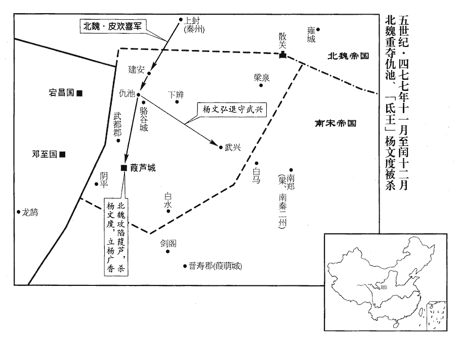
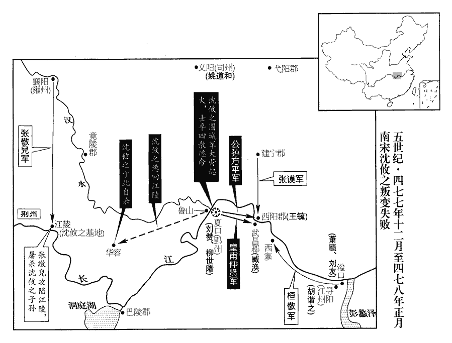

 宋紀十六起柔兆執徐（丙辰），盡著雍敦牂（戊午），凡三年。

# 蒼梧王下

## 元徽四年（丙辰、四七六）

1春，正月，己亥‹九›，帝‹刘昱，时年十四›耕籍田，大赦。

〖译文〗 [1]春季，正月，己亥（初九），刘宋皇帝刘昱亲自主持耕田典礼，实行大赦。

2二月，魏司空東郡王陸定國坐恃恩不法，免官爵爲兵。

〖译文〗 [2]二月，北魏司空东郡王陆定国因仗恃皇恩违犯国法，被免除官爵，发配军中当兵。

3魏馮太后‹时年三十五›內行不正，行，下孟翻。以李奕之死怨顯祖‹拓跋弘›，事見一百三十二卷明帝泰始之六年。密行鴆毒，夏，六月，辛未‹十三›，顯祖殂。年二十三。《考異》曰：元行沖《後魏國典》云：「太后伏壯士於禁中，太上入謁，遂崩。」按事若如此，安得不彰，而中外恬然不以爲怪，又孝文終不之知！按《後魏書》及《北史》皆無殺事。而《天象志》云「顯文暴崩」，蓋實有鴆毒之禍。今從之。壬申‹十四›，大赦，改元承明。葬顯祖‹拓跋弘›于金陵‹在故都盛乐（内蒙和林格尔）西北›，金陵在雲中。諡曰獻文皇帝。

〖译文〗 [3]北魏冯太后行为不正，因情夫李奕之死，深深怨恨她的嫡子献文帝，于是秘密下毒。夏季，六月，辛未（十三日），献文帝死亡。壬申（十四日），实行大赦,改年号承明。安葬在金陵，谥号称献文皇帝。

4魏大司馬、大將軍代人‹鲜卑人›萬安國坐矯詔殺神部長奚買奴，賜死。神部，八部之一也。長，知兩翻。

〖译文〗 [4]北魏大司马、大将军、鲜卑人万安国因假传圣旨诛杀神部长奚买奴罪，被命令自尽。

5戊寅‹二十›，魏以征西大將軍、安樂王長樂爲太尉，樂，音洛。尚書左僕射、宜都王目辰爲司徒，南部尚書李訢爲司空。訢，許斤翻。尊皇太后曰太皇太后，復臨朝稱制。魏高宗‹拓跋濬›之殂，顯祖‹拓跋弘›方年十二，馮太后臨朝稱制；時宋太宗泰始二年也。至次年，太后歸政。今旣鴆顯祖‹拓跋弘›，而高祖‹拓跋宏，时年十岁›尚幼，故復臨朝。復，扶又翻。朝，直遙翻。以馮熙爲侍中、太師、中書監。熙自以外戚，固辭內任；乃除都督、洛州‹府洛阳，河南洛阳东白马寺东›刺史，魏太宗取洛陽，以晉司州爲洛州。侍中、太師如故。

〖译文〗 [5]戊寅（十九日），北魏任命征西大将军、安乐王拓跋长乐为太尉，尚书左仆射、宜都王拓跋目辰为司徒，南部尚书李为司空。尊皇太后冯氏为太皇太后，冯大后再次摄政。冯太后任命冯熙为侍中、太师、中书监。冯熙认为自己是皇家外戚，坚决辞让朝内官职，于是任命他为都督、洛州刺史，但仍保留侍中，太师职位。

顯祖‹拓跋弘›神主祔太廟，有司奏廟中執事之官，請依故事皆賜爵。祕書令廣平‹河北鸡泽›程駿上言：「建侯裂地，帝王所重，或以親賢，或因功伐，以勞定國曰功，積功曰伐。未聞神主祔廟而百司受封者也。皇家故事，蓋一時之恩，豈可爲長世之法乎！」太后善而從之，謂羣臣曰：「凡議事，當依古典正言，豈得但脩「脩」，當作「循」。故事！」而【章：甲十一行本「而」下有「已」字；乙十一行本同；孔本同；熊校同；張校同，云「事」下脫「而已」二字。】賜駿衣一襲，帛二百匹。

〖译文〗 献文帝的牌位进入太庙之日，有关部门奏称：依照前例，太庙中有关官员都应加封爵位。秘书令广平人程骏上疏说：“加封爵位，赏赐采邑，是帝王最重视的事情，或是皇上的亲戚、贤才，或是对国家有功劳贡献的人，从来没有听说因为皇帝牌位进庙而有关官员接受封爵的。皇家前例，只是一时的恩庞，怎么可以作为后世的法则！”冯太后认为他说得对，采取了他的意见，对文武官员说：“凡讨论问题，都应当依照古代正确的言论，不可一味援引前例！”赏赐给程骏衣服一套，绸缎二百匹。

太后性聰察，知書計，曉政事，被服儉素，被，皮義翻。膳羞減於故事什七八；而猜忍多權數。高祖‹拓跋宏，时年十岁›性至孝，能承顏順志，事無大小，皆仰成於太后。《經典釋文》：仰，如字，又五亮翻。太后往往專決，不復關白於帝。復，扶又翻。所幸宦者高平‹宁夏固原›王琚、安定‹甘肃泾川›張祐、杞qǐ嶷、康曰：杞，姓也，出自夏后氏之後。嶷，魚力翻。馮翊‹陕西高陵›王遇、略陽‹甘肃清水›苻承祖、高陽‹河北高阳›王質，皆依勢用事；祐官至尚書左僕射，爵新平王；琚官至征南將軍，爵高平王；嶷等官亦至侍中、吏部尚書、刺史，爵爲公、侯，賞賜巨萬，賜鐵券，許以不死。康曰：《說文》：券，契也。《釋名》曰：券，綣quǎn也，相約束繾綣爲券也。又，太卜令姑臧‹甘肃武威›王叡得幸於太后，超遷至侍中、吏部尚書，爵太原公。祕書令李沖，雖以才進，亦由私寵，賞賜皆不可勝紀。太和末年，高菩薩之禍，后啓之也。后雖獲終其世，禍及門戶矣。勝，音升。又外禮人望東陽王丕、游明根等，皆極其優厚，每褒賞叡等，輒以丕等參之，以示不私。丕，烈帝之玄孫；拓跋翳槐諡烈帝。沖，寶之子也。魏世祖太平眞君五年，李寶入朝，其子沖遂貴顯於魏。

〖译文〗 冯太后生性聪慧，心思细密，读过书，会算术，通晓政事，衣着简单朴素，日用饮食要比过去的规定减省十分之七八，但生性猜忌残忍，工于权术。孝文帝拓跋宏对这位祖母皇太后至为孝顺，能够尽量使她高兴欢乐。事情无论大小，都由她决定。冯太后往往独断专行，所作决定不再告诉孝文帝。她所宠爱的宦官高平人王琚、安定人张和杞嶷、冯翊人王遇、略阳人苻承祖、高阳人王质都依仗冯太后的权势，在朝廷中掌权。张官至尚书左仆射，封新平王；王琚官至征南将军，封高平王；杞嶷等也都官至侍中、吏部尚书、刺史，封公爵、侯爵，赏赐钱财数万之多，发给他们铁券，承诺对他们绝不处死。另外，崐太卜令姑臧人王睿受冯太后的宠幸破格提拔，官至侍中、吏部尚书，封为太原公。秘书令李冲，虽然以他的才华受到赏识，但也是由于得到冯太后的私自宠爱的缘故。冯太后对他们的赏赐，都多到无法计算。表面上，冯太后对众望所归的大臣东阳王拓跋丕、游明根等，也都特别礼敬优厚。每次褒扬王睿等时，一定把拓跋丕等列入，表示并不出于私心。拓跋丕是烈帝拓跋翳槐的玄孙。李冲是李宝的儿子。

太后自以失行，畏人議己，羣下語言小涉疑忌，輒殺之。然所寵幸左右，苟有小過，必加笞箠，或至百餘；箠chuí，止橤翻。而無宿憾，尋復待之如初，或因此更富貴。故左右雖被罰，終無離心。此史之所謂權數也，吁！行，下孟翻。復，扶又翻。被，皮義翻。

〖译文〗 冯太后因为淫乱行为，害怕别人对自己讥讽议论，官员言谈中只要一句话被疑为对她的讽刺，就立即诛杀。她所宠爱的左右侍从，即使有小小的过错，也一定鞭打，甚至打一百余鞭。可是，冯太后对人从不记仇，第二天仍然善待，同平常一样，甚至有人被鞭打而更富贵。所以左右虽受体罚，但始终没有离心的。

6乙亥‹十七›，加蕭道成尚書左僕射，劉秉中書令。

〖译文〗 [6]乙亥（十七日），刘宋加授萧道成为尚书左仆射，刘秉为中书令。

7楊運長、阮佃夫等忌建平王景素益甚，《通鑑》書禍始於上卷上年。佃，音田。景素乃與錄事參軍陳郡殷濔、濔mǐ，莫比翻。中兵參軍略陽垣慶延、參軍沈顒、左暄等謀爲自全之計。顒yóng，魚容翻。遣人往來建康，要結才力之士，要，讀曰邀。冠軍將軍黃回、游擊將軍高道慶、輔國將軍曹欣之、前軍將軍韓道清、長水校尉郭蘭之、羽林監垣祗祖，漢東都之制，羽林左、右監主羽林騎，屬光祿勳；至晉，以羽林屬二衛，而監不見於《志》，當是江左復置。冠，古玩翻。校，戶敎翻。皆陰與通謀；武人不得志者，無不歸之。時帝‹刘昱›好獨出遊走郊野，欣之謀據石頭城，伺帝出作亂。道清、蘭之欲說蕭道成因帝夜出，執帝迎景素，道成不從者，卽圖之；景素每禁使緩之。楊、阮微聞其事，遣傖人周天賜僞投景素，好，呼到翻。說，輸芮翻；下譬說同。伺，相吏翻。傖，助庚翻；江東人謂楚人別種爲傖，亦謂西北人爲傖。勸令舉兵。景素知之，斬天賜首送臺。

〖译文〗 [7]杨运长、阮佃夫等对建平王刘景素的忌恨越发厉害。于是刘景素与录事参军阵郡人殷、中兵参军略阳人垣庆延、参军沈、左暄等密谋保卫自己的办法。派人来往建康，寻访结交有才能有勇力的人士。寇军将军黄回、游击将军高道庆、辅国将军曹欣之、前军将军韩道清、长水校尉郭兰之、羽林监垣祗祖，先后都与刘景素秘密通谋。所有未能满足志愿的军人，没有不归附刘景素的。当时，刘昱喜爱独自出来游逛，常常去远郊野外。曹欣之打算占领石头城，趁刘昱单独外出时，发动政变。韩道清、郭兰之准备游说萧道成，利用昱夜间出游机会，把他抓获，迎接刘景素。萧道成如果拒绝，便谋杀萧道成。但刘景素每次都禁止这样做，嘱咐不可仓促发动。杨运长、阮佃夫稍稍得到一点风声，派一个北方人周天赐，假装投靠刘景素，劝刘景素起兵。刘景素查出他的底细，杀了周天赐，把人头送到朝廷。

秋，七月，祗祖率數百人自建康奔京口‹江苏镇江›，云京師已潰亂，勸令速入。景素信之，戊子‹一›，據京口起兵，士民赴之者以千數。楊、阮聞祗祖叛走，卽命纂嚴。己丑‹二›，遣驍騎將軍任農夫、領軍將軍黃回、左軍將軍蘭陵‹侨郡，江苏常州西北›李安民將步軍，右軍將軍張保將水軍，以討之；驍，堅堯翻。騎，奇寄翻。任，音壬。民將、保將，卽亮將。辛卯‹四›，又命南豫州刺史段佛榮爲都統。都統之名始此。蕭道成知黃回有異志，故使安民、佛榮與之偕行。道成知黃回不附己，旣使之討景素，又使之討沈攸之，二難旣平，然後殺之，則足以知回於當時有幹略，而道成智數又一時所不及者。回私戒其士卒，「道逢京口兵，勿得戰。」道成屯玄武湖，冠軍將軍蕭賾鎭東府。冠，古玩翻。賾zé，士革翻。

〖译文〗 秋季，七月，垣祗祖率数百人，从建康逃到京口，声称京师已经大乱，劝刘景素火速前往接收。刘景素信以为真，戊子（初一），占据京口起兵，士人和平民响应的数以千计。杨运长、阮佃夫得知垣祗祖叛变逃走的消息，下令戒严。己丑（初二），派骁骑将军任农夫、领军将军黄回、左军将军兰陵人李安民率领陆军；右军将军张保率领水军，出发讨伐他们。辛卯（初四），又任命南豫州刺史段佛荣为都统。萧道成已经发现黄回怀有二心，所以故意派李安民、段佛荣跟他同行。黄回暗中警告他的士卒：“途中遇到京口军，不要作战。”萧道成驻防玄武湖，冠军将军萧赜镇守东府。

始安王伯融‹年十九›，都鄕侯伯猷‹年十一›，皆建安王休仁之子也，楊、阮忌其年長，悉稱詔賜死。

〖译文〗 始安王刘伯融、都乡侯刘伯猷，都是建安王刘休仁的儿子，杨运长、阮佃夫对他们年纪渐大感到威胁，于是假传圣诏，命他们自尽。

景素欲斷竹里‹江苏句容北›以拒臺軍。長，知兩翻。斷，丁管翻；下斷峽同。垣慶延、垣祗祖、沈顒皆曰：「今天時旱熱，臺軍遠來疲困，引之使至，以逸待勞，可一戰而克。」殷濔mǐ等固爭，不能得。農夫等旣至，縱火燒市邑。慶延等各相顧望，莫有鬬志；景素本乏威略，恇擾不知所爲。恇，去王翻。黃回迫於段佛榮，且見京口軍弱，遂不發。

〖译文〗 刘景素打算以切断竹里来抵抗官军。垣庆延、垣祗祖、沈都说：“今年天气干旱炎热，官军远道而来，一定疲劳困顿，把他们引到城下，我们以逸待劳，可以一战取胜。”殷等坚决反对，但得不到上级支持。任农夫等抵达之后，纵火焚烧城市村落，垣庆延等互相观望，全无斗志。刘景素本来缺乏军事上的谋略和威望，惶恐怯懦，不知所措。黄回迫于段佛荣在旁，而且又看到京口军兵力薄弱，于是也不敢发动进攻。

張保泊西渚‹江苏镇江西›，西渚在京口城西，今西津渡口是也。景素左右勇士數十人，自相要結，要，一遙翻。進擊水軍。甲午‹七›，張保敗死，而諸將不相應赴，復爲臺軍所破。復，扶又翻。臺軍旣薄城下，顒先帥衆走，帥，讀曰率。祗祖次之，其餘諸軍相繼奔退，獨左暄與臺軍力戰於萬歲樓下；而所配兵力甚弱，不能敵而散。乙未‹八›，拔京口‹江苏镇江›。黃回軍先入，自以有誓不殺諸王，乃以景素讓殿中將軍張倪奴。倪奴擒景素，斬之‹年二十五›，幷其三子，同黨垣祗祖等數十人皆伏誅。蕭道成釋黃回、高道慶不問，撫之如舊。撫之所以安反側，事定之後決不能容之。是日，解嚴。丙申‹九›，大赦。

〖译文〗 朝廷将领张保，停泊西渚，刘景素左右勇士几十人，互相约定以死相拚，攻击张保的水军。甲午（初七），击斩张保，可是，京口军其他将领为了各自保全实力，不肯增援扩大战果，又被官军反攻击败。官军紧逼城下后，沈首先率领他的部众逃走，垣祗祖也跟着逃走，其他各路人马一哄而散，只有参军左暄与官军奋战在万岁楼下，但因分配给他的兵务不足，不能抵挡，最终溃败。乙未（初八），官军攻克京口。黄回军首先入城，因自己曾有“不杀诸王”的誓言，于是把刘景素交给殿中将军张倪奴。张倪奴生擒刘景素后，连同他的三个儿子及同党垣祗祖等数十人一齐斩首。萧道成对黄回、高道庆、不再追问，像往常一样抚慰他们。当天，解除戒严。丙申（初九），实行大赦。

初，巴東‹重庆奉节东›、建平‹重庆巫山›蠻反，沈攸之遣軍討之。及景素反，攸之急追峽中軍以赴建康。巴東太守劉攘兵、建平太守劉道欣疑攸之有異謀，勒兵斷峽‹湖北宜昌›，不聽軍下。攘兵子天賜爲荊州西曹，西曹者，漢、晉公府之西曹椽。攸之遣天賜往諭之。攘兵知景素實反，乃釋甲謝愆，攸之待之如故。劉道欣堅守建平，攘兵譬說不回，乃與伐蠻軍攻斬之。沈攸之用劉攘兵，卒爲攘兵所禍；蕭道成用黃回，而權以濟事；非用人之難，用勢之難也。說，輸芮翻。

〖译文〗 当初，巴东建平蛮族叛变，沈攸之派军讨伐他们。等到刘景素起兵反叛时，沈攸之紧急追回已进入三峡的讨蛮军，改命直赴京师建康勤王。巴东太守刘攘兵、建平太守刘道欣，认为沈攸之一定有阴谋，于是，下令戒严，封锁峡口，阻止沈攸之军队东下。刘攘兵的儿子刘天赐任荆州西曹，沈攸之派刘天赐前往，向他父亲说明原因，刘攘兵才知道刘景素真的已经起兵，乃下令各军撤退，向沈攸之道歉，沈攸之待他同往常一样。可是，刘道欣仍继续固守建平，对刘攘兵派人前去解释，刘道欣一口拒绝。于是刘操兵与讨蛮军一起发动攻击，斩刘道欣。

8甲辰‹十七›，魏主‹拓跋宏›追尊其母李貴人曰思皇后。李氏，李惠之女，高祖之母也。爲後李惠貴張本。

〖译文〗 [8]甲辰（十七日），北魏国主追尊母亲李贵人为思皇后。

9八月，丁卯‹十›，立皇弟翽爲南陽王，翽huì，呼會翻。嵩爲新興王，禧爲始建王。

〖译文〗 [9]八月，丁卯（初十），刘宋封皇弟刘为南阳王，刘嵩为新兴王，刘禧为始建王。

10庚午‹十三›，以給事黃門侍郎阮佃夫爲南豫州刺史，留鎭京師。

〖译文〗 [10]庚午（十三日），任命给事黄门侍郎阮佃夫为南豫州刺史，仍留镇京师。

11九月，戊子‹二›，賜驍騎將軍高道慶死。驍，堅堯翻。騎，奇寄翻。

〖译文〗 [11]九月，戊子（初二），下令赐骁骑将军高道庆自尽。

12冬，十月，辛酉‹五›，以吏部尚書王僧虔爲尚書左【章：甲十一行本「左」作「右」；乙十一行本同；孔本同。】僕射。

〖译文〗 [12]冬季，十月，辛酉（初五），提升吏部尚书王僧虔为尚书左仆射。

13十一月，戊子‹三›，魏以太尉、安樂王長樂爲定州‹府中山，河北定州›刺史，司空李訢爲徐州‹府彭城，江苏徐州›刺史。樂，音洛。訢，許斤翻。

〖译文〗 [13]十一月，戊子（初三），北魏任命太尉、安乐王拓跋长乐为定州刺史，司空李为徐州刺史。

# 順皇帝諱準，字仲謨，明帝第三子也，小字知觀；實桂陽王休範之子。《諡法》：慈和徧服曰順。蕭氏所以諡之曰順者，以其順天命人心而禪代也。

## 昇明元年（丁巳、四七七）是年七月，帝卽位，始改元昇明。

1春，正月，乙酉朔‹一›，魏改元太和。

〖译文〗 [1]春季，正月，乙酉朔（初一），北魏改年号太和。

2己酉‹二十五›，略陽‹甘肃清水›民王元壽聚衆五千餘家，自稱衝天王；二月，辛未‹十七›，魏秦、益二州‹府上邽，甘肃天水›刺史尉洛侯擊破之。秦、益二州，此魏所謂南秦、東益也。尉，紆勿翻。

〖译文〗 [2]己酉（二十五日），略阳平民王元寿，聚集部众五千余家，自称冲天王。二月，辛未（十七日），北魏秦、益二州刺史尉洛侯击败王元寿。

3三月，庚子‹十七›，魏以東陽王丕爲司徒。

〖译文〗 [3]三月，庚子（十七日），北魏任命东阳王拓跋丕为司徒。

4夏，四月，丁卯‹十四›，魏主‹拓跋宏，时年十一›如白登‹山西大同东›；壬申‹十九›，如崞山‹山西浑源境›。崞guō，音郭。

〖译文〗 [4]夏季，四月，丁卯（十四日），北魏国主前往白登。壬申（十九日），前往崞山。

5初，蒼梧王‹刘昱，时年十五›在東宮，好緣漆帳竿，好，呼到翻。去地丈餘；喜怒乖節，主帥不能禁。主帥，謂東宮齋內主帥也。帥，所類翻。太宗‹刘彧›屢敕陳太妃‹陈妙登›痛捶之。陳氏，蒼梧王之母也。卽位，尊爲太妃。揰，止橤翻。及卽帝位，內畏太后‹王贞风›、太妃‹陈妙登›，外憚諸大臣，未敢縱逸。自加元服，內外稍無以制，數出遊行，數，所角翻。始出宮，猶整儀衛。俄而弃車騎，帥左右數人，或出郊野，或入市廛chán。騎，奇寄翻；下同。帥，讀曰率。太妃‹陈妙登›每乘青犢車，青犢車，青蓋犢車也。晉制，諸王青蓋車。時有司奏，皇太妃輿服一同晉孝武李太妃故事。隨相檢攝。旣而輕騎遠走一二十里，太妃不復能追；復，扶又翻；下已復同。儀衛亦懼禍不敢追尋，唯整部伍別在一處，瞻望而已。

〖译文〗 当初，刘宋苍梧王刘昱当皇太子时，常常亲自动手，油漆逢帐高竿，能爬到距地面一丈多的高处。他喜怒无常，侍从官员无法劝阻。明帝屡次让他的母亲陈太妃痛打他。刘昱即帝位后，对内害怕皇太后、皇太妃，对外害怕各位大臣，不敢放纵。可是，自从行过加冠礼后，宫内宫外对他逐渐失去控制，于是刘昱不断出宫游逛。最初出宫，还有整齐的仪仗卫队。不久，便丢下随从车马，只带身边几个人，或跑到荒郊野外，或出入街头闹市。陈太妃每次乘坐青盖牛犊车，尾随其后，监视、约束他，他便换乘轻装快马，一气奔跑一二十里，让太妃追赶不上。仪仗卫队也畏惧大祸临头，不敢追寻刘昱的去向，只好把部队驻扎在另外一个地方，远远眺望而已。

初，太宗‹刘彧›嘗以陳太妃‹陈妙登›賜嬖人李道兒，已復迎還，生帝‹刘昱›，已，旣也；旣而復迎之還也。嬖bì，卑義翻，又博計翻。故帝每微行，自稱「劉統」，劉統，自言統天下也，猶苻堅稱「苻詔」，桓玄稱「桓詔」。或稱「李將軍」。常著小袴kù衫，營署巷陌，無不貫穿；著，陟略翻。穿，如字，又樞絹翻。或夜宿客舍，或晝臥道傍，排突廝養，廝，息移翻。養，餘亮翻。韋昭曰：析薪爲廝，炊烹爲養。又，廝給、養馬者。與之交易，或遭慢辱，悅而受之。凡諸鄙事，裁衣、作帽，過目則能；未嘗吹箎，箎chí，音池，以竹爲之，長八尺四寸，圍三寸。《周禮》賈疏云：箎八孔。執管便韻。韻，諧也，和也。及京口‹江苏镇江›旣平，驕恣尤甚，無日不出，夕去晨返，晨出暮歸。從者並執鋋矛，從，才用翻。鋋chán，音蟬，又以前翻，小矛也。行人男女及犬馬牛驢，逢無免者。民間擾懼，商販皆息，門戶晝閉，行人殆絕。鍼zhēn、椎、鑿、鋸，不離左右，鍼，與鉗同，其淹翻。離，力智翻。小有忤意，卽加屠剖，忤，五故翻。一日不殺，則慘然不樂；殿省憂惶，食息不保。阮佃夫與直閤將軍申伯宗等，謀因帝出江乘‹江苏南京东北›射雉，稱太后‹王贞风›令，喚隊仗還，樂，音洛。射，而亦翻。隊有隊主、副，仗有仗主、副。閉城門，遣人執帝廢之，立安成王準。事覺，甲戌‹二十一›，帝‹刘昱›收佃夫‹年五十一›等殺之。

〖译文〗 当初，明帝曾经把陈太妃赏赐给宠信的弄臣李道儿为妻，后来又把她迎接回去，生下苍梧王。所以，刘昱每次改穿便服外出，就自称刘统，或自称李将军。经常穿短裤、短衫，无论军营、官府、街巷、田野，到处出入。有时夜晚投宿旅店，有时白天就睡在马路旁边，在下等人中间挤来挤去，跟他们作买卖，有时遭到怠慢侮辱也欣然接受。任何低贱的事情，像裁制衣服、制作帽子，只要看过一遍，就能够学会。他从来没有吹过，拿起来一吹，声音便会曲调。等到京口事变平息，刘昱骄纵横暴尤为严重，没有一天不出宫，不是晚上出去，凌晨回来，就是凌晨出去，晚上回来。随从人员手持短刀长矛，路上的行人，不管是男是女，，不管是狗、马、牛、驴，只要碰上，立即诛杀，无一幸免。百姓忧愁恐惧，店铺及行商，全都停止经营，家家户户，白天闭门，路上行人几乎绝迹。钳、锥、凿、锯，不离刘昱左右，只要稍看不顺眼，便顺手抓起凶器，当场杀人剖腹。一天不杀人，就闷闷不乐。宫廷侍从和朝廷官员，担忧惶恐，饮食作息，都不能安稳。阮佃夫与直将军申伯宗等，密谋趁刘昱到江乘打野鸡之时，宣称奉皇太后命令，传唤仪仗卫队回京，关闭城门，派人逮捕刘昱，废黜，拥护安成王刘准。想不到密谋泄漏，甲戌（五月二日），刘昱逮捕阮佃夫等，斩首。

太后‹王贞风›數訓戒帝，數，所角翻。帝不悅。會端午，太后賜帝毛扇。毛扇，蓋羽扇也。《考異》曰：《宋略》作「太妃賜」，今從《宋書》。帝嫌其不華，令太醫煑藥，欲鴆太后。左右止之曰：「若行此事，官便應作孝子，豈復得出入狡獪！」復，扶又翻；下無復、誰復同。狡，古巧翻。獪，古外翻。江南人謂小兒戲爲狡獪。帝曰：「汝語大有理！」乃止。

〖译文〗 皇太后经常教训刘昱，刘昱很不高兴。正逢端午节，太后赏赐给刘昱一把羽毛扇，刘昱嫌它不够豪华，下令御医配制毒药，打算毒死太后。左右劝阻他说：“如果真的这样做，陛下便要当孝子，怎么还能出入宫门玩耍游戏？”刘昱说：“你这话很有道理。”于是打消主意。

六月，甲戌‹二十二›，有告散騎常侍杜幼文、司徒左長史沈勃、游擊將軍孫超之與阮佃夫同謀者，帝登帥衛士，自掩三家，悉誅之，登，登時也；登時，猶言卽時也。散，悉亶翻。騎，奇寄翻。帥，讀曰率。《考異》曰：《南史》曰：「孝武二十八子，太宗殺其十六，餘皆帝殺之。」按《宋書》，孝武諸子，十人早卒，二人爲景和所殺，餘皆太宗殺之，無及蒼梧時者，《南史》誤也。刳解臠割，嬰孩不免。沈勃時居喪在廬，廬，倚廬也。禮：居喪者，居倚廬，寢苫枕塊。孟康《註》曰：倚廬，倚牆至地而爲之，無楣柱。孔穎達曰：居倚廬者，謂於中門之外，東牆下倚木爲廬。又說曰：凡非適子，自未葬以於隱者爲廬。鄭《註》曰：不欲人屬目，蓋於東南角。左右未至，帝揮刀獨前。勃知不免，手搏帝耳，唾罵之曰：唾，湯臥翻。「汝罪踰桀、紂，屠戮無日，」遂死。是日，大赦。

〖译文〗 六月，甲戌（二十二日），有人上告散骑常侍杜幼文、司徒左长史沈勃、游击将军孙超之，跟阮佃夫同谋。刘昱立即率领卫士，亲自突击三家，全部诛杀，砍断肢体，把肉一块块割下，连婴儿也不能幸免。沈勃当时正在家里守丧，卫队还没有到，刘昱挥刀独自一人冲在前面，沈勃知道不能避免，赤手空拳搏斗，猛击刘昱耳朵，唾骂道：“你的罪恶，超过桀、纣，死在眼前。”于是被砍死。当天，下诏大赦。

帝嘗直入領軍府。時盛熱，蕭道成晝臥裸袒。裸，郎果翻。帝立道成於室內，畫腹爲的，畫，讀與𦘕同。自引滿，將射之。射，而亦翻；下無復射、箭射同。道成斂版曰：「老臣無罪。」左右王天恩曰：「領軍腹大，是佳射堋；堋，補隥翻。射堋，今言射垜也。一箭便死，後無復射；不如以骲bào箭射之。」帝乃更以骲箭射，正中其齊。更，工衡翻。骲，蒲交翻，又蒲剝翻。《集韻》云：骨鏃也。余謂骨鏃亦能害人，況以之射人腹乎！蓋當時所謂骲箭者，必非骨鏃。中，竹仲翻。齊，與臍同。投弓大笑曰：「此手何如！」帝‹刘昱›忌道成威名，嘗自磨鋋chán，曰：「明日殺蕭道成。」陳太妃‹陈妙登›罵之曰：「蕭道成有功於國，若害之，誰復爲汝盡力邪！」爲，于僞翻。帝乃止。

〖译文〗 一天，刘昱一直闯入领军府，当时天气炎热，萧道成正裸身躺在那里睡觉。刘昱把萧道成叫醒，让他站在室内，在他肚子上画一个箭靶，自己拉紧了弓，就要发射。萧道收起手版说：“老臣无罪。”左右侍卫王天恩说：“萧道成肚子大，是一个奇妙的箭靶，一箭射死，以后就再也找不到这样的箭靶了。不如改用圆骨箭头，多射几次。”刘昱就改用圆骨箭头。一箭射去，正中萧道成的肚脐，他把弓扔到地上，得意地大笑，说：“这只手如何！”刘昱对萧道成的威名十分畏惧忌恨，曾亲自磨短矛，说：“明天就杀萧道成。”陈太妃骂他说：“萧道成对国家有大功，如果杀了他，谁还为你尽力！”刘昱才住手。

道成憂懼，密與袁粲、褚淵謀廢立。粲曰：「主上幼年，微過易改。易，以豉翻。伊、霍之事，非季世所行；縱使功成，亦終無全地。」淵默然。淵於此時已心歸道成矣。領軍功曹丹陽紀僧眞言於道成曰：「今朝廷猖狂，人不自保；天下之望，不在袁、褚，明公豈得坐受夷滅！存亡之機，仰希熟慮。」道成然之。道成時爲中領軍，以僧眞爲功曹。希，望也。

〖译文〗 萧道成忧愁恐惧，与尚书令袁粲、中书监褚渊密谋废黜刘昱，另立新君。袁粲说：“主上年纪还小，轻微的过失，容易改正。伊尹、霍光的往事，在这末世已难实行。即使成功，最后仍无安身之地。”褚渊沉默不语。领军功曹丹阳人纪僧真对萧道成说：“现在，皇上凶残疯狂，无人可以自保，天下百姓的盼望，不在袁粲、褚渊，明公怎么能坐待被剿灭？存亡的关键，请深思熟虑。”萧道成同意。

或勸道成奔廣陵‹江苏扬州›起兵。道成世子賾，時爲晉熙王長史，行郢州事，欲使賾將郢州兵東下會京口。將，卽亮翻。道成密遣所親劉僧副告其從兄行青、冀二州刺史劉善明曰：從，才用翻。「人多見勸北固廣陵，恐未爲長算。今秋風行起，卿若能與垣東海微共動虜，則我諸計可立。」亦告東海‹侨郡，江苏涟水县›太守垣榮祖。善明曰：「宋氏將亡，愚智共知。北虜若動，反爲公患。公神武高世，唯當靜以待之，因機奮發，功業自定，不可遠去根本，自貽猖蹶。」榮祖亦曰：「領府去臺百步，領府，謂領軍府也。公走，人豈不知！若單騎輕行，騎，奇寄翻。廣陵人閉門不受，公欲何之！公今動足下牀，恐卽有叩臺門者，言將有告之者。公事去矣。」紀僧眞曰：「主上雖無道，國家累世之基猶爲安固。公百口，北度必不得俱。縱得廣陵城，天子居深宮，施號令，目公爲逆，何以避之！此非萬全策也。」道成族弟鎭軍長史順之順之，蕭衍之父也。《考異》曰：《齊高帝紀》，姚思廉《梁書•武帝紀》，自相國何至皇考一十餘世，皆有名及官位。蓋史官附會，今所不取。及次子驃騎從事中郎嶷，驃，匹妙翻。騎，奇寄翻。嶷，魚力翻。皆以爲：「帝好單行道路，於此立計，易以成功；外州起兵，鮮有克捷，好，呼到翻。易，以豉翻。鮮，息淺翻。鮮，少也。徒先人受禍耳。」先，悉薦翻。道成乃止。

〖译文〗 有人劝萧道成回广陵起兵。萧道成的大儿子萧赜正任晋熙王刘燮的长史，兼行郢州事，萧道成打算命萧赜率郢州军顺长江东下，在京口中师。萧道成派他的亲信刘僧副，秘密通告堂兄、代理青、冀二州刺史刘善明，说：“很多人劝我北上据守广陵，恐怕不是长远的打算。现在秋风将起，你如果能跟垣荣祖联合，稍稍挑动胡虏，我的各种计划当可实施。”同时也告诉东海太守垣荣祖。刘善明说：“宋国将亡，无论愚蠢人和明智人，都看得一清二楚。北虏如果有什么行动，反而会成为你的祸患。你的智慧韬略和英勇武功高过当世，只有一个办法，那就是安静地等待时机，再趁机猛烈出击，大业自然告成，不可以远离根本之地，自找灾祸。”垣荣祖也说：“领府距离宫城，不过一百步，如果你全家出奔，别人怎么会不知道？如果单枪匹马，轻装前往，广陵官员万一崐关闭城门，拒绝接纳，下一步将逃向哪里？你只要举脚下床，马上就会有人敲宫城的城门，向朝廷告发，你的大事就糟糕了。”纪僧真说：“主上虽然凶暴丧失天道，可是刘家王朝几世建立的政权还算坚固。你百口之家，同时向北出奔，绝不可能。即使进入广陵，天子居住深宫之中，发号施令，指控你是叛逆，你有什么办法躲避！这不是万全之策。”萧道成的族弟、镇军长史萧顺之，以及萧道成的次子、骠骑从事中郎萧嶷，都认为：“皇上喜爱单独出来乱窜，在这方面下手，比较容易成功。外州起兵，很少能够成功，反而徒然比别人先受灾祸。”萧道成这才取消原意。

東中郎司馬、行會稽郡‹浙江绍兴›事李安民欲奉江夏王躋起兵於東方，明帝泰始七年以皇子躋繼江夏王義恭，時蓋爲東中郎將，以安民爲司馬行郡事也。會，工外翻。夏，戶雅翻。躋，牋西翻。道成止之。

〖译文〗 东中郎司马、代理会稽郡事李安民，打算拥护江夏王刘跻，在东方起兵，萧道成加以制止。

越騎校尉王敬則潛自結於道成，夜著青衣，扶匐道路，著，則略翻。扶，讀曰蒲。《說文》曰：手行也。匐，蒲北翻。爲道成聽察帝之往來。道成命敬則陰結帝左右楊玉夫、楊萬年、陳奉伯等一【張：「一」作「二」。】十五人於殿中，詗xiòng伺機便。爲，于僞翻。詗，喧正翻，又古迥翻。伺，候也。伺，相吏翻。

〖译文〗 越骑校尉王敬则主动暗中结交萧道成，一到夜里，王敬则就换上平民衣服，匍匐路旁，替萧道成侦察刘昱的行踪。萧道成命王敬则秘密结交刘昱左右亲信杨玉夫、杨万年、陈奉伯等二十五人，他们都在宫城内殿中任职，窥探有什么机会。

秋，七月，丁亥‹六›夜，帝‹刘昱›微行至領軍府門。左右曰：「一府皆眠，何不緣牆入？」帝曰：「我今夕欲於一處作適，適意作戲，謂之作適。宜待明夕。」員外郎桓康等於道成門間聽聞之。此員外郎蓋員外散騎郎也。

〖译文〗 秋季，七月，丁亥（初六），夜晚，刘昱身穿便装，走到领军府门口，左右侍从说：“府里的人全都睡熟，我们为什么不跳墙进去？”刘昱说：“今天晚上，我要到别的地方玩个痛快，明晚再来。”员外郎桓康等在领军府大门后全都听到。

戊子‹七›，帝乘露車，與左右於臺岡賭跳，臺岡，意卽臺城之來岡也。賭跳者，賭跳躑，以高者爲勝也。跳，音他弔翻。《考異》曰：《南史》作「蠻岡」，今從《宋書》。仍往青園尼寺，尼，女夷翻。晚，至新安寺孝武‹刘骏›寵姬殷貴妃死，爲之立寺。貴妃子子鸞封新安王，故以新安爲寺名。偷狗，就曇度道人煑之。曇，徒含翻。飲酒醉，還仁壽殿寢。楊玉夫常得帝意，至是忽憎之，見輒切齒曰：「明日當殺小子取肝肺！」是夜，令玉夫伺織女渡河，《續齊諧記》曰：桂陽成武丁有仙道，謂其弟曰：「七月七日，織女當渡河。」弟問曰：「織女何事渡河？」答曰：「織女暫詣牽牛。」人至今云織女嫁牽牛也。崔寔《四民月令》曰：或云見天漢中奕奕有正白氣，光耀五色，以此爲徵應。曰：「見當報我；不見，將殺汝！」時帝出入無常，省內諸閤，夜皆不閉，廂下畏相逢值，無敢出者；宿衛並逃避，內外莫相禁攝。是夕，王敬則出外。玉夫伺帝熟寢，與楊萬年取帝防身刀刎之‹年十五›。御左右防身刀，卽所謂千牛刀也。刎，扶粉翻。敕廂下奏伎，伎，渠綺翻。陳奉伯袖其首，依常行法，稱敕開承明門出，以首與敬則。敬則馳詣領軍府，叩門大呼，呼，火故翻。蕭道成慮蒼梧王誑之，不敢開門。誑，居況翻。敬則於牆上投其首，道成洗視，乃戎服乘馬而出，敬則、桓康等皆從。入宮，至承明門，詐爲行還。敬則恐內人覘見，以刀環塞窐guī孔，覘，丑廉翻，又丑豔翻。塞，悉則翻。窐孔，卽古之所謂圭竇也。窐，古攜翻，又音攜xié。呼門甚急，門開而入。他夕，蒼梧王‹刘昱›每開門，門者震懾，不敢仰視，至是弗之疑。懾，之涉翻。《考異》曰：《齊高帝紀》云：「衛尉丞顏靈寶窺見太祖乘馬在外，竊謂親人曰：『今若不開，內領軍入，天下會是亂耳。』」按靈寶若語所親，則須有知者，豈得宿衛晏然不動！今從《宋•後廢帝紀》。道成入殿，殿中驚怖；怖，普布翻。旣而聞蒼梧王‹刘昱›死，咸稱萬歲。

〖译文〗 戊子（初七），刘昱乘坐露天无篷车，跟左右侍从前往台冈，比赌跳高。然后，前往青园尼姑庵。夜晚，来到新安寺偷狗，偷来狗找到昙度道人，煮吃狗肉。吃过狗肉，醉醺醺地回仁寿殿睡觉。弄臣杨玉夫一向得到刘昱的庞信，而今天，刘昱忽然对杨玉夫大为痛恨，一看见他就咬牙切齿，说：“明天就杀了你这小子，挖出肝肺！”这天深夜，命杨玉夫观察织女渡河，说：“看见织女渡河时，马上叫醒我；看不见，就杀了你。”当时，刘昱出宫进宫，没有一定时间，宫中各阁门，夜间都不敢关闭，负责宫廷保卫的官员，惧怕跟皇帝见面，都不敢出门。禁卫军士卒更是躲得远远的，内外一片紊乱，互不相关，没有人管理。当天夜晚，王敬则出营等候消息，杨玉夫等到刘昱呼呼大睡时，与杨万年合伙取下刘昱的防身佩刀，砍下刘昱的人头。然后假传圣旨，命外庭演奏音乐。陈奉伯把刘昱的人头，藏在袍袖里面，跟往常一样，神色自若，宣称奉皇帝派遣，打开承明门出宫，把人头交给王敬则。王敬则飞马奔向领军府，敲门大喊，萧道成恐怕是刘昱的诡计，不敢开门。王敬则把人头从墙上扔进去，萧道成令人洗净血迹辨识，果然不错，这才全副武装，骑马而出，王敬则、桓康等都随从其后，直往宫城，到了承明门，宣称皇帝御驾回宫。王敬则恐怕守门官兵从门洞往外察看，用刀柄堵住门洞，同时咆哮催促。门打开，进入宫城。从前，每逢夜晚，刘昱闯出闯进，都急躁凶暴，守门卫土震恐，从不敢抬头。所以，今晚之事，没有一人怀疑。萧道成进入仁寿殿，殿中官员惊慌恐怖。但紧接着听到刘昱已死的消息，都高呼万岁。

己丑‹八›旦，道成戎服出殿庭槐樹下，以太后令召袁粲、褚淵、劉秉入會議。道成謂秉曰：「此使君家事，何以斷之？」使，疏吏翻。斷，丁亂翻。秉未答。道成須髯盡張，目光如電。秉曰：「尚書衆事，可以見付；軍旅處分，須，與鬚同。處，昌呂翻。分，扶問翻。一委領軍。」道成次讓袁粲，粲亦不敢當。王敬則拔白刃，在牀側跳躍曰：「天下事皆應關蕭公！敢有開一言者，血染敬則刀！」仍手取白紗帽加道成首，《五代志》：帽自天子下及士人通冠之，以白紗者，名高頂帽。皇太子在上省則烏紗，在永福則白紗。蓋貴白紗也。杜佑曰：宋制：黑帽綴紫褾，褾以繒爲之，長四寸，廣一寸。後制高屋白紗帽。令卽位，曰：「今日誰敢復動！事須及熱！」道成正色呵之曰：「卿都自不解！」復，扶又翻。呵，虎何翻。解，戶買翻，曉也。粲欲有言，敬則叱之，乃止。褚淵曰：「非蕭公無以了此。」手取事授道成。褚淵手取其事以授道成，自此天下之事一歸之矣。道成曰：「相與不肯；我安得辭！」乃下議，備法駕詣東城，迎立安成王。東城，卽東府城也。於是長刀遮粲、秉等，各失色而去。觀史所書，會議之際，道成目光如電，須髯盡張；王敬則拔白刃跳躍，繼又以長刀遮粲、秉等，事勢可知矣。粲、秉於此時，聲其弒君之罪，以身死之，猶不愧於仇牧，何待至石頭邪！秉出，於路逢從弟韞yùn，從，才用翻。韞開車迎問曰：「今日之事當歸兄邪？」秉曰：「吾等已讓領軍矣。」韞拊膺曰：「兄肉中詎有血邪！今年族矣！」宋事去矣，自中人以下皆知之。

〖译文〗 己丑（初八），早晨，萧道成全副武装，站在殿前庭院中槐树下，以皇太后的命令召集尚书令袁粲、中书监渊褚、中书令刘秉入殿举行会议。萧道成对刘秉说：“这是你们刘家的事，应该如何决定？”刘秉还未及回答，萧道成顿时大怒，胡子翘起，双目发出凶光，如同两道闪电。刘秉说：“尚书省的事，可以交付给我。军事措施，全依靠你。”萧道成依次让给袁粲，袁粲推辞不敢当。王敬则拔出佩刀，在座位旁跳起来，厉声道：“天下大事，全都要萧公裁决，谁胆敢说半个不字，血染我刀！”说着亲手取出白纱帽，戴到萧道成头上，要求萧道成登基称帝，并威胁说：“今天谁敢乱动？大事要趁热一气呵成。”萧道成板起面孔，呵止说：“你什么也不明白！”袁粲打算讲话，王敬则大声喝他闭嘴，他只好闭嘴。褚渊说：“非萧公不足以办理善后！”就把处理一切事务的权交给萧道成。萧道成说：“既然大家都不肯接受，我怎么可以推辞。”于是，提议：准备法驾，前往东府城，迎接安成王刘准继任皇帝。萧道成卫士抽出佩刀，筑成刀墙，命袁粲、刘秉起身，二人面无人色，离去。刘秉出宫，路上遇到堂弟刘韫，刘韫打开车门迎问：“今天的事，该不该归你？”刘秉说：“我们已让给萧道成。”刘韫捶胸说：“你肉里有没有血？今年，全族难逃屠杀。”

是日，以太后‹王贞风›令，數蒼梧王‹刘昱›罪惡，數，所具翻。曰：「吾密令蕭領軍潛運明略。安成王準，宜臨萬國。」追封昱爲蒼梧王。儀衛至東府門，安成王令門者勿開，以待袁司徒。粲至，王乃入居朝堂。史言袁粲爲一時倚重。朝，直遙翻。壬辰‹十一›，王‹刘准›卽皇帝位，時年十一，改元，大赦。改元昇明。葬蒼梧王於郊壇西。南郊壇在臺城南巳地，世祖大明三年，移南郊壇於牛頭山以正陽位。

〖译文〗 当天，萧道成以皇太后的名义，发布命令，列举刘昱罪状，说：“我密令萧道成暗中运用智谋。安成王刘准，应君临万国。”追封刘昱为苍梧王。皇帝仪仗队抵达东府门前，刘准命守门的人不要开门，等待袁粲的到来。袁粲到了之后，刘准才动身到金銮殿。壬辰（十一日），刘准即皇帝位，本年十一岁，改年号，实行大赦。把刘昱安葬在南郊祭天神坛之西。

6魏京兆康王子推卒。

〖译文〗 [5]北魏京兆康王拓跋子推去世。

7甲午‹十三›，蕭道成出鎭東府。丙申‹十五›，以道成爲司空、錄尚書事、驃騎大將軍；驃，匹妙翻。騎，奇寄翻。袁粲遷中書監，褚淵加開府儀同三司；劉秉遷尚書令，加中領軍；以晉熙王燮爲揚州刺史。劉秉始謂尚書萬機，本以宗室居之，則天下無變；旣而蕭道成兼總軍國，布置心膂，與奪自專，褚淵素相憑附，秉與袁粲閣手仰成矣。閣手者，高拱充位而無所爲，兩手若有所閣也。仰，牛向翻。辛丑‹二十›，以尚書右僕射王僧虔爲僕射。丙午‹二十五›，以武陵王贊爲郢州刺史；蕭道成改領南徐州‹府京口，江苏镇江›刺史。

〖译文〗 [6]甲午（十三日），刘宋中领军萧道成亲自坐镇东府。丙申（十五日），任命萧道成为司空、录尚书事、骠骑大将军；袁粲为中书监；加授褚渊开府仪同三司；刘秉为尚书令，加授中领军；晋熙王刘燮为扬州刺史。刘秉原来以为尚书省总揽全国政务，由皇族主持，政权就可稳固。想不到萧道成手握军权，把心腹同党安排在重要位置，独断专行。褚渊又一向站在萧道成一边，刘秉与袁粲束手无策，不能有所作为。辛丑（二十日），任命尚书右仆射王僧虔为尚书仆射。丙午（二十五日），任命武陵王刘赞为郢州刺史，萧道成改兼南徐州刺史。

8八月，壬子‹一›，魏大赦。

〖译文〗 [7]八月，壬子（初一），北魏实行大赦。

9癸亥‹十二›，詔袁粲鎭石頭。粲性沖靜，每有朝命，常固辭；朝，直遙翻。逼切不得已，乃就職。至是知蕭道成有不臣之志，陰欲圖之，卽時順命。爲袁粲以石頭死節張本。

〖译文〗 [8]癸亥（十二日），诏命袁粲出京镇守石头。袁粲性情淡泊，每次任命他新官职，都要坚决辞让，实在迫不得已，才勉强就职。现在他发现萧道成有推翻刘家王朝的野心，打算秘密谋划除掉萧道成，所以立即接受。

10初，太宗‹刘彧›使陳昭華‹陈法容›母養順帝‹刘准›；戊辰‹十七›，尊昭華‹陈法容›爲皇太妃。魏明帝置昭華，晉武帝制淑妃、淑媛、淑儀、脩華、脩容、脩儀、婕妤、充華、容華爲九嬪，而昭華之號不復見。至宋孝武制以昭儀、昭容、昭華代脩華、脩儀、脩容也。

〖译文〗 [9]当初，明帝命陈昭华抚养刘准。戊辰（十七日），刘准尊陈昭华为皇太妃。

11丙子‹二十五›，魏詔曰：「工商皁隸，各有厥分；分，扶問翻。而有司縱濫，或染流俗。自今戶內有工役者，唯止本部丞；「流俗」，《北史》作「清流」。此蓋以當時授官不分流品，故詔凡工役之戶，官止本部丞。若有勳勞者，不從此制。」

〖译文〗 [10]丙子（二十五日），北魏下诏说：“工匠、商人、衙役，都有固定的身份，而有关部门放任纵容，使他们有的混入高贵的官场。从今以后，家庭里有人充当工匠的，他本人的官职最高只到各部的丞。能够建功立业的，不在此限。”

12蕭道成固讓司空；庚辰‹二十九›，以爲驃騎大將軍、開府儀同三司。

〖译文〗 [11]萧道成坚决辞让司空。庚辰（二十九日），任命萧道成为骠骑大将军、开府仪同三司。

13九月，乙酉‹五›，魏更定律令。更，工衡翻。

〖译文〗 [12]九月，乙酉（初五），北魏更改法令。

14戊申‹二十八›，封楊玉夫等二十五人爲侯、伯、子、男。

〖译文〗 [13]戊申（二十八日），刘宋朝廷分别封杨玉夫等二十五人为侯爵、伯爵、子爵、男爵。

15冬，十月，氐‹府葭芦，甘肃武都东南›帥楊文度遣其弟文弘襲魏仇池‹甘肃西和南›，陷之。帥，所類翻。《考異》曰：《魏書•本紀》作「楊黽」mǐn，《氐傳》作「鼠」，皆避顯祖諱也。

〖译文〗 [14]冬季，十月，氐王杨文度派他的弟弟杨文弘袭击北魏占领的仇池，攻克。

16初，魏徐州‹府彭城，江苏徐州›刺史李訢，事顯祖‹拓跋弘›爲倉部尚書，晉武帝始置倉部郎，屬度支尚書；倉部尚書，後魏所置也，卽前太倉尚書。訢，許斤翻。信用盧奴‹河北定州›令范檦。訢弟左將軍瑛諫曰：《考異》曰：《魏典》：「檦」作「標」；「瑛」作「璞」。今從《魏書》。余按檦與標同；卑遙翻。瑛，音英。「檦能降人以色，假人以財，輕德義而重勢利；聽其言也甘，察其行也賊，不早絕之，後悔無及。」訢不從，腹心之事，皆以語檦。行，下孟翻。語，牛倨翻。

〖译文〗 [15]当初，北魏徐州刺史李，在献文帝时任仓部尚书，对卢奴县令范宠爱信任。李的弟弟、左将军李瑛警告说：“范一直笑脸迎人，用财物结交权贵，鄙视恩德道义，眼中只有势利。听他说的话，比蜜还甜；观察他的行为，却十分邪恶，不及早跟他断绝来往，后悔莫及。”李不但不相信，反而把心里的秘密，全部告诉范。

尚書趙黑，與訢皆有寵於顯祖‹拓跋弘›，對掌選部。選，須絹翻。訢以其私用人爲方州，古者八州八伯，謂之方伯，後世遂以州刺史爲方州。黑對顯祖發之，由是有隙。頃之，訢發黑前爲監藏，監，古銜翻。藏，徂浪翻。盜用官物，黑坐黜爲門士。黑恨之，寢食爲之衰少；踰年，復入爲侍中、尚書左僕射，領選。爲，于僞翻。復，扶又翻；下我復、黑復同。

〖译文〗 尚书赵黑与李都受献文帝的宠信，也同时任吏部尚书。李用他的私人任州长，赵黑向献文帝报告了这件事，从此二人产生矛盾。不久，李报复，检举赵黑在前任官职时，贪赃枉法，盗用国家财产。赵黑遂被罢免，充当城门看守员。赵黑对李恨之入骨，为此，食不甘味，夜不能寐。过了一年，赵黑再次任侍中、尚书左仆射，兼任吏部。

及顯祖殂，黑白馮太后，稱訢專恣，出爲徐州。范檦知太后怨訢，以其告李敷也，事見一百三十二卷明帝泰始六年；訢爲太倉尚書亦在是年也。乃告訢謀外叛。太后徵訢至平城問狀，訢對無之，太后引檦使證之。訢謂檦曰：「汝今誣我，我復何言！然汝受我恩如此之厚，乃忍爲爾乎？」檦曰：「檦受公恩，何如公受李敷恩？公忍爲之於敷，檦何爲不忍於公！」訢慨然嘆曰：「吾不用瑛言，悔之何及！」趙黑復於中構成其罪，丙子‹二十六›，誅訢及其子令和、令度；黑然後寢食如故。

〖译文〗 献文帝去世后，赵黑向冯太后私下报告，说李独断专横，于是被外放任徐州刺史。范知道冯太后痛恨李，就告发李通敌叛国。冯太后把李召回平城审问，李回答说：“根本没有此事。”冯太后命范当面作证。李对范说：“你今天血口喷人，诬陷于我，我还能说什么！然而，你受我的恩惠如此之厚，怎么忍心下此毒手？”范说：“我受你的恩惠，怎比得上你受李敷的恩惠？你忍心对李敷下毒手，我为什么不能忍心对你。”李叹息说：“我不听李瑛的话，真是后悔莫及。”赵黑又在中间制造罪名。丙子（二十六日），斩李及他的儿子李令和、李令度。赵黑的寝食，从此才恢复安稳。

17十一月，癸未‹三›，魏征西將軍皮歡喜等三將軍率衆四萬擊楊文弘。

〖译文〗 [16]十一月，癸未（初三），北魏征西将军皮欢喜等三名将军率军四万人崐攻击杨文弘。

18丁亥‹七›，魏懷州‹府野王，河南沁阳›民伊祁苟自稱堯後，堯，伊祁氏，故云然。聚衆於重山‹河南辉县北›作亂；重山，卽河內重門之山，在共縣北。重，直龍翻。洛州‹府洛阳，河南洛阳东白马寺东›刺史馮熙討滅之。馮太后欲盡誅闔城之民，雍州‹府长安，陕西西安›刺史張白澤諫曰：「凶渠逆黨，盡已梟夷；魏雍州統京兆、扶風、馮翊、咸陽、北地、平秦、武都等郡。凶渠，謂渠魁也。孔安國曰：渠，大也。雍，於用翻。梟，堅堯翻。城中豈無忠良仁信之士，柰何不問白黑，一切誅之！」乃止。

〖译文〗 [17]丁亥（初七），北魏怀州平民伊祁苟自称尧的后裔，在重山聚众起兵制造叛乱，洛州刺史冯熙出兵把他们击败。冯太后打算屠杀全城的百姓，雍州刺史张白泽劝阻说：“凶恶的叛党，已经杀光，城里难道没有一个忠良仁义之士？怎么可以不分青红皂白全部诛杀！”冯太后这才打消念头。

19十二月，魏皮歡喜軍至建安‹甘肃西和›，《水經註》：楊定自隴右徙治歷城，去仇池百二十里。歷城後改爲建安城。《考異》曰：是年，魏置閏在十一月，宋之十二月也。楊文弘棄城走。

〖译文〗 [18]十二月，北魏皮欢喜大军抵达建安，杨文弘弃城逃走。

20初，沈攸之與蕭道成於大明、景和之間同直殿省，深相親善，道成女爲攸之子中書侍郎文和婦。攸之在荊州‹府江陵，湖北江陵›，直閤將軍高道慶，家在華容‹湖北潜江西南›，華容縣，自漢以來屬南郡。按《九域志》：今江陵府石首縣建寧鎭卽其地。宋白曰：江陵府監利縣，本漢華容縣地。假還，過江陵，假，居訝翻，休假也。過，工禾翻。與攸之爭戲槊。槊，色角翻。馳還建康，言攸之反狀已成，請以三千人襲之。執政皆以爲不可，道成仍保證其不然。楊運長等惡攸之，惡，烏路翻。密與道慶謀遣刺客殺攸之，不克。會蒼梧王‹刘昱›遇弑，主簿宗儼之、功曹臧寅勸攸之因此起兵。攸之以其長子元琰在建康為司徒左長史，故未發。長，知兩翻。寅，凝之之子也。臧凝之見一百二十七卷宋文帝元嘉三十年。

〖译文〗 [19]当初，沈攸之与萧道成在孝武帝及废帝刘昱在位时，曾经同时担任朝廷警卫，轮流入殿值班。萧道成的女儿嫁给沈攸之的儿子、中书侍郎沈文和为妻。沈攸之在荆州，直将军高道庆家住华容，请假回家，路过江陵，跟沈攸之赌博，发生争执，高道庆返回建康，检举沈攸之已经准备叛变，请求朝廷调拨三千人，袭击沈攸之。在朝执政的官员都认为不可，萧道成仍保证沈攸之不会谋反。杨运长等憎恶沈攸之，跟高道庆秘谋派出刺客，准备刺杀沈攸之，失败。正在这时，苍梧王刘昱被杀，主簿宗俨之、功曹臧寅，都劝沈攸之抓住这个机会起兵。沈攸之因他的长子沈元琰在建康任司徒左长史，所以没有发动。臧寅是臧凝之的儿子。

時楊運長等已不在內，已出爲外官，不在省內也。蕭道成遣元琰以蒼梧王刳kū斮zhuó之具示攸之。攸之以道成名位素出己下，一旦專制朝權，心不平，斮，則略翻。朝，直遙翻。謂元琰曰：「吾寧爲王淩死，不爲賈充生。」王淩、賈充事，並見《魏紀》。然亦未暇舉兵。乃上表稱慶，因留元琰。

〖译文〗 当时，杨运长等已不在朝廷，萧道成派沈无琰携带苍梧王杀人剖腹时所用的凶器，请沈攸之过目。沈攸之因萧道成的名望、官位一向比自己低，却时来运转，控制朝廷，心里愤愤不平，对沈元琰说：“我宁为王凌，讨伐逆贼而死；也不愿做贾充，投降叛逆而生。”便也没马上起兵，反而上表向刘准祝贺，并把沈元琰留下。

雍州‹府襄阳，湖北襄樊›刺史張敬兒，素與攸之司馬劉攘兵善，雍，於用翻。疑攸之將起事，密以問攘兵。攘兵無所言，寄敬兒馬鐙一隻，鐙，都鄧翻。敬兒乃爲之備。

〖译文〗 雍州刺史张敬儿，一向同沈攸之的司马刘攘兵友好。张敬儿怀疑沈攸之将要发动兵变，派人秘密询问刘攘兵，刘攘兵一言不发，只送给张敬儿一只马镫，张敬儿领悟，暗中戒备。

攸之有素書十數行，行，戶剛翻。常韜tāo在裲liǎng襠角，《博雅》曰：裲襠，謂之袹bó腹。裲，里養翻。襠，都郎翻。云是明帝‹刘彧›與己約誓。攸之將舉兵，其妾崔氏諫曰：「官年已老，那不爲百口計！」宋、齊之間，義從私屬以至婢僕，率呼其主爲官。攸之指裲襠角示之，且稱太后‹王贞风›使至，賜攸之燭，使，疏吏翻；下同。割之，得太后手令云：「社稷之事，一以委公。」於是勒兵移檄，遣使邀張敬兒及豫州‹府寿阳，安徽寿县›刺史劉懷珍、梁州‹府南郑，陕西汉中›刺史梓潼‹四川绵阳›范柏年、司州‹府义阳，河南信阳›刺史姚道和、湘州‹府临湘，湖南长沙›行事庾佩玉、南陽王翽huì未至，故庾佩玉行府州事。巴陵‹湖南岳阳›內史王文和同舉兵。敬兒、懷珍、文和並斬其使，馳表以聞；文和尋棄州奔夏口‹湖北武汉›。巴陵，非州也，「州」，當作「郡」。夏，戶雅翻。柏年、道和、佩玉皆懷兩端。道和，後秦高祖之孫也。後秦主姚興，廟號高祖。

〖译文〗 沈攸之有一封写在白绸缎上、约有十几行的信件，平常总是藏在背心衣角里，宣称是明帝和他的盟誓。沈攸之将要起兵，他的妾崔氏规劝说：“你年纪已老，怎么不为百口之家想一想！”沈攸之指指背心衣角。又扬言：皇太后使节到来，赐给沈攸之一双蜡烛，剖开蜡烛，看见太后手令，说：“国家大事，全交给你。”于是，沈攸之发动军队，发布檄文，派人邀请张敬儿和豫州刺史刘怀珍、梁州刺史梓潼人范柏年、司州刺史姚道和、湘州行事庾佩玉、巴陵内史王文和，一同起兵。张敬儿、刘怀珍、王文和都诛杀了沈攸之派去的使节，快马奏报朝廷。王文和不久就放弃巴陵，投奔夏口。范柏年、姚道和、庾佩玉都存心观望，一时难以决定。姚道和是后秦文桓帝姚兴的孙子。

辛酉‹十二›，攸之遣輔國將軍孫同等相繼東下。攸之遺道成書，遺，于季翻。以爲：「少帝昏狂，少，詩照翻。宜與諸公密議，共白太后，下令廢之；柰何交結左右，親行弒逆；乃至不殯，流蟲在戶？凡在臣下，誰不惋駭！又，移易朝舊，朝舊，謂朝廷舊臣也。惋，烏貫翻。朝，直遙翻；下同。布置親黨，宮閤管籥，悉關家人。吾不知子孟、孔明遺訓固如此乎！霍光，字子孟；諸葛亮，字孔明。足下旣有賊宋之心，吾寧敢捐包胥之節邪！」申包胥乞秦師以存楚，事見《左傳》。朝廷聞之，忷懼。忷，許拱翻。

〖译文〗 辛酉（十二日），沈攸之派辅国将军孙同等，相继顺长江东下。沈攸之写信给萧道成，认为：“幼主昏暴疯狂，你应与朝中大臣秘密商议，共同报告太后，下令废黜。怎么可以勾结他的左右侍从，下手杀害，甚至不肯早日入殓下葬，致尸体生蛆，爬到门户之上！身为臣属，谁不惊骇叹息！另外你把朝廷的旧臣，纷纷驱逐，全部安排你的党羽，宫殿官署的门禁钥匙，都由萧家的人掌管。霍光、诸葛亮的遗训，难道就是这样！你既然有灭亡宋国的野心，我岂敢捐弃申包胥乞秦救楚的节操！”朝廷听到这个消息，惊恐万状。

丁卯‹十八›，道成入守朝堂，命侍中蕭嶷代鎭東府，嶷，魚力翻。撫軍行參軍蕭映鎭京口。映，嶷之弟也。戊辰‹十九›，內外纂嚴。己巳‹二十›，以郢州刺史武陵王贊爲荊州刺史。庚午‹二十一›，以右衛將軍黃回爲郢州刺史，督前鋒諸軍以討攸之。

〖译文〗 丁卯（十八日），萧道成入宫坐镇，命侍中萧嶷代替自己镇守东府，抚军行参军萧映镇守京口。萧映是萧嶷的弟弟。戊辰（十九日），朝廷内外戒严。己巳（二十日），任命郢州刺史武陵王刘赞为荆州刺史。庚午（二十一日），任命右卫将军黄回为郢州刺史，率前锋各支军，讨伐沈攸之。

初，道成以世子賾爲晉熙王燮長史，行郢州事，修治器械以備攸之。道成平桂陽之難，進爵縣公，以賾爲世子。賾，士革翻。治，直之翻。及徵燮爲揚州，以賾爲左衛將軍，與燮俱下。劉懷珍言於道成曰：「夏口衝要，宜得其人。」道成與賾書曰：「汝旣入朝，當須文武兼資與汝意合者，委以後事。」賾乃薦燮司馬柳世隆自代。道成以世隆爲武陵王贊長史，行郢州事。賾將行，謂世隆曰：「攸之一旦爲變，焚夏口舟艦，夏，戶雅翻。艦，戶黯翻。沿流而東，不可制也。若得攸之留攻郢城，必未能猝拔。君爲其內，我爲其外，破之必矣。」及攸之起兵，賾行至尋陽，未得朝廷處分，處，昌呂翻。分，扶問翻。衆欲倍道趨建康，趨，七喻翻。賾曰：「尋陽地居中流，密邇畿甸。若留屯湓口‹江西九江东›，內藩朝廷，外援夏首，夏首，卽夏口。保據形勝，控制西南，今日會此，天所置也。」或以爲湓口城小難固，左中郎將周山圖曰：「今據中流，爲四方勢援，不可以小事難之；苟衆心齊一，江山皆城隍也。」庚午‹二十一›，賾奉燮鎭湓口；賾悉以事委山圖。山圖斷取行旅船板以造樓櫓，立水栅，斷，丁管翻。立栅於水中曰水栅。旬日皆辦。道成聞之，喜曰：「賾眞我子也！」以賾爲西討都督，賾啓山圖爲軍副。時江州刺史邵陵王友鎭尋陽，賾以爲尋陽城不足固，表移友同鎭湓口，尋陽時治柴桑，今江州德化西南九十里有柴桑山。湓口在德化縣西一里。江州治德化，蓋近湓口古城處。留江州別駕豫章‹江西南昌›胡諧之守尋陽。

〖译文〗 当初，萧道成任命长子萧赜为晋熙王刘燮的长史，代理郢州事，整修城池，磨砺武器，以防备沈攸之。到萧道成征召刘燮任扬州刺史时，任命萧赜为左卫将军，与刘燮同时东下。刘怀珍对萧道成说：“夏口是军事要冲，应该有适当的人驻守。”萧道成写信给刘赜说：“你既然前来京师，应该物色一个文武双全，而又与你见解一致的人，把你走后的大事委托给他。”萧赜乃推荐刘燮的司马柳世隆代替自己。萧道成遂命柳世隆任武陵王刘赞的长史，代理郢州事。萧赜将要动身，对柳世隆说：“沈攸之一旦叛变，纵火焚烧夏口战船，顺长江东下，就很难控制。如果能把沈攸之引诱到郢州城下，留他攻城，一定不会立即攻下。这样，你在城内，我在城外，两面夹击，一定可以击败他。”等到沈攸之宣布起兵，萧赜才到寻阳，还没有得到朝廷的指示，众人都打算加快速度，直回建康。萧赜说：“寻阳地处长江中游，接近京师，我们如果留下来据守湓口，内可以作朝廷的屏藩，外可以援助夏口，占据有利地形，控制西南。我们今天路过此地，全是上天的安排。”有人认为湓口城池太小，难以坚守。左中郎将周山图说：“我们据守长江中游，声援四方，不可以把这种小事当作困难，只要万众一心，到处都是城池。”庚午（二十一日），萧赜陪同刘燮镇守湓口，把军事的事情全部交给周山图。周山图封锁长江，掠取民间旅行船上的木板，建造战船，树立水中木栅，十天时间，全部完成。萧道成接到报告，高兴地说：“萧赜不愧是我的儿子！”任命萧赜为西讨都督，萧赜又推荐周山图任军副。当时，江州刺史邵陵王刘友，镇守寻阳，萧赜认为寻阳城池不够坚固，上奏朝廷，命刘友同自己一起镇守湓口，留江州别驾豫章人胡谐之，驻防寻阳。

湘州刺史王蘊遭母喪罷歸，至巴陵，與沈攸之深相結。巴陵距江陵四百餘里，蓋使命往來，深相結也。時攸之未舉兵，蘊過郢州，欲因蕭賾出弔作難，據郢城。賾知之，不出。還，至東府，又欲因蕭道成出弔作難，道成又不出。作難者，欲殺之也。難，乃旦翻。蘊乃與袁粲、劉秉密謀誅道成，將帥黃回、任候伯、孫曇瓘guàn、王宜興、卜伯興等皆與通謀。將，卽亮翻。帥，所類翻。任，音壬。曇，徒含翻。伯興，天與之子也。卜天與死於元凶劭之難。

〖译文〗 湘州刺史王蕴因母亲去世，辞职回家守丧。路过巴陵，与沈攸之结交密切。当时，沈攸之还没有起兵。王蕴路过郢州时，打算趁萧赜出来吊丧时下手，占领郢城。萧赜知道，不肯出来吊丧。王蕴回到京师，前往东府，又打算趁萧道成出来吊丧时下手，而萧道成也拒绝出门。于是王蕴跟袁粲、刘秉密谋铲除萧道成。黄回、任候伯、孙昙、王宜兴、卜伯兴等将领全都参与。卜伯兴是卜天与的儿子。

道成初聞攸之事起，自往詣粲，粲辭不見。通直郎袁達謂粲，「不宜示異同」，通直郎，通直散騎侍郎也。晉武帝置員外散騎侍郎，元帝泰興二年，使二人與散騎侍郎同員直，故謂之通直散騎侍郎也。粲曰：「彼若以主幼時艱，與桂陽時不異，謂桂陽王休範反時也。劫我入臺，我何辭以拒之！一朝同止，欲異得乎！」道成乃召褚淵，與之連席，每事必引淵共之。果如袁粲所料。時劉韞爲領軍將軍，入直門下省；《考異》曰：《南齊書》，「韞」作「韜」，今從《宋書》、《南史》。卜伯興爲直閤，黃回等諸將皆出屯新亭。將，卽亮翻。

〖译文〗 萧道成接到沈攸之起兵的消息时，亲自拜访袁粲，袁粲拒绝接见。通直郎袁达对袁粲说：“不应该表示不同的态度。”袁粲说：“如果他以主上年幼，时局艰难，跟桂阳王时的情形相同，用暴力挟持我进宫，我用什么理由拒绝！只要有一天同行同止，以后还怎么能反对他！”于是萧道成又召褚渊，跟他并肩共坐，每一件事情都跟褚渊研究商量。当时，刘韫为领军将军，入值门下省；卜伯兴担任直，黄回等诸将领率军出京，驻防新亭。

初，褚淵爲衛將軍，遭母憂去職，朝廷敦迫，不起。粲素有重名，自往譬說，譬說，猶說諭也。說，輸芮翻。淵乃從之。及粲爲尚書令，遭母憂，淵譬說懇至，粲遂不起，淵由是恨之。淵之恨粲，以其奪己志而使之失爲子之道也。而殺粲以傾宋，又失爲臣之節。曰忠與孝，二者淵胥失焉。及沈攸之事起，道成與淵議之。淵曰：「西夏釁難，事必無成，夏，戶雅翻。釁，許覲翻。難，乃旦翻。公當先備其內耳。」謂備袁粲等也。粲謀旣定，將以告淵；衆謂淵與道成素善，不可告。粲曰：「淵與彼雖善，豈容大作同異！今若不告，事定便應除之。」乃以謀告淵，袁粲猶以故意待褚淵也。淵卽以告道成。

〖译文〗 当初，褚渊任卫将军，因母亲去世而离职，朝廷一再征召他，他都拒绝。袁粲一向有高贵的声誉，亲自前去劝解，褚渊才接受。后来，袁粲任尚书令，也因母亲去世离职，褚渊也去劝他复职，言辞恳切，袁粲始终不肯，褚渊于是深恨袁粲。沈攸之起兵之后，萧道成与褚渊共商对策，褚渊说：“西夏闹事，一定不会成功，你应该戒备的是内部。”袁粲图谋萧道成的计划已经确定，打算告诉褚渊。众人认为，褚渊跟萧道成的关系一向密切，不能让他知道。袁粲说：“褚渊虽然跟萧道成私交至深，难道能完全反对我们！今天若不告诉他，事情平定后，就应该把他杀掉。”于是把计划告诉了褚渊，褚渊立刻告诉萧道成。

道成亦先聞其謀，遣軍主蘇烈、薛淵、太原‹山东长清东南›王天生將兵助粲守石頭。薛淵固辭，道成強之，將，卽亮翻。強，其兩翻。淵不得已，涕泣拜辭。道成曰：「卿近在石頭，日夕去來，何悲如是，且又何辭？」淵曰：「不審公能保袁公共爲一家否？今淵往，與之同則負公，不同則立受禍，何得不悲！」道成曰：「所以遣卿，正爲能盡臨事之宜，使我無西顧之憂耳。石頭在臺城西，故云然。爲，于僞翻。但當努力，無所多言。」淵，安都之從子也。從，才用翻。道成又以驍騎將軍王敬則爲直閤，驍，堅堯翻。騎，奇寄翻。與伯興共總禁兵。

〖译文〗 萧道成早已得到消息，派军主苏烈、薜渊、太原人王天生，率军前往石头，增援袁粲。薜渊坚决不肯，萧道成强迫他非去不可，薜渊不得已，痛哭流涕告辞，萧道成说：“你到石头，近在咫尺，早上去晚上回来，何至如此悲伤？又何至要正式辞行？”薜渊说：“不知道你能不能保全袁粲一家老小？今天我奉命前往，赞成他，则辜负你；不赞成他，则立刻会被杀，怎么能不悲伤！”萧道成说：“所以派你去，是因为你能随机应变，使我解除西顾之忧。只管尽力，不要多说。”薜渊是薜安都的侄儿。萧道成又任命骁骑将军王敬则主管宫廷，与卜伯兴共同统领禁军。

粲謀矯太后令，使韞、伯興帥宿衛兵攻道成於朝堂，帥，讀曰率；下同。朝，直遙翻。回等帥所領爲應。劉秉、任候伯等並赴石頭，本期壬申‹二十三›夜發，秉恇擾不知所爲，晡後卽束裝；臨去，啜羹，寫胸上，手振不自禁。恇，去王翻。振當作震，戰也，動也。禁，音居吟翻，勝也。未暗，載婦女，盡室奔石頭，部曲數百，赫奕滿道。旣至，見粲，粲驚曰：「何事遽來？今敗矣！」秉奔石頭，則事大露，故云必敗。秉曰：「得見公，萬死何恨！」孫曇瓘聞之，亦奔石頭。丹陽丞王遜等走告道成，事乃大露。遜，僧綽之子也。王僧綽柄用於元嘉之季。

〖译文〗 袁粲谋划假传皇太后的命令，派刘韫、卜伯兴率领宫廷禁卫军，攻打坐镇宫城的萧道成，黄回等率军响应。刘秉、任候伯等同时赴赴石头，商定壬申（二崐十三日）夜晚动身出发。可是刘秉胆小如鼠，恐慌不安，不知如何是好，中午稍过，便吩咐收拾行李，临出发时，由于紧张过度，喝汤全都倾泻到胸脯上，双手发抖，不能自制。天还没黑，就用车马拉着妇女和全部财产，投奔石头，私人卫队数百人，挤满街道，车水马龙。到达石头后，晋见袁粲，袁粲大惊说：“发生了什么事，提前赶来，这次大事必败无疑了！”刘秉说：“能见公一面，万死无怨！”孙昙听说后，也逃奔到石头。丹阳丞王逊等跑去报告萧道成，这事才彻底暴露。王逊是王僧绰的儿子。

道成密使人告王敬則。時閤已閉，敬則欲開閤出，卜伯興嚴兵爲備，敬則乃鋸所止屋壁得出，至中書省收韞。韞已成嚴，嚴，裝也；成嚴，謂裝束已成，俟期而發也。列燭自照。見敬則猝至，驚起迎之，曰：「兄何能夜顧？」敬則呵之曰：「小子那敢作賊！」韞抱敬則，敬則拳毆其頰仆地而殺之，呵，虎何翻。毆，烏口翻。又殺伯興。卜伯興父子俱死於劉氏之難。蘇烈等據倉城拒粲。倉城，石頭倉城也。王蘊聞秉已走，歎曰：「事不成矣！」狼狽帥部曲數百向石頭。帥，讀曰率；下同。《考異》曰：《宋書》云：「齊王使蘊募人，已得數百。」《宋略》云：「是夕徵其私衆，倏忽之間，被甲數百，莫知所從出。」按道成素已疑蘊，必不使之募兵。《宋略》近是也。本期開南門，時暗夜，薛淵據門射之。射，而亦翻。蘊謂粲已敗，卽散走。

〖译文〗 萧道成秘密派人通知王敬则。当时，宫殿门户已经关闭，王敬则打算开门出去。而卜伯兴的部队已进入战斗状态。于是王敬则用锯把木墙锯成一个洞逃出，冲入中书省去逮捕刘韫。刘韫已经做好准备，火把通明，看见王敬则突然出现，惊慌起立迎去，说：“老兄，怎么能晚上来？”王敬则骂道：“好小子，你竟敢做叛徒！”刘韫突然抱住王敬则，王敬则用拳头猛击刘韫的面颊，刘韫跌倒在地，被王敬则诛杀，王敬则又杀了卜伯兴。苏烈等占领仓城，抵抗袁粲。王蕴听到刘秉先行逃走的消息，叹息说：“事情成功不了啦！”狼狈集结部众数百人，奔向石头。本来约定开南门进去，可是正值黑夜，薛渊在城楼上发箭射击，王蕴认为袁粲已经被捕，部众霎时四处逃走。

道成遣軍主會稽戴僧靜帥數百人向石頭助烈等，會，工外翻。自倉門得入，與之幷力攻粲。孫曇瓘驍勇善戰，臺軍死者百餘人。王天生殊死戰，故得相持。自亥至丑，戴僧靜分兵攻府西門，焚之。粲與秉在城東門，見火起，欲還赴府。秉與二子俣yǔ、陔gāi踰城走。俁，宇矩翻。陔，柯開翻。粲下城，列燭自照，謂其子最曰：「本知一木不能止大廈之崩，但以名義至此耳。」僧靜乘暗踰城獨進，最覺有異人，以身衛粲，僧靜直前斫之。粲‹年五十八›謂最曰：「我不失忠臣，汝不失孝子！」遂父子俱死。《考異》曰：《南史》云：「僧靜奮刀直前，欲斬之。子最叫，抱父乞先死，兵士人人莫不隕涕。粲曰：『我不失忠臣，汝不失孝子。』仍求筆作啓云：『臣義奉大宋，策名兩畢。今便歸魂墳隴，永就山丘。』僧靜乃幷斬之。」按時僧靜掩粲不備，挺身直往，安肯容粲作啓，從容如此！《宋書》皆無此等事。今不取。百姓哀之，謠曰：「可憐石頭城，寧爲袁粲死，不作褚淵生！」劉秉‹年四十五›父子走至額檐湖，蕭子顯《齊書》作「雒檐湖」。檐yán，余廉翻。追執，斬之，任候伯等並乘船赴石頭，旣至，臺軍已集，不得入，乃馳還。

〖译文〗 萧道成派军主会稽人戴僧静率数百人前往石头，援助苏烈等，自仓门进入，与苏烈联合攻击袁粲。孙昙骁勇善战，朝廷军阵亡一百多人。王天生带部众殊死搏斗，才得以阻止孙昙的反扑。从亥时苦战到丑时，朝廷将领戴僧静抽出一部分兵力，攻击袁粲总部西门，纵火焚烧。袁粲与刘秉正在总部东门城楼上，望见西门起火，打算返回总部。刘秉跟两个儿子刘俣、刘陔，跳墙逃走。袁粲下城后，命燃起火把，对他的儿子袁最说：“本来就知道，一根木头不能支持住大厦的倒塌，只是为了名分和道义，才到今天这个地步。”戴僧静在黑夜掩护下，跳进城墙，一个的提刀前进。袁最发觉有外人，急忙用身体护住袁粲，戴僧静立刻上前，举刀猛砍，袁粲对袁最说：“我不失为忠臣，你不失为孝子。”父子同时被杀。民间百姓对这件事深为哀悼，流传歌谣说：“可怜石头城，宁为袁粲死，不作褚渊生！”刘秉父子逃到额檐湖，被官军追上捉拿，斩首。任伯候等一起率领战船，前往石头，到达时，朝廷大军已经聚集到，不能入城，于是迅速撤回。

黃回嚴兵，期詰旦帥所領從御道直向臺門攻道成。詰，去吉翻。帥，讀曰率。聞事泄，不敢發。道成撫之如舊。王蘊、孫曇瓘皆逃竄，先捕得蘊，斬之，其餘粲黨皆無所問。

〖译文〗 黄回严守起兵时间，预计在天亮时，率部队从御用大道，直奔宫城城门，准备攻打萧道成，听说事情已经泄漏，不敢发动。萧道成待他跟从前一样。王蕴、孙昙分别逃亡，萧道成先抓住了王蕴，斩首。袁粲的其他同党，则一律赦免。

粲典籤莫嗣祖爲粲、秉宣通密謀，道成召詰之，曰：「袁粲謀反，何不啓聞？」嗣祖曰：「小人無識，但知報恩，何敢泄其大事！今袁公已死，義不求生。」蘊嬖人張承伯藏匿蘊。道成並赦而用之。史言蕭道成能弃怨錄才。嬖，卑義翻，又博計翻。

〖译文〗 袁粲的典签莫嗣祖为袁粲与刘秉的密谋充当联络，萧道成把他召来责问道：“袁粲叛变，你为什么不报告？”莫嗣祖回答说：“我地位卑下，没有见识，只知道报恩，怎么敢泄漏大事。现在袁公已死，从道义上说，我不要求活命崐。”王蕴的亲信张承伯窝藏王蕴。萧道成一起赦免了莫嗣祖和张承伯，并仍留他们继续任职做事。

粲簡淡平素，而無經世之才；好飲酒；喜吟諷，好，呼到翻。喜，許記翻。身居劇任，不肯當事；主事每往諮決，主事，尚書省主事也，尚書諸曹各有主事。或高詠對之。閒居高臥，門無雜賓，物情不接，故及於敗。

〖译文〗 袁粲的作风平易朴素，但是没有治理国家的能力。嗜好饮酒，喜爱吟诗讽诵。身负天下重任，却不肯过问事务。有关要事，尚书省主事请求他裁决时，他甚至高声吟咏，作为回答。生活闲散舒适，来往除了权贵外，没有不相干的宾客，对于人情世故，完全不懂，所以失败。

裴子野論曰：袁景倩，民望國華，袁粲，字景倩。受付託之重；智不足以除姦，權不足以處變，處，昌呂翻。蕭條散落，危而不扶。及九鼎旣輕，三才將換，區區斗城之裏，斗城，言城如斗大也。出萬死而不辭，蓋蹈匹夫之節而無棟梁之具矣。裴子野之論，有《春秋》責備賢者之意，故《通鑑》取之。

〖译文〗 裴子野论曰：袁粲是民众的期望，国家的精英，身负重大责任，但智能不足以铲除奸恶，权术不足以处理变局。政权萧条崩溃，他面对危险却无力扶持。等到国家衰败，天下将要改朝换代，袁粲困在斗大的小城之内，面对万死，而不推辞，这只是个人的节操，而非栋梁之才。

21甲戌‹二十五›，大赦。

〖译文〗 [20]甲戌（二十五日），刘宋大赦天下。

22乙亥‹二十六›，以尚書僕射王僧虔爲左僕射，新除中書令王延之爲右僕射，度支尚書張岱爲吏部尚書，度，徒洛翻。吏部尚書王奐爲丹楊尹。延之，裕之孫也。

〖译文〗 [21]乙亥（二十六日），任命尚书仆射王僧虔为左仆射，新任中书令王延之为右仆射，度支尚书张岱为吏部尚书，吏部尚书王奂为丹阳尹。王延之是王裕的孙子。

劉秉弟遐爲吳郡太守。司徒右長史張瓌guī，永之子也，張永歷事文、武、明三帝。瓌，古回翻。遭父喪在吳，家素豪盛，蕭道成使瓌伺間取遐。間，古莧翻。會遐召瓌詣府，瓌帥部曲十餘人直入齋中，執遐，斬之，帥，讀曰率。郡中莫敢動。道成聞之，以告瓌從父領軍沖，沖曰：「瓌以百口一擲，出手得盧矣。」從，才用翻。樗chū蒲，得盧者勝。道成卽以瓌爲吳郡太守。

〖译文〗 刘秉的弟弟刘遐任吴郡太守。司徒右长史张是张永的儿子，因父亲去世，在吴郡守丧，家族势力强大，萧道成命张伺机处理刘遐。正巧，刘遐邀请张到郡府，张率部曲十余人，直入刘遐的书房，捉住刘遐，斩首，郡中没有人敢起来反抗。萧道成得到报告，告诉了张的叔父中领军张冲，张冲说：“张以百口之家作赌注，第一次出手就赢得满贯。”萧道成当即任命张为吴郡太守。

道成移屯閱武堂，猶以重兵付黃回使西上，而配以腹心。配以腹心，所以防回也。上，時掌翻。回素與王宜興不協，恐宜興反告其謀，閏月，辛巳‹二›，因事收宜興，斬之。諸將皆言回握強兵必反，將，卽亮翻；下同。寧朔將軍桓康請獨往刺之，刺，七亦翻。道成曰：「卿等何疑！彼無能爲也。」史言道成才識雄於一時。

〖译文〗 萧道成指挥部迁移到阅武堂，仍把重兵交给黄回，派他西上讨伐沈攸之，但也在黄回周围安插上自己的心腹。黄回一向跟王宜兴不和，唯恐王宜兴反告他叛变，闰十二月，辛巳（初二），寻找借口，逮捕王宜兴，斩首。萧道成手下的将领们都说黄回手握强兵，一定谋反。宁朔将军桓康，请求独自前往观察刺探。萧道成说：“你们不必多疑，他不会反叛。”

沈攸之遣中兵參軍孫同等五將以三萬人爲前驅，司馬劉攘兵等五將以二萬人次之；又遣中兵參軍王靈秀等四將分兵出夏口，據魯山‹湖北武汉汉水南岸›。癸巳‹十四›，攸之至夏口，《考異》曰︰沈約《齊紀》：「十一月，攸之遂謀爲亂。張敬兒遣使詣攸之慶冬，攸之呼使人於密室謂之曰：『奉皇太后令，得袁司徒、劉丹陽諸人書，呼我速下；可令雍州知此意。』答敬兒書曰：『信口一二，』而封雞毛、桃耳數物置函中。敬兒賀冬使卽乘驛白公。十二日壬辰，攸之遣孫同等先發。十七日丁酉，張敬兒使至。十八日戊戌，公率衆入鎭朝堂。閏月十四日癸巳，攸之至夏口。」按是歲宋曆閏十二月庚辰朔，魏曆閏十一月庚戌朔；然則冬至必在十一月晦。攸之對敬兒賀冬使者猶隱祕，豈可十二日已發兵東下乎！又，攸之若十二日已舉兵於江陵，豈可六十餘日始至夏口！又《宋•順帝紀》：「十二月，攸之反。丁卯，齊王入守朝堂。」丁卯乃十二月十八日也。「閏月癸巳，攸之圍郢城。」《攸之傳》：「十一月反，十二月十二日，遣孫同等東下，閏月十四日至夏口。」《宋略》：「十二月，沈攸之作亂。丁卯，蕭道成入屯朝堂。閏月癸巳，攸之師及郢州。」《南齊•高帝紀》：「十二月，攸之舉兵。乙卯，太祖入居朝堂。」諸書大抵略相符合，惟《齊紀》不同；蓋《齊紀》之誤，今不取。自恃兵強，有驕色。以郢城弱小，不足攻，云「欲問訊安西」，暫泊黃金浦，時武陵王贊蓋以安西將軍鎭郢。黃金浦在鸚鵡洲上，相傳以爲吳將黃蓋屯兵于此，得名。遣人告柳世隆曰：「被太后令，當暫還都。被，皮義翻。卿旣相與奉國，想得此意。」世隆曰：「東下之師，久承聲問。郢城小鎭，自守而已。」宗儼之勸攸之攻郢城；臧寅以爲：「郢城兵雖少而地險，少，詩沼翻。攻守勢異，非旬日可拔。若不時舉，《孟子》曰：以萬乘之國，伐萬乘之國，五旬而舉之。《戰國策》：白起一戰而舉鄢郢。舉，拔也。挫銳損威。今順流長驅，計日可捷。旣傾根本，郢城豈能自固！」攸之從其計，欲留偏師守郢城，自將大衆東下。將，卽亮翻。乙未‹十六›，將發，柳世隆遣人於西渚挑戰，鸚鵡洲之西渚。挑，徒了翻。前軍中兵參軍焦度於城樓上肆言罵攸之，且穢辱之。攸之怒，改計攻城，令諸軍登岸燒郭邑，築長圍，晝夜攻戰。世隆隨宜拒應，攸之不能克。

〖译文〗 沈攸之派中兵参军孙同等五位将领率三万人担任前锋，司马刘攘兵等五位将领率两万人随即出发，又派中兵参军王灵秀等四位将领，分别攻击夏口，占据鲁山。癸巳（十四日），沈攸之抵达夏口城外，仗恃兵强，面露骄傲神色。认为郢城兵力薄弱，不值得认真攻打，只说：“要见刘赞问好！”便暂时停泊在黄金浦，派人通知行郢州事柳世隆说：“奉皇太后命令，应暂时还都，你跟崐我一样郊忠皇家，一定能了解我的意思。”柳世隆说：“东下军队的用意，我们早已听说。郢城不过是一个小镇，只求自保。”主薄宗俨之劝沈攸之攻打郢城，功曹臧寅认为：“郢城虽然兵力薄弱，可是地势险要，攻击和防守，是两种相反的情势，不是十天半月就能见分晓的，如果不能马上夺取，锐气一挫，声威便告消失。而今，顺长江而下，胜利的日子，可以预期。只要根本被颠覆，郢城岂能独存？”沈攸之接受了他的建议，打算留下一小部分军队围守郢城，亲自率大军东下。乙未（十六日），即将出发，柳世隆派人到西渚挑战，前军中兵参军焦度在城楼上对沈攸之破口大骂，而且用脏话侮辱。沈攸之果然被激怒，撤销东下命令，回军攻郢州，命各军登陆，焚烧村庄，在郢州外城修筑长长的围城屏障，日夜攻打。柳世隆随机抵抗，沈攸之不能攻克。

道成命吳興‹浙江湖州›太守沈文秀【張：「秀」作「季」；下同。】督吳、錢唐軍事。《五代史志》曰：餘杭郡錢唐縣，舊置錢唐郡，蓋此時置也。文秀收攸之弟新安‹浙江淳安›太守登之，誅其宗族。沈攸之殺沈慶之，文秀因事以報父仇。

〖译文〗 萧道成命吴兴太守沈文秀为督吴、钱塘军事。沈文秀逮捕了沈攸之的弟弟、新安太守沈登之，诛杀沈家全族。

23乙未‹十六›，以後軍將軍楊運長爲宣城‹安徽宣州›太守；於是太宗‹刘彧›嬖臣無在禁省者矣。嬖，卑義翻。又，博計翻。

〖译文〗 [22]乙未（十六日），任命后军将军杨运长为宣城太守。至此，明帝的亲信宠臣，全部离开朝廷重位。

沈約論曰：夫人君南面，九重奧絕，重，直龍翻。陪奉朝夕，義隔卿士，階闥之任，宜有司存。旣而恩以狎生，信由恩固，無可憚之姿，有易親之色。易，以豉翻。孝建‹刘骏›、泰始‹刘彧›，主威獨運，而刑政糾雜，理難遍通，耳目所寄，事歸近習。及覘歡慍，候慘舒，動中主情，舉無謬旨；覘，丑廉翻，又丑豔翻。中，竹仲翻。人主謂其身卑位薄，以爲權不得重。曾不知鼠憑社貴，狐藉虎威，漢中山靖王勝曰：社鼠不熏，所託者然也。楚江乙曰：虎求百獸而食之，得狐。狐曰：「子無食我！天帝使我長百獸。子以我爲不信，吾爲子先行，子隨我後，百獸見我而敢不走乎！」虎以爲然，遂與之行；獸見之皆走。虎不知百獸畏己而皆走也，以爲畏狐也。外無逼主之嫌，內有專用之効，勢傾天下，未之或悟。及太宗‹刘彧›晚運，慮經盛衰，權倖之徒，慴憚宗戚，慴shè，之涉翻。欲使幼主孤立，永竊國權，構造同異，興樹禍隙，帝弟宗王，相繼屠勦。謂殺建安諸王也。勦jiǎo，子小翻。寶祚夙傾，實由於此矣。

〖译文〗 沈约论曰：君王面向南面而坐，皇宫九重，与民间隔绝。早晚奉陪的都是受宠的左右侍从，而与朝廷大臣相距甚远。上下情况的沟通，应该由固定的机构执行。到后来，这些侍从由于生活上亲近而受到恩宠，由于宠爱进而受到信任。在君王眼里，左右侍从没有使人畏惧的力量，而只有取悦于人的脸色。文帝、明帝虽独揽大权，可是刑事案件和政治事件纠缠而复杂，不可能全部了解。情报的收集，资料的整理，不得不依靠左右侍从。他们观察人主的喜怒哀乐，顺着人主的意思说话，言语行动，都迎合人主的心意，而且从来没有差错。于是人主产生一种印象，认为他们地位卑微，身份低贱，不可能专权，擅作威福。没想到，鼠凭地贵，狐假虎威。外面，他们没有对人主造成伤害的嫌疑；内部，他们受人主的驱使，却有独揽大权的际遇。所以，当他们的权势膨胀到可以颠覆政权的时候，人主也许仍不能觉悟。明帝晚年，担心皇子孤危，考虑到国家的盛衰，而受宠信的弄臣，也恐惧皇族的压迫，打算使幼主陷于孤立，永远控制朝廷。于是，制造矛盾，挑起猜忌，使明帝的弟弟、皇家的亲王先后遭到屠杀。刘氏天下很快倾覆，原因就在于此。

24辛丑‹二十二›，尚書左丞濟陽‹侨郡，江苏盱眙南›江謐建議假蕭道成黃鉞，濟，子禮翻。從之。

〖译文〗 [23]辛丑（二十二日），尚书左丞济阳人江谧，建议朝廷授给萧道成黄钺，顺帝刘准批准。

25加北秦州刺史武都王楊文度都督北秦、雍二州諸軍事，以龍驤將軍楊文弘爲略陽‹甘肃清水›太守。雍，於用翻。驤，思將翻。壬寅‹二十三›，魏皮歡喜拔葭蘆‹甘肃武都东南›，斬文度。魏以楊難當族弟廣香爲陰平公、葭蘆戍主，仍詔歡喜築駱谷城‹甘肃西和南›。文弘奉表謝罪於魏，遣子苟奴入侍。魏以文弘爲南秦州刺史、武都王。

〖译文〗 [24]加授北秦州刺史、武都王杨文度都督北秦、雍二州诸军事，任命龙骧将军杨文弘为略阳太守。壬寅（二十三日），北魏征西将军皮欢喜攻陷葭芦，斩杨文度。北魏封杨难当的族弟杨广香为阴平公、葭芦戍主。下诏，命皮欢喜修筑骆谷城。杨文弘投降，上疏北魏，请求处罚，派儿子杨苟奴前去充当人质。北魏任命杨文弘为南秦州刺史，封武都王。

 

26乙巳‹二十六›，蕭道成出頓新亭，謂驃騎參軍江淹曰：道成爲驃騎大將軍，以淹爲參軍。驃，匹妙翻。騎，奇寄翻；下同。「天下紛紛，君謂何如？」淹曰：「成敗在德，不在衆寡。公雄武有奇略，一勝也；寬容而仁恕，二勝也；賢能畢力，三勝也；民望所歸，四勝也；奉天子以伐叛逆，五勝也。彼志銳而器小，一敗也；有威而無恩，二敗也；士卒解體，三敗也；搢紳不懷，四敗也；懸兵數千里而無同惡相濟，五敗也：雖豺狼十萬，終爲我獲。」道成笑曰：「君談過矣。」南徐州行事劉善明言於道成曰：「攸之收衆聚騎，造舟治械，苞藏禍心，於今十年。明帝泰始五年，沈攸之刺郢州已懷異志，至是適十年。治，直之翻。性旣險躁，才非持重；躁，則到翻。而起逆累旬，遲迴不進。一則暗於兵機，二則人情離怨，三則有掣肘之患，掣，昌列翻。四則天奪其魄。本慮其剽勇輕速，剽，匹妙翻。掩襲未備，決於一戰；今六師齊奮，諸侯同舉，此籠中之鳥耳。」蕭賾問攸之於周山圖，山圖曰：「攸之相與鄰鄕，攸之，吳興‹浙江湖州›人，而山圖義興‹江苏宜兴›人，故曰鄰鄕。數共征伐，數，所角翻。頗悉其人，性度險刻，士心不附。今頓兵堅城之下，適所以爲離散之漸耳。」

〖译文〗 [25]乙巳（二十六日），萧道成出居新亭，对骠骑参军江淹说：“天下大乱，你认为形势如何？”江淹说：“成功失败在于德行，不在于人数的多少。你具有雄才大略，这是第一胜因。你宽宏大量，仁爱宽恕，这是第二胜因。贤能的人才，愿意为你竭尽全力，这是第三胜因。民心归附，这是第四胜因。奉天子之命，讨伐叛逆，名正言顺，这是第五胜因。沈攸之性情急躁，器量狭小，这是第一败因。只有威严，没有恩德，这是第二败因。士卒离心离德，这是第三败因。地方势力和豪门世族不支持他，这是第四败因。深入敌境几千里，而无同党援助，这是第五败因。他们即使是十万只豺狼，也会最终被我们活捉。”萧道成笑着说：“你的议论太过了。”南徐州行事刘善明对萧道成说：“沈攸之招兵买马，制造船只，铸造武器，野心勃勃，迄今已有十年。他的性情阴险而急躁，缺乏深谋远虑，起兵已经数十天，却迟迟不敢前进。他一是不懂军事，二是军心离散，三是受到牵制，四是上天夺取了他的灵魂。我本来担心他骠悍勇猛，轻装急进，在我们尚未准备妥当之前发动袭击，一战决定成败。而今朝廷各路大军已经集结，士气高昂，各地诸侯，都统一行动，沈攸之已成为笼中之鸟。”萧赜向周山图打听沈攸之的有关情况，周山图说：“沈攸之是我的邻乡，我们多次一同带兵出征，我非常了解他这个人，他性情阴险刻薄，不得军心。现在屯兵于坚城之下，正是离散逃亡的开始！”

## 二年(戊午、四七八)

1春，正月，己酉朔‹一›，百官戎服入朝。朝，直遙翻。

〖译文〗 [1]春季，正月，己酉朔（初一），文武百官全副武装入朝，参加元旦御前祝贺。

沈攸之盡銳攻郢城‹夏口，湖北武汉›，柳世隆乘間屢破之。間，古莧翻。蕭賾遣軍主桓敬等八軍據西塞‹湖北黄石›，西塞山在今武昌縣東百三十里，界于兩山之間。《土俗編》曰：吳、楚舊境分界于此。爲世隆聲援。

〖译文〗 沈攸之出动全部精锐部队，猛烈攻击郢城，柳世隆利用对方弱点，屡次击败敌人攻势。萧赜派军主桓敬等八支军队占据西塞，作为柳世隆的声援。

攸之獲郢府法曹南鄕‹河南淅川南›范雲，使送書入城，餉武陵王贊犢一羫，羫qiāng，苦江翻。柳世隆魚三十尾，皆去其首。去，羌呂翻。城中欲殺之，雲曰：「老母弱弟，懸命沈氏，若違其命，禍必及親；今日就戮，甘心如薺。」《詩•谷風》：誰謂荼苦，其甘如薺。此謂甘心就死，如茹薺也。薺jì，齊禮翻。乃赦之。

〖译文〗 沈攸之俘虏了郢城法曹南乡人范云，命他带一封信回郢城，送给武陵王刘赞一只小牛，送给柳世隆三十条鱼，全都砍去头部。城中守军打算杀了范云，范云说：“我的老母亲和小弟弟的性命，都握在沈攸之的手中，如果拒绝他的派遣，灾祸一定会降临到亲人身上，今天被杀，死也甘心。”于是，释放了他。

攸之遣其將皇甫仲賢向武昌‹湖北鄂州›，中兵參軍公孫方平向西陽‹湖北黄州›。武昌太守臧渙降於攸之，西陽太守王毓奔湓城‹江西九江东›。將，卽亮翻。降，戶江翻。湓，蒲奔翻。方平據西陽，豫州刺史劉懷珍遣建寧‹湖北麻城西›太守張謨等將萬人擊之，豫州有建寧左郡，孝武大明八年，省郡爲建寧左縣，屬西陽郡，尋復爲郡；蓋皆蠻左所居地也。《五代志》：永安郡麻城縣有梁北西陽縣，又有建寧郡。將，卽亮翻。辛酉‹十三›，方平敗走。平西將軍黃回等軍至西陽，泝流而進。泝，蘇故翻。

〖译文〗 沈攸之派他的将领皇甫仲贤攻打武昌，中兵参军公孙方平攻打西阳。武昌太守臧涣向沈攸之投降，西阳太守王毓逃往湓城。公孙方平占据了西阳，豫州刺史刘怀珍，派建宁太守张谟等率一万人反击。辛酉（十三日），公孙方平战败，逃回。平西将军黄回等军抵达西阳，逆流而上。

 

攸之素失人情，但劫以威力。初發江陵‹湖北江陵›，已有逃者；及攻郢城，三十餘日不拔，逃者稍多；攸之日夕乘馬歷營撫慰，而去者不息。攸之大怒，召諸軍主曰：「我被太后‹王贞风›令，被，皮義翻。建義下都。大事若克，白紗帽共著耳；著，則略翻。如其不振，朝廷自誅我百口，不關餘人。比軍人叛散，比，毗至翻。皆卿等不以爲意。我亦不能問叛身，自今軍中有叛者，軍主任其罪。」任，音壬。於是一人叛，遣人追之，亦去不返，莫敢發覺，咸有異計。

〖译文〗 沈攸之一向丧失人心，只靠暴力来胁迫。刚从江陵出发时，便有人逃亡。后来攻击郢城，历时三十多天，不能攻克，逃亡的人却无法制止。沈攸之骑马崐日夜不停地视察各营，好言抚慰，可是逃亡者不见减少。沈攸之大怒，召集各军主说：“我奉皇太后的命令，首唱大义，前往京都。大事如果成功，有官大家做。如果失败，朝廷自然会杀我满门百口，跟任何人无关。最近士卒纷纷叛离，都是你们没有尽心。我也不能一一追捕，从今天起，军中士卒逃亡，军主承担罪责。”于是，一个人逃亡，派人追捕，追捕的人也跟着逃亡，没有一个人敢报告沈攸之。军心不稳，各怀异心。

劉攘兵射書入城請降，射，而亦翻。柳世隆開門納之；丁卯‹十九›夜，攘兵燒營而去。軍中見火起，爭棄甲走，將帥不能禁。將，卽亮翻。帥，所類翻。攸之聞之，怒，銜須咀之，自咀其須，怒之甚也。須，與鬚同。咀，音在呂翻，嚼也。收攘兵兄子天賜、女壻張平虜，斬之。向旦，攸之帥衆過江，至魯山‹湖北武汉汉水南岸›，大別山，一名魯山，在今漢陽軍沔陽縣東一里，江水逕其南，漢水從西北來注之。帥，讀曰率。軍遂大散，《考異》曰：《宋略》云：「甲辰，攸之衆潰，西逃；乙巳，華容民斬其首。」按是月己酉朔，無甲辰、乙巳。諸將皆走。臧寅曰：「幸其成而弃其敗，吾不忍爲也！」乃投水死。攸之猶有數十騎自隨，宣令軍中曰：「荊州城中大有錢，可相與還取以爲資糧。」郢城未有追軍，而散軍畏蠻抄，此蠻卽緣沔而居者。騎，奇寄翻。抄，楚交翻。更相聚結，可二萬人，隨攸之還江陵。

〖译文〗 司马刘攘兵将请降书射入郢城，柳世隆开门接纳。丁卯（十九日），夜晚，刘攘兵纵火烧营，率军离去。沈攸之军中发现起火，士卒们纷纷弃甲逃命，将领们无法制止。沈攸之得到消息，暴跳如雷，气得咬住自己的胡须。立即逮捕刘攘兵的侄儿刘天赐、女婿张平虏，斩首。天色微亮，沈攸之率军过江，抵达鲁山，部众纷纷溃散，各将领也都逃走。臧寅说：“贪图他侥幸成功，去享富贵；而在失败时，把他抛弃，我不忍心这样做。”于是投水自杀。沈攸之身边仍有数十个骑兵侍卫，向军中士卒宣称：“荆州城有的是钱粮，你们可以回来，一同去取。”此时，郢城没有派兵追击，逃散的士卒，又害怕遭到蛮族的劫杀，于是重新集结，约有两万人，跟随沈攸之，折回江陵。

張敬兒旣斬攸之使者，卽勒兵；偵攸之下，遂襲江陵。偵，丑正翻，候也。攸之使子元琰與兼長史江乂、別駕傅宣共守江陵城。敬兒至沙橋‹湖北荆沙›，觀望未進。城中夜聞鶴唳，謂爲軍來，乂、宣開門出走，吏民崩潰。元琰奔寵洲，寵洲近樂鄕。楊正衡《晉書音義》曰：寵，力董翻。爲人所殺。敬兒至江陵，《考異》曰：《宋略》云：「辛未，敬兒克江陵。」按己巳，攸之以敬兒據城走死，不容敬兒至辛未乃入城也。誅攸之二子、四孫。

〖译文〗 雍州刺史张敬儿杀了沈攸之的策反使节，随即整顿部队。得到沈攸之东下的消息，立即率兵袭击江陵。沈攸之命儿子沈元琰，与兼长史江、别驾傅宣，共同守卫江陵城。张敬儿率军抵达沙桥，驻军观望，暂不前进。江陵城中百姓，夜晚听见鹤叫，非常惊慌，传言说敌军已到，江、傅宣打开城门逃走，官民溃散。沈元琰逃到宠州，被人诛杀。张敬儿开进江陵，诛杀沈攸之两个儿子、四个孙子。

攸之將至江陵百餘里，聞城已爲敬兒所據，士卒隨之者皆散。攸之無所歸，與其子文和走至華容‹湖北潜江西南›界，皆縊于櫟林；櫟lì，郎狄翻，木名，柞屬。己巳‹二十一›，村民斬首送江陵。敬兒擎之以楯，覆以青繖sǎn，楯shǔn，食尹翻。覆，敷又翻。繖，蘇旰翻，蓋也。徇諸市郭，乃送建康。敬兒誅攸之親黨，收其財物數十萬，皆以入私。

〖译文〗 沈攸之率残兵西返，距江陵一百余里，得知江陵城已被张敬儿占领，士卒再度逃散。沈攸之走投无路，跟他的儿子沈文和逃到华容边界，在栎树林中上吊自杀。已巳（二十一日），乡民砍下沈攸之父子人头，送到江陵。张敬儿把沈攸之父子的首级放到盾牌上，用青布伞盖在上面，到各集市上展览，然后送到建康。张敬儿大肆屠杀沈攸之的亲友党羽，没收财产数十万，皆中饱私襄。

初，倉曹參軍金城邊榮，爲府錄事所辱，攸之爲榮鞭殺錄事。爲，于僞翻。及敬兒將至，榮爲留府司馬，或說之使詣敬兒降，說，輸芮翻。榮曰：「受沈公厚恩，共如此大事，一朝緩急，便易本心，吾不能也。」城潰，軍士執以見敬兒，敬兒曰：「邊公何不早來！」榮曰：「沈公見留守城，不忍委去；本不祈生，祈，求也，告也。何須見問！」敬兒曰：「死何難得！」命斬之。榮歡笑而去。榮客太山程邕之抱榮曰：「與邊公周遊，不忍見邊公死，乞先見殺。」兵人不得行戮，以白敬兒，敬兒曰：「求死甚易，何爲不許！」先殺邕之，然後及榮，軍人莫不垂泣。易，以豉翻。士爲知己死，邊榮、程邕之俱有焉。孫同、宗儼之等皆伏誅。宗儼之與臧寅勸攸之舉兵，孫同爲軍鋒。

〖译文〗 当初，仓曹参军金城人边荣受到府录事参军的侮辱，沈攸之为了替边荣报仇，将那个录事用皮鞭抽死。张敬儿快要进城时，边荣正任留守司马。有人劝他到张敬儿那儿投降，边荣说：“身受沈公厚恩，共同担负如此大事，一旦情况危急，就改变本心，我做不到。”城防崩溃，士卒捉住边荣，带到张敬儿面前。张敬儿说：“你为什么不早来？”边荣说：“沈公命我守城，我不忍心丢下不管，自己逃走。本不希望活命，何必多问！”张敬儿说：“死有什么难得崐！”下令斩首。边荣含笑走出。边荣的门客太山人程邕之抱住边荣说：“我与边先生交游多年，不忍心看到边先生被杀，我宁愿先死。”刽子手不能下刀，报告张敬儿，张敬儿说：“求死容易得很，为什么不准？”先斩程邕之，再斩边荣，军卒们都流下了眼泪。辅国将军孙同、主簿宗俨之等，全被诛杀。

丙子‹二十八›，解嚴，以侍中柳世隆爲尚書右僕射，蕭道成還鎭東府。丁丑‹二十九›，以右【章：甲十一行本「右」作「左」；乙十一行本同；張校同。】衛將軍蕭賾爲江州‹府寻阳，江西九江›刺史，侍中蕭嶷爲中領軍。賾，士革翻。嶷，魚力翻。二月，庚辰‹二›，以尚書左僕射王僧虔爲尚書令，右僕射王延之爲左僕射。癸未‹五›，加蕭道成太尉、都督南徐等十六州諸軍事，蕭子顯《齊書》：都督南徐、南兗、徐、兗、青、冀、司、豫、荊、雍、襄、郢、梁、益、廣、越十六州。以衛將軍褚淵爲中書監、司空。道成表送黃鉞。上流已定，故表還黃鉞。

〖译文〗 丙子（二十八日），朝廷解除戒严。任命侍中柳世隆为尚书右仆射，骠骑大将军萧道成返回，镇守东府。丁丑（二十九日），任命左卫将军萧赜为江州刺史，侍中萧嶷为中领军。二月，庚辰（初二），朝廷提升尚书左仆射王僧虔为尚书令，右仆射王延之为左仆射。癸未（初五），加授萧道成太尉、都督南徐等十六州诸军事。任命卫将军褚渊为中书监、司空。萧道成上疏交还皇帝诛杀专用的铜斧。

吏部郎王儉，僧綽之子也，神彩淵曠，好學博聞，少有宰相之志，時論亦推許之。道成以儉爲太尉右長史，太尉府時置左、右長史。好，呼到翻。少，詩照翻。相，息亮翻。待遇隆密，事無大小專委之。

〖译文〗 吏部郎王俭是王僧绰的儿子。神采焕发，学而不倦，见识博广，从小就有当宰相的大志，朝野舆论对他很推崇。萧道成任命王俭为太尉右长史，对他十分尊重，二人关系密切，事无小都交给他处理。

2丁亥‹九›，魏主‹拓跋宏，时年十二›如代‹河北蔚县›湯泉；此魏代都之湯泉也；言代湯泉者，以別下洛縣橋山之湯泉。《魏土地記》曰：代城北九十里有桑乾城，城西渡桑乾水，去城十里，有溫湯，療疾有驗。又下洛縣西南四十里有橋山，下有溫泉。癸卯‹二十五›，還。

〖译文〗 [2]丁亥（初九），北魏国主前往代郡温泉。癸卯（二十五日），返回平城。

3宕昌‹甘肃宕昌›王彌機初立。三月，丙子‹二十九›，魏遣使拜彌機征南大將軍、梁•益二州牧、河南公、宕昌王。宕，徒浪翻。使，疏吏翻。

〖译文〗 [3]宕昌王梁弥机，刚刚接位。三月，丙子（二十九日），北魏遣使任命梁弥机为征南大将军，梁、益二州州牧，封河南公、宕昌王。

4黃回不樂在郢州，樂，音洛。固求南兗‹府广陵，江苏扬州›，遂帥部曲輒還；帥，讀曰率。辛【嚴：「辛」改「己」。】卯‹十四›，改都督南兗等五州諸軍事、南兗州刺史。黃回，刃在其頸，乃輒東還，此送死也。

〖译文〗 [4]郢州刺史黄回不愿留在郢州，坚持求任南充州刺史，而且擅自率部曲东下。辛卯（疑误），朝廷改命黄回任都督南兖等五州诸军事，兼南兖州刺史。

5初，王蘊去湘州‹府临湘，湖南长沙›，湘州刺史南陽王翽huì未之鎭，翽，明帝子也；音呼會翻。長沙內史庾佩玉行府事。翽先遣中兵參軍韓幼宗將兵戍湘州，與佩玉不相能。及沈攸之反，兩人互相疑，佩玉襲殺幼宗。黃回至郢州，遣輔國將軍任候伯行湘州事；候伯輒殺佩玉，冀以自免。任候伯、黃回皆與袁、劉同謀。任，音壬。湘州刺史呂安國之鎭，蕭道成使安國誅候伯。

〖译文〗 [5]当初，湘州刺史王蕴离职时，新任湘州刺史、南阳王刘还没有到任，由长沙内史庾佩玉代理府州事。刘先派遣中兵参军韩幼宗率军进驻湘州，跟庾佩玉发生摩擦。等到沈攸之起兵反抗朝廷，二人更互相猜疑，庾佩玉就袭击诛杀了韩幼宗。黄回到郢州时，派辅国将军任候伯代理湘州事。任候伯又斩庾佩玉，希望能使自己幸免。朝廷新任命的湘州刺史吕安国到位后，接到萧道成命令，诛杀任候伯。

6夏，四月，甲申‹七›，魏主如崞guō山‹山西浑源境›；丁亥‹十›，還。還，從宣翻，又如字。

〖译文〗 [6]夏季，四月，甲申（初七），北魏国主前往崞山。丁亥（初十），返回平城。

7蕭道成以黃回終爲禍亂；回有部曲數千人，欲遣收，恐爲亂。辛卯‹十四›，召回入東府。至，停外齋，使桓康將數十人，數回罪而殺之‹年五十二›，幷其子竟陵‹湖北钟祥›相僧念。道成翦除異己，至是盡矣。數，所具翻。相，息亮翻。

〖译文〗 [7]萧道成认为黄回终究是祸患。黄回有部曲数千人，萧道成打算遣散或收编，又恐怕激起反抗。辛卯（十四日），萧道成在东府召见黄回。黄回已到，萧道成留他在会客室，命桓康率数十人，一一列举黄回的罪状，连同黄回的儿子竟陵相黄僧念一并斩首。

甲午‹十七›，以淮南‹府姑孰，安徽当涂›、宣城‹安徽宣州›二郡太守蕭映行南兗州事，仍以其弟晃代之。淮南、宣城逼近京邑，故道成不以授他人。

〖译文〗 甲午（十七日），任命淮南、宣城二郡太守萧映代理南兖州事，而用他的弟弟萧晃接替二郡太守。

8五月，魏禁皇族、貴戚及士民之家不顧氏族，下與非類婚偶；犯者以違制論。

〖译文〗 [8]五月，北魏禁止皇族、贵戚及官员、士大夫不顾门第，与下层不同阶层人通婚，违者以违抗诏书论处。

9魏主與太后臨虎圈，圈，求遠翻。有虎逸，登閣道，幾至御座，侍衛皆驚靡；幾，居希翻。靡，披靡也。吏部尚書王叡執戟禦之，太后稱以爲忠，親任愈重。史言馮后假公義以成其私。

〖译文〗 [9]北魏国主随冯太后一齐去虎圈观看老虎，一只老虎突然逃出，跳上御道，几乎跑到御座前，左右侍卫吓得惊呆或逃跑。吏部尚书王睿，手拿长矛抵挡。冯太后赞扬他的忠心，更是宠爱信任。

10六月，丁酉‹二十一›，以輔國將軍楊文弘爲北秦州刺史、武都王。

〖译文〗 [10]六月，丁酉（二十一日），刘宋任命辅国将军杨文弘为北秦州刺史，封武都王。

11庚子‹二十四›，魏皇叔若卒‹年十六›。

〖译文〗 [11]庚子（二十四日），北魏皇叔拓跋若去世。

12蕭道成以大明以來，公私奢侈，秋，八月，奏罷御府，御府令，自漢以來有之，漢屬少府，晉屬光祿勳。據《宋紀》，世祖大明四年，改細作署令爲左右御府令。省二尚方彫飾器玩；辛卯‹十六›，又奏禁民間華僞雜物，凡十七條。按蕭子顯《齊書》，表禁：不得以金銀爲箔；馬乘具不得金銀度；不得織成繡裙；道路不得著錦履；不得用紅色爲幡蓋衣服；不得剪綵帛爲雜花；不得以綾作雜服飾；不得打鹿行錦及局腳檉柏牀牙，箱籠雜物；綵帛作屛障；錦緣薦席；不得私作器仗；不得以七寶飾樂器；又諸雜飾物不得以金銀爲花獸；不得輒鑄金銅爲像：皆頒墨敕，凡十七條。

〖译文〗 [12]萧道成认为，自大明年间以来，官府与民间查奢侈浪费成为风气。秋季，八月，上疏奏请撤销御府、左右尚方署装饰及玩赏器物。辛卯（十六日），再上疏奏请禁止民间使用华贵的衣饰和用品，共十七条。

13乙未‹二十›，以蕭賾爲領軍將軍，蕭嶷爲江州‹府寻阳，江西九江›刺史。

〖译文〗 [13]乙未，（二十日），任命萧赜为领军将军，萧嶷为江州刺史。

14九月，乙巳朔‹一›，日有食之。

〖译文〗 [14]九月，已巳朔（初一），出现日食。

15蕭道成欲引時賢參贊大業，夜，召驃騎長史謝朏fěi，屛人與语，久之，朏無言；唯二小兒捉燭，道成慮朏難之，乃取燭遣兒，朏又無言；道成乃呼左右。朏，莊之子也。朏，敷尾翻。屛，必郢翻。捉，執也，持也。謝莊見一百三十卷明帝泰始元年。道成爲驃騎大將軍，長史亦其府官也。

〖译文〗 [15]萧道成计划延聘当时德高望重的人才，共同帮助他建立伟业。夜晚，召见骠骑长史谢，屏去左右侍从，说出了自己的打算，等了很久，谢却不说一句话。这时仍有两个大手举蜡烛的小儿在旁侍候，萧道成想到谢认为还不够严密，于是萧道成自己手举蜡烛，把两个小儿打发出去，可是，谢仍不语。萧道成只好把侍从唤回房内。谢是谢庄的儿子。

太尉右長史王儉知其指，他日，請間言於道成曰：「功高不賞，古今非一。以公今日位地，欲終北面，可乎？」道成正色裁之，而神采內和。儉因曰：「儉蒙公殊盼，所以吐所難吐；何賜拒之深！宋氏失德，非公豈復寧濟！但人情澆薄，不能持久；公若小復推遷，則人望去矣。復，扶又翻。豈唯大業永淪，七尺亦不可得保。」七尺，謂七尺之軀也。道成曰：「卿言不無理。」儉曰：「公今名位，故是經常宰相，宜禮絕羣后，微示變革。當先令褚公知之，儉請銜命。」道成曰：「我當自往。」經少日，道成自造褚淵，款言移晷。少，詩沼翻。造，七到翻。晷guǐ，居洧翻，日影也。乃謂曰：「我夢應得官。」淵曰：「今授始爾，謂方加太尉、都督也。恐一二年間未容便移；且吉夢未必應在旦夕。」道成還，以告儉。儉曰：「褚是未達理耳。」儉乃唱議加道成太傅，假黃鉞，使中書舍人虞整作詔。

〖译文〗 太尉右长史王俭知道萧道成的意图，有一天，他向萧道成请求密谈，王俭说：“功劳太高，就没有赏赐，这种事情，从古到今，不止一人。以公今天的地位，想要始终面北称臣，怎么可以？”萧道成严厉斥责他，但神色却很温和。王俭说：“我蒙公特殊爱护，所以说出别人不敢说的话，为什么拒绝得如此坚决？刘姓皇家失德，如果没有你，他们怎么能闯过难关？可是，人心浇薄，感恩之心，无法持久，只要你稍尺之躯也不能自保。”萧道成说：“你说的不是没有道理。”王俭说：“你今天的名望和地位，本来是固定的常任宰相，最好在礼节上表现得跟一般官员不一样，略微显示政局将发生变化。不过此事应先告诉褚渊，我愿意传达这个意思。”萧道成说：“我亲自前往。”过了几天，萧道成亲自拜访褚渊，气氛融洽。谈了很久，萧道成才说：“我梦见升官。”褚渊说：“刚刚宣布任命，恐怕一二年间不会再有变更，而且，吉祥的梦，未必旦夕就能应验。”萧道成回来，告诉王俭，王俭说：“褚渊还没有开窃！”王俭就建议加授萧道成为太傅，再赐给黄钺，命中书舍人虞整撰写诏书。

道成所親任遐曰：任，音壬。「此大事，應報褚公。」道成曰：「褚公不從，柰何？」遐曰：「彥回惜身保妻子，非有奇才異節；遐能制之。」淵果無違異。褚淵，字彥回。史言褚淵之爲人，人皆得而侮薄之。

〖译文〗 萧道成亲信任遐说：“这种大事，应该告诉褚渊。”萧道成说：“褚渊万一不同意，怎么办？”任遐说：“褚渊珍惜生命，爱护妻子儿女，并无奇特的崐才能和高尚的节操，我能制住他。”褚渊果然不表示反对。

丙午‹二›，詔進道成假黃鉞、大都督中外諸軍事、太傅、領揚州牧，劍履上殿，入朝不趨，贊拜不名，使持節、太尉、驃騎大將軍、錄尚書、南徐州刺史如故。使，疏吏翻。道成固辭殊禮。劍履上殿、入朝不趨、贊拜不名，皆殊禮也。

〖译文〗 丙午（初二），顺帝下诏，赐给萧道成持有黄钺，任命他为大都督中外诸军事、太傅，兼扬州牧，上殿时可以穿鞋佩剑、入朝时不必快步小跑、奏事时不称名，使持节、太尉、骠骑大将军、录尚书、南徐州刺史等官职，仍然如故。萧道成坚决辞让特殊的礼遇。

16以揚州刺史晉熙王燮爲司徒。

〖译文〗 [16]任命扬州刺史、晋熙王刘燮为司徒。

17戊申‹四›，太傅道成以蕭映爲南兗州刺史。冬，十月，丁丑‹三›，以蕭晃爲豫州刺史。

〖译文〗 [17]戊申（初四），太傅萧道成任命萧映为南兖州刺史。冬季，十月，丁丑（初三），任命萧晃为豫州刺史。

18己卯‹五›，獲孫曇瓘，殺之。石頭之禍，曇瓘逃去。曇，徒含翻。

〖译文〗 [18]己卯（初五），抓获叛军将领孙昙，斩首。

19魏員外散騎常侍鄭羲來聘。

〖译文〗 [19]北魏员外散骑常侍郑羲前来访问。

20壬寅‹二十八›，立皇后謝氏‹谢梵境›。后，莊之孫也。

〖译文〗 [20]壬寅（二十八日），顺帝王谢梵境为皇后。谢梵境是谢庄的孙女。

21十一月，癸亥‹二十›，臨澧侯劉晃坐謀反，與其黨皆伏誅。晃，秉之從子也。沈約《志》：臨澧縣，晉武帝太康四年立，屬天門郡。澧，音禮。

〖译文〗 [21]十一月，癸亥（二十日），临澧侯刘晃谋反，连同他的同党，一并诛杀。刘晃是刘秉的侄儿。

22甲子‹二十一›，徙南陽王翽爲隨郡王。翽，呼會翻。

〖译文〗 [22]甲子，（二十一日），改封南阳王刘为随郡王。

23魏馮太后忌青州‹府东阳，山东青州›刺史南郡王李惠，高祖之母，惠女也，故忌之。誣云惠將南叛；十二月，癸巳‹二十›，誅惠及妻幷其子弟。太后以猜嫌所夷滅者十餘家，而惠所歷皆有善政，魏人尤冤惜之。

〖译文〗 [23]北魏冯太后猜忌青州刺史、南郡王李惠，于是诬陷李惠将投刘宋。十二月，癸巳（二十日），诛杀李惠和他的妻子以及弟弟、儿子。冯太后因猜疑而屠杀灭十余家。李惠历任官职，都有成绩，北魏的百姓特别为他呼冤痛惜。

24尚書令王僧虔奏以「朝廷禮樂，多違正典。大明中卽以宮縣合和鞞拂，《晉志》曰：鼙舞未詳所起，然漢代已施於宴享矣；傅毅、張衡所賦，皆其事也。舊曲有五篇：一，《關東有賢女》；二，《章和二年中》；三，《樂久長》；四，《四方皇》；五，《殿前生桂樹》；其辭盡亡。魏作新歌五篇。泰始中又別製新歌，皆易其曲名。拂舞出自江左，舊云吳舞；檢其歌，非吳辭也；亦陳於殿庭。楊泓序曰：自到江南見《白符舞》，或言《白鳧鳩舞》，云有此來數十年矣。察其辭旨，乃是吳人患孫晧虐政，思屬晉也。其曲有：《白鳩》、《濟濟》、《獨祿》、《碣石》、《淮南王》五篇。余觀其辭過魏、晉諸公所作歌辭遠甚，但失之悽楚，非治世之音耳。縣，讀曰懸。鞞pí，與鼙pí同。節數雖會，慮乖雅體。又，今之清商，實由銅爵，三祖風流，遺音盈耳，京、洛相高，江左彌貴，魏太祖起銅爵臺於鄴，自作樂府，被於管弦，後遂置清商令以掌之，屬光祿勳。三祖，謂魏太祖、高祖、烈祖也。《唐會要》曰：自晉播遷，古樂遂分散不存。苻堅滅涼，始得漢、魏清商之樂，傳于前、後二秦；及宋武定關中，收之入于江南；隋平陳獲之，隋文曰︰「此華夏正聲也。」乃置清商署，總謂之清樂。中庸和雅，莫近於斯。而情變聽移，稍復銷落，十數年間，亡者將半，民間競造新聲雜曲，煩淫無極，宜命有司悉加補綴。」朝廷從之。

〖译文〗 [24]刘宋尚书令王僧虔奏称：“朝廷所用的礼节和音乐，大多违反古代正式规范，大明中期，就把悬挂的钟磬用来伴奏舞和拂舞，节奏虽然可以合拍，但不够高雅，有失体统。另外，现在流行的清商乐，实际上来自铜雀台。曹氏三代帝王的风韵，遗留下来的乐声，仍在耳际。京师洛阳，对它十分崇尚。到了长江以南，更显得高贵，没有再比它更中庸清雅的了。可是，情况不断变化，欣赏趣味也跟着转移，以后，逐渐衰落。十几年之间，失传的将近一半，民间竞相制作新的歌曲，淫乱杂芜，应该命令有关部门，加以整理补充。”朝廷批准。

25是歲，魏懷州‹府野王，河南沁阳›刺史高允以老疾告歸鄕里，尋復以安車徵至平城，復，扶又翻。拜鎭軍大將軍、中書監；固辭，不許。乘車入殿，朝賀不拜。朝，直遙翻。

〖译文〗 [25]这一年，北魏怀州刺中高允，因年老及患病请准退职，回到家乡。不久，又被朝廷用安车征到平城，任命为镇军大将军、中书监。高允坚决辞让，朝廷不准。准许他坐车直接到上殿，朝贺时不用叩头行礼。

