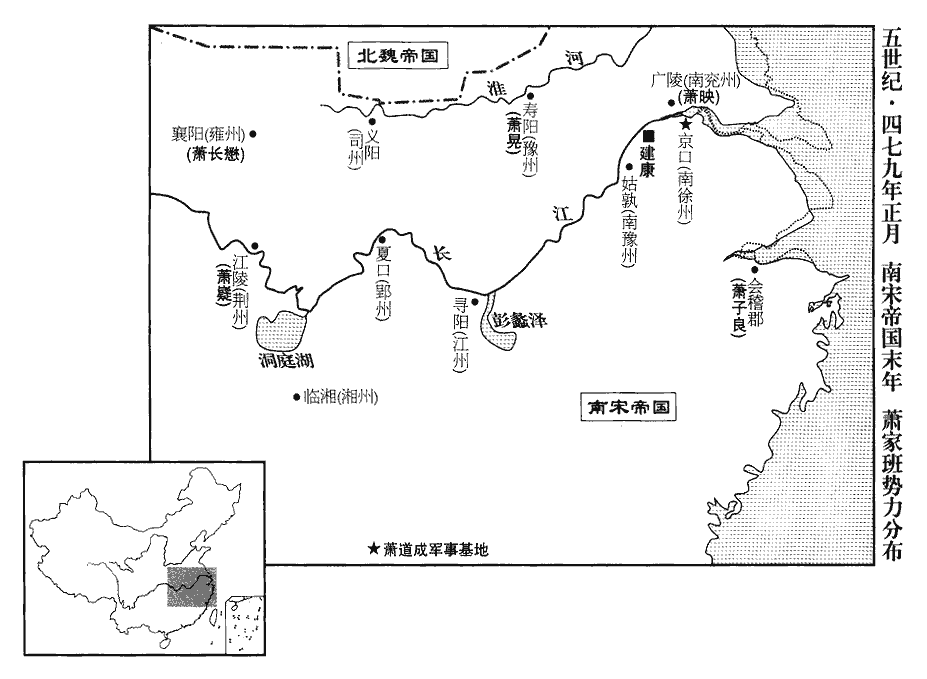
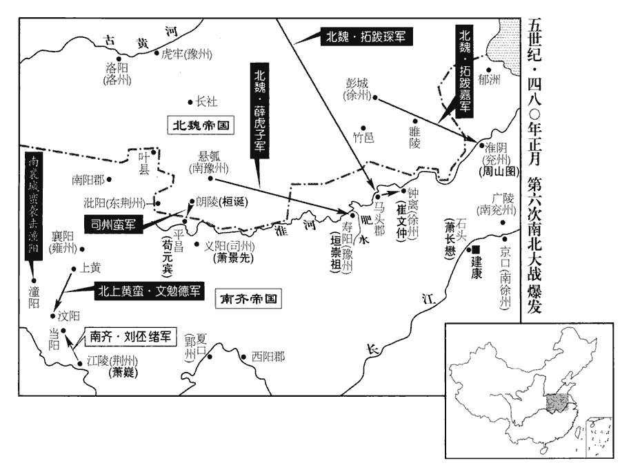
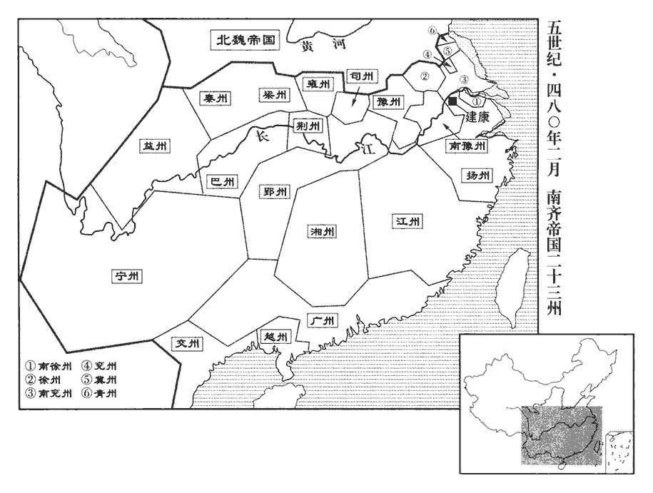
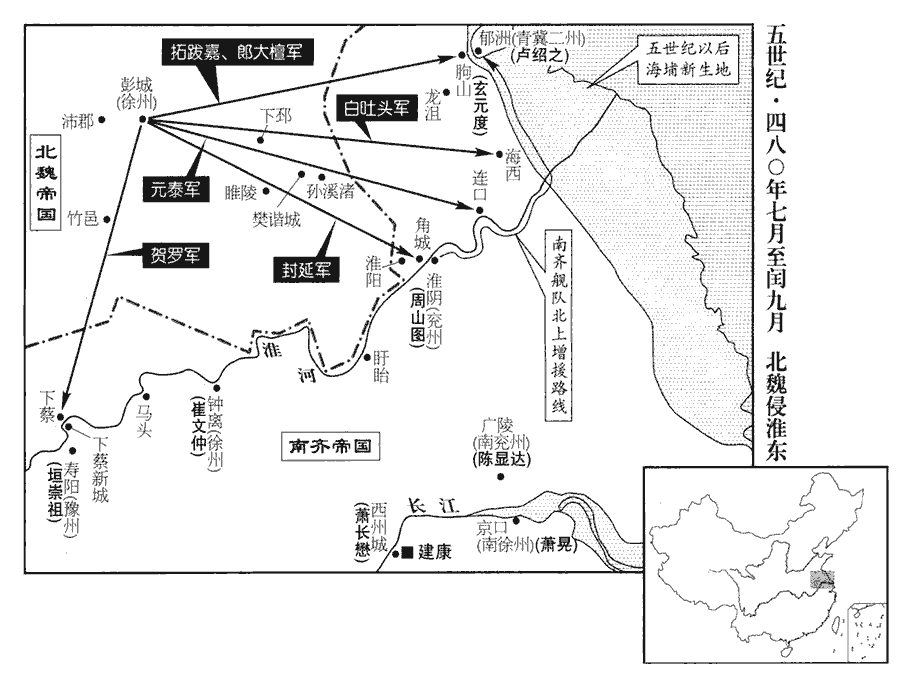
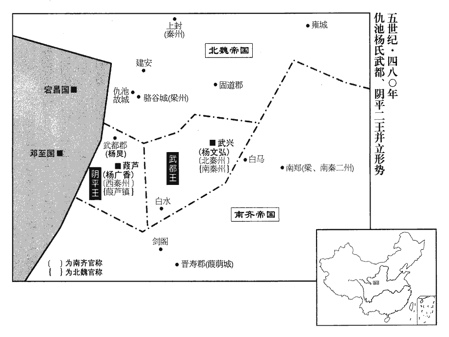

 齊紀一起屠維協洽（己未），盡昭陽大淵獻（癸亥），凡五年。
>  
> 按蕭子顯《齊書•崔祖思傳》︰宋朝初議封太祖爲梁公，祖思啓太祖曰︰「《讖書》云︰『金刀利刃齊刈之。』今宜稱齊，實應天命。」太祖從之，遂以齊建國。

# 太祖高皇帝諱道成，姓蕭氏，字紹伯，小字鬬將。本居東海蘭陵縣中都鄕中都里，晉惠帝分東海爲蘭陵郡，故爲蘭陵郡人。高祖整過江，居晉陵武進縣之東城里。時寓居江左者皆僑置本土，加以南名，更爲南蘭陵人。整生雋，雋生樂子，樂子生承之，承之生帝。

## 建元元年（己未、四七九）是年四月受禪，始改元建元。

1春，正月，甲辰‹二›，以江州‹府寻阳，江西九江›刺史蕭嶷爲都督荊•湘等八州諸軍事、荊州‹府江陵，湖北江陵›刺史，嶷yí，魚力翻。尚書左僕射王延之爲江州刺史，安南長史蕭子良爲督會稽等五郡諸軍事、會稽‹浙江绍兴›太守。去年已命蕭映、蕭晃分鎭兗、豫矣。嶷，道成次子也；子良，道成之孫也。江左之勢，莫重於上流，莫富於東土，故又分布子孫以居之。會，工外翻。守，式又翻。

〖译文〗 [1]春季，正月，甲辰（初二），刘宋顺帝任命江州刺史萧嶷为都督荆湘等八州诸军事、荆州刺史，任命尚书左仆射王延之为江州刺史，任命安南长史萧子良为都督会稽等五郡诸军事、会稽太守。

初，沈攸之欲聚衆，開民相告，士民坐執役者甚衆；嶷至鎭，一日罷遣三千餘人。府州儀物，務存儉約，輕刑薄斂，斂，力贍翻。所部大悅。

〖译文〗 当初，沈攸之准备聚众起事的时候，允许百姓互相告发，因此获罪服役的士人和平民甚为众多。萧嶷来到荆州以后，在一天以内就遣散了三千多人。刺史府与州衙中礼仪器物的陈设，都力求保持俭省节约，又能放宽刑罚，减少赋役，所以本州百姓大为欢悦。

2辛亥‹九›，以竟陵世子賾爲尚書僕射，進號中軍大將軍、開府儀同三司。道成進爵竟陵郡公，故賾爲竟陵世子。賾，七革翻。

〖译文〗 [2]辛亥（初九），顺帝任命竟陵世子萧赜为尚书仆射，晋升封号为中军大将军、开府仪同三司。

 

3太傅道成以謝朏fěi有重名，必欲引參佐命，以爲左長史。嘗置酒與論魏、晉故事，因曰︰「石苞不早勸晉文，死方慟哭，方之馮異，非知機也。」晉文王‹司马昭›薨，石苞自揚州奔喪，慟哭曰︰「基業如此，而以人臣終乎！」馮異勸漢光‹刘秀›卽尊位。道成言石苞不能早勸晉文爲禪代之事，比之馮異勸漢光，苞非知機者也；欲以此言感動謝朏耳。朏，敷尾翻。朏曰︰「晉文世事魏室，必將身終北面；借使魏依唐、虞故事，亦當三讓彌高。」言三以天下讓，則節行彌高也。道成不悅。甲寅‹十二›，以朏爲侍中，更以王儉爲左長史。更，工衡翻。

〖译文〗 [3]太傅萧道成因谢名声显著，一定要延引他参与辅佐自己开创新朝，便让他担任左长史。萧道成曾经摆上酒席，与谢谈论魏晋时期的旧事，乘机说：“石苞没有及早劝说晋文王司马昭登基，等他死后，才去痛哭，与汉冯异相比，还不算是通晓机宜的啊。”谢说：“晋文王累世事奉魏室，必然要使自己终生北面称臣。假如曹魏依照唐尧把帝位传给虞舜的先例行事，晋文王也应当经过三次推让，才显得更为崇高。”萧道成很不高兴。甲寅（十二日），顺帝任命谢为侍中，另外任命王俭为左长史。

4丙辰‹十四›，以給事黃門侍郎蕭長懋‹时年二十二›爲雍州刺史。長懋，道成嫡長孫也。

〖译文〗 [4]丙辰（十四日），顺帝任命给事黄门侍郎萧长懋为雍州刺史。

5二月，丙子‹四›，邵陵殤王友‹年十岁›卒。

〖译文〗 [5]二月，丙子（初四），宋邵陵殇王刘友去世。

6辛巳‹九›，魏太皇太后及魏主‹拓跋宏，时年十三›如代郡‹河北蔚县›溫泉。

〖译文〗 [6]辛巳（初九），北魏太皇太后及北魏国主孝文帝前往代郡温泉。

7甲午‹二十二›，詔申前命，命太傅贊拜不名。前命，見上卷上年。

〖译文〗 [7]甲午（二十二日），顺帝颁诏重申以前的命令，让太傅萧道成朝拜时，不必自己称名。

8己亥‹二十七›，魏太皇太后及魏主如西宮。西宮，魏太祖天賜元年所築。

〖译文〗 [8]己亥（二十七日），北魏太皇太后及孝文帝前往西宫。

9三月，癸卯朔‹一›，日有食之。

〖译文〗 [9]三月，癸卯朔（初一），出现日食。

10甲辰‹二›，以太傅爲相國，總百揆，封十郡，爲齊公，時以青州之齊郡、徐州之梁郡、南徐州之蘭陵、魯郡、琅邪、東海、晉陵‹江苏常州›、義興‹江苏宜兴›、揚州之吳郡‹江苏苏州›、會稽‹浙江绍兴›十郡封。加九錫；其驃騎大將軍、揚州牧、南徐州刺史如故。驃，匹妙翻。騎，奇寄翻。己【章︰甲十一行本「己」作「乙」；乙十一行本同；張校同。】巳‹三›，詔齊國官爵禮儀，並倣天朝。朝，直遙翻。丙午‹四›，以世子賾領南豫州‹府姑孰，安徽当涂›刺史。

〖译文〗 [10]甲辰（初二），顺帝任命太傅萧道成为相国，总领百官，封给他十个郡的封地，号称齐公，颁赐九锡，让他仍然担任骠骑大将军、扬州牧、南徐州刺史。己巳（疑误），顺帝颁诏决定，齐国的官职爵和礼典仪式，一概仿效朝廷。丙午（初四），顺帝任命萧道成的世子萧赜兼任南豫州刺史。

11楊運長去宣城郡‹安徽宣州›還家，齊公‹萧道成›遣人殺之。楊運長守宣城，見上卷宋昇明元年。淩源‹江苏宿迁东南›令潘智與運長厚善；蕭子顯《齊志》︰臨淮郡有淩縣。應劭曰︰淩水出淩縣西南入淮。酈道元曰︰淩水出淩縣，東流，逕其縣故城東，而東南流入淮。臨川王綽chuò，義慶之孫也，義慶，長沙王第二子，襲道規封。綽遣腹心陳讚說智曰︰說，輸芮翻。「君先帝舊人，身是宗室近屬，如此形勢，豈得久全！若招合內外，計多有從者。臺城內人常有此心，苦無人建意耳。」智卽以告齊公‹萧道成›。庚戌‹八›，誅綽兄弟及其黨與。

〖译文〗 [11]杨运长离开宣城郡解职回家的时候，齐公萧道成派人将他杀死。凌源县令潘智与杨运长交情深厚。临川王刘绰，是刘义庆的孙子。刘绰派遣亲信陈崐劝诱潘智说：“您是先朝皇帝的故旧之人，我本人是宗室的近亲，在这种情况下，难道我们能够长期得以保全吗？如果我们招揽聚集朝廷内外的人们，估计会有许多人追随。宫城以内的人经常抱有这种想法，只是苦于没有人提出这一主张罢了。”潘智当即把这番话向齐公萧道成禀告。庚戌（初八），齐公萧道成诛杀了刘绰兄弟及其党羽。

12甲寅‹十二›，齊公受策命，赦其境內，以石頭爲世子宮，一如東宮。褚淵引何曾自魏司徒爲晉丞相故事，求爲齊官，齊公不許。以王儉爲齊尚書右僕射，領吏部；儉時年二十八。

〖译文〗 [12]甲寅（十二日），齐公萧道成接受策书的任命，大赦齐国境内的囚犯，以石头城为世子的宫室，与皇室设立东宫完全一样。褚渊援引何曾由曹魏的司徒担任西晋的丞相的旧事，请求担任齐国的官员，齐公萧道成没有应允。他却任命王俭为齐国尚书右仆射，主管吏部。当时，王俭只有二十八岁。

夏，四月，壬申朔‹一›，進齊公爵爲王，增封十郡。時又增徐州之南梁、陳、潁川、陳留、南兗州之盱眙、山陽、秦、廣陵、海陵、南沛等十郡。

〖译文〗 夏季，四月，壬申朔（初一），顺帝进封齐公萧道成的爵位为王，增加十个郡的封地。

甲戌‹三›，武陵王贊卒‹年九岁›，非疾也。史言齊‹萧道成›殺之。

〖译文〗 甲戌（初三），武陵王刘赞故去，他并不是因病而终的。

丙戌‹十五›，加齊王殊禮，進世子爲太子。

〖译文〗 丙戌（十五日），顺帝以特殊的礼节对待齐王萧道成，将齐国的世子称作太子。

辛卯‹二十›，宋順帝‹刘准，时年十三›下詔禪位于齊。壬辰‹二十一›，帝當臨軒，不肯出，逃于佛蓋之下，自晉以來，宮中有佛屋，以嚴事佛像，上爲寶蓋以覆之，宋帝逃於其下。王敬則勒兵殿庭，以板輿入迎帝。太后‹王贞风›懼，自帥閹人索得之，帥，讀曰率。閹，衣廉翻。索，止客翻。敬則啓譬令出，引令升車。帝收淚謂敬則曰︰「欲見殺乎？」敬則曰︰「出居別宮耳。官先取司馬家亦如此。」帝泣而彈指曰︰「願後身世世勿復生天王家！」復，扶又翻。宮中皆哭。帝拍敬則手曰︰「必無過慮，當餉輔國十萬錢。」敬則時爲輔國將軍。史言帝庸闇。是日，百僚陪位。侍中謝朏在直，當解璽綬，陽爲不知，曰︰「有何公事？」傳詔云︰「解璽綬授齊王。」傳詔，屬中書舍人，出入宣傳詔旨。又考《南史》，郡府謂之傳敎，天臺謂之傳詔。璽，斯氏翻。綬，音受。朏曰︰「齊自應有侍中。」乃引枕臥。傳詔懼，使朏稱疾，欲取兼人，欲取兼侍中者。朏曰︰「我無疾，何所道！」遂朝服步出東掖門，仍登車還宅。朝，直遙翻。乃以王儉爲侍中，解璽綬。禮畢，帝‹刘准›乘畫輪車，畫輪車者，車輪施文畫也。《晉志》云︰畫輪車，上開四望，綠油幢，朱絲絡，兩箱裏飾以金錦，黃金塗，五采。蕭子顯曰︰漆畫輪車，金塗校飾，如輦，微有減降。杜佑曰︰晉制︰駕車以采漆畫輪轂，上起四夾杖，左右開四望，綠油纁朱絲青交絡其上，形如輦，其下猶犢車。出東掖門就東邸。掖，音亦。問︰「今日何不奏鼓吹？」左右莫有應者。右光祿大夫王琨，華之從父弟也，王華早入宋公霸府，元嘉初輔政。吹，尺睡翻。從，才用翻；下同。在晉世已爲郎中，至是，攀車獺尾慟哭獺毛可以辟塵，故懸之於車。曰︰「人以壽爲歡，老臣以壽爲戚，旣不能先驅螻蟻，謂不能早死也。乃復頻見此事！」嗚咽不自勝，復，扶又翻。勝，音升。百官雨泣。言涕泣如雨也。宋永初元年受晉禪，歲在庚申；八主，六十年而亡。

〖译文〗 辛卯（二十日），刘宋顺帝颁诏将帝位传让给齐王。壬辰（二十一日），顺帝应当到殿前去会见百官，但他不肯出面，却逃到佛像的宝盖下面。王敬则率领军队来到宫殿的庭院中，抬着一顶木板轿子入宫，去迎接顺帝。太后害怕了，便亲自率领宦官找到了顺帝，王敬则劝诱顺帝，让他从宝盖下面出来，领着他上了轿子。顺帝止住眼泪，对王敬则说：“准备杀死我吗？”王敬则说：“只是让你到另外的宫殿中居住罢了。您家先前取代司马氏一家也是这样做的。”顺帝掉着眼泪弹着食指说：“但愿我今后生生世世永远不再生在帝王家中！”宫中的人们都哭泣起来。顺帝拍着王敬则的手说：“如果不发生意外，就赠送给你十万钱。”当天，百官为齐王陪席，侍中谢正在值班，应当解送玺印，但他假装不知道，还说：“有什么公事吗？”有人传达诏旨说：“解送玺印，交给齐王。”谢说：“齐王自然应当另有自己的侍中。”说着，他便拉过枕头，躺了下来。传达诏旨的官员害怕了，便让谢声称得了疾病，打算另找一个兼任侍中的人，谢说：“我没有生病，为什么说我有病！”于是，他穿着朝服，徒步走出东掖门，上了车，回住宅去了。齐王便让王俭担任侍中，解送玺印。礼典结束以后，顺帝坐着彩漆画轮的车子，出了东掖门，前往太子的府邸。顺帝问：“为什么今天没有器乐演奏？”周围的人都没有回答。右光禄大夫王琨是王华的堂弟，在晋朝已经担任了郎中，到了此时，他抓着车上悬着的獭尾痛哭着说：“人们都为长寿高兴，老臣却为长寿悲哀。既然此身不能够及早死去，所以才屡次目睹今天发生的这种事情！”他呜呜咽咽地哭泣着，难以自制，百官也都泪如雨下。

司空兼太保褚淵等奉璽綬，帥百官詣齊宮勸進；帥，讀曰率。王辭讓未受。淵從弟前安成太守炤zhào謂淵子賁曰︰「司空今日何在？」賁曰︰「奉璽綬在齊大司馬門。」炤曰︰「不知汝家司空將一家物與一家，亦復何謂！」炤，與照同，之笑翻。復，扶又翻；下乃復同。賁後辭爵廬墓，蓋深感炤之言也。甲午‹二十三›，王卽皇帝位于南郊。還宮，大赦，改元。奉宋順帝爲汝陰王，優崇之禮，皆倣宋初。築宮丹楊，丹楊，《南史》作「丹徒」。丹楊爲是。《齊史》云︰築宮於丹楊故縣。置兵守衛之。宋神主遷汝陰廟，諸王皆降爲公；自非宣力齊室，餘皆除國，獨置南康、華容、蓱píng鄕三國，以奉劉穆之、王弘、何無忌之後，王弘之後不除國，以王儉佐命耳。蓱，與萍同。萍鄕縣，吳寶鼎二年置。宋白曰︰楚昭王渡江，獲萍實於此。今縣北有萍實里、楚王臺，因以名縣。除國者凡百二十人。二臺官僚，依任攝職，二臺，謂宋臺、齊臺也。名號不同、員限盈長者，別更詳議。長，直亮翻，多而有餘也。

〖译文〗 司空兼太保褚渊等人捧上玺印，率领百官前往齐王宫请萧道成即帝位，齐王推辞谦让，没有接受。褚渊的堂弟、前任安成太守褚对褚渊的儿子褚贲说：“今天司空却在哪里？”褚贲说：“在齐王宫大司马门奉献玺印。”褚说：“我真不知道你家司空把一家的物件交给另一家，这又算怎么一回事情！”甲午（二十三日），齐王在建康南郊即帝位。南齐高帝回宫以后，大赦天下罪囚，更改年号为建元。南齐高帝将顺帝奉为汝阴王，优待尊崇汝阴王的礼典，完全效仿刘宋初年的做法。高帝在丹杨为顺帝修筑宫室，并设置兵力守卫。刘宋诸帝的神位都被迁移到汝阴庙中，刘宋诸王都被降爵为公；如果没有为齐室出力，公侯以下一律削除国号，唯独设置南康、华容、萍乡三国，以便奉养刘穆之、王弘与何无忌的后人；削除国号的诸王计有一百二十人。刘宋与萧齐两朝廷的官员仍然保持原来的职位，对于官名称谓不同和官员超过名额的情况，另外再加详细计议。

以褚淵爲司徒。賓客賀者滿座。褚炤歎曰︰「彥回少立名行，何意披猖至此！披猖，言披靡而猖獗也。披，普皮翻。少，詩照翻。行，下孟翻。門戶不幸，乃復有今日之拜。使彥回作中書郎而死，不當爲一名士邪！名德不昌，乃復有期頤之壽！」《曲禮》曰︰人生百年曰期頤。鄭註云︰期，要也；頤，養也；不知衣服食味，孝子要盡養道而已。淵固辭不拜。

〖译文〗 高帝任命褚渊为司徒，前来祝贺的人和宾客挤满了座席。褚叹息着说：“褚渊从少年时代便建树了自己的名望与操行，有谁料想得到他会猖狂到这般地步！褚家门户不幸，才会又有今天的拜官之举。假使褚渊在担任中书郎的时候死去了，难道不会成为一位名士吗！如今他的名誉与德行都败坏了，可是偏偏会长命百岁！”于是，褚渊坚决不肯接受任命。

奉朝請河東‹侨郡，湖北松滋西北›裴顗yǐ上表，數帝‹萧道成›過惡，掛冠徑去；帝怒，殺之。奉朝請者，奉朝會請召而已，非有職任也。裴顗在宋朝旣無職任，又無卓犖luò奇節，惟不食齊粟，遂得垂名青史。君子惡沒世而名不稱，正爲此也。朝，直遙翻。顗，魚豈翻。數，所具翻。太子賾請殺謝朏，帝曰︰「殺之遂成其名，正應容之度外耳。」久之，因事廢于家。

〖译文〗 奉朝请、河东人氏裴上表指斥高帝的过失与丑行，直接辞官离去。高帝大怒，将他杀死。太子萧赜请求杀掉谢，高帝说：“杀了他，便成就了他的名望了。我们恰恰应该把他置之度外包容下来哩。”过了好长一段时间，谢终于因事被废免在家中。

帝問爲政於前撫軍行參軍沛國‹安徽天长›劉瓛huán，瓛，胡官翻。對曰︰「政在《孝經》。凡宋氏所以亡，陛下所以得者，皆是也。陛下若戒前車之失，加之以寬厚，雖危可安；若循其覆轍，雖安必危矣。」帝歎曰︰「儒者之言，可寶萬世！」

〖译文〗 高帝向前任抚军行参军沛国人氏刘询问如何处理政务，刘回答说：“政务就在《孝经》里面。大凡刘宋灭亡，陛下得国的原因，其中都包含着《孝经》阐述的道理。倘若陛下能够将前车之鉴引以为诫，再加上待人宽和仁厚，即使国家已经垂危了，也可以安定下来；倘苦陛下重蹈覆辙，即使国家原来很安定，也一定会招致危亡。”高帝感叹着说：“儒士的话，真是可以用作万代之宝啊！”

13丙申‹二十五›，魏主如崞山‹山西浑源境›。崞，音郭。

〖译文〗 [13]丙申（二十五日），北魏孝文帝前往崞山。

14丁酉‹二十六›，以太子詹事張緒爲中書令，齊國左衛將軍陳顯達爲中護軍，右衛將軍李安民爲中領軍。緒，岱之兄子也。

〖译文〗 [14]丁酉（二十六日），高帝任命太子詹事张绪为中书令，任命齐国左卫将军陈显达为中护军，任命右卫将军李安民为中领军。张绪是张岱的哥哥的儿子。

15戊戌‹二十七›，以荊州刺史嶷爲尚書令、驃騎大將軍、開府儀同三司、揚州刺史，嶷，魚力翻。驃，匹妙翻。騎，奇寄翻。南兗州‹府广陵›刺史映爲荊州刺史。

〖译文〗 [15]戊戌（二十七日），齐高帝任命荆州刺史萧嶷为尚书令、骠骑大将军、开府仪同三司、扬州刺史，任命南兖州刺史萧映为荆州刺史。

16帝命羣臣各言得失。淮南‹姑孰›、宣城二郡太守劉善明江左僑立淮南郡於宣城郡界，故善明兼守二郡。「請除宋氏大明、泰始以來諸苛政細制，以崇簡易。」易，以豉翻。又以爲︰「交州‹府龙编，越南河内东北北宁府›險遠，宋末政苛，遂至怨叛，宋明帝泰始四年，李長仁據交州而叛。今大化創始，宜懷以恩德。且彼土所出，唯有珠寶，實非聖朝所須之急，朝，直遙翻。討伐之事，謂宜且停。」給事黃門郎清河崔祖思亦上言，以爲︰「人不學則不知道，《禮記•學記》之言。上，時掌翻。此悖逆禍亂所由生也。悖，蒲內翻，又蒲沒翻。今無員之官，空受祿力，彫耗民財。無員之官，員外官也，下所謂限外之人是也。祿者，所食之祿；力者，所役之人。宜開文武二學，課臺、府、州、國限外之人各從所樂，依方習業。《漢書•賈山傳》︰使皆務其方而高其節。《註》云︰方，道也。樂，音洛。若有廢惰者，遣還故郡；經藝優殊者，待以不次。又，今陛下雖躬履節儉，而羣下猶安習侈靡。宜褒進朝士之約素清脩者，朝，直遙翻。貶退其驕奢荒淫者，則風俗可移矣。」宋元嘉之世‹刘义隆›，凡事皆責成郡縣。世祖‹刘骏›徵求急速，以郡縣遲緩，始遣臺使督之。使，疏吏翻；下同。自是使者所在旁午，競作威福，營私納賂，公私勞擾。會稽太守聞喜公子良上表極陳其弊，會，工外翻。以爲︰「臺有求須，但明下詔敕，爲之期會，則人思自竭；若有稽遲，自依糾坐之科。今雖臺使盈湊，會取正屬所辦，謂使者雖多，亦當取辦於所屬也。徒相疑憤，反更淹懈，宜悉停臺使。」懈，居隘翻。員外散騎郎劉思效上言︰散，悉亶翻。騎，奇寄翻。「宋自大明‹刘骏›以來，漸見凋弊，徵賦有加而天府尤貧。天府，謂天子之府藏也。小民嗷嗷，殆無生意；而貴族富室，以侈麗相高，乃至山澤之民，不敢采食其水草。陛下宜一新王度，王度，王法也。革正其失。」上皆加褒賞，或以表付外，使有司詳擇所宜，奏行之。己亥‹二十八›，詔︰「二宮諸王，悉不得營立屯邸，封略山湖。」二宮，謂上宮及東宮。上宮，諸王皇子也；東宮，諸王皇孫也。杜預曰︰不以道取曰略。又曰︰略，封界也。

〖译文〗 [16]高帝命令群臣各自进言朝政得失。淮南、宣城二郡太守刘善明说：“请废除刘宋大明、泰始年间以来的各项苛暴琐碎的政令与制度，以示崇尚简要平易。”他还认为：“交州地势险要而又荒僻遥远，由于宋末年政令苛暴，终于招致民怨，导致叛乱。如今广远深入的教化刚刚开创，应当以恩惠与德行感化他们。况且交州土地上出产的物品，只有珠宝，这实在不是我朝急切需要的东西。所以，讨伐交州的事情，我认为应当暂时停止下来。”给事黄门郎清河人氏崔祖思进言也认为：“如果人们不肯求学，就不明白道理，这正是叛逆与祸乱所以产生的根由。现在，不在名额以内的官员，白白享受俸禄和人力的供养，损耗民众的财富。应当开设文武两类学校，考核朝廷、府州、封国中编制以外的官员，使他们各自按照本人的意愿，根据规定的办法熟悉学业。如果有人荒废学业，便将他遣返本郡；如果有人经学优异，便不拘等次地任用他。再者，如今虽然陛下亲自奉行节约俭省的风尚，但是群臣仍然过惯并安于奢移浪费的生活。应当表彰进用节俭朴素、持身清正的朝廷中的官员，贬抑斥逐那些骄横奢侈、耽于佚乐的官员，当前的风尚习俗就可以得到改变了。”刘宋文帝元嘉年间，完全是督责郡县去完成所有的事情。刘宋孝武帝凡事都要求火速办理，认为郡县行动缓慢，便开始由朝廷派遣使者督责郡县。从此，派出的使者到处交错而行，争着恃势弄权，谋求私利，收受贿赂，官府与百姓都遭受使者的困扰。会稽太守闻喜公萧子良上表，极力陈述这一弊病，他认为：“如果朝廷有所需求，只要公开颁发诏书敕令，指定期限，人们自然就会想方设法地去完成任务了。如果耽误了期限，自然应该依照法令举发惩处。现在，虽然朝廷的使者遍布各地，可是各种事情仍然需要通过州县官员去办理。结果，徒然使得朝廷的使者与负责其事的官员相互猜疑怀恨，反而使朝廷的命令实行得更为迟缓松懈。所以，朝廷应当将派出的使者全部停罢。”员外散骑郎刘思效进言说：“宋自从大明年间以来，逐渐显现出衰败的迹象。虽然征收赋税不断增加，但是朝廷的库存却愈见贫乏。平民哀鸣不止，几乎已经没有生机。然而，贵族富户以生活奢侈豪华相互炫耀，却使山林湖泽间的百姓，甚至于不敢采摘他们的水草充饥。陛下应当完全刷新王者的政教，改正这一过失。”高帝对刘善明等人都给与奖励，还将有的表奏交付外廷，让有关部门详细斟酌适用的办法，上奏施行。己亥（二十八日），高帝颁诏说：“皇子、皇孙两宫和诸王，一律不允许营建庄园别墅，霸占山林湖泊。”

17魏主還平城。還，從宣翻，又如字。

〖译文〗 [17]北魏孝文帝返回平城。

18魏秦州‹府上邽，甘肃天水›刺史尉洛侯、雍州‹府长安，陕西西安›刺史宜都王目辰、長安鎭將陳提等皆坐貪殘不法，洛侯、目辰伏誅、提徙邊。尉，紆勿翻。雍，於用翻。將，卽亮翻。

〖译文〗 [18]北魏秦州刺史尉洛侯、雍州刺史宜都王拓跋目辰、长安镇将陈提等人都因贪婪残暴，行为不轨而获罪，尉洛侯与拓跋目辰被判处死刑，陈提流放到边远地区服役。

又詔以「候官千數，魏太祖置候官，以伺察內外。重罪受賕不列，輕罪吹毛發舉，言吹毛求疵也。宜悉罷之。」更置謹直者數百人，使防邏街術，更，工衡翻。邏，郎佐翻。術，讀曰遂，又食聿翻。《說文》曰︰術，邑中道。執喧鬬者而已。自是吏民始得安業。

〖译文〗 北魏孝文帝还颁诏说：“朝廷设置负责侦察内外的官员有一千多人，他们对于犯有重罪的人，只要收到贿赂，便不再举报，却对犯罪较轻的人吹毛求疵地揭发检举，应当将侦察内外的官员全部罢除。”北魏重新设置数百名恭谨正直的人员，让他们在城邑的街道上巡逻防卫，捉拿任意喧闹打斗的人。从此，官吏与百姓才得以各安本业。

19自泰始‹刘彧›以來，內外多虞，將帥各募部曲，屯聚建康。將，卽亮翻。帥，所類翻。李安民上表，以爲「自非淮北常備外，餘軍悉皆輸遣；輸，送也。若親近宜立隨身者，聽限人數。」上‹萧道成›從之；五月，辛亥‹十›，詔斷衆募。斷，丁管翻。

〖译文〗 [19]刘宋自从泰始年间以来，国家不断发生内忧外患，将帅各自募集部曲，集结在建康周围。李安民上表认为：“如果不属于淮北常备军，其余各军应当将募集的兵士全部遣送回去。倘若属于与主帅亲密接近、适合随侍身旁的兵士，可以让他们限定人数。”高帝听从了他的建议。五月，辛亥（初十），高帝颁诏命令禁止将帅招募部曲。

20壬子‹十一›，上賞佐命之功，褚淵、王儉等進爵、增戶各有差。《考異》曰︰《南史•崔祖思傳》曰︰「帝將加九錫，內外皆贊成之。祖思獨曰︰『公以仁恕匡社稷，執股肱之義。君子愛人以德，不宜如此。』帝聞而非之曰︰『祖思遠同荀令，豈孤所望也。』由此不復處任職，而禮貌甚重。垣崇祖受密旨，參訪朝臣。光祿大夫垣閎曰︰『身受宋氏厚恩，復蒙明公眷接；進不敢同，退不敢異。』冠軍將軍崔文仲與崇祖意同。及帝受禪，閎存故爵，文仲、崇祖皆封侯，祖思加官而已。」按宋朝初議封帝爲梁公，祖思啓高帝曰︰「《讖》云︰『金刀利刃齊刈之。』今宜稱齊，實應天命。』從之。然則祖思安得盡誠節於宋！今删之。處士何點謂人曰︰處，昌呂翻。「我作《齊書》已竟，贊云︰『淵旣世族，儉亦國華；不賴舅氏，遑恤國家！』」點，尚之孫也。何尚之仕宋，貴顯於太祖、世祖之時。淵母宋始安公主，繼母吳郡公主；又尚巴西公主。儉母武康公主；又尚陽羨公主。故點云然。

〖译文〗 [20]壬子（十一日），高帝封赏辅佐自己建立新朝的功臣，褚渊、王俭等人晋升爵位，增加封户，各有等差。隐士何点对人说：“我已经把《齐书》撰写完毕，有一段论赞是这样说的：‘褚渊既是世家大族，王俭也是国家的精英。他们连自己的舅父都背叛了，又哪里有功夫顾惜自己的国家！’”何点是何尚之的孙子。褚渊的母亲是刘宋的始安公主，继母是吴郡公主，自己又娶了巴西公主，王俭的母亲是武康公主，自己又娶了阳羡公主。所以，何点才有这种说法。

21己未‹十八›，或走馬過汝陰王‹刘准›之門，衛士恐有爲亂者，奔入殺王‹年十三›，而以疾聞，上不罪而賞之。辛酉‹二十›，殺宋宗室陰安公燮‹年十岁›等，無少長皆死。前豫州‹府寿阳，安徽寿县›刺史劉澄之，遵考之子也，少，詩照翻。長，知兩翻。劉遵考見一百二十八卷孝武孝建二年。與褚淵善，淵爲之固請爲，于僞翻。曰︰「澄之兄弟不武，且於劉宗又疏。」故遵考之族獨得免。遵考弟思考，有子季連，亂蜀。

〖译文〗 [21]己未（十八日），有人骑马经过汝阴王家门，卫士们便恐惧起来。有一个作乱的人跑进去杀死了汝阴王，却以汝阴王病故上报，高帝对他不但没有治罪，而且奖赏了他。辛酉（二十日），高帝杀害了刘宋宗室阴安公刘燮等人，对这些人家，无论老少，一律处死。前任豫州刺史刘澄之是刘遵考的儿子。由于他与褚渊交好，褚渊便替他再三讲情说：“刘澄之兄弟并不通晓军事，况且他们与刘氏的宗支关系又很疏远呢。”所以，只有刘遵考的家族得免于一死。

22丙寅‹二十五›，追尊皇考‹萧承之›曰宣皇帝，皇妣陳氏‹陈道正›曰孝皇后。《考異》曰︰《南史》在四月甲午，今從《齊書》。

〖译文〗 [22]丙寅（二十五日），高帝追尊亡父为宣皇帝，追尊亡母陈氏为考皇后。

23丁卯‹二十六›，封皇子鈞爲衡陽王。

〖译文〗 [23]丁卯（二十六日），高帝将皇子萧钧封为衡阳王。

24上謂兗州刺史垣崇祖曰︰「吾新得天下，索虜必以納劉昶爲辭，侵犯邊鄙。南謂北爲索虜，以魏本索頭種也。索，昔各翻。壽陽‹安徽寿县›當虜之衝，非卿無以制此虜也。」乃徙崇祖爲豫州刺史。

〖译文〗 [24]高帝对兖州刺史垣崇祖说：“我新近才得到天下，魏虏肯定会以我们收容刘昶为口实，前来侵犯边界地区。寿阳地当魏虏南下的交通要道，如果没有你前去镇守，就无法制服这些胡虏了。”于是，高帝将垣崇祖改任为豫州刺史。

25六月，丙子‹六›，誅游擊將軍姚道和，以其貳於沈攸之也。事見上卷宋順帝昇明之元年也。

〖译文〗 [25]六月，丙子（初六），高帝诛杀游击将军姚道和，这是由于他因沈攸之起事而对朝廷怀有二心的原故。

26甲子‹十四›，【嚴︰「子」改「申」】立王太子賾爲皇太子；皇子嶷爲豫章王，映爲臨川王，晃爲長沙王，曄爲武陵王，暠爲安成王，鏘爲鄱陽王，鑠爲桂陽王，鑑爲廣陵王；曄，筠輒翻。暠，古老翻。鏘，于羊翻。鑠，書藥翻。皇孫長懋爲南郡王。

〖译文〗 [26]甲子（十四日），南齐高帝立王太子萧赜为皇太子，皇子萧嶷为豫章王，萧映为临川王，萧晃为长沙王，萧晔为武陵王，萧为安成王，萧锵为鄱阳王，萧铄为桂阳王，萧鉴为广陵王，皇孙萧长懋为南郡王。

27乙酉‹十五›，葬宋順帝‹刘准›于遂寧陵。

〖译文〗 [27]乙酉（十五日），刘宋顺帝被安葬在遂宁陵。

28帝以建康居民舛雜，多姦盜，欲立符伍以相檢括，右僕射王儉諫曰︰「京師之地，四方輻湊，必也持符，於事旣煩，理成不曠；謝安所謂『不爾何以爲京師』也。」乃止。

〖译文〗 [28]由于建康居民成份复杂，存在着许多奸恶的盗贼，高帝打算设置符信，编制军民户籍，以五人为伍，以便孝察。右仆射王俭进谏说：“京城地区，各地人员汇集，如果一定要手执符信，事体既很烦琐，在情理上说，就难以持久，这就是谢安所说的‘不这样怎么可以叫做京城’的意思了。”于是，高帝取消了原来的打算。

29初，交州刺史李長仁卒，從弟叔獻代領州事，以號令未行，遣使求刺史於宋。從，才用翻。使，疏吏翻。宋以南海‹广东广州›太守沈煥爲交州刺史，以叔獻爲煥寧遠司馬、武平‹越南河内东北太原府›•新昌‹越南河内西永安县›二郡太守。吳孫晧建衡三年，討扶嚴夷，以其地置武平郡；是年，又分交趾立新興郡，晉武帝泰康三年，更名新昌；皆屬交州。隋廢武平郡爲隆平縣，廢新昌郡爲嘉寧縣，並屬交趾郡。唐改隆平爲太平，仍屬交趾，以嘉寧縣爲峯州。叔獻旣得朝命，朝，直遙翻。人情服從，遂發兵守險，不納煥。煥停鬱林‹广西桂平›，病卒。

〖译文〗 [29]当初，交州刺史李长仁故去以后，堂弟李叔献代替他统领州中事务，由于不能够有效地发号施令，他便派遣使者向刘宋朝廷请求任命刺史。刘宋朝廷任命南海太守沈焕为交州刺史，任命李叔献为沈焕的宁远司马和武平、新昌二郡太守。李叔献得到朝廷的任命以后，人心对他便顺服了。于是，李叔献调集兵力，防守险要，不让沈焕进境到任。沈焕在郁林停留下来，因病故去。

秋，七月，丁未‹七›，詔曰︰「交趾‹越南河内东北北宁府›、比景‹越南美丽县›獨隔書朔，言其拒命不受正朔也。古者，天子常以季冬頒來歲十二月之朔于諸侯，諸侯受而藏之祖廟，至月朔則以特羊告廟，請而行之。斯乃前運方季，因迷遂往。宜曲赦交州，卽以叔獻爲刺史，撫安南土。」

〖译文〗 秋季，七月，丁未（初七），高帝颁诏：“只有交趾、比景没有接受朝廷颁布的年号，这是由于前朝的国运正当穷途末路的时候，两国产生了迷惘，于是不肯前来请授年号。根据这一特殊情况，应当赦免交州，现在就任命李叔献为交州刺史，前去安抚南疆。”

30魏葭蘆‹甘肃武都东南›鎭主楊廣香請降，降，戶江翻。丙辰‹十六›，以廣香爲沙州‹府景谷，四川青川东沙州乡›刺史。以《輿地記》參考，此沙州當置於唐利州景谷縣界。

〖译文〗 [30]北魏葭芦镇主杨广香请求归降。丙辰（十六日），齐高帝任命杨广香为沙州刺史。

31八月，乙亥‹六›，魏主如方山；方山在平城北如渾水上，魏主與馮太后將營壽陵於此，故數至其地。丁丑‹八›，還宮。

〖译文〗 [31]八月，乙亥（初六），北魏孝文帝前往方山。丁丑（初八），返回宫中。

32上聞魏將入寇，九月，乙巳‹六›，以豫章王嶷爲荊、湘二州刺史，都督如故；是年春正月，以嶷刺荊州，都督八州，今兼刺湘州。以臨川王映爲揚州刺史。

〖译文〗 [32]高帝听说北魏将领准备前来侵犯，九月，乙巳（初六），任命豫章王萧嶷为荆、湘二州刺史，仍旧担任都督的职务，还任命临川王萧映为扬州刺史。

33丙午‹七›，以司空褚淵領尚書令。

〖译文〗 [33]丙午（初七），高帝任命司空褚渊兼任尚书令。

34壬子‹十三›，魏以侍中、司徒、東陽王丕爲太尉，侍中、尚書右僕射陳建爲司徒，侍中、尚書代人‹鲜卑人›苟頹爲司空。《魏書•官氏志》︰神元時，餘部內入諸姓有若干氏，後改爲苟氏。

〖译文〗 [34]壬子（十三日），北魏任命侍中、司徒、东阳王拓跋丕为太尉，任命侍中、尚书右仆射陈建为司徒，任命侍中、尚书代郡人氏苟颓为司空。

35己未‹二十›，魏安樂厲王長樂謀反，賜死。樂，音洛。

〖译文〗 [35]己未（二十日），北魏安乐厉王拓跋长乐谋反，孝文帝赐他自杀。

36庚申‹二十一›，魏隴西宣王源賀卒‹年七十三›。

〖译文〗 [36]庚申（二十一日），北魏陇西宣王源贺去世。

37冬，十月，己巳朔‹一›，魏大赦。

〖译文〗 [37]冬季，十月，己巳朔（初一），北魏大赦。

38癸未‹十五›，【嚴︰「癸未」改「辛巳」。】汝陰太妃王氏‹王贞风›卒‹年四十四›，卽宋明帝王皇后也。順帝禪位，封汝陰王，太后降爲太妃。諡曰宋恭皇后。

〖译文〗 [38]癸未（十五日），南齐汝阴王太妃王氏故去，谥号称作宋恭皇后。

39初，晉壽‹四川广元西南›民李烏奴與白水‹四川青川东沙州乡›氐楊成等寇梁州‹府南郑，陕西汉中›，《水經註》︰白水西北出臨洮縣東南西傾山，水色白濁，東南入陰平界。氐居水上者號白水氐。梁州刺史范柏年說降烏奴，擊成，破之。說，輸芮翻。降，戶江翻。及沈攸之事起，見上卷宋順帝昇明元年。柏年遣兵出魏興‹陕西安康›，聲云入援，實候望形勢。事平，朝廷遣王玄邈代之。詔柏年與烏奴俱下，烏奴勸柏年不受代；柏年計未決，玄邈已至，柏年乃留烏奴於漢中‹府南郑，陕西汉中›，還至魏興，盤桓不進。左衛率豫章胡諧之嘗就柏年求馬，柏年曰︰「馬非狗也，安能應無已之求！」待使者甚薄；使者還，語諧之曰︰「柏年云︰『胡諧之何物狗！所求無厭！』」語，牛倨翻。厭，於鹽翻。諧之恨之，譖於上‹萧道成›曰︰「柏年恃險聚衆，欲專據一州。」上使雍州刺史南郡王長懋誘柏年，啓爲府長史。雍，於用翻。誘，音酉。柏年至襄陽‹湖北襄樊›，上欲不問，諧之曰︰「見虎格得，而縱上山乎？」格，捕也，鬬也。甲午‹二十六›，賜柏年死。李烏奴叛入氐，依楊文弘‹时驻武兴，陕西略阳›，引氐兵千餘人寇梁州，陷白馬戍‹陕西勉县西›。白馬戍在沔水北，卽陽平關也。王玄邈使人詐降誘烏奴，降，戶江翻。烏奴輕兵襲州城‹陕西汉中›，玄邈伏兵邀擊，大破之，烏奴挺身復走入氐。

〖译文〗 [39]当初，晋寿百姓李乌奴与白水氐人杨成等人进犯梁州，梁州刺史范柏崐年劝说李乌奴归降，前去进击杨成，并打败了他。及至沈攸之举兵反抗朝廷，范柏年派兵由魏兴进发，声称前去援助朝廷，实际是在观望事态的发展情况。事情平息以后，朝廷派遣王玄邈去接替他的职位，命令范柏年与李乌奴一起前往京城，李乌奴劝说范柏年不要接受替代。范柏年的打算还没有决定下来，王玄邈已经来到。于是，范柏年将李乌奴留在汉中，自己回到魏兴，便有意逗留，不向前进发了。左卫率豫章人氏胡谐之曾经到范柏年那里索取马匹，范柏年说：“马可不是狗啊，我怎么能够满足你毫无止境的要求！”范柏年对胡谐之的使者待遇非常菲薄，使者回去以后，告诉胡谐之说：“范柏年说：‘胡谐之是什么狗东西！索求起来，永不满足！’”胡谐之记恨范柏年，便向齐高帝诬陷他说：“范柏年凭借险要，聚集徒众，打算割据一州。”齐高帝让雍州刺史南郡王萧长懋劝导范柏年，萧长懋奏请任命他为本州长史。范柏年来到襄阳以后，齐高帝打算不再追究下去，胡谐之却说：“眼看着老虎就要捕获到手了，难道还要放虎归山吗？”甲午（二十六日），高帝赐范柏年自裁而死。李乌奴背叛朝廷，逃到氐人居住的地区去，投靠了杨文弘，带领着氐人的兵马一千多人侵犯梁州，攻陷了白马戍。王玄邈让人佯装投降，引诱李乌奴上钩。李乌奴率领兵马轻装偷袭梁州城，王玄邈埋伏着的兵马拦击阻截，大破李乌奴。李乌奴脱身以后，便又逃到氐人中间去了。

初，玄邈爲青州刺史，宋泰始初，玄邈據盤陽‹山东淄博南›以拒魏，因用爲青州刺史。上在淮陰‹江苏淮阴›，爲宋太宗‹刘彧›所疑，事見一百三十二卷泰始六年。欲北附魏。遣書結玄邈。玄邈長史清河房叔安曰︰「將軍居方州之重，無故舉忠孝而棄之，三齊之士，寧蹈東海而死耳，自項羽分立諸侯王，分齊地爲三王，後遂稱齊地爲三齊，猶關中稱三秦也。不敢隨將軍也。」玄邈乃不答上書。《考異》曰︰《南史》云︰「仍遣叔安奉表詣闕告之，帝於路執之，幷求玄邈表。叔安曰︰『王將軍表上天子，不上將軍。且僕之所言，利國家不利將軍，無所應問。』荀伯玉勸帝殺之，帝曰︰『物各爲主，無所責也。』按太祖時爲邊將，若執叔安，又不殺，便應不復爲宋臣。《齊書》無此事，今不取。及罷州還，至淮陰，嚴軍直過；至建康，啓太宗‹刘彧›，稱上有異志。及上爲驃騎，蒼梧旣弒，上進驃騎大將軍。引爲司馬，玄邈甚懼，而上待之如初。及破烏奴，上曰︰「玄邈果不負吾意遇也。」叔安爲寧蜀‹四川双流›太守，宋永初中，分廣漢爲寧蜀郡。上賞其忠正，欲用爲梁州，會病卒。

〖译文〗 当初，王玄邈担任青州刺史的时候，高帝正在镇守淮阴，遭到刘宋明帝的猜疑，准备北上依附北魏，便写信邀请王玄邈联合行动。王玄邈的长史清河人氏房叔安说：“将军担负着一州的重任，没来由地将忠孝之道全部抛弃，三齐地区的人们宁肯跳到东海中淹死，也不敢随从将军的。”于是，王玄邈便没有对高帝的书信作出答复。及至王玄邈解职回京，行至淮阴，他让军队严密警戎，径直开了过去。到达建康以后，他把事情告诉了刘宋明帝，声称高帝怀有叛变的意图。及至高帝担任骠骑大将军的时候，他延引了王玄邈担任司马，王玄邈非常恐惧，但高帝却仍然象往常一样地对待他。到了打败李乌奴的时候，高帝说：“王玄邈果然没有辜负我内心对他的器重啊。”当时，房叔安担任宁蜀太守，高帝赏识他为人忠诚正直，打算任用他为梁州刺史，却正赶上他因病去世。

40十一月，辛亥‹十三›，立皇太子妃裴氏‹裴惠昭›。

〖译文〗 [40]十一月，辛亥（十三日），高帝将裴氏立为皇太子妃。

41癸丑‹十五›，魏遣假梁郡王嘉督二將出淮陰，隴西公琛督三將出廣陵，河東公薛虎子督三將出壽陽，奉丹楊王劉昶入寇；景和之初，昶奔魏。將，卽亮翻；下同。許昶以克復舊業，世胙江南，稱藩于魏。建置社稷曰胙，又，守社稷曰胙。蠻酋桓誕‹时在朗陵，河南确山南›請爲前驅，宋明泰豫元年，誕降魏。酋，慈由翻。以誕爲南征西道大都督。義陽‹河南信阳›民謝天蓋自稱司州‹府义阳›刺史，欲以州附魏，魏樂陵‹山东乐陵›鎭將韋珍引兵渡淮應接。魏置樂陵鎭於比陽，在今唐州界。豫章王嶷遣中兵參軍蕭惠朗將二千人助司州刺史蕭景先討天蓋，韋珍略七千餘戶而去。《考異》曰︰《齊•蕭景先傳》云︰「天蓋與虜相構扇，景先言於督府。豫章王遣惠朗助景先討天蓋黨與。虜尋遣僞南部尚書類跋屯汝南，洛州刺史昌黎王馮莎屯清丘，景先嚴備待敵。虜退。」《魏•韋珍傳》云︰「天蓋自署司州刺史，規以內附。事泄，爲道成將崔慧景所攻圍，詔珍帥在鎭士馬渡淮援接。時道成聞珍將至，遣將荀元賓據淮，逆拒珍，珍腹背奮擊，破之。天蓋尋爲左右所殺，降於慧景。珍乘勝馳進，又破慧景，擁降民七千餘戶內徙，表置城陽、剛陵、義陽三郡以處之。」按魏將無類跋、馮莎，而慧景亦非討天蓋之將。蓋時二國之史，各出傳聞，互有訛謬。今約取二史大槪而用之。景先，上之從子也。從，才用翻。南兗州刺史王敬則聞魏將濟淮，委鎭‹广陵，江苏扬州›還建康，士民驚散，旣而魏竟不至。上以其功臣，不問。

〖译文〗 [41]癸丑（十五日），北魏孝文帝派遣假梁郡王拓跋嘉督统两员将领出兵淮阴，陇西公拓跋琛督统三员将领出兵广陵，河东公薛虎子督统三员将领出兵寿阳，共同辅佐丹杨王刘昶前来侵犯南齐。北魏答应让刘昶恢复刘宋昔日的基业，世世代代统辖江南地区，条件是他必须做北魏的藩属之国。蛮人酋长桓诞请求担任前锋，孝文帝便任命桓诞为南征西道大都督。南齐义阳平民谢天盖自称司州刺史，准备率领全州归附北魏，北魏乐陵镇将韦珍领兵渡过淮水，前来接应。南齐豫章王萧嶷派遣中兵参军萧惠朗带领两千人，帮助司州刺史萧景先讨伐谢天盖，韦珍劫掠人口七千多户，便撤离了。萧景先是齐高帝的侄子。南兖州刺史王敬则得知北魏将领渡过淮水，便丢下本镇，返回建康，致使南兖州百姓惊惶失散，但后来北魏军队始终没有到来。齐高帝因王敬则是有功之臣，便没有追究罪责。

上之輔宋也，遣驍騎將軍王洪範使柔然‹瀚海沙漠群›，約與共攻魏。洪範自蜀出吐谷渾‹青海›，歷西域乃得達。驍，堅堯翻。騎，奇寄翻；下同。使，疏吏翻。吐，從暾入聲。谷，音浴。《考異》曰︰《齊書》作「王洪軌」。今從《齊紀》。至是，柔然十餘萬騎寇魏，至塞上而還。還，從宣翻，又如字。

〖译文〗 高帝萧道成辅佐刘宋王室的时候，派遣骁骑将军王洪范出使柔然，约定与柔然共同进攻北魏。王洪范从蜀中出发，过了吐谷浑，历经西域，才得以到达柔然。至此，柔然十多万骑兵侵犯北魏，直抵塞上，才撤军而回。

42是歲，魏詔中書監高允議定律令。允雖篤老‹时年九十›，而志識不衰。詔以允家貧養薄，令樂部絲竹十人五日一詣允以娛其志，朝晡給膳，朔望致牛酒，月給衣服綿絹；入見則備几杖，問以政治。晡bū，奔謨翻。見，賢遍翻。治，直吏翻。

〖译文〗 [42]本年，北魏孝文帝颁诏，命令中书监高允计议并制定刑律法令。虽然高允老迈年高，但是神志清楚，记忆不衰。由于高允家境贫寒，供养菲薄，孝文帝颁诏命令乐队每隔五天便派十个人前往高允处演奏，以便使高允心情愉快；供给他早晨与晚间的膳食，每逢初一和十五日便送去牛肉与美酒，每月供给衣服、丝绵和绢帛。高允入朝进见的时候，孝文帝便为他准备几案与手杖，向他询问治理国家政务的意见。

43契丹‹辽河上游›莫賀弗勿干帥部落萬餘口入附于魏，居白狼水‹大凌河›東。契丹酋帥曰莫賀弗。《隋書》曰︰契丹與庫莫奚皆東胡種，爲慕容氏所破，竄於松漠之間。是時爲高麗所侵，求內附于魏。《水經註》︰白狼水出右北平白狼縣東南，東北流，逕龍城西南，又東南流，至遼東房縣入于遼水。《初學記》︰狼河附黃龍城東北下，卽白狼水。契，欺訖翻，又音喫。帥，讀曰率。

〖译文〗 [43]契丹莫贺弗勿干率领部落一万多人前来归附北魏，在白狼水的东面居住下来。

## 二年（庚申、四八零）

1春，正月，戊戌朔‹一›，大赦。

〖译文〗 [1]春季，正月，戊戌朔（初一），南齐大赦。

2以司空褚淵爲司徒，尚書右僕射王儉爲左僕射；淵不受。《考異》曰︰《齊書》，「建元二年正月，以淵爲司徒。十二月戊戌，以淵爲司徒。四年六月癸卯，以司徒褚淵爲司空。八月癸卯，司徒褚淵薨。」《淵傳》︰「三年爲司徒，又固讓。四年寢疾遜位，改授司空。及薨，詔曰︰『司徒奄至薨逝。』蓋二年正月辭，十二月受耳。《紀》、《傳》前後各不相顧。

〖译文〗 [2]高帝萧道成任命司空褚渊为司徒，任命尚书右仆王俭为左仆射。褚渊没有接受任命。

3辛丑‹四›，上‹萧道成，时年五十四›祀南郊。

〖译文〗 [3]辛丑（初四），高帝前往南郊祭天。

4魏‹都平城，山西大同›隴西公琛等攻拔馬頭戍‹安徽怀远南马城›，殺太守劉從。琛，丑林翻。乙卯‹十八›，詔內外纂嚴，發兵拒魏，徵南郡王長懋爲中軍將軍，鎭石頭‹南京西北›。

〖译文〗 [4]北魏陇西公拓跋琛等人攻克马头戍，将南齐太守刘从杀掉。乙卯（十八日），齐高帝诏令朝廷内外实行戒严，调集兵力，抵御北魏，征召南郡王萧长懋出任中军将军，镇守石头。

5魏廣川莊王略卒。

〖译文〗 [5]北魏广川庄王拓跋略去世。

6魏師攻鍾離‹安徽凤阳东北临淮关›，徐州‹府钟离›刺史崔文仲擊破之。文仲遣軍主崔孝伯渡淮，攻魏茌眉‹安徽怀远西北›戍主龍得侯等，殺之。茌chí，仕疑翻。孫愐曰︰龍，姓也。《考異》曰︰《齊紀》作「龍渴侯」。今從《齊書》。文仲，祖思之族人也。

〖译文〗 [6]北魏军队进攻钟离，南齐徐州刺史崔文仲将北魏军打败。崔文仲派遣军主崔孝伯渡过淮水，攻打北魏茌眉戍主龙得侯等人，并将他们杀掉。崔文仲是崔祖思的同族。

羣蠻依阻山谷，連帶荊‹湖北西部›、湘‹湖南›、雍‹湖北北部›、郢‹湖北中部›、司‹河南东南部›五州之境，雍，於用翻。聞魏師入寇，□【章︰甲十一行本空格作「官」字；乙十一行本同；孔本同。】盡發民丁，南襄城‹河南桐柏›蠻秦遠乘虛寇潼陽‹湖北保安南›，殺縣令。蕭子顯《齊志》，寧蠻府領郡有南襄城、東襄城、北襄城、中襄城郡，蓋因羣蠻部落分署爲郡也。《五代志》︰淮安郡慈丘縣有後魏襄城郡。沈約《宋志》，汶陽郡領潼陽、沮陽、高安三縣，蓋皆宋初置也。《水經註》曰︰東汶陽郡沮陽縣，沮水出其西北，東南逕汶陽郡北，卽高安縣界，郡治錫城縣，故新城郡之下邑。義熙初，分新城立郡，其地當在臨沮縣西。蕭子顯曰︰桓溫以臨沮西界，水陆紆險，道帶蠻、蜑dàn，田土肥美，立爲汶陽郡以處流民。司州蠻引魏兵寇平昌‹河南信阳西北›，平昌戍主苟元賓擊破之。北上黃蠻文勉德寇汶陽‹湖北远安›，《考異》曰︰《齊紀》作「文施德」。今從《齊書》。汶陽太守戴元賓【嚴︰「賓」改「孫」。】棄城奔江陵‹湖北江陵›；晉武帝平吳，割中廬之南鄕、臨沮之北鄕，立上黃縣，治軨líng鄕，屬襄陽郡，晉安帝分屬長寧郡。宋明帝以名與文帝陵同，改爲永寧郡。《五代志》︰竟陵郡章山縣，西魏置上黃郡。今荊門軍長林縣，卽古之長寧縣，有章山。《九域志》曰︰山卽《禹貢》所謂內方也。宋白曰︰上黃縣，隋改南漳縣。豫章王嶷遣中兵參軍劉伾pī緒將千人討之，至當陽‹湖北当阳›，章懷太子賢曰︰當陽縣西北卽臨沮故城。將，卽亮翻；下同。勉德請降，秦遠遁去。降，戶江翻。

〖译文〗 各部蛮人凭依着高山深谷，遍布荆州、湘州、雍州、郢州、司州五州的边境上。南齐听说北魏军队前来侵犯，便征集所有的人丁参军。南襄城蛮人秦远趁着朝廷空虚无备的时机侵犯潼阳，杀掉县令。司州蛮人带领北魏军队进犯平昌，平昌戍主苟元宾将他们击败。北上黄蛮人文勉德侵犯汶阳，汶阳太守戴元宾丢下城池，逃奔江陵。豫章王肃嶷派遣中兵参军刘绪率领一千人讨伐文勉德，来到当阳的时候，文勉德请求投降，秦远逃走。

魏將薛道標引兵趣壽陽‹安徽寿县›，上使齊郡‹侨郡，江苏六合南长江北岸›太守劉懷慰作冠軍將軍薛淵書以招道標；趣，七喻翻。冠，古玩翻。魏人聞之，召道標還，還，從宣翻，又如字。使梁郡王嘉代之。懷慰，乘民之子也。劉乘民見一百三十一卷宋明帝泰始二年。二月，丁卯朔‹一›，嘉與劉昶寇壽陽。將戰，昶四向拜將士，流涕縱橫，縱，子容翻。曰︰「願同戮力，以雪讎恥！」

〖译文〗 北魏将领薛道标领兵奔赴寿阳，齐高帝让齐郡太守刘怀慰伪造冠军将军薛渊的书信，招抚薛道标。北魏方面闻讯以后，便将薛道标召回，让梁郡王拓跋嘉替代他。刘怀慰是刘乘民的儿子。二月，丁卯朔（初一），拓跋嘉与刘昶侵犯寿阳。在将要交战的时候，刘昶面向东西南北四方，对将士们叩头行礼，崐泪流满面地说：“但愿大家齐心合力，为我报仇雪耻！”

 

魏步騎號二十萬，騎，奇寄翻。豫州刺史垣崇祖集文武議之，欲治外城，堰肥水以自固。皆曰︰「昔佛貍入寇，見一百二十五卷宋文帝元嘉二十七年。治，直之翻。佛，音弼。南平王士卒完盛，數倍於今，猶以郭大難守，退保內城。且自有肥水，未嘗堰也，恐勞而無益。」崇祖曰︰「若棄外城，虜必據之，外脩樓櫓，內築長圍，則坐成擒矣。守郭築堰，是吾不諫之策也。」言策已先定，足以制敵，不爲人所諫止。乃於城西北堰肥水，據《水經》︰肥水自黎漿亭北流，過壽春城東。此立堰於西北者，西北，虜衝也；又因上流之勢可決以灌虜。今安豐軍有小史埭dài，卽崇祖決堰處。堰北築小城，周爲深塹，塹，七豔翻。使數千人守之，曰︰「虜見城小，以爲一舉可取，必悉力攻之，以謀破堰；吾縱水衝之，皆爲流尸矣。」魏人果蟻附攻小城，崇祖著白紗帽，肩輿上城。著，則略翻。上，時掌翻。晡時，決堰下水；魏攻城之衆漂墜塹中，人馬溺死以千數。溺，奴狄翻。魏師退走。

〖译文〗 北魏的步、骑兵号称二十万。南齐豫州刺史垣崇祖召集文武官员商议对策，打算整治外城，在肥水上修筑堤坝，加强防守。大家都说：“以往，佛狸拓跋焘前来侵犯，南平王兵多将广，士气高昂，兵力是现在的好几倍，尚且认为外城太大，难以守卫，所以退入内城防守。而且，自从有肥水存在以来，从不曾有人在肥水上修筑过堤坝，恐怕此举也是徒劳无益的吧。”垣崇祖说：“如果我们放弃外城，胡虏肯定会占领外城，在外面修建望高台，在里面筑成长墙，那就会使我们坐以待擒了。防守外城，修筑堤坝，这是我绝无劝阻余地的计策啊。”于是，垣崇祖在豫州城的西北方修筑堤坝，拦截肥水，在堤坝的北面修筑一座小城，四周环绕着深深的沟堑，派遣好几千人守卫在那里。垣崇祖说：“胡虏看到此城狭小，以为一下子就可以攻取下来，肯定会全力攻打此城，企图谋求破坏堤坝。这时，我们放肥水冲击他们，他们便都成了漂流着的尸体了。”果然，北魏军队象蚁群般地趋附并攻打小城，垣崇祖头戴白色的纱帽，乘着轿子，登上城来。到了黄昏时分，垣崇祖命令决开堤坝，放水冲灌，北魏攻城的军队全都被冲进沟堑，淹死的人员马匹数以千计。北魏的军队撤退逃跑了。

7謝天蓋部曲殺天蓋以降。降，戶江翻。

〖译文〗 [7]谢天盖的部曲将谢天盖杀掉，归降南齐。

8宋自孝建‹刘骏›以來，政綱弛紊，簿籍訛謬。上詔黃門郎會稽虞玩之等更加檢定，曰︰「黃籍，民之大紀，國之治端。杜佑曰︰黃籍者，戶口版籍也。會，工外翻。治，直吏翻；下求治同。自頃巧僞日甚，何以釐lí革？」玩之上表，以爲︰「元嘉中，故光祿大夫傅隆年出七十，猶手自書籍，躬加隱校。隱者，痛覈其實也。今欲求治取正，必在勤明令長。長，知兩翻。愚謂宜以元嘉二十七年籍爲正，更立明科，一聽首悔；首，式又翻。迷而不返，依制必戮；若有虛昧，州縣同科。」上從之。

〖译文〗 [8]自孝建年间以来的刘宋朝廷，政务废驰，法纪紊乱，田簿户籍谬误百出。高帝颁诏命令黄门郎会稽人氏虞玩之等人重新核查审定，还说：“户籍，是对百姓的基本记载，是国家治理的端绪。近来弄虚作假的行为日益严重，应当怎样改正整顿呢？”虞玩之上表认为：“元嘉年间，已故的光禄大夫傅隆年过七十，仍然亲手缮写户籍，亲身认真核实。现在，要想使户籍得到整顿和纠正偏失，就一定要使各县长官精勤廉明。我认为应当以元嘉二十七年的户籍为基准，重新制订明确的法令，任凭违法者自首悔过。如果执迷不悟，就一定要依照命令加以制裁。倘若谎报隐瞒，州县官吏与违法者一同治罪。”高帝听从了他的建议。

9上‹萧道成›以羣蠻數爲叛亂，數，所角翻。分荊、益置巴州以鎭之。壬申‹六›，以三巴校尉明慧昭爲巴州‹府巴东，重庆奉节东›刺史，領巴東太守。宋明帝泰始二年，以三峽險隘，山蠻寇賊，議立三巴校尉以鎭之，尋省，順帝昇明二年復置。校，戶敎翻。是時，齊之境內，有州二十三，郡三百九十，縣千四百八十五。州二十三，揚‹京畿›、南徐‹京口，江苏镇江›、豫‹寿阳，安徽寿县›、南豫‹姑孰，安徽当涂›、南兗‹广陵，江苏扬州›、北兗‹淮阴，江苏淮阴›、北徐‹钟离，安徽凤阳东北临淮关›、青‹郁州，江苏连云港东小岛›、冀‹郁州›、江‹寻阳，江西九江›、廣‹番禺，广东广州›、交‹龙编，越南河内东北北宁府›、越‹临漳，广西合浦东北›、荊‹江陵，湖北江陵›、巴‹巴东，重庆奉节东›、郢‹夏口，湖北武汉›、司‹义阳，河南信阳›、雍‹襄阳，湖北襄樊›、湘‹临湘，湖南长沙›、梁‹南郑，陕西汉中›、秦‹南郑›、益‹成都，四川成都›、寧‹同乐，云南陆良›也。郡三百九十，有寄治者，有新置者，有俚郡、獠郡、荒郡、左郡、無屬縣者，有或荒無民戶者。郡縣之建置雖多，而名存實亡，境土蹙於宋大明之時矣。

〖译文〗 [9]由于各部落蛮人屡次制造叛乱，高帝决定从荆州与扬州两地分出一部分另设巴州，以便镇守。壬申（初六），高帝任命三巴校尉明慧昭为巴州刺史，兼任巴东太守。这时，南齐境内拥有二十三个州，三百九十个郡，一千四百八十五人县。

乙酉‹十九›，崔文仲遣軍主陳靖拔魏竹邑‹安徽宿州北符离集›，殺戍主白仲都；崔叔延破魏睢陵‹江苏睢宁›，殺淮陽太守梁惡。竹邑，漢沛郡之竹縣也，後漢、晉曰竹邑，後廢，魏蓋於故地置戍也。賢曰︰竹故城在今徐州符離縣。睢陵，漢縣，屬臨淮，後漢、晉屬下邳，宋孝武大明元年，度屬濟陰，時入魏，置淮陽郡。

〖译文〗 乙酉（十九日），崔文仲派遣军主陈靖攻克了北魏的竹邑戍，杀掉戍主白仲都。同时，崔叔延攻破了北魏的睢陵，杀掉淮阳太守梁恶。

10三月，丁酉朔‹一›，以侍中西昌侯鸞爲郢州刺史。鸞，帝‹萧道成›兄始安貞王道生之子也；早孤，爲帝所養，恩過諸子。爲後鸞奪國殺帝子孫張本。

〖译文〗 [10]三月，丁酉朔（初一），高帝任命侍中、西昌侯萧鸾为郢州刺史。萧鸾是齐高帝的哥哥始安贞王萧道生的儿子。他幼年丧父，被高帝收养，高帝对崐他的疼爱，超过了亲生诸子。

 

11魏劉昶以雨水方降，表請還師，魏人許之；丙午‹十›，遣車騎大將軍馮熙將兵迎之。騎，奇寄翻。將，卽亮翻。

〖译文〗 [11]由于正当雨季，北魏刘昶上表请求将军队撤回，孝文帝允许了他的请求。丙午（初十），孝文帝派遣车骑大将军冯熙率领军队前去迎接刘昶。

12夏，四月，辛巳‹十六›，魏主‹拓跋宏，时年十四›如白登山‹山西大同东›；五月，丙申朔‹一›，如火山‹山西河曲南三十公里›；杜佑曰︰雲州治雲中縣，縣界有白登山、白登臺。《水經註》曰︰白登南有武周川，川東南有火山，山上有火井，南北六十七步，廣減尺許，源深不見底，炎勢上升，常若微雷發響，以草爨之，則煙騰火發。壬寅‹七›，還平城。

〖译文〗 [12]夏季，四月，辛巳（十六日），北魏孝文帝前往白登山。五月，丙申朔（初一），孝文帝前往火山。壬寅（初七），返回平城。

13自晉以來，建康宮之外城唯設竹籬，而有六門。會有發白虎樽者，《晉志》︰正旦元會，設白虎樽於殿庭，樽蓋上施白獸，若有能獻直言者，則發此樽飲酒。按《禮》，白獸樽乃杜舉之遺式；爲白獸蓋是後代所爲，示忌憚也。白獸，卽白虎，《晉書》避唐諱改曰獸。言「白門三重關，竹籬穿不完。」重，直龍翻。上‹萧道成›感其言，命改立都牆。

〖译文〗 [13]自从晋朝以来，建康宫室的外城只是用竹篱环绕着，有六个大门。适逢有人揭开白虎樽的盖子，饮酒进言说：“建康白门三层关，竹篱穿破不完全。”齐高帝被这个人的话感动了，便命令改建城墙。

14李烏奴數乘間出寇梁州，數，所角翻。間，古莧翻。豫章王嶷遣中兵參軍王圖南將益州兵從劍閣‹四川剑阁北剑门关›掩擊之；梁、南秦二州刺史崔慧景發梁州兵屯白馬‹陕西勉县西›，與圖南覆背擊烏奴，嶷，魚力翻。將，卽亮翻。「覆」當作「腹」。大破之，烏奴走保武興‹陕西略阳›。《考異》曰︰《魏書•帝紀》︰「八月，慧景寇武興。」今從《慧景傳》。慧景，祖思之族人也。

〖译文〗 [14]李乌奴多次乘机出兵侵犯梁州，豫章王萧嶷派遣中兵参军王图南率领益州军队，由剑阁突袭李乌奴。梁州、南秦州两州刺史崔慧景调集梁州军队驻扎在白马，与王图南前后夹击李乌奴，将他打得大败，李乌奴逃往武兴，据城防守。崔慧景是崔祖思的同族。

15秋，七月，辛亥‹十七›，魏主如火山。

〖译文〗 [15]秋季，七月，辛亥（十七日），北魏孝文帝前往火山。

16戊午‹二十四›，皇太子穆妃裴氏‹裴惠昭›卒。妃卒，諡曰穆。

〖译文〗 [16]戊午（二十四日），南齐皇太子穆妃裴氏故去。

17詔南郡王長懋移鎭西州‹南京西›。

〖译文〗 [17]高帝颁诏命令南郡王萧长懋迁移到西州。

18角城‹江苏宿迁东南›戍主舉城降魏；角城註見下年。降，戶江翻。秋，八月，丁酉‹四›，魏遣徐州‹府彭城›刺史梁郡王嘉迎之。又遣平南將軍郎大檀等三將出朐城‹江苏连云港›，魏收《志》︰琅邪朐縣有朐城。朐，音劬qú。將軍白吐頭等二將出海西‹江苏赣榆境›，海西，卽漢海西縣地也。宋明帝失淮北，僑立青州於贛榆縣。泰始七年，割贛榆置鬱縣，立海西郡，齊明帝以爲東海郡，東魏武定七年，改海西郡；又分襄賁置海西縣。將軍元泰等二將出連口‹江苏涟水县›，連口，漣水入淮之口也，時在襄賁縣界。隋改襄賁縣爲漣水縣。杜佑曰︰楚州漣水縣有連口渡。應劭曰：賁，音肥。將軍封延等三將出角城‹江苏宿迁东南›，鎭南將軍賀羅出下蔡‹安徽凤台›，據班《志》，下蔡，春秋之州來國也，爲楚所滅。後吳取之，至夫差，遷蔡昭侯于此。後四世侯齊竟爲楚所滅，故曰下蔡。漢爲縣，屬沛郡，後省。東魏武定六年，以梁黃城戍爲下蔡郡，隋爲縣，屬汝陰郡。以下垣崇祖徙下蔡戍考之，則此戍置於淮水之西。五代時，周世宗徙壽春治下蔡，卽其地。同入寇。

〖译文〗 [18]角城戍主率领全城归降北魏。秋季，八月，丁酉（疑误），北魏派遣徐州刺史梁郡王拓跋嘉迎接角城戍主。北魏还派遣平南将军郎大檀等三员将领出兵朐城，将军白吐头等两员将领出兵海西，将军元泰等两员将领出兵连口，将军封延等三员将领出兵角城，镇南将军贺罗出兵下蔡，一同前去侵犯南齐。

19甲辰‹十一›，魏主如方山‹山西大同北›；戊申‹十五›，遊武州山石窟寺‹山西大同西云冈石窟›。《水經註》曰︰武周川水東南流，水側有石祇洹huán舍幷諸窟室，比丘尼所居也。其水又東轉靈巖南，鑿石開山，因巖結構，眞容巨壯，法世所稀。據道元之言，浮屠氏巨麗處也。庚戌‹十七›，還平城。

〖译文〗 [19]甲辰（疑误），北魏孝文帝前往方山。戊申（疑误），孝文帝游览武州山的石窟寺。庚戌（疑误），孝文帝返回平城。

20崔慧景遣長史裴叔保攻李烏奴於武興‹陕西略阳›，爲氐王楊文弘所敗。敗，補邁翻。

〖译文〗 [20]崔慧景派遣长史裴叔保在武兴进攻李乌奴，被氐王杨文弘击败。

 

21九月，甲午朔‹一›，日有食之。

〖译文〗 [21]九月，甲午朔（初一），出现日食。

22丙午‹十三›，柔然‹瀚海沙漠群›遣使來聘。使，疏吏翻。

〖译文〗 [22]丙午（十三日），柔然派遣使者前来南齐通问修好。

23汝南太守常元眞、龍驤將軍胡青苟降於魏。驤，思將翻。降，戶江翻。

〖译文〗 [23]汝南太守常元真和龙骧将军胡青苟向北魏投降。

24閏月，辛巳‹十八›，遣領軍李安民循行清‹泗水上游›、泗諸戍以備魏，行，下孟翻。

〖译文〗 [24]闰九月，辛巳（十八日），高帝派遣领军李安民巡视清水、泗水一带的各个据点，防备北魏的进攻。

25魏梁郡王嘉帥衆十萬圍朐山，帥，讀曰率。朐山戍主玄元度嬰城固守，孫愐曰︰玄，姓也。青、冀二州刺史范陽‹河北涿州›盧紹之遣子奐將兵助之。將，卽亮翻；下同。庚寅‹二十七›，元度大破魏師。臺遣軍主崔靈建等將萬餘人自淮入海，夜至，各舉兩炬；魏師望見，遁去。

〖译文〗 [25]北魏梁郡王拓跋嘉率领十万兵马包围朐山，朐山戍主玄元度环城坚守，青州、冀州两州刺史范阳人氏卢绍之派遣儿子卢奂率兵援助玄元度。庚寅（二十七日），玄元度大败北魏军。南齐朝廷派遣军主崔灵建等人率领一万余人崐由淮水进入东海，黑夜降临的时候，每人各自举着两把火炬，北魏军见此情景，便逃走了。

 

26冬，十月，王儉固請解選職，許之；加儉侍中，以太子詹事何戢領選。選，須絹翻。戢jí，阻立翻，又疾立翻。上以戢資重，欲加常侍，褚淵曰︰「聖旨每以蟬冕不宜過多。臣與王儉旣已左珥，若復加戢，則八座遂有三貂；自漢以來，侍中、常侍皆左貂，令、僕與列曹尚書爲八座。據《戢傳》︰帝爲領軍，戢爲司徒左長史，相與來往，數與歡讌；戢蓋龍潛之舊也。復，扶又翻。若帖以驍、游，亦爲不少。」沈約曰︰驍騎將軍、游擊將軍，並漢雜號將軍也，魏置爲中軍。及晉，以領、護、左•右衛、驍、游爲六軍。不少者，謂其取數已多也。少，詩沼翻。乃以戢爲吏部尚書，加驍騎將軍。驍，堅堯翻。騎，奇寄翻。

〖译文〗 [26]冬季，二月，王俭再三请求解除自己执掌吏部的职务，高帝答应下来，加授王俭为侍中，任命太子詹事何戢主持铨选。高帝认为何戢的资望很高，便打算加授他为常侍。褚渊说：“皇上的旨意往往认为金蝉珥貂的侍从贵近的官员不应该过多。我与王俭已经在朝冠左方加饰貂尾，如果再给何戢挂貂，在六曹尚书、令、仆八座中便有三人冠饰貂尾了。如果让他兼任骁骑将军或是游击将军，职位也不算低的了。”于是，高帝任命何戢为吏部尚书，加任骁骑将军。

27甲辰‹十二›，以沙州‹府景谷，四川青川东沙州乡›刺史楊廣香爲西秦州刺史，又以其子炅爲武都‹甘肃武都›太守。炅guì，古迥翻，又古惠翻。

〖译文〗 [27]甲辰（十二日），高帝任命沙州刺史杨广香为西秦州刺史，还任命他的儿子杨炅为武都太守。

28丁未‹十五›，魏以昌黎王馮熙爲西道都督，與征南將軍桓誕出義陽，鎭南將軍賀羅出鍾離，同入寇。

〖译文〗 [28]丁未（十五日），北魏孝文帝任命昌黎王冯熙为西道都督，与征南将军桓诞出兵义阳，另使镇南将军贺罗出兵钟离，共同前去侵犯南齐。

29淮北四州民不樂屬魏，四州入魏事見一百三十三卷宋明帝泰始三年。樂，音洛。常思歸江南，上多遣間諜誘之。間，古莧翻。諜，徒協翻。誘，音酉。於是徐州民桓標之、《考異》曰︰《魏書》，蘭陵民桓富，蓋卽標之也。今從《齊書》。兗州‹府瑕丘›民徐猛子等所在蠭起爲寇盜，聚衆保五固，推司馬朗之爲主。魏遣淮陽王尉元、平南將軍薛虎子等討之。尉，紆勿翻。

〖译文〗 [29]淮水北岸四州百姓不愿意归属北魏，经常希望返回江南地区。高帝派遣了许多暗探前去诱导他们反抗北魏。因此，徐州百姓桓标之、兖州百姓徐猛子等人到处蜂拥而起，明抢暗劫，集结民众，防守五固，推举司马朗之担任首领。北魏派遣淮阳王尉元和平南将军薛虎子等人前去讨伐他们。

30十一月，戊寅‹十六›，丹陽尹王僧虔上言︰「郡縣獄相承有上湯殺囚，名爲救疾，實行寃暴。因囚有時行瘟疫宜汗，遂上湯以蒸殺之。上，時掌翻。豈有死生大命，而潛制下邑！愚謂囚病必先刺郡，刺，謂州刺史；郡，謂郡守也。或曰︰書病囚之姓名而白之於郡曰刺。求職司與醫對共診驗，職司，謂郡曹掌刑獄者。遠縣家人省視，然後處治。」處治，謂處方治病也。省，悉景翻。處，昌呂翻。治，直之翻。上從之。

〖译文〗 [30]十一月，戊寅（十六日），南齐丹阳尹王僧虔进言说：“郡县的监狱历来沿袭着用有毒的汤药杀害生病的罪囚的做法，名义上说是要救活病人，实际上是制造冤狱，肆为暴行。怎能将这人命关天的大事，由地方官暗中控制！我认为，如果罪囚病了，一定要先向刺史禀告，要求主管刑狱的官员会同医生一齐前去诊断验查。对于家住僻远各县的罪囚，要让家人前来探望，然后才能处方治病。”高帝听从了他的建议。

31戊子‹二十六›，以楊難當之孫後起爲北秦州刺史、武都王，鎭武興。

〖译文〗 [31]南齐高帝任命杨难当的孙子杨后起为北秦州刺史、武都王，镇守武兴。

32十二月，戊戌‹七›，以司空褚淵爲司徒。淵入朝，以腰扇障日，腰扇，佩之於腰，今謂之摺疊扇。朝，直遙翻；下同。征虜功曹劉祥從側過，曰︰「作如此舉止，羞面見人，扇障何益！」淵曰︰「寒士不遜！」祥曰︰「不能殺袁、劉，安得免寒士！」謂殺袁粲、劉秉也。祥，穆之之孫也。祥好文學，而性韻剛疏，撰《宋書》，譏斥禪代；王儉密以聞，坐徙廣州而卒。劉穆之，宋朝佐命元臣，祥以是得罪於齊，可謂無忝厥祖矣。好，呼到翻。

〖译文〗 [32]十二月，戊戌（初七），南齐高帝任命司空褚渊为司徒。褚渊入朝进见，用折扇遮蔽阳光，征虏功曹刘祥在从他身边经过的时候说：“作出这样的举动，羞于当面见人，用扇子遮掩，又有什么用处！”褚渊说：“穷念书人太出言不逊了！”刘详说：“既然不能诛杀袁粲和刘秉，怎么能不当一个穷念书人呢？”刘祥是刘穆之的孙子。刘祥喜爱文献经典，性情刚正，才调疏狂。他撰修了一部《宋书》，讥讽诋斥帝位禅让，王俭暗中上报高帝，使他因此获罪，被贬到广州，后来就故去了。

太子宴朝臣於玄圃，東宮有玄圃。右衛率沈文季與褚淵語相失，文季怒曰︰「淵自謂忠臣，不知死之日何面目見宋明帝‹刘彧›！」太子笑曰︰「沈率醉矣。」史言褚淵失節，人得以面斥之。率，所律翻。

〖译文〗 南齐太子萧赜在玄圃宴请朝廷百官，右卫率沈文季与褚渊话不投机，沈文季生气地说：“褚渊认为自己是一个忠臣，不知道他死后怎么还能有脸去见宋明帝！”太子萧赜笑着说：“沈文季是喝醉啦。”

33壬子‹二十一›，以豫章王嶷爲中書監、司空、揚州刺史，以臨川王映爲都督荊•雍等九州諸軍事、荊州刺史。嶷，魚力翻。雍，於用翻。

〖译文〗 [33]壬子（二十一日），南齐高帝任命豫章王萧嶷为中书监、司空、扬州刺史，任命临川王萧映为都督荆、雍等九州诸军事和荆州刺史。

34是歲，魏尚書令王叡進爵中山王，加鎭東大將軍；置王官二十二人，以中書侍郎鄭羲爲傅，郎中令以下皆當時名士。又拜叡妻丁氏爲妃。此事傳之史策，可以爲王叡榮邪！

〖译文〗 [34]本年，北魏尚书令王睿晋升爵位为中山王，加任镇东大将军。王府设置官员二十二人，由中书侍郎郑羲担任王傅，郎中令以下各官职，也都是由当时的知名之士来担任，孝文帝还将王睿的妻子丁氏封为王妃。

## 三年（辛酉、四八一）

1春，正月，封皇子鋒爲江夏王。夏，戶雅翻。

〖译文〗 [1]春季，正月，南齐高帝将皇子萧锋封为江夏王。

2魏人寇淮陽‹江苏宿迁东南›，圍軍主成買於甬城，「甬城」當作「角城」。《水經註》︰角城在下邳睢陵縣，南臨淮水。其地據濟水入淮之口。後梁武帝置淮陽郡，角城爲縣，屬焉。高閭曰︰角城去淮陽十八里。杜佑曰︰角城，晉安帝義熙中置，在宿遷縣界；《五代志》作「甬城」。上‹萧道成，时年五十五›遣領軍將軍李安民爲都督，與軍主周盤龍等救之。魏人緣淮大掠，江北民皆驚走渡江，成買力戰而死。盤龍之子奉叔以二百人陷陳深入，陳，讀曰陣；下魏陳同。魏以萬餘騎張左右翼圍之。騎，奇寄翻；下同。或告盤龍云，「奉叔已沒」，盤龍馳馬奮矟，直突魏陳，所向披靡。矟，色角翻。披，普彼翻。奉叔已出，復入求盤龍。復，扶又翻。父子兩騎縈擾，魏數萬之衆莫敢當者；魏師遂敗，殺傷萬計。魏師退，李安民等引兵追之，戰於孫溪渚‹江苏宿迁北›，又破之。孫溪渚在淮陽之北，清水之濱。

〖译文〗 [2]北魏军队侵犯淮阳，把军主成买包围在甬城里面，南齐高帝派遣领军将军李安民担任都督，与军主周盘龙等人前去援救成买。北魏军队在淮水沿岸大肆劫掠，长江以北的南齐百姓纷纷惊惶逃走，渡过长江南下，成买奋力战斗而死。周盘龙的儿子周奉叔，率领二百人冲入北魏军阵的深处，北魏派出一万多人的骑兵，分成左右两翼，包围周奉叔。有人向周盘龙报告说：“周奉叔已经阵亡。”周盘龙跃马疾驱，奋力挥动长槊，径直冲入北魏军阵，所到之处，无不惊慌溃败。周奉叔冲出敌阵以后，又前去寻找周盘龙。周氏父子两人骑马左右奔驰，四处冲撞，北魏好几万人马中无人有胆量抵挡他们。于是北魏军队败了下来，死伤的人马数以万计。北魏军队撤退的时候，李安民等人又率领军队前去追击，在孙溪渚发生战斗，又一次打败北魏军队。

3己卯‹十八›，魏主‹拓跋宏，时年十五›南巡，司空苟頹留守；丁亥‹二十六›，魏主至中山‹河北定州›。

〖译文〗 [3]己卯（十八日），北魏孝文帝南下巡视，司空苟颓留守平城。丁亥（二十六日），北魏孝文帝来到中山。

4二月，丁【章︰甲十一行本「丁」作「辛」；乙十一行本同；孔本同。】卯朔‹一›，魏大赦。

〖译文〗 [4]二月，丁卯朔（疑误），北魏大赦。

5丁酉‹七›，游擊將軍桓康復敗魏師於淮陽，復，扶又翻；下復如同。敗，蒲邁翻。進攻樊諧城‹江苏宿迁北›，拔之。《考異》曰︰《齊紀》作「樊階城」，今從《齊書》。

〖译文〗 [5]丁酉（初七），南齐游击将军桓康在淮阳再次打败北魏军队，接着进攻樊谐城，又将该城攻克。

6魏主自中山如信都‹河北冀县›；癸卯‹十三›，復如中山；庚戌‹二十›，還，至肆州‹府九原，山西忻州›。魏收《志》曰︰肆州治九原，天賜二年爲鎭，眞君七年置肆州，領永安、秀容、鴈門三郡。宋白曰︰魏置肆州，理秀容城。秀容本漢陽曲縣地。周武帝徙肆州於鴈門。

〖译文〗 [6]北魏孝文帝从中山前往信都。癸卯（十三日），再次前往中山。庚戌（二十日），孝文帝启程返回，来到肆州。

沙門法秀以妖術惑衆，謀作亂於平城‹山西大同›；妖，於遙翻。苟頹帥禁兵收掩，悉擒之。帥，讀曰率。魏主還平城，有司囚法秀，加以籠頭，鐵鎖無故自解。魏人穿其頸骨，祝之曰︰「若果有神，當令穿肉不入。」遂穿以徇，三日乃死。議者或欲盡殺道人，《考異》曰︰《齊書•魏虜傳》︰「咸陽王欲盡殺道人。」按咸陽王禧，時尚幼，太和九年始封，恐非也。馮太后不可，乃止。

〖译文〗 僧人法秀以邪术迷惑民众，打算在平城制造叛乱。苟颓率领禁卫军前去收捕掩袭，将他们全部捉获。孝文帝回到平城以后，有关部门将法秀拘禁起来，给他戴上笼头，但是笼头上的铁锁毫无缘由地自动打开了。看守人员准备用铁链穿透法秀的颈骨，便诅咒他说：“倘若你果真神通广大，就应该让铁链穿不进皮肉。”结果看守人员用铁锁链穿着法秀的颈骨示众，历时三天，法秀这才死去。有些计议此事的人打算将僧人全部杀掉，冯太后不同意，于是没有施行。

7垣崇祖之敗魏師也，恐魏復寇淮北，敗，蒲邁翻。復，扶又翻；下今復同。乃徙下蔡‹安徽凤台›戍於淮東。旣而魏師果至，欲攻下蔡；聞其內徙，欲夷其故城，己酉‹十九›，崇祖引兵渡淮擊魏，大破之，殺獲千計。《考異》曰︰《齊書》作「丁卯」。按是月辛卯朔，無丁卯。今從《齊紀》。

〖译文〗 [7]垣崇祖打败北魏军队以后，担心北魏再来侵犯淮水北岸地区，便将下崐蔡戍迁移淮东地区。不久，北魏军队果然前来，准备攻打下蔡，得知下蔡迁移到内地以后，便打算铲平下蔡旧城。己酉（十九日），垣崇祖率领军队渡过淮水，进击北魏，将北魏打得大败，杀死和捉获得兵员数以千计。

8晉、宋之際，荊州‹府江陵，湖北江陵›刺史多不領南蠻校尉，校，戶敎翻；下偏校同。別以重人居之。豫章王嶷爲荊、湘二州‹府临湘，湖南长沙›刺史，領南蠻。嶷，魚力翻。嶷罷，更以侍中王奐爲之，奐固辭，曰︰「西土戎燼之後，痍毀難復。復，如字。今復割撤太府，自晉永嘉之亂，張氏擅命河西，以都府爲太府。今復，扶又翻。制置偏校，崇望不足助強，語實交能相弊。且資力旣分，職司增廣，衆勞務倍，文案滋煩，竊以爲國計非允。」癸丑‹二十三›，罷南蠻校尉官。晉武帝置南蠻校尉，至是罷。

〖译文〗 [8]在晋、宋时期，荆州刺史往往并不兼任南蛮校尉，朝廷另外委派重要官员担任此职。豫章王萧嶷担任荆、湘两州刺史的时候，却兼任了南蛮校尉的职务。萧嶷罢职以后，高帝又让侍中王奂出任两州刺史兼南蛮校尉，王奂再三推辞着说：“西部疆土在经受战火以后，遭到的破坏已经难以恢复。现在，朝廷又要分散州郡长官的权力，去设置一些偏将。推重大臣的名望不足以增强实力，说到实际的情况却能够造成弊病。何况物资与权力分散以后，职能部门就增多了，大家的劳务必须成倍增加，公文案卷愈加繁复。我个人认为若为国家利益着想，这种做法并不允当。”癸丑（二十三日），高帝取消了南蛮校尉的建置。

9三月，辛酉朔‹一›，魏主如肆州‹府九原，山西忻州›；己巳‹九›，還平城。

〖译文〗 9\]三月，辛酉朔（初一），北魏孝文帝前往肆州。己巳，孝文帝返回平城。

10魏法秀之亂，事連蘭臺御史張求等百餘人，皆以反，法當族。尚書令王叡請誅首惡，宥其餘黨。乃詔︰「應誅五族者，降爲三族；三族者，門誅；門誅，止其身。」所免千餘人。

〖译文〗 [10]北魏法秀作乱的事情，牵连到兰台御史张求等一百多人，按照有关谋反的刑法全部应当灭族。尚书令王睿请求只诛杀罪魁祸首，而宽恕法秀残余的党羽。于是，孝文帝颁诏说：“应当诛灭五族的，降为诛灭三族；应当诛灭三族的，降为诛灭全家；应当诛灭全家的，只诛灭本人。”因此幸免的有一千多人。

11夏，四月，己亥‹十›，魏主如方山‹山西大同北方岭›。馮太后樂其山川，樂，音洛。曰︰「它日必葬我於是，不必祔山陵也。」乃爲太后作壽陵，爲，于僞翻。又建永固石室於山上，欲以爲廟。《水經註》曰︰方嶺上有文明太后陵，陵之東北有高祖陵，二陵之南有永固堂。堂之四隅雉列榭、階、欄、檻及扉、戶、梁、壁、椽、瓦，悉文石也。檐前兩柱，採洛陽之八風谷石爲之，雕鏤隱起，以金銀間雲雉，有若錦焉。堂之內外四側，結兩石扶帳，青石屛風，以文石爲緣，並隱起忠孝之容，題刻貞順之名。廟前鐫石爲碑、獸，碑石至佳。左右列柏，四周迷禽暗日。南川表二石闕。御路下望，靈泉宮池，皎若圖鏡。

〖译文〗 [11]夏季，四月，己亥（初十），北魏孝文帝前往方山。冯太后喜爱这里山青水秀，便说：“将来一定要把我安葬在此地，不一定要把我合葬在先帝的陵寝中。”于是，孝文帝为冯太后预修陵墓，又在方城山上修建永固石室，准备用作陵庙。

12桓標之等有衆數萬，寨險求援；庚子‹十一›，詔李安民督諸將往迎之，將，卽亮翻。又使兗州‹府淮阴，江苏淮阴›刺史周山圖自淮入清，倍道應接。淮北民桓磊磈kuǐ破魏師於抱犢固‹山东枣庄东北›。磊，落猥翻。磈，口猥翻。魏收《志》︰蘭陵郡承縣有抱犢山。李安民赴救遲留，標之等皆爲魏所滅，餘衆得南歸者尚數千家；魏人亦掠三萬餘口歸平城。《考異》曰︰《魏書》云︰「南征諸將擊破蕭道成游擊將軍桓康於淮陽。道成豫州刺史垣崇祖寇下蔡，昌黎王馮熙擊破之。假梁郡王嘉大破道成將，俘獲三萬餘口送平城。」今從《齊書》、《齊紀》，亦以《魏書》參之。

〖译文〗 [12]南齐桓标之等人拥有好几万兵马，在险要处安营扎寨，向朝廷请求援助。庚子（十一日），高帝命令李安民督统各位将领前去迎接桓标之等人，还让兖州刺史周山图由淮水转入清水，兼程赶路，前去接应。淮水北岸百姓桓磊在抱犊固打败北魏军队。李安民前去救援，行动缓慢，桓标之等人全部被北魏消灭，得以返回南方的残余百姓仍然有好几千家。北魏人也虏掠了三万多人，送回平城。

13魏任城康王雲卒。任，音壬。

〖译文〗 [13]北魏任城康王拓跋云去世。

14五月，壬戌‹三›，鄧至‹四川南坪一带羌族部落›王像舒遣使入貢于魏。鄧至者，羌之別種，國於宕昌‹甘肃宕昌›之南。《北史》曰︰鄧至者，白水羌也，世爲羌豪，因地名號曰鄧至。其地自街亭以東，平武以西，汶嶺以北，宕昌以南。或曰︰鄧至者，因鄧艾所至，因以爲名。杜佑曰︰鄧至，今交川郡之南，通化郡之北；交川、臨翼、同昌郡之地也。使，疏吏翻。種，章勇翻。

〖译文〗 [14]五月，壬戌（初三），邓至王像舒派遣使者向北魏进贡。邓至是羌人的一个分支，在宕昌南面建立国家。

15六月，壬子‹二十四›，大赦。

〖译文〗 [15]六月，壬子（二十四日），南齐大赦。

16甲辰‹十六›，魏中山宣王王叡卒。叡疾病，太皇太后、魏主屢至其家視疾。及卒，贈太宰，立廟於平城南。文士爲叡作哀詩及誄者百餘人，爲，于僞翻。哀詩起於《黃鳥》。古者卿大夫沒，君命有司累其功德，爲文以哀之，曰誄。孔穎達曰︰誄，累也，累列生時行迹，誄之以作諡。音魯水翻。及葬，自稱親姻、義舊，縗cuī絰dié哭送者千餘人。縗，倉回翻。魏主以叡子中散大夫襲代叡爲尚書令，領吏部曹。散，悉亶翻。

〖译文〗 [16]甲辰（十六日），北魏中山宣王王睿故去，在王睿患病期间，太皇太后和孝文帝多次到他家中探望病情。及至王睿故去，朝廷追赠他为太宰，在平城南面设置陵庙，为王睿撰写哀诗与诔文的文学之士有一百多人。到了安葬王睿的时候，自称是王睿的姻戚、故旧，穿着丧服哭泣送葬的，有一千多人。孝文帝让王睿的儿子中散大夫王袭代替王睿担任尚书令，总领吏部各曹。

17戊午‹三十›，魏封皇叔簡爲齊郡王，猛爲安豐王。

〖译文〗 [17]戊午（三十日），北魏孝文帝将皇叔拓跋简封为齐郡王，将拓跋猛封为安丰王。

18秋，七月，己未朔‹一›，日有食之。

〖译文〗 [18]秋季，七月，己未朔（初一），出现日食。

19上使後軍參軍車僧朗使於魏。朗使，疏吏翻；下同。甲子‹六›，僧朗至平城。魏主問曰︰「齊輔宋日淺，何故遽登大位？」對曰︰「虞‹姚重华›、夏‹姒文命›登庸，身陟元后，夏，戶雅翻。虞、夏事見《尚書》。魏‹曹丕›、晉‹司马炎›匡輔，貽厥子孫，事見《漢》、《魏》、《晉紀》。時宜各異耳。」

〖译文〗 [19]南齐高帝让后军参军车僧朗出使北魏。甲子（初六），车僧朗来到平城。孝文帝问道：“齐辅佐宋的时间很短，能够突然登上帝位，是何道理？”车僧朗回答说：“虞舜、夏禹登位称帝，是自身上升为天子。魏、晋辅佐前朝，是将帝位留给子孙后代。这是适应各自不同的时势而已。”

20辛酉‹三›，柔然‹瀚海沙漠群›別帥他稽帥衆降魏。別帥，所類翻；稽帥，讀曰率。降，戶江翻。

〖译文〗 [20]辛酉（初三），柔然别帅他稽率领本部归降北魏。

21楊文弘遣使請降，詔復以爲北秦州刺史。復，扶又翻。宋順帝昇明元年，文弘降魏。先是，楊廣香卒，先，悉薦翻。其衆半奔文弘，半奔梁州‹府南郑，陕西汉中›。文弘遣楊後起進據白水‹四川青川东沙州乡›。上雖授以官爵，而陰敕晉壽‹四川广元西南›太守楊公則使伺便圖之。伺，相吏翻。

〖译文〗 [21]北魏杨文弘派遣使者前来请求归降，南齐高帝颁诏重新任命他为北秦州刺史。此前，杨广香故去，他的部下一半投奔杨文弘，一半投奔梁州。杨文弘派遣杨后起进军占领了白水。虽然高帝授给杨文弘官职爵位，但是暗中又敕令晋寿太守杨公则寻找方便的时机，设法除掉杨文弘。

22宋昇明中，遣使者殷靈誕、苟昭先如魏，聞上受禪，靈誕謂魏典客曰︰典客，秦官也，漢武帝太初元年更名大鴻臚，至晉，大鴻臚屬官又有典客令。「宋、魏通好，好，呼到翻。憂患是同。宋今滅亡，魏不相救，何用和親！」及劉昶入寇，靈誕請爲昶司馬，不許。九月，庚午‹十三›，魏閱武於南郊，因宴羣臣；置車僧朗於靈誕下，僧朗不肯就席，曰︰「靈誕昔爲宋使，今爲齊民。乞魏主以禮見處。」處，昌呂翻。靈誕遂與相忿詈。劉昶賂宋降人解奉君於會刺殺僧朗，魏人收奉君，誅之；解，戶買翻，姓也。刺，七亦翻。厚送僧朗之喪，放靈誕等南歸。及世祖‹萧赜›卽位，昭先具以靈誕之語啓聞，靈誕坐下獄死。史竟言其事。下，遐稼翻。

〖译文〗 [22]刘宋升明年间，顺帝派遣使者殷灵诞、苟昭先前往北魏。得知南齐高帝接受帝位禅让以后，殷灵诞便对北魏的典客官说：“宋、魏通问修好，一方的忧患就是另一方的忧患。现在宋朝灭亡了，魏朝却不肯相救，两国和睦相亲还有什么用处！”及至刘昶前来侵犯南齐，殷灵诞请求担任刘昶的司马，刘昶没有答应。九月，庚午（十三日），北魏在平城南郊检阅兵马，因而设宴招待群臣。北魏将车僧朗的座次安置在殷灵诞的下首，车僧朗不肯入席，他说：“过去殷灵诞是宋朝的使者，现在却成了齐国的平民。我请求魏国皇帝按照礼节对待我。”于是殷灵诞与他愤怒地相互辱骂。刘昶贿赂刘宋朝的降将解奉君，在宴会上刺死车僧朗。北魏方面收捕解奉君，将他杀死，隆重地为车僧朗送葬，将殷灵诞等人放还南朝。及至南齐武帝即位，苟昭先将殷灵诞说的话全部启奏武帝，殷灵诞因此获罪，在牢狱中死去。

23辛未‹十四›，柔然主遣使來聘，與上書，謂上爲「足下」，自稱曰「吾」，遺上師子皮袴褶，遺，于季翻。袴褶，騎服也。褶，寔入翻。約共伐魏。

〖译文〗 [23]辛未（十四日），柔然可汗派遣使者前来南齐通问致意，在给高帝的国书中，称高帝为“足下”，自称为“吾”，向高帝赠送了狮子皮制成的一身骑装，约定共同讨伐北魏。

24魏尉元、薛虎子克五固，斬司馬朗之，東南諸州皆平。東南諸州，謂淮北四州，於魏境爲東南也。尉元入爲侍中、都曹尚書，薛虎子爲彭城鎭將，將，卽亮翻。遷徐州刺史。時州鎭戍兵，資絹自隨，不入公庫。虎子上表，以爲︰「國家欲取江東，先須積穀彭城。切惟在鎭之兵，不減數萬，資糧之絹，人十二匹；用度無準，未及代下，代，更也；下，替也。不免飢寒，公私損費。今徐州良田十萬餘頃，水陸肥沃，清、汴通流，足以漑灌。若以兵絹市牛，可得萬頭，興置屯田，一嵗之中，且給官食。半兵芸殖，餘兵屯戍，且耕且守，不妨捍邊。一年之收，過於十倍之絹；蹔時之耕，足充數載之食。蹔，與暫同。載，子亥翻。於後兵資皆貯公庫，貯zhù，丁呂翻。五稔之後，穀帛俱溢，非直戍卒豐飽，亦有吞敵之勢。」魏人從之。虎子爲政有惠愛，兵民懷之。會沛郡‹安徽萧县›太守邵安、下邳‹江苏睢宁北古邳镇›太守張攀以贓汙爲虎子所按，沛、下邳皆徐州所統。各遣子上書，告虎子與江南通，魏主曰︰「虎子必不然。」推按，果虛，詔安、攀皆賜死，二子各鞭一百。【張︰「一百」作「二百」。】

〖译文〗 [24]北魏尉元与薛虎子攻克五固，斩杀司马朗之，东南各州的变乱全部被平定了。尉元回朝后担任侍中、都曹尚书，薛虎子担任彭城镇将，晋升为徐州刺史。当时，戍守州镇的军队，都是将财物绢帛随军携带，不用上缴官府的仓库。薛虎子上表认为：“既然朝廷准备进取江东地区，就必须首先在彭城贮积谷物。我考虑安置在州镇上的兵力，不少于数万人，充当军资粮饷的绢帛，每人十二匹，由于开支没有准则，士兵们没等到被替换下来，就不能够避免忍饥受冻了，这对于官府与私人说来，都是一种损害和浪费。现在，徐州拥有良田十万多顷，水源充足，土壤肥沃，清水与汴水流经全境，足够灌溉土地的了。倘若用军用的绢帛去购买耕牛，能够买到一万头，用来兴办屯田。在头一年里，可以暂且由官府供应军队的食用。用一半的兵员开荒种地，用其余的兵员屯兵戍守，边耕种，边防守，并不妨碍保卫边疆。而一年的收获，要超过绢帛价值的十倍，短期的耕种，能够满足数年的食需。此后，军用物资要全部贮存在官府的仓库里，五年之后，谷物与绢帛便都会充盈起来，不仅可以使屯戍的士兵丰衣足食，而且会产生消灭敌军的气势。”孝文帝听从了他的建议。薛虎子处理政务时恩惠与慈爱兼施，军民都归向于他。适逢沛郡太守邵安与下邳太守张攀贪污的案件由薛虎子按察，邵安与张攀便各自指使儿子上书，控告薛虎子暗通南齐。孝文帝说：“薛虎子肯定不会做出这种事来的。”经过追究按察，果然事属虚构，孝文帝便颁诏赐邵安与张攀一律自裁而死，对他们二人的儿子分别笞打一百皮鞭。

25吐谷渾‹青海›王拾寅卒，吐，從暾入聲。谷，音浴。世子度易侯立。冬，十月，戊子朔‹一›，以度易侯爲西秦•河二州刺史、河南王。

〖译文〗 [25]吐谷浑王慕容拾寅故去，长子慕容度易侯即位。冬季，十月，戊子朔（初一），南齐高帝任命慕容度易侯为西秦、河二州刺史，封为河南王。

26魏中書令高閭等更定新律成，更，工衡翻。凡八百三十二章；門、房之誅十有六，大辟二百三十五，雜刑三百七十七。辟，毗亦翻。

〖译文〗 [26]北魏中书令高闾等人重新制定新的律令告竣，共有八百三十二章。其中，有关灭门灭族的律令有十六章，有关死刑的律令有二百三十五章，其它各种刑罚的律令有三百七十七章。

27初，高昌‹新疆吐鲁番东›王闞伯周卒，高昌建國稱王，自伯周始。子義成立；是歲，其從兄首歸殺義成自立。從，才用翻。高車‹新疆吐鲁番北›王可至羅殺首歸兄弟，可至羅蓋卽阿伏至羅，「可」當作「阿」。以敦煌‹甘肃敦煌›張明爲高昌王，國人殺明，立馬儒爲王。敦，徒門翻。

〖译文〗 [27]当初，高昌王阚伯周故去，儿子阚义成即位。当年，他的堂兄阚首归杀死阚义成，自立为王。高车王可至罗杀死阚首归兄弟，将敦煌张明立为高昌王，国人又杀死张明，将马儒立为国王。

## 四年（壬戌、四八二）

1春，正月，壬戌‹七›，詔置學生二百人，以中書令張緒爲國子祭酒。晉武帝咸寧四年初立國子學，置國子祭酒。

〖译文〗 [1]春季，正月，壬戌（初七），南齐高帝颁诏设置学生二百人，任命中书令张绪为国子祭酒。

2甲戌‹十九›，魏‹都平城，山西大同›大赦。

〖译文〗 [2]甲戌（十九日），北魏大赦。

3三月，庚申‹六›，上‹萧道成›召司徒褚淵、尚書左僕射王儉受遺詔輔太子；壬戌‹八›，殂于臨光殿。年五十六。太子‹萧赜，时年四十三›卽位，大赦。

〖译文〗 [3]三月，庚申（初六），南齐高帝召见司徒褚渊和尚书左仆射王俭接受遗诏，辅佐太子。壬戌（初八），高帝在临光殿去世。太子即帝位，宣布大赦。

高帝‹萧道成›沉深有大量，博學能文。性清儉，主衣中有玉導，主衣，主供御衣服。禁中有主衣庫。上敕中書曰︰「留此正是興長病源！」長，丁丈翻，今知兩翻。卽命擊碎；仍檢按有何異物，皆隨此例。每曰︰「使我治天下十年，治，直之翻。當使黃金與土同價。」

〖译文〗 南齐高帝深谋远虑，宽宏大量，学识广博，能写文章，生性朴素节俭。看崐见主衣库中有一个玉导，高帝便敕令中书说：“留着此物，正是滋长一切弊病的根源！”他当即命令将玉导打碎，还检查库中存放着什么奇巧的物品，一概依照这一事例处理。他经常说：“假如我能够有十年时间治理天下，我就能让黄金的价值与泥土相等。”

4乙丑‹十一›，以褚淵錄尚書事，王儉爲侍中、尚書令，車騎將軍張敬兒開府儀同三司。丁卯‹十三›，以前將軍王奐爲尚書左僕射。庚午‹十六›，以豫章王嶷爲太尉。騎，奇寄翻。嶷，魚力翻。

〖译文〗 [4]乙丑（十一日），南齐任命褚渊为录尚书事，任命王俭为侍中、尚书令，任命车骑将军张敬儿为开府仪同三司。丁卯（十三日），任命前任将军王奂为尚书左仆射。庚午（十六日），任命豫章王萧嶷为太尉。

5庚辰‹二十六›，魏主‹拓跋宏，时年十六›臨虎圈，圈，求遠翻。詔曰︰「虎狼猛暴，取捕之日，每多傷害；旣無所益，損費良多，從今勿復捕貢。」復，扶又翻。

〖译文〗 [5]庚辰（二十六日），北魏孝文帝亲临虎圈，颁布诏书说：“虎狼凶猛残暴，捕捉它们的时候，往往要伤害许多人，既没有什么好处，浪费又实在太多。从现在起，不要再捕捉它们进贡。”

6夏，四月，庚寅‹六›，上大行諡曰高皇帝，廟號太祖。丙午‹二十二›，葬泰安陵‹江苏丹阳东北›。在晉陵武進縣，上考承之先葬于此，所謂武進陵也。

〖译文〗 [6]夏季，四月，庚寅（初六），南齐为已故的皇帝上谥号称高皇帝，庙号称作太祖。丙午（二十二日），高帝被安葬在泰安陵。

7辛卯‹七›，追尊穆妃‹裴惠昭›爲皇后。建元二年，太子妃裴氏卒，諡曰穆。六月，甲申朔‹一›，立南郡王長懋爲皇太子‹时年二十五›。丙申‹十三›，立太子妃王氏‹王宝明›。妃，琅邪‹侨郡，江苏句容北›人也。妃，王韶之之孫。封皇子聞喜公子良爲竟陵王，臨汝公子卿爲廬陵王，應城公子敬爲安陸王，臨汝縣屬汝南郡。蕭子顯《齊志》，應城縣屬安陸郡。江陵公子懋爲晉安王，枝江公子隆爲隨郡王，子眞爲建安王，皇孫昭業爲南郡王。

〖译文〗 [7]辛卯（初七），南齐武帝追尊穆妃为皇后。六月，甲申朔（初一），武帝将南郡王萧长懋立为皇太子。丙申（十三日），武帝立王氏为太子妃。太子妃是琅邪人。武帝还封皇子闻喜公萧子良为竟陵王，临汝公萧子卿为庐陵王，应城公萧子敬为安陆王，江陵公萧子懋为晋安王，枝江公萧子隆为随郡王，萧子真为建安王，皇孙萧昭业为南郡王。

8司徒褚淵寢疾，自表遜位，世祖‹萧赜›不許。書新君廟號，以別大行。淵固請懇切，癸卯‹二十›，以淵爲司空，領驃騎將軍，侍中、錄尚書如故。驃，匹妙翻。騎，奇寄翻。

〖译文〗 [8]南齐司徒褚渊卧病不起，自动上表请求退职，武帝没有答应。褚渊恳切地再三请求，癸卯（二十日），武帝任命褚渊为司空，兼任骠骑将军，依然担任侍中、录尚书事。

9秋，七月，魏發州郡五萬人治靈丘道。靈丘道，自代郡靈丘‹山西灵丘›南越大山至中山‹河北定州›，卽古之飛狐道也。治，直之翻。

〖译文〗 [9]秋季，七月，北魏调集各州郡五万人修筑灵丘道。

10吏部尚書濟陽‹侨郡，江苏盱眙南›江謐，濟，子禮翻。性諂躁，躁，則到翻。太祖‹萧道成›殂，謐恨不豫顧命；上‹萧赜›卽位，謐又不遷官；以此怨望、誹謗。會上不豫，謐詣豫章王嶷請間，曰︰嶷，魚力翻。「至尊非起疾，東宮又非才，公今欲作何計？」上知之，使御史中丞沈沖奏謐前後罪惡，庚寅，賜謐死‹年五十二›。沈攸之之反，江謐建假黃鉞之議，以此位通顯。旣以諂躁徼幸，則以諂躁致禍亦宜也。

〖译文〗 [10]南齐吏部尚书济阳人氏江谧，生性谄媚浮躁。高帝去世的时候，江谧因没有接受高帝临终交托遗命而遗憾不已，武帝即位以后，江谧又没有升官，因此他怨恨不满，口出诽谤之言。适逢武帝身患疾病，江谧便前往豫章王萧嶷处请求秘密进言说：“皇上已经得了不治之症，太子又没有帝王的才具，如今您准备作何打算？”武帝闻讯，指使御史中丞沈冲奏陈江谧历来犯下的罪恶。庚寅（疑误），武帝赐江谧自裁而死。

11癸卯‹二十一›，南康文簡公褚淵卒‹年四十八›，世子侍中賁恥其父失節，服除，遂不仕，以爵讓其弟蓁，屛居墓下終身。蓁zhēn，側詵shēn翻。屛，必郢翻。

〖译文〗 [11]癸卯（二十一日），南康文简公褚渊去世。他的长子侍中褚贲为父亲失去节操而深感羞耻，在服丧期满以后，便不再做官。他将爵位让给弟弟褚蓁，终生在褚渊的坟墓旁隐居。

12九月，丁巳‹六›，以國哀罷國子學。

〖译文〗 [12]九月，丁巳（初六），由于高帝的丧事，武帝命令裁撤国子学。

13氐王楊文弘卒，諸子皆幼，乃以兄子後起爲嗣。九月，辛酉‹十›，魏以後起爲武都王，文弘子集始爲白水太守。《五代史志》︰武都郡建威縣，魏置白水郡，唐貞觀初，省建威入將利縣。旣而集始自立爲王，後起擊破之。

〖译文〗 [13]氐王杨文弘故去，由于诸子都还幼小，便让哥哥的儿子杨后起做自己的后嗣。九月，辛酉（初十），北魏任命杨后起为武都王，任命杨文弘的儿子杨集始为白水太守。不久，杨集始自立为氐王，杨后起将他打败。

14魏以荊州‹府上洛，陕西商州›巴、氐擾亂，魏世祖泰延五年置荊州於上洛，領上洛、上庸、魏興等郡。巴與氐各是一種。以鎭西大將軍李崇爲荊州刺史。崇，顯祖之舅子也。將之鎭，敕發陝‹府陕城，河南三门峡›、秦‹府上邽，甘肃天水›二州兵送之，魏收《地形志》︰太和十一年，置陝州。是年，太和七年也，當考。陝，失冉翻。崇辭曰︰「邊人失和，本怨刺史。今奉詔代之，自然安靖；但須一詔而已，不煩發兵自防，使之懷懼也。」魏朝從之。崇遂輕將數十騎馳至上洛，朝，直遙翻。將，卽亮翻。騎，奇寄翻。宣詔慰諭，民夷帖然。崇命邊戍掠得齊人者悉還之，由是齊人亦還其生口二百許人，二境交和，無復烽燧之警。復，扶又翻。久之，徙兗州‹府瑕丘，山东兖州›刺史。兗土舊多劫盜，崇命村置一樓，樓皆懸鼓，盜發之處，亂擊之；旁村始聞者，以一擊爲節，次二、次三，俄頃之間，聲布百里；皆發人守險要。由是盜發，無不擒獲。其後諸州皆效之，自崇始也。

〖译文〗 [14]由于荆州的巴人与氐人骚扰变乱，北魏任命镇西大将军李崇为荆州刺史。李崇是献文帝拓跋弘舅父的儿子。李崇准备上任的时候，孝文帝敕令调集陕州与秦州两地兵马去护送他，李崇推辞说：“边地的百姓有失和睦，本来是由怨恨当地刺史造成的。现在，我接受诏命去替代那里的刺史，当地百姓自然会安定下来。我只需要一纸诏书就足够了，不心麻烦陛下派兵保护，使当地百姓心怀恐惧。”北魏朝廷听从了他的主张。于是，李崇轻装率领数十人骑马急奔到上洛，宣布诏书，安慰劝导，当地的民户与夷人都心悦诚服。李崇命令边防据点将掳掠来的南齐百姓全部送还，因此南齐方面也将大约二百名俘虏送还北魏，两国边境军民和睦相处，不再发生战事。过了很长时间，李崇被改任为兖州刺史。以往，兖州境内经常出现抢劫的盗匪，李崇命令在每一个村庄都设置一座楼，楼内都悬挂着大鼓。在强盗出现的地方，要猛烈敲打大鼓，最初听到鼓声的邻近村庄，以击敲一下为信号，听到一下鼓声的村庄就击鼓两下，听到鼓声两下的村庄就击鼓三下，不一会儿，鼓声传遍百里，各村庄都派人防守险要地带。从此，只要强盗有所行动，没有不被捉获的。后来，各州都效法这一做法，就是由李崇首创的。

15辛未‹二十›，以征南將軍王僧虔爲左光祿大夫、開府儀同三司，以尚書右僕射王奐爲湘州‹府临湘，湖南长沙›刺史。

〖译文〗 [15]辛未（二十日），南齐武帝任命征南将军王僧虔为左光禄大夫、开府仪同三司，任命尚书右仆射王奂为湘州刺史。

16宋故建平王景素主簿何昌㝢yǔ、記室王摛chī及所舉秀才劉璡jīn，摛，抽知翻。璡，資辛翻。前後上書陳景素德美，爲之訟冤。景素死見一百三十四卷宋蒼梧王元徽四年。爲，于僞翻。冬，十月，辛丑‹二十›，詔聽以士禮還葬舊塋。璡，瓛huán之弟也。瓛，胡官翻。

〖译文〗 [16]刘宋已故的建平王刘景素的主簿何昌寓和记室参军王以及他举荐的秀才刘，先后多次上书陈诉刘景素品德高尚，为他讼理冤屈。冬季，二月，辛丑（二十日），武帝颁诏准许他们以士人的礼仪将刘景素重新安葬在原来的坟墓中。刘是刘的弟弟。

17十一月，魏高祖將親祠七廟，命有司具儀法，依古制備牲牢、器服及樂章；自是四時常祀皆舉之。

〖译文〗 [17]十一月，北魏孝文帝准备亲自祭祀祖先七庙，命令有关部门备办礼仪程式，依照古代的制度置办祭祀用的牲畜、礼器、礼服以及乐章。从此，一年四季中通常的祭祀都按时进行了。

# 世祖武皇帝上之上諱賾，字宣遠，高帝長子也。

## 永明元年（癸亥、四八三）

1春，正月，辛亥，上‹萧赜，时年四十四›祀南郊，大赦，改元。

〖译文〗 [1]春季，正月，辛亥（初二），南齐武帝前往建康南郊祭天，宣布大赦，更改年号为永明。

2詔以邊境寧晏，治民之官，普復田秩。宋文帝元嘉二十七年，有魏師，以軍興減百官奉祿。淮南‹安徽寿县›太守諸葛闡求減俸祿，比內百官，於是諸州郡縣丞尉並悉同減。至明帝時，軍旅不息，府藏空虛，內外百官，並斷奉祿。治，直之翻；下同。

〖译文〗 [2]南齐武帝颁诏：由于边境安宁，应当普遍恢复各州县官员的田地俸禄。

3以太尉豫章王嶷領太子太傅。嶷不參朝務，而常密獻謀畫，上多從之。嶷，魚力翻。朝，直遙翻。

〖译文〗 [3]南齐武帝任命太尉豫章王萧嶷兼任太子太傅。萧嶷不肯参与朝廷政务，却经常暗中献计献策，武帝往往听从他的主张。

4壬戌‹十三›，立皇弟銳爲南平王，鏗爲宜都王，皇子子明爲武昌王，子罕爲南海王。

〖译文〗 [4]壬戌（十三日，南齐武帝立皇弟萧锐为南平王，萧铿为宜都王，皇子萧子明为武昌王，萧子罕为南海王。

5二月，辛巳‹二›，以征虜將軍楊炅爲沙州‹府景谷，四川青川东沙州乡›刺史、陰平王。炅，楊廣香之子也。炅，古迥翻，又古惠翻。

〖译文〗 [5]二月，辛巳（初二），南齐武帝任命征虏将军杨炅为沙州刺史，封阴平王。

6辛丑‹二十二›，以宕昌‹甘肃宕昌›王梁彌機爲河、涼二州刺史，宕，徒浪翻。鄧至‹四川南坪›王像舒爲西涼州刺史。

〖译文〗 [6]辛丑（二十二日），南齐武帝任命宕昌王梁弥机为河、凉二州刺史，任命邓至王像舒为西凉州刺史。

7宋末，以治民之官六年過久，乃以三年爲斷，斷，丁亂翻；下專斷同。謂之小滿；而遷換去來，又不能依三年之制。三月，癸丑‹四›，詔，自今一以小滿爲限。

〖译文〗 [7]刘宋末年，因州郡县官每任六年，时间太长，便改成三年一任，称作“小满”。然而，官吏升官改任，来来去去，还是不能够依照三年一任的制度办事。三月，癸丑（初四），南齐武帝颁诏说，从今以后，地方官员一概以三年一任为期限。

8有司以天文失度，請禳之。禳，而羊翻。上曰︰「應天以實不以文。我克己求治，思隆惠政；若災眚在我，治，直吏翻。眚，所景翻。禳之何益！」

〖译文〗 [8]有关部门认为天体运行失调见于记载，请求禳除灾害。南齐武帝说：“顺应天象，在于实际，而不在于虚文。我克制自己的欲望，谋求为政清明，希望使仁爱政治发扬光大。如果灾难是由我造成的，祭祷祈福又有什么用处！”

9夏，四月，壬午‹四›，詔︰「袁粲、劉秉、沈攸之，雖末節不終，而始誠可錄，」皆命以禮改葬。三人死見一百三十四卷宋順帝昇明三年。

〖译文〗 [9]夏季，四月，壬午（初四），南齐武帝颁诏说：“虽然袁粲、刘秉和沈攸之没有保持晚节，但是他们最初的忠诚实在是可取的。”命令将三人一律按照礼法另行安葬。

10上‹萧赜›之爲太子也，自以年長，長，知兩翻。與太祖同創大業，晉安王子勛之亂，帝亦起兵；沈攸之反，帝據湓城‹江西九江古寻阳东›爲衆軍節度。朝事大小，率皆專斷，朝，直遙翻。斷，丁亂翻。多違制度。信任左右張景眞，景眞驕侈，被服什物，僭擬乘輿；被，皮義翻。乘，繩證翻。內外畏之，莫敢言者。

〖译文〗 [10]南齐武帝当太子的时候，认为自己年纪已大，并且与高帝一起创立帝业，所以对于朝廷中大大小小的事情，一概独断专行，常常违背制度。武帝信任亲信张景真，张景真骄横奢华，所使用的衾被、衣服和日常生活用品，都超越本分，可与皇帝使用的器物相比。朝廷内外官员都畏惧他，没有人有胆量就此发表意见。

司空諮議荀伯玉，素爲太祖‹萧道成›所親厚，諮議，卽諮議參軍。歎曰︰「太子所爲，官終不知，豈得畏死，蔽官耳目！我不啓聞，誰當啓者！」因太子拜陵，拜永安、泰安陵也，皆在武進‹江苏丹阳东南›。密以啓太祖。太祖怒，命檢校東宮。

〖译文〗 司空谘议荀伯玉，平时被高帝所亲近厚待，他叹息着说：“太子做的事情，皇上始终难以知晓，难道我能畏惧一死，使皇上受到蒙蔽吗！如果连我都不能够启奏皇上，还会有谁肯得启奏呢！”他趁太子拜谒陵寝的时机，暗中向高帝启奏。高帝大怒，命令审查太子。

太子拜陵還，至方山‹江苏江宁东南›，晚，將泊舟，建康城東北有方山埭dài，直瀆所經也。據《沈瑀傳》，方山埭在湖熟縣界。杜佑曰︰東晉至陳，西有石頭津，東有方山津，各置津主一人、賊曹一人、直水五人，以檢察禁物。宋白曰：《丹陽記》云︰秦始皇鑿金陵方山，斷處爲瀆。則今淮水經城中入大江，是曰秦淮。豫章王嶷自東府乘飛鷰東迎太子，飛鷰，名馬也。告以上怒之意。太子夜歸，入宮，太祖亦停門籥待之。明日，太祖使南郡王長懋、聞喜公子良宣敕詰責，詰，去吉翻。幷示以景眞罪狀，使以太子令收景眞，殺之。太子憂懼，稱疾。

〖译文〗 太子祭拜陵寝回来，来到方山的时候，天色晚了。太子准备停船靠岸，这时豫章王萧嶷由东府骑着名马飞燕东来迎接太子，将高帝发怒的情形告诉了他。太子连夜返回，进入宫中，高帝也让人别把大门上锁，等他回来。第二天，高帝让南郡王萧长懋和闻喜公萧子良宣布敕书，责问太子，并且向太子出示张景真的罪状，让二人以太子的命令去收捕张景真，将他杀掉。太子忧愁恐惧，称病不起。

月餘，太祖怒不解，晝臥太陽殿，王敬則直入，叩頭啓太祖曰︰「官有天下日淺，太子無事被責，被，皮義翻。人情恐懼；願官往東宮解釋之。」太祖無言。敬則因大聲宣旨，裝束往東宮，又敕太官設饌，饌，雛戀翻，又雛睆翻。呼左右索輿，索，山客翻。太祖了無動意。敬則索衣被太祖，仍牽強登輿。被，皮義翻。強，其兩翻。太祖不得已至東宮，召諸王宴於玄圃。長沙王晃捉華蓋，捉亦執也。臨川王映執雉尾扇，雉尾扇，編雉尾爲之，以障乘輿。聞喜公子良持酒鎗，鎗chēng，楚庚翻，盛酒之器。按《太平御覽》，鎗卽鐺chēng字；但鐺非可持者。南郡王長懋行酒，太子及豫章王嶷、王敬則自捧酒饌，至暮，盡醉乃還。還，從宣翻，又如字。

〖译文〗 过了一个多月以后，高帝的怒气还是没有平息。有一天，高帝卧在太阳殿里，王敬则径直走进来，伏地叩头，向高帝启奏说：“陛下拥有天下，时间还短，太子无故遭受责备，人们担惊受怕。希望陛下前往东宫，消除太子的顾虑。”高帝沉默不语。于是，王敬则大声宣布圣旨，让人们整装前往东宫，又命崐令御厨摆设食品，呼唤周围的人要来轿子，但高帝还是没有一点要动身的意思。王敬则要来衣服，披在高帝的身上，这才勉强把高帝扶上轿子。高帝迫不得已，来到东宫，召集诸王在玄圃宴饮。宴上，长沙王萧晃打着遮阳伞，临川王萧映摇着雉尾扇，闻喜公萧子良端着酒，南郡王萧长懋巡行酌酒劝饮，太子以及豫章王萧嶷、王敬则亲自献上酒食，直到天色擦黑的时候，大家都喝醉了，这才各自回去。

太祖嘉伯玉忠藎jìn，愈見親信，軍國密事，多委使之，權動朝右。朝，直遙翻。遭母憂，去宅二里許，冠蓋已塞路。左率蕭景先、侍中王晏共弔之，塞，悉則翻。左率，左衛率也。率，所律翻。自旦至暮，始得前。比出，飢乏，氣息惙然，比，必寐翻。惙chuò，積雪翻，疲乏也。憤悒形於聲貌。悒，乙及翻。明日，言於太祖曰︰「臣等所見二宮門庭，比荀伯玉宅可張雀羅矣。」門外可設雀羅，用《漢書》語。師古《註》曰︰「言其寂靜無人行也。」晏，敬弘之從子也。王敬弘見用於元嘉中。從，才用翻。

〖译文〗 高帝嘉许荀伯玉对自己竭尽忠心，便更加亲近信任他了。对于军队与国家的机密要事，高帝往往委派他去办理，荀伯玉的权力震动了位列朝班右侧的达官显贵。荀伯玉为母亲居丧的时候，在距离他的住宅约有二里地处，道路上已经站满了官吏。左卫率萧景先和王晏一齐前去吊唁，从早晨等到日暮，才得以近前。等到出来以后，两人又饿又累，连气都喘不过来了，说话的声音，脸上的表情，都流露出内心的愤怒与沮丧。第二天，萧景先与王晏向高帝进言说：“我等所看到的皇子与皇孙两宫的情形，比起荀伯玉的宅邸来，真可谓门可罗雀了。”王晏是王敬弘的侄子。

驍騎將軍陳胤叔，先亦白景眞及太子得失，而語太子皆云「伯玉以聞。」驍，堅堯翻。騎，奇寄翻。語，牛倨翻。太子由是深怨伯玉。

〖译文〗 骁骑将军陈胤叔，原先也曾禀告过张景真以及太子的过失，但他与太子谈话时却说：“是荀伯玉向皇上报告的。”从此，太子便深深怀恨荀伯玉了。

太祖陰有以豫章王嶷代太子之意；而嶷事太子愈謹，嶷，魚力翻。故太子友愛不衰。

〖译文〗 高帝暗中本有以豫章王萧嶷取代太子的想法。但是，萧嶷事奉太子更加谨慎，所以太子对他的友爱之情并没有衰减。

豫州‹府寿阳，安徽寿县›刺史垣崇祖不親附太子，會崇祖破魏兵，見上太祖建元三年。太祖召還朝，與之密謀。朝，直遙翻。太子疑之，曲加禮待，謂曰︰「世間流言，我已豁懷；自今以富貴相付。」崇祖拜謝。會太祖復遣荀伯玉，復，扶又翻。敕以邊事，受旨夜發，不得辭東宮；太子以爲不盡誠，益銜之。

〖译文〗 豫州刺史垣崇祖不肯亲近阿附太子。赶巧垣崇祖打败北魏军队，高帝召他回朝，与他密商大事。于是，太子对他产生了怀疑，对他违心地以礼相待，还对他说：“对于外界流传着的诽谤，我已经不放在心上。从今以后，我把荣华富贵就托付给你了。”垣崇祖行礼致谢。适逢高帝派遣荀伯玉前来，命令垣崇祖前去处理边疆上的事务。垣崇祖接受圣旨，连夜出发，来不及向太子告别。太子认为垣崇祖对自己不能竭尽忠诚，便愈加怀恨在心了。

太祖臨終，指伯玉以屬太子。屬，之欲翻。上卽位，崇祖累遷五兵尚書，伯玉累遷散騎常侍。散，悉亶翻。伯玉內懷憂懼，上以伯玉與崇祖善，恐其爲變，加意撫之。丁亥‹九›，下詔誣崇祖‹年四十四›招結江北荒人，欲與伯玉‹年五十›作亂，皆收殺之。

〖译文〗 高帝在临终以前，手指着荀伯玉，把太子托付给他。武帝即位以后，垣崇祖历经升迁，担任了五兵尚书；荀伯玉历经升迁，担任了散骑常侍。荀伯玉心怀忧虑疑惧。武帝因荀伯玉与垣崇祖交好，担心他们制造变故，便留意安抚他们。丁亥（初九），武帝颁诏诬陷垣崇祖招延结纳长江北岸的亡命之徒，准备与荀伯玉一起作乱，因而将他们二人都收捕杀害了。

11庚子‹二十二›，魏主‹拓跋宏，时年十七›如崞山‹山西浑源境›；崞，音郭。壬寅‹二十四›，還宮。

〖译文〗 [11]庚子（二十二日），北魏孝文帝前往崞山。壬寅（二十四日），孝文帝返回宫中。

12閏月，癸丑‹五›，魏主後宮平涼‹甘肃华亭›林氏生子恂，後魏分安定郡置平涼郡，領鶉陰、陰密二縣。大赦。文明太后以恂當爲太子，賜林氏死，自撫養恂。

〖译文〗 [12]北魏历闰四月，癸丑（二十九日），北魏孝文帝后宫中的平凉人林氏生下儿子拓跋恂，于是宣布大赦。文明太后因拓跋恂应当被立为太子，便赐林氏自裁而死，由自己来抚养拓跋恂。

13五月，戊寅朔‹一›，魏主如武州山石窟佛寺‹山西大同西云冈石窟›。

〖译文〗 [13]闰五月，戊寅朔（初一），北魏孝文帝前往武州山石窟佛寺。

14車騎將軍張敬兒好信夢；好，呼到翻。初爲南陽‹河南南阳›太守，其妻尚氏夢一手熱如火；及爲雍州‹府襄阳，湖北襄樊›，夢一胛熱；雍，於用翻。胛，音甲。爲開府，夢半身熱。敬兒意欲無限，常謂所親曰︰「吾妻復夢舉體熱矣。」復，扶又翻。又自言夢舊村社樹高至天，上‹萧赜›聞而惡之。惡，烏路翻。垣崇祖死，敬兒內自疑，會有人告敬兒遣人至蠻中貨易，貨易，卽貿易也，以我所有，易我所無。上疑其有異志。會上於華林園設八關齋，釋氏之戒︰一，不殺生；二，不偷盜；三，不邪淫；四，不妄語；五，不飲酒、食肉；六，不著花鬘瓔珞，香油塗身、歌舞倡伎故往觀聽；七，不得坐高廣大床；八，不得過齋後喫食。已上八戒，故爲八關。《雜錄名義》云︰八戒者，俗衆所受一日一夜戒也。謂八戒一齋，通謂八關齋，明以禁防爲義也。朝臣皆預，於坐收敬兒。朝，直遙翻。坐，徂臥翻。敬兒脫冠貂投地曰︰「此物誤我！」丁酉‹二十›，殺敬兒，幷其四子。

〖译文〗 [14]南齐车骑将军张敬儿非常信梦。当初，张敬儿担任南阳太守的时候，他的妻子尚氏梦里觉着一只手灼热如火；及至他担任雍州刺史的时候，他的妻子梦里觉着肩胛的一边发热；及至他担任开府仪同三司的时候，他的妻子梦里觉着半个身子发热。张敬儿的欲望没有止境，经常对自己亲近的人说：“我的妻子梦里又觉着全身发热了。”张敬儿又说自己梦见家乡村庄中社庙旁的树木高耸入云。武帝得知消息以后就讨厌他了。垣崇祖死后，张敬儿认为自己已经遭到怀疑。适逢有人告发张敬儿派人到蛮人中间进行贸易，武帝怀疑他这是怀有叛变的意图。恰巧赶上武帝在华林园中设置八关斋，朝廷百官都去参加斋会，武帝便在座席上收捕了张敬儿。张敬儿摘下朝冠，将朝冠上的貂尾丢在地上说：“就是这个东西把我害了！”丁酉（二十日）武帝杀掉张敬儿和他的四个儿子。

敬兒弟恭兒，常慮爲兄禍所及，居於冠軍‹河南邓州西北冠军寨›，冠軍縣，自漢以來屬南陽郡，唐爲鄧州臨湍縣，我朝建隆初廢臨湍入穰縣。冠，古玩翻。未常出襄陽，村落深阻，牆垣重複。敬兒每遣信，輒上馬屬鞬，重，直龍翻。屬，之欲翻。鞬jiàn，居言翻，馬上盛弓矢之器。然後見之。敬兒敗問至，席卷入蠻；卷，讀曰捲。後自出，上恕之。

〖译文〗 张敬儿的弟弟张恭儿，经常担心哥哥一旦招致祸殃，自己会受到连累。他住在冠军县，从来不曾去过襄阳。他安身的村落山深水阻，居住的房舍墙垣重重。每当张敬儿送来书信的时候，张恭儿总是翻身上马，佩戴好收藏弓箭的器具，然后才肯会见送信人。张敬儿被杀的音讯传来以后，张恭儿全家进入蛮人居住地区。后来，张恭儿自动返回，齐武帝宽恕了他。

敬兒女爲征北諮議參軍謝超宗子婦，超宗謂丹楊尹李安民曰：「『往年殺韓信，今年殺彭越』；尹欲何計！」用《漢書》薛公語，激發安民，使之作亂也。安民具啓之。上素惡超宗輕慢，惡，烏路翻。使兼御史中丞袁彖tuàn奏彈超宗，丁巳‹十›，收付廷尉，徙越嶲‹四川西昌›，於道賜死。嶲，音髓。以彖語不刻切，又使左丞王逡之奏彈彖輕文略奏，撓法容非，撓，奴敎翻。彖坐免官，禁錮十年。超宗，靈運之孫；超宗，靈運子鳳之子。彖，顗之弟子也。袁顗死於義嘉之難。顗，魚豈翻。

〖译文〗 张敬儿的女儿是征北谘议参军谢超宗的儿媳，谢超宗对丹阳尹李安民说：“‘往年杀了韩信，今年又杀了彭越，’，您准备做何打算呢？”李安民启奏了他所有的言论。武帝素来就讨厌谢超宗轻浮骄慢，便让兼御史中丞袁彖上奏弹劾谢超宗。丁巳（初十），齐武帝命令收捕谢超宗，交付给廷尉讯审，把他贬放越，在中途便赐他自裁而死。由于袁彖检举用语不够严厉苛刻，齐武帝又让左丞王逡之上奏弹劾袁彖为文避重就轻，上奏疏略，败坏法度，宽容罪犯，袁彖因此获罪，免除官职，软禁十年，不许录用。谢超宗是谢灵运的孙子。袁彖是袁弟弟的儿子。

15秋，七月，丁丑‹一›，魏主及太后如神淵池；魏太和元年，起永樂遊觀殿於北苑，穿神淵池。甲申‹八›，如方山。

〖译文〗 [15]秋季，七月，丁丑（初一），北魏孝文帝和太后前往神渊池。甲申（初八），二人前往方山。

魏使假員外散騎常侍頓丘‹河南清丰›李彪來聘。

〖译文〗 [16]北魏派遣假员外散骑常侍顿丘人李彪前来南齐通问修好。

17侍中、左光祿大夫、開府儀同三司王僧虔固辭開府，去年，王僧虔除開府。謂兄子儉曰︰「汝任重於朝，行登三事；朝，直遙翻。我若復有此授，復，扶又翻；下亦復同。乃是一門有二台司，吾實懼焉。」累年不拜，上乃許之，戊戌‹二十二›，加僧虔特進。儉作長梁齋，制度小過，僧虔視之，不悅，竟不入戶；儉卽日毀之。

〖译文〗 [17]南齐侍中、左光禄大夫、开府仪同三司王僧虔坚决辞让开府仪同三司一职，他对侄子王俭说：“你在朝廷中担负着重任，即将成为三公，如果我再接受这一任命，便是一家人中出现了两个宰相，我实在后怕得很哩。”接连几年，王僧虔都没有接受任命，武帝这才答应下来。戊戌（二十二日），武帝加授王僧虔为特进。王俭营建了一座横梁跨度很大的书斋，稍微超过了有关规定，王僧虔看到以后，很不高兴，竟然没有进门，王俭当天便将书斋拆毁了。

初，王弘與兄弟集會，任子孫戲適。僧達跳下地作虎子；僧綽正坐，采蠟燭珠爲鳳皇，僧達奪取打壞，亦復不惜；僧虔累十二博棋，旣不墜落，亦不重作。重，直龍翻。弘歎曰︰「僧達俊爽，當不減人，然恐終危吾家；僧達死見一百二十八卷末世祖大明二年。僧綽當以名義見美；僧虔必爲長者，位至公台。」長，知兩翻。已而皆如其言。

〖译文〗 当初，王弘与兄弟们在一起聚会，任凭儿孙游戏自适。王僧达跳下地来，装扮成小老虎的模样。王僧绰端正地坐着，用烛花做成一个凤凰，王僧达把凤凰抢过去打坏了，他也不感到可惜。王僧虔却把十二个棋子累在一起，棋子既不倒落，也不用重累两次。王弘叹息着说：“僧达才华出众，性情豪爽，应当说并不比别人差。但是，我担心他终究会给我家带来危难。僧达会凭着自己的名声与品行而受到赞誉。僧虔肯定是一个谨厚长者，会成为三公宰相。”后来，王僧达、王僧绰、王僧虔三人的结局，果然和他预言的完全一样。

18八月，庚申‹十四›，驍騎將軍王洪範自柔然還，經塗三萬餘里。經塗，謂所經由之路。王洪範出使事，見高帝建元二年。還，從宣翻，又如字。

〖译文〗 [18]八月，庚申（十四日），骁骑将军王洪范从柔然返回，经历的途程有三万多里。

19冬，十月，丙寅‹二十一›，遣驍騎將軍劉纘聘於魏，魏主客令李安世主之。主客令卽典客令也。魏人出內藏之寶，使賈人鬻之於市。藏，徂浪翻。賈，音古。纘曰︰「魏金玉大賤，當由山川所出。」安世曰︰「聖朝不貴金玉，故賤同瓦礫。」礫，郎狄翻。纘初欲多市，聞其言，內慚而止。纘屢奉使至魏，馮太后遂私幸之。史言馮后淫縱。使，疏吏翻；下同。

〖译文〗 [19]冬季，十月，丙寅（二十一日），南齐武帝派遣骁骑将军刘缵向北魏通问修好。北魏主客令李安世主持接待他。北魏方面把内宫收藏的珠宝拿出来，让商人在市肆中出售。刘缵说：“魏国的金银珠玉价格极低，这恐怕是由于北魏本土出产这些东西吧。”李安世说：“我朝并不看重金银珠玉，所以它们的价格贱得如同瓦砾。”刘缵原来准备多买一些北魏的珠宝，听到李安世这一席话以后，深感惭愧，便不再买了。刘缵屡次奉命出使，前往北魏，北魏冯太后于是与他私通。

20十二月，乙巳朔‹一›，日有食之。

〖译文〗 [20]十二月，乙巳朔（初一），出现日食。

21癸丑‹九›，魏始禁同姓爲婚。

〖译文〗 [21]癸丑（初九），北魏开始禁止同姓通婚。

22王儉進號衛將軍，參掌選事。選，須絹翻。

〖译文〗 [22]南齐王俭晋升官职名号为卫将军，参与执掌选拔官吏的事务。

23是歲，省巴州。置巴州見上高帝建元二年。

〖译文〗 [23]本年，南齐撤销巴州的建置。

24魏秦州‹府上邽，甘肃天水›刺史于洛侯，性殘酷，刑人必【章︰甲十一行本「必」作「或」；乙十一行本同；張校同。】斷腕，拔舌，斷，丁管翻。腕，烏貫翻。分懸四體。合州驚駭，州民王元壽等一時俱反。有司劾奏之，劾，戶槪翻，又戶得翻。魏主遣使至州，於洛侯常刑人處宣告吏民，然後斬之。

〖译文〗 [24]北魏秦州刺史于洛侯，生性残酷，杀人的时候，总是要砍断手腕，割去舌头，支解四肢，分别悬挂示众。全州官民担惊受怕，州中平民王元寿等人一下子全都起来反抗。有关部门上奏弹劾于洛侯，孝文帝派遣使者来到秦州，在于洛侯经常杀人的地方，向官吏与百姓宣布朝廷的决定，然后便将于洛侯斩杀了。

齊州‹府历城，山东济南›刺史韓麒麟，爲政尚寬，從事劉普慶說麒麟曰︰「公杖節方夏，而無所誅斬，何以示威！」麒麟曰︰「刑罰所以止惡，仁者不得已而用之。今民不犯法，又何誅乎？若必斷斬然後可以立威，當以卿應之！」普慶慚懼而起。說，輸芮翻。夏，戶雅翻。斷，丁亂翻。

〖译文〗 齐州刺史韩麒麟，处理政务，推尚宽和，从事刘普庆劝韩麒麟说：“您身为国家镇守一方的长官，却从来不肯杀人，您将用什么来显示威严呢！”韩麒麟说：“刑罚是用来制止犯罪的，有仁受之心的人，只有在迫不得已的时候才使用刑罚。现在，百姓没有触犯法令，我凭什么杀人呢？倘若必须问斩杀人才能够树立声威，那就由你做起吧！”刘普庆愧畏交加，起身离去。

