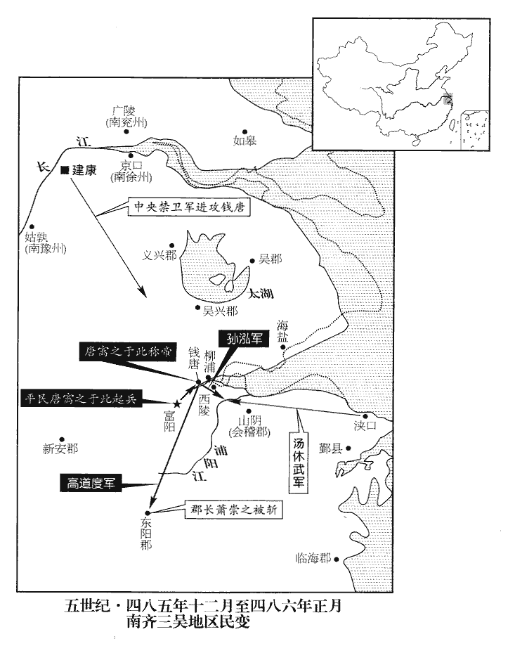
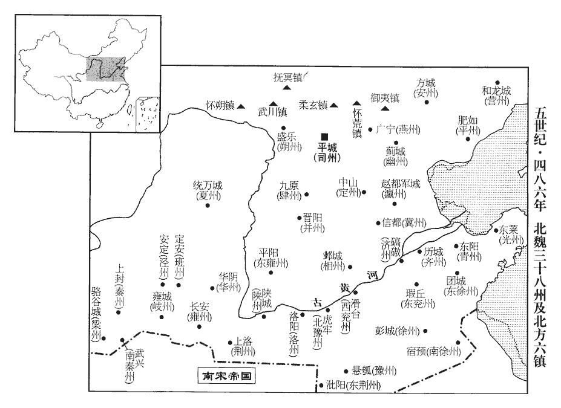
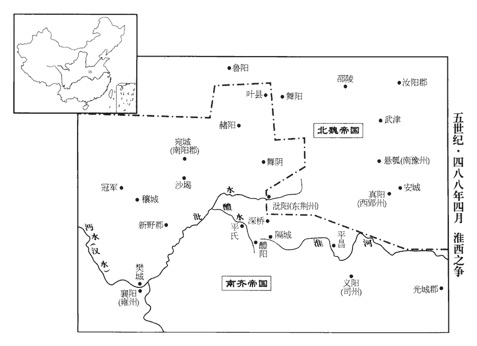
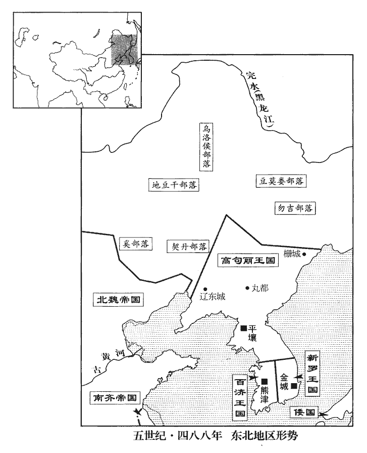

 齊紀二起閼逢困敦（甲子），盡屠維大荒落（己巳），凡六年。

# 世祖武皇帝上之下

## 永明二年（甲子、四八四）

1春，正月，乙亥‹二›，以後將軍柳世隆爲尚書右僕射；竟陵王子良‹时年二十五›爲護軍將軍兼司徒，領兵置佐，鎭西州‹南京西›。子良少有清尚，少，詩照翻。傾意賓客，才雋之士，皆遊集其門。開西邸，據《子良傳》：西邸在雞籠山‹南京北›。多聚古人器服以充之。記室參軍范雲、蕭琛、樂安‹山东广饶›任昉、法曹參軍王融、衛軍東閤祭酒蕭衍、記室參軍，掌書記；法曹參軍，掌刑法。此皆子良府屬也。時王儉爲衛將軍，辟蕭衍爲東閤祭酒。自晉以來，公府屬，長史之下有東、西閤祭酒。琛，丑林翻。任，音壬。昉，孚往翻。鎭西功曹謝朓、朓tiào，土了翻。步兵校尉沈約、揚州秀才吳郡‹江苏苏州›陸倕，校，戶敎翻。倕chuí，是爲翻。並以文學，尤見親待，號曰八友。法曹參軍柳惲、惲yùn，於粉翻。太學博士王僧孺、晉武帝置太學博士、太常博士、國子博士。南徐州‹府京口，江苏镇江›秀才濟陽‹侨郡，江苏盱眙南›江革、革，南徐州所舉秀才也。濟陽郡時屬南徐州。濟，子禮翻。尚書殿中郎范縝、魏、晉以來，尚書諸曹，殿中郎爲諸曹之首。縝，章忍翻。會稽‹浙江绍兴›孔休源亦預焉。會，工外翻。琛，惠開之從子；蕭惠開見一百三十一卷宋明帝泰始元年、二年。從，才用翻；下同。惲，元景之從孫；融，僧達之孫；柳元景以武功顯於宋文、武二朝。王僧達以世資才俊進。衍，順之之子；蕭順之，太祖族弟。朓，述之孫；約，璞之子；僧孺，雅之曾孫；謝述見一百二十三卷宋文帝元嘉十七元。沈璞守盱眙有功；見元嘉二十七年；孝武孝建之初，以不迎義師戮。王雅見一百七卷晉孝武太元十五年。縝，雲之從兄也。縝，章忍翻。

〖译文〗 [1]春季，正月，乙亥（初二），南齐朝廷任命后将军柳世隆为尚书右仆射；竟陵王萧子良为护军将军兼司徒，统领军队，设置辅佐官员，镇守西州。萧子良很小就有清高的品格，他喜欢结交朋友，有才能的士大夫都聚集在他的门下。萧子良建造他西郊的住宅，将聚集起来的许多古代器物、服饰放在里面。记室参军范云、萧琛、乐安人任、法曹参军王融、卫军东阁祭酒萧衍、镇西功曹谢眺、步兵校尉沈约和扬州秀才吴郡人陆等，都在辞章修养上很有造诣，尤其受到萧子良的厚待，号称八友。另外，法曹参军柳恽、太学博士王僧孺、南徐州秀才济阳人江革、尚书殿中郎范缜和会稽人孔休源，也都是萧子良的朋友。萧琛是萧惠开的侄子。柳恽是柳元景的侄孙。王融是王僧达的孙子。萧衍是萧顺之的儿子。谢眺是谢述的孙子。沈约是沈璞的儿子。王僧孺是王雅的曾孙。范缜是范云的堂兄。

子良篤好釋氏，招致名僧，講論佛法，道俗之盛，江左未有。或親爲衆僧賦食、行水，好，呼到翻。爲，于僞翻。賦，分畀也。世頗以爲失宰相體。

〖译文〗 萧子良笃信佛教，他延请许多高僧讲论佛法，佛教之盛行，在江左一带还从来没有过。有时，萧子良还亲自给和尚们端饭送水，世间都认为他有失宰相体统。

范縝盛稱無佛。子良曰︰「君不信因果，釋氏有因緣果報之說。何得有富貴、貧賤？」縝曰︰「人生如樹花同發，隨風而散；或拂簾幌墜茵席之上，幌，呼廣翻。或關籬牆落糞溷hùn之中。墜茵席者，殿下是也；落糞溷者，下官是也。貴賤雖復殊途，復，扶又翻。因果竟在何處！」子良無以難。難，乃旦翻；下難之同。縝又著《神滅論》，以爲︰「形者神之質，神者形之用也。神之於形，猶利之於刀；未聞刀沒而利存，豈容形亡而神在哉！」此論出，朝野諠譁，難之終不能屈。朝，直遙翻。太原‹侨郡，山东长清西南›王琰著論譏縝曰︰「嗚呼范子！曾不知其先祖神靈所在！」欲以杜縝後對。縝對曰︰「嗚呼王子！知其先祖神靈所在而不能殺身以從之！」子良使王融謂之曰︰「以卿才美，何患不至中書郎；而故乖剌爲此論，中書郎，卽謂中書侍郎也。剌，來葛翻。甚可惜也！宜急毀棄之。」縝大笑曰︰「使范縝賣論取官，已至令、僕矣，令、僕，謂尚書令及兩僕射。何但中書郎邪！」

〖译文〗 范缜大谈世上没有佛。萧子良说：“如果你不相信困果报应，那么，为什么世上会有贫贱、富贵之分？”范缜说：“人生在世，就像树上的花朵一样，同时生长又都随风飘散，有的掠过竹帘帷幕落到了床褥上，有的越过篱笆围墙落在了粪坑里。落到床褥之上的好比是殿下您，落到粪坑里的就是我了。虽然我们之间贵贱迥异，但因果报应究竟在何处呢？”萧子良听后，无言以对。范缜又写了《神灭论》，他认为：“形体，是精神的本质；精神则是形体的表现和产物。精神对于形体来说，就好像锋刃与刀，从未听说过有刀失而刃在的道理，那么，怎么会有形体消亡了而精神却还存在的事情呢？”这一理论一提出，朝廷上下一片哗然，屡加诘难，最终也没能使范缜屈服。太原人王琰，写文章讥讽范缜说：“呜呼范子！竟然不知道他祖先的神灵在什么地方！”王琰想以此堵住范缜的嘴。范缜却回答他说：“呜呼王子！知道他祖先的神灵在什么地方，却不肯杀身随之同去！”萧子良派王融劝范缜说：“凭着你这样的才华，还愁什么当不上中书郎，却故意发表这种荒谬偏激的言论，实在是令人太遗憾了。你应该赶快毁掉并放弃这些文章。”范缜一听，大笑说：“假使让我范缜出卖我的理论，去换取官职，那么，我早已做到尚书令、仆射了，何止是一个中书郎！”

蕭衍‹时年二十一›好籌略，有文武才幹，好，呼到翻。王儉深器異之，曰︰「蕭郎出三十，貴不可言。」蕭衍事始此。

〖译文〗 萧衍做事喜欢运筹谋略。他文武全才，王俭非常器重他，对他的才能惊异不止。王俭曾说：“萧郎刚刚年过三十，实在是贵不可言啊！”

2壬寅‹二十九›，以柳世隆爲尚書左僕射，丹楊尹李安民爲右僕射，王儉領丹楊尹。

〖译文〗 [2]壬寅（二十九日），南齐朝廷任命柳世隆为尚书左仆射，任命丹杨尹李安民为右仆射，任命王俭兼领丹杨尹。

3夏，四月，甲寅‹十二›，魏主‹拓跋宏，时年十八›如方山‹山西大同北方岭›；戊午‹十六›，還宮；庚申‹十八›，如鴻池；鴻池卽旋鴻池也。《水經註》︰涼城郡旋鴻縣東山下，水積成池，東西二里，南北四里。又太祖天興二年，穿鴻鴈池於平城。丁卯‹二十五›，還宮。

〖译文〗 [3]夏季，四月，甲寅（十二日），北魏孝文帝前往方山；戊午（十六日），返回宫中。庚申（十八日），又前往鸿池，丁卯（二十五日），返回宫中。

4五月，甲申‹十二›，魏遣員外散騎常侍李彪等來聘。散，悉亶翻。騎，奇寄翻。

〖译文〗 [4]五月，甲申（十二日），北魏派员外散骑常侍李彪等来访。

5六月，壬寅朔‹一›，中書舍人吳興‹浙江湖州›茹法亮封望蔡男。康曰︰茹，人諸切，姓也。望蔡縣屬豫章郡。沈約曰︰漢靈帝中平中，汝南上蔡民分徙此城立縣，名曰上蔡，晉武帝太康元年，更名望蔡。宋白曰︰望蔡縣本漢建成縣，靈帝分置上蔡縣，晉武帝以上蔡人思本土，改爲望蔡，今爲高安縣，瑞州治所。時中書舍人四人，各住一省，謂之「四戶」，以法亮及臨海‹浙江台州西北章安镇›呂文顯等爲之；旣總重權，勢傾朝廷，守宰數遷換去來，四方餉遺，歲數百萬。法亮嘗於衆中語人曰︰「何須求外祿！此一戶中，年辦百萬。」蓋約言之也。數，所角翻。遺，于季翻。語，牛倨翻。李延壽曰︰中書所司，掌在機務。漢元以令、僕用事，魏明以監、令專權。至宋孝武以來，士庶雜選，及明帝世，胡母顥、阮佃夫之徒，專爲佞倖矣。齊初亦用久勞及以親信關讞表啓，發署詔敕，頗涉辭翰，亦爲詔文，侍郎之局復見侵矣。建武詔命，始不關中書，專出舍人。省內舍人四人，所直四省。據此，四戶，則舍人分住四省，自法亮等始。後因天文有變，王儉極言「文顯等專權徇私，上天見異，禍由四戶。」見，賢遍翻。上‹萧赜，时年四十五›手詔酬答，而不能改也。

〖译文〗 [5]六月，壬寅朔（初一），南齐中书舍人吴兴人茹法亮，被封为望蔡男。此时共有四位中书舍人，被分别派驻各省，称为四户，分别由茹法亮和临海人吕文显等人担任。他们总揽大权，声势超过了朝廷其他文武官员，地方官不断来去调换，四面八方给他们送的礼物，一年就达几百万之多。茹法亮曾经当众对人说：“何必一定要求得外任官的俸禄。就在这一户里，一年就可弄到一百万。”他所说的一百万也不过是个大概的数目。后来，天象星辰发生了变化，王俭坚决认为：“吕文显等人专断独行，徇私舞弊。所以，苍天出现异变，这一灾难出自四户。”南齐武帝亲自写诏酬答王俭，却不能改变这种现状。

6魏舊制︰戶調帛二匹，絮二斤，絲一斤，穀二十斛；又入帛一匹二丈，委之州庫，以供調外之費；所謂各隨土之所出。丁卯‹二十六›，詔曰︰「置官班祿，行之尚矣；自中原喪亂，茲制中絕。朕憲章舊典，始班俸祿。戶增調帛三匹，穀二斛九斗，以爲官司之祿；增調外帛二匹。祿行之後，贓滿一匹者死。變法改度，宜爲更始，調，徒弔翻。俸，扶用翻。更，工衡翻。其大赦天下。」

〖译文〗 [6]北魏旧制规定：每年户调为二匹布帛，二斤棉絮，一斤丝，二十斛谷米。另外，又增缴一匹二丈的布帛，存入本州州库，用来供应户调的需要。各州所征调的物品，可以按照本地所出产的缴纳。丁卯（二十六日），孝文帝下诏说：“设置官吏，发放俸禄，很早就已开始实行，自从中原战乱，这一制度才开始中断。朕依照旧有的典章制度，开始颁赐官吏们的俸禄。所以，每户户调应增缴三匹帛，二斛九斗谷米，作为官员们的棒禄。再增收二匹户调以外的帛。俸禄制度实行以后，贪赃达一匹布帛的处死，改变法令制度，应该作为新的开始，为此下令实行大赦。”

7秋，七月，甲申‹十三›，立皇子子倫爲巴陵王。

〖译文〗 [7]秋季，七月，甲申（十三日），立皇子萧子伦为巴陵王。

8乙未‹二十四›，魏主如武州山石窟寺‹山西大同西云冈石窟›。

〖译文〗 [8]乙未（二十四日），北魏国主孝文帝前往武州山石窟寺。

9九月，魏詔，班祿以十月爲始，季別受之。三月爲一季。舊律，枉法十匹，義贓二十匹，罪死；至是，義贓一匹，枉法無多少，皆死。枉法，謂受賕枉法而出入人罪者。義贓，謂人私情相饋遺，雖非乞取，亦計所受論贓。仍分命使者，糾按守宰之貪者。

〖译文〗 [9]九月，北魏下诏，官员们的俸禄制度，从本年十月开始实行，每个季度发放一次。以前的法律规定，贪污十匹布帛，受贿二十匹布帛的人，一律处以死刑。到现在，凡是受贿一匹布帛的，以及贪污无论多少，都处以死刑。朝廷仍然分别派出检查官，到各地巡视纠举有贪污行为的地方官。

秦、益二州‹府上邽，甘肃天水›刺史恆農‹河南三门峡›李洪之以外戚貴顯，魏顯祖、高祖皆李氏出也。魏避顯祖諱，改弘農爲恆農。爲治貪暴，治，直吏翻。班祿之後，洪之首以贓敗。魏主命鎖赴平城，集百官親臨數之；數，所具翻，數其罪也。猶以其大臣，聽在家自裁。自餘守宰坐贓死者四十餘人。受祿者無不跼蹐，跼，音局。蹐，音脊。賕賂殆絕。然吏民犯他罪者，魏主率寬之，疑罪奏讞多減死徙邊，歲以千計。都下決大辟，歲不過五六人；州鎭亦簡。讞，魚列翻，又魚蹇翻。

〖译文〗 秦、益二州刺史恒农人李洪之自恃皇亲国戚，身分显贵，为官残暴，贪赃枉法。实行俸禄制度后，李洪之因贪污事露，第一个就被揭发出来。孝文帝下崐令给李洪之上戴上手铐脚镣，押赴平城；然后，召集文武百官，亲自历数他的罪状。由于他是朝廷大臣，允许他在家里自杀。其余有贪污受贿罪的地方官大约有四十多人，也全都处以死刑。那些接受过贿赂的人，无不恐慌害怕，行贿受贿的事，几乎被杜绝了。然而，官吏和老百姓犯了其他罪时，孝文帝大都宽大处理。对缺少确凿证据的罪犯上报审核，多半免除死刑而流放到边疆，这种情况，每年都数以千计。由朝中法司判处死刑的，一年也超不过五六个人，州郡、边镇就更少了。

久之，淮南王佗【張︰「佗」作「陀」。】奏請依舊斷祿，辟，毗亦翻。斷，丁管翻。文明太后召羣臣議之。中書監高閭以爲︰「飢寒切身，慈母不能保其子。今給祿，則廉者足以無濫，貪者足以勸慕；不給，則貪者得肆其姦，廉者不能自保。淮南之議，不亦謬乎！」詔從閭議。

〖译文〗 很久以后，淮南王拓跋佗奏请仍按旧制，停止向官员发放俸禄。太皇太后冯氏召集文武百官讨论这件事。中书监高闾认为：“自身深感饥寒交迫，慈母却不能保护她的孩子。如今，发放俸禄，廉洁的官吏更加清白而对于那些贪官污吏也足以改过为善。停止发放俸禄，贪官污吏会更加肆无忌惮地贪赃枉法，廉洁的人却不能维持生计。淮南王的建议，岂不是荒唐吗？”朝廷颁诏采纳高闾的建议。

閭又上表，以爲︰「北狄悍愚，同於禽獸。悍，侯旰翻，又下罕翻。所長者野戰，所短者攻城。北狄，指蠕蠕也。若以狄之所短奪其所長，則雖衆不能成患，雖來不能深入。又，狄散居野澤，隨逐水草，戰則與家業並至，奔則與畜牧俱逃，不齎資糧而飲食自足，是以歷代能爲邊患。六鎭勢分，倍衆不鬬，謂敵人衆力加倍，則鎭人不敢鬬也。互相圍逼，難以制之。請依秦、漢故事，於六鎭之北築長城，魏世祖破蠕蠕，列置降人於漠南，東至濡源，西曁五原陰山，竟三千里，分爲六鎭，今武川‹内蒙武川›、撫冥‹内蒙四子王旗›、懷朔‹内蒙固阳›、懷荒‹河北张北›、柔玄‹内蒙兴和北›、禦夷‹河北赤城›也。下云六鎭東西不過千里，則當自代都北塞而東至濡源耳。杜佑曰︰後魏六鎭並在馬邑、雲中單于府界。擇要害之地，往往開門，造小城於其側，置兵扞守。狄旣不攻城，野掠無獲，草盡則走，終必懲艾。計六鎭東西不過千里，一夫一月之功可城三步之地，強弱相兼，不過用十萬人，一月可就；雖有暫勞，可以永逸。凡長城有五利︰罷遊防之苦，一也；北部放牧無抄掠之患，二也；抄，楚交翻。登城觀敵，以逸待勞，三也；息無時之備；四也；歲常遊運，遊，行也；行運芻糧以實塞下。永得不匱，五也。」魏主優詔答之。

〖译文〗 接着，高闾再次上疏朝廷，认为：“北狄凶悍愚昧，如同禽兽。他们所擅长的是在野外作战却不擅于攻城。如果我们利用北狄的短处，遏止它的长处，那么，北狄人数再多也不会成为我们的祸患，即使攻来也无法深入我们的国境。况且，北狄人都是散居在旷野沼泽地带，他们总是跟着河水和绿草不断迁移，打仗时，他们可以带着全部家人财产一起战斗，而撤退时又可以连同家畜一块儿逃走，用不着携带粮食，饮食可以自给自足，因此历代成为中原国家边患。朝廷在北方的六个重镇，使兵力分散。敌人的数目一旦超过我们一倍，镇将就不敢迎战。他们却可以互相援引围攻我方的重镇，这样，敌人就很难制服。因而，我请求依照秦、汉时期的边防策略，在六镇以北，修筑长城，选择关键地方开辟城门，在旁边再另修建一个小城，派兵守卫。狄人既不会攻城，在荒凉的郊野上也抢不到什么东西，他们的马把青草吃光就会撤走，定会受到惩罚。估计六个重镇的防线，东西不超过一千里，一个男子一个月的功夫，就可以筑起三步长的城墙，即便把强壮老弱劳力加在一起，所用劳力也不会超过十万人，一个月就能完成。虽然暂时辛苦劳累，却可以得到永久的安宁。兴筑长城有五种好处：第一，可以免除边防军巡逻的辛苦；第二，不用担心北方部落利用放牧的机会前来虏掠抢劫；第三，可以登上长城观察敌人的动静，以逸待劳；第四，免除平日无休止的戒备状态；第五，一年四季都可以将粮秣运往边塞，使要塞的物资永不匮乏。”孝文帝特地颁下诏令，表扬赞同这一建议。

10冬，十月，丁巳‹十八›，以南徐州刺史長沙王晃爲中書監。初，太祖‹萧道成›臨終，以晃屬帝‹萧赜›，使處於輦下或近藩，屬，之欲翻。處，昌呂翻。勿令遠出。且曰︰「宋氏若非骨肉相殘，他族豈得乘其弊！汝深誡之！」舊制︰諸王在都，唯得置捉刀左右四十人。捉刀，執刀以衛左右者也。晃好武飾，及罷南徐州，私載數百人仗還建康，爲禁司所覺，投之江水。禁司，主防禁諸王。好，呼到翻；下同。帝聞之，大怒，將糾以法，豫章王嶷叩頭流涕曰︰「晃罪誠不足宥；陛下當憶先朝念晃。」帝亦垂泣，由是終無異意，然亦不被親寵。論者謂帝優於魏文‹曹丕›，減於漢明‹刘庄›。魏文防禁任城、陳諸王。漢明友愛東海、東平诸王。嶷，魚力翻。朝，直遙翻。被，皮義翻。

〖译文〗 [10]冬季，十月，丁巳（十八日），南齐任命南徐州刺史、长沙王萧晃为中书监。当初，高帝临终前，将萧晃托付给武帝，特别嘱咐，要让萧晃留在京城中或京城附近任官，不要派他去边远的地方。又说：“宋氏如果不是亲骨肉之间互相残杀，外姓人怎么会有可乘之机？你们应该深以为戒！”旧制规定：亲王们在京都时，只可以带四十名武装侍卫。萧晃喜欢武士的威仪，离开南徐崐州时，他私下带着几百件个人用的武器返回建康，被负责防禁的部门发觉，扔进了长江。武帝闻知勃然大怒，打算将萧晃绳之以法。豫章王萧嶷叩头哭泣说：“萧晃的罪过，诚然不可以宽恕。陛下该想想父王对萧晃的恩爱。”武帝也低下头哭了，从此，武帝对萧晃不再有杀机，也没有信任和宠爱。议论朝事的人都说，武帝要比魏文帝曹丕好些，但不如东汉明帝刘庄。

武陵王曄多材藝而疏悻，悻，直也，狠也，音胡頂翻。亦無寵於帝。嘗侍宴，醉伏地，貂抄肉柈pán。抄，楚交翻。柈，薄官翻。帝笑曰︰「肉汙貂。」汙，烏故翻。對曰︰「陛下愛羽毛而疏骨肉。」帝不悅。曄輕財好施，施，式智翻。故無蓄積；名後堂山曰「首陽」‹首阳山，山西永济境›，蓋怨貧薄也。

〖译文〗 武陵王萧晔多才多艺，但性情直率，也得不到武帝的宠爱。有一次，他参加皇宫御宴，大醉倒地，帽子边上的貂尾都沾上了肉汤。武帝笑着说：“肉汤把你的貂尾都弄脏了。”萧晔回答说：“陛下您喜爱这些羽毛，却疏远亲生骨肉。”武帝很不高兴。萧晔把钱财看得很轻，喜欢施舍。所以，他自己没有积蓄。他把后堂山叫做“首阳山”，就是抱怨自己生活贫困以及武帝薄情。

11高麗‹都平壤，朝鲜平壤›王璉遣使入貢於魏，亦入貢於齊。時高麗方強，魏置諸國使邸，齊使第一，高麗次之。麗，力知翻。使，疏吏翻；下同。

〖译文〗 [11]高句丽国王高琏，派使节向北魏进贡，同时也向南齐进贡。此时，高句丽王国正处于强盛时期，北魏安置各国使节住所，南齐使节排在第一位，接着就是高句丽了。

12益州大度獠恃險驕恣，《水經註》︰南安縣有濛水，卽大度水‹青衣江›，東入于江。《寰宇記》︰大度河自吐蕃界經雅州諸部落，至黎州東界，流入通望界。獠，魯皓翻。前後刺史不能制。及陳顯達爲刺史，遣使責其租賧dǎn。賧，吐濫翻。夷人以財贖罪曰賧。獠帥曰︰「兩眼刺史尚不敢調我，帥，所類翻。調，徒弔翻。況一眼乎！」遂殺其使。顯達分部將吏，聲言出獵，夜，往襲之，男女無少長皆斬之。分，扶問翻。將，卽亮翻；下同。少，詩照翻。長，知兩翻。

〖译文〗 [12]益州大度獠人自恃占据险峻，骄横狂暴、为所欲为，朝廷先后派去了许多刺史，但都不能制服他们。等到陈显达接任益州刺史，他派遣官差去催缴田赋捐税，獠族首领说：“长着两只眼睛的刺史都不敢要我缴纳租调，何况这个独眼刺史。”于是，杀掉了陈显达派去的官差。陈显达分别安排将领官吏，声称出去打猎，夜里，突然发动袭击，将大度獠地区的男女老幼全部斩杀了。

晉氏以來，益州刺史皆以名將爲之。十一月，丁亥‹十八›，帝始以始興王鑑爲督益•寧諸軍事、益州‹府成都›刺史，徵顯達為中護軍。先是，劫帥韓武方聚黨千餘人斷流為暴，先，悉薦翻。斷，丁管翻。郡縣不能禁。鑑行至上明‹湖北松滋西北›，武方出降，降，戶江翻；下同。長史虞悰等咸請殺之。悰，徂宗翻。鑑曰︰「殺之失信，且無以勸善。」乃啓臺而宥之，於是巴西‹四川阆中›蠻夷爲寇暴者皆望風降附。鑑時年十四，行至新城‹湖北房县›，新城，今房州。道路籍籍，云「陳顯達大選士馬，不肯就徵。」乃停新城，遣典籤張曇皙往觀形勢。俄而顯達遣使詣鑑，咸勸鑑執之。鑑曰︰「顯達立節本朝，必自無此。」曇，徒含翻。皙，先擊翻。使，疏吏翻。朝，直遙翻；下同。居二日，曇皙還，具言「顯達已遷家出城，日夕望殿下至。」於是乃前。鑑喜文學，喜，許記翻。器服如素士，蜀人悅之。

〖译文〗 自从东晋以来，益州刺史都是由著名的将领来担任的。十一月，丁亥（十八日），武帝任命始兴王萧鉴为督益、宁诸军事，益州刺史。调陈显达返回建康，任中护军。当初，劫盗头目韩武方聚集一千多名党羽，截断水源，横行霸道，地方官府无法阻止。萧鉴赴任走到上明时，韩武方向萧鉴投降，长史虞等人都请求萧鉴杀掉他，萧鉴说：“杀了韩武方，就失去了信用，也无法规劝别人改过从善。”于是，向朝廷报告，饶恕韩武方。因此，巴西一带从事抢掠的残暴、愚昧的蛮夷也都闻风投降。萧鉴这年正好十四岁，当他继续进发，走到新城时，路上纷纷传言，说：“陈显达正大肆征兵买马，不肯接受朝廷征召。”萧鉴在新城站下，并派典签张昙皙前去观察形势。不久，陈显达派来的使者来到萧鉴停留处，手下人都劝萧鉴逮捕使者。萧鉴却说：“陈显达高风亮节，尽心效忠朝廷，一定不会有这种事。”过了两天，张昙皙返回，陈说：“陈显达已带领全家人离城，早晚都希望殿下能到达。”于是，萧鉴才继续赶路。萧鉴喜欢文学，他所使用的器具和服饰都和普通士大夫一样，因此，蜀地人民都非常高兴。

13乙未‹二十六›，魏員外散騎常侍李彪等來聘。散，悉亶翻。騎，奇寄翻。《考異》曰︰《齊紀》︰「十二月庚申，虜使李道固至。」今從《後魏•帝紀》。

〖译文〗 [13]乙未（二十六日），北魏员外散骑常侍李彪等人，前来南齐访问。

14是歲，詔增豫章王嶷封邑爲四千戶。宋元嘉之世，諸王入齋閤，得白服、帬帽見人主，宋、齊之間，制高屋帽、下帬蓋。帬qún，渠云翻。見，賢遍翻。唯出太極四廂，乃備朝服。太極殿，前殿也，有四廂。自後此制遂絕。上於嶷友愛，宮中曲宴，聽依元嘉故事。嶷固辭不敢，唯車駕至其第，乃白服、烏紗帽以侍宴。至於衣服、器用制度，動皆陳啓，事無專制，務從減省。上幷不許。嶷常慮盛滿，求解揚州，以授竟陵王子良。上終不許，曰︰「畢汝一世，無所多言。」嶷長七尺八寸，善脩容範，文物衛從，禮冠百僚，長，直亮翻。從，才用翻。冠，古玩翻。每出入殿省，瞻望者無不肅然。

〖译文〗 [14]这年，武帝颁下诏令，命令将豫章王萧嶷的封邑增加到四千户人家。刘宋元嘉时代，亲王进入宫内的斋阁内，可以穿白色便服、裙子，戴高帽拜见皇帝，只有到太极殿四个厢房时，才穿正式官服。元嘉以后，这种制度也就取消了。武帝对萧嶷极其友爱，凡在宫内歌舞饮宴，都允许萧嶷按照元嘉时代的制度穿戴。萧嶷坚决辞谢，不敢这样做。只有武帝来到他的家里时，他才敢穿上白色便服，戴上乌纱帽陪宴。他将自己平时的衣服、器具的标准，连同自己的一举一动，全都向武帝汇报，从不独断专行，开支都务求节俭。武帝对萧嶷的做法并不赞成。萧嶷一直担心自己的地位太高，权势太大，多次请求解除他扬州刺史的职务，改授给竟陵王萧子良，武帝始终也没有签应。武帝说：“扬州刺史这个官你要当一辈子，不要再多说什么。”萧嶷身高七尺八寸，他很善于修饰仪表，他的仪仗和侍从们的礼节规范，都远远超过了其他官属，每次出入殿堂，在旁边观看的人，无不肃然起敬。

15交州‹府龙编，越南河内东北北宁府›刺史李叔獻旣受命，命叔獻爲交州刺史，見上卷太祖建元元年。而斷割外國貢獻；上欲討之。斷，丁管翻。

〖译文〗 [15]交州刺史李叔献接受了朝廷的任命，却擅自截留外国对朝廷的进贡，因此，武帝打算去讨伐他。

## 三年（乙丑、四八五）

1春，正月，丙辰，以大司農劉楷爲交州‹府龙编，越南河内东北北宁府›刺史，發南康‹江西赣州›、廬陵‹江西吉水›、始興‹广东韶关›兵以討叔獻。叔獻聞之，遣使乞更申數年，獻十二隊純銀兜鍪及孔雀毦；毦ěr，仍吏翻，以孔雀毛爲飾也。上‹萧赜，时年四十六›不許。叔獻懼爲楷所襲，間道自湘州‹府临湘，湖南长沙›還朝。不敢取道南康、始興，避劉楷之兵故也。間，古莧翻。

〖译文〗 [1]春季，正月，丙辰（疑误），任命大司农刘楷为交州刺史，并发动南康、庐陵、始兴三地的军队，讨伐李叔献。李叔献得到消息后，立刻派使者跑到建康，乞求允许他延长几年任期，并向朝廷进贡二千四百个纯银头盔和孔雀翎，武帝拒绝了他的请求。李叔献深怕自己会受到刘楷的袭击，就抄小路从湘州返回建康。

2戊寅‹十›，魏‹拓跋宏，时年十九›詔曰︰「圖讖之興，出於三季，三代之季也。讖，楚譖翻。旣非經國之典，徒爲妖邪所憑。自今圖讖、祕緯，一皆焚之，妖，於遙翻。緯，于貴翻。留者以大辟論！」律，凡言以論者，罪同眞犯。辟，毗亦翻。又嚴禁諸巫覡xí及委巷卜筮非經典所載者。直曰街，曲曰巷。委，卽曲也。鄭玄曰︰委巷，猶街里委曲所爲也。覡，刑狄翻。

〖译文〗 [2]戊寅（初十），北魏下诏令说：“测定吉凶征兆的神秘预言图谶的出现，是从夏、商、周三代之末开始的。它不是治理国家的重要典章，只能被妖邪不正的人所利用。从现在开始，凡是图谶、纬书，一概烧掉，有私自保存的，一律处以极刑。”又严格禁止男巫女巫以及街头巷尾占卦的人进行不是经典所记载的活动。

3魏馮太后作《皇誥》十八篇，癸未‹十五›，大饗羣臣于太華殿，班《皇誥》。魏高宗興光四年起太華殿。

〖译文〗 [3]北魏太皇太后冯氏作《皇诰》十八篇。癸未（十五日），冯氏在太华殿大规模宴请文武百官，正式颁布《皇诰》。

4辛卯‹二十三›，上‹萧赜›祀南郊，大赦。

〖译文〗 [4]辛卯（二十三日），南齐武帝到南郊祭祀天神，实行大敕。

5詔復立國學；罷國學見上卷高帝建元四年。李延壽曰︰江左草創，日不暇給，以迄宋、齊，國學時或開置，而勸課未博，建之不能十年，蓋取文具而已。復，扶又翻。釋奠先師用上公禮。

〖译文〗 [5]武帝下诏恢复国学。用祭祀上公的礼仪祭祀孔子。

6二月，己亥‹二›，魏制，皇子皇孫有封爵者，歲祿各有差。

〖译文〗 [6]二月，己亥（初二），北魏规定：对有封爵的皇子皇孙们，按照不同标准等级，发放俸禄。

7辛丑‹四›，上祭北郊。

〖译文〗 [7]辛丑（初四），武帝到北郊祭祀。

8三月，丙申‹二十九›，魏封皇弟禧爲咸陽王，幹爲河南王，羽爲廣陵王，雍爲潁川王，勰爲始平王，勰，音協。詳爲北海王。自禧以下皆魏主之弟。文明太后令置學館，選師傅以敎諸王。勰於兄弟最賢，敏而好學，善屬文，好，呼到翻。屬，之欲翻。魏主尤奇愛之。

〖译文〗 [8]三月，丙申（二十九日），北魏封皇弟拓跋禧为咸阳王，拓跋干为河南王，拓跋羽为广陵王，拓跋雍为颍川王，拓跋勰为始平王，拓跋详为北海王。太皇太后冯氏又下令设置皇家学校，遴选师傅教授各位亲王。在所有兄弟中间，拓跋勰最贤能，他敏而好学，擅长写文章，因此，孝文帝特别赏识喜欢他。

9夏，四月，癸丑‹十七›，魏主如方山‹山西大同北方岭›；甲寅‹十八›，還宮。

〖译文〗 [9]夏季，四月，癸丑（十七日），孝文帝前往方山。甲寅（十八日），返回宫中。

10初，宋太宗‹刘彧›置總明觀以集學士，亦謂之東觀。上以國學旣立，五月，乙未‹二十九›，省總明觀。時王儉領國子祭酒，詔於儉宅開學士館，以總明四部書充之。分經、史、子、集爲甲、乙、丙、丁四部。又據《宋紀》︰明帝泰始六年立總明觀，徵學士以充之；舉士二十人，分爲儒、道、文、史、陰陽五部學，言陰陽者遂無其人。然則四部書者，其儒、道、文、史之書歟！觀，古玩翻。又詔儉以家爲府。

〖译文〗 [10]当初，刘宋明帝设立总明观，聚集学士，也叫东观。武帝认为，国学已经成立，所以在五月，乙未（二十九日），下令撤销总明观。当时，王俭正兼任国子祭酒，诏令在王俭住宅内，开设学士馆，把总明观的甲、乙、丙、丁四部的图书，移交给学士馆。同时，又命令王俭把家作为办公的官署。

自宋世祖‹刘骏›好文章，士大夫悉以文章相尚，無以專《經》爲業者。儉少好《禮》學及《春秋》，言論造次必於儒者，好，呼到翻。造，七到翻。由是衣冠翕然，更尚儒術。儉撰次朝儀、國典，自晉、宋以來故事，無不諳憶，憶，記也。朝，直遙翻；下同。諳ān，烏含翻。故當朝理事，斷決如流。每博議引證，八坐、丞、郎無能異者。八坐、丞、郎，自八坐至左右丞、諸曹郎也。斷，丁亂翻。坐，徂臥翻。令史諮事常數十人，賓客滿席，儉應接辨析，傍無留滯，發言下筆，皆有音彩。十日一還學監試諸生，巾卷在庭，監，工銜翻。卷，巨員翻，冠武也。鄭註《禮記》云︰武冠，卷也，音起權翻。劍衛、令史，儀容甚盛。作解散髻，據《南史•儉傳》作「解散幘」。蕭子顯《齊書》作「解散髻，斜插幘簪」。斜插簪；朝野慕之，相與倣效。儉常謂人曰︰「江左風流宰相，唯有謝安。」意以自比也。上深委仗之，士流選用，奏無不可。

〖译文〗 从刘宋孝武帝喜欢文章辞采以来，士大夫也都以华丽的文辞章句互相推崇欣赏，却没有专门研究经典的人。王俭小时候就喜欢《礼》和《春秋》，即使是随便言谈，也都一定遵循儒家法则，从王俭这里开始，士大夫又追随模仿，崇尚儒家学说。王俭在撰写朝廷礼仪、国家大典时，对晋、刘宋王朝以来的掌故，无不了如指掌，因此，在他处理朝廷各项事务时，能够迅速做出决断。每次建言，都旁征博引，上自八坐，下到左右丞、各署曹郎，没有人能提出异议。拿着公文向他请示的令史经常有几十人，宾客盈门，王俭都从容接待，条分缕析，从不积压延迟，无论是口头发表见解，还是下笔批示，都是有声有色，神彩飞扬。王俭每十天去学监一次，测试学生，学监内都是头戴葛巾、手拿试卷的学生，佩剑的卫士和令史站在一旁，仪式非常隆重。王俭解散发髻，把头簪斜插在上面，朝廷内外都很仰慕他的风采，争相模仿。王俭经常对人说：“江左风流倜傥的宰相，只有谢安一人。”言下之意是把自己比作谢安。武帝也非常器重他并委以要职。选用士人，只要是王俭推荐的，没有不批准的。

11六月，庚戌‹十五›，魏進河南王度易侯爲車騎將軍，遣給事中吳興‹浙江湖州›丘冠先使河南‹吐谷浑›，幷送柔然使。騎，奇寄翻。冠，古玩翻。使，疏吏翻。

〖译文〗 [11]六月，庚戌（十五日），北魏提升河南王慕容度易侯为车骑将军，并派遣经事中、吴兴人丘冠先出使河南同时护送柔然汗国使节。

12辛亥‹十六›，魏主如方山；丁巳‹二十二›，還宮。

〖译文〗 [12]辛亥（十六日），孝文帝前往方山。丁巳（二十二日），返回宫中。

13秋，七月，癸未‹十八›，魏遣使拜宕昌‹甘肃宕昌›王梁彌機兄子彌承爲宕昌王。宕，徒浪翻。《考異》曰︰《齊書》，是歲八月丁巳，以行宕昌王梁彌頡爲河、梁二州刺史。六年五月甲午，以彌承爲河、涼二州刺史。今從《魏書》。初，彌機死，子彌博立，爲吐谷渾‹青海›所逼，奔仇池‹甘肃西和南›。吐，從暾入聲。谷，音浴。仇池鎭將穆亮以彌機事魏素厚，矜其滅亡；彌博凶悖，所部惡之；將，卽亮翻。悖，蒲內翻，又蒲沒翻。惡，烏路翻。彌承爲衆所附，表請納之。詔許之。亮帥騎三萬軍于龍鵠‹四川松潘›，龍鵠，蓋卽龍涸也，在甘松界，宇文氏於此置龍涸防，隋爲扶州嘉誠縣，唐爲松州。杜佑曰︰龍涸城，吐谷渾南界也，去成都千餘里。周武帝天和初，其王率衆降，以爲扶州。帥，讀曰率。騎，奇寄翻。擊走吐谷渾，立彌承而還。還，從宣翻，又如字。亮，崇之曾孫也。穆崇見一百一十一卷晉安帝隆安三年。

〖译文〗 [13]秋季，七月，癸未（十八日），北魏派遣使节前往宕昌，任命宕昌已故国王梁弥机哥哥的儿子梁弥承为新任宕昌王。当初，梁弥机去世，他的儿子梁弥博继承王位，被吐谷浑汗国所逼迫，逃到了仇池。仇池镇将穆亮认为梁弥机侍奉北魏朝廷一向尽心谨慎，对宕昌国的灭亡非常同情。可是，梁弥博性情凶狠，残暴悖逆，将士对他都很痛恨，而梁弥承却受到大家的拥护，穆亮应奏请朝廷，允许护送梁弥承回国，朝廷下诏批准。于是，穆亮就率领三万名骑兵驻扎在龙鹄，击退了吐谷浑，拥立梁弥承登上王位。穆亮是穆崇的曾孙。

14戊子‹二十三›，魏主如魚池，魏太宗‹拓跋嗣›永登五年，穿魚池於平城北苑。登青原岡；甲午‹二十九›，還宮；八月，己亥‹五›，如彌澤‹山西朔州西南›；甲寅‹二十›，登牛頭山；甲子‹三十›，還宮。

〖译文〗 [14]戊子（二十三日），孝文帝前往鱼池，登临青原冈。甲午（二十九日），返回宫中。八月，己亥（初五），前往弥泽。甲寅（二十日），登上牛头山。甲子（三十日），返回宫中。

15魏初，民多蔭附；蔭附者，自附於豪強之家以求蔭庇。蔭附者皆無官役，而豪強徵斂倍於公賦。斂，力贍翻。給事中李安世上言︰「歲饑民流，田業多爲豪右所占奪；占，之贍翻。雖桑井難復，桑井，謂古者井田之制，五畝之宅，樹牆下以桑也。宜更均量，使力業相稱。又，所爭之田，宜限年斷，量，音良。稱，尺證翻。斷，丁亂翻。事久難明，悉歸今主，以絕詐妄。」魏主善之，由是始議均田。冬，十月，丁未‹十三›，詔遣使者循行州郡，行，下孟翻。與牧守均給天下之田︰守，式又翻。諸男夫十五以上受露田四十畝，婦人二十畝︰杜佑《通典註》曰︰不栽樹者謂之露田。奴婢依良丁；良丁，謂良人成丁者。牛一頭，受田三十畝，限止四牛。所授之田，率倍之；三易之田，再倍之；以供耕作及還受之盈縮。倍之者，合受四十畝，授以八十畝。此一易之田也。三易之田，三年耕然後復故，故再倍以授之。人年及課則受田，老免及身沒則還田。奴婢、牛隨有無以還受。初受田者，男夫給二十畝，課種桑五十株；桑田皆爲世業，身終不還。恆計見口，有盈者無受無還，不足者受種如法，盈者得賣其盈。恆，戶登翻。見，賢遍翻。口分、世業之法始此。諸宰民之官，各隨近給公田有差，更代相付；更，工衡翻。賣者坐如律。

〖译文〗 [15]北魏建国初年，很多人自动依附于豪门强族。寻求庇护的人都不用为官府服役，可是，豪强贵族的横征暴敛，比官府征收的捐税高出一倍。于是，给事中李安世上书说：“每次遇到灾荒，老百姓就四处逃散，他们的田地大多都被豪强贵族们所霸占、掠夺。古代的井田制度难以恢复，朝廷应该使土地平均些，使农夫耕种土地的面积和人口数量相当。另外，对发生争执的田产，应该限定日期裁断。官司拖得太久又难以明断的田产，一律归现在使用的人，以杜绝谗佞欺诈。”孝文帝赞赏李安世的建议，由此开始讨论均田方案。冬季，十月，丁未（十三日），孝文帝下诏派遣使者分别去各州郡，与各州郡牧守一同推行均田制，十五岁以上的男子，每人可以得到四十亩没有种树的农田，女子每人二十亩，奴仆婢女，按照一般成年人所配给田地的待遇分配土地。一头牛，可得三十亩农田，但以四头牛为限。所配给的农田，如果是隔一年才能耕种一次的贫瘠田地，增加一倍；如果是隔两年才能耕种一次的田地，增加两倍。以此供耕种和还田、受田增加减少的需要。老百姓到了应该纳赋的年龄，就配给土地，年纪已老以及去世之后，土地归还官府。对于奴婢和耕牛，根据奴婢和耕牛数量多少，决定还田还是受田。初次受田的人，男子给田二十亩，规定种五十棵桑树，种了桑树的土地，都是世世代代经营管理，死了以后也不用缴回官府。官府应经常统计人口情况，对土地有盈余的农家，不受田也不令他还田。对土地不够的农家，则依照法令增加配给。世代经营的田地，有盈余的人家，可以自由出售。各地地方官就在官府附近，按照等级，配给一份公田，地方官更换时，要把这份公田移交给接任的官员。如果私自卖掉公田，按照法律追究定罪。

16辛酉‹二十七›，魏魏郡王陳建卒。

〖译文〗 [16]辛酉（二十七日），北魏魏郡王陈建去世。

17魏員外散騎常侍李彪等來聘。

〖译文〗 [17]北魏员外散骑常侍李彪等人来访。

18十二月，乙卯‹二十二›，魏以侍中淮南王佗爲司徒。

〖译文〗 [18]十二月，乙卯（二十二日），北魏任命侍中、淮南王拓跋佗为司徒。

19柔然犯魏塞，魏任城王澄帥衆拒之，柔然遁去。澄，雲之子也。任城王雲見一百三十三卷宋明帝泰始七年。任，音壬。帥，讀曰率。氐、羌反，詔以澄爲都督梁•益•荊三州諸軍事、梁州‹府骆谷，甘肃西和南›刺史。魏高祖始置梁、益二州於仇池。澄至州，討叛柔服，氐、羌皆平。

〖译文〗 [19]柔然汗国进犯北魏边塞，北魏任城王拓跋澄率领将士抗击，柔然军远逃。拓跋澄是拓跋云的儿子。后来，氐族、羌族人起来造反，诏命拓跋澄为都督梁、益、荆三州诸军事，梁州刺史，拓跋澄抵达仇池城就职后，讨伐叛贼，安抚降附的部众，氐族、羌族的叛乱全都平息。

20初，太祖‹萧道成›命黃門郎虞玩之等檢定黃籍。見上卷太祖建元二年。上‹萧赜›卽位，別立校藉官，置令史，限人一日得數巧。巧，謂姦僞也。旣連年不已，民愁怨不安。外監會稽呂文度外監，屬中領軍。而親任過於領軍。會，工外翻。啓上，籍被卻者悉充遠戍，被，皮義翻。民多逃亡避罪。富陽‹浙江富阳›民唐㝢之因以妖術惑衆作亂，攻陷富陽，富陽，卽漢富春縣也，本屬會稽，後屬吳郡；晉簡文鄭太后諱春‹郑阿春›，孝武改曰富陽。妖，於驕翻。三吳卻籍者奔之，衆至三萬。

〖译文〗 [20]当初，南齐高帝萧道成命令门下省黄门郎虞玩之等人重新校订户籍。武帝即位后，又另行设立校籍官，设置令史，限定令史每天每人都要查出几件奸伪案件。这样连续几年都没有停止，老百姓为此愁苦不安，怨声载道。外监会稽人吕文度就此启奏皇上，武帝下令凡是撤销户籍的，都要发配远方戍守边疆，百姓大都畏罪逃亡。富阳百姓唐之，趁机利用妖术，蛊惑人们起来叛乱，攻陷了富阳。三吴一带被撤销户籍的人纷纷投奔富阳，人数多达三万。

文度與茹法亮、呂文顯皆以姦諂有寵於上。茹，音如。文度爲外監，專制兵權，領軍守虛位而已。法亮爲中書通事舍人，權勢尤盛。王儉常曰︰「我雖有大位，權寄豈及茹公邪！」

〖译文〗 吕文度和茹法亮、吕文显三人，都凭借奸邪谄媚，受到武帝的宠信。吕文崐度身为外监，他独揽禁军大权，而使领军成为挂名的虚职。茹法亮担任中书通事舍人，权势更盛。王俭经常说：“我虽然身居高位，现在掌握的权力又哪里比得上茹公呢！”

21是歲，柔然部眞可汗卒，子豆崙立，可，從刊入聲。汗，音寒。崙，盧昆翻。號伏名敦可汗，魏收曰︰伏名敦，魏言恆也。改元太平。

〖译文〗 [21]这一年，柔然汗国可汗郁久闾予成去世，他的儿子郁久闾豆仑继位，号为伏名敦可汗，改年号为太平。

## 四年（丙寅、四八六）

1春，正月，癸亥朔‹一›，魏高祖‹拓跋宏，本年二十岁›朝會，始服袞冕。史言魏孝文用夏變夷。朝，直遙翻。

〖译文〗 [1]春季，正月，癸亥朔（初一），北魏孝文帝召集百官朝见时开始穿戴汉族皇帝的礼服和冕旒。

2壬午‹二十›，柔然寇魏邊。

〖译文〗 [2]壬午（二十日），柔然汗国进犯北魏边塞。

3唐㝢之攻陷錢唐‹浙江省杭州市›，吳郡‹江苏省苏州市›諸縣令多棄城走。㝢之稱帝於錢唐，立太子，置百官；遣其將高道度等攻陷東陽‹浙江省金华市›，將，卽亮翻。殺東陽太守蕭崇之。崇之，太祖‹萧道成›族弟也。又遣其將孫泓寇山陰‹会稽郡郡政府所在县·浙江省绍兴市›，至浦陽江‹流经绍兴市西›；據《水經註》，浦陽江，卽今曹娥江也。水發剡溪，皆西流，至曹娥鎭始折而東，流入海。浹口‹浙江省宁波市东北甬江口›戍主湯休武擊破之。浹，卽叶翻。上‹萧赜，本年四十七岁›發禁兵數千人，馬數百匹，東擊㝢之。臺軍至錢唐，㝢之衆烏合，畏騎兵，騎，奇寄翻。一戰而潰，擒斬㝢之，進平諸郡縣。

〖译文〗 [3]南齐叛民头目唐之攻陷了钱唐，吴郡各县县令大多弃城逃走。唐之在钱唐称帝，封立太子，设置文武百官。接着，又派他的大将高道度等人攻陷东阳，杀东阳太守萧崇之。萧崇之是高帝萧道成的族弟。唐之又派大将孙泓进犯山阴，孙泓率军走到浦阳江时，浃口戍主汤休武击败了孙泓。武帝派几千名禁军，几百匹战马，往东进攻唐之。禁军抵达钱唐，唐之手下都是一群乌合之众，对骑兵都十分惧怕，双方刚一交战，唐之全军崩溃，禁军抓获了唐之，斩首，进而平定叛乱各郡县。

臺軍乘勝，頗縱抄掠。抄，楚交翻。軍還，還，從宣翻，又如字。上聞之，【章︰十二行本「之」下有「丁酉」二字；乙十一行本同；孔本同；張校同。】收軍主前軍將軍陳天福棄市；左軍將軍劉明徹免官、削爵，付東冶。建康有東西二冶，今冶城卽其地，亦曰東冶亭。天福，上寵將也，將，卽亮翻。旣伏誅，內外莫不震肅。使通事舍人丹陽劉係宗隨軍慰勞，勞，力到翻。遍至遭賊郡縣，百姓被驅逼者悉無所問。

〖译文〗 禁军乘胜对老百姓大肆奸淫虏掠。班师后，武帝听到了这一情况，就下令逮捕军主、前军将军陈天福，将他绑赴刑场斩首，免除左军将军刘明彻的官职，削除他的爵位，发配到东冶做苦工。陈天福是武帝平时最宠爱的大将，他被处死，朝廷内外人士无不感到震惊。武帝派通事舍人丹阳人刘系宗前往禁军去过的郡县安抚百姓。走遍了遭到叛民进攻的郡县。对于被胁迫而参加叛乱的百姓，一概不予追究。

4閏月，癸巳‹一›，立皇子子貞爲邵陵王，皇孫昭文爲臨汝公。

〖译文〗 [4]闰正月，癸巳（初一），武帝立皇子萧子贞为郡陵王，立皇孙萧昭文为临汝公。

 

5氐王‹府武兴陕西省略阳县›楊後起卒，丁未‹十五›，詔以白水‹四川省青川县东沙州乡›太守楊集始爲北秦州刺史、武都王。集始，文弘之子也。後起弟後明爲白水太守。魏亦以集始爲武都王。集始入朝于魏，朝，直遙翻。魏以爲南秦州刺史。

〖译文〗 [5]氐王杨后起去世。丁未（十五日），武帝诏命白水太守杨集始为北秦州刺史，封为武都王。杨集始是杨文弘的儿子。又任命杨后起的弟弟杨后明担任白水太守。北魏也封杨集始为武都王。杨集始到北魏京都朝见，北魏又任命他为南秦州刺史。

6辛亥‹十九›，帝‹萧赜›耕籍田。

〖译文〗 [6]辛亥（十九日），南齐武帝亲自耕种籍田。

7二月，己未，立皇弟銶爲晉熙王，銶，音求。鉉爲河東王。

〖译文〗 [7]二月，己未（疑误），武帝立皇弟萧为晋熙王，萧铉为河东王。

8魏無鄕黨之法，唯立宗主督護；民多隱冒，三五十家始爲一戶。內祕書令李沖上言︰祕書省在禁中，故謂之內祕書令，亦謂之中祕。上，時掌翻。「宜準古法︰五家立鄰長，五鄰立里長，五里立黨長，取鄕人強謹者爲之。鄰長復一夫，里長二夫，黨長三夫，長，知兩翻。復，方目翻。三載無過，則升一等。其民調，一夫一婦，帛一匹，粟二石。大率十匹爲公調，二匹爲調外費，三匹爲百官俸。此外復有雜調。調，徒弔翻。俸，扶用翻。復，扶又翻。民年八十已上，聽一子不從役。孤獨、癃老、篤疾、貧窮不能自存者，三長內迭養食之。」食，讀曰飤。書奏，詔百官通議。中書令鄭羲等皆以爲不可。太尉丕曰︰「臣謂此法若行，於公私有益。但方有事之月，校比戶口，民必勞怨。請過今秋，至冬乃遣使者，於事爲宜。」沖曰︰「『民可使由之，不可使知之。』《論語》孔子之言。若不因調時，調時，所謂調課之月。民徒知立長校戶之勤，未見均傜省賦之益，心必生怨。宜及調課之月，令知賦稅之均，旣識其事，又得其利，行之差易。」易，以豉翻。羣臣多言︰「九品差調，爲日已久，九品，上中下各分爲三品，事見一百三十二卷宋明帝泰始五年。一旦改法，恐成擾亂。」文明太后曰︰「立三長則課調有常準，苞蔭之戶可出，僥倖之人可止，何爲不可！」僥，堅堯翻。甲戌‹十三›，初立黨、里、鄰三長，定民戶籍。民始皆愁苦，豪強者尤不願。旣而課調省費十餘倍，上下安之。

〖译文〗 [8]北魏没有地方基层行政组织法规，只有大家族的宗主来监督地方行政事务。老百姓大多隐瞒或假冒别人的户籍，有时三五十家才有一个户口。为此，内秘书令李冲上疏说：“应该依据古代的方法，五户设立一个邻长，五邻设立一个里长，五里设立一名党长，选派乡人中强干而又谨慎的人担任。邻长家免除一个人的差役，里长家免除二个人的差役，党长家则免除三个人的差役。三年之内，没有过失，加升一级。对老百姓征收的户调，一对夫妇征收一匹布帛，二石粟米。大体上十匹交给国库，二匹作为额外追加，三匹作为支付朝廷文武百官的俸禄。除此还有杂税。老百姓在八十岁以上的，可以免除一个儿子的差役。孤儿、孤寡老人、残疾人及久病不愈者、贫穷无法养活自己的人，要由邻长、里长和党长轮流供养。”李冲的奏章呈上之后，孝文帝诏令文武百官讨论。中书令郑羲等人都认为行不通。太尉拓跋丕说：“我认为，这种办法如果实行，对朝廷和个人都有好处。但是，现在正是征收赋税的月份，校正户籍，百姓一定会因苦生怨。我请求过了今年秋季，等到冬季派官员到各地办理，这样做还是比较合适的。”李冲则说：“‘民可使由之，不可使知之’，如果不趁现在征收赋税的时节去办理，老百姓只看到校正户籍的麻烦辛苦，却没有看到减免徭役赋税所带来的好处，一定会心生怨恨。我们应该利用征收赋税的月份，使老百姓知道赋税公平。他们了解了这一点，又从中得到了好处，推行起来就容易了。”文武百官们却说：“按照九个等级进行征税，已经实行了很长时间，一旦要改变，恐怕会引起骚乱。”最终，冯太后说：“设立邻长、里长、党长，田赋捐税仍然有一定的标准，被包庇隐藏的户口就可以查出，侥幸逃脱的人也可以得到制止，为什么说它行不通呢？”甲戌（十三日），开始建立党长、里长、邻长制度，重新核定百姓的户籍。老百姓开始为此都愁苦不安，豪强士族们尤其反对。不久，赋税的征收额减少到过去的十几分之一，豪强、百姓才安下心来。

9三月，丙申‹五›，柔然遣使者牟提如魏。時敕勒‹蒙古国北部›叛柔然，柔然伏名敦可汗自將討之，追奔至西漠。西漠者，大漠之西偏也。將，卽亮翻。魏左僕射穆亮等請乘虛擊之，中書監高閭曰︰「秦、漢之世，海內一統，故可遠征匈奴。今南有吳寇，何可捨之深入虜庭！」魏主‹拓跋宏›曰︰「『兵者凶器，聖人不得已而用之。』老子之言。先帝‹拓跋弘›屢出征伐者，以有未賓之虜故也。今朕承太平之業，柰何無故動兵革乎！」厚禮其使者而歸之。

〖译文〗 [9]三月，丙申（初五），柔然汗国派遣使节牟提前往北魏。这时，敕勒部落反叛，柔然可汗郁久闾豆仑亲自率领大军前去讨伐，一直追杀到西边大沙漠的尽头。北魏左仆射穆亮等人，请求趁柔然汗国后方空虚，出兵袭击。中书监高闾说：“秦、汉时代，天下统一，才能够远征匈奴。而如今，我们南面有吴地的敌人，怎么能能够不顾南边的危险而深入胡虏腹心呢。”孝文帝说：“‘武器是一种凶器，圣人万不得已的时候才使用它。’先帝多次出兵讨伐，是由于胡虏一直没有屈服。现在，朕所承继的是太平盛世的大业，怎么可以无缘无故发动战争呢。”于是，以厚礼接待柔然汗国的使节，并送他回去。

10夏，四月，辛酉朔‹一›，魏始制五等公服；甲子‹四›，初以法服、御輦祀南郊。公服，朝廷之服；五等，朱、紫、緋、綠、青。法服，袞冕以見郊廟之服。

〖译文〗 [10]夏季，四月，辛酉朔（初一），北魏开始制做五等官服。甲子（初四），孝文帝第一次穿上皇帝法服，乘坐皇帝专用的辇车，到南郊祭天。

11癸酉‹十三›，魏主如靈泉池；魏於方山之南起靈泉宮，引如渾水爲靈泉池，東西一百步，南北二百步。戊寅‹十八›，還宮。

〖译文〗 [11]癸酉（十三日），孝文帝前往灵泉池。戊寅（十八日），返回宫中。

 

12湘州蠻反，刺史呂安國有疾不能討；丁亥‹二十七›，以尚書左僕射柳世隆爲湘州‹府设临湘湖南省长沙市›刺史，討平之。

〖译文〗 [12]湘州蛮族叛乱，南齐湘州刺史吕安国有病，不能讨伐。丁亥（二十七日），武帝任命尚书左仆射柳世隆为湘州刺史，平息了叛乱。

13六月，辛酉‹二›，魏主如方山‹山西省大同市北方岭›。《考異》曰︰《魏•帝紀》，是日幸方山。七月戊戌又云幸方山，皆不言還宮。蓋闕文耳。

〖译文〗 [13]六月，辛酉（初二），孝文帝前往方山。

14己卯‹二十›，魏文明太后賜皇子恂名，大赦。

〖译文〗 [14]己卯（二十日），北魏冯太后给皇子取名拓跋恂。实行大赦。

15秋，七月，戊戌‹九›，魏主‹拓跋宏›如方山。

〖译文〗 [15]秋季，七月，戊戌（初九），孝文帝再次前往方山。

16八月，乙亥‹十七›，魏給尚書五等爵已上朱衣，玉佩，大小組綬。組綬者，組織以成綬。鄭玄曰︰綬所以貫佩玉，相承受者也。漢制︰印綬先合單紡爲一系，四系爲一扶，五扶爲一首，五首成一文，文采淳爲一圭。首多者系細；少者系粗，皆廣一尺六寸。組，則古翻。綬，音受。

〖译文〗 [16]八月，乙亥（十七日），北魏给尚书和五等爵以上的官员发放朱色官服、佩玉和佩带玉饰的丝带。

17九月，辛卯‹三›，魏作明堂、辟雍。

〖译文〗 [17]九月，辛卯（初三），北魏兴建明堂、辟雍。

18冬，十一月，魏議定民官依戶給俸。以所領民戶之多少爲給俸之差也。

〖译文〗 [18]冬季，十一月，北魏议定地方官按照他所辖户口发放俸禄。

19十二月，柔然寇魏邊。

〖译文〗 [19]十二月，柔然汗国进犯北魏边境。

20是歲，魏改中書學曰國子學。魏先置中書博士及中書學生，今改曰國子學，從晉制也。分置州郡，凡三十八州，二十五在河南，十三在河北。河南二十五州，青、南青、兗、齊、濟、光、豫、洛、徐、東徐、雍、秦、南秦、梁、益、荊、涼、河、沙，時又置華、陝、夏、岐、班、郢，凡二十五。河北十三州，司、幷、肆、定、相、冀、幽、燕、營、平、安，時又置瀛、汾，凡十三。蕭子顯曰︰雍、涼、秦、沙、涇、華、岐、河、西華、寧、陝、洛、荊、郢、北豫、東荊、南豫、西兗、東兗、南徐、東徐、青、齊、濟、光二十五州在河南，相、汾、懷、東雍、肆、定、瀛、朔、幷、冀、幽、平、司等十三州在河北。

〖译文〗 [20]这一年，北魏将中书学改称为国子学。重新划分设置州郡，共有三十八个州，其中有二十五个州在黄河南，十三个州在黄河北。

## 五年（丁卯、四八七）

1春，正月，丁亥朔‹一›，魏主‹拓跋宏，本年二十一岁›詔定樂章，非雅者除之。

〖译文〗 [1]春季，正月，丁亥朔（初一），北魏孝文帝下诏，审定音乐，凡是不够典雅的音乐，一律除掉。

2戊子‹二›，以豫章王嶷爲大司馬，竟陵王子良爲司徒，臨川王映、衛將軍王儉、中軍將軍王敬則並加開府儀同三司。子良啓記室范雲爲郡，上‹萧赜，本年四十八岁›曰︰「聞其常相賣弄，朕不復窮法，當宥之以遠。」復，扶又翻。子良曰︰「不然。雲動相規誨，諫書具存。」遂取以奏，凡百餘紙，辭皆切直。上歎息，謂子良曰︰「不謂雲能爾；方使弼汝，何宜出守！」守，式又翻。文惠太子‹萧长懋›嘗出東田觀穫，時太子作東田於東宮之東，綿亘華遠，壯麗極目。又《齊紀》︰太子立樓館於鍾山下，號曰東田。顧謂衆賓曰︰「刈此亦殊可觀。」衆皆曰︰「唯唯。」唯，于癸翻。雲獨曰︰「三時之務，實爲長勤。三時之務，謂春耕、夏耘、秋穫也。伏願殿下知稼穡之艱難，無徇一朝之宴逸！」

〖译文〗 [2]戊子（初二），南齐任命豫章王萧嶷为大司马，任命竟陵王萧子良为司徒。将临川王萧映、卫将军王俭和中军将军王敬则三人一并加授为开府仪同三司。萧子良起用记室范云担任郡守，武帝对萧子良说：“我听说，他在你面前经常卖弄才能，朕没有追究并惩罚他，应该宽宥并把他调到边远地区。”萧子良说：“事实并不是这样。范云经常对我进行规劝教诲，他写给我的谏书仍然保存着。”说完，萧子良就拿出来呈上，大约有一百多张纸，言辞十分恳切直率。武帝不禁叹息，对萧子良说：“没有想到范云能够这样，你正需要这样的人辅助，怎么应该让他去边远地区镇守呢！”文惠太子萧长懋曾经到东田观看农夫在田间收割时的情况，他回过头对随从的宾客们说：“收割是一件很可以一看的事。”大家都纷纷点头说：“是，是。”只有范云回答说：“春天耕种，夏天锄草，秋天收获，这三个季节的农田劳作，实在是一件长时期劳苦之事。只愿殿下能够了解耕种和收获庄稼的艰难，不再贪图一时的享乐！”

3荒人桓天生自稱桓玄宗族，與雍‹湖北省北部›、司‹河南省东南部›二州蠻相扇動，雍，於用翻。據南陽‹河南省南阳市›故城，請兵於魏，將入寇。丁酉‹十一›，詔假丹楊尹蕭景先節，總帥步騎，直指義陽‹司州州政府所在县·河南省信阳市›，司州諸軍皆受節度；帥，讀曰率。騎，奇寄翻。又假護軍將軍陳顯達節，帥征虜將軍戴僧靜等水軍向宛‹南阳郡郡政府所在县·河南省南阳市›、葉‹河南省叶县西南›，宛，於元翻。葉，式涉翻。雍、司諸軍皆受顯達節度，以討之。

〖译文〗 [3]边疆人桓天生自称自己是桓玄的族人，他同雍州、司州两州的蛮族相互煽动，占据了南阳旧城，又向北魏请求出兵援助，要继续向南进犯。丁酉（十一日），武帝下诏，加授丹杨尹萧景先符节，统领步、骑兵，直接向义阳挺进，司州境内各路大军都接受萧景先的指挥。又加授护军将军陈显达符节，统率征虏将军戴僧静等水军向宛、叶两地进攻，雍州和司州的各路大军也都全部接受陈显达的指挥，共同讨伐桓天生。

4魏光祿大夫咸陽文公高允，歷事五帝，太武、景穆、文成、獻文及高祖爲五帝。出入三省，三省，尚書省、中書省、祕書省也。五十餘年，未嘗有譴；馮太后及魏主‹拓跋宏›甚重之，常命中黃門蘇興壽扶侍。允仁恕簡靜，雖處貴重，處，昌呂翻。情同寒素；執書吟覽，晝夜不去手；誨人以善，恂恂不倦；楊中立曰︰恂恂，一於誠也。朱元晦曰︰恂恂，信實之貌。篤親念故，無所遺棄。顯祖‹拓跋弘›平青‹山东半岛›、徐‹江苏省北部›，悉徙其望族於代‹首都平城›，事見一百三十二卷宋明帝泰始五年。其人多允之婚媾，流離飢寒；允傾家賑施，賑，之忍翻。施，式智翻。咸得其所，又隨其才行，薦之於朝。行，下孟翻。朝，直遙翻。議者多以初附間之，間，古莧翻。允曰︰「任賢使能，何有新舊！必若有用，豈可以此抑之！」允體素無疾，至是微有不適，猶起居如常，數日而卒，年九十八；贈侍中、司空，賻fù襚甚厚。布帛曰賻，衣被曰襚。賻，音附。襚，徐醉翻。魏初以來，存亡蒙賚，皆莫及也。

〖译文〗 [4]北魏光禄大夫、咸阳文公高允，一生侍奉过五位皇帝，在尚书省、中书省、秘书省三省中担任过重要职位，五十多年，从未受到过责备。冯太后和孝文帝都非常尊重他，经常命令黄门苏兴扶侍他。高允仁义宽厚，简朴恬静，虽然处在极其尊贵重要的位置上，但是，他的情况却跟普通士人一样。他拿起书来不停地吟咏浏览，无论是白天还是夜里总是书不离手。他教诲别人向善学好，诚恳耐心地引导，从不感到厌倦。他顾念亲人、故旧，都从不忘记、抛充他们。当献文帝拓跋弘夺取刘宋青州、徐州时，把当地望族全都迁到了代郡，他们中有很多人都是高允的姻亲，流离失所、饥寒交迫地来到这里，高允拿出全部家产赈济，使他们得到安置。接着，高允又在他们当中根据才能品行的不同，把一些人推荐给朝廷。当时朝中许多人都因他们刚刚归附而不加信任。高允说：“任用贤才，使用能人，为什么要分他是新归附的还是早就归附的呢？如果他们肯定有用，怎么可以用这种理由去压制他们！”高允身体一向无病，到这年，稍感不适，但他的起居仍如平日一样。几天之后去世，享年九十八岁。朝廷追赠他为侍中、司空，陪葬的布帛衣被十分丰厚，北魏建国以来，对活着或者死去了的官员的赏赐，没有赶得上高允的。

5桓天生引魏兵萬餘人至沘bǐ陽‹河南省泌阳县›，漢沘陽縣屬南陽郡。應劭曰︰沘水所出。魏太和中置東荊州於沘陽故城。宋白曰︰今唐州沘陽縣卽州故城。《九域志》︰沘陽縣在唐州東北七十五里。陳顯達遣戴僧靜等與戰於深橋‹河南泌阳县南二十千米›，《戴僧靜傳》，深橋距沘陽四十里。沘，音比。大破之，殺獲萬計。天生退保沘陽，僧靜圍之，不克而還。還，從宣翻。又如字。荒人胡丘生起兵懸瓠‹河南省汝南县›以應齊，魏人擊破之，丘生來奔。天生又引魏兵寇舞陰‹河南省泌阳县北三十千米›，舞陰戍主殷公愍拒擊，破之，殺其副張麒麟，天生被創退走。被，皮義翻。創，初良翻。三月，丁未‹二十二›，以陳顯達爲雍州‹府设襄阳湖北省襄樊市›刺史。雍，於用翻。顯達進據舞陽城‹河南省舞阳县›。

〖译文〗 [5]叛民首领桓天生引导北魏一万多名士卒到达阳，陈显达派征虏将军戴僧静等人，在深桥迎战北魏大军，大败北魏军，杀死、俘虏敌人数以万计。桓天生退守阳，戴僧静又率领军队围攻，没有攻克，返回驻地。边疆人胡丘生在北魏的悬瓠聚众起兵，响应北上讨伐桓天生的齐兵，北魏军击败了他们，胡丘生逃奔南来。桓天生又引导北魏军寇犯舞阴，舞阴守将殷公愍奋起抗击，击败北魏军，斩杀北魏军副将张麒麟，桓天生带伤逃走。三月，丁未（二十二日），南齐朝廷任命领军将军陈显达为雍州刺史，他又率领大军进驻舞阳城。

6夏，五月，壬辰‹八›，魏主‹拓跋宏›如靈泉池‹山西省大同市北›。

〖译文〗 [6]夏季，五月，壬辰（初八），孝文帝国主前往灵泉池。

7癸巳‹九›，魏南平王渾卒。

〖译文〗 [7]癸巳（初九），北魏南平王拓跋浑去世。

8甲午‹十›，魏主還平城。詔復七廟子孫及外戚緦麻服已上，賦役無所與。復，方目翻。七廟子孫，自太祖已下。緦麻，三月服。五服至緦麻而服盡。與，讀當曰預。

〖译文〗 [8]甲午（初十），孝文帝返回平城。下诏免除皇家七庙的子孙以及五服以内的外戚的赋役。

9魏南部尚書公孫邃、上谷公張儵帥衆與桓天生復寇舞陰，殷公愍擊破之；鯈shū，式竹翻。帥，讀曰率。復，扶又翻。《考異》曰︰《齊書•魏虜傳》云︰「僞安南將軍遼東公、平南將軍上谷公又攻舞陰。」《魏書•帝紀》云︰「詔南部尚書公孫文慶、上谷公張伏干南討舞陰，」按《公孫邃傳》，「邃字文慶，與內都幢將上谷公張儵討蕭賾舞陰戍。」蓋伏干亦儵字也。天生還竄荒中。邃，表之孫也。公孫表事魏明元爲將。

〖译文〗 [9]北魏南部尚书公孙邃、上谷公张倏，率领部下和桓天生一起，再次寇犯舞阴，齐舞阴守将殷公愍再次击败北魏大军。桓天生逃到了荒远之地。公孙邃是公孙表的孙子。

魏春夏大旱，代地尤甚；加以牛疫，民餒死者多。六月，癸未‹二十九›，詔內外之臣極言無隱。齊州刺史韓麒麟上表曰︰「古先哲王，儲積九稔；古者，三年耕，餘一年食；九年耕，餘三年食。以三十年之通制國用，則當有九年之蓄。國無九年之蓄曰不足，無六年之蓄曰急，無三年之蓄曰國非其國也。稔rěn，而廩翻。逮於中代，亦崇斯業，入粟者與斬敵同爵，力田者與孝悌均賞。漢令民入粟拜爵。又有孝悌力田之科。今京師民庶，不田者多，遊食之口，參分居二。自承平日久，豐穰積年，競相矜夸，遂成侈俗。貴富之家，童妾袨服，袨，黃練翻；袨服，美衣也。工商之族，僕隸玉食；張晏曰︰玉食，珍食也。而農夫闕糟糠，蠶婦乏短褐。故令耕者日少，少，詩沼翻；下同。田有荒蕪；穀帛罄於府庫，寶貨盈於市里；衣食匱於室，麗服溢於路。飢寒之本，寔在於斯。愚謂凡珍異之物，皆宜禁斷；斷，丁管翻。吉凶之禮，備爲格式；勸課農桑，嚴加賞罰。數年之中，必有盈贍。往年校比戶貫，毛晃曰︰貫，鄕籍也。租賦輕少。臣所統齊州，租粟纔可給俸，略無入倉，俸，扶用翻。雖於民爲利而不可長久，脫有戎役，或遭天災，恐供給之方，無所取濟。可減絹布，增益穀租；年豐多積，歲儉出賑。歲入約少爲儉。賑，之忍翻；下同。所謂私民之穀，寄積於官，官有宿積，則民無荒年矣。」宿積，子智翻。秋，七月，己丑‹六›，詔有司開倉賑貸，聽民出關就食。魏都平城，郊畿之外，置關於要路以譏征。遣使者造籍，分遣去留，所過給糧廩，所至三長贍養之。

〖译文〗 北魏在春夏之交出现大旱，代郡地区尤其严重，又加上年瘟流行，老百姓有很多都因饥饿而死去。六月，癸未（二十九日），诏令朝廷内外大臣畅所欲言，不要保留。齐州刺史韩麒麟上表说：“古代贤哲君王，总是要储存足够维持九年的粮食，即使到了中古时期，也推崇这种方法，缴纳粮食的人和在前线杀敌的人一样得到封爵。致力于耕种农田的人，与孝敬父母、友爱兄弟的人一样受到奖赏。而现今京师的民众百姓，不耕种农田的人多，不劳而食的人占三分之二。太平日子过久了，又加上连年丰收，大家都争相夸耀自己的财富，奢侈浪费形成了一种风气。高贵富裕的人家，就连孩童婢女都穿上了华美的衣服；手工作坊及商人家庭，奴仆差役也是山珍海味。可是，种田的农夫却连酒渣糠皮都吃不饱，养蚕的妇女连蔽体的粗布衣裳都穿不全。因此，种地的人一天天减少，田地一天天荒芜。国库内粮食布帛告罄，街市上却堆满了各种珍宝货物；很多家庭无衣无食，道路上却挤满了衣着华丽的行人。老百姓饥寒交迫根本原因也就在此。我认为，凡是奇异珍贵的东西，朝廷都应该坚决禁止买卖。婚丧礼仪，应该规定严格的标准。鼓励人们努力耕田种桑，严格进行奖赏和惩罚。几年之内，定会有盈余。以前几年，校订户籍，就减轻了不少田赋捐税。我所管辖的齐州，所征收的粮食仅够发给官员俸禄，没有多余的入缴国库，这样虽然对老百姓有利，却不能长期维护下去，一旦有战事发生，或者遇到天灾，恐怕就无法拿出粮食布帛供给各地。可以减少布帛的征收，增加粮食的税收。这样，丰收年份，就可以大量储存；歉收年份，拿出来赈济。这就是所谓的把老百姓的粮食，寄存在官府。一旦官府有了储存，则老百姓就不会有荒年挨饿的事了。”秋季，七月，己丑（初六），孝文帝下诏，命令有关部门打开官府府库，赈济或借贷给饥民，允许饥民出关逃生。派专人重新制作户籍，由老百姓自己决定去留。饥民们路过的地方，要由当地官府提供饮食，所到之处，由当地的邻长、里长、党长负责安置。

10柔然‹瀚海沙漠群›伏名敦可汗殘暴，可，從刊入聲。汗，音寒。其臣侯醫垔yīn石洛候數諫止之，垔，伊眞翻。數，所角翻。且勸其與魏和親。伏名敦怒，族誅之，由是部衆離心。八月，柔然寇魏邊，魏以尚書陸叡爲都督，擊柔然，大破之。叡，麗之子也。陸麗，陸俟之子，於乙渾之難死也。

〖译文〗 [10]柔然可汗郁久闾豆仑凶狠残暴，他的大臣侯医、石洛侯多次劝谏、阻止他的行为，并且建议他和北魏和好联姻。郁久闾豆仑勃然大怒，下令诛杀侯医、石洛候全族，为此，他的部众离心离德。八月，柔然汗国寇犯北魏边境，北魏任命尚书陆睿为都督，迎击柔然军，北魏军大获全胜。陆睿是陆丽的儿子。

初，高車‹蒙古国北部›阿伏至羅有部落十餘萬，役屬柔然。伏名敦之侵魏也，阿伏至羅諫，不聽。阿伏至羅怒，與從弟窮奇帥部落西走，至前部‹车师前部·新疆吐鲁番市›西北，從，才用翻。帥，讀曰率。前部，漢車師前王地也。自立爲王。《考異》曰︰《魏書•高車傳》云在太和十一年，《蠕蠕》在十六年。今從《高車傳》。按《蠕蠕》下當有「傳」字。國人號曰「候婁匐勒」，夏言天子也；號窮奇曰「候倍」，夏言太子也。夏言，謂中華之言。夏，戶雅翻。二人甚親睦，分部而立。阿伏至羅居北，窮奇居南。伏名敦追擊之，屢爲阿伏至羅所敗，乃引衆東徙。史言柔然浸衰。敗，補邁翻。

〖译文〗 最初，高车部落首领阿伏至罗有部落十多万，隶属柔然汗国。郁久闾豆仑南下侵犯北魏时，阿伏至罗竭力劝阻，郁久闾豆仑不听。阿伏至罗大为气愤，和他的堂弟阿伏穷奇率领部落向西出走，抵达前部西北地带，自立为高车国王。部众们尊称他为候娄匐勒，汉语的意思就是天子。尊称阿伏穷奇为候倍，汉语的意思就是太子。阿伏至罗和阿伏穷奇之间感情非常好，分别统辖自己的部属。阿伏至罗住在北面，阿伏穷奇则在南面。郁久闾豆仑追击阿伏至罗，却屡次都被击败。为此，郁久闾豆仑率众向东迁移。

11九月，【嚴︰「九月」改「冬十月」。】辛未‹十九›，魏詔罷起部無益之作，起部掌百工之事。《書》曰︰百工起哉。出宮人不執機杼者。冬，十月，【嚴︰「冬十月」改「十一月」。】丁未‹二十六›，又詔罷尚方錦繡、綾羅之工；四民欲造，任之無禁。四民，士、農、工、商也。是時，魏久無事，府藏盈積。詔盡出御府衣服珍寶、太官雜器、太僕乘具、內庫弓矢刀鈐qián十分之八，藏，徂浪翻。乘，繩證翻。鈐，與鉗同，其廉翻，刃也。唐有玉鈐衛。外府衣物、繒布、絲纊kuàng繒，慈陵翻，帛也。纊，苦謗翻。纊，絮也。非供國用者，以其太半班賚百司，下至工、商、皁隸，逮于六鎭邊戍，畿內鰥、寡、孤、獨、貧、癃，皆有差。劉熙《釋名》曰︰無妻曰鰥；憂悒不能寐，目常鰥鰥然。其字從魚，魚目常不閉。無夫曰寡；寡，倮也，倮然單獨也。無父曰孤；孤，顧也，顧望無所瞻見也。無子曰獨；獨，鹿也，鹿鹿無所依也。無財曰貧。疲病曰癃。

〖译文〗 [11]九月，辛未（十九日），北魏下诏，撤销对民生无益的工程，宫中不做纺织的宫女一概驱逐。冬季，十日，丁未（二十六日），又下诏撤去尚方署绫罗锦绣的制造工程，士、农、工、商们如果打算自己织造，听任不禁。到这时为止，北魏已很久没有战事了，所以，国库库藏充盈。朝廷下诏，拿出皇家御库房内的衣物、珍奇宝物、太官使用的器具、太仆出外乘车用具及宫内库存崐的弓箭刀枪十分之八，以及宫外府库的衣服用具、丝绸、丝棉，不能供应朝廷使用的，把其中的一大半赏赐给文武百官，下至工匠，商贾以及衙役，直到在六镇戍守的边防士兵，以及京畿内的鳏夫、寡妇、孤儿、老人、贫民、残疾人，都按照等级分别赏赐。

12魏祕書令高祐、丞李彪奏請改《國書》編年爲紀、傳、表、志；傳，直戀翻。魏主從之。祐，允之從祖弟也。十二月，詔彪與著作郎崔光改脩《國書》。光，道固之從孫也。從，才用翻。宋明帝泰始五年崔道固降魏。

〖译文〗 [12]北魏秘书令高、秘书丞李彪上奏请把《国书》的编年体例改为纪、传、表、志，孝文帝批准这一建议。高和高允是同一个曾祖父，高是高允的堂弟。十二月，下诏，令丞李彪和著作郎崔光一起负责修订《国书》。崔光是崔道固的堂孙。

魏主問高祐曰︰「何以止盜？」對曰︰「昔宋均立德，猛虎渡河；卓茂行化，蝗不入境。宋均事見四十五卷漢明帝永平七年。卓茂爲密‹河南省密县›令，敎化大行，漢平帝時，天下大蝗，獨不入密縣界。況盜賊，人也，苟守宰得人，治化有方，止之易矣。」守，式又翻。治，直吏翻。易，以豉翻。祐又上疏言︰「今之選舉，不採識治之優劣，專簡年勞之多少，少，詩沼翻。斯非盡才之謂。宜停此薄藝，棄彼朽勞，唯才是舉，則官方斯穆。方，道也。穆，和也，清也。又勳舊之臣，雖年勤可錄而才非撫民者，可加之以爵賞，不宜委之以方任，所謂王者可私人以財，不私人以官者也。」王者不私人以官，《前漢書•佞幸傳贊》之辭。帝善之。

〖译文〗 孝文帝问高说：“怎样才能防止盗贼？”高回答说：“汉明帝时宋均订立、推行德攻，就有猛虎渡河离去。汉平帝时卓茂推行教化，连蝗虫都不入境。更何况，强盗也是普通人。只要郡守、县宰的选派适当，治理教化得当，那么，防止盗贼就十分容易了。”接着，高又上书建议说：“现在朝廷选用官吏，不是看他治理地方的政绩优劣，只是看他任期的长短，资历的深浅，这样不能说是人尽其才。应该停止这种浅薄的区别，摒弃那些没用的年资阅历，唯才是举，官吏才会清廉严正。另外，对于功勋老臣，虽然功劳资历可以承认，可没有治理安抚人民的才能，朝廷可以增加他们的爵位封赏，不应该再让他们担任地方要员，这也就是所说的，帝王可以因个人的喜好去赏赐钱财，却不可以因个人的好恶派人做官！”孝文帝认为言之有理。

祐出爲西兗州刺史，鎭滑臺‹河南省滑县›。以郡國雖有學，縣、黨亦宜有之，乃命縣立講學，黨立小學。

〖译文〗 高出任西兖州刺史，镇守滑台。他认为郡和封国既然有学校，下边的县和党也应该有，于是，高下令各县设立讲学，各党设立小学。

## 六年（戊辰、四八八）

1春，正月，乙未‹十五›，魏‹拓跋宏，本年二十二岁›詔︰「犯死刑者，父母、祖父母年老，更無成人子孫，旁無期親者，具狀以聞。」期親，爲之服期者。

〖译文〗 [1]春季，正月，乙未（十五日），北魏下诏：“对犯有死罪的人，如果他的父母、祖父母年老，又无成年的子孙，身边也没有穿一年以上的丧服的亲属，可以奏报朝廷。”

2初，皇子右衛將軍子響出繼豫章王嶷；嶷，魚力翻。嶷後有子，表留爲世子。子響每入朝，朝，直遙翻。以車服異於諸王，每拳擊車壁。上聞之，‹萧赜，本年四十九岁›詔車服與皇子同。於是有司奏子響宜還本。三月，己亥‹二十›，立子響爲巴東王。

〖译文〗 [2]最初，南齐皇子、右卫将军萧子响过继给他的叔父、豫章王萧嶷。后来，萧嶷有了儿子，就上疏请求留下萧子响作为世子。萧子响每次入朝时，他的车马衣服都跟其他亲王不一样，他动辄用拳头猛击车壁。武帝知道后，下诏令萧子响的车马衣服和其他皇子一样。为此，有关部门又奏陈萧子响应该恢复原来的宗属。三月，己亥（二十日），武帝立萧子响为巴东王。

3角城‹江苏省淮阴市西›戍將張蒲，因大霧乘船入清‹泗水上游›中採樵，清中，清水中也。將，卽亮翻。潛納魏兵。戍主皇甫仲賢覺之，帥衆拒戰於門中，僅能卻之。魏步騎三千餘人已至塹外，帥，讀曰率。騎，奇寄翻。塹，七豔翻。淮陰‹江苏省淮阴市›軍主王僧慶等引兵救之，魏人乃退。

〖译文〗 [3]南齐角城守将张蒲借着天下大雾的机会，乘船到清水一带砍伐木柴，秘密同北魏边防士兵勾结，将北魏军队带进国境，守城主将皇甫仲贤发觉了这件事，率领部众在城门奋力抗击，仅仅能击退张蒲。北魏三千多名步兵、骑兵已经到达护城河外，淮阴军主王僧庆等人率大军前来救援，才迫使北魏大军撤退。

4夏，四月，桓天生復引魏兵出據隔城‹河南省桐柏县›，復，扶又翻。詔游擊將軍下邳‹江苏省睢宁县北古邳镇›曹虎督諸軍討之。輔國將軍朱公恩將兵蹹伏，將，卽亮翻；下同。蹹，與踏同。遇天生遊軍，與戰，破之，遂進圍隔城。天生引魏兵步騎萬餘人來戰，虎奮擊，大破之，俘斬二千餘人。明日，攻拔隔城，斬其襄城‹南襄城郡·郡政府隔城›太守帛烏祝，復俘斬二千餘人，天生棄平氏城‹河南省桐柏县西北›走。平氏，漢縣，屬南陽郡，晉、宋屬義陽郡。縣西南有桐柏山，淮源所出也。《五代志》︰淮安郡平氏縣，魏置漢廣郡。我朝開寶五年省平氏縣爲鎭，入唐州泌陽縣。

〖译文〗 [4]夏季，四月，叛民首领桓天生再次引导北魏大军出兵占据了隔城。武帝下诏命令游击将军下邳人曹虎统率各陆大军前去讨伐。此时，辅国将军朱公恩率军作敌前搜索，遇上了桓天生的游击部队，双方发生激战，朱公恩大败桓天生的部队，紧接着他就进军围攻隔城。桓天生引导一万多名北魏步、骑兵前来迎战，曹虎率军奋力抗击，结果大败北魏军队，俘虏、斩杀了二千多北魏士卒。第二天，曹虎率军又继续围攻，最后终于攻克，斩了北魏朝廷任命的襄城太守帛乌祝，再次俘虏，斩杀了二千多名北魏士卒，桓天生放弃平氏城逃走。

5陳顯達侵魏；甲寅‹五›，魏遣豫州‹府设悬瓠河南省汝南县›刺史拓跋斤將兵拒之。

〖译文〗 [5]陈显达进犯北魏。甲寅（初五），北魏朝廷派豫州刺史拓跋斤率领大军抗击陈显达。

6甲子‹十五›，魏大赦。

〖译文〗 [6]甲子（十五日），北魏实行大赦。

7乙丑‹十六›，魏主如靈泉池‹山西省大同市北›；丁卯‹十八›，如方山‹大同市北方岭灵泉池北›；己巳‹二十›，還宮。

〖译文〗 [7]乙丑（十六日），孝文帝前往灵泉池。丁卯（十八日），前往方山。己巳（二十日），返回宫中。

8魏築城於醴陽‹河南省桐柏县西›，醴陽蓋在醴水之北。《水經註》︰醴水出桐柏山，與淮同源而別流，西注，逕平氏縣東北，又西流注于沘水。陳顯達攻拔之，進攻沘陽‹河南省泌阳县›。城中將士皆欲出戰，鎭將韋珍曰︰魏樂陵鎭將鎭沘陽。將，卽亮翻。「彼初至氣銳，未可與爭，且共堅守，待其力攻疲弊，然後擊之。」乃憑城拒戰，旬有二日，珍夜開門掩擊，顯達還。還，從宣翻，又如字。

〖译文〗 [8]北魏在醴阳兴筑城池，陈显达攻克该城，乘胜进军阳。阳城里的将士们都要出来迎战，但镇将韦珍说：“他们刚刚到这里时士气旺盛，我们不可以和他们直接交锋，暂且一起在城里坚守城池，等到他们进攻得疲惫不堪时，再去攻击他们。”于是，韦珍率领将士们据守阳城进行抵抗，十二天后，韦珍率军借着黑夜的掩护，打开城门，突袭陈显达，陈显达撤退。

9五月，甲午‹十五›，以宕昌王‹甘肃省宕昌县›梁彌承爲河、涼二州刺史。宕，徒浪翻。

〖译文〗 [9]五月，甲午（十五日），南齐任命宕昌王梁弥承为河、凉二州刺史。

10秋，七月，己丑‹十一›，魏主如靈泉池，遂如方山；己亥‹二十一›，還宮。

〖译文〗 [10]秋季，七月，己丑（十一日），孝文帝前往灵泉池，又前去方山。己亥（二十一日），返回宫中。

11九月，壬寅‹二十五›，上‹萧赜›如琅邪城講武。蕭子顯曰︰南琅邪郡本治金城‹江苏省句容市北›，永明乃徙治白下‹建康城北›。沈約曰︰晉亂，琅邪國人隨元帝過江者千餘戶，太興三年，立懷德縣，丹楊雖有琅邪相而無其地。成帝咸康元年，桓溫領郡，鎭江乘之蒲洲金城上，求割丹楊之江乘縣境立郡。

〖译文〗 [11]九月，壬寅（二十五日），武帝前往琅邪城讲习武事。

12癸卯‹二十六›，魏淮南靖王佗卒‹年七十三岁›。佗，徒河翻。魏主‹拓跋宏›方享宗廟，始薦，聞之，爲廢祭，臨視哀慟。爲，于僞翻。

〖译文〗 [12]癸卯（二十六日），北魏淮南靖王拓跋佗去世。当时，孝文帝正在皇家祖庙祭祀，刚刚献上第一道祭品，就得到拓跋佗去世的报告，他当即就停止了祭祀仪式，亲自去拓跋佗遗体旁哀悼恸哭。

13冬，十月，庚申‹十四›，立冬，初臨太極殿讀時令。《漢儀》︰太史每歲上其年曆，先立春、立夏、大暑、立秋、立冬，常讀五時令。皇帝所服各隨五時之色，帝升御坐，尚書令以下就席位，尚書、三公、郎以令置按上，奏以入，就席伏讀訖，賜酒一卮zhī。

〖译文〗 [13]冬季，十月，庚申（十四日），立冬，南齐武帝第一次亲临太极殿，开始阅读历书。

 

14閏月，辛酉‹十五›，以尚書僕射王奐爲領軍將軍。

〖译文〗 [14]闰十月，辛酉（十五日），南齐朝廷任命尚书仆射王奂为领军将军。

15辛未‹二十五›，魏主如靈泉池；癸酉‹二十七›，還宮。

〖译文〗 [15]辛未（二十五日），孝文帝前往灵泉池。癸酉（二十七日），返回宫中。

16十二月，柔然伊吾‹新疆哈密市›戍主高羔子帥衆三千以城附魏。帥，讀曰率。

〖译文〗 [16]十二月，柔然汗国的伊吾守将高羔子率领三千名部属献出伊吾城池，归附北魏。

17上‹萧赜›以中外穀帛至賤，用尚書右丞江夏‹湖北省武汉市›李珪之議，夏，戶雅翻。出上庫錢五千萬及出諸州錢，皆令糴dí買。

〖译文〗 [17]南齐武帝由于全国各地粮食和帛的价格太贱，就采纳了尚书右丞、江夏人李的建议，拿出国库库存的五千万钱和各州州库的现款，全部用来购买粮食。

18西陵‹浙江省萧山市西北›戍主杜元懿建言︰「吳興‹浙江省湖州市›無秋，會稽‹浙江省绍兴市›豐登，會，工外翻。商旅往來，倍多常歲。西陵牛埭稅，官格日三千五百；如臣所見，日可增倍。西陵在今越州蕭山縣西十二里西興渡是也。吳越王錢鏐以西陵非吉語，改曰西興。牛埭卽今西興堰，用牛挽船，因曰牛埭。埭dài，徒耐翻。幷浦陽‹浦阳江，流经绍兴市西›南北津、柳浦‹浙江省杭州市凤凰山下›四埭，浦陽江南津埭則今之梁湖堰是也，北津埭則今之曹娥堰是也。柳浦埭則今杭州江干浙江亭北跨浦橋埭是也。乞爲官領攝一年，爲，于僞翻。格外可長四百許萬。長，丁丈翻，今知兩翻，增也；又音直亮翻，多也。西陵戍前檢稅，無妨戍事；餘三埭自舉腹心。」上以其事下會稽，下，戶嫁翻。會稽行事吳郡顧憲之議以爲︰「始立牛埭之意，非苟逼蹴以取稅也；蹴，子六翻。乃以風濤迅險，濟急利物耳。後之監領者不達其本，各務己功，監，古銜翻。或禁遏他道，或空稅江行。按吳興頻歲失稔，今茲尤甚，去之從豐，良由饑棘。「去之」當作「去乏」。棘，急也。埭司責稅，依格弗降，舊格新減，尚未議登，格外加倍，將以何術！皇慈恤隱，振廩蠲juān調；《左傳》︰楚大饑，振廩同食。杜預《註》曰︰振，發也。廩，倉也。調，徒釣翻。而元懿幸災搉利，重增困瘼，搉què，古岳翻。瘼，病也。重，直用翻。人而不仁，古今共疾！若事不副言，懼貽譴詰，譴，去戰翻。詰，去吉翻。必百方侵苦，爲公賈怨。元懿稟性苛刻，已彰往效；任以物土，譬以狼將羊，其所欲舉腹心，亦當虎而冠耳。爲，于僞翻。賈，音古。狼將羊，虎而冠，皆《漢書》語。以狼將羊，則羊必爲狼所噬食。虎而冠者，言其人惡戾，如虎著冠。《書》云︰『與其有聚斂之臣，寧有盜臣，』《記•大學》記孟獻子之言。斂，力贍翻。此言盜公爲損蓋微，斂民所害乃大也。愚又以便宜者，蓋謂便於公，宜於民也。竊見頃之言便宜者，非能於民力之外，用天分地；用天之道，分地之利，此《孝經》第六章之言。率皆卽日不宜於民，方來不便於公。名與實反，有乖政體。凡如此等，誠宜深察。」上納之而止。

〖译文〗 [18]西陵戍主杜元懿建议说：“吴兴今年没有收成，会稽则是五谷丰登，所以，商贾们在这两地来来往往，比平常年份多了一倍。西陵牛埭的税收，朝廷规定是每天三千五百钱，但据我观察，该地每天的税收可以加倍。我请求，连带浦阳南北两个渡口、柳浦四个堤坝，交给我管理一年，那么，除了原来的税收外，我还可以另外再多缴四百多万钱。在西陵戍守地前检查税收，并不妨碍正常的戍守。剩下来的那三个牛马场，我自己选派可靠的人去负责。”武帝把这项建议交给会稽郡研究讨论，会稽行事吴郡人顾宪之认为：“最初设立牛埭的意思，并不是要强迫人民缴纳税务，而是因为江上风大浪急，危险很大，所以，为了救急和方便百姓才设立的。以后的负责官员并没有真正了解用意，仅仅是为了让自己做得有成效，所以，有的切断了其他道路，只留下一个关口；有的则对那些往来江上而未装货物的船只也征税。考查吴兴的情况，这几年农业一直没有获得丰收，今年特别惨重，人们都纷纷逃走，到富有的地方去谋生，这的确是由于饥饿所迫而不得已背井离乡。堤坝的负责官员却仍向他们收税，并按照标准，不肯不收一点儿。旧有的税收标准近来已经有人认为应该减少，这一建议还没有决定是否采纳执行，但是，税收却又加倍增长起来，这将用什么办法呢？皇上恩慈，怜悯老百姓的痛苦，提出打开粮仓，赈济人民，免除人民的田赋和其他杂税。但是，杜元懿却利用人民的苦难，贪图眼前的小利，进一步加重人民的困苦。一个人没有仁爱之心，无论是在古代还是在今天，他都会受到人们的痛恨！如果一旦按照他的建议去做，而没有达到预期的目的，那么，他害怕朝廷的责罚、盘问，就一定要千方百计地向人民勒索，这样一来，就会为朝廷招来怨恨。杜元懿秉性苛薄尖刻，以前已经有明显的事实，如果再把一个地方交给他管理，那就好像是让狼去领导羔羊。而且，他打算推选可靠的人，也不过是一些戴着帽子的猛虎罢了。古书上说：‘与其有搜刮财产的臣子，不如有偷盗财产的臣子。’这是说，偷窃国家财产所造成的损害要稍微小些，而搜刮民财所造成的伤害更大。我又认为，所谓方便适宜，是说对国家来说方便，对百姓来说适宜。我私下察看了一下近来所提出的所有有关方便适宜的建议，这些建议都不能提出在使老百姓尽力之外，还要利用天时，竭尽地利，大体上，这些建议都是眼前对百姓不合适，将来对朝廷也肯定是不利的。名与实是相对的，它违反施政的根本。大凡像以上这类事情，实在是应该深思熟虑、三思而后行。”武帝采纳了顾宪之的建议，没有轻举妄动。

19魏主訪羣臣以安民之術。祕書丞李彪上封事，以爲︰「豪貴之家，奢僭過度，第宅車服，宜爲之等制。」

〖译文〗 [19]孝文帝向文武百官们询问安定人民的办法。秘书丞李彪呈上密奏，认为：“豪门富贵人家，奢侈挥霍没有限度。所以，对他们的住宅、车马和衣服，都应该制定一个标准进行管理。

又，國之興亡，在冢嗣之善惡；冢嗣之善惡，在敎諭之得失。冢，大也。《周禮疏》曰︰冢，大之上也。冢，知隴翻。高宗文成皇帝‹拓跋濬›嘗謂羣臣曰︰『朕始學之日，年尚幼沖，情未能專；旣臨萬機，不遑溫習。今日思之，豈唯予咎，抑亦師傅之不勤。』尚書李訢免冠謝。訢，許斤翻。此近事之可鑒者也。臣謂宜準古立師傅之官，以訓導太子。蓋此時恂之失德已著，故彪有是言。

〖译文〗 “另外，一个国家是走向兴盛还是走向衰亡，关键在于帝王承继人是善良还是酷恶，而继任者的善恶，又在于教育训导的得失。文成皇帝曾经对文武百官们说：‘朕从前刚刚开始学习的时候，年龄还小，心还不能专一。等到后来崐登上帝位，亲自日理万机了，又没有多余的时间温习以前的功课了。今天想起来，岂能说只是我个人的过错，也是师傅管教得不严，不勤勉努力的结果。’当时，尚书李立刻脱下帽子，请求处分。这是不久前发生的事，值得借鉴。我认为，应该以古代方法为准绳，也设立师傅这一官职，让他们专门引导太子。

又，漢置常平倉以救匱乏。見二十七卷漢宣帝五鳳四年。去歲京師不稔，移民就豐，旣廢營生，困而後達，又於國體，實有虛損。曷若豫儲倉粟，安而給之，豈不愈於驅督老弱餬口千里之外哉！餬，音胡。《說文》曰︰寄食鬻yù也。余據《正考父鼎銘》︰饘zhān於是，粥於是，以餬余口。則餬者，食饘粥之義。許愼所謂寄食者，蓋因《左傳》餬口於四方以爲說。今此當依許義。宜析州郡常調九分之二，京師度支歲用之餘，調，徒弔翻。度，徒洛翻。各立官司，年豐糴dí粟積之於倉，儉則加私之二糶之於人。糶tiào，他弔翻。如此，民必力田以取官絹，積財以取官粟。年登則常積，歲凶則直給。數年之中，穀積而人足，雖災不爲害矣。

〖译文〗 “另外，汉朝曾经在平时设置常平仓，遇到灾荒年月，就用仓中的粮食救济灾民。去年，京城农作物歉收，如果把老百姓都迁移到丰收富裕地区，这样既荒废了人民正常的生活劳作，又要面临艰难困苦、千里流离的困境，才能到达目的地，而且对于国家来说，损耗也很大。为什么不事先把粮食储存起来建立粮仓，安安稳稳地发放给灾民？这难道不比把老老少少驱赶到千里之外去乞讨糊口更好些吗？所以，朝廷应该在州郡正常的税收中抽出九分之二，将京城全年开支剩余的费用全部拿出来，分别建立管理机构，在丰收时买进粮食，全部储存在仓库里；遇上歉收年月，就可以加两分利卖给老百姓。这样一来，老百姓一定会努力种田，用以购买官府的绢帛；积蓄钱财，用来购买官府的粮食。丰收年月，就一直储存，等到灾年，就直接出售给老百姓。几年之内，我们就会储存大量的粮食，而且老百姓人人充足，即使是有什么灾荒，也不会造成多大灾难。

又，宜於河表七州人中，擢其門才，引令赴闕，依中州官比，隨能序之。河表七州，秦、雍、岐、華、陝、河、涼也。以下文「懷江、漢歸有道之情」證之，則七州當謂荊、兗、豫、洛、青、徐、齊也。河表，直謂大河之外。門才者，因其世家，敍其才用。中州，謂代都，東至海，南距大河諸州。比，毗至翻，比例也。一可以廣聖朝均新舊之義，朝，直遙翻。二可以懷江、漢歸有道之情。

〖译文〗 “另外，应该在黄河以南七州人民之中，选拔有才能的人，征召到京城，按照中州官员任用的程序，按照他们的能力分别加以任用。这样做，第一，可以推广圣朝对新人、旧人平等对待，一视同仁的大义，第二，可以安抚长江、汉水一带归附于圣朝的人心。

又，父子兄弟，異體同氣；罪不相及，乃君上之厚恩；至於憂懼相連，固自然之恆理也。恆，戶登翻。無情之人，父兄繫獄，子弟無慘惕之容；子弟逃刑，父兄無愧恧之色；恧nǜ，女六翻。宴安榮位，遊從自若，車馬衣冠，不變華飾；骨肉之恩，豈當然也！臣愚以爲父兄有犯，宜令子弟素服肉袒，詣闕請罪。子弟有坐，宜令父兄露版引咎，乞解所司；若職任必要，不宜許者，慰勉留之。如此，足以敦厲凡薄，使人知所恥矣。

〖译文〗 “另外，父子兄弟之间，虽然各有形体，但血缘却是相同的。对于犯罪的罪人进行惩处，问罪并不牵连他的亲人，这是皇上的隆厚恩德。至于说到他们之间同忧愁、共恐惧，这本来是自然而然、情理之中的事。也有些无情无义的人，父兄被囚禁狱中，他们的儿子、兄弟们的脸上竟没有一点儿悲哀愁惨的神色。有的儿子、兄弟逃避刑罚，他们的父亲、哥哥们的脸上竟也没有羞愧气愤的样子。他们只是若无其事地继续享受他们的荣华富贵，安于宴饮，自由自在地游逛，而且无论是骑坐的车马，还是穿的衣服、戴的帽子，仍然一如过去一样豪华奢侈，亲骨肉之间的恩情怎么能到了这种地步！我认为，父亲、哥哥犯了罪，应该让他们的儿子、弟弟穿白色衣服，袒露胸背，到皇宫门外请求处罚。儿子、弟弟犯罪入狱，也应该让他们的父亲、哥哥公开上书，引咎自责，请求解除他们所担任的官职，如果他们的职位确实重要，不适于批准辞职的，则不妨加以安慰，劝他们留任。只有这样做，才只可以督促那些庸俗薄情的人，让人们知道什么是羞耻。

又，朝臣遭親喪者，假滿赴職。朝，直遙翻。假，古訝翻。時魏不聽朝臣終喪，給假而已。衣錦乘軒，從郊廟之祀；衣，於旣翻。鳴玉垂緌，同慶賜之燕；緌ruí，如佳翻。傷人子之道，虧天地之經。愚謂凡遭大父母、父母喪者，皆聽終服；若無其人，職業有曠者，則優旨慰諭，起令視事，但綜司出納、敷奏而已，國之吉慶，一令無預。其軍旅之警，墨縗cuī從役，春秋時，晉襄公居文公之喪，墨縗絰dié以敗秦師于殽。自是之後，以墨縗從戎。縗，倉回翻。雖愆於禮，事所宜行也。」魏主皆從之。由是公私豐贍，雖時有水旱，而民不困窮。

〖译文〗 “另外，朝廷大臣遭到父母亲人去世的情况时，丧假一满，就得回来任职，同时，得照样穿绫罗绵段，乘坐豪华高大的车辆，跟随皇上去祭祀天地祖先，身佩宝玉，头垂帽穗，和其他官员一样去参加庆贺赏赐的宴请，这样做，实崐在是在伤害做儿子的孝道之心，违背了天地万物的根本自然的法则。我认为，大凡是遇上祖父母、父母去世的人，都应该允许他们守丧三年。如果没有他，该部门职务出现空缺、无法继续工作时，就应该下达安慰劝抚的诏书，让他任职工作，但也只是让他负责总的大方面事情，诸如支出与收入、奏报陈述而已，国家的吉庆大典，一律不让他参加。如果他身为军职，在发生紧急情况时，那么他就应像古代晋国将帅一样穿上黑色丧服，跟随军队执行命令，这样做，虽然不合礼教，但情况急迫，也就应该这样做了。”对秘书丞李彪的建议，孝文帝全部接受。从此以后，北魏朝廷与老百姓个人的财力都充裕丰厚起来，虽然有时遇上水灾、旱灾，但老百姓的生活并没有困苦、贫穷。

 

20魏遣兵擊百濟‹都熊津朝鲜半岛公州城›，爲百濟所敗。陳壽曰︰三韓凡七十八國，百濟其一也。據李延壽《史》，其先以百家濟海，後浸強盛以立國，故曰百濟。晉世句麗略有遼東，百濟亦據有遼西、晉平二郡地。

〖译文〗 [20]北魏朝廷派人进攻百济王国，被百济王国打败。

## 七年（己巳、四八九）

1春，正月，辛亥‹七›，上‹萧赜，本年五十岁›祀南郊，大赦。

〖译文〗 [1]春季，正月，辛亥（初七），南齐武帝前往南郊祭天，实行大赦。

2魏主‹拓跋宏，本年二十三岁›祀南郊，始備大駕。《漢儀》︰大駕，公卿奉引，太僕御，大將軍驂乘；屬車八十一乘，備千乘萬騎。祀天、郊甘泉乃備之，謂之甘泉鹵簿。東都惟大行備大駕。晉中朝大駕鹵簿︰先象車，鼓吹一部，十三人中道。次靜室令，駕一，中道；式道候二人，駕一，分左右。次洛陽尉二人，騎，分左右。次洛陽亭長九人，赤車，駕一，分三道，各吹正二人引。次洛陽令，駕一，中道。次河南中部椽，中道；河橋椽在左，功曹史在右，並駕一。次河南尹，駕駟，戟吏六人。次河南主簿，駕一，中道。次司隸部河南從事，中道；都部從事居左，別駕從事居右，並駕一。次司隸校尉，駕三，戟吏八人。次司隸主簿，駕一，中道。次司隸主記，駕一，中道。次廷尉明法椽，中道；五官椽居左，功曹史居右，並駕一。次廷尉卿，駕駟，戟吏六人。次廷尉主簿、主記，並駕一，在左；太僕引從如廷尉，在中；宗正引從如廷尉，在右。次太常，駕駟，中道，戟吏六人；太常外部椽居左，五官椽、功曹史居右，並駕一。次光祿引從，中道；太常主簿、主記居左，衛尉引從居右；並駕一。次太尉外督令史，駕一，中道。次西、東、賊、倉、戶等曹屬，並駕一，引從。次太尉，駕駟，中道；太尉主簿，舍人各一人，祭酒二人，並駕一，在左右。次司徒引從，駕駟，中道。次司空引從，駕駟，中道。三公騎令、史戟各八人，鼓吹各一部七人。次中護軍，中道，駕駟；鹵簿左右各三行，戟楯在外，弓矢在內，鼓吹一部七人。次步兵校尉在左，長水校尉在右，並駕一；各鹵簿左右二行，戟楯在外，刀楯在內，鼓吹各一部七人。次射聲校尉在左，翊軍校尉在右，並駕一；鹵簿各左右二行。次驍騎將軍在左，游擊將軍在右，並駕一；皆鹵簿左右引，各二行，戟楯、刀楯、鼓吹視步兵，長水騎隊五在左，五在右，隊各五十四，命中督二人分領左右，各有戟吏二人；麾幢、揭鼓在隊前。次左將軍在左，前將軍在右，並駕一，鹵簿左右引，戟楯、刀楯、鼓吹亦如之。次黃門麾騎中道，次黃門前部鼓吹左右各一部，十三人，駕駟；八校尉佐仗，左右各四行；外大戟楯，次九尺楯，次弓矢，次弩，並熊渠、佽cì飛督領之。次司南車，駕駟，中道；護駕御史騎夾左右。次謁者僕射，駕駟，中道。次御史中丞，駕一，中道。次虎賁中郎將，騎，中道。次九斿liú車，中道；武剛車夾左右，並駕駟。次雲罕車，駕駟，中道。次闟sè戟車，駕駟，中道；長戟邪偃向後。次皮軒車，駕駟，中道。次鸞旗車，中道；建華車分左右，並駕駟。次護駕尚書郎三人；都官郎，中道；駕部在左，中兵在右，並騎；又有護駕尚書一人，督攝前後無常。次相風，中道。次司馬督在前，中道；左右各司馬史三人，引仗左右各六行；外大戟楯二行；次九尺楯，次刀楯，次弓矢，次弩，次五時車，左右有遮騎。次典兵中郎，中道，督攝前後無常；左殿中御史，右殿中監，並騎。次高蓋，中道；左畢，右罕。次御史，中道；左右節郎各四人。次華蓋，中道。次殿中司馬，中道；殿中都尉在左，殿中校尉在右，左右各四行，細楯一行在弩內；又殿中司馬一行，殿中都尉一行，殿中校尉一行。次𢱫‹與扛通›鼓，中道。次金根車，駕六馬，中道；太僕卿御，大將軍參乘，左右又各增三行，爲九行，司馬史九人，戟楯二行，九尺楯一行，刀楯一行，由基一行，細弩一行，跡禽一行，樵斧一行，力人刀楯一行，連細楯、殿中司馬、殿中都尉、殿中校尉爲左右，各十二行。金根車建青旂十二，左將軍騎在左，右將軍騎在右，殿中將軍持鑿𦠊‹同腦›斧夾車；車後衣書、主職步從，六行；合左右三十二行。次曲華蓋，中道；侍中、散騎常侍、黃門侍郎、並騎，分左右。次黃鉞車，駕一，在左；御麾騎，在右。次相風，中道。次中書監，騎，左；祕書監，騎，右。次殿中御史，騎，左；殿中監，騎，右。次五牛旗，赤青在左，黃在中，白黑在右。次夫輦中道；（夫輦謂當作大輦）太官令、丞，左，太醫令、丞、右。次金根車，駕駟，不建旗。次青立車，次青安車，次赤立車，次赤安車，次黃立車，次黃安車，次白立車，次白安車，次黑立車，次黑安車，合十乘，並駕駟，建旗十二，如車色；立車正豎旗，安車邪拖之。次蹋猪車，駕駟，中道，無旗。次耕根車，駕駟，中道，赤旗十二；熊渠督左，佽飛督右。次御軺車，次御四望車，次御衣車，次御書車，次御藥車，並駕牛，中道。次尚書令在左，尚書僕射在右；又尚書郎六人分次左右，並駕一。又治書侍御史二人，分左右；又侍御史二人，分次左右；又蘭臺令史分次左右；並騎。次豹尾車，駕一。自豹尾車後，而鹵簿盡矣。但以神弩二十張夾道至後部鼓吹；其五張神弩置一將，左右各二將。次輕車二十乘，左右分駕。次流蘇馬六十四。次金鉞車，駕三，中道；左右護駕尚書郎幷令史並騎，各一人。次金鉦車，駕三，中道；左右護駕侍御史幷令史並騎，各一人。次黃門後部鼓吹，左右各三十人。次戟、鼓車，駕牛二乘，分左右。次左，大鴻臚外部椽；右，五官椽、功曹史，並駕。次大鴻臚，駕駟，鉞吏六人。次大司農，引從中道；左大鴻臚主簿、主記，右少府引從。次三卿，並騎吏四人，鈴下四人，執馬鞭辟車六人，執方扇羽林十八朱衣。次領軍將軍，中道，鹵簿左右各一行，九尺楯在外，弓矢在內，鼓吹如護軍。次後軍將軍在左，後將軍在右，各鹵簿鼓吹如左軍、前軍。次越騎校尉左，屯騎校尉右，各鹵簿鼓吹如步兵、射聲。次領、護、驍、游軍校尉，皆騎吏四人，乘馬夾道；都督、兵曹各一人，乘馬在中騎，將軍四人，騎校、鞉táo角、金鼓、鈴下、信幡軍校並駕一，功曹史、主簿並騎從，繖、扇、幢、麾各一騎，鼓吹一部七騎。次領護軍加大車斧，五官椽騎從，次騎十隊，隊各五十匹。將一人，持幢一人，鞉一人，並騎在前；督戰伯長各一人，並騎在後。羽林騎督、幽州突騎督分領之。郎、簿十隊，隊各五十人；絳袍將一人，騎鞉各一人在前，督戰伯長一人，步在後，騎皆持矟shuò。次大戟一隊，九尺楯一隊，弓一隊，弩一隊，隊各五十人，黑袴kù褶；將一人，騎校、鞉角各一人，步在前；督戰伯長各一人，步在後，金顏督將幷領之。魏之大駕，蓋參取漢、晉之制，而官名鹵簿則微有不同者。

〖译文〗 [2]孝文帝到平城南郊祭祀天神，开始使用大驾出行。

3壬戌‹十八›，臨川獻王映卒‹年三十二岁›。

〖译文〗 [3]壬戌（十八日），南齐临川献王萧映去世。

4初，上‹萧赜›爲鎭西長史，主簿王晏以傾諂爲上所親，宋蒼梧王元徽四年，帝爲鎭西長史，行郢州事，版晏爲主簿。自是常在上府。上爲太子，晏爲中庶子。上之得罪於太祖‹萧道成›也，事見上卷元年。晏稱疾自疏。及卽位，爲丹楊尹，意任如舊，朝夕一見，見，賢遍翻。議論朝事；自豫章王嶷及王儉皆降意接之。論朝，直遙翻。嶷，魚刀翻。二月，壬寅‹二十八›，出爲江州‹府设寻阳江西省九江›市刺史，晏不願外出，復留爲吏部尚書。復，扶又翻。

〖译文〗 [4]当初，武帝担任镇西长史时，主簿王晏竭力谄媚阿谀，受到武帝的宠信，从那以后，王晏就经常逗留在武帝的府中。武帝为太子时，王晏就担任了中庶子。后来武帝惹怒过高帝，王晏马上声称有病，同武帝疏远了。武帝继位后，任命王晏为丹杨尹，对他的感情和信任，一如往日，每天朝晨和晚上都要召见一次，商讨国家大事。从豫章王萧嶷到王俭以下的官员，都曲意奉迎，想方设法和王晏交往。二月，壬寅（二十八日），武帝任命王晏为江州刺史，王晏不想远离朝廷，又把他留下来，命他为吏部尚书。

5三月，甲寅‹十一›，立皇子子岳爲臨賀王，子峻爲廣漢王，子琳爲宣城王，子珉爲義安王。

〖译文〗 [5]三月，甲寅（十一日），武帝立皇子萧子岳为临贺王，萧子峻为广汉王，萧子琳为宣城王，萧子珉为义安王。

6夏，四月，丁丑‹四›，魏主詔曰：「升樓散物以賚百姓，至使人馬騰踐，多有傷毀；今可斷之，斷，讀如短。以本所費之物，賜老疾貧獨者。」

〖译文〗 [6]夏季，四月，丁丑（初四），孝文帝下诏说：“登到城楼上去散发救济品，接济灾民，致使人群与马匹相互践踏，很多人受伤致残。从现在起一律禁止，所有分发的救济品，直接送给孤寡老人、病人、穷人和孤儿。”

7丁亥‹十四›，魏主如靈泉池‹山西省大同市北›，遂如方山‹大同市北方岭灵泉池北›；己丑‹十六›，還宮。

〖译文〗 [7]丁亥（十四日），孝文帝前往灵泉池，又前往方山。己丑（十六日），返回宫中。

8上優禮南昌文憲公王儉，詔三日一還朝，還，當作造，音七到翻。朝，直遙翻。尚書令史出外諮事。上猶以往來煩數，復詔儉還尚書下省，數，所角翻。復，扶又翻。月聽十日出外。儉固求解選。詔改中書監，參掌選事。選，須絹翻。

〖译文〗 [8]南齐武帝对尚书令、南昌文献公王俭礼遇非常优厚，命他每隔三天来朝廷一趟，其他时间则由尚书令史去他那里请示。武帝认为这样做过于烦琐，又命令王俭回到尚书下省，每月有十天可以在家。而王俭则坚决请求辞去吏部，武帝改命他为中书监、参掌选事。

五月，乙巳‹三›，儉卒‹年三十八岁›。王晏旣領選，權行臺閣，與儉頗不平。禮官欲依王導，諡儉爲文獻。晏啓上曰︰「導乃得此諡；但宋氏以來，不加異姓。」出，謂親人曰︰「『平頭憲』事已行矣。」平頭，謂王字也。諡，神至翻。

〖译文〗 五月，乙巳（初三），王俭去世。王晏掌握朝官任免大权后，在朝中任意行使，与王俭之间很不和。在王俭去世后，礼官打算按照王导的先例，加王俭谥号为文献。王晏报告武帝说：“过去只有王导才得到这一谥号，但自从宋朝崐以来，不曾把它加给皇族外其他姓氏的人。”王晏从宫内出来，对他亲近的人说：“‘平头宪’是王俭的谥号，事情已经定下来了。”

徐湛之之死也，湛之死見一百二十七卷宋文帝元嘉三十年。其孫孝嗣在孕得免，孕，以證翻。八歲，襲爵枝江縣公，尚宋康樂公主。樂，音洛。及上卽位，孝嗣爲御史中丞，風儀端簡。王儉謂人曰︰「徐孝嗣將來必爲宰相。」上嘗問儉︰「誰可繼卿者？」儉曰︰「臣東都之日，其在徐孝嗣乎！」謂周公旣定洛，請明農也。周都豐、鎬，以洛爲東都。儉卒，孝嗣時爲吳興‹浙江省湖州市›太守，徵爲五兵尚書。

〖译文〗 徐湛之被杀时，他的孙子徐孝嗣还在母亲腹中，因而得以幸免。等到他八岁时，承袭了祖父徐湛之的枝江县公的封号，娶了宋孝武帝的女儿康乐公主为妻。齐武帝即位后，徐孝嗣担任了御史中丞，他仪表端庄，做事干练。王俭对别人说：“徐孝嗣将来肯定会做宰相。”武帝也曾经问过王俭：“谁可以接任你的职位？”王俭回答说：“臣解除宰相职位后，恐怕只有徐孝嗣最适合接任。”王俭去世时，徐孝嗣担任吴兴太守。武帝征召他为五兵尚书。

9庚戌‹八›，魏主祭方澤。方澤者，爲方丘於澤中以祭地祇。

〖译文〗 [9]庚戌（初八），孝文帝在沼泽中建筑方坛，祭祀地神。

10上‹萧赜›欲用領軍王奐爲尚書令，以問王晏。晏與奐不相能，對曰︰「柳世隆有勳望，恐不宜在奐後。」甲子‹二十二›，以尚書左僕射柳世隆爲尚書令，王奐爲左僕射。

〖译文〗 [10]南齐武帝想要起用领军将军王奂为尚书令，征求王晏的意见。王晏和王奂之间彼此不相容，王晏回答说：“柳世隆建过大功，很有声望，恐怕不宜在王奂之下。”甲子（二十二日），武帝任命尚书左仆射柳世隆为尚书令，王奂为左仆射。

11六月，丁亥‹十五›，上‹萧赜›如琅邪城‹白下·建康城北›。

〖译文〗 [11]六月，丁亥（十五日），南齐武帝前往琅邪城。

12魏懷朔‹内蒙古固阳县›鎭將汝陰靈王天賜，魏置懷朔鎭於漢五原郡界。是後，六鎭叛，改爲朔州，而不能有舊鎭之地。杜佑曰︰魏都平城，於馬邑郡北三百餘里置懷朔鎭，及遷洛後，置朔州。將，卽亮翻；下同。長安‹西安›鎭都大將、雍州‹府长安›刺史南安惠王楨，雍，於用翻。皆坐贓當死。馮太后及魏主臨皇信堂，《水經註》曰︰太極殿南對承賢門，門南卽皇信堂也。《魏書•帝紀》︰太和七年十月，皇信堂成。十六年，以安昌殿爲內寢，皇信堂爲中寢。引見王公，見，賢遍翻。太后令曰︰「卿等以爲當存親以毀令邪，當滅親以明法邪？」羣臣皆言︰「二王，景穆皇帝‹拓跋晃›之子，景穆皇帝，世祖之子，薨，諡曰景穆皇帝，未卽尊位也。二王於高祖爲叔祖。宜蒙矜恕。」太后不應。魏主乃下詔，稱︰「二王所犯難恕，而太皇太后追惟高宗孔懷之恩；二王於文成帝爲兄弟。《詩》曰︰兄弟孔懷。惟，思也。且南安王‹拓跋桢›事母孝謹，聞於中外，聞，音問。並特免死，削奪官爵，禁錮終身。」初，魏朝聞楨貪暴，遣中散閭文祖詣長安察之，中散，中散大夫也。散，悉亶翻。文祖受楨賂，爲之隱；爲，于僞翻。事覺，文祖亦抵罪。馮太后謂羣臣曰︰「文祖前自謂廉，今竟犯法。以此言之，人心信不可知。」魏主曰︰「古有待放之臣。《春秋公羊傳》︰晉放其大夫胥甲父于衛。放之者何？猶曰無去是云爾。然則何言爾？近正也。此其爲近正柰何？古者，大夫已去，三年待放。君放之，非也；大夫待放，正也。卿等自審不勝貪心者，聽辭位歸第。」宰官、中散慕容契進曰︰契蓋以宰官帶中散大夫也。「小人之心無常而帝王之法有常；以無常之心奉有常之法，非所克堪，乞從退黜。」魏主曰︰「契知心不可常，則知貪之可惡矣，惡，烏路翻。何必求退！」遷宰官令。契，白曜之弟子也。慕容白曜有平齊之功。

〖译文〗 [12]北魏怀朔镇将、汝阴灵王拓跋天赐和长安镇都大将、雍州刺史、南安惠王拓跋桢二人，都因贪污罪当处死。冯太后和孝文帝为此亲自到皇信堂，召见王公要人。冯太后首先发问说：“你们认为，应该顾念亲情、毁弃法律呢，还是应该大义灭亲，以严明法律呢？”大臣们都说：“二王都是景穆皇帝的儿子，应该得到宽恕。”冯太后没有回答。孝文帝下诏声称：“二王所犯的罪行，实在是难以宽恕。但是，太皇太后追思文成帝的大恩，顾念手足之情，再加上南安王侍奉母亲，十分孝敬恭谨，内外闻名。因此，现在特别赦免二王的死罪，撤销官职和爵位，终身监禁。”最初，北魏朝廷得知拓跋桢贪婪暴虐，就派中散吕文祖抵达长安调查，吕文祖暗中接受了拓跋桢的贿赂，为他隐瞒了事实真相。事情被查以后，闾文祖也受到了同样的处罚。冯太后对大臣们说：“吕文祖以前自称廉洁奉公，而今竟也贪赃枉法。从这件事上可以看出，人心叵测，难以探知。”孝文帝说：“古代有一种待放的大臣。你们在座的如果扪心自省，认为自己不能克制贪欲，允许你们辞职回家。”宰官、中散大夫慕容契进言说：“小人之心常变，帝王的法律却是永恒不变的，以常变之心去应付不变的法律，恐怕不是我所能够担当的，所以，我请求辞职免官。”孝文帝说：“慕容契知道人心是不可能不变的，就一定知道贪婪是令人厌恶的，你何必请求辞职呢！”于是提升他为宰官令。慕容契是慕容白曜的侄子。

13秋，七月，丙寅‹二十五›，魏主如靈泉池。

〖译文〗 [13]秋季，七月，丙寅（二十五日），孝文帝前往灵泉池。

14魏主使羣臣議，「久與齊絕，今欲通使，何如？」使，疏吏翻；下同。尚書游明根曰︰「朝廷不遣使者，又築醴陽‹河南省桐柏县西›深入彼境，皆直在蕭賾。今復遣使，不亦可乎！」復，扶又翻。魏主從之。八月，乙亥‹四›，遣兼員外散騎常侍邢產等來聘。

〖译文〗 [14]孝文帝召集文武百官讨论，“我国和齐国断绝交往已经很久了，如今，我打算派人出使齐国，各位认为如何？”尚书游明根说：“朝廷没有派人出使齐国，又深入齐国境地兴筑了醴阳城，这二件事的道理都在萧赜一边。如今再派遣使节前去，这不是很好吗？”孝文帝接受游明根的建议。八月，乙亥（初四），派遣兼员外散骑常侍的邢产等人来访。

15九月，魏出宮人以賜北鎭人貧無妻者。北鎭，六鎭也，一曰懷朔鎭，直平城北。

〖译文〗 [15]九月，北魏朝廷遣散出大批宫女，把她们赏赐给北方六镇没有妻子的贫民。

16冬，十一月，己未‹十九›，魏安豐匡王猛卒。

〖译文〗 [16]冬季，十一月，己未（十九日），北魏安丰匡王拓跋猛去世。

17十二月，丙子‹七›，魏河東王苟頹卒。

〖译文〗 [17]十二月，丙子（初七），北魏河东王拓跋苟颓去世。

18平南參軍顏幼明等聘於魏。

〖译文〗 [18]南齐平南参军颜幼明等人前往北魏访问。

19魏以尚書令尉元爲司徒，左僕射穆亮爲司空。

〖译文〗 [19]北魏朝廷任命尚书令尉元为司徒，左仆射穆亮为司空。

20豫章王嶷自以地位隆重，深懷退素，是歲，啓求還第；上令其世子子廉代鎭東府‹建康城南·宰相府›。

〖译文〗 [20]南齐豫章王萧嶷自认为地位很高，深怀激流勇退之心。这一年，他上书请求辞职，返回旧邸。武帝命令萧嶷的世子萧子廉代替父亲镇守东府。

21太子詹事張緒領揚州中正，長沙王晃屬用吳興聞人邕爲州議曹，屬，之欲翻。州議曹，自漢以來，率儒士爲之。緒不許。晃使書佐固請，緒正色曰︰「此是身家州鄕，殿下何得見逼！」自魏晉以來，中正率用本州人望爲之。

〖译文〗 [21]太子詹事张绪兼领扬州中正时，长沙王萧晃托付他起用吴兴人闻人邕为州议曹，张绪不同意。于是，萧晃又派书佐坚持请求，张绪面色严肃地说：“这里是我自己的家乡，殿下怎么能这么逼迫我？”

22侍中江斅爲都官尚書。斅xiào，音効。中書舍人紀僧眞得幸於上，容表有士風，請於上曰︰「臣出自本縣武吏，邀逢聖時，「邀」《南史•江斅傳》作「憿jiǎo」。《說文》曰︰幸也。《集韻》︰憿、僥、徼通，音堅堯翻。階榮至此；爲兒昏得荀昭光女，卽時無復所須，爲，于僞翻。復，扶又翻。唯就陛下乞作士大夫。」上曰︰「此由江斅、謝瀹yuè，我不得措意，可自詣之。」僧眞承旨詣斅，登榻坐定，斅顧命左右曰︰「移吾牀遠客！」遠，于願翻。僧眞喪氣而退，告上曰︰「士大夫故非天子所命！」斅，湛之孫；瀹，朏fěi之弟也。二家以名義自將，至於甄別流品，雖萬乘之主不可得而奪。喪，息浪翻。朏，敷尾翻。

〖译文〗 [22]南齐侍中江担任都官尚书。中书舍人纪僧真得到武帝的宠信，纪僧真举止仪容都具有士大夫风采，他向武帝请求说：“臣不过是出身于本县的一名武官，幸运地赶上了清明盛世，官阶和荣耀才如此之高。我的儿子还娶了荀昭光的女儿。现在，我已经不再有其他的需求，只请求陛下能允许我加入大夫行列。”武帝说：“这件事应该由江、谢瀹决定，我不能参与，你可以自己去他们那里请求。”于是，纪僧真就按照武帝的旨意来到江那里，在榻席上坐稳后，江回过头去命令他的左右侍从们说：“把我的坐榻抬远些，远离客人！”纪僧真垂头丧气地退出来了，向武帝报告说：“士大夫原来不是皇上能够命令的！”江是江湛的孙子。谢瀹是谢的弟弟。

23柔然‹瀚海沙漠群›別帥叱呂勤帥衆降魏。別帥，所類翻。勤帥，讀曰率。降，戶江翻。

〖译文〗 [23]柔然汗国另外一部落首领叱吕勤率众投降北魏。

