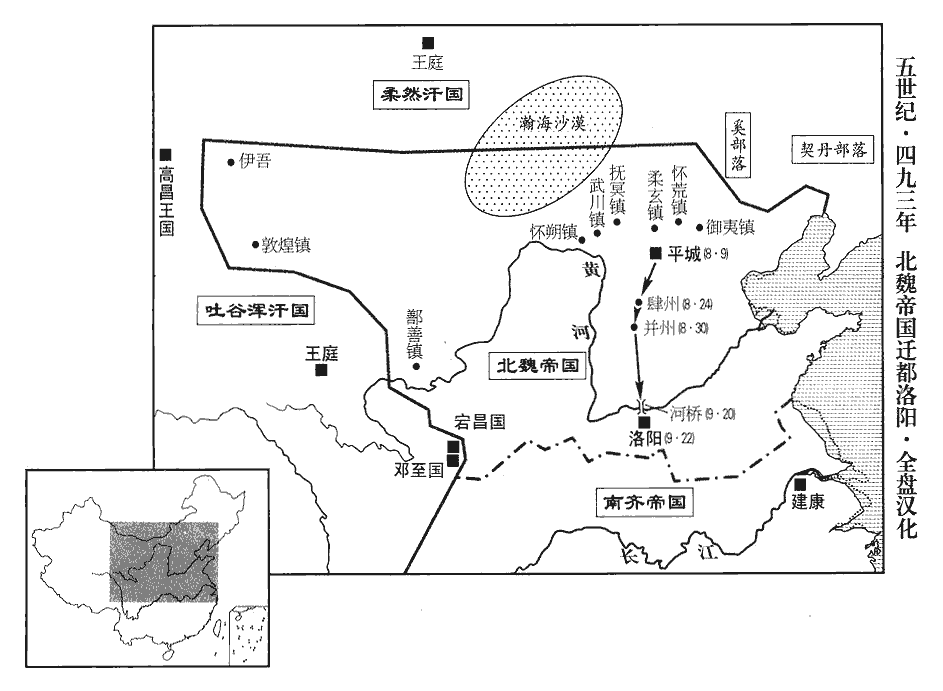
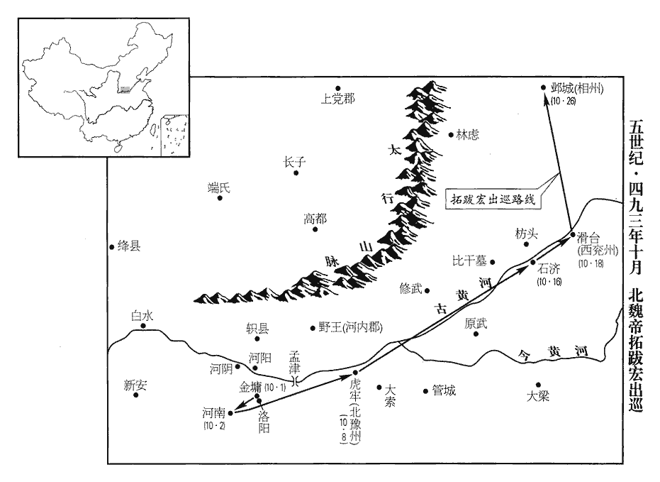

 齊紀四昭陽作噩（癸酉），一年。

# 世祖武皇帝下

## 永明十一年（癸酉、四九三）

1春，正月，以驃騎大將軍王敬則爲司空，驃，匹妙翻。騎，奇寄翻。鎭軍大將軍陳顯達爲江州‹府设寻阳江西省九江市›刺史。顯達自以門寒位重，陳顯達，南彭城‹江苏省镇江市›人，起於卒伍。每遷官，常有愧懼之色，戒其子勿以富貴陵人；而諸子多事豪侈，顯達聞之，不悅。以陳顯達之居寵思畏，終不能自免於猜暴之朝，至於稱兵而死，豈非繫於所遇之時哉！子休尚爲郢府‹府设夏口湖北省武汉市›主簿，過九江。自建康至郢府，先過九江。顯達曰︰「麈尾蠅拂麈zhǔ，腫庾翻。麈，麋屬；尾能生風，辟蠅蜹ruì。陸佃《埤雅》曰︰麈似鹿而大，其尾辟塵，以置舊帛中，能令歲久紅色不黦yuè；又以拂氈zhān，令氈不蠹。《名苑》曰︰鹿之大者曰麈，羣鹿隨之，皆視麈所往，麈尾所轉爲準。於文，主鹿爲麈；古之談者揮焉，良爲是也。是王、謝家物，汝不須捉此！」言不須以風流自標置也。捉，執也。卽取於前燒之。

〖译文〗 [1]春季，正月，南齐任命骠骑大将军王敬则为司空，任命镇军大将军陈显达为江州刺史。陈显达总认为自己出身寒门，却担任这么显要的官职，所以，每次升官时，他都面带恐惧，表情羞愧，并且告诫他的儿子，不要依仗自己富贵尊荣而欺凌他人。但是，他的儿子们却常常追求豪华奢侈，陈显达听说后，非常不高兴。他的儿子陈休尚担任郢府主簿的官职，途经九江，陈显达说：“麈尾、蝇拂，这些都是王家、谢家那样的人使用的东西，你不需要拿着它。”说完，就把这些东西拿过来，当着儿子的面烧掉了。

2初，上‹萧赜，本年五十四岁›於石頭‹建康城西北›造露車三千乘，欲步道取彭城‹江苏省徐州市›，魏人知之。劉昶數泣訴於魏主‹拓跋宏，本年二十七岁›，乞處邊戍，招集遺民，以雪私恥。以蕭氏篡宋，夷滅劉氏故也。數，所角翻。處，昌呂翻。魏主大會公卿於經武殿，《魏書•帝紀》︰太和十二年，起經武殿。以議南伐，於淮、泗間大積馬芻。上聞之，以右衛將軍崔慧景爲豫州‹府设寿阳安徽省寿县›刺史以備之。爲下魏入寇張本。

〖译文〗 [2]当初，武帝在石头城制造了三千辆没有篷帐的车辆，打算从陆路攻取彭城。北魏得知了这一情况。刘昶多次在北魏孝文帝面前哭泣、诉说，乞求派他到边界地带戍守，招收仍然怀念刘宋的百姓，向南齐报仇雪耻。孝文帝在经武殿招集文武官员，讨论南伐的事情，并在淮河、泗水之间贮备了很多喂马的草料。武帝听说了这一消息，任命右卫将军崔慧景为豫州刺史，防备北魏的入侵。

3魏‹都平城›【山西省大同市】遣員外散騎侍郎邢巒等來聘。散，悉亶翻。騎，奇寄翻。巒，穎之孫也。穎，曹魏太常邢貞之後。邢穎見一百二十二卷宋文帝元嘉八年。

〖译文〗 [3]北魏派员外散骑侍郎邢峦等人来访。邢峦是邢颖的孙子。

4丙子‹二十五›，文惠太子長懋卒‹年三十六岁›。太子風韻甚和，上‹萧赜›晚年好遊宴，好，呼到翻。尚書曹事分送太子省之，由是威加內外。省，悉景翻。

〖译文〗 [4]丙子（二十五日），文惠太子萧长懋去世。萧长懋仪态风韵都很温和，武帝晚年喜欢游乐欢宴，就将尚书各曹的事务交给萧长懋处理，因此，萧长懋威望著称全国。

太子性奢靡，治堂殿、園囿過於上宮，治，直之翻。費以千萬計，恐上望見之，乃傍門列脩竹；凡諸服玩，率多僭侈，啓於東田‹太子宫东侧›起小苑，使東宮將吏更番築役，將，卽亮翻。更，工衡翻。更番，分番更作也。營城包巷，彌亘華遠。言其彌極華麗，而延亘又遼遠也。上性雖嚴，多布耳目，太子所爲，人莫敢以聞。上嘗過太子東田，見其壯麗，大怒，收監作主帥；太子皆藏之，由是大被誚責。監，工銜翻。帥，所類翻。被，皮義翻。誚，才笑翻。

〖译文〗 萧长懋生性奢侈豪华，他修建自己的殿堂、花园，远远超过了武帝的宫殿，建筑费用都要以千万计算，他害怕武帝看见，就沿着殿门，种植了一排排修长的竹子。各种服饰、玩物，萧长懋大多都奢侈过分。他请求武帝让他在东田建造一个小规模养禽畜的林苑，让东宫的将士们轮番充当修筑的工匠，营造城墙，围住街巷，伸展辽远，异常华丽。武帝性情虽然严厉，到处都有自己的耳目，但是，太子萧长懋的所作所为，却没有人敢告诉他。一次，武帝曾偶然路过东田，看见那里的建筑非常壮观华丽，于是，勃然大怒，下令逮捕监作主帅。萧长懋听说后，马上把他们全都藏了起来，为此，萧长懋受到严厉斥责。

又使嬖人徐文景造輦及乘輿御物；嬖，卑義翻，又博計翻。乘，繩證翻。上嘗幸東宮，怱怱不暇藏輦，怱怱者，急遽之意。文景乃以佛像內輦中，故上不疑。文景父陶仁謂文景曰︰「我正當掃墓待喪耳！」掃墓，謂掃除墓地也。仍移家避之。後文景竟賜死，陶仁遂不哭。

〖译文〗 萧长懋又让自己宠爱的人徐文景制造皇帝专用的辇车和其他专用物件。武帝曾经亲临东宫，萧长懋没来得及将辇车收藏起来，徐文景急中生智，就赶快把一尊佛像放在辇车里，所以，武帝也就没有怀疑。徐文景的父亲徐陶仁曾经对徐文景说：“我现在正在打扫墓地，等待为你办丧事！”徐陶仁将全家搬走，躲开徐文景远远的。后来，徐文景真的被下令自杀，徐陶仁并没有为此而哭泣。

及太子卒，上履行東宮，行，下孟翻。見其服玩，大怒，敕有司隨事毀除。以竟陵王子良與太子善，而不啓聞，幷責之。

〖译文〗 太子萧长懋去世时，武帝有一天步行到了东宫，看见了萧长懋过去的那些奢华的服饰、玩物，极为愤怒，下令有关部门随即全都毁掉。武帝认为，竟陵王萧子良平时和萧长懋关系最好，可他却没有把这些报告给自己，因此，他同时责备了萧子良。

太子素惡西昌侯鸞，嘗謂子良曰︰「我意中殊不喜此人，不解其故，惡，烏路翻。喜，許記翻。解，戶買翻，曉也。當由其福薄故也。」子良爲之救解。爲，于僞翻。及鸞得政，太子子孫無遺焉。西昌侯夷滅太子子孫事見後。按鸞翦除高、武諸子及太子子孫以成篡事，文惠雖不惡之，其子孫亦不能免也。觀隆昌、建武時事，君子謂文惠知所惡矣。

〖译文〗 太子萧长懋平时一直讨厌西昌侯萧鸾，他曾经对萧子良说：“我心里特别不喜欢这个人，不知道这是什么缘故，该是他福份浅吧。”萧子良替萧鸾解释辩白。等到后来萧鸾夺取政权后，就将萧长懋的子孙全都杀了，没留一个。

5二月，魏主始耕藉田於平城南。魏起於北荒，未嘗講古者天子親耕之禮，今孝文始行之。藉，在亦翻。

〖译文〗 [5]二月，北魏孝文帝开始在平城城南主持扶犁耕田典礼。

6雍州‹府襄阳›刺史王奐惡寧蠻長史劉興祖，收繫獄，雍，於用翻。惡，烏路翻。蕭子顯《齊志》，寧蠻府屬雍州，別領西新安、義寧、南襄、北建武、蔡陽、永安、安定、懷化、武寧、新陽、義安、高安、左義陽、南襄城、廣昌、東襄城、北襄城、懷安、北弘農、西弘農、析陽、北義陽、漢廣、中襄城等蠻郡。誣其搆扇山蠻，欲爲亂。敕送興祖下建康；自襄陽順流東至建康，故曰下。奐於獄中殺之，詐云自經。上大怒，遣中書舍人呂文顯、直閤將軍曹道剛將齋仗五百人收奐，齋仗，齋庫精仗以給禁衛勇力之士。將，卽亮翻。敕鎭西司馬曹虎從江陵‹湖北省江陵县›步道會襄陽‹湖北省襄樊市›。

〖译文〗 [6]雍州刺史王奂讨厌宁蛮长史刘兴祖，将刘兴祖逮捕入狱。诬陷刘兴祖造谣煽动山中蛮族，打算发动叛乱。武帝命令王奂把刘兴祖押送到建康处理，王奂却在狱中害死了刘兴祖，谎称他是上吊自杀。武帝极为愤怒，派中书舍人吕文显和直阁将军曹道刚，率领武装的禁卫军五百人前去雍州逮捕王奂。命令镇西司马曹虎从江陵出发，由陆路北上，与吕文显和曹道刚率领的军队在襄阳会师。

奐子彪，素凶險，奐不能制。長史殷叡，奐之壻也，謂奐曰︰「曹、呂來，旣不見眞敕，恐爲姦變，正宜錄取，錄，收也，攝也。馳啓聞耳。」奐納之。《考異》曰︰《南史》︰「奐子彪議閉門拒命。叡諫曰︰『今開門白服接臺使，不過隳官免爵耳。』彪堅執不同。叡又請遣典籤間道送啓，奐從之。典籤出城，爲文顯所執。叡曰︰『忠不背國，勇不逃死。』勸奐仰藥。叡與彪同誅。」今從《齊書》。彪輒發州兵千餘人，開庫配甲仗，出南堂，陳兵，閉門拒守。奐門生鄭羽叩頭啓奐，乞出城迎臺使，使，疏吏翻。奐曰︰「我不作賊，欲先遣啓自申；正恐曹、呂等小人相陵藉，陵者，侮之而出其上；藉者，蹈之使薦於下。藉，慈夜翻。故且閉門自守耳。」彪遂出，與虎軍戰，兵敗，走歸。三月，乙亥‹二十五›，司馬黃瑤起、寧蠻長史河東‹侨郡·湖北省松滋市西北›裴叔業於城內起兵，攻奐‹年五十九岁›，斬之，爲後奐子肅食瑤起之肉張本。執彪及弟爽、弼、殷叡，皆伏誅。彪兄融、琛死於建康，琛弟祕書丞肅獨得脫，奔魏。爲王肅屢引魏兵入寇張本。琛，丑林翻。《考異》曰︰《南史》︰「奐弟份自拘請罪，帝宥之。肅屢引魏人至邊，帝謂份曰︰『比有北信不？』份曰︰『肅近忘墳柏，寧遠憶有臣！』按奐以三月死，帝以七月殂，是冬，肅始見魏主於鄴。《南史》誤也。《齊書》無此語。

〖译文〗 王奂的儿子王彪，平日凶狠险诈，连王奂都管不了。长史殷睿是王奂的女婿，他对王奂说：“曹道刚和吕文显来到这里，我们没有看到皇帝真正的诏书，恐怕这是什么阴谋诡计，我们正好逮捕他们，然后，再骑马去建康向皇上报告。”王奂接受了殷睿的建议。于是，王彪就派出一千多名雍州州府内的将士，打开武器库，给每人发放一套铠甲兵器，然后，走出南堂，分配兵力，关闭城门死守雍州城。王奂的学生郑羽，向王奂叩头，请求王奂到城外迎接朝廷派来的官员，王奂说：“我并没有叛乱，打算预先派人去建康向皇上申诉。正是害怕遭到曹道刚和吕文显等一些奸诈小人的欺凌侮辱、随意践踏，因此，暂时关闭城门，自我防守罢了。”王彪于是走出城门，和曹虎率领的军队作战，结果被打败，逃回城里。三月，乙亥（二十五日），司马黄瑶起和宁蛮长史河东人裴叔业在雍州城内发动兵变，进攻王奂，并斩杀了他，逮捕了王彪及王彪的弟弟王爽、王弼和殷睿，全部斩首。王彪的哥哥王融、王琛在建康被处死，只有王琛的弟弟、秘书丞王肃得以逃脱，投奔了北魏。

7夏，四月，甲午‹十四›，立南郡王昭業‹萧昭业，本年二十岁›爲皇太孫，東宮文武悉改爲太孫官屬，東宮官屬，文則太傅、少傅、詹事、率更令、家令、僕、門大夫、中庶子、中舍人、庶子、浩馬、舍人，武則左右衛率、翊軍•步兵•屯騎三校尉、旅賁中郎將、左右積弩將軍、殿中將軍、員外殿中將軍、常從虎賁督。以太子妃琅邪‹白下·建康城北›王氏‹王宝明›爲皇太孫太妃，南郡王妃何氏‹何婧英›爲皇太孫妃。妃，戢之女也。何戢見一百三十五卷高帝建元二年。戢，則立翻，又疾立翻。

〖译文〗 [7]夏季，四月，甲午（十四日），武帝立南郡王萧昭业为皇太孙，太子宫内的文武官属，全都改为太孙的官属。武帝又封太子妃琅邪人王氏为皇太孙太妃，南郡王妃何婧英为皇太孙妃。何婧英是何戢的女儿。

8魏太尉丕等請建中宮，戊戌‹十八›，立皇后馮氏‹冯清›。后，熙之女也。爲後馮后以讒廢張本。魏主以《白虎通》云︰漢章帝集諸儒於白虎觀，議《五經》同異，作《白虎通》。「王者不臣妻之父母」，下詔令太師上書不稱臣，入朝不拜，朝，直遙翻。熙固辭。

〖译文〗 [8]北魏太尉拓跋丕等人，请求孝文帝正式册封皇后。戊戌（十八日），册封冯清为皇后。冯皇后是冯熙的女儿。孝文帝根据《白虎通》上说：“君王不可以把妻子的父母作为臣属”，下诏命令太师冯熙呈递奏章时，不再称臣，进入朝廷不用叩拜，但冯熙对此坚决辞谢。

9光城‹河南省光山县›蠻帥征虜將軍田益宗帥部落四千餘戶叛，降于魏。沈約曰︰光城郡，疑大明中分弋陽所立。《五代史志》曰︰光州光山縣，舊置光城郡。蠻帥，所類翻；宗帥，讀曰率。降，戶江翻。

〖译文〗 [9]光城蛮人首领、征虏将军田益宗率领自己部落四千多户人家反叛，向北魏投降。

10五月，壬戌‹十三›，魏主宴四廟子孫於宣文堂，親與之齒，用家人禮。四廟子孫，謂世祖‹拓跋焘›、恭宗‹拓跋晃›、高宗‹拓跋濬›、顯祖‹拓跋弘›之子孫也。太和十二年起宣文堂、經武殿。用家人禮者，略君臣之敬而序長幼之齒。

〖译文〗 [10]五月，壬戌（十三日），北魏孝文帝在宣文堂摆设酒席，宴请太武帝以下四代皇帝的子孙，亲自和他们在一起谈年龄，论辈份，用对待家里人的礼节对待他们。

11甲子‹十五›，魏主臨朝堂，朝，直遙翻。引公卿以下決疑政，錄囚徒。帝謂司空穆亮曰︰「自今朝廷政事，日中以前，卿等先自論議；日中以後，朕與卿等共決之。」

〖译文〗 [11]甲子（十五日），孝文帝来到金銮殿接见公卿以下官员，裁决政务上的疑难问题，审查记载囚犯的案情。孝文帝对司空穆亮说：“从现在开始，以后朝廷上的政务，在中午以前，由你们自己先商量讨论，中午过后，我和你们一块儿讨论裁决。”

12丙子‹二十七›，以宜都王鏗爲南豫州‹府设姑孰安徽省当涂县›刺史。鏗，丘耕翻。先是廬陵王子卿爲南豫州刺史，先，悉薦翻。之鎭，道中戲部伍爲水軍，上聞之，大怒，殺其典籤；以鏗代之。子卿還第，上終身不與相見。

〖译文〗 [12]丙子（二十七日），南齐任命宜都王萧铿为南豫州刺史。在这之前，曾任命庐陵王萧子卿为南豫州刺史，但萧子卿在前往任所的途中，把自己率领的军队假扮成水军模样取乐，武帝听说后，极为愤怒，下令杀了萧子卿的典签，又另派萧铿前往南豫接替萧子卿。萧子卿返回自己的家里，武帝直到去世，也不和他相见。

13襄陽蠻酋雷婆思等帥戶千餘求內徙於魏，魏人處之沔北。是時沔北之地猶爲齊境。雷婆思等蓋居沔南，徙處沔北，則稍近魏境耳。酋，慈由翻。帥，讀曰率。處，昌呂翻。

〖译文〗 [13]襄阳蛮酋长雷婆思等人，率领一千多户居民向北魏投降，请求迁移到北魏境内居住，北魏把他们安置在沔水以北。

14魏主以平城地寒，六月雨雪，極陰之地，盛夏雨雪。雨，王遇翻；自上而下曰雨。風沙常起，風沙，大風揚沙也。將遷都洛陽‹河南省洛阳市东白马寺东›；恐羣臣不從，乃議大舉伐齊，欲以脅衆。齋於明堂左个，鄭玄曰︰明堂左个，大寢南堂東偏也。个，古賀翻。使太常卿王諶chén筮之，遇《革》，帝曰︰「『湯‹子天乙›、武‹姬发›革命，應乎天而順乎人。』此《革卦》之《彖tuàn辭》也。諶，氏壬翻。吉孰大焉！」羣臣莫敢言。尚書任城王澄曰︰「陛下奕葉重光，帝有中土；任，音壬。重，直龍翻。今出師以征未服，而得湯、武革命之象，未爲全吉也。」帝厲聲曰︰「繇zhòu云︰『大人虎變』，何言不吉！」繇，直又翻。「大人虎變」，《革》九五爻辭。九五，君位也，故引以難澄。澄曰：「陛下龍興已久，何得今乃虎變！」帝作色曰：「社稷我之社稷，任城欲沮衆邪！」澄曰：「社稷雖爲陛下之有，臣爲社稷之臣，安可知危而不言！」帝久之乃解，曰︰「各言其志，夫亦何傷！」

〖译文〗 [14]魏孝文帝因为平城气候寒冷，夏季六月时还在下雪，而且经常狂风大作，飞沙漫天，所以，准备把京都迁到洛阳。但他又担心文武官员们不同意，于是，提议大规模进攻南齐，打算以这种名义胁迫大家。在明堂南厢东边的偏殿斋戒之后，让太常卿王谌占卜，得到“革卦”，孝文帝说：“‘商汤王和周武王进行变革，是适应上天之命，顺应百姓之心的。’没有比这更吉祥的了。”文武官员没有人敢说什么。尚书、任城王拓跋澄说：“陛下继承几代累积下来的大业，并使之发扬光大，拥有了中原土地，而如今却要讨伐还没有臣服的对象，在这时得到了商汤王和周武王变革的象辞，恐怕这并不全是吉利。”孝文帝立刻严厉地说：“繇辞说：‘大人物实施老虎一样的变革’，你为什么要说这不吉利呢？”拓跋澄说：“陛下作为飞龙兴起已经很久了，怎么到今天又实施如同老虎一样的变革？”孝文帝立刻发怒说：“国家，是我的国家，任城王打算要阻止大家吗？”拓跋澄说：“国家虽然是陛下所有，而我是国家的臣属，怎么可以明知危险而不说出来呢？”孝文帝过了很长时间才缓和了气色，说：“每个人都该说出自己的看法，这又有什么关系！”

旣還宮，自明堂左个還宮。召澄入見，逆謂之曰︰「嚮者《革卦》，今當更與卿論之。明堂之忿，恐人人競言，沮我大計，故以聲色怖文武耳。相識朕意。」見，賢遍翻。沮，在呂翻。怖，普布翻。因屛人謂澄曰：「今日之舉，誠爲不易。屛，必郢翻。易，以豉翻。但國家興自朔土，徙居平城；此乃用武之地，非可文治。今將移風易俗，其道誠難，朕欲因此遷宅中原，卿以爲何如？」魏主始與任城王澄言其情。澄曰︰「陛下欲卜宅中土以經略四海，此周、漢所以興隆也。」比之周成、康，漢光、明也。帝曰︰「北人習常戀故，必將驚擾，柰何？」後穆泰等之謀，卒如帝所慮。澄曰︰「非常之事，故非常人之所及。陛下斷自聖心，斷，丁亂翻。彼亦何所能爲！」帝曰︰「任城，吾之子房也！」張良贊漢高帝遷都長安，故以爲比。

〖译文〗 孝文帝回到皇官，立刻召见拓跋澄，劈头就说：“刚才关于‘革卦’的事，现在要进一步和你讨论一下。在明堂上，我之所以大发脾气，是因为害怕大家争先恐后地发言，破坏了我一个大的决策，所以，我就声色俱厉，以此吓唬那些文武官员罢了。我想，你会了解朕的用心。”于是命令左右侍从退下，对拓跋澄说：“今天我所要做的这件事，确实是很不容易的。我们国家是在北方疆土上建立起来的，后来又迁都到平城。但是，平城只是用武力开疆拓土的地方，而不宜进行治理教化。现在，我打算进行改变风俗习惯的重大变革，这条路走起来确实困难，朕只是想利用大军南下征伐的声势，将京都迁到中原，你认为怎么样？”拓跋澄说：“陛下您打算把京都迁到中原，用以扩大疆土，征服四海，这一想法也正是以前周王朝和汉王朝兴盛不衰的原因。”孝文帝说：“北方人习惯留恋于旧有的生活方式，那时，他们一定会惊恐骚动起来，怎么办？”拓跋澄回答说：“不平凡的事，原来就不是平凡的人所能做得了的。陛下的决断，是出自您圣明的内心，他们又能有什么办法呢？”孝文帝高兴地说：“任城王真是我的张子房呀！”

六月，丙戌‹七›，命作河橋，欲以濟師。祕書監盧淵上表，以爲︰「前代承平之主，未嘗親御六軍，決勝行陳之間；行，戶剛翻。陳，讀曰陣。豈非勝之不足爲武，不勝有虧威望乎！昔魏武以弊卒一萬破袁紹，事見六十二卷漢獻帝建安五年。謝玄以步兵三千摧苻秦、事見一百五卷晉孝武帝太元八年。勝負之變，決於須臾，不在衆寡也。」詔報曰︰「承平之主，所以不親戎事，或以同軌無敵，或以懦劣偷安。今謂之同軌則未然，天下混一，則車同軌，書同文。比之懦劣則可恥，必若王者不當親戎，則先王制革輅lù，何所施也？周制五輅，革輅，龍勒條，纓五就，建大白以卽戎。鄭氏《註》︰革輅，鞔mán之以革而漆之，無他飾。條，讀爲絛tāo。魏武之勝，蓋由仗順；苻氏之敗，亦由失政；豈寡必能勝衆，弱必能制強邪！」丁未‹二十八›，魏主講武，命尚書李沖典武選。時欲用兵，命沖典武選，銓擇才勇之士。選，須絹翻。

〖译文〗 六月，丙戌（初七），北魏孝文帝下令在黄河上修筑大桥，准备让南下大军由桥上渡过黄河。秘书监卢渊上书，认为：“以前太平时代的君主，从来没有过亲自统率大规模军队作战，在双方交战阵地上决一胜负的，还不是因为胜利了并不足以显示勇敢，而失败了则会使自己的威望受到损失吗？以前，曹操统率一万名疲惫不堪的士卒打败了袁绍，谢玄率领三千名步兵，摧毁了苻坚的大军，胜利与失败的变化，决定于转眼的工夫，而不在于人数多少。”孝文帝下诏回答说：“太平时代的君主，之所以不亲自统率军队作战，有的是因为天下已经统一，不再存在敌人；有的是因为懦弱卑怯，苟且偷安。现在说是天下已经统一、太平，实际上并不是这样；与懦弱卑劣的人相比，又是十分可耻的。如果太平时期的君主一定不应该亲自统率军队作战，那么，古代的君王特别制造的战斗时使用的革车，又会有什么用呢？曹操之所以能取得胜利，是因为他依仗名正言顺。苻坚之所以失败了，其根源也是由于他失德无道。怎么能是人数少就一定能战胜人数多，力量弱就一定能战胜力量强的呢？”丁未（二十八日），孝文帝讲论武事，命令尚书李冲负责选拔将官。

15建康僧法智與徐州‹北徐州·州政府设钟离安徽省凤阳县东北临淮关›民周盤龍等作亂，此又一周盤龍，非周奉叔之父。夜，攻徐州城，入之；刺史王玄邈討誅之。徐州城卽鍾離城。

〖译文〗 [15]南齐建康僧侣法智和徐州平民周盘龙等人一起发动叛乱，乘夜进攻徐州城，突入城中。徐州刺史王玄邈率军前来讨伐，杀了法智和周盘龙。

16秋，七月，癸丑‹五›，魏立皇子恂‹拓跋恂，本年十一岁›爲太子。爲魏主後廢恂張本。

〖译文〗 [16]秋季，七月，癸丑（初五），孝文帝立皇子拓跋恂为太子。

17戊子‹十›，【嚴︰「子」改「午」。】魏中外戒嚴，發露布及移書，稱當南伐。用兵尚神密。魏主今露其事以布告四方，故亦曰露布；移書，則移書於齊境也。‹南齐帝萧赜›詔發揚‹京畿›、徐州‹南徐州·州政府设京口江苏省镇江市›民丁，廣設召募以備之。

〖译文〗 [17]戊子（初十），北魏实行戒严管制，发表正式文告，并将文告转交各地，宣称要南伐。齐武帝立刻下诏，发动扬州、徐州男子入伍，同时在各地大肆征兵买马，用以防备北魏大军的入侵。

中書郎王融，自恃人地，王融有俊才，故以人身自高；且王弘曾孫，故以門地自高。三十內望爲公輔。嘗夜直省中，撫案歎曰︰「爲爾寂寂，爾，如此也。寂寂，言冷寞也。鄧禹笑人！」鄧禹年二十四爲漢司徒，融年已過之，故云然。行逢朱雀桁開，喧湫不得進，朱雀桁當建康朱雀門，跨秦淮南北岸以渡行人，大路所由也。桁開則行者塡咽。湫jiǎo，子小翻，隘也。《經典釋文》曰︰湫，徐音秋，又在酒翻。搥chuí車壁歎曰︰「車前無八騶，何得稱丈夫！」搥，傳追翻。車前有油壁。自晉以來，諸公、諸從公車前給騶八人。騶，側鳩翻。竟陵王子良愛其文學，特親厚之。

〖译文〗 中书郎王融依仗自己才能和门第，不到三十岁就打算作公辅。他有一次在宫中值夜，自己手抚桌子，叹息说：“竟然孤寂到如此地步，被邓禹所耻笑啊！”有一次，他路过朱雀桥，正赶上朱雀桥打开浮桥，行人车马不能前进，喧闹拥挤，王融就用手捶打车厢，叹息说：“车前没有八个骑兵开道，怎么能称得上是大丈夫！”竟陵王萧子良喜爱王融的文才，所以，对他特别优厚亲热。

融見上有北伐之志，數上書獎勸，獎者，推助以成其事。數，所角翻。因大習騎射。騎，奇寄翻。及魏將入寇，子良於東府‹建康城南·宰相府›募兵，版融寧朔將軍，宋泰始初，南攻義嘉，軍功者衆，版不能供，始用黃紙。今版授融，蓋重於黃紙也。或曰︰未經敕用者謂之版授。使典其事。融傾意招納，得江西‹安徽省中部›傖楚數百人，並有幹用。傖，助庚翻。

〖译文〗 王融发现武帝有北上征伐的意思，于是，他多次上书，鼓动催促，并因此努力学习骑马射箭。北魏大军即将前来进犯时，萧子良就在东府开始招兵买兵，任命王融为宁朔将军，让他主持这件事。王融尽力去招收人马，招集了几百名长江以西古楚国地区的武人，他们每个人都很有才干，可以担当重任。

會上不豫，詔子良甲仗入延昌殿侍醫藥；子良以蕭衍、范雲等皆爲帳內軍主。戊辰‹二十›，遣江州刺史陳顯達鎭樊城‹湖北省襄樊市汉水北岸›。上慮朝野憂遑，遑，急也，遽也。力疾召樂府奏正聲伎。江左以清商爲正聲伎。伎，渠綺翻。子良日夜在內，太孫間日參承。間日，隔一日也。間，古莧翻。參，候也。承，奉也。

〖译文〗 正赶上武帝身体不舒服，他命令萧子良全副武装去延昌殿，为他服侍医药。萧子良就任命萧衍、范云等人都担任帐内军主。戊辰（二十日），派江州刺史陈显达镇守樊城。武帝恐怕他的病情会引起朝廷内和民间的担忧恐惧，所以，又强挺着，征召皇家乐队进宫演奏正统雅乐。萧子良日日夜夜守在禁宫，皇太孙萧昭业每隔一天就要进来问安、侍奉。

戊寅‹三十›，上疾亟，蹔絕；氣暫絕而不息也。太孫未入，內外惶懼，百僚皆已變服。王融欲矯詔立子良，詔草已立。蕭衍謂范雲曰︰「道路籍籍，皆云將有非常之舉。王元長非濟世才，王融，字元長。視其敗也。」雲曰︰「憂國家者，惟有王中書耳。」衍曰︰「憂國，欲爲周、召邪，欲爲豎刁邪？」召，讀曰邵。按《左氏傳》︰齊桓公旣立子昭爲太子。易牙有寵於衛姬。衛姬生無虧。易牙因豎刁以薦羞於桓公，遂有寵，公許之立無虧。公卒，易牙入，與豎刁殺羣吏而立無虧。昭奔宋。宋襄公伐齊，殺無虧而立昭，是爲孝公。雲不敢答。及太孫來，王融戎服絳衫，於中書省閤口斷東宮仗不得進。斷，音短。頃之，上復蘇，復，扶又翻。問太孫所在，因召東宮器甲皆入，以朝事委尚書左僕射西昌侯鸞。朝，直遙翻。俄而上殂，年五十四。融處分以子良兵禁諸門。處，昌呂翻。分，扶問翻。鸞聞之，急馳至雲龍門，不得進，鸞曰︰「有敕召我！」排之而入，奉太孫‹萧昭业，本年二十一岁›登殿，命左右扶出子良；指麾部署，音響如鍾，殿中無不從命。融知不遂，釋服還省，釋戎服還中書省也。歎曰︰「公‹萧子良›誤我！」由是鬱林王‹萧昭业›深怨之。太孫卽位，尋見廢弒，史以追廢之號書之。爲後殺王融張本。

〖译文〗 戊寅（三十日），武帝病势加重，一时气闷晕倒。这时皇太孙萧昭业还没有入宫，宫内宫外人人惶恐不安，文武百官也都穿上了丧服。王融打算假传圣旨，命萧子良继承王位，他已将诏书草稿写好。萧衍对范云说：“民间已是议论纷纷，都说宫内可能要发生不一般的情况。王融并不是治理国家的人才，他眼看着就要出事了。”范云说：“忧国忧民的人，也只有王融一人了。”萧衍说：“忧国忧民，是想要当周公、召公呢，还是想当齐桓公死后的竖刁呢？”范云不敢回答。等到萧昭业入宫，王融已是全副武装，穿着红色战服，站在中书省厅前要道，截住东宫卫队不让他们进入。过了一会儿，武帝醒转过来，问皇太孙萧昭业在哪里，于是召东宫卫队全部入宫，武帝把国家大事全部托付给了尚书左仆射、西昌侯萧鸾。不一会儿，武帝就去世了。王融采取紧急措施，命令萧子良的军队接管宫城各门。萧鸾得到消息后，立刻上马飞奔到云龙门，但被守在那里的卫士挡住，不让他进去，萧鸾说：“皇上有诏令，让我晋见。”接着，他推开卫士，直接闯了进去，马上拥戴皇太孙萧昭业登基即位，命令左右侍从把萧子良搀扶出金銮殿。萧鸾指挥和安排警卫戒备，声音洪亮如钟，殿内所有的官员侍从，没有一个不听他的命令的。王融知道自己的计划不能实现，也就只好脱下战服，返回中书省，叹息着说：“萧子良耽误了我。”从此以后，萧昭业对王融深为怨恨。

遺詔曰︰「太孫進德日茂，社稷有寄。子良善相毗輔，思弘治道，治，直吏翻。內外衆事，無大小悉與鸞參懷，共下意！參，豫也。懷，思也。命鸞參豫其事，而詳思其可否也。共下意者，令降心相從，以濟國事也。尚書中事，職務根本，悉委右僕射王晏、吏部尚書徐孝嗣；軍旅之略，委王敬則、陳顯達、王廣之、王玄邈、沈文季、張瓌guī、薛淵等。」自此以上，皆遺詔之辭。瓌，古回翻。

〖译文〗 武帝遗诏说：“皇太孙的品德一天比一天高尚，国家也就有所寄托了。萧子良要努力尽心辅佐皇太孙，考虑如何治理国家的大计，对于朝廷内外各种事情，无论是大是小，都要和萧鸾一起商量裁决，一起提出意见。尚书省的事务，是政务的根本；将它全都交给右仆射王晏、吏部尚书徐孝嗣处理。军事方面的大计，委托给王敬则、陈显达、王广之、王玄邈、沈文季、张、薛渊等人。”

世祖‹萧赜›留心政事，務總大體，嚴明有斷，郡縣久於其職，長吏犯法，封刃行誅。故永明之世，百姓豐樂，賊盜屛息。然頗好遊宴，華靡之事，常言恨之，未能頓遣。遣，袪也，逐也。言未能袪逐遊宴之失也。自此以上，史述帝平生之大略。斷，丁亂翻。長，知兩翻。樂，音洛。屛，必郢翻。好，呼到翻。

〖译文〗 武帝在世时，对国家政治事务十分用心，总揽全局，严明果断，郡守县令都能长期任职，地方长官触犯法令，就封缄钢刀，派人执行诛杀。所以，在南齐永明时代，老百姓生活富足，祥和安乐，盗贼不敢横行。不过，武帝非常喜欢游乐饮宴，虽然对于奢华靡烂的生活，他经常说很痛恨，但是他自己也并没能避免。

鬱林王‹萧昭业›之未立也，衆皆疑立子良，口語喧騰。武陵王曄於衆中大言曰︰「若立長，則應在我；世祖諸弟，存者曄爲長。長，知兩翻。立嫡，則應在太孫。」鬱林王，諱昭業，字元尚，小字法身，文惠太子長子也，以世嫡立爲皇太孫。由是帝‹萧昭业›深憑賴之。太孫已卽位，故書帝。直閤周奉叔、曹道剛素爲帝心膂，並使監殿中直衛；少日，復以道剛爲黃門郎。監，古銜翻。少，詩沼翻。復，扶又翻。爲西昌侯鸞欲弒帝先除周奉叔、曹道剛張本。

〖译文〗 郁林王萧昭业还没有登基即位时，大家都怀疑可能要册立萧子良，一时之间，传言很多。武陵王萧晔曾经在大庭广众之下大声说：“如果选择辈分高的继承王位，就应该是我；如果选择嫡系继承王位，那么，就应该是皇太孙。”为此，萧昭业对萧晔深加信赖。直将军周奉叔和曹道刚二人，平时就是萧昭业的心腹，于是，命令二人同时主管殿中值班宿卫。过了几天，又任命曹道刚为黄门郎。

初，西昌侯鸞爲太祖‹萧道成›所愛，事見一百三十五卷高帝建元二年。鸞性儉素，車服儀從，同於素士，所居官名爲嚴能，故世祖‹萧赜›亦重之。鸞初爲安吉令，有嚴能之名。王子侯舊乘纏帷車，鸞獨乘下帷車，儀從如素士。從，才用翻。世祖遺詔，使竟陵王子良輔政，鸞知尚書事。子良素仁厚，不樂世務，樂，音洛。乃更推鸞，故遺詔云「事無大小，悉與鸞參懷」，子良之志也。史言子良無奪適之志。

〖译文〗 当初，西昌侯萧鸾深受文帝的宏爱，萧鸾生性节俭朴素，他所乘坐的车马、所穿的衣服，以及他的仪仗随从，和平常人家一样。他对所担任的官崐职都能胜任，号称严厉能干，所以，武帝对他也很重视。武帝留下遗诏让竟陵王萧子良辅政，萧鸾做知尚书事。萧子良平素仁义宽厚，不喜欢处理朝廷各种各样的事务，于是，就特别推荐萧鸾。所以遗诏上说“朝廷内外各种事情，无论是大是小，都要和萧鸾一起商讨决定”，这是萧子良的主张。

帝少養於子良妃袁氏，少，詩照翻。慈愛甚著。及王融有謀，史言奪適之謀出於王融。遂深忌子良。大行出太極殿，子良居中書省，帝使虎賁中郎將潘敞領二百人仗屯太極殿西階以防之。中書省蓋在太極殿西，故使屯於西階以防子良。賁，音奔。將，卽亮翻。旣成服，諸王皆出，子良乞停至山陵，不許。乞停中書省，俟梓宮出葬而後出也。

〖译文〗 萧昭业从小是由萧子良的妃子袁氏抚养大的，袁氏对他非常慈爱关心。王融阴谋立萧子良以后，萧昭业对萧子良也就深为忌恨起来。武帝的遗体移到太极殿时，萧子良住在中书省，于是，萧昭业就派虎贲中郎将潘敞率领二百名士卒驻守在太极殿西阶，严防不测。等到武帝的遗体装入棺木，各位亲王都走出宫中后，萧子良请求能允许他在这儿等到下葬那天再离开，未被应允。

壬午‹四›，稱遺詔，以武陵王曄爲衛將軍，與征南大將軍陳顯達並開府儀同三司；尚書左僕射、西昌侯鸞爲尚書令；太孫詹事沈文季爲護軍。史言遺詔本無此段除授，當時稱遺詔行之。癸未‹五›，以竟陵王子良爲太傅；蠲juān除三調及衆逋，三調，謂調粟、調帛及雜調也。逋，欠負也。省御府及無用池田、邸治，「治」，據蕭子顯《齊書》當作「冶」，謂冶鑄之所也。減關市征稅。先是，蠲原之詔，多無事實，督責如故。所謂「黃放白催」也。先，悉薦翻。是時西昌侯鸞知政，恩信兩行，衆皆悅之。史爲西昌侯鸞篡國張本。

〖译文〗 壬午（初四），萧昭业声称奉武帝的遗诏，任命武陵王萧晔为卫将军，和征南大将军陈显达一同为开府仪同三司，尚书左仆射、西昌侯萧鸾为尚书令，太孙詹事沈文季为护军。癸未（初五），又任命竟陵王萧子良为太傅。下令免除三种征调，对老百姓以前所欠的赋税也一律免除。减省皇室各府、署和不使用的田庄、水池、宅第、冶炼铸造场，减少关卡税收。在这以前，虽然也有免除赋税的诏令，但它也不过是一纸空文，朝廷大多没有真正实施，还像以前一样严加征收。现在，西昌侯萧鸾当权执政，他恩德和信用一同实施，所以，老百姓都非常高兴。

18魏山陽景桓公尉元卒‹年八十一岁›。尉，紆勿翻。

〖译文〗 [18]北魏山阳景桓公尉元去世。

19魏主使錄尚書事廣陵王羽持節安撫六鎭，發其突騎。騎，奇寄翻；下同。丁亥‹九›，魏主‹拓跋宏›辭永固陵；己丑‹十一›，發平城，南伐，步騎三十餘萬；使太尉丕與廣陵王羽留守平城，並加使持節。晉制，使持節得殺二千石以下。杜佑曰︰留守，周之君陳似其任也，此後無聞。漢和帝南巡，祠園廟，張禹以太尉兼衛留守。晉惠帝幸長安，僕射荀藩等與遺官在洛者爲留臺，承制行事。其後安帝播遷，劉裕亦置留臺。後魏孝文帝南伐，以太尉丕、廣陵王羽留守京師，留守之制因此。羽曰︰「太尉宜專節度，臣正可爲副。」魏主曰︰「老者之智，少者之決，言老者經事多，故智慮深遠；少者氣盛，故臨事有斷。少，詩沼翻。汝無辭也。」以河南王幹爲車騎大將軍、都督關右諸軍事，又以司空穆亮、安南將軍盧淵、平南將軍薛胤皆爲幹副，衆合七萬出子午谷‹陕西省宁陕县›。欲攻梁‹府设南郑陕西省汉中市›、益也。胤，辯之曾孫也。薛辯見一百一十八卷晉安帝義熙十三年。

〖译文〗 [19]孝文帝派录尚书事、广陵王拓跋羽，手持皇帝的符节前去安抚六镇，并征调六镇的突击骑兵。丁亥（初九），孝文帝叩别永固陵。已丑（十一日），孝文帝亲自率领三十多万步、骑兵，从平城出发，大规模向南征伐。命令太尉拓跋丕和广陵王拓跋羽留在平城镇守，并加授使持节。拓跋羽说：“太尉最好全权负责管理，臣可以做他的副手。”孝文帝说：“年纪大的人有经验，能深谋远虑，年纪轻的人有气魄，遇事坚决果断，所以，你不要推辞了。”任命河南王拓跋干为车骑大将军、都督关右诸军事，司空穆亮、安南将军卢渊、平南将军薛胤三人都担任拓跋干的副手，率领各路人马共七万人，从子午谷南下。薛胤是薛辩的曾孙。

20鬱林王‹萧昭业›性辯慧，美容止，善應對，哀樂過人；樂，音洛。世祖‹萧赜›由是愛之。而矯情飾詐，陰懷鄙慝tè，與左右羣小共衣食，同臥起。

〖译文〗 [20]南齐郁林王生性聪明，反应迅速，容貌清秀，举止高雅，善于应对，无论是悲哀还是欢乐，都比别人强烈。因此，武帝很宠受他。但是，他善于伪装矫饰，表面善良，内心却是阴狠卑鄙，他跟左右一些恶劣的小人混在一起，衣食不分，就连睡觉也挤在一块儿。

始爲南郡王，從竟陵王子良在西州‹建康城西›，帝少養於子良妃袁氏，子良爲揚州刺史，故帝從在西州。文惠太子‹萧长懋›每禁其起居，節其用度。王密就富人求錢，無敢不與。別作鑰鉤，鉤，所以啓鑰，今謂之鑰匙。夜開西州後閤，與左右至諸營置中淫宴。師史仁祖、侍書胡天翼王國有師掌導之敎訓，侍書掌敎之書翰。相謂曰︰「若言之二宮，二宮，謂上宮及東宮也。則其事未易；易，以豉翻。若於營署爲異人所毆毆，烏口翻。及犬物所傷，豈直罪止一身，亦當盡室及禍。年各七十，餘生豈足吝邪！」數日間，二人相繼自殺，二宮不知也。人莫知其子之惡，其斯之謂歟。所愛左右，皆逆加官爵，疏於黃紙，使囊盛帶之，盛，時征翻。許南面之日，依此施行。

〖译文〗 萧昭业担任南郡王时，跟随叔父、竟陵王萧子良一起住在西州。文惠太子萧子懋经常管束他的生活起居，限制他的花销费用。他就偷偷向富有人家要钱，没有人敢不给他。自己还另外制造了一把钥匙，夜里私自打开西州州府后门，和左右侍从一起到各个军营去荒淫欢宴。他的老师史仁祖和侍书胡天翼商议说：“如果我们把这件事报告给皇上或皇太子，事情就不会那么容易解决了。如果在军营中被别人打了，或者被狗什么的咬伤了，岂只是我们本身要获罪，我们全家都要被牵连进去。我们俩都年已七十，哪里还吝惜自己以后的岁月！”于是，几天之内，史仁祖和胡天翼都先后自杀，但武帝和太子却不知道。萧昭业对他所宠爱的左右侍从，都预先封爵任官，写在黄纸上，让这些人装在口袋里，随身携带，答应在他登基即位的时候，就照此执行。

侍太子‹萧长懋›疾及居喪，憂容號毀，號，戶刀翻。見者嗚咽；裁還私室，卽歡笑酣飲。常令女巫楊氏禱祀，速求天位。及太子‹萧长懋›卒，文惠太子卒於是年正月。謂由楊氏之力，倍加敬信。旣爲太孫，是年夏四月，自南郡王爲太孫。世祖有疾，又令楊氏禱祀。時何妃猶在西州，太孫居東宮，何妃尚留西州。世祖疾稍危，太孫與何妃‹何婧英›書，紙中央作一大喜字，而作三十六小喜字繞之。

〖译文〗 萧昭业在侍奉太子养病及后来守丧期间，面带忧愁，悲泣哀号，甚至毁坏了身体，看见他的人也都被他的行为感动得哭泣起来。可是，一返回自己家里，就立刻笑逐颜开，大吃大喝起来。他经常命令女巫杨氏替他向上天祈祷，祈祷祖父和父亲快点死去。太子去世时，萧昭业认为是借杨氏巫祝的力量的结果，于是，更加敬重信任杨氏。等到被封为皇太孙以后，武帝有病，他又命令杨氏向上天祈祷。此时，他的正室何婧英还留在西州，武帝的病开始严重时，太孙给何婧英写信，就在信纸中间写了一个大喜字，又围绕着大喜字，在旁边写了三十六个小喜字。

侍世祖‹萧赜›疾，言發淚下。世祖以爲必能負荷大業，荷，下可翻，又讀如字。謂曰︰「五年中一委宰相，汝勿措意；五年外勿復委人。復，扶又翻。若自作無成，無所多恨。」臨終，執其手曰︰「若憶翁，當好作！」作，音佐。韓愈《方橋詩》曰︰「非閣復非船，可居兼可過。若欲問方橋，方橋如此作。」《註》云︰白樂天、皮日休詩皆自註曰︰音佐。朱元晦曰︰今按《廣韻》︰作，造也。《荀子》︰肉腐出蟲，魚枯生蠹，貪利忘身，禍烖zāi乃作。音將祚翻，及廉范五袴之謠，皆已爲此音矣。然讀爲佐音者，又將祚之訛也。而世俗所用，從「人」從「故」而切爲將祚者，又字之俗體也。遂殂。大斂始畢，悉呼世祖諸伎，備奏衆樂。

〖译文〗 侍奉武帝的病时，他每说一句话，眼泪忍不住往下流。所以，武帝认为他一定能够承担起国家大业，就对他说：“我死之后，五年之内，国家大事先全部托付给宰相，你不要过问。五年之后，你再亲自处理，不再交给别人。如果你自己执政没有干出什么成就来，也没有什么可遗憾的。”临去世之前，武帝又拉着他的手说：“如果还想念你祖父的话，你就应该好好干。”说完，就去世了。武帝的遗体刚刚放入棺内，还没有安葬，萧昭业就将武帝的所有歌舞伎都叫来，让他们一个接一个地演奏各种音乐。

卽位十餘日，卽收王融下廷尉，斂，力贍翻。伎，渠綺翻。下，戶嫁翻。使中丞孔稚珪奏融險躁輕狡，招納不逞，誹謗朝政。朝，直遙翻。融求援於竟陵王子良，子良憂懼，不敢救，遂於獄賜死，時年二十七。

〖译文〗 萧昭业登基即位刚十几天，就逮捕了王融，交付给廷尉审判，命令中丞孔稚控告王融阴险、浮躁、轻率、狡黠，招降纳叛没有成功，又随便批评攻击朝廷。王融向竟陵王萧子良求救，萧子良又忧又怕，不敢去求，于是，萧昭业命令王融在狱中自杀，这年王融二十七岁。

初，融欲與東海徐勉相識，每託人召之。勉謂人曰︰「王君名高望促，言名雖高而輕躁，人知其必及禍，故望促。難可輕𧝬衣裾。」《類篇》︰𧝬bì，毗祭翻。弊，或從「衣」，此云𧝬者，義與弊同。俄而融及禍。勉由是知名。太學生會稽‹浙江省绍兴市›魏準，以才學爲融所賞；會，工外翻。融欲立子良，準鼓成其事。鼓以作氣，言鼓作融氣以成其事。太學生虞羲、丘國賓竊相謂曰︰「竟陵才弱，王中書無斷，斷，丁亂翻。敗在眼中矣。」及融誅，召準入舍人省詰問。詰，去吉翻。惶懼而死，舉體皆青，時人以爲膽破。

〖译文〗 当初，王融打算结识东海人徐勉，经常托人请徐勉到建康见面。徐勉对别人说：“王融的名望很高，但轻浮狂躁，很难和他坦诚相待，荣辱与共。”不久，王融大祸及身，而徐勉也因此而出了名。太学生会稽人魏准因为才能和学问都很高，所以深为王融赏识。当时，王融打算拥戴萧子良登基即位，魏准就鼓动王融做成这件事。太学生虞羲和丘国宾二人私下里议论说：“竟陵王萧子良才能弱，王融又没有决断能力，他们的失败就在眼前。”王融被杀后，萧昭业又把魏准召到中书省盘问，魏准竟因为极度惊慌恐惧而吓死了，他整个身子都是青色的，当时，人们都认为他的胆被吓破了。

21壬寅‹二十四›，魏主‹拓跋宏›至肆州‹府设九原山西省忻州市›，魏收《志》︰肆州治九原，天賜二年爲鎭，真君七年置州，領永安、秀容、鴈門郡。而永安郡定襄縣《註》云︰眞君七年，併雲中、九原、晉昌屬焉，則知魏肆州蓋治定襄之九原也。然此定襄亦非漢之定襄縣地，蓋曹魏所置新昌郡之定襄縣，其地在陘嶺之南，古定襄在陘嶺之北。《隋志》︰鴈門郡，後周置肆州，隋改曰代州。又有定襄郡，開皇五年置雲州總管府。此蓋因古定襄以名郡，參考可知矣。宋白曰︰後魏置肆州於九原；非古九原，漢末曹公所置定襄郡之九原縣也；唐爲秀容縣，忻州定襄郡治焉。《後魏書》云：太平四年，置肆州，治秀容城，領靈丘等八郡。見道路民有跛眇者，停駕慰勞，勞，力到翻。給衣食終身。此亦可謂惠而不知爲政矣。見者則給衣食，目所不見者，豈能徧給其衣食哉！古之爲政者，孤獨廢疾者皆有以養之，豈必待身親見而後養之也！跛，補火翻。跛者，一足偏短。眇者，一目偏盲。眇，亡沼翻。

〖译文〗 [21]壬寅（二十四日），北魏孝文帝抵达肆州，看见路上老百姓有腿瘸眼瞎的，就立刻让马车停下，慰问安抚这些人，又供给他们终生的衣食。

大司馬安定王休執軍士爲盜者三人以徇於軍，將斬之。魏主行軍遇之，行，下孟翻，循行也。命赦之，休不可，曰︰「陛下親御六師，將遠清江表，今始行至此，而小人已爲攘盜，不斬之，何以禁姦！」帝曰︰「誠如卿言。然王者之體，時有非常之澤。三人罪雖應死，而因緣遇朕，雖違軍法，可特赦之。」旣而謂司徒馮誕曰︰「大司馬執法嚴，諸君不可不愼。」馮誕后戚，旣親且貴，故語之以儆百司。於是軍中肅然。

〖译文〗 大司马、安定王拓跋休逮捕了三名偷盗的士卒，把他们绑起来到各个军营中游行示众，然后就要将他们斩首。孝文帝御驾巡视军营经过这里，下令赦免，拓跋休认为不能这样做，他说：“陛下亲自统领六军，将要远征江南，而如今我们刚刚走到这里，这些奸诈小人就开始偷盗抢劫，不斩了他们，我们怎么能禁止人们干坏事？”孝文帝说：“的确像你所说的那样。不过，君王的本体，有时常有意外的恩泽。这三人犯了这样的罪，虽然理应被处死，可是，命运使他们遇到了朕，即便他们违犯了军事法令，也可以特别赦免他们。”接着，又对司徒冯诞说：“大司马拓跋休执行法令严肃认真，你们以后不能不小心谨慎地做事。”军队的纪律也为此森严起来。

臣光曰︰人主之於其國，譬猶一身，視遠如視邇，在境如在庭。舉賢才以任百官，修政事以利百姓，則封域之內無不得其所矣。是以先王黈tǒu纊kuàng塞耳，前旒蔽明，欲其廢耳目之近用，推聰明於四遠也。東方朔曰︰冕而前旒，所以蔽明；黈纊充耳，所以塞聰。如淳《註》曰︰黈，音主苟翻，謂以玉爲瑱tiàn，用黈纊懸之也。師古曰︰如說非也。黈，黃色也；纊，綿也。以黃綿爲丸，用組懸之，垂兩耳邊，示不外聽；非玉瑱之懸也。塞，悉則翻。彼廢疾者宜養，當命有司均之於境內；今獨施於道路之所遇，則所遺者多矣。其為仁也，不亦微乎！況赦罪人以橈有司之法，橈，奴敎翻。尤非人君之體也。惜也！孝文‹拓跋宏›，魏之賢君，而猶有是乎！

〖译文〗 臣司马光曰：人主和国家的关系，就好像是同一个躯体，看远处就好像在看近处，在边境就好像是在朝廷里。推举贤能之才，充任各种官职；修明政治，为百姓谋求福利，在自己疆界内的百姓就没有不各得其所的。因此，以前的君王总是用丝棉堵住耳朵、用帽穗遮住眼睛，目的就是想不让自己耳朵、眼睛只听近处的声音、只看眼前的东西，而把自己的听力和视力推到遥远的四面八方。那些残疾有病的人，自然应该抚养，但更应该命令有关部门把这种恩泽普及到全国境内所有残疾有病人员的身上去。如今，只是对在路上遇见的几个人施舍一下，那么，被遗漏的就太多了。所施的这种仁爱不也是太轻微了吗？更何况，赦免犯罪的人，却破坏了有关部门颁布的法令，这更不是君王应该做的事。可惜啊，孝文帝是北魏的贤明君主，却还有这些不足！

22戊申‹三十›，魏主至幷州‹府设晋阳山西省太原市›。幷州刺史王襲，治有聲跡，治，直吏翻。境內安靜，帝嘉之。襲敎民多立銘置道側，虛稱其美；帝聞而問之，襲對不以實。帝怒，降襲號二等。號者，所領將軍號也。

〖译文〗 [22]戊申（三十日），孝文帝抵达并州。并州刺史王袭在当地很有声誉和成绩，州内平安宁静，孝文帝对他极为赞许。王袭下令全州百姓在道路两旁，竖起很多石碑，虚假地赞美王袭的德政。孝文帝听说后，就查问王袭，但王袭回答时却不说实话。孝文帝很生气，将王袭的称号贬降了两级。

23九月，壬子‹四›，魏遣兼員外散騎常侍勃海‹河北省南皮›县高聰等來聘。

〖译文〗 [23]九月，壬子（初四），北魏派遣兼员外散骑常侍勃海人高聪等人来访。

24丁巳‹九›，魏主詔車駕所經，傷民秋稼者，畝給穀五斛。

〖译文〗 [24]丁巳（初九），孝文帝下诏，规定皇帝乘车所经过的地方，如果给百姓秋季庄稼造成了损害，对每亩被毁坏的田地要发给五斛稻谷，作为补偿。

 

25辛酉‹十三›，追尊文惠太子‹萧长懋›爲文皇帝，廟號世宗。

〖译文〗 [25]辛酉（十三日），南齐追尊文惠太子为文皇帝，庙号世宗。

26世祖‹萧赜›梓宮下渚，渚，在東府前，秦淮之渚也。帝‹萧昭业›於端門內奉辭。轀輬車未出端門，亟稱疾還內。端門，宮之正南門。內，大內也。轀，音溫。輬，音涼。裁入閤，卽於內奏胡伎，鞞鐸之聲，響震內外。伎，渠綺翻。鞞pí，頻迷翻。丙寅‹十八›，葬武皇帝‹萧赜›於景安陵‹江苏省丹阳市东›，廟號世祖。景安陵亦在武進，帝遺詔所命陵名也，在休安陵東所卜第三處。休安陵，蓋帝祖宋太常樂子所葬，高帝受禪，尊爲休安陵。

〖译文〗 [26]武帝的棺木要在东府前秦淮河上船，萧昭业在皇城端门恭奉送别，丧车还没有走出端门，就立刻声称自己有病，回宫去了。他刚刚踏进宫内，就在殿内演奏起了胡人的音乐，皮鼓、铜铃之声响彻皇宫内外。丙寅（十八日），在景安陵将武帝的棺木下葬，庙号世祖。

27戊辰‹二十›，魏主濟河；庚午‹二十二›，至洛陽；壬申‹二十四›，詣故太學觀《石經》。故太學，漢、魏所營者。

〖译文〗 [27]戊辰（二十日），北魏孝文帝渡过黄河；庚午（二十二日），抵达洛阳；壬申（二十四日），又前往以前的太学观看《石经》。

28乙亥‹二十七›，鄧至王‹四川省南坪县›像舒彭遣其子舊朝于魏，朝，直遙翻。且請傳位於舊；魏主許之。

〖译文〗 [28]乙亥（二十七日），邓至王像舒彭，派他的儿子像旧到北魏朝廷晋见，请求允许他把王位传给自己的儿子像旧，孝文帝批准。

29魏主自發平城至洛陽，霖雨不止。丙子‹二十八›，詔諸軍前發。丁丑‹二十九›，帝戎服，執鞭乘馬而出。羣臣稽顙於馬前。稽顙於前，將諫南伐也。稽，音啓。帝曰︰「廟算已定，大軍將進，諸公更欲何云？」尚書李沖等曰︰「今者之舉，天下所不願，唯陛下欲之；臣不知陛下獨行，竟何之也！言違衆南伐，無異獨行。臣等有其意而無其辭，敢以死請！」帝大怒曰︰「吾方經營天下，期於混壹，而卿等儒生，屢疑大計，斧鉞有常，卿勿復言！」此亦所以怖羣臣而決遷都之計也。復，扶又翻。策馬將出。於是安定王休等並慇勤泣諫。帝乃諭羣臣曰︰「今者興發不小，動而無成，何以示後！朕世居幽朔，欲南遷中土；苟不南伐，當遷都於此，王公以爲何如？欲遷者左，不欲者右。」【章︰十二行本「右」下有「安定王休等相帥如右」九字；乙十一行本同；孔本同；張校同。】南安王楨進曰︰「『成大功者不謀於衆。』引秦商鞅之言。今陛下苟輟南伐之謀，遷都洛邑，此臣等之願，蒼生之幸也。」羣臣皆呼萬歲。時舊人雖不願內徙，舊人，謂與魏同起於北荒之子孫，卽所謂國人。而憚於南伐，無敢言者；遂定遷都之計。

〖译文〗 [29]孝文帝从平城出发，直到抵达洛阳，天一直下雨，没有停过，丙子（二十八日），诏令各路大军继续向南进发。丁丑（二十九日），孝文帝身穿战服，手持马鞭，骑马出发。文武官员赶紧拦住马头，不断叩拜。孝文帝说：“作战计划已经决定，各路大军将要继续前进，你们还想要说什么呢？”尚书李冲等人说：“我们现在的行动，全国上下都不愿意，只有陛下一个人想实现它。臣不知道陛下一个人走，将要到什么地方去。我们有一心报国效忠皇上的心愿，却无法表达出来，只好冒死向陛下请求。”孝文帝勃然大怒，说：“我现在正要征服外邦，希望统一天下，治理国家，可你们这些文弱书生，却多次怀疑这一重大决策。杀人用的斧钺有它们使用的地方，你们不要再多说什么！”说完，又纵马要走，这时，安定王拓跋休等人一齐来好言劝谏，流泪阻止。孝文帝又告诉大家说：“这一次，我们出动军队的规模不小，出动而没有什么成就，我们将来拿什么让后人看？朕世世代代居住在幽朔，一直想要南迁到中原。如果我们不再向南征伐，那么，我们就应该把京都迁到这里，你们认为这样做怎么样？同意迁都的人站在左边，不同意迁都的人站在右边。”南安王拓跋桢靠近孝文帝说：“‘干成大事业的人，并不向众人征询意见。’如今，陛下如果放弃向南征伐的计划，将京都迁到洛邑，这正是我们所希望的，是老百姓的幸运。”文武百官都高呼万岁。当时，鲜卑人虽然不愿意向南迁移，但是又害怕再向南征伐，所以，也就没有人敢说些什么。北魏的迁都大计，于是确定了下来。

李沖言於上曰︰「陛下將定鼎洛邑，宗廟宮室，非可馬上遊行以待之。願陛下暫還代都，俟羣臣经營畢功，然後備文物、鳴和鸞而臨之。」帝曰︰「朕將巡省州郡，省，悉景翻。至鄴‹河北省临漳县西南邺镇›小停，春首卽還，未宜歸北。」不肯歸北，蓋慮北人歸代復戀土重遷也。乃遣任城王澄還平城，諭留司百官以遷都之事，曰︰「今日眞所謂革也。謂前筮之遇《革》，今之遷都眞以革北方之俗。《易•說卦》曰︰革，去故也。王其勉之！」

〖译文〗 李冲对孝文帝说：“陛下将要迁都洛邑，可是，皇家祖庙和皇宫、府宅都要重新建造，我们不能只骑在马上走来走去，等待它们建成。希望陛下暂时回到代都，等到文武百官把这一切事情做好之后，陛下再备齐仪仗，在宁静祥和的銮铃声中莅临新的京都。”孝文帝说：“朕正要到各个州郡巡查，现在正好可以利用这个机会，先到邺城，暂作停留，明年一开春就返回，而不应该先回北方。”于是，派遣任城王拓跋澄返回平城，向留守在那里的官员们宣布迁都的情况，对任城王说：“如今才是‘革卦’上真正的‘革’，你要把事情办好。”

帝以羣臣意多異同，謂衛尉卿、鎭南將軍于烈曰︰「卿意如何？」烈曰︰「陛下聖略淵遠，非愚淺所測。若隱心而言，隱，度也。度，徒洛翻。樂遷之與戀舊，適中半耳。」樂，音洛。中，竹仲翻。帝曰︰「卿旣不唱異，言不唱爲異論也。卽是肯同，深感不言之益。」使還鎭平城，曰︰「留臺庶政一以相委。」烈，栗磾之孫也。于栗磾事魏道武帝，健將也。磾，丁奚翻。

〖译文〗 由于文武官员的意见并不一致，孝文帝就对卫尉卿、镇南将军于烈说：“你是怎么想的呢？”丁烈回答说：“陛下圣明的谋略，是为了国家长远的利益，这不是愚昧、肤浅的人所能预测得到的。但如果推测大家的心意，愿意迁都的人和依恋故土的人，正好各占一半。”孝文帝说：“你既然没有公开说自己反对，那就是表示认同了，我深感到你不说话的好处。”于是，派于烈回到平城镇守，说：“留守在朝廷里的一切事情，全都托付给你了。”于烈是于栗的孙子。

先是，北地‹陕西省彬县›民支酉聚衆數千，起兵於長安‹西安›城北石山，北地郡，魏孝文帝太和十一年置班州，十四年改邠bīn州。按《水經註》，石山當在長安城東北，有敷谷，敷水出焉，北流注于渭。先，悉薦翻。遣使告梁州刺史陰智伯；欲邀結齊師以爲應援。使，疏吏翻。秦州‹府设上封甘肃省天水市›民王廣亦起兵應之，攻執魏刺史劉藻，秦、雍間七州民皆響震，七州︰雍‹府长安›、岐‹府雍城·陕西省凤翔县›、秦‹府上封›、南秦‹府骆谷城·甘肃省西和县南›、涇‹府安定·甘肃省泾川县›、邠‹府定安·甘肃省宁县›、華‹府华阴·陕西省大荔县›也。雍，於用翻。衆至十萬，各守堡壁以待齊救。魏河南王幹引兵擊之，幹兵大敗；支酉進至咸陽北濁谷，穆亮與戰，又敗；《考異》曰︰《齊書》「穆亮」作「繆老生」，今從《魏書》。陰智伯遣軍主席德仁等將兵數千與相應接。酉等進向長安，盧淵、薛胤等拒擊，大破之，降者數萬口。降，戶江翻。淵唯誅首惡，餘悉不問，獲酉、廣，並斬之。

〖译文〗 在这之前，北地平民支酉聚集了几千人，在长安城城北石山发起武装暴动，并派使者向南齐梁州刺史阴智伯报告。秦州平民王广也聚众起来响应支酉，进攻并抓获了北魏秦州刺史刘藻。于是，秦州、雍州之间七州的平民都受到震动，响应人数多达十万，他们分别据守在城堡里，等待南齐派兵救援。北魏河南王拓跋干率领大军袭击，结果大败。支酉率领军队乘胜进军到咸阳北边的浊谷，司空穆亮又与支酉大战，结果也大败。南齐梁州刺史阴智伯派遣军主席德仁等人率领几千名将士，前来接应支酉、王广。支酉等人又率军向长安挺进，北魏安南将军卢渊、平南将军薛胤等人奋起抗击，大败支酉，有几万人投降。卢渊只杀了几个首要分子，其他人全不予以追究。并捕获了支酉、王广，将二人同时斩首。

30冬，十月，戊寅朔‹一›，魏主如金墉城‹洛阳城西北角›，徵穆亮，徵穆亮於關右。使與尚書李沖、將作大匠董爾經營洛都。「董爾」，《北史》作「董爵」。己卯‹二›，如河南城‹河南省洛阳市›；乙酉‹八›，如豫州‹北豫州·州政府设虎牢河南省荥阳市汜水镇西›；自金墉西如河南，又自河南東如豫州。此豫州謂虎牢城也。魏明元帝取虎牢置豫州；獻文帝取懸瓠又置豫州，以虎牢爲北豫州；今主太和十九年罷北豫州，置東中府。癸巳‹十六›，舍于石濟‹河南省延津县东北古黄河渡口›。乙未‹十八›，魏解嚴，設壇于滑臺‹河南省滑县›城東，告行廟以遷都之意。遷都之議旣定，停南伐之師，故解嚴。奉神主而行，故有行廟。大赦。起滑臺宮。任城王澄至平城，衆始聞遷都，莫不驚駭。澄援引古今，徐以曉之，衆乃開伏。開，發也。伏，厭伏也。言北人安土重遷，蔽於此說，不肯降心以相從。澄援引曉喻以發其蒙，莫不厭伏也。澄還報於滑臺。魏主喜曰︰「非任城，朕事不成。」

〖译文〗 [30]冬季，十月，戊寅朔（初一），孝文帝前往金墉城，召回穆亮，命令他和尚书李冲、将作大匠董尔一起负责营建新都洛阳。己卯（初二），前往河南城。乙酉（初八），前往豫州。癸巳（十六日），在石济住宿。乙未（十八日），下令北魏境内解除戒严，在滑台城东边兴筑祭台，向随行的祖宗牌位禀告迁都的想法。下令实行大赦。兴筑滑台宫。任城王拓跋澄回到平城，大家刚刚听到要迁都时，没有不感到震惊的。于是，拓跋澄引经据典，慢慢地解释开导，让大家明白这样做的好处，最后，大家终于接受了。拓跋澄回到滑台向孝文帝汇报了这一情况，孝文帝高兴地说：“没有任城王，朕的事就办不成。”

 

31壬寅‹二十五›，‹萧昭业›尊皇太孫太妃爲皇太后；卽文惠太子妃王氏‹王宝明›也。立妃爲皇后。卽何妃‹何婧英›也。

〖译文〗 [31]壬寅（二十五日），萧昭业尊皇太孙太妃王氏为皇太后，立正室何婧英为皇后。

32癸卯‹二十六›，魏主如鄴城。王肅見魏主於鄴，是年三月王肅奔魏，今方得見魏主。陳伐齊之策。魏主與之言，不覺促席移晷。降人初至，君臣情分甚爲闊疏。言有當心，故促席近前以聽之，不覺其分之疏也；與之言而弗厭倦，日爲之移晷，不覺其久也。自是器遇日隆，親舊貴臣莫能間也。魏主或屛左右與肅語，至夜分不罷，間，古莧翻。屛，必郢翻。自謂君臣相得之晚。尋除輔國將軍、大將軍長史。時魏主方議興禮樂，變華風，凡威儀文物，多肅所定。

〖译文〗 [32]癸卯（二十六日），孝文帝前往邺城。王肃在邺城晋见孝文帝，向他陈述讨伐南齐的策略。孝文帝和他谈着谈着，不知不觉地把自己的座位往前移，以便听得更仔细些，时间不知不觉地过去了很久。从那以后，孝文帝对王肃的器重和待遇一天比一天隆厚，无论是亲信故旧、还是重臣，都无法离间这君臣二人之间的关系。孝文帝有时就让左右侍从退下，单独和王肃谈话，谈到半夜，仍不停止，他自认为和王肃相见太晚了。不久，任命王肃为辅国将军、大将军长史。这时，孝文帝正打算推广使用礼仪和雅乐，将鲜卑人传统的风俗习惯，改变成和汉人的一样，所以，只要是展示帝王威严仪容的文物制度，大多都让王肃来确定。

33乙巳‹二十八›，魏主遣安定王休帥從官迎家於平城。帥，讀曰率。從，才用翻。

〖译文〗 [33]乙巳（二十八日），孝文帝派安定王拓跋休率领侍从官员，到平城迎接眷属。

34辛亥‹四›，‹萧昭业›封皇弟昭文爲新安王，昭秀爲臨海王，昭粲爲永嘉王。

〖译文〗 [34]辛亥（初四），南齐萧昭业封皇弟萧昭文为新安王，萧昭秀为临海王，萧昭粲为永嘉王。

35魏主築宮於鄴西，十一月，癸亥‹十六›，徙居之。

〖译文〗 [35]孝文帝在邺城城西兴建皇宫，十一月，癸亥（十六日），搬入新皇宫。

36御史中丞江淹劾奏前益州‹府设成都四川省成都市›刺史劉悛quān、梁州刺史陰智伯贓貨巨萬，皆抵罪。初，悛罷廣‹府设番禺广东省广州市›、司‹府设义阳河南省信阳市›二州，按《齊書•劉悛傳》︰悛出督廣州，世祖自尋陽東下，遇悛舟於渚間。是時，齊未受禪也。罷廣州計當在世祖居東宮時。世祖卽位，悛自廣陵遷督司州，徵入爲長兼侍中。悛，七倫翻，又丑緣翻。傾貲以獻世祖‹萧赜›，家無留儲。在益州，作金浴盆，餘物稱是。及鬱林王‹萧昭业›卽位，悛所獻減少。稱，尺證翻。少，詩沼翻。《悛傳》云︰悛作金浴盆等，欲以獻世祖。還都而世祖晏駕，鬱林新立，遂减其所獻。帝怒，收悛付廷尉，欲殺之；西昌侯鸞救之，得免，猶禁錮終身。悛，勔之子也。劉勔死於桂陽之難。

〖译文〗 [36]御史中丞江淹，弹劾前益州刺史刘悛、梁州刺史阴智伯二人，指娍厮�翘拔矍�凭尥颍�及绰芍巫铩Ｗ畛酰�蹉�诒幻獬�恪⑺径�荽淌肥保将全部家产都变卖了，回来全部献给武帝，所以，他家里一点儿积蓄也没有。在益州时，刘悛曾制作黄金的浴盆，其他物品也与此相称。郁林王即位后，刘悛进献的东西减少了。萧昭业很生气，就将刘悛逮捕，交给廷尉判罪，打算杀了他。幸亏西昌侯萧鸾的说情相救，才使他免于一死，但仍然还是决定对他终身监禁，不许做官。刘悛是刘的儿子。

