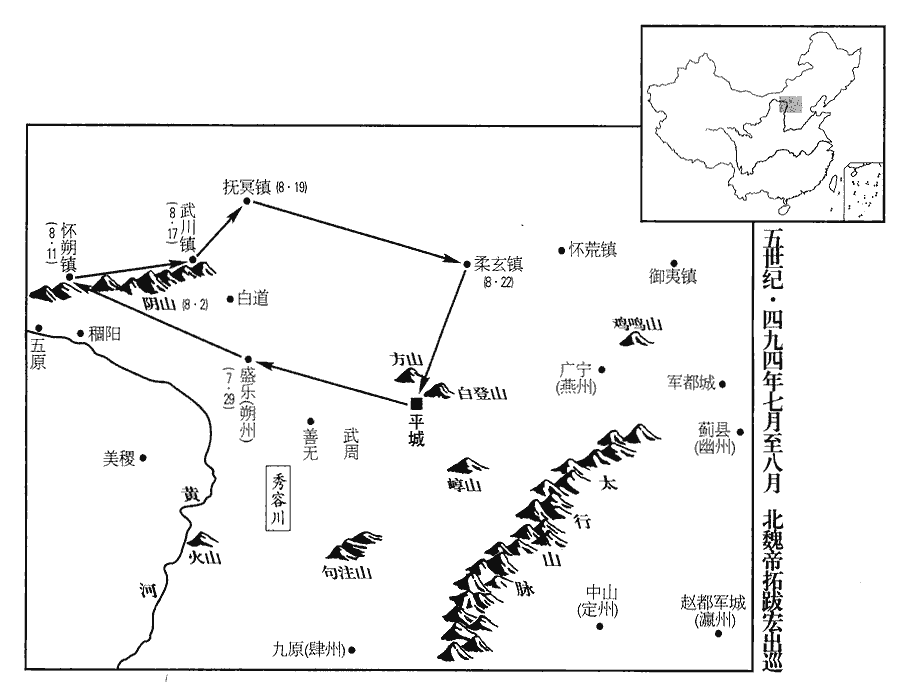
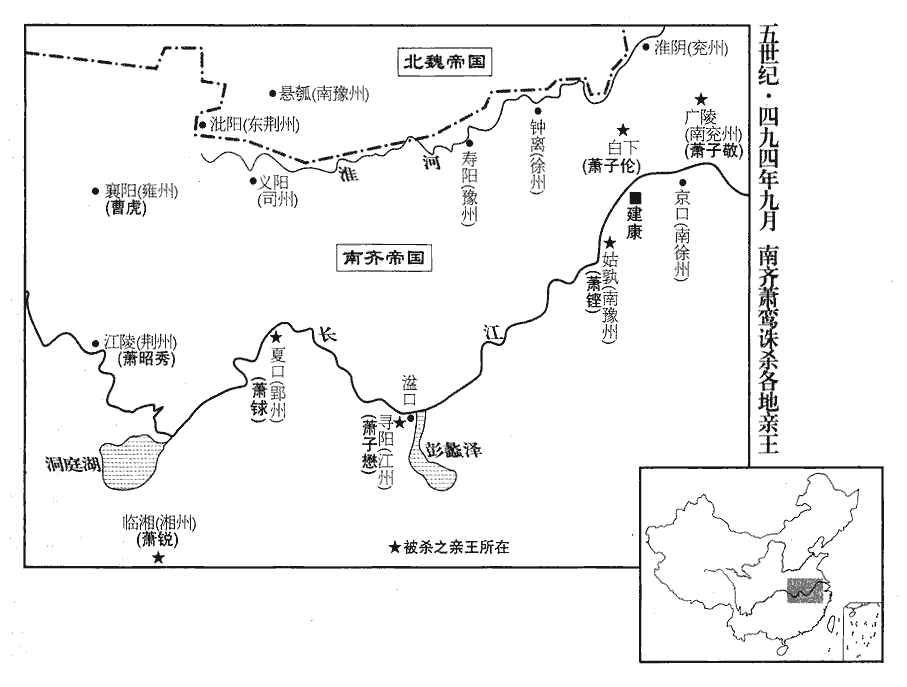
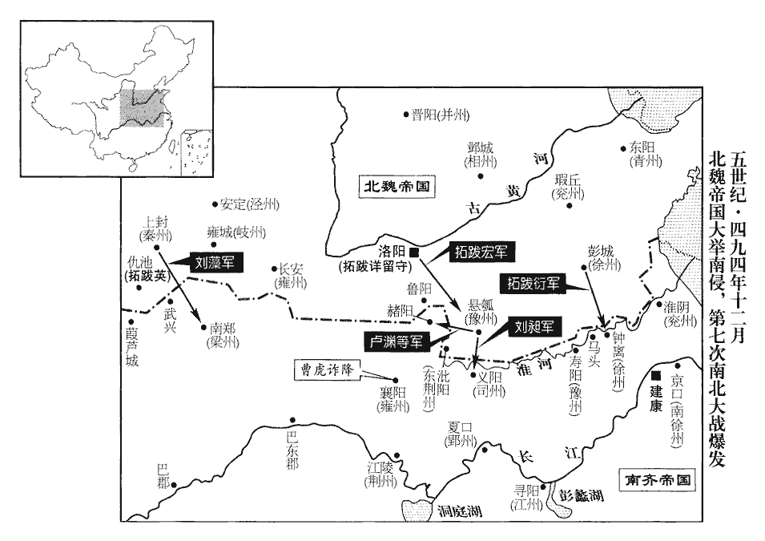

 齊紀五閼逢閹茂（甲戌），一年。

# 高宗明皇帝上諱鸞，字景栖，小字玄度，高帝兄始安貞王道生之子。

## 建武元年（甲戌、四九四）是年十月始改元建武。

1春，正月，丁未‹一›，改元隆昌；此鬱林王改元也。大赦。

〖译文〗 [1]春季，正月丁未（初一），郁林王萧昭业改年号为隆昌，大赦天下。

2雍州‹府设襄阳湖北省襄樊市›刺史晉安王子懋，雍，於用翻。以主幼時艱，密爲自全之計，令作部造仗；諸州各有作部，主造器仗。征南大將軍陳顯達屯襄陽，去年秋，武帝以魏將入寇，遣顯達鎭樊城‹襄樊市汉水北岸›。子懋欲脅取以爲將。將，卽亮翻；下同。顯達密啓西昌侯鸞，鸞徵顯達爲車騎大將軍；騎，奇寄翻。徙子懋爲江州‹府寻阳江西省九江市›刺史，仍令留部曲助鎭襄陽，單將白直、俠轂自隨。諸王有白直，有夾轂隊。俠，讀曰夾。顯達過襄陽，過，音戈。子懋謂曰︰「朝廷令身單身而返，身是天王，豈可過爾輕率！子懋自稱天王，蓋謂是天家諸王也。今猶欲將二三千人自隨，公意何如？」顯達曰︰「殿下若不留部曲，乃是大違敕旨，其事不輕；且此間人亦難可收用。」此間人，謂襄陽人也。子懋默然。顯達因辭出，卽發去。子懋計未立，乃之尋陽。

〖译文〗 [2]雍州刺史晋安王萧子懋考虑到皇帝年幼，时局不稳定，就暗中筹措，以便发生不测之事时能自我保全。他命令所辖兵器作坊打造兵器；又想胁迫当时驻扎在襄阳的征南大将陈显达担任自己的大将。陈显达把情况密告西昌侯萧鸾，萧鸾任命陈显达为车骑大将军，而调萧子懋为江州刺史，并且命令他把部曲留下来帮助镇守襄阳，仅仅带周围随从、侍卫人员随行。陈显达经过襄阳时，萧子懋对他说：“朝廷命令我单身而返，我身为皇室王爵，难道能过于轻率吗！现在我想要二三千人马随行，不知将军您意下如何呢？”陈显达回答道：“殿下您如果不把部曲留下，就是完全违抗圣旨，这可是罪过不轻的事情呀！况且，这个地方的人也难以收用，您带上他们也未必能尽听指挥。”萧子懋见目的难以达到，只好沉默不语了。于是，陈显达告辞而出，很快就出发走了。萧子懋因计谋未成，就去了寻阳。

3西昌侯鸞將謀廢立，引前鎭西諮議參軍蕭衍與同謀。隨王子隆初以鎭西將軍鎭荊州，引衍爲諮議參軍。荊州‹府设江陵湖北省江陵县›刺史、隨王子隆，性溫和，有文才；鸞欲徵之，恐其不從。衍曰︰「隨王雖有美名，其實庸劣。旣無智謀之士，爪牙唯仗司馬垣歷生、武陵‹湖南省常德市›太守卞白龍耳。二人唯利是從，若啗以顯職，無有不來；隨王止須折簡耳。」鸞從之。徵歷生爲太子左衛率，白龍爲游擊將軍；啗，徒濫翻。折，之舌翻。帥，所律翻。二人並至。續召子隆爲侍中、撫軍將軍。此時西昌侯已有殺諸王之心矣。蕭衍由是以籌略見用。豫州‹府设寿阳安徽省寿县›刺史崔慧景，高‹萧道成›、武‹萧赜›舊將，將，卽亮翻。鸞疑之，以蕭衍爲寧朔將軍，戍壽陽。慧景懼，白服出迎；白服，若得罪而白衣領職者。衍撫安之。

〖译文〗 [3]西昌侯鸾萧将要谋划废除郁林王，另立新皇帝，因此叫来原镇西谘议参军萧衍一起密谋。担任荆州刺史的随王萧子隆性情温和，风雅而有文才，萧鸾想要调用他，但又担心他不听从。萧衍说：“随王这个人虽然美名外传，其实非常平庸顽劣。他身边没有一个智谋人物，手下武将中他只依靠司马垣历生和武陵太守卞白龙。垣历生和卞白龙这两个家伙是唯利是从之徒，如果以显要的官职引诱他们，没有不来的道理。至于随王本人，仅用一封信即可请到。”萧鸾听从了萧衍的计划。于是，就征召垣历生为太子左卫率，卞白龙为游击将军，垣、卞两人一起来了。接着，又征召萧子隆为侍中、抚军将军。豫州刺史崔慧景是齐高帝萧道成、齐武帝萧赜的旧将，萧鸾对他有疑心，就派遣萧衍为宁朔将军，戍守寿阳。崔慧景害怕了，穿着白色衣服出城迎接萧衍，萧衍对他大加安抚。

4辛亥‹五›，鬱林王‹萧昭业，本年二十二岁›祀南郊；戊午‹十二›，拜崇安陵。鬱林王卽位，追尊父文惠太子曰文帝，陵曰崇安，廟號世宗。據《竟陵王子良傳》，陵在夾右。

〖译文〗 [4]辛亥（初五），郁林王在南郊祭天；戊午（十二日）拜谒其父文惠太子墓崇安陵。

5癸亥‹十七›，魏主‹拓跋宏，本年二十八岁›南巡；戊辰‹二十二›，過比干墓，《水經註》︰河內朝歌縣南有牧野‹河南省卫辉市东北郊›，有比干冢，前有石銘題隸云︰「殷大夫比干之墓」，不知誰所誌也。祭以太牢，魏主自爲祝文曰︰「烏呼介士，胡不我臣！」

〖译文〗 [5]癸亥（十七日），北魏孝文帝南下巡视；戊辰（二十二日），经过比干的坟墓时，用牛、羊、猪三性祭于墓前，孝文帝亲自撰写祭文，其中说道：“呜呼！如此耿直之士，为何不生于当今成为朕的大臣呢！”

6帝寵幸中書舍人綦毋珍之、朱隆之、直閤將軍曹道剛、周奉叔、宦者徐龍駒等。帝謂鬱林王。珍之所論薦，事無不允；允，信也，肯也。內外要職，皆先論價，旬月之間，家累千金；擅取官物及役作，不俟詔旨。有司至相語云︰語，牛倨翻。「寧拒至尊敕，不可違舍人命。」帝以龍駒爲後閤舍人，後閤，禁中後閤也。《南史》曰︰龍駒日夜在六宮房內。常居含章殿，著黃綸帽，被貂裘，著，陟略翻。被，皮義翻。南面向案，代帝畫敕；左右侍直，與帝不異。

〖译文〗 [6]南齐郁林王宠幸偏爱中书舍人綦毋珍之、朱隆之、直将军曹道刚、周崐奉叔、宦官徐龙驹等人。凡是綦毋珍之所论定、荐举的事情和人选，没有得不到信任、答应的。因此，綦毋珍之把朝廷内外的重要官职统统划定价格，然后交钱任命，一月之间，他就富得家累千金。他还擅自攫取朝中物品，占用差役人员供自己驱使，不等待朝廷的诏旨。朝中的官员在一起言谈时说：“宁可抗拒皇上的圣旨，也不可以违背綦毋珍之的命令。”明帝任徐龙驹为后舍人，徐龙驹经常住在含章殿中，戴着黄纶帽，披着貂皮大衣，面朝南坐在案前，代替皇帝批阅文告，左右侍奉，与皇帝没有什么两样。

帝自山陵之後，卽與左右微服遊走市里，好於世宗崇安陵隧中擲塗、賭跳，好，呼到翻。文惠太子廟號世宗。塗，泥也。以塗泥相擲爲樂也。跳，躍也，賭跳者，以跳躍高出者爲勝。跳，他弔翻。作諸鄙戲，極意賞賜左右，動至百數十萬。每見錢，曰︰「我昔思汝十【章︰十二行本「十」作「一」；乙十一行本同；孔本同；熊校同。】枚不得，今日得用汝未？」世祖‹萧赜›聚錢上庫五億萬，齋庫亦出三億萬，上庫所儲以備軍國之用。齋庫以供齋內所須，人主之好用。出者，出三億萬數之外也。金銀布帛不可勝計；勝，音升。鬱林王卽位未朞歲，所用垂盡。入主衣庫，令何后‹何婧英›及寵姬以諸寶器相投擊破碎之，用爲笑樂。樂，音洛。蒸於世祖‹萧赜›幸姬霍氏，更其姓曰徐。更，工衡翻。李延壽《史》以霍爲文帝幸姬，則「世祖」當作「世宗」。朝事大小，皆決於西昌侯鸞。朝，直遙翻；下同。鸞數諫爭，數，所角翻。爭，讀曰諍。帝多不從；心忌鸞，欲除之。以尚書右僕射鄱陽王鏘為世祖所厚，「世祖」恐亦當作「世宗」。私謂鏘曰：「公聞鸞於法身如何？」鬱林王，小字法身。鏘素和謹，對曰︰「臣鸞於宗戚最長，且受寄先帝；臣等皆年少，長，知兩翻。少，詩照翻。朝廷所賴，唯鸞一人，願陛下無以爲慮。」帝退，謂徐龍駒曰︰「我欲與公共計取鸞，公旣不同，我不能獨辦，且復小聽。」復，扶又翻；下無復同。言且又小時聽鸞專政也。

〖译文〗 郁林王自从登基之后，就与左右侍从们穿上民服在闹市中游走戏玩，还喜欢在文惠太子崇安陵的墓道中扔掷泥巴、比赛跳高，做种种粗鄙下流的游戏，使劲赏赐服从人员，动辄就是成千上万。一见到钱，他就说：“过去我想得到你十个都不行，现在我还用得着你吗？”武帝生前聚敛钱财，上库中存有五亿万之多，斋库中所存也多于三亿万，至于金银布帛更不可胜计，而郁林王即位还不满一年，就挥霍将尽。他经常进入主衣库，让何皇后以及宠爱的妃子们用各种宝贵器具互相投击，直到把它们打破成碎片，以此玩笑取乐。他还乱伦，与父亲文惠太子的宠妾霍氏通奸，让她改姓徐。朝廷中的大小事情，全部由西昌侯萧鸾来决定。萧鸾数次劝谏，可是郁林王不但不听从，反而心生忌怨，想把萧鸾除掉。由于尚书右仆射鄱阳王萧锵曾被齐武帝所厚爱优待，郁林王就私下里对萧锵说：“您听说萧鸾对待我如何呢？”萧锵为人向来平和谨慎，就回答说：“萧鸾在皇室宗族中年岁最长，而且接受了先帝的托嘱，我们都年幼，朝廷中所可以依赖之人唯有萧鸾，盼愿陛下您不要以他为虑。”郁林王回宫之后，对徐龙驹说：“我想与萧锵一起合计收拾掉萧鸾，萧锵不同意，而我独自一人又不能办到，那么只好让萧鸾继续专权一阵子了。”

衛尉蕭諶chén，世祖‹萧赜›之族子也，蕭子顯《齊書》曰︰諶於太祖爲絕服族子。諶，氏壬翻。自世祖在郢州‹府设夏口湖北省武汉市›，諶已爲腹心。宋元徽末，世祖在郢州，欲知都下消息，太祖遣諶就世祖宣傳謀計，留爲腹心。及卽位，常典宿衛，機密之事，無不預聞。征南諮議蕭坦之，諶之族人也。嘗爲東宮直閤，爲世宗所知。蕭子顯《齊書》曰︰坦之以懃直爲世祖所知。旣爲東宮直閤，則從世宗爲是。東宮亦有直閤將軍。帝‹萧昭业›以二人祖父舊人，甚親信之。諶每請急出宿，帝通夕不寐，諶還乃安。坦之得出入後宮，帝褻xiè狎宴遊，坦之皆在側。帝醉後，常裸袒，裸，郎果翻。坦之輒扶持諫諭。西昌侯鸞欲有所諫，帝在後宮不出，唯遣諶、坦之徑進，乃得聞達。

〖译文〗 卫尉萧谌是武帝的本家侄子，从武帝在郢州时起，萧谌就成为他的心腹之人。武帝登基即位之后，萧谌经常在宫中值宿，担任警卫，凡是机密的事情，他无不参预知晓。征南谘议萧坦之是萧谌的本家，曾经做过东宫直，为文惠太子所知遇。郁林王因为萧谌、萧坦之两人曾是祖父和父亲的人，所以就特别亲近、信赖他们。每当萧谌有急事请假不值宿，郁林王就通夜不寐，直到萧鸾回来才能安下心来。萧坦之也可以出入于后宫，凡是郁林王亵狎宴游的场合，他都守在旁边侍奉。郁林王酒醉之后，常常脱光上衣，萧坦之经常扶持着他，并且谏言劝谕。西昌侯萧鸾想要进谏，郁林王就躲在后宫中不出来，萧鸾只好派遣萧谌、萧坦之直接进到后宫，才能把要说的话转告于他。

何后‹何婧英›亦淫泆，泆yì，音逸。泆，淫放也。私於帝‹萧昭业›左右楊珉，與同寢處如伉儷；處，昌呂翻；下處之同。杜預曰︰伉，敵也；儷，耦也。伉，苦浪翻。儷，力計翻。又與帝相愛狎，故帝恣之，迎后親戚入宮，以耀靈殿處之。齋閤通夜洞開，外內淆雜，無復分別。別，彼列翻。西昌侯鸞遣坦之入奏誅珉，何后流涕覆面覆，敷又翻。曰︰「楊郎好年少，無罪，何可枉殺！」少，詩照翻。坦之附耳語帝曰︰語，牛倨翻；下每語同。「外間並云楊珉與皇后有情，事彰遐邇，不可不誅。」帝不得已許之；俄敕原之，已行刑矣。鸞又啓誅徐龍駒，帝亦不能違，而心忌鸞益甚。蕭諶、蕭坦之見帝狂縱日甚，無復悛改，悛，丑緣翻。恐禍及己；乃更回意附鸞，勸其廢立，陰爲鸞耳目，帝‹萧昭业›不之覺也。

〖译文〗 何皇后也非常淫荡，私通于郁林王的随从杨珉，与他同枕共寝就像夫妻一般。何后又对郁林王极尽狎昵亲热之能事，所以郁林王很是宠纵她。他还把何崐后的亲戚迎进宫中，安排住在耀灵殿里，门户彻夜洞开，内外淆杂混处，没有任何分别。西昌侯萧鸾派遣萧坦之进去宫奏请诛杀杨珉，何皇后哭得泪流满面，对郁林王说：“杨郎多么年轻、多么英俊啊！又没有什么罪，怎么可以无缘无故就杀掉呢？”萧坦之见状赶紧向郁林王悄悄耳语道：“外面纷纷传说杨珉同皇后有苟且之情，事实确凿，远近皆知，不可以不杀掉呀。”郁林王不得已，只好同意处死杨珉。不一会儿，郁林王又后悔了，诏令赦免杨珉，可是已经行刑完毕了。萧鸾又启奏郁林王，请求诛死徐龙驹，郁林王亦不得不违心同意，但是从此对萧鸾的忌恨之心更加强烈了。萧谌、萧坦之见郁林王狂荡放纵一日甚于一日，已经到了无可悔改的地步，担心连累自己，祸害及身，就反过来一心依附萧鸾，劝说他把郁林王废掉，另立新皇帝。从此，他们两人就成了萧鸾安排在郁林王身边的耳目，而郁林王却丝毫没有觉察。

周奉叔恃勇挾勢，陵轢公卿。轢lì，郎狄翻。常翼單刀二十口自隨，翼者，分列左右若兩翼然也。出入禁闥，門衛不敢訶。訶，虎何翻。每語人曰︰「周郎刀不識君！」鸞忌之，使蕭諶、蕭坦之說帝出奉叔爲外援，說，輸芮翻；下鸞說、此說同。己巳‹二十三›，以奉叔爲青州‹府设郁洲江苏省连云港市东沉积小岛›刺史，蕭子顯曰︰宋泰始中，淮北沒虜，徙青州治鬱洲，齊建元四年，徙治朐qú山，後復舊。曹道剛爲中軍司馬。奉叔就帝求千戶侯；許之。鸞以爲不可，封曲江縣男，食三百戶。奉叔大怒，於衆中攘刀厲色；鸞說諭之，乃受。說，輸芮翻；下同。奉叔辭畢，將之鎭，部伍已出。鸞與蕭諶稱敕，召奉叔於省中，毆殺之，省中，尚書省中也。毆，烏口翻。啓云︰「奉叔慢朝廷。」帝不獲已，可其奏。

〖译文〗 周奉叔倚仗自己的勇武和与皇帝亲近，有恃无恐，凌辱欺侮朝中公卿百官，常常以二十口单刀分挂在身体两侧，出入于皇宫禁门，门卫敢怒而不敢言。他还经常对人讲：“我周某人的刀可是不认人啊！”萧鸾对他特别忌恨，指使萧谌和萧坦之去游说郁林王，让把周奉叔弄出朝廷，安排到外地去。已巳（二十三日），下令周奉叔为青州刺史，曹道刚为中军司马。周奉叔来见郁林王，请求封自己为千户侯，郁林王准许了。萧鸾却不同意，只封他为曲江县男的爵位，食邑三百户。周奉叔大怒，站在人群中挥刀喊叫，表示不满，萧鸾反复劝谕告说，他才接受了。周奉叔辞谢完毕，将要去青州，部下人马已经出发了，萧鸾与萧谌称皇帝有令，把他召到官署中来，殴打他，直至丧命，并启奏皇帝说：“周奉叔傲慢朝廷，因此处死。”郁林王不得已，只好认可他们的奏章。

溧陽‹江苏省溧阳市›令錢唐‹浙江省杭州市›杜文謙，嘗爲南郡王侍讀，溧陽縣，自漢以來屬丹陽郡，其地在建康東南。帝初封南郡王。溧，音栗。前此說綦毋珍之曰︰「天下事可知，灰盡粉滅，匪朝伊夕；不早爲計，吾徒無類矣。」珍之曰︰「計將安出？」文謙曰︰「先帝舊人，多見擯bìn斥，今召而使之，誰不慷慨！近聞王洪範王洪範卽轉言日月相者也。與宿衛將萬靈會等共語，皆攘袂搥牀；將，卽亮翻。搥，傳追翻。君其密報周奉叔，使萬靈會等殺蕭諶，則宮內之兵皆我用也。蕭諶時以衛軍司馬兼衛尉卿，掌宿衛兵。卽勒兵入尚書，斬蕭令，尚書省在雲龍門內。兩都伯力耳。都伯，行刑者也，今謂之劊子。今舉大事亦死，不舉事亦死；二死等耳，死社稷可乎！若遲疑不斷，復少日，錄君稱敕賜死，復，扶又翻。少，詩沼翻。少日，言無多日也。鸞錄尚書事，故稱爲錄君。父母爲殉，謂皆將從坐而死也。在眼中矣。」珍之不能用。及鸞殺奉叔，幷收珍之、文謙，殺之。

〖译文〗 溧阳令钱唐人杜文谦，曾经在郁林王初封南郡王时，陪伴他读过书。不久以前，杜文谦游说綦毋珍之，对他讲道：“天下之事至此已不难料知，朝廷危难将近，难以保全，这已是早晚之间的事情了。所以如果不及早作好打算，我们这些人将遭灭族之灾了。綦毋珍之问道：“有什么办法呢？”杜文谦说：“先前皇帝的旧人，多数被排斥在一边，如今召他们回来加以重用，谁能不意气风发呢？近来听说王洪范与宿卫将万灵会等人在一起议论时，都气得攘袖床，急忿万分。所以，您可密告周奉叔，让他派万灵会等人杀掉萧谌，这样的话，皇宫内的卫兵就可以掌握在我们手中。然后，派兵进入尚书省，斩掉萧鸾，只需两个刽子手就可以办到的。如今，这样干一场是一死，不干也是一死，同样是死，还是为朝廷而死吧！如果前瞻后顾，迟疑寡断，用不了许久，萧鸾就会以皇帝的名义赐我们死，父母也要受牵连而死，事情已经近在眼前了。”綦毋珍之没有采纳杜文谦的意见。等到萧鸾杀了周奉叔之后，就把綦毋珍之和杜文谦二人也抓了起来，一起杀掉了。

7乙亥‹二十九›，魏主如洛陽‹河南省洛阳市东白马寺东›西宮。中書侍郎韓顯宗上書陳四事︰其一，以爲︰「竊聞輿駕今夏不巡三齊‹山东省›，當幸中山‹河北省定州市›。往冬輿駕停鄴，當農隙之時，猶比屋供奉，不勝勞費。比，毗必翻，又毗至翻。勝，音升。況今蠶麥方急，將何以堪命！且六軍涉暑，恐生癘疫。臣願早還北京，以省諸州供張之苦，北京，謂平城。張，竹亮翻。成洛都營繕之役。」其二，以爲︰「洛陽宮殿故基，皆魏明帝‹曹叡›所造，前世已譏其奢。今茲營繕，宜加裁損。又，頃來北都富室，競以第舍相尚；北都，亦謂平城。魏旣遷洛，以平城爲北都。宜因遷徙，爲之制度。及端廣衢路，通利溝渠。」其三，以爲︰「陛下之還洛陽，輕將從騎。從，才用翻。王者於闈闥之內宮中門曰闈。《韓詩》︰門屛間曰闥。猶施警蹕，況涉履山河而不加三思乎！」三，息暫翻。其四，以爲︰「陛下耳聽法音，法音，謂雅樂也。目翫wán墳典，謂《三墳》、《五典》。《書序》︰伏羲神農黃帝之書，謂之《三墳》，言大道也。少昊、顓頊、高辛、唐、虞之書，謂之《五典》，言常道也。孔子序《書》，斷自唐、虞，《三墳》、《五典》，後世不復見其全，此特大槪言之。口對百辟，心虞萬機，景昃而食，虞，度也。景昃，日昃也。日景過中則昃。昃，音側。夜分而寢；加以孝思之至，隨時而深；謂文明太后之殂已久，而帝孝思不忘也。文章之業，日成篇卷；雖叡明所用，未足爲煩，然非所以嗇神養性，嗇，愛也。保無疆之祚也。伏願陛下垂拱司契而天下治矣。」《老子》曰︰有德司契。司，主也。契，要也。治，直吏翻。帝頗納之。顯宗、麒麟之子也。韓麒麟見一百三十五卷武帝永明元年。

〖译文〗 乙亥（二十九日），北魏孝文帝到了洛阳西宫。中书侍郎韩显宗向孝文帝上书讲陈了四件事情：其一，认为：“我听说陛下今年夏天舆驾出行，不是去巡视三齐，就是临幸中山。往年冬天大驾停在邺城，虽然正当农闲之时，但仍使每家每户出资出力供奉，不胜辛劳破费。何况现在正是蚕麦刚熟的农忙时节，您大驾所至，百姓将如何忍受得住呢？而且六军冒着酷暑护驾，恐怕要生疠疫。臣希望早点回到北京平城，以便能节省各州张罗供奉的费用，这样就能使营建修缮洛阳都城的工程早日完成。”其二，认为：“洛阳宫殿的旧基，都是魏明帝所建造的，在那时人们就批评他太奢侈了。如今我们的营建，应该缩减规模。还有，近来北都平城的富室大户，竞相比逐宅舍房宇的高下，应该借这次迁都搬移的机会，在这方面定出一个制度。同时，对于都城的道路交通要拓宽加直，水沟渠道也要加以疏通。其三，认为：“陛下您往还洛阳，随从保卫的武器人员很少。皇帝平时住在宫中，还要施行警戒保护措施，何况出外巡察山河呢？对此不可不加以三思。”其四，认为：“陛下耳听雅乐，眼观圣人典籍，口对百官言谈，心虑万机，日头偏西方才吃饭，午夜时分才能入侵。再加上自文明太后去世之后，陛下对她的孝思随着时日的推移而日日加深；陛下还撰写文章，每日都有篇章写成。虽然陛下聪明睿智，这些都不足以成为烦若，但是终非修心养性、爱惜圣体，以保万寿无疆之良策。所以，俯请陛下无为而治，只管重要之事，不必事事亲躬。”孝文帝对上述建议颇有采纳。韩显宗是韩麒麟的儿子。

顯宗又上言，以爲︰「州郡貢察，徒有秀、孝之名而無秀、孝之實；貢察者，謂察舉秀才、孝廉而貢之於朝。朝廷但檢其門望，不復彈坐。復，扶又翻。彈坐者，彈劾其違而坐之以罪。如此，則可令別貢門望以敍士人，何假冒秀、孝之名也！夫門望者，乃其父祖之遺烈，亦何益於皇家！益於時者，賢才而已。苟有其才，雖屠釣奴虜，聖王不恥以爲臣；太公屠牛於朝歌，釣於渭濱。又紂時箕子爲奴，周文王、武王皆禮而用之。苟非其才，雖三后之胤，墜於皁隸矣。《左傳》︰申無宇曰︰「人有十等︰士臣皁，皁臣輿，輿臣隸。」《釋》曰︰皁，直馬者。隸，附屬者。三后，謂夏、商、周之王也。議者或云，『今世等無奇才，不若取士於門，』此亦失矣。豈可以世無周、邵，遂廢宰相邪！但當校其寸長銖重者先敍之，言其人比之衆人稍有一寸之長、一銖之重，則先敍用之。則賢才無遺矣。

〖译文〗 韩显宗又上书上帝，指出：“各州郡举荐上贡的秀才、孝廉，徒有其名而无其实，朝廷只查他们的门第出身如何，而不弹劾其违实之罪。如果这样的话，那么以后可以命令下面另以门第资望为举荐标准，以此来品评、选拔读书人，何必又冒假秀才、孝廉之名呢？门第资望，是他们父、祖的功业，于朝廷皇家有何用处呢？有益于现时的是贤才。如果真正有才能，即使如姜太公那样屠牛于朝歌，钓于渭滨；又如箕子那样身为奴隶，周文王、武王也都礼遇而用为臣子，不以此为耻。如果没有才能，即便他是夏、商、周三代之王的后裔，也照样编入仆隶差役之列。有人可能会议论说：‘当今世上实在没有奇才，所以不如以门第取士。’这也是不对的。难道可以因为世上没有周公、召公二人那样的相才，于是就废除掉宰相的位子吗？只要一个人比众人稍有一寸之长、一铢之重，就应当先选拔、录用他，这样就可以做到贤才没有遗漏。

又，刑罰之要，在於明當，當，丁浪翻。不在於重。苟不失有罪，雖捶撻之薄，人莫敢犯；若容可僥幸，雖參夷之嚴，不足懲禁。參夷，謂夷三族也。捶，止橤翻。僥，堅堯翻。今內外之官，欲邀當時之名，爭以深刻爲無私，迭相敦厲，敦，迫也。厲，嚴以勉之。遂成風俗。陛下居九重之內，視人如赤子；百司分萬務之任，遇下如仇讎。是則堯、舜止一人而桀、紂以千百；和氣不至，蓋由於此。謂宜敕示百僚，以惠元元之命。

〖译文〗 “还有，刑罚的关键，在于运用得当，而不在于专门求重。如果执法严明，不使有罪者漏网，虽然捶挞的很轻，人们也不敢再犯；如果执法不严明，给留有侥幸逃脱的余地，虽然有夷杀三族的严厉刑法，也不足以完全惩禁住犯罪行为。当今朝廷内外的官员，都想获得时下的名声，争着以严酷表示无私，于是互相比赛，不得不严上再严，遂成为一时之风气。陛下您住在深宫之内，看待人民如赤子，而百官分担着处理各种具体事务的职责，对待百姓则如仇敌。如尧、舜者只有陛下一人，而如桀、纣者则以成百上千计，官民不和，原因正在于此。所以，我认为陛下应该诏示内外官员注意，以有利于百姓的生息。

又，昔周居洛邑，猶存宗周‹镐京·陕西省西安市西镐京镇›；周成王宅洛，以豐爲宗周，存故都也。漢遷東都，京兆置尹。後漢都雒陽，置河南尹；而長安仍置京兆尹，亦存故都也。察【章︰十二行本「察」作「案」；乙十一行本同；孔本同；張校同；退齋校同。】《春秋》之義，有宗廟曰都，無曰邑。況代京，宗廟山陵所託，王業所基，其爲神鄕福地，實亦遠矣，今便同之郡國，臣竊不安。謂宜建畿置尹，一如故事，魏初都平城，分畫甸畿置司州，於平城置代尹。崇本重舊，光示萬葉。

〖译文〗 “还有，过去周成王居处洛阳，但仍保存丰镐为故都；东汉迁都洛阳，而在长安仍置京兆尹。根据《春秋》大义，有宗庙的叫‘都’，没有宗庙叫‘邑’。况且平城这个地方，是宗庙和先帝陵墓所在之地，是朝廷王业的根基所在，其作为一块神奇福地，意义是非常久远的，如今就把它等同于一般的州郡，我私下里非常不安。所以，我认为应该如过去的惯例那样，在平城建置京兆尹，以示崇尚根本，重视过去，光昭万世。

又，古者四民異居，欲其業專志定也。管仲相齊，使士、農、工、商各羣萃而州處。其言曰︰四民者，勿使雜處，雜處則其言哤，其事易。昔聖王之處士也，使就閒燕；處工就官府；處商就市井；處農就田野。長而安焉，不見異物而遷焉。太祖道武皇帝‹拓跋珪›創基撥亂，日不暇給，然猶分別士庶，不令雜居，工伎屠沽，各有攸處；別，彼列翻。伎，渠綺翻。處，昌呂翻；下同處同。但不設科禁，久而混殽。今聞洛邑居民之制，專以官位相從，不分族類。夫官位無常，朝榮夕悴，悴，秦醉翻。則是衣冠、皁隸不日同處矣。借使一里之內，或調習歌舞，或構【章︰十二行本「構」作「講」；乙十一行本同；孔本同；熊校同。】肄《詩》《書》，肆，羊至翻。縱羣兒隨其所之，則必不棄歌舞而從《詩》《書》矣。然則使工伎之家習士人風禮，百年難成；士人之子效工伎容態，一朝而就。是以仲尼稱里仁之美，孟母勤三徙之訓。《論語》︰孔子曰︰里仁爲美；擇不處仁，焉得知！《列女傳》曰︰孟軻母，其舍近墓。孟子少嬉遊，爲墓間之事。孟母曰︰「此非吾所以處子也。」乃去，舍市旁，甚嬉戲乃賈人衒賣之事。又曰︰「此非吾所以處子也。」復徙舍學宮之旁，其嬉戲乃設俎zǔ豆，揖遜進退。孟母曰︰「此眞可以居吾子矣。」遂居焉。此乃風俗之原，不可不察。朝廷每選人士，校其一婚一宦以爲升降，何其密也！至於度地居民，則清濁連甍méng，何其略也！度，徒洛翻。甍，謨耕翻，屋棟，所以承瓦。今因遷徙之初，皆是空地，分別工伎，在於一言，有何可疑而闕盛美！

〖译文〗 “还有，古代士、农、工、商分别居处，不使杂混，以便他们能各专其业、各安其志。太祖道武皇帝创基立国之始，拨乱反正，日夜操劳，无有闲暇之时，然而仍然不忘区别士族与庶族，不让他们杂混居处，工匠、技人、屠夫、商贩等各有所处，但没有制定禁止措施，时间久了就互相混淆而住了。现在听说洛阳城居民居处制度专以官位来分划，而不以士族庶族分类。官职并非是永久不变的，有时朝得之而夕失之，所以以官位来划分居处，则势必使衣冠之士和仆隶之徒不日而相杂混处。假如同一里居之内，有的人家调教演习歌舞，有的人家讲读《诗》、《书》，在此情况之下，即使让孩子们选择自己的爱好，则必定不能弃歌舞而接近《诗》、《书》。但是，让工匠、伎艺人家学习士人的礼仪习俗，一百年也难以学成；让士人的子弟仿效工匠、伎艺们的举止言谈，一朝半夕就可以学成。所以，孔子指出人选择居处，应居于仁者之里，如此就是美；孟母三次择邻而居，以便使孟子远下贱而近礼仪。这乃是风俗礼仪的根本所在，不可不加以明察。朝廷每次选拔人才，考察其婚姻和仕宦情况作为升降的标准，何其严密认真啊！可是，在安置民众居住事情上，却尊卑贵贱不辨，使他们杂混居住在一起，又是何等的疏略啊！如今正是迁徙初始之时，洛阳城中皆是空地，使工匠、伎艺等行当的人分别居住，甚为容易，一言之令即可以办到，有何疑难而不为，以致使如此盛美之事付之阙如呢？

又，南人昔有淮北之地，自比中華，僑置郡縣。如豫州界止於汝陽，而僑置譙、梁、陳、潁等郡縣，又於青州界僑置冀州諸郡縣是也。僑，渠驕翻。自歸附聖化，仍而不改，名實交錯，文書難辨。宜依地理舊名，一皆釐革，小者幷合，大者分置，及中州郡縣，昔以戶少倂省。魏初得河南，止置四鎭，郡縣多所併省。少，詩沼翻。今民口旣多，亦可復舊。

〖译文〗 “还有，南朝过去占有淮北之地时，自己比作是中华，在那里设置了侨郡侨县。但是，自从淮北归附本朝管辖之后，这一情况仍然沿而未改，以致名实交错，给文书方面带来诸多不便。所以，现在应该依照地理上的旧名，一一核实，重新加以规定，小的合并，大的分开设置。至于中原地区的郡县，过去我们因为户少人稀而合并撤消了一些，如今人口既然多起来了，就可以恢复旧有设置了。

又，君人者以天下爲家，不可有所私。倉庫之儲，以供軍國之用，自非有功德者不可加賜。在朝諸貴，受祿不輕；比來賜賚，動以千計。朝，直遙翻。比，毗至翻。若分以賜鰥寡孤獨之民，所濟實多；今直以與親近之臣，殆非周急不繼富之謂也。」《論語》，孔子曰︰君子周急不繼富。帝覽奏，甚善之。

〖译文〗 “还有，国君以天下为家，不应该有所偏私。仓库之中的储藏，是供给军队和国家所用的，除非有大功大德者不可以随意加以赏赐。朝廷中的诸位大臣，已经享受俸禄不轻了，但是近来对他们的赐予，动辄以千数计。如果把这些钱物分别赏赐给那些鳏寡孤独的老百姓，就一定能救济许多人。但是，现在只是一个劲地赏赐给那些亲近的大臣们，这种做法不正好与孔子所说的君子周济人以急需而不帮助富人使其更富背道而驰了吗？”孝文帝看了韩显宗的奏章，非常称赞他的意见。

8二月，乙丑‹十四›，魏主如河陰‹河南省孟津县东北›，規方澤。規度其地，以立方澤。

〖译文〗 [8]二月乙丑（疑误），北魏孝文帝驾临河阳，勘测划定筑建夏至日祭地时所用方泽的地址。

9辛卯‹十六›，帝‹萧昭业›祀明堂。

〖译文〗 [9]辛卯（十六日），南齐郁林王在明堂举行祭祀仪式。

10司徒參軍劉斅等聘于魏。斅xiào，胡敎翻。

〖译文〗 [10]司徒参军刘等人出使北魏。

11丙申‹二十一›，魏徙河南王幹爲趙郡王，潁川王雍爲高陽王。將以河南潁川爲畿甸。故二王徙封。

〖译文〗 [11]丙申（二十一日），北魏改任河南王拓跋干为赵郡王，颍川王拓跋雍为高阳王。

12壬寅‹二十七›，魏主‹拓跋宏›北巡；癸卯‹二十八›，濟河；三月，壬申‹二十七›，至平城。《考異》曰︰《魏•帝紀》作閏月。按魏閏二月，齊曆之三月也。使羣臣更論遷都利害，各言其志。燕州‹府设广宁河北省涿鹿县›刺史穆羆曰︰魏營洛，以洛爲司州，改平城之司州爲恆州，分恆州東部置燕州，治昌平。「今四方未定，未宜遷都。且征伐無馬，將何以克？」帝曰︰「廐牧在代，何患無馬！今代在恆山之北，九州之外，非帝王之都也。」恆，戶登翻。尚書于果曰︰「臣非以代地爲勝伊、洛之美也。但自先帝以來，久居於此，百姓安之；一旦南遷，衆情不樂。」樂，音洛。平陽公丕曰︰「遷都大事，當訊之卜筮。」帝曰︰「昔周、召聖賢，乃能卜宅。《書•洛誥》曰︰召公旣相宅，周公往營成周。傅來告卜曰︰「我卜河朔黎水，我又卜澗水東、瀍chán水西，惟洛食。我又卜瀍水東，亦惟洛食。」今無其人，卜之何益！且『卜以決疑，不疑何卜！」《左傳》載鬬廉之言。黃帝卜而龜焦，天老曰『吉』，黃帝從之。杜預曰︰龜焦，兆不成也。字書釋灼龜不兆爲焦。然則至人之知未然，審於龜矣。王者以四海爲家，或南或北，何常之有！朕之遠祖，世居北荒。平文皇帝始都東木根山‹内蒙古兴和县北›。拓拔鬱律諡平文皇帝。晉明帝大寧二年，《通鑑》書「惠帝賀傉nù徙居東木根山」。昭成皇帝更營盛樂‹内蒙古和林格尔县›，拓跋什翼犍諡昭成皇帝。《通鑑》晉成帝咸康元年，烈帝翳槐城盛樂。次年，昭成嗣國，咸康七年，築盛樂新城。更，工衡翻。道武皇帝‹拓跋珪›遷于平城。晉安帝隆安二年，道武帝遷都平城。朕幸屬勝殘之運，《論語》，孔子曰︰善人爲邦百年，亦可以勝殘去殺矣。朱元晦曰︰勝殘，謂化善人不爲惡也。屬，之欲翻，會也。勝，音升。而獨【章︰十二行本作「何爲獨」三字；乙十一行本同；孔本同。】不得遷乎！」羣臣不敢復言。復，扶又翻。羆pí，壽之孫；穆壽事魏太武帝。果，烈之弟也。癸酉‹二十八›，魏主臨朝堂，部分遷留。分，扶問翻。

〖译文〗 [12]壬寅（二十七日），北魏孝文帝到北方巡视；癸卯（二十八日），渡过黄河；三月壬申（二十七日），到了平城。孝文帝让诸大臣再次议论迁都的利害关系，各位臣子们都表述了自己对此问题的看法。燕州刺史穆罴说：“如今天下四方没有安定，所以不宜于迁都。况且到时军中缺少战马，这样如何能克敌取胜呢？”孝文帝回答说：“养马的地方在平城地区，何愁没有马呢？如今的都城代京到处恒山的北边，九州之外，并不是理想的帝王之都。”尚书于果接着说道：“我并不是认为代京这块地方就比洛阳好，但是自从道武皇帝以来，就一直居住在这里，老百姓已经安居于此，一旦让他们往南边搬迁，恐怕会产生不满情绪。”平阳公拓跋丕说：“迁都是一件大事，应当通过卜筮来决定。”孝文帝说：“古代的周公、召公是圣贤之人，所以才能卜问宅居。如今没有他们这样的圣贤了，卜筮又有什么用处呢？况且古人曾言：‘卜筮为了决疑，没有犹疑，何必占卜？’过去，黄帝灼龟甲卜吉凶，龟甲烧焦了，黄帝的臣子天老说是‘吉’，黄帝听从了。那么，至美至善的完人知晓未发生的事情，是通过龟兆而审悉的。但是，统治天下做王称帝的人以四海为家，南北不定，哪有常常居留一地而不动的呢？朕的远祖，世世代代居住在北方荒凉之地，到平文皇帝之时方才建都于东木根山。其后，昭成皇帝又营建了盛东而迁居。道武皇帝之时，又迁都于平城。朕很幸运遇上了能平定天下、施行教化的时运，为什么就不能迁都呢？”群臣百僚们不敢再表示反对意见了。穆罴是穆寿的孙子，于果是于烈的弟弟。癸酉（二十八日），孝文帝驾临朝堂，主持部署了迁往新都洛阳和留在平城的人事、机构安排事项。

13夏，四月，庚辰‹六›，魏罷西郊祭天。《考異》曰︰《魏•帝紀》、《禮志》、《北史•紀》，皆云三月庚辰。按《長曆》，三月丙午朔，無庚辰。魏閏二月，齊閏四月；魏三月乙亥朔，齊曆之四月也，故置於此。

〖译文〗 [13]夏季，四月庚辰（初六），北魏免去了西郊祭天仪式。

14辛巳‹七›，武陵昭王曄卒‹年二十八岁›。

〖译文〗 [14]辛巳（初七），南齐武陵昭王萧晔去世。

15戊子‹十四›，竟陵文宣王子良以憂卒‹年三十五岁›。帝常憂子良爲變，聞其卒，甚喜。鬱林但虞子良爲變，而不知鸞、諶之謀已成矣。

〖译文〗 [15]戊子（十四日），竟陵文宣王萧子良因忧郁成疾而去世。郁林王常常担忧萧子良谋反，听到他死了，大喜过望。

臣光曰︰孔子稱「鄙夫不可與事君，未得之，患得之；旣得之，患失之。苟患失之，無所不至。」見《論語》。王融乘危徼幸，徼，堅堯翻。謀易嗣君。子良當時賢王，雖素以忠愼自居，不免憂死。迹其所以然，正由融速求富貴而已。輕躁之士，烏可近哉！躁，則到翻。近，其靳翻。

〖译文〗 臣司马光曰：孔子说：“贪鄙的人不可以奉事君王，这种人对自己的利害得失斤斤计较，当他没有得到之时，处心积虑于如何得到；一旦得到了，又惟恐失去。如果担忧失去，就会不择手段，无所不用其极。”王融正是如此，他乘着危难之时，投机取巧，阴谋废君另立。萧子良是当时的贤王，虽然素来以崐忠心谨慎而自居，但是仍然不免忧郁而死。分析他之所以忧死的原因，正是由于王融急于贪求富贵所致。轻薄躁急的人，岂可以接近呢？

16己亥‹二十五›，魏罷五月五日、七月七日饗祖考。魏端午、七夕之饗，猶寒食之饗，皆夷禮也。

〖译文〗 [16]已亥（二十五日），北魏免除五月五日、七月七日祭祀祖先的礼俗。

17魏錄尚書事廣陵王羽奏︰「令文︰每歲終，州鎭列屬官治狀，及再考，則行黜陟。治，直吏翻。去十五年京官盡經考爲三等，去十五年，猶云昨太和十五年也。今已三載。臣輒準外考，以定京官治行。」欲以考州鎭屬官之法考京官。載，子亥翻。行，下孟翻。魏主曰︰「考績事重，應關朕聽，不可輕發；且俟至秋。」史言魏孝文明於君人之體，不使權在臣下。

〖译文〗 [17]北魏录尚书事广陵王拓跋羽上奏说：“朝令规定：每年年终，各州镇要列出所属官员的政绩情况，经过考察核对之后，进行降免或提拔。自太和十五年京官们全部经过考评列为三等之后，到如今已经整整满三年了。所以，我欲参照考评州镇属官的办法来考核京官，以便评定他们的政绩等级。”孝文帝说：“考评京官政绩事关重大，应该由朕来决定，不可轻率从事，且等到秋天再说吧。”

18閏月，丁卯‹二十三›，鎭軍將軍鸞卽本號，開府儀同三司。本號，鎭軍將軍也。

〖译文〗 [18]闰四月丁卯（二十三日），南齐镇军将军萧鸾以这个名号，开府仪同三司。

19戊辰‹二十四›，以新安王昭文爲揚州刺史。

〖译文〗 [19]戊辰（二十四），新安王萧昭文任扬州刺史。

20五月，甲戌朔‹一›，日有食之。《考異》曰︰《齊》《魏書•帝紀》皆無此食。今據《齊書•志》、《南史•紀》。

〖译文〗 [20]五月甲戌（初一），发生日食。

21六月，己巳‹二十六›，魏遣兼員外散騎常侍盧昶、兼員外散騎侍郎王清石來聘。昶，度世之子也。盧度世避崔浩之禍，其後自出，魏太武寵任之。散，悉亶翻。騎，奇寄翻。昶，丑兩翻。清石世仕江南，魏主謂清石曰︰「卿勿以南人自嫌。彼有知識，欲見則見，欲言則言。凡使人以和爲貴，勿迭相矜夸，見於辭色，使，疏吏翻；下同。見，賢遍翻。失將命之體也。」將，奉也。奉命而行，謂之將命。

〖译文〗 [21]六月已巳（二十六日），北魏派遣兼员外散骑常侍卢昶、兼员外散骑侍郎王清石来访。卢昶是卢度世的儿子。王清石世代做官于江南，北魏孝文帝告诉他说：“你不要因为是南方人而有顾虑，他们之中如果有谁与你相识，想见面就见面，想说什么就说什么。做使节出访别国，要以和为贵，不要一味地矜持夸耀，尤其不能从言谈举止中表现出来，否则就失去了奉命出使的本体。”

22秋，七月，乙亥‹三›，魏以宋王劉昶爲使持節、都督吳•越•楚諸軍事、大將軍，鎭彭城‹江苏省徐州市›。江南皆春秋時吳、越、楚三國之地。魏主親餞之。以王肅爲昶府長史。昶至鎭，不能撫接義故，宋蒼梧王初，昶鎭彭城，棄鎭奔魏，故義故在焉。卒無成功。卒，子恤翻。

〖译文〗 [22]秋季，七月乙亥（初三），北魏任命宋王刘昶为使持节、都督吴越楚诸军事、大将军、镇守彭城。孝文帝亲自为他饯行。又派遣王肃为刘昶府署的长史。刘昶到了彭城之后，没有能安抚接收过去受过他的恩义的部属，所以未能取得成功。

23壬午‹十›，魏安定靖王休卒。自卒至殯，魏主三臨其第，葬之如尉元之禮，尉，紆勿翻。送之出郊，慟哭而返。

〖译文〗 [23]壬午（初十），北魏安定靖王拓跋休去世。从去世到出殡，孝文帝三次驾临他的府上。安葬时的礼仪与拓跋尉元的一样，孝文帝亲自送灵柩到郊外，然后失声恸哭返宫。

24壬戌‹二十›，魏主北巡。

〖译文〗 [24]壬戌，（疑误），北魏孝文帝在北方巡视。

25西昌侯鸞旣誅徐龍駒、周奉叔，而尼媼外入者，頗傳異語。媼ǎo，烏皓翻。異語，謂外人籍籍口語，言鸞等相與有異謀也。中書令何胤，以后‹何婧英›之從叔，從，才用翻。爲帝‹萧昭业›所親，使直殿省。帝與胤謀誅鸞，令胤受事；胤不敢當，依違諫說，帝意復止。乃謀出鸞於西州‹建康城西›，中敕用事，不復關咨於鸞。復，扶又翻。

〖译文〗 [25]南齐西昌侯萧鸾诛杀徐龙驹、周奉叔之后，一些进宫的尼姑妇女纷纷传言，说萧鸾等人密谋叛乱。中书令何胤是何皇后的堂叔，郁林王非常亲近信任他，让他在殿省入值。郁林王与何胤共同策划诛杀萧鸾，命令何胤承担这件事情，但是何胤不敢担当，不顾郁林王的意图而反复劝谏，郁林王只好作罢。于是，又谋划使萧鸾离开台城到西州去，诏令及朝廷事务等，不再咨问于萧鸾。

是時，蕭諶、蕭坦之握兵權，左僕射王晏總尚書事。諶密召諸王典籤，約語之，不許諸王外接人物。約語者，約束而語之。語，牛倨翻。諶親要日久，衆皆憚而從之。

〖译文〗 这时候，萧谌、萧坦之掌握着兵权，左仆射王晏总领尚书事。萧谌秘密召见诸王的典签官，对他们打招呼，不许诸王与外人接触。萧谌长时期以来一着崐受宠幸，所以大家都害怕他，没有不听从的。

鸞以其謀告王晏，晏聞之，響應；又告丹楊尹徐孝嗣，孝嗣亦從之。驃騎錄事南陽‹河南省南阳市›樂豫謂孝嗣曰︰「外傳籍籍，似有伊、周之事。君蒙武帝殊常之恩，荷託付之重，徐孝嗣爲王儉所薦，武帝擢而用之，遺詔託以尚書衆事。驃，匹妙翻。騎，奇寄翻。荷，下可翻。恐不得同人此舉。人笑褚公，至今齒冷。」謂褚淵也。笑則啓齒，故云齒冷。孝嗣心然之而不能從。

〖译文〗 萧鸾把自己的计谋告诉王晏，王晏听了之后，立即赞同迎合。萧鸾又告诉了丹杨尹徐孝嗣说：“外界传言纷纷，说萧鸾要废掉郁林王，另立幼主，自己象伊尹、周公那样摄政，操持国事。您承蒙武帝超乎寻常的恩待，在遗诏中被委以统管尚书省的事务，既然担负着如此重大的托付，恐怕就不应该再随同别人一起做这种举动了。人们对于褚渊当年的所作所为，至今还嘲笑不已，这可是前车之鉴啊！”徐孝嗣心里完全同意乐豫说的，但是身不由己，不能听从。

帝謂蕭坦之曰︰「人言鎭軍與王晏、蕭諶欲共廢我，鸞時領鎭軍將軍，故稱之。似非虛傳。卿所聞云何？」坦之曰︰「天下寧當有此，誰樂無事廢天子邪！樂，音洛。朝貴不容造此論，當是諸尼姥言耳，豈可信邪！朝，直遙翻。姥mǔ，莫補翻；女老稱。官若無事除此三【章︰十二行本「三」作「二」；乙十一行本同。】人，誰敢自保！」直閤將軍曹道剛疑外間有異，密有處分，謀未能發。言曹道剛密有圖鸞等之謀而未能發。處，昌呂翻。分，扶問翻。

〖译文〗 郁林王对萧坦之说：“人们都说镇军将军萧鸾同王晏、萧谌一起想把我废掉，似乎并不是虚传谣言。你听到的是些什么呢？”萧坦之回答道：“岂能有这样的事情呢？谁喜欢没事找事废除天子呢？朝廷中的大臣们是不可能制造这种谣言的，一定是那些瞎尼姑们说的，岂可以相信呢？陛下如果无故把他们三人除掉，谁还又能保全自身呢？”直将军曹道刚怀疑外面有异变，秘密地有所布置，然而没有能够执行。

時始興‹广东省韶关市›內史蕭季敞、南陽太守蕭穎基皆內遷，諶欲待二人至，藉其勢力以舉事。以二人方自外郡歸，各有兵力自送，爲可藉也。鸞慮事變，以告坦之，坦之馳謂諶曰︰「廢天子，古來大事。比聞曹道剛、朱隆之等轉已猜疑，比，毗至翻。衛尉明日若不就事，無所復及。復，扶又翻。弟有百歲母，豈能坐聽禍敗，正應作餘計耳！」諶惶遽從之。

〖译文〗 当时，始兴内史萧季敞、南阳太守萧颖基都调迁朝中，萧谌想等待他们二人到后，凭借他们的势力而开始行动。萧鸾担心事情有变故，就把自己的忧虑告诉了萧坦之，萧坦之又骑马去急告萧谌说：“废除天子，自古以来就是一件大事。最近听说曹道刚、朱隆之等人反而已经猜疑我们了，您如果明天还不行动，就要失去机会，无法加以弥补了。我有百岁老母亲在堂，岂能坐视不动，眼看灾祸降临呢？所以不能不为以后想一想。”萧谌听了，也觉得事情危急，心中非常不安，就匆忙地答应了。

壬辰‹二十›，鸞使蕭諶先入宮，遇曹道剛及中書舍人朱隆之，皆殺之。直後徐僧亮盛怒，直後，亦宿衛之官，侍衛於乘輿之後者也。大言於衆曰︰「吾等荷恩，荷，下可翻。今日應死報！」又殺之。鸞引兵自尚書入雲龍門，戎服加朱衣於上，比入門，三失履。懼而失其常度也。比，必寐翻，及也。王晏、徐孝嗣、蕭坦之、陳顯達、王廣之、沈文季皆隨其後。帝在壽昌殿，壽昌殿，武帝所起，宴居常居之。聞外有變，猶密爲手敕呼蕭諶，又使閉內殿諸房閤。俄而諶引兵入壽昌閤，帝走趨徐姬房，拔劍自刺，不入，趨，七喻翻。刺，七亦翻。以帛纏頸，輿接出延德殿。諶初入殿，宿衛將士皆操弓楯欲拒戰。操，千高翻。楯，食尹翻。諶謂之曰︰「所取自有人，卿等不須動！」宿衛素隸服於諶，皆信之；及見帝出，各欲自奮，帝竟無一言。行至西弄，弒之。此延德殿之西弄也。丁度《集韻》曰︰弄，廈也，屛也。亦作「㢅」。帝死時年二十二。輿尸出殯徐龍駒宅，葬以王禮。徐姬及諸嬖倖皆伏誅。鸞旣執帝，欲作太后令；徐孝嗣於袖中出而進之，鸞大悅。癸巳‹二十一›，以太后令追廢帝‹萧昭业›爲鬱林王，又廢何后‹何婧英›爲王妃，迎立新安王昭文。

〖译文〗 壬辰（二十日），萧鸾派萧谌先进入宫中，正遇上了曹道刚以及中书舍人朱隆之，就把二人一齐杀了。负责郁林王车舆后面侍卫任务的宿卫官徐僧亮见此情形，怒气冲天，大声对众人喊道：“我们承受皇恩，今日应当以死相报！”言未毕，也被杀掉。萧鸾带兵从尚书府进入云龙门，他在朝服外面又加穿了战服，武装披挂，但是心中难免恐惧紧张，才进入宫门，鞋子就掉了三次。王晏、徐孝嗣、萧坦之、陈显达、王广之、沈文季等人都紧随在萧鸾之后。这时，郁林王正在寿昌殿中，听得外面有变故，还秘密写诏令传唤萧谌前来相救，又让人把内殿的门窗全关闭了。不一会儿，萧谌就领兵进入寿昌殿，郁林王见状，匆忙跑进徐姬的房中，拔出宝剑抹脖子自杀，但所进不深，被萧谌制止，又用帛绸把他的脖子缠裹好，然后用轿把他抬出了延德殿。萧谌刚进入殿内时，侍卫将士们都操起兵器准备和他搏战一场，萧谌对他们说：“我的目标是他人，与你们无关，请你们不要乱动！”这些侍卫们向来属萧谌所管，因此都听他的话，就不再准备抗拒了。等到看见郁林王出来了，这些侍卫们又都想解救他，但是郁林王竟然连一句话也没说。萧谌带郁林王到延德殿西边夹道，就把他杀了崐。尸体运出宫中，灵柩停在徐龙驹的府中，用亲王的礼仪安葬。徐姬和其他宠人统统被杀。萧鸾抓住郁林王之后，想假造太后的手令，这时徐孝嗣马上从衣袖中取出已准备好的太后手令递过去，于是萧鸾异常高兴。癸巳（二十一日），萧鸾以太后之令追封废帝萧昭业为郁林王，又废黜何皇后为王妃，另准备迎立新安王萧昭文为新皇帝。

吏部尚書謝瀹yuè方與客圍棋，左右聞有變，驚走報瀹。瀹每下子，子，棋子也。輒云「其當有意」，竟局，乃還齋臥，竟不問外事。謝瀹爲此，兄朏fěi之敎也。大匠卿虞悰竊歎曰︰「王、徐遂縛袴廢天子，天下豈有此理邪！」大匠卿，卽漢將作大匠之官。蕭子顯曰︰掌宗廟土木。悰cóng，徂宗翻。悰，嘯父之孫也。虞嘯父，虞潭之子，事晉孝武帝。父，音甫。朝臣被召入宮。朝，直遙翻。被，皮義翻。國子祭酒江斅xiào至雲龍門，託藥發，吐車中而去。吐，土故翻，嘔也。西昌侯鸞欲引中散大夫孫謙爲腹心，散，悉亶翻。使兼衛尉給甲仗百人。謙不欲與之同，輒散甲士；鸞亦不之罪也。史言謝瀹、江斅以名義自將，僅能如此而已；特立不懼，孫謙庶幾焉。

〖译文〗 吏部尚书谢瀹正和客人下围棋，手下的人听说宫廷发生事变，惊慌地跑来报告。然而，谢瀹就象没听见一般，继续下棋，每下一子，就说声：“恐怕里面含有深意”，一局终了，就回室中躺下休息，竟然没有问一下外面发生的事情。大匠卿虞私下里叹息说：“王晏、徐孝嗣如此轻易地就把皇帝废黜了，天底下那有这样的道理呢？”虞是虞啸父的孙子。朝中大臣都被召进宫中，惟有国子祭酒江来到云龙门时，借口药性发作，在车中呕吐不已，因而返回去了。西昌侯萧鸾想使中散大夫孙谦成为自己的心腹，就让他兼任卫尉，并且派给他披甲执兵的卫士一百人。然而，孙谦却不想与萧鸾同党，就把那些卫士统统打发走了，可是萧鸾也不因之而怪罪孙谦。

丁酉‹二十五›，新安王‹萧昭文›卽皇帝位，時年十五。王諱昭文，字季尚，文惠太子第二子也。以西昌侯鸞爲驃騎大將軍、錄尚書事、揚州刺史、宣城郡公。大赦，改元延興。

〖译文〗 丁酉（二十五日），新安王萧昭文即皇帝位，其时他年纪才十五岁。任命西昌侯萧鸾为骠骑大将军、录尚书事、扬州刺史、宣城郡公。大赦天下，改年号为延兴。

26辛丑‹二十九›，魏主至朔州‹府设盛乐›。魏收《地形志》︰雲州，舊置朔州。又有朔州，本漢五原郡，魏爲懷朔鎭，孝昌中始改爲朔州。今此朔州，當置於雲中之盛樂。時置朔州於定襄故城，領盛樂、廣牧二郡。宋白曰︰孝文遷洛之後，於今朔州北三百八十里定襄故城置朔州，後亂，廢。

〖译文〗 [26]辛丑（二十九日），北魏孝文帝到达朔州。

27八月，甲辰‹二›，以司空王敬則爲太尉，鄱陽王鏘爲司徒，車騎大將軍陳顯達爲司空，鏘，千羊翻。騎，奇寄翻。尚書左僕射王晏爲尚書令。

〖译文〗 [27]八月甲辰（初二），南齐任命司空王敬则为太尉，鄱阳王箫锵为司徒，车骑大将军陈显达为司空，尚书左仆射王晏为尚书令。

28魏主至陰山。

〖译文〗 [28]北魏孝文帝到达阴山。

29以始安王遙光爲南郡‹湖北省江陵县›太守，不之官。遙光，鸞之兄子也。鸞兄鳳生遙光、遙欣；遙光嗣始安王爵。鸞有異志，遙光贊成之，凡大誅賞，無不預謀。戊申‹六›，以中書郎蕭遙欣爲兗州‹府设淮阴江苏省淮阴市›刺史。遙欣，遙光之弟也。鸞欲樹置親黨，故用之。

〖译文〗 [29]南齐又任命始安王萧遥光为南郡太守，但萧遥光没有去就任。萧遥光是萧鸾哥哥的儿子。萧鸾有了废立的意图，萧遥光十分赞同帮助他，凡是有关重大的诛杀或赏拔事情，萧遥光都参加了预谋。戊申（初六），又任命中书郎萧遥欣为兖州刺史。萧遥欣是萧遥光的弟弟。萧鸾想树立亲信，广揽同党，所以重用他。

 

30癸丑‹十一›，魏主如懷朔鎭‹内蒙古固阳县›；己未‹十七›，如武川鎭‹内蒙古武川县›；辛酉‹十九›，如撫宜鎭‹内蒙古四子王旗›；甲子‹二十二›，如柔玄鎭‹内蒙古兴和县北›；此六鎭自西徂東之次第也。《水經註》︰懷朔鎭城在漢光祿城東北。考其地當在漢五原稒陽塞外。杜佑曰︰在馬邑郡北三百餘里。武川鎭城在白道中溪水上。白道在陰山之北，又北出大漠。柔玄鎭在于延水東。于延水出塞外柔玄鎭西長川城南小山，東南流，逕漢代郡且如縣故城南，則魏柔玄鎭城在漢且如縣西北塞外也。且，音子閭翻。撫冥鎭城，未考其地。若以前說六鎭自五原抵濡源分置於三千里中，則撫冥當在武川、柔玄之間，相距各五百里；據前高閭之說，則相距各一百七十許里耳。按《北史》，「宜」當作「冥」。乙丑‹二十三›，南還；辛未‹二十九›，至平城。

〖译文〗 [30]癸丑（十一日），北魏孝文帝来到怀朔镇；己未（十七日），又到了抚宜镇；甲子（二十二日），到达柔玄镇；乙丑（二十三日），南下返回；辛未（二十九日），到了平城。

31九月，壬申朔‹一›，魏詔曰︰「三載考績，三考黜陟；唐、虞之制，三考黜陟。三考九年也。載，子亥翻。可黜者不足爲遲，可進者大成賒緩。朕今三載一考，卽行黜陟，欲令愚滯無妨於賢者，才能不擁於下位。各令當曹考其優劣爲三等，其上下二等仍分爲三。上等、下等各又分爲三等。六品已下，尚書重問；重，直用翻。五品已上，朕將親與公卿論其善惡，上上者遷之，下下者黜之，中者守其本任。」

〖译文〗 [31]九月壬申（初一），北魏孝文帝下诏令说：“每三年考评一次官员们的政绩，考评三次后根据情况对他们进行罢免或提升，这对于那些应该被罢免的人来说当然不会认为是太迟了，但是对于那些应该提升的人来说就大大地被拖欠了。朕现在决定三年考评一次，考评完毕就实行罢黜或提升处理，目的是为了使那些低能者不要妨碍了忠贤者的上进，使有才能的不要总是处在低位。崐分别命令负责考评的部门官员，把考评者分为优劣三等，其中上等和下等仍然再分为三等。六品以下的官员，由尚书复核审查，五品以上的官员，朕将亲自与各位公卿一起评议其好坏，上上者提升使用，下下者罢免不用，中等的原任不变。”

魏主之北巡也，留任城王澄銓簡舊臣。自公侯已下，有官者以萬數，澄品其優劣能否爲三等，人無怨者。史言任城王澄之平明。

〖译文〗 北魏孝文帝北巡期间，留下任城王拓跋澄考评百官。朝中从公侯以下，有官职的以万计数，拓跋澄评定他的优劣和才能高低，划为三个等级，结果没有一个人有怨言。

壬午‹十一›，魏主臨朝堂，黜陟百官，朝，直遙翻。謂諸尚書曰︰「尚書，樞機之任，非徒總庶務，行文書而已；朕之得失，盡在於此。卿等居官，年垂再期，未嘗獻可替否，進一賢退一不肖，此最罪之大者。」又謂錄尚書事廣陵王羽曰︰「汝爲朕弟，居機衡之右，無勤恪之聲，有阿黨之迹，今黜汝錄尚書、廷尉，但爲特進、太子太保。」又謂尚書令陸叡曰︰「叔翻到省之初，甚有善稱；比來偏頗懈怠，廣陵王羽，字叔翻。稱，昌孕翻。比，毗至翻。頗，傍禾翻，亦偏也。懈，居隘翻。由卿不能相導以義。雖無大責，宜有小罰；今奪卿祿一期。」又謂左僕射拓跋贊曰︰「叔翻受黜，卿應大辟；辟，毗亦翻。但以咎歸一人，不復重責；今解卿少師，削祿一期。」又謂左丞公孫良、右丞乞伏義受曰︰「卿罪亦應大辟；可以白衣守本官，冠服祿卹xù魏官，本祿之外，別有恤親之祿。盡從削奪。若三年有成，還復本任；無成，永歸南畝。」又謂尚書任城王澄曰︰「叔神志驕傲，可解少保。」澄於魏主，叔也。又謂長兼尚書于果曰︰「卿不勤職事，數辭以疾，數，所角翻。可解長兼，削祿一朞。」其餘守尚書尉羽、盧淵等，並以不職，或解任，或黜官，或奪祿，皆面數其過而行之。尉，紆勿翻。數，所具翻。唐、虞三載考績，三考黜陟幽明。其黜陟行於九年之後，非賒緩也。俗淳事簡，在位者各思盡其職，不爲姦欺；就有不稱者，一考而未黜，冀其能自盡也；其不能盡者，才力有所不逮耳。再考不稱而猶未黜，謂才有短長，臨事有過誤；前考已稱其職而今考不稱者，必過誤也；前考不稱而今考能稱其職者，能自勉也。三考皆不稱，則其人信不可用矣，於是乎黜之，此唐、虞忠厚之至也。《周官》︰計羣吏之治，旬終則令正日成，月終則令正月要，歲終則令正歲會，三歲則大計羣吏之治而誅賞之。是蓋無日而不考覈，而誅賞則行於三年大計之時。蓋俗益薄，人益媮tōu，而行九年之黜陟則爲賒緩。觀魏孝文之考績，不過慕古而務名，非能行考績之實也。淵，昶之兄也。昶，丑兩翻。

〖译文〗 壬午（十一日），北魏孝文帝亲临朝堂，宣布对众臣百官们的罢黜或提升情况，他对诸位尚书们说：“尚书是关键性的要害职位，并非仅仅是总管事务，处理一下文书而已。朕的成败得失，完全关系于尚书。你们担任这职务，已经有两年了，但是从来没有向朕建议过什么事可为，什么事不可行；没有推荐过一个贤才，撤换过一个不称职的人，这是罪过中之最大者。”孝文帝又对录尚书事广陵王拓跋羽说：“你是朕的弟弟，处在执掌要害部门的位置上。但是，你没有勤勉为政、恪守本职的声誉，却有结党营私的行迹。现在，罢免去你的录尚书、廷尉之职，只担任特进、太子太保。”又对尚书令陆睿说：“拓跋羽初到尚书省任职之时，人们对他的评价相当高，可是近来偏听偏信，论事不公，而且松懈懒惰，这完全是由于你不能以道义引导相劝他的结果。你虽然没有大的责任，但是也应该受到小小的罚处，因此减去你一年的俸禄。”又对左仆射拓跋赞说：“拓跋羽被罢黜，你应处以死刑。但是，事情既然归咎于拓跋羽一人了，就不再处分他人了，所以只解除你少师之职，削去一年的俸禄。”接着又对左丞公孙良、右丞乞伏义受说：“你们的罪过也应该处以死刑，但是只对你们进行如下处罚；削去你们的官服和俸禄，以布衣身份继续留任本职，如果在三年之内有政绩，就官复原职；如果没有任何成就，那就永远削职为民，回去种地去。”又接着对尚书任城王拓跋澄说：“叔叔你趾高气扬，骄傲自大，所以解除少保官职。”还对长兼尚书于果说：“你不勤于职任之事，数次以疾病为借口，所以亦解除长兼，削去一年的俸禄。”其余如守尚书尉羽、卢渊等人，均以不称职，或者被解除职务，或者被罢黜官位，或者被削去俸禄，孝文帝当面指责了他们的过失，所受处罚立即执行。卢渊是卢昶的哥哥。

帝又謂陸叡曰︰「北人每言『北俗質魯，何由知書！』朕聞之，深用憮然！憮wǔ，罔甫翻。憮然者，悵然失意之貌。今知書者甚衆，豈皆聖人！顧學與不學耳。朕脩百官，興禮樂，其志固欲移風易俗。朕爲天子，何必居中原！正欲卿等子孫漸染美俗，漸，子廉翻。聞見廣博；若永居恆北，恆，戶登翻。復值不好文之主，復，扶又翻。好，呼到翻。不免面牆耳。」《書》曰︰不學，牆面。言猶正牆面而立，無所睹見也。對曰︰「誠如聖言。金日磾不入仕漢朝，何能七世知名。」金日磾事見二十一卷漢武帝後元元年。七世知名，謂七世內侍也。磾，丁奚翻。朝，直遙翻。帝甚悅。

〖译文〗 孝文帝又对陆睿说：“北方人常说：‘北方风俗朴质、粗犷，怎么会变得知书识礼、文质彬彬呢？’朕听了之后，感到异常失望。现在好读书、有学识的人很多，难道他们都是圣人吗？完全在于好学与不好学。朕整顿百官，大兴礼乐，全部心意在于移风易俗。朕身为天子，何必一定要去中原地区居住呢？还不是为了使你们的子孙后代渐渐习染当地好的风俗习惯，能多闻多见，增加见识。如果永远住在恒山之北，再遇上一个不喜欢诗书礼乐的国君的话，那就难免会变得孤陋寡闻。”陆睿回答道：“确实如圣上所说。金日如果不到汉朝去做官，怎么能够知名于世呢？”孝文帝听了陆睿的话，心里十分喜悦。

32鬱林王‹萧昭业›之廢也，鄱陽王鏘初不知謀。及宣城公鸞權勢益重，中外皆知其蓄不臣之志。鏘每詣鸞，鸞常屣履至車後迎之；言急於出迎，不暇躡履至跟也。語及家國，言淚俱發，鏘以此信之。宮臺之內皆屬意於鏘，宮、臺猶言宮省也。屬，之欲翻。勸鏘入宮發兵輔政。制局監謝粲說鏘及隨王子隆曰︰「二王但乘油壁車入宮，李延壽《恩倖傳》曰︰武官有制局監、外監，皆領器仗兵役。油壁車者，加青油衣於車壁也。王儉議曰︰今衣書車十二乘，古副車之象也，榆轂輪，簟diàn子壁，綠油衣。說，輸芮翻；下之說、說子、因說同。出天子置朝堂，夾輔號令；朝，直遙翻。粲等閉城門、上仗，誰敢不同！上，時掌翻；下直上、西上同。東城人正共縛送蕭令耳。」東城，謂東府城也。按蕭子顯《齊書》︰世祖遺詔以鸞爲侍中、尚書令；此時已進錄尚書事，粲曰蕭令，蓋以舊官稱之。子隆欲定計。鏘以上臺兵力旣悉度東府，海陵王旣卽位，鸞出鎭東府，上臺兵力悉割以自隨。度，過也。且慮事不捷，意甚猶豫。馬隊主劉巨，世祖時舊人，詣鏘請間，叩頭勸鏘立事。鏘命駕將入，復還內，復，扶又翻。與母陸太妃別，日暮不成行。典籤知其謀，告之。癸酉‹二›，鸞遣兵二千人圍鏘第，殺鏘‹年二十六岁›，遂殺子隆‹年二十一岁›及謝粲等。於時太祖諸子，子隆最壯大，有才能，「太祖」當作「世祖」。故鸞尤忌之。

〖译文〗 [32]南齐鄱阳王箫锵最初并不知道萧鸾有废掉郁林王的阴谋。后来，郁林王被废，宣城公萧鸾的权势日益增大，朝廷内外都知道他心里有凯觎皇位之意。但是，萧锵每次去拜见他时，萧鸾常常匆忙得连鞋都来不及穿好就到车子后面去迎接，说到国家大事，萧鸾无不声泪俱下，表现的非常忠贞，因此萧锵还是很信任他。朝中各方都倾向于萧锵，劝他入宫发兵，取代萧鸾，辅佐朝政。制局监谢粲游说萧锵和随王萧子隆，对二人说：“二位王爷只需乘着油壁车进入宫中，把皇帝带出来，挟持到朝堂之上，左右辅佐，发布号令，我和其他人关闭城门，带卫士前来声援，谁敢不听令呢？只怕东府里的人会乖乖地把萧鸾缚送过来呢。”萧子隆想认真计谋一番，但是萧锵却因朝中兵力全控制在萧鸾手中，且考虑到事情不一定能成功，心中犹豫万分。马队头目刘巨是武帝时的旧人，他来见萧锵，要求和萧锵单独说话，跪下磕头，力劝萧锵采取行动。萧锵命令准备车马，将要进宫，但是又回到内室，与母亲陆太妃告别，结果天黑了还没有出发。萧锵身边的典签知道了这一计划，就向萧鸾告发了他。癸酉（初二），萧鸾派遣两千士兵围住萧锵的住处，把他杀了，接着又杀了萧子隆、谢粲等人。在当时，武帝的儿子中数萧子隆强壮高大，且颇有才能，因此萧鸾尤其忌妒他。

江州刺史晉安王子懋聞鄱陽‹萧锵›、隨王‹萧子隆›死，欲起兵，謂防閤吳郡‹江苏省苏州市›陸超之曰︰「事成則宗廟獲安，不成猶爲義鬼。」諸王置防閤，以勇略之士爲之，以防衛齋閤。杜佑《通典》︰唐制︰親王府並給防閤、庶僕、白直，下至州縣亦有白直。防閤丹陽董僧慧曰︰「此州雖小，宋孝武‹刘骏›常用之。謂宋孝武帝自江州起兵誅元凶劭也。若舉兵向闕以請鬱林‹萧昭业›之罪，誰能禦之！」子懋母阮氏在建康，密遣書迎之，阮氏報其同母兄于瑤之爲計。瑤之馳告宣城公鸞；乙亥‹四›，假鸞黃鉞，內外纂嚴，《考異》曰︰《齊•帝紀》作「乙未」。按是月壬申朔，而上有癸未，下有乙酉、丁亥，蓋癸未當作「癸酉」，乙未當作「乙亥」耳。遣中護軍王玄邈討子懋，又遣軍主裴叔業與于瑤之先襲尋陽，聲云爲郢府‹府设夏口湖北省武汉市›司馬。子懋知之，遣三百人守湓城‹九江市寻阳东›。叔業泝流直上，上，時掌翻。至夜，回襲湓城，城局參軍樂賁開門納之。諸州刺史各有城局參軍，掌脩浚備禦。子懋聞之，帥府州兵力據城自守。子懋部曲多雍州人，皆勇躍願奮。子懋自雍州徙爲江州，故部曲多雍州人。「勇」，當作「踴」。帥，讀曰率。雍，於用翻。叔業畏之，遣于瑤之說子懋曰︰「今還都必無過憂，正當作散官，不失富貴也。」說，輸芮翻。散，悉但翻。子懋旣不出兵攻叔業，衆情稍沮。中兵參軍于琳之，瑤之兄也，說子懋重賂叔業，可以免禍。子懋使琳之往，琳之因說叔業取子懋。叔業遣軍主徐玄慶將四百人隨琳之入州城，僚佐皆奔散。沮，在呂翻。說，輸芮翻。將，卽亮翻。琳之從二百人，拔白刃入齋，子懋罵曰︰「小人！何忍行此！」琳之以袖鄣面，使人殺之‹年二十三岁›。王玄邈執董僧慧，將殺之，僧慧曰︰「晉安舉義兵，僕實預其謀，得爲主人死，不恨矣！願至大斂畢，退就鼎鑊。」爲，于僞翻。斂，力贍翻；下殯斂同。鑊，戶郭翻。玄邈義之，具以白鸞，免死配東冶。子懋子昭基，九歲，以方二寸絹爲書，參其消息，幷遺錢五百，遗，于季翻。行金得達，僧慧視之曰︰「郎君書也！」悲慟而卒。卒，子恤翻。于琳之勸陸超之逃亡。超之曰︰「人皆有死，此不足懼！吾若逃亡，非唯孤晉安之眷，亦恐田橫客笑人！」田橫客事見十一卷漢高帝五年。超之守死，故以此言愧琳之。玄邈等欲囚以還都，超之端坐俟命。超之門生謂殺超之當得賞，密自後斬之，頭墜而身不僵。僵，居良翻。玄邈厚加殯斂。門生亦助舉棺，棺墜，壓其首，折頸而死。史言董僧慧、陸超之之義烈。折，而設翻。

〖译文〗 江州刺史晋安王萧子懋闻知鄱阳王萧锵和随王萧子隆已被萧鸾杀死，准备起兵讨伐，他对防吴郡人陆超之说：“事情如果能成功则朝廷获得安宁，如果失败我们死而犹荣。”防丹阳人董僧慧说：“江州虽然地域狭小，但是宋孝武帝就曾从这里起兵讨伐杀死宋文帝而自立的刘劭。现在，我们如果发兵进朝，讨伐萧鸾杀害郁林王之罪，谁能够抵抗呢？”萧子懋的母亲阮氏住在建康，萧子懋派人秘密传书把她接来，阮氏把情况告诉了自己的同母哥哥于瑶之，与他计谋，谁知于瑶之立即派快马报告了宣城公萧鸾。乙亥（初四），授萧鸾黄钺，内外戒严，派遣中护军王玄邈讨伐萧子懋，另又派遣军主裴叔业与于瑶之先去袭击寻阳，声称是郢府司马。萧子懋知道情况之后，派遣三百人守卫湓城。裴叔业溯江而上，到了夜间，又回过头来奔袭湓城，城局参军乐贲打开城门，迎接裴叔业进入城中。萧子懋知此情况后，率领府州的兵力据城自守。萧子懋崐的部曲大多是雍州人，都自告奋勇，跃跃欲试。裴叔业害怕了，派遣于瑶之去说服萧子懋，瑶之对子懋讲：“你现在如果能够主动放弃，回到京城去，一定不会有什么担心之处，正好可以做一个闲散之官，仍然不失富贵荣华呀。”萧子懋既然不出兵攻打裴叔业，部下的情绪就渐渐有几分沮丧低落。中兵参军于琳之是于瑶之的哥哥，他劝说萧子懋以重金贿赂裴叔业，可以免除灾祸。萧子懋派于琳之前去，但是于琳之却又劝说裴叔业捉拿萧子懋。裴叔业派军主徐玄庆带领四百兵士随于琳之进入江州城，萧子懋手下的官员们纷纷奔散逃命。于琳之领着二百人，手执刀剑进入萧子懋的住处，萧子懋见此情形，大骂于琳之说：“无耻小人，怎么能忍心干出这样的事呢？”于琳之用衣袖遮住自己的脸，让人杀死了萧子懋。王玄邈抓住了董僧慧，将要杀他，董僧慧说：“晋安王萧子懋举义兵，讨逆贼，本人确实参与了策谋，现在能为主人而死，死而无怨！但是，希望能在晋安王的大敛之礼举行完毕之后，我便就身鼎镬，以求一死。”王玄邈觉得董僧慧非常有义气，就把情况告诉了萧鸾，结果董僧慧免于处死，被发配到东治做苦工。萧子懋的儿子萧昭基当时年龄才九岁，他以二寸见方的丝织写成一封书信，打问董僧慧的情况，并送去五百钱，用这些钱行贿管制人员，信才被转交董僧惠。董僧惠看到绢书之后，一眼就认出来了，说道：“这是小公子写的啊！”于是悲恸万分，气绝而死。于琳之劝说陆超之逃跑，陆超之却不为所动，并且对他说：“人迟早都有一死，这丝毫也没有什么可畏惧的。我如果逃亡了，不但已经死去的晋安王的家眷孤单而无人照料，而且恐怕还要遭田横门客们的嘲笑。王玄邈等人想把陆超之押送到京都，陆超之端坐不动，等待他们前来捕他。陆超之的门生以为杀了陆超之一定能得到重赏，就偷偷地从背后把陆超之斩了，但是他的头虽然落地了，身子却还不倒下去。王玄邈以丰厚的物品装敛了陆超之，为他殡葬，那个门生也来帮忙举棺入葬，棺材突然坠下，压住了门生的脑袋，折颈而死。

鸞遣平西將軍王廣之襲南兗州‹府设广陵江苏省扬州市›刺史安陸王子敬。廣之至歐陽‹江苏省仪征市东闸口›，歐陽，今眞州閘卽其地也。遣部將濟陰‹南济阴郡·江苏省睢宁县›陳伯之先驅。將，卽亮翻。濟，子禮翻。伯之因城開，獨入，斬子敬‹年二十三岁›。

〖译文〗 萧鸾派遣平西将军王广之去袭击南兖州刺史安陆王萧子敬。王广之到欧阳后，就派部下将领济阴人陈伯之为先驱，前去袭击。陈伯之到后，见城门大开，就率先而入，斩了萧子敬。

鸞又遣徐玄慶西上害諸王。上，時掌翻。臨海王昭秀爲荊州刺史，西中郎長史何昌㝢行州事。玄慶至江陵，欲以便宜從事。昌㝢曰︰「僕受朝廷意寄，意寄，謂屬意寄託之。翼輔外藩。殿下‹萧昭秀›未有愆失，君以一介之使來，何容卽以相付邪！使，疏吏翻。若朝廷必須殿下，當自啓聞，更聽後旨。」昭秀由是得還建康。《考異》曰︰《南史》︰「明帝使裴叔業齎旨詔昌㝢，令以便宜從事。昌㝢拒之曰︰『臨海王未有失，寧得從君單詔邪？卽時自有啓聞，須反更議。』叔業曰︰『若爾，便是拒詔；拒詔，軍法行事耳！』答曰︰『能見殺者君也，能拒詔者僕也！』叔業不敢逼而退。昭秀由此得還都。」今從《齊書》。昌㝢，尚之之弟子也。何昌㝢於此有周昌之節矣。

〖译文〗 萧鸾又派遣徐玄庆去西边杀害诸位藩王。临海王萧昭秀为荆州刺史，西中郎长史何昌主持州中事务，徐玄庆到了江陵之后，想不经奏报直接作出处置杀了临海王，何昌义正辞严地说道：“我受朝廷之委托，辅助临海王。殿下并没有什么过失，你只不过是别人派来的一个使臣，如何就能让我把殿下交给你呢？如果圣上一定索要殿下，我自己会启奏陈述，等待圣上的答复。”徐玄庆的目的没有实现。于是，萧昭秀才得以回到建康。何昌是何尚之弟弟之子。

鸞以吳興太守孔琇之行郢州事，欲使之殺晉熙王銶。琇，音秀。銶，音求。琇之辭不許，遂不食而死。琇之，靖之孫也。孔靖見一百二十三卷晉安帝元興二年。

〖译文〗 萧鸾派吴兴太守孔之主管郢州事务，想让他杀害晋熙王萧。孔之坚决辞而不干，但是萧鸾不答应，于是就绝食而亡。孔之是孔靖的孙子。

裴叔業自尋陽仍進向湘州‹府设临湘湖南省长沙市›，欲殺湘州刺史南平王銳，防閤周伯玉大言於衆曰︰「此非天子‹萧昭文›意。今斬叔業，舉兵匡社稷，誰敢不從！」銳典籤叱左右斬之。乙酉‹十四›，殺銳‹年十九岁›；又殺郢州刺史晉熙王銶‹年十六岁›，南豫州‹府设姑孰安徽省当涂县›刺史宜都王鏗‹年十八岁›。

〖译文〗 裴叔业从寻阳出发，来到了湘州，想要杀掉湘州刺史南平王萧锐，南平王属下的防周伯玉对众人大声说道：“这并不是天子的命令。现在，我要斩掉裴叔业，举众发兵，匡扶社稷江山，哪个敢不听从呢？”萧锐的典签喝退周围的人，斩了周伯玉。乙酉（十四日），杀害了南平王萧锐，郢州刺史晋熙王萧、南豫州刺史宜都王萧铿亦同时被杀害。

 

丁亥‹十六›，以廬陵王子卿爲司徒，桂陽王鑠爲中軍將軍、開府儀同三司。

〖译文〗 丁亥（十六日），任命庐陵王萧子卿为司徒，桂阳王萧铄为中军将军、开府仪同三司。

冬，十月，丁酉‹九月二十五日›，解嚴。尋陽已定，諸藩王已死，故解嚴。

〖译文〗 冬季，十月丁酉（疑误），解除戒严。

33以宣城公鸞爲太傅、領大將軍、揚州牧、都督中外諸軍事，加殊禮，進爵爲王。

〖译文〗 [33]任命宣城公萧鸾为太傅、领大将军、扬州牧、都督中外诸军事，并加以特殊的礼仪，进爵位为王。

宣城王謀繼大統，多引朝廷名士與參籌策。侍中謝朏fěi心不願，乃求出爲吳興太守。至郡，致酒數斛，遺其弟吏部尚書瀹yuè，朏，敷尾翻。遺，于季翻。爲書曰︰「可力飲此，勿豫人事！」

〖译文〗 宣城王萧鸾策划篡位当皇帝，因此广为招揽朝廷名士参与筹谋。侍中谢心里不愿意，于是就请求出任吴兴太守。他到任之后，给担任吏部尚书的弟弟谢瀹送去好几斛酒，并且附信一封，信上说：“可以尽量饮酒，不要参与人事。”

臣光曰︰臣聞「衣人之衣者懷人之憂，食人之食者死人之事。」《史記》載淮陰侯答蒯徹之言。衣人之衣，於旣翻。二謝兄弟，比肩貴近，安享榮祿，危不預知；爲臣如此，可謂忠乎！世多有如此而得名者。

〖译文〗 臣司马光曰：我听说：“穿了他人衣服的人替他人分忧，吃了他人东西的人要替他人的事情而死。”谢、谢瀹弟兄二人，同时任皇帝身边的亲近大臣，但是他们只知道安享自己的荣华富贵，朝廷的危难竟然不参预不过问，如此做臣，可以说是忠良吗？

34宣城王‹萧鸾›雖專國政，人情猶未服。王胛上有赤誌，胛jiǎ，古洽翻。肩背之間爲胛。驃騎諮議參軍考城‹侨县·江苏省盱眙县南›江祏shí勸王出以示人。祏，音石。考城，前漢之甾縣也，屬梁國；後漢章帝改曰考城，屬陳留郡；晉惠帝分屬濟陽郡。蕭子顯《齊志》，南徐州南濟陽郡有考城縣，皆晉氏因郡人南渡而僑置也。王以示晉壽‹四川省广元市西南›太守王洪範曰︰「人言此是日月相，卿幸勿泄！」洪範曰︰「公日月在軀，如何可隱，當轉言之！」王洪範，禁衛舊臣，鸞以此覘之，其言如此，鸞益無所忌矣。相，息亮翻。王母，祏之姑也。

〖译文〗 [34]宣城王萧鸾虽然一手专权，独断国政，但是人们并不服气他。他的肩胛处有一个红色的痣，骠骑谘议参军考城人江劝他出示给人看。宣城王就出示给晋寿太守王洪范看，并说道：“人们说这个痣是日月之相，你一定不要往外泄露。”王洪范回答：“大人您有日月在身上，怎么能隐而不宣呢？应该转告别人。”宣城王萧鸾的母亲是江的姑姑。

35戊戌‹九月二十七日›，殺桂陽王鑠‹年二十五岁›、衡陽王鈞、江夏王鋒‹年二十岁›、建安王子眞‹年十九岁›、巴陵王子倫‹年十六›。

〖译文〗 [35]戊戌（疑误），桂阳王萧铄、衡阳王萧钧、江夏王萧锋、建安王萧子真、巴陵王萧子伦同时被杀害。

鑠與鄱陽王鏘齊名；鏘好文章，鑠好名理，好，呼到翻。時人稱爲鄱、桂。鏘死，鑠不自安，至東府見宣城王‹萧鸾›，還，謂左右曰︰「向錄公見接慇勤，鸞以太傅錄尚書事；太傅上公，故稱錄公。流連不能已，流連不能相捨之意。而面有慙色，此必欲殺我。」是夕，遇害‹年二十五岁›。

〖译文〗 萧铄与鄱阳王萧锵名气相等，萧锵爱好并擅长文学，萧铄爱好并擅长玄理，当时人们称之为鄱、桂。萧锵死后，萧锵即感到自危不安，他到东府去见宣城王萧鸾，回来之后，对手下的人说：“刚才萧鸾接见我时表现的十分殷勤周到，一付流连不舍的样子，但是面带愧色，这一定是想杀掉我。”当天晚上，萧铄即被害。

宣城王每殺諸王，常夜遣兵圍其第，斬關踰垣，呼譟而入，家貲皆封籍之。江夏王鋒，有才行，行，下孟翻。宣城王嘗與之言︰「遙光才力可委。」鋒曰︰「遙光之於殿下，猶殿下之於高皇‹萧道成›；衛宗廟，安社稷，實有攸寄。」東昏侯之世，遙光卒如鋒言。宣城王失色。及殺諸王，鋒遺宣城王書，誚責之；遺，于季翻。誚，才笑翻。宣城王深憚之，不敢於第收鋒，使兼祠官於太廟，祠官，使行祭事。夜，遣兵廟中收之。鋒出，登車，兵人欲上車，上，時掌翻。鋒有力，手擊數人皆仆地，然後死‹年二十岁›。

〖译文〗 宣城王萧鸾每当杀害一个藩王，总是于夜间派兵包围其住所，翻墙破门，喝喊而入，把他的家产全部操封没收。江夏王萧锋，德才兼备，萧鸾曾经对他讲道：“始安王萧遥光极有才干，可以委以重任。”萧锋回答道：“萧遥光之于殿下您，正如殿下之于高皇帝一样。卫护宗庙，安定社稷，他确实可以寄于厚望。”萧鸾听萧锋如此一说，被人点破了心事，不禁大惊失色。等到萧鸾大杀诸位藩王之时，萧锋派人给萧鸾送去一封信，在信中嘲讽、责斥他。萧鸾因此而非常害怕萧锋，不敢到萧锋的住所去抓获他，于是就让萧锋在太庙中兼任祠官之职，然后在夜里派兵去庙中捕获他。萧锋从太庙中出来，进到自己车中，那些前来杀他的兵士也要上车去，但是萧锋不让他们上来，他力气非常大，徒手与这些人击打，使好几个人倒在地上起不来，然后被杀。

宣城王遣典籤柯令孫殺建安王子眞，《姓譜》︰柯，姓也，吳公子柯廬之後。子眞走入牀下，令孫手牽出之，叩頭乞爲奴，不許而死‹年十九岁›。

〖译文〗 宣城王萧鸾派遣典签柯令孙去杀建安王萧子真，萧子真吓得钻进床底下藏起来，柯令孙用手把他拉出来，他给柯令孙下跪磕头，乞求免于一死，情愿为奴仆，但不被答应，照样被杀害。

又遣中書舍人茹法亮殺巴陵王子倫。茹，音如。子倫性英果，時爲南蘭陵‹江苏省常州市西北›太守，鎭琅邪‹白下·建康城北›，城有守兵。晉置南琅邪郡於江乘蒲洲上，齊徙治白下，北臨江滸，故有守兵。宣城王恐不肯就死，以問典籤華伯茂，華，戶化翻。伯茂曰︰「公若以兵取之，恐不可卽辦。若委伯茂，一夫力耳。」乃手自執鴆逼之，子倫正衣冠，出受詔，謂法亮曰︰「先朝昔滅劉氏，見一百三十五卷高祖建元元年。朝，直遙翻。今日之事，理數固然。君是身家舊人，茹法亮事世祖，權寄甚重。今銜此使，當由事不獲已。使，疏吏翻。此酒非勸酬之爵。」因仰之而死，時年十六。法亮及左右皆流涕。

〖译文〗 萧鸾又派中书舍人茹法亮去杀巴陵王萧子伦。萧子伦其人，性情英勇果敢，当时任南兰陵太守，镇守琅邪。琅邪城中有守兵，萧鸾担心萧子伦不肯轻易屈服，任人宰杀，就问典签华伯茂如何办，华伯茂说：“大人您如果派兵去收拾他，恐怕不能很快达到目的。如果把这事委托与我办理，只以一人之力就可以办妥。”于是，华伯茂就亲自手执配有毒药的酒，声称为御赐，逼使萧子伦喝下去，萧子伦理正自己的衣服、帽子，出来接受诏书，并且对茹法亮说：“先前，太祖灭宋而自立。今天的情况，也是天数所定，在劫难逃。你是曾奉事过武帝的老人了，现在受指使而来，当是身不由己，奉命行事而已。这酒绝非是平常饮宴的酒。”说完接过酒杯，一仰而尽饮之，受毒而死。死时他年龄才十六岁，茹法亮以及周围的人无不感动而流泪。

初，諸王出鎭，皆置典籤，主帥一方之事，悉以委之。帥，所類翻；下同。時入奏事，一歲數返，時主輒與之間語，間，讀曰閑。訪以州事，刺史美惡專繫其口，自刺史以下莫不折節奉之，恆慮弗及。恆，戶登翻。於是威行州部，州部，謂一州之部內也。大爲姦利。武陵王曄爲江州，性烈直，不可干；典籤趙渥之謂人曰︰「今出都易刺史！」及見世祖，盛毀之；曄遂免還。

〖译文〗 当初，各藩王出镇州郡，都配置典签官，凡地方之事全部委任其统管。典签官时不时地入朝奏告情况，一年之内数次往返于镇所于朝廷之间，皇帝经常与其单独谈话，询问州里的事情，因此，州刺史的好坏善恶全凭典签的一张嘴而定，于是从刺史到下属其他官员无不对其毕恭毕敬，曲意奉承，唯恐不及。所以，典签威行一州之内，干了许多奸邪不法的事。武陵王萧晔任江州刺史，他性情刚烈耿直，不可冒犯，典签赵渥之就对人讲：“我现在进朝见驾去，等我一到京城就会把他换掉。”赵渥之见了武帝，对萧晔大加毁谤，于是萧晔就被免职，回到京都。

南海王子罕戍琅邪，欲暫游東堂，典籤姜秀不許。子罕還，泣謂母曰︰「兒欲移五步亦不得，與囚何異！」邵陵王子貞嘗求熊白，《本草圖經》曰︰熊形類大豕，而性輕健，好攀緣上高木，見人則顚倒自投而下。冬多入穴而藏蟄，始春而出。其脂謂之熊白，十一月取之，須其背上者。陸佃《埤雅》曰︰熊當心有白脂如玉，味甚美，俗呼熊白。廚人答典籤不在，不敢與。

〖译文〗 南海王萧子罕戍守琅邪，他想去东堂游玩一次，但是典签姜秀不准许。萧子罕回到家中，哭着对母亲讲道：“儿欲想移动五步都不能，这与被囚禁有什么两样呢？”邵陵王萧子贞一次想要吃熊掌，但是厨子却说因典签不在，所以不敢私自给他。

永明中，巴東王子響殺劉寅等，事見一百三十八卷永明八年。世祖‹萧赜›聞之，謂羣臣曰︰「子響遂反！」戴僧靜大言曰︰「諸王都自應反，豈唯巴東！」上問其故，對曰︰「天王無罪，而一時被囚，被，皮義翻。取一挺藕、一杯漿，皆諮籤帥；籤帥不在，則竟日忍渴。諸州唯聞有籤帥，不聞有刺史。何得不反！」

〖译文〗 在永明年间，巴东王萧子响杀死了刘寅等人，武帝听说了，对诸位大臣们说：“子响是要谋反啊！”不料戴僧静在下面大声说道：“诸藩王本来都应该谋反，岂只巴东王一个呢？”武帝问这是因为什么原因，戴僧静接着讲道：“这些藩王何罪之有，但是时时被囚禁起来，他们要一截藕，要一杯水，都要请示典签，如果典签不在，那就只好整日忍渴挨饿。各州郡只知道有典签，而不知道有刺史，他们怎么能不反呢？”

竟陵王子良嘗問衆曰︰「士大夫何意詣籤帥？」參軍范雲曰︰「詣長史以下皆無益，詣籤帥立有倍本之價。謂所持以詣籤帥，而其所得倍其所持之本也。不詣謂何！」子良有愧色。

〖译文〗 竟陵王萧子良曾经问众人：“士大夫们出于什么意图纷纷带着礼物往典签那里跑？”参军范云回答说：“去长史及以下的人那里都不会得到什么好处，而去典签那里很快就可以获得双倍于所送之礼的好处，如此好的买卖，为什么不去呢？”萧子良听了，颇有愧色。

及宣城王誅諸王，皆令典籤殺之，竟無一人能抗拒者。孔珪聞之，流涕曰︰「齊之衡陽、江夏最有意，言有意於翼輔帝室。而復害之；復，扶又翻；下勿復同。若不立籤帥，故當不至於此。」此上歷敍典籤之弊。宣城王亦深知典籤之弊，乃詔︰「自今諸州有急事，當密以奏聞，勿復遣典籤入都。」自是典籤之任浸輕矣。

〖译文〗 到了宣城王诛杀诸藩王之时，都令典签去杀，竟然没有一个人能够抗拒。孔听到情况之后，流着眼泪说道：“齐朝的衡阳王、江夏王非常有意于辅佐帝室，然而仍被杀害，如果不设立典签，肯定不会至于如此的。”宣城王萧鸾也深深地知道给诸王设典签的弊端，因此发布诏令：“从今开始，各州有紧急事情，应当秘密地奏告朝廷，不要再派遣典签进都。”从此，典签这一职务的作用就渐渐弱小了。”

蕭子顯論曰︰帝王之子，生長富厚，長，知兩翻。朝出閨閫，暮司方岳，防驕翦逸，積代常典。故輔以上佐，簡自帝心；勞舊左右，用爲主帥，飲食起居，動應聞啓；處地雖重，處，昌呂翻。行己莫由。威不在身，恩未下及，一朝艱難總至，望其釋位扶危，何可得矣！《左傳》︰諸侯釋位以間王室。杜預《註》曰︰間，猶與也。去其位與治王之政事。斯宋氏之餘風，至齊室而尤弊也。諸王置典籤始於宋，故云然。

〖译文〗 萧子显论曰：帝王之子，生长在富贵之中，才刚刚离开后宫闺房，就去担任作为一州之长的刺史。为了预防和消除他们骄奢淫逸，特意要给他们制定出一些法规，这在历代均被看作常典。所以，皇帝就从自己的心腹中挑选一些人，去监督辅佐这些藩王；或者从身边旧人中挑选出来一些人，任命为藩王们的典签，凡饮食起居一应，事项，都得告诉典签。所以，藩王虽然所处位置很高，但是都行不由己，藩王们由于威不在身，不能施恩于下属，所以一旦朝廷艰难危急之际，期望他们来扶危匡正，如何可能呢？藩王置典签之例始于刘宋，南齐沿袭而不变，弊端尤多。

36癸卯‹二›，以寧朔將軍蕭遙欣爲豫州刺史，黃門郎蕭遙昌爲郢州刺史，輔國將軍蕭誕爲司州‹府设义阳河南省信阳市›刺史。遙昌，遙欣之弟；誕，諶之兄也。史言宣城王用其親黨分據方面。諶，氏壬翻。

〖译文〗 [36]癸卯（初二），任宁朔将军萧遥欣为豫州刺史，黄门郎萧遥昌为郢州刺史，辅国将军萧诞为司州刺史。萧遥昌是萧遥欣的弟弟；萧诞是萧谌的哥哥。

37甲辰‹三›，魏以太尉東陽王丕爲太傅、錄尚書事，留守平城。守，手又翻。

〖译文〗 [37]甲辰（初三），北魏任命太尉东阳王拓跋丕为太傅、录尚书事，并令其留守平城。

戊申‹七›，魏主親告太廟，使高陽王雍、于烈奉遷神主于洛陽；辛亥‹十›，發平城。

〖译文〗 戊申（初七），北魏孝文帝亲自去太庙祝告，又责成高阳王拓跋雍和于烈奉命迁神主于洛阳。辛亥（初十），开始从平城出发。

38海陵王‹萧昭文›在位，起居飲食，皆諮宣城王‹萧鸾›而後行。嘗思食蒸魚菜，太官令答無錄公命，竟不與。辛亥‹十›，皇太后‹王宝明›令曰︰「嗣主‹萧昭文›沖幼，庶政多昧；且早嬰尫疾，嬰，纏也。尫，烏黃翻，弱也。杜預曰︰瘠疾也。弗克負荷。荷，下可翻，又如字。太傅宣城王，胤體宣皇‹萧承之›，鍾慈太祖‹萧道成›。蕭承之追諡宣皇帝，太祖‹萧道成›之父而鸞之祖也。太祖又素愛鸞，故云然。宜入承寶命。帝可降封海陵王，吾當歸老別館。」蕭子顯《齊書》，自此以上著於《海陵王紀》。且以宣城王爲太祖第三子。蕭子顯《齊書》，此語著於《明帝紀》。癸亥‹二十二›，高宗‹萧鸾，本年四十三岁›卽皇帝位，大赦，改元。此時方改元建武。以太尉王敬則爲大司馬，司空陳顯達爲太尉，尚書令王晏加驃騎大將軍，驃，匹妙翻。騎，奇寄翻。左僕射徐孝嗣加中軍大將軍，中領軍蕭諶爲領軍將軍。

〖译文〗 [38]南齐海陵王萧昭文虽然身居帝位，但起居饮食等事项，统统要请问宣城王萧鸾准许后才可以进行。一次，海陵王想要吃蒸鱼菜，太官令说没有萧鸾的命令，竟然不给他吃。辛亥（初十），皇太后发出诏令：“新继位的皇帝年令幼小，不明国事，昧于朝政。况且，他从小就疾病缠身，体质羸弱，不能承受过重的负担。太傅宣城王萧鸾，是宣皇帝萧承之之嫡孙，又深得太祖皇帝的钟爱，所以宜于入宫承受皇位。皇帝可降封为海陵王，我本人也因年老而告退，不再过问朝政。”并且，以宣城王萧鸾为太祖的第三子。癸亥（二十二日），明帝萧鸾即位，大赦天下，改换年号为建武。任命太尉王敬则为大司马，司空陈显达为太尉，尚书令王晏加封骠骑大将军，左仆射徐孝嗣加封中军大将军，中领军萧谌为领军将军。

度支尚書虞悰稱疾不陪位。悰cóng，徂宗翻。帝以悰舊人，欲引參佐命，使王晏齎廢立事示悰。悰曰︰「主上聖明，公卿戮力，寧假朽老以贊惟新乎！《詩》曰︰其命維新。不敢聞命！」因慟哭。史言虞悰柔而能正，過謝瀹兄弟遠甚。朝議欲糾之，朝，直遙翻。徐孝嗣曰︰「此亦古之遺直。」乃止。

〖译文〗 度支尚书虞借口有病，不愿陪侍萧鸾。萧鸾因虞是过去的老人，想拉他参与朝政，所以就指使王晏把废除海陵王而自立的事告诉了他。不料虞听后却说道：“主上圣明睿智，公卿士大夫们自然会合力辅佐的，为何还要借用老朽我来赞助新皇帝呢？实在不敢从命！”言毕，恸哭不已。朝廷中议论要追究虞，徐孝嗣却说：“虞这样也是古代正直耿介之士之遗风啊！”于是，止而不议。

帝‹萧鸾›與羣臣宴會，詔功臣上酒。王晏等興席，上，時掌翻。興，起也。謝瀹獨不起，曰︰「陛下受命，應天順人；王晏妄叨天功以爲己力！」帝大笑，解之。座罷，晏呼瀹共載還令省。【章︰十二行本「省」下有「欲相撫悅」四字；乙十一行本同；孔本同；退齋校同。】令省，謂尚書令所舍也。瀹正色曰︰「卿巢窟在何處！」晏甚憚之。

〖译文〗 明帝与群臣百官欢宴庆贺，令有功之臣上来敬酒与他们对饮。王晏等人遵命离席，上前去祝酒助兴，惟独谢瀹安坐不起，说道：“陛下受命登基，上应天心，下顺人意，而王晏竟然贪天功以为己力！”明帝听了大笑，就不强使谢瀹给自己上酒了。宴会完毕，王晏招呼谢瀹与自己一同乘车回尚书省，谢瀹严厉地对他说：“您的巢窝在何处呢？”从此，王晏特别害怕谢瀹。

39丁卯‹二十六›，詔︰「藩牧守宰，或有薦獻，事非任土，謂非如《禹貢》任土作貢也。悉加禁斷。」斷，音短。

〖译文〗 [39]丁卯（二十六日），明帝诏令：“州郡长官们时常给朝廷上贡礼品，今后除去当地的土产外，别的一概加以禁止。”

40己巳‹二十八›，魏主如信都‹河北省冀县›。庚午‹二十九›，詔曰︰「比聞緣邊之蠻，多竊掠南土，比，毗至翻。使父子乖離，室家分絕。朕方蕩壹區宇，子育萬姓，若苟如此，南人豈知朝德哉！謂江南之人將不知魏朝之德也。朝，直遙翻。可詔荊‹府设穰城河南省邓州市›、郢‹府设真阳【河南省正阳县北›、東荊‹府设沘阳河南省泌阳县›三州，禁勒蠻民，勿有侵暴。」魏初置荊州於上洛，太和中，徙治穰城。置郢州於眞陽。眞陽，漢汝南郡之愼陽縣也。置東荊州於沘陽。

〖译文〗 [40]己巳（二十八日），北魏孝文帝到达信都。庚午（二十九日），发布诏令：“近来听说边境上的蛮人，经常抢劫掠夺南方人，使他们父子相离，家庭破碎。朕正要统一天下，像对子女一样安抚百姓百姓，如果这样的话，南方人怎么能知道我们魏朝的仁德呢？所以，应该诏令荆州、郢州、东荆州三个地方，要对那些蛮民们严加禁止，不许再对江南人进行强暴掠夺。”

41十一月，癸酉‹三›，以始安王遙光爲揚州刺史。

〖译文〗 [41]十一月癸酉（初三），南齐任命始安王萧遥光为扬州刺史。

42丁丑‹七›，魏主如鄴。

〖译文〗 [42]丁丑（初七），北魏孝文帝到了邺城。

43庚辰‹十›，立皇子寶義爲晉安王，寶玄爲江夏王，夏，戶雅翻。寶源爲廬陵王，寶寅爲建安王，寶融爲隨郡王，寶攸爲南平王。

〖译文〗 [43]庚辰（初十），南齐明帝萧鸾封皇子萧宝义为晋安王，萧宝玄为江夏王，萧宝源为庐陵王，萧宝寅为建安王，萧宝融为随郡王，萧宝攸为南平王。

44甲申‹十四›，詔曰︰「邑宰祿薄，雖任土恆貢，自今悉斷。」觀此，則江左之政，縣邑不由郡州亦得入貢天臺矣。

〖译文〗 [44]甲申（十四日），明帝诏令：“各县令俸薄禄少，从今开始，连田赋常贡，也悉加减免。”

45乙酉‹十五›，追尊始安貞王‹萧道生›爲景皇，妃爲懿后。

〖译文〗 [45]乙酉（十五日），明帝追尊始安贞王为景皇帝，其妃子为懿后。

46丙戌‹十六›，以聞喜公遙欣爲荊州刺史，豐城公遙昌爲豫州刺史。時上長子晉安王寶義有癈疾，痼疾不可復用爲癈疾。長，知兩翻。諸子皆弱小，故以遙光居中，居中，謂爲揚州刺史。遙欣鎭撫上流。

〖译文〗 [46]丙戌（十六日），任命闻喜公萧遥欣为荆州刺史，丰城公萧遥昌为豫州刺史。当时，明帝萧鸾的长子萧宝义有痼疾难医，其他儿子又都幼小，所以就让萧遥光镇守扬州，萧遥欣镇守荆州。

47戊子‹十八›，立皇子寶卷爲太子‹萧宝卷，本年十二岁›。卷，讀曰捲。

〖译文〗 [47]戊子（十八日），明帝立皇子萧宝卷为太子。

48魏主‹拓跋宏›至洛陽，欲澄清流品，以尚書崔亮兼吏部郎。亮，道固之兄孫也。宋泰始初，崔道固降魏。

〖译文〗 [48]北魏孝文帝到达洛阳。他想整理朝纲，澄清流品，就让尚书崔亮兼任吏部郎。崔亮是崔道固的哥哥的孙子。

49魏主敕後軍將軍宇文福行牧地。福表石濟‹河南省卫辉市东古黄河渡口，其东便是棘津›以西，河內‹河南省沁阳市›以東，距河凡十里。行，下孟翻。牧地，縱則石濟以西，河內以東，橫則距河十里。按杜佑《通典》，衛州汲縣古牧野之地。則其地宜畜牧，有自來矣。魏主自代徙雜畜置其地，使福掌之；畜無耗失，畜，許救翻。以爲司衛監。

〖译文〗 [49]北魏孝文帝令后军将军宇文福测量规划牧畜之地。宇文福奏称石济以西、河内以东，距黄河十里方圆之地为牧场。孝文帝又命令从代地移迁各种牲畜到此地牧养，由宇文福具体负责该事。一路上，由于牲口没有丢失减损，所以最后任宇文福为司卫监。

初，世祖‹拓跋焘›平統萬‹陕西省靖边县北白城子›及秦、涼，宋文帝元嘉四年，魏平統萬。八年，赫連定滅秦；定尋西奔，爲吐谷渾所禽，秦地皆入于魏。十六年，魏平涼州。以河西水草豐美，用爲牧地，畜甚蕃息，蕃，讀如繁。馬至二百餘萬匹，橐駝半之，牛羊無數。及高祖‹拓跋宏›置牧場於河陽‹黄河北岸›，常畜戎馬十萬匹，河陽牧場，卽宇文福所規牧地。畜，許六翻。每歲自河西徙牧幷州‹山西省中部›，稍復南徙，復，扶又翻。欲其漸習水土，不至死傷，而河西之牧愈更蕃滋。及正光以後，皆爲寇盜所掠，無孑遺矣。梁武帝普通元年，魏改元正光。史歷言魏之馬政。

〖译文〗 当初，太武帝拓跋焘平定统万以及秦、凉等地，由于河西之地水草丰美，就开辟为牧地，牲畜繁殖甚为兴旺，马匹多至二百余万匹，骆驼一百多万匹，牛羊则多至无以计数。到孝文帝时，又设河阳场牧，时常蓄养战马十万匹，每崐年从河西把马匹移迁到并州放牧一段时间，然后再移迁到南边牧场放牧，以便马匹能逐渐熟习水土，不至于因水土不服而死伤，这样一来，河西的牲畜反而更加蕃滋兴盛。到正光年间以后，这些牲畜全被寇盗掠夺而去，无有孑遗。

50永明中，御史中丞沈淵表，百官年七十，皆令致仕，用古者七十而致事之說。並窮困私門。庚子‹三十›，詔依舊銓敍。上輔政所誅諸王，皆復屬籍，封其子爲侯。

〖译文〗 [50]南齐永明年间，御史中丞沈渊上表，凡百官中年令达到七十岁的，皆令其退休。这些人退休之后，都穷困家门之中。庚子（三十日），明帝发布诏令，依照旧例铨叙百官。又对在摄政期间所杀害的诸位藩王，都重新列入皇室宗族，封他们的儿子为侯。

51上詐稱海陵恭王‹萧昭文›有疾，數遣御師瞻視，數，所角翻。御師，醫師也，以其供御，故謂之御師。至于隋世，尚藥局有侍御醫，又有醫師。因而殞之‹年十五岁›。葬禮並依漢東海恭王故事。漢東海王彊以天下讓，葬用殊禮。

〖译文〗 [51]明帝诈称海陵王有疾病，几次派遣御医前去看视，终于害死海陵王，其葬礼依照东汉时曾让出皇位的东海恭王刘强的旧例进行。

52魏郢州刺史韋珍，韋珍先以樂陵鎭將與東荊州刺史桓誕同鎭沘陽，尋爲郢州刺史。在州有聲績，魏主賜以駿馬、穀帛。珍集境內孤貧者，悉散與之，謂之曰︰「天子以我能綏撫卿等，故賜以穀帛，吾何敢獨有之！」

〖译文〗 [52]北魏郢州刺史韦珍，在州内颇有政绩，声誉不错，孝文帝赐赏他骏马、谷物、布帛等物。韦珍把州内孤独贫困的人招集在一起，以孝文帝所赐之物散发他们，并且对他们说：“天子因为我能安绥抚优你们，所以赏赐我谷物、布帛，我怎么敢独自享有呢？”

53魏主‹拓跋宏›以上‹萧鸾›廢海陵王‹萧昭文›自立，謀大舉入寇。會邊將言，雍州刺史下邳曹虎遣使請降於魏，將，卽亮翻。雍，於用翻。使，疏吏翻。降，戶江翻。十一【章︰十二行本「一」作「二」；張校同。】月，辛丑朔‹一›，魏遣行征南將軍薛眞度督四將向襄陽，大將軍劉昶、平南將軍王肅向義陽，徐州刺史拓跋衍向鍾離‹安徽省凤阳县东北临淮关›，平南將軍廣平‹河北省永年县东南旧永年镇›劉藻向南鄭‹陕西省汉中市›。眞度，安都從祖弟也。從，才用翻。以尚書僕射【章︰十二行本無「僕射」二字；乙十一行本同；孔本同。】盧淵爲安南將軍，督襄陽前鋒諸軍。淵辭以不習軍旅，不許。淵曰︰「但恐曹虎爲周魴耳。」周魴事見七十一卷魏明帝太和二年。魴，符方翻。

〖译文〗 [53]北魏孝文帝因为萧鸾废掉海陵王而自立为帝，计谋大举入侵南齐。恰在这时，边境将领又报告，南齐雍州刺史下邳人曹虎派遣使节送信，请求投降北魏。十二月辛丑（初一），北魏派遣行征南将军薛真度统领四个将领向襄阳进发，大将军刘昶、平南将军王肃向义阳进发，徐州刺史拓跋衍向钟离进发，平南将军广平人刘藻向南郑进发。薛真度是薛安都的族弟。又任命尚书仆射卢渊为安南将军，督帅襄阳前锋诸军。卢渊以不熟习军旅事务而加以推辞，没有得到准许。卢渊说：“只恐怕曹虎是像周鲂一样诈降。”

54魏主欲變易舊風，壬寅‹二›，詔禁士民胡服。國人多不悅。國人者，與魏同起於北荒之子孫也。

〖译文〗 [54]北魏孝文帝想改革旧的风俗习惯，壬寅（初二）发布诏令，禁止士大夫与民众穿胡服，鲜卑族人大多不乐意。

通直散騎常侍劉芳，纘之族弟也。劉纘臣於齊而屢使於魏，與芳皆彭城人，蓋同出於楚元王之後。與給事黃門侍郎太原郭祚，皆以文學爲帝所親禮，多引與講論及密議政事；大臣貴戚皆以爲疏己，怏怏有不平之色。怏，許兩翻。帝使給事黃門侍郎陸凱私諭之曰︰「至尊但欲廣知古事，詢訪前世法式耳，終不親彼而相疏也。」衆意乃稍解。凱，馛之子也。陸馛見一百三十三卷宋明帝泰始七年。馛，蒲撥翻。

〖译文〗 通直散骑常侍刘芳是刘缵的族弟，他同给事黄门侍郎太原郭祚，均以工于文学受到孝文帝的亲接礼遇，经常招他们二人一起讲论义理，以及密议政事。大臣贵戚们都认为孝文帝疏远了自己，心中怏怏不乐，不平之色溢于颜表。孝文帝让给事黄门侍郎陆凯私下里对这些人说：“皇上只是想通过这二人多知道些古代的事情，了解前代的法式罢了，并非是亲近他们而疏远你们。”由此，这些人的情绪才渐渐宽解了些。陆凯是陆的儿子。

 

55魏主欲自將入寇。癸卯‹三›，中外戒嚴。戊申‹十八›，詔代民遷洛者復租賦三年。復，方目翻。相州刺史高閭相，息亮翻。上表稱︰「洛陽草創，曹虎旣不遣質任，必無誠心，質，音致。無宜輕舉。」魏主不從。

〖译文〗 [55]北魏孝文帝要亲自挂帅入侵南齐。癸卯（初三），内外戒严。戊申（初八），孝文帝诏令由平城迁到洛阳的百姓免除三年赋税。相州刺史高闾上表孝文帝，建议：“刚刚迁都洛阳，尚处草创阶段，而曹虎既然不派遣人质，足见其没有诚心，所以不应该轻举妄动。”但是，孝文帝没有采纳他的意见。

久之，虎使竟不再來，使，疏吏翻。魏主引公卿問行留之計，公卿或以爲宜止，或以爲宜行。帝曰︰「衆人紛紜，莫知所從。必欲盡行留之勢，宜有客主，共相起發。任城、鎭南爲留議，「鎭南」爲「鎭軍」。任，音壬。朕爲行論，諸公坐聽得失，長者從之。」衆皆曰︰「諾。」鎭軍【章︰十二行本「軍」作「南」；乙十一行本同；孔本同。】將軍李沖曰︰「臣等正以遷都草創，人思少安；少，詩沼翻。爲內應者未得審諦，諦，音帝，亦審也。不宜輕動。」帝曰：「彼降款虛實，誠未可知。降，中江翻。若其虛也，朕巡撫淮甸，訪民疾苦，使彼知君德之所在，有北向之心；若其實也，今不以時應接，則失乘時之機，孤歸義之誠，敗朕大略矣。」孤，負也。敗，補邁翻。任城王澄曰︰「虎無質任，又使不再來，其詐可知也。今代都新遷之民，皆有戀本之心。扶老攜幼，始就洛邑，居無一椽之室，椽，重緣翻。食無甔dān石之儲。應劭曰︰齊人名小甕爲甔，甔受二石。甔，音都濫翻。又冬月垂盡，東作將起，乃『百堵皆興』、『俶chù載南畝』之時，百堵皆興，謂新遷之人當作室也。俶chù載南畝，謂入春當東作也。二語皆《詩》語。俶，昌六翻，始也。而驅之使擐甲執兵，泣當白刃，殆非歌舞之師也。武王伐紂，前歌後舞。擐，音宦。且諸軍已進，非無應接。若降款有實，待旣平樊‹湖北省襄樊市汉水北岸›、沔‹汉水›，然後鑾輿順動，亦何晚之有！今率然輕舉，率然，輕易之意。上下疲勞；若空行空返，恐挫損天威，更成賊氣，非策之得者也。」司空穆亮以爲宜行，公卿皆同之。澄謂亮曰︰「公輩在外之時，見張旗授甲，皆有憂色，平居論議，不願南征；何得對上卽爲此語！面背不同，事涉欺佞，豈大臣之義、國士之體乎！萬一傾危，皆公輩所爲也。」沖曰︰「任城王‹拓跋澄›可謂忠於社稷。」帝曰︰「任城以從朕者爲佞，不從朕者豈必皆忠！夫小忠者，大忠之賊，無乃似諸！」澄曰︰「臣愚闇，雖涉小忠，要是竭誠謀國；不知大忠者竟何所據！」帝不從。

〖译文〗 很长时间，曹虎的使者再也没有来联系请降之事，孝文帝招集公卿士大夫们议论行动与否的问题，有的认为不宜于行动，有的则认为可以行动。孝文帝说：“众说纷纭，莫衷一是，使朕不知所从。如果想把行动与否的利弊得失讨论明白，应该分立宾主，互相引发，共同探讨。以任城王和镇军将军为主张留下的一方，朕为主张行动一方，诸位听取各方意见之长短得失，哪方所见高明就听从哪方的。”众人都说：“很好。”于是，镇军将军李冲首先发表意见：“我们认为目前正是迁都伊始，诸事草创之际，大家都想有一段安定的时期。再加上我们对作为内应的曹虎并没有细加审查了解，情况多有不明，所以不宜于轻率行动。”孝文帝紧接着反驳道：“曹虎投降一事虚实如何，确实还难以判定。如果曹虎投降是虚假的，朕也可以借此行巡视、抚慰淮水一带，访查探问一下民间疾苦，使那里的百姓知道朕的仁政善德之所在，以便让他们产生归顺本朝的心思。如果曹虎之降属实，而我们若不及时加以接应，就会坐失时机，有负于他一片弃暗投明之诚心，无疑将毁败朕的宏大计略。”这时，任城王拓跋澄发表了自己的不同看法，他说：“曹虎没有派人质，也没有再遣使者来联系，其中之诡诈是显而易知的。如今从代京新搬迁到这里来的民众，皆有留恋本土的心思。他们扶老携幼，长途跋涉，刚刚到达洛阳，居住房屋尚没有一间，食物储备没有一石，而目前冬季将尽，春耕生产即将开始，正是《诗经》中所说的“兴建屋室”、“耕作南亩”之时。然而，在这种情况之下，反而要驱使他们披坚执锐，出征打仗，被迫地面向敌人的刀枪，流血冒死，这样的出征恐怕并非是当年武王伐纣、前歌后舞的正义之师。况且，各路军马已经进发，他们之间能够互相接应。如果曹虎投降属实，就等待平定了樊、沔之后，陛下您再顺势而动，到那时銮舆前往，为时并不晚啊！如今即要轻举妄动，只能使军中上下疲劳，如果落一场徒劳而返，恐怕会有损于我朝的天威，反而使贼军的气势更为嚣张，所以万万不是妥善之计。”司空穆亮却认为宜于行动，其他臣僚们也都同意他的意见。拓跋澄质问穆亮：“各位在前不久之时，看见诸路军马出征，都流露出担忧之色，私下里议论时，都不同意南征，为什么面对皇上时就变了一种态度，言不由衷呢？当面背后看法不一，这已经关涉到欺君佞上之罪，难道这样就是大臣的忠义、国士的品格吗？万一这次南征不利，就完全是诸位所造成的。”李冲说道：“任城王可以说是忠心耿耿于国家啊！”孝文帝说道：“任城王认为赞同朕的人都是佞上，可是与朕所见不同的人难道一定都忠诚吗？常言说，小忠是大忠的敌人，这不正和眼前的情形十分相似吗？”拓跋澄又说道：“我愚昧无知，虽然属于‘小忠’之列，归根到底是出于一片竭诚之心，为国家而计虑。不知道所谓‘大忠’者，又出于哪一种根据？”孝文帝没有听从。

辛亥‹十一›，發洛陽，以北海王詳爲尚書僕射，統留臺事；李沖兼僕射，同守洛陽。給事黃門侍郎崔休爲左丞，趙郡王幹都督中外諸軍事，始平王勰將宗子軍宿衛左右。將，卽亮翻。休，逞之玄孫也。魏道武伐中山，崔逞降之。戊辰‹二十八›，魏主至懸瓠‹河南省汝南县›。己巳‹二十九›，詔壽陽、鍾離、馬頭‹安徽省怀远县南马城›之師所掠男女皆放還南。曹虎果不降。降，戶江翻。

〖译文〗 辛亥（十一日），北魏从洛阳发兵，以北海王拓跋详为尚书仆射，留下来统管朝中之事；使李冲兼仆射，固守洛阳。又以给事黄门侍郎崔休为左丞，使赵郡王拓跋干都督中外诸军事。以始平王拓跋勰率领皇族子弟兵担任左右侍卫。崔休是崔逞的重孙子。戊辰（二十八日），孝文帝到达悬瓠。己巳（二十九日），孝文帝诏令寿阳、钟离、马头三地的军队把所掠夺的男女都放归江南去。曹虎果然是诈降。

魏主命盧淵攻南陽‹河南省南阳市›。淵以軍中乏糧，請先攻赭陽‹河南省方城县›以取葉‹河南省叶县西南›倉，魏主許之。赭陽卽漢、晉之堵陽縣；堵，亦音者；至宋時，猶屬南陽郡。至蕭子顯《齊書》，赭陽、葉二縣皆不見於《志》，下言「北襄城太守成公期拒魏」，則北襄城郡置於赭陽明矣。葉，式涉翻。乃與征南大將軍城陽王鸞、安南將軍李佐、荊州‹府设穰城河南省邓州市›刺史韋珍共攻赭陽。《考異》曰︰《齊書》作「盧陽烏、韋靈智」。按陽烏，淵小字；靈智，珍字也。鸞，長壽之子；城陽王長壽，見一百三十二卷宋蒼梧王元徽三年。佐，寶之子也。宋文帝元嘉二十一年，李寶入朝于魏。北襄城‹郡政府赭阳›太守成公期閉城拒守。薛眞度軍於沙堨‹河南省南阳市南›，堨è，烏葛翻。堨，壅也。聚沙以壅水，故以爲地名。南陽太守房伯玉、新野‹河南省新野县›太守劉思忌拒之。晉武帝太康中，分南陽置義陽郡，惠帝又分義陽、南陽置新野郡。

〖译文〗 孝文帝命令卢渊攻打南阳。卢渊以军队缺乏粮食为理由，请求先进攻赭阳，以便获取叶地粮仓，孝文帝同意。于是，卢渊与征南大将军成阳王拓跋鸾、安南将军李佐、荆州刺史韦珍等一起攻打赭阳。拓跋鸾是拓跋长寿的儿子，李佐是李宝的儿子。南齐方面的北襄城太守成公期闭城拒守，难以攻克。薛真度驻扎在沙，而南齐的南阳太守房伯玉、新野太守刘思忌率兵抵抗。

56先是，魏主遣中書監高閭治古樂；先，悉薦翻。治，直之翻。會閭出爲相州刺史。是歲，表薦著作郎韓顯宗、大樂祭酒公孫崇參知鍾律，帝從之。大樂祭酒，蓋太和中初置是官。

〖译文〗 [56]早先，北魏孝文帝命令中书监高闾修治古乐，不久高闾出任相州刺史，这一年，高闾上表举荐著作郎韩显宗、大乐祭酒公孙崇参与制定钟律，孝文帝采纳了他的建议。

