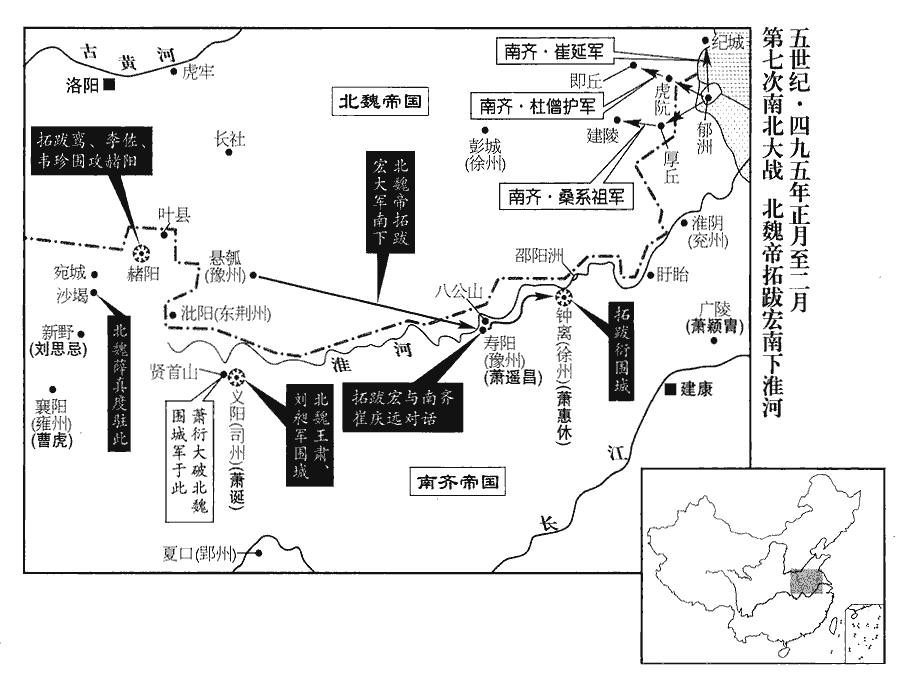
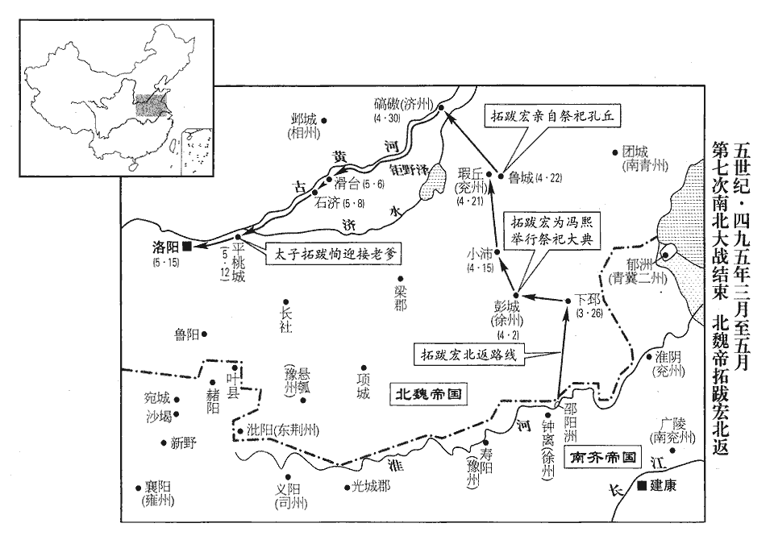
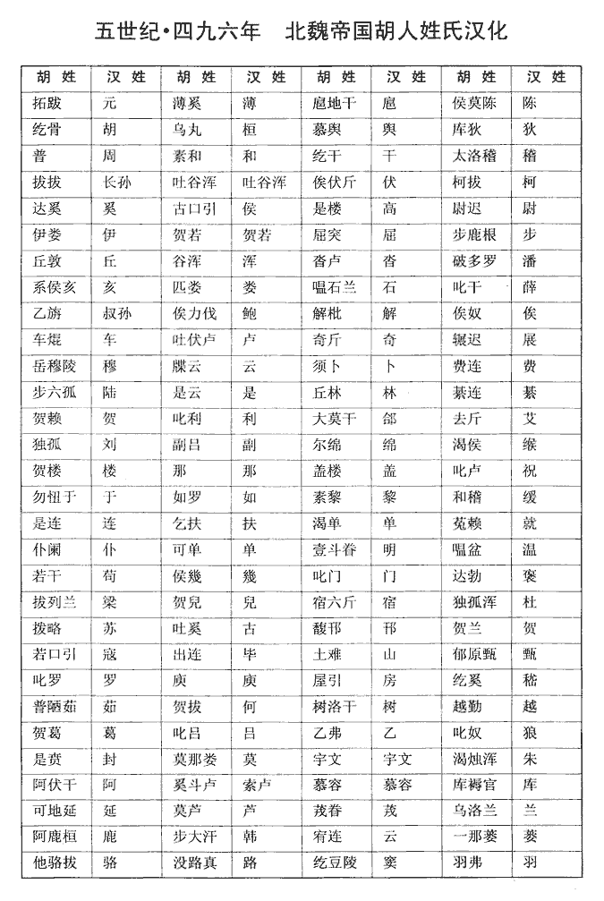
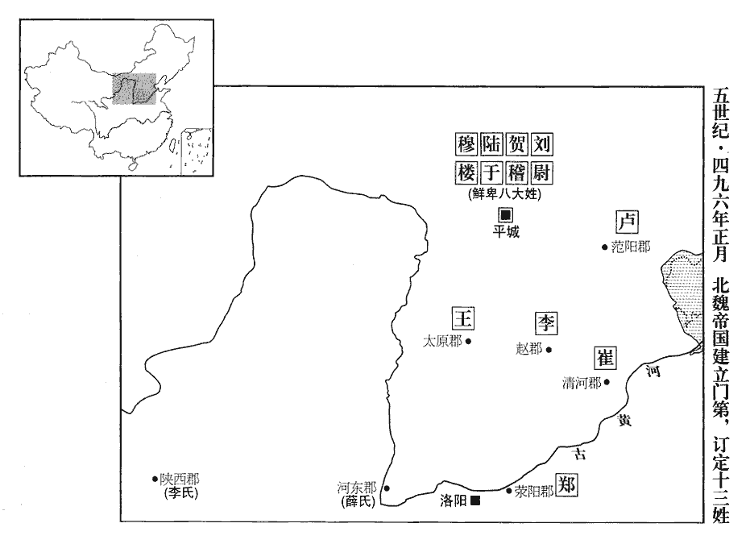
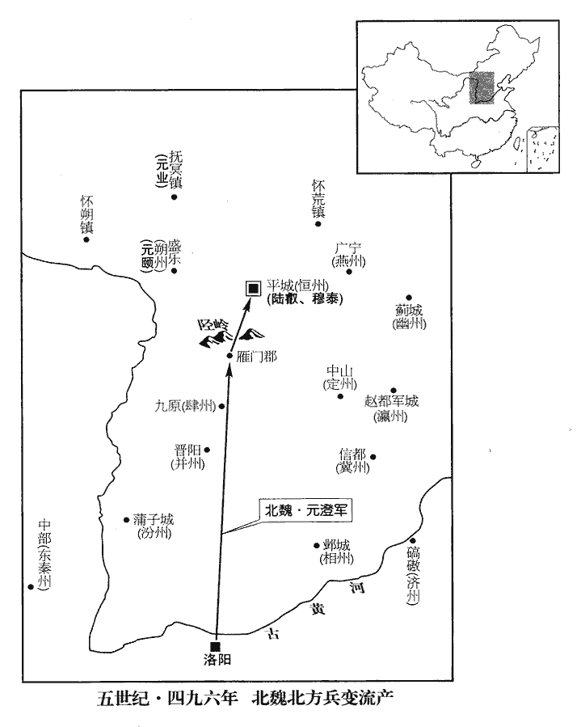

 齊紀六起旃蒙大淵獻（乙亥），盡柔兆困敦（丙子），凡二年。

# 高宗明皇帝中

## 建武二年（乙亥、四九五）

1春，正月，壬申‹二›，遣鎭南將軍王廣之督司州‹府设义阳河南省信阳市›、右衛將軍蕭坦之督徐州‹北徐州·州政府设钟离安徽省凤阳县东北临淮关›、尚書右僕射沈文季督豫州‹府设寿阳安徽省寿县›諸軍以拒魏。

〖译文〗 [1]春季，正月壬申（初二），南齐派遣镇南将军王广之、右卫将军萧坦之、尚书右仆射沈文季分别督率司州、徐州、豫州三地的军队，抵抗北魏的入侵。

癸酉‹三›，魏‹拓跋宏，本年二十九岁›詔︰「淮北之人不得侵掠，犯者以大辟論。」淮北時已屬魏，故詔不得侵掠其人。辟，毗亦翻。乙未‹二十五›，拓跋衍攻鍾離，徐州刺史蕭惠休乘城拒守，間出襲擊魏兵，破之。惠休，惠明之弟也。間，古莧翻。蕭惠明見一百三十三卷宋蒼梧王元徽二年。劉昶、王肅攻義陽，昶，知兩翻。司州刺史蕭誕拒之。肅屢破誕兵，招降萬餘人。降，戶江翻。魏以肅爲豫州‹府设悬瓠河南省汝南县›刺史。劉昶性褊躁，御軍嚴暴，褊，補典翻。躁，則到翻。人莫敢言。法曹行參軍北平陽固苦諫；昶怒，欲斬之，使當攻道。攻道，攻城之道，矢石之所集也。固志意閒雅，臨敵勇決，昶始奇之。

〖译文〗 癸酉（初三），北魏孝文帝颁发诏令：“不得抢劫掠夺淮河以北的居民，违犯者处以死刑。”乙未（二十五日），北魏拓跋衍率部进攻钟离，南齐徐州刺史萧惠休据城抗守，并且不时地派兵出城袭击北魏军队，终于将其击败。萧惠休是萧惠明的弟弟。北魏刘昶、王肃率军进攻义阳，遇到司州刺史萧诞的抵抗。王肃多次击败萧诞的军队，招纳降兵一万余人，因此北魏任命王肃为豫州刺史。刘昶性格暴躁，刚愎自用，对待下属官兵非常严酷残暴，部下都敢怒而不敢言。法曹行参军北平人阳固多次恳切地规劝刘昶，刘昶大怒，想杀掉阳固，便命令阳固做攻城先锋。阳固这个人平时性格优雅，风度悠闲，谁知临阵遇敌却表现的十分勇猛果敢，使刘昶感到非常惊奇。

丁酉‹二十七›，中外纂嚴。以太尉陳顯達爲使持節、都督西北討諸軍事，往來新亭‹建康城西南›、白下‹建康城北›以張聲勢。使，疏吏翻；下同。

〖译文〗 丁酉（二十七日），南齐举国上下戒备森严，严防以待。又派遣太尉陈显达为使持节、都督西北讨诸军事，来往巡视于新亭、白下一带，以壮大声势。

己亥‹二十九›，魏主濟淮；二月，至壽陽，衆號三十萬，鐵騎彌望。彌望，猶言極望也。孔穎達曰︰人目所望三十里，而天地合於三十里外，不復見之，是爲極望。騎，奇寄翻。甲辰‹五›，魏主登八公山，賦詩。道遇甚雨，命去蓋；去，羌呂翻。見軍士病者，親撫慰之。

〖译文〗 已亥（二十九日），北魏孝文帝率大军渡过淮河；二月，抵达寿阳，三十万大军浩浩荡荡，铁甲骑兵多的一眼望不到头。甲辰（初五），孝文帝登上八公山，乘兴而作诗。途中突然遇上倾盆大雨，孝文帝便命令去掉自己的伞盖，与兵士一起淋雨共苦。他看到军队中有生病的士兵，还亲自去安抚慰问。

 

魏主遣使呼城中人，豐城公遙昌使崔【章︰十二行本「崔」上有「參軍」二字；乙十一行本同；孔本同。】慶遠出應之。慶遠問師故，《左傳》︰齊桓公以諸侯之師伐楚，楚子使與師言曰︰「不虞君之涉吾地也，何故？」魏主曰︰「固當有故！卿欲我斥言之乎！斥，指也；直言以指人之罪過，無所回避，謂之斥。欲我含垢依違乎？」慶遠曰︰「未承來命，無所含垢。」《左傳》曰︰國君含垢。杜預《註》曰︰含垢，忍垢恥。魏主曰︰「齊主何故廢立？」慶遠曰︰「廢昏立明，古今非一，未審何疑？」魏主曰︰「武帝‹萧道成›子孫，今皆安在？」慶遠曰︰「七王同惡，已伏管、蔡之誅；子隆、子懋、子敬、子眞、子倫幷鬱林‹萧昭业›、海陵‹萧昭文›爲七王。其餘二十餘王，或內列清要，或外典方牧。」魏主曰︰「卿主若不忘忠義，何以不立近親，如周公‹姬旦›之輔成王‹姬诵›，而自取之乎？」慶遠曰︰「成王有亞聖之德，故周公得而相之。相，息亮翻。今近親皆非成王之比，故不可立。且霍光亦捨武帝‹刘彻›近親而立宣帝‹刘病已›，唯其賢也。」魏主曰︰「霍光何以不自立？」慶遠曰︰「非其類也。主上正可比宣帝，安得比霍光！若爾，武王‹姬发›伐紂‹子受辛›，不立微子‹子启›而輔之，亦爲苟貪天下乎？」史言崔慶遠之機辯。魏主大笑曰︰「朕來問罪。如卿之言，便可釋然。」慶遠曰︰「『見可而進，知難而退，』《左傳》載晉大夫隨武子之言。聖人之師也。」魏主曰︰「卿欲吾和親，爲不欲乎？」慶遠曰︰「和親則二國交歡，生民蒙福；否則二國交惡，生民塗炭。和親與否，裁自聖衷。」魏主賜慶遠酒殽、衣服而遣之。

〖译文〗 北魏孝文帝派人去传唤寿阳城中的南齐官员出来对话，丰城公萧遥昌便派崔庆远前去应对。见面，崔庆远先质问北魏出师来犯的理由，孝文帝回答说：“当然有原因。你想让我直接数落你们的罪过呢？还是顾及情面而含含糊糊地说呢？”崔庆远说：“我实在不明白你们的来意，所以还是直截了当地说吧！”孝文帝便问道：“你们君主为什么要连续废去两个皇帝而自立为君呢？”崔庆远答道：“废去昏君，另立明主，这种事情古今常见，并非只有我朝最近发生的这么一桩，所以不知道你对此又有何不理解之处呢？”孝文帝再反问道：“武帝的子孙们，现在都在哪儿？”崔庆远接着答道：“七位藩王乱国同罪，已经和周朝的管叔鲜和蔡叔度一样被杀掉了，其余的二十多位藩王，有的在朝廷中担任清要职位，有的在外面担任州郡长官。”孝文帝又问道：“你们现在的君主萧鸾如果没有忘掉忠义之德，为什么不从前帝近亲中选择一人立为新帝，如当年周公辅佐成王那样，而要自取皇位呢？”崔庆远回答：“周成王有亚圣的品德，所以周公立他为君而自己辅佐之。可是，如今本朝前帝近亲中没有能比得上周成王这样的人物，所以不能嗣立。况且，汉代霍光也曾经舍弃汉武帝的近亲而崐立汉宣帝刘询，只是因为他贤德呀。”孝文帝再逼问道：“那么，霍光为什么不自己登上皇位呢？”崔庆远再次答道：“因为霍光是外姓，不是皇族。本朝当今皇上正可比做汉宣帝刘询，怎么能拿他与霍光比呢？如果按照你说的那样，那么当年武王伐纣，没有立纣王庶兄微子为君而自己辅佐之，也就是贪求天下了吧？”孝文帝大笑着说道：“联前来本是问罪于你们，但是听了你刚才所讲的那些，心里也就明白了。”崔庆远说：“‘见可而进，知难而退’，这样就是圣人之师。”孝文帝又问道：“您希望与我和睦友好呢？还是不希望？”崔庆远回答说：“相睦友好则两国互相庆贺，人民大众承受好处。否则的话，两国关系恶化，互相交战，致使生灵涂炭，流离失所。能否和睦友好，完全由您来决定。”孝文帝赐赏崔庆远酒菜和衣服，送他回寿阳城。

戊申‹九›，魏主循淮而東，過壽陽不攻，引兵東下。民皆安堵，租運屬路。屬，之欲翻。此謂淮北之民耳。丙辰‹十七›，至鍾離。自壽陽至鍾離三百三十餘里。

〖译文〗 戊申（初九），北魏孝文帝放弃攻打寿阳城沿着淮河而东下，所到之处，百姓安居，无有扰犯，前来纳供粮草的民众络绎不绝，挤满道路。丙辰（十七日）孝文帝到了钟离。

上‹萧鸾，本年四十四岁›遣左衛將軍崔慧景、寧朔將軍裴叔業救鍾離。劉昶、王肅衆號二十萬，塹栅三重，塹，七豔翻。重，直龍翻。幷力攻義陽，城中負楯而立。攻城甚急，矢石交至，故負楯而立以自蔽。楯，食尹翻。王廣之引兵救義陽，去城百餘里，畏魏強，不敢進。城中益急，黃門侍郎蕭衍請先進，廣之分麾下精兵配之。衍間道夜發，間，古莧翻。與太子右率蕭誄等率，所律翻。右率，太子右衛率也。誄lěi，魯水翻。徑上賢首山‹河南省信阳市西南›，《水經註》︰溮水南出大潰山北，逕賢首山西，又北出，東南屈，逕義陽縣郡城南。上，時掌翻。去魏軍數里。魏人出不意，未測多少，不敢逼。少，詩沼翻。黎明，城中望見援軍至，蕭誕遣長史王伯瑜出攻魏栅，因風縱火，衍等衆軍自外擊之，魏不能支，解圍去。己未‹二十›，誕等追擊，破之。誄，諶之弟也。

〖译文〗 南齐明帝派遣左卫将军崔慧景、宁朔将军裴叔业去援救钟离。刘昶、王肃二人率领二十万大军。安营驻扎，在营盘周围挖掘树立三层堑沟栅栏，合力攻打义阳城，箭石齐发，使守城的南齐兵士不得不以盾牌来蔽身。王广之引兵来援救义阳，但是到了离义阳城百余里的地方，因畏惧北魏兵力之强，就不敢再向前开进了。城中频频告急，黄门侍郎萧衍请求先去增援，王广之把自己麾下的精兵分给他一部分，由他率领前去。萧衍抄小道连夜出发，与太子右率萧诔等人，径直登上贤首山，来到距北魏军队仅数里的地方。北魏军队没有料到这点，不知道萧衍一共有多少兵力，不敢逼近。黎明时分，义阳城中的守军望见援兵到了，士气大增。萧诞派遣长史王伯瑜出城攻进北魏阵营，借大风放火焚烧了周围的栅栏，而萧衍等率领的士兵则从外围合击之，北魏军队不能抵抗，只好撤退。己未（二十日），萧诞等率兵追击北魏军队，破敌获胜。萧诔是萧谌的弟弟。

先是，上‹萧鸾›以義陽危急，先，悉薦翻。詔都督青、冀二州‹青、冀二州州政府设郁洲江苏省连云港市东沉积小岛›諸軍事張沖出軍攻魏以分其兵勢。沖遣軍主桑係祖攻魏建陵‹江苏省新沂市›、驛馬‹江苏省沭阳县境›、厚丘‹江苏省沭阳县北›三城，又遣軍主杜僧護攻魏虎阬‹江苏省赣榆县西›、馮時、卽丘‹山东省临沂市南›三城，皆拔之。青、冀二州刺史王洪範遣軍主崔延襲魏紀城‹山东省日照市西南荻水村›，據之。宋泰始初，青、冀二州入于魏，乃置青、冀二州刺史，治朐山。杜佑曰︰宋明帝立青、冀二州，寄治贛榆；齊青州治朐山；冀州理漣口，今臨淮郡漣水縣。魏收《志》︰郯郡有建陵縣，漢古縣也。宋白曰︰厚丘故城，在海州沭陽縣北四十五里。又，東彭城郡龍沮縣有卽丘城。卽丘亦漢縣，本屬琅邪郡。賢曰︰卽丘，卽《左傳》之祝丘，故城在今沂州臨沂縣東南。紀城，春秋之紀鄣故城也。杜預曰︰東海贛榆縣東北有故紀城。

〖译文〗 早先，因为义阳情况危急，明帝特诏令都督青、冀两州诸军事张冲出兵攻打北魏本国，从而分散其兵力。张冲派遣军主桑系祖去攻打北魏的建陵、驿马、厚丘三城，又派遣军主杜僧护去攻打北魏的虎勣、冯时、即丘三城，都攻破占领了。青州和冀州刺史王洪范派遣军主崔延袭击北魏的纪城，也占领了。

魏主欲南臨江水，辛酉‹二十二›，發鍾離。司徒長樂元懿公馮誕病，不能從，樂，音洛。從，才用翻。魏主與之泣訣，行五十里，聞誕卒‹年二十九岁›。時崔慧景等軍去魏主營不過百里，魏主輕將數千人夜還鍾離，將，卽亮翻。拊尸而哭，達旦，聲淚不絕。壬戌‹二十三›，敕諸軍罷臨江之行，葬誕依晉齊獻王故事。齊獻王攸葬事，見八十一卷晉武帝太康四年。誕與帝同年，幼同硯席，尚帝妹樂安長公主。長，知兩翻。雖無學術，而資性淳篤，故特有寵。丁卯‹二十八›，魏主遣使臨江，數上罪惡。使，疏吏翻。數，所具翻。

〖译文〗 北魏孝文帝要南去观看长江，辛酉（二十二日），从钟离出发，司徒长乐元懿公冯诞因重病在身，不能随驾前往，孝文帝特意去看他，流泪与他诀别，出发后走了约五十里，传来冯诞的死讯，这时崔慧景等路兵马离孝文帝的营地不过百里，孝文帝轻装率领数千人马连夜赶回钟离。见到冯诞的尸体之后，孝文帝拊尸嚎啕大哭，一直哭到天亮，还声泪不绝，悲痛万分。壬戌（二十三日），孝文帝命令各路兵马停止长江之行，依照晋代安葬齐献王的礼仪安葬了冯诞。冯诞与孝文帝同年而生，小时候两人在一起读书，娶孝文帝的妹妹乐安长公主为妻，他虽然没有多少学术才干，但是品性忠厚质朴，所以特别受到孝文帝的宠爱。丁卯（二十八日），孝文帝派遣使节到达江边，向南齐守将数说了明帝废帝自立、杀戮诸王的罪恶。

魏久攻鍾離不克，士卒多死。三月，戊寅‹九›，魏主如邵陽‹在今安徽省凤阳县东北淮河中›，築城於洲上，邵陽洲在鍾離城北淮水中。栅斷水路，夾築二城。旣築城於洲上，又於淮水南北兩岸夾築二城，樹栅水中，以斷援兵之路。斷，丁管翻；下先斷、邀斷、欲斷同。蕭坦之遣軍主裴叔業攻二城，拔之。魏主欲築城置戍於淮南，以撫新附之民，賜相州‹府设邺城河北省临漳县西南邺镇›刺史高閭璽書，具論其狀。相，息亮翻。璽，斯氏翻。閭上表，以爲︰「《兵法》『十則圍之，五則攻之。』《孫子兵法》有是言。曏者國家止爲受降之計，謂欲受曹虎降也。降，戶江翻；下同。發兵不多，東西遼闊，難以成功；今又欲置戍淮南，招撫新附。昔世祖‹拓跋焘›以回山倒海之威，步騎數十萬，南臨瓜步‹江苏省六合县南长江渡口›，諸郡盡降，而盱眙‹江苏省盱眙县›小城，攻之不克。事見一百二十五卷宋文帝元嘉二十七年。騎，奇寄翻。盱眙，音吁怡。班師之日，兵不戍一城，土不闢一廛chán。《說文》曰︰廛，一畝半，一家之居地。夫豈無人？以爲大鎭未平，宋時淮上以壽陽、廣陵爲大鎭。不可守小故也。夫壅水者先塞其原，塞，悉則翻。伐木者先斷其本；本原尚在而攻其末流，終無益也。壽陽、盱眙、淮陰‹江苏省淮阴市›，淮南之本原也；壽陽、盱眙、淮陰皆淮津之要地，齊皆以重兵守之，故云本原。三鎭不克其一，而留守孤城，其不能自全明矣。敵之大鎭逼其外，長淮隔其內；少置兵則不足以自固，少，詩沼翻。多置兵則糧運難通。大軍旣還，士心孤怯；夏水盛漲，救援甚難。以新擊舊，以勞禦逸，久於屯戍，魏師已老，齊以生兵攻之，是之謂以新擊舊。魏以孤軍守孤城，勞於備禦；齊師迭出而攻之，士有餘力，是之謂以勞禦逸。若果如此，必爲敵擒，雖忠勇奮發，終何益哉！言將士效死弗去，而城破身沒，雖忠勇奮發而無益於國事。且安土戀本，人之常情。昔彭城之役，旣克大鎭，城戍已定，而不服思叛者猶踰數萬。宋明帝泰始二年，魏得彭城，至高帝建元之初，淮北之民猶不樂屬魏，思歸江南，遂有五固之役。角城‹江苏省淮阴市西›蕞爾，蕞，徂外翻，小貌。處在淮北，處，昌呂翻。去淮陽十八里。五固之役，攻圍歷時，卒不能克。事見一百三十五卷高帝建元三年。卒，子恤翻。以今準昔，事兼數倍。天時尚熱，「尚」，當作「向」。雨水方降，願陛下踵世祖之成規，旋轅返旆，經營洛邑，蓄力觀釁，釁，許覲翻。布德行化，中國旣和，遠人自服矣。」尚書令陸叡上表，以爲︰「長江浩蕩，彼之巨防。又南土昏霧，暑氣鬱蒸，師人經夏，必多疾病。而遷鼎草創，武王遷九鼎于洛邑，故引以爲言。庶事甫爾，臺省無論政之館，府寺靡聽治之所，治，直吏翻。百僚居止，事等行路，沈雨炎陽，自成癘疫。沈，與霃chén同，持林翻。《說文》︰久陰曰霃。炎陽，炎日也。且兵傜並舉，聖王所難。今介冑之士，外攻寇讎，羸弱之夫，內勤土木，運給之費，日損千金。驅罷弊之兵，討堅城之虜，將何以取勝乎！羸，倫爲翻。罷，讀與疲同。陛下去冬之舉，正欲曜武江、漢耳；今自春幾夏，幾，居希翻，近也。理宜釋甲。願早還洛邑，使根本深固，聖懷無內顧之憂，兆民休斤板之役，斤，謂斧斤之役。板，謂板築之役。然後命將出師，將，卽亮翻；下同。何憂不服。」魏主納其言。

〖译文〗 北魏军队久攻钟离而不能取胜，军中兵卒伤亡惨重。三月戊寅（初九），北魏孝文帝到达邵阳，在淮河中的洲岛上修筑城堡，又在南北两岸修筑了城堡，并且在河水中树立栅栏，以断绝南齐援兵之路。萧坦之派遣军主裴叔业攻打北魏新筑建的这两座城垒，都攻破摧毁。北魏孝文帝又想在淮河南边修筑城堡，置兵戍守，以便安抚新近归顺北魏的该地百姓。为此，孝文帝特意赐赏相州刺史高闾一封盖有玉玺印记的信，信中详细地讲述了自己对此事的看法。高闾看过孝文帝的信之后，也上表谈了自己的观点，其中说道：“《孙子兵法》中讲：‘如果有十倍于敌人的兵力就可以包围他，如果有五倍于敌人的兵力就可以进攻他。’起初朝廷仅仅从接受曹虎投降这一点来计划安排，所以出兵数量不多，然而东西战线拉得很长，故难以取得成功。如今，您又想在淮河南边筑城置守，以便招抚新归顺的百姓。过去，世祖皇帝以排山倒海之威势，率领步、骑兵数十万，南下瓜步，各州郡全都投降，然而唯有盱眙这个小城，却久攻不下。最后班师回朝，没有留下兵马守护任何一座城市，也没有开辟一亩土地，难道是没有人力吗？不是！只是因为那些重镇要地还没有夺取到手，所以不急于镇守那些不重要的小地方。堵水要先塞住水源，伐木要先断其根本，如果本源尚在而只攻其末流，到底也不会有什么成效的。寿阳、盱眙、淮阴三个地方，是淮河之南的重镇要地，如果不攻克其中之一处，而要留守别的孤城，这很明显是不可能保全的事情。在外围有敌人据要冲之地而相逼，而淮河又隔断了我们和北方内地的联系，配置的兵力少了不足以自守，而兵力多了则粮食物品等又难以运到。再说，大部队回去之后，留下来守城的兵士们一定会感到孤单、胆怯。而且，夏天河水盛涨，救援起来是非常难的。这样，齐朝一定会派兵攻打的，我方久守该城，齐朝发兵攻取，这就是以新击旧；我方以孤军守孤城，劳于防御，齐朝派兵轮番来攻，士气强盛，这就是以劳御逸。如果情况真的如此的话，那么最后的结果一定会是城被攻破，守兵被擒捉，就是将士们忠勇奋发，拼死而一战，也免不了城破身亡的结局，这是无益于国事的。况且，安土恋本乃是人之常情。过去，彭城之战我方获胜，夺得了这座重镇之城，并且也得以稳固地戌守住了，可是后来淮北那些不乐意归附我朝而思念归属江南的民众还竞有数万人之多。角城不过弹丸之地，况且还处于淮北，离淮阳不过十八里远近。可是五固之战，我们围攻了那么长时间，最终仍不能攻克。今昔对比一下，现在要在淮南筑城戍守，其难度要超出过去好几倍？现在天气才开始转暖，雨季正要到来，盼望陛下象过去世祖皇帝做的那样，调转车辕，班师回朝，先经营好都城洛阳，蓄积力量，静观机会，广布仁德，施行教化，国内安定平和了，国外的人自然会信服而归附的。”尚书令陆睿也上表孝文帝，指出：“长江奔腾浩荡，天险要堑，是齐朝的防守要地。同时，江南之地淫雨多雾，暑气郁盛，蒸热如笼，我们的军队在此过夏，一定会发生疾病。而且，我们又刚刚迁都不久，尚处于草创阶段，营建之事刚刚开始，朝廷中枢机构还没有议事之处，下面的部门也没有办公场所，文武百官虽说已经住下来了，但实际情况与行路露宿没有什么区别，雨淋日晒，时间久了，难免发生瘟疫。再者，既要出兵打仗，又要招募民夫营造洛阳新都，如此兵徭并举，就是圣王也难以两者兼顾。如今，军队在外面攻敌作战，羸弱的民夫们在洛阳劳辛于土木之建，在外军队的后勤给养，每日耗损千金以上。如此，驱使疲惫之兵，攻打据守着坚城的敌人，将以什么来取胜呢？陛下去年冬天的那次行动，正是想要炫耀武力于江、汉之地，今年从春到崐夏这段时间，就理应罢兵休整一下。所以，希望能早日撤兵返回洛阳，先把基础打好，做到本强根固，使圣上心中没有内顾之忧，亦等待百姓完成了筑建洛阳城的劳役，然后再遣兵调将，出师征伐，所到之处，何愁不能征服呢？”孝文帝采纳了他们两人的建议。

崔慧景以魏人城邵陽，患之。張欣泰曰︰「彼有去志，所以築城者，外自誇大，懼我躡其後耳。今若說之以兩願罷兵，說，輸芮翻。彼無不聽矣。」慧景從之，使欣泰詣城下語魏人，語，牛倨翻。魏主乃還。

〖译文〗 南齐的崔慧景见北魏修筑邵阳城，心中非常忧虑。张欣泰告诉他说：“北魏实际上有撤退的想法，之所以还修筑邵阳城，只不过是在外表上夸大其强罢了，目的是害怕我们随后追击他们。现在如果派人去游说，提出两厢情愿罢兵休战的建议，他们不会不听从的。”崔慧景听从了这一主意，派遣张欣泰到邵阳城下与北魏交涉谈判，建议双方休兵，取得了一致协议，于是孝文帝撤兵返回本国。

濟淮；餘五將未濟，齊人據渚邀斷津路。斷，丁管翻；下同。魏主募能破中渚兵者以爲直閤將軍，軍主代人奚康生應募，據《北史》︰康生本姓達奚，魏孝文改複姓，於是姓奚。縛筏積柴，因風縱火，燒齊船艦，艦，戶黯翻。依煙直進，飛刀亂斫，中渚兵遂潰。魏主假康生直閤將軍。

〖译文〗 北魏撤退途中渡淮河之时，还有五个将领没有渡过河，南齐军队突然占据了河中之洲，断绝了水路，使得余下的北魏兵将无法渡河。北魏孝文帝发令谁能击败河洲上的南齐兵，就封谁为直閤将军，担任军主的代京人奚康生应募而出，他缚扎一些木筏子，上面堆满柴草，顺风纵火，一起烧向南齐的船舰，后面紧跟而进的兵士们借烟火掩护，挥刀乱砍，拼命杀向敌人，河洲上的南齐兵抵抗不住，遂纷纷溃逃。孝文帝给奚康生直閤将军的名号。

魏主使前將軍楊播將步卒三千、騎五百爲殿。將步，卽亮翻。騎，奇寄翻；下同。殿，丁練翻；斷後曰殿。時春水方長，齊兵大至，戰艦塞川。播結陳於南岸以禦之，長，知兩翻。艦，戶黯翻。塞，悉則翻。陳，讀曰陣；下爲陳同。諸軍盡濟。齊兵四集圍播，播爲圓陳以禦之，身自搏戰，所殺甚衆。相拒再宿，軍中食盡，圍兵愈急。魏主在北岸望之，以水盛不能救，旣而水稍減，播引精騎三百歷齊艦大呼曰︰呼，火故翻。「我今欲渡，能戰者來。」遂擁衆而濟。播，椿之兄也。楊椿見一百三十七卷武帝永明八年。

〖译文〗 北魏孝文帝命令前将军杨播率领步兵三千、骑兵五百殿后。当时，正是春水方涨之际，南齐军队大批赶来，战船密布，挤塞河中。杨播在淮河南岸布下阵势抵抗南齐军队，终于使没有渡河的北魏军队全部渡了过去。南齐军队从四面把杨播团团围住，杨播布出圆阵与之展开搏斗，他自己亲自搏战，所杀敌兵众多难计。一直抵抗到第三天，军中的食物已经吃光，而南齐围兵攻打得更厉害了。孝文帝站在淮河北岸观望，但是由于河水太急而不能派兵去相救。过一会儿，水势稍稍减弱，杨播带领精骑三百登上南齐停在河中的战船，对南齐围兵大声呼喊道：“我现在要渡河，有敢斗能战者请上来。”于是率领众兵渡过淮河。杨播是杨椿的哥哥。

魏軍旣退，邵陽洲上餘兵萬人，求輸馬五百匹，假道以歸。崔慧景欲斷路攻之，張欣泰曰︰「歸師勿遏，古人畏之，《兵法》︰歸師勿遏，窮寇勿追。兵在死地，不可輕也。今勝之不足爲武，不勝徒喪前功；喪，息浪翻。不如許之。」慧景從之。蕭坦之還，言於上曰︰「邵陽洲有死賊萬人，慧景、欣泰縱而不取。」由是皆不加賞。甲申‹十五›，解嚴。魏師已退，故解嚴。

〖译文〗 北魏军队撤退之后，在邵阳洲上还余留有一万兵马，他们向南齐崔慧景请求给五百匹马，并且要求借道返归。崔慧景想断其归路而攻打这些北魏余兵，但是张欣泰不同意，他说：“不要阻挡往回撤的军队，这一点古人也非常忌讳，因为那些将士们置身于死地，如果去追击，他们一定要以死相拼的，所以不可以轻视。现在，我们去追击他们，即使取胜了也不足以说明我们善战；万一不能获胜，则白白地丧失了前面的功劳。所以，不如答应他们，让他们撤回去。”崔慧景听从了张欣泰的建议。萧坦之回朝以后，告诉明帝说：“邵阳洲有被困的敌兵一万人，但是崔慧景和张欣泰二人听任他们逃走而不去追击。”因此，崔、张二人都没有得到朝廷的赏赐。甲申（十五日），由于北魏军队已经撤退，所以南齐解除戒严。

初，上聞魏主欲飲馬於江，懼，敕廣陵‹江苏省扬州市›太守行南兗州‹府广陵›事蕭穎冑移居民入城，民驚恐，欲席卷南渡。卷，讀曰捲。穎冑以魏寇尚遠，不卽施行，魏兵竟不至。穎冑，太祖之從子也。蕭穎冑，太祖從弟赤斧之子。從，才用翻。

〖译文〗 原先，明帝听说北魏孝文帝要一直攻打到长江边上，饮马于长江，非常害怕，特命令主管南兖州事务的广陵太守萧颖胄把居民都移入城内，居民们因此惊恐万分，纷纷打算收拾家产渡江南逃。萧颖胄认为北魏军队离得还很远，就没有立即执行齐明帝的旨令，后来北魏军队没有到达那里。萧颖胄是高帝的侄子。

上遣尚書左【章︰十二本「左」作「右」；乙十一行本同。】僕射沈文季助豐城公遙昌守壽陽。是年春正月，遣沈文季督豫州諸軍。豫州治壽陽。文季入城，止游兵不聽出，洞開城門，嚴加守備。魏兵尋退。

〖译文〗 明帝派遣尚书左仆射沈文季去帮助丰城公萧遥昌防守寿阳城。沈文季到达寿阳城之后，禁止游兵随便出城，洞开城门，严加守备，北魏军队很快就撤退了。

魏之入寇也，盧昶等猶在建康，海陵王‹萧昭文›卽位，魏遣昶來聘，昶至建康而帝‹萧鸾›已立。齊人恨之，飼以蒸豆。飼，祥吏翻。馬牛待之。昶怖懼，食之，怖，普布翻。淚汗交橫。謁者張思寧辭氣不屈，死於館下。及還，魏主讓昶曰︰「人誰不死，何至自同牛馬，屈身辱國！縱不遠慙蘇武，蘇武使匈奴，十九年不屈節。獨不近愧思寧乎！」乃黜爲民。

〖译文〗 北魏入侵南齐时，派去祝贺海陵王即位的使节卢昶等人还在南齐的建康，南齐人非常仇恨他们，因此就象喂牛马一样地把豆子蒸熟让他们吃。卢昶十分恐惧，就吃了，由于害怕和受辱，所以汗泪交流。但是，谒者张思宁却义正辞严地加以拒绝，宁死而不受屈辱，最后死在所住的客馆之中。回到北魏之后，孝文帝责备卢昶说：“人谁没有一死？为何如此贪生怕死到了把自己等同于牛马的地步？你屈身辱国，即使不远愧于当年曾出使匈奴十九年而不屈节的苏武，难道同眼前的张思宁比较一下还不感到自羞吗？”于是，革除了卢昶的官职，贬为平民。

2戊子‹十九›，魏太師京兆武公馮熙卒于平城。

〖译文〗 [2]戊子（十九日），北魏太师京兆武公冯熙在平城去世。

3乙未‹二十六›，魏主如下邳‹江苏省睢宁县北古邳镇›；夏，四月，庚子‹二›，如彭城；辛丑‹三›，爲馮熙舉哀。爲，于僞翻。太傅、錄尚書事平陽公丕不樂南遷，樂，音洛。與陸叡表請魏主還臨熙葬。丕、叡時留守平城。帝曰︰「開闢以來，安有天子遠奔舅喪者乎！今經始洛邑，經，度之也。始，初也。《詩》云︰經始靈臺。豈宜妄相誘引，陷君不義！令、僕以下，可付法官貶之。」此平城留臺令、僕也。法官，謂御史。誘，音酉。仍詔迎熙及博陵長公主之柩，長，知兩翻。柩，巨救翻。南葬洛陽，禮如晉安平獻王故事。晉安平王孚葬，見七十九卷武帝泰始八年。魏之葬熙，其禮又加於誕。

〖译文〗 [3]乙未（二十六日），北魏孝文帝到达下邳；夏季，四月庚子（初二），到达彭城；辛丑（初三），为冯熙举行哀悼仪式。由于太傅、录尚书事平阳公拓跋丕不乐意南迁洛阳，所以与陆睿一起上表请求孝文帝返回平城参加冯熙的葬礼。孝文帝不同意，对他们说：“自从开天辟地以来，那里有天子老远地赶去给舅舅送葬的事呢？如今刚刚开始营建洛阳，你们岂可以妄自以此事诱引朕，陷朕于不义呢？凡是平城留守令、仆以下的官员，统统交付御史贬斥。”孝文帝没有采纳拓跋丕和陆睿的建议，仍然发出诏令，迎接冯熙以及博陵长公主的灵柩南下，安葬于洛阳，葬礼依照晋代安葬安平献王司马孚的礼仪而进行。

4魏主之在鍾離，仇池‹骆谷城·甘肃省西和县南›鎭都大將、梁州‹府骆谷城›刺史拓跋英請以州兵會劉藻擊漢中‹南郑·陕西省汉中市›，去年十一月，魏遣劉藻向南鄭。魏梁州刺史治仇池，齊梁州刺史治南鄭。將，卽亮翻；下同。魏主許之。梁州‹府南郑›刺史蕭懿遣部將尹紹祖、梁季羣等將兵二萬，據險，立五栅以拒之。據蕭子顯《齊書》，時據角弩谷、白馬、沮水立五栅。英曰︰「彼帥賤，莫相統壹。帥，所類翻。我選精卒幷攻一營，彼必不相救；若克一營，四營皆走矣。」乃引兵急攻一營，拔之，四營俱潰，生擒梁季羣，斬三千餘級，俘七百餘人，乘勝長驅，進逼南鄭。懿又遣其將姜脩擊英，英掩擊，盡獲之。將還，懿別軍繼至；將士皆已疲，不意其至，大懼，欲走。英故緩轡徐行，神色自若，登高望敵，東西指麾，狀若處分，處，昌呂翻。然後整列而前。懿軍疑有伏兵，遷延引退，英追擊，破之，遂圍南鄭。禁將士毋得侵暴，遠近悅附，爭供租運。懿嬰城自守，軍主范絜先將三千餘人在外，還救南鄭，英掩擊，盡獲之。圍城數十日，城中恟懼。將，卽亮翻。恟，許拱翻。錄事參軍新野‹河南省新野县›庾域封題空倉數十，指示將士曰︰「此中粟皆滿，足支二年，但努力固守！」衆心乃安。會魏主召兵還，英使老弱先行，自將精兵爲後拒，殿軍後以拒追兵曰後拒。遣使與懿告別。使，疏吏翻。懿以爲詐，英去一日，猶不開門；二日，乃遣將追之。英與士卒下馬交戰，懿兵不敢逼，行四日四夜，懿兵乃返。英入斜谷‹陕西省太白县›，會天大雨，士卒截竹貯米，執炬火於馬上炊之。貯，丁呂翻。先是，懿遣人誘說仇池諸氐，使起兵斷英運道及歸路。英勒兵奮擊，且戰且前，矢中英頰，卒全軍還仇池，英乘勝深入，後無繼援，雖僅獲全軍而返，亦已危矣。先，悉薦翻。說，輸芮翻。斷，丁管翻。中，竹仲翻。卒，子恤翻。討叛氐，平之。英，楨之子；南安王楨，見一百三十八卷武帝永明十一年。懿，衍之兄也。

〖译文〗 [4]北魏孝文帝在钟离之时，仇池镇都大将、梁州刺史拓跋英请求率领州兵会同刘藻一起去袭击汉中，孝文帝准许了他的请求。南齐梁州刺史萧懿派遣部下将领尹绍祖、梁季群等率领两万兵马，占据险要之处，构筑了五座营栅，来抵抗北魏军队的进犯。拓跋英对部下说：“他们的主帅出身低贱，不能统一协调作战，我如果挑选精兵集中力量攻打他们的一个营垒，其他的一定不会来援救。如果攻克一个营垒，其余四个就都会不战而逃。”于是，率领强悍之兵对一个营垒发起了急攻，一举而攻克，其他四营见状，纷纷溃逃，结果北魏军队生擒了梁季群，斩敌三千余名，俘虏七百余人，乘胜追击，长驱直入，逼近南郑。萧懿又派遣部将姜修去抗击拓跋英，拓跋英以伏兵攻其不意，结果把姜修及其部属全部擒获。拓跋英率部返回之时，萧懿手下的其他军队相继赶到，由于拓跋英部下的将士已经十分疲惫，根本没有料到萧懿的人马会追逼上来，所以非常惧怕，就准备逃跑。但是，拓跋英却不为所惧，他神色不慌，镇定自若，故意骑马缓行，登上高处了望敌情，东指指，西划划，做出一副指挥部署的样子，然后整理好部队，列队前行。萧懿的军队见此情形，怀疑拓跋英设有伏兵，犹豫不进，并且掉头回撤，拓跋英见敌方中计，马上下令追击，破敌获胜，于是围困了南崐郑。拓跋英禁令部下将士不得侵犯、掠夺当地百姓，所以周围的老百姓纷纷投附，争着纳供粮草。萧懿据城固守。这时，萧懿属下的军主范絜先正率领三千多兵马在外面，赶回来援救南郑，被拓跋英以伏兵截击，全部被擒俘。南郑城被围困数十日，城中一片慌恐。录事参军新野人庚域把已经空了的数十个粮仓贴上封条，并且指给将士们看，对他们说：“这些仓中都装满了粮食，足够支用两年，只管努力固守。”这样，军心才得到安定。这时，北魏孝文帝却命令拓跋英撤兵返回，拓跋英安排军中老弱病伤先头而行，自己率领精壮兵力殿后，以便抵挡南齐追兵，并且派使者去向萧懿告别。萧懿以为拓跋英在使诡诈之计，所以拓跋英撤走一天了，他还不敢打开城门。到了第二天，萧懿才派遣部将去追击，拓跋英与将士们一起下马交战，吓得萧懿的追兵不敢逼近，就这样尾随了拓跋英四天四夜，才不得不返撤。拓跋英率领部队进入斜谷，恰遇天降大雨，将士们斩截竹子，把米装在竹筒之中，骑在马上手拿着火把烧烤竹筒，做成米饭。这以前，萧懿派人去诱说仇池的各支氐族部落，让他们起兵截断拓跋英运送粮草的道路和后撤时所经之道。由于归路被氐人所堵，拓跋英统率部下奋力反击，边战边进，氐人发箭射中了拓跋英的面颊，但是他带伤指挥，终于率领全军回到仇池，并且讨伐平定了反叛的氐族部落。拓跋英是拓跋祯的儿子，萧懿是萧衍的哥哥。

英之攻南鄭也，魏主詔雍‹府设长安陕西省西安市›、涇‹府设安定甘肃省泾川县›、岐‹府设雍城陕西省凤翔县›三州發兵六千人戍南鄭，魏雍州治長安，領京兆、馮翊、扶風、咸陽、北地等郡。太和中，置涇州，治臨涇城，領安定、隴東、新平、平涼、平原等郡。十一年，置岐州，治雍城鎭，領平秦、武功、武都郡。雍，於用翻。俟克城則遣之。侍中兼左僕射李沖表諫曰︰「秦川險阨，地接羌、夷。自西师出後，餉援連續，加氐、胡叛逆，所在奔命，運糧擐甲，迄茲未已。今復豫差戍卒，復，扶又翻。差，初皆翻；下差遣同。懸擬山外‹秦岭南麓›，漢中之地在關中南山之南，故曰山外。雖加優復，復，方目翻。恐猶驚駭。脫終攻不克，徒動民情，連胡結夷，事或難測。輒依旨密下刺史，待軍克鄭城，下，戶嫁翻。鄭城，謂南鄭城。然後差遣。如臣愚見，猶謂未足。何者？西道險阨，單徑千里，謂褒斜之道也。今欲深戍絕界之外，孤據羣賊之中，敵攻不可猝援，食盡不可運糧。古人有言，『雖鞭之長，不及馬腹。』《左傳》晉伯宗之言。南鄭於國，實爲馬腹也。且魏境所掩，九州過八；此指《禹貢》九州爲言。民人所臣，十分而九；所未民者，唯漠北之與江外耳。漠北，謂柔然；江外，謂齊。言唯此二國未爲魏民。羈之在近，謂以繩羈係其君而致之；在近，言不遠也。豈汲汲於今日也！宜待疆宇旣廣，糧食旣足，然後置邦樹將，樹，立也。將，帥也。將，卽亮翻。爲吞倂之舉。今壽陽、鍾離，密邇未拔；赭城‹河南省方城县›、新野，跬步弗降。赭城，卽赭陽城也。降，戶江翻。東道旣未可以近力守，西藩寧可以遠兵固！李沖蓋謂淮漢之地爲東道，謂南鄭爲西藩。若果欲置者，臣恐終以資敵也。又，建都土中，洛陽爲土中。地接寇壤，方須大收死士，平蕩江會，建康爲江南都會之地，故曰江會。若輕遣單寡，棄令陷沒，恐後舉之日，衆以留守致懼，求其死效，未易可獲。易，以豉翻。推此而論，不戍爲上。」魏主從之。

〖译文〗 拓跋英攻打南郑之时，北魏孝文帝诏令雍、泾、岐三州发兵六千人准备去戍守南郑，等待拓跋英攻下南郑就派他们出发前去。但是，侍中兼左仆射李冲上表孝文帝，劝谏说：“秦川一带地理形势险恶，并且和羌、夷部族接境。自从拓跋英所率西征之军出发之后，连接不断地给其部运送军饷，十分不易，再加上氐、胡部落反叛，所以左右受敌，疲于奔命，形势非常严峻，而后方为他们运送粮草的武装士兵，至今还忙个不停。如今，又准备差派戍守南郑的兵卒，预先设想秦岭山那边的情况，虽然到时对他们加以优厚待遇，但恐怕他们还是要担惊受怕的。万一最终不能攻克南郑，那么就会使当地民情产生动摇，使他们与胡、夷部族连结起来，串通一气，这样的话事情就难以预测了。所以，即使依照圣旨秘密命令这三州的刺史，等待我军攻克南郑城之后，再派遣戍守人员出发，但是依我之愚见，这样也不见得妥当。何以见得呢？因为西边的道路险恶万分，只能单车行走的路就有千里之遥，如今想要深入敌境，周围没有援助力量，陷于群敌包围之中，而孤据独守一座南郑城，敌人发起进攻我们不可以马上增援，粮食吃尽了不可以立即补给。古人说：‘鞭子虽然长，但抽不到马肚子上去。’南郑对于我们而言，恰恰就是马肚子呀。况且，我们魏国所占的疆域，天下九州已超过了八个；已经臣服于我们的民众，达到了十分之九，还没有归顺于我朝的百姓，仅仅剩下大漠之北的柔然国和长江以南的齐国了，而且很快就可以征服的，所以又何必性急地现在就要占取南郑呢？应该等待我们的疆域拓展得更广，粮食准备得更加充足了，然后再遣兵派将，举而吞并之。如今，寿阳、钟离两地离得很近却还没有夺取过来，赭城、新野两地也不过半步之近却也没有占取。东边淮、汉一带离得近但还不能完全守得住，西边南郑隔得那么远又怎么可能派兵固守得住呢？如果一定要置兵戌守南郑，我认为最终会被敌方所破，戍兵尽俘，这岂不成了资助敌人吗？再者，我们迁都洛阳，而洛阳又与齐朝接壤靠近，正应该大量招募敢死勇士，以平荡齐朝都会建康，如果现在轻率地派遣孤单的一支人马去戍守南郑，致使城陷之后全部覆没，恐怕以后再派人去戍守之时，众人要心存畏惧，担心留守不住，而朝廷要求他们以死相效，恐怕不能轻易办到了。根据上述种种情况，我认为不派兵戍守南郑为上策。”孝文帝采纳了李冲的建议。

5癸丑‹十五›，魏主如小沛‹江苏省沛县›；己未‹二十一›，如瑕丘‹山东省兖州市›；庚申‹二十二›，如魯城‹山东省曲阜市›，魏收《地形志》︰魯郡，魯縣之魯城。親祠孔子；辛酉‹二十三›，拜孔氏四人、顏氏二人官，仍選諸孔宗子一人封崇聖侯，奉孔子祀，命兗州‹府设瑕丘›脩孔子墓，大宗之子爲宗子。孔子墓亦在魯縣。更建碑銘。戊辰‹三十›，魏主如碻qiāo磝‹山东省茌平县西南›，命謁者僕射成淹具舟楫，欲自泗入河，泝流還洛，淹諫，以爲︰「河流悍猛，非萬乘所宜乘。」泝，蘇故翻。悍，侯旰翻，又下罕翻。萬乘，繩證翻。帝曰︰「我以平城無漕運之路，故京邑民貧。今遷都洛陽，欲通四方之運，而民猶憚河流之險；故朕有此行，所以開百姓之心也。」

〖译文〗 [5]癸丑（十五日），北魏孝文帝到达小沛；已未（二十一日），到达瑕丘；庚申（二十二日），到达鲁城，并且亲自去孔子庙祭祀；辛酉（二十三日），封孔子后代四人、颜渊后代两人官职，并且选择孔子的嫡系后代长子一人封为崇圣侯，奉掌祭祀孔子之务，又命令兖州修缮孔子的墓，重建碑铭。戊辰（三十日），北魏孝文帝到达碻磝，命令谒者仆射成淹准备舟船，想乘船从泗水进入黄河，溯流而上，返回洛阳。成淹劝谏孝文帝不要从水路返洛阳，说：“黄河水流湍急，容易出险，万乘之君不宜乘船通行。”孝文帝坚持己见，说：“我以为平城没有大河，漕运之路不通，所以京城的百姓贫穷。如今迁都洛阳，准备开通四方水路运输，但是百姓们犹害怕黄河水流之险。所以，朕才准备有溯黄河而上返回洛阳之行，以此打消百姓心中的种种顾虑。”

 

6魏城陽王鸞等攻赭陽。諸將不相統壹，圍守百餘日，諸將欲按甲不戰以疲之。李佐獨晝夜攻擊，士卒死者甚衆，帝遣太子右衛率垣歷生救之。諸將以衆寡不敵，欲退，佐獨帥騎二千逆戰而敗。將，卽亮翻。率，所律翻。帥，讀曰率。騎，奇寄翻。盧淵等引去，歷生追擊，大破之。歷生，榮祖之從弟也。垣榮祖著名於宋泰始之間。從，才用翻；下同。南陽‹河南省南阳市›太守房伯玉等又敗薛眞度於沙堨‹河南省南阳市南›。敗，補邁翻。《考異》曰︰《齊書•魏虜傳》，眞度敗在建武元年下。《魏•帝紀》，城陽王鸞以敗軍獲罪，在太和十九年五月；今從之。

〖译文〗 [6]北魏城阳王拓跋鸾等人进攻赭阳，各位将领之间不能统一行动，已经围攻了一百多日，但是还不能攻下，诸将领就准备不再攻城，而采取久围长困的办法使城内无法坚持下去而屈服。只有李佐独自率部昼夜攻城，将士死伤非常多。明帝派遣太子右卫率垣历生前去援救，北魏将领以为势寡不能胜敌，想要撤退，李佐独自率领二千骑兵迎战垣历生，大败。卢渊等人逃遁，垣历生乘胜追击，大获全胜。垣历生是垣荣祖的堂弟。南阳太守房伯玉等人又在沙2916打败了薛真度。

鸞等見魏主於瑕丘。見，賢遍翻。魏主責之曰︰「卿等沮辱威靈，罪當大辟；沮，在呂翻。辟，毗亦翻。朕以新遷洛邑，特從寬典。」五月，己巳‹一›，降封鸞爲定襄縣王，削戶五百；盧淵、李佐、韋珍皆削官爵爲民，佐仍徙瀛州‹府设赵都军城河北省河间市›。太和十一年，分定州河間、高陽，冀州章武、浮陽，置瀛州，治趙都軍城。以薛眞度與其從兄安都有開徐方之功，謂以彭城降魏也，從，才用翻。聽存其爵及荊州‹府设鲁阳河南省鲁山县›刺史，餘皆削奪，曰︰「進足明功，退足彰罪矣。」

〖译文〗 拓跋鸾等人在瑕丘晋见孝文帝，孝文帝指责他们说：“你们畏敌败逃，辱我军威，罪该处死。但是，朕因新迁都洛阳之故，特宽恕你们不死。”五月己巳（初一），孝文帝降封拓跋鸾为定襄县王，削夺禄户五百户，卢渊、李佐、韦珍等人皆被削去官职，贬黜为民，并且迁徙李佐到瀛州。又因薛真度与他的堂兄薛安都有献彭城而投降北魏之功，保留他的爵位和荆州刺史之职，其余官职皆罢免，孝文帝就此而特作说明：“如此处理，进则足以表明他的功劳，退则足以彰示他的过罪。”

7魏廣川剛王諧卒。諧，略之子也。魏廣川王略，見一百三十五卷高帝之建元二年。《諡法》︰追補前過曰剛。魏主曰︰「古者，大臣之喪有三臨之禮；賈山曰︰古者賢君之於臣也，死則往弔哭之，臨其小斂、大斂；已棺，除而爲之服，錫衰、麻絰而三臨其喪。魏、晉以來，王公之喪，哭於東堂。自今諸王之喪，期親三臨；期親，期喪之親。期，讀曰朞。大功再臨；小功、緦麻一臨；大功，九月服；小功，五月服；緦麻，三月服。罷東堂之哭。廣川王於朕，大功也。」廣川王略，顯祖之弟，諧於魏主，從兄弟也，其服大功。將大斂，斂，力贍翻。素服、深衣往哭之。

〖译文〗 [7]北魏广川刚王拓跋谐去世。拓跋谐是拓跋略的儿子。孝文帝说：“古时候，大臣去世，君主有亲临三次之礼，魏、晋以来，王公去世，国君哭于东堂。从今以后，凡诸王去世，凡按礼朕应服丧一年的亲属，朕均要三次亲临；应服九个月丧的亲临两次；应服五个月或三个月丧的亲临一次，停止哭于东堂的礼节。广川王去世，朕应服期限为九个月丧的大功之礼。”在将要为广川王举行大敛之礼时，孝文帝着素服、深衣前去哭吊。

8甲戌‹六›，魏主‹拓跋宏›如滑臺‹河南省滑县›；丙子‹八›，舍于石濟‹河南省卫辉市东›。庚申‹十二›，【章︰十二行本「申」作「辰」；乙十一行本同；孔本同；張校同。】太子‹拓跋恂›出迎於平桃城‹河南省荥阳市境›。魏收《志》︰濟陰郡離狐縣有桃城。《水經註》曰︰滎陽縣有虢亭，俗謂之平𤱩diào城。

〖译文〗 [8]甲戌（初六），北魏孝文帝到达滑台；丙子（初八），下榻于石济。庚申（疑误），太子出迎孝文帝于平桃城。

趙郡王幹在洛陽，貪淫不法，御史中尉李彪私戒之，魏置御史中尉以糾察百官，猶御史中丞也。且曰︰「殿下不悛，不敢不以聞。」幹悠然不以爲意。悠，遠也。悠然，夷曠自得之意。悛，七緣翻。彪表彈之。彈，徒丹翻。魏主詔幹與北海王詳俱從太子詣行在。旣至，見詳而不見幹，陰使左右察其意色，知無憂悔，言旣無憂色，又無悔過之意。乃親數其罪，杖之一百，免官還第。數，所具翻。

〖译文〗 北魏赵郡王拓跋干在洛阳贪婪淫乱，不守法令，御史中尉李彪私下劝诫他，并且对他说：“殿下不思悔改，所以我不敢不向上报告。”可是拓跋干一副悠然自得的样子，根本不把此放在心上。李彪上表弹劾拓跋干，孝文帝诏令拓跋干和北海王拓跋详随同太子一起来他的行宫。他们到了之后，孝文帝只召见了拓跋详而没有召见拓跋干，并且暗中派遣身边的人去察看拓跋干反映如何，得知他既无担忧之心，又无悔改之意，于是把他叫来，亲自数落了一番他的罪行，打了他一百杖，罢免了他的官职，令崐他回家去了。

癸未‹十五›，魏主還洛陽，告于太廟。甲申‹十六›，減宂官之祿以助軍國之用。乙酉‹十七›，行飲至之禮。《左傳》︰臧僖伯曰︰「三年而治兵，入而振旅，歸而飲至，以數軍實。」又曰︰「反行，飲至，舍爵、策勳焉。」飲至者，告至于廟而飲酒也。班賞有差。班南伐之賞也。

〖译文〗 癸未（十五日），北魏孝文帝驾还洛阳，在太庙中向祖先报告。甲申（十六日），孝文帝诏令减去散官的俸禄，以便资助军队开支。乙酉（十七日），孝文帝在太庙举行饮酒仪式，对南伐有功之人论功而行赏。

9甲午‹二十六›，魏太子‹拓跋恂，本年十三岁›冠於廟。《記•冠義》曰︰古者重冠，冠故行之於廟；行之於廟者，所以自卑而尊先祖也。鄭樵曰︰曹魏冠太子再加，宋一加。余謂魏孝文好古，其必用三加之禮。冠於廟，禮也；曹魏以來不復在廟。冠，古玩翻。魏主欲變北俗，引見羣臣，見，賢遍翻。謂曰︰「卿等欲朕遠追商、周，爲欲不及漢、晉邪？」咸陽王禧對曰︰「羣臣願陛下度越前王耳。」帝曰︰「然則當變風易俗，當因循守故邪？」對曰︰「願聖政日新。」帝曰︰「爲止於一身，爲欲傳之子孫邪？」對曰︰「願傳之百世。」帝曰︰「然則必當改作，卿等不得違也。」對曰︰「上令下從，其誰敢違！」帝曰︰「夫『名不正，言不順，則禮樂不可興。』用《論語》孔子之言。今欲斷諸北語，一從正音。斷，音斷。正音，華言也。其年三十已上，習性已久，容不可猝革。三十已下，見在朝廷之人，見，賢遍翻。語音不聽仍舊；若有故爲，謂故意爲北語，不肯從華言者。當加降黜。各宜深戒！王公卿士以爲然不？」不，讀曰否。對曰︰「實如聖旨。」帝曰︰「朕嘗與李沖論此，沖曰︰『四方之語，竟知誰是；謂四方之人，言語不同，不知當以誰爲是。帝者言之，卽爲正矣。』沖之此言，其罪當死！」因顧沖曰︰「卿負社稷，當令御史牽下！」沖免冠頓首謝。又責留守之官曰︰守，手又翻。「昨望見婦女猶服夾領小袖，卿等何爲不遵前詔！」皆謝罪。帝曰︰「朕言非是，卿等當庭爭。爭，讀曰諍。如何入則順旨，退則不從乎！」六月，己亥‹二›，下詔︰「不得爲北俗之語於朝廷，違者免所居官。」

〖译文〗 [9]甲午（二十六日），北魏皇太子在太庙举行了加冠之礼。孝文帝想要改变北方风俗，为此而特意召见文武群臣，问他们：“各位爱臣希望朕远追商、周呢？还是想让朕连汉、晋都比不上呢？”咸阳王拓跋禧回答说：“群臣们都盼愿陛下能超过前王。”孝文帝接着又问道：“那么应当改变风俗习惯呢？还是因循守旧呢？”拔跋禧再回答：“愿意移风易俗，圣政日新。”又问：“只是愿意自身实行呢？还是希望传之于子孙后代呢？”回答说：“愿意传之于百世万年。”于是，孝文帝说道：“那么，朕一定下令开始进行，你们一定不得有违。”拓跋禧回答：“上令而下从，有谁敢违抗呢？”孝文帝又说：“‘名不正，言不顺，则礼乐不能兴。’现今朕想要禁止使用鲜卑语，全部改用汉语。年龄在三十岁以上的人，由于习性已久，可以宽容他们不能一下子就改换过来。但是，年龄在三十岁以下的人，凡在朝廷中任职者，不能允许他们仍然还讲过去的语言，如果有谁故意不改，就一定要降免其官职。所以，各位应当严加自戒。对此，各位王公卿士同意不同意呢？”拓跋禧回答：“无不遵从圣旨。”孝文帝接着讲道：“朕曾经与李冲谈过这件事，李冲说：‘四方之人，言语不同，故不知应该以谁的为是；做皇帝的人说的，就是标准。’李冲此话，其罪行应当处死。”因此看着李冲又说道：“你有负于社稷，应当命令御史把你牵下去。”李冲摘下帽子磕头谢罪。孝文帝又指责出巡时留守洛阳的官员们：“昨天，朕望见妇女们还穿着夹领小袖衣服，你们为什么不遵行朕前头的诏令呢？”这些官员们都磕头谢罪不已。孝文帝继续讲道：“如果朕讲的不对，你们可以当庭争辩，为什么上朝则顺从朕旨，退朝后就不听从呢？”六月己亥（初二），孝文帝下令：“在朝廷中不得讲鲜卑语，违背者免去所任官职。”

10癸卯‹六›，魏主使太子如平城赴太師熙之喪。

〖译文〗 [10]癸卯（初六），北魏孝文帝派遣太子到平城参加太师冯熙的丧礼。

11癸丑‹十六›，魏詔求遺書，祕閣所無，漢時書府，在外則有太常、太史、博士掌之，內則有延閣、廣內、石渠之藏。後漢則藏之東觀，晉有中外三閣經書。陸機《謝表》云「身登三閣」，謂爲祕書郎掌中外三閣祕書也，此祕閣之名所由始。有益時用者，加以優賞。

〖译文〗 [11]癸丑（十六日），北魏孝文帝发布诏令，搜求民间藏书，凡是朝廷秘阁中所无而又有益于时用的书，献者加以赏赐。

12魏有司奏︰「廣川王妃葬於代都，未審以新尊從舊卑，以舊卑就新尊？」夫尊，婦卑。廣川王諧新卒，故曰新尊；其妃先卒，故曰舊卑。魏主曰︰「代人遷洛者，宜悉葬邙山‹洛阳城北›。邙山，在洛城北。邙，謨郎翻。其先有夫死於代者‹山西省北部›，聽妻還葬；夫死於洛者，不得還代就妻。其餘州之人，自聽從便。」丙辰‹十九›，詔︰「遷洛之民死，葬河南，不得還北。」於是代人遷洛者悉爲河南洛陽人。

〖译文〗 [12]北魏有关官吏上奏：“广川王的妃子埋葬在平城，而广川王今已去世，不知道是广川王随他的妻子回葬于平城呢？还是他妻子随广川王移葬于洛阳呢？”孝文帝说：“凡是代京人迁移来洛阳的，死后应该全部埋葬在邙山。如果丈夫先死在代京，那么妻子死后可以送回代京安葬；如果丈夫死在洛阳，不可以送回代京随他的妻子安葬。其他州的人，听从自便。”丙辰（十九日），孝文帝诏令：“迁移到洛阳的人死后，葬于河南，不得送回北边安葬。”于是，从代京迁居到洛阳的人全部成为河南洛阳人。

13戊午‹二十›，魏改用長尺、大斗，其法依《漢志》爲之。《漢•律曆志》以子穀秬jù黍中者一黍之廣度之，九十分黃鍾之長，一爲一分，十分爲寸，十寸爲尺。又以子穀秬黍中者千有二百實其龠，十龠爲合，十合爲升，十升爲斗。

〖译文〗 [13]戊午（二十一日），北魏改用长尺、大斗，其度量法度依照《汉书》中的记载制定。

14上之廢鬱林王也，見上卷上年。許蕭諶以揚州；旣而除領軍將軍、南徐州‹府设京口江苏省镇江市›刺史。諶恚曰︰「見炊飯，推以與人。」諶，氏壬翻。恚，於避翻。見，賢遍翻。推，吐雷翻。諶恃功，頗干預朝政，朝，直遙翻。所欲選用，輒命尚書使爲申論。爲，于僞翻。上聞而忌之，以蕭誕、蕭誄方將兵拒魏，誄，魯水翻。將，卽亮翻。隱忍不發。壬戌‹二十五›，上遊華林圍，與諶及尚書令王晏等數人宴，盡歡；坐罷，留諶晚出，至華林閤，仗身執還省。仗身，執仗之衛士也。天子禁衛，有齋內仗身，見《齊書•蕭諶傳》。又按杜佑《通典》曰︰唐制︰鎭戍之官，給仗身，其人數視鎭戍之上、中、下爲差；京官五品已上亦有仗身職員。上‹萧鸾›遣左右莫智明數諶曰︰「隆昌之際，非卿無有今日。今一門二州，兄弟三封，諶爲南徐州，誕爲司州，所謂二州也。諶封衡陽郡公，誄封西昌侯，誕封安復侯，所謂三封也。數，所具翻。朝廷相報，止可極此。卿恆懷怨望，恆，戶登翻。乃云炊飯已熱，合甑zèng與人邪！今賜卿死！」遂殺之，幷其弟誄；以黃門郎蕭衍爲司州別駕，往執誕，殺之。諶好術數，吳興‹浙江省湖州市›沈文猷常語之曰︰「君相不減高帝‹萧道成›。」好，呼到翻。語，牛倨翻。相，息亮翻；相，貌也。諶死，文猷亦伏誅。諶死之日，上又殺西陽王子明‹年十七岁›，南海王子罕‹年十七岁›，邵陵王子貞‹年十五岁›。三王皆武帝‹萧赜›子也。

〖译文〗 [14]南齐明帝废除郁林王时，曾许诺萧谌为扬州刺史，但是事后却任命他为领军将军、南徐州刺史。萧谌心怀不满，怨恨说：“饭做熟了，却推给别人吃了。”萧谌恃功自傲，颇有些干预朝政事务，他想选用谁了，就命令尚书为其说话。明帝知道之后非常有意见，因为萧诞、萧诔正率兵抵抗北魏，所以隐藏在心头而不表示出来。壬戌（二十五日），明帝游赏华林园，与萧谌以及尚书令王晏等几个人一起宴饮，喝得非常尽兴。宴席结束之时，明帝留下萧谌，让他最后离开，当他达到华林阁时，被皇帝身边的武装卫士拘捕，押至官署。明帝派手下人莫智明去数说了萧谌的罪行，讲道：“隆昌之时，如果没有你，我不会有今天。现在你们兄弟三人都被封上爵位，有两人担任了州刺史，朝廷报答你，已经是到了极点。可是，你还是不满足，总是心怀怨恨，说什么饭作熟了，连锅送给别人去吃了。现在朝廷特赐你死。”于是，杀死了萧谌，他的弟弟萧诔也被杀。明帝又派遣黄门郎萧衍为司州别驾，去司州拘捕萧诞，并杀害了他。萧谌爱好术数，吴兴人沈文猷经常对他说：“您的命相不亚于高帝。”萧谌死后，沈文猷也被诛死。萧谌被杀害的那天，明帝又杀害了西阳王萧子明、南海王萧子罕、邵陵王萧子贞。

15乙丑‹二十八›，以右衛將軍蕭坦之爲領軍將軍。

〖译文〗 [15]乙丑（二十八日），南齐任命右卫将军萧坦之为领军将军。

16魏高閭上言︰「鄴城密皇后廟頹圮，請更葺治；若謂已配饗太廟，卽宜罷毀。」詔罷之。密皇后，世祖母杜皇后也。后，鄴人。神䴥jiā三年，立廟于鄴。高閭爲相州刺史，相州治鄴，故上言之。圮pǐ，都鄙翻，毀也。治，直之翻。

〖译文〗 [16]北魏高闾上书孝文帝说：“邺城供奉密皇后神位的庙已经倒塌，请求重新加以修缮。如果认为她已经享祭于太庙了，不必再单供神位，那么就应当把庙毁掉。”孝文帝诏令毁掉其庙。

17魏拓跋英之寇漢中也，沮水氐‹陕西省略阳县东境氐›部落楊馥之爲齊擊武興氐楊集始‹时在武兴陕西省略阳县›，破之，按《漢志》武都郡︰沮縣有東狼谷，沮水所出也。水在廣業郡界。唐鳳州同谷縣，魏之廣業郡地也。氐居沮水上，因以爲種落之名。沮，子余翻。爲，于僞翻。秋，七月，辛卯‹二十四›，以馥之爲北秦州刺史、蕭子顯曰︰《永明郡國志》︰秦州寄治漢中南鄭，不曰南、北；《元嘉計偕》亦曰秦州。而荊州刺史嘗督二秦、梁，是則《志》所載秦州爲南秦，氐爲北秦。然是時秦州所領諸郡，皆僑郡與荒郡也。仇池公。

〖译文〗 [17]北魏拓跋英侵犯汉中之时，沮水的氐族部落杨馥之帮助南齐，为南齐攻打武兴的氐族首领杨集始，打败了他。秋季，七月辛卯（二十四日），南齐任命杨馥之为北秦州刺史，并封他为仇池公。

18八月，乙巳‹九›，魏選武勇之士十五萬人爲羽林、虎賁以充宿衛。爲後虎賁、羽林作亂殺張彝父子張本。賁，音奔。

〖译文〗 [18]八月乙巳（初九），北魏选拔勇猛的武士十五万人担任羽林、虎贲，以充实皇宫宿卫。

19魏金墉宮成，立國子、太學、四門小學於洛陽。四門學始此。

〖译文〗 [19]北魏的金墉宫修建完毕，并且在洛阳设立国子、太学、四门小学。

20魏高祖遊華林園，觀故景陽山，華林園及景陽山皆魏明帝‹曹叡›所築。黃門侍郎郭祚曰︰「山水者，仁智之所樂，《論語》︰孔子曰︰「仁者樂山，智者樂水。」故郭祚引以爲言。樂，魚敎翻。宜復脩之。」復，扶又翻。帝曰︰「魏明帝‹曹叡›以奢失之於前，朕豈可襲之於後乎！」帝好讀書，手不釋卷，在輿、據鞍，不忘講道。善屬文，好，呼到翻；下好賢同。屬，之欲翻。多於馬上口占，旣成，不更一字；更，工衡翻。自太和十年以後，詔策皆自爲之。好賢樂善，情如飢渴，所與遊接，常寄以布素之意，樂，音洛。言寄以布衣雅素相與之意。如李沖、李彪、高閭、王肅、郭祚、宋弁、劉芳、崔光、邢巒之徒，皆以文雅見親，貴顯用事；制禮作樂，鬱然可觀，有太平之風焉。史言魏高祖能以文治。

〖译文〗 [20]北魏高祖孝文帝游赏华林园，观览过去曹魏明帝所筑的景阳山，黄门侍郎郭祚说道：“山水是仁者、智者所喜爱的，应该重新加以修复。”孝文帝回答说：“魏明帝以奢侈失之于前，朕怎么可以步其后尘呢？”孝文帝爱好读书，经常手不释卷，外出时在车中或者在马鞍之上仍不忘讲学论道。他又擅长吟诗作文，常常骑在马上口头作诗，作完之后，不用更改一个字，自从太和十年之后，各种诏令、策书都是自己撰写。他还爱好贤才、善士，求贤心切，如崐饥似渴。凡是与他交往接近的，他总是对他们寄以普通人的情意而不以帝王自居。比如李冲、李彪、高闾、王肃、郭祚、宋弁、刘芳、崔光、邢峦等人，都因资质文雅而得到他的亲近，并且担任了重要职位，因此而显贵。李冲等人为朝廷制礼作乐，成绩裴然，郁郁可观，有太平淳古之风。

治書侍御史薛聰，辯之曾孫也，薛辯見一百二十四卷宋文帝元嘉二十一年。治，直之翻。彈劾不避強禦，彈，徒丹翻。劾，戶槪翻，又戶得翻。帝或欲寬貸者，聰輒爭之。帝每曰︰「朕見薛聰，不能不憚，何況諸人也！」自是貴戚斂手。累遷直閤將軍，兼給事黃門侍郎、散騎常侍，散，悉亶翻。騎，奇寄翻。帝外以德器遇之，內以心膂爲寄，親衛禁兵，悉聰管領，故終太和之世，恆帶直閤將軍。羣臣罷朝之後，聰恆陪侍帷幄，言兼晝夜，時政得失，動輒匡諫，事多聽允；而重厚沈密，恆，戶登翻。朝，直遙翻。沈，持林翻。外莫窺其際，帝欲進以名位，輒苦讓不受。帝亦雅相體悉，謂之曰：「卿天爵自高，固非人爵所能榮也。」《孟子》曰︰公卿大夫，此人爵也；仁義忠信，此天爵也。

〖译文〗 北魏治书侍御史薛聪是薛辩的曾孙，他弹劾人不畏避强横之人，孝文帝有时想要宽容被弹劾者，薛聪就总是和他争辩，以致孝文帝经常说：“朕见了薛聪，也不能不害怕，何况其他人呢？”因此，那些贵戚们不得不有所收敛。薛聪升至直閤将军，并兼给事黄门侍郎、散骑常侍，孝文帝对外表明是重用他的德行才气，而在内心则把他视为心腹，皇宫中的卫士禁兵，全部交给他来统管，所以直到孝文帝去世，他一直担任直閤将军。每次上朝，群臣百官退朝之后，薛聪总是留下来陪侍孝文帝，两人在帷幕后面议论政事，有时能整整说上一昼夜，对于时事政治方面的得失利弊，薛聪动辄加以匡正劝谏，所见大多被采纳。然而，薛聪为人做事厚重而谨慎，所以外界并不能窥见他的内心边际。孝文帝想要升进薛聪的名分地位，可是他总是苦苦辞让，不愿领受。孝文帝也能对他的态度体贴理解，对他说道：“您内禀仁义忠信之质，天爵自高，固然不必再以公卿大夫这些所谓人爵而荣身了。”

21九月，庚午‹四›，魏六宮、文武悉遷于洛陽。六宮，后妃、夫人、嬪御也。文武，內外文武百官也。

〖译文〗 [21]九月，庚午（初四），北魏皇帝的后妃、夫人、嫔御等以及内外文武百官全部迁于洛阳。

22丙戌‹二十›，魏主如鄴，屢至相州刺史高閭之館，館，謂刺史官舍。相，息亮翻。美其治效，治，直吏翻。賞賜甚厚。閭數請本州，數，所角翻。詔曰︰「閭以懸車之年，方求衣錦，漢薛廣漢致仕，懸其安車以示子孫。古人有言，「富貴不歸故鄕，如衣錦夜行。」衣，於旣翻。知進忘退，有塵謙德；可降號平北將軍。朝之老成，宜遂情願，徙授幽州‹府设蓟城北京市›刺史，高閭，漁陽雍奴‹天津市武清县›人，幽州統內也。朝，直遙翻。令存勸兩脩，恩法並舉。」從所請以勸善示恩，降號以存法。以高陽王雍爲相州刺史，戒之曰︰「作牧亦易亦難︰『其身正，不令而行，』所以易；『其身不正，雖令不從』，所以難。」用孔子之言而發難易之論。易，以豉翻。

〖译文〗 [22]丙戌（二十日），北魏孝文帝到达邺地。孝文帝多次来到相州刺史高闾的官舍，赞美他治理本州的成绩，并且给予特别丰厚的赏赐。高闾数次请求孝文帝让他回到本土幽州去做官，孝文帝因此而发布诏令：“高闾以该告老退休的年龄，方才要求衣锦还乡，他这样只知进而不知退，实在有损于谦德，所以降其封号为平北将军。他是朝廷中年龄和资历都相当老的大臣，应当顺遂他的心愿，所以调任他为幽州刺史。这样做可以既满足了他的请求，以示朝廷之恩，又起到劝善存法的作用。”孝文帝又任命高阳王拓跋雍为相州刺史，并且告戒他说：“作一州之长也容易，也难。‘自己言行端正，不用法令别人也会遵从’，如此就容易；‘自己立身不正，即使以法令强迫别人也不会听从’，所以说难。”

23己丑‹二十三›，徙南平王寶攸爲邵陵王，蜀郡王子文爲西陽王，廣漢王子峻爲衡陽王，臨海王昭秀爲巴陵王，永嘉王昭粲爲桂陽王。寶攸，皇子；餘皆高‹萧道成›、武‹萧赜›子孫。

〖译文〗 [23]己丑（二十三日），南齐调迁南平王萧宝攸为邵陵王、蜀郡王萧子文为西阳王、广汉王萧子峻为衡阳王、临海王萧昭秀为巴陵王、永嘉王萧昭粲为桂阳王。

24乙未‹二十九›，魏主自鄴還；還洛陽。冬，十月，丙辰‹二十一›，至洛陽。

〖译文〗 [24]乙未（二十九日），北魏孝文帝从邺返还洛阳，冬季，十月，丙辰（二十一日），到达洛阳。

25壬戌‹二十七›，魏詔︰「諸州精品屬官，考其得失爲三等以聞。」又詔︰「徐‹江苏省北部›、兗‹山东省西部›、光‹山东半岛东部›、南青‹山东省南部›、荊‹陕西省东南部›、洛‹河南省中南部›六州，嚴纂戎備，應須赴集。」魏徐州領彭城、南陽平、沛、蘭陵、北濟陰等郡。兗州領泰山、魯、高平、任城、東平、東陽平等郡。光州治掖城，皇興四年分青州置，領東萊、長廣、東牟等郡。南青州，卽東徐州，魏主更名，領東安、東莞郡。魏先置荊州於上洛，領上洛、上庸、魏興等郡。太和十一年，改爲洛州，置荊州於穰城，領南陽、順陽、新野、襄城等郡。詔纂戎備，將復南伐也。

〖译文〗 [25]壬戌（二十七日），北魏孝文帝诏令：“各州认真考察官员们的政绩，根据得失，分为三等，上报朝廷。”又诏令：“徐、兖、光、南青、荆、洛六州，应当加强战备，随时待命，一旦令下，应立即赴召。”

26十一月，丁卯‹二›，詔罷世宗東田，毀興光樓。東田見《武帝紀》。興光樓，蓋亦文惠太子‹萧长懋›所建。

〖译文〗 [26]十一月丁卯（初二），南齐明帝诏令罢除文惠太子修治的东田，并拆毁兴光楼。

27己卯‹十四›，納太子妃褚氏‹褚令璩›，大赦。妃，澄之女也。褚澄見一百三十三卷宋蒼梧王元徽二年。

〖译文〗 [27]已卯（十四日），为太子纳妃子褚氏，大赦天下。太子的妃子是褚澄的女儿。

28庚午‹五›，魏主如委粟山‹洛阳城东南›，定圜丘。己卯‹十四›，帝引諸儒議圜丘禮。祕書令李彪建言︰「魯人將有事于上帝，必先有事于泮pàn宮。《記•禮器》之言。鄭玄《註》曰︰泮宮，郊學也。請前一日告廟。」從之。甲申‹十九›，魏主祀圜丘；大【章︰十二行本「大」上有「丙戌」二字；乙十一行本同；孔本同；張校同。】赦。

〖译文〗 [28]庚午（初五），北魏孝文帝到达委粟山，测定祭天的圜丘。已卯（十四日），孝文帝召集群儒商议祭天之礼，秘书令李彪建议说：“古代鲁国人如果有事要祈告上帝，必定先在学宫中祈祷，所以请提前一日祭告于太庙。”孝文帝采纳了他的建议。甲申（十九日），孝文帝祭天于圜丘，大赦天下。

29十二月，乙未朔‹一›，魏主見羣臣於光極堂，宣下品令，爲大選之始。下，遐稼翻。品令，九品之令也。大選者，謂將大選羣臣也。光祿勳于烈子登引例求遷官，烈上表曰︰「方今聖明之朝，理應廉讓，而臣子登引人求進；引人，謂引他人之例也。朝，直遙翻。是臣素無敎訓，乞行黜落！」黜落，謂黜官、落職也。魏主曰︰「此乃有識之言，不謂烈能辦此！」乃引見登，謂曰︰「朕將流化天下，以卿父有謙遜之美、直士之風，故進卿爲太子翊軍校尉。」又加烈散騎常侍，封聊城縣子。校，戶敎翻。散，悉亶翻。騎，奇寄翻。

〖译文〗 [29]十二月乙未朔（初一），北魏孝文帝在光极堂接见群臣，宣布在官员中实行九品之制，即将开始大选群臣。光禄勋于烈的儿子于登依照旧例请求升官，于烈上表孝文帝说：“如今正值圣明之朝，做臣子的理应清廉谦让，但是我儿子于登却援引旧例而要求晋升，这是我平素对他教训不严的结果，所以乞求朝廷罢黜我的官职。”孝文帝说：“这是有识之言，没有料到于烈能做到这样。”于是召见了于登，对他说：“朕将要广施教化于天下，因为你父亲有谦逊之美德、正直之品格，所以特晋升你为太子翊军校尉。”并且加任于烈为散骑常侍，封为聊城县子。

魏主謂羣臣曰︰「國家從來有一事可歎︰臣下莫肯公言得失是也。夫人君患不能納諫，人臣患不能盡忠。自今朕舉一人，如有不可，卿等直言其失；若有才能而朕所不識，卿等亦當舉之。如是，得人者有賞，不言者有罪，卿等當知之。」以魏孝文之求諫、求才如此，而一時之臣猶未能稱上意，豈非朝廷之議，帝務騁辭氣以加之，故有有懷而不敢盡者！

〖译文〗 北魏孝文帝对群臣们说：“一个国家从来都有一件事情让人感到可叹，就是臣子们不肯公开地谈论得失是非。作为一国之君，患在不能采纳劝谏；作为臣子，患在不能尽忠竭力。从今以后朕推举一人，如有不妥之处，你们可以直言其失；如果有才能之士而朕不能发现，你们也应当加以举荐。这样，能举荐人才者有赏，知而不言者有罪，你们应当明白这一点。”

30丁酉‹三›，詔脩晉帝諸陵，增置守衛。此晉帝諸陵，謂在江南者。

〖译文〗 [30]丁酉（初三），明帝诏令修缮晋代诸位皇帝的陵墓，并且增置了守护陵墓的卫士。

31甲子‹三十›，魏主引見羣臣於光極堂，頒賜冠服。賜冠服以易胡‹鲜卑›服。

〖译文〗 [31]甲子（三十日），北魏孝文帝在光极堂召见群臣百官，给他们颁赐冠服，以易去胡服。

32先是魏人未嘗用錢，先，悉薦翻。魏主始命鑄太和五銖。是歲，鼓鑄粗備，粗，坐五翻。詔公私用之。

〖译文〗 [32]早先北魏人不使用钱币，从孝文帝开始才命令铸造太和五铢钱。到本年，已经铸造得大体齐备，因此孝文帝诏令公私方面一律开始使用钱币。

33魏以光城‹河南省光山县›蠻帥田益光【嚴︰「光」改「宗」。】爲南司州刺史，帥，所類翻。所統守宰，聽其銓置。後更於新蔡‹河南省新蔡县›立東豫州‹府设新息河南省息县›，以益光爲刺史。據《北史》，「益光」當作「益宗」。魏以益宗旣渡淮北，不可仍爲司州，乃於新蔡立東豫州。又按《五代志》及《水經註》，「新蔡」當作「新息」。

〖译文〗 [33]北魏任命光城的蛮人首领田益光为南司州刺史，所属的郡守县令，听任他自己设置、诠选。后来又在新蔡设立东豫州，任命田益光为刺史。

34氐王楊炅卒。炅，古迥翻，又古惠翻。

〖译文〗 [34]氐族首领杨炅去世。

## 三年（丙子、四九六）

1春，正月，丁卯‹三›，以楊炅子崇祖爲沙州刺史，封陰平王。《考異》曰︰《齊•本紀》作「丁酉」。按《長曆》，是月乙丑朔，無丁酉。下有己巳，當作「丁卯」。

〖译文〗 [1]春季，正月丁卯（初三），南齐任命杨炅的儿子杨崇祖为沙州刺史，封他为阴平王。

2魏‹都洛阳河南省洛阳市东白马寺东›主‹拓跋宏，本年三十岁›下詔，以爲︰「北人謂土爲拓，后爲跋。魏之先出於黃帝，以土德王，王，于況翻。故爲拓跋氏。夫土者，黃中之色，萬物之元也；宜改姓元氏。諸功臣舊族自代來者，姓或重複，皆改之。」重，直龍翻。於是始改拔拔氏爲長孫氏，達奚氏爲奚氏，乙旃氏爲叔孫氏，丘穆陵氏爲穆氏，步六孤氏爲陸氏，賀賴氏爲賀氏，獨孤氏爲劉氏，賀樓氏爲樓氏，勿忸于氏爲于氏，尉遲氏爲尉氏；其餘所改，不可勝紀。如長孫嵩、奚斤、叔孫建、穆崇、于栗磾之類，史皆因其後改姓，從簡便而書之，非其舊也。其餘北人諸姓，改從後姓，註已略見於前。蓋其所改後姓，有與華人舊姓相犯者也。忸，女九翻，又女六翻。《考異》曰︰魏初功臣，姓皆複重奇僻，孝文太和中，變胡俗，始改之。魏收作《魏書》，已盡用新姓，不用舊姓。《宋書•索虜傳》、《南齊書•魏虜傳》所稱者，蓋其舊姓名耳。今並從《魏書》以就簡易。

〖译文〗 [2]北魏孝文帝发布诏令，认为：“北方人称‘土’为‘拓’，称‘后’为‘跋’。魏朝的祖先是黄帝的后代，以土德而称帝，所以姓拓跋。土，乃黄中之色，万物之元，所以应该改姓为‘元’。诸位功臣旧族中凡从代京迁来的，其姓氏有的重复，要一律改变。”于是，开始改拔拔氏为长孙氏、达奚氏为奚氏、乙旃氏为叔孙氏、丘穆陵氏为穆氏、步六孤氏为陆氏、贺赖氏为贺氏、独孤氏为刘氏、贺楼氏为楼氏、勿忸于氏为于氏、尉迟氏为尉氏，其余所改姓氏，不可胜数。

魏主‹元宏›雅重門族，以范陽‹河北省涿州市›盧敏、清河‹山东省临清市›崔宗伯、滎陽‹河南省荥阳市›鄭羲、太原‹山西省大原市›王瓊四姓，衣冠所推，咸納其女以充後宮。隴西‹甘肃省陇西县›李沖以才識見任，當朝貴重，所結姻㜕lián，莫非清望；朝，直遙翻。㜕，音連。《史記•南越傳》︰呂嘉宗室兄弟及蒼梧秦王有連。《漢書音義》曰︰連，親婚也。《史記索隱》曰︰有連者，皆親姻也。後人因以姻連之「連」其旁加「女」，遂爲「㜕」字。帝亦以其女爲夫人。詔黃門郎、司徒左長史宋弁定諸州士族，多所升降。又詔以︰「代人先無姓族，唯功賢之胤，無異寒賤；故宦達者位極公卿，其功、衰之親仍居猥任。功、衰，自小功、大功以上至齊衰也。猥，卑下也。衰，倉回翻。猥，烏賄翻，鄙也。其穆、陸、賀、劉、樓、于、嵇、尉八姓，「嵇」恐當作「奚」。今按《魏書•官氏志》，自有嵇姓，嵇敬之嵇是也。尉，紆勿翻。自太祖已降，勳著當世，位盡王公，灼然可知者，且下司州、吏部，勿充猥官，一同四姓。四姓，盧、崔、鄭、王也。下，戶嫁翻。自此以外，應班士流者，尋續別敕。其舊爲部落大人，而皇始已來三世官在給事已上及品登王公者爲姓；若本非大人，而皇始已來三世官在尚書已上及品登王公者亦爲姓。其大人之後而官不顯者爲族；若本非大人而官顯者亦爲族。凡此姓族，皆應審覈hé，勿容僞冒。覈，戶革翻。令司空穆亮、尚書陸琇等詳定，務令平允。」琇，馛之子也。魏孝文受內禪，陸馛傅之，故其子皆通顯。琇，音秀。馛，蒲撥翻。

〖译文〗 北魏孝文帝一向看重名门望族，由于范阳人卢敏、清河人崔宗伯、荧阳人郑义、太原人王琼四姓门族，在士大夫中最受推重，所以特意选他们的女儿进入后宫。陇西人李冲以才识受到任用，成为朝中显贵，他所结的姻亲，都是具有清白名望而为时人所敬重的高门，孝文帝也以他的女儿为夫人。孝文帝诏令黄门郎、司徒左长史宋弁审定各州的士族，地位多有升降。孝文帝又诏令：“代京人早先没有姓族，虽然是功勋、贤士的后代，也与那些寒贱出身者没有什么区别。所以，一些宦途通达者虽然位极公卿，但他们的亲族却依然担任着地位卑下的官职。其中之穆、陆、贺、刘、楼、嵇、尉八姓，从太祖皇帝以来，功勋卓越，著称于世，位至王公，无人不知，通知司州和吏部，不要让他们充任卑微官职，而应当同卢、崔、郑、王四姓一样对待。除这些大族之外，其他还应该班列士族之列者，不久就继续由朝廷下令加以确认。那些过去为部落头人，而从道武帝皇始年间以来三代官职在给事以上，以及爵位上至王公的确定其姓；如果不是头人，而自皇始年间以来三代官职在尚书以上以及爵位上至王公的也确定其姓。属头人之后代，但是官职不显要的确定其族，或者本非头人而官职显要的也确定其族。凡此姓与族，都应该加以审核，不允许其中有伪冒者。命令司空穆亮、尚书陆琇等人详加审定，务必要做到公正合理。”陆琇是陆琇的儿子。

 

魏舊制︰王國舍人皆應娶八族及清脩之門。王國舍人，舍，謂諸王妃嬪之舍，其人卽妃嬪也。八族，卽前自代來八姓。咸陽王禧娶隸戶爲之，隸戶，謂沒入爲奴隸之戶。帝深責之；因下詔爲六弟聘室︰爲，于僞翻。「前者所納，可爲妾媵。媵，以證翻。咸陽王禧，可聘故潁川‹河南省长葛县›太守隴西‹甘肃省陇西县›李輔女；河南王幹，可聘故中散大夫代郡‹平城›穆明樂女；太和十八年，河南王幹已徙封趙郡王，史蓋以舊封書之。散，悉亶翻。廣陵王羽，可聘驃騎諮議參軍滎陽鄭平城女；驃，匹妙翻。騎，奇寄翻。潁川王雍，可聘故中書博士范陽‹河北省涿州市›盧神寶女；潁川王雍亦以太和十八年徙封高陽，史以舊封書之。始平王勰，可聘廷尉卿隴西李沖女；勰，音協。北海王詳，可聘吏部郎中滎陽鄭懿女。」魏定氏族，固亦未能盡允清議；至令詔諸王改納室，則大悖於人倫。夫妻者齊也，一與之齊，終身不改。富而易妻，人士猶或羞之，況天子之弟乎！此詔一出，天下何觀！懿，羲之子也。宋泰始之初，鄭羲從拓跋石平汝、潁。

〖译文〗 北魏过去的制度：各藩王的妃嫔都应选娶八大姓及有清望的门第人家之女。咸阳王拓跋禧娶隶户人家之女为妃嫔，孝文帝严厉地责备了他，因此下诏令为六个弟弟重新聘娶妻室，说：“以前所纳娶的，可以改做为小妾。咸阳王元禧，可以聘娶颍川太守陇西人李辅的女儿；河南王元干，可以聘娶已故中散大夫代郡人穆明乐的女儿；广陵王元羽，可以聘娶骠骑谘议参军荥阳人郑平城的女儿；颍川王元雍，可以聘娶中书博士范阳人卢神宝的女儿；始平王元勰，可以聘娶廷尉卿陇西人李冲的女儿；北海王元详，可以聘娶吏部郎中荥阳人郑懿的女儿。”郑懿是郑羲的儿子。

 

時趙郡‹河北省赵县›諸李，人物尤多，各盛家風，故世之言高華者，以五姓爲首。盧、崔、鄭、王幷李爲五姓。趙郡諸李，北人謂之趙李；李靈、李順、李孝伯羣從子姪，皆趙李也。

〖译文〗 当时，赵郡李姓诸门中，人物尤其多，都能发扬家风，所以世人谈论门第高贵，均推卢、崔、郑、王、李五姓为首。

衆議以薛氏爲河東‹山西省永济县›茂族。帝曰︰「薛氏，蜀也，豈可入郡姓！」直閤薛宗起執戟在殿下，出次對曰︰「臣之先人，漢末仕蜀，二世復歸河東‹山西省夏县›，今六世相襲，非蜀人也。伏以陛下黃帝之胤，受封北土，豈可亦謂之胡邪！今不預郡姓，何以生爲！」乃碎戟於地。帝徐曰︰「然則朕甲、卿乙乎？」乃入郡姓，仍曰︰「卿非『宗起』，乃『起宗』也！」郡姓者，郡之大姓、著姓也。今百氏郡望，蓋始於此。《考異》曰︰《北史•薛聰傳》︰「爲羽林監。帝曾與朝臣論海內姓地人物，戲謂聰曰︰『人謂卿諸薛是蜀人。定是蜀人不？』聰對曰︰『臣遠祖廣德，世事漢朝，時人呼爲漢臣。九世祖永，隨劉備入蜀，時人呼爲蜀臣。今事陛下，是虜，非蜀也。』帝撫掌笑曰︰『卿可自明非蜀，何乃遂復苦朕！』聰因投戟而出。帝曰︰『薛監醉耳。』其見知如此。」今從元行沖《後魏國典》。

〖译文〗 众人议论以薛氏为河东的望族，孝文帝则不同意，说：“薛氏是蜀人，怎么可以成为一郡之大姓呢？”当时直閤薛宗起正执戟站在殿下，他站出来对孝文帝问道：“我的祖先于汉代末期在蜀地做官，两代之后又回到河东，如今已经六代相沿袭，所以不应该算作蜀人。我斗胆问一句，陛下是黄帝后代，而受封北方，难道也可以说是胡人吗？现今不认我们为郡中大姓，还有何脸面活下去呢？”于是，把手中之戟摔碎于地。孝文帝慢悠悠地说道：“那么，朕为甲，你为乙吗？”于是，同意列薛姓为郡之大姓，并同薛宗起戏言道：“你不是‘宗起’，而是‘起宗’呀！”

帝與羣臣論選調選，須絹翻。調，徒弔翻。曰︰「近世高卑出身，各有常分；分，扶問翻。此果如何？」李沖對曰︰「未審上古以來，張官列位，爲膏粱子弟乎，爲致治乎？」爲，于僞翻。治，直吏翻。帝曰︰「欲爲治耳。」沖曰︰「然則陛下【章︰十二行本「下」下有「今日」二字；乙十一行本同；孔本同。】何爲專取門品，不拔才能乎？」帝曰︰「苟有過人之才，不患不知。然君子之門，借使無當世之用，要自德行純篤，朕故用之。」沖曰︰「傅說、呂望，豈可以門地得之！」謂傅說起於版築，呂望起於屠釣也。行，下孟翻。說，讀曰悅。帝曰︰「非常之人，曠世乃有一二耳。」祕書令李彪曰︰「陛下若專取門地，不審魯之三卿，孰若四科？」魯三卿，季孫、孟孫、叔孫氏也。孔門四科，德行、言語、政事、文學也。著作佐郎韓顯宗曰︰「陛下豈可以貴襲貴，以賤襲賤！」帝曰︰「必有高明卓然、出類拔萃者，朕亦不拘此制。」頃之，劉昶入朝。劉昶自彭城‹江苏省徐州市›入朝。朝，直遙翻。帝謂昶曰︰「或言唯能是寄，不必拘門；朕以爲不爾。何者？清濁同流，混齊一等，君子小人，名器無別，別，彼列翻。此殊爲不可。我今八族以上士人，品第有九；九品之外，小人之官復有七等。後之流內銓、流外銓蓋分於此。復，扶又翻。若有其人，可起家爲三公。正恐賢才難得，不可止爲一人渾我典制也。」爲，于僞翻。渾，胡本翻。

〖译文〗 孝文帝与群臣们议论选拔调派官员之事，他问道：“近世以来，出身高卑贵贱，各有一定，这样划分如何呢？”李冲反问道：“不知道上古以来，分官列位，其目的是为了那些膏梁子弟们呢？还是为了治理国家呢？”孝文帝回答：“当然是为了治理天下。”李冲又顺势反问：“那么陛下为什么专门选取门第出身，而不注重才能方面的选拔呢？”孝文帝辩解说：“如果其人有过人的才能，不怕不为人所知。然而，君子门第出身，即使没有为当世所用之才能，但终归在德行方面要纯洁笃实一些，朕所以选用他们。”李冲再反问道：“难道傅说、吕望可以凭门第出身得到吗？”孝文帝再回答：“这种不平常的人才，旷世才有一二。”这时，秘书令李彪也说道：“陛下如果专以门第取士，那么对于鲁国的三卿季孙、孟孙、叔孙氏与孔门四科人才，是选择前者呢？还是选择后者呢？”著作佐郎韩显宗也说道：“陛下岂能使贵者世袭为贵，贱者永远为贱呢？”孝文帝回答：“如果遇有才识高明、卓然不凡，出类而拔萃者，朕也不拘泥于这一制度。”一会儿，刘昶来到朝中，孝文帝对他说：“有人说选拔官员要唯才能是重，不必拘于门第出身，朕则以为不然。为什么呢？因为这样则会清浊同流，混淆为一，以致名器不分，使君子小人没有区别，这无论如何是不可以的。我们现在八族以上的士人，品第分为九个级别。九品之外，出身低贱而做官者又分为七等。如果世有贤才，可以升为三公。朕正担心贤才难得，但是也不可以仅为一个人而搞乱了我的典章制度。”

臣光曰︰選舉之法，先門地而後賢才，先、後，皆去聲。此魏、晉之深弊，而歷代相因，莫之能改也。夫君子、小人，不在於世祿與側微，《書序》︰虞舜側微。孔穎達《疏》曰︰不在朝庭謂之側，其人貧賤謂之微。以今日視之，愚智所同知也；當是之時，雖魏孝文之賢，猶不免斯蔽。故夫明辯是非而不惑於世俗者誠鮮矣。鮮，息淺翻。

〖译文〗 臣司马光曰：选拔举荐人才的制度，先门第而后贤才这是魏、晋时期的一大弊端，然而历代相因袭，莫能改变。君子与小人之别，不在于出身世禄之家与布衣贫贱之别，以今天的眼光来看，这是愚者和智者都能认识到的，然而，在当时，虽然以北魏孝文帝之贤，犹不能免于这一偏见。所以，能明辩是非而不受世俗之见影响人的实在是稀少啊！

3壬辰‹二十八›，魏徙始平王勰爲彭城王，復定襄縣王鸞爲城陽王。鸞以赭陽之敗降封，今復之。勰，音協。

〖译文〗 [3]壬辰（二十八日），北魏调迁始平王元勰为彭城王，恢复定襄县王元鸾为城阳王。

4二月，壬寅‹九›，魏詔︰「羣臣自非金革，聽終三年喪。」

〖译文〗 [4]二月壬寅（初九），北魏孝文帝诏令：“群臣中如果不是武将，要实行守丧三年的制度。”

5丙午‹十三›，魏詔︰「畿內七十已上，暮春赴京師‹洛阳›行養老之禮。」三月，丙寅‹三›，宴羣臣及國老、庶老於華林園。詔︰「國老，黃耇gǒu已上，假中散大夫、郡守；耆年已上，假給事中、縣令；庶老，直假郡、縣；各賜鳩杖、衣裳。」熊氏曰︰國老，謂卿大夫致仕者。庶老，謂士也。皇氏曰︰庶老，兼庶人在官者。毛萇曰︰黃，黃髮也；耇，老艾也。陸德明曰︰耆，至也，言至老境也。《漢儀》︰仲秋之月，縣道皆按戶比民年︰始七十者授以玉杖，餔之糜粥；八十者禮有加。賜玉杖長九尺，端以鳩鳥爲飾。鳩者，不噎之鳥也，欲老人不噎。耇，音苟。「郡縣」之下當有逸字。

〖译文〗 [5]丙午（十三日），北魏孝文帝诏令：“国都附近七十岁以上者，于暮春之时到京师举行养老之礼。”三月丙寅（初三），孝文帝在华林园宴请群臣以及贵族中退休的老年人和士中的老者，诏令：“贵族退休的老年人，黄发高寿以上者，给予中散大夫、郡守的名誉职位；年龄在六十岁以上者，给予给事中、县令的名誉职位。士中的老者，直接给予郡、县的虚职，分别赏赐以鸠鸟为饰的玉仗和衣裳。”

6丁丑‹十四›，魏詔︰「諸州中正各舉其鄕之民望，年五十以上守素衡門者，授以令、長。」毛萇曰︰衡門，橫木爲門，言淺陋也。長，知兩翻。

〖译文〗 [6]丁丑（十四日），北魏孝文帝诏令：“各州的中正各自举荐本乡之有德行而为乡人所尊重者，年龄在五十岁以上而家境贫寒的，授以令、长之职。”

7壬午‹十九›，詔︰「乘輿有金銀飾校者，皆剔除之。」乘，繩證翻。校，戶敎翻。校，欄格也。飾其校，飾其欄格也。又居效翻，義與鉸同，以金飾器謂之鉸。

〖译文〗 [7]壬午（十九日），明帝诏令：“乘坐的车子上面有金银装饰的，全部去掉。”

8上志慕節儉。太官嘗進裹蒸，上曰︰「我食此不盡，可四破之，餘充晚食。」今之裹蒸，以餹和糯米，入香藥、松子、胡桃仁等物，以竹籜tuò裹而蒸之，大纔二指許，不勞四破也。又嘗用皁莢，以餘濼授左右曰︰「此可更用。」皁莢，木極高大，莢形如豬牙，去垢膩，洗沐多用之。濼，郎狄翻。更，居孟翻，再也。太官元日上壽，有銀酒鎗chēng，上欲壞之；《太平御覽》云︰鎗，卽鐺chēng字。壞，音怪；下同。王晏等咸稱盛德，衛尉蕭穎冑曰︰「朝廷盛禮，莫若三元。《玉燭寶典》曰︰正月爲端月，其一日爲上日，亦云三元，謂歲之元、月之元、時之元也。此一器旣是舊物，不足爲侈。」上不悅。後預曲宴，銀器滿席。內宴於宮中，謂之曲宴。穎冑曰︰「陛下前欲壞酒鎗，恐宜移在此器。」上甚慚。

〖译文〗 [8]南齐明帝一心要做到节俭朴素，负责膳食的太官一次给他进献一种名叫裹蒸的食品，他对太官说：“我一次吃不完这么一个，可以把它分成四块，剩下的晚上再吃。”还有一次，明帝使用皂荚洗浴，指着用过的皂荚水对身边近侍说：“这个还可以使用。”太官在正月初一给明帝上寿，温酒时使用了一个用银子制作的酒铛，明帝要把它毁掉，王晏等人都称颂他品德高尚，卫尉萧颖胄却说：“朝廷中最隆重的节日，莫若正月初一，这个银制酒铛是旧物了，所以不足为奢侈。”明帝听了心中很不高兴。后来明帝又在宫中设宴，席上有许多银制器皿，萧颖胄又对明帝说道：“陛下前次要毁掉酒铛，恐怕应该毁坏的是眼前这些银器呀。”说得明帝满面愧色。

上躬親細務，綱目亦密；於是郡縣及六署、九府常行職事，莫不啓聞，取決詔敕。按蕭子顯《齊志》︰六署者，尚書左右僕射、左右丞所通署除署、功論、封爵、貶黜、八議、疑讞六案也。九府︰太常、光祿勳、衛尉、廷尉、大司農、少府、將作大匠、太僕、大鴻臚九卿府也。文武勳舊，皆不歸選部，選，須絹翻。親戚憑藉，互相通進，人君之務過繁密。南康王侍郎潁川‹侨郡·安徽省含山县南›鍾嶸上書言︰「古者，明君揆才頒政，量能授職，三公坐而論道，九卿作而成務，嶸，乎萌翻。古者，三公論道，六卿分職。《周官•考工記》︰坐而論道，謂之三公；作而行之，謂之士大夫。《註》云︰親受其職，居其官也。天子唯恭己南面而已。」書奏，上不懌，謂太中大夫顧暠曰︰「鍾嶸何人，欲斷朕機務！卿識之不？」暠，古老翻。斷，音短。不，讀曰否。對曰︰「嶸雖位末名卑，而所言或有可采。且繁碎職事，各有司存；今人主總而親之，是人主愈勞而人臣愈逸，所謂『代庖人宰而爲大匠斲zhuó』也。」上不顧而言他。齊明帝以吏事權詐得國，猜防羣下，故親攬機務。王莽之親御燈火，其計慮亦如此耳。爲，于僞翻。

〖译文〗 明帝事无巨细，必须躬亲，要求很烦琐，因此连下面各郡县以及朝中六署、九府的日常事务，也必须全部向他报告，取得他的旨令才能办理。文武官员中功臣和旧臣的选拔、使用等，都不归于吏部管理，而是凭借亲戚关系互相提拔，以致使明帝陷于事务之中，负担过于繁重。南康王侍郎颍川人钟嵘上书明帝，指出：“古时候，圣明的国君根据下属的才干分派事情，量其能力授以官职，三公坐而论道，九卿具体分工执行，而天子则只是高高在上，无为而治。”钟嵘的上书被奏上，明帝阅过之后心中不悦，问太中大夫顾暠：“钟嵘何许人也？想干涉朕的事务，你认识不认识他？”顾暠回答说：“钟嵘虽然地位卑微，没有名气，但是他所讲的或许有可采纳之处。确实，那些繁重琐碎的事务，都分别有职能部门来办理，现在陛下您全部包揽过来，亲自处理，结果弄得陛下越是劳累，臣子们则越是清闲，正所谓‘代替庖人宰割，代替大匠斫削’。”但是，明帝不理睬顾暠所说，而另改换别的话题。

9夏，四月，甲辰‹十一›，魏廣州‹此时仍称荆州·州政府设鲁阳河南省鲁山县›刺史薛法護求降。以蕭子顯《齊書》考之，廣州不在太和十年分置三十八州之數。魏收《地形志》︰永安中，置廣州，治魯陽。意此時廣州亦當置於魯陽也。降，戶江翻。

〖译文〗 [9]夏季，四月，甲辰（十一日），北魏广州刺史薛法护向南齐请求投降。

10魏寇司州‹府设义阳河南省信阳市›，櫟城‹信阳市北›戍主魏僧珉拒破之。櫟城，卽《左傳》吳伐楚入棘、櫟、麻之櫟。杜預《註》曰︰汝陰新蔡縣東北有櫟亭。

〖译文〗 [10]北魏侵犯司州，南齐戍守栎城的首领魏僧珉率兵抵抗，击败了来犯的军队。

11五月，丙戌‹二十四›，魏營方澤於河陰‹河南省孟津县东北›。又詔漢、魏、晉諸帝陵，百步內禁樵蘇。此諸陵皆謂在河南者。丁亥‹二十五›，魏主有事於方澤。

〖译文〗 [11]五月丙戍（二十四日），北魏在河阴掘筑夏至日祭地的方泽。孝文帝诏令禁止在汉、魏、晋各代皇帝陵百步之内打柴割草。丁亥（二十五日），孝文帝在方泽祭地。

12秋，七月，魏廢皇后馮氏‹冯清›。初，文明太后欲其家貴重，簡馮熙二女入掖庭︰其一早卒；其一‹冯润›得幸於魏主，未幾，有疾，還家爲尼。及太后殂，帝立熙少女‹冯清›爲皇后。幾，居豈翻。少，詩照翻。旣而其姊‹冯润›疾愈，帝思之，復迎入宮，拜左昭儀，后‹冯清›寵浸衰。昭儀‹冯润›自以年長，且先入宮，不率妾禮。復，扶又翻。長，丁丈翻，今知兩翻。率，循也。后‹冯清›頗愧恨，昭儀‹冯润›因譖而廢之。爲後昭儀爲后及不終張本。后素有德操，遂居瑤光寺爲練行尼。練行，謂修練戒行也。瑤光寺在洛陽宮側。行，下孟翻。

〖译文〗 [12]秋季，七月，北魏废皇后冯氏。起初，文明太后想让他的家族富贵显赫，选择冯熙的两个女儿进宫做妃嫔，其中一个早早去世，另一个得到孝文帝的亲近，但是时间不久，身染疾病，只好回到家中削发为尼。等到文明太后死后，孝文帝又立冯熙的小女儿为皇后。不久，皇后的姐姐病好，孝文帝非常思念她，就又把她迎进宫中，拜为左昭仪，从此皇后渐渐失去了孝文帝的宠爱。左昭仪自认为年长于皇后，并且比她先入宫，所以不对皇后实行妾礼。皇后对此很愧恨，左昭仪于是诬陷中伤她，使她被废掉。皇后素来有德操，被废之后就居住在瑶光寺中为尼，修练戒行。

13魏主以久旱，自癸未‹二十二›不食至于乙酉‹二十四›，羣臣皆詣中書省請見。帝在崇虛樓，武帝永明九年，魏移道壇於桑乾之陰，改曰崇虛寺。此蓋遷洛後建崇虛樓於禁中，齋戒則居之。見，賢遍翻。遣舍人辭焉，且問來故。舍人，卽中書舍人。問其所以來請見之故。豫州‹府设悬瓠河南省汝南县›刺史王肅對曰︰「今四郊雨已霑洽，獨京城微少。細民未乏一餐而陛下輟膳三日，臣下惶惶，無復情地。」少，詩沼翻。復，扶又翻。帝使舍人應之曰︰「朕不食數日，猶無所感。比來中外貴賤，皆言四郊有雨，比，毗至翻。朕疑其欲相寬勉，未必有實。方將遣使視之，使，疏吏翻。果如所言，卽當進膳；如其不然，朕何以生爲，當以身爲萬民塞咎耳！」塞，悉則翻。是夕，大雨。

〖译文〗 [13]北魏孝文帝因为久旱无雨，自癸未（二十二日），至乙酉（二十四日）停止进食，群臣们都来到中书省请见。孝文帝在崇虚楼，派遣中书舍人去推辞不见，并且让问清前来请见的缘故。豫州刺史王肃说：“现在郊外四周已经大雨连绵了，惟独京城之内下得很小。为此，平民百姓们都没有少吃一餐，而陛下却绝食三天了，臣下们对此惶惶不安，无可自处。”中书舍人回去报告了孝文帝，孝文帝又派他去回答说：“朕几天不吃饭，上天还是没有什么感应。近来朝廷内外无论贵贱之人，都说郊外四面有雨了，朕怀疑他们之所以这样讲，为的是宽慰朕心，情况未必属实。现在准备派人去查看，如果与所说的相合，就立即用膳；如果不然，朕还有何理由继续活下去呢？就用自己的身体替万民百姓承担老天爷的责咎。”这天晚上，天降大雨。

14魏太子恂不好學；體素肥大，苦河南地熱，常思北歸。魏主賜之衣冠，恂常私著胡服。好，呼到翻。著，陟略翻。中庶子遼東‹侨郡·辽宁省朝阳市境›高道悅數切諫，恂惡之。數，所角翻。惡，烏路翻。八月，戊戌‹七›，帝如嵩高‹中岳嵩山·河南省登封县北›，恂與左右密謀，召牧馬輕騎奔平城，手刃道悅於禁中。中【章︰十二行本無「中」字；乙十一行本同；退齋校同。張校云︰無註本脫一「中」字。熊校云︰《北史》無「中」字。】領軍元儼勒門防遏，嚴勒門衛以防遏其變。騎，奇寄翻。入夜乃定。詰旦，尚書陸琇馳以啓帝，詰，去吉翻。琇，音秀。帝大駭，祕其事，仍至汴口‹河南省荥阳市北›而還。汴口，汴水與河通之口。至此而後還，以安人心。還，從宣翻。甲寅‹二十三›，入宮，引見恂，數其罪，親與咸陽王禧更代杖之百餘下，見，賢遍翻。數，所具翻。更，工衡翻。扶曳出外，囚於城西，月餘乃能起。

〖译文〗 [14]北魏太子元恂不喜欢学习，长得身肥体胖，熬受不了河南夏天的炎热，经常思念回到北方去。孝文帝赐予元恂衣服帽子，他却常常私下里穿着胡服。中庶子辽东人高道悦多次恳切地劝谏元恂，元恂非常厌恶他。八月戊戌（初七），孝文帝到达嵩高，元恂与心腹密谋策划，叫来马匹骑上直奔平城，亲手把高道悦杀死在宫殿之中。中领军元俨严守门禁，以防遏事态扩大，到了夜间才平定下来。次日天刚亮，尚书陆琇急忙骑马去向孝文帝汇报，孝文帝一听大吃一惊，但没有声张其事，仍然到了汴口，然后返回。甲寅（二十三日），孝文帝回宫，召见元恂，数说了他的罪过，并且亲自与咸阳王元禧轮番把元恂打了一百多棒，然后命人把他扶着拽出去，囚禁在城西，一个多月之后，元恂方崐才可以起床。

15丁巳‹二十六›，魏相州刺史南安惠王楨卒。相，息亮翻。《諡法》︰柔質愛民曰惠；愛民好與曰惠。

〖译文〗 [15]丁巳（二十六日），北魏相州刺史南安惠王元桢去世。

16九月，戊辰‹八›，魏主講武於小平津‹河南省孟孝县东黄河渡口›；癸酉‹十三›，還宮。

〖译文〗 [16]九月戊辰（初八），北魏孝文帝在小平津讲武。癸酉（十三日），孝文帝还宫。

17冬，十月，戊戌‹八›，魏詔︰「軍士自代來者，皆以爲羽林、虎賁。賁，音奔。司州民十二夫調一，吏以供公私力役。」此時魏以洛爲司州。調，徒弔翻。

〖译文〗 [17]冬季，十月戊戌（初八），北魏孝文帝诏令：“军士凡从代京迁来者，一律成为羽林、虎贲。司州民夫，十二个之中抽调一个，编为吏员，作为公家或私家的差役。”

18魏吐京‹山西省石楼县›胡反，魏世祖太平眞君九年，置吐京郡。《水經註》曰︰吐京，卽漢西河郡土軍縣，夷夏俗音訛也。詔朔州‹府设盛乐内蒙古和林格尔县›刺史元彬行汾州‹府设蒲子城山西省隰县›事，帥幷‹府设晋阳山西省大原市›、肆‹府设九原山西省忻州市›之衆以討之。太和十二年，置汾州，治蒲子縣，西河、吐京、定陽、北鄕、正平五城，中陽、絳郡皆屬焉。幷州領太原、上黨、樂平、鄕郡。太平眞君七年置肆州，領新興、秀容、鴈門郡。帥，讀曰率；下同。彬，楨之子也。彬遣統軍奚康生擊叛胡，破之，追至車突谷‹山西省交城县西北›，又破之，《五代史志》︰離石郡太和縣，後周置烏突郡烏突縣，蓋因車突谷而名之也。俘雜畜以萬數。畜，許救翻。詔以彬爲汾州刺史。胡去居等六百餘人保險不服，彬請兵二萬以討之，有司奏許之，魏主大怒曰︰「小寇何有發兵之理！可隨宜討治。治，直之翻。若不能克，必須大兵者，則先斬刺史，然後發兵！」彬大懼，督帥州兵，身先將士，身先，悉薦翻。討去居，平之。

〖译文〗 [18]北魏吐京胡反叛，孝文帝诏令朔州刺史元彬代管汾州事务，让他统领并州、肆州的人马去讨伐叛贼。元彬是元桢的儿子。元彬派遣统军奚康生攻打反叛的胡人，打败了他们，又追击至车突谷，两次获胜，俘获各种牲畜上万头。孝文帝诏令元彬为汾州刺史，胡人去居等六百多人据险而不服，元彬请求朝廷拨兵两万去讨伐，有关部门上奏孝文帝请示批准，孝文帝勃然大怒，说：“小小的一股寇贼，那有朝廷发兵去讨伐的道理呢？可以自己根据实际情况而安排讨伐。如果不能攻克，必须大兵去讨伐，那就先斩了刺史，然后再发兵！”元彬非常害怕，亲自督率州兵，身先士卒，去讨伐去居，终于获胜。

19魏主‹元宏›引見羣臣於清徽堂，見，賢遍翻。議廢太子恂。太子太傅穆亮、少保李沖免冠頓首謝。帝曰︰「卿所謝者私也，我所議者國也。『大義滅親』，古人所貴。《左傳》以是語美石碏què。今恂欲違父逃叛，跨據恆、朔，魏太祖天興中，置司州，治代都平城；太和都洛，改爲恆州。杜佑曰︰魏恆州在唐代郡安邊、馬邑縣界。朔，朔州也。宋白曰︰後魏都平城，置司州及代尹。及遷洛陽，置司州於洛，以平城爲恆州，隋雲中郡恆安鎭卽其地。後魏懷朔鎭，孝文遷洛，於定襄故城置朔州，在唐朔州北三百八十里。恆，戶登翻；下同。天下之惡孰大焉！若不去之，去，羌呂翻。乃社稷之憂也。」閏月，丙寅‹八›，廢恂爲庶人，《考異》曰︰《齊書•魏虜傳》云︰「大馮有寵，日夜讒恂。」《魏書》無之。又《魏•帝紀》在十二月丙寅。按《長曆》，魏閏十一月，齊閏十二月。今從齊曆。置於河陽無鼻城‹河南省孟县境›，《水經》︰湨jú水出河內軹縣原山，南流注于河水。東有無辟邑，謂之無鼻城。蕭子顯曰︰在河橋北二里。以兵守之，服食所供，粗免飢寒而已。粗，坐五翻。

〖译文〗 [19]北魏孝文帝在清徽堂召见群臣百官，商议废去太子元恂之事。太子太傅穆亮、少保李冲摘去帽子，伏地磕头谢罪，请求宽宥太子，孝文帝说：“你们谢罪，请求宽宥，是出于私情，而我在这里所要商议的却是国家大事。‘大义灭亲’，为古人所看重。如今，元恂想要违抗父命而私自逃叛，跨据恒、朔两州，天底下还有比这更大的罪恶吗？如果不把他废掉，就会成为社稷的一大忧患。”闰十二月丙寅（初八），北魏废太子元恂为庶人，安置于河阳无鼻城，派兵看守，对其衣服饮食供应，仅仅免于饥寒罢了。

20戊辰‹十›，魏置常平倉。

〖译文〗 [20]戊辰（初十），北魏设置常平仓。

21戊寅‹二十›，太子寶卷冠‹本年十四岁›。卷，讀曰捲。冠，古玩翻。

〖译文〗 [21]戊寅（二十日），南齐太子萧宝卷加冠。

22初，魏文明太后欲廢魏主‹元宏›，穆泰切諫而止，見一百三十七卷世祖永明八年。由是有寵。及帝南遷洛陽，所親任者多中州儒士，宗室及代人往往不樂。樂，音洛。泰自尚書右僕射出爲定州‹府设中山河北省定州市›刺史，自陳久病，土溫【張︰「溫」作「濕」。】則甚，乞爲恆州；帝爲之徙恆州刺史陸叡爲定州，以泰代之。爲，于僞翻；下強爲同。泰至，叡未發，遂相與謀作亂，陰結鎭北大將軍樂陵王思譽、安樂侯隆、撫冥‹内蒙古四子王旗›鎭將魯郡侯業、驍騎將軍超等，共推朔州刺史陽平王頤爲主。思譽，天賜之子；汝陰王天賜，景穆太子之子，於魏主爲叔祖。樂，音洛。將，卽亮翻。驍，堅堯翻。騎，奇寄翻。業，丕之弟；隆、超，皆丕之子也。叡以爲洛陽休明，《左傳》︰楚子伐陸渾之戎，遂至于洛，觀兵于周疆。定王使王孫滿勞楚子；楚子問鼎之大小、輕重焉。王孫滿曰︰「德之休明，雖小，重也；其姦回昏亂，雖大，輕也。天祚明德，有所底止。周德雖衰，天命未改，鼎之輕重，未可問也。」勸泰緩之，泰由是未發。

〖译文〗 [22]原先，北魏文明太后想要废去孝文帝，穆泰苦苦劝谏才得以中止，于是穆泰得到孝文帝的宠信。到了孝文帝南迁洛阳，其所亲近信任的大多是些中州的儒士，所以皇族内部以及代京人往往对此感到不高兴。穆泰从尚书右仆射出任定州刺史，但是他不愿去上任，自陈长期有病，在气候暖湿的地方则更加严重，因此请求到恒州去，于是孝文帝调恒州刺史陆睿为定州刺史，另任穆泰为恒州刺史。穆泰到达恒州之后，陆睿还没有前去定州，于是就与他一起密谋反叛作乱，并且秘密勾结镇北大将军乐东陵王元思誉、安乐侯元隆、抚冥守将崐鲁郡侯元业、骁骑将军元超等人，共同推举朔州刺史阳平王元颐为主。元思誉是元天赐的儿子，元业是元丕的弟弟，元隆和元超俱为元丕的儿子。陆睿认为孝文帝是仁德之君，劝说穆泰迟缓进行，因此穆泰暂时没有叛乱。

頤僞許泰等以安其意，而密以狀聞。行吏部尚書任城王澄有疾，行吏部尚書者，行吏部尚書事，未爲眞也。任，音壬。帝召見於凝閒堂，見，賢遍翻。謂之曰︰「穆泰謀爲不軌，扇誘宗室，誘，音酉。脫或必然。今遷都甫爾，北人戀舊，南北紛擾，朕洛陽不立也。此國家大事，非卿不能辦。卿雖疾，強爲我北行，強，其兩翻。爲，于僞翻。審觀其勢。儻其微弱，直往擒之；若已強盛，可承制發幷、肆兵擊之。」對曰︰「泰等愚惑，正由戀舊，爲此計耳，非有深謀遠慮；臣雖駑怯，足以制之，駑，音奴。願陛下勿憂。雖有犬馬之疾，何敢辭也！」帝笑曰︰「任城肯行，朕復何憂！」復，扶又翻；下正復同。遂授澄節、銅虎、竹使符、御仗左右，漢文帝二年，初與郡守爲銅虎符、竹使符。應劭曰︰銅虎符，第一至第五，國家當發兵、遣使者，至郡合符，符合乃聽受之。竹使符，皆以竹箭五枚，長五寸，鐫刻篆書，第一至第五。魏、晉以下，竹使符第一至第十。御仗左右，帶御仗在天子左右者，授澄以爲衛。使，疏吏翻。仍行恆州事。

〖译文〗 元颐假装同意穆泰等人，以便稳住他们，而秘密地把情况写成奏状上报朝廷。行吏部尚书任城王元澄有病在身，孝文帝召见他于凝闲堂，对他说：“穆泰图谋不轨，煽动诱说宗室，策动叛乱。如果就是这样，如今迁都伊始，北方人恋旧，南北事务纷扰，朕在洛阳不能成功。这是国家大事，非您不能办理。所以，您虽然有病在身，但是还得勉强为我北行一次，解决此事。您去后审观形势，假若穆泰的势力还不太强的话，就直接把他擒拿了；如果他的势力已经强盛，您就秉承我的旨意发并、肆两州之兵讨伐他们。”元澄回答说：“穆泰等人愚蠢至极，正是由于恋旧使然，他们叛乱完全是为了这个，并非有什么深谋远虑。我虽然无能胆怯，但对付他们还是行的，完全可以制伏，希望陛下不要忧虑。我虽然患病，但怎么敢推辞呢？”孝文帝笑着说到：“任城王愿意北行，朕还有什么忧愁的呢？”于是，授予元澄节旄、铜虎、竹使符以及身边的卫兵，使其代理恒州事务。

行至鴈門‹山西省代县›，鴈門太守夜告云︰「泰已引兵西就陽平。」陽平王頤刺朔州，在平城西。宋白曰︰朔州東北至平城二百六十里。澄遽令進發。右丞孟斌曰︰「事未可量，宜依敕召幷、肆兵，然後徐進。」澄曰︰「泰旣謀亂，應據堅城；而更迎陽平，度其所爲，當似勢弱。斌，音彬。量，音良。度，徒洛翻。泰旣不相拒，無故發兵，非宜也。但速往鎭之，民心自定。」遂倍道兼行。先遣治書侍御史李煥單騎入代，漢宣帝幸宣室，齋居而決事，令侍御史二人治書侍側。後因別置，謂之治書侍御史。魏謂平城爲代都。治，直之翻。騎，奇寄翻。出其不意，曉論泰黨，示以禍福，皆莫爲之用。泰計無所出，帥麾下數百人攻煥，不克，帥，讀曰率。走出城西，追擒之。澄亦尋至，尋，繼也。窮治黨與，收陸叡等百餘人，皆繫獄，民間帖然。澄具狀表聞，帝喜，召公卿，以表示之曰︰「任城‹元澄›可謂社稷臣也。觀其獄辭，正復皋陶何以過之！」陶，餘招翻。顧謂咸陽王禧等曰︰「汝曹當此，不能辦也。」

〖译文〗 元澄到达雁门时，雁门太守夜间来报告说：“穆泰已经带兵往西边投靠阳平王去了。”元澄立即命令出发，右丞孟斌对他说：“事情还难以估量，应该奉圣旨召集并州、肆州的兵力，然后再慢慢进发。”元澄说：“穆泰既然策谋叛乱，理应据守坚城，然而却去投靠阳平王，思量他的行为，好象是势力不强。穆泰既然不与我们抗拒，那么无故发兵就不太合适了。所以，只须迅速前去镇压，民心自然会能安定。”于是，加快速度，日夜兼行，前往阳平。元澄首先派遣治书侍御史李焕单人匹马进入平城，使穆泰感到非常意外。李焕告谕穆泰的同伙，对他们讲明利害得失，结果这些人都不接受穆泰的指挥。穆泰无计可施，只得带领部下几百人攻打李焕，不能取胜，就从城西逃跑，李焕追上擒获了他。很快元澄也到了，接着肃清了参于叛乱的同党，拘捕了陆睿等一百多人，全部投入监狱，而民间安定无事。元澄把穆泰等人的罪行一项项地列出，上表奏告孝文帝，孝文帝阅后非常高兴，召集公卿大夫们到一起，把元澄的上表出示给他们看，并且说道：“任城王可以说是社稷功臣啊！看他写的这些判决之辞，除了古时候的皋陶氏，谁能超过他呢？”又看着咸阳王元禧等人继续说道：“如果让你们担当此事，一定办不到这样的。”

 

23魏主謀入寇，引見公卿於清徽堂，曰︰「朕卜宅土中，綱條粗舉；《書•說命》曰︰若網在綱，有條而不紊。見，賢遍翻。粗，坐五翻。唯南寇未平，安能效近世天子下帷於深宮之中乎！朕今南征決矣，但未知早晚之期。比來術者皆云，今往必克，比，毗至翻。此國之大事，宜君臣各盡所見，勿以朕先言而依違於前，同異於後也。」李沖對曰︰「凡用兵之法，宜先論人事，後察天道。今卜筮雖吉而人事未備，遷都尚新，秋穀不稔，未可以興師旅。如臣所見，宜俟來秋。」帝曰︰「去十七年，朕擁兵二十萬，齊世祖永明十一年，魏高祖之太和十七年也。魏定遷洛之議而止南伐之師，至去年方入寇，蓋十九年也。「二十萬」，亦當作「三十萬」，事並見上年。去，猶昨也。又按當時衆號三十萬，實則二十萬耳。此人事之盛也，而天時不利。今天時旣從，復云人事未備；復，扶又翻。如僕射之言，是終無征伐之期也。寇戎咫尺，異日將爲社稷之憂，朕何敢自安！若秋行不捷，諸君當盡付司寇，不可不盡懷也。」魏旣都洛，逼近淮、漢，故急於南伐以攘斥境土。

〖译文〗 [23]北魏孝文帝策划入侵南齐，召集公卿到清徽堂，对他们说：“朕择地迁都中原，现在各方面基本就绪，唯有南方之寇没有平定，如何能仿效近世以来的天子们安于深宫帷幕之中呢？现在朕南征的决策是不会改变的了，只是不知道时机的迟早。近来，方术之士们都说，当下就前往征伐，一定能够取胜，然而这是国家之大事，应该使君臣各抒已见，你们不要因为朕先说了，在朕前就模棱两可，下去以后又不同意。”李冲说：“凡是用兵之法，应该先论人事，然后再察验天道。现在占卜所得虽然为大吉，但是人事准备没有妥当，刚迁都不久，秋谷没有收成，所以不可以兴师动旅，出外征战。依我之见，应该等到来年秋天再行南征。”孝文帝说：“去年，朕拥兵二十万，这可以说是人事昌盛了，然而天时不利。如今既然天时有利于我们，又说人事未备。那么，照仆射所说，该是永远没有征伐的时候了。南寇近在我们咫尺，它日终将是社稷江山的一大忧患，朕怎么敢自安呢？如果明年秋天南征不能获捷取胜，就要把诸位全送到司寇那里治罪，所以你们不可不尽心尽力。”

24魏主以有罪徙邊者多逋亡，乃制一人逋亡，闔門充役。光州‹府设东莱山东省莱州市›刺史博陵‹河北省安平县›崔挺上書諫曰︰「天下善人少，惡人多。少，詩沼翻。若一人有罪，延及闔門，則司馬牛受桓魋tuí之罰，柳下惠嬰盜跖zhí之誅，司馬牛之於桓魋，柳下惠之於盜跖，皆兄弟。賢不肖旣相遠，而兄弟罪不相及，古法也。魋，徒回翻。跖，之石翻。豈不哀哉！」帝善之，遂除其制。

〖译文〗 [24]北魏孝文帝因为流放到边远地方的罪犯多有逃亡，就制定法令，规定凡一人逃亡，全家充当劳役。光州刺史博陵人崔挺上书，劝谏说：“天底下善良之人少，恶人多。如果一人有罪而株连全家，那么司马牛就要因其兄桓魋而受到惩处，柳下惠也因其弟盗跖而牵连被杀。如此，岂不悲哀吗！”孝文帝同意他的意见，于是废除了这一株连制度。

