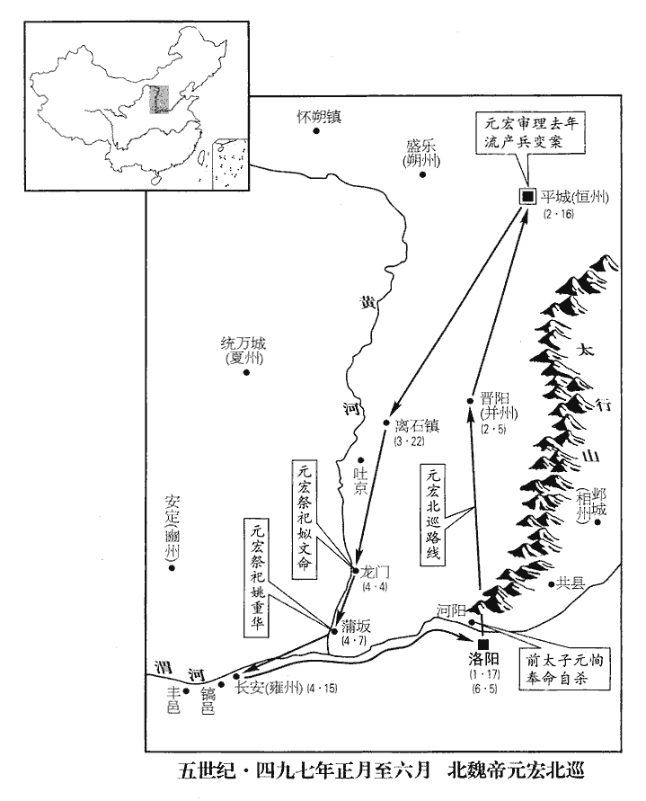
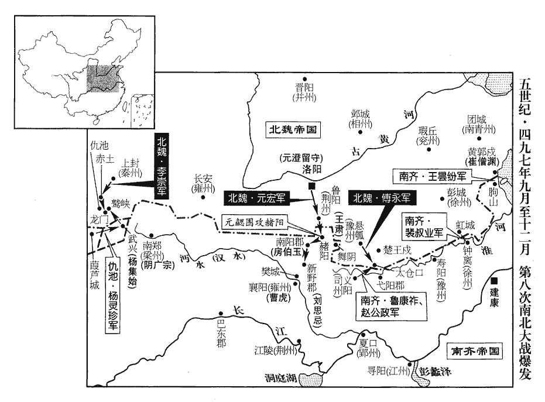
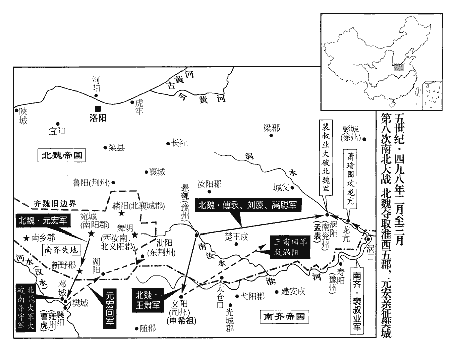
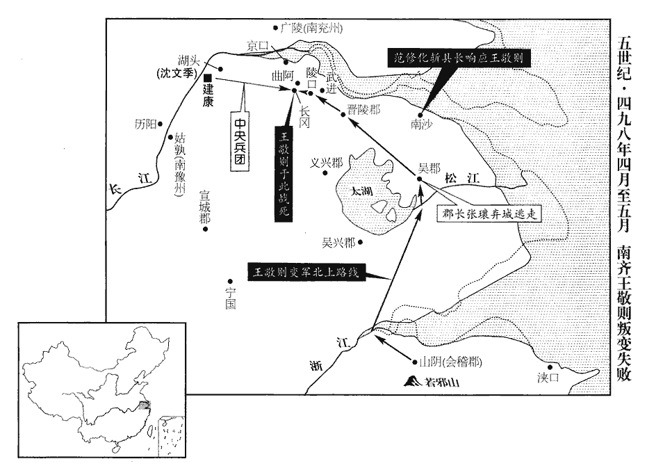

 齊紀七起強圉赤奮若（丁丑），盡著雍攝提格（戊寅），凡二年。

# 高宗明皇帝下

## 建武四年（丁丑、四九七）

1春，正月，大赦。《考異》曰︰《齊•帝紀》云︰「庚午，大赦。」按《長曆》，是月己丑朔，無庚午，故不日。

〖译文〗 [1]春季，正月，大赦天下。

2丙申‹八›，魏立皇子恪‹元恪，本年十五岁›爲太子。魏主‹元宏，本年三十一岁›宴於清徽堂，語及太子恂，李沖謝曰︰「臣忝師傅，不能輔導。」帝曰︰「朕尚不能化其惡，師傅何謝也！」

〖译文〗 [2]丙申（初八），北魏立皇子元恪为太子。孝文帝在清徽堂欢宴，说到太子元恂，李冲谢罪说：“我愧为太子师傅，没有能教导好他，实在有罪。”孝文帝说：“朕尚且不能教化他的劣恶，你做师傅的何必谢罪呢？”

3乙巳‹十七›，魏主北巡。

〖译文〗 [3]乙巳（十七日），北魏孝文帝去北方巡视。

4初，尚書令王晏，爲世祖所寵任；事見一百三十六卷世祖永明七年。及上‹萧鸾›謀廢鬱林王‹萧昭业›，晏卽欣然推奉。事見一百三十九卷元年。鬱林王已廢，上‹萧鸾，本年四十六岁›與晏宴於東府，語及時事，晏抵掌曰︰「公常言晏怯，今定何如？」上卽位，晏自謂佐命新朝，常非薄世祖‹萧赜›故事。旣居朝端，尚書令位居朝臣之右。朝，直遙翻。事多專決，內外要職，並用所親，每與上爭用人。上雖以事際須晏，事際，謂舉事之際；須者，倚其爲用。而心惡之。惡，烏路翻。嘗料簡世祖中詔，料，音聊。得與晏手敕三百餘紙，皆論國家事，又得晏啓諫世祖以上領選事，見一百三十七卷永明八年。選，須絹翻。以此愈猜薄之。始安王遙光勸上誅晏，上曰︰「晏於我有功；且未有罪。」遙光曰︰「晏尚不能爲武帝‹萧赜›，安能爲陛下乎！」爲，于僞翻。上默然。上遣腹心陳【章︰十二行本「陳」上有「左右」二字；乙十一行本同；孔本同；張校同。】世範等出塗巷，採聽異言。晏輕淺無防，意望開府，數呼相工自視，數，所角翻。相，息亮翻。云當大貴；與賓客語，好屛人清閒。好，呼到翻。屛，必郢翻。上聞之，疑晏欲反，遂有誅晏之意。

〖译文〗 [4]早先，南齐尚书令王晏深得武帝的宠信，到了明帝谋划废去郁林王之时，王晏又立即欣然赞同，帮助进行。郁林王被废去之后，明帝与王晏在东府宴饮，谈到时事之时，王晏拍着手掌说道：“您经常说我王晏胆怯，今天又认定我如何呢？”明帝即位，王晏自以为对新朝有佐命之功，经常菲薄讥刺武帝在世时候的事情。他担任了尚书令，居于朝臣中的最高地位，处理事情非常专横独断，朝廷内外的重要职位，都任用自己的亲信之徒，经常与明帝在用人方面发生争执。明帝虽然因举事之际，不得不依赖、重用王晏，但是内心却十分厌恶他。明帝曾经整理检查武帝的诏书文告等材料，得到武帝写给王晏的手敕三百多张，都是谈论国家的事情，又获得王晏劝谏武帝不要让自己主管诠选之事的启奏，因此越发猜忌、冷淡王晏了。始安王萧遥光劝明帝杀掉王晏，明帝说：“王晏于我有功劳，况且没有罪过，所以不能杀他。”萧遥光又说：“王晏对武帝都不能忠心耿耿，怎么能忠于陛下呢？”明帝听了默然无言。明帝派遣心腹陈世范等人到街头小巷去采听关于王晏的传言异闻。王晏这个人轻率浅薄而没有防范，他想为自己开辟府署，几次传叫方术之士来查看风水，说是会大富大贵。王晏与宾客谈话时，总是喜欢把手下的杂人支开，然后与客人在清静中交谈。明帝知道了这些情况之后，怀疑王晏想谋反，于是产生了杀掉王晏的念头。

奉朝請鮮于文粲密探上旨，朝，直遙翻。探，吐南翻。告晏有異志。世範又啓上云︰「晏謀因四年南郊，與世祖故主帥於道中竊發。」帥，所類翻。會虎犯郊壇，上愈懼。未郊一日，有敕停行，先報晏及徐孝嗣。孝嗣奉旨，而晏陳「郊祀事大，必宜自力。」上益信世範之言。丙辰‹二十八›，召晏於華林省，誅之，省在華林園，因名。《考異》曰︰《晏傳》云︰「元會畢，乃召晏誅之。」《本紀》︰「丙辰，晏伏誅。」丙辰，正月二十八日也。按郊禮必在正月，旣云未郊一日敕停，則誅晏必非元會之日也，《本傳》蓋言元會禮後耳。幷北中郎司馬蕭毅、臺隊主劉明達，明達，蓋世祖‹萧赜›時主帥。及晏子德元、德和。下詔云︰「晏與毅、明達以河東王鉉識用微弱，謀奉以爲主，使守虛器。」晏弟詡爲廣州‹府设番禺广东省广州市›刺史，上遣南中郎司馬蕭季敞襲殺之。季敞，上之從祖弟也。從，才用翻；下晏從同。蕭毅奢豪，好弓馬，爲上所忌，故因事陷之。毅，高帝從子，新吳侯景先之子也。好，呼到翻。河東王鉉先以年少才弱，故未爲上所殺。鉉朝見，常鞠躬俯僂，少，詩照翻。朝，直遙翻。見，賢遍翻。僂，力主翻。鞠躬，曲身也。俯，低頭。僂，曲背。不敢平行直視。至是，年稍長‹本年十八岁›，長，知兩翻。遂坐晏事免官，禁不得與外人交通。

〖译文〗 奉朝请鲜于文粲密探到了明帝的心思，就奏告了王晏有异图。陈世范又启奏明帝：“王晏密谋借建武四年南郊祭天之机，与武帝过去的主帅在道中起事。”正好遇上老虎闯入南郊祭坛，明帝愈加惧怕了。郊祭前一日，明帝敕令不去南郊祭祀，派人先告诉了王晏和徐孝嗣。徐孝嗣奉旨不言，而王晏则不同意明帝不去，陈述了自己的理由：“郊祀事关重大，圣上一定要亲自前去。”这样一来，明帝越加相信陈世范所说的了。丙辰（二十八日），明帝在华林省召见王晏，杀了他，一同诛死的还有北中郎司马萧毅、台队主刘明达，以及王晏的儿子王德元、王德和。明帝发出诏令：“王晏与萧毅、刘明达因为河东王萧崐铉识见低下、能力微弱，于是阴谋奉他为君主，让他守虚位，而他们自己操纵国政。”王晏的弟弟王诩担任广州刺史，明帝派遣南中郎司马萧季敞去突然杀掉了他。萧季敞是明帝的从祖弟。萧毅奢侈豪华，特别喜好弓箭、骏马，使明帝忌妒，因此借这件事陷害、杀害了他。河东王萧铉在早先因年龄小、才力弱，所以没有被明帝杀掉。萧铉在朝见明帝时总是保持鞠躬姿势，弯腰低头，不敢平行直视。至此时，年龄稍大了些，于是连坐王晏之事而被免官，并且被禁止与外面的人来往交接。

鬱林王‹萧昭业›之將廢也，晏從弟御史中丞思遠謂晏曰︰「兄荷世祖厚恩，荷，下可翻。今一旦贊人如此事；彼或可以權計相須，未知兄將來何以自立！若及此引決，猶可保全門戶，不失後名。」欲使之死鬱林之難也。晏曰︰「方噉粥，未暇此事。」及拜驃騎將軍，帝初卽位，進晏爲驃騎大將軍。噉dàn，徒濫翻，又徒覽翻。驃，匹妙翻。騎，奇寄翻。集會子弟，謂思遠兄思徵【章︰十二行本「徵」作「微」；乙十一行本同；孔本同；張校同；退齋校同；熊校同。】曰︰「隆昌之末，阿戎勸吾自裁；若從其語，豈有今日！」思遠遽應曰︰「如阿戎所見，今猶未晚也。」晉、宋間人，多謂從弟爲阿戎，至唐猶然。如杜甫《於從弟杜位宅守歲詩》云「守歲阿戎家」是也。思遠知上外待晏厚而內已疑異，乘間謂晏曰︰「時事稍異，兄亦覺不？間，古莧翻。不，讀曰否。凡人多拙於自謀而巧於謀人。」晏不應。思遠退，晏方歎曰︰「世乃有勸人死者！」旬日而晏敗。上聞思遠言，故不之罪，仍遷侍中。

〖译文〗 郁林王将被废黜之前，王晏的堂弟御史中丞王思远对王晏说：“兄长你承受武帝的厚恩，现在一旦帮助别人进行此事，在那个人来说或许可以暂时利用兄长，但不知兄长这样做了，将来别人何以自立呢？如果在现在能拿起刀子自刎而死，还可以保全门户，不失后世英名。”王晏不予理会，回答说：“我正在喝粥，无暇顾及此事。”明帝即位之后，拜王晏为骠骑将军，王晏把弟弟和儿子们召集在一起，对王思远的哥哥王思徵说：“隆昌之末，思远劝我自裁，如果听从了他的话语，那里能有今天呢？”王思远随声应道：“如按照小弟所说的那样去做，现在尚未为晚。”王思远知道明帝外表上对待王晏十分优厚而内心则已经开始怀疑他了，就乘机对王晏说：“眼下事情逐渐有异样，兄长觉察与否？人们大多拙于自谋而巧于谋算别人。”王晏听后没有吭声。王思远走了之后，王晏才叹息着说：“世上竟有劝人死的人。”十日之后，王晏被杀。明帝听说了王思远对王晏说过的话，所以没有定他的罪，并且升任他为侍中。

晏外弟尉氏‹侨县·江苏省六合县›阮孝緒亦知晏必敗，尉氏縣，漢屬陳留，江左僑置於今六合縣界，屬秦郡。阮氏本尉氏人，此時未必居秦郡界。外弟，妻弟也。晏屢至其門，逃匿不見。嘗食醬美，問知得於晏家，吐而覆之。旣吐其所食者，又覆其所餘者。及晏敗，人爲之懼，爲，于僞翻。孝緒曰︰「親而不黨，何懼之有！」卒免於罪。卒，子恤翻。

〖译文〗 王晏的表弟尉氏人阮孝绪也知道王晏必定会败落，所以王晏屡次到他家去，他都躲而不见。一次，他吃酱觉得味道很香，一问才知道是从王晏家得来的，因此立即吐了出来，并且把其余的全部倒掉。到了王晏被杀之后，人们都为阮孝绪担心，他却不以为然，说：“虽然是亲戚，但是并不是同党，有什么害怕的呢？”最后他被免于定罪。

5二月，壬戌‹五›，魏主至太原‹山西省太原市›。

〖译文〗 [5]二月壬戌（初五），北魏孝文帝到达太原。

6甲子‹七›，以左僕射徐孝嗣爲尚書令，代王晏也。征虜將軍蕭季敞爲廣州刺史。代晏弟詡也。

〖译文〗 [6]甲子（初七），齐明帝任命左仆射徐孝嗣为尚书令，任命征虏将军萧季敞为广州刺史，分别代替王晏及其弟生前的职位。

7癸酉‹十六›，魏主‹元宏›至平城‹山西省大同市›，引見穆泰、陸叡之黨問之，見，賢遍翻。無一人稱枉者；時人皆服任城王澄之明。穆泰及其親黨皆伏誅；賜陸叡死於獄，宥其妻子，徙遼西‹河北省迁安县东北›爲民。《考異》曰︰《齊書•魏虜傳》云︰「僞征北將軍恆州刺史鉅鹿孤賀鹿渾守桑乾，宏從叔平陽王安壽戍懷栅，在桑乾西北。渾非宏任用中國人，與僞定州刺史馮翊公自鄰、安樂公拓跋阿幹兒謀立安壽，分據河北。期久不遂，安壽懼，告宏。殺渾等數百人，任安壽如故。」與《魏書》名姓全不同。今從《魏書》。

〖译文〗 [7]癸酉（十六日），北魏孝文帝到达平城，提审了穆泰、陆睿之党，没有一个人说自己冤枉。当时，人们都认为任城王元澄公正、明察。穆泰及其亲信党徒都伏法，陆睿被赐死狱中，他的妻子得到宽宥，被流放到辽西，成为平民。

初，魏主遷都，變易舊俗，幷州‹府设晋阳山西省太原市›刺史新興公丕皆所不樂；樂，音洛。帝以其宗室耆舊，亦不之逼，但誘示大理，令其不生同異而已。示以事理之大歸而已，不反覆告語之。誘，音酉。及朝臣皆變衣冠，朱衣滿坐，朝，直遙翻。坐，徂臥翻。而丕獨胡服於其間，晚乃稍加冠帶，而不能脩飾容儀，帝亦不強也。強，其兩翻。

〖译文〗 早先，北魏孝文帝迁都洛阳，改变旧的风俗习惯，但是并州刺史新兴公元丕一点也不高兴这样做，孝文帝因为他在家族中年辈较长，因此就不强行让他改换，但是用大道理加以诱导劝说，以便使他不公开反对。到了朝中大臣们都改换了衣服帽子，每天上朝殿内朱衣满坐，但是惟独元丕还穿着胡服侧身其间，后来他才慢慢加上了帽子和带子，可是仍旧不修饰外表仪容，孝文帝也不强崐迫他。

太子恂自平城將遷洛陽，元隆與穆泰等密謀留恂，因舉兵斷關，規據陘北。陘北，卽恆、朔二州之地。關，卽鴈門‹山西省代县›之東陘、西陘二關也。斷，丁管翻。陘，音刑。丕在幷州，隆等以其謀告之。丕外慮不成，口雖折難，折，之列翻。難，乃旦翻。心頗然之。及事覺，丕從帝至平城，帝每推問泰等，常令丕坐觀。有司奏元業、元隆、元超罪當族，丕應從坐。帝以丕嘗受詔許以不死，聽免死爲民，留其後妻、二子，與居于太原，殺隆、超、同產乙升，同產，同母兄弟。餘子徙敦煌‹甘肃省敦煌市›。敦，徒門翻。

〖译文〗 太子元恂将从平城迁往洛阳之时，元隆同穆泰等人密谋策划，要把元恂留在平城，因此出兵堵住雁门东陉、西陉二关，阴谋占据关北恒、朔二州。当时，元丕在并州，元隆等人把自己的计划告诉了他，元丕表面上忧虑事情难以成功，口头上虽然反对，但是心里却颇为赞同。等到穆泰等人叛乱之事败露之后，元丕随从孝文帝到了平城，孝文帝每次审问穆泰等人时，常常让元丕坐在旁边观看。有的官员奏告元业、元隆、元超罪该满门诛斩，元丕也应该连坐治罪。孝文帝以元丕曾经在诏令中被许以不死，就免他一死，黜为平民，让他的后妻和两个儿子陪伴他居住在太原，而杀了元隆、元超及其同胞兄弟元乙升，其他的儿子流放敦煌。

初，丕、叡與僕射李沖、領軍于烈俱受不死之詔。叡旣誅，帝賜沖、烈詔曰︰「叡反逆之志，自負幽冥；違誓在彼，不關朕也。反逆旣異餘犯，雖欲矜恕，如何可得？然猶不忘前言，聽自死別府，不就恆州刺史府賜死而死於獄，故曰別府。免其拏【章︰十二行本「拏ná」作「孥nú」；乙十一行本同；孔本同；熊校同。】戮。《書•甘誓》曰︰予則拏戮汝。孔安國《註》曰︰拏，子也。免其拏戮，謂叡妻子免死徙遼西也。拏，音奴。元丕二子、一弟，首爲賊端，連坐應死，特恕爲民。朕本期始終而彼自棄絕，違心乖念，一何可悲！故此別示，想無致怪。謀反之外，皎如白日耳。」沖、烈皆上表謝。

〖译文〗 原先，元丕、陆睿以及仆射李冲、领军于烈等人都受过皇帝的不死之诏。陆睿被杀之后，孝文帝在赐给李冲、于烈的诏书中说：“虽然朕曾经诏许陆睿在任何情况下都可以免于一死，可是他叛逆谋反的阴谋，自己有负于鬼神，是他违背了曾经发过的誓言，所以他的死与朕没有关系。他叛乱谋反既不同于其他诸犯，即使想要宽恕他，又怎么可能呢？然而朕犹不忘先前说过的话，所以让他自己在狱中自尽，并且免去他儿子的死罪。元丕的两个儿子、一个弟弟，最早策划叛乱，最先参与叛乱，理应连坐处死，朕特加恕免，只是黜为平民而已。朕本来期望与他们和衷共济，始终相善，但是他们自己弃绝情义，违背良心，产生不轨之念，这是多么令人感到可悲的啊！所以，特意告诉你们一下，想必不会令你们奇怪吧？除了谋反这件事情之外，朕对他们的一片真心皎如白月，在在可鉴。”李冲、于烈都上表致谢。

臣光曰︰夫爵祿廢置，殺生予奪，人君所以馭臣之大柄也。此《周禮》所謂八柄馭羣臣者也。予，讀曰與。是故先王之制，雖有親、故、賢、能、功、貴、勤、賓，苟有其罪，不直赦也；必議於槐棘之下，此《周禮》所謂八議也。槐棘，公卿之位。《王制》︰獄成，大司寇聽之於棘木之下。可赦則赦，可宥則宥，可刑則刑，可殺則殺；輕重視情，寬猛隨時。故君得以施恩而不失其威，臣得以免罪而不敢自恃。及魏則不然，勳貴之臣，往往豫許之以不死；彼驕而觸罪，又從而殺之。是以不信之令誘之使陷於死地也。誘，音酉。刑政之失，無此爲大焉！

〖译文〗 臣司马光曰：给予或剥夺爵位、俸禄，掌管生杀予夺之权力，这是做皇帝的人驾驭臣下们的重要手段，所以先王们裁定的制度，虽然有亲、故、贤、能、功、勤、宾等所谓“八议”，但是如果臣下犯有罪行，并不直接赦免，而一定要通过刑法部门来商议，可以赦免则赦免，可以宽大则宽大，可以判刑则判刑，可以诛死则诛死，惩罚的轻与重根据实情而定，处理的宽与严随时机而有所不同。因此，国君得以施行仁恩而又不失其威严，臣子们既可以得到免罪而又不敢以此自恃。到了北魏却不是这样了，对于功勋显贵的大臣，往往预先许诺以终生不被处死，但是其人因此而自骄，触法犯罪，则又被处死。这正是以言而无信的允诺诱惑其人，使他陷于死地。刑法政治的失误过错，没有比这更大的了。

8是時，代鄕舊族，多與泰等連謀，唯于烈【章︰十二行本「烈」下有「一族」二字；乙十一行本同；孔本同；張校同。】無所染涉，帝由是益重之。帝以北方酋長及侍子畏暑，酋，自秋翻。長，知兩翻。聽秋朝洛陽，春還部落，時人謂之「鴈臣」。以鴈避寒而南來，望暖而北還也。朝，直遙翻。

〖译文〗 [8]在这时候，平城的鲜卑族人，多数与穆泰等人一起策划，唯独于烈没有丝毫参涉，因此孝文帝对他更加器重了。孝文帝考虑到北方的酋长以及在身边侍奉自己的王子们害怕暑热，所以就任他们秋天来到洛阳，春天再返回各自的部落去，当时的人们称他们为“雁臣”。

9三月，己酉‹二十二›，魏主南至離石‹山西省离石县›。離石，漢縣，屬西河郡，隋爲離石郡，唐爲石州。叛胡請降，詔宥之。降，戶江翻。夏，四月，庚申‹四›，至龍門‹山西省河津县西北黄河隘口›，遣使祀夏禹‹姒文命›。《水經註》︰龍門上口在漢河東北屈縣西，所謂孟門也。龍門下口在河東皮氏縣西北，大禹所鑿，故於此祠焉。癸亥‹七›，至蒲坂‹山西省永济县›，祀虞舜‹姚重华›。皇甫謐云︰舜都蒲坂，故又於此祀焉。坂，音反。辛未‹十五›，至長安‹西安›。

〖译文〗 [9]三月己酉（二十二日），北魏孝文帝到达离石，反叛的胡人请求投降，孝文帝诏令宽恕了他们。夏季，四月，庚申（初四），孝文帝到达龙门，派遣使者去祭祀夏禹。癸亥（初七），孝文帝到达蒲坂，祭祀虞舜。辛未（十五日），孝文帝到达长安。

 

10魏太子恂旣廢，頗自悔過。御史中尉李彪密表恂復與左右謀逆，復，扶又翻。魏主使中書侍郎邢巒與咸陽王禧奉詔齎椒酒詣河陽，賜恂死‹元恂，年十五岁›，椒味辛，大熱，有毒，其合口者尤甚。漢桓思后之議，李咸擣椒自隨；帝煮椒二斛，以殺高、武諸子孫；皆是物也。斂以粗棺、常服，瘞於河陽。斂，力贍翻。瘞yì，一計翻。

〖译文〗 [10]北魏太子元恂被废之后，颇为悔恨自己过去的过失。御史中尉李彪秘密上表孝文帝，告发说元恂又与手下的人谋划叛逆，孝文帝派遣中书侍郎邢峦和咸阳王元禧奉着自己的圣旨，带着用椒子浸制的酒去河阳，赐元恂死，用粗劣的棺材和平常衣服装敛了他，埋葬在河阳。

11癸未‹二十七›，魏大將軍宋明王劉昶‹年六十二岁›卒於彭城‹江苏省徐州市›，葬【章︰十一行本「葬」上有「追加九錫」四字；乙十一行本同；孔本同；張校同；退齋校同。】以殊禮。《諡法》︰思慮果遠曰明。謂昶遠慮，果於違難而歸魏也。

〖译文〗 [11]癸未（二十七日），北魏的大将军宋明王刘昶死于彭城，以特别的礼仪安葬。

12五月，己丑‹三›，魏主東還，還，從宣翻，又如字。汎渭入河。壬辰‹六›，遣使祀周文王‹姬昌›於豐‹陕西省户县东›，武王‹姬发›於鎬‹陕西省西安市西镐京镇›。亦於故都祀之也。周之豐、鎬，漢時悉在上林苑中。使，疏吏翻。六月，庚申‹五›，還洛陽。

〖译文〗 [12]五月，己丑（初三），北魏孝文帝东行返回，乘船从渭河进入黄河。壬辰（初六），孝文帝派遣使者分别在丰、镐两处祭祀周文王和周武王。六月，庚申（初五），孝文帝回到洛阳。

13壬戌‹七›，魏發冀‹府设信都河北省冀县›、定‹府设中山河北省定州市›、瀛‹府设赵都军城河北省河间市›、相‹府设邺城河北省临漳县西南邺镇›、濟‹府设碻磝山东省茌平县西南›五州兵二十萬，魏太宗泰常八年，置濟州於濟北碻磝城，領濟北、平原、東平、南清河郡。相，息亮翻。濟，子禮翻。將入寇。

〖译文〗 [13]壬戌（初七），北魏发动冀、定、瀛、相、济等五州的二十万大军，即将入侵南齐。

14魏穆泰之反也，中書監魏郡公穆羆pí與之通謀，赦後事發，削官爵爲民。羆弟司空亮以府事付司馬慕容契，上表自劾，劾，戶槪翻，又戶得翻。魏主優詔不許；亮固請不已，癸亥‹八›，聽亮遜位。

〖译文〗 [14]北魏穆泰谋反时，中书监魏郡公穆罴曾与他一起策划，赦免之后事情被发现，从宽被削去官职和爵位，黜为平民。穆罴的弟弟担任司空的穆亮把府署中的事务交付给司马慕容契，上表孝文帝自行弹劾，孝文帝下诏抚慰，不许他辞职，但是穆亮再三请求，癸亥（初八），孝文帝只好同意穆亮辞去官职。

15丁卯‹十二›，魏分六師以定行留。

〖译文〗 [15]丁卯（十二日），北魏把军队分为六部分，以便决定哪些参加南征，哪些留守。

16秋，七月，【章︰十二行本「月」下有「甲午」二字；乙十一行本同；孔本同；退齋校同。】魏立昭儀馮氏‹冯润›爲皇后。后欲母養太子恪；恪母高氏自代‹平城›如洛陽，暴卒於共縣‹河南省辉县市›。馮昭儀旣譖廢其妹，又潛殺太子之母，其心蓋梟xiāo獍jìng也。以魏主之明，而使之正位椒房，他日不死於其手者幸耳。共縣，自漢以來屬河內郡，晉及後魏屬汲郡，唐衛州，共城縣卽其地。共，音恭。

〖译文〗 [16]秋季，七月，北魏册立昭仪冯氏为皇后。冯皇后想做太子元恪的母亲，亲自来抚养他。元恪的生母高氏从代都来洛阳时，突然死于共县。

17戊辰，魏以穆亮爲征北大將軍、開府儀同三司、冀州刺史。

〖译文〗 [17]戊辰（十三日），北魏任命穆亮为征北大将军、开府仪同三司、冀州刺史。

18八月，丙辰‹一›，魏詔中外戒嚴。將南伐也。

〖译文〗 [18]八月，丙辰（初一），北魏即将南伐，宣布内外戒严。

19壬戌‹七›，魏立皇子愉爲京兆王，懌爲清河王，懷爲廣平王。

〖译文〗 [19]壬戌（初七），北魏封立皇子元愉为京兆王，元怿为清河王，元怀为广平王。

20追尊景皇‹萧道生›所生王氏爲恭太后。帝‹萧鸾›卽位，尊始安貞王曰景皇。稱皇不稱帝，用漢制也。

〖译文〗 [20]明帝追尊景皇生母王氏为恭太后。

21甲戌‹十九›，魏講武於華林園；庚辰‹二十五›，軍發洛陽。使吏部尚書任城王澄居守；任城王澄至是始爲眞吏部尚書。守，式又翻。以御史中丞李彪兼度支尚書，「中丞」，當作「中尉」。【章︰十二行本正作「中尉」；孔本同；張校同。】度，徒洛翻。與僕射李沖參治留臺事。治，直之翻。假彭城王勰中軍大將軍，勰，音協。勰辭曰︰「親疏並用，古之道也。臣獨何人，頻煩寵授！昔陳思求而不允，曹魏文帝‹曹丕›時，陳思王植‹曹植›上表求自試以攻吳、蜀，帝不許。愚臣不請而得，何否泰之相遠也！天地交曰泰，天地不交曰否。陳思於魏文，上下之情不通，故曰否。勰則君臣、兄弟之情無間，故曰泰。否，皮鄙翻。魏主大笑，執勰手曰︰「二曹以才名相忌，二曹，謂魏文帝、陳思王也。吾與汝以道德相親。」

〖译文〗 [21]甲戌（十九日），北魏孝文帝在华林园讲习武事。庚辰（二十五日），北魏从洛阳发兵，进行南征。孝文帝使吏部尚书任城王元澄留守洛阳，让御史中丞李彪兼任度支尚书，并且让他与仆射李冲一道参与掌管留守事宜。孝文帝又授与彭城王元勰中军大将军的官衔，元勰辞而不受，对孝文帝说：“亲疏崐远近一并用之，这是古代留下来的治国之道。我是何人呢？频繁地劳烦圣上施授恩宠，实在于心不安。过去陈思王曹植上表魏文帝，自请攻打吴、蜀，魏文帝不答应。愚臣不请而自得，与陈思王相比较，为何命运的顺利和不顺利相差的如此远呢？”孝文帝听了之后大笑不已，拉着元勰的手说道：“曹丕、曹植兄弟二人以才气而互相忌妒，我与你则以道德而互相亲密。”

22上遣軍主、直閤將軍胡松助北襄城‹河南省方城县›太守成公期戍赭陽‹北襄城郡郡政府所在城›，赭，音者。軍主鮑舉助西汝南、北義陽二郡太守黃瑤起戍舞陰‹河南省泌阳县北›。蕭子顯《齊志》︰西汝南屬雍州，北義陽屬雍州寧蠻府，自宋未有雙頭郡太守，率治一處。舞陰縣，自漢以來屬南陽郡，爲西汝南、北義陽二郡治所。

〖译文〗 [22]齐明帝派遣军主、直阁将军胡松帮助北襄城太守成公期戍守赭阳，军主鲍举协助西汝南、北义阳二郡太守黄瑶起防守舞阴。

23魏以氐帥楊靈珍爲南梁州‹府设葭芦城甘肃省武都县东南›刺史。靈珍舉州來降，魏置梁州於仇池，置南梁州於武興。帥，所類翻。降，戶江翻；下同。送其母及子於南鄭以爲質，質，音致。遣其弟婆羅阿卜珍將步騎萬餘襲魏武興王楊集始‹时在武兴陕西省略阳县›，將，卽亮翻。騎，奇寄翻。殺其二弟集同、集衆；集始窘急，請降。九月，丁酉‹十三›，魏主以河南尹李崇爲都督隴右諸軍事，將兵數萬討之。

〖译文〗 [23]北魏任命氐族首领杨灵珍为南梁州刺史。杨灵珍率全州之部来投降南齐，并且把他的母亲以及儿子送到南郑作为人质，又派遣他的弟弟杨婆罗阿卜珍带领步兵、骑兵一万余众袭击北魏武兴王杨集始，杀掉了杨集始的两个弟弟杨集同和杨集众，杨集始在危急无奈的情况之下请求投降。九月丁酉（十三日），北魏孝文帝任命河南尹李崇为都督陇右诸军事，命令他统领数万兵力讨伐杨灵珍。

24初，魏遷洛陽，荊州‹府设鲁阳河南省鲁山县›刺史薛眞度勸魏主先取樊‹湖北省襄樊市汉水北岸›、鄧。此時魏荊州猶治魯陽，樊、鄧逼近洛陽，欲先取之以廣封略。眞度引兵寇南陽‹河南省南阳市›，太守房伯玉擊敗之。此謂去年沙堨之敗也。擊敗，補邁翻。魏主怒，以南陽小郡，志必滅之，遂引兵向襄陽，彭城王勰等三十六軍前後相繼，衆號百萬，吹脣沸地。吹脣者，以齒齧niè脣作氣吹之，其聲如鷹隼。其下者以指夾脣吹之，然後有聲，謂之嘯指。辛丑‹十七›，魏主留諸將攻赭陽，自引兵南下；癸卯‹十九›，至宛‹河南省南阳市›，夜襲其郛，克之。宛，於元翻。郛fú，芳無翻。城之外郭曰郛。房伯玉嬰內城拒守，魏主遣中書舍人孫延景《考異》曰︰《齊書》作「公孫雲」，今從《魏書》。謂伯玉曰︰「我今蕩壹六合，非如曏時冬來春去，不有所克，終不還北。卿此城當我六龍之首，《易》曰︰時乘六龍以御天。人君之象也。無容不先攻取，遠期一年，近止一月。封侯、梟首，事在俯仰，宜善圖之！梟，堅堯翻。且卿有三罪，今令卿知︰卿先事武帝‹萧赜›，蒙殊常之寵，不能建忠致命而盡節於其讎‹萧鸾›，罪一也。明帝夷滅武帝子孫，故謂之讎。頃年薛眞度來，卿傷我偏師，罪二也。今鸞輅親臨，不面縛麾下，罪三也。」伯玉遣軍副樂稚柔對曰︰「承欲攻圍，期於必克。卑微常人，得抗大威，眞可謂獲其死所！外臣蒙武帝採拔，豈敢忘恩！但嗣君失德，主上光紹大宗，言帝自小宗入爲高帝第三子，以紹大宗。非唯副億兆之深望，抑亦兼武皇之遺敕；是以區區盡節，不敢失墜。往者北師深入，寇擾邊民，輒厲將士以脩職業。將，卽亮翻。反己而言，不應垂責。」

〖译文〗 [24]当初，北魏迁都洛阳，荆州刺史薛真度劝孝文帝首先占取樊、邓两地。薛真度率兵攻打南阳，南齐的南阳太守房伯玉击败了他。北魏孝文帝见薛真度战败，勃然生怒，以为南阳不过区区一小郡，所以立志要灭掉它，于是就率兵向襄阳进发，彭城王元勰等三十六路军马前后相继，号称百万大军，浩浩荡荡，吹气震动大地。辛丑（十七日），孝文帝留下诸路将帅攻打赭阳，自己领兵南下，于癸卯（十九日），到达宛城，乘夜攻打宛城外城，一举而攻克。房伯玉环守内城而顽抗拒守，孝文帝派遣中书舍人孙延景为使者去对房伯玉说：“我如今要荡平统一天下，不会再象上一次那样冬天来春天去，这次如果不能克敌取胜，誓死不率师北返。你的这座城正在我的战车之前，不得不首先攻取，远则一年，近则只一月，一定要占领。你是愿意归顺我朝以换得封侯加爵呢？还是执意顽抗到底，落个身首异处的下场呢？何去何从，俯仰之间即可决定，你应该好好地考虑一下。而且，你有三条罪状，现在说出来让你知道：你先前奉事武帝，得到了武帝特别的宠信，然而你却不能舍命尽忠而丧失节操，效力于他的仇人，这是罪状之一。近年薛真度奉我的旨令来讨伐，你给他们造成严重创伤，这是罪状之二。现在，我舆驾亲临，你不自缚投降，反而负隅顽抗，这是罪状之三。”房伯玉也派遣军副乐稚柔去对孝文帝说：“承蒙你们来围攻本城，并且期望一定攻克。我是一个地位卑微的平常之人，能得以与威严的陛下抗衡，真可以说是获得了一个理想的死亡之所。外臣我承蒙武帝提拔重用，岂敢忘记大恩呢？但是继位的君主没有仁德，因而我主上作为高帝第三子而即位，不但符合百姓之厚望，而且也兼合武帝之遗愿。所以，我只能竭力尽忠，不敢有所失误。上次你们的军队深入我边境，骚扰掠夺我边民，我只好命令将士们加以抵抗，这也是尽职尽责，如果你能反过来想一想，就不应该对我加以指责。”

宛城‹河南省南阳市›東南隅溝上有橋，魏主引兵過之。伯玉使勇士數人，衣班衣，戴虎頭帽，人衣，如旣翻。虎頭帽者，帽爲虎頭形。伏於竇下，突出擊之，魏主人馬俱驚；召善射者原靈度射之，度射，而亦翻。應弦而斃，乃得免。

〖译文〗 宛城东南角的河沟上有一座桥，北魏孝文帝率兵从桥上经过，房伯玉预先指使几个勇士，身穿带有斑纹的衣服，头戴虎头帽，埋伏在桥底下，这时突然袭击，使得孝文帝的人马大吃一惊，急忙叫射箭能手原灵度用箭射他们，箭无虚发，无不应弦而毙，方才免于一难。

25李崇槎chá山分道，出氐不意，表裏襲之；槎，士下翻，逆斫木也。羣氐皆棄楊靈珍散歸，靈珍之衆減太半，崇進據赤土‹甘肃省西和县境›。魏收《志》，南秦州武階郡有赤土縣。《五代志》︰武都郡覆津縣，後魏置武階郡。靈珍遣從弟建【章︰十二行本「建」下有「帥五千人」四字；乙十一行本同；孔本同；張校同；退齋校同。】屯龍門‹仇池甘肃省西和县南›东龙门戍，自帥精勇一萬屯鷲峽‹仇池东北›；按魏收《志》，東益州武興郡有石門縣。《五代志》︰武都將利縣，舊曰石門。又，仇池山下有飛龍峽，以氐酋楊飛龍據仇池得名。又，今龍州江油縣東二十里有龍門山；又，江油縣東百里有石門戍。武興，今爲興州；龍州去興州甚遠，楊建所屯者必非江油之龍門也。《水經註》︰仇池東北有龍門戍，此其是歟！鷲峽當在龍門西南。從，才用翻。帥，讀曰率；下同。鷲，音就。龍門之北數十里中，伐樹塞路；鷲硤之口，【章︰十二行本「口」下有「積大木」三字；乙十一行本同；孔本同；張校同；退齋校同。】聚礌石，臨崖下之，以拒魏兵。塞，悉則翻。礌，盧對翻；《埤蒼》曰︰推石自高而下也。《漢書•李陵傳》︰乘隅下壘石。師古曰︰言放石以投人，因山隅曲而下也。壘，音盧對翻，與此礌音同。崇命統軍慕容拒帥衆五千從他路入，夜，襲龍門，破之。崇自攻鷲峽；靈珍連戰敗走，俘其妻子，遂克武興，梁州刺史陰廣宗、參軍鄭猷yóu等將兵救靈珍；崇進擊，大破之，斬楊婆羅阿卜珍，生擒猷等，靈珍奔還漢中‹南郑·陕西省汉中市›。魏主聞之，喜曰︰「使朕無西顧之憂者，李崇也。」以崇爲都督梁•秦二州諸軍事、梁州‹府设骆谷城甘肃省西和县南›刺史，以安集其地。

〖译文〗 [25]孝文帝派李崇去征讨杨灵珍，李崇在山上砍斫树木，开道而行，里外夹击，打了个措手不及，使得那些氐人纷纷丢下杨灵珍而溃散逃命，杨灵珍的人马一下子减去了大半，于是李崇进而占领了赤土，杨灵珍派遣堂弟杨灵建驻守龙门，而自己则率领一万精锐兵力驻守鹫硖。杨灵建命部下砍伐大树，堵塞在路上，把龙门往北数十里之内的路全堵了，使得李崇的人马无法行动。而杨灵珍则在鹫硖口两边高崖上堆积了许多滚石，以防拒北魏军队通过。李崇命令统军慕容拒带领五千人马从另外一条路进去，夜袭龙门，破敌成功。李崇自己率众攻打鹫硖，杨灵珍连战而败，逃走活命，李崇俘获了他的妻儿，于是攻克了武兴。南齐梁州刺史阴广宗、参军郑猷等人率兵来援救杨灵珍，李崇迎而击之，大获全胜，杀死了杨婆罗阿卜珍，活捉了郑猷等人，杨灵珍逃回汉中。北魏孝文帝听到捷报，高兴地说：“使朕解除西顾之忧的是李崇。”孝文帝任命李崇为都督梁秦二州诸军事、梁州刺史，以便安定这个地方。

26丁未‹二十三›，魏主發南陽，留太尉咸陽王禧等攻之。己酉‹二十五›，魏主至新野‹河南省新野县›，新野太守劉思忌拒守。冬，十月，丁巳‹二›，魏軍攻之不克，築長圍守之，遣人謂城中曰︰「房伯玉已降，汝何爲獨取糜碎！」思忌遣人對曰︰「城中兵食猶多，未暇從汝小虜語也！」魏右軍府長史韓顯宗將別軍屯赭陽，右軍府，右軍將軍府也。將，卽亮翻；下同。成公期遣胡松引蠻兵攻其營，胡松時助戍赭陽。顯宗力戰，破之，斬其裨將高法援。顯宗至新野，魏主謂曰︰「卿破賊斬將，殊益軍勢。朕方攻堅城，何爲不作露布？」《五代史志》曰︰後魏每攻戰克捷，欲天下聞知，迺書帛建於竿上，名曰露布。魏主謂顯宗若露布上聞行在所，則增益魏軍之勝勢，可以搖城中堅守之心。對曰︰「頃聞鎭南將軍王肅獲賊二、三人，驢馬數匹，皆爲露布；臣在東觀，私常哂之。韓顯宗對策甲科，除著作郎，故云在東觀。觀，古玩翻。哂，矢引翻；笑不壞颜曰哂。近雖仰憑威靈，得摧醜虜，兵寡力弱，擒斬不多。脫復高曳長縑，虛張功烈，尤而效之，其罪彌大。《左傳》曰︰尤而效之，罪又甚焉。尤，責也，過也，甚之之辭也。復，扶又翻。臣所以不敢爲之，解上而已。」丁度《集韻》：解，居隘翻，聞上也。上，時掌翻。自下而聞於上謂之上。魏主益賢之。

〖译文〗 [26]丁未（二十三日），北魏孝文帝从南阳出发，留下太尉咸阳王元禧等人继续攻打该处。己酉（二十五日），孝文帝到达新野，南齐新野太守刘思忌据城抵抗。冬季，十月，丁巳（初三），北魏军队攻打新野，但是不能攻克，就修筑工事，加以围困，并且派人对城中守军说：“房伯玉已经投降了，你们为什么还不献城出降，欲想落个粉身碎骨的下场呢？”刘思忌派人回答说：“城中的兵力和粮食还很多，现在我们还忙得没有时间跟你们这些小小的胡虏们说话。”北魏右军府长史韩显宗率领另外一支军队驻守在赭阳，南齐北襄城太守成公期派遣胡松带领蛮兵去攻打韩显宗的营地，韩显宗率部力战，击败了胡松的进攻，杀了胡松的副将高法援。韩显宗到新野，孝文帝对他说：“你击败贼敌，斩其将领，大长了我军的威风气势。朕正在攻打新野这座坚城，你为什么不把捷报写于帛布之上，以高竿树之，以增加我军的斗志，动摇城中守军的信心呢？”韩显宗回答说：“过去听说镇南将军王肃才俘获敌贼二三人、驴马几匹，就书帛高挂，我当时正在宫中任著作郎，私下里常常讥笑王肃的这一做法。现在，我虽然凭借圣上的威灵，摧折敌虏，但是由于兵力寡少、力量不足，所以擒捉和斩杀敌贼不多。如果我也象王肃那样把本来不足道的小捷写于帛布之上，高竿挂起，以此虚张功劳，效法王肃，其罪则更大。所以，我不能那样做，只是告捷于圣上就行了。”由此，孝文帝更加认为韩显宗忠贤了。

 

上詔徐州‹北徐州·州政府设钟离安徽省凤阳县东北临淮关›刺史裴叔業引兵救雍州。雍，於用翻；下同。叔業啓稱︰「北人不樂遠行，唯樂鈔掠。樂，音洛。若侵虜境，則司‹府设义阳河南省信阳市›、雍之寇自然分矣。」上從之。叔業引兵攻虹城‹安徽省五河县西北›，此卽漢沛郡之虹縣城也。師古曰︰虹，音貢。南北兵爭，其地在下邳夏丘縣界；唐復爲虹縣，屬泗州。虹，今讀如絳。獲男女四千餘人。

〖译文〗 南齐明帝诏令徐州刺史裴叔业领兵去援救雍州，裴叔业启奏齐明帝：“北方人不乐意远道而行，而只乐意掠抢，所以如果入侵敌人境内，则司州、雍州的敌寇自然会撤退。”明帝听从了这一建议。于是，裴叔业率兵攻打虹城，俘获男女四千多人。

甲戌‹二十›，遣太子中庶子蕭衍、右軍司馬張稷救雍州。十一月，甲午‹十一›，前軍將軍韓秀方等十五將降於魏。將，卽亮翻。降，戶江翻。丁酉‹十四›，魏敗齊兵於沔‹汉水›北，敗，補邁翻。將軍王伏保等爲魏所獲。

〖译文〗 甲戌（二十日），明帝派遣太子中庶子萧衍、右司马张稷去援救雍州。十一月，甲午（十一日），前军将军韩秀方等十五个将领投降北魏。丁酉（十四日），北魏军队在沔北打败了南齐兵，将军王伏保等人被北魏俘获。

27丙辰，以楊靈珍爲北秦州刺史、《考異》曰︰《齊氐傳》作「北梁州」，今從《齊書》。仇池公、武都王。

〖译文〗 [27]丙辰（疑误），南齐任命杨灵珍为北秦州刺史，并封他为仇池公、武都王。

28新野人張䐗dǔ帥萬餘家據栅拒魏，䐗，與豬同，陟魚翻。帥，讀曰率；下同。十二月，庚申‹七›，魏人攻拔之。雍州刺史曹虎與房伯玉不協，故緩救之，頓軍樊城。《考異》曰︰《齊•魏虜傳》云「均口」，今從《虎傳》。余謂曹虎之頓軍樊城，不特因與房伯玉不協而然，亦由畏魏兵之強而不敢進也。

〖译文〗 [28]新野人张率领一万余户人家据守栅垒抵拒北魏军队，十二月庚申（初七），北魏军队攻占栅垒。南齐雍州刺史曹虎与房伯玉不合，所以迟迟不去援救他，驻扎在樊城按兵不动。

丁丑‹二十四›，詔遣度支尚書崔慧景救雍州，假慧景節，帥衆二萬、騎千匹向襄陽，雍州衆軍並受節度。度，徒洛翻。雍，於用翻。騎，奇寄翻。

〖译文〗 丁丑（二十四日），明帝诏令度支尚书崔慧景去援救雍州，并且授与符节，雍州诸军全部受他指挥调度。于是崔慧景率领两万兵众、一千骑兵，直向襄阳奔去。

庚午‹十七›，魏主南臨沔水；沔，彌兗翻。戊寅‹二十五›，還新野。

〖译文〗 庚午（十七日），北魏孝文帝南行到达沔水；戊寅（二十五日），孝文帝回到新野。

將軍王曇紛【嚴︰「紛」改「分」。】以萬餘人攻魏南青州‹府设团城山东省沂水县›黃郭戍‹江苏省赣榆县›，魏收《志》︰東魏孝靜帝武定七年置義塘郡，治黃郭城。又按《五代志》︰海州懷仁縣，梁置南北二青州；東魏廢州，立義塘郡及懷仁縣。曇，徒含翻。魏戍主崔僧淵破之，舉軍皆沒。將軍魯康祚、趙公政將兵萬人侵魏太倉口‹河南省息县境›，據《傅永傳》︰太倉口在魏豫州界。是時魏置豫州於汝南新息縣廣陵城，與齊義陽隔淮對壘，則太倉口當在淮北岸，以魏人積倉粟於此而有是名也。魏豫州‹府设悬瓠河南省汝南县›刺史王肅使長史清河‹山东省临清市›傅永將甲士三千擊之。康祚等軍於淮南，永軍於淮北，相去十餘里。永曰︰「南人好夜斫營，好，呼到翻；下好學同。必於渡淮之所置火以記淺。」【章︰十二行本「淺」下有「處」字；乙十一行本同；孔本同；張校同。】乃夜分兵爲二部，伏於營外；又以瓠貯火，瓠hù，戶誤翻。匏páo也。貯zhù，丁呂翻，盛也。密使人過淮南岸，於深處置之，戒曰︰「見火起，則亦然之。」然，與燃同。是夜，康祚等果引兵斫永營，伏兵夾擊之。康祚等走趣淮水，趣，七喻翻。火旣競起，不知所從，溺死及斬首數千級，溺，奴狄翻。生擒公政，獲康祚之尸以歸。豫州‹府设寿阳安徽省寿县›刺史裴叔業侵魏楚王戍‹河南省信阳市北›，裴叔業蓋自徐州遷爲豫州。《水經註》︰鮦陽縣有葛陵城，城東北有楚武王冢，民謂之楚王瑟城。魏蓋於此置戍，因謂之楚王戍。肅復令永擊之。復，扶又翻。永將心腹一人馳詣楚王戍，令塡外塹，塹，七豔翻。夜伏戰士千人於城外。曉而叔業等至城東，部分將置長圍。分，扶問翻。永伏兵擊其後軍，破之。叔業留將佐守營，自將精兵數千救之。將，卽亮翻。永登門樓，望叔業南行數里，卽開門奮擊，大破之，獲叔業傘扇、鼓幕、甲仗萬餘。叔業進退失據，遂走；左右欲追之，永曰︰「吾弱卒不滿三千，彼精甲猶盛，非力屈而敗，自墮吾計中耳。旣不測我之虛實，足使喪膽，喪，息浪翻。俘此足矣，何更追之！」魏主遣謁者就拜永安遠將軍、汝南太守，封貝丘縣男。守，式又翻。永有勇力，好學能文。魏主常歎曰︰「上馬能擊賊，下馬作露版，唯傅脩期耳！」言永有武幹，又有文才也。傅永，字脩期。

〖译文〗 南齐将军王昙纷率领一万多兵众攻打北魏南青州黄郭戍，北魏的戍军首领崔僧渊率兵抵抗，大获全胜，王昙纷全军覆没。南齐将军鲁康祚、赵公政率兵一万人侵北魏太仓口，北魏豫州刺史王肃命令长史清河人傅永率甲兵三千去袭击。鲁康祚、赵公政驻扎在淮水之南，傅永驻扎在淮水之北，彼此相距十多里远。傅永对部下说：“南方人喜欢夜间闯营攻击，他们一定要在渡河的地方放置火把，以便指示何处水浅可以涉渡。”于是，到了夜间，傅永把手下的兵力分成两部分，让他们埋伏在营盘外面，又在大瓢里装满易燃物，派人秘密地渡过淮河到达南岸，把大瓢放置于水深之处，并告诉说：“一见对岸火起，你们就点燃它。”这天夜里，鲁康祚等人果然率兵来破傅永的营盘，傅永的伏兵左右夹击，鲁康祚抵挡不住，慌忙回撤到淮河边上，这时傅永派往南岸的人点起了火，使得鲁康祚等不知何处水深、何处水浅，只好胡乱涉水而逃，结果被淹死和斩首好几千人。最后，傅永活捉了赵公政，并且获得了鲁康祚的尸体，胜利而归。南齐豫州刺史裴叔业入侵北魏楚王戍，王肃再次命令傅永去袭击。傅永带领心腹一人骑马疾奔楚王戍，命令他们填平戍所的外壕，夜里又在城外崐埋伏下战士千人。天亮之后，裴叔业率部到了城东边，安排部署兵力，准备围城攻打。傅永的伏兵对裴叔业的后军展开了袭击，败敌获胜。裴叔业留下其他将领守护营盘，自己率领精兵数千去援救后军。这时，傅永登上城门楼，望见裴叔业已经率兵往南走去数里地了，就命令打开城门，奋力出击，结果大败敌兵，缴获了裴叔业的伞扇、鼓幕，以及盔甲兵器一万余件。裴叔业进退都失去凭借，只好逃跑。傅永手下的人要去追击，但是傅永不许，他说：“我们的兵力弱，还不足三千，而他们的兵力还很强大，并不是因为力量不足而败逃，而是落入了我的计谋圈套。他们不知道我们的虚实，经这么一击，就足以使他们闻风丧胆了，我们已经俘获了他们这么多的人和物，就相当满足了，何必再追击呢？”北魏孝文帝派遣谒者去任命傅永为安远将军、汝南太守，并封他为贝丘县男。傅永勇武有力，并且好学能文，孝文帝常常赞叹说：“上马能击贼，下马作文章，只有傅期才能这样文武双全啊！”

29曲江公遙欣好武事，好，呼到翻。上以諸子尚幼，內親則仗遙欣兄弟，外親則倚后弟西中郎長史彭城劉暄、內弟太子詹事江祏shí；帝母景皇后，祏之姑也，故曰內弟。故以始安王遙光爲揚州刺史，居中用事；遙欣爲都督荊•雍等七州諸軍事、荊州‹府设江陵湖北省江陵县›刺史，鎭據西面。而遙欣在江陵，多招材勇，厚自封殖，上甚惡之。惡，烏路翻。遙欣侮南郡太守劉季連，季連密表遙欣有異迹；包藏禍心者，謂之異志。形見於事爲，謂之異迹。上乃以季連爲益州‹府设成都四川省成都市›刺史，爲後劉季連據益州張本。使據遙欣上流以制之。季連，思考之子也。思考，劉遵考之弟。

〖译文〗 [29]南齐曲江公萧遥欣爱好武事，明帝因为自己的儿子尚且年幼，所以在内亲中依靠萧遥欣兄弟俩，在外戚中则倚仗皇后之弟西中郎彭城人刘暄，以及表弟太子詹事江。于是，明帝任命始安王萧遥光为扬州刺史，让他在建康主事；任命萧遥欣为都督荆、雍等七州诸军事及荆州刺史，让他坐镇西面。然而，萧遥欣却在江陵大量招收勇士，聚敛财物，使劲扩大自己的势力，明帝非常不满。萧遥欣又侮辱南郡太守刘季连，刘季连秘密上表明帝，说萧遥欣图谋不轨，并且有所举动。于是，明帝就任命刘季连为益州刺史，使刘季连据于萧遥欣的上方，以便牵制他。刘季连是刘思考的儿子。

30是歲，高昌‹都高昌新疆吐鲁番市东›王馬儒遣司馬王體玄入貢于魏，請兵迎接，求舉國內徙；魏主遣明威將軍韓安保迎之，剖伊吾‹新疆哈密市›之地五百里以居儒衆。儒遣左長史顧禮、右長史金城‹甘肃省兰州市›麴嘉將步騎一千五百迎安保，而安保不至；將，卽亮翻。騎，奇寄翻。禮、嘉還高昌，安保亦還伊吾。安保遣其屬朝【嚴︰「朝」改「韓」。】興安等使高昌，朝，姓也。漢有鼂錯，《史記》作朝錯。朝，直遙翻。使，疏吏翻。儒復遣顧禮將世子義舒迎安保，復，扶又翻；下同。至白棘城‹新疆鄯善县›，去高昌百六十里。高昌舊人戀土，不願東遷，相與殺儒，魏太和五年，馬儒始王高昌，至是爲國人所殺。立麴嘉爲王，麴氏得高昌始此。嘉，字靈鳳，金城榆中人。復臣於柔然‹瀚海沙漠群›。安保獨與顧禮、馬義舒還洛陽。

〖译文〗 [30]这一年，高昌王马儒派遣司马王体玄来向北魏上贡，要求带领全国人内迁，并且请求北魏派兵迎接。孝文帝派遣明威将军韩安保前去迎接，并且割划伊吾方圆五百里地，以供马儒及其部属居住。马儒派遣左长史顾礼、右长史金城人嘉率领步、骑兵一千五百人去迎接韩安保，但是韩安保没有到达，顾礼、嘉只好返回高昌。顾、走后，韩安保才到，见没有人来接，也返回伊吾。韩安保派遣属下朝兴安等人出使高昌国，马儒又派遣顾礼率领世子马义舒到离高昌一百六十里的白棘城去迎接韩安保。高昌国的本地居民留恋故土，不愿意往东迁，就一起商量杀死了马儒，拥立嘉为国王，仍旧称臣于柔然国。韩安保只与顾礼、马义舒回到洛阳。

## 永泰元年（戊寅、四九八）是年四月始改元。

1春，正月，癸未朔‹一›，大赦。

〖译文〗 [1]春季，正月，癸未朔（初一），南齐大赦天下。

2加中軍大將軍徐孝嗣開府儀同三司，孝嗣固辭。

〖译文〗 [2]明帝要授中军大将军徐孝嗣开府仪同三司，徐孝嗣再三辞而不受。

3魏統軍李佐攻新野‹河南省新野县›，丁亥‹五›，拔之，縛劉思忌，問之曰︰「今欲降未？」降，戶江翻。思忌曰︰「寧爲南鬼，不爲北臣！」史言劉思忌忠於所事。乃殺之。於是沔北大震。沔，彌兗翻。戊子‹六›，湖陽‹河南省唐河县南湖阳镇›戍主蔡道福、湖陽縣，故蓼國，漢屬南陽郡，晉、宋省，齊於此置戍。湖陽旣入魏，置西淮安郡，唐爲湖陽縣，屬唐州。辛卯‹九›，赭陽‹河南省方城县›戍主成公期，壬辰‹十›，舞陰‹河南省泌阳县北›戍主黃瑤起、南鄕‹河南省淅川县南›太守席謙相繼南遁。瑤起爲魏所獲，魏主以賜王肅，肅臠而食之。黃瑤起殺王肅父奐，見一百三十八卷世祖永明十一年。乙巳‹二十三›，命太尉陳顯達救雍州‹府设襄阳湖北省襄樊市›。雍，於用翻。

〖译文〗 [3]北魏统军李佐攻打新野，丁亥（初五），攻破新野城，活捉了刘思忌，李佐问他：“如今你想不想投降？”刘思忌回答：“宁可做南方的鬼，不愿当北方的臣子！”于是，李佐就杀了刘思忌。刘思忌被杀之后，沔水之北的南齐守军大为震惊。戊子（初六），湖阳守军首领蔡道福，辛卯（初八），赭阳崐守军首领成公期；壬辰（初九），舞阳守军首领黄瑶起、南乡太守席谦等相继南逃而去。黄瑶起被北魏军队抓获，北魏孝文帝把黄瑶起赏赐王肃，王肃把他割成小片煮熟吃了。乙巳（二十二日），南齐命令太尉陈显达去援救雍州。

4上‹萧鸾，本年四十七岁›有疾，以近親寡弱，忌高‹萧道成›、武‹萧赜›子孫。時高、武子孫猶有十王，十王，下所殺者是也。每朔望入朝，朝，直遙翻。上還後宮，輒歎息曰︰「我及司徒諸子皆不長，意呼遙光爲司徒也。考之《遙光傳》，時未拜司徒。詳考《齊史》，帝弟安陸昭王緬先帝卒，建武元年贈司徒，此蓋指言緬諸子也。高、武子孫日益長大！」長，皆音丁丈翻，今知兩翻。上欲盡除高、武之族，以微言問陳顯達，對曰︰「此等豈足介慮！」以問揚州刺史始安王遙光，遙光以爲當以次施行。遙光有足疾，遙光生而有躄bì疾。上常令乘輿自望賢門入，望賢門，華林園門也，本名鳳莊門，以遙光父諱鳳改焉。每與上屛人久語畢，上索香火，嗚咽流涕，明日必有所誅。左右以此覘知之。屛，必郢翻。索，山客翻。會上‹萧鸾›疾暴甚，絕而復蘇，復，扶又翻。遙光遂行其策；丁未‹二十五›，殺河東王鉉‹十九岁›、臨賀王子岳‹十四岁›、西陽王子文‹十四岁›、永陽王子峻‹十四岁›、南康王子琳‹十四岁›、衡陽王子珉‹十四岁›、湘東王子建‹十三岁›、南郡王子夏‹七岁›、桂陽王昭粲‹八岁›、巴陵王昭秀‹十六岁›，於是太祖‹萧道成›、世祖‹萧赜›及世宗‹文惠太子萧长懋›諸子皆盡矣。鉉，太祖子。子岳至子夏，皆世祖子。昭粲、昭秀，世宗子。夏，戶雅翻。鉉等已死，乃使公卿奏其罪狀，請誅之，下詔不許；再奏，然後許之。難將一人手，揜yǎn盡天下目，齊明帝‹萧鸾›之詔類如此。南康侍讀濟陽‹侨郡·江苏省盱眙县南›江泌哭子琳，淚盡，繼之以血，濟，子禮翻。泌，薄必翻，又兵媚翻。親視殯葬畢，乃去。

〖译文〗 [4]明帝患疾病，由于他自己的亲属人少力弱，所以特别防忌高帝和武帝的子孙。当时，高帝、武帝的子孙还有十个藩主，他们每月初一和十五都入朝拜见明帝，明帝见过他们回宫之后，常常叹息着说：“我和弟弟司徒的几个儿子都年龄幼小，而高帝和武帝的子孙却一天天地长大了。”明帝想把高帝和武帝的后代全部除掉，他以此事试探地问陈显达，陈显达回答说：“这些人何足以令圣上忧虑呢？”明帝又问扬州刺史始安王萧遥光，萧遥光认为应当一个一个地逐步除杀。萧遥光有脚病，明帝经常让他乘车舆从望贤门进入华林园，每次进园后明帝就和他在无人处长久商谈。谈话毕，明帝要是焚烧香火，呜咽流涕，第二天必定有所诛杀。正好明帝病情突然加重，气绝而后又复苏过来，萧遥光就开始执行预先合谋好的计策，丁未（二十四日），杀害了河东王萧铉、临贺王萧子岳、西阳王萧子文、永阳王萧子峻、南康王萧子琳、衡阳王萧子珉、湘东王萧子建、南郡王萧子夏、桂阳王萧昭粲、巴陵王萧昭秀，于是齐高帝、武帝以及文惠太子的儿子们全被杀害。萧铉等人死后，明帝才让公卿们奏告他们的罪状，并请求诛杀他们，齐明帝假意下诏令不允许；公卿再次奏请，然后批准。南康王的侍读济阳人江泌恸哭萧子琳，泪水哭干之后，又流出了血，亲自看得萧子琳被殡葬完毕，方才离去。

5庚戌‹二十八›，魏主‹元宏，本年三十二岁›如南陽‹河南省南阳市›。二月，癸丑‹一›，詔左衛將軍蕭惠休等救壽陽‹安徽省寿县›，是時魏不攻壽陽，疑「壽」字誤。甲子‹十二›，魏人拔宛‹南阳郡郡政府所在城·河南省南阳市›北城，房伯玉面縛出降。宛，於元翻。降，戶江翻。伯玉從父弟思安爲魏中統軍，數爲伯玉泣請，魏主乃赦之。宋泰始三年，房法壽降魏，故房氏羣從多仕於魏，而思安得爲伯玉請。從，才用翻。數爲，上所角翻，下于僞翻。庚午‹十八›，魏主如新野。辛巳‹二十九›，以彭城王勰爲使持節、都督南征諸軍事、中軍大將軍、開府儀同三司。勰，音協。使，疏吏翻。

〖译文〗 [5]庚戌（二十七日），北魏孝文帝到达南阳。二月癸丑（初一），齐明帝诏令左卫将军萧惠休等人去援救寿阳，甲子（十二日），北魏军队攻破宛北城，房伯玉自缚出降。房伯玉的堂弟房恩安是北魏的中统军，房思安数次哭泣着向孝文帝请求不要杀死房伯玉，于是孝文帝就赦免了房伯玉。庚午（十八日），孝文帝到达新野。辛巳（二十九日），孝文帝任命彭城王元勰为使持节、都督南征诸军事、中军大将军、开府仪同三司。

三月，壬午朔‹一›，崔慧景、蕭衍大敗於鄧城‹湖北省襄樊市东北十千米›。鄧縣，漢屬南陽郡；宋大明末，割襄陽西界爲京兆郡，鄧縣屬焉。其地在隋襄陽郡安養縣界。唐貞元中，又改安養縣爲鄧城縣。今鄧城縣在襄陽城北二十里，隔漢水。按《南北對境圖》︰自鄧城南過新河至樊城。時慧景至襄陽，五郡已陷沒，五郡，謂南陽、新野、南鄕‹河南省淅川县南›、北襄城幷西汝南、北義陽二郡太守也。慧景與衍及軍主劉山陽、傅法憲等帥五千餘人進行鄧城，魏數萬騎奄至，帥，讀曰率。行，下孟翻。騎，奇寄翻。諸軍登城拒守。時將士蓐食輕行，皆有飢懼之色。衍欲出戰，慧景曰︰「虜不夜圍人城，待日暮自當去。」旣而魏衆轉至。慧景於南門拔軍去，諸軍不相知，相繼皆遁。魏兵自北門入，劉山陽與部曲數百人斷後死戰，斷，丁管翻。且戰且卻行。慧景過鬧溝‹邓城南›，據蕭子顯《齊書》，鬧溝近沙堨。沙堨在宛縣界，蓋堨水入此溝南流逕鄧城界而入于漢也。軍人相蹈藉，藉，慈夜翻。橋皆斷壞。魏兵夾路射之，射，而亦翻。殺傅法憲，士卒赴溝死者相枕，枕，之鴆翻。山陽取襖ǎo仗塡溝乘之，得免。魏主將大兵追之，晡時至沔。山陽據城苦戰，沔北有樊城；山陽所據，蓋卽此城也。至暮，魏兵乃退。諸軍恐懼，是夕，皆下船還襄陽。庚寅‹九›，魏主將十萬衆，羽儀華蓋，以圍樊城‹襄樊市汉水北岸›，曹虎閉門自守。魏主臨沔水，望襄陽岸，乃去，如湖陽‹河南省唐河县南湖阳镇›；辛亥‹三十›，如懸瓠‹河南省汝南县›。

〖译文〗 三月，壬午朔（初一），崔慧景和萧衍在邓城被北魏军队打得大败。当崔慧景到达襄阳之时，南阳、新野等五郡已经陷落，崔慧景与萧衍以及军主刘山阳、傅法宪等人就率领五千多人马来到了邓城，北魏数万骑兵很快就追赶了上来，崔慧景等只好布署兵力，登城防守。其时，南方的将士们由于早晨匆忙吃饭，再加上轻装快走，人人面呈饥饿、恐惧的神色。萧衍要出战，崔慧景不同意，说：“北魏军队从来不在夜间围城攻打，所以等天黑之后他们自然就会撤崐走的。”一会儿，北魏的大批军队全部到了，崔慧景在城南门带着自己的队伍逃走了，其他的队伍不知道，也相继逃遁而去。北魏军队从北门入城，刘山阳与部曲数百人断后死战，边战边退，以掩护前头的队伍撤逃。崔慧景带领队伍过闹沟，军士们和人互相拥挤踩踏，把桥都压断了。北魏军队乘势在路两旁发箭射杀，傅法宪中箭身亡，士卒们相继赴沟而死，尸体相枕，不计其数，刘山阳用衣袄和甲仗填在沟中乘势通过，方才得以幸免。北魏孝文帝率领大兵乘胜追击，午后申时追至沔水。刘山阳依据樊城拼力苦战，到天黑之时，北魏军队才撤退走了。南齐各路队伍都害怕了，当天晚上，全部坐船返回襄阳去了。庚寅（初七），北魏孝文帝率领十万大军，羽仪华盖，浩浩荡荡地开来围攻樊城，樊城守将曹虎闭门自守，不敢迎战。北魏孝文帝临近沔水，望了望对岸的襄阳，就离开了，然后到达湖阳。辛亥（三十日），孝文帝到了悬瓠。

 

魏鎭南將軍王肅攻義陽‹河南省信阳市›，裴叔業將兵五萬圍渦陽‹安徽省蒙城县›以救義陽。渦陽城在漢沛郡山桑縣東南，渦水逕其南，時爲魏南兗州治所。杜佑曰︰唐爲亳州蒙城縣地。渦，音戈。魏南兗州‹府涡阳›刺史濟北‹山东省平阴县›孟表守渦陽，魏南兗州領下蔡及梁、譙、沛等郡。濟，子禮翻。糧盡，食草木皮葉。叔業積所殺魏人高五丈以示城內；高，居傲翻。別遣軍主蕭璝等攻龍亢‹安徽省怀远县西北›，龍亢縣，漢屬沛郡，晉屬譙國，後省。魏太和十九年，置下蔡郡，龍亢縣屬焉。晉灼曰︰亢，音剛。龍亢城南臨渦水。璝，公回翻。魏廣陵王羽救之。叔業引兵擊羽，大破之，追獲其節。魏主使安遠將軍傅永、征虜將軍劉藻、假輔國將軍高聰救渦陽，並受王肅節度。叔業進擊，大破之，聰奔懸瓠，永收散卒徐還。叔業再戰，凡斬首萬級，俘三千餘人，獲器械雜畜財物以千萬計。魏主命鎖三將詣懸瓠；將，卽亮翻。劉藻、高聰免死，徙平州‹府设肥如河北省迁安县东北›；魏平州治肥如城，領遼西、北平二郡。傅永奪官爵；黜王肅爲平南將軍。肅表請更遣軍救渦陽，魏主報曰︰「觀卿意，必以藻等新敗，故難於更往。朕今少分兵則不足制敵，少，詩沼翻。多分兵則禁旅有闕，卿審圖之！義陽當止則止，當下則下；若失渦陽，卿之過也！」肅乃解義陽之圍，與統軍楊大眼、奚康生等步騎十餘萬救渦陽。叔業見魏兵盛，夜，引軍退；明日，士衆奔潰，魏人追之，殺傷不可勝數。勝，音升；下不勝同。叔業還保渦口‹安微省怀远县·涡水注入淮河处›。渦口，渦水入淮之口也。渦口對淮南岸卽齊馬頭郡。杜佑曰︰渦口，今臨淮漣水縣；非也。

〖译文〗 北魏镇南将军王萧攻打义阳，裴叔业率兵五万围攻北魏涡阳以便援救义阳。北魏南兖州刺史济北人孟表固守涡阳，粮食吃尽之后，拿野草和树皮、树叶充饥。裴叔业把所杀死的北魏人堆积有五丈多高，让城中人观看，另外又派遣军主萧等人去攻打龙亢。北魏广陵王元羽前来救援，裴叔业领兵迎击，大败元羽，追击中缴获了元羽的符节。北魏孝文帝又派遣安远将军傅永、征虏将军刘藻、代理辅国将军高聪等人援救涡阳，并且让他们接受王肃的指挥调动。裴叔业迎头进击，大败前来的北魏援军，高聪撤逃到了悬瓠，傅永收容了失散的兵卒，徐徐而返。裴叔业再次进击，斩敌一万人，俘虏三千多名，缴获器械、杂畜和各种财物以千万计数。北魏孝文帝命令把吃了败仗的三位将领锁起来押到悬瓠，刘藻、高聪免于处死，流放平州；傅永被夺去官职和爵位；王肃被降为平南将军。王肃上表孝文帝请求另外派遣军队去援救涡阳，孝文帝回答说：“看你的意思，一定认为刘藻等人刚刚打败，所以难以再去援救涡阳。但是，朕如今若分少量兵力前去则不足以制敌取胜，若多分兵力前去则身边担任禁卫的兵力就出现了空缺，你仔细考虑一下。义阳如果能攻下来就攻，如果攻不下来就停止围攻。如果失掉了涡阳，将是你的罪过。”于是，王肃就停止了攻打义阳，与统军杨大眼、奚康生等率步、骑兵十多万前去解救涡阳之危。裴叔业见北魏军队来的人多势众，就在夜间领兵撤退，到了第二天，裴叔业手下的士卒们蜂拥逃溃，北魏军队追击而进，南齐士兵伤亡不可胜数。裴叔业返回保卫涡口去了。

6初，魏中尉李彪，家世孤微，李彪，衛國頓丘‹河南省清丰县›人；家素寒微，少孤貧而好學。朝無親援；初遊代都‹故都平城·山西省大同市›，以清淵文穆公李沖好士，傾心附之。清淵縣，漢屬魏郡，晉以來屬陽平郡。朝，直遙翻。好，呼到翻。沖亦重其材學，禮遇甚厚，薦於魏主，且爲之延譽於朝，爲，于僞翻。延譽者，爲之聲譽，使所聞者遠。公私汲引。旣公言之於朝而薦之於上，又私語同列，引而進之。引水而上曰汲，取此義也。及爲中尉，彈劾不避貴戚，彈，徒丹翻。劾，戶槪翻，又戶得翻；下同。魏主賢之，以比汲黯。彪自以結知人主，不復藉沖，稍稍疏之，唯公坐斂袂而已，無復宗敬之意，沖浸銜之。復，扶又翻。坐，徂臥翻。

〖译文〗 [6]起先，北魏中尉李彪家世孤寒贫贱，在朝廷之中毫无亲援。李彪初次去代都，得知清渊人文穆公李冲喜好才能之士，就一心一意地去投靠他。李冲也十分重视李彪的才学，对他礼遇甚厚，还把他推荐给孝文帝，并且又在朝廷同僚中广为宣传，为他树立声誉，从公私两方面引进他。李彪担任中尉之后，弹劾时毫不避畏贵戚权臣，孝文帝认为他十分忠贤，把他比做汲黯。可是，李彪自以为得到了孝文帝的赏识，无需再凭借李冲了，所以就对李冲渐渐有所疏远，只是在公开场合遇见李冲时整理一下衣袖，以示礼节，不再有尊从敬服之意了。因此，李冲渐渐地对他产生了怨恨之情。

及魏主南伐，彪與沖及任城王澄共掌留務。彪性剛豪，意議多所乖異，數與沖爭辯，形於聲色；數，所角翻。自以身爲法官，他人莫能糾劾，事多專恣。沖不勝忿，乃積其前後過惡，禁彪於尚書省，上表劾彪：「違傲高亢，勝，音升。亢，苦浪翻。公行僭逸，坐輿禁省，言坐輿而入禁省也。漢法不下公門爲不敬。私取官材，輒駕乘黃，乘黃，御馬也。乘，繩證翻。杜佑曰︰漢有未央廐令，魏改爲乘黃廐，乘黃，古之神馬，因以爲名。或亦名飛黃，背有角，日行萬里。《淮南子》云︰天下有道，飛黃伏皁。無所憚懾。臣輒集尚書已下、令史已上於尚書都座，尚書都坐，錄、令、僕射、尚書园坐處。以彪所犯罪狀告彪，訊其虛實，彪皆伏罪。請以見事免彪所居職，付廷尉治罪。」見事，謂彪見所犯之事也。見，賢遍翻。治，直之翻。沖又表稱︰「臣與彪相識以來，垂二十載。載，子亥翻。見其才優學博，議論剛正，愚意誠謂拔萃公清之人。後稍察其人酷急，猶謂益多損少。自大駕南行以來，彪兼尚書，彪以中尉兼度支尚書。日夕共事，始知其專恣無忌，尊身忽物；聽其言如振古忠恕之賢，振古，自古也。校其行實天下佞暴之賊。行，下孟翻。臣與任城卑躬曲己，若順弟之奉暴兄，其所欲者，事雖非理，無不屈從。依事求實，悉有成驗。如臣列得實，列，謂陳列其事。宜殛彪於北荒，以除亂政之姦；《詩》曰︰取彼譖人，投畀有北。毛《註》云︰北方寒涼而不毛。所引無證，宜投臣於四裔，以息青蠅之譖。」《詩》曰︰營營青蠅，止于棘。讒人罔極，交亂四國。沖手自作表，家人不知。

〖译文〗 到了孝文帝南伐之时，李彪与李冲以及任城王元澄共同掌管留守事务。李彪性情刚强豪直，商议事情时所见常常与别人不合，数次同李冲发生争辩，并且发展到翻脸相争。李彪自以为身为司法官员，他人不能举发、弹劾自己，所以行事非常专横。李冲不胜其忿，于是总计李彪的前后错误、罪恶，把他囚禁在尚书省，上表孝文帝弹劾李彪“傲逆不顺，趾高气扬，贪图安逸，敷衍公事，乘坐轿舆而入禁省，私自拿取官家财物，动辄驾用厩中御马，为所欲为，无有惮慑。我召集尚书以下、令史以上的官员于尚书省，把李彪所犯罪行告诉了他本人，并且审讯其虚实，李彪供认不讳，一一认罪。所以，请求圣上根据上述李彪所犯罪状免去其官职，并且交付廷尉治罪。”李冲在上表中还说：“我与李彪自相识以来，至今已二十年了。起初，我见他才干出众，学识渊博，议论不凡，刚正不阿，一时就认为他是一个出类拔萃、公正清廉的人才。后来，渐渐发现他急躁严酷，但是还认为益处多，坏处少。自从圣上大驾南行以来，李彪兼任尚书，我一天早晚与他在一起共事，方才知道他这人专断强横，无所忌惮，一昧尊大自己，目中无有他人。如果听他的言论，好象是古代忠恕之贤士，但是对照一下他的行为，却实实在在是一个佞暴之贼徒。我与任城王卑躬曲己，对他就象温顺的弟弟奉事残暴的兄长一样。他所要干的事情，虽然不在理，我们也不敢不屈从。以上所讲，事实确凿，无不可以得到验证。如果我列举的事情属实，就应该把李彪杀死于北方荒野之地，以便清除掉他这个乱政之奸人。如果所列举的事情虚而无证，则可以把我流放于极远之地，以便惩处妄进谗言之佞人。”李冲亲笔写了这一上表，家中人丝毫不知。

帝覽表，歎悵久之，曰︰「不意留臺乃至於此！」旣而曰︰「道固可謂溢矣，而僕射亦爲滿也。」李彪，字道固。僕射，謂沖也。黃門侍郎宋弁素怨沖，而與彪同州相善，弁，廣平人；彪，頓丘人；二郡皆屬相州‹府设邺城河北省临漳县西南邺镇›。陰左右之。左，音佐。右，音佑。有司處彪大辟，處，昌呂翻；下久處同。辟，毗亦翻。帝宥之，除名而已。魏孝文於此可謂明矣。

〖译文〗 孝文帝看过李冲的上表之后，怅然叹息了很久，说道：“唉！没想到留守洛阳的几个人闹到如此地步。”接着又说道：“李彪可以说是骄傲了，然而李冲又何尝没有自满哪？”黄门侍郎宋弁素来对李冲有怨气，而与李彪同是相州人，关系很好，因此就私下里对如何处分李彪加以操纵。有关部门建议处李彪以死刑，孝文帝宽宥了他，最后只对他作了除名的处理。

沖雅性溫厚，及收彪之際，親數彪前後過失，瞋目大呼，投折几案，御史皆泥首面縛。數，所具翻。瞋，昌眞翻。呼，火故翻。折，而設翻。中尉得罪，而御史皆泥首面縛以謝沖，以朝儀言之，無是理也。魏主所謂「僕射亦爲滿」，亦不信哉！沖詈辱肆口，遂發病荒悸，言語錯繆，時扼腕大罵，稱「李彪小人」，悸，其季翻。腕，烏貫翻。醫藥皆不能療，或以爲肝裂，怒氣傷肝。怒甚發病而醫不能療，故以爲肝裂。旬餘而卒。帝哭之，悲不自勝，勝，音升。贈司空。

〖译文〗 李冲性情雅闲，温良敦厚，但是在拘押李彪之时，他却一反常态，亲自数落了李彪前前后后的过失；他怒不可遏，目而视，大喊大叫，扔出小桌子，敲碎大桌子，吓得御史们个个以泥涂面，反绑自己的双手，来向李冲谢罪。李冲骂不绝口，神经失常，言语错乱，颠三倒四，时不时地扼腕大骂“李彪小人”，吃药扎针都不能治疗，有人认为他是因怨气太盛而导致肝裂，十多天后就死了。李冲死后，孝文帝落泪痛苦，悲不自胜，并追赠他为司空。

沖勤敏強力，久處要劇，處，昌呂翻。文案盈積，終日視事，未嘗厭倦，職業脩舉，纔四十而髮白。兄弟六人，凡四母，少時每多忿競。少，詩照翻。及沖貴，祿賜皆與共之，更成敦睦。然多援引族姻，私以官爵，一家歲祿萬匹有餘，時人以此少之。少，詩沼翻；下同。

〖译文〗 李冲勤奋聪敏，性要强，肯用力。他长期处于重要职位，平时公文案卷总是盈积案头，只好一天到晚处理公务，然而从来不感到厌倦。他兢兢业业，克尽职守，才四十岁就白了头发。他兄弟六人，系四个母亲所生，所以小时候弟兄之间常常发生争吵打架。然而，李冲富贵之后，却能把自己所得的俸禄、赏赐与兄弟们共同享受，从而兄弟和睦，全家安宁。但是，他大量提携家人和亲戚，并不通过公开选拔授以官职、爵位，光他一家一年的食禄就超过了一万匹崐，当时的人们以此看不起他。

7魏主以彭城王勰爲宗師，魏置宗師，見一百二十三卷晉安帝元興三年。勰，音協。詔使督察宗室，有不帥敎者以聞。帥，讀曰率。

〖译文〗 [7]北魏孝文帝任命彭城王元勰为宗师，命令他监督检查皇室成员，如有谁不听从教导，就向自己汇报。

8夏，四月，甲寅‹三›，改元。改元永泰。

〖译文〗 [8]夏季，四月，甲寅（初三），南齐明帝改年号为永泰。

9大司馬會稽‹浙江省绍兴市›太守王敬則，自以高、武舊將，心不自安。會，工外翻。將，卽亮翻。上雖外禮甚厚，而內相疑備，疑備者，疑其爲變而爲之防。數訪問敬則飲食，體幹堪宜。堪，勝也。宜，適也。問其尚能勝兵及適用與否也。數，所角翻。聞其衰老，且以居內地，故得少寬。少，詩沼翻。前二歲，上遣領軍將軍蕭坦之將齋仗五百人行武進陵，齊自武帝以上諸陵皆在武進‹江苏省常州市西北›。行，下孟翻。敬則諸子在都，憂怖無計。怖，普布翻。上知之，遣敬則世子仲雄入東安尉之。自建康東入會稽。尉，與慰同。

〖译文〗 [9]大司马会稽太子守王敬则因为自己是高帝、武帝的旧将，所以心中非常不安。明帝虽然表面上对王敬则礼遇优厚，但是内心却对他十分猜疑、提防，曾经数次打听询问他饮食情况如何，身体还能否胜任带兵打仗。听说王敬则衰老了，而且又呆在离建康不远的地方，这才稍稍觉得心宽了一些。前两年，明帝派遣领军将军萧坦之率领斋阁侍卫武士五百人去武进武帝等皇上陵园，当时王敬则的儿子们都在京城，王敬则担心事情有变，儿子受累，所以心中忧恐万分，束手无措。明帝知道这一情况之后，立即派遣王敬则的大儿子王仲雄从建康去会稽安慰。

仲雄善琴，上以蔡邕焦尾琴借之。蔡邕在吳，吳人有燒桐以爨者，邕聞火烈之聲，知其良木，因請而裁爲琴，果有美音，而其尾猶焦，時人因名焦尾琴。《白虎通》曰︰琴，禁也。禁止於邪以正人心也。《廣雅》曰︰琴長三尺六寸六分，象三百六十六日；五絃象五行。桓譚《新論》︰五絃第一絃爲宮，其次商、角、徵zhǐ、羽。文王、武王各加一絃，以爲少宮、少商。仲雄於御前鼓琴作《懊憹歌》，《晉志》曰︰《懊憹歌》者，隆安初俗間訛謠之曲。《歌》云︰「春草可攬結，女兒可攬擷。」杜佑曰︰《懊憹歌》，石崇妾綠珠所作，《絲布澁難縫》一曲而已。懊，於報翻。憹，如冬翻。仲雄倣其曲而作歌。曰︰「常歎負情儂，儂，音農；吳語也。郎今果行許。」又曰︰「君行不淨心，那得惡人題！」惡，烏路翻。上愈猜愧。

〖译文〗 王仲雄擅长弹琴，明帝把蔡邕焦尾琴借他一用。于是，王仲雄就当着齐明帝的面弹琴唱了一首《懊歌》，歌中唱到：“常悲叹会辜负我的多情，如今郎君果然动身。”又唱到：“您在外用情不专，哪能厌恶别人唠叨！”明帝愈加猜疑、羞愧。

上‹萧鸾›疾屢危，乃以光祿大夫張瓌爲平東將軍、吳郡‹江苏省苏州市›太守，瓌guī，古回翻。守，手又翻。置兵佐以密防敬則。中外傳言，當有異處分。處，昌呂翻。分，扶問翻。敬則聞之，竊曰︰「東今有誰，只是欲平我耳；東亦何易可平！易，以豉翻。吾終不受金甖yīng！」金甖，謂鴆也。賜死者，以金甖盛鴆酒，故云然。

〖译文〗 明帝屡次病危，于是就任命光禄大夫张为平东将军、吴郡太守，并且秘密布置兵力，以便提防王敬则。朝廷内外传说纷纷，说明帝一定又有非常的举动了。王敬则听了传言之后，私下里说：“东边现在还有谁？只不过是要除掉我罢了。但是，我又何尝可以那么容易地除掉呢？我终究不会接受他的金的！”金，即指鸩酒。

敬則女爲徐州‹府设钟离安徽省凤阳县东北临淮关›行事謝朓妻，朓tiǎo，土了翻。敬則子太子洗馬幼隆遣正員將軍徐岳以情告朓，官至將軍而未有軍號者，爲正員將軍，次爲員外將軍。洗，悉薦翻。「爲計若同者，當往報敬則。」朓執岳，馳啓以聞。敬則城局參軍徐庶，家在京口‹江苏省镇江市›，其子密以報庶，庶以告敬則五官掾王公林。自晉以來，諸郡有五官掾。公林，敬則族子也，常所委信。公林勸敬則急送啓賜兒死，單舟星夜還都。敬則令司馬張思祖草啓，旣而曰︰「若爾，諸郎在都，要應有信，且忍一夕。」言且遲一夜也。

〖译文〗 王敬则的女儿是徐州行事谢的妻子，王敬则的儿子太子洗马王幼隆派遣正员将军徐岳把情况告诉了谢，邀他一起举事，并且对谢说：“你如果同意的话，我就去告诉王敬则。”谢非但不愿意，而且把徐岳抓起来，派人速向明帝报告。王敬则手下的城局参军徐庶家住在京口，徐庶的儿子把王敬则儿子要举事、徐岳被抓之事秘密告诉了父亲，徐庶又马上转告了王敬则手下的五官掾王公林。王公林是王敬则的族侄，深得王敬则信任，常常委以事务。王公林去劝说王敬则火速启奏明帝，让明帝赐自己的儿子一死。劝说之后，王公林就独自乘舟连夜赶回京城去了。王敬则命令司马张思祖起草对明帝的启奏，但一会儿又说：“情况如果真的这样的话，那么我的几个儿子都在京城，他们一定会来向我报信的，所以先不急，暂且再等一晚上吧。”

其夜，呼僚佐文武樗蒲，謂衆曰︰「卿諸人欲令我作何計？」莫敢先答。防閤丁興懷曰︰「官祇應作爾！」言應作如此事，謂應反也。敬則不應。明旦，召山陰令王詢、臺傳御史鍾離祖願，臺傳御史，臺所遣督諸郡錢穀者。傳，株戀翻。敬則橫刀跂坐，跂坐，垂足而坐，跟不及地。跂qì，去智翻。問詢等︰「發丁可得幾人？庫見有幾錢物？」見，賢遍翻。詢稱「縣丁猝不可集」；祖願稱「庫物多未輸入」。敬則怒，將出斬之，將，引也。王公林又諫曰︰「凡事皆可悔，唯此事不可悔；官詎不更思！」詎jù，豈也。敬則唾其面曰︰「我作事，何關汝小子！」【章︰十二行本「子」下有「丁卯」二字；乙十一行本同；孔本同。】敬則舉兵反，招集，配衣，配，分給也。衣，於旣翻。分給袍甲以衣被之。二三日便發。

〖译文〗 当天夜里，王敬则把手下的文武僚属召集来一起博戏，对大伙说：“你们大家想让我作如何打算呢？”众人谁也不敢先说。这时，防阁丁兴怀突然说道崐：“长官您应该举事谋反，除此别无选择。”王敬则听了之后，没有表态。次日天刚亮，王敬则就把山阴令王询、台传御史钟离祖愿两人叫来，自己手横握刀，跪坐席上，向王询、祖愿两人发问：“如果要发兵可以有多少人？库中还有多少钱物？”王询言称“县里的壮丁一下子不能召集起来”，祖愿则言称“该入库的则物大多还没有输入库中”。王敬则一听，勃然大怒，令人把他们二人推出斩首。这时，王公林又劝谏王敬则说：“所有的事情都可以反悔，唯独这种事不可以反悔，您为什么不再考虑一下呢？”王敬则听了非常生气，唾了王公林一脸口水，并且恶狠狠地对他说：“我作事情，与你小子有什么关系呢？”于是，王敬则决定举兵造反，开始召集兵力，配给袍甲兵器，二三日之内便出发了。

前中書令何胤，棄官隱居若邪山，若邪山在會稽東南四十里。邪，讀曰耶。敬則欲劫以爲尚書令。長史王弄璋等諫曰︰「何令高蹈，必不從；不從，便應殺之。舉大事先殺名賢，事必不濟。」敬則乃止。胤，尚之之孫也。何尚之柄用於宋文、武兩朝。

〖译文〗 先前的中书令何胤，弃官而隐居在若邪山之中，王敬则想挟持他出任尚书令。长史王弄璋等人劝谏王敬则说：“何大人隐居深山，必定不会依从；他如果不依从的话，就应该杀掉他。然而，做大事情先杀害名贤高士，事情一定不会成功。”于是，王敬则就停止了这一想法。何胤是何尚之的孙子。

10庚午‹十九›，魏發州郡兵二十萬人，期八月中旬集懸瓠。復欲南伐也。

〖译文〗 [10]庚午（十九日），北魏征召各州郡之兵二十万人，时间定于八月中旬，会集悬瓠，准备再行南伐。

11魏趙郡靈王幹卒。《諡法》：亂而不損曰靈。

〖译文〗 [11]北魏赵郡灵王元去世。

12上聞王敬則反，收王幼隆及其兄員外郎世雄、此卽敬則世子仲雄也。「仲」、「世」二字必有一誤。記室參軍季哲、敬則爲大司馬，以其子爲記室參軍。其弟太子舍人少安等，皆殺之。少，詩照翻。長子黃門郎元遷將千人在徐州擊魏，長，知兩翻。將，卽亮翻。敕徐州刺史徐玄慶殺之。前吳郡太守南康侯子恪，嶷之子也，豫章王嶷，武帝‹萧赜›之弟。嶷，魚力翻。敬則起兵，以奉子恪爲名；子恪亡走，未知所在。始安王遙光勸上盡誅高、武子孫，於是悉召諸王侯入宮。晉安王寶義、江陵公寶覽等處中書省，寶義，皇子；寶覽，姪也。處，昌呂翻；下同。高、武諸孫處西省，據《蕭子恪傳》，西省，永福省也，至唐分三省，以門下省爲西省，中書省爲東省。敕人各從左右兩人，過此依軍法；孩幼者與乳母俱入。其夜，令太醫煑椒二斛，都水辦棺材數十具，前漢都水屬水衡都尉；後漢光武省水衡都尉幷少府，都水屬郡國；晉屬大司農。蕭子顯《志》無都水，都官尚書有水曹。以此考之，都水當屬將作大匠。然齊大匠卿不常置，故都水之官不見於《志》。孩，何開翻。須三更，當盡殺之。須，待也。三更，丙夜也。更，工衡翻。子恪徒跣自歸，二更達建陽門，刺啓。書姓名於奏白曰刺。啓，奏也。旣達姓名，又啓陳其事。時刻已至，而上眠不起，中書舍人沈徽孚與上所親左右單景雋共謀少留其事。須臾，上覺，單，上演翻。少，詩沼翻。覺，古孝翻。寢而寤謂之覺。景雋啓子恪已至。上驚問曰︰「未邪？未邪？」景雋具以事對。上撫牀曰︰「遙光幾誤人事！」單景雋具以子恪所啓之事對。上乃謂幾爲遙光所誤而濫殺。幾，居希翻。乃賜王侯供饌，饌，雛戀翻，又雛皖翻。明日，悉遣還第。以子恪爲太子中庶子。寶覽，緬之子也。緬，上弟也。緬，彌兗翻。

〖译文〗 [12]明帝知道王敬则谋反了，就把王幼隆以及他的两个哥哥员外郎王世雄、江室参军王季哲、弟弟太子舍人王少安等人抓起来，全部杀掉了。王敬则的长子黄门郎王元迁率领一千兵马在徐州抗击北魏军队，明帝下令徐州刺史徐玄庆杀掉了他。前吴郡太守南康王萧子恪是萧嶷的儿子，王敬则以拥立萧子恪为名义而起兵造反，但是，萧子恪吓得逃跑了，不知逃到了什么地方。始安王萧遥光劝说明帝把高帝、武帝的子孙全部杀掉，于是明帝把诸位王侯全部召入宫中。晋安王萧宝义、江陵公萧宝览等人在中书省，高帝、武帝的孙子们在门下省，明帝命令他们每人只可以带随从两人，超过了以军法从事。诸位王侯中还是幼小的孩子，齐明帝命令由他们的乳母把他们带进宫来。这天夜里，明帝命令宫中的太医煮了两斛花椒水，又命令都水官备署办棺材数十具，准备到三更之时，就把诸王侯全部毒死。萧子恪自己一个人赤脚步行赶回来了，二更时分到达建阳门，他把自己的姓名和所要启陈的事写于纸上，让人转达于齐明帝。三更时分已到，但明帝还睡眠未起，中书舍人沈徽孚就与明帝所信任的心腹单景隽一起商议，决定先不采取行动，等皇上起来之后再说。一会儿，齐明帝醒来了，单景隽就告诉他萧子恪已经来了。明帝一听，惊奇地问道：“还没有动手吗？还没有动手吗？”单景隽就把萧子恪要向明帝启陈的王敬则如何想以拥立他为名义而谋反，他如何逃而不见王敬则，以及如何自动前来的情况转述了一遍，明帝听了之后，明白了事情的真相，边用手拍床边说道：“萧遥光差点坏了大事，让我滥杀无辜。”于是，明帝马上改变了主意，设宴招待诸王侯。第二天，明帝让他们回到各自的府中去，并且还任命萧子恪为太子中庶子。萧宝览是萧缅的儿子。

敬則帥實甲萬人過浙江。今之錢唐江也。帥，讀曰率。張瓌遣兵三千拒敬則於松江‹吴淞江，流经江苏省苏州市东南›，松江在吳郡吳縣南，古笠澤也，今屬蘇州吳江縣。聞敬則軍鼓聲，一時散走，瓌棄郡‹吴县·江苏省苏州市›，逃民間。敬則以舊將舉事，百姓擔篙荷鍤，隨之者十餘萬衆；將，卽亮翻。擔，都甘翻。篙，古勞翻，竹竿也，用以撑船。荷，下可翻。鍤chā，楚洽翻，鍬也。至晉陵‹江苏省常州市›，南沙‹江苏省张家港市›人范脩化殺縣令公上延孫以應之。公上，複姓也。敬則本晉陵南沙人，故范脩化舉縣應之。敬則至武進陵口，慟哭而過。蕭氏之先俱葬武進。高帝之殂也，從其先兆，亦葬武進，號泰安陵。敬則懷高帝恩，故慟哭而過。陸游曰︰自常州西北至呂城，過陵口，見大石獸偃仆道旁，已殘缺，蓋南朝陵墓，齊明帝時王敬則反，至陵口慟哭而過是也。距丹陽縣三十餘里。丹陽，古所謂曲阿，或曰雲陽。宋白曰︰吳大帝改丹陽爲武進縣，吳末併入晉陵縣。烏程‹浙江省湖州市›丘仲孚爲曲阿‹江苏省丹阳市›令，敬則前鋒奄至，仲孚謂吏民曰︰「賊乘勝雖銳，而烏合易離。今若收船艦，鑿長岡埭‹江苏省丹阳市南›，長岡在曲阿縣界，今謂之上、下夾堽gāng，埭卽今之上金斗門。易，以豉翻。艦，戶黯翻。埭dài，徒耐翻。瀉瀆水以阻其路；得留數日，臺軍必至，如此，則大事濟矣。」敬則軍至，值瀆涸，果頓兵不得進。

〖译文〗 王敬则率领一万甲兵渡过了浙江，张调遣三千兵力在松江岸上抵挡他，但是这些士兵们一听到王敬则部队的军鼓声音，马上四处逃散，张只好弃郡署于不顾，自己逃到民间躲起来了。王敬则以老将的身分起兵谋反，老百姓们纷纷扛着竹竿，拿着锄头，前来投奔，追随的人有十万多。他们到晋陵时，南沙人范化杀了县令公上延孙，起来响应。经过武进高帝陵园所在地陵口之时，王敬则怀想起了高帝对自己的恩宠，不禁放声恸哭。乌程人丘仲孚是曲阿县令，王敬则的前锋部队刚到，丘仲孚就对治下的吏役、民众说：“反贼们虽然一路乘胜，气势嚣张，但是毕竟是乌合之众，一盘散沙。眼下我们如果把船舰收起来，并且把长冈水坝挖开，放出大水挡住他们的去路，如果能让他们停留几天的话，朝廷军队一定可以到达，这样的话，大功必定告成。”王敬则军队到达之后，因河渠干涸，果然停止不能前行。

 

五月，【章︰十二行本「月」下有「壬午‹二›」二字；乙十一行本同；孔本同；張校同；退齋校同。】詔前軍司馬左興盛、後軍將軍崔恭祖、輔國將軍劉山陽、龍驤將軍•馬軍主胡松築壘於曲阿長岡；驤，思將翻。右僕射沈文季爲持節都督，屯湖頭，備京口路。湖頭，玄武湖頭也。其地東接蔣山西巖下，西抵玄武湖隄，地勢坦平，當京口大路。恭祖，慧景之族也。前書後軍將軍崔恭祖。按魏、晉以來官制，左、右、前、後將軍，是爲四軍。恭祖位號未能至此。《齊書•王敬則傳》作「後軍將軍、直閤將軍崔恭祖。」恭祖若爲後軍將軍，不應下帶直閤將軍，此必有誤。敬則急攻興盛、山陽二壘，臺軍不能敵，欲退，而圍不開，各死戰。胡松引騎兵突其後，白丁無器仗，皆驚散。敬則軍大敗，索馬再上，不能得，崔恭祖刺之仆地，索，山客翻。上，時掌翻。刺，七亦翻。興盛軍客袁文曠斬之‹王敬则，年六十四岁›，「軍客」，《齊書•王敬則傳》作「軍容」。《南史》有軍容、馬容；如相康爲齊高帝軍容，蕭摩訶馬容陳智深斬陳叔陵。蓋皆簡拔魁健有武藝之士，使之前驅，以壯軍馬之容，故以爲名。乙酉‹五›，傳首建康。

〖译文〗 五月，明帝诏令前军司马左兴盛、后军将军崔恭祖、辅国将军刘山阳、龙骧将军马军主胡松在曲阿长冈修筑战垒工事。又委任右仆射沈文季为持节都督，屯驻湖头，以守备京口大路。崔恭祖与崔慧景是同族。王敬则对左兴盛、刘山阳两处发起了猛烈攻击，朝廷军队不能敌挡，准备撤退，但是不能突围，只好死战。胡松带领骑兵从背后对王敬则军队发起攻击，那些追随王敬则的民众手中无有武器，纷纷惊慌而逃。王敬则的军队一败涂地，但是他还要找一匹马骑上再战，可是找不到，结果被崔恭祖一枪刺倒在地，刘兴盛部下武士袁文旷立即上前将其斩首。乙酉（初五），王敬则的脑袋被送到了建康。

是時上疾已篤，敬則倉猝東起，朝廷震懼。太子寶卷使人上屋，望見征虜亭失火，上，時掌翻。征虜亭在方山南。自玄武湖頭大路北出至征虜亭。謂敬則至，急裝欲走。急裝，謂縛袴也。戎裝謂之急裝。敬則聞之，喜曰︰「檀公三十六策，走爲上策，計汝父子唯有走耳！」蓋時人譏檀道濟避魏之語也。敬則之來，聲勢甚盛，裁少日而敗。裁少日，謂不及二旬也。少，詩沼翻。

〖译文〗 当时，明帝的病情已经非常沉重，而王敬则猝然在东边起兵举事，因此朝廷内部一片震惊，人人恐慌不已。太子萧宝卷让人上屋顶，望见征虏亭失火，一片火光，以为是王敬则率领军队打过来了，就急忙穿上戎装，将要逃走。王敬则知道此事之后，高兴地说：“檀公三十六策，走为上策，我想你们父子也只有逃走这么一条路了。”所谓“檀公三十六策，走为上策”，是当时人们讥刺檀道济见了北魏军队只会逃跑的话语。王敬则起兵，其来头凶猛，声势甚大，但是仅在很短的时间内就以失败而告终。

臺軍討賊黨，晉陵民以附敬則應死者甚衆。太守王瞻上言︰「愚民易動，不足窮法。」窮法，謂盡法繩之。易，以豉翻。上許之，所全活以萬數。瞻，弘之從孫也。王弘之以仕晉，宋武帝辟召無所就。從，才用翻。

〖译文〗 朝廷军队讨伐王敬则及其同伙，晋陵的百姓因投附王敬则而应该被处死者特别多，太守王瞻上奏明帝说：“百姓愚蠢，易被煽动，所以没有必要严加追究。”明帝准许了这一建议，使数万人得以活命。王瞻是王弘之的侄孙。

上賞謝朓之功，遷尚書吏部郎。《唐六典》曰︰吏部郎，職在選舉。魏、晉用人，妙於時選，其諸曹郎功高者，遷吏部郎，歷代品秩皆高於諸曹郎。魏、晉、宋、齊，吏部郎品第五，諸曹郎品第六。朓上表三讓，上不許。中書疑朓官未及讓，國子祭酒沈約曰︰「近世小官不讓，遂成恆俗。恆，戶登翻。謝吏部今授超階，讓別有意。朓自兼殿中郎遷吏部郎，故曰超階。朓恥以告妻父得官，故曰讓別有意。夫讓出人情，豈關官之大小邪！」朓妻常懷刃欲殺朓，朓不敢相見。

〖译文〗 明帝奖赏谢的功劳，升任他为尚书吏部郎。谢三次上表于齐明帝表示辞让，但是明帝不准许。中书怀疑谢的官位还够不上照例辞让，国子祭酒沈约却说：“近世以来低级官员不辞让，这已经成为一种常例。但是，如今越级给谢吏部授官。他辞让是为了避免别人说他告发岳父而得官。他的辞让是出于人情世故方面的考虑，岂与官职大小有关？”谢的妻子经常怀中藏着刀子，要杀死谢，因此吓得谢不敢与妻子相见。

13秋，七月，魏彭城王勰表以一歲國秩、職俸、親恤裨軍國之用。國秩，彭城國秩也；職俸，勰所居職合受之俸也；親恤，亦魏朝給勰以恤親者。勰，音協。魏主詔曰︰「割身存國，理爲遠矣。職俸便停，親、國聽三分受一。」親、國，謂親恤、國秩也。壬午‹三›，又詔損皇后私府之半，六宮嬪御、五服男女供恤亦減半，嬪，毗賓翻。在軍者三分省一，以給軍賞。

〖译文〗 [13]秋季，七月，北魏彭城王元勰上表孝文帝，提出献出自己一年的藩国食禄、朝职俸禄以及朝廷所给的恤亲财物，以助国家开支之用。孝文帝为此而特发诏令，说：“彭城王能舍弃自身利益而为国家安危着想，其行动之意义是十分重大的。那么，他的朝职俸禄就全部接受，但藩国食禄和恤亲财物则只接受三分之一。”壬午（初三），孝文帝又发诏令，命令减少皇后私人费用一半，六宫嫔妃、五服之内的男女的供给也减少一半，如果在军队中则减少三分之一，节约下来的全部用作给军队的赏赐。

14癸卯‹二十四›，以太子中庶子蕭衍爲雍州刺史。爲後蕭衍以雍州起兵張本。雍，於用翻。

〖译文〗 [14]癸卯（二十四日），明帝任命太子中庶子萧衍为雍州刺史。

15己酉‹三十›，上‹萧鸾›殂于正福殿。年四十七。遺詔︰「徐令可重申前命。徐令，謂徐孝嗣也。孝嗣爲尚書令，建武四年加開府儀同三司，辭不受。重，直龍翻。沈文季可左僕射，江祏shí可右僕射，江祀可侍中，劉暄可衛尉。軍政可委陳太尉；陳太尉謂顯達。內外衆事，無大小委徐孝嗣、遙光、坦之、江祏，其大事與沈文季、江祀、劉暄參懷。心膂之任可委劉悛、蕭惠休、崔慧景。」悛quān，七倫翻，又丑緣翻。

〖译文〗 [15]己酉（三十日），明帝死于正福殿。明帝在遗诏中说：“前次曾授以尚书令徐孝嗣开府仪同三司，辞而不受，可以再次授之。沈文季可以担任左仆射，江可以担任右仆射，江祀可以担任侍中，刘暄可以担任卫尉。军政大事可以委托于太尉陈显达，而朝廷内外众多事务，无论大小一并委托于徐孝嗣、萧遥光、萧坦之、江，其中重大事情与沈文季、江祀、刘暄三人商量决定。关键要害职务可以委托于刘悛、萧惠休、崔慧景三人。”

上性猜多慮，簡於出入，竟不郊天。天子卽位，當奉珪幣以見上帝於南郊。又深信巫覡，覡，刑狄翻。每出先占利害。東出云西，南出云北。初有疾，甚祕之，聽覽不輟。久之，敕臺省文簿中求白魚以爲藥，外始知之。《本草》曰︰白魚，味甘平，無毒；主胃氣，開胃下食，去水氣，令人肥健。大者六七尺，色白，頭昂，生江湖中。按此求文簿中白魚，則所謂蠹書魚也；《本草》謂之衣魚，亦曰白魚。利小便，療偏風口喎wāi。《衍義》曰︰衣魚多在故書中，久不動衣帛中或有之；身有厚粉，手搐chù之則粉落。太子‹萧宝卷，本年十六岁›卽位。

〖译文〗 明帝性格猜疑多虑，深居而简出，竟然没有去南郊祭祀过上天。他又对筮占深信不疑，每次出外都要先占卜吉凶利害。如果去东边，则告人说去西边；如果去南边，则告人说去北边，不让预先知道其行迹。刚有病之时，特别保密，害怕别人知道，所以照样听政、阅览公文不止。很久以后，他在下达给台省的文件中要白鱼来做药，外界这才知道他有病。太子萧宝卷登皇帝位。

16八月，辛亥‹二›，魏太子‹元恪›自洛陽朝于懸瓠。朝，直遙翻；下同。

〖译文〗 [16]八月，辛亥（初二），北魏太子从洛阳到悬瓠朝见孝文帝。

17壬子‹三›，奉朝請鄧學以齊興郡‹湖北省郧县›降魏。武帝永明三年，置齊興郡，屬郢州，其地當在西陽、弋陽二郡界。

〖译文〗 [17]壬子（初三），南齐奉朝请邓学投降北魏，献出齐兴郡。

18魏主之入寇也，遣使發高車兵。高車憚遠役，奉袁紇樹者爲主，相帥北叛。帥，讀曰率。魏主遣征北將軍宇文福討之，大敗而還，還，從宣翻，又如字。福坐黜官。更命平北將軍江陽王繼都督北討諸軍事以討之，自懷朔‹内蒙古固阳县›以東悉稟節度，仍攝鎭平城。繼，熙之曾孫也。熙，道武‹拓跋珪›之子。

〖译文〗 [18]北魏孝文帝入侵南齐时，派遣使者去向高车调兵，但是高车人害怕远途劳役，因此奉袁纥树者为头领，率众叛变向北。孝文帝派遣征北将军宇文福去讨伐，但是大败而回，宇文福因此而被黜官。孝文帝又命令平北将军江阳王元继为都督北讨诸军事，去讨伐高车，自怀朔以东全部归他掌管调遣，并摄镇平城。元继是拓跋熙的曾孙。

19八月，葬明皇帝‹萧鸾›於興安陵‹江苏省丹阳市东北›，陵在曲阿。廟號高宗。東昏侯‹萧宝卷›惡靈在太極殿，欲速葬，惡，烏路翻。徐孝嗣固爭，得踰月。帝‹萧宝卷›每當哭，輒云喉痛。太中大夫羊闡入臨，臨，力鴆翻，哭也。無髮，號慟俯仰，幘遂脫地，帝輟哭大笑，謂左右曰︰「禿鶖qiū啼來乎！」號，戶高翻。《漢•五行志》曰︰鵜鶘，或曰禿鶖。師古曰︰鵜鶘、一名淘河，腹下胡大如數升囊，好羣入澤中抒水食魚，因名。禿鶖，亦水鳥也。陸佃《埤雅》曰︰鶖性貪惡，今俗呼禿鶖，一名扶老。狀如鶴而大，長頸赤目；其毛辟水毒，頭高八尺，善與人鬭，好啗dàn蛇。鶖，音秋。

〖译文〗 [19]八月，南齐安葬明帝于兴安陵，庙号为高宗。东昏侯萧宝卷不喜欢明帝的灵柩停放在太极殿里，想快速安葬了事，因徐孝嗣一再坚持，才得以停放超过一月。新登基的皇帝萧宝卷每当该哭灵的时候，他就说自己喉咙痛。太中大夫羊阐进殿哭灵，他没有头发，号啕大哭，前仰后合，以致头巾都掉到了地上，这时萧宝卷停止哭泣而放声大笑，对左右的人说：“秃来啼叫了。”

20九月，己亥‹二十一›，魏主聞高宗殂，下詔稱「禮不伐喪」，《春秋左氏傳》曰︰晉士匄gài侵齊，及穀，聞喪而還，禮也。《公羊傳》曰︰還者何？善辭也。何善爾？大其不伐喪也。引兵還。庚子‹二十二›，詔北伐高車。

〖译文〗 [20]九月己亥（二十一日），北魏孝文帝知道明帝死去，就下诏令说：“按礼，他国有丧，不加讨伐。”于是率兵而还。庚子（二十二日），孝文帝诏崐令北伐高车。

21魏主‹元宏›得疾甚篤，旬日不見侍臣，左右唯彭城王勰等數人而已。勰內侍醫藥，外總軍國之務，遠近肅然，人無異議。右軍將軍丹陽徐謇jiǎn善醫，徐謇，丹陽人，宋明帝之世客青州。慕容白曜克東陽，謇遂爲魏所獲。謇，九輦翻。時在洛陽，急召之。旣至，勰涕泣執手謂曰︰「君能已至尊之疾，當獲意外之賞；不然，有不測之誅；非但榮辱，乃繫存亡。」勰又密爲壇於汝水之濱，依周公故事，告天地及顯祖‹拓跋弘›，乞以身代魏主。周公金縢之事，以周公之至誠行之則可，若王莽則僞也。魏主疾有間，間，如字。朱元晦曰︰間，少差也。丙午‹二十八›，發懸瓠，舍于汝濱，集百官，坐徐謇于上席，稱揚其功，除鴻臚卿，封金鄕縣伯，賜錢萬緡；臚，陵如翻。諸王別餉賚，各不減千匹。冬，十一月，辛巳‹四›，魏主如鄴。

〖译文〗 [21]北魏孝文帝得病非常严重，十来天不接见左右侍臣，只有彭城王元勰等几个人在身边照料。元勰既侍奉孝文帝看病吃药，同时又总管国家事务，内外用心，处理的非常周全，使得远近肃然，人无异议。右军将军丹阳人徐謇擅长医术，当时他正在洛阳，元勰就急忙把他召来。徐謇到了之后，元勰拉着他的手边哭边说道：“您如果能医治好圣上的病，就可以获得意外的赏赐；如果医治不好，就会有不测之死临降于你。这不但关系着你的荣辱，而且关系到了你的生死存亡。”元勰又秘密地让人在汝水之滨筑了一座祭坛，依照当年周公所行那样，亲自去祷告天地及献文帝在天之灵，乞请以自己的身体代替孝文帝，让他快快痊愈。孝文帝的病稍有好转，丙午（二十八日），从悬瓠出发，下榻于汝水之滨，并召集百官群臣，使徐謇坐在上席，赞扬了他的功劳，任命他为鸿胪卿，并且封为金乡县伯，赏钱一万串。另外，对诸王侯们的赏赐，每个也不少于一千匹帛。冬季，十一月，辛巳（初四），孝文帝到达邺城。

22戊子‹十一›，立妃褚氏‹褚令璩›爲皇后。

〖译文〗 [22]戊子（十一日），南齐东昏侯萧宝卷立妃子褚氏为皇后。

23魏江陽王繼上言︰「高車頑昧，避役遁逃，若悉追戮，恐遂擾亂。請遣使，鎭別推檢，言六鎭各遣一使，令各推檢一鎭。使，疏吏翻。斬魁首一人，自餘加以慰撫。若悔悟從役者，卽令赴軍。」令赴南伐之軍也。詔從之。於是叛者往往自歸。繼先遣人慰諭樹者。樹者亡入柔然‹瀚海沙漠群›，尋自悔，相帥出降。帥，讀曰率。降，戶江翻。魏主善之，曰︰「江陽可大任也。」十二月，甲寅‹七›，魏主自鄴班師。北征至鄴而高車已降，遂班師。

〖译文〗 [23]北魏江阳王元继上书孝文帝说：“高车人冥顽不化，逃避差役，反叛远遁，但是如果把他们全部追究杀戮，恐怕要引起大的扰乱。所以，请朝廷为每一镇派遣一个使者，令其对本镇加以整顿，只斩罪魁祸首一人，其余的加以抚慰，如果本人后悔而愿意服役，那么就立即令其赶赴南伐之军。”孝文帝发下诏令，准许了元继的这一做法，于是反叛的高车人许多又自动回来了。元继先派遣人去抚慰和劝谕树者，树者逃往柔然国，但是很快就后悔了，于是率众出降。孝文帝说：“江阳王可以委以大任呀。”十二月甲寅（初七），孝文帝从邺城班师返京。

24林邑‹越南中部›王諸農入朝，海中值風，溺死，武帝永明十年，范諸農得國。朝，直遙翻。溺，奴歷翻。以其子文款爲林邑王。

〖译文〗 [24]南齐林邑王范诸农入朝晋见，在海上遇到风暴，溺水而死，南齐封其子范文款为林邑王。

