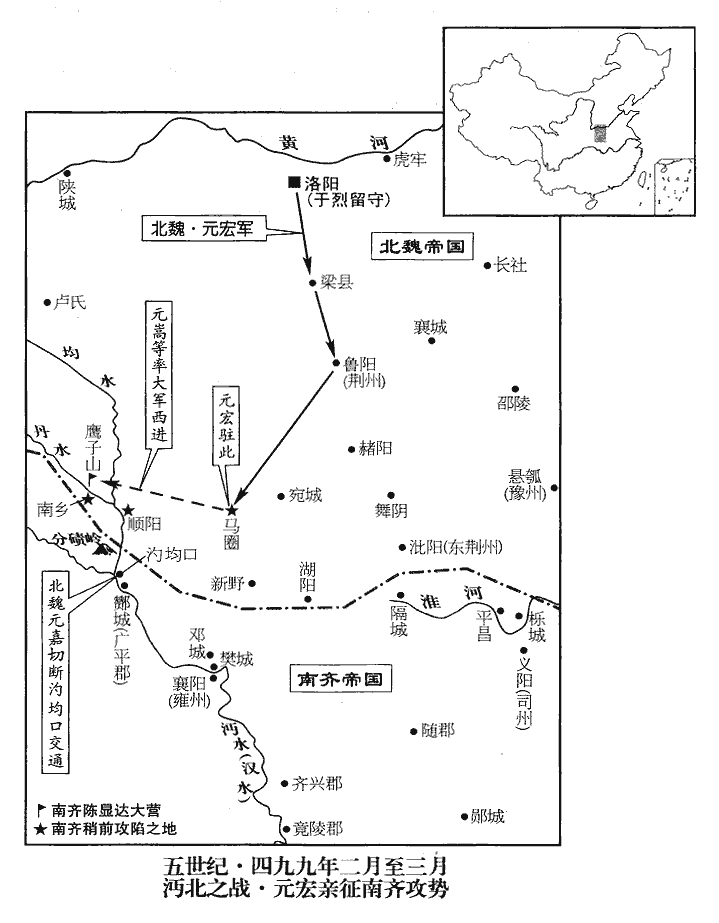
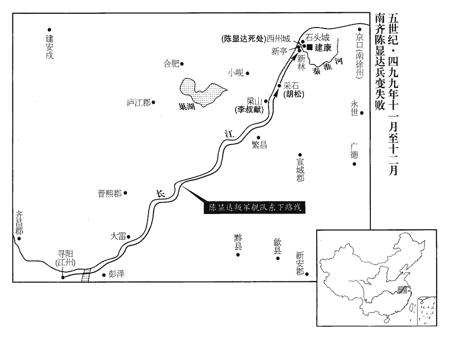

 齊紀八屠維單閼（己卯），一年。

# 東昏侯上諱寶卷，字智藏；明帝第二子也；本名明賢，明帝輔政後，改焉。明帝長子寶義有廢疾，故立帝爲太子。其後蕭衍、蕭穎冑以荊、雍起兵輔南康王寶融以攻帝，廢帝爲東昏侯。荊、雍在西，謂帝以昏虐居東，故廢爲東昏侯。

## 永元元年（己卯、四九九）

1春，正月，戊寅朔‹一›，大赦，改元。

〖译文〗 [1]春季，正月，戊寅朔（初一），南齐大赦天下，改年号为永元。

2太尉陳顯達督平北將軍崔慧景軍四萬擊魏‹都洛阳河南省洛阳市东白马寺东›，欲復雍州諸郡；去年，魏克雍州五郡。雍，於用翻。癸未‹六›，魏遣前將軍元英拒之。元英卽拓跋英；魏旣改姓元氏，史因而書之。

〖译文〗 [2]南齐太尉陈显达督率平北将军崔慧景四万大军出击北魏，想要收复雍州诸郡。癸未（初六）北魏派遣前将军元英前去抵抗。

3乙酉‹八›，魏主‹元宏，本年三十三岁›發鄴‹河北省临漳县西南邺镇›。去年十二月甲寅，魏主自鄴班師，今車駕始自鄴發。

〖译文〗 [3]乙酉（初八），北魏孝文帝从邺城出发返回洛阳。

4辛卯‹十四›，帝‹萧宝卷，本年十七岁›祀南郊。

〖译文〗 [4]辛卯（十四日），南齐皇帝萧宝卷在南郊祀天。

5戊戌‹二十一›，魏主至洛陽，過李沖冢。沖死見上卷上年。魏主令葬沖於洛陽覆舟山，近杜預冢，今自鄴還過其冢。按魏主詔代人遷洛者葬洛，餘州從便。沖，隴西人也，以其貴寵，亦令葬洛。時臥疾，望之而泣；見留守官，語及沖，輒流涕。李沖與任城王澄等同守留臺。魏主還洛，見留守官，而沖已死，故語及輒流涕，念之之甚也。守，式又翻。

〖译文〗 [5]戊戌（二十一日），北魏孝文帝回到洛阳，路过了李冲的坟墓。当时，孝文帝因病而不能起身，所以望着李冲的坟墓而哭泣。回宫之后，孝文帝见到当时与李冲一同留守洛阳的其他官员，说到李冲，他泪流满面，不胜思念。

魏主謂任城王澄曰︰「朕離京以來，舊俗少變不？」任，音壬。離，力智翻。少，詩沼翻；下同。不，讀曰否。對曰︰「聖化日新。」帝曰︰「朕入城，見車上婦人猶戴帽、著小襖，此代北婦人之服也。乘車婦人，皆貴臣之家也。著，陟略翻。襖，烏浩翻，裌衣也。何謂日新！」對曰︰「著者少，不著者多。」帝曰︰「任城，此何言也！必欲使滿城盡著邪？」澄與留守官皆免冠謝。史言魏主汲汲於用夏變夷。

〖译文〗 孝文帝问任城王元澄：“朕离开京城以来，旧的风俗习惯多少得到改变没有？”元澄回答说：“在圣上的教化之下，风俗日新月异。”孝文帝又反问：“朕入城时，看见车上坐的妇女们还戴着帽子，穿着小袄，还是老习俗，这怎么能说是日新月异呢？”元澄又回答说：“穿戴的人少，不穿戴的人多。”孝文帝道：“任城王呀，你这说的是什么话呀？难道你还想让满城妇女都戴帽、穿小袄吗？”元澄和其他留守官们都免冠向孝文帝谢罪。

甲辰‹二十七›，魏大赦。魏主之幸鄴也，李彪迎拜於鄴南，且謝罪。彪旣得罪，歸鄕里‹顿丘河南省清丰县›，故迎魏主於鄴南。帝曰︰「朕欲用卿，思李僕射而止。」慰而遣之。會御史臺令史龍文觀告︰「太子恂被收之日，恂被收見一百四十卷明帝建武三年。被，皮義翻。有手書自理，彪不以聞。」尚書表收彪赴洛陽。帝以爲彪必不然；以牛車散載詣洛陽，散，悉但翻。散載者，不加縶縛。會赦，得免。

〖译文〗 甲辰（二十七日），北魏大赦天下。孝文帝去邺城之时，李彪在邺城南边迎拜了他，并且表示服罪。孝文帝对李彪说：“朕想要重新使用你，但是一想起仆射李冲就不打算这样做了。”于是，安慰了几句，最后打发他走了。恰在这时，御史台令史龙文观报告说：“太子元恂被拘收之日，有一封亲笔信为自己申辩，但是李彪私自押下没有上报。”尚书上表要求拘押李彪到洛阳来审理此事。孝文帝却认为李彪一定不会那样做的，所以让他坐牛车来洛阳。正好遇上大赦天下，李彪得以幸免。

6魏太保齊郡靈王簡卒。

〖译文〗 [6]北魏太保齐郡灵王元简去世。

7二月，辛亥‹五›，魏以咸陽王禧爲太尉。

〖译文〗 [7]二月，辛亥（初五），北魏任命咸阳王元禧为太尉。

8魏主連年在外，魏主自明帝建武元年南伐，至是首尾四年。馮后‹冯润›私於宦者高菩薩。菩，蓬晡翻。薩，桑葛翻。及帝在懸瓠‹河南省汝南县›病篤，事見上卷上年。后益肆意無所憚，中常侍雙蒙等爲之心腹。雙，姓；蒙，名。《姓譜》︰顓帝後封於雙蒙城，其後以爲氏。

〖译文〗 [8]北魏孝文帝连年在外奔忙，冯皇后私通于宦官高菩萨。到了孝文帝在悬瓠病重之时，冯皇后更加肆意淫乱，无所忌惮，中常侍双蒙等人是她的心腹。

彭城公主爲宋王劉昶子婦，寡居。昶，丑兩翻。后爲其母弟北平公馮夙求婚，帝許之；公主不願，后‹冯润›強之。后爲，于僞翻。強，其兩翻。公主密與家僮冒雨詣懸瓠，訴於帝，且具道后所爲。帝疑而祕之。后聞之，始懼，陰與母常氏使女巫厭禱，厭，於葉翻，又於琰翻。曰︰「帝疾若不起，一旦得如文明太后輔少主稱制者，文明太后，后之姑也；其包藏禍心若此，豈非姑之敎邪！少，詩照翻。當賞報不貲。」貲zī，卽移翻。貲之爲言量也。不貲，言無量之可比也。

〖译文〗 北魏彭城公主是宋王刘昶的儿媳妇，守寡而居。冯皇后想要让彭城公主再嫁给她的胞弟北平公冯夙，特意求婚，孝文帝答应了。但是，彭城公主却不愿意，冯皇后就强迫她，彭城公主只好秘密地与家中的仆人一起冒雨赶到悬瓠，把冯皇后逼婚的情况告诉了孝文帝，并且还把冯皇后与人私通的事也讲了。孝崐文帝听后心有疑端，但秘而不宣。冯皇后知道风声之后，开始害怕了，因此私下里经常与自己的母亲常氏在一起让女巫祈祷鬼神降灾于孝文帝，诅咒他快快死去，许愿说：“皇帝的病如果好不了，一旦我能象文明太后那样辅佐少帝垂帘听政的话，定将重加赏报，不计其量。”

帝還洛，收高菩薩、雙蒙等，案問，具伏。帝在含溫室，夜引后‹冯润›入，賜坐東楹，去御榻二丈餘，命菩薩等陳狀。陳后淫泆yì之狀。旣而召彭城王勰、北海王詳入坐，勰，音協。曰︰「昔爲汝嫂，今是路人，但入勿避！」又曰︰「此嫗欲手刃吾脅！嫗yù，威遇翻。老婦曰嫗。吾以文明太后家女，不能廢，但虛置宮中，有心庶能自死；言若有人心，必當自取盡也。汝等勿謂吾猶有情也。」二王出，賜后辭訣；后再拜，稽首涕泣。稽，音啓。入居後宮，諸嬪御奉之猶如后禮，嬪，毗賓翻。唯命太子不復朝謁而已。太子，儲君也；命不復朝謁，絕之，不使以母禮事之。復，扶又翻。朝，直遙翻。

〖译文〗 孝文帝回到洛阳之后，收拘了高菩萨、双蒙等人，加以审问，全都招供认罪。于是，孝文帝坐在含温室，到了夜间让冯皇后进去，叫她坐在东边屋子里，离自己的坐榻有两丈多远，然后命令高菩萨等人坦白交待与皇后淫乱之事。然后，孝文帝又把彭城王元勰、北海王元详两人召进去，让他们坐下，并且指着冯皇后对他们说：“过去她是你们的嫂子，从今开始就是两旁路人了，所以只管进来勿须回避。”接着又说：“这老妇人想要拿刀刺我的胁下，我因她是文明太后家的女儿，不能废掉她，只是把她虚置在宫中，她如果有廉耻之心的话，或许能自取一死。所以，你们不要以为我还对她有什么情份。”彭城王和北海王出去了，孝文帝问冯皇后最后还有什么话要说，冯皇后再次向孝文帝行拜礼，跪地磕头，涕泣不已，然后离开了孝文帝。冯皇后回到后宫幽居，诸嫔妃们还照样对她施行皇后之礼，只是命令太子不再每天早晨去向她请安。

初，馮熙以文明太后之兄尚恭宗女博陵長公主。景穆太子廟號恭宗。長，知兩翻。熙有三女，二爲皇后‹冯清、冯润›，一爲左昭儀，二后，廢后及幽后也。昭儀早卒。瑤光寺之練行尼，魏主忍爲之，廢后非得罪於宗廟也；幽后所爲彰灼如此，乃不能正其罪；廢后獨非文明家女邪！由是馮氏貴寵冠羣臣，賞賜累巨萬。《漢書音義》曰︰巨萬，萬萬也。冠，古玩翻。公主生二子，誕、脩。熙爲太保，誕爲司徒，脩爲侍中、尚書，庶子聿yù爲黃門郎。黃門侍郎崔光與聿同直，庶子，妾御所生。以此觀之，魏以黃門郎與黃門侍郎爲兩官。同直，同直禁中也。謂聿曰︰「君家富貴太盛，終必衰敗。」聿曰︰「我家何所負，而君無故詛我！」詛，莊助翻，呪zhòu也。光曰︰「不然。物盛必衰，此天地之常理。若以古事推之，不可不愼。」後歲餘而脩敗。脩性浮競，誕屢戒之，不悛，悛，丑緣翻。乃白於太后及帝而杖之。脩由是恨誕，求藥，使誕左右毒之。事覺，帝欲誅之，誕自引咎，懇乞其生。帝亦以其父老，杖脩百餘，黜爲平城‹山西省大同市›民。及誕、熙繼卒，太和十九年，馮誕卒，是年二月也；四月，馮熙又卒。幽后尋廢，太和二十年，幽后廢。聿亦擯棄，馮氏遂衰。史言外戚罕有能全保其福祿者。

〖译文〗 起初，冯熙以文明太后哥哥的身份娶景穆太子的女儿博陵长公主为妻。冯熙有三个女儿，两个为皇后，一个是左昭仪，因此冯氏家族宠贵冠于群臣之上，仅朝廷所给之赏赐就累计在亿万之上。博陵长公主生了两个儿子，即冯诞和冯。冯熙本人任太保，其子冯诞任司徒，冯任侍中、尚书，冯熙的妾所生儿子冯聿任黄门郎。黄门侍郎崔光与冯聿一同在禁中当值，崔光对冯隶说：“您家荣华富贵太过头了，物极必反，最后一定要衰败。”冯聿一听不高兴了，回答说：“我家有何对不起您的地方，您为什么要这样无缘无故地诅咒我呢？”崔光又说：“哪里是诅咒你。世上万事万物，盛极而衰，这是天地的常理。如果以古事来推论，您对此不可不慎重呀。”果然，一年多之后，冯就出事垮台了。冯性情浮华，好争好斗，冯诞屡次告戒他，然而终无悔改之迹，于是就上告文明太后和孝文帝，用棍杖狠狠教训了他一顿。因此，冯非常记恨冯诞，于是找来毒药，让冯诞左右的人下药毒死冯诞。事情败露之后，孝文帝准备杀掉冯，冯诞却引咎自责，恳切地乞求孝文帝放他一条生路。孝文帝也考虑到他们的父亲年事已高，就饶冯不死，而只是打了他一百多杖，贬为平城平民。等到冯诞、冯熙相继去世之后，不久冯皇后被废，冯聿也被摒弃不用，于是冯氏家族从此衰落。

9魏【章︰十二行本「魏」上有「癸亥」二字；乙十一行本同；孔本同；退齋校同。】以彭城王勰爲司徒。勰，音協。

〖译文〗 [9]北魏任命彭城王无勰为司徒。

10陳顯達與魏元英戰，屢破之。攻馬圈城‹河南省邓州市东北三十五千米›四十日，按《陳顯達傳》，馬圈在南鄕界。杜佑曰︰馬圈城去襄陽三百里，在今南陽郡界穰縣北。杜佑曰︰後魏馬圈鎭，漢𣵀陽縣地。圈，渠篆翻。城中食盡，噉死人肉及樹皮。噉dàn，徒濫翻，又徒覽翻。癸酉‹二十七›，魏人突圍走，斬獲千計。顯達入城，將士競取城中絹，遂不窮追。史言齊師貪鹵掠以縱敵。將，卽亮翻。顯達又遣軍主莊丘黑進擊南鄕‹河南省淅川县南›，拔之。莊丘，複姓也。蕭子顯曰︰南鄕城，順陽舊治也。

〖译文〗 [10]南齐陈显达与北魏元英交战，陈显达屡胜元英。南齐军队围攻马圈城，整整围困了四十天，城中粮食尽绝，只好吃死人肉和树皮。癸酉（二十七日），北魏人马突围逃走，被南齐军队斩获上千人。陈显达率部入城，将士们争相掠取城中的绢匹，因此没有去追击北魏逃兵。陈显达又派军主庄丘黑进击南崐乡，也占领了该地。

魏主謂任城王澄曰︰「顯達侵擾，朕不親行，無以制之。」任，音壬。三月，庚辰‹四›，魏主發洛陽，命于烈居守，守，音狩；凡留守、太守之守皆同。以右衛將軍宋弁biàn兼祠部尚書，攝七兵事以佐之。攝七兵事者，攝尚書七兵曹事也。杜佑曰︰魏始置五兵尚書，謂中兵、外兵、別兵、都兵，騎兵也。晉又分中、外兵各爲左、右，後魏遂爲七兵尚書。弁精勤吏治，治，直吏翻。恩遇亞於李沖。

〖译文〗 北魏孝文帝对任城王元澄说：“陈显达率兵来侵扰，朕如果不亲自出征，就无法抵制住他。”三月庚辰（初四），孝文帝率兵从洛阳出发，命令于烈留守洛阳，又任命右卫将军宋弁兼任祠部尚书，代理尚书七兵曹事，协助于烈。宋弁为人兢兢业业，尽职尽责，孝文帝对他的恩遇仅次于李冲。

癸未‹七›，魏主至梁城‹河南省汝州市西›。魏收《志》︰北荊州汝北郡有梁縣、汝源縣。《五代志》︰襄城郡承休縣，舊曰汝源，置汝北郡。《唐志》︰汝州臨汝郡，本襄城郡治梁縣，又有梁縣故城在西南四十五里。崔慧景攻魏順陽‹河南省淅川县东南›，順陽太守清河‹山东省临清市›張烈固守；《五代志》︰鄧州順陽縣，舊置順陽郡，唐武德六年，省順陽入冠軍，貞觀元年，省冠軍入新城，其地在今鄧州菊潭、臨湍二縣之間也。杜佑曰︰漢順陽故城，在鄧州穰縣西，亦後漢穰縣地。甲申‹八›，魏主遣振威將軍慕容平城將騎五千救之。將，卽亮翻。騎，奇寄翻。

〖译文〗 癸未（初七），北魏孝文帝到达梁城。南齐崔慧景进攻北魏顺阳，顺阳太守清河人张烈顽强固守。甲申（初八），孝文帝派遣振威将军慕容平城率领骑兵五千去援救张烈。

自魏主‹元宏›有疾，彭城王勰常居中侍醫藥，晝夜不離左右，離，力智翻。飲食必先嘗而後進，蓬首垢面，衣不解帶。帝久疾多忿，近侍失指，動欲誅斬；勰承顏伺間，多所匡救。伺，相吏翻。間，古莧翻；下間道同。丙戌‹十›，以勰爲使持節、都督中外諸軍事。使，疏吏翻。勰辭曰︰「臣侍疾無暇，安能治軍！願更請一王，使總軍要，軍要，猶言軍權也。《左傳》曰︰握兵之要。杜預《註》云︰威權在己。治，直之翻。臣得專心醫藥。」帝曰︰「侍疾、治軍，皆憑於汝。吾病如此，深慮不濟；安六軍、保社稷者，捨汝而誰！何容方更請人以違心寄乎！」心寄，謂推心以託之也。

〖译文〗 自从孝文帝患病之后，彭城王元勰经常住在宫中，侍奉孝文帝看病吃药，昼夜不离其左右，凡是给孝文帝的饮食，他一定先尝一下然后才进上，如此日夜辛劳，以致蓬首垢面，衣不解带，不能好好地睡上一觉。孝文帝由于久病而脾气急躁，在身旁侍奉他的人稍稍有点不如意，动不动就让斩了，元勰瞅他情绪好的时候乘机言劝，救了不少人的性命。丙戌（初十），孝文帝任命元勰为使持节、都督中外诸军事，元勰辞而不受，说：“我要侍奉护理圣上养病，没有闲暇，怎么还能统管军队呢？希望另外请一个藩王，让他来掌握军权，以便我能专心护理圣上。”孝文帝不同意，说：“护理、掌管军队两样事情，全都依托于你。我病到这个样子，深深地感到恐怕不行了，而安定六军、保卫社稷者，除了你还能有谁呢？你哪能让我违背自己的心意而另外再请别人来担当此重托呢？”

 

丁酉‹二十一›，魏主至馬圈，命荊州‹府设鲁阳河南省鲁山县›刺史廣陽王嘉斷均口‹均水注入汉水处·湖北省丹江口市›，《水經》曰︰均水出淅縣北山，南流過其縣之東，又南，當涉都縣邑北，南入于沔。《註》云︰卽《郡國志》筑陽縣之涉都鄕，均水於此入沔，謂之均口。斷，丁管翻。邀齊兵歸路。嘉，建之子也。楚王建，見一百二十五卷宋文帝元嘉十七年。

〖译文〗 丁酉（二十一日），北魏孝文帝到达马圈，并命令荆州刺史广阳王元嘉截断均口，以阻拦南齐军队的退路。元嘉是元建的儿子。

陳顯達引兵渡水西，均水之西也。據鷹子山‹河南省淅江县南丹水北岸›築城；人情沮恐，沮，在呂翻。與魏戰，屢敗。魏武衛將軍元嵩免冑陷陳，陳，讀曰陣。將士隨之，齊兵大敗。嵩，澄之弟也。戊戌‹二十二›，軍【章︰十二行本「軍」上有「夜」字；乙十一行本同；孔本同；張校同；退齋校同。】主崔恭祖、胡松以烏布幔盛顯達，數人擔之，幔，莫半翻。盛，時征翻。擔，都甘翻，負也。間道自分磧山‹湖北省丹江口市北›出均水口南走。磧qì，七迹翻。己亥‹二十三›，魏收顯達軍資億計，班賜將士，追奔至漢水而還。還，從宣翻，又如字；下同。左軍將軍張千戰死，《考異》曰︰《魏書》作「張千達」，今從《齊書》。士卒死者三萬餘人。

〖译文〗 陈显达领兵渡过均水，到达西岸，占据了鹰子山，并在山上修筑城堡。但是，由于士气不振，人人情绪沮丧，心存恐惧，所以与北魏军队交战，屡战屡败。北魏武卫将军元嵩除去甲胄，带头冲锋陷阵，其他将士们紧随而上，打得南齐军队溃不成军。元嵩是元澄的弟弟。戍戌（二十二日），南齐军主崔恭祖、胡松用乌布幔把陈显达装进去，几个人抬着，抄小道从分碛山出均水口向南逃去。己亥（二十三日），北魏收缴陈显达丢弃下的军用物资以亿计数，全部分赐给将士们，又追击南齐逃军至汉水，然后才返回。南齐左军将军张千战死，，士卒阵亡的有三万多人。

顯達之北伐，軍入汋zhuó均口。《水經註》︰順陽縣西有石山，南臨汋水。汋水又南流，注于沔水，謂之汋口。詳考《經》及《註》，汋水、均水，實一水也，故謂之汋均口。汋zhuó，實若翻。廣平‹侨郡·湖北省老河口市西北›馮道根沈約《宋志》︰廣平太守，江左僑立，治襄陽；宋爲實土，以漢朝陽縣地立廣平郡及廣平縣，領酇陰、比陽等縣。按《水經註》︰朝陽在新野西，白水又出其西。說顯達曰︰「汋均水迅急，易進難退；說，輸芮翻。易，以豉翻。魏若守隘，則首尾俱急。不如悉棄船於酇城‹湖北省老河口市西北›，陸道步進，酇縣，卽漢蕭何所封之邑，屬南陽郡，晉屬順陽郡，江左僑立廣平郡，酇縣屬焉。馮道根，廣平酇人也。《水經》︰沔水自均口東南過酇縣之西南。《五代志》︰襄州陰城縣，西魏置酇城郡。隘，烏懈翻。酇，音贊。列營相次，鼓行而前，破之必矣。」顯達不從。道根以私屬從軍，私屬者，家之奴客及其親黨，非官之所調發者。及顯達夜走，軍人不知山路，道根每及險要，輒停馬指示之，衆賴以全。詔以道根爲汋均口戍副。凡邊戍有戍主、戍副。顯達素有威名，至是大損。陳顯達之敗，固是弱不可以敵強，亦天爲之也。齊師潰於戊戌，魏主殂於丙午。儻顯達更能支持數日，安知不能轉敗爲功邪！御史中丞范岫xiù奏免顯達官，顯達亦自表解職；皆不許，更以顯達爲江州‹府设寻阳江西省九江市›刺史。《考異》曰︰《齊明帝紀》︰「永泰元年，七月，癸卯，以顯達爲江州。」《本傳》︰「顯達敗於馬圈，求降號，不許，乃除江州。」又云︰「東昏立，顯達彌不樂京師，得此授甚喜。」按明帝末，顯達方以三公將兵擊魏，不容無故除江州。今從《本傳》。崔慧景亦棄順陽走還。

〖译文〗 陈显达率部北伐时，军队进入均口，广平人冯道根劝说陈显达：“均水水流湍急，前进容易，后退却难，北魏如果据守隘关，那么我们的部队首尾崐都会受挫。所以，不如弃船于城，改由陆路步行而进，军营前后相次，擂鼓进军，一定能攻破对方。”然而，陈显达没有采纳。冯道根是以陈显达的私属的身份随军，陈显达夜间逃跑，军人们不熟悉山路，每到险要地方，冯道根都要停下马来给他们指路，众人全凭他才得以生还。因此，朝廷诏令冯道根为均口戍副。陈显达素有威名，但是这次却一败涂地。御史中丞范岫上奏朝廷请求罢免陈显达的官职，陈显达也自动上表请求解除职务，但是都没有得到批准，改任陈显达为江州刺史。崔慧景也丢弃顺阳逃跑回来。

11庚子‹二十四›，魏主疾甚，北還，至穀塘原，謂司徒勰曰︰「後宮久乖陰德，《記》曰︰天子理陽道，后治陰德。鄭《註》云︰陰德，謂主陰事，陰令也。吾死之後，可賜自盡，葬以后禮，庶免馮門之醜。」又曰︰「吾病益惡，殆必不起。雖摧破顯達，而天下未平，嗣子幼弱，社稷所倚，唯在於汝。霍子孟、諸葛孔明以異姓【章︰十二行本「姓」下有「猶」字；乙十一行本同；孔本同。】受顧託，漢武帝託昭帝於霍光，昭烈帝託後主於諸葛亮，事並見前。況汝親賢，可不勉之！」勰泣曰︰「布衣之士，猶爲知己畢命；古語有之，士爲知己者死。爲，于僞翻。況臣託靈先帝，依陛下之末光乎！託靈，託體，皆兄弟同氣之謂也。但臣以至親，久參機要，寵靈輝赫，海內莫及；所以敢受而不辭，正恃陛下日月之明，恕臣忘退之過耳。今復任以元宰，復，扶又翻。總握機政；震主之聲，取罪必矣。昔周公大聖，成王至明，猶不免疑，而況臣乎！如此，則陛下愛臣，更爲未盡始終之美。」彭城王勰慮禍避權如此，猶終不免於高肇之手，況咸陽王禧、北海王詳等邪？帝默然久之，曰︰「詳思汝言，理實難奪。」乃手詔太子曰︰「汝叔父勰，清規懋賞，懋，美也。與白雲俱潔；厭榮捨紱，以松竹爲心。吾少與綢繆，紱，音弗。少，詩照翻。鄭康成曰︰綢繆，猶纏綿也。綢，直留翻。繆，莫侯翻。未忍暌離。百年之後，其聽勰辭蟬捨冕，遂其沖挹之性。」以侍中、護軍將軍北海王詳爲司空，鎭南將軍王肅爲尚書令，鎭南大將軍廣陽王嘉爲左僕射，尚書宋弁爲吏部尚書，與侍中•太尉禧、尚書右僕射澄等六人輔攻。夏，四月，丙午朔‹一›，殂于穀塘原。年三十三，諡孝文皇帝，廟號高祖。

〖译文〗 [11]庚子（二十四日），北魏孝文帝病危，只好北还，到达谷塘原时，孝文帝对司徒元勰说：“冯皇后长久以来不守妇道，乖违后德，我死之后，可以赐她自尽，以皇后之礼仪加以安葬，庶可免去冯氏家门之丑。”又说道：“我的病越来越严重了，大约一定好不了的。这次虽然打垮了陈显达，然而天下并没有平定，继位的儿子又年纪幼小，所以江山社稷就全依靠你了。当年霍光、诸葛孔明都以外姓人的身份而分别受到汉武帝、昭烈帝刘备之重托，况且你是骨肉之亲，能不勉力承担吗？”元勰哭着说道：“布衣之士，还能做到为知己而死，况且我又是先帝的儿子，又是陛下的兄弟呢！但是，我以至亲的身份，长期参于朝廷的机要大事，由于得到圣上不平常的宠遇，身重朝野，举国上下没有谁能比得上，之所以敢于接受圣上的重任而不加推辞，正是有恃于陛下之圣明，可以宽恕我知进忘退之过失。现在，圣上又委任我为朝臣之首，总握军机朝政大权，这样势必有人要议论我震主越上，一定会因此而获罪。过去周公是大圣之人，周成王也是圣明之君，但是犹不免对周公产生疑心，何况是我呢？这样的话，那么陛下虽然爱我，可是并不能自始自终一以贯之，最终怕要害了我呀。”孝文帝听了之后，沉思良久，最后说：“细细思量你说的话，从道理上实在难以反驳。”于是，孝文帝亲手给太子写下诏令：“你的叔父元勰，以自己的言行树立了一个很好的榜样，所以被授官以资勉励，其节操如白云一样纯洁；他不贪图荣华富贵，以官爵为身外之物，其素心如松柏翠竹。我自小与他一起相处，从来不忍心分离。我离开人世之后，你要准许元勰辞去官职，脱身俗务，以便顺从他谦虚自抑的性格。”孝文帝又任侍中、护军将军北海王元详为司空，镇南将军王肃为尚书令，镇南大将军广阳王元嘉为左仆射，尚书宋弁为吏部尚书，令他们与侍中、太尉元禧以及尚书右仆射元澄等六人共同辅佐朝政。夏季，四月，丙午朔（初一），孝文帝病死于谷塘原。

高祖友愛諸弟，終始無間。間，古莧翻。嘗從容謂咸陽王禧等曰︰從，千容翻。「我後子孫邂逅不肖，不期而會曰邂逅。肖，似也；不似其先曰不肖。邂，戶懈翻。逅，胡豆翻。汝等觀望，可輔則輔之，不可輔則取之，勿爲他人有也。」以禧之驕貪如此，孝文以此語之，是啓其姦心也。景明之禍，帝實胎之。親任賢能，從善如流，精勤庶務，朝夕不倦。常曰︰「人主患不能處心公平，推誠於物。處，昌呂翻。能是二者，則胡、越之人皆可使如兄弟矣。」用法雖嚴，於大臣無所容貸，然人有小過，常多闊略。嘗於食中得蟲，又左右進羹誤傷帝手，皆笑而赦之。天地五郊、宗廟二分之祭，五郊，謂迎氣五郊也。按鄭康成說︰古者，天子春分朝日，秋分夕月，故曰二分之祭。魏則朝日以朔，夕月以朏fěi，猶仍古謂之二分之祭。未嘗不身親其禮。每出巡遊及用兵，有司奏脩道路，帝輒曰︰「粗脩橋梁，通車馬而已，勿去草剗令平也。」粗，坐五翻。去，羌呂翻。剗chǎn，楚限翻。在淮南行兵，如在境內。禁士卒無得踐傷粟稻；踐，息淺翻。或伐民樹以供軍用，皆留絹償之。宮室非不得已不脩，衣弊，浣濯而服之，鞍勒用鐵木而已。幼多力善射，能以指彈碎羊骨，《魏紀》云︰能以指彈碎羊髆bó骨。羊骨唯髆骨頗脆，他骨未易彈碎也。彈，徒丹翻。射禽獸無不命中；先命其處而後射中之，謂之命中。射，而亦翻。及年十五，遂不復畋獵。復，扶又翻；下同。常謂史官曰︰「時事不可以不直書。人君威福在己，無能制之者；若史策復不書其惡，將何所畏忌邪！」自此以上，史言魏孝文德美。

〖译文〗 孝文帝对他的几个弟弟非常爱护，彼此始终没有产生隔阂。一次，他曾从崐容地对咸阳王元禧等说：“我死之后，子孙们如果不肖，你们看情况而办，可以辅佐则辅佐，不可辅佐则取而代之，千万不要让江山为他人所有。”孝文帝能亲近贤士，选用才能，从善如流，精勤庶务，朝夕不倦，常常说：“一国之主患在不能用心公平，以诚待人，如果能做到这两点的话，即使是胡、越之人也可以使他们成为兄弟。”他用法虽然严厉，对于大臣们，只要有罪，绝不姑且宽容。但是，如果别人有小过失，又常能宽大而不计较。有一次，他在饭中发现了虫子，又有一次手下人进羹时不小心烫了他的手，他都笑而宽恕，没有治罪。凡是天地五郊、宗庙二分的祭祀，他都亲自参加。每次出外巡游以及用兵讨伐，有关官员奏告要修筑道路，孝文帝总是说：“简单修理一下桥梁，能通过车马就行了，不要铲除杂草、填修平整。”他在淮南行军讨伐时，如在本国境内一样，严禁士卒们践踏损坏稻谷作物，如果要砍伐百姓的树木以供军用，都留下绢帛作为抵偿。他所住的宫室不到万不得已之时不许修理，衣服穿旧了，浆洗一下仍旧穿用，坐骑的鞍勒唯用铁木而已。他少年时候力气大，善于射箭，能用手指头弹碎羊的骨头，射猎禽兽没有不射中的。到了十五岁时，他就不再射猎了，常常对史官说：“当朝时事，不可不如实记载，皇帝的威福由己，没有能制止他的，如果史官再不记录下他的恶行的话，那他还有什么可畏忌的呢？”

彭城王勰與任城王澄謀，以陳顯達去尚未遠，恐其覆相掩逼，覆，反也；恐凶問外露，陳顯達知之，反兵追掩以相逼。乃祕不發喪，徙御臥輿，唯二王與左右數人知之。勰出入神色無異，奉膳，進藥，可決外奏，一如平日。數日，至宛城，宛，於元翻。夜，進臥輿於郡聽事，得加棺斂，《魏書•禮志》︰臥輦，飾如乾象輦，丹漆，駕六馬。聽，他經翻。聽，受也。中庭曰聽事，言受事察訟於是也。漢、晉皆作聽事，六朝以後乃始加「广」作「廳」。棺，古玩翻。斂，力贍翻。還載臥輿內，外莫有知者。遣中書舍人張儒奉詔徵太子‹元恪，本年十七岁›；密以凶問告留守于烈。烈處分行留，舉止無變。史言魏孝文之殂，執羈絏xiè、守社稷者皆能以常處變，不動聲色，蓋其善用人之效也。處，昌呂翻。分，扶問翻。太子至魯陽，魯陽縣，漢、晉屬南陽郡。魏太和十一年，置魯陽鎭；十八年，改爲荊州；二十二年，罷州，置魯陽郡。唐汝州魯山縣，本魯陽縣也。遇梓宮，乃發喪；丁巳‹十二›，卽位，帝諱恪，孝文皇帝第二子也。大赦。

〖译文〗 彭城王元勰与任城王元澄一起商谋，考虑到陈显达逃离还不太远，恐怕他知道孝文帝的死讯后要回过头来攻击，所以决定不向外宣布孝文帝的死讯，秘不发丧，而照样把孝文帝的尸身置于他平时用的车舆之中赶路，只有彭城王、任城王以及左右的几个人知道实情。元勰出入其中神色如同平常，又是奉侍膳食，又是进药送汤，处理外面的各种启奏，一如平日那样。数日之后，到达宛城，乘着夜间，把载有其尸体的车舆拉到郡署中庭，才把他装敛入棺材之中，然后仍将棺材载于车舆之中，外人没有知道其实情的。他们又派遣中书舍人张儒奉旨召太子前来，并且秘密地把孝文帝的死讯告知留守洛阳的于烈。于烈安排布置谁随同前去，谁留守洛阳，举止形态一如平常。太子到达鲁阳，遇上了孝文帝的灵柩，这才正式为孝文帝发丧。丁巳（十二日），太子元恪即位，大赦天下。

彭城王勰跪授遺敕數紙。東宮官屬多疑勰有異志，密防之，而勰推誠盡禮，卒無間隙。推誠，謂推誠於東宮官屬也；盡禮，謂事嗣君盡禮也。卒，子恤翻。間，古莧翻。咸陽王禧至魯陽，留城外以察其變，久之，乃入，亦疑勰有異志也。謂勰曰︰「汝此行不唯勤勞，亦實危險。」勰曰︰「兄年長識高，故知有夷險；長，知兩翻。彥和握蛇騎虎，不覺艱難。」勰，字彥和。蛇螫shì、虎噬，握之、騎之，罕有能免於螫、噬者，故以爲喻。禧曰︰「汝恨吾後至耳。」

〖译文〗 彭城王元勰跪着交给元恪数页写有孝文帝的遗敕的纸张。元恪为东宫太子时手下的属官们大都怀疑元勰有异心，因此严加防范，然而元勰对这些东宫官属们推诚布公，礼数周到，终于消除了相互之间的间隙。咸阳王元禧到达鲁阳，没有进城，留在城外观察有无事变，很久之后，见元勰不存异图，方才进入城内。元禧进城之后，对元勰说：“你的这一次行动，不但操劳辛苦，而且实在危险。”元勰回答说：“兄长年纪大、见识高，所以知道有危险，彦和我此番经历，不啻于握蛇骑虎，然而不觉有多么艰难。”元禧说：“你这是怨恨我来的晚了吧。”

勰等以高祖‹元宏›遺詔賜馮后‹冯润›死。北海王詳使長秋卿白整入授后藥，長秋卿，皇后宮卿也，卽漢之大長秋。后走呼，不肯飲，走且呼也。呼，火故翻。曰︰「官豈有此，是諸王輩殺我耳！」整執持強之，乃飲藥而卒。強，其兩翻。《考異》曰︰《元嵩傳》曰︰「將遣使者賜馮后死，而難其人，顧任城王澄曰︰『任城不負我，嵩亦當不負任城，可使嵩也。』乃引高平侯嵩入內，親詔遣之。」《高祖紀》曰︰「詔司徒勰徵太子與喪會魯陽踐阼。」按《馮后傳》，梓宮至魯陽，乃行遺詔賜后死，安有高祖遣嵩之事！又《勰傳》︰「高祖崩，勰遏祕喪事，遣張儒徵世宗。」亦無高祖詔勰徵太子事。喪至洛城南，咸陽王禧等知后審死，相視曰︰「設無遺詔，我兄弟亦當決策去之；豈可令失行婦人宰制天下、殺我輩也！」去，羌呂翻。行，下孟翻。諡曰幽皇后。《諡法》︰壅遏不通曰幽。

〖译文〗 元勰等人以孝文帝的诏令赐冯皇后死。北海王元详派长秋卿白整进去给冯皇后送毒药，冯皇后一边跑一边大声呼喊，不肯饮药，说道：“皇上那里会有这样的诏令，这是诸王之辈们要谋杀我呀！”白整无奈，只好把她抓住，强迫她把毒药喝下去，即刻毙命。孝文帝的灵柩到达洛阳南郊之时，咸阳王元禧等人知道冯皇后确实已死，就互相对视着说道：“假如没有先帝的遗诏，我们兄弟几个人也要想方设法把她除掉，岂可以让这个失去贞操的妇人宰制天下、杀崐害我辈呢？”冯皇后死后，谥号为幽皇后。

12五月，癸亥，加撫軍大將軍始安王遙光開府儀同三司。

〖译文〗 [12]五月，癸亥（疑误），南齐加封始安王萧遥光开府仪同三司。

13丙申‹二十一›，魏葬孝文帝‹元宏›於長陵‹洛阳城北›，長陵在瀍chán西。廟號高祖。

〖译文〗 [13]丙申（二十一日），北魏安葬孝文帝于长陵，庙号为高祖。

魏世宗‹元恪›欲以彭城王勰爲相；勰屢陳遺旨，請遂素懷，帝對之悲慟。勰懇請不已，乃以勰爲使持節、侍中、都督冀•定等七州諸軍事、驃騎大將軍、開府儀同三司、定州‹府设中山河北省定州市›刺史。使，疏吏翻。驃，匹妙翻。騎，奇寄翻。七州，冀、定、相、瀛、幽、平、營也。勰猶固辭；帝不許，乃之官。

〖译文〗 北魏宣武帝元恪想任命彭城王元勰为宰相，元勰屡次陈述孝文帝的遗诏，请求能顺遂自己素来的志向，宣武帝对着他悲伤号哭。元勰一再恳切请求不担任朝职，于是宣武帝就任命他为使持节，侍中，都督冀，定等七州诸军事，骠骑大将军，开府仪同三司，定州刺史，元勰还一再推辞，但是宣武帝不准许，于是只好去上任。

14魏任城王澄以王肅羇旅，位加己上，王肅本江南人而奔魏，故以爲羈旅。肅爲尚書令，而澄爲右僕射，故以爲位加己上。意頗不平。會齊人降者嚴叔懋告肅謀逃還江南，降，戶江翻。澄輒禁止肅，禁止不令入宮省。表稱謀叛，案驗無實。咸陽王禧等奏澄擅禁宰輔，免官還第，尋出爲雍州‹府设长安陕西省西安市›刺史。按史官稱任城王澄之才略，魏宗室中之巨擘bò也。太和之間，朝廷有大議，澄每出辭，氣加萬乘而軼其上。孝文外雖容之，內實憚之，況咸陽王禧等乎！因王肅而斥逐之耳。主少國疑之時，澄之能全其身者，幸也。雍，於用翻。

〖译文〗 [14]北魏任城王元澄认为王肃本为江南之人而奔投北魏，官位却在自己之上，所以心中颇为不平。正好由南齐投降过来的严叔懋报告王肃密谋逃回江南去，于是元澄就把王肃拘禁起来，并且上表说王肃密谋反叛。但是，经过立案查验，并非属实。因此，咸阳王元禧等人就上奏皇帝，告元澄擅自拘禁宰辅之臣，元澄被免官还府，不久出任雍州刺史。

15六月，戊辰‹二十四›，魏追尊皇妣高氏爲文昭皇后，高氏卒見上卷明帝建武四年。配饗高祖，增脩舊冢，號終寧陵。據《后傳》，陵在長陵東南。追賜后父颺爵勃海公，諡曰敬，颺yáng，余章翻。以其嫡孫猛襲爵；封后兄肇爲平原公，肇弟顯爲澄城公；澄城，漢馮翊之徵縣，《左傳》之北徵也；魏眞君七年置澄城郡。三人同日受封。魏主素未識諸舅，始賜衣幘引見，見，賢遍翻。皆惶懼失措；數日之間，富貴赫奕。赫，明也；奕，盛也。爲高肇以擅權致禍張本。

〖译文〗 [15]六月，戊辰（二十四日），北魏追封宣武帝之母高氏为文昭皇后，配享孝文帝，并且增修其旧墓，号为终宁陵。又追赐高氏之父高扬爵号为勃海公，谥号为敬，让其嫡孙高猛袭爵位。又封高氏之兄高肇为平原公，弟弟高显为澄城公，三个人同一天受封。宣武帝从来没有见过几位舅舅，这次才赐赏他们衣服头巾，并且接见了他们，弟兄三人都不免惶惧失措。然而，数日之间，富贵显赫一世。

16秋，八月，戊申‹五›，魏用高祖‹元宏›遺詔，三夫人以下皆遣還家。魏高祖始定內官，左、右昭儀位視大司馬，三夫人位視三公。

〖译文〗 [16]秋季，八月，戊申（初五），北魏依照孝文帝的遗诏，后宫中凡三夫人以下者全部遣送回家。

17帝‹萧宝卷›自在東宮，不好學，好，呼到翻。唯嬉戲無度；性重澀少言。澀，色入翻。及卽位，不與朝士相接，朝，直遙翻；下同。專親信宦官及左右御刀、應敕等。御刀，捉御刀在左右者。應敕，在左右祗應敕命者。應，於證翻。

〖译文〗 [17]南齐皇帝萧宝卷，在做东宫太子时就不好学，只喜欢玩耍，嬉戏无度，并且性格沉闷寡言。即位之后，他不爱与朝臣们接触往来，专门亲信宦官以及身边左右御刀和应敕侍从。

是時，揚州刺史始安王遙光、尚書令徐孝嗣、右僕射江祏、祏，音石。右將軍蕭坦之、侍中江祀、衛尉劉暄更直內省，分日帖敕。內省在禁中，以別華林省及下省。帖敕者，於敕後聯紙書行，所謂畫敕也。更，工衡翻。雍州刺史蕭衍聞之，謂從舅錄事參軍范陽‹河北省涿州市›張弘策曰︰張弘策，范陽方城人。衍母張氏，弘策之從父弟。雍，於用翻。從，才用翻。「一國三公猶不堪，《左傳》︰晉士蔿wěi曰︰「狐裘蒙茸，一國三公，吾誰適從？」況六貴同朝，勢必相圖；亂將作矣。避禍圖福，無如此州。但諸弟在都，恐罹世患，當更與益州‹府成都›圖之耳。」衍兄懿時爲益州刺史。乃密與弘策脩武備，他人皆不得預謀；招聚驍勇以萬數，多伐材竹，沈之檀溪‹檀溪在湖北省襄樊市西，北流注入汉水›，《水經註》︰檀溪水出襄陽縣西柳子山下，溪去城里餘，北流注于沔，卽劉備乘的盧墮處也。驍，堅堯翻。沈，直禁翻，又持林翻。積茅如岡阜，大脊曰岡，大陵曰阜。皆不之用。中兵參軍東平‹侨郡·江苏省淮阴市›呂僧珍覺其意，亦私具櫓數百張。先是，僧珍爲羽林監，羽林監，漢官，監羽林兵。先，悉薦翻。徐孝嗣欲引置其府，僧珍知孝嗣不能久，固求從衍。是時，衍兄懿罷益州刺史還，仍行郢州‹府设夏口湖北省武汉市›事，衍使弘策說懿曰︰說，輸芮翻；下又自說同。「今六貴比肩，人自畫敕，爭權睚眦，理相圖滅。圖，謀也；謀相滅也。或曰︰「圖」當作「屠」。睚，五懈翻。眦，士懈翻。主上‹萧宝卷›自東宮素無令譽，媟xiè近左右，慓輕忍虐；媟，私列翻。近，其靳翻。慓piào，匹妙翻，急疾也。輕，區竟翻。安肯委政諸公，虛坐主諾！言必不肯付朝政以聽於六貴，但擁虛位，有可無否，唯主作諾而已。嫌忌積久，必大行誅戮。始安‹萧遥欣›欲爲趙王倫‹司马伦›，形迹已見；趙王倫事見八十四卷晉惠帝永寧元年。見，賢遍翻。然性猜量狹，徒爲禍階。蕭坦之忌克陵人，徐孝嗣聽人穿鼻，言如牛然，聽人穿鼻而受制於人。江祏無斷，斷，丁管翻。劉暄闇弱；一朝禍發，中外土崩。吾兄弟幸守外藩，宜爲身計；及今猜防未生，當悉召諸弟，恐異時拔足無路矣。後卒如衍所料。史言朝政不綱，則姦雄生心。郢州控帶荊‹湖北省西部›、湘‹湖南省›，郢州當荊、湘下流，二州之所赴集也。雍州士馬精強，世治則竭誠本朝，治，直吏翻。朝，直遙翻。世亂則足以匡濟；與時進退，此萬全之策也。若不早圖，後悔無及。」弘策又自說懿曰︰「以卿兄弟英武，天下無敵，據郢、雍二州爲百姓請命，廢昏立明，易於反掌，爲，于僞翻。易，以豉翻。此桓、文之業也；勿爲豎子所欺，取笑身後。雍州揣之已熟，揣，初委翻。願善圖之！」懿不從。衍乃迎其弟驃騎外兵參軍偉及西中郎外兵參軍憺至襄陽。憺dàn，徒濫翻。

〖译文〗 这时候，扬州刺史始安王萧遥光、尚书令徐孝嗣、右仆射江、右将军萧坦之、侍中江祀、卫尉刘暄等六人轮留在朝中内省当值，轮到谁当值，谁就在当天的敕令后面签署执行意见。雍州刺史萧衍知道了这一情况之后，对他的担任录事参军的堂舅、范阳人张弘策说：“一国有三公已经不堪其乱，何况如今六贵同朝，他们之间势必要互相图谋，因此必定会发生动乱。要说避祸图福，那里也比不上这个州，但是我的几个弟弟都在京城，恐怕会遭受乱世之患，所以我还要与吾兄益州刺史萧懿有所计议。”于是，萧衍秘密地与张弘策加强武备，其他人则一律不得参与。又招集会聚骁勇之夫上万人众，大量砍伐树木、竹子，沉于檀溪之中，茅草堆积的如山冈一般，然而都不使用。中兵参军东平人吕僧珍觉察出了萧衍的用意，也私自准备了船橹数百张。早先之时，吕僧珍任羽林监，徐孝嗣想让他参加自己的幕府，但是吕僧珍知道徐孝嗣不会久长，所以再三请求跟随萧衍。这时候，萧衍的哥哥萧懿被免去益州刺史之职而返回，但仍然掌管郢州事务，萧衍派张弘策去游说萧懿：“如今朝中六位权贵当朝，各自发号施号，互相争权夺利，反目成仇，理当会相互图灭。而皇上则从做太子起就没有好声誉，他轻慢身边的人，悍残忍，怎么肯把朝政委托于他们六人，而自己只有虚位，凡事但作允诺而已呢？时间一长，皇上猜忌之心必生，而猜忌积久，必定要大行诛戮。始安王萧遥光想充当晋代赵王司马伦的角色，其形迹已经可以看得出来，然而其性格猜疑、气量狭小，只能白白地成为祸害之由。萧坦之忌妒才能，处处想凌驾于别人之上，而徐孝嗣受人牵使，江则犹柔寡断，刘暄则更是个糊涂软弱之人。有朝一日，祸乱爆发，朝廷内外必将土崩瓦解，支离破碎。我们兄弟幸好驻守外藩，应该为自身有所计谋。趁现在他们互相之间的猜忌、提防还没有开始，我们应当把几个弟弟全都叫到身边来，不然的话，恐怕到那时候就会拔足无路了。郢州在地理上可以辖控荆、湘，雍州则兵马精干强壮，如果天下太平，我们就竭诚为朝廷效力；如果天下大乱，凭我们的力量足以能够匡济天下；审时度势，该进则进，该退则退，这是确保万无一失的计策。如不及早打算，到时候后悔就来不及了。”张弘策自己又对萧懿说：“以你们兄弟二人的英武，天下没有人能够匹敌的，如果依据郢、雍二州，为老百姓请命，废去昏庸之主，另立圣明之主，确实易如反掌，不愁不能成功。此事如果获得成功，可以比得上历史上齐桓公、晋文公所创立的业绩。所以，应该立意创此大业，不要被竖子鼠辈所欺，以致在身后被人所取笑。雍州这一方面已经考虑成熟，希望您也好好地思谋一番。”萧懿不听从。于是，萧衍迎接其弟弟骠骑外兵参军萧伟以及西中郎外兵参军萧到了襄阳。

初，高宗‹萧鸾›雖顧命羣公，而多寄腹心在江祏兄弟。顧命見上卷上年。江祏、江祀兄弟，高宗母景皇后之姪也，故寄以腹心。二江更直殿內，更，工衡翻，更迭也。動止關之。帝稍欲行意，徐孝嗣不能奪，蕭坦之時有異同，而祏執制堅確；帝深忿之。帝左右會稽茹法珍、吳興梅蟲兒等，爲帝所委任，會，工外翻。茹，音如。祏常裁折之；法珍等切齒。徐孝嗣謂祏曰︰「主上稍有異同，詎可盡相乖反！」立異爲乖，不順指爲反。祏曰︰「但以見付，必無所憂。」

〖译文〗 起初，齐明帝虽然在临终遗诏中把朝政委托于朝中诸大臣，但是最信任的是江兄弟二人，把更多的遗命嘱托于他们二人。所以，萧宝卷即位以之后，江氏兄弟二人轮流在殿内当值，皇帝的一举一动都要通过他们的同意。萧宝卷渐渐想要自行其意，徐孝嗣不能加以制止，萧坦之有时也表示不同意，而江则坚决限制，不许其自作主张，萧宝卷对此非常忿恨。萧宝卷左右心腹会稽人茹法珍和吴兴人梅虫儿等人，受主上委任办理一些事情，江常常对他们施以控制、阻挡，以致使茹法珍等人对江恨得咬牙切齿。因此，徐孝嗣就对江说：“皇上稍微有些自己的主张，这也是正常的，怎么可以一概加以反对阻拦呢？”江不以为然，说：“只要把事情交给我，完全没有什么可忧虑的。”

帝‹萧宝卷›失德寖彰，祏議廢帝，立江夏王寶玄。夏，戶雅翻。劉暄嘗爲寶玄郢州行事，執事過刻。有人獻馬，寶玄欲觀之，暄曰︰「馬何用觀！」妃索煑肫，肫zhūn，之春翻；鳥藏曰肫。又徒渾翻，豕也。帳下諮暄，暄曰︰「旦已煑鵝，不煩復此。」復，扶又翻，又也。寶玄恚曰︰「舅殊無渭陽情。」《詩•渭陽序》曰︰秦康公之母，晉獻公之女。文公遭驪姬之難，未反，而秦姬卒。穆公納文公。康公時爲太子，贈送文公于渭之陽。念母之不見也，我見舅氏，如母存焉。劉暄，明帝劉皇后之弟，故寶玄呼之爲舅，今按《詩•小序》渭陽之事，乃甥用情於舅，後世率以舅不能用情於甥者爲無渭陽情，誤矣。恚huì，於避翻。暄由是忌寶玄，不同祏議，更欲立建安王寶寅。祏密謀於始安王遙光，遙光自以年長，欲自取，以微旨動祏。祏弟祀亦以少主難保，長，知兩翻。少，詩照翻；下同。勸祏立遙光。祏意回惑，以問蕭坦之，坦之時居母喪，起復爲領軍將軍，起復者，起之於苫shān塊之中，使復其位也。謂祏曰︰「明帝‹萧鸾›立，已非次，天下至今不服。若復爲此，復，扶又翻；下可復、復能、不復、生復同。恐四方瓦解，我期不敢言耳。」遂還宅行喪。蕭坦之冒于榮勢，豈能終喪者！直以廢立大事，不欲預其禍，託此以引避耳。

〖译文〗 东昏侯失德作恶的情况越来越严重，江就商议要废去他，而另立江夏王萧宝玄为帝。刘暄曾经做过萧宝玄的郢州行事，处理事情过于死板、苛刻。有人向萧宝玄献了一匹马，萧宝玄想去观看一下，刘暄不准许他去，并说：“一匹马，有什么值得看呢？”萧宝玄的妃子要吃煮鸡肫，手下的人向刘暄请示，他却说：“早上已经吃了煮鹅，不必再麻烦做这个了。”气得萧宝玄骂道：“刘暄根本没有一点舅舅的情义了。”由此，刘暄对萧宝玄非常怨恨，所以就不同意江的主张，而想立建安王萧宝寅为帝。江与始安王萧遥光秘密计谋，可是萧遥光自以为年长，想自己取而代之，把这个意思隐约地向江表示了。江的弟弟也认为年幼的皇帝难以保得住，就劝说江立萧遥光为帝。江一时也拿不定主意，就去同萧坦之商量，萧坦之当时正为其母守丧，仍让他担任领军将军。萧坦之对江说：“明帝自立为帝，已经是没有按照嗣立次序进行，至今天下还不服气。如果现在再这么来一次的话，恐怕天下要大乱，我是不敢对此表示意见的。”于是，又回到家中为其母守丧去了。

祏、祀密謂吏部郎謝朓曰︰「江夏‹萧宝玄›年少，脫不堪負荷，朓tiǎo，土了翻。荷，下可翻，又如字。豈可復行廢立！始安‹萧遥光，本年三十二岁›年長，入纂不乖物望。非以此要富貴，要，讀如邀。政是求安國家耳。」政，與正同。遙光又遣所親丹陽丞南陽劉渢fēng密致意於朓，渢，房戎翻。欲引以爲黨，朓不答。頃之，遙光以朓兼知衛尉事，朓懼，以郎兼卿，事本無足懼；其所懼者，以爲爲遙光所引用，將罹其難也。卽以祏謀告太子右衛率左興盛，率，所律翻。興盛不敢發。朓又說劉暄曰︰「始安‹萧遥光›一旦南面，則劉渢、劉晏居卿今地，但以卿爲反覆人耳。」晏者，遙光城局參軍也。暄陽驚，馳告遙光及祏。遙光欲出朓爲東陽郡‹浙江省金华市›，朓常輕祏，謝朓以人門輕江祏。祏固請除之。遙光乃收朓付廷尉，與孝嗣、祏、暄等連名啓「朓扇動內外，妄貶乘輿，竊論宮禁，間謗親賢，乘，繩證翻。間，古莧翻。輕議朝宰。」朓遂死獄中‹年三十六岁›。謝朓以告王敬則超擢而死於遙光之手，行險以徼幸，一之謂甚，其可再乎！朝，直遙翻。

〖译文〗 江和江祀暗中对吏部郎谢说：“江夏王萧宝玄年龄幼小，如果立他为帝，或许不堪承负此重任，但是岂能到时再把他废去呢？始安王萧遥光年长，如果由他继承大统，不会违背众望。我们并不是要以此来获得富贵，正是为了让国家获得安定。”萧遥光又派遣自己的亲信丹阳丞南阳人刘暗中向谢转达意思，想让谢作为同党，但是谢不回答。不久，萧遥光任命谢兼管卫尉的事务，谢害怕了，以为已经被萧遥光拉下水了，就把江的阴谋报告了太子右卫率左兴盛，左兴盛不敢再往上告发。谢又游说刘暄，对他说：“始安王萧遥光一旦南面称帝，则刘、刘晏就会居于你如今的地位，而把你当作变心之人。”刘晏是萧遥光手下的城局参军。刘暄听谢这么一说，假装十分惊讶，但实则马上报告了萧遥光和江。萧遥光想把谢弄出去到东阳郡做太守，但是因为谢常常轻视江，所以江坚决请求把谢除掉。于是，萧遥光就把谢抓起来送到了廷尉那里，并与徐孝嗣、江、刘暄等人联名上告“谢在朝廷内外进行煽动，妄自贬低皇帝，私自议论宫禁，同时还诽谤亲贤，轻视议论朝中大臣。”于是，谢死于狱中。

暄以遙光若立，己失元舅之尊，不肯同祏議；故祏遲疑久不決；遙光大怒，遣左右黃曇慶刺暄於青溪橋。曇，徒含翻。刺，七亦翻。曇慶見暄部伍多，不敢發；暄覺之，遂發祏謀，帝‹萧宝卷›命收祏兄弟。時祀直內殿，疑有異，遣信報祏曰︰「劉暄似有異謀。今作何計？」祏曰︰「政當靜以鎭之。」俄有詔召祏入見，停中書省。見，賢遍翻。初，袁文曠以斬王敬則功當封，斬敬則，見上卷明帝永泰元年。祏執不與；時崔恭祖以刺仆敬則，與文曠爭功；祏執不與，當爲此也。帝使文曠取祏，取，謂殺之也。文曠以刀環築其心曰︰「復能奪我封不！」不，讀曰否。幷弟祀皆死。劉暄聞祏等死，眠中大驚，投出戶外，問左右︰「收至未？」良久，意定，還坐，大悲曰︰「不念江，行自痛也！」暄自知禍將及己。

〖译文〗 刘暄认为萧遥光如果立为皇帝，自己就要失去皇舅之尊，所以不肯赞同江的意见，因此江也迟疑而久不能决定。为此，萧遥光大怒，派遣手下人黄昙庆在青溪桥刺杀刘暄。黄昙庆因见刘暄的部下特别多，不敢前去，而刘暄察觉了，于是告发了江的阴谋，东昏侯命令拘捕江兄弟俩。当时，江祀正在内殿值守，怀疑情况有异常，派人报信给江说：“刘暄似乎有别的阴谋，现在作何计议呢？”江说：“正应该以静待不动而镇之。”一会儿，就有诏令传江入见，江进朝之后停在中书省等待。当初，袁文旷由于斩了王敬则有功，应当封官，但是江执意不给，东昏侯就让袁文旷去杀江，袁文旷去执行，他用刀环击江的心口，说道：“看你还能夺去我受封之官否？”江连其弟弟江祀一并被杀。刘暄知江等人已死，在床上大惊而起，奔出门外，问左右说：“抓捕的人来了没有？”过了许久才定下心来，重新回到屋中坐下，十分悲哀地说：“我并非是怀念江氏弟兄，而是自知祸将及身，故而痛心啊！”

帝自是無所忌憚，益得自恣，日夜與近習於後堂鼓叫【張︰「叫」作「吹」。】戲馬。常以五更就寢，至晡乃起。羣臣節、朔朝見，朔，謂每月朔旦。朔旦朝參之外，一月之內又自有朝參日分，因謂之節。晡後方前，或際闇遣出。晡後造朝，帝復不出，故際闇而遣退。臺閣案奏，月數十日乃報，或不知所在；宦者以裹魚肉還家，並是五省黃案。魏、晉以來，有六曹尚書，江左有吏部、祠部、五兵、左民、度支五尚書，各爲一省，謂之尚書五省。案，文案也；藏之以爲案據。尚書用黃札，故曰黃案。帝常習騎致適，致，極也；適，歡適也。顧謂左右曰︰「江祏常禁吾乘馬；小子若在，吾豈能得此！」因問︰「祏親戚餘誰？」對曰︰「江祥今在冶。」帝誅祏兄弟，獨祥免死配東冶。帝於馬上作敕，賜祥死。

〖译文〗 从此以后，东昏侯无所忌惮，越发自恣其意，日夜与亲近之人在后堂鼓吹弹唱、驰马作乐，常常闹至五更时分才就寝，睡到傍晚才起床。朝中群臣们按例应于每月初一和其他固定的日子入朝参见，但是到傍晚方才前去入朝参见，就这样有时等到天黑东昏侯还不出见，只好被遣退而出。尚书们的文案奏告，一个月或者更长时间才上报一次，而报上去后有的竟然不知去向，原来是宦官们用来包裹鱼肉拿回家去了。东昏侯以骑马为乐事，常常是一骑必求极意尽兴，忘乎所以。他还看着随从之人说道：“江经常禁止我骑马，这小子如果还在的话，我那能象现在这样痛快呢？”因此又问道：“江的亲属还剩下谁呢？”随从者回答说：“江祥现在还在东冶。”东昏侯就立刻在马背上发出诏令，赐江祥自杀。

始安王遙光素有異志，與其弟荊州刺史遙欣密謀舉兵據東府，使遙欣引兵自江陵急下，刻期將發，而遙欣病卒‹年三十一岁›。江祏被誅，被，皮義翻。帝召遙光入殿，告以祏罪，遙光懼，懼禍及也。還省，省謂中書省也。遙光時爲中書令。卽陽狂號哭，遂稱疾不復入臺。還東府，遂稱疾不復入臺城。號，戶高翻。先是，遙光弟豫州‹府设寿阳安徽省寿县›刺史遙昌卒，先，悉薦翻。卒，子恤翻。其部曲皆歸遙光。及遙欣喪還，停東府前渚，荊州衆力送者甚盛。前渚，秦淮渚也。東府前臨秦淮。帝旣誅二江，慮遙光不自安，欲遷爲司徒，使還第，遷司徒以崇其位望，而使還第養疾。召入諭旨。遙光恐見殺，乙卯‹十二›晡bū時，收集二州部曲於東府東門，二州部曲，自荊州、豫州來者。召劉渢、劉晏等謀舉兵，以討劉暄爲名。夜，遣數百人破東冶，出囚，於尚方取仗。仗，兵仗也。又召驍騎將軍垣歷生，驍，堅堯翻。歷生隨信而至。蕭坦之宅在東府城東，遙光遣人掩取之，坦之露袒踰牆走露者，露髻；袒者，肉袒。向臺。向臺而走，欲入言其事。道逢遊邏主顏端，遊邏主，將兵在臺城外巡邏者也。邏，郎佐翻。執之，見坦之露袒挺身走，疑其得罪逃竄，故執之。告【章︰十二行本「告」上有「坦之」二字；乙十一行本同；孔本同。】以遙光反，不信；自往詗問，知實，詗xiòng，火迥翻，又翾xuān正翻；有所候伺謂之詗。乃以馬與坦之，相隨入臺。遙光又掩取尚書左僕射沈文季於其宅，欲以爲都督，會文季已入臺。垣歷生說遙光帥城內兵夜攻臺，輦荻燒城門，荻，亭歷翻，萑huán也。說，輸芮翻。帥，讀曰率；下同。曰︰「公但乘轝隨後，轝，與輿同。反掌可克！」遙光狐疑不敢出。天稍曉，遙光戎服出聽事，命上仗登城行賞賜。上，時掌翻。歷生復勸出軍，遙光不肯，冀臺中自有變。及日出，臺軍稍至。臺中始聞亂，衆情惶惑；向曉，有詔召徐孝嗣，孝嗣入，人心乃安。左將軍沈約聞變，據《梁書•沈約傳》，約時爲左衛將軍。此逸「衛」字。馳入西掖門，掖，音亦。或勸戎服，約曰︰「臺中方擾攘，見我戎服，或者謂同遙光。」乃朱衣而入。

〖译文〗 始安王萧遥光向来心怀异意，觊觎皇位，与他的弟弟荆州刺史萧遥欣密谋策划，准备发兵拥据东府，争夺帝位，决定让萧遥欣率兵从江陵直下建康，但是就在按规定日期将要出发之时，萧遥欣却病死了。江被杀之后，东昏侯召萧遥光进殿，把江的罪行告诉了他。萧遥光听了之后，心中惧怕了，回到中书省，就开始假装发疯，号哭狂闹，于是借口有病回到东府，从此不再入朝了。早先之时，萧遥光的弟弟豫州刺史萧遥昌死了，其部曲全部归属于萧遥光。萧遥欣的灵柩从荆州运回来之后，停于东府前奏淮河的河边上，荆州方面来送灵的人力特别多。东昏侯杀了江兄弟之后，考虑到萧遥光难以自安，就准备把他升任为司徒，使他回到自己的府第中休养不问朝政，因此就召他进朝宣谕这一旨令。但是，萧遥光担心进朝后被杀，就于乙卯（十二日）傍晚，召集从荆州和豫州来的部属到东府的东门之前，又叫来刘、刘晏等人一起谋划如何举兵起事，并决定以讨伐刘暄为名义。这天夜间，萧遥光派遣几百人打进东冶，放出狱中的囚徒，从尚方那里取出兵械。同时，又召骁骑将军垣历生前来，垣历生见信后随即到达。萧坦之的宅第在东府城东面，萧遥光派人乘其不备而迅速前去抓获他，萧坦之来不及戴上头巾，光着膀子，越墙而逃，跑向朝廷禁城中去报信，道上遇上了巡逻头目颜端，见他这副样子，以为有罪逃窜，就抓住了他。萧坦之连忙把萧遥光反叛之事对颜端讲了，但是颜端不相信，就亲自前去刺探，知道萧坦之所说情况属实，于是就把马给了萧坦之，一块去朝廷中报告。萧遥光又派人出其不意地去尚书左仆射沈文季的府上抓他，想逼他做都督，恰巧沈文季已经到朝廷中去了，所以扑了个空。垣历生劝说萧遥光率城内之兵乘夜攻打朝廷宫禁，并且用车拉来芦苇焚烧城门，他对萧遥光说：“大人您只管乘车随后而行，攻下禁城易如反掌，转眼之间即可成功。”但是，萧遥光心中没有把握，迟疑而不敢出军。天渐渐亮了，萧遥光穿着战服出来布置事情，命令安排仪仗，要登城对部下进行赏赐。这时，垣历生再次劝说萧遥光出兵攻打禁城，但是他仍旧不肯，只希望朝廷自身发生变故。到了日出之时，朝崐廷军队逐渐到来。朝中刚听到萧遥光叛乱的消息时，大伙情绪惶惑，不知所措。天快亮之时，皇帝有旨召徐孝嗣，直到徐孝嗣进来后，人心才安定下来。左将军沈约听到事变消息之后，骑马奔入西掖门，有人劝他穿上战服，他却说：“朝廷中正成一窝蜂，要是看见我穿着战服进来，或者会把我当作萧遥光的同伙呢！”于是，沈约就穿着红色公服进朝。

丙辰‹十三›，詔曲赦建康，中外戒嚴。徐孝嗣以下屯衛宮城，蕭坦之帥臺軍討遙光。孝嗣內自疑懼，與沈文季戎服共坐南掖門上，欲與之共論世事，文季輒引以他辭，終不得及。蕭坦之屯湘宮寺，湘宮寺，宋明帝‹刘彧›所起。左興盛屯東籬門，臺城外城六門皆設籬門而已，無郛fú郭。東府在臺城東，故命興盛屯東籬門以討遙光。鎭軍司馬曹虎屯青溪大橋‹建康城东南›。按《曹虎傳》︰大橋，青溪中橋也。衆軍圍東城，三面燒司徒府。宋元嘉中‹刘义隆›，彭城王義康爲司徒，徙居東府，於東府之側起司徒府。遙光遣垣歷生從西門出戰，臺軍屢敗，殺軍主桑天愛。遙光之起兵也，問諮議參軍蕭暢，暢正色不從。戊午‹十五›，暢與撫軍長史沈昭略潛自南門出，詣臺自歸，衆情大沮。東府之衆情也。沮，在呂翻。暢，衍之弟；昭略，文季之兄子也。己未‹十六›，垣歷生從南門出戰，因棄矟降曹虎，虎命斬之。矟shuò，色角翻。降，戶江翻。《考異》曰︰《南史》云︰「歷生出戰，爲曹虎所禽，謂虎曰︰『卿以主上爲聖明，梅、茹爲賢相，我當死，且我今死，卿明日亦死。』遂殺之。」按歷生若見獲，遙光不當殺其子。今從《齊書》。遙光大怒，於牀上自踊，使殺歷生子。其晚，臺軍以火箭燒東北角樓。至夜，城潰，遙光還小齋帳中，著衣帢qià坐，秉燭自照，令人反拒，齋閤皆重關，著，陟略翻。帢，苦洽翻。重，直龍翻。左右並踰屋散出。臺軍主劉國寶等先入，遙光聞外兵至，滅燭扶匐牀下。扶，音蒲。匐，蒲北翻。軍人排閤入，於闇中牽出，斬之‹年三十二岁›。臺軍入城，焚燒室屋且盡。劉渢走還家，爲人所殺。荊州將潘紹聞遙光作亂，謀欲應之。欲以江陵應之也。將，卽亮翻。西中郎司馬夏侯詳時南康王寶融以西中郎將鎭江陵，以夏侯詳爲司馬。夏，戶雅翻。呼紹議事，因斬之，州府以安。州，荊州；府，西中郎府也。

〖译文〗 丙辰（十三日），东昏侯诏令，因特殊情况而赦免建康的囚徒，朝廷内外戒严。从徐孝嗣以下都驻扎在宫城外保护，萧坦之率朝廷兵众讨伐萧遥光。徐孝嗣心中既疑虑，又惧怕，穿着战服，同沈文季一起坐在南掖门上面。徐孝嗣想同沈文季一起议论时局，但是沈文季总是用别的话题岔开，避而不谈，所以最终也没有谈成。萧坦之驻扎在湘宫寺，左兴盛驻扎在东篱门，镇军司马曹虎驻扎在青溪大桥。众路军队把东城围住，三面用火烧东府之侧的司徒府。萧遥光派遣垣历生从西门出战，朝廷军队屡战屡败，军主桑天爱被垣历生部所杀。萧遥光起兵之前，曾经问过谘议参军萧畅，请他一起行动，但萧畅颜正辞严地加以拒绝，坚决不从。戊午（十五日），萧畅与抚军长史沈昭略偷偷地从南门出去，去往朝廷，自动投归，由此而东府内众人的情绪一落千丈。萧畅是萧衍的弟弟，沈昭略是沈文季哥哥的儿子。己未（十六日），垣历生从南门出战，他借此机会而弃槊投降了曹虎，但是曹虎命令人把他斩了。萧遥光知道垣历生投降的消息之后，气的七窍生烟，从坐榻上跳起来，让人把垣历生的儿子杀掉。这天晚上，朝廷军队射发火箭烧了城东北的角楼。到了夜间，城被攻破，萧遥光回到自己的小斋帐中，穿着衣服，戴着便帽，坐着不动，手里拿着点燃的蜡烛照明，命令人抵抗朝廷军队，还把斋中的门全部关严，但是手下的人却跑出屋子而逃散了。朝廷军队中的军主刘国宝等人率先进入，萧遥光听到外面来兵了，熄灭蜡烛，爬进床底下躲起来，军人破门而入，黑暗中把他从床下拉出来，立即斩首。朝廷军队进城之后，放火把房屋全部焚烧了。刘逃回家中，也被人所杀。荆州将领潘绍知道萧遥光叛乱的消息之后，也策划想要响应。西中郎司马夏侯详传叫潘绍前来议事，借此而斩了他，荆州西中郎府因此得以安定。

己巳‹二十六›，以徐孝嗣爲司空；加沈文季鎭軍將軍，侍中、僕射如故；沈文季加鎭軍將軍號，本職如故。蕭坦之爲尚書右僕射、丹楊尹，右將軍如故；帝卽位之初，坦之爲右將軍。遙光旣平，使爲右僕射、丹楊尹，而右將軍軍號如故。劉暄爲領軍將軍；曹虎爲散騎常侍、右衛將軍；散，悉亶翻。騎，奇寄翻。皆賞平始安‹萧遥光›之功也。

〖译文〗 己巳（二十六日），朝廷任命徐孝嗣为司空。加任沈文季为镇军将军，他原来所担任的侍中、仆射之职不变。又任命萧坦之为尚书右仆射、丹阳尹，原来的右将军官职照旧不动。又任命刘暄为领军将军，曹虎为散骑常侍、右卫将军。上述封官，都是为了奖赏他们在平定始安王萧遥光叛乱中的功劳。

18魏南徐州‹府设宿预江苏省宿迁市›刺史沈陵來降。魏高祖置南徐州於宿豫。降，戶江翻。陵，文季之族子也。沈文秀爲宋守東陽，明帝泰始五年沒於魏。文秀，文季羣從也；陵之入魏，當在是時。時魏徐州‹府设彭城江苏省徐州市›刺史京兆王愉年少，少，詩照翻。府事皆決於長史盧淵。淵知陵將叛，敕諸城潛爲之備；敕，戒也。屢以聞於魏朝，魏朝不聽。陵遂殺將佐，帥宿預之衆來奔，朝，直遙翻。將，卽亮翻。帥，讀曰率。濱淮諸戍以有備得全。陵在邊歷年，陰結邊州豪傑。陵旣叛，郡縣多捕送陵黨，淵皆撫而赦之，唯歸罪於陵，衆心乃安。根連株逮，則沿邊豪傑懼罪，必相帥南奔，故悉赦之以安反側。

〖译文〗 [18]北魏南徐州刺史沈陵前来投降南齐。沈陵是沈文季本家侄子。当时，北魏徐州刺史京兆王元愉年龄小，府中事情全部决定于长史卢渊。卢渊得知沈陵将要反叛，就告戒各城秘密加以防备，并且多次把沈陵要叛变的情报向朝廷报告，但是朝廷不予理睬。于是，沈陵杀了手下的将佐，带领宿预的部下投奔崐南齐，北魏在淮河边上的各个戍所由于有所防备而得以保全，没有丢失。沈陵在南徐州多年，秘密交结了州中的许多豪杰。沈陵叛变之后，州中各郡县捕送来大量沈陵的党徒，卢渊对他们都加以抚慰，赦免释放，只归罪于沈陵一人，众人之心于是安定下来

19閏月，丙子‹三›，立江陵公寶覽爲始安王，奉靖王‹萧凤›後。遙光旣誅，靖王無後故也。始安貞王道生長子鳳卒于宋世。明帝建武元年，贈始安靖王。遙光，靖王子也。

〖译文〗 [19]闰八月，丙子（初三），南齐封立江陵公萧宝览为始安王，并过继为始安靖王之后代。

20以沈陵爲北徐州‹府设钟离安徽省凤阳县东北临淮关›刺史。齊南徐州治京口，北徐州治鍾離。今沈陵自魏南徐州來降，因其位任，改曰北徐。

〖译文〗 [20]南齐任命沈陵为北徐州刺史。

21江祏等旣敗，帝左右捉刀、應敕之徒皆恣橫用事，橫，戶孟翻。時人謂之「刀敕」。蕭坦之剛狠而專，嬖倖畏而憎之；遙光死二十餘日，帝遣延明主帥黃文濟將兵圍坦之宅，殺之，延明主帥，蓋延明殿主帥也。狠，戶墾翻。嬖，卑義翻，又博計翻。帥，所類翻。將，卽亮翻；下同。幷其子祕書郎賞。坦之從兄翼宗爲海陵‹江苏省泰州市›太守，沈約《志》︰晉安帝分廣陵立海陵郡，今泰州卽其地。從，才用翻。守，式又翻。未發，受海陵之命而未行也。坦之謂文濟曰︰「從兄海陵宅故應無他。」無他，言無他變，猶今人言無事也。文濟曰︰「海陵宅在何處？」坦之以告。文濟白帝，帝仍遣收之；檢其家，至貧，唯有質錢帖數百，質錢帖者，以物質錢，錢主給帖與之以爲照驗，他日出子本錢收贖。還以啓帝，原其死，繫尚方。

〖译文〗 [21]江等人失败之后，东昏侯身边拿刀和应敕的一帮子人全都恣意纵横，想怎么办就怎么办，无有忌惮，当时人们称他们为“刀敕”。萧坦之刚愎自用，凶狠残忍，专横独断，东昏侯周围的宠信之徒们因害怕而特别憎恨他，在萧遥光死后二十多天，东昏侯派遣延明殿主帅黄文济率兵包围了萧坦之的住宅，将其杀掉，他的儿子秘书郎萧赏也一起被杀。萧坦之的堂兄萧翼宗做海陵太守，还没有去赴任，萧坦之对黄文济说：“我的堂兄在海陵的府中不应该有什么事吧？”黄文济问道：“他的住宅在什么地方？”萧坦之如实以告。黄文济报告东昏侯，东昏侯派遣黄文济去抓捕萧翼宗。黄文济去后搜查了萧翼宗的家，发现他穷得可怜，只有典当东西的质票数百张，就回去报告东昏侯，于是东昏侯免他不死，拘囚于尚方署中。

茹法珍等譖劉暄有異志，茹，音如。帝曰︰「暄是我舅，豈應有此？」直閤新蔡‹侨郡·河南省固始县›徐世標曰︰「明帝‹萧鸾›乃武帝‹萧赜›同堂，明帝，高帝‹萧道成›兄子，於武帝同堂兄弟也。恩遇如此，猶滅武帝之後；恩遇事見一百三十八卷武帝永明十一年。滅武帝後見《明帝紀》。舅焉可信邪！」焉，於虔翻，何也。遂殺之。

〖译文〗 茹法珍等人诬陷刘暄有谋逆的意图，东昏侯说：“刘暄是我的舅舅，哪里可能如此呢？”直新蔡人徐世标说：“明帝与武帝乃是堂兄弟，他受到武帝那样的恩待，但是还杀尽了武帝的后代，舅舅哪里值得信任呢？”于是，杀掉了刘暄。

曹虎善於誘納，日食荒客常數百人。誘，音酉。食，讀曰飤。荒客，自蠻中及化外來者。晚節吝嗇，罷雍州，有錢五千萬，他物稱是。雍，於用翻。稱，尺證翻。帝疑虎舊將，且利其財，遂殺之。坦之、暄、虎所新除官，坦之、虎新除官，見上。皆未及拜而死。

〖译文〗 曹虎善于吸引、招纳人，每天供食好几百从蛮地或域外来的人。但是，他到晚年之时，却极其吝啬，结束雍州任时，敛集有钱五千万，其他财物合价也有这么多。东昏侯因曹虎是前朝老将而对他有疑心，并且贪上了他的财富，于是也杀了他。至此，萧坦之、刘暄、曹虎这几位新被任命的官员，都没有来得及上任就被杀害。

初，高宗‹萧鸾›【章︰十二行本「宗」下有「臨」字；乙十一行本同；孔本同。】殂，以隆昌事戒帝曰︰「作事不可在人後。」謂鬱林王‹萧昭业›欲殺高宗，持疑不發以及禍，高宗以是而戒帝，自謂密矣；而非所以貽謀燕翼子也。故帝數與近習謀誅大臣。數，所角翻。皆發於倉猝，決意無疑；於是大臣人人莫能自保。史言帝昏暴，果於誅殺，上下搖心。

〖译文〗 当初，齐明帝临死之时，以萧隆昌的事件告戒东昏侯：“做事行动不可以落在他人之后。”所以，东昏侯数次同身边亲近密谋诛杀大臣之事，每次都突然行动，主意坚定，没有半点迟疑之心。于是，搞得大臣们人人自危，难能自我保全。

22九月，丁未‹五›，以豫州刺史裴叔業爲南兗州刺史，征虜長史張沖爲豫州刺史。

〖译文〗 [22]九月，丁未（初五），南齐任命豫州刺史裴叔业为南兖州刺史，任命征虏长史张冲为豫州刺史。

23壬戌‹二十›，以頻誅大臣，大赦。

〖译文〗 [23]壬戌（二十日），东昏侯因频繁地诛杀大臣，为了稳定人心，诏令大赦天下。

24丙戌‹十四›，魏主‹元恪›謁長陵，欲引白衣左右吳人茹皓同車。雖引在左右，未命以官，故曰白衣左右。茹，音如。皓奮衣將登，給事黃門侍郎元匡進諫，帝推之使下，推，吐雷翻。皓失色而退。匡，新城之子也。陽平王新城，魏高宗之弟。

〖译文〗 [24]丙戌（疑误），北魏宣武帝元恪谒拜长陵，元恪想使身边人、没有任命官职的江南人茹皓与自己同车而行，茹皓高兴地整理了一下衣服，赶紧上车，但给事黄门侍郎元匡谏言宣武帝不可这样，于是元恪又推茹皓让他下去，茹皓羞愧万分，气的脸色都变了，只好退下。元匡是元新城的儿子。

25益州刺史劉季連聞帝‹萧宝卷›失德，遂自驕恣，用刑嚴酷，蜀人怨之。是月，遣兵襲中水‹资江›，不克。沈約《宋書》︰資江爲中水，涪江爲內水；今謂之中江，在資州資陽縣西。資州，漢犍爲郡之資中縣地。於是蜀人趙續伯等皆起兵作亂，季連不能制。

〖译文〗 [25]益州刺史刘季连知道东昏侯没有君德，于是自己也骄横恣纵起来了，滥用刑法，异常严酷，蜀人对他特别怨恨。在本月，刘季连派兵去袭击中水，没有取胜。于是，蜀人赵绩伯等人纷纷起兵叛乱，刘季连没办法制服他们。

26枝江文忠公徐孝嗣，以文士不顯同異，言依違取容於昏暴之朝。故名位雖重，猶得久存。虎賁中郎將許準爲孝嗣陳說事機，賁，音奔。將，卽亮翻。爲，于僞翻。勸行廢立。孝嗣持【章︰十二行本「持」作「遲」；乙十一行本同；孔本同。】疑久之，謂必無用干戈之理；須帝出遊，須，待也。閉城門，召百官集議廢之，雖有此懷，終不能決。諸嬖倖亦稍憎之。西豐忠憲侯沈文季自託老疾，不豫朝權，嬖，卑義翻，又博計翻。朝，直遙翻。侍中沈昭略謂文季曰︰「叔父行年六十，爲員外僕射，文季雖爲僕射而不預事，故昭略謂之員外僕射。欲求自免，豈可得乎！」文季笑而不應。冬，十月，乙未‹二十三›，帝召孝嗣、文季、昭略入華林省。文季‹年五十八岁›登車，顧曰︰「此行恐往而不反。」帝使外監茹法珍賜以藥酒，昭略怒，罵孝嗣曰︰「廢昏立明，古今令典；宰相無才，致有今日！」以甌擲其面甌ōu，小器也。所以盛酒。曰︰「使作破面鬼！」孝嗣飲藥酒至斗餘，乃卒。卒，子恤翻。孝嗣子演尚武康公主，況尚山陰公主，武康公主，武帝‹萧赜›女；山陰公主，明帝‹萧鸾›女。皆坐誅。昭略弟昭光聞收至，家人勸之逃。昭光不忍捨其母，入，執母手悲泣，收者殺之。昭光兄子曇亮逃，已得免，聞昭光死，歎曰︰「家門屠滅，何以生爲！」絕吭而死。曇，徒含翻。吭háng，戶郎翻，又戶浪翻。沈慶之、沈文季皆託老疾不預朝權而終不免於死。國無道而富貴，則進退皆陷危機也。

〖译文〗 [26]枝江文忠公徐孝嗣，由于是个文士，待人处事圆滑周到，不露棱角，因此虽然官高名显，但犹自得以久存，未被除去。虎贲中郎将许准给徐孝嗣讲述时事要害，劝说他废去东昏侯，另立新帝。徐孝嗣长久迟疑难决，以为欲行此事一定不能动用干戈，必须是等待皇帝出游的机会，关闭城门，召集群臣百官在一起商议，把东昏侯废掉。他虽然有此想法，但是终究不能决策而行。东昏侯身边的那帮宠信之徒也对徐孝嗣渐渐厌憎。西丰忠宪侯沈文季以年纪大且有病在身为由，不参与朝政，侍中沈昭略对他说：“叔父你年纪才六十，身为仆射而不管事，你想以此而免祸自保，岂能办得到呢？”沈文季笑着不吭声。冬季，十月，乙未（二十三日），东昏侯把徐孝嗣、沈文季、沈昭略三人召入华林省，沈文季上了车子，回过头来说：“此行恐怕有去无回了。”东昏侯指使外监茹法珍赐他们毒酒。沈昭略愤怒不已，骂徐孝嗣说：“废掉昏君，另立明主。这是从古到今的宪章大法，全因你这做宰相的无能，以致我们才有今日。”接着把酒瓯砸到徐孝嗣脸上，并且说：“我让你死了也做一个破了面的鬼！”徐孝嗣喝药酒，一气喝了一斗多才死去。徐孝嗣的儿子徐演娶了武康公主为妻，另一个儿子徐况娶了山阴公主为妻，但是都受父亲牵连而被杀。沈昭略的弟弟沈昭光听说抓捕的人来了，家中人劝他逃走，但是他不忍心丢下自己的母亲，就进入屋中，拉着母亲的手悲声哭泣，抓捕者进来把他杀了。沈昭光的哥哥的儿子沈昙亮逃走了，已经得以幸免，但是听说沈昭光死了，叹息地说：“家门遭受如此屠灭，我还活着干什么叫？”于是扼断自己的喉咙而死。

27初，太尉陳顯達自以高‹萧道成›、武‹萧赜›舊將，將，卽亮翻；下同。當高宗‹萧鸾›之世，內懷危懼，深自貶損，常乘朽弊車，道從鹵簿止用羸小者十數人。道，讀曰導。從，才用翻。羸，倫爲翻。嘗侍宴，酒酣，啓高宗借枕，高宗令與之。顯達撫枕曰︰「臣年衰老，富貴已足，唯欠枕枕死，酣，戶江翻。枕枕，上如字，下之任翻。特就陛下乞之。」高宗‹萧鸾›失色曰︰「公醉矣。」顯達以年禮告退，禮，大夫七十而致事。時顯達年已七十矣。高宗不許。及王敬則反，時顯達將兵拒魏，事見上卷高宗永泰元年。始安王遙光疑之，啓高宗欲追軍還；會敬則平，乃止。及帝‹萧宝卷›卽位，顯達彌不樂在建康，得江州，甚喜。樂，音洛。顯達自馬圈敗還，除江州刺史。嘗有疾，不令治，旣而自愈，意甚不悅。蓋求死不得死，以至於反也。悲夫！治，直之翻。聞帝屢誅大臣，傳云當遣兵襲江州，十一月，丙辰‹十五›，顯達舉兵於尋陽，令長史庾弘遠等與朝貴書，數帝罪惡，朝，直遙翻。數，所具翻。云「欲奉建安王爲主，帝弟寶寅封建安王，時爲郢州刺史。須京塵一靜，西迎大駕。」郢州治夏口，在尋陽西。

〖译文〗 [27]当初，太尉陈显达因自己是高帝、武帝时候的旧将，所以在明帝之时，心存危惧，自己使劲地贬损自己，经常乘坐一辆破破烂烂的车子，出外时扈从的仪仗队也只有又弱又小的十多个人。一次，他曾经陪侍明帝宴饮，酒酣之时，启奏明帝要借用一下枕头，明帝命令别人给他一个。枕头拿来后，陈显达用手摸着枕头说：“我年老体衰，享受的荣华富贵已经足够了，只欠一个枕头枕着而死，所以特意来向陛下乞求一个。”明帝听了陈显达这一番言语，不禁失色，对他说：“您喝醉了。”陈显达以自己已经年届七十，而请求辞官，但是崐明帝不予准许。在王敬则反叛之时，陈显达正率兵抵抗北魏，始安王萧遥光怀疑陈显达，就启奏明帝，想把陈显达的军队召回，恰好王敬则叛乱被平定，于是就没有进行。到了东昏侯即位之后，陈显达越发不愿意住在建康，被派做江州刺史，他十分高兴。陈显达曾经得病，但是他不让医治，不久自己好了，可是他心中却非常不高兴。陈显达知道了东昏侯多次诛杀大臣，并且听人传说朝廷肯定要派兵来袭击江州，所以，于十一月，丙辰（十五日），陈显达在寻阳起兵，命令长史庾弘远等人给朝廷中的新贵们送去一封信，信中列举了东昏侯的罪恶行径，并且说道：“准备拥立建安王萧宝寅为帝，待京中诸害一除，就西迎建安王登基。”

 

乙丑‹二十四›，以護軍將軍崔慧景爲平南將軍，督衆軍擊顯達；後軍將軍胡松、驍騎將軍李叔獻帥水軍據梁山‹安徽省和县南›；驍，堅堯翻。騎，奇寄翻。帥，讀曰率；下同。左衛將軍左興盛督前鋒軍屯杜姥宅‹宫城南掖门外，晋帝司马衍正妻杜陵阳的母亲裴女士故宅›。姥，莫補翻。

〖译文〗 乙丑（二十四日），南齐任命护军将军崔慧景为平南将军，督率诸路军队攻击陈显达，后军将军胡松、骁骑将军李叔献统领水军占据梁山，左卫将军左兴盛督率前锋军队驻扎在杜姥宅。

28十二月，癸未‹十二›，以前輔國將軍楊集始爲秦州刺史。楊集始請降，見上卷明帝建武四年。

〖译文〗 [28]十二月，癸未（十二日），南齐任命从前的辅国将军杨集始为秦州刺史。

29陳顯達發尋陽，敗胡松於采石‹安徽省马鞍山市西南›，采石山，在今太平州當塗縣北八十里，山下有采石磯。敗，補邁翻。建康震恐。甲申‹十三›，軍于新林‹江苏省江宁县西›，左興盛帥諸軍拒之。顯達多置屯火於岸側，潛軍夜渡‹秦淮河›，襲宮城。乙酉‹十四›，顯達以數千人登落星岡，石頭城西有橫壠，謂之落星岡。新亭諸軍聞之，奔還，宮城大駭，閉門設守。守，舒救翻。顯達執馬矟，從步兵數百，於西州‹建康城西›前與臺軍戰，再合，顯達大勝，手殺數人，矟折；矟，色角翻。折，而設翻。臺軍繼至，顯達不能抗，走，至西州後，據蕭子顯《齊書》，顯達走至西州後烏榜村。騎官趙潭注刺顯達墜馬，斬之‹年七十三岁›，《顯達傳》云︰潭注矟刺顯達落馬，蓋盡力注矟而刺之也。騎官蓋在馬隊主副之下，猶今傔qiàn官也。騎，奇寄翻。刺，七亦翻。諸子皆伏誅。長史庾弘遠，炳之之子也，庾炳之柄用於宋元嘉之季。斬於朱雀航。將刑，索帽著之，曰︰「子路結纓，索，山客翻。著，陟略翻。《左傳》︰衛侯輒旣立，其父蒯聵入爭國，劫衛卿孔悝與之登臺。子路曰︰「太子無勇，若燔臺，半，必舍孔叔。」太子懼，下石乞、孟黶以敵子路，以戈擊之，斷纓。子路曰︰「君子死，冠不免。」結纓而死。吾不可以不冠而死。」謂觀者曰︰「吾非賊，乃是義兵，爲諸軍請命耳。爲，于僞翻。「軍」當作「君」。陳公太輕事；若用吾言，天下將免塗炭。」弘遠子子曜，抱父乞代命，幷殺之。

〖译文〗 [29]陈显达从寻阳发兵，在采石打败了胡松，消息传到建康，朝中一片震惊，惶恐不安。甲申（十三日），陈显达率部到了新林，左兴盛统率诸路军队抵挡陈部。陈显达在长江岸边设置了许多火堆，夜间率军偷渡过江，去袭击宫城。乙酉（十四日）陈显达带领数千人马登上落星冈，驻守在新亭的诸路军队得知之后，拔腿往回跑，宫城之内大为恐惧，只好闭门设守。陈显达骑马执槊，带领儿百名步兵，与朝廷军队开战，两次交战，陈显达大胜，亲手斩杀好几人，但是不幸的是手中的槊折断了。这时，朝廷军队开过来了，陈显达抵抗不住，只好逃跑。陈显达逃到西州之后，骑官赵潭用手中之槊投刺他，陈显达中槊坠马，被赵潭斩首。陈显达的几个儿子也都伏法被斩。长史庾弘远是庾炳之的儿子，在朱雀航被斩。将要行刑之时，庾弘远要来帽子戴上，说道：“当年子路把冠缨系好而死。我也不可以不戴帽子死去。”他又对观看的人说：“我不是反贼，而是起义军，为的是替诸军请命。陈显达太轻率了，如果他采纳了我的意见的话，天下就可以免于陷入水火之中了。”庾弘远的儿子庾子曜，抱着他的父亲乞求代父一死，但是与其父一并遭杀害。

帝旣誅顯達，益自驕恣，漸出遊走，又不欲人見之；每出，先驅斥所過人家，唯置空宅。所謂屛除也。尉司擊鼓蹋圍，晉初洛陽置六部尉。江左建康亦置六部尉。鼓聲所聞，聞，音問。便應奔走，不暇衣履，犯禁者應手格殺。格，擊也。一月凡二十餘出，出輒不言定所，東西南北，無處不驅。常以三四更中，更，工衡翻。鼓聲四出，火光照天，幡戟橫路。士民喧走相隨，老小震驚，啼號塞路，處處禁斷，號，戶高翻。塞，悉則翻。斷，音短。不知所過。言雖奔走而路斷，不知何所可過。四民廢業，樵蘇路斷，吉凶失時，吉，謂冠、婚；凶，謂喪葬；皆不得以時而行事。乳母寄產，乳，儒遇翻，育也。或輿病棄尸，不得殯葬。巷陌懸幔爲高鄣，置仗人防守，謂之「屛除」，幔，莫半翻。仗人，謂執仗之人。屛，必郢翻。亦謂之「長圍」。嘗至沈公城，有一婦人臨產不去，因剖腹視其男女。又嘗至定林寺‹江苏省南京市定林镇›，定林寺，舊基在蔣山應潮井後。有沙門老病不能去，藏草間；命左右射之，百箭俱發。射，七亦翻。帝有膂力，牽弓至三斛五斗。又好擔幢，白虎幢高七丈五尺，於齒上擔之，折齒不倦。好，呼到翻。擔，都甘翻。幢，傳江翻，旛也。高，居號翻。自制擔幢校具，校具，猶言器械也。伎衣飾以金玉，伎，渠綺翻。侍衛滿側，逞諸變態，曾無愧色。學乘馬於東冶營兵俞靈韻，常著織成袴褶，金薄帽，著，則略翻。褶，音習。執七寶矟，急裝縛袴，凌冒雨雪，不避阬穽。馳騁渴乏，輒下馬，解取腰邊蠡器，酌水飲之，冒，莫北翻，又如字。穽，疾正翻。騁，丑郢翻。蠡，憐題翻，瓠瓢也，今謂之馬杓。《爾雅翼》曰︰蠃，古字通於蠡，蠃之爲量小。《傳》曰︰以蠡測海，言不能極其量也。復上馬馳去。復，扶又翻。上，時掌翻。又選無賴小人善走者爲逐馬左右五百人，常以自隨。或於市側過親幸家，環回宛轉，周徧城邑。或出郊射雉，置射雉場二百九十六處，奔走往來，略不暇息。史言帝之昏狂，甚於宋衍鬱林王。射，而亦翻。

〖译文〗 东昏侯诛杀了陈显达之后，越发骄横恣意。他渐渐开始喜欢出外游走，但又不想让人看见，每次出外，总是事先把所要经过地方所住的人家赶走，只留崐下空房子。他出游时，先由尉司敲着鼓沿途走一大圈，居民们凡是听到鼓声，就应立即跑开，连衣服和鞋都来不及穿好，违反禁令的人就被随手格杀。一月之中，东昏侯要出去二十多次，而且从来不说个具体的去处，东西南北，无处不去。他还常常在夜间三四更时分出游，弄得鼓声四出，火光照天，幡仪兵戟横路。这时，士人民众们喧叫奔路，前后相随，老人小孩惊慌失措，哭喊成一片，拥挤在路上，但是处处禁止通行，所以都不知道何处可以经过。就这样，搞得四方的民众无法从业，连去打柴割草都无路可行，红白喜事不能按时进行，一些孕妇不能把孩子生在家里，甚至有的人抱病躲逃，结果死在路上，不能得到殡葬。东昏侯还让人在小巷和田间小道悬挂布幔以成为高高的屏障，并且布置人手执兵器守护，称作是“屏除”，也叫做“长围”。有一次，东昏侯来到沈公城，有一个妇人因临产而没有躲逃，于是剖开产妇的腹部看是男孩还是女孩。又有一次，东昏侯来到定林寺，有一个老和尚因年老患病不能离去，藏在草丛中，他就命令随从用箭射老和尚，百名弓手一起发射。东昏侯臂力过人，能拉开三斛五斗力的弓。东昏侯还喜好顶方，高七丈五尺的白虎，放在牙齿上顶着，把牙齿折断了还没玩够。东昏侯自己制做了顶器械，表演时穿的服装上饰以金玉，每次表演侍卫站满两侧，使出各种技能把戏，从来不感到不好意思。东昏侯跟东冶营兵俞灵韵学骑马，经常穿着编织的衣裤，不穿外服，头戴薄金制的帽子，手执七宝槊，戎装束裤，冒着雪，遇上陷坑，也不避开，总是一跃而过。他纵马驰骋得渴乏了，就从马上下来，解下腰侧挂的马杓，盛水喝一通，又上马狂奔而去。东昏侯又选择那些善于长跑的无赖痞子五百个，称为逐马左右，经常让他们随马而跑。他或者在市中自己亲近宠幸的人家中游玩，从这家转到那家，来回转悠，能转遍全城。他或者去郊外射野鸡，布置了射雉场二百九十六处，奔走往来，从一处到另一处，忙得没有暇息之时。

30王肅爲魏制官品百司，皆如江南之制，凡九品，品各有二。九品，每品各有正、從二品，歷隋、唐至今猶然。侍中郭祚兼吏部尚書。祚清謹，重惜官位，每有銓授，雖得其人，必徘徊久之，然後下筆，曰︰「此人便已貴矣。」人以是多怨之；然所用者無不稱職。稱，尺證翻。

〖译文〗 [30]王肃为北魏制定官职品位和各种机构，全部按照江南的制度，共分九品，每一品又分正、从二品。侍中郭祚兼任吏部尚书，他清廉公正，办事谨慎，重惜官位，每次诠选授官，虽然发现有合适人选，一定还要反复考虑很久，然后才下笔签署，并且嘴里还说道：“这个人便已经富贵了。”因此，人们对他多有怨心，但是经他所录用的官员无有不称职者。

