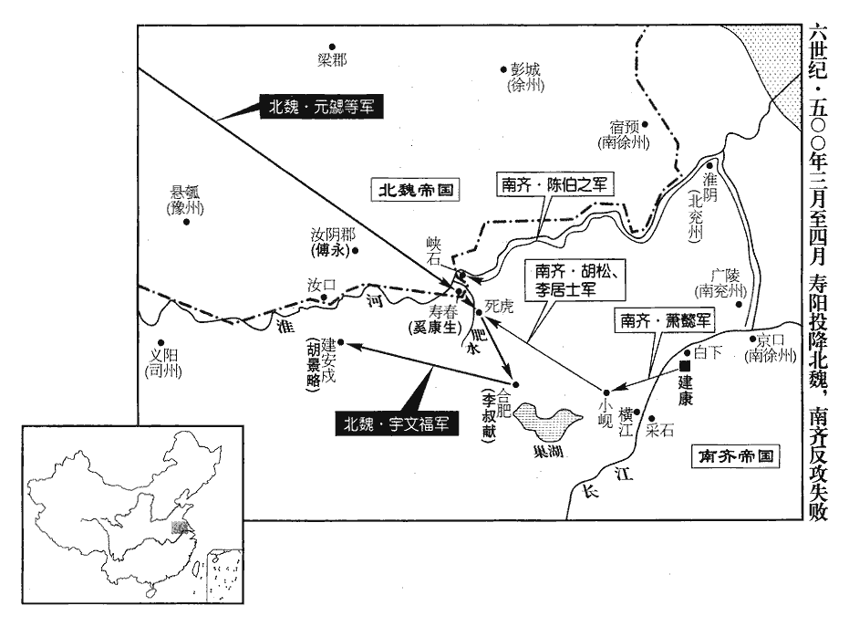
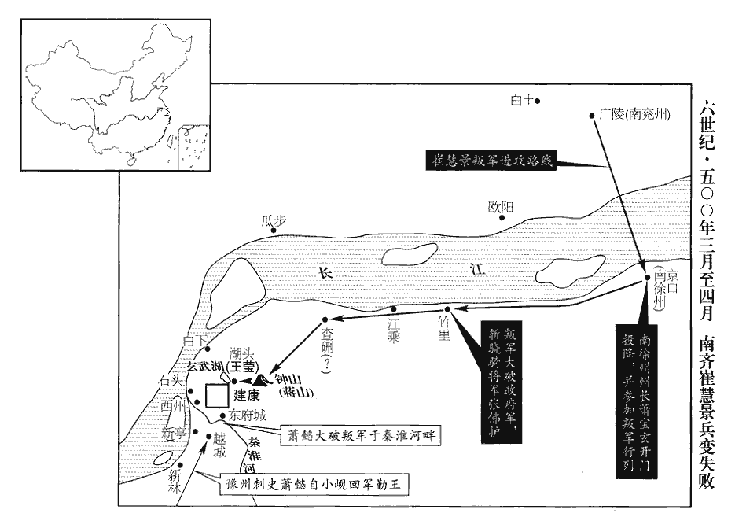
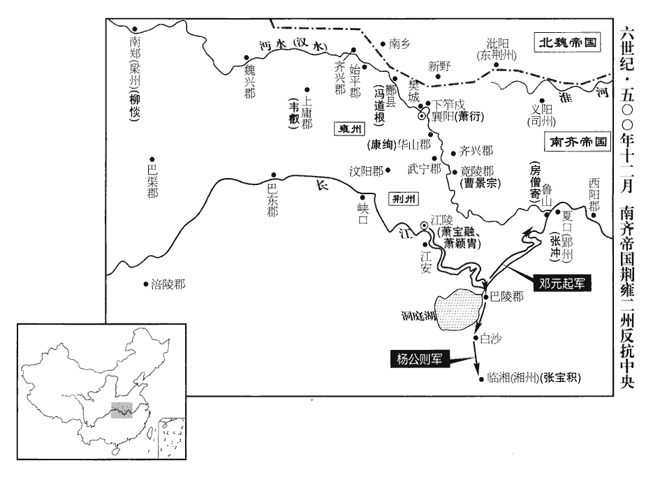

 齊紀九上章執徐（庚辰），一年。

# 東昏侯下

## 永元二年（庚辰、五零零）

1春，正月，元會‹一›，帝‹萧宝卷，本年十八岁›食後方出；朝賀裁竟，卽還殿西序寢。孔安國曰︰東西廂謂之序。朝，直遙翻；下同。自巳至申，百僚陪位，皆僵仆飢甚。僵，居良翻。比起就會，比，及也。《禮記•檀弓》︰孟獻子比御而不入。陸德明《經典釋文》曰︰比，必利翻；下比及同。以此知比及之比皆音必利翻，比近之比毗至翻，兩音故自不同也。怱遽而罷。

〖译文〗 [1]春季，正月，按例皇帝在大年初一接见群臣；但是东昏侯直到吃过饭之后方才出来露面，朝贺之礼刚一完毕，就立即回殿内西厢屋就寝去了。从巳时到申时，群臣百僚们站着等待皇帝前来，都站得腰腿僵直，无法坚持而倒地，肚子也饿的咕咕着叫。所以，等到起来朝见时，只好敷衍一通，匆匆收场。

2乙巳‹五›，魏大赦，改元景明。

〖译文〗 [2]乙巳（初五），北魏大赦天下，改年号为景明。

3豫州‹府设寿阳安徽省寿县›刺史裴叔業聞帝數誅大臣，數，所角翻；下數遣同。心不自安；登壽陽城，北望肥水‹东淝河·流经寿阳城东北›，謂部下曰︰「卿等欲富貴乎？我能辦之！」及除南兗州‹府设广陵江苏省扬州市›，事見上卷上年。意不樂內徙。樂，音洛。會陳顯達反，亦見上卷上年。叔業遣司馬遼東李元護將兵救建康，將，卽亮翻。實持兩端；顯達敗而還。還，從宣翻，又如字。朝廷疑叔業有異志，叔業亦遣使參察建康消息，使，疏吏翻。衆論益疑之。叔業兄子植、颺、粲皆爲直閤，在殿中，懼，棄母奔壽陽，說叔業以朝廷必相掩襲，宜早爲計。颺，余章翻。說，輸芮翻；下等說同。徐世檦等以叔業在邊，檦，與標同。急則引魏自助，力未能制，白帝遣叔業宗人中書舍人長穆宣旨，許停本任。宗人，同宗之人也。叔業猶憂畏，而植等說之不已。

〖译文〗 [3]南齐豫州刺史裴叔业得知东昏侯数番诛杀大臣，心中替自己不安，他登上寿阳城，朝北望着肥水，对部下们说：“你们想富贵吗？我能替你们办到。”后来朝廷调他任南兖州刺史，他心里十分不乐意内调。陈显达反叛之后，裴叔业派遣司马辽东人李元护率领兵马去解救建康，而实质上则持骑墙观望态度，陈显达失败之后，李元护又回去了。朝廷怀疑裴叔业有异谋，裴叔业也派遣使者去建康观察消息动静，众人对他更加怀疑了。裴叔业哥哥的儿子裴植、裴扬、裴粲都任直，在朝廷殿内，为此而惧怕，就扔下母亲跑到了寿阳，告诉裴叔业朝廷必定要出其不意地前来袭剿，劝说他宜于早作准备。朝中徐世等人认为裴叔业在边境上，情况紧急时他就会请北魏来帮助自己，以致使朝廷之力不能制服住他。所以，他们就告诉东昏侯，使派遣裴叔业的同宗之人中书舍人裴长穆去宣告圣旨，准许裴叔业继续留任豫州刺史。但是，裴叔业还是感到忧虑害怕，而裴植等人则仍旧对他劝说个不停。

叔業遣親人馬文範至襄陽‹湖北省襄樊市›，親人，所親信者。問蕭衍以自安之計曰︰「天下大勢可知，恐無復自存之理。復，扶又翻；下可復、復奔同。不若回面向北，不失作河南公。」言若降魏，不失爵賞也。衍報曰︰「羣小用事，豈能及遠！計慮回惑，自無所成，唯應送家還都以安慰之。蕭衍密呼諸弟，而令裴叔業送家還都，此亦華言耳。若意外相逼，當勒馬步二萬直出橫江‹安徽省和县东南长江渡口·对岸为采石›，以斷其後，自壽陽南至歷陽，出橫江。斷，丁管翻。則天下之事，一舉可定。若欲北向，彼必遣人相代，以河北一州相處，處，昌呂翻。河南公寧可復得邪！如此，則南歸之望絕矣。」裴叔業之問，蕭衍之報，雖二人者所志有大小，而齊之邊鎭皆有異心矣，帝誰與立哉！叔業沈疑未決，沈，持林翻；沈疑，沈吟疑慮也。乃遣其子芬之入建康爲質，質，音致。亦遣信詣魏豫州‹府设悬瓠河南省汝南县›刺史薛眞度，魏豫州治懸瓠城，領汝南、新蔡、弋陽等郡。問以入魏可不之宜。不，讀曰否。眞度勸其早降，降，戶江翻；下同。曰︰「若事迫而來，則功微賞薄矣。」數遣密信，往來相應和。和，戶臥翻。建康人傳叔業叛者不已，芬之懼，復奔壽陽。叔業遂遣芬之及兄女壻杜陵韋伯昕奉表降魏。昕，許斤翻。丁未‹七›，魏遣驃騎大將軍彭城王勰、車騎將軍王肅帥步騎十萬赴之；驃，匹妙翻。騎，奇寄翻。勰，音協。帥，讀曰率。以叔業爲使持節、都督豫•雍等五州諸軍事、征南將軍、豫州刺史，封蘭陵郡公。使，疏吏翻。雍，於用翻。

〖译文〗 裴叔业派遣亲信马文范到襄阳，向萧衍讨问如何保住自己的计策，对萧衍讲道：“天下大势明显可知，我们恐怕再也不会有保得住自己的道理了，所以还不如回头投靠北魏，这样还不失能封官赏爵，可以做河南公。”萧衍回答说：“朝廷中这帮小人专权得势，岂能长远得了？反来复去地考虑，也实在想不出什么好招数，只是应当送家属回京都去，以便让他们对你感到安心些。如果他们意外地对你相逼，你就应率领步、骑兵两万直出横江，断掉他们的后路，如此，则天下之事一举而可定。如果去投降北魏，他们一定会派别人代替你，而只以黄河北边的一个州给你，那里还再能做河南公呢？这样一来，重新归回南方的希望就绝灭了。”裴叔业迟疑而不能决断，于是就遣送自己的儿子裴芬之到建康作为人质，同时又派人送信给北魏豫州刺史薛真度，询问他可否投奔北魏之事。薛真度劝裴叔业及早投降过来，说：“如果事情紧迫才来投降，那么功劳就小了，赏封也就不会多重了。”他们数次派人传送密信，互相往来商议。建康的人纷纷传说裴叔业要反叛，裴芬之惧害被杀，又跑回寿阳去了。于是，裴叔业就派遣裴芬之以及他的哥哥的女婿杜陵人韦伯昕带着降书去投降北崐魏。丁未（初七），北魏派遣骠骑大将军彭城王元勰和车骑将军王肃统领步、骑兵十万前去受降，任命裴叔业为使持节，都督豫、雍等五州诸军事，征南将军，豫州刺史，并封他为兰陵郡公。

庚午‹三十›，下詔討叔業。二月，丙戌‹十六›，以衛尉蕭懿爲豫州刺史。戊戌‹二十八›，魏以彭城王勰爲司徒，領揚州刺史，鎭壽陽。壽陽自東漢以來爲揚州治所，宋始爲豫州治所，今復其舊。勰，音協。魏人遣大將軍李醜、楊大眼將二千騎入壽陽，又遣奚康生將羽林一千馳赴之。大眼，難當之孫也。楊難當，氐王也。宋元嘉中，據仇池。眼、生將字，皆卽亮翻。

〖译文〗 庚午（三十日），东昏侯下诏令讨伐裴叔业。二月丙戌（十六日），南齐任命卫尉萧懿为豫州刺史。戊戌（二十八日），北魏任命彭城王元勰为司徒，并且兼任扬州刺史，坐镇寿阳。北魏派遣大将军李丑、杨大眼率领两千骑兵入寿阳，又派遣奚康生率领羽林兵一千急驰赶赴寿阳。杨大眼是杨难当的孙子。

魏兵未渡淮，己亥‹二十九›，裴叔業病卒‹年六十三岁›，僚佐多欲推司馬李元護監州，一二日謀不定。卒，子恤翻。監，工銜翻。前建安‹河南省商城县›戍主安定‹侨郡·湖北省南漳县西›席法友等《北史》曰︰魏正光中，羣蠻出山居邊城、建安者八九千戶。邊城郡治期思，則建安戍亦當相近。隋改期思縣爲殷城縣，取縣東古殷城爲名。我宋建隆元年改殷城爲商城，避宣祖諱也；後省爲鎭，入光州固始縣。以元護非其鄕曲，恐有異志，共推裴植監州，裴叔業本河東‹侨郡·湖北省松滋市西北›人，席法友安定人，不同州部；蓋並僑居襄陽，遂爲鄕曲。祕叔業喪問，敎命處分，皆出於植。處，昌呂翻。分，扶問翻。奚康生至，植乃開門納魏兵，城庫管籥，悉付康生。康生集城內耆舊，宣詔撫賚之。魏以植爲兗州‹府设瑕丘山东省兖州市›刺史，李元護爲齊州‹府设历城山东省济南市›刺史，席法友爲豫州刺史，軍主京兆‹侨郡·湖北省襄樊市北›王世弼爲南徐州‹府设宿预江苏省宿迁市›刺史。

〖译文〗 北魏军队没有渡过淮河，己亥（二十九日），裴叔业病死，僚佐们多数要推举司马李元护管理州事，一两天议论不决。从前的建安戍所的戍主安定人席法友等人认为李元护与其不是同乡，担心他有异心，所以一致推举由裴植来监管州务，并且对裴叔业的死讯保密，一切命令和布置安排，都由裴植来决定。奚康生到了，裴植于是打开城门接纳北魏军队入城，把城内仓库的钥匙全部交给奚康生。奚康生进城之后，召集城内年高望重的老人，宣布了皇帝圣旨，安抚赏赐了他们。北魏任命裴植为兖州刺史，李元护为齐州刺史，席法友为豫州刺史，军主京兆人王世弼为南徐州刺史。

4巴西‹四川省绵阳市›民雍道晞聚衆萬餘逼郡城，巴西郡治閬中縣，今之閬州卽其地也。雍，於用翻。巴西太守魯休烈嬰城自守。三月，劉季連遣中兵參軍李奉伯帥衆五千救之，帥，讀曰率。與郡兵合擊道晞，斬之。奉伯欲進討郡東餘賊，涪‹巴西郡郡政府所在县›令李膺止之曰︰「卒惰將驕，乘勝履險，非完策也；完，全也；言非全勝之策。涪，音浮。將，卽亮翻；下同。不如少緩，更思後計。」少，詩沼翻。奉伯不從，悉衆入山，大敗而還。還，從宣翻，又如字。

〖译文〗 [4]巴西平民雍道聚集了一万余民众逼攻郡城，南齐巴西太守鲁休烈环城自守。三月，刘季连派遣中兵参军李奉伯率领五千人马去援救鲁休烈，与巴西郡的兵力合起来一道抗击雍道，斩了雍道。李奉伯还想进一步讨伐巴西郡东部的剩余之贼，涪县令李膺制止他说：“兵卒懒惰，将领骄奢，乘胜而步入险地，这不是全胜之策。所以，不如稍微缓一步，重新思考下一步该如何办。”但是，李奉伯不听其劝，带领全部人马入山，结果一败涂地，狼狈逃回。

 

5乙卯‹十五›，遣平西將軍崔慧景將水軍討壽陽，帝屛除，出琅邪城‹白下·建康城北›送之。蕭子顯曰︰琅邪太守本治江乘蒲州上之金城，永明徙治白下。屛，必鄙翻。帝戎服坐樓上，召慧景單騎進圍內，圍內，卽屛除長圍之內也。騎，奇寄翻。無一人自隨者。裁交數言，拜辭而去。慧景旣得出，甚喜。

〖译文〗 [5]乙卯（十五日），南齐派遣平西将军崔慧景统率水军讨伐寿阳，东昏侯令人在所经过之处两旁悬挂高幔，走出琅邪城为征军送行。东昏侯身着武服，坐在楼上，传召崔慧景一人骑马进入他的所谓屏障长围之内，没有一人相随。崔慧景进去之后，只与东昏侯说了几句话，就拜辞而出。崔慧景出来之后，心里异常得意。

豫州刺史蕭懿將步軍三萬屯小峴‹安徽省含山县西北›，峴xiàn，戶典翻。交州‹府龙编›刺史李叔獻屯合肥。武帝永明三年，李叔獻自交州入朝，至今猶帶交州刺史，蓋以其阻險不庭，逼以兵威而後至，廢棄不用也。懿遣裨將胡松，李居士帥衆萬餘屯死虎‹宛唐·安徽省寿县东二十千米›。杜佑《通典》曰︰死虎，地名，在壽州壽春縣東四十餘里。以此證之，足知宋明帝泰始三年劉勔破劉順於宛唐，宛唐卽死虎字之誤也。驃騎司馬陳伯之將水軍泝淮而上，上，時掌翻。以逼壽陽，軍于硤石‹安徽省凤台县西南›。壽陽士民多謀應齊者。

〖译文〗 豫州刺史萧懿统领步兵三万人屯驻小岘，交州刺史李叔献屯驻合肥。萧懿派遣裨将胡松、李居士率领一万多兵马驻守死虎。骠骑司马陈伯之统率水军溯淮河而上，以便逼近寿阳，驻扎在硖石。寿阳的民众大多数都计划如何接应南齐军队。

魏奚康生防禦內外，閉城一月，援軍乃至。丙申‹二十七›，彭城王勰、王肅擊松、伯之等，大破之，進攻合肥，生擒叔獻。統軍宇文福言於勰曰︰「建安‹河南省固始县›，淮南重鎭，彼此要衝；魏兵南來，齊兵北向，建安皆爲要衝之地，故曰彼此。得之，則義陽‹河南省信阳市›可圖；不得，則壽陽難保。」魏得建安，則西南可圖義陽。齊司州治義陽；若增建安之兵，北斷魏援，東臨壽陽，則壽陽難保。勰然之，使福攻建安，建安戍主胡景略面縛出降。降，戶江翻。

〖译文〗 北魏奚康生内外防御，关闭城门一个多月，增援的军队才来到。丙申（疑误），彭城王元勰、王肃出击胡松、陈伯之等部，给他们以致命的打击，并且崐进攻合肥，活捉了李叔献。北魏统军宇文福对元勰说：“建安是淮南的军事重镇，是双方的要冲之地，如果能夺得此地，那么义阳就可以到手；如果夺不到，那么寿阳也就难以保得住了。”元勰同意这一看法，就派宇文福去攻打建安，南齐驻守建安的戍主胡景略自缚出城投降。

6己亥‹三十›，魏皇弟恌卒。恌tiāo，他彫翻。

〖译文〗 [6]己亥（疑误），北魏皇弟元去世。

7崔慧景之發建康也，其子覺爲直閤將軍，密與之約；約爲變也。慧景至廣陵‹江苏省扬州市›，覺走從之。慧景過廣陵數十里，召會諸軍主曰︰「吾荷三帝厚恩，三帝，高帝‹萧道成›、武帝‹萧赜›、明帝‹萧鸾›也。荷，下可翻；下人荷同。當顧託之重。明帝遺詔，慧景與劉悛、蕭惠休同任心膂。幼主昏狂，朝廷壞亂；危而不扶，責在今日。欲與諸君共建大功以安社稷，何如？」衆皆響應。於是還軍向廣陵，司馬崔恭祖守廣陵城，崔恭祖爲慧景平西司馬。開門納之。帝聞變，壬子‹十二›，假右衛將軍左興盛節，都督建康水陸諸軍以討之。慧景停廣陵二日，卽收衆濟江。

〖译文〗 [7]崔慧景从建康出发之时，他的儿子崔觉任直将军，崔慧景秘密地与儿子约定要发动事变。崔慧景到达广陵时，崔觉根据事先的约定，跑去追随父亲。崔慧景在过了广陵几十里之后，召集各位军主，对他们说：“我承受前面三代皇帝的厚恩，担负着明帝死前所托付的重任。但是，现在年幼的皇帝昏庸狂妄，搞得朝纲败坏，一片混乱。国家危难而不加匡扶，责任就正在今天。所以，我要同诸君共同建立大功伟业，以便安定社稷江山，不知诸位意下如何呢？”众人都一致响应。于是，崔慧景挥师返回广陵，司马崔恭祖驻守广陵城，大开城门，接纳崔慧景进城。东昏侯闻知事变，于壬子（十二日），临时授与右卫将军左兴盛符节，让他督率建康水陆诸军讨伐崔慧景。崔慧景在广陵停驻了两天之后，就集合军队渡过长江，进逼建康。

初，南徐‹府京口，江苏省镇江市›、兗二州刺史江夏王寶玄娶徐孝嗣女爲妃，孝嗣誅，誅事見上卷上年。詔令離婚，寶玄恨望。慧景遣使奉寶玄爲主，寶玄斬其使，因發將吏守城，使，疏吏翻。將，卽亮翻；下同。帝遣馬軍主戚平、外監黃林夫助鎭京口‹江苏省镇江市›。戚，姓也。《姓譜》︰衛大夫食邑於戚，因以爲姓。漢有戚夫人，又有臨轅侯戚鰓sāi。助鎭者，助寶玄守。慧景將渡江，寶玄密與相應，殺司馬孔矜、典籤呂承緒及平、林夫，開門納慧景，使長史沈佚之、諮議柳憕分部軍衆。憕，署陵翻。寶玄乘八掆輿，掆gāng，古郎翻，又居浪翻；掆，舉也。八掆輿，蓋八人舉之，卽今之平肩輿。輿，不帷不蓋。蕭子顯曰︰輿，車形，如軺車，下施八掆，人舉之。《字林》曰︰捎、掆，舁yú也。手執絳麾，隨慧景向建康。臺遣驍騎將軍張佛護、直閤將軍徐元稱等六將據竹里‹江苏省句容市北›，爲數城以拒之。驍，堅堯翻。騎，奇寄翻。寶玄遣信謂佛護曰︰「身自還朝，君何意苦相斷遏？」朝，直遙翻。斷，音短；下所斷同。佛護對曰︰「小人荷國重恩，使於此創立小戍。殿下還朝，但自直過，豈敢斷遏！」遂射慧景軍，射，而亦翻。因合戰。崔覺、崔恭祖將前鋒，皆荒傖善戰，又輕行不𠆡食，傖cāng，助庚翻。𠆡，卽爨cuàn字，取亂翻。以數舫緣江載酒食爲軍糧，舫，甫妄翻；下同。每見臺軍城中煙火起，輒盡力攻之。臺軍不復得食，復，扶又翻；下乃復、帝復同。以此飢困。元稱等議欲降，降，戶江翻；下同。佛護不可。恭祖等進攻城，拔之，斬佛護；徐元稱降，餘四軍主皆死。

〖译文〗 当初，南齐的南徐州和兖州刺史江夏王萧宝玄娶徐孝嗣的女儿为妃子，徐孝嗣被诛杀之后，东昏侯诏令萧宝玄与徐孝嗣的女儿离婚，萧宝玄心里对东昏侯非常忌恨。崔慧景派遣使者去见萧宝玄，表示要奉立他为皇帝，萧宝玄斩掉了前来的使者，并且发动将士们守城，东昏侯派遣马军主戚严、外监黄林夫协助萧宝玄镇守京口。崔慧景将要渡江之时，萧宝玄秘密与他联络，与他响应合作。萧宝玄杀了司马孔矜、典签吕承绪以及戚平、黄林夫，打开城门迎接崔慧景，并且使长史沈佚之、谘议柳调配布置军队。萧宝玄乘坐八人抬大轿，手执绛红色指挥旗，随着崔慧景向建康进发。朝廷派遣骁骑将军张佛护、直将军徐元称等六个将帅依据竹里，筑建了好几个城堡以抵抗崔慧景。萧宝玄派人送信给张佛护说：“我自己回朝廷，你为何要如此费力地阻拦呢？”张佛护回答说：“小人承蒙国家重恩，派我在这时略加设防，殿下回朝，只管径直通过，我岂敢加以阻截呢？”说着，张佛护就用箭射崔慧景的军队，于是双方混战开始。崔觉、崔恭祖率领前锋部队，士兵们都是江北人，十分英勇善战，又都轻装上阵，不带军粮煮饭吃，而用几只船沿着长江载送酒食为军粮，供士兵们食用。他们一看见朝廷军队所住的城堡升起烟火，就立即拼力攻击，使得朝廷士兵连顿饭也吃不成，因此都饿得饥肠辘辘，无力作战。徐元称等人在一起商议要投降，张佛护不允许。崔恭祖等人猛力攻城，一举成功，斩了张佛护，徐元称投降，其余四个军主都战死。

乙卯‹十五›，遣中領軍王瑩都督衆軍，據湖頭‹玄武湖东›築壘，上帶蔣山‹建康城东›西巖實甲數萬。瑩，誕之從曾孫也。王誕見寵信於司馬元顯及宋武帝。從，才用翻。慧景至查硎，查，鉏chú加翻。硎xíng，戶經翻。竹塘人萬副兒萬副兒，善射獵，能捕虜，來投慧景。說慧景曰︰說，輸芮翻。「今平路皆爲臺軍所斷，不可議進；唯宜從蔣山龍尾上，出其不意耳。」築道陂pō陀tuó以上蔣山，若龍尾之垂地，因曰龍尾。上，時掌翻。慧景從之，分遣千餘人，魚貫緣山，自西巖夜下，鼓叫臨城中。城中，卽湖頭所築壘中也。鼓叫者，旣擊鼓又叫呼也。柳元景曰︰「鼓繁氣易衰，叫數力易竭。」鼓叫，卽鼓譟也。臺軍驚恐，卽時奔散。帝又遣右衛將軍左興盛帥臺內三萬人拒慧景於北籬門，帥，讀曰率；下同。《考異》曰︰《紀》云「王瑩屯北籬門」，《傳》云「左興盛」。今從《傳》。興盛望風退走。

〖译文〗 乙卯（十五日），东昏侯派遣中领军王莹统领众路军马，依据湖头修筑堡垒，同时上连蒋山西岩一带，布置甲兵数万人。王莹是王诞的堂曾孙。崔慧景到了查硎，竹塘人万副儿对崔慧景说：“如今平坦大路全被朝廷军队拦断，不可考虑从这里进兵，只宜从盘旋道登上蒋山，以出其不意，攻其不备。”崔慧景采纳了他的意见，分派一千多人，一个紧随一个，鱼贯而上山，夜间从西岩而下，击鼓呐喊，降临城中。朝廷军队大为吃惊，惶恐万分，一时逃奔，如鸟兽散。东昏侯又派遣右卫将军左兴盛统率台城内兵士三万人在北篱门抵挡崔慧景，但是还未交战，左兴盛就望风败逃。

甲子‹二十四›，慧景入樂游苑，樂游苑在玄武湖南。樂，音洛。崔恭祖帥輕騎十餘突入北掖門，乃復出。掖，音亦。宮門皆閉，慧景引衆圍之。於是東府‹宰相府·建康城南›、石頭‹建康城西北›、白下、新亭‹建康城西南›諸城皆潰。左興盛走，不得入宮，逃淮渚荻舫中，淮渚，秦淮渚也。慧景擒殺之。宮中遣兵出盪，不克。盪，度朗翻，又他浪翻。慧景燒蘭臺府署爲戰場。蘭臺，御史臺也。守御【章︰十二行本「御」作「衛」；乙十一行本同；孔本同。】尉蕭暢屯南掖門，處分城內，處，昌呂翻。分，扶問翻。隨方應拒，衆心稍安。慧景稱宣德太后‹王宝明›令，廢帝爲吳王。文惠太子妃王氏，鬱林之立，尊爲皇太后；海陵之廢，出居鄱陽王故第，號宣德宮，稱宣德皇太后。

〖译文〗 甲子（二十四日），崔慧景开进了乐游苑，崔恭祖率领轻骑兵十多人突进北掖门，然后又退了出来。由于宫门都关闭，崔慧景带领部下围住宫城。这时，东府、石头、白下、新亭几城人马溃散。左兴盛退逃，进不了宫城，只好逃进秦淮河边芦苇丛中的船里藏匿起来，被崔慧景擒获斩杀。宫中派遣兵力出城冲杀，但是没有获胜。崔慧景火烧了御史台府署，辟为战场。朝廷守御尉萧畅驻守南掖门，指挥布置城内兵力，根据战情，调兵遣将，应对抵抗，这样人心才稍微安定了一些。崔慧景以宣德太后名义发令，废皇帝为吴王。

 

陳顯達之反也，帝復召諸王【章︰十二行本「王」下有「侯」字；乙十一行本同；孔本同。】入宮。巴陵王昭冑懲永泰之難，明帝永泰元年，王敬則反，帝召諸王入宮，欲殺之而中止。事見一百四十一卷。陳顯達反，帝復召之。故昭冑懼禍而逃。難，乃旦翻。與弟永新侯昭穎詐爲沙門，逃於江西‹安徽省中部›。江西，橫江以西之地。宋白曰︰永新縣本漢廬陵縣地，吳寶鼎中，立永新縣，屬安成郡。昭冑，子良之子也。竟陵王子良，武帝‹萧赜›次子。及慧景舉兵，昭冑兄弟出赴之。慧景意更向昭冑，寶玄，明帝‹萧鸾›之子。昭冑，武帝之孫；武帝，高帝之大宗，故慧景意向之。猶豫未知所立。

〖译文〗 陈显达反叛之后，东昏侯再次召集诸王进宫。巴陵王萧昭胄有鉴于永泰元年王敬则反，明帝召诸王入宫而欲行杀戮之事，与弟弟永新侯萧昭颖装扮成和尚，逃往江西。萧昭胄是萧子良的儿子。到崔慧景起兵之时，昭胄鲂兄弟二人出来前去参加。崔慧景内心更倾向于立萧昭胄为帝，所以一直犹豫不决，不知到底立谁为好。

竹里‹江苏省句容市北›之捷，崔覺與崔恭祖爭功，慧景不能決。恭祖勸慧景以火箭燒北掖樓。慧景以大事垂定，後若更造，費用功多，不從。言費功力爲多也。慧景性好談義，兼解佛理，好，呼到翻。義，亦理也。佛理，諸有皆空之說。解，曉也，音戶買翻。頓法輪寺，對客高談，客謂何點。恭祖深懷怨望。

〖译文〗 竹里一战告捷，崔觉与崔恭祖互相争功，崔慧景也不能决断到底是谁的功劳。崔恭祖劝崔慧景用火箭射烧北掖楼，但是崔慧景却以为大功即将告成，以后若要重新修复，得花费很多的功力，所以不予听从。崔慧景生性爱好谈论义理，兼通佛理，他停留在法轮寺中，对着客人高谈阔论，崔恭祖对他深怀不满。

時豫州刺史蕭懿將兵在小峴，懿將兵討壽陽屯小峴。將，卽亮翻。峴，所典翻。帝遣密使告之。懿方食，投箸而起，使，疏吏翻。箸，除據翻。帥軍主胡松、李居士等數千人帥，讀曰率。自採石濟江，頓越城舉火，城中鼓叫稱慶。城中，臺城中也；以援兵至而喜。【章︰十二行本正作「臺城中」；乙十一行本同；孔本同；張校同。】恭祖先勸慧景遣二千人斷西岸兵，令不得渡。斷，音短。西岸兵，謂蕭懿兵入援自江西來也。慧景以城旦夕降，外救自然應散，不從。降，戶江翻。至是，恭祖請擊懿軍，又不許；獨遣崔覺將精手數千人渡南岸。精手，軍中事藝高強者。南岸，秦淮南岸也。懿軍昧旦進戰，數合，昧旦，天微明之時。士皆致死，覺大敗，赴淮死者二千餘人。覺單馬退，開桁阻淮。開朱雀桁以斷懿兵，阻秦淮水爲固。恭祖掠得東宮女伎，覺逼奪之。恭祖積忿恨，其夜，與慧景驍將劉靈運詣城降，崔覺以是日敗，恭祖等以其夜降。伎，渠綺翻。驍，堅堯翻。衆心離壞。

〖译文〗 其时，豫州刺史箫懿率兵屯驻小岘，东昏侯派遣密使去告诉他前来保驾。萧懿正在吃饭，他扔下筷子站起来，立即率领军主胡松、李居士等几千人马，从采石渡过长江，驻扎在越城，燃起大火，台城中见到火光，知道援兵到了，高兴得打鼓欢叫，拍手称庆。在这之前，崔恭祖劝说崔慧景派遣两千人马阻抵西岸之兵，让他们不能渡江。然而，崔慧景却以为宫城早晚要投降，外来的救援之兵自然会散去，所以不予采纳。在这时，崔恭祖请求攻击萧懿的军队，而崔慧景还是不同意，只派遣崔觉率领精锐兵力几千人渡过秦淮河，到达南岸。萧懿的军队在天快亮时发起进攻，交战了几个回合，士兵们都英勇死战，崔觉一败涂地，部下跳进秦淮河里淹死的有两千多人。崔觉单人匹马逃退，打开朱雀桥上的浮桥，以秦淮河阻挡萧懿军队。崔恭祖掠抢到东宫的女伎，崔觉强夺了过来。崔恭祖积忿已久，于这天夜里，同崔慧景的骁将刘灵运来到城内投崐降，由此众心离散，战力锐减。

夏，四月，癸酉‹四›，慧景將腹心數人潛去，欲北渡江；城北諸軍不知，猶爲拒戰。爲，于僞翻。爲慧景戰也。城中出盪，殺數百人。懿軍渡北岸，秦淮北岸卽臺城。慧景餘衆皆走。慧景圍城凡十二日而敗，從者於道稍散，單騎至蟹浦‹江苏省江宁县西北›，從，才用翻。蟹，戶買翻。爲漁人所斬，《考異》曰︰《齊•本紀》︰「四月丁未，以張沖爲南兗州刺史。崔慧景於廣陵起兵襲京師。壬子，左興盛督衆軍。寶玄以京口納慧景。乙卯，王瑩屯北籬門。壬戌，慧景至，瑩等敗。甲子，慧景入京師，蕭懿入援。癸酉，慧景棄衆走死。」《慧景傳》︰「四月至廣陵回軍，十二日，攻陷竹里。」按《長曆》︰是歲三月辛丑朔，四月庚午朔。丁未三月七日，壬子十二日，乙卯十五日，壬戌二十二日，甲子二十四日︰四月皆無也。蓋四月當作三月；至癸酉，乃四月四日耳。《南史》云︰「時江夏王寶玄鎭京口，聞慧景北行，遣左右余文興說之曰︰『江、劉、徐、沈，君之所見。今擁強兵北取廣陵，收吳、楚勁卒，身舉州以相應，取大功如反掌耳。』慧景常不自安，聞言響應。于時廬陵王長史蕭寅、司馬崔恭祖守廣陵城，慧景以寶玄事告恭祖；恭祖口雖相和，心實不同。俄而慧景至，恭祖閉門不敢出。慧景密遣軍主劉靈運間行突入，慧景俄亦至，遂據其城。子覺至，仍使領兵襲京口。寶玄本謂大軍併來；及見人少，極失所望，拒覺，擊走之。恭祖及覺精兵八千濟江。恭祖心本不同，及至蒜山，欲斬覺，以軍降京口，事旣不果而止。覺等軍器精嚴，柳憕、沈佚等謂寶玄曰︰『崔護軍威名旣重，乃誠可見。旣已脣齒，忽中道立異。彼以樂歸之衆亂江而濟，誰能拒之！』於是登北固樓，並千蠟燭爲鋒火，舉以應覺。慧景停二日，便率大衆一時俱濟，趣京口。寶玄仍以覺爲前鋒，恭祖次之，慧景領大都督爲衆軍節度。」又云︰「時柳憕別推寶玄。崔恭祖爲寶玄羽翼，不復承奉慧景，慧景嫌之。巴陵王昭冑先逃人間，出投慧景，意更向之，故猶豫未知所立。此聲頗泄，憕、恭祖始貳於慧景。」又云︰「慧景單馬至蟹浦，投漁人太叔榮之。榮之故爲慧景門人，時爲蟹浦戍，斬慧景，送都。」按恭祖始若閉城拒慧景，慧景襲得其城而據之，豈肯更授以兵柄！又，慧景若不立寶玄，柳憕豈能別推！又，榮之旣云漁人，又云爲戍，自相違錯。今並從《齊書》。以頭內鰌qiū籃，擔送建康。鰌，卽由翻。鰌魚，今江、淮間湖蕩河港皆有之；春二月時，人取食之，其味甘美。至三月後，人不甚食，謂之楊花鰌。鰌籃，所以盛鰌者。恭祖繫尚方，少時殺之。少時，言不多時也。覺亡命爲道人，捕獲，伏誅。

〖译文〗 夏季，四月，癸酉（初四），崔慧景带领心腹数人偷偷离去，想北渡长江，城北的各路军马尚不知道，还在拒战。城中兵力出来冲杀，杀死了数百人。萧懿的军队渡过秦淮河到达北岸，崔慧景余下的人马都逃走了。崔慧景围攻了宫城十二天，最后失败而逃，跟随他的人在道上逐渐散逃，他单人匹马逃至蟹浦，被打鱼人斩首，把他的首级放在盛鱼的篮子中，担送到建康，献给朝廷。崔恭祖投降之后，被拘囚在尚方省，不久即被杀。崔觉逃亡当了道人，被捕获，伏法被诛。

寶玄初至建康，軍於東城，東城，卽東府城。士民多往投集。往投寶玄而集於東城也。慧景敗，收得朝野投寶玄及慧景人名，朝，直遙翻。帝令燒之，曰︰「江夏‹萧宝玄›尚爾，豈可復罪餘人！」昏暴之君，豈無一言之幾乎理！東昏侯此語是也。復，扶又翻。寶玄逃亡數日乃出。帝召入後堂，以步障裹之，令左右數十人鳴鼓角馳繞其外，《晉志》曰︰鼓，按《周禮》以鼖fén鼓鼓軍事。角，說者云，蚩尤氏帥魑魅與黃帝戰于涿鹿，黃帝乃始吹角爲龍鳴以禦之。其後魏武北征烏丸，越沙漠，而士卒思歸，於是減爲中鳴，尤更悲矣。遣人謂寶玄曰︰「汝近圍我亦如此耳。」

〖译文〗 萧宝玄初到建康之时，驻扎在东府城，士人和民众们纷纷前去投靠，聚集在东府城中。崔慧景失败之后，朝廷收集了朝野上下投靠萧宝玄以及崔慧景的人名，列为名册，准备一一追查，东昏侯命令将它烧掉，说：“江夏王尚且还这样，岂可以治罪他人呢？”萧宝玄逃亡了好几天，然后才露面。东昏侯把他召入后堂用布帐把他围起来，命令左右好几十人擂鼓吹号，环绕着他跑动，并且派人对他说：“你近来围攻我也如同这个样子。”

初，慧景欲交處士何點，處，昌呂翻。點不顧。及圍建康，逼召點；點往赴其軍，何點門世信佛，齊朝累徵不就。從弟遁以東籬門園居之，故爲慧景逼召，往赴其軍。終日談義，不及軍事。慧景敗，帝欲殺點。蕭暢謂茹法珍曰︰茹，音如。「點若不誘賊共講，未易可量。言何點若不與慧景講義，則慧景日以攻城爲事，安危未可量也。誘，音酉。易，以豉翻。量，音良。以此言之，乃應得封！」帝乃止。點，胤之兄也。何胤隱於會稽若邪山。

〖译文〗 起初，崔慧景想结交处士何点，但是何点没有理睬他。到围攻建康时，崔慧景又强迫召何点前来，何点只好往赴其军中，但是整日与崔慧景谈论义理，毫不涉及军事方面的事情。崔慧景失败之后，东昏侯要杀何点，萧畅就对茹法珍说：“何点如果不诱使贼首崔慧景一起讲论玄义，那么崔慧景专意攻城，朝廷安危就未可估量了。由此而言，何点不但不应被杀，反而应该给他封官。”于是，东昏侯就不杀他了。何点是何胤的哥哥。

8蕭懿旣去小峴，王肅亦還洛陽。荒人往來者妄云肅復謀歸國；復，扶又翻；下當復同。五月，乙巳‹六›，‹元恪，本年十八岁›詔以肅爲都督豫•徐•司三州諸軍事、豫州刺史、西豐公。

〖译文〗 [8]萧懿离开小岘，王萧也回洛阳去了。边境上的人胡乱传说王肃又计谋要回归南齐，五月乙巳（初六），北魏宣武帝元恪发出诏令，任命王肃为都督豫、徐、司三州诸军事及豫州刺史，并封他为西丰公。

9己酉‹十›，江夏王寶玄伏誅。夏，戶雅翻。

〖译文〗 [9]己酉（初十），南齐江夏王萧宝玄伏法被诛。

10壬子‹十三›，大赦。

〖译文〗 [10]壬子（十三日），南齐大赦天下。

11六月，丙子‹八›，魏彭城王勰進位大司馬，領司徒；王肅加開府儀同三司。賞取壽陽之功也。

〖译文〗 [11]六月，丙子（初八），北魏彭城王元勰升任大司马，兼任司徒，王肃加授开府仪同三司。

12太陽‹大阳，山西省平陆县›蠻田育丘等二萬八千戶附於魏；「太陽」，當作「大陽」。魏置四郡十八縣。

〖译文〗 [12]大阳蛮人田育丘等两万八千户投附北魏，北魏设置四个郡十八个县。

13乙丑‹二十六›，曲赦建康、南徐•兗二州。崔慧景自南兗州還兵而南，徐州之人從之，進圍建康，而建康之人又多從之。旣大赦，而誅縱失實，故又曲赦三處。先是，崔慧景旣平，先，悉薦翻。詔赦其黨。而嬖倖用事，不依詔書，嬖，卑義翻，又博計翻。無罪而家富者，皆誣爲賊黨，殺而籍其貲；實附賊而貧者皆不問。或謂中書舍人王咺xuān之云︰「赦書無信，人情大惡。」咺，況晚翻。惡，如字，不善也。咺之曰︰「正當復有赦耳。」由是再赦。旣而嬖倖誅縱亦如初。

〖译文〗 [13]乙丑（疑误），南齐特赦建康、南徐州、兖州三处追随崔慧景起兵之众。起先，崔慧景之乱被平定之后，东昏侯诏令赦免崔的同党。然而，东昏侯身边的宠幸们专权，不依皇帝诏书办事，一些本无罪而家中富足的人，全被诬陷为崔慧景的党徒，统统杀掉，没收其财产，而实际上投附了崔慧景，但家中贫穷者却都不予问罪。有人对中书舍人王之说：“朝廷的赦令没有信用，人们大有意见。”王之回答说：“正应当有再次赦免。”因此，又发了特赦令崐。然而，特赦令发出之后，那伙宠幸之徒们照旧滥杀无辜。

是時，帝‹萧宝卷›所寵左右凡三十一人，黃門十人。直閤、驍騎將軍徐世檦素爲帝所委任，凡有殺戮，皆在其手。及陳顯達事起，加輔國將軍；雖用護軍崔慧景爲都督，而兵權實在世檦。世檦亦知帝昏縱，密謂其黨茹法珍、梅蟲兒曰︰「何世天子無要人，但儂貨主惡耳！」儂，吳語，我也。茹，音如。法珍等與之爭權，以白帝。帝稍惡其凶強，惡，烏路翻。遣禁兵殺之，世檦拒戰而死。自是法珍、蟲兒用事，並爲外監，口稱詔敕；王咺之專掌文翰，與相脣齒。

〖译文〗 这时，东昏侯所宠幸的左右侍从共有三十一人，宦官十人。直、骁骑将军徐世向来为东昏侯所信任，凡有杀戮之事，都由他去执行。到陈显达举事之时，东昏侯又加任他为辅国将军，虽然任用护军崔慧景为都督，然而朝廷兵权实际上掌握在徐世手中。徐世也知道东昏侯昏庸狂纵，所以暗中对茹法珍、梅虫儿二人说：“哪一朝代的天子身边没有要人？但是我这是出售主上的恶行呀。”茹法珍等人与徐世争夺权力，因此就把徐世的话报告给东昏侯。于是，东昏侯就逐渐厌恶徐世的凶猛强悍，派遣宫中卫兵去杀他，徐世与卫兵们搏战，但最终被杀。从此之后，茹法珍、梅虫儿专权，一并担任外监，口头宣布皇帝的诏令，而王之则专掌文书，与茹、梅二人紧密勾结。

帝呼所幸潘貴妃‹潘玉奴›父寶慶及茹法珍爲阿丈，《前漢書•匈奴傳》曰︰漢天子，我丈人行也。師古《註》︰丈人，尊老之稱。阿，烏葛翻；下同。梅蟲兒、俞靈韻爲阿兄。帝與法珍等俱詣寶慶家，躬自汲水，助廚人作膳。寶慶恃勢作姦，富人悉誣以罪，田宅貲財，莫不啓乞，啓上而多所求乞。一家被陷，禍及親鄰；又慮後患，盡殺其男口。被，皮義翻。

〖译文〗 东昏侯呼所宠幸的潘贵妃的父亲潘宝庆以及茹法珍为阿丈，称梅虫儿、俞灵韵为阿兄。东昏侯同茹法珍等人一起去潘宝庆家中，亲自去打水，帮助厨子做饭。潘宝庆仗势欺人，作奸犯科，对于富有之人，他都以罪名诬陷，对于这些人的田产宅院以及财物，他都要启告皇上索取。某一人家被他陷害之后，还要祸及到亲戚邻里，又害怕留有后患，因此把那家所有的男子全部杀掉。

帝數往諸刀敕家游宴，數，所角翻。時人謂捉刀應敕之徒爲刀敕。有吉凶輒往慶弔。

〖译文〗 东昏侯数次去在他身边执刀和传达圣旨的人家中游玩吃喝，这些人家中有红白喜事，他都前去庆贺或吊唁。

奄人王寶孫，年十三四，《周禮註》︰奄，精氣閉藏者，今謂之宦人。陸德明曰︰奄，於檢翻。劉曰︰於驗翻。徐曰︰於劍翻。今讀作閹，音於炎翻。號爲「倀子」，倀，褚羊翻，狂也。最有寵，參預朝政，雖王咺之、梅蟲兒之徒亦下之；朝，直遙翻。下，遐嫁翻。控制大臣，移易詔敕，乃至騎馬入殿，詆訶天子；公卿見之，莫不懾息焉。懾息，猶言惕息也。懾，懼也，屛氣而息。詆，丁禮翻。訶，虎何翻。懾，之涉翻。

〖译文〗 阉人王宝孙，年龄才十三四岁，外号叫“伥子”，最受东昏侯宠幸。他参预朝廷政事，就是王之、梅虫儿之辈也对他恭顺。他可以控制大臣，篡改圣旨，甚而至于骑着马进入殿内，敢于当面诋斥东昏侯。所以，公卿大臣们见了他，都吓得连大气也不敢喘。

14吐谷渾‹青海省›王伏連籌事魏盡禮，言盡藩臣之禮。吐，從暾入聲。谷，音浴。而居其國，置百官，皆如天子之制，稱制於其鄰國。稱制於其鄰國，示君臨之。魏主遣使責而宥之。使，疏吏翻。

〖译文〗 [14]吐谷浑王伏连筹事奉北魏能够尽藩臣之礼，但是在自己的国内，却设置百官，一切都同天子一模一样，并且给邻国的公文像皇帝一样称为“制”。所以，北魏国主派遣使节去既指责了他的这种做法，同时又宽恕了他。

15冠軍將軍、驃騎司馬陳伯之再引兵攻壽陽，是年春，伯之攻壽陽敗退，今再攻之。冠，古玩翻。驃，匹妙翻。騎，奇寄翻。魏彭城王勰拒之。援軍未至，汝陰‹安徽省阜阳市›太守傅永將郡兵三千救壽陽。勰，音協。將，卽亮翻；下同。伯之防淮口‹河南省淮滨县东·汝水注入淮河处›甚固，此汝水入淮之口也。《水經》︰汝水東至汝陰原鹿縣入于淮。永去淮口二十餘里，牽船上汝水南岸，上，時掌翻；下同。以水牛挽之，水牛形力倍於黃牛。挽，音晚。直南趣淮，趣，七喻翻。下船卽渡；適上南岸，齊兵亦至。會夜，永潛入城，勰喜甚，曰︰「吾北望已久，恐洛陽難可復見；守壽陽而援兵不至，其心孤危，故云然。復，扶又翻。不意卿能至也。」勰令永引兵入城，永曰︰「永之此來，欲以卻敵；若如敎旨，諸王與任專方州者皆得下敎於其屬，故云敎旨。乃是與殿下同受攻圍，豈救援之意！」遂軍於城外。秋，八月，乙酉‹十八›，勰部分將士，與永幷勢，擊伯之於肥口‹肥水注入淮河处›，分，扶問翻。《水經》︰淮水東過壽春縣北，肥水自黎漿北過壽春城東，又北流而入于淮，謂之肥口。時陳伯之蓋軍於肥口以逼壽陽也。大破之，斬首九千，俘獲一萬，伯之脫身遁還，淮南遂入于魏。壽春縣自漢以來爲淮南郡治所。史言伯之旣敗，建康尋受兵，遂不能爭壽陽。

〖译文〗 [15]南齐冠军将军、骠骑司马陈伯之再次率兵去攻打寿阳，北魏彭城王元勰率部抵抗。北魏增援部队没有到来，汝阳太守傅永率领郡中之兵三千人去援救寿阳。陈伯之守淮口，防守坚固，傅永离开淮口二十多里，用水牛牵拉着船上了汝水南岸，直接往南去淮河。到了淮河，把船推入河中立即渡河而过。过河之后，刚上了淮河南岸，南齐军队也到了。正好是夜间，傅永偷偷进入寿阳城中，元勰见傅永前来增援，高兴万分，说道：“我一直向北边张望，盼望援兵快点到来，唯恐不能再见到洛阳，实在没想到您能前来。”元勰命令傅永领兵进城，但是傅永却说：“我此番前来，为的是抵挡敌兵，如果象您所吩咐的崐这样把部队带入城内，乃是与殿下一同受敌人围攻，那里是来援救呢？”于是，把部队驻扎在城外。秋季，八月乙酉（十八日），元勰调遣、部署将士，同傅永协力作战，在肥口对陈伯之发起猛烈攻击，大获全胜，斩杀南齐兵将九千，俘虏一万，陈伯之死里逃生，逃回去了。于是，淮南被北魏占领。

魏遣鎭南將軍元英將兵救淮南，未至，伯之已敗，魏主召勰還洛陽。勰累表辭大司馬、領司徒，乞還中山‹河北省定州市›；中山，定州也。去年，魏命勰刺定州，今年春赴壽陽，故乞還本任。還，從宣翻，又如字；下同。魏主不許。以元英行揚州事。尋以王肅爲都督淮南諸軍事、揚州刺史，持節代之。

〖译文〗 北魏派遣镇南将军元英率兵援救淮南，还没有到达，陈伯之就失败了，宣武帝元恪诏令元勰返回洛阳。元勰屡次上表要辞去大司马兼司徒的官职，乞请回到中山去，元恪不批准。北魏派任元英代理扬州刺史，但是很快又任命王肃为都督淮南诸军事、扬州刺史，持朝廷所授符节取代了元英。

16甲辰‹十七›，夜，後宮火。時帝‹萧宝卷›出未還，出市里遊走未還也。宮內人不得出，外人不敢輒開；謂不敢輒開後宮門。比及開，死者相枕，比，必利翻。枕，之任翻。燒三十【章︰十二行本「十」作「千」；乙十一行本同；孔本同。】餘間。

〖译文〗 [16]甲辰（疑误），夜间，南齐后宫失火。当时，东昏侯去市里游走没有回宫，宫内之人不得出去，而外面的人又不敢擅自打开后宫门去救火，等到后宫门开了之后，烧死者尸体遍地，共烧毁房宇三十多间。

時嬖倖之徒皆號爲鬼。有趙鬼者，能讀《西京賦》，言於帝曰︰「柏梁旣災，建章是營。」後漢張衡作《東京》、《西京賦》。柏梁災，營建章，事見二十一卷漢武帝太初元年。帝乃大起芳樂、玉壽等諸殿，樂，音洛。以麝香塗壁，麝狀如小麋，其臍有香，華山之陰多有之。陸佃曰︰商洛山中多麝，所遺糞常就一處，雖遠逐食，必還走其地，不敢遺迹他所，慮爲人所獲。人反以是從迹其所在，必掩羣而取之。麝絕愛其香，每爲人所迫逐，勢且急，卽自投高巖，舉爪剔出其香，就縶且死，猶拱四足抱其臍。麝，神夜翻。刻畫裝飾，窮極綺麗。役者自夜達曉，猶不副速。副，稱也；不能稱其欲速之意也。

〖译文〗 当时，东昏侯周围的宠幸之徒都号称为鬼，有一个叫赵鬼的，能读《西京赋》，引用其中之言对东昏侯说：“柏梁台既然被烧毁了，那么就营建章宫。”于是，东昏侯就大兴土木，修建芳乐、玉寿等殿，并且用麝香涂在墙壁上，雕画装饰，富丽堂皇，豪华到了极点。参加营建的劳役白天黑夜不停地干，还不能达到东昏侯所要求的速度。

後宮服御，極選珍奇，府庫舊物，不復周用。復，扶又翻。貴市民間金寶，價皆數倍。建康酒租皆折使輸金，使以金折錢輸官。折，之舌翻。猶不能足。鑿金爲蓮華以帖地，令潘妃‹潘玉奴›行其上，曰︰「此步步生蓮華也。」華，讀曰花。又訂出雉頭、鶴氅、白鷺縗shuāi。訂，丁定翻，平議也。齊、梁之時，謂賦民爲訂，蓋取平議而賦之之義。雉頭上毛細而色紅鮮如錦，晉程據緝以爲裘。鶴氅，鶴翎毛也。白鷺縗，鷺頭上毦ěr也。鶴氅、鷺縗，皆取其潔白。《詩疏》曰︰鷺，水鳥，毛白而潔，頂上有毛毿sān毿然，此卽縗也。《爾雅•釋名》曰︰鷺，舂鉏chú。郭璞曰︰白鷺也。頭、翅、背上皆有長翰毛，今江東人取以爲睫攡chī，名之曰白鷺縗。陸機曰︰鷺頭上有毛十數枚，長尺餘，毿毿然與衆毛異。氅，音齒兩翻。縗，音倉回翻。嬖倖因緣爲姦利，課一輸十。又各就州縣求爲人輸，準取見直，爲人，于僞翻；下不爲同。見，賢遍翻。不爲輸送，守宰皆不敢言，重更科斂。重，直用翻。更，居孟翻，再也。如此相仍，前後不息，百姓困盡，號泣道路。號，戶高翻。

〖译文〗 后宫中的服饰用具，无不是尽意挑选的珍奇之品，如此奢侈，以致府库中旧有的物品，不再能满足其用。东昏侯派人以高价收买民间的金王宝器，价格皆高于正常之价数倍。他又让把建康的酒税全都折合成银钱交入官库，就这样仍不能满足后宫之用。他命人把金子凿制成莲花贴在地上，让潘贵妃在上面行走，说：“这是步步生莲花呀。”他又命令交纳赋税的民众上贡锦鸡头，白鹤翎、白鹭羽毛，而宠幸们则借此机会大肆捞取，按应该交纳数目的十倍加以索取。他们又分别跑到各州县强迫人们交纳，并且折合成钱马上收取，但是并不上交，而中饱私囊。太守和县令们对此都不敢吭声，于是他们就更加贪得无厌，再次摊派敛取，如此反来复去地勒索敲榨，没完没了，使得老百姓倾家荡产，没有活路，无不呼号泣哭于道路之中。

17軍主吳子陽等出三關侵魏，九月，與魏東豫州‹府设新息河南省息县›刺史田益宗戰於長風城‹河南省潢川县南›，《左傳》︰定公四年，蔡侯與吳子、唐侯伐楚，還塞大隧、直轅、冥阸è。所謂大隧，卽黃峴關‹河南省罗山县西南›；直轅、冥阸，乃武陽‹河南省信阳市南武胜关›、平靖‹湖北省广水市北›二關也。黃峴，今名九里關，在義陽郡南百里。武陽，在今大寨嶺，郡東南九十里。平靖，今名行者坡，郡南七十五里。魏太和十七年，田益宗降魏。十九年，置東豫州於新息廣陵城，以益宗爲刺史。長風城在陰山關南，陰山關在弋陽縣界。宋文帝元嘉二十五年，以豫部蠻民立十八縣，長風其一也，屬西陽郡。《九域志》，舒州懷寧縣有長風鎭。懷寧，漢皖縣地，晉安帝立晉熙郡，仍立懷寧縣爲郡治所。蓋以懷寧蠻左名縣也。子陽等敗還。《考異》曰︰此一事，《齊書•紀》《傳》皆無之。《魏•帝紀》︰「九月乙丑，東豫州刺史田益宗破寶卷將吳子陽、鄧元起於長風。」《梁書•鄧元起傳》云︰「蠻帥田孔明附于魏，自號郢州刺史，寇掠三關，規襲夏口。元起帥銳卒攻之，旬月之間，頻陷六城，斬獲萬計，餘黨皆散走，仍戍三關。」二書勝敗不同如此。今從《魏紀》。

〖译文〗 [17]南齐军主吴子阳等人率兵出三关侵扰北魏，九月，同北魏东豫州刺史田益宗交战于长风城，吴子阳等人败逃而归。

18蕭懿之入援也，蕭衍馳使所親虞安福說懿曰︰說，輸芮翻；下說帝同。「誅賊之後，則有不賞之功。當明君賢主，尚或難立；況於亂朝，何以自免！朝，直遙翻；下同。若賊滅之後，仍勒兵入宮，行伊、霍故事，使之廢立也。此萬世一時。若不欲爾，便放表還歷陽，託以外拒爲事，則威振內外，誰敢不從！一朝放兵，受其厚爵，高而無民，必生後悔。」謂官爵雖高而兵權去己，必將束手就死。長史徐曜甫苦【章︰十二行本「苦」上有「亦」字；乙十一行本同；孔本同；張校同。】勸之；懿並不從。

〖译文〗 [18]萧懿援助朝廷平定崔慧景反叛之时，萧衍急忙派亲信虞安福去游说萧懿，对萧懿讲道：“如果诛杀了崔慧景，平定叛乱之后，则你所立的功劳太大了，不是朝廷的封赏所能酬劳，即使遇上一个圣明贤仁的君主，你尚且难以立得住脚，何况在现今混乱的朝廷之中，昏君奸臣们那能容得了你，不知到时你将何以自全？所以，如果把反贼歼灭之后，进一步再率兵进宫，如商代的伊尹放逐太甲、汉代的霍光废昌邑王那样，废掉昏君东昏侯，此乃千载难逢之良机。如果你不愿意这样做，便以抵拒北魏为借口，上表求放还历阳，这样，则威震崐朝廷内外，谁敢不听从。如果一旦放弃了兵权，虽然所享受的官爵很高，但手中无有军队和民众，必将束手就死，到时后悔也来不及了。”长史徐曜甫对萧懿苦苦相劝，但萧懿并不为所动，没有采纳萧衍的建议。

崔慧景死，懿爲尚書令。有弟九人︰敷、衍、暢、融、宏、偉、秀、憺、恢。憺dàn，徒敢翻，又徒濫翻。懿以元勳居朝右，暢爲衛尉，掌管籥。時帝出入無度，或勸懿因其出門，謂出臺城門而遊走也。舉兵廢之。懿不聽，嬖臣茹法珍、王咺之等憚懿威權，說帝曰︰「懿將行隆昌故事，謂隆昌廢鬱林王也。嬖，卑義翻，又博計翻。茹，音如。咺，況晚翻。陛下命在晷刻。」帝然之。徐曜甫知之，密具舟江渚，勸懿西奔襄陽。懿曰︰「自古皆有死，豈有叛走尚書令邪！」史言蕭懿忠於齊室。懿弟姪咸爲之備。冬，十月，己卯‹十三›，帝賜懿藥於省中。懿且死，曰︰「家弟在雍，深爲朝廷憂之。」雍，於用翻。時以襄陽爲雍州治所，言衍必將舉兵也。爲，于僞翻。懿弟姪皆亡匿於里巷，無人發之者；史言人心皆爲蕭懿兄弟覆護。唯融捕得，誅之。

〖译文〗 崔慧景死后，萧懿被任为尚书令。萧懿有九个弟弟：萧敷、萧衍、萧畅、萧融、萧宏、萧伟、萧秀、萧、萧恢。萧懿以朝廷元勋，位列朝班之首，萧畅任卫尉，掌握着宫门的钥匙。当时，东昏侯时常出外游走玩嬉，有人就劝萧懿乘其出游之际，起兵废之，但是萧懿不听。宠臣茹法珍、王之等人忌惮萧懿的威望和权力，游说东昏侯：“萧懿将要象隆昌年间废郁林王那样把你废掉，陛下命在旦夕。”东昏侯听了表示同意。徐曜甫知道这一情况之后，秘密准备了船只，停在长江边上，力劝萧懿西奔襄阳。然而，萧懿却说：“自古以来，人谁无一死，岂有尚书令叛逃的呢？”萧懿的弟弟和侄子们都对将会发生的事变做了准备。冬季，十月，己卯（十三日），东昏侯派人到尚书省给萧懿赐送药酒，萧懿临死之前说道：“家弟萧衍在雍州，是朝廷的一大忧患。”萧懿死后，他的弟弟和侄子们全都逃亡藏匿于里巷之中，没有人加以告发，只有萧融被捕获，遭到杀害。

19丁亥‹二十一›，魏以彭城王勰爲司徒，錄尚書事；勰固辭，不免。勰雅好恬素，不樂勢利。高祖‹元宏›重其事幹，好，呼到翻。樂，音洛。幹，用也；謂臨事有幹用也。故委以權任，雖有遺詔，遺詔見上卷上年。復爲世宗‹元恪›所留。謂出當方面，復入爲司徒，錄尚書也。復，扶又翻。勰每乖情願，常悽然歎息。爲人美風儀，端嚴若神，折旋合度，《記》曰︰周旋中規，折旋中矩。《註》云︰折旋，曲行也。出入言笑，觀者忘疲。敦尚文史，物務之暇，披覽不輟。小心謹愼，初無過失；雖閒居獨處，處，昌呂翻。亦無惰容。愛敬儒雅，傾心禮待。清正儉素，門無私謁。史言彭城王勰爲魏宗室諸王之秀。

〖译文〗 [19]丁亥（二十一日），北魏任命彭城王元勰为司徒，录尚书事，元勰坚决推辞，但是没有推辞掉。元勰性情恬淡素朴，不乐于追逐权势利益。北魏孝文帝特别看重他处理事情的才干，所以委以重任，虽然在遗诏中同意他引退，但是仍被宣武帝元恪留用。元勰因不能脱身政务，不得已而为之，有违于自己的意愿，所以常常内心感到凄然，叹息不已。他一表人才，风度甚佳，端庄肃穆，宛如神人，接人待物无不合度，走到哪里都谈笑风生，使在场的人乐而忘疲。他爱好文史，公务之余，披阅浏览，手不释卷。他小心谨慎，从来没有过失之处。即使闲居独处，也没有懒散毛病，总是那么精神充沛。他还爱惜、敬重儒雅之士，对他们倾心礼待。他能做到清廉公正，府上从来没有为私事而托情的来访者。

20十一月，己亥‹三›，魏東荊州‹府设沘阳河南省泌阳县›刺史桓暉入寇，拔下笮戍‹湖北省襄樊市东北›，下笮戍在沔北，直襄陽東北。笮zé，側百翻，又在各翻。歸之者二千餘戶。暉，誕之子也。宋明帝泰豫元年，桓誕降魏。

〖译文〗 [20]十一月己亥（初三），北魏东荆州刺史桓晖率兵入侵南齐，占取了下笮戍，归顺史桓晖的有两千多户。史桓晖是史诞的儿子。

21初，帝疑雍州刺史蕭衍有異志。直後滎陽鄭植弟紹叔爲衍寧蠻長史，帝使植以候紹叔爲名，往刺衍。使爲刺客。刺，七亦翻。紹叔知之，密以白衍，衍置酒紹叔家，戲植曰︰「朝廷遣卿見圖，今日閒宴，是可取良會也。」賓主大笑。又令植歷觀城隍、府庫、士馬、器械、舟艦，艦，戶黯翻。植退，謂紹叔曰︰「雍州實力未易圖也。」紹叔曰︰「兄還，具爲天子言之︰易，以豉翻。爲，于僞翻。若取雍州，紹叔請以此衆一戰！」送植於南峴‹即岘山·襄阳城南五千米。孙坚在此战死，羊祜坠泪碑也在此›，南峴，蓋卽馬鞍山道。相持慟哭而別。各盡力於所事，恐不復相見，故慟哭而別。

〖译文〗 [21]起初，东昏侯怀疑雍州刺史箫衍有异谋。直后荥阳人郑植的弟弟郑绍叔担任了萧衍的宁蛮长史，东昏侯就派郑植以探望弟弟郑绍叔为借口，去刺杀萧衍。郑绍叔知道了这一阴谋，秘密地报告了萧衍，萧衍在郑绍叔家中备办了酒席，以开玩笑的口吻对郑植说：“朝廷派遣您来谋害我，今天我正得闲，与您宴饮，这正是下手的好机会呀。”说罢，宾主大笑不已。萧衍又让郑植把雍州的城墙壕沟、仓库、兵士、战马、器械、船舰等仔细观察一番，以便弄清萧衍的实力。郑植看过之后，对郑绍叔说：“雍州的实力强大，是无法轻易解决了的。”郑绍叔对他说：“哥哥回到朝廷之后，请一字不差地对天子说：如果崐要攻取雍州的话，我郑绍叔要率众搏一死战！”郑植回朝去，郑绍叔把他送到南岘，兄弟二人执手相视，恸哭而别。

及懿死，衍聞之，夜，召張弘策、呂僧珍、長史王茂、別駕柳慶遠、功曹吉士瞻等入宅定議。宅，謂州宅也。《考異》曰︰《南史》云︰「茂與梁武帝不睦，帝諸腹心並勸除之。而茂少有驍名，帝又惜其用，令腹心鄭紹叔往候之，告以欲起義。茂因擲枕起，卽袴褶隨紹叔入見。武帝大喜，下牀迎。因結兄弟，被推赤心。」按茂若與梁武不睦，梁武何敢豫告以大事！茂亦安能便響應！今不取。茂，天生之子；王天生事齊高帝攻袁粲，見一百三十四卷宋順帝昇明元年。慶遠，元景之弟子也。諸柳，雍州豪望，世不乏人。乙巳‹九›，衍集僚佐謂曰︰「昏主暴虐，惡踰於紂，當與卿等共除之！」是日，建牙集衆，《考異》曰︰《齊•帝紀》︰「十二月，梁王起義兵於襄陽，」誤也。今從《梁書•高祖紀》。得甲士萬餘人，馬千餘匹，船三千艘。艘，蘇遭翻。出檀溪竹木裝艦，葺qì之以茅，事皆立辦。諸將爭㯭lǔ，呂僧珍出先所具者，每船付二張，爭者乃息。㯭，與櫓同。僧珍具櫓事見上卷元年。然僧珍所具者數百張櫓耳，安能給三千艘邪？每船付二張，蓋給諸將所乘之船耳。

〖译文〗 到萧懿死之后，萧衍知道噩耗，连夜召集张弘策、吕僧珍、长史王茂、别驾柳庆远、功曹吉士瞻等人到府第议定对策。王茂是王天生的儿子，柳庆远是柳元景弟弟的儿子。乙巳（初九），萧衍把手下的僚佐们召集到一起，对他们说：“昏乱的君主残暴，罪恶超过了纣王。所以，我应当与你们一起把他除掉。”在这一天，萧衍树起大旗，召集兵马，共得到带甲兵士一万多人，战马一千多匹，船舰三千艘。萧衍又命令搬出檀溪中的竹子木料，装到战舰之上，上面盖上茅草，这些事情很快就都办妥了。各将领争抢船橹，吕僧珍把自己原先准备好的拿出来，每只船发给两张，才停止了争抢。

是時，南康王寶融爲荊州刺史，西中郎長史蕭穎冑行府州事，南康王以西中郎將鎭荊州，穎冑爲長史行事。帝遣輔國將軍、巴西•梓潼二郡‹二郡郡政府皆设涪城四川省绵阳市›太守劉山陽將兵三千之官，守，式又翻。將，即亮翻。就穎冑兵使襲襄陽。衍知其謀，遣參軍王天虎詣江陵，徧與州府書，州謂荊州官屬，府謂西中郎府官屬。聲云︰「山陽西上，幷襲荊、雍。」衍書宣布此聲也。上，時掌翻。雍，於用翻。衍因謂諸將佐曰︰「荊州素畏襄陽人，襄陽被邊，人皆習兵，故荊州人畏之。加以脣亡齒寒，寧不闇同邪！我合荊、雍之兵，鼓行而東，雖韓、白復生，不能爲建康計；復，扶又翻；下衍復、非復、復不、州復、豈復、佐復同。況以昏主役刀敕之徒哉！」穎冑得書，疑未能決；山陽至巴陵‹湖南省岳阳市›，晉武帝太康元年立巴陵縣，屬長沙郡。宋武帝元嘉十六年分立巴陵郡，時屬郢州。今岳州卽其地。衍復令天虎齎書與穎冑及其弟南康王友穎達。王國官有師，有友。天虎旣行，衍謂張弘策曰︰「用兵之道，攻心爲上。孫武子《兵法》有是言。近遣天虎往荊州，人皆有書。今段乘驛甚急，今段，猶云今來一段事也。止有兩函與行事兄弟，行事兄弟，謂穎冑、穎達。云『天虎口具』；書中不言事，但云天虎口具，所以疑之。及問天虎而口無所說，蓋天虎之行，衍亦未嘗以一語屬之。天虎是行事心膂，據《穎冑傳》，天虎，穎冑親人，故云然。彼間必謂行事與天虎共隱其事，則人人生疑。山陽惑於衆口，判相嫌貳，判，決也。嫌，疑也。貳，持兩端也。則行事進退無以自明，必入吾謀內。是持兩空函定一州矣。」蕭衍舉事於襄陽，智計橫出；及遇侯景，庸夫之不若。豈耄邪，抑天奪其鑒也？

〖译文〗 这时，南康王萧宝融任荆州刺史，西中郎长史萧颖胄代理州府事务，东昏侯派遣辅国将军、巴西和梓潼两郡太守刘山阳率领三千兵士赴任，会同萧颖胄的兵力一起袭击襄阳。萧衍知道了这一计划，就派遣参军王天虎去江陵，给荆州和西中郎府的官员们每人送去一封书信，信中说：“刘山阳率兵西进，要同时袭击荆州和雍州。”于是萧衍对部下的众位将佐们说：“荆州人向来害怕襄阳人，况且雍州和荆州地界相邻，唇亡而齿寒，所以岂能不与我们暗中联络，通力合作呢？我只要能会合荆州和雍州的兵力，大张旗鼓地东进，就是使韩信、白起再生，也无法为朝廷想出什么好招来，何况是昏君差使着一帮提刀传敕的宠幸之徒呢！”萧颖胄收到萧衍的信之后，心中迟疑而不能决断。刘山阳到了巴陵，萧衍再次命令王天虎送信与萧颖胄及其弟弟南康王萧宝融的僚友萧颖达。王天虎出发之后，萧衍又对张弘策说：“用兵之道，攻心为上。前不久，我派遣王天虎去荆州，给每个人都送了信。近来驿使四出传信，忙个不停，但只有两封信给萧疑胄、萧颖达兄弟二人，信中只写‘王天虎口述’。他们问具体情况时，王天虎又一句也说不上来，因为我压根就没有向他交代过一句。王天虎是萧颖胄信得过的心腹之人，所以荆州方面一定要以为萧颖胄与王天虎一起隐瞒着事情，于是人人心中疑虑丛生。刘山阳会被众人的言说搞迷糊了，就一定要对萧颖胄产生疑心，他们互相之间将不信任。这样的话，萧颖胄将进退两难，无论如何也解释不清自己，因此就必定要落入我的圈套之中。这是以两封空函定一州之妙计啊。”

山陽至江安‹湖北省公安县›，晉武帝太康元年立江安縣屬南平郡。《水經註》︰江安卽公安，晉平江南，杜預罷華容置江安縣，以吳之南郡爲南平郡治焉。遲回十餘日，不上。自江安至江陵，泝江北上而後至。上，時掌翻。蕭子顯《齊書》曰︰至巴陵，遲回十餘日不進。穎冑大懼，計無所出，夜，呼西中郎城局參軍安定‹侨郡·湖北省南漳县西›席闡文、諮議參軍柳忱，閉齋定議。定議，以決其所從。忱chén，氏壬翻。闡文曰︰「蕭雍州畜養士馬，非復一日。畜，許六翻。江陵素畏襄陽人，又衆寡不敵，取之必不可制；就能制之，歲寒復不爲朝廷所容。四時運而成歲，歲至極寒而終矣。歲寒，以喻世事終極處。孔子曰︰「歲寒然後知松柏之後彫」，亦此意。今若殺山陽，與雍州舉事，立天子以令諸侯，則霸業成矣。山陽持疑不進，是不信我。今斬送天虎，則彼疑可釋。至而圖之，罔不濟矣。」忱曰︰「朝廷狂悖日滋，京師貴人莫不重足累息。悖，蒲內翻，又蒲沒翻。重，直龍翻。重足而立，累息而不敢出氣，懼之甚也。今幸在遠，得假日自安。雍州之事，且藉以相斃耳。藉，借也，音慈夜翻。獨不見蕭令君乎？蕭懿爲尚書令，故呼爲令君。以精兵數千，破崔氏十萬衆，竟爲羣邪所陷，禍酷相尋。『前事之不忘，後事之師也。』《史記•鄭世家》太史公之言。且雍州士銳糧多，蕭使君雄姿冠世，冠，古玩翻。必非山陽所能敵。若破山陽，荊州復受失律之責，進退無可，宜深慮之。」蕭穎達亦勸穎冑從闡文等計。詰旦，詰，去吉翻。穎冑謂天虎曰︰「卿與劉輔國相識，今不得不借卿頭！」乃斬天虎送示山陽，發民車牛，聲云起步軍征襄陽。山陽大喜。甲寅‹十八›，山陽至江津‹江陵县东南十千米›，單車白服，從左右數十人詣穎冑。穎冑使前汶陽‹湖北省远安县›太守劉孝慶等伏兵城內，山陽入門，入城門也。卽於車中斬之。副軍主李元履收餘衆請降。降，戶江翻。

〖译文〗 刘山阳到了江安，迟疑了十多日，不往前开进。萧颖胄对此大为恐惧，然而又想不出什么良策妙计来，夜里，他叫来西中郎城局参军安定人席阐文、谘议参军柳忱，关起门来一起商议对策。席阐文说：“萧衍在雍州招兵买马，已经不是一天两天的事了。江陵人向来害怕襄阳人，又寡不敌众，要收拾他们必定办不到，即使能制服了他们，最终也不会为朝廷所容忍。如今，如果杀了刘山阳，与雍州方面一起起兵举事，立天子以令诸侯，则霸业可成。刘山阳迟疑而不进，这是不相信我们。现在，如果斩了王天虎，把首级送给刘山阳，那么他的疑虑就可以消除。等他来了之后，再把他收拾掉，无不可以成功的。”柳忱接着说道：“朝廷的昏狂悖乱一天比一天严重，京城中的大臣们惴惴不安，人人吓得连大气也不敢出，只有垂首听命的份儿，那敢稍有移动。现在，我们幸好远离朝廷，可以暂时安全。朝廷命令我们袭击雍州，只不过借此而让双方互相残杀罢了。难道忘记了尚书令萧懿了吗？他以几千精兵，打败了崔慧景的十万大军，然而竟被那帮邪恶的小人所陷害，很快就灾祸及身。‘前事不忘，后事之师’，他的教训实在值得我们记取。再说雍州兵力精锐，粮草充足，萧衍雄姿英发，谋略过人，罕有人能匹敌，刘山阳一定不是他的对手。如果他击败了刘山阳，我们荆州也会因没有执行朝廷之令而受到责难，这真是进也不可，退也不可，所以应该认真加以考虑。”萧颖达也劝萧颖胄听从席阐文等人的计策。第二天早晨，萧颖胄对王天虎说：“您同刘山阳相识，现在不得不借您的头用一用。”于是，萧颖胄令人斩了王天虎，把他的脑袋送给刘山阳看，并且调用民众的车和牛，声称派遣步军去征讨襄阳。刘山阳见状欣喜若狂。甲寅（十八日），刘山阳到了江津，独自乘坐一辆车，穿着白色便服，只带了几十个随从，去见萧颖胄。萧颖胄指派曾经任过汶阳太守的刘孝庆等人在城内埋伏兵力，刘山阳进入城门之后，就在车中把他斩了，副军主李元履收集余部，请求投降。

 

柳忱，世隆之子也。柳世隆爲高、武佐命功臣。穎冑慮西中郎司馬夏侯詳不同，以告忱，忱曰︰「易耳！易，以豉翻。近詳求婚，未之許也。」乃以女嫁詳子夔，而告之謀，詳從之。乙卯‹十九›，以南康王寶融敎纂嚴，又敎赦囚徒，施惠澤，頒賞格。纂，集也。嚴，裝也。纂嚴，纂集行裝也。纂嚴，一敎；赦囚徒，施惠澤，頒賞格，又一敎。丙辰‹二十›，以蕭衍爲使持節、都督前鋒諸軍事。使，疏吏翻；下同。丁巳‹二十一›，以蕭穎冑爲都督行留諸軍事。行，謂東下之軍；留，謂留守之軍。穎冑有器局，旣舉大事，虛心委己，衆情歸之。以別駕南陽‹河南省南阳市›宗夬，夬guài，古邁翻。及同郡中兵參軍劉坦、【章︰十二行本「坦」作「垣」；乙十一行本同；孔本同。】諮議參軍樂藹爲州人所推信，軍府經略，每事諮焉。穎冑、夬各獻私錢穀及換借富貲以助軍。長沙寺僧素富，鑄黃金爲金龍數千兩，埋土中。長沙寺在江陵，宋元嘉中，臨川王義慶鎭江陵起寺，爲其本生父長沙王道憐資福，因名長沙寺。穎冑取之，以資軍費。

〖译文〗 柳忱是柳世隆的儿子。萧颖胄顾虑西中郎司马夏侯详不合作，把心中之虑告诉了柳忱，柳忱说：“这再容易不过了。前不久，夏侯详曾来求婚，要娶我的女儿做儿媳妇，我没有答应他，现在为了成就大业，我就答应与他做亲家好了。”于是，柳忱就把自己的女儿嫁给了夏侯详的儿子夏夔，并且把密谋告诉了夏侯详，夏侯详服从了。乙卯（十九日），萧颖胄以南康王萧宝融的名义发布戒严令，又赦放囚徒，施布恩惠，颁布奖赏标准。丙辰（二十日），朝廷任命萧衍为使持节都督前锋诸军事。丁巳（二十一日），朝廷任命萧颖胄为都督行留诸军事。萧颖胄有才识与度量，一旦已经开始谋举大业，就能做到虚心接人待物，处处委曲求全，所以众心都向着他。由于别驾、南阳人宗，以及同郡中兵参军刘坦、谘议参军乐蔼深得州人的推崇信任，所以萧颖胄在军府大事方面，常常向他们谘问。萧颖胄和宗各自捐献自己的钱粮，并且转借了大量的资金，以便资助军用。长沙寺的僧人向来富有，他们把黄金铸成金龙，约有数千两，埋藏在地下，萧颖胄取出来，用以资助军费开支。

穎冑遣使送劉山陽首於蕭衍，且言年月未利，當須明年二月進兵。衍曰︰「舉事之初，所藉者一時驍銳之心。驍，堅堯翻。事事相接，猶恐疑怠；若頓兵十旬，必生悔吝。兵以氣勢爲用者也，是以巧遲不若拙速。且坐甲十萬，糧用自竭；若童子立異，則大事不成。況處分已定，安可中息哉！處，昌呂翻。分，扶問翻。昔武王伐紂，行逆太歲，豈復待年月乎？」

〖译文〗 萧颖胄派遣使者把刘山阳的首级送给萧衍，并且告诉萧衍说年月不吉利，应当等到明年二月再起兵出发。萧衍说：“起兵的开头，所凭藉的就是一时之骁锐的气势与信心，即使不停息地干下去，还恐怕要担心出现松劲情绪，如果崐停兵等待三个来月，必定会产生后悔和顾惜。何况聚集了十万大军，时间一长，粮食就要消耗光。如果那毛孩子再提出什么不同意见，那么大事就难以成功。况且现在已经一切安排就绪，怎么能中途停息呢？过去周武王讨灭殷纣王，出发时间正好冲犯太岁星，岂能等待什么吉利的年月呢？”

戊午‹二十二›，衍上表勸南康王寶融稱尊號；不許。十二月，穎冑與夏侯詳移檄建康百官及州郡牧守，數帝及梅蟲兒、茹法珍罪惡。數，所角翻。穎冑遣冠軍將軍天水‹侨郡·湖北省宜城县东›楊公則向湘州‹府设临湘湖南省长沙市›，使攻張寶積也。冠，古玩翻。西中郎參軍南郡‹湖北省江陵县›鄧元起向夏口‹郢州州政府所在城·湖北省武汉市›。使助蕭衍攻張沖也。夏，戶雅翻。軍主王法度坐不進軍免官。乙亥‹十›，荊州將佐復勸寶融稱尊號；不許。夏侯詳之子驍騎將軍亶dǎn爲殿中主帥，帥，所類翻。詳密召之，亶自建康亡歸。壬辰‹二十七›，至江陵，稱奉宣德皇太后令︰「南康王宜纂承皇祚，方俟清宮，未卽大號；可封十郡爲宣城王、時以宣城、南琅邪、南東海、東陽、臨海、新安、尋陽、南郡、竟陵、宜都十郡爲宣城王國。蓋以明帝自宣城王入纂大統，故假宣德太后令以是肇封。相國、荊州牧，加黃鉞，選百官，西中郎府、南康國如故。須軍次近路，須，待也。主者備法駕奉迎。」

〖译文〗 戊午（二十二日），萧衍上表南康王萧宝融，劝他称帝，但萧宝融不答应。十二月，萧颖胄同夏侯详向建康朝廷中的百官群臣以及各州郡的长官们传送了声讨东昏侯以及梅虫儿、茹法珍罪恶的檄文。萧颖胄派遣冠军将军、天水人杨公则出发去湘州，派遣西中郎参军、南郡人邓元起向夏口进发。军主王法度因按兵不进而被免职。乙亥（初十），荆州的将佐们再次劝萧宝融称帝，仍旧没有答应。夏侯详的儿子骁骑将军夏侯任殿中主帅，夏侯详秘密召他前来，夏侯就从建康逃回来了。壬辰（二十七日），萧颖胄到达江陵，声称接奉宣德皇太后的命令：“南康王萧宝融应当继承皇位，但由于要等待清除去宫中的昏君和奸臣，所以暂时不称帝，而封地十郡，为宣城王、相国、荆州牧，并且授予黄钺，可以挑选任命百官，原有的西中郎府和南康国照旧不变。等待军队到了附近之时，由主管官员备办车驾前去奉迎他。”

竟陵‹湖北省钟祥市›太守新野‹河南省新野县›曹景宗遣親人說蕭衍，說，輸芮翻。迎南康王都襄陽，先正尊號，然後進軍；衍不從。王茂私謂張弘策曰︰「今以南康置人手中，彼挾天子以令諸侯，節下前進爲人所使，此豈他日之長計乎！」弘策以告衍，衍曰︰「若前塗大事不捷，故自蘭艾同焚；蘭有國香，人貴之。艾，蕭艾也，人賤之。言若事不捷，則無貴無賤同於死也。若其克捷，則威振四海，【章︰十二行本「海」下有「誰敢不從」四字；乙十一行本同；孔本同；張校同；退齋校同。】豈碌碌受人處分者邪！」蕭衍此言已有代齊之心，特權宜推奉南康以舉兵耳。處，昌呂翻。分，扶問翻。

〖译文〗 竟陵太守、新野人曹景宗派遣亲属去游说萧衍，建议他去迎接南康王，以襄阳为都城，先称帝即位，然后再进军建康，萧衍没有采纳他的意见。王茂私下里对张弘策说：“现在，南康王被掌握在萧颖胄手中，他挟天子以令诸侯，使持节大人萧衍的前进后退都将受他驱使，这岂能是来日的长久之计吗？”张弘策把王茂的话告诉了萧衍，萧衍说：“假若下一步的大事不能成功，那么无论贵贱都将一块遭难而死；如果大事能告捷，那么我将威振四海，又岂能会碌碌无为而受他人摆布呢？”

初，陳顯達、崔慧景之亂，人心不安。或問時事於上庸‹湖北省竹山县西南田家坝›太守杜陵‹侨县·湖北省襄樊市西›韋叡，杜陵自漢以來屬京兆，晉僑立京兆太守及杜陵令，寄治襄陽。宋大明土斷，割襄陽西界爲實土。叡曰︰「陳雖舊將，非命世才；崔頗更事，懦而不武；將，卽亮翻。更，工衡翻。其赤族宜矣。定天下者，殆必在吾州將乎？」州刺史當方面，總兵權，故曰州將。將，卽亮翻。乃遣二子自結於蕭衍。及衍起兵，叡帥郡兵二千倍道赴之。帥，讀曰率；下同。華山‹湖北省宜城县›太守藍田康絢帥郡兵三千赴衍。藍田縣，漢屬京兆；宋置僑縣，屬華山郡。《康絢傳》云︰其先本康居侍子，待詔河西，因留不去，其後遂氏焉。晉亂，遷于藍田。絢祖穆帥鄕族三千餘家入襄陽，宋爲置華山郡藍田縣於襄陽。宋白曰︰宋大明元年立華山郡於大堤村，後魏改華山郡爲宜城郡，唐爲宜城縣，屬襄州。華，戶化翻。絢，翾xuān縣翻。馮道根時居母喪，【章︰十二行本「喪」下有「聞衍起兵」四字；乙十一行本同；孔本同；張校同；退齋校同。】帥鄕人子弟勝兵者悉往赴之。馮道根，酇人。酇縣‹湖北省老河口市西北›時屬廣平僑郡。勝，書烝翻。梁、南秦二州刺史柳惔亦起兵應衍。惔，忱之兄也。惔tán，徒甘翻。

〖译文〗 当初，陈显达、崔慧景反叛之时，人心不安定，有人向上庸太守、杜陵人韦睿讨问时局问题，韦睿说：“陈显达虽然是一员老将，但不是治世之才；崔慧景颇懂些事理，但懦怯而缺少英武之气，他的结局恐怕是落个满门诛斩的下场。平定天下的人，大概必定是我们州的刺史萧衍吧？”于是，韦睿就派遣他的两个儿子自动前去结交萧衍。等到萧衍起兵之时，韦睿率领郡兵两千兼程而行，前去参加。华山太守、蓝田人田康绚也率领郡兵三千名去投附萧衍。冯道根当时正在为母亲守丧，也率领乡亲的子弟中可以行军打仗者前去加入萧衍的军队。梁州和南秦州两州的刺史柳也起兵响应萧衍。柳是柳忱的哥哥。

帝聞劉山陽死，發詔討荊、雍。戊寅‹十三›，以冠軍長史劉澮爲雍州刺史；欲以代蕭衍。雍，於用翻。冠，古玩翻。澮kuài，古外翻。遣驍騎將軍薛元嗣、制局監曁榮伯將兵及運糧百四十餘船送郢州刺史張沖，使拒西師。荊、雍在西，故謂之西師。曁，姓也，音居乙翻，又臮jì、旣二音。將，卽亮翻。驍，堅堯翻。騎，奇寄翻。元嗣等懲劉山陽之死，疑沖，不敢進，停夏口浦；聞西師將至，乃相帥入郢城‹湖北武汉›。前竟陵太守房僧寄將還建康，至郢，帝敕僧寄留守魯山‹湖北省武汉市汉水南岸›，除驍騎將軍。張沖與之結盟，遣軍主孫樂祖將數千人助僧寄守魯山。《水經註》︰江水東逕魯山，南與沔水會；山左卽沔水口，沔左有偃月城。《漢陽志》︰大別山在沔陽縣東，一名魯山。

〖译文〗 东昏侯听说刘山阳死了，就发出诏书，命令讨伐荆州和雍州。戊寅（十三日），东昏侯任命冠军长史刘浍为雍州刺史，并派遣骁骑将军薛元嗣、制局监暨荣伯率兵以及运粮一百四十余船，送给郢州刺史张冲，让张冲抵挡西边荆、雍二州的军队。薛元嗣等人有鉴于刘山阳之死，对张冲有怀疑，所以不敢前进崐，停在夏口浦，听说西边的军队将要开过来了，方才率兵进入郢城。原先的竟陵太守房僧寄将要回建康，到了郢州时，东昏侯敕令房僧寄留守鲁山，任命他为骁骑将军。张冲与房僧寄结盟，派遣军主孙乐祖率领数千人帮助房僧寄守护鲁山。

蕭穎冑與武寧‹湖北省荆门市北›太守鄧元起書，招之。晉安帝隆安五年，桓玄以沮、漳降蠻立武寧郡，屬荊州。《五代志》︰竟陵郡樂鄕縣，舊置武寧郡。劉昫曰︰樂鄕，漢鄀ruò縣地。我宋廢縣爲樂鄕鎭，入長林縣。張沖待元起素厚，衆皆勸其還郢，還郢州也。元起大言於衆曰︰「朝廷暴虐，誅戮宰輔，羣小用事，衣冠道盡。荊、雍二州同舉大事，何患不克！且我老母在西，若事不成，正受戮昏朝，幸免不孝之罪。」時鄧元起之母蓋在江陵。元起，南郡人也，守武寧，其母留鄕里。朝，直遙翻。卽日治嚴上道，至江陵，爲西中郎中兵參軍。是時，西臺方遣元起向夏口，觀者不以史文先後之次而害意可也。治，直之翻。上，時掌翻。

〖译文〗 萧颖胄给武宁太守邓元起去信，让他前来。张冲对待邓元起向来优厚，众人都劝邓元起回郢州去，邓元起大声对众人说：“如今朝廷残暴肆虐，杀戮宰辅大臣，一帮小人们在朝中专权，士大夫前途穷尽。荆州和雍州共同谋举大事，何愁不能成功？况且我的老母亲在西边，如果事情不能成功，正好让昏庸的朝廷把我杀掉，这样反而可以免于我对老母亲的不孝之罪。”邓元起当日就收拾好，上道西行，到达江陵之后，被萧颖胄任命为西中郎中兵参军。

湘州行事張寶積發兵自守，未知所附。楊公則克巴陵，進軍白沙‹湖南省湘阴县北›，《水經註》︰白沙戍在黃陵廟北。黃陵廟，舜二妃廟也。羅含《湘中記》曰︰湘川，白沙如霜雪，赤崖若朝霞。寶積懼，請降，降，戶江翻。公則入長沙，撫納之。

〖译文〗 湘州行事张宝积发兵自守，不知道该依附那一方。杨公则攻克巴陵之后，进军白沙，张宝积害怕了，请求投降，杨公则率部进入长沙，安抚、招纳了张宝积及其部下。

22是歲，北秦州刺史楊集始將衆萬餘自漢中‹陕西省汉中市›北出，規復舊地。楊集始失國事，見一百四十一卷明帝建武四年。將，卽亮翻；下同。魏梁州‹府设骆谷城甘肃省西和县南›刺史楊椿將步騎五千出頓下辯‹甘肃省成县›，辯，皮莧翻。遺集始書，開以利害，集始遂復將其部曲千餘人降魏。遺，于季翻。復，扶又翻。魏人還其爵位，使歸守武興‹陕西省略阳县›。集始降齊，魏人削其所授爵位，而所領北秦州刺史則齊所授也；今降魏，魏人還其元授爵位也。

〖译文〗 [22]这一年，南齐北秦州刺史杨集始率领一万多人马从汉中向北出兵，要收复他的旧地。北魏梁州刺史杨椿率领步、骑兵五千来驻扎于下辩，派人给杨集始送去书信，晓以利害，于是杨集始就又率领部曲千余人投降了北魏。北魏恢复了杨集始过去的爵位，让他回去驻守武兴。

