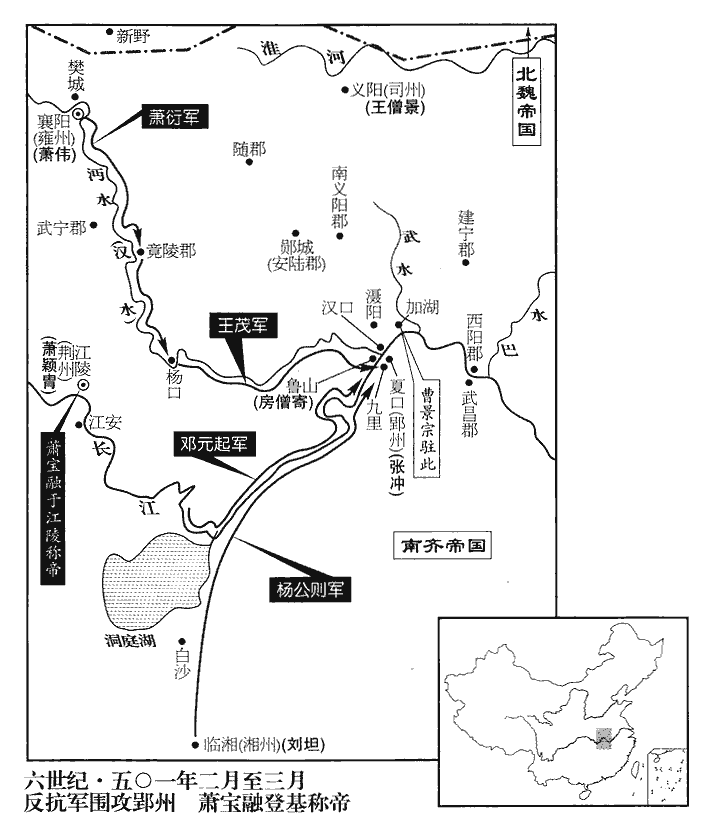
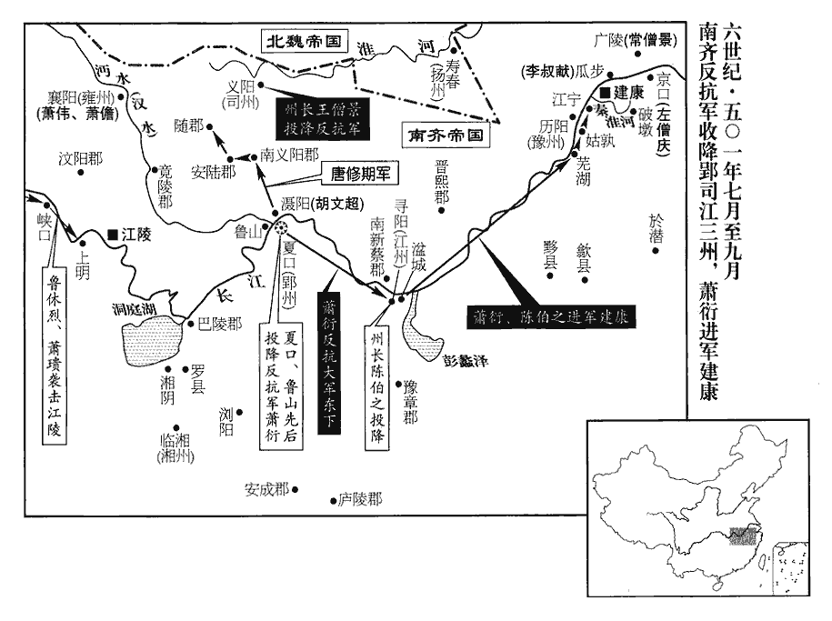
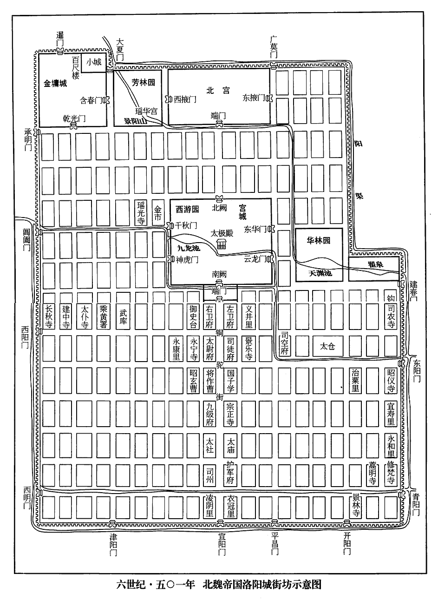
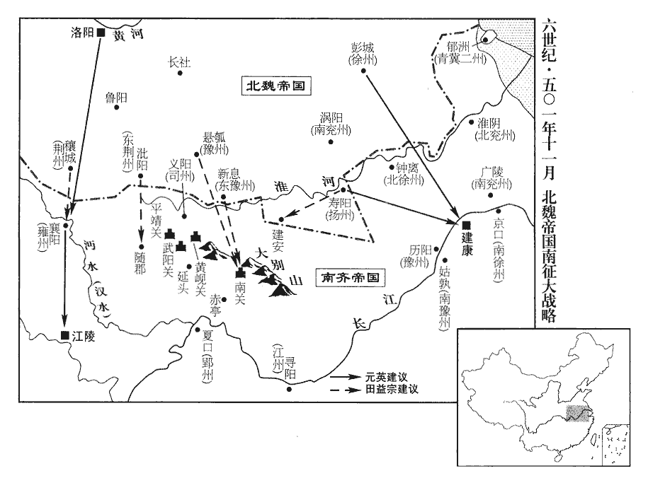
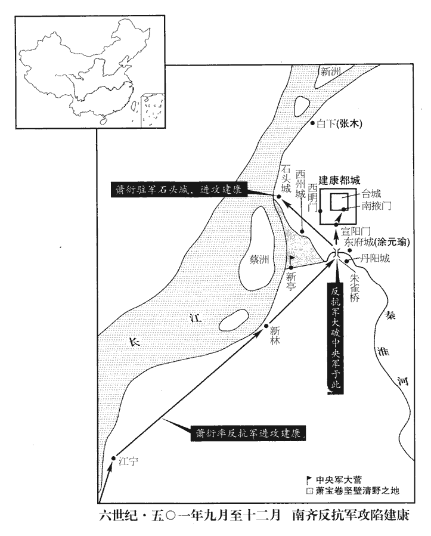

 齊紀十重光大荒落（辛巳），一年。

# 和皇帝諱寶融，字智昭，明帝第八子也。

## 中興元年（辛巳、五零一）是年三月始改元。

1春，正月，丁酉‹二›，東昏侯‹萧宝卷，本年十九岁›以晉安王寶義爲司徒，建安王寶寅爲車騎將軍、開府儀同三司。東昏侯以永元三年紀年。騎，奇寄翻。

〖译文〗 [1]春季，正月，丁酉（初二），东昏侯任命晋安王萧宝义为司徒，任命建安王萧宝寅为车骑将军、开府仪同三司。

2乙巳‹十›，南康王寶融始稱相國，相，悉亮翻；下同。大赦；以蕭穎冑爲左長史，蕭衍爲征東將軍，楊公則爲湘州‹府设临湘湖南省长沙市›刺史。去年，楊公則取長沙，因就用爲湘州刺史。戊申‹十三›，蕭衍發襄陽‹雍州州政府所在县·湖北省襄樊市›，《考異》曰︰《梁高祖紀》云︰「二月戊申，發襄陽。」按戊申，正月十三日，《梁紀》誤也。留弟偉總府州事，憺守壘城，壘城者，築壘附近大城，猶今堡寨也。憺dàn，徒敢翻，又徒濫翻。府司馬莊丘黑守樊城‹湖北省襄樊市汉水北岸›。莊丘黑蓋爲征東府司馬。衍旣行，州中兵及儲偫皆虛。偫zhì，直里翻；積物以待用謂之偫。魏興‹陕西省安康市›太守裴師仁、齊興‹湖北省邵县›太守顏僧都並不受衍命，舉兵欲襲襄陽，偉、憺遣兵邀擊於始平‹侨郡·湖北省丹江口市西北›，大破之，齊分魏興郡東界鄖鄕、錫二縣地爲齊興郡。沈約曰︰江左僑立始平郡，治武當。《五代志》曰︰淅陽郡武當縣，舊僑置始平郡，又置齊興郡。則二郡皆置於今均州界。宋白曰︰齊永明七年置齊興郡於均州鄖鄕縣。守，式又翻。雍州乃安。雍，於用翻。

〖译文〗 [2]乙巳（初十），南康王萧宝融开始称相国，发令大赦天下，并且任命萧颖胄为左长史，任命萧衍为征东将军，任命杨公则为湘州刺史。戊申（十三日），萧衍率兵从襄阳出发，留下弟弟萧伟总管府州事务，萧防守襄阳城附近的堡寨，府司马庄丘黑防守樊城。萧衍出发之后，州中兵力以及物资储备都很空虚。魏兴太守裴师仁、齐兴太守颜僧都两人不服从萧衍的命令，率领兵马要袭击襄阳，萧伟和萧派遣部队在始平进行拦截阻击，大获全胜，于是雍州得以安定。

3魏‹都洛阳河南省洛阳市东白马寺东›咸陽王禧爲上相，禧以太尉輔政，位居羣臣之上，故曰上相。不親政務，驕奢貪淫，多爲不法，魏主‹元恪，本年十九岁›頗惡之。惡，烏路翻。禧遣奴就領軍于烈求舊羽林虎賁，執仗出入。「舊」字衍。執仗出入，每出入欲使之執兵翊yì衛。賁，音奔。烈曰︰「天子諒闇，事歸宰輔。闇，音陰。領軍但知典掌宿衛，非有詔不敢違理從私。」禧奴惘然而返。惘然，失志貌。惘，音罔。禧復遣謂烈曰︰復，扶又翻。「我，天子‹拓跋弘›之子，天子‹元恪›【章︰十二行本三空格作「子，天子」三字；乙十一行本同；退齋校同。】叔父，身爲元輔，有所求須，意之所欲爲須。與詔何異！」烈厲色曰︰「烈非不知王之貴也，柰何使私奴索天子羽林！索，山客翻。烈頭可得，羽林不可得！」禧怒，以烈爲恆州‹设故都平城山西省大同市›刺史。恆，戶登翻。烈不願出外，固辭，不許；遂稱疾不出。臥私第不出也。

〖译文〗 [3]北魏咸阳王元禧以太尉辅政，位居群臣之上，但是他不亲理政务，骄奢淫侈，贪得无厌，干了许多违法之事，宣武帝对他特别不满。元禧派遣自己的奴仆到领军于烈那里要一些专为皇帝担任警卫任务的羽林虎贲，以便出入之时为他自己担任护卫，于烈不同意给，对来者说：“皇上正在为先帝守丧，朝廷政事归于辅政大臣掌管。我身为领军，只知道负责皇上的警卫事情，所以没有皇上的诏令，我不敢违反规定私自给予。”元禧的奴仆没办法，只好怏怏不乐地回去了。元禧不肯就此罢休，他再次派奴仆去对于烈转达说：“我是皇上的叔父，身为辅政大臣，有所需求而向你提出，这与皇上的诏令有什么两样呢？”于烈严厉地回答道：“于烈我并非不知道王爷的高贵身份，但是您怎么能指使自己的奴仆来索要皇上的羽林！您可以要去我于烈的脑袋，但要羽林却一个也得不到。”元禧因此而恼羞成怒，依仗权力任命于烈为恒州刺史，于烈不愿意到外地去，坚决推辞，但是元禧不准许，于是就借口有病而躲在家中不出来了。

烈子左中郎將忠領直閤，北齊左、右衛有直閤，屬官有朱衣直閤、直閤將軍、直寢、直齋、直後之屬。常在魏主‹元恪›左右。烈使忠言於魏主曰︰「諸王專恣，意不可測，宜早罷之，自攬權綱。」北海王詳亦密以禧過惡白帝，且言彭城王勰大得人情，不宜久輔政。勰，音協。帝然之。

〖译文〗 于烈的儿子左中郎将于忠统管直，经常在宣武帝身边，于烈就让于忠对宣武帝说：“各位王爷专横恣意，其内心不可测透，宜于早点把他罢黜掉，而由圣上亲自临朝执政。”北海王元详也秘密地把元禧的罪过恶行告诉了宣武帝，并且说彭城王元勰深得人心，也不宜于长久地辅理朝政。宣武帝听了，深表同意。

時將礿yuè祭，宗廟之祭，春曰礿。礿，余若翻，薄也。春物始生，其祭尚薄。王公並齊於廟東坊。帝夜使于忠語烈︰「明旦入見，當有處分。」質明，烈至。語，牛倨翻。見，賢遍翻。處，昌呂翻。分，扶問翻。質，正也；質明，天正明也。帝命烈將直閤六十餘人，宣旨召禧、勰、詳，衛送至帝所。將，卽亮翻。禧等入見于光極殿，光極殿，魏孝文帝太和十九年所起，以引見羣臣。見，賢遍翻。帝曰︰「恪雖寡昧，忝承寶曆。比纏尩疢chèn，魏主名恪，見諸父自稱其名，示謙挹也。比，毗至翻，近也。尩，烏光翻，弱也。疢，丑刃翻，疾也。實憑諸父，苟延視息，奄涉三齡。諸父歸遜殷勤，今便親攝百揆，且還府司，當別處分。」還府司，謂各歸公府司存之所。又謂勰曰︰「頃來南北務殷，不容仰遂沖操。南北務殷，謂使勰北鎭中山‹定州›州政府设中山【河北省定州市】，南取壽陽‹扬州州政府设寿阳安徽省寿县›，因而守之也。沖，謙也，虛也；沖操，謙虛之操。恪是何人，而敢久違先敕，先敕，謂高祖遺敕，見一百四十二卷東昏侯永元元年。今遂叔父高蹈之意？」勰謝曰︰「陛下孝恭，仰遵先詔，上成睿明之美，下遂微臣之志，感今惟往，悲喜交深。」惟，思也。庚戌‹十五›，詔勰以王歸第；禧進位太保；進其位而奪之權。詳爲大將軍、錄尚書事。爲詳以專恣得罪張本。尚書清河‹山东省临清市›張彝、邢巒聞處分非常，亡走，出洛陽城，爲御史中尉中山甄琛所彈。甄，之人翻。彈，徒丹翻。詔書切責之。復以于烈爲領軍，仍加車騎大將軍，復，扶又翻，又如字。自是長直禁中，軍國大事，皆得參焉。

〖译文〗 快到春季祭宗庙之时，各位王公们全都汇齐在宗庙的东坊斋戒。宣武帝在夜里指派于忠去对于烈说：“明天早晨进来见我，将对你有所吩咐。”第二天天刚亮，于烈到了，宣武帝命令于烈率领直六十多人，传达圣上旨意要召见元禧、元勰、元详三人，把他们护送到皇上的住所。元禧等三人进入光极殿，宣武帝对他们说：“元恪我虽然孤陋寡闻，忝承皇位，到我患病之后，确实依靠几位叔父辅理朝政，才使我得以苟延残喘，不知不觉地就过去了三年。三位叔父一再表示要归政，殷勤谦逊之意不敢拂逆，所以现在我就亲自执掌朝政吧。各位叔父暂且回到各自的府邸去吧，至于下一步如何，我当分别安排。”元恪又对元勰说：“近来南北事务繁多，使您奔波辛劳，不能实现虚静之志节。元恪我是何人，怎么敢长久违背先帝的遗敕？今天，我就顺从了叔父的高蹈避世的心意吧。”元勰听后，感谢元恪说：“陛下孝顺恭敬，仰遵先帝的遗诏，批准我脱身俗务，这真是上成了圣明之美，下遂了微臣我的志向，抚今思往，如何不令我悲喜交织呢？”庚戌（十五日），宣武帝诏令元勰以王爷身份回府静养，元禧位进太保，元详担任大将军、录尚书事。尚书清河人张彝、邢峦知道了元恪对三位叔父的安置情况，觉得这样处理很不正常，就离朝逃走，逃出了洛阳城，于是被御史中尉中山人甄琛弹劾，宣武帝发出诏书，狠狠地斥责了他们两人一顿。宣武帝还是让于烈担任领军，又加封他为车骑大将军，从此以后，于烈常在皇宫内值班，国家军政大事，他都得以参与。

魏主時年十六‹十九›，不能親決庶務，委之左右。於是倖臣茹皓、茹，音如。趙郡王仲興、上谷寇猛、趙郡趙脩、南陽趙邕及外戚高肇等始用事，魏政浸衰。趙脩尤親幸，旬月間，累遷至光祿卿；每遷官，帝親至其宅設宴，王公百官皆從。爲後趙脩誅張本。從，才用翻。

〖译文〗 宣武帝元恪当时才十六岁，不能亲自处理断决朝政事务，就委托给身边人办理。于是，宠幸之臣茹皓、赵郡人王仲兴、上谷人寇猛、赵郡人赵、南阳人赵邕以及外戚高肇等人开始专权，北魏的朝政从此逐渐衰败。赵尤其受宣武帝宠幸，一个月之内，就升至光禄卿。他每升一次官，宣武帝就亲自到他家去设宴庆贺一番，王公众臣们也都要随着一起去。

4辛亥‹十六›，東昏侯祀南郊，大赦。

〖译文〗 [4]辛亥（十六日），南齐东昏侯在南郊举行祀天仪式，大赦天下。

5丁巳‹二十二›，魏主引見羣臣於太極前殿，告以親政之意。見，賢遍翻。壬戌‹二十七›，以咸陽王禧領太尉，廣陵王羽爲司徒。魏主引羽入內，面授之。羽固辭曰︰「彥和本自不願，而陛下強與之。彭城王勰，字彥和，事見上卷上年。強，其兩翻。今新去此官而以臣代之，必招物議。」乃以爲司空。

〖译文〗 [5]丁巳（二十二日），北魏宣武帝元恪在太极前殿召见百官群臣，告诉了他们自己要亲自执政的意见。壬戌（二十七日），宣武帝命咸阳王元禧兼任太尉，任命广陵王元羽为司徒。元恪让元羽进入内殿，当面告诉了他这一任命。但是，元羽坚决推辞不受，他说：“当初元勰自己本来不愿意担任司徒，而陛下却强使他担任。如今，刚免去了元勰的司徒之官，而以我代替他，这样一来必定要遭到众人的议论，所以我不能担任。”于是，元恪就只好让他担任司空。

6二月，乙丑‹一›，南康王以冠軍長史王茂爲江州‹府设寻阳江西省九江市›刺史，冠，古玩翻。竟陵‹湖北省钟祥市›太守曹景宗爲郢州刺史，邵陵王寶攸爲荊州刺史。

〖译文〗 [6]二月，乙丑（初一），南齐南康王萧宝融任命冠军长史王茂为江州刺史，任命竟陵太守曹景宗为郢州刺史，任命邵陵王萧宝攸为荆州刺史。

7甲戌‹十›，魏大赦。

〖译文〗 [7]甲戌（初十），北魏大赦天下。

8壬午‹十八›，東昏侯遣羽林兵擊雍州，中外纂嚴。

〖译文〗 [8]壬午（十八日），南齐东昏侯派遣羽林兵袭击雍州，宣布朝廷内外实行戒严。

9甲申‹二十›，蕭衍至竟陵‹湖北省钟祥市›，命王茂、曹景宗爲前軍，以中兵參軍張法安守竟陵城。茂等至漢口‹汉水注入长江处·湖北省武汉市›，諸將議欲倂兵圍郢，分兵襲西陽‹湖北省黄州市›、武昌‹湖北省鄂州市›。將，卽亮翻；下同。衍曰︰「漢口不闊一里，箭道交至，謂船自中流而下，敵人夾岸射之，其箭交至也。房僧寄以重兵固守‹鲁山湖北省武汉市汉水南岸›，與郢城爲掎角；掎jǐ，居蟻翻。若悉衆前進，僧寄必絕我軍後，悔無所及。不若遣王、曹諸軍濟江，與荊州軍合，以逼郢城；吾自圍魯山‹湖北省武汉市汉水南岸›以通沔、漢，沔卽漢也，一水二名。使鄖yún城‹湖北省安陆市›、竟陵之粟方舟而下，安陸，春秋鄖子之國，故曰鄖城。鄖，音云。杜預曰︰江夏雲杜縣東南有鄖城。劉昫曰︰郢州長壽縣，古竟陵也。方，泭fú也。舟，船也。《詩》云︰就其深矣，方之舟之。泭，音桴。江陵、湘中之兵相繼而至，兵多食足，何憂兩城之不拔！天下之事，可以臥取之耳。」臥而取之，言不煩力戰也。乃使茂等帥衆濟江，頓九里。其地去郢城九里，因以爲名。帥，讀曰率。張沖遣中兵參軍陳光靜開門迎戰，茂等擊破之，光靜死，沖嬰城自守。景宗遂據石橋浦，連軍相續，下至加湖‹湖北省黄陂县东南›。加湖在江夏灄shè陽縣界，湖水自北南注江，去郢城三十里。

〖译文〗 [9]甲申（二十日），萧衍到达竟陵，命令王茂、曹景宗担任前军，又命令中兵参军张法安防守竟陵城。王茂等人到达汉口，众将领计议要合并兵力围攻郢，以及兵分两路袭击西阳和武昌。萧衍不同意这一方案，他说：“汉口河道宽不到一里，我们在河中间，敌人在两岸射箭，箭雨交织，如何得了？再说房僧寄以重兵把守汉口，与郢城成犄角之势，我们如果出动全部兵力前去，房僧寄必定要派兵去断绝我军的后路，如此一来后悔也来不及了。所以，不如派王茂、曹景宗的军队渡过长江，与荆州方面的兵力合作，逼攻郢城，我则亲自围攻鲁山，以便打通沔、汉水道，使郧城、竟陵的粮食能用舟船运下来，江陵和湘中的军队相继到来之后，兵多粮足，何愁攻不下这两座城池呢？夺取天下，无须力战，简直可以卧而取之。”于是，萧衍就指使王茂等人率兵渡过长江，驻扎在九里。张冲派遣中兵参军陈光静出城迎战，王茂等率部痛击，破敌获胜，陈光静战死，张冲只好据城自守，不敢出战。于是，曹景宗便占据石桥浦，摆开战线，一直下至加湖。

荊州遣冠軍將軍鄧元起、軍主王世興、田安之將數千人會雍州兵於夏首。雍，於用翻。夏，戶雅翻。衍築漢口城‹湖北省武汉市汉水北岸›以守魯山，命水軍主義陽‹河南省信阳市›張惠紹等遊遏江中，絕郢、魯二城信使。使，疏吏翻。楊公則舉湘州之衆會于夏口。蕭穎冑命荊州諸軍皆受公則節度，雖蕭穎達亦隸焉。

〖译文〗 荆州方面派遣冠军将军邓元起、军主王世兴、田安之率领数千人在夏首与雍州方面的兵力会合。萧衍筑建汉口城以便守护鲁山，并且命令水军主、义阳人张惠绍等人在长江中游动阻截，以便断绝郢城和鲁山之间的信使往来。杨公则率领湘州兵力与其他军在夏口会合。萧颖胄命令荆州方面的各部兵力全都接受杨公则的指挥调遣，即使是萧颖达也同样成为他的部下。

 

府朝議欲遣人行湘州事而難其人，南康王開相國府，故曰府朝。朝，直遙翻。西中郎中兵參軍劉坦謂衆曰︰「湘土人情，易擾難信，易，以豉翻。用武士則侵漁百姓，用文士則威略不振；必欲鎭靜一州，軍民足食，無踰老夫。」乃以坦爲輔國長史、長沙太守，行湘州事。坦嘗在湘州，多舊恩，迎者屬路。按《劉坦傳》︰先嘗在湘州。蓋客游也。屬，之欲翻。下車，選堪事吏分詣十郡，湘州領長沙、桂陽‹湖南省郴州市›、零陵‹湖南省永州市›、衡陽‹湖南省株洲市西南›、營陽‹湖南省道县›、湘東‹湖南省衡阳市›、邵陵‹湖南省邵阳市›、始興‹广东省韶关市›、臨賀‹广西贺县›、始安‹广西桂林市›十郡。發民運租米三十餘萬斛以助荊、雍之軍，由是資糧不乏。

〖译文〗 南康王萧宝融的相国府商议要派遣人去执管湘州，但是难以找到合适的人选，西中郎中兵参军刘坦对众人说：“湘州的风土人情不同一般，那里的人容易骚乱，难以取信，如果派一个武将去则会侵扰、鱼肉百姓，而派文官去则威略不够，不容易镇得住。所以，要想使湘州平定安稳，军民丰衣足食，无论派谁去也没有派老夫我去合适。”于是，就任命刘坦为辅国长史、长沙太守，主管湘州事务。刘坦曾经在湘州住过，当地有许多得过他好处的老熟人，所以迎接他到来的人挤满了道路。刘坦到任之后，选派能干的吏员分赴十郡，发动民众运送租米三十多万斛，以便资助荆州和雍州的军队，由此粮食物资再也不缺乏了。

三月，蕭衍使鄧元起進據南堂西渚，南堂在郢城南，北蓋射堂，西近江渚。田安之頓城北，王世興頓曲水故城。曲水故城，蓋郢府官僚祓fú禊xì之地，在城東。丁酉‹三›，張沖病卒，驍騎將軍薛元嗣與沖子孜及征虜長史江夏內史程茂共守郢城。張沖自輔國將軍進征虜將軍，以程茂爲長史。驍，堅堯翻。騎，奇寄翻。

〖译文〗 三月，萧衍派邓元起前去占据南堂西边的长江岸，田安之驻扎在城北，王世兴驻扎在曲水旧城。丁酉（初三），张冲病逝，骁骑将军薛元嗣与张冲的儿子张孜，以及征虏长史、江夏内史程茂共同守护郢城。

乙巳‹十一›，南康王‹萧宝融，本年十四岁›卽皇帝位於江陵，《考異》曰︰《東昏紀》云︰「丁未，南康王諱卽皇帝位。」蓋是日建康始聞之耳。今從《和帝紀》及《梁武帝紀》。改元，大赦，始改元爲中興元年。立宗廟、南北郊，州府城門悉依建康宮，置尚書五省，以南郡‹府江陵›太守爲尹，以蕭穎冑爲尚書令，蕭衍爲左僕射，晉安王寶義爲司空，廬陵王寶源爲車騎將軍、開府儀同三司，建安王寶寅爲徐州‹北徐州·州政府设钟离安徽省凤阳县东北临淮关›刺史，寶義、寶源、寶寅皆在建康，遙授之耳。散騎常侍夏侯詳爲中領軍，冠軍將軍蕭偉爲雍州刺史。丙午‹十二›，詔封庶人寶卷爲涪陵王，涪，音浮。乙酉‹十五›，以尚書令蕭穎冑行荊州刺史，加蕭衍征東大將軍、都督征討諸軍事，假黃鉞。時衍次楊口‹湖北省潜江市北›，和帝‹萧宝融›遣御史中丞宗夬勞軍。夬guài，古賣翻。勞，力到翻。寧朔將軍新野‹河南省新野县›庾域諷夬曰︰「黃鉞未加，非所以總帥侯伯。」武王伐紂，諸侯畢會。至于牧野，王左杖黃鉞，右秉白旄以麾。後世自魏武以下，率加黃鉞。孔安國曰︰黃鉞，以黃金飾斧。帥，讀曰率；下同。夬返西臺，江陵在西，故曰西臺。遂有是命。薛元嗣遣軍主沈難當帥輕舸數千亂流來戰，張惠紹等擊擒之。橫絕流而渡曰亂。《詩》云︰涉渭爲亂。舸，古我翻。

〖译文〗 乙巳（十一日），南康王在江陵称帝即位，改换年号为中兴，大赦天下，并且建立宗庙、南北郊祭祀天地场所，州府城门则全部依照建康宫的规模而改建，设置了尚书五省，任命南郡太守为尹，萧颖胄为尚书令，萧衍为左仆射，晋安王萧宝义为司空，庐陵王萧宝源为车骑将军、开府仪同三司，建安王萧宝崐寅为徐州刺史，散骑常侍夏侯详为中领军，冠军将军萧伟为雍州刺史。丙午（十二日），萧宝融发出诏书，宣布萧宝卷已经成为庶人，并封他为涪陵王。乙酉（疑误），萧宝融命令尚书令萧颖胄兼荆州刺史，又加封萧衍征东大将军、都督征讨诸军事，并且授予他皇帝所用的黄钺。当时，萧衍正在杨口，和帝萧宝融派遣御史中丞宗去犒劳军队，宁朔将军、新野人庾域婉言对宗说：“皇上还没有授予萧衍黄钺，这样无法统率各路军队。”宗返回江陵把这一情况告诉了和帝，于是就有了上述对萧衍的任命和授予黄钺一事。薛云嗣派遣军主沈难当率领轻舟数千艘穿越急流，前来交战，张惠绍等人迎战进击，擒获了沈难当。

癸丑‹十九›，東昏侯‹萧宝卷›以豫州‹府设历阳安徽省和县›刺史陳伯之爲江州刺史、假節、都督前鋒諸軍事，西擊荊、雍。

〖译文〗 癸丑（十九日），东昏侯委任豫州刺史陈伯之为江州刺史、假节、都督前锋诸军事，命令他西击荆、雍二州。

夏，四月，蕭衍出沔，命王茂、蕭穎達等進軍逼郢城；薛元嗣不敢出。不敢出戰也。諸將欲攻之，衍不許。衍欲持久以全力弊郢、魯二城。

〖译文〗 夏季，四月，萧衍率部出沔，命令王茂、萧颖达等部十九日进军逼近郢城，薛元嗣据守城内，不敢出战，众将领准备攻城，萧衍不允许。

10魏廣陵惠王羽通於員外郎馮俊興妻，夜往，爲俊興所擊而匿之；五月，壬子‹十九›，卒。

〖译文〗 [10]北魏广陵惠王元羽与员外郎冯俊兴的妻子私通，夜里前去寻欢，被冯俊兴堵住痛打了一顿，并且把他藏匿起来，五月，壬子（十九日），元羽死去。

11魏主旣親政事，嬖倖擅權，王公希得進見。【章︰十二行本「見」下有「咸陽王禧意不自安」八字；乙十一行本同；退齋校同。】見，賢遍翻。齊【章︰十二行本「齊」作「齋」；乙十一行本同。】帥劉小苟屢言於禧云，帥，所類翻。聞天子左右人言欲誅禧，禧益懼，乃與妃兄給事黃門侍郎李伯尚、氐王楊集始、楊靈祐、乞伏馬居等謀反。會帝出獵北邙‹洛阳城北›，禧與其黨會城西小宅，欲發兵襲帝‹元恪›，使長子通竊入河內‹河南省沁阳市›舉兵相應。長，知兩翻。乞伏馬居說禧︰「還入洛城，勒兵閉門，說，式芮翻。天子必北走桑乾，謂北歸平城也。平城，魏故都。乾，音干。殿下可斷河橋，爲河南天子。」斷，丁管翻。衆情前卻不壹，禧心更緩，自旦至晡，猶豫不決，遂約不泄而散。楊集始旣出，卽馳至北邙告之。

〖译文〗 [11]北魏宣武帝元恪亲自执政以来，宠幸之徒们专权，而王公大臣们却很少有进见的机会。齐帅刘小苟多次告诉元禧，说他听皇上身边的人讲要杀掉元禧，元禧越发害怕了，于是就与妃子的哥哥担任给事黄门侍郎的李伯尚、氐王杨集始、杨灵、乞伏马居等人一起谋反。恰逢宣武帝去北邙打猎，元禧与同党们在城西小宅内集会，准备发兵去袭击宣武帝，并且派长子元通偷偷去河内起兵响应。乞伏马居劝说元禧：“我立即回到洛阳城中去，率兵关闭城门，皇上必定会朝北向桑乾逃去，殿下可以把黄河桥拆断，割据一方，做黄河以南的皇帝。”但是，众人意见不统一，有的主张立即行动，有的主张暂缓一步，元禧心里更不急，从早晨到下午，尚犹豫不决，于是约定谁也不能泄露出去，大伙就散了。杨集始刚出来，就立即骑马到北邙向宣武帝报告去了。

直寢苻承祖、薛魏孫與禧通謀，當是時，馮太后所幸宦者苻承祖已死，此又別一苻承祖。後魏孝文帝太和九年，初置後齋直寢。是日，帝寢於浮圖之陰，魏孫欲弒帝，承祖曰︰「吾聞殺天子者身當病癩。」癩，音賴，惡疾也。魏孫乃止。俄而帝寤，集始亦至。帝左右皆四出逐禽，直衛無幾，幾，居豈翻。倉猝不知所出。左中郎將于忠曰︰「臣父領軍留守京城，守，式又翻。計防遏有備，必無所慮。」帝遣忠馳騎觀之，騎，奇寄翻。于烈已分兵嚴備，使忠還奏曰︰「臣雖老，心力猶可用。此屬猖狂，不足爲慮，願陛下清蹕徐還，以安物望。」帝甚悅，自華林園還宮，華林園，魏明帝所築芳林園也；後避齊王芳諱，改曰華林園。還，從宣翻，又如字。撫于忠之背曰︰「卿差強人意！」

〖译文〗 担任直寝的苻承祖、薛魏孙与元禧合谋，这一天，宣武帝元恪在佛塔底下的阴凉处睡眠，薛魏孙将要杀死元恪，苻承祖却对他说：“我听说杀皇帝的人身体要得癞疮。”于是，薛魏孙就没有下手。不一会儿，元恪睡醒了，杨集始也赶到了，向他报告了元禧的阴谋。宣武帝左右的人都四处出动去追逐禽兽去了，身边没有几个卫士，所以仓猝之间不知如何是好。这时，左中郎将于忠对宣武帝说道：“我父亲领军于烈留守在京城为了应付突然事变，必有所防备，所以一定不会有什么担忧的。”宣武帝马上派遣于忠骑马去京城观察情况，到后一看，见于烈已经分布兵力，严加守备，做好了应急措施。于烈让于忠回去奏告宣武帝，说：“我虽然年纪老了，但是心力还够用。元禧这帮家伙虽然猖狂，但是完全不足为虑，希望陛下收拾车驾慢慢返宫，以便安定人心。宣武帝听后喜悦万分，从华林园回到宫中，抚摸着于忠的后背说道：“您是比较令我满意的。”

禧不知事露，與姬妾及左右宿洪池別墅，洪池卽漢之鴻池，在洛陽東二十里。田廬曰墅，今人謂之別業，晉人以來，往往治池館，觀游於其中。墅，承與翻。遣劉小苟奉啓，云檢行田收。行，下孟翻。小苟至北邙，已逢軍人，怪小苟赤衣，欲殺之。小苟困迫，言欲告反，乃緩之。或謂禧曰︰「殿下集衆圖事，見意而停，言意趣已發見而中止也。見，賢遍翻。恐必漏泄，今夕何宜自寬！」禧曰︰「吾有此身，應知自惜，豈待人言！」又曰︰「殿下長子已濟河，兩不相知，豈不可慮！」禧曰︰「吾已遣人追之，計今應還。」時通已入河內，列兵仗，放囚徒矣。于烈遣直閤叔孫侯將虎賁三百人收禧。將，卽亮翻。賁，音奔。禧聞之，自洪池東南走，僮僕不過數人，濟洛，至柏谷塢‹河南省偃师县东南›，追兵至，擒之，送華林都亭。華林都亭蓋在華林園門外。帝面詰其反狀，詰，去吉翻。壬戌‹二十九›，賜死於私第。同謀伏誅者十餘人，諸子皆絕屬籍，微給資產、奴婢，自餘家財悉分賜高肇及趙脩之家，其餘賜內外百官，逮于流外，雜色補官不入品者，謂之流外官。多者百餘匹，下至十匹。禧諸子乏衣食，獨彭城王勰屢賑給之。河內太守陸琇聞禧敗，斬送禧子通首。魏朝以琇於禧未敗之前不收捕通，責其通情，徵詣廷尉，死獄中。陸馛bó以傅孝文於受內禪之初，福澤及其子；至是，其子敗矣。勰，音協。賑，津忍翻。琇，音秀。朝，直遙翻。帝以禧無故而反，由是益疏忌宗室。

〖译文〗 元禧还不知道事情已经败露，同姬妾以及身边的人住宿在洪池别墅里，而派遣刘小苟去向元恪启告，说自己在巡视检查田野收割情况。刘小苟到了北邙，已经遇上了军人，军人们见刘小苟穿着红衣服，觉得他不对劲，要杀他。刘小苟于困迫之中灵机一动，说自己要去报告元禧谋反之事，军人们才缓而未杀他。有人对元禧说：“殿下召集众人图谋大事，事情已经挑明了，但是却中途而止，恐怕必定会有所泄露，今天晚上怎么可以如此宽心自在呢？”元禧显得有些不耐烦，回答说：“我的身子为自己所有，应该知道如何爱惜，难道还用得着别人来提醒吗？”这人又对他说：“殿下的长子已经渡过黄河了，但现在我们这里又停止行动了，这样互相不知情，难道不值得忧虑吗？”元禧回答说：“我已经派人去追他去了，估计现在应该回来了。”这时元通已经到了河内，并且布置好兵力武器，放出了囚徒，开始行动了。于烈派遣直叔孙侯率领虎贲三百名去抓捕元禧，元禧知道之后，从洪池东南逃跑，跟随的僮仆不过几人。元禧渡过了洛水，到达柏谷坞时，后面的追兵也赶上来了，捉住了他，押送到华林都亭。宣武帝元恪当面诘问了元禧谋反经过，于壬戌（二十九日），赐元禧死于他本人的府中。元禧的同谋伏法被诛的有十多人，他的几个儿子都从皇族的名册中除去，留给他们少量的财产和奴婢，在此以外的部分家产赏赐给高肇以及赵，其余的分赏给朝廷内外百官，甚至不入品的候补官员也得到了一些赏赐，多的有绢帛一百多匹，少的则十匹。元禧的儿子们缺衣少食，只有彭城王元勰屡屡接济他们。河内太守陆闻知元禧谋反失败，便斩了元禧的儿子元通，把首级送往朝廷。但是，朝廷却认为陆在元禧没有失败之前不拘捕元通，指责他与元通串通合谋，把他征召到京城，经廷尉审理，最后死在狱中。宣武帝元恪由于元禧无缘无故而谋反，因此越发疏远、猜忌宗室成员了。

12巴西‹四川省绵阳市›太守魯休烈、巴東‹重庆市奉节县东›太守蕭惠訓不從蕭穎冑之命；惠訓遣子璝將兵擊穎冑，璝guī，古回翻。穎冑遣汶陽‹湖北省远安县›太守劉孝慶屯峽口‹湖北省宜昌市西›，此西陵峽口也，在宜都夷陵界；夷陵，今峽州也。與巴東太守任漾之等拒之。任，音壬。

〖译文〗 [12]南齐巴西太守鲁休烈、巴东太守萧惠训不听从萧颖胄的命令，萧惠训还派遣自己的儿子萧带兵去袭击萧颖胄，萧颖胄派汶阳太守刘孝庆驻扎峡口，同巴东太守任漾之等人一起抵挡萧。

13東昏侯遣軍主吳子陽、陳虎牙等十三軍救郢州，進屯巴口‹巴河注入长江处·湖北省黄州市东›。《水經註》︰巴水出廬江雩yú婁縣之下靈山，亦曰巴山，南流注于江，謂之巴口。今黃州之巴河口是也。虎牙，伯之之子也。

〖译文〗 [13]东昏侯派遣军主吴子阳、陈虎牙等十三军去援救郢城，这些军队进驻了巴口。陈虎牙是陈伯之的儿子。

六月，西臺遣衛尉席闡文勞蕭衍軍，勞，力到翻。齎jí蕭穎冑等議，謂衍曰︰「今頓兵兩岸，不倂軍圍郢，定西陽‹湖北省黄州市›、武昌，取江州，此機已失；莫若請救於魏，與北連和，猶爲上策。」衍曰︰「漢口路通荊、雍，控引秦、梁，泝漢水而上至漢中‹陕西省汉中市›，秦、梁二州刺史所治也，故可以控引。糧運資儲，仰此氣息；所以兵壓漢口，連結數州。今若倂軍圍郢，又分兵前進，魯山必沮沔路，搤吾咽喉；搤è，於革翻。咽，因肩翻。若糧運不通，自然離散，何謂持久？鄧元起近欲以三千兵往取尋陽，彼若懽然知機，一說士足矣；說，輸芮翻。脫距王師，脫，或也；脫者，未可必之辭。固非三千兵所能下也。進退無據，未見其可。西陽、武昌，取之卽得；然旣得之，卽應鎭守。欲守兩城，不減萬人，糧儲稱是，卒無所出。稱，尺證翻。卒，讀曰猝。脫東軍有上者，上，時掌翻。以萬人攻兩【章︰十二行本「兩」作「一」；乙十一行本同；退齋校同。】城，兩城勢不得相救，若我分軍應援，則首尾俱弱；如其不遣，孤城必陷，一城旣沒，諸城相次土崩，天下大事去矣。若郢州旣拔，席卷沿流，卷，讀曰捲。西陽、武昌自然風靡。何遽分兵散衆，自貽憂患乎！且丈夫舉事欲清天步，天步，天路也。《詩》云︰天步艱難。況擁數州之兵以誅羣小，懸河注火，奚有不滅！豈容北面請救戎狄，以示弱於天下！彼未必能信，徒取醜聲，此乃下計，何謂上策！蕭衍此計，可謂有英雄之略矣。卿爲我輩白鎭軍︰前途攻取，但以見付，事在目中，無患不捷，但借鎭軍靖鎭之耳。」蕭穎冑時爲西臺尚書令，蓋加號鎭軍將軍。爲，于僞翻；下祐爲同。

〖译文〗 六月，江陵方面派遣卫尉席阐文去犒劳萧衍的军队，并且把萧颖胄等人的意见转达于萧衍：“如今您把兵力停在汉口两岸，而不合并诸军围攻郢城，平定西阳、武昌，夺取江州。这一机会已经失去了，所以不如求救于北魏，与他们联合起来，尚且不失为上策。”萧衍回答道：“汉口路通荆州、雍州，控制秦州、梁州，一切粮草物资的运输，全凭这里通过，所以我才决定兵压汉口，连结数州。现在如果合并各路军马围攻郢城，并且分兵前进，那么鲁山敌军必定要阻断沔水水路，这等于是扼住了我们的咽喉。如果水路被断，那么粮草就难以运到，军队缺粮，自然会发生逃亡离散，这样的话，又如何能持久得了呢？邓元起近来想带三千兵力去攻取寻阳，寻阳那边如果能知道事态之发展，派一个说客去就够了；如果要抗拒我们的军队，那可远非三千兵就可以攻取得下来的，而到时必然会进退无所依据，所以不见得可行。西阳和武昌，如果要占取，很快就可以攻下来的。然而，既然攻下来了，就应当驻兵镇守。但是，要想守住这两座城市，少于一万人是不行的，这就必须要有相应的粮食物资供应，但是仓促之下难以筹措到的。如果东边军队前来，以一万人攻打这两座城，而两城之间势必不能互相援救，如果我分派军队去援救，则首尾兵力俱将削弱；如果不派遣的话，则孤城必然陷入敌手，只要一座城丢失了，其它城也会相继土崩瓦解，如此则大势已去，谋求天下之大业也就宣告失败了。如果在攻下郢州之后，沿江席卷而进，则西阳和武昌自然望风而披靡。所以，又何需眼下分兵散众去攻打，以致自己给自己造成忧患呢？而且，大丈夫举事是为了清理出通向朝廷之路，何况我们拥有数州的兵力来诛斩一帮小人，好比是悬河注火，哪里有不能熄灭的道理呢？所以，岂能求救于北方的戎狄，以致示弱于天下呢？他们也未必可以信任，求救于他们，我们只能是白白地落下千丑坏的名声，这实在是下策，怎么能说是上策呢？请您替我们转告镇军将军萧颖胄：下一步的攻取之事，只管交给我负责好了，事情明摆在那里，我完全清楚该如何行动，不要担心不能取胜，只是要借镇军将军之威名来镇定军心罢了。”

吳子陽等進軍武口‹武水滠水›注入长江处·湖北省黄陂县东南。武口，武湖水出江之口。水上通安陸之延頭，今謂之沙武口。張舜民曰︰武口在陽羅洑西北十餘里，距汴京纔十八驛，二廣、湖、湘皆由此而濟。衍命軍主梁天惠等屯漁湖城，唐脩期等屯白陽壘‹湖北省武汉市北五千米白阳浦›，時築壘於白陽浦。夾岸待之。子陽進軍加湖‹武汉市北十五千米›。《考異》曰︰《梁•韋叡傳》作「茄湖」。今從《齊》《梁•帝紀》。去郢三十里，傍山帶水，築壘自固。子陽舉烽，城內亦舉火應之；而內外各自保，不能相救。會房僧寄病卒，衆復推助防張樂祖代守魯山。復，扶又翻；下纂復、祐復同。助防者，使之助城主防守，因以爲稱。樂祖，卽去年張沖所遣助房僧寄者。參考前後，「張」當作「孫」。

〖译文〗 吴子阳等人进军武口，萧衍命令军主梁天惠等人驻兵渔湖城，又命令唐期等人驻兵白阳垒，在两岸严阵以待，准备夹击。吴子阳把军队开进加湖，他在离郢城三十里远近，选择地理形势依山傍水之处修筑战垒，自我固守。吴子阳点燃烽火，郢城之内也点火相应，但是城内与城外只愿各自保命，不能互相援救。正在这时，房僧寄病死，众人又推选原来协助房僧寄守城的孙乐祖代替他防守鲁山。

14蕭穎冑之初起也，弟穎孚自建康出亡，廬陵‹江西省吉水县›民脩靈祐爲之聚兵，得二千人，襲廬陵，克之，內史謝篹奔豫章‹江西省南昌市›。篹suǎn，蘇管翻。穎冑遣寧朔將軍范僧簡自湘州赴之，僧簡拔安成‹江西省安福县›，吳孫晧寶鼎二年，分豫章、廬陵、長沙立安成郡；時屬江州。劉昫曰︰吉州安福縣，吳置安成郡。《九域志》︰安福縣在吉州西一百二十里。穎冑以僧簡爲安成太守，以穎孚爲廬陵內史。東昏侯遣軍主劉希祖將三千人擊之，南康‹江西省赣州市›太守王丹以郡應希祖。南康，今之贛州。穎孚敗，奔長沙，尋病卒；謝篹復還郡。希祖攻拔安成，殺范僧簡，東昏侯以希祖爲安成內史。脩靈祐復合餘衆攻謝篹，篹敗走。

〖译文〗 [14]萧颖胄刚开始起兵之时，他的弟弟萧颖孚从建康逃出，庐陵百姓灵为他召集兵员，得到两千人，去袭击庐陵，攻下了庐陵，内史谢跑到了豫章。萧颖胄派遣宁朔将军范僧简从湘州赶赴豫章，范僧简攻下了安成，萧颖胄任命范僧简为安成太守，任命萧颖孚为庐陵内史。东昏侯派遣军主刘希祖率领三千人攻击萧颖孚，南康太守王丹率郡兵响应刘希祖。萧颖孚战败，跑到长沙，很快就病死了，谢又回到了郡中。刘希祖又去攻打安成，杀了范僧简，东昏侯任命刘希祖为安成内史。灵重新集合剩余的人马攻打谢，谢败逃而去。

15東昏侯作芳樂苑，樂，音洛。山石皆塗以五采。望民家有好樹、美竹，則毀牆撤屋而徙之；時方盛暑，隨卽枯萎，朝暮相繼。言徙樹竹者朝夕相繼也。又於苑中立市，使宮人、宦者共爲裨販，裨，益也。買賤賣貴以自裨益，故曰裨販。以潘貴妃‹潘玉奴›爲市令，東昏侯自爲市錄事，小有得失，妃則予杖；予，讀曰與。乃敕虎賁不得進大荊、實中荻。大荊，牡荊也，俗謂之黃荊，以爲箠杖。荻之實中者，以箠人則重而痛楚，虛中者差輕。賁，音奔。又開渠立埭，身自引船，埭dài，徒耐翻。或坐而屠肉。又好巫覡，好，呼到翻。覡，刑狄翻。左右朱光尚詐云見鬼。東昏入樂遊苑，人馬忽驚，以問光尚，對曰︰「曏見先帝‹萧鸾›大嗔，樂，音洛。先時爲曏。嗔，昌眞翻，怒也。不許數出。」數，所角翻。東昏大怒，拔刀與光尚尋之。旣不見，乃縛菰爲高宗形，菰gū，音孤，雕胡也，一名蔣，江南人呼爲茭草。北向斬之，縣首苑門。縣，讀曰懸。

〖译文〗 [15]东昏侯修建了芳乐苑，山石全部涂上五彩之色。他看见民众家有好树和美竹，就命人毁掉人家的院墙，拆掉房屋，把这树和竹子移走，重新栽在芳乐苑中。当时正值盛暑，栽上不久就枯萎了，于是另换，所以移栽树、竹的人就从早到晚忙个不停。东昏侯又在芳乐苑中建立了一个集市，让宫人、宦官们充当小贩，让潘贵妃做市令，他自己则自任集市的录事，如果谁稍有过失，潘贵妃就把其交给卫士杖责。于是，东昏侯命令虎贲们打时不得使用杖和实芯的荻杆。东昏侯又命令人挖渠筑坝，自己亲自驾船，或者坐下作屠夫卖肉。东昏侯又喜好巫师，他的身边人朱光尚诈称说自己能看见鬼。一次，东昏侯进入东游苑，人马突然受惊，就问朱光尚是怎么回事，朱光尚回答说：“前次我曾看见先帝非常生气，不许圣上频繁出游。”东昏侯听了勃然大怒，拔出刀子，同朱光尚一起寻找明帝的鬼魂。找了半天没有找着，东昏侯又用菰草扎成明帝的形状，然后用刀斩下草人的脑袋，把它悬挂在东游苑的门上。

崔慧景之敗也，巴陵王昭冑、永新侯昭穎出投臺軍，各以王侯還第，心不自安。昭冑、昭穎投慧景事見上卷上年。永新縣屬安成郡，吳立。竟陵王子良故防閤桑偃爲梅蟲兒軍副，與前巴西太守蕭寅謀立昭冑，昭冑許事克用寅爲尚書左僕射、護軍。許之以僕射領護軍將軍。時軍主胡松將兵屯新亭‹建康城西南›，寅遣人說之曰︰「須昏人出，須，待也。以帝昏狂，斥指爲昏人。說，式芮翻。寅等將兵奉昭冑入臺，閉城號令。將，卽亮翻。昏人必還就將軍，但閉壘不應，則三公不足得也。」松許諾。會東昏新作芳樂苑，經月不出遊。偃等議募健兒百餘人，從萬春門入，突取之，昭冑以爲不可。偃同黨王山沙慮事久無成，以事告御刀徐僧重。寅遣人殺山沙於路，吏於麝幐中得其事。幐téng，徒登翻；囊可帶者曰幐。山沙以盛麝香，故曰麝幐，猶今之香袋。昭冑兄弟與偃等皆伏誅。

〖译文〗 崔慧景失败之后，巴陵王萧昭胄、永新侯萧昭颖投降了朝廷军队，后来各自以王侯身份回到府第，然而心中到底不能安然。竟陵王萧子良过去的防桑偃现在是梅虫儿的军副，他与从前的巴西太守萧寅合谋，要立萧昭胄为帝，萧昭胄许诺事成之后让萧寅做尚书左仆射和护军。这时，军主胡松率兵屯驻在新亭，萧寅派人去游说他：“等待这个昏君出外的机会，萧寅等人带兵奉送萧昭胄进入宫中，然后关闭城门，发号施令，宣布登基。如此一来，昏君必然来投奔将军，您只管关闭寨垒不理他。只要您按此办理，那么到时位到三公是不在话下的。”胡松答应了。恰在这时，东昏侯刚建成芳乐苑，整日在苑中玩嬉，好几个月不出外游赏。桑偃等人就在一起商议，准备招募壮士一百多人，让他们从万春门进去，突然地去把东昏侯收拾掉，萧昭胄认为这样不可行。桑偃的同党王山沙考虑事情拖的太久了不会成功，就去把这件事报告了御刀徐僧重。萧寅派人在路上刺杀了王山沙，但是官吏在王山沙的香袋中发现了写有萧照胄等人秘密计划的纸条，萧昭胄兄弟以及桑偃等人都伏法被诛。

雍州刺史張欣泰與弟前始安內史欣時，密謀結胡松及前南譙‹侨郡·安徽省巢湖市东南›太守王靈秀、直閤將軍鴻選等誅諸嬖倖，廢東昏。晉孝武帝僑立南譙郡於淮南。《五代志》︰江都郡清流縣，舊置南譙郡。鴻，姓也。《姓譜》︰帝鴻氏之後，或曰大鴻之後。《左傳》，衛有鴻聊魋tuí。雍，於用翻。嬖，卑義翻，又博計翻。東昏遣中書舍人馮元嗣監軍救郢；監，工銜翻。秋，七月，甲午‹二›，茹法珍、梅蟲兒及太子右率李居士、制局監楊明泰送之中興堂，宋孝武帝卽位於新亭，改新亭曰中興堂。茹，音如。率，所律翻。欣泰等使人懷刀於座斫元嗣，頭墜果柈中，柈pán，蒲官翻。柈以盛果及魚肉。又斫明泰，破其腹；蟲兒傷數瘡，手指皆墮；居士、法珍等散走還臺。靈秀詣石頭迎建康王寶寅，「建康王」當作「建安王」。帥城中將吏見力，見力，見在兵力也。帥，讀曰率。見，賢遍翻。去車輪，載寶寅，文武數百唱警蹕，向臺城，百姓數千人皆空手隨之。欣泰聞事作，馳馬入宮，冀法珍等在外，東昏盡以城中處分見委，表裏相應。旣而法珍得返，處分閉門上仗，不配欣泰兵，鴻選在殿內亦不敢發。寶寅至杜姥宅，日已暝，城門閉。城上人射外人，外人棄寶寅潰去。寶寅亦逃，三日，乃戎服詣草市尉，臺城六門之外，各有草市，置草市尉司察之。去，羌呂翻。處，昌呂翻。分，扶問翻。上仗，時掌翻。射，而亦翻。尉馳以啓東昏。東昏召寶寅入宮問之，寶寅涕泣稱︰「爾日不知何人逼使上車，仍將去，制不自由。」爾日，猶言其日也。上，時掌翻。東昏笑，復其爵位。張欣泰等事覺，與胡松皆伏誅。

〖译文〗 雍州刺史张欣泰同其弟前始安内史张欣时密谋策划，想勾结胡松以及从前的南谯太守王灵秀、直将军鸿选等人诛杀东昏侯身边的宠幸之徒，并且废去东昏侯。东昏侯派遣中书舍人冯元嗣监督军队去援救郢城。秋季，七月甲午（初二），茹法珍、梅虫儿以及太子右率李居士、制局监杨明泰在中兴堂为冯元嗣送行，张欣泰等派人怀中藏刀在座席上砍杀了冯元嗣，冯元嗣的脑袋坠落在装水果的盘子中，接着又砍向杨明泰，剖破了他的腹部，梅虫儿几处中伤，手指头全被砍掉，李居士、茹法珍等人则往宫中逃去。王灵秀去石头迎接建安王萧宝寅，他率领着城中的将吏们，以便展示兵力，又把车子去掉车轮，让萧宝寅崐坐在上面，命人抬着前行，文武官员数百名在前头喝唱开道，浩浩荡荡地向朝廷走去，数千名老百姓全都空着双手跟随在后面。张欣泰闻知已经开始行动了，急忙骑马入宫，希望乘茹法珍等人在外面之机，东昏侯能把城中布置防御的事情完全委托给他自己，以便里外相应。但是，不久茹法珍就从中兴堂逃回来了，他命令人关闭城门，配兵守护，但是没有发给张欣泰武器，鸿选在殿内也不敢行动。萧宝寅到达杜姥宅之时，天已经黑了，城门也已经关闭了。城门的守兵发箭射外面的人，这伙人就把萧宝寅扔下溃逃而去。萧宝寅也逃走了，三天之后，方才穿着武服来到草市尉司自首，草市尉驰马去报告东昏侯，东昏侯召萧宝寅进宫讯问他，萧宝寅痛哭流涕地说：“那天不知道什么人逼使我上车，就把我弄去了，实在是身不由己。”东昏侯听得笑了，没有为难萧宝寅，恢复了他的爵位。张欣泰等人在事情败露之后，同胡松一起伏法被诛。

16蕭衍使征虜將軍王茂、軍主曹仲宗等乘水漲以舟師襲加湖，《考異》曰︰《和帝紀》作「王茂先」。今從《梁書》。鼓譟攻之。丁酉‹五›，加湖潰，吳子陽等走免，將士殺溺死者萬計，將，卽亮翻。俘其餘衆而還。還，從宣翻。於是郢、魯二城相視奪氣。

〖译文〗 [16]萧衍命令征虏将军王茂、军主曹仲宗等人乘水涨而以水军去袭击加湖，击鼓呼叫进攻。丁酉（初五），加湖方面溃败，吴子阳等人逃走免死，将士被杀或被淹死的以万计数，王茂、曹仲宗的水军俘虏了吴子阳的残余兵将，凯旋而归。加湖失守之后，郢城和鲁山的守军顿时士气大泄。

17乙巳‹十三›，柔然‹瀚海沙漠群›犯魏邊。

〖译文〗 [17]乙巳（十三日），柔然国进犯北魏边境。

18魯山乏糧，軍人於磯頭捕細魚供食，磯，居希翻。沙聚成磧，水所漸浸曰磯。密治輕船，將奔夏口，治，直之翻。夏，戶雅翻。蕭衍遣偏軍斷其走路。斷，音短。丁巳‹二十五›，孫樂祖窘迫，以城降。降，戶江翻；下同。

〖译文〗 [18]鲁山缺乏粮食，军人们在矶头捕捞小鱼充当食物，并且秘密地准备好轻便的船只，将要逃奔夏口。萧衍知道城中守军要逃跑，便派遣一支部队断了他们的逃路。丁巳（二十五日），孙乐祖窘迫无奈，献城投降。

己未‹二十七›，東昏侯以程茂爲郢州刺史，薛元嗣爲雍州刺史。雍，於用翻。是日，茂、元嗣以郢城降。郢城之初圍也，士民男女近十萬口；閉門二百餘日，疾疫流腫，流腫，言毒氣流注而浮腫也。近，其郢翻。死者什七八，《考異》曰︰《齊•張沖傳》云︰「死者七八百家。」按死者不可以家數。今從《梁高祖紀》及《韋叡傳》。積尸牀下而寢其上，比屋皆滿。比，毗至翻。《周禮》︰五家爲比。取其相連比而居也。又毗必翻，次也。茂、元嗣等議出降，降，戶江翻。使張孜爲書與衍。張沖故吏青州‹府设郁洲江苏省连云港市东沉积小岛›治中房長瑜明帝時，張沖爲青、冀二州刺史，以房長瑜爲治中。謂孜曰︰「前使君忠貫昊天，郎君但當坐守畫一以荷析薪。畫一，用《漢書》語︰蕭何爲法，較若畫一；曹參代之，守而勿失。此取守而勿失之義。《左傳》曰︰其父析薪，其子不克負荷。荷，下可翻，又如字。若天運不與；當幅巾待命，下從使君。今從諸人之計，非唯郢州士女失高山之望，亦恐彼所不取也。」《詩》曰︰高山仰止。《註》云︰有高德則慕而仰之。彼，謂蕭衍。孜不能用。蕭衍以韋叡爲江夏太守，行郢府事，夏，戶雅翻。收瘞yì死者而撫其生者，瘞，於計翻。郢人遂安。

〖译文〗 己未（二十七日），东昏侯任命程茂为荆州刺史，薛元嗣为雍州刺史。但是就在这一天，程茂、薛元嗣献出郢城，投降了萧衍。郢城刚被围之时，有士人百姓男女近十万人，关闭城门二百多天，城内瘟疫流行，人人浮肿，每十个人之中就有七八个死去，尸体堆积在床底下，而活人睡在床上，家家户户都是这样。王茂、薛元嗣等人商议出城投降，让张孜写信给萧衍。青州人治中房长瑜过去曾在张冲幕府中任过吏员，他对张孜说：“令尊前使君赤胆忠心，气贯长虹，郎君您唯一应当做到的就是坐镇坚守，使该城不要丢失，以不负已故令尊大人的重托。如果天运不济，我们就只好脱去戎装，听候安排，到黄泉之下去找使君大人。现在，你听从其他人的计策，欲出城而降，这不但使郢州的男女老少对你失去景仰之情，恐怕萧衍也不会瞧得上你。”张孜不能听从房长瑜的劝谕，还是写信给萧衍，献城投降。萧衍任命韦睿为江夏太守，代理郢府事务。韦睿收埋死者，安抚还活着的人，于是郢人得以安定。

諸將欲頓軍夏口；衍以爲宜乘勝直指建康，車騎諮議參軍張弘策、寧遠將軍庾域亦以爲然。衍命衆軍卽日上道。緣江至建康，凡磯、浦、村落，軍行宿次、立頓處所，弘策逆爲圖畫，如在目中。郢、魯未克，蕭衍則違衆議駐兵漢口而不輕進，圖萬全也。郢、魯旣克，衍遽督諸軍直指建康，乘勝勢也。逆爲圖畫者，畫緣江可立頓及次宿之地爲圖，使諸將按之以爲進止。上，時掌翻。

〖译文〗 诸位将领想要把军队驻扎在夏口，稍事休整。萧衍则认为应该乘胜而进，直驱建康，车骑谘议参军张弘策、宁远将军庾域也认为萧衍的意见非常对。萧衍命令众路军队当日就开拔上路。沿长江至建康，凡是矶、浦、村落，军队行走途中可以住宿、停留的地方，张弘策早已绘成地图，一目了然，诸将可以按图前进。

19辛酉‹二十九›，魏大赦。

〖译文〗 [19]辛酉（二十九日），北魏大赦天下。

20魏安國宣簡侯王肅卒於壽陽‹年三十八岁›，安國縣，漢屬中山國，晉、魏屬博陵郡。贈侍中、司空。初，肅以父死非命，王奐死見一百三十八卷武帝永明十一年。四年不除喪。高祖‹元宏›曰︰「三年之喪，賢者不敢過。」《記•檀弓》︰子夏旣除喪而見，予之琴，和之而不和，彈之而不成聲，作而曰︰「哀未忘也，先王制禮而弗敢過也。」命肅以祥禫dàn之禮除喪。朞而小祥，再朞而大祥；大祥之後，中月而禫。鄭氏曰︰祥，吉也。禫，澹澹然平安之意。禫，徒感翻。《釋》曰︰除服祭名。然肅猶素服、不聽樂終身。

〖译文〗 [20]北魏安国宣简侯王肃死于寿阳，朝廷追赠他侍中、司空。当初，王肃因为父亲死于非命，四年过去了还不除去丧服，孝文帝对他说：“守丧三年，就是当年的贤者子夏也不敢超过这个期限呀。”命令王肃以祥之礼除去丧服，然而王肃还是穿着素服，并且终生不听音乐。

 

21汝南‹侨郡·河南省信阳市›民胡文超起兵於灄shè陽沈約曰︰汝南本沙羨土，晉末，汝南郡民流寓夏口，因立爲汝南縣，爲江夏太守治所。宋白曰︰晉汝南郡人流寓夏口，因僑立汝南郡，在潼口；又爲汝南縣，晉末改爲江夏縣，《荊湘記》云，金水北岸有汝南舊城是也。晉惠帝世，立灄陽縣。《晉書•朱伺傳》曰︰張昌之亂，安陸人多附昌，唯伺合其鄕人討之。昌旣滅，伺部曲以逆順有嫌。求別立縣，遂從之，分安陸東界立灄陽縣，屬江夏郡。灄，書涉翻。時汝南之地已入於魏。蕭子顯《齊志》︰司州汝南郡寄治義陽。以應蕭衍，求取義陽‹南义阳·湖北省孝昌县›、安陸等郡以自效；衍又遣軍主唐脩期攻隨郡‹湖北省随州市›，晉武帝分南陽、義陽立隨郡，屬荊州；宋孝武帝度屬郢州；前廢帝永光元年改屬雍州；明帝泰始五年改爲隨陽郡，還屬郢州；後廢帝元徽四年度屬司州；齊曰隨郡。《五代志》︰隨州隨縣，舊置隨郡。皆克之。司州刺史王僧景遣子【章︰十二行本「子」下有「貞孫」二字；乙十一行本同；孔本同；張校同，云無註本亦無。】爲質於衍，司部悉平。司部，謂司州所部領諸郡。質，音致。

〖译文〗 [21]汝南民众胡文超在滠阳起兵，以响应萧衍，并且向萧衍要求攻取义阳、安陆等郡，以示效力。萧衍同意了胡文超的请求，并且又派军主唐期去攻打随郡，全都攻打下来了。司州刺史王僧景派遣儿子到萧衍那里做人质，司州所辖各郡全部归顺萧衍。

崔慧景之死也，其少子偃爲始安內史，逃潛得免。少，詩照翻。及西臺建，以偃爲寧朔將軍。偃詣公車門上書曰︰「臣竊惟高宗之孝子忠臣而昏主之亂臣賊子者，江夏王與陛下，先臣與鎭軍是也；慧景旣死，江夏王寶玄併誅，事見上卷上年。夏，戶雅翻。雖成敗異術而所由同方。陛下初登至尊，與天合符；天下纖芥之屈，尚望陛下申之，況先帝之子、陛下之兄，所行之道，卽陛下所由哉！此尚不恤，其餘何冀！今不可幸小民之無識而罔之；以非道欺人謂之罔。若使曉然知其情節，相帥而逃，陛下將何以應之哉！」帥，讀曰率。事寢不報。偃又上疏曰︰「近冒陳江夏之冤，非敢以父子之親而傷至公之義，誠不曉聖朝所以然之意。若以狂主雖狂，實是天子，江夏雖賢，實是人臣，先臣奉人臣逆人君爲不可，未審今之嚴兵勁卒直指象魏者，象魏，闕也。其故何哉！臣所以不死，苟存視息，人目不能視，氣不復息，則死矣。非有他故，所以待皇運之開泰，申忠魂之枉屈。今皇運已開泰矣，而死社稷者返爲賊臣；臣何用此生於陛下之世矣！臣謹按鎭軍將軍臣穎冑、中領軍臣詳，皆社稷之臣也，同知先臣股肱江夏，匡濟王室，天命未遂，主亡與亡；而不爲陛下瞥然一言。瞥，普蔑翻，暫見也。爲，于僞翻。知而不言，不忠；不知而不言，不智也。如以先臣遣使，江夏斬之；則征東之驛使，何爲見戮？陛下斬征東之使，實詐山陽；斬王天虎以詐山陽事見上卷上年。使，疏吏翻。江夏違先臣之請，實謀孔矜。事亦見上卷上年。天命有歸，故事業不遂耳。臣所言畢矣，乞就湯鑊！然臣雖萬沒，猶願陛下必申先臣。何則？惻愴而申之，則天下伏；不惻愴而申之，則天下叛。先臣之忠，有識所知，南、董之筆，千載可期，南、董，謂齊南史、晉董狐也。崔杼弒齊莊公，太史書曰︰「崔杼弒其君。」崔子殺之。其弟嗣書而死者二人；其弟又書，乃舍之。南史氏聞太史盡死，執簡以往。聞旣書矣，乃還。晉趙盾弟穿弒靈公。董狐以盾不討賊，書曰︰「趙盾弒其君，」以示於朝。孔子曰︰「董狐，古之良史也，書法不隱。」載，子亥翻。亦何待陛下屈申而爲褒貶！然小臣惓惓之愚，爲陛下計耳。」詔報曰︰「具知卿惋切之懷，今當顯加贈諡。」偃尋下獄死。惓，逵員翻。惋，烏貫翻。下，遐嫁翻。

〖译文〗 崔慧景死的时候，他的小儿子崔偃任始安内史，由于潜逃而幸免于一死。萧宝融的江陵政权建立之后，任命崔偃为宁朔将军。崔偃来到公车门，上书萧宝融说：“我自己认为江夏王萧宝玄与陛下、先父崔慧景与镇军将军萧颖胄，都是高宗的孝子忠臣，同时又是昏君的乱臣贼子，虽然成功与失败的结局不同，但是所致力的方向却是相同的。陛下刚刚登上至尊宝座，符合天心，天下微小的冤屈，还望陛下能为之洗雪，况且江夏王作为先帝之子，陛下之兄，他所走的路，陛下如今也正在走着。所以，如果连他都不能得到陛下的体恤的话，其余的还有何希望呢？如今不可以寄希望于小民的无知无识而欺罔他们，假如我使他们一下子知道了事情的真相，并且带领他们逃亡的话，陛下将用什么办法来应付呢？”但是，事情被搁了起来，没有得到任何回答。于是，崔偃又上书萧宝融道：“近来冒昧上书陈说了江夏王的冤案，这并非是敢以父子之亲而伤害至上至公之道义，实在不知道圣朝为什么要这样做。如果认为狂恶的东昏侯虽然狂恶，但毕竟是天子，江夏王虽然贤德，可终究是臣子，所以先父拥奉作为臣子的江夏王逆叛了作为天子的东昏侯不对的，那么不明白如今以强兵勇卒直捣魏阙，其原因又是为的什么呢？我之所以没有死去，苟存人世，没有其他缘故，只是为了等待皇运开泰那一天，替死去的忠魂申冤报屈。如今皇运已经开泰，可为社稷而死者反倒成了贼臣，那么我还如何能以此生寄存于陛下之世呢？臣谨按：镇军将军臣萧颖胄、中领军臣萧详，都是社稷之臣，他们全都知道先父为江夏王之股肱，尽力辅助他，共同匡济王室。无奈天命不遂，先父随主而亡。但是，他们两人不就这件事情对陛下说一句话，知而不言，是为不忠；不知而不言，是为不智。如果认为先父派去的使者被江夏王斩了，就说先父并非见知于江夏王，那么征东将军的驿使王天虎又为何被杀戳呢？陛崐下斩王天虎，确实是为了欺骗刘山阳；而江夏王违背先父的请求，斩了先父派去的使者，实是为了谋取孔矜。天命有归，所以江夏王与先父的事业没有成功罢了。我所要陈说的说完了，冒昧言之，愿乞一死。然而，即使我死了，仍希望陛下一定为先父申冤。为什么呢？因为如果事情本身冤曲，人们同情悲伤，对此进行伸张正义，则天下归心；如果不值得同情悲伤而加以平反，则天下反叛。先父的忠心，有识之士皆知，南史氏和董狐之笔，千载可期，先父之忠终会载入青史的，又何须劳烦陛下特意对他做出褒贬呢？然而，小臣我如此情切意急的愚诚，完全是出于为陛下考虑。”和帝看了崔偃的第二次上书之后，回诏答复说：“你的悲痛怨恨之心，我全知道了，现在应该特别赠给你父亲美好的谥号。”但崔偃很快就下狱而死。

22八月，丁卯‹五›，東昏侯以輔國將軍申冑監豫州事；辛未‹九›，以光祿大夫張瓌鎭石頭。監，工銜翻。瓌guī，古回翻。

〖译文〗 [22]八月丁卯（初五），东昏侯命令辅国将军申胄监理豫州事务；辛未（初九），命令光禄大夫张镇守石头。

23初，東昏侯遣陳伯之鎭江州，以爲吳子陽等聲援。子陽等旣敗，蕭衍謂諸將曰︰「用兵未必須實力，所聽威聲耳。今陳虎牙狼狽奔歸，尋陽人情理當恟懼，恟，許拱翻。可傳檄而定也。」乃命搜俘囚，得伯之幢主蘇隆之，幢，傳江翻。厚加賜與，使說伯之，許卽用爲安東將軍、江州刺史。卽，就也。說，式芮翻；下同。伯之遣隆之返命，雖許歸附，而云「大軍未須遽下。」衍曰︰「伯之此言，意懷首鼠。《漢書》︰田蚡曰︰首鼠兩端。服虔《註》云︰首鼠，一前一卻也。及其猶豫，急往逼之，計無所出，勢不得不降。」降，戶江翻。乃命鄧元起引兵先下，楊公則徑掩柴桑‹寻阳郡郡政府所在县›，柴桑，漢縣，屬豫章郡，晉屬武昌郡；晉惠帝立尋陽郡，治柴桑。《五代志》曰︰江州湓城縣，舊曰柴桑。杜佑曰︰今尋陽縣南楚城驛，舊柴桑縣也。衍與諸將以次進路。元起將至尋陽，今江州德化縣，六朝之尋陽也。伯之收兵退保湖口‹鄱阳湖注入长江处·江西省湖口县›，湖口，彭蠡湖入江之口也，今江州湖口縣卽其地。留陳虎牙守湓城‹江西省九江市寻阳东›。選曹郎吳興‹浙江省湖州市›沈瑀說伯之迎衍。選，須絹翻。瑀，音禹。伯之泣曰︰「余子在都，不能不愛。」瑀曰︰「不然。人情匈匈，毛晃曰︰匈匈，諠擾之意。《漢書•高帝紀》︰天下匈匈勞苦。又匈匈，讙議之聲。《荀子》︰君子不爲小人之匈匈而易其行。匈匈，《漢書》無音，《荀子》有平、去二音。皆思改計；若不早圖，衆散難合。」丙子‹十四›，衍至尋陽，伯之束甲請罪。初，新蔡‹南新蔡郡·湖北省黄梅县南›太守席謙，蕭子顯《齊志》，江州有南新蔡郡，豫州有北新蔡郡。以《五代志》考之，北新蔡當置於今光州界。父恭祖【章︰十二行本「祖」作「穆」；乙十一行本同。】爲鎭西司馬，爲魚復侯子響所殺。事見一百三十七卷武帝永明八年。復，音腹。謙從伯之鎭尋陽，聞衍東下，曰︰「我家世忠貞，有殞不二。」伯之殺之。乙卯‹十七›，以伯之爲江州刺史，虎牙爲徐州刺史。

〖译文〗 [23]早先之时，东昏侯派遣陈伯之镇守江州，以便增援吴子阳等人。吴子阳等人失败之后，萧衍对众位将领们说：“用兵不一定靠实力，只是凭借威声罢了。如今，陈虎牙狼狈逃奔而回，寻阳方面一定人心慌乱，惶恐不安，所以无需用兵，只传一道檄文即可平定。”于是，萧衍命令人去搜查被囚禁的俘虏，发现了陈伯之的幢主苏隆之，对他加以优厚的赏给，派他去游说陈伯之，许诺只要陈伯之归顺，就任他为安东将军、江州刺史。陈伯之派苏隆之回来汇报，虽然答应归附，但要求：“大军不必要突然下来。”萧衍听了之后，说：“陈伯之的这话，说明他心中还在迟疑不定。正由于他在犹豫难决，所以要急去逼他，大兵压去，他束手无措，势必要投降。”于是，萧衍命令邓元起领兵先下，杨公则抄近道袭取柴桑，萧衍自己则同其他将领前后而行。邓元起将要到达寻阳，陈伯之收兵退保湖口，留下陈虎牙防守湓城。选曹郎吴兴人沈劝说陈伯之投降，出迎萧衍，陈伯之哭着说：“我的儿子都在京都，我如果投降了，他们怎么办？我不能不爱他们呀！”沈又说：“您说的其实不然。现在城内人心惶惶，都想另找出路。所以，您如果不早点有所考虑的话，部下之众就溃散难于聚集了。”丙子（十四日），萧衍到了寻阳，陈伯之投降请罪。原先，新蔡太守席谦的父亲席恭祖任镇西司马，被鱼复侯萧子响所杀。席谦跟随陈伯之镇守寻阳，闻知萧衍东下了，说道：“我家世世代代忠贞，宁死不贰。”陈伯之杀害了他。乙卯（疑误），陈伯之被任命为江州刺史，陈虎牙被任命为徐州刺史。

24魯休烈、蕭璝破劉孝慶等於峽口，任漾之戰死。休烈等進至上明‹湖北省松滋市西北›，江陵大震。蕭穎冑恐，馳告蕭衍，令遣楊公則還援根本。衍曰︰「公則今泝流上江陵，雖至，何能及事！休烈等烏合之衆，尋自退散，正須少時持重耳。上，時掌翻。少，詩紹翻。良須兵力，良，信也。兩弟在雍，謂蕭偉總雍州事，憺守壘城也。雍，於用翻。指遣往徵，指，謂上指。徵，徵兵也。不爲難至。」穎冑乃遣【章︰十二行本「遣」下有「軍主」二字；乙十一行本同；退齋校同。】蔡道恭假節屯上明以拒蕭璝。

〖译文〗 [24]鲁休烈和萧在峡口打败了刘孝庆，任漾之战死。鲁休烈等前进至上明，江陵大为震惊。萧颖胄恐惧了，急告萧衍，令他派遣杨公则回来援救江陵大本营。萧衍回答说：“杨公则如今溯江而上，前往江陵，即使到了，何能来得及呢？鲁休烈等不过是一群乌合之众，很快就会自己退散，您现在所需要的正是暂时稳定自己，不可慌乱。如果实在需要兵力增援，我的两个弟弟都在雍州，您指派人去征召他们，他们很容易就会到达的。”于是，萧颖胄就派遣蔡恭祖符崐节屯兵上明，以抵抗萧的进攻。

25辛巳‹十九›，東昏侯以太子左率李居士總督西討諸軍事，屯新亭‹建康城西南›。左率，左衛率也。

〖译文〗 [25]辛巳（十九日），东昏侯命令太子左率李居士总督西讨诸军事，驻兵新亭。

26九月，乙未‹四›，‹萧宝融›詔蕭衍若定京邑，得以便宜從事。衍留驍騎將軍鄭紹叔守尋陽，驍，堅堯翻。騎，奇寄翻。與陳伯之引兵東下，謂紹叔曰︰「卿，吾之蕭何、寇恂也。漢高祖委蕭何以關中，光武任寇恂以河內，使給餽餉事，並見《漢紀》。前塗不捷，我當其咎；糧運不斷，卿任其責。」紹叔流涕拜辭。比克建康，比，必利翻，及也。紹叔督江‹江西省及福建省›、湘糧運，未嘗乏絕。

〖译文〗 [26]九月，乙未（初四），和帝萧宝融诏令萧衍如果平定京城，自己可以根据具体情况而行事，不必每事必请示。萧衍留下骁骑将军郑绍叔驻守寻阳，自己与陈伯之率兵东下。行前，萧衍对郑绍叔说：“您就是我的萧何和寇恂。如果前方战事不能取胜，我承当过失；如果粮草运输跟不上，承担责任。”郑绍叔流涕向萧衍拜辞。一直到攻克建康，郑绍叔督管江、湘的粮食运送，从来没有断绝过。

27魏司州牧廣陽王嘉請築洛陽三百二十三坊，各方三百步，曰︰「雖有暫勞，姦盜永息。」丁酉‹六›，詔發畿內夫五萬人築之，四旬而罷。

〖译文〗 [27]北魏司州牧、广阳王元嘉建议请求在洛阳城内修筑三百二十三个坊，每坊周边三百步，他说道：“这样修筑，虽然暂时带来许多劳苦，但是可以使奸盗永远止息。”丁酉（初六），北魏宣武帝诏令征京畿之内民夫五万人筑坊，四十天就修筑完毕。

28己亥‹八›，魏立皇后于氏。后，征虜將軍勁之女；勁，烈之弟也。自祖父栗磾以來，于栗磾，魏開國功臣。磾，丁奚翻。累世貴盛，一皇后，四贈公，三領軍，二尚書令，三開國公。

〖译文〗 [28]己亥（初八），北魏立于氏为皇后。于皇后是征虏将军于劲的女儿；于劲是于烈的弟弟。自从祖父于粟以来，于家几代显贵兴盛，家门中出了一个皇后，四个人被封公爵，三个人任领军，两个人任尚书令，还有三个人是开国公。

29甲申‹十三›，東昏侯以李居士爲江州刺史，冠軍將軍王珍國爲雍州刺史，建安王寶寅爲荊州刺史，輔國將軍申冑監郢州，龍驤將軍扶風‹侨郡·湖北省穀城县›馬仙琕監豫州，冠，古玩翻。雍，於用翻。驤，思將翻。琕pín，部田翻。驍騎將軍徐元稱監徐州軍事。珍國，廣之之子也。王廣之歷事高、武、明三帝。是日，蕭衍前軍至蕪湖‹安徽省芜湖市›；申冑軍二萬人棄姑孰‹安徽省当涂县›走，衍進軍，據之。戊申‹十七›，東昏侯以後軍參軍蕭璝爲司州刺史，前輔國將軍魯休烈爲益州‹府成都›刺史。

〖译文〗 [29]甲申（疑误），南齐东昏侯委任李居士为江州刺史，冠军将军王珍国为雍州刺史，建安王萧宝寅为荆州刺史，辅国将军申胄监管郢州，龙骧将军、扶风人马仙监管豫州，骁骑将军徐元称监管徐州军事。王珍国是王广之的儿子。这一天，萧衍的前军到达芜湖，申胄的军队两万人弃掉姑孰逃走，萧衍进军，占据了姑孰。戊申（十七日），东昏侯委任后军参军萧为司州刺史，前辅国将军鲁休烈为益州刺史。

30蕭衍之克江、郢也，東昏遊騁如舊，謂茹法珍曰︰「須來至白門前，當一決。」騁，丑郢翻。茹，音如。須，待也。白門，建康城西門也；西方色白，故以爲稱。一決，言一戰以決勝負也。衍至近道，乃聚兵爲固守之計，簡二尚方、二冶囚徒以配軍；建康有左、右二尚方，東、西二冶。其不可活者，於朱雀門內日斬百餘人。

〖译文〗 [30]萧衍攻克江、郢之后，东昏侯照样游骋玩乐，他对茹法珍说：“等他来到白门前时，再与他决一死战，以定胜负。”萧衍到了建康附近，东昏侯才召聚兵力，准备固守，他命人从建康的左、右尚方和东、西冶当中挑选囚徒充配军队，对不能让其活着的囚徒，在朱雀门内日斩百余人。

衍遣曹景宗等進頓江寧‹江苏省江宁县西南江宁乡›。沈約曰︰晉武帝太康元年，分秣陵立臨江縣，二年，更名江寧，其治所蓋臨江濱。《金陵覽古》云︰新亭去江寧十里。丙辰‹二十五›，李居士自新亭選精騎一千至江寧。騎，奇寄翻。景宗始至，營壘未立，且師行日久，器甲穿弊。居士望而輕之，鼓譟直前薄之；景宗奮擊，破之，因乘勝而前，徑至皁莢橋‹秦淮河桥›。於是王茂、鄧元起、呂僧珍進據赤鼻邏，邏，郎佐翻。新亭城主江道林引兵出戰，衆軍擒之於陳。陳，讀曰陣。衍至新林‹江苏省江宁县西›，命王茂進據越城，鄧元起據道士墩，墩，音敦。陳伯之據籬門，陳伯之蓋據西籬門。呂僧珍據白板橋。據陶弘景書，板橋時屬江寧縣界。按板橋市今在建康府城之西，江寧鎭北。李居士覘知僧珍衆少，帥銳卒萬人直來薄壘。覘，丑廉翻，又丑豔翻。少，詩沼翻。帥，讀曰率。僧珍曰︰「吾衆少，不可逆戰，可勿遙射，須至塹裏，當倂力破之。」俄而皆越塹拔栅。塹，七豔翻。僧珍分人上城，矢石俱發，自帥馬步三百人出其後，城上復踰城而下，內外奮擊，居士敗走，獲其器甲不可勝計。上，時掌翻。復，扶又翻。下，遐嫁翻。勝，音升。居士請於東昏侯，燒南岸邑屋以開戰場，自大航以西，新亭以北皆盡。衍諸弟皆自建康自拔赴軍。衍諸弟亡匿於建康里巷，事見上卷上年。

〖译文〗 萧衍派遣曹景宗等人进驻江宁。丙辰（二十五日），李居士从新亭挑选了崐精悍骑兵一千到达江宁。曹景宗刚到伊始，营垒还没有来得及建立，而且由于行军日久，士兵们的甲衣都穿破了。李居士望而轻敌，击鼓呐喊直上前去，根本不把对手放在眼里。曹景宗奋而反击，大败李居士，因而乘胜前进，一直到了皂荚桥。于是，王茂、邓元起、吕僧珍也进据赤鼻逻，新亭城主江道林领兵出战，众军在阵中生擒了江道林。萧衍到了新林，命令王茂向前推进，占据越城，邓元起占据道士墩，陈伯之占据篱门，吕僧珍占据白板桥。李居士窥探到吕僧珍的兵力少，就率领精锐士卒一万人直向前来，逼近吕僧珍的营垒。吕僧珍对部下讲道：“我们的兵力少，不可出战，也不要远距离放箭，须等待他们到了我们的堑垒之中，再拼命打败他们。”不一会儿，李居士的军队都越过堑壕，拔掉栅栏，吕僧珍分派人上城，箭石一齐发射，自己则亲率步、骑兵三百人绕到敌人的背后，而城上的人又越城而下，这样内外奋力夹击，李居士溃败而逃，吕僧珍部缴获各种器甲不可胜数。李居士请示东昏侯，要火烧长江南岸村舍的房屋以开辟战场，从大航以西，新亭以北的房屋全被烧光。萧衍的几个弟弟都从建康自动出来奔赴军队。

 

冬，十月，甲戌‹十三›，東昏侯遣征虜將軍王珍國、軍主胡虎牙將精兵十萬餘人陳於朱雀航南，宦官王寶孫持白虎旛督戰，開航背水，以絕歸路。衍軍小卻，王茂下馬，單刀直前，其甥韋欣慶執鐵纏矟以翼之，鐵纏矟，以鐵線纏矟把。齊武陵王晃有銀纏矟。將，卽亮翻。陳，讀曰陣；下突陳同。背，蒲妹翻。纏，直彥翻。矟shuò，色角翻。衝擊東軍，應時而陷。曹景宗縱兵乘之，呂僧珍縱火焚其營，將士皆殊死戰，鼓譟震天地。珍國等衆軍不能抗，王寶孫切罵諸將帥，帥，所類翻。直閤將軍席豪發憤，突陣而死。豪，驍將也，旣死，士卒土崩，赴淮死者無數，積尸與航等，後至者乘之而濟。於是東昏侯諸軍望之皆潰。據《齊書》云︰朱爵諸軍望之皆潰。蓋東昏侯自登朱爵門督戰也。衍軍長驅至宣陽門，諸將移營稍前。

〖译文〗 冬季，十月，甲戌（十三日），东昏侯派遣征虏将军王珍国、军主胡虎牙率领精兵十万多人布阵于朱雀航南边，宦官王宝孙持白虎幡督战，他打开浮桥，断绝了后路，以作背水一战。萧衍的军队稍微后撤，王茂下了马，手持单刀，直向前去，他的外甥韦欣庆手执铁缠槊左右掩护，冲击东昏侯的军队，立刻就冲破了他们的阵营。曹景宗乘机纵兵攻进，吕僧珍放火焚烧了敌方的营地，将士们全部拼力死战，战鼓和杀喊之声震天动地。王珍国等众军抵抗不住，王宝孙狠骂诸位将帅，直阁将军席豪气红了眼，突阵而死。席豪是一员骁将，他阵亡之后，士卒们土崩瓦解，跳进秦淮河中死去的无以计数，尸体堆积的与桥面平等，后面来到的踏着这些尸体过了河。于是，东昏侯的各路军队望见这一情形，全都溃散而逃。萧衍的军队长驱直进，到了宣阳门，各位将领把营地渐向前移。

陳伯之屯西明門，西明門，建康城西門也。每城中有降人出，伯之輒呼與耳語。耳語，附耳而語也。降，戶江翻；下同。衍恐其復懷翻覆，密語伯之曰︰「聞城中甚忿卿舉江州降，欲遣刺客中卿，宜以爲慮。」復，扶又翻。語，牛倨翻。中，竹仲翻。伯之未之信。會東昏侯將鄭伯倫來降，衍使伯倫過伯之，謂曰︰「城中甚忿卿，欲遣信誘卿以封賞，誘，音酉。須卿復降，當生割卿手足；卿若不降，復欲遣刺客殺卿。宜深爲備。」伯之懼，自是始無異志。蕭衍之使鄭伯倫，此《孫子》五間所謂因間也。須，待也。復，扶又翻。

〖译文〗 陈伯之驻扎在西明门，每当城中有人出来投降，他都要叫来附着耳朵说话，萧衍恐怕他再生反覆之心，就偷偷地告诉他说：“听说城内特别气愤您率江州投降一事，要派刺客来刺杀您。所以，您应该小心为妙。”但是，陈伯之不相信。恰好东昏侯的将领郑伯伦来投降，萧衍指使郑伯伦去见陈伯之，对他说：“城中特别忿恨您，要送信来，对您以封赏为引诱，待您重又投降回去之后，就要活割掉您的手脚；您如果不投降，就要派遣刺客来杀您。所以，您要特别加以防备。”陈伯之害怕了，从此才开始没有异心了。

戊寅‹十七›，東昏寧朔將軍徐元瑜以東府城降‹宰相府·建康城南›。青、冀二州刺史桓和入援，屯東宮。己卯‹十八›，和詐東昏，云出戰，因以其衆來降。光祿大夫張瓌guī棄石頭還宮。李居士以新亭降於衍，琅邪城主張木亦降。壬午‹二十一›，衍鎭石頭，命諸軍攻六門。東昏燒門內營署、官府，驅逼士民，悉入宮城，閉門自守。衍命諸軍築長圍守之。守，式又翻。《考異》曰︰《齊•帝紀》與《梁•帝紀》敍此事先後多不同。按《齊紀》皆有甲子，今用《梁紀》事，以《齊紀》甲子次之。

〖译文〗 戊寅（十七日），东昏侯的宁朔将军徐元瑜献出东府城投降。青、冀两州的刺史桓和入城增援，驻扎在东宫。己卯（十八日），桓和欺骗东昏侯，声称出战，借机率部投降。光禄大夫张放弃石头回宫。李居士献出新亭投降萧衍，琅邪城主张木也投降。壬午（二十一日），萧衍坐镇石头，命令各路军队攻打建康的六个城门。东昏侯命人放火烧了城内的营署、官府，驱逼士人和百姓全部进入宫城，关闭宫门，作最后的拒守。萧衍命令众军环绕宫城修筑工事包围起来。

楊公則屯領軍府壘北樓，與南掖門相對，嘗登樓望戰。城中遙見麾蓋，以神鋒弩射之，矢貫胡牀，左右失色。公則曰︰「幾中吾腳！」談笑如初。射，而亦翻。幾，居依翻。中，竹仲翻。東昏夜選勇士攻公則栅，軍中驚擾；公則堅臥不起，徐命擊之，東昏兵乃退。公則所領皆湘州人，素號怯懦，城中輕之，每出盪，輒先犯公則壘；公則獎厲軍士，克獲更多。

〖译文〗 杨公则驻扎在领军府垒北楼，与南掖门正好相对。他曾经登楼观战，城中遥望见了他的麾盖，用神锋弩射他，箭头穿透了胡床，身边的人都惊恐失色，他却不以为然地说道：“差点儿射中我的脚。”面不改色，谈笑如初。东昏侯在夜间挑选勇士来攻打杨公则的栅垒，军中惊慌不已，杨公则却坚卧不起，慢慢地才命令打击来犯者，东昏侯的兵于是就撤退走了。杨公则所率领的兵士全是湘州人，素来被认为怯懦，城中轻视他们，每次出来冲荡，总是首先进犯杨公则的营垒，杨公则奖励军士们，所以克敌获胜的次数更多。

先是，東昏遣軍主左僧慶屯京口‹江苏省镇江市›，常僧景屯廣陵‹江苏省扬州市›，李叔獻屯瓜步‹江苏省六合县南长江渡口›；及申冑自姑孰奔歸，使屯破墩‹即破冈·江苏省句容市东南›，據《梁書•鄱陽王恢傳》，破墩，卽破岡，在曲阿界，秦始皇所鑿也。先，悉薦翻。墩，音敦。以爲東北聲援。至是，衍遣使曉諭，皆帥其衆來降。史言東昏唯孤城自守。使，疏吏翻。帥，讀曰率。衍遣弟輔國將軍秀鎭京口，輔國將軍恢鎭破墩，從弟寧朔將軍景鎭廣陵。景本名昺bǐng，李延壽作《南史》，避唐廟諱，改昺爲景，《通鑑》因之。

〖译文〗 早先之时，东昏侯派遣军主左僧庆驻扎京口，常僧景驻扎广陵，李叔献驻扎瓜步。到申胄从姑孰跑回宫中之后，东昏侯又让他去驻守破墩，以便声援东北两边。到如今，萧衍派遣使者去劝谕上述各守将，他们都率部来降。萧衍派遣弟弟、辅国将军萧秀镇守京口，辅国将军萧恢镇守破墩，堂弟、宁朔将军萧景镇守广陵。

31十一月，丙申‹六›，魏以驃騎大將軍穆亮爲司空；驃，匹妙翻。騎，奇寄翻。丁酉‹七›，以北海王詳爲太傅，領司徒。初，詳欲奪彭城王勰司徒，勰，音協。故譖而黜之；旣而畏人議己，故但爲大將軍，至是乃居之。詳貴盛翕xī赫，將作大匠王遇多隨詳所欲，私以官物給之。李延壽曰︰王遇本馮翊李潤鎭羌，其先爲羌中強族，自云姓王，後改爲鉗耳氏，至魏宣武時，復改爲王。坐事腐刑，累遷吏部尚書，爵宕昌公。司徒長史于忠責遇於詳前曰︰「殿下，國之周公，阿衡王室，阿衡，謂如伊尹也。鄭玄曰︰阿，倚也；衡，平也。伊尹湯所依倚以取平，故以爲官名。所須材用，自應關旨；關旨，謂關上旨也。何至阿諛附勢，損公惠私也！」遇旣踧踖，踧，昌六翻。踖，資昔翻。踧踖，恭而不自安之貌。詳亦慙謝。忠每以鯁直爲詳所忿，嘗罵忠曰︰「我憂在前見爾死，不憂爾見我死時也！」忠曰︰「人生於世，自有定分；分，扶問翻。若應死於王手，避亦不免；若其不爾，王不能殺！」忠以討咸陽王禧功，封魏郡公，遷散騎常侍，兼武衛將軍。散，悉亶翻。騎，奇寄翻。詳因忠表讓之際，密勸魏主以忠爲列卿，令解左右，常侍、武衛之職，常在天子左右。聽其讓爵。於是詔停其封，優進太府卿。詳能以計疎于忠，而不知高肇已制其後矣。

〖译文〗 十一月，丙申（初六），北魏任命骠骑将军穆亮为司空；丁酉（初七），任命北海王元详为太傅，兼任司徒。当初，元详想要夺取彭城王元勰的司徒之位，所以诬陷中伤元勰，使得宣武帝罢黜了他。元勰免去之后，宣武帝要任元详为司徒，但他害怕别人议论自己，所以只担任大将军，到这时他才居于司徒之位。元详大贵显赫，将作大匠王遇经常随元详所欲，私自把官物给他。司徒长史于忠当着元详面责备王遇，说道：“殿下的身份，相当于周公，担负着辅导皇上、主持国政的重任，他所需要什么东西，你自然应该得到圣上的旨令以后才给予，何至于如此阿谀附势，损公惠私呢？”王遇听了这一指斥自然脸上露出不安的神色，元详也惭愧地承认过错。于忠经常因耿直使元详忿恨不已，元祥曾经骂于忠：“我担心先看见你的死，而不担心你看见我死！”于忠回对道：“人生在世上，一切自有定分，如果我应当死在王爷手中，逃避也不能幸免；如果不是如此，王爷也不能杀了我。”于忠因为讨伐咸阳王元禧有功，被封为魏郡公，升任散骑常侍，兼任武卫将军。元详借于忠上表辞让之际，就密劝宣武帝任于忠为列卿，并且解除他可以常在天子左右的散骑常侍和武卫将军的官职，以及听任他辞让出爵位。于是，宣武帝诏令撤消对于忠的封赏，特升进他为太府卿。

32巴東獻武公蕭穎冑以蕭璝與蔡道恭相持不決，憂憤成疾；蕭穎冑以蕭衍東伐，所向戰克，而己輔南康居江陵，近不能制蕭璝；外無以服姦雄之心而內有肘腋之寇，此其所以憂憤成疾也。璝，古回翻。壬午‹十三›，卒‹年四十岁›。卒，子恤翻。夏侯詳祕之，使似其書者假爲敎命，密報蕭衍，衍亦祕之。詳徵兵雍州，蕭偉遣蕭憺將兵赴之。璝等聞建康已危，衆懼而潰，璝及魯休烈皆降。乃發穎冑喪，贈侍中、丞相，於是衆望盡歸於衍。夏侯詳請與蕭憺共參軍國，詔以詳爲侍中、尚書右僕射，尋除使持節、撫軍將軍、荊州刺史。詳固讓于憺，乃以憺行荊州府州軍。【章︰十二行本「軍」作「事」；乙十一行本同。】豈特衆望歸衍哉，西臺之權又歸於憺矣。憺，徒敢翻，又徒濫翻。使，疏吏翻。

〖译文〗 [32]巴东献武公萧颖胄因萧与蔡道恭相持不下，所以忧愤成疾，壬午（疑误），病死。夏侯详封锁了萧颖胄的死讯，使与萧颖胄的笔迹相似的人假冒其名写成命令，秘密地送给萧衍，萧衍亦秘而不宣。夏侯详在雍州征兵，萧崐伟派遣萧率兵前去。萧闻知建康已经危在旦夕，部下惧怕而溃散，萧以及鲁休烈都投降了。江陵方面这才给萧颖胄发丧，追赠他侍中、丞相，于是天下众望全归于萧衍。夏侯详向和帝请求与萧一起参与军国事务，和帝诏令夏侯详为侍中、尚书右仆射，很快又任命他为使持节、抚军将军、荆州刺史。夏侯详再三辞让，把上述官职推让给了萧。于是，和帝就让萧率管荆州府州军队。

33魏改築圜丘於伊水之陽；齊明帝建武二年，魏孝文定圜丘於委粟山，今改之。《水經》︰伊水出南陽縣西荀渠山，東北過陸渾新城縣，又東北過伊闕中，又東北至洛陽縣南而北入于洛。魏蓋立圜丘於洛陽之南，伊水之北。乙卯‹二十五›，始祀於其上。

〖译文〗 [33]北魏把祭天的圜丘改筑在伊水的北面，乙卯（二十五日），首次在上面祭祀。

34魏鎭南將軍元英上書曰︰「蕭寶卷荒縱日甚，虐害無辜。卷，讀曰捲。其雍州刺史蕭衍東伐秣陵，掃土興兵，順流而下；唯有孤城，更無重衛，此謂襄陽空虛也。乃皇天授我之日，曠世一逢之秋；此而不乘，將欲何待！臣乞躬帥步騎三萬，直指沔陰，襄陽在沔南；水南爲陰。帥，讀曰率。據襄陽之城，斷黑水之路。斷，丁管翻。《水經註》︰黑水出南鄭北山，南流入漢。諸葛亮《牋》云︰朝發南鄭，暮宿黑水，四五十里。英蓋謂得襄陽，則梁州之路斷也。昏虐君臣，自相魚肉；我居上流，威震遐邇。長驅南出，進拔江陵，則三楚之地一朝可收，太史公曰︰楚有三︰俗自淮、沛、陳、汝南、南郡，此西楚也‹汉水下游及淮河上游›；彭城以東，東海、吳、廣陵，此東楚也‹淮河下游及泗水流域›；衡山、九江、江南、豫章、長沙，此南楚也‹长江中下游流域›。岷、蜀之道自成斷絕。若取荊、湘，則岷、蜀趣建康之道亦絕矣。又命揚、徐二州聲言俱舉，魏揚州治壽陽，徐州治彭城‹江苏省徐州市›。建業窮蹙，魚游釜中，可以齊文軌而大同，混天地而爲一。伏惟陛下獨決聖心，無取疑議；此期脫爽，爽，差也。幷吞無日。」事寢不報。

〖译文〗 [34]北魏镇南将军元英上书宣武帝：“萧宝卷荒淫肆纵一日甚于一日，虐杀残害无辜。其雍州刺史萧衍东伐秣陵，倾巢兴兵，顺流而下，如今襄阳成了一座孤城，更没有重兵守护，此乃是皇天授我之日，旷世难逢之秋，不乘此机会，还将等待什么呢？我请求亲自统率步、骑兵三万，直指沔南，占据襄阳城，切断黑水之路。齐朝昏虐的君臣们自相鱼肉残杀，而我居于上流，威震遐迩。再长驱南出，进军攻拔江陵，那么三楚之地一下子就可以得到，这样一来，岷、蜀的道路自然被断绝了。再命令扬州和徐州方面声言一起举兵征伐，那么建康穷蹙无路，成为中的游鱼，于是就可以平定九州，统一天下。敬请陛下独自裁决而定，不要听取他人的异议。如果把这次机会错过的话，那么并吞齐朝就再也没有时日了。”元英的上书没有得到回答。

車騎大將軍源懷上言︰「蕭衍內侮，寶卷孤危，廣陵、淮陰‹江苏省淮阴市›等戍皆觀望得失。斯實天啓之期，幷吞之會；宜東西齊舉，以成席卷之勢。若使蕭衍克濟，上下同心，豈唯後圖之難，亦恐揚州危逼。何則？壽春之去建康纔七百里，魏置揚州於壽春，見上卷上年。山川水陸，皆彼所諳。諳，烏含翻。彼若內外無虞，君臣分定，乘舟藉水，倐忽而至，未易當也。分，扶問翻。易，弋豉翻。今寶卷都邑有土崩之憂，邊城無繼援之望，廓清江表，正在今日。」魏主‹元恪›乃以任城王澄爲都督淮南諸軍事、鎭南大將軍、開府儀同三司、揚州刺史，使爲經略；旣而不果。使魏從二臣之計，畫江爲境，不待侯景之亂也。任，音壬。懷，賀之子也。源賀，禿髮傉nù檀之子，入魏，賜姓源氏。

〖译文〗 车骑大将军源怀向宣武帝进言：“萧衍在国内大举进攻，萧宝卷孤危难保，广陵、淮阴等戍所都在观望得失。这实在是天授我良机，并吞天下之时已经到来了，我们应该东西两面一起发兵，以成席卷之势。如果使萧衍成功，其上下同心，不但我们以后难以图取天下，就是我国扬州也恐怕要受到威逼。为什么呢？因为治所寿春离建康才七百里，其山川水陆形势，全都是他们所熟悉的。他们如果内外无患、君臣之分定了之后，顺着水路乘舟突然而到，我们是不易抵挡得住的。如今，萧宝卷的京都有土崩瓦解之忧，自然边城没有得到援救的希望，所以廓清长江以南地区，正在今日。”于是，北魏宣武帝任命任城王元澄为都督淮南诸军事、镇南大将军、开府仪同三司、扬州刺史，使他具体布署实施元英和源怀所提出的南征计划，但是最后这一计划没有进行。源怀是源贺的儿子。

 

東豫州‹府设新息河南省息县›刺史田益宗上表曰︰「蕭氏亂常，君臣交爭，江外州鎭，中分爲兩，謂西陽以西盡歸蕭衍，歷陽以下猶屬建康也。東西抗峙，已淹歲時。民庶窮於轉輸，甲兵疲於戰鬬，事救於目前，力盡於麾下，無暇外維州鎭，綱紀庶方，藩城棋立，孤存而已。不乘機電掃，廓彼蠻疆，恐後之經略，未易於此。易，以豉翻。且壽春雖平，三面仍梗，鎭守之宜，實須豫設。義陽差近淮源，利涉津要，朝廷行師，必由此道。《水經》︰淮水出南陽平氏縣胎簪山，東北過桐柏山，又東逕義陽縣，故曰義陽差近淮源。淮源淺狹，魏人行師以此地爲利涉津要。若江南一平，有事淮外，謂若蕭衍平定江南，勢必用兵淮外。須乘夏水汎長，列舟長淮；此謂江南用兵之常勢。汎長，知兩翻。師赴壽春，須從義陽之北，此謂魏師赴壽春之路。便是居我喉要，謂義陽也。在慮彌深。義陽之滅，今實時矣。度彼不過須精卒一萬二千；度，徒洛翻。然行師之法，貴張形勢。請使兩荊之衆西擬隨‹湖北省随州市›、雍‹襄阳›，兩荊，謂魏置荊州於穰城‹河南省邓州市›、東荊州於沘bǐ陽‹河南省泌阳县›也。隨、雍，謂隨郡、襄陽也。雍，於用翻。揚州之卒頓于建安‹河南省固始县›，得捍三關‹河南省信阳市南›之援；然後二豫之軍直據南關‹湖北省麻城市东北阴山关›，對抗延頭‹湖北省大悟县›，二豫，謂魏置豫州於汝南‹河南省汝南县›、東豫州於新息‹河南省息县›也。南關，謂陰山關。延頭，在安陸界。遣一都督總諸軍節度，季冬進師，迄于春末，不過十旬，克之必矣。」《考異》曰︰《益宗傳》曰︰「世宗納之，遣元英攻義陽。」按英攻義陽在景明四年八月。此表言蕭氏君臣交爭，則是梁武攻東昏時。蓋益宗建策於今日，而行於後年耳。元英又奏稱︰「今寶卷骨肉相殘，藩鎭鼎立。義陽孤絕，密邇王土，內無兵儲之固，外無糧援之期，此乃欲焚之鳥，不可去薪，去，羌呂翻。授首之寇，豈容緩斧！若失此不取，豈唯後舉難圖，亦恐更爲深患。今豫州刺史司馬悅已戒嚴垂發，東豫州刺史田益宗兵守三關，請遣軍司爲之節度。」魏主乃遣直寢羊靈引爲軍司。直寢，因直寢殿以爲官稱。益宗遂入寇。建寧太守黃天賜與益宗戰于赤亭‹湖北省新洲县北›，宋有建寧左郡，孝武大明八年，省建寧左郡爲建寧縣，屬西陽郡，後復爲郡。《隋志》︰黃州麻城縣，舊置建寧郡。又，宋文帝元嘉二十五年，以豫部蠻民置二十八縣，赤亭其一也。《水經註》︰舉水自湖陂城南流，逕赤亭下，謂之赤亭水。西陽五水蠻，赤亭其一也。天賜敗績。《考異》曰︰《魏•帝紀》︰「七月乙未，田益宗破蕭寶卷將黃天賜於赤亭。」《田益光傳》︰「景明初，蕭衍遣軍主吳子陽帥衆寇三關，益宗遣光城太守梅與之據長風城逆擊子陽，大破之，斬獲千餘級。」按吳子陽乃東昏將，非衍將也。且衍方與東昏相拒，何暇寇魏三關！此必《益宗傳》誤。「益光傳」當作「益宗傳」。

〖译文〗 东豫州刺史田益宗上表说：“萧氏违乱常纲，君臣之间互相交战，江南的州镇，分而为二，各守一方，东西对峙，已经一年之久了。庶民百姓穷于输送转运粮草、物资，士兵们疲于征战斗杀，忙于应付目前之事，为争战而投入了全部力量，此外再无暇顾及外面州镇的守护。彼方治理众多地方，藩城棋布，但是只不过是孤存而已罢了。如果我方不乘机出征，如闪电般地一样扫去，开拓他们的疆域为我所有，恐怕以后再要筹划征伐，不易达到如此的效果。而且，寿春虽然平定，但三面仍然阻塞而不通，所以镇守事宜，确实需要预先安排妥当。义阳离淮源比较近，是渡河的津要之地，朝廷军队的行进，必由此道经过。如果萧衍一旦平定江南，势必要用兵淮河之外，那么必定乘夏天淮河涨水，列舟长淮。而我方要派军队赴寿春，须从义阳之北经过，所以义阳便成为我方的咽喉要地，不得不深加担虑。夺取义阳，如今确是良机。要攻取义阳，估计一下，不过只需要精兵一万二千罢了，但是用兵之道，贵在张大声势，所以请让荆州和东荆州的军队在西边佯攻随、雍，扬州的军队驻扎在建安，以便保卫三关的增援道路。然后，豫州和东豫州的军队直接占据南关，与延头对抗。朝廷派遣一位都督统管各路军队的调遣布署，于冬末发兵，迄于春末，不过百日，一定能够取得胜利。”元英又上奏说：“如今萧宝卷骨肉兄弟互相残杀，各藩镇互相对峙。义阳孤绝无援，又和我国紧相接壤，但是内部没有兵力储备用以固守，外部没有粮食援军作为希望，这正是欲焚之鸟，不可以去掉薪火；把脑袋伸过来的贼寇，岂容迟缓下斧？如果失去此次机会而不取义阳，岂只以后再攻取难以得手，而且恐怕更要成为今后的隐患。现在，豫州刺史司马悦已经整装待发，东豫州刺史田益宗兵守三关，请派遣军司去他那里具体调遣布署。”于是，宣武帝派遣直寝羊灵引为军司。田益宗入侵南齐，南齐建宁太守黄天赐在赤亭同田益宗交锋，黄天赐战败。

35崔慧景之逼建康也，東昏侯拜蔣子文爲假黃鉞、使持節、相國、太宰、大將軍、錄尚書事、揚州牧、鍾山王；使，疏吏翻。及衍至，又尊子文爲靈帝，迎神像入後堂，使巫禱祀求福。及城閉，城中軍事悉委王珍國；兗州‹南兖州·州政府设广陵›刺史張稷入衛京師，以稷爲珍國之副。稷，瓌guī之弟也。張瓌時爲光祿大夫。

〖译文〗 [35]崔慧景攻逼建康之时，东昏侯拜钟山神蒋子文为假黄钺、使持节、相国、太宰、大将军、录尚书事、扬州牧、钟山王。到萧衍率兵到来之时，东昏侯又尊蒋子文为灵帝，迎接他的神像进入后堂，让巫师祈祷求福。到了城门关闭之后，东昏侯把城中的军事全部委托给王珍国。兖州刺史张稷来守卫京师，东昏侯又让张稷任王珍国的副手。张稷是张的弟弟。

時城中實甲猶七萬人，東昏素好軍陳，與黃門、刀敕及宮人於華光殿前習戰鬬，詐作被創勢，使人以板掆gāng去，用爲厭勝。好，呼到翻。陳，讀曰陣。被，皮義翻。創，初良翻。掆，音岡。厭，於叶翻，又於琰翻。常於殿中戎服、騎馬出入，以金銀爲鎧冑，具裝飾以孔翠。孔翠，孔雀、翡翠也。鎧，苦亥翻。晝眠夜起，一如平常。聞外鼓叫聲，被大紅袍，登景陽樓屋上望之，今建康法寶寺，景陽樓故基也。被，皮義翻。弩幾中之。幾，居依翻。中，竹仲翻。

〖译文〗 当时，城中的兵卒还有七万人，东昏侯向来喜好军阵，与身边的黄门、刀敕以及宫人们在华光殿前演习战斗，假作受伤的样子，让人用木板抬去，用这种形式来作为诅咒制胜。东昏侯还经常在殿中着戎服，骑着马出入，用金银做成铠甲和头盔，全都装饰以翡翠。他仍旧昼眠夜起，一如平常那样。他听到外面的击鼓呐喊之声，就披着大红袍，登上景阳楼的屋顶观望，差点被弩机射中。

始，東昏與左右謀，以爲陳顯達一戰卽敗，崔慧景圍城尋走，謂衍兵亦然，敕太官辦樵、米爲百日調而已。調，徒釣翻，算度也。及大桁之敗，衆情兇懼。兇，凶勇翻。茹法珍等恐士民逃潰，故閉城不復出兵。復，扶又翻。旣而長圍已立，塹栅嚴固；然後出盪，屢戰不捷。塹，士豔翻。

〖译文〗 开始之时，东昏侯与左右心腹一起合计，以为陈显达一战即败，崔慧景围城很快就逃走，于是认为萧衍的军队也会这样的，所以敕令太官备办柴火和粮米，够百日之用就行了。但是，在大桁之败以后，城中民心慌乱，人人自危。茹法珍等人担心士人和百姓们逃溃，所以关闭城门而不再出战。但是，等到萧衍的长围已经布置好，堑栅坚固之后，再派兵出城荡击，屡战屡败。

東昏尤惜金錢，不肯賞賜；法珍叩頭請之，東昏曰︰「賊來獨取我耶！何爲就我求物！」後堂儲數百具榜，榜，比朗翻，木片也。啓爲城防；東昏欲留作殿，竟不與。又督御府作三百人精仗，待圍解以擬屛除，屛，必郢翻。金銀雕鏤雜物，倍急於常。衆皆怨怠，不爲致力。外圍旣久，城中皆思早亡，莫敢先發。

〖译文〗 东昏侯尤其爱惜金钱，不肯赏赐，茹法珍磕头请他赏赐兵将，东昏侯竟说：“贼寇来只是为了收拾我一人吗？为什么向我要东西赏赐？”后堂之中储放了几百块木料，有人向东昏侯启奏要拿去做城防之用，他却不给，想留下来盖殿时使用。东昏侯又督促御府制作了三百人使用的精制兵器，准备等萧衍之围解除之后，出外游玩时，卫士们用以驱赶士民。至于金银雕镂物品，东昏侯亦让赶制，并限定时间要比平时快出一倍。但是，众人都心有怨气，消极怠工，根本不愿为他出力。外面围困的时间已经很久，城中的人都希望能早点逃走，只是谁也不敢先有所动作罢了。

茹法珍、梅蟲兒說東昏曰︰鏤，盧侯翻。爲，于僞翻。說，式芮翻。「大臣不留意，使圍不解，宜悉誅之。」王珍國、張稷懼禍，珍國密遣所親獻明鏡於蕭衍，衍斷金以報之。鏡所以照物；獻鏡者，欲衍照其心也。《易•大傳》曰︰二人同心，其利斷金。故衍取以爲報。斷，丁亂翻；王肅丁管翻。兗州中兵參軍【章︰十二行本「軍」下有「馮翊」二字；乙十一行本同。】張齊，稷之腹心也，珍國因齊密與稷謀，同弒東昏。齊夜引珍國就稷，造膝定計，造，七到翻。造，至也。對席而坐，兩下促席俱前至膝，以定密謀，故曰造膝定計。齊自執燭；又以計告後閤舍人錢強。後閤舍人，蓋江左所置，使主殿後閤者也。按後閤舍人，常在宮中，觀徐龍駒事可見。十二月，丙寅‹六›夜，強密令人開雲龍門，珍國、稷引兵入殿，御刀豐勇之爲內應。豐勇之，右衛軍人，爲東昏所委任。《姓譜》︰豐姓，鄭七穆子豐之後。東昏在含德殿作笙歌，寢未熟，聞兵入，趨出北戶，欲還後宮，門已閉。宦者黃泰平刀傷其膝，仆地，張齊斬之。東昏時年十九。稷召尚書右僕射王亮等列坐殿前西鍾下，令百僚署牋，以黃油裹東昏首，黃絹施油可以禦雨，謂之黃油。以黃油裹物，表可見裏，蓋欲蕭衍易於審視也。遣國子博士范雲等送詣石頭。《考異》曰︰《南史•王亮傳》曰︰「張稷等議立湘東嗣王寶晊zhì。領軍王瑩曰︰『城閉已久，人情離解，征東在近，何不諮問！』」按時和帝已立，稷等知建康不可守，故弒東昏，豈敢復議立寶晊！今從《齊紀》。右衛將軍王志歎曰︰「冠雖弊，何可加足！」取庭中樹葉挼服之，挼ruó，奴禾翻，兩手相切摩也；今俗語云挼莎。僞悶，不署名。衍覽牋無志名，心嘉之。亮，瑩之從弟；志，僧虔之子也。王瑩，蕭衍引爲相國左長史。王僧虔，齊初位登台司。衍與范雲有舊，衍與雲同遊竟陵西邸，見一百三十六卷武帝永明二年。卽留參帷幄。王亮在東昏朝，以依違取容。蕭衍至新林，百僚皆間道送款，朝，直遙翻。間，古莧翻。亮獨不遣。東昏敗，亮出見衍，衍曰︰「顚而不扶，安用彼相！」亮曰︰「若其可扶，明公豈有今日之舉！」《論語》，孔子曰︰「危而不持，顚而不扶，則將焉用彼相矣。」衍引以詰王亮。城中出者，或被劫剝。楊公則親帥麾下陳於東掖門，衛送公卿士民，故出者多由公則營焉。彼，皮義翻。帥，讀曰率。衍使張弘策先入清宮，封府庫及圖籍。于時城內珍寶委積，弘策禁勒部曲，秋毫無犯。收潘妃‹潘玉奴›及嬖臣茹法珍、梅蟲兒、王咺之等四十一人皆屬吏。陳，讀曰陣。茹，音如。咺，況晚翻。屬，之欲翻。

〖译文〗 茹法珍和梅虫儿给东昏侯出主意说：“大臣们不用心，以致使城围不能解除，所以应该把他们全部杀掉。”王珍国和张稷惧害大祸临头，王珍国就派遣自己的亲信给萧衍献了一块明镜，以示自己的心意，萧衍则截断金子作回报，表示愿意和他同心共事。兖州中兵参军张齐是张稷的心腹，王珍国就通过张齐秘密地与张稷策谋，要一同杀掉东昏侯。张齐在夜间把王珍国带到张稷那里，两人凑在一起谋密定计，张齐亲自在旁边手执蜡烛。他们密谋好之后，又把计策告诉了后舍人钱强。十二日月丙寅（初六）夜间，钱强秘密令人打开云龙门，王珍国和张稷带兵冲入殿中，御刀丰勇之做内应。这天晚上，东昏侯在含德殿笙歌弹唱，休息之后，还没有睡熟，听到兵进来了，就急忙从北门跑出去，想跑回后宫去，可是门已经关闭了。宦官黄泰平用刀砍伤了东昏侯的膝盖，他倒在了地上，张齐上来斩下了他的脑袋。张稷召集尚书右仆射王亮等人列坐在殿前西边的钟下，命令群僚们签名，又命令人在黄绢上涂油，裹住东昏侯的首级，然后派遣国子博士范云等人送到石头。石卫将军王志叹息着说道：“帽冠虽然破了，但怎能再用足踩呢？”他到庭中摘取树叶，用手搓成团吞服下去，假装气上不来闷过去了，不在册子上签名。萧衍阅看送来的百官群僚们的签名册，见上面没有王志的名字，心里十分嘉许他。王亮是王莹的堂弟，王志是王僧虔的儿子。萧衍与范云过去就有交情，于是就把他留下来参加了自己的幕僚。王亮在东昏侯执政之时，靠耍两面派而取悦于朝廷。萧衍到了新林，百官群僚们都抄小道去向他致意，唯独王亮没有派人去。东昏侯失败之后，王亮出见萧衍，萧衍对他说：“朝廷倾覆而不加以匡扶，用你这宰相有何用呢？”王亮回答：“如果东昏侯可以扶持的话，明公您那里能有今日之举呢？”从宫城中出来的人，有的被抢劫。杨公则亲自率领部下列阵在东掖门，以便护送公卿士民们，所以出城者大多由杨公则的营地经过。萧衍派张弘策先进去清理宫中，封存了府库和各种图籍。其时，宫城中珍宝之物到处都是，张弘策严加管束部曲，做到秋毫无犯。潘贵妃以及宠臣茹法珍、梅虫儿、王之等四十一人全被收拘，交给主管官吏处理。

 

36初，海陵王‹萧昭文›之廢也，事見一百三十九卷明帝建武元年。王太后‹王宝明›出居鄱陽王‹萧锵，萧道成之子›故第，號宣德宮。乙【章︰十二行本「乙」作「己」；乙十一行本同。】巳‹九›，蕭衍以宣德太后‹王宝明›令追廢涪陵王‹萧宝卷›爲東昏侯，涪，音浮。褚后‹褚令璩›及太子誦並爲庶人。以衍爲中書監、大司馬、錄尚書事、驃騎大將軍、揚州刺史，封建安郡公，依晉武陵王‹司马遵›遵承制故事，百僚致敬；不待西臺詔命而以宣德太后令高自署置，蕭衍之心，路人所知也，豈必待范雲、沈約發其端哉？武陵王遵事，見一百一十三卷晉安帝元興三年。以王亮爲長史。壬申‹十二›，更封建安王寶寅爲鄱陽王。更，工衡翻。癸酉‹十三›，以司徒、揚州刺史晉安王寶義爲太尉，領司徒。

〖译文〗 [36]当初，海陵王被废之后，王太后出宫居住在鄱阳王的旧宅中，号为宣德宫。乙巳（疑误），萧衍以宣德太后的名义，命令追封被废的涪陵王萧宝卷为东昏侯，褚皇后以及太子萧诵并黜为庶人。萧衍被任命为中书监、大司马、录尚书事、骠骑大将军、扬州刺史，封为建安郡公，并且依照晋代武陵王司马遵承制之例，行使皇帝的权力，百官群僚们向萧衍致敬。王亮被任命为长史。壬申（十二日），改封建安王萧宝寅为鄱阳王。癸酉（十三日），司徒、扬州刺史晋安王萧宝义被任命为太尉，兼任司徒。

己卯‹十九›，衍入屯閱武堂，下令大赦。又下令︰「凡昏制謬賦、淫刑濫役外，可詳檢前原，悉皆除盪；「原」，《南史》作「源」。前源，謂日前興事之源也。「盪」字作「蕩」，音徒朗翻。其主守散失，諸所損耗，精立科條，咸從原例。」原，赦也。守，式又翻。又下令︰「通檢尚書衆曹，東昏時諸諍訟失理諍，讀曰爭。及主者淹停不時施行者，精加訊辯，依事議奏。」訊，問也。《王制》︰三訊然後制刑。辯，別白也。《左傳》曰︰子辭，君必辯焉。辯，兵免翻。又下令︰「收葬義師，瘞逆徒之死亡者。」瘞，一計翻。潘妃‹潘玉奴›有國色，衍欲留之，以問侍中、領軍將軍王茂，茂曰︰「亡齊者此物，留之恐貽外議。」乃縊殺於獄，幷誅嬖臣茹法珍等。縊，於賜翻，又於計翻。嬖，卑義翻，又博計翻。茹，音如。以宮女二千分賚將士。賚lài，洛代翻。乙酉‹二十五›，以輔國將軍蕭宏爲中護軍。

〖译文〗 己卯（十九日），萧衍进驻阅武堂，下令大赦天下。萧衍又下令：“凡是错误的规章，荒谬的税赋，过分的刑罚和劳役，可以详细考察当初制订的原因，全部废除。地方官吏负责掌管而造成散失和损耗，应精细地设立科目条例，一切都根据原来的惯例。”又下令：“对尚书省各部门的文案通检一遍，凡是在东昏侯时对各种诉讼案件处理不公道的，以及主办人拖延不及时办理的，认真地加以讯问辨查，根据事实论处并奏上。”又下令：“收葬阵亡将士，对东昏侯军队中的死亡者也加以掩埋。”潘贵妃的姿容极其美丽，萧衍想把她留下，就以这件事为侍中、领军将军王茂，王茂说：“使齐国亡掉的正是这个女人，您如果留下她，恐怕要招来外界的议论。”于是，萧衍下令把潘贵妃勒死在狱中，宠臣茹法珍等人也被诛杀。萧衍命令把两千宫女分赏给将士们。乙酉（二十五日），萧衍任命辅国将军萧宠为中护军。

衍之東下也，豫州刺史馬仙琕擁兵不附衍，琕pín，部田翻。衍使其故人姚仲賓說之，說，輸芮翻。仙琕先爲設酒，乃斬於軍門以徇。衍又遣其族叔懷遠說之，仙琕曰︰「大義滅親，」又欲斬之；軍中爲請，乃得免。說，式芮翻。爲，于僞翻。衍至新林，仙琕猶於江西‹安徽省中部›日抄運船。豫州治歷陽，在大江之西。抄，楚交翻。衍圍宮城，州郡皆遣使請降，使，疏吏翻。降，戶江翻。吳興太守袁昂獨拒境不受命。昂，顗yǐ之子也。袁顗死於義嘉之難。衍使駕部郎考城‹侨县·江苏省盱眙县南›江革曹魏置二十三郎，駕部其一也。杜佑曰︰宋、齊駕部屬左民尚書。爲書與昂曰︰「根本旣傾，枝葉安附？今竭力昏主，未足爲忠；家門屠滅，非所謂孝。豈若翻然改圖，自招多福！」昂復書曰︰「三吳內地，非用兵之所；況以偏隅一郡，何能爲役！自承麾旆屆止，莫不膝袒軍門。膝袒，謂膝行肉袒也。唯僕一人敢後至者，政以內揆庸素，文武無施，雖欲獻心，不增大師之勇；置其愚默，寧沮衆軍之威。沮，在呂翻。幸藉將軍含弘之大，可得從容以禮。竊以一餐微施，尚復投殞；從，千容翻。施，式豉翻。投殞，言投命殞身也。復，扶又翻。況食人之祿而頓忘一旦，非唯物議不可，亦恐明公鄙之，所以躊躇，未遑薦璧。」薦璧，謂銜璧而降也。薦，進也。昂問時事於武康‹浙江省德清县›令北地傅暎yìng，吳分烏程、餘杭立永安縣；晉武帝太康元年，更名武康，屬吳興郡。暎曰︰「昔元嘉之末，開闢未有，故太尉殺身以明節。袁淑贈太尉；淑死見一百二十七卷宋文帝元嘉三十年。司徒當寄託之重，理無苟全，所以不顧夷險以徇名義。司徒，謂昂父顗也；顗死見一百三十一卷宋明帝泰始二年。今嗣主昏虐，曾無悛改；荊、雍協舉，乘據上流，悛，丑緣翻。雍，於用翻。天人之意可知。願明府深慮，無取後悔。」及建康平，衍使豫州刺史李元履巡撫東土，敕元履曰︰「袁昂道素之門，世有忠節，卽謂淑、顗也。天下須共容之，勿以兵威陵辱。」元履至吳興，宣衍旨；昂亦不請降，開門撤備而已。仙琕pín聞臺城不守，號泣謂將士曰︰「我受人任寄，義不容降，君等皆有父母；我爲忠臣，君爲孝子，不亦可乎！」乃悉遣城內兵出降，餘壯士數十，閉門獨守。俄而兵入，圍之數十重。號，戶刀翻。重，直用翻。仙琕令士皆持滿，兵不敢近。近，其靳翻。日暮，仙琕乃投弓曰︰「諸君但來見取，我義不降。」乃檻送石頭。衍釋之，使待袁昂至俱入，曰︰「令天下見二義士。」衍謂仙琕曰︰「射鉤、斬袪qū，昔人所美。卿勿以殺使斷運自嫌。」斷，音短。仙琕謝曰︰「小人如失主犬，後主飼之，則復爲用矣。」飼，祥吏翻。復，扶又翻，又如字。衍笑，皆厚遇之。丙戌‹二十六›，蕭衍入鎭殿中。

〖译文〗 萧衍东下之时，豫州刺史马仙拥兵自守，不归附萧衍，萧衍就指派马仙的熟人姚仲宾去游说他。马仙先为姚仲宾摆了酒席，然后把他斩于军门之前，以向众人宣示决不投附萧衍。萧衍又派遣马仙的族叔马怀远去游说，马仙对马怀远说：“我要大义灭亲。”又要斩马怀远，军中替马怀远请求，才得以幸免。萧衍到达新林之时，马仙还在长江西边每日拦截萧衍运粮的船只。萧衍围困宫城，各州郡都派遣使者来请求投降，只有吴兴太守袁昂在境内抗拒崐而不投降。袁昂是袁的儿子。萧衍让驾部郎、考城人江革给袁昂写了一封信，信中写道：“树干已经倒了，枝叶还依附什么？现在你为昏君竭力效命，并非是忠；到时家门遭受屠灭，非所谓孝。所以，还不如翻然醒悟，另有所图，给自己多造些福呢！”“袁昂回信说：“三吴邻近京畿，不是用兵的场所，况且以本郡如此偏隅之地，何能为麾下效力呢？自从承蒙麾下挥师前来京都之后，各州郡莫不遣使膝行肉袒于军门，请求投降。唯独在下一人敢于迟到，正是因为内心感到自己庸碌平常，文武缺欠，所以虽然想要献心投诚，但并不能为大军增勇，把我这愚默之人放在一边，难道会败坏军威。幸好由于将军气度弘大，才能让我从容地遵守礼仪。窃以为受他人一餐之微薄的施舍，尚且需投命殒身相报；况且本人亨受朝廷食禄，而岂能忘恩于一旦呢？我如果以身投附，不但要招来众议，亦恐怕明公您也要加以鄙视。所以，我踌躇至今，没来得及进璧而降。”袁昂向武康令、北地人傅征求对当前时局的看法，傅说：“从前元嘉末年的事，开天辟地以来所未有，所以太尉袁淑杀身以明节。令尊司徒袁受重托之命，无有苟全之理，所以不顾夷险安危而弘扬道义名节。如今继位皇帝昏庸虐暴，毫无悔改之可能，荆州和雍州共同举兵，占据着上风，天人之意由此而可知。愿明府大人深加思虑，不要它日而后悔。”在建康平定之后，萧衍派豫州刺史李元履巡抚东南一带，他命令李元履说：“袁昂出身于有道的门第，世代有忠节，对于这样的名节之士，天下须共容之，所以不要使用兵威凌辱他。”李元履到了吴兴，向袁昂宣读了萧衍的旨令，但袁昂还是不投降，只是打开城门，撤去守备而已。马仙闻知皇城失守，哭泣着对将士们说：“我受朝廷委命，义不容降，而你们皆有父母，不可不顾及。所以，我来做忠臣，你们做孝子，这样不也是可以的吗？”于是，他命令城内之兵全部出降，只留下壮士几十人，闭门而独守。不一会儿，外兵进来了，前后把他围了数十重，马仙命令壮士们都拉开弓箭，围兵们谁也不敢近前。如此对峙到天黑之时，马仙才投下手中之弓，说道：“各位只管来抓捕我，我义不投降。”于是，马仙被关在囚车中，押送到石头。萧衍释放了马仙，让他等袁昂到后一起进来，对他们二人说道：“二位之行为，让天下人见到了两位义士。”萧衍又时马仙说：“小白不记管仲旧仇，重耳亦不记寺人旧怨，而为过去的人所赞道美。您不要因杀了我派去的使者和阻断我的粮运的道路而自己见外。”马仙谢道：“小人我就象失去主人的狗一样，被后来的主人所饲养，那么只好新主人所用了。”萧衍听得笑了，对马仙和袁昂二人都给以优厚的待遇。丙戌（二十六日），萧衍入镇殿中。

37劉希祖旣克安成‹江西省安福县›，移檄湘部，始興內史王僧粲應之。僧粲自稱湘州刺史，引兵襲長沙。去城百餘里，於是湘州郡縣兵皆蜂起以應僧粲，唯臨湘、湘陰‹湖南省湘阴县北›、瀏陽‹湖南省浏阳市›、羅‹湖南省汨罗市›四縣尚全。臨湘、羅二縣，自漢以來屬長沙郡。吳立瀏陽縣，亦屬長沙。宋蒼梧王元徽二年分益陽、湘西、羅及巴峽流民立湘陰縣，屬湘東郡。隋改臨湘爲長沙縣，潭州治所也。唐廢羅縣入湘陰，屬岳州。瀏陽今仍屬潭州。瀏，音留，又音柳。長沙人皆欲汎舟走，行事劉坦悉聚其舟焚之，遣軍主尹法略拒僧粲。戰數不利，數，所角翻。前湘州鎭軍鍾玄紹按當時州府官屬無鎭軍之稱，此必《梁書》之誤。潛結士民數百人，刻日翻城應僧粲。坦聞其謀，陽爲不知，因理訟至夜，而城門遂不閉以疑之。玄紹未發，明旦，詣坦問其故。坦久留與語，密遣親兵收其家書。玄紹在坐，而收兵已報，具得其文書本末。玄紹卽首服，坐，徂臥翻；下於坐同。首，手又翻。於坐斬之；焚其文書，餘黨悉無所問。衆愧且服，州郡遂安。法略與僧粲相持累月。建康城平，楊公則還州。僧粲等散走。王丹爲郡人所殺，王丹先以南康‹江西省赣州市›應劉希祖。劉希祖亦舉郡降。公則克己廉愼，輕刑薄賦，頃之，湘州戶口幾復其舊。幾，居依翻。

〖译文〗 [37]刘希祖攻克安成之后，给湘州送了一道檄文，始兴内史王僧粲对他加以响应。王僧粲自称为湘州刺史，带兵去袭击长沙。他来到了离长沙城还有百余里之处，于是湘州各郡县都蜂拥而起，响应王僧粲，唯有临湘、湘阴、浏阳、罗四个县尚自保全。长沙人都想乘舟而逃，行事刘坦把船只全部收聚在一起，放火焚烧了，并派遣军主尹法略去抵挡王僧粲。交战数次，都不能取胜，前湘州镇军钟玄绍偷偷地结集士人百姓数百人，约定日期，准备翻城策应王僧粲。刘坦知道了这一阴谋，但是他假装不知道，因此审理讼事案件一直到夜间，而城门不关闭，以便疑惑他们。这天夜里，钟玄绍没有行动，第二早晨，他到刘坦那里去问不关城门的原故。刘坦把钟玄绍留下很久，与他谈话，而秘密派遣亲兵到他家中去抄收文书。钟玄绍还坐在刘坦那里，而派去抄收的亲兵已经回来报告，全部抄获了他的文书，查清了事情的全部经过。因此，钟玄绍只好低头认罪，并被斩于座上。刘坦烧毁了钟玄绍的文书，其他同党一概不加过问。众人既惭愧，又服膺，于是州郡得以安定。尹法略与王僧粲相持了好几个崐月。建康城平定之后，杨公则返回湘州，王僧粲等人四处散逃了。王丹被郡中人杀死，刘希祖也率郡投降。杨公则克己廉正，做事审慎。他减轻刑罚，少收赋税，很快，湘州的户口就差不多恢复到原来的数量了。

