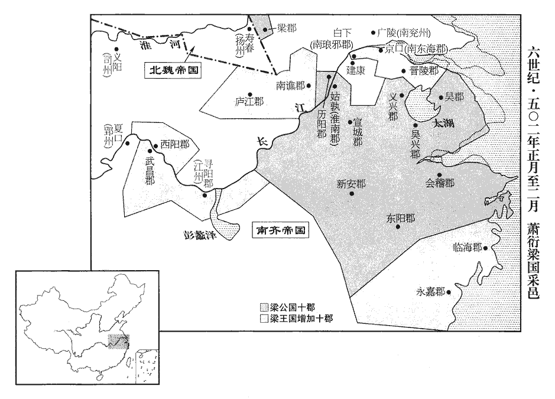
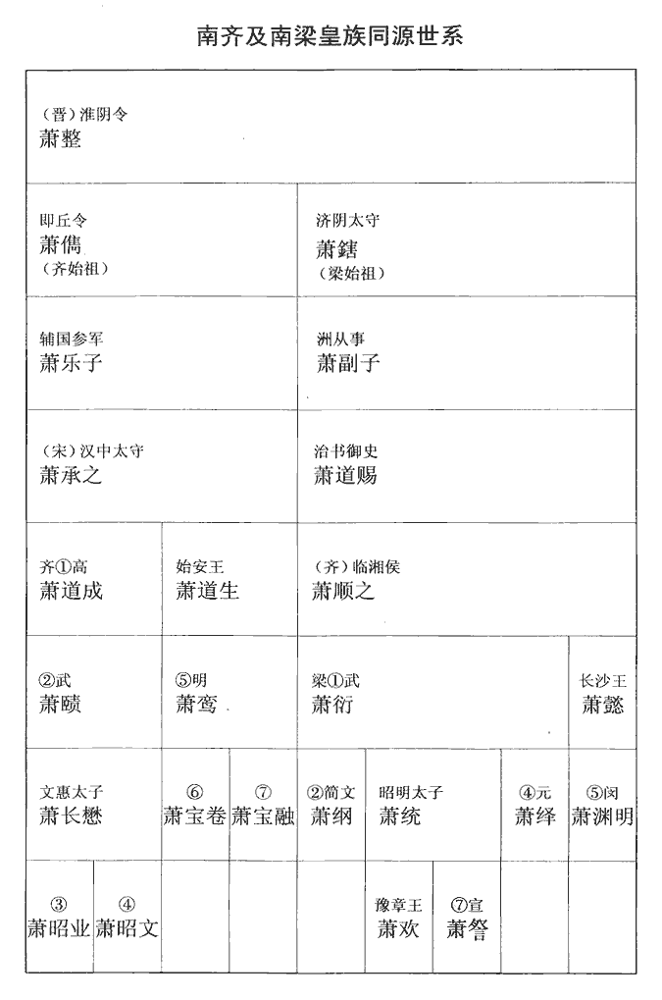
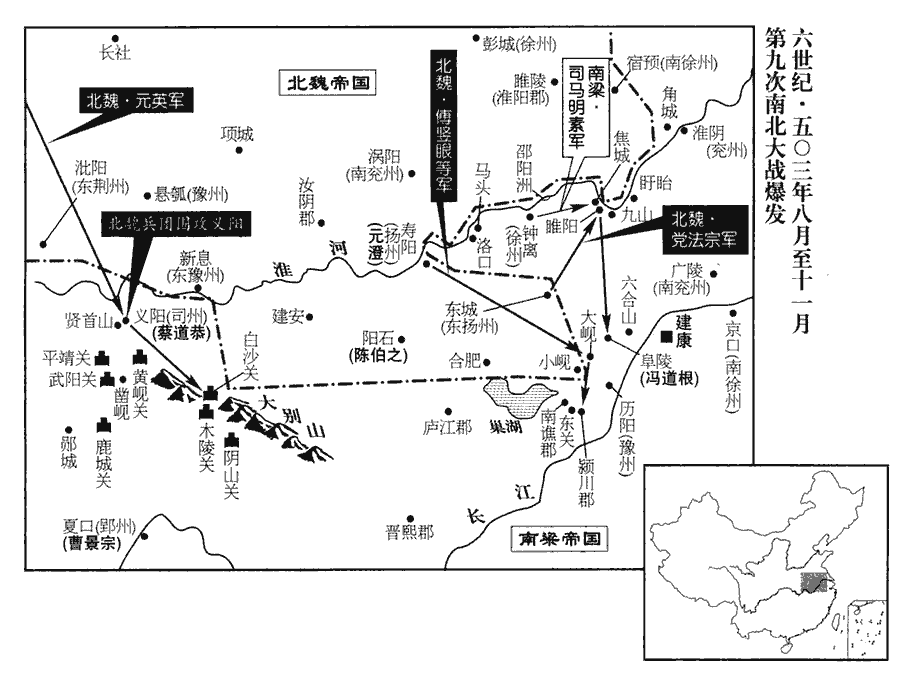

 梁紀一起玄黓敦牂（壬午），盡閼逢涒灘（甲申），凡三年。
>  
> 齊宣德太后詔蕭衍自建安郡公進爵梁公，衍志也。尋進爵為王，尋受齊禪，國因號曰梁。

# 高祖武皇帝諱衍，字叔達，小字練兒，南蘭陵中都里人，姓蕭氏。與齊同出淮陰令整，三世至順之，順之於齊高帝為族弟，帝，順之之子也。按通鑑武皇帝紀凡十八卷，以一二為次，此卷「武皇帝」之下合有「一」字。

## 天監元年（壬午、五零二）自是年三月以前，猶是齊和帝中興二年。

1春，正月，齊和帝‹萧宝融，本年十五岁›遣兼侍中席闡文等慰勞建康‹南京›。勞，力到翻。

〖译文〗 [1]春季，正月，南齐和帝萧宝融派遣兼侍中席阐文等人到建康慰劳。

2大司馬衍下令：「凡東昏時浮費，自非可以習禮樂之容，繕甲兵之備者，餘皆禁絕。」

〖译文〗 [2]大司马萧衍下令：“凡是东昏侯时不必要的开支，除了用以操习礼乐法度、修缮军事装备者外，其余一概禁绝。”

3戊戌‹九›，迎宣德太后‹王宝明›入宮，臨朝稱制；衍解承制。衍承制見上卷上年。蹔解之以覘人心。朝，直遙翻。

〖译文〗 [3]戊戌（初九），萧衍迎宣德太后进宫，让她临朝摄政，行使皇帝的权力。萧衍停止执政。

4己亥‹十›，以寧朔將軍蕭昺監南兗州‹府设广陵江苏省扬州市›諸軍事。昺，衍之從父弟也。昺，兵永翻。昺與帝同祖治書侍御史道賜。監，工銜翻。從，才用翻。

〖译文〗 [4]己亥（初十），宣德太后任命宁朔将军萧昺监南兖州诸军事。萧昺是萧衍的堂弟。

5壬寅‹十三›，進大司馬衍都督中外諸軍事，劍履上殿，贊拜不名。上，時掌翻。

〖译文〗 [5]壬寅（十二日），宣德太后提升萧衍为都督中外诸军事，特许他可以佩剑穿鞋上殿，以及朝见赞拜可以不报姓名。

6己酉‹二十›，以大司馬長史王亮為中書監、尚書令。

〖译文〗 [6]己酉（十九日），宣德太后任命大司马王亮为中书监、尚书令。

7初，大司馬與黃門侍郎范雲、南清河太守沈約、司徒右長史任昉同在竟陵王西邸‹建康城西›，事見一百三十六卷齊武帝永明二年。守，式又翻。任，音壬。昉，分兩翻。意好敦密，敦，厚也。好，呼到翻。至是，引雲為大司馬諮議參軍、領錄事，衍錄尚書，其錄府事使雲領之。約為驃騎司馬，為衍驃騎大將軍府司馬。驃，匹妙翻。騎，奇寄翻。昉為記室參軍，與參謀議。前吳興‹浙江省湖州市›太守謝朏fěi、國子祭酒何胤先皆棄官家居，齊明帝建武初，朏、胤皆棄官去。朏，敷尾翻。先，悉薦翻。衍奏徵為軍諮祭酒，朏、胤皆不至。

〖译文〗 [7]当初，大司马萧衍与黄门侍郎范云、南清河太守沈约、司徒长史任昉一同在竟陵王的西官邸，彼此情意甚笃，关系非常密切。到目前，萧衍就推荐范云为大司马谘议参军、领录事，沈约为骠骑司马，任昉为记室参军，遇事都让他们参与策谋计议。前吴兴太守谢朏、国子祭酒何胤先前都弃官回家，萧衍上奏宣德太后，征召他们为军谘祭酒，但是谢朏和何胤都没有来就任。

大司馬‹萧衍›內有受禪之志，沈約微扣其端，大司馬不應；他日，又進曰：「今與古異，不可以淳風期物。淳風，謂淳古之風也。士大夫攀龍附鳳，皆望有尺寸之功。今童兒牧豎皆知齊祚已終，明公當承其運，天文讖記又復炳然；讖，楚譖翻。天心不可違，人情不可失。苟曆數所在，雖欲謙光，亦不可得已。」易曰：謙尊而光。大司馬曰：「吾方思之。」約曰：「公初建牙樊‹湖北省襄樊市汉水北岸›、沔‹汉水›，此時應思；沔，彌兗翻。今王業已成，何所復思！若不早定大業，脫有一人立異，即損威德。且人非金石，時事難保，豈可以建安之封遺之子孫！復，扶又翻；下無復、豈復同。遺，唯孝翻。若天子‹萧宝融›還都，公卿在位，則君臣分定，分，扶問翻。無復異心，君明於上，臣忠於下，豈復有人方更同公作賊！」大司馬然之。約出，大司馬召范雲告之，雲對略同約旨，大司馬曰：「智者乃爾暗同。卿明早將休文更來！」將，攜也，挾也，領也。休文，沈約字也。雲出，語約，約曰：「卿必待我！」雲許諾，而約先期入。語，牛倨翻。先，悉薦翻。大司馬命草具其事，約乃出懷中詔書并諸選置，大司馬初無所改。俄而雲自外來，至殿門，不得入，徘徊壽光閤外，但云「咄咄！」江南禁中有壽光省。咄，當沒翻。毛晃曰：咄咄，咨嗟語也。約出，問曰：「何以見處？」約舉手向左，謂處之以尚書左僕射也。處，昌呂翻。雲笑曰：「不乖所望。」有頃，大司馬召雲入，嘆約才智縱橫，縱，子容翻。且曰：「我起兵於今三年矣，東昏侯永元二年十一月，衍起兵，至是首尾三年。功臣諸將實有其勞，將，即亮翻。然成帝業者，卿二人也。」

〖译文〗 大司马萧衍心里有受禅登基的念头，沈约稍微加以挑明，但是萧衍没有吭声。有一天，沈约又向萧衍进言：“如今与古代不同了，不可以期望人人都能保持着淳古之风，士大夫们无不攀龙附凤，都希望能有尺寸之功劳。现在连小孩牧童都知道齐的国运已经终结了，明公您应当取而代之，而且天象预兆也非常显著了。天意不可违抗，人心不可失去。假如天道安排如此，您虽然想要谦逊礼让，而实际上也是办不到的。”大司马萧衍这才吐露了一句：“我正在考虑这件事。”沈约又说道：“明公您刚开始在樊、沔兴兵举事，在那时是应该思考的，可是如今王业已经成功，还考虑什么呢？如果不早点完成大业，若有一人提出异议，就会有损于您的威德。况且人非金石，事情难测，万一您有个三长两短，难道就仅仅把建安郡公这么一个封爵留给子孙后代吗？如果天子回到京城，公卿们各得其位，那么君臣之间的名分已经定了，他们就不再会产生崐什么异心了，于是君明于上，臣忠于下，那里还会有人再同您一起作反贼呢？”大司马对沈约所说的这些话深表同意。沈约出去之后，大司马又叫范云进去，告诉了他自己的心思，征求他的看法，范云的回答与沈约所说的意思差不多，至此，大司马才对范云讲道：“智者所见，不谋而合。您明天早晨带着沈休文再来这里。”范云出来之后，把萧衍的话告诉了沈约，沈约说：“您一定要等我呀！”范云答应了。但是，第二天早晨，沈约提前去了，大司马命令他起草关于受命登基的诏书，于是沈约从怀中取出已经写好的诏书以及人事安排名单，大司马看过之后，一点也没有改动。不一会儿，范云从外面来了，到了殿口门，由于要等待沈约，不能一个人先进去，而等来等去不见沈约前来，只好在寿光阁外徘徊，嘴中不停地发出“咄咄”表示奇怪的声音。沈约出来了，范云这才明白了原来沈约赶在自己之前已经进去了，就问他：“对我怎么安排了？”沈约举起手来向左一指，意思是安排范云为尚书左仆射，范云就笑了，说：“这才和我所希望的差不多。”过了一会儿，大司马传范云进去，他当着范云的面赞叹了一番沈约如何才智纵横，并且说道：“我起兵至今已经三年了，各位功臣将领确实出了不少力气，但是成就帝业者，只是你们两人啊。”

甲寅‹二十五›，詔進大司馬位相國，總百揆，揚州牧，封十郡為梁公，時以豫州之梁郡、歷陽‹安徽省和县›、南徐州之義興‹江苏省宜兴市›、揚州之淮南‹安徽省当涂县›、宣城‹安徽省宣州市›、吳興‹浙江省湖州市›、會稽‹浙江省绍兴市›、新安‹浙江省淳安县›、東陽‹浙江省金华市›凡十郡為梁公國。相，息亮翻。備九錫之禮，置梁百司，去錄尚書之號，去，羌呂翻。驃騎大將軍如故。二月，辛酉‹二›，梁公始受命。

〖译文〗 甲寅（二十四日），宣德太后诏令大司马萧衍位进相国、总百揆、扬州牧，并封他十郡为梁公，加九锡之礼，在梁公国设置各种官员，免去录尚书的称号，但骠骑大将军的称号照样不变。二月辛酉（初二），梁公萧衍方才接受诏命。

 

齊湘東王寶晊，晊，之日翻。安陸昭王緬之子也，緬，齊明帝‹萧鸾›之弟。緬，彌兗翻。頗好文學。好，呼到翻。東昏侯死，寶晊望物情歸己，坐待法駕，既而王珍國等送首梁公‹萧衍›，梁公以寶晊為太常，寶晊心不自安。壬戌‹三›，梁公稱寶晊謀反，并其弟江陵公寶覽、汝南公寶宏皆殺之。

〖译文〗 南齐湘东王萧宝晊是安陆昭王萧缅的儿子，颇爱好文学。东昏侯死后，萧宝晊希望人心都向着自己，坐等即位。但是，到王珍国把东昏侯的首级送给梁公，梁公任命萧宝晊为太常，萧宝晊就心中不安了。壬戌（初三），梁公声称萧宝晊谋反，把萧宝晊以及其弟弟江陵公萧宝览、汝南公萧宝宏一起杀掉了。

8丙寅‹七›，詔梁國選諸要職，悉依天朝之制。朝，直遙翻。於是以沈約為吏部尚書兼右僕射，范雲為侍中。

〖译文〗 [8]丙寅（初七），宣德太后诏令梁国选任各种要职官员，全部依照朝廷之制。于是，任命沈约为吏部尚书兼右仆射，范云为侍中。

梁公‹萧衍›納東昏余妃，頗妨政事，范雲以為言，梁公未之從。雲與侍中、領軍將軍王茂同入見，自沈約至王茂，皆梁國官也。見，賢遍翻。雲曰：「昔沛公入關，婦女無所幸，此范增所以畏其志大也。事見九卷漢高帝元年。今明公始定建康，海內想望風聲，柰何襲亂亡之迹，以女德為累乎！」左傳：富辰曰：女德無極。杜預註云：婦女之志，近之則不知止足。累，力瑞翻。王茂起拜曰：「范雲言是也。公必以天下為念，無宜留此。」梁公默然。雲即請以余氏賚王茂，賚，洛代翻。梁公賢其意而許之。明日，賜雲、茂錢各百萬。

〖译文〗 梁公萧衍纳取了东昏侯的余妃，对政事颇有妨害，范云加以劝说，但是梁公没有听从。范云又与侍中、领军将军王茂一同入见萧衍，范云对萧衍说：“过去沛公刘邦进关，不亲近女色，这正是范增敬畏其志向远大之处。如今明公您刚平定建康，海内之众对您的名声非常景仰，您如何可以沿袭那种乱身亡国的行迹，沉溺于女色呢？”王茂也下拜说道：“范云说的极对。您一定要以天下为念，不应该把这个女人留在身边。”梁公听了，默然无语。于是，范云就请求萧衍把余氏赏赐给王茂，梁公认为他们的意见正确，就同意把余氏赏给了他。次日，萧衍分别给范云、王茂赏赐了一百万钱。

丙戌‹二十七›，詔梁公增封十郡，進爵為王。時以豫州之南譙‹安徽省巢湖市东南›。廬江‹安徽省舒城县›，江州之尋陽‹江西省九江市›，郢州之武昌‹湖北省鄂州市›、西陽‹湖北省黄州市›，南徐州之南琅邪‹白下·建康城北›、南東海‹京口·江苏省镇江市›、晉陵‹江苏省常州市›，揚州之臨海‹浙江省台州市西北章安镇›、永嘉‹浙江省温州市›十郡益梁國。癸巳‹五›，受命，赦國內及府州【章：十二行本「州」下有「所統」二字；乙十一行本同；孔本同；退齋校同。】殊死以下。自進爵為王已上，凡詔皆以宣德太后稱制行之。

〖译文〗 丙戌（二十七日），宣德太后诏令给梁公增封十郡，进爵位为王。三月癸巳（初五），萧衍接受了诏命，并且下令赦免建康城内以及各府州死刑以下犯人。

9辛丑‹十三›，殺齊邵陵王寶攸、晉熙王寶嵩、桂陽王寶貞。南史齊紀作「寶攸」，本傳作「寶脩」。三王皆明帝‹萧鸾›之子。

〖译文〗 [9]辛丑（十三日），南齐邵陵王萧宝攸、晋熙王萧宝嵩、桂阳王萧宝贞被杀。

梁王將殺齊諸王，防守猶未急。鄱陽王寶寅家閹人顏文智與左右麻拱等密謀，穿牆夜出寶寅，具小船於江岸，著烏布襦，著，則略翻。襦rú，汝朱翻，短衣也。腰繫千餘錢，潛赴江側，躡屩徒步，足無完膚。屩juē，居勺翻，草履也。防守者至明追之，寶寅詐為釣者，隨流上下十餘里，追者不疑。待散，乃渡西岸‹安徽省和县一带›投民華文榮家，待散，待追者散也。華，戶化翻。文榮與其族人天龍、惠連棄家將寶寅遁匿山澗，賃驢乘之，晝伏夜行，抵壽陽‹安徽省寿县·北魏扬州州政府所在县›之東城‹安徽省定远县东南›。魏戍主杜元倫馳告揚州刺史任城王澄，以車馬侍衛迎之。任，音壬。寶寅時年十六，徒步憔悴，悴，秦醉翻。見者以為掠賣生口。澄待以客禮，寶寅請喪君斬衰之服，澄遣人曉示情禮，以喪兄齊衰之服給之。喪，息浪翻。衰，倉回翻。齊，音咨。澄帥官僚赴弔，寶寅居處有禮，一同極哀之節。禮，居君父之喪極哀。帥，讀曰率。處，昌呂翻。壽陽多其義故，皆受慰喭yàn；撫而安之曰慰，弔生曰唁，唁，與喭同，魚戰翻。唯不見夏侯一族，夏侯之族本譙郡譙人，居于壽陽。夏，戶雅翻。以夏侯詳從梁王‹萧衍›故也。澄深器重之。為蕭寶寅貴顯於魏而不終張本。

〖译文〗 梁王萧衍将要杀害南齐诸王，但是监视看管措施还不甚严密。鄱阳王萧宝寅家中的阉人颜文智与左右心腹麻拱等人密谋，在夜间挖开墙壁，把萧宝寅送出去，又在长江岸边准备了一只小船。萧宝寅穿着黑布短衣，腰里系着一千多钱，偷偷地跑到江边。他空着草鞋，徒步而行，以致两只脚全都磨破了，天高之后，看管的人发现萧宝寅不见了，就去追赶，萧宝寅装作是钓鱼人，与追赶者一起在江中并舟而行了十多里，追赶者都没有对他产生怀疑。等到追赶的人离开之后，萧宝寅就在西边靠岸，投奔到百姓华文荣家中，华文荣与其同族之人华天龙、华惠连丢弃家业，带着萧宝寅逃到山沟里。他们租了一匹毛驴，让萧宝寅骑着，昼伏而夜行，来到了寿阳的东城。驻守在这里的北魏戍主杜元伦急忙把情况报告了扬州刺史任城王元澄，元澄用车马侍卫迎接萧宝寅。当时，萧宝寅年纪十六岁，由于徒步而行，所以形容憔悴，见到的人还以为他是被掠卖来的人口。元澄以招待客人的礼节对待萧宝寅，萧宝寅向元澄要为皇帝守丧而穿的生麻布制的丧服，元澄派人对萧宝寅晓示了一番情理，最后只给了他为兄长守丧而穿的熟麻布制的丧服。元澄率领手下的官吏们亲赴萧宝寅住处去吊丧，萧宝寅的一举一动，表现得与居君父之丧完全一样。寿阳有许多受过南齐旧恩的故旧，都来萧宝寅处吊唁，唯独不见夏侯一姓的人来，这是由于夏侯详跟从了梁王萧衍的缘故。元澄非常器重萧宝寅。

10齊和帝‹萧宝融›東歸，將東歸建康也。以蕭憺為都督荊•湘等六州諸軍事、荊州刺史。憺，徒敢翻，又徒濫翻。荊州軍旅之後，公私空乏，憺厲精為治，治，直吏翻。廣屯田，省力役，存問兵死之家，供其乏困。自以少年‹本年二十五岁›居重任，少，詩照翻。謂佐吏曰：「政之不臧，士君子所宜共惜。吾今開懷，卿其無隱！」於是人人得盡意，民有訟者皆立前待符教，決於俄頃，曹無留事。荊人大悅。

〖译文〗 [10]南齐和帝萧宝融将东归建康，他任命萧憺为都督荆、湘等六州诸军事及荆州刺史。荆州经过战争之后，公私两方在财用方面都非常空乏，萧憺励精图治，广开屯田，省免劳役，抚问有家人当兵阵亡了的人家，供应救济他们。他自以为年纪轻而居于重任，所以特别用心，对手下的官吏们说：“政事如果没有办好，大家都应该共同努力。我现在开诚布公于你们，希望你们也不要有所隐瞒。”于是，人人都感到心情舒畅，办事效率大增，民众如有诉讼者站在一旁等待处理，很快就可以做出决定，官署中设有积压的事情。因此，荆州人非常高兴。

11齊和帝‹萧宝融›至姑孰‹安徽省当涂县›，丙辰‹二十八›，下詔禪位于梁。

〖译文〗 [11]南齐和帝到达姑孰，于两辰（二十八日），下诏令禅让皇位于梁。

12丁巳‹二十九›，廬陵王寶源卒。非疾也。寶源者，齊明帝‹萧鸾›第五子。

〖译文〗 [12]丁巳（二十九日），庐陵王萧宝源去世。

13魯陽‹河南省鲁山县›蠻魯北鷰等起兵攻魏潁州‹府设长社河南省长葛县›。魏置潁州於汝陰，又，潁川郡舊置潁州。

〖译文〗 [13]鲁阳的蛮人鲁北鷰等人起兵攻打北魏颍州。

14夏，四月，辛酉‹三›，宣德太后‹王宝明›令曰：「西詔至，齊和帝‹萧宝融›雖已至姑孰，其地猶在建康之西，故曰西詔。帝‹萧宝融›憲章前代，憲章前代者，以前代為法度也。敬禪神器于梁，明可臨軒明，謂明旦也。遣使恭授璽紱，未亡人歸于別宫。」古者君薨，其夫人在者自稱未亡人。使，疏吏翻。璽，斯氏翻。紱，音弗。壬戌‹四›，發策，遣兼太保、尚書令亮等奉皇帝璽紱詣梁宮。亮，王亮也。丙寅‹八›，梁王‹萧衍，本年三十九岁›即皇帝位于南郊，大赦，改元。始改元天監。是日，追贈兄懿為丞相，封長沙王，諡曰宣武，葬禮依晉安平獻王‹司马孚›故事。懿為東昏侯所殺，葬不成禮，今依晉葬安平王孚禮葬之。

〖译文〗 [14]夏季，四月辛酉（二十七日），宣德太后发令：“西边的诏令已经到了，皇帝效法前代，把皇位恭敬地禅让给梁，明天早晨我要来到殿前，派使者向梁公恭授印玺，之后我将回到别宫去居住。”壬戌（二十八日），宣德太后发出策书，派遣兼太保、尚书令王亮等人奉送皇帝印玺到梁宫。丙寅（疑误），梁王萧衍于南郊即位登基，大赦天下，改年号为天监。在这天，萧衍追赠其兄萧懿为丞相，封为长沙王，谥号为宣武，并且依照晋代安葬安平献王的先例重新安葬了萧懿。

丁卯‹九›，奉和帝‹萧宝融›為巴陵王，宮于姑孰‹安徽省当涂县›，優崇之禮，皆倣齊初。倣齊奉汝陰王之禮。奉宣德太后‹王宝明›為齊文帝‹萧长懋›妃，王皇后‹王蕣华›為巴陵王妃。齊世王、侯封爵，悉從降省，降者，王降公，公降侯。省者，除其封國。省，所梗翻。唯宋汝陰王‹刘准›不在除例。備三恪也。

〖译文〗 丁卯（疑误），萧衍诏令，奉南齐和帝为巴陵王，并为他在姑孰建了王宫，对他的待遇和尊敬，都仿照南齐开国之初对待汝阴王的方法。奉宣德太后为齐文帝妃，王皇后为巴陵王妃。又对于南齐的王、侯们全部降低一级爵位，除去他们的封国，唯有宋汝阴王不在此例之内。

追遵皇考‹萧顺之›為文皇帝，廟號太祖；皇妣‹陈道正›為獻皇后。考異曰：南史云五月追尊。今從梁書。追諡妃郗氏‹郗徽溢›曰德皇后。東昏侯永元元年，郗氏卒于襄陽。郗chī，丑之翻。封文武功臣車騎將軍夏侯詳等十五人為公、侯。騎，奇寄翻。立皇弟中護軍宏為臨川王，南徐州‹府京口›刺史秀為安成王，雍州‹府襄阳›刺史偉為建安王，雍，於用翻。左衛將軍恢為鄱陽王，荊州‹府江陵›刺史憺為始興王；以宏為揚州‹京畿›刺史。

〖译文〗 梁武帝萧衍追尊自己的父亲为文皇帝，庙号太祖；追尊母亲为献皇后。又追谥妃子郗氏为德皇后。萧衍还封文武功臣车骑将军夏侯详等十五人为公、侯。萧衍又立弟弟中护军萧宏为临川王，南徐州刺史萧秀为安成王，雍州刺史萧伟为建安王，左卫将军萧恢为鄱阳王，荆州刺史萧憺为始兴王；任命萧宏为扬州刺史。

丁卯‹九›，以中書監王亮為尚書令，相國左長史王瑩為中書監，吏部尚書沈約為尚書僕射，長兼侍中范雲為散騎常侍、吏部尚書。

〖译文〗 丁卯（疑误），武帝任命中书监王亮为尚书令，相国左长史王莹为中书监，吏部尚书沈约为尚书仆射，长兼侍中范云为散骑常侍、吏部尚书。

15詔凡後宮、樂府、西解、暴室諸婦女一皆放遣。解，讀曰廨。一皆放遣，一切盡放遣之也。

〖译文〗 [15]武帝诏令，凡是后宫、乐府、西解、暴室中的妇女全部放还回家。

16戊辰‹十›，巴陵王‹萧宝融，年十五岁›卒。時上欲以南海郡‹广东省广州市›為巴陵國，徙王‹萧宝融›居之。沈約曰：「古今殊事，魏武所云『不可慕虛名而受實禍。』」沈約夢齊和帝‹萧宝融›劍斷其舌，天之報應固不爽也。上頷之，乃遣所親鄭伯禽詣姑孰，以生金進王‹萧宝融›，王曰：「我死不須金，醇酒足矣。」乃飲沈醉；沈，持林翻。伯禽就摺殺之。時年十五。摺zhé，落合翻。

〖译文〗 [16]戊辰（疑误），巴陵王萧宝融去世。当时，武帝想以南海郡为巴陵国，迁巴陵王去居住，可是，沈约却对武帝说：“古今不同，当年魏武帝曾经说过：‘不可以慕虚名而受实祸。’”武帝听了点头同意，于是就派遣亲信郑伯禽到了姑孰，把生金子给了巴陵王，让他吞下去，巴陵王说道：“我死不须用金子，有醇酒就足够了。”于是，就给他饮酒，喝的烂醉，郑伯禽上前将其弄死。

王‹萧宝融›之鎮荊州也，琅邪顏見遠為錄事參軍，及即位，為治書侍御史兼中丞，治，直之翻。既禪位，見遠不食數日而卒。史言齊臣以死殉和帝者僅一顏見遠。上聞之曰：「我自應天從人，曰從人者，避皇考順之諱也。何預天下士大夫事，而顏見遠乃至於此！」此言不可以訓。

〖译文〗 巴陵王萧宝融镇守荆州之时，琅邪人颜见远做他的录事参军，即位之后，又担任治书侍御史兼中丞。巴陵王让位之后，颜见远绝食数日而死。武帝闻知此事之后，说：“我受禅让而登基是顺应天心人愿，与天下士大夫们有什么关系呢？颜见远何至于如此呢？”

17庚午‹十二›，詔：「有司依周、漢故事，議贖刑條格，舜典曰：金作贖刑。註曰：誤入而刑，出金以贖罪。周穆王訓夏贖刑，亦以五刑之辟，疑者罰贖。至漢文帝令民入粟以贖罪；武帝令死罪入贖，錢五十萬減死一等。蓋自虞及周疑誤者贖，漢則凡犯罪者皆可得而入贖。凡在官身犯鞭杖之罪，悉入贖停罰，其臺省令史、士卒欲贖者聽之。」

〖译文〗 [17]庚午（疑误），武帝诏令：“官吏们依照周代、汉代的先例，议定赎刑条例，凡是身居官位而犯有该受鞭杖之刑的人，全部可以出赎金而停止惩罪，各台省的令史以及士卒犯罪而愿意赎刑者，亦听任其便。

18以謝沭縣公寶義為巴陵王，奉齊祀。上之受禪也，寶義以晉安王降封謝沭縣公。晉志謝沭縣屬臨賀郡。沭shù，食聿翻。寶義幼有廢疾，不能言，故獨得全。

〖译文〗 [18]武帝封谢沭县公萧宝义为巴陵王，让他奉祀南齐祖先。萧宝义幼有残疾，是个哑巴，所以才得以保全。

齊南康侯子恪及弟祁陽侯子範嘗因事入見，子恪、子範，齊豫章王嶷子也。祁陽縣，吳立，宋屬零陵郡。見，賢遍翻。上從容謂曰：從，千容翻。「天下公器，非可力取，苟無期運，雖項籍之力終亦敗亡。宋孝武‹刘骏›性猜忌，兄弟粗有令名者皆鴆之，謂南平王鑠也。粗，坐五翻。朝臣以疑似枉死者相繼。謂顏竣、王僧達、周朗、沈懷文等。朝，直遙翻。然或疑而不能去，去，羌呂翻；下同。或不疑而卒為患，如卿祖‹萧道成›以材略見疑，而無如之何。此正指疑而不能去者，謂齊髙帝也。卒，子恤翻。湘東‹刘彧›以庸愚不疑而子孫皆死其手此正指不疑而卒為患者，謂明帝‹刘彧›盡殺孝武帝‹刘骏›子孫也。我於時已生，彼豈知我應有今日！固知有天命者非人所害。我初平建康，人皆勸我除去卿輩以壹物心，我於時依而行之，誰謂不可！正以江左以來，代謝之際，必相屠滅，感傷和氣，所以國祚不長。又，齊、梁雖云革命，事異前世，我與卿兄弟雖復絕服，五服之親，至於袒免則無服矣。去，羌呂翻。復，扶又翻；下可復、無復同。宗屬未遠，齊業之初亦共甘苦，齊、宋禪代之際，帝父順之參預佐命。情同一家，豈可遽如行路之人！卿兄弟果有天命，非我所殺；若無天命，何忽行此！適足示無度量耳。且建武‹萧鸾›塗炭卿門，謂齊明帝建武中誅高、武子孫。我起義兵，非唯自雪門恥，亦為卿兄弟報仇。為，于偽翻。卿若能在建武、永元之世永元，齊東昏侯年號。撥亂反正，謂齊明帝父子為亂，高、武子孫為正。我豈得不釋戈推奉邪！我自取天下於明帝‹萧鸾›家，非取之於卿家也。昔劉子輿自稱成帝‹刘骜›子，光武‹刘秀›言：『假使成帝更生，天下亦不可復得，況子輿乎！』事見三十九卷漢更始元年。曹志，魏武帝‹曹操›之孫，為晉忠臣。事見八十一卷晉武帝太康四年。況卿今日猶是宗室，我方坦然相期，卿無復懷自外之意！「無」，當作「毋」。小待，當自知我寸心。」子恪兄弟凡十六人，皆仕梁，子恪、子範、子質、子顯、子雲、子暉並以才能知名，歷官清顯，各以壽終。史言帝所誅夷者齊明帝‹萧鸾›之後，高帝‹萧道成›之後固無恙也。

〖译文〗 南齐南康侯萧子恪以及其弟祁阳侯萧子范曾经因事入见武帝，武帝从容地对他们说：“天下的名位、爵禄，不可以力取，假如没有运气，即使有项羽之力，终究还是要失败。宋孝武帝性情猜忌，兄弟中稍有些好名声的，都被他用毒药害死，朝廷中的臣子们因被猜疑而冤枉死去的一个接着一个。然而，有的虽然怀疑却不能把他除去，有的虽然不疑却终于成为后患，比如你们的祖父高帝因才略而被猜疑，但是却拿他一点也没有办法。湘东王刘彧以平庸愚笨而未遭猜疑，但是孝武帝的子孙却最后都死在他手中。我在那时已经出生，刘彧他岂知我会有今天呢？因此而可知，有天命的人，是别人害不了的。我刚平定建康之时，人们都劝我除掉你们以便统一人心，我当时如果依照这一建议而行事，谁会说不可以呢？我之所以没有这样做，正是由于考虑到江南以来，每到改朝换代的时候，总是要进行残杀屠灭，以致有伤和气，所以国运都不能长久。另外，由齐而梁，虽然说是改换天命，但是事情与前代不同，我与你们兄弟虽然出了五服，但是宗属关系并不太远，而且齐国创业之初，也曾经同甘共苦过，情同于一家，所以岂可以一下子就变成好象是行路之人，互相不相认了呢？你们兄弟果然有天命的话，就不是我所能杀得了的；如果没有天命，我又何必忽然要那样做呢？那样做只能向世人显示我无度量罢了。况且，明帝在建武年间诛杀高帝、武帝的子孙，使你们家门遭殃，所以我起义兵，不但是自雪家耻，也是为你们兄弟报仇。你们如果能在建武、永元年间拨乱反正的话，我那里能不放下干戈而推奉拥戴呢？我是自明帝家取来的天下，并非是从你们家取来的。过去，刘子舆自称为是汉成帝的儿子，汉光武帝说：‘就是使汉成帝再生，天下也不可能会重新得到手，何况刘子舆呢？’曹志是魏武帝的孙子，成为晋朝的忠臣。更何况你们现在仍然是皇家宗室呢？我坦诚地讲了以上这些，希望你们不要再有见外之意。很快，你们就会知道我的寸心了。”萧子恪兄弟一共十六人，都在梁朝做官，萧子恪、萧子范、萧子质、萧子显、萧子云、萧子晖一并以才能而知名，历任清高而显要的官职，各人都能得天年而善终。

 

19詔徵謝朏為左光祿大夫、開府儀同三司，朏fěi，敷尾翻。何胤為右光祿大夫，何點為侍中；胤、點終不就。

〖译文〗 [19]武帝诏征谢朏为左光禄大夫、开府仪同三司，何胤为右光禄大夫，何点为侍中，但是何胤与何点到底也没有就任。

20癸酉‹十五›，詔「公車府謗木、肺石傍各置一函，周禮大司寇以肺石達窮民，註云：肺石，赤石也。肺，芳廢翻。若肉食莫言，欲有橫議，投謗木函；杜預曰：肉食，在位者。布衣處士而議朝政，謂之橫議。橫，戶孟翻。若以功勞才器冤沈莫達，投肺石函。」沈，持林翻。

〖译文〗 [20]癸酉（疑误），武帝诏令：“在公车府谤木和肺石旁边各放置一个盒子，如果布衣处士欲对朝政提出议论，而在官位的人又没有谈到，就把其意见投入谤木旁边的盆子里；如果有谁因功劳或才识被冤沉而没有上报，如欲申诉，把申拆书投入肺石旁边的盒子中。”

上身服浣濯之衣，常膳唯以菜蔬。每簡長吏，務選廉平，皆召見於前，勗以政道。見，賢遍翻。勗xù，許玉翻，勉也。擢尚書殿中郎到溉為建安‹福建省建瓯市›內史，左戶侍郎劉鬷zōng為晉安‹福建省福州市›太守，杜佑曰：宋、齊度支尚書統度支、左戶、右戶、金部、庫部六曹。鬷，子公翻。沈約曰：建安本閩越，秦立為閩中郡，漢武帝滅閩越，徙其民於江、淮間，虛其地，後有遁逃山谷間者頗出，立為冶縣，屬會稽。司馬彪云：章安是故冶。然則臨海亦冶地也。後分冶地為會稽東、南二部都尉；東部，臨海是也；南部，建安是也。吳孫休永安三年，分南部立為建安郡，晉武帝太康三年分建安立晉安郡。詳考沈志，建安郡則今南劍、邵武、建寧之地，晉安郡則今福州之地，沈志，洪氏隸釋辯之甚詳，註已見前。二人皆以廉潔著稱。溉，彥之曾孫也。到彥之，宋文帝將。又著令：「小縣令有能，遷大縣，大縣有能，遷二千石。」以山陰‹浙江省绍兴市›令丘仲孚為長沙‹湖南省长沙市›內史，武康‹浙江省德清县›令東海‹侨郡·江苏省镇江市›何遠為宣城‹安徽省宣州市›太守，由是廉能莫不知勸。

〖译文〗 武帝身穿浣濯的衣服，平时的用膳只是菜蔬之类。每次任命高级官员，他都挑选那些廉正公平者，把他们都召到面前，以治政之道勉励他们。他提拨尚书殿中郎到溉为建安内史，左户侍郎刘彧为晋安太守，这两人都以廉洁而著称。到溉是到彦之的曾孙子。武帝又诏令：“小县的县令如果有能力，就升到大县任县令，大县的县令有能力，升任郡守。”并任命山阴县令丘仲孚为长沙内史，武康县令东海人何远为宣城太守，因此官吏们无不致力于廉政勤勉。

21魯陽蠻圍魏湖陽‹河南省唐河县南湖阳镇›，湖陽縣，漢屬南陽郡，晉省，元魏後於此置西淮安郡及南襄州，隋為湖陽縣，唐并湖陽，入棗陽縣。撫軍將軍李崇將兵擊破之，將，即亮翻。斬魯北鷰；徙萬餘戶於幽‹河北省北部›、并‹山西省中部›諸州及六鎮‹怀荒镇河北省张北县›、御夷镇河北省赤城县、柔玄镇内蒙古兴和县北、武川镇内蒙古武川县、抚冥镇内蒙古四子王旗、怀朔镇内蒙古固阳县，尋叛南走，所在追討，比及河，殺之皆盡。比，必利翻。

〖译文〗 [21]鲁阳蛮围攻北魏湖阳，抚军将军李崇率兵击败了他们，斩了鲁北鷰；崐北魏迁移一万余户当地的蛮人到幽、并等州以及六镇，但不久这些人就纷纷叛逃南归，他们所到之处都派兵追捕，追到黄河边时，把他们全部杀害了。

22閏月，丁巳‹三十›，魏頓丘匡公穆亮卒‹年五十二岁›。諡法：貞心大度曰匡。

〖译文〗 [22]闰月，丁巳（三十日），北魏顿丘匡公穆亮去世。

23齊東昏侯嬖臣孫文明等，雖經赦令，猶不自安，五月，乙亥‹十八›夜，帥其徒數百人，因運荻炬，束仗入南、北掖門作亂，荻炬者，束荻為火炬用也。因運此，遂束兵仗於荻中以入。嬖，卑義翻，又傳計翻。帥，讀曰率。燒神虎門、總章觀，入衛尉府，殺衛尉洮陽愍侯張弘策。觀，古玩翻。洮陽縣屬零陵郡。洮，音兆。前軍司馬呂僧珍直殿內，以宿衛兵拒之，不能卻。上戎服御前殿，曰：「賊夜來，是其眾少，曉則走矣。」少，詩沼翻。命擊五鼓，領軍將軍王茂、驍騎將軍張惠紹聞難，引兵赴救，盜乃散走，討捕，悉誅之。擊五鼓，晉檀祗破司馬國璠之故智也。驍，堅堯翻。騎，奇寄翻。難，乃旦翻。

〖译文〗 [23]南齐东昏侯的宠臣孙文明等人，虽然被赦免，但是仍然感到不安，于五月乙亥（十八日）夜间，带领同伙几百人，借运交芦苇火把之机，把兵器藏在柴中，乘机进入南、北掖门，暴动作乱，放火烧了神虎门、总章观，闯入卫尉府，杀了卫尉、洮阳愍侯张弘策。前军司马吕僧珍在殿内当值，以宿卫兵抵抗暴待们，但是抵挡不了。这时，武帝身穿戎服来到前殿，说道：“反贼们乘夜间而来，是因为他们的人数少，天亮了就会逃跑的。”他命令击响五鼓，即东方青鼓、南方赤鼓、西方白鼓、北方黑鼓、中方黄鼓，鼓声一响，领军将军王茂、骁骑将军张惠绍知道天子有难，即刻带兵前来解救，贼盗们纷纷逃散，经过搜捕，全部杀掉了他们。

24江州‹府设寻阳江西省九江市›刺史陳伯之，目不識書，得文牒辭訟，唯作大諾而已，有事，典籤傳口語，與奪決於主者。伯之手不能書，典籤傳其口之所言。豫章‹江西省南昌市›人鄧繕、永興‹湖北省黄梅县西北›人戴永忠漢會稽諸暨縣，吳更名永興。有舊恩於伯之，伯之以繕為別駕，永忠為記室參軍。河南‹侨郡·湖北省唐河县西北›褚緭居建康，緭wèi，于貴翻。考異曰：魏書蕭寶寅傳作「褚胃」，今從梁書。素薄行，仕宦不得志，頻造尚書范雲，雲不禮之。行，下孟翻。造，七到翻。范雲時為吏部尚書。緭怒，私謂所親曰：「建武‹萧鸾›以後，草澤下族悉化成貴人，吾何罪而見棄！今天下草創，饑饉不已，喪亂未可知。喪，息浪翻。陳伯之擁強兵在江州，非主上舊臣，有自疑之意；且熒惑守南斗，詎非為我出邪！晉天文志：將有天子之事，占於南斗。南斗六星，天廟也，主兵。為，于偽翻。今者一行事若無成，入魏不失作河南郡守。」守，式又翻。遂投伯之，大見親狎。伯之又以鄉人朱龍符為長流參軍，陳伯之，濟陰人。職官分紀：長流參軍主禁防。晉從公府有長流參軍；小府無長流參軍，置禁防參軍。顏氏家訓：或問：何故名治獄參軍為長流？答曰：帝王世紀云，帝少昊崩，其神降于長流之山。此事本出山海經，於祀主秋。按周禮秋官司寇主刑罰。長流之職，漢、魏捕賊掾耳；晉、宋以來，始為參軍，上屬司寇，故取秋帝所居為嘉名焉。並乘伯之愚闇，恣為姦利。

〖译文〗 [24]江州刺史陈伯之目不识丁，收到文件和诉讼材料，只会核批画行，有何事情，都是通过典签口头来传达，所以予夺大权实际上完全掌握在典签手中。豫章人邓缮、永兴人戴永忠过去的恩于陈伯之，陈伯之就委任邓缮为别驾，戴永忠为记室参军。河南人褚緭住在建康，向来品行不端正，所以仕途很不得志，他就频繁地去拜访尚书范去，但是范云不礼遇他。因此，褚緭很生气，私下里对自己的亲信说：“自从建武年间以来，身处草泽的低贱家族都变成了贵人，而我却因何罪被弃之不用呢？如今天下草创，饥荒不停，所以再次发生大乱也未可知。陈伯之拥有强大的兵权，坐镇江州，而他又不是皇上的旧臣，所以有自疑的心理，况且火星又出现在南斗位置上，预示将有更换天子之事，岂知不是为我而出现的吗？如今，我们就去奔投陈伯之，以便行事，假若事情不能成功，就去投靠北魏，也不失能做河南郡守。”于是，褚緭就去投靠了陈伯之，得到陈伯之异常的亲近。陈伯之又委任同乡人朱龙符为长流参军，于是褚緭和朱龙符两人一起乘着陈伯之愚昧不明，肆意而为，恶行不断。

上聞之，使陳虎牙私戒伯之，又遣人代鄧繕為別駕，伯之並不受命，表云：「龍符驍勇，驍，堅堯翻。鄧繕有績效；臺所遣別駕，請以為治中。」繕於是日夜說伯之云：「臺家府藏空竭，復無器仗，三倉無米，東境飢流，三倉，太倉、石頭倉及常平倉。又按五代史志，梁司農卿主農功倉廩，統太倉等令，又管左、右、中部三倉丞。東境，三吳、會稽之地。說，式芮翻。復，扶又翻；下若復同。此萬世一時也。機不可失！」緭、永忠共贊成之。伯之謂繕：「今啟卿，若復不得，即與卿共反。」上敕伯之以部內一郡處繕，處，昌呂翻。於是伯之集府州僚佐謂曰：「奉齊建安王‹萧宝寅›教，帥江北義勇十萬，已次六合‹江苏省江浦县西六合山›，齊建安王，蕭寶寅也，時奔魏。據宋史書，六合山在烏江縣界。五代志：江都郡六合縣，宋、齊之秦郡尉氏縣也。帥，讀曰率；下同。見使以江州見力運糧速下。見力之見，賢遍翻。我荷明帝厚恩，誓死以報。」即命纂嚴，使緭詐為蕭寶寅書以示僚佐，於聽事前為壇，歃血共盟。

〖译文〗 武帝知道了情况，让陈虎牙私下里告诫陈伯之，又派人取代邓缮而为别驾，陈伯之既不听告诫，也不执行撤换掉邓缮的命令，上表武帝：“朱龙符骁勇不凡，邓缮成绩突出，朝廷所派遣来的别驾，特请任为治中。”于是，邓缮日夜游说陈伯之，对他说：“朝廷中库藏空竭，也没有兵器，三个仓中没有米了，东边一带又饥荒流行，这是万世难遇的一时良机呀，时机不可丧失！”褚緭和戴永忠也一同赞成邓缮的意见。陈伯之对邓缮说：“现在我就为你的事再次启奏朝廷，如果还是不行的话，就与你一起谋反。”武帝敕令陈伯之把邓缮安置在州内的一个郡中。于是陈伯之就召集府州僚佐，对他们说：“今奉齐建安王的命令，其率领长江之北的十万义勇，已经到了六合，让我们见到使者之后崐，动用江州现有力量，速运送粮食东下。我承受过明帝的厚恩，誓死相报。”于是就命令戒严，让褚緭伪造萧宝寅的书信，以便出示给僚佐们看，并且在厅堂前设坛，歃血为盟。

緭說伯之曰：荷，下可翻。聽，讀曰廳。歃，色甲翻。說，式芮翻。「今舉大事，宜引眾望。長史程元沖，不與人同心；臨川‹江西省南城县›內史王觀，僧虔之孫，人身不惡，可召為長史以代元沖。」觀，古玩翻。伯之從之，仍以緭為尋陽太守，永忠為輔義將軍，龍符為豫州‹府历阳›刺史。觀不應命。豫章太守鄭伯倫起郡兵拒守。程元沖既失職於家，合帥數百人，合眾而帥之以攻伯之。乘伯之無備，突入至聽事前；聽，讀與廳同。伯之自出格鬬，元沖不勝，逃入廬山‹九江市南›。廬山在江州南。伯之密遣信報虎牙兄弟，皆逃奔盱眙‹江苏省盱眙县›。盱眙，音吁怡。

〖译文〗 褚緭游说陈伯之：“如今举大事，宜争取民心。长史程元冲很不得人心，而临川内史王观是王僧虔的孙子，他人品不坏，可以召他为长史以便代替程元冲。”陈伯之听从了褚緭的建议，并且委任褚緭为寻阳太守，戴永忠为辅义将军，朱龙符为豫州刺史。王观没有应命前来。豫章太守郑伯伦发动郡兵抗拒陈伯之。程元冲既然坐在家中丢掉了官职，就纠合、率领数百人，乘陈伯之没有防备之际，突然攻到厅堂之前，陈伯之亲自出来格斗，程元冲力不能胜，逃入庐山。陈伯之秘密地派人送信给陈虎牙兄弟，兄弟们一起逃奔到盱眙。

戊子，詔以領軍將軍王茂為征南將軍、江州刺史，帥眾討之。

〖译文〗 戊子（疑误），武帝诏令委任领军将军王茂为征南将军、江州刺史，率兵讨伐陈伯之。

25魏揚州小峴‹安徽省含山县西北›戍主党法宗党，底朗翻，姓也。杜佑通典德浪翻。峴，戶典翻；下同。襲大峴戍，破之，虜龍驤將軍邾菩薩。驤，思將翻。菩，薄乎翻。薩，桑葛翻。

〖译文〗 [25]北魏扬州小岘戍戍主党法宗袭击梁朝大岘戍，克敌获胜，俘虏了梁朝龙骧将军邾菩萨。

26陳伯之聞王茂來，謂褚緭等曰：「王觀既不就命，鄭伯倫又不肯從，便應空手受困。今先平豫章，開通南路，多發丁力，益運資糧，然後席卷北向，以撲飢疲之眾，不憂不濟。」卷，讀曰捲。北向，謂北下攻建康也。撲，普木翻。六月，留鄉人唐蓋人守城，守尋陽城。引兵趣豫章，攻伯倫，不能下。趣，七喻翻。王茂軍至，伯之表裏受敵，遂敗走，間道渡江，與虎牙等及褚緭俱奔魏。間，古莧翻。

〖译文〗 [26]陈伯之闻知王茂前来讨伐，对褚緭等人说：“王观不来就命，郑伯伦又不肯顺从，我们将会空手受困。现在，我们先占取豫章，开通南边的道路，多加发动丁役，增运粮食物资，然后以卷席之势北上，直扑饥饿疲劳之众，不愁不得成功。”六月，陈伯之留下同乡人唐盖人防守寻阳城，自己领兵向豫章进发，攻打郑伯伦，但是不能攻下。王茂的军队到了，陈伯之里外受敌，力不能支，于是败逃而去，抄小道渡过了长江，与陈虎牙等人以及褚緭一起奔投北魏。

27上遣左右陳建孫送劉季連子弟三人入蜀，使諭旨慰勞。勞，力到翻。季連受命，飭還裝，益州刺史鄧元起始得之官。

〖译文〗 [27]武帝派遣身边人陈建孙送刘季连子弟三人入蜀，使他们宣谕圣旨，加以慰劳。刘季连接受了使命，收拾准备回去时的行装，因此，益州刺史邓元起始得去赴任。

初，季連為南郡太守，不禮於元起。鄧元起，南郡當陽人。都錄朱道琛有罪，都錄，蓋郡之首吏，總錄諸吏者也。琛，丑林翻。季連欲殺之，逃匿得免。至是，道琛為元起典籤，說元起曰：說，式芮翻；下或說同。「益州亂離已久，公私虛耗。劉益州臨歸，豈辦遠遣迎候，道琛請先使檢校，使，疏吏翻。緣路奉迎，不然，萬里資糧，未易可得。」元起許之。道琛既至，言語不恭，又歷造府州人士，見器物，輒奪之，有不獲者，語曰：易，以豉翻。造，七到翻。語，牛倨翻。「會當屬人，何須苦惜！」於是軍府大懼，謂元起必誅季連，禍及黨與，競言之於季連。季連亦以為然，且懼昔之不禮於元起，乃召兵算之，有精甲十萬，歎曰：「據天險之地，握此強兵，進可以匡社稷，退不失作劉備，捨此安之！」遂召佐史，矯稱齊宣德太后‹王宝明›令，聚兵復反，收朱道琛，殺之。史言劉季連阻兵，釁起於朱道琛。召巴西‹四川省绵阳市›太守朱士略及涪‹巴西郡郡政府所在县›令李膺，並不受命。涪，音浮。是月，元起至巴西，士略開門納之。

〖译文〗 开初，刘季连任南郡太守，对邓元起不礼貌。都录朱道琛有罪，刘季连要杀他，他逃匿而免于一死。到现在，朱道琛担任邓元起的典签，他劝说邓元起：“益州动乱已久，官方和私人的资财都耗损一空。现在，刘益州季连就要回去了，当地岂能置办得起送远迎侯之事呢？所以，我请求先遣核查，沿路奉迎，不然的话，万里长途所用的粮资，确实不可轻易而得到的。”邓元起准许了朱道琛的请求。朱道琛到达之后，言语非常不恭，又遍访府州人士，见到器物，就夺取过来，有谁如果不给，他就对人家说：“反正你这东西迟早是别人的崐，何必苦苦珍惜呢？”于是，军府之中都很恐惧，说邓元起必定要杀刘季连，并且会祸及党翼，都竞相去告诉刘季连。刘季连也信以为然，并且害怕过去对邓元起失礼之事，于是召集兵士，总计一下，共有精兵十万，因此叹息道：“我据守天险之地，手中握有这十万强兵，进可以匡扶礼稷江山，退不失为作刘备，舍此而何往呢？”于是，刘季连叫来佐史，假称南齐宣德太后之令，聚兵造反，抓获了朱道琛，杀掉了他。刘季连又召巴西太守朱士略以及涪令李膺前来，两人没有受命。这月，邓元起到达巴西，朱士略打开城门，迎其入内。

先是，蜀民多逃亡，聞元起至，爭出投附，皆稱起義兵應朝廷，軍士新故三萬餘人。新，謂蜀民新附者；故，謂元起從行者。先，式薦翻。元起在道久，糧食乏絕，或說之曰：「蜀土政慢，民多詐疾，若檢巴西一郡籍注，因而罰之，所獲必厚。」謂民多詐疾，注之於籍，以避征役。說，輸芮翻。元起然之。李膺諫曰：「使君前有嚴敵，後無繼援，山民始附，於我觀德。言山民觀望，我德則附，否則攜貳。使，疏吏翻。若糾以刻薄，民必不堪，眾心一離，雖悔無及。何必起疾可以濟師！起疾，謂糾之以刻薄，民所不堪，則是興長病端。一曰：起疾，謂起詐疾者。杜預曰：濟，益也。膺請出圖之，不患資糧不足也。」元起曰：「善。一以委卿！」膺退，帥富民上軍資米，帥，讀曰率。上，時掌翻。得三萬斛。

〖译文〗 早先之时，蜀民大多逃亡，听说邓元起到了，纷纷出来投附他，都言称要起义兵以便响应朝廷，因此邓元起新得的和原有的兵士加起来共有三万多人。邓元起在路途时间久了，粮食断绝，有人劝说他：“蜀地的政令不严，老百姓大多装病，以逃避征役，如果核查一下巴西一郡的户口，因此而加以处罚，所获一定非常丰厚。”邓元起同意了。但是，李膺却不以为然，他告戎邓元起：“使君您前面有强大的敌人，而后面没有增援力量，山民们刚刚投附，还要对我们加以观望，看我们对他们到底如何，如果对待他们过于刻薄，民众一定不堪忍受，而众心一旦离散，我们虽然后悔也来不及了。所以，何须一定要使他们无法忍受，为今后的治理种下病端，而来补益目前军队的缺粮呢？李膺我请求出面去解决这一问题，不愁粮食资用不足。”邓元起听了李膺的一席之言，说道：“很好。一切都委托于您了。”李膺回去之后，带领富足之民给邓元起的军队送去大米，总共收得了三万斛。

28秋，八月，丁未‹二十二›，命尚書刪定郎濟陽蔡法度損益王植之集註舊律，王植之集定張、杜律見一百三十七卷齊武帝永明九年。濟，子禮翻。為梁律，仍命與尚書令王亮、侍中王瑩、尚書僕射沈約、吏部尚書范雲等九人同議定。

〖译文〗 [28]秋季，八月丁未（二十二日），武帝命令尚书删定郎、济阳人蔡法度审定王植之集注的旧律，定为《梁律》，又命令其与尚书令王亮、侍中王莹、尚书仆射沈约、吏部尚书范云等九人一同议定。

29上‹萧衍›素善鍾律，欲釐正雅樂，乃自制四器，名之為「通」。五代史志：通，受聲廣九寸，宣聲長九尺，臨岳高一寸二分。每通皆施三絃。一曰玄英通，二曰青陽通，三曰朱明通，四曰白藏通。每通施三絃，黃鍾絃用二百七十絲，長九尺，應鍾絃用一百四十二絲，長四尺七寸四分差強，中間十律，以是為差。黃鍾律長九寸，引而伸之為九尺。應鍾律長四寸二十七分寸之二十，引而伸之為四尺七寸四分差強。中間十律以是為差者，即上生、下生，三分益一、三分去一之數也。長，直亮翻；下同。因以通聲轉推月氣，悉無差違，而還得相中。又制十二笛，黃鍾笛長三尺八寸，應鍾笛長二尺三寸，中間十律以是為差，以寫通聲，飲古鍾玉律，並皆不差。樂有飲聲，飲者隨其聲而酌其清濁高下也。鄭譯因琵琶七調，以其所捻琵琶絃柱相飲為七均，合成十二，以應十二律是也。於是被以八音，八音，金、石、絲、竹、匏páo、土、革、木。被，皮義翻。施以七聲，七聲，宮、商、角、徵zhǐ、羽及變宮、變徵。莫不和韻。先是，宮懸止有四鎛bó鍾，雜以編鍾，編磬、衡鍾凡十六虡jù。古者天子宮懸。周禮註云：宮懸。四面。四面象宮室有牆，故謂之宮懸。凡鍾十六枚同在于虡，謂之編鍾。特懸者謂之鎛鍾。爾雅曰：大鍾謂之鎛。編磬亦十六枚而同虡。先，悉薦翻。鎛，補各翻。虡，其呂翻。上始命設十二鎛鍾，各有編鍾、編磬，凡三十六虡，而去衡鍾，四隅植建鼓。建鼓，大鼓也，少昊氏作之為建鼓之節。去，羌呂翻。

〖译文〗 [29]武帝素来精通钟律，想要整理、订正雅乐，于是自己制四件乐，起名为“通”。每通施用三弦，黄钟弦用二百七十丝，长九尺；应钟弦用一面四十二丝，长四尺七寸四分多，中间的十律，以此而递减。于是，用通声转过来推算月气，一点差错也没有，而反过来再一推算，也能相合。武帝又制了十二笛，黄钟笛长三尺八寸，应钟笛长二尺三寸，中间的十律以此而递减，以十二笛之声对校于通声，并且酌对于古钟玉律，都互相符合一致，没有差误。于是，以此被以金、石、丝、竹、匏、土、革、木八音，施以宫、商、角、徵、羽、变宫、变徵七声，无不合韵。早先之时，四面只有四镈钟，杂以编钟、编磬、衡钟等共十六虡。武帝开始命令设置十二镈钟，各有编钟、编磬，总共三十六镈，而去抻衡钟，在四个角上安放建鼓。

30魏高祖‹元宏›之喪，前太傅平陽公丕自晉陽‹山西省太原市›來赴，此太和二十三年事。遂留洛陽。丕年八十餘，歷事六世，丕，拓跋翳槐之曾孫，從世祖臨江，歷景、穆、文成、獻文、孝文及今主凡六世。位極公輔，而還為庶人。丕得罪見一百四十一卷齊明帝建武四年。魏主‹元恪，本年二十岁›以其宗室耆舊，矜而禮之。乙卯‹三十›，以丕為三老。

〖译文〗 [30]北魏孝文帝的丧礼，前太傅、平阳公元丕从晋阳来参加，于是留居洛阳。元丕年届八十多岁，历事六世，位极三公和辅相，而回家之后成为平民。北魏宣武帝因元丕是宗室中的遗老，尊敬而礼待他。乙卯（三十日），宣武帝以元丕为三老。

31魏揚州刺史任城王澄表請攻鍾離‹南梁北徐州州政府所在城·安徽省凤阳县东北临淮关›，魏主使羽林監敦煌范紹詣壽陽，共量進止。澄曰：「當用兵十萬，往來百日，乞朝廷速辦糧仗。」紹曰：「今秋已向末，方欲調發，任，音壬。敦，徒門翻。量，音良。調，徒弔翻。兵仗可集，糧何由致！有兵無糧，何以克敵！」澄沈思良久曰：「實如卿言。」乃止。沈，持林翻。

〖译文〗 [31]北魏扬州刺史、任城王元澄上表宣武帝，请求攻打钟离，宣武帝派遣羽林监、敦煌人范绍到达寿阳，与元澄共同商量如何具体行动。元澄说：“应当用兵十万，来去一百天，请求朝廷迅速备办军粮和兵器。”范绍说：“今年的秋天已经快过去了，你方才要征发兵粮，兵器可以收集得到，但是粮食上哪里去找呢？有兵而无粮，如何克敌取胜呢？”元澄沉思了很久，说道：“确实如您讲的这样，是不好办。”于是，就停止了这一行动。

32九月，丁巳‹二›，魏主如鄴‹河北省临漳县西南邺镇›。冬，十月，庚子‹十六›，還至懷‹河南省武陟县›，與宗室近侍射遠，帝射三百五十餘步，群臣刻銘以美之。甲辰‹二十›，還洛陽。

〖译文〗 [32]九月丁巳（初二），北魏宣武帝到达邺城。冬季，十月庚子（十六日），返回到怀地，同宗室近侍比赛射箭，看谁射得远，宣武帝射了三百五十多步远，群臣们刻铭树碑来赞美这件事。甲辰（二十日），宣武帝回到洛阳。

33十一月，己未‹五›，立小廟以祭太祖之母，太祖之母，帝祖母也。每祭太廟畢，以一太牢祭之。

〖译文〗 [33]十一月己未（初五），梁武帝立小庙以祭祀太祖的母亲，即他的祖母，每当在太庙祭祀完毕，均以牛、羊、猪三牲祭此小庙。

34甲子‹十›，立皇子統‹萧统，本年二岁›為太子。

〖译文〗 [34]甲子（初十），梁朝立皇子萧统为太子。

35魏洛陽宮室始成。齊武帝永明十一年魏始營洛陽，至是宮室乃成。

〖译文〗 [35]北魏洛阳的宫室方始建成。

36十二月，將軍張囂之侵魏淮南，取木陵戍‹河南省新县南穆陵关›；魏任城王澄遣輔國將軍成興擊之，【章：十二行本「之」下有「甲辰」二字；乙十一行本同；孔本同；張校同。】囂之敗走，魏復取木陵。水經註，木陵山在黃水西南，有木陵關。黃水東逕晉西陽城南，又東逕南光城南，又東逕弋陽郡東，又東北入于淮，謂之黃口。唐志，木陵關在光州光山縣南、黃州麻城縣東北。復，扶又翻。

〖译文〗 [36]十二月，梁朝将军张嚣之入侵北魏淮南，占领了木陵戍；北魏任城王元澄派遣辅国将军成兴去攻击，张嚣之败逃，北魏收复了木陵。

37劉季連遣其將李奉伯等拒鄧元起，將，即亮翻。元起與戰，互有勝負。久之，奉伯等敗，還成都，元起進屯西平。晉安帝以秦、雍流民立懷寧郡，宋文帝元嘉十六年寄治成都，其屬縣有西平，蓋亦寄治成都城外，遂為實土。季連驅略居民，閉城固守。元起進屯蔣橋，去成都二十里，留輜重於琕‹四川省郫县›。奉伯等間道襲琕，陷之，重，直用翻。郫，音疲。間，古莧翻。軍備盡沒。元起捨琕，徑圍州城；城局參軍江希之謀以城降，不克而死。宋有十八曹參軍，城局其一也。降，戶江翻。

〖译文〗 [37]刘季连派遣其将领李奉伯等人抵御邓元起，邓元起与他们交战，双方互有胜负。许久之后，李奉伯等人战败，回到成都，邓元起进驻了西平。刘季连驱赶掠夺居民，闭城固守。邓元起进驻蒋桥，离成都二十里远近，把辎重物资留在琕城。李奉伯等人抄小道袭击琕城，攻打下了琕城，邓元起的军备全部丧失。邓元起放弃琕城，径直去围攻州城，城局参军江希之打算献城投降，但是没有实现而死去。

38魏陳留公主寡居，僕射高肇、秦州刺史張彝皆欲尚之，公主許彝而不許肇。肇怒，譖彝於魏主‹元恪›，【章：十二行本「主」下有「彝」字；乙十一行本同；孔本作「尋」字；張校與孔本同。】坐沈廢累年。沈，持林翻。

〖译文〗 [38]北魏陈留公主守寡，仆射高肇和秦州刺史张彝都想娶她，公主答应了张彝而没答应高肇，高肇恼羞成怒，就在宣武帝面前陷害张彝，因此而获罪，被废官数年。

39是歲，江東‹江苏省南部太湖流域›大旱，米斗五千，民多餓死。

〖译文〗 [39]这一年，江东大旱成灾，一斗米卖到五千钱，百姓饿死很多。

## 二年（癸未、五零三）

1春，正月，乙卯‹二›，‹萧衍，本年四十岁›以尚書僕射沈約為左僕射，吏部尚書范雲為右僕射，尚書令王亮為左光祿大夫。丙辰‹三›，亮坐正旦詐疾不登殿，削爵，廢為庶人。

〖译文〗 [1]春季，正月，乙卯（初二），梁武帝任命尚书仆射沈约为左仆射，吏部尚书范云为右仆射，尚书令王亮为左光禄大夫。丙辰（初三），王亮因在正月初一假称有病不登殿朝贺而获罪，被削去爵位，黜为平民。

2乙亥‹二十二›，魏主‹元恪，本年二十一岁›耕籍田。

〖译文〗 [2]乙亥（二十二日），北魏宣武帝到籍田举行亲耕仪式。

3魏梁州氐楊會叛，行梁州‹府设骆谷城甘肃省西和县南›事楊椿等討之。齊東昏永元二年書魏梁州刺史楊椿招降氐王楊集始，今乃為行梁州事，當考。

〖译文〗 [3]北魏梁州氐人杨会反叛，行梁州事杨椿等人讨伐他。

4成都城中食盡，升米三千，人相食。劉季連食粥累月，計無所出。上遣主書趙景悅宣詔受季連降，降，戶江翻；下同。季連肉袒請罪。鄧元起遷季連于城外，俄而造焉，待之以禮。造，七到翻。季連謝曰：「早知如此，豈有前日之事！」蓋言前日所以阻兵拒命，實為朱道琛搆間也。琕城‹四川省郫县›亦降。元起誅李奉伯等，送季連詣建康。初，元起在道，懼事不集，無以為賞，士之至者皆許以辟命，於是受別駕、治中檄者將二千人。

〖译文〗 [4]成都城中的粮食吃光了，一升米价格暴涨到三千钱，人们开始互相残食。刘季连连着几个月喝粥，没有一点办法。武帝派遣主书赵景悦宣谕诏令，可以接受刘季连投降。刘季连只好投降，他光着上身来请罪。邓元起把刘季连移到城外，很快又去看他，对他以礼相待。刘季连对邓元起谢罪说：“早知道这样的话，岂有前头的事情呢？”琕城出投降了。邓元起杀了李奉伯等人，送刘委连去建康。开初，邓元起在途中，担心事情不能成功，没有什么可以奖赏，因此凡是来投附的士人都许诺成功之后给封官，于是接受被征召为别驾、治中的简书的人将近有两千人。

季連至建康，入東掖門，數步一稽顙，以至上前。稽，音啟。上笑曰：「卿欲慕劉備，而曾不及公孫述，謂公孫述不肯降漢也。豈無臥龍之臣邪！」臥龍，謂諸葛孔明。赦為庶人。

〖译文〗 刘季连到了建康，进入东掖门，他每走几步就跪在地上磕头一次，一直到了武帝面前，梁武帝笑着对他说：“你想追慕刘备，但是连公孙述都比不上，岂不是因为没有象诸葛孔明这样的臣子吗？”刘季连被赦为平民。

5三月，己巳‹十七›，魏皇后蠶於北郊。

〖译文〗 [5]三月，己巳（十七日），北魏皇后在北郊举行养蚕仪式。

6庚辰‹二十八›，魏揚州‹府设寿阳安徽省寿县›刺史任城王澄遣長風城‹湖北省麻城市西北›【章：十二行本「城」作「戍」；乙十一行本同；孔本同；退齋校同；熊校同。】主奇道顯入寇，姓譜，奇姓，伯奇之後。取陰山‹湖北省麻城市东北›、白藁‹河南省潢川县西南›二戍。據水經註，陰山關在弋陽縣西南；唐志，黃州麻城縣東北有陰山關。

〖译文〗 [6]庚辰（二十八日），北魏扬州刺史任城王元澄派遣长风城城主奇道显入侵梁朝，占取了阴山、白藁两个城堡。

7蕭寶寅伏於魏闕之下，此魏朝之闕門也。闕即古之象魏。請兵伐梁，雖暴風大雨，終不蹔移；會陳伯之降魏，亦請兵自效。魏主乃引八坐、門下入定議。八坐，謂令、僕及諸曹尚書。門下，謂侍中散騎常侍等官。蹔，與暫同。降，戶江翻。坐，徂臥翻。夏，四月，癸未朔‹一›，以寶寅為都督東揚‹府设东城安徽省定远县东南›等三州諸軍事、鎮東將軍、揚州刺史、丹楊公、齊王，禮賜甚厚，配兵一萬，令屯東城‹安徽省定远县东南›；此蓋漢、晉之東城縣地，以其地在壽陽之東，故置東揚州。以伯之為都督淮南諸軍事、平南將軍、江州刺史，屯陽石‹安徽省霍丘县南›，即羊石城也，在廬江西北，霍丘東南。俟秋冬大舉。寶寅明當拜命，明，謂明旦也。自夜慟哭至晨。魏人又聽寶寅募四方壯勇，得數千人，以顏文智、華文榮等六人皆為將軍、軍主。顏文智將寶寅投華文榮，文榮等將寶寅投北。華，戶花翻。寶寅志性雅重，過朞猶絕酒肉，禮，為兄弟服朞喪。慘形悴色，蔬食粗衣，未嘗嬉笑。悴，秦醉翻。

〖译文〗 [7]萧宝寅跪伏在北魏朝廷阙门之下，请求出兵讨伐梁朝，虽然来了暴风大雨，他也不暂时去避躲一下。恰在这时，陈伯之投降了北魏，也请兵伐梁，愿为北魏效力。于是，北魏宣武帝就召集令、仆和诸曹尚书等八坐，以及侍中、散骑常侍等门下等大臣们进去议定其事。夏季，四月，癸未朔（初一），北魏委任萧宝寅为都督东扬州等三州诸军事、镇东将军、扬州刺史、丹杨公、齐王，对他的赏赐十分丰厚，并且配兵一万，令他驻守东城。又委任陈伯之为都督淮南诸军事、平南将军、江州刺史，令他驻守阳石，等待到了秋冬时间就大举讨伐梁朝。萧宝寅在第二天早晨就要接受北魏的拜官封爵，从夜里一直恸哭到次日早晨。北魏人又允许萧宝寅招募四方的勇壮之士，得到数千人，颜文智和华文荣等六人都成了将军，军主。萧宝寅意志庄重性情文雅，虽然过了为东昏侯服丧一年的期限，但是犹拒食酒肉。他形容憔悴，饮食粗劣，身着粗布之衣，从来不嬉笑。

8癸卯‹二十一›，蔡法度上梁律二十卷，上，時掌翻。令三十卷，科四十卷。詔班行之。

〖译文〗 [8]癸卯（二十一日），梁朝蔡法度向朝廷献上《梁律》二十卷、《令》三十卷、《科》四十卷，武帝诏令颁布实行。

9五月，丁巳‹六›，霄城文侯范雲卒‹年五十三岁›。霄城縣侯也。五代志：沔陽郡竟陵縣，舊曰霄城。卒，子恤翻；下同。

〖译文〗 [9]五月丁巳（初六），霄城文侯范云去世。

雲盡心事上，知無不為，臨繁處劇，處，昌呂翻。精力過人。及卒，眾謂沈約宜當樞管，樞管，謂管樞機也。今人猶謂樞密院為樞管。以此觀之，沈約位雖在范雲之右，而親任不及雲遠矣。上以約輕易，易，以豉翻。不如尚書左丞徐勉，乃以勉及右衛將軍【章：十二行本「軍」下有「汝南」二字；乙十一行本同；孔本同；退齋校同。】周捨同參國政。捨雅量不及勉，而清簡過之，兩人俱稱賢相，常留省內，罕得休下。休下，謂休偃下直也。勉或時還宅，群犬驚吠；每有表奏，輒焚其藁。捨豫機密二十餘年，未嘗離左右，離，力智翻。國史、詔誥、儀體、法律、軍旅謀謨皆掌之，與人言謔，終日不絕，謔xuè，迄卻翻，戲言也。而竟不漏泄機事，眾尤服之。史究言二人終身大概。

〖译文〗 范云全心全意地侍奉武帝，凡是所知道的事情没有不办理的，总处于繁忙而紧张之中，而精力过人。范云去世之后，众人认为应当由沈约来掌管朝廷枢要，但是梁武帝却认为沈约办事轻率而不慎重，不如尚书左丞徐勉，于是就让崐徐勉和右卫将军周舍一同参理国政。周舍的气量比不上徐勉，但是在清简方面却超过徐勉，两人都被称为是贤相，经常留在朝中理事，很少有下朝休息的时间。徐勉有时回自已的宅第，院子中的狗见了他惊叫狂吠；每次起草上表奏启，抄毕后马上就把初稿烧掉。周舍参与朝廷机密大事二十多年，从来没有离开武帝身边，凡国史、诏诰、仪礼、法律、军旅筹谋策划等，他都亲自掌管，同别人言谈逗笑，终日不停，但是竟然不会泄露一点机密，众人尤其佩服他。

10壬申‹二十一›，斷諸郡縣獻奉二宮，惟諸州及會稽‹浙江省绍兴市›許貢任土，若非地產，亦不得貢。斷，音短；下頻斷同。二宮，上宮及東宮也。會稽，東土大郡也，故使之同於諸州。

〖译文〗 [10]壬申（二十一日），梁武帝敕令停止各郡县为上宫和东宫贡献物品，只准许各州以及会稽郡可以根据本土的具体情况制定贡奉物品种类，但是如果不是本地所产的，也不得上贡。

11甲戌‹二十三›，魏楊椿等大破叛氐，斬首數千級。是年春，氐楊會叛。

〖译文〗 [11]甲戌（二十三日），北魏杨椿等人大败叛乱的氐族部落，斩首数千人。

12六月，壬午朔‹一›，魏立皇弟悅為汝南王。

〖译文〗 [12]六月，壬午朔（初一），北魏封立宣武帝的弟弟元悦为汝南王。

13魏揚州‹府设寿阳安徽省寿县›刺史任城王澄表稱「蕭衍頻斷東關‹濡须坞·安徽省含山县西南›，斷，音短。欲令漅湖汎溢以灌淮南諸戍。吳、楚便水，且灌且掠，淮南之地將非國有。壽陽去江五百餘里，眾庶惶惶，並懼水害。脫乘民之願，攻敵之虛，豫勒諸州，纂集士馬，有【章：十二行本「有」作「首」；乙十一行本同；孔本同；退齋校同。】秋大集，應機經略，雖混壹不能必果，江西自是無虞矣。」丙戌‹五›，魏發冀‹府设信都河北省冀县›、定‹府设中山河北省定州市›、瀛‹府设赵都军城河北省河间市›、相‹府设邺城河北省临漳县西南邺镇›、并‹府设晋阳山西省太原市›、濟‹府设碻磝山东省茌平县西南›六州二萬人，馬一千五百匹，相，息亮翻。濟，子禮翻。令仲秋‹八月十五日›之中畢會淮南，并壽陽先兵三萬，先兵，先屯壽陽之兵。委澄經略；蕭寶寅、陳伯之皆受澄節度。

〖译文〗 [13]北魏扬州刺史、任城王元澄上表讲道：“萧衍频频地阻断东关，想使巢湖泛滥，以便淹灌淮河南边的各个城堡。吴、楚之地有水域之便，他们可以一边淹灌，一边掠夺，所以淮河南边的地盘将非我国所有了。寿阳离长江五百多里，民众惶惶不安，都害怕水害到来，如果乘民众担心梁朝水淹其地的机会，攻打敌人于不备，预先勒令各州，准备兵士和战马，到秋天汇齐集中，根据情况布署决定行动方案，这样虽然统一天下不一定必能成功，但是长江之西却从此没有什么可忧虑的了。”丙戌（初五），北魏调发冀、定、瀛、相、并、济六个州的两万人，一千五百匹马，令于仲秋之中期全部在淮南会合，加上寿阳原有的三万兵力，一并委于元澄指挥调遣，萧宝寅和陈伯之也受元澄指挥。

14謝朏輕舟出詣闕，朏fěi，敷尾翻。詔以為侍中、司徒、尚書令。朏辭腳疾不堪拜謁，角巾自輿詣雲龍門謝。詔見於華林園，見，賢遍翻。乘小車就席。明旦，上幸朏宅，謝朏仕宋及齊，有宅在建康。宴語盡懽。朏固陳本志，不許；因請自還東迎母，許之。臨發，上復臨幸，復，扶又翻。賦詩餞別；王人送迎，相望於道。凡將上命者皆謂之王人。及還，詔起府於舊宅，禮遇優異。朏素憚煩，不省職事，眾頗失望。謝朏之於樊英又不及遠甚。省，悉景翻。

〖译文〗 [14]谢朏乘坐轻舟出门来到建康，梁武帝诏令他为侍中、司徒、尚书令。谢朏推辞说有脚疾，不堪于拜谒之事，头戴方巾，自己驾车，来到云龙门谢恩。武帝在华林园召见谢朏，他乘着小车去赴席。次日早晨，武帝临幸谢朏在建康的宅第，两人边饮边谈，非常欢快。谢朏再三陈述自己的心愿，不想出仕，但武帝不答应，谢朏无奈，只好请求自己回东面去迎接母亲前来，然后再就任，武帝同意了。谢朏临出发之前，武帝再次临幸，为他赋诗饯别。谢朏离京东还时，送行和迎接的使者络绎不绝，后一拨可以看到前一拨。谢朏回到建康之后，武帝诏令在他的旧宅起造新府，对他的各种礼遇就更优异于他人了。谢朏向来害怕麻烦，不过问职务内之事，因此众人对他颇为失望。

15甲午‹十三›，以中書監王瑩為尚書右僕射。

〖译文〗 [15]甲午（十三日），任命中书监王莹为尚书右仆射。

16秋，七月，乙卯‹五›，魏平陽平公丕卒‹年八十二岁›。

〖译文〗 [16]秋季，七月，乙卯（初五），北魏平阳公元丕去世。

17魏既罷鹽池之禁，魏主踐阼之初，中尉甄琛表弛鹽禁，彭城王勰與邢巒以為不可，魏主詔從琛請。通鑑目錄已提其要，此事合載於一百四十三卷齊東昏永元二年，而通鑑正文逸其事，錯簡置於百四十六卷天監五年。而其利皆為富強所專。庚午‹二十›，復收鹽池利入公。復，扶又翻。

〖译文〗 [17]北魏撤销了关于盐池的禁令之后，盐池的利益都被富豪们所夺去。庚午（二十日），北魏重新宣布收盐池之利入公。

18辛未‹二十一›，魏以彭城王勰為太師，勰，音協。勰固辭。魏主賜詔敦諭，又為家人書，祈請懇至；為家人書，用家人叔姪之禮也。勰不得已，受命。

〖译文〗 [18]辛未（二十一日），北魏任命彭城王元勰为太师，元勰坚决推辞而不崐接受。北魏宣武帝赐给元勰诏书，谆谆劝谕，以小辈身分给他写了家信，一再祈请，恳切至备，元勰不得已，只好受命。

19八月，庚子‹二十›，魏以鎮南將軍元英都督征義陽‹河南省信阳市›諸軍事。司州‹府设义阳河南省信阳市›刺史蔡道恭聞魏軍將至，遣驍騎將軍楊由帥城外居民三千餘家保賢首山‹河南省信阳市西南›，為三柵。驍，堅堯翻。騎，奇寄翻。帥，讀曰率。冬，十月，元英勒諸軍圍賢首柵，柵民任馬駒斬由降魏。任，音壬。降，戶江翻。

〖译文〗 [19]八月庚子（二十日），北魏委任镇南将军元英都督征义阳诸军事。梁朝司州刺史蔡道恭闻知北魏军队将要到了，派遣骁骑将军杨由率领城外的居民三千多家去保卫贤首山，杨由建立了三重栅垒以作防守。冬季，十月，元英统率各部兵众围住了贤首栅，栅内的民众任马驹斩了杨由，投降北魏。

任城王澄命統軍党法宗、傅豎眼、太原王神念等分兵寇東關‹安徽省含山县西南›、大峴‹安徽含山县东北›、淮陵‹睢陵·安徽省明光市东北›、九山‹江苏省盱眙县西›，「淮陵」，恐當作「睢陵」。齊置徐州於鍾離，又僑置濟陰郡睢陵縣於郡界。五代志：鍾離郡化明縣，舊曰睢陵，置濟陰郡。化明，唐濠州之招義縣也。或曰：宋志，南徐州領淮陵郡，睢陵、淮陵皆屬漢徐部，是時既置徐州於鍾離，則亦置淮陵於鍾離界，未可知也。魏收志，陳留、鍾離二郡有朝歌縣，縣有九山城、黃溪水。按水經註，黃水出黃武山，東北流，逕南光城、弋陽等郡。今按今招信軍盱眙縣西南一十五里有三城，又西十五里至淮陵，城臨池河，池河過淮陵城西而北，入于淮，謂之池河口。九山店在淮北，南直淮陵。九山店之東則陷堈gāng湖，南則馬城。淮流至此，謂之九山灣。其東則鳳凰州，在淮水中，約長十里。今土人亦呼九山灣為獅子渡，北兵渡淮之津要也。峴，戶典翻。高祖珍將三千騎為遊軍，澄以大軍繼其後。豎眼，靈越之子也。傅靈越從薛安都起兵，攻張永以應義嘉，兵潰而死。豎，而主翻。魏人拔關要，潁川‹侨郡·安徽省含山县南›、大峴‹安徽含山县东北›三城，魏收志，霍州有北潁川郡，領潁川等三縣。水經註：梁立霍州，治灊縣天柱山。白塔、牽城、清溪皆潰。徐州‹府设钟离安徽省凤阳县东北临淮关›刺史司馬明素將兵三千救九山，將，即亮翻；下同。徐州長史潘伯鄰救淮陵。寧朔將軍王燮xiè保焦城，党法宗等進拔焦城，破淮陵，十一月，壬午‹四›，擒明素，斬伯鄰。

〖译文〗 任城王元澄命令统军党法宗、傅竖眼、太原人王神念等人分别率领兵众去入侵东关、大岘、淮陵、九山，高祖珍率领三千骑兵为游动兵力，元澄统领大军继后而进。傅竖眼是傅灵越的儿子。北魏军队攻破了关要、颍川、大岘三城，而白塔、牵城、清溪也都溃败了。梁朝徐州刺史司马明素率兵三千去援救九山，徐州长史潘伯邻去援救淮陵，宁朔将军王燮去保焦城。党法宗等人去进攻并打下焦城，攻破淮陵。十一月壬午（疑误），北魏军队擒获了司马明素，斩了潘伯邻。

 

先是，南梁‹崇义·安徽省寿县东南›太守馮道根戍阜陵‹安徽省全椒县东南›，馮道根傳，以南梁太守領阜陵戍。先，悉薦翻。初到，修城隍，遠斥候，如敵將至，眾頗笑之。道根曰：「怯防勇戰，此之謂也。」其周防若怯，而臨戰則勇。城未畢，党法宗等眾二萬奄至城下，眾皆失色。道根命大開門，緩服登城，選精銳二百人出與魏兵戰，破之。魏人見其意思閒暇，思，相吏翻。戰又不利，遂引去。道根將百騎擊高祖珍，破之。騎，奇寄翻。魏諸軍糧運絕，引退。以道根為豫州‹府设历阳安徽省和县›刺史。此時梁豫州治晉熙，道根蓋猶戍阜陵，特帶刺史耳。

〖译文〗 早先之时，梁朝南梁太守冯道根戍守阜陵，刚到之时，他就修筑城壕，派人四出侦察放哨，就好象敌人将要到了一样，众人多讥笑他。冯道根却说道：“防御若怯，临战则勇，说的正是这个呀。”城防还没有修筑完毕，党法宗等人就率兵两万突然来到城下，众人全都大惊失色。冯道根命令大开城门，穿着宽绰的便服登上城门，并挑选二百名精锐兵士出城与北魏兵交战，打败了敌手。北魏人见冯道根神态悠闲，初次交锋又不顺利，于是就撤走了。冯道根率领百名骑兵去袭击高祖珍，破敌获胜。北魏的各路军队粮食运送阻断，只好撤军而退。梁武帝任命冯道根为豫州刺史。

20武興‹陕西省略阳县›安王楊集始卒。己未‹十一›，魏立其世子紹先為武興王；紹先幼，國事決於二叔父集起、集義。

〖译文〗 [20]北魏武兴安王杨集始去世。己未（十一日），北魏封立杨集始的长子杨绍先为武兴王。杨绍先年龄幼小，所以封国中的事情都决定于他的两个叔父杨集起、杨集义。

21乙亥‹二十七›，尚書左僕射沈約以母憂去職。

〖译文〗 [21]乙亥（二十七日），梁朝尚书左仆射沈约因为母亲去世而离职。

22魏既遷洛陽，北邊荒遠，因以饑饉，百姓困弊。魏主加尚書左僕射源懷侍中、行臺，魏道武置行臺之官於鄴中山，今置於北邊。杜佑曰：魏末司馬師討諸葛誕，散騎常侍裴秀、尚書僕射陳泰、黃門侍郎鍾會等以行臺從。北齊行臺兼統民事自辛術始，隋謂之行臺省。使持節巡行北邊六鎮、恆‹府设平城山西省大同市›•燕‹府设广宁河北省涿鹿县›•朔‹府设盛乐内蒙古和林格尔县›三州，六鎮，列置於三州塞下。使，疏吏翻；下同。行，下孟翻。恆，戶登翻。燕，因肩翻。賑給貧乏，考論殿最，既使之賑恤貧民，又使之按察官吏。殿，丁練翻。事之得失皆先決後聞。懷通濟有無，飢民賴之。沃野‹内蒙古杭锦旗北黄河南岸›鎮將于祚，沃野，漢朔方郡之屬縣也。魏平赫連，與統萬同置鎮，不在六鎮之數。將，即亮翻；下同。皇后之世父，世父，伯父承世嫡者。與懷通婚。時于勁方用事，勢傾朝野，朝，直遙翻。祚頗有受納。懷將入鎮，祚郊迎道左，懷不與語，即劾奏免官。劾，戶概翻，又戶得翻；下同。懷朔‹内蒙古固阳县›鎮將元尼須與懷舊交，貪穢狼籍，蘇鶚演義曰：狼籍者，物雜亂之貌；狼所臥籍之草皆穢亂。置酒請懷，謂懷曰：「命之長短，繫卿之口，豈可不相寬貸！」懷曰：「今日源懷與故人飲酒之坐，坐，徂臥翻。非鞫jū獄之所也。明日，公庭始為使者檢鎮將罪狀之處耳。」尼須揮淚無以對，竟按劾抵罪。懷又奏：「邊鎮事少而置官猥多，少，詩沼翻。沃野一鎮自將以下八百餘人，將，謂鎮將也。將，即亮翻。請一切五分損二。」魏主從之。

〖译文〗 [22]北魏迁都洛阳之后，北边逐渐荒废，因此而出现饥荒，老百姓生活困顿破败。北魏宣武帝加任尚书左仆射源怀侍中、行台，让他持符节巡视北方六镇以及恒、燕、朔三个州，救济贫困之民，考核官吏，事情之得失都由他先做处理，然后再上报。源怀到达之后，普济民众，饥民们对他非常感激信赖。沃野镇的守将于祚是皇后的伯父，与源怀是亲家。当时于劲刚当权不久，势倾朝崐野，而于祚颇有受贿行为。源怀快到活野镇时，于祚特意到郊外道左去迎接，但是源怀不与于祚搭话，当即就检举弹劾了他的罪状，免去了他的官职。怀朔镇的守将元尼须与源怀有旧交，他十分贪秽，声名狼藉，置办了酒席宴请源怀，对源怀说：“我命的长短，完全取决于您的一句话，既为旧交，岂能不加以宽容呢？”源怀回答：“今天是源怀与过去的老相识坐在一起饮酒，这里也不是审讯犯人的地方。明天，公庭才是我检举揭发你的罪状的地方呢。”元尼须听源怀这么说，挥泪不已，无言以对。最后，源怀查证了所揭发的罪行，处理了元尼须。源怀又上奏朝廷：“边镇事情不多而设置的官职过多，比如沃野一镇从镇将以下就有八百多人，请减去五分之二。”宣武帝听从了这一建议。

23乙酉‹二十七›，將軍吳子陽與魏元英戰於白沙‹河南省光山县西南›，子陽敗績。白沙在齊安郡界。魏收志，有沙州，治白沙關城，註云梁置。唐志，黃州黃陂縣有白沙關。

〖译文〗 [23]乙酉（疑误），梁朝将军吴子阳与北魏元英交战于白沙，吴子阳败北。

24魏東荊州‹府设沘阳河南省泌阳县›蠻樊素安作亂，乙酉，以左衛將軍李崇為鎮南將軍、都督征蠻諸軍事，將步騎討之。將，即亮翻。騎，奇寄翻。

〖译文〗 [24]北魏东荆州蛮人樊素安作乱，乙酉（疑误），北魏委任左卫将军李崇为镇南将军、都督征蛮诸军事，率领步、骑兵去讨伐樊素安。

25馮翊‹侨郡·湖北省宜城县东南›吉翂fēn父為原鄉‹浙江省安吉县›令，翂，撫文翻。漢靈帝中平二年分故鄣立原鄉縣，屬吳興郡。為姦吏所誣，逮詣廷尉，罪當死。翂年十五，檛登聞鼓，乞代父命。檛zhuā，則瓜翻。上以其幼，疑人教之，使廷尉卿蔡法度嚴加誘脅，取其款實。誘者，開之以生路；脅者，威之以纆mò索杻械，示將拷訊之。款，誠也。誘，音酉。法度盛陳拷訊之具，詰翂曰：「爾求代父，敕已相許，審能死不？所謂脅之也。拷，音考。詰，去吉翻。不，讀曰否。且爾童騃，若為人所教，亦聽悔異。」騃ái，五駭翻。所謂誘之也。悔異，猶律文所謂飜fān異。翂曰：「囚雖愚幼，豈不知死之可憚！顧不忍見父極刑，故求代之。此非细故，柰何受人教邪！明詔聽代，不異登仙，豈有回貳！」反前說為回，異前說為貳。法度乃更和顏誘之曰：「主上知尊侯無罪，行當得釋，觀君足為佳童，今若轉辭，幸可父子同濟。」翂曰：「父掛深劾，必正刑書；囚瞑目引領，唯聽大戮，劾，戶概翻，又戶得翻。瞑，莫定翻。無言復對。」時翂備加杻械，法度愍之，命更著小者，復，扶又翻。杻，女九翻。更，工衡翻。著，陟略翻。翂不聽，曰：「死罪之囚，唯宜益械，豈可減乎！」竟不脫。法度具以聞，上乃宥其父罪。

〖译文〗 [25]梁朝冯翊人吉翂的父亲为原乡县县令，被奸吏所诬陷，逮捕押送到廷尉，罪当处死。吉翂时年十五岁，他击响了悬挂在朝堂外的登闻鼓，乞求代父亲一死。武帝见他所龄幼小，怀疑是别人教他这么干的，就让廷尉卿蔡法度对他严加诱胁，让他说出实情来。蔡法度把各种拷讯刑具都摆出来，诘问吉翂：“你乞求为父抵命，圣旨已经准许了，现在就是看你是否真的愿意去死？况且你只不过是一个儿童，如果是别人教你这样做的，那么你要反悔也可以。”吉翂回答：“囚犯我虽然愚鲁年幼，但是岂能不知道死之可怕呢？完全是出于不忍心看父亲遭受极刑，所以乞求代他一死。这不是小事，怎么是受他人的教唆呢！圣旨准许我代父而死，真是不异于登仙，岂有反悔之说呢？”蔡法度于是更加和颜悦色地诱导吉翂说：“皇上知道令尊没有罪，很快就会释放，看你实在是一个好孩子，现在你如果能改变一下所说的话，你们父子就可以一同活命。”吉翂又回答：“父亲的案子非常严重，必定以法论处。囚犯我唯有闭目伸头，听任一斩，再没有什么要说的了。”当时，吉翂被加上了手铐脚镣，蔡法度怜悯他，命令给他另换成轻一些的刑具，但是吉翂却不让换，说：“我是死罪犯人，只应该加重刑具，岂可以减轻呢？”竞然不肯脱去手铐与脚镣。蔡法度把这一切情况上奏武帝，于是武帝就宽恕了吉翂父亲的罪过。

丹楊尹王志求其在廷尉事，并問鄉里，欲於歲首舉充純孝。魏、晉以來舉士皆由州鄉，故問其鄉里。翂曰：「異哉王尹，何量翂之薄乎！父辱子死，道固當然；若翂當此舉乃是因父取名，何辱如之！」固拒而止。量，音良。翂之拒王志是也；梁武帝知翂之孝節而不能敘用以厲流俗，非也。

〖译文〗 丹杨尹王志了解了吉翂在廷尉审问中的事情经过，并且询问他的乡里，准备在下年初举荐吉翂为纯孝之士。吉翂对王志说：“奇怪呀，王尹！为什么要把我吉翂看得如此之薄呢？父亲受辱，儿子代死，理当如此。如果我吉翂接受这一举荐，就是凭借自己的父亲而博取名声，还有什么耻辱可以比得上这一耻辱呢？”因此，坚决加以拒绝，王志只好作罢。

26魏主納高肇兄偃之女為貴嬪。嬪，毗賓翻。

〖译文〗 [26]北魏宣武帝纳高肇的哥哥高偃的女儿为贵嫔。

27魏散騎常侍趙脩，寒賤暴貴，恃寵驕恣，陵轢王公，為眾所疾。散，悉亶翻。騎，奇寄翻。轢lì，朗擊翻。魏主‹元恪›為脩治第舍，擬於諸王，為，于偽翻。治，直之翻。鄰居獻地者或超補大郡。脩請告歸葬其父，凡財役所須，並從官給。脩在道淫縱，脩自洛歸趙郡‹河北省赵县›，在道淫縱。左右乘其出外，頗發其罪惡；及還，舊寵小衰。高肇密構成其罪，侍中、領御史中尉甄琛、黃門郎李憑、廷尉卿陽平‹河北省馆陶县›王顯，素皆諂附於脩，至是懼相連及，懼以黨附連坐及禍。甄，之人翻。琛，丑林翻。爭助肇攻之。帝命尚書元紹檢訊，下詔暴其姦惡，免死，鞭一百，徙敦煌為兵。敦，徒門翻。而脩愚疏，初不之知，方在領軍于勁第樗蒲，羽林數人稱詔呼之，送詣領軍府。甄琛、王顯監罰，先具問事有力者五人，迭鞭之，監，工銜翻。問事，行杖者也。欲令必死。脩素肥壯，堪忍楚毒，密加鞭至三百不死。即召驛馬，促之上道，出城不自勝，上，時掌翻。勝，音升。舉縛置鞍中，舉，擎也。脩困極不能自勝乘騎，兩人對舉而置之馬上，縛著鞍中。急驅之，行八十里，乃死。帝聞之，責元紹不重聞，重，直用翻。聞，奏也。紹曰：「脩之佞幸，為國深蠹，臣不因釁除之，釁，隙也。釁，許覲翻。恐陛下受萬世之謗。」帝以其言正，不罪也。紹出，廣平王懷拜之曰：「翁之直過於汲黯。」紹曰：「但恨戮之稍晚，以為愧耳。」紹，素之孫也。常山王素見一百二十二卷宋文帝元嘉十一年。廣平王懷，孝文之子，以族屬長幼之次，呼紹為翁。明日，甄琛、李憑以脩黨皆坐免官，左右與脩連坐死黜者二十餘人。散騎常侍高聰與脩素親狎，而又以宗人諂事高肇，故獨得免。

〖译文〗 [27]北魏散骑常侍赵脩，出身微贱而突然显贵，恃宠骄恣，欺压王公，被众人所忌恨。宣武帝为赵脩建造宅第，规模与诸王的一样。邻居们向赵脩献出土地，有的竟然被破格而补到大郡去做郡守。赵脩请假回去埋葬父亲，凡是所用财物劳役，全部由官家提供。赵脩曾在路上纵淫，身边的人乘他外出，向朝廷告发了他的罪恶，因此到他回京城之后，在皇帝那里得到的宠幸就比过去有所减少。高肇秘密地收集、上告了赵脩的罪状，侍中、领御史中尉甄深、黄门郎李凭、廷尉卿阳平人王显等人，平时都巴结投靠赵脩，到这时则特别害怕把自己牵连进去了，因此争着帮助高肇攻击赵脩。宣武帝命令尚书元绍核查审讯了案情，下诏公布了赵脩的奸恶行径，免去他死罪，鞭挞一百，贬谪到敦煌充军。但是，赵脩这个人十分愚蠢粗心，开初还一点也不知情，正在领军于劲的宅第中赌博，来了几个羽林奉圣旨叫他，送他到了领军府。甄琛和王显监督刑罚，两人事先准备了五个力气大的打手，让他们轮流鞭打赵脩，一定要让他死。赵脩向来身体肥胖强壮，能忍受得住痛打，所以暗中增加鞭挞到三百下，他仍不死。于是，甄琛等立即叫来驿马，催促赵脩即刻上路充军。出城之后，赵脩在马上坚持不住了，就用绳子把他捆绑在马鞍之上，驱马急行，走了八十里路，赵脩就死了。宣武帝知道了情况，责备元绍为什么不再次奉请就把赵脩弄死了，元绍回答说：“赵脩以谄媚而得宠幸，对国家的危害实在太大了，我如果不乘机除掉了他，恐怕陛下要因他而遭受万世之指责。”宣武帝觉得元绍的话正直不阿，就没有加罪于他。元绍从殿中出来后，广平王元怀向他施礼，并且说道：“您老人家的刚直超过了汲黯。”元绍回答：“我只恨杀他稍微晚了一些，为此而感到惭愧。”元绍是元素的孙子。次日，甄琛和李凭因系赵脩的同党，受牵连而被免去官职，左右因受赵脩牵连而被诛死或贬黜的有二十多人。散骑常侍高聪与赵脩向来关系亲密，但是他以同族人之身份讨好巴结高肇，所以独得幸免。

## 三年（甲申、五零四）

1春，正月，庚戌‹三›，征虜將軍趙祖悅與魏江州刺史陳伯之戰於東關‹安徽省含山县西南›，祖悅敗績。

〖译文〗 [1]春季，正月，庚戌（初三），梁朝征虏将军赵祖悦与北魏江州刺史陈伯之战于东关，赵祖悦战败。

2癸丑‹六›，‹萧衍，本年四十一岁›以尚書右僕射王瑩為左僕射，太子詹事柳惔為右僕射。惔，徒甘翻。

〖译文〗 [2]癸丑（初六），梁朝任命尚书右仆射王莹为左仆射，太子詹事柳惔为右仆射。

3丙辰‹九›，魏東荊州‹府设沘阳河南省泌阳县›刺史楊大眼擊叛蠻樊季安等，大破之。季安，素安之弟也。

〖译文〗 [3]丙辰（初九），北魏东荆州刺史杨大眼攻击反叛的蛮人樊季安等人，大获全胜。樊季安是樊素安的弟弟。

4丙寅‹十九›，魏‹元恪，本年二十二岁›大赦，改元正始。

〖译文〗 [4]丙寅（十九日），北魏大赦天下，改年号为正始。

5蕭寶寅行及汝陰‹南汝阴·安徽省合肥市›，東城‹安徽省定远县东南›已為梁所取，乃屯壽陽‹安徽省寿县›棲賢寺。二月，戊子‹十一›，將軍姜慶真乘魏任城王澄在外，去年魏遣澄入寇，宿師於外。襲壽陽，據其外郭。長史韋纘倉猝失圖；任城太妃孟氏勒兵登陴，先守要便，敵所必攻，我所必守曰要。便者，形勝可據，便於制敵之處。陴pí，頻彌翻。激厲文武，安慰新舊，新者，壽陽兵民；舊者，北來將士。或曰：新者，新附；舊者，舊民。將【章：十二行本「將」上有「勸以賞罰」四字；乙十一行本同；孔本同；張校同。】士咸有奮志。太妃親巡城守，守，手又翻。不避矢石。蕭寶寅引兵至，與州軍合擊之，自四鼓戰至下晡bū，日未入之前，為下晡。慶真敗走。韋纘坐免官。

〖译文〗 [5]萧宝寅行到汝阳之时，东城已经被梁朝军队占取了，于是就改驻在寿阳的栖贤寺。二月，戊子（十一日），梁朝将军姜庆真乘北魏任城王元澄在外，袭击寿阳城，占据了寿阳城的外城。北魏长史韦缵仓促之中不知如何才好，任城太妃孟氏率兵登上女墙，先据守了要害之处，她勉励文武官员，安慰新投附来的寿阳兵民和旧有的将士，所以将士们都士气高昂。太妃亲自巡察城防，不避敌方飞箭流石。萧宝寅领兵到了，与州军合力奋战，从四更激战到夕阳西下之时，姜庆真败逃而去。韦缵因临阵失措而被免去官职。

任城王澄攻鍾離‹安徽省凤阳县东北临淮关›，上遣冠軍將軍張惠紹等將兵五千送糧詣鍾離，冠，古玩翻。將，即亮翻。澄遣平遠將軍劉思祖等邀之。丁酉‹二十›，戰于邵陽‹钟离临淮关›西北淮河中小岛；即邵陽州也。大敗梁兵，俘惠紹等十將，殺虜士卒殆盡。思祖，芳之從子也。劉芳以儒學親重於太和之間。敗，補邁翻。將，即亮翻。從，才用翻。尚書論思祖功，應封千戶侯；侍中、領右衛將軍元暉求二婢於思祖，不得，事遂寢。史言魏賞罰失當。暉，素之孫也。

〖译文〗 北魏任城王元澄攻打钟离，梁武帝派遣冠军将军张惠绍等人率兵五千运送粮食到钟离，元澄派遣平远将军刘思祖等人去阻截。丁酉（二十日），双方在邵阳交战，刘思祖大败梁军，俘虏了张惠绍等十个将领，斩杀或俘虏了几乎全部士卒。刘思祖是刘芳的侄子。尚书省议论刘思祖的功劳应当封为千户侯，但是因侍中、领右卫将军元晖向刘思祖要两个婢女，没有得到，于是封赏刘思祖一事就不再提起了。元晖是元素的孙子。

上遣平西將軍曹景宗‹时任郢州州政府夏口›州长、後軍王僧炳等帥步騎三萬救義陽‹河南省信阳市›。後軍者，後軍將軍也。帥，讀曰率。僧炳將二萬人據鑿峴‹河南省信阳市南曹店›，鑿峴在關南。今信陽軍南三十五里有曹店，即景宗屯鑿峴口所築。峴，戶典翻。景宗將萬人為後繼，元英遣冠軍將軍元逞等據樊城以拒之。三月，壬申‹二十五›，大破僧炳於樊城，俘斬四千餘人。僧炳敗於樊城，未得至鑿峴也。否則此非襄陽之樊城，自別是一處。

〖译文〗 梁武帝派遣平西将军曹景宗、后军王僧炳等人统率步、骑兵三万援救义阳。王僧炳率领两万兵力据守凿岘，曹景宗率领一万兵力为后援，元英派遣冠军将军元逞等人据守樊城以抵挡他们。三月壬申（初一），北魏军队在樊城大败王僧炳，俘虏和斩首四千多人。

魏詔任城王澄，以「四月淮水將漲，舟行無礙，南軍得時，勿昧利以取後悔。」會大雨，淮水暴漲，澄引兵還壽陽。魏軍還既狼狽，失亡四千餘人。中書侍郎齊郡‹山东省淄博市东临淄镇›贾思伯為澄軍司，居後為殿，殿，丁練翻。澄以其儒者，謂之必死，及至，大喜曰：『仁者必有勇』，論語孔子之言。於軍司見之矣。」思伯託以失道，不伐其功。有司奏奪澄開府，仍降三階。上以所獲魏將士請易張惠紹于魏，魏人歸之。考異曰：惠紹傳無被獲及復還事。今從魏書。

〖译文〗 北魏诏令任城王元澄，告诉他：“四月份淮河水将涨，船行无阻，南方军队得其天时，所以不要贪功而后悔不及。”恰好天降大雨，淮水暴涨，元澄领兵回到寿阳。北魏军队回撤时十分狼狈，丢失和逃亡的有四千多人。中书侍郎、齐郡人贾思伯是元澄的军司，殿后而行，元澄因他是个儒生，以为他必死无疑，等他回来之后，元澄大喜过望，说道：“孔子说‘仁者必有勇’，这正好在军司身上表现出来了。”贾思伯借口说自己迷路了，不愿意夸耀功劳。有关部门奏请朝廷夺去元澄开府之封，并降三级。梁武帝向北魏请求用所俘获的北魏将士换回张惠绍，北魏人归还了张惠绍。

6魏太傅、領司徒、錄尚書北海王詳，驕奢好聲色，貪冒無厭，好，呼到翻。冒，莫北翻。厭，於鹽翻。廣營第舍，奪人居室，嬖昵左右，所在請託，中外嗟怨。嬖，卑義翻，又博計翻。昵，尼質翻。魏主以其尊親，恩禮無替，軍國大事皆與參決，所奏請無不開允。魏主之初親政也，以兵召諸叔，事見上卷齊和帝中興元年。詳與咸陽、彭城王共車而入，防衛嚴固。高太妃大懼，乘車隨而哭之。既得免，謂詳曰：「自今不願富貴，但使母子相保，與汝掃市為生耳。」及詳再執政，齊和帝中興元年正月，魏主親政，十一月，詳為司徒。太妃不復念前事，復，扶又翻。專助詳為貪虐。冠軍將軍茹皓，以巧思有寵於帝，茹，音如。思，相吏翻。常在左右，傳可門下奏事，弄權納賄，朝野憚之，詳亦附焉。皓娶尚書令高肇從妹，皓妻之姊為詳從父安定王燮之妃；詳烝於燮妃，由是與皓益相昵狎。朝，直遙翻；下同。從，才用翻。昵，尼質翻。直閤將軍劉冑，本詳所引薦，殿中將軍常季賢以善養馬，陳掃靜掌櫛，櫛zhì，側瑟翻，梳也。皆得幸於帝，與皓相表裏，賣權勢。

〖译文〗 [6]北魏太傅、领司徒、录尚书北海王元详，骄奢淫佚，喜好声色，贪图财利，永远没有满足之时。他为自己到处营造宅第，夺占别人的房屋，宠爱身边的人，对他们的各种请托无不许应，以致朝廷内外怨声载道。宣武帝因为他是叔父，所以对他的恩宠礼遇没有衰减，朝政大事都让他参与决策，对他的各种奏请也无不答应。宣武帝刚开始亲自执政时，派兵去传召几位叔父，元详与咸阳王、彭城王乘一辆车入见皇上，里面防卫的特别严密。高太妃见状恐惧万分，她乘车跟随在元详他们后面啼哭了一路。三人得免之后，高太妃对元详说：“从今以后不愿富贵，只要能使我们母子平安地在一起，那怕与你一同以打崐扫街道为生也满足了。”但是，元详再次执政之后，高太妃再也想不起以前的事情了，一味帮助元详进行贪求、暴虐之事。冠军将军茹皓因为心眼灵巧而得宠于宣武帝，经常在宣武帝身边，为宣武帝传达和答复门下省的奏事，因此他就弄权作弊，收受贿赂，朝野上下无不害怕他，元详也对他不得不投靠巴结。茹皓娶了尚书令高肇的堂妹为妻，茹皓妻子的姐姐又是元详的堂叔安定王元燮的妃子，而元详与元燮的妃子私通，因此元详与茹皓就越发亲近了。直阁将军刘胄本为元详所引荐，殿中将军常季贤擅长养马，陈扫静则专为宣武帝梳头，三人都得宠于宣武帝，他们与茹皓串通一气，相为表里，一起耍弄权势。

高肇本出高麗‹都平壤朝鲜平壤市›，時望輕之。麗，力知翻。帝既黜六輔，魏高祖殂，使六人受遺輔幼主，事見一百四十二卷齊東昏侯永元元年。誅咸陽王禧，事見上卷齊和帝中興元年。專委事於肇。肇以在朝親族至少，少，詩沼翻。乃邀結朋援，附之者旬月超擢，不附者陷以大罪。尤忌諸王，以詳位居其上，欲去之，獨執朝政，去，羌呂翻。乃譖之於帝，云「詳與皓、冑、季賢、掃靜謀為逆亂。」夏，四月，帝夜召中尉崔亮入禁中，使彈奏詳貪淫奢縱，及皓等四人怙權貪橫，收皓等繫南臺，橫，戶孟翻。南臺，御史臺也。遣虎賁百人圍守詳第。賁，音奔。又慮詳驚懼逃逸，遣左右郭翼開金墉門馳出諭旨，示以中尉彈狀，詳曰：「審如中尉所糾，何憂也！正恐更有大罪橫至耳。橫，戶孟翻。人與我物，我實受之。」詰朝，有司奏處皓等罪，皆賜死。詰，去吉翻。處，昌呂翻。

〖译文〗 高肇的祖上是高丽人，一般人很轻视他。宣武帝罢黜了六位辅政大臣，诛杀了咸阳王元禧之后，就把政事只委托于高肇一人。高肇在朝廷中的亲戚同宗甚少，于是招揽交结朋党，凡是投附他的人，十天半月就可以破格提升，而对于不愿投靠者则动辄陷以重罪。高肇尤其忌妒各个藩王，由于元详地位在自己上面，就想把他除掉，以便自己独掌朝政。于是，高肇便在宣武帝面前诬陷元详，说：“元详与茹皓、刘胄、常季贤、陈扫静等人密谋叛乱。”夏季，四月，宣武帝夜里召中尉崔亮进入宫中，让崔亮弹劾元详贪婪淫乱，奢侈放纵，以及茹皓等四人依仗权势，贪赃枉法。于是，宣武帝下令拘捕了茹皓等人，关押在御史台，又派遣一百名武士包围了元详的府第。宣武帝又担心元详惊怕而逃脱，就派遣身边人郭翼打开金墉门，骑马出去向元详宣谕圣旨，并向他出示了中尉崔亮的弹劾状，元详说道：“确实如中尉所举发的那样，我有什么可担心的呢？正害怕还有更大的罪从天而降呢。别人给我东西，我确实收下了。”天亮之后，有关部门奏请处置茹皓等人的罪行，结果四人全部赐死。

帝引高陽王雍等五王入議詳罪。詳單車防衛，送華林園，母妻隨入，給小奴弱婢數人，圍守甚嚴，內外不通。五月，丁未朔‹一›，下詔宥詳死，免為庶人。頃之，徙詳於太府寺，圍禁彌急，母妻皆還南第，五日一來視之。

〖译文〗 宣武帝召集高阳王元雍等五个藩王进去商议对元详罪行的处理决定。元详乘单车，前后警卫，被押送入华林园，母亲和妻子也随他进入园中，只给了他几个弱小的奴婢，他被围守的特别严密，与外面完全断绝了联系。五月，丁未朔（初一），宣武帝诏令宽宥元详不死，贬为平民。很快，元详就被移送到太府寺，看管的也更加严紧了，他的母亲和妻子都回到南宅去了，每五天来看视他一次。

初，詳娶宋王劉昶女，待之疏薄。昶，丑兩翻。詳既被禁，高太妃乃知安定高妃事，大怒曰：「汝妻妾盛多如此，安用彼高麗婢，陷罪至此！」麗，力知翻。杖之百餘，被創膿潰，旬餘乃能立。被，皮義翻。創，初良翻。又杖劉妃數十，曰：「婦人皆妬，何獨不妬！」劉妃笑而受罰，卒無所言。卒，子恤翻；下同。

〖译文〗 开初，元详娶了宋王刘昶的女儿，对待她十分疏远薄情。元详被囚禁之后，高太妃才知道了他与安定王的高妃私通之事，非常生气，骂元详说：“你的妻妾成群，为何还要那个下贱的高丽女人，以致陷罪到这个地步呢？”高太妃命人把元详打了一百多板，打得皮开肉绽，流血化脓，十多天后才能站立起来。高太妃又令人打了刘妃几十下，并且问她：“妇人家都妒忌，你为什么不妒忌呢？”刘妃笑着接受了惩罚，从头到尾没说一句话。

詳家奴數人陰結黨輩，欲劫出詳，密書姓名，託侍婢通於詳。詳始得執省，省，悉景翻。省，猶視也。，而門防主司遙見，突入就詳手中攬得，奏之，詳慟哭數聲，暴卒。詔有司以禮殯葬。門防主司，主門衛之兵以防守詳者。

〖译文〗 元详的几个家奴秘密勾结，想把元详抢动出来，因此秘密书写了姓名，托侍婢交给元详。元详刚拿在手上要看，被看守头目老远地发现了，突然跑进来从元详手上抢夺过来，上奏给宣武帝，元详恸哭了几声，突然气绝而死。宣武帝诏令有关部门以礼殡葬了元详。

先是，典事史元顯獻雞雛，四翼四足，典事，猶今尚書六部主事，吏職也。江南制局監有典事。先，悉薦翻。詔以問侍中崔光。光上表曰：「漢元帝初元中，丞相府史家雌雞伏子，漸化為雄，師古曰：「初尚伏子，後乃稍稍化為雄也。伏，音房富翻。冠距鳴將。師古曰：距，雞附足骨，鬬時所用刺之。將，謂帥領其群也。永光中，有獻雄雞生角，劉向以為『雞者小畜，主司時起居人，畜，許又翻。師古曰：至時而鳴，以為人起居之節。小臣執事為政之象也。事見西漢書五行志。竟寧元年，石顯伏辜，此其效也。』靈帝光和元年，南宮寺雌雞欲化為雄，但頭冠未變，詔以問議郎蔡邕，對曰：『頭為元首，人君之象也。今雞一身已變，未至於頭，而上知之，是將有其事而不遂成之象也。若應之不精，政無所改，頭冠或成，為患滋大。』事見後漢書蔡邕傳。是後黃巾破壞四方，天下遂大亂。今之雞狀雖與漢不同，而其應頗相類，誠可畏也。臣以向、邕言推之，翼足眾多，亦群下相扇助之象；雛而未大，足羽差小，亦其勢尚微，易制御也。易，以豉翻。臣聞災異之見，皆所以示吉凶，見，賢遍翻。明君覩之而懼，乃能致福，闇主覩之而慢，所以致禍。或者今亦有自賤而貴，關預政事，如前世石顯之比者邪！願陛下進賢黜佞，則妖弭慶集矣。」妖，於遙翻。後數日，皓等伏誅，帝愈重光。魏主以茹皓等伏誅為光言之驗，高肇獨非自賤而貴，關預政事者邪！

〖译文〗 早先之时，典事史元显向宣武帝进献了一只小鸡，这只鸡有四个翅膀，四条腿，非常奇怪，宣武帝就诏问侍中崔光，让他加以解释。崔光上表讲道：“汉元帝初元年间，丞相府史家的母鸡孵小鸡，渐渐地变成了公鸡，冠子又红又大，爪子后面长出尖骨，开始打鸣，成了群中之帅。永光年间，有人进献了一只长角的公鸡，刘向认为：‘鸡是小家禽，其职责是到时鸣叫，唤醒主人起床，这是地位低贱的下臣掌权当政的征兆。竟宁元年，石显服罪，就是其应验呀。’汉灵帝光和元年，南宫寺的母鸡快变成公鸡了，只有头上的冠子还没变，灵帝就这件事诏问议郎蔡邕，蔡邕回答说：‘头是元首，是皇帝之象征。如今鸡的全身都变了，只是头还没有变，而圣上知道了，这是天下将要出事而不会成功的征兆。倘若应对不妥当，朝政方面没有什么改善，头冠如果也变成了的话，为患就更加大了。’之后，黄巾起义，破坏四方，天下因此大乱。现在这只鸡的形状虽然与汉代的不同，但是显示的预兆颇相类似，确实可怕呀。我用刘向、蔡邕的说法推论这件事：其翅膀和脚众多，这是一群下贱小人互相勾结，鼓动生事的征象；其雏小而未大，脚趾和羽翼尚小，这说明群小们的势力还弱微，易于制服。我听说这种灾异现象，都是显示着吉凶之兆，圣明的君主见了引起警惕，于是能带来福气；而昏暗的君主见了不以为然，所以导致灾祸。或许如今也有从低贱而显贵的小人参与干涉政事，如前代石显那样呢？愿陛下引进贤才，黜免佞臣，如此则妖祸消失，吉庆降临啊。”其后几天，茹皓等人伏法被诛，宣武帝因此而越发看重崔光了。

高肇說帝，使宿衛隊主帥羽林虎賁守諸王第，殆同幽禁，彭城王勰切諫，不聽。勰志尚高邁，不樂榮勢，避事家居，而出無山水之適，處無知己之遊，獨對妻子，常鬱鬱不樂。說，式芮翻。帥，所類翻。樂，音洛。處，昌呂翻。

〖译文〗 高肇游说宣武帝，让宿卫队的头领率领羽林虎贲监守各藩王的宅第，差不多把他们幽禁起来了，彭城王元勰再三劝谏不要这样做，但是宣武帝根本不听。元勰志向远大，不热衷于荣华权势。他避事住在家中，出外不游出玩水，处在家中没有知已相陪伴，只同妻子儿子在一起，凡中常常郁郁寡欢。

7魏人圍義陽‹河南省信阳市›，城中兵不滿五千人，食纔支半歲。魏軍攻之，晝夜不息，刺史蔡道恭隨方抗禦，皆應手摧卻，相持百餘日，前後斬獲不可勝計。魏自去年十月圍義陽，蔡道恭卒於今年五月，自此以上，謂道恭疾未甚之前。勝，音升。魏軍憚之，將退。會道恭疾篤，乃呼從弟驍騎將軍靈恩，從，才用翻。兄子尚書郎僧勰及諸將佐，謂曰：「吾受國厚恩，不能攘滅寇賊，今所苦轉篤，勢不支久；汝等當以死固節，無令吾沒有遺恨！」眾皆流涕。道恭卒，靈恩攝行州事，代之城守。守，式又翻。

〖译文〗 [7]北魏人围攻义阳，而义阳城中的兵力不足五千人，粮食才够支持半年。北魏军队攻城甚急，昼夜不停，刺史蔡道恭随机应变抵抗，都可以出手得胜，挡住了敌人的进攻，就这样相持了一百多天，前后斩获敌人不可数计。义阳城久攻不下，北魏军队害怕了，准备撤退。恰在这时，蔡道恭的病情严重了，他把担任骁骑将军的堂弟蔡灵恩、担任尚书郎的侄子蔡僧勰以及其他将佐们叫来，对他们说：“我受国家的厚恩，但不能抵御、消灭寇贼，现在苦于病情转危，势必不会支持长久了。你们应当以死来捍卫自己的名节，不要让我死有遗恨。”大家都伤心流泪。蔡道恭病逝，蔡灵恩代管州务，替蔡道恭去指挥守城。

8六月，癸未‹八›，大赦。

〖译文〗 [8]六月癸未（初八），梁朝大赦天下。

9魏大旱，散騎常侍兼尚書邢巒奏稱：「昔者明王重粟帛，輕金玉，何則？粟帛養民而安國，金玉無用而敗德故也。散，悉亶翻。騎，奇寄翻。敗，補邁翻。先帝深鑒奢泰，務崇節儉，至以紙絹為帳扆，扆yǐ，於豈翻，禮疏曰：扆，屏風。銅鐵為轡勒，府藏之金，裁給而已，藏，徂浪翻。不復買積以費國資。復，扶又翻。逮景明之初，承升平之業，四境清晏，遠邇來同，於是貢篚fěi相繼，貢篚二語本之禹貢，謂貴細之物，盛之以篚筐而入貢也。商估交入，諸所獻納，倍多於常，金玉恆有餘，國用恆不足。估，音古。恆，戶登翻。苟非為之分限，分，扶問翻。但恐歲計不充，自今請非要須者一切不受。」魏主納之。

〖译文〗 [9]北魏大旱，散骑常侍兼尚书邢峦上奏说：“过去的圣明天子重视粮食和布帛而轻视金子和玉石，为什么呢？因为粮食布帛可以养民而安国，金玉则无用而败损道德。先帝深深地以奢侈安逸为鉴戒，致力推崇勤俭节约，以至于用纸绢做惟怅和屏风，马的辔头和勒口也都是铜铁的，府库所藏之金，仅够维护开支而已，不再浪费国家的资金而买来积存。到了景明之初，承先帝所开创的升平之业，四境安宁，远近都来归附、通好，于是入贡的贵重之物一箱一箱地相继而来，商贾们也纷纷前来，各种进献纳贡，倍于往常。但是，金玉总是有余，国家财用却常常不足。假如不作出一定的限制，只恐怕年度预算不足，请从今开始，凡不是国家重要而必需的，一概不接受。”宣武帝采纳了这一建议。

10秋，七月，癸丑‹八›，角城戍‹江苏省淮阴市西›主柴慶宗以城降魏，降，戶江翻。魏徐州‹府设彭城江苏省徐州市›刺史元鑒遣淮陽‹睢陵·江苏省睢宁县›太守吳秦生將千餘人赴之。淮陰‹江苏省淮阴市›援軍斷其路，守，式又翻。將，即亮翻。淮陰，梁重鎮也。以角城叛，遣軍援其不從叛者。斷，音短。秦生屢戰，破之，遂取角城。

〖译文〗 [10]秋季，七月癸丑（初八），梁朝角城戍主柴庆宗献出城池投降北魏，北魏徐州刺史元鉴派遣淮阳太守吴秦生率领一千多人赶赴角城。梁朝派遣淮阴的军队去增援角城不愿意降魏的人，阻断了吴秦生的去路，吴秦生屡次交战，打败了梁朝的援军，于是占取了角城。

11甲子‹十九›，立皇子綜為豫章王。

〖译文〗 [11]甲子（十九日），梁朝封立皇子萧综为豫章王。

12魏李崇破東荊叛蠻，生擒樊素安，進討西荊‹即荆州·州政府设穰城河南省邓州市›諸蠻，悉降之。西荊，正指荊州也。魏太和中，徒荊州治穰城，領南陽、順陽、新野、東恆農、漢廣、襄城、北清、恆農等郡，其地正在東荊州之西。

〖译文〗 [12]北魏李崇攻破东荆州叛乱的蛮人，活捉了樊素安，进而讨伐西荆州各部蛮人，使各部都投降归顺。

13魏人聞蔡道恭卒，攻義陽益急，短兵日接。曹景宗頓鑿峴‹河南省信阳市南曹店›不進，但耀兵遊獵而已。上復遣寧朔將軍馬仙琕救義陽，復，扶又翻；下箭復、琕復、乃復同。琕pín，部田翻。仙琕轉戰而前，兵勢甚銳。元英結壘於上雅山‹河南信阳市南三千米›，「上雅山」當作「士雅山」。【章：十二行本「上」正作「士」；乙十一行本同；孔本同，惟「雅」作「稚」；張校同；熊校同。】據水經註，義陽之東有大木山，即晉祖逖將家避難所居也。逖字士雅，後人因以之名山。杜佑曰：唐州桐柏縣有大木山，晉祖逖為豫州刺史，藏家屬於此山。分命諸將伏於四山，示之以弱。仙琕乘勝直抵長圍，掩英營；英偽北以誘之，誘，音酉。至平地，縱兵擊之。統軍傅永擐甲執槊，單騎先入，將，即亮翻；下同。擐huàn，音宦。槊，色角翻。唯軍主蔡三虎副之，突陳橫過。梁兵射永，洞其左股，陳，讀曰陣。射，而亦翻。永拔箭復入。仙琕大敗，一子戰死，仙琕退走。英謂永曰：「公傷矣，且還營。」永曰：「昔漢高捫足不欲人知，事見十卷漢高祖四年。下官雖微，國家一將，柰何使賊有傷將之名！」將，即亮翻。遂與諸軍追之，盡夜而返；時年七十餘矣，軍中莫不壯之。仙琕復帥萬餘人進擊英，帥，讀曰率。英又破之，殺將軍陳秀之。仙琕知義陽危急，盡銳決戰，一日三交皆大敗而返。馬仙琕力戰，使曹景宗以大軍繼之，魏必敗退，義陽全矣。蔡靈恩勢窮。八月，乙酉‹十一›，降於魏。降，戶江翻。三關‹信阳市南›戍將聞之，辛酉‹十七›，亦棄城走。乙酉距辛酉三十六日，太遠，或者其辛卯歟！

〖译文〗 [13]北魏军队知道蔡道恭死了，对义阳城攻打得更加猛烈了，短兵相接，日日不停。曹景宗驻扎在凿岘按兵不动，只是率兵四处打猎。武帝又派遣宁朔将军马仙琕去援救义阳，马仙琕转战而前，兵势十分勇锐。元英在上雅山修筑战垒，命令诸位将领分别埋伏在山的四周，装出力量弱小的样子，以使梁朝军队上当。马仙琕乘胜而进，直抵北魏军队的长围，袭击了元英的营地。元英假装败逃，引诱敌方，到了平地，纵兵回击马仙琕。北魏统军傅永身着铁甲，手执矛槊，单骑先冲入对方军阵，只有军主蔡三虎随后助战，他们二人横穿敌阵而过。梁朝的兵用箭射傅永，射穿了他的左大腿，傅永拨出箭，再次冲入敌阵。马仙琕一败涂地，一个儿子阵亡，他自己撤退逃走。元英对傅永说：“您受伤了，且回营地去吧。”傅永不肯，说：“昔日汉高祖刘邦脚受伤，但是他用手捂住，不让别人知道。下官我虽然地位微贱，但也是国家的一员将领，岂能让贼人有伤了我方一员将领的说辞呢？”说毕，他就与部队一起去追击，天亮才返回。傅永当时年纪已七十多岁，所以军中无人不夸他为壮士。马仙琕又率领一万多人进攻元英，元英又打败了他，杀了将军陈秀之。马仙琕知道义阳危在旦夕，倾力决战，一日交锋三次，都大败而回。蔡灵恩走投无路了，就于八月乙酉（十一日），投降了北魏。梁朝在三关的戍守将领知道蔡灵恩已经投降了，辛酉（疑误），也弃城而逃。

英使司馬陸希道為露版，嫌其不精，命傅永改之；永不增文彩，直為之陳列軍事處置形要而已，為，于為翻。處，昌呂翻。英深賞之，曰：「觀此經算，雖有金城湯池，不能守矣。」史言英伐其功，故深賞傅永能為之陳列。初，南安惠王以預穆泰之謀，追奪爵邑，穆泰事見一百四十卷齊明帝建武三年。及英克義陽，乃復立英為中山王。

〖译文〗 元英令司马陆希道撰写公开的文书，陆希道写完后，他嫌碑文写得不好，又命令傅永修改。傅永并没有增加文章的文彩，只是一一列举军事处置上的重要措施，元英非常欣赏傅永的修改，说：“看到这样的谋略措施，敌人的城池即使固若金汤，也守不住了。”当初，南安惠王因参与穆泰谋反，被追削爵位和封地，元英攻克义阳之后，于是又重新封元英为中山王。

御史中丞任昉奏彈曹景宗，上以其功臣，寢而不治。任，音壬。昉，甫兩翻。彈，徒丹翻。治，直之翻。

〖译文〗 梁朝御史中丞任昉向朝廷弹劾曹景宗按兵不前，梁武帝因他是功臣，把事情压下去了，没有治他的罪。

14衛尉鄭紹叔忠於事上，外所聞知，纖豪無隱。每為上言事，為，于偽翻。善則推功於上，不善則引咎歸己，上以是親之。詔於南義陽置司州，移鎮關南，以紹叔為刺史。南義陽治鹿城關‹湖北省孝昌县›，隋為黃州木蘭縣，唐併木蘭入黃岡縣。紹叔立城隍，繕器械，廣田積穀，招集流散，百姓安之。

〖译文〗 [14]卫尉郑绍叔忠心耿耿奉侍武帝，凡在外面听到什么，毫无隐瞒地讲给武帝。每次给武帝汇报事情，如果是好事，他就把功绩归结于武帝；如果不是好事，他则把责任归结于自身，因此武帝特别亲近他。武帝诏令在南义阳设置司州，州治所移于关南，任命郑绍叔为刺史。郑绍叔到任之后，筑建城壕，修缮器械，增广农田，积储谷物，招集流散人口，因此百姓安居乐业。

魏置郢州於義陽，以司馬悅為刺史。魏收地形志，郢州領安陽、城陽、汝南郡。上遣馬仙琕築竹敦、麻陽二城於三關‹信阳市南›南、麻陽即今黃州麻城縣地。考異曰：司馬悅傳作「豫州刺史馬仙琕」，按仙琕於時未為豫州也。司馬悅遣兵攻竹敦，拔之。

〖译文〗 北魏在义阳设置郢州，任命司马悦为刺史。梁武帝派遣马仙琕在三关南边修筑了竹敦、麻阳两座城堡，司马悦派兵去攻打竹敦，占领了它。

15九月，壬子‹八›，以吐谷渾‹青海省›王伏連籌為西秦•河二州刺史、河南王。吐，從暾入聲。谷，音浴。

〖译文〗 [15]九月壬子（初八），梁朝任命吐谷浑王慕容伏连筹为西秦州和河州刺史、河南王。

16柔然‹瀚海沙漠群›侵魏之沃野‹内蒙古杭锦旗北黄河南岸›及懷朔鎮‹内蒙古固阳县›，漢沃野縣屬朔方郡，後魏為鎮。魏收志，太和元年置偏城郡，沃野縣屬焉。此時鎮猶未廢也，註已見前。詔車騎大將軍源懷出行北邊，騎，奇寄翻。行，下孟翻。指授方略，隨須徵發，皆以便宜從事。隨須者，隨軍行之所須以為用者也。懷至雲中‹盛乐·内蒙古和林格尔县›，柔然遁去。懷以為用夏制夷，莫如城郭，還，至恆、代‹故都平城山西省大同市›，按視諸鎮左右要害之地，可以築城置戍之處，欲東西為九城，及儲糧積仗之宜，犬牙相救之勢，凡五十八條，表上之，曰：「今定鼎成周，去北遙遠，代表諸國頗或外叛，代表，謂魏代都之塞外也。諸國，謂高車諸部。夏，戶雅翻。恆，戶登翻。上，時掌翻。仍遭旱饑，戎馬甲兵十分闕八。謂宜準舊鎮，東西相望，令形勢相接，築城置戍，分兵要害，勸農積粟，警急之日，隨便翦討。彼遊騎之寇，騎，奇寄翻。終不敢攻城，亦不敢越城南出。如此，北方無憂矣。」魏主從之。

〖译文〗 [16]柔然国入侵北魏的沃野和怀朔镇，北魏宣武帝诏令车骑大将军源怀出征北方，凡是指挥布置、军需物品的调发等，都授权他全权处理。源怀到达云中，柔然人远遁而去。源怀认为用中原的方法制服蛮夷，最好是修建城池，所以返回后，到了恒、代之地，视察了各镇周围的要害之地，选定可以修城筑寨之处，准备从东到西共修建九座城池，以及选定适合于储备粮食兵器而呈犬牙交错之势可以互相援救的据点，共五十八条建议，表奏朝廷，讲道：“现在迁都洛阳，离开北边非常遥远，故都代京以北的各部落多有外叛，同时又遭受旱灾，出现饥荒，以致戎马甲兵十分中缺去八分。所以，我建议应该依照旧镇那样，为了做到可以东西相望，形势相连，在此修筑城堡，分兵把守要害之地，平时令他们屯田积粮，紧急之时，可以随时应战。柔然游骑之寇，终不敢攻城，也不敢越过城堡而南下。如此，北方就可以无忧了。”宣武帝同意了这一建议。

17魏太和之十六年‹四九二年›，高祖‹元宏›詔中書監高閭與給事中公孫崇考定雅樂，見一百三十七卷齊武帝永明十一年。久之，未就。會高祖殂，高閭卒。景明中，崇為太樂令，上所調金石及書。卒，子恤翻。上，時掌翻。至是，世宗‹元恪›始命八座已下議之。

〖译文〗 [17]北魏太和十六年时，高祖孝文帝曾诏令中书监高闾和给事中公孙崇考定雅乐，但很长时间还没有完成。恰恰高祖孝文帝驾崩，高闾去世。景明年间，高崇担任了太乐令，他向朝廷献上了所调金石乐器以及书，至此，世宗宣武帝方才命令八座，即五曹尚书、左右二仆射以及一令以下的官员们审议鉴定之。

18冬，十一月，戊午‹十五›，魏詔營繕國學。據目錄，是年置四門小學。袁翻曰：太和二十年敕立四門博士，於四門置學。按自周以上，學惟以二，或尚東，或尚西；或貴在國，或貴在郊、爰暨周室，學蓋有六，師氏居內，大學在國，四小在郊。大戴保傅篇云：帝入東學，尚親而貴仁；帝入南學，尚齒而貴信；帝入西學，尚賢而貴德；帝入北學，尚貴而尊爵；帝入太學，承師而問道：周之五學於此彌彰。時魏平寧日久，學業大盛，燕、齊、趙、魏之間，教授者不可勝數，燕，因肩翻。勝，音升。弟子著錄多者千餘人，少者猶數百，少，詩沼翻。州舉茂異，郡貢孝廉，每年逾眾。

〖译文〗 [18]冬季，十一月戊午（十五日），北魏宣武帝诏令营建修缮国学。当时，北魏国内平静安宁日久，兴学之风大盛，燕、齐、赵、魏等地，讲学授业的人不可胜数，其弟子登记在册者多的有一千多人，少的也有几百名，州里举荐“茂材异等”的卓越人才，郡里举贡孝廉，人数一年比一年多。

19甲子‹二十一›，除以金贖罪之科。聽贖事見上元年。

〖译文〗 [19]甲子（二十一日），梁朝废除用钱赎罪的法令。

20十二月，丙子‹四›，魏詔殿中郎陳郡袁飜等議立律令，彭城王勰等監之。勰，音協。監，工銜翻。

〖译文〗 [20]十二月丙子（初四），北魏诏令殿中郎陈郡人袁翻等人议定设立法规律令，彭城王元勰等人担任总监。

21己亥‹二十七›，魏主幸伊闕‹洛阳南龙门›。自南北分治，人主出行所至，通鑑皆曰「如」，自此以後率書「幸」，未曉義例所由變，蓋一時失於刊正也。

〖译文〗 [21]己亥（二十七日），北魏宣武帝到达伊阙。

22上雅好儒術，好，呼到翻。以東晉、宋、齊雖開置國學，不及十年輒廢之，其存亦文具而已，無講授之實。晉元帝建武元年‹三一七年›，戴邈請建太學，王敦、蘇峻之難，學校廢矣。成帝咸康三年‹三三七年›復立，而儒術終不振。穆帝永和八年‹三五二年›殷浩以軍興罷太學生。宋文帝元嘉十五年‹四三八年›，徵雷次宗開館教授，而儒、玄、文、史四學並立。齊高帝建元四年‹四八二年›，置國子學生二百人，隆昌、建武之間‹四九四年稍后›已倚席而不講矣。

〖译文〗 [22]武帝一向喜好儒术，认为东晋、宋、齐虽然开办了国学，但是不及十年都废止了，即使存在，也仅仅是形式而已，没有讲授之实。

