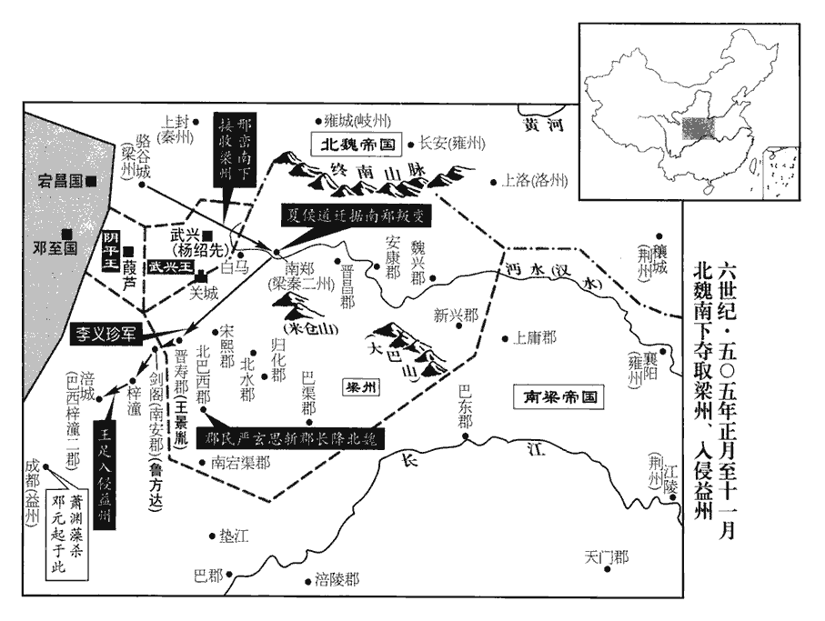
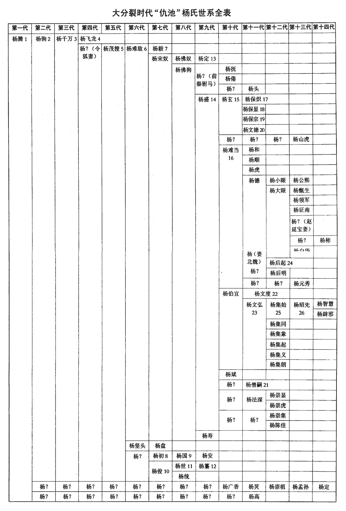
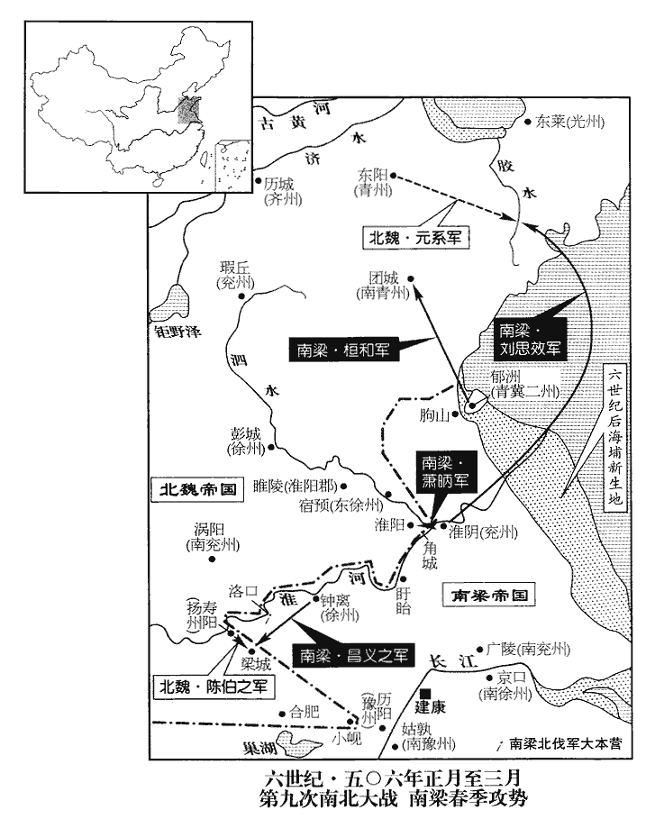
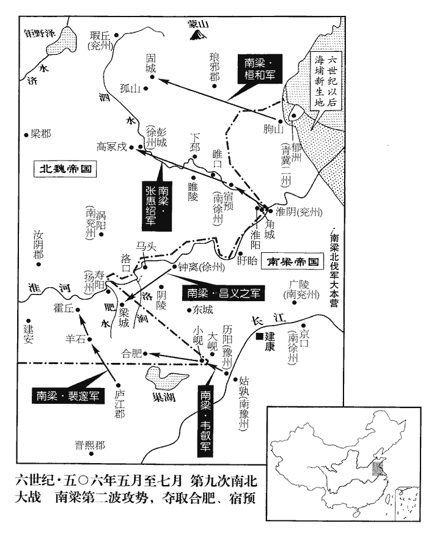
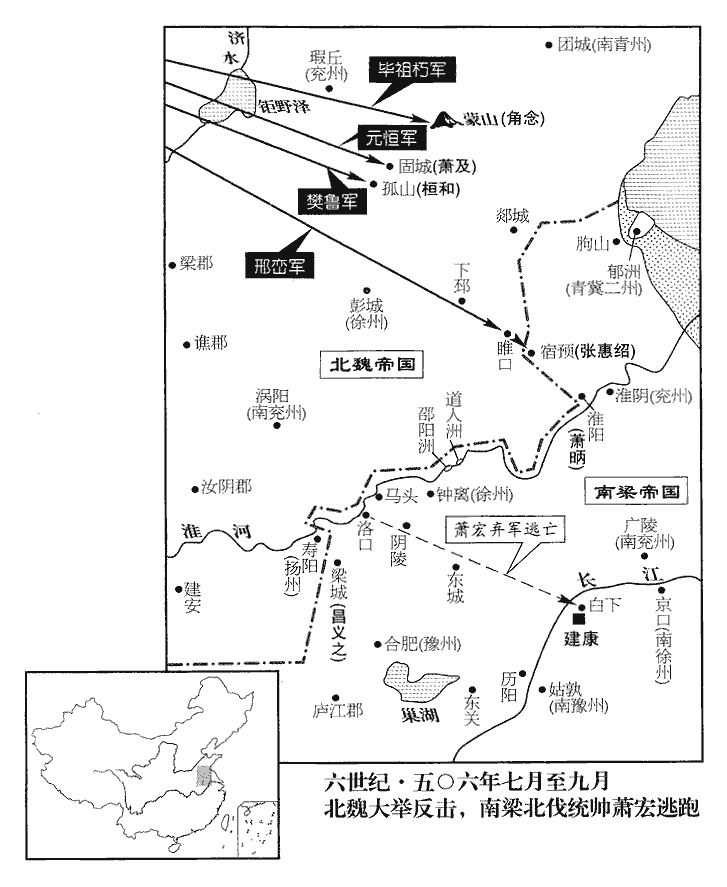
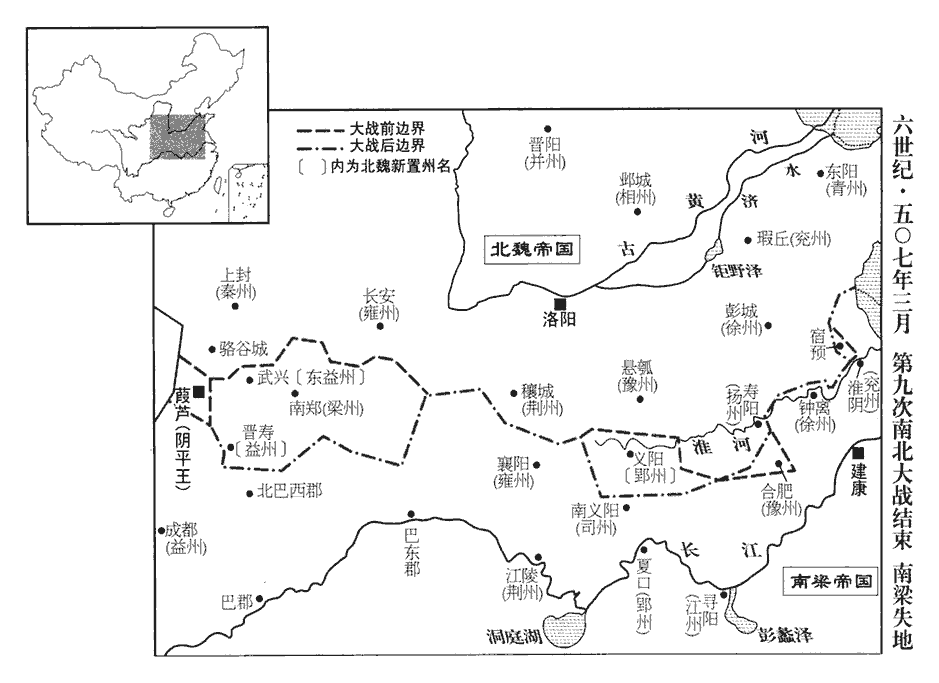

 梁紀二起旃蒙作噩（乙酉），盡強圉大淵獻（丁亥），凡三年。

# 高祖武皇帝二

## 天監四年（乙酉、五零五）

1春，正月，癸卯朔‹一›，‹萧衍，本年四十二岁›詔曰：「二漢登賢，莫非經術，服膺雅道，名立行成。行，下孟翻。朱元晦曰：服，著也。膺，胸也。奉持而著之心胸之間。著，則略翻。魏、晉浮蕩，儒教淪歇，風節罔樹，樹，立也。歇，許竭翻。抑此之由。可置五經博士各一人，廣開館宇，招內後進！」於是以賀瑒及平原明山賓、吳興‹浙江省湖州市›沈峻、建平‹重庆市巫山县›嚴植之補博士，各主一館，館有數百生，給其餼廩，瑒yáng，徒杏翻，又音暢。餼xì，許既翻。鄭玄曰：餼，廩稍食也。稍，所教翻。其射策通明者即除為吏。漢書音義曰：作簡策難問，列置案上，在試者意投射取而答之，謂之射策。朞年之間，懷經負笈者雲會。瑒，循之玄孫也。笈，其劫翻，又楚洽翻，書箱也。晉氏南渡之初，以賀循為儒宗。又選學生，往會稽雲門山‹浙江绍兴市南东山›從何胤受業，胤時隱雲門山，今在會稽南三十一里，有雲門寺。會，工外翻。命胤選門徒中經明行脩者，行，下孟翻。具以名聞。分遣博士祭酒巡州郡立學。

〖译文〗 [1]春季，正月，癸卯朔（初一），武帝发布诏令：“两汉时期的读书人登贤入仕，莫不是通过经术之业，他们都信奉大雅之道，个个饱学，因此能立功名，成大业。魏、晋以来，士人浮华放荡，而儒教衰败，风节得不到树立，当是其根本原因。所以，可以设置《五经》博士各一人，广开馆宇，招纳后进。”于是，将贺及平原人明山宾、吴兴人沈峻、建平人严植之补为博士，让他们各主持一馆，讲学执教，每馆有好几百名学生，由朝廷供给口粮等生活资用，其中在射策考试时应对自如，风解深刻透彻者，即被任为官吏。因此，一年之间，天下士子怀经负笈，云集而至。贺是贺循的玄孙。朝廷又挑选学生，送他们去会稽云门山跟从何胤接受学业，命令何胤选拨门徒中通晓经学、品行优秀者，把他们的姓名上报朝廷。朝廷又分遣博士祭酒巡视各州郡的立学情况。

2初，譙國‹安徽省蒙城县›夏侯道遷以輔國將軍從裴叔業鎮壽陽‹安徽省寿县›，為南譙‹安徽省巢湖市东南›太守，按魏收地形志，晉孝武置南譙郡，蓋治渦陽。又按蕭子顯齊志，武帝永明二年，割揚州宣城、淮南、南豫、譙、廬江、臨江六郡，置南豫州。四年，冠軍長史沈憲啟二豫分置，以桑堁kè子亭為斷：潁川汝陽在南譙歷陽界，悉屬西豫，廬江居晉熙汝陰之中，屬南豫；求以潁川汝陽屬南豫，廬江屬西豫。則齊之南譙蓋置於歷陽西界，而渦陽已入於魏矣。南北建置郡縣最為難考者率如此。夏，戶雅翻。守，式又翻。與叔業有隙，單騎奔魏。魏以道遷為驍騎將軍，騎，奇寄翻。驍，堅堯翻。從王肅鎮壽陽，使道遷守合肥‹安徽省合肥市›。肅卒，率，子恤翻；下同。道遷棄戍來奔，從梁、秦二州刺史莊丘黑鎮南鄭‹陕西省汉中市›，以道遷為長史，領漢中太守。黑卒，詔以都官尚書王珍國為刺史，未至，道遷陰與軍主考城‹侨县·江苏省盱眙县南›江忱之【嚴：「忱」改「悅」。】等謀降魏。降，戶江翻。

〖译文〗 [2]原先，谯国人夏侯道迁以辅国将军的身份随从裴叔业镇守寿阳，担任南谯太守，因与裴叔业不合，于是就一个人骑马奔投了北魏。北魏任命夏侯道迁为骁骑将军，随从王肃镇守寿阳，王肃指派夏侯道迁驻守合肥。王肃去世，夏侯道迁丢下戍所来投靠南朝，随从梁、秦二州刺史庄丘黑镇守南郑，庄丘黑任命夏侯道迁为长史，兼汉中太守。庄丘黑死后，朝廷诏令都官尚书王珍国为刺史，没有到任，夏侯道迁便私下里与军主考城人江忱之等人密谋投降北魏。

先是，魏仇池‹甘肃省西和县南›鎮將楊靈珍叛魏來奔，事見一百四十一卷齊明帝建武四年。先，悉薦翻。將，即亮翻。朝廷以為征虜將軍、假武都王，助戍漢中，有部曲六百人，道遷憚之。上‹萧衍›遣左右吳公之等使南鄭，道遷遂殺使者，發兵擊靈珍父子，斬之，并使者首送於魏。使，疏吏翻。白馬戍‹陕西省勉县西›主尹天寶聞之，引兵擊道遷，敗其將龐樹，敗，補邁翻。遂圍南鄭‹陕西省汉中市›。道遷求救於氐‹府武兴陕西省略阳县›王楊紹先、楊集起、楊集義，皆不應，集義弟集朗引兵救道遷，擊天寶，殺之。魏以道遷為平南將軍、豫州刺史、豐縣侯。考異曰：梁帝紀，「天監三年二月，魏陷梁州」，而列傳皆無其事。魏帝紀：「正始元年，閏十二月，癸卯朔，蕭衍行梁州事，夏侯道遷據漢中來降。」道遷傳具言其事。按長曆，梁閏二月癸卯，即天監四年正月朔也，故置於此。又以尚書邢巒為鎮西將軍、都督征梁•漢諸軍事，將兵赴之。道遷受平南，辭豫州，辭豫州者，欲得梁州也。且求公爵，魏主‹元恪，本年二十三岁›不許。

〖译文〗 早先之时，北魏镇守仇池的将领杨灵珍反叛北魏来投奔南齐，南齐朝廷任命他为征虏将军、假武都王，让他协助戍守汉中，手下共有部曲六百人，夏侯道迁很害怕他。梁武帝派遣左右心腹吴公之等人出使南郑，夏侯道迁便杀害了使者，又发兵袭击杨灵珍父子，斩了他们，把他们的首级连同武帝派来的使者的首级一并送到北魏。白马的戍主尹天宝得知这一消息之后，带兵去袭击夏侯道迁，打败了夏侯道迁的将领庞树，于是围困南郑。夏侯道迁向氐王杨绍先、杨集起、杨集义求救，都不予理睬，只有杨集义的弟弟杨集朗带兵去援救夏侯道迁，向尹天宝发起了攻击，杀了他。北魏任命夏侯道迁为平南将军、豫州刺史、丰县侯。又任命尚书邢峦为镇西将军和都督梁、汉诸军事，并让他率兵前去赴任。夏侯道迁接受了平南将军一职，辞掉了豫州刺史之职，并且要求封为公爵，宣武帝不准许。

3辛亥‹九›，上祀南郊，大赦。

〖译文〗 [3]辛亥（初九），梁武帝在南郊祭祀，并诏令大赦天下。

4乙丑‹二十三›，魏以驃騎大將軍高陽王雍為司空，驃，匹妙翻。騎，奇寄翻。加尚書令廣陽王嘉儀同三司。

〖译文〗 [4]乙丑（二十三日），北魏任命骠骑大将军高阳王元雍为司空，加封尚书令广阳王元嘉仪同三司。

5二月，丙子‹五›，魏以宕昌‹甘肃省宕昌县›世子梁彌博為宕昌王。宕，徒浪翻。

〖译文〗 [5]二月丙子（初五），北魏封容昌世子梁弥博为宕昌王。

6上謀伐魏，壬午‹十一›，遣衛尉卿楊公則將宿衛兵塞洛口‹安徽省怀远县西南›。自漢以來，衛尉與太常、太僕、廷尉、大鴻臚、宗正、大司農、少府為九卿，而職名未帶卿字，至梁分十二寺，始各帶卿字。水經註，洛澗北逕秦虛，下注淮，謂之洛口。塞，悉則翻。

〖译文〗 [6]武帝策谋讨伐北魏，壬午（十一日），派遣卫尉卿杨公则率领宿卫兵堵塞了洛口。

7壬辰‹二十一›，交州‹府设龙编越南河内市东北北宁府›刺史李凱據州反，長史李畟討平之。畟cè，初力翻。

〖译文〗 [7]壬辰（二十一日），交州刺史李凯占据了州城反叛朝廷，长史李讨伐并平定了李凯的反叛。

8魏邢巒至漢中‹陕西省汉中市›，擊諸城戍，所向摧破。晉壽‹四川省广元市西南›太守王景胤據石亭‹四川广元市北›，水經註：漢水自武興城北西南流，逕關城北，又西逕石亭戍，又逕晉壽城西。巒遣統軍李義珍擊走之。魏以巒為梁、秦二州‹府南郑›刺史。巴西‹北巴西郡·四川省阆中市›太守龐景民據郡不下，龐，皮江翻。郡民嚴玄思聚眾自稱巴州刺史，附於魏，攻景民，斬之。楊集起、集義聞魏克漢中而懼，閏月，帥群氐叛魏，斷漢中糧道，帥，讀曰率。斷，丁管翻。巒屢遣軍擊破之。

〖译文〗 [8]北魏邢峦到达汉中，对各城堡发起了攻击，所向无敌，无坚不摧。晋寿太守王景胤占据着石亭，邢峦派遣统军李义珍打跑了他。北魏任命邢峦为梁、秦二州刺史。巴西太守庞景民占据郡城，拒不投降，郡中之民严玄思聚集群众，自封为巴州刺史，投附于北魏，攻打庞景民并将他斩首。杨集起、杨集义得知北魏攻克汉中的消息之后害怕了，于闰三月，率领氐族部落反叛了北魏，切断了汉中的粮道，邢峦多次派遣军队去袭击、打败了他们。

9夏，四月，丁巳‹十七›，以行宕昌‹甘肃省宕昌县›王梁彌博為河•涼二州刺史、宕昌王。

〖译文〗 [9]夏季，四月丁巳（十七日），梁朝任命行宕昌王梁弥博为河、凉二州刺史和宕昌王。

10冠軍將軍孔陵等將兵二萬戍深杭‹四川省剑阁县北›，冠，古玩翻。將，即亮翻。考異曰：梁鄧元起傳，「魏將王景胤、孔陵寇東、西晉壽，並遣告急。」按魏邢巒傳曰，「蕭衍晉壽太守王景胤據石亭」；又曰，「蕭衍遣其將軍孔陵等據深杭」。然則景胤、陵皆梁將也，元起傳誤。魯方達戍南安‹剑阁县北剑门关›，五代志：始州普安縣，舊曰南安。始州，唐之劍州。任僧褒等戍石同，以拒魏。任，音壬。邢巒遣統軍王足將兵擊之，所至皆捷，遂入劍閣。陵等退保梓潼‹四川省梓潼县›，足又進擊，破之。梁州十四郡地，東西七百里，南北千里，皆入于魏。蕭子顯齊志，梁州注籍者二十二郡，荒郡不預焉；今魏取十四郡。

〖译文〗 [10]梁朝冠军将军孔陵等人率兵两万戍守深杭，鲁方达戍守南安，任僧褒等人戍守石同，以便抵拒北魏。邢峦派遣统军王足带兵去袭击，所到之处无不告捷，于是进入剑阁。孔陵等人只好退保梓潼，王足又进攻，打败了他们。于是，梁州十四郡之地，东西七百里，南北一千里，全部归入北魏版图。

 

初，益州刺史【章：十二行本「史」下有「當陽侯」三字；乙十一行本同；張校同；退齋校同。】鄧元起以母老乞歸，詔徵為右衛將軍，以西昌侯淵藻代之。淵藻，懿之子也。懿死於東昏之手。夏侯道遷之叛也，尹天寶馳使報元起。使，疏吏翻。及魏寇晉壽，王景胤等並遣告急，眾勸元起急救之，元起曰：「朝廷萬里，軍不猝至，若寇賊侵淫，侵淫，以癰疽jū為喻，侵毒好肉為淫肉。方須撲討，董督之任，非我而誰，何事怱怱救之！」史言鄧元起乞歸非由衷之請。撲，普木翻。詔假元起都督征討諸軍事，救漢中，而晉壽已陷。蕭淵藻將至，元起營還裝，糧储器械，取之無遺。淵藻入城，恨之；又求其良馬，元起曰：「年少郎子，何用馬為！」淵藻恚，因醉，殺之‹年四十八岁›。元起養寇自資，而卒不免於死，雖淵藻以私忿殺之，亦不為無罪也。少，詩照翻。恚，於避翻。元起麾下圍城，哭，且問故，淵藻曰：「天子有詔。」眾乃散。遂誣以反，上疑焉。元起故吏廣漢羅研詣闕訟之，上曰：「果如我所量也。」使讓淵藻曰：「元起為汝報讎，謂協力誅東昏，報其父讎也。量，音良。為，于偽翻；下同。汝為讎報讎，忠孝之道如何！」乃貶淵藻號為冠軍將軍，冠，古玩翻。考異曰：「梁書元起傳：「藻以糧儲無遺，甚怨望之，因表元起逗留不憂軍事，收付州獄，自縊死。」按若止以逗留表元起，安敢擅收前刺史付獄殺之！必誣以反也。今從南史。又梁書，藻本以冠軍為益州刺史，與南史異。贈元起征西將軍，諡曰忠侯。

〖译文〗 起初，益州刺史邓元起因母亲年老而乞求归还故里，朝廷下诏征调他为右卫将军，另以西昌侯萧渊藻取代他益州刺史之职。萧渊藻是萧渊懿的儿子。夏侯道迁反叛之时，尹天宝派使者驰告邓元起。等到北魏侵犯晋寿之时，王景胤等人也遣使去向邓元起告急，众人都劝说邓元起急速前去援救，邓元起却说：“朝廷离这里万里之遥，军队不会很快就会来到的，如果入侵的寇贼进一步成势，方才须前去讨伐夷荡，而督帅之任，除了我还有谁呢？所以，何必现在就匆匆忙忙地前去救援呢？”朝廷诏令邓元起代理都督征讨诸军事，让他去援救汉中，但是此时晋寿已经沦陷了。萧渊藻将要抵达，邓元起营造回去时的行装，他把粮资储备和各种器械兵仗搜罗一空，些微不剩。萧渊藻入城之后，见到这一情形，对邓元起怀恨在心。萧渊藻要邓元起的良马，邓元起却对他说：“你一个年少郎君，要马干什么呢？”萧渊藻无比忿怒，借邓元起酒醉之机，杀了他。邓元起的部下把城围住，痛哭主帅，且问主帅被杀之缘故，萧渊藻对他们说：“天子有诏令。”众人才散去了。于是，萧渊藻就诬告邓元起反叛，武帝对此疑而不信。邓元起的故吏广汉人罗研来到朝廷告状，武帝说：“果然同我所思量的一样。”武帝派使者斥责萧渊藻说：“邓元起为你报了父仇，你却为仇人而报仇，杀害了他，忠孝之道在那里呢？”于是贬萧渊藻号为冠军将军，赠邓元起征西将军，谥号为忠侯。

李延壽‹唐，著《南史》›論曰：元起勤乃胥附，毛萇曰：幸下親上曰胥附。功惟闢土，謂開梁、益之土也。勞之不圖，禍機先陷。冠軍之貶，於罰已輕，梁之政刑，於斯為失。私戚之端，自斯而啟，年之不永，不亦宜乎！

〖译文〗 李延寿论曰：邓元起勤勉于事，能体贴下属，能奉事朝廷，开辟疆土，功不可没，功劳没有受到赏赐，却先陷祸遇难。萧渊藻仅仅被贬为冠军将军，所受的惩罚实在是太轻了，梁朝的政治、刑律，在这件事上出现了大的失误，由此而开启了朝廷庇护亲族的弊端，所以不能长久立国，不也是很相宜的吗？

11益州‹四川省中南部›民焦僧護聚眾作【章：十二行本「作」上有「數萬」二字；乙十一行本同；孔本同；張校同。】亂，蕭淵藻‹本年二十三岁›年未弱冠，人生二十曰弱冠。冠，古玩翻。集僚佐議自擊之；或陳不可，淵藻大怒，斬于階侧。乃乘平肩輿巡行賊壘，平肩輿，使人就掆gāng肩之，故曰平肩。行，下孟翻。賊弓亂射，矢下如雨，從者舉楯禦矢，淵藻命去之。射，而亦翻。從，才用翻。去，羌呂翻。由是人心大安，擊僧護等，皆平之。

〖译文〗 [11]益州的百姓焦僧护聚众造反，萧渊藻年纪还不满二十岁，他召集手下的僚佐们商议要亲自去歼击叛民，有人说他不可以亲自去，萧渊藻勃然大怒，就把说话的人斩于庭阶的侧旁。于是，萧渊藻乘坐着平肩舆，在叛民的营垒周围巡行，叛民用弓箭乱射，箭雨纷至，随从们举着盾牌为他挡箭，他却命令把盾牌拿开。因此，人心大安，争相出击焦僧护等，都平定了他们。

12六月，庚戌‹十一›，初立孔子廟。

〖译文〗 [12]六月庚戌（十一日），梁朝初立孔子庙。

13豫州‹府设历阳安徽省和县›刺史王超宗以五代志考之，此時梁置豫州於晉熙，今安慶府懷寧縣地。將兵圍魏小峴‹安徽省含山县西北›。峴，戶典翻。丁卯‹二十八›，魏揚州‹府设寿阳安徽省寿县›刺史薛真度遣兼統軍李叔仁等擊之，超宗兵大敗。

〖译文〗 [13]豫州刺史王超宗率兵围攻北魏小岘。丁卯（十八日），北魏扬州刺史薛真度派遣兼统军李叔仁等人出击，王超宗的军队一败涂地。

14冠軍將軍王景胤、李畎quǎn、輔國將軍魯方達等與魏王足戰，屢敗，秋，七月，足進逼涪城‹四川省绵阳市›。畎，姑泫翻。涪，音浮。

〖译文〗 [14]冠军将军王景胤、李畎、辅国将军鲁方达等同北魏的王足交战，屡战屡败，秋季，七月，王足进逼涪城。

15八月，壬寅‹四›，魏中山王英寇雍州‹府襄阳›。雍，於用翻。

〖译文〗 [15]八月壬寅（初四），北魏中山王元英入侵雍州。

16庚戌‹十二›，秦、梁二州刺史魯方達與魏王足統軍紀洪雅、盧祖遷戰，敗，方達等十五將皆死。壬子‹十四›，王景胤等又與祖遷戰，敗，景胤等二十四將皆死。

〖译文〗 [16]庚戌（十二日），梁朝秦、梁二州刺史鲁方达与北魏王足手下的统军纪洪雅、卢祖迁交战，战败，鲁方达等十五员将领都战死。壬子（十四日），王景胤等人又与卢祖迁交战，也战败，王景胤等二十四位将领全部战死。

17楊公則至洛口‹安徽省怀远县西南›，與魏豫州長史石榮戰，斬之。甲寅‹十六›，將軍姜慶真與魏戰於羊石‹安徽省霍丘县南›，不利，羊石，蓋即陳伯之所屯之陽石也。公則退屯馬頭‹安徽省怀远县南马城›。

〖译文〗 [17]杨公则到达洛口，与北魏豫州长史石荣交战，将石荣斩首。甲寅（十六日），将军姜庆真与北魏军队在羊石交战，没有取胜，杨公则只好退驻于马头。

18雍州‹湖北省北部›蠻沔東‹湖北省襄樊市东›太守田青喜叛降魏。考之北史，青喜所據之地蓋在襄陽之東，竟陵之西。沔，彌兗翻。

〖译文〗 [18]担任沔东太守的雍州蛮人田青喜反叛梁朝，投降了北魏。

19魏有芝生於太極殿之西序，殿廡曰序。魏主以示侍中崔光，光上表，以為「此莊子所謂『氣蒸成菌』者也。菌，巨隕翻，地蕈xùn也。柔脆之物，生於墟落穢濕之地，不當生於殿堂高華之處；今忽有之，厥狀扶疏，誠足異也。夫野木生朝，野鳥入廟，古人皆以為敗亡之象，故太戊、中宗懼災脩德，殷道以昌，商王太戊之時，亳有祥桑、穀共生于朝，一暮大拱。太戊懼而脩德，祥桑枯死，殷道復興。高宗‹子武丁›祭成湯，有飛雉升鼎耳而雊gòu，祖己曰：「惟先格王正厥事，朝諸侯，有天下，猶運之於掌。」「中宗」當作「高宗」。朝，直遙翻。所謂『家利而怪先，國興而妖豫』者也。妖，於遙翻。今西南二方，兵革未息，郊甸之內，大旱踰時，民勞物悴，莫此之甚，悴，秦醉翻。承天育民者所宜矜恤；伏願陛下側躬聳意，惟新聖道，節夜飲之樂，養方富之年，則魏祚可以永隆，皇壽等於山岳矣。」於是魏主好宴樂，樂，音洛。好，呼到翻。故光言及之。

〖译文〗 [19]北魏朝廷太极殿内的西墙下生长出了灵芝，北魏宣武帝拿来给侍中崔光看，崔光就此事而上表皇上，认为：“这只是《庄子》一书中所讲的‘气蒸成菌’罢了。这种柔脆的菌类之物，一般生长在废墟角落污秽潮湿的地方，不应当生长在殿堂这样高贵华丽之处；如今忽然生长出来了，而且其形状繁茂，实在是奇怪之事。野木生于朝庭，野鸟飞入宗庙，古人都认为这是败亡的征兆，所以商王太戊、高宗有惧于祥桑、谷共生于朝内以及野鸡飞在鼎上之异兆而修德积善，国运因此而得以复兴昌盛，这正是所谓‘家族吉利而怪异先行，国家兴盛而妖异预见’。如今西方和南方兵戈未息，京郊周围大旱久时，百姓劳崐苦，万物憔悴，已经到了万分严重的地步，而承受上天旨意养育万民的天子在此之际正应该加以体恤，所以恳请陛下关心朝廷内外之事，亲身过问，弘扬圣道，节制夜间饮酒的娱乐，保养正值年轻的身体，如此则北魏的国祚可以永远兴隆，皇寿与山岳等齐。”此时，北魏宣武帝喜好宴饮欢乐，所以崔光在上表中特意提到这点。

20九月，己巳‹一›，楊公則等與魏揚州刺史元嵩戰，公則敗績。

〖译文〗 [20]九月己巳（初一），杨公则等人与北魏扬州刺史元嵩交战，杨公则败北。

21冬，十月，丙午‹五›，上大舉伐魏，以揚州刺史臨川王宏都督北討諸軍事，尚書右僕射柳惔為副，惔，徒甘翻。王公以下各上國租及田穀以助軍。國租者，封國所入之租。田穀者，職田所入之穀。各上，時掌翻。宏軍于洛口。

〖译文〗 [21]冬季，十月丙午（初九），武帝发动军队大举征伐北魏，任命扬州刺史临川王萧宏为都督北讨诸军事，尚书右仆射柳为副，王公以下者各上交封国所收之租和职田所收之谷以便资助军队。萧宏驻军于洛口。

22楊集起、集義立楊紹先為帝，自皆稱王。十一月，戊辰朔‹一›，魏遣光祿大夫楊椿將兵討之。將，即亮翻。

〖译文〗 [22]杨集起、杨集义拥立杨绍先为帝，自己都称王。十一月戊辰朔（初一），北魏派遣光禄大夫杨椿率兵讨伐杨集起等。

23魏王足圍涪城，蜀人震恐，益州‹南梁益州·州政府成都›城戍降魏者什二三，民自上名籍者五萬餘戶。上，時掌翻；下西上同。邢巒表於魏主，請乘勝進取蜀，以為「建康、成都，相去萬里，陸行既絕，自襄陽西行遵陸可以至蜀，梁州既入于魏，則陸路斷矣。惟資水路，水軍西上，非周年不達，益州外無軍援，一可圖也。頃經劉季連反，鄧元起攻圍，事見上卷元年、二年。資儲空竭，吏民無復固守之志，二可圖也。蕭淵藻裙屐少年，復，扶又翻。裙，渠云翻，下裳也。屐jī，竭戟翻，蹻qiāo也。少，詩沼翻。未洽治務，宿昔名將，多見囚戮，治，直吏翻。將，即亮翻；下同。今之所任，皆左右少年，三可圖也。蜀之所恃，唯在劍閣‹四川省剑阁县北剑门关›，今既克南安‹南安即剑阁，南安郡郡政府设剑阁县›，已奪其險，據彼竟內，竟，讀曰境。三分已一；自南安向涪，方軌無礙，前軍累敗，後眾喪魄，四可圖也。喪，息浪翻。淵藻是蕭衍骨肉至親，必無死理，若克涪城，淵藻安肯城中坐而受困，必將望風逃去；若其出鬬，庸‹湖北省上庸县西南田家坝›、蜀‹四川省成都市›士卒駑怯，弓矢寡弱，五可圖也。武王之伐紂也，庸、蜀八國皆從。庸，上庸之地。蜀，蜀郡之地。臣內省文吏，不習軍旅，賴將士竭力，頻有薄捷，既克重阻，省，悉景翻。重，直龍翻。重阻，猶言重險也。民心懷服，瞻望涪、益，時梓潼太守治涪城，益州刺史治成都。旦夕可圖，正以兵少糧匱，未宜前出，少，詩沼翻。今若不取，後圖便難。況益州殷實，戶口十萬，比壽春、義陽，其利三倍。魏先此已得壽春、義陽，故云然。朝廷若欲進取，時不可失；若欲保境寧民，則臣居此無事，乞歸侍養。」養，余亮翻。魏主詔以「平蜀之舉，當更聽後敕。寇難未夷，何得以養親為辭！」巒又表稱，「昔鄧艾、鍾會帥十八萬眾，傾中國資儲，僅能平蜀，事見七十八卷魏元帝景元四年。難，乃旦翻。帥，讀曰率。所以然者，鬬實力也。況臣才非古人，何宜以二萬之眾而希平蜀！所以敢者，正以據得要險，士民慕義，此往則易，易，以豉翻；下未易同。彼來則難，任力而行，理有可克。今王足已逼涪城，脫得涪，則益州乃成擒之物，但得之有早晚耳。且梓潼已附民戶數萬，謂已上名藉之民也。朝廷豈可不守！又，劍閣天險，得而棄之，良可惜矣。諸葛孔明相蜀，以大劍、小劍有隘束之路，故曰劍門。以閣道三十里至險，乃有閣尉。姜維拒鍾會於此。晉以其地入梓潼郡。桓溫入蜀，於晉壽置劍閣縣，屬梁州。臣誠知戰伐危事，未易可為。自軍度劍閣以來，鬢髮中白，中，竹仲翻。日夜戰懼，何可為心！所以勉強者，強，其兩翻。既得此地而自退不守，恐負陛下之爵祿故也。且臣之意算，正欲先取涪城，以漸而進。若得涪城，則中分益州之地，斷水陸之衝，魏已得劍閣，進取成都，涪當其衝；梁兵由內水而上救成都，涪亦當其衝。斷，丁管翻。彼外無援軍，孤城自守，何能復持久哉！復，扶又翻。臣今欲使軍軍相次，聲勢連接，先為萬全之計，然後圖功，得之則大利，不得則自全。又，巴西‹东巴西·四川省阆中市›、南鄭，相距千四百里，去州迢遰dì，迢，田聊翻。遰，徒計翻。迢遰，遠也。恆多擾動。恆，戶登翻。昔在南之日，以其統綰勢難，曾立巴州，鎮靜夷、獠，立巴州見一百三十五卷齊高帝建元二年；省巴州見武帝永明二年。獠，魯皓翻；下同。梁州藉利，因而表罷。彼土民望，嚴、蒲、何、楊，非唯一族，雖率居山谷，而豪右甚多，文學風流，亦為不少，但以去州既遠，不獲仕進，至於州綱，無由廁迹，州之上佐，是謂州綱。少，詩沼翻。是以鬱怏，多生異圖。怏，於兩翻。比道遷建義之始，比，毗至翻。嚴玄思自號巴州刺史，克城以來，仍使行事。巴西廣袤千里，戶餘四萬，若於彼立州，鎮攝華、獠，巴西之地，華人與獠雜居，故云華、獠。袤，音茂。則大帖民情，帖，靜也，安也，伏也。從墊江已還，不勞征伐，自為國有。」李雄、譙縱取蜀，東不能過墊江；以苻秦兵力之盛，取梁、益如反掌，墊江以東，苻秦不能有也。邢巒之圖蜀，亦規墊江以西而已，蓋地利足恃也。我朝自紹定失蜀，彭大雅遂城渝為制府，支持四蜀且四十年。渝，古墊江之地也。墊，音疊。魏主不從。

〖译文〗 [23]北魏王足围攻涪城，蜀人大为震惊、恐惧，益州的城堡有十分之二三投降了北魏，百姓自动报上名籍的有五万多户。邢峦上表北魏宣武帝，请求乘胜而进取蜀地，认为：“建康与成都相离万里之遥，陆路已经阻断，唯一可依靠的就是水路了，但是水军西上，没有一年的时间是到不了的，益州外无援军，这是可以攻取的第一点理由。蜀地前不久经历了刘季连反叛，邓元起攻打围困之事，物资储备空竭，官方和百姓都失去了固守的信心，这是可以攻占的第二点理由。萧渊藻不过是一个衣装华丽而无真才实学的少年，完全不懂治理之道，过去的名将，大多数都被他囚禁杀戮了，现在所任用的，都是他左右的一些少年人，这是可以攻取的第三点理由。蜀地所依恃的只在剑阁，现在既攻克崐了南安，已经夺取了其险要之地，据此天险而向内推进，已占取了境内三分之一的地方；从南安向涪陵，道路宽展，可以双车并行，蜀军前军累战屡败，后头的闻风而丧胆，这是可以攻取的第四点理由。萧渊藻是萧衍的骨肉至亲，必定不愿以死固守，若果攻克涪城，萧渊藻怎肯呆在城中坐而受困，必将望风而逃跑；他如果出战，无奈庸、蜀之地的士卒们才能低下而胆怯，弓箭缺少而无力，这是可以攻取的第五点理由。我本为朝中文官，不熟习军旅之事，但是幸赖将士们尽心竭力，以致频有捷报传来，尽管是那么微小而不足道。现在已经攻克重重险阻，民心归顺，观望涪、益两城，旦夕可得，只是因兵少粮缺，不宜于前去攻打，但现在如不夺取，以后再攻打就难了。况且益州殷富，有十万户人家，与寿春、义阳相比，其利益高出三倍。朝廷如果想要攻取该地，就不应该失去这次机会；如果想要保护境内安宁百姓，则我呆在这里实无事可做，因此乞求归家侍养双亲。”宣武帝给邢峦的诏令中说：“关于平定蜀地之举，你应当等着听取后面的敕令。现在寇难还没有平定，你怎么能以侍养亲人为借口而引退呢？”邢峦又上表说：“过去邓艾、钟会统领十八万大军，倾尽中原的资财储备，才能平定蜀地，之所以如此，是以实力相斗呀。何况我的才能比不上古人，那里可以靠两万兵力而希求平定蜀地呢？之所以敢如此，正因为占据了险要之地，士人和百姓们都倾慕向往大义，我们由此而前进则容易，他们前来抵挡则难，只要我们根据力量而行事，理应攻克。现在王足已经逼近涪城，假如取得了涪陵，则益州就成了待擒之物，只是得到手有早晚之别罢了。何况梓潼已经归附的民户有好几万，朝廷岂可以不加以镇守呢？还有，剑阁天险，如得而放弃，实在是可惜。我诚然知道征战讨伐是危险的事情，不可轻易进行。自从我军越过剑阁以来，我的鬓发已经斑白，日日夜夜为战事情况而焦虑不安，心情紧张得都无法忍受下去了。之所以能勉强坚持着，只是因为考虑到既然已经得到了该地而又自动撤退不加驻守，恐怕有负于陛下所给予的爵位俸禄。而且我心中打算，正想先攻取涪城，然后渐次而进。如果得到涪城，就可以把蜀地分为两伴，阻断水陆交通的要道，他们没有外面来的援军，以孤城而自守，怎么能够持久得了呢？我现在想让各支队伍相次而进，前后连接，互相声援，首先做到万无一失，然后图取大功，如能得到则有大利，不得则可以做到自我保全。另外，巴西与南郑相距一千四百里，离州城遥远，经常发生骚乱。过去属南朝占领之时，由于这里难以统辖管理，曾经设立过巴州，以便镇领夷、獠，而梁州借利，所以上表请求罢撤了该州。这个地方的大户人家有严、蒲、何、杨等姓，不仅仅是一族，他们虽然居住在山谷之中，可是豪强大族很多，文章风流之士也为数不少，但因离州城很远，因此不能获得仕进机会，甚至州里地位较高的佐吏，也无法能跻身其中，因此愤愤不平，多生异图之心。到夏侯道迁建举大义之初，严玄恩自称为巴州刺史，攻克州城以来，仍然让他任刺史之职。巴西这个地方广袤千里，户口还余下四万之多，如果在这里设置州，镇摄华、獠，则可以大大地安定民心，从垫江以西，不用征伐，就自然为我国所有了。”宣武皇帝没有听从邢峦的建议。

先是，魏主‹元恪›以王足行益州刺史。先，悉薦翻。上‹萧衍›遣天門‹湖南省石门县›太守張齊將兵救益州，未至，將，即亮翻。魏主更以梁州軍司泰山‹山东省泰安市›羊祉為益州刺史。更，工衡翻。王足聞之，不悅，輒引兵還，還，從宣翻，又如字。遂不能定蜀。久之，足自魏來奔。邢巒在梁州‹府南郑›，接豪右以禮，撫小民以惠，州人悅之。巒之克巴西也，使軍主李仲遷守之。仲遷溺於酒色，費散兵儲，公事諮承，無能見者。巒忿之切齒，仲遷懼，謀叛，城人斬其首，以城來降。史言魏所以不能定蜀。降，戶江翻。

〖译文〗 早先之时，北魏宣武帝任命王足兼益州刺史。梁武帝派遣天门太守张齐率兵去援救益州，还没有到达，宣武帝又改任梁州军司泰山人羊祉为益州刺史。王足知道这一消息之后，十分不悦，便带兵返回了，于是北魏没有能够平定蜀地。许久之后，王足从北魏来投靠了梁朝。邢峦在梁州之时，对当地的豪强大族以礼相接，对小民百姓抚之以恩惠，因此全州之人都很欢喜。邢峦攻克巴西，让军主李仲迁镇守。李仲迁沉溺于酒色，私自挪用耗散军费，有关公事需要向他请示报告之时，却找不到他的人影。邢峦对此气的咬牙切齿，李仲迁害怕了，密谋反叛，城中的人将李仲迁斩首，献城投降了梁朝。

24十二月，庚申‹二十四›，魏遣驃騎大將軍源懷討武興‹陕西省略阳县›氐，邢巒等並受節度。驃，匹妙翻。騎，奇寄翻。

〖译文〗 [24]十二月庚申（二十四），北魏派遣骠骑大将军源怀讨伐武兴的氐族部落，邢峦等人一并接受源怀的指挥调遣。

25司徒、尚書令謝朏以母憂去職。朏fěi，敷尾翻。

〖译文〗 [25]梁朝司徒、尚书令谢因为母亲守丧而去职。

26是歲，大穰，穰，豐也。詩：豐年穰穰。米斛三十錢。

〖译文〗 [26]这一年，大丰收，米价每斛三十钱。

## 五年（丙戌、五零六）

1春，正月，丁卯朔‹一›，魏于后生子昌，大赦。

〖译文〗 [1]春季，正月，丁卯朔（初一），北魏于皇后生下儿子元昌，大赦天下。

2楊集義圍魏關城‹陕西省宁强县西北阳平关›，此即陽平關城也。邢巒遣建武將軍傅豎眼討之，豎，而庾翻。集義逆戰，豎眼擊破之；乘勝逐北，壬申‹六›，克武興‹陕西省略阳县›，執楊紹先，送洛陽。楊集起、楊集義亡走，遂滅其國，晉惠帝元康六年，氐王楊茂搜始據仇池‹甘肃省西和县南›百頃，其後浸盛，盡有漢武都郡之地，北侵隴西、天水，南侵漢中。拓跋既盛，取武都、仇池之地，楊氏僅據武興‹陕西省略阳县›。今魏既取漢中，遂滅楊氏。以為武興鎮‹陕西省略阳县›，又改為東益州。東益州領武興‹陕西省略阳县›、仇池‹骆谷城·甘肃省西和县南›、盤頭‹略阳县西北›、廣長‹甘肃省成县东南›、廣業‹甘肃省成县›、梓潼‹侨郡›、洛叢郡‹略阳县西›。

〖译文〗 [2]杨集义围攻北魏关城，邢峦派遗建武将军傅竖眼去讨伐，杨集义迎战，傅竖眼击败了杨集义，并乘胜追逐败军，壬申（初六），攻克了武兴，抓获了杨绍先，押送往洛阳。杨集起、杨集义逃跑了，于是灭掉了他们所建之国，改为武兴镇，其后又改为东益州。

 

3乙亥‹九›，以前司徒謝朏為中書監、司徒。朏fěi，敷尾翻。

〖译文〗 [3]乙亥（初九），梁朝任命前司徒谢为中书监、司徒。

4冀州‹府设郁洲江苏省连云港市东沉积小岛›刺史桓和擊魏南青州‹府设团城山东省沂水县›，不克。梁青、冀二州治鬱洲。魏顯祖取三齊，置東徐州於圂hùn城，領東安、東莞郡。高祖太和二十二年，改為南青州。五代志：沂州沂水縣，舊置南青州。

〖译文〗 [4]梁朝冀州刺史桓和攻打北魏的南青州，没有攻克。

5魏秦州‹府设上封甘肃省天水市›屠各王法智聚眾二千，屠，直於翻。推秦州主簿呂苟兒為主，改元建明，置百官，攻逼州郡。涇州‹府设安定甘肃省泾川县›民陳瞻亦聚衆稱王，改元聖明。魏置涇州，治臨涇城，領安定、隴東、新平、趙平、平涼、平原等郡。

〖译文〗 [5]北魏秦州匈奴屠各部落的王法智聚集两千人，推举秦州主簿吕苟儿为首领，改年号为“建明”，设置了百官，攻逼州郡。泾州的百姓陈瞻也聚众称王，改年号为“圣明”。

6己卯‹十三›，楊集起兄弟相帥降建魏。帥，讀曰率。降，戶江翻。

〖译文〗 [6]己卯（十三日），杨集起兄弟一起投降了北魏。

7甲申‹十八›，‹萧衍，本年四十三岁›封皇子綱為晉安王。

〖译文〗 [7]甲申（十八日），梁朝封皇子萧纲为晋安王。

8二月，丙辰‹二十一›，魏主‹元恪，本年二十四岁›詔王公以下直言忠諫。治書侍御史陽固上表，治，直之翻。上，時掌翻。以為「當今之務，宜親宗室，勤庶政，貴農桑，賤工賈，賈，音古。絕談虛窮微之論，簡桑門無用之費，以救飢寒之苦。」時魏主委任高肇，疏薄宗室，好桑門之法，好，呼到翻。不親政事，故固言及之。

〖译文〗 [8]二月丙辰（二十一日），北魏宣武帝诏令王公以下的官员对自己直言忠谏。诏书侍御史阳固上表，认为：“圣上当今所应做的是要亲近宗室，勤于庶政，鼓励农桑，抑制工商，杜绝一切不切合实际的谈论玄虚之理，压缩佛门无用的费用，用以救济饥寒之苦。”当时宣武帝把政事委任于高肇，疏远皇室宗亲，热衷于佛法，不亲自过问朝廷政事，所以阳固才有上述之言。

9戊午‹二十三›，魏遣右衛將軍元麗都督諸軍討呂苟兒。麗，小新成之子也。小新成見一百二十九卷宋孝武大明五年。

〖译文〗 [9]戊午（二十三日），北魏派遣右卫将军元丽督率各路军队讨伐吕苟儿。元丽是小新成的儿子。

10乙丑‹三十›，徐州‹府设钟离安徽省凤阳县东北临淮关›刺史歷陽‹安徽省和县›昌義之與魏平南將軍陳伯之戰於梁城‹安徽省寿县东南›，晉孝武太元中，僑立梁郡於淮南壽春界，故有梁城，其地在壽陽東北，鍾離西南。義之敗績。

〖译文〗 [10]乙丑，（三十日），梁朝徐州刺史历阳人昌义之同北魏平南将军陈伯之在梁城交战，昌义之战败。

11將軍蕭昺將兵擊魏徐州‹府设彭城江苏省徐州市›，圍淮陽‹江苏省淮阴市西北›。角城在淮水之陽，淮陽又在角城北十八里，治宿預。梁後於角城置淮陽郡。昺，音丙。

〖译文〗 [11]梁朝将军萧率兵攻打北魏徐州，围攻淮阳。

12三月，丙寅朔‹一›，日有食之。

〖译文〗 [12]三月，丙寅朔（初一），发生日食。

13己卯‹十四›，魏荊州‹府设穰城河南省邓州市›刺史趙怡、平南將軍奚康生救淮陽。

〖译文〗 [13]己卯（十四日），北魏荆州刺史赵怡、平南将军奚康生前去援救淮阳。

14魏咸陽王禧之子翼，遇赦求葬其父，禧誅見一百四十四卷齊和帝中興元年。屢泣請於魏主，魏主不許。癸未‹十八›，翼與其弟昌、曄來奔。上‹萧衍›以翼為咸陽王，翼以曄嫡母李妃之子也，請以爵讓之，上不許。

〖译文〗 [14]北魏咸阳王元禧的儿子元翼，遇赦后请求安葬父亲，数次在宣武帝面前哭着请求，宣武帝没有准许。癸未（十八日），元翼同其弟弟元昌、元晔前崐来奔投梁朝。武帝封元翼为咸阳王，元翼因为元晔是正室母亲李妃所生，所以请求把爵位让给元晔，但是武帝没有准许。

 

15輔國將軍劉思效敗魏青州‹府设东阳山东省青州市›刺史元繫於膠水‹流经山东省平度市西南›。魏收志，光州長廣郡即墨縣有膠水。水經，膠水出黔陬zōu縣膠山，北流過夷安縣東，又東北過膠東縣城北百里注于海。敗，補邁翻。

〖译文〗 [15]梁朝的辅国将军刘思效在胶水击败了北魏青州刺史元系。

16臨川王宏使記室吳興‹浙江省湖州市›丘遲為書遺陳伯之曰：遺，于季翻。「尋君去就之際，非有他故，直以不能內審諸己，外受流言，沈迷猖蹶，以至於此。沈，持林翻。主上屈法申恩，吞舟是漏，漢懲秦法之苛，禁罔疏闊，時稱為漏吞舟之魚。將軍松柏不翦，親戚安居，高臺未傾，愛妾尚在。松柏不翦，謂不毀夷其先世墳墓也。親戚安居，謂其親戚在江南者皆不以叛黨連坐，安居自若也。高臺未傾，謂居第未嘗汙瀦zhū，池臺如故也。愛妾尚在，謂其婢妾猶守其家，不沒于官及流落于他家也。昔雍門子見孟嘗君，吟曰：「高臺既已傾，曲池既已平，墳墓生荊棘，牧豎游其上，孟嘗君亦如是乎？」孟嘗君為之喟然歎息。而將軍魚游於沸鼎之中，鷰巢於飛幕之上，魚游釜中，古人多有是言，言將必至於焦爛。左傳，吳季札謂孫林父曰：「夫子之居此也，猶燕之巢于幕上。」杜預註曰：言至危也。不亦惑乎！想早勵良圖，自求多福。」庚寅‹二十五›，伯之自壽陽梁城‹安徽省寿县东南›擁眾八千來降，伯之元年奔魏，今復還。降，下江翻。魏人殺其子虎牙。詔復以伯之為西豫州‹府设边城河南省固始县东南›刺史；未之任，復以為通直散騎常侍。不使之出當邊鎮，恐其復叛也。復，扶又翻。久之，卒於家。

〖译文〗 [16]临川王萧宏让记室吴兴人丘迟写信送给陈伯之，信中说道：“思量您投降北魏之时，没有别的原因，只是因为内心不能自审，外受流言的影响，迷乱而猖狂，以至于到了这样的地步。当今皇上不惜不按法律以申恩德，即使再大的罪过也能宽宥，所以将军您的祖坟没有被毁，松柏茂盛；您留在江南的亲戚都没有以叛党连坐，而安居自苦；您的宅第没有受损，池台如故；您的爱妾还守在家中，没有被官家收去或流落于其他人家。可是，将军您却如鱼游于沸鼎之中，如燕筑巢于飞动的幕布之上，至今身在敌营，这不是非常糊涂的事吗？希望您能早日替自己谋一条好的出路，以便获得日后的幸福。”庚寅（二十五日），陈伯之从寿阳梁城率领八千人马来投降梁朝，北魏人杀了他的儿子陈虎牙。武帝诏令仍以陈伯之为西豫州刺史，陈伯之还没有到任，又任命他为通直散骑常侍。后来，陈伯之在家中去世。

17初，魏御史中尉甄琛甄，七人翻。琛，丑林翻。表稱：「周禮：山林川澤有虞、衡之官，為之厲禁，蓋取之以時，不使戕賊而已，故雖置有司，實為民守之也。周禮：山虞掌山林之政令，物為之厲而為之守禁。令萬民時斬材，有期日，凡竊木者有刑罰。林衡掌林麓之禁令而平其守，以時計林麓而賞罰之。川衡掌巡川澤之禁令而平其守，以時舍其守，犯禁者執而誅罰之。澤虞掌國澤之政令，為之厲禁，使其地之人守其財物，以時入于王府，頒其餘於萬民。為，于偽翻；下專為同。夫一家之長，必惠養子孫，長，知兩翻。天下之君，必惠養兆民，未有為人父母而吝其醯xī醢hǎi，富有群生而榷其一物者也。榷què，古岳翻。今縣官鄣護河東‹山西省永济县›鹽池而收其利，是專奉口腹而不及四體也。蓋天子富有四海，何患於貧！乞弛鹽禁，與民共之！」錄尚書事勰、尚書邢巒奏，勰，彭城王勰也，音協。以為「琛之所陳，坐談則理高，行之則事闕。竊惟古之善治民者，必污隆隨時，豐儉稱事，治，直之翻。稱，尺證翻。役養消息以成其性命。若任其自生，隨其飲啄，乃是芻狗萬物，老子曰：天地不仁，以萬物為芻狗。註云：天施地化，不以仁恩。天地生萬物，視之如芻草狗畜，任自然也。何以君為！是故聖人斂山澤之貨以寬田疇之賦，收關市之稅以助什一之儲，此謂田疇什一之賦不足以供國用，故斂山澤、稅關市以助之也。取此與彼，皆非為身，為，于偽翻；下同。所謂資天地之產，惠天地之民也。今鹽池之禁，為日已久，積而散之，以濟軍國，非專為供太官之膳羞，給後宫之服玩。既利不在己，則彼我一也。然自禁鹽以來，有司多慢，出納之間，或不如法。是使細民嗟怨，負販輕議，此乃用之者無方，非作之者有失也。一旦罷之，恐乖本旨。一行一改，法若弈棋，左傳曰：弈者舉棋不定，不勝其耦。今此以喻一行一改無定法也。參論理要，宜如舊式。」自此以上，合載於一百四十三卷齊東昏永明二年。魏主卒從琛議，琛議既行於景明初年，隨格於景明四年，今復罷鹽禁，是卒從其議也。卒，子恤翻。夏，四月，乙未‹一›，罷鹽池禁。復收鹽利見上卷二年。

〖译文〗 [17]起初，北魏御史中尉甄琛上表讲道：“《周礼》中制定了专管山林川泽的山虞、林衡、川衡、泽虞之官，制定了关于山林川泽的严厉禁令，这是使百姓在规定的时令内获取利益，而不让随意乱砍滥取，所以虽然设置了这样的官员，实际上却是百姓自己守护。一家之长，必须抚养他的子孙，天下之君，必须惠养万民，没有做父母吝啬醋酱、富有天下万物而专占一物的。如今朝廷独霸河东的盐池而坐收其利，这是专奉口腹而不及四体。天子富有四海，何患于贫！所以，乞请放松盐禁，与民共享其利。”录尚书事元勰和尚书邢峦也上奏，认为：“甄琛所讲的，坐着谈论则高明合理，而实际执行则行不通。我们认为古来善于统治百姓的，必定升降依时，丰俭随事，役使养育互为消长以成全他们性命。如果任其自生自长，随其饮水啄食，那是把百姓当作刍草狗畜，还要君主做什么呢？所以，圣人获取山泽之货，收取关市之税，来补助田亩什一之赋之不足，以供国用，此处取来用到彼处，都不是为了自己，正所谓利用天地的出产，施惠于天下之民。如今禁止私人采盐，已经实行了很长时间了，集中其财富而使用，是为了维持国家和军队的开支，并不是专门为了供给皇宫的饮食，以及后宫的服饰玩物。既然不是为了皇上一人享乐，那么让老百姓获利同让国家获利都是一样的。然而，自从禁盐以来，官员们多有不经心的，收支出纳中间，或者有不按照法令执行的行为。因此，使老百姓抱怨在心，商贩们非议在口，这只不过是管理者无方，并非是制定禁令的人有过失。一旦撤销盐池禁令，恐怕有违于本初之意。一行一改，没有定法，正如奕棋者那样举棋不定，所以按理而论，应该维持过去的样子而不变。”宣武帝最终采纳了甄琛崐的建议，夏季，四月乙未（初一），撤销了盐池禁令。

18庚戌‹十六›，魏以中山王英為征南將軍、都督揚•徐二州諸軍事，帥眾十餘萬以拒梁軍，帥，讀曰率。指授諸節度，所至以便宜從事。

〖译文〗 [18]庚戌（十六日），北魏任命中山王元英为征南将军，都督扬、徐二州诸军事，统率十多万大军抵抗梁朝军队，指挥各路军队，所到之处随机而行事。

江州‹府设寻阳江西省九江市›刺史王茂將兵數萬侵魏荊州‹府设穰城河南省邓州市›，誘魏邊民及諸蠻更立宛州，將，即亮翻。誘，音酉。更魏荊州為宛州也。更，工衡翻。宛，於元翻。遣其所署宛州刺史雷豹狼等襲取魏河南城‹河南省唐河县西北›。蕭子顯齊志，雍州有河南郡，所領五縣，惟棘陽為實土。則河南郡當在南陽棘陽縣界。五代志，鄧州新野縣舊曰棘陽。魏遣平南將軍楊大眼都督諸軍擊茂，辛酉‹二十七›，茂戰敗，失亡二千餘人。考異曰：大眼傳云：「俘馘guó七千有餘」，今從魏帝紀。大眼進攻河南城，茂逃還；大眼追至漢水，攻拔五城。

〖译文〗 梁朝江州刺史王茂率兵数万入侵北魏荆州，诱使北魏边境上的民众以及各蛮族部落另立宛州，并派遣自己所任命的宛州刺史雷豹狼等去袭取北魏河南城。北魏派遣平南将军杨大眼督率各路军马抗击王茂，辛酉（二十七日），王茂战败，失散伤亡两千多人。杨大眼进而攻打河南城，王茂逃返，杨大眼追至汉水，攻占了五城。

魏征虜將軍宇文福寇司州‹府设南义阳湖北省孝昌县›，俘千餘口而去。

〖译文〗 北魏征虏将军宇文福侵犯梁朝司州，掠夺了一千多人口而离去。

五月，辛未‹七›，太子右衛率張惠紹等侵魏徐州‹府设彭城江苏省徐州市›，拔宿預‹江苏省宿迁市›，執城主馬成龍。晉安帝立宿預縣，屬淮陽郡，魏高祖以為南徐州治所。乙亥‹十一›，北徐州‹府设钟离安徽省凤阳县东北临淮关›刺史昌義之拔梁城。南徐治京口，故以鍾離為北徐。

〖译文〗 五月辛未（初二），梁朝太子右卫率张惠绍等人入侵北魏徐州，攻占宿预，抓住了城主马成龙。乙亥（初六），北徐州刺史昌义之攻占了梁城。

豫州‹府设历阳安徽省和县›刺史韋叡遣長史王超等攻小峴，未拔。叡行圍柵，行，下孟翻。魏出數百人陳於門外，陳，讀曰陣。叡欲擊之，諸將皆曰：將，即亮翻；下同。「向者輕來，未有戰備，徐還授甲，乃可進耳。」叡曰：「不然。魏城中二千餘人，足以固守，今無故出人於外，必其驍勇者也，驍，堅堯翻。苟能挫之，其城自拔。」眾猶遲疑，叡指其節曰：「朝廷授此，非以為飾，韋叡法不可犯也！」遂進擊之，士皆殊死戰，魏兵敗走，因急攻之，中宿而拔，中，讀曰仲，又竹仲翻。考異曰：魏帝紀，「六月，辛丑，陷小峴戍。」今從叡傳。遂至合肥。

〖译文〗 豫州刺史韦睿派遣长史王超等去攻打小岘，没有攻下来。韦睿将要围栅栏，北魏派出数百人排阵在城门外，韦睿想要攻击他们，诸位将领们都说：“前次轻装而来，没有很好地备战，应该慢慢回去给士兵发授甲衣，方才可以进击。”韦睿回答：“不对。北魏城中有两千多人，足以固守，现在无缘无故而把人马安排在外面，这些人一定是特别骁勇善战者，如果能挫败他们，这座成就自然能攻下来。”众人还迟疑不定，韦睿指着旄节说道：“朝廷给了我这东西，不是用来做装饰的，我韦睿的军法是不容违反的。”于是开始向北魏的军队发起攻击，兵士们都殊死作战，北魏的兵士败逃，因此便对小岘发起了猛烈攻击，次日夜间攻下了小岘，于是到达了合肥。

先是，右軍司馬胡景略等攻合肥，久未下，先，悉薦翻。叡按山川，夜，帥眾堰肥水，頃之，堰成水通，舟艦繼至。帥，讀曰率。艦，戶黯翻。魏築東、西小城夾合肥，叡先攻二城，魏將楊靈胤帥眾五萬奄至。眾懼不敵，請奏益兵，叡笑曰：「賊至城下，方求益兵，將何所及！且吾求益兵，彼亦益兵，兵貴用奇，豈在眾也！」遂擊靈胤，破之。叡使軍主王懷靜築城於岸以守堰，魏攻拔之，城中千餘人皆沒。魏人乘勝至堤下，兵勢甚盛，諸將欲退還漅湖，或欲保三叉，考異曰：南史作「三丈」。今從梁書。蓋漅湖之水於此分三汊，故名。退保於此，利於入船，故眾欲之。叡怒曰：「寧有此邪！」命取繖扇麾幢，樹之堤下，示無動志。繖，蘇旱翻，又蘇旰翻。幢，傳江翻。魏人來鑿堤，叡親與之爭，魏兵卻，因築壘於堤以自固。叡起鬬艦，高與合肥城等，四面臨之，城中人皆哭。守將杜元倫登城督戰，中弩死，將，即亮翻。中，竹仲翻。辛巳‹十七›，城潰，俘斬萬餘級，獲牛羊以萬數。

〖译文〗 原先，右军司马胡景略等攻打合肥，久攻不下，韦睿巡视了山川地理形势，夜间，率领众人修堰阻拦肥水，很快，堰坝筑成水路连通，舟船相继而至。北魏修筑了东、西小城以便夹护合肥，韦睿先攻打下这两座小城，北魏将领杨灵胤率领五万军队忽然而至。众人害怕不能抵挡得住，请求上奏朝廷派兵增援，韦睿笑道说：“贼寇来到了城下，方才请求增兵，那里还能来得及呢？况且我请求增兵，对方也增兵，用兵之法贵在出奇制胜，岂在人数众多呢？”于是出击杨灵胤，打败了他。韦睿派军主王怀静在岸边修筑城堡来守护堰坝，北魏攻占了城堡，城中一千多人全部淹死。北魏军队乘胜来到堤下，兵势特别凶猛，韦睿手下的诸位将领想要退回到巢湖去，有人提出想回保三叉，韦睿怒不可遏，说：“那里有这样的道理呢！”他命令人取来自己的伞扇麾幢，树立在堤下，以表示毫无退撤之意。北魏人来凿堤，韦睿亲自与其搏斗，北魏兵退撤了崐，于是韦睿又在堤上修筑了城垒，以便固守。韦睿起造战舰，其高低与合肥城相等，从四面逼近合肥城，城里的人都怕的哭了，守将杜元伦登城督战，被弩机射中而身亡。辛已（十二日），合肥城溃破，俘虏和斩杀了一万多人，抓获的牛羊以万计数。

叡體素羸，未嘗跨馬，羸，倫為翻。每戰，常乘板輿督厲將士，勇氣無敵；晝接賓旅，夜半起，算軍書，張燈達曙。撫循其眾，常如不及，故投募之士爭歸之。所至頓舍館宇，藩牆皆應準繩。

〖译文〗 韦睿的体质向来赢弱，从来没有骑过马，每次战斗，都乘坐在板舆上监督激励将士们，勇气十足，所向无敌；他白天接待宾客来访者，夜半起来，谋算军书，直到清晨，没有倦意。他对部下爱护备至，常恐不及，所以投奔他的人士争相前来。他所到达之处住的地方，房屋围墙，都合乎规定。

諸軍進至東陵，水經註，廬江金蘭縣西北東陵鄉大蘇山，灌水之所出也。考之諸志無金蘭縣，未知何世所置。有詔班師，班師之詔，必在洛口師潰之後，史因書叡事而終言之。去魏城既近，據姚思廉梁書，時魏守甓pì城，去東陵二十里。諸將恐其追躡，叡悉遣輜重居前，身乘小輿殿後，重，直用翻。殿，丁練翻。魏人服叡威名，望之不敢逼，全軍而還。於是遷豫州治合肥。豫州自晉熙遷合肥。

〖译文〗 各路军马抵达东陵，有诏令传来让班师而返，众将领们担心北魏军队随后追击，韦睿安排全部辎重在前而行，自己乘坐小车殿后，北魏军队摄服于韦睿的威名，眼望着却不敢逼近，梁朝军队全部安然而返。于是，梁朝把豫州治所迁到合肥。

 

壬午‹十八›，魏遣尚書元遙南拒梁兵。

〖译文〗 壬午（十三日），北魏派遣尚书元遥南下抵抗梁朝军队。

19癸未‹十九›，魏遣征西將軍于勁節度秦、隴‹甘肃省南部›諸軍。

〖译文〗 [19]癸未（十四日），北魏派遣征西将军于劲指挥秦、陇之地的军队。

20丁亥‹二十三›，廬江‹安徽省舒城县›太守聞喜‹侨县·湖北省松滋市境›裴邃克魏羊石城‹安徽省霍丘县南›，庚寅‹二十六›，又克霍丘城‹安徽省霍丘县›。水經註：曹魏安豐都尉治安豐津南，後以其故城立霍丘戍，隋立霍丘縣，今在壽春東百餘里。杜佑曰：霍丘，漢松滋縣地。考異曰：梁裴邃傳云：「五年，征邵陽洲，魏人為長橋以濟。邃築壘逼橋，密作沒突艦，會淮水暴漲，邃乘艦徑造橋側，魏眾驚潰，邃乘勝追擊，大破之，進克羊石、霍丘城，平小峴，攻合肥。」魏帝紀：「辛巳，衍將陷合肥，己丑，又陷羊石、霍丘。」按韋叡傳，叡攻邵陽洲，方使邃乘艦焚橋，事在克合肥後。又梁帝紀，辛巳，叡克合肥，丁亥，邃克羊石，庚寅，克霍丘，今從之。邃傳載取二城在破邵陽洲後，誤也。

〖译文〗 [20]丁亥（十八日），庐江太守闻喜人裴邃攻克了北魏的羊石城，庚寅（二十一日），又攻克了霍丘城。

六月，庚子‹七›，青、冀二州‹府设郁洲江苏省连云港市东沉积小岛›刺史恆和克朐山城‹江苏省连云港市›。朐qú，音劬。

〖译文〗 六月，庚子（初七），青、冀二州刺史桓和攻克了朐山城。

21乙巳‹十二›，魏安西將軍元麗擊王法智‹匈奴族屠各部落酋长›，破之，斬首六千級。

〖译文〗 [21]乙巳（十二日），北魏安西将军元丽进攻王法智，打败了他，斩首六千多。

22張惠紹與假徐州‹府设京口江苏省镇江市›刺史宋黑水陸俱進，趣彭城‹江苏省徐州市›，圍高塚戍‹江苏省徐州市西›，水經註：彭城同孝山陰有楚元王‹刘交›冢，高十許丈，廣百許步。意者魏立戍於此乎！趣，七喻翻。魏武衛將軍奚康生將兵救之，將，即亮翻。丁未‹十四›，惠紹兵不利，黑戰死。

〖译文〗 [22]张惠绍与代理徐州刺史的宋黑水陆并进，直抵彭城，围攻高冢戍，北魏武卫将军奚康生率兵前去援救，丁未（十四日），张惠绍出兵失利，宋黑战死。

23太子統生五歲‹实已六岁›，能遍誦五經；庚戌‹十七›，始自禁中出居東宮。

〖译文〗 [23]太子萧统年方五岁，就能完整地诵读《五经》。庚戌（十七日），萧统始从皇宫中搬出入住东宫。

24丁巳‹二十四›，魏以度支尚書邢巒都督東討諸軍事。度，徒洛翻。

〖译文〗 [24]丁巳（二十四日），北魏委派度支尚书邢峦都督东讨诸军事。

25魏驃騎大將軍馮翊yì惠公源懷卒‹年六十三岁›。懷性寬簡，不喜煩碎，驃，匹妙翻。騎，奇寄翻。喜，許記翻。常曰：「為貴人當舉綱維，何必事事詳細！譬如為屋，但外望高顯，楹棟平正，基壁完牢，足矣；斧斤不平，斲削不密，非屋之病也。」

〖译文〗 [25]北魏骠骑大将军冯翊惠公源怀去世。源怀性格宽容直率，不喜欢烦琐之事，常常说：“做贵人应当举纲执要，何必事事俱到呢？譬如建房屋，只要从外面望去高大突出，梁柱平正，地基和墙壁完好坚固，就足够了。刀斧不平，砍削不细，并非是房屋的毛病。”

26秋，七月，丙寅‹三›，桓和擊魏兗州‹府设瑕丘山东省兖州市›，拔固城‹山东省滕州市东北›。固城，疑即抱犢固城也。抱犢固在蘭陵界。

〖译文〗 [26]秋季，七月丙寅（初三），桓和攻打北魏兖州，攻占了固城。

27呂苟兒率眾十餘萬屯孤山‹甘肃省天水市境›，圍逼秦州‹府设上封甘肃省天水市›，此孤山當在上邽左右，魏秦州治上邽，領天水、略陽、漢陽郡。元麗進擊，大破之。行秦州事李韶掩擊孤山，獲其父母妻子，庚辰‹十›，苟兒帥其徒詣麗降。帥，讀曰率。降，戶江翻。

〖译文〗 [27]梁朝吕苟儿率领十多万人驻扎在孤山，围逼秦州，元丽进攻，大败吕苟儿。代理秦州刺史李韶偷袭孤山，抓获了吕苟儿的父母、妻子和儿女，庚辰（十七日），吕苟儿率领部下向元丽投降。

兼太僕卿楊椿別討陳瞻，瞻據險拒守。諸將或請伏兵山蹊，斷其出入，斷，丁管翻。待糧盡而攻之，或欲斬木焚山，然後進討，椿曰：「皆非計也。自官軍之至，所向輒克，賊所以深竄，正避死耳。今約勒諸軍，勿更侵掠，賊必謂我見險不前；待其無備，然後奮擊，可一舉平也。」乃止屯不進。賊果出抄掠，椿復以馬畜餌之，抄，楚交翻。復，扶又翻。不加討逐。久之，陰簡精卒，銜枚夜襲之，斬瞻，傳首。秦、涇二州皆平。

〖译文〗 北魏兼太仆卿杨椿另外去讨伐陈瞻，陈瞻据险抗守。将领中有人请求在山涧中埋藏伏兵，阻断陈瞻的出入之道，等待他粮食耗尽之后再攻打，有人主张伐木烧山，然后再攻打，杨椿说：“这都不是良策。自从官军出发以来，所到之处，无不攻克，贼寇们之所以窜入深山之中，正是为了逃避死亡。现在命令各路军队暂时按兵不动，不要进攻，贼寇们一定认为我们见险不前；我们乘其不备之时，奋力攻击，就可以一举平定他们。”于是，让部队驻扎下来，不再前进了。贼寇们果然出来抢掠，杨椿又以马匹作为诱饵，不加以追击。许久，杨椿悄悄地挑选精悍兵卒，让他们口中衔着木棒以免弄出声响，乘夜偷袭陈瞻，斩了陈瞻，传送首级到洛阳。于是，秦、泾两州都平定了。

28戊子‹二十五›，徐州刺史王伯敖與魏中山王英戰於陰陵‹安徽省定远县西北›，陰陵縣，漢屬九江郡，晉屬淮南郡。梁北譙郡治陰陵城，隋改北譙郡為全椒縣，屬江都郡。唐全椒縣屬滁州。伯敖兵敗，失亡五千餘人。

〖译文〗 [28]戊子（二十五日），徐州刺史王伯敖与北魏中山王元英在阴陵交战，王伯敖兵败，失散伤亡五千多人。

己丑‹二十六›，魏發定‹府设中山河北省定州市›、冀‹府设信都河北省冀县›、瀛‹府设赵都军城河北省河间市›、相‹府设邺城河北省临漳县西南邺镇›、并‹府设晋阳山西省太原市›、肆‹府设九原山西省忻州市›六州十萬人以益南行之兵。相，息亮翻。上遣將軍角念將兵一萬屯蒙山‹山东省蒙阴县南›，招納兗州之民，降者甚眾。魏收志，南青州東安郡新泰縣東南有蒙山。蓋蒙山即古所謂東蒙也，與固城、孤山皆近魏兗州東界，故梁連兵據之，以招兗州之民，北史邢巒傳，謂是時梁人侵軼徐、兗，是矣。角，姓也。姓苑，漢有角善叔。將，即亮翻。降，戶江翻。是時，將軍蕭及屯固城，桓和屯孤山‹滕州市东南›。魏收志，蘭陵郡蘭陵縣有石孤山，又昌慮縣有孤山。魏邢巒遣統軍樊魯攻和，別將元恆攻及，恆，戶登翻。統軍畢祖朽攻念。壬寅‹十›，魯大破和於孤山，恆拔固城，祖朽擊念，走之。

〖译文〗 己丑（二十六日），北魏征发定、冀、瀛、相、并、肆六州十万人以增加南进之兵。梁武帝派遣将军角念率兵一万驻扎蒙山，招纳兖州的百姓，前来投降的人很多。这时，将军萧及驻守在固城，桓和驻守在孤山。北魏邢峦派遣统军樊鲁攻打桓和，别将元恒攻打萧及，统军毕祖朽攻打角念。壬寅（疑误），樊鲁大败桓和于孤山，元恒攻下了固城，毕祖朽进攻角念，赶跑了他。

己酉‹十七›，魏詔平南將軍安樂王詮督後發諸軍赴淮‹淮河›南。詮，長樂之子也。安樂王長樂見一百三十三卷宋蒼梧王元徽三年。樂，音洛。詮，且緣翻。

〖译文〗 己酉（疑误），北魏诏令平南将军安乐王元诠督率后出发的各路军队赶赴淮南。元诠是元长乐的儿子。

將軍藍懷恭與魏邢巒戰于睢口‹睢水注入泗水处·江苏省宿迁市›，姓譜，藍，魯甘翻，姓也。戰國策有中山大夫藍諸。水經註：睢水過睢陵縣故城北而東南流，逕下相縣故城南，又東南流，入于泗，謂之睢口。睢，音雖。懷恭敗績，巒進圍宿預‹江苏省宿迁市›。懷恭復於清‹泗水›南築城，清南，清水之南也。復，扶又翻。巒與平南將軍楊大眼合攻之，九月，癸酉‹十一›，拔之，斬懷恭，殺獲萬計。張惠紹棄宿預，此與後張惠紹聞洛口敗，引兵退，本一事耳。解見後。蕭昺棄淮陽‹江苏省淮阴市西北›，遁還。

〖译文〗 将军蓝怀恭与北魏邢峦在睢口交战，蓝怀恭战败，邢峦进而围攻宿预。蓝怀恭又在清水之南修筑城堡，邢峦与平南将军杨大眼合攻蓝怀恭，九月癸酉（十一日），攻克城堡，斩了蓝怀恭，斩杀俘获梁军以万计数。张惠绍放弃了宿预，萧放弃了淮阳，逃跑了回来。

臨川王宏以帝弟將兵，將，即亮翻；下同。器械精新，軍容甚盛，北人以為百數十年所未之有。軍次洛口‹洛涧注入淮河处·安徽省怀远县西南›，水經註：洛澗在西曲陽縣北，劉牢之斬秦將梁成處，北歷秦墟，下注淮，謂之洛口。前軍克梁城‹安徽省寿县东南›，即謂昌義之克梁城也。諸將欲乘勝深入，宏性懦怯，部分乖方。分，扶問翻。魏詔邢巒引兵渡淮，與中山王英合攻梁城，宏聞之，懼，召諸將議旋師，呂僧珍曰：「知難而退，不亦善乎！」宏曰：「我亦以為然。」柳惔曰：「自我大眾所臨，何城不服，何謂難乎！」裴邃曰：「是行也，固敵是求，何難之避！」馬仙琕pín曰：「王安得亡國之言！天子掃境內以屬王，惔，徒甘翻。琕，部田翻。屬，之欲翻。有前死一尺，無卻生一寸！」昌義之怒，須髮盡磔，磔zhé，陟格翻，張開也。曰：「呂僧珍可斬也！豈有百萬之師，出未逢敵，望風遽退，何面目得見聖主乎！」朱僧勇、胡辛生拔劍而退，「退」，據南史宏傳當作「起」。曰：「欲退自退，下官當前向取死。」議者罷出，僧珍謝諸將曰：「殿下昨來風動，謂宏心風發動也。意不在軍，深恐大致沮喪，故欲全師而返耳。」沮，在呂翻。喪，息浪翻。宏不敢遽違群議，停軍不前。魏人知其不武，遺以巾幗，遺，于季翻。幗，古獲翻。且歌之曰：「不畏蕭娘與呂姥，言其怯懦，如婦人女子也。姥，莫補翻。但畏合肥有韋虎。」虎，謂韋叡也。僧珍歎曰：「使始興、吳平為帥而佐之，豈有為敵人所侮如是乎！」始興王憺，吳平侯昺。帥，所類翻。欲遣裴邃分軍取壽陽，大眾停洛口，宏固執不聽，令軍中曰：「人馬有前行者斬！」於是將士人懷憤怒。魏奚康生馳遣楊大眼謂中山王英曰：「梁人自克梁城已後，久不進軍，其勢可見，必畏我也。王若進據洛水，彼自奔敗。」英曰：「蕭臨川雖騃ái，其下有良將韋、裴之屬，未可輕也。騃，古駭翻。將，即亮翻。宜且觀形勢，勿與交鋒。」

〖译文〗 临川王萧宏以皇上弟弟的身份率兵出发，武器装备精良崭新，军容甚壮，北方人认为百十来年所没有见过。军队到达洛口，前军攻克了梁城，诸位将领想乘胜而深入，但是萧宏生性懦怯，安排部署失当。北魏诏令邢峦领兵渡过淮崐河，同中山王元英合师攻打梁城，萧宏知道此消息后，大为惊恐，召集各位将领商议撤兵，吕僧珍说道：“知难而退，不是非常对的吗？”萧宏说：“我也认为应该这样。”柳却说：“自从我大军出征以来，所到之处，哪座城池不被征服，怎么能说难呢？”裴邃也说道：“这次出征，就是找敌人来打，有什么难可避呢？”马仙更说道：“大王您怎么能说出这样的亡国之言呢？天子把扫平境内的重任付给大王您，应该向前一尺死，而不可退后一寸生！”昌义之怒不可遏，气得头发和胡须都竖起来了，叫道：“吕僧珍应当斩首！那里有百万之师出来还没有遇上敌人，就望风而匆匆撤退，有什么脸面去见圣上呢？”朱僧勇、胡辛生两人拨剑而起，说道：“谁要想撤退，自己撤退好了，下官我当前进决一死战。”参加议论的将领结束后退了出来，吕僧珍向诸将谢罪说：“殿下从昨天开始心神不定，无意于战，深深担心战事失利，所以欲想军队无损而返。”萧宏不敢立即违背众人的建议，只好按兵不动。北魏人知道萧宏缺乏英武之气，就给他送来了妇女用的头巾和发饰，并且编了一首歌唱道：“不畏萧娘与吕姥，但畏合肥有韦虎。”歌中之“虎”指韦睿。吕僧珍叹息着说：“这次行动，如果让始兴王和吴平侯为统帅，而我辅佐他们，那里会让敌人这样地侮辱呢？”吕僧珍想要派遣裴邃带领一部分兵力攻取寿阳，而让大部队停在洛口，但是萧宏固执不听，对军中下命令：“凡是人马有前行者，一律斩首！”于是，将士们人人满腔愤怒。北魏奚康生派杨大眼火速赶去对中山王元英说：“梁朝人自从攻克梁城以后，久久不再进军，其情形可以看得清楚，必定是害怕我们。大王若是进而占据洛水，他们一定会逃跑的。”元英说：“萧临川虽然愚呆，但他手下却有良将韦睿、裴邃等人，不可以轻敌。应该先观察一下形势，不要与他们交战。”

張惠紹號令嚴明，所至獨克，軍于下邳‹江苏省睢宁县北古邳镇›，前已言張惠紹棄宿預遁還矣，宿預在下邳東南百餘里。此言軍于下邳，是未棄宿預之前事，李延壽以此事載之臨川王宏傳，通鑑因亦連而書之。下邳人多欲降者，惠紹諭之曰：「我若得城，諸卿皆是國人，國人，猶言王民也。降，戶江翻；下同。若不能克，徒使諸卿失鄉里，非朝廷弔民之意也。今且安堵復業，勿妄自辛苦。」降人咸悅。

〖译文〗 张惠绍号令严明，所到之处无不取胜，驻军于下邳，下邳人很多都想投降他，张惠绍劝谕这些人说：“我如果攻下了这座城，你们就自然都成了圣上治下的臣民了，如果不能攻克，白白地使各位丧失家园，这不是朝廷怜悯百姓的本意呀。现在你们且安居乐业，不要妄自辛苦。”想要投降的人都心悦诚服。

己丑‹二十七›，夜，洛口暴風雨，軍中驚，臨川王宏與數騎逃去。將士求宏不得，皆散歸，考異曰：梁書宏傳云，「會征役久，有詔班師。」殊為不實。今從南史。棄甲投戈，填滿水陸，捐棄病者及羸老，死者近五萬人。羸，倫為翻。近，其靳翻。宏乘小船濟江，夜至白石壘‹白下·建康城北›，叩城門求入。臨汝侯淵猷yóu登城謂曰：「百萬之師，一朝鳥散，國之存亡，未可知也。恐姦人乘間為變，間，古莧翻。城不可夜開。」宏無以對，乃縋食饋之。縋zhuì，馳偽翻。淵猷，淵藻之弟。時昌義之軍梁城，聞洛口敗，與張惠紹皆引兵退。此即張惠紹棄宿預一事也。通鑑因南史臨川王宏傳所載者書之，遂致複出。

〖译文〗 己丑（二十七日），夜间，洛口有暴风雨，军中一片惊慌，临川王萧宏带着几个人骑马逃跑了，将士们四处找不着他，就全跑散而归，所丢弃的盔甲兵器，水中和地上到处都是，有病者和年老体弱者都被扔下不顾，死亡都近五万人。萧宏乘坐小船渡过长江，在夜间到了白石垒，叩打城门请求入内。临汝侯萧渊猷登上城楼对萧宏说：“你统领百万之师，一朝作鸟兽散，国家的生死存亡，还未可预料。我担心奸人乘机生变，所以不能在夜间打开城门。”萧宏听了无言以对，于是萧渊猷就用绳子把食物从城上吊下去让萧宏吃了。萧渊猷是萧渊藻的弟弟。当时，昌义之驻军梁城，听说洛口方面失败，就与张惠绍领兵撤退了。

 

魏主詔中山王英乘勝平蕩東南，逐北至馬頭‹安徽省怀远县南马城›，攻拔之，城中糧儲，魏悉遷之歸北。議者咸曰：「魏運米北歸，當不復南向。」復，扶又翻。上曰：「不然，此必欲進兵，為詐計耳。」乃命脩鍾離城‹安徽省凤阳县东北临淮关›，敕昌義之為戰守之備。馬頭城在鍾離之西，馬頭既陷，魏必東攻鍾離，故預為之備。

〖译文〗 北魏宣武帝诏令中山王元英乘胜平荡东南，元英一直追逐至马头，攻下了马头城，城中的粮食储备，全部被北魏人运还北方。人们都议论说：“北魏人运米北归，一定不再南下了。”梁武帝说：“不对，这一定是他们还想进兵，而特意作此伪诈之计。”于是命令修筑钟离城，并命令昌义之作好守卫钟离城的准备。

冬，十月，英進圍鍾離‹安徽省凤阳县东北临淮关›，魏主詔邢巒引兵會之。巒上表，以為「南軍雖野戰非敵，而城守有餘，今盡銳攻鍾離，得之則所利無幾，不得則虧損甚大。且介在淮外，借使束手歸順，猶恐無糧難守，況殺士卒以攻之乎！又，征南士卒從戎二時，從戎二時，謂兵連不解，自夏迄秋也。疲弊死傷，不問可知。雖有乘勝之資，懼無可用之力。若臣愚見，謂宜脩復舊戍，撫循諸州，以俟後舉，江東之釁，不患其無。」詔曰：「濟淮掎角，事如前敕，釁，許覲翻。掎jǐ，君蟻翻。何容猶爾盤桓，盤桓，不進貌。方有此請！可速進軍！」巒又表，以為「今中山進軍鍾離，實所未解。解，戶買翻，曉也。若為得失之計，謂為一切之計，或得或失，未可必也。不顧萬全，直襲廣陵‹江苏省扬州市›，出其不備，或未可知。若正欲以八十日糧取鍾離城者，臣未之前聞也。英期以八十日糧取鍾離，故巒云然。彼堅城自守，不與人戰，城塹水深，非可填塞，塞，悉則翻。空坐至春，士卒自弊。若遣臣赴彼，從何致糧！夏來之兵，不齎冬服，脫遇冰雪，何方取濟！臣寧荷怯懦不進之責，不受敗損空行之罪。荷，下可翻。鍾離天險，朝貴所具，謂朝之貴臣所具知也。朝，直遙翻。若有內應，則所不知；如其無也，必無克狀。言必無可克之狀。若信臣言，願賜臣停；若謂臣憚行，求還臣所領兵；乞盡付中山，任其處分，處，昌呂翻。分，扶問翻。臣止以單騎隨之東西。臣屢更為將，騎，奇寄翻。更，工衡翻。將，即亮翻。頗知可否，臣既謂難，何容強遣！」強，其兩翻。乃召巒還，更命鎮東將軍蕭寶寅與英同圍鍾離。

〖译文〗 冬季，十月，元英进而围攻钟离，北魏宣武帝诏令邢峦带领部队与元英会合。邢峦上表，认为：“梁朝军队虽然在野战方面不是我们的敌手，但是在守城方面却绰绰有余，如今我们使出全部力量攻打钟离，攻下来了所得到的好处没有多少，万一攻不下来则所受的损失是巨大的。而且钟离在淮南，假使该城束手归顺我们，尚且担心没有粮食难以驻守，更何况用众多士卒的生命来攻取呢！还有，南征的士卒从夏到秋连续两个季度作战，疲惫伤亡情况，不问自知。所以，虽有乘胜之勇，恐怕却无可用之力。如果依我的愚见，应该修复旧的寨堡，安抚各州，以便等待下一步行动，江东的空子，不愁找不到。”宣武帝诏令：“你渡过淮河，与元英形成夹攻之势，事情已如前次的命令所说，哪能再让你犹豫徘徊，再作请求！应迅速进军！”邢峦又上表，指出：“现在中山王进军钟离，实在是不知其所以然。如果不从得失方面来考虑，不顾一切，直接去奔袭广陵，出其不备，或许说不定还可以攻得下来。如果想以八十天为期攻取钟离城，我是闻所未闻。他们坚城自守，不与我们交战，城壕里水很深，无法填塞，而我们空坐到春天，士卒们将不战而自己败溃。如果派遣我前去那里，从何处获得粮食呢？我们的军队是从夏天出发的，没有准备冬装，如果遇上冰雪，从什么地方得到救济呢？我宁可承担怯懦而不敢前进的责任，也不愿意领受失败损伤、白白行动一场的罪名。钟离地处天险，这一点朝中的大臣们都知晓，如果有内部策应，说不定或许还可以得手；如果没有内应，则一定无法攻克。如果陛下相信我的话，那么希望恩赐我停止前进；如果认为我害怕此行而要求返回，那么乞求把我所领的军队全部交付给中山王，听任他指挥部署，而我只以单骑随他东西奔走。我多次率兵出征，颇知事情之可否，我既然认为此行难成，何必还要强迫遣派呢？”于是，诏令邢峦返回，另命令镇东将军萧宝寅与元英一同围攻钟离。

侍中盧昶素惡巒，更，工衡翻。惡，烏路翻。與侍中、領右衛將軍元暉共譖之，使御史中尉崔亮彈巒在漢中‹陕西省汉中市›掠人為奴婢。巒傳云：「巒初至漢中，接豪右以禮，撫眾以惠。歲餘之後，頗因其去就，誅滅百姓，籍為奴婢者二百餘口。」彈，徒丹翻。巒以漢中所得美女賂暉，暉言於魏主曰：「巒新有大功，不當以赦前小事案之。」謂是年正月生皇子赦也。魏主以為然，遂不問。

〖译文〗 侍中卢昶向来忌恨邢峦，于是就乘机与侍中、领右卫将军元晖一道中伤邢峦，让御史中尉崔亮弹劾邢峦在汉中曾经抢掠当地人为奴婢。邢峦用在汉中所得的美女贿赂元晖，元晖就对宣武帝说：“邢峦新近有大功，不应当以大赦天下之前的一件小事来追查他。”宣武帝同意此言，于是就不再追问了。

暉與盧昶皆有寵於魏主而貪縱，時人謂之「餓虎將軍」、「飢鷹侍中」。暉尋遷吏部尚書，用官皆有定價，大郡二千匹，次郡下郡遞減其半，餘官各有等差，選者謂之「市曹」。以選曹貨賂為市，因謂之市曹。選，須絹翻。

〖译文〗 元晖与卢昶都得宠于北魏宣武帝，而又特别贪纵，当时人称他们两人分别是“饿虎将军”、“饥鹰侍中”。元晖很快就升为吏部尚书，他任用官员都有定价，大郡为二千匹绢帛，次郡、下郡递减其半，其余官位各有等差，选官的人称为“市曹”。

29丁酉‹六›，梁兵圍義陽‹河南省信阳市›者夜遁，聞洛口師潰，故亦遁。魏郢州‹府义阳，河南省信阳市›刺史婁悅追擊，破之。

〖译文〗 [29]丁酉（初六），梁朝围攻义阳的军队听说洛口的军队溃逃，于夜间逃遁，北魏郢州刺史娄悦追击，击败了梁朝的逃兵。

30柔然‹瀚海沙漠群›庫者可汗卒，子伏圖立，號佗汗可汗，佗汗，魏言緒也。可，從刊入聲。汗，音寒。佗，徒河翻。改元始平。戊申‹十七›，佗汗遣使者紇奚勿六跋如魏請和。魏主不報其使，謂勿六跋曰：「蠕蠕遠祖社崙，乃魏之叛臣，事見一百八卷晉孝武太元十九年。使，疏吏翻。蠕，人兗翻。崙，盧昆翻。往者包容，蹔聽通使。事見一百三十六卷齊武帝永明五年。蹔，與暫同。今蠕蠕衰微，不及疇昔，大魏之德，方隆周、漢，正以江南未平，少寬北略，少，詩沼翻。通和之事，未容相許。若脩藩禮，款诚昭著者，當不爾孤也。」孤，負也。

〖译文〗 [30]柔然国库者可汗去世，其子伏图继立，号称佗汗可汗，改年号为始平。戊申（十七日），佗汗派遣使节纥奚勿六跋来到北魏求和。宣武帝不愿和解，没有派使节回访，对勿六跋说：“蠕蠕的远祖社仑，乃是北魏的叛臣，过去我们容纳它，暂时允许互通使节。现在蠕蠕衰落了，比不上从前了，而我们大魏国的仁德，正和周朝、汉朝一样方兴未艾，只是因为江南尚未平定，所以对北方稍微有所宽容，和好的事情，是不会答应的。如果你们能对我们执藩国之礼，而且能明显地表示诚意，我们一定不会对不起你们的。”

31魏京兆王愉、廣平王懷國臣多驕縱，公行屬請，屬，之欲翻。魏主詔中尉崔亮窮治之，治，直之翻。坐死者三十餘人，其不死者悉除名為民。惟廣平右常侍楊昱、文學崔楷以忠諫獲免。昱，椿之子也。自晉以來，王國置師、友、文學各一人，左右常侍各一人。楊椿見一百三十七卷齊武帝永明八年。

〖译文〗 [31]北魏京兆王元愉、广平王无怀的藩国中臣子大多骄奢纵肆，公然地营私舞弊，宣武帝诏令中尉崔亮彻底整治他们，结果获罪而被处死的有三十多人，那些没有被处死的全部除名为民。唯有广平王的右常侍杨昱、文学崔楷因忠谏而获免。杨昱是杨椿的儿子。

32十一月，乙丑‹四›，大赦。詔右衛將軍曹景宗都督諸軍二十萬救鍾離。上敕景宗頓道人洲‹钟离东北淮河中小岛›，道人洲，在邵陽洲之東。俟眾軍齊集俱進。景宗固啟求先據邵陽洲‹钟离西北淮河中小岛›尾，上不許。景宗欲專其功，違詔而進，值暴風猝起，頗有溺者，溺，奴狄翻。復還守先頓。謂還守道人洲也。復，扶又翻。上聞之曰：「景宗不進，蓋天意也。若孤軍獨往，城不時立，必致狼狽，今破賊必矣。」

〖译文〗 [32]十一月乙丑（初四），梁朝大赦天下。武帝诏令右卫将军曹景宗督率各路军队二十万援救钟离。武帝命令曹景宗停在道人洲，等待各路军马汇集后一齐进发。曹景宗坚决启奏请求先据邵阳洲尾，但是武帝不准许。曹景宗想独得其功，就违反诏令而独进，恰遇暴风骤起，许多人被刮到水中淹死，就返回道人洲先驻扎下来。武帝知道这一情况之后，说：“曹景宗没有前进，这是天意呀。如果他孤军独往，城堡不能及时修筑起来，必定会一败涂地。天意如此，现在击败寇贼是一定的了。”

33初，漢歸義侯勢之末，群獠始出，北自漢中‹南郑·陕西省汉中市›，南至邛‹四川省西昌市›、笮‹四川省汉源县›，布滿山谷。事見九十七卷晉孝宗永和二年。獠，魯皓翻。邛，渠容翻。笮zuó，音昨。勢既亡，蜀民多東徙，山谷空地皆為獠所據。其近郡縣與華民雜居者，頗輸租賦，遠在深山者，郡縣不能制。梁、益二州歲伐獠以自潤，公私利之。及邢巒為梁州‹府南郑›，獠近者皆安堵樂業，樂，音洛。遠者不敢為寇。巒既罷去，魏以羊祉為梁州刺史，傅豎眼為益州‹府设晋寿四川省广元市西南›刺史。去年魏得晉壽，置益州。豎，而庾翻。祉性酷虐，不得物情。獠王趙清荊引梁兵入州境為寇，祉遣兵擊破之。豎眼施恩布信，大得獠和。

〖译文〗 [33]起初，汉代归义侯刘势的后期，獠人各部落才开始扩展，北自汉中，南至邛、笮，布满山谷。刘势死后，蜀地之民大多东迁，山谷空地全被獠人所占据。那些靠近郡县与汉族民众杂居的獠人，还交纳赋税，至于那些远住在深山之中的，郡县根本管不着他们。梁、益两州每年都讨伐獠人，无论公私都从中得到了好处。邢峦做梁州刺史时，住在近处的獠人都安居乐业，住得远的也不敢出来抢掠。邢峦被调走之后，北魏任命羊祉为梁州刺史，傅竖眼为益州刺史。羊祉这个人性格残暴，不得人心。獠王赵清荆带梁朝兵进入州境侵掠，羊祉派兵击败了他们。傅竖眼广旋恩惠，立信于众，结果与獠人之间取得了和解。

十二月，癸卯‹十二›，都亭靖侯謝朏卒‹年六十六岁›。朏，敷尾翻。

〖译文〗 [34]十二月癸卯（十二日），都亭侯谢去世。

35魏人議樂，久不決。三年，魏命議樂事見上卷。

〖译文〗 [35]北魏人议定乐律，久而不决。

## 六年（丁亥、五零七）

1春，正月，公孫崇請委衛軍將軍、尚書右僕射高肇監其事；監，工銜翻。魏主‹元恪，本年二十五岁›知肇不學，詔太常卿劉芳佐之。

〖译文〗 [1]春季，正月，北魏公孙崇奏请委任卫军将军、尚书右仆射高肇监督制定乐律之事，宣武帝知道高肇不学无术，诏令太常卿刘芳辅佐他。

2魏中山王英與平東將軍楊大眼等眾數十萬攻鍾離‹安徽省凤阳县东北临淮关›。鍾離城北阻淮水，魏人於邵陽洲‹钟离西北淮河中小岛›兩岸為橋樹柵數百步，跨淮通道。英據南岸攻城，大眼據北岸立城，以通糧運。城中眾纔三千人，昌義之督帥將士，隨方抗禦。魏人以車載土填塹，使其眾負土隨之，嚴騎蹙其後，人有未及回者，因以土迮zé之，帥，讀曰率。將，即亮翻。塹，七豔翻。騎，奇寄翻。迮，側百翻，迫也。俄而塹滿。衝車所撞，撞，傳江翻。城土輒頹，義之用泥補之，衝車雖入而不能壞。魏人晝夜苦攻，分番相代，墜而復升，復，扶又翻；下同。莫有退者。一日戰數十合，前後殺傷萬計，魏人死者與城平。

〖译文〗 [2]北魏中山王元英与平东将军杨大眼等数十万人马攻打钟离。钟离城北边有淮水为阻，北魏人在邵阳洲两岸架桥，树立栅栏数百步长，跨过淮水连通了南北道路。元英占据南岸攻城，杨大眼占据北岸修筑城堡，以便粮运畅通。钟离城中才有三千人，昌义之督率将士，随机应变地守卫。北魏人用车载土填入城壕之中，让大伙背着土跟随车后，又派骑兵紧跟在后面，那些来不及返回来的人，就被土埋进去了，不一会儿城壕就被填满了。北魏人用冲车撞城墙，所撞之处城墙上的土就掉下来一大片，昌义之用泥巴涂补，因此冲车虽然能撞入但不能撞毁城墙。北魏军队昼夜苦攻，轮班相替，从云梯上掉下来再上去，没有人后退。每天交战数十次，前后杀伤的人以万计数，北魏死去的人的尸体堆的与城墙一般高。

二月，魏主召英使還，英表稱：「臣志殄逋寇，而月初已來，已、以字通。霖雨不止，若三月晴霽，城必可克，願少賜寬假！」少，詩沼翻。魏主復詔曰：「彼土蒸濕，無宜久淹。勢雖必取，乃將軍之深計，兵久力殆，亦朝廷之所憂也。」英猶表稱必克，魏主遣步兵校尉范紹詣英，議攻取形勢。紹見鍾離城堅，勸英引還，英不從。元英違眾議，志在必克鍾離，恃義陽之勝而驕也。兵法曰：常勝之家，難與慮敵，又曰：兵驕者敗，其謂是歟！校，戶校翻。

〖译文〗 二月，宣武帝诏令元英返回，元英上表说：“我矢志歼灭寇敌，然而月初以来，天气淫雨不止，如果三月里天气放晴的话，钟离城就一定可以攻克，希望圣上恩赐，再稍微宽限些时日。”宣武帝又诏令元英：“那里的地气蒸湿，不宜于久住长留。钟离城虽然势在必取，但这只是将军的深入考虑，而用兵时间久长力量耗尽，这也是朝廷所担忧的呀。”元英再上表言称钟离城必定能攻克，宣武帝就派遣步兵校尉范绍到达元英那里商议攻取的形势。范绍见钟离城非常坚固，就劝说元英撤兵返回，但是元英不听从。

上‹萧衍，本年四十四岁›命豫州‹府设合肥安徽省合肥市›刺史韋叡將兵救鍾離，將，即亮翻；下同。受曹景宗節度。叡自合肥取直道，由陰陵‹安徽省定远县西北›大澤行，水經註，濠水出陰陵縣之陽亭，東北流，逕鍾離城下而注于淮。陰陵蓋自在鍾離西南，合肥東北也。值澗谷，輒飛橋以濟師。人畏魏兵盛，多勸叡緩行，叡曰：「鍾離今鑿穴而處，處，昌呂翻。負戶而汲，車馳卒奔，猶恐其後，而況緩乎！魏人已墮吾腹中，卿曹勿憂也。」旬日至邵陽，上豫敕曹景宗曰：「韋叡，卿之鄉望，曹景宗，新野‹河南省新野县›人。韋叡以京兆‹陕西省西安市›著姓居襄陽‹湖北省襄樊市›，既同州鄉，而韋為望族。宜善敬之！」景宗見叡，禮甚謹，上聞之曰：「二將和，師必濟矣。」

〖译文〗 梁武帝命令豫州刺史韦睿率兵去援救钟离，接受曹景宗的指挥。韦睿从合肥取直道，经由阴陵大泽而行，遇上了涧谷，就架起飞桥让部伍过去。人们害怕北魏兵势强盛，很多人都劝说韦睿缓行，韦睿却说：“钟离城眼下正挖穴而住，负户而汲，情况异常危急，就是车驰卒奔，还恐怕来不及的，何况缓慢而行呢！北魏人已经落入我的腹中了，各位不必担忧。”十日之间到达邵阳，武帝预先告戎曹景宗说：“韦睿是你们州里的望族出身，应该好好地敬重他。”曹景宗见了韦睿，礼节甚为恭谨，武帝得知其情后说：“两个将领和好，军队一定能取胜。”

景宗與叡進頓邵陽洲，叡於景宗營前二十里夜掘長塹，樹鹿角，截洲為城，去魏城百餘步。南梁‹梁城·安徽省寿县东南›太守馮道根，能走馬步地，計馬足以賦功，比曉而營立。賦，布也。給，與也。功，力也。計一夫之力所任作，謂之功。杜佑通典曰：凡築城，下闊與高倍，上闊與下倍。城高五丈，下闊二丈五尺，上闊一丈二尺五寸，高下闊狹以此為準。料功：上闊加下闊得三丈七尺五寸，半之得一丈八尺七寸五分，以高五丈乘之，一尺之城積數得九十三丈七尺五寸。每一功，日築土二尺，計功約四十七人。一步五尺之城計役二百三十五人，一百步計役二萬三千五百人。率一里則十里可知。其出土負簣kuì並計之大功之內。城濠面闊二丈，深一丈，底闊一丈，以面闊加底積數太半之，得數一丈五尺，以深一丈乘之，鑿濠一尺得數一十五丈。每一人計功日出三丈，計功五人。一步五尺計功二十五人，十步計功二百五十人。一里計功七萬五百人。以此為數，則百里可知。比，必利翻，及也。魏中山王英大驚，以杖擊地曰：「是何神也！」景宗等器甲精新，軍容甚盛，魏人望之奪氣。景宗慮城中危懼，募軍士言文達等言，姓。孔門言偃，吳人，今吳人猶有言姓。潛行水底，齎敕入城，城中始知有外援，勇氣百倍。

〖译文〗 曹景宗与韦睿进驻邵阳洲，韦睿连夜在曹景宗营地前二十里之处挖掘长沟，把带枝叉的树木，竖立其中，截邵阳洲筑城，离北魏军队的城堡仅百余步远近。南梁太冯道根，能走马量地，计算马的步数而分配每人的工作量，天亮城垒就建成了。北魏中山王元英大吃一惊，用杖击打着地面说道：“这是哪位神灵的保佑啊！”曹景宗等人的武器甲盔精新，军容特别强盛，北魏军队看见就气馁了。曹景宗忧虑城中危惧，招募军士言文达等人潜水而行，把圣旨送入城中，城中方才知道外面援军到了，因此勇气百倍。

楊大眼勇冠軍中，將萬餘騎來戰，所向皆靡。叡結車為陳，冠，古玩翻。將，即亮翻。騎，奇寄翻。陳，讀曰陣。大眼聚騎圍之，叡以強弩二千一時俱發，洞甲穿中，中，如字。殺傷甚眾。矢貫大眼右臂，大眼退走。明旦，英自帥眾來戰，帥，讀曰率。叡乘素木輿，執白角如意以麾軍，如意，檛zhuā類。一日數合，英乃退。魏師復夜來攻城，復，扶又翻。飛矢雨集，叡子黯請下城以避箭，叡不許；軍中驚，叡於城上厲聲呵之，乃定。此確鬬也。兩軍營壘相逼，旦暮接戰，勇而無剛者不能支久，韋叡於此，是難能也。比年襄陽之守，使諸將連營而前，如韋叡之略，城猶可全，不至誤國矣。嗚呼，痛哉！牧人過淮北伐芻藁者，皆為楊大眼所略；曹景宗募勇敢士千餘人，於大眼城南数里築壘，大眼來攻，景宗擊卻之。壘成，使別將趙草守之，有抄掠者，皆為草所獲，是後始得縱芻牧。

〖译文〗 杨大眼勇冠军中，率领一万多骑兵来交战，所向披靡，不可敌挡。韦睿把战车连接起来组成阵势，杨大眼聚集骑兵围攻，韦睿用强弩两千一起发射，穿透铠甲射中人，杀伤了大批北魏人马。箭射穿了杨大眼的右臂，杨大眼退走了。第二天早晨，元英亲自率部来交战，韦睿乘坐没有加漆的木车，手执白角如意来指挥军队，一日之内交战了数次，元英才被迫撤退。北魏军队在夜里又来攻城，箭雨密集而至，韦睿的儿子韦黯请求下城墙去避箭，韦睿不准许，军中一片震惊，韦睿站在城墙上厉声呵叱，人心才安定下来。放牧人到淮水北岸去割蒿草，全被杨大眼掠抢走了。曹景宗招募勇敢之士一千余人，在杨大眼的城堡之南数里之处筑建保垒，杨大眼来攻打，曹景宗打退了他。堡垒修成了，曹景宗派别将赵草守着，北魏人再有抄掠者，全都被赵草抓获，从此之后方才可以放牧打草了。

上‹萧衍›命景宗等豫裝高艦，使與魏橋等，為火攻之計，將，即亮翻。抄，楚交翻。艦，戶黯翻。令景宗與叡各攻一橋，叡攻其南，景宗攻其北。魏於邵陽洲兩岸立橋，南橋以接元英之兵，北橋以接楊大眼之兵。三月，淮水暴漲六七尺，考異曰：梁帝紀，「四月，癸未，景宗等破魏軍。」魏帝紀，「四月，戊戌，鍾離大水，英敗績。」按曹景宗傳云，「三月，春水生，淮水暴漲。」梁魏二史蓋據奏到月日書之耳，今從景宗傳。叡使馮道根與廬江‹安徽省舒城县›太守裴邃、秦郡‹侨郡·江苏省六合县›太守李文釗等沈約曰：晉武帝分扶風為秦國，中原亂，其民南流，寄居堂邑。堂邑本為縣，前漢屬臨淮，後漢屬廣陵，晉又屬臨淮。惠帝永興元年，以臨淮淮陵立堂邑郡，安帝改堂邑為秦郡。五代志，揚州六合縣，舊曰尉氏，置秦郡。乘鬬艦競發，擊魏洲上軍盡殪。殪yì，於計翻。別以小船載草，灌之以膏，從而焚其橋，風怒火盛，烟塵晦冥，敢死之士，拔柵斫橋，水又漂疾，倏忽之間，橋柵俱盡。道根等皆身自搏戰，軍人奮勇，呼聲動天地，呼，火故翻。無不一當百，魏軍大潰。英見橋絕，脫身棄城走，大眼亦燒營去。諸壘相次土崩，悉棄其器甲，爭投水死者十餘萬，斬首亦如之。叡遣報昌義之，義之悲喜，不暇答語，但叫曰：「更生，更生！」諸軍逐北至濊huì水‹于安徽省五河县注入淮河›上，魏收志，睢州穀陽郡連城縣有濊水。按水經註，服虔云：穀水在沛國相縣界。蓋睢水逕穀熟而兩分，穀水之名蓋因地變，然則穀水即泗水也。魏收又云：睢州即梁之潼州，治取慮城。又按水經註，睢水自穀熟東流，逕取慮城北，又東逕睢陵城北，又東與潼水會。參而考之，則濊水當在沛、臨淮二郡界。丁度集韻曰：濊，呼外翻，一作「渙」，音同，水名，在亳州。是則濊水即渙水，音同而字異耳。英單騎入梁城，緣淮百餘里，尸相枕藉，生擒五萬人，枕，之任翻。藉，慈夜翻。考異曰：韋叡傳云：「其餘釋甲稽顙，乞為囚奴者，猶數十萬。」按魏軍共止數十萬，如叡傳所言，似為太過。今從景宗傳。收其資糧、器械山積，牛馬驢騾不可勝計。騾，盧戈翻。勝，音升。

〖译文〗 武帝命令曹景宗等人事先装修高大船舰，使其与北魏的桥一样高，实行火攻之计，令曹景宗和韦睿各攻一座桥，韦睿攻南桥，曹景宗攻北桥。三月，淮水暴涨六七尺，韦睿指派冯道根与庐江太守裴邃、秦郡太守李文钊等人乘战舰一时竞发，差不多把北魏在邵阳洲上的军队全歼灭光。又用小船载草，草上灌上膏油，纵船放火而烧其桥，风劲火盛，烟尘遮天蔽日，敢死之士奋勇出击，拨栅砍桥，水流又特别湍急，倏忽之间，桥和栅栏就全不见了。冯道根等人都亲自搏战，战士们人人奋勇争先，呼喊声震天动地，个个一以当百，锐不可挡，北魏军队大崩溃。元英见桥断了，就脱身弃城而逃跑，杨大眼也放火烧了营盘而去。北魏军队的营垒相次而土崩瓦解，兵士们都扔下器甲争相投水而逃，结果死去的有十多万，被斩首的也有这么多。韦睿派人报告昌义之，昌义之悲喜交加，激动的连话都说不上来，只是叫道：“得以再生，得以再生！”各路军队追击魏军到水边上，元英单骑进入梁城，沿着淮水一百多里范围内，尸体相互枕藉，梁朝军队生擒北魏军队五万人，收缴其物资粮食以及各种器械堆得象山一样，牛马驴骡则不可胜计。

義之德景宗及叡，請二人共會，設錢二十萬，官賭之。樗蒲，賭博，私相與為戲耳。不設於公庭，今官賭之於徐州府廨，公賭之也。博以取財曰賭，音丁古翻。景宗擲得雉；叡徐擲得盧，遽取一子反之，曰：「異事！」遂作塞。反，讀曰翻，又如字。樗蒲得盧者勝，反一子而作塞，塞者擲采未成，次擲者塞之以決勝負。塞，與簺sài同，先代翻。異事，猶言怪事也。景宗與群帥爭先告捷，帥，所類翻。叡獨居後，世尤以此賢之。史言韋叡有功不伐。詔增景宗、叡爵邑，義之等受賞各有差。

〖译文〗 昌义之非常感激曹景宗和韦睿，请他们二人一起聚会，设下二十万钱，在徐州官厅上掷樗蒲赌博。曹景宗掷得‘雉’；韦睿慢慢地掷得‘庐’，立即取一子翻过来，说道：“怪事呀！”于是变成了“塞”。曹景宗同其他将帅争着先去告捷，只有韦睿独居其后，世人尤其因这一点而赞扬他。武帝诏令增加曹景宗和韦睿的爵邑，昌义之等人所受赏赐各有多少不等。

3夏，四月，己酉‹二十›，以江州‹府设寻阳江西省九江市›刺史王茂為尚書右僕射，安成王秀為江州刺史。秀將發，主者求堅船以為齋舫，以船載齋庫物，因曰齋舫。舫，甫妄翻。並兩船曰舫。秀曰：「吾豈愛財而不愛士乎！」乃以堅者給參佐，下者載齋物，既而遭風，齋舫遂破。時諸王並下士，建安王偉與秀尤好人物，時人方之四豪。

〖译文〗 [3]夏季，四月己酉（二十日），梁朝任命江州刺史王茂为尚书右仆射，安成王萧秀为江州刺史。萧秀将要出发赴任，管事的人要求用坚固船只装载库中财物，萧秀说：“我怎么能爱财物而不爱士呢？”于是把坚固船只让给参佐人士们乘坐，用差的船装载物资，途中遇上大风，装运物资的船只破而沉没了。

4丁巳‹二十八›，以臨川王宏為驃騎將軍、開府儀同三司，驃，匹妙翻。騎，奇寄翻。建安王偉為揚州刺史，右光祿大夫沈約為尚書左僕射，左僕射王瑩為中軍將軍。

〖译文〗 [4]丁巳（二十八日），梁朝任命临川王萧宏为骠骑将军、开府仪同三司，建安王萧伟为扬州刺史，右光禄大夫沈约为尚书左仆射，左仆射王莹为中军将军。

5六月，丙午‹十八›，馮翊‹侨郡·湖北省宜城县东南›等七郡叛降魏。馮翊等郡，江左僑立於雍州界。降，戶江翻。

〖译文〗 [5]六月丙午（十八日），冯翊等七个郡反叛投降了北魏。

6秋，七月，丁亥‹三十›，以尚書右僕射王茂為中軍【嚴：「中軍」改「中衛」。】將軍。

〖译文〗 [6]秋季，七月丁亥（三十日），梁朝任命尚书右仆射王茂为中军将军。

7八月，戊子‹一›，大赦。

〖译文〗 [7]八月戊子（初一），梁朝大赦天下。

 

8魏有司奏：「中山王英經算失圖，齊王蕭寶寅等守橋不固，皆處以極法。」處，昌呂翻。己亥‹十二›，詔英、寶寅免死，除名為民，楊大眼徙營州‹府设和龙城辽宁省朝阳市›為兵。魏世祖真君五年置營州，治和龍城，領昌黎、建德、遼東、樂浪、冀陽郡。以中護軍李崇為征南將軍、揚州‹府设寿阳›刺史。崇多事產業，征南長史狄道‹甘肃省临洮县›辛琛屢諫不從，琛，丑林翻。遂相糾舉。詔並不問。崇因置酒謂琛曰：「長史後必為刺史，但不知得上佐何如人耳。」琛曰：「若萬一叨忝，得一方正長史，朝夕聞過，是所願也。」崇有慙色。

〖译文〗 [8]北魏主管官员上奏：“中山王元英谋算失策，齐王萧宝寅等人守桥不固，都应处以极刑。”己亥（十二日），宣武帝诏令免元英、萧宝寅死，从朝廷中除名而为民，杨大眼流放营州充军。朝廷任命中护军李崇为征南将军、扬州刺史。李崇购置的产业很多，征南长史狄道人辛琛屡次劝谏他而不听，于是便产生了纠葛，闹到了皇帝那里，宣武帝诏令对他们二人都不予追究。李崇因此而置办酒席，对辛琛说：“长史你今后必定能升为刺史，但是不知道你选用什么样的人作上佐呢？”辛琛回答说：“如果有幸能承担此任，将选用一个刚直方正的长史，以便一早一晚能经常闻悉自己的过错，这就是我所盼愿的。”李崇听了，满面愧色。

9九月，己亥‹三›，【張：「亥」作「未」。】魏以司空高陽王雍為太尉，尚書令廣陽王嘉為司空。

〖译文〗 [9]九月己亥（疑误），北魏任命司空高阳王元雍为太尉，尚书令广阳王元嘉为司空。

10甲子‹八›，魏開斜谷‹陕西省太白县›舊道。漢高祖之為漢王也，從杜南入蝕中，張良送至褒中。褒、斜，一谷也，南谷曰褒，北谷曰斜。意此即斜谷舊道，諸葛亮揚聲由斜谷取郿，非杜南舊道也。以事勢言之，承平舊時自長安入蜀，其取道就平易。南北分爭，塞故道而開新路以依險。今魏欲就平易以通梁、益，故復開舊道。斜，余遮翻。谷，音浴。

〖译文〗 [10]甲子（初八），北魏开通了斜谷旧道。

11冬，十月，壬寅‹十六›，以五兵尚書徐勉為吏部尚書。勉精力過人，雖文案填積，坐客充滿，應對如流，手不停筆。又該綜百氏，皆為避諱。為，于偽翻。嘗與門人夜集，客虞暠求詹事五官，太子詹事亦有五官掾。暠hào，古老翻。勉正色曰：「今夕止可談風月，不可及公事。」時人咸服其無私。

〖译文〗 [11]冬季，十月壬寅（十六日），梁朝任命五兵尚书徐勉为吏部尚书。徐勉这个人精力过人，虽然文案上堆积满要处理的公文，宾客满座，他却可以应对如流，而手中的笔还不停止批阅公文。他还熟悉各个家族的情况，在和他们应对交往时避免触犯他们的家讳。有一天夜里，徐勉与门人们会集在一起，有个客人虞向他请求詹事五官的职位，徐勉严肃地说道：“今晚只可以谈论风月，不可以涉及公事。”当时的人都佩服他无私心。

12閏月，乙丑‹十›，以臨川王宏為司徒、行太子太傅，尚書左僕射沈約為尚書令、行太子少傅，吏部尚書袁昂為右僕射。

〖译文〗 [12]闰月乙丑（初十），梁朝任命临川王萧宏为司待、行太子太傅，尚书左仆射沈约为尚书令、行太子少傅，吏部尚书袁昂为右仆射。

13丁卯‹十二›，魏皇后于氏殂‹年二十岁›。是時高貴嬪有寵而妬，高肇勢傾中外，后暴疾而殂，人皆歸咎高氏，宮禁事祕，莫能詳也。為魏皇子昌卒張本。

〖译文〗 [13]丁卯（十二日），北魏皇后于氏去世。这时，高贵嫔得宠而妒心十足，高肇权倾朝廷内外，于皇后暴疾而死，人们都归咎于高氏，宫闱中的事情神秘，不能知道详情。

14甲申‹二十九›，以光祿大夫夏侯詳為尚書左僕射。

〖译文〗 [14]甲申（二十九日），梁朝任命光禄大夫夏侯详为尚书左仆射。

15乙酉‹三十›，魏葬順皇后于永泰陵。

〖译文〗 [15]乙酉（三十日），北魏安葬顺皇后于永泰陵。

16十二月，丙辰‹二›，豐城景公夏侯詳卒‹年七十四岁›。沈約曰：吳立富城縣，晉武太康元年更名豐城，屬豫章郡。

〖译文〗 [16]十二月丙辰（初二），梁朝丰城景公夏侯详去世。

17乙丑‹十一›，魏淮陽鎮‹睢陵·江苏省睢宁县›都軍主常邕和以城來降。降，戶江翻。考異曰：魏帝紀：「十月，庚午，淮陽太守安樂以城南叛。」今從梁帝紀。

〖译文〗 [17]乙丑（十一日），北魏淮阳镇都军主常邕和献城投降梁朝。

