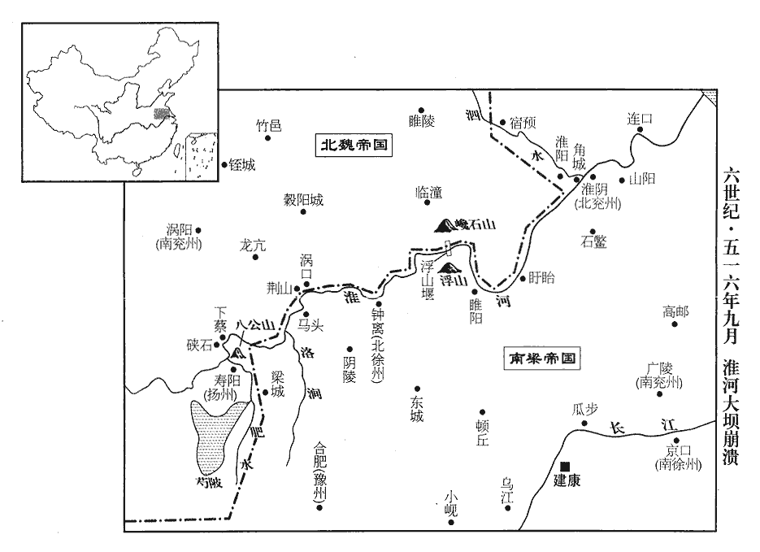

 梁紀四起旃蒙協洽（乙未），盡著雍閹茂（戊戌），凡四年。

# 高祖武皇帝四

## 天監十四年（乙未、五一五）

1春，正月，乙巳朔‹一›，上‹萧衍，本年五十二岁›冠太子‹萧统，本年十六岁›於太極殿，古者冠於廟。冠，古玩翻。大赦。

〖译文〗 [1]春季，正月，乙巳朔（初一），梁武帝在太极殿给太子举行冠礼，并且大赦天下。

2辛亥‹七›，上祀南郊。

〖译文〗 [2]辛亥（初七），梁武帝在南郊祭天。

3甲寅‹十›，魏主‹元恪，本年三十三岁›有疾；丁巳‹十三›，殂于式乾殿。年三十三，諡宣武皇帝，廟號世宗。侍中•中書監•太子少傅崔光、侍中•領軍將軍于忠、詹事王顯、中庶子代人‹鲜卑人›侯剛迎太子詡於東宮，至顯陽殿。王顯欲須明行即位禮，須，待也。崔光曰：「天位不可暫曠，何待至明！」顯曰：「須奏中宮。」光曰：「帝崩，太子立，國之常典，何須中宮令也！」於是，光等請太子止哭，立於東序；于忠與黃門郎元昭扶太子西面哭十餘聲止。光攝太尉，奉策進璽綬，璽，斯氏翻。綬，音受。太子‹元诩，本年六岁›跪受，服袞冕之服，御太極殿，即皇帝位。帝諱詡，宣武皇帝‹元恪›之第三子。光等與夜直群官立庭中，北面稽首稱萬歲。蒼猝不暇集百官，備高氏也。稽，音啟。昭，遵之曾孫也。魏略陽公遵見一百八卷晉孝武太元一二十年。

〖译文〗 甲寅（初十），北魏宣武帝患病，丁巳（十三日），在式乾殿病故。侍中、中书监、太子少傅崔光，侍中、领军将军于忠，詹事王显，中庶子代京人侯刚等人从东宫迎接太子无诩来到显阳殿。王显想等天亮以后再为太子举行即位仪式，崔光说：“皇位不可以片刻无主，为什么要等到天亮呢？”王显说：“必须报告中宫皇后。”崔光说：“皇上驾崩，太子即位，这是国家正常的规定，何必要等侍中宫的旨令呢！”于是，崔光等人请求太子停止哭泣，站在东面；于忠和黄门侍郎元昭搀扶太子面向西哭了十多声后停止了哭泣。崔光代理太尉的职务，捧着策书献上印玺和绶带，太子跪着接授了，穿上礼服，走上太极殿，即皇帝位。崔光等人和夜间值勤的官员站立在庭中，向北叩头高呼万岁。元昭是北魏略阳公元遵的重孙子。

高后欲殺胡貴嬪，中給事譙郡‹河南省商丘市›劉騰以告侯剛，中給事，宦官也。北齊之制，中侍中省有中侍中、中常侍、中給事中，蓋因魏制。剛以告于忠，忠問計於崔光，光使置貴嬪於別所，嚴加守衛，由是貴嬪深德四人。為劉騰等亂政，崔光尊寵而不能矯正張本。戊午‹十四›，魏大赦。己未‹十五›，悉召西伐、東防兵。西伐，謂伐蜀之兵；東防，謂防淮之兵。

〖译文〗 高后想杀掉胡贵嫔，中给事谯郡人刘腾把件事告诉了侯刚，侯刚又告诉给于忠。于忠向崔光请教计策，崔光就让他将胡贵嫔搬到别的住所，严加守卫，因此胡贵嫔深深地感激这四个人。戊午（十四日），北魏大赦天下。己未（十五日），召回全部在西面讨伐蜀国和在东面防范淮地的军队。

驃騎大將軍廣平王懷扶疾入臨，驃，匹妙翻。騎，奇寄翻。臨，力鴆翻。徑至太極西廡，哀慟，呼侍中、領軍、黃門、二衛，二衛始於晉初，左、右衛將軍統之。此二衛即謂左、右衛將軍。廡，音武。云「身欲上殿哭大行，又須入見主上。」眾皆愕然相視，無敢對者。崔光攘衰振杖，見，賢遍翻。衰，叱雷翻。振，舉也。引漢光武崩趙熹扶諸王下殿故事，事見四十四卷光武中元二年。聲色甚厲，聞者莫不稱善。懷聲淚俱止，曰：「侍中以古義裁我，我敢不服！」遂還，仍頻遣左右致謝。

〖译文〗 骠骑大将军广平王元怀抱病入朝，径直来到太极殿的西殿，悲愤欲绝，叫来侍中、领军、黄门、左右二卫将军，对他们说：“我要亲自上殿哭悼，并要去见圣上。”众人都惊惧地相互看着，没有敢于答话的人。崔光整衣举杖，引用汉光武帝死后赵熹扶持诸位藩王下殿的旧事来加以说明，声音和脸色都显得很激动，听的人没有不说好的。元怀的喊声和眼泪都停了下来，说：“侍中您用古代的事理来教导我，我怎敢不服气！”于是就回去了，回去后仍然多次派手下人来谢罪。

先是高肇擅權，尤忌宗室有時望者，太子太傅任城王澄數為肇所譖，懼不自全，懲彭城王勰之禍也。先，悉薦翻。任，音壬。數，所角翻。乃終日酣飲，酣，戶甘翻。所為如狂，朝廷機要無所關豫。及世宗‹元恪›殂，肇擁兵於外，謂高肇方擁伐蜀之兵也。朝野不安。于忠與門下議，門下者，侍中等官居之。朝，直遙翻。以肅宗‹元诩，六岁›幼，未能親政，宜使太保高陽王雍入居西柏堂省決庶政，省，悉景翻。以任城王澄為尚書令，總攝百揆，奏皇后請即敕授。請即以手敕授二王，倉猝不及下詔，慮有沮閣者也。王顯素有寵於世宗，恃勢使威，為眾所疾，恐不為澄等所容，與中常侍孫伏連等密謀寢門下之奏，矯皇后令，以高肇錄尚書事，以顯與勃海公高猛同為侍中。于忠等聞之，託以侍療無效，執顯於禁中，觀此則侍御師王顯、詹事王顯又似一人。下詔削爵任。顯臨執呼冤，直閤以刀鐶撞其掖下，撞，直江翻。掖，與腋同。送右衛府，一宿而死。庚申‹十六›，下詔如門下所奏，百官總己聽於二王，中外悅服。

〖译文〗 起初高肇专权，他特别忌恨宗室里面有名望的人，太子太傅任城王元澄多次被高肇诋毁、陷害，害怕不能保全自己，就整天纵酒，做一些象疯子一样的崐举止，朝廷里的重要事务都不参与。等到宣武帝病故，高肇统兵在外，朝廷内外都很不安。于忠和门下省的官员们商议，由于孝明帝年幼，不能亲自执政，建议要让太保高阳王元雍住进西柏堂处理各种政务，并且任命任城王元澄为尚书令，总管大小官员，而且上报皇后，请她当即用手书授职。王显一向受宣武帝的宠信，凭借权势滥施淫威，被众人忌恨，他怕不被元澄等人所容纳，就和中常侍孙伏连等人密谋停止门下省的奏议，伪造皇后的命令，任命高肇录尚书事，任命王显和勃海公高猛等人共同作为侍中。于忠等人听到这件事，假借服侍皇上治疗无效的罪名，把王显抓入监牢，下令剥夺他的爵位、官职。王显在被抓时大声喊冤，门卫就用刀环撞击他的腋下，将他送到右卫府，一夜就丧了命。庚申（十六日），朝廷下令批准了门下省的奏议，百官各安己职，听命于二位王爷，朝廷内外都衷心信服。

二月，庚辰‹七›，尊皇后‹高皇后›為皇太后。

〖译文〗 二月庚辰（初七），北魏尊封皇后为皇太后。

魏主稱名為書告哀於高肇，且召之還。肇承變憂懼，承告哀之變也。朝夕哭泣，至於羸倅，羸，倫為翻。悴，秦醉翻。歸至瀍澗，書：我乃卜澗水東，瀍水西。水經：瀍水出河南穀城縣北山，東與千金渠合，又東過洛陽縣南，又東過偃师縣，又東入于洛。澗水出新安縣南白石山，東南入于洛。此瀍澗直謂瀍水，非如書及水經之瀍、澗為二水也。瀍chán，直連翻。家人迎之，不與相見；辛巳‹八›，至闕下，衰服號哭，衰，士回翻。號，戶刀翻。升太極殿盡哀。高陽王雍與于忠密謀，伏直寢邢豹等十餘人於舍人省下，舍人省，即中書省，通事舍人宿直之所。肇哭畢，引入西廡，廡，音武。清河諸王皆竊言目之。肇入省，豹等搤殺之，搤è，於革翻。下詔暴其罪惡，稱肇自盡，自餘親黨悉無所問，削除職爵，葬以士禮；逮昏，於廁門出尸歸其家。

〖译文〗 北魏孝明帝自己称名写信给高肇报告丧事，并且召他回朝。高肇承受着这种变故非常优伤、惊惧，整日哭泣，甚至越来越瘦弱憔悴，回到涧时，家里人迎接他，他却不与他们见面。辛巳（初八），他来到皇宫前，登上太极殿穿着丧服号哭。高阳王元雍和于忠秘密商议，将值寝邢豹等十多人埋伏在舍人省内，等到高肇哭完，把他引入西殿，清河王等众王都偷偷交谈着看着他。高肇进了舍人省，邢豹等人扼杀了他，接着，下令公布高肇的罪恶，假称高肇自杀，因此，对他的亲友全都没有加以追究。又剥夺了他的职务、爵位，用士大夫的礼节安葬他。到了黄昏，从侧门把他的尸体运回他家。

4魏之伐蜀也，軍至晉壽‹四川省广元市西南›，蜀人震恐。傅豎眼將步兵三萬擊巴北‹四川省东北部›，上遣寧州‹府设味县云南省曲靖市›刺史任太洪自陰平‹四川省剑阁县西北›間道入其州，傅豎眼以益州刺史鎮晉壽。此陰平非鄧艾所由之陰平，今利州之陰平縣是也。間，古莧翻。豎，而庾翻。將，即亮翻。任，音壬。招誘氐、蜀，絕魏運路。氐、蜀，氐人及蜀人也。誘，音酉。會魏大軍北還，太洪襲破魏東洛‹四川省广元市西北›、除口‹陕西省宁强县西北›二戍，唐利州景谷縣，舊白水縣也，置東洛郡，後周省郡入平興郡，隋又廢平興為景谷縣。水經，漢水過大、小黃金南，東合蘧qú蒢chú口。註云：蘧蒢水出就谷南，歷蘧蒢溪，又南流，注于漢，謂之蒢口。聲言梁兵繼至，氐、蜀翕然從之。太洪進圍關城‹陕西省宁强县西北阳平关›，豎眼遣統軍姜喜等擊太洪，大破之，太洪棄關城走還。關城即白水關城。

〖译文〗 [4]北魏的军队攻打蜀地，大军开到晋寿，蜀人非常恐惧。傅竖眼率领三万步兵攻打巴北，梁武帝派宁州刺史任太洪从阴平抄小路进入州城，招诱氐人、蜀人，并且断绝了北魏军队的运输线路。正赶上北魏大部队向北返回，任太洪袭击了北魏的东洛、除口二个戍地，并且声称梁朝军队紧接着就会到来，氐人、蜀人都归顺了他。任太洪进军包围了关城，傅竖眼派统军姜喜等人攻打任太洪，击败了他的部队，任太洪放弃关城逃了回来。

5癸未‹十›，魏以高陽王雍為太傅、領太尉，清河王懌為司徒，廣平王懷為司空。

〖译文〗 [5]癸未（初十），北魏任命高阳王元雍担任太傅、兼太尉，清河王元怿为司徒，广平王元怀为司空。

6甲午‹二十一›，魏葬宣武皇帝‹元恪›于景陵‹在洛阳城北邙山›，廟號世宗。己亥‹二十六›，尊胡貴嬪為皇太妃。三月，甲辰朔‹一›，以高太后為尼，徙居金墉瑤光寺，子無廢母之義，魏之亂亡宜矣。按魏廢后率居瑤光寺，馮后、高后是也。非大節慶，不得入宮。

〖译文〗 [6]甲午，（二十一日），北魏将宣武帝安葬在景陵，庙号为世宗。己亥（二十六日），尊胡贵嫔为皇太妃。三月甲辰朔（初一），使高太后作了尼姑，把她迁居到金墉瑶光寺，不遇到大的节日庆典，不许入宫。

7魏左僕射郭祚表稱：「蕭衍狂悖，謀斷川瀆，謂築浮山堰也。悖，蒲妹翻。斷，丁管翻。役苦民勞，危亡已兆；宜命將出師，長驅撲討。」將，即亮翻。撲，普木翻。魏詔平南將軍楊大眼督諸軍鎮荊山‹安徽省怀远县西南，在钟离安徽省凤阳县东北临淮关›城西四十千米。水經，淮水過塗山北而後至荊山，今塗山在鍾離縣西九十五里，荊山在鍾離縣西八十三里。

〖译文〗 [7]北魏左仆射郭祚上书宣称：“萧衍狂妄无道，谋划切断山川沟渠，以致国内劳役繁重，百姓疲弊，灭亡的危险已显露出来，我国应当派将出兵，长驱直入，讨伐敌人。”于是朝廷诏令平南将军杨大眼率领军队镇守荆山。

8魏于忠既居門下，又總宿衛，門下，謂為侍中。宿衛，謂為領軍。遂專朝政，權傾一時。朝，直遙翻。初，太和中，軍國多事，高祖‹元宏›以用度不足，百官之祿四分減一，忠悉命歸所減之祿。舊制：民稅絹一匹別輸綿八兩，布一匹別輸麻十五斤，忠悉罷之。乙丑‹二十二›，詔文武群官各進位一級。史言于忠擅魏，欲收眾心。

〖译文〗 [8]北魏的于忠既担任侍中，又总管禁卫事务，于是他独揽朝政，权倾一崐时。起初，在太和年间，国家频繁用兵，孝文帝为了用度不足的原因，把百官的俸禄减少了四分之一。于忠下令全部恢复了减少的俸禄。旧法规定：百姓每织一匹绢要交八两绵，每织一匹布要交十五斤麻作为税收，于忠都加以免除。乙丑（二十二日），朝廷诏令使文武百官每人晋升一级。

9夏，四月，浮山堰‹淮河大坝·安徽省明光市北›成而復潰，或言蛟龍能乘風雨破堰，其性惡鐵，復，扶又翻。惡，烏路翻。乃運東、西冶鐵器數千萬斤沈之，建康有東、西二冶，各置冶令以掌之。沈，持林翻。亦不能合。乃伐樹為井幹，井幹，井欄也。言疊木為井幹之形。幹，揚子註及西都賦註音寒，莊子音如字。填以巨石，加土其上；緣淮百里內木石無巨細皆盡，負檐者肩上皆穿，夏日疾疫，死者相枕，檐，都濫翻。枕，職任翻。蠅蟲晝夜聲合。

〖译文〗 [9]夏季四月，浮山堰修成后却又崩溃，有人说蛟龙能乘风雨破坏渠堰，但它本性厌恶铁，于是就运来东西两治几千万斤铁器沉在江里，但是也没能使坝合扰。于是，又伐木交错捆绑成井字形，把大石头填进去，在上面加上土，以此截流筑坝。因此，沿着淮河一面里内的树木石头无论大小都被用光，挑担的人肩膀都磨烂了，夏天里疾病成疫，死掉的人互相倾压着，遍地都是，苍蝇蚊虫聚集不散，日夜轰鸣。

10魏梁州‹府设南郑陕西省汉中市›刺史薛懷吉破叛氐於沮水‹汉水上游·发源于陕西省留坝县西›。水經：沔水出武都沮縣東狼谷中，又東南流，逕沮水戍。註云：沔水一名沮水。闞駰曰：以其初出沮洳然，故曰沮水。師古曰：沮，子余翻。懷吉，真度之子也。薛真度見一百四十卷齊明帝建武二年。五月，甲寅‹十二›，南秦州‹府设骆谷城甘肃省西和县南›刺史崔暹又破叛氐，解武興‹东益州·陕西省略阳县›之圍。魏南秦州治駱谷城，領天水、漢陽、武都、武階、脩武、仇池郡。此時蓋叛氐圍武興也。

〖译文〗 [10]北魏梁州刺史薛怀吉在沮水打败了叛乱的氐人，薛怀吉是薛真度的儿子。五月甲寅（十二日），南秦州刺史崔暹又大败叛乱的氐人，从而解除了对武兴的围困。

11六月，魏冀州‹府设信都河北省冀县›沙門法慶以妖幻惑眾，妖，於驕翻。幻，戶辦翻。與勃海‹河北省南皮县›人李歸伯作亂，推法慶為主。法慶以尼惠暉為妻，以歸伯為十住菩薩、平魔軍司、定漢王，魏書，法慶以殺一人者為一住菩薩，殺十人者為十住菩薩。菩，薄乎翻。薩，桑葛翻。自號大乘。又合狂藥，合，音閤。令人服之，父子兄弟不復相識，復，扶又翻。唯以殺害為事。刺史蕭寶寅遣兼長史崔伯驎擊之，伯驎敗死。驎，力珍翻。賊眾益盛，所在毀寺舍，斬僧尼，燒經像，云「新佛出世，除去眾魔」。去，羌呂翻。秋，七月，丁未‹六›，詔假右光祿大夫元遙征北大將軍以討之。假者，未正以征北大將軍授之。

〖译文〗 [11]六月，北魏冀州僧人法庆用妖术迷惑百姓，与勃海人李归伯一同作乱，并推举法庆作首领。法庆以尼姑惠晖为妻，让李归伯当十住菩萨、平魔军司、定汉王。自己则号称“大乘”。他又配置狂药，让人服用了这种药后，父子兄弟不再相认，只知道杀人害命。刺史萧宝寅派兼长史崔伯攻打法庆的叛军，崔伯战败而死。众叛贼气焰更加嚣张，所到之处毁坏寺庙，斩杀僧尼，烧毁经像，还说：“新佛出世，除去众魔”。秋季，七月丁未（初五），朝廷诏令右光禄大夫元遥作为征北大将军去讨伐法庆。

12魏尚書裴植，自謂人門不後王肅，植，裴叔業之兄子也。後，戶遘翻。以朝廷處之不高，處，昌呂翻。意常怏怏，怏，於兩翻。表請解官隱嵩山，世宗‹元恪›不許，深怪之。及為尚書，志氣驕滿，每謂人曰：「非我須尚書，尚書亦須我。」每入參議論，好面譏毀群官，好，呼到翻。又表征南將軍田益宗，言：「華、夷異類，不應在百世衣冠之上。」于忠、元昭見之切齒。忠、昭皆北人，故深諱此言。

〖译文〗 [12]北魏尚书裴植，自以为门第不比王肃低，因在朝廷里官位不高而常常怏怏不快，就上书请求辞去官职，退隐到嵩山，宣武帝不同意，并且认为他很怪。等他作了尚书，志高气傲，常常对人说：“不是我想作尚书，是尚书要由我来作。”每次他入朝晋见，议论政事时，他都喜欢当面讥讽伤害众位官员。他还上表诋毁征南将军田益宗，说道：“汉人、夷人种类不同，不应当让夷人位在百世衣冠的汉人之上。”于忠和元昭见了他，都恨得咬牙切齿。

尚書左僕射郭祚，冒進不已，自以東宮師傅，【章：十二行本「傅」下有「列辭尚書」四字；乙十一行本同；孔本同；張校同；退齋校同。】望封侯、儀同，天監十年，魏以祚領太子少師。詔以祚為都督雍•岐•華三州諸軍事、征西將軍、雍州‹府设长安陕西省西安市›刺史。魏太和十一年置岐州，治雍城鎮，領平秦、武都、武功三郡。雍，於用翻。華，戶化翻。

〖译文〗 尚书左仆射郭祚，总是企图升官，自认为是太子的师傅，就希望也被封侯和封为开府仪同三司，于是朝廷诏令郭祚为都督雍、岐、华三州诸军事，征西将军及雍州刺吏。

祚與植皆惡于忠專橫，密勸高陽王雍使出之；忠聞之，大怒，令有司誣奏其罪。尚書奏：「羊祉告植姑子皇甫仲達云『受植旨，詐稱被詔，惡，烏路翻。橫，戶孟翻。被，皮義翻。帥合部曲欲圖于忠。』帥，讀曰率；下同。臣等窮治，辭不伏引；伏引，猶引伏也。治，直之翻。然眾證明昺，昺，音丙。準律當死。眾證雖不見植，皆言『仲達為植所使，植召仲達責問而不告列』。推論情狀，不同之理不可分明，不得同之常獄，有所降減，計同仲達處植死刑。處，昌呂翻；下裁處同。植親帥城眾，附從王化，謂齊東昏侯永元二年，植以壽陽降魏。依律上議，謂依八議之律也。上，時掌翻。乞賜裁處。」處，昌呂翻。忠矯詔曰：「凶謀既爾，罪不當恕；雖有歸化之誠，無容上議，亦不須待秋分。」魏舊刺，秋分然後決死刑。八月，己【張：「己」作「乙」。】亥‹五›，植與郭祚及都水使者杜陵‹陕西省西安市南›韋儁皆賜死。儁，祚之婚家也‹裴植年五十岁，郭祚年六十七岁，韦儁年五十七岁›。忠又欲殺高陽王雍，崔光固執不從，乃免雍官，以王還第。朝野冤憤，莫不切齒。使，疏吏翻。朝，直遙翻。

〖译文〗 郭祚和裴植都讨厌于忠专权无道，暗中劝高阳王元雍让他离开朝廷。于忠听后万分愤恨，命令有关部门诬告郭祚、裴植犯了罪。尚书诬告说：“羊祉报告裴值的表弟皇甫仲达说：‘我受了裴植的命令，假称受圣上的旨令，率领部曲想要图谋于忠。’我们已经审理完毕，他们虽然不认罪，但是各种证据都很清楚，按法律应判死刑。这些证据中虽没有直接是裴植的，但大家都说：‘皇甫仲达是被裴植指挥，裴植曾叫来皇甫仲达责问他，但没有告发他。’按常理推算，看不出来他们之间有什么明显的区别，因此不能和其他案子一样，减轻他的罪过，所以一致提议对裴植处以和皇甫仲达一样的死刑。裴植曾经亲自率领全城的人马归顺我国，按法律条文作以上议处，但请作出裁决。”于忠假传圣旨说：“罪行已经犯下，他的罪恶不能宽恕；虽然也有过诚心归顺我们的行为，但不必再经审理，也不用等秋分过后再判死刑。”八月乙亥（初五），裴植和郭祚以及都水使者杜陵、韦隽都被赐死。韦隽是郭祚的亲家。于忠又想杀高阳王元雍，崔光坚决不同意，于是就罢免了元雍的官职，以亲王的身份回到了他的王府。朝廷内外都含冤忍愤，没有人不咬牙切齿。

13丙子‹六›，魏尊胡太妃為皇太后，居崇訓宮。于忠領崇訓衛尉，劉騰為崇訓太僕，加侍中，侯剛為侍中撫軍將軍。三人者，胡后所深德者也。又以太后父國珍為光祿大夫。

〖译文〗 [13]丙子（初六），北魏尊封胡太妃为皇太后，让她住进崇训宫。于忠担任崇训宫的卫尉，刘腾担任崇训宫的太仆，加官侍中，侯刚为侍中抚军将军。又封胡太后的父亲胡国珍为光禄大夫。

14庚辰‹十›，定州‹府设蒙笼城湖北省麻城市北›刺史田超秀帥眾三千降魏。超秀叛魏見上卷上年。帥，讀曰率。降，戶江翻。

〖译文〗 [14]庚辰（初十），梁朝定州刺史田超秀率领三千兵马投降了北魏。

15戊子‹十八›，魏大赦。

〖译文〗 [15]戊子（十八日），北魏实行大赦。

16己丑‹十九›，魏清河王懌進位太傅，領太尉，廣平王懷為太保，領司徒，任城王澄為司空。庚寅‹二十›，魏以車騎大將軍于忠為尚書令，特進崔光為車騎大將軍，並加開府儀同三司。任，音壬。騎，奇寄翻；下同。

〖译文〗 [16]己丑（十九日），北魏清河王元怿晋升太傅的职位，兼任太尉，广平王元怀作了太保，兼任司徒，任城王元澄任司空。庚寅（二十日），北魏孝明帝任命车骑大将军王忠为尚书令，特进崔光为车骑将军，并加封开府仪同三司。

17魏江陽王繼，熙之曾孫也，熙，道武之子。先為青州‹府设东阳山东省青州市›刺史，坐以良人為婢奪爵。繼子叉娶胡太后妹，壬辰‹二十二›，詔復繼本封，以叉為通直散騎侍郎，叉妻為新平郡君，仍拜女侍中。為元叉囚靈太后張本。散，悉亶翻。

〖译文〗 [17]北魏江阳王无继是元熙的曾孙。他原来是青州刺史，因为犯了把良民的女孩当作婢女的罪被剥夺了爵位。元继的儿子元叉娶了胡太后的妹妹，壬辰（二十二日），北魏孝明帝下令恢复了元继的原封位，让元叉作了通值散骑侍郎。元叉的妻子是新平郡君，仍担任了女侍中的职务。

群臣奏請太后臨朝稱制，九月，乙未‹五›，靈太后始臨朝聽政，胡太后諡曰靈。猶稱令以行事，群臣上書稱殿下。太后聰悟，頗好讀書屬文，射能中針孔，好，呼到翻。屬，之欲翻。中，竹仲翻。政事皆手筆自決。加胡國珍侍中，封安定公。

〖译文〗 众大臣上书请求太后临朝，她的命令称为“制”，作行皇帝的权力，九月乙未（疑误），胡太后开始临朝听政，但还是不称“制”而称令，大臣们上书仍称呼她为殿下。太后聪明机智，非常喜爱读书写作，射箭能射中针孔，一切政务都亲手批阅处理。她提拔胡国珍为侍中，封为安定公。

自郭祚等死，詔令生殺皆出于忠，王公畏之，重足脅息。重，直龍翻。脅息者，屏氣鼻不敢息，唯兩脅潛動以舒氣息耳。太后既親政，乃解忠侍中、領軍、崇訓衛尉，止為儀同三司、尚書令。後旬餘，太后引門下侍官於崇訓宮，門下侍官，自侍中至散騎常侍、侍郎。崇訓宮，蓋太后所居宮也。問曰：「忠在端揆，聲望何如？」咸曰：「不稱厥任。」稱，尺證翻。乃出忠為都督冀•定•瀛三州諸軍事、征北大將軍、冀州‹府设信都河北省冀县›刺史；以司空澄領尚書令。澄奏：「安定公宜出入禁中，參諮大務，」詔從之。人之老也，戒之在得，任城王澄自氣衰矣。

〖译文〗 自从郭祚等人死后，诏书、命令、生杀予夺之权都由于忠决定，王公们都畏惧他，人人蹑手蹑脚、敛声屏气。太后亲政后，就解除了于忠侍中、领军、崇训卫尉的职务，只让他作仪同三司、尚书令。过了十几天，太后把门下侍官叫到崇训宫，问道：“于忠在朝廷中为百官之首，声望如何？”众人都说：“他不称职。”于是就让于忠出朝任都督冀、定、瀛三州诸军事，征北大将军，崐冀州刺史；让司空元澄兼任尚书令。元澄上书说：“安定公应当可以出入宫禁，并参议重大事务。”诏令批准了他的请求。

18甲寅‹十四›，魏元遙破大乘賊，擒法慶并渠帥百餘人，帥，所類翻。傳首洛陽。

〖译文〗 甲寅（十四日），北魏将领元遥击败了大乘贼，擒获法庆和他手下一百多人，将他们斩首并把首级送往洛阳。

19左遊擊將軍趙祖悅襲魏西硤石‹安徽省凤台县西南›，水經：淮水東過壽春縣北，又北逕山峽中，謂之峽石。對岸山上結二城以防津要，在淮水西岸者謂之西硤石。杜佑曰：潁州下蔡縣有硤石山，梁築城以拒魏，今縣城也。據之以逼壽陽；更築外城，徙緣淮之民以實城內。將軍田道龍等散攻諸戍，魏揚州刺史李崇分遣諸將拒之。將，即亮翻。癸亥‹二十三›，魏遣假鎮南將軍崔亮攻西硤石，又遣鎮東將軍蕭寶寅決淮堰。

〖译文〗 [19]梁朝左游击将军赵祖悦在西硖石一带袭击了北魏军队，并以西硖石为根据地逼近寿阳，又筑起外城，将淮河周围的百姓都迁进来充实内城。将军田道龙等人分别去攻打北魏的各个寨堡，北魏扬州刺史李崇分别派遣众将领去抵抗。癸亥（二十三日），北魏派遣代理镇南将军崔亮攻打西硖石，又派镇东将军萧宝寅掘开淮河堰。

20冬，十月，乙酉‹十六›，魏以胡國珍為中書監、儀同三司，侍中如故。

〖译文〗 [20]冬季，十月乙酉（十六日），北魏任命胡国珍为中书监、认同三司，并保留侍中的职务。

21甲午‹二十五›，弘化太守杜桂舉郡降魏。弘化地闕，蓋亦緣邊蠻郡也。降，戶江翻。

〖译文〗 [21]甲午（二十五日），弘化太守杜桂率领全郡投降北魏。

22初，魏于忠用事，自言世宗‹元恪›許其優轉；太傅雍等皆不敢違，加忠車騎大將軍。忠又自謂新故之際有定社稷之功，諷百僚令加己賞；雍等議封忠常山郡公。忠又難於獨受，乃諷朝廷，同在門下者皆加封邑，雍等不得已復封崔光為博平縣公，而尚書元昭等上訴不已。魏主之立也，元昭亦同在門下，故上訴不已。復，扶又翻。上，時掌翻。太后敕公卿再議，太傅懌等上言：「先帝升遐，記曲禮曰：告喪曰天王登假。註云：登，上也；遐，已也；上已者，若仙去云耳。登，即升也。假，讀與遐同。奉迎乘輿，侍衛省闥，乃臣子常職，乘，繩證翻。不容以此為功。臣等前議授忠茅土，正以畏其威權，苟免暴戾故也。若以功過相除，悉不應賞，請皆追奪。」崔光亦奉送章綬茅土，表十餘上，太后從之。

〖译文〗 [22]当初，北魏的于忠掌握朝中权力，自称宣武帝答应加封他，太傅元雍等人都不敢违背圣旨，于是加封于忠为车骑大将军。于忠又自认为在新旧交替时有安定国家政权的功劳，示意官员们上书建议给他增加奖赏，因此元雍等议封于忠为常山郡公。于忠却又不敢独享，就示意给在门下省的人一同增加封地。元雍等人不得已只好又封崔光为博平县公，而尚书元照等人不断地上书投诉。胡太后就命令大臣们再次商议，太傅元怿等人上书说：“先帝升天后，迎接新主、保护防卫，本是作臣子的正常职务，不应当把这个当作功劳。我们从前建议授与于忠封地，正因为畏惧他的威风和权势，不过想暂时免除残暴的行为。如果把功劳和过失相抵，全不应当奖赏，请求全部追还封赏。”崔光也送还封地和官爵，书表递上了十几份，太后终于采纳了。

高陽王雍上表自劾，稱「臣初入柏堂，見詔旨之行一由門下，臣出君行，深知其不可而不能禁；謂殺生予奪皆出於于忠之意，而以詔旨行之。上，時掌翻。劾，戶概翻，又戶得翻。于忠專權，生殺自恣，而臣不能違。忠規欲殺臣，賴在事執拒；在事，謂在位任事之臣，此指言崔光。執拒，謂執不可而拒忠。臣欲出忠於外，在心未行，返為忠廢。忝官尸祿，孤負恩私，請返私門，伏聽司敗。」司敗，即司寇也。太后以忠有保護之功，不問其罪。十二月，辛丑‹三›，以忠【嚴：「忠」改「雍」。】為太師，領司州牧，尋復錄尚書事，與太傅懌、太保懷、侍中胡國珍入居門下，同釐庶政。復，扶又翻。釐，力之翻，治也。

〖译文〗 高阳王元雍上书自责，说道：“我刚刚进入柏堂时，看到圣上的诏书旨令都由门下省作主，臣子作主，国君执行，深知这种事不该发生但却不能禁止。于忠独揽朝权，随意生杀予夺，但是我不敢违抗。于忠一心想杀掉我，幸亏在位任事的崔光坚持不允许。我想把于忠逐出京外，心愿还没达到就被于忠破坏。我这样不理政务空食俸禄，辜负了圣上对我的恩惠，请将我免去职位遣返回家，心甘情愿地听从司寇的处置。”太后因为于忠有过保护她的功劳，没有查问他的罪过。十二月辛丑（疑误），任命于忠为太师，兼任司州牧，不久又重任录尚书事，和太傅元怿、太保元怀、侍中胡国珍居住在门下省，一同治理朝政。

23己酉‹十一›，魏崔亮至硤石，趙祖悅逆戰而敗，閉城自守，亮進圍之。

〖译文〗 [23]己酉（十七日），北魏崔亮来到硖石，赵祖悦迎战崔亮失败，只好闭城坚守，崔亮进兵包围了他们。

24丁卯‹二十九›，魏主‹元诩›及太后謁景陵‹洛阳城北邙山›。

〖译文〗 [24]丁卯（疑误），北魏孝明帝和太后参拜景陵。

25是冬，寒甚，淮、泗盡凍，浮山堰士卒死者什七八。

〖译文〗 [25]这一年冬季，异常寒冷，淮河、泗水都结了冰，浮山堰的兵士死掉十分之七八。

26魏益州刺史傅豎眼，性清素，民、獠懷之。龍驤將軍元法僧代豎眼為益州刺史，此魏之東益州也。豎，而庾翻。獠，魯皓翻。驤，思將翻。素無治幹，加以貪殘；治，直吏翻。王、賈諸姓，本州士族，法僧皆召為兵。葭萌民任令宗因眾心之患魏也，殺魏晉壽‹府葭萌›太守，以城來降，民、獠多應之；葭，音家。任，音壬。守，式又翻。降，戶江翻。獠，魯皓翻。益州‹府设成都›刺史鄱陽王恢遣巴西、梓潼二郡‹府同设涪城四川省绵阳市›太守張齊將兵三萬迎之。將，即亮翻。法僧，熙之曾孫也。

〖译文〗 [26]北魏益州刺史傅竖眼，生性清淡简朴，百姓和獠人都依附他。龙骧将军元法僧代替傅竖眼作益州刺史，他一向缺乏政治才能，而且还非常贪婪残暴，姓王和姓贾的人，都是这个州的士族大户，元法僧都招收他们当兵。葭萌人任令宗因为众人心中都怨恨北魏，就杀了北魏晋寿太守，献城投降了梁朝，百姓、獠人大部分都响应他。益州刺史鄱阳王元恢派巴西、梓潼二郡太守张齐率领三万兵马迎战敌人。元法僧是元熙的曾孙。

27魏岐州‹府设雍城陕西省凤翔县›刺史趙王謐，幹之子也，趙郡王幹見一百四十卷齊明帝建武二年，此於「王謐」之上逸「郡」字。為政暴虐。一旦，閉城門大索，執人而掠之，索，山客翻。掠，音亮。楚毒備至，又無故斬六人，闔城兇懼；眾遂大呼，屯門，兇，許拱翻。呼，火故翻。謐登樓毀梯以自固。胡太后遣游擊將軍王靖馳馹rì諭城人，城人開門謝罪，奉送管籥，乃罷謐刺史。謐妃，太后從女也。至洛‹洛阳›，除大司農卿。史言魏母后擅朝，城狐社鼠有所依憑。馹，音日。從，才用翻。

〖译文〗 [27]北魏岐州刺史赵王元谧是元的儿子，他为政暴虐无道。一天，他命令关闭城门大肆搜捕，抓到人就拷打，施展各种酷刑，并且无故杀了六个人，全城人都惊恐万分。百姓就大声呼喊，攻占城门，元谧登上城楼毁坏了梯子来保护自己。胡太后派游击将军王靖骑着驿马晓谕城中百姓，城中百姓打开城门请罪，交还锁匙，于是罢免了元谧刺史的职务。元谧的妃子是胡太后的干女儿。元谧到了洛阳，被任命为大司农。

太后以魏主尚幼，未能親祭，欲代行祭事，禮官博議以為不可。太后以問侍中崔光，光引漢和熹鄧太后祭宗廟故事，太后大悅，遂攝行祭事。史言崔光逢女主之惡。

〖译文〗 胡太后因为孝明帝年龄尚幼，不能亲理朝政，便想代替他进行祭祀之事，礼官多方议论后认为不可以。太后以这事询问侍中崔光，崔光引用汉朝和熹邓太后祭宗庙的旧事，认为可以，太后非常高兴，于是代行祭祀的事务。

28魏南荊州‹府设安昌湖北省枣阳市南›刺史桓叔興表請不隸東荊州‹府设沘阳河南省泌阳县›，許之。南荊隸東荊見上卷十一年。

〖译文〗 [28]北魏南荆州刺史桓叔兴上书请求不再隶属东荆州，被批准。

## 十五年（丙申、五一六）

1春，正月，戊辰朔‹一›，魏大赦，改元熙平。

〖译文〗 [1]春季，正月戊辰（初一），北魏大赦天下，改年号为熙平。

2魏崔亮攻硤石‹西硖石·安徽省凤台县西南›未下，與李崇約水陸俱進，崇屢違期不至。李崇時鎮壽陽‹安徽省寿县›。胡太后以諸將不壹，乃以吏部尚書李平為使持節、鎮軍大將軍兼尚書右僕射，將步騎二千赴壽陽，別為行臺，節度諸軍，將，即亮翻。使，疏吏翻。騎，奇寄翻。如有乖異，以軍法從事。蕭寶寅遣輕車將軍劉智文等渡淮，攻破三壘；二月，乙巳‹八›，又敗將軍桓孟孫等於淮北。敗，補邁翻。李平至硤石，督李崇、崔亮等水【章：十二行本「水」上有「刻日」二字；乙十一行本同。】陸進攻，無敢乖互，乖，異也。互，差也。戰屢有功。

〖译文〗 [2]北魏崔亮攻打硖石城没能攻下来，就和李崇约定水陆并进，李崇多次违反约定时间不来。胡太后因为众将不和，就委任吏部尚书李平为使持节、镇军大将军兼尚书右仆射，率领步兵、骑兵二千人赶到寿阳，另立行台，指挥调遣各部队，如果有违抗不听命令的人，便用军法来制裁。萧宝寅派轻军将军刘智文等人渡过淮河，攻破了三座营垒。二月乙巳（初八），又大淮河北部打败了将军垣孟孙等人。李平来到硖石，督促李崇、崔亮等军队水陆并进，没有人敢违背命令，几次作战都获胜。

上‹萧衍，本年五十三岁›使左衛將軍昌義之將兵救浮山‹淮河大坝，安徽省明光市北›，未至，康絢已擊魏兵，卻之。絢，許縣翻。考異曰：絢傳：「十二月魏遣李曇定督眾軍來戰。」按魏帝紀此年正月乃遣李平節度諸軍，絢傳誤也。曇定，即平字也。上使義之與直閤王神念泝淮救硤石。泝，蘇故翻。考異曰：李崇傳：「衍遣趙祖悅襲據西硤石，又遣義之、神念帥水軍泝淮而上，規取壽春。」按義之傳，絢破魏軍，義之乃救硤石，今從之。崔亮遣將軍博陵‹河北省安平县›崔延伯守下蔡‹安徽省凤台县›，下蔡縣，漢屬沛郡，梁置下蔡郡，屬豫州。水經註：淮水自峽石北逕下蔡故城東本州來之城也。吳季札始邑延陵，後邑州來，故曰延州來季子。春秋，襄二年，蔡成公自新蔡遷于州來，謂之下蔡。淮之東岸又有一城，下蔡新城也。二城對據，翼帶淮濆fén。按蔡有三：蔡州上蔡縣，蔡仲始封之邑也；又有新蔡，蔡平侯自上蔡遷都于此；又有下蔡縣，蔡成公所遷也。延伯與別將伊甕生夾淮為營。延伯取車輪去輞wǎng，削銳其輻，兩兩接對，揉竹為絙gēng，將，即亮翻。去，羌呂翻。輞，扶紡翻，車之牙，車輮也。輻，方目翻，輪轑lǎo也。揉，人九翻。絙，古恆翻，大索也。貫連相屬，並十餘道，橫水為橋，兩頭施大鹿盧，鹿盧，圓轉之木。屬，之欲翻。出沒隨意，不可燒斫。既斷趙祖悅走路，又令戰艦不通，義之、神念屯梁城‹寿县东南›不得進。嗚呼，吾國之失襄陽，亦以水陸援斷而諸將不進也！斷，丁管翻。艦，戶黯翻。李平部分水陸攻硤石，分，扶問翻。克其外城；乙丑‹二十八›，祖悅出降，斬之，盡俘其眾。降，戶江翻。

〖译文〗 梁武帝派左卫将军昌义之领兵去解救浮山，军队没有赶到时，康绚已经开始攻打北魏军队，击退了他们。梁武帝派昌义之和直王神念溯淮河而上以援救硖石。崔亮派遣将军博陵人崔延伯驻守下蔡，崔延伯和副将伊瓮生沿着淮河崐两岸扎营。崔延伯把车轮的外周去掉，把轮辐削尖，每两辆车对接在一起，用柔软的竹子作成竹索，连贯并列起来，十多辆车并在一起，横在水里作为桥梁，两头设置大辘轳，使桥可以随意出没，不容易烧毁。既切断了赵祖悦的逃路，又使战船不能通行，昌义之、王神念驻扎在梁城不能够前进。李平部署军队分水陆攻打硖石，攻克了外城。乙丑（二十八日），赵祖悦出城投降，被杀掉，他的部下都被俘获。

胡太后賜崔亮書，使乘勝深入。平部分諸將，水陸並進，攻浮山堰；亮違平節度，以疾請還，隨表輒發。平奏處亮死刑，處，昌呂翻。太后令曰：「亮去留自擅，違我經略，雖有小捷，豈免大咎！但吾攝御萬機，庶幾惡殺，幾，居依翻。惡，烏故翻。亮，崔光之族弟也，故平奏不行。可聽特以功補過。」魏師遂還。還，從宣翻，又如字。

〖译文〗 胡太后赐给崔亮书信，命令他乘胜深入。李平分派各将领从水旱两路一同出发，攻打浮山堰。崔亮违抗李平的指挥，借口患病请求撤还，并且刚刚上书就撤军了。李平上书建议判处崔亮死刑，太后下命令说：“崔亮进退自作主张，违背了我的战略计划，虽然获得了一些小的胜利，怎么能免除大的罪过！但是我日理万机，希望不要轻易杀戮，可以听任他将功赎罪。”于是北魏军队就返回了。

3魏中尉元匡奏彈于忠「幸國大災，專擅朝命，裴、郭受冤，謂裴植、郭祚。彈，徒丹翻。朝，直遙翻。宰輔黜辱。謂高陽王雍被黜，後又以授忠茅土，乞自貶退也。又自矯旨為儀同三司、尚書令，領崇訓衛尉，原其此意，欲以無上自處。處，昌呂翻。；下尉處同。既事在恩後，恩後，謂赦恩之後也。宜加顯戮，請遣御史一人就州行決。于忠時為冀州‹府设信都河北省冀县›刺史，欲就州戮之。自去歲世宗晏駕以後，皇太后未親覽，以前諸不由階級，或發門下詔書，或由中書宣敕，擅相拜授者，己經恩宥，正可免罪，並宜追奪。」太后令曰：「忠已蒙特原，無宜追罪；餘如奏。」

〖译文〗 [3]北魏中尉元匡上书揭发于忠“借着国家有难，独揽大权，使裴植、郭祚蒙受冤屈，宰相贬黜受辱，并且又自己假造圣旨当了仪同三司、尚书令，还兼任崇训卫尉。推论他的这番心意，是想自处至尊之位，既然事情发生在大赦之后，应当公开诛戮，请求派一位御史到州里去执行处决。自从去年宣武帝去世以后，皇太后没能亲理朝政，因此以前各种事不按规定办理，有的由门下省发出诏书，有的由中书省宣布敕令，擅自相互封任，已经受到皇恩宽恕的，确实应当免罪，但也应当追回封授。”皇太后说：“于忠已经受到了特别的宽恕，不好再追究罪责了，其他的都同意你的意见。”

匡又彈侍中侯剛掠殺羽林。掠，音亮；下同。剛本以善烹調為尚食典御，嘗食典御，魏官也，掌調和御食，溫涼寒熱，以時供進則嘗之。或曰：「嘗」當作「尚」，平、去二字通用。凡三十年，以有德於太后，事見上年。頗專恣用事，王公皆畏附之。廷尉處剛大辟，辟，毗亦翻。太后曰：「剛因公事掠人，邂逅致死，於律不坐。」少卿陳郡袁飜fān曰：「『邂逅』，謂情狀已露，隱避不引，不引，謂不引伏也。邂，戶介翻。逅，戶遘翻。考訊以理者也。今此羽林，問則具首，首，式又翻。剛口唱打殺，撾zhuā築非理，安得謂之『邂逅』！」撾，則瓜翻。太后乃削剛戶三百，解嘗【嚴：「嘗」改「尚」。】食典御。

〖译文〗 元匡又弹劾侍中侯刚捕杀羽林卫士。侯刚本来凭着善于烹调作了尚食典御，大约作了三十年。因为对太后有恩，非常专横霸道，王公大臣都害怕他并且依附他。廷尉判处侯刚死刑，太后说：“侯刚是为公事抓人，不经意使人死掉了，按法律不应处死。”少卿陈郡人袁翻说：“您所谓的‘不经意’是指罪证已经暴露，却掩藏起来不肯招认，于是就按法律拷问他们。现在被侯刚打死的这个羽林卫士，问他什么就供认什么，侯刚却嘴里大叫打死他，无理拷打，怎能说是‘不经意’！”于是太后才削除了侯刚三面户封邑，解除了他尚食典御的职务。

4三月，戊戌朔‹一›，日有食之。

〖译文〗 [4]三月戊戌朔（初一），出现日食。

5魏論西硤石之功，辛未‹四›，以李崇為驃騎將軍，加儀同三司，驃，匹妙翻。騎，奇寄翻。李平為尚書右僕射，崔亮進號鎮北將軍。亮與平爭功於禁中，太后以亮為殿中尚書。

〖译文〗 [5]北魏朝廷议论给西硖石之战中的将领行赏，辛未（初四），任命李崇为骠骑将军，加封仪同三司，李平为尚书右仆射，崔亮增加镇北将军的封号。崔亮和李平在朝廷中争夺功劳，最后太后让崔亮作了殿中尚书。

6魏蕭寶寅在淮堰，上‹萧衍，本年五十三岁›為手書誘之，使襲彭城‹江苏省徐州市›，許送其國廟及室家諸從還北，諸從，猶群從也。從，才用翻。寶寅表上其書於魏朝。上，時掌翻。朝，直遙翻。

〖译文〗 [6]北魏萧宝寅驻扎在淮河坝上，梁武帝写了亲笔信招诱他，让他攻打彭城，答应把他的国庙和妻妾弟兄子侄们送到北方，萧宝寅把梁武帝的信呈交给北魏朝廷。

夏四月，淮堰成，長九里，下廣一百四十丈，上廣四十五丈，髙二十丈，樹以杞柳，長，直亮翻。廣，古曠翻。髙，居號翻。杞柳，柜jǔ柳也。軍壘列居其上。

〖译文〗 [7]夏季，四月，淮河大坝修成，长九里，下宽一百四十丈，上宽四十五丈，高二十丈，种上了杞柳树，军营就驻扎在坝上。

或謂康絢曰：「四瀆，天所以節宣其氣，不可久塞，國語，周太子晉曰：「古之長民者，不墮山，不崇藪，不防川，不寶澤。夫山，土之聚也；藪sǒu，物之歸也；川，氣之導也；澤，水之鍾也。天地成而聚於高，歸物於下，疏為川谷以導其氣，陂塘污庳bēi以鍾其美。」塞，悉則翻。若鑿湬qiū東注，則游波寬緩，堰得不壞。」絢乃開湬東注。又縱反間於魏曰：「梁人所懼開湬，不畏野戰。」蕭寶寅信之，鑿山深五丈，開湬北注，水日夜分流猶不減，丁度集韻：湬，與湫同，將由翻。間，古莧翻。深，式浸翻。魏軍竟罷歸。水之所及，夾淮方數百里。李崇作浮橋於硤石戍間，又築魏昌城於八公山東南，以備壽陽城壞，居民散就岡隴，山脊為岡，高丘為隴。其水清徹，俯視廬舍冢墓，了然在下。

〖译文〗 有人对康绚说：“四河，是天用来宣泄它的‘真气’的，不能够长久地阻塞它，如果凿开水向东灌，那么流水宽缓，大坝才能不破坏。”康绚就凿开水东灌。又对北魏使用反间计，说：“梁朝人怕的是掘开水，不怕攻城野战。”萧宝寅相信了，凿山五丈多深，掘开水向北灌注，水日夜分流仍然不见减少，北魏军队竟然撤军回去了。水到之处，沿淮河方圆数百里都成了泽国。李崇在硖石戌之间搭起浮桥，又在八公山东南筑起魏昌城，来防备寿阳城被毁坏，居民们分散到山丘上。水非常清流澈，向下俯视，房屋墓穴都清晰地浮在水中。

初，堰起於徐州‹北徐州·州政府设钟离安徽省凤阳县东北临淮关›境內，浮山在鍾離郡界，梁置徐州於鍾離。刺史張豹子宣言，謂己必掌其事；既而康絢以他官來監作，監，古銜翻。豹子甚慙。俄而敕豹子受絢節度，豹子遂譖絢與魏交通，上雖不納，猶以事畢徵絢還。絢還則堰壞矣。

〖译文〗 起初，淮河坝从徐州境内建起，刺史张豹子宣称，认为自己一定能掌管这件事，等到后来康绚以其他的官职来监督建坝，张豹子非常恼怒。不久，张豹子受令由康绚管辖，他就诬告康绚和北魏勾通，梁武帝虽然没有听信他的话，却用工程完毕为理由召回了康绚。

8魏胡太后追思于忠之功，曰：「豈宜以一謬棄其餘勳！」胡后以于忠擁護為功；若忠之專橫，其謬固非一也。復封忠為靈壽縣公，復，扶又翻。亦封崔光為平恩縣侯。

〖译文〗 [8]北魏胡太后追忆于忠的功劳，说：“怎么能凭着一次错误就不承认他的其他功绩！”便重新封于忠为灵寿县公，也封崔光为平恩县侯。

9魏元法僧遣其子景隆將兵拒張齊，將，即亮翻；下同。齊與戰於葭萌‹四川省广元市西南›，大破之，屠十餘城，遂圍武興‹陕西省略阳县›。法僧嬰城自守，境內皆叛，法僧遣使間道告急於魏。使，疏吏翻。間，古莧翻。魏驛召鎮南軍司傅豎眼於淮南，以為益州‹府晋寿，即葭萌，四川省广元市西南›刺史、西征都督，將步騎三千以赴之。豎，而庾翻。騎，奇寄翻。豎眼入境，轉戰三日，行二百餘里，九遇皆捷。五月，豎眼擊殺梁州‹南梁州·州政府设阆中四川省阆中市›刺史任太洪。民、獠聞豎眼至，皆喜，迎拜於路者相繼。民、獠惡法僧而懷豎眼，故迎之者屬路。任，音壬。獠，魯皓翻。張齊退保白水‹四川省青川县东沙州乡›，豎眼入州‹晋寿·四川省广元市西南›，入武興也。白水以東民皆安業。

〖译文〗 [9]北魏元法僧派他的儿子元景隆带兵抗击张齐，张齐与景隆在葭萌作战，大败景隆，在十多个城市进行屠杀，最后包围了武兴。元法僧闭城固守，境内军民都背叛了他，元法僧派使节从小路去向北魏告急。北魏用驿车从淮南召回镇南军司傅竖眼，让他作益州刺史、西征都督，率领步兵、骑兵三千人开赴武兴。傅竖眼进入武兴境内，转战三天，走了二百多里，作战九次都取得胜利。五月，傅竖眼杀死了梁州刺史任太洪。百姓、獠人听说傅竖眼来到，都很高兴，在路上欢迎接待的人络绎不绝。张齐退回去保卫白水，傅竖眼进入梁州，白水城以东的百姓都安居乐业了。

魏梓潼太守苟金龍領關城戍主，梁兵至，金龍疾病，不堪部分，分，扶問翻。其妻劉氏帥厲城民，乘城拒戰，帥，讀曰率。百有餘日，士卒死傷過半。戍副高景謀叛，劉氏斬景及其黨與數千人，數千，當作數十。自餘將士，分衣減食，勞逸必同，莫不畏而懷之。井在城外，為梁兵所據，會天大雨，劉氏命出公私布絹及衣服懸之，絞而取水，城中所有雜物悉儲之。雜物，謂瓶、罌、甕、盎之屬。豎眼至，梁兵乃退，魏人封其子為平昌縣子。

〖译文〗 北魏梓潼太守苟金龙兼任关城戍主，梁朝军队来到时，苟金龙病重，不能指挥。他的妻子刘氏率领振作的城中百姓，凭借城池抗击敌兵，打了一百多天，兵士死伤过半。副将高景阴谋叛变，刘氏杀掉高景以及他的同党几十人，对剩下的将士，平分粮食和衣物，劳逸相同，众人莫不既畏惧她又依赖她。水井位于城外，被梁兵把守，正赶上天下大雨，刘氏命令拿出公家和私人的布、绢和衣服接雨，然后绞布取水，用城里所有的器具储存水。傅竖眼来到，梁兵才撤退，北魏封她的儿子为平昌县子。

10六月，庚子‹五›，以尚書令王瑩為左光祿大夫、開府儀同三司，尚書右僕射袁昂為左僕射，吏部尚書王暕jiǎn為右僕射。暕，儉之子也。暕，古限翻。王儉，齊初佐命。

〖译文〗 [10]六月庚子（初五），梁朝任命尚书令王莹为左光禄大夫、开府仪同三司，任命尚书右仆射袁昂为左仆射，吏部尚书王为右仆射。王是王俭的儿子。

11張齊數出白水，侵魏葭萌，傅豎眼遣虎威將軍強虯攻信義將軍楊興起，殺之，復取白水。數，所角翻。強，其兩翻，又如字。復，扶又翻；下州復、不復同。寧朔將軍王光昭又敗於陰平‹四川省剑阁县西北›，張齊親帥驍勇二萬餘人與傅豎眼戰，驍，堅堯翻。秋，七月，齊軍大敗，走還，小劍、大劍諸戍‹四川省剑阁县境›皆棄城走，今劍州劍門縣有大劍山，又有小劍山在其西北三十里，又有小劍故城在益昌縣西南五十里。大劍雖號天險，有阨塞可守，崇墉之間，徑路頗夷。小劍則鑿石架閣，有不容越，李白所謂「一夫當關，萬夫莫開」者是也。東益州‹府武兴›復入于魏。

〖译文〗 [11]张齐多次从白水出兵，侵犯北魏的葭萌，傅竖眼派虎威将军强虬攻打信义将军杨兴起，杀死了他，重新夺取了白水。宁朔将军王光昭又在阴平被打败，张齐亲自率领二万多勇士和傅竖眼作战。秋季，七月，张齐的军队大败，逃了回去，小剑、大剑两地的驻军都弃城逃跑，东益州重新回归北魏。

12八月，乙巳‹十一›，魏以胡國珍為驃騎大將軍、開府儀同三司、雍州‹府设长安陕西省西安市›刺史。驃，匹妙翻。騎，奇寄翻。雍，於用翻。國珍年老，太后實不欲令出，止欲示以方面之榮；竟不行。

〖译文〗 [12]八月乙巳（十一日），北魏任命胡国珍为骠骑大将军、开府仪同三司、雍州刺史。胡国珍年老，太后实际上不想让他出行，只不过想给他统治一方的荣誉，所以最终也没有出行。

 

13康絢既還，張豹子不復脩淮堰。九月，丁丑‹十三›，淮水暴漲，堰壞，其聲如雷，聞三百里，聞，音問。緣淮城戍村落十餘萬口皆漂入海。初，魏人患淮堰，以任城王澄為大將軍、大都督南討諸軍事，勒眾十萬，將出徐州‹府设彭城江苏省徐州市›來攻堰，尚書右僕射李平以為「不假兵力，終當自壞。」及聞破，太后大喜，賞平甚厚，澄遂不行。

〖译文〗 [13]康绚回去之后，张豹子不再修建淮河堰。九月丁丑（十三日），淮河水急剧上涨，河堰被冲毁，决堤声象雷鸣一样，三百里以内都能听到。沿着淮河的城镇村庄有十多万人被漂入海中。当初，北魏人担心淮河堰的修建会造成危害，就任命任城王元澄为大将军、大都督南讨诸军事，统率十万大军，即将从徐州出兵攻打淮河堰，尚书右仆射李平认为：“不需要动用兵力，淮河堰最后也会自己毁掉。”等到听说河堰已冲毁，太后非常高兴，赏赐李平很多东西，元澄于是也没有出兵。

壬辰‹二十八›，大赦。

〖译文〗 [14]壬辰（二十八日），梁朝颁布大赦令。

15魏胡太后數幸宗戚勳貴之家，數，所角翻。侍中崔光表諫曰：「禮，諸侯非問疾弔喪而入諸臣之家，謂之君臣為謔xuè。記禮運之辭也。註云：無故而相之，是戲謔也，陳靈公與孔寧、儀行父數如夏氏，以取弒焉。不言王后夫人，明無適臣家之義。夫人，父母在有歸寧，沒則使卿寧。左傳莊二十七年冬，杞伯姬來，歸寧也。杜預註曰：寧，問父母安否。襄十二年，楚司馬子庚聘于秦，為夫人寧，禮也。註曰：諸侯夫人，父母既沒，歸寧使卿，故曰禮。漢上官皇后將廢昌邑‹刘贺›，霍光，外祖也，親為宰輔，后猶御武帳以接群臣，事見二十四卷漢昭帝元平元年。示男女之別也。別，彼列翻。今帝族方衍，勳貴增遷，祗請遂多，將成彝式。方衍，謂生子也。增遷，謂增秩遷官也。祗，敬也。謂宗戚勳貴之家，凡有吉慶，皆請太后臨幸。願陛下簡息遊幸，則率土屬賴，含生仰悅矣。」屬，之欲翻；下請屬同。

〖译文〗 [15]北魏胡太后多次驾临皇室贵戚以及功臣显贵的家中，侍中崔光上书劝谏说：“《礼记》上讲，诸侯如果不是为了慰问病人或追悼死人而进入大臣的家中，就叫作君臣之间失礼戏谑。没有提到王后夫人，是为了表明她们根本没有去大臣家的道理。诸侯的夫人，父母在时可以回家问侯，父母不在就派大臣去问侯。汉朝的上官皇后将要废掉昌邑王时，霍光是她的外祖父，担任宰相，皇后仍然悬挂武帐来接见众大臣，是为了表明男女要加以区分。现在皇族正当繁衍兴盛之时，宗戚勋贵升官的很多，请您的人就多起来了，快要成为常规了。希望您减少和停止出游探视，如此则天下归心，众生仰戴。”

任城王澄以北邊鎮將選舉彌輕，將，即亮翻。恐賊虜闚邊，山陵危迫，魏自顯祖以上，山陵皆在雲中。奏求重鎮將之選，脩警備之嚴，詔公卿議之。廷尉少卿袁翻議，秦、漢以來九卿各一卿，魏太和十五年九卿各置少卿，蓋倣周官六卿有小宰、小司徒、小宗伯、小司馬、小司寇、小司空之遺制也。以為「比緣邊州郡，官不擇人，唯論資級。或值貪污之人，廣開戍邏，多置帥領，或用其左右姻親，或受人貨財請屬，皆無防寇之心，唯有聚斂之意。比，毗至翻。邏，郎佐翻。帥，所類翻。屬，之欲翻。斂，力贍翻。其勇力之兵，驅令抄掠，若遇強敵，即為奴虜，如有執獲，奪為己富。其羸弱老小之輩，微解金鐵之工，少閑草木之作，抄，楚交翻。羸，倫為翻。解，戶買翻，曉也。閑，習也。無不搜營窮壘，苦役百端。自餘或伐木深山，或芸草平陸，販貿往還，相望道路。此等祿既不多，貲亦有限，皆收其實絹，給其虚粟，窮其力，薄其衣，用其功，節其食，綿冬歴夏，加之疾苦，死於溝瀆者什常七八。自古至今，守邊之兵皆病於此。貿，音茂。是以鄰敵伺間，擾我疆埸，皆由邊任不得其人故也。愚謂自今已後，南北邊諸藩及所統郡縣，府佐統軍至于戍主，皆令朝臣王公已下各舉所知，必選其才，不拘階級；若稱職及敗官，并所舉之人隨事賞罰。」太后不能用。間，古莧翻。埸，音亦。朝，直遙翻。稱，尺證翻。敗，補邁翻。及正光之末，北邊盜賊群起，遂逼舊都‹平城·山西省大同市›，犯山陵，如澄所慮。正光四年，破六韓拔陵、衛可孤等反，孝昌初年，雲中沒矣。

〖译文〗 任城王元澄认为对北部边境的守将选择任用得太轻率，难以放心，恐怕敌崐人会觊觎边境，皇陵受到危害，于是上书请求注重守边将领的选派，严整防守的纪律，胡太后下令让百官商议这个意见。廷尉少卿袁翻认为：“近来过境州郡中，封官从不按照人才选择，只是论资排辈。有时碰上贪污的官员，大量开设哨所，过多地设置将领，有的人重用他的亲属，有的人接受别人求官的贿赂，全无防范敌人的意识，只有聚敛钱财和贪心。那些勇猛有力的兵士，就被驱赶着去抢劫掠夺，如果碰到强大的敌兵，就被俘虏，如果捕获到东西，就变成自己的财富。那些瘦弱年老和年少的人，稍微懂一些冶炼技艺以及木工手艺的，都被从营垒中搜寻出来，让他们遭受百般的苦役。其余的人有的在深山中伐木，有的在平地锄草，来回贩运作买卖的人在路上川流不息。这些人的钱饷不足，供给也有限，都收他们实绢，不给他们现粮，用尽他们的精力，减少他们的衣物，使用他们的人工，却限制他们饮食，让他们一年四季不止息地干，再加上疾病劳苦，死在沟壕中的人十有七八。因此，境外的敌人寻找时机来侵扰我们的边境，这都是由于边境官员的任用不能称职造成的。我认为从现在开始，南北边境各藩镇以及所管辖的各郡县府佐、统军到戍主，都应由朝廷大臣中王公以下的人举荐他们所了解的人来担任，一定要选拔合适的人才，不拘于出身等级，如果所推荐的人称职或渎职，就连同举荐的人一同赏或罚。”太后没有采纳他的建议。到了正光末年，北部边郡的强盗蜂拥而起，终于逼近旧都，侵犯皇陵，正象元澄所担心的那样。

冬十一月，交州‹府设龙编越南河内市东北北宁府›刺史李畟斬交州反者阮宗孝，傳首建康。畟cè，察色翻。

〖译文〗 [16]冬季，十一月，梁朝交州刺史李杀死了交州叛乱的阮宗孝，将他的首级送到了国都建康。

17初，魏世宗‹元恪›作瑤光寺，未就，是歲，胡太后又作永寧寺，水經註：穀渠南流，出太尉、司徒兩坊間，水西有永寧寺。皆在宮側；又作石窟寺於伊闕口‹洛阳城南›，皆極土木之美。而永寧尤盛，有金像高丈八者一，如中人者十，玉像二。為九層浮圖，掘地築基，下及黃泉；杜預曰：地中之泉，故日黃泉。浮圖高九十丈，上剎復高十丈，高，居報翻。剎，所轄翻。剎，柱也，浮圖上柱；今謂之相輪。復，扶又翻。每夜靜，鈐鐸聲聞十里。聞，音問。佛殿如太極殿，南門如端門。僧房千間，珠玉錦繡，駭人心目。自佛法入中國，塔廟之盛，未之有也。漢永明平中，佛法入中國，佛弟子收奉舍利，建宮宇，號為塔，亦胡言，猶宗廟也，故世稱塔廟。揚州刺史李崇上表，以為「高祖‹元宏›遷都垂三十年，遷都見一百三十八卷齊世宗永明十一年。明堂未脩，太學荒廢，城闕府寺頗亦頹壞，非所以追隆堂構，書大誥曰：若考作室既底法，厥子乃弗肯堂，矧shěn肯構！儀刑萬國者也。今國子雖有學官之名，而無教授之實，何異兔絲、燕麥，南箕、北斗！爾雅曰：唐、蒙、女蘿，兔絲。釋名曰：唐也，蒙也，女蘿也，兔絲也，一物四名。毛氏詩傳曰：女蘿，兔絲；兔絲，松蘿也。陸璣草木疏曰：兔絲，蔓連草上生，黃赤如金，合藥兔絲子是也。松蘿，自蔓松上生，枝正青，與兔絲殊異。本草曰：兔絲生川澤田野，蔓延草木之上，瞿麥，一名燕麥，又名雀麥，其苗與麥同，但穗細長而疏。言兔絲有絲之名而不可以織，燕麥有麥之名而不可以食。古歌曰：田中兔絲，如何可絡！道邊燕麥，何嘗可獲！詩云：維南有箕，不可以簸bǒ揚。維北有斗，不可以挹酒漿。皆謂有名無實也。事不兩興，須有進退，宜罷尚方雕靡之作，省永寧土木之功，減瑤光材瓦之力，分石窟鐫琢之勞，及諸事役非急者，於三時農隙脩此數條，使國容嚴顯，禮化興行，不亦休哉！」太后優令答之，而不用其言。

〖译文〗 [17]当初，北魏宣武帝修建瑶光寺，没能建成。这一年，胡太后又修建永宁寺，都建在宫殿旁边。又在伊阙口修筑了石窟寺，都穷尽了土木建筑的华美。其中永宁寺尤其壮丽，有一座高一丈八尺的金像，十座普通人高的金像，两座玉像。还建了一座九层佛塔，挖筑地基时，把地下的泉水都挖出来了。佛塔高九十丈，顶上面的柱子还有十丈高，每当夜深人静，塔上的铃铎声十里以外都听得到。佛殿如同太极殿，南门如同端门。其中有一千间僧人住房，珍珠玉石锦绣琳琅，使人心摇目眩。自从佛教传入中原，这样壮观的塔庙从未有过。扬州刺史李崇上书，认为：“高祖迁都将近三十年了，宫殿没能加以修筑，太学也荒废了，城楼府庙也很多都残破了，这不是发扬光大祖宗的基业，作为万国表率的样子。现在国子监虽然有学官的名义，却没有教授学生的实际效用，这与那不能纺织的兔丝、不能收获的燕麦、不能簸扬的南箕、不能盛酒的北斗有什么不同呢？事情不能两全其美，应当有进有退，所以应当停止尚方署中雕缕奢靡的劳作，节减永宁寺土木修建的事情，减少瑶光寺木材砖瓦的费用，分散修筑石窟的劳力，连同那些不急用的劳役一同都加以减省，等到农闲时节再修建上面所说那些需修缮的建筑，使国家威严显赫，礼仪教化大兴，岂不是真正美好吗？”太后宽容地回答了他的建议，却没有采用他的意见。

太后好事佛，民多絕戶為沙門，家有一子，出為沙門，其戶絕矣。好，呼到翻。高陽王友李瑒上言，「三千之罪莫大於不孝，不孝之大無過於絕祀，孔子曰：「五刑之屬三千，其罪莫大於不孝。」孟子曰：「不孝有三，無後為大。」瑒yáng，杖梗翻，又音暢。豈得輕縱背禮之情，肆其向法之意，一身親老，棄家絕養，缺當世之禮而求將來之益！佛法以今世修種為來生因果。背，蒲妹翻。養，余亮翻。孔子云：『未知生，焉知死？』論語載孔子答子路之言。焉，於虔翻。安有棄堂堂之政而從鬼教乎！又，今南服未靜，眾役仍煩，百姓之情，實多避役，若復聽之，恐捐棄孝慈，比屋皆為沙門矣。」復，扶又翻。比，毗必翻，又毗至翻。都統僧暹等忿瑒謂之「鬼教」，以為謗佛，魏有沙門統，謂之都統，猶今都僧錄。泣訴於太后。太后責之，瑒曰：「天曰神，地曰祇qí，人曰鬼。傳曰：『明則有禮樂，幽則有鬼神。』然則明者為堂堂，幽者為鬼教。佛本出於人，名之為鬼，愚謂非謗。」太后雖知瑒言為允，難違暹等之意，罰瑒金一兩。

〖译文〗 胡太后喜欢从事佛事，因此百姓很多都绝了后代使自己的独生子成为和尚，高阳王的朋友李上书说：“三千种罪过没有比不孝更大的，最大的不孝又没有超过断绝香火后代的，怎么能轻易地纵容百姓们违反礼法之情，抛弃他们遵奉法令之意，独生子对年老双亲丢下不奉养，用违背现世的礼法去求得来世的善报呢！孔子说‘不知什么是生，怎么知道什么是死？’怎么能放弃光明正大的礼政去听信那鬼邪之教呢！并且，现在南面的兵戈还没有平息，各种劳役仍然不断，百姓的心思实际上是想逃避劳役，如果再听任他们这样下去，恐怕会丢弃孝道慈爱，家家户户都作和尚了。”都统僧暹等人气愤于李所说的“鬼教”，认为他是在诽谤佛教，对胡太后哭泣着控诉他。太后责备李，李说：“天叫神，地叫祗，人叫鬼。《礼记》中说：‘明则有礼乐，幽则有鬼神。’因此明者称为堂堂，幽者称为鬼教。佛是由人变成的，叫它是鬼，我认为不能说是诽谤。”胡太后虽然明白李的话正确，却难以违背僧暹等人的心愿，便罚了李一两黄金。

18魏征南大將軍田益宗求為東豫州‹府设新息河南省息县›刺史，以招二子，太后不許，竟卒於洛陽。田益宗二子叛見上卷十三年。卒，子恤翻。

〖译文〗 [18]北魏征南大将军田益宗请求去作东豫州刺史，以便去招降他的两个叛乱的儿子，胡太后不答应，最后他死在了洛阳。

19柔然伏跋可汗，壯健善用兵，可，從刊入聲。汗，音寒。是歲，西擊高車‹新疆吐鲁番市北›，大破之，執其王彌俄突，繫其足於駑馬，頓曳殺之，漆其頭為飲器。彌俄突殺柔然佗汗見上卷七年。鄰國先羈屬柔然後叛去者，伏跋皆擊滅之，其國復強。復，扶又翻；下賊復同。

〖译文〗 [19]柔然国的伏跋可汗，身体壮实高大，善于作战。这一年，他西攻高车，攻破高车城，抓获高车王弥俄突，把他的脚拴在马后面，拖死了他，又把他的头用来作了饮酒的器皿。邻国中凡是从前归属柔然后来又叛变的，都被伏跋消灭，伏跋的国家重新强大起来。

## 十六年（丁酉、五一七）

1春，正月，辛未‹九›，上‹萧衍，本年五十四岁›祀南郊。

〖译文〗 [1]春季，正月辛未（初九），梁武帝在南郊祭天。

2魏大乘餘賊復相聚，沙門法慶之餘黨也。突入瀛州‹府设赵都军城河北省河间市›，刺史宇文福之子員外散騎侍郎延帥奴客拒之。散，悉亶翻。騎，奇寄翻。帥，讀曰率。賊燒齋閤，延突火抱福出外，肌髮皆焦，勒眾苦戰，賊遂散走，追討，平之。

〖译文〗 [2]北魏大乘流匪重新聚集起来，冲入瀛州，刺史宇文福的儿子员外散骑侍郎宇文延率领手下的奴仆和佃客抗拒敌兵。流匪烧了斋门，宇文延冲入火中抱出宇文福，他的身体头发都被烧焦，仍然督促众人苦战，流匪终于逃散，他又率兵追杀，消灭了流匪。

3甲戌‹十二›，魏大赦。

〖译文〗 [3]甲戌（十二日），北魏大赦天下。

4魏初，民間皆不用錢，高祖太和十九年，始鑄太和五銖錢，遣錢工在所鼓鑄；民有欲鑄錢者，聽就官鑪，銅必精練，無得殽雜。世宗永平三年，又鑄五銖錢，禁天下用錢不依準式者。既而洛陽及諸州鎮所用錢各不同，商貨不通。尚書令任城王澄上言，以為：「不行之錢，律有明式，指謂雞眼、鐶鑿，雞眼者，謂錢薄小，其眼如雞眼也。鐶鑿云者，謂鑿好以取銅，僅存其肉也。鐶huán，戶關翻。更無餘禁。計河南諸州今所行悉非制限，昔來繩禁，愚竊惑焉。又河北既無新錢，復禁舊者，專以單絲之縑、疏縷之布，狹幅促度，不中常式，復，扶又翻。中，竹仲翻。裂匹為尺，以濟有無，徒成杼軸之勞，杼zhù，直呂翻；說文，機之持緯者。不免飢寒之苦，殆非所以救恤凍餒，子育黎元之意也。錢之為用，貫繈相屬，繈qiǎng，居兩翻，亦錢貫也。屬，之欲翻。不假度量，平均簡易，濟世之宜，謂為深允。乞並下諸方州鎮，易，以豉翻。下，遐稼翻。其太和與新鑄五銖及古諸錢方俗所便用者，但內外全好，雖有大小之異，並得通行，貴賤之差，自依鄉價。庶貨環海內，公私無壅。其雞眼、鐶鑿及盜鑄、毀大為小、生新巧偽不如法者，據律罪之。」‹元诩，本年八岁›詔從之。然河北少錢，少，詩沼翻。民猶用物交易，錢不入市。

〖译文〗 [4]北魏初建立时，民间都不使用钱币，孝文帝太和十九年时，开始铸造太和五铢钱，派钱工在工场铸造。百姓中有想铸钱的人，就让他们到国家的铸炉去铸造，铜一定要精炼，不能混杂。宣武帝永平三年，又铸造五铢钱，禁止国内使用不合标准的钱。这样不久，由于洛阳和各州镇所用钱各不相同，商品货物不能交换、流通。尚书令任城王元澄上书，认为：“不通行的钱，法律有明文规定，指那些薄小、凿边的钱币，再没有其他的限禁。估计河南各州现在崐所通行的钱币都不是禁止行列里的，从前发生禁止的事，我感到很困惑。另外，河北既没有新钱，又禁止使用旧钱，只好专用单丝织成的细绢以及疏线织成的粗布，它们幅面狭窄，尺度也不足，不合常规。把一匹布分成几尺，来救济没有的人，白白地费了机织的辛苦，却不能避免饥寒的困扰，这大概不是救济扶助冻饿之人的办法，也不符合养育百姓的本意吧。钱的使用，用绳子穿起来，不用凭借度量工具，既公平又简易，是方便百姓的好办法，确实是再合适不过了的。请求同时命令各个州镇，不管是太和钱还是新铸的五铢钱，以及古时通行的钱币，凡是地方上一直使用的，只要里外都好，即使有大小的区别，也都一起通行，贵贱的差别，分别按乡里的物价折合。这样，贷物在海内都可流通，公家、私人都可以开展贸易，财物再也不会积压了。那些专铸薄小之钱、凿边之钱、盗铸钱币、将大钱化成小钱以及用各种花招造假钱的人，一律按法律治裁。”胡太后下令同意他的意见。但由于河北缺少钱币，百姓仍然以物易物，钱币不能在市面流通。

5魏人多竊冒軍功，尚書左丞盧同閱吏部勳書，因加檢覈，覈，戶革翻。得竊階者三百餘人，乃奏：「乞集吏部、中兵二局勳簿，對句奏案，句，古侯翻，考也，稽也。更造兩通，更，工衡翻。一關吏部，一留兵局。又，在軍斬首成一階以上者，即令行臺軍司給券，當中豎裂，一支付勳人，一支送門下，此韓愈寄崔立之詩所謂「當如合分支」者也，今人亦謂析產文契為分支帳。豎，而庾翻。以防偽巧。」太后從之。同，玄之族孫也。盧玄見一百二十二卷宋文帝元嘉八年。中尉元匡奏取景明元年已來，內外考簿、吏部除書、中兵勳案、并諸殿最，殿，丁練翻。欲以案校竊階盜官之人，太后許之。尚書令任城王澄表以為：「法忌煩苛，治貴清約。治，直吏翻。御史之體，風聞是司，若聞有冒勳妄階，止應攝其一簿，研檢虛實，繩以典刑。豈有移一省之案，取尚書省之案赴御史臺，所謂移也。尋兩紀之事，自景明元年至是年凡十八年。今言兩紀之事，蓋景明初所敘階勳，皆太和末淮、漢用兵所上勳人名籍也。如此求過，誰堪其罪！斯實聖朝所宜重慎也。」太后乃止。又以匡所言數不從，慮其辭解，朝，直遙翻。數，所角翻。辭解者，辭職解官也。欲獎安之，乃加鎮東將軍。二月，丁未‹十六›，立匡為東平王。為匡治棺攻澄張本。

〖译文〗 [5]北魏很多人假冒军功，尚书左丞卢同查阅吏部的功绩簿，并加以审核，发现了三百多个冒取官位的人，于是上奏说：“请求集中吏部、中兵二局的功劳簿，核对审查上报的文书，抄写二份，一份放在吏部、一份存放兵局。另外，在军队里杀敌可升一级以上的人，就命令行台军司颁发证书，证书从中间竖着分开，一份交给立功的人，一份送交门下省，以便防止耍花招作假。”胡太后听从了他的建议。卢同是卢玄的族孙。中尉元匡上书请求把景明元年以来内外考核的帐簿、吏部任职的文书、中兵的功劳查询记录，以及历次考核中的最高等和最低等的名单都取出来，以便核查冒功盗官的人，胡太后批准了他的请求。尚书令任城王元澄上书认为：“律法最怕烦杂苛刻，治政贵在清平简约。御史台的职责，在于有所风闻就可以上奏，如果知道有冒取功劳官职的人，只须取一本簿籍，调查检验出真假，绳之以法便可。怎能取尚书省的全部档案到御史台去审查，查找二十多年的旧帐，象这样追查过失，谁能受得了这种罪责！这实在是贤圣的王朝应当慎重对待的事。”胡太后这才停止追究。胡太后又因为元匡的多次建议都没有被采纳，怕他提出辞职，想要奖励安慰他，就加封他为镇东将军。二月丁未（十六日），又封元匡为东平王。

6三月，丙子‹十五›，敕織官，文錦不得為仙人鳥獸之形，織官，猶漢之織室令、丞也。為其裁翦，有乖仁恕。為，于偽翻。

〖译文〗 [6]三月丙子（十五日），梁朝下令给织官，命令锦纹不能织仙人鸟兽的形状，因为这样剪裁起来，违背了仁爱。

7丁亥‹二十六›，魏廣平文穆王懷卒。

〖译文〗 [7]丁亥（二十六日），北魏广平文穆王元怀去世。

8夏，四月，戊申‹十八›，魏以中書監胡國珍為司徒。

〖译文〗 [8]夏季，四月戊申（十八日），北魏任命中书监胡国珍为司徒。

9詔以宗廟用牲，有累冥道，冥，幽也。幽則有鬼神；冥道，鬼神之道也。累，力瑞翻。宜皆以麵為之。考異曰：梁帝紀，此詔在四月甲子。南史云在二月，云「祈告天地宗廟，以去殺之理欲被之含識，郊廟牲牷皆代以麵，其山川諸祀則否。」按長曆是月辛卯朔，無甲子。隋志但云四月，亦不云郊祀去牲，今從之。於是朝野諠譁，以為宗廟去牲，乃是不復血食，去，羌呂翻。復，扶又翻。帝竟不從。八坐乃議以大脯代一元大武。記曲禮：牛曰一元大武。鄭玄曰：元，頭也。武，迹也。坐，祖臥翻。

〖译文〗 [9]梁武帝在诏书中认为宗庙中祭祀用牲畜，对鬼神有妨害。应当都用面粉去作。于是朝廷内外议论纷纷，认为宗庙中不用牲畜，就等于不再祭祀。武帝终于不肯听从。朝中的高级官员们就商议用大肉干代替牛。

10秋，八月，丁未‹十八›，詔魏太師高陽王雍入居門下，參決尚書奏事。「魏」字當在「詔」字之上。

〖译文〗 [10]秋季，八月丁未（十八日），北魏诏令太师高阳王元雍入居门下省，参决尚书奏事。

11冬，十月，詔以宗廟猶用脯脩，鄭玄曰：脯，乾肉也。脩，鍛脩也。薄析曰脯，棰之而施薑桂曰鍛脩。更議代之，於是以大餅代大脯，其餘盡用蔬果。又起至敬殿、景陽臺，置七廟座，每月中再設淨饌。饌，雛戀翻，又雛睆翻。

〖译文〗 [11]冬季，十月，因为宗庙仍然用干肉，梁武帝又下诏令制止，于是朝官们又商议替代之物，因此决定用大饼取代肉干，其余的都使用蔬菜水果，又修建至敬殿，景阳台，设置七庙中的神位，每月里又设置素食。

12乙卯‹二十七›，魏詔，北京‹故都平城·山西省大同市›士民未遷者，悉聽留居為永業。魏以代都為北京。

〖译文〗 [12]乙卯（二十七日），北魏朝廷下诏令，凡在北方代都的没有迁徒的士民，都听任他们留作长久居民。

13十一月，甲子‹七›，巴州‹北巴州·州政府设阆中四川省阆中市›刺史牟漢寵叛，降魏。五代志：巴西郡，梁置南梁州、北巴州。降，戶江翻。

〖译文〗 [13]十一月甲子（初七），巴州刺史牟汉宠反叛，投降了北魏。

14十二月，柔然‹瀚海沙漠群›伏跋可汗遣俟斤尉比建等請和於魏，俟斤，柔然大臣之號。俟，渠希翻。尉，紆勿翻。用敵國之禮。

〖译文〗 [14]十二月，柔然国的伏跋可汗派俟斤尉比建等人向北魏求和。北魏用对待敌对国家使节的礼节接待了柔然使者。

15是歲，以右衛將軍馮道根為豫州‹府设合肥安徽省合肥市›刺史。道根謹厚木訥，行軍能檢敕士卒；諸將爭功，道根獨默然。為政清簡，吏民懷之。上嘗歎曰：「道根所在，令朝廷不復憶有一州。」復，扶又翻。

〖译文〗 [15]这一年，梁朝任命右卫将军冯道根为豫州刺史。冯道根憨厚口拙，行军作战能督促士兵；众将争夺功劳时，只有冯道根一个人不说话。他为政清廉，官吏、百姓都感激他。梁武帝曾经赞叹说：“冯道根在的地方，一切无不放心，能让朝廷想不起来还有这个州。”

16魏尚書崔亮奏請於王屋等山‹王屋山在河南省济源市西北›採銅鑄錢，從之。五代志：河內郡王屋縣有王屋山。是後民多私鑄，錢稍薄小，用之益輕。是時錢輕，南北皆然，豈天時邪！

〖译文〗 [16]北魏尚书崔亮上书请求在王屋山等地采掘铜铸造钱币，建议被采纳。从此以后，百姓常常私自铸钱，钱币比较薄小，使用一段时间就更轻了。

## 十七年（戊戌、五一八）

1春，正月，甲子‹八›，魏以氐酋楊定‹时驻葭芦城甘肃省武都县东南›為陰平王。酋，慈由翻。

〖译文〗 [1]春季，正月甲子（初八），北魏封氐族酋长杨定为阴平王。

2魏秦州‹府设上封甘肃省天水市›羌反。

〖译文〗 [2]北魏秦州的羌人造反。

3二月，癸巳‹七›，安成康王秀卒‹年四十四岁›。卒，子恤翻。秀雖與上‹萧衍，本年五十五岁›布衣昆弟，及為君臣，小心畏敬過於疏賤，上益以此賢之。秀與弟始興王憺尤相友愛，憺久為荊州‹府设江陵湖北省江陵县›，常【章：十二行本「常」上有「刺史」二字；乙十一行本同；張校同。】中分其祿以給秀，秀、憺皆吳太妃之子。齊和帝中興元年，憺督雍州，天監元年，進督荊州，五年，徵至都。荊州總西夏之寄，俸入優厚。憺，徒敢翻，又徒覽翻。秀稱心受之，稱，尺證翻。亦不辭多也。

〖译文〗 [3]二月癸巳（初七），安成康王萧秀去世。萧秀虽然和梁武帝在贫贱时是兄弟，等到成为君臣关系之后，对梁武帝的谨慎小心、恭恭敬敬超过了朝中那些关系疏远、出身低贱的臣子，梁武帝也更因此而认为他贤良。萧秀和弟弟始兴王萧相互友爱，萧一直作荆州刺史，常常把他的俸禄给萧秀一半，萧秀实心实意地接受，也不认为给的太多而不受。

4甲辰‹十八›，大赦。

〖译文〗 [4]甲辰（十八日），梁朝大赦天下。

5己酉‹二十三›，魏大赦，改元神龜。

〖译文〗 [5]己酉（二十三日），北魏大赦天下，改年号为神龟。

6魏東益州‹府设武兴陕西省略阳县›氐反。

〖译文〗 [6]北魏东益州的氐人造反。

7魏主‹元诩，本年九岁›引見柔然使者，見，賢遍翻。使，疏吏翻。讓之以藩禮不備，議依漢待匈奴故事，遣使報之。漢宣帝待呼韓邪位在諸侯王上，蓋稱臣也。按張倫表諫與為昆弟，蓋用漢文、景故事。司農少卿張倫上表，以為：「太祖‹拓跋珪›經啟帝圖，日有不暇，遂令豎子遊魂一方，謂道武南略，社崙得以雄跨漠北。亦由中國多虞，急諸華而緩夷狄也。高祖‹元宏›方事南轅，未遑北伐。謂孝文南都洛陽，用兵淮、漢，未暇伐柔然也。世宗‹元恪›遵述遺志，虜使之來，受而弗答。見百四十六卷六年。以為大明臨御，國富兵強，抗敵之禮，何憚而為之，何求而行之！今虜雖慕德而來，亦欲觀我強弱；若使王人銜命虜庭，與為昆弟，恐非祖宗之意也。苟事不獲已，應為制詔，示以上下之儀，命宰臣致書，諭以歸順之道，觀其從違，徐以恩威進退之，則王者之體正矣。豈可以戎狄兼并，謂伏跋新破高車及滅鄰國之叛者也。而遽虧典禮乎！」不從。倫，白澤之子也。張白澤見一百三十四卷宋順帝昇明元年。

〖译文〗 [7]北魏孝明帝召见柔然国的使者，责备他们没有尽到藩国的礼节，商议按汉朝对待匈奴的办法，派使者回复他们。司农少卿张伦上书，认为：“道武帝开辟国土，日理万机，无暇顾及，于是使社仑这小子在大漠之北割据一方。这也是因为我们国内不安定，急着对付汉人而放松了对这些夷狄之族的辖制。孝文帝正应付南部的事，没来得及向北讨伐。宣武帝遵从先帝遗志，所以前次崐敌虏的使节来到，只接受他们的进见却不回复他们的求和之请。这是因为圣人当政，国富兵强，拒绝敌人的礼节，有什么可怕的呢？对他们有什么可求的呢？现在敌虏虽然仰慕德行前来进见，也是想看看我们是强是弱。如果让圣上的使者衔命去敌虏那里，与他们结成兄弟，恐怕不是祖宗的愿望。如果事情不能这样了结，也应当给他们下一道诏书，显示上下君臣间的礼仪，再命令宰相给他们写信，告诉他们归顺的办法，看他们是听还是不听，慢慢地或进而用恩，或退而用威，这才是王者应有的样子呀！怎能因为戎狄之间发生了吞并，就立刻亏损了礼节呢！”张伦的建议没被采纳。张伦是张白泽的儿子。

8三月，辛未‹十六›，魏靈壽武敬公于忠卒‹年五十七岁›。

〖译文〗 [8]三月辛未（十六日），北魏灵寿武敬公于忠去世。

9魏南秦州‹府设骆谷城甘肃省西和县南›氐反，遣龍驤將軍崔襲持節諭之。驤，思將翻。

〖译文〗 [9]北魏南秦州的氐人造反，朝廷派龙骧将军崔袭持符节去晓谕他们。

10夏，四月，丁酉‹十二›，魏秦文宣公胡國珍卒‹年八十岁›，贈假黃鉞、相國、都督中外諸軍事、太師，號曰太上秦公，【章：十二行本「公」下有「加九錫」三字；乙十一行本同；孔本同；退齋校同。】葬以殊禮，贈襚儀衛，事極優厚。又迎太后母皇甫氏之柩與國珍合葬，謂之太上秦孝穆君。柩，音舊。諫議大夫常山‹河北省正定县›張普惠以為前世后父無稱「太上」者，「太上」之名不可施於人臣，詣闕上疏陳之，左右莫敢為通。為，于偽翻。會胡氏穿壙kuàng，下有磬石，乃密表，以為：「天無二日，土無二王，『太上』者因『上』而生名也，皇太后稱『令』以繫『敕』下，蓋取三從之道，遠同文母列於十亂，武王曰：「予有亂臣十人。」孔子曰：「才難，有婦人焉，九人而已。」先儒以為十亂，太公望、周公旦、召公奭、畢公高、榮公、太顛、閎夭、散宜生、南宮括及文母。今司徒為『太上』，恐乖繫敕之意。孔子稱『必也正名乎！』論語載孔子答子路之言。比克吉定兆，比，毗至翻。而以淺改卜，亦或天地神靈所以垂至戒、啟聖情也。伏願停逼上之號，以邀謙光之福。」太后乃親至國珍宅，召集五品以上博議。王公皆希太后意，爭詰難普惠；詰，去吉翻。難，乃旦翻。普惠應機辯析，無能屈者。太后使元叉宣令於普惠曰：「朕之所行，孝子之志。卿之所陳，忠臣之道。群公已有成議，卿不得苦奪朕懷。後有所見，勿難言也。」

〖译文〗 [10]夏季，四月丁酉（十二日），北魏秦文宣公胡国珍去世，朝廷赠予他假黄钺、相国、都督中外诸军事、太师等职，号为太上秦公，用隆重的礼仪安葬了他，赠赐衣服和仪仗卫士，丧事极端优厚。又把胡太后母亲皇甫氏的灵柩迎来和胡国珍合葬，称作太上秦孝穆君。谏议大夫常山人张普惠认为前代皇后的父亲没有称作“太上”的，“太上”的名字不能加在臣子身上。于是，就去朝殿上书陈述自己的看法，侍从们没人敢给他通报。正赶上为胡国珍挖墓穴时碰上了坚固的石头，于是张普惠秘密上表，认为：“天无二日，国无二主，‘太上’这个词是从‘上’而产生的名称，皇太后称自己的命令为‘令’而置于皇上的‘敕’之下，是为了顺从‘三从’之道理，同于周武王时的文母以妇人而列入善于治理的十人之列。现在封司徒为‘太上’，恐怕会有违于置‘令’于‘敕’之下的道理。孔子说：‘一定要正名！’这一次出现了先兆，于是因墓穴浅而不得不改换地点，也许是天地神灵以此来劝诫、启发圣人。希望能停止使用与帝王一样的封号，来博取因谦让而带来荣耀的福份。”于是，胡太后就亲自来到胡国珍的住宅，召集五品以下的官员广泛讨论。王公大臣都顺从太后的心意，争相指责张普惠，张普惠随机分辩，没有人能说服他。胡太后派元义向张普惠宣布命令说：“朕所做的，是孝子的心意。你所说的，是忠臣的道理。众大臣已经有了定议，你不能这么狠心地剥夺朕的一片心意。以后有什么见解，不要因此而难于启齿。”

太后為太上君造寺，壯麗埒liè於永寧。

〖译文〗 胡太后给太上君建造了寺庙，其雄伟华丽相当于永宁寺。

尚書奏復徵民綿麻之稅，為，于偽翻。埒，力輟翻。復，扶又翻；下浸復、復欲、無復、欲復、復見同。張普惠上疏，以為：「高祖廢大斗，去長尺，改重稱，去，羌呂翻；下去天下同。稱，尺證翻；下稱尺同。事見一百四十卷齊明帝建武二年。以愛民薄賦。知軍國須綿麻之用，故於絹增稅綿八两，於布增稅麻十五斤，民以稱尺所減，不啻綿麻，故鼓舞供調。調，徒釣翻。自茲以降，所稅絹布，浸復長闊，百姓嗟怨，聞於朝野。聞，音問。朝，直遙翻。宰輔不尋其本在於幅廣度長，遽罷綿麻。于忠罷綿麻，見上十四年。既而尚書以國用不足，復欲徵斂。去天下之大信，棄已行之成詔，斂，力贍翻。去，羌呂翻。追前之非，遂後之失。不思庫中大有綿麻，而群臣共竊之也。何則？所輸之物，或斤羨百銖，羨，延面翻，餘也。未聞有司依律以罪州郡；或小有濫惡，則坐戶主，連及三長。戶主者，一家之長，則為一戶之主。三長見一百三十六卷齊世祖永明四年。是以在庫絹布，踰制者多，群臣受俸，人求長闊厚重，無復準極，未聞以端幅有餘還求輸官者也。布帛六丈為端。爾雅：倍丈謂之端，倍端謂之兩，倍兩謂之匹。杜預曰：二丈為端，二端為兩，所謂疋pǐ也。說文：幅，布帛廣也。俸，扶用翻。今欲復調綿麻當先正稱、尺，明立嚴禁，無得放溢，使天下知二聖之心愛民惜法如此，則太和之政復見於神龜矣。」

〖译文〗 尚书奏请再向百姓收缴绵麻税，张普惠上书，认为：“道武帝废弃了大斗崐，去掉长尺，修改了重秤，是为了爱护百姓，减轻赋税。因为军队、国家需要绵麻用品，因此在绢税中增收八两绵，在布税中增收十五斤麻，百姓因为校定秤尺而减交的赋税不止于绵麻两项，因此踊跃交纳。但是从这以后，所收缴的绢和布，又重新增长增宽，百姓抱怨之声，传遍朝廷内外。宰相不了解这个根本原因在于幅宽、度长，就罢免了绵麻税。接着尚书因为国家用度不够，又想重新征收。这样的作法无疑是丢掉百姓的信任，放弃已经实行的命令，继续从前的错误，又犯下今后的过失。不去想想国库中绵麻很多，却正在被众臣们盗为己有。为什么这么说？因为百姓交纳货物，有的一斤要多交一百铢，但没听说有关部门按法律惩处州郡官员；而质量稍微差一点，一家之主就被判罪，还株连地方三长。因此库中的绢布，超出规定尺寸的多，众大臣接受俸禄时，人人都愿要尺长幅宽、耐用结实的，再也没有什么发放的标准了，从没听说有谁因为尺幅多出而送回官府。现在如果要重新征收绵麻税，首先必须校准秤和尺子，明确规定严禁使用大秤大尺，不许放任，以使天下人知道二位圣人爱护百姓、尊重法律的心意是这样坚定，那么孝文帝太和年间的德政就又在陛下的神龟年间出现了。”

普惠又以魏主好遊騁苑囿，好，呼到翻。不親視朝，朝，直遙翻。過崇佛法，郊廟之事多委有司，上疏切諫，以為：「殖不思之冥業，損巨費於生民，減祿削力，近供無事之僧，崇飾雲殿，遠邀未然之報，昧爽之臣稽首於外，謂群臣入朝者也。孔安國曰：昧，冥。爽，明，早旦。稽，音啟。玄寂之眾遨遊於內，愆禮忤時，忤，五故翻。人靈未穆。愚謂脩朝夕之因，求祇劫之果，祇，巨支翻。釋氏之言祇劫，猶云無數劫也。未若收萬國之懽心以事其親，使天下和平，災害不生也。用孝經文意。伏願淑慎威儀，淑，善也。為萬邦作式，躬致郊廟之虔，親紆朔望之禮，紆，縈也，屈也。釋奠成均，五帝之學曰成均。鄭玄曰：釋菜、奠幣，禮先師也。又曰：釋奠者，設薦饌酌奠而已。孔穎達曰：釋奠有牲牢，有幣帛；釋菜則惟釋蘋藻而已。竭心千畝，千畝，謂藉田也。量撤僧寺不急之華，還復百官久折之秩，量，音良。折，而設翻。已造者務令簡約速成，未造者一切不復更為，則孝弟可以通神明，弟，讀曰悌。德教可以光四海，節用愛人，法俗俱賴矣。」尋敕外議釋奠之禮，又自是每月一陛見群臣，皆用普惠之言也。

〖译文〗 张普惠又因为孝明帝喜爱在园苑中游猎玩乐，不亲自处理朝政，过分地尊崇佛法，把国事大多委派给有关部门，就上书恳切地劝诫他，认为：“做没有理智的死后的功德，损耗百姓巨大的财物，减少臣子们的俸禄，剥夺人力，亲自供奉无所事事的僧人，大肆修建寺庙宫殿，追求飘渺不实的回报，让入朝的大臣在外面叩头，这些僧人却在里面游玩，这是对礼教的违背，对时势的触犯，以致人神都不能安宁。我认为整天修行，来乞求不受劫难，不如让百姓把心思都放在奉养双亲上，以使天下和平，不产生灾害。希望圣上好好地珍视自己的威仪，为天下作出榜样，亲自向天地和祖先之灵献出虔诚的敬意，亲身参加朔望之礼，祭奠先圣先师，尽心耕种藉田，酌量撤掉那此不急需的僧庙的华丽之饰，恢复百官长久以来被削减了的俸禄，对已经开始建造的寺庙一定要简单节省，快快建成，没有建造的都不要再修建了。这样，圣上的孝悌可以通于神明，道德教化可以光耀天下。节省用度，爱护百姓，法令风俗都依赖于此啊！”不久，北魏孝明帝下令商议供奉先师的礼节，并从此每月接见大臣们一次，这都是采纳了张普惠的劝谏的结果。

普惠復表論時政得失，太后與帝引普惠於宣光殿，随事詰難。復，扶又翻。見，賢遍翻。難，乃旦翻。

〖译文〗 张普惠又上书评论时政得失，胡太后和孝明帝将张普惠接入宣光殿，以便他随时对时政提出批评。

11臨川王宏妾弟吳法壽殺人而匿於宏府中，上‹萧衍›敕宏出之，即日伏辜。南司奏免宏官，御史臺曰南臺，亦曰南司。上注曰：「愛宏者兄弟私親，免宏者王者正法；所奏可。」五月，戊寅‹二十四›，司徒、驃騎大將軍、揚州刺史臨川王宏免。驃，匹妙翻。騎，奇寄翻。

〖译文〗 [11]临川王萧宏的小妾的弟弟吴法寿杀人之后藏在萧宏府内，梁武帝命令萧宏交出他，当天就把吴法寿依法治罪。南司奏请免去萧宏官职，梁武帝在奏折上批示：“怜爱萧宏是兄弟的私情，免除萧宏的官职是帝王的法律，批准南司的奏请。”五月戊寅（二十四日），司徒、骠骑大将军、扬州刺史临川王萧宏被免职。

宏自洛口之敗，事見一百四十六卷五年。常懷愧憤，都下每有竊發，輒以宏為名，屢為有司所奏，上每赦之。上幸光宅寺，帝以三橋舊宅為光宅寺，三橋在秣陵縣同夏里。有盜伏於驃騎航，宏府面秦淮，於府前為浮橋；謂之驃騎航，以宏官名航也。待上夜出；上將行，心動，乃於朱雀航過。事發，稱為宏所使，上泣謂宏曰：「我人才勝汝百倍，當此猶恐不堪，汝何為者？我非不能為漢文帝，謂誅淮南厲王長也。念汝愚耳！」宏頓首稱無之，故因匿法壽免宏官。

〖译文〗 萧宏自从兵败洛口之后，常常怀着羞愧、愤恨之恼，京城中每当发生了造崐反作乱，都打着萧宏的名号，因此多次被有关部门汇报，梁武帝宽恕了他。梁武帝临幸光宅寺，有强盗埋伏在萧宏府前以萧宏的官名命名的浮桥骠骑航上，等待梁武帝夜晚出来。梁武帝刚要出发，忽然心中一阵惊悸，于是便从另一座叫朱雀航的桥上过。事情暴露后，贼人口称是受萧宏指使，梁武帝哭着对萧宏说：“我的人品才能胜过你百倍，但是处在皇位上还感到力不从心，你能做什么？我不是不能如同汉文帝诛杀淮南王刘长那样把你杀掉，而是可怜你愚蠢啊！“萧宏叩头说没有这事，但是终于因为藏匿吴法寿被免了官。

宏奢僭過度，殖貨無厭。厭，於鹽翻。庫屋垂百間，垂，幾及也。在內堂之後，關籥甚嚴，籥，與鑰同，關牡也。有疑是鎧仗者，密以聞。鎧，可亥翻。上於友愛甚厚，殊不悅。他日，送盛饌與宏愛妾江氏曰：「當來就汝懽宴。」饌，雛戀翻，又雛睆翻。獨攜故人射聲校尉丘佗卿往，與宏及江大飲，半醉後，謂曰：「我今欲履行汝後房。」行，下孟翻。即呼輿徑往堂後，宏恐上見其貨賄，顏色怖懼。賄，呼罪翻。怖，普布翻。上意益疑之，於是屋屋檢視，每錢百萬為一聚，黃榜標之，千萬為一庫，懸一紫標，如此三十餘間。上與佗卿屈指計，見錢三億餘萬，見，賢遍翻。餘屋貯布絹絲綿漆蜜紵zhù蠟等雜貨，但見滿庫，不知多少。貯，丁呂翻。紵，直呂翻。紵，麻屬而細於麻。少，詩沼翻。上始知非仗，大悅，謂曰：「阿六，汝生計大可！」宏於諸弟次第六。阿，從安入聲。乃更劇飲至夜，舉燭而還。還，從宣翻，又如字。兄弟方更敦睦。

〖译文〗 萧宏奢侈无度，暴敛无厌。他有库房将近一百间，位于内堂的后面，平时看守、防备非常严密，有人怀疑里面是兵器，便秘密上报了梁武帝。梁武帝对兄弟友爱看得很重，所以很不高兴。有一天，梁武帝送给萧宏的爱妾江氏丰盛的酒菜，并说：“我要来你家畅饮。”到时他只带了老部下射声校尉丘佗卿前去，和萧宏以及江氏开怀畅饮。半醉之后，梁武帝说：“我现在要去你的后房走走。”就坐轿一直来到后堂，萧宏恐怕武帝看到他的财物，脸色十分惊恐。于是梁武帝心中更加怀疑他了，便把每间房子都检查了一遍，发现萧宏把每一百万钱堆为一处，用黄色木片作为标志，每一千万钱存在一间库房之中，挂一个紫色标志，共有三十多间。梁武帝和兵佗卿屈指计算，算出共有三亿多万钱，其它的房间贮存着布、绢、丝、绵、漆、蜜、麻、蜡等杂贷，只见满库都是，不知有多少。梁武帝这才知道库里放的不是兵器，于是非常高兴，说：’阿六，你的生计真可以啊！”于是再行痛饮直到深夜，点着蜡烛回宫。从此兄弟俩才重归于好了。

宏都下有數十邸，出懸錢立券，每以田宅邸店懸上文契，上，時掌翻。期訖，便驅券主奪其宅，都下，東土百姓，失業非一。上後知之，制懸券不得復驅奪，自此始。復，扶又翻。

〖译文〗 萧宏在京城里有数十处府第，他放债立债券时，总是让借债者把自己的田宅或店铺作为抵押写在文契之上，过了期，就把借债者驱赶走，从而夺取他们的住宅，京城和东土百姓不止一人失去产业。梁武帝后来知道了这事，下令不得再以债券侵夺欠债者的产业，这一规定就是从此而开始的。

侍中，領軍將軍吳平侯昺，雅有風力，為上所重，軍國大事皆與議決，以為安右將軍，監揚州。安右將軍，帝所置百號將軍之一也。昺，音丙。監，工銜翻。昺自以越親取揚州，昺，帝從父弟，揚州京邑，昺自以為越同氣之親而居之，故懇讓。涕泣懇讓，上不許。在州尤稱明斷，斷，丁亂翻。符教嚴整。

〖译文〗 侍中、领军将军吴平侯萧，特别有风度，有骨气，被梁武帝所看重，因此军队、国家的大事都和他商量处理，让他作安右将军，监扬州。萧认为让自己驻守扬州不合适，扬州是京邑之地，应当由皇上的亲兄弟来镇守，而自己是皇上的堂弟，不能超越皇上兄弟之亲。因此便流着泪恳切地推辞，但梁武帝不许他推辞。萧治理扬州尤其称得上明察果断、政令严整。

辛己‹二十七›，以宏為中軍將軍、中書監。六月，乙酉‹一›，又以本號行司徒。本號，中軍將軍號也。

〖译文〗 辛巳（二十七日），梁武帝任命萧宏为中军将军、中书监，六月乙酉（初一），又任命他以中军将军的官号兼司徒。

臣光曰：宏為將則覆三軍，將，即亮翻。為臣則涉大逆，高祖‹萧衍›貸其死罪可矣。數旬之間，還為三公，於兄弟之恩誠厚矣，王者之法果安在哉！

〖译文〗 臣司马光曰：萧宏作将领则覆没三军，作臣子则有大逆不道之涉，梁武帝饶恕他的死罪是可以的，但是几十天里，又重新让他位列王公，这从兄弟的恩情讲是非常诚厚的了，可是帝王的法度又在哪里呢？

12初，洛陽有漢所立三字石經，石經事見四十七卷漢靈帝熹平四年。酈道元曰：蔡邕正定五經文字，刻石立於太學門外。魏正始中又立古、篆、隸三字石經。雖屢經喪亂而初無損失。喪，息浪翻。及魏，馮熙、常伯夫相繼為洛州刺史，魏都平城，以洛陽為洛州，既遷洛，始改為司州。毀取以建浮圖精舍，遂大致頹落，所存者委於榛莽，道俗隨意取之。侍中領國子祭酒崔光請遣官守視，命國子博士李郁等補其殘缺，胡太后許之。會元叉、劉騰作亂，事遂寢。叉、騰作亂，事見下卷普通二年。

〖译文〗 [12]当初，洛阳有汉朝立下的《三字石经》，虽然多次遭受战乱却并没有崐在当时受到损坏。到了北魏时期，冯熙、常伯夫先后任洛州刺史，破坏了石碑，将其用来修建佛塔寺庙，于是大部分碑文散落，剩下的堆在野草丛中，僧人、俗家人便随意拿走。侍中领国子祭酒崔光奏请朝廷派官吏去看守，并让国子博士李郁等人补上残缺的部分，胡太后同意了，但是正赶上元叉、刘腾谋反，于是事情便没有得到落实。

13秋，七月，魏河州‹府设枹罕甘肃省临夏市›羌卻鐵忽【章：十二行本「忽」作「怱」；乙十一行本同；下同；孔本均同。】反，自稱水池王；河州治枹罕，領金城、武始、洪和、臨洮郡。水池縣，魏真君四年置郡，後改為縣，屬洪和郡，隋併洪和郡為當夷縣，其地在唐洮州臨潭縣界。詔以主客郎源子恭為行臺以討之。曹魏置尚書主客郎。子恭至河州，嚴勒州郡及諸軍，毋得犯民一物，亦不得輕與賊戰，然後示以威恩，使知悔懼。八月，鐵忽等相帥詣子恭降，首尾不及二旬。言自子恭至河州及于賊降，首尾不及二旬也。帥，讀曰率。降，戶江翻。子恭，懷之子也。源懷，源賀之子，歷事文成、獻文、孝文、宣武。

〖译文〗 [13]秋季，七月，北魏河州的羌人却铁忽造反，自称为水池王。魏孝明帝下令任命主客郎源子恭为特使去讨伐他。源子恭来到河州，严格命令州郡以及各路军队，不许侵占百姓一件东西，也不许轻易同敌兵作战，然后向叛军示以威力和恩德，使他们有所悔恨、惧怕。八月，却铁忽等人来到源子恭处投降，前后不到二十天发邓平定了河州之乱。源子恭是源怀的儿子。

14魏宦者劉騰，手不解書，解，戶買翻。而多姦謀，善揣人意；揣，初委翻。胡太后以其保護之功，事見上十四年。累遷至侍中、右光祿大夫，遂干預政事，納賂為人求官，無不效者。為，于偽翻。河間王琛，簡之子也。齊郡王簡見一百三十七卷齊武帝永明九年。琛，丑林翻。為定州‹府设中山河北省定州市›刺史，以貪縱著名，及罷州還，太后詔曰：「琛在定州，唯不將中山宮來，後燕都中山，建宮室，魏克中山，因以為中山宮。自餘無所不致，何可更復敘用！」復，扶又翻。遂廢于家。琛乃求為騰養息，養息，即養子也。賂騰金寶鉅萬計。騰為之言於太后，為，于偽翻。得兼都官尚書，出為秦州刺史。會騰疾篤，太后欲及其生而貴之，九月，癸未朔‹一›，以騰為衛將軍，加儀同三司。

〖译文〗 [14]北魏宦官刘腾，不会写字，却很有奸计，善于揣摸别人的心意。胡太后因为他有保护自己的功劳，多次升迁他，直到当了侍中、右光禄大夫，于是他便开始干预政事，收取贿赂替人求官，行贿者没有达不到目的的。河间王元琛是元简的儿子，作定州刺史，以贪婪放纵而闻名，他卸任回来之后，胡太后诏令说：“元琛在定州时，只没把中山宫带回来，其他没有不弄到手的，怎么可以再任用他！”于是就把他闲置在家中。元琛就请求刘腾，叙利亚了他的养子，贿赂了刘腾上万的金子珠宝。刘腾替他在太后那里说情，使他兼任了都官尚书，出京作了秦州刺史。恰在这时，刘腾病得很厉害，胡太后想在他活着时让他富贵，便于九月癸未朔（初一），让刘腾当了卫将军，并加封仪同三司。

15魏胡太后以天文有變，欲以崇憲高太后當之。戊申‹二十六›夜，高太后暴卒；冬，十月，丁卯‹十五›，以尼禮葬於北邙，尼，女夷翻；下同。諡曰順皇后。百官單衣邪巾古者二十成人，士冠，庶人巾。邪巾者，邪厭於首。捨衰絰喪冠而單衣邪巾，示不成喪也。送至墓所，事訖而除。

〖译文〗 [15]北魏胡太后因为天象有变化，便想让崇宪高太后承担凶兆。戊申（二十六日）夜间，高太后暴死；冬季，十月丁卯（十五日），用安葬尼姑的礼节将她安葬在北邙，谥号为顺皇后。百官们都没有穿着丧服而只是穿着单衣服，头上还都加有驱邪的符，送丧到墓地，丧事完毕之后，便改换了服装。

16乙亥‹二十三›，以臨川王宏為司徒。

〖译文〗 [16]乙亥（二十三日），梁朝任命临川王萧宏为司徒。

17魏胡太后遣使者宋雲與比丘惠生如西域求佛經。比丘，僧也。比，毗至翻；下連比同。司空任城王澄奏：「昔高祖‹元宏›遷都，制城內唯聽置僧尼寺各一，餘皆置於城外；蓋以道俗殊歸，欲其淨居塵外故也。正始三年，沙門統惠深，始違前禁，自是卷詔不行，卷，讀曰捲。私謁彌眾，都城之中，寺踰五百，占奪民居，三分且一，屠沽塵穢，連比雜居。占，之贍翻。比，毗至翻。往者代北‹故都平城·山西省大同市›有法秀之謀，事見一百三十五卷齊太祖建元三年。冀州‹府设信都河北省冀县›有大乘之變。太和、景明之制，非徒使緇素殊途，蓋亦以防微杜漸。昔如來闡教，多依山林，如來，佛也。今此僧徒，戀著城邑，著，直略翻。正以誘於利欲，不能自己，誘，音酉。此乃釋氏之糟糠，法王之社鼠，法王，謂佛。內戒所不容，釋氏有五戒。國典所共棄也。臣謂都城內寺未成可徙者，宜悉徙於郭外，僧不滿五十者，併小從大；外州亦準此。」【章：十二行本「此」下有「詔從之」三字；乙十一行本同；孔本同；張校同；退齋校同。】然卒不能行。卒，子恤翻。

〖译文〗 [17]北魏胡太后派使者宋云和僧人惠生到西城去求取佛经。司空任城王元澄上书说：“从前孝文帝迁都时，规定城内只允许设置僧、尼寺庙各一座，其余的都放在城外。这主要是因为僧人和世人不同，想使他们清静地居住在尘世之外的原故。正始三年时，沙门统领惠深，开始违犯从前的禁令，从那以后诏令便不得实行，偷偷谒拜的人越来越多，都城里面，寺庙超过了五百座，将近三分之一的民房被侵占，以致寺庙与那些屠房、酒肆等污秽之地紧挨混杂在一块。从前代北有法秀谋反，冀州有过大乘叛乱。太和、景明年间的规定，不只是为了使僧俗分开，同时也为了防微杜渐，以免再出现僧人之乱。从前佛徒立崐寺传教，大多依傍山林而居，现在的僧人们却恋着城市，这正是因为他们被利欲诱惑，不能约束自己的结果，这是释氏的糟粕，佛祖的败类，为佛教戒律所不容，国家制度所难许。我认为凡是都城里没修好、可以搬迁的寺庙，应该都迁到城外去，不足五十个僧人的寺庙，统统合并到寺庙去，外地各州也按此办理。”然而，他的建议到底也没有准行。

18是歲，魏太師雍等奏：「鹽池天藏，藏，徂浪翻。資育群生，先朝為之禁限，朝，直遙翻。亦非苟與細民爭利。但利起天池，取用無法，或豪貴封護，或近民吝守，貧弱遠來，邈然絕望。因置主司，令其裁察，強弱相兼，務令得所。什一之稅，自古有之，所務者遠近齊平，公私兩宜耳。及甄琛啟求禁集，【章：十二行本作「罷禁」；乙十一行本同；孔本同；退齋校同。】事見一百四十六卷五年。甄，之人翻。琛，丑林翻。乃為繞池之民尉保光等擅自固護；語其障禁，倍於官司，取與自由，貴賤任口。言鹽價賤貴，任其口之所出也。請依先朝禁之為便。」詔從之。

〖译文〗 [18]这一年，北魏太师元雍等人上书说：“盐池是上天的宝藏，用来养育众生，前代都为此制定了一定的禁令，这并不是为了和百姓争利。但是由于人们都想通过盐池来获利，因此取用没有法度，或者被豪门贵戚封占，或者被临近的百姓独自把守，以致那些贫弱之人和远道而来的人都望池兴叹，不能获其利。因此就设置了一个主管部门，令其裁决、督察采盐事务，使强弱都一样，务必使大众都得到利益。征收十分之一的税收方法，自古以来就有，其目的是为了使远近平均，对公对私都有好处。等到甄琛启请解除了盐池禁令之后，盐池就被绕池而住的百姓尉保光等人擅自霸占起来，据说他们所立的限禁，加倍地超过了官府的限禁，取与由他们定，盐价贵贱由他们说。请求按前朝的做法对此加以限禁才好。”北魏孝明帝诏令采纳了这一建议。

