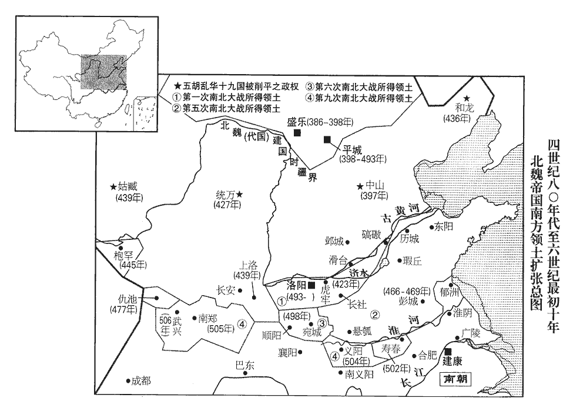
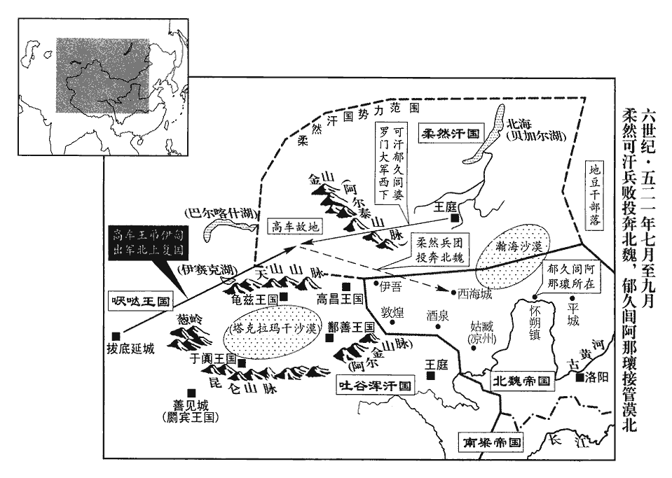

 梁紀五起屠維大淵獻（己亥），盡昭陽單閼（癸卯），凡五年。

# 高祖武皇帝五

## 天監十八年（己亥、五一九）

1春，正月，甲申‹四›，以尚書左僕射袁昂為尚令，【章：十二行本「令」上有「書」字；乙十一行本同；孔本同；退齋校同。】右僕射王暕為左僕射，暕jiǎn，古限翻。太子詹事徐勉為右僕射。

〖译文〗 [1]春季，正月甲申（初四），梁朝任命尚书左仆射袁昂为尚书令，右仆射王为左仆射，太子詹事徐勉为右仆射。

2丁亥‹七›，魏主‹元诩，本年十岁›下詔，稱「太后臨朝踐極，歲將半紀，胡后臨朝見上卷十四年。宜稱『詔』以令宇內。」

〖译文〗 [2]丁亥（初七），北魏国主颁布诏令，宣布：“太后临朝执政已经将近六年，应当用‘诏书’的名义来向全国发令。”

3辛卯‹十一›，上‹萧衍，本年五十六岁›祀南郊。

〖译文〗 [3]辛卯（十一日），梁武帝在南郊祭天。

4魏‹都洛阳河南省洛阳市东白马寺东›征西將軍【章：十二行本「軍」下有「平陸文侯」四字；乙十一行本同；孔本同；張校同；退齋校同。】張彝之子仲瑀上封事，求銓削選格，瑀，音禹。上，時掌翻。銓，量也。選，須絹翻；下入選、應選同。排抑武人，不使豫清品。於是喧謗盈路，立榜大巷，克期會集，屠害其家；彝父子晏然，不以為意。方羽林、虎賁立榜克期之初，魏朝既不為之嚴加禁遏，縱彝父子欲以為意，柰之何哉！二月，庚午‹二十›，羽林、虎賁近千人，賁，音奔。近，其靳翻。相帥至尚書省詬罵，帥，讀曰率。詬，戶遘翻，又古侯翻。求仲瑀兄左民郎中始均不獲，尚書左民郎，晉武帝置。以瓦石擊省門；上下懾懼，莫敢禁討。【張：「討」作「訶」。】懾，之涉翻。遂持火掠道中薪蒿，以杖石為兵器，直造其第，曳彝堂下，捶辱極意，【章：十二行本「意」下有「唱呼動地」四字；乙十一行本同；孔本同；張校同；退齋校同。】焚其第舍。始均踰垣走，復還拜賊，造，七到翻。捶，止橤翻。復，扶又翻；下不復、誰復同。請其父命，賊就毆擊，生投之火中。仲瑀重傷走免，彝僅有餘息，言氣息奄奄，僅未絕耳。再宿而死‹年五十九岁›。遠近震駭。胡太后收掩羽林、虎賁凶強者八人斬之，其餘不復窮治。治，直之翻。乙亥‹二十五›，大赦以安之，因令武官得依資入選。識者知魏之將亂矣。

〖译文〗 [4]北魏征西将军张彝的儿子张仲瑀上书，请奏修订选官的规定，以限制武将，不让他们在朝中列入士大夫的清品。因此，议论和抗议之声到处都是，这些人在大街上张榜，约定集合时间，要去屠灭张家。张彝父子却平静自如，不把这件事放在心上。二月庚午（二十日），羽林、虎贲等将近一千人，一同来到尚书省叫骂，寻找张仲瑀的哥哥左民郎中张始均，没有找到，就用瓦片、石块砸尚书省的大门。尚书省的官吏们都很害怕，没有人敢去阻挡他们。于是这些武士们又手执火把引燃了路上的蒿草，用石头、木棍作为兵器，一直攻入张家住宅，将张彝拖到堂下，尽情地捶打污辱，并且烧毁了他的住房。张始均跳墙逃跑了，但又赶回来向贼兵求饶，请求他们饶他父亲不死，贼兵们趁势殴打他，将他活活投到火里。张仲瑀受伤逃脱了，张彝被打得只剩一丝游气，过了两晚就死掉了。远近都因这件事而受到震惊。但是胡太后只抓了闹事的羽林、虎贲中的八个首恶分子，杀掉了他们，其他的就不再追究了。乙亥（二十五日），又颁布了大赦令来安抚他们，于是命令武官可以按资格入选。有识之士都感到北魏将要发生动乱了。

時官員既少，少，詩沼翻。應選者多，吏部尚書李韶銓注不行，大致怨嗟；更以殿中尚書崔亮為吏部尚書。亮奏為格制，不問士之賢愚，專以停解月日為斷，斷，丁亂翻。沈滯者皆稱其能。沈，持林翻。亮甥司空諮議劉景安與亮書曰：「殷、周以鄉塾貢士，王制：命鄉論秀士，升之司徒，曰選士，司徒論秀士而升之學，曰俊士。兩漢由州郡薦才，謂賢良、文學、孝廉之舉也。事見漢紀。魏、晉因循，又置中正，事見六十九卷魏文帝黃初元年。雖未盡美，應什收六七。而朝廷貢才，止求其文，不取其理，察孝廉唯論章句，不及治道，治，直吏翻。立中正不考才行，空辯氏姓，取士之途不博，沙汰之理未精。舅屬當銓衡，宜改張易調，行，下孟翻。屬，之欲翻。董仲舒曰：譬如琴瑟不調，必改而更張之。不調，謂不和也。易調之調，徒釣翻，音調也。如何反為停年格以限之，天下士子誰復脩厲名行哉！」行，下孟翻。亮復書曰：「汝所言乃有深致。吾昨為此格，有由而然。古今不同，時宜須異。昔子產鑄刑書以救弊，叔向譏之以正法，復，扶又翻。左傳昭六年，鄭人鑄刑書，叔向詒子產書曰：「先王議事以制，不為刑辟。閑之以義，糾之以政，行之以禮，守之以信，制為祿位以勸其從，嚴斷刑罰以威其淫。懼其未也，故誨之以忠，聳之以行，教之以務，使之以和，臨之以敬，涖之以強，斷之以剛，猶求聖哲之士，明察之官，忠信之長，慈惠之師，民於是可任使也，而不生禍亂。民知有辟，則不忌其上，並有爭心，以徵於書，而徼幸以成之，弗可為矣。亂獄滋豐，賄賂並行，終子之世，鄭其敗乎！」復書曰：「僑不才，不能及子孫，吾以救世也。」何異汝以古禮難權宜哉！」難，乃旦翻。洛陽令代人‹鲜卑人›薛琡魏書官氏志：西方叱干氏後改為薛氏。琡shū，之六翻。，又音俶。上書言：「黎元之命，繫於長吏，若以選曹唯取年勞，不簡能否，義均行鴈，次若貫魚，行鴈、貫魚，皆以諭資次先後以序而進也。上，時掌翻。長，知兩翻。選，須絹翻。行，音戶剛翻。執簿呼名，一吏足矣，數人而用，何謂銓衡！」書奏，不報。後因請見，復奏「乞令王公貴臣薦賢以補郡縣」，見，賢遍翻。復，扶又翻。詔公卿議之，事亦寢。其後甄琛等繼亮為吏部尚書，甄，之人翻。琛，丑林翻。利其便己，踵而行之，魏之選舉失人，自亮始也。

〖译文〗 当时官员名额已经很少，应选的人都很多，吏部尚书李韶停止选择录用工作，遭到很多埋怨；于是朝廷便另外任命殿中尚书崔亮为吏部尚书。崔亮奏请制定了新的录用标准。规定不管应选者是贤是愚，只以其待选的时间为依据，时间长者优选录用，因此那些长时间待选的人都称赞他有才能。崔亮的外甥司空谘议刘景安给崔亮写信说：“商周时期由乡间学校选拔官员，两汉时期由州郡推荐人才，魏晋两代因循汉代旧例，又在各州郡设置了中正的职位主管这件崐事，虽然没达到尽善尽美的程度，但是所选的人才每十人中也有六七人是应当入选的。然而朝廷选拔人才，只要求他们文采好，而不考察他们的本体如何，考察孝廉只根据他们的章句学问如何，而不看他们有无治理国家的方法。设立中正官职只辩识他们的姓氏，而不考察应选者的才能、品行，选取士人的路途不广，淘汰的办法不严密。舅舅您被委任来主管铨选官员之事，本应改换掉那些不妥的章程，为什么反而以年资长短为任用的标准，这样一来，天下的士人谁还会再注意修励自己的名节和品行呢！”。崔亮回信说：“你所说的的确有深刻的道理，但是我前不久采取的那种办法，也有它的道理，古今不同，时机合适时便应当加以变革。从前子产铸造青铜刑书来挽救时弊，但是叔向以不合先王之法来讥刺他，这和你用古代礼法来责难随时变化有什么不同！”。洛阳令代京人薛琡上书说：“百姓的性命，掌握在官吏的手上，如果选拔官吏只按他们的年资，而不问他们的能力大小，象排队飞行的大雁一样按顺序来，或象穿在一起的鱼一样由先而后地拿着名册叫名字，那么吏部只需一名官吏就足够了，按顺序用人，怎能叫做铨选人才呢！”薛琡的上书交上之后，没有得到答复。后来薛琡又因此而请求拜见皇上，再次上奏：“请求陛下命令王公大臣推荐贤才来补任郡县长官的职务。”因此北魏孝明帝下令让大臣们议定这件事，但是事情亦没有下文。后来，甄琛等人接替崔亮作了吏部尚书，因论资排辈这种办法对自己有便利，就继续奉行，北魏的选拔任用官员不得当，是从崔亮开始的。

初，燕燕郡‹北京市›太守高湖奔魏，事見一百一十一卷晉安帝隆安三年。燕，因肩翻。其子謐為侍御史，考異曰：李百藥北齊書作「諡」。北史作「謐」，今從之。坐法徙懷朔鎮‹内蒙古固阳县›，世居北邊，遂習鮮卑之俗。謐孫歡，沈深有大志，沈，持林翻。家貧，執役在平城‹北魏首都·山西省大同市›，富人婁氏女見而奇之，遂嫁焉。始有馬，得給鎮為函使，凡書表皆函封，函使者，使奉函詣京師也。使，疏吏翻。至洛陽，見張彝之死，還家，傾貲以結客，或問其故，歡曰：「宿衛相帥焚大臣之第，帥，讀曰率。考異曰：北齊書云「領軍張彝」。按彝未嘗為領軍，故但云大臣。朝廷懼其亂而不問，為政如此，事可知矣，財物豈可常守邪！」歡與懷朔省事雲中‹盛乐·内蒙古和林格尔县›司馬子如、省事，鎮吏也。省，悉景翻。秀容‹山西省忻州市西北›劉貴、魏太宗永興二年，置秀容郡及秀容縣；世祖真君七年置肆州，秀容郡屬焉。中山‹河北省定州市›賈顯智、戶曹史咸陽‹陕西省泾阳县›孫騰、外兵史懷朔侯景、史，亦吏職也。獄掾善無‹山西省右玉县›尉景、善無縣，前漢屬鴈門郡，後漢屬定襄郡。拓跋氏置善無郡，屬恆州。李延壽曰：秦、漢置尉候官，景之先有居此職者，因氏焉。廣寧‹河北省涿鹿县›蔡儁、廣寧郡，魏收志屬朔州，隋并入朔州善陽縣。特相友善，並以任俠雄於鄉里。高歡事始此。

〖译文〗 当初，燕国的燕郡太守高湖逃奔魏国，他的儿子高谧作了侍御史，因为犯了法被流放到怀朔镇，几代人居住在北部边疆，于是就养成了鲜卑人的风俗习惯。高谧的孙子高欢，深沉而有大志，家境贫困，在平城服役，富家娄氏的女儿看到他，认为他不同一般，便嫁给了他。他这才有了马匹，得以充当镇上的信使。他到洛阳时，见到张彝被打死一事，回到家之后，就倾尽财物来结识宾客。有人问他为什么这样做，高欢说：“皇宫中的卫兵们结伙起来焚烧了大臣的住宅，朝廷却畏惧他们叛乱而不敢过问，执政到了这种地步，事态如何便可想而知了，岂可死守着这些财物而过一辈子呢？”高欢和怀朔省事云中人司马子如、秀容人刘贵、中山人贾显智、户曹史咸阳人孙腾、外兵史怀朔人侯景、狱掾善无人尉景、广宁人蔡俊等人，特别地友好亲密，他们均以仗义任气而称雄于乡里。

5夏，四月，丁巳‹八›，大赦。

〖译文〗 [5]夏季，四月丁巳（初八），梁朝大赦天下。

6五月，戊戌‹二十›，魏以任城王澄為司徒，京兆王繼為司空。

〖译文〗 [6]五月戊戌（二十日），北魏任命任城王元澄为司徒，京兆王元继为司空。

7魏累世強盛，東夷、西域貢獻不絕，又立互市以致南貨，至是府庫盈溢。胡太后嘗幸絹藏，藏，徂浪翻。命王公嬪主從行者百餘人各自負絹，稱力取之，稱，尺證翻。少者不減百餘匹。少，詩沼翻；下同。尚書令•儀同三司李崇、章武王融，負絹過重，顛仆於地，崇傷腰，融損足，太后奪其絹，使空出，時人笑之。融，太洛之子也。章武王太洛見一百三十二卷宋明帝泰始四年。侍中崔光止取兩匹，太后怪其少，對曰：「臣兩手唯堪兩匹。」眾皆愧之。

〖译文〗 [7]北魏接连几代都很强盛，东夷、西域都不断地向其进贡，他们又设立了互换物品的市场来取得南方的货物，因此国库非常充实。胡太后曾经临幸藏绢的仓库，命令随行的一百多个王公、妃嫔、公主各自取绢，按自己的力气而取之，拿得最少的也不下一百多匹。尚书令、仪同三司李崇和章武王元融因为扛的绢太重，跌倒在地，李崇扭伤了腰，元融扭伤了脚，胡太后夺下了他们的绢，让他们空手而出，当时的人们都把这事当成了笑话。元融是元太洛的儿子。侍中崔光只取了两匹，胡太后嫌他拿得少，他回答说：“我的两只手只能拿得动崐两匹绢。”其他的人听了后都很惭愧。

時魏宗室權倖之臣，競為豪侈，高陽王雍，富貴冠一國，宮室園圃，侔於禁苑，僮僕六千，伎女五百，出則儀衛塞道路，冠，古玩翻。塞，悉則翻。歸則歌吹連日夜，一食直錢數萬。李崇富埒於雍而性儉嗇，嘗謂人曰：「高陽一食，敵我千日。」埒liè，力輟翻。

〖译文〗 当时北魏宗族中受宠掌权的大臣们都争比奢侈豪华。高阳王元雍是全国的首富，他的宫室园林和帝王的园林不差上下，有六千男仆，五百艺伎，出门时仪仗卫队充塞道路，回家后就整日整夜地吹拉弹唱，一顿饭价值几万钱。李崇与元雍同样富，但他生性吝啬，他曾对人说：“高阳王的一顿饭，等于我一千日的费用。”

河間王琛，每欲與雍爭富，駿馬十餘匹，皆以銀為槽，窗戶之上，玉鳳銜鈴，金龍吐旆。嘗會諸王宴飲，酒器有水精鋒，後漢書：大秦國出水精，以為宮室柱及食器。一本「鋒」作「鍾」。馬腦椀，本草衍義曰：馬腦，非石非玉，自是一類，有紅、白、黑色三種，亦有紋如纏絲者，生西國玉石間。赤玉巵，王逸論或問玉符，曰：「赤如雞冠，黃如蒸栗，白如脂肪，黑如點漆，玉之符也。」制作精巧，皆中國所無。又陳女樂、名馬及諸奇寶，復引諸王歷觀府庫，金錢，繒布，不可勝計，復，扶又翻。勝，音升。顧謂章武王融曰：「不恨我不見石崇，恨石崇不見我。」石崇事見八十一卷晉武帝太康三年。融素以富自負，歸而惋歎三【章：十二行本「三」上有「臥疾」二字；乙十一行本同；孔本同；張校同；退齋校同。】日。惋，烏貫翻。京兆王繼聞而省之，省，悉景翻。謂曰：「卿之貨財計不減於彼，何為愧羨乃爾？」融曰：「始謂富於我者獨高陽耳，不意復有河間！」繼曰：「卿似袁術在淮南，不知世間復有劉備耳。」融乃笑而起。物盛而衰，固其理也。史言魏君臣驕侈，乃其衰亂之漸。復，扶又翻；下無復、司復同。

〖译文〗 河间王元琛，总是想和元雍比富，他有十多匹骏马，马槽都是用银子做的，房屋的窗户之上，都雕饰着玉凤衔铃，金龙吐旆，真是金碧辉煌。他曾经召集众王爷一同设宴饮酒，所用酒器有水精盅、玛瑙碗、赤玉杯，都制作精巧，皆非中原的出产。他又陈列出艺伎、名马和各种珍奇宝贝，令王爷们赏玩，然后又带领众王爷一一参观府库，其中金钱，布帛不可胜数，得意之下便回头对章武王元融说：“我不恨自己看不见石崇，只恨石崇看不到我。”元融一向自认为很富有，回府后却伤心叹息了三天。京兆王元继知道这一情况之后便去劝解他，对他说：“你的财物不比他的少多少，为什么这么嫉妒他呢？”元融说：“开始我认为比我富的人只有高阳王，不想还有河间王！”元继说：“你就象在淮南的袁术，不知道世上还有个刘备呀。”元融这才笑着坐起来了。

 

太后好佛，營建諸寺，無復窮已，令諸州各建五級浮圖，民力疲弊。諸王、貴人、宦官、羽林各建寺於洛陽，相高以壯麗。太后數設齋會，施僧物動以萬計，好，呼到翻。數，所角翻。施，式豉翻。賞賜左右無節，所費不貲，而未嘗施惠及民。府庫漸虛，乃減削百官祿力。祿，在官所受之祿。力，在官所用白直也。任城王澄上表，以為「蕭衍常蓄窺覦之志，覦，音俞。宜及國家強盛，將士旅力，早圖混壹之功。比年以來，比，毗至翻。公私貧困，宜節省浮費以周急務。」太后雖不能用，常優禮之。

〖译文〗 胡太后爱好佛教，没完没了地修建各种寺庙，下令各州分别修建五级佛塔，以致百姓的财力匮乏，疲惫不堪。众位王爷、权贵、宦官、羽林分别在洛阳修建寺庙，互相用寺庙的华丽来炫耀自己。胡太后多次设立斋戒大会，给僧人的布施动辄以万计数，又常常没有节度地赏赐身边的人，耗费的财物不可计量，却不曾把好处施舍到百姓头上。这样，国库渐渐空虚，于是就削减众官员的俸禄和随员。任城王元澄上书，指出：“萧衍一直对我国蓄有窥觎之心，所以我们应当趁国家强盛，兵强马壮，早日规划统一大业。但是近年以来，国家和个人都很贫困，所以应当节制不必要的费用，以便周给急务之需。”胡太后虽然没有采用他的意见，但因此而常优待礼遇他。

魏自永平以來，天監七年，魏改元永平。營明堂、辟雍，役者多不過千人，有司復借以脩寺及供他役，十餘年竟不能成。起部郎源子恭上書，以為「廢經國之務，資不急之費，宜徹減諸役，早圖就功，使祖宗有嚴配之期，孝經，孔子曰：「孝莫大於嚴父，嚴父莫大於配天，昔者周公郊祀后稷以配天，宗祀文王於明堂以配上帝。」蒼生有禮樂之富。」詔從之，然亦不能成也。

〖译文〗 北魏从永平年间以来，为修建明堂和太学而服役的人最多不超过一千人，有关部门又把这些人借去修建寺庙和服其他劳役，因此十多年仍然没能建成。起部郎源子恭为此而上书，认为：“如此而废弃治国的大业，资助不急需的费用，确为不该，故而应当撤消、减少各种劳役，早日求取明堂、太学完工，使祖宗有配天而享受祭礼之期，百姓可以知晓礼乐。”朝廷下令采纳了他的建议，但明堂和太学仍然不能建成。

8魏人陳仲儒請依京房立準以調八音。有司詰仲儒：「京房律準，今雖有其器，曉之者鮮，詰，去吉翻。鮮，息淺翻。仲儒所受何師，出何典籍？」仲儒對言：「性頗愛琴，又嘗讀司馬彪續漢書，見京房準術，成數昞然。司馬彪志曰：京房六十律相生之法，以上生下，皆三生二；以下生上，皆三生四；陽下生陰，陰上生陽，終於中呂，而十二律畢矣。中呂上生執始，執始下生去滅，上下相生，終於南事呂，而六十律畢矣。夫十二律之變至於六十，猶八卦之變至於六十四也。宓犧作易，紀陽氣之初以為律法，建日冬至之聲宮，以黃鍾為宮，太簇為商，姑洗為角，林鍾為徵，南呂為羽，應鍾為變宮，蕤賓為變徵：此聲氣之元，五音之正也。故各終一日，其餘以次運行。當日者各自為宮，而商、徵以類從焉。禮運曰：「五聲、六律、十二管還相為宮，」此之謂也。以六十律分期之日，黃鍾自冬至始，及冬至而復，陰陽、寒燠、風雨之占生焉。於以檢攝群音，考其高下，苟非草木之聲則無所不合。虞書曰：「律和聲」，此之謂也。房又曰：「竹聲不可以度調，故作準以定數。準之狀如瑟，長丈而十三弦，隱間九尺以應黃鍾之律九寸，中央一弦下有畫分寸以為六十律清濁之節。」房言律詳於劉歆所奏，其術施行於史官，候部用之。律術曰：陽以圓為形，其性動；陰以方為節，其性靜。動者數三，靜者數二一，以陽生陰倍之，以陰生陽四之，皆三而一。陽生陰曰下生，陰生陽曰上生，上生不得過黃鍾之清濁，下生不得及黃鍾之數實，皆參天兩地、圓蓋方覆、六耦承奇之道也。黃鍾，律呂之首，而生十一律者也。其相生也，皆三分而損益之，是故十二律之得十七萬七千一百四十七，是為黃鍾之實。又以二乘而三約之，是為下生林鍾之實；又以四乘而三約之，是為上生太簇之實。推此上下以定六十律之實，以九三之數萬九千六百八十三為法，律為寸，於準為尺，不盈者十之所得為分，又不盈十之所得為小分，以其餘正其強弱。以黃鍾十七萬七千一百四十七，下生林鍾；黃鍾為宮，太蔟商，林鍾徵；一日律九寸，準九尺。色育十七萬六千七百七十六，下生謙待；未知商，謙待徵；六日律八寸九分小分八微強，準八尺九寸萬五千九百七十三。執始十七萬四千七百六十二，下生去滅；執始為宮，時息商，去滅徵；六日律八寸八分小分七大強，準八尺八寸萬五千五百一十六。丙盛十七萬二千四百一十，下生安度；丙盛為宮，屈齊商，安度徵；六日律八寸七分小分六微弱，準八尺七寸萬一千六百七十九。分動十七萬八十九，下生歸嘉，分動為宮，隨期商，歸嘉徵；六日律八寸六分小分四強，準八尺六寸八千一百五十二。質末十六萬七千八百，下生否與；質末為宮，形晉商，否與徵；六日律八寸五分小分二微強，準八尺五寸四千九百四十五。大呂十六萬五千八百八十八，下生夷則；大呂為宮，夾鍾商，夷則徵；八日律八寸四分小分三弱，準八尺四寸五千五百八。分否十六萬三千六百五十四，下生解形；分否為宮，開時商，解形徵；八日律八寸三分小分一強，準八尺三寸二千八百五十一。凌陰十六萬一千四百五十二，下生去南；凌陰為宮，族嘉商，去南徵；八日律八寸二分小分一弱，準八尺二寸五百一十四。少出十五萬九千二百八十，下生分積；少出為宮，爭南商，分積徵；六日律八寸小分九強，準八尺萬八千一百六十。太簇十五萬七千四百六十四，下生南呂；太簇為宮，姑洗商，南呂徵；一日律八寸，準八尺，未知十五萬七千一百三十四，下生白呂；未知為宮，南授商，白呂徵；六日律七寸九分小分八強，準七尺九寸萬六千三百八十三。時息十五萬五千三百四十四，下生結躬；時息為宮，變虞商，結躬徵；六日律七寸八分小分九少強，準七尺八寸萬八千一百六十六。屈齊十五萬三千二百五十三，下生歸期；屈齊為宮，路時商，歸期徵；六日律七寸七分小分九弱，準七尺七寸萬六千九百三十九。隨期十五萬一千一百九十，下生未卯；隨期為宮，形始商，未卯徵；六日律七寸六分小分八強，準七尺六寸萬五千九百九十二。形晉十四萬九千一百五十五，下生夷汗；形晉為宮，依行商，夷汗徵；六日律七寸五分小分八弱，準七尺五寸萬五千三百二十五。夾鍾十四萬七千四百五十六，下生無射；夾鍾為宮，中呂商，無射徵；六日律七寸四分小分九強，準七尺四寸萬八千一十八。開時十四萬五千四百七十，下生閉掩；開時為宮，中呂商，閉掩徵；八日律七寸三分小分九微弱，準七尺三寸萬七千八百四十一。族嘉十四萬三千五百一十三，下生鄰齊；族嘉為宮，內負商，鄰齊徵；八日律七寸二分小分九微強，準七尺二寸萬七千九百五十四。爭南十四萬一千五百八十二，下生期保；爭南為宮，物應商，期保徵；八日律七寸一分小分九強，準七尺一寸萬八千三百二十七。姑洗十三萬九千九百六十八，下生應鍾；姑洗為宮，蕤賓商，應鍾徵；一日律七寸一分小分一微強，準七尺一寸二千一百八十七。南授十三萬九千六百七十，下生分烏；南授為宮，南事商，分烏徵；六日律七寸小分九大強，準七尺萬八千九百三十。變虞十三萬八千八十四，下生遲內；變虞為宮，盛變商，遲內徵；六日律七寸小分一半強，準七尺三千三十。路時十三萬六千二百二十五，下生未育，路時為宮，離宮商，未育徵；六日律六寸九分小分二微強，準六尺九寸四千一百二十三。形始十三萬四千三百九十二，下生遲時；形始為宮，制時商，遲時徵；五日律六寸八分小分三弱，準六尺八寸五千四百七十六。依行十三萬二千五百八十二，上生色育；依行為宮，謙待商，色育徵；七日律六寸七分小分三大強，準六尺七寸七千五十九。中呂十三萬一千七十二，上生執始；中呂為宮，去滅商，執始徵；八日律六寸六分小分六弱，準六尺六寸萬一千六百四十二。南中十二萬九千三百八，上生丙盛；南中為宮，安度商，丙盛徵。七日律六寸五分小分七微弱，準六尺五寸萬三千六百八十五。內負十二萬七千五百六十七，上生分動；內負為宮，歸嘉商，分動徵；八日律六寸四分小分八強，準六尺四寸萬五千四百五十。物應十二萬五千八百五十，上生質末；物應為宮，否與商，質末徵；七日律六寸三分小分九強，準六尺三寸萬八千四百八十。蕤賓十二萬四千四百一十六，上生大呂；蕤賓為宮，夷則商，大呂徵；一日律六寸三分小分二微強，準六尺三寸四千一百三十一。南事十二萬四千一百五十四，下生南事；窮無商，徵不為宮；七日律六寸三分小分一弱，準六尺三寸一千五百三十一。盛變十二萬二千七百四十一，上生分否；盛變為宮，解形商，分否徵；七日律六寸二分小分三大強，準六尺二寸七千六十四。離宮十二萬一千八百一十九，上生凌陰；離宮為宮，去南商，凌陰徵；七日律六寸一分小分五微強，準六尺一寸萬二百二十七。制時十一萬九千四百六十，上生少出；制時為宮，分積商，少出徵；八日律六寸小分七弱，準六尺萬三千六百二十。林鍾十一萬八千九十八，上生太蔟；林鍾為宮，南呂商，太蔟徵；一日律六寸，準六尺。謙待十一萬七千八百五十一，上生未知，謙待為宮，白呂商，未知徵；五日律五寸九分小分九弱，準五尺九寸萬七千二百一十三。去減十一萬六千五百八，上生時息；去滅為宮，結躬商，時息徵；七日律五寸九分小分二弱，準五尺九寸三千七百八十三。安度十一萬四千九百四十，上生屈齊；安度為宮，歸期商，屈齊徵；六日律五寸八分小分四弱，準五尺八寸七千七百八十六。歸嘉十一萬三千三百九十三，上生隨期：歸嘉為宮，未卯商，隨期徵；六日律五寸七分小分六微強，準五尺七寸萬一千九百九十九。否與十一萬一千八百六十七，上生形晉；否與為宮，夷汗商，形晉徵；五日律五寸六分小分八強，準五尺六寸萬六千四百二十二。夷則十一萬五百九十二，上生夾鍾；夷則為宮，無射商，夾鍾徵；八日律五寸六分小分二弱，準五尺六寸三千六百七十二。解形十一萬九千一百三，上生開時；解形為宮，閉掩商，開時徵；八日律五寸五分小分四強，準五尺五寸八千四百六十五。去南十萬七千六百三十五，上生族嘉；去南為宮，鄰齊商，族嘉徵；八日律五寸四分小分六大強，準五尺四寸萬三千四百六十八，分積十萬六千一百八十八，上生爭南，分積為宮，期保商，爭南徵；五日律五寸三分小分九半強，準五尺三寸萬八千六百八十一。南呂八萬四千九百七十六，上生姑洗；南呂為宮，應鍾商，姑洗徵；一日律五寸三分小分三強，準五尺五寸六千五百六十一。白呂十萬四千七百五十六，上生南授；白呂為宮，分烏商，南授徵；五日律五寸三分小分二強，準五尺三寸四千三百七十一。結躬十萬三千五百六十三，上生變虞；結躬為宮，遲內商，變虞徵；六日律五寸二分小分六少強，準五尺二寸萬二千一百一十四。歸期十萬二千一百六十九，上生路時；歸期為宮，未育商，路時徵；六日律五寸一分小分九微強，準五尺一寸萬七千八百五十七。未卯十萬七百九十四，上生形始；未卯為宮，遲時商，形始徵；六日律五寸一分小分二微強，準五尺一寸四千八十七。夷汗九萬九千四百三十七，上生依行；夷汗為宮，色育商，依行徵；七日律五寸小分五強，準五尺萬二百二十。無射九萬八千三百四，上生中呂；無射為宮，執始商，中呂徵；八日律四寸九分小分九強，準四尺九寸萬八千五百七十三。閉掩九萬六千九百八十，上生南中；閉掩為宮，丙盛商，南中徵；八日律四寸九分小分三弱，準四尺九寸五千三百三十三。鄰齊九萬五千六百七十五，上生內負；鄰齊為宮，分動商，內負徵；七日律四寸八分小分六微強，準四尺八寸萬一千九百六十六。期保九萬四千三百八十八，上生物應，期保為宮，質末商，物應徵；八日律四寸七分小分九微弱，準四尺七寸萬八千七百七十九。應鍾九萬三千三百一十二，上生蕤賓；應鍾為宮，大呂商，蕤賓徵；一日律四寸七分小分四微強，準四尺七寸八千十九。分烏九萬三千一百一十七，上生南事；分烏窮次無徵不為宮；七日律四寸七分小分三微強，準四尺七寸六千五十九。遲內九萬二千九十六，上生盛變；遲內為宮，分否商，盛變徵；八日律四寸六分小分八弱，準四尺六寸萬五千一百四十二。未育九萬八百一十七，上生離官；未育為宮，凌陰商，離宮徵；八日律四寸六分小分一少強，準四尺六寸二千七百五十二。遲時八萬九千五百九十五，上生制時；遲時為宮，少出商，制時徵；六日律四寸五分小分五強，準四尺五寸萬二百一十五。截管為律，吹以考聲，列以物氣，道之本也。術家以其聲微而體難知，其分數不明，故作準以代之。準之聲明暢易達，分寸又粗；然弦以緩急清濁，非管無以正也。均其中弦，令與黃鍾相得，按畫以求諸律，無不如數而應者矣。音聲精微，綜之者解。」晉書樂志：宮，中也，中和之道無往而不理。商，強也，謂金性堅強。角，觸也，象諸陽觸物而生。徵，止也，言物盛則止。羽，舒也，陽氣將復，萬物孳育而舒生。宋白曰：合宮通音謂之宮，其音雄雄洪洪然。開口吐聲謂之商，其音鏘鏘倉倉然。張牙湧脣謂之角，其音喔喔礭礭然。齒合脣開謂之徵，其音倚倚𢋼𢋼然，齒開脣聚謂之羽，其音詡酗于吁然。遂竭愚思，思，相吏翻。鑽研甚久，頗有所得。夫準者所以代律，取其分數，調校樂器。竊尋調聲之體，宮、商宜濁，徵、羽宜清。徵zhǐ，陟里翻；下同。若依公孫崇，止以十二律聲，而云還相為宮，還，音旋。清濁悉足。唯黃鍾管最長，故以黃鍾為宮，則往往相順。若均之八音，猶須錯采眾音，配成其美。若以應鍾為宮，蕤賓為徵，則徵濁而宮清，雖有其韻，不成音曲。若以中呂為宮，則十二律中全無所取。今依京房書，中呂為宮，乃以去滅為商，執始為徵，然後方韻。而崇乃以中呂為宮，猶用林鍾為徵，何由可諧！中呂，陸德明曰：中，音仲，又如字。但音聲精微，史傅簡略，舊志準十三絃，隱間九尺，不言須柱以不。不，讀曰否。今刑統疏議多用「以否」二字，蓋當時常用疑辭也。又，一寸之內有萬九千六百八十三分，微細難明。仲儒私曾考驗，準當施柱，但前卻柱中，以約準分，則相生之韻已自應合。其中絃粗細，粗，讀曰麤。須與琴宮相類，施軫以調聲，令與黃鍾相合。中絃下依數畫六十律清濁之節，其餘十二絃須施柱如箏，即於中絃按盡一周之聲度著十二絃上。著，直略翻。然後依相生之法，以次運行，取十二律之商、徵。商、徵既定，又依琴五調調聲之法以均樂器，五調之調，徒釣翻。調聲之調如字。然後錯采眾聲以文飾之，若事有乖此，聲則不和。且燧人不師資而習火，古者未有火化，燧人氏始鑽燧出火，教民熟食。延壽不束脩以變律，延壽，即京房之師焦延壽也。言無所師承而變十二律為六十律也。孔子曰：自行束脩以上，吾未嘗無誨焉。朱元晦註曰：脩，脯也，十脡tǐng為束。古者相見必執贄以為禮，束脩其至薄者也。故云知之者欲教而無從，心達者體知而無師，苟有一毫所得，皆關心抱，豈必要經師受然後為奇哉！」尚書蕭寶寅奏仲儒學不師受，輕欲制作，不敢【章：十二行本「敢」作「合」；乙十一行本同；孔本同。】依許；事遂寢。

〖译文〗 [8]北魏陈仲儒请求按照京房所定的音律标准来校正八音。有关部门质问陈仲儒说：“京房的音律标准，今天虽然有乐器存在，但通晓的人很少，请问陈仲儒你是受什么师傅指点，从什么典籍中学习到的。”陈仲儒回答说：“我生性喜爱弹琴，又曾经读过司马彪的《续汉书》，见到京房的校音方法，其规则是很明白的。于是我就极力用自己的愚钝的头脑，钻研了很长时间，颇有收获。用音准代替音律，就是用它的分度来调校乐器。我研究过声调本身，宫、商两音应当低沉，徵、羽两音应当轻清。如果按公孙崇的说法，只用十二音律划分乐音，而又说变换宫调，清音浊音就都齐备了。因为黄钟管最长，因此就用黄钟管作为宫音，则每每跑调。如果平分成八个音，仍然需要分别采纳各种乐器，以配成美妙的乐声。如果把应钟作为宫音，蕤宾作为徵音，这样一来则徵音浊沉而宫音轻清，虽然具有韵律了，但却成不了曲调。如果用中吕当作宫音，那么十二音律就全无可取了。现在按京房的乐书所定，把中吕当作宫音，然后用减弱的音为商音，用起始的音为徵音，这样才形成韵律。而公孙崇却把中吕作为宫音，仍然使用林钟为徵音，这怎么能够和谐呢？然而音乐十分微妙、精密，史传所记都很简略，如过去记载定律数之准，共有十三弦，隐间九尺，但是没有说明需要弦柱与否。而且，一寸音节中有一万九千六百八十三分音，精微、细密，难以分辨。我曾经私下里试验过，准应当使用弦柱，只要向前调中间的弦柱，以此来确定音准的分度，这样产生出来的音韵就已经自然和谐了。它的中弦粗细应当与琴宫相同，用转弦的轸来调音，使它与黄钟合拍。中弦以下按度数划分成六十音律的清浊音节，其余十二弦应当如筝那样设立弦柱，就是将中弦上的一周的乐音，按度数标志在十二弦上，然后按照相生之法，按次序进行，取十二律的商、徵两音。商、徵二音一旦确定，再用琴五调的调声方法来协调乐器，然后错采众音来修饰它，如果不按照这种方法进行，声音就不会和谐。况且燧人氏不向老师学习就掌握了用火的办法，焦延寿不曾交学费拜师就变革了音律，因此那些说自己有知识的人想要教别人却没有人跟从他学习，心地通达的人没有老师也能有所体会，但凡有一丝一毫的收获，都与他的心胸有关，何必一定要经过老师的指授才能创造大事业呢！”尚书萧宝寅上奏说陈仲儒的学问没有老师传授，就轻率地制定音律，因此不能认可，于是这件事就放下了。

9魏中尉東平王匡以論議數為任城王澄所奪，憤恚，復治其故棺，匡造棺見一百四十七卷七年。數，所角翻。恚，於避翻。復，扶又翻。治，直之翻。欲奏攻澄。澄因奏匡罪狀三十餘條，廷尉處以死刑。處，昌呂翻。秋，八月，己未‹十二›，詔免死，削除官爵，以車騎將軍侯剛代領中尉騎，奇寄翻。三公郎中辛雄奏理匡，曹魏置尚書三公郎。以為「歷奉三朝，骨鯁之迹，朝野具知，朝，直遙翻。故高祖‹元宏›賜名曰匡。先帝‹元恪›既已容之於前，陛下亦宜寬之於後，若終貶黜，恐杜忠臣之口。」未幾，復除匡平州‹府设肥如河北省卢龙县北›刺史。幾，居豈翻。復，扶又翻。雄，琛之族孫也。辛琛見一百四十七卷天監六年。琛，丑林翻。

〖译文〗 [9]北魏中尉不平王元匡因为自己的建议多次被任城王元澄驳回，非常气愤，便又重新收拾好过去与高肇抗衡时所做下的那口棺材，准备再次以死相抗，来弹劾元澄。于是元澄也上奏了元匡的三十多条罪状，廷尉判处元匡死刑。秋季，八月己未（十二日），朝廷下令免除元匡死罪，剥夺了他的官爵，让车骑将军侯刚代替了他的中尉职务。三公郎中辛雄上奏了处治元匡的意见，认为：“元匡曾经侍奉过三代皇帝，他的刚正不阿的事迹，朝廷内外都知道。因崐此孝文帝奖赏他‘匡’这个名字。先帝既然已经在先前容忍了他，陛下您也应当在现在宽待他，如果最后贬黜了他，那么恐怕会因此而堵住了忠臣的口。”不久之后，又任命元匡为平州刺史。辛雄是辛琛的族孙。

10九月，庚寅朔‹十四›，【章：十二行本無「朔」字；乙十一行本同；孔本同；張校同，云從無註本。】胡太后遊嵩高‹中岳·河南省登封县北›；癸巳‹十七›，還宮。

〖译文〗 [10]九月庚寅朔（十四日），胡太后巡幸嵩高；癸巳（十七日），回到宫中。

太后從容謂兼中書舍人楊昱曰：「親姻在外，不稱人心，從，千容翻。稱，尺證翻。卿有聞，慎勿諱隱！」昱奏揚州‹府设寿阳安徽省寿县›刺史李崇五車載貨，相州‹府设邺城河北省临漳县西南邺镇›【章：十二行本「相」作「恆」；乙十一行本同；孔本同。】刺史楊鈞造銀食器【章：十二行本「器」下有「十具並」三字；孔本同；張校云，脫「十具」二字。】餉領軍元叉。相，息亮翻。太后召叉夫妻，泣而責之。泣而責之，愛誨之意也。叉由是怨昱。昱叔父舒妻，武昌王和之妹也。和即叉之從祖。從，才用翻。舒卒，元氏頻請別居，昱父椿泣責，不聽，元氏恨之。會瀛州‹府设赵都军城河北省河间市›民劉宣明謀反，事覺，逃亡。叉使和及元氏誣告昱藏匿宣明，且云：「昱父定州‹府设中山河北省定州市›刺史椿，叔父華州‹府设华阴陕西省大荔县›刺史津，並送甲仗三百具，謀為不逞。」華，戶化翻。叉復構成之。遣御仗五百人夜圍昱宅，收之，一無所獲。太后問其狀，昱具對為元氏所怨。太后解昱縛，處和及元氏死刑，復，扶又翻。處，昌呂翻。既而叉營救之，和直免官，元氏竟不坐。史言靈后昵庇元叉以自遺患。

〖译文〗 胡太后曾经在闲聊时对兼中书舍人杨昱说：“如果我的亲戚在外面有不称人心的事，你一旦听到了，千万别隐瞒。”杨昱上奏扬州刺史李崇用五车装载财物，相州刺史杨钧制作银质食具馈赠领军元义。胡太后就召来元义夫妻，哭泣着责备他们。元义因此怨眼杨昱。杨昱的叔父杨舒的妻了是武昌王元和的妹妹。元和是元义的从曾祖。杨舒死后，元氏多次请求搬到别的地方住，杨昱的父亲杨椿哭着斥责他，不肯听从，因此元氏很仇恨他们。正赶上瀛州人刘宣明图谋叛乱，事情被发觉后，刘宣明逃亡。元义指使元和以及元氏诬告杨昱藏匿刘宣明，并且说：“杨昱的父亲定州刺史杨椿，他的叔父华州刺史杨津，曾经一起给刘宣明送了三百件兵器，图谋造反。”元义又使这个罪名成立，并派了五百御前卫兵在夜间包围了杨昱的住宅，进行搜查，抓了杨昱，但是一无所获。胡太后察问其事，杨昱报告了被元氏怨恨的事。胡太后为杨昱松了绑，判处元和以及元氏死刑。事后元义营救了他们，结果元和被免除官职抵罪，元氏终于也没有治罪。

11冬，十二月，癸丑‹八›，魏任城文宣王澄卒‹年五十三岁›。任，音壬。卒，子恤翻。

〖译文〗 [11]冬季，十二月癸丑（初八），北魏任城文宣王元澄去世。

12庚申‹十五›，魏大赦。

〖译文〗 [12]庚申（十五日），北魏大赦天下。

13是嵗，高句麗‹都平壤朝鲜平壤市›王雲卒，世子安立。句如字，又音駒。麗，力知翻。

〖译文〗 [13]这一年，高句丽王高云去世，他的长子高安继位。

14魏以郎選不精，大加沙汰，以水淘去沙石，謂之沙汰，故以諭去不肖。唯朱元旭、辛雄、羊深、源子恭及范陽‹河北省涿州市›祖瑩等八人以才用見留，餘皆罷遣。深，祉之子也。正始之初，羊祉鎮梁、益。

〖译文〗 [14]北魏因为感到选拔官员过滥而不精，就大加淘汰，只有朱元旭、辛雄、羊深、源子恭以及范阳人祖莹等八人因为有才能而留用，其他人都被罢职送回去。羊深是羊祉的儿子。

## 普通元年（庚子、五二零）

1春，正月，乙亥朔‹一›，改元大赦。

〖译文〗 [1]春季，正月乙亥（初一），梁朝改年号并大赦天下。

2丙子‹二›，日有食之。

〖译文〗 [2]丙子（初二），发生日食。

3己卯‹五›，以臨川王宏為太尉、揚州刺史，金紫光祿大夫王份為尚書左僕射。份，奐之弟也。份，彼陳翻。王奐死於齊武帝永明十一年。

〖译文〗 [3]己卯（初五），梁朝任命临川王萧宏为太尉、扬州刺史，金紫光禄大夫王份为尚书左仆射。王份是王奂的弟弟。

4左軍將軍豫寧威伯馮道根卒‹年五十八岁›。五代志：豫章郡建昌縣舊有豫寧縣。宋白曰：漢建安中，分建昌立西安縣，晉太康元年，改為豫寧縣。是日上春，祠二廟，帝立太廟，祀太祖文皇帝以上為六親廟，皆同一堂，共庭而別室。又有小廟，太祖太夫人廟也，非嫡，故別立廟。皇帝每祭太廟訖，乃詣小廟，亦以一太牢，如太廟禮。有二廟令，掌廟事。既出宮，有司以聞。上‹萧衍，本年五十七岁›問中書舍人朱异曰：「吉凶同日，今可行乎？」對曰：「昔衛獻公‹卫衎kàn›聞柳莊死，不釋祭服而往。記檀弓曰：衛太史柳莊寢疾，公曰：「若疾革，雖當祭必告。」公再拜稽首，請於尸曰：「有臣柳莊也者，非寡人之臣，社稷之臣也。聞之死，請往。」不釋服而往，遂以襚suì之。道根雖未為社稷之臣，亦有勞王室，臨之，禮也。」上即幸其宅，哭之甚慟。

〖译文〗 [4]左军将军豫宁威伯冯道根去世。这一天在正月，梁武帝去太庙和小庙祭祀，出宫以后，有关部门把冯道根去世的消息告诉了他。梁武帝问中书舍人朱异说：“吉凶的事发生在同一天，现在我能去吊唁他吗？”朱异回答：“从崐前卫献公听到柳庄的死讯，不脱掉祭服就前去吊唁。冯道根虽然算不上是国家重臣，但也对王室有过贡献，去看望他，是合乎礼仪的。”于是梁武帝就来到冯道根的住宅，非常忧伤地哭悼他。

5高句麗世子安遣使入貢。二月，癸丑‹九›，以安為寧東將軍、高句麗王，句，音駒。麗，力知翻。使，疏吏翻。遣使者江法盛授安衣冠劍佩。魏光州‹府设东莱山东省莱州市›兵就海中執之，送洛陽。魏皇興四年，分青州置光州，領東萊、長廣、東牟郡，治掖。

〖译文〗 [5]高句丽的太子高安派遣使节前来向梁朝进贡。二月癸丑（初九），梁武帝任命高安为宁东将军、高句丽王，并且派使节江法盛授给他衣服、王冠和佩剑。北魏光州的军队在海中抓获了江法盛，把他送到了洛阳。

6魏太傅、侍中、清河文獻王懌，美風儀，胡太后逼而幸之。然素有才能，輔政多所匡益，好文學，好，呼到翻。禮敬士人，時望甚重。侍中、領軍將軍元叉在門下，兼總禁兵，恃寵驕恣，志欲無極，懌每裁之以法，叉由是怨之。衛將軍、儀同三司劉騰，權傾內外，吏部希騰意，奏用騰弟為郡，人資乖越，人非其才為乖，資非其次為越。懌抑而不奏，騰亦怨之。龍驤府長史宋維，弁之子也，宋弁見用於魏孝文帝。驤，思將翻。長，之兩翻。懌薦為通直郎，通直郎，即通直散騎侍郎，隋後遂為寄祿官。浮薄無行。行，下孟翻。叉許維以富貴，使告司染都尉韓文殊父子謀作亂立懌。周官有染人，漢有平準令，主練染作采色。後魏置司染都尉，後齊太府寺屬官有司染署令、丞。陸德明：染，而豔翻；劉而險翻。懌坐禁止，按驗，無反狀，得釋，維當反坐；反坐，誣告失實者以其所告之罪坐之。叉言於太后曰：「今誅維，後有真反者，人莫敢告。」乃黜維為昌平郡‹河北省阳原县东›守。昌平縣，漢屬上谷郡，後魏置昌平郡，屬燕州，隋復廢郡為縣，屬幽州。

〖译文〗 [6]北魏太傅、侍中、清河文献王元怿，神采仪表俱佳，胡太后逼迫和他私通。但是元怿素有才能，辅政多所匡益，又爱好文学，对士大夫很尊敬，在社会上的声望很高。侍中、领军将军元义在门下省，又兼任统管禁卫之兵，他倚仗太后的宠幸骄傲放肆，穷奢极欲，元怿常常按法律制裁他，因此元义非常怨恨元怿。卫将军、仪同三司刘腾的权势在朝廷内外都很大，吏部为了讨刘腾的欢心，奏请任命刘腾的弟弟为郡太守，但是因刘腾的弟弟无论才能和资历都不够格，元怿便压下来，不肯上奏，因此刘腾也怨恨他了。龙骧府长史宋维是宋弁的儿子，元怿推荐他作了通直郎，但是宋维实际上是个轻薄无行之徒。元义答应使宋维荣华富贵，让宋维告司染都尉韩文殊父子二人谋划叛乱，要立元怿为帝。元怿因此而被监禁，经过查验，没有发现谋反的行为，才被释放。宋维因诬告而应当以诬告治罪，元义对太后说：“如果现在杀了宋维，以后有了真反叛的人，谁也不敢报告了。”于是只把宋维贬为昌平郡太守。

义恐懌終為己害，乃與劉騰密謀，使主食中黃門胡定自列主食，主御食者也。列，陳也。云：「懌貨定使毒魏主，若己得為帝，許定以富貴。」帝時年十一，信之。秋，七月，丙子‹四›，太后在嘉福殿，未御前殿，义奉帝御顯陽殿，騰閉永巷門，太后不得出。懌入，遇义於含章殿後，义厲聲不聽懌入，懌曰：「汝欲反邪！」义曰：「义不反，正欲縛反者耳！」命宗士及直齋執懌衣袂，將入含章東省，魏置宗師，宗士其屬也。直齋，直殿內齋閤者也，屬直閤。將，引也，送也。使人防守之。騰稱詔集公卿議，論懌大逆；眾咸畏义，無敢異者，唯僕射新泰文貞公游肇抗言以為不可，五代志新泰縣屬琅邪郡。終不下署。不下筆署名也。

〖译文〗 元义怕元怿最终成为自己的心头之患，就和刘腾密谋，让主食中黄门胡定自己供认说：“元怿贿赂我，让我毒死皇上，许诺如果他做了皇上，便让我荣华富贵。”北魏孝明帝当时只有十一岁，相信了胡定的诬陷。秋季，七月丙子（初四），胡太后在嘉福殿，没有到前殿来，元义奉侍皇帝来到显阳殿，刘腾关闭了永巷门，胡太后不能出来。元怿入宫，在含章殿后遇上了元义，元义厉声喝止，不许元怿进入，元怿说：“你想造反吗？”元义说：“我不造反，我正想抓要造反的人呢！”于是命令宗士和直斋们揪住元怿的衣袖，把他送到含章东省，派人看守住他。刘腾伪称皇上的命令召集公卿们来议论，数说元怿谋反的罪状；大家都畏惧元义，没有人敢表示不同意见，只有仆射新泰文贞公游肇反驳说元怿不可能谋反，到底也没有下笔签名同意把元怿治罪。

义、騰持公卿議入，俄而得可，魏主‹元诩›可其奏也。夜中殺懌‹年三十四岁›。於是詐為太后詔，自稱有疾，還政於帝。幽太后於北宮宣光殿，宮門晝夜長閉，內外斷絕，騰自執管鑰，帝亦不得省見，省，悉景翻。見，賢遍翻。裁聽傳食而已。太后服膳俱廢，不免飢寒，乃歎曰：「養虎得噬，我之謂矣。」又使中常侍【章：十二行本「侍」下有「酒泉」二字；乙十一行本同；孔本同。】賈粲侍帝書，密令防察動止。叉遂與太師高陽王雍等同輔政，帝謂叉為姨父。叉與騰表裏擅權，叉為外禦，騰為內防，常直禁省，共裁刑賞，政無巨細，決於二人，威振內外，百僚重跡。重，直龍翻。言懼之甚，不敢妄舉足而行，步步踏陳迹也。

〖译文〗 元义、刘腾拿着王公们的意见进宫，很快就得到孝明帝批准，半夜时杀掉了元怿。于是他们又伪造胡太后的旨令，说她自己有了病，要将政权交还给孝明帝。他们把胡太后囚禁在北宫的宣光殿，宫门昼夜都关闭着，内外隔断，刘腾自崐己掌管着钥匙，连孝明帝都不能探视，只允许递送食物。胡太后的衣服饮食都不能象原来那样了，因此免不了忍饥受寒，于是她叹息道：“养虎却被虎咬了，说的就是我呀。”元义又派中常侍贾粲陪侍孝明帝读书，暗中命令他提防监视孝明帝的行动。元义便与太师高阳王元雍等人一同辅政，孝明帝称元义为姨父。元义和刘腾内外专权，相互勾结，元义专管抵挡来自于朝廷之外的攻击，刘腾负责对朝廷内部的监视。他们常常在殿中值勤，一同决定赏罚，政事不论大小，都由他们两人决定，他们威震朝廷内外，以致百官们个个小心翼翼，不敢轻举妄动。

朝野聞懌死，莫不喪氣，喪，息浪翻。胡夷為之剺面者數百人。為，于偽翻。剺lí，里之翻。胡夷臨喪，剺面而哭哀甚。游肇憤邑而卒。

〖译文〗 朝野之人听到元怿的死讯，莫不痛心疾首，甚至胡夷中有好几百人痛哭他的死时都划破了面孔表示悲哀。游肇气愤不过死掉了。

7己卯‹七›，江、淮、海並溢。

〖译文〗 [7]己卯（初七），长江、淮河及海水一同暴涨。

8辛卯‹十九›，魏主‹元诩，本年十一岁›加元服，大赦，改元正光。

〖译文〗 [8]辛卯（十九日），北魏为孝明帝举行加冠礼，大赦天下，改年号为正光。

9魏相州‹府设邺城河北省临漳县西南邺镇›刺史中山文莊王熙，英之子也，元英事魏孝文、宣武，數將兵有功。相，息亮翻。與弟給事黃門侍郎略、司徒祭酒纂，自曹魏以來，公府有東、西閤祭酒。皆為清河王懌所厚，聞懌死，起兵於鄴，上表欲誅元叉、劉騰，纂亡，奔鄴。後十日，長史柳元章等帥城人鼓譟而入，帥，讀曰率；下同。殺其左右，執熙、纂并諸子置於高樓。八月，甲寅‹十三›，元叉遣尚書左丞盧同就斬熙於鄴街，并其子弟。

〖译文〗 [9]北魏相州刺史中山文庄王元熙是元英的儿子，他和弟弟给事黄门侍郎元略、司徒祭酒元篡都得到清河王元怿的厚待，听到元怿的死讯之后，在邺城起兵，并且上书给孝明帝要求杀掉元义、刘腾，元篡逃跑到了邺城参与起兵。十天之后，长史柳元章等人率领城中平民鼓噪入城，杀了他们的手下人，把元熙、元篡和他们的儿子一同抓到高楼上，八月甲寅（十三日），元义派尚书左丞卢同前去在邺城街市上斩杀了元熙和他的子弟。

熙好文學，有風義，好，呼到翻。名士多與之遊，將死，與故知書曰：「吾與弟俱蒙皇太后知遇，兄據大州，弟則入侍，殷勤言色，恩同慈母。今皇太后見廢北宮，太傅清河王橫受屠酷，橫，戶孟翻。主上幼年，獨在前殿。君親如此，無以自安，故帥兵民欲建大義於天下。但智力淺短，旋見囚執，旋，反也。上慚朝廷，下愧相知。本以名義干心，不得不爾，流腸碎首，復何言哉！凡百君子，各敬爾儀，為國為身，善勗xù名節！」復，扶又翻。為，于偽翻；下為知、力為同。聞者憐之。熙首至洛陽，親故莫敢視，前驍騎將軍刁整獨收其尸而藏之。驍，坚堯翻。騎，奇寄翻。整，雍之孫也。刁雍去晉入魏，著功淮、汝之間。盧同希叉意，窮治熙黨與，治，直之翻。鎖濟陰‹山东省定陶县西›內史楊昱赴鄴，濟陰郡，漢、晉屬兗州，魏屬西兗州。濟，子禮翻。考訊百日，乃得還任。叉以同為黃門侍郎。

〖译文〗 元熙爱好文学，有风度，有气量，当时的名士大多和他有交情，他临死时，给老朋友写信说：“我和弟弟都蒙受皇太后的知遇之恩，哥哥镇守大州，弟弟则在宫内服务，皇太后对我们和蔼可亲，恩情如同慈母一般。现在皇太后被废在北宫里，太傅清河王又横遭杀害，圣上年幼，一个人在前殿任人摆布。圣上如此，我等无法保全自己，因此率领军队和百姓想在全国伸张正义。但是我因智力浅短，不但贼人未除，反而身陷囹圄，真是上对朝廷有愧，下对知己无颜。我起兵本是出于忠义之心，不得不这么做，肚脑涂地，也毫无二话！希望众多友人，敬奉你们的道德标准，为国家为自己好好地保持名节。”听了此话的人没有不哀怜他的。元熙的首级被送到了洛阳，他的亲戚朋友都不敢去看，只有从前的骁骑将军刁整收藏了他的尸身。刁整是刁雍的孙子。卢同为了讨取元义欢心，严厉查办元熙的同党，济阳内史杨昱被囚送到邺城，审问拷打了一百天，才得以回去复任。因此元义让卢同作了黄门侍郎。

元略亡抵故人河內‹河南省沁阳市›司馬始賓，始賓與略縛荻茷夜渡孟津‹河南省孟津县东黄河渡口›，詣屯留‹山西省屯留县›栗法光家，屯留縣自漢、晉以來屬上黨郡。姓譜：栗姓，栗陸氏之後。漢長安富室有栗氏。師古曰：屯，音純。轉依西河‹山西省汾阳县›太守刁雙，匿之經年。時購略甚急，略懼，求送出境，雙曰：「會有一死，所難遇者為知己死耳，願不以為慮。」略固求南奔，雙乃使從子昌送略渡江，從，才用翻。遂來奔，上封略為中山王。為略後還魏張本。雙，雍之族孫也。叉誣刁整送略，并其子弟收繫之，御史王基等力為辯雪，乃得免。

〖译文〗 元略逃到老朋友河内人司马始宾那里，司马始宾同元略用苇杆扎成筏子在夜间渡过孟津，来到屯留人栗法光的家中，很快又去投靠西河太守刁双，在那里藏了一年多。当时悬赏通缉元略，风声很紧，元略很害怕，请求把他送出国境。刁双说：“人固有一死，最难得的是为知己而死，希望你不要替我担心。崐”元略坚决请求南逃，刁双便派侄子刁昌送元略渡过长江，于是元略投靠了梁朝，梁武帝封元略为中山王。刁双是刁雍的族孙。元义诬告刁整送走了元略，便把他连同他的子弟一同抓了起来，御史王基等人全力为他申辩，才得以幸免。

10甲子‹二十三›，侍中、車騎將軍永昌嚴侯韋叡卒‹年七十九岁›。五代志：零陵郡零陵縣舊分置永昌縣。諡法：服敵公莊曰嚴；威而不猛曰嚴。騎，奇寄翻。時上方崇釋氏，士民無不從風而靡，獨叡自以位居大臣，不欲與俗俯仰，所行略如平日。史言韋叡於事佛之朝，矯之以正，幾於以道事君者。

〖译文〗 [10]甲子（二十三日），梁朝侍中、车骑将军永昌严侯韦睿去世。当时梁武帝正尊崇佛教，百姓全都跟着信教，只有韦睿自以为身为大臣，不想顺从这种习俗，行事全和平时一样。

11九月，戊戌‹二十七›，魏以高陽王雍為丞相，總攝內外，與元叉同決庶務。

〖译文〗 [11]九月戊戌（二十七日），北魏任命高阳王元雍为丞相，总管内外朝政，与元义一同处理日常事务。

12初，柔然‹瀚海沙漠群›佗汗可汗納伏名敦之妻候呂陵氏，生伏跋可汗及阿那瓌等六子。可，從刊入聲。汗，音寒。瓌guī，古回翻。伏跋既立，忽亡其幼子祖惠，求募不能得。有巫地萬言祖惠今在天上，我能呼之，乃於大澤中施帳幄，祀天神，祖惠忽在帳中，自云恆在天上。恆，戶登翻。伏跋大喜，號地萬為聖女，納為可賀敦。柔然之主曰可汗，其正室曰可賀敦。地萬既挾左道，復有恣色，伏跋敬而愛之，信用其言，干亂國政。如是積歲，祖惠浸長，語其母曰：「我常在地萬家，未嘗上天，上天者，地萬教我也。」長，知兩翻。語，牛倨翻。上，時掌翻。其母具以狀告伏跋，伏跋曰：「地萬能前知未然，勿為讒也。」既而地萬懼，譖祖惠於伏跋而殺之。候呂陵氏遣其大臣具列等絞殺地萬；伏跋怒，欲誅具列等。會阿至羅‹属于高车种，游牧于今内蒙古乌兰察布盟东部›入寇，阿至羅，虜之別種，居北河之東，世附於魏。一曰：阿至羅，高車種。伏跋擊之，兵敗而還。還，從宣翻，又如字。候呂陵氏與大臣共殺伏跋，立其弟阿那瓌為可汗。阿那瓌立十日，其族兄示發帥眾數萬擊之，帥，讀曰率。阿那瓌戰敗，與其弟乙居伐輕騎奔魏。騎，奇寄翻。示發殺候呂陵氏及阿那瓌二弟。史言柔然亂。

〖译文〗 [12]当初，柔然国的佗汗可汗娶了伏名敦的妻子候吕陵氏，生下伏跋可汗以及阿那瓌等六个儿子。伏跋成为柔然可汗以后，忽然丢失了幼子祖惠，查访召寻都找不到。有个巫婆叫地万，她说，祖惠现在在天上，我能招来他。于是便在大泽中搭起帐幕，祈祷天神，祖惠一下子出现在帐幕中，并且说自己一直在天上。伏跋非常高兴，称地万是圣女，把她娶为正妻。地万既有法术，又有姿色，伏跋对她既尊敬又宠爱，非常听信她的话，任她参与干扰国事。这样过了几年，祖惠慢慢长大了，告诉他的生母说：“我那时一直在地万家，没有上过天，上天的话是地万教我说的。”他的母亲把这件事的真象告诉了伏跋，伏跋说：“地万能够预见没发生的事，你不要说她的坏话。”不久地万怕这件事暴露，就在伏跋面前陷害祖惠并杀了他。候吕陵氏派与她一心的大臣具列等人绞死了地万；伏跋大怒，要杀死具列等人。恰好在这时阿至罗族入侵，伏跋带兵抗击，兵败而回。候吕陵氏和大臣一同杀掉了伏跋，立他的弟弟阿那瓌为可汗。阿那瓌立为可汗王仅十天，他的族兄示发便率领几万人攻打他，阿那瓌战败，同他的弟弟乙居伐轻骑逃往北魏。示发杀了候吕陵氏和阿那瓌的两个弟弟。

13魏清河王懌死，汝南王悅了無恨元叉之意，以桑落酒候之，水經註：河東郡‹山西省永济县›多徙民，民有姓劉名墮者，宿擅工釀，採挹河流，醞成芳酎zhòu，懸食同枯枝之年，排於桑落之辰，故酒得其名。香醑xǔ之色，清白若滫漿焉，別調氛氳，不與他同，蘭薰麝越，自成馨逸，方土之貢，最為佳酌。自王公庶友牽拂相招，每云索郎，索郎返語為桑落也。更為藉徵之雋句，中書之英談。盡其私佞。叉大喜。冬，十月，乙卯‹十五›，以悅為侍中、太尉。悅就懌子亶dǎn求懌服玩，不時稱旨，既遷延不以時納，所納者又不稱悅意也。稱，尺證翻。杖亶百下，幾死。幾，居依翻。

〖译文〗 [13]北魏清河王元怿死后，汝南王元悦没有一点仇恨元义之心，反而用桑落酒讨好元义，极尽谄媚讨好之能事。元义非常高兴，冬季，十月乙卯（十五日），任命元悦为侍中、太尉。元悦向元怿的儿子元亶索取元怿的服饰和古玩，因为没有按时送去而所送的又不合元悦的心意，元悦就用大杖打了元亶一百下，几乎把元亶打死。

14柔然可汗阿那瓌將至魏，魏主使司空京兆王繼、侍中崔光等相次迎之，賜勞甚厚。魏主引見阿那瓌於顯陽殿，勞，力到翻。見，賢遍翻。因置宴，置阿那瓌位於親王之下。宴將罷，阿那瓌執啟立於座後，詔引至御座前，阿那瓌再拜言曰：「臣以家難，難，乃旦翻。輕來詣闕，本國臣民，皆已逃散。陛下恩隆天地，乞兵送還本國，誅翦叛逆，收集亡散，臣當統帥遺民，奉事陛下。帥，讀曰率。言不能盡，別有啟陳。」仍以啟授中書舍人常景以聞。景，爽之孫也。常爽見一百二十三卷宋文帝元嘉六年。

〖译文〗 [14]柔然国的可汗阿那瓌将要来到北魏之时，北魏孝明帝派司空京兆王元继、侍中崔光等人依次欢迎他，十分优厚地赏赐、。孝明帝在显阳殿接见了阿那瓌，随后设置宴席，把阿那瓌的座位排在亲王之下。宴会即将结束时，阿那瓌手执书信站在座位后面，孝明帝命人把他引到御座之前来，阿那瓌拜了几拜说道：“为臣我因为家中有难，只身前来朝拜陛下，我国的臣民，全都崐逃散了。陛下的恩情比天高，比地厚，请陛下派兵把我送回本国，诛灭造反的逆贼，收集起逃散的人马，我一定会统率我的百姓，竭心侍奉陛下。我的话难以表达全面，这里还另外有封信向陛下陈述慰劳他。”于是就把书信交给中书舍人常景呈给孝明帝。常景是常爽的孙子。

十一月，己亥‹二十九›，魏立阿那瓌為朔方公、蠕蠕王，賜以衣服、軺車，蠕，人兗翻。軺，音遙。祿恤儀衛，一如親王。時魏方強盛，於洛水橋南御道東作四館，道西立四里：有自江南來降者處之金陵館，三年之後賜宅於歸正里；自北夷降者處燕然館，賜宅於歸德里；自東夷降者處扶桑館，賜宅於慕化里；自西夷降者處崦嵫館，賜宅於慕義里。四館皆因四方之地為名：金陵在江南，燕然在漠北，扶桑在東，日所出，崦嵫在西，日所入。山海經曰：大荒之中，暘yáng谷上有扶桑，日所出也。灰野之山有樹，青葉赤華，名曰若木，日所入也；生崑崙西，鳥鼠山西南，曰崦嵫。淮南子曰：經細柳西方之地，崦嵫日所入也。十洲記曰：扶桑在碧海中，長數千丈，一千餘圍，兩榦同根，更相依倚，是以名扶桑。降，戶江翻。處，昌呂翻；下同。燕，因肩翻。崦，依廉翻，又依檢翻。嵫，音茲。及阿那瓌入朝，以燕然館處之。阿那瓌屢求返國，朝議異同不決，朝，直遙翻。阿那瓌以金百斤賂元叉，遂聽北歸。十二月，壬子‹十三›，魏敕懷朔都督簡銳騎二千護送阿那瓌達境首，境首，猶言界首也。騎，奇寄翻。觀機招納。若彼迎候，宜賜繒帛車馬禮餞而返；繒，慈陵翻。如不容受，聽還闕庭。其行裝資遣，付尚書量給。量，音良。

〖译文〗 十一月己亥（二十九日），北魏孝明帝立阿那瓌为朔方公、蠕蠕王，赐给他衣物、服饰和轺车。他的俸禄和卫队，都和亲王的一样。当时北魏正是强盛的时期，在洛水桥南的御道之东修建了四座客馆，道西建起了四片街。有从江南来投降的人便让住在金陵馆，三年以后在归正里赏赐他一所住宅；从北夷来投降的人先住在燕然馆，然后在归德里赏赐住宅；从东夷来投降的人先住在扶桑馆，然后在慕化里赏赐住宅；从西夷来投降的人先住在崦嵫馆，然后在慕义里赏赐诠宅。阿那瓌归顺北魏后，让他住在燕然馆中。阿那瓌多次请求回国。朝廷中的意见总是不一样，无法决定，阿那环用一百斤黄金贿赂元义，于是就允许他回国了。十二月壬子（十三日），北魏命令怀朔都督挑选二千精锐骑兵护送阿那瓌到达国境边上，观看时机而实行招纳。如果柔然迎候阿那瓌，就赐给他丝绸布匹、车马，按礼节给他饯行，送他回去；如果柔然不接受他，仍允许他回到朝中来。这次行动的行装费用，责成尚书省根据费用多少而支付。

15辛酉‹二十二›，魏以京兆王繼為司徒。

〖译文〗 [15]辛酉（二十二日），北魏任命京兆王元继为司徒。

16魏遣使者劉善明來聘，始復通好。自齊明帝建元二年盧昶北歸之後，魏不復遣使南聘，至是復通。復，扶又翻。

〖译文〗 [16]北魏派刘善明出使梁朝，两国又开始亲善往来。

## 二年（辛丑、五二一）

1春，正月，辛巳‹十二›，上‹萧衍，本年五十八岁›祀南郊。

〖译文〗 [1]春季，正月辛巳（十二日），梁武帝在南郊祭天。

2置孤獨園於建康，以收養窮民。古者鰥寡孤獨廢疾者有養。帝非能法古也，祖釋氏須達多長者之為耳。

〖译文〗 [2]梁朝在建康设立孤独园，用来收养穷困百姓。

3戊子‹十九›，大赦。

〖译文〗 [3]戊子，（十九日），梁朝大赦天下。

4魏南秦州‹府设骆谷城甘肃省西和县南›氐反。

〖译文〗 [4]北魏南秦州的氐人造反。

5魏發近郡兵萬五千人，近郡，近輔諸郡也。使懷朔‹内蒙古固阳县›鎮將楊鈞將之，將，息亮翻；下同。送柔然可汗阿那瓌返國。尚書左丞張普惠上疏，以為：「蠕蠕久為邊患，今茲天降喪亂，喪，息浪翻。荼毒其心，蓋欲使之知有道之可樂，革面稽首以奉大魏也。樂，音洛。稽，音啟。陛下宜安民恭己以悅服其心。阿那瓌束身歸命，撫之可也；乃更先自勞擾，興師郊甸之內，投諸荒裔之外，救累世之勍敵，資天亡之醜虜，臣愚未見其可也。勍，渠京翻。此乃邊將貪竊一時之功，不思兵為凶器，王者不得已而用之。用老子語意。況今旱暵方甚，聖慈降膳，暵hàn，呼旱翻。乃以萬五千人使楊鈞為將，欲定蠕蠕，干時而動，其可濟乎！脫有顛覆之變，楊鈞之肉，其足食乎！用左傳楚孫叔敖斥伍參語意。宰輔專好小名，好，呼到翻。不圖安危大計，此微臣所以寒心者也。且阿那瓌之不還，負何信義，臣賤不及議，漢自議郎以上皆得預朝廷大議，尚書二丞，於當時位不為卑，而以為賤不及議，蓋自曹魏以後，朝廷大議止及八坐以上。文書所過，文書皆過尚書二丞之手。不敢不陳。」【章：十二行本「陳」下有「弗聽」二字；乙十一行本同；孔本同；張校同。】阿那瓌辭於西堂，‹元诩，本年十二›詔賜以軍器、衣被、雜采、糧畜，事事優厚，采，與綵同。畜，許救翻。命侍中崔光等勞遣於外郭。勞，力到翻。

〖译文〗 [5]北魏征调附近郡县的一万五千多兵力，由怀朔镇将杨钧统率，送柔然可汗阿那瓌回国。尚书左丞张普惠上书孝明帝，认为：“蠕蠕国长期以来一直是我们边境上的祸患，现在老天给他们降下灾害、战乱，让他们心灵受苦，这大概是为了让他们懂得只有按天道行事才能安乐，让他们悔过自新、规矩顺从地来侍奉我们大魏朝呀。陛下应当安抚百姓，端正自身以使天下百姓心悦诚崐服。阿那瓌只身来投奔，安抚他就可以了，您却首先为此而劳扰天下，在京城内外兴师动众，把他们指派到荒僻偏远之处，去救助几代以来都是我们的强敌之人，帮助老天爷都要使他灭亡的丑恶的蛮虏，以臣之愚见实在看不出有这样做的必要。这不过是守边的将领贪图一时的功劳，却不去想想打仗是凶险的事，圣王不得已时才会使用。何况现在干旱正厉害，圣上出于慈心减少了自己的膳食，却让杨钧带着一万五千人去安定蠕蠕，违背时势而贸然行动，怎么能够成功呢？如果万一发生不测之变，有人颠覆国家发动战乱，即使到时把杨钧杀了吃掉，又有什么用！宰相大臣们专门喜欢个人的名声，不替国家的安危着想，这正是小臣我感到寒心之处。何况即使阿那瓌不能回国，我们有何辜负信义之处。我官职低贱不够评议的资格，但是文书都从我手上经过，因此我不敢不说出我的意见。”阿那瓌在西堂辞行，孝明帝下令赐给他军器、衣被、杂物、粮畜，样样都很优厚，命令侍中崔光等人在外城为他饯行送别。

阿那瓌之南奔也，其從父兄婆羅門帥眾數萬入討示發，破之，從，才用翻。帥，讀曰率。示發奔地豆干‹内蒙古锡林郭勒盟东北部›，魏書曰：地豆干國在室韋西千餘里。地豆干殺之，國人推婆羅門為彌偶可社句可汗。魏收曰：魏言安靜也。楊鈞表稱：「柔然已立君長，長，知兩翻。恐未肯以殺兄之人郊迎其弟。輕往虛返，徒損國威。自非廣加兵眾，無以送其入北。」二月，魏人使舊嘗奉使柔然者牒云具仁牒云，姓；具仁，名。魏書官氏志，內入諸姓有牒云氏。奉使，疏吏翻。往諭婆羅門，使迎阿那瓌。

〖译文〗 阿那瓌逃到南方的时候，他的堂兄婆罗门率领几万人入朝讨伐示发，打败了他。示发投奔了地豆干国，地豆干人杀了他，柔然人推举婆罗门做了弥偶可社句可汗。杨钧上书说：“柔然国已经设立了国君，恐怕不会有杀死人家兄长的人又在郊外迎接死者的弟弟。如此轻率前往，徒劳而返，将白白地损害国家的威望。因此如果不大举发兵，就没办法送阿那瓌北返。”二月，北魏派原来曾出使柔然国的牒云具仁前去晓谕婆罗门，让他迎接阿那瓌回国。

6辛丑‹三›，上祀明堂。

〖译文〗 [6]辛丑（初三），梁武帝在明堂祭祖。

7庚戌‹十二›，魏使假撫軍將軍邴虯討南秦叛氐。姓譜：邴即丙姓。

〖译文〗 [7]庚戌（十二日），北魏派代理抚军将军邴虬讨伐南秦州反叛的氐人。

8魏元叉、劉騰之幽胡太后也，右衛將軍奚康生預其謀，叉以康生為撫軍大將軍、河南尹，仍使之領左右。領仗身左右。康生子難當娶侍中、左衛將軍侯剛女，剛子，叉之妹夫也，叉以康生通姻，深相委託，三人率多俱宿禁中，時或迭出，以難當為千牛備身。御左右有千牛刀，謂之防身刀。千牛刀者，利刃也，取庖丁解數千牛而芒刃不頓為義。千牛備身，執千牛刀以侍左右者也。康生性粗武，言氣高下，叉稍憚之，見于顏色，見，賢遍翻。康生亦微懼不安。

〖译文〗 [8]北魏元义、刘腾囚禁胡太后时，右卫将军奚康生参与了他们的计划，因此元义任命奚康生的作了抚军大将军、河南尹，仍然让他统领御仗卫兵。奚康生的儿子奚难当娶了侍中、左卫将军侯刚的女儿，侯刚的儿子又是元义的妹夫，元义因为和奚康生有姻亲的关系，因此十分信任他。他们三人很多时间里全都住在宫城内，有时交替着出宫，又让奚难当手执千牛刀侍卫于孝明帝左右。奚康生性情粗暴鲁莽，言语不驯，元义有些惧怕他，甚至表现在脸色上。奚康生也有些感到畏惧不安。

甲午‹十六›，魏主朝太后于西林園，文武侍坐，酒酣迭舞，朝，直遙翻。坐，徂臥翻。康生乃為力士儛，蓋為勇士進退坐作之氣勢而舞也。儛wǔ，與舞同。及折旋之際，每顧視太后，舉手、蹈足、瞋目、頷首，為執殺之勢，折，之舌翻。瞋，七人翻。太后解其意而不敢言。解，戶買翻。日暮，太后欲攜帝宿宣光殿，侯剛曰：「至尊已朝訖，嬪御在南，宣光殿在洛陽北宮，元叉等幽胡太后於此，魏主與嬪御居南宮，故侯剛云然。嬪，毗賓翻。何必留宿！」康生曰：「至尊陛下之兒，隨陛下將東西，更復訪誰！」復，扶又翻。群臣莫敢應。太后自起援帝臂，援，于元翻，引也。下堂而去。康生大呼，唱萬歲！呼，火故翻。帝前入閤，左右競相排，閤不得閉。康生奪難當千牛刀，斫直後元思輔，直後，官名，直閤之屬也。乃得定。帝既升宣光殿，左右侍臣俱立西階下。康生乘酒勢將出處分，處，昌呂翻。分，扶問翻。為叉所執，鎖於門下。以此知一夫之勇終受制於人也。光祿勳賈粲紿太后曰：「侍官懷恐不安，言其心懷恐懼也。紿dài，徒亥翻。陛下宜親安慰。」太后信之，適下殿，粲即扶帝出東序，前御顯陽殿，閉太后於宣光殿。至晚，叉不出，令侍中、黃門、僕射、尚書等十餘人就康生所訊其事，處康生斬刑，難當絞刑。處，昌呂翻。叉與剛並在內，矯詔決之。康生如奏，難當恕死從流。難當哭辭父，康生慷慨不悲，曰：「我不反死，汝何哭也？」時已昏闇，有司驅康生赴市，斬之；尚食典御奚混與康生同執刀入內，亦坐絞。尚食典御，唐為尚食奉御。進御必辨時禁，先嘗之。難當以侯剛壻，得留百餘日，竟流安州‹府设方城河北省隆化县›；魏顯祖皇興二年，置安州，治方城，領密雲、廣陽、安樂郡。久之，叉使行臺盧同就殺之。魏太祖‹拓跋珪›既得中山‹河北省定州市›，將北還，慮中原有變，乃於鄴‹河北省临漳县西南邺镇›、中山置行臺，後因之。以劉騰為司空。八坐、九卿常旦造騰宅，坐，徂臥翻。造，七到翻。參其顏色，然後赴省府，亦有終日不得見者。「得」或作「能」，非也。【章：十二行本正作「能」；乙十一行本同；孔本同；張校同。】公私屬請，屬，之欲翻。唯視貨多少，舟車之利，山澤之饒，所在榷què固，刻剝六鎮，交通互市，歲入利息以巨萬萬計，巨萬，萬萬也；巨萬萬計者，萬萬萬也。少，詩沼翻。榷，古岳翻。逼奪鄰舍以廣其居，遠近苦之。

〖译文〗 甲午（疑误），北魏孝明帝在西林园朝见胡太后，文武百官陪同，酒酣之时纷纷起舞，奚康生趁势表演力士舞，每到回旋、转身的时候，总是看着胡太后，举手、投足、瞪眼、点头，作捕杀的姿式，胡太后明白了他的用意却不敢说话。傍晚，胡太后想携同孝明帝一同住在宣光殿，侯刚说：“皇上已经朝见完毕了，他的嫔妃住在南宫，没必要留宿在这里！”。奚康生说：“皇上是太后陛下的儿子，随太后之意领往哪里，还用问别人吗！”。众大臣们都不敢说话。胡太后自己站起来扶着孝明帝的手臂下堂而去。奚康生大声呼喊，高唱万岁！孝明帝前头进入殿门，手下人互相拥推着，门关不上。奚康生夺过奚难当的千牛刀，砍杀了值后元思辅，才安定了局面。孝明帝在宣光殿上升殿，手下的侍臣都站立在西边台阶下。奚康生借着酒劲想要出来安排布置一番，却被元义抓住，锁在门下。光禄勋贾粲欺骗胡太后说：“侍官们心里惶恐不安，陛下应当亲自去安慰他们。”胡太后相信了他的话，刚走下殿来，贾粲便扶着孝明帝走出东门，往前住到了显阳殿，而把胡太后关在宣光殿内。到了晚上，元义还没有出宫，命令侍中、黄门、仆射、尚书等十多个人到奚康生被押的地方审问他，判处奚康生斩刑，奚难当绞刑。元义和侯刚都在内宫，伪造孝明帝命令判决了这个案子，同意判处奚康生斩刑，饶恕奚难当不死，改为流放。奚难当哭着去向父亲告别，奚康生却慷慨激昂，毫不悲伤，说道：“我不后悔去死，你哭什么？”当时天色已暗，官吏们驱赶着奚康生来到刑场，斩杀了他；尚食典御奚混因和奚康生一同拿着刀冲入宫中，也被判处了绞刑。奚难当因为是侯刚的女婿，得以停留了一百多天，最后被流放到了安州。很久之后，元义又派行台卢同去安州杀害了奚难当。刘腾被任命为司空，因此而权倾一时。朝廷中的八坐、九卿们常常在早晨到刘腾的住所拜访，先观察了他的脸色，然后再到官署去办公，也有一整天都见不到他的官吏。刘腾贪得无厌，不论请他办的是公事还是私事，他只看所送财物多少而行事，无论是不陆交通之利，还是山川物产，他全都独占，他还对六镇敲诈勒索，权贵间互相勾结串通，每年的收入数以百亿。他又侵夺周围四邻的房屋来扩大自己的住宅，远近的人都身受其害。

京兆王繼自以父子權位太盛，固請以司徒讓車騎大將軍、儀同三司崔光，騎，奇寄翻。夏，四月，庚子‹三›，以繼為太保，侍中如故，繼固辭，不許。壬寅‹五›，以崔光為司徒，侍中、祭酒、著作如故。

〖译文〗 京兆王元继自认为他们父子的权职太大了，坚决请求把司徒的职位让给车骑大将军、仪同三司崔光。夏季，四月庚子（初三），朝廷任命元继为太保，保留侍中的职务，元继坚决推辞，但是孝明帝不肯批准。壬寅（初七），任命崔光为司徒，侍中、祭酒、著作等旧职不变。

9魏牒云具仁至柔然，婆羅門殊驕慢，無遜避心，責具仁禮敬；具仁不屈，婆羅門乃遣大臣丘升頭等將兵二千隨具仁迎阿那瓌。五月，具仁還鎮，還懷朔鎮‹内蒙古固阳县›也。將，息浪翻；下同。具道其狀，阿那瓌懼，不敢進，上表請還洛陽。

〖译文〗 [9]北魏的牒云具仁来到柔然国，婆罗门非常傲慢，没有谦逊礼让的意思，却让牒云具仁对他行礼。牒云具仁不肯屈从，婆罗门才派大臣丘升头等人率领二千人随牒云具仁一同去迎接阿那瓌。五月，牒云具仁回到怀朔镇，把这种情况都作了汇报，阿那瓌很害怕，不敢前去，上表给孝明帝请求回到洛阳。

10辛巳‹十四›，魏南荊州‹府设安昌湖北省枣阳市南›刺史恆叔興據所部來降。魏置南荊州，見一百四十七卷天監十一年。降，戶江翻；下同。考異曰：梁帝紀，「七月叔興帥眾降」，蓋記奏到之日，今從魏帝紀。

〖译文〗 [10]辛巳（十四日），北魏南荆州刺史恒叔兴率领部将投降了梁朝。

六月，丁卯‹一›，義州‹府设义城河南省商城县›刺史文僧明、此義州當置於齊安郡木蘭縣界。蕭子顯齊志，木蘭縣屬寧蠻左郡，唐省木蘭縣入黃岡縣。以下文裴邃復義州觀之，恐義州與邊城皆置於安豐界。邊城‹河南省固始县东南›太守田守德沈約志，宋文帝元嘉十五年，以豫部蠻民立邊城左郡。酈道元曰：安豐縣故城，今邊城郡治也。此時梁境未得至安豐；五代志，黃岡縣界舊有邊城郡，此正田守德所居之地。擁所部降魏，皆蠻酋也。酋，慈由翻。魏以僧明為西豫州刺史，守德為義州刺史。

〖译文〗 六月丁卯（初一），义州刺史文僧明、边城太守田守德率领部属投降了北魏，这二人都是蛮族首领。北魏任命文僧明为西豫州刺史，田守德为义州刺史。

11癸卯‹十二›，琬琰殿火，延燒後宫三千間。

〖译文〗 [11]癸卯（疑误），梁朝琬琰殿失火，火势漫延，烧毁后宫三千间。

12秋，七月，丁酉‹一›，以大匠卿裴邃為信武將軍，假節，督眾軍討義州，破魏義州刺史封壽於檀公峴‹大别山›，水經註：決水出廬江雩婁縣大別山；註云：俗謂之檀公峴，蓋大別之異名也。又北過安豐縣東，安豐故城，今邊城郡治也。此魏邊城郡。峴xiàn，戶典翻。遂圍其城；壽請降，復取義州。復，扶又翻；下聞復同。魏以尚書左丞張普惠為行臺，將兵救之，不及。考異曰：普惠傳云「棄城走」，今從裴邃傳。

〖译文〗 [12]秋季，七月丁酉（初一），梁朝任命大匠卿裴邃为信武将军，授予他符节，让他督率众军去讨伐义州，首战告捷，在檀公岘打败了北魏义州刺史封寿，进而围攻其城。封寿请求投降，于是又夺取了义州。北魏委任尚书左丞张崐普惠为行台，率兵来救援，但是没有来得及。

以裴邃為豫州刺史，鎮合肥‹安徽省合肥市›。邃欲襲壽陽‹安徽省寿县›，陰結壽陽民李瓜花等為內應。邃已勒兵為期日，恐魏覺之，先移【章：十二行本「移」下有「魏」字；乙十一行本同；孔本同；退齋校同。】揚州‹府寿阳›云：「魏始於馬頭‹安徽省怀远县南马城›置戍，如聞復欲脩白捺nà故城，馬頭置戍，蓋即沈約志所謂馬頭太守治所而置之。白捺當在馬頭東北或東南。捺，奴葛翻。若爾，便相侵逼，此亦須營歐陽‹江苏省仪征市东闸口›，設交境之備。今板卒已集，板榦gàn所以築城。卒，士卒也。唯聽信還。」揚州刺史長孫稚謀於僚佐，皆曰：「此無脩白捺之意，宜以實報之。」錄事參軍楊侃曰：「白捺小城，本非形勝；邃好狡數，好，呼到翻。今集兵遣移，恐有他意。」稚大寤曰：「錄事可亟作移報之。」侃報移曰：「彼之纂兵，纂，集也。想別有意，何為妄構白捺！『他人有心，予忖度之，』詩巧言之辭。度，徒洛翻。勿謂秦無人也。」左傳秦大夫繞朝之言。邃得移，以為魏人已覺，即散其兵。瓜花等以失期，遂相告發，伏誅者十餘家。稚，觀之子；長孫觀，道生之孫，見一百三十三卷宋鬱林王元徽元年。侃，播之子。楊播見一百四十卷齊明帝建武二年。

〖译文〗 接着，又任命裴邃为豫州刺史，镇守合肥。裴邃想要袭击寿阳，便暗中结交了寿阳人李瓜花等人作为内应。裴邃布署好了军队并约定了时间，怕被北魏发觉，便先给北魏扬州方面送去一封书信，信中说：“魏国原来在马头设置防卫，现在听说又要修筑过去的白捺城，如果这样的话，就表示你们要发起进攻，我们这边也需要修筑欧阳城，增设边境的守备，现在筑城的兵士已集中了，只等你们的回信了。”北魏扬州刺史长孙稚和他的幕僚们商议此事，大家都说：“我们这里没有修筑白捺城的意图，应当把实情告诉他们。”录事参军杨侃说：“白捺是个小城，本来不是什么险要之地；裴邃这人很狡诈，一贯老谋深算，现在集结、调动部队，恐怕有别的用意。”长孙稚顿时醒悟过来了，说：“录事应当马上写一篇檄文送给裴邃。”于是，杨侃在檄文中对裴邃说：“你们调集兵力，想是有其他用意，为什么反而胡说我们要修筑白捺城呢？古话说：‘他人有什么心思，我能猜测得出来’，不要以为我们这里没有能人。”裴邃收到檄文后，认为北魏已经发觉了他的用意，就遣散了他的军队。李瓜花等人因为错过了约定时间，就互相告发检举，有十多家被处死。长孙稚是长孙观的儿子，杨侃是杨播的儿子。

13初，高車‹新疆天山山脉北麓›王彌俄突死，事見上卷天監十五年。其眾悉歸嚈噠‹首都拔底延城阿富汗北部瓦齐拉巴德市›；後數年，嚈噠遣彌俄突弟伊匐帥餘眾還國。伊匐擊柔然可汗婆羅門，大破之，婆羅門帥十部落詣涼州‹府设姑臧甘肃省武威市›，請降於魏。柔然餘眾數萬相帥迎阿那瓌，阿那瓌表稱：「本國大亂，姓姓別居，迭相抄掠。當今北人鵠hú望待拯，言鵠立而望魏拯救也。嚈，益涉翻。噠，當割翻，又宅軋翻。帥，讀曰率。降，戶江翻。抄，楚交翻。乞依前恩，給臣精兵一萬，送臣磧北，撫定荒民。」磧qì，七迹翻。詔付中書門下博議，涼州刺史袁翻以為：「自國家都洛以來，蠕蠕、高車迭相吞噬，始則蠕蠕授首，謂佗汗也，事見一百四十七卷天監七年。既而高車被擒。謂彌俄突也。今高車自奮於衰微之中，克雪讎恥，誠由種類繁多，種，章勇翻。終不能相滅。自二虜交鬬，邊境無塵，數十年矣，此中國之利也。今蠕蠕兩主相繼歸誠，兩主，謂阿那瓌、婆羅門。雖戎狄禽獸，終無純固之節，然存亡繼絕，帝王本務。若棄而不受，則虧我大德；若納而撫養，則損我資儲；或全徙內地，則非直其情不願，亦恐終為後患，劉‹刘渊›、石‹石勒›是也。謂漢徙胡羯於內地，至於晉世，卒階劉、石之亂。且蠕蠕尚存，則高車猶有內顧之憂，未暇窺窬上國；若其全滅，則高車跋扈之勢，豈易可知！易，以豉翻。今蠕蠕雖亂而部落猶眾，處處棋布，以望舊主，高車雖強，未能盡服也。愚謂蠕蠕二主並宜存之，居阿那瓌於東，處婆羅門於西，分其降民，各有攸屬。阿那瓌所居非所經見，不敢臆度；婆羅門請脩西海故城‹内蒙古额济纳旗›以處之。處，昌呂翻。度，徒洛翻。西海在酒泉‹甘肃省酒泉市›之北，去高車所居金山‹新疆阿尔泰山›千餘里，此西海非王莽所置西海郡之西海，但言在酒泉之北，則別有西海故城也。按北史蠕蠕傳，西海郡，即漢、晉舊鄣。袁翻又曰：直張掖西北千二百里。又按晉志，漢獻帝興平二年，武威太守張雅請置西海郡於居延，蓋此即漢、晉舊鄣也。金山形如兜鍪móu，其後突厥居金山之陽，即此山。實北虜往來之衝要，土地沃衍，大宜耕稼。宜遣一良將，配以兵仗，監護婆羅門，將，即亮翻。監，工銜翻。因令屯田，以省轉輸之勞。其北則臨大磧，野獸所聚，磧qì，七迹翻。使蠕蠕射獵，彼此相資，足以自固。外以輔蠕蠕之微弱，內亦防高車之畔援，韓詩云：畔援，武強也。鄭玄云：跋扈也。此安邊保塞之長計也。若婆羅門能收離聚散，復興其國者，復興，扶又翻。漸令北轉，徙度流沙，則是我之外藩，高車勍敵，勍，渠京翻。西北之虞可以無慮。如其姦回反覆，不過為逋逃之寇，於我何損哉？」朝議是之。朝，直遙翻。

〖译文〗 [13]当初，高车王弥俄突死后，他的手下人都投靠了嗕哒国。几年以后，嗕哒派遣弥俄突的弟弟伊匐率领余部回国。伊匐攻打柔然可汗婆罗门，打败了婆罗门，婆罗门带领十个部落来到凉州，请求向北魏投降。柔然国剩余的几万人一起来迎接阿那瓌。阿那瓌给孝明帝上表说：“我国的内部大乱，各个部族都各据一方分开居住，交替着抢劫杀掠。现在北方人都举踵翘望陛下去拯救他们，乞求您照从前恩赐我那样，给我一万精锐兵力，送我到沙漠的北部，以便安抚战乱中的百姓。”孝明帝下令把这件事交给中书门下集体议定，凉州刺史袁翻认为：“自从我国定都洛阳以来，蠕蠕国和高车国反复相互吞并，开始是蠕蠕国失去了头领，接着高车王又被抓。现在高车国在衰败中奋起，力求报仇雪耻，但由于种族、类属繁杂，最后也没能将敌国消灭。自从这两个敌虏之国相互交战以来，我们的边境尘土不起已经有几十年了，这是中原国家的益处。现在蠕蠕国的两个国王相继归顺我国，虽然戎狄之族野性难改，最后也不会有纯真坚固的节操，但是使危亡的国家幸存下去，使绝灭的种姓得以繁衍，是帝王之本务。如果对他们弃而不管，就会有损于我们的德行；如果收留并且抚养他们，就会损失我们的物资储备；如果把他们全部迁到内地，则不但他们不情愿，怕最终也会成为我们的祸患，晋代的刘渊、石勒之乱就是这样发生的。况且只要蠕蠕国还存在，那么高车国就还有内顾之忧，没功夫觊觎我国；如果蠕蠕国全部灭亡，那么高车国的强霸之势，是难以预测的！现在蠕蠕国虽然大乱，但是部落还存在许多，到处都有，都盼望着过去的主人，高车国虽然强大，却没能全部征服他们。以我之愚见，应当让蠕蠕国的两个国主同时并存，让阿那瓌住在东部，让婆罗门住在西面，把那些降民分给他俩，使他们各有所属。阿那瓌居住的地方我不曾见过，不敢胡乱猜测；对于婆罗门，则请修筑西海旧城让他居住。西海城在酒泉的北部，距离高车国所居住的金山一千多里，实在是北虏来往的要塞之地，那里土地肥沃广阔，非常适宜于耕种。应当派遣一员良将，配备以兵力武器，既监护婆罗门，又顺便让他们去屯田，可以节省粮草运输的烦劳。西海之北就面临着大沙漠，是野兽聚集的地方，让蠕蠕们打猎，与守兵们互相资助，便足以做到坚守自固。对外可以辅助弱小的蠕蠕国，对内可以防御强横的高车国，这是安定边境保卫要塞的长久之计。如果婆罗门能收集起离散的百姓，复兴他的国家，就逐渐让他转向北部、迁移过沙漠，便可成为我国的外藩，高车国的强敌，于是西北一带的忧虑就可以解除了。如果他反叛了，则不过成为外逃的流寇，对我国有什么损害呢？”朝廷经过讨论同意了他的意见。

九月，柔然可汗俟匿伐詣懷朔鎮請兵，且迎阿那瓌。俟匿伐，阿那瓌之兄也。冬，十月，錄尚書事高陽王雍等奏：「懷朔鎮北吐若奚泉，原野平沃，請置阿那瓌於吐若奚泉，吐若奚泉在懷朔鎮北無結山下。婆羅門於故西海郡‹内蒙古额济纳旗›，令各帥部落，收集離散。阿那瓌所居既在境外，宜少優遣，少，詩沼翻。婆羅門不得比之。其婆羅門未降以前蠕蠕歸化者，悉令州鎮部送懷朔鎮以付阿那瓌。」詔從之。為阿那瓌、婆羅門皆叛去張本。

〖译文〗 九月，柔然可汗俟匿伐来到怀朔镇请求救兵，并且迎接阿那瓌。俟匿伐是阿那瓌的哥哥。冬季，十月，录尚书事高阳王元雍等人奏北魏孝明帝：“怀朔镇之北的吐若奚泉，原野平坦肥沃，请将阿那瓌安置在吐若奚泉，婆罗门安置在从前的西海郡，命令他们各自率领自己的部落，收集离散的百姓。既然阿那瓌的住地在境外，那么遣送他时便应当稍微优厚一点，婆罗门不可以和他相比。在婆罗门投降以前来投奔我国的蠕蠕人，都要让各州、镇集中送到怀朔镇来交给阿那瓌。”孝明帝下令批准了他们的上奏。

 

14十一月，癸丑‹十九›，魏侍中、車騎大將軍侯剛加儀同三司。騎，奇寄翻。

〖译文〗 [14]十一月癸丑（十九日），北魏加封侍中、车骑大将军侯刚仪同三司。

15魏以東益‹府设武兴陕西省略阳县›、南秦‹府设骆谷城甘肃省西和县南›氐皆反，庚辰‹十七›，以秦州‹府设上封甘肃省天水市›刺史河間王琛為行臺以討之。琛恃劉騰之勢，琛求為劉騰養子，見上卷天監十七年。琛，丑林翻。貪暴無所畏忌，大為氐所敗。敗，補邁翻。中尉彈奏，彈，徒丹翻。會赦，除名，尋復王爵。

〖译文〗 [15]北魏因为东益、南秦二州的氐人都反叛了，庚寅（疑误），任命秦州刺史、河间王元琛成立行台去讨伐。元琛倚仗刘腾的权势，贪婪残暴、肆无忌惮，被氐人打得大败。中尉弹奏了他，正赶上大赦，因此只被除名，但不久又恢复了王爵。

16魏以安西將軍元洪超兼尚書行臺，詣敦煌‹甘肃省敦煌市›安置柔然婆羅門。敦，徒門翻。

〖译文〗 [16]北魏任命安西将军元洪超兼任尚书行台，到敦煌去安置柔然国的婆罗门。

## 三年（壬寅、五二二）

1春，正月，庚子‹七›，以尚書令袁昂為中書監，吳郡‹江苏省苏州市›太守王暕jiǎn為尚書左僕射。暕，古限翻。

〖译文〗 [1]春季，正月庚子（初七），梁朝任命尚书令袁昂为中书监，吴郡太守王3113为尚书左仆射。

2辛亥‹十八›，魏主‹元诩，本年十三岁›耕籍田。

〖译文〗 [2]辛亥（十八日），北魏孝明帝举行耕种籍田仪式。

3魏宋雲與惠生自洛陽西行四千里，至赤嶺‹青海省湟中县西›，乃出魏境，赤嶺在唐鄯州鄯城縣西二百餘里。又西行，再期，至乾羅國‹巴基斯坦伊斯兰堡市西白沙瓦城›而還。二月，達洛陽，得佛經一百七十部。魏遣宋雲求佛經事，始上卷天監十七年。

〖译文〗 [3]北魏宋云和惠生从洛阳出发，西行四千里，到达赤岭，才出了北魏国境，继续西行两年以后，到达乾罗国后返回。于二月回到洛阳，得到一百七十部佛经。

4高車‹新疆天山山脉北麓›王伊匐遣使入貢于魏。匐，蒲北翻。使，疏吏翻。夏，四月，庚辰‹十九›，魏以伊匐為鎮西將軍、西海郡公、高車王。久之，伊匐與柔然戰敗，其弟越居殺伊匐自立。

〖译文〗 [4]高车王伊匐派使节向北魏进贡。夏季，四月庚辰（十九日），北魏任命伊匐为镇西将军、西海郡公、高车王。很久以后，伊匐和柔然国交战失败，他的弟弟越居杀了伊匐自立为王。

5五月，壬辰朔‹一›，日有食之，既。

〖译文〗 [5]五月壬辰朔（初一），发生日全食。

6癸巳‹二›，大赦。

〖译文〗 [6]癸巳（初二），梁朝大赦天下。

7冬，十一月，甲午‹六›，領軍將軍始興忠武王憺卒‹年四十五岁›。憺，徒敢翻，又徒濫翻。

〖译文〗 [7]冬季，十一月甲午（初六），梁朝领军将军始兴忠武王萧憺去世。

8乙巳‹十七›，魏主祀圜丘。

〖译文〗 [8]乙巳（十七日），北魏孝明帝在圜丘祭天。

9初，魏世祖【章：十二行本「祖」作「宗」；乙十一行本同；孔本同。】以玄始曆浸疏，宋文帝元嘉二十九年魏行玄始曆。命更造新曆。更，工衡翻。至是，著作郎崔光表取盪寇將軍張龍祥【嚴：「龍」改「農」。】等九家所上曆，候驗得失，合為一曆，以壬子為元，應魏之水德，壬癸，水也。水旺於子，故以壬子為元。上，時掌翻。命曰正光曆。丙午‹十八›，初行正光曆，大赦。考異曰：後魏律曆志云：「曆成，會孝明帝加元服，改元正光，因命曰正光曆。」按帝紀，「正光元年七月辛卯加元服，三年十一月丙午行正光曆」，今從之。

〖译文〗 [9]当初，魏世祖认为《玄始历》渐渐不准确了，下令另制新的历法。到现在，著作郎崔光选取荡寇将军张龙祥等九家所上呈的历法，经过验证得失，合并成一种历法，以壬子为起首，以便于与北魏以水德而王相应，命名为《正光历》，表秦朝廷。丙午（十八日），开始实行《正光历》，并大赦天下。

10十二月，乙酉‹二十七›，魏以車騎大將軍、尚書右僕射元欽為儀同三司，騎，奇寄翻。太保京兆王繼為太傅，司徒崔光為太保。

〖译文〗 [10]十二月乙酉（二十七日），北魏任命车骑大将军、尚书右仆射元钦为仪同三司，太保京兆王元继为太傅，司徒崔光为太保。

11初，太子統之未生也，上‹萧衍，本年五十九岁›養臨川王宏之子正德為子。正德少粗險，少，詩照翻。上即位，正德意望東宮。及太子統生，正德還本，賜爵西豐侯。沈約宋志臨川郡有西豐縣。正德怏怏不滿意，常蓄異謀。怏，於兩翻。是歲，正德自黃門侍郎為輕車將軍，頃之，亡奔魏，自稱廢太子避禍而來。魏尚書左僕射蕭寶寅上表曰：「豈有伯為天子，父作揚州，元年臨川王宏為揚州刺史。棄彼密親，遠投他國！不如殺之。」由是魏人待之甚薄，正德乃殺一小兒，稱為己子，遠營葬地；魏人不疑，明年，復自魏逃歸，復，扶又翻。考異曰：梁書正德傳：「普通六年為輕車將軍，頃之奔魏。七年自魏逃歸。」魏書蕭衍傳：「正光二年弟子正德來奔。」南史正德傳：「普通三年為輕車將軍，頃之奔魏，又自魏逃歸。六年，隨豫章王北侵，輒棄軍走。」北史蕭寶寅傳，正光四年表論考課後，乃云表論正德，後乃云莫折大提反。按大提反在正光五年。唯南北史年月前後相近，今從之。上泣而誨之，復其封爵。為後正德納侯景張本。

〖译文〗 [11]当初，太子萧统没有生下来的时候，梁武帝抚养了临川王萧宏之子萧正德为儿子。萧正德从小就很粗野阴险，梁武帝即位后，萧正德一心想成为东宫太子。太子萧统出生之后，萧正德被交还父母，并被赏赐西丰侯的爵位。萧正德心中恨恨不平，一直藏有谋反之心。这一年，萧正德由黄门侍朗升为轻车将军，不久他逃奔北魏，自称是被废弃的太子前来避祸。北魏尚书左仆射萧宝寅上表朝廷说：“伯父是皇帝，父亲是扬州刺史，而他却丢下亲人，远远地投到别的国家来，岂有此理！不如杀了他。”因此，北魏人便对萧正德非常不客气，于是萧正德就杀了一个小孩，声言是自己的孩子，远远地修建墓地。北魏人没有怀疑他。第二年，他又从北魏逃回国。梁武帝流着泪教诲他，恢复了他的爵位。

12柔然阿那瓌求粟為種，種，章勇翻。魏與之萬石。

〖译文〗 [12]柔然国的阿那瓌请求给他们谷子作种子，北魏给了一万石。

婆羅門帥部落叛魏，亡歸嚈噠‹首都拔底延城阿富汗北部瓦齐拉巴德市›。魏以平西府長史代人費穆兼尚書右丞西北道行臺，將兵討之，魏收官氏志：西方費連氏，後改為費氏。柔然遁去。穆謂諸將曰：「戎狄之性，見敵即走，乘虛復出，若不使之破膽，終恐疲於奔命。」左傳，巫臣遺子重、子反書曰：「吾必使汝疲於奔命以死。」奔命者，赴急之兵也。復，扶又翻。乃簡練精騎，伏於山谷，以步兵之羸者為外營，騎，奇寄翻。羸，倫為翻。柔然果至，奮擊，大破之。婆羅門為涼州‹府设姑臧甘肃省武威市›軍所擒，送洛陽。

〖译文〗 婆罗门率领部落反叛北魏，逃奔嗕哒。北魏委派平西府长史代都人费穆兼任尚书右丞西北道行台，让他率兵前去讨伐婆罗门，柔然人逃跑了。费穆对众将领说：“戎狄的本性是见敌就跑，乘虚又来，如果不吓破他们的胆子，恐怕最后会被他们折腾得疲于奔命。”于是他挑选精锐骑兵埋伏在山谷中，另派瘦弱的步兵在外扎营，柔然人果然来了，费穆率军猛烈进攻，打得柔然人一败崐涂地。婆罗门被梁州军队抓获，送到了洛阳。

## 四年（癸卯、五二三）

1春，正月，辛卯‹四›，上‹萧衍，本年六十岁›祀南郊，大赦。丙午‹十九›，祀明堂。二月，乙亥‹十八›，耕藉田。

〖译文〗 [1]春季，正月辛卯（初四），梁武帝在南郊祭天，大赦天下。丙午（十九日），又在明堂祭祀。二月乙亥（十八日），耕种藉田。

2柔然‹瀚海沙漠群›大饑，阿那瓌帥其眾入魏境，表求賑給。帥，讀曰率。賑，之忍翻。己亥‹二十二›，魏以尚書左丞元孚為行臺尚書，持節撫諭柔然。孚，譚之孫也。魏孝昌元年，元譚為幽州都督，後此三年。按魏書，譚，太武之子。蓋魏宗室多有同名者。將行，表陳便宜，以為：「蠕蠕久來強大，昔在代京‹故都平城·山西省大同市›，常為重備。今天祚大魏，使彼自亂亡，稽首請服。蠕，人兗翻。稽，音啟。朝廷鳩其散亡，禮送令返，宜因此時善思遠策。昔漢宣‹刘病已›之世，呼韓款塞，漢遣董忠、韓昌領邊郡士馬送出朔方‹黄河河套地区›，因留衛助。事見二十七卷漢宣帝甘露三年。又，光武時亦使中郎將段彬置安集掾史，隨單于所在，參察動靜。事見四十四卷漢光武建武二十六年。掾，俞絹翻。單，音蟬。今宜略依舊事，借其閒地，聽其田牧，粗置官屬，示相慰撫。粗，坐五翻。嚴戒邊兵，因令防察，使親不至矯詐，疏不容反叛，最策之得者也。」魏人不從。

〖译文〗 [2]柔然国发生严重饥荒，阿那瓌率领部众进入北魏境内，上表请求赈济。己亥（疑误），北魏任命尚书左丞元孚为行台尚书，持符节去安抚柔然。元孚是元谭的孙子。临行时，元孚上表陈述了合理建议，他认为：“蠕蠕国向来强大，从前在代京时，对他们经常设置重兵防卫。现在老天爷降福于大魏，让他们自己发生败乱，来叩头请求臣服。朝廷纠集起他们失散逃亡的人，礼送他们回国，应当趁这一时机好好地考虑一下长久的计策。从前汉宣帝时，呼韩邪表示忠诚，汉朝遣派董忠、韩昌带领边郡的兵马把他送出朔方城，并且留在那里保护、扶助他们。还有，汉光武帝时也派中郎将段彬设立安集掾史，跟随单于行动，观察他们的情况。现在应当大致按从前的办法去做，把闲置的土地借给他们，让他们去放牧，简单地设置官府，以表示对他们的关心爱护，同时在边境上严密布置兵力，以便防卫监视这些柔然人，使他们与我们亲近却不至于欺哄瞒骗我们，疏远却不允许到了反叛的地步，这才是上上之策。”但是朝廷没有采纳他的对策。

柔然俟匿伐入朝于魏。朝，直遙翻。

〖译文〗 柔然国的俟匿伐来北魏朝拜孝明帝。

3三月，魏司空劉騰卒‹年六十岁›。宦官為騰義息重服者四十餘人，衰絰送葬者以百數，朝貴送葬者塞路滿野。衰，倉回翻。塞，悉則翻。

〖译文〗 [3]三月，北魏司空刘腾去世。宦官中刘腾的干儿子穿戴重丧服的有四十多人，送葬的数以百计，前来送葬的朝中权贵披麻挂孝，弃塞了道路和田野。

4夏，四月，魏元孚持白虎幡勞阿那瓌於柔玄‹内蒙古兴和县北›、懷荒‹河北省张北县›二鎮之間。懷荒鎮在柔玄鎮之東，禦夷鎮之西。勞，力到翻。阿那瓌眾號三十萬，陰有異志，遂拘留孚，載以轀車。應劭註漢書曰：轒fén轀wēn，匈奴車。師古曰：轀，於云翻。每集其眾，坐孚東廂，稱為行臺，甚加禮敬。引兵而南，所過剽掠，剽，匹妙翻。至平城‹山西省大同市›，乃聽孚還。有司奏孚辱命，抵罪。甲申‹二十八›，魏遣尚書令李崇、左僕射元纂帥騎十萬擊柔然。帥，讀曰率。騎，奇寄翻。阿那瓌聞之，驅良民二千、公私馬牛羊數十萬北遁，崇追之三千餘里，不及而還。還，從宣翻，又如字。

〖译文〗 [4]夏季，四月，北魏元孚秉承朝廷之令持白虎幡在柔玄、怀荒二镇之间慰问阿那瓌。阿那瓌手下共有三十万人马，他暗中怀有反叛之意，于是就扣留了元孚，把他关在卧车之中。阿那瓌每次集合他的部下，都让元孚坐在车厢中，称他为行台，特别地表示尊敬。阿那瓌率兵向南开进，所过之处横加掠劫，到了平城，才允许元孚回去。有关部门上奏元孚有辱使命，令他将功抵罪。甲申（疑误），北魏派尚书令李崇、左仆射元纂统率十万骑兵攻打柔然。阿那瓌听到消息，抓走二千百姓，驱赶了公家和私人的几十万头马牛羊，向北方逃窜而去，李崇追赶了三千多里，没有追上，只好撤回。

纂使鎧曹參軍于謹帥騎二千追柔然，至郁對原，前後十七戰，屢破之。鎧，可亥翻。謹，忠之從曾孫也，于忠以保護胡太后，恃功專恣。從，才用翻。性深沈，有識量，涉獵經史。少時，屏居田里，不求仕進，沈，持林翻。少，詩照翻。屏，必郢翻。或勸之仕，謹曰：「州郡之職，昔人所鄙；後漢梁竦曰：州郡之職，徒勞人耳。台鼎之位，須待時來。」纂聞其名而辟之。後帥輕騎出塞覘候，屬鐵勒數千騎奄至，覘，丑廉翻，又丑豔翻。屬，之欲翻。高車部，或曰敕勒，訛為鐵勒。謹以眾寡不敵，退必不免，乃散其眾騎，使匿叢薄之間，又遣人升山指麾，若部分軍眾者。分，扶問翻。鐵勒望見，雖疑有伏兵，自恃其眾，進軍逼謹。謹以常乘駿馬，一紫一騧，騧guā，古花翻。鐵勒所識，乃使二人各乘一馬突陣而出，鐵勒以為謹也，爭逐之；謹帥餘軍擊其追騎，鐵勒遂走，謹因得入塞。

〖译文〗 元纂派遣铠曹参军于谨率领二千多骑兵追击柔然人，来到郁对原，先后打了十七仗，屡屡破敌获胜。于谨是于忠的从曾孙，他性情深沉、有识见、有气量，广涉经典史传。少年时，他隐居在乡间，不求仕进，有人劝他入仕做官，他说：“州和郡的官职是从前的人所瞧不上的；朝廷宰辅的位置，必须等待时机来到才可以获得。”元纂听到他的名声就征召了他。后来他率领轻骑部队出塞侦察，忽然遇上了几千名敕勒骑兵，于谨因为寡不敌众，后退一定难以幸免，于是便分散手下的骑兵，让他们藏到树丛之间，又派人到山上去指挥，好象在部署军队一样。敕勒人看到后，虽然疑心有埋伏，但是倚仗人多，进兵逼近于谨。于谨常常骑一紫一黄两匹骏马，敕勒人都认识，他就让二人各骑一匹马冲出战阵，敕勒人以为是于谨，争着去追赶；于谨率领剩下的军队攻打追击的骑兵，敕勒人逃跑了，于谨才回到关内。

李崇長史鉅鹿‹河北省晋州市›魏蘭根說崇曰：「昔緣邊初置諸鎮，地廣人稀，或徵發中原強宗子弟，或國之肺腑，寄以爪牙。中年以來，有司號為『府戶』，役同廝養，說，式芮翻。廝，音斯。養，余亮翻。官婚班齒，致失清流，而本來族類，各居榮顯，顧瞻彼此，理當憤怨。宜改鎮立州，分置郡縣，凡是府戶，悉免為民，入仕次敘，一準其舊文武兼用，威恩並施。此計若行，國家庶無北顧之慮矣。」崇為之奏聞，事寢，不報。為後改鎮為州無及於事張本。為，于偽翻。

〖译文〗 李崇的长史钜鹿人魏兰根劝谏李崇说：“从前沿着边境刚开始设置各镇时，由于地广人稀，于是或者征调中原豪强的子弟，或者派遣宗室贵戚前去居住镇守，为朝廷分忧。后来，他们的后代被当地官吏们称为‘府户’，象对待奴隶那样役使他们，按年纪给他们婚配，以致于使他们失去上等人的身份，然而当地原来的门族，各个都荣华显赫，比较一下，他们理应对此愤怨不满。因此，应当把镇改成州，分别设置郡和县，凡是府户都释放为平民，在入仕和升迁方面都和从前一样，这样文武手段并用，威严、慈恩并施。如果这种策略实行了，国家几乎就可以解除北方的忧患了。”李崇替他上奏给孝明帝知道，但事情被搁置起来，没有回音。

5初，元叉既幽胡太后，常入直於魏主所居殿側，曲盡佞媚，帝由是寵信之。叉出入禁中，恆令勇士持兵以自先後。恆，戶登翻。先，悉薦翻。後，胡茂翻。時出休於千秋門外，施木欄楯，欄，檻也。楯，食尹翻。使腹心防守以備竊發，士民求見者，遙對之而已。其始執政之時，矯情自飾，以謙勤接物，時事得失，頗以關懷。既得志，遂自驕慢，嗜酒好色，貪吝寶賄，與奪任情，紀綱壞亂。父京兆王繼尤貪縱，與其妻子各受賂遺，請屬有司，好，呼到翻。遺，于季翻。屬，之欲翻。莫敢違者。乃至郡縣小吏亦不得公選，牧、守、令、長率皆貪污之人。守，式又翻。令，郎定翻。長，知兩翻。由是百姓困窮，人人思亂。

〖译文〗 [5]当初，元义囚禁胡太后以后，常常入宫在孝明帝所住的殿堂旁边执勤，百般献媚，孝明帝因此开始宠信他。元义在宫禁中出入，常常让勇士手执兵器在他前后保护，有时出宫在千秋门外休息，就设置木栅栏，让心腹守护以便防备作乱，士人和百姓来求见他，只能离得远远地，不能近前。他开始掌管朝政的时候，还伪装粉饰自己，所以在待人接物方面，做出谦逊、殷勤的样子，对于时事得失也假作十分关心，等到得势以后，就开始傲慢无礼，嗜酒好色，贪图财宝贿赂，随心所欲地处置事情，破坏纲常法纪。他的父亲京兆王元继更加贪婪放肆，和他的妻子儿女都接受贿赂和礼品，操纵有关部门，没有人敢抗拒。风气所及以至于连郡县的小官吏也不能公正任命，而牧、守、令、长等各级官吏全都是贪污受贿的人。因此百姓贫困窘迫，人人都想造反。

武衛將軍于景，忠之弟也，謀廢叉，叉黜為懷荒‹河北省张北县›鎮將。將，即亮翻。宋白曰：後魏懷荒、禦夷二鎮皆在蔚州界。及柔然入寇，鎮民請糧，景不肯給，鎮民不勝忿，遂反，執景，殺之。未幾，沃野‹内蒙古杭锦旗北黄河南岸›鎮民破六韓拔陵聚眾反，殺鎮將，改元真王，勝，音升。幾，居豈翻。魏收曰：破六韓，單于之苗裔也。初，呼廚泉入朝于漢，為魏武所留，遣其叔父右賢王去卑監本國戶。魏氏方興，率部南轉，去卑遣弟右谷蠡王潘六奚帥軍北禦，軍敗，奚及五子俱沒於魏，其子孫遂以潘六奚為氏，後人訛誤以為破六韓，又曰破洛汗。考異曰：魏帝紀：「正光五年破落汗拔陵反，詔臨淮王彧討之，五月，彧敗，削官。」按令狐德棻周書賀拔勝傳：「衛可孤圍懷朔經年，勝乃告急於彧。」然則拔陵反當在四年。蓋帝紀因詔彧討拔陵而言之，非拔陵於時始反也。周書作「破六韓」，今從之。諸鎮華、夷之民往往響應，拔陵引兵南侵，遣別帥衛可孤圍武川鎮‹内蒙古武川县›，考異曰：北史「孤」作「瓌」，今從周書。又攻懷朔鎮‹内蒙古固阳县›。尖山‹山西省神池县›賀拔度拔及其三子允、勝、岳皆有材勇，魏收志，尖山縣屬神武郡。薛居正五代史周密傳，神武川屬應州。令狐德棻曰：賀拔之先，與魏氏同出陰山。魏書官氏志，內入諸姓有賀拔氏。懷朔鎮將楊钧擢度拔為統軍，三子為軍主以拒之。

〖译文〗 武卫将军于景是于忠的弟弟，他策划罢免元义，被元义贬为怀荒镇将。等到柔然入侵扰乱，镇中百姓请求发粮，于景不肯给，百姓压不住心头之忿，就造了反，抓住了于景，杀了他。不久，沃野镇的平民破六韩拔陵聚众造返，杀了镇将，改年号为真王，各镇的汉族和夷族百姓纷纷前来响应，破六韩拔陵带兵向南进发，派偏将卫可孤包围了武川镇，又攻打怀朔镇。尖山人贺拔度拔和他的三个儿子贺拔允、贺崐拔胜、贺拔岳都有才干和勇气，怀朔镇将杨钧提拔贺拔度拔为统军，又提拔他的三个儿子为军主，让他们去抗击叛民。

6魏景明之初，世宗‹元恪›命宦者白整為高祖‹元宏›及文昭高后鑿二佛龕於龍門山‹洛阳南二十四千米›，龕，口含翻。此龍門山即伊闕山也。為，于偽翻；下復為同。皆高百尺。高，居報翻。永平中，劉騰復為世宗‹元恪›鑿一龕，復，扶又翻。至是二十四年，凡用十八萬二千餘工而未成。

〖译文〗 [6]北魏景明初年，宣武帝命令宦官白整给孝文帝和文昭高后在龙门山凿两个佛龛，佛龛全都高达百尺。永平年间，刘腾又替宣武帝凿了一个佛龛，到现在已经二十四年了，一共用了十八万二千多个工，却还没有完成。

7秋，七月，辛亥‹二十七›，魏詔：「見在朝官，依令七十合解者，見，賢遍翻。七十而致事，合解所任。可給本官半祿，以終其身。」

〖译文〗 [7]秋季，七月辛亥（二十七日），北魏孝明帝诏令；“现在在朝中的官员，按年龄到了七十岁应当退仕解职的人，可以付给他原来官职一半的俸禄，一直到他终年。”

8九月，魏詔侍中、太尉汝南王悅入居門下，與丞相高陽王雍參決尚書奏事。

〖译文〗 [8]九月，北魏孝明帝诏令侍中、太尉汝南王元悦入居门下省，和丞相高阳王元雍一同参决尚书奏事。

9冬，十月，庚午‹十七›，以中書監、中衛將軍袁昂為尚書令，即本號開府儀同三司。本號，中衛將軍號。

〖译文〗 [9]冬季，十月庚午（十七日），梁朝任命中书监、中卫将军袁昂为尚书令，并以中卫将军的身份开府仪同三司。

10魏平恩文宣公崔光疾篤，魏主親撫視之，拜其子勵為齊州‹府设历城山东省济南市›刺史，為之撤樂，罷遊眺。丁酉‹十五›，光卒‹年七十三岁›，帝臨，哭之慟，為減常膳。以光擁立之功也。為，于偽翻。

〖译文〗 [10]北魏平恩文宣公崔光病重，孝明帝亲自去看望他，任命他的儿子崔励为齐州刺史，并为了他的病而取消音乐，停止游玩。丁酉（疑误），崔光去世，孝明帝临丧，悲痛地哭悼他，并且为此而减少自己正常的饮食。

光寬和樂善，樂，音洛。終日怡怡，未嘗忿恚。恚，於避翻。于忠、元叉用事，以光舊德，皆尊敬之，事多咨決，而不能救裴、郭、清河之死，裴、郭死見上卷天監十四年。清河王懌死見上元年。時人比之張禹、胡廣。

〖译文〗 崔光宽厚和蔼，仁慈亲善，整天快乐平和，从不发怒生恨。于忠、元义专权，但是因为崔光德高望众，都尊敬他，凡事大多事先征求他的意见而后才做决定，但他并没能挽救裴植、郭祚和清河王元怿之死，当时的人把他比作张禹、胡广。

光且死，薦都官尚書賈思伯為侍講。帝從思伯受春秋，思伯雖貴，傾身下士。下，遐稼翻。或問思伯曰：「公何以能不驕？」思伯曰「衰至便驕，何常之有！」當時以為雅談。

〖译文〗 崔光将要去世时，推荐都官尚书贾思伯为侍讲。孝明帝跟从贾思伯学习《春秋》。贾思伯虽然地位尊贵，但常礼贤下士。有人问贾思伯说：“您为什么能不骄傲呢？”贾思伯说：“有了地位就骄傲，难道能保持长久吗！”当时的人把它传为佳话。

11十一月，癸未朔‹一›，日有食之。

〖译文〗 [11]十一月，癸未朔（初一），发生日食。

12甲辰‹二十二›，尚書左僕射王暕卒‹年四十七岁›。暕jiǎn，古限翻。

〖译文〗 [12]甲辰（二十二日），梁朝尚书左仆射王3117去世。

13梁初唯揚、荊、郢、江、湘、梁、益七州用錢，交、廣用金銀，餘州雜以穀帛交易。上乃鑄五銖錢，肉好周郭皆備。韋昭曰：肉，錢形也。好，孔也。杜佑曰：內郭為肉，外郭為好。孟康曰：周郭，周帀zā為郭也。肉，疾僦翻。好，呼到翻。別鑄無肉郭者，謂之「女錢」。民間私用女【章：十二行本「女」作「古」；乙十一行本同；孔本同。】錢交易，禁之不能止，乃議盡罷銅錢。十二月，戊午‹六›，始鑄鐵錢。

〖译文〗 [13]梁朝在开国之初，只有扬州、荆州、郢州、江州、湘州、梁州、益州七个州使用钱币，交州、广州使用金银，其他的州夹杂使用谷物、布帛进行交换。梁武帝就让铸造五铢钱，这种五铢钱的内郭、外郭以及周郭都齐备。又另外铸造了没有内郭的钱，称为“女钱”，民间私下里使用女钱进行交易，禁止不了，于是就商议全部废止使用铜钱。十二月戊午（初六），开始铸造铁钱。

14魏以汝南王悅為太保。

〖译文〗 [14]北魏任命汝南王元悦为太保。

