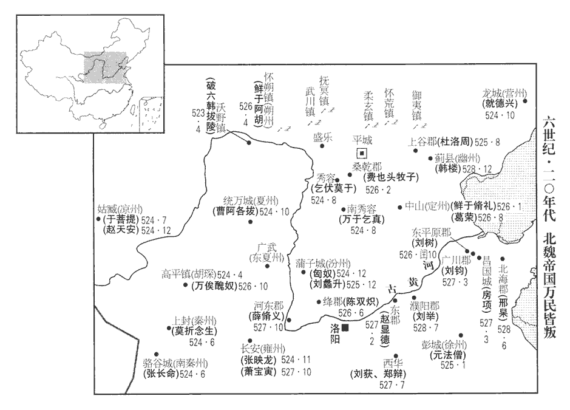
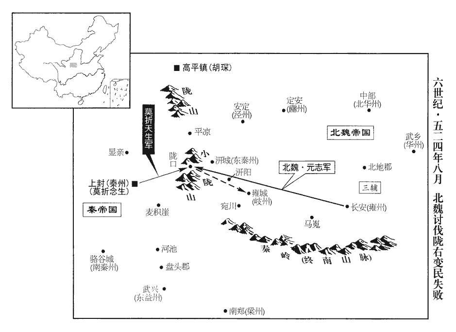
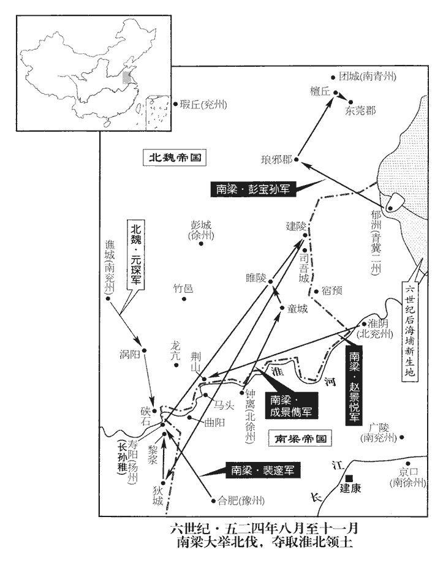
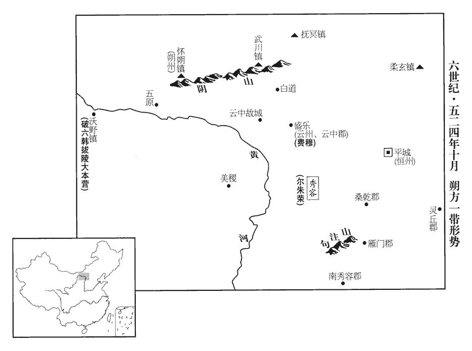
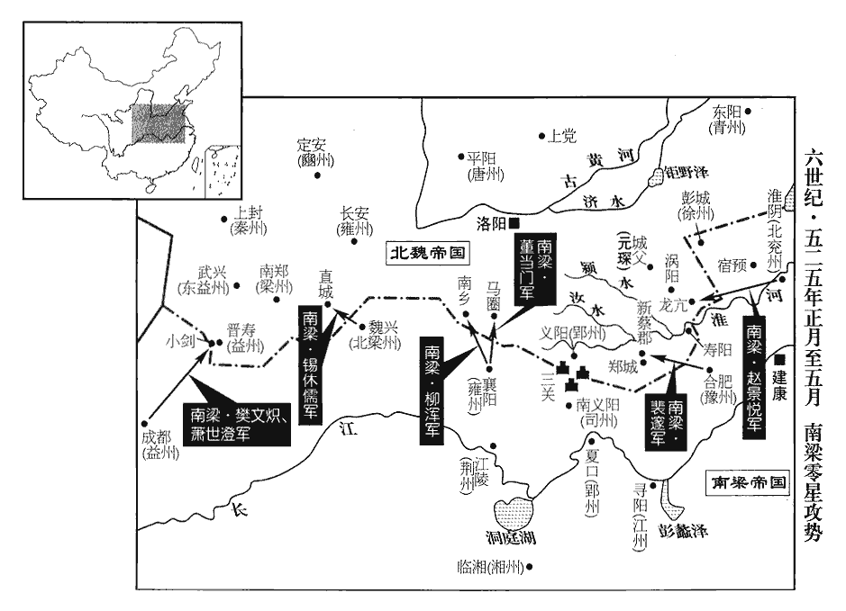
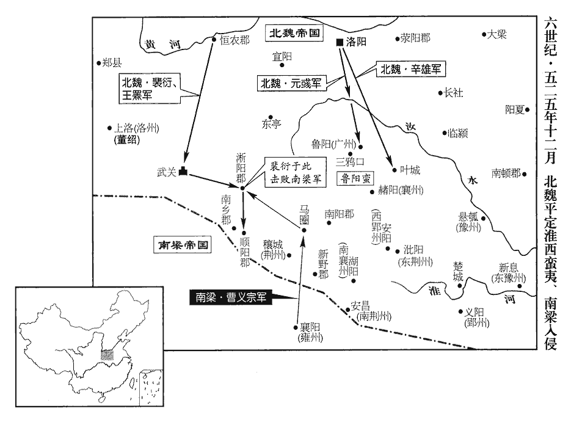

 梁紀六起閼逢執徐（甲辰），盡旃蒙大荒落（乙巳），凡二年。

# 高祖武皇帝六

## 普通五年（甲辰、五二四）

1春，正月，辛丑‹二十›，魏主‹元诩，本年十五岁›祀南郊。

〖译文〗 [1]春季，正月辛丑（二十日），北魏孝明帝在南郊祭天。

2三月，魏以臨淮王彧都督北討諸軍事，討破六韓拔陵。拔陵反見上卷上年。

〖译文〗 [2]三月，北魏委任临淮王元都督北讨诸军事，去讨伐破六韩拔陵。

夏，四月，高平鎮‹宁夏固原县›民赫連恩等反，推敕勒酋長胡琛為高平王，酋，慈秋翻。長，知兩翻。攻高平鎮以應拔陵。魏將盧祖遷擊破之，琛北走。將，即亮翻。

〖译文〗 夏季，四月，高平镇民赫连恩等人造反，推举敕勒酋长胡琛为高平王，并攻打高平镇，以便响应破六韩拔陵。北魏将领卢祖迁击败了他们，胡琛北逃而去。

衛可孤攻懷朔鎮‹内蒙古固阳县›經年，外援不至，楊鈞使賀拔勝詣臨淮王彧告急。勝募敢死少年十餘騎，夜伺隙潰圍出，賊騎追及之，勝曰：「我賀拔破胡也。」少，詩照翻。騎，奇寄翻。伺，相吏翻。賀拔勝，字破胡。賊不敢逼。勝見彧於雲中‹盛乐·内蒙古和林格尔县›，考異曰：勝傳云：「至朔州見彧。」按後魏地理志，雲中，舊名朔州；及改懷朔鎮為朔州，不容更以雲中為朔州；今但云雲中。按魏氏初都平城，北邊列置諸鎮，孝昌以後改鎮為州，尋即荒廢，其地漫不可考。杜佑以為魏都平城，於郡北三百餘里置懷朔鎮；又云：遷洛之後，於郡北三百餘里置朔州；又云：後魏初，雲中在郡北三百餘里，定襄故城北。夫其曰皆在郡北三百餘里，將是一處邪，將是三處邪？宋白曰：朔州馬邑郡，東北至故雲中二百六十里，後魏為畿內之地，亦曾為懷朔鎮；孝文遷洛之後，於州北三百八十里定襄故城置朔州。又曰：後魏初，雲中定襄故城是。則是朔州與後魏初雲中共一處。通鑑此後書改懷朔鎮為朔州，更命朔州為雲州，此即魏志所謂雲中舊名朔州之證也。是則懷朔鎮與雲中是兩處矣。是後，李崇自崔暹白道之敗，引還雲中，後又自雲中引還平城，其退師道里先後可見，而唐之雲中郡乃魏之平城。詳而考之，歷代建置州郡，其名淆雜，難指一處為定也。說之曰：「懷朔被圍，旦夕淪陷，大王今頓兵不進；懷朔若陷，則武川‹内蒙古武川县›亦危，賊之銳氣百倍，雖有良、平，不能為大王計矣。」彧許為出師。勝還，復突圍而入。鈞復遣勝出覘武川，說，式芮翻。許為。于偽翻。復，扶又翻；下聊復同。覘，丑廉翻，又丑艷翻。武川已陷。勝馳還，懷朔亦潰，勝父子俱為可孤所虜。

〖译文〗 卫可孤攻打怀朔镇整整一年了，外面援军不到，杨钧指派贺拔胜到临淮王元那里去告急。贺拔胜招募了十余名不怕死的少年骑兵，在夜间瞅空子突围而出，卫可孤的骑兵追上了他们，贺拔胜喊道：“我是贺拔破胡。”追兵们便吓得不敢逼近了。贺拔胜在云中见到了元，向他游说道：“怀朔被围，沦陷于敌就在眼前，大王现在却按兵不动。怀朔如果陷于放手，那么武川也将告危，那时贼寇的锐气将百倍增加，即使有张良、陈平在，也无法为大王您计议了。”元答应出兵援救怀朔。贺拔胜返回，又突围而入城。杨钧又派遣贺拔胜出城去侦察武川的情况，去之后，武川已经失陷。贺拔胜快马驰还，很快怀朔也被攻破，贺拔胜父子俱被卫可孤俘虏。

五月，臨淮王彧與破六韓拔陵戰於五原‹内蒙古包头市›，五原，即漢五原郡地。魏收志，朔州治五原。杜佑曰：魏置朔州於懷朔鎮，在唐朔州馬邑郡北三百餘里；今榆林九原即漢之五原郡地。蓋漢之五原，壤地甚廣，唐之豐、勝、朔三州，皆漢之五原郡地。魏收志，朔州附化郡有五原縣；彧與拔陵當戰于此。兵敗，彧坐削除官爵。安北將軍隴西‹甘肃省陇西县›李叔仁又敗於白道‹内蒙古呼和浩特市北›，武川鎮北有白道谷，谷口有白道城，自城北出有高阪，謂之白道嶺。賊勢日盛。

〖译文〗 五月，临淮王元同破六韩拔陵在五原交战，战败，元因而获罪被削除官爵。安兆将军陇西人李叔仁也在白道战败，因此贼兵的势力日益强盛了。

魏主引丞相、令、僕、尚書、侍中、黃門於顯陽殿，問之曰：「今寇連恆‹府设平城山西省大同市›、朔‹府设盛乐内蒙古和林格尔县›，逼近金陵‹内蒙古和林格尔县西北›，魏未遷洛以前，諸帝皆葬雲中之金陵。恆，戶登翻。近，其靳翻。計將安出？」吏部尚書元脩義請遣重臣督軍鎮恆、朔以捍寇，帝曰：「去歲阿那瓌叛亂，遣李崇北征，崇上表求改鎮為州，朕以舊章難革，不從其請。尋崇此表，開鎮戶非冀之心，致有今日之患；但既往難追，聊復略論耳。然崇貴戚重望，李崇，文成皇后兄誕之子，歷方面，有時望。器識英敏，意欲遣崇行，何如？」僕射蕭寶寅等皆曰：「如此，實合群望。」崇曰：「臣以六鎮遐僻，密邇寇戎，杜佑曰：六鎮並在今馬邑、雲中、單于界。欲以慰悅彼心，豈敢導之為亂！臣罪當就死，陛下赦之；今更遣臣北行，正是報恩改過之秋。但臣年七十，加之疲病，不堪軍旅，願更擇賢材。」帝不許。脩義，天賜之子也。天賜見一百三十三卷宋明帝泰始七年。

〖译文〗 北魏孝明帝把朝廷中的丞相、令、仆、尚书、侍中、黄门等大臣召到显阳殿，问他们：“如今恒、朔之地贼寇蜂起，逼近祖先陵墓金陵，怎么办？”吏部尚书元义请求派遣朝廷重臣督领军队镇守恒、朔，以抵御贼寇，孝明帝说：“去年阿那叛乱，派遣李崇北征，李崇上表请求改镇为州，联因为旧的章程难以变更，便没有听从他的请求。思量李崇这个上表，开启了镇上人家的非份之想，以致有今日之患。但是过去的事情难以挽回，这里只是顺便说一下罢了。然而李崇是皇亲贵戚，名望甚重，气量大，识见远，英武机敏，我想派他前去，你们看如何呢？”仆射萧宝寅等都说：“这样决定，非常符合众人之心。”李崇说：“我考虑到六镇地处偏远，贼寇密布，提出改镇为州是为了安慰取悦当地人之心，岂敢引导他们作乱呢？我罪该万死，陛下仁慈而赦免了我，如今更要派我北行，这对我正是一个报恩改过的机会。但是我年已七十，加之疲病在身，不堪于军旅之事了。希望能另外选择优秀人材。”孝明帝没有答应。元义是元天赐的儿子。

臣光曰：李崇之表，乃所以銷禍於未萌，制勝於無形。魏肅宗既不能用，及亂生之後，曾無愧謝之言，乃更以為崇罪，彼不明之君，烏可與謀哉！詩云：「聽言則對，誦言如醉，匪用其良，覆俾我悖，」詩桑柔之辭也。註云：見道聽之言則應答之，見誦詩、書之言則冥臥如醉，不能用善，反使我為悖逆之行。其是之謂矣。

〖译文〗 臣司马光曰：李崇的上表，是为了消除祸乱于未发之时，制敌取胜于无形之中。魏孝明帝既不能采纳他的建议，到祸乱产生之后，不但没有半点愧谢之言，反而更把这认为是李崇的罪过，那个不明智的君主，怎么可以同他谋事呢！《诗经》云：“听到美言便应对，闻诵诗书则陶醉，良善之言不采用，反责我等行逆罪。”说的正是这个意思。

3壬申‹二十三›，加崇使持節、開府儀同三司、北討大都督，使，疏吏翻。命撫軍將軍崔暹、鎮軍將軍廣陽王深皆受崇節度。深，嘉之子也。按魏收魏書作「廣陽王淵」，李延壽北史作「廣陽王深」，蓋避唐諱，通鑑承用之。廣陽王嘉見一百四十三卷齊東昏侯永元元年。考異曰：魏帝紀「深」作「淵」，今從列傳及北史。

〖译文〗 [3]壬申（二十三日），北魏委任李崇为使持节、开府仪同三司、北讨大都督，命令抚军将军崔暹、镇军将军广阳王元深一并接受李崇指挥调遣。元深是元嘉的儿子。

4六月，以豫州‹府设合肥安徽省合肥市›刺史裴邃督征討諸軍事以伐魏。

〖译文〗 [4]六月，梁朝委任豫州刺史裴邃负责征讨诸军事，去讨伐北魏。

5魏自破六韓拔陵之反，二夏‹夏州，州政府设统万陕西省靖边县北白城子›、东夏州，州政府设广武陕西省延安市东北、豳‹府设定安甘肃省宁县›、涼‹府设姑臧甘肃省武威市›，寇盜蜂起。二夏，夏州及東夏州也。魏收地形志，夏州治統萬，領化政、闡熙、金明、代名郡。東夏州領偏城、朔方、定陽、上郡。宋白曰：魏改統萬鎮為東夏州，後改延州。按魏克統萬以為鎮，太和十一年改夏州。延昌二年，置東夏州，治廣武，唐始改為延州，治膚施。後魏太和元年，置廣武縣，後周改豐林縣，隋分豐林、金明置膚施縣，唐延州治焉。則魏東夏州治廣武，非統萬也。然魏收地形志以廣武為太原鴈門之廣武，亦誤。皇興二年，置華州於北地，太和十一年，改為班州，十四年為豳州，領北地、趙興、襄樂郡。涼州領武安、臨松、建昌、番和、泉城、武興、武威、昌松、東涇、涼寧郡。夏，戶雅翻。秦州‹府设上封甘肃省天水市›刺史李彥，政刑殘虐，在下皆怨，是月，城內薛珍等聚黨突入州門，擒彥，殺之，推其黨莫折大提為帥，莫折，虜複姓。帥，所類翻。大提自稱秦王。魏遣雍州‹府设长安陕西省西安市›刺史元志討之。雍，於用翻。

〖译文〗 [5]北魏自从破六韩拔陵造反以来，二夏、豳、凉等地寇盗蜂起。秦州刺史李彦施政严苛，刑罚残酷，无人不怨。这月，城内薛珍等人结伙闯入州府门，抓住了薛彦，杀了他，推举同党莫折大提为元帅，莫折大提自称为秦王。北魏派遣雍州刺史元志去讨伐。

初，南秦州‹府设骆谷城甘肃省西和县南›豪右楊松柏兄弟，數為寇盜，數，所角翻。刺史博陵‹河北省安平县›崔遊誘之使降，引為主簿，接以辭色，使說下群氐，誘，音酉。說，式芮翻。既而因宴會盡收斬之，由是所部莫不猜懼。遊聞李彥死，自知不安，欲逃去，未果；城民張長命、韓祖香、孫掩等攻遊，殺之，以城應大提。大提遣其黨卜胡襲高平，克之，殺鎮將赫連略，行臺高元榮。大提尋卒，卒，子恤翻。子念生自稱天子，置百官，改元天建。

〖译文〗 起初，南秦州的豪强杨松柏兄弟几番为寇，刺史博陵人崔游引诱他投降，提他做了主簿，以亲近的言语和态度接待了他，让他去游说下面的氐族部落，事成之后借宴会之机把他们全部抓起来斩了，因此部下无不猜忌惧怕。崔游得知李彦的死讯之后，知道自己不会有好下场，想逃走，但没有得逞。城中百姓张长命、韩祖香、孙掩等人攻打崔游，杀了他，率全城百姓响应莫折大提。莫折大提派他的党徒卜胡袭击高平，攻克该城，杀了镇将赫连略和行台高元荣。莫折大提很快便去世，他的儿子莫折念生自称为天子，设置百官，改年号为天建。

6丁酉‹十八›，魏大赦。

〖译文〗 [6]丁酉（十八日），北魏大赦天下。

7秋，七月，甲寅‹六›，魏遣吏部尚書元脩義兼尚書僕射，為西道行臺，帥諸將討莫折念生。帥，讀曰率。

〖译文〗 [7]秋季，七月甲寅（初六），北魏委任吏部尚书元义兼尚书仆射，为西道行台，统率众将去讨伐莫折念生。

8崔暹違李崇節度，與破六韓拔陵戰于白道‹内蒙古呼和浩特市北›，大敗，單騎走還。騎，奇寄翻。拔陵并力攻崇，崇力戰，不能禦，引還雲中，與之相持。

〖译文〗 [8]崔暹不服从李崇指挥，与破六韩拔陵在白道交战，一败涂地，单人匹马跑了回来。破六韩拔陵集中兵力攻打李崇，李崇全力迎战，但是抵挡不住，便带领部队回到云中，与破六韩拔陵相持。

 

廣陽王深上言：「先朝都平城‹山西省大同市›，上，時掌翻。朝，直遙翻。以北邊為重，盛簡親賢，擁麾作鎮，謂鎮將也。配以高門子弟，以死防遏，非唯不廢仕宦，乃更獨得復除，高門子弟，謂其先世與魏同起於代北者，所謂大姓九十九。復，方目翻。當時人物，忻慕為之。太和中，僕射李沖用事，涼州土人悉免廝役；李寶自敦煌入朝于魏，至子沖親貴，厚其鄉人，故涼土之人悉免廝役。帝鄉舊門，仍防邊戍，自非得罪當世，莫肯與之為伍。本鎮驅使，但為虞候、白直，杜佑曰：白直無月給。一生推遷，不過軍主；然其同族留京師者得上品通官，在鎮者即為清途所隔，或多逃逸。乃峻邊兵之格，鎮人不聽浮遊在外，於是少年不得從師，長者不得遊宦，少，詩照翻。長，知兩翻。獨為匪人，言之流涕！自定鼎伊、洛，邊任益輕，唯底滯凡才，乃出為鎮將，轉相模習，專事聚斂。或諸方姦吏，犯罪配邊，為之指蹤，政以賄立，邊人無不切齒。及阿那瓌背恩縱掠，斂，力贍翻。背，蒲妹翻。發奔命追之，十五萬眾度沙漠，不日而還。事見上卷上年。還，從宣翻，又如字。邊人見此援師，遂自意輕中國。師速而疾，邊人見其不能盡敵而反，意遂輕之。尚書令臣崇求改鎮為州，抑亦先覺，朝廷未許。而高闕‹内蒙古杭锦后旗东北›戍主御下失和，酈道元曰：趙武靈王既襲胡服，自代並陰山下至高闕為塞。山下有長城，長城之際，連山刺天。其山中斷，兩岸雙闕雲舉，望若闕焉，故有高闕之名。自闕北出荒中，闕口有城，跨山結局，謂之高闕戍。拔陵殺之，遂相帥為亂，帥，讀曰率。攻城掠地，所過夷滅，王師屢北，賊黨日盛。此段之舉，指望銷平；而崔暹隻輪不返，臣崇與臣逡巡復路，復路者，還即舊路也。相與還次雲中，將士之情莫不解體。今日所慮，非止西北，將恐諸鎮尋亦如此，天下之事，何易可量！」書奏，不省。為魏主思崇、深之言張本。易，以豉翻。量，音良。省，悉景翻。

〖译文〗 广阳王元深上奏孝明帝：“先朝建都平城时，以北部边境为重，郑重挑选亲近贤能，挂帅但任镇将，并且配以高门子弟，让他们拼死防止边患，不但不影响他们的仕宦前途，反而更因此而独得提升，当时的人们，都欣羡能去那里守边。太和年间，仆射李冲掌权，凉州的当地人全都免除服役，而平城的那些高门大姓，却仍然要去防守边关，如果不是得罪了当权者，谁也不愿意加入其列。这些人到了边关之后，受镇将驱使，只能担任虞侯或没有月俸的随从之类的卑下职务。一生之内，最高也只不过做到军主。然而他们同姓中留在京城的那些人却能做到上品显官，于是身在边镇的那些人便由于升迁之路与己隔绝，因而大量逃散。于是，朝廷制定了严厉的边兵制度，规定不允许边镇上的人浮游在外，于是少年人不能从师学习，成年人不能出外游宦，只有这些人不被当做人看待，说起来便让人心酸落泪！自从迁都洛阳以来，边防职任更加被看得轻了，只有那些长期不能升迁的庸碌之才，才出任镇将，这些人互相仿效，一心为自己聚敛财物，而无心于本职之事。或者各地方的奸吏，因犯罪而发配边关，这些人在背后为镇将尽出坏主意，贪脏枉法，以致贿赂成风，取代了正常的制度，边民们对此无不切齿。到阿那背弃朝廷之恩，纵掠反叛而去，朝廷发兵长途追击。十五万大军越过沙漠，但不到几天功夫就返回来了，不能除尽反贼，边民见到这样的援军，于是便打心眼中瞧不起中原之国。尚书令李崇请求改镇为州，或许也是先觉察到了这一点，但是朝廷没有准许他的请求。高阙戌的主将管制下属严酷，上下失和，破六韩拔陵杀了他，于是结伙叛乱，攻城掠地，所过之处夷灭无遗。朝廷军队屡屡败北，贼党气焰日益嚣张。这一段时间里的举动，指望能铲平叛乱，早获安定；但是崔暹全军覆没，李崇与我徘徊难进，只好一起顺原路回到云中，将士们的情绪一落千丈，无心再战。现在的忧虑，不仅西北方面，恐怕各镇很快也会如此，天下之事，哪能容易地估量透呢！”元深的上书奏呈上去后，孝明帝没有亲自省阅。

詔徵崔暹繫廷尉，暹以女妓田園賂元叉，卒得不坐。妓，渠綺翻。卒，子恤翻。下卒無同。

〖译文〗 孝明帝诏令召崔暹进朝，由廷尉问罪，但是崔暹用女妓、田产庄园贿赂元义，最后竟没有治罪。

9丁丑‹二十九›，莫折念生遣其都督楊伯年攻仇鳩、河池二戍‹均在甘肃省徽县西›，河池即今鳳州河池縣，有河池水。仇鳩亦當與河池相近。東益州‹府设武兴陕西省略阳县›刺史魏子建遣將軍伊祥等擊破之，斬首千餘級。東益州本氐王楊紹先之國，天監五年魏克武興，滅楊紹先之國，置東益州。將佐皆以城民勁勇，二秦反者皆其族類，請先收其器械，子建曰：「城民數經行陣，數，所角翻。行，戶剛翻。撫之足以為用，急之則腹背為患。」乃悉召城民慰諭之，既而漸分其父兄子弟外戍諸郡，內外相顧，卒無叛者。卒，子恤翻。子建，蘭根之族兄也。

〖译文〗 [9]丁丑（二十九日），莫折念生派遣他属下的都督杨伯年攻打仇鸠、河池两个寨堡，东益州刺史魏子建派将军伊祥等人击败了杨伯年，斩首一千多人。东益州本来是氐王杨绍先的封国，将佐们都因为州城中的民众勇悍不驯，南秦州和秦州的反叛者都是杨绍先的同族之人，于是请求要先没收城里人手中的兵器械仗，魏子建说：“城中民众数次经历打仗之事，安抚好他们便可为我所用，逼的太急了则会成为我们的心腹之患。”于是把城中民众都召集起来，安抚晓谕他们，然后逐渐把他们父子兄弟分派到外地各郡去戍守，这样内外相顾，到底也没有出现反叛者。魏子建是魏兰根的族兄。

10魏涼州幢帥于菩提等執刺史宋穎，據州反。幢，傳江翻。帥，所類翻。菩，薄乎翻。

〖译文〗 [10]北魏凉州幢帅于菩提等人拘押了刺史宗颖，占据凉州而反。

11八月，庚寅‹十二›，徐州‹北徐州·州政府设钟离安徽省凤阳县东北临淮关›刺史成景儁拔魏童城‹童县故城·安徽省泗县东北›。童城，即下邳僮縣城也。

〖译文〗 [11]八月庚寅（十二日），梁朝徐州刺史成景俊攻拔北魏的童城。

12魏員外散騎侍郎李苗上書曰：「凡食少兵精，利於速戰；散，悉亶翻。騎，奇寄翻。上，時掌翻。少，詩沼翻。糧多卒眾，事宜持久。今隴賊猖狂，非有素蓄，雖據兩城，兩城，謂天水及高平。本無德義，其勢在於疾攻，日有降納，降，戶江翻。遲則人情離沮，坐待崩潰。夫飈biāo至風舉，逆者求萬一之功；高壁深壘，王師有全制之策。但天下久泰，人不曉兵，奔利不相待，逃難不相顧，難，乃旦翻。，將無法令，士非教習，不思長久之計，各有輕敵之心。如令隴東不守，汧‹陕西省千阳县›軍敗散，汧軍，謂元志之軍也。汧在隴阪之東。將，即亮翻。汧，口堅翻。則兩秦遂強，兩秦，謂莫折念生及張長命等。三輔危弱，國之右臂於斯廢矣。宜敕大將堅壁勿戰，別命偏裨帥精兵數千出麥積崖‹山在天水市东南四十千米›以襲其後，麥積崖，在今秦州天水縣東百里，狀如麥積，故名。裨，賓彌翻。帥，讀曰率。則汧、隴之下，群妖自散。」妖，於驕翻。

〖译文〗 [12]北魏员外散骑侍朗李苗上书说：“粮少兵精，利于速战速决；粮多兵众，利于打持久之战。当今陇地贼寇猖狂，但是这些贼寇没有多少粮资储备崐，虽然占据了两座城，但本来没有德义，所以其势在于急攻，以使每日都有所降纳，迟缓了则会使人心离散，情绪颓丧，从而坐待崩溃。飚至风举，逆反者求的是万一之功；高壁深垒，王师有全制之策。但是天下长久安泰，人们已经不知晓行伍征战了，都变得追逐利益唯恐落后，逃灾避难互不相顾，将帅没有法令，士兵不演习操练，人人不思长远之计，个个都有轻敌之心。如果使陇东失守，地元志的军队败溃，秦州和南秦州莫折念生及张长命等反贼的势力便可强大，那么长安附近顿时就会变得危而又弱，作为国家的右臂于是便废了。应该旨令主将坚壁而守，不要出战，另外命令副帅偏将率领兵数千名出麦积崖从背后袭击叛贼，如此则、陇之地，群妖自散。”

魏以苗為統軍，與別將淳于誕俱出梁‹府设南郑陕西省汉中市›、益‹府设晋寿四川省广元市西南›，【章：十二行本「益」下有「隸魏子建」四字；乙十一行本同；孔本同；張校同；退齋校同。】未至，莫折念生遣其弟高陽王天生將兵下隴。甲午‹十六›，都督元志與戰於隴口，隴口，隴坻之口也。志兵敗，棄眾東保岐州‹府设雍城陕西省凤翔县›。魏岐州治雍城。

〖译文〗 北魏任命李苗为统军，让他同别将淳于诞分别从梁州、益州出发去征讨叛贼，但还没有到达目的地，莫折念生便派遣他的弟弟高阳王莫折天生率兵前来陇地。甲午（十六日），都督元志与莫折天生在陇口交战，元志兵败，丢下部众跑到东边的岐州自守。

 

13東西部敕勒皆叛魏，附於破六韓拔陵，魏主始思李崇及廣陽王深之言。丙申‹十八›，下詔：「諸州鎮軍貫貫，籍也。非有罪配隸者，皆免為民。」改鎮為州，以懷朔鎮為朔州，更命朔州‹府设盛乐›曰雲州。魏先置朔州於雲中之盛樂，以漢五原郡地為懷朔鎮；今以懷朔為朔州，改舊朔州為雲州，因雲中郡而得名也。按後廣陽王深自五原拔軍向朔州，則懷朔鎮雖置於漢五原郡地，與五原別為兩城。宋白曰：漢五原故城，在唐勝州榆林縣界，後魏孝文於唐朔州北三百八十里定襄故城置朔州。更，工衡翻。遣兼黃門侍郎酈道元為大使，撫慰六鎮。使，疏吏翻。時六鎮已盡叛，道元不果行。

〖译文〗 [13]东部和西部的敕勒人都反叛了北魏，投附于破六韩拔陵，北魏孝明帝这才开始想到了李崇和广阳王元深曾经说过的话。丙申（十八日），孝明帝诏令：“各州镇在册的军人中凡不是因犯罪而被流放服役的，全都免为平民。”改镇为州，以怀朔镇为朔州，又改名朔州为云州。派遣兼黄门侍郎郦道元为大使，让他去安抚宣慰六镇。当时六镇已经全部反叛，郦道元没有成行。

先是，代人遷洛者，多為選部所抑，不得仕進。先，悉薦翻。選，須絹翻。及六鎮叛，元叉乃用代來人【章：十二行本「人」上有「寒」字；乙十一行本同；孔本同；張校同；退齋校同。】為傳詔以慰悅之。廷尉評代人山偉奏記，稱叉德美，叉擢偉為尚書二千石郎。廷尉評，即漢之廷尉平，魏、晉以來，「平」旁加「言」，今大理評事即其職也。後漢尚書有二千石曹，魏置二千石郎。魏收官氏志：內入諸姓，土難氏後改為山氏。

〖译文〗 先前，从代京迁到洛阳的那些人，大多被吏部所压制，不能作官。到六镇反叛之时，元义才使用从代京迁来的人担任传诏，以便安慰、取悦他们。廷尉评代京人山伟在奏记中称颂元义道德高尚，元义便晋升山伟为尚书二千石郎。

14秀容‹山西省朔州市西北›人乞伏莫于聚眾攻郡，殺太守；水經註：魏立秀容護軍以統胡人，其治所去汾水六十里。地形志：永興二年置秀容郡，屬肆州。丁酉‹十九›，南秀容‹山西省原平市西南›牧子萬于乞真【章：十二行本「真」下有「反」字；乙十一行本同；孔本同；張校同；退齋校同。】殺太僕卿陸延，秀容酋長爾朱榮討平之。榮，羽健之玄孫也。羽健見一百一十卷晉安帝隆安二年。酋，慈秋翻。長，知兩翻。其祖代勤，嘗出獵，部民射虎，誤中其髀bì，代勤拔箭，不復推問，射，而亦翻。中，竹仲翻。復，扶又翻。所部莫不感悅。官至肆州‹府设九原山西省忻州市›刺史，賜爵梁郡公，年九十餘而卒；卒，子恤翻。子新興立。新興時，畜牧尤蕃息，蕃，扶元翻。牛羊駝馬，色別為群，彌漫川谷，不可勝數。勝，音升。魏每出師，新興輒獻馬及資糧以助軍，高祖嘉之。新興老，請傳爵於子榮，魏朝許之。朝，直遙翻。榮神機明決，御眾嚴整。時四方兵起，榮陰有大志，散其畜牧資財，招合驍勇，結納豪桀，爾朱榮事始此。驍，堅堯翻。於是侯景、司馬子如、賈顯度及五原‹内蒙古包头市›段榮、太安‹内蒙古固阳县›竇泰時魏於懷朔鎮置朔州，并置太安郡。皆往依之。顯度，顯智之兄也。

〖译文〗 [14]秀容人乞伏莫于聚众攻打郡城，杀了太守。丁酉（十九日），南秀容的放牧人万于乞真杀了太仆卿陆延，秀容的酋长尔朱荣讨伐平定了这场叛乱。尔朱荣是尔朱羽健的玄孙。尔朱荣的祖父尔朱代勤，一次出外打猎，他的部落中的一个成员射虎，误中了他的大腿，他把箭拔出来，没有问罪于该人，因此部落成员们莫不对他心悦诚服。尔朱代勤为官做到肆州刺史，受赐爵位梁郡公，活了九十多岁才去世。他的儿子尔朱新兴继承了爵位。尔朱新兴做酋长之时，畜牧业尤其兴旺，牛、羊、骆驼和马，以毛色分群，弥漫于川谷之中，数量多得无法计算。北魏每到出兵之时，尔朱新兴便献上马匹以及军资粮食等来帮助军队，孝文帝经常表彰他。尔朱新兴年老了，请求把爵位传给尔朱荣，北魏朝廷准许了。尔朱荣心机神妙，明察而有决断，管理部属特别严格。当时四方兵起，烽火遍地，尔朱荣心中暗藏大志，把自己的牲畜钱财散发众人，招募纠合骁勇之徒，结交招纳豪杰，于是侯景、司马子如、贾显度以及五原人段荣、太安人窦泰等人都去依附了他。贾显度是贾显智的哥哥。

15戊戌‹二十›，莫折念生遣都督竇雙攻魏盤頭郡‹甘肃省徽县南›，盤頭郡屬東益州。五代志，興州長舉縣，魏置盤頭郡。東益州刺史魏子建遣將軍竇念祖擊破之。

〖译文〗 [15]戊戌（二十日），莫折念生派遣都督窦双攻打北魏盘头郡，东益州刺史魏子建派遣将军窦念祖击败了窦双。

16九月，戊申‹一›，成景儁拔魏睢陵‹江苏省睢宁县›。戊午‹十一›，北兗州‹府淮阴›刺史趙景悅圍荊山‹安徽省怀远县西南›。梁北兗州治淮陰。水經註曰：地理志，平阿縣有當塗山，淮出於荊山之左，當塗之右。魏收志，梁北徐州沛郡已吾縣有當塗山、荊山。今之懷遠軍正據荊山，以沈約志言之，皆屬馬頭郡界。五代志：鍾離郡塗山縣，古當塗也，後齊置荊山郡。裴邃帥騎三千襲壽陽‹安徽省寿县›，帥，讀曰率。騎，奇寄翻。壬戌‹十五›夜，斬關而入，克其外郭。魏揚州‹府寿阳›刺史長孫稚禦之，一日九戰，後軍蔡秀成失道不至，邃引兵還。別將擊魏淮陽，此梁所遣別將也，非裴邃所部。將，即亮翻；下同。魏使行臺酈道元、都督河間王琛救壽陽，琛，丑林翻。安樂王鑒救淮陽。鑒，詮之子也。樂，音洛。詮，丑緣翻。安樂王詮事見一百四十六卷天監五年。

〖译文〗 [16]九月戊申（初一），成景俊攻取了北魏的睢陵。戊午（十一日），北兖州刺史赵景悦围困荆山。裴邃率领三千骑兵袭击寿阳，于壬戌（十五日）夜，攻破城门，攻克了寿阳外城。北魏扬州刺史长孙稚抗击裴邃，一天交战了九次，后军蔡秀成迷路而没有赶来，裴邃只好领兵撤返。梁朝派遣别将攻打北魏淮阳，北魏派遣行台郦道元、都督河间王元琛去援救寿阳，派安乐王元鉴去援救淮阳。元鉴是元诠的儿子。

17魏西道行臺元脩義得風疾，不能治軍。治，直之翻。壬申‹二十五›，魏以尚書左僕射齊王蕭寶寅為西道行臺大都督，帥諸將討莫折念生。為蕭寶寅以關中叛魏張本。

〖译文〗 [17]北魏西道行台元义得了风疾，不能指挥军队了。壬申（二十五日），北魏任命尚书左仆射齐王萧宝寅为西道行台大都督，令他统率众将去讨攻莫折念生。

宋穎密求救於吐谷渾‹青海省›王伏連籌，吐，從暾入聲。谷，音浴。伏連籌自將救涼州，于菩提棄城走，追斬之。城民趙天安等復推宋穎為刺史。復，扶又翻。

〖译文〗 宋颖秘密地向吐谷浑王伏连筹求救，伏连筹亲自率兵援救凉州，于菩提弃城逃跑，伏连筹追上斩了他。城中百姓赵天安等人又推举宋颖为刺史。

18河間王琛軍至西硤石‹安徽省凤台县西南›，解渦陽‹安徽省蒙城县›圍，復荊山戍。青、冀二州‹府设郁洲江苏省连云港市东沉积小岛›刺史王神念與戰，為琛所敗。敗，補邁翻。冬，十月，戊寅‹一›，裴邃、元樹攻魏建陵城‹江苏省新沂市›，克之，辛巳‹四›，拔曲木‹曲沭戍建陵城西›；「曲木」，當作「曲沭」。水經註：沭水過建陵縣故城東，又南逕陵山西，魏立大堰遏水西流，兩瀆之會，置城防之，曰曲沭戍。沭，食聿翻。掃虜將軍彭寶孫拔琅邪‹山东省临沂市›。

〖译文〗 [18]河间王元琛率兵抵达西硖石，解了涡阳之围，收复了荆山戍。梁朝青、冀二州刺史王神念与元琛交战，被元琛打败。冬季，十月戊寅（初一），裴邃、元树攻打北魏建陵城，攻克了该城。辛巳（初四），又攻下了曲木，扫虏将军彭宝孙攻取了琅邪。

19魏營州‹府设龙城辽宁省朝阳市›城民劉安定、就德興魏書官氏志：菟賴氏改為就氏，西方諸姓也。執刺史李仲遵，據城反。城民王惡兒斬安定以降；德興東走，自稱燕王。降，戶江翻。燕，因肩翻。

〖译文〗 [19]北魏营州城的百姓刘安定、就德兴抓住了刺史李仲遵，占据州城而反。城中的百姓王恶儿斩了刘安定而投降，就德兴向东逃跑，自称燕王。

20胡琛遣其將宿勤明達寇豳、夏‹府设统万陕西省靖边县北白城子›、北華‹原为东秦州·州政府设中部陕西省黄陵县›三州，魏高祖太和十五年，置東秦州於杏城，後改為北華州，領中部、敷城，凡二郡。宿勤，虜複姓。夏，戶雅翻。華，戶化翻。魏【章：十二行本「魏」上有「壬午」二字；乙十一行本同；孔本同；張校同。】遣都督北海王顥hào帥諸將討之。顥，詳之子也。詳得罪見一百四十五卷天監三年。帥，讀曰率。

〖译文〗 [20]胡琛派遣手下将领宿勤明达侵扰豳、夏、北华三州，北魏派遣都督北海王元颢统率众将去讨伐。元颢是元详的儿子。

 

21甲申‹七›，彭寶孫拔檀丘‹山东省莒县西›。辛卯‹十四›，裴邃拔狄城‹安徽省寿县南›；水經註：肥水自荻丘過漢九江成德縣故城西，王莽更曰平阿；又北入芍陂。丙申‹十九›，又拔甓pì城，進屯黎漿‹安徽省寿县东南›。壬寅‹二十五›，魏東海‹江苏省宿迁市北›太守韋敬欣以司吾城‹东海郡郡政府所在城›降。漢東海郡司吾縣之故城也。定遠將軍曹世宗拔曲陽‹安徽省淮南市›；甲辰‹二十七›，又拔秦墟‹洛口洛涧北流注入淮河处·安徽省怀远县东南›，魏守將多棄城走。水經註：洛水逕漢淮南郡曲陽故城東。應劭曰：縣在淮曲之陽。洛水又北歷秦墟，下注淮，謂之洛口。魏收志：曲陽縣屬霍州北沛郡。五代志，曲陽縣後廢入鍾離定遠縣。

〖译文〗 [21]甲申（初七），梁朝彭宝孙攻取了檀丘。辛卯（十四日），裴邃攻取了狄城；丙申（十九日），又攻取了甓城，进驻黎将。壬寅（二十五日），北魏东海太守韦敬欣献上司吾城投降。定远将军曹世宗攻取了曲阳；甲辰（二十七日），又攻下了秦墟，北魏的守将大多数弃城逃跑。

22魏使黃門侍郎盧同持節詣營州‹府龙城›慰勞，就德興降而復反。詔以同為幽州‹府设蓟县北京市›刺史兼尚書行臺，同屢為德興所敗而還。勞，力到翻。復，扶又翻。敗，補邁翻。還，從宣翻，又如字。

〖译文〗 [22]北魏派黄门侍郎卢同持符节去营州慰劳，就德兴投降后又反叛了。朝廷诏令任命卢同为幽州刺史兼尚书行台。卢同屡次被就德兴打败而撤回。

23魏朔方胡反，圍夏州刺史源子雍，夏，戶雅翻。夏州治統萬城。城中食盡，煮馬皮而食之，眾無貳心。子雍欲自出求糧，留其子延伯守統萬，將佐皆曰：「今四方離叛，糧盡援絕，不若父子俱去。」子雍泣曰：「吾世荷國恩，當畢命此城；但無食可守，故欲往東州荷，下可翻。東州，謂東夏州也。為諸君營數月之食，為，于偽翻。若幸而得之，保全必矣。」乃帥羸弱詣東夏州‹府设广武陕西省延安市东北›運糧，帥，讀曰率。羸，倫為翻。延伯與將佐哭而送之。子雍行數日，胡帥曹阿各拔邀擊，擒之。帥，所類翻。子雍潛遣人齎書，敕城中努力固守。闔城憂懼，延伯諭之曰：「吾父吉凶未可知，方寸焦爛。但奉命守城，所為者重，為，于偽翻；下為陳同。不敢以私害公。諸君幸得此心。」於是眾感其義，莫不奮勵，子雍雖被擒，胡人常以民禮事之，子雍為陳禍福，勸阿各拔降。會阿各拔卒，其弟桑生竟帥其眾隨子雍降。降，戶江翻。子雍見行臺北海王顥hào，具陳諸賊可滅之狀，顥給子雍兵，令其先驅。時東夏州闔境皆反，所在屯結，子雍轉鬬而前，九旬之中，凡數十戰，遂平東夏州，徵稅粟以饋統萬，二夏由是獲全。子雍，懷之子也。史言源氏諸子皆有才具，而天降喪亂，終無救魏氏之衰也。

〖译文〗 [23]北魏朔方的胡人反叛，围攻夏州刺史源子雍，城中的粮食吃光了，就煮食马皮，众人都一心一德守城。源子雍想亲自出城求粮，留下他的儿子源延伯守统万城，将佐们都说：“如今四方反叛，粮食耗尽，外援阻绝，不如你们父子都去。”源子雍流着眼泪说道：“我家世世代代承受国恩，所以应拼死守住这座城。但是没有粮食，无法守城，所以想到东州去，为各位筹措几个月的食物，如果有幸能得到，就必定可以保住城。”于是便率领羸弱之卒去东夏州运粮，源延伯与众将佐们哭着为他送行。源子雍行走几日，遭到了胡人头领曹阿各拔的阻击，被曹阿各拔擒拿。源子雍暗中派人给统万城送信，命令城中军民努力固守。全城军民得知源子雍被擒，非常忧惧，源延伯晓谕他们说：“我父亲的生死吉凶还不可得知，我急得滚油浇心。但是我奉家父之命守城，责任重大，所以不敢因私损公而弃城不顾。请各位理解我的心情。”于是众人都被源延伯的节义所感动，无不奋发，立志守城。源子雍虽然被擒，但是胡人一直把他当州长官来看待，以下民之礼奉事他，他对胡人陈述了祸福利弊，劝曹阿各拔投降。恰巧曹阿各拔去世，他的弟弟曹桑生竟率领部众随源子雍投降了。源子雍去见行台北海王元颢，一一讲陈了各路反贼可以被歼灭的情状，元颢给了源子雍兵力，令他作为先锋。当时，东夏州全境俱反，到处贼寇聚集，源子雍转战而前，九十天之内，经历了几十场战役，终于平定了东夏州，于是征收税粟送往统万城，夏州、东夏州因此而得到保全。源子雍是源怀的儿子。

24魏廣陽王深上言：「今六鎮盡叛，高車二部亦與之同，高車自阿伏至羅與窮奇分為二部，所謂東、西部敕勒也。以此疲兵擊之，必無勝理。不若選練精兵守恆州‹府设平城›諸要，諸要，謂要衝之地。恆，戶登翻。更為後圖。」遂與李崇引兵還平城。崇謂諸將曰：「雲中者，白道‹内蒙古呼和浩特市北›之衝，以此觀之，則魏之雲中，漢之盛樂縣，唐之振武軍節度使治所，皆雲山之陽。賊之咽喉，咽，音煙。若此地不全，則并‹府设晋阳山西省太原市›、肆‹府设九原山西省忻州市›危矣。當留一人鎮之，誰可者？」眾舉費穆，崇乃請穆為朔州刺史。請，奏請也。時雲中已改為雲州。「朔」當作「雲」。

〖译文〗 [24]北魏广阳王元深上书说：“如今六镇全都反叛了，高车二部的情况也与六镇相同，以这样的疲劳之兵攻打他们，必定没有取胜的道理。所以，不如挑选演练精兵把守恒州的各个要冲之地，再作以后的打算。”于是便与李崇领兵回到了平城。李崇对众将说：“云中是白道的要冲，叛贼的咽喉要害，如果此地保不住，那么并州和肆州就危险了。所以，应当留下一个人镇守，谁来承当呢？”众人推举费穆，李崇便奏请任命费穆为朔州刺史。

25賀拔度拔父子及武川宇文肱糾合鄉里豪傑，共襲衛可孤，殺之；度拔尋與鐵勒戰死。肱，逸豆歸之玄孫也。肱，宇文泰之父也。逸豆歸，晉康帝建元二年為慕容皝所滅。

〖译文〗 [25]贺拔度拔父子以及武川人宇文肱纠集乡里的豪杰，一同袭击卫可孤，杀了卫可孤；贺拔度拔不久又与敕勒交战而身亡。宇文肱是宇文逸豆归的玄孙。

李崇引國子博士祖瑩為長史；廣陽王深奏瑩詐增首級，盜沒軍資，瑩坐除名，崇亦免官削爵徵還。深專總軍政。為深內困於讒、外困於賊張本。

〖译文〗 李崇引荐国子博士祖莹为长史；广阳王元深弹劾祖莹谎报斩敌人数，侵吞军款，祖莹因而获罪被除名，李崇也被免去官职，削夺爵位而召回朝廷。于是，元深得以一人独揽军政大权。

26莫折天生進攻魏岐州，十一月，戊申‹二›，陷之，執都督元志及刺史裴芬之，送莫折念生殺之。念生又使卜胡等寇涇州‹府安定›，敗光祿大夫薛巒於平涼‹甘肃省华亭县›東。魏置平涼郡，治鶉陰縣，有平涼城。敗，補邁翻。巒，安都之孫也。宋泰始初，薛安都降魏。

〖译文〗 [26]莫折天生进攻北魏岐州，十一月戊申（初二），攻陷了该城，抓获都督元志以及刺史裴芬之，把他们送给莫折念生，莫折念生杀了他们。莫折念生又派卜胡等人入侵泾州，在平凉东边打败了光禄大夫薛峦。薛峦是薛安都的孙子。

 

27丙辰‹十›，彭寶孫拔魏東莞‹山东省莒县›。莞，音官。壬戌‹十六›，裴邃攻壽陽‹北魏扬州·安徽省寿县›之安城‹安徽省阜阳市东›，魏收志，梁置新興郡，治安城縣。丙寅‹二十›，馬頭‹涡阳·安徽省蒙城县。此非淮河南岸之马城›、安城皆降。

〖译文〗 [27]丙辰（初十），彭宝孙攻取了北魏的东莞。壬戌（十六日），裴邃攻打寿阳的安城，丙寅（二十日），马头和安城两处都投降了。

28高平人攻殺卜胡，共迎胡琛。

〖译文〗 [28]高平人攻打并杀死了卜胡，一起迎接胡琛前来。

29魏以黃門侍郎楊昱兼侍中，持節監北海王顥軍，以救豳州，豳州圍解。監，工銜翻。蜀賊張映龍、姜神達攻雍州‹府设长安陕西省西安市›，蜀賊者，蜀人之徙關中‹陕西省中部›者也，乘魏亂起而為盜，因謂之蜀賊。後爾朱天光西討，蜀賊斷路，皆其黨也。雍，於用翻。雍州刺史元脩義請援，一日一夜，書移九通。都督李叔仁遲疑不赴，昱曰：「長安，關中基本，若長安不守，大軍自然瓦散，留此何益？」遂與叔仁進擊之，斬神達，餘黨散走。

〖译文〗 [29]北魏任命黄门侍郎杨昱兼侍中，令他持符节监督北海王元颢的军队，去援救幽州，豳州之围因而被解除。迁到关中而居的蜀人张映龙、姜神达攻打雍州，雍州刺史元义请求援救，一天一夜之间，连派九人去送信，都督李叔仁迟疑不去救援，杨昱说：“长安是关中的根本所系，如果长安失守，则大军自然土崩瓦解，那么留在这里还有什么好处呢？”于是，便与李叔仁进攻张映龙和姜神达，斩子姜神达，余党们都跑散了。

30十二月，戊寅‹二›，魏荊山降。

〖译文〗 [30]十二月戊寅（初二），北魏的荆山城投降。

31壬辰‹十六›，魏以京兆王繼為太師、大將軍，都督西道諸軍以討莫折念生。

〖译文〗 [31]壬辰（十六日），北魏任命京兆王元继为太师、大将军，令他统率西路诸军讨伐莫折念生。

32乙巳‹二十九›，武勇將軍李國興攻魏平靖關‹义阳三关之三·湖北省广水市北›，辛丑‹二十五›，信威長史楊乾攻武陽關‹义阳河南省信阳市›三关之一·河南省信阳市南武胜关，壬寅‹二十六›，攻峴關‹黄岘关·义阳三关之二·河南省罗山县西南›，此義陽之三關也。峴，戶典翻。皆克之。國興進圍郢州‹府设义阳河南省信阳市›，魏郢州刺史裴詢與蠻酋西郢州‹府设安阳河南省泌阳县西›刺史田朴特相表裏以拒之。魏郢州治義陽，西郢州又當在義陽之西，蠻中也。酋，慈秋翻。圍城近百日，近，其靳翻。魏援軍至，國興引還。詢，駿之孫也。裴駿見一百二十四卷宋文帝元嘉二十二年。

〖译文〗 [32]乙巳（二十九日），梁朝武勇将军李国兴攻打北魏的平靖关，辛丑（二十五日），信威长史杨乾攻打武阳关，壬寅（二十六日），又攻打岘关，都攻下来了。李国兴进军围攻郢州，北魏郢州刺史裴询与蛮族酋长西郢州刺史田朴特里外应合抵抗李国兴。郢州城被围困了将近一百天，北魏援军才到，李国兴领兵返回。裴询是裴骏的孙子。

33魏汾州‹府设蒲子城山西省隰县›諸胡反；魏孝文帝太和十二年置汾州，治蒲子，領西河、吐京、五城、定陽，凡四郡。以章武王融為大都督，將兵討之。將，即亮翻。

〖译文〗 [33]北魏汾州的各部胡人反叛；朝廷委任章武王元融为大都督，率兵去讨伐。

34魏魏子建招諭南秦諸氐，稍稍降附，遂復六郡十二戍，斬【章：十二行本「斬」下有「賊帥」二字；乙十一行本同；孔本同。】韓祖香。魏以子建兼尚書，為行臺，刺史如故，刺史，謂子建本為東益州刺史。梁‹府设南郑陕西省汉中市›、巴‹府设隆城四川省仪陇县西南›、二益、二秦諸州皆受節度。魏置梁州於南鄭，置巴州於漢巴西郡，置益州於晉壽郡‹四川省广元市西南›，東益州於武興郡，秦州於上邽，南秦州於仇池。

〖译文〗 [34]北魏魏子建宣谕招降南秦州各氐族部落，氐人稍微有所归附，于是便恢复了六郡十二戍，斩了韩祖香。北魏任命魏子建兼尚书，担任行台，刺史职务不变，梁、巴、二益、二秦各州都接受他的指挥调遣。

35莫折念生遣兵攻涼州，城民趙天安復執刺史以應之。復，扶又翻。

〖译文〗 [35]莫折念生派兵攻打凉州，凉州城的百姓赵天安再次抓住了州刺史响应莫折念生。

36是歲，侍中、太子詹事周捨坐事免，散騎常侍錢唐‹浙江省杭州市›朱异代掌機密，軍旅謀議，方鎮改易，朝儀詔敕皆典之。异好文義，多藝能，精力敏贍，上以是任之。為朱异亂梁張本。散，悉亶翻。騎，奇寄翻，异，羊吏翻。好，呼到翻。朝，直遙翻。

〖译文〗 [36]这一年，梁朝侍中、太子詹事周舍因事获罪而被免职，散骑常侍钱唐人朱异代替了周舍掌管朝廷机密大事，军事方面的出谋划策，以及各州文武长官的任免和朝廷礼仪、诏令等事情也都由他掌管。朱异喜好文章、义理，多才多艺，思想敏捷而周密，梁武帝因此而信任他。

## 六年（乙巳、五二五）

1春，正月，丙午‹一›，雍州‹府设襄阳湖北省襄樊市›刺史晉安王綱遣安北長史柳渾破魏南鄉郡‹河南省淅川县›；司馬董當門破魏晉城，庚戌‹五›，又破馬圈‹河南省邓州市东北三十五千米›、彫陽‹晋城、雕阳，当是马圈一带小城›二城。雍，於用翻。圈，求遠翻。

〖译文〗 [1]春季，正月丙午（初一），雍州刺史晋安王萧纲派遣安北长史柳浑攻陷了北魏的南乡郡；派司马董当门攻陷了北魏的晋城，庚戌（初五），又攻陷了马圈、阳二城。

2辛亥‹六›，上‹萧衍›祀南郊，大赦。

〖译文〗 [2]辛亥（初六），梁武帝在南郊祭天，大赦天下。

3魏徐州‹府设彭城江苏省徐州市›刺史元法僧，素附元叉，見叉驕恣，恐禍及己，遂謀反。魏遣中書舍人張文伯至彭城，法僧謂曰：「吾欲與汝去危就安，能從我乎？」文伯曰：「我寧死見文陵松柏，文陵，謂孝文帝‹元宏›陵。安能去忠義而從叛逆乎！」法僧殺之。庚申‹十五›，法僧殺行臺高諒，稱帝，考異曰：法僧傳作「高謨」。今從魏帝紀。又魏紀云「自稱宋王」，法僧傳及北史皆云「稱尊號」，梁書法僧傳云「稱帝」。按法僧立諸子為王，必稱帝也，今從梁書。改元天啟，立諸子為王。魏發兵擊之，法僧乃遣其子景仲來降。降，戶江翻。考異曰：法僧傳云：「魏室大亂，法僧據鎮，議欲匡復。既而魏亂稍定，將討法僧，法僧懼，歸款。」按時魏亂未定。今從北史。

〖译文〗 [3]北魏徐州刺史元法僧，向来依附于元义，他见元义骄横纵恣，害怕祸及己身，于是便谋反。北魏派遣中书舍人张文伯到达彭城，元法僧对张文伯说：“我想与你去危就安，你能从我吗？”张文伯回答说：“我宁可死了去见孝崐文帝，怎么能离弃忠义而跟你一块叛逆呢！”元法僧便杀了他。庚申（十五日），元法僧杀了行台高谅，自己称帝，改年号为天启，立几个儿子为王。北魏发兵讨伐，元法僧便派他的儿子元景仲来梁朝投降。

安東長史元顯和，麗之子也，元麗見一百四十六卷天監五年。舉兵與法僧戰；法僧擒之，執其手，命使共坐，顯和不肯，曰：「與翁皆出皇家，元法僧，陽平王熙之曾孫；熙，道武子也。元麗，小新成之孫；小新成，景穆‹拓跋晃›之子。顯和，麗之子也。以族屬長幼之次，呼法僧為翁。一朝以地外叛，獨不畏良史乎！」法僧猶欲慰諭之，顯和曰：「我寧死為忠鬼，不能生為叛臣。」乃殺之。

〖译文〗 安东长史元显和是元丽的儿子，他起兵与元法僧交战。元法僧擒拿了元显和，拉着元显和的手，令他和自己一起就座，元显和不肯，说：“我同您老人家都出身于皇室，但是你现在却据地而外叛，就不害怕丑行记入史书吗？”元法僧还想要抚慰劝谕元显和，元显和说道：“我宁肯死而为忠义之鬼，不肯活着做叛逆之臣。”于是元法僧便杀了他。

上使散騎常侍朱异使於法僧，以宣城‹安徽省宣州市›太守元略為大都督，元略來奔見上卷四年。使，疏吏翻。與將軍義興‹江苏省宜兴市›陳慶之、胡龍牙、成景儁等將兵應接。將，即亮翻。

〖译文〗 梁武帝派散骑常侍朱异作为使者去见元法僧，又任命宣城太守元略为大都督，令元略与将军义兴人陈庆之、胡龙牙、成景俊等人率兵接应。

4莫折天生軍於黑水‹约在陕西省宝鸡市境，北流注入渭水›，水經註：就水出南山就谷，北流與黑水合。黑水上合三泉於就水之右。三泉奇發，言歸一瀆，北流會于就水。就水又北流注于渭。兵勢甚盛。魏以岐州‹府设雍城陕西省凤翔县›刺史崔延伯為征西將軍、西道都督，帥眾五萬討之。延伯與行臺蕭寶寅軍于馬嵬‹陕西省兴平市西›。延伯素驍勇，寶寅趣之使戰，帥，讀曰率。嵬wéi，五回翻。驍，堅堯翻。趣，讀曰促。延伯曰：「明晨為公參賊勇怯。」乃選精兵數千西渡黑水，整陳向天生營；為，于偽翻。陳，讀曰陣。寶寅軍于水東，遙為繼援。延伯直抵天生營下，揚威脅之，徐引兵還。天生見延伯眾少，少，詩沼翻。爭開營逐之，其眾多於延伯十倍，蹙延伯於水次，寶寅望之失色。延伯自為後殿，殿，丁練翻。不與之戰，使其眾先渡，部伍嚴整，天生兵不敢擊。須臾，渡畢，延伯徐渡，天生之眾亦引還。寶寅喜曰：「崔君之勇，關、張不如。」關、張，謂關羽、張飛也。延伯曰：「此賊非老奴敵也，明公但安坐，觀老奴破之。」癸亥‹十八›，延伯勒兵出，寶寅舉軍繼其後。天生悉眾逆戰，延伯身先士卒，先，悉薦翻。陷其前鋒，將士盡銳競進，大破之，俘斬十餘萬，追奔至小隴‹陇山有大小，大陇山在甘肃省清水县北，小陇山在陕西省陇县西南›，隴山有大隴山、小隴山。大隴山在清水縣東北，小隴山在岐州武都郡南田縣西北。五代志：「南田」作「南由」，南由，唐隴州之吳山縣即其地。岐、雍‹府设长安›及隴東‹陕西省›皆平。將士稽留採掠，天生遂塞隴道，塞，悉則翻。由是諸軍不能進。

〖译文〗 [4]莫折天生驻军于黑水，兵势甚强。北魏任命岐州刺史崔延伯为征西将军、西道都督，让他统率五万大军讨伐莫折天生。崔延伯同行台萧宝寅驻军在马嵬。崔延伯向来骁勇，萧宝寅催促他出战，崔延伯说：“明天早晨我为您去试探一下贼兵的士气如何。”于是挑选精兵数千名西渡黑水，阵容齐整地向莫折天生的军营进发；萧宝寅驻扎在黑水东边，远远地作为增援力量。崔延伯直抵莫折天生的营前，耀武扬威，对他们表示威胁，然后领兵徐徐返回。莫折天生的部下见崔延伯人马少，争相打开营门冲出来追赶崔延伯的人马，人数多出崔延伯的十倍，把崔延伯逼到了水边，萧宝寅望见这一情况不禁大惊失色。崔延伯亲自殿后，不与追兵交战，让自己的部下先渡河，队伍整齐不乱，莫折天生的兵不敢进击。不一会儿，队伍全部渡过了河，崔延伯方才慢慢渡河，莫折天生的部下也返回了。萧宝寅高兴地说：“崔君的勇武，关羽、张飞也比不上。”崔延伯说：“这伙贼寇不是老夫我的敌手，明公您尽管安稳而坐，看老夫击败他们。”癸丑（初八），崔延伯统率兵马出发，萧宝寅领兵继后。莫折天生倾巢出动迎战，崔延伯身先士卒，冲入敌阵，击败了敌军的前锋，将士们鼓足勇气，争先恐后地冲向敌军，杀得敌兵人仰马翻，溃不成军。共俘虏、斩首敌军十多万，并且一直追击到小陇，于是岐、雍以及陇东都平定了。将士们因大事抢掠而逗留不进，以致使莫折天生堵塞了陇道，于是各路军队无法再前进了。

寶寅破宛川‹陕西省宝鸡市东陈仓镇›，五代志：扶風郡陳倉縣，後魏曰宛川。俘其民以為奴婢，以美女十人賞岐州刺史魏蘭根，蘭根辭曰：「此縣介於強寇，不能自立，故附從以救死。官軍之至，宜矜而撫之，柰何助賊為虐，翦以為賤役乎！」悉求其父兄而歸之。

〖译文〗 萧宝寅攻占了宛川，俘获该地之民为奴婢，并把十个美女赏给岐州刺史魏兰根，魏兰根推辞不受，说：“这个县处在贼寇之间，无法自立，所以百姓们不得不依附贼寇以便活命。官军到来之后，应该怜悯而安抚百姓，为什么反而助贼为虐，把百姓都抓去做奴婢呢？”因此便把被俘的父老乡亲全要回来，放他们回家了。

5乙【章：十二行本「乙」作「己」；乙十一行本同；張校同。】巳‹二十四›，裴邃拔魏新蔡郡‹河南省固始县›，魏收志：新蔡郡治石母臺。隋廢為縣，唐以後屬蔡州。詔侍中、領軍將軍西昌侯淵藻將眾前驅，南兗州‹府设广陵江苏省扬州市›刺史豫章王綜與諸將繼進。將，即亮翻。癸酉‹二十八›，裴邃拔鄭城‹河南固始县东南›，水經註：潁水過慎縣故城南而東，南流逕蜩tiáo蟟liáo郭東，俗謂之鄭城，又東南入淮。汝、潁之間‹河南省东南部›，所在響應。

〖译文〗 [5]乙巳（疑误），裴邃攻占了北魏的新蔡郡，梁武帝诏令侍中、领军将军西昌侯萧渊藻率领部队先驱而行，南兖州刺史豫章王萧综与众将后继而进。崐癸酉（二十八日），裴邃攻占了郑城，汝、颍一带，纷纷响应。

魏河間王琛等憚邃威名，軍於城父‹安徽省亳州市东南城父乡›，城父縣，漢屬沛郡，魏、晉以來屬譙郡。宋併城父為浚儀縣，屬陳留郡，郡寄治譙郡長垣縣界。魏收志陳留郡浚儀縣註有城父城。父，音甫。累月不進，魏朝遣廷尉少卿崔孝芬持節、齎齋庫刀以趣之。齋庫刀，千牛刀也。齎刀以趣其進，言若復逗留，將斬之也。朝，直遙翻。孝芬，挺之子也。琛至壽陽‹安徽省寿县›，欲出兵決戰。長孫稚以為久雨未可出，琛不聽，引兵五萬出城擊邃。邃為四甄以待之，使直閤將軍李祖憐先挑戰而偽退；甄，稽延翻。挑，徒了翻。稚、琛悉眾追之，四甄競發，魏師大敗，斬首萬餘級。琛走入城，稚勒兵而殿，遂閉門自固，不敢復出。殿，丁練翻。復，扶又翻。

〖译文〗 北魏河间王元琛等人慑于裴邃的威名，驻扎在城父，几个月不前进，北魏朝廷派遣廷尉少卿崔孝芬持符节并带着千牛刀前去城父，催促元琛等人进兵，贻误军机就斩首。崔孝芬是崔挺的儿子。元琛到了寿阳，想出兵决战。长孙稚认为久雨不晴不可以出兵，元琛不听建议，率领五万兵士出城攻打裴邃。裴邃列出四个长阵等待元琛的军队前来，并指派直将军李祖怜先去挑战，然后伪装败退；长孙稚和元琛出动全军追击李祖怜，裴邃的四个长阵争相行动，北魏军队一败涂地，一万多人被斩首。元琛逃跑进城，长孙稚领兵殿后，入城后便关门固守，再也不敢出来了。

 

魏安樂王鑒將兵討元法僧，擊元略於彭城‹江苏省徐州市›南，略大敗，樂，音洛。考異曰：魏帝紀敘元略等事便在庚申法僧叛下，不應如此之速，今移之於月末。與數十騎走入城。鑒不設備，法僧出擊，大破之，鑒單騎奔歸。騎，奇寄翻。將軍王希聃拔魏南陽平‹侨郡·安徽省固镇县›，宋僑置陽平郡於沛郡南界，後入于魏，為南陽平郡，以別相州之古陽平郡也，後又徙郡，寄治彭城。聃，他甘翻。執太守薛曇尚。曇尚，虎子之子也。薛虎子事魏孝文帝，歷州鎮，有聲績。曇，徒含翻。甲戌‹二十九›，以法僧為司空，封始安郡公。

〖译文〗 北魏安乐王元鉴率兵讨伐元法僧，在彭城南边攻击元略，元略大败，与几十名骑兵逃入城中。元鉴不加设防，元法僧出城攻击，大败元鉴，元鉴单人匹马逃跑回去了。梁朝将军王希聃攻取了北魏的南阳平，抓获了太守薛昙尚。薛昙尚是薛虎子的儿子。甲戌（二十九日），梁朝任命元法僧为司空，并封为始安郡公。

魏以安豐王延明為東道行臺，臨淮王彧為都督，以擊彭城。

〖译文〗 北魏任命安丰王元延明为东道行台，临淮王元为都督，让他们去攻打彭城。

6魏以京兆王繼為太尉。

〖译文〗 [6]北魏任命京兆王元继为太尉。

二月，乙未‹二十›，趙景悅拔魏龍亢‹安徽省怀远县西北龙亢集›。龍亢縣，漢屬沛郡，晉屬譙國。魏太和十九年，置下蔡郡，龍亢屬焉。五代志：潁州潁上縣，舊置下蔡郡。晉灼曰：亢，音剛。

〖译文〗 二月乙未（二十日），赵景悦攻占了北魏的龙亢。

7初，魏劉騰既卒，騰卒見上卷四年。胡太后及魏主‹元诩，本年十六岁›左右防衛微緩。元叉亦自寬，時出遊於外，留連不返，其所親諫，叉不納；太后察知之。去秋，太后對帝謂群臣曰：「今隔絕我母子，不聽往來，復何用我為！復，扶又翻；下無復同。我當出家，脩道於嵩山閒居寺耳。」魏作閒居寺，見一百四十七卷天監八年。因自欲下髮；帝及群臣叩頭泣涕，殷勤苦請，太后聲色愈厲。帝乃宿於嘉福殿，積數日，遂與太后密謀黜叉。然帝深匿形迹，太后有忿恚，欲得往來顯陽之言，皆以告叉；魏主常居顯陽殿，故太后欲往來。恚huì，於避翻。又對叉流涕，敘太后欲出家，憂怖之心日有數四。怖，普布翻。叉殊不以為疑，乃勸帝從太后所欲。於是太后數御顯陽殿，二宮無復禁礙。叉舉元法僧為徐州，法僧反，太后數以為言，數，所角翻。叉深愧悔。

〖译文〗 [7]早先之时，北魏的刘腾死了之后，胡太后以及北魏孝明帝身边的监视稍微有所松缓。元义也觉得宽心了不少，便时常出外游玩，留连而不返，他的亲信多次劝谏，但他根本不听；胡太后察知了这一情况。去年秋天，胡太后当着孝明帝问众臣子们说：“现在把我们母子隔绝开来，不允许我们互相往来，那么我还有什么用处呢！我应当去出家，去嵩山闲居寺修行当尼姑。”因此自己便要剃发，孝明帝以及群臣们磕头流泪，哀哀苦求，胡太后言语表情却更加严厉了，执意要出家做尼姑，不肯改变主意。于是孝明帝便住在了嘉福殿，一连住了好几天，同胡太后一起密谋要贬黜元义。然而，孝明帝故深匿形迹，没有行动，胡太后也做出特别忿恨的样子，孝明帝便把胡太后想常来显阳殿见自己的话全告诉了元义；孝明帝还流着泪水对元议讲叙了胡太后想出家当尼姑一事，并特意表现出担忧害怕的样子，一天之内便讲了四次。元义对此毫无所疑，便劝孝明帝顺从胡太后的要求。于是胡太后数次住宿于显阳殿，两宫之间不再有什么禁限了。元义推荐元法僧出任徐州刺史，元法僧反叛，胡太后数次提到此事，元义因此而深自愧悔。

丞相高陽王雍，雖位居叉上，而深畏憚之。會太后與帝遊洛水，雍邀二宮幸其第。日晏，帝與太后至雍內室，從官皆不得入，從，才用翻。遂相與定圖叉之計。於是太后謂叉曰：「元郎若忠於朝廷，無反心，何故不去領軍，以餘官輔政！」去，羌呂翻。叉甚懼，免冠求解領軍。乃以叉為驃騎大將軍、開府儀同三司、尚書令、侍中、領左右。驃，匹妙翻。騎，奇寄翻。

〖译文〗 丞相高阳王元雍，虽然位居元义之上，然而却特别惧怕元义。正好胡太后与孝明帝到洛水游玩，元雍便邀请他们临幸自己府上。日落之时，孝明帝与胡太后进入元雍的内室，随从的官员们都不许进去，于是便一起制定了收拾元义的计谋。因此，胡太后对元义说：“元郎如果忠于朝廷，没有反心的话，为什么不辞去领军之职，只担任其余的官职来辅政呢！”元义听了特别害怕，摘下帽子请求解除自己的领军一职。于是，朝廷便任命元义为骠骑大将军、开府仪同三司、尚书令、侍中、领左右。

8戊戌‹二十三›，魏大赦。

〖译文〗 [8]戊戌（二十三日），北魏大赦天下。

9壬辰‹二十七›，莫折念生遣都督楊鮓zhǎ等攻仇池郡‹骆谷城·甘肃省西和县南›，以上戊戌，下三月己酉推之，「壬辰」當作「壬寅」。魏收志：仇池郡屬東益州。五代志：漢陽郡上祿縣，魏置仇池郡。行臺魏子建擊破之。

〖译文〗 [9]壬辰（十七日），莫折念生派遣都督杨等人去攻打仇池郡，行台魏子建击败了他。

10三月，己酉‹五›，上幸白下城‹建康城北›，履行六軍頓所。行，下孟翻。乙丑‹二十一›，命豫章王綜權頓彭城‹江苏省徐州市›，總督眾軍，并攝徐州府事。己巳‹二十五›，以元法僧之子景隆為衡州‹府设含洭广东省英德市西北浛洸镇›刺史，吳孫亮太平二年，分長沙西部都尉立衡陽郡，梁置衡州。按五代志：梁置衡州於南海含洭縣。景仲為廣州‹府设番禺广东省广州市›刺史。上召法僧及元略還建康‹南梁首都·江苏省南京市›，法僧驅彭城吏民萬餘人南渡。考異曰：南史云：「武官戍彭城者三千餘人，法僧皆印額為奴，逼將南渡。」魏書梁書皆無此事。法僧至建康，上寵待甚厚；元略惡其為人，惡，烏路翻。與之言，未嘗笑。

〖译文〗 [10]三月己酉（初五），梁武帝临幸白下城，步行视察了六军的驻守之地。乙丑（二十一日），梁武帝命令豫章王萧综临时驻扎彭城，总督各路军队，并且兼管徐州府事。己巳（二十五日），梁朝任命元法僧的儿子元景隆为衡州刺史，元景仲为广州策史。梁武帝召元法僧及元略回建康，元法僧驱赶彭城的官员和百姓一万多人南渡。元法僧到了建康，梁武帝特别宠待他；元略厌恶元法僧的为人，与他说话时，从来没有笑过。

11魏詔京兆王繼班師。去年，魏使繼西討，今將誅其子叉，故詔使班師。

〖译文〗 [11]北魏诏令京兆王元继班师回朝。

12北涼州‹应是”北梁州”，州政府设魏兴陕西省安康市›刺史錫休儒等自魏興侵魏梁州‹府设南郑陕西省汉中市›，攻直城‹陕西省汉阴县›。梁置北梁州於魏興。「涼」當作「梁」。魏收志：東梁州金城郡領直城縣。五代志：金州安康縣，蕭詧chá改直州。蓋因直城以名州。魏以其地出金，故郡曰金城，州曰金州。錫，姓也，漢有錫光。魏梁州刺史傅豎眼遣其子敬紹擊之，豎，而庾翻。休儒等敗還。

〖译文〗 [12]北凉州刺史锡休儒等人从魏兴出发入侵北魏梁州，攻打直城。北魏梁州刺史傅竖眼派自己的儿子傅敬绍攻击他们，锡休儒等人败回。

13柔然‹瀚海沙漠群›王阿那瓌為魏討破六韓拔陵，魏遣牒云具仁齎雜物勞賜之。為，于偽翻。勞，力到翻；下同。阿那瓌勒眾十萬，自武川‹内蒙古武川县›西向沃野‹内蒙古杭锦旗北黄河南岸›，屢破拔陵兵。稽古錄是年書蠕蠕殺破六韓拔陵，在誅元叉之下。夏，四月，魏主復遣中書舍人馮儁勞賜阿那瓌。復，扶又翻。阿那瓌部落浸強，自稱敕連頭兵豆伐可汗。魏收曰：魏言總攬也。

〖译文〗 [13]柔然国王阿那替北魏征讨破六韩拔陵，北魏派遣牒云具仁送去各种物品慰劳赏赐他们。阿那率众十万，从武川出发，西进沃野，多次打败破六韩拔陵的军队。夏季，四月，北魏孝明帝又派遣中书舍人冯俊去慰劳赏赐阿那。阿那的部落渐渐强大了起来，便自称为敕连头兵豆伐可汗。

14魏元叉雖解兵權，猶總任內外，殊不自意有廢黜之理。胡太后意猶豫未決，侍中穆紹勸太后速去之。紹，亮之子也。穆氏從魏起於代北，崇、壽、亮奕世貴顯。去，羌呂翻。潘嬪有寵於魏主，嬪，毗賓翻。宦官張景嵩說之云，說，式芮翻。「叉欲害嬪。」嬪泣訴於帝曰：「叉非獨欲害妾，將不利於陛下。」帝信之，因叉出宿，解叉侍中。明旦，叉將入宮，門者不納。辛卯‹十七›，太后復臨朝攝政，下詔追削劉騰官爵，除叉名為民。

〖译文〗 [14]北魏元义虽然被解除了兵权，但还总管朝廷内外之事，所以一点也不觉得自己有被废黜的可能。胡太后心里也犹豫不决，侍中穆绍劝说胡太后迅速除去元义。穆绍是穆亮的儿子。潘嫔有宠于孝明帝，宦官张景俊游说她，说：“元议要谋害您。”潘嫔也哭着向孝明帝诉说：“元义不仅仅要害我，而且还将对陛下使坏。”孝明帝相信了他们的话，便借元义出宫住宿之机，解除了他的侍中之职。第二天早晨，元义将要进宫。守门的没有让他进去。辛卯（十七日），胡太后再次临朝摄政。她下诏书追削去刘腾的官爵，把元义贬为平民。

清河國郎中令韓子熙上書為清河王懌訟冤，懌死見上卷元年。復，扶又翻。書為，于偽翻。乞誅元叉等，曰：「昔趙高柄秦，令關東鼎沸；事見秦紀。今元叉專魏，使四方雲擾。開逆之端，起於宋維，成禍之末，良由劉騰，宜梟首洿宮，斬骸沈族，以明其罪。」梟，堅堯翻。洿wū，哀都翻。沈，持林翻。太后命發劉騰之墓，露散其骨，籍沒家貲，盡殺其養子。以子熙為中書舍人。子熙，麒麟之孫也。韓麒麟見一百三十五卷齊武帝永明元年。

〖译文〗 清河国的郎中令韩子熙上书朝廷为清河王元怿鸣冤，请求诛死元义等人，上书中说道：“昔日赵高执掌秦国，使得关东民变汹涌；如今元义专权魏国，崐导致四方祸乱纷起。由宋维起，开启了逆乱之端，而最终演变成祸难则实由刘腾而致。应该将宋维斩首示众，将刘腾的坟墓掘开，鞭尸灭族，以向世人宣明他们的罪行。”胡太后命令人挖开了刘腾的坟墓，把他的尸骨抛散，没收了他的家财，将他的养子全部杀尽。胡太后任命韩子熙为中书舍人。韩子熙是韩麒麟的孙子。

初，宋維父弁常曰：「維性疏險，必敗吾家。」李崇、郭祚、游肇亦曰：「伯緒凶疏，宋維，字伯緒。敗，補邁翻。終傾宋氏，若得殺身，幸矣。」維阿附元叉，超遷至洛州‹府设上洛陕西省商州市›刺史，魏初，置洛州於洛陽，荊州於上洛。太和遷洛，以洛州為司州，又置荊州於穰城，以上洛之荊州為洛州，領上洛、上庸、魏興、始平、萇和郡。至是除名，尋賜死。

〖译文〗 原先，宋维的父亲宋弁经常说：“宋维生性粗野险毒，一定会败坏我家。”李崇、郭祚、游肇也说：“宋伯绪凶狠粗暴，终究会颠倾宋家，如果能得到只有自己被杀的结局，则是万幸。”宋维阿腴投靠元义，被越级提升为洛阳刺史，到现在因元义倒台而被除名，很快又被赐死。

叉之解領軍也，太后以叉黨與尚強，未可猝制，乃以侯剛代叉為領軍以安其意。尋出剛為冀州‹府设信都河北省冀县›刺史，加儀同三司，未至州，黜為征虜將軍，卒於家。卒，子恤翻。太后欲殺賈粲，以叉黨多，恐驚動內外，乃出粲為濟州‹府设碻磝山东省茌平县西南›刺史，濟，子禮翻。尋追殺之，籍沒其家。唯叉以妹夫，未忍行誅。

〖译文〗 元义被解除领军职务之后，胡太后因为元义的党羽势力还很强大，不能立即制约住，便让侯刚代替元义担任领军，以便暂时稳住这些人。很快又让侯刚出任冀州刺史，并加仪同三司之号，但是侯刚还没有去冀州上任，又被降为征虏将军，死在家中。胡太后想杀贾粲，但考虑到元义的党徒众多，但心惊动朝廷内外，于是让贾粲出任济州刺史，不及又派人追上杀了他，他的家产、人口全部没收入官府。只有元义因为是胡太后的妹夫，便没有忍心杀掉他。

先是，給事黃門侍郎元順以剛直忤叉意，先，悉薦翻。忤，五故翻。出為齊州‹府设历城山东省济南市›刺史；太后徵還，為侍中。侍坐於太后，坐，徂臥翻。叉妻在太后側，順指之曰：「陛下柰何以一妹之故，不正元叉之罪，使天下不得伸其冤憤！」太后嘿然。順，澄之子也。任城王雲及澄，魏宗室之賢王也。他日，太后從容謂侍臣曰：從，千容翻。「劉騰、元叉昔嘗邀朕求鐵券，冀得不死，朕賴不與。」韓子熙曰：「事關生殺，豈繫鐵券！且陛下昔雖不與，何解今日不殺！」太后憮然。憮，罔甫翻。朱元晦曰：憮然，猶悵然。未幾，有告「叉及弟瓜謀誘六鎮降戶反於定州‹府设中山河北省定州市›，又招魯陽‹河南省鲁山县›諸蠻侵擾伊闕‹洛阳城南›，伊闕在河南新城縣界，隋開皇初，改新城縣為伊闕縣。幾，居豈翻。降，戶江翻。欲為內應。」得其手書，太后猶未忍殺之。群臣固執不已，魏主亦以為言，太后乃從之，賜叉及弟瓜死於家，猶贈叉驃騎大將軍、儀同三司、尚書令。驃，匹妙翻。騎，奇寄翻。江陽王繼廢於家，病卒。前幽州‹府设蓟县北京市›刺史盧同坐叉黨除名。去年，同為幽州刺史。

〖译文〗 早先之时，给事黄门侍郎元顺因刚直不阿而逆犯了元义，元义便把他贬出朝廷，前去担任齐州刺史，胡太后召回了他，任命他为侍中。一次，元顺陪胡太后坐着，元义的妻子坐在太后一侧，元顺指着元义妻子说道：“陛下为何因一个妹妹的原故，便不惩处元义的罪行，致使天下之人不能伸其冤愤！”说得胡太后哑口无言。元顺是元澄的儿子。有一天，胡太后从容地对侍臣们说：“刘腾和元义过去曾经向我请求得到铁券，希望能获得任何时候都不被处以死罪的特权，但是朕横竖都没有给他们。”韩子熙说：“事关生杀，难道决定于铁券！且陛下过去虽然没给他们铁券，不明白今日为何不杀掉他！”胡太后听后怅然不已。不久，有人上告：“元义和弟弟元瓜密谋引诱六镇的降户在定州反叛，又招鲁阳的蛮族部落侵扰伊阙，他们则准备作内应。”得到了元义的亲笔谋反信件，胡太后还不忍杀他。众臣们坚持要杀元义，孝明帝也说要杀元义，胡太后才听了众人的意见，令元义和弟弟元瓜在家中自尽，但是还赠于元义骠骑大将军、仪同三司、尚书令之职。元义的父亲江阳王元继被罢黜在家，最后病死。前幽州刺史卢同因系元义同党而获罪，被除名。

太后頗事粧飾，數出遊幸，元順面諫曰：「禮，婦人夫沒，自稱未亡人，首去珠玉，數，所角翻。去，羌呂翻。衣不文采。陛下母臨天下，年垂不惑，四十而不惑。脩飾過甚，何以儀刑後世！」太后慚而還宮，召順，責之曰：「千里相徵，豈欲眾中見辱邪！」順曰：「陛下不畏天下之笑，而恥臣之一言乎！」

〖译文〗 胡太后颇事妆饰打扮，数次出外游乐，元顺面谏她：“《礼》中规定，妇人丈夫去世之后自称为未亡人，头上去掉珠玉之饰，穿的衣服上面不加色彩花样。陛下母临天下，年近四十，修饰打扮的太过分了，何以为后世作出榜样呢？”胡太后听了惭愧地回到宫中，召来元顺，斥责他说：“我把你从千里之外征召回来，难道就是为了让你当着众人之面羞辱我吗？”元顺回答：“陛下为什么不害怕天下人讥笑，而只为我的一句话感到羞耻呢？”

順與穆紹同直，順因醉入其寢所，紹擁被而起，正色讓順曰：「身二十年侍中，與卿先君亟連職事，亟，去吏翻，數數也。縱卿方進用，何宜相排突也！」遂謝事還家，詔諭久之，乃起。

〖译文〗 元顺与穆绍同在宫中值宿，元顺因喝醉酒而进入穆绍的寝室，穆绍拥被而起，严厉地责斥元顺说：“我做了二十年的侍中，与你的父亲屡次在一起共事，即使你刚刚得到重用，也不应该对我这么唐突呀！”于是便辞职回家，胡太后劝谕了他很长一阵子，他才重新回到宫中任职。

初，鄭羲之兄孫儼為司徒胡國珍行參軍，私得幸於太后，人未之知。蕭寶寅之西討，以儼為開府屬。開府有掾有屬。太后再攝政，儼請奉使還朝，使，疏吏翻。朝，直遙翻。太后留之，拜諫議大夫、中書舍人，領嘗【張：「嘗」作「尚」。】食典御，晝夜禁中，每休沐，太后常遣宦者隨之，儼見其妻，唯得言家事而已。中書舍人樂安‹山东省广饶县›徐紇hé，粗有文學，粗，坐五翻。先以諂事趙脩，坐徙枹罕‹河州州政府所在县·甘肃省临夏市›。趙脩得罪見一百四十五卷天監二年。枹，音膚。後還，復除中書舍人，又諂事清河王懌；懌死，出為鴈門‹山西省代县›太守。還洛，復諂事元叉。叉敗，太后以紇為懌所厚，復召為中書舍人，復，扶又翻。紇又諂事鄭儼。儼以紇有智數，仗為謀主；仗，直兩翻，憑也。紇以儼有內寵，傾身承接，共相表裏，勢傾內外，號為徐、鄭。

〖译文〗 当初，郑羲的哥哥的孙子郑俨但任司徒胡国珍的行参军，胡太后和他私通，但是外人都不知道。萧宝寅西征之时，任命郑俨为开府属。胡太后再次摄政之后，郑俨向萧宝寅请求奉命出使回朝，胡太后留下了他，委任他为谏议大夫、中书舍人，并兼尚食典御，昼夜住在宫中；每到放假之日，郑俨回家，胡太后经常派遣宦官跟随着他，郑俨见到妻子，只能说一些家事而已。中书舍人乐安人徐纥，稍微有点文采，原先他靠谄媚追随赵修，受牵连而贬迁罕。后来回朝，重新任为中书舍人，又巴结投靠清河王元怿；元怿死后，他出任雁门太守。回到洛阳之后，他又讨好投身于元义。元义垮台之后，胡太后因为徐纥是元怿所厚待之人，又召任他为中书舍人，因此，徐纥又开始攀附郑俨。郑俨因为徐纥有智术，便依靠他为自己出谋划策；徐纥因为郑俨有胡太后之宠，便对郑俨曲身迎奉，两个相为表里，权倾朝野，人称为徐、郑。

儼累遷至中書令、車騎將軍；騎，奇寄翻。紇累遷至給事黃門侍郎，仍領舍人，總攝中書、門下之事，軍國詔令莫不由之。紇有機辯強力，終日治事，略無休息，不以為勞。治，直之翻。時有急詔，令數吏執筆，或行或臥，人別占之，占，口占也。造次俱成，造，七到翻。不失事理。人必小有才也，然後能迎世取寵以竊一時之權，朱异、徐紇是也。然無經國大體，專好小數，見人矯為恭謹，遠近輻湊附之。為爾朱榮討徐、鄭張本。好，呼到翻。

〖译文〗 郑俨升迁到中书令、车骑将军。徐纥升到给事黄门侍郎，仍兼舍人，总管中书省、门下省的事务，军政方面的诏书命令都由他负责。徐纥有机智，辩才好，精力旺盛，整日处理事务，很少休息，不感到劳累。在急于发出诏书之时，徐纥命令几个属吏执笔，自己一会儿在地上走动，一会儿卧在床上，分别对每人口述诏书内容，让他们记下，很快几篇诏书都写成了，而没有不合事理之处。但是，徐纥没有治理国家的大才，专门喜好小技，见到人则有意做出恭敬小心的样子，远近之人都投靠依附他。

給事黃門侍郎袁翻、李神軌皆領中書舍人，為太后所信任，時人云神軌亦得幸於太后，眾莫能明也。神軌求婚於散騎常侍盧義僖，義僖不許。黃門侍郎王誦謂義僖曰：「昔人不以一女易眾男，引樂廣事，事見八十五卷晉惠帝太安二年。卿豈易之邪！」義僖曰：「所以不從者，正為此耳。為，于偽翻。從之，恐禍大而速。」誦乃堅握義僖手曰：「我聞有命，不敢以告人。」詩唐國風揚之水之辭也。女遂適他族。臨婚之夕，太后遣中使宣敕停之，內外惶怖，義僖夷然自若。使，疏吏翻。怖，普布翻。神軌，崇之子；義僖，度世之孫也。盧度世見宋紀。

〖译文〗 给事黄门侍郎袁翻、李神轨都兼中书舍人，得到胡太后的信任，当时的人们讲李神轨也和胡太后私通，众人不能辨明真假。李神轨求散骑常侍卢义僖把女儿嫁给自己的儿子，卢义僖不答应。黄门侍郎王诵对卢义僖说：“从前的人不以一个女儿夫家灭族而殃及几个儿子，您岂会如此做呢！”卢义僖说：“我之所以没有答应，正是为的这个。如果答应了李神轨之请，恐怕灾祸既大且来的快。”王诵于是紧握住卢义僖的手说：“我听了你的这一见教，不敢拿来告诉别人，一定保守机密。”因此，卢义僖的女儿便嫁给他姓之人。出嫁的前夜，胡太后派中使宣旨让停嫁，卢家内外一片惶恐不安，只有卢义僖泰然自若。李神轨是李度世的孙子。

15胡琛據高平‹宁夏固原县›，遣其大將萬俟mòqí醜奴、宿勤明達等寇魏涇州‹府设安定甘肃省泾川县›，琛，丑林翻。將，即亮翻。「萬」，當作「万」，音莫北翻。【章：十二行本正作「万」；孔本同；張校同。】俟，渠之翻。万俟，虜複姓。北史曰：万俟，其先匈奴之別也。將軍盧祖遷、伊甕生討之，不克。蕭寶寅、崔延伯既破莫折天生，引兵會祖遷等於安定，甲卒十二萬，鐵馬八千，軍威甚盛。醜奴軍於安定西北七里，時以輕騎挑戰，騎，奇寄翻。挑，徒了翻。大兵未交，輒委走。延伯恃其勇，且新有功，遂唱議為先驅擊之。別造大盾，內為鎖柱，使壯士負以趨，謂之排城，置輜重於中，戰士在外，自安定北緣原北上。盾，食尹翻。重，直用翻。上，時掌翻。將戰，有賊數百騎詐持文書，云是降簿，言是降人之名籍也。降，戶江翻；下同。且乞緩師。寶寅、延伯未及閱視，宿勤明達引兵自東北至，降賊自西競下，覆背擊之，「覆」，或作「腹」。延伯上馬奮擊，逐北徑抵其營。賊皆輕騎，延伯軍雜步卒，戰久疲乏，賊乘間得入排城；延伯遂大敗，死傷近二萬人，間，古莧翻。近，其靳翻。寶寅收眾，退保安定。延伯自恥其敗，乃繕甲兵，募驍勇，驍，堅堯翻；下同。復自安定西進，去賊七里結營。時賊屯安定西彭阬。復，扶又翻；下復還、復失同。壬辰‹十八›，不告寶寅，獨出襲賊，大破之，俄頃，平其數柵。賊見軍士採掠散亂，復還擊之，魏兵大敗，延伯中流矢卒，士卒死者萬餘人。時大寇未平，復失驍將，朝野為之憂恐。中，竹仲翻。卒，子恤翻。將，即亮翻。朝，直遙翻。為，于偽翻。於是賊勢愈盛，而群臣自外來者，太后問之，皆言賊弱，以求悅媚，由是將帥求益兵者往往不與。帥，所類翻。

〖译文〗 [15]胡琛占据高平，派遣他的大将万俟奴、宿勤明达等人入侵北魏的泾州，将军卢祖迁、伊瓮生率兵讨伐万俟奴和宿勤明达，未能取胜。萧宝寅、崔延伯击败莫折天生之后，便领兵在安定同卢祖迁会合，会合之后共有兵卒十二万，甲马八千匹，军威甚壮。万俟奴驻扎在安定西北七里之处，不时地派轻骑挑战，大部队还没有交锋，便退逃。崔延伯依恃自己勇武，而且新近有功，于是便提议要担任先锋去进攻万俟丑奴。崔延伯又另外造了大盾，里面置有锁柱，让壮士们抬着前进，叫做排城，辎重放在里面，战十们在外面，从安定北边沿塬北上。将要开战之时，有数百名敌人的骑兵持着诈称为投降名册的信件来到近前，并且乞求崔延伯暂缓进攻。萧宝寅、崔延伯还没有来得及阅看，宿勤明达便带兵从东北方向到了，而那些诈降的骑兵却从西边争相冲下来，由背后发起了进攻，崔延伯跃身上马奋力拼杀，一直追击到敌人的营盘之下。敌人全是骑兵，而崔延伯的军队中却杂有不少步兵，作战时间长了人员疲乏，敌人便乘机进入了排城；于是崔延伯一败涂地，死伤了近两万人，萧宝寅收拢残部，退守安定。崔延伯因失败而感到耻辱，便修缮兵器，招募骁勇之士，再从安定向西进发，在离敌营七里远近的地方安营扎寨。壬辰（十八日），崔延伯没有报告萧宝寅，便独自出发袭击敌营，大败敌人，转眼之间，敌人的数座栅垒便被夷平。敌人见崔延伯的将士们抢掠财物乱作一团，便又回过头来还击，北魏军队大败，崔延伯中了流箭而身亡，兵卒死者达一万多人。其时，强寇未平反而却失去了一员骁将，北魏朝野因此而忧恐不安。于是敌人的凶焰更加炽盛了，然而回到朝廷中的臣子们，每当胡太后问到讨征情况时，他们都说贼兵力量微弱，不足为虑，以此而讨好、取悦于胡太后，因此将帅们向朝廷请求增兵，往往不给。

16五月，夷陵烈侯裴邃卒。時邃卒于軍中。諡法：有功安民曰烈；秉德尊業曰烈。邃深沈有思略，沈，持林翻。思，相吏翻。為政寬明，將吏愛而憚之。壬子‹八›，以中護軍夏侯亶dǎn督壽陽諸軍事，馳驛代邃。

〖译文〗 [16]五月，夷陵烈侯裴邃去世。裴邃深沉而有谋略，为政宽厚而明断，将吏们对他既爱又怕。壬子（初八），梁朝委派中护军夏侯督率寿阳军务，让他乘驿马前去代替裴邃。

17益州‹府设成都四川省成都市›刺史臨汝侯淵猷yóu遣其將樊文熾、蕭世澄等將兵圍魏益州‹府设晋寿四川省广元市西南›長史和安於小劍‹四川省剑阁县北小剑山›，魏益州刺史邴虯遣統軍河南胡小虎、崔珍寶將兵救之。文熾襲破其柵，皆擒之，使小虎於城下說和安，令早降，將，即亮翻。說，式芮翻。降，戶江翻。小虎遙謂安曰：「我柵失備，為賊所擒，觀其兵力，殊不足言。努力堅守，魏行臺、傅梁州援兵已至。」魏行臺，子建。傅梁州，豎眼。語未終，軍士以刀毆殺之。毆，烏口翻。西南道軍司淳于誕引兵救小劍，文熾置柵於龍鬚山‹四川省剑阁县西›上以防歸路。戊辰‹二十四›，誕密募壯士夜登山燒其柵，梁軍望見歸路絕，皆忷懼，忷，許拱翻。誕乘而擊之，文熾大敗，僅以身免，虜世澄等將吏十一人，斬獲萬計。魏子建以世澄購胡小虎之尸，得而葬之。

〖译文〗 [17]梁朝益州刺史临汝侯萧渊猷派遣自己手下的将领樊文炽、萧世澄等人率兵在小剑围攻北魏的益州长史和安，北魏益州刺史邴虬派遣统军河南人胡小虎、崔珍宝率兵前去援救和安。樊文炽发动袭击，攻破了胡小虎和崔珍玉的栅垒，擒获了他们，并指使胡小虎到城下游说和安，让他早日投降。胡小虎远远地对和安说：“我的栅垒失守，便被贼敌擒俘了。我察看了他们的兵力，实在不足称道。希望你努力，坚决守住，魏行台和傅梁州的援兵已经到了。”胡小虎的话还没有说完，周围的兵士便用刀砍杀了他。北魏西南道军司淳于诞带兵援救小剑，樊文炽在龙须山上修筑栅垒防守在自己军队的退路上。戊辰（二十四日），淳于诞秘密招募壮士，在夜间登上龙须山，放火烧了樊文炽的栅垒，梁朝军队望见归路断绝，人人惊惧不安，淳于诞乘机发起进攻，樊文炽大败，崐他自己一人逃脱，萧世澄等十一个将吏被俘，被斩首的兵卒以万计算。魏子建用萧世澄从梁朝军队手中换回了胡小虎的尸体，然后安葬了他。

18魏魏昌武康伯李崇卒‹年七十一岁›。魏收地形志，魏昌縣屬中山郡。諡法：克定禍亂曰武；溫柔好樂日康。考異曰：魏帝紀在五月戊子。按長曆，是月乙亥朔，無戊子。今不書日。

〖译文〗 [18]北魏魏昌武康伯李崇去世。

19初，帝‹萧衍›納東昏侯寵姬吳淑媛，魏文帝置淑媛；宋明帝以淑媛為九嬪之首，齊、梁因之。媛，于眷翻。七月而生豫章王綜，宮中多疑之。及淑湲寵衰怨望，密謂綜曰：「汝七月生兒，安得比諸皇子！然汝太子次弟，幸保富貴，勿泄也！」與綜相抱而泣。綜由是自疑，晝則談謔如常，謔xuè，迄卻翻。夜則於靜室閉戶，披髮席藁，私於別室祭齊氏七廟。又微服至曲阿‹江苏省丹阳市›拜齊太宗陵，齊無太宗，當是高宗。聞俗說割血瀝骨，滲則為父子，滲，所蔭翻。遂潛發東昏侯冢，并自殺一男試之，皆驗，由是常懷異志，專伺時變，伺，相吏翻。綜有勇力，能手制奔馬；輕財好士，唯留附身故衣，餘皆分施，好，呼到翻。施，式豉翻。恆致罄乏。屢上便宜，求為邊任，恆，戶登翻。上，時掌翻。上未之許。常於內齋布沙於地，終日跣行，足下生胝，胝zhī，丁尼翻，皮厚也。日能行三百里。王、侯、妃、主及外人皆知其志，而上‹萧衍›性嚴重，人莫敢言。又使通問於蕭寶寅，謂之叔父。為南兗州‹府设广陵江苏省扬州市›刺史，不見賓客，辭訟隔簾聽之，出則垂帷於輿，惡人識其面。惡，烏路翻。

〖译文〗 [19]当初，梁武帝收纳了东昏侯的宠姬吴淑媛，七个月之后便生下了豫章王萧综，宫中许多人都怀疑萧综是东昏侯的儿子。到了吴淑媛失宠而心怀怨恨之时，她便秘密地对萧综说：“你七个月就生下来了，怎么能与其他皇子相比！然而你是太子的大弟弟，幸保富贵，千万不要泄露！”说毕便与萧综抱头而哭。从此萧综便对自己的身世产生了怀疑，在白天他照旧言谈说笑，而到了夜间则关门闭户独处静室，披散着头发，坐在草席之上，私下里在别室中祭祀南齐的七庙祖先。萧综又改换上平民服装到曲阿拜祭齐明帝陵，他听民间流传着把血滴在尸骨上，如果血渗进骨头就说明滴血者与死者为父了关系的方法，便偷偷地挖开了东昏侯的坟墓，并亲自杀死了一个男子来试验，结果他自己的血渗进了东昏侯的尸骨，而被他杀死的那个人的血却没渗进去，于是他便起了异心，一心伺机而起事。萧综有猛力，能用手制服狂奔之马。他轻财好士，只留下自己穿的衣服，其他财物都分给他人，经常弄得手头很紧。他多次上陈机宜，请求到边关去任职，梁武帝不予批准。他常常在内室的地上布满沙子，终日光着脚在沙子上面行走，练得脚底长满老茧，一天能行走三百里路。各王、侯、妃、主以及外人都知道了萧综的心机，但是因梁武帝性格严酷，所以谁也不敢说出来。萧综又派使者与萧宝寅接上了关系，把他认作叔父。肃综但任南兖州刺史，不接见宾客，审判案件时隔着帘子审问断决，外出时则在车前挂着布帷，特别不喜欢人认识他的面孔。

及在彭城，魏安豐王延明、臨淮王彧將兵二萬逼彭城，將，即亮翻。考異曰：南史陳慶之傳云「眾十萬」，今從梁書。勝負久未決。上慮綜敗沒，敕綜引軍還。綜恐南歸不復得至北邊，復，扶又翻；下路復、復取向。乃密遣人送降款於彧；魏人皆不之信，彧募人入綜軍驗其虛實，無敢行者。殿中侍御史濟陰‹山东省定陶县西›鹿悆yù為彧監軍，鹿，姓也。風俗通漢有巴郡太守鹿旗。濟，子禮翻。悆，羊茹翻。請行，曰：「若綜有誠心，與之盟約；如其詐也，何惜一夫！」時兩敵相對，內外嚴固，悆單騎間出，騎，奇寄翻。間，古莧翻。徑趣彭城，趣，七喻翻。為綜軍所執，問其來狀，悆曰：「臨淮王使我來，欲有交易耳。」時元略已南還，綜聞之，謂成景儁等曰：「我常疑元略規欲反城，規，圖也。反，孚袁翻。將驗其虛實，故遣左右為略使，使，疏吏翻；下同。入魏軍中，呼彼一人。今其人果來，可遣人詐為略有疾在深室，呼至戶外，令人傳言謝之。」綜又遣腹心安定‹侨郡·湖北省南漳县西›梁話迎悆，密以意狀語之。意者，傳綜欲降之意。狀者，告以詭與成景儁設謀之狀。語，牛倨翻。悆薄暮入城，先引見胡龍牙，龍牙曰：「元中山甚欲相見，元略之南奔也，梁封為中山王，故稱之。故遣呼卿。」又曰：「安豐、臨淮，將少弱卒，將，即亮翻。少，詩沼翻。規復此城，容可得乎！」悆曰：「彭城，魏之東鄙，勢在必爭，得否在天，非人所測。」龍牙曰：「當如卿言。」又引見成景儁，景儁與坐，謂曰：「卿不為刺客邪？」悆曰：「今者奉使，欲返命本朝，朝，直遙翻。相刺之事，更卜後圖。」景儁為設飲食，為，于偽翻。乃引至一所，詐令一人自室中出，為元略致意曰：「我昔有以南向，有以，言有所為也。且遣相呼，欲聞鄉事；晚來疾作，不獲相見。」悆曰：「早奉音旨，冒險祗赴，不得瞻見，內懷反側。」遂辭退。諸將競問魏士馬多少，悆盛陳有勁兵數十萬，諸將相謂曰：「此華辭耳！」史記商君曰：貌言華也。將，即亮翻。少，詩沼翻。悆曰：「崇朝可驗，何華之有！」鄭玄曰：崇朝，終朝也。乃遣悆還。成景儁送之戲馬臺‹江苏省徐州市南›，蘇軾曰：彭城三面阻水，樓堞之下，以汴、泗為池，獨其南可通軍馬，而戲馬臺在焉，其廣百步，其高十仞。北望城塹，塹，七豔翻。謂曰：「險固如此，豈魏所能取！」悆曰：「攻守在人，何論險固！」悆還，於路復與梁話申固盟約。鹿悆既得綜之誠款，知彭城之必可取，與梁將語，率多大言。蓋其中心喜躍，不能自揜yǎn於言語之間，使梁將有如臾駢、絺疵之流，必能察知其情矣。六月，庚辰‹七›，綜與梁話及淮陰‹江苏省淮阴市›苗文寵夜出，步投魏【章：十二行本「魏」作「彧」；乙十一行本同；孔本同；退齋校同。】軍。考異曰：南史綜傳：「綜夜潛與梁話、苗文寵三騎開北門，涉汴河，遂奔蕭城，自稱隊主，見延明而拜。延明坐之，問其名氏，不答，曰：『殿下問人有見識者。』延明召使視之，曰：『豫章王也』。延明喜，下地執其手，答其拜，送于洛陽。」按魏書及北史鹿悆傳皆豫有盟約，魏豈得不知！又魏書蕭贊傳作「濟陰芮文寵」，北史作「濟陰苗文寵」。今從南史。及旦，齋內諸閤猶閉不開，眾莫知所以，唯見城外魏軍呼曰：呼，火故翻。「汝豫章王昨夜已來，在我軍中，汝尚何為！」城中求王不獲，軍遂大潰。魏人入彭城，乘勝追擊，【章：十二行本「擊」下有「梁兵」二字；乙十一行本同；孔本同；張校同。】復取諸城，至宿預‹江苏省宿迁市›而還，還，從宣翻，又如字；下同。將佐士卒死沒者什七八，唯陳慶之帥所部得還。史言陳慶之臨亂能整，異於諸將。帥，讀曰率。

〖译文〗 萧综在彭城时，北魏安丰王元延明、临淮王元率领两万兵马逼攻彭城，久而决不出胜负来。梁武帝担心萧综战败被擒，便命令他带兵返回。萧综害怕南归之后不能再到北边来，便秘密派人给元送去降书；北魏人都不相信他，元招募人进入萧综的军中验明真假，但谁也不敢去。殿中侍御史济阳人鹿任元的监军，他请求前去，说道：“如果萧综有诚意的话，便同他订立盟约；如果他是使诡诈之计的话，您又何必可惜一个普通人！”当时两军相对，内外严加守固，鹿一个骑马抄小道而行，径直来到彭城，被萧综的军队抓住，当问道他前来的目的时，鹿回答：“临淮王让我前来，和你们商议一件事情。”当时元略已经回到南边去了，萧综知道元已经派人前来之后，对成景俊等人说：“我时常怀疑元略图谋率城反叛，我为了探明他的真假，所以派遣身边的人称作是元略的使者，进入北魏军中，叫他们派一个人前来联系。现在他们果然派人来了，可以派一个假装成元略，并称有病而呆在深室之中，再把北魏派来的人叫到门外，令人假传元略的话感谢他。”萧综又派遣心腹安定人梁话去迎接鹿，并秘密地把萧综欲投降北魏以及与成景俊装模作样的一番安排告诉了鹿。鹿在薄暮时分进了城，先被带去见胡龙牙，胡龙牙说：“中山王元略非常想见您，所以派我前来叫您。”又说：“安丰王和临淮王将少兵弱，企图光复这座城市，岂可以得到手呢？”鹿回答：“彭城是北魏的东部边境，势在必争，得到与否在于天命，非人力所能预料到的。”胡龙牙又说：“确实和您所说的这样。”梁话又带鹿去见成景俊，成景俊与鹿一起就坐，对鹿说：“您不是来做刺客的吗？”鹿回答：“如今我是奉命出使，一心想的是回朝复命，行刺之事，日后再择机而行吧。”成景俊设酒席款待鹿，便把鹿引到一处地方，事先设计好让一个人从室内走出，替元略向鹿致意说：“我从前怀有目的而来到南方，现在派人把你叫来，想听一听家乡的情况；但是夜来患病，不能与你相见了。”鹿回答道：“事先得到了您的通知，冒险前来，但是不能拜见您，内心实在不安。”于是便告辞而退了。梁朝众将领争着询问北魏兵卒和战马的数量，鹿夸耀说有精兵几十万，众将领们互相说：“这是虚夸不实之言！”鹿说：“这是一个早上就会得到验证的，有何不实之处呢！”于是便打发鹿回去了。成景俊把鹿送到戏马台，他北望城堑，对鹿说：“这样险固，北魏那里能够攻取呢？”鹿说：“攻守在人，何论险固？”鹿返回，在路上又同梁话重申了彼此订立的盟约。六月庚辰（初七），萧综与梁话以及淮阳人苗文宠夜间出发，步行着投奔了北魏军队。到了天亮之时，萧综住所的几个门都还紧闭不开，众人都不知原因，只听见城外面北魏军队在高声叫喊：“你们的豫章王昨天夜里已经前来投奔，现在我们军中，你们不投降还等什么呢？”城中到处找不见萧综，于是军队彻底崩溃。北魏人进入彭城，乘胜而追击，又攻占了几座城市，到了宿预才返回，梁朝的将佐兵卒被杀被俘的有十之七八，只有陈庆之率领自己的部队返回。

上聞之，驚駭，有司奏削綜爵土，絕屬籍，更其子直姓悖氏。更，工衡翻；下更名同。未旬日，詔復屬籍，封直為永新侯。吳立永新縣，宋屬安成郡。

〖译文〗 梁武帝知道这一情况之后，惊异万分，有关部门奏请削夺萧综的爵位和封地，并从皇族名册中除名，改他的儿子萧直姓悖氏。但是没过十日，梁武帝又下诏恢复了萧综在皇族名册中的名字，封萧直为永新侯。

西豐侯正德自魏還，事見上卷四年。志行無悛，行，下孟翻。悛，丑緣翻。多聚亡命，夜剽掠【章：十二行本「掠」下有「殺人」二字；乙十一行本同；孔本同。】於道，剽，匹妙翻。以輕車將軍從綜北伐，弃軍輒還。上積其前後罪惡，免官削爵，徙臨海‹浙江省台州市西北章安镇›；未至，追赦之。

〖译文〗 西丰侯萧正德从北魏返回之后，思想和行为方面没有一点悔改之意，大量召纳亡命之徒，夜间在道路上杀人越货，他被任命为轻车将军跟随萧综北伐，丢下军队私自返回。梁武帝对他前后的罪恶一起清算，免去了他的官职，削夺了爵位，并流放临海；但是还没有到临海，梁武帝又派人追上赦免了他。

綜至洛陽，見魏主，還就館，為齊東昏侯舉哀，服斬衰三年。見，賢遍翻。為，于偽翻。衰，倉雷翻。太后以下並就館弔之，賞賜禮遇甚厚，拜司空，封高平郡公、丹楊王，更名贊。考異曰：梁書、南史皆云改名纘。今從魏書、北史。以苗文寵、梁話皆為光祿大夫；封鹿悆為定陶縣子，除員外散騎常侍。

〖译文〗 萧综到了洛阳，拜见了北魏孝明帝之后，回住在客馆之中，他为南齐东昏侯举哀，服斩衰之孝三年。胡太后以下的王公大臣们全都到他的客馆吊唁，赏赐礼遇特别丰厚，拜他为司空，封为高平郡公、丹杨王，并改名为萧赞。苗文崐龙和梁话都被任命为光禄大夫；鹿被封为定陶县子，并行命为员外散骑常侍。

綜長史濟陽‹侨郡·江苏省盱眙县南›江革、司馬范陽祖暅之皆為魏所虜，散，悉亶翻。騎，奇寄翻。濟，子禮翻。暅xuǎn，居鄧翻。安豐王延明聞其才名，厚遇之。革稱足疾不拜。延明使暅之作欹qī器漏刻銘，革唾罵暅之曰：「卿荷國厚恩，乃為虜立銘，荷，下可翻。為，于偽翻；下不為同。孤負朝廷！」延明聞之，令革作大小寺碑、考異曰：南史作「丈八寺碑」。今從梁書。祭彭祖文，彭城，大彭氏之墟也，故祭之。革辭不為。延明將箠之，箠，止蘂翻。革厲色曰：「江革行年六十，今日得死為幸，誓不為人執筆！」延明知不可屈，乃止；日給脫粟飯三升，僅全其生而已。

〖译文〗 萧综的长史济阳人江革、司马苑阳人祖之都被北魏俘虏，安丰王元延明听说了他们的才名，对待他们十分优厚。江革借口脚有毛病而不拜。元延明让祖之撰写《欹器铭》和《漏刻铭》，江革唾骂祖之道：“你承受国家的厚恩，却为敌虏撰写铭文，辜负了朝廷！”元延明知道了这一情况之后，便命令江革撰写《大小寺碑》、《祭彭祖文》，江革推辞不干。元延明将要对江革用杖刑，江革厉声厉色地说道：“江革我已经活了六十岁了，今日得死实为大幸，誓死不为人执笔！”元延明知道江革不可屈服，便停止了；每天只给江革糙米饭三升，仅够维持生命而已。

上密召夏侯亶還，使休兵合肥，俟淮堰‹安徽省明光市北›成，復進。夏，户雅翻。復，扶又翻。

〖译文〗 梁武帝密召夏侯回朝，让停止进攻合肥，等待淮河堰堤修成之后再进攻。

20癸未‹十›，魏大赦，改元孝昌。

〖译文〗 [20]癸未（初十），北魏大赦天下，改年号为孝昌。

21破六韓拔陵圍魏廣陽王深於五原‹内蒙古包头市›，軍主賀拔勝募二百人，開東門出戰，斬首百餘級，賊稍退。深拔軍向朔州‹府设盛乐内蒙古和林格尔县›，勝常為殿。殿，丁練翻。

〖译文〗 [21]破六韩拔陵在五原围攻北魏广阳王元深，军主贺拔胜招募了两百人打开东门出战，斩首一百余，敌人稍微退却，元深把军队开赴朔州，贺拔胜经常担任后卫。

雲州‹即朔州›刺史費穆，招撫離散，四面拒敵。時北境州鎮皆沒，唯雲中‹盛乐内蒙古和林格尔县›一城獨存。去年，李崇使費穆守雲中。道【章：十二行本「道」上有「久之」二字；乙十一行本同；孔本同；張校同；退齋校同。】路阻絕，援軍不至，糧仗俱盡，穆棄城南奔爾朱榮於秀容‹山西省朔州市西北›，既而詣闕請罪，詔原之。

〖译文〗 云州刺史费穆，招纳安抚离散之众，四面抵抗敌人。当时北魏北部边境上的州镇全都丢失了，只有云中一城还独存。由于道路阻绝，援军不到，粮食兵器全都用尽，费穆只好弃城向南到秀容投奔尔朱荣，很快又赴朝廷请罪，孝明帝诏令宽宥了他。

長流參軍于謹長流參軍，主禁防。從公府置長流參軍；小府無長流，置禁防參軍。言於廣陽王深曰：「今寇盜蠭起，未易專用武力勝也。謹請奉大王之威命，諭以禍福，庶幾稍可離也。」易，以豉翻。幾，居依翻。深許之。謹兼通諸國語，乃單騎詣叛胡營，見其酋長，開示恩信，於是西部鐵勒酋長乜niè列河等將三萬餘戶南詣深降。騎，奇寄翻。酋，慈秋翻。長，知兩翻。乜，母野翻，虜姓也。將，即亮翻。降，戶江翻。深欲引兵至折敷嶺迎之，通典作「折敦嶺」。謹曰：「破六韓拔陵兵勢甚盛，聞乜列河等來降，必引兵邀之，若先據險要，未易敵也。不若以乜列河餌之，而伏兵以待之，必可破也。」深從之，拔陵果引兵邀擊乜列河，盡俘其眾；伏兵發，拔陵大敗，復得乜列河之眾而還。復，扶又翻；下輩復同。

〖译文〗 长流参军于谨对广阳王说：“如今盗寇蜂起，不好专用武力来取胜。于谨我请求奉大王您的威命，亲自前去对众贼晓以祸福利害，或许稍可以离间他们。”元深十分赞同他的建议。于谨兼通几个国家的语言，于是便单人匹马地前去反叛了的胡人的营地，见到了他们的酋长，他们许以恩惠表示信义。于是西部的铁勒酋长乜列河等人率领三万多户南下来到元深处投降。元深准备带兵到折敷岭迎接前来投降的胡人，于谨告诉他：“破六韩拔陵的兵势特别强大，他听到乜列河等人来投降，必定领兵阻截，如果他先占据了险要地势，便不容易抵挡。因此，不如用乜列河来作诱饵，而埋伏下兵力等待他来上钩，便一定可以击败他。”元深听从了于谨的建议。破六韩拔陵果然带兵截击乜列河，全部俘获了乜列河的人马；元深的伏兵出击，破六韩拔陵被打得一败涂地，北魏伏兵重新得到了乜列河的部众而返回。

柔然頭兵可汗大破破六韓拔陵，可，從刊入聲。汗，音寒。斬其將孔雀等。拔陵避柔然，南徙渡河。此河謂北河也。將軍李叔仁以拔陵稍逼，求援於廣陽王深，深帥眾赴之。帥，讀曰率。賊前後降附者二十萬人，深與行臺元纂表「乞於恆州‹府设平城山西省大同市›北別立郡縣，安置降戶，隨宜賑貸，息其亂心。」魏朝不從，朝，直遙翻。詔黃門侍郎楊昱分處之冀‹府设信都河北省冀县›、定‹府设中山河北省定州市›、瀛‹府设赵都军城河北省河间市›三州就食。處，昌呂翻。深謂纂曰：「此輩復為乞活矣。」乞活事見八十六卷晉惠帝光熙元年。按繫年圖書是年蠕蠕殺破六韓拔陵，通鑑明年書拔陵遣費律誘斬胡琛。

〖译文〗 柔然国头兵可汗大败破六韩拔陵，斩了他的将领孔雀等人。破六韩拔陵为避崐开柔然军队，往南迁移渡过了北河。将军李叔仁因破六韩拔陵将要逼近，向广阳王元深求援，元深率众前去迎战破六韩拔陵，前后投附的敌人有二十万人，元深与行台元纂上奏朝廷，上表中指出：“请求在恒州之北另立郡县，安置来降的人家，根据情况而加以救济，以便消除他们的反乱之心。”但是北魏朝廷不同意，诏令黄门侍郎杨昱把这些降户分别安置在冀、定、瀛三州就食。元深对元纂说：“这些人又将成为流民了！”

22秋，七月，壬戌‹十九›，大赦。

〖译文〗 [22]秋季，七月壬戌（十九日），梁朝大赦天下。

23八月，魏柔玄鎮‹内蒙古兴和县北›民杜洛周聚眾反於上谷‹河北省怀来县›，改元真王，攻沒郡縣，高歡、蔡儁、尉景及段榮、安定彭樂皆從之。洛周圍魏燕州‹府设广宁河北省涿鹿县›刺史博陵‹河北省安平县›崔秉，燕，因肩翻。九月，丙辰‹十四›，魏以幽州‹府设蓟县北京市›刺史常景兼尚書為行臺，與幽州都督元譚討之。景，爽之孫也。魏之儒風振於常爽。自盧龍塞‹河北省迁安县北喜峰口至冷口›至軍都關‹北京市昌平县居庸关北›，皆置兵守險，譚屯居庸關。盧龍關在遼西肥如縣，唐改肥如為盧龍縣。杜佑曰：盧龍塞在平州盧龍縣城西北二百里。軍都關在燕郡軍都縣。唐志曰：幽州昌平縣北十五里有軍都陘，西北三十五里有納款關，即居庸故關，亦謂之軍都關。考之漢志，上谷郡有軍都、居庸兩縣，蓋各縣有關。凡此屯守，皆以防杜洛周。水經註，居庸關在上谷沮陽城東南六十里，軍都關在居庸山南。

〖译文〗 [24]八月，北魏柔玄镇平民杜洛周在上谷聚众造反，改年号为真王，攻陷郡县，高欢、蔡俊、尉景以及段荣、安定人彭乐等人都追随杜洛周造反。杜洛周围攻北魏燕州刺史博陵人崔秉，九月丙辰（十四日），北魏委任幽州刺史常景为兼尚书，作为行台，与幽州都督元谭一起讨伐杜洛周。常景是常爽的孙子。从卢龙塞到军都关，常景都布置兵力守住险要之处，元谭驻扎在居庸关。

24冬，十月，吐谷渾‹青海省›遣兵擊趙天安，天安降，涼州‹府设姑臧甘肃省武威市›復為魏。去年，趙天安以涼州應莫折念生。復，扶又翻。降，戶江翻。

〖译文〗 [24]冬季，十月，吐谷浑派兵攻打赵天安，赵天安投降，凉州复为北魏所有。

平西將軍高徽奉使嚈噠‹首都拔底延城阿富汗北部瓦齐拉巴德市›，還，至枹罕‹甘肃省临夏市›。嚈，益涉翻。噠，當割翻，又宅軋翻。枹，音膚。會河州‹府枹罕›刺史元祚卒，卒，子恤翻。前刺史梁釗之子景進引莫折念生兵圍其城。長史元永等推徽行州事，勒兵固守；景進亦自行州事。徽請兵於吐谷渾，吐谷渾救之，吐，從暾入聲。谷，音浴。景進敗走。徽，湖之孫也。史述高徽與高歡同其所自出。

〖译文〗 平西将军高徽奉命出使哒，完成使命后返回，到了罕。正好遇上河州刺史元祚去世，前刺史梁钊的儿子梁景进带领莫折念生的兵马围攻罕城。长史元永等人推举高徽代理州政，高徽指挥兵力固守罕；梁景进也自己宣布代理州政。高徽向吐谷浑请兵，吐谷浑派兵前来援救，梁景进战败而逃跑。高徽是高湖的孙子。

25魏方有事於西北，二荊‹荆州，州政府设穰城河南省邓州市›、东荆州，州政府设沘阳河南省泌阳县、西郢‹府设安阳河南省泌阳县西›群蠻皆反，斷三鵶yā路‹河南省鲁山县西南三个险要山径隘口›，西荊治上洛，北荊治襄城，西郢治汝南真陽縣。杜佑曰：北荊州今即伊陽縣。三鵶鎮在今汝州魯陽縣西南十九里，名高平城，古遶角城在縣東南。又云：百里山在鄧州向城縣北，是三鵶之第一鵶；又北分嶺山北，即三鵶之第二鵶；其第三鵶入汝州魯山縣界。斷，丁管翻。殺都督，寇掠北至襄城‹河南省襄城县›。汝水有冉氏、向氏、田氏，種落最盛，三姓蓋皆居汝源。種，章勇翻。其餘大者萬家，小者千室，各稱王侯，屯據險要，道路不通。十二月，壬午‹十二›，魏主下詔曰：「朕將親御六師，掃蕩逋穢，今先討荊蠻，疆理南服。」時群蠻引梁將曹義宗等圍魏荊州，此荊州治穰城。將，即亮翻。魏都督崔暹將兵數萬救之，至魯陽‹河南省鲁山县›，不敢進。魏更以臨淮王彧為征南大將軍，將兵討魯陽蠻，更，工衡翻。司空長史辛雄為行臺左丞，東趣葉城‹河南省叶县西南›。葉城時為襄州治所，此即漢南陽郡之葉縣城也。趣，七喻翻。葉，式涉翻。別遣征虜將軍裴衍、恆農‹河南省三门峡市›太守京兆‹西安›王羆pí，恆，戶登翻。考異曰：周書羆傳，羆未嘗為恆農太守。今從魏書。將兵一萬，自武關‹陕西省商南县西南›出，通三鵶路，以救荊州。

〖译文〗 [25]北魏正用兵西北，二荆、西郢的群蛮皆反叛了，他们阻断了三鸦路，杀了都督，烧杀抢掠向北直至襄城。汝水有冉氏、向氏、田氏，三姓部落最为强盛，其他的部落大的有一万户人家，小的有一千户，各自称王称侯，占据险要之处，以致道路不通。十二月壬午（十二日），北魏孝明帝诏令：“朕将亲率六军，扫荡流寇，现在先讨伐荆蛮，平定南方之乱。”当时群蛮们带领梁朝将领曹义宗等人围攻北魏荆州，北魏都督崔暹率兵数万前去救援，到了鲁阳，不敢向前进。北魏改换临淮王元为征南大将军，令他率兵讨伐鲁阳的蛮人，司空长史辛雄担任行台左丞，东赴叶城。又另派征虏将军裴衍、恒农太守京兆人王元罴率兵一万，从武关出发打通三鸦路，以援救荆州。

 

衍等未至，彧軍已屯汝上，汝上，汝水之上也。州郡被蠻寇者爭來請救，彧以處分道別，不欲應之，被，皮義翻。處，昌呂翻。分，扶問翻。辛雄曰：「今裴衍未至，王士眾已集，蠻左唐突，自宋以來，豫部諸蠻率謂之蠻左，所置蠻郡謂之左郡。撓亂近畿，撓，呼高翻，擾也。王秉麾閫外，見可而進，何論別道！」彧恐後有得失之責，邀雄符下。符，尚書行臺符也。下，遐稼翻。雄以群蠻聞魏主將自出，心必震動，可乘勢破也，遂符彧軍，令速赴擊。群蠻聞之，果散走。

〖译文〗 裴衍等人还没有到达。元的军队已经驻扎于汝水之上，各州郡凡被蛮人寇掠的都争着前来求救，元因为原来安排在另一条路上出兵，不想答应他们，辛雄对他说：“现在裴衍还没有到来，而大王您的兵马已经聚集起来了，豫地的蛮子们来势凶猛，扰乱到了京畿附近，大王您挥旗统兵在外，有需要便进军，何必去管改变行军路线呢？”元恐怕会有所失而受到责处，便请求辛雄给自己下达一道尚书行台的符令。辛雄认为群蛮闻知北魏孝明帝将亲自出征，崐众心必定受到震动，可以乘势而击败他们，便给元的军队下了一道符令，命令他们速去攻打蛮贼。群蛮闻知元要来，果然散逃了。

魏主欲自出討賊，中書令袁翻諫而止。辛雄自軍中上疏曰：「凡人所以臨陳忘身，觸白刃而不憚者，一求榮名，二貪重賞，三畏刑罰，四避禍難，陳，讀曰陣。難，乃旦翻。非此數者，雖聖王不能使其臣，慈父不能厲其子矣。明主深知其情，故賞必行，罰必信，使親疏貴賤勇怯賢愚，聞鍾鼓之聲，見旌旗之列，莫不奮激，競赴敵場，豈懨久生而樂速死哉？懨，與厭同。樂，音洛。利害懸於前，欲罷不能耳。自秦、隴逆節，蠻左亂常，已歷數載，載，子亥翻。三【章：十二行本「三」上有「凡在戎役數十萬人，扞禦」十字；乙十一行本同；孔本同；張校同。】方之師，【章：十二行本無「之師」二字；乙十一行本同；孔本同；張校同。】敗多勝少，跡其所由，不明賞罰之故也。三方之師，謂西討秦、隴，北禦邊鎮，南擊蠻左也。陛下雖降明詔，賞不移時，然將士之勳，歷稔不決，歷稔，猶言歷年，一年五穀一稔，故以年為稔。亡軍之卒，晏然在家，是使節士無所勸慕，庸人無所畏懾；懾，之涉翻。進而擊賊，死交而賞賒，賒，遠也。退而逃散，身全而無罪，此其所以望敵奔沮，不肯盡力者也。陛下誠能號令必信，賞罰必行，則軍威必張，盜賊必息矣。」疏奏，不省。省，悉景翻。

〖译文〗 北魏孝明帝想要亲自出征讨贼，中书令袁翻劝谏阻止了他。辛雄从军中上书孝明帝说：“人们之所以临阵而忘身，白刃触身而不害怕，一是为了求取荣华之名，二是贪得重赏，三是害怕刑罚，四是逃避祸难，不是因为这几种原因，即便是圣人也指使不动他的臣子，慈父也不能激发起他的儿子。圣明的君主深知这一情况，所以赏必行，罚必信，使亲近的、疏远的、尊贵的、卑贱的、勇敢的、怯弱的、贤德的、愚顽的各种不同类型之人，听到钟鼓之声，看见旌旗之列，莫不奋发激厉，争赴敌阵，这难道是他们厌恶活的太久了而喜欢速死吗？正是因为利害摆在眼前，欲罢而不能哪。自从秦、陇之地叛逆，豫地蛮人作乱，已经有几年之久了，近来派军队讨伐，败多而胜少，查其原因，在于赏罚不明。陛下虽然颁下诏书，赏不移时，立马兑现，但是将士们的勋位，历年而不定，开小差的兵卒，安然住在家中，因而导致节义之士无所向往，庸碌之辈无所畏惧慑服；将士们前进而击贼，死亡近在眼前而奖赏遥不可见；后退而逃散，则保全自身而不承担罪责，这就是望见敌人便奔逃沮散，不肯尽力的原因。陛下如果能做到号令必信，赏罚必行，则军威必振，盗贼必平。”辛雄的奏章呈上去了，但是孝明帝没有研究察查。

曹義宗等取順陽‹河南省淅川县东南›、馬圈‹河南省邓州市东北三十五千米›，圈，求遠翻。與裴衍等戰於淅陽‹河南省西峡县›，漢弘農郡有析縣，晉分屬順陽郡，元魏置淅陽郡，以其地在淅水之陽也。即隋、唐南鄉、內鄉二縣之地。義宗等敗退。衍等復取順陽，進圍馬圈。洛州‹府设上洛陕西省商州市›刺史董紹以馬圈城堅，衍等糧少，上書言其必敗。未幾，義宗擊衍等，破之，復取順陽。復，扶又翻。少，詩沼翻。上，時掌翻。幾，居豈翻。魏以王羆為荊州刺史。

〖译文〗 曹义宗等人攻取了顺阳、马圈，与裴衍在淅阳交战，曹义宗等人战败而退。裴衍等人收复了顺阳，进而围攻马圈。洛州刺史董绍因为马圈城防坚固，裴衍等人粮少，上书朝廷说裴衍等人必定失败。没过多久，曹义宗攻打裴衍等人，战而胜之，又占取了顺阳。北魏任命王罴为荆州刺史。

26邵陵王綸攝南徐州‹府设京口江苏省镇江市›事，在州喜怒不恆，肆行非法。遨遊市里，問賣䱇shàn者曰：「刺史何如？」對言：「躁虐。」綸怒，令吞䱇而死，䱇，與鱓同，音市演翻。鱓魚似蛇，今江東溝港皆有之。躁，則到翻。百姓惶駭，道路以目。道路相逢者但以目相視，而不敢言。嘗逢喪車，奪孝子服而著之，著，則略翻。匍匐號叫。號，戶刀翻；下悲號同。籤帥懼罪，密以聞。上始嚴責綸，而不能改，於是遣代。綸悖慢逾甚，帥，所類翻。悖，蒲內翻，又蒲沒翻。乃取一老翁短瘦類上者，加以袞冕，置之高坐，朝以為君，自陳無罪；使就坐剝褫，坐，徂臥翻。朝，直遙翻。褫chǐ，敕豸翻。捶之於庭。又作新棺，貯司馬崔會意，以轜ér車挽歌為送葬之法，捶，止蘂翻。貯，丁呂翻。轜，音而，喪車也。莊子曰：紼fú謳所生，必於斥苦。紼謳，挽歌也。左傳，公孫夏使其徒歌虞殯。杜預註曰：虞殯，送葬歌曲。田橫之死，其徒有蒿里、薤xiè露之歌。搜神記曰：挽歌，喪家之樂，執紼者相和之聲。使嫗乘車悲號。嫗，威遇翻。會意不能堪，輕騎還都以聞。上恐其奔逸，以禁兵取之，將於獄賜盡，太子統流涕固諫，得免，戊子‹十八›，免綸官，削爵土。

〖译文〗 集市上游荡，问卖黄鳝的人：“刺史这个人如何？”回答说：“暴躁残虐。”萧纶大怒，命令这人吞吃黄鳝，将他活活折磨而死，百姓惶恐万分，道路相逢时只互相对视而不敢说话。有一次萧纶遇上了灵车，他夺过孝子的衣服穿上，匍匐嚎叫。他身边的典签害怕自己获罪，秘密地把萧纶的情况报告了朝廷。梁武帝方才严厉斥责了萧纶，但是萧纶根本不思悔改，于是便派人代替了萧纶的官职。萧纶因此更加悖逆傲慢了，他找来一个矮短瘦小而象梁武帝的老头，给他加上兖服和王冠，让他坐在高处，将他当作君王来朝拜，并陈说自己无罪；又让老头来到座前，剥去他的衣冠，在庭堂上捶打他。萧纶又制作了一口新棺材，将司马崔会意放在棺材里面，出动灵车，唱着挽歌，扮成送葬的阵势，并使一些老太婆坐在车上悲声号啕。崔会意不堪忍受其辱，骑马回到都城报告了萧纶的恶行。梁武帝害怕萧纶逃跑，便派禁卫兵把他抓回来，将要下狱赐死，太子萧统流着泪水再三劝谏，萧纶才得幸免，戊子（十八日），萧纶被免去崐官职，削夺了爵位和封地。

27魏山胡‹汾州州政府设蒲子城·山西省隰县›劉蠡升反，自稱天子，置百官。山胡，即汾州之稽胡。

〖译文〗 [27]北魏的山胡刘蠡升反叛，自称为天子，设置了百官。

28初，敕勒酋長斛hú律金事懷朔鎮將楊鈞為軍主，行兵用匈奴法，望塵知馬步多少，嗅地知軍遠近。酋，慈秋翻。長，知兩翻。將，即亮翻。少，詩沼翻。嗅，許救翻。及破六韓拔陵反，金擁眾歸之，拔陵署金為王。既而知拔陵終無所成，乃詣雲州降，仍稍引其眾南出黃瓜堆‹山西省山阴县北›，水經註：桑乾水與武周水合而東南流，屈逕黃瓜堆南，又東南流逕桑乾郡北。為杜洛周所破，脫身歸爾朱榮，榮以為別將。

〖译文〗 [28]当初，敕勒酋长斛律金担任怀朔镇主将杨钧的军主，他用匈奴人的兵法指挥作战，望见尘土便可以知道战马和步兵有多少，用鼻子闻一下地面就知道军队离的远近。破六韩拔陵反叛时，斛律金带领部众前去投附，破六韩拔陵颁命斛律金为王。很快斛律金又知道破六韩拔陵终究不会有什么成就，便到云州去投降，仍然带领了少量的部众南出黄瓜堆，结果被杜洛周击败，斛律金逃脱后归顺了尔朱荣，尔朱荣让他担任了别将。

