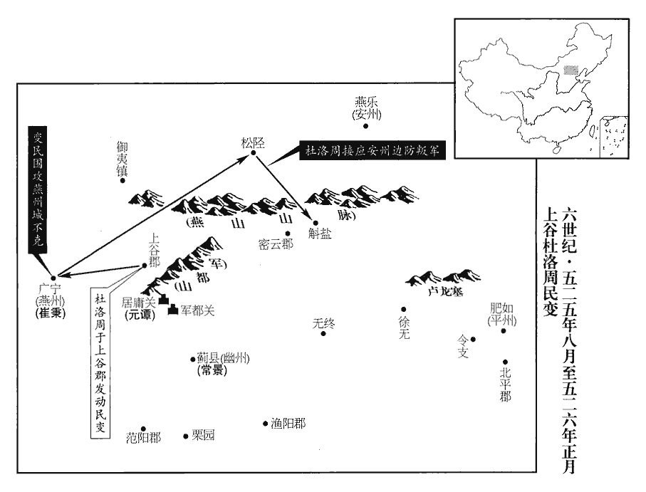
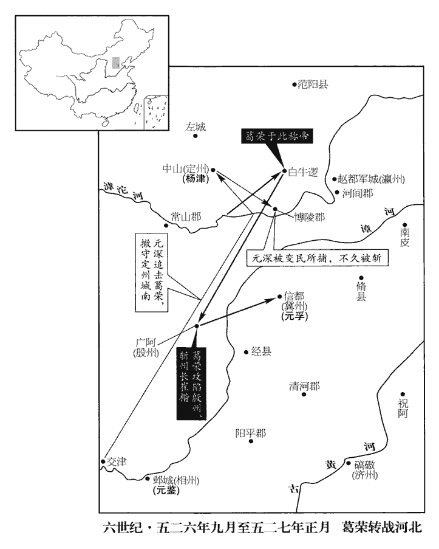
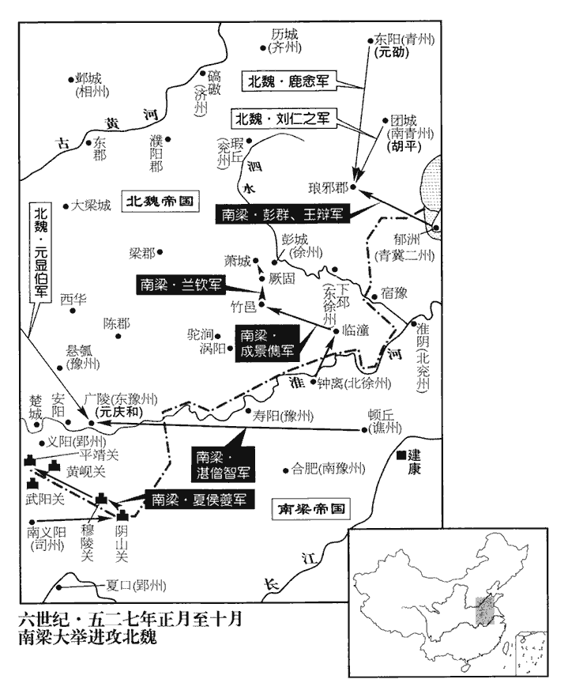

 梁紀七起柔兆敦牂（丙午），盡強圉協洽（丁未），凡二年。

# 高祖武皇帝七

## 普通七年（丙午、五二六）

1春，正月，辛丑朔‹一›，‹南梁，都建康江苏省南京市›大赦。

〖译文〗 [1]春季，正月辛丑朔（初一），梁朝大赦天下。

2壬子‹十二›，魏‹都洛阳河南省洛阳市东白马寺东›以汝南王悅領太尉。

〖译文〗 [2]壬子（十二日），北魏命令汝南王元悦兼任太尉。

3魏安州‹府设燕乐河北省隆化县›石離、穴城、斛鹽‹河北省滦平县›三戍兵反，應杜洛周，眾合二萬，洛周自松岍qiān‹河北省丰宁县境›赴之。水經註：大榆河出禦夷鎮北塞中，南流逕密雲戍西，又南流逕孔山西，又歷密雲戍東，右合孟廣𡶭水。𡶭水西逕孔山南，上有洞穴開明，故謂之孔山。大榆河又東南流，白楊泉水注之。水北發白楊溪望離石。大榆河又東南流出峽，逕安州舊漁陽郡之滑鹽縣南，世謂之斛鹽城，西北去禦夷鎮二百里。岍，輕煙翻，或曰：岍，𡶭字之誤也。讀作「陘」。唐志：營州西北百里曰松陘嶺。行臺常景使別將崔仲哲屯軍都關‹太行山八陉之八·北京市昌平县西›以邀之，將，即亮翻。仲哲戰沒，元譚軍夜潰，元譚軍於居庸關，見上卷上年。魏以別將李琚代譚為都督。仲哲，秉之子也。崔秉時為燕州‹府设广宁·河北省涿鹿县】›刺史。

〖译文〗 [3]北魏安州的石离、穴城和斛盐三戍的守兵哗变，响应杜洛周，叛兵聚合起来有两万之多，杜洛周从松岍出发赶赴叛兵所在地。行台常景指派别将崔仲哲驻扎在军都关截击杜洛周，崔仲哲战败而全军覆没，元谭的军队在夜间溃逃而散，北魏委派别将李琚代替元谭担任都督。崔仲哲是崔秉的儿子。

4初，魏廣陽王深通於城陽王徽之妃。徽為尚書令，為胡太后所信任；會恆州‹府设平城山西省大同市›人請深為刺史，徽言深心不可測。及杜洛周反，五原‹内蒙古包头市›降戶在恆州者謀奉深為主，深懼，上書求還洛陽。時深軍于朔州。恆，戶登翻。降，戶江翻。上，時掌翻。魏以左衛將軍楊津代深為北道大都督，詔深為吏部尚書。徽，長壽之子也。長壽，景穆子也。

〖译文〗 [4]早先之时，北魏广阳王元深同城阳王元徽的妃子通奸。元徽担任了尚书令，深受胡太后的信任。恰好恒州人请求元深担任刺史，而元徽则说元深城府太深，难以测知。到杜格周反叛时，住在恒州五原的降户策划要拥戴元深为主子，元深害怕了，上书朝廷请求回洛阳。北魏委派左卫将军杨津代替元深担任北道大都督，诏令元深担任吏部尚书。元徽是元长寿的儿子。

五原降戶鮮于脩禮等帥北鎮流民反於定州‹府设中山河北省定州市›之左城‹河北省唐县西›，按楊津傳，左城當在博陵界。又水經註，中山唐縣有左人城。帥，讀曰率。改元魯興，引兵向州城，州兵禦之不利。楊津至靈丘‹山西省灵丘县›，靈丘縣，漢屬代郡，唐為蔚州。聞定州危迫，引兵救之，入據州城。脩禮至，津欲出擊之，長史許被不聽，津手劍擊之，手，首又翻。此以記檀弓「子手弓」釋文為據。被走得免。津開門出戰，斬首數百，賊退，人心少安。少，詩沼翻。詔尋以津為定州刺史兼北道行臺。魏以揚州刺史長孫稚為大都督北討諸軍事，與河間王琛共討脩禮。長，知兩翻。琛，丑林翻。

〖译文〗 五原的降户鲜于礼等人率领北镇流民在定州的左城造反，改年号为鲁兴，带兵向州城进发，州兵抵抗而失利。杨津到了灵丘，闻知定州情况危急，便领兵前去援救，入据州城。鲜于礼到了，杨津准备出城迎击他，长史许被不允许，杨津手拿宝剑去刺许被，许被跑开而得以幸免。杨津打开城门出战，斩首数百，贼寇撤退了，人心才稍微安定了些。朝廷很快诏令杨津担任定州刺史兼北道行台。北魏任命扬州刺史长孙稚为大都督北讨诸军事，让他与河间王元琛共同讨伐鲜于礼。

 

5二月，甲戌‹五›，北伐眾軍解嚴‹前年五二四年›六月命豫州州政府合肥州长裴邃北伐。

〖译文〗 [5]二月甲戌（初五），北伐的各路军队解除戒严。

6魏西部敕勒斛律洛陽反於桑乾‹山西省山阴县›西，乾，音干。與費也頭牧子相連結。三月，甲寅‹十五›，游擊將軍爾朱榮擊破洛陽於深井，牧子於河西。北河之西。

〖译文〗 [6]北魏西部敕勒斛律洛阳在桑乾西边造反，与费也头牧子相互连通。三月甲寅（十五日），游击将军尔朱荣在深井打败了斛律洛阳，又在北河西边打败了费也头牧子。

7夏，四月，乙酉‹十七›，臨川靖惠王宏卒‹年五十四岁›。

〖译文〗 [7]夏季，四月乙酉（十七日），梁朝临川靖惠王萧宏去世。

8魏大赦。

〖译文〗 [8]北魏大赦天下。

9癸巳‹二十五›，魏以侍中、車騎大將軍城陽王徽為儀同三司。騎，奇寄翻。徽與給事黃門侍郎徐紇hé共毀侍中元順於太后，出為護軍將軍、太常卿。順奉辭於西遊園，紇侍側，順指之謂太后曰：「此魏之宰噽，宰噽，吳太宰噽也，好讒，吳王夫差信而任之，以至亡國。噽，匹鄙翻。魏國不亡，此終不死！」紇脅肩而出，朱元晦曰：脅肩，竦體也，小人側媚之態。順抗聲叱之曰：「爾刀筆小才，止堪供几案之用，豈應汙辱門下，斁dù我彝倫！」汙，烏故翻。斁，多路翻，敗也。因振衣而起。太后默然。

〖译文〗 [9]癸巳（二十五日），北魏任命侍中、车骑大将军城阳王元徽担任仪同三司。元徽与给事黄门侍郎徐纥一同在胡太后面前诋毁侍中元顺，使他外出为护军将军、太常卿。元顺在西游园向胡太后辞行，徐纥侍立在胡太后身侧，元顺指着徐纥对胡太后说：“此人是魏国的宰，魏国不亡，他终不死！”徐纥耸着肩膀出去了，元顺大声叱斥徐纥：“你的那点刀笔小才，只堪供几案之用，岂可以污辱门下，败坏我天地人之常道！”于是拂衣而起。胡太后默不作声。

10魏朔州‹府设怀朔镇内蒙古固阳县›城民鮮于阿胡等據城反。阿，從安入聲。

〖译文〗 [10]北魏朔州城的平民鲜于阿胡等人占据州城而造反。

11杜洛周南出，鈔掠薊城‹北京市›，魏常景遣統軍梁仲禮擊破之。丁未，都督李琚與洛周戰于薊城之北，敗沒。常景帥眾拒之，洛周引還上谷‹河北省怀来县›。鈔，楚交翻。薊，音計。帥，讀曰率。

〖译文〗 [11]杜洛周南下，抢掠蓟城，北魏的常景派遣梁仲礼击败了他。丁未（疑误），都督李琚与杜洛周在蓟城北边交战，李琚战败覆没。常景率众抵抗杜洛周，杜洛周带着人马回到了上谷。

12長孫稚行至鄴‹河北省临漳县西南邺镇›，詔解大都督，以河間王琛代之。稚上言：「曏與琛同在淮‹淮河›南，琛敗臣全，謂為裴邃所敗，事見上卷上年。遂成私隙，今難以受其節度。」魏朝不聽。朝，直遙翻。前至呼沱‹滹沱河›，稚未欲戰，琛不從。鮮于脩禮邀擊稚於五鹿，杜預曰：陽平元城縣東有五鹿，即沙鹿也。按呼沱不至元城界，此別有五鹿，非左氏所謂五鹿也。沱，徒河翻。琛不赴救，稚軍大敗，稚、琛並坐除名。

〖译文〗 [12]长孙稚走到邺地时，朝廷诏令解除了他的大都督职务，以河间王元琛代替他。长孙稚上奏说：“前次我与元琛同在淮南，元琛失败而我独以保全，于是便产生了私隙，现在我实在难以接受他的指挥调遣。”北魏朝廷没有准许。前进到呼沱时，长孙稚不想出战，但元琛不许，强迫他出战。鲜于礼在五鹿截击了长孙稚，元琛没有前去援救，长孙稚的军队一败涂地，长孙稚、元琛一并获罪而被除名。

13五月，丁未‹九›，魏主下詔將北討，內外戒嚴，既而不行。

〖译文〗 [13]五月丁未（初九），北魏孝明帝颁下诏书将要北征，朝廷内外戒严，但是最后却没有成行。

14衡州‹府设含洭广东省英德市西北浛洸镇›刺史元略，自至江南，晨夕哭泣，常如居喪。及魏元叉死，叉死見上卷上年。喪，息郎翻。胡太后欲召之，知略因刁雙獲免，事見一百四十九卷普通元年。徵雙為光祿大夫，遣江革、祖暅之南還以求略。江革、祖暅之沒魏見上卷上年。暅xuǎn，古鄧翻。上‹萧衍，本年六十三岁›備禮遣之，寵贈甚厚。略始濟淮，魏拜略為侍中，賜爵義陽王；以司馬始賓為給事中，栗法光為本縣‹屯留县山西省屯留县›令，刁昌為東平‹山东省东平县›太守，刁雙為西兗州‹府设左城山东省定陶县西›刺史。凡略所過，一飱sūn一宿皆賞之。略來奔見一百四十九卷元年。栗法光，屯留人。魏孝昌十年置西兗州於定陶，領沛、濟陰二郡。是年則孝昌二年也。

〖译文〗 [14]衡州刺史元略，自从到了江南以来，早晚哭泣，常常如居丧那样。到北魏元叉死后，胡太后想召元略回来，她知道元略因刁双而获免，便征召刁双为光禄大夫，遣送江革、祖之返回南方以便换回元略。梁武帝以周到的礼节遣送元略回去，对他的恩宠馈赠特别丰厚。元略刚渡过了淮河，北魏便委任他为侍中，赐爵位为义阳王。北魏任命司马始宾为给事中，栗法光为本县县令，刁昌为东平太守，刁双为西兖州刺史。凡是元略所经过的地方，一餐一宿都给予赏赐。

15魏以丞相高陽王雍為大司馬。復以廣陽王深為大都督，討鮮于脩禮；復，扶又翻。章武王融為左都督，裴衍為右都督，並受深節度。

〖译文〗 [15]北魏任命丞相高阳王元雍为大司马。又任命广阳王元深为大都督，让他讨征鲜于礼。任命章武王元融为左都督，裴衍为右都督，两人俱接受元深的指挥调遣。

深以其子自隨，城陽王徽言於太后曰：「廣陽王攜其愛子，握兵在外，將有異志。」乃敕融、衍潛為之備。疑則勿任，任則勿疑。既以深為大督，而又使小督備之，何以責其殄寇乎！融、衍以敕示深，深懼，事無大小，不敢自決；太后使問其故，對曰：「徽銜臣次骨，李奇曰：次骨者，言深刻至骨。臣疏遠在外，徽之構臣，無所不為。自徽執政以來，臣所表請，多不從允。徽非但害臣而已，從臣將士，有勳勞者皆見排抑，不得比他軍，仍深被憎嫉，或因其有罪，加以深文，至於殊死，以是從臣行者，莫不悚懼。有言臣善者，視之如仇讎，言臣惡者，待之如親戚。徽居中用事，朝夕欲陷臣於不測之誅，臣何以自安！陛下若使徽出臨外州，臣無內顧之憂，庶可以畢命賊庭，展其忠力。」太后不聽。為深死於盜手張本。

〖译文〗 元深让自己的儿子随行，城阳王元徽告诉胡太后说：“广阳王携带着他的爱子，握兵在外，将会产生异心。”于是胡太后便命令元融、裴衍暗中对元深崐加以防备。元融、裴衍把胡太后的旨令出示给元深，元深害怕了，因此事情不论大小，都不敢自己决定。胡太后派人问其缘故，元深回答：“元徽恨我恨得入骨，我远在外地，与朝廷关系疏远，元徽陷害我，手段无所不用。自从元徽执政以来，我的表奏请示，大多不能获准。元徽不但谋害我而已，凡是跟随我的将士中有功劳的人都受到他的排挤压制，无法同别的军队相比，但是就这样还仍然备受仇恨、嫉妒，有的人稍有罪过，他便加以苛求罗织，以至于被斩首，所以跟从我的人，无不恐惧不安。如果有谁说我好，元微便对他视如仇敌，而对说我坏话的人，元徽便对待他如亲戚一般。元徽在朝中掌权，从早到晚想致我于死地，我如何能够放心得了呢？陛下如果让元徽出朝到外州任职，我便没有了内顾之忧，庶几可以战死于贼庭之上，为朝廷效忠尽力。”胡太后没有准许元深的请求。

徽與中書舍人鄭儼等更相阿黨，更，工衡翻。外似柔謹，內實忌克，賞罰任情，魏政由是愈亂。

〖译文〗 元徽同中书舍人郑俨等人迭相循私舞弊，违法乱纪，他从外表上看好象挺温和谨慎，而内中实则非常忌恨别人超过自己，在赏罚方面随心所欲，北魏的朝政因此而更加混乱了。

16戊申‹十›，魏燕州‹府设广宁河北省涿鹿县›刺史崔秉帥眾棄城奔定州‹府设中山河北省定州市›。燕州自去年八月為杜洛周所圍。燕，因肩翻。

〖译文〗 [16]戊申（初十），北魏燕州刺史崔秉率领众人弃城投奔定州。

17乙丑‹二十七›，魏以安西將軍宗正珍孫為都督，宗正，複姓，漢楚元王交之子郢客孫德，世為宗正，子孫因以為氏。討汾州‹府设蒲子城山西省隰县›反胡。討劉蠡升也。

〖译文〗 [17]乙丑（二十七日），北魏任命安西将军宗正珍孙为都督，让他去讨伐汾州反叛了的胡人。

18六月，魏絳蜀陳雙熾聚眾反，蜀人徙居絳郡‹山西省绛县›者，謂之絳蜀。絳縣，漢、晉屬河東郡，元魏分置絳郡；魏收志，郡屬東雍州。自號始建王。魏以假鎮西將軍長孫稚為討蜀都督。考異曰：費穆傳：「穆為都督，平絳蜀。」不應有兩都督。今從帝紀。別將河東‹山西省永济县›薛脩義輕騎詣雙熾壘下，曉以利害，雙熾即降。詔以脩義為龍門‹山西省河津县›鎮將。此龍門在河東北屈縣西。魏世祖神䴥元年，禽赫連昌，改北屈為禽昌縣。將，即亮翻。降，戶江翻。

〖译文〗 [18]六月，北魏绛蜀的陈双炽聚众造反，自称为始建王。北魏任命代理镇西将军长孙稚为讨蜀都督。别将河东人薛义轻骑来到陈双炽的战垒前面，对他晓以利害，陈双炽便很快投降了。朝廷诏令任命薛义为龙门镇将。

19丙子‹九›，魏徙義陽王略為東平王，頃之，遷大將軍、尚書令，為胡太后所委任，與城陽王徽相埒，埒liè，力輟翻。然徐、鄭用事，略亦不敢違也。魏當時宗室，略其巨擘bò也。史言其居淫昏之朝，不能矯正。

〖译文〗 [19]丙子（初九），北魏迁移义阳王元略为东平王，不久之后，又提升他为大将军、尚书令，他深受胡太后的信任，与城阳王元徽受信任的程度等同，但是徐纥、郑俨专权，元略也不敢有所违抗。

20杜洛周遣都督王曹紇真等將兵掠薊南，時杜洛周、葛榮等作亂，其軍中將領無不加以王爵，曹紇真以都督加王號，故曰都督王。秋，七月，丙午‹九›，行臺常景遣都督于榮等擊之於栗園‹河北省固安县境›，栗園當在范陽固安縣界。固安之栗，天下稱之。大破之，斬曹紇真及將卒三千餘級。洛周帥眾南趣范陽‹河北省涿州市›，范陽縣，前漢屬涿郡，後漢章帝改涿郡為范陽郡。帥，讀曰率。趣，七喻翻。景與榮等又破之。

〖译文〗 [20]杜洛周派遣都督曹纥真等人率兵掠夺蓟南，秋季，七月丙午（初九），行台常景派遣都督于荣等人在栗园攻击曹纥真等人，大败敌人，斩了曹纥真以及将卒三千多名。杜洛周率众南去范阳，常景同于荣等人又击败了杜洛周。

21魏僕射元纂以行臺鎮恆州‹府设故都平城山西省大同市›。鮮于阿胡擁朔州流民寇恆州，戊申‹十一›，陷平城，纂奔冀州‹府设信都河北省冀县›。恆州治平城。平城，魏之故都，亦陷於賊，其不競甚矣。恆，戶登翻。

〖译文〗 [21]北魏仆射元纂以行台身份镇守恒州。鲜于阿胡率领朔州的流民侵犯恒州，戊申（十一日），攻陷了平城，元纂奔投冀州。

22上聞淮堰水盛，壽陽城‹安徽省寿县›幾沒，觀此，蓋淮堰復成也。復遣郢州‹府设夏口湖北省武汉市›刺史元樹等自北道攻黎漿‹安徽省寿县东南›，豫州‹府设合肥安徽省合肥市›刺史夏侯亶等自南道攻壽陽。復，扶又翻；下榮復同。

〖译文〗 [22]梁武帝得知淮河堰堤水很大，寿阳城差不多淹没了，便再次派遣郢州刺史元树等人从北道攻打黎浆，派豫州刺史夏侯等人从南道攻打寿阳。

23八月，癸巳‹二十七›，賊帥元洪業斬鮮于脩禮，請降于魏；帥，所類翻。降，戶江翻。賊黨葛榮復殺洪業自立。考異曰：北史廣陽王深傳云：「深以兵士頻經退散，人無鬬情，連營轉柵，日行十里，行達交津，隔水而陳。賊脩禮常與葛榮謀，後稍信朔州人毛普賢，榮常銜之。普賢昔為深統軍，及在交津，深使人諭之，普賢乃有降意。又使錄事參軍元晏說賊程殺鬼，果相猜貳。榮遂殺普賢、脩禮而自立。」與魏帝紀全殊，又其語雜亂難曉。今從帝紀。

〖译文〗 [23]八月癸巳（二十七日），强盗首领元洪业斩了鲜于礼，请求投降北魏。强盗同伙葛荣又杀了元洪业而自任头领。

24魏安北將軍、都督恆•朔討虜諸軍事爾朱榮過肆州‹府设九原山西省忻州市›，肆州刺史尉慶賓忌之，據城不出。尉，紆勿翻。榮怒，舉兵襲肆州，執慶賓，還秀容‹北秀容·山西省朔州市西北›，署其從叔羽生為刺史，魏朝不能制。此時爾朱榮已有無魏之心矣。從，才用翻。朝，直遙翻。

〖译文〗 [24]北魏安北将军及都督恒、朔讨虏诸军事尔朱荣路过肆州，肆州刺史崐尉庆宾忌恨他，据城不出。尔朱荣发怒了，领兵袭击了肆州，抓住了尉庆宾，回到了秀容，让他的堂叔尔荣羽生代理肆州刺史，北魏朝廷不能制止。

初，賀拔允及弟勝、岳從元纂在恆州，平城‹山西省大同市›之陷也，允兄弟相失；岳奔爾朱榮，勝奔肆州‹府设九原山西省忻州市›。榮克肆州，得勝，大喜曰：「得卿兄弟，天下不足平也！」以為別將，將，即亮翻。軍中大事多與之謀。

〖译文〗 当初，贺拔允及其弟弟贺拔胜、贺拔岳跟随元纂在恒州，平城失陷之后，兄弟几人相互失散。贺拔岳投奔了尔朱荣，贺拔胜投奔了肆州。尔朱荣攻克肆州之后，得到了贺拔胜，十分高兴地说：“得到了你们兄弟，天下不愁不能平定！”他任命贺拔胜为别将，军中大事大多与贺拔胜商议。

25九月，己酉‹十三›，鄱陽忠烈王恢卒‹年五十一岁›。

〖译文〗 [25]九月己酉（十三日），鄱阳忠烈王萧恢去世。

 

26葛榮既得杜洛周之眾，魏主武泰元年葛榮方并杜洛周；此得鮮于脩禮之眾也。北趣瀛州‹府设赵都军城河北省河间市›，趣，七喻翻。魏廣陽忠武王深自交津‹河北省武安市西南›引兵躡之。水經註：漳水過武安縣東，清水自涉縣東南來注之，世謂決入之所為交漳口。辛亥‹十五›，榮至白牛邏‹河北省蠡县境›，據魏紀，白牛邏，在高陽博野縣。邏，郎佐翻。輕騎掩擊章武莊武王融，殺之。榮自稱天子，國號齊，改元廣安。深聞融敗，停軍不進。侍中元晏密言於太后曰：「廣陽王盤桓不進，坐圖非望。有于謹者，智略過人，為其謀主，風塵之際，恐非陛下之純臣也。」太后深然之，詔牓尚書省門，募能獲謹者有重賞。謹聞之，謂深曰：「今女主臨朝，朝，直遙翻。信用讒佞，苟不明白殿下素心，恐禍至無日。謹請束身詣闕，歸罪有司。」遂徑詣牓下，自稱于謹，有司以聞。太后引見，大怒。見，賢遍翻。謹備論深忠款，兼陳停軍之狀，太后意解，遂捨之。

〖译文〗 [26]葛荣得到了杜洛周的部众之后，北去瀛州，北魏广阳忠武王元深从交津领兵追踪葛荣而进。辛亥（十五日），葛荣到了白牛逻，率轻骑突袭在章武的庄武王元融，杀了他。葛荣自称天子，定国号为齐，改换年号为广安。元深得知元融失败，便按兵不动。侍中元晏秘密地告诉胡太后：“广阳王徘徊不进，坐图非分之想。有一个叫于谨的人，他智谋才略过人，担任元深的军师，在如今动荡不安之时，恐怕他不是陛下的忠诚之臣。”胡太后对元晏的话深表同意，便张榜于尚书省门前，以重赏招募能抓住于谨的人。于谨得知这一情况之后，对元深说：“如今女主临朝，信任重用谗邪奸佞之徒，假如她不明白殿下您的一片真心，恐怕灾祸很快就会降临。于谨我请求捆绑自己赴朝，向有关官署投案服罪。”于是便径直来到尚书门前的榜文之下，自称是于谨，有关官署把情况报告了朝廷。胡太后召见于谨，勃然大怒。于谨详细地讲述了元深对朝廷的忠诚，兼而说明了停兵不进的原因，胡太后明白了情况，于是便放了于谨。

深引軍還，趣定州‹府设中山河北省定州市›，趣，七喻翻。定州刺史楊津亦疑深有異志；深聞之，止於州南佛寺。經二日，深召都督毛諡等數人，交臂為約，危難之際，期相拯恤。諡shì，神至翻。難，乃旦翻。諡愈疑之，密告津云，深謀不軌。津遣諡討深，深走出，諡呼噪逐深。深與左右間行至博陵‹河北省安平县›界，間，古莧翻。漢桓帝置博陵郡，元魏屬定州。逢葛榮遊騎，劫之詣榮。騎，奇寄翻。賊徒見深，頗有喜者，榮新立，惡之，恐其徒有欲奉深為主者，故惡之。惡，烏路翻。遂殺深。城陽王徽誣深降賊，錄其妻子。降，戶江翻。深府佐宋遊道為之訴理，乃得釋。遊道，繇之玄孫也。宋繇事西涼李氏；李滅，事沮渠氏；沮渠滅，入魏。為，于偽翻。

〖译文〗 元深领兵返回，前往定州，定州刺史杨津也怀疑元深有异谋。元深知道情况之后，停在州城南边的南佛寺。两天之后，元深召来都督毛谥等人，同他们订立盟约，约定危难之时，互相援救。于是，毛谥越发怀疑他了。便秘密地告诉杨津，说元深图谋不轨。杨津派遣毛谥讨伐元深，元深跑走了，毛谥带人喊叫着去追逐元深。元深同身边人抄小道到了博陵地界，遇上了葛荣的流动骑兵，便被抓获送到葛荣那里。寇贼们见了元深，喜欢他的人还不少，葛荣刚自立为王，对此很反感，担心手下的人拥奉元深为主，便杀了元深。城阳王元徽诬陷元深投降了贼寇，逮捕了他的妻子、儿子。元深的府佐宋道替他们申诉，才得到释放。宋道是宋繇的玄孙。

27甲申，魏行臺常景破杜洛周，斬其武川王賀拔文興等，捕虜四百人。

〖译文〗 [27]甲申（疑误），北魏行台常景击败了杜洛周，斩杀杜洛周手下的武川王贺拔文兴等人，捕获了四百人。

28就德興陷魏平州‹府设肥如河北省卢龙县北›，殺刺史王買奴。魏平州治肥如，即唐平州盧龍縣地。

〖译文〗 [28]就德兴攻陷了北魏的平州，杀死了该州刺史王买奴。

29天水‹甘肃省天水市›民呂伯度，本莫折念生之黨也，後更據顯親‹甘肃省秦安县西北›以拒念生；漢光武置顯親侯國以封竇友，以其兄融以河西歸附，且以顯其孝文竇后之親也；屬漢陽郡。後魏屬天水郡；至唐時秦州成紀縣治顯親川。已而不勝，亡歸胡琛‹时在高平宁夏固原县›，琛，丑林翻。琛以為大都督、秦王，資以士馬，使擊念生。伯度屢破念生軍，復據顯親，復，扶又翻；下生復同。乃叛琛，東引魏軍。念生窘迫，乞降於蕭寶寅‹时驻长安陕西省西安市›，窘，渠隕翻。寶寅使行臺左丞崔士和據秦州‹府设上封甘肃省天水市›·莫折念生根据地。魏以伯度為涇州‹府设安定甘肃省泾川县›刺史，封平秦郡公。魏太延二年，置平秦郡於雍縣，屬岐州。大都督元脩義停軍隴口‹陇山要隘›，久不進，隴口，隴坻之口。念生復反，執士和送胡琛，於道殺之。久之，伯度為万俟醜奴所殺，万，莫北翻。俟，渠之翻。賊勢益盛，寶寅不能制。胡琛與莫折念生交通，事破六韓拔陵浸慢，琛應拔陵見上卷五年。拔陵遣其臣費律至高平，誘琛，斬之，誘，音酉。醜奴盡并其眾。

〖译文〗 [29]天水百姓吕伯度，本来是莫折念生的同党，后来又占据显亲这个地方抵抗莫折念生，接着因不能取胜，便跑去投靠了胡琛，胡琛任命他为大都督、秦王，资助他兵力战马，让他去攻打莫折念生。吕伯度多次打败莫折念生的军队，又占据了显新，于是反叛了胡琛，从东边引来了北魏军队。莫折念生穷途无路，向萧宝寅乞求投降，萧宝寅指使行台左丞崔士和占据了秦州。北魏任命吕伯度为泾州刺史，封他为平秦郡公。大都督元义把军队停在陇口，久而不进，莫折念生又反叛了，抓住崔士和送往胡琛那里，在路上杀了崔士和。之后，吕伯度被万俟奴杀了，于是贼寇的势力更加强大，萧宝寅无法加以制伏。胡琛与莫折念生相互勾通，对破六韩拔陵渐渐不恭起来，破六韩拔陵派遣他的臣子费律到了高平，诱惑胡琛，斩了胡琛，万俟奴把胡琛的部众全部兼并。

30冬，十一月，庚辰‹十五›，大赦。

〖译文〗 [30]冬季，十一月庚辰（十五日），梁朝大赦天下。

31丁貴嬪卒，太子水漿不入口，太子統，丁貴嬪所生也。卒，子恤翻。上‹萧衍›使謂之曰：「毀不滅性，引孝經孔子之言。況我在邪！」乃進粥數合。合，古沓翻。漢志曰：十龠yuè為合。合者，合龠之量也。太子體素肥壯，腰帶十圍，至是減削過半。過，工禾翻。

〖译文〗 [31]丁贵嫔去世，太子萧统因生母亡故而点水不进，梁武帝派人对他说：“哀伤不能毁了性命，何况我还在呢！”于是萧统才喝粥数合。太子萧统身体向来肥壮，腰带有十围之长，可是到现在却减削过半。

32夏侯亶dǎn等軍入魏境，所向皆下。辛巳‹十六›，魏揚州刺史李憲以壽陽降，降，戶江翻；下同。宣猛將軍陳慶之入據其城，凡降城五十二，獲男女七萬五千口。丁亥‹二十二›，縱李憲還魏，復以壽陽為豫州，自宋以來，以壽陽為豫州。裴叔業叛齊降魏，魏以壽陽為揚州，復漢、魏之舊也。今復以壽陽為豫州，復宋、齊之舊也。復以，扶又翻，又如字。改合肥為南豫州，天監五年徙豫州治合肥。以夏侯亶為豫‹寿阳›、南豫‹合肥›二州刺史。壽陽久罹兵革，民多離散，亶輕刑薄賦，務農省役，頃之，民戶充復。

〖译文〗 [32]夏侯等人的军队进入北魏境内，所向披靡，无城不摧，辛巳（十六日），北魏扬州刺史李宪献出寿阳投降，宣猛将军陈庆之入据该城，一共有五十二城投降，俘获男女七万五千名，丁亥（二十二日），梁朝放李宪回北魏，又以寿阳为豫州，改合肥为南豫州，任命夏侯为豫、南豫二州刺史。寿阳久遭战乱，百姓大多离散，夏侯减轻刑罚，减少税赋，经营农业，减免劳役，很快，民户又多起来了。

33杜洛周圍范陽‹河北省涿州市›，戊戌，民執魏幽州‹府设蓟县北京市›刺史王延年、行臺常景送洛周，開門納之。常景擊杜洛周，數戰數勝，而終於為虜者，民樂於從亂而疾視其上也。

〖译文〗 [33]杜洛周围攻范阳，戊戌（疑误），范阳百姓抓住了北魏幽州刺史王延年、行台常景，把他们送给杜洛周，杜洛周开门接纳了他们。

34魏齊州‹府设历城山东省济南市›平原‹东平原·山东省邹平县北›民劉樹等反，宋武帝僑置平原郡於梁鄒，屬冀州；後入於魏，改冀州為齊州，平原為東平原郡。攻陷郡縣，頻敗州軍，刺史元欣以平原房士達為將，討平之。敗，補邁翻。將，即亮翻。

〖译文〗 [34]北魏齐州平原郡的百姓刘树等人造反，攻陷郡县，频频地击败州里的军队，刺史元欣任用平原人房士达为将领，讨平了刘树等人的叛乱。

35曹義宗據穰城‹北魏荆州州政府所在城·河南省邓州市›以逼新野‹河南省新野县›，穰，人羊翻。魏遣都督魏承祖及尚書左丞、南道行臺辛纂救之。考異曰：梁書，此年冬，新野降；魏書，肅宗崩後，新野猶在；恐梁書誤。蓋梁自前年攻新野，此年魏使魏承祖救之也。又周于謹傳云：「孝昌二年與辛纂討義宗。」今以為據。義宗戰不利，不敢進。纂，雄之從父兄也。

〖译文〗 [35]曹义宗占据了穰城而逼迫新野，北魏派遣都督魏承祖以及尚书左丞、南道行台辛纂去援救。曹义宗交战失利，不敢前进。辛纂是辛雄的堂兄。

36魏盜賊日滋，征討不息，國用耗竭，豫徵六年租調，猶不足，調，徒弔翻。乃罷百官所給酒肉，又稅入市者人一錢，及邸店皆有稅，百姓嗟怨。吏部郎中辛雄上疏，以為：「華夷之民相聚為亂，豈有餘憾哉？正以守令不得其人，守，式又翻。百姓不堪其命故也。宜及此時早加慰撫。但郡縣選舉，由來共輕，貴遊儁才，莫肯居此。宜改其弊，分郡縣為三等，清官選補之法，妙盡才望，如不可並，後地先才，不得拘以停年。地，門地也。崔亮制停年格，見一百四十九卷天監十八年。後、先，並去聲。三載黜陟，載，子亥翻。有稱職者，補在京名官；稱，尺證翻。如不歷守令，不得為內職。則人思自勉，枉屈可申，強暴自息矣。」不聽。

〖译文〗 [36]北魏国内盗贼日益增多，征讨不停，国家财用耗竭，提前征收了六年的租调，还不够用，于是又停发了给百官们的酒肉，又向每个进入集市的人征收一个钱的税，以至投住旅店都要纳税，百姓无不嗟怨。吏部郎中辛雄上奏，认为：“汉、夷之民相聚生乱，难道还有别的什么怨恨吗？完全是由于太守、县令任用不当，百姓们不堪于他们的欺压的原故。宜于乘现在对百姓早加抚慰。但是对于郡守县令的选拔向来都不重视，因此王公贵族和才俊之士，都崐不肯担任这些官职。应该改革这一弊端，把郡县分为三等的清官，选补的办法，应当规定才能和门望两个方面同时都要具备，如果不能同时具备，先才能而后门望，不能拘泥于年资的长短。三年升降一次，有称职者，可以委任为京城中的官员；如果没有担任太守、县令的经历，便不能在朝廷内任职。如此一来，便人人思以自勉，百姓的枉屈可以申雪，天下强暴自然平息了。”但是这一建议没有被采纳。

## 大通元年（丁未、五二七）是年三月方改元大通。

1春，正月，乙丑‹一›，以尚書左僕射徐勉為僕射。時右僕射缺，故左僕射止為僕射。

〖译文〗 [1]春季，正月，乙丑（初一），梁朝任命尚书左仆射徐勉为仆射。

2辛未‹七›，上‹萧衍，本年六十四岁›祀南郊。

〖译文〗 [2]辛未（初七），梁武帝在南郊祭天。

3甲戌‹十›，魏以司空皇甫度為司徒，儀同三司蕭寶寅為司空。

〖译文〗 [3]甲戌（初十），北魏任命司空皇甫度为司徒，仪同三司萧宝寅为司空。

4魏分定‹府设中山河北省定州市›、相‹府设邺城河北省临漳县西南邺镇›二州四郡置殷州‹府设广阿河北省隆尧县›，按魏收志，殷州止領趙郡、鉅鹿、南鉅鹿三郡，蓋初置時兼領相州之廣宗郡也。殷州治廣阿。劉昫曰：北齊改為趙州。隋改廣阿為大陸，唐武德四年改為象城，天寶二年改為昭慶，以有建初、啟運二陵也。宋開寶五年改昭慶為隆平，熙寧六年省隆平縣為隆平鎮，入臨城縣。相，息亮翻。以北道行臺博陵‹河北省安平县›崔楷為刺史。楷表稱：「州今新立，尺刃斗糧，皆所未有，乞資以兵糧。」詔付外量聞，使量計合給兵糧之數以聞也。量，音良。竟無所給。或勸楷留家，單騎之官，騎，奇寄翻。楷曰：「吾聞食人之祿者憂人之憂，若吾獨往，則將士誰肯固志哉！」遂舉家之官。葛榮逼州城‹广阿河北省隆尧县›，或勸減弱小以避之，楷遣幼子及一女夜出；既而悔之，曰：「人謂吾心不固，虧忠而全愛也。」遂命追還。賊至，強弱相懸，又無守禦之具；楷撫勉將士以拒之，莫不爭奮，皆曰：「崔公尚不惜百口，吾屬何愛一身！」連戰不息，死者相枕，枕，職任翻。終無叛志。辛未‹十七›，城陷，楷執節不屈，榮殺之，藩翰之任，保境安民，上也，全城卻敵，次也，死於城郭，豈得已哉！崔楷闔家并命，其志節有可憐矣，上之人實有罪焉。遂圍冀州‹府设信都河北省冀县›。

〖译文〗 [4]北魏从定、相两州中分出四个郡设置了殷州，任命北道行台博陵人崔楷为刺史。崔楷上表说：“殷州如今刚刚设立，连一尺长之刀、一斗粮食都没有，乞求给予兵器和粮食。”孝明帝诏令外台计算一下应该给的兵器和粮食的数量，然后上报批复，但最后竟然一点儿也没给。有人劝崔楷留下家属，单人匹马去赴任，崔楷说：“我听说食人之禄者忧人之忧，如果我单身独往，那么将士们谁还肯坚守其志呢！”于是便带着全家去上任。葛荣逼近州城，有人邓崔楷把家人中老弱幼小者送去别处避一下，崔楷便在夜间把幼子以及一个女儿送出城；然而他很快又后悔了，说：“这样一来，人们一定要说我的内心不坚定，为了父受而损害忠义。”于是又命令人把他们追了回来。贼寇到了，强弱悬殊，城中又没有防守抵御的器具。崔楷抚慰将士们，勉励他们抵抗敌人，大家无不奋勇争先，都说：“崔公尚且不惜家中百口人的性命，我们又何能爱惜自身呢！”连战不停，死者相枕，但是大家终无叛逃之意。辛未（初七），州城失陷，崔楷坚志执节而不屈服，葛荣杀了他，便又开始围攻冀州。

5蕭【章：甲十一行本「蕭」上有「魏」字；乙十一行本同；孔本同；張校同。】寶寅出兵累年，將士疲弊。秦賊擊之，寶寅大敗於涇州‹府设安定甘肃省泾川县›，收散兵萬餘人，屯逍遙園‹陕西省西安市西北›，東秦州‹府设汧城陕西省陇县›刺史潘義淵以汧城降賊。秦州既為賊所據，魏置東秦州於隴東郡，治汧城，即隋唐之汧源縣也。將，即亮翻。汧，口堅翻。降，戶江翻。莫折念生進逼岐州，城人執刺史魏蘭根應之。豳州‹府设定安甘肃省宁县›刺史畢祖暉戰沒，行臺辛深棄城走，棄豳州城也。北海王顥軍亦敗。賊帥胡引祖據北華州‹原东秦州·州政府设中部陕西省黄陵县›，「引祖」，恐當作「弘祖」。魏孝文帝太和十五年置東秦州於杏城，後改為北華州，領中部、敷城郡。帥，所類翻。華，戶化翻。叱干麒麟據豳州以應天生，叱干，虜複姓。關中大擾。雍州‹府设长安陕西省西安市›刺史楊椿募兵得七千餘人，帥以拒守，雍，於用翻。帥，讀曰率。詔加椿侍中兼尚書右僕射，為行臺，節度關‹函谷关›西諸將。北地‹陕西省富平县›功曹毛鴻賓引賊抄掠渭‹渭水›北，抄，楚交翻。雍州錄事參軍楊侃將兵三千掩擊之；鴻賓懼，請討賊自効，遂擒送宿勤烏過仁。烏過仁者，明達之兄子也。莫折天生乘勝寇雍州，考異曰：羊侃傳作「莫遮」，今從魏書。蕭寶寅部將羊侃隱身塹中射之，應弦而斃，塹，七豔翻。射，而亦翻。其眾遂潰。侃，祉之子也。

〖译文〗 [5]萧宝寅累年出兵，将士们疲惫不堪。秦地的贼寇攻打萧宝寅，萧宝寅在泾州一败涂地，事后收集散兵一万多人，驻扎在逍遥园，东秦州刺史潘义渊献出城投降了贼寇。莫折念生进逼岐州，岐州城里的人抓住了刺史魏兰根策应莫折念生。州刺史毕祖晖战败身亡，行台辛深弃下州城逃跑了，北海王元颢的军队也战败。贼寇首领胡引祖占据北华州，叱干麒麟占据州来响应莫折天生，整个关中一片混乱。雍州刺史杨椿招募了七千多兵力，率领他们拒守，北魏朝廷诏令加杨椿为侍中兼尚书右仆射，担任行台，指挥关中各位将领。北地功曹毛鸿宾带领贼寇抢掠渭北，雍州录事参军杨侃率兵三千袭击他们；毛鸿宾害怕了，请求讨伐贼寇将功赎罪，于是便擒获送来了宿勤乌过仁。宿勤乌过仁是宿勤明达的哥哥的儿子。莫折天生乘胜而侵犯雍州，萧宝寅的部将羊侃隐蔽在战壕之中用箭射莫折天生，莫折天生应弦而毙，其部众便溃散了。羊侃是羊祉的儿子。

6魏右民郎陽平‹侨郡·安徽省固镇县›路思令上疏，晉武帝置尚書右民郎。以為：「師出有功，在於將帥，得其人則六合唾掌可清，人欲舉手有為，先唾其掌。六合，天、地、東、西、南、北也。唾掌可清，言其易也。唾，湯臥翻，口液也。失其人則三河方為戰地。此指漢三河之地為言。魏都洛陽，三河則畿甸也。竊以比年將帥多寵貴子孫，銜杯躍馬，志逸氣浮，軒眉扼【章：甲十一行本「扼」作「攘」；乙十一行本同；孔本同。】腕，以攻戰自許；及臨大敵，憂怖交懷，雄圖銳氣，一朝頓盡。乃令羸弱在前以當寇，強壯居後以衛身，兼復器械不精，進止無節，以當負險之眾，敵數戰之虜，腕，烏貫翻。怖，普布翻。羸，倫為翻。比，毗至翻。復，扶又翻；下復疑同。數，所角翻。欲其不敗，豈可得哉！是以兵知必敗，始集而先逃；將帥畏敵，遷延而不進。國家謂官爵未滿，屢加寵命；復疑賞賚之輕，日散金帛。帑藏空竭，民財殫盡，帑，他朗翻。藏，徂浪翻。遂使賊徒益甚，生民彫弊，凡以此也。夫德可感義夫，恩可勸死士。今若黜陟幽明，賞罰善惡，簡練士卒，繕修器械，先遣辯士曉以禍福，如其不悛，以順討逆，悛，丑緣翻。如此，則何異厲蕭斧而伐朝菌，戰國時雍門周有是言。莊子曰：朝菌不知晦朔。音義云：菌，大芝也，天陰生糞上，見日則死。梁簡文云：菌，欻xū生之芝也。音其隕翻。鼓洪爐而燎毛髮哉！」弗聽。

〖译文〗 [6]北魏右民郎阳平人路思令上书，指出：“军队出征有功绩，在于将帅，如果能得到合适的人担任将帅则天下唾手可以廓清，如果选人不当则京都外也会成为战场。愚意以为多年来军中将帅大多由宠贵子孙担任，他们饮酒跑马，志气浮华，眉飞色舞，磨拳擦掌，以为在攻战方面谁也比不上自己；到了面临强敌之时，则忧恐交织于心，原先的那些雄图锐气，一下子消失的无影无踪了。于是便命令羸弱者在前面为自己挡住敌寇，强壮者在后面为自己护身，加上武器不精良，前进与停止没有节度，以此面临据险而守的敌人，抵挡屡经战阵的贼寇，想使他们不败，岂能办得到呢！因此兵卒们知道战而必败，开始集结就纷纷逃散；将帅们畏惧敌人，拖延而不前进。国家则以为给他们的官爵低了，为了鼓励他们取胜，便屡屡地给他们加官进爵；而就这样还怀疑给他们的赏赐太轻了，便日日散发金帛。因此，库藏空竭，民财殚尽，遂使贼徒越发多起来了，百姓凋弊，原因正在这里。德可以感动礼义之人，恩可以劝励敢死之士。现在朝廷如果能做到升贤降愚，赏善罚恶，精选训练士卒，缮修武器，先派善辩之士去对盗贼晓以祸福利害，如果他们不思悔改，便派兵去讨伐，这样一来，平定消除反贼逆徒，何异于用利斧而伐朝菌，煽大火炉而燎毛发呢！”路思令的建议没有被采纳。

7戊子‹二十四›，魏以皇甫度為太尉。

〖译文〗 [7]戊子（二十四日），北魏任命皇甫度为太尉。

8己丑‹二十五›，魏主以四方未平，詔內外戒嚴，將親出討，竟亦不行。

〖译文〗 [8]己丑（二十五日），北魏孝明帝因四方之乱未平定，诏令内外戒严，将要亲自出征讨伐，最后也未成行。

9譙州‹府设顿丘侨县·安徽省滁州市›刺史湛僧智圍魏東豫州‹府设新息河南省息县›，姓譜：湛zhàn，丈減翻，姓也。後漢有大司農湛重。帝置譙州，治新昌城，領新昌、高塘、臨徐、南梁郡。五代志：江都郡清流縣，舊置新昌郡。考異曰：魏帝紀及曹世表傳作「湛僧」。今從梁夏侯夔傳。將軍彭群、王辯圍琅邪‹山东省临沂市›，魏敕青‹府设东阳山东省青州市›、南青‹府设团城山东省沂水县›二州救琅邪。魏青州領齊、北海、樂安、勃海、高陽、河間、樂陵郡。南青州當又置於其南。司州‹府设南义阳湖北省孝昌县›刺史夏侯夔帥壯武將軍裴之禮等出義陽道，攻魏平靜‹湖北省广水市北平靖关›、穆陵‹河南省新县南木陵›关、陰山‹湖北省麻城市北›三關，皆克之。水經註：木陵關在黃武山東北，晉西陽城西南。帥，讀曰率；下同。夔，亶之弟；之禮，邃之子也。

〖译文〗 [9]梁朝谯州刺史湛僧智围攻北魏东豫州，将军彭群、王辩围攻琅邪，北魏朝廷命令青、南青两州援救琅邪。司州刺史夏侯夔率领壮武将军裴之礼等人出义阳道，攻打北魏的平静、穆陵、阴山三关，都攻下来了。夏侯夔是夏候的弟弟；裴之礼是裴邃的儿子。

 

10魏東清河郡‹山东省淄博市南›山賊群起，詔以齊州‹府设历城【山东省济南市›長史房景伯為東清河太守。宋武帝僑置清河郡於盤陽，屬冀州，後入于魏，為東清河郡，屬齊州。五代志，齊州長山縣，清河、平原二郡併入焉。郡民劉簡虎嘗無禮於景伯，舉家亡去，景伯窮捕，禽之，署其子為西曹掾，令諭山賊。賊以景伯不念舊惡，皆相帥出降。掾，俞絹翻。降，戶江翻。

〖译文〗 [10]北魏东清河郡山贼群起，北魏朝廷诏令齐州长史房景伯担任东清河郡太守。东清河郡的百姓刘简虎曾经对房景伯有过无礼行为，因此举家逃亡，房景伯到处搜捕，抓获了他，任用他的儿子为西曹椽，令其去晓谕山贼。山贼们见房景伯不念旧恶，全都相继出来投降了。

景伯母崔氏，通經，有明識。貝丘‹东清河郡郡政府所在县›婦人列其子不孝，貝丘僑縣，亦宋武帝置，屬清河郡。五代志，齊州淄川縣，舊曰貝丘，置東清河郡。按前註所謂清河郡置於盤陽者，據魏收地形志，宋郡也。五代志，長山之清河、平原，雙頭郡也。房景伯所守者，貝丘之東清河也。景伯以白其母，母曰：「吾聞聞名不如見面，山民未知禮義，何足深責！」乃召其母，與之對榻共食，使其子侍立堂下，觀景伯供食。未旬日，悔過求還；崔氏曰：「此雖面慚，其心未也，且置之。」凡二十餘日，其子叩頭流血，母涕泣乞還，然後聽之，卒以孝聞。卒，子恤翻。景伯，法壽之族子也。房法壽見一百三十二卷宋明帝泰始三年。

〖译文〗 房景伯的母亲崔氏，通晓经学，有见识。贝丘有一妇人诉说自己的儿子不孝，房景伯把这告诉了他母亲，他母亲说：“我听说闻名不如见面，山民不知礼义，何以值得深加责难呢”于是召来这一妇人，同她对坐进食，让这个妇人的儿子待立在堂下，以使他观看房景伯如何供奉母亲进食。不到十天，这个不孝的儿子悔过了，请求回去。崔氏说：“他虽然在面子上觉得惭愧了，但心里崐却未必如此，还是继续留在这里吧。”又过了二十多天，这个妇人的儿子叩头流血，他母亲流着泪水乞求回家，这才允许他们回去了，最后这个不孝之子以孝而闻名天下。房景伯是房法寿的族侄。

11二月，秦‹府设上封甘肃省天水市›賊據魏潼關‹陕西省潼关县›。出蕭寶寅之後。

〖译文〗 [11]二月，秦地的贼寇占据了北魏潼关。

12庚申‹二十七›，魏東郡‹滑台·河南省滑县›民趙顯德反，殺太守裴烟，自號都督。魏東郡治滑臺城，屬西兗州。「烟」，俗「煙」字。

〖译文〗 [12]庚申（二十七日），北魏东郡的百姓赵显德造反，杀死了太守裴烟，自称为都督。

13將軍成景儁攻魏彭城‹江苏省徐州市›，魏以前荊州‹府设穰城河南省邓州市›刺史崔孝芬為徐州‹府彭城›行臺以禦之。先是，孝芬坐元叉黨與盧同等俱除名，盧同除名見上卷普通六年。先，悉薦翻。及將赴徐州，入辭太后，太后謂孝芬曰：「我與卿姻戚，時太后為魏主納孝芬女為世婦，故云然。柰何內頭元叉車中，稱『此老嫗會須去之！』」嫗，威遇翻。去，羌呂翻。孝芬曰：「臣蒙國厚恩，實無斯語。假令有之，誰能得聞！若有聞者，此於元叉親密過臣遠矣。」太后意解，悵然有愧色。景儁欲堰泗水以灌彭城，孝芬與都督李叔仁等擊之，景儁遁還。

〖译文〗 [13]梁朝将军成景俊攻打北魏彭城，北魏任命前荆州刺史崔孝芬为徐州行台来抗御成景俊。崔孝芬早先因系元叉的同党而获罪与卢同等人一起被除名。他即将赴徐州上任，入宫向胡太后辞别，胡太后对他说：“我同你是姻亲，你为何要把头伸进元叉车中，说：‘这个老婆子应该立即被赶跑。’”崔孝芬说：“我承受国家的厚恩，确实没有说过这样的话。假使说过，谁又能听到过呢！如果有人听到过，那么他与元叉的亲密就远远地超过我了。”胡太后心里明白了，怅然而面有愧色。成景俊准备拦截泗水来淹灌彭城，崔孝芬与都督李叔仁等人进攻成景俊，成景俊逃回去了。

14三月，甲子‹一›，魏主詔將西討，中外戒嚴。會秦賊西走，復得潼關，復，扶又翻。戊辰‹五›，詔回駕北討。其實皆不行。

〖译文〗 [14]三月甲子（初一），北魏孝明帝诏告天下将西征，朝廷内外戒严。正好秦地的贼盗向西逃跑，重新得到了潼关，便于戊辰（初五）之日，又诏告天下回驾北伐。其实，孝明帝根本没有出行。

15葛榮久圍信都，魏以金紫光禄大夫源子邕為北討大都督以救之。

〖译文〗 [15]葛荣久围信都，北魏任命金紫光禄大夫源子邕为北讨大都督来源救信都。

16初，上作同泰寺，又開大通門以對之，取其反語相協，同泰反為大，大通反為同，是反語相協也。反，音翻。上晨夕幸寺，皆出入是門。辛未‹八›，上幸寺捨身；甲戌‹十一›，還宮，大赦，改元。改是年為大通元年。

〖译文〗 [16]原先，梁武帝修建了同泰寺，又开了大通门来与此相对，取“同泰”与“大通”的合音相同，梁武帝早晚临幸同泰寺，都出入大通门。辛未（初八），梁武帝来到同泰寺行舍身仪式；甲戌（十一日），回到宫中，颁发大赦令，改年号为大通。

17魏齊州‹府设历城山东省济南市›廣川‹东广川郡·山东省邹平县东›民劉鈞聚眾反，宋武帝僑置廣川郡，屬冀州，入魏屬齊州。五代志，齊州長山縣，舊曰武強，置廣川郡。自署大行臺；清河‹东清河郡·山东省淄博市南›民房項自署大都督，屯據昌國城‹山东省淄博市›。魏收志，東清河郡武城縣有昌國城。

〖译文〗 [17]北魏齐州广川的平民刘钧聚众造反，自任大行台；清河的百姓房项自任大都督，占据了昌固城。

18夏，四月，魏將元斌之討東郡‹滑台·河南省滑县›，斬趙顯德。將，即亮翻。

〖译文〗 [18]夏季，四月，北魏将领元斌之讨伐东郡，斩了赵显德。

19己酉‹十七›，柔然頭兵可汗遣使入貢於魏，可，從刊入聲。汗，音寒。使，疏吏翻。且請討群賊。魏人畏其反覆，詔以盛暑，且俟後敕。

〖译文〗 [19]己酉（十七日），柔然国头兵可汗派遣使者来向北魏进贡，并且请求帮助北魏讨伐群贼。北魏人害怕柔然人反复变卦，诏告他们因盛暑而不宜出征，且待以后的圣旨。

20魏蕭寶寅之敗也，有司處以死刑，詔免為庶人。雍州刺史楊椿有疾求解，復以寶寅為都督雍•涇等四州諸軍事、征西將軍、雍州刺史、開府儀同三司、西討大都督，自關以西皆受節度。處，昌呂翻。復，扶又翻。雍，於用翻。椿還鄉里，楊椿世居華陰‹陕西省华阴市›。其子昱將適洛陽，椿謂之曰：「當今雍州刺史亦無踰於寶寅者，但其上佐，朝廷應遣心膂重臣，何得任其牒用！此乃聖朝百慮之一失也。朝，直遙翻。且寶寅不藉刺史為榮，吾觀其得州，喜悅特甚，至於賞罰云為，不依常憲，恐有異心。汝今赴京師，當以吾此意啟二聖，二聖，謂胡太后、魏主。并白宰輔，更遣長史、司馬、防城都督，欲安關中，正須三人耳。如其不遣，必成深憂。」昱面啟魏主及太后，皆不聽。是後寶寅以關中叛魏，如楊椿所料。

〖译文〗 [20]北魏萧宝寅失败之后，有关部门判处他死刑，孝明帝诏令免死而黜为庶人。雍州刺史杨椿有病请求辞职，朝廷又任命萧宝寅为都督雍泾等四州诸军事、征西将军、雍州刺史、开府仪同三司、西讨大都督，从潼关以西都受他的指挥调遣。杨椿回到了乡里，他的儿子杨昱将去洛阳，杨椿对儿子说：“当今雍州刺史的人选没有超过萧宝寅的，但他的高级官佐，朝廷应当派遣心腹大臣来担任，怎能由他自己来授任呢？这是朝廷百虑而一失之处呀。况且萧宝寅不必借担任刺史为荣，我看他得到了雍州刺史的官职，特别喜悦，至于赏罚言行，不依据常规，恐怕他心有异谋。你现在去京师，应把我的这个意思启奏太后和圣上，并且告诉宰相，让朝廷再派长史、司马、防城都督，欲想安定关中，正须这三个人哪！如果不派遣，萧宝寅必将成为朝廷的深患。”杨昱把杨椿的建议面陈孝明帝和胡太后，但都不予理睬。

21五月，丙寅‹四›，成景儁攻魏臨潼‹安徽省泗县›、竹邑‹安徽省宿州市北符离集›，拔之。魏置臨潼郡，治臨潼城。據水經，城臨潼水，故名。竹邑，即漢沛郡之竹縣也，魏為南濟陰郡治所。五代志：下邳郡夏丘縣，舊置臨潼郡。彭城郡符離縣，隋廢竹邑入焉。宋白曰：符離縣朝斛城西南七十里有竹邑城。東宮直閤蘭欽攻魏蕭城‹安徽省萧县›、厥固‹萧县南›，拔之，東宮亦有直閤將軍。魏收志，魏沛郡治蕭縣黃陽城，又領內相縣有厥城。領內，猶其管內也。欽斬魏將曹龍牙。將，即亮翻。

〖译文〗 [21]五月丙寅（初四），成景俊攻打北魏的临潼、竹邑，予以攻克。东宫直兰钦攻打北魏的萧城、厥固，也攻克，兰钦斩了北魏将领曹龙牙。

22六月，魏都督李叔仁討劉鈞，平之。

〖译文〗 [22]六月，北魏都督李叔仁讨伐刘钧，平定了刘钧之乱。

23秋，七月，魏陳郡‹河南省沈丘县›民劉獲、鄭辯反於西華‹河南省西华县›，西華縣，漢屬汝南郡，晉屬潁川郡，元魏屬陳郡。改元天授，與湛僧智通謀，湛僧智時圍魏東豫州。魏以行東豫州刺史譙國‹河南省商丘市›曹世表為東南道行臺以討之，源子恭代世表為東豫州。諸將以賊眾強，官軍弱，且皆敗散之餘，不敢戰，欲保城自固。世表方病背腫，轝yú出，呼統軍是云寶是云，姓也。魏書官氏志，內入諸姓有是云氏。謂曰：「湛僧智所以敢深入為寇者，以獲、辯皆州民之望，為之內應也。曏聞獲引兵欲迎僧智，去此八十里；今出其不意，一戰可破，獲破，則僧智自走矣。」乃選士馬付寶，暮出城，比曉而至，比，必利翻，及也。擊獲，大破之，窮討，餘黨悉平。僧智聞之，遁還。鄭辯與子恭親舊，亡匿子恭所，世表集將吏面責子恭，收辯，斬之。

〖译文〗 [23]秋季，七月，北魏陈郡百姓刘获、郑辩在西华造反，改年号为天授，并与湛僧智合谋，北魏任命东豫州刺史谯国人曹世表为东南道行台来讨伐刘获等人，源子恭代替曹世表担任东豫州刺史。众将领因为贼寇人多势强，官军兵力弱小，且全是些残兵败卒，所以不敢交战，想保城而自守。曹世表正患了背肿病，他坐车出来，叫来统军是云宝，告诉是云宝：“湛僧智之所以敢深入内地为寇，是因为刘获和郑辩都在州民中有名望，为他作内应。前不久听说刘获带兵想迎接湛僧智，离这里八十里远近。现在出其不意而发动攻击，一战即可击败他，只要刘获被打败了，那么湛僧智自然就会逃跑的。”于是挑选了兵士和战马交给是云宝，天黑时出了城，天刚亮到了，对刘获发起进攻，大败刘获，穷追而不舍，余党全被铲平。湛僧智得知情况之后，逃回去了。郑辩同源子恭过去有交情，逃匿在源子恭那里，曹世表集合将吏当面责斥源子恭，收捕了郑辩，斩了他。

24魏相州‹府设邺城河北省临漳县西南邺镇›刺史樂安王鑒與北道都督裴衍共救信都‹河北省冀县›。相，息亮翻。「樂安」當作「安樂」；樂，音洛。鑒幸魏多故，陰有異志，遂據鄴叛，降葛榮。降，戶江翻；下同。

〖译文〗 [24]北魏相州刺史东安王元鉴与北道都督裴衍一同援救信都。元鉴庆幸于北魏多事故，暗中藏有异谋，于是便占据邺地而反叛，投降了葛荣。

25己丑‹二十八›，魏大赦。

〖译文〗 [25]己丑（二十八日），北魏大赦天下。

初，侍御史遼東‹侨郡·辽宁省朝阳市境›高道穆奉使相州，使，疏吏翻；下同。前刺史李世哲奢縱不法，道穆按之。世哲弟神軌用事，道穆兄謙之家奴訴良，律禁壓良為賤。謂本是良民，壓為奴婢。神軌收謙之繫廷尉。赦將出，神軌啟太后先賜謙之死，朝士哀之。朝，直遙翻。

〖译文〗 原初，侍御史辽东人高道穆奉命出使相州，前刺史李世哲奢侈放纵不守法制，高道穆查办了他。李世哲的弟弟李神轨执政，高道穆的哥哥高谦之的家奴投诉说高谦之强迫良民为奴婢，李神轨拘收了高谦之交给廷尉治罪。大赦令将颁布，李神轨启奏胡太后先赐高谦之死，朝中人士无不哀怜他。

26彭群、王辯圍琅邪，自夏【章：甲十一行本「夏」作「春」；乙十一行本同；孔本同；張校同。】及秋，魏青州刺史彭城王劭遣司馬鹿悆yù，南青州刺史胡平遣長史劉仁之將兵擊群、辯，破之，群戰沒。劭，勰之子也。彭城王勰，魏之賢王也，死於高肇之譖。悆，羊茹翻。將，即亮翻。勰，音協。

〖译文〗 [26]彭群、王辩围攻琅邪，从夏到秋，久攻不下，北魏青州刺史彭城王元劭派遣司马鹿，南青州刺史胡平派遣长史刘仁之率兵攻击彭群、王辩，击败了彭、王二人，彭群战死。元劭是元勰的儿子。

27八月，魏遣都督源子邕、李神軌、裴衍攻鄴。子邕行及湯陰‹河南省汤阴县›，湯陰縣，漢屬河內郡，晉廢縣，其地在汲郡界。安樂王鑒遣弟斌之夜襲子邕營，不克；子邕乘勝進圍鄴城，丁未‹十七›，拔之，斬鑒，傳首洛陽，改姓拓拔氏。魏因遣子邕、裴衍討葛榮。

〖译文〗 [27]八月，北魏派遣都督源子邕、李神轨、裴衍攻打邺城。源子邕行到汤阴之时，安乐王元鉴派弟弟元斌之夜袭源子邕的营地，没有获胜。源子邕乘胜而围攻邺城，丁未（十七日），攻克了邺城，斩了元鉴，将其首级送到洛阳，改元鉴的姓为拓跋氏。北魏便派遣源子邕、裴衍讨伐葛荣。

28九月，秦州城民杜粲殺莫折念生闔門皆盡，粲自行州事。南秦州‹府设骆谷城甘肃省西和县南›城民辛琛亦自行州事，遣使詣蕭寶寅請降。琛，丑林翻。魏復以寶寅為尚書令，還其舊封。寶寅涇州之敗，免為庶人。舊封者，寶寅自丹楊郡公徙封梁郡公。復，扶又翻。

〖译文〗 [28]九月，秦州城平民杜粲把莫折念生满门杀尽，杜粲自己执掌了州政。南秦州城平民辛琛也自理州政，派遣使者到萧宝寅处请求投降。北魏又任命萧宝寅为尚书令，并归还了他过去的封地。

29譙州刺史湛僧智圍魏東豫州刺史元慶和於廣陵‹新息·河南省息县›，此廣陵城在新息縣界。魏將軍元顯伯救之，司州‹府设南义阳湖北省孝昌县›刺史夏侯夔自武陽引兵助僧智。武陽關，義陽‹河南省信阳市›三關之一也。冬十月，夔至城下，慶和舉城降。夔以讓僧智，僧智曰：「慶和欲降公，不欲降僧智，今往，必乖其意。且僧智所將應募烏合之人，不可御以法；公持軍素嚴，必無侵暴，受降納附，深得其宜。」夔乃登城，拔魏幟，建梁幟；幟，昌志翻。慶和束兵而出，吏民安堵，獲男女四萬餘口。

〖译文〗 [29]谯州刺史湛僧智在广陵围攻北魏东豫州刺史元庆和，北魏将军元显伯前去援救他，梁朝司州刺吏夏侯夔从武阳带兵来援助湛僧智。冬季，十月，夏侯夔来到广陵城下，元庆和率全城投降。夏侯夔把受降权利让给湛僧智，湛赠智说：“元庆和要投降大人您，而不想投降我湛僧智，我现在如果前去受降，必定与他的心意不符。况且我所率领的都是应募而来的乌众之徒，无法用法令来约束他们；大人您向来治军严肃，必定不会发生侵暴事件，所以前去受降接管，再也合适不过了。”于是夏侯夔便登上城楼，拔去北魏的旗帜，树上了梁朝的旗帜；元庆和放下兵器出城投降，全城吏民安居不乱，共获得男女四万多口。

臣光曰：湛僧智可謂君子矣！忘其積時攻戰之勞，湛僧智自是年正月攻圍東豫州。以授一朝新至之將，知己之短，不掩人之長，功成不取以濟國事，忠且無私，可謂君子矣！

〖译文〗 臣司马光曰：湛僧智可说是一个君子啊！能忘掉自己长期攻战的劳苦，把受降之事让给梁朝新到的将领，知道自己的短处，不掩没他人的长处，功成而不取以成就国家大事，忠而无私，可以称为君子呀！

30元顯伯宵遁，諸軍追之，斬獲萬計。詔以僧智領東豫州刺史，鎮廣陵。夔引軍屯安陽‹河南省正阳县›，魏收志：東豫州汝南郡有安陽縣。五代志：汝南真陽縣，隋廢魏安陽縣入焉。遣別將屠楚城‹楚王城·河南省信阳市北›，魏收志，梁置西楚州於楚城。五代志，汝南郡城陽縣，梁置楚州。由是義陽北道遂與魏絕。

〖译文〗 [30]元显伯在夜间逃遁，梁军追击他，斩俘人数以万计数。梁武帝诏令任命湛僧智兼任东豫州刺史，镇守广陵。夏侯夔领兵屯驻安阳，派别将攻破了楚城并屠杀了全城军民，从此义阳北道便从北魏分割出来了。

31領軍曹仲宗、東宮直閤陳慶之攻魏渦陽‹安徽省蒙城县›，渦，古禾翻。詔尋陽‹江西省九江市›太守韋放將兵會之。魏散騎常侍費穆引兵奄至，散，悉亶翻。騎，奇寄翻。放營壘未立，麾下止有二百餘人，放免冑下馬，據胡牀處分，胡牀，即今之交牀，隋惡胡字，改曰交牀，今之交椅是也。處，昌呂翻。分，扶問翻。士皆殊死戰，莫不一當百，魏兵遂退。放，叡之子也。梁之將帥，韋叡一人而已。

〖译文〗 [31]领军曹仲宗、东宫直陈广之攻打北魏涡阳，梁武帝诏令寻阳太守韦放率兵去与曹仲宗等会合。北魏散骑常侍费穆带兵突然来到，韦放的营垒还没有建好，麾下只有二百余人，韦放脱掉盔甲而下马，坐在胡床上安排布置，兵士们都殊死奋战，人人以一当百，北魏来兵便撤退了。韦放是韦睿的儿子。

魏又遣將軍元昭等眾五萬救渦陽，前軍至駝澗‹蒙城县西北›，去渦陽四十里。今自肥河口泝淮西上得駝澗灘，其灘南對永壽館北至耶河。陳慶之欲逆戰，韋放以魏之前鋒必皆輕銳，不如勿擊，待其來至，慶之曰：「魏兵遠來疲倦，去我既遠，必不見疑，及其未集，須挫其氣。諸君若疑，「君」或作「軍」。慶之請獨取之。」於是帥麾下二百騎進擊，破之，帥，讀曰率。騎，奇寄翻。魏人驚駭。慶之乃還，與諸將連營而進，背渦陽城與魏軍相持。背，蒲妹翻。自春至冬，數十百戰，將士疲弊。聞魏人欲築壘於軍後，曹仲宗等恐腹背受敵，議引軍還，慶之杖節軍門曰：「共來至此，涉歷一歲，去年慶之入壽陽，至此涉歷一年。糜費極多。今諸君皆無鬬心，唯謀退縮，豈是欲立功名，直聚為抄暴耳！抄，楚交翻。吾聞置兵死地，乃可求生，兵法，置之死地而後生。須虜大合，然後與戰。審欲班師，慶之別有密敕，今日犯者，當依敕行之！」仲宗等乃止。

〖译文〗 北魏又派遣将军元昭等人率领五万人马援救涡阳，前军到了驼涧，离涡阳只四十里远近。陈庆之准备前去迎战，韦放认为北魏的前锋部队必定都轻装而勇锐，不如不要进击，等他们来到以后再说。陈庆之说：“北魏兵远道而来，崐疲惫不堪，离我们远，必定不加戒备，乘他们没有全部会集起来之时，须挫伤他们的气势。诸位如果有疑虑，我陈庆之请求独自前去攻打他们。”于是他便率领麾下二百名骑兵出击，打败了对方，北魏人大为惊恐。陈庆之便返回，同众将连营而进，背对涡阳城与北魏军队相持。从春天到冬天，共打了数十上百仗，将士们都非常疲惫。听说北魏人要在染朝军队后面修筑战垒，曹仲宗等人担心腹背受敌，便商议带兵撤回去，陈庆之持节站在营门口说：“大家一起来到这里，已经过去一年了，花费去的钱物极其多。如今各位都没有战心，只是思谋退缩，这那里是想建立功名，分明是聚在一起抄掠行暴罢了！我听说把军队置之于死地，然后才可以求生，须让敌虏全部聚合在一块之后，再同他们决战。如果你们确想班师回去，我陈庆之另有皇上的秘密圣旨，今日如有触犯之人，我便要依照圣旨而处置他。”于是曹仲宗等人才不再想撤兵了。

魏人作十三城，欲以控制梁軍。慶之銜枚夜出，陷其四城，渦陽城主王緯乞降。緯，于貴翻。考異曰：魏帝紀：「九月辛卯，東豫州刺史元慶和以城叛。」梁帝紀：「十月庚戌，魏東豫州刺史元慶和以渦陽內屬。」夏侯夔傳：「湛僧智圍元慶和於廣陵，慶和請降，詔以僧智為東豫州，鎮廣陵。」韋放傳：「普通八年，曹仲宗攻渦陽，放會之，城主王偉降。」陳慶之傳：「大通元年，隸曹仲宗伐渦陽，城主王偉降，詔以渦陽置西徐州。」然則廣陵、渦陽，兩處兩事。梁紀「慶和」、「渦陽」之間或更有脫字耳。魏紀九月，據聞慶和始叛之時，梁紀十月，據慶和降款到日。按陳慶之傳云自春至冬。今從梁紀十月為定。此別一廣陵，非南兗州之廣陵也。「王偉」當作「王緯」，蓋草書之誤也。韋放簡遣降者三十餘人分報魏諸營，陳慶之陳其俘馘guó，鼓譟隨之，九【章：甲十一行本「九」上有「魏」字；乙十一行本同；孔本同；張校同；退齋校同。】城皆潰，追擊之，俘斬略盡，尸咽渦水‹淮河支流，流经涡阳城北›，所降城中男女三萬餘口。

〖译文〗 北魏人修建了十三座城堡，想以此而控制梁朝军队。陈庆之带领人马口衔木棒，于夜间悄悄出城，攻陷了北魏军队的四座城堡，涡阳城主王纬乞求投降。韦放从投降的北魏兵士中挑选出三十多人，派遣他们分别去给北魏各军营报信，陈庆之把自己俘获的敌兵列成阵，鼓而随之，于是北魏的其他城堡全都崩溃，梁朝军队穷追猛击，差不多把北魏军队俘虏斩杀干净，尸体把涡河水都堵住了，城中的男女三万余口也归顺了梁朝军队。

32蕭寶寅之敗於涇州也，或勸之歸罪洛陽，或曰：「不若留關中立功自効。」行臺都令史河間‹河北省河间市南›馮景曰：「擁兵不還，此罪將大。」尚書有都令史，故行臺亦置之。寶寅不從，自念出師累年，糜費不貲，一旦覆敗，內不自安；魏朝亦疑之。朝，直遙翻。

〖译文〗 [32]萧宝寅在泾州兵败之后，有人劝他回洛阳认罪，有人劝他：“不如留在关中立功赎罪。”行台都令史河间人冯景说：“拥兵而不回去，这罪就更大了。”萧宝寅没有听从冯景的意见，自认为出师多年，所浪费掉的钱物无法计算，一旦倾覆失败，内心难以自安。北魏朝廷也怀疑他了。

中尉酈道元，素名嚴猛，司州牧汝南王悅魏都洛陽，置司州。嬖人丘念，弄權縱恣，道元收念付獄；悅請之於胡太后，太后欲赦之，道元殺之，并以劾悅。嬖，卑義翻，又博計翻。劾，戶概翻，又戶得翻。

〖译文〗 中尉郦道元，向来有威严勇猛之名声，司州牧汝南王元悦的宠幸丘念弄权纵恣，郦道元将他收捕下狱；元悦向胡太后求情，胡太后想要赦免丘念，郦道元杀了丘念，并以丘念的罪行而弹劾元悦。

時寶寅反狀已露，悅乃奏以道元為關右大使。使，疏吏翻。寶寅聞之，謂為取己，甚懼，長安輕薄子弟復勸使舉兵。復，扶又翻；下不復、寅復同。寶寅以問河東柳楷，楷曰：「大王，齊明帝子，天下所屬，屬，之欲翻。今日之舉，實允人望。且謠言『鸞生十子九子毈duàn，一子不毈關中亂。』【章：甲十一行本「亂」下有「亂者治也」四字；乙十一行本同；孔本同；張校同；退齋校同。】齊明帝諱鸞，寶寅之父也。毈，徒玩翻，卵壞也。周、秦以前，以「亂」為「治」。大王當治關中，何所疑！」道元至陰盤驛‹陕西省临潼县东›，此陰盤縣驛也。魏收地形志曰：陰盤縣本屬安定，晉屬京兆。魏真君七年併新豐，太和十一年復置陰盤縣，鴻門、戲水正屬縣界。按漢安定郡與京兆相去遼遠，中間為馮翊所隔，自晉以後所置陰盤縣，非漢安定之陰盤縣地也，魏收不深考耳。宋白曰：京兆昭應縣東十三里有故城，後漢靈帝末，移安定郡陰盤縣寄理於此，今亦謂之陰盤城，後魏太和九年，自此復移陰盤縣城於今昭應縣東三十一里零水西、戲水東，司馬村故城是也。寶寅遣其將郭子恢攻殺之，將，即亮翻。收殯其尸，表言白賊所害。秦人謂鮮卑為白虜，自苻秦之亂，鮮卑之種有因而留關中者，是時亦相挺為盜，因謂之白賊。或曰：白賊，謂白地之寇也。又上表自理，稱為楊椿父子所譖。

〖译文〗 当时，萧宝寅谋反的苗头已经显露，元悦便奏清任命郦道元为关右大使。萧宝寅得知这一情况，认为是来收拾自己，特别害怕，长安的轻薄子弟又劝说萧宝寅起兵。萧宝寅就起兵一事询问河东人柳楷，柳楷说：“大王您是齐明帝的儿子，天下归心于您，如果现在起兵谋事，正合众望。况且民谣说：‘鸾生十卵九卵破，一卵不破关中祸。’大王您该治关中，有什么怀疑的呢！”郦道元到了阴盘驿，萧宝寅派手下的将领郭子恢去攻杀了他，收葬了他的尸体，然后上奏朝廷说是被秦地的鲜卑人所杀害，又上表替自己申辩，说杨椿父子陷害自己。

寶寅行臺郎中武功‹陕西省武功县西›蘇湛，臥病在家，寶寅令湛從母弟開府屬天水姜儉說湛魏以寶寅為開府，故有掾有屬。從，才用翻。說，式芮翻。曰：「元略受蕭衍旨，欲見勦除，略自梁還魏，大見寵任，故寶寅託以為言。勦，子小翻。道元之來，事不可測，吾不能坐受死亡，今須為身計，不復作魏臣矣。死生榮辱，與卿共之。」湛聞之，舉聲大哭。儉遽止之曰：「何得便爾！」湛曰：「我百口今屠滅，云何不哭！」哭數十聲，徐謂儉曰：「為我白齊王，寶寅歸魏，封為齊王，故稱之。為，于偽翻；下口為同。王本以窮鳥投人，賴朝廷假王羽翼，榮寵至此。屬國步多虞，屬，之欲翻。不能竭忠報德，乃欲乘人間隙，間，古莧翻。信惑行路無識之語，欲以羸敗之兵守關問鼎。守關，謂寶寅欲守潼關之險，割據關中。問鼎，謂欲窺天位。成王定鼎于郟鄏，三代之世寶也，楚莊問鼎之大小輕重，欲以兵威脅取之，故以諭窺天位者。羸，倫為翻。今魏德雖衰，天命未改。且王之恩義未洽於民，但見其敗，未見有成，蘇湛不能以百口為王族滅。」寶寅復使謂曰：「我救死不得不爾，所以不先相白者，恐沮吾計耳。」沮，在呂翻。湛曰：「凡謀大事，當得天下奇才與之從事，今但與長安博徒謀之，此有成理不？不，讀曰否。湛恐荊棘必生於齋閤，此亦用伍胥、伍被語意。願賜骸骨歸鄉里，庶得病死，下見先人。」寶寅素重湛，且知其不為己用，聽還武功。

〖译文〗 萧宝寅的行台郎中武功人苏湛卧病在家，萧宝寅命令苏湛的姨表弟、在自己手下担任开府属的天水人姜俭去游说苏湛，说：“元略受萧衍的旨令，特意让他回来除掉我，郦道元的前来，事不可测，我不能坐以待毙，现在必须为自身考虑，不再作魏朝的臣子了。死生荣辱，与您共享。”苏湛听了之后，放声大哭。姜俭立即制止了他，问他：“为何就这样呢？”苏湛回答说：“我一家百口如今将遭屠灭，为何不哭呢！”又哭了几十声，才慢慢地对姜俭说：“你替我告诉齐王萧宝寅，大王他本是穷途之鸟投入林中，依靠朝廷给了他羽翼，才到了现在的荣宠程度。正值国家多事之秋，他不能竭忠报恩，反而想乘人之危，听信于道听途说之言，想以羸弱残败之兵把守潼关窥伺皇位。如今国家的气运虽然衰败了，但天命还没有改变。况且大王他的恩义还没有遍及于民，所以只能看到他的失败，不会看见他的成功，苏湛我不能为了大王他而使百口之家遭受屠灭。”萧宝寅又指使姜俭对苏湛说：“我为了活命不得不这样干了，之所以没有提前告诉你，是害怕坏了我的计谋。”苏湛说：“凡是图谋大事，应当得到天下奇才同他一起共事，如今你只同长安的那些赌徒们策划，这能有成功的道理吗？苏湛我担心荆棘定将生满殿堂之中，愿您放我这把老骨头回乡里去，或许可以病死在家，下见先人。”萧宝寅向来看重苏湛，并且知道他不会被自己所用，便允许他回武功去了。

甲寅‹二十五›，寶寅自稱齊帝，改元隆緒，赦其所部，置百官。都督長史毛遐，寶寅都督雍、涇等四州，又為西討大都督，以遐為府長史。鴻賓之兄也，與鴻賓帥氐、羌起兵於馬祗柵‹当在西安市近郊›以拒寶寅，帥，讀曰率。寶寅遣大將軍盧祖遷擊之，為遐所殺。寶寅方祀南郊，行即位禮未畢，聞敗，色變，不暇整部伍，狼狽而歸。以姜儉為尚書左丞，委以心腹。文安‹河北省文安县›周惠達為寶寅使，在洛陽，文安縣，前漢屬勃海，後漢屬河間；晉置章武郡，文安屬焉。使，疏吏翻。有司欲收之，惠達逃歸長安。寶寅以惠達為光祿勳。

〖译文〗 甲寅（二十五日），萧宝寅自称齐帝，改年号为隆绪，赦免了自己的部下，设置了各种官职。都督长史毛遐是毛鸿宾的哥哥，他同毛鸿宾率领氐、羌部落在马祗栅起兵抗击萧宝寅，萧宝寅派遣大将军卢祖迁攻打他们，结果被毛遐杀了。萧宝寅正在南郊举行祭天仪式，登基的礼仪还没有完毕，得知卢祖迁失败，神色大变，来不及整理好队伍，便狼狈而归。萧宝寅任命姜俭为尚书左丞，将他视为心腹。文安人周惠达是萧宝寅的使节，正在洛阳，有关官署要收捕他，周惠达逃回了长安。萧宝寅任命周惠达为光禄勋。

丹楊王蕭贊聞寶寅反，懼而出走，趣白馬山‹洛阳东北十五千米邙山北麓›，趣，七喻翻。至河橋，為人所獲，魏主知其不預謀，釋而慰之。行臺郎封偉伯等與關中豪桀謀舉兵誅寶寅，事泄而死。

〖译文〗 丹杨王萧赞得知萧宝寅反了，害怕而逃向白马山，到了河桥，被人抓获，北魏孝明帝知道他没有参与策划，便释放并安慰了他。行台郎封伟伯等人与关中地区的豪强密谋起兵杀掉萧宝寅，事情泄露而身亡。

魏以尚書僕射長孫稚為行臺以討寶寅。

〖译文〗 北魏任命尚书仆射长孙稚为行台去讨伐萧宝寅。

正平‹山西省新绛县›民薛鳳賢反，魏收志，世祖置太平郡於河東聞喜縣，孝文太和十八年，改曰正平郡，屬東雍州，領聞喜、曲沃二縣。宗人薛脩義亦聚眾河東‹山西省永济县›，分據鹽池‹山西省运城市南›，攻圍蒲坂‹河东郡郡政府所在县›，東西連結以應寶寅。詔都督宗正珍孫討之。

〖译文〗 正平的百姓薛凤贤造反，其族人薛义也聚众河东，割据盐池，围攻蒲坂，东西连通来响应萧宝寅。北魏朝廷诏令都督宗正珍孙去讨伐他们。

33十一月，丁卯‹八›，以護軍蕭淵藻為北討都督，鎮渦陽。戊辰‹九›，以渦陽為西徐州。渦陽，魏置譙州，梁改為西徐州，領南譙、汴、龍亢、蘄qí城、潁川、臨渙、蒙郡。渦，音戈。

〖译文〗 [33]十一月丁卯（初八），梁朝任命护国将军萧渊藻为北讨都督，令他镇守涡阳。戊辰（初九），梁朝以涡阳为西徐州。

34葛榮圍信【章：甲十一行本「信」上有「魏」字；乙十一行本同；孔本同；退齋校同。】都，自春及冬，冀州刺史元孚帥勵將士，晝夜拒守，帥，讀曰率；下同。糧儲既竭，外無救援，己丑‹三十›，城陷；榮執孚，逐出居民，凍死者什六七。孚兄祐為防城都督，榮大集將士，議其生死。孚兄弟各自引咎，爭相為死，為，于偽翻。都督潘紹等數百人，皆叩頭請就法以活使君。榮曰：「此皆魏之忠臣義士。」於是同禁者五百人皆得免。

〖译文〗 [34]葛荣围攻信都，从春天到冬天始终不去，冀州刺史元孚激励将士，昼夜拒守，粮储已尽，外无救援。己丑（疑误），信都城失陷，葛荣抓住了元孚，把城中居民全部赶出去，冻死者占十之六七。元孚的哥哥元担任防城都督，也被抓获。葛荣把将士们全部召集起来，议定元孚兄弟二人的生死去留。元孚兄弟各自引咎，争着去死，都督潘绍等几百人都叩头请求愿意去死以便救活崐元孚。葛荣说：“这些人都是魏朝的忠臣义士啊。”于是元孚兄弟和被押的五百人都得到赦免。

魏以源子邕為冀州刺史，將兵討榮；將，即亮翻。裴衍表請同行，詔許之。子邕上言：「衍行，臣請留；臣行，請留衍；若逼使同行，敗在旦夕。」不許。十二月，戊申‹二十›，行至陽平‹河北省馆陶县›東北漳水曲，榮帥眾十萬擊之，子邕、衍俱敗死。

〖译文〗 北魏任命源子邕为冀州刺史，让他率兵讨伐葛荣；裴衍上表请求与源子邕同行，孝明帝诏令同意了。源子邕上奏：“如果裴衍去，我就请求留下来；如果我去，那么请让裴衍留下；如果强迫让我与他同行，则败在旦夕。”孝明帝不同意。十二月戊申（二十日），他们到达阳平东北的漳水曲，葛荣率领十万部众进攻他们，源子邕和裴衍都战败而亡。

相州吏民聞冀州已陷，子邕等敗，人不自保。相州刺史恆農‹河南省三门峡市›李神志氣自若，魏顯祖諱弘，改弘農曰恆農。相，息亮翻。恆，戶登翻。撫勉將士，大小致力，葛榮盡銳攻之，卒不能克。卒，子恤翻。

〖译文〗 相州的官民闻知冀州已经失陷，源子邕等人战败，人人自危，无计自保。相州刺史恒农人李神镇定自若，神色不改，他抚慰劝勉将士，因而人人致力，葛荣尽力攻打，但是最终不能攻克。

35秦州民駱超殺杜粲，請降於魏。杜粲殺莫折念生，駱超又殺杜粲，群盜互相屠滅以邀一時之利，不足怪也。降，戶江翻。

〖译文〗 [35]秦州百姓骆超杀了杜粲，请求投降北魏。

