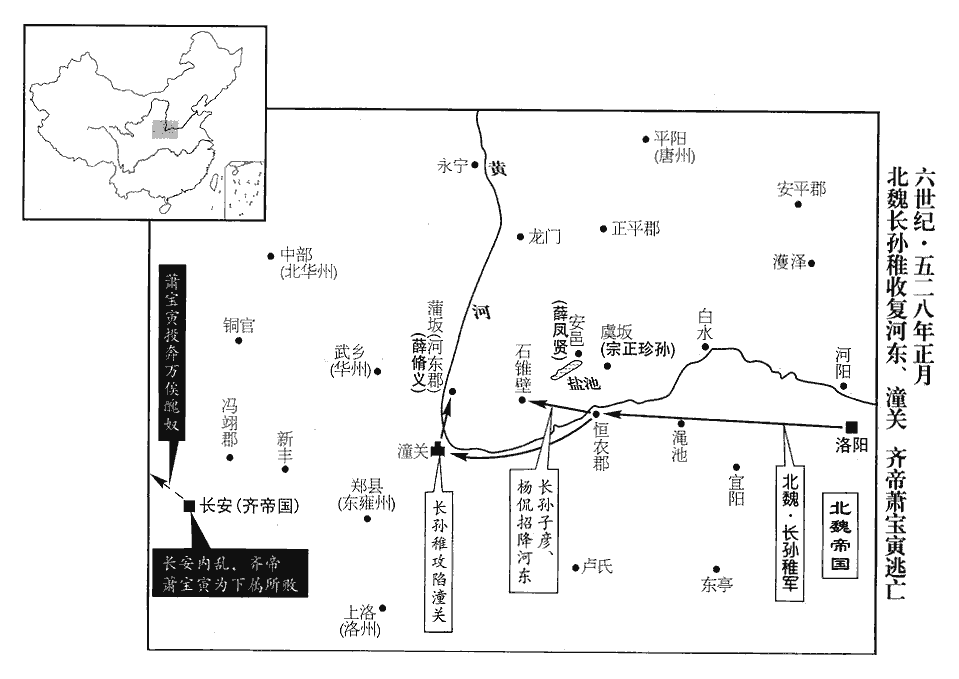
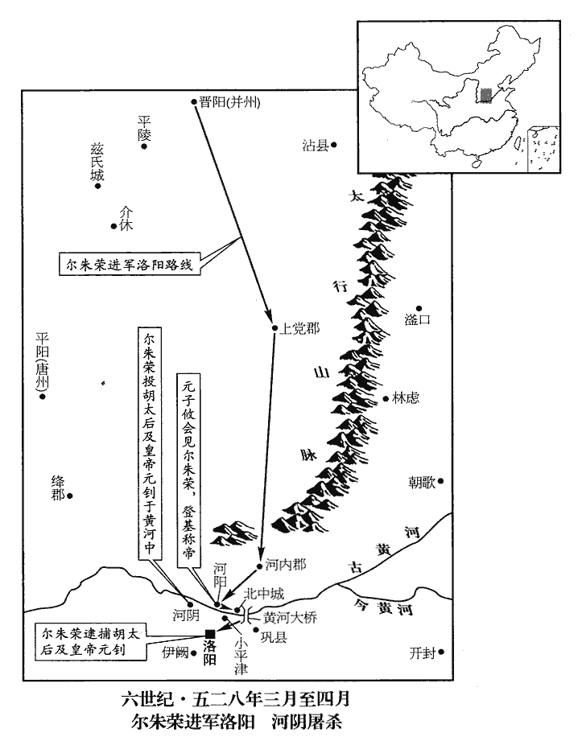

 梁紀八著雍涒灘（戊申），一年。

# 高祖武皇帝八

## 大通二年（戊申、五二八）

1春，正月，癸亥‹五›，魏以北海王顥為驃騎大將軍、開府儀同三司、相州‹府设邺城河北省临漳县西南邺镇›刺史。驃，匹妙翻。騎，奇寄翻。相，息亮翻。

〖译文〗 [1]春季，正月癸亥（初五），北魏任命北海王元颢为骠骑大将军、开府仪同三司、相州刺史。

2魏北道行臺楊津守定州城‹中山·河北省定州市›，居鮮于脩禮、杜洛周之間，迭來攻圍；津蓄薪糧，治器械，治，直之翻。隨機拒擊，賊不能克。津潛使人以鐵券說賊黨，賊黨有應津者，遺津書曰：「賊所以圍城，正為取北人耳。說，式芮翻。遺，于季翻。為，于偽翻。城中北人，宜盡殺之，不然，必為患。」津悉收北人內子城中而不殺，眾無不感其仁。

〖译文〗 [2]北魏北道行台杨津守定州城，处于鲜于礼和杜洛周两军之间，鲜于礼和杜洛周不断来围攻定州城。杨津积蓄柴草粮食，修治兵甲器械，相机抵御抗击贼军，敌军不能攻克定州城。杨津暗中派人持铁券游说贼军，贼军中有响应杨津的人，给杨津写信说：“贼军之所以包围定州城，只是为了得到城中北方人罢了，城中的北方人，应全部杀掉，不这样的话，一定成为后患。”于是，杨津将定州城中的北方人全部集中于内城中，却并未杀掉他们，这些北方人对杨津的仁义之举无不感激。

及葛榮代脩禮統眾，榮得脩禮之眾，見上卷普通七年。使人說津，許以為司徒，津斬其使，固守三年。普通七年春，津守定州，至是三年。說，式芮翻。其使，疏吏翻。杜洛周圍之，魏不能救。津遣其子遁突圍出，詣柔然‹瀚海沙漠群›頭兵可汗求救。遁日夜泣請，頭兵遣其從祖吐豆發帥精騎一萬南出；前鋒至廣昌‹河北省涞源县›，賊塞隘口，廣昌縣自漢以來屬代郡。自廣昌東南山南出倒馬關，至中山上曲陽縣，關山險隘，實為深峭，石磴逶迤，沿塗九曲。可，從刊入聲。汗，音寒。從，才用翻。帥，讀曰率；下同。塞，悉則翻。柔然遂還。乙丑‹七›，津長史李裔引賊入，執津，欲烹之，既而捨之。史言城無糧援，雖善守者不能支久。瀛州‹府设赵都军城河北省河间市›刺史元寧以城降洛周。降，戶江翻。

〖译文〗 等到葛荣代替鲜于礼统领军队后，派人向杨津游说，许诺让杨津做司徒。杨津杀掉了葛荣的使者，固守定州城三年。因杜洛周包围着定州城，北魏的军队不能来相救。杨津派自己的儿子杨遁突围出去，来到柔然国向头兵可汗求救。杨遁日夜哭泣恳请，于是头兵可汗派他的堂祖父吐豆发率一万精锐骑兵南下救援。前锋行至广昌县时，贼兵扼守住了隘口，柔然军队于是又退了回去。乙丑（初七），杨津的部下长史李裔引贼军进入了城中，抓住了杨津，贼军打算烹了杨津，后来又放了他。瀛州刺史元宁率全城投降了杜洛周。

3乙丑‹七›，魏潘嬪生女，胡太后詐言皇子；為後胡后立女張本。嬪，毗賓翻。丙寅‹八›，大赦，改元武泰。

〖译文〗 [3]乙丑（初七），北魏孝明帝的潘嫔生了一个女儿，胡太后诈称是皇子。丙寅（初八），北魏实行大赦，改元为武泰。

4蕭寶寅圍馮翊‹陕西省高陵县›，未下；長孫稚軍至恆農‹河南省三门峡市›，長，知兩翻。恆，戶登翻。行臺左丞楊侃謂稚曰：「昔魏武與韓遂、馬超據潼關‹陕西省潼关县›相拒，遂、超之才，非魏武敵也，然而勝負久不決者，扼其險要故也。事見六十六卷漢獻帝建安十六年。今賊守禦已固，雖魏武復生，無以施其智勇。復，扶又翻。不如北取蒲反‹山西省永济县›，此用前漢書地理志「蒲反」字。渡河而西，入其腹心，此亦魏武之故智也。置兵死地；則華州‹府设武乡陕西省大荔县›之圍不戰自解，五代志：馮翊郡，後魏置華州。華，戶化翻。潼關之守必內顧而走，支節既解，長安‹西安›可坐取也。若愚計可取，願為明公前驅。」稚曰：「子之計則善矣；然今薛脩義圍河東‹蒲坂·山西省永济县›，薛鳳賢據安邑‹山西省运城市›，宗正珍孫守虞坂‹山西省平陆县北二十千米中条山口›不得進，水經註曰：虞坂，即左傳所謂顛軨líng，在傅巖東北十餘里，東西絕澗，於中築以成道，指南北之路，謂之軨橋。橋之東北有虞原，上道東有虞城，其城北對長坂二十餘里，謂之虞坂。戰國策曰：「昔騏驥駕鹽車上虞坂，遷延不能進。」正此處也。坂，音反。如何可往？」侃曰：「珍孫行陳一夫，行，戶剛翻。陳，讀曰陣。因緣為將，將，即亮翻。可為人使，安能使人！河東治在蒲反，治，謂治所也。西逼河漘，漘chún，船倫翻，水厓也。上平坦而下水深曰漘。封疆多在郡東。脩義驅帥士民西圍郡城，其父母妻子皆留舊村，一旦聞官軍來至，皆有內顧之心，必望風自潰矣。」稚乃使其子子彥與侃帥騎兵自恆農北渡，據石錐壁‹山西省运城市西南›，五代志，河東郡虞鄉縣有石錐山，於此築壘壁也。侃聲言：「今且停此以待步兵，且觀民情向背。命送降名者各自還村，俟臺軍舉三烽，當亦舉烽相應；其無應烽者，乃賊黨也，當進擊屠之，以所獲賞軍。」於是村民轉相告語，背，蒲妹翻。語，牛倨翻。降，戶江翻；下同。雖實未降者亦詐舉烽，一宿之間，火光遍數百里，賊圍城者不測其故，各自散歸；脩義亦逃還，與鳳賢俱請降。丙子‹十八›，稚克潼關，遂入河東。

〖译文〗 [4]萧宝寅包围了冯翊县城，没有攻下。长孙稚的军队到了恒农，行台左丞杨侃对长孙稚说：“从前魏武帝曹操跟韩遂、马超在潼关交战，相持不下，韩遂、马超的才能，远不能与魏武帝相匹敌，但是却很长时间决不出胜负来，原因就在于韩遂、马超扼守住了险要关口。现在敌人守备防御已经稳固。即使魏武帝曹操再生，也施展不出他的本事。您不如向北夺取蒲反城，渡过黄河向西，进入敌人的腹地，置军于必死之地。这样华州之围便会不战而自解，潼关守敌必定顾虑后方而逃走。周围的城池解决了，长安城便可坐而取之。如果我的计策可行的话，我愿意为您做前锋。”长孙稚说：“您的计策倒是很好，但是崐现在薛义包围着河东、薛凤贤据守着安邑，宗正珍孙把守着虞坂，无法通过，怎么能到达呢？”杨侃说：“珍孙只不过是一介武夫，因偶然的机缘得以成为将领，他只能被人驱使，哪能指挥得了别人！河东郡的治所在蒲反城，蒲反城西边靠近黄河，所辖区域大部分在郡治所的东部。薛义率军队、百姓向西包围了郡的治所蒲反城，他们的父母、妻子、儿女却还都留在原来的村庄，一旦听说官军到了，他们都会有内顾之忧的，一定会望风披靡不战自溃。”长孙稚于是便派儿子长孙子彦与杨侃一起率骑兵从恒农北渡黄河，占据了石锥壁。杨侃声言：“现在暂时停在这里等待步兵，并且看一看民心所向。”于是命令那些送来投降者的名单的人各自回到村子，并且告诉他们：“等到官军燃起三堆烽火时，你们也要燃举烽火相呼应。那些不举烽火相呼应的人，便是贼军的同党，要杀掉他们，将没收的财产犒赏军队。”于是村民们相互转告，即使内心不想投降的人也假装举起烽火，一夜之间，火光遍布数百里。围攻蒲反城的贼兵不知其中原委，各自溃散逃归。薛义也逃回了老家，与薛凤贤一起请求投降。丙子（十八月），长孙稚攻克了潼关，于是进入了河东郡。

 

會有詔廢鹽池稅，魏朝蓋謂弛鹽利以與民，可以得民也。稚上表以為：「鹽池天產之貨，密邇京畿‹盐池在山西省运城市南，属京畿司州›，唯應寶而守之，均贍以理。今四方多虞，府藏罄竭，冀‹府信都›、定‹府中山›擾攘，冀、定二州時為葛榮、杜洛周攻圍。常調之絹不復可收，唯仰府庫，藏，徂浪翻。調，徒弔翻。復，扶又翻。仰，魚向翻。有出無入。略論鹽稅，一年之中，準絹而言，不下三十萬匹，乃是移冀、定二州置於畿甸；今若廢之，事同再失。前此宣武帝用甄琛之言，廢鹽池稅，已為失計；今又廢之，是為再失。臣前仰違嚴旨，不先討關賊，徑解河東者，非緩長安而急蒲反，一失鹽池，三軍乏食。天助大魏，茲計不爽。爽，乖也。昔高祖‹元宏›昇平之年無所乏少，少，詩沼翻。猶創置鹽官而加典護，非與物競利，恐由利而亂俗也。況今國用不足，租徵六年之粟，調折來歲之資，調，徒弔翻。折，之列翻。此皆奪人私財，事不獲已。臣輒符同監將、尉，謂監鹽池之將、尉也。監，工銜翻。將，即亮翻；下同。還帥所部，依常收稅，帥，讀曰率；下同。更聽後敕。」謂合罷與否，更聽後番敕下也。

〖译文〗 这时候正赶上孝明帝下诏书要废除掉盐池税，于是长孙稚便上书申明自己的看法：“盐池是天然物产，靠近京城，正应该把它当作宝贝好好守护，依据常理均衡地补给百姓。当今之时，四方多难，国家府库空虚，冀州、定州叛乱纷起，国家正常的户调绢帛无法收上来，一切全靠府库的储备，只有支出，没有收入。大致估算一下盐税收入，一年之中，按绢的价值计算的话，不少于三十万匹绢的收入，这就犹同将冀州、定州这两个州置于京郊一样。现在如果再废除盐池税的话，那可就是两次失计了。臣上次之所以敢违抗您的圣旨，没有先讨伐关内的贼兵，而是先径直解除了河东之围，这并不是以长安为缓而以蒲反为急，而是如果一旦失去盐池，则三军势必会缺乏粮食。上天助我大魏，这一计策果然是正确的。过去孝文帝太平之年，什么都不缺少，尚且创置盐官对盐池加以管理、保护，那样做的目的，并不是要跟老百姓争利，而是担心由于利益冲突而导致社会动乱。何况当今国家财政不足，租税已经提前征收了六年，户调已经折合到明年，这些都是掠取百姓私财的措施，事情出于不得已。我这就让那些管理、保护盐池的将、尉们，回去率领他们的部下，仍按往常一样征收盐税，是否废除，再听陛下以后的诏令。”

蕭寶寅遣其將侯終德擊毛遐。會郭子恢等屢為魏軍所敗，敗，補邁翻；下穆敗同。終德因其勢挫，還軍襲寶寅；至白門，長安城東出北來第三門曰青門；意白門即西出南來第三門也。寶寅始覺，丁丑‹十九›，與終德戰，敗，攜其妻南陽公主及其少子，帥麾下百餘騎自後門出，奔万俟醜奴‹时在上封甘肃省天水市›。少，詩照翻。騎，奇寄翻。万，莫北翻。俟，渠之翻。醜奴以寶寅為太傅。

〖译文〗 萧宝寅派部将侯终德攻打毛遐的部队。正值郭子恢等人屡次被北魏军队打败，侯终德趁着萧宝寅势力受到削弱之际，回去袭击萧宝寅，侯终德的部队已到了白门的时候，萧宝寅才刚刚发觉。丁丑（十九日），萧宝寅与侯终德交战，结果战败。萧宝寅携带妻子南阳公主和他们的小儿子，带着部下一百多名骑兵从后门逃出，投奔了万俟奴。万俟奴封萧宝寅为太傅。

二月，魏以長孫稚為車騎大將軍、開府儀同三司、雍州‹府设长安陕西省西安市›刺史、尚書僕射、西道行臺。雍，於用翻。

〖译文〗 二月，北魏任命长孙稚为车骑大将军、开府仪同三司、雍州刺史、尚书仆射、西道行台。

群盜李洪攻燒鞏‹河南省巩县›西闕口‹洛阳城南›以東，謂鞏縣以西，伊闕口以東也。鞏縣，漢屬河南尹，晉分屬滎陽郡。南結諸蠻；魏都督李神軌、武衛將軍費穆討之。穆敗洪於闕口南，遂平之。

〖译文〗 群盗李洪等攻取烧毁了巩县以西、伊阙口以东的大片地区，并与南方诸蛮相勾结。北魏都督李神轨、武卫将军费穆率军征讨李洪。费穆在伊阙口南打败了李洪，最后终于平定了匪乱。

5葛榮擊杜洛周，殺之，併其眾。

〖译文〗 [5]葛荣率军攻打杜洛周，杀了杜洛周，收编了他的部众。

6魏靈太后再臨朝以來，再臨朝見一百五十卷普通六年。朝，直遙翻。嬖倖用事，嬖，卑義翻，又博計翻。政事縱弛，恩威不立，盜賊蠭起，封疆日蹙。謂秦、隴以西，冀、并以北，皆為盜區，淮、汝、沂、泗之間，皆為梁所侵也。魏肅宗年浸長‹元诩本年十九岁›，太后自以所為不謹，恐左右聞之於帝，凡帝所愛信者，太后輒以事去之，長，知兩翻。去，羌呂翻。務為壅蔽，不使帝知外事。通直散騎常侍昌黎‹辽宁省朝阳市›谷士恢有寵於帝，使領左右；散，悉亶翻。騎，奇寄翻。太后屢諷之，欲用為州，士恢懷寵，不願出外，太后乃誣以罪而殺之。有蜜多道人，能胡語，帝常置左右，太后使人殺之於城南而【章：甲十一行本「而」下有「詐」字；乙十一行本同；孔本同；張校同；退齋校同。】懸賞購賊。由是母子之間，嫌隙日深。

〖译文〗 [6]北魏胡太后再次当政以来，宠信之徒横行专权，政事松弛，朝廷的威信树立不起来，盗贼纷起，边界一天天缩小。孝明帝年纪渐渐长大，胡太后本人也认为自己的所作所为不够谨慎，担心左右会向孝明帝汇报，于是凡孝明帝平时所宠信的人，太后便借某种事由除掉他们，竭力堵塞孝明帝视听，不让他知道外面发生的事情。通直散骑常侍、昌黎人谷士恢深受孝明帝宠爱，命他统领宫中卫士。胡太后多次含蓄地暗示谷士恢，想把他调为地方官，但谷士恢受孝明帝宠幸，不愿离开京城，于是胡太后便罗织罪名将他杀了。有一个密多道人，会说胡话，孝明帝经常让他在身边服侍。胡太后派人在城南杀了他，还假装悬赏缉拿罪犯。从此胡太后和孝明帝母子二人之间，隔阂越来越深。

是時，車騎將軍、儀同三司、并•肆•汾•廣•恆•雲六州討虜大都督爾朱榮「廣」當作「唐」。魏收志，孝昌中置唐州。高歡建義，改唐州曰晉州。按爾朱榮時駐兵於晉陽。兵勢強盛，魏朝憚之。朝，直遙翻。高歡、段榮、尉景、蔡儁先在杜洛周黨中，高歡等歸杜洛周，見一百五十卷普通六年。欲圖洛周不果，逃奔葛榮，又亡歸爾朱榮。劉貴先在爾朱榮所，屢薦歡於榮，榮見其憔倅，未之奇也。憔，昨遙翻。悴，秦醉翻。歡從榮之馬廄，廄有悍馬，榮命歡翦之，髦馬而鬄tì落之為翦。悍，侯旰翻。歡不加羈絆而翦之，馬絡首曰羈，繫足曰絆。竟不蹄齧，起，謂榮曰：「御惡人亦猶是矣。」榮奇其言，坐歡於牀下，屏左右，訪以時事，歡曰：「聞公有馬十二谷，榮畜牧蕃庶，以谷量馬。屏，必郢翻。色別為群，畜此竟何用也？」畜，吁玉翻。榮曰：「但言爾意！」歡曰：「今天子闇弱，太后淫亂，嬖櫱擅命，朝政不行。櫱niè，魚列翻。朝，直遙翻。以明公雄武，乘時奮發，討鄭儼、徐紇之罪以清帝側，霸業可舉鞭而成，此賀六渾之意也。」高歡，字賀六渾。榮大悅，語自日中至夜半乃出，自是每參軍謀。

〖译文〗 当时，车骑将军、仪同三司及并、肆、汾、广、恒、云六州讨虏大都督尔朱荣，兵势强盛，北魏朝廷很是害怕。高欢、段荣、尉景、蔡俊等人原先在杜洛周手下，本想图谋取代杜洛周，结果没成功，于是逃奔葛荣，接着又投奔尔朱荣。先前便在尔朱荣处做事的刘贵，多次向尔朱荣推荐高欢，尔朱荣见高欢身形瘦弱，相貌憔悴，并没有觉出他有什么出奇之处。一次高欢随尔朱荣来到马棚，马棚中有一匹强悍凶猛的马，尔朱荣令高欢给这匹马修剪。高欢对这匹马没套上马笼头和捆住马脚便修剪起来，这匹马竟然也没踢没咬。高欢修剪完后站起身来，对尔朱荣说：“制服坏人也跟这是同一道理。”尔朱荣很惊奇他能说出这样的话来，于是请高欢坐在床下，屏退左右，向他征询当前的国家大事。高欢说道：“我听说您有十二群马，按颜色分成不同的马群，这样畜养到底是要做什么用呢？”尔朱荣说：“请只管说出你的看法！”高欢说：“现在皇上软弱，太后淫乱，奸佞小人专权，朝廷的政策不能贯彻执行。凭您的雄才大略，若乘此时起兵，讨伐郑俨、徐纥的罪行，肃清皇上身边的奸佞小人。那么您的霸业挥鞭之际便可成就，这就是我高欢的主意。”尔朱荣听了非常高兴，二人从中午谈至半夜才出来。从此以后，高欢便经常参与尔朱荣的军事谋划。

并州‹府设晋阳山西省太原市›刺史元天穆，孤之五世孫也，孤，拓跋鬱律第四子。與榮善，榮兄事之。榮常與天穆及帳下都督賀拔岳密謀，欲舉兵入洛，內誅嬖倖，外清群盜，二人皆勸成之。

〖译文〗 并州刺史元天穆，是元孤的五世孙，跟尔朱荣关系很密切，尔朱荣对他就象对待哥哥一样。尔朱荣经常跟元天穆及部下都督贺拔岳密谋，打算发兵进入洛阳，对内诛杀奸佞之人，对外肃清各地匪盗，元天穆和贺拔岳二人都劝尔朱荣这样做。

榮上書以「山東群盜方熾，熾，尺志翻。冀、定覆沒，官軍屢敗，請遣精騎三千東援相州。」騎，奇寄翻。相，息亮翻。太后疑之，報以「念生梟戮，寶寅就擒，醜奴請降，關、隴已定。費穆大破群蠻，絳蜀漸平。又，北海王顥帥眾二萬出鎮相州，不須出兵。」梟，堅堯翻。降，戶江翻。帥，讀曰率；下同。榮復上書，復，扶又翻；下帝復同。以為「賊勢雖衰，官軍屢敗，人情危怯，恐實難用。若不更思方略，無以萬全。臣愚以為蠕蠕主阿那瓌荷國厚恩，蠕蠕之亂，魏援立阿那瓌，事見一百四十九卷普通元年至三年。蠕，人兗翻。荷，下可翻。未應忘報，宜遣發兵東趣下口以躡其背，言阿那瓌荷魏保護之恩，雖叛歸塞北，未應漠然忘報恩之心。下口蓋指飛狐口‹河北省涞源县北›。趣，七喻翻。北海之軍嚴加警備以當其前。臣麾下雖少，輒盡力命自井陘‹河北省井陉县东北›以北，滏口‹河北省武安市南›以西，分據險要，攻其肘腋。少，詩沼翻。陘，音刑。滏，音釜。腋，音亦。葛榮雖并洛周，威恩未著，人類差異，形勢可分。」杜洛周，柔玄鎮民‹柔玄镇内蒙古兴和县北›匈奴人；葛榮，鮮于脩禮之黨‹移民定州的五原内蒙古包头市›降户，多是鲜卑人；本非同類，吞并為一。及其新合，亟加招討，則形勢可分也。遂勒兵召集義勇，北捍馬邑‹山西省朔州市›，東塞井陘。徐紇說太后以鐵券間榮左右，榮聞而恨之。

〖译文〗 于是，尔朱荣便向朝廷上书说：“山东群盗的活动正猖獗，冀州、定州已经失陷敌手，官军屡战屡败，我请求派遣三千精锐骑兵向东增援相州。”胡太后对此很是怀疑，便回答尔朱荣说：“莫折念生已斩首，萧宝寅被活捉，万俟奴已请求投降，这样，关、陇地区的贼盗已经平定。费穆大破群蛮，绛蜀地区也逐渐平定。再者，北海王元颢已率军二万出镇相州，因此你不必再出兵增援了。”尔朱荣又上书朝廷，认为：“贼兵的势力虽然衰落，但官军却屡次失败，军心畏惧，所以恐怕官军实际上很难起作用。如果不另想策略的话，则不能确保万无一失。以微臣愚见，蠕蠕国国王阿那环受我魏朝厚恩，不应忘记报答，因此，应该让他发兵东至下口以攻击贼兵的背后，令北海王元颢的部队严加戒备以攻击贼兵的正面。我的部队虽然很少，也要尽全力命他们从井陉以北，滏口以西，分路占据险要地区，从侧面攻击贼兵。葛荣虽然吞并了杜洛周的部队，但威信还未树立，部下并非一族，可以使他们分崩离析。”于是尔朱荣便命令部队征召义勇之人充军，向北守卫马邑城，向东占据了井陉。徐纥劝胡太后派人持铁券离间尔朱荣的部下，尔朱荣听说后，很忌恨徐纥。

魏肅宗‹元诩›亦惡儼、紇等，逼於太后，不能去，塞，悉則翻。說，輸芮翻。間，古莧翻。惡，烏路翻。去，羌呂翻。密詔榮舉兵內向，欲以脅太后。榮以高歡為前鋒，行至上黨‹山西省长治市北›，帝復以私詔止之。儼、紇恐禍及己，陰與太后謀酖帝，癸丑‹二十五›，帝‹元诩›暴殂。年十九。甲寅‹二十六›，太后立皇女為帝，大赦。既而下詔稱：「潘充華本實生女。潘充華，即前所謂潘嬪也，生女見上正月乙丑。故臨洮王寶暉世子釗，體自高祖‹元宏›，臨洮王寶暉，高祖之孫。宜膺大寶。百官文武加二階，宿衛加三階。」乙卯‹二十七›，釗即位。釗始生三歲，太后欲久專政，故貪其幼而立之。

〖译文〗 北魏孝明帝也很厌恶郑俨、徐纥等人，碍于胡太后，不能把他们除掉。于是孝明帝秘密下诏书命尔朱荣发兵至京城，想以此来胁迫胡太后。尔朱荣任命高欢为前锋，部队行至上党时，孝明帝又下密诏阻止了这一行动。郑俨、徐纥担心灾祸会降临到自己头上，便暗中与胡太后策划阴谋毒死孝明帝。癸丑（二十五日），北魏孝明帝突然去世。甲寅（二十六日），胡太后立皇女为皇帝，大赦天下。不久又下诏书宣称：“潘充华实际上生的是女儿。原来的临洮王元宝晖的后代元钊，是孝文帝的嫡系后代，应该做皇帝。文武百官各进二级官位，宿卫进三级官位。”乙卯（二十七日），元钊即位。元钊这时才刚刚三岁，胡太后想长久地独揽大权，所以看中了元钊年纪小才立他为帝。

爾朱榮聞之，大怒，謂元天穆曰：「主上晏駕，春秋十九，海內猶謂之幼君；況今奉未言之兒以臨天下，欲求治安，其可得乎！治，直吏翻。吾欲帥鐵騎赴哀山陵，翦除姦佞，更立長君，更，工衡翻。長，知兩翻。何如？」天穆曰：「此伊、霍復見於今矣。」乃抗表稱：「大行皇帝背棄萬方，復，扶又翻。背，蒲妹翻。海內咸稱酖毒致禍。豈有天子不豫，初不召醫，貴戚大臣皆不侍側，安得不使遠近怪愕！又以皇女為儲兩，太子謂之儲君。易曰：明兩作離，大人以繼，明照四方。故稱儲兩。虛行赦宥，上欺天地，下惑朝野。已乃選君於孩提之中，實使姦豎專朝，隳亂綱紀，朝，直遙翻。此何異掩目捕雀，塞耳盜鍾。塞，悉則翻。今群盜沸騰，鄰敵窺窬，而欲以未言之兒鎮安天下，不亦難乎！願聽臣赴闕，參預大議，問侍臣帝崩之由，訪侍【章：甲十一行本「侍」作「禁」；乙十一行本同；孔本同；張校同。】衛不知之狀，以徐、鄭之徒付之司敗，雪同天之恥，君父之讎，義不同天。謝遠近之怨，然後更擇宗親以承寶祚。」榮從弟世隆，時為直閤，更，工衡翻。從，才用翻；下從子之從同。太后遣詣晉陽‹山西省太原市›慰諭榮；榮欲留之，世隆曰：「朝廷疑兄，故遣世隆來，今留世隆，使朝廷得預為之備，非計也。」乃遣之。

〖译文〗 尔朱荣听说这事之后，非常恼怒，对元天穆说：“皇上去世了。他年纪已十九岁了，而天下还仍把他看作是小皇帝，何况现在立一个还不会说话的幼儿来统治天下，想求得国家长治久安，怎么可能呢？我打算率骑兵奔赴国都哀悼皇帝，除掉奸佞之人，重新立一位年纪大一点的皇帝，你们看怎么样？”元天穆说：“这真是伊尹、霍光今日再生啊！”于是尔朱荣上书朝廷，声称：“大行皇帝离开人世，天下都认为是被毒酒害死的。哪儿有皇帝生病，竟然不召医生看视，贵戚大臣都不服侍左右的道理？”这怎能不让天下之人感到奇怪、诧异呢！又立皇女为皇位继承人，妄自实行大赦，宽恕罪犯，对上欺骗天地，对下迷惑朝野之人。接着又选立孩童为帝，实际上让奸臣佞子把持朝政，毁坏国家纲纪，这与掩目捕雀、塞耳盗铃有何区别？现在各地盗匪猖獗，邻国之敌暗中窥伺，朝廷却打算让一个还不会说话的孩子来镇抚安定天下，不是太难了么！希望朝廷允许我回到京城，参与商讨国家大计，向侍卫之臣询问皇帝驾崩的原因，访查侍卫们不知道的真实情况，将徐纥、郑俨之徒交给法官查办，以雪之耻，消除远近各地的怨恨之情，然后重新选择一位皇族成员承继皇位。”尔朱荣的崐堂弟尔朱世隆，当时任直官，胡太后派他到晋阳慰问安抚尔朱荣。尔朱荣打算留下尔朱世隆，尔朱世隆说道：“朝廷现在怀疑兄长您，所以才派我来您这里，现在您却要留下我，这就会使得朝廷能够预先做好防备，不是好计策呀。”于是尔朱荣便仍让尔朱世隆回去了。

7三月，癸未‹二十六›，葛榮陷魏滄州‹府设饶安河北省盐山县西南›，魏肅宗熙平二年，分瀛、冀二州置滄州，治饒安城，領浮陽、樂陵郡。執刺史薛慶之，居民死者什八九。

〖译文〗 [7]三月癸未（二十六日），葛荣攻陷北魏的沧州，抓获了刺史薛庆之，平民被杀的占十之八九。

8乙酉‹二十八›，魏葬孝明皇帝‹元诩›于定陵，廟號肅宗。

〖译文〗 [8]乙酉（二十八日），北魏将孝明帝安葬于定陵，庙号为肃宗。

9爾朱榮與元天穆議，以彭城武宣王有忠勳，彭城王勰，諡武宣。忠勳，謂侍孝文帝疾，立宣武帝，備極忠勤也。其子長樂王子攸，素有令望，欲立之。樂，音洛。又遣從子天光及親信奚毅、倉頭王相入洛，與爾朱世隆密議。天光見子攸，具論榮心，子攸許之。天光等還晉陽，榮猶疑之，乃以銅為顯祖諸【章：甲十一行本「諸」下有「子」字；乙十一行本同；孔本同；張校同；退齋校同。】孫各鑄像，唯長樂王像成。魏人立后，皆鑄像以卜之。慕容氏謂冉閔以金鑄己像不成。胡人鑄像以卜君，其來尚矣，故爾朱榮效之。榮乃起兵發晉陽，世隆逃出，會榮於上黨。靈太后聞之，甚懼，悉召王公等入議，宗室大臣皆疾太后所為，莫肯致言。徐紇獨曰：「爾朱榮小胡，敢稱兵向闕，文武宿衛足以制之。但守險要以逸待勞，彼懸軍千里，士馬疲弊，破之必矣。」太后以為然，以黃門侍郎李神軌為大都督，帥眾拒之，別將鄭季明、鄭先護將兵守河橋，帥，讀曰率。將，即亮翻。武衛將軍費穆屯小平津‹河南省孟津县东黄河渡口›。先護，儼之從祖兄弟也。

〖译文〗 [9]尔朱荣跟元天穆商议，认为彭城武宣王元勰有功勋，他的儿子长乐王元子攸平素声望很高，打算立元子攸为帝。尔朱荣又派侄子尔朱天光及亲信奚毅、仆人王相来到洛阳，与尔朱世隆秘密商议。尔朱天光见到元子攸后，向他详细地讲了尔朱荣的想法，元子攸答应了。尔朱天光等人回到晋阳，尔朱荣仍犹疑不定，于是便用铜为皇室的子孙们每人都铸铜像，以此占卜谁能做皇帝，结果只有长乐王元子攸的铜像铸成了。尔朱荣这才起兵从晋阳出发，尔朱世隆逃出京城，在上党与尔朱荣相会。胡太后听说后，非常恐惧，将王公大臣全部召入宫中商议对策。皇族宗室和大臣们都很痛恨胡太后平日的所作所为，因此没有人发言。只有徐纥说：“尔朱荣这个小胡人，竟敢起兵冒犯朝廷，文武禁卫军足以将他制伏。只要守住险要地区以逸待劳，尔朱荣的孤军千里而来，兵马疲惫不堪，一定能够打败他。”胡太后认为徐纥说的很对，于是任命黄门侍郎李神轨为大都督，率兵迎击尔朱荣，副将郑季明、郑先护率兵守卫河桥，武卫将军费穆驻扎在小平津。郑先护是郑俨的堂祖父兄弟。

榮至河內‹河南省沁阳市›，復遣王相密至洛，迎長樂王子攸。復，扶又翻；下榮復同。夏，四月，丙申‹九›，子攸與兄彭城王劭、弟霸城公子正潛自高渚‹黄河中小岛›渡河，考異曰：楊衒之洛陽伽藍記，「高渚」作「霤波」，今從魏書。丁酉‹十›，會榮於河陽‹河南省孟县›，將士咸稱萬歲。戊戌‹十一›，濟河，子攸‹元子攸，本年二十二岁›即帝位，帝，彭城王勰之第三子。以劭為無上王，劭，彭城嫡嗣，且魏主兄也，封為無上王，言其尊無上也。有君而言無上，君子是以知魏主之不終也。子正為始平王；以榮為侍中、都督中外諸軍事、大將軍、尚書令、領軍將軍、領左右，封太原王。領左右，領左右千牛備身也。

〖译文〗 尔朱荣的军队到达河内后，尔朱荣又派王相秘密进到洛阳城，迎接长乐王元子攸。夏季，四月丙申（初九），元子攸与他的哥哥彭城王元劭、弟弟霸城公元子正偷偷从高渚渡过黄河，丁酉（初十），在河阳跟尔朱荣见了面，将士们都高呼万岁。戊戌（十一日），尔朱荣等渡过黄河，元子攸即皇帝位，任命元劭为无上王，元子正为始平王，任命尔朱荣为侍中、都督中外诸军事、大将军、尚书令、领军将军、领左右，并封为太原王。

 

鄭先護素與敬宗善，聞帝即位，與鄭季明開城納之。李神軌至河橋，聞北中不守，晉杜預建河橋於富平津。河北側岸有二城相對，魏高祖置北中郎府，徙諸從隸府戶并羽林虎賁領隊防之。北中不守，可以平行至洛陽矣。宋白曰：北中城，即今河陽城。即遁還；費穆棄眾先降於榮。降，戶江翻。徐紇矯詔夜開殿門，取驊騮廄御馬十匹，驊騮，駿馬也，故魏以名御馬廄。東奔兗州‹府设瑕丘山东省兖州市›，將依羊侃也。為侃與紇南歸張本。鄭儼亦走還鄉里‹河南省开封市西南›。鄭儼，滎陽開封人。太后盡召肅宗‹元诩›後宮，皆令出家，太后亦自落髮。榮召百官迎車駕，己亥‹十二›，百官奉璽綬，備法駕，迎敬宗‹元子攸›於河橋。璽，斯氏翻。綬，音受。考異曰：伽藍記云：「十二日，爾朱榮軍于邙山之北，河陰之野。十三日，召百官迎駕，至者盡誅之。」長曆，是月戊子朔；十二日，己亥也。今從魏書。庚子‹十三›，榮遣騎執太后及幼主‹元钊，三岁›，送至河陰‹河南省孟津县西北›。騎，奇寄翻。太后對榮多所陳說，榮拂衣而起，沈太后及幼主於河。

〖译文〗 郑先护平素与孝庄帝元子攸的关系很密切，听说他已即位做了皇帝，便与郑季明一起打开城门将尔朱荣的部队接进城中。李神轨来到河桥后，听说北中城已失守，便立即逃回了洛阳城；费穆丢下士兵自己先投降了尔朱荣。徐纥假传圣旨夜里打开宫殿大门，牵出了十匹养在骅骝厩中的御马，向东逃奔了兖州。郑俨也逃回了老家。胡太后将孝明帝的后宫嫔妇们召集在一起，命令她们都出家为尼，太后自己也削了发。尔朱荣召令文武百官迎接圣驾，己亥（十二日），文武百官捧着皇帝的印玺、绶带，准备了车辇，从河桥迎回魏孝庄帝。庚子（十三日），尔朱荣派骑兵抓获了胡太后和小皇帝，将他们送到了河阴，胡崐太后对尔朱荣讲了许多求情的话，尔朱荣拂袖而起，命人将胡太后和小皇帝沉入了黄河之中。

費穆密說榮曰：「公士馬不出萬人，今長驅向洛，前無橫陳，既無戰勝之威，群情素不厭服。沈，持林翻。說，式芮翻。陳，讀曰陣。厭，於葉翻。以京師之眾，百官之盛，知公虛實，有輕侮之心。若不大行誅罰，更樹親黨，恐公還北之日，未渡太行而內變作矣。」更，工衡翻。行，戶剛翻。榮心然之，謂所親慕容紹宗曰：「洛中人士繁盛，驕侈成俗，不加芟翦，終難制馭。芟，所銜翻。吾欲因百官出迎，悉誅之，何如？」紹宗曰：「太后荒淫失道，嬖倖弄權，殽亂四海，殽，雜也，錯也。嬖，卑義翻，又博計翻。故明公興義兵以清朝廷。今無故殲夷多士，不分忠佞，殲，息廉翻。恐大失天下之望，非長策也。」榮不聽，乃請帝循河西至淘渚，水經註：孟津，又曰富平津，又謂之陶河；杜畿試樓船於孟津，覆於陶河，即此也。按爾朱榮傳，陶渚在河陰西北三里，南北長堤之西。魏紀「淘」作「陶」。杜佑曰：河南河陽縣西南十三里有古遮馬堤，即其處。引百官於行宮西北，云欲祭天。百官既集，列胡騎圍之，責以天下喪亂，肅宗暴崩，皆由朝臣貪虐，不能匡弼，騎，奇寄翻。喪，息浪翻。朝，直遙翻。因縱兵殺之，自丞相高陽王雍、司空元欽、儀同三司義陽王略以下，死者二千餘人。考異曰：北史云：「榮惑費穆之言，謂天下乘機可取，乃譎朝士共為盟誓，將向河陰西北三里。至南北長堤，悉命下馬西渡，即遣胡騎圍之，妄言丞相高陽王反，殺王公以下二千餘人。」榮傳一千三百餘人。今從魏紀。前黃門郎王遵業兄弟居父喪，其母，敬宗‹元子攸›之從母也，相帥出迎，俱死。遵業，慧龍之孫也，劉裕得晉權，殺王愉，其孫慧龍奔魏，著功名於南鄙。從，才用翻。帥，讀曰率。儁爽涉學，時人惜其才而譏其躁。躁，則到翻。有朝士百餘人後至，榮復以胡騎圍之，令曰：「有能為禪文者免死。」侍御史趙元則出應募，遂使為之。考異曰：北史曰：「時隴西李神雋、頓丘李諧、太原溫子昇並當世辭人，皆在圍中，恥從是命，俯伏不應。」按神雋等不應，何得不死！魏書本傳皆無其事。榮又令其軍士言「元氏既滅，爾朱氏興，」皆稱萬歲。榮又遣數十人拔刀向行宮，帝與無上王劭、始平王子正俱出帳外。榮先遣并州‹府设晋阳山西省太原市›人郭羅剎、西部高車叱列殺鬼侍帝側，剎，初轄翻。詐言防衛，抱帝入帳，餘人即殺劭及子正，又遣數十人遷帝於河橋，置之幕下。

〖译文〗 费穆暗中劝尔朱荣说：“您兵马不足万人，现在远道而至洛阳，前面没有遇到任何抵抗，既没有什么战胜之威，平素人们心中对您又不畏服。因京城军队众多，文武百官势力强盛，如果知道了您的虚实的话，便会对您有所轻视。若不狠狠地实行诛杀、惩治，另外培植亲信，恐怕您回到北方之时，还未过太行山，内乱便会发生。”尔朱荣内心认为费穆的话很对，于是便对亲信慕容绍宗说：“洛阳人口众多，骄侈成习，如不加以整饬，终究难以控制。我打算趁文武百官出迎之际，全部杀掉他们，你看怎样？”慕容绍宗说道：“太后荒淫无道，奸佞小人专权，将天下搞得混乱不堪，所以您才起义兵以整肃朝廷。现在却无故杀戮许多官员，不分忠臣奸臣，恐怕会使天下大人失所望，这不是上策。”尔朱荣不听，于是请孝庄帝沿黄河向西来到淘渚这个地方，尔朱荣率百官来到皇帝行宫的西北，说是要祭天。文武百官集中起来后，尔朱荣布置骑兵四面包围了他们，指责这些文武百官们说，天下动乱，孝明帝突然死去，都是由于他们这些朝廷大臣贪脏枉法，酷虐无忌，不能匡辅社稷所造成的，因此命令部队诛杀了他们。从丞相高阳王元雍、司空元钦、仪同三司义阳王元略以下，被杀的达两千多人。原黄门郎王遵业兄弟正在居父丧，王遵业的母亲是魏孝庄帝的伯母，他们一起出来迎接皇帝，结果也都被杀掉了。王遵业是王慧龙的孙子，聪明豪爽而又博学，他死之后人们一方面很怜惜他的才学，一方面又讥讽他过于躁进。有一百多名朝廷官员后来才到，尔朱荣又让骑兵们包围了他们，对这些官员下令说：“如果谁能作一篇元氏禅让皇位于尔朱氏的文告，就可以免死。”侍御史赵元则站出来响应，于是便让他起草禅让文告。尔朱荣又命令他的士兵们高呼：“元氏既灭，尔朱氏兴。”士兵们一齐山呼万岁。尔朱荣又派数十人持刀来到行宫，孝庄帝与无上王元劭、始平王元子正一起来到账外。尔朱荣先派并州人郭罗刹、西部高车人叱列杀鬼侍立在孝庄帝两侧，假装说是保护皇帝，将孝庄帝抱入账中，其余的人便杀了元劭和元子正。接着尔朱荣又派数十人将孝庄帝迁到了河桥，置于他的账下。

帝‹元子攸›憂憤無計，使人諭旨於榮曰：「帝王迭興，盛衰無常。今四方瓦解，將軍奮袂而起，所向無前，此乃天意，非人力也。我本相投，志在全生，豈敢妄希天位！希，望也。將軍見逼，以至於此。若天命有歸，將軍宜時正尊號；若推而不居，推，吐雷翻。存魏社稷，亦當更擇親賢而輔之。」更，工衡翻。時都督高歡勸榮稱帝，考異曰：魏爾朱榮傳曰：「於是獻武王與外兵參軍司馬子如等切諫，陳不可之理，榮曰：『愆誤若是，唯當以死謝朝廷。今日安危之機，計將何出？』獻武王等曰：『未若還奉長樂以安天下。』於是還奉莊帝。」北齊書神武紀云：「榮將篡位，神武諫，恐不聽，請鑄像卜之，鑄不成，乃止。」蓋魏收與北齊史官欲為神武掩此惡，故云爾。今從周書賀拔岳傳。左右多同之，榮疑未決。賀拔岳進曰：「將軍首舉義兵，志除姦逆，大勳未立，遽有此謀，正可速禍，未見其福。」榮乃自鑄金為像，凡四鑄，不成。功曹參軍燕郡‹北京市›劉靈助善卜筮，漢高祖定天下，燕仍為國，昭帝改為廣陽郡；後漢光武併上谷，和帝復為廣陽郡；晉為廣陽國，魏為燕郡。燕，因肩翻。榮信之，靈助言天時人事未可。榮曰：「若我不吉，當迎天穆立之。」靈助曰：「天穆亦不吉，唯長樂王‹元子攸›有天命耳。」榮亦精神恍惚，不自支持，久而方寤，史言天位不可以詐力奸。恍，呼廣翻。惚，音忽。深思【章：甲十二行本「思」作「自」；乙十一行本同；孔本同；張校同。】愧悔曰：「過誤若是，唯當以死謝朝廷。」賀拔岳請殺高歡以謝天下，左右曰：「歡雖復愚疏，言不思難。復，扶又翻；下更復同。難，乃旦翻。今四方多事，須藉武將，將，即亮翻。請捨之，收其後效。」榮乃止。夜四更，復迎帝還營，更，工衡翻。榮望馬首叩頭請死。

〖译文〗 孝庄帝忧伤愤慨但却无计可施，派人向尔朱荣传达旨意说：“帝王迭兴，盛崐衰无常。现在天下纷乱，将军奋而起兵，所向无敌，这是天意，不是靠人的力量所能达到的。我原来投奔于你，只是希望能够活下来罢了，哪敢妄想登上皇位！将军你逼我做皇帝，我才到了现在这个地步。如果上天有意安排你做皇帝的话，将军你应选好时机登上皇位。如果你推辞而不做，想保存大魏的社稷，那么您也应该另选一位亲信而又贤明的人做皇帝，您对他加以辅佐。”当时，都督高欢劝尔朱荣称帝，尔朱荣的部下大多赞同，尔朱荣犹疑未决。贺拔岳进言道：“将军您首先发起义兵，志在铲除奸逆，大功还未告成，便急着有这种打算，恐怕只能很快招来灾祸，我看不出有什么好处。”尔朱荣于是便自己用黄金铸像，共铸了四次，均未成功。功曹参军燕郡人刘灵助善于占卜，尔朱荣对他很信任。刘灵助认为无论从天时来看，还是从人事上看都不可以称帝。尔朱荣说道：“如果我做皇帝不吉利的话，便应当迎请元天穆做皇帝。”刘灵助说：“元天穆也不吉利，只有长乐王元子攸符合天意。”尔朱荣这时也精神恍惚，支持不住了，过了很长时间才清醒过来，深感惭愧悔恨地说：“错到这个地步，我只有以死来向朝廷谢罪了。”贺拔岳请求杀掉高欢来谢罪天下，尔朱荣的部下们说：“高欢虽然愚蠢粗陋，说话没有考虑到会有灾难，但是现在天下混乱，还须依靠武将，请您饶了他，让他以后为您效力。”尔朱荣这才作罢。夜里四更时，又迎请孝庄帝回到军营，尔朱荣朝着皇帝的马头叩头请求死罪。

榮所從胡騎殺朝士既多，不敢入洛城，即欲向北為遷都之計。榮狐疑甚久，武衛將軍汎禮固諫。皇甫謐云：汎，本姓凡，遭秦亂避地於氾水，因氏焉。汎，音凡。辛丑‹十四›，榮奉帝入城。帝御太極殿，下詔大赦，改元建義。從太原王‹尔朱荣›將士，普加五階，在京文官二階，武官三階，百姓復租役三年。復，方目翻，除也。時百官蕩盡，存者皆竄匿不出，唯散騎常侍山偉一人拜赦於闕下。山偉稱頌元叉而得進，其人可知，特乾沒以苟一時之利祿耳。洛中士民草草詩巷伯曰：勞人草草。註云：草草，勞心也。箋云：草草，憂將妄得罪也。人懷異慮，或云榮欲縱兵大掠，或云欲遷都晉陽‹尔朱荣根据地·山西省太原市›；富者棄宅，貧者襁負，率皆逃竄，什不存一二，襁，居兩翻。直衛空虛，官守曠廢。守，手又翻。曠，空也。榮乃上書，稱：「大兵交際，難可齊壹，諸王朝貴，橫死者眾，橫，戶孟翻。臣今粉軀不足塞咎，塞，悉則翻。乞追贈亡者，微申私責。無上王請追尊為無上皇帝，自餘死於河陰者，王贈三司，三品贈令、僕，五品贈刺史，七品已下白【章：甲十一行本「白」上有「及」字；乙十一行本同；孔本同。】民贈郡鎮；身無官爵，謂之白民，猶言白丁也。郡鎮，郡守、鎮將也。死者無後聽繼，即授封爵。又遣使者循城勞問。」勞，力到翻。詔從之。於是朝士稍出，人心粗安。粗，坐五翻。封無上王之子韶為彭城王。榮猶執遷都之議，帝亦不能違；都官尚書元諶爭之，以為不可，漢成帝置三公曹尚書，主斷獄。光武改三公曹主考課，置中都官曹尚書，主水火盜賊事。魏置尚書都官郎，佐督軍事。晉以三公尚書掌刑獄。宋三公、比部主刑法，又置都官尚書，主軍事刑獄。至隋，乃改都官尚書為刑部尚書。諶chén，氏壬翻。榮怒曰：「何關君事，而固執也！且河陰之事，君應知之。」諶曰：「天下事當與天下論之，柰何以河陰之酷而恐元諶！諶，國之宗室，位居常伯，尚書，古常伯之任。生既無益，死復何損，復，扶又翻。正使今日碎首流腸，亦無所懼！」榮大怒，欲抵諶罪，爾朱世隆固諫，乃止。見者莫不震悚，諶顏色自若。後數日，帝與榮登高，見宮闕壯麗，列樹成行，行，戶剛翻。乃歎曰：「臣昨愚闇，有北遷之意，今見皇居之盛，熟思元尚書言，深不可奪。」由是罷遷都之議。諶，謐之兄也。

〖译文〗 尔朱荣所率领的胡人骑兵因杀朝廷大臣太多，不敢进入洛阳城，便想将国都迁到北方。尔朱荣犹疑了很长时间，武卫将军泛礼坚决反对迁都。辛丑（十四日），尔朱荣护送孝庄帝进入洛阳城。孝庄帝登上太极殿，下诏大赦天下，改年号为建义。跟从太原王尔朱荣的将士，全部晋升为五级官阶，在京城中的文官晋升二级官阶，武官晋升三级，百姓免除租役三年。当时文武百官已荡然无存，即使活下来的也大都逃窜藏匿起来，不再露面，只有散骑常侍山伟一人拜见皇帝，接受赦免。洛阳城中的官员百姓都很担惊害怕，人人都另有所虑，有的说尔朱荣要纵兵大肆掠取，有的说尔朱荣要迁都晋阳。于是富贵人家放弃了住宅，贫困人家携带包裹，都纷纷逃奔他乡，城中人口还剩下不到十分之一二，守备空虚，政府各部门都空无一人。尔朱荣于是向孝庄帝上书说：“大兵往来接触，很难整齐统一，朝廷中的王、大臣、横遭杀戮的很多，我现在即使粉身碎骨也不足以抵消所犯的罪责，所以我请求圣上追封那些死去的大臣们，以稍微弥补一下我的罪责。请求追封无上王为无上皇帝，其余在河阴被杀的人，凡原先是分封王的，追封三司，三品官员封赠令、仆，五品官员封赠刺史，七品官员以下至布衣封赠郡守、镇将。死者如果没有后代听任另择继承人，立即授予封爵。另外，再派使者慰问城内的百姓。”孝庄帝下诏同意这样做。于是朝廷官员这才渐渐地出头露面，人心才稍微安定下来。追封无上王之子元韶为彭城王。尔朱荣仍坚持迁都的主张，孝庄帝也不敢违背他的意愿。都官尚书元谌跟尔朱荣争辩迁都之事，认为不能迁都，尔朱荣怒冲冲地说：“这跟你有什么关系，你却这么顽固！况且河阴之事，你应该知道吧。”元谌说道：“天下大事应该让天下人共同议论，您何必用在河阴残酷杀戮百官之事来吓唬我元谌呢崐！我元谌是皇族宗室，位居尚书之职，既然活着也没什么益处，那么死了又能减少什么呢？即使我今日肝脑涂地，也没什么可畏惧的。”尔朱荣听了非常恼怒，想治元谌之罪，尔朱世隆死死劝谏，尔朱荣这才作罢。当时在场见到这种情形的人没有不感到害怕的，而元谌却神色如故。几天以后，孝庄帝与尔荣登高远眺，看到宫殿巍峨壮丽，树木成行，尔朱荣这才感叹地说：“微臣我过去太愚蠢胡涂了，竟会有向北迁都的想法，现在我看到皇宫如此壮丽雄伟，仔细想一想元谌尚书的话，深深感到他说的对。”于是便打消了迁都的主张。元谌是元谧的哥哥。

癸卯‹十六›，以江陽王繼為太師，北海王顥為太傅；光祿大夫李延寔為太保，賜爵濮陽王；并州‹府设晋阳›刺史元天穆為太尉，賜爵上黨王；前侍中楊椿為司徒；車騎大將軍穆紹為司空，領尚書令，進爵頓丘王；雍州‹府设长安›刺史長孫稚為驃騎大將軍、開府儀同三司，賜爵馮翊王；雍，於用翻。長，知兩翻。驃，匹妙翻。騎，奇寄翻。殿中尚書元諶為尚書右僕射，賜爵魏郡王；金紫光祿大夫廣陵王恭加儀同三司；其餘起家暴貴者，不可勝數。延寔，沖之子也，李沖柄用於文明、孝文之時。勝，音升。以帝舅故，得超拜。

〖译文〗 癸卯（十六日），北魏朝廷任命江阳王元继为太师，北海王元颢为太傅；任命光禄大夫李延为太保，赐爵为濮阳王；任命并州刺史元天穆为太尉，赐爵为上党王；任命前侍中杨椿为司徒；任命车骑大将军穆绍为司空，兼尚书令，进爵位为顿丘王；任命雍州刺史长孙稚为骠骑大将军、开府仪同三司，赐爵为冯翊王；任命殿中尚书元谌为尚书右仆射，赐爵为魏郡王；加封金紫光禄大夫广陵王元恭为仪同三司；其余突然从平民成为显贵官员的人，不计其数。李延是李冲的儿子，由于是皇帝舅舅的缘故，得以被破格提拔加封。

徐紇弟獻伯為北海‹山东省昌乐县东南›太守，季產為青州‹府设东阳山东省青州市›長史，紇使人告之，皆將家屬逃去，與紇俱奔泰山‹山东省泰安市›。泰山郡屬兗州，所謂東奔兗州也。鄭儼與從兄滎陽‹河南省荥阳市›太守仲明謀據郡起兵，從，才用翻。為部下所殺。

〖译文〗 徐纥的弟弟徐献伯是北海太守，徐季产是青州长史，徐纥派人通知了他们朝廷的变故。因此他们都带着家眷逃离了原地，与徐纥一起投奔了泰山郡。郑俨和堂兄荥阳太守郑仲明图谋占领郡城起兵反叛，结果被部下杀掉了。

丁未‹二十›，詔内外解嚴。

〖译文〗 丁未（二十日），孝庄帝颁布诏令，解除京城内外的戒严。

10魏郢州‹府设义阳河南省信阳市›刺史元顯達請降，降，戶江翻。‹萧衍，本年六十五岁›詔郢州‹府设夏口湖北省武汉市›刺史元樹迎之，魏克義陽，以梁之司州為郢州。梁之郢州治江夏郡。夏侯夔亦自楚城‹楚王城·河南省信阳市北›往會之，遂留鎮焉。改魏郢州為北司州，以夔為刺史，兼督司州‹南义阳湖北省孝昌县›。梁初，義陽陷，僑置司州於關南，今黃州黃陂縣之地。既復義陽，因以為北司州。夔進攻毛城‹河南省确山县东南›，逼新蔡‹河南省新蔡县›；豫州‹府设寿阳安徽省寿县›刺史夏侯亶圍南頓‹河南省项城县›，攻陳項‹河南省沈丘县›；魏行臺源子恭拒之。

〖译文〗 [10]北魏的郢州刺史元显达向梁朝请求投降，梁武帝诏令郢州刺史元树迎接元显达，夏侯夔也从楚城前往郢州与他们相见，于是便留下来镇守郢州。梁朝将北魏的郢州改为北司州，任命夏侯夔为北司州刺史，兼管司州。夏侯夔进攻北魏的毛城，逼近新蔡；豫州刺史夏侯包围了南顿，攻打陈项城；北魏行台源子恭据城抵抗。

11庚戌‹二十三›，魏賜爾朱榮子义羅爵梁郡王。

〖译文〗 [11]庚戌（二十三日），北魏孝庄帝赐封尔朱荣的儿子尔朱义罗为梁郡王。

12柔然頭兵可汗數入貢于魏，可，從刊入聲。汗，音寒。數，所角翻。魏詔頭兵贊拜不名，上書不稱臣。

〖译文〗 [12]柔然国头兵可汗多次向北魏上贡，于是北魏孝庄帝诏令准许头兵可汗参拜时不称名，向皇帝上书可以不称臣。

13魏汝南王悅及東道行臺臨淮王彧聞河陰之亂，皆來奔。先是，魏人降者皆稱魏官為偽，先，悉薦翻。彧表啟獨稱魏臨淮王；上亦體其雅素，不之責。魏北海王顥將之相州，至汲郡‹河南省卫辉市›，聞葛榮南侵及爾朱榮縱暴，陰為自安之計，盤桓不進；以其舅殷州‹府设广阿河北省隆尧县›刺史范遵行相州事，代前刺史李神守鄴。行臺甄密知顥有異志，相帥廢遵，甄，之人翻。帥，讀曰率。復推李神攝州事，復，扶又翻。遣兵迎顥，且察其變。顥聞之，帥左右來奔。為後送顥北還張本。帥，讀曰率。密，琛之從父弟也。甄琛事魏宣武帝。從，才用翻。北青州刺史元世儁、南荊州‹府设安昌湖北省枣阳市南›刺史李志皆舉州來降。魏北青州治東陽，去梁境甚遠。五代志：東海郡，梁置南、北二青州郡，領懷仁縣。又註云：梁置南、北二青州。意者元世儁以懷仁之地來降也。志又曰：舂陵郡，後魏置南荊州。降，戶江翻。

〖译文〗 [13]北魏汝南王元悦和东道行台、临淮王元听说了河阴之乱后，都来投奔梁朝。过去，北魏投降梁朝的人都称自己在北魏的官职为伪官，只有元在向梁武帝上表时却仍自称是北魏临淮王；梁武帝也很赞赏他的儒雅风度，并未加以责难。北魏北海王元颢前往相州上任，行至汲郡时，听说了葛荣大肆南犯和尔朱荣残暴杀戮文武百官之事，于是便暗中做好了安全方面的考虑，故意在路上拖延推迟；又让他的舅舅殷州刺史范遵兼管相州的政事，并代替原来的相州刺史李神守卫邺城。行台甄密知道元颢另有他谋，便联合他人废掉了范遵，仍推举李神管理相州的事务，并派兵迎接元颢，同时观察元颢的变化。元颢听崐说了之后，便率领部下前来投奔梁朝。甄密是甄琛的堂弟。北魏北青州刺史元世俊、南荆州刺史李志都率全州人马投降了梁朝。

14五月，丁巳朔‹一›，魏加爾朱榮北道大行臺。以尚書右僕射元羅為東道大使，使，疏吏翻。光祿勳元欣副之，巡方黜陟，先行後聞。欣，羽之子也。羽，孝文帝之弟，封廣陵王。

〖译文〗 [14]五月丁巳朔（初一），北魏朝廷加封尔朱荣为北道大行台。任命尚书右仆射元罗为东道大使，又让光禄勋元欣做他的副手，巡视地方，凡赏罚升降之事，可全权处理，先斩后奏。元欣是元羽的儿子。

15爾朱榮入見魏主於明光殿，見，賢遍翻；下朝見同。重謝河橋之事，重，直用翻。誓言無復貳心。帝‹元子攸›自起止之，因復為榮誓，言無疑心。復，扶又翻；下不復同。為，于偽翻。榮喜，因求酒飲之，熟醉，帝欲誅之，左右苦諫，乃止，即以牀轝向中常侍省。轝yú，羊茹翻；轝車為轝。榮夜半方寤，遂達旦不眠，自此不復禁中宿矣。

〖译文〗 [15]尔朱荣进到明光殿参见北魏孝庄帝，为在河桥残杀百官之事深深地向皇帝谢罪，发誓决不会对朝廷有二心，孝庄帝起身亲自阻止了尔朱荣，同时也对尔朱荣发誓说决不会对他有疑心。尔朱荣非常高兴，便要来酒喝，结果喝得烂醉如泥。孝庄帝想趁机杀了他，左右大臣苦苦劝谏，这才作罢，便让人用床辇将尔朱荣抬到了中常侍省。尔朱荣半夜才清醒过来，于是直到天亮也没有合上眼，从此以后尔朱荣再也不敢在宫城中留宿了。

榮女先為肅宗‹元诩›嬪，榮欲敬宗‹元子攸›立以為后，帝疑未決，【章：甲十一行本「決」下有「給事」二字；乙十一行本同；孔本同；張校同。】黃門侍郎祖瑩曰：「昔文公在秦，懷嬴入侍；事有反經合義，左傳：晉世子圉質於秦，秦伯以女妻之。子圉逃歸，公子重耳入秦，秦伯納女五人，懷嬴與焉。秦，嬴氏也；圉諡懷公，故曰懷嬴。漢儒以反經合道為權，祖瑩本此。嬪，毗賓翻。陛下獨何疑焉！」帝遂從之，榮意甚悅。

〖译文〗 尔朱荣的女儿过去是孝明帝的妃子，尔朱荣想让孝庄帝立她为皇后，孝庄帝犹疑不决。黄门侍郎祖莹劝皇帝说：“从前晋文公在秦国避难的时候，弟媳怀嬴就侍候了他；有时会有违背经典但却合乎道理的事情，陛下您何必疑虑呢！”于是孝庄帝采纳了祖莹的建议，尔朱荣心中十分高兴。

榮舉止輕脫，喜馳射，喜，許記翻。每入朝見，更無所為，唯戲上下馬；於西林園宴射，恆請皇后出觀，并召王公、妃主共在一堂。每見天子射中，輒自起舞叫，將相卿士悉皆盤旋，上，時掌翻。恆，戶登翻。中，竹仲翻。將，即亮翻。相，息亮翻。乃至妃主亦不免隨之舉袂。及酒酣耳熱，必自匡坐唱虜歌；匡坐，正坐也。虜歌，胡歌也。日暮罷歸，與左右連手蹋地唱回波樂而出。此所謂蹋歌也。回波樂，曲名。樂，音洛。性甚嚴暴，喜慍無常，刀槊弓矢，不離於手，槊，色角翻。離，力智翻。每有瞋嫌，瞋，昌真翻。輒行擊射，射，而亦翻。左右恆有死憂。恆，戶登翻。嘗見沙彌重騎一馬，去俗為僧，受度而未受戒者，謂之沙彌。重騎者，二人共騎也。重，直龍翻。榮即令相觸，力窮不能復動，復，扶又翻。遂使傍人以頭相擊，死而後已。

〖译文〗 尔朱荣神态举止轻佻、放达，喜欢骑马射箭，每次入朝参见孝庄帝，别的什么也不做，只是以骑马为戏；每次尔朱荣在西林园设宴比赛射箭时，总要请皇后出来观看，并且将王公妃嫔、公主都召集到同一大厅。每次看到皇帝射中了，尔朱荣总要起舞狂叫，文武百官跟着纷纷起舞，就连妃嫔、公主们也不由得随之挥袖舞动。等到酒酣耳热之时，尔朱荣一定要正襟危坐高唱胡歌；日暮黄昏罢宴回府时，尔朱荣与左右手拉着手，踏地为节拍，同唱《回波乐》曲离开皇宫。尔朱荣生性非常严酷残暴，喜怒无常，刀槊、弓箭总是不离身边。每当他对人发怒之时，便要殴打射杀，因此他手下之人总是担心会被杀头。曾经有一次，尔朱荣看到两个和尚骑在同一匹马上，尔朱荣便命令他们互相触撞，两人没劲不能动弹了，就让旁边的人拉着两人的头相撞，直到死了为止。

辛酉‹五›，榮還晉陽，帝餞之於邙陰。邙陰，邙山之北也。榮令元天穆入洛陽，加天穆侍中、錄尚書事、京畿大都督兼領軍將軍，以行臺郎中桑乾朱瑞為黃門侍郎兼中書舍人，朝廷要官，悉用其腹心為之。

〖译文〗 辛酉（初五），尔朱荣回晋阳，孝庄帝在邙阴设宴为他送行。尔朱荣命元天穆到洛阳，加封元天穆为侍中、录尚书事、京畿大都督兼领军将军，又任命行台郎中桑乾人朱瑞为黄门侍郎兼中书舍人。于是，朝廷的重要官职，都由尔朱荣的心腹之人担任。

16丙寅‹十›，魏主詔：「孝昌以來，凡有冤抑無訴者，悉集華林東門，當親理之。」時承喪亂之後，喪，息浪翻。倉廩虛竭，始詔「入粟八千石者賜爵散侯，此有官入粟者之賜也。魏制，散侯降開國侯一品。散，悉亶翻。白民輸五百石者賜出身，沙門授本州統及郡縣維那。」維那，各管其郡縣之僧。

〖译文〗 [16]丙寅（初十），北魏国主孝庄帝下诏令：“自孝昌年间以来，凡是有冤屈无处投诉的，都集中到华林东门，朕要亲自审问。”当时正值动乱之后，国家仓库空虚，于是下诏令：“凡向国家交纳八千石粮食的人赐爵散侯；平民百姓交纳五百石的，赐给做官的资格，和尚则授予本州僧统或本郡县的知事僧。”

爾朱榮之趣洛也，趣，七喻翻。遣其都督樊子鵠取唐州‹府设平阳山西省临汾市›，唐州刺史崔元珍、行臺酈惲拒守，不從。乙亥‹十九›，子鵠拔平陽，斬元珍及惲。惲yùn，於粉翻。元珍，挺之從父弟也。從，才用翻。

〖译文〗 尔朱荣到洛阳之时，派都督樊子鹄攻取唐州，唐州刺史崔元珍、行台郦恽死守唐州不降。乙亥（十九日），樊子鹄攻占了平阳城，斩杀了崔元珍和郦恽。崔元珍是崔挺的堂弟。

17將軍曹義宗圍魏荊州‹府设穰城河南省邓州市›，堰水灌城，不沒者數板。時魏方多難，不能救，難，乃旦翻。城中糧盡，刺史王羆煮粥與將士均分食之，每出戰，不擐甲冑，仰天大呼曰：擐，音宦。呼，火故翻。「荊州城，孝文皇帝‹元宏›所置，魏孝文太和中置荊州於穰城。天若不祐國家，令箭中王羆額；不爾，王羆必當破賊。」彌歷三年，前後搏戰甚眾，亦不被傷。中，竹仲翻。被，皮義翻。癸未‹二十七›，魏以中軍將軍費穆都督南征諸軍事，將兵救之。將，即亮翻。

〖译文〗 [17]梁朝的将军曹义宗包围北魏的荆州，筑坝堵水，淹了荆州城，只差几板高没被淹没。当时北魏正是多难之秋，不能派兵救援荆州，荆州城中粮食吃尽了，刺史王罴就跟将士们一起煮粥分食。王罴每次出战，身上连铠甲都不披，总是仰天大叫道：“荆州城是孝文皇帝创置的，上天如果不保佑我大魏社稷的话，那么就让箭射中我王罴的额头吧；否则，我王罴一定要打败敌人的。”这样持续了三年，王罴前后出战多次，也并没有受过伤。癸未（二十七日），北魏命令中军将军费穆负责南征的军事行动，率兵救援荆州。

18魏臨淮王彧聞魏主定位，乃以母老求還，辭情懇至。上惜其才而不能違，六月，丁亥‹一›，遣彧還。魏以彧為侍中、驃騎大將軍，加儀同三司。驃，匹妙翻。騎，奇寄翻。

〖译文〗 [18]北魏临淮王元听说北魏国主孝庄帝的地位已经确定，便以母亲年老为由请求回到北魏，言词极为恳切。梁武帝很爱惜元的才能，却又不能拒绝他提出的请求，六月丁亥（初一），梁武帝让元回到了北魏。北魏朝廷任命元为侍中、骠骑大将军，加封仪同三司。

19魏員外散騎常侍高乾，祐之從子也，高祐，允之從祖弟。從，才用翻。與弟敖曹、季式皆喜輕俠，喜，許記翻。與魏主有舊。爾朱榮之向洛也，逃奔齊州‹府设历城山东省济南市›，聞河陰之亂，遂集流民起兵於河、濟之間，受葛榮官爵，頻破州軍。魏主使元欣諭旨，乾等乃降，濟，子禮翻。降，戶江翻。以乾為給事黃門侍郎兼武衛將軍，敖曹為通直散騎侍郎。榮以乾兄弟前為叛亂，不應復居近要，魏主乃聽解官歸鄉里。敖曹復行抄掠，復，扶又翻。抄，楚交翻。榮誘執之，與薛脩義同拘於晉陽。薛脩義為龍門鎮將，附蕭寶寅，既降而反側，故亦被拘。誘，音酉。敖曹名昂，以字行。敖曹之父以其子昂藏敖曹，故以為名字。

〖译文〗 [19]北魏员外散骑常侍高乾是高的侄子，跟弟弟高敖曹、高季式都是豪爽侠义之人，在孝庄帝没有登上帝位时与他有过往来。尔朱荣到洛阳的时候，他们逃奔到齐州，听说了河阴之乱后，便聚集流民在黄河、济水之间起兵。他们还接受了葛荣的官职爵位，多次打败北魏各州郡的军队。孝庄帝派元欣前往宣布谕旨，他们才归降。北魏朝廷任命高乾为给事黄门侍郎，并兼武卫将军，又任命高敖曹为通直散骑侍郎。尔朱荣认为高乾兄弟以前曾背叛朝廷，发动叛乱，不应该还让他们担任重要官职，孝庄帝于是只好解除了高乾兄弟等人的官职，让他们回到家乡。高敖曹回到家乡后又干起了打家劫舍的勾当，被尔朱荣诱捕后，跟薛义一同拘押在晋阳。高敖曹名叫高昂，敖曹是他的字，人们一直以字称他。

20葛榮軍乏食，遣其僕射任褒將兵南掠至沁水‹河南省济源市东北›，沁水縣，自漢以來屬河內郡。任，音壬。沁，千浸翻。魏以元天穆為大都督東北道諸軍事，帥宗正珍孫等討之。帥，讀曰率；下同。

〖译文〗 [20]葛荣的军队由于缺乏粮食，于是葛荣便派遣他的仆射任褒率兵向南侵犯，到了沁水县。北魏任命元天穆为大都督东北道诸军事，率领宗正珍孙等将领讨伐葛荣。

前幽州‹府设蓟县北京市›平北府主簿河間‹河北省河间市南›邢杲gǎo，帥河北流民十萬餘戶，反於青州之北海‹山东省昌乐县东南›，自稱漢王，改元天統。戊申‹二十二›，魏以征東將軍李叔仁為車騎大將軍、儀同三司，帥眾討之。

〖译文〗 北魏前幽州平北府主簿、河间人邢杲率河北流民十几万户在青州北海郡起兵造反，自称汉王，改年号为天统。戊申（二十二日），北魏任命征东将军李叔仁为车骑大将军、仪同三司、率军讨伐邢杲。

辛亥‹二十五›，魏主詔曰：「朕當親御六戎，戎，兵也。六戎，猶言六軍也。掃靜燕、代。燕，因肩翻。以大將軍爾朱榮為左軍，上黨王天穆為前軍，司徒楊椿為右軍，司空穆紹為後軍。葛榮退屯相州之北。相，息亮翻。

〖译文〗 辛亥（二十五日），北魏孝庄帝下诏：“朕要亲自统领六军，扫除平定燕、代地区的匪患。”并任命大将军尔朱荣率领左军，上党王元天穆率领前军，司徒杨椿为右军，司空穆绍率领后军。葛荣的军队退守相州城北。

21秋，七月，乙丑‹十›，魏加爾朱榮柱國大將軍、錄尚書事。魏初置柱國大將軍，長孫嵩以開國元勲加此號。

〖译文〗 [21]秋季，七月乙丑（初十），北魏加封尔朱荣为柱国大将军、录尚书事。

22壬子‹二十七›，魏光州‹府设东莱山东省莱州市›民劉舉聚眾反於濮陽‹山东省郓城县西›，濮，博木翻。自稱皇武大將軍。

〖译文〗 [22]壬子（疑误），北魏光州人刘举在濮阳聚众造反，自称皇武大将军。

23是月，万俟醜奴自稱天子，置百官。會波斯國‹伊朗›獻師子於魏，波斯國都宿利城，在忸密西，古條支國也；去代都二萬四千二百二十八里。醜奴留之，改元神獸。

〖译文〗 [23]这一月，万俟奴自称天子，设置了文武百官。正赶上波斯国向北魏献狮子，被万俟奴将狮子截留下来，于是万俟奴便改年号为神兽。

24魏泰山‹山东省泰安市›太守羊侃，守，式又翻。以其祖規嘗為宋高祖‹刘裕›祭酒從事，常有南歸之志。徐紇往依之，因勸侃起兵，侃從之。兗州‹府设瑕丘山东省兖州市›刺史羊敦，侃之從兄也，從，才用翻。密知之，據州拒侃。八月，侃引兵襲敦，弗克，魏兗州刺史治瑕丘，泰山太守治博。築十餘城守之，且遣使來降，使，疏吏翻。降，戶江翻。詔廣晉縣侯泰山羊鴉仁等將兵應接。沈約志：鄱陽郡有廣晉縣，本吳所置廣昌縣；晉武帝太康元年，更名廣晉。魏以侃為驃騎大將軍、泰山公、兗州刺史，侃斬其使者不受。

〖译文〗 [24]北魏泰山郡太守羊侃，因祖父羊规曾做过刘宋高宗的祭酒从事，因此常常有南归梁朝的想法。徐纥投奔羊侃后，便趁机劝羊侃起兵反叛北魏，羊侃听从了徐纥的建议。北魏兖州刺史羊敦，是羊侃的堂兄，暗中知道了这件事，便凭据州城抗击羊侃。八月，羊侃率兵袭击羊敦，没能成功，于是羊侃便在兖州周围修筑了十几座城堡进行围困，并派使者来梁朝请求投降。梁武帝下诏，令广晋县侯、泰山郡人羊鸦仁等率部接应羊侃。北魏则任命羊侃为缥骑大将军、泰山公、兖州刺史，羊侃斩杀了北魏派来的使者，没有接受北魏的任命。

將軍王弁侵魏徐州‹府设彭城江苏省徐州市›，蕃郡‹山东省滕州市›民續靈珍擁眾萬人攻蕃郡以應梁；魏徐州治彭城，領彭城、南陽平、蕃、沛、蘭陵、北濟陰、碭郡。蕃縣，漢、晉屬魯國，魏孝昌三年置蕃郡，治蕃城。五代志：徐州滕縣，舊曰蕃，置蕃郡；隋開皇十六年改曰滕郡，尋廢郡為縣。蕃，音皮，又音翻。魏徐州刺史楊昱擊靈珍，斬之，弁引還。

〖译文〗 梁朝将军王弁率兵侵犯北魏的徐州，蕃郡人续灵珍率万余人攻打蕃郡以响应梁军。北魏徐州刺史杨昱击溃了续灵珍的部队，斩杀了续灵珍，王弁只好率部返回梁朝。

25甲辰‹十九›，魏大都督宗正珍孫擊劉舉於濮陽‹山东省郓城县西›，滅之。

〖译文〗 [25]甲辰（十九日），北魏大都督宗正珍孙率兵在濮阳攻打刘举，消灭了刘举的队伍。

26葛榮引兵圍鄴，眾號百萬，遊兵已過汲郡‹河南省卫辉市›，汲郡，隋、唐之衛州。所至殘掠，爾朱榮啟求討之。九月，爾朱榮召從子肆州‹府设九原山西省忻州市›刺史天光留鎮晉陽，曰：「我身不得至處，非汝無以稱我心。」從，才用翻。稱，尺證翻。自帥精騎七千，馬皆有副，魏收魏書云：帥騎七萬。帥，讀曰率。騎，奇寄翻。倍道兼行，東出滏口‹河北省武安市南›，以侯景為前驅。滏，音釜。葛榮為盜日久，梁普通七年，葛榮得鮮于脩禮之眾，寇掠河北。橫行河北，爾朱榮眾寡非敵，議者謂無取勝之理。葛榮聞之，喜見於色，見，賢遍翻。令其眾曰：「此易與耳，易，弋豉翻。諸人俱辦長繩，至則縛取。」自鄴以北，列陳數十里，箕張而進。如箕之張也。陳，讀曰陣。爾朱榮潛軍山谷，為奇兵，分督將已上三人為一處，處有數百騎，令所在揚塵鼓譟，使賊不測多少。將，即亮翻。少，詩沼翻。又以人馬逼戰，刀不如棒，勒軍士齎袖棒一枚，置於馬側，至戰時慮廢騰逐，不聽斬級，斬級者，斬首以計功級。以棒棒之而已。棒，蒲項翻。分命壯勇所向衝突；號令嚴明，戰士同奮。爾朱榮身自陷陳，出於賊後，表裏合擊，大破之，於陳擒葛榮，陳，讀曰陣。餘眾悉降。降，戶江翻。以賊徒既眾，若即分割，恐其疑懼，或更結聚，乃下令各從所樂，樂，音洛。親屬相隨，任所居止，於是群情大喜，登即四散，登者，登時也。數十萬眾一朝散盡。待出百里之外，乃始分道押領，隨便安置，咸得其宜。擢其渠帥，量才授任，新附者咸安，時人服其處分機速。帥，所類翻。量，音良。處，昌呂翻。分，扶問翻。以檻車送葛榮赴洛，冀‹信都›、定‹中山›、滄‹饶安›、瀛‹赵都军城›、殷‹广阿›五州皆平。時上黨王天穆軍於朝歌‹河南省淇县›之南，穆紹、楊椿猶未發，而葛榮已滅，乃皆罷兵。是年夏，魏主將北征，以爾朱榮為左軍，楊椿為右軍，穆紹為後軍。

〖译文〗 [26]葛荣率军包围了邺城，军队号称有百万，散游之兵已经过了汲郡，所到之处大肆残杀掠夺。尔朱荣上表请求率军讨伐葛荣。九月，尔朱荣将侄子肆州刺史尔朱天光召来，命他留守晋阳，对他说：“我本人不能到的地方，只有你在，才能使我放心。”尔朱荣自己率七千精锐骑兵，各备两匹战马，以侯景为前锋，从近路加倍行军，向东出了滏口，葛荣叛乱为时已久，一直横行于黄河以北，尔朱荣的兵马很少，与敌人相差悬珠，人们议论纷纷，认为尔朱荣断无获胜的道理。葛荣听说后，喜形于色，命令他的部队说：“尔朱荣很好对付，诸位每人都准备一根长绳，到时候只管捆绑敌人就是了。”于是葛荣从邺城往北，排成数十里的长阵，队伍如张开的簸箕一样向前推进。尔朱荣将队伍伏在山谷之中，作为奇兵。分派督少将以上的军官每三人为一处，每处有数百名骑兵，命令各处故意扬起尘土，擂起战鼓，大声喊叫，使敌人摸不清有多少人马。尔朱荣又考虑到人马近战时，用刀不如用棒，便命令士兵们每人带一根短棒，放在马肚的一侧，到交战时担心下马斩首会影响骑兵追逐，便不允许斩首计功崐，只令用棒子打而已。各路战士冲杀之处，号令严明，将士们同仇敌忾，个个奋勇争先。尔朱荣亲自冲锋陷阵，从敌人背后杀出，里应外合，内外夹击，大破贼兵，在阵前抓住了葛荣，其余的部众全部投降了。因贼军众多，如果马上将他们分开的话，恐怕会引起贼军的疑虑恐惧，说不定还会再次聚集起来，于是尔朱荣下令让他们各随其便，亲属相随，任意在哪儿定居均可。这样一来，投降的士兵人人欢喜，很快便四处逃散，几十万大军一早晨便遣散光了。等到这些士兵已经走出百里之外，尔朱荣这才开始去分路押解他们，随他们之便加以安置，使大家都感到满意。尔朱荣又从葛荣的队伍中选拔了一批将领，根据他们的才能，分别授予适当的官职，这些新归附的将领们心情都安定了下来，当时人们对尔朱荣处置事情如此迅速果断都很佩服。尔朱荣又派人用囚车将葛荣送到洛阳，这样，冀、定、沧、瀛、殷五州就全部平定了。此时，上党王元天穆驻军于朝歌城南，穆绍、杨椿还未及发兵，而葛荣的军队便已经被尔朱荣消灭了，于是元天穆等都停止发兵。

初，宇文肱從鮮于脩禮攻定州‹府设中山河北省定州市›，戰死於唐河‹河北省唐县›。魏收志：定州中山郡唐縣有唐水。水經：唐水導源盧奴縣西北，東流至唐城西北隅，堨è而為湖，其水南入小溝，下注滱水。其子泰在脩禮軍中，脩禮死，從葛榮；葛榮敗，爾朱榮愛泰之才，以為統軍。宇文泰事始此。

〖译文〗 当初，宇文肱跟从鲜于礼攻打定州，在唐河战死。他的儿子宇文泰也在鲜于礼军中，鲜于礼死后，宇文泰又投奔了葛荣。葛荣兵败之后，尔朱荣爱惜宇文泰的才干，让他做了统军。

乙亥‹二十一›，魏大赦，改元永安。

〖译文〗 乙亥（二十一日），北魏实行大赦，改年号为永安。

辛巳‹二十七›，以爾朱榮為大丞相、都督河北畿外諸軍事，榮子平昌公文殊、昌樂公文暢並進爵為王，樂，音洛。以楊椿為太保，城陽王徽為司徒。

〖译文〗 辛巳（二十七日），北魏孝庄帝任命尔朱荣为大丞相、都督河北畿外诸军事，尔朱荣的儿子平昌公尔朱文殊、昌乐公尔朱文畅也都晋升爵位为王。同时，又任命杨椿为太保，城阳王元徽为司徒。

冬，十月，丁亥‹三›，葛榮至洛，魏主御閶闔門洛城西面有廣陽、西明、閶闔三門。又洛陽宮城門曰閶闔，註已見八十四卷晉惠帝太安元年。引見，斬於都市。

〖译文〗 冬季，十月丁亥（初三），葛荣被押至洛阳，北魏孝庄帝亲临阊阖门，葛荣被押来见过孝庄帝后，在都市斩首。

27帝以魏北海王顥hào為魏王，遣東宮直閤將軍陳慶之將兵送之還北。將，即亮翻。考異曰：梁、魏帝紀皆云以顥為魏主，唯顥傳作「魏王」。按魏封劉昶為宋王，蕭寶寅為齊王，蕭詧chá為梁王，皆俟得國然後使稱帝耳。若顥在南已稱魏帝，當行即位之禮，又梁朝應以客禮待之，又顥不應再即帝位於渙水。蓋由「王」字與「主」字止欠一點，故多致謬誤。今從顥傳。

〖译文〗 [27]梁武帝封北魏北海王元颢为魏王，并派东宫直阁将军陈庆之带兵护送他返回北方。

28丙申‹十二›，魏以太原王世子爾朱菩提為驃騎大將軍、開府儀同三司。菩，薄乎翻。丁酉‹十三›，以長樂‹河北省冀县›等七郡各萬戶，通前十萬戶，為太原王榮國，樂，音洛。戊戌‹十四›，又加榮太師，皆賞擒葛榮之功也。

〖译文〗 [28]丙申（十二日），北魏孝庄帝任命太原王尔朱荣的嫡长子尔朱菩提为骠骑大将军、开府仪同三司。丁酉（十三日），孝庄帝又将长乐等七郡各万户，连同先前已有的十万户，做为太原王尔朱荣的采邑。戊戌（十四日），又加封尔朱荣为太师。这些都是奖赏他平定葛荣的功劳。

29壬子‹二十八›，魏江陽武烈王繼卒。

〖译文〗 [29]壬子（二十八日），北魏江阳武烈王元继去世。

30魏使征虜將軍韓子熙招諭邢杲，杲詐降而復反。降，戶江翻。復，扶又翻。李叔仁擊杲於惟水‹潍水，源出沂山，北流经山东省安丘市，注入渤海›，「惟水」當作「濰水」。【章：乙十一行本正作「濰」；退齋校同。】水經：濰水出琅邪箕縣，東北過東武城縣西，又北過平昌縣東，又北過高密縣西，又北過淳于縣東，又東北過下密縣故城西，又東北過都昌縣東，又東北入于海。五代志：後魏北海郡膠東縣，隋改曰濰水縣，後又改曰下密縣。濰，音惟。失利而還。還，從宣翻，又如字。

〖译文〗 [30]北魏派遣征虏将军韩子熙招降邢杲，邢杲诈降，随后便又反叛了。李叔仁在惟水攻击邢杲，结果未能成功，只好退回。

31魏費穆奄至荊州。曹義宗軍敗，為魏所擒，荊州之圍始解。荊州受圍三年始解。

〖译文〗 [31]北魏费穆率军很快来到荆州。曹义宗战败，被北魏军队俘获，至此，荆州之围才被解除。

32元顥襲魏銍城‹安徽省宿州市西南›而據之。銍縣，漢屬沛郡，魏、晉屬譙郡。宋白曰：宿州臨渙縣，漢銍縣地。銍zhì，竹乙翻。

〖译文〗 [32]元颢率军袭击并占据了北魏的城。

33魏行臺尚書左僕射于暉等兵數十萬，擊羊侃於瑕丘，劉昫曰：瑕丘，春秋時魯之瑕邑；宋以為兗州治所，隋始置瑕丘縣。徐紇恐事不濟，說侃請乞師於梁，說，式芮翻。侃信之，紇遂來奔。暉等圍侃十餘重，重，直龍翻。柵中矢盡，南軍不進。十一月，癸亥‹十›夜，侃潰圍出，且戰且行，一日一夜乃出魏境，至渣口‹山东省枣庄市东南›，水經引郡國志曰：偪bī陽有柤zhā水，南亂于沂，而注于沭，謂之柤口；春秋諸侯會吳于柤即此。渣，側加翻。眾尚萬餘人，馬二千匹。士卒皆竟夜悲歌，侃乃謝曰：「卿等懷土，理不能相隨，幸適去留，言或去或留，各從其意也。於此為別。」各拜辭而去。魏復取泰山‹山东省泰安市›。復，扶又翻，又如字。暉，勁之子也。于勁事魏孝文帝。

〖译文〗 [33]北魏行台尚书左仆射于晖等率军几十万，在瑕丘攻击羊侃。徐纥担心崐大事不好，劝说羊侃允许他去向梁朝请求救兵，羊侃相信了徐纥的话，于是徐纥便前来投奔了梁朝。于晖等将羊侃里外包围了十几层，寨中的箭已用完，梁朝军队又未前来救援。十一月，癸亥（初十）夜，羊侃率军突围而出，边战边走，经过一天一夜才逃出北魏的国境，来到渣口这个地方，队伍还剩下一万多人，战马二千匹。士兵们整夜放声悲歌，羊侃向将士们谢罪道：“你们大家都很怀恋故土，按人之常情，我不能强迫大家跟从于我，请大家或去或留，自己决定，我们就在这儿分手吧！”于是大家各自拜谢，告辞离去。北魏便又收复了泰山郡。于晖是于劲的儿子。

34戊寅‹二十五›，魏以上黨王天穆為大將軍、開府儀同三司，世襲并州刺史。

〖译文〗 [34]戊寅（二十五日），北魏任命上党王元天穆为大将军、开府仪同三司，世袭并州刺史。

35十二月，庚子‹十七›，魏詔于暉還師討邢杲。

〖译文〗 [35]十二月，庚子（二十七日），北魏诏令于晖回师讨伐邢杲。

36葛榮餘黨韓樓復據幽州反，為爾朱榮遣將平韓樓張本。復，扶又翻。北邊被其患。被，皮義翻。爾朱榮以撫軍將軍賀拔勝為大都督，鎮中山‹河北省定州市›；樓畏勝威名，不敢南出。

〖译文〗 [36]葛荣的余党韩楼又占据了幽州再次反叛，北魏的北部地区受到叛军的威胁和蹂躏。尔朱荣任命抚军将军贺拔胜为大都督，镇守中山；韩楼畏惧贺拔胜的威名，不敢向南进犯。

