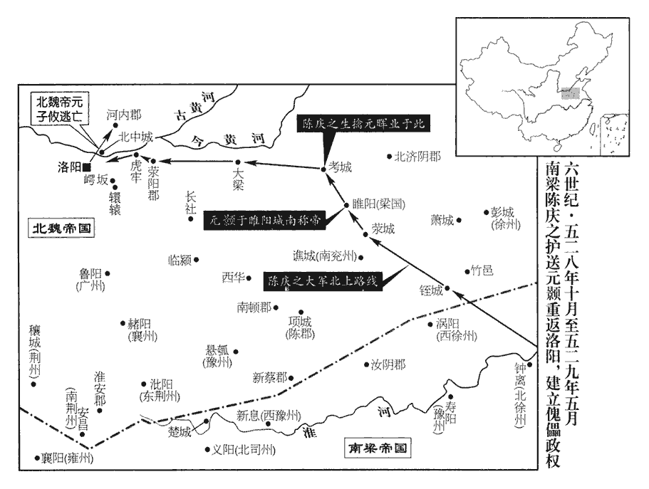
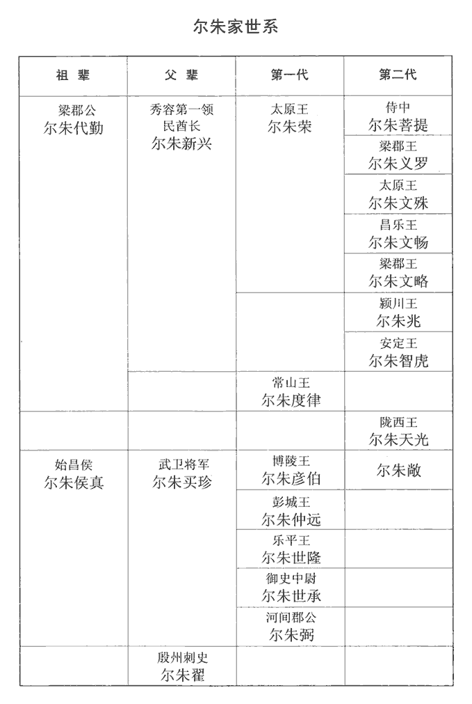

 梁紀九屠維作噩（己酉），一年。

# 高祖武皇帝九

## 中大通元年（己酉、五二九）是年十月方改元。

1春，正月，甲寅‹二›，魏于暉所部都督彭樂帥二千餘騎叛奔韓樓‹时驻幽州，州政府设蓟县北京市›，暉引還。不敢復進軍討邢杲。帥，讀曰率。騎，奇寄翻。

〖译文〗 [1]春季，正月甲寅（初二），北魏于晖的部下、都督彭乐率二千余骑兵反叛，投奔了韩楼，于晖只好回师。

2辛酉‹九›，上‹萧衍，本年六十六岁›祀南郊，大赦。

〖译文〗 [2]辛酉（初九），梁武帝在南郊祭天，大赦天下。

3甲子‹十二›，魏汝南王悅求還國，許之。悅來奔見上卷上年。

〖译文〗 [3]甲子（十二日），原北魏汝南王元悦请求梁武帝允许他回到北魏，梁武帝答应了他的请求。

4辛巳‹二十九›，上祀明堂。

〖译文〗 [4]辛巳（二十九日），梁武帝在明堂祭祀。

5二月，甲午‹十二›，魏主‹元子攸，本年二十三岁›尊彭城武宣王‹元勰›為文穆皇帝，廟號肅祖；母李妃為文穆皇后。將遷神主於太廟，以高祖‹元宏›為伯考，大司馬兼錄尚書臨淮王彧表諫，以為「漢高祖‹刘邦›立太上皇廟於香街，香街，在漢長安故城內，左馮翊府東北。光武‹刘秀›祀南頓君於舂陵‹湖北省枣阳市南›。事見四十三卷建武十九年。元帝‹刘奭›之於光武已疏絕服，服至袒免則無服，謂之絕服。猶身奉子道，入繼大宗。漢元帝以大宗則上距景帝五世，以祖孫世數數之，則上距景帝七世，光武上接景帝亦七世。五服之次，親盡無服，而光武中興，以赤劉九九之符，繼元帝為九世，而別為舂陵節侯以下立四親廟於舂陵。高祖‹元宏›德洽寰中，道超無外，肅祖‹元勰›雖勳格宇宙，猶北面為臣。又，二后皆將配饗，乃是君臣並筵，嫂叔同室，竊謂不可。」吏部尚書李神儁亦諫，不聽。彧又請去「帝」著「皇」，請去「帝」著「皇」，亦引漢悼皇、共皇為據。去，羌呂翻。著，則略翻。亦不聽。

〖译文〗 [5]二月甲午（十二日），北魏国主孝庄帝尊彭城武宣王为文穆皇帝，庙号为肃祖；尊自己的母亲李妃为文穆皇后。他打算将父母的牌位迁到太庙，尊奉孝文帝为伯考，大司马兼录尚书、临淮王元上表劝谏，认为：“汉高祖将太上皇庙立在香街，汉光武帝将南顿君庙立在舂陵。汉元帝跟汉光武帝的关系早已超出了五服，汉光武帝却仍奉行后代子孙之道，入继大宗。孝文帝德满天下，道充环宇，肃祖虽然功盖宇宙，但终究是臣子。再者，两位皇后也都要享有这种祭祀的礼遇，这就如同君臣共筵，叔嫂同室，我私下以为不可这样做。”吏部尚书李神俊也上表劝谏，但孝庄帝均未采纳他们的谏议。元又请求去掉“帝”而保留“皇”，也未被接受。

6詔更定二百四十號將軍為四十四班。天監七年，定將軍為二十四班。是年，有司奏移寧遠將軍班中明威將軍進輕車班中，以輕車班中征遠度入寧遠班中。又置安遠將軍代貞武，宣遠代明烈；其戎夷之號亦加附擬。選序則依此承用，遂以定制。轉則進一班，黜則退一班。班即階也。同班以優劣為前後，有鎮、衛、驃騎、車騎同班，四中、四征同班，八安同班，四平、四翊同班，忠武、軍師同班，武臣、爪牙、龍騎、雲麾、冠軍同班，鎮兵、翊師、宣毅、宣惠四將軍，東、西、南、北四中郎將同班；智威、仁威、勇威、信威、嚴威同班，智武、仁武、勇武、信武、嚴武同班，謂為五德將軍；輕車、振朔、武旅、貞毅、明威同班，寧遠、安遠、征遠、振遠、宣遠同班，威雄、威猛、威烈、威振、威信、威勝、威略、威風、威力、威光同班，武猛、武略、武勝、武力、武毅、武健、武烈、武威、武銳、武勇同班，猛毅、猛烈、猛威、猛銳、猛震、猛進、猛智、猛略、猛勝、猛駿同班，壯武、壯勇、壯烈、壯猛、壯銳、壯盛、壯毅、壯志、壯意、壯力同班，驍雄，驍桀、驍猛、驍烈、驍武、驍勇、驍銳、驍名、驍勝、驍迅同班，雄猛、雄威、雄明、雄烈、雄信、雄武、雄勇、雄毅、雄壯、雄健同班，忠勇、忠烈、忠猛、忠銳、忠壯、忠毅、忠捍、忠信、忠義、忠勝同班，明智、明略、明遠、明勇、明烈、明威、明勝、明進、明銳、明毅同班，光烈、光明、光英、光遠、光勝、光銳、光命、光勇、光戎、光野同班，飈勇、飈猛、飈烈、飈銳、飈奇、飈決、飈起、飈略、飈勝、飈出同班，龍驤、虎視、雲旗、風烈、電威、雷音、馳銳、追銳、羽騎、突騎同班，開遠、略遠、貞威、決勝、清野、堅銳、輕銳、拔山、雲勇、振旅同班，超武、鐵騎、樓船、宣猛、樹功、克敵、平虜、稜威、昭威、威戎同班，伏波、雄戟、長劍、衝冠、雕騎、佽飛、勇騎、破敵、克敵、威虜同班，前鋒、武毅、開邊、招遠、全威、破陣、蕩寇、殄虜、橫野、馳射同班，牙門、期門同班，候騎、熊渠同班，中堅、典戎同班，執訊、行陣同班，伏武、懷奇同班，偏、裨將軍同班：凡二百四十號，為四十四班。

〖译文〗 [6]梁武帝下诏将二百四十种称号的将军重新确定为四十四班。

 

7壬寅‹二十›，魏詔濟陰王暉業兼行臺尚書，濟，子禮翻。考異曰：梁書作「徽業」。今從魏書。都督丘大千等鎮梁國‹河南省商丘县›。暉業，小新成之曾孫也。小新成見一百二十九卷宋孝武帝大明五年。

〖译文〗 [7]壬寅（二十日），北魏孝庄帝下诏令，任命济阴王元晖业兼任行台尚书，统领丘大千等人镇守梁国。元晖业是拓跋小新成的曾孙。

8三月，壬戌‹十一›，魏詔上黨王天穆討邢杲，以費穆為前鋒大都督。

〖译文〗 [8]三月壬戌（十一日），北魏孝庄帝诏令上党王元天穆讨伐邢杲，任命费穆为前锋大都督。

9夏，四月，癸未‹二›，魏遷肅祖及文穆皇后神主于太廟，又追尊彭城王劭為孝宣皇帝。臨淮王彧諫曰：「茲事古所未有，言自古未有以皇帝追尊其兄者。今按自唐高宗以後，率多追諡其子弟為皇帝，作俑者魏敬宗也。陛下作而不法，後世何觀！」用左傳曹劌guì語意。弗聽。

〖译文〗 [9]夏季，四月癸未（初二），北魏孝庄帝将肃祖元勰及文穆皇后的神位迁至太庙，又追谥彭城王元劭为孝宣皇帝。临淮王元劝谏道：“这种事自古从未有过，陛下您这样做不合法度，后世之人会怎么想呢？”孝庄帝未听他的谏言。

10魏元天穆將擊邢杲，以北海王顥方入寇，集文武議之，眾皆曰：「杲眾強盛，宜以為先。」行臺尚書薛琡曰：琡shū，昌六翻。「邢杲兵眾雖多，鼠竊狗偷，非有遠志。顥，帝室近親，顥，北海王詳之子，於魏主從兄弟也。來稱義舉，其勢難測，宜先去之。」去，羌呂翻。天穆以諸將多欲擊杲，又魏朝亦以顥為孤弱不足慮，將，即亮翻。朝，直遙翻。命天穆等先定齊地，還師擊顥，遂引兵東出。

〖译文〗 [10]北魏元天穆将要攻打邢杲，由于北海王元颢正在进犯北魏，于是召集文武官员商议此事。众人都认为：“邢杲军力强盛，应该先讨伐邢杲。”行台尚书薛却认为：“邢杲的军队数量虽多，但都是些偷鸡摸狗之徒，并没有什么远大抱负。元颢是皇室的近亲，此番前来号称义举，其势难以推测，应该首先消灭他。”元天穆因为将领们大多都希望先讨代邢杲，加之北魏朝廷也认为元颢势力孤单，力量微弱，不足为虑，命令元天穆等人先平定齐地邢杲的叛乱，崐再回师攻打元颢，于是元天穆率军东进。

顥與陳慶之乘虛自銍城‹安徽省宿州市西南›進拔滎城‹河南省虞城县西南›，遂至梁國；水經註，春秋沙隨之地。杜預註以為即梁國寧陵縣北之沙陽亭，俗謂之堂城，「滎」「堂」字相近，意即此地而字訛也。銍，陟栗翻。魏丘大千有眾七萬，分築九城以拒之。慶之攻之，自旦至申，拔其三壘，大千請降。降，戶江翻；下同。顥登壇燔燎，即帝位於睢陽城南，改元孝基。睢，音雖。考異曰：魏帝紀，去年十月蕭衍以顥為魏主，號年孝基，入據銍城。顥傳，「永安二年四月於梁國城南登壇燔燎，年號孝基。」今從之。濟陰王暉業帥羽林兵二萬軍考城‹河南省民权县东›，前漢梁國有甾縣，後漢章帝更名考城，屬陳留郡，晉省，宋屬濟陽郡。五代志曰：梁郡考城縣，後魏曰考陽，置北梁郡，隋復為考城縣，屬宋州。帥，讀曰率。慶之攻拔其城，擒暉業。考異曰：魏書帝紀，克考城在辛丑後，今從梁帝紀。

〖译文〗 元颢与陈庆之乘北魏空虚之际，从城进发，率军攻占了荥城，随后便打到了梁国城。北魏守将丘大千有军队七万人，分别构筑了九座城堡以抵抗元颢军队。陈庆之率兵攻打梁国城，从早晨直至下午申时，攻下了守军的三个堡垒，丘大千只好请求投降。元颢登坛烧柴祷告，在睢阳城南登基即位，改年号为“孝基”。北魏济阴王元晖业率领的二万羽林军驻扎在考城，陈庆之率军攻取考城，活捉了元晖业。

11辛丑‹二十›，魏上黨王天穆及爾朱兆破邢杲於濟南‹山东省济南市›，濟，子禮翻。杲降，送洛陽，斬之。兆，榮之從子也。從，才用翻。

〖译文〗 [11]辛丑（二十日），北魏上党王元天穆和尔朱兆在济南打败了邢杲，邢杲投降，被押送至洛阳，斩了首。尔朱兆是尔朱荣的侄子。

12五月，丁巳‹六›，魏以東南道大都督楊昱鎮滎陽‹河南省荥阳市›，尚書僕射爾朱世隆鎮虎牢‹河南省荥阳市汜水镇西›，侍中爾朱世承鎮崿岅‹河南省偃师县东南›。崿，五各翻。岅bǎn，與坂同，音反。乙丑‹十四›，內外戒嚴。

〖译文〗 [12]五月丁巳（初六），北魏命东南道大都督杨昱镇守荥阳，命尚书仆射尔朱世隆镇守虎牢，命侍中尔朱世承镇守。乙丑（十四日），北魏朝廷内外实行戒严。

戊辰‹十七›，北海王顥克梁國。顥以陳慶之為衛將軍、徐州‹府彭城›刺史、引兵而西。引兵而西，直指洛陽。楊昱擁眾七萬，據滎陽，慶之攻之，未拔，顥遣人說昱使降，昱不從。說，式芮翻。天穆與驃騎將軍爾朱吐沒兒將大軍前後繼至，驃，匹妙翻。騎，奇寄翻。將，即亮翻；下同。梁士卒皆恐，慶之解鞍秣馬，諭將士曰：「吾至此以來，屠城略地，實為不少；少，詩沼翻。君等殺人父兄、掠人子女，亦無算矣；天穆之眾，皆是仇讎。我輩眾纔七千，虜眾三十餘萬，今日之事，唯有必死乃可得生耳。虜騎多，不可與之野戰，當及其未盡至，急攻取其城而據之。諸君勿或狐疑，自取屠膾kuài。」乃鼓之，使登城，將士即相帥蟻附而入，帥，讀曰率。癸酉‹二十二›，拔滎陽，執楊昱。楊昱輕慶之兵少，不料其肉薄急攻，故城陷。傳曰：「敵無小，不可輕也。」又曰：「不備不虞，不可以師。」諸將三百餘人伏顥帳前請曰：「陛下渡江三千里，無遺鏃之費，昨滎陽城下一朝殺傷五百餘人，願乞楊昱以快眾意！」顥曰：「我在江東聞梁主言，初舉兵下都，袁昂為吳郡‹吴兴郡，浙江省湖州市›不降，每稱其忠節。事見一百四十四卷齊和帝中興元年。降，戶江翻。楊昱忠臣，柰何殺之！此外唯卿等所取。」於是斬昱所部統帥三十七人，皆刳其心而食之。帥，所類翻。俄而天穆等引兵圍城，慶之帥騎三千背城力戰，大破之，帥，讀曰率。背，蒲妹翻。天穆、吐沒兒皆走。慶之進擊虎牢，爾朱世隆棄城走，獲魏東中郎將辛纂。魏東中郎府在虎牢。

〖译文〗 戊辰（十七日），北海王元颢攻克梁国城。元颢任命陈庆之为卫将军、徐州刺史，率军西进，直指洛阳。杨昱拥有七万大军，据守着荥阳城，陈庆之去攻打未能攻克。元颢派人劝杨昱投降，杨昱没有答应。元天穆和骠骑大将军尔朱吐没儿率大军前后相继来到荥阳。梁军士卒都很恐惧，陈庆之解下马鞍边喂马边告谕将士们说：“我们到这里以来，屠城夺地，确实已经不少；你们大家杀戮人家的父兄、掠取人家的子女，也不计其数了，元天穆的部下，都是我们的仇敌。我军才七千人，而敌军则有三十余万之多，所以眼下之事，大家只有抱着必死之心才有可能免遭杀戮。敌人的骑兵很多，我们不能同他们在野外作战，应当乘他们还没全部到来之时，急速攻下荥阳城而作为据守之处。各位不要再有什么疑虑了，否则就是选择了任人宰割的道路。”于是擂鼓助战，命将士登城攻坚，将士们当即蜂拥着攻入城中，癸酉（二十二日），攻下了荥阳，抓住了杨昱。元颢的部将三百余人俯伏在元颢账前请求道：“陛下渡江北进三千里，连一枝箭的损耗都不曾有，而昨日荥阳城下一战，我军便伤亡五百余人，我们希望您把杨昱交给我们处置，以解大家的心头之恨！”元颢说：“我在江东时听梁朝国主讲，他当初举兵南下，到达建康时，吴郡太守袁昂便曾据城不降，梁朝国主常常称赞袁昂这种忠贞气节。杨昱是一位忠臣，为什么要杀掉他呢！除杨昱之外，其他人任你们处置。”于是斩杀了杨昱部将三十七人，这些人都被挖出心来吃掉了。很快，元天穆等人率军包围了荥阳城，陈庆之率三千骑兵背靠荥阳城，奋勇拼搏，大败元天穆军，元天穆、尔朱吐没儿都落荒而逃。随即，陈庆之又进击虎牢城，尔朱世隆弃城逃走，陈庆之军抓获了北魏东中郎将辛纂。

魏主將出避顥，未知所之，或勸之長安，中書舍人高道穆曰：「關中荒殘，何可復往！復，扶又翻。顥士眾不多，乘虛深入，由將帥不得其人，故能至此。陛下【章：甲十一行本「下」下有「若」字；乙十一行本同；孔本同；張校同。】親帥宿衛，將，即亮翻。帥，所類翻。親帥，讀曰率；下同。高募重賞，背城一戰，臣等竭其死力，破顥孤軍必矣。或恐勝負難期，則車駕不若渡河，徵大將軍天穆、大丞相榮各使引兵來會，犄角進討，犄，居蟻翻。旬月之間，必見成功，此萬全之策也。」魏主從之。甲戌‹二十三›，魏主北行，夜，至河內郡‹河南省沁阳市›北，河內郡治野王。魏主自洛北如河內，當夜至郡城南，不應至郡城北，恐誤。命高道穆於燭下作詔書數十紙，布告遠近，於是四方始知魏主所在。乙亥‹二十四›，魏主入河內。

〖译文〗 北魏孝庄帝打算离开京城躲避元颢的大军，但不知该去哪里好。有人劝他到长安去，中书舍人高道穆说道：“关中地区荒凉残破，怎么能再到那里去呢？元颢的军队不多，却乘虚而入，这是由于我们选用将帅不当，所以才能攻到这里。陛下若能亲自率领禁卫军，以重金招募士兵，多加奖赏，背城与敌决一死战，我等竭尽全力，就一定能够打败元颢的这支孤军的。若您还担心胜负难以预料的话，那么您不如渡过黄河，命大将军元天穆、大丞相尔朱荣各自率军前来会合，构成犄角之势，进讨元颢的军队，一月之内，一定会取得胜利，这是万全之策。”孝庄帝采纳了高道穆的意见。甲戌（二十三日），孝庄帝一行向北进发，夜间，来到了河内郡郡城的北边。孝庄帝命令高道穆在烛光下起草了几十张诏书，公告天下，于是四方才知道皇帝在哪儿。乙亥（二十四日），孝庄帝一行进入河内郡。

臨淮王彧，安豐王延明，帥百僚，封府庫，備法駕迎顥。考異曰：彧傳無迎顥事，而梁陳慶之、北齊宋遊道傳有之，盖魏史為彧諱也。丙子‹二十五›，顥入洛陽宮，改元建武，大赦。以陳慶之為侍中、車騎大將軍，增邑萬戶。楊椿在洛陽，椿弟順為冀州‹府设信都河北省冀县›刺史，兄子侃為北中郎將，從魏主在河北。顥意忌椿，而以其家世顯重，恐失人望，未敢誅也。楊播、楊椿兄弟仕魏，一門貴盛，子姪通顯，累朝榮赫。侃，播之子也。或勸椿出亡，椿曰：「吾內外百口，何所逃匿！正當坐待天命耳。」

〖译文〗 临淮王元和安丰王元延明，带领文武百官，封存府库，备好法驾迎接元颢。丙子（二十五日），元颢进入洛阳宫，改年号为建武，大赦天下。元颢任命陈庆之为侍中、车骑大将军，增加封邑一万户。杨椿当时在洛阳，他的弟弟杨顺是冀州刺史。侄子杨侃为北中郎将，正跟随北魏孝庄帝在河北。元颢心里很忌恨杨椿，但由于杨椿家世显赫，担心失去众望，所以没有敢杀掉杨椿。有人劝说杨椿离开洛阳逃走，杨椿说：“我家老小上百口，能逃到哪儿去呢？只有听天由命罢了。”

顥後軍都督侯暄守睢陽為後援，睢陽，即梁國。睢，音雖。魏行臺崔孝芬、大都督刁宣馳往圍暄，晝夜急攻，戊寅‹二十七›，暄突走，擒斬之。

〖译文〗 元颢的后军都督侯暄镇守睢阳作为后援，北魏行台崔孝芬、大都督刁宣率军急速前往睢阳包围了侯暄，昼夜猛攻睢阳城，戊寅（二十七日），侯暄突围逃走，被北魏军抓住杀掉了。

上黨王天穆等帥眾四萬攻拔大梁‹河南省开封市›，大梁，即陳留浚儀縣。分遣費穆將兵二萬攻虎牢，顥使陳慶之擊之。天穆畏顥，將北渡河，謂行臺郎中濟陰‹山东省定陶县西›溫子昇曰：「卿欲向洛，為隨我北渡？」天穆開兩端以問子昇。濟，子禮翻。子昇曰：「主上以虎牢失守，守，式又翻。致此狼狽。元顥新入，人情未安，今往擊之，無不克者。大王平定京邑‹洛阳›，奉迎大駕，此桓、文之舉也。捨此北渡，竊為大王惜之。」為，于偽翻。天穆善之而不能用，遂引兵渡河。費穆攻虎牢，將拔，聞天穆北渡，自以無後繼，遂降於慶之。降，戶江翻。慶之進擊大梁、梁國，皆下之。睢陽即梁國。下，遐稼翻。慶之以數千之眾，自發銍縣‹安徽省宿州市西南›至洛陽，凡取三十二城；四十七戰，所向皆克。

〖译文〗 上党王元天穆等率四万军队攻下了大梁，又分派费穆带二万人攻打虎牢城，元颢派陈庆之攻击费穆。元天穆畏惧元颢，打算北渡黄河，便对行台郎中、济阴人温子说：“你想去洛阳，还是想随我北渡流黄河？”温子说：“国主因虎牢失守，才弄得如此窘迫。元颢新来，民心还未安定，现在您如果前去攻击他，一定会成功。大王您平定了京邑后，再奉迎皇帝大驾，这乃是齐桓公、晋文公才有过的举动啊！现在您舍此而不为，却要北渡黄河，我私下里真为您感到惋惜。”元天穆觉得温子的意见很好，但却不能采纳，于是率军渡过了黄河。费穆攻打虎牢城，眼看就要攻取了，听说元天穆向北渡过了黄河，认为这样一来自己便没有了后继援兵，于是便投降了陈庆之。陈庆之率军进击大梁、梁国两城，群攻下了。陈庆之凭数千之众，从城出发至洛阳，共攻占了三十二座城池，大小四十七战，所向无敌。

顥使黃門郎祖瑩作書遺魏主曰：遺，于季翻。「朕泣請梁朝，誓在復恥，正欲問罪於爾朱，出卿於桎梏。朝，直遙翻。桎，之日翻。梏，苦沃翻。卿託命豺狼，委身虎口，假獲民地，本是榮物，固非卿有。顥言爾朱榮擅命，顥所得一民尺地皆爾朱榮之物，非魏主之有。今國家隆替，在卿與我。若天道助順，則皇魏再興；脫或不然，在榮為福，於卿為禍。卿宜三復，三，蘇暫翻。復，扶又翻。富貴可保。」

〖译文〗 元颢命黄门郎祖莹起草了一封信给北魏孝庄帝，信中写道：“朕哭泣恳请梁朝发兵，誓在报仇雪耻，正是要向尔朱荣问罪，解救你于桎梏之中。你现在托命于豺狼，委身于虎口，我就是获取了一些百姓、土地，也本来是尔朱荣的东西，本来就不属于你所有。当今国家的兴隆废替，全在于你我二人。如果上天助我成功，那么大魏又可再次中兴；若不能这样的话，那么对于尔朱荣来说便是福，而对于你则是祸。你应该反复好好想想，荣华富贵方可保住。”

顥既入洛，自河以南州郡多附之。齊州‹府设历城山东省济南市›刺史沛郡王欣集文武議所從，曰：「北海、長樂，俱帝室近親，顥，北海王詳之子；魏主，彭城王勰之子，同出於顯祖。樂，音洛。今宗祏shí不移，杜預曰：宗祏，今廟中藏主石室也。祏，音石。我欲受赦，諸君意何如？」在坐莫不失色。坐，徂臥翻。軍司崔光韶獨抗言曰：「元顥受制於梁，引寇讎之兵以覆宗國，此魏之亂臣賊子也；豈唯大王家事所宜切齒，下官等皆受朝眷，朝眷，謂朝廷恩眷也。朝，直遙翻。未敢仰從！」長史崔景茂等皆曰：「軍司議是。」欣乃斬顥使。使，疏吏翻；下同。光韶，亮之從父弟也。崔亮貴顯於延昌、熙平之間。從，才用翻。於是襄州‹府设赭阳河南省方城县›刺史賈思同、魏孝昌中置襄州，領襄城、舞陰、南安、期城、宣義、建城等郡，治赭陽。廣州‹府设鲁阳河南省鲁山县›刺史鄭先護、魏主置廣州，治魯陽，領南陽、順陽、定陵、魯陽、汝南、漢廣、襄城郡。南兗州‹府设谯城安徽省亳州市›刺史元暹xiān魏正光中置南兗州，治譙城，領陳留、梁郡、下蔡、譙郡、北梁郡、沛郡、馬頭郡。亦不受顥命。思同，思伯之弟也。賈思伯見一百四十九卷普通四年。顥以冀州‹府设信都河北省冀县›刺史元孚為東道行臺、彭城郡王，孚封送其書於魏主。平陽王敬先起兵於河橋以討顥，不克而死。

〖译文〗 元颢进入洛阳后，黄河以南的州郡大多归附了他。齐州刺史、沛郡王元欣召集文武官员商议何去何从，元欣说：“北海王和长乐王，都是皇室近亲，现在皇位并未落入外人之手，我打算接受元颢的赦免，诸位认为如何？”在座的文武官员莫不大惊失色。只有军司崔光韶高声反对，他说：“元颢受梁朝节制，勾结仇敌之兵来颠覆自己的国家，他是大魏朝的乱臣贼子。难道仅是因为大王您一家的事情而对他切齿痛恨，我等下官均受朝廷的恩典，所以不敢听从您的意见！”长史崔景茂等人都说：“军司说的很对。”元欣便杀了元颢派来的使者。崔光韶是崔亮的堂弟。于是这样一来，襄州刺史贾思同、广州刺史郑先护、南兖州刺史元暹等，也都不承认元颢的政权。贾思同是贾思伯的弟弟。元颢封冀州刺史元孚为东道行台、彭城郡王，元孚将元颢的委任书封好，派人送给了孝庄帝。平阳王元敬先在河桥起兵讨伐元颢，未能成功而死。

魏以侍中、車騎將軍、尚書右僕射爾朱世隆為使持節、行臺僕射、大將軍、相州刺史，鎮鄴城。相，息亮翻。

〖译文〗 北魏加封侍中、车骑将军、尚书右仆射尔朱世隆为使持节、行台仆射、大将军、相州刺史，镇守邺城。

魏主之出也，單騎而去，侍衛後宮皆按堵如故。顥一旦得之，號令己出，四方人情想其風政。而顥自謂天授，遽有驕怠之志，宿昔賓客近習，咸見寵待，干擾政事，日夜縱酒，不恤軍國，所從南兵，陵暴市里，朝野失望。高道穆兄子儒自洛陽出從魏主，魏主問洛中事，子儒曰：「顥敗在旦夕，不足憂也。」

〖译文〗 北魏孝庄帝出奔时，只是单骑而去，宫廷侍卫及后宫嫔妃都依旧留在京城。元颢一旦取得了政权，各种号令全由他自己发出，四方百姓都希望他励精图治，但元颢自以为天授皇位，很快便产生了骄傲怠惰之心。他过去的宾朋老友、亲近之人，都受到了他的宠爱、厚待，这些人干扰政事，日夜纵酒为乐，毫不体恤军国大事，而元颢从南朝带来的梁兵，更在城中欺凌百姓，因而使得朝野上下对他大失所望。高道穆的哥哥高子儒从洛阳逃出追随孝庄帝，孝庄帝问他洛阳城中之事，高子儒说：“元颢很快就会失败，您不用担忧。”

爾朱榮聞魏主北出，即時馳傳見魏主於長子‹山西省长子县›，行，且部分。魏主即日南還，爾朱榮既至，魏主有所倚以攻顥，故即日南還。傳，張戀翻。分，扶問翻。榮為前驅。旬日之間，兵眾大集，資糧器仗，相繼而至。六月，壬午‹二›，魏大赦。

〖译文〗 尔朱荣听说孝庄帝向北方出逃了，立即飞马前往长子去会见他，一路上边走边布置部队。孝庄帝当天便开始南还，尔朱荣做前锋。十天之内，北魏军队便大批集结起来，粮食兵器等物资也陆续运到了。六月，壬午（初二），北魏大赦天下。

榮既南下，并‹府设晋阳山西省太原市›、肆‹府设九原山西省忻州市›不安，乃以爾朱天光為并、肆等九州行臺，九州，并、肆、恆‹府平城›、朔‹府怀朔镇›、雲‹府盛乐›、蔚‹府怀荒镇›、顯‹府六壁城›、汾‹府蒲子城›、晉也。仍行并州事。天光至晉陽，部分約勒，所部皆安。

〖译文〗 尔朱荣南下之后，并州、肆州便又会不安定了，于是便任命尔朱天光为并、肆等九州行台，仍负责并州的事务。尔朱天光到晋阳后，安排布置，并制定约束措施，所属辖地都很稳定。

己丑‹九›，費穆至洛陽，顥引入，責以河陰之事而殺之。費穆勸爾朱榮殺王公，事見上卷。顥使都督宗正珍孫與河內太守元襲據河內‹河南省沁阳市›；爾朱榮攻之，上黨王天穆引兵會之，壬寅‹二十二›，拔其城，斬珍孫及襲。

〖译文〗 乙丑（初九），费穆来到洛阳，元颢将他带到朝中，以河阴杀害文武百官之事怪罪于他，因此而杀了他。元颢派都督宗正珍孙和河内太守元袭据守河内；尔朱荣率军攻打河内，上党王元天穆率兵与尔朱荣会合，壬寅（二十二日），攻取河内城，杀了宗正珍孙和元袭。

13辛亥‹一›，魏淮陰‹淮安，河南省唐河县南湖阳镇›太守晉鴻以湖陽‹淮安郡郡政府所在县›來降。五代志：舂陵郡湖陽縣，後魏置西淮安郡及南襄州。「淮陰」當作「淮安」。

〖译文〗 [13]辛亥（三十一日），北魏淮阴太守晋鸿献出湖阳城投降梁朝。

14閏月，己未‹九›，南康簡王績卒‹年四十四岁›。

〖译文〗 [14]闰月，己未（初九），梁朝南康简王萧绩去世。

15魏北海王顥既得志，密與臨淮王彧、安豐王延明謀叛梁；以事難未平，難，乃旦翻。藉陳慶之兵力，故外同內異，言多猜忌。慶之亦密為之備，說顥曰：說，式芮翻。「今遠來至此，未服者尚多，彼若知吾虛實，連兵四合，將何以禦之！宜啟天子，天子，謂梁武帝。更請精兵，并敕諸州，有南人沒此者悉須部送。」顥欲從之，延明曰：「慶之兵不出數千，已自難制；今更增其眾，寧肯復為人用乎！復，扶又翻；下更復、敢復、遽復、顥復、時復、彧復同。大權一去，動息由人，魏之宗廟，於斯墜矣。顥乃不用慶之言。又慮慶之密啟，慮慶之密啟其事於上。乃表於上曰：「今河北、河南一時克定，唯爾朱榮尚敢跋扈，臣與慶之自能擒討。州郡新服，正須綏撫，不宜更復加兵，搖動百姓。」上乃詔諸軍繼進者皆停於境上。陳慶之非爾朱榮敵也；是時梁之諸將又皆出慶之下。使相與繼進至洛，與元顥互相猜阻，亦必同歸於陷沒。梁兵之不進，梁之幸也。武帝不務自治而務遠略，所以有侯景之禍。

〖译文〗 [15]北魏北海王元颢既已夺取了政权，便秘密跟临淮王元、安丰王元延明谋划反叛梁朝。由于混乱局面尚未平定，还需借助陈庆之的兵力，所以表面很团结，但实际上已经同床异梦，言语之间多所猜忌。陈庆之也暗中做了防备，他劝说元颢：“现在我们远道而至于此，不服的人还很多，他们如果知道了我们的虚实，联合兵力，四面包围，我们将如何抵御呢？我们应上启梁朝天子，请求再增精兵，同时敕令各州，如果有梁朝人陷没在该地必须全部送到我们这里来。”元颢打算采纳他的建议，元延明却对元颢说：“陈庆之兵不过数千，您就已经很难驾驭了，现在再增加他的兵力，他还怎会肯听您的命令呢？您的大权一旦失去，一举一动就都要由别人决定，这样大魏朝的宗庙从此也就要覆亡了。”元颢于是便没有采纳陈庆之的意见。元颢又担心陈庆之暗中向梁武帝上表汇报情况，便自己给梁武帝写了一封表文，说：“现在河北、河南全部平定了，只有尔朱荣尚敢顽抗，我与陈庆之便能擒获他。目前各州郡刚刚归服，正需要安抚，不宜再增加兵力，使百姓惶恐不安。”梁武帝便诏令正在进军的各部队都停在边境上，不再前进。

洛中南兵不滿一萬，而羌、胡之眾十倍，軍副馬佛念為慶之曰：凡一軍有主有副。為，于偽翻，為慶之謀而言也。蜀本「為」作「謂」。「將軍威行河、洛，聲震中原，功高勢重，為魏所疑，一旦變生不測，可無慮乎！不若乘其無備，殺顥據洛，此千載一時也。」慶之不從。馬佛念有戰國策士之氣。然必有非常之才，然後可以行非常之事，陳慶之烏足以辦此！載，子亥翻。顥先以慶之為徐州刺史，因固求之鎮，顥心憚之，不遣，曰：「主上以洛陽之地全相任委，忽聞捨此朝寄，朝寄，謂魏朝所寄託也。朝，直遙翻。欲往彭城‹江苏省徐州市›，謂君遽取富貴，不為國計，此國計，謂為梁國計。非徒有損於君，恐僕并受其責。」慶之不敢復言。

〖译文〗 洛阳城中的梁朝军队不满一万，而羌族、胡族的军队十倍于梁军，军副马佛念为陈庆之出谋划策说：“将军您威扬河、洛，声震中原，功高势强，被元颢所猜疑，一旦发生不测，能不担心吗？您不如乘元颢还没有防备之际，杀掉元颢，占据洛阳，这是千载难逢的机会呀。”陈庆之没有采纳他的意见。元颢先任命陈庆之为徐州刺史，于是陈庆之坚决要前往彭城，元颢心里很害怕，没有敢让他去，对他说：“圣上将洛阳全都委托给您负责，如果忽然听说您要离开作为魏朝之寄托的洛阳，而去徐州的话，便会认为您是想很快求取功名富贵，而不为国家考虑的。这不仅有损于您，恐怕我也会一起受到圣上的责难。”因此，陈庆之便不敢再说什么了。

爾朱榮與顥相持於河上。慶之守北中城‹黄河大桥北岸护桥城›，顥自據南岸；河橋南岸也。慶之三日十一戰，殺傷甚眾。有夏州‹府设统万陕西省靖边县北白城子›義士為顥守河中渚，夏，戶雅翻。水經註曰：河中渚上有河平侯祠，河之南岸有一碑，題曰洛陽北界。意此中渚即唐時河陽之中潬tān城也。為，于偽翻。陰與榮通謀，求破橋立效，榮引兵赴之。及橋破，榮應接不逮，顥悉屠之，榮悵然失望。又以安豐王延明緣河固守，而北軍無船可渡，議欲還北，更圖後舉。黃門郎楊侃曰：「大王發并州之日，已知夏州義士之謀指來應之乎，為欲廣施經略匡復帝室乎？夫用兵者，何嘗不散而更合，瘡愈更戰；況今未有所損，豈可以一事不諧而眾謀頓廢乎！今四方顒顒，顒顒，仰望也。顒，魚容翻。視公此舉；若未有所成，遽復引歸，民情失望，各懷去就，勝負所在，未可知也。不若徵發民材，多為桴筏，編竹木以渡水，大者曰桴，小者曰筏。桴，方無翻。筏，音伐。間以舟楫間，古莧翻；下間行同。緣河布列，數百里中，皆為渡勢，首尾既遠，使顥不知所防，一旦得渡，必立大功。」高道穆曰：「今乘輿飄蕩，主憂臣辱。乘，繩證翻。大王擁百萬之眾，輔天子而令諸侯，若分兵造筏，所在散渡，指掌可克；柰何捨之北歸，使顥復得完聚，徵兵天下！此所謂養虺huǐ成蛇，悔無及矣。」逸書曰：為虺不摧，為蛇柰何？以文義觀之，蓋以虺為小蛇。榮曰：「楊黃門已陳此策，當相與議之。劉靈助言於榮曰：「不出十日，河南必平。」伏波將軍正平‹山西省新绛县›楊檦魏以聞喜、曲沃二縣置正平郡，隋廢郡為正平縣，今絳州治所。檦，與標同。與其族居馬渚，自言有小船數艘，求為鄉導。艘，蘇遭翻。鄉，讀曰嚮。戊辰‹十八›，榮命車騎將軍爾朱兆與大都督賀拔勝縛材為筏，自馬渚西硤石‹河南省孟津县西十千米黄河渡口›夜渡，五代志：河南熊耳縣有後魏崤縣，又有硤石山。唐志，陝州硤石縣本崤縣，有硤石塢。襲擊顥子領軍將軍冠受，擒之；安豐王延明之眾聞之，大潰。顥失據，帥麾下數百騎南走，帥，讀曰率。騎，奇寄翻；下同。慶之收步騎數千，結陳東還，陳，讀曰陣。顥所得諸城，一時復降於魏。爾朱榮自追陳慶之，會嵩高水漲，潁水出少室山，五渡水出太室山，入于潁水，嵩高水漲，指此水也。慶之軍士死散略盡，乃削須髮為沙門，間行出汝陰‹安徽省阜阳市›，還建康‹南梁首都·江苏省南京市›，慶之所以得免者，亦由嵩高水漲，追兵不急，於軍士死散之時得以挺身逸去，否則必為爾朱榮所擒矣。猶以功除右衛將軍，封永興縣侯。句斷。五代志：會稽郡會稽縣舊有永興縣。

〖译文〗 尔朱荣与元颢的军队相持于黄河之上。陈庆之镇守北中城，元颢亲自据守河桥南岸。陈庆之三天之中打了十一仗，杀伤很多敌人。有一位夏州义士为元颢镇守河中渚，他暗中与尔朱荣串通好，请求为尔朱荣破桥立功。尔朱荣率兵赶到河桥，等到桥破之后，尔朱荣的部队没有接应上，元颢将通敌的士兵全都杀了，尔朱荣怅然若失，非常失望。元颢又派安丰王元延明沿黄河固守，北魏军无船渡河，便商议打算回师北方，以后再想办法攻打元颢。黄门郎杨侃对尔朱荣说：“大王您从并州发兵的时候，是已经知道夏州义士会来给您做内应所以才来的呢？还是想广泛施展您的雄才大略匡复帝室才来的呢？用兵之事，谁不是打散了再聚集起来，伤好了再继续战斗，何况现在我们并没有受到损失，怎么能由于这一件事没成功，便将所有的计划就都废弃了呢？当今天下百姓望眼欲穿，就看您这一次举动了。如果没有取得什么收获，您便很快又回师的话，那么就会使得百姓大失所望，各自考虑何去何从，谁胜谁负也就难说了。所以不如征调百姓的木材，多做一些木筏，间杂一些舟船，沿黄河排列开来，数百里中，都做出渡河的架势，首尾既然相距很远，这样就使得元颢不知道该防哪里为好，一旦我军渡过黄河，一定立下大功。”高道穆对尔朱荣说：“当今圣驾被迫外出，皇上忧虑，臣下应当感到羞辱。大王您拥有百万大军，辅天子而令诸侯，如果分兵制造木筏，各个分散渡河的话，破元颢的军队易如反掌，为何却舍此而北归，使元颢又得以修治城池，整治兵器，在四方征集兵员呢？这真是如同养虺成蛇，后悔不及啊！”尔朱荣说道：“黄门郎杨侃已经谈了这一计策，我要跟大家商议一下。”刘灵助对尔朱荣说：“不出十天，黄河以南一定会平定。”伏波将军、正平郡人杨跟他的族人住在马渚，他自动说家里有几艘小船，请求作向导。戊辰（十八日），尔朱荣命令车骑大将军尔朱兆和大都督贺拔胜率军捆绑木材做木筏，从马渚西边的硖石这个地方夜渡黄河，袭击了元颢的儿子领军将军元冠受的部队，并抓获了元冠受，安丰王元延明的士卒们知道了这一情况之后，便纷纷溃散奔逃。元颢失去了依据，只好率部下数百名骑兵向南逃走，陈庆之收拢步兵、骑兵共几千人，结队向东逃归。元颢原先攻取的那些城池，全都又投降了北魏。尔朱荣亲自率军追击陈庆之，正赶上嵩高河发大水，陈庆之的队伍死的死、逃的逃，差不多全没了，陈庆之于是剃光头发、胡须，打扮成一个和尚，从小路逃出汝阴，回到了建康，梁朝任仍按功授他为右卫将军，封永兴县侯。

 

中軍大都督兼領軍大將軍楊津入宿殿中，掃洒宮庭，掃，素報翻；洒，所賣翻；又並上聲。封閉府庫，出迎魏主於北邙‹洛阳城北›，流涕謝罪，帝慰勞之。勞，力到翻。庚午‹二十›，帝入居華林園，大赦。以爾朱兆為車騎大將軍、儀同三司，賞硤石之功也。北來軍士及隨駕文武諸立義者加五級，河北報事之官及河南立義者加二級。報事，謂報敵情曲折者。壬申‹二十二›，加大丞相榮天柱大將軍，增封通前二十萬戶。天柱，前無此號，魏主以爾朱榮功高，特置以寵之。榮先以平葛榮之功增封至十萬戶，今又增為二十萬戶以賞之。

〖译文〗 中军大都督兼领军大将军杨津率军入宿于皇宫中，洒扫宫庭院落，封闭朝廷府库，至北邙迎请孝庄帝，痛哭流涕地向孝庄帝谢罪，孝庄帝安慰犒赏了他。庚午（二十日），北魏孝庄帝入居华林园，大赦天下。朝廷任命尔朱兆为车骑大将军、仪同三司，随同孝庄帝从北方来的将士以及随侍皇帝的文武百官和那些未降元颢的加官五级，河北向朝廷报告敌情的官员和河南坚决未降元颢的官员加官二级。壬申（二十二日），又加封大丞相尔朱荣为天柱大将军，并增加封户，加上以前的封户，共二十万户。

北海王顥自轘轅‹河南省偃师县东南›南出至臨潁‹河南省临颍县›，臨潁縣，自漢以來屬潁川郡。轘，音環。從騎分散，從，才用翻。騎，奇寄翻。臨潁縣卒江豐斬之，癸酉‹二十三›，傳首洛陽。臨淮王彧復自歸於魏主，安豐王延明攜妻子來奔。

〖译文〗 北海王元颢从辕向南逃至临颖，随从骑兵各自逃散，临颖县吏卒江丰杀掉了元颢，癸酉（二十三日），将元颢的首级送到了洛阳。临淮王元又归附了孝庄帝，安丰王元延明携带妻子儿女前来投奔梁朝。

陳慶之之入洛也，蕭贊送啟求還。贊，即豫章王綜也，奔魏事見一百五十卷普通六年。時吳淑媛尚在，媛，于眷翻。上使以贊幼時衣寄之，信未達而慶之敗。慶之自魏還，特重北人，朱异怪而問之，异，羊至翻。慶之曰：「吾始以為大江以北皆戎狄之鄉，比至洛陽，比，必利翻，及也。乃知衣冠人物盡在中原，非江東所及也，柰何輕之？」陳慶之特有見於洛陽華靡之俗而為是言耳。

〖译文〗 陈庆之攻入洛阳之时，萧赞向梁武帝上书，请求允许回到梁朝。当时吴淑媛还在，梁武帝让吴淑媛将萧赞幼时穿的衣服给萧赞送去，书信等还未传到，陈庆之便失败了。陈庆之从北魏回到梁朝后，特别看重北方人，朱异对此感到很奇怪，便问陈庆之为什么这样，陈庆之说道：“我当初认为长江以北地区都是戎狄之乡，等到了洛阳之后，才知道礼仪人物都在中原地区，不是江东所能企及的，我们有什么理由轻视北方人呢？”

16甲戌‹二十四›，魏以上黨王天穆為太宰，城陽王徽為大司馬兼太尉。乙亥‹二十五›，魏主宴勞爾朱榮、上黨王天穆及北來督將於都亭，勞，力到翻。將，即亮翻。出宮人三百，繒錦雜綵數萬匹，班賜有差，繒，慈陵翻。凡受元顥爵賞階復者，悉追奪之。復，方目翻，復除賦役也。

〖译文〗 [16]甲戌（二十四日），北魏朝廷任命上党王元天穆为太宰、城阳王元徽为大司马兼太尉。乙亥（二十五日），北魏孝庄帝在都亭设宴慰劳尔朱荣、上党王元天穆以及从北方来洛阳救援的将领们，孝庄帝以宫女三百人、绫罗锦缎几万匹，按功劳大小分别给予不同的赏赐。凡是受过元颢的爵位、奖赏、官职和免除赋役的人，对其所得全部追了回来。

秋，七月，辛巳‹二›，魏主始入宮。

〖译文〗 秋季，七月，辛巳（初二），北魏孝庄帝开始进入宫中。

以高道穆為御史中尉。帝姊壽陽公主行犯清路，赤棒卒呵之，不止，中尉前驅之卒執赤棒，即清路者也。棒，部項翻。呵，虎何翻。道穆令卒擊破其車。公主泣訴於帝，帝曰：「高中尉清直之士，彼所行者公事，豈可以私責之也！」道穆見帝，見，賢遍翻。帝曰：「家姊行路相犯，極以為愧。」道穆免冠謝，帝曰：「朕以愧卿，卿何謝也。」

〖译文〗 北魏任命高道穆为御史中尉。北魏孝庄帝的姐姐寿阳公主在路上妨碍了高道穆清路开道的士卒们执行公务，这些手持赤棒的清路卒对寿阳公主大声呵斥，寿阳公主置之不理，高道穆命士卒打破了寿阳公主的车子。寿阳公主向孝庄帝哭诉了这件事，孝庄帝说道：“高道穆是一位清直之人，他所干的是公事，我怎么能由于私情而责怪他呢！”高道穆见到孝庄帝，孝庄帝对他说：“我姐姐在路上触犯了你，我对此深感惭愧。”高道穆摘下帽子向孝庄帝谢罪，孝庄帝说道：“朕因此事而感到有愧于你，你何必要向我谢罪呢。”

於是魏多細錢，米斗幾直一千，幾，巨依翻，又居希翻。高道穆上表，以為「在市銅價，八十一錢得銅一斤，私造薄錢，斤贏二百。言銅一斤造薄錢二百而贏也。既示之以深利，又隨之以重刑，抵罪雖多，姦鑄彌眾。今錢徒有五銖之名而無二銖之實，置之水上，殆欲不沈。沈，持林翻。此乃因循有漸，科防不切，朝廷失之，彼復何罪！復，扶又翻；下況復同。宜改鑄大錢，文載年號，以記其始，則一斤所成止七十錢，計私鑄所費不能自潤，直置無利，自應息心，況復嚴刑廣設也！」言置私鑄，直使無利，亦自應息心而不為，況又廣設科禁，有嚴刑之可畏邪！金紫光祿大夫楊侃亦奏乞聽民與官並鑄五銖錢，使民樂為而弊自改。樂，音洛。魏主從之，始鑄永安五銖錢。

〖译文〗 这时候，北魏份量不足的薄钱很多，一斗米几乎值一千钱。高道穆向朝廷上表，认为：“现在市场上的铜价是八十一钱买一斤铜，私人铸造薄铜钱，每斤铜便能铸造出二百多个钱。朝廷一方面向人们展示了私铸钱币的丰厚利润，随后又对私铸钱币的人施以重刑，这样有罪之人虽然很多，但是私下偷铸钱币的人却越来越多。现在的五铢钱徒有其名，实际上连二铢的重量都不够，如果将其放在水上，恐怕都不会沉下水。这种情况的出现乃是由于日积月累，纠察、督禁不够严厉，朝廷失职而造成的，那些私铸钱币之人又何罪之有！朝廷应该改铸大钱，在钱币上刻上皇帝的年号，以记录开始使用这种钱币的时间，如此则一斤铜只能铸七十钱，这样一来，私人铸钱的费用连成本尚不能赚取，也就更不会有什么利润可言了，自然就不会再私铸钱币，更何况朝廷还有严峻的刑罚呢！”金紫光禄大夫杨侃也奏请朝廷允许百姓与官方都铸五铢钱，使百姓愿意这样做，原先的弊端自然也就改正了。北魏孝庄帝采纳了他们的建议，从此开始铸“永安”五铢钱。

17辛卯‹十二›，魏以車騎將軍楊津為司空。

〖译文〗 [17]辛卯（十二日），北魏任命车骑将军杨津为司空。

18初，魏以梁‹府设南郑陕西省汉中市›、益‹府设晋寿四川省广元市西南›二州境土荒遠，更立巴州‹府设隆城四川省仪陇县西南›以統諸獠，凡二十餘萬戶，獠，魯皓翻。以巴酋嚴始欣為刺史；又立隆城鎮，宋白曰：取其連岡地勢高隆為名，後為隆州。以始欣族子愷為鎮將。將，即亮翻。始欣貪暴，孝昌初，諸獠反，圍州城，行臺魏子建撫諭之，乃散。始欣恐獲罪，陰來請降，帝遣使以詔書、鐵券、衣冠等賜之，降，戶江翻。使，疏吏翻。為愷所獲，以送子建。子建奏以隆城鎮為南梁州，五代志：巴西郡舊置南梁州。西魏典略曰：此州舊有隆城，故又謂之南隆，治古閬中城，今之閬中即其地。用愷為刺史，囚始欣於南鄭。魏以唐永為東益州‹府设武兴陕西省略阳县›刺史代子建，以梁州刺史傅豎眼為行臺。豎，而庾翻。子建去東益而氐、蜀尋反，氐、蜀，氐人與蜀人也。唐永棄城走，東益州遂沒。魏置東益州於武興，時為氐、蜀所攻沒，梁不能有也。

〖译文〗 [18]当初，北魏因梁、益两州疆域太荒僻辽远，另行设置巴州以统领獠人，共二十余万户，任命巴州当地的酋长严始欣为刺史；又设置了隆城镇，任命严始欣的同族侄子严恺为镇将。严始欣贪婪残暴，孝昌初年，獠人反叛，包围了巴州城，行台魏子建招抚晓谕叛军，这才解了围。严始欣担心获罪，便暗中前来梁朝请求投降，梁武帝派使者带着诏书、铁券、衣冠等赐予严始欣，结果使者被严恺所截获，将其送到魏子建处。魏子建奏请孝庄帝将隆城镇改为南梁州，任命严恺为刺史，将严始囚禁于南郑城。北魏任命唐永为东益州刺史以取代魏子建，任命梁州刺史傅竖眼为行台。魏子建离开东益州后，氐人和蜀人很快便反叛了，唐永弃城而逃，东益州便陷落了。

傅豎眼之初至梁州也，州人相賀，事見一百四十八卷天監十五年。既而久病，不能親政事。其子敬紹，奢淫貪暴，州人患之。嚴始欣重賂敬紹，得還巴州，遂舉兵擊嚴愷，滅之，以巴州來降，降，戶江翻。帝遣將軍蕭玩等援【章：甲十一行本「援」上有「將兵」二字；乙十一行本同；孔本同；張校同。】之。傅敬紹見魏室方亂，陰有保據南鄭之志，使其妻兄唐崑崙於外扇誘山民，相與圍城‹南郑，陕西省汉中市›，欲為內應。崙，盧崑翻。誘，音酉。圍合而謀泄，城中將士共執敬紹，以白豎眼而殺之，豎眼恥恚而卒。恚，於避翻。卒，子恤翻。

〖译文〗 傅竖眼最初到梁州时，梁州人纷纷庆贺，不久，傅竖眼便长时间患病，不能亲自处理政事。傅竖眼的儿子傅敬绍，骄奢淫佚，贪婪残暴，梁州人深以为患。严始欣重金贿赂傅敬绍，才得以回到巴州，他回到巴州后便举兵攻击严恺，消灭了严恺，率巴州民众来降梁朝，梁武帝派遣将军萧玩等接应援助严始欣。傅敬绍看到北魏朝廷正混乱不堪，暗中便有了据守南郑的打算，派他的妻子的哥哥唐昆仑在城外面煽动诱惑那些山民一起前来包围梁州城，傅敬绍打算做内应。梁州城被包围起来后，傅敬绍的计划泄露，于是梁州城中的将士们一起抓住了傅敬绍，将傅敬绍的阴谋告知了傅竖眼并杀掉了傅敬绍，傅竖眼因感到耻辱和恼恨而去世。

19八月，己未‹十›，魏以太傅李延寔為司徒。甲戌‹二十五›，侍中、太保楊椿致仕。

〖译文〗 [19]八月，己未（初十），北魏任命太傅李延为司徒。甲戌（二十五日），侍中、太保杨椿退休。

20九月，癸巳‹十五›，上幸同泰寺，設四部無遮大會‹四部：和尚、尼姑、善男、信女。无遮：宽容与赦免›。上釋御服，持法衣，行清淨大捨，以便省為房，便省，在同泰寺，上臨幸時居之，故曰便省。素牀瓦器，乘小車，私人執役。甲子‹十六›，升講堂法座，為四部大眾開涅槃經題。四部大眾，僧、尼及善男子、善女人也。涅，奴結翻。癸卯‹二十五›，群臣以錢一億萬祈白三寶，釋書以佛陀耶眾為佛寶，達摩耶眾為法寶，僧迦耶眾為僧寶。奉贖皇帝菩薩，釋典曰：菩，普也。薩，濟也。菩薩，言能普濟眾生。菩，薄胡翻。薩，桑葛翻。僧眾默許。乙巳‹二十七›，百辟詣寺東門，奉表請還臨宸極，唐韻曰：宸，屋宇也，天子所居。毛晃曰：帝居北辰之宮，故從「宀」、從「辰」。三請，乃許。上三答書，前後並稱「頓首」。

〖译文〗 [20]九月，癸巳（十五日），梁武帝亲临同泰寺，设置四部无遮大会。梁武帝脱下御服，换上法衣，行清净大舍，以同泰寺中的便省室为居所，室内设素床瓦器，乘小车，以私人为执役。甲子（疑误），梁武帝升讲堂法座，为四部大众开讲《涅经》。癸卯（二十五日），梁朝群臣百官用一亿万钱向佛、法、僧三宝祈求，以赎皇帝菩萨，僧众们默许了。乙巳（二十七日），百官来到同泰寺东门，上表请梁武帝回到皇宫，请了三次，皇帝才同意。梁武帝三次都复了信，这几封信都用“顿首”一词。

21魏爾朱榮使大都督尖山‹山西省神池县›侯淵按五代志，後魏置神武郡於桑乾水上，領尖山、殊頹二縣。討韓樓於薊‹北京市›，配卒甚少，騎止七百，薊，音計。少，詩沼翻。騎，奇寄翻。或以為言，榮曰：「侯淵臨機設變，是其所長；若總大眾，未必能用。今以此眾擊此賊，必能取之。」淵遂廣張軍聲，多設供具，親帥數百騎深入樓境。去薊百餘里，值賊帥陳周馬步萬餘，親帥，讀曰率。賊帥，所類翻。淵潛伏以乘其背，大破之，虜其卒五千餘人。尋還其馬仗，縱令入城，左右諫曰：「既獲賊眾，何為復資遣之？」馬仗，馬及兵仗也。復，扶又翻。淵曰：「我兵既少，不可力戰，須為奇計以離間之，乃可克也。」淵度其已至，間，古莧翻。度，徒洛翻。遂帥騎夜進，昧旦，叩其城門。韓樓果疑降卒為淵內應，遂走，追擒之，幽州平。以淵為平州刺史鎮范陽。魏平州本治肥如‹河北省卢龙县北›，今徙鎮幽州之范陽‹河北省涿州市›。

〖译文〗 [21]北魏尔朱荣派大都督、尖山县人侯渊到蓟州讨伐韩楼。尔朱荣给他的兵力很少，骑兵只有七百，有人为侯渊说话请求多派兵，尔朱荣却说道：“侯渊善于临机应变，这是他的长处；如果让他统帅很多军队，反而未必能指挥调度。现在让侯渊率领这些军队讨伐韩楼这叛贼，一定能取得胜利。”侯渊于是大张旗鼓、多多增设器具，亲自率几百名骑兵深入韩楼的境地。在离蓟州一百余里的地方，正遇上贼将陈周的一万余骑兵和步兵，侯渊潜伏下来从背后出击，大破崐陈周的人马，俘获五千余人。之后又很快归还了这些人的战马和兵器，放他们回蓟州城中，侯渊的左右劝谏道：“我们既然已经俘获了贼军，为什么却又资助他们仍让他们回去呢？”侯渊说道：“我军兵力很少，不能力战死拼，必须设奇计以离间敌人，才能够打败敌人。”侯渊估计那些被放还的敌兵已经到了蓟州城，便率骑兵连夜前进，于天亮之时，到达蓟州城下，击打城门。韩楼果然怀疑那些被放还的降卒要作侯渊的内应，于是便弃城而逃，侯渊追上并抓获了韩楼，幽州便平定了。北魏就任命侯渊为平州刺史，镇守州治范阳。

先是，魏使征東將軍劉靈助兼尚書左僕射，慰勞幽州流民於濮陽‹山东省郓城县西›、頓丘‹河南省清丰县›，先，悉薦翻。勞，力到翻。因帥流民北還，與侯淵共滅韓樓，仍以靈助行幽州事，加車騎將軍，又為幽、平、營、安四州行臺。為劉靈助以營州叛爾朱張本。

〖译文〗 当初，北魏任命征东将军刘灵助兼尚书左仆射，派他到濮阳的顿丘去慰劳幽州的流民，刘灵助趁势率流民们回归北魏，与侯渊一道共同消灭韩楼，北魏于是命刘灵助负责管理幽州的事务，加封他为车骑将军，同时又任幽、平、营、安四州的行台。

22万俟醜奴‹根据地高平宁夏固原县›攻魏東秦州‹府设汧城陕西省陇县›，拔之，殺刺史高子朗。五代志，上郡，後魏置東秦州，後改為北秦州；西魏改為敷州，隋大業二年改為敷城郡，後改為上郡；唐為鄜fū州洛交縣。万，莫北翻。俟，渠之翻。

〖译文〗 [22]万俟奴攻击北魏的东秦州，攻取下来后，杀掉了东秦州刺史高子朗。

23冬，十月，己酉‹一›，上又設四部無遮大會，道、俗五萬餘人。會畢，上御金輅lù還宮，御太極殿，大赦，改元。改中大通元年。

〖译文〗 [23]冬季，十月，己酉（初一），梁武帝又设四部无遮大会。参加的僧、俗之人有五万多人。大会之后，梁武帝乘金辂车回到皇宫中，幸临太极殿，大赦天下，改年号为“中大通”。

24魏以前司空蕭贊為司徒。

〖译文〗 [24]北魏任命原先的司空萧赞为司徒。

25十一月，己卯‹二›，就德興請降於魏，營州‹府设龙城辽宁省朝阳市›平。就德興反見一百五十卷普通二年。降，戶江翻；下同。

〖译文〗 [25]十一月，己卯（初二），就德兴向北魏请降，营州平定。

26丙午‹二十九›，魏以城陽王徽為太保，丹楊王蕭贊為太尉，雍州‹府设长安陕西省西安市›刺史長孫稚為司徒。雍，於用翻。

〖译文〗 [26]丙午（二十九日），北魏任命城阳王元徽为太保，丹扬王萧赞为太尉，雍州刺史长孙稚为司徒。

27十二月，辛亥‹四›，兗州刺史張景邕、荊州刺史李靈起、雄信將軍蕭進明叛，降魏。三人者皆梁魏境上民豪，以刺史、將軍寵授之耳。

〖译文〗 [27]十二月，辛亥（初四），兖州刺史张景邕、荆州刺史李灵起、雄信将军萧进明反叛梁朝，投降了北魏。

28以陳慶之為北兗州‹府设淮阴江苏省淮阴市›刺史。此北兗州當治淮陰。有妖賊僧強，自稱天子，土豪蔡伯龍起兵應之，眾至三萬，攻陷北徐州‹府设钟离安徽省凤阳县东北临淮关›，此北徐州治鍾離。妖，於驕翻。慶之討斬之。

〖译文〗 [28]梁朝任命陈庆之为兖州刺史。有一妖贼名叫僧强，自称天子，土豪蔡伯龙起兵响应他，士卒达三万人，攻陷了徐州，陈庆之率兵前往征讨，斩杀了僧强、蔡伯龙等。

29魏以岐州‹府设雍城陕西省凤翔县›刺史王羆行南秦州‹府设骆谷城甘肃省西和县南›事，羆誘捕州境群盜，悉誅之。誘，音酉。

〖译文〗 [29]北魏委任岐州刺史王罴代理南秦州的军政事务，王罴诱捕南秦州境内的群盗，全部杀掉了他们。

