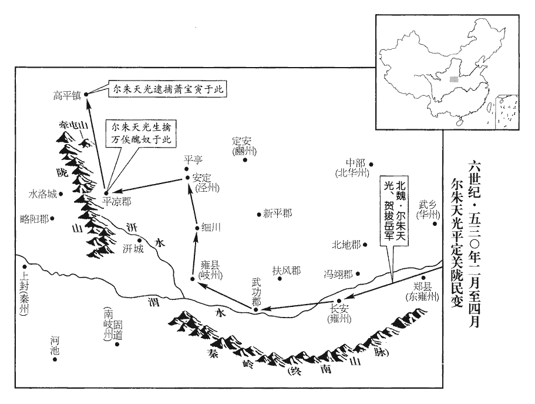
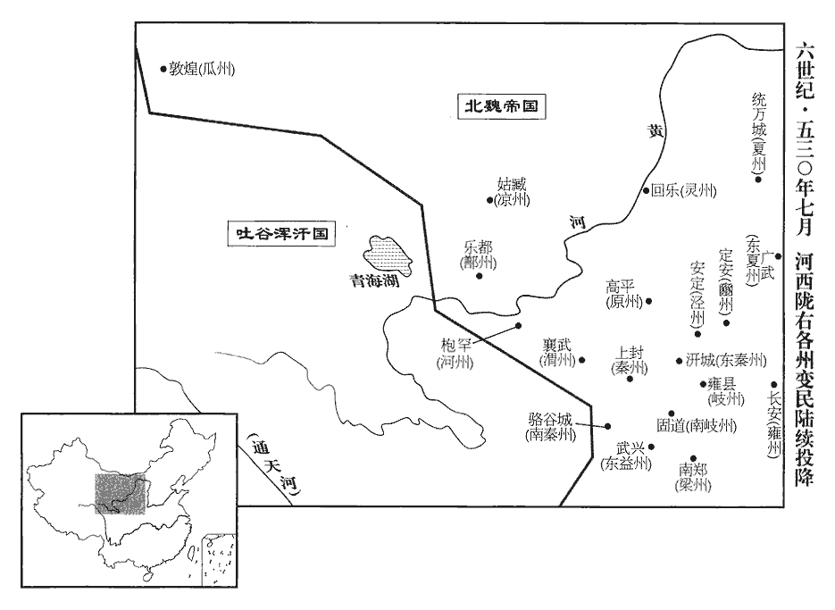
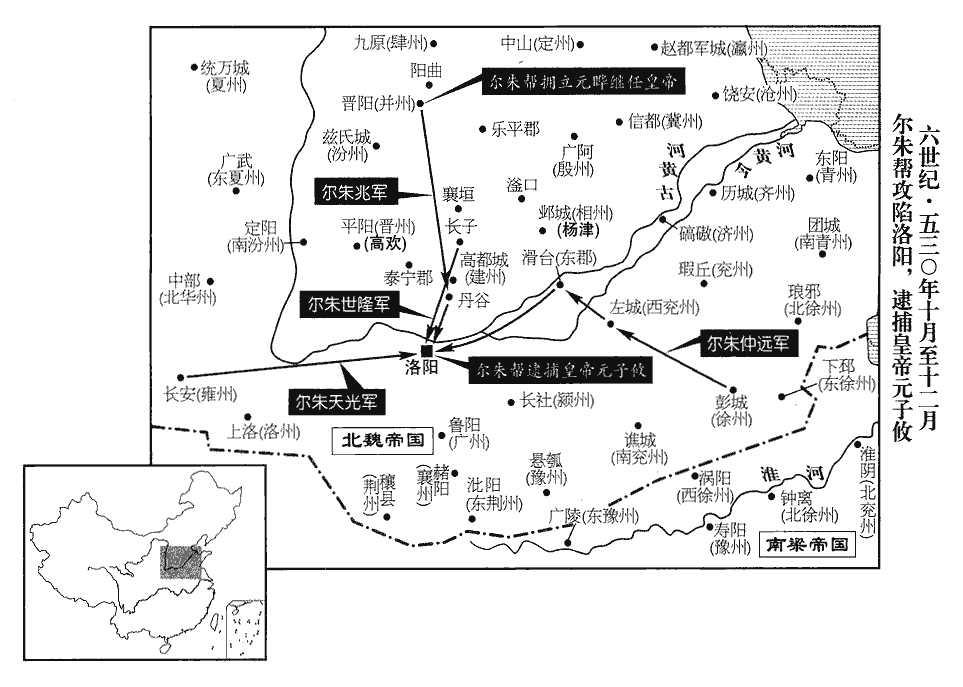

 梁紀十上章閹茂（庚戌），一年。

# 高祖武皇帝十

## 中大通二年（庚戌，五三零）

1春，正月，己丑‹十三›，魏益州‹府设晋寿四川省广元市西南›刺史長孫壽、梁州‹府设南郑陕西省汉中市›刺史元儁等遣將擊嚴始欣，斬之，蕭玩等亦敗死，玩援始欣見上卷上年。長，知兩翻。將，即亮翻。失亡萬餘人。

〖译文〗 [1]春季，正月，己丑（十三日），北魏益州刺史长孙寿、梁州刺史元俊等派将领攻打严始欣，将其斩首，萧玩等也战败而死，逃失走散一万余人。

2辛亥‹二十五›，魏東徐州‹府设下邳江苏省睢宁县北古邳镇›城民呂文欣等殺刺史元大賓，據城反，魏孝昌元年，置東徐州於下邳。魏遣都官尚書平城‹山西省大同市›樊子鵠討之；二月，甲寅‹八›，斬文欣。

〖译文〗 [2]辛卯（十五日），北魏东徐州城百姓吕文欣等人杀死了刺史元大宾，占据东徐州城而反乱，北魏派遣都官尚书平城人樊子鹄讨伐吕文欣。二月，甲寅（初八），斩杀了吕文欣。

3万俟醜奴侵擾關中，万，莫北翻。俟，渠之翻。魏爾朱榮遣武衛將軍賀拔岳討之。岳私謂其兄勝曰：「醜奴，勍敵也，勍，其京翻。今攻之不勝，固有罪，勝之，讒嫉將生。」勝曰：「然則柰何？」岳曰：「願得爾朱氏一人為帥而佐之。」帥，所類翻。勝為之言於榮，為，于偽翻。榮悅，以爾朱天光為使持節、都督二雍•二岐諸軍事、驃騎大將軍、雍州‹府设长安陕西省西安市›刺史，後魏雍州治長安，北雍州治華原縣，東雍州治鄭縣‹陕西省华县›，岐州治扶風雍縣‹陕西省凤翔县›，南岐州治河池故道縣‹陕西省凤县›。使，疏吏翻。雍，於用翻。驃，匹妙翻。騎，奇計翻。以岳為左大都督，又以征西將軍代郡侯莫陳悅為右大都督，侯莫陳，其先魏之別部也，居庫斛真水，世為渠帥，遂以為氏，其後鎮代郡武川，因家焉。並為天光之副以討之。

〖译文〗 [3]万俟奴侵扰关中地区，北魏尔朱荣派武卫将军贺拔岳讨万俟奴。贺拔岳私下里对他哥哥贺拔胜说：“万俟奴是一个强敌，现在攻讨他若不能取胜，固然有罪，但如果打败了他，谗佞嫉妒之言也会产生。”贺拔胜问道：“那么如何办呢？”贺拔岳说：“希望让一位尔朱氏家族的人为统帅，我作助手辅佐他。”于是贺拔胜向尔朱荣讲了贺拔岳的建议，尔朱荣听了很高兴，便任命尔朱天光为使持节、都督二雍二岐诸军事、骠骑大将军、雍州刺史，以贺拔岳为左大都督，又任命征西将军代郡人侯莫陈悦为右大都督，贺拔岳、侯莫陈悦二人均作为尔朱天光的副手以征讨万俟奴。

天光初行，唯配軍士千人，發洛陽以西路次民馬以給之。時赤水蜀‹陕西省华县北巴蜀移民›賊斷路，水經註：赤水在鄭縣北，即山海經之灌水也，北注于渭。蜀賊，本蜀人之遷關中者，乘亂相聚為賊。斷，丁管翻。‹元子攸，本年二十四岁›詔侍中楊侃先行慰諭，并稅其馬，華陰諸楊仕魏，奕世貴顯，關西所歸重，故使之先行慰諭也。賊持疑不下。軍至潼關，天光不敢進，岳曰：「蜀賊鼠竊，公尚遲疑，若遇大敵，將何以戰！」天光曰：「今日之事，一以相委。」岳遂進擊蜀於渭北，破之，獲馬二千匹，簡其壯健以充軍士，又稅民馬合萬餘匹。以軍士尚少，少，詩沼翻。淹留未進。榮怒，遣騎兵參軍劉貴乘驛至軍中責天光，杖之一百，以軍士二千人益之。

〖译文〗 尔朱天光开始出发时，只配备了一千名士兵，靠征发洛阳以西沿途百姓的马匹装备了这支部队。当时，赤水的蜀贼切断了道路，朝廷便诏令侍中杨侃先到叛贼处抚慰劝谕，并征集他们的马匹，叛贼将领犹疑不决。北魏军队到潼关后，尔朱天光便不敢再前进了，贺拔岳对他说：“这些蜀贼都是些鸡鸣鼠窃之辈，您尚且如此迟疑不决，如果遇到大敌的话，又将如何应敌呢！”尔朱天光说道：“今天的事情，我就全部委托给你了。”贺拔岳于是便向渭水北岸的蜀贼进击，大破贼军，缴获战马二千匹，挑选贼军中健壮的士卒以充实北魏军队，又征集百姓的马匹合计一万多匹。由于兵力还比较少，因此部队停了下来没有继续前进。尔朱荣大怒，派骑兵参军刘贵乘驿马赶至军中，责斥尔朱天光，将他打了一百杖，又增兵二千人。

 

三月，醜奴自將其眾圍岐州，遣其大行臺尉遲菩薩、李延壽曰：其先魏之別號尉遲部，因以為氏。尉，音鬱。菩，薄胡翻。薩，桑葛翻。僕射万俟仵自武功‹陕西省武功县西›南渡渭，攻圍趣柵，仵，疑古翻。考異曰：北史作「万俟行醜」。今從周書。天光使賀拔岳將千騎救之。菩薩等已拔柵而還，還，從宣翻，又如字。岳故殺掠其吏民以挑之，菩薩率步騎二萬至渭北。挑，徒了翻。帥，讀曰率。岳以輕騎數十自渭南與菩薩隔水而語，稱揚國威，菩薩令省事傳語，省事，蓋猶今之通事，兩敵相向，使之往來通傳言語。省，悉井翻。岳怒曰：「我與菩薩語，卿何人也！」射殺之。射，而亦翻。明日，復引百餘騎隔水與賊語，復，扶又翻。稍引而東，至水淺可涉之處，岳即馳馬東出。賊以為走，乃棄步兵，輕騎南渡渭追岳，岳依橫岡設伏兵以待之，賊半渡岡東，岳還兵擊之，賊兵敗走。岳既還兵擊賊，伏兵又發，故敗走。岳下令，賊下馬者勿殺，賊悉投馬，俄獲三千人，馬亦無遺，遂擒菩薩；仍渡渭北，降步卒萬餘，並收其輜重。降，戶江翻。重，直用翻。醜奴聞之，棄岐州，北走安定‹泾州州政府所在县·甘肃省泾川县›，走，音奏。置柵於平亭‹泾川县北›。天光方自雍至岐，與岳合。平亭在涇州北。自雍至岐，自雍州至岐州也。

〖译文〗 三月，万俟奴亲自率众包围了岐州，派遣其大行台尉迟菩萨、仆射万俟仵从武功南渡渭水，围攻北魏军队的营盘。尔朱天光先派贺拔岳率一千骑兵前往救援，尉迟菩萨等叛将已拔起营盘返回了，贺拔岳故意大肆杀害掠夺万俟奴的官吏百姓，以此来激怒敌人，但是尉迟菩萨已率二万步兵和骑兵回到了渭水北岸。贺拔岳率数十轻骑在渭河南岸与北岸的尉迟菩萨隔河对话，特意称赞崐张扬北魏的国威。尉迟菩萨不亲自出面，只命令传话的使者向贺拔岳传话，贺拔岳大怒，说道：“我跟尉迟菩萨说话，你算什么人！”于是用箭射杀了他。第二天，贺拔岳又带了一百多名骑兵隔着渭水跟贼军说话，渐渐地将贼军引向了东边，到了一处可以涉水而过的浅水地带，贺拔岳立即驰马向东跑去，贼军以为贺拔岳要逃跑，便抛下步兵，轻骑南渡渭水追击贺拔岳的部队，贺拔岳已经在一条横向土冈背后设下伏兵等待贼军，等贼军一半人马刚渡过冈东，贺拔岳回兵反击，贼军败逃而去。贺拔岳下令，贼军凡下马者不杀，贼军于是纷纷下马，很快俘获三千人，马匹也没有丢掉，最后捉获了尉迟菩萨。北魏军队于是渡过渭水北岸，贼军万余步兵投降，连同其辎重都被缴获过来了。万俟奴听说了之后，放弃了岐州，向北逃至安定，在平亭设置了营栅。尔朱天光这才从雍州至岐州，跟贺拔岳会合。

夏，四月，天光至汧、渭之間，汧水出汧縣‹陕西省千阳县›西北而入于渭。汧，口堅翻。停軍牧馬，宣言：「天時將熱，未可行師，俟秋涼更圖進止。」獲醜奴覘候者，縱遣之。覘，丑廉翻，又丑豔翻。醜奴信之，散眾耕於細川‹甘肃省灵台县境›，據令狐德棻後周書，百里、細川在岐州北。又據元豐九域志，涇州靈臺縣有百里鎮，蓋即細川之地。細川、平亭當亦相近。使其太尉侯伏侯元進將兵五千，據險立柵，侯伏侯，虜三字姓。將，即亮翻。其餘千人以下為柵者甚眾。天光知其勢分，晡時，密嚴諸軍，相繼俱發，黎明，圍元進大柵，拔之，所得俘囚，一皆縱遣，諸柵聞之皆降。唐末，高仁厚平阡能等亦用此術。降，戶江翻；下同。天光晝夜徑進，抵安定城下，賊涇州刺史侯幾長貴以城降。侯幾，虜複姓。魏書官氏志，內入諸姓有俟幾氏。俟、侯字相近。醜奴棄平亭走，欲趣高平‹宁夏固原县›，九域志：鎮戎軍，古高平地也。趣，七喻翻。天光遣賀拔岳輕騎追之，丁卯‹二十二›，及於平涼‹甘肃省华亭县›。賊未成列，直閤代郡侯莫陳崇單騎入賊中，於馬上生擒醜奴，因大呼，眾皆披靡，呼，火故翻。披，普彼翻。無敢當者，後騎益集，賊眾崩潰，遂大破之。天光進逼高平‹宁夏固原县›，城中執送蕭寶寅以降。万俟醜奴，胡琛之將也，普通六年，破魏將崔延伯，其眾始盛。蕭寶寅大通元年叛魏，至二年敗，奔醜奴，及是皆平。

〖译文〗 夏季，四月，尔朱天光的部队来到了水和渭水之间，部队停下来，放养战马，并声言：“天气就要变热了，不能行军作战，等到秋天凉爽了以后再考虑进军或退兵。”北魏军队抓获了万俟奴的侦察兵，又放回去。万俟奴相信了这些话，于是便解散部队，令部队在细川耕作，并派其太尉侯伏侯元进率五千士兵，凭据险要设立营栅，其余一千人以下便设立营栅的很多。尔朱天光了解到万俟奴的兵势已经分散，傍晚时分，暗中督责各个部队，前后相继出发，黎明时分，包围并攻取了侯伏侯元进的大寨，所俘获的俘虏，全部放了回去，其他各营栅的贼军听说了之后，都投降了北魏军队。尔朱天光昼夜前进，抵达安定城下，万俟奴的泾州刺史侯几长贵率城而降。万俟奴放弃平亭城出逃，想去高平城，尔朱天光派贺拔岳率轻骑追击万俟奴，丁卯（二十二日），到了平凉追上了敌人。贼军还未列成阵势，直阁、代郡人侯莫陈崇单骑闯入，从马上生擒了万俟奴，并趁势高呼，贼军都望风披靡，没有人敢阻挡侯莫陈崇，北魏的后续骑兵聚集得越来越多，贼军全线崩溃，于是大破贼军。尔朱天光又进逼高平，城中人抓住萧宝寅将其送到北魏军中请降。

4壬申‹二十七›，以吐谷渾王佛輔為西秦、河二州刺史。吐，從暾入聲。谷，音浴。

〖译文〗 [4]壬申（二十七日），梁朝任命吐谷浑王佛辅为西秦州、河州两州的刺史。

5甲戌‹二十九›，魏以關中平，大赦。万俟醜奴、蕭寶寅至洛陽，置閶闔門外都街之中，士女聚觀凡三日。丹楊王蕭贊表請寶寅之命，贊以寶寅為叔父，故請其命。吏部尚書李神儁、黃門侍郎高道穆素與寶寅善，欲左右之，左右，讀曰佐佑。言於魏主‹元子攸›曰：「寶寅叛逆，事在前朝。」朝，直遙翻。會應詔王道習自外至，應詔，猶漢之待詔也，帝問道習：「在外何所聞？」對曰：「惟聞李尚書、高黃門與蕭寶寅周款，周，至也，密也。款，愛也。並居得言之地，必能全之。且二人謂寶寅叛逆在前朝，寶寅為醜奴太傅，豈非陛下時邪？賊臣不翦，法欲安施！」帝乃賜寶寅死於駝牛署‹年四十四岁›，邪，音耶。後魏官有駝牛都尉；署者，其寺舍也。五代志：太僕寺之屬有駝牛署，掌飼駝騾驢牛，有令丞。斬醜奴於都市。

〖译文〗 [5]甲戌（二十九日），北魏因关中已经平定，于是大赦天下。万俟奴、萧宝寅被押至洛阳，置于阊阖门外的大街之中，洛阳城中的男女老少聚集围观了三天。丹扬王萧赞上表请求孝庄帝饶萧宝寅一命，吏部尚书李神俊、黄门侍郎高道穆平素与萧宝寅关系密切，也想帮萧宝寅求情，于是便对孝庄帝说：“萧宝寅叛逆之事，发生在前朝。”这时正赶上应诏官王道习从外面进来，孝庄帝问王道习：“你在外面听到了什么？”王道习回答说：“只听到有人说李尚书、高黄门跟萧宝寅关系亲密，这二人都处在便于向皇帝进言的官位上，一定能够保全萧宝寅。而且这两个人说萧宝寅叛逆之事发生在前朝，萧宝寅为万俟奴的太傅，难道不是在陛下当政之时么？贼臣若不剪除掉，王法还能施加于谁呢！”孝庄帝于是便赐萧宝寅死于驼牛署，将万俟奴于都市中斩首。

6六月，丁巳‹十三›，帝復以魏汝南王悅為魏王。復，扶又翻。考異曰：梁帝紀：「中大通元年，正月，甲子，魏汝南王悅求還本國，許之。二年，六月，丁巳，遣悅還北，為魏主。」按魏書悅傳，悅未嘗歸魏復入梁，今刪去元年事。

〖译文〗 [6]六月，丁巳（十三日），梁武帝又加封原北魏汝南王元悦为魏王。

7戊寅‹十四›，魏詔胡氏親屬受爵於朝者皆黜為民。謂靈后親屬也。朝，直遙翻。

〖译文〗 [7]戊寅（疑误），北魏孝庄帝下诏，凡胡氏家族的亲属在朝廷受过爵位的一律罢黜为平民。

8庚申‹十六›，以魏降將范遵為安北將軍、司州牧，從魏王悅北還。范遵，魏北海王顥之舅，蓋與顥同來奔。降，戶江翻。將，即亮翻。

〖译文〗 [8]庚申（十六日），梁朝任命北魏降将范遵为安北将军、司州牧，跟随魏王元悦北还。

9万俟醜奴既敗，自涇、豳‹府设定安甘肃省宁县›以西至靈州‹府设回乐宁夏灵武县›，薄骨律镇改，後魏滅赫連，以赫連果城置薄骨律鎮，至孝昌中改鎮為靈州。杜佑曰：薄骨律鎮，今靈武郡；富平，今迴樂縣。唐靈州治迴樂。括地志云：薄骨律鎮城在河渚之中，隨水上下，未嘗陷沒，故號靈州也。賊黨皆降於魏，唯所署行臺万俟道洛帥眾六千逃入山中，不降。降，戶江翻。帥，讀曰率；下同。時高平大旱，爾朱天光以馬乏草，退屯城東五十里，遣都督長孫邪利帥二百人行原州事以鎮之。魏太延二年，置高平鎮；正光五年，改曰原州，治高平城，領高平、長城二郡。道洛潛與城民通謀，掩襲邪利，并其所部皆殺之。天光帥諸軍赴之，道洛出戰而敗，帥其眾西入牽屯山‹宁夏泾源县北›，班志：幵頭山在安定郡涇陽縣西，涇水所出。師古註曰：幵jiān，音牽。此山在今靈州東南，俗語訛謂之幵屯山。杜佑曰：牽屯山在今原州高平縣。據險自守。爾朱榮以天光失邪利，不獲道洛，復遣使杖之一百，復，扶又翻。使，疏吏翻。以詔書黜天光為撫軍將軍、雍州刺史，降爵為侯。

〖译文〗 [9]万俟奴兵败后，从泾州、幽州以西直到灵州，原来万俟奴的贼党都归降了北魏，只有万俟奴任命的行台万俟道洛率六千部众逃入深山之中，拒不投降。当时高平一带大旱，尔朱天光由于马匹缺少水草，便退兵屯驻在高平城东五十里的地方，并派都督长孙邪利率领二百人管理原州的军政事务，镇守在高平城内。万俟道洛暗中跟高平城中百姓合谋，偷袭了长孙邪利，连同其部下都杀害了。尔朱天光率各路人马赶赴高平城救援，万俟道洛出城迎战，结果战败，率其部下向西逃进了牵屯山，据险自守。尔朱荣因尔朱天光损失了长孙邪利，没有抓获万俟道洛，便又派使者打了尔朱天光一百杖，以皇帝诏书的名义贬黜尔朱天光为抚军将军、雍州刺史，降爵位为侯。

天光追擊道洛於牽屯，道洛敗走，入隴‹甘肃、陕西二省交界处›，隴，隴山也。歸略陽‹甘肃省秦安县东北›賊帥王慶雲。晉武帝分天水置略陽郡，隋廢為隴城縣，屬秦州。考異曰：魏帝紀作「白馬龍涸胡王慶雲」。今從爾朱天光傳。帥，音所類翻。道洛驍果絕倫，驍，堅堯翻。慶雲得之，甚喜，謂大事可濟，遂稱帝於水洛城‹甘肃省庄浪县›，水經註：水洛水導源隴山，西逕水洛亭西，南注略陽川。九域志：水洛城在德順軍西南一百里。范仲淹曰：朝那之西，秦亭之東，有水洛城。置百官，以道洛為大將軍。

〖译文〗 尔朱天光率军至牵屯山追击万俟道洛，万俟道洛战败逃走，进入陇山，投奔了略阳的贼军首领王庆云。万俟道洛骁勇绝伦，王庆云得到他后，非常高兴，以为这样一来大事便能成功了，于是王庆云便在水洛城称帝，设置文武百官，任命万俟道洛为大将军。

秋，七月，天光帥諸軍入隴，至水洛城，慶雲、道洛出戰，天光射道洛中臂，射，而亦翻。中，竹仲翻。失弓還走，拔其東城。賊併兵趣西城，趣，七喻翻。城中無水，眾渴乏，有降者言慶雲、道洛欲突走。天光恐失之，乃遣人招諭慶雲使早降，降，戶江翻。曰：「若未能自決，當聽諸人，今夜共議，明晨早報。」慶雲等冀得少緩，因待夜突出，少，詩沼翻。乃報曰：「請俟明日。」天光因使謂曰：「知須水，須者，意所欲也。今相為小退，為，于偽翻。任取澗水飲之。」賊眾悅，無復走心。天光密使軍士多作木槍，各長七尺，此即拒馬槍也。杜佑曰：拒馬槍，以木徑二尺，長短隨事，十字鑿孔，縱橫安檢，長丈，銳其端以塞要路。昏後，繞城布列，要路加厚，又伏人槍中，備其衝突，兼令密縛長梯於城北。其夜，慶雲、道洛果馳馬突出，遇槍，馬各傷倒，伏兵起，即時擒之。軍士緣梯入城，餘眾皆出城南，遇槍而止，窮窘乞降。降，戶江翻。丙子‹三›，天光悉收其仗而阬之，死者萬七千人，分其家口。於是三秦、河‹府设枹罕甘肃省临夏市›、渭‹府设襄武甘肃省陇西县›、瓜‹府设敦煌甘肃省敦煌市›、涼‹府设姑臧甘肃省武威市›、鄯州‹府设乐都青海省乐都县›皆降。三秦，秦‹府设上封甘肃省天水市›、東秦‹府设汧城陕西省陇县›、南秦‹府设骆谷城甘肃省西和县南›也。河州，乞伏之地也。魏太武真君六年，置枹罕鎮，後改為河州，領金城、武始、洪和、臨洮郡。渭州領隴西、南安、南安陽、廣寧郡。瓜州，即古敦煌之地。鄯州，禿髮氏之地，漢金城西部都尉所統也。師古曰：瓜州，即左傳所云允姓之戎居于瓜州者也。其地今猶出大瓜，長者，狐入瓜中食之，首尾不出。

〖译文〗 秋季，七月，尔朱天光率诸军进入陇地，来到了水洛城。王庆云、万俟道洛出城迎战，尔朱天光用箭射中了万俟道洛的胳臂，万俟道洛丢下弓箭回马便走，尔朱天光趁势攻下了贼军的东城。贼军聚集起兵力退至西城，城中无水，士兵们又渴又乏，有投降北魏的士兵告诉尔朱天光说王庆云、万俟道洛打算突围逃走。尔朱天光担心敌人逃掉，于是便派人招降王庆云，让他早日投降，对他说：“如果自己还不能决定的话，应该叫大家今夜共同商议一下，明天早晨回话。”王庆云等贼将希望能够稍微缓解一下，以便等待夜间突围出逃，于是便回报说：“请等到明天吧。”尔朱天光通过使者告诉王庆云等贼将说：“我军知道你们想得到水，现在我军为此稍微后退一些，让你们任意取山涧水饮用。”贼兵大喜，便不再有逃走之意。尔朱天光暗中让士兵们多做拒马枪，各长七尺，天黑后，环绕城边布置好，险要路口布置得更多一些，同时又让士兵埋伏在枪丛中，以防备敌人冲锋突围，还让人暗中在城北捆扎长梯子以备攻城之用。这天夜里，王庆云、万俟道洛果然驰马突围出逃，遇上了北魏军队布置好的拒马枪，战马各自受伤倒下，北魏伏兵又起，当时便抓获了王庆云、万俟道洛二人。北魏士兵沿长梯登上城墙进入城内，其余贼兵都从城南突出，遇上拒马枪后也被阻止住了，贼兵走投无路只好请降。丙子（初三），尔朱天光收缴崐了降兵的武器，将他们全部活埋了，死者达一万七千人，将他们的家属分赏将士。这样一来，三秦、河、渭、瓜、凉、鄯等州也都投降了北魏。

 

天光頓軍略陽。詔復天光官爵，尋加侍中、儀同三司。以賀拔岳為涇州刺史，侯莫陳悅為渭州刺史。秦州城民謀殺刺史駱超，南秦州城民謀殺刺史辛顯，超、顯皆覺之，走歸天光，天光遣兵討平之。

〖译文〗 尔朱天光驻军于略阳。北魏朝廷下诏恢复了尔朱天光的官职、爵位，不久又加封他为侍中、仪同三司。北魏朝廷还任命贺拔岳为泾州刺史，侯莫陈悦为渭州刺史。秦州城民图谋杀掉刺史骆超，南秦州城民图谋杀掉刺史辛显，骆超、辛显都发觉了这一图谋，便投奔了尔朱天光。尔朱天光派兵讨伐平定了秦州、南秦州的叛乱。

步兵校尉宇文泰從賀拔岳入關‹潼关›，以功遷征西將軍，行原州事。時關、隴彫弊，泰撫以恩信，民皆感悅，曰：「早遇宇文使君，吾輩豈從亂乎！」為宇文泰得賀拔岳之眾以創大業於關西張本。

〖译文〗 步兵校尉宇文泰跟从贺拔岳进入关内，因功升迁至征西将军，管理原州事务。当时关、陇地区经济凋弊，宇文泰以恩德信义抚慰百姓，当地百姓非常感激、喜悦，都说：“要是早点遇到宇文使君的话，我们怎会跟着参预叛乱呢！”

10八月，庚戌‹七›，上餞魏王悅於德陽堂，遣兵送至境上。考異曰：悅傳云：「立為魏主，號年更興。衍遣其將軍王僧辯送至境上，以冀侵逼。」按僧辯傳未嘗送悅，蓋王弁耳。

〖译文〗 [10]八月，庚戌（初七），梁武帝在德阳堂为魏王元悦饯行，派兵将元悦送到边境上。

11魏爾朱榮雖居外藩‹根据地在晋阳山西省太原市›，遙制朝政，朝，直遙翻。樹置親黨，布列魏主左右，伺察動靜，大小必知。伺，相吏翻。魏主雖受制於榮，然性勤政事，朝夕不倦，數親覽辭訟，理冤獄，數，所角翻。榮聞之，不悅。史言魏主不能養晦。帝又與吏部尚書李神儁議清治選部，治，直之翻。選，須絹翻；下同。榮嘗關補曲陽‹河北省晋州市›縣令，據榮傳，即上曲陽縣也，漢、晉屬常山郡，後魏屬中山郡。關補者，先補授而後關吏部。五代志：趙州鼓城縣，舊曰曲陽。劉昫曰：漢上曲陽縣，隋改曰恆陽，唐元和十五年，復曰曲陽。趙州之曲陽，下曲陽也。神儁以階懸，不奏，言階級相去懸絕，其人不應補為縣令。別更擬人。榮大怒，即遣所補者往奪其任；神儁懼而辭位，榮使尚書左僕射爾朱世隆攝選。榮啟北人為河南諸州，帝未之許；太宰天穆入見面論，見，賢遍翻。帝猶不許。天穆曰：「天柱‹尔朱荣›既有大功，為國宰相，若請普代天下官，恐陛下亦不得違之，如何啟數人為州，遽不用也！」帝正色曰：「天柱若不為人臣，朕亦須代；如其猶存臣節，無代天下百官之理。」榮聞之，大恚恨，曰：「天子由誰得立！今乃不用我語！」

〖译文〗 [11]北魏尔朱荣虽居处京城之外的藩镇，却遥控朝政，广树党羽，布置于孝庄帝左右，以便窥伺观察朝中动静，因此朝中不管大事小事，他都知晓。孝庄帝虽然受到尔朱荣的控制，但生性勤于政事，从早到晚不疲倦，多次亲自察览诉状，审理冤案。尔朱荣听说这些之后，很不高兴。孝庄帝又跟吏部尚书李神俊商议整顿官吏的选拔，尔朱荣过去曾补授过一位曲阳县令，但是报到吏部之后，李神俊以官阶相差太悬殊为由，没有批准，而另外又选了别人。尔朱荣对此大为恼怒，于是便派他所补授的人前往曲阳县抢夺县令之职。李神俊很恐惧，便辞了官职，尔朱荣便让尚书左仆射尔朱世隆取代李神俊来主持吏部。尔朱荣向孝庄帝启请北方人为河南各州的刺史，孝庄帝没有同意。太宰元天穆入见孝庄帝，当面请求批准，孝庄帝还是没有答应。元天穆说道：“天柱将军尔朱荣既然对国家有大功，身为宰相，如果他要求调换全国的所有官员的话，恐怕陛下您也不能违背他的意旨，为什么他启奏几个人为河南诸州的刺史，您竟然不允许呢！”孝庄帝严肃地说道：“天柱将军如果不想做人臣的话，朕也可以被他取代；如果他还想保持臣节的话，绝无更换天下百官的道理。”尔朱荣听说了后，非常恼怒怨恨，说道：“他的天子之位靠谁才得以坐上的，现在却竟然不采纳我的意见了！”

爾朱皇后性妬忌，屢致忿恚。帝遣爾朱世隆語以大理，恚，於避翻。語，牛倨翻。大理，謂事理之大致也。后曰：「天子由我家置立，今便如此；我父本即自作，今亦復決。」決，判也，謂天下事有判決也。復，扶又翻。世隆曰：「止自不為，「止」當作「正」。若本自為之，臣今亦封王矣。」

〖译文〗 尔朱皇后生性妒忌，多次向孝庄帝发泄怨恨不满之意。孝庄帝派尔朱世隆向她晓以大义，皇后却说：“天子是由我家设立的，现在竟然这样，我父亲当初如果自己作皇帝的话，现在什么事情也就决定了。”尔朱世隆说道：“正是由于自己没有作皇帝，如果当初他自己作了皇帝，我现在也可封王了。”

帝既外逼於榮，內逼皇后，恆怏怏不以萬乘為樂，恆，音常。怏，於兩翻。乘，繩正翻。樂，音洛；下同。唯幸寇盜未息，欲使與榮相持。及關、隴既定，告捷之日，乃不甚喜，謂尚書令臨淮王彧曰：「即今天下便是無賊。」彧見帝色不悅，曰：「臣恐賊平之後，方勞聖慮。」帝畏餘人怪之，還以他語亂之曰：「然。撫寧荒餘，荒餘，謂兵荒之餘民也。彌成不易。」易，以豉翻。榮見四方無事，奏稱「參軍許周勸臣取九錫，臣惡其言，已斥遣令去。」榮時望得殊禮，故以意諷朝廷，帝實不欲與之，因稱歎其忠。

〖译文〗 孝庄帝既然外受逼于尔朱荣，内又受逼于尔朱皇后，因此总是怏怏不乐，并不以自己是皇帝而感到快乐，唯可庆幸的是寇盗尚未平息，希望寇盗与尔朱荣相抗衡。等到关、陇地区已经平定，捷报传到朝廷之时，魏主却并不感到十分高兴，只是对尚书令临淮王元说道：“从今以后天下便无贼寇了。”元见孝庄帝脸色不悦，说道：“我担心贼寇平定以后，才真正会使圣上您多费思虑呢。”孝庄帝怕其他人感到奇怪，赶忙用别的话打乱他搪塞道：“是的，抚慰安定兵荒后残剩的百姓，也实在不容易。”尔朱荣见四方平定无事，便向孝庄帝上奏道：“参军许周劝我取得九锡的特殊荣宠，我很厌恶他的话，已经斥责了他一通，让他离开了。”尔朱荣当时希望能够得到孝庄帝特殊的礼遇，所以故意以此来委婉地向魏主暗示自己的愿望，孝庄帝实在不想给尔朱荣以特殊礼遇，因此只是大加称赞了一番尔朱荣的忠诚之心。

榮好獵，惡，烏路翻。好，呼報翻。不捨寒暑，列圍而進，令士卒必齊壹，雖遇險阻，不得違避，一鹿逸出，必數人坐死。有一卒見虎而走，榮謂曰：「汝畏死邪！」即斬之，自是每獵，士卒如登戰場。嘗見虎在窮谷中，榮令十餘人空手搏之，毋得損傷，死者數人，卒擒得之，魏道武帝因搏熊而謝于栗磾，爾朱榮反是，嗜殺人者烏能定天下邪！卒，音子恤翻。以此為樂，其下甚苦之。太宰天穆從容謂榮曰：樂，音洛。從，千容翻。「大王勳業已盛，四方無事，唯宜脩政養民，順時蒐狩，禮，春蒐sōu、夏苗、秋獮xiǎn、冬狩。杜預曰：蒐，索擇取不孕者。苗，為苗除害也。獮，殺也；以殺為名，順秋氣也。狩，圍守也；冬物畢成，獲則取之，無所擇也。何必盛夏驅逐，感傷和氣？」榮攘袂曰：「靈后女主，不能自正，推奉天子，乃人臣常節。葛榮之徒，本皆奴才，乘時作亂，譬如奴走，擒獲即已。頃來受國大恩，未能混壹海內，何得遽言勳業！如聞朝士猶自寬縱，今秋欲與兄戒勒士馬，校獵嵩高，令貪汙朝貴，入圍搏虎。朝，直遙翻。仍出魯陽‹河南省鲁山县›，歷三荊‹荆州州政府设穰城·河南省邓州市›、东荆州州政府设沘阳·河南省泌阳县、南荆州州政府设安昌·湖北省枣阳市南，悉擁生蠻，北填六鎮，杜佑曰：北荊州，今即伊陽縣；東荊州，後改曰淮州，今淮安郡；荊州，今南陽郡。余按榮言出魯陽，則已越伊陽而南矣。五代志：舂陵郡，後魏置南荊州。當以此足三荊之數。生蠻，謂諸蠻戶之未附於魏者。六鎮叛亂，鎮戶荒殘，故欲填之。回軍之際，掃平汾‹府设蒲子城山西省隰县›胡。稽胡皆居汾州界，謂之汾胡。明年，簡練精騎，分出江、淮，蕭衍若降，乞萬戶侯；騎，奇計翻。降，戶江翻。乞，丘計翻，與也。如其不降，以數千騎徑渡縛取。然後與兄奉天子，巡四方，乃可稱勳耳。今不頻獵，兵士懈怠，安可復用也！」懈，七隘翻。復，扶又翻。

〖译文〗 尔朱荣喜好打猎，不管寒暑，使军队列队四面围狩，令士卒一定要整齐划一，行动一致，即便遇到艰难险阻，也不得逃避。如果一只鹿逃出去，必定会有几个人因此而处死。有一士兵看到老虎后吓得逃开了，尔朱荣对他说道：“你怕死吗？”当即便将那个士兵斩杀了，从此每次打猎，士卒们便如同上了战场一般。有一次在一条幽僻的山谷中发现了一只老虎，尔朱荣命十几个人空手与那只老虎搏斗，而且不能损伤老虎，死了好几个人，最后才擒获了老虎。尔朱荣以此为乐，他的部下却为此吃尽了苦头。太宰元天穆曾很随意地对尔朱荣说：“大王已经建立了丰功伟业，现在四方安定无事，正应该兴修德政，休养生息，按着季节行围打猎，为什么一定要在盛夏时狩围打猎，伤害自然的和谐之气呢？”尔朱荣挽起袖子说道：“胡灵太后，身为女主，行为不正，推奉天子，乃是做臣子的常节。葛荣之徒，本来都是些奴才之辈，乘时发动叛乱，好比是奴婢逃跑，擒获了就是了。近来我等受国家大恩，却还未能统一海内，怎能说是已建立了功勋业绩！如果听到朝内官员还是松松垮垮，今年秋天想与你整顿兵马，到嵩山围猎，让那些贪官显贵到围子中与虎搏斗。然后再出兵鲁阳，扫平三荆之地，将南方蛮贼一并擒获，向北镇抚六镇之后，回军的时候，再铲除汾州界内的胡匪。明年，挑选精锐骑兵，分道出兵长江、淮河，萧衍如果投降的话，给他一个万户侯；如果不投降，便率数千骑兵直渡江、淮，将其擒缚。然后我与你侍奉天子，巡视四方，这才可以称得上是建立了功勋啊。现在如果不频频围猎的话，士兵们就会懈怠，怎么能够再用呢！”

城陽王徽之妃，帝之舅女；侍中李彧，延寔之子，帝之姊婿也。徽、彧欲得權寵，惡榮為己害，日毀榮於帝，勸帝除之。帝懲河陰之難，河陰之難，事見一百五十二卷。惡，烏路翻。難，乃旦翻。恐榮終難保，由是密有圖榮之意，侍中楊侃、尚書右僕射元羅亦預其謀。元羅，叉之弟也。

〖译文〗 城阳王元徽的妃子，是孝庄帝舅舅的女儿；侍中李，是李延之子，也是孝庄帝的姐夫。元徽、李想得到权力，获得孝庄帝的恩宠，便忌恨尔朱荣，认为他是自己的障碍，于是终日在孝庄帝面前诋毁尔朱荣，劝孝庄帝除掉他。孝庄帝从河阴之难中吸取教训，担心尔朱荣最终难以驾驶，从此便暗暗生发了图谋尔朱荣的想法。侍中杨侃、尚书右仆射元罗也参与了这一计划。

會榮請入朝，欲視皇后㝃乳，㝃，與免同，又音晚。師古曰：免乳，為產子也。乳，人喻翻。唐韻曰：子母相解曰免。徽等勸帝因其入，刺殺之。刺，七亦翻。唯膠東侯李侃晞、濟陰王暉業言：「榮若來，必當有備，恐不可圖。」濟，子禮翻。又欲殺其黨與，發兵拒之。帝疑未定，而洛陽人懷憂懼，中書侍郎邢子才之徒已避之東出，邢劭，字子才，避魏主兄彭城王劭諱，故以字行。本傳云：少時有避，遂不行名。榮乃遍與朝士書，相任去留。中書舍人溫子昇以書呈帝，帝恆望其不來，恆，戶登翻。及見書，以榮必來，色甚不悅。子才名劭，以字行，巒之族弟也。邢巒事魏宣武帝，屢經將領，有功。考異曰：北史邢巒卷首排目云「族孫臧、劭」，而卷中乃云「巒叔祖祐，祐從子虯，虯子臧、劭」。魏書亦云「巒從祖祐」。然則臧、劭乃巒族弟，非族孫也。時人多以字行者，舊史皆因之。

〖译文〗 正赶上尔朱荣请求入朝，想照看皇后分娩，元徽等人便劝孝庄帝趁尔朱荣入朝之际刺杀他。只有胶东侯李侃、济阴王元晖业说道：“尔朱荣如果来的话，一定会有所防备，恐怕不好对付。”元徽等人又想杀掉尔朱荣的党羽，派兵去对付尔朱荣。孝庄帝犹疑不定，洛阳城中官民忧虑害怕，中书侍郎邢子才之徒已经跑出洛阳城向东逃走了，尔朱荣于是给朝中每个大臣都写了一封信，表示各人可以随意去留。中书舍人温子将信呈给了孝庄帝，孝庄帝总希望尔朱荣不来，等到看了信后，知道尔朱荣一定要来，脸色很不高兴。邢子才名叫邢劭，以其字相称，他是邢峦的族弟。当时有很多人都是以字相称，所以旧史书都因袭下来称其字。

武衛將軍奚毅，建義初往來通命，事見二百五十二卷大通二年。帝每期之甚重，然猶以榮所親信，不敢與之言情。毅曰：「若必有變，臣寧死陛下，不能事契胡。」爾朱氏，契胡種也。契，欺訖翻。帝曰：「朕保天柱‹尔朱荣›無異心，亦不忘卿忠款。」款，誠也。

〖译文〗 武卫将军奚毅，建义初年以来往返传达使命，孝庄帝对他很看重，但又由于他是尔朱荣所亲信的人，因此不敢跟他说实情。奚毅对孝庄帝说：“如果有什么变故的话，我宁肯为陛下而死，也不会去为尔朱荣这个契胡做事。”孝庄帝说道：“朕保证天柱将军尔朱荣不会有什么异心，朕也不会忘记你对我的忠诚。”

爾朱世隆疑帝欲為變，乃為匿名書自牓其門云：「天子與楊侃、高道穆等為計，欲殺天柱。」取以呈榮。榮自恃其強，不以為意，手毀其書，唾地曰：「世隆無膽。誰敢生心！」榮妻北鄉長公主亦勸榮不行，榮妻非元氏也，以榮功封北鄉長公主。考異作「鄉郡長公主」，註曰：北史世隆傳作「北鄉郡公主」，今從魏帝紀。按考異作「鄉郡長公主」是也，通鑑作「北鄉長公主」，傳寫之誤耳。五代志：上黨郡鄉縣，石勒置武鄉郡，後魏去「武」字為鄉郡。證以魏收志無北鄉郡，則從鄉郡為是。唾，吐臥翻。長，知兩翻。榮不從。

〖译文〗 尔朱世隆怀疑孝庄帝欲有所企图，便写了封匿名信贴在了自己家门上，信上称：“天子与杨侃、高道穆等人策划，打算杀掉天柱将军尔朱荣。”尔朱世隆又取下这封信呈送给了尔朱荣。尔朱荣自恃自己的力量强大，对此并不在意，亲手撕了这封信，朝地上唾了一口道：“尔朱世隆太没有胆量了。谁敢有这样的想法！”尔朱荣的妻子北乡长公主也劝尔朱荣不要入朝，尔朱荣不听。

是月，榮將四五千騎發并州‹府设晋阳山西省太原市›，將，即亮翻。騎，奇計翻。時人皆言「榮反」，又云「天子必當圖榮。」九月，榮至洛陽，考異曰：魏帝紀曰：「辛卯，榮、天穆自晉陽來朝。」按北史，九月初，榮至京，十五日天穆至。是月甲戌朔，辛卯乃十八日，非也。帝即欲殺之，以太宰天穆在并州，恐為後患，故忍未發，并召天穆。有人告榮云：「帝欲圖之。」榮即具奏，帝曰：「外人亦言王欲害我，豈可信之！」於是榮不自疑，每入謁帝，從人不過數十，從，才用翻。又皆挺身不持兵仗。挺，徒頂翻，直也。帝欲止，城陽王徽曰：「縱不反，亦何可耐，耐，忍也。況不可保邪！」

〖译文〗 这一月，尔朱荣率四五千骑兵从并州出发，当时人们都说：“尔朱荣要反叛”，又说：“天子肯定要图谋杀了尔朱荣。”九月，尔朱荣到了洛阳，孝庄帝当时便想杀了他，由于太宰元天穆还在并州，担心成为后患，所以忍住未杀尔朱荣，同时召元天穆进京。有人告诉尔朱荣说：“皇帝想图谋杀了您。”尔朱荣便将这话上奏了孝庄帝，孝庄帝说道：“外边的人也传言说你想害了我，怎么可以相信这些话呢！”于是尔朱荣便不再怀疑，每次入朝拜谒皇帝，随从之人也不过几十，并且都赤手不带兵器。孝庄帝又打算放弃原来的想法，不再杀尔朱荣，城阳王元徽说道：“即使尔朱荣不反叛，又怎么能容忍他这样呢，何况又怎样保证他不反呢？”

先是，長星出中台，掃大角；恆州‹府设平城山西省大同市›人高榮祖頗知天文，榮問之，對曰：「除舊布新之象也。」三台，中台上星為諸侯三公。大角者，天王座也。傳曰：彗所以除舊布新。先，悉薦翻。恆，戶登翻。榮甚悅。榮至洛陽，行臺郎中李顯和曰：「天柱至，那無九錫，安須王自索也！李顯和蓋為并、肆九州行臺郎中，時從榮至洛陽。索，山客翻。亦是天子不見機。」都督郭羅察曰：「今年真可作禪文，河陰之難，榮已募朝士作禪文，故羅察云然。郭羅察，即郭羅剎。何但九錫！」參軍褚光曰：「人言并州城上有紫氣，何慮天柱不應之！」榮下人皆陵侮帝左右，無所忌憚，故其事皆上聞。皆上，時掌翻。

〖译文〗 这之前，彗星出中台，扫过天王座。恒州人高荣祖对天文历象很通晓，尔朱荣便问他这一现象的吉凶，高荣祖回答说：“这是除旧布新的预兆。”尔朱荣听了非常高兴。尔朱荣到了洛阳城后，行台郎中李显和说：“天柱将军来到京城，怎能不加九锡，何须大王亲自索要，当今天子太不懂事了。”都督郭罗察说：“今年定可以写作禅让的文章，何止加九锡呀！”参军褚光说：“人们都说并州城上空有紫气，不必担心天柱大将军不应此征兆！”尔朱荣的部下对孝庄帝左右之人大加凌侮，无所顾忌，所以这些事都传到了孝庄帝那里。

奚毅又見帝，求間，求間，即請間也。帝即下明光殿與語，知其至誠，乃召城陽王徽及楊侃、李彧告以毅語。榮小女適帝兄子陳留王寬，榮嘗指之曰：「我終得此壻力。」徽以白帝，曰：「榮慮陛下終為己患，脫有東宮，必貪立孩幼，孩，何開翻。若皇后不生太子，則立陳留耳。」帝夢手持刀自割落十指，惡之，惡，烏路翻。告徽及楊侃，徽曰：「蝮蛇螫手，壯士解腕，螫，音釋。腕，烏貫翻。割指亦是其類，乃吉祥也。」

〖译文〗 奚毅又入见孝庄帝，请求单独说话，孝庄帝便走下明光殿与他交谈，知道他非常忠诚。于是便召见城阳王元徽及杨侃、李等人，将奚毅的话告诉了他们。尔朱荣的小女儿嫁给皇帝的侄子陈留王元宽，尔朱荣有一次指着元宽说：“我最终会得到这位女婿的帮助。”元徽将这事告诉了孝庄帝，说道“尔朱荣顾虑到陛下最终会成为他的后患，如果一旦有了东宫太子，他必然会立幼子为帝，如果皇后生的不是男孩，就会立陈留王。”孝庄帝做梦梦见自己持刀割掉了自己的十个手指，很讨厌这个梦，便告诉了元徽和杨侃，元徽说道：“蝮蛇螫了手，壮士便要砍掉手腕，割掉手指跟这同一道理，这是吉祥之兆啊！”

戊子‹十五›，天穆至洛陽，帝出迎之。榮與天穆並從，入西林園宴射，榮奏曰：「近來侍官皆不習武，陛下宜將五百騎出獵，因省辭訟。」將，即亮翻。騎，奇計翻。省，悉井翻。先是，奚毅言榮欲因獵挾天子移都，先，悉薦翻。由是帝益疑之。

〖译文〗 戊子（十五日），元天穆到了洛阳，孝庄帝出宫迎接。尔朱荣与元天穆一起随孝庄帝来到西林园宴饮猎射，尔朱荣奏请道：“近来侍卫之臣都不再习武，陛下应率五百骑兵到外面围猎，正好也可以解脱一下由于处理辞讼公务带来的劳苦。”在这之前，奚毅曾告诉孝庄帝说尔朱荣打算趁围猎之时挟迫天子迁都，因此孝庄帝更加怀疑尔朱荣了。

辛卯‹十八›，帝召中書舍人溫子昇，告以殺榮狀，并問以殺董卓事，子昇具道本末。帝曰：「王允若即赦涼州人，必不應至此。」董卓、王允事見六十卷漢獻帝初平三年。良久，語子昇曰：語，牛倨翻。「朕之情理，卿所具知。死猶須為，況不必死，吾寧為高貴鄉公‹曹髦›死，不為常道鄉公‹曹奂›生！」謂曹魏高貴鄉公欲誅司馬昭，不克而死，常道鄉公禪位于晉而生也。帝謂殺榮、天穆，即赦其黨，皆應不動。應詔王道習曰：「爾朱世隆、司馬子如、朱元龍特為榮所委任，具知天下虛實，謂不宜留。」徽及楊侃皆曰：「若世隆不全，仲遠、天光豈有來理！」爾朱仲遠時鎮徐州，天光時鎮關、隴。帝亦以為然。徽曰：「榮腰間常有刀，或能狼戾傷人，「狼」，當作「很」，孟子樂歲粒米狼戾，猶言狼藉也，非此義。臨事願陛下起避之。」乃伏侃等十餘人於明光殿東。其日，榮與天穆並入，坐食未訖，起出，侃等從東階上殿，上，時掌翻。見榮、天穆已至中庭，事不果。

〖译文〗 辛卯（十八日），孝庄帝召见中书舍人温子，告诉了他欲杀尔朱荣之事，并问他当年王允杀董卓的事，温子从头至尾详细地谈了那件事。孝庄帝说道：“王允当时若立即赦免凉州人的话，一定不会落到最后那种地步。”过了许久，孝庄帝又对温子说：“朕内心的真实情感和想法，你是都知道的。即使冒死也一定要做，何况还不一定死呢，我宁愿象高贵乡公那样死，也不愿象常道乡公那样活着！”孝庄帝认为杀掉尔朱荣、元天穆，然后立即赦免其党羽，那些党羽便一定都不会反叛了。应诏官王道习说：“尔朱世隆、司马子如、朱元龙等人深受尔朱荣的信任，都很了解国家的虚实，我认为不应留着他们。”元徽和杨侃都说：“如果尔朱世隆被杀，那么尔朱仲远和尔朱天光怎么还会来呢！”孝庄帝也认为他们二人说的对，元徽又说道：“尔朱荣腰间经常带着刀，也许逼急了会伤人的，事发的时候希望陛下起身躲避一下。”于是杨侃等十余人便在明光殿东侧埋伏了下来。这一天，尔朱荣与元天穆一同入朝，坐下来还没吃完饭，便起身出去了，杨侃等人从东边的台阶上殿时，看到尔朱荣、元天穆已经到了中庭，这一次没能成功。

壬辰‹十九›，帝忌日；癸巳‹二十›，榮忌日。親喪之日為忌日，禮曰：忌日不樂。甲午‹二十一›，榮暫入，即詣陳留王家飲酒，極醉，遂言病動，頻日不入。帝謀頗泄，世隆又以告榮，且勸其速發，榮輕帝，以為無能為，曰：「何怱怱！」

〖译文〗 壬辰（十九日），这一天是皇帝的忌日，癸巳（二十日），这一天是尔朱荣的忌日。甲午（二十一日），尔朱荣短暂上朝之后，便到陈留王家里饮酒去了，喝得大醉，于是便说生病了，连日没有上朝。孝庄帝的计划大多被泄漏出去了，尔朱世隆又将这些告诉了尔朱荣，并且劝他赶快启程逃走，尔朱荣对孝庄帝很轻视，认为他不能有所作为，说道：“何必这么着急呢！”

預帝謀者皆懼，帝患之。城陽王徽曰：「以生太子為辭，榮必入朝，因此斃之。」帝曰：「后懷孕始九月，可乎？」朝，直遙翻。孕，以正翻。徽曰：「婦人不及期而產者多矣，彼必不疑。」帝從之。戊戌‹二十五›，帝伏兵於明光殿東序，聲言皇子生，遣徽馳騎至榮第告之。騎，奇計翻。榮方與上黨王天穆博，徽脫榮帽，懽舞盤旋，唐李太白詩云：「脫君帽，為君笑。」脫帽懽舞，蓋夷禮也。兼殿內文武傳聲趣之，趣，讀曰促。榮遂信之，與天穆俱入朝。帝聞榮來，不覺失色，中書舍人溫子昇曰：「陛下色變。」帝連索酒飲之。酒能變貌，又能張膽，故連索飲之。索，山客翻。帝令子昇作赦文，既成，執以出，遇榮自外入，問：「是何文書？」子昇顏色不變，曰「敕」，榮不取視而入。帝在東序下西向坐，榮、天穆在御榻西北南向坐。徽入，始一拜，榮見光祿少卿魯安、典御李侃晞等抽刀從東戶入，漢九卿惟正卿一人，魏高祖太和十一年始各置少卿一人。典御，嘗食典御也。少，詩沼翻。即起趨御座，趣，七喻翻。帝先橫刀膝下，遂手刃之，安等亂斫，榮‹年三十八岁›與天穆同時俱死。榮子菩提‹年十四岁›及車騎將軍爾朱陽覩等三十人從榮入宮，亦為伏兵所殺。菩，薄乎翻。帝得榮手版，上有數牒啟，皆左右去留人名，非其腹心者悉在出限，出，不使在帝左右。帝曰：「豎子若過今日，遂不可制。」於是內外喜譟，聲滿洛陽城。百僚入賀。帝登閶闔門，下詔大赦，遣武衛將軍奚毅、前燕州‹府设广宁河北省涿鹿县›刺史崔淵將兵鎮北中‹黄河大桥北›。燕，因肩翻。將，即亮翻。是夜，【章：甲十一行本「夜」下有「爾朱世隆奉」五字；乙十一行本同；孔本同；張校同；退齋校同。】北鄉長公主帥榮部曲，焚西陽門，出屯河陰‹河南省孟津县东›。西陽門，即洛陽城西明門也。

〖译文〗 参预孝庄帝谋划的人都非常害怕，孝庄帝也很担心。城阳王元徽说：“以皇后生太子为借口，尔朱荣肯定会入朝，趁机便可杀了他。”孝庄帝说：“皇后才怀孕九个月，这样说行吗？”元徽说道：“妇人不到日期而产子的多了，尔朱荣肯定不会怀疑的。”孝庄帝于是听从了他的建议。戊戌（二十五日），孝庄帝在明光殿东厢埋伏武士，对外声言说皇后生了皇太子，派元徽飞马赶至尔朱荣的府第告诉他这一消息。尔朱荣当时正跟上党王元天穆赌博，元徽摘下了尔朱荣的帽子，拿在手上欢舞盘旋，向他祝贺，再加上殿内文武信使也前来催促尔朱荣，于是尔朱荣便相信了这一消息，跟元天穆一起来到了朝廷。孝庄帝听说尔朱荣来了，不禁惊慌失色，中书舍人温子说：“陛下脸色都变了。”孝庄帝赶忙连连要酒来喝。孝庄帝命温子起草赦文，写成之后，温子拿着走出了宫殿，这时正遇上尔朱荣从外面进来，尔朱荣问道：“这是什么文书？”温子神色不变，答道：“这是圣旨。”尔朱荣没有拿过来看一看便走了进去。孝庄帝在东墙下西向坐，尔朱荣、元天穆在御榻西北面南向坐。元徽进来后，刚拜了一拜，尔朱荣便看见光禄少卿鲁安、典御李侃等人持刀从东门闯了进来，尔朱荣赶快起身快步来到孝庄帝的座位旁，孝庄帝预先将刀横在了膝下，于是亲手杀了尔朱荣。鲁安等奔上前去一阵乱砍，尔朱荣与元天穆一起被杀死。尔朱荣的儿子尔朱菩堤及车骑将军尔朱阳睹等三十名随尔朱荣入宫的人，也都被伏兵所杀。孝庄帝得到了尔朱荣的手版，上面有几张启奏书，记的都是些皇帝左右要除掉或留下的人名，不是尔朱荣心腹的人均在赶出之列。魏主说道：“这小子如果活过了今天，就难以制驭了。”于是朝廷内外一片欢喜之声，高兴的声音布满洛阳城。文武百官纷纷入朝庆贺。孝庄帝登上阊阖门，下诏实行大赦，派武卫将军奚毅、前燕州刺史崔渊率兵镇守北中城。当夜，北乡长公主率尔朱荣的部曲烧毁了西阳门，逃出洛阳城，屯驻于河阴。

衛將軍賀拔勝與榮黨田怡等聞榮死，奔赴榮第。時宮殿門猶未加嚴防，怡等議即攻門，勝止之曰：「天子既行大事，必當有備，吾輩眾少，何可輕爾！少，詩沼翻。但得出城，更為他計。」怡乃止。及世隆等走，勝遂不從，考異曰：周書及北史云：「勝復從世隆至河橋，勝以為臣無讎君之義，遂勒所部還都，莊帝大悅。」今從魏書。帝甚嘉之。朱瑞雖為榮所委，而善處朝廷之間，朱瑞，本榮之行臺郎中也。榮定魏主於洛陽，以瑞為黃門侍郎兼中書舍人。處，昌呂翻。帝亦善遇之，故瑞從世隆走而中道逃還。

〖译文〗 卫将军贺拔胜与尔朱荣的亲信田怡等人听说尔朱荣已死，赶忙奔赴尔朱荣的府第。当时宫殿大门还未来得及严加防卫，田怡等商议立即攻打皇宫，贺拔胜说：“天子既然做了如此重大之事，一定会早有防备，我等人马这么少，怎么能轻率从事，只能逃出洛阳城，再想别的办法吧。”田悦这才作罢。等到尔朱世隆逃走时，贺拔胜却没有跟从他一起出逃，孝庄帝对贺拔胜很嘉奖。朱瑞虽然被尔朱荣所信任，但在朝廷大臣中间关系处得很好，孝庄帝对他也很善待，所以朱瑞随尔朱世隆出逃后中途逃了回来。

榮素厚金紫光祿大夫司馬子如，榮死，子如自宮中突出，至榮第，棄家，隨榮妻子走出城。世隆即欲還北，子如曰：「兵不厭詐，今天下恟恟，唯強是視，恟，許勇翻。當此之際，不可以弱示人，若亟北走，恐變生肘腋。腋，音亦。不如分兵守河橋，還軍向京師，出其不意，或可成功。假使不得所欲，亦足示有餘力，使天下畏我之強，不敢叛散。」世隆從之。己亥‹二十六›，攻河橋，擒奚毅等，殺之，據北中城‹黄河大桥北岸›。魏朝大懼，遣前華陽‹陕西省勉县›太守段育慰諭之，魏分漢中之沔陽、西縣置華陽郡，以其地在華山之南也。朝，直遙翻。華，戶化翻。世隆斬首以徇。

〖译文〗 尔朱荣平素对金紫光禄大夫司马子如很器重，尔朱荣死后，司马子如从宫中逃了出来，来到了尔朱荣的府第，抛弃了家人，随尔朱荣的妻子和儿子逃出了洛阳城。尔朱世隆想马上便回到北方，司马子如说道：“兵不厌诈，当今天下一片混乱，只有强者才能号令天下，当此之际，不能以弱者的姿态示之于人，如果我们急急忙忙北逃的话，恐怕内部就会发生不测，不如分兵据守河桥，崐回军京师，出其不意，或许可以成功。即使不能成功，也足以显示我们还有余力，使天下之人畏惧我们的强大，不敢叛离。”尔朱世隆听从了他的建议。己亥（二十六日），尔朱世隆的部队攻占了河桥，擒获了奚毅等人，将他们杀掉，占据了北中城。北魏朝廷大为惊恐，于是派遣前华阳太守段育前往慰问安抚，尔朱世隆将段育斩首示众。

魏以雍州刺史爾朱天光為侍中、儀同三司。雍，於用翻。以司空楊津為都督并•肆等九州諸軍事、驃騎大將軍、并州刺史，兼尚書令、北道行臺，經略河、汾。驃，匹妙翻。騎，奇計翻。

〖译文〗 北魏任命雍州刺史尔朱天光为侍中、仪同三司。任命司空杨津为都督并、肆等九州诸军事、骠骑大将军、并州刺史，兼尚书令、北道行台，负责统辖河、汾地区。

榮之入洛也，以高敖曹自隨，禁於駝牛署；爾朱榮誘拘高敖曹，事見一百五十二卷大通二年。榮死，帝引見，勞勉之。見，賢遍翻。勞，力到翻。兄乾自東冀州馳赴洛陽，魏孝昌末，葛榮作亂，高翼聚眾河、濟間，魏因置東冀州，以翼為刺史。蓋因劉宋先置冀州於河、濟間，而置東冀州以別河北之冀州也。翼，乾之族也。按後以高翼為乾之父。帝以乾為河北大使，使，疏吏翻。敖曹為直閤將軍，使歸，招集鄉曲為表裏形援。帝親送之於河橋，敖曹兄弟歸鄉里，路當東出，河橋在洛城北，帝不應送之於此，「河橋」二字，意必有誤。舉酒指水曰：「卿兄弟冀部豪傑，能令士卒致死，京城儻有變，可為朕河上一揚塵。」乾垂涕受詔，敖曹援劍起舞，誓以必死。為，于偽翻；下亦為、吾為、為陛下同。援，于元翻。

〖译文〗 尔朱荣到洛阳的时候，将高敖曹带在身边，囚禁驼牛署中。尔朱荣死后，孝庄帝召见高敖曹，慰问嘉勉了他。高敖曹的哥哥高乾从东冀州赶到了洛阳城，孝庄帝任命高乾为河北大使，高敖曹为直将军，让他们回去，召集乡勇作为朝廷的外援。孝庄帝亲自送高氏兄弟至河桥，举起酒杯，指着黄河之水说：“你们兄弟二人是冀部豪杰，能使士卒为你们拼死效力，京城倘若有什么变故，你们可以为我在黄河上助一下声势。”高乾流着眼泪接受了诏命，高敖曹拔剑起舞，发誓以死报效孝庄帝。

冬，十月，癸卯朔‹一›，世隆遣爾朱拂律歸考異曰：魏書無拂律歸名，伽藍記有之。按爾朱度律時在世隆所，或者拂律歸即度律也。將胡騎一千，皆白服，來至郭下，索太原王尸。榮迎立敬宗，封太原王。將，即亮翻。騎，奇計翻。索，山客翻。帝升大夏門望之，洛陽城北有大夏、廣莫二門。夏，戶雅翻。遣主書牛法尚謂之曰：「太原王立功不終，陰圖釁逆，釁，許覲翻。王法無親，言法在必行，雖親無赦也。已正刑書。罪止榮身，餘皆不問。卿等若降，官爵如故。」拂律歸曰：「臣等隨太原王入朝，忽致冤酷，今不忍空歸。願得太原王尸，生死無恨。」因涕泣，哀不自勝，勝，音升。群胡皆慟哭，聲振城邑。帝亦為之愴然，遣侍中朱瑞齎鐵券賜世隆。世隆謂瑞曰：「太原王功格天地，赤心奉國，長樂不顧信誓，枉加屠害，魏敬宗本封長樂王。樂，音洛。今日兩行鐵字，何足可信！行，戶剛翻。吾為太原王報讎，終無降理！」瑞還，白帝，帝即出庫物置城西門外，募敢死之士以討世隆，一日即得萬人，與拂律歸等戰於郭外。拂律歸等生長戎旅，長，知兩翻。洛陽之人不習戰鬬，屢戰不克。甲辰‹二›，以前車騎大將軍李叔仁為大都督，帥眾討世隆。

〖译文〗 冬季，十月，癸卯朔（初一），尔朱世隆派尔朱拂律归率领胡骑一千名，都穿着白色孝服，来到洛阳城下，索要太原王尔朱荣的尸首。孝庄帝登上大夏门观望后，派主书牛法尚对尔朱拂律归说：“太原王尔朱荣为国立功没有能保住晚节，阴谋策划叛乱，国法不分亲疏，已经按照刑书处死。但是，罪行只限于尔朱荣一人，其余的人一概不予追究。你们如果投降的话，官职爵位一切照旧。”尔朱拂律归说道：“我等追随太原王入朝，太原王忽然蒙受如此奇冤，现在我们不忍心空手回去。希望得到太原王的尸首，也就死而无恨了。”说着便流下了眼泪，不胜悲哀，胡兵们也都大声恸哭，哭声振动了洛阳城。孝庄帝也不禁为之怆然，于是派侍中朱瑞持铁券赐予尔朱世隆。尔朱世隆对朱瑞说：“太原王功盖天地，忠心为国，长乐王尚且不顾信誓，对他加以残害，今天这两行铁字，又怎能让人相信！我一定要为太原王报仇，决无投降之理！”朱瑞回来后，报告了孝庄帝。孝庄帝于是便取出府库中的财物放在洛阳城西门外，招募不怕死的壮士以讨伐尔朱世隆，一天便招募了一万人，与尔朱拂律归等在城外交战。尔朱拂律归等从小在军旅中长大，洛阳城内之人不熟悉作战，因此几次战斗都未能打败尔朱拂律归。甲辰（初二），朝廷任命前车骑大将军李叔仁为大都督，率军讨伐尔朱世隆。

戊申‹六›，皇子生，大赦。以中書令魏蘭根兼尚書左僕射，為河北行臺，定‹府设中山河北省定州市›、相‹府设邺城河北省临漳县西南邺镇›、殷‹府设广阿河北省隆尧县›三州皆稟蘭根節度。相，悉亮翻。

〖译文〗 戊申（初六），皇子出生，北魏实行大赦。任命中书令魏兰根兼任尚书左仆射，为河北行台。定、相、殷三州都受魏兰根管辖。

爾朱氏兵猶在城下，帝集朝臣博議，皆恇懼不知所出。通直散騎常侍李苗奮衣起曰：朝，直遙翻。恇，去王翻。散，悉亶翻。騎，奇寄翻。「今小賊唐突如此，朝廷有不測之憂，正是忠臣烈士效節之日。臣雖不武，請以一旅之眾為陛下徑斷河橋。」杜預曰：五百人為一旅。斷，丁管翻。城陽王徽、高道穆皆以為善，帝許之。乙卯‹十三›，苗募人從馬渚‹黄河中小岛›上流乘船夜下，去橋數里，縱火船焚河橋，倏忽而至。爾朱氏兵在南岸者，望之，爭橋北渡，俄而橋絕，溺死者甚眾。苗將百許人泊於小渚以待南援，溺，奴狄翻。將，即亮翻；下同。官軍不至，爾朱氏就擊之，左右皆盡，苗赴水死‹年四十六岁›。帝傷惜之，贈車騎大將軍、儀同三司、封河陽侯，諡曰忠烈。世隆亦收兵北遁。丙辰‹十四›，詔行臺源子恭將步騎一萬出西道，楊昱將募士八千出東道以討之，募士，即洛城西門外所募者也。子恭仍鎮太行丹谷‹山西省晋城市东南›，築壘以防之。水經註：丹水出上黨高都縣故城東北阜下，東南流注于丹谷。晉書地道記曰：縣有太行關，丹溪為關之東谷，塗自此去，不復由關矣。行，戶剛翻。考異曰：伽藍記云：「源子恭、楊寬領步騎三萬鎮河內。」今從魏書。世隆至建州‹府设高都城山西省晋城市›，慕容永分上黨置建興郡，魏真君元年省，和平五年復置郡，永安中，罷郡，置建州，治高都城，領高都、長平、安平、恭寧郡。據五代志：建州即唐澤州之地。刺史陸希質閉城拒守，世隆攻拔之，殺城中人無遺類，以肆其忿，唯希質走免。

〖译文〗 尔朱氏的军队仍在洛阳城下，孝庄帝召集朝廷大臣广泛商议计策，大臣们都吓得不知如何是好。通直散骑常侍李苗起身说道：“现在贼兵如此猖狂，朝廷面临不测之忧，这正是忠臣烈士报效尽忠之日。我虽然不是武将，请求率一支部队为陛下截断河桥。”城阳王元徽、高道穆都认为李苗的建议很好，孝庄帝便答应了。乙卯（十三日），李苗募人从马渚的上游乘船在夜间顺流而下，离桥还有几里，便放出火船焚烧河桥，很快到了桥边。尔朱世隆的那些在南岸的士兵，看到这种情况后，争着涌上桥向北逃，不一会桥便烧断了，溺水而死的人很多。李苗率一百左右人马停驻在水中小岛上等待南援之兵，但官军一直未到，尔朱氏的部队便向他们发动了攻击，李苗的部下全部战死，李苗自己也投水而死。孝庄帝对李苗之死很是伤心痛惜，追赠他为车骑大将军、仪同三司，加封河阳侯，谥号为“忠烈”。尔朱世隆也收兵北逃。丙辰（十四日），孝庄帝下诏命令行台源子恭率一万步兵和骑兵出西道，杨昱率召募来的八千士兵出东道以讨伐尔朱世隆。源子恭仍然镇守太行关的丹谷，修筑堡垒以防备贼军。尔朱世隆的部队来到建州，建州刺史陆希质紧闭城门坚守，尔朱世隆攻取建州城，屠杀了城中所有的人，以发泄忿恨，只有陆希质逃走，史于一死。

詔以前東荊州‹府沘阳›刺史元顯恭為晉州‹府设平阳山西省临汾市›刺史，魏孝昌中置唐州，建義元年改曰晉州，治白馬城，領平陽、西河、南絳、北絳、永安、北五城、定陽、西平城（三字衍）、敷城、河西、五城、冀氏、義寧郡。兼尚書左僕射、西道行臺。

〖译文〗 孝明帝下诏任命前东荆州刺史元显恭为晋州刺史，兼尚书左仆射、西道行台。

12魏東徐州‹府设下邳江苏省睢宁县北古邳镇›刺史廣牧‹山西省寿阳县北›斛斯椿廣牧縣，漢朔方東部都尉治所也。魏省朔方，以廣牧縣屬新興郡。魏收志：屬朔州附化郡。考椿傳，椿，廣牧富昌人，則又似廣牧自為一郡也。斛斯，虜複姓。素依附爾朱榮，榮死，椿懼，聞汝南王悅在境上，乃帥部眾棄州歸悅。帥，讀曰率；下同。悅授椿侍中、大將軍、司空，封靈丘郡公，又為大行臺前驅都督。

〖译文〗 [12]北魏东徐州刺史广牧人斛斯椿一直依附于尔朱荣，尔朱荣死后，斛斯椿很恐惧，听说汝南王元悦在东徐州的边境上，于是便率领部众放弃了东徐州投奔了元悦。元悦任命斛斯椿为侍中、大将军、司空，加封灵丘郡公，又任命他为大行台前驱都督。

14汾州‹府设蒲子城山西省隰县›刺史爾朱兆聞榮死，自汾州帥騎據晉陽；騎，奇計翻。世隆至長子‹山西省长子县›，考異曰：魏帝紀云，世隆停建興之高都。今從世隆傳。兆來會之。壬申‹三十›，共推太原太守、行并州事長廣王曄即皇帝位，守，式又翻。大赦，改元建明。曄，英之弟子也。中山王英著功於太和、正始之間。以兆為大將軍，進爵為王；世隆為尚書令，賜爵樂平王，加太傅、司州牧；又以榮從弟度律為太尉，賜爵常山王；從，才用翻。世隆兄天柱長史彥伯為侍中；徐州刺史仲遠為車騎大將軍，兼尚書左僕射、三徐州大行臺。仲遠亦起兵向洛陽。三徐州：徐州治彭城；北徐州治琅邪‹山东省临沂市›，永安二年置，領東泰山、琅邪二郡；東徐州治下邳。此皆長廣王所除授。

〖译文〗 [13]汾州刺史尔朱兆听到了尔朱荣已死的消息后，从汾州率骑兵占据了晋阳。尔朱世隆到了长子，尔朱兆前来与他会合。壬申（三十日），大家共同推举太原太守、行并州事长广王元晔即皇帝位，实行大赦，改年号为建明。元晔是元英的侄子。任命尔朱兆为大将军，进爵为王；任命尔朱世隆为尚书令，赐爵为乐平王，加封为太傅、司州牧；又任命尔朱荣的堂弟尔朱度律为太尉，赐爵为常山王；任命尔朱世隆的哥哥天柱长史尔朱彦伯为侍中；任命徐州刺史尔朱仲远为车骑大将军，兼尚书左仆射、三徐州大行台。尔朱仲远这时也出兵指向洛阳。

爾朱天光之克平涼‹甘肃省华亭县›也，宿勤明達請降，宿勤明達與万俟醜奴，皆胡琛將也。降，戶江翻。既而復叛，北走，天光遣賀拔岳討之，明達奔東夏‹府设广武陕西省延安市东北›。東夏，唐之延州。夏，戶雅翻。岳聞爾朱榮死，不復窮追，復，扶又翻。還涇州以待天光。天光與侯莫陳悅亦下隴‹陇山，甘肃及陕西二省交界地带›，與岳謀引兵向洛。魏敬宗使朱瑞慰諭天光，天光與岳謀，欲令帝外奔而更立宗室，更，工衡翻。乃頻啟云：「臣實無異心，唯欲仰奉天顏，以申宗門之罪。」又使其下僚屬啟云：「天光密有異圖，願思勝算以防之。」天光設兩端以疑魏朝。

〖译文〗 尔朱天光当时攻克平凉的时候，宿勤明达请求投降，但不久又反叛了尔朱天光，向北逃走。尔朱天光派贺拔岳率兵讨伐，宿勤明达逃奔东夏。贺拔岳听说尔朱荣已死，便不再穷追宿勤明达，回兵泾州以等待尔朱天光。尔朱天光与侯莫陈悦也南下陇地，跟贺拔岳商议率兵到洛阳。孝庄帝派朱瑞前去慰问安抚尔朱天光，尔朱天光跟贺拔岳策划打算让孝庄帝外逃，然后再重新立一个皇族崐宗亲为皇帝。于是尔朱天光频频向孝庄帝上表称：“我确实没有异心，只是想见到皇上，当面向皇上申述我们尔朱氏的罪过。”同时又让他的下属向孝庄帝上表说：“尔朱天光暗中早有异图，希望陛下想个好主意以防备尔朱天光。”

范陽‹河北省涿州市›太守盧文偉誘平州‹府范阳›刺史侯淵出獵，閉門拒之。淵本領平州，鎮范陽。范陽，即涿郡，後漢章帝改焉。誘，音酉。淵屯於郡南，為榮舉哀，為，于偽翻。勒兵南向，進，至中山‹河北省定州市›，行臺僕射魏蘭根邀擊之，為淵所敗。敗，補賣翻。

〖译文〗 范阳太守卢文伟引诱平州刺史侯渊出城狩猎，乘机紧闭城门不许侯渊返回。侯渊率军驻扎在范阳郡的南面，为尔朱荣举哀悼念，之后侯渊又率军向南进发，来到了中山，行台仆射魏兰根中道拦击侯渊，结果被侯渊打败。

 

敬宗‹元子攸›以城陽王徽兼大司馬、錄尚書事，總統內外。徽意謂榮既死，枝葉自應散落，及爾朱世隆等兵四起，黨眾日盛，徽憂怖，不知所出。怖，普布翻。性多嫉忌，不欲人居己前，每獨與帝謀議，群臣有獻策者，徽輒勸帝不納，且曰：「小賊何慮不平！」又靳惜財貨，賞賜率皆薄少，靳，居焮翻。少，詩沼翻。或多而中減，或與而復追，故徒有糜費而恩不感物。史言徽誤魏主。復，扶又翻。

〖译文〗 孝庄帝任命城阳王元徽兼任大司马、录尚书事，负责朝廷内外的一切事务。元徽心里认为尔朱荣既然已死，他的下属自然也会四下分散了，等到尔朱世隆等人率兵四起，声势一天天兴盛后，元徽心中非常忧虑、恐惧，不知该如何是好。元徽生性嫉妒，不愿别人超过自己，常常独自与孝庄帝谋划商议，群臣中如有向孝庄帝献计献策的，元徽总是劝孝庄帝不要采纳，并且说：“何必担心这些小贼寇不能平定！”元徽又很吝惜财货，对官兵的赏赐都很微薄，有时本来赏赐较多，但他却又从中克扣减少，有时已经赏给了人家，却又追夺回来，所以徒费钱财但人们却感觉不到朝廷的恩泽。

十一月，癸酉朔‹一›，敬宗以車騎將軍鄭先護為大都督，與行臺楊昱共討爾朱仲遠。

〖译文〗 十一月，癸酉朔（初一），北魏孝庄帝任命车骑将军郑先护为大都督，与行台杨昱一起讨伐尔朱仲远。

乙亥‹三›，以司徒長孫稚為太尉，臨淮王彧為司徒。

〖译文〗 乙亥（初三），孝庄帝任命司徒长孙稚为太尉，任命临淮王元为司徒。

丙子‹四›，進雍州刺史廣宗公爾朱天光爵為王。自此以上至鄭先護官爵，皆敬宗所授。長廣王亦以天光為隴西王。

〖译文〗 丙子（初四），孝庄帝将雍州刺史广宗公尔朱天光进爵为王。长广王元晔也任命尔朱天光为陇西王。

爾朱仲遠攻西兗州‹府设左城山东省定陶县西›，魏太和中置西兗州於滑臺，孝昌中置西兗州於定陶。下云仲遠與賀拔勝戰于滑臺東，則是時猶以滑臺為西兗州也。丁丑‹五›，拔之，擒刺史王衍。衍，肅之兄子也。王肅去齊入魏而貴顯。癸未‹十一›，敬宗以右衛將軍賀拔勝為東征都督；壬辰‹二十›，又以鄭先護兼尚書左僕射為行臺，與勝共討仲遠。戊戌‹二十六›，詔罷魏蘭根行臺，以定州刺史薛曇尚兼尚書，為北道行臺。曇，徒含翻。鄭先護疑賀拔勝，置之營外。庚子‹二十八›，勝與仲遠戰於滑臺‹河南省滑县›東，兵敗，降於仲遠。

〖译文〗 尔朱仲远攻打西兖州，丁丑（初五），攻下了西兖州，活捉了刺史王衍。王衍是王肃的侄子。癸未（十一日），孝庄帝任命右卫将军贺拔胜为东征都督，壬辰（二十日），又任命郑先护兼尚书左仆射，为行台，与贺拔胜共同讨伐尔朱仲远。戊戌（二十六日），孝庄帝下诏罢免了魏兰根的行台，任命定州刺史薛昙尚兼尚书，为北道行台。郑先护对贺拔胜有所怀疑，将其置于大营之外。庚子（二十八日），贺拔胜与尔朱仲远在滑台以东交战，贺拔胜战败，投降了尔朱仲远。

初，爾朱榮嘗從容問左右曰：從，千容翻。「一日無我，誰可主軍？」皆稱爾朱兆。榮曰：「兆雖勇於戰鬬，然所將不過三千騎，多則亂矣。堪代我者，唯賀六渾耳。」因戒兆曰：「爾非其匹，終當為其穿鼻。」譬之以牛，牛鼻既穿，則為人所制。乃以高歡為晉州刺史。及兆引兵向洛，遣使召歡，歡遣長史孫騰詣兆，辭以「山蜀未平，蜀人徙汾晉依山而居者，謂之山蜀。今方攻討，不可委去，致有後憂。定蜀之日，當隔河為掎角之勢。」掎，居蟻翻。兆不悅，曰：「還白高晉州，吾得吉夢，夢與吾先人登高丘，丘旁之地，耕之已熟，獨餘馬藺，本草：蠡實，馬藺子也，出冀州。圖經曰：馬藺子，生河東川谷，葉似薤xiè而長厚。衍義曰：馬藺葉，牛馬皆不食，為纔出土，葉已硬也。先人命吾拔之，隨手而盡。以此觀之，往無不克。」騰還報，歡曰：「兆狂愚如是，而敢為悖逆，吾勢不得久事爾朱矣。」為歡起兵討爾朱張本。悖，蒲內翻，又蒲沒翻。

〖译文〗 当初，尔朱荣曾随便地问左右道：“一旦我死了，谁可以统领军队？”左右都说尔朱兆可以。尔朱荣却说：“尔朱兆虽然战斗勇猛，但他率领的部队至多不能超过三千骑，再多就会乱了。能够代替我的人，只有高欢啊。”因此尔朱荣告诫尔朱兆说：“你不是高欢的对手，最终要受其所制的。”于是便任命高欢为晋州刺史。等到尔朱兆率军至洛阳的时候，派人召请高欢，高欢派长史崐孙腾前去见尔朱兆，推辞说：“山蜀的叛乱还没有平息，现在正在讨伐，不能放弃，以免招致后患。等到平定山蜀叛乱后，当隔黄河与您构成犄角之势。”尔朱兆很不高兴，对孙腾说道：“你回去告诉高刺史，我做了一个好梦，梦见自己与我的先人登上高丘，高丘周围的土地，耕翻得已经很熟了，却只剩下了马蔺草，先人命我将马蔺草拔除掉，我随手便将草拔除干净了。由此来看，我一定会无往而不克的。”孙腾回去向高欢作了汇报，高欢说道：“尔朱兆如此猖狂愚蠢，竟敢做悖逆之事，看来我是不能长久事奉尔朱氏了。”

十二月，壬寅朔‹一›，爾朱兆攻丹谷‹山西省晋城市东南›，都督崔伯鳳戰死，都督史仵龍開壁請降，仵，宜古翻。降，戶江翻。源子恭退走。兆輕兵倍道兼行，從河橋西涉渡。考異曰：伽藍記云，從雷波涉渡。今從魏書兆傳。先是，敬宗以大河深廣，謂兆未能猝濟，先，昔薦翻。是日，水不沒馬腹。甲辰‹三›，暴風，黃塵漲天，兆騎叩宮門，宿衛乃覺，彎弓欲射，騎，奇計翻；下同。射，而亦翻。矢不得發，一時散走。華山王鷙，斤之玄孫也，斤亂代事見一百四卷晉孝武太元元年。魏以此始，亦以此終，天邪，人邪？素附爾朱氏。帝始聞兆南下，欲自帥諸軍討之，鷙說帝曰：「黃河萬仞，兆安得渡！」帝遂自安。及兆入宮，鷙復約止衛兵不使鬬。帥，音率。說，式芮翻。復，扶又翻。帝步出雲龍門外，遇城陽王徽乘馬走，帝屢呼之，不顧而去。徽預國大謀，敗不即死，去將安之！兆騎執帝，鎖於永寧寺樓上，帝寒甚，就兆求頭巾，頭巾，所謂袹mò頭也。不與。兆營於尚書省，用天子金鼓，設刻漏於庭；撲殺皇子，皇子，爾朱后所生也。撲，弼角翻。汙辱嬪御妃主，汙，烏故翻。嬪，毗賓翻。縱兵大掠，殺司空臨淮王彧、尚書左僕射范陽王誨、青州‹府设东阳山东省青州市›刺史李延寔等。

〖译文〗 十二月，壬寅朔（初一），尔朱兆攻打丹谷，都督崔伯凤战死，都督史仵龙打开营门向尔朱兆请降，源子恭溃退逃走。尔朱兆率轻装兵士倍道兼程，从河桥的西边渡过了黄河。在这之前，孝庄帝以为黄河又深又宽，尔朱兆不可能很快渡过黄河，但是这一天，黄河水还没不过马腹。甲辰（初三），狂风大作，黄尘漫天，直至尔朱兆的骑兵叩击皇宫的宫门，值宿的卫士才发觉，搭弓放箭，由于狂风，箭射不出去，便都四散奔逃。华山王元鸷，是元斤的玄孙，一直依附于尔朱氏。孝庄帝开始听说尔朱兆南下的时候，想亲自统领六军讨伐，元鸷却对孝庄帝说：“黄河水宽万仞，尔朱兆怎么会过得来呢！”孝庄帝于是自己也觉得很安全了。等到尔朱兆的部队攻进了皇宫，元鸷又制止宫廷卫兵，不让他们与之交战。孝庄帝走出云龙门外，遇到城阳王元徽正骑马而逃，孝庄帝连声呼叫元徽，元徽却不顾孝庄帝，径自逃去。尔朱兆的骑兵抓住了孝庄帝，将他锁在永宁寺的楼上，孝庄帝感到十分寒冷，向尔朱兆要头巾，尔朱兆没有给他。尔朱兆扎营于尚书省，用天子才能使用的金鼓，在庭中设刻漏，杀害了皇子，对宫中的嫔御、妃子、公主大加污辱，纵兵大肆掠夺财物，杀了司空临淮王元、尚书左仆射范阳王元诲和青州刺史李延等。

城陽王徽走至山南‹洛阳南龙门山南麓›，山南，伊、潁南山之南也。抵前洛陽令寇祖仁家。考異曰：魏書作「寇彌」。按寇讚諸孫所字皆連「祖」字，或者名彌字祖仁。今從伽藍記。祖仁一門三刺史，皆徽所引拔，以有舊恩，故投之。徽齎金百斤，馬五十匹，祖仁利其財，外雖容納，而私謂子弟曰：「如聞爾朱兆購募城陽王，得之者封千戶侯。今日富貴至矣！」乃怖徽云官捕將至，令其逃於他所，怖，普布翻。使人於路邀殺之，送首於兆；徽背敬宗，而祖仁亦背徽，惡殃之報何速哉！蒼蒼之不可欺也如此。兆亦不加勳賞。兆夢徽謂己曰：「我有金二百斤、馬百匹在祖仁家，卿可取之。」兆既覺，覺，古孝翻。意所夢為實，即掩捕祖仁，徵其金、馬。祖仁謂人密告，望風款服，云「實得金百斤、馬五十匹。」款，誠實也，獄囚招承之辭曰款，言得其實也。兆疑其隱匿，依夢徵之，祖仁家舊有金三十斤、馬三十匹，盡以輸兆。兆猶不信，發怒，執祖仁，懸首高樹，大石墜足，捶之至死。捶，止橤翻。

〖译文〗 城阳王元徽逃至山南，来到了前洛阳令寇祖仁家。寇祖仁一家出了三位刺史，都是由元徽引荐提拔的，由于有此旧恩，所以元徽才前来投奔。元徽带有黄金百斤，马五十匹，寇祖仁贪图财物，表面上虽然留纳了元徽，但私下里却对家人说：“听说尔朱兆正在悬赏捉拿城阳王元徽，抓到他的人封千户侯，今天我们富贵的日子到了！”于是寇祖仁吓唬元徽，说官军抓捕他的人就要到了，让元徽赶快逃到别处去，寇祖仁便派人在半路上杀了元徽，将他的人头送到了尔朱兆处，但尔朱兆却并未对寇祖仁加以赏赐。尔朱兆梦见元徽对自己说：“我有黄金二百斤、马一百匹在寇祖仁家中，你可以派人去取。”尔朱兆梦中醒来后，认为自己刚才的梦是真的，于是便收捕了寇祖仁，向他索要黄金和马匹。寇祖仁以为别人已密告了尔朱兆，一审问便全都照实招认了，说：“确实得到了百斤黄金和五十匹马。”尔朱兆怀疑寇祖仁还有隐瞒，便按梦中所见所闻搜查寇祖仁家，寇祖仁家自己原有黄金三十斤、马五十匹，也全都送与了尔朱兆。尔朱兆仍不相信，一怒之下，拘捕了寇祖仁，把他脑袋悬挂树上，大石坠脚，鞭打至死。

爾朱世隆至洛陽，自長子至洛陽也。兆自以為己功，責世隆曰：「叔父在朝日久，世隆，榮從弟。兆，榮從子。故呼世隆為叔父。靈后臨朝之時，世隆已在朝，故曰日久。朝，直遙翻。耳目應廣，如何令天柱受禍！」按劍瞋目，聲色甚厲；瞋，七人翻。世隆遜辭拜謝，然後得已，由是深恨之。為爾朱兄弟叔姪互相猜疑以致夷滅張本。爾朱仲遠亦自滑臺至洛。

〖译文〗 尔朱世隆来到洛阳，尔朱兆自认为一切都是自己的功劳，责怪尔朱世隆说：“叔父您身在朝廷这么长时间，耳闻目见应该很广，为什么竟让天柱将军遭此大祸！”尔朱兆说话时手按宝剑，怒目圆睁，声色俱厉。尔朱世隆只好说好话下拜谢罪，这才算完事，但从此尔朱世隆对尔朱兆深为怨恨。此时尔朱仲远也从滑台来到了洛阳。

戊申‹七›，魏長廣王‹元晔›大赦。

〖译文〗 戊申（初七），北魏长广王元晔实行大赦。

爾朱榮之死也，敬宗‹元子攸›詔河西賊帥紇豆陵步蕃使襲秀容‹北秀容·山西省朔州市西北›。步蕃居北河之西。紇豆陵，虜三字姓。魏書官氏志，次南諸姓有紇豆陵氏。帥，音所類翻。紇，音下沒翻。及兆入洛，步蕃南下，兵勢甚盛，故兆不暇久留，亟還晉陽以禦之，使爾朱世隆、度律、彥伯等留鎮洛陽。甲寅‹十三›，兆遷敬宗於晉陽，兆自於河梁監閱財資。河梁，即河橋。監，工咸翻。高歡聞敬宗向晉陽，帥騎東巡，欲邀之，不及，因與兆書，為陳禍福，不宜害天子，受惡名；兆怒，不納。爾朱天光輕騎入洛，見世隆等，即還雍州。帥，讀曰率。騎，奇計翻。為，于偽翻。雍，於用翻。

〖译文〗 尔朱荣死的时候，北魏孝庄帝下诏命河西贼帅纥豆陵步蕃攻袭秀容郡。等到尔朱兆进入洛阳后，纥豆陵步蕃便挥军南下，兵势十分强盛，所以尔朱兆不敢在洛阳久留，赶忙回师晋阳以防御纥豆陵步蕃。尔朱兆让尔朱世隆、尔朱度律、尔朱彦伯等人留守洛阳。甲寅（十三日），尔朱兆将孝庄帝迁至晋阳。尔朱兆自己在河梁监督掠取财货，高欢听说孝庄帝要被押至晋阳，便率骑兵东巡，打算截住孝庄帝，但未能赶上。于是便给尔朱兆写了一封信，向他陈述利害，劝他不要杀害天子，承受恶名声。尔朱兆大怒，没有采纳高欢的劝谏。尔朱天光率轻骑来到洛阳，会见了尔朱世隆等人，之后便回到了雍州。

初，敬宗恐北軍不利，北軍，謂源子恭鎮丹谷之軍也。欲為南走之計，託云征蠻，以高道穆為南道大行臺‹设于悬瓠河南省汝南县›，未及發而兆入洛。道穆託疾去，世隆殺之。主者請追李苗封贈，世隆曰：「當時眾議，更一二日即欲縱兵大掠，焚燒郭邑，賴苗之故，京師獲全；天下之善一也，不宜復追。」復，扶又翻。

〖译文〗 当初，孝庄帝担心源子恭的北军会失败，便想做南逃的打算，假托是征讨蛮贼，任命高道穆为南道大行台，但还未来得及出发，尔朱兆便攻入了洛阳城。高道穆假托有病想逃离洛阳，被尔朱世隆所杀。主事之人请求追回对李苗的封赐，尔朱世隆说道：“当时大家商议，再过一两天便要纵兵大肆掠抢，焚烧掉洛阳城，多亏了李苗，京城才得以保全，天下之善是一样的，不应再追回李苗的封赐。”

爾朱榮之死也，世隆等徵兵於大寧太守代人房謨，魏收志：魏孝昌中置泰寧郡‹山西省沁水县›，屬建州，其地當在唐澤州沁水縣界。「大」，當作「泰」。謨不應，前後斬其三使，使，疏吏翻。遣弟毓詣洛陽。及兆得志，其黨建州‹府设高都城山西省晋城市›刺史是蘭安定是蘭，姓也；安定，其名。執謨繫州獄，郡中蜀人聞之，皆叛。此謂蜀人之居泰寧者，亦汾蜀、絳蜀之類也。安定給謨弱馬，令軍前慰勞，勞，力到翻。諸賊見謨，莫不遙拜。謨先所乘馬，安定別給將士，將，即亮翻。戰敗，蜀人得之，謂謨遇害，莫不悲泣，善養其馬，不聽人乘之，兒童婦女競投草粟，皆言此房公馬也。爾朱世隆聞之，捨其罪，以為其府長史。

〖译文〗 尔朱荣死时，尔朱世隆等向泰宁太守代郡人房谟证调兵员，房谟没有答应，前后共斩杀了三位尔朱世隆派来的使者，同时派弟弟房毓前往洛阳。等到尔朱兆得志之后，尔朱兆的党羽建州刺史是兰安定将房谟抓住囚禁于建州狱中，泰宁郡的蜀人听说后，便反叛了。是兰安定给房谟一匹瘦弱的马，让他前往军前慰劳安抚，贼军们见到房谟后，都远远叩拜。房谟原先乘的那匹马，被是兰安定另外给了别的将士。战败后，那匹马被蜀人得到，蜀人以为房谟遇害了，都悲哭不已，精心饲养这匹马，不允许别人乘坐，儿童、妇女们争相给这匹马喂草料，都说这是房公的马。尔朱世隆听说了之后，免掉了房谟的罪名，任命他为自己府中的长史。

北道大行臺楊津以衆少，留鄴召募，欲自滏口‹河北省武安市南›入并州，㑹爾朱兆入洛，津乃散衆，輕騎還朝。少，詩沼翻。滏音釜。騎，奇計翻。朝，直遙翻。

〖译文〗 北道大行台杨津，由于军队人数少，于是驻留在邺郡城召募新兵，打算从滏口进入并州，这时正赶上尔朱兆攻入洛阳，杨津便遣散了部队，只带了一些骑兵回到朝廷。

爾朱世隆與兄弟密謀，慮長廣王‹元晔›母衛氏干預朝政，伺其出行，遣數十騎如劫盜者，於京巷殺之，直曰街，曲曰巷。京巷，洛京之曲巷也。朝，直遙翻。伺，相吏翻。尋懸牓以千萬錢募賊。

〖译文〗 尔朱世隆跟他的几个兄弟密谋，担心长广王的母亲卫氏会干预朝政，于是在侦察到她出行在外的时候，便派了几十名骑兵装扮成强盗，在洛阳城一个小崐巷中杀了卫氏，很快又贴出告示悬赏千万钱捉拿凶手。

甲子‹二十三›，爾朱兆縊敬宗‹元子攸›於晉陽三級佛寺。年二十四，廢帝謚帝曰武懐皇帝。及孝武帝立，以廟諱，改謚曰孝莊皇帝，廟號敬宗，縊，於賜翻，又於計翻。并殺陳留王寛。

〖译文〗 甲子（二十三日），尔朱兆将孝庄帝缢杀于晋阳的三级佛寺中，同时还杀害了陈留王元宽。

是月，紇豆陵步蕃大破爾朱兆於秀容，南逼晉陽。兆懼，使人召高歡并力。考異曰：北齊慕容紹宗傳：「兆召高祖，紹宗諫曰：『今天下擾攘，人懷覬覦，正是智士用策之秋。高晉州才雄氣猛，英略蓋世，譬如蛟龍，安可借以雲雨？』兆怒曰：『我與晉州推誠相待，何得輒相間阻！』囚紹宗，數日，乃釋之。」北史，紹宗語在神武請帥降戶就食山東下。按兆始召歡以自救，非猜嫌之時。今從北史。僚屬皆勸歡勿應召，歡曰：「兆方急，保無他慮。」遂行。歡所親賀拔焉過兒請緩行以弊之，歡往往逗留，辭以河無橋，不得渡。此河蓋汾河也。步蕃兵日盛，兆屢敗，告急於歡，歡乃往從之。兆時避步蕃南出，步蕃至平樂郡‹乐平郡，山西省和顺县西北›，「平樂郡」，據爾朱兆傳當作「樂平郡」。後漢獻帝分太原置樂平郡，治沾城，唐遼州即其地。歡與兆進兵合擊，大破之，斬步蕃於石鼓山，魏收志：秀容郡秀容縣有石鼓山。其眾退走。兆德歡，相與誓為兄弟，將數十騎詣歡，通夜宴飲。

〖译文〗 这一月，纥豆陵步蕃在秀容大破尔朱兆，接着向南逼近晋阳。尔朱兆很害怕，赶快派人召请高欢并力攻敌。高欢的僚属都劝高欢不要答应尔朱兆的召请，高欢说道：“目前尔朱兆正处于危急之中，我保证他不会有其他方面企图的。”于是便率军出发了。高欢的亲信贺拔焉过儿请高欢缓慢行进，以使尔朱兆更加疲弊，于是高欢便时时逗留，以汾河上没有桥，无法过河为托辞。纥豆陵步蕃的部队气势越来越盛，尔朱兆屡战屡败，向高欢告急，高欢这才前往增援。尔朱兆当时为避开纥豆陵步蕃而往南撤，纥豆陵步蕃率军来到平乐郡，高欢与尔朱兆进军平乐，两下合击，大败纥豆陵步蕃军，在石鼓山斩杀了纥豆陵步蕃，纥豆陵步蕃的部众四散逃亡。尔朱兆很感激高欢，与高欢相互发誓结为兄弟，尔朱兆带数十名骑兵来到高欢住所，通宵饮酒宴乐。

初，葛榮部眾流入并、肆‹府九原›者二十餘萬，為契胡凌暴，契胡，爾朱之種人也。契，欺訖翻。皆不聊生，大小二十六反，誅夷者半，猶謀亂不止。兆患之，問計於歡，歡曰：「六鎮反殘，不可盡殺，自破六韓拔陵、杜洛周之敗，其眾盡歸葛榮，皆六鎮人也。宜選王腹心使統之，有犯者罪其帥，帥，所類翻。則所罪者寡矣。」兆曰：「善！誰可使者？」賀拔允時在坐，坐，徂臥翻。請使歡領之。歡拳毆其口，折一齒，曰：「平生天柱時，奴輩伏處分如鷹犬。毆，烏口翻。歡自謂也，詭為遜辭，使兆不疑己。折，而設翻。處，昌呂翻。分，扶問翻；下同。今日天下事取捨在王，而阿鞠泥敢僭易妄言，請殺之！」賀拔允，字阿鞠泥。易，以豉翻。兆以歡為誠，遂以其眾委焉。歡以兆醉，恐醒而悔之，遂出，宣言：「受委統州鎮兵，魏改六鎮為州，葛榮部眾皆六鎮人，故曰州鎮兵。可集汾東受號令。」乃建牙陽曲川‹山西省阳曲县境›，水經註：汾水自汾陽縣南流，逕陽曲城西。陽曲在秀容之南。地形志：陽曲縣，二漢屬太原郡，後魏永安中，置永安郡，陽曲縣屬焉。宋白曰：唐忻州秀容、定襄二縣，皆漢陽曲縣地。河千里一曲，縣當其陽，故曰陽曲。後漢末，移陽曲縣於并州太原縣界，於舊陽曲縣置定襄縣，又分置九原縣屬新興郡。後魏以九原縣為平冠縣，隋為秀容縣。陳部分。軍士素惡兆而樂屬歡，分，扶問翻。惡，烏故翻。樂，音洛。莫不皆至。

〖译文〗 当初，葛荣的部下被流放到并州、肆州的有二十多万人，这些人深受胡人的欺凌，都无以为生，前后大大小小又反叛了二十六次，被杀掉了一大半，但仍图谋叛乱不止。尔朱兆深以为患，于是便问计于高欢。高欢说道：“六镇之民反叛，不能全部杀掉，应该选一位您的心腹之人，让他统领六镇军民，如有反叛者，则惩处其首领，那样的话，受惩处的人就少了。”尔朱兆说：“好主意！但派谁去合适呢？”贺拔允当时也在座，他建议让高欢统领六镇军民。高欢扬拳便朝贺拔允的嘴打了过去，打掉了贺拔允的一颗牙齿，并斥责道：“天柱大将军在世的时候，我高欢受其调遣如鹰犬一般，今日天下之事取舍全在大王，你贺拔允怎敢僭越职权大胆妄言，请大王您杀了贺拔允！”尔朱兆认为高欢对自己很忠诚，于是便将六镇军民交与高欢统领。高欢以为尔朱兆醉了，担心他酒醒之后又反悔，便赶快走出营帐，对将士们宣布说：“我受大王委托统领州镇兵，你们可到汾河东岸集合，听我的号令。”于是在阳曲川建立了幕府，安置所部。士兵们平素憎恨尔朱兆而乐意做高欢的部下，纷纷前来投奔高欢。

居無何，居無何，言在事未多時也。無何，猶言無幾何時。又使劉貴請兆，以「并、肆頻歲霜旱，降戶掘田鼠而食之，降，戶江翻。面無穀色，徒汙人境內，并、肆之地，兆統內也。汙，烏故翻。請令就食山東‹太行山以东›，并、肆、冀、定、瀛、相、殷以大行、常山為限，并、肆在山西，餘州皆在山東。歡欲引眾就食山東，正欲遠兆，得以從容收眾心，因之以起兵也。待溫飽更受處分。」兆從其議。長史慕容紹宗諫曰：「不可。方今四方紛擾，人懷異望，高公雄才蓋世，復使握大兵於外，復，扶又翻。譬如借蛟龍以雲雨，將不可制矣。」兆曰：「有香火重誓，何慮邪！」重誓，謂與歡誓為兄弟。紹宗曰：「親兄弟尚不可信，何論香火！」時爾朱兆與其群從已搆嫌隙，故紹宗以此言諷之。時兆左右已受歡金，因稱紹宗與歡有舊隙，兆怒，囚紹宗，趣歡發。趣，讀曰促。歡自晉陽出滏口，道逢北鄉長公主自洛陽來，有馬三百匹，盡奪而易之。兆聞之，乃釋紹宗而問之，紹宗曰：「此猶是掌握中物也。」兆乃自追歡，至襄垣‹山西省襄垣县›，襄垣縣，漢屬上黨郡，後魏屬鄉郡，至敬宗建義元年分置襄垣郡。會漳水暴漲，橋壞，水經：漳水自屯留縣東北流，逕襄垣縣故城南。歡隔水拜曰：「所以借公主馬，非有他故，備山東盜耳。王信公主之讒，自來賜追，歡稱兆為王，因長廣王所封也。今不辭渡水而死，恐此眾便叛。」兆自陳無此意，因輕馬渡水，與歡坐幕下，【章：甲十一行本「下」下有「陳謝」二字；乙十一行本同；孔本同；張校同；退齋校同。】授歡刀，引頸使歡斫之，古之豪雄推赤心置人腹中者，必其威望有以服其心，智力足以制其命，然後行之以安反側，然亦未至如爾朱兆之輕率也。歡大哭曰：「自天柱之薨，賀六渾更何所仰！但願大家千萬歲，以申力用耳。今為旁人所搆間，大家何忍復出此言！」歡之此言，亦謬為恭敬耳。歡以主事兆，故稱為大家。間，古莧翻。復，音扶又翻；下同。兆投刀於地，復斬白馬，與歡為誓，因留宿夜飲。尉景伏壯士欲執兆，尉，紆勿翻。歡齧niè臂止之，曰：「今殺之，其黨必奔歸聚結，兵飢馬瘦，不可與敵，若英雄乘之而起，則為害滋甚，不如且置之。兆雖驍勇，凶悍無謀，不足圖也。」不足圖者，謂其易圖也。史言舉大事者必審而後發。驍，堅堯翻。悍，侯旰翻。旦日，兆歸營，復召歡，歡將上馬詣之，上，時掌翻。孫騰牽歡衣，歡乃止。兆隔水肆罵，馳還晉陽。當是時，爾朱兆已知高歡之不可制，而無如之何。兆腹心念賢領降戶家屬別為營，歡偽與之善，觀其佩刀，因取殺之。按通鑑，念賢後仕於西魏貴顯。此豈别有一念賢邪？又按李百藥北齊書，歡取賢佩刀以殺其從者，從者盡散。則謂所殺者賢之從者，非殺賢也。姓譜有念姓。士眾感悅，益願附從。

〖译文〗 没过多长时间，高欢又派刘贵向尔朱兆请示，因“并州、肆州连年霜旱，降户只好挖田鼠为食，面无人色，这样只能白白玷污您所管辖的地区，请下令让他们到太行山东面乞食，等到解决了温饱之后再做安排。”尔朱兆批准了这一建议。长史慕容绍宗劝谏道：“不能答应。当今天下纷乱，人人各怀异想，高欢雄才盖世，如果再让他在外握有重军，这好比是借云雨给蛟龙啊，您将无法控制他了。”尔朱兆说：“我与高欢有结拜重誓，何必过虑！”慕容绍宗道：“亲兄弟尚且不能完全相信，何论结拜兄弟呢！”当时尔朱兆的左右部下已经接受了高欢的重金，于是便趁机称慕容绍宗跟高欢有旧仇，尔朱兆大怒，囚禁了慕容绍宗，催促高欢尽早出发。高欢从晋阳出滏口，中途遇上了从洛阳来的北乡长公主，北乡长公主带有三百匹好马，高欢将这些好马全部截夺下来，另用羸马掉换了。尔朱兆听说了这件事后，便放出慕容绍宗，与之商议。慕容绍宗说道：“高欢目前还未走远，仍是您的掌中之物呢。”尔朱兆于是亲自追赶高欢，追至襄垣县，正值漳河暴涨，桥梁被冲坏了。高欢隔着漳河遥拜尔朱兆道：“我之所以借公主马匹，并非有别的目的，只是为了防备山东的盗贼罢了。大王您竟相信公主的谗言，亲自前来追赶，我不害怕渡过河来受死，但恐怕我的这些部下便要叛离了。”尔朱兆自己也说没有这个意思，于是轻马渡过漳河，与高欢并坐大帐前，将自己所佩之刀交给了高欢，引颈让高欢斩杀。高欢痛哭道：“自从天柱将军去世后，我高欢还有谁可以仰靠！只希望您长命百岁，我为您效力罢了。现在却被旁人挑拨离间，您怎忍心说出这种话呢！”尔朱兆将刀投于地上，又斩杀了白马，与高欢发誓，并且留住下来与高欢通宵宴饮。尉景埋伏下士兵想捉捕尔朱兆，高欢咬破自己的臂制止了他，并向他说：“现在如果杀了尔朱兆，他的党羽肯定会聚集起来并力来争，我们兵饥马瘦，不能与其相匹敌，如果这时候有英雄乘机而发难，那么祸害就更大了。因此不如暂且放走他。尔朱兆虽然骁勇善战，但却凶悍无谋，不难对付。”第二天，尔朱兆渡河回营，又召请高欢，高欢上马要前去会见尔朱兆，部下孙腾牵住高欢的衣服，高欢这才未去。尔朱兆隔河责骂高欢，之后驰还晋阳。尔朱兆的心腹念贤率领降户家属另外安营，高欢假意与念贤友善，借口观赏念贤的佩刀，趁机杀了他。士兵们欢欣鼓舞，更愿意归附依从高欢了。

14齊州‹府设历城山东省济南市›城民趙洛周聞爾朱兆入洛，逐刺史丹楊王蕭贊，以城歸兆。贊變形為沙門，逃入長白山‹山东省邹平县南›，五代志：齊州章丘縣，舊曰高唐，有長白山。杜佑曰：長白山在淄州長山縣。流轉，卒於陽平‹山东省莘县。年三十一岁›。陽平縣，漢屬東郡，魏、晉以來，分屬陽平郡，隋、唐魏州之莘縣即其地。卒，子恤翻。梁人或盜其柩以歸，上‹萧衍›猶以子禮葬於陵次。豫章王綜奔魏，改名贊，事見一百五十卷普通六年。贊不以帝為父，而帝猶以贊為子，可謂愛其所不當愛矣。柩，音舊。

〖译文〗 [14]齐州城的百姓赵洛周听说尔朱兆攻入洛阳，便赶走了齐州刺史丹扬王萧赞，率城归附了尔朱兆。萧赞化装成和尚，逃进了长白山，流离辗转，最后死于阳平县。梁朝有人将萧赞的棺柩盗出，送回了梁朝，梁武帝仍按葬子之礼将萧赞葬在皇族的陵地。

15魏荊州‹府设穰城河南省邓州市›刺史李琰yǎn之，韶之族弟也。南陽‹河南省南阳市›太守趙修延，以琰之敬宗外族，敬宗母，彭城王勰妃李氏也，故云然。誣琰之欲奔梁，發兵襲州城，執琰之，自行州事。

〖译文〗 [15]北魏荆州刺史李琰之，是李韶的族弟。南阳太守赵延，因李琰之是孝庄帝的外戚，于是便诬称李琰之想投奔梁朝，发兵袭击荆州，抓获了李琰之，赵延自己掌管州政事务。

16魏王悅改元更興，更，工行翻。聞爾朱兆已入洛，自知不及事，遂南還。斛斯椿復棄悅奔魏。為斛斯椿誅爾朱世隆兄弟搆間高歡以分魏為東、西張本。復，扶又翻。

〖译文〗 [16]魏王元悦改年号为更兴，听说尔朱兆已经攻入了洛阳城，自知无济于事，于是南还梁朝。斛斯椿又叛离元悦投奔了北魏。

17是歲，詔以陳慶之為都督南•北司等四州諸軍事、南‹府设南义阳湖北省孝昌县›•北司二州刺史。梁置南司州於安陸，北司州於義陽‹河南省信阳市›。慶之引兵圍魏懸瓠‹河南省汝南县›，破魏潁州‹府设长社河南省长葛县›刺史婁起等於溱水‹于河南省汝南县东南注入汝水›，魏孝昌四年置潁州於汝陰，領汝陰•潁弋陽、北陳留•潁川、財丘•梁興、西恆農•陳南、東郡•汝南、清河•南陽、新蔡•南陳留、滎陽•北通、汝南•太原等雙郡，東恆農、新興等郡。水經註：溱水出汝南平輿縣浮石嶺東北青衣山，東南逕朗陵縣故城西，東北逕北宜春縣故城北，又東北入于汝。溱zhēn，緇詵shēn翻。宋白曰：蔡州城南有溱水。又破行臺孫騰等於楚城‹楚王城·河南省信阳市北›。梁置西楚州於楚城，在汝南郡城陽縣界，其地當在唐申州界。按孫騰此時猶從高歡在并、冀、殷、相之間，慶之破騰必非此年事，史究言之耳。罷義陽鎮兵，停水陸漕運，江、湖諸州並得休息；謂瀕江及洞庭、彭蠡間諸州也。開田六千頃，二年之後，倉廩充實。

〖译文〗 [17]这一年，梁武帝下诏任命陈庆之为都督南、北司等四州诸军事和南、北司二州刺史。陈庆之率兵包围了北魏的悬瓠，大破北魏颍州刺史娄起等于溱水，又于楚城大破北魏行台孙腾等。遣返义阳镇兵，停止水陆漕运，长江、大崐湖沿岸各州都得以休养生息；开垦田地六千顷，二年之后，仓廪充实。

