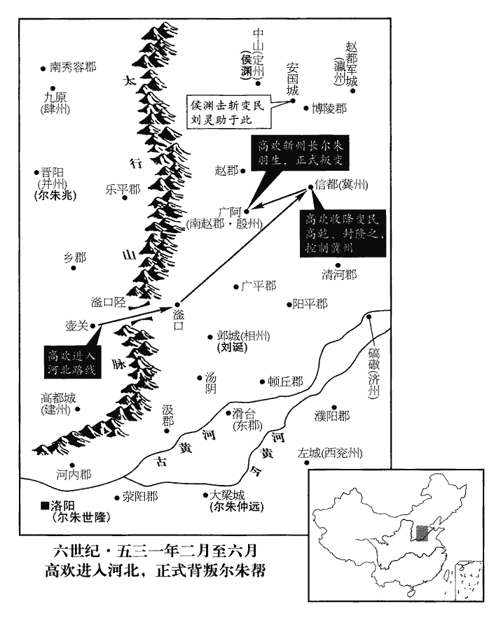
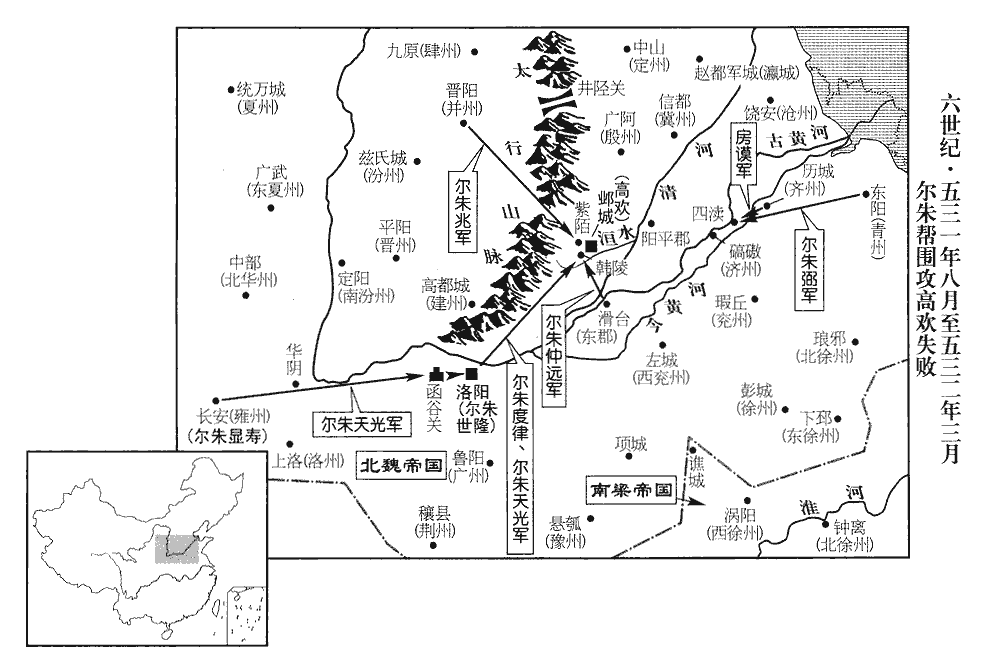
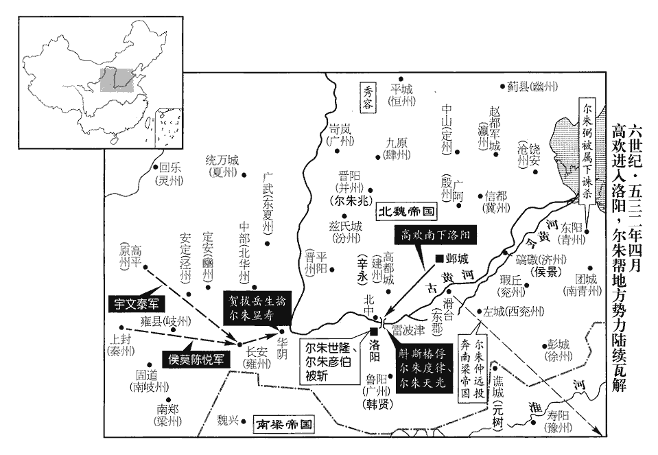

 梁紀十一起重光大淵獻（辛亥），盡玄黓困敦（壬子），凡二年。

# 高祖武皇帝十一

## 中大通三年（辛亥、五三一）

1春，正月，辛巳‹十›，上‹萧衍，本年六十八岁›祀南郊，大赦。

〖译文〗 [1]春季，正月，辛巳（初十），梁武帝在南郊祭天，实行大赦。

2魏尚書右僕射鄭先護聞洛陽不守，士眾逃散，遂來奔。去年，魏敬宗遣鄭先護討東郡。丙申‹二十五›，以先護為征北大將軍。

〖译文〗 [2]北魏尚书右仆射郑先护听说洛阳城失守，部队四散而逃，就前来投奔梁朝。丙申（二十五日），梁朝任命郑先护为征北大将军。

3二月，辛丑‹一›，上祀明堂。

〖译文〗 [3]二月，辛丑（初一），梁武帝祭祀明堂。

4魏自敬宗‹元子攸›被囚，宮室空近百日。被，皮義翻。近，其靳翻。去年十二月壬寅，爾朱兆渡河，囚敬宗；甲寅，遷晉陽；是月己巳，節閔帝即位，始入宮。爾朱世隆鎮洛陽，商旅流通，盜賊不作。世隆兄弟密議，以長廣王疏遠，又無人望，欲更立近親。更，工衡翻。儀同三司廣陵王恭，羽之子也。廣陵王羽，魏孝文帝之弟。好學有志度，正光中領給事黃門侍郎，以元叉擅權，託瘖病居龍華佛寺，好，呼到翻。瘖yīn，於今翻。華，讀曰花。無所交通。永安末，有白敬宗言王陽瘖，將有異志，考異曰：伽藍記云：「莊帝疑恭姦詐，夜，遣人盜掠衣物，拔刀劍欲殺之，恭張口以手拈舌，竟乃不言。莊帝信其真，放令歸第。」今從魏書。恭懼，逃於上洛山‹陕西省商州市境›，上洛山在洛州上洛郡上洛縣界。洛州刺史執送之，魏洛州刺史治上洛。繫治久之，以無狀獲免。無狀者，無反狀也。治，直之翻。關西大行臺郎中薛孝通說爾朱天光曰：「廣陵王‹元恭›，高祖‹元宏›猶子，禮曰：兄弟之子，猶子也。廣陵王羽，高祖之弟，恭則猶子也。高祖，孝文廟號。說，式芮翻。夙有令望，沈晦不言，沈，持林翻。多歷年所，若奉以為主，必天人允叶。」天光與世隆等謀之，疑其實瘖，使爾朱彥伯潛往敦諭，且脅之，恭乃曰：「天何言哉！」用論語孔子之言。世隆等大喜。孝通，聰之子也。薛聰見一百四十卷齊明帝建武元年。

〖译文〗 [4]北魏自从孝庄帝被囚禁以后，宫室空虚已近百日。尔朱世隆镇守洛阳，商人行旅流通，盗贼不敢骚扰。尔朱世隆兄弟暗中商议，认为长广王与皇族嫡系比较疏远，而且又素无声望，于是打算重新立一位嫡系近亲为帝。仪同三司广陵王元恭是元羽的儿子，好学而又有远志，正光年间任给事黄门侍郎，因元叉专权，元恭便假托嗓子哑，住到了龙华佛寺，不再与外人交往。永安末年，有人向孝庄帝报告说广陵王装哑，将别有企图。元恭很害怕，便逃到了上洛山，洛州刺史将他抓住送到了洛阳，被囚禁了很长一段时间，因没有发现他有谋反的证据，才释放了他。关西大行台郎中薛孝通对尔朱天光说：“广陵王是高祖的侄子，早有好声望，沉默不言，已经多年，如果推奉他为帝，一定会天人和谐。”尔朱天光跟尔朱世隆等商议立元恭为帝，又怀疑他确实嗓子哑不能说话，于是便派尔朱彦伯秘密前往敦请元恭，并加以胁迫，至此，元恭才说出：“天何言哉！”四字来，尔朱世隆等人大喜过望。薛孝通是薛聪的儿子。

己巳‹二十九›，長廣王‹元晔›至邙山‹洛阳城北›南，世隆等為之作禪文，為，于偽翻。使泰山‹山东省泰安市›太守遼西‹河北省卢龙县北›竇瑗執鞭獨入，守，式又翻。瑗，于眷翻。啟長廣王曰：「天人之望，皆在廣陵‹元恭›，願行堯、舜之事。」遂署禪文。廣陵王奉表三讓，然後即位，帝諱恭，字脩業，廣陵惠王羽之子也。大赦，改元普泰。黃門侍郎邢子才為赦文，敘敬宗枉殺太原王榮之狀，節閔帝‹元恭›曰：「永安手翦強臣，非為失德，直以天未厭亂，故逢成濟之禍耳。」成濟弒高貴鄉公事見七十七卷魏元帝景元元年。因顧左右取筆，自作赦文，直言：「門下：魏、晉以來出命皆由門下省，故其發端必曰「敕門下」。朕以寡德，運屬樂推；思與億兆，同茲大慶，肆眚之科，一依常式。」屬，之欲翻。樂，音洛。春秋莊二十二年，肆大眚。杜預註曰：赦有罪也。易稱赦過宥罪，書稱眚災肆赦，傳稱肆眚圍鄭，皆放赦罪人，蕩滌眾故以新其心。帝‹元恭›閉口八年，至是乃言，中外欣然以為明主，望至太平。「至」，一作「致」。

〖译文〗 己巳（二十九日），长广王来到邙山南侧，尔朱世隆等已替他作好了禅让文告，派泰山太守辽西人窦瑗持鞭独入帐中。窦瑗向长广王启奏道：“天意人心，尽归于广陵，希望您行尧、舜禅代之事。”于是便让长广王签署了禅文。，广陵王奉表辞让了三次，然后才即皇帝位，实行大赦，改年号为普泰。黄门侍郎邢子才起草了赦文，文中记述了孝庄帝枉杀太原王尔朱荣的情况，节闵帝说道：“孝庄帝亲手剪灭强臣，并非为失德之举，只是由于天意还没有厌恶祸乱，所以才重蹈成济杀高贵乡公的灾祸罢了。”因回头命左右取来笔砚，亲自起草赦文，直截了当地写道：“门下省：朕以寡德之身，有幸受到众人推举为帝，朕愿与天下万民，共同庆贺。大赦罪人，一依以往定式。”元恭闭口不言达八年之久，至此才说话，朝廷内外无不欣然，认为他是一位贤明之君，希望他能使天下太平。

庚午‹三十›，詔以「三皇稱『皇』，五帝稱『帝』，三代稱『王』，蓋遞為沖挹，謂皇降稱帝，帝降稱王，蓋遞為謙下也。自秦以來，競稱『皇帝』，予今但稱『帝』，亦已褒矣。」加爾朱世隆儀同三司，贈爾朱榮相國、晉王，加九錫。世隆使百官議榮配饗，司直劉季明曰：杜佑通典曰：後魏永安三年，高道穆奏廷尉置司直十人，位在正、監上，不署曹事，唯覆理御史檢劾事。「若配世宗‹元恪›，於時無功；宣武帝廟號世宗。若配孝明‹元诩›，親害其母；謂殺胡后也。若配莊帝‹元子攸›，為臣不終。孝武帝始改諡敬宗曰莊帝，此時當稱為懷帝。以此論之，無所可配。」世隆怒曰：「汝應死！」季明曰：「下官既為議首，依禮而言，不合聖心，翦戮唯命！」世隆亦不之罪。以榮配高祖‹元宏›廟廷。又為榮立廟於首陽山‹河南省偃师县西北，邙山山脉最高处›，為，于偽翻。因周公舊廟而為之，以為榮功可比周公。廟成，尋為火所焚。因周公舊廟而祀爾朱榮，周公豈以奪余饗xiǎng為嫌哉？天人之心固不許也。

〖译文〗 庚午（三十日），北魏节闵帝元恭下诏书道：“三皇称‘皇’，五帝称‘帝’，三代称‘王’，大致是越来越谦让，从秦朝以来，竞相称‘皇帝’，我现在只称‘帝’，就已经是很高的褒扬了。”加封尔朱世隆为仪同三司，追赠尔朱荣为相国、晋王，加九锡。尔朱世隆让文武百官商议让尔朱荣的神位升入皇室宗庙中配飨之事，司直刘季明说：“如果配飨宣武帝的话，尔朱荣在那朝并无功勋；如果配飨孝明帝的话，尔朱荣又曾亲手杀害了孝明帝的母亲胡太后；如果配孝庄帝的话，尔朱荣又为臣不终。由此看来，没有可以配飨的。”尔朱世隆恼怒地说道：“你罪该万死！”刘季明道：“我既然身为谏议官之首，就应该依礼直陈意见，如有不合尊意之处，是杀是剐，任听裁处！”尔朱世隆听后也没敢加罪于他。最后将尔朱荣配飨于孝文帝庙廷。又为尔朱荣在首阳山立了庙，在周公旧庙的基址上建成，以此表示尔朱荣的功绩可以跟周公相比。庙建成后，不久便被一场大火焚烧掉了。

爾朱兆‹时在晋阳山西省太原市›以不預廢立之謀，大怒，欲攻世隆，世隆使爾朱彥伯往諭之，乃止。

〖译文〗 尔朱兆因没能参预废立皇帝的谋划，非常恼怒，打算攻打尔朱世隆。尔朱世隆赶忙派尔朱彦伯前往尔朱兆处进行劝说，尔朱兆才按兵未发。

初，敬宗‹元子攸›使安東將軍史仵龍、平北將軍陽文義各領兵三千守太行嶺，侍中源子恭鎮河內‹河南省沁阳市›，及爾朱兆南向，仵龍、文義帥眾先降，由是子恭之軍望風亦潰，兆遂乘勝直入洛陽。事見上卷上年。仵，疑古翻。行，戶剛翻。帥，讀曰率。降，下江翻。至是，爾朱世隆論仵龍、文義之功，各封千戶侯，魏主‹元恭›曰：「仵龍、文義，於王有功，於國無勳。」竟不許。爾朱仲遠鎮滑臺‹河南省滑县›，表用其下都督為西兗州‹府设左城山东省定陶县西›刺史，魏收志：西兗州領沛、濟陰郡。先用後表，詔答曰：「已能近補，何勞遠聞！」爾朱天光之滅万俟醜奴也，事見上卷上年。万，莫北翻。俟，渠夷翻。始獲波斯‹伊朗›所獻師子，送洛陽，波斯獻師子見一百五十二卷大通二年。及節閔帝即位，詔曰：「禽獸囚之則違其性。」命送歸本國。使者以波斯道遠不可達，於路殺之而返，有司劾違旨，帝曰：「豈可以獸而罪人！」遂赦之。史言節閔帝賢明而不終者，制於強臣也。使，疏吏翻。劾，戶概翻，又戶得翻。

〖译文〗 当初，北魏孝庄帝派安东将军史仵龙、平北将军阳文义各率三千士兵镇守太行岭，派侍中源子恭镇守河内。等到尔朱兆大军南下之时，史仵龙、阳文义率军先投降了尔朱兆，因此源子恭的部队也望风而溃，正因为这样，尔朱兆才得以乘胜直入洛阳城。到现在，尔朱世隆为史仵龙、阳文义二人表功，要将他二人各封为千户侯，节闵帝说道：“史仵龙、阳文义二人对您有功，但于国家却无功。”终未答应。尔朱仲远镇守滑台，上表朝廷请求批准其属下的一位都督为西兖州刺史，先任用之后才上表奏闻朝廷，节闵帝下诏答复说：“既然已经能够就近补用了，何必还远奏于朝廷呢！”尔朱天光灭万俟奴之时，才得到波斯国向北魏朝廷进献的狮子，于是派人将这头狮子送到了洛阳城。等到节闵帝即位后，下诏道：“禽兽被囚禁则违背了它的天性。”便命人将狮子送还给波斯国。使者因波斯国路途遥远，难以到达，便于中途杀掉了狮子返回朝廷，有关部门弹劾使者违背了圣上旨意，节闵帝说道：“怎么可以因为一头野兽而加罪于人呢！”于是便赦免了使者。

5魏鎮遠將軍清河‹东清河郡·山东省淄博市南›崔祖螭chī等聚青州七郡之眾圍東陽‹山东省青州市›，青州領齊、北海、樂安、勃海、高陽、河間、樂陵七郡，治東陽。旬日之間，眾十餘萬。刺史東萊‹山东省莱州市›王貴平帥城民固守，帥，音率。使太傅諮議參軍崔光伯出城慰勞，其兄光韶曰：「城民陵縱日久，蓋言東陽之民，挾州家之勢，陵暴屬郡，恣縱之日久矣。勞，力到翻。眾怒甚盛，非慰諭所能解，家弟往，必不全。」貴平強之，強，其兩翻。既出外，人射殺之。射，而亦翻。

〖译文〗 [5]北魏镇远将军清河人崔祖螭等人聚集起青州七郡之众包围了州治东阳，十日之内，达十余万人。青州刺史东莱人王贵平率东阳城中的百姓固守城池，同时派太傅谘议参军崔光伯出城劝慰安抚崔祖螭。崔光伯的哥哥崔光韶说：“东阳城之民欺凌其属郡百姓时日已久，属郡之民怒气很盛，不是靠劝慰调停所能化解的，我弟弟此次前往，一定难以生还。”但王贵平逼崔光伯前往，崔光伯出城后，便被人射杀了。

6幽、安、營、并四州行臺劉靈助，自謂方術可以動人，又推算知爾朱氏將衰，乃起兵自稱燕王、開府儀同三司、大行臺，聲言為敬宗復讎，燕，因肩翻。為，于偽翻。且妄述圖讖，云「劉氏當王」。讖，七譖翻。由是幽‹府设蓟县北京市›、瀛‹府设赵都军城河北省河间市›、滄‹府设饶安河北省盐山县西南›、冀‹府设信都河北省冀县›之民多從之，魏熙平二年分瀛、冀二州置滄州，治饒安城，領浮陽、樂陵、安德三郡。從之者夜舉火為號，不舉火者諸村共屠之。引兵南至博陵‹河北省安平县›之安國城‹河北省安国市›。魏收志，博陵郡安國縣有安國城，北平蒲陰縣亦有安國城，故稱博陵以別之。

〖译文〗 [6]幽、安、营、并四州行台刘灵助，自称其方术可以号召民众，又推算说知道尔朱氏将要衰败，于是便起兵叛乱，自封为燕王、开府仪同三司、大行台，扬言要为孝庄帝报仇，而且胡编图谶，说“刘氏当王”。因此幽、瀛、沧崐、冀州的百姓很多前来投奔他。投奔刘灵助的人以夜间举火把为号，不举火把的，各村就一起把他们杀光。刘灵助率军南下来到了博陵郡的安国城。

爾朱兆遣監軍孫白鷂至冀州‹信都河北省冀县›，監，工咸翻。鷂yào，弋照翻。託言調發民馬，調，徒釣翻。欲俟高乾兄弟送馬而收之。乾等知之，與前河內‹河南省沁阳市›太守封隆之等合謀，潛部勒壯士，襲據信都，殺白鷂，考異曰：北史作「白雞」。今從北齊書。執刺史元嶷。嶷，魚力翻。乾等欲推其父翼行州事，翼曰：「和集鄉里，我不如封皮」，皮，封隆之小字也。乃奉隆之行州事，為敬宗‹元子攸›舉哀，為，于偽翻。將士皆縞素，將，即亮翻；下同。縞，古老翻。升壇誓眾，移檄州郡，共討爾朱氏，仍受劉靈助節度。隆之，磨奴之族孫也。封磨奴見一百一十九卷宋高祖永初元年。

〖译文〗 尔朱兆派监军孙白鹞来到冀州，假托征调百姓的马匹，打算等高乾兄弟送马来的时候收捕他们。高乾等已知道孙白鹞的用意，便与前河内太守封隆之等人合谋，暗中部署部队，袭击并占据了信都，杀掉了孙白鹞，抓获了冀州刺史元嶷。高乾等想推举高乾的父亲高翼主持冀州的行政事务，高翼推辞道：“集聚乡里百姓，我不如封隆之。”于是推举封隆之代行州政，并为孝庄帝举哀，将士们都身穿孝服，升坛誓师，向各州郡发出檄文，共同讨伐尔朱氏，受刘灵助指挥。封隆之是封磨奴的族孙。

殷州‹府设广阿河北省隆尧县›刺史爾朱羽生將五千人襲信都‹河北省冀县›，高敖曹不暇擐甲，將十餘騎馳擊之，擐，音宦。騎，奇計翻。乾在城中繩下五百人，追救未及，敖曹已交兵，羽生敗走。敖曹馬矟絕世，矟shuò，色角翻。左右無不一當百，時人比之項籍。

〖译文〗 殷州刺史尔朱羽生率五千人马袭击信都，高敖曹来不及披挂铠甲，便率领十余人骑马迎击，高乾从城中用绳子吊放下来五百人，追救高敖曹没能赶上，高敖曹已与尔朱羽生的部队交战，尔朱羽生大败而逃。高敖曹的槊术盖世无双，他的部下也个个都以一当百，当时人称高敖曹是项羽再生。

高歡屯壺關‹山西省潞城县西›大王山，魏收地形志：上黨郡屯留縣有鳳凰山，一名大王山。按魏太平真君九年二月，詔於壺關東北大王山累石為三封，又斬其北鳳凰山南足以斷之，以其有王氣也。後高歡果屯兵於其地。六旬，乃引兵東出，聲言討信都。信都人皆懼，高乾曰：「吾聞高晉州雄略蓋世，爾朱榮用歡為晉州刺史，故稱之。其志不居人下。且爾朱無道，弒君虐民，正是英雄立功之會，今日之來，必有深謀，吾當輕馬迎之，密參意旨，參，候也。諸君勿懼也。」乃將十餘騎與封隆之子子繪潛謁歡於滏口‹河北省武安市南›，說歡曰：「爾朱酷逆，痛結人神，凡曰有知，孰不思奮！明公威德素著，天下傾心，若兵以義立，則屈強之徒不足為明公敵矣。屈，與倔同，其勿翻。強，其兩翻。屈強之徒，指爾朱氏之黨也。鄙州雖小，戶口不下十萬，穀秸之稅足濟軍資，秸，工八翻，藁也。願公熟思其計。」乾辭氣慷慨，歡大悅，與之同帳寢。

〖译文〗 高欢驻军于壶关大王山，六十天后，才率兵东进，扬言讨灭信都。信都人都很惊惶恐惧，高乾却说道：“我听说高欢雄才武略，盖世无双，他岂肯久居人下。况且尔朱兆无道，上弑君主，下虐百姓，这正是英雄立功的机会，今日高欢到信都来，肯定有更深的谋划，我应当轻骑前往迎接，暗中观察其意图，诸位不必担心害怕。”于是高乾率十余骑人马与封隆之的儿子封子绘一起秘密至滏口求见高欢，高乾劝高欢说：“尔朱氏残暴叛逆，人神共怨，凡是明白事理的人，谁不想奋起讨伐！明公您平素威德卓著，天下之人倾心归慕，您若能据道义兴兵，则那些倔强之徒，均不足以跟您相抗衡。我们冀州虽然很小，但户数却不下十万，赋税足够接济军资的，希望您深思熟虑。”高乾言辞慷慨激昂，高欢非常高兴，当夜与高乾同帐而卧。

初，河南太守趙郡‹河北省赵县›李顯甫，喜豪俠，喜，許既翻。集諸李數千家於殷州西山方五六十里，居之。殷州西山，廣阿之西山也。顯甫卒，子元忠繼之。家素富，多出貸求利，元忠悉焚券契，約也，即古所謂券也。【章：胡註「契，約也。」與正文不應，當是刻誤；甲十一行本正作「契」；乙十一行本同；孔本同。】免責，鄉人甚敬之。免責，不責其償也。時盜賊蠭起，清河‹山东省临清市›有五百人西戍，還，經趙郡，以路梗，共投元忠；梗，塞也。元忠遣奴為導，曰：「若逢賊，但道李元忠遣。」如言，賊皆舍避。舍，讀曰捨。及葛榮起，元忠帥宗黨作壘以自保，帥，讀曰率。坐大槲樹下，槲hú，胡谷翻。前後斬違命者凡三百人，賊至，元忠輒擊卻之。葛榮曰：「我自中山‹河北省定州市›至此，連為趙李所破，李氏，趙郡之大姓，時號為趙李。何以能成大事！」乃悉眾攻圍，執元忠以隨軍。賊平，就拜南趙郡‹府广阿›太守，此言爾朱榮平葛榮時事。魏太和之十一年，分趙郡之平鄉、柏人、中丘，鉅鹿之南蠻、鉅鹿、廣阿為南鉅鹿郡，後改為南趙郡，屬殷州。好酒無政績。好，呼到翻。

〖译文〗 当初，河南太守赵郡人李显甫，性喜豪放行侠，集聚了数千户李姓人家居住于殷州西山方圆五六十里的地方。李显甫死后，他的儿子李元忠承继了家业。李家一直很富足，过去多将钱出借他人以获利息，李元忠将契约全部焚烧掉，免除了所有借钱人的债务，因此乡亲们都非常敬重他。当时盗贼四起，清河县有五百人西戍边关，回来时经过赵郡，因道路不通，便一同来投奔李元忠。李元忠派手下仆人为他们作向导，并对他们说：“如果遇上贼寇的话，只说是李元忠派来的。”这些人按李元忠吩咐的话去说，那些贼寇果然都对他们回避、放行。等到葛荣起兵后，李元忠率宗族亲党修筑堡垒以御敌自卫，他亲自坐在大树下，前后共斩违抗命令者达三百人，葛荣的贼军前来骚扰时，李元忠每次都将其击退。葛荣说道：“我从中山到这里，连连被李氏所打败，这样怎能崐成就我的大事！”于是出动全部军队围攻李元忠所部，抓获了李元忠，将他随军羁押。葛荣的叛乱被平定之后，北魏任命李元忠为南赵郡太守，李元忠在太守任上喜好饮酒，没有做出过什么政绩。

及爾朱兆弒敬宗，元忠棄官歸，謀舉兵討之。會高歡東出，元忠乘露車，載素箏濁酒以奉迎，歡聞其酒客，未即見之。元忠下車獨坐，酌酒擘脯食之，謂門者曰：「本言公招延俊傑，今聞國士到門，不吐哺輟洗，其人可知，以周公、漢祖之事責歡也。洗，先典翻。還吾刺，勿通也！」門者以告，歡遽見之，引入，觴再行，元忠車上取箏鼓之，長歌慷慨，歌闋，闋，苦穴翻，歌終也。謂歡曰：「天下形勢可見，明公猶事爾朱邪？」歡曰：「富貴皆因彼所致，安敢不盡節！」元忠曰：「非英雄也！高乾邕兄弟來未？」高乾，字乾邕。時乾已見歡，歡紿之曰：「從叔輩粗，何肯來！」歡與乾兄弟同出於勃海，故稱從叔。紿，待亥翻。從，才用翻。元忠曰：「雖粗，並解事。」解，胡買翻，曉也。歡曰：「趙郡醉矣。」使人扶出。元忠不肯起，孫騰進曰：「此君天遣來，不可違也。」歡乃復留與語，復，扶又翻。元忠慷慨流涕，歡亦悲不自勝。勝，音升。元忠因進策曰：「殷州小，無糧仗，不足以濟大事。若向冀州，高乾邕兄弟必為明公主人。魏冀州治信都，高乾邕兄弟據之，故云然。殷州便以賜委。冀、殷既合，滄、瀛、幽、定自然弭服，唯劉誕黠胡或當乖拒，劉誕亦契胡種也，時為相州‹府设邺城·河北省临漳县西南邺镇】›刺史，鎮鄴。黠，下八翻。然非明公之敵。」歡急握元忠手而謝焉。

〖译文〗 等到尔朱兆弑杀了孝庄帝以后，李元忠便弃官回乡，策划兴兵讨伐尔朱兆。正赶上高欢出兵东进，李元忠便乘一辆敞篷车，车上载着素筝浊酒前来迎接高欢。高欢听说李元忠是一位酒徒，便没有立即会见他。李元忠下车后独自坐下，倒酒撕肉，边饮边吃，对高欢的门卫说：“本以为高公能招揽英雄豪杰，现在他既然已知道国士到了门前，却并不像周公那样放下饭碗、停止洗发去迎接贤士，他这个人也可想而知了，请退还我的名片，不必通报了。”门卫报告给高欢，高欢听后马上接见了李元忠，引入大帐之中。两杯酒喝过，李元忠从车上取下筝弹奏起来，长歌一曲，慷慨激昂，唱完歌，李元忠对高欢说道：“而今天下形势已昭然可见，明公您还要为尔朱氏效力吗？”高欢道：“我的功名富贵都得之于尔朱氏，怎敢不为尔朱氏尽节！”李元忠道：“您如此怎称得上是英雄啊！高乾兄弟来过没有？”当时高乾已经见过了高欢，但高欢却哄骗李元忠说：“我堂叔等性格粗犷，怎肯前来见我！”李元忠道：“高乾兄弟虽性情粗犷，却都明晓事理。”高欢说道：“您真是喝醉了。”于是让人将李元忠扶出去。李元忠不肯起身，孙腾向高欢进言道：“这个人乃是上天派来的，您不能违背了天意啊。”高欢于是又留下李元忠，与他交谈。李元忠陈述时事言辞慷慨，泪流满面，高欢也不禁悲从中来。李元忠趁机向高欢献计道：“殷州太小，缺乏粮草兵器，不能成就大事。如果前往冀州，高乾兄弟定会成为明公的东道主，倾心事公，殷州便可赐委我李元忠。这样冀州、殷州既已联为一体，那么沧州、瀛州、幽州、定州等自然顺服了，只有刘诞这个狡猾的胡人也许会抗拒，但他远不是明公您的对手。”高欢听后紧紧握住李元忠的手，向他称谢道歉。

歡至山東，約勒士卒，絲毫之物不聽侵犯，每過麥地，歡輒步牽馬，遠近聞之，皆稱高儀同將兵整肅，益歸心焉。爾朱氏加歡儀同三司，故當時以稱之。史言高歡能收眾心，以傾爾朱。將，即亮翻。

〖译文〗 高欢率部队到了太行山东面，对士兵严加约束，一丝一毫的东西不许侵犯。每次行军路过麦地，高欢总是牵马步行，远近之人听说之后，都称赞高欢带兵有方，纪律严明，也就更加归心于他了。

歡求糧於相州刺史劉誕，誕不與；相，息亮翻。有車營租米，「車營」，北齊紀作「軍營」。歡掠取之。進至信都，封隆之、高乾等開門納之。高敖曹時在外略地，聞之，以乾為婦人，遺以布裙；裙，渠云翻，婦人下裳也。遺，于季翻。歡使世子澄以子孫禮見之，敖曹乃與俱來。敖曹以歡敘群從子姪之禮乃來，孰謂其粗也。

〖译文〗 高欢向相州刺史刘诞索要粮食，刘诞没有给，这时恰有车营租米，高欢便派兵将米抢夺过来。部队前进至信都，封隆之、高乾等打开城门迎接高欢入城。高敖曹当时正在外面攻城略地，听说此事之后，认为高乾真是妇人之见，于是送给了他一件裙子。高欢特派长子高澄执子孙之礼往见高敖曹，高敖曹这才与高澄一起回到信都。

7癸酉‹三›，魏封長廣王曄為東海王，以青州‹府设东阳山东省青州市›刺史魯郡王肅為太師，淮陽王欣為太傅，爾朱世隆為太保，長孫稚為太尉，趙郡王諶為司空，諶，氏壬翻。徐州‹府设彭城江苏省徐州市›刺史爾朱仲遠、雍州‹府设长安陕西省西安市›刺史爾朱天光並為大將軍，并州‹府设晋阳山西省太原市›刺史爾朱兆為天柱大將軍；賜高歡爵勃海王，徵使入朝。高歡之先本勃海人，爾朱氏爵之為本郡王，欲以誘致之。朝，直遙翻。長孫稚固辭太尉，世衰難佐，故辭。乃以為驃騎大將軍、開府儀同三司。驃，匹妙翻。騎，奇計翻。爾朱兆辭天柱，曰：「此叔父所終之官，我何敢受！」固辭，不拜，尋加都督十州諸軍事，十州，南盡汾、晉，北極雲、朔。世襲并州刺史。高歡辭不就徵。爾朱仲遠徙鎮大梁‹河南省开封市›，復加兗州刺史。大梁，兗州統內，故加兗州。復，扶又翻；下無復、不復同。

〖译文〗 [7]癸酉（初三），北魏朝廷封长广王元晔为东海王，任命青州刺史鲁郡王元肃为太师，淮阳王元欣为太傅，尔朱世隆为太保，长孙稚为太尉，赵郡王元谌为司空，徐州刺史尔朱仲远、雍州刺史尔朱天光二人并为大将军，并州刺史尔朱兆为天柱大将军；赐高欢爵位为勃海王、征召高欢入朝。长孙稚坚决要求辞去太尉之职，于是便任命他为骠骑大将军、开府仪同三司。尔朱兆推辞不受天柱大将军之职，他说：“这是我叔父生前的最后官职，我怎敢接受呢！”坚决推辞，于是没有授与尔朱兆天柱大将军之职，不久又加封尔朱兆为都督十州诸军事，世袭并州刺史。高欢推辞不肯应召入朝。尔朱仲远改镇大梁，又加封为兖州刺史。

 

爾朱世隆之初為僕射也，大通二年，魏爾朱榮入洛，以世隆為尚書僕射。畏爾朱榮之威嚴，深自刻厲，留心几案，案亦几屬，應文書皆陳於几案而省覽之。留心几案，謂留心於尚書省文書也。又案，據也，凡官文書留以為據者，亦謂之案。應接賓客，有開敏之名。及榮死，無所顧憚，為尚書令，家居視事，坐符臺省，事無大小，不先白世隆，有司不敢行。使尚書郎宋遊道、邢昕在其聽事東西別坐，受納辭訟，稱命施行；稱命者，稱世隆之命也。昕，許斤翻。聽，讀曰廳。公為貪淫，生殺自恣；又欲收軍士之意，汎加階級，皆為將軍，無復員限，自是勳賞之官大致猥濫，人不復貴。猥，雜也。是時，天光專制關右，兆奄有并、汾，仲遠擅命徐、兗，世隆居中用事，競為貪暴。而仲遠尤甚，所部富室大族，多誣以謀反，籍沒其婦女財物入私家，私家，謂仲遠私家也。投其男子於河，如是者不可勝數。勝，音升。自滎陽已東，租稅悉入其軍，不送洛陽。東南州郡自牧守以下至士民，畏仲遠如豺狼。由是四方之人皆惡爾朱氏，而憚其強，莫敢違也。為爾朱氏敗張本。守，式又翻。惡，烏路翻。

〖译文〗 尔朱世隆当初作尚书仆射的时候，畏惧尔朱荣的威严，很谨慎小心，对尚书省文书也多留心处理，应对接洽宾客，有贤明敏达之名。等到尔朱荣死后，尔朱世隆便再也没有什么顾虑害怕了，身为尚书令，竟在家中处理公事，指挥台省，无论事情大小，若不先禀告尔朱世隆，有关部门便不敢执行。尔朱世隆让尚书郎宋游道，邢昕在其大厅东西两旁分坐，接受各种呈告诉讼文书，一切均要称尔朱世隆之命方能执行；尔朱世隆公然贪赃淫佚，他人生死，全由其随意定夺；尔朱世隆还想收买军心，对将士滥加提拔，都提为将军，没有员额限制，从此授勋奖赏之官，大都很杂很滥，人们不再看重官爵。这时期，尔朱天光专制关右，尔朱兆奄有并州、汾州，尔朱仲远独擅徐、兖二州，尔朱世隆则身居朝中，大权独揽，四人一个更比一个贪婪、残暴。其中尤以尔朱仲远为最，尔朱仲远所辖境内的富家大族，大多被其诬为谋反，籍没妇女财产入于尔朱仲远私家，将男子投入河中，这类事情数不胜数。从荥阳以东，租税全部充补其军用，不向京城洛阳上交。东南各州郡自牧守以下到普通的士卒百姓，畏惧尔朱仲远如同畏惧豺狼一般。因此四方百姓都很憎恶尔朱氏，只是由于畏惧尔朱氏的强大，不敢反抗罢了。

8己丑‹十九›，魏以涇州刺史賀拔岳為岐州‹府设雍城陕西省凤翔县›刺史，渭州‹府设襄武甘肃省陇西县›刺史侯莫陳悅為秦州‹府设上封甘肃省天水市›刺史，並加儀同三司。涇、渭荒殘而秦、岐差完，故以內遷為進律。

〖译文〗 [8]己丑（十九日），北魏任命泾州刺史贺拔岳为岐州刺史，任命渭州刺史侯莫陈悦为秦州刺史，二人均加封仪同三司。

9魏使大都督侯淵‹时在定州州政府中山›、驃騎大將軍代人叱列延慶討劉靈助，至固城‹河北省定州市北›，叱列，虜複姓。固城，當在中山城東北，安國城西南。淵畏其眾，欲引兵西入，據關拒險以待其變，延慶曰：「靈助庸人，假妖術以惑眾，妖，於驕翻。大兵一臨，彼皆恃其符厭，厭，一協翻。謂劉靈助書為符敕以厭勝也。豈肯戮力致死，與吾兵爭勝負哉！不如出營城外，詐言西歸，靈助聞之必自寬縱，然後潛軍擊之，往則成擒矣。」淵從之。出頓城西，聲云欲還，丙申‹二十六›，簡精騎一千夜發，直抵靈助壘；靈助戰敗，斬之，傳首洛陽。初，靈助起兵，自占勝負，曰：「三月之末，我必入定州，爾朱氏不久當滅。」及靈助首函入定州，果以是月之末。史言用兵不可徒信占驗而無方略。

〖译文〗 [9]北魏派大都督侯渊、骠骑大将军代郡人叱列延庆率军讨伐刘灵助。兵至固城，侯渊畏惧刘灵助兵力强盛，打算引兵往西入关，然后据关凭险以等待时机变化。叱列延庆对侯渊说：“刘灵助乃是庸人，假借妖术迷惑众人，我军一到，他的军队便都只想凭仗其符咒取胜，怎肯拼死厮杀，跟我军决胜负呢！我们不如扎营城外，诈称要领兵往西回去，刘灵助听说后一定会戒备松懈，之后我们秘密出兵袭击敌人，定能擒获刘灵助。”侯渊采纳了叱列廷庆的计策。出城驻扎于固城西面，声言要回师。丙申（十四日），侯渊等挑选一千名精锐骑兵夜间出发，直抵刘灵助的营垒。刘灵助战败被杀，首级被送至洛阳。当初，刘灵助起兵之时，自己曾占卜胜负，说：“三月底，我一定入定州，尔朱氏不久就要灭亡。”等到刘灵助首级用匣子装着送到定州的时候，果真是这月之末。

10夏，四月，乙巳‹六›，昭明太子統卒‹萧统，年三十一岁›。太子自加元服，天監十四年，太子加元服。上即使省錄朝政，省，悉景翻。朝，直遙翻。百司進事，填委於前，太子辯析詐謬，秋毫必睹，但令改正，不加按劾，劾，戶概翻，又戶得翻。平斷法獄，多所全宥，寬和容眾，喜慍不形於色。好讀書屬文，斷，丁亂翻。好，呼報翻。屬，之欲翻。引接才俊，賞愛無倦；出宮二十餘年，言自禁中出居東宮也。不畜聲樂。每霖雨積雪，遣左右周行閭巷，視貧者賑之。行，下孟翻。賑，之忍翻。此所謂好行小惠也。天性孝謹，在東宮，雖燕居，坐起恆西向，必西向者，不敢背上臺也。恆，戶登翻。謹，居忍翻。或宿被召當入，隔夜為宿。被，皮義翻。危坐達旦。及寢疾，恐貽帝憂，敕參問，輒自力手書。言帝出敕候問，太子輒力疾手書，自為奏答。及卒，朝野惋愕，建康男女，奔走宮門，號泣道路。卒，子恤翻。朝，直遙翻。惋，烏貫翻。愕，五各翻。奔，甫門翻。走，音奏。號，戶刀翻。

〖译文〗 [10]夏季，四月，乙巳（初六），梁朝昭明太子萧统去世。昭明太子自从举行冠礼以后，梁武帝便开始让他处理朝政，各部门的官员前来奏事，都汇集到太子哪里。昭明太子善于辨析真伪谬误，对不实之处，洞察入微，但只是命有关部门改正，并不追究罪责。太子断案公正，对犯人往往多加保全宽宥，待人宽和，能容人，喜怒不形于色。昭明太子喜欢读书作文章，引进接待才俊之士，赞叹爱重，毫无倦怠。太子出居东宫二十多年，不蓄养乐工歌伎。每当天降大雨或积雪不化之时，昭明太子总要派手下人巡视一番大街小巷，发现有穷苦之人则加以赈济。昭明太子天性孝顺，居处东宫，即便是悠闲无事之时，一起一坐，都要面朝西边，如事先接到诏令，召他明日入宫，则正襟危坐直到天明。太子病重之后，惟恐梁武帝担忧，每次派人送来问候的敕文，太子总是要亲自写回信奏答。等到昭明太子去世的时候，朝野上下都非常惊愕、惋惜，建康城中的男女老少，奔向宫门，沿途道路哭声不断。

11癸丑‹十四›，魏以高歡為大都督、東道大行臺、冀州‹府设信都河北省冀县›刺史；東道，謂太行恆山以東也。又以安定王爾朱智虎為肆州‹府设九原山西省忻州市›刺史。

〖译文〗 [11]癸丑（十四日），北魏任命高欢为大都督、东道大行台、冀州刺史，又任命安定王尔朱智虎为肆州刺史。

12魏爾朱天光出夏州‹府设统万陕西省靖边县北白城子›，遣將討宿勤明達，癸亥‹二十四›，擒明達，送洛陽，斬之。爾朱天光既擒万俟醜奴，又擒宿勤明達，河、隴平矣，不知乃以為宇文泰之資也。夏，戶雅翻。將，即亮翻。

〖译文〗 [12]北魏尔朱天光出兵夏州，调兵遣将征讨宿勤明达，癸亥（二十四日），擒获了宿勤明达，将他送到洛阳后处斩。

13丙寅‹二十七›，魏以侍中、驃騎大將軍爾朱彥伯為司徒。

〖译文〗 [13]丙寅（二十七日），北魏任命侍中、骠骑大将军尔朱彦伯为司徒。

14魏詔有司不得復稱偽梁。魏不競於梁故也。復，扶又翻；下同。

〖译文〗 [14]北魏下诏命令有关部门不得再称梁为伪梁。

15五月，丙子‹七›，魏荊州‹府设穰城河南省邓州市›城民斬趙修延，復推李琰之行州事。趙修延執李琰之見上卷上年。

〖译文〗 [15]五月，丙子（初七），北魏荆州城百姓斩杀了赵延，又推举李琰之代行州政。

16魏爾朱仲遠使都督魏僧勗等討崔祖螭於東陽‹山东省青州市›，斬之。考異曰：北齊李渾傳：「普泰中，崔社客反於海岱，攻圍青州。以渾為征東將軍、都官尚書、行臺赴援，而社客宿將多謀，諸城各自保固，堅壁清野。諸將議有異同，渾曰：『社客賊之根本，若簡練驍勇，銜枚夜襲，徑趨營下，出其不意，咄嗟之間，便可擒殄。如社客就擒，則諸郡可傳檄而定。』諸將遲疑，渾乃速行，未明，達城下，賊徒驚散，擒社客，斬首送洛陽。」按其年時事迹與祖螭略同，未知社客即祖螭，為別一人也。今從魏帝紀。

〖译文〗 [16]北魏尔朱仲远派遣都督魏僧勖等至东阳讨伐崔祖螭，将其斩杀。

17初，昭明太子葬其母丁貴嬪，普通七年，丁貴嬪卒。遣人求墓地之吉者。或賂宦者俞三副求賣地，云若得錢三百萬，以百萬與之。三副密啟上，言「太子所得地不如今地於上為吉。」今地，謂求賣之地也。上年老多忌，即命市之。葬畢，有道士云：「此地不利長子，若厭之，長，知兩翻。厭，一協翻，又於琰翻；下厭禱同。或可申延。」申，寬也。乃為蠟鵝及諸物埋於墓側長子位。宮監鮑邈之、魏雅初皆有寵於太子，五代志，梁制，東宮有外監殿局、內監殿局。宮監者，即唐內直局之職也，龍朔二年改監曰內直郎。邈之晚見疏於雅，乃密啟上云：「雅為太子厭禱。」上遣檢掘，果得鵝物，大驚，將窮其事，徐勉固諫而止，但誅道士。由是太子終身慚憤，不能自明。及卒，上徵其長子南徐州‹府设京口江苏省镇江市›刺史華容公歡至建康，欲立以為嗣，銜其前事，猶豫久之，卒不立，卒，子恤翻。庚寅‹二十一›，遣還鎮。史因帝不立孫，究言事始。嗚呼！帝於豫章王綜、臨賀王正德，雖犯惡逆，猶容忍之，至於昭明被讒，則終身銜其事，蓋天奪其魄也。為昭明子詧chá仇視諸父張本。

〖译文〗 [17]当初，梁昭明太子在埋葬生母丁贵嫔之时，曾派人四处求购风水好的基地。有人向宦官俞三副行贿，求他帮助将自己的地卖与昭明太子，并说如果得到三百万钱的话，则将其中的一百万钱送给俞三副。俞三副于是便暗中启奏梁武帝，说：“太子所购之地不如现在这块土地对皇上您更吉祥。”武帝年纪大了，多所忌讳，便命人将这块地买了下来。埋葬了丁贵嫔后，有个道士说：“这块地不利于长子，但如果镇一镇，或许还可以宽延一下。”于是便将蜡鹅及其他物品埋在了丁贵嫔墓侧的长子之位。宫监鲍邈之、魏雅当初都很受昭明太子宠幸，鲍邈之后来被魏雅疏远，于是便暗中向武帝启奏道：“魏雅竟敢给太子诅咒祈祷。”梁武帝派人去墓地检查挖掘，果然挖到了蜡鹅等物。武帝大惊，要彻底追究这件事，徐勉竭力劝谏，武帝这才作罢，只诛杀了那位道士。因为此事，太子终生惭愧忧愤，难以自明。等到太子去世后，梁武帝将太子的长子南徐州刺史华容公萧欢召到建康，想立萧欢为继承人，但心中仍记恨那件崐往事，犹豫了很长时间，最终还是没有立萧欢为嗣。庚寅（二十一日），又打发萧欢回到了南徐州。

臣光曰：君子之於正道，不可少頃離也，少，詩沼翻。離，力智翻。不可跬步失也。跬kuǐ，窺婢翻。以昭明太子之仁孝，武帝之慈愛，一染嫌疑之迹，身以憂死，罪及後昆，求吉得凶，不可湔滌，可不戒哉！湔jiān，將仙翻。是以詭誕之士，奇邪之術，君子遠之。奇，居宜翻，異也。遠，于願翻。

〖译文〗 臣司马光曰：君子之于正道，不能稍微有所偏离，也不能有半步过失啊。以昭明太子这样的仁孝之子，以梁武帝这样的慈爱之君，一旦产生了一点嫌疑，不但太子因忧而致死，而且祸害延及后代子孙。昭明太子本为求吉反而得凶，以致无法洗刷自己的冤屈，人们能不深深引以为戒么！所以对于那些诡诈怪诞之徒，奇异邪佞之术，君子要远远地离开。

18丙申‹二十七›，立太子母弟晉安王綱為皇太子‹本年二十九岁›。朝野多以為不順，立世適孫為順。朝，直遙翻。司議侍郎周弘正，按陳書周弘正傳：普通中初置司文義郎，直壽光省，以弘正為司義侍郎。「議」當作「義」。嘗為晉安王主簿，乃奏記曰：「謙讓道廢，多歷年所。伏惟明大王殿下，天挺將聖，論語：太宰問於子貢曰：「夫子聖者歟？」子貢曰：「固天縱之將聖。」朱元晦註曰：將，殆也，謙若不敢知之辭。或曰：將，大也。四海歸仁，是以皇上發德音，以大王為儲副。意者願聞殿下抗目夷上仁之義，左傳：宋桓公疾，太子茲父固請曰：「目夷長且仁，君其立之。」公命子魚。子魚辭曰：「能以國讓，仁孰大焉？臣弗及也。」遂走而退。子魚，目夷字也。執子臧大賢之節，左傳：成十三年，諸侯伐秦，曹宣公卒于師，曹人使公子負芻守，公子欣時逆曹伯之喪；負芻殺太子而自立。既葬，子臧將亡，國人皆將從之。成公乃懼，告罪，且請焉，子臧乃反。諸侯討曹成公，執而歸諸京師。將見子臧于王而立之，辭曰：「聖達節，次守節。為君，非吾節也，雖不能聖，敢失守乎！」遂逃，奔宋。負芻立，是為成公。子臧，欣時字也。逃玉【張：「玉」作「王」。】輿而弗乘，「玉輿」當作「王輿」。莊子讓王篇曰：越人三世弒其君，王子搜患之，逃乎丹穴。而越國無君，求王子搜不得，從之丹穴。王子搜不出，越人薰之以艾，乘以王輿，王子搜援綏登車，仰天而呼曰：「君乎君，獨不可以捨我乎！」棄萬乘如脫屣，孟子曰：舜視棄天下，猶棄敝屣也。乘，繩正翻。屣xǐ，所是翻。庶改澆競之俗，以大吳國之風。謂太伯以天下讓，逃而君吳也。澆，堅堯翻，薄也。古有其人，今聞其語，能行之者，非殿下而誰！使無為之化復生於遂古，復，扶又翻。朱元晦曰：遂，往也。讓王之道不墜於來葉，莊子外篇有讓王，述堯、舜以天下讓。來葉，來世也。豈不盛歟！」王不能從。弘正，捨之兄子也。周捨柄用於天監之初。

〖译文〗 [18]丙申（二十七日），梁武帝立昭明太子同母弟晋安王萧纲为皇太子。朝野之士多认为不符合正常的顺序，司议侍郎周弘正，曾做过晋安王萧纲的主簿，他向萧纲上书劝谏道：“谦让之道不存，已有多年。敬告大王殿下，天意大概要使您成为圣者，四海之内称赞您是仁德君子，所以皇上传下圣旨，立大王您为皇太子。我真心希望您能象目夷那样崇尚仁义，不居皇位；象子臧那样固辞君位，坚守臣节；躲开王舆而不乘；弃天子的尊位如弃敝屣，庶几乎可以一改浇薄竞争之俗，使吴太伯那样的好风气发扬光大。古代有这样的人，今天还能听到他们说过的话，但今天能够付诸行动的，只有殿下您！使往古无为之治的风气再现于今日，令谦让王位之举流传后世，岂不是件盛事么！”萧纲没有听从他的劝谏。周弘正是周舍哥哥的儿子。

太子‹萧纲›以侍讀東海‹侨郡·江苏省镇江市›徐摛chī為家令，晉王紹宗遷祕書少監，仍侍皇太子讀書，此侍讀之始也。兼管記，尋帶領直。管記，職同公府記室。梁制，上臺、東宮皆有領直，領直者，領直衛兵也。摛文體輕麗，春坊盡學之，東宮謂之春宮，宮坊謂之春坊。時人謂之宮體。上聞之，怒，召摛，欲加誚責。及見，誚，才笑翻。見，賢遍翻。應對明敏，辭義可觀，意更釋然，因問經史及釋教，摛商較從橫，較，古搉què翻。從，子容翻。應對如響，上甚加歎異，上崇信釋氏，意謂徐摛業儒，但知經史而已，扣擊之餘，及於釋教，商較從橫，應對如響，遂加歎異。殊不思上有好者下必有甚者焉，釋教盛行，可以媒富貴利達，江東人士孰不從風而靡乎！寵遇日隆。領軍朱异不悅，异，羊至翻。謂所親曰：「徐叟出入兩宮，漸來見逼，我須早為之所。」遂乘間白上曰：「摛年老，又愛泉石，意在一郡自養。」上謂摛真欲之，乃召摛，謂曰：「新安大好山水。」遂出為新安‹浙江省淳安县›太守。史言朱异固寵忌前，間，古莧翻。

〖译文〗 皇太子萧纳命侍读东海人徐为家令，兼任管记，不久又任命他为领直。徐的文章词赋，艳丽轻靡，东宫文人都模仿他的风格，当时人们称之为“宫体”。梁武帝听说之后，很恼怒，便将徐召来，打算好好讥诮责怪他一番，等到见到徐后，发现他应答得很机敏，言辞富有文彩，梁武帝内心的不快之意反而消释了。接着又向徐问了些经史和佛教方面的问题，徐竟纵横比较，应对如流，于是梁武帝对他大加称赞，越来越宠幸他了。将军朱异看到这种情形很不高兴，对他的亲信之人说：“徐近来出入两宫，深受庞幸，对我越来越构成威胁了，我必须早点作出安排。”于是朱异便乘机向武帝进言道：“徐年纪已大，又喜爱山水，他希望能到一个郡中任职以自养。”梁武帝以为徐真的想这样，便将徐召来，对他说道：“新安郡山水景色非常优美。”于是便将徐调出京城出任新安郡太守。

六月，癸丑‹十五›，立華容公歡為豫章王，其弟枝江公譽為河東王，曲阿公詧chá為岳陽王。詧，與察同。上以人言不息，謂不順也。故封歡兄弟以大郡，用慰其心。久之，鮑邈之坐誘掠人，誘，音酉。罪不至死，太子綱追思昭明之冤，揮淚誅之。

〖译文〗 六月，癸丑（十五日），梁武帝立华容公萧欢为豫章王，立萧欢的弟弟枝江公萧益为河东王，曲阿公萧为岳阳王。梁武帝因人言不止，所以封萧欢兄弟以大郡，想以此来安慰他们。过了很长一段时间，鲍邈之因诱骗抢人触犯刑法，罪行并不至于判处死刑，但太子萧纲想到昭明太子的冤屈，便挥泪将他处决了。

19魏高歡將起兵討爾朱氏，鎮南大將軍斛律金、軍主善無‹山西省右玉县›庫狄千善無縣，前漢屬鴈門郡，後漢屬定襄郡，魏、晉省，後魏天平二年始以善無為郡也。與歡妻弟婁昭、妻之姊夫段榮皆勸成之。歡乃詐為書，稱爾朱兆將以六鎮人配契胡為部曲，眾皆憂懼。契，欺訖翻。又為并州符，徵兵討步落稽，爾朱兆擅命并、汾。此亦高歡偽為兆符也。步落稽，即稽胡。發萬人，將遣之。孫騰與都督尉景為請留五日，如此者再，孫騰、尉景既為鎮人請留，必又因其願留之情扇動之於下，此當以意會也。為，于偽翻。歡親送之郊，雪涕執別，眾皆號慟，聲震原野。歡乃諭之先感動其心，而後諭之。號，戶刀翻。曰：「與爾俱為失鄉客，義同一家，高歡亦鎮戶，故云然。不意在上徵發乃爾！今直西向，已當死，自信都赴并、汾為西向。後軍期，又當死，配國人，又當死，爾朱，契胡種也，故謂契胡為國人。奈何？」眾曰：「唯有反耳！」歡曰：「反乃急計，然當推一人為主，誰可者？」眾共推歡，歡曰：「爾鄉里難制。不見葛榮乎：雖有百萬之眾，曾無法度，終自敗滅。今以吾為主，當與前異，毋得陵漢人，犯軍令，生死任吾則可；不然，不能為天下笑。」高歡先立法制以齊其眾，故能成大事。史言盜亦有道。眾皆頓顙曰：「死生唯命！」歡乃椎牛饗士，庚申‹二十二›，起兵於信都，考異曰：魏書帝紀起兵在庚申，北齊書帝紀在庚子，北史魏紀、齊紀亦然。今從魏書紀。亦未敢顯言叛爾朱氏也。

〖译文〗 [19]北魏高欢将起兵征讨尔朱氏，镇南大将军斛律金、军主善无库狄千与高欢的妻弟娄昭、高欢妻子的姐夫段荣等都力劝高欢起兵。高欢于是假借尔朱兆的名义写了一封假信，对士兵们说尔朱兆要把六镇之人配给契胡为部曲，大家听后都很忧虑恐惧。高欢又伪造了一张并州的符令，要征调高欢军讨伐步落稽。高欢派了一万人马，正要出发，孙腾与都督尉景为六镇人向高欢请求停留五天，这样停留了两次。高欢亲自将这支队伍送到郊外，流着眼泪与将士们告别，将士们都失声痛哭，声震原野。高欢于是又抚慰告诫将士们道：“我与你们大家都是失去了故乡之人，情义如同一家人，没想到上面如此征调我们！今若西向并、汾讨伐步落稽，已经应当死了，延误军期，又该当处死，配属契胡，还是要死，我们该如何是好？”众人齐声说道：“只有造反了！”高欢道：“造反乃迫不得已之计，但应推举一人为首领，谁能担当呢？”众人共推高欢为首领，高欢说道：“你们都是乡里乡亲，难以控制。不见当初葛荣么，虽然拥有百万大军，但却全无法令制度，终究还是败亡了。现在既然大家推举我为首领，就应该跟以前有所不同，不能凌辱汉人，违犯军纪，生死任我指挥调度才行；否则，就会被天下人耻笑。”众人都点头说：“我们不论生死都听您号令！”高欢于是杀牛犒飨将士，庚申（二十二日），高欢在信都起兵，但尚未敢公开声言反叛尔朱氏。

會李元忠舉兵逼殷州，歡令高乾帥眾救之。高乾預歡密謀，而使之救殷州，此不過使之誘禽爾朱羽生耳。乾輕騎入見【章：甲十一行本「見」下有「刺史」二字；乙十一行本同；張校同；退齋校同。】爾朱羽生，與指畫軍計，騎，其計翻。羽生與乾俱出，因擒斬之，持羽生首謁歡。歡撫膺曰：「今日反決矣！」高歡反謀非一日矣，及爾朱羽生授首，方言反決，蓋其初猶有疑李元忠、高乾邕之心。元忠既舉兵逼殷州，乾邕又斬羽生，歡於是深悉二人之心，而冀、殷之勢已合，於是決反。乃以元忠為殷州刺史，鎮廣阿。歡於是抗表罪狀爾朱氏，爾朱世隆匿之不通。世隆為尚書令，故得匿歡表。

〖译文〗 正值李元忠发兵逼近殷州，高欢命高乾率军前往援救殷州。高乾轻骑入城会见尔朱羽生，与尔朱羽生一起商议军事计划，尔朱羽生跟高乾一起出城，高乾趁机捕获并斩杀了尔朱羽生，带着尔朱羽生的人头前来拜见高欢。高欢摸着胸口说：“今日只好决计造反了！”遂任命李元忠为殷州刺史，镇守广阿。高欢于是上表朝廷历举尔朱氏的罪状，尔朱世隆将此表私藏扣押，没有上报皇帝。

20魏楊播及弟椿、津皆有名德。播剛毅，椿、津謙恭，家世孝友，緦服同爨，凡三從之服服緦麻。男女百口，人無間言。間，古莧翻，異也。椿、津皆至三公，一門七郡太守，三十二州刺史。史言楊氏貴盛。敬宗之誅爾朱榮也，播子侃預其謀；事見上卷上年。城陽王徽、李彧，皆其姻戚也。爾朱兆入洛，侃逃歸華陰，華，戶化翻。爾朱天光使侃婦父韋義遠招之，與盟，許貰其罪。貰shì，貸也，音始制翻。侃曰：「彼雖食言，死者不過一人，猶冀全百口。」乃出應之，天光殺之。時椿致仕，與其子昱在華陰，椿弟冀州刺史順、司空津、順子東雍州刺史辨、正平太守仲宣皆在洛。雍，於用翻。秋，七月，爾朱世隆誣奏楊氏謀反，請收治之，治，直之翻。魏主不許；世隆苦請，帝不得已，命有司檢按以聞。壬申‹四›夜，世隆遣兵圍津第，天光亦遣兵掩椿家於華陰，東西之族無少長皆殺之‹杨椿年七十七岁，杨津年六十三岁›，世隆、天光先已約同夷楊氏，故東西一時俱發。居華陰者為西族，居洛者為東族。少，詩照翻。長，知兩翻。籍沒其家。世隆奏云：「楊氏實反，與收兵相拒，已皆格殺。」帝惋悵久之，不言而已，惋，烏貫翻。悵，丑亮翻。朝野聞之，無不痛憤。津子逸為光州‹府设东莱山东省莱州市›刺史，爾朱仲遠遣使就殺之。唯津子愔於被收時適出在外，逃匿，獲免，往見高歡於信都，使，疏吏翻。愔，於今翻。被，皮義翻。考異曰：北齊書愔傳云：「愔父津為并州刺史，愔隨之任。俄而孝莊幽崩，愔時適欲還都，行達邯鄲，過津義從楊寬家，為寬所執。至相州，見刺史劉誕，以愔名家盛德，甚相哀念，遣隊主鞏榮貴防禁送都。至安陽亭，榮貴遂與俱逃，乃投高昂兄弟，潛竄累載。屬齊神武至信都，遂投刺轅門，即署行臺郎中。」按時齊神武已在信都，言潛竄累載，誤矣。又云孝莊幽崩，而愔欲還都見執，皆非也。泣訴家禍，因為言討爾朱氏之策，為，于偽翻。歡甚重之，即署行臺郎中。楊愔門地既高，又有幹用，高歡起兵之初，藉人望以為重，藉才幹以為用，所以擢而用之。士無賢不肖，入朝見嫉，田橫島之逃實基於此。

〖译文〗 [20]北魏的杨播与其弟杨椿、杨津都素有声望、品德。杨播性情刚毅，杨椿、杨津则性格谦恭。杨家世代孝悌，缌服以内的亲属同灶而食，全家男女上百口，没有异言。杨椿、杨津官位皆至三公，杨家一门出了七位郡太守，三十二位州刺史。孝庄帝诛杀尔朱荣的时候，杨播的儿子杨侃参预了谋划；城阳王元徵、李，都是杨家的姻亲。尔朱兆攻入洛阳后，杨侃逃回了华阴故里，尔朱天光派杨侃的岳父韦义远召请杨侃，要与他盟誓，并答应赦免杨侃的罪行。杨侃说道：“尔朱天光即使食言，死者也不过只我一人，还希望保全一家百口。”于是就出来答应了，果然被尔朱天光所杀。当时杨椿已退休，跟他儿子杨崐昱正在华阴，杨椿的弟弟冀州刺史杨顺、司空杨津、杨顺的儿子东雍州刺史杨辨、正平太守杨仲宣都在洛阳。秋季，七月，尔朱世隆诬奏杨氏家族谋反，请朝廷收捕杨氏家族治罪，北魏国主节闵帝没有同意。尔朱世隆苦苦奏表，节闵帝不得已，只好命令有关部门审查上报。壬申（初四），这一天深夜，尔朱世隆派兵包围了杨津的府第，与此同时，尔朱天光也派兵至华阴逮了杨椿一家。这样杨家东西两支不分老少一并被杀得精光，家财籍没入官。尔朱世隆上奏节闵帝：“杨氏确实想反叛，竟敢抗拒前往收捕的官军，现已全部杀掉。”节闵帝惋叹良久，什么话也没说，朝廷内外闻听此事，无不痛惜、愤怒。杨津的儿子杨逸为光州刺史，尔朱仲远派人到光州斩杀了杨逸。只有杨津的儿子杨在全家被收捕遭杀戮时候恰巧外出不在家中，逃走藏匿起来，才得以幸免。杨于是前往信都见高欢，流着眼泪向高欢诉说了自己家所遭的灾祸，并趁机为高欢讨伐尔朱氏出谋划策，高欢很器重杨，便任命他为行台郎中。

21乙亥‹七›，上臨軒策拜太子，大赦。

〖译文〗 [21]乙亥（初七），梁武帝上殿策封太子，实行大赦。

22丙戌‹十八›，魏司徒爾朱彥伯以旱遜位，戊子‹二十›，以彥伯為侍中、開府儀同三司。彥伯於兄弟中差無過惡。爾朱世隆固讓太保，魏主特置儀同三司【章：甲十一行本「司」作「師」；乙十一行本同。】之官，位次上公之下，太師、太傅、太保為三司，位上公。庚寅‹二十二›，以世隆為之。斛斯椿譖朱瑞於世隆，世隆殺之。以朱瑞為敬宗所親遇也。

〖译文〗 [22]丙戌（十八日），北魏司徒尔朱彦伯因旱灾辞去司徒之职，戊子（二十日），任命尔朱彦伯为侍中，开府仪同三司。尔朱彦伯在尔朱氏弟兄中没有什么过错罪恶。尔朱世隆坚决推辞太保之职，于是节闵帝特意设置仪同三司之官，地位在上公之下，庚寅（二十二日），任命尔朱世隆为仪同三司。斛斯椿向尔朱世隆诬告朱瑞谋反，尔朱世隆杀了朱瑞。

23庚寅‹二十二›，詔：「凡宗戚有服屬者，有服屬，諸緦麻以上。並可賜湯沐，食鄉亭侯，婦人賜湯沐邑，男子食鄉侯、亭侯也。隨遠近為差。」隨服屬之遠近以為等差。

〖译文〗 [23]庚寅（二十二日），梁武帝下诏：“凡皇宗外戚有缌麻以上服属关系的妇女，都可以赏赐汤沐邑，男的封乡侯或亭侯，按服属关系的远近为等差。”

24壬辰‹二十四›，以吏部尚書何敬容為尚書右僕射。敬容，昌㝢之子也。何昌㝢，尚之之弟子。

〖译文〗 [24]壬辰（二十四日），梁武帝任命吏部尚书何敬容为尚书右仆射。何敬容是何昌的儿子。

25魏爾朱仲遠、度律等聞高歡起兵，恃其強，不以為慮，獨爾朱世隆憂之。爾朱兆‹时在晋阳山西省太原市›將步騎二萬出井陘‹河北省井陉县东北›，趣殷州，將，即亮翻。騎，奇計翻。陘，音刑。趣，七喻翻。李元忠棄城奔信都。八月，丙午‹九›，爾朱仲遠、度律將兵討高歡。九月，己卯‹十二›，魏以仲遠為太宰，庚辰‹十三›，以爾朱天光為大司馬。

〖译文〗 [25]北魏尔朱仲远、尔朱度律等听说高欢起兵反叛后，仍自恃力量强盛，并没有太担心忧虑这件事，只有尔朱世隆对高欢起兵之事感到非常担心忧虑。尔朱兆率步兵和骑兵二万人马从井陉出发，直扑殷州，李元忠弃城逃奔信都。八月，丙午（初九），尔朱仲远、尔朱度律等率兵讨伐高欢。九月，己卯（十二日），北魏朝廷任命尔朱仲远为太宰，庚辰（十三日），又任命尔朱天光为大司马。

26癸巳‹二十六›，魏主追尊父廣陵惠王為先帝，支子入繼大宗，尊所生父為皇，自漢哀帝始；尊之為帝，自吳孫皓始。母王氏為先太妃，封弟永業為高密王，子恕為勃海王。

〖译文〗 [26]癸巳（二十六日），北魏国主元恭追尊其父广陵惠王元羽为先帝，追尊其母王氏为先太妃，加封弟弟元永业为高密王，儿子元恕为勃海王。

27冬，十月，己酉‹十三›，上幸同泰寺，升法坐，講涅盤經，涅，奴結翻。七日而罷。

〖译文〗 [27]冬季，十月，己酉（十三日），梁武帝临幸同泰寺，登法座，向众人宣讲《涅经》，持续了七天才结束。

28樂山侯正則，先有罪徙鬱林‹广西桂平县›，五代志，樂山縣屬鬱林郡。鬱林，漢古郡，唐為鬱林州。招誘亡命，欲攻番禺‹广东省广州市›，誘，音酉。番禺，音潘愚。廣州‹府番禺›刺史元仲景討斬之。「仲景」當作「景仲」。正則，正德之弟也。史言臨川王宏諸子皆兇悖。

〖译文〗 [28]梁朝乐山侯萧正则，过去由于犯罪，被流放到了郁林，在郁林招纳亡命之徒，想攻打番禺。广州刺史元仲景讨伐萧正则，杀掉了他。萧正则是萧正德的弟弟。

29孫騰說高歡曰：「今朝廷隔絕，號令無所稟，說，式芮翻。受命曰稟，音必錦翻。不權有所立，則眾將沮散。」沮，在呂翻。歡疑之，騰再三固請，乃立勃海‹河北省南皮县›太守元朗為帝。朗，融之子也。章武王融為葛榮所殺。壬寅‹六›，朗即位於信都城西‹元朗，本年十九岁›，改元中興。廢帝諱朗，字仲哲，章武王融第三子也。以歡為侍中、丞相、都督中外諸軍事、大將軍、錄尚書事、大行臺，高乾為侍中、司空，高敖曹為驃騎大將軍、儀同三司、冀州刺史，時廢帝除昂為冀州刺史，終其身。驃，匹妙翻。騎，奇計翻。孫騰為尚書左僕射，河北行臺魏蘭根為右僕射。去年，敬宗以魏蘭根為河北行臺。

〖译文〗 [29]孙腾劝说高欢道：“现在我们与朝廷隔绝不通，号令无所禀受，如果不权且立一位皇帝的话，军队就会没有斗志而瓦解溃散。”高欢对此仍犹疑不定，在孙腾的一再请求下，高欢这才立勃海太守元朗为皇帝。元朗是元融的儿子。壬寅（初六），元朗在信都城西即皇帝位，改年号为中兴。任命高欢为侍中、丞相、都督中外诸军事、大将军、录尚书事、大行台，高乾为侍中、司空，高敖曹为骠骑大将军、仪同三司、冀州刺史，孙腾为尚书左仆射，河北行台魏兰根为右仆射。

己酉‹十三›，爾朱仲遠、度律與驃騎大將軍斛斯椿、車騎大將軍•儀同三司賀拔勝、車騎大將軍賈顯智軍於陽平‹河北省馆陶县›。此陽平縣也，漢時屬東郡，魏、晉以來屬陽平郡。唐魏州莘縣，陽平之地也。顯智名智，以字行，顯度之弟也。爾朱兆出井陘，軍于廣阿，眾號十萬。高歡縱反間，云「世隆兄弟謀殺兆」，復云「兆與歡同謀殺仲遠等」，間，古莧翻。復，扶又翻。由是迭相猜貳，徘徊不進。仲遠等屢使斛斯椿、賀拔勝往諭兆，兆帥輕騎三百來就仲遠，帥，讀曰率。同坐幕下，意色不平，手舞馬鞭，長嘯凝望，鄭玄曰：嘯，蹙口而出聲。疑仲遠等有變，遂趨出，馳還。仲遠遣椿、勝等追，曉說之，兆執椿、勝還營，仲遠、度律大懼，引兵南遁。兆數勝罪，將斬之，說，式芮翻。數，所具翻。曰：「爾殺衛可孤，罪一也。事見一百五十卷普通五年。天柱薨，爾不與世隆等俱來，而東征仲遠，罪二也。事見上卷上年。我欲殺爾久矣，今復何言？」復，扶又翻。勝曰：「可孤為國巨患，勝父子誅之，其功不小，反以為罪乎？天柱被戮，以君誅臣，被，皮義翻。勝寧負王，不負朝廷。今日之事，生死在王。但寇賊密邇，骨肉構隙，自古及今，未有如是而不亡者。勝不憚死，恐王失策。」兆乃捨之。

〖译文〗 己酉（十三日），尔朱仲远，尔朱度律与骠骑大将军斛斯椿，车骑大将军、仪同三司贺拔胜，车骑大将军贾显智等率军驻扎于阳平县。贾显智名字叫贾智，通常以字相称，他是贾显度的弟弟。尔朱兆率军出兵井陉，驻扎于广阿，号称有十万人马。高欢施反间计，说“尔朱世隆兄弟要谋杀尔朱兆”，又说“尔朱兆与高欢共同谋划要杀掉尔朱仲远等人”，于是尔朱氏兄弟相互猜疑，均徘徊不进。尔朱仲远等多次派斛斯椿、贺拔胜前往尔朱兆处调停，尔朱兆率三百名轻骑来到尔朱仲远处，与尔朱仲远同坐大帐下。尔朱兆脸色有不平之气，手中挥舞着马鞭，长啸凝望远方。他怀疑尔朱仲远等人有变化，于是便赶快离开大帐出来，上马飞驰，回到自己的营地。尔朱仲远派斛斯椿、贺拔胜等人追赶尔朱兆，对他进行劝说，尔朱兆却将斛斯椿、贺拔胜抓了起来带回营中。尔朱仲远、尔朱度律闻知后非常恐惧，赶忙率军南逃。尔朱兆历数贺拔胜罪状，要将他处斩，说道：“你杀了卫可孤，这是第一条罪状。天柱大将军被杀后，你不和尔朱世隆等人一起前来，却东征尔朱仲远，这是第二条罪状。我早就想杀你了，今天你还有什么话说？”贺拔胜说道：“卫可孤是国家的大祸患，我贺拔胜父子将其诛杀，功劳巨大，难道反而算作罪状么？天柱大将军被杀，是君杀臣，我贺拔胜宁肯有负于大王，也不能负于朝廷。今天之事，我是活是死全在于大王您。只是贼寇越来越近，而兄弟骨肉之间却离心离德，从古至今，没有象这样而不灭亡的。我贺拔胜并不怕死，恐怕大王您这样做是失策的。”尔朱兆听了之后便放了贺拔胜。

高歡將與兆戰，而畏其眾強，以問親信都督段韶，親信都督，魏末諸將擅兵，始置是官，以領親兵。韶曰：「所謂眾者，得眾人之死；言得眾人之死力也。所謂強者，得天下之心。爾朱氏上弒天子，中屠公卿，下暴百姓，王以順討逆，如湯沃雪，何眾強之有！」歡曰：「雖然，吾以小敵大，恐無天命不能濟也。」韶曰：「韶聞『小能敵大，小道大淫。』『皇天無親，惟德是輔。』「小能敵大，小道大淫。」左傳記隨大夫季梁之言也。「皇天無親，唯德是輔。」書蔡仲之命之辭也。段韶父子起於北邊，以騎射為工，安能作書語！魏收以其於北齊為勳戚，宗門強盛，從而為之辭耳。孟子曰：「盡信書，不如無書。」信哉！爾朱氏外亂天下，內失英雄心，智者不為謀，勇者不為鬬，為，于偽翻。人心已去，天意安有不從者哉！」韶，榮之子也。段榮與高歡親善。辛亥‹十五›，歡大破兆於廣阿，俘其甲卒五千餘人。

〖译文〗 高欢将与尔朱兆交战，但却畏惧尔朱兆军队强大，于是便问计于亲信都督段韶，段韶说：“所谓军队多，乃是得到众人的拼死效力；所谓强大，乃是得到天下的人心。尔朱氏上弑天子，中间屠杀公卿百官，对下凌残百姓，大王您以顺讨逆，就如同以开水浇雪，尔朱氏有什么军队众多而又强大可言！”高欢说道：“虽然如此，我们以弱小的兵力对付强大的敌人，如果得不到上天保佑，恐怕不能成功。”段韶说：“我听说‘弱小的一方能够打败强大的一方，因为弱小的一方是正义的，而强大的一方是不正义的。’我还听说‘上天对任何人并无特别偏爱，只辅佐保佑有德之人。’现在尔朱氏外乱天下，内失英雄之崐心，有智之人不为其出谋划策，勇武之人不为其拼死战斗，他已失去民心，天意怎会不顺从于您呢！”段韶是段荣的儿子。辛亥（十五日），高欢在广阿大破尔朱兆，俘获敌军五千余人。

30十一月，乙未‹二十九›，上幸同泰寺，講般若經，七日而罷。般，北末翻。若，人者翻。

〖译文〗 [30]十一月，乙未（二十九日），梁武帝临幸同泰寺，向僧众宣讲《般若经》，持续了七天才结束。

31庚辰‹十四›，魏高歡引兵攻鄴，相州刺史劉誕嬰城固守。相，息亮翻。

〖译文〗 [31]庚辰（十四日），北魏高欢率军攻打邺城，相州刺史刘诞据城固守。

32是歲，魏南兗州城民王乞得劫刺史劉世明，舉州來降。魏正光中置南兗州，治譙城，領陳留、梁、譙、沛、下蔡、北梁、馬頭等郡。降，戶江翻。世明，芳之族子也。劉芳以儒學用於孝文、宣武二帝。上以侍中元樹為鎮北將軍、都督北討諸軍事，鎮譙城。以世明為征西大將軍、郢州‹府设夏口湖北省武汉市›刺史，加儀同三司。世明不受，固請北歸，上許之。世明至洛陽，奉送所持節，歸鄉里，不仕而卒。「陳力就列，不能者止，」劉世明有焉。劉氏世居彭城。

〖译文〗 [32]这一年，北魏南兖州城百姓王乞得劫持南兖州刺史刘世明，率全州前来投降梁朝。刘世明是刘芳的同族兄弟之子。梁武帝任命侍中元树为镇北将军、都督北讨诸军事，镇守谯城。又任命刘世明为征西大将军、郢州刺史，加封仪同三司。刘世明不接受，坚决请求回到北朝，梁武帝答应了他的请求。刘世明到了洛阳后，向朝廷奉还了随身带着的符节，回到家乡，不再做官，直到去世。

## 四年（壬子、五三二）

1春，正月，丙寅‹一›，以南平王偉為大司馬，元法僧為太尉，袁昂為司空。

〖译文〗 [1]春季，正月，丙寅（初一），梁武帝任命南平王萧伟为大司马，任命元法僧为太尉，袁昂为司空。

2立西豐侯正德為臨賀王。正德自結於朱异，上‹萧衍，本年六十九岁›既封昭明諸子，异言正德失職，言帝嘗養正德為子，既而還本，爵秩不得與諸子齒也。异，音羊至翻。故王之。

〖译文〗 [2]梁武帝立西丰侯萧正德为临贺王。萧正德结纳朱异，武帝即已加封了昭明太子等几个儿子，朱异便进言说萧正爵位太低，所以梁武帝便将萧正德封为王。

3以太子右衛率薛法護為司州‹府设义阳河南省信阳市›牧，衛送魏王悅入洛‹北魏首都·河南省洛阳市东白马寺东›。

〖译文〗 [3]梁武帝任命太子右卫率薛法护为司州牧，派他护送魏王元悦到洛阳。

4庚午‹五›，立太子綱之長子大器為宣城王。長，知兩翻。

〖译文〗 [4]庚午（初五），梁武帝立太子萧纲的长子萧大器为宣城王。

5魏高歡攻鄴‹河北省临漳县西南邺镇›，為地道，施柱而焚之，城陷入地。穴城下為地道而未成，恐其土頹落而不得究功，故施柱。地道既成，乃焚其柱，故城陷入地。壬午‹十七›，拔鄴，擒劉誕，以楊愔為行臺右丞。時軍國多事，文檄教令，皆出於愔及開府諮議參軍崔㥄。㥄，逞之五世孫也。㥄，力膺翻。崔逞去燕歸魏，為道武帝所殺。

〖译文〗 [5]北魏高欢攻打邺城，挖好地道，将支撑地道顶部的柱子点火烧掉，于是城墙坍塌，陷入地中。壬午（十七日），攻下了邺城，擒获了刘诞，高欢任命杨为行台右丞。当时很多军国大事，文告檄文命令等，都出自杨和开府谘义参军崔之手。崔是崔逞的五世孙。

6二月，以太尉元法僧為東魏王，上既以元悅為魏王，使自西道入；又使元法僧從東道入，故謂之東魏王。欲遣還北，兗州‹府设淮阴江苏省淮阴市›刺史羊侃為軍司馬，與法僧偕行。

〖译文〗 [6]二月，梁武帝任命太尉元法僧为东魏王，想让他回到北朝，兖州刺史羊侃为军司马，与元法僧同行。

7揚州刺史邵陵王綸遣人就市賒買錦綵絲布數百匹，市人皆閉邸店不出；少府丞何智通依事啟聞。綸被責還弟，被，皮義翻。弟，與第同；下於弟同。乃遣防閤戴子高等以槊刺智通於都巷，都巷，猶前言京巷也。槊，色角翻。刺，七亦翻。刃出於背。智通識子高，取其血以指畫車壁為「邵陵」字，乃绝，由是事覺。庚戌‹十五›，綸坐免為庶人，鎖之於弟，經二旬，乃脫鎖，頃之復封爵。

〖译文〗 [7]扬州刺史邵陵王萧纶派人到市场上赊购锦彩丝布几百匹，商人们都闭店不出；少府丞何智通将此事报告了朝廷。结果萧纶被责令回到府第，于是萧纶便派防阁戴子高等人在京城的一条巷子中用槊刺杀何智通，槊刃从背部刺出。何智通认识戴子高，他用手指蘸着身上的血在车壁上写下了“邵陵”二字之后才死去，因此这件事才被人发觉。庚戌（十五日），萧纶因犯罪被黜为平民，将他锁禁于府第之中，过了二十天，才去掉锁，很快又恢复了封爵。

8辛亥‹十六›，魏安定王‹元朗，本年二十岁›追諡敬宗‹元子攸›曰武懷皇帝，朗既禪位，孝武帝封為安定王。甲子‹二十九›，以高歡‹本年三十七岁›為丞相、柱國大將軍、太師；三月，丙寅‹二›，以高澄‹高欢长子，本年十二岁›為驃騎大將軍。丁丑‹十三›，安定王‹元朗›帥百官入居於鄴。帥，讀曰率。

〖译文〗 [8]辛亥（十六日），北魏安定王元朗追谥孝庄帝为武怀皇帝。甲子（二十九日），任命高欢为丞相、柱国大将军、太师。三月丙寅（初二），任命高澄为骠骑大将军。丁丑（十三日），安定王率文武百官入居邺城。

 

爾朱兆與爾朱世隆等互相猜阻，世隆卑辭厚禮諭兆，欲使之赴洛，唯其所欲，又請節閔帝‹元恭，本年三十五岁›納兆女為后；兆乃悅，并與天光、度律更立誓約，復相親睦。

〖译文〗 尔朱兆与尔朱世隆等人彼此相互猜疑、牵制，尔朱世隆低声下气，派人带着厚礼对尔朱兆进行调停、劝解，想让尔朱兆到洛阳，一切都由他。尔朱世隆又请节闵帝纳尔朱兆的女儿为皇后。尔朱兆这才高兴起来，并且和尔朱天光、尔朱度律等人又立下了誓约，重新互相亲睦。

斛斯椿陰謂賀拔勝曰：「天下皆怨毒爾朱，而吾等為之用，亡無日矣，不如圖之。」勝曰：「天光與兆各據一方，欲盡去之甚難，去之不盡，必為後患，柰何？」椿曰：「此易致耳。」乃說世隆追天光等赴洛，共討高歡。復，扶又翻。去，羌呂翻。說，式芮翻。世隆屢徵天光，天光不至，使椿自往邀之，曰：「高歡作亂，非王不能定，豈可坐視宗族夷滅邪！」天光不得已，將東出，問策於雍州‹府设长安陕西省西安市›刺史賀拔岳，賀拔岳自岐州遷刺雍州。雍，於用翻。岳曰：「王家跨據三方，兆北據并、汾‹山西省中部›，天光西奄關、隴‹函谷关以西›，仲遠擅命徐、兗‹山东省西部及江苏省北部›，是跨據三方。士馬殷盛，高歡烏合之眾，豈能為敵！但能同心戮力，往無不捷。若骨肉相疑，則圖存之不暇，安能制人！如下官所見，莫若且鎮關中以固根本，分遣銳師與眾軍合勢，進可以克敵，退可以自全。」天光不從。閏月，壬寅‹八›，天光自長安，兆自晉陽‹山西省太原市›，度律自洛陽，仲遠自東郡‹河南省滑县›皆會於鄴，眾號二十萬，夾洹水‹清河支流，流经河南省安阳市境›而軍，水經註：洹水逕鄴城南。洹huán，于元翻。節閔帝‹元恭›以長孫稚為大行臺，總督之。

〖译文〗 斛斯椿私下里对贺拔胜说：“如今天下之人都痛恨尔朱氏，而我们却还在为他们卖命，灭亡之日不远了，不如想办法对付尔朱氏。”贺拔胜说道：“尔朱天光与尔朱兆各自占据一方，要想全部除掉他们很难，如果不能全部除掉他们，一定会成为后患，怎么办呢？”斛斯椿道：“这容易做到。”于是斛斯椿便劝说尔朱世隆督促尔朱天光等人到洛阳来，共同讨伐高欢。尔朱世隆多次征召尔朱天光，尔朱天光却不来，于是尔朱世隆便派斛斯椿亲自前往邀请尔朱天光。斛斯椿对尔朱天光说道：“高欢发动叛乱，只有大王您才能平定，您怎么能够坐视自己宗族遭受夷灭而不顾呢！”尔朱天光不得已，将要率军向东出发，问计于雍州刺史贺拔岳，贺拔岳说道：“大王您一家雄据三方，兵马强盛，高欢乃一群乌合之众，怎能与您对抗！只要能够同心协力，大王您将无往而不胜。如果兄弟之间相互疑猜，那么连存身自保尚且来不及，又怎能制服敌人呢！照我看来，您不如暂且镇守关中地区以稳固住自己的根本，然后分路派遣精锐部队与其他众人的部队联合，这样的话，进可以战胜敌人，退可以保全自己。”尔朱天光没有采纳贺拔岳的建议。闰月，壬寅（初九），尔朱天光从长安出发，尔朱兆从晋阳出发，尔朱度律从洛阳出发，尔朱仲远从东郡出发，几路人马都会聚于邺城，军队号称二十万，沿洹水两岸驻扎下来。节闵帝任命长孙稚为大行台，总督各路大军。

高歡令吏部尚書封隆之守鄴，癸丑‹十九›，出頓紫陌‹邺城西›，水經註：漳水東出山過鄴，又北逕祭陌西。戰國之世，俗巫為河伯娶婦，祭於此陌。田融以為紫陌。趙建武十一年，造紫陌浮橋於水上。大都督高敖曹將鄉里部曲王桃湯等三千人以從。將，即亮翻；下同。從，才用翻。歡曰：「高都督所將皆漢兵，恐不足集事，欲割鮮卑兵千餘人相雜用之，何如？」敖曹曰：「敖曹所將，練習已久，前後格鬬，不減鮮卑。今若雜之，情不相洽，勝則爭功，退則推罪，推，吐雷翻。不煩更配也。」

〖译文〗 高欢命吏部尚书封隆之镇守邺城，癸丑（二十日），高欢率军出邺城驻扎于紫陌，大都督高敖曹率领乡里部曲王桃汤等三千人跟随。高欢对高敖曹说道：“高都督所统率的都是汉兵，恐怕不足以成事，我打算拨给你一千多鲜卑兵，跟汉兵混杂在一起使用，你看怎么样？”高敖曹说：“我所率领的部队，已训练了很长时间，前后几次作战，并不比鲜卑兵弱。现在如果混杂起来，彼此情感会不融洽，打了胜仗都要争功，打了败仗便会互相推罪于对方，所以不必混杂在一起。”

庚申‹二十六›，爾朱兆帥輕騎三千夜襲鄴城，叩西門，不克而退。壬戌‹二十八›，歡將戰馬不滿二千，步兵不滿三萬，眾寡不敵，乃於韓陵‹邺城西南›為圓陳，五代志：鄴縣有韓陵山。杜佑曰：在相州安陽縣東北。陳，讀曰陣。連繫牛驢以塞歸道，塞，息則翻。於是將士皆有死志。將，即亮翻。兆望見歡，遙責歡以叛己，歡曰：「本所以勠力者，共輔帝室。今天子何在？」兆曰：「永安枉害天柱，我報讎耳。」敬宗年號永安，故以稱之。歡曰：「我昔聞天柱計，汝在戶前立，豈得言不反邪！對兩軍發其陰謀，以正爾朱之罪。且以君殺臣，何報之有！今日義絕矣。」遂戰。歡將中軍，高敖曹將左軍，歡從父弟岳將右軍。將，即亮翻。從，才用翻。歡戰不利，兆等乘之，岳以五百騎衝其前，別將斛律敦收散卒躡其後，敖曹以千騎自栗園出橫擊之，兆等大敗，賀拔勝與徐州刺史杜德於陳降歡。陳，音陣同。兆對慕容紹宗撫膺曰：「不用公言，以至於此！」謂紹宗諫兆使歡統州鎮兵而兆不用也。欲輕騎西走，自鄴西走歸晉陽‹山西省太原市›。紹宗反旗鳴角，徐廣車服儀制曰：角，前代書記所不載，或云本出羌、胡，以驚中國之馬。杜佑曰：大角，即後魏簸邏迴是也。收散卒成軍而去。兆還晉陽‹山西省太原市›，仲遠奔東郡。秦置東郡，晉改為濮陽國，後復曰東郡，治滑臺城。爾朱彥伯聞度律等敗，欲自將兵守河橋，將，即亮翻。世隆不從。

〖译文〗 庚申（二十七日），尔朱兆率三千轻骑夜袭邺城，攻打西门，未能成功，败退下来。壬戌（二十九日），高欢率不满二千的骑兵和不满三万的步兵，因与敌人众寡悬殊，于是便在韩陵布成了一个圆阵，将牛驴等牲畜用绳索连系起来堵塞了归路，于是将士们个个都有拼死战斗的意志。尔朱兆望见高欢，远远地责骂他背叛自己，高欢道：“我原来与你同心协力，是为了共同辅佐皇帝，现在皇帝何在？”尔朱兆说道：“孝庄帝冤杀天柱大将军，我是为了报仇罢了。”高欢道：“我过去听说了天柱大将军的阴谋，你当时就在门前站着，怎能说不是反叛呢！况且君杀臣是天经地义的事，你又有什么仇可报的？你我今日一切情义都断绝了。”于是两军便大战起来。高欢统帅中军，高敖曹统帅左军，高欢的堂弟高岳统帅右军。高欢的部队作战不利，尔朱兆等乘机进攻高军。高岳率五百名骑兵从正面冲击尔朱兆军，别将斛律敦将失散了的士卒聚集起来从后面打击尔朱兆军，高敖曹则率一千骑兵从栗园出发横击尔朱兆。尔朱兆等大败，贺拔胜和徐州刺史杜德于阵前投降了高欢。尔朱兆摸着胸口对慕容绍宗说道：“没有采纳您的建议，才到了这个地步！”尔朱兆想率轻骑向西逃奔晋阳，慕容绍宗调转大旗，吹响号角，把逃散的士兵收聚成一支部队带着他们逃跑了。尔朱兆逃回晋阳，尔朱仲远逃奔东郡。尔朱彦伯闻知尔朱度律等战败，打算亲自率军镇守河桥，尔朱世隆不同意。

 

度律、天光將之洛陽，大都督斛斯椿謂都督賈顯度、賈顯智曰：「今不先執爾朱氏，吾屬死無類矣。」乃夜於桑下盟，約倍道先還。世隆使其外兵參軍陽叔淵【章：甲十一行本「淵」下有「單騎」二字；乙十一行本同；孔本同。】馳赴北中，北中，即北中郎府城，在河橋北岸。簡閱敗卒，以次內之。內，讀曰納。椿至，不得入城，乃詭說叔淵曰：說，式芮翻。「天光部下皆是西人，聞欲大掠洛邑，遷都長安，宜先內我以為之備。」叔淵信之。夏，四月，甲子朔‹一›，椿等入據河橋，盡殺爾朱氏之黨。度律、天光欲攻之，會大雨晝夜不止，士馬疲頓，弓矢不可施，遂西走，至灅陂津‹黄河大桥西›，為人所擒，送於椿所。灅陂津在河橋西，亦曰雷波，即爾朱兆犯洛帥騎踏淺涉渡之處。灅，力水翻。椿使行臺長孫稚詣洛陽奏狀，別遣賈顯智、張歡帥騎掩襲世隆，執之。帥，讀曰率。騎，奇計翻。彥伯時在禁直，長孫稚於神虎門啟陳：「高歡義功既振，請誅爾朱氏。」節閔帝使舍人郭崇報彥伯，彥伯狼狽走出，為人所執，與世隆俱斬於閶闔門外，送其首并度律、天光於高歡。

〖译文〗 尔朱度律、尔朱天光将前往洛阳，大都督斛斯椿对都督贾显度、贾显智说：“现在如果不先抓获尔朱氏的话，我们这些人就要全都死光了。”于是几个人夜间便在桑树下盟誓，约定好兼程抢先返回洛阳。尔朱世隆派他的外兵参军阳叔渊飞马赶奔北中郎府城，选拔检阅那些败兵，分批进入洛阳城。斛斯椿赶到洛阳，未能进入城中，便哄骗阳叔渊说：“尔朱天光的部下都是西部人，我听说他们打算要大肆掠抢洛阳城，之后迁都到长安，你应先让我进城，做好准备。”阳叔渊相信了斛斯椿的话。夏季，四月，甲子朔（初一），斛斯椿等占据河桥，将尔朱氏的党羽全部杀掉了。尔朱度律、尔朱天光想攻打河桥，赶上天下大雨，昼夜不停，兵马疲惫困顿，弓箭施展不开，于是只好向西逃去，逃到陂津时，被人擒获，送到了斛斯椿处。斛斯椿派行台长孙稚到洛阳向朝廷报告，另外又派贾显智、张欢率骑兵袭击尔朱世隆，将其抓获。尔朱彦伯当时正在宫中，长孙稚在神虎门向节闵帝启请道：“高欢义军已经成功，请陛下诛杀尔朱氏。”节闵帝派舍人郭崇将这一情况通报了尔朱彦伯，尔朱彦伯狼狈逃出宫中，被人抓获，与尔朱世隆一起被斩首于阊阖门外，又将尔朱彦伯、尔朱世隆的首级连同尔朱度律、尔朱天光一起送到高欢处。

節閔帝使中書舍人盧辯勞歡於鄴，勞，力到翻。歡使之見安定王，辯抗辭不從，歡不能奪，乃捨之。辯，同之兄子也。盧同始附元叉以進。

〖译文〗 节闵帝派中书舍人卢辩到邺城慰劳高欢，高欢让卢辩见安定王，卢辩高声抗议不见安定王，高欢不能使他屈服，只好放了他。卢辩是卢同哥哥的儿子。

辛未‹八›，驃騎大將軍、行濟州‹府设碻磝山东省茌平县西南›事侯景降於安定王，以景為尚書僕射、南道大行臺、濟州刺史。濟，子禮翻。降，下江翻；下同。

〖译文〗 辛未（初八），骠骑大将军、行济州事侯景投降了安定王，安定王任命侯景为尚书仆射、南道大行台、济州刺史。

爾朱仲遠來奔。仲遠帳下都督喬寧、張子期自滑臺詣歡降。歡責之曰：「汝事仲遠，擅其榮利，盟契百重，許同生死。契，約也。重，直龍翻。前仲遠自徐州為逆，汝為戎首；謂前年仲遠舉兵向洛時也。今仲遠南走，汝復叛之。復，扶又翻。事天子則不忠，事仲遠則無信，犬馬尚識飼之者，飼，祥吏翻。汝曾犬馬之不如！」遂斬之。

〖译文〗 尔朱仲远前来投降梁朝。尔朱仲远的部将都督乔宁、张子期从滑台到高欢处请降。高欢斥责他们说：“你们侍奉尔朱仲远，享尽了荣华富贵，与尔朱仲远信誓旦旦，答应和他同生共死。以前尔朱仲远在徐州叛乱，你们是首要分子，现在尔朱仲远失势南逃，你们又背叛了他。你们对天子不忠，对尔朱仲远不讲信义，犬马还不忘记饲养它的主人，你们连犬马都不如！”于是便杀掉了乔宁和张子期。

爾朱天光之東下也，留其弟顯壽鎮長安，召秦州‹府设上封甘肃省天水市›刺史侯莫陳悅欲與之俱東。賀拔岳知天光必敗，欲留悅共圖顯壽以應高歡，計未有所出。宇文泰謂岳曰：「今天光尚近，悅未必有貳心，若以此告之，恐其驚懼。然悅雖為主將，不能制物，將，即亮翻。若先說其眾，必人有留心；悅進失爾朱之期，退恐人情變動，乘此說悅，事無不遂。」岳大喜，即令泰入悅軍說之，悅遂與岳俱襲長安。岳為雍州刺史，本治長安，蓋天光東下，使之出捍西北也。泰帥輕騎為前驅，顯壽棄城走，追至華陰‹陕西省华阴市›，擒之。帥，讀曰率。騎，奇計翻。華，戶化翻。歡以岳為關西大行臺，考異曰：北史：「薛孝通為中書郎，以『關中險固，秦、漢舊都，須預謀鎮遏以為後計，縱河北失利，猶足據之。』節閔帝深以為然，問：『誰可任者？』孝通與賀拔岳同事天光，又與周文帝有舊，二人並先在關右，並推薦之。乃超授岳督岐•華•秦•雍諸軍事、關西大行臺、雍州牧，周文帝為左丞，孝通為右丞，齎詔書馳驛入關，授岳等同鎮長安。後天光敗於韓陵，節閔遂不得入關，為齊神武幽廢。」按天光尚在，節閔安敢除岳鎮關中！今從魏書。岳以泰為行臺左丞，領府司馬，事無巨細皆委之。

〖译文〗 尔朱天光率军东下之时，留下了他的弟弟尔朱显寿镇守长安城，召请秦州刺史侯莫陈悦和他一起东下洛阳。贺拔岳知道尔朱天光肯定会失败，便想留住侯莫陈悦共同对付尔朱显寿以响应高欢，但却想不出什么办法来。宇文泰对贺拔岳说道：“现在尔朱天光并没有走远，侯莫陈悦未必会有二心，如果把这计划告诉了他，恐怕侯莫陈悦会惊慌恐惧。但侯莫陈悦虽然是主将，却不能控制人，如果先劝说他的部队，一定会人人都愿留下来，侯莫陈悦如果东进，便误了尔朱天光约定的日期；如果后退，则又担心人心浮动，发生变乱，如果乘这个时候劝说侯莫陈悦，事情肯定会成功。”贺拔岳非常高兴，便命宇文泰到侯莫陈悦军中去劝说他，侯莫陈悦于是便和贺拔岳一起袭击长安城。宇文泰率轻骑为前锋，尔朱显寿弃城而逃，被追到华阴抓获。高欢任命贺拔岳为关西大行台，贺拔岳任命宇文泰为行台左丞、领府司马，无论大事小事都交与他处理。

爾朱世隆之拒高歡也，使齊州‹府设历城山东省济南市›行臺尚書房謨募兵趣四瀆‹山东省长清县西南，连接古黄河与济水之运河›，四瀆，津名，在臨濟縣。水經註，河水東北流四瀆津，津西側岸臨河有四瀆祠，以其自河入濟、自泗入淮、自淮達江，水徑周流，故有四瀆之名。趣，七喻翻。又使其弟青州‹府设东阳山东省青州市›刺史弼趣亂城，揚聲北渡，為掎角之勢。掎，居蟻翻。及韓陵既敗，弼還東陽，聞世隆等死；欲來奔，數與左右割臂為盟。帳下都督馮紹隆，素為弼所信待，說弼曰：「今方同契闊，數，所角翻。說，式芮翻。詩擊鼓曰：死生契闊。毛萇註曰：契闊，勤苦也。契，苦結翻。宜更割心前之血以盟眾。」弼從之，大集部下，披胸令紹隆割之，紹隆因推刃殺之，推，吐雷翻。傳首洛陽。

〖译文〗 尔朱世隆抵抗高欢的时候，派齐州行台尚书房谟招募士兵赶奔四渎，又派房谟的弟弟房弼赶赴乱城，扬言要北渡黄河，构成犄角之势。等到韩陵失败后，房弼回到东阳，听说尔朱世隆等人已死，便打算前来投奔梁朝，多次与部下割臂盟誓。房弼的帐下都督冯绍隆，一直深受房弼信赖，冯绍隆劝说房弼：“现在正是辛苦困难的时候，您应该进一步刺出胸前之血和众人盟誓。”房弼采纳了他的建议，于是将部下召集起来，敞开前胸令冯绍隆刺血，冯绍隆趁机用刀杀了房弼，将他的首级送到了洛阳。

丙子‹十三›，安東將軍辛永以建州‹府设高都城山西省晋城市›降於安定王‹元朗›。

〖译文〗 丙子（十三日），安东将军辛永率建州投降了安定王。

辛巳‹十八›，安定王至邙山‹洛阳城北›。高歡以安定王疏遠，章武王太洛，文成之子，獻文之季弟也。太洛生融，融生安定王，於孝明帝緦麻親也，故以為疏遠。魏收書，章武王太洛，景穆之子，以彬為後，彬子融。審爾，則愈疏遠矣。使僕射魏蘭根慰諭洛邑，且觀節閔帝‹元恭›之為人，欲復奉之。復，扶又翻。蘭根以帝神采高明，恐於後難制，與高乾兄弟及黃門侍郎崔㥄共勸歡廢之。㥄，力膺翻。歡集百官問所宜立，莫有應者，太僕代人綦毋儁盛稱節閔帝賢明，宜主社稷，歡欣然是之。㥄作色曰：「若言賢明，自可待我高王，徐登大位。廣陵既為逆胡所立，節閔帝本廣陵王。何得猶為天子！若從儁言，王師何名義舉？」歡遂幽節閔帝於崇訓佛寺。

〖译文〗 辛巳（十八日），安定王到了邙山。高欢因安定王与皇族嫡系比较疏远，于是派仆射魏兰根前往洛阳慰问，同时观察一下节闵帝的为人，打算再推奉他为帝。魏兰根认为节闵帝神气高扬，担心以后难以驾驭，便与高乾兄弟及黄门侍郎崔等一起劝高欢废掉节闵帝。高欢召集百官向大家征询应该立谁为帝，没人作声，太仆代郡人綦毋俊盛赞节闵帝贤明，认为应该立他做社稷之王，高欢很高兴，觉得綦毋俊说得很对。崔正言厉色地说道：“如果要说贤明，自然应该等待我们高王，慢慢登上皇位。广陵王既然是由叛乱的胡人所立，怎能还让他做天子！如果听从了綦毋俊的话，大王您的队伍怎么称得上是义举？”高欢于是便将节闵帝幽禁在崇训佛寺中。

歡入洛陽，斛斯椿謂賀拔勝曰：「今天下事，在吾與君耳，若不先制人，將為人所制。高歡初至，圖之不難。」勝曰：「彼有功於時，害之不祥。比數夜與歡同宿，比，毘至翻。且【章：甲十一行本「且」作「具」；乙十一行本同；孔本同。】序往昔之懷，兼荷兄恩意甚多，荷，下可翻，古以儋dàn負為義，故以受任為荷，受恩為荷，而感恩者亦曰荷。何苦憚之！」椿乃止。史言賀拔勝有才武而無遠識，高歡能以姦詐玩弄時輩而悅其心。斛斯椿者小有才，反覆人也，其圖歡之志固在孝武帝未立之前矣。

〖译文〗 高欢进入洛阳之时，斛斯椿对贺拔胜说道：“当今天下之事，全在于我和您了，如果我们不先发制人的话，将会被别人所制。高欢现在刚到洛阳，对付他还不难。”贺拔胜说道：“高欢有功于国家，杀害了他不吉祥。近几夜我与高欢同住，叙谈往昔之情，同时他又很感谢你的恩义，为什么要怕他呢！”斛斯椿这才作罢。

歡以汝南王悅，高祖‹元宏›之子，召欲立之，聞其狂暴無常，乃止。考異曰：魏書悅傳云：「神武令人示意。悅既至，清狂如故，動為罪失，不可扶立，乃止。」按悅時猶在梁境，比召至洛，往返幾日。蓋神武聞其所為而止耳。

〖译文〗 因为汝南王元悦是孝文帝的儿子，高欢便将元悦召来想立他为帝，但又听说元悦暴戾无常，便只好作罢。

時諸王多逃匿，尚書左僕射平陽王脩，懷之子也，廣平王懷，高祖之子；脩於孝明帝從兄弟也。匿於田舍。歡欲立之，使斛斯椿求之。椿見脩所親員外散騎侍郎太原王思政，問王所在，思政曰：「須知問意。」椿曰：「欲立為天子。」思政乃言之。椿從思政見脩，脩色變，謂思政曰：「得無賣我邪？」曰：「不也。」曰：「敢保之乎？」曰：「變態百端，何可保也！」椿馳報歡。歡遣四百騎迎脩入氈帳，騎，奇計翻。氈帳，胡夷酋帥所居，漢人謂之穹廬。陳誠，泣下霑襟，脩讓以寡德，歡再拜，脩亦拜。歡出備服御，進湯沐，達夜嚴警。嚴為警備也。昧爽，孔安國曰：昧，冥。爽，明；早旦。馬曰：昧，未旦也。陸德明曰：爽，謂早旦也。文武執鞭以朝，軍中不能備朝服，故執鞭以為敬。朝，直遙翻。使斛斯椿奉勸進表。椿入帷門，磬折延首而不敢前，張守節曰：磬折，謂曲體揖之，若石磬之形曲折也。磬形皆中屈垂兩頭，言人屈腰則似也。脩令思政取表視之，曰：「便不得不稱朕矣。」書曰：天位艱哉。又曰：毋安，厥位惟危。雖天人樂推，神器歸屬，賢君處此之時，慄慄乎懼其不勝也。平陽王視勸進表而發此言，驕滿之氣溢出於肝鬲之上，君子以是知其不能終。乃為安定王‹元朗›作詔策而禪位焉。為，于偽翻。

〖译文〗 当时北魏诸王大多逃走藏匿了起来，尚书左仆射平阳王元修，是元怀的儿子，躲藏在乡间田舍中。高欢想立元修为帝，便派斛斯椿去寻找元修。斛斯椿找到元修所亲信的员外散骑侍郎太原人王思政，向他打听元修的下落，王思政说：“我要知道您为何找他。”斛斯椿道：“想立他为皇帝。”王思政这才说出元修在什么地方。斛斯椿随王思政去见元修，元修见了他们脸色大变，对王思政说道：“你不是要出卖我吧？”王思政道：“当然不是。”元修又说：“你敢保证么？”王思政答道：“事情千变万化，怎么能保证呢！”斛斯椿飞马向高欢作了汇报，高欢派四百名骑兵将元修接入毛毡大帐之中，向元修表达了自己的诚挚之心，言谈之际泪落沾襟。元修以寡德为由推让再三，高欢又拜了两拜，元修也拜了一拜。高欢出帐，准备好皇帝的服装、用品让元修沐浴更衣，彻夜严加警戒。第二天早晨，因军中无法备朝服，所以文武百官执鞭朝拜元修，高欢让斛斯椿进奉劝进表。斛斯椿进入帷门，弯腰施礼伸着头不敢进到元修跟前，元修命王思政接过劝进表，看过之后，说道：“我也只好即位称朕了。”高欢于是为安定王作诏书禅位于元修。

戊子‹二十五›，孝武帝‹元修，本年二十三岁›即位於東郭之外，帝諱脩，字孝則，廣平武穆王懷之第三子也。東郭，洛城東郭也。用代都‹平城，北魏故都·山西省大同市›舊制，以黑氈蒙七人，歡居其一，帝於氈上西向拜天畢，入御太極殿，魏自孝文帝用夏變夷，宣武、孝明即位皆用漢、魏之制，今復用夷禮。群臣朝賀，朝，直遙翻；下同。升閶闔門大赦，改元太昌。以高歡為大丞相、天柱大將軍、太師，世襲定州‹府设中山河北省定州市›刺史。庚寅‹二十七›，加高澄‹时年十二岁›侍中、開府儀同三司。

〖译文〗 戊子（二十五日），北魏孝武帝元修在洛阳东郭外即皇帝位，采用鲜卑旧制，将黑毡蒙在七个人身上，高欢便是其中一人。元修在毡上向西拜过天之后，便入御太极殿，群臣朝拜庆贺。孝武帝元修登上阊阖门，大赦天下，改年号为太昌。任命高欢为大丞相、天柱大将军、太师、世袭定州刺史。庚寅（二十七日），加封高澄为侍中、开府仪同三司。

初，歡起兵信都‹冀州州政府所在县·河北省冀县›，爾朱世隆知司馬子如與歡有舊，自侍中、驃騎大將軍出為南岐州‹府设固道陕西省凤县›刺史。歡入洛，召子如為大行臺尚書、朝夕左右，參知軍國。廣州‹府设鲁阳河南省鲁山县›刺史廣寧‹河北省涿鹿县›韓賢，魏收志：廣寧郡屬朔州，領石門、中川二縣。五代志，馬邑郡善陽縣，後齊置朔州及廣寧郡。素為歡所善，歡入洛，凡爾朱氏所除官爵例皆削奪，唯賢如故。

〖译文〗 当初，高欢从信都起兵之时，尔朱世隆知道司马子如跟高欢有老交情，于是将司马子如从侍中、骠骑大将军的职位上撤下将他调离洛阳到南岐州任刺史。高欢进入洛阳后，征召司马子如为大行台尚书，从此司马子如朝夕在高欢身边，参与军国大事。广州刺史广宁郡人韩贤，一直很受高欢赏识，高欢进到洛阳后，凡是尔朱氏所任命的官职爵位都撤销废除了，只有韩贤的官爵还和过去一样。

以前御史中尉樊子鵠兼尚書左僕射，為東南道大行臺，與徐州刺史杜德追爾朱仲遠；仲遠已出境，遂攻元樹於譙‹安徽省亳州市›。

〖译文〗 北魏任命前御史中尉樊子鹄兼任尚书左仆射，为东南道大行台，与徐州刺史杜德一起追击尔朱仲远，尔朱仲远已逃出境外，于是便到谯城攻打元树。

丞相歡徵賀拔岳為冀州‹府设信都河北省冀县›刺史，岳畏歡，欲單馬入朝。行臺右丞薛孝通說說，式芮翻。岳曰：「高王以數千鮮卑破爾朱百萬之眾，誠亦難敵。然諸將或素居其上，或與之等夷，屈首從之，勢非獲已。今或在京師，或據州鎮，高王除之則失人望，留之則為腹心之疾。且吐萬人雖復敗走，爾朱兆，字吐萬人。猶在并州，高王方內撫群雄，外抗勍敵，勍，其京翻。安能去其巢穴，與公爭關中之地乎！今關中豪俊皆屬心於公，屬，之欲翻。願效其智力。公以華山‹陕西省华阴市南›為城，黃河為塹，華，戶化翻。塹，七豔翻。進可以兼山‹崤山›東，退可以封函谷，後漢王元說隗囂曰：「元請以一丸泥為大王東封函谷關。」柰何欲束手受制於人乎！」言未卒，卒，子恤翻。岳執孝通手曰：「君言是也。」乃遜辭為啟而不就徵。

〖译文〗 丞相高欢征召贺拔岳为冀州刺史，贺拔岳畏惧高欢，便打算单人匹马入朝接受任命。行台右丞薛孝通劝贺拔岳道：“高欢以几千鲜卑军队打败了尔朱氏的百万大军，您确实很难与他相匹敌。但各位将领有的过去一直职位在他之上，有的跟他职位相当，俯首屈从于他，其势乃迫不得已。现在这些将领有的在京师洛阳，有的占据着州镇，高欢若除掉他们则会失去人心，若留着他们则会成为他的心腹之患。况且尔朱兆虽然败逃，却仍在并州，高欢正在内抚群雄，外抗强敌，怎能离开老窝，与您争夺关中之地呢！现在关中的英雄豪杰，都倾心于您，愿意为您效力。您若以华山当作城墙，以黄河作为沟堑，进可以兼并崤山以东的区域，退可以封锁函谷关，为什么要捆住自己的手脚，受制于别人呢！”话还未说完，贺拔岳便握住薛孝通的手说：“您说得对。”于是客气地给高欢写了封信加以推辞，未应召到京接受任命。

壬辰‹二十九›，丞相歡還鄴，送爾朱度律、天光於洛陽，斬之‹尔朱天光年三十七岁，尔朱世隆年三十三岁›。

〖译文〗 壬辰（二十九日），丞相高欢回到邺城，将尔朱度律、尔朱天光送到洛阳杀掉了。

五月，丙申‹三›，魏主‹元修›酖節閔帝‹元恭›於門下外省，年三十五。西魏諡帝曰節閔。詔百司會喪，葬用殊禮。加九旒liú、鑾輅lù、黃屋、左纛、班劍百二十人，蓋其禮特異於諸王之喪耳。

〖译文〗 五月，丙申（初三），北魏国主在门下省用药酒毒死了节闵帝，之后下诏各部门大办丧事，用隆重的葬礼埋葬节闵帝。

以沛郡王欣為太師，趙郡王諶為太保，諶，世壬翻。南陽王寶炬為太尉，長孫稚為太傅。寶炬，愉之子也。京兆王愉亦孝文帝之子。丞相歡固辭天柱大將軍，戊戌‹五›，許之。己酉‹十六›，清河王亶為司徒。

〖译文〗 任命沛郡王元欣为太师，赵郡王元谌为太保，南阳王元宝炬为太尉，任命长孙稚为太傅。元宝炬是元愉的儿子。丞相高欢坚决推辞不当天柱大将军，戊戌（初五），孝武帝元修同意了他的请求。己酉（十六日），任命清河王元为司徒。

侍中河南‹洛阳›高隆之，本徐氏養子，丞相歡命以為弟，恃歡勢驕公卿，南陽王寶炬毆之，曰：「鎮兵何敢爾！」魏遷洛陽，北人留居北鎮者率隸尺籍，故詈之曰鎮兵。毆，烏口翻。魏主以歡故，六月，丁卯‹五›，黜寶炬為驃騎大將軍，歸第。

〖译文〗 侍中河南人高隆之，本是徐氏的养子，丞相高欢认他为弟，高隆之倚仗高欢的权势对公卿们的态度很骄横，南阳王元宝炬将他痛打了一顿，骂道：“镇兵竟敢如此狂妄！”孝武帝元修因高欢的缘故，于六月丁卯（初五），将元宝炬贬黜为骠骑大将军，令其回到家中去。

9魏主‹元修›避廣平武穆王‹元怀›之諱，改諡武懷皇帝‹元子攸›曰孝莊皇帝，諡法：武而不遂曰莊；死於原野曰莊；兵甲亟作曰莊。廟號敬宗。

〖译文〗 [9]北魏孝武帝为避广平武穆王之讳，将武怀皇帝的谥号改为孝庄皇帝，庙号为“敬宗。”。

10秋，七月，庚子‹八›，魏復以南陽王寶炬為太尉。

〖译文〗 [10]秋季，七月，庚子（初八），北魏又重新任命南阳王元宝炬为太尉。

11壬寅‹十›，魏丞相歡引兵入滏口‹河北省武安市南›，大都督庫狄干入井陘‹河北省井陉县东北›，擊爾朱兆。滏，音父。陘，音刑。庚戌‹十八›，魏主使驃騎大將軍、儀同三司高隆之帥步騎十萬會丞相歡于太原，因以隆之為丞相軍司。歡軍於武鄉‹山西省榆社县›，晉置武鄉縣，屬上黨郡，石勒分置武鄉郡，唐為武鄉縣，屬潞州，我朝屬威勝軍。爾朱兆大掠晉陽，北走秀容‹北秀容·山西省朔州市西北›。并州平。走，音奏。歡以晉陽四塞，太原郡之地，東阻太行、常山，西有蒙山，南有霍太山、高壁嶺，北阨東陘、西陘關，故亦以為四塞之地。乃建大丞相府而居之。自此至于高齊建國，遂以晉陽為陪都。

〖译文〗 [11]壬寅（初十），北魏丞相高欢率兵入滏口，大都督库狄干率兵入井陉，攻打尔朱兆。庚戌（十八日），北魏孝武帝派骠骑大将军、仪同三司高隆之率步兵骑兵十万人与高欢在太原会师，于是任命高隆之为丞相军司。高欢驻军于武乡，尔朱兆大肆抢掠晋阳，向北逃奔秀容县。从此并州平定。因晋阳四面有山为屏障，高欢于是在晋阳建立了大丞相府，住在那里。

12魏夏州‹府设统万陕西省靖边县北白城子›遷民郭遷據青州反，郭遷自夏州遷青州，必叛黨也。刺史元嶷棄城走；嶷，魚力翻。詔行臺侯景等討之，拔其城。遷來奔。

〖译文〗 [12]北魏夏州移民郭迁占据了青州反叛朝廷，青州刺史元嶷弃城而逃。朝崐廷诏令行台侯景等人讨伐郭迁，攻下了青州。郭迁前来投奔梁朝。

13魏東南道大行臺樊子鵠圍元樹於譙城，分兵攻取蒙縣‹河南省商丘市›等五城，去年，梁遣元樹鎮譙城。蒙縣，漢、晉屬梁國，魏屬譙郡，隋并入山桑縣，唐改山桑為蒙城縣，屬亳州。以絕援兵之路。樹請帥眾南歸，以地還魏，帥，讀曰率。子鵠等許之，與之誓約。樹眾半出，子鵠擊之，擒樹及譙州‹府设顿丘侨县·安徽省滁州市›刺史朱文開以歸。羊侃行至官竹‹河南省商丘县东›，水經註：睢水自睢陽東南流，歷竹圃。水次綠竹蔭渚，菁菁彌望，世人謂之梁王竹園；官收其利，因曰官竹。聞樹敗而還。還，音旋。九月，樹至洛陽，久之，復欲南奔，魏人殺之。復，扶又翻。

〖译文〗 [13]北魏东南道大行台樊子鹄在谯城包围了元树，分兵攻取了蒙县等五座县城，以断绝元树的援兵之路。元树向樊子鹄请求率军南归梁朝，将占据的地盘还给北魏，樊子鹄等同意了这一请求，并与元树订立了盟约。元树的部队一半人马刚出城，樊子鹄突然袭击，抓获了元树和谯州刺史朱文开，把他们带了回来。羊侃率军行至官竹这个地方时，听说元树已兵败，便又回去了。九月，元树被押送到了洛阳，过了一段时间，元树又打算南奔梁朝，结果被北魏人杀掉了。

14乙巳‹十四›，以司空袁昻領尚書令。

〖译文〗 [14]乙巳（十四日），梁朝任命司空袁昂兼任尚书令。

15冬，十一月，丁酉‹七›，日南至，夏至之日日北至，冬至之日日南至。杜預曰：冬至之日日南極。班志：日行光道，夏至至於東井，北近極，故晷短。冬至至於牽牛，遠極，故晷長。司馬彪志曰：日道發南，去極彌遠，其景彌長，遠長乃極，冬乃至。日道斂北，去極彌近，其景彌短，近短乃極，夏乃至。魏主祀圜丘。古者因天事天，故祭天於圜丘，其圜象天。

〖译文〗 [15]冬季，十一月，丁酉（初七），这天是冬至，北魏孝武帝在圜丘祭天。

16甲辰‹十四›，魏殺安定王朗‹年二十岁›、東海王曄。二王皆嘗擁立，雖已廢退，居嫌疑之地，故見殺。

〖译文〗 [16]甲辰（十四日），北魏杀安定王元朗和东海王元晔。

17己酉‹十九›，以汝南王悅為侍中、大司馬。

〖译文〗 [17]己酉（十九日），北魏朝廷任命汝南王元悦为侍中、大司马。

18魏葬靈太后胡氏。爾朱榮沈靈后於河，今乃克葬。

〖译文〗 [18]北魏为灵太后胡氏举行葬礼。

19上聞魏室已定，十二月，庚辰‹二十一›，復以太尉元法僧為郢州‹府设夏口湖北省武汉市›刺史。是年春以元法僧為東魏王。

〖译文〗 [19]梁武帝听说北魏朝廷已经安定，十二月，庚辰（二十一日），再次任命太尉元法僧为郢州刺史。

20魏主以汝南王悅屬近地尊，悅，魏主之叔父也。丁亥‹二十八›，殺之。

〖译文〗 [20]北魏孝武帝因汝南王元悦与自己亲属关系近而且地位又高，丁亥（二十八日），杀了元悦。

21魏大赦，改元永興，以與太宗‹拓跋嗣›同號，永興，魏太宗即位之初元也。復改永熙。復，扶又翻。

〖译文〗 [21]北魏实行大赦，改年号为永兴，因为与太宗年号相同，便又改为永熙。

22魏主納丞相歡女為后，命太常卿李元忠納幣於晉陽。歡與之宴，論及舊事，元忠曰：「昔日建義，轟轟大樂，樂，音洛。比來寂寂無人問。」比，毗至翻。歡撫掌笑曰：「此人逼我起兵。」元忠戲曰：「若不與侍中，當更求建義處。」歡曰：「建義不慮無，止畏如此老翁不可遇耳。」元忠曰：「止為此翁難遇，所以不去。」因捋歡須大笑。為，于偽翻。捋，盧括翻。歡悉其雅意，深重之。悉，諳究也，知也，雅，素也。

〖译文〗 [22]北魏孝武帝娶丞相高欢的女儿为皇后，命太常卿李元忠将彩礼送至晋阳高欢处。高欢与李元忠宴饮，谈到过去的往事，李元忠说道：“昔日您兴兵起义的时候，热热闹闹，欢欢乐乐，近来却静悄悄地没人来问候了。”高欢拍手大笑，说道：“你这人是在逼我起兵啊。”李元忠开玩笑地说：“如果不把权力交给侍中（高澄），我就再找一处能够起兵的地方。”高欢道：“起兵的人不用担心没有，只是恐怕象我这样的老头儿你不会再遇到了。”李元忠说道：“正因为这老头儿难以遇到，所以我是不会离开的。”于是捋着高欢的胡须大笑起来。高欢知道李元忠平素的想法，因此很是看重他。

23爾朱兆既至秀容，分守險隘，出入寇抄。抄，楚交翻。魏丞相歡揚聲討之，師出復止者數四，兆意怠。歡揣其歲首當宴會，復，扶又翻。揣，初委翻。遣都督竇泰以精騎馳之，一日一夜行三百里，歡以大軍繼之。為明年竇泰破爾朱兆張本。騎，奇計翻。

〖译文〗 [23]尔朱兆到了秀容县后，分兵把守险要隘口，四出侵犯抢掠。北魏丞相高欢扬言要讨伐尔朱兆，军队已经出发然而又停止讨伐，这样搞了多次，于是尔朱兆心里便懈怠下来了。高欢估计尔朱兆在年初可能要举行宴会，于是便派都督窦泰率精锐骑兵飞速行军，一天一夜行军三百里，高欢率领大军随后进发。

