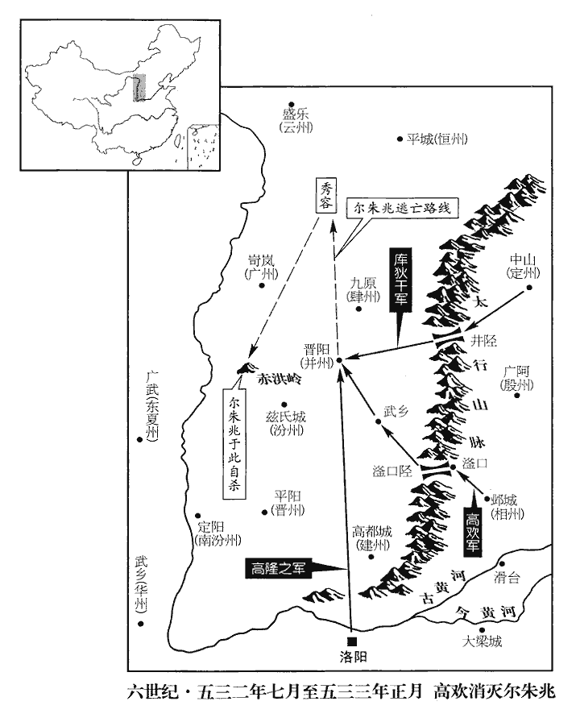
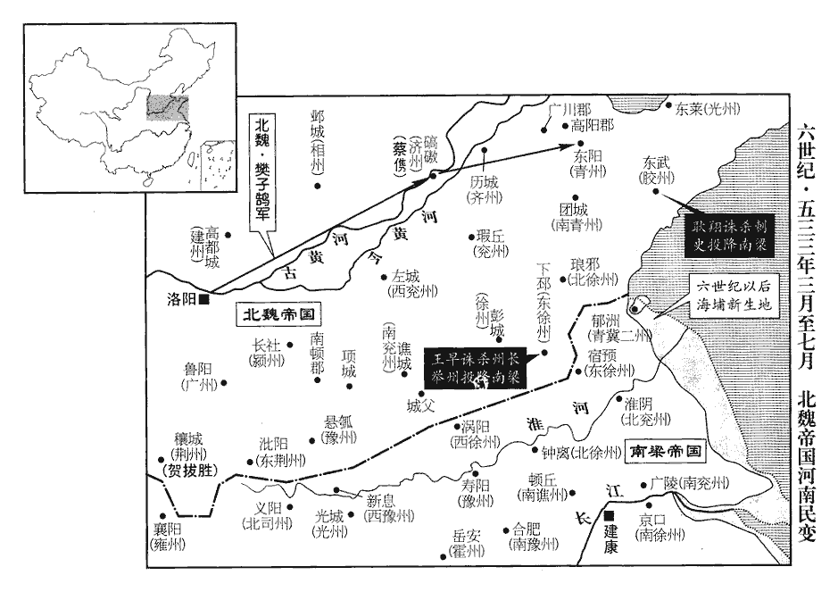
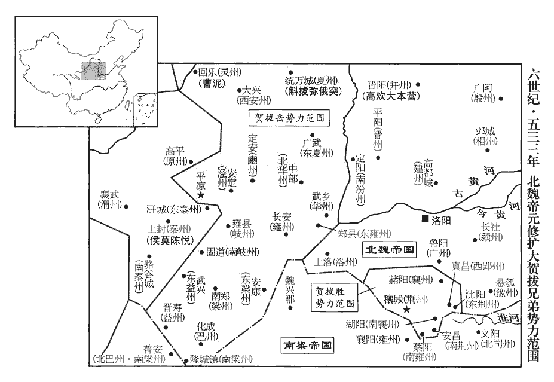
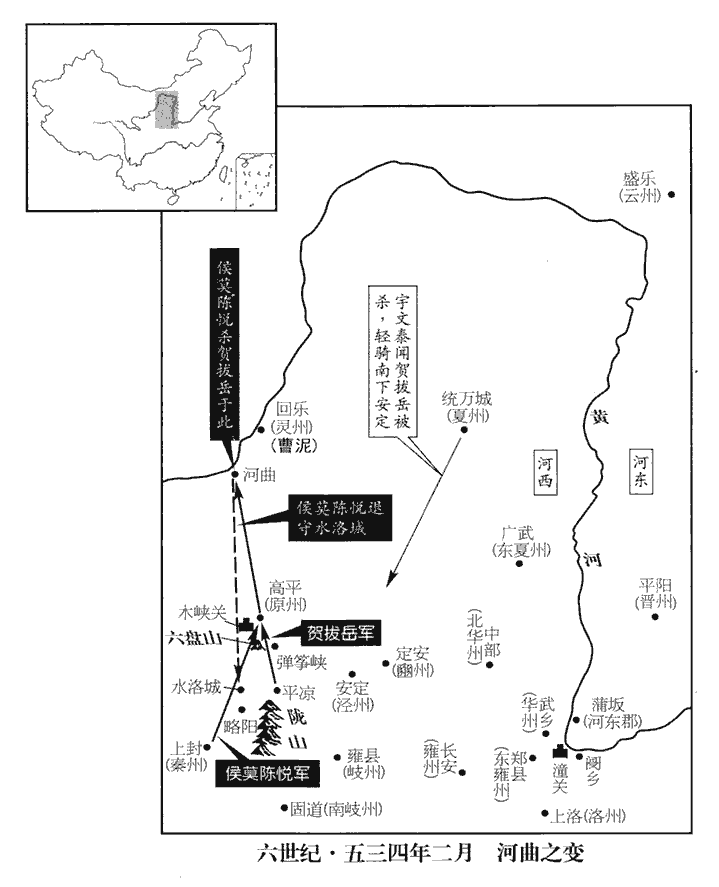
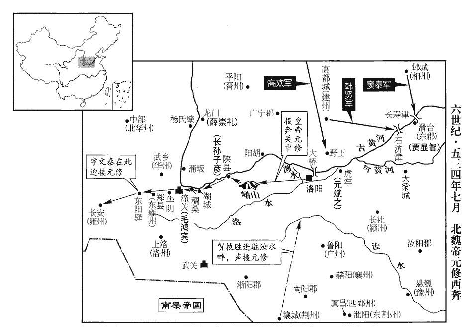
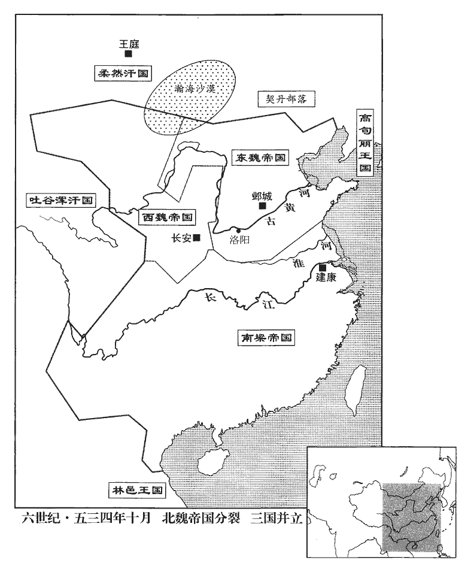

 梁紀十二起昭陽赤奮若（癸丑），盡閼逢攝提格（甲寅），凡二年。

# 高祖武皇帝十二

## 中大通五年（癸丑、五三三）

1春，正月，辛卯‹二›，上‹萧衍，本年七十岁›祀南郊，大赦。

〖译文〗 [1]春季，正月，辛卯（初二），梁武帝在南郊祭天，大赦天下。

2魏竇泰奄至爾朱兆庭，軍人因宴休惰，忽見泰軍，驚走，追破之於赤谼嶺‹山西省离石县东北›，杜佑曰：石州離石縣有赤洪水，即離石水，赤洪其別名也。高歡破爾朱兆於赤洪嶺，蓋近此。又曰：赤洪水源出方山縣，東流入離石。谼hóng，戶工翻。考異曰：魏帝紀：正月，庚寅朔；甲午，齊獻武王自晉陽出討兆，丁酉，大破之於赤洪嶺。北齊帝紀：出兵在去年，破兆在今年。按歲首宴會，不應直至八日。今從齊書。眾並降散。降，戶江翻；下同。兆逃於窮山，命左右西河‹山西省汾阳县›張亮及蒼頭陳山提斬己首以降，皆不忍；兆乃殺所乘白馬，自縊於樹。歡親臨，厚葬之。縊，於賜翻，又於計翻。臨，力鴆翻，哭也。慕容紹宗攜爾朱榮妻子及兆餘眾詣歡降，歡以義故，待之甚厚。義故，猶言義舊也。兆之在秀容‹北秀容·山西省朔州市西北›，左右皆密通款於歡，唯張亮無啟疏，疏，所故翻。歡嘉之，以為丞相府參軍。

〖译文〗 [2]北魏窦泰率领军队突然攻到尔朱兆大本营的厅堂，军中的人因为正在摆宴而疏于防守，忽然看见窦泰的军队，连忙惊慌地逃跑，后来在赤岭被窦泰追上击溃，不是投降就是逃散了。尔朱兆逃到荒山中，命令在身旁侍奉的西河人张亮以及仆隶陈山提砍下自己的头颅投降，张亮与陈山提都不忍心这么做。尔朱兆就杀掉自己所骑的白马，自己吊死在树上。高欢亲自来到尔朱兆自杀的地方，为他举行了隆重的葬礼。慕容绍宗带着尔朱容的妻子、孩子以及尔朱兆剩余的人马向高欢投降，高欢看在过去的交情上，给予他们很优厚的待遇。尔朱兆在秀容的时候，他的近臣们都悄悄地向高欢表示投靠之意，唯独张亮没有写信联系。高欢对他很赞许，任命他为丞相府的参军。

3魏罷諸行臺。天監十五年，魏以李平為行臺，節度統攻硤石諸軍，踵魏初之制而置之也。正光之末盜起，始復置諸道行臺。

〖译文〗 [3]北魏罢免了各位行台。

4辛亥‹二十二›，上祀明堂。

〖译文〗 [4]辛亥（二十二日），梁武帝在明堂举行祭祀典礼。

5丁巳‹二十八›，魏主‹元修，本年二十四岁›追尊其父‹元怀›為武穆帝，太妃馮氏為武穆后，母李氏為皇太妃。

〖译文〗 [5]丁巳（二十八日），北魏国主孝武帝分别追认他的父亲为武穆帝，太妃冯氏为武穆后，母亲李氏为皇太妃。

6勞州刺史曹鳳、東荊州刺史雷能勝等舉城降魏。曹鳳、雷能勝，皆蠻左也，因其地授以州刺史。降，戶江翻。

〖译文〗 [6]劳州刺史曹凤、东荆州刺史雷能胜等人率领全城投降北魏。

 

7魏侍中斛斯椿聞喬寧、張子期之死，寧、子期死，見上卷上年。內不自安，與南陽王寶炬、武衛將軍元毗、王思政密勸魏主圖丞相歡。椿本有圖歡之心，因喬、張之死，懼禍將及，決計為之。毗，遵之玄孫也。道武建國之初，常山王遵有佐命之功。舍人元士弼又言歡受詔不敬，帝由是不悅。椿勸帝置閤內都督部曲，又增武直人數，自直閤已下，員別數百，武直，謂武士之入直殿閤者。據五代志紀北齊之制，領軍府將軍，掌宿衛禁掖朱華閤外，凡禁衛官皆主之。又左右衛府，將軍各一人，掌左右廂，所主朱華閤以外，各武衛將軍二人貳之。其御仗屬官有御仗正副都督、御仗五職、御仗等員。直盪屬官有直盪正副都督、直入正副都督、勳武前鋒正副都督、勳武前鋒五職等員。直衛屬官有直衛正副都督、翊衛正副都督等員。直突屬官有直突都督、前鋒散都督等員。直閤屬官有朱衣直閤、直閤將軍、直寢、直齋、直後之屬。又有雲騎、武騎、驍騎、遊擊、前•左•右•後等將軍，左•右虎賁等中郎將，步兵、越騎、射聲、屯騎、長水等校尉，奉車、騎二都尉，羽林監、冗從僕射、積弩、積射、強弩、殿中等將軍及員外將軍、武騎常侍、殿中司馬督、員外司馬督等。蓋其制昉於晉，代有損益。觀北齊之制，則當時增置可概見矣。皆選四方驍勇者充之。驍，堅堯翻。帝數出遊幸，椿自部勒，別為行陳，數，所角翻。行，戶剛翻。陳，讀曰陣。由是朝政、軍謀，帝專與椿決之。帝以關中大行臺賀拔岳擁重兵，密與相結，又出侍中賀拔勝為都督三荊等七州諸軍事，【章：甲十一行本「事」下有「荊州刺史」四字；乙十一行本同；孔本同；退齋校同。】七州，三荊及襄、南襄、郢、南郢也。‹荆州州政府设穰城·河南省邓州市›、南荆州州政府设安昌·湖北省枣阳市南、东荆州州政府设沘阳·河南省泌阳县、南雍州州政府设蔡阳·湖北省枣阳市西南、西郢州州政府设真昌·河南省泌阳县西、襄州州政府设赭阳·河南省方城县、南襄州州政府设湖阳·河南省唐河县南湖阳镇欲倚勝兄弟以敵歡，倚勝及岳也。歡益不悅。

〖译文〗 [7]北魏侍中斛斯椿听到乔宁、张子期的死讯，心里无法安宁，他与南阳王元宝炬、武卫将军元毗、王思政一道秘密劝说孝武帝除掉丞相高欢。元毗是元遵的玄孙。舍人元士弼又告诉孝武帝，说高欢对皇帝颁下的诏书不恭不敬，孝武帝因此不大愉快。斛斯椿劝说孝武帝设置了负责皇宫守卫的内都督部曲，又在皇帝居住的朱华阁里增添了值勤侍卫的人数，在这些侍卫下面，还有定额以外的侍卫几百人。充当卫士的都是从各地精选出的骁勇善战的人。孝文帝几次外出巡游，斛斯椿亲自部署，在卫士以外另外排列队伍。因此，有关朝政、军机方面的大事，孝武帝只与斛斯椿商议决定。由于关中大行台贺拔岳手中掌握重兵，孝武帝就与他秘密联系，又派遣侍中贺拔胜担任统管三荆等七州军事的都督，想倚仗贺拔胜兄弟的力量与高欢抗衡，高欢心里更加不高兴。

侍中、司空高乾之在信都‹冀州州政府所在县·河北省冀县›也，遭父喪，不暇終服。及孝武帝‹元修›即位，表請解職行喪，詔聽解侍中，句絕。司空如故。乾雖求退，不謂遽見許，既去內侍，朝政多不關預，居常怏怏。怏，於兩翻。帝既貳於歡，冀乾為己用，嘗於華林園宴罷，獨留乾，謂之曰：「司空奕世忠良，謂自高允以來。今日復建殊效，復，扶又翻。相與雖則君臣，義同兄弟，宜共立盟約，以敦情契。」殷勤逼之。乾對曰：「臣以身許國，何敢有貳。」時事出倉猝，且不謂帝有異圖，遂不固辭，亦不以啟歡。及帝置部曲，乾乃私謂所親曰：「主上不親勳賢而招集群小，數遣元士弼、王思政往來關西與賀拔岳計議，又出賀拔勝為荊州，外示疏忌，內實樹黨，令其兄弟相近，冀據有西方。禍難將作，必及於我。」乃密啟歡。歡召乾詣并州，面論時事，乾因勸歡受魏禪，歡以袖掩其口曰：「勿妄言！今令司空復為侍中，門下之事一以相委。」歡屢啟請，帝不許。乾知變難將起，密啟歡求為徐州‹府设彭城江苏省徐州市›；數，所角翻。近，其靳翻。難，乃旦翻。復，扶又翻；羅復、詔復下同。二月，辛酉‹三›，以乾為驃騎大將軍、開府儀同三司、徐州刺史，驃，匹妙翻。騎，奇計翻。以咸陽王坦為司空。為魏主殺高乾討高歡張本。

〖译文〗 担任侍中、司空的高乾在信都的时候，正赶上父亲去世，没有来得及服丧期满。等到孝武帝登上皇位的时候，他上书请求解除自己的职务以便为父亲守孝。孝武帝颁下诏书免去他的侍中职务，但依旧让他担任司空。高乾虽然要求解除职务，但想不到孝武帝会立即批准，这一下既然丢掉了侍中的位置，就不能多插手朝中的事务，住在家里常常怏怏不乐。孝武帝对高欢有了二心，希望高乾能够为自己所用，他曾经在华林园的酒宴结束后单独留下高乾，对他说：“司空，你们一家世代都是忠良，现在你又建立了显赫的功业，我与你相处名义上是君臣关系，但在情义上就好象兄弟一样，我们应该一道订立盟约，使我们的情义更加深厚。”说着，孝武帝很殷勤地催促高乾立约。高乾回答说：“我把整个身体都给了国家，哪敢不一心一意呢？”这件事情发生得很突然，再说也没有想到孝武帝这样做是别有意图的，因此高乾就没有坚决推辞，也没有把这一件事向高欢禀报。直到孝武帝设置部曲的时候，高乾才私下对他亲近的人说：“皇上不与有功的贤良的大臣亲近，而是纠集了一群小人，还多次派遣元士弼、王思政来往于关西之间，与贺拔岳密谋，又派出贺拔胜掌管荆州，表面上显示出疏远贺拔胜的样子，实质上是在拉帮结派，使贺拔胜兄弟靠得近些，希望这样来占据西方。现在灾难将要降临了，而且必定要殃及到我的身上。”这才把孝武帝拉拢他的事秘密告诉了高欢。高欢把高乾叫到并州，同他当面讨论时事。高乾劝说高欢迫使孝武帝禅让帝位，高欢用袖子掩住高乾的嘴巴说道：“不要瞎说！现在就让司空你重新担任侍中，门下省的事全部委托给你了。”高欢屡次上书，请求让高乾复职，孝武帝都不允许。高乾知道灾难将要发生，就悄悄地请高欢给自己谋求徐州刺史的官职。二月，辛酉（初三），孝武帝任命高乾为骠骑大将军、开府仪同三司、徐州刺史，另外任命咸阳王元坦为司空。

8癸未‹二十五›，上幸同泰寺，講般若經，般，音钵。若，人者翻。七日而罷，會者數萬人。

〖译文〗 [8]癸未（二十五日），梁武帝驾临同泰寺，讲解《般若经》，持续了七天才结束，到会的多达几万人。

9魏正光以前，阿至羅常附於魏。阿至羅，高車種也。魏書：孝靜帝興和三年，阿至羅國主副伏羅越君子去賓來降，封之為高車王。及中原多事，阿至羅亦叛，丞相歡招撫之，阿至羅復降，凡十萬戶。三月，辛卯‹三›，詔復以歡為大行臺，魏方罷諸行臺，今復命歡以此職，以招撫阿至羅。使隨宜裁處。處，昌呂翻。歡與之粟帛，議者以為徒費無益，歡不從，及經略河西‹陕西省北部›，大收其用。謂救曹泥及取万俟受洛干時也。

〖译文〗 [9]在北魏正光年间以前，阿至罗国经常依附于北魏。等到中原一带战事纷繁的时候，阿至罗国也反叛了。北魏的丞相高欢进行招抚后，阿至罗国又投降了，一共带了十万户人家。三月，辛卯（初三），北魏孝武帝颁下诏书，重新任命高欢为大行台，授权他可以随机裁决处理有关事务。高欢要给予阿至罗国一批粮食和绢帛，参与讨论此事的人都认为这是白费财物，不可能有什么收益，高欢没有听他们的话。等到高欢征伐河西地区的时候，得到了阿至罗人的大力支持。

10高乾將之徐州，魏主聞其漏泄機事，乃詔丞相歡曰：「乾邕與朕私有盟約，今乃反覆兩端。」歡聞其與帝盟，亦惡之，惡，烏故翻。即取乾前後數啟論時事者遣使封上，使，疏吏翻；下同。上，時掌翻。帝召乾，對歡使責之，乾曰：「陛下自立異圖，乃謂臣為反覆，人主加罪，其可辭乎！」遂賜死‹年三十七岁›。帝又密敕東徐州‹府设下邳江苏省睢宁县北古邳镇›刺史潘紹業殺其弟敖曹，按李延壽齊紀，魏主遣東徐州刺史潘紹業密敕長樂太守龐蒼鷹殺敖曹，則是高敖曹此時在信都也。敖曹先聞乾死，伏壯士於路，執紹業，得敕書於袍領，遂將十餘騎奔晉陽‹山西省太原市›。將，即亮翻。騎，奇計翻。歡抱其首哭曰：「天子枉害司空。」敖曹兄仲密為光州‹府设东莱山东省莱州市›刺史，帝敕青州‹府设东阳山东省青州市›斷其歸路，斷，音短。仲密由東萊歸勃海，道出青州。仲密亦間行奔晉陽。間，古莧翻。仲密名慎，以字行。

〖译文〗 [10]高乾将要去徐州上任，北魏孝武帝听说了他泄漏机密的事情，就写了诏书对丞相高欢说：“高乾跟我私下有过盟约，如今他在你和我两边翻来覆去。”高欢一听高乾与孝武帝曾经订过盟约，也对他产生了恶感，于是立即找来高乾以前给他的几件评论时事的文书，加以密封，派遣使者送给孝武帝。孝武帝召见高乾，当着高欢使者的面斥责高乾，高乾回答说：“陛下您自己有别的企图，才说我反复无常，做帝王的要将罪行硬加到一个人头上，难道还可以推卸得了吗！”于是，孝武帝赐高乾死。孝武帝又写密信给东徐州刺史潘绍业，命令他杀掉高乾的弟弟高敖曹，高敖曹已经提前得到了高乾的死讯，因此在路旁埋伏了精壮的士卒，捉住了潘绍业，从他衣袍的领子里搜到了孝武帝的诏书。于是，高敖曹就带着十几个人骑马直奔晋阳。高敖曹到达晋阳之后，高欢抱崐住他的头痛哭道：“皇上屈杀了高司空。”高敖曹的哥哥高仲密是光州刺史，孝武帝命令青州的兵马切断他回去的道路，高仲密也从小路跑到了晋阳。高仲密名叫高慎，通常用表字。

11魏太師魯郡王肅卒。卒，子恤翻。

〖译文〗 [11]北魏的太师鲁郡王元肃去世。

12丙辰‹二十八›，南平元襄王偉卒‹萧伟，年五十八岁›。

〖译文〗 [12]丙辰（二十八日），梁朝的南平元襄王萧伟去世。

13丁巳‹二十九›，魏以趙郡王諶為太尉，諶chén，氏壬翻。南陽王寶炬為太保。

〖译文〗 [13]丁巳（二十九日），北魏任命赵郡王元谌为太尉，南阳王元宝炬为太保。

14魏爾朱兆之入洛也，兆入洛見一百五十四卷二年。焚太常樂庫，鍾磬俱盡。節閔帝‹元恭›詔錄尚書事長孫稚、太常卿祖瑩等更造之，至是始成，命曰大成樂。

〖译文〗 [14]北魏的尔朱兆在进入洛阳之后，焚烧了太常府的乐器库房，钟磬等等都给烧得一干二净。节闵帝元恭颁下诏书，命令录尚书事长孙稚、太常卿祖莹等人重新制造，到这个时候才完成，它们被命名为《大成乐》。

15魏青州民耿翔聚眾寇掠三齊‹山东省›，三齊，因秦、漢舊名言之。膠州‹府设东武山东省诸城市›刺史裴粲，專事高談，不為防禦；夏，四月，翔掩襲州城。魏永安二年，置膠州，治東武城，領東武、高密、平昌郡。東武城，今密州諸城縣是也。左右白賊至，粲曰：「豈有此理！」左右又言已入州門，粲乃徐曰：「耿王來，可引之聽事，自餘部眾，且付城民。」翔斬之‹年六十五岁›，送首來降。降，戶江翻；下同。

〖译文〗 [15]北魏青州的百姓耿翔聚集了一帮盗匪在三齐大肆掠夺，胶州刺史裴粲只会高谈阔论，不设防御。夏季，四月，耿翔带着人马突然袭击了胶州州城。裴粲身旁的部下向他禀告说贼兵冲过来了，他却回答：“岂有此理！”部下们又过来报告说贼兵已经进入城门了，裴粲才慢慢地说道：“耿王来了，你们可以带到厅堂来，他下面的那些人马，都交给城中的百姓。”耿翔杀了裴粲，带着他的脑袋来向梁朝投降。

16五月，魏東徐州民王早等殺刺史崔庠xiáng，以下邳來降。考異曰：梁帝紀：「六月，己卯，魏建義城主蘭寶以下邳城降。」今從魏書。

〖译文〗 [16]五月，北魏东徐州的百姓王早等人杀了刺史崔庠，献出下邳向梁朝投降。

17六月，壬申‹十五›，魏以驃騎大將軍樊子鵠為青、膠大使，督濟州‹府设碻磝山东省茌平县西南›刺史蔡儁等討耿翔。濟，子禮翻。秋，七月，魏師至青州，翔棄城來奔，詔以為兗州‹府设淮阴江苏省淮阴市›刺史。

〖译文〗 [17]六月，壬申（十五日），北魏任命骠骑大将军樊子鹄为赴青州、胶州的特别使节，督促济州刺史蔡俊等人讨伐耿翔。秋季，七月，北魏的军队攻到了青州，耿翔放弃了青州城赶来投奔梁朝，梁武帝颁下诏书，任命他为兖州刺史。

 

18壬辰‹六›，魏以廣陵王欣為大司馬，趙郡王諶為太師，庚戌‹二十四›，以前司徒賀拔允為太尉。考異曰：魏帝紀作「賀拔渥」。按允字阿鞠埿，蓋「埿」字誤為「渥」耳。

〖译文〗 [18]壬辰（初六），北魏任命广陵王元欣为大司马，赵郡王元谌为太师。庚戌（二十四日），又任命前司徒贺拔允为太尉。

初，賀拔岳遣行臺郎馮景詣晉陽，丞相歡聞岳使至，甚喜，使，疏吏翻。曰：「賀拔公詎jù憶吾邪！」與景歃血，約與岳為兄弟。歃，色甲翻。景還，言於岳曰：「歡姦詐有餘，不可信也。」府司馬宇文泰自請使晉陽使，疏吏翻。以觀歡之為人，歡奇其狀貌，曰：「此兒視瞻非常。」將留之，泰固求復命；歡既遣而悔之，發驛急追，至關‹陕西省潼关县›不及而返。項羽不殺沛公，曹操之遣劉備，桓玄之容劉裕，類如此耳。有天命者，固非人之所能圖也。

〖译文〗 起初，贺拔岳派遣行台郎冯景到晋阳，丞相高欢听说贺拔岳的使者来了，非常高兴，说道：“贺拔公岂不是想念我了？”然后与冯景歃血为盟，约定与贺拔岳结为兄弟。冯景回去后，对贺拔岳说：“高欢奸诈有余，真诚不足，不可信任。”府司马宇文泰自告奋勇，请求出使晋阳，以便观察高欢的为人到底如何。高欢见了宇文泰，对他的相貌感到惊奇，说道：“这个年轻人的仪表看起来不同寻常。”因此要留下宇文泰，宇文泰坚决要求回去复命；高欢让宇文泰走了之后又觉得后悔，急忙派人骑驿马追赶，一直追到潼关还没有追上，只好返回。

泰至長安，謂岳曰：「高歡所以未篡者，正憚公兄弟耳；侯莫陳悅之徒，非所忌也。公但潛為之備，圖歡不難。今費也頭控弦之騎不下一萬，夏州‹府设统万陕西省靖边县北白城子›刺史斛拔彌俄突勝兵三千餘人，勝，音升。靈州‹府设回乐宁夏灵武市›刺史曹泥、河西流民紇豆陵伊利等各擁部眾，未知所屬。公若引軍近隴，近，其靳翻。隴，坂也。扼其要害，震之以威，懷之以惠，可收其士馬以資吾軍。西輯氐、羌，北撫沙塞，靈、夏塞外，北臨沙漠。還軍長安，匡輔魏室，此桓、文之舉也。」「舉」，一作「功」。岳大悅，復遣泰詣洛陽請事，密陳其狀。復，扶又翻。魏主喜，加泰武衛將軍，使還報。八月，帝以岳為都督雍•華等二十州諸軍事、雍州‹府设长安陕西省西安市›刺史，魏泰和十一年，分雍州置華州，領華山、澄城、白水郡。二十州，雍、華、東華、岐、南岐、豳、原、河、渭、涇、夏、東夏、秦、南秦、梁、南梁、東梁、巴、益、東益也。雍，於用翻。華，戶化翻。又割心前血，遣使者齎以賜之。使，疏吏翻。岳遂引兵西屯平涼‹甘肃省华亭县›，以牧馬為名。所謂近隴也。斛拔彌俄突、紇豆陵伊利及費也頭万俟受洛干、鐵勒斛律沙門等皆附於岳，紇，下沒翻。万，莫北翻。俟，渠之翻。唯曹泥附於歡。秦‹府设上封甘肃省天水市›、南秦‹府设骆谷城甘肃省西和县南›、河‹府设枹罕甘肃省临夏市›、渭‹府设襄武甘肃省陇西县›四州刺史同會平涼，受岳節度。岳以夏州被邊要重，夏，戶雅翻。被，皮義翻。欲求良刺史以鎮之，眾舉宇文泰，岳曰：「宇文左丞，吾左右手，何可廢也！」沈吟累日，卒表用之。沈，持林翻。卒，子恤翻。

〖译文〗 宇文泰回到长安后，对贺拔岳说：“高欢之所以还没有篡夺帝位，正是因为忌惮你们兄弟，而侯莫陈悦等人，并不是他所猜忌的对象。您只要悄悄地进行准备，算计高欢是不难的。现在费也头部族善于射箭的骑兵不下一万人，夏州刺史斛拔弥俄突的精兵有三千多人，灵州刺史曹泥、河西流民纥豆陵伊利等人各自都拥有一帮人马，还不知道自己要归属哪一方。您要是带着军队逼近陇地，扼守该地的要害之处，用威势来震慑他们，同时再用恩惠对他们进行安抚，就可以收伏他们的兵马来壮大我军的力量。此外，西边亲睦氐、羌部落，北边抚慰沙漠塞外之民，然后挥师返回长安，辅助魏国皇室，这是足以跟齐桓公、晋文公的功业相比的举动呀。”贺拔岳听了非常高兴，又派遣宇文泰到洛阳向孝武帝请示有关事宜，秘密陈述有关情况。孝文帝也很欢喜，加封宇文泰为武卫将军，叫他回去向贺拔岳汇报。八月，孝武帝任命贺拔岳为都督雍、华等二十州诸军事及雍州刺史，又割破自己心口前的皮肉，取出一些鲜血，派遣使者赐送给贺拔岳。贺拔岳于是带领兵马向西挺进，以牧马的名义驻扎在平凉。斛拔弥俄突、纥豆陵伊利以及费也头的万俟受洛干、铁勒斛律沙门等人都依附于贺拔岳，只有曹泥还依附于高欢。秦、南秦、河、渭四州的刺史一同汇集在平凉，接受贺拔岳的指挥调度。贺拔岳因为夏州地处边境，地形重要，想要寻找一位出色的刺史来镇守，大家都推举宇文泰，贺拔岳说道：“宇文左丞是我的左右手，怎么可以离开我！”他反复考虑了好几天，最终还是上书孝武帝，请求任用宇文泰为夏州刺史。

19九月，癸酉‹十七›，魏丞相歡表讓王爵，不許；請分封邑十萬戶頒授勳義，勳義，謂自信都從起義，討爾朱有功勳者也。從之。

〖译文〗 [19]九月，癸酉（疑误），北魏的丞相高欢上书请求让掉自己的王爵，孝武帝没有允许；高欢又请求将自己封地里的十万户人家作为奖赏，分赏给从信都跟他起义讨伐尔朱氏有功勋的人，孝武帝答应了。

20冬，十月，庚申‹五›，以尚書右僕射何敬容為左僕射，吏部尚書謝舉為右僕射。

〖译文〗 [20]冬季，十月，庚申（初五），梁武帝任命尚书右仆射何敬容为左仆射，吏部尚书谢举为右仆射。

21十一月，癸巳‹九›，魏以殷州‹府设广阿河北省隆尧县›刺史中山‹河北省定州市›邸珍為徐州大都督、東道行臺、僕射，以討下邳。邸，姓也。風俗通：漢有上郡太守邸杜。討王早也。

〖译文〗 [21]十一月，癸巳（初九），北魏任命殷州刺史中山人邸珍为徐州大都督、东道行台、仆射，派他来讨伐下邳。

22十二月，丁巳‹三›，魏主狩於嵩高‹河南省登封县西北›；己巳‹十五›，幸溫湯；歷嵩高而南，唯汝州梁縣有溫湯耳。丁丑‹二十三›，還宮。

〖译文〗 [22]十二月，丁巳（初三），北魏孝武帝在嵩高狩猎；己巳（十五日），又到温泉洗浴；丁丑（二十三日），返回宫中。

23魏荊州刺史賀拔勝寇雍州‹府设襄阳湖北省襄樊市›，此梁之雍州，治襄陽。拔下迮戍‹襄阳城北›，迮zé，側百翻，亦作「莋」。扇動諸蠻；雍州刺史廬陵王續遣軍擊之，屢為所敗，敗，補賣翻。漢南震駭。勝又遣軍攻馮翊‹侨郡·湖北省宜城县西南›、安定‹侨郡·湖北省南漳县›、沔陽‹湖北省仙桃市西南›、酇城‹湖北省老河口市西北›，皆拔之。五代志：竟陵郡藍水縣僑立馮翊郡。沔陽郡後為復州。襄陽郡陰城縣，舊置酇城郡。蕭子顯齊志：寧蠻府所領郡有安定郡，領新安等縣。五代志，新安縣并入襄陽郡南漳縣，當是置安定僑郡於南漳界也。藍水，唐并入郢州長壽縣；陰城，并入穀城縣。沈約志：馮翊郡治襄陽郡鄀ruò縣。沔，彌兗翻。酇，音贊。續遣電威將軍柳仲禮屯穀城‹湖北省谷城县›以拒之，五代志：穀城縣，屬襄陽郡，舊曰義城，置義城郡。勝攻之，不克，乃還；於是沔北盪為丘墟矣。盪，徒朗翻。仲禮，慶遠之孫也。柳慶遠見一百四十三卷齊東昏侯永元二年。

〖译文〗 [23]北魏荆州刺史贺拔胜进犯雍州，攻克了下迮戍所，煽动蛮民们归附北魏，梁朝雍州刺史庐陵王萧续派遣军队攻击贺拔胜，屡次被对方打败，汉水以南地区都震惊恐惧起来。贺拔胜又派遣军队进攻冯翊、安定、沔阳、城四郡，都攻了下来。庐陵王萧续又派遣电威将军柳仲礼驻军谷城，以抵御贺拔胜，贺拔胜攻打谷城没有成功，就带着兵马返回；于是沔北地区都被扫荡成了一片土丘废墟。柳仲礼是柳庆远的孙子。

24魏丞相歡患賀拔岳、侯莫陳悅之強，右丞翟嵩曰：「嵩能間之，間，古莧翻。使其自相屠滅。」歡遣之。歡又使長史侯景招撫紇豆陵伊利，伊利不從。

〖译文〗 [24]北魏的丞相高欢对贺拔岳和侯莫陈悦的强大感到害怕，右丞翟嵩对高崐欢说：“我能够离间他们，使他们相互屠杀灭亡。”高欢就派他去办理此事。高欢又派遣长史侯景去招抚纥豆陵伊利，纥豆陵伊利没有听从。

 

## 六年（甲寅、五三四）

1春，正月，壬辰‹九›，魏丞相歡擊伊利於河西‹陕西省北部›，擒之，遷其部落於河東‹山西省›。河西，五原河之西也。河東，亦五原河之東。魏主‹元修，本年二十五岁›讓之曰：「伊利不侵不叛，為國純臣，左傳：戎子駒支曰：「為先君不侵不叛之臣。」王忽伐之，詎有一介行人先請之乎！」

〖译文〗 [1]春季，正月壬辰（初九），北魏的丞相高欢在五原河西部地区袭击了纥豆陵伊利，抓住了他，并且将他的部落迁移到五原河以东地区。北魏孝武帝责难高欢说道：“纥豆陵伊利既没有入侵，也没有叛变，是我们魏国忠贞的臣子，您突然讨伐他，难道有一个使者事先来请示过吗？”

2魏東梁州‹府设安康陕西省石泉县›民夷作亂，魏收志：東梁州領金城、直城、安康、魏明郡。五代志：西城郡，舊置東梁州。金城，即今金州城也，東梁州治焉。二月，詔以行東雍州‹府设郑县陕西省华县›事豐陽‹陕西省山阳县›泉企討平之。魏世祖置東雍州於平陽，太和中罷。孝昌中，於平陽置唐州，以唐堯都平陽，因以名州；建義初，改為晉州。未嘗復置東雍州也。五代志曰：雍州鄭縣，後魏置東雍州。參考魏收志，鄭縣時已屬華州界，未知此東雍州置於何地也。魏收志：豐陽縣屬上庸郡，太安二年置。姓譜曰：國語：潞、泉、余、滿，皆赤狄隗姓。又，吳全琮孫惲降魏，封南陽，食邑白水，因為泉氏。企，去智翻。考異曰：北史作「泉仚xiān」。今從周書。企世為商‹陕西省丹凤县›、洛‹陕西省商州市›豪族，商、洛，指漢古縣商縣、上洛縣而言也。隋志，上洛郡有商洛縣。魏世祖以其曾祖景言為本縣令，封丹水侯，使其子孫襲之。

〖译文〗 [2]北魏东梁州的百姓夷人叛乱，二月，孝武帝颁下诏书，命令兼管东雍州事务的丰阳人泉企讨伐平定这场叛乱。泉企一家世世代代是商、洛一带的豪门大族。太武帝曾经任命泉企的曾祖父泉景言为本县的县令，还封他为丹水侯，并让他的子孙世袭这个爵位。

3壬戌‹九›，魏大赦。

〖译文〗 [3]壬戌（初九），北魏大赦天下。

4癸亥‹十›，上‹萧衍，本年七十一岁›耕藉田；大赦。

〖译文〗 [4]癸亥（初十），梁武帝在籍田耕作，同时大赦天下。

5魏永寧浮圖災，觀者皆哭，聲振城闕。魏起永寧浮圖，見一百四十八卷天監十五年。史言末俗深信浮圖以至於此。振，之印翻。

〖译文〗 [5]北魏永宁寺佛塔失火，看到灾情的人无不痛哭，哭声振动了城门两边的楼观。

6魏賀拔岳將討曹泥‹时驻灵州，州政府设回乐宁夏灵武县›，使都督武川‹内蒙古武川县›趙貴至夏州‹府设统万陕西省靖边县北白城子›與宇文泰謀之，泰曰：「曹泥孤城阻遠，未足為憂。侯莫陳悅貪而無信，宜先圖之。」岳不聽，曹泥附高歡，岳不從宇文泰之言，急於致討，蓋欲報高歡禽伊利之役耳，亦忿兵也。召悅會於高平‹宁夏固原县›，與共討泥。悅既得翟嵩之言，乃謀取岳。岳數與悅宴語，數，所角翻。長史武川雷紹諫，不聽。岳使悅前行，至河曲‹宁夏中宁县东北，黄河弯曲处›，河曲在靈州西。河千里一曲。河水自澆河至漢眴卷古縣，率東北流，至富平始曲而北流，所謂河曲也。富平，唐靈州地。悅誘岳入營坐，論軍事，誘，音酉。悅陽稱腹痛而起，其壻元洪景拔刀斬岳。岳左右皆散走，悅遣人諭之云：「我別受旨，止取一人，諸君勿怖。」怖，普布翻。眾以為然，皆不敢動。而悅心猶豫，不即撫納，乃還入隴，屯水洛城‹甘肃省庄浪县›。我朝以渭州籠竿城置德順軍；水洛城在軍西一百里。岳眾散還平涼‹甘肃省华亭县›，趙貴詣悅請岳尸葬之，悅許之。岳既死，悅軍中皆相賀，行臺郎中薛憕私謂所親曰：「悅才略素寡，輒害良將，吾屬今為人虜矣，何賀之有！」憕，真度之從孫也。憕zhèng，直陵翻。將，即亮翻。薛真度見一百三十九卷齊明帝建武元年。

〖译文〗 [6]北魏的贺拔岳将要讨伐曹泥，派了都督武川人赵贵到夏州先与宇文泰商量，宇文泰说：“曹泥掌握的是一座孤城，隔的距离又远，不足以成为我们忧虑的对象。侯莫陈悦贪心而又不讲信义，应该先收拾他。”贺拔岳没有听从宇文泰的建议，而是召请侯莫陈悦在高平与自己会合，共同讨伐曹泥。侯莫陈悦听了翟嵩的话以后，就图谋除掉贺拔岳。贺拔岳多次与侯莫陈悦随便聊天说话，担任长史的武川人雷绍劝告他，他听不进去。贺拔岳叫侯莫陈悦走在前面，到了河曲，侯莫陈悦引诱贺拔岳到他的军营去坐，一同谈论军事，谈着谈着，侯莫陈悦假装说自己肚子疼，站起身来，他的女婿元洪景拔出腰刀杀了贺拔岳，贺拔岳身边的人都纷纷逃散，侯莫陈悦派人告诉他们说：“我奉了朝廷密旨，只取贺拔岳一个人的性命，各位都不要害怕。”大家都认为侯莫陈悦的话是真的，不敢轻举妄动。但是侯莫陈悦自己的心里还犹豫不决，不敢安抚招纳贺拔岳的部属，于是就回到陇地，驻扎在水洛城。贺拔岳离散的部属回到平凉，赵贵来到侯莫陈悦处请求由他安葬贺拔岳的遗体，侯莫陈悦答应了他。贺拔岳死了之后，侯莫陈悦军队里的官兵都相互庆贺，行台郎中薛悄悄地对他亲近的人说：“侯莫陈悦向来缺乏才识谋略，总是杀害良将，我们这些人现在已注定被人俘虏了，有什么可以庆贺的！”薛是薛真度的侄孙子。

岳眾未有所屬，諸將以都督武川寇洛年最長，長，知兩翻。推使總諸軍；洛素無威略，不能齊眾，乃自請避位。趙貴曰：「宇文夏州英略冠世，冠，古玩翻。遠近歸心，賞罰嚴明，士卒用命，若迎而奉之，大事濟矣。」諸將或欲南召賀拔勝，或欲東告魏朝，朝，直遙翻。猶豫不決。都督盛樂‹内蒙古和林格尔县›杜朔周曰：盛樂，前漢之成樂縣也，屬定襄郡，後漢屬雲中郡，魏、晉省；後魏先世園陵在焉。魏收志：永熙中，置盛樂郡，雲中治所。魏土地記：雲中城東八十里有盛樂城。宋白曰：後魏所都盛樂，唐為振武軍。「遠水不救近火，今日之事，非宇文夏州無能濟者，趙將軍議是也。朔周請輕騎告哀，且迎之。」騎，奇計翻。眾乃使朔周馳至夏州召泰。

〖译文〗 贺拔岳的部下们都还没有归属，各位将领考虑到担任都督的武川人寇洛年崐龄最大，就推举他总管所有的军队，寇洛一向没有威望谋略，不能把大家管理好，就自己请求让位，赵贵说道：“夏州刺史宇文泰的才略天下第一，远近的人心都向着他，他赏罚严明，士兵们都愿意听从他的命令，如果将他迎接来，拥戴他作为我们的统帅，大事就可以成功了。”各位将领中有的想去南方叫贺拔胜来收拾残局，有的想去东方把情况禀告北魏的朝廷，一时间犹豫不决。担任都督的盛乐人杜朔周说道：“远水救不了近火，今天这样的事情，除了宇文泰外，没有任何人能够办成功，赵将军的一番议论是正确的。请允许我朔周骑上快马向宇文泰报告噩耗，并且迎接他到这儿来。”大家就让杜朔周作为使者赶往夏州请宇文泰来。

泰與將佐賓客共議去留，前太中大夫潁川‹河南省长葛县›韓褒曰：「此天授也，又何疑乎！侯莫陳悅，井中蛙耳，使君往，必擒之。」眾以為：「悅在水洛，去平涼不遠，若已有賀拔公之眾，則圖之實難，願且留以觀變。」泰曰：「悅既害元帥，帥，所類翻。自應乘勢直據平涼，而退據水洛，吾知其無能為也。夫難得易失者，時也。用漢蒯徹語意。易，以豉翻。若不早赴，眾心將離。」

〖译文〗 宇文泰与他的将领、幕僚、宾客一同商议是去是留，前太中大夫、颍川人韩褒说道：“这是上天授命给您，还有什么可以疑虑的呀！侯莫陈悦不过是只井中之蛙，如果您去的话，一定能够捉住他。”众人都认为：“侯莫陈悦所处的水洛距离平凉不远，如果他已经拥有贺拔岳留下的兵马，再算计他就非常困难了，希望暂且留下来观察时局的变化。”宇文泰说：“侯莫陈悦既然杀害了贺拔岳元帅，自然应该乘这个势头直接占据平凉，而他却退了一步占据了水洛，由此我知道他没有能耐再干什么了。难以得到而又容易失去的是时机，假如我不早点去的话，人心将会离散。”

夏州首望都督彌姐元進陰謀應悅，姐，音紫，又子也翻。彌姐元進之族，為州之首望，官又為都督。彌姐，羌複姓。泰知之，與帳下都督高平蔡祐謀執之，祐曰：「元進會當反噬，不如殺之。」泰曰：「汝有大決。」言能決大計也。乃召元進等入計事，泰曰：「隴賊逆亂，當與諸人戮力討之，諸人似有不同者，何也？」祐即被甲持刀直入，被，皮義翻。瞋目謂諸將曰：瞋，七人翻。「朝謀夕異，何以為人！今日必斷姦人首！」舉坐皆叩頭曰：斷，丁管翻。坐，徂臥翻。「願有所擇。」祐乃叱元進，斬之，并誅其黨，因與諸將同盟討悅。泰謂祐曰：「吾今以爾為子，爾其以我為父乎？」

〖译文〗 都督弥姐元进的家族是夏州首屈一指的名门望族，他阴谋策应侯莫陈悦，宇文泰知道了这一情况后，与担任帐下都督的高平人蔡谋划如何捉住他，蔡说道：“弥姐元进会反咬一口的，不如杀掉他。”宇文泰夸奖他说：“你有作重要决策的能力。”于是就召请弥姐元进等人到府中商量事情，宇文泰说：“陇州的贼寇进行叛乱，我理所应当和各位一道齐心协力讨伐他们，可是你们之中好象有想法不同的人，这是为什么呀？”话刚落音，身披铠甲手持钢刀的蔡一直走进来，瞪大眼睛对各位将领说：“早上想好的主意晚上就改变，还做人干什么？今天一定要砍掉奸贼的脑袋！”在座的人都跪下叩头说：“希望将军区别忠奸。”蔡就大声喝斥弥姐元进，接着杀掉了他，还诛灭了他的党羽，这样就与各位将领结成同盟一道讨伐侯莫陈悦。宇文泰对蔡说：“我从今以后把你当成我的儿子，你愿意认我作你的父亲吗？”

泰與帳下輕騎馳赴平涼，令杜朔周帥眾先據彈箏峽‹甘肃省平涼市西北›。杜佑曰：彈箏峽，在今原州之百泉縣。百泉即漢朝那縣地。九域志：渭州都盧峽，即彈箏峽也。水經云：都盧山峽之內，常有彈箏之聲。又云：弦歌之山，峽口水流，風吹摧響，有似音韻也。騎，奇計翻。帥，讀曰率。時民間惶懼，逃散者多，軍士爭欲掠之，朔周曰：「宇文公方伐罪討民，柰何助賊為虐乎！」撫而遣之，遠近悅附；泰聞而嘉之。朔周本姓赫連，曾祖庫多汗避難改焉，汗，音寒。難，乃旦翻。泰命復其舊姓，名之曰達。

〖译文〗 宇文泰与手下的轻骑兵一起快速地赶赴平凉，命令杜朔周带领兵马先占领弹筝峡。此时老百姓都很惊惶恐惧，逃散的人很多，士兵们争先恐后地要掠夺他们的财物，杜朔周对士兵们说：“宇文泰大人正在征伐罪人，使百姓安享太平，你们怎么还帮助奸贼做坏事呀？”他对百姓进行安抚并把他们发送回去，远近的人因此都高兴地归附过来；宇文泰听到这一消息后嘉奖了他。杜朔周本姓赫连，他的曾祖父库多汗为了避难而改姓杜，宇文泰叫杜朔周恢复他的旧姓，给他起名为赫连达。

丞相歡使侯景招撫岳眾，泰至安定‹甘肃省泾川县›遇之，謂曰：「賀拔公雖死，宇文泰尚存，卿何為者！」景失色曰：「我猶箭耳，唯人所射。」射，食亦翻。英雄之姿表與其舉措必有異乎人者，以侯景之凶狡，宇文泰一語折之，辭氣俱下，良有以哉。李密見唐太宗不覺驚服，事亦類此。遂還。侯景不敢前至平涼。

〖译文〗 北魏的丞相高欢派侯景去招纳安抚贺拔岳的兵马，宇文泰走到安定的时候遇见了他，对他说：“贺拔岳虽然已经去世，但我宇文泰还活着，你想要干什么！”侯景大惊失色，回答说：“我不过是一枝箭，人家把我射到哪儿我就到崐哪儿。”于是便返回了。

泰至平涼，哭岳甚慟，將士皆悲喜。

〖译文〗 宇文泰到达平凉之后，非常悲痛地哭吊贺拔岳，将士们都又悲又喜。

歡復使侯景與散騎常侍代郡張華原、義寧‹山西省沁源县›太守太安‹内蒙古固阳县›王基勞泰，魏收志：建義元年，置義寧郡，治孤遠城，屬晉州。五代志：上黨郡沁源縣，後魏置義寧郡。又延和二年，置太安郡於漢五原界，屬朔州。復，扶又翻。勞，力到翻；下慰勞同。泰不受，欲劫留之，曰：「留則共享富貴，不然，命在今日。」華原曰：「明公欲脅使者以死亡，此非華原所懼也。」泰乃遣之。基還，言「泰雄傑，請及其未定擊滅之。」歡曰：「卿不見賀拔、侯莫陳乎！吾當以計拱手取之。」

〖译文〗 高欢又派侯景与散骑常侍代郡人张华原、义宁太守太安人王基去慰劳宇文泰，宇文泰没有接受，还想把他们扣留下来，说：“你们留下来我们就一同享受富贵，不然的话，你们的性命就在今日完结。”张华原回答说：“您用死亡来威胁使者，这可不是我张华原所惧怕的。”宇文泰无奈，就让他们回去了。王基到晋阳后，对高欢说：“宇文泰是一位英雄杰出的人，请您趁他还没有稳定就攻击消灭他。”高欢回答说：“你不是看见贺拔岳与侯莫陈悦之间的情况了嘛！我会使用计谋拱手取他的性命。”

魏主‹元修›聞岳死，遣武衛將軍元毗慰勞岳軍，召還洛陽，并召侯莫陳悅。毗至平涼，軍中已奉宇文泰為主；悅既附丞相歡，不肯應召。泰因元毗上表稱：「臣岳忽罹非命，都督寇洛等令臣權掌軍事。奉詔召岳軍入京。今高歡之眾已至河東，亦謂五原河之東。侯莫陳悅猶在水洛，士卒多是西人，顧戀鄉邑，若逼令赴闕，悅躡其後，歡邀其前，恐敗國殄民，所損更甚。此雖泰不就徵而為之辭，而亦事勢所必致也。敗，補賣翻。乞少賜停緩，少，詩沼翻。徐事誘導，漸就東引。」誘，音酉。魏主乃以泰為大都督，即統岳軍。

〖译文〗 北魏国主孝武帝听到贺拔岳的死讯，派遣武卫将军元毗去慰问贺拔岳的军队，把他们召回洛阳，并且宣召侯莫陈悦。元毗到了平凉，部队里面已经拥戴宇文泰作为首领；侯莫陈悦已经归附了高欢，因此不愿意接受孝武帝的宣召。宇文泰通过元毗给孝武帝递送了表章，说：“大臣贺拔岳突然死于非命，都督寇洛等人要我暂且掌握这儿的军事权力。我已经接到您宣召贺拔岳的军队进京城的诏书，但是现在高欢的兵马已经到了五原河以东地区，侯莫陈悦还在水洛，我手下的士兵大多数是西部人，留恋自己的家乡，如果硬逼着叫他们赶赴京城，侯莫陈悦在后面追击，高欢在前面拦截，恐怕会产生国家遭殃百姓被杀的后果，受到的损失更大。请您允许我们稍微停一停缓一缓，慢慢地进行诱导，渐渐地将他们带到东部地区。”孝武帝就任命宇文泰为大都督，就统率贺拔岳的部队。

初，岳以東雍州刺史李虎為左廂大都督，雍，於用翻。岳死，虎奔荊州，說賀拔勝使收岳眾，說，式芮翻。勝不從。虎聞宇文泰代岳統眾，乃自荊州還赴之，至閿wén鄉‹河南省灵宝县西›，閿鄉，在漢湖縣界，隋改湖城縣為閿鄉縣。閿，音旻。以李虎自荊州往返之地里考之，則魏東雍州，時置於鄭縣。為丞相歡別將所獲，將，即亮翻。送洛陽。魏主方謀取關中，得虎甚喜，拜衛將軍，厚賜之，使就泰。虎，歆之玄孫也。涼王李歆為沮渠蒙遜所滅。

〖译文〗 当初，贺拔岳任用东雍州刺史李虎为左厢大都督，贺拔岳死后，李虎直奔荆州，劝说贺拔胜来接收贺拔岳手下的人马，贺拔胜没有接受他的意见。李虎听说宇文泰已经代替贺拔岳统率全体将士，便从荆州往回赶，路过阌乡的时候，被丞相高欢手下的将领俘虏，然后给送到了洛阳。孝武帝正准备谋取关中地区，得到李虎欣喜万分，任命他为卫将军，赐给他一大笔财物，派他到宇文泰那里。李虎是李歆的玄孙。

泰與悅書，責以「賀拔公有大功於朝廷。君名微行薄，行，下孟翻。賀拔公薦君為隴右行臺。又高氏專權，君與賀拔公同受密旨，屢結盟約；而君黨附國賊，共危宗廟，口血未乾，乾，音干。匕首已發。今吾與君皆受詔還闕，今日進退，唯君是視：君若下隴東邁，吾亦自北道同歸；平涼，在隴山之北，取道涇州東赴洛。若首鼠兩端，吾則指日相見！」言進兵討悅也。左傳曰：詰朝相見。

〖译文〗 宇文泰写给侯莫陈悦一封书信，用这样的话谴责他：“贺拔公曾为朝廷立过大功。你声名微不足道并且品行低下，贺拔公却推荐你为陇右地区的行台。又赶上高欢独揽大权，你与贺拔公一同接受了皇上的秘密旨意，相互屡次缔结盟约；而你甘愿成为国贼的附庸，当他的同党，共同危害国家。你与贺拔公盟誓时口中含的血还没干，手中的匕首就已经刺向他。现在我与你都接到了命令我们返回京城的诏书，今天是进是退，就看你的了：你要是能从陇山撤下来而东还，我也就从北道出发与你一同回去；如果你瞻前顾后，迟疑不决，那我们就在不久之后以兵刃相见！”

魏主問泰以安秦、隴之策，泰表言：「宜召悅授以內官，或處以瓜‹府设敦煌甘肃省敦煌市›、涼‹府设姑臧甘肃省武威市›一藩；魏以敦煌郡為瓜州，武威郡為涼州。處，昌呂翻。不然，終為後患。」

〖译文〗 北魏孝武帝向宇文泰询问安定秦、陇地区的策略，宇文泰呈上奏折，说：“应该召回侯莫陈悦，授予他京城中的官职，或者将瓜、凉二州中的一个州分封给他，不然的话，他终究要成为一个后患。”

原州‹府设高平宁夏固原县›刺史史歸，素為賀拔岳所親任，河曲之變，反為悅守。反為，于偽翻。悅遣其黨王伯和、成次安將兵二千助歸鎮原州，魏太延二年，置高平鎮，正光五年，改置原州，治高平城，領高平、長城二郡。泰遣都督侯莫陳崇帥輕騎一千襲之。帥，讀曰率。騎，奇計翻。崇乘夜將十騎直抵城下，餘眾皆伏於近路；歸見騎少，不設備。少，詩沼翻。崇即入，據城門，高平令隴西‹甘肃省陇西县›李賢及弟遠穆在城中，為崇內應。於是，中外鼓譟，伏兵悉起，遂擒歸及次安、伯和等歸于平涼。泰表崇行原州事。三月，泰引兵擊悅，至原州，眾軍畢集。

〖译文〗 原州刺史史归，向来是贺拔岳亲近信任的人，河曲事变之后，反而变成了侯莫陈悦的官员。侯莫陈悦派遣他的同党王伯和、成次安率领两千人马帮助史归镇守原州，宇文泰派了都督侯莫陈崇统领一千名轻装骑兵去袭击他们。侯莫陈崇带了十名骑兵，乘着黑夜，一直抵达城下，其余的人马都埋伏在附近的道路上；史归看见来的骑兵人数少，没有进行防备。侯莫陈崇立即冲了进去，占据了城门，担任高平县令的陇西人李贤和他的弟弟李远穆在城里做侯莫陈崇的内应。于是，城里城外同时擂鼓呐喊，埋伏的人马都一拥而起，就这样捉住了史归以及成次安、王伯和，并把他们带回了平凉。宇文泰上书孝武帝，请求让侯莫陈崇兼管原州的事务。三月，宇文泰率领人马攻打侯莫陈悦，到了原州，各路的军队都集结在一起。

 

7夏，四月，癸丑朔‹一›，日有食之。

〖译文〗 [7]夏季，四月，癸丑朔（初一），出现日食。

8魏南秦州‹府设骆谷城甘肃省西和县南›刺史隴西李弼說侯莫陳悅曰：「賀拔公無罪而公害之，又不撫納其眾，今奉宇文夏州以來，聲言為主報讎，此其勢不可敵也，宜解兵以謝之！不然，必及禍。」悅不從。說，式芮翻。為，于偽翻。

〖译文〗 [8]任北魏南秦州刺史的陇西人李弼劝侯莫陈悦道：“贺拔公无罪而您杀害了他，您又不安抚收纳他的部属，现在他们奉宇文泰为主将领兵而来，声言要为他们的主人报仇，看他们的势头是无法抵挡的，您应该放下武器向他们谢罪，不然的话，必定引来大祸。”侯莫陈悦没有按照他的意见去做。

宇文泰引兵上隴，上，時掌翻。留兄子導為都督，鎮原州。泰軍令嚴肅，秋毫無犯，百姓大悅。軍出木狹關‹高平城西南›，「狹」當作「峽」。唐志：原州平高縣西南有木峽關。雪深二尺，深，式禁翻。泰倍道兼行，出其不意。悅聞之，退保略陽‹甘肃省秦安县东北›，晉武帝分天水置略陽郡，至隋廢郡為隴城縣。留萬人守水洛，泰至，水洛即降。泰遣輕騎數百趣略陽，降，戶江翻。趣，七喻翻。悅退保上邽‹即上封，秦州州政府所在县·甘肃省天水市›，召李弼與之拒泰。弼知悅必敗，陰遣使詣泰，請為內應。悦棄州城，南保山險，秦州治上邽城。使，疏吏翻。弼謂所部曰：「侯莫陳公欲還秦州，汝輩何不裝束！」弼妻，悅之姨也，眾咸信之，爭趣上邽。弼先據城門以安集之，遂舉城降泰，泰即以弼為秦州刺史。其夜，悅出軍將戰，軍自驚潰。悅性猜忌，既敗，不聽左右近己，近，其靳翻；下於近同。與其二弟并子及謀殺岳者七八人棄軍迸走，迸，北諍翻。數日之中，槃桓往來，不知所趣。趣，向也。七喻翻。左右勸向靈州依曹泥，悅從之，自乘騾，騾，雷戈翻。令左右皆步從，從，才用翻。欲自山中‹六盘山，宁夏隆德县东北›趣靈州。宇文泰使原州都督賀拔穎追之，悦望見追騎，縊死於野。騎，奇計翻。縊，於賜翻，又於計翻。

〖译文〗 宇文泰率领军队向陇地进发，留下兄长的儿子宇文导以都督的身份镇守原州。宇文泰军令严肃，一路上部队秋毫无犯，老百姓都非常高兴。出了木狭关之后，大雪厚达二尺，宇文泰还是带着队伍日夜兼行，准备给侯莫陈悦来个出其不意。侯莫陈悦得到消息后，退到略阳进行防守，只留下一万人留守水洛。宇文泰一到，水洛的人马就投降了。宇文泰派了几百名轻装骑兵赶往略阳，侯莫陈悦又撤退到上，要李弼来和他一道抵御宇文泰。李弼知道侯莫陈悦必定失败，暗中派遣使者到宇文泰那儿，请求做他的内应。侯莫陈悦又放弃了州城，向南撤退，占据山中险要的地方而自保。李弼对侯莫陈悦的部属说：“侯莫陈公准备返回秦州，你们这些人为什么还不整理行装！”李弼的妻子是侯莫陈悦的姨，大家都听信了李弼的话，争相赶往上。李弼抢先占据了城门来保证这一带的的安定，随后带着全城人马投降了宇文泰，宇文泰马上任命李弼为秦州刺史。当天晚上，侯莫陈悦派出队伍准备迎战，但是兵士们无心作战，人人自危，因而自行溃散了。侯莫陈悦生性喜欢猜疑别人，吃了败仗之后，不敢再相信周围的人，不让他们靠近自己，就和两位弟弟，还有儿子以及谋杀贺拔岳的人，一共七八个人，抛弃大队人马飞奔而去，他们好几天盘旋往来，不知道应该去哪里。旁边的人劝他到灵州去依附曹泥，侯莫陈悦答应了，他自己骑上骡子，命令手下的人都徒步跟随，准备穿过山路赶到灵州。宇文泰叫原州的都督崐贺拔颖在后面追赶。侯莫陈悦望见追上来的骑兵，便在荒野之中上吊自杀了。

泰入上邽，引薛憕為記室參軍。收悅府庫，財物山積，泰秋毫不取，皆以賞士卒；左右竊一銀甕以歸，泰知而罪之，即剖賜將士。

〖译文〗 宇文泰进入上，引荐薛为记室参军。没收侯莫陈悦府中的仓库，财物堆积如山，宇文泰自己一点也不要，全都用来犒赏士兵；身边的人偷偷地拿了一只银瓮回来，宇文泰知道后惩处了他，随即将银瓮剖开分给了将士。

悅黨豳州‹府设定安甘肃省宁县›刺史孫定兒據州不下，有眾數萬，泰遣都督中山‹河北省定州市›劉亮襲之。定兒以大軍遠，不為備；亮先豎一纛於近城高嶺，豎，而主翻，立也。纛，徒到翻，又徒沃翻。今軍中大皁旗名曰皁纛。自將二十騎馳入城。定兒方置酒，猝見亮至，駭愕，不知所為，愕，五各翻。亮麾兵斬定兒，遙指城外纛，命二騎曰：「出召大軍！」城中皆懾服，莫敢動。懾，之涉翻。

〖译文〗 侯莫陈悦的同党豳州刺史孙定儿还占据着该州不投降，手下共有几万人马。宇文泰派出中山人都督刘亮去袭击豳州。孙定儿以为敌人的军队离自己还远，没有进行准备。刘亮先在州城附近的山头竖起一杆大旗，自己带领二十名骑兵飞奔进城。孙定儿正在设置酒宴，突然看见刘亮赶到，又惊又怕，不知道应该做什么。刘亮指挥士兵砍死了孙定儿，然后遥指城外的大旗，命令两位骑兵道：“出去叫大部队进来。”城中的人都惧怕得服服贴贴，没有一个人敢动。

先是，故氐王楊紹先乘魏亂逃歸武興‹陕西省略阳县›，復稱王。魏執楊紹先，見一百四十六卷天監五年。先，悉薦翻。復，扶又翻。涼州刺史李叔仁為其民所執，氐、羌、吐谷渾所在蜂起，自南岐‹府设固道陕西省凤县›至瓜‹府设敦煌甘肃省敦煌市›、鄯‹府设乐都青海省乐都县›，吐，從暾入聲。谷，音浴。鄯，上扇翻，又音善。跨州據郡者不可勝數。宇文泰令李弼鎮原州，夏州刺史拔也惡蚝鎮南秦州，拔也惡蚝自夏州徙鎮南秦。勝，音升。拔也，虜複姓。蚝háo，七吏翻。渭州‹府设襄武甘肃省陇西县›刺史可朱渾道元鎮渭州，為可朱渾道元奔高歡張本。可朱渾，虜三字姓。衛將軍趙貴行秦州事，徵豳、涇‹府设安定甘肃省泾川县›、東秦‹府设汧城陕西省陇县›、岐‹府设雍城陕西省凤翔县›四州之粟以給軍。楊紹先懼，稱藩送妻子為質。質，音致。

〖译文〗 先前，过去的氐王杨绍先乘北魏混乱之机逃回了武兴，重新自立为王。凉州刺史李叔仁被他管辖的百姓捉住后，氐、羌、吐谷浑各族所在的地方叛乱蜂拥而起，从南岐一直到瓜、鄯地区，跨州据郡的现象数不胜数。宇文泰命令李弼镇守原州，夏州刺史拔也恶蚝镇守南秦州，渭州刺史可朱浑道元镇守渭州，卫将军赵贵兼管秦州的事务，征收豳、泾、东秦、岐四个州的粮食供给军队。杨绍先害怕了，自称是北魏的藩属，表示屈服，并送来妻子、儿子作为人质。

夏州長史于謹言於泰曰：「明公據關中險固之地，將士驍勇，驍，堅堯翻。土地膏腴。今天子在洛，迫於群兇，若陳明公之懇誠，算時事之利害，請都關右，挾天子以令諸侯，奉王命以討叛亂，此桓、文之業，千載一時也！」泰善之。于謹間關兵中有年矣，今乃遇宇文氏，卒以功名自見，豈所謂知己者邪，抑際遇自有時也？然謹事廣陽王深，所陳策畫不過隨時設變；今事宇文泰，則勉之以迎天子而成興王之業，蓋知宇文泰之才足以有為，所謂量而後入也。載，子亥翻。

〖译文〗 夏州长史于谨对宇文泰说：“您占据了关中险要而容易固守的地方，将士们骁勇善战，土地肥沃富饶。现在皇上在洛阳，身受一群凶恶之徒的胁迫，如果对他陈述您的诚心诚意，讲明时事对他的利害关系，请他将都城迁到关西地区，这样您就可以挟天子而令诸侯，禀承皇帝的命令来讨伐叛乱，建立齐桓公、晋文公那样的大业，这可是千载难逢的好机会呀！”宇文泰认为他言之有理。

丞相歡聞泰定秦、隴‹陕西省及甘肃省南部›，遣使甘言厚禮以結之，使，疏吏翻。泰不受，封其書，使都督濟北‹山东省东阿县东南›張軌獻於魏主。濟，子禮翻。斛斯椿問軌曰：「高歡逆謀，行路皆知之，人情所恃，唯在西方，未知宇文何如賀拔？」言泰之才視賀拔岳為何如也。軌曰：「宇文公文足經國，武能定亂。」椿曰：「誠如君言，真可恃也。」

〖译文〗 丞相高欢听说宇文泰平定了秦、陇地区，就派遣使者用甜言蜜语和丰厚的礼品来结交宇文泰，宇文泰没有接受，而是封好高欢的书信，派担任都督的济北人张轨去献给孝武帝。斛斯椿问张轨：“高欢的叛逆之心路人皆知，众望所归，唯有西边的宇文泰了，不知道宇文泰的才能与贺拔岳相比如何？”张轨回答说：“宇文公论文足以管理国家，论武能够平定叛乱。”斛斯椿说道：“果真象你说的那样，宇文泰真是可以依靠的对象。”

魏主命泰發二千騎鎮東雍州，助為勢援，時置東雍州於華州鄭縣。仍命泰稍引軍而東。泰以大都督武川梁禦為雍州‹府设长安陕西省西安市›刺史，使將步騎五千前行。先是，丞相歡遣其都督太安‹内蒙古固阳县›韓軌將兵一萬據蒲反‹山西省永济县›以救侯莫陳悅，先，悉薦翻。將，即亮翻。雍州刺史賈顯度以舟迎之。梁禦見顯度，說使從泰，說，式芮翻。顯度即出迎禦，禦入據長安。

〖译文〗 北魏孝武帝命令宇文泰派出二千名骑兵镇守东雍州，作为增援力量，仍然命令宇文泰逐渐率领部队向东部进发。宇文泰委任原籍武川的大都督梁御为雍州刺史，派他带着五千名骑兵与步兵走在前面。先前，丞相高欢派他的都督太安人韩轨率领一万人马占据蒲反地区来救侯莫陈悦，雍州刺史贾显度用船迎接了他。梁御见到贾显度，便劝说他追随宇文泰，贾显度随即出城迎接梁御，梁崐御进入并占领了长安。

魏主以泰為侍中、驃騎大將軍、開府儀同三司、關西大都督、略陽縣公，驃，匹妙翻。騎，奇計翻。承制封拜。泰乃以寇洛為涇州刺史，李弼為秦州刺史，前略陽太守張獻為南岐州‹府设固道陕西省凤县›刺史。南岐州刺史盧待伯不受代，泰遣輕騎襲而擒之。史言宇文泰所以能定霸。

〖译文〗 北魏孝武帝任用宇文泰为侍中、骠骑大将军、开府仪同三司、关西大都督、略阳县公，可以按皇帝的旨意自行封官。宇文泰就任命寇洛为泾州刺史，李弼为秦州刺史，前略阳太守张献为南岐州刺史。南岐州刺史卢待伯不接受由张献替代他职务的决定，宇文泰派了轻装骑兵偷袭捉住了他。

侍中封隆之言於丞相歡曰：「斛斯椿等今在京師，必構禍亂。」隆之與僕射孫騰爭尚魏主妹平原公主，公主歸隆之，騰泄其言於椿，椿以白帝。隆之懼，逃還鄉里‹勃海郡蓨tiáo县河北省景县›，歡召隆之詣晉陽‹山西省太原市›。會騰帶仗入省，擅殺御史，懼罪，亦逃就歡。領軍婁昭辭疾歸晉陽。高歡所親無在洛者矣。帝以斛斯椿兼領軍，改置都督及河南、關西諸刺史。華山王鷙在徐州‹府设彭城江苏省徐州市›，歡使大都督邸珍奪其管鑰。去年，歡使邸珍督徐州討下邳，因奪其城。華，戶化翻。建州‹府设高都城山西省晋城市›刺史韓賢，濟州‹府设碻磝山东省茌平县西南›刺史蔡儁，皆歡黨也；濟，子禮翻。帝省建州以去賢，建州當太行路，自晉陽入洛之要道也。省州去賢，不特銷歡黨，亦去歡南道主人也。去，音羌呂翻。使御史舉儁罪，以汝陽王叔昭代之。歡上言：「儁勳重，不可解奪；汝陽懿德，當受大藩；臣弟永寶，猥任定州‹府设中山河北省定州市›，北史：歡弟琛，字元寶。「永」恐當作「元」。宜避賢路。」帝不聽。五月，丙子‹五›，魏主增置勳府庶子，廂別六百人；又增騎官，廂別二百人。勳府庶子及騎官，皆宿衛者也。騎，奇計翻。

〖译文〗 侍中封隆之对丞相高欢说：“斛斯椿等人如今待在京城，必定构成灾祸混乱。”由于封隆之与仆射孙腾曾争着做孝武帝的妹妹平原公主的驸马，公主跟了封隆之，孙腾便把他的话泄露给斛斯椿，斛斯椿又告诉了孝武帝。封隆之害怕了，逃回了家乡，高欢将他叫到了晋阳。恰好孙腾由于带着兵器闯入皇宫禁地，擅自杀死了御史，因而惧罪而逃，也跑到了高欢那里。领军娄昭以生病作为托辞跑回了晋阳。孝武帝派斛斯椿兼任领军，另行安排都督以及河南、关西各地的刺史。华山王元鸷在徐州，高欢派大都督邸珍夺去了他的城门钥匙。建州刺史韩贤，济州刺史蔡俊都是高欢的党羽。孝武帝通过撤销建州的办法免去了韩贤的职务，叫御史列举蔡俊的罪状，让汝阳王元叔昭取代了他。高欢向孝武帝上书说：“蔡俊功勋卓著，决不可以解除他的职位剥夺他的权力；汝阳王有着美好的德行，应当封他为大藩国的国王；我的弟弟高永宝现任定州刺史，应该避让开，进用有才能的人。”孝武帝没有听他的话。五月，丙子（疑误），孝武帝增设了勋府庶子，每厢有六百人；又增设了骑官，每厢有二百人。

魏主欲伐晉陽，高歡時居晉陽。辛卯‹十›，下詔戒嚴，云「欲自將伐梁」。將，即亮翻；下同。發河南諸州兵，大閱於洛陽，南臨洛水，北際邙山，帝戎服與斛斯椿臨觀之。六月，丁巳‹六›，魏主密詔丞相歡，稱「宇文黑獺、賀拔勝頗有異志，宇文泰，字黑獺。故假稱南伐，潛為之備；王亦宜共為形援。讀訖燔之。」歡表以為「荊、雍將有逆謀，荊，謂賀拔勝；雍，謂宇文泰。雍，於用翻。臣今潛勒兵馬三萬，自河東渡，又遣恆州‹府设平城山西省大同市›刺史庫狄干等將兵四萬自來違津渡，恆，戶登翻。自恆州渡來違津，其地當在平城之西，河津之要也。自此渡河至夏州。考異曰：丘悅三國典略作「朱違津」。今從北齊書及北史。領軍將軍婁昭等將兵五萬以討荊州，冀州‹府设信都河北省冀县›刺史尉景等將山東兵七萬、突騎五萬以討江左，皆勒所部，伏聽處分。」處，昌呂翻。分，扶問翻。帝知歡覺其變，乃出歡表，令群臣議之，欲止歡軍。歡亦集并州‹府设晋阳山西省太原市›僚佐共議，高歡建大丞相府於并州，僚佐皆從居之。還以表聞，仍云：「臣為嬖佞所間，嬖，卑義翻，又博計翻。間，古莧翻。陛下一旦賜疑。臣若敢負陛下，使身受天殃，子孫殄絕。陛下若垂信赤心，使干戈不動，佞臣一二人願斟量廢出。」斟，酌也。量，度也。斟量，猶今人言酌量也。量，音良。「出」，當作「黜」。

〖译文〗 孝武帝想要讨伐高欢所住的晋阳，辛卯（初十），颁下诏书命令戒严，说“要亲自带兵讨伐梁”。他征调河南各州的兵马，在洛阳进行大规模的检阅仪式，部队的南端挨着洛水，北端靠近邙山，孝武帝身穿盔甲与斛斯椿一道亲临视察。六月，丁巳（初六），孝武帝秘密写给丞相高欢一封诏书，假称：“宇文黑獭、贺拔胜颇有叛变篡位的意图，所以我假装说要讨伐南方，暗中进行准备；您也应该一同做出增援的样子。读后请将诏书烧掉。”高欢上书给孝武帝，说：“荆州的贺拔胜、雍州的宇文泰将要实施叛逆的阴谋，我现在暗中带领三万兵马，从河东渡河，又派遣恒州刺史库狄干等人统领四万兵马从来违津渡河，领军将军娄昭等人统领五万兵马讨伐荆州，冀州刺史尉景等人统领七万山东兵、五万惯于冲锋陷阵的精锐骑兵讨伐江东地区，他们都已率领自己的部属，恭敬地聆听您的吩咐。”孝武帝知道高欢已经觉察自己要制造事变，就亮出高欢的奏章，叫大臣们对它进行评议，想要制止高欢出兵。高欢也召集并州的官佐属吏共同商议，然后又一次递上奏章，仍然说：“我受到一群奸臣的挑拨离间，陛下因此一时对我产生了怀疑。我要是胆敢辜负陛下，就让上天将灾难降临到我的身上，断子绝孙。陛下如果相信我的赤胆忠心，免动干戈，我就希崐望您能考虑把一两位奸臣从您的身边赶出去。”

丁卯‹十六›，帝使大都督源子恭守陽胡‹山西省垣曲县东南›，陽胡，即陽壺城，在邵郡白水縣。白水，漢河東之垣縣也。水經註曰：白水逕垣縣故城北，又東南逕陽壺城東，城即垣縣之壺丘亭，白水又東南流注于河。按陽壺即崤谷之北岸，魏主欲入關，故先使子恭守之，以防歡邀截。汝陽王暹守石濟‹河南省卫辉市东古黄河渡口›，又以儀同三司賈顯智為濟州刺史，帥豫州‹府设悬瓠河南省汝南县›刺史斛斯元壽東趣濟州。濟，子禮翻。帥，讀曰率。趣，七喻翻。元壽，椿之弟也。蔡儁不受代，帝愈怒。辛未‹二十›，帝復錄洛中文武議意以答歡，復，扶又翻。且使舍人溫子昇為敕賜歡曰：「朕不勞尺刃，坐為天子，所謂生我者父母，貴我者高王。今若無事背王，規相攻討，背，蒲妹翻。規，圖也。則使身及子孫，還如王誓。近慮宇文為亂，賀拔應之，故戒嚴，欲與王俱為聲援。今觀其所為，更無異迹。東南不賓，為日已久，今天下戶口減半，未宜窮兵極武。朕既闇昧，不知佞人為誰。頃高乾之死，豈獨朕意！言歡亦惡乾，封上其所論時事，故因殺之。王忽對昂言兄枉死，人之耳目何易可輕！如聞庫狄干語王云：『本欲取懦弱者為主，無事立此長君，使其不可駕御。今但作十五日行，自可廢之，更立餘者。』易，弋豉翻。語，牛倨翻。長，知兩翻。更，工行翻。如此議論，自是王間勳人，豈出佞臣之口！去歲封隆之叛，今年孫騰逃去，不罪不送，誰不怪王！言歡既不加二人以罪，又不械送洛陽也。王若事君盡誠，何不斬送二首！王雖啟云『西去』，西去，言將西攻宇文泰也。而四道俱進，或欲南度洛陽，或欲東臨江左，四道俱進，謂河東、來違津及婁昭、尉景之兵也。婁昭討荊州，尉景臨江左，皆南指洛陽；河東來違津之兵，則牽制宇文泰使不得東下。高歡之計實出於此，魏主窺見其心術而言之。言之者猶應自怪，聞之者寧能不疑！王若晏然居北，在此雖有百萬之眾，終無圖彼之心；王若舉旗南指，縱無匹馬隻輪，猶欲奮空拳而爭死。朕本寡德，王已立之，百姓無知，或謂實可。若為他人所圖，則彰朕之惡；假令還為王殺，幽辱虀粉，了無遺恨！本望君臣一體，若合符契，不圖今日分疏至此！」今人猶謂辯析為分疏。

〖译文〗 丁卯（十六日），孝武帝派大都督源子恭镇守阳胡，汝阳王元暹镇守石济，又任命仪同三司贾显智为济州刺史。带领豫州刺史斛斯元寿赶往东部的济州。斛斯元寿是斛斯椿的弟弟。蔡俊不接受让别人替代他的职位，孝武帝更加恼怒。辛未（二十日），孝武帝再次采纳洛阳文武官员的建议答复高欢，并且派舍人温子升替自己撰写诏书送给高欢，说：“朕连短刀都不用动一下，就这么坐着成为了天子，说起来生我的是父母，而使我尊贵起来的却是高王您，现在如果我无缘无故背叛您，打算和您相互进攻讨伐，那么也让灾难降临到我和我的子孙身上，跟您的誓言中说的一样。近来由于担心宇文泰犯上作乱，以及贺拔岳响应他，所以采取了戒严措施，想和您相互声援。如今观察他们的所作所为，没有一点叛逆的迹象。东南方不服从我们的情况已经持续很久了，眼下天下的户口减了一半，所以不宜再穷尽兵力好战不厌了。朕既然昏暗不明，所以不知道奸臣是谁。不久前高乾之死，难道仅仅是朕的意思吗！您突然对高昂说他的兄长死得冤枉，人的眼睛与耳朵哪能这样容易被欺骗？听说库狄干对您讲过：‘本来想找一个懦弱无能的人当皇帝，可是却无缘无故立了一个年长的国君，弄得无法驾御。现在只需出兵十五日，自然就可以废掉他，从其他的人中另立一位。’象这样的议论，自然出自于您处的亲近勋贵，难道是出自我身边的奸臣的口中！去年封隆之叛变，今年孙腾逃去，您不惩处他们，不把他们送过来，有谁对您不感到奇怪。您要是为君主做事尽心尽力，为什么不斩了他们的头颅送给我！您虽然在奏折中声称‘往西攻打宇文泰’，而实际上却四路进发，有的想往南渡河到洛阳，有的想要到达江东地区，说这些话的人自己也应该感到奇怪，那么听的人怎么能够不怀疑？您是要静静地呆在北方，我即使手中有百万大军，最终也不会有算计您的心思；您要是举起旗帜指向南方，我纵然没有一匹马一只车轮，也还要以赤手空拳斗争到死。我本来没有什么仁德，您已经立了我为皇帝，老百姓无知，有的人还说我完全可以。我要是受到别人的算计，那就显出了我的罪恶。假使我最终还是被您杀掉的话，那我就是受尽污辱，粉身碎骨，也没有一点遗恨！我本来希望我们君臣能成为一体，犹如合起来的符信契约一样，没想到如今相互之间分歧、疏远到这种程度！”

中軍將軍王思政言於魏主曰：「高歡之心，昭然可知。洛陽非用武之地，宇文泰乃心王室，今往就之，還復舊京，何慮不克？」帝深然之，遣散騎侍郎河東‹山西省永济县›柳慶見泰於高平，共論時事。泰請奉迎輿駕，慶復命，帝復私謂慶曰：復，扶又翻。「朕欲向荊州何如？」慶曰：「關中形勝，宇文泰才略可依。荊州地非要害，南迫梁寇，臣愚未見其可。」帝又問閤內都督宇文顯和，時南、北朝皆有直閤將軍，魏又置閤內都督，用斛斯椿之言也。顯和亦勸帝西幸。時帝廣徵州郡兵，東郡‹滑台·河南省滑县›太守河東裴俠帥所部詣洛陽，俠，戶頰翻。帥，讀曰率。王思政問曰：「今權臣擅命，王室日卑，柰何？」俠曰：「宇文泰為三軍所推，居百二之地，漢書：田肯曰：「秦，形勝之國也，帶河阻山，懸隔千里，持戟百萬，秦得百二焉。」蘇林註曰：百二，得百萬中之二萬人也。秦地險固，二萬人足當諸侯百萬人也。所謂己操戈矛，寧肯授人以柄！雖欲投之，恐無異避湯入火也。」思政曰：「然則如何而可？」俠曰：「圖歡有立至之憂，西巡有將來之慮，且至關右徐思其宜耳。」思政然之，乃進俠於帝，授左中郎將。將，即亮翻。

〖译文〗 中军将军王思政对孝武帝说：“高欢的心思昭然若揭，谁都知道。洛阳不崐是英雄用武的地方，宇文泰的心是向着皇室的，现在朝廷迁到他那儿去，将来再光复旧的都城，还怕不成功吗？”孝武帝觉得他的话很正确，便派遣河东人散骑侍郎柳庆到高平会见宇文泰，一同讨论时事。宇文泰请求去迎接孝武帝的车驾，柳庆完成使命后回到京城报告了情况，孝武帝又悄悄地对柳庆说：“我想到荆州去，你看怎么样？”柳庆回答说：“关中的地形占据优势，宇文泰的才能胆略可以依靠。荆州所处不是要害之地，南面又接近强敌梁国，依我愚见，没有可以去的理由。”孝武帝又征求内都督宇文显和的意见，宇文显和也劝孝武帝去西边。这时，孝武帝从各州、郡广泛征招兵马，河东人东郡太守裴侠率领他的部属到达洛阳，王思政问他：“如今大权在握的官员自作主张，皇室日趋卑微，应该怎么办？”裴侠回答说：“宇文泰被三军推崇，占据着以二万人就足以抵挡百万人的这块险固的地方。这正象人们所说的那样，自己手持着戈矛，哪肯将把柄授给别人？所以，虽然想去投靠他，但是恐怕无异于避开了沸水又走进了火坑。”王思政又问道：“那么怎样做才好呢？”裴侠说道：“算计高欢则有近忧，到西部去则有远虑，比较之下，还是暂且先去关西地区，然后再慢慢想一个合适的方案吧。”王思政认为裴侠言之有理，于是把他推荐给孝武帝，孝武帝授予他左中郎将的职位。

初，丞相歡以洛陽久經喪亂，欲遷都於鄴‹河北省临漳县西南邺镇›，帝曰：「高祖定鼎河、洛，為萬世之基；王既功存社稷，宜遵太和舊事。」歡乃止。至是復謀遷都，復，扶又翻。遣三千騎鎮建興‹山西省晋城市北›，慕容永分上黨置建興郡，魏為建州。騎，奇計翻。益河東及濟州兵，擁諸州和糴粟，悉運入鄴城。和糴以充軍食，蓋始於此。歷唐至宋而民始不勝其病矣。濟，子禮翻。帝又敕歡曰：「王若厭伏人情，厭，於協翻，又如字。杜絕物議，唯有歸河東之兵，罷建興之戍，送相州之粟，相州治鄴城。相，息亮翻。追濟州之軍，使蔡儁受代，邸珍出徐，止戈散馬，各事家業，脫須糧廩，別遣轉輸，則讒人結舌，疑悔不生，王高枕太原，枕，職任翻。朕垂拱京洛矣。王若馬首南向，問鼎輕重，朕雖不武，為社稷宗廟之計，欲止不能。決在於王，非朕能定，為山止簣kuì，相為惜之。」書旅獒曰：為山九仞，功虧一簣。孔安國註云：諭向成也，未成一簣，猶不為山。論語：孔子曰：譬如為山，未成一簣，止，吾止也。相為，音于偽翻。歡上表極言宇文泰、斛斯椿罪惡。

〖译文〗 当初，丞相高欢因为洛阳久经兵火战乱，想要把国都迁到邺城，孝武帝说：“孝文帝定都河、洛地区，开创了我们魏国流传万代的基业，高王您既然是国家的功臣，就应该遵照太和年间订立的旧制办事。”高欢这才放弃了这一念头。到了这时，他又一次谋划迁都的事，派遣了三千名骑兵镇守建兴，又增加河东以及济州的兵马，掌握了各州摊派购买的粮食，把它们全部运进邺城。孝武帝又颁下诏书给高欢说：“高王您要是想平服人心，杜绝众人的非议，只有撤回河东的兵马，停止在建兴的军事行动，送走相州屯积的粮食，再追回济州的军队，让蔡俊同意由别人取代他的职务，让邸珍离开徐州，放下干戈，解散兵马，每人从事家庭生产，如果需要粮食，另外派人输送，做了这些事之后，说您坏话的人就会张口结舌，不再产生怀疑，高王您从此在太原可以高枕无忧，我在京城洛阳垂衣拱手不用操心了。您要是挥师南下，想篡夺皇位，朕虽然在干戈军旅方面没有什么才能，但是为国家、宗庙考虑，我就是想罢休也不能，决定权在您那里，而不是我。缺了最后一筐土，还不成一座山，咱们都为此感到可惜。”高欢又向孝武帝递送奏折，竭力数说宇文泰、斛斯椿的罪恶。

帝以廣寧‹山西省沁水县西›太守廣寧任祥兼尚書左僕射加開府儀同三司，祥棄官走，渡河，據郡待歡。魏收志：廣寧郡屬朔州，領石門、中川二縣。五代志：馬邑郡善陽縣，後齊置廣寧郡，孝昌以來，寄治并州界。時歡在并州，祥當直走就歡，不必據郡以待歡之南也。又按五代志，建州沁水縣，舊置廣寧郡。祥所據者蓋沁水之廣寧也；若其鄉里則當在朔州之廣寧。帝乃敕文武官北來者任其去留，遂下制書數歡咎惡，數，所具翻。召賀拔勝赴行在所。勝以問太保掾范陽‹河北省涿州市›盧柔，柔曰：「高歡悖逆，公席卷赴都，與決勝負，生死以之，上策也。掾，于絹翻。悖，蒲沒翻，又蒲內翻。卷，讀曰捲。北阻魯陽‹河南省鲁山县›，南并舊楚，江陵，舊楚之郢都在其界內。東連兗‹府设瑕丘山东省兖州市›、豫，西引關中，帶甲百萬，觀釁而動，中策也。釁，許靳翻。舉三荊之地，庇身於梁，功名皆去，下策也。」勝笑而不應。賀拔勝既不能勤王，又不能保境，挺身奔梁，卒如盧柔所料。原勝之心，以柔書生，故易其言。殊不知博觀往迹，默察時變以坐論勝敗，則書生之見，固非武夫健將之所能及也。

〖译文〗 孝武帝宣布让在原籍广宁担任太守的任祥兼任尚书左仆射加开府仪同三司，任祥弃官逃走，渡过黄河，占据了郡城等待高欢前来。孝武帝就颁下诏书规定文武百官中凡是来自北方的可以随意离开或者留下，另一份诏书中又数说了高欢的罪恶，征召贺拔胜赶赴京城。贺拔胜就此事询问范阳人太保掾卢柔，卢柔回答说：“高欢倒行逆施，您率领大军赶赴都城，与他决一胜负，不论生死都坚持，这是上策。您在北面阻隔鲁阳，在南面吞并从前的楚国土地，在东面连接兖、豫地区，在西面与关中之主结好，带着百万人马，相机而动，这是中策。以三荆的土地作为资本，投靠梁国，功业名誉都失去，这是下策。”贺拔胜听后笑了起来，没作回答。

帝以宇文泰兼尚書僕射，為關西大行臺，許妻以馮翊長公主，妻，七細翻。長，知兩翻。謂泰帳內都督秦郡‹陕西省礼泉县›楊荐曰：考魏收地形志，魏無秦郡。五代志曰：扶風雍縣，後魏置秦平郡。又雍州醴泉縣，後魏曰寧夷，西魏置寧夷郡，後周改曰秦郡。「卿歸語行臺，語，牛倨翻。遣騎迎我！」以荐為直閤將軍。泰以前秦州刺史駱超為大都督，將輕騎一千赴洛，又遣荐與長史宇文側【章：甲十一行本「側」作「測」；乙十一行本同；孔本同。】出關候接。候接魏主也。

〖译文〗 孝武帝让宇文泰兼任尚书仆射，出任关西大行台，还答应将冯翊长公主许配给他做妻子。他对宇文泰的帐内都督、秦郡人杨荐说：“你回去告诉你们行台，让他派骑兵来迎接我！”又任命杨荐为直将军。宇文泰任命以前的秦州刺史骆超为大都督，率领一千名轻装骑兵前往洛阳，又派遣杨荐与长史宇文侧一道到关外迎候孝武帝。

丞相歡召其弟定州刺史琛使守晉陽，琛，丑林翻。命長史崔暹佐之。暹，挺之子【章，甲十一行本「子」字作「族孫」二字；乙十一行本同；孔本同；張校同。】也。通鑑以此別為破六韓拔陵所敗之崔暹。歡勒兵南出，告其眾曰：「孤以爾朱擅命，建大義於海內，奉戴主上，事見上卷四年。誠貫幽明；橫為斛斯椿讒搆，橫，戶孟翻。以忠為逆，今者南邁，誅椿而已。」以高敖曹為前鋒。宇文泰亦移檄州郡，數歡罪惡，數，所具翻。自將大軍發高平，前軍屯弘農‹恒农·河南省灵宝县东北›。將，即亮翻。賀拔勝軍于汝水。賀拔勝蓋出魯陽，屯襄城界，僅越境而止耳。

〖译文〗 丞相高欢召来他的弟弟定州刺史高琛，让他镇守晋阳，命令长史崔暹辅佐他。崔暹是崔挺的儿子。高欢带领部队向南方进发，并告诉他的部属们：“因为尔朱氏自作主张不服从命令，所以我在海内伸张正义，拥戴皇上，真诚之心，贯通幽明，谁知由此而横遭斛斯椿的谗言谄害，我一片忠心，却被他们视为叛逆。现在我们向南方进军，不过是要杀掉斛斯椿而已。”他任命高敖曹为先锋官。宇文泰也在各州、郡传布声讨文书，列举高欢的罪恶，并且亲自带领大军前往高平，先头部队屯驻在弘农。贺拔胜的军队驻扎在汝水。

秋，七月，己丑‹九›，魏主親勒兵十餘萬屯河橋，以斛斯椿為前驅，陳於邙山之北。椿請帥精騎二千夜渡河掩其勞弊，陳，讀曰陣。帥，讀曰率。騎，奇計翻。帝始然之；黃門侍郎楊寬說帝曰：說，式芮翻。「高歡以臣伐君，何所不至！今假兵於人，恐生他變。椿若渡河，萬一有功，是滅一高歡，生一高歡矣。」帝遂敕椿停行，椿歎曰：「頃熒惑入南斗，晉天文志曰：南斗六星，天廟也。將有天子之事，占於斗。熒惑，罰星，入之，天子不安其位，後所謂「天子下殿走」是也。今上信左右間搆，間，古莧翻。不用吾計，豈天道乎！」宇文泰聞之，謂左右曰：「高歡數日行八九百里，此兵家所忌，當乘便擊之。而主上以萬乘之重，乘，成正翻。不能渡河決戰，方緣津據守。且長河萬里，捍禦為難，若一處得渡，大事去矣。」即以大都督趙貴為別道行臺，自蒲反濟，趣并州，別道而進，示將擬高歡之後。趣，七喻翻。遣大都督李賢將精騎一千赴洛陽。以迎魏主也。將，即亮翻。

〖译文〗 秋天，七月，己丑（初九），北魏孝武帝亲自带领十万兵马屯驻在河桥地区，以斛斯椿为先锋，陈兵在邙山的北面。斛斯椿请求率领两千名精锐骑兵渡过黄河，乘敌军疲劳困乏处于不利状态的时候发动突然袭击，孝武帝开始同意他的计划，但黄门侍郎杨宽劝告孝武帝说：“高欢以臣子的身份讨伐君王，还有什么做不出的！现在把兵马借给别人，怕会发生其它的变故。斛斯椿渡河之后，万一有功的话，那就成了灭除了一个高欢，又生出一个高欢。”孝武帝于是颁下诏书，命令斛斯椿停止行动。斛斯椿叹息道：“近来火星进入南斗，现在皇上相信他身边的人的离间陷害，不采用我的计谋，岂不是天意呀！”宇文泰听了这话之后，对身边的部下说：“高欢几天之中行军八九百里路，这是兵家所忌讳的事情，应当乘这个机会袭击他。而皇上以万乘之重，不能渡过河去与高欢决一死战，倒是靠着渡口一味防守。而且长河足有万里，防御起来困难，如果有一个地方让高欢的军队渡过，总的局势就完了。”他立刻任命大都督赵贵为别道行台，从蒲反渡河，向并州进军，又派大都督李贤率领一千名精锐骑兵赶往洛阳。

帝使斛斯椿與行臺長孫稚、大都督潁川王斌之鎮虎牢‹河南省荥阳市汜水镇西›，行臺長孫子彥鎮陝‹河南省三门峡市›，斌，音彬。陝，失冉翻。賈顯智、斛斯元壽鎮滑臺。斌之，鑒之弟；安樂王鑒見一百五十卷普通五年。子彥，稚之子也。歡使相州刺史竇泰趣滑臺，相，息亮翻。建州刺史韓賢趣石濟‹河南省卫辉市东古黄河渡口›。竇泰與顯智遇於長壽津‹河南省浚县东北古黄河渡口›，水經：河水右逕滑臺城，又東北逕涼城縣，又東北為長壽津。述征記曰：涼城到長壽津六十里。顯智陰約降於歡，引軍退。降，戶江翻；下同。軍司元玄覺之，馳還，請益師，帝遣大都督侯幾紹赴之，魏書官氏志，內入諸姓有侯幾氏。戰於滑臺東，顯智以軍降，紹戰死。北中郎將田怙為歡內應，歡潛軍至野王‹河南省沁阳市›，帝知之，斬怙。五代志：河內郡治河內縣，舊曰野王。歡至河北十餘里，自野王進兵，距河纔十餘里。再遣使口申誠款；帝不報。使，疏吏翻。丙午‹二十六›，歡引軍渡河。

〖译文〗 孝武帝派斛斯椿与行台长孙稚、大都督颍川王元斌之镇守虎牢，派行台长孙子彦镇守陕城，派贾显智、斛斯元寿镇守滑台。元斌之是元鉴的弟弟。长孙子彦是长孙稚的儿子。高欢让相州刺史窦泰进军滑台，建州刺史韩贤进军石济。窦泰与贾显智在长寿津相遇，贾显智暗中与窦泰约定要投降高欢，带着部队撤退了。军司元玄觉察到了这一点，飞马奔回去，要求增派部队，孝武帝派遣大都督侯几绍赶到那里，在滑台的东部与窦泰交战，贾显智领着他的人马投降了。侯几绍战死沙场。北中郎将田怙是高欢的内应，高欢偷偷进军到野王的时候，孝武帝知道了田怙的阴谋，杀掉了他。高欢到达黄河北岸十余里的地方，再一次派遣使者当面向孝武帝申明他的诚意；孝武帝不作答复。丙午（二十六日），高欢指挥部队渡过了黄河。

魏主問計於群臣，或欲奔梁，或云南依賀拔勝，或云西就關中，或云守洛口‹洛水注入黄河处·河南省巩县东北›死戰，洛水過鞏縣東而北入于河，謂之洛口。計未決。元斌之與斛斯椿爭權，棄椿還，紿帝云：「高歡兵已至！」考異曰：魏書斛斯椿傳云：「椿懼己不免，復啟出帝，假說遊聲以劫脅帝，帝信之，遂入關。」按齊高祖舉兵向洛，而云椿劫脅帝，不亦誣乎！此乃魏收欲媚齊人，重椿之罪耳。今從齊書高祖紀及北史椿傳。丁未‹二十七›，帝遣使召椿還，遂帥南陽王寶炬、清河王亶、廣陽王湛以五千騎宿於瀍‹瀍水，洛水支流›西，南陽王別舍沙門惠臻負璽持千牛刀以從。帥，讀曰率。璽，斯氏翻。從，才用翻。眾知帝將西出，其夜，亡者過半，亶、湛亦逃歸。湛，深之子也。廣陽王深為葛榮所殺。武衛將軍雲中‹内蒙古托克托县›獨孤信單騎追帝，令狐德棻曰：獨孤部與魏俱起，三十六大姓之一也。帝歎曰：「將軍辭父母，捐妻子而來，『世亂識忠臣，』豈虛言也！」戊申‹二十八›，帝西奔長安，李賢遇帝于崤中。陝有三崤之山。魏太和十一年置崤縣，屬恆農郡。己酉‹二十九›，歡入洛陽，舍於於永寧寺，遣領軍婁昭等追帝，請帝東還。長孫子彥不能守陝，棄城走。高敖曹帥勁騎追帝至陝西，不及。陝西，陝城之西也。帝鞭馬長騖，糗漿乏絕，騖，音務。糗qiǔ，去久翻，熬米麥為之。鄭玄曰：漿，酢酨zài，周官漿人掌之。三二日間，從官唯飲澗水。從，才用翻。至湖城‹河南省灵宝县西，西汉戾太子刘据被杀处›，有王思村民以麥飯壺漿獻帝，帝悅，復一村十年。至稠桑‹灵宝县西北湖城西›，湖城，即漢湖縣城。湖城西有稠桑驛。復，方目翻。潼關‹陕西省潼关县›大都督毛鴻賓迎獻酒食，從官始解飢渴。

〖译文〗 孝武帝向各位大臣询问计策，有人说投奔南方梁朝，有的人说到南方依靠贺拔胜，有的人说去西部的关中地区，有的人说坚守洛口死战一场，计划定不下来。元斌之与斛斯椿争权夺利，他丢下斛斯椿回来，欺骗孝武帝说：“高欢的兵马已经到了！”丁未（二十七日），孝武帝派遣使者召回斛斯椿，然后就率领南阳王元宝炬、清河王元、广阳王元湛带着五千名骑兵在水的西部宿营，寄居在南阳王舍下的出家人惠臻背着玉玺手持千牛刀跟随着。大家都知道孝武帝将要出发到西部去，这一天夜间，逃亡的人超过一半，清河王元、广阳王元湛也逃了回去。元湛是元深的儿子。武卫将军云中人独孤信单人匹马追赶孝武帝。孝武帝感叹地说道：“将军你辞别父母，舍弃妻子而来，有言道：‘世道大乱的时候能够识别出忠臣’，这可不是瞎话呀！”戊申（二十八日），孝武帝奔往西部的长安，李贤在崤县境内与孝武帝相遇。己酉（二十九日），高欢进入洛阳，住在永宁寺，派遣领军娄昭等人追赶孝武帝，请他东还。长孙子彦不能守住陕城，弃城逃跑了。高敖曹率领着精锐的骑兵追赶孝武帝一直到达陕城以西，终于没有赶上。孝武帝鞭打着马长时间地奔驰，粮浆乏绝。两三天里面，跟随孝武帝的官员只能喝山涧的水充饥，到了湖城，当地王思村中的农民献给孝武帝麦饭与壶浆，孝武帝感到很高兴，免除了全村十年的徭役。到了稠桑，潼关大都督毛鸿宾迎接孝武帝，送上了酒与食物，跟随的官员才开始解除了饥渴。

 

八月，甲寅‹四›，丞相歡集百官謂曰：「為臣奉主，匡救危亂，若處不諫爭，出不陪從，處，昌呂翻。爭，讀曰諍。從，才用翻。緩則耽寵爭榮，急則委之逃竄，臣節安在！」眾莫能對，兼尚書左僕射辛雄曰：「主上與近習圖事，雄等不得預聞。及乘輿西幸，乘，繩正翻。若即追隨，恐跡同佞黨；留待大王，又以不從蒙責，雄等進退無所逃罪。」歡曰：「卿等備位大臣，當以身報國，群佞用事，卿等嘗有一言諫爭乎？使國家之事一朝至此，罪欲何歸！」乃收雄及開府儀同三司叱列延慶、兼吏部尚書崔孝芬、都官尚書劉廞、兼度支尚書天水‹甘肃省天水市›楊機、散騎常侍元士弼，皆殺之。歡責辛雄等以罪而殺之，亦以去魏朝之望，將以樹其私黨耳。廞，許金翻。度，徒洛翻。孝芬子司徒從事中郎猷yóu間行入關，魏主‹元修›使以本官奏門下事。凡事經門下者使之聞奏也。間，古莧翻。歡推司徒清河王亶為大司馬，承制決事，居尚書省。

〖译文〗 八月，甲寅（初四），丞相高欢召集文武百官，对他们说：“做臣子侍奉皇上，要解救危难，消除混乱，假如在朝中不进行诤谏，皇上出门时不陪同跟随，没有急事时一心争宠幸求荣耀，一旦遇上急事就自己抱头逃窜，你们做臣子的气节在哪里！”大家都不能回答，兼任尚书左仆射的辛雄说道：“皇上与他宠信的近臣们谋划商量事情，我们这些人事先都不知道。等到皇上的车子到西边去的时候，我们要是立即追随，恐怕行为就相同于奸党；而我们留下来等待大王您，您又以不追随皇上这一点责难我们，我们这些人进退都无法逃脱罪责了。”高欢说道：“你们身为高级官员，本来应当用自己的身体来报效国家，但是在一群奸臣当权的时候，你们中间有人说过一句规劝抗争的话吗？使国家大事一朝之间糟到这种地步，你们的罪责还能归到谁的身上！”说完，就下令收审辛雄以及开府仪同三司叱列延庆、兼任吏部尚书崔孝芬、都官尚书刘、兼任度支尚书天水人杨机、散骑常侍元士弼，将他们一个个都杀了。崔孝芬的儿子司徒从事中郎崔猷抄小道进入关中地区，孝武帝授他以本官奏门下事。高欢推荐原任司徒的清河王元出任大司马，承接旨意，决断事务，主持尚书省政务。

宇文泰使趙貴、梁禦帥甲騎二【張：「二」作「一」。】千奉迎帝，循河西行，謂禦曰：「此水東流，而朕西上，若得復見洛陽，親詣【章：甲十一行本「詣」作「謁」；乙十一行本同；孔本同；張校同。】陵廟，卿等功也。」帝及左右皆流涕。泰備儀衛迎帝，謁見於東陽驛‹陕西省渭南市›，水經註：渭水過長安城北，又東過新豐，東合西陽水，又東合東陽水。二水並南出廣鄉原。上，時掌翻。復，扶又翻。謁見，賢遍翻。免冠流涕曰：「臣不能式遏寇虐，詩曰：「式遏寇虐，無俾作慝。」使乘輿播遷，臣之罪也。」乘，成正翻。帝曰：「公之忠節，著於遐邇。朕以不德，負乘致寇，易曰：負且乘，致寇至。負也者，小人之事也。乘也者，君子之器也。小人而乘君子之器，盜思奪之矣。今日相見，深用厚顏。鄭玄曰：顏之厚者，不知慚於人。方以社稷委公，公其勉之！」將士皆呼萬歲。遂入長安，以雍州廨舍為宮，廨，居隘翻。公宇也。大赦，以泰為大將軍、雍州刺史，兼尚書令，雍，於用翻。軍國之政，咸取決焉。別置二尚書，分掌機事，以行臺尚書毛遐、周惠達為之。時軍國草創，二人積糧儲，治器械，簡士馬，魏朝賴之。治，直之翻。朝，直遙翻。泰尚馮翊長公主，拜駙馬都尉。漢武帝置奉車、駙馬、騎三都尉，魏、晉以來，尚主者例拜駙馬都尉。長，知兩翻。

〖译文〗 宇文泰派赵贵、梁御率领两千名戴盔披甲的骑兵前去恭迎孝武帝，孝武帝沿着黄河向西行进，对梁御说：“这条河的水向东流，而朕却往西去，如果有一天我能够重见洛阳，亲自到皇陵宗庙祭祀，那可都是你们的功劳呀。”说着，孝武帝和他身旁的人都流下了眼泪。宇文泰备好了仪仗与卫队迎接孝武帝，在东阳驿进行了参拜。宇文泰摘去帽子流着眼泪说道：“我没能遏制住贼寇的侵犯迫害，致使皇上颠簸迁徙，这都是我的罪过。”孝武帝说道：“你的忠心与气节，远近闻名。朕因为缺乏足够的德行，而身居尊位，结果招致贼寇肆意横行，今天与你相见，实在是太惭愧了。我现在就把国家的重担托付给你，你好好勉力吧！”将士们都高呼万岁。孝武帝于是进入长安，将雍州的官署作为宫殿，大赦天下，任命宇文泰为大将军、雍州刺史兼尚书令，国家军政大事的安排都取决于他。孝武帝还另外设置了两名尚书，分别掌管军机大事，让行台尚书毛遐、周惠达担任了这两个职务。此时，长安政权刚刚创立，两人积攒粮食储备起来，制造各种器械，精选士兵战马，整个魏朝都依靠他们。宇文泰与冯翊长公主成婚，被封为驸马都尉。

先是，熒惑入南斗，去而復還，留止六旬。上‹萧衍›以諺云「熒惑入南斗，天子下殿走，」乃跣而下殿以禳之，鄭玄曰：卻變曰禳。先，悉見翻。及聞魏主西奔，慙曰：「虜亦應天象邪！」

〖译文〗 先前，火星进入南斗，离开了又回来共停留了六十天。梁武帝根据谚语所说：“荧惑入南斗，皇帝下殿走”，就赤着脚走下殿祈祷消灾。等到听说北魏孝武帝奔往西边了，梁武帝羞惭地说道：“这个胡人也能上应天象吗！”

9己未‹九›，武興王楊紹先為秦‹府设武兴【陕西省略阳县›、南秦‹府侨设武兴›二州刺史。「己未」之下，當有「以」字；梁書亦然。

〖译文〗 [9]己未（初九），武兴王杨绍先出任秦、南秦二州的刺史。

10辛酉‹十一›，魏丞相歡自追迎魏主。戊辰‹十八›，清河王亶下制大赦。歡至弘農。九月，癸【張：「癸」作「乙」。】巳‹十三›，使行臺僕射元子思帥侍官迎帝；帥，讀曰率；下同。己酉‹二十九›，攻潼關，克之，擒毛鴻賓，進屯華陰長城‹陕西省华阴市西›，此城，戰國時魏築長城自鄭濱洛者也。華，戶化翻。龍門‹山西省河津县›都督薛崇禮以城降歡。魏收志：華山郡夏陽縣有龍門山。水經註：河水出龍門口。蓋兩山夾河，故謂之龍門，大禹所鑿也。後魏置龍門郡龍門縣，屬南汾州；隋廢龍門郡，以龍門縣屬河東郡。此即河東之龍門也，西對夏陽之龍門山。降，戶江翻。

〖译文〗 [10]辛酉（十一日），北魏的丞相高欢亲自追赶孝武帝要迎他回来。戊辰（十八日），清河王元传下诏书大赦天下。高欢到了弘农，九月，癸已（十三日），他派了行台仆射元子思带领侍官迎接孝武帝；己酉（二十九日），攻打潼关并拿下了它，捉住了毛鸿宾，部队进驻在华阴长城，龙门都督薛崇礼率领全城军民投降了高欢。

賀拔勝使長史元穎行荆州事，守南陽‹河南省南阳市›，自帥所部西赴關中。至淅陽‹河南省西峡县›，漢析縣屬弘農郡，宋永初志，屬順陽郡。魏收志，析陽郡屬析州。五代志，析州内鄉縣，舊置淅陽郡。淅，思曆翻。聞歡已屯華陰，欲還，行臺左丞崔謙曰：「今帝室顛覆，主上䝉塵，公宜倍道兼行，朝於行在，朝，直遙翻。然後與宇文行臺同心戮力，唱舉大義，天下孰不望風響應！今捨此而退，恐人人解體，一失事機，後悔何及！」勝不能用，遂還。

〖译文〗 贺拔胜派长史元颖兼管荆州事务，守卫南阳，自己率领所属部队向西赶赴关中地区。他到了淅阳郡，听说高欢的军队已经驻扎在华阴，就准备回去，行台左丞崔谦对他说道：“如今皇室遭到颠覆，皇上流亡在外蒙受风尘，您应该日夜兼行，到皇上所在的地方进行朝拜，然后再和宇文行台一道同心协力，弘扬正义，天下的人有谁不望风而响应呢？现在您舍弃这义举而退却，恐怕人人都会离散而去，一旦失去了这样的好时机，就后悔莫及！”贺拔胜不采纳崔谦的意见而回去了。

歡退屯河東，使行臺【章：甲十一行本「臺」下有「尚書」二字；乙十一行本同；孔本同；張校同。】長史薛瑜守潼關，考異曰：北史作「薛瑾」，典略作「薛長瑜」，北齊帝紀作「薛瑜」。今從北齊書。大都督庫狄溫守封陵‹山西省永济县西南风陵渡›，築城於蒲津‹永济县西黄河渡口›西岸，水經註：潼關直北隔河有層阜，巍然獨秀，孤峙河陽，世謂之風陵。蒲津，即河東郡蒲阪津也。唐志，蒲州河西縣有蒲津關，河東縣南有風陵關。以薛紹宗為華州‹府设武乡陕西省大荔县›刺史，使守之，華，戶化翻。以高敖曹行豫州事。

〖译文〗 高欢退到河东地区驻扎下来，派遣行台长史薛瑜镇守潼关，大都督库狄温镇守封陵，并在蒲津的西岸建筑一座新城，让薛绍宗出任华州刺史，守卫新城，又叫高敖曹兼管豫州的事务。

歡自發晉陽，至是凡四十啟，魏主皆不報。歡乃東還，遣行臺侯景等引兵向荊州，荊州民鄧誕等執元穎以應景。賀拔勝至，景逆擊之，勝兵敗，帥數百騎來奔。奔梁也。通鑑以梁繫年，故書來奔。帥，讀曰率。騎，音奇寄翻；下同。

〖译文〗 高欢从离开晋阳到这个时候，一共递交了四十份奏折，孝武帝都不作答复崐。高欢就往东返回，他派遣行台侯景等人带领兵马开往荆州，荆州的百姓邓诞等人捉住了元颖来策应侯景。贺拔胜也赶到了，侯景进行迎击，贺拔胜的兵马被打败，只好带领几百名骑兵来投奔南梁。

11魏主之在洛陽也，密遣閤內都督河南趙剛召東荊州‹府设沘阳河南省泌阳县›刺史馮景昭帥兵入援，兵未及發，魏主西入關。景昭集府中文武議所從，司馬馮道和請據州待北方處分。北方，謂高歡也。處，昌呂翻。分，扶問翻。剛曰：「公宜勒兵赴行在所。」天子所至為行在所。久之，更無言者。剛抽刀投地曰：「公若欲為忠臣，請斬道和；如欲從賊，可速見殺！」景昭感悟，即帥眾赴關中。侯景引兵逼穰城，謂攻元穎時也。東荊州民楊祖歡等起兵，【章：甲十一行本「兵」下有「應之」二字；乙十一行本同；孔本同；張校同；退齋校同。】以其眾邀景昭於路，景昭戰敗，剛沒蠻中。魏東荊州本蠻左所據之地。

〖译文〗 [11]北魏孝武帝在洛阳的时候，曾秘密派遣内都督河南人赵刚召东荆州刺史冯景昭率领部队到洛阳援助，冯景昭的兵马还没来得及出发，孝武帝就向西流亡进入关中地区。冯景昭召集府中的文武官员一同商议应该跟随哪一方，司马冯道和请求冯景昭据守东荆州，然后等待北方高欢作出处理。赵刚却对冯景昭说道：“您应该带领人马赶赴皇上所在的地方。”等了很久，再也没有一个人说话。赵刚将腰刀抽出来扔在地上对冯景昭说道：“您要是想做忠臣的话，请杀掉冯道和；如果想要跟随高欢这个奸贼的话，就可以马上杀掉我。”冯景昭被赵刚的话感动，觉悟过来，立即统率大队人马赶赴关中地区。侯景带领部队逼近穰城，东荆州的百姓杨祖欢等人拉起了武装，在路上阻挡冯景昭，冯景昭吃了败仗，赵刚逃入本州蛮人地区。

冬，十月，丞相歡至洛陽，考異曰：齊書、北史皆云「九月，庚寅，還至洛陽。」按歡九月己酉克潼關。己酉，九月二十九日也，不容庚寅已還至洛陽。庚寅乃九月十日也。又遣僧道榮奉表於孝武帝‹元修›曰：「陛下若遠賜一制，許還京洛，臣當帥勒文武，式清宮禁。若返正無日，則七廟不可無主，萬國須有所歸，臣寧負陛下，不負社稷。」帝亦不答。歡乃集百官耆老，議所立，時清河王亶出入已稱警蹕，歡醜之，乃託以「孝昌以來，昭穆失序，昭，讀為佋，時昭翻。永安以孝文為伯考，永熙遷孝明於夾室，敬宗尊其父彭城王勰為皇帝，列於七廟，以孝文為伯考。高歡之立魏孝武，改元永熙。孝武自以於孝明帝兄弟也，禮，兄弟不相入廟，遂遷孝明帝主於夾室。凡宗廟之制，有東西夾室。業喪祚短，職此之由。」喪，息亮翻。遂立清河王世子善見為帝，謂亶曰：「欲立王，不如立王之子。」亶不自安，輕騎南走，歡追還之。丙寅‹十七›，孝靜帝‹元善见›即位於城東北，歡以善見者清河王懌之孫，於孝明帝猶子也，入繼大宗則昭穆順，遂立之。城東北者，洛陽城東北。時年十一，大赦，改元天平。魏自此分為東、西。

〖译文〗 冬季，十月，丞相高欢到达洛阳，又派遣僧人道荣将一份奏折交给孝武帝，里面说道：“陛下如果在远方恩赐给我们一份诏书，答应返回京城洛阳，我将率领、约束文武百官，清扫干净您居住的宫殿，恭侯您的归来。如果您不定下一个返回的日子，那么七庙就不能没有主人，天下邦国必须有所归附。届时，我宁可辜负陛下，也不辜负国家。”孝武帝对此也不作答复。高欢就召集文武百官和元老，商议立谁做皇帝合适，此时清河王元已经在自己进出时按皇帝的规格严加戒备，断绝行人，高欢对他感到厌恶，就借口说：“孝昌年间以来，宗庙的辈份次序开始混乱，永安年间孝武帝只把孝文帝尊为他的伯父，永熙年间孝武帝又将孝明帝的牌位移到了宗庙内的夹室之中，近来的皇帝基业丧失，在位的时间短，原因都在于继承帝位的人辈份不对。”于是拥立清河王的嫡长子元善见为新的皇帝，并对元说道：“要拥立您的话，还不如拥立您的儿子。”元为此而心中感到不安，骑上轻装的快马向南方出走，高欢追赶上去劝回了他。丙寅（十七日），孝静帝在洛阳城的东北部登上了皇位，当时年龄才十一岁。孝静帝下令大赦天下，改年号为天平。

魏宇文泰進軍攻潼關，斬薛瑜，虜其卒七千人，還長安，進位大丞相。東魏行臺薛脩義等渡河據楊氏壁‹陕西省韩城市›；據薛端傳，楊氏壁在龍門西岸，當在華陰、夏陽之間，蓋華陰諸楊遇亂築壁以自守，因以為名。魏司空參軍河東薛端糾帥村民擊卻東魏，復取楊氏，帥，讀曰率；下同。復，扶又翻。丞相泰遣南汾州刺史蘇景恕鎮之。魏汾州本治蒲子城‹山西省隰县›，孝昌中陷，移治西河。時西河已屬東魏，故西魏僑置南汾州於楊氏壁。

〖译文〗 西魏宇文泰进军攻打潼关，杀掉了薛瑜，俘虏他手下的士兵共七千人，回到长安之后，进升为大丞相。东魏行台薛义等人渡过黄河占领了杨氏壁。西魏的司空参军河东人薛端纠集了一帮村民击退了东魏的人马，重新占据了杨氏壁，丞相宇文泰派遣南汾州的刺史苏景恕前去镇守。

12丁卯‹十八›，以信武將軍元慶和為鎮北將軍，帥眾伐東魏。

〖译文〗 [12]丁卯（十八日），梁武帝任命信武将军元庆和为镇北将军，率领部队讨伐东魏。

13初，魏孝武既與丞相歡有隙，齊州‹府设历城山东省济南市›刺史侯淵、兗州刺史樊子鵠、青州‹府设东阳山东省青州市›刺史東萊王貴平元貴平封東萊王。陰相連結，以觀時變；淵亦遣使通於歡所。使，疏吏翻。及孝武帝入關，清河王亶承制，以汝陽王暹為齊州刺史。暹至城西，淵不時納。城民劉桃符等潛引暹入城，淵帥騎出走，妻子部曲悉為暹所虜。行及廣里‹山东省长清县西南›，司馬彪續漢志，濟北郡盧縣有光里。光、廣聲相近也。會承制以淵行青州事。承制，言命出於清河王亶。歡遺淵書曰：遺，于季翻。「卿勿以部曲單少，憚於東行，齊人澆薄，唯利是從，少，詩沼翻。澆，堅堯翻。齊州尚能迎汝陽王，青州豈不能開門待卿也。」淵乃復東，復，扶又翻；下同。暹歸其妻子部曲。貴平亦不受代，淵襲高陽郡‹山东省桓台县东›，克之，魏收志：高陽郡故樂安地，宋文帝置高陽郡，屬冀州，後入魏，屬青州。五代志：青州北海縣，舊曰下密，置高陽郡。置累重於城中，累，力瑞翻。重，直用翻。自帥輕騎遊掠於外。貴平使其世子帥眾攻高陽，淵夜趣東陽，青州治東陽城。見州民餽糧者，紿之曰：「臺軍已至，殺戮殆盡。我，世子之人也，脫走還城，汝何為復往！」聞者皆棄糧走。比曉，紿，待亥翻。比，必利翻，及也。復謂行人曰：「臺軍昨夜已至高陽，我是前鋒，今至此，不知侯公竟在何所！」城民恟懼，遂執貴平出降。侯淵取韓樓亦用此術，技止此耳。恟，許勇翻。戊辰‹十九›，淵斬貴平，傳首洛陽。

〖译文〗 [13]在此以前，北魏孝武帝与丞相高欢产生隔阂之后，齐州刺史侯渊、兖州刺史樊子鹄、青州刺史东莱王元贵平，相互秘密地结成一派，共同观察形势的变化，侯渊也派遣使者到高欢住的地方进行联系。等到孝武帝流亡到关中地区之后，清河王元以皇帝的名义任命汝阳王元暹为齐州刺史。元暹来到齐州城的西面，侯渊并不及时迎接他进去。城中的百姓刘桃符等人悄悄地领着元暹进了城。侯渊率领骑兵连忙出走，他的妻子、儿子以及部下都被元暹俘虏了。侯渊走到了广里地区，刚好赶上清河王元以皇帝的名义让他兼管青州事务。高欢在给侯渊的书信中写道：“你不要因为自己手下的部曲势单力薄人少，不敢东进，齐地的人薄情寡义，只知追逐财利，齐州的人都还会迎接汝阳王，青州的人难道就不会打开城门等待你吗？”于是，侯渊就重新东进，汝阳王元暹把他的妻子、儿子以及部曲都还给了他。东莱王元贵平也不接受由侯渊取代他的职务的命令，侯渊袭击了高阳郡并攻下了它。侯渊把妨碍行动的东西放在城中，自己带领轻装骑兵在城外游掠。元贵平派他的嫡长子率领大队人马攻打高阳城，侯渊连夜赶到东阳城，看到该州送粮食的百姓，就欺骗他们说：“朝廷派遣的部队已经赶到了，把人都快杀光了。我是东莱王嫡长子手下的人，从那里逃脱后回到城里，你们怎么还要再去送命呀！”听到这些话的人都丢下粮食逃跑了。到了拂晓，他又对路上的行人说道：“朝廷派来的军队昨晚上已经赶到高阳城，我是先锋官，现在来到这里，不知道侯公究竟在什么地方！”城里的百姓心里恐惧，于是便捉住了东莱王元贵平出来投降。戊辰（十九日），侯渊斩了元贵平，把他的脑袋送到了洛阳。

14庚午‹二十一›，東魏以趙郡王諶為大司馬，諶chén，世壬翻。咸陽王坦為太尉，開府儀同三司高盛為司徒，高敖曹為司空。坦，樹之弟也。元樹奔梁，中大通四年為魏所擒。

〖译文〗 [14]庚午（二十一日），东魏任命赵郡王元谌为大司马，咸阳王元坦为太尉，开府仪同三司高盛为司徒，高敖曹为司空。元坦是元树的弟弟。

丞相歡以洛陽西逼西魏，南近梁境，乃議遷鄴，書下三日即行。書，謂歡所下書也。近，其靳翻。下，遐嫁翻。丙子‹二十七›，東魏主‹元善见›發洛陽，四十萬戶狼狽就道。收百官馬，尚書丞郎已上非陪從者，盡令乘驢。歡留後部分，事畢，還晉陽。從，才用翻。分，扶問翻。改司州為洛州，以尚書令元弼為洛州刺史，鎮洛陽。魏明元帝取洛陽，置洛州，孝文帝徙都洛，太和十七年改為司州；高歡既逼東魏主遷鄴，改相州為司州，復以洛陽改為洛州。以行臺尚書司馬子如為尚書左僕射，與右僕射高隆之、侍中高岳、孫騰留鄴，共知朝政。朝，直遙翻。詔以遷民貲產未立，出粟一百三十萬石以賑之。賑，九忍翻。

〖译文〗 丞相高欢认为洛阳的西面接近西魏、南面接近梁朝，就提议将国都迁往邺城，他的文书颁下刚刚三天迁都就开始进行了。丙子（二十七日），东魏孝静帝从洛阳出发，四十万户人家狼狈地踏上了路途。朝廷征收了文武百官的马匹，尚书丞、郎以上不是陪同跟随孝静帝的，都被命令骑驴。高欢留在后面布置安排，等到事情结束以后，回到了晋阳。朝廷将司州改名为洛州，任命尚书令元弼为洛州刺史，镇守洛阳。又任命行台尚书司马子如为尚书左仆射，与右仆射高隆之、侍中高岳、孙腾一道留在邺城，共同主持朝中的政务。孝静帝颁下诏书表示考虑到移民因受搬迁的影响，家产不能马上建立，特地拿出一百三十万石粮食赈济他们。

 

15十一月，兗州刺史樊子鵠據瑕丘以拒東魏，南青州‹府设团城山东省沂水县›刺史大野拔帥眾就之。大野，虜複姓。

〖译文〗 [15]十一月，兖州刺史樊子鹄占据了瑕丘来抗拒东魏，南青州刺史大野拔率领一帮人马投奔了他。

16庚寅‹十一›，東魏主至鄴，居北城相州之廨，改相州刺史為司州牧，東魏司州領魏、陽平、廣平、汲、廣宗、東郡、北廣平、林慮、頓丘、濮陽、黎陽、清河郡。相，息亮翻。廨，音居隘翻。魏郡太守為魏尹。後北齊改魏尹為清都尹。是時，六坊之眾從孝武帝西行者不及萬人，魏蓋以宿衛之士分為六坊。餘皆北徙，並給常廩，春秋賜帛以供衣服，養兵之害始此。乃於常調之外，調，徒弔翻。隨豐稔之處，折絹糴粟以供國用。

〖译文〗 [16]庚寅（十二日），东魏国主孝静帝到达了邺城，居住在相州的官府里面，把相州刺史改称为司州牧，魏郡太守改称为魏尹。此时，分为六坊的皇城警卫部队中跟随孝武帝到西边去的不到一万人，其余的都迁徙到了北方，并常年供给他们俸禄，春秋两季皇帝还要送绸缎供给他们做衣服用，除了正常赋调崐之外，在庄稼丰收的地区，将绢帛折价买进粮食供国家使用。

17十二月，魏丞相泰遣儀同李虎、李弼、趙貴擊曹泥於靈州。

〖译文〗 [17]十二月，西魏丞相宇文泰派遣仪同李虎、李弼、赵贵在灵州袭击了曹泥。

18閏月，元慶和克瀨鄉‹河南省鹿邑县›而據之。司馬彪續漢志：陳國苦縣有賴鄉，老子所居也。晉苦縣屬梁國，後魏并苦縣入陳留谷陽縣。

〖译文〗 [18]闰月，元庆和攻克并占据了濑乡。

19魏孝武帝‹元修›閨門無禮，從妹不嫁者三人，從，才用翻。皆封公主。平原公主明月，南陽王寶炬之同產也，從帝入關，丞相泰使元氏諸王取明月殺之；帝不悅，或時彎弓，或時椎案，由是復與泰有隙。椎，直追翻。復，扶又翻。癸巳‹十五›，帝飲酒遇酖而殂。年二十五。泰與群臣議所立，多舉廣平王贊。贊，孝武之兄子也。侍中濮陽王順，於別室垂涕謂泰曰：「高歡逼逐先帝，立幼主以專權，明公宜反其所為。廣平沖幼，不如立長君而奉之。」泰乃奉太宰南陽王寶炬而立之‹本年二十八岁›。寶炬，孝文帝之孫，京兆王愉之子。長，知兩翻。順，素之曾孫也。按魏宗室名順者前後凡三人。道武伐中山‹河北省定州市›，順欲於平城自立，此時猶以拓跋為姓。又，任城王澄之子順叱高肇門者，指元叉妻諫靈后妝飾，斥徐紇，以抗直著，後聞河陰之難，奔走而死。此元順，則常山王素之孫。二人皆已改姓元氏。殯孝武帝於草堂佛寺，諫議大夫宋球慟哭嘔血，漿粒不入口者數日，泰以其名儒，不之罪也。

〖译文〗 [19]西魏孝武帝在宫中失礼乱伦，堂妹中不出嫁的就有三个人，都被封为公主。平原公主明月与南阳王元宝炬是同母兄妹，跟随孝武帝来到关中，丞相宇文泰叫元氏的各位亲王抓住并杀掉了明月；孝武帝对此感到不高兴，有时弯弓射箭，有时用铁椎锤击桌子，由此又和宇文泰产生了隔阂。癸巳（十五日），孝武帝喝酒中毒身亡。宇文泰和大臣们一同商议应该拥立谁为新皇帝，大多数人推举广平王元赞。元赞是孝武帝兄长的儿子。兼任侍中的濮阳王元顺在另外一个房间流着眼泪对宇文泰说：“高欢逼走了已故的皇上，拥立一位年幼的皇帝以便大权独揽，您应该反其道而行之。广平王还年幼，所以不如拥立一位年长的君王。”于是，宇文泰就拥立兼任太宰的南阳王元宝炬为皇帝。元顺是常山王元素的曾孙子。孝武帝的灵柩被安放在草堂佛寺，谏议大夫宋球放声痛哭呕出了鲜血，几天里不喝一口水不吃一粒饭，宇文泰因他是一位著名儒生，没有怪罪他。

20魏賀拔勝之在荊州也，表武衛將軍獨孤信為大都督。東魏既取荊州，魏以信為都督三荊州諸軍事、尚書右僕射、東南道行臺、大都督、荊州刺史以招懷之。

〖译文〗 [20]北魏的贺拔胜在荆州的时候，曾上书请求任命武卫将军独孤信为大都督。东魏取得荆州后，西魏任命独孤信为掌管三荆州军政事务的都督、尚书右仆射、东南道行台、大都督、荆州刺史，以此来招抚独孤信。

蠻酋樊五能攻破淅陽郡‹河南省西峡县›以應魏，酋，慈尤翻。考異曰：北史作「樊大能」。今從魏書。東魏西荊州刺史辛纂欲討之，據隋紀，辛纂時鎮穰城。則西荊州即荊州，以穰城在東荊州之西，故云。行臺郎中李廣諫曰：「淅陽四面無民，唯一城之地，山路深險，表裏群蠻。今少遣兵，則不能制賊；少，詩沼翻。多遣，則根本虛弱；脫不如意，大挫威名，人情一去，州城難保。」纂曰：「豈可縱賊不討！」廣曰：「今所憂在心腹，何暇治疥癬！治，直之翻。聞臺軍不久應至，臺軍，謂東魏所遣軍也。公但約勒屬城，使完壘撫民以待之，雖失淅陽，不足惜也。」纂不從，遣兵攻之，兵敗，諸將因亡不返。

〖译文〗 蛮族的酋长樊五能攻破了淅阳郡来策应西魏，东魏西荆州刺史辛纂准备讨伐他们，行台郎中李广劝说道：“淅阳郡四面都没有百姓，只有一座城的地方，山上的路途深幽艰险，里外有为数不少的蛮人。现在如果只派少量兵马的话，就不能制服贼兵，而派大部队去，那么我们的大本营就变得虚弱；倘若不能成功，就会大大影响威望名誉，而人心一旦失去，我们的州城就难以保住了。”辛纂说道：“怎么可以纵容贼兵不去讨伐呀！”李广回答说：“眼下我们的担忧在心腹要害之处，哪有功夫去治疗疥癣小毛病呢？听说朝廷派遣的军队不久就要到达，您只要约束住东荆州所辖的各座城，使它们完好无损，同时安抚百姓进行等待，这样虽说失去了淅阳，也没有什么可惜的。”辛纂不听李广的劝告，派兵攻打淅阳，遭到了失败，各位将领因此而逃亡不回。

城民密召獨孤信。信至武陶‹武关·陕西省商南县西南›，「武陶」，疑當作「武關」。東魏遣恆農太守田八能恆農，即弘農，後魏避顯祖諱，改弘曰恆，音常。帥群蠻拒信於淅陽，帥，讀曰率。又遣都督張齊民以步騎三千出信之後。信謂其眾曰：「今士卒不滿千人，首尾受敵，謂田八能拒其前，張齊民出其後也。若還擊齊民，則土民必謂我退走，土民，謂淅陽之民。必爭來邀我；不如進擊八能，破之，齊民自潰矣。」遂擊破八能，乘勝襲穰城；辛纂勒兵出戰，大敗，還趣城。門未及闔，戰敗奔還，門者惶遽未及下關也。趣，七喻翻。信令都督武川楊忠為前驅，楊忠，隋文帝之父也。隋氏自以為出於華陰楊震，而忠則出居武川。隋氏序其世曰：「本弘農華陰之楊，漢太尉震十四世至文帝。震八世孫北平太守鉉，鉉子元壽，魏初為武川鎮司馬，因家於神武樹頹縣。元壽生惠嘏gǔ，嘏生烈，烈生禎，禎生忠。」忠叱門者曰：「大軍已至，城中有應，爾等求生，何不避走！」門者皆散。忠帥眾入城，斬纂以徇，城中懾服。懾，之涉翻。信分兵定三荊。居半歲，東魏高敖曹、侯景將兵奄至城下，信兵少不敵，與楊忠皆來奔。為賀拔勝與信、忠還魏張本。將，即亮翻。少，詩沼翻。

〖译文〗 城中的百姓秘密地请独孤信过来。独孤信到达武陶的时候，东魏派遣恒农太守田八能率领一群蛮人将他挡在淅阳之外，又派遣都督张齐民带着三千名步兵与骑兵尾随在独孤信的后面。独孤信对他的部下们说：“眼下我们的士兵还不满一千人，前后都受到敌人的威胁。如果回过头来攻打张齐民，那么当地的土著百姓就一定会认为我们要撤退，将争着来拦击我们，不如进攻前面的田八能，要是打垮了他，张齐民自己就会溃败了。”于是他领兵击败了田八能，乘着胜利的势头袭击穰城；辛纂带领兵马出来迎战，被打得惨败后转身奔回了穰城。城门还没来得及关上，独孤信命令都督武川人杨忠为先锋，杨忠对守卫城门的人大声喝道：“我们的大部队已经到了，城中还有人接应，你们要是想求一条生路的话，为什么还不避开逃跑！”守卫城门的人都逃散了。杨忠率领人马冲到城里，杀掉了辛纂，城里的军民都吓得服服贴贴。独孤信分开兵马平定了三荆地区，半年之后，东魏的高敖曹、侯景带领人马突然攻到城下，独孤信手下的兵少打不过对方，便和杨忠一道都来投奔梁朝。

