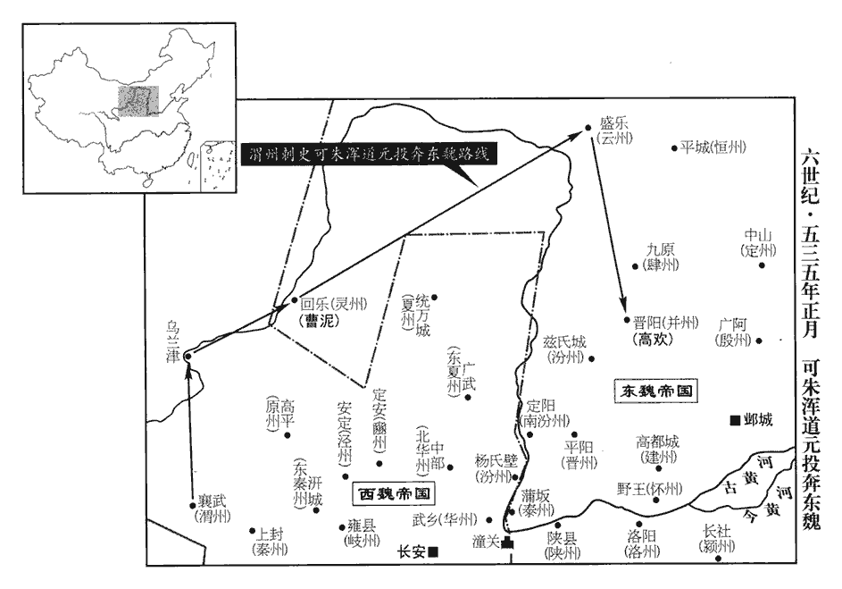
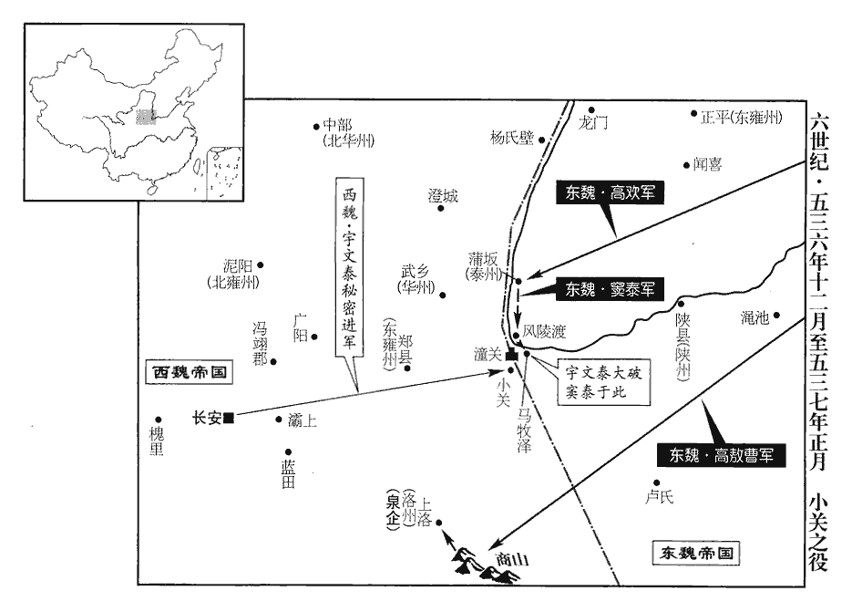
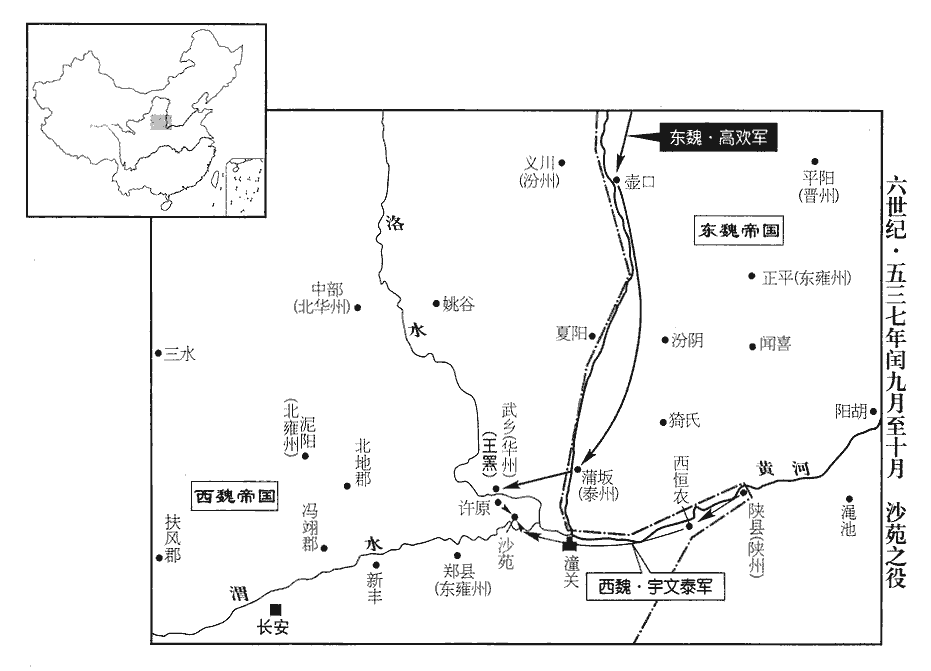
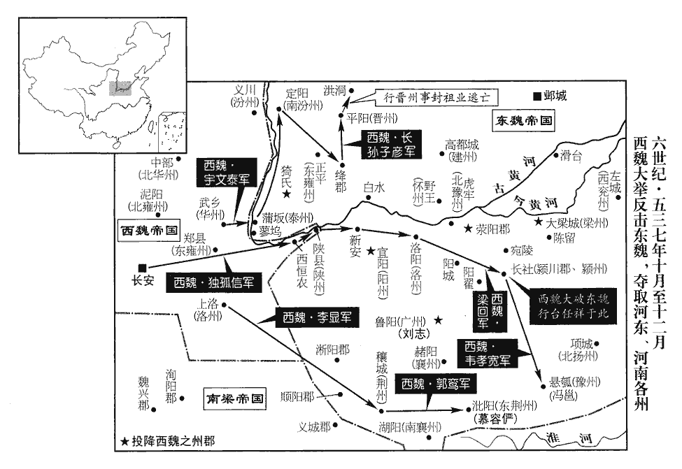

 梁紀十三起旃蒙單閼（乙卯），盡強圉大荒落（丁巳），凡三年。

# 高祖武皇帝十三

## 大同元年（乙卯、五三五）

1春，正月，戊申朔‹一›，大赦，改元。

〖译文〗 [1]春季，正月，戊申朔（初一），梁武帝下令大赦天下，改年号为大同。

2是日，魏‹都长安陕西省西安市›文帝‹元宝炬，本年二十九岁›即位於城西，城西，長安城西也。古者天子即位御前殿，魏自高歡立孝武帝復用夷禮，於郊拜天而後即位。大赦，改元大統，追尊父京兆王‹元愉›為文景皇帝，妣楊氏為皇后。

〖译文〗 [2]这一天，西魏文帝在长安城西郊祭天以后登上了皇位，随即下令大赦天下，改年号为“大统”，追尊他的父亲京兆王为文景皇帝，母亲杨氏为皇后。

3魏渭州‹府设襄武甘肃省陇西县›刺史可朱渾道元先附侯莫陳悅，悅死，悅死，見上卷中大通六年。丞相泰攻之，不能克，與盟而罷。道元世居懷朔‹内蒙古固阳县›，與東魏‹首都邺城河北省临漳县西南邺镇›丞相歡善，又母兄皆在鄴，由是常與歡通。泰欲擊之，道元帥所部三千戶西北渡烏蘭津‹甘肃省靖远县西北黄河渡口›抵靈州‹府设回乐宁夏灵武县›，烏蘭津在平涼西北。唐分平涼之會寧鎮置會州，又置烏蘭縣屬焉。縣西南有烏蘭關。帥，讀曰率。靈州刺史曹泥資送至雲州‹府设盛乐内蒙古和林格尔县›。歡聞之，遣資糧迎候，拜車騎大將軍。騎，奇寄翻。

〖译文〗 [3]原北魏渭州刺史可朱浑道元起先依附于侯莫陈悦，侯莫陈悦死后，西魏的丞相宇文泰对他发起了进攻，没能取得胜利，便与他订立盟约，自己放弃了占领渭州的念头。可朱浑道元一家世代居在怀朔，本人与东魏的丞相高欢关系密切，又因为母亲、哥哥都在邺城，所以常常与高欢进行联系。宇文泰想要攻打他，可朱浑道元就率领手下的三千户人家从西北的乌兰津渡河到达灵州，灵州的刺史曹泥出资将他送到了云州。高欢听到了这一消息，派人准备好粮食、财物前去迎接。还授予他车骑大将军的职衔。

 

道元至晉陽‹山西省太原市›，歡始聞孝武帝之喪，魏孝武去年十二月殂。啟請舉哀制服。東魏主‹元善见，本年十二岁›使群臣議之，太學博士潘崇和以為：「君遇臣不以禮則無反服，記檀弓：魯繆公‹姬显›問於子思曰：「為舊君反服，古與？」子思曰：「古之君子，進人以禮，退人以禮，故有舊君反服之禮也。今之君子，進人若將加諸膝，退人若將隊諸淵，毋為戎首，不亦善乎，又何反服之禮之有！」孟子：齊宣王‹田辟彊›曰：「禮為舊君有服，何如斯可為之服矣？」孟子曰：「諫行言聽，膏澤下於民；有故而去，則君使人導之出疆，又先之於其所往；去三年不反，然後收其田里；此之謂三有禮焉，如此則為之服矣。今也為臣，諫則不行，言則不聽，膏澤不下於民；有故而去，則君搏執之，又極之於其所往；去之日遂收其田里；此之謂寇讎，寇讎何服之有！」是以湯之民不哭桀‹姒履癸›，周武之民不服紂‹子受辛›。」國子博士衛既隆、李同軌議以為：「高后於永熙離絕未彰，宜為之服。」東魏從之。歡初立孝武，納其長女以為皇后，帝之西奔，后留不從。

〖译文〗 可朱浑道元来到晋阳之后，高欢才知道孝武帝已经去世，他就上书孝静帝请求为孝武帝举哀服丧。东魏国主孝静帝叫各位大臣商议此事，太学博士潘崇和认为：“君主如果对臣子不以礼相待，在他死后，臣子就不用为他服丧，所以商汤的百姓不哭吊夏朝的王，周武王的百姓也不为商朝的纣王服丧。”国子博士卫既隆、李同轨建议，认为：“高皇后与孝武帝断绝联系的事没有公布过，应该为孝武帝服丧。”孝静帝采纳了他们的意见。

4魏驍騎大將軍、儀同三司李虎等招諭費也頭之眾‹时驻陕西省最北部›，與之共攻靈州，凡四旬，曹泥請降。驍，堅堯翻。騎，奇寄翻。降，戶江翻。

〖译文〗 [4]西魏骁骑大将军、仪同三司李虎等人招抚费也头的兵马，与他们一道攻打灵州，共持续了四十天，曹泥坚守不住，请求投降。

5己酉‹二›，魏進丞相略陽公泰為都督中外諸軍、錄尚書事、大行臺，封安定王；泰固辭王爵及錄尚書，乃封安定公。以尚書令斛斯椿為太保，廣平王贊為司徒。

〖译文〗 [5]己酉（初二），西魏提升丞相略阳公宇文泰为都督中外诸军、录尚书事、大行台，还封他为安定王。宇文泰坚决推辞掉王爵与录尚书的职务，西魏文帝就封他为安定公，还任命斛斯椿为太保、广平王元赞为司徒。

6乙卯‹八›，魏主‹元宝炬›立妃乙弗氏為皇后，乙弗之先世為吐谷渾渠帥，居青海，即禿髮傉儃所襲者也。魏平涼州，后之高祖莫瓌擁部落入附，其後從孝文遷洛，遂家焉。子欽為皇太子。后仁恕節儉，不妬忌，帝甚重之。以魏文帝之重乙弗后，而卒迫於強敵，使后不得其死，悲夫。

〖译文〗 [6]乙卯（初八），西魏文帝把他的妃子乙弗氏立为皇后，儿子元钦立为皇太子。皇后仁爱宽厚，勤俭节约，从不妒忌，文帝非常敬重她。

7稽胡劉蠡升，自孝昌以來，自稱天子，改元神嘉，居雲陽谷‹在山西省西部›；李延壽曰：稽胡，一曰步落稽，蓋匈奴別種，劉元海五部之苗裔也。或云：山戎、赤狄之後。自離石以西，安定以東，方七八百里，居山谷間，種落繁熾。魏之邊境常被其患，謂之「胡荒」。言其本胡種，侵擾漢民，若在荒服之外者也。被，皮義翻。壬戌‹十五›，東魏丞相歡襲擊，大破之。

〖译文〗 [7]稽胡部落的刘蠡升，从孝昌年间以来，就自封为皇帝，将年号改为“神嘉”，居住在云阳谷；魏国的边境地区经常受到他的侵扰，被称为“胡荒”。壬戌（十五日），东魏丞相高欢对刘蠡升发起袭击，将他们打得大败。

8勃海世子澄‹高澄，本年十四岁›通於歡妾鄭氏，歡封勃海王，以澄為世子。歡歸，歸自襲稽胡。一婢告之，二婢為證；歡杖澄一百而幽之，婁妃‹娄昭君›亦隔絕不得見。歡納魏敬宗‹元修›之后爾朱氏‹尔朱英娥，尔朱荣之女›，有寵，生子浟，浟yōu，夷周翻。歡欲立之。澄求救於司馬子如。子如入見歡，偽為不知者，請見婁妃‹娄昭君›；歡告其故。子如曰：「消難‹司马消难，子如子›亦通子如妾，此事正可掩覆。難，乃旦翻。覆，敷又翻。妃是王結髮婦，常以父母家財奉王；程正叔曰：古人言「結髮為夫婦」，如言「結髮事君」，「結髮戰匈奴」，只言初上頭時也，豈謂合髻子邪！按婁妃本傳：妃少見歡在城上執役，慕之，使婢通意。又數致私財，使以聘己，父母不得已而許焉。王在懷朔‹府设野王河南省沁阳市›被杖，背無完皮，妃晝夜供侍；後避葛賊，葛賊，謂葛榮也。同走并州，貧困，妃然馬矢然，與燃同。自作靴；隋志：靴，胡履也。取便於事，施於戎服。恩義何可忘也！夫婦相宜，女配至尊，妃二女，長配孝武帝，次配孝靜帝。男承大業。謂澄為世子也。且婁領軍之勳，何宜搖動！妃弟昭時為領軍將軍。一女子如草芥，況婢言不必信邪！」歡因使子如更鞫之。子如見澄，尤之曰：「男兒何意畏威自誣！」因教二婢反其辭，反，音翻。脅告者自縊，縊，於賜翻。，又於計翻。乃啟歡曰：「果虛言也。」歡大悅，召婁妃‹娄昭君›及澄。妃遙見歡，一步一叩頭，澄且拜且進，父子、夫婦相泣，復如初。復，扶又翻。歡置酒曰：「全我父子者，司馬子如也！」賜之黃金百三十斤。

〖译文〗 [8]勃海王高欢的嫡长子高澄与他的小妾郑氏私通。高欢袭击稽胡之后回来，一个婢女把这一情况告诉了他，还有两个婢女在一旁作证。高欢打了高澄一百大棍，并把他关押起来。娄妃也被隔离开来，不允许她见高欢。高欢以前把孝庄帝的皇后尔朱氏收纳为妾，非常宠爱她，他们生了一个儿子叫高，高欢想要立他做自己的继承人。高澄就向司马子如求救。司马子如来到王府拜见高欢，假装不知道内情，请求见一见娄妃，高欢就把详细情况告诉了司马子如。司马子如说道：“消难也和我的小妾私通了，这件事只能掩盖起来。娄妃是王爷的结发妻子，当初经常把父母亲家里的财物拿出来给您。您在怀朔的时候被人用木杖责打，背上没有一块完好的皮肉，娄妃在旁边不分白天黑夜地侍侯您，后来为了躲避葛荣这个奸贼，你们一同出走到并州，生活贫困，王妃点燃马粪作饭，亲自制作靴子；这样的恩义怎么可以忘掉呀？你们夫妇二人相互适合，所生的女儿嫁给了最尊贵的皇帝，儿子高澄则继承了您的大业，况且王妃的弟弟娄领军功勋突出，怎么可以轻易动摇得了呢？一个女人就象小草一样，没有必要多么看重，何况婢女的话也没有必要去相信！”高欢听后，就叫司马子如重新查问这件事情。司马子如见到高澄，便责怪他道：“你身为男子汉，怎么可以因为害怕威严就自己诬蔑自己！”与此同时，他又教那两位婢女推翻自己的证词，胁迫告状的婢女上吊自杀，然后向高欢报告说：“那些话果然是无中生有。”高欢听了非常高兴，派人去叫娄妃和高澄。娄妃远远看见高欢，便走一步叩一个头，高澄也是一边跪拜一边向前，父亲与儿子，丈夫与妻子相互都流下了眼泪，从此又和好如初。高欢安排了酒宴，说道：“成全我们父子两人关系的，是司马子如呀！”于是便赠给司马子如一百三十斤黄金。

9甲子‹十七›，魏以廣陵王欣為太傅，儀同三司万俟壽洛干為司空。万，莫北翻。俟，渠之翻。壽洛干即受洛干。

〖译文〗 [9]甲子（十七日），西魏任命广陵王元欣为太傅，仪同三司万俟寿洛干为司空。

10己巳‹二十二›，東魏以丞相歡為相國，假黃鉞，殊禮；固辭。

〖译文〗 [10]己巳（二十二日），东魏任命丞相高欢为相国，让他可以使用皇帝的仪仗，赐以特殊礼遇，高欢坚决推辞不受。

11東魏大行臺尚書司馬子如帥大都督竇泰、太州‹府设蒲坂山西省永济县›刺史韓軌等攻潼關‹陕西省潼关县›，按韓軌傳，為秦州刺史。又考魏收志，東魏置秦州於河東，領河東、北鄉二郡。史蓋誤以「秦」為「泰」，緣「泰」之誤又以「泰」為「太」。帥，讀曰率。魏丞相泰軍于霸上‹陕西省西安市东灞河畔›。子如與軌回軍，從蒲津‹蒲津关·山西省永济县西黄河渡口›宵濟，攻華州‹府设武乡陕西省大荔县›。五代志：後魏置東雍州於鄭縣，西魏改曰華州。華，戶化翻。時脩城未畢，梯倚城外，比曉，東魏人乘梯而入。刺史王羆臥尚未起，聞閤外匈匈有聲，比，必利翻。匈，許容翻。匈匈，喧擾之聲。袒身露髻徒跣，持白梃大呼而出，梃，待鼎翻，杖也。白梃，即今人所謂白棓bàng也。呼，火故翻。東魏人見之驚卻。羆逐至東門，左右稍集，合戰，破之，子如等遂引去。兵以氣勢為用；兵之勇怯，恃主帥以為氣勢。王羆勇於赴敵，而其左右又勇於戰，此其所以於不備不虞之中而能卻敵也。

〖译文〗 [11]东魏的大行台尚书司马子如率领大都督窦泰、太州刺史韩轨等人攻打潼关，西魏的丞相宇文泰在不远的霸上驻扎了军队。司马子如与韩轨带着人马回过头来，从蒲津连夜渡河，攻打华州。此时，华州城还没有修筑完毕，云梯倚在城墙的外边，拂晓，东魏的将士攀着云梯突袭进城。刺史王罴躺在床上还没起来，听到屋外一片喧扰声，顾不上穿衣服，包发髻，赤着双脚，手持白色大棒，就大叫着冲了出去，东魏的将士见了他连忙惊慌地退却。王罴一直追逐到东门，部下渐渐集结起来，双方交战，打垮了敌人的进攻，于是司马子如人等便带领部队撤退。

12二月，辛巳‹四›，上‹萧衍，本年七十二岁›祀明堂。

〖译文〗 [12]二月，辛巳（初四），梁武帝在明堂举行祭祀典礼。

13壬午‹五›，東魏以咸陽王坦為太傅，西河王悰為太尉。悰，徂宗翻。

〖译文〗 [13]壬午（初五），东魏任命咸阳王元坦为太傅，西河王元为太尉。

14東魏使尚書右僕射高隆之發十萬夫撤洛陽宮殿，運其材入鄴。

〖译文〗 [14]东魏指派尚书右仆射高隆之征调十万民工拆除洛阳的宫殿，将拆下的材料运到邺城。

15丁亥‹十›，上耕藉田。

〖译文〗 [15]丁亥（初十），梁武帝举行亲耕藉田的仪式。

16東魏儀同三司婁昭等攻兗州‹府设瑕丘山东省兖州市›，樊子鵠使前膠州‹府设东武山东省诸城市›刺史嚴思達守東平‹山东省东平县›，魏收志：泰常中置東平郡，太和末罷，建義中復置，治秦城，屬濟州。秦城在范縣界。昭攻拔之。遂引兵圍瑕丘，久不下，昭以水灌城；己丑‹十二›，大野拔見子鵠計事，因斬其首以降。始，子鵠以眾少，降，戶江翻。少，詩沼翻。悉驅老弱為兵，子鵠死，各散走。諸將勸婁昭盡捕誅之，昭曰：「此州不幸，橫被殘賊，跂望官軍以救塗炭，橫，戶孟翻。跂qǐ，去智翻，舉踵也。今復誅之，復，扶又翻；下眾復同。民將誰訴！」皆捨之。

〖译文〗 [16]东魏的仪同三司娄昭等人攻打兖州，樊子鹄派遣以前的胶州刺史严思达守卫东平，娄昭攻克了该城。然后，他又指挥部队包围了瑕丘，由于很长时间攻不下来，便用水灌城；己丑（十二日），大野拔乘樊子鹄议事之机，便砍掉他的脑袋向娄昭投降。最初，樊子鹄因为部队人数少，把年老体弱的人都赶来当兵，樊子鹄一死，他们各自都散开逃走了。众位将领都劝娄昭把他们全都抓来杀掉，娄昭回答说：“这个州不幸，横遭残害，人们都踮起脚尖，盼望官家的军队把他们从水火之中解救出来，今天再杀掉他们，百姓将向谁申诉？”大家听了这番话，都放弃了追杀的打算。

17戊戌‹二十一›，司州‹府设义阳河南省信阳市›刺史陳慶之伐東魏，與豫州‹府设悬瓠河南省汝南县›刺史堯雄戰，不利而還。東魏豫州治汝南。堯，姓；雄，名。

〖译文〗 [17]戊戌（二十一日），梁朝司州刺史陈庆之讨伐东魏，与东魏豫州刺史尧雄交战，失利后返回。

18三月，辛酉‹十五›，東魏以高盛為太尉，高敖曹為司徒，濟陰王暉業為司空。濟，子禮翻。

〖译文〗 [18]三月，辛酉（十五日），东魏任用高盛为太尉，高敖曹为司徒，济阴王元晖业为司空。

19東魏丞相歡偽與劉蠡升‹时据云阳谷在山西省西部›約和，許以女妻其太子。妻，七細翻；下后妻同。蠡升不設備，歡舉兵襲之，辛酉‹十五›，蠡升北部王斬蠡升首以降。降，戶江翻。餘眾復立其子南海王，歡進擊，擒之，俘其皇后、諸王、公卿以下四百餘人，華、夷五萬餘戶。

〖译文〗 [19]东魏的丞相高欢假装与刘蠡升订立和约，答应让自己的女儿做他的太子的妻子。刘蠡升没有进行防备，高欢大举进兵袭击了他，辛酉（十五日），刘蠡升手下的北部王将刘蠡升斩首向高欢投降。刘蠡升残余的将士又拥立他的儿子南海王为皇帝，高欢再加攻击，捉住了南海王，俘虏皇后、各位藩王、公卿以及以下的官员共达四百余人，另外还有华、夷各族的百姓五万余户。

壬申‹二十六›，歡入朝於鄴，朝，直遙翻。以孝武帝‹元修›后妻彭城王韶。孝武帝后，歡長女也。

〖译文〗 壬申（二十六日），高欢来到邺城的皇宫朝拜孝静帝，将自己的女儿即孝武帝的皇后许配给彭城王元韶作妻子。

20魏丞相泰以軍旅未息，吏民勞弊，命所司斟酌古今可以便時適治者，為二十四條新制，奏行之。治，直吏翻。

〖译文〗 [20]西魏的丞相宇文泰考虑到战事得不到平息，官吏百姓已经疲劳，就命令有关部门斟酌参照古往今来既利于目前情况、又适合于治理天下的制度，制订出二十四项新的法令，上书得到文帝的批准后开始实行。

泰用武功‹陕西省武功县西›蘇綽為行臺郎中，魏收志：太和十一年，分扶風置武功郡，屬岐州。即漢、魏武功縣之地。居歲餘，泰未之知也，而臺中皆稱其能，有疑事皆就決之。就蘇綽以決疑也。此就，即孟子「欲有謀焉則就之」之就。泰與僕射周惠達論事，惠達不能對，請出議之。出，以告綽，綽為之區處，為，于為翻。處，昌呂翻。惠達入白之，泰稱善，曰：「誰與卿為此議者？」惠達以綽對，且稱綽有王佐之才，泰乃擢綽為著作郎。泰與公卿如昆明池觀漁，行至漢故倉池，水經註：泬jué水枝渠至章門西，飛渠引水入城，東為倉池，池在未央宮西。池有漸臺，漢兵起，王莽死於此臺。蘇綽傳亦云：行至長安城西，漢故倉池。顧問左右，莫有知者。泰召綽問之，具以狀對。泰悅，因問天地造化之始，歷代興亡之迹，綽應對如流。泰與綽並馬徐行，至池，竟不設網罟gǔ而還。意在問綽，不在觀漁。還，從宣翻，又如字。遂留綽至夜，問以政事，臥而聽之；綽指陳為治之要，治，直吏翻。泰起，整衣危坐，不覺膝之前席，初臥而聽，繼起而整衣危坐，又不覺膝之前席。蓋綽之言深有以當泰心，久而愈敬也。語遂達曙不厭。天曉為曙。詰朝，謂周惠達曰：「蘇綽真奇士，吾方任之以政。」詰，去吉翻。即拜大行臺左丞，參典機密，自是寵遇日隆。綽始制文案程式朱出、墨入及計帳、戶籍之法，計帳者，具來歲課役之大數，以報度支。戶籍者，戶口之籍。後人多遵用之。世有有為之主，必有能者出為之用；若謂天下無才，吾不信也。

〖译文〗 宇文泰任用武功人苏绰为行台郎中，一年多之后，宇文泰自己对苏绰还不大了解，但是行台官署中的人都称赞苏绰能力强，遇上有疑难的事情都去请他帮助决策。宇文泰与仆射周惠达讨论一件事，周惠达不能回答宇文泰的问题，就请求允许他出去跟别人一起商议此事。周惠达出门后，把情况告诉了苏绰，苏绰为周惠达作了分析解答，周惠达进去后按照苏绰的意见作出回答。宇文泰认为周惠达回答的非常好，问道：“谁帮你作出了这番议论？”周惠达说出了苏绰的名字，并且称赞苏绰具有辅佐君王、成就大业的才能，字文泰便提拔苏绰为著作郎。宇文泰与公卿一起去昆明池观赏游鱼，走到汉代传下来的仓池时，回过头来询问身旁的人，他们中没有一个知道仓池的情况。宇文泰就把苏绰叫来，向他提问，苏绰把一件件事都讲得绘声绘色。宇文泰很高兴，就一直问到天地开始创造化育时有什么景象，历代兴盛与灭亡的经过如何，苏绰始终对答如流。宇文泰与苏绰一道骑着马慢慢地并行，到了昆明池，竟然没有撒网就返回了。在丞相府，宇文泰将苏绰一直留到晚上，就一些军政大事征求苏绰的意见，苏绰讲述，宇文泰躺着倾听。当苏绰指出治理国家有哪些关键之处的时候，宇文泰从睡榻上起来，整理好衣服端正地坐着，不知示觉他的膝头已经挨到了席子的前端，苏绰的话从晚上又持续到第二天清晨，宇文泰还听得不满足。上朝的时候，字文泰对周惠达说：“苏绰真是个奇特的人，我这就让他管理重要的政务。”他随即任命苏绰为大行台左丞，让他参与掌管处理机密大事，从此苏绰越来越受到宇文泰的宠信。苏绰开始制定处理文书的程序如用红笔批出，用黑笔签收，还有关于计账、户籍的一些办法，这些程序、办法，后来的人大多遵照沿用了。

21東魏以封延之為青州‹府设东阳山东省青州市›刺史，代侯淵。淵既失州任而懼，行及廣川‹东广川郡·山东省邹平县东›，沈約曰：廣川縣本屬信都，後漢屬清河，魏屬勃海，晉還清河。江左僑立廣川郡縣於濟南，非舊所也。魏收曰：齊郡廣川縣有牛山、齊桓公冢、管仲冢。五代志：齊州長山縣，舊置廣川郡。遂反，夜，襲青州南郭，劫掠郡縣。夏，四月，丞相歡使濟州‹府设碻磝山东省茌平县西南›刺史蔡儁討之。濟，子禮翻。淵部下多叛，淵欲南奔，於道為賣漿者所斬，送首於鄴。

〖译文〗 [21]东魏任用封延之为青州刺史，取代侯渊。侯渊失去了一州长官的职务后心里惧怕，走到广川的时候就造反了。在夜间，他袭击了青州城南的外城，又到郡县大肆抢劫掠夺，夏季，四月，丞相高欢派遣济州刺史蔡俊讨伐侯渊。侯渊的部下大多数都背叛了他，他自己想要跑到南方去，在路上让一个卖浆的人杀死，首级被送到邺城。

22元慶和攻東魏城父‹安徽省亳州市东南城父乡›，魏收志，陳留郡浚儀縣有城父城，至隋，改浚儀為城父縣，屬譙郡。五代志：譙郡城父縣，宋置浚儀縣。又考沈約志，陳留浚儀縣並寄治譙郡長垣縣界。則知諸志所謂浚儀，非我朝開封府之浚儀也。魏收志梁州陳留郡浚儀縣，則我朝開封之浚儀也。真宗改浚儀曰祥符。所謂城父，則今亳州之城父縣是也。父，音甫。丞相歡遣高敖曹帥三萬人趣項‹河南省沈丘县›，竇泰帥三萬人趣城父，侯景帥三萬人趣彭城‹江苏省徐州市›，帥，讀曰率。趣，七喻翻。以任祥為東南道行臺僕射，節度諸軍。任，音壬。

〖译文〗 [22]梁朝的元庆和攻打东魏的城父城，东魏丞相高欢派遣高敖曹统率三万人马赶往项县，窦泰统率三万人赶往城父城，侯景统率三万人马赶往彭城，又任命任祥为东南道行台仆射，统一指挥管辖这几支军队。

23五月，魏加丞相泰柱國。即柱國大將軍之官。

〖译文〗 [23]五月，西魏加封丞相宇文泰为柱国大将军。

24元慶和引兵逼東魏南兗州‹府设谯城安徽省亳州市›，東魏洛州‹府设洛阳河南省洛阳市东白马寺东›刺史韓賢拒之。東魏既遷鄴，以洛陽為洛州，領洛陽、河陰、新安、中川、河南、陽城郡。六月，慶和攻南頓‹河南省项城县›，豫州刺史堯雄破之。

〖译文〗 [24]元庆和指挥兵马逼近东魏的南兖州，东魏洛州刺史韩贤领兵抵抗。六月，元庆和又进攻南顿，东魏豫州刺史尧雄打败了他。

25秋，七月，甲戌‹三十›，魏以開府儀同三司念賢為太尉，万俟壽洛干為司徒，開府儀同三司越勒肱為司空。越勒出於越勒部，因以為姓。

〖译文〗 [25]秋季，七月，甲戌（三十日），西魏任命开府仪同三司念贤为太尉，万俟寿洛干为司徒，开府仪同三司越勒肱为司空。

26益州‹府设成都四川省成都市›刺史鄱陽王範、南梁州‹府设阆中四川省阆中市›刺史樊文熾五代志：普安郡，梁置南梁州，後改為安州，西魏改曰始州，至唐改始州曰劍州。合兵圍晉壽‹四川省广元市西南·西魏益州州政府所在县›，魏東益州‹府设武兴陕西省略阳县›刺史傅敬和來降。降，戶江翻。範，恢之子；鄱陽王恢，費妃之子，上之弟也。敬和，豎眼之子也。傅豎眼著功梁、益，而子為降虜，隤tuí其家聲忽諸！豎，而庾翻。

〖译文〗 [26]梁朝益州刺史鄱阳王萧范、南梁州刺史樊文炽带领部队联合行动，包围了晋寿，西魏的东益州刺史傅敬和前来投降。萧范是萧恢的儿子。傅敬和是傅竖眼的儿子。

27魏下詔數高歡二十罪，數，所具翻。且曰：「朕將親總六軍，與丞相掃除凶醜。」歡亦移檄於魏，謂宇文黑獺、斛斯椿為逆徒，且言「今分命諸將，領兵百萬，刻期西討。」將，即亮翻。

〖译文〗 [27]西魏文帝颁下诏书，历举了高欢的二十条罪行，并且声明：“朕将亲自统领六军，与宇文丞相一道扫除凶恶的国贼。”高欢也向西魏传布声讨文书，说宇文黑獭、斛斯椿是叛徒，并且扬言：“现在我将分头命令各位将领，率领百万人马，定下日期西讨逆贼。”

28東魏遣行臺元晏擊元慶和。

〖译文〗 [28]东魏派遣行台元晏袭击梁朝的元庆和。

29或告東魏司空濟陰王暉業與七兵尚書薛琡貳於魏，曹魏置五兵尚書，謂中兵、外兵、騎兵、別兵、都兵也。及晉，分中兵、外兵為左、右，與舊五兵為七曹；然尚書唯置五兵而已，無七兵尚書之名。至後魏，始有七兵尚書，北齊復為五兵。琡shū，昌六翻。濟，子禮翻。八月，辛卯‹十七›，執送晉陽，皆免官。時東魏丞相歡居晉陽，執送二人，取其裁決。春秋，晉為方伯，執列國君臣之違命者歸之京師，經猶貶之，況自京師而執送晉陽乎！

〖译文〗 [29]有人告发东魏的司空济阴王元晖与七兵尚书薛与西魏有勾结，八月，辛卯（十七日），他们被捉住并且押送到晋阳，高欢将二人的官职都免去了。

30甲午‹二十›，東魏發民七萬六千人作新宮於鄴，使僕射高隆之與司空冑曹參軍辛術共營之，元魏公府有法、墨、田、水、鎧、冑、集、士等曹，皆行參軍也。築鄴南城周二十五里。術，琛之子也。辛琛見一百四十七卷天監六年。琛，丑林翻。

〖译文〗 [30]甲午（二十日），东魏征调七万六千名民工在邺城建造新的皇宫，叫崐仆射高隆之与司空胄曹参军辛术一道负责营建，在邺城的南面又修筑起一座周长二十五里的新城。辛术是辛琛的儿子。

31趙剛自蠻中往見東魏東荊州‹府设沘阳河南省泌阳县›刺史趙郡‹河北省赵县›李愍，勸令附魏，愍從之，剛由是得至長安。丞相泰以剛為左光祿大夫。剛說泰召賀拔勝、獨孤信等於梁，剛沒蠻中，勝、信奔梁，並見上卷上年。說，式芮翻。泰使剛來請之。

〖译文〗 [31]赵刚从蛮人住的地方去见东魏的东荆州刺史赵郡人李愍，规劝他归附西魏。李愍听从了赵刚的规劝，赵刚因此得到机会去长安。丞相宇文泰任命赵刚为左光禄大夫。赵刚劝说宇文泰将贺拔胜、独孤信等人从梁朝召回来，宇文泰委托赵刚前去邀请。

32九月，丁巳‹十四›，東魏以開府儀同三司襄城王旭為司空。旭，吁玉翻。

〖译文〗 [32]九月，丁巳（十四日），东魏任命开府仪同三司襄城王元旭为司空。

33冬，十月，魏太師上黨文宣王長孫稚卒。長，知兩翻。

〖译文〗 [33]冬季，十月，西魏的太师上党文宣王长孙稚去世。

34魏秦州‹府设上封甘肃省天水市›刺史王超世，丞相泰之內兄也，母黨以兄弟齒，謂之內兄、內弟。驕而黷dú貨，泰奏請加法，詔賜死。

〖译文〗 [34]西魏的秦州刺史王超世是丞相宇文泰的内兄，他骄横自大而且贪污财物，宇文泰上书请求绳之以法，西魏文帝颁下诏书命令王超世自杀。

35十一月，丁未‹五›，侍中、中衛將軍徐勉卒‹年七十岁›。卒，子恤翻。勉雖骨鯁不及范雲，亦不阿意苟合，故梁世言賢相者稱范、徐云。范、徐既沒，專任朱异，梁殆矣。

〖译文〗 [35]十一月，丁未（初五），梁朝的侍中、中卫将军徐勉去世。徐勉的骨气虽然还不象范云那么硬，但是也从不阿谀奉承，所以有此一说：“梁一代够得上贤相的只有范云和徐勉二人。”

36癸丑‹十一›，東魏主‹元善见›祀圜丘。

〖译文〗 [36]癸丑（十一日），东魏的孝静帝在圜丘祭天。

37甲午‹十二›，東魏閶闔門災。門之初成也，高隆之乘馬遠望，謂其匠曰：「西南獨高一寸。」量之果然。高居奧翻。量，音良。太府卿任忻集自矜其巧，不肯改。任，音壬。隆之恨之，至是譖於丞相歡曰：「忻集潛通西魏，令人故燒之。」歡斬之。

〖译文〗 [37]甲午（疑误），东魏的阊阖门发生了火灾。阊阖门刚刚建成的时候，高隆之骑着马从远处一望，就对修门的工匠说：“西南面比其它地方高了一寸。”一量果然如此。但是太府卿任忻集很看重这个门的精巧，不肯改动。因此，高隆之便怀恨在心，到火灾发生后便去丞相高欢那儿进谗言，说：“任忻集暗中与西魏联络，故意叫人烧掉了阊阖门。”于是，高欢就下令杀掉了任忻集。

38北梁州‹府设魏兴陕西省安康市›刺史蘭欽引兵攻南鄭‹陕西省汉中市›，梁以南鄭為北梁州。蓋以欽為刺史，使之圖南鄭也。魏梁州‹府南郑›刺史元羅舉州降。降，戶江翻。考異曰：典略在七月，今從梁帝紀。

〖译文〗 [38]梁朝的北梁州刺史指挥将士攻打南郑，西魏的梁州刺史元罗率领全州军民投降。

39東魏以丞相歡之子洋‹高洋，本年七岁›為驃騎大將軍、開府儀同三司，封太原公。洋，音羊，又音祥。驃，匹妙翻。騎，奇寄翻；下同。洋內明決而外如不慧，兄弟及眾人皆嗤鄙之，嗤，丑之翻。獨歡異之，謂長史薛琡曰：「此兒識慮過吾。」幼時，歡嘗欲觀諸子意識，使各治亂絲，治，直之翻；下同。洋獨抽刀斬之，曰：「亂者必斬！」又各配兵四出，使都督彭樂帥甲騎偽攻之，兄澄等皆怖橈，帥，讀曰率。怖，普布翻。橈，奴教翻。洋獨勒眾與樂相格，樂免冑言情，猶擒之以獻。

〖译文〗 [39]东魏任命丞相高欢的儿子高洋为骠骑大将军、开府仪同三司，并封他为太原公。高洋内心既果断而又精明，可是外表上看起来好象智力不够，他的兄弟以及其他的许多人都嗤笑鄙视他，唯独高欢认为他与众不同，曾经对长史薛说：“这孩子的见识与思考问题的能力都超过我。”还在高洋幼小的时候，高欢曾经想观察一下各位儿子的智能如何，让他们各自整理一团乱丝，唯独高洋一人抽出刀来砍断了乱丝，说：“乱的东西就一定要砍断！”高欢还给儿子们各自配备了兵力让他们四面出击，又叫都督彭乐率领戴盔裹甲的骑兵假装进攻，长兄高澄等人都害怕得乱了阵脚，只有高洋布置兵力与彭乐对抗，彭乐脱去盔甲叙述情况时，高洋还擒拿了彭乐，将他献给高欢。

初，大行臺右丞楊愔從兄岐州‹府设雍城陕西省凤翔县›刺史幼卿，以直言為孝武帝所殺，愔，於今翻。從，才用翻。愔同列郭秀害其能，恐之曰：「高王欲送卿於帝所。」愔懼，變姓名逃於田橫島‹山东省即墨市东崂山湾口海边小岛，田横五百将士死难处›。五代志，東萊郡即墨縣有田橫島。久之，歡聞其尚在，召為太原公開府司馬，為楊愔為洋所親任張本。頃之，復為大行臺右丞。復，扶又翻。

〖译文〗 当初，大行台右丞杨的堂兄、岐州刺史杨幼卿，因为言语直率，被孝武帝下令杀害。同僚郭秀妒嫉杨的才能，就吓唬杨说：“高王要把您送到皇上那里去。”杨害怕了，便更改了姓名逃到田横岛。很久以后，高欢听说他崐还在人世，把他叫了回来，任命他为太原公开府司马，没有多少时间，又恢复了他的大行台右丞的职务。

40十二月，甲午‹二十二›，東魏文武官量事給祿。隨任事之輕重，以為給祿之差。量，音良。

〖译文〗 [40]十二月，甲午（二十二日），东魏根据文武百官承担事务的轻重，给予相应的俸禄。

41魏以念賢為太傅，河州‹府设枹罕甘肃省临夏市›刺史梁景叡為太尉。

〖译文〗 [41]西魏任命念贤为太傅，河州刺史梁景睿为太尉。

42是歲，鄱陽‹江西省波阳县›妖賊鮮于琛改元上願，有眾萬餘人。妖，於驕翻。琛，丑林翻。鄱陽內史吳郡‹江苏省苏州市›陸襄討擒之，按治黨與，無濫死者。民歌之曰：「鮮于平後善惡分，民無枉死賴陸君。」

〖译文〗 [42]这一年，鄱阳地区的妖贼鲜于琛将年号改为“上愿”，他的属下共有一万多人。梁朝鄱阳内史吴郡人陆襄前去讨伐，捉住了鲜于琛，并按照罪行大小分别惩治了他的同伙，没有出现滥杀无辜的现象。老百姓都歌唱道：“鲜于平后善恶分，民无枉死赖陆君。”

43柔然‹瀚海沙漠群›頭兵可汗求婚於東魏，丞相歡以常山王‹元骘›妹為蘭陵公主，妻之。柔然數侵魏，妻，七細翻。數，所角翻。魏使中書舍人庫狄峙奉使至柔然，與約和親，使，疏吏翻。由是柔然不復為寇。復，扶又翻。

〖译文〗 [43]柔然的头兵可汗向东魏求婚，丞相高欢封常山王的妹妹为兰陵公主，将她许配给头兵可汗作妻子。柔然多次侵扰西魏，西魏委派中书舍人库狄峙带着使命到达柔然，与头兵可汗订立了和亲条约，从此柔然不再入侵西魏。

## 二年（丙辰、五三六）

1春，正月，辛亥‹九›，魏‹元宝炬，本年三十岁›祀南郊，改用神元皇帝配。魏高祖太和十六年，以太祖道武皇帝配南郊。神元皇帝，魏之先祖拓跋力微也；見晉武帝紀。

〖译文〗 [1]春季，正月辛亥（初九），西魏文帝在南郊祭天，改以神元皇帝配享。

2甲子‹二十二›，東魏‹都邺城河北省临漳县西南邺镇›丞相歡自將萬騎襲魏夏州‹府设统万陕西省靖边县北白城子›，將，即亮翻。騎，奇寄翻。夏，戶雅翻。身不火食，四日而至，縛矟為梯，矟shuò，色角翻。夜入其城，擒刺史斛拔俄彌突，因而用之，留都督張瓊將兵鎮守，遷其部落五千戶以歸。

〖译文〗 [2]甲子（二十二日），东魏丞相高欢亲自率领一万名骑兵袭击西魏的夏州，一路急行军，没有停下生火做饭，跑了四天便赶到了目的地，他们将长矛绑起来结成云梯，连夜攻入城中，抓住了刺史斛拔俄弥突，高欢设法把斛拔俄弥突争取过来后又起用了他。接着，高欢留下都督张琼领兵镇守夏州，又下令迁移斛拔俄弥突部落中的五千户人家，由自己带着返回晋阳。

3魏靈州‹府设回乐宁夏灵武县›刺史曹泥與其壻涼州‹府设姑臧甘肃省武威市›刺史普樂‹郡政府回乐›劉豐復叛降東魏，魏置普樂郡，屬靈州。五代史志：靈武郡迴樂縣，後周置，帶普樂郡。宋白曰：靈州西南至涼州九百里。去年曹泥降魏，今復叛。樂，音洛。復，扶又翻。降，戶江翻。魏人圍之，考異曰：北齊書、典略皆云「周文圍泥」，周書不言，故但云魏人。水灌其城，不沒者四尺。東魏丞相歡發阿至羅三萬騎徑度靈州，繞出魏師之後，魏師退。歡帥騎迎泥及豐，拔其遺戶五千以歸，高歡豈不欲與宇文爭靈州哉？雖鞭之長，不及馬腹也。以豐為南汾州‹府设定阳山西省吉县›刺史。東魏置南汾州於定陽，隋改定陽縣為吉昌縣，唐為慈州治所。

〖译文〗 [3]西魏的灵州刺史曹泥与他的女婿凉州刺史普乐人刘丰又投降了东魏，西魏的兵马包围了他们，用水灌他们的州城，城外积水只差四尺就要淹过城头了。东魏丞相高欢派阿至罗三万名骑兵越过灵州，绕到西魏军队的背后出击，西魏的军队撤退了。高欢率领骑兵迎接曹泥与刘丰，并把他们遗留下的五千户人家迁到晋阳。高欢任命刘丰为南汾州的刺史。

4東魏加丞相歡九錫；固讓而止。

〖译文〗 [4]东魏孝静帝赐给丞相高欢九锡，高欢坚决推让，于是作罢。

5上‹萧衍，本年七十三岁›為文帝作皇基寺‹在江苏省丹阳市东›以追福，帝追尊考順之曰文皇帝。為，于偽翻。命有司求良材。曲阿‹江苏省丹阳市›弘氏自湘州‹府设临湘湖南省长沙市›買巨材東下，南津‹南州津·安徽省当涂县西长江渡口›校尉孟少卿欲求媚於上，據梁紀，普通六年，南州津改置校尉，增加奉秩。南州即今採石。校，戶教翻。少，詩照翻。誣弘氏為劫而殺之，沒其材以為寺。殺無罪之人，取其材以為寺，福田利益果安在哉！

〖译文〗 [5]梁武帝为了使他已故的父亲文皇帝祈求冥福，准备给他建造一座皇基寺，于是命令有关的官员去寻找上等的木材。曲阿人弘氏从湘州买了巨型木材往东边运送，南津校尉孟少卿想用这些木材向梁武帝献媚，就诬蔑弘氏是抢劫犯，杀掉了他，将他的木材没收后用来建造寺庙。

6二月，乙亥‹四›，上‹萧衍›耕藉田。

〖译文〗 [6]二月，乙亥（初四），梁武帝在藉田耕作。

7東魏勃海世子澄，年十五，為大行臺、并州‹府设晋阳›刺史，中大通五年，魏以歡為大行臺，歡以授其子澄。歡居晉陽，并州刺史地任要重，故亦以澄為之。求入鄴輔朝政，朝，直遙翻；下同。丞相歡不許；丞相主簿樂安‹山东省广饶县›孫搴qiān為之請，為，于偽翻；下為我同。乃許之。丁酉‹二十六›，以澄為尚書令，加領軍、京畿大都督。考異曰：魏帝紀：「為尚書令、大行臺、大都督。」北齊文襄紀：「天平元年，為尚書令、大行臺、并州刺史；入輔朝政，加領軍、左右京畿大都督。」按尚書令不在外，大行臺不在內，今兩捨之。魏朝雖聞其器識，猶以年少期之；少，詩照翻。既至，用法嚴峻，事無凝滯，中外震肅。引并州別駕崔暹為左丞、吏部郎，親任之。

〖译文〗 [7] 东魏勃海王的世子高澄，年仅十五岁，就已经成为大行台、并州刺史。他要求到国都邺城辅助皇帝处理朝中的政务，丞相高欢没有答应。乐安籍的丞相主簿孙搴替高澄请求，高欢这才同意。丁酉（二十六日），孝静帝任命高澄为尚书令兼领军、京畿大都督。魏朝上下虽然都曾经耳闻他的才能与识见，但还是把他看成孩子，没想到高澄上任之后，执法严厉，办起事来雷厉风行，朝廷内外的人们都为此感到震惊，同时肃然起敬。高澄引荐并州别驾崔暹为左丞、吏部郎，非常亲近信任他。

8司馬子如、高季式召孫搴劇飲，醉甚而卒。卒，子恤翻。丞相歡親臨其喪。子如叩頭請罪，歡曰：「卿折我右臂，折，而設翻。為我求可代者！」子如舉中書郎魏收，歡以收為主簿。收，子建之子也。魏子建見一百五十卷普通五年。他日，歡謂季式曰：「卿飲殺我孫主簿，飲，於禁翻。魏收治文書不如我意；治，直之翻。司徒嘗稱一人謹密者為誰？」時東魏以高敖曹為司徒。季式以司徒記室廣宗‹河北省威县东›陳元康對，曰：「是能夜中闇書，快吏也。」召之，一見，即授大丞相功曹，掌機密，考異曰：典略，孫搴卒在大同十年四月。按搴卒然後陳元康為功曹。高慎叛，高澄已令元康救崔暹，邙山之戰，元康又勸高歡追宇文泰，事並在九年。北史元康傳又云，「草劉蠡升軍書。」按蠡升滅在元年，孫搴二年猶存。今不取。然則搴卒宜置於澄入輔之下。遷大行臺都官郎。時軍國多務，元康問無不知。歡或出，臨行，留元康在後，馬上有所號令九十餘條，元康屈指數之，盡能記憶。與功曹平原‹山东省聊城市›趙彥深同知機密，時人謂之陳、趙。而元康勢居趙前，性又柔謹，歡甚親之，曰：「如此人，誠難得，天賜我也。」彥深名隱，以字行。

〖译文〗 [8]司马子如、高季式叫了孙搴一同痛饮，孙搴醉得不省人事，一命呜呼。丞相高欢亲自到孙搴的灵堂哀悼。司马子如向高欢叩头请罪，高欢说道：“你折断了我的右臂，现在得替我找一个能够代替他的人！”司马子如举荐中书郎魏收，高欢便任命魏收为丞相主簿。魏收是魏子建的儿子。有一天，高欢对高季式说道：“你喝酒时害死了我的孙主簿，眼下魏收处理公文不合我的意，司徒曾经说一个人办事谨慎、严密，指的是谁？”高季式回答说是司徒记室广宗人陈无康，还介绍道：“他能够在夜间昏暗无光的情况下撰写公文，是一个办事麻利、效率很高的官员。”高欢把陈元康叫来，一见面就授予他大丞相功曹的官职，让他掌握机密要事，很快又提升为大行台都官郎。当时，国家的军政事务繁多，只要问到陈元康，陈元康没有不知道的。高欢有一次外出，临行前把陈元康带在身后，自己在马上下达了九十多条指示，陈元康屈着指头一一道来，都记得一清二楚。他与功曹平原人赵彦深一同掌握重要机密，当时的人们把他们称作陈、赵。陈元康的地位在赵彦深的前头，而且陈元康生性又很柔顺严谨，所以高欢跟他非常亲近，曾感叹道“这样一个人实在难得，是上天恩赐给我的。”赵彦深名叫赵隐，通常用表字。

9東魏丞相歡令阿至羅逼魏秦州‹府设上封甘肃省天水市›刺史万俟普，万，莫北翻。俟，渠之翻。歡以眾應之。

〖译文〗 [9]东魏丞相高欢命令阿至罗进逼西魏的秦州刺史万俟普，高欢本人又率领了大队人马策应阿至罗。

10三月，戊申‹七›，丹楊‹首都建康›陶弘景卒‹年八十一岁›。弘景博學多藝能，好養生之術。仕齊為奉朝請，棄官，隱居茅山‹江苏省句容市东南›。茅山在今建康府句容縣南五十里。山記云：漢時有三茅君，各乘一鶴來此，故名焉。卒，子恤翻。好，呼到翻。朝，直遙翻。上‹萧衍›早與之遊，及即位，恩禮甚篤，每得其書，焚香虔受。屢以手敕招之，弘景不出。國家每有吉凶、征討大事，無不先諮之，月中嘗有數信，月中，謂一月之中也。信，使信也。時人謂之「山中宰相」。將沒，為詩曰：「夷甫任散誕，平叔坐論空。王衍，字夷甫；何晏，字平叔；以魏、晉諭梁也。誕，徒旱翻。豈悟昭陽殿，遂作單于宮！」弘景傳曰：後侯景篡，果在昭陽殿。史言修道之士有識時知數者。時士大夫競談玄理，不習武事，故弘景詩及之。

〖译文〗 [10]三月，戊申（初七），梁朝的丹阳人陶弘景去世。陶弘景学识渊博，多才多艺，对养生术有特殊的兴趣。他在南齐担任过奉朝请的官职，后来又主动放弃，在茅山隐居起来。梁武帝早年曾经和他一同游处，等到登上皇位以后，总是给予他很不寻常的恩惠与礼遇，每次收到他的信，都要点上香后才虔诚地阅读。梁武帝多次亲自写信邀请陶弘景到朝廷做官，陶弘景始终没有出山。每当国家出现吉祥或不祥的征兆的时候，或有出征、讨伐这样大事的时候，梁武帝必定要先向他咨询，有时一个月里面两人要通好几封信，当时的人们称他是“山中宰相”。陶弘景去世之前，写了这样一首诗：“王衍任情放诞，何晏议论虚空。岂能想到昭阳殿，竟然作了单于宫。”那个时代，大小官员都竞相谈论玄理，不愿意学习练兵打仗方面的东西，所以陶弘景写诗用魏晋时期的事情来影射梁朝。

11甲寅‹十三›，東魏以華山王鷙為大司馬。華，戶化翻。

〖译文〗 [11]甲寅（十三日），东魏任命华山王元鸷为大司马。

12魏以涼州刺史李叔仁為司徒，万俟洛為太宰。洛，字受洛干，亦曰壽樂干。受、壽同音，洛、樂亦同音。按北齊有太宰之官，仍晉制也；西魏用周制，置大冢宰，無太宰。

〖译文〗 [12]西魏任命凉州史李叔仁为司徒，万俟洛为太宰。

13夏，四月，乙未‹二十五›，以驃騎大將軍、開府同三司之儀元法僧為太尉。梁開府儀同三司之下，又有開府同三司之儀。

〖译文〗 [13]夏季，四月，乙未（二十五日），梁朝任命骠骑大将军、开府仪同三司之仪元法僧为太尉。

14尚書右丞考城‹侨县·江苏省盱眙县南›江子四上封事，極言政治得失，上，時掌翻。治，直吏翻。五月，癸卯‹三›，詔曰：「古人有言，『屋漏在上，知之在下。』朕有過失，不能自覺，江子四等封事所言，尚書可時加檢括，於民有蠹患者，宜速詳啟！」江子四所上封事，必不敢言帝崇信釋氏，而窮兵廣地適以毒民，用法寬於權貴而急於細民等事，特毛舉細故而論得失耳。

〖译文〗 [14]梁朝尚书右丞考城人江子四向梁武帝呈上用袋封好的秘密奏折，里面详尽地论述了国家在政治方面的得失。五月，癸卯（初三），梁武帝颁下诏书，说：“古人有一句话，叫做‘屋顶上漏雨，屋下人察觉’，我有过失的话，自己不一定察觉得到，江子四等人在密封的奏折中说到的情况，尚书可时时加以检查，凡是于人民有害的事，应该及时启奏。”

15戊辰‹二十八›，東魏高盛卒。高盛，東魏太尉。

〖译文〗 [15]戊辰（二十八日），东魏的高盛去世。

16魏越勒肱卒。越勒肱，魏司空。

〖译文〗 [16]西魏的越勒肱去世。

17魏秦州刺史万俟普與其子太宰洛、豳州‹府设定安甘肃省宁县›刺史叱干寶樂、右衛將軍破六韓常及督將三百人奔東魏，阿至羅兵近，普等因之以東奔。考異曰：普降東魏事，北齊書帝紀在三月甲午，典略在六月。北史齊紀在六月甲午；周書帝紀、北史魏紀、齊紀在五月，今從之。按考異前既引北齊書帝紀，又引北史齊紀，不應北史魏紀之下複出齊紀，必有誤。丞相泰輕騎追之，至河北千餘里，不及而還。河北，龍門西河之北也。還，從宣翻，又如字；下同。

〖译文〗 [17]西魏的秦州刺史万俟普与他担任太宰的儿子万俟洛、豳州的刺史叱干宝乐、右卫将军破六韩常以及他们所督率的将领三百人一起投奔了东魏，丞相宇文泰带着轻装的骑兵追赶，一直追到黄河以北一千多里的地方，但是没有追上，只好返回。

18秋，七月，庚子‹一›，東魏大赦。

〖译文〗 [18]秋季，七月，庚子（初一），东魏孝静帝下令大赦天下。

19上待魏降將賀拔勝等甚厚，勝請討高歡，上不許。勝等思歸，前荊州‹府设穰城河南省邓州市›大都督撫寧‹陕西省米脂县›史寧謂勝曰：按寧傳，寧居撫寧鎮。考魏北鎮無撫寧，恐即撫冥也。又按五代志，雕陰郡開疆縣有後魏撫寧郡，又有撫寧縣，亦屬雕陰郡。「朱异言於梁主無不從，請厚結之。」勝從之。上許勝、寧及盧柔皆北還，盧柔蓋去年從勝來奔。親餞之於南苑。勝懷上恩，自是見禽獸南向者皆不射之。射，而亦翻。行至襄城‹河南省襄城县›，東魏丞相歡遣侯景以輕騎邀之，勝等棄舟自山路逃歸，勝等舟行，蓋自淮入潁，自潁入汝，泝流而西，入山路，自三鵶取武關也。從者凍餒，道死者太半。從，才用翻。既至長安，詣闕謝罪，魏主執勝手歔欷曰：「乘輿播越，天也，乘，繩證翻。非卿之咎。」丞相泰引盧柔為從事中郎，與蘇綽對掌機密。

〖译文〗 [19]梁武帝给予北魏降将贺拔胜等人优厚的待遇，贺拔胜请求带兵讨伐高欢，梁武帝没有允许。贺拔胜等人想回到北方去，前荆州大都督抚宁人史宁对贺拔胜说：“凡是朱异讲的话，皇上没有不听从的，请你好好地结交他。”贺拔胜接受了他的意见。后来，梁武帝允许贺拔胜、史宁以及卢柔都返回北方，还亲自在南苑为他们饯行。贺拔胜牢记着梁武帝的大恩，从此再看见往南面去的飞禽走兽，都不放箭射杀。他们路过襄城的时候，东魏的丞相高欢派遣侯景带着轻装骑兵前来拦截，贺拔胜等人丢弃了木船沿着小路逃了回去，跟随的人又冷又饿，有一大半死在了路上。他们历尽千辛万苦，到达长安之后，去皇宫请罪，西魏文帝拉住贺拔胜的手，一边抽泣一边说：“朕流离颠沛，这是天意，不是你们自己的过错。”丞相宇文泰推荐卢柔为从事中郎，与苏绰一道掌握重要机密。

20九月，壬寅‹四›，東魏以定州‹府设中山河北省定州市›刺史侯景兼尚書右僕射、南道行臺，督諸將入寇。將，即亮翻。

〖译文〗 [20]九月，壬寅（初四），东魏任命定州刺史侯景兼任尚书右仆射、南道行台，督率各位将领侵犯梁朝。

21魏以扶風王孚為司徒，斛斯椿為太傅。

〖译文〗 [21]西魏任命扶风王元孚为司徒，斛斯椿为太傅。

22冬，十月，乙亥‹八›，詔大舉伐東魏。東魏侯景將兵七萬寇楚州‹府设楚王城河南省信阳市北›，魏收志：梁置楚州，治楚城，領汝陽、仵城、城陽郡。五代志：汝南城陽縣，梁置楚州。虜刺史桓和；進軍淮上，南‹府设南义阳湖北省孝昌县›、北司‹府设义阳河南省信阳市›二州刺史陳慶之擊破之，景棄輜重走。重，直用翻。十一月，己亥‹二›，罷北伐之師。

〖译文〗 [22]冬季，十月，乙亥（初八），梁武帝颁下诏书命令大举讨伐东魏。东魏的侯景统率七万兵马入侵楚州，俘虏了刺史桓和；接着又向淮河的上游地区进军，南、北司二州的刺史陈庆之击败了这支东魏部队，侯景丢弃了各种不便随身携带的军用物资，逃跑了。十一月己亥（初二），梁武帝下令让讨伐北方的部队停止进军。

23魏復改始祖神元皇帝‹拓跋力微›為太祖，道武皇帝‹拓跋珪›為烈祖。魏改二祖廟號，見一百三十七卷齊武帝永明九年。復，扶又翻。

〖译文〗 [23]西魏又重新改为尊始祖神元皇帝为太祖，道武皇帝为烈祖。

24十二月，東魏以并州刺史尉景為太保。

〖译文〗 [24]十二月，东魏任命并州刺史尉景为太保。

25壬申‹六›，東魏遣使請和，使，疏吏翻。上許之。

〖译文〗 [25]壬申（初六），东魏派遣使者去梁朝求和，梁武帝答应了。

26東魏清河文宣王亶卒。考異曰：國典云，「亶為高歡所酖」。典略，周太祖數歡罪，亦云殺亶。魏書、北史皆無亶傳；而帝紀皆云亶薨，今從之。

〖译文〗 [26]东魏的清河文宣王元去世。

27丁丑‹十一›，東魏丞相歡督諸軍伐魏，遣司徒高敖曹趣上洛‹陕西省商州市›，大都督竇泰趣潼關‹陕西省潼关县›。趣，七喻翻。

〖译文〗 [27]丁丑（十一日），东魏的丞相高欢督率各路军队讨伐西魏，派遣司徒高敖曹前往上洛，大都督窦泰前往潼关。

28癸未‹十七›，東魏以咸陽王坦為太師。

〖译文〗 [28]癸未（十七日），东魏任命咸阳王元坦为太师。

29是歲，魏關中‹陕西省中部›大饑，人相食，死者什七八。

〖译文〗 [29]这一年，西魏的关中地区发生了大饥荒，出现了人吃人的现象，每十人之中就七八个死去。

## 三年（丁巳、五三七）

1春，正月，上‹萧衍，本年七十四岁›祀南郊，大赦。

〖译文〗 [1]春季，正月，梁武帝在国都的南郊祭天，大赦天下。

2東魏‹都邺城河北省临漳县西南邺镇›丞相歡軍蒲坂‹山西省永济县›，造三浮橋，欲渡河。魏丞相泰軍廣陽‹陕西省临潼县北›，魏收志，景明元年，置廣陽縣，屬馮翊郡。謂諸將曰：「賊掎吾三面，掎jǐ，居蟻翻。作浮橋以示必渡，此欲綴吾軍，使竇泰得西入耳。歡自起兵以來，竇泰常為前鋒，其下多銳卒，屢勝而驕，今襲之，必克，克泰，則歡不戰自走矣。」諸將皆曰：「賊在近，捨而襲遠，脫有蹉跌，悔何及也！蹉，七何翻。跌，徒結翻。不如分兵禦之。」丞相泰曰：「歡再攻潼關‹陕西省潼关县›，吾軍不出灞上‹陕西省西安市东灞河畔›，中大通六年，歡攻潼關；元年，歡兵又攻潼關。今大舉而來，謂吾亦當自守，有輕我之心，乘此襲之，何患不克！賊雖作浮橋，未能徑渡，不過五日，吾取竇泰必矣！」行臺左丞蘇綽、中兵參軍代人達奚武亦以為然。庚戌‹十四›，丞相泰還長安，諸將意猶異同。丞相泰隱其計，以問族子直事郎中深，晉武帝置直事郎，在尚書諸曹郎之上。深曰：「竇泰，歡之驍將，驍，堅堯翻。將，即亮翻。今大軍攻蒲坂，則歡拒守而泰救之，吾表裏受敵，此危道也。不如選輕銳潛出小關，小關在潼關之左，唐時謂之禁谷。竇泰躁急，必來決戰，躁，則到翻。歡持重未即救，我急擊泰，必可擒也。擒泰則歡勢自沮，沮，在呂翻。回師擊之，可以決勝。」丞相泰喜曰：「此吾心也。」乃聲言欲保隴右，辛亥‹十五›，謁魏主‹元宝炬，本年三十一岁›而潛軍東出，癸丑‹十七›旦，至小關。竇泰猝聞軍至，自風陵‹山西省永济县西南，潼关对河渡口›渡，丞相泰出馬牧澤，水經註曰：桃林之塞，湖水出焉，其中多野馬。三秦記曰，桃林塞在長安東四百里，若有軍馬經過，則牧華山，休息林下。馬牧澤，蓋即此地也。擊竇泰，大破之，士眾皆盡，竇泰自殺，傳首長安。丞相歡以河冰薄，不得赴救，撤浮橋而退，儀同代人薛孤延為殿，通志略作薩孤，複姓。殿，丁練翻。一日【章：甲十一行本「日」下有「之中」二字；乙十一行本同；孔本同；張校同；退齋校同。】斫十五刀折，乃得免。折，而設翻。丞相泰亦引軍還。此一段皆書丞相泰，所以別竇泰也。歷考前後，高歡、宇文泰皆書丞相，於此尤為有別。

〖译文〗 [2]东魏的丞相高欢把部队驻扎在蒲坂，建造了三座浮桥，准备渡黄河。西魏的丞相宇文泰把部队驻扎在广阳，他对手下的各位将领说：“贼兵从三个方向牵制我们，又建造了浮桥来表明他们一定要渡河，其实他们的用意不过是想在这里牵制我军，使窦泰得以西进。高欢自从起兵以来，窦泰经常充当他的先锋，手下有许多精锐的士兵，他们打了几次胜仗以后已变得骄傲起来，现在要是进行袭击的话，一定能够打败他们，而打垮了窦泰，高欢就会不战而撤逃。”各位将领都说：“贼兵就在近处，我们舍弃近处的敌人而去袭击远处的，假如出现失误，那就后悔莫及了！不如分兵抵御他们。“丞相宇文泰又说道：“高欢第二次攻打潼关的时候，我们的军队始终没有离开灞上，现在他们向我们发起大规模的进攻，会认为我们当然也要作自我防守，由此产生轻视我们的心意，借这个机会袭击他们，还怕不能取得胜利吗？贼兵虽然搭起了浮桥，但还不能径直渡河，用不了五天，我将一定捉住窦泰！”行台左丞苏绰、中兵参军代州人达奚武也认为宇文泰的话很有道理。庚戌（十四日），丞相宇文泰返回长安，各位将领中有同意宇文泰意见的，也有不同意的。丞相宇文泰先不提自己的计谋，而是找到担任直事郎中的侄子宇文深，问他有什么打退敌军的办法，宇文深回答说：“窦泰是高欢手下骁勇的将领，如今我们的大军要是攻打蒲坂，高欢坚守不出，窦泰前来救援，那么我们就会出现里外受敌人威胁的局面，这是一条危险的道路。不如选出一支轻装的精锐部队悄悄地从小关出去，窦泰性格急躁，必定要来同我们进行决战，而高欢老成持重不会立即救援，这样的话，我们迅速出击窦泰，就一定能够捉住他。捉住了窦泰，高欢的进攻自然就被阻止，我们再调过头来袭击他们，就一定可以取得胜利。”丞相宇文泰听了之后说道：“这也是我的想法。”于是他就声称要保住陇右地区，辛亥（十五日），拜见了西魏文帝后悄悄地带领部队从东面出去了，癸丑（十七日）早娚希�酱锪诵」亍ｑ继┩蝗惶�档芯�搅耍��Υ臃缌甓晒�嘶坪樱�┫嘤钗泰出兵马牧泽，攻击窦泰，打得他一败涂地，全军覆没，最后窦泰自杀了，宇文泰叫人把他头颅送到了长安。东魏的丞相高欢因为黄河上的冰太薄，无法赶去救援，只好拆除浮桥撤退，仪同代州人薛孤延担任全军后卫，一天之内连续激战，砍坏了十五把战刀，才得以撤回。西魏的丞相宇文泰也率领部队返回长安。

高敖曹自商山‹陕西省商州市东南›轉鬬而進，杜佑曰：商山在商州上洛縣。所向無前，遂攻上洛‹陕西省商州›。郡人泉岳及弟猛略與順陽‹河南省淅川县东南›人杜窋等謀翻城應之，窋zhú，竹律翻，又丁骨翻。洛州刺史泉企知之，此魏太和中所改洛州也，治上洛，時屬西魏。企，字思道；音去智翻。殺岳及猛略。杜窋走歸敖曹，敖曹以為鄉導而攻之，敖曹被流矢，通中者三，鄉，讀曰嚮。被，皮義翻。中，竹仲翻。殞絕良久，復上馬，免冑巡城。企固守旬餘，二子元禮、仲遵力戰拒之，仲遵傷目，不堪復戰，城遂陷。企見敖曹曰：「吾力屈，非心服也。」敖曹以杜窋為洛州‹府设故都洛阳›刺史。敖曹創甚，復，扶又翻。創，初良翻。曰：「恨不見季式作刺史。季式，敖曹弟也。丞相歡聞之，即以季式為濟州‹府设碻磝山东省茌平县西南›刺史。

〖译文〗 高敖曹从商山边战边进，一路所向无敌，于是他就攻打上洛。本郡人泉岳和他弟弟泉猛略，还有顺阳人杜等密谋翻城出去响应高敖曹，洛州刺史泉企知道了这一情况后，杀了泉岳和泉猛略。杜逃跑后归附了高敖曹，高敖曹以他为向导攻打上洛。高敖曹中了流箭，射穿身体的有三支，他昏死过去很久，醒来后骑上马，没有穿戴盔甲就巡视全城。泉企坚守了十几天，他的两个儿子泉元礼、泉仲遵奋力战斗抵抗敌人的进攻，后来泉仲遵的眼睛受伤，无法继续打仗，于是上洛城陷落了。泉企见到高敖曹时说；“我是没有力量而屈服，不是心服。”高敖曹任用杜为洛州刺史。高敖曹的伤势很重，他说道：“遗憾的是我见不到我的弟弟季式当刺史了。”丞相高欢闻讯之后，立即任命高季式为济州刺史。

敖曹欲入藍田關，唐志：京兆藍田縣‹陕西省蓝田县›有藍田關，故嶢關也。濟，子禮翻。歡使人告曰：「竇泰軍沒，人心恐動，宜速還，路險賊盛，拔身可也。」敖曹不忍棄眾，力戰，全軍而還，以泉企、泉元禮自隨，泉仲遵以傷重不行。企私戒二子曰：「吾餘生無幾，汝曹才器足以立功，勿以吾在東，遂虧臣節。」元禮於路逃還。泉、杜雖皆為土豪，鄉人輕杜而重泉。元禮、仲遵陰結豪右，襲窋，殺之，魏以元禮世襲洛州刺史。

〖译文〗 高敖曹想要进入蓝田县，高欢派人告诉他说：“窦泰全军覆没，人心恐怕会有所浮动，现在你应该迅速返回，道路险峻，贼兵势大，你独自脱身就可以了。”高敖曹不忍心丢下大家，经过奋力拼杀，终于带着全部人马回来。他让泉企、泉元礼跟着自己，泉仲遵因为伤势严重没有让他同行。泉企曾经暗中告诫两个儿子：“我这一辈子剩不下几年了，以你们俩的才能，足以建功立业，你们不要因为我在东魏，就缺少做臣子的气节。”泉元礼在途中逃了回去。泉企、杜虽然都是本地豪强，但是乡里人都轻视杜而尊重泉企。后来，泉元礼、泉仲遵兄弟暗中联络一批豪门大族，袭击杜，并且杀掉了他，西魏就让泉元礼一家世袭洛州刺史。

 

3二月，丁亥‹二十二›，上‹萧衍›耕藉田。藉，秦昔翻。

〖译文〗 [3]二月，丁亥（二十二日），梁武帝在藉田耕作。

4己丑‹二十四›，以尚書左僕射何敬容為中權將軍，中權將軍，二百四十號之一也。護軍將軍蕭淵藻為左僕射，右僕射謝舉為右光祿大夫。

〖译文〗 [4]己丑（二十四日），梁武帝任命尚书左仆射何敬容为中权将军，护军将军萧渊藻为左仆射，右仆射谢举为右光禄大夫。

5魏槐里‹陕西省兴平市›獲神璽，槐里縣，漢屬扶風，晉屬始平郡，後魏復屬扶風。璽，斯氏翻。大赦。

〖译文〗 [5]西魏的槐里县得到一块神玺，文帝下令大赦天下。

6三月，辛未‹六›，東魏遷七帝神主入新廟，七帝：道武、明元、太武、文成、獻文、孝文、宣武。大赦。

〖译文〗 [6]三月，辛未（疑误），东魏将七位已故皇帝的灵位移进了新庙，大赦天下。

7魏斛斯椿卒‹年四十三岁›。時斛斯椿為魏太傅。按椿居爾朱、高歡之間，以智數間搆其君臣之際，爾朱氏既為所夷，而高歡亦不能制也。及入關之後，與宇文泰同列，若無能為者；權不在己，無以舞弄其智數也。

〖译文〗 [7]西魏的斛斯椿去世。

8夏，五月，魏以廣陵王欣為太宰，賀拔勝為太師。

〖译文〗 [8]夏季，五月，西魏任命广陵王元欣为太宰，贺拔胜为太师。

9六月，魏以扶風王孚為太保，梁景叡為太傅，廣平王贊為太尉，開府儀同三司武川王盟為司空。

〖译文〗 [9]六月，西魏任命扶风王元孚为太保，梁景睿为太傅，广平王元赞为太尉，开府仪同三司、武川王元盟为司空。

10東魏丞相歡遊汾陽之天池‹祁连池·山西省宁武县南管涔山上›，水經註：太原汾陽縣北燕京山上有大池，池在山原之上，世謂之天池，方里餘，其水澄渟tíng鏡淨而不流。得奇石，隱起成文曰「六王三川」。以問行臺郎中陽休之，對曰：「六者，大王之字；歡字賀六渾，故云然。王者，當王天下。河、洛、伊為三川，涇、渭、洛亦為三川。涇、渭、洛之「洛」，指關中之洛水，今逕鄜fū、坊、同三州而入于渭。當王，于況翻。大王若受天命，終應奄有關、洛。」歡曰：「世人無事常言我反，況聞此乎！慎勿妄言！」休之，固之子也。陽固事魏孝文帝，嘗從劉昶南伐。行臺郎中中山‹河北省定州市›杜弼承間勸歡受禪，歡舉杖擊走之。高歡之志，蓋如曹操所謂吾為周文王者，非真無移魏鼎之心也。間，古莧翻。

〖译文〗 [10]东魏的丞相高欢游玩汾阳的天池时，得到了一块奇异的石头，隐隐约约形成文字“六王三川”。他向行台郎中阳休之询问其意，阳休之回答说：“‘六’是指大王您的表字；‘王’的意思是应该统治天下。河、洛、伊是三条河流，泾、渭、洛也是三条河流。大王您要是接受上天赋予你的使命，终究应该拥有关、洛的大片土地。”高欢听后说道：“世上的人们在没事的时候，都常常说我要谋反，何况听了这番话之后！请你慎重些，不要胡说！”阳休之是阳固之子。行台郎中中山人杜弼乘机劝说高欢接受禅让，高欢举起棒子打跑了他。

11東魏遣兼散騎常侍李諧來聘，以吏部郎盧元明、通直侍郎李業興副之。通直侍郎，即通直散騎侍郎。散，悉亶翻。騎，奇寄翻。諧，平之孫；李平，崇之從弟，事孝文、宣武。元明，昶之子也。盧昶，盧玄之孫。秋，七月，諧等至建康，上引見，與語，見，賢遍翻。應對如流。諧等出，上目送之，謂左右曰：「朕今日遇勍敵。勍，其京翻。卿輩嘗言北間全無人物，此等何自而來！」是時鄴下言風流者，以諧及隴西‹甘肃省陇西县›李神儁、范陽‹河北省涿州市›盧元明、北海‹山东省昌乐县东南›王元景、弘農‹恒农郡·河南省三门峡市›楊遵彥、清河‹山东省临清市›崔贍為首。贍，而豔翻。神儁名挺，寶之孫；李寶自敦煌歸魏，其後貴盛。元景名昕，憲之曾孫也；王憲，猛之孫，皇始中歸魏。皆以字行。贍，㥄之子也。㥄，力膺翻。

〖译文〗 [11]东魏派遣兼任散骑常侍的李谐为正使，吏部郎卢元明、通直侍郎李业兴为副使，出使梁朝。李谐是李平的孙子，卢元明是卢昶的儿子。秋季，七月，李谐等人抵达建康，梁武帝接见了他们，并和他们作了交谈，他们都对答如流。李谐等人出门了，梁武帝目送着他们远去后，对身旁的人说道：“我今天可遇上了劲敌，你们这些人曾经说北方没有一个象样的人物，那么现在这几位是从哪里来的呢？”当时，东魏的国都邺城内够得上称作“风流人物”的，要以李谐以及陇西人李神俊、范阳人卢元明、北海人王元景、弘农人杨遵彦、清河人崔赡为首。李神俊的名字叫李挺，是李宝的孙子；王元景的名字叫王昕，是王宪的曾孙子；他们通常都用表字。崔赡是崔悛的儿子。

時南、北通好，好，呼到翻。務以俊乂相誇，銜命接客，必盡一時之選，銜命，奉使者也。接客，主客也。無才地者不得與焉。與，讀曰預。每梁使至鄴，使，疏吏翻；下同。鄴下為之傾動，貴勝子弟盛飾聚觀，禮贈優渥，館門成市。宴日，高澄常使左右覘之，一言制勝，澄為之拊掌。魏使至建康亦然。兩國通使，各務夸矜以見所長，自古然矣。昭奚恤之事猶可以服覘國者之心。為，于偽翻。覘，丑廉翻，又丑豔翻。

〖译文〗 此时，南方与北方已经沟通和好，在交往中，务必要让对方夸己方的人贤能，所以奉命出使或接待客人的，必定是精选出的当时最杰出的人，才能门第不高的参与不了这些事情。每当梁朝的使者来到邺城的时候，城内为之轰动，那些高门贵族家庭的子弟都要打扮得珠光宝气，聚集在一起围观，赠送给对方的都是优厚的礼品，宾馆的门口简直变成了集市。举行宴会的日子，高澄经常叫身旁的人看他们，每当有惊人妙语压倒了来使，高澄就为他们鼓掌。东魏的使者到梁朝的建康时也是这样。

12獨孤信求還北，上許之。信父母皆在山東，魏孝武西遷，信棄父母追從之。上問信所適，信曰：「事君者不敢顧私親而懷貳心。」上以為義，禮送甚厚。信與楊忠皆至長安，上書謝罪。魏以信有定三荊之功，定三荊見上卷中大通六年。遷驃騎大將軍，加侍中、開府儀同三司，餘官爵如故。驃，匹妙翻。騎，奇寄翻。丞相泰愛楊忠之勇，留置帳下。

〖译文〗 [12]独孤信要求回到北方，梁武帝允许了。独孤信的父母都在山东，梁武帝问他将去哪里，他回答说：“为君王服务的人不敢因顾念自己的亲人而对君王三心二意。”梁武帝听了认为独孤信很忠义，送给他非常丰厚的礼物。独孤信与杨忠都到了长安，向西魏文帝呈上请罪的文书。文帝认为独孤信有平定三荆地区的功劳，晋升他为骠骑大将军，加侍中、开府仪同三司，其余的官爵跟过去一样。丞相宇文泰喜爱杨忠的勇猛，将他留在自己的身边。

13魏宇文深勸丞相泰取恆農。八月，丁丑‹十四›，泰帥李弼等十二將伐東魏，以北雍州‹府设泥阳陕西省耀县›刺史于謹為前鋒，攻盤豆‹河南省灵宝县西›，拔之。恆，戶登翻。帥，讀曰率。將，即亮翻。雍，於用翻。五代志：雍州華原縣，後魏置北雍州。恆農湖城、闅wén鄉之西有皇天原，原西有盤豆城。戊子‹二十五›，至恆農‹陕县·河南省三门峡市›，庚寅‹二十七›，拔之，擒東魏陝州‹府陕县›刺史李徽伯，魏收志：太和十一年，置陝州，治陝城，帶恆農郡，領西恆農、澠池、石城、河北郡。陝，式冉翻。俘其戰士八千。

〖译文〗 [13]西魏的宇文深劝说丞相宇文泰夺取恒农，八月，丁丑（十四日），宇文泰统率李弼等十二位将领讨伐东魏，任命北雍州刺史丁谨担任先锋，攻打并占领了盘豆。戊子（二十五日），到达恒农，庚寅（二十七日），攻下了该城，捉住了东魏的陕州刺史李徽伯，俘虏了他的八千名士兵。

時河北諸城多附東魏，左丞楊檦自言父猛嘗為邵郡白水‹邵郡郡政府所在县·山西省垣曲县东南›令，左丞，行臺左丞也。魏收志，皇興四年，置邵郡，治白水縣。五代志，絳郡垣縣，後魏置邵郡及白水縣。裴慶孫傳，邵郡治陽胡城，去軹關二百餘里。孔穎達曰：垣縣有召亭，因以名郡。宋白曰：絳州垣縣，其地即周、召分陝之所，今縣東六十里有邵原祠廟與古棠樹。春秋襄二十三年，齊侯伐晉，取朝歌，入孟門，登太行，張武軍於熒庭，戍郫邵。後魏獻文四年置邵州。檦，與標同。知其豪傑，請往說之，以取邵郡；說，式芮翻；下諜說同。泰許之。檦乃與土豪王覆憐等舉兵，收邵郡守程保及縣令四人，斬之。表覆憐為郡守，守，式又翻。遣諜說諭東魏城堡，旬月之間，歸附甚眾。諜，達協翻。東魏以東雍州‹府正平›刺史司馬恭鎮正平‹山西省新绛县›，正平，本漢、晉之臨汾縣地；魏真君七年，分置太平縣；神䴥元年，改為正平；太和十八年，置正平郡，帶聞喜縣，屬東雍州。杜佑曰：絳州，治正平縣。司空從事中郎聞喜‹山西省闻喜县›裴邃欲攻之，恭棄城走，泰以楊檦行正平郡事。

〖译文〗 当时，黄河以北地区的各城大多依附于东魏，左丞杨自称他的父亲杨猛曾经当过邵郡的白水县令，与那里的一些豪杰有交结，所以请求去游说他们，以便夺取邵郡；宇文泰答应了。杨就与土豪王覆怜等人开始起兵，捉住了邵郡的郡守程保以及四位县令，把他们都杀了。杨上书请求任命王覆怜为郡守，让王覆怜带着西魏的文告去游说东魏的城堡，不到一个月，归附西魏的城堡非常多，东魏派东雍州刺史司马恭镇守正平，司空从事中郎闻喜人裴邃准备攻打正平，司马恭弃城而逃，宇文泰叫杨兼管正平郡的事务。

14上‹萧衍›修長干寺阿育王塔，出佛爪髮舍利。辛卯‹二十八›，上幸寺，設無礙食，今建康府上元縣有長干里，去縣五里，李白長干行所謂「同居長干里」乃秣陵縣東里巷。江東謂山壠之間曰干。僧家載國事曰：佛泥洹後，天人以新白緤xiè裏佛，以香花供養。滿七日，盛以金棺，送出王宮可三里許。在宮各以旃檀木為薪，天人各以火燒薪，斂舍利得八斛四斗，諸國王各得少許，齎還本國，以造佛寺。阿育王起浮屠於佛泥洹處。李延壽扶南傳曰：長干寺塔，吳時有尼居其地，為小精舍，孫綝毀除之。吳平後，諸道人復於舊處建立。晉簡文‹司马昱›咸安中造塔，孝武‹司马昌明›太元九年上金相輪及承露，其後有西河離石縣‹山西省离石县›胡人劉薩何遇疾暴亡，七日而蘇，因此出家，名慧達。遊行至丹楊‹南京›長干里，有阿育王塔，掘入一丈，得金函盛三舍利及佛爪髮，遷舍利近北，對簡文所造塔西造塔。及帝開之，初穿土四尺，得龍窟及昔人所捨金銀釵釧環鑷等諸雜寶物，可深九尺許。至石磉sǎng之下，有石函，函內有鐵壺，以盛銀坩，坩內有金縷甖yīng，盛三舍利，如粟粒大，圓正光潔。函內有琉璃盌，盌心得四舍利及髮爪，爪有四枚，並為沈香色，髮青紺色，眾僧以手伸之，隨手長短，放之則旋屈為蠡形。帝乃設無礙大會，豎二剎，各以金甖次玉甖重盛舍利及爪髮，內七寶塔內，又以石函盛寶塔，分入兩剎剎下。大赦。

〖译文〗 [14]梁武帝派人修缮长干寺的阿育王塔时，挖出了佛爪佛发和舍利。辛卯（二十八日），梁武帝来到长干寺，设置无碍食，大赦天下。

15九月，柔然為魏侵東魏三堆‹山西省静乐县›，魏收志：肆州永安郡平寇縣，真君七年，并三堆縣屬焉；有三堆戍。隋改平寇縣為崞縣，屬鴈門郡。宋白曰：嵐州靜樂縣，本漢汾陽縣地，城內有堆阜三，俗名三堆城。為，于偽翻。丞相歡擊之，柔然退走。

〖译文〗 [15]九月，柔然人替西魏入侵东魏的三堆，东魏的丞相高欢发起攻击后，柔然人撤退了。

行臺郎中杜弼以文武在位多貪汙，言於丞相歡，請治之。治，直之翻。歡曰：「弼來，我語爾！語，牛倨翻。天下貪汙，習俗己久。今督將家屬多在關西，此指言可朱渾道元、万俟普、劉豐生等部曲也。將，即亮翻。宇文黑獺常相招誘，人情去留未定；獺，他達翻。誘，音酉。江東復有吳翁蕭衍，專事衣冠禮樂，復，扶又翻。中原士大夫望之以為正朔所在。我若急正綱紀，不相假借，恐督將盡歸黑獺，士子悉奔蕭衍，人物流散，何以為國！爾宜少待，吾不忘之。」史言高歡權時施宜以凝固其眾，捨小過以成大功。少，詩沼翻。

〖译文〗 [16]行台郎中杜弼发现文武百官中的许多人在位时都贪污公家的财产，就将这一情况告诉了丞相高欢，请他好好管一管。高欢说道：“杜弼你过来，我对你讲吧！天下的官员贪污公家的财物，很久以前就已经成为一种习俗。眼下都督、将军们的家属大多数在西魏的关西地区，宇文黑獭经常对他们进行招抚和引诱，从他们的内心来说，以后是离开还是留在这里都还确定不了；江东地区还有老头儿萧衍，他专门倡导推行儒家礼乐，以致中原地区的士大夫们产生向往之情，认为他那里才是正统之所在。假如我操之过急地整顿法制，不采取宽容态度的话，那么都督、将军们都得归附宇文黑獭，士大夫们全去投奔萧衍，人材都失去了，还怎么成为一个国家呀？你最好暂且等待一段时间，我不会忘掉你的提议的。”

歡將出兵拒魏，杜弼請先除內賊。歡問内賊為誰，弼曰：「諸勳貴掠奪百姓者是也。」歡不應，使軍士皆張弓注矢，舉刀，按矟，夾道羅列，命弼冒出其間，弼戰慄流汗。歡乃徐諭之曰：「矢雖注不射，刀雖舉不擊，矟雖按不刺，矟，色角翻。射，而亦翻。刺，七亦翻。爾猶亡魄失膽。諸勳人身犯鋒鏑，百死一生，雖或貪鄙，所取者大，豈可同之常人也！」弼乃頓首謝不及。

〖译文〗 高欢将要出兵抵抗西魏，杜弼请求先请除内部的奸贼。高欢问他谁是内部的奸贼，杜弼回答说：“就是那些掠夺老百姓的功勋权贵们。”高欢听了没有吭声，转身吩咐士兵们拉开弓，搭上箭，举起刀，握住矛，排成面对面的两行，又叫杜弼从他们中间通过，杜弼吓得浑身发抖，冷汗直流。高欢这才慢慢地告诉他：“箭虽然安在弓上但还没有发射，刀虽然举起但还没攻击，矛虽然握在手里但还没有刺出，你就已经吓得失魂落魄，胆战心惊。而那些立下战功的人身体要和刀锋和箭头打交道，真是百死一生，他们中间有的人确实贪婪卑鄙，使用他们所取的是大处，怎么可以象要求普通人那样要求他们呢？”杜弼连忙向高欢叩头谢罪。

歡每號令軍士，常令丞相屬代郡張華原宣旨，其語鮮卑，則曰：「漢民是汝奴，夫為汝耕，婦為汝織，輸汝粟帛，令汝溫飽，汝何為陵之？」其語華人，則曰：「鮮卑是汝作客，言如傭作之客也。語，牛倨翻。為，于偽翻；下同。得汝一斛粟、一匹絹，為汝擊賊，令汝安寧，汝何為疾之？」史言高歡雜用夷、夏，有撫御之術。

〖译文〗 高欢每次向将士们发布命令的时候，常常叫丞相属代郡人张华原宣读他的旨意，要是面对鲜卑人就说：“汉人是你们的奴隶，男人为你们耕作，妇女为你们纺织，输送给你们粮食和绢帛，让你们得到温饱，你们为什么还欺侮他们？”要是面对汉族人就说：“鲜卑人是你们的佃客，得到你们十斗粮食，一匹绸缎，就为你们打击奸贼，让你们获得安宁，你们为什么要痛恨他们？”

時鮮卑共輕華人，唯憚高敖曹；歡號令將士，常鮮卑語，敖曹在列，則為之華言。敖曹返自上洛，歡復以為軍司、大都督，統七十六都督。復，扶又翻。以司空侯景為西道大行臺，使景經略關西也。與敖曹及行臺任祥、御史中尉劉貴、豫州‹府设悬瓠河南省汝南县›刺史堯雄、冀州‹府设信都河北省冀县›刺史万俟洛同治兵於虎牢‹河南省荥阳市汜水镇西›。任，音壬。万，莫北翻。俟，渠之翻。治，直之翻；下同。敖曹與北豫州‹府虎牢›刺史鄭嚴祖握槊，魏泰常中，置豫州，治虎牢；後得汝南，置豫州，以虎牢為北豫州，領廣武、滎陽、成皋郡。握槊，亦博塞之戲也。劉禹錫觀博曰：「初，主人執握槊之器，置于廡下，曰：『主進者要約之。』既揖讓，即次。有博齒，齒異乎古之齒，其制用骨，觚稜四均，鏤以朱墨，耦而合數，取應日月，視其轉止，依以爭道。是制也行之久矣，莫詳所祖，以其用必投擲，以博投詔之。」又，爾朱世隆與元世儁握槊，忽聞局上詨然有聲，一局子盡倒立，世隆甚惡之，既而及禍。李延壽曰：握槊，此蓋胡戲，近入中國，云胡王有弟一人，遇罪，將殺之，從獄中為此戲上之，意言孤則易死也。貴召嚴祖，敖曹不時遣，枷其使者。使者曰：「枷則易，脫則難。」枷，居牙翻。易，弋豉翻。敖曹以刀就枷刎之，曰：「又何難！」貴不敢校。明日，貴與敖曹坐，外白治河役夫多溺死，溺，奴狄翻。貴曰：「一錢漢，言漢人之賤也。隨之死！」敖曹怒，拔刀斫貴；貴走出還營，敖曹鳴鼓會兵，欲攻之，侯景、万俟洛共解諭，久之乃止。敖曹嘗詣相府，門者不納，敖曹引弓射之，射，而亦翻。歡知而不責。

〖译文〗 当时鲜卑人普遍轻视汉族人，但是唯独害怕高敖曹；高欢向将士们发布号令的时候，经常说的是鲜卑话，不过只要高敖曹在队列里，就专门为他说汉话。高敖曹从上洛返回以后，高欢又任命他为军司、大都督，让他统领七十六都督。同时任命司空侯景为西道大行台，与高敖曹以及行台任祥、御史中尉刘贵、豫州刺史尧雄、冀州刺史万俟洛一同在虎牢整顿部队。高敖曹与北豫州刺史郑严祖闲着没事，玩“握槊”游戏，刘贵派人来叫郑严祖，高敖曹没立即放他，还把刘贵的使者用木枷锁住了。使者说道：“用木枷锁上我容易，到您想要给我开枷时就难了。”听到这话，高敖曹就拔出刀来，顺着木枷砍断了使者的脖子，然后说道：“这又有什么难的？”刘贵对此不敢计较。第二天，刘贵与高敖曹坐在一起，外面有人说治理黄河的民工有很多都淹死了，刘贵说道：“只值一个钱的汉人，死就死了吧！”高敖曹一听非常愤怒，拔出刀就向刘贵砍去，刘贵赶紧跑开，返回了营寨。高敖曹下令敲响军鼓，集合部队，准备攻打刘贵，侯景、万俟洛一同劝解了很久，高敖曹才没有发兵。以前，高敖曹曾有一次去丞相府，守门的人不放他进去，高敖曹就拉弓射死了他，高欢知道后也不责怪高敖曹。

16閏月，甲子‹二›，以武陵王紀為都督益•梁等十三州諸軍事、益州‹府设成都四川省成都市›刺史。為後紀與湘東爭國張本。

〖译文〗 [16]闰月，甲子（初二），梁武帝任命武陵王萧纪为都督益、梁等十三州诸军事及益州刺史。

17東魏丞相歡將兵二十萬自壺口‹山西省吉县西黄河断崖›趣蒲津‹山西省永济县西黄河渡口›，班志：壺口山在河東郡北屈縣東南。北屈，後魏改為禽昌縣，屬平陽郡；隋改禽昌為襄陵縣。將，即亮翻；下同。趣，七喻翻。使高敖曹將兵三萬出河南。時關中饑，魏丞相泰所將將士不滿萬人，館穀於恆農五十餘日，聞歡將濟河，乃引兵入關，高敖曹遂圍恆農。恆，戶登翻。歡右長史薛琡言於歡曰：琡，齒育翻。「西賊連年饑饉，故冒死來入陝州，欲取倉粟。今敖曹已圍陝城，粟不得出，陝，式冉翻。但置兵諸道，勿與野戰，比及麥秋，比，必利翻。記月令：孟夏之月，麥秋至。其民自應餓死，寶炬、黑獺何憂不降！降，戶江翻。願勿渡河。」侯景曰：「今茲舉兵、形勢極大，萬一不捷，猝難收斂。不如分為二軍，相繼而進，前軍若勝，後軍全力；前軍若敗，後軍承之。」歡不從，自蒲津濟河。考異曰：北齊帝紀：「十一月，壬辰，神武自蒲津濟。」魏帝紀：「十月，壬辰，敗于沙苑。」按長曆，十月壬辰朔。北齊紀誤也。

〖译文〗 [17]东魏的丞相高欢统领二十万兵马从壶口赶往蒲津，又叫高敖曹率领三万人马从河南出发。此时关中地区发生饥荒，西魏丞相宇文泰所率领的将士还不到一万人，在恒农吃住了五十多天，听说高欢将要渡过黄河，就带领部队进入关中，于是高敖曹开始包围恒农。高欢的右长史薛对高欢说：“西魏敌人连年饥饿，所以这次冒死的危险来到陕州，想要取得仓库中的粮食。现在高敖曹已经包围了陕城，粮食无法再运出去，所以我们只要在各条道路上布置兵力，而不要和他们在旷野作战，待到麦子熟了的时候，他们的百姓很自然地要饿死，这一下我们还愁元宝炬、宇文黑獭不投降吗？希望丞相您不要下令渡黄河。”侯景则对高欢说：“我们眼下这一次出兵，规模非常大，万一不能取得胜利，就很难控制住局面了。不如分成两支部队，相继前进，如果前面的部队得胜，后面的就全力支持；如果前面的部队失败，后面的就顶替它上去。”高欢没有听从他们的劝告，从蒲津渡过了黄河。

丞相泰遣使戒華州‹府设武乡陕西省大荔县›刺史王羆，羆語使者曰：「老羆當道臥，貉hé子那得過！」歡至馮翊‹陕西省大荔县›城下，使，疏吏翻。華，戶化翻。語，牛倨翻。五代志：馮翊郡，後魏曰華州，西魏後改曰同州。馮翊縣，後魏曰華陰。貉，曷各翻，北方有之，似狐，善睡，康曰：貉，莫白切。說文云：北方豸zhì種也。鄭玄曰：貉子曰貆huān。郭璞曰：今江東通呼貉為𧲬𧲬。余按北方豸種乃指夷貉之貉，孟子所謂「大貉、小貉」者也。此乃狐貉之貉，當從諸家之說。謂羆曰：「何不早降！」降，戶江翻。羆大呼曰：呼，火故翻。「此城是王羆冢，死生在此。欲死者來！」歡知不可攻，乃涉洛‹渭水支流，流经陕西省大荔县南›，軍於許原‹陕西省大荔县南›西。漢志：馮翊懷德縣南有荊山，山下有強梁原，洛水東南入渭。許原蓋在洛水之南。

〖译文〗 西魏的丞相宇文泰派遣使者向华州刺史王罴发布命令，王罴对使者说道：“有老罴我在道路中间躺着，狗獾哪里能够通过？”高欢到达冯翊城下以后，对王罴说道：“你为什么不尽早投降？”王罴大声喊道：“这座城就是我王罴的坟墓，生死都在这里。想要送死的就来吧！”看到这种情况，高欢知道无法进攻，就渡过洛河，在许原的西部安营扎寨。

泰至渭‹渭水›南，徵諸州兵，皆未會。欲進擊歡，諸將以眾寡不敵，請待歡更西以觀其勢。泰曰：「歡若至長安，則人情大擾；今及其遠來新至，可擊也。」即造浮橋於渭，令軍士齎三日糧，輕騎渡渭，輜重自渭南夾渭而西。重，直用翻。冬，十月，壬辰‹一›，泰至沙苑‹陕西省大荔县南›，水經註：沙苑在渭北，沙苑之南即漢懷德縣故城。五代志：馮翊縣有沙苑。距東魏軍六十里。諸將皆懼，宇文深獨賀。泰問其故，對曰：「歡鎮撫河北，甚得眾心，以此自守，未易可圖。易，弋豉翻。今懸師渡河，非眾所欲，獨歡恥失竇泰，愎諫而來，所謂忿兵，愎，弼力翻，戾也。漢魏相曰：爭恨細故，不忍憤怒者，謂之忿兵；兵忿者敗。可一戰擒也。事理昭然，何為不賀！願假深一節，發王羆之兵邀其走路，使無遺類。」泰遣須昌縣公達奚武覘歡軍，覘，丑廉翻，又丑豔翻。武從三騎，皆效歡將士衣服，日暮，去營數百步下馬，潛聽得其軍號，因上馬歷營，若警夜者，有不如法，往往撻之，具知敵之情狀而還。還，從宣翻，又如字。

〖译文〗 达渭河南岸，向各州征召兵马，可是他们都没有到来。他想要进攻高欢到U，手下的将领们都认为敌众我寡，无法打击对方，请求等高欢再往西进时，观察一下动向再作打算。宇文泰对他们说：“高欢如果到了长安，那么人们的心绪就会受到很大干扰；现在他刚刚从远道而来，我们可以出击。”他立即下令在渭河建造浮桥，又叫将士们准备三天的干粮，然后带着他们骑着马轻装渡过渭河，辎重物资则让人从渭河南岸沿着渭河往西运送。冬季，十月，壬辰（初一），宇文泰到达沙苑，离开东魏的部队仅仅六十里路。各位将领都感到恐惧，唯独宇文深表示祝贺。宇文泰问为什么要祝贺，宇文深回答说：“高欢镇守安抚河北一带，很得人心，假如他凭借这一点守卫原有的疆土，倒还不容易算计他。但是眼下他率领一支孤军渡过黄河深入我方，这并不是许多人所愿意的，唯独高欢一人对失去窦泰一事觉得耻辱，不接受劝告坚持要来，这就是所谓的愤怒之师，只要一次交战即可擒拿。这道理明明白白，为什么不祝贺呢？希望丞相您能够授予我一个符节，让我作为使者去调王罴的部队，要他们在高欢逃跑的路上拦截，不叫一个东魏的人漏网。”听完宇文深的话，宇文泰派须昌县公达奚武去侦察高欢的军队，达奚武带领三名骑兵，都穿上跟高欢的将士一样的衣服。傍晚，他们在距离敌营几百步的地方下了马，偷偷听到了对方的军中口令，然后就上马穿越军营，好象是夜间执行警戒任务的，发现有不守军规的士兵，往往上去抽打一顿，通过这种方式详细了解了敌情之后返回了。

 

歡聞泰至，癸巳‹二›，引兵會之。候騎告歡軍且至，泰召諸將謀之。開府儀同三司李弼曰：「彼眾我寡，不可平地置陳，此東十里有渭曲，可先據以待之。」泰從之，背水東西為陳，陳，讀曰陣；下陷陳、魏陳同。李弼為右拒，趙貴為左拒，杜預曰：拒，方陳。陸德明曰：拒，俱甫翻。命將士皆偃戈於葦中，約聞鼓聲而起。晡時，東魏兵至渭曲，晡bū，奔謨翻。都督太安‹内蒙古固阳县›斛律羌舉曰：「黑獺舉國而來，欲一死決，言欲盡死力戰，以決勝負。譬如猘狗，或能噬人；猘zhì，漢書音義征例翻，又居例翻，狂犬也。左傳曰：國犬之瘈zhì，無不噬也。且渭曲葦深土濘，無所用力，濘，乃定翻，泥淖也。不如緩與相持，密分精銳徑掩長安，巢穴既傾，則黑獺不戰成擒矣。」使斛律羌舉之計行，西魏殆哉。歡曰：「縱火焚之，何如？」侯景曰：「當生擒黑獺以示百姓，若眾中燒死，誰復信之！」侯景此言固亦有恃眾輕敵之心。復，扶又翻；下復戰、可復同。彭樂盛氣請鬬，曰：「我眾賊寡，百人擒一，何憂不克！」歡從之。東魏兵望見魏兵少，爭進擊之，無復行列。史言東魏將士皆恃眾輕敵，故敗。少，詩沼翻。復，扶又翻。行，戶剛翻。兵將交，丞相泰鳴皷，士皆奮起，于謹等六軍與之合戰，李弼帥鐵騎橫擊之，時東魏之師萃于左拒，于謹等與之合戰，李弼引右拒之騎兵橫擊之。帥，讀曰率。東魏兵中絕為二，遂大破之。李弼弟檦，身小而勇，檦，與標同。每躍馬陷陳，隱身鞍甲之中，敵見皆曰：「避此小兒！」泰歎曰：「膽決如此，何必八尺之軀！」征虜將軍武川‹内蒙古武川县›耿令貴殺傷多，甲裳盡赤，左傳：晉、楚戰于邲，屈蕩搏趙旃zhān，得其甲裳。杜預註曰：下曰裳。泰曰：「觀其甲裳，足知令貴之勇，何必數級！」謂不必數其斬獲首級之多少。彭樂乘醉深入魏陳，魏人刺之，刺，七亦翻。腸出，內之復戰。丞相歡欲收兵更戰，使張華原以簿歷營點兵，簿者，軍之名籍。莫有應者，還，白歡曰：「眾盡去，營皆空矣！」歡猶未肯去。阜城侯斛律金曰：「眾心離散，不可復用，宜急向河東。」歡據鞍未動，金以鞭拂馬，乃馳去，夜，渡河，船去岸遠，歡跨橐駝就船，乃得渡，喪甲士八萬人，喪，息浪翻。棄鎧仗十有八萬。鎧，可亥翻。丞相泰追歡至河上，選留甲士二萬餘人，餘悉縱歸。都督李穆曰：「高歡破膽矣，速追之，可獲。」泰不聽，沙苑之戰，宇文泰不敢乘勝追高歡，邙山之戰，歡不敢乘勝追泰，蓋二人者智力相敵，足以相持而不足以相斃也。還軍渭南，所徵之兵甫至，甫，方也。乃於戰所人植柳一株以旌武功。

〖译文〗 高欢听到了宇文泰已经来临的消息，癸巳（初二），指挥兵马准备与宇文泰交战。西魏军队那边，外出侦察的骑兵回来报告说高欢的部队快要到达，宇文泰马上召集各位将领商量对策。开府仪同三司李弼说道：“眼下敌众我寡，所以我们不能在平坦的地方布置战阵，此处以东十里地有一个叫渭曲的地方，可以先占据那里等待高欢的人马。”宇文泰根据李弼的意见，在渭曲背靠河水的东西两面布置了战阵，由李弼指挥右边的方阵，赵贵指挥左边的方阵，同时命令将士们持长兵器隐蔽在芦苇丛中，约定听到鼓声响起之后再起来。大约快到傍晚的时候，东魏的兵马来到了渭曲，都督太安人斛律羌举对高欢说道：“崐宇文黑獭把全国的部队都差不多带了出来，要和我们决一死战，就好象一条疯狗一样，有时候也能咬人一口，况且渭曲这个地方芦苇丛深，烂泥淤积，无法用力，我们还不如暂缓与他们相持，先秘密地分出精锐部队径直突袭长安，一旦他们的老窝翻倒之后，则宇文黑獭可以不战而擒。”高欢问道：“放火焚烧芦苇丛，怎么样？”侯景接上去说道：“我们应当活捉宇文黑獭，把他带到老百姓面前展示，如果他被烧死在人群中，谁会相信他真的完了？”彭乐更是盛气凌人地请求出战，他说：“我们人多，敌军人少，一百人抓一个人，还有什么必要担心打败不了他们？”高欢接受了他的意见。东魏的士兵看到西魏的士兵人数少，便争先恐后的冲上前去袭击对方，原来的队列已经乱哄哄不成样子。等两方的人马刚要交战的时候，西魏的丞相宇文泰敲响了战鼓，战士们都奋勇而起，于谨等人的六支部队与敌兵交锋作战，李弼率领裹着铁甲的骑兵横向打击敌军。东魏部队的中间被切开，成为两部分，于是一败涂地。李弼的弟弟李虽然身材瘦小而勇猛异常，他屡屡跃马冲入敌阵，把自己的身体隐藏在鞍甲之中，敌兵看见了都要叫道：“避开这个小孩子！”宇文泰感叹道：“胆量、决心都大到这种程度，何必还非得要八尺高的身躯呀！”征虏将军武川人耿令贵杀伤的人数很多，铠甲与衣裳都成了红颜色，宇文泰说道：“光看他的铠甲与战袍，就足以使人知道耿令贵的勇敢，何必再数他砍下的头颅呢？”彭乐带着酒意深入到西魏的军阵之中，西魏人刺伤了他的腹部，肠子都流了出来，但是他把肠子塞回腹中，继续作战。东魏的丞相高欢准备暂且收兵再战，于是派遣张华原带着登记簿穿梭在各个军营之中清点官兵人数，可是没有答应之声，只好回去向高欢报告：“大家都已经跑光，各处军营全空了！”高欢还是不肯离去。阜城侯斛律金劝高欢，说：“众人的心已经离散，无法再利用了，我们应该尽快赶往河东。”高欢依然坐在马鞍上一动不动，斛律金干脆挥鞭抽打他的马，高欢这才迅速离开。夜间，开始渡黄河，船距离河岸较远，高欢骑着骆驼挨到船边，这才得以渡过黄河。这一仗，高欢丧失了八万名士兵，丢弃了十八万副盔甲与兵器。西魏的丞相宇文泰追赶高欢一直到了黄河边上，他在被打散的东魏的军人中挑选留下了二万多名士兵，其余的都释放回去。都督李穆对宇文泰说：“高欢这下子吓破胆了，我们迅速追赶的话，可以俘虏他。”宇文泰没有听取李穆的意见，带领军队回到了渭河以南，那些被征的士兵刚到，就让他们在交战的地方每人栽种一棵柳树，以纪念这场战役的胜利。

侯景言於歡曰：「黑獺新勝而驕，必不為備，願得精騎二萬，徑往取之。」歡以告婁妃‹娄昭君›，妃曰：「設如其言，景豈有還理！得黑獺而失景，何利之有！」歡乃止。

〖译文〗 侯景对高欢说道：“宇文黑獭新近取得了胜利，难免会有些骄傲，肯定不会进行防备，我愿意率领二万名精锐的骑兵，径直去捉住他。”高欢将侯景的话讲给他的妻子娄妃听，娄妃说道：“假如结果真的能够象侯景所说的那样，他哪里还有回来的道理，得到了宇文黑獭而失去侯景，能有什么好处？”高欢就没有让侯景出兵。

魏加丞相泰柱國大將軍，李弼十二將皆進爵增邑有差。十二將，李弼、獨孤信、梁禦、趙貴、于謹、若干惠、怡峰、劉亮、王德、侯莫陳崇、李遠、達奚武也。

〖译文〗 西魏加封丞相宇文泰为柱国大将军，李弼等十二位将领则根据功劳的大小，分别进爵增邑。

高敖曹聞歡敗，釋恆農，退保洛陽‹河南省洛阳市东白马寺东›。

〖译文〗 高敖曹听到高欢战败的消息，放弃了恒农，退后一步守护洛阳。

己酉‹十八›，魏行臺宮景壽等向洛陽，宮，姓也，左傳，虞大夫有宮之奇。東魏洛州大都督韓賢擊走之。州民韓木蘭作亂，賢擊破之。一賊匿尸間，賢自按檢收鎧仗，賊欻起斫之，斷脛而卒。欻xū，許勿翻。斷，丁管翻，下兵斷同。脛jìng，胡定翻。

〖译文〗 己酉（十八日），西魏的行台宫景寿等人出兵向洛阳，东魏的洛州大都督韩贤带兵出击，赶走了他们。该州的百姓韩木兰领人作乱，韩贤打败了他们。一个贼人躲藏在尸体之间，韩贤亲自检查验收铠甲兵器，贼人忽然跳起来向韩贤砍去，韩贤脖颈被砍断而死。

魏復遣行臺馮翊王季海與獨孤信將步騎二萬趣洛陽，復，扶又翻。趣，七喻翻；下同。洛州‹府设上洛陕西省商州市›刺史李顯趣三荊‹荆州州政府设穰城·河南省邓州市›、东荆州州政府设沘阳·河南省泌阳县、南荆州州政府设安昌·湖北省枣阳市南，西魏洛州治上洛。賀拔勝、李弼圍蒲坂。

〖译文〗 西魏再次派遣冯翊王元季海与独孤信一起率领二万名步兵和骑兵出兵向洛阳，洛州刺史李显出兵向三荆，贺拔胜、李弼围攻蒲坂。

東魏丞相歡之西伐也，蒲坂民敬珍謂其從祖兄祥曰：「高歡迫逐乘輿，乘，繩證翻。天下忠義之士皆欲剚zì刃於其腹；從，才用翻。剚，側吏翻。賈公彥曰：剚，猶立也，齊人謂立物地中為剚。今又稱兵西上，上，時掌翻。吾欲與兄起兵斷其歸路，此千載一時也。」斷，丁管翻。祥從之，糾合鄉里，數日，有眾萬餘。會歡自沙苑敗歸，祥、珍帥眾邀之，斬獲甚眾。賀拔勝、李弼至河東，祥、珍帥猗氏‹山西省临猗县›等六縣十餘萬戶歸之，猗氏縣，自漢以來屬河東郡。丁度曰：猗氏，本郇國也，後以猗頓居於此，因為猗氏。按左傳所謂郇瑕氏之地，沃而近鹽，其後猗頓居之，用盬gǔ鹽yán起富，遂以猗氏名縣，而郇瑕氏隱矣。帥，讀曰率。丞相泰以珍為平陽‹侨郡·山西省绛县境›太守，祥為行臺郎中。

〖译文〗 东魏的丞相高欢前去讨伐西魏的时候，蒲坂的百姓敬珍对他的族兄敬祥说道：“高欢赶起了皇上，天下的忠义之士都想把刀刺进他的腹部，现在他又向西大举进兵，我想和兄长您一道起兵，切断他回归的路途，这可是千载难逢的好时机。”敬祥接受了敬珍的建议，他们便在邻近的乡村召集人马，几天里面，响应他们的已经有一万多人。刚好遇上高欢在沙苑吃了败仗后回来，敬祥、敬珍率领兵马在路上截击，结果杀死、俘虏了许多人。贺拔胜、李弼到达河东地区之后，敬祥、敬珍又带着猗氏等六个县的十几万户百姓归附了他们，西魏的丞相宇文泰任命敬珍为平阳太守，敬祥为行台朗中。

東魏秦州刺史薛崇禮守蒲坂，別駕薛善，崇禮之族弟也，言於崇禮曰：「高歡有逐君之罪，善與兄忝衣冠緒餘，世荷國恩，今大軍已臨，而猶為高氏固守，荷，下可翻。為，于偽翻。一旦城陷，函首送長安，署為逆賊，死有餘愧，及今歸款，猶為愈也。」崇禮猶豫不決。善與族人斬關納魏師，崇禮出走，追獲之。丞相泰進軍蒲坂，略定汾‹南汾州·州政府设定阳山西省吉县›、絳‹山西省绛县›，五代志：文城郡，東魏置南汾州，後周改為汾州。絳郡，後魏置東雍州，後周改為絳州。凡薛氏預開城之謀者，皆賜五等爵。善曰：「背逆歸順，背，蒲妹翻。臣子常節，豈容闔門大小俱叨封邑！」與其弟慎固辭不受。

〖译文〗 东魏的秦州刺史薛崇礼负责卫蒲坂，他手下的别驾薛善是他的同族弟弟。薛善对薛崇礼说：“高欢犯有驱逐君王的大罪，我薛善和兄长列于高门大族，世世代代都得到国家给予的恩惠，现在大军已经来临，而我们还替姓高的努力防守。这座城一旦被攻破的话，我们的脑袋就得被人用匣子装了送到长安，外面还得被定为叛贼，那可真是死而有愧。现在我们弃暗投明，还不晚呀。”薛崇礼听了有些犹豫不决。薛善就和他同族的人杀掉守卫关卡的将士迎接西魏的部队，薛崇礼逃跑了，后来又被追上抓获。西魏的丞相宇文泰进军蒲坂，攻占平定了汾、绛两地，他对所有参与打开城门这一计划的薛氏家族的人，都封了五等爵位。薛善对宇文泰说：“背弃叛逆者，归附君王，这是做臣子的必须具备的节操，怎么能允许我们所有的人都接受封地呢？”他和他的弟弟薛慎坚决推辞不接受。

東魏行晉州‹府设平阳山西省临汾市›事封祖業棄城走，儀同三司薛脩義追至洪洞‹山西省洪洞县›，杜佑曰：洪洞故城在平陽北，四固重複，控據要險。劉昫曰：晉州洪洞縣，古陽縣也，隋義寧元年改曰洪洞，取縣北洪洞嶺以名縣。孫恆曰：洞，音同，又徒弄翻。說祖業還守。說，式芮翻。守，手又翻；下固守同。祖業不從；脩義還據晉州，安集固守。魏儀同三司長孫子彥引兵至城下，脩義開門伏甲以待之；子彥不測虛實，遂退走。丞相歡以脩義為晉州刺史。史言河東諸薛各行其志，為東、西魏宣力。

〖译文〗 东魏兼管晋州事务的封祖业丢弃州城逃跑，仪同三司薛义追他一直追到洪洞，劝他回去守城，但是他没有听从。于是薛义回兵占据晋州，安定百姓稳固防守。西魏的仪同三司长孙子彦指挥人马攻到城下，薛义打开城门，埋伏了将士等待对方；长孙子彦摸不透城中的虚实，就撤走了。东魏的丞相高欢任命薛义为晋州刺史。

獨孤信至新安‹河南省渑池县›，新安縣，漢屬弘農郡，晉屬河南尹，魏天平初置新安郡，屬洛州。高敖曹引兵北渡河。信逼洛陽，洛州刺史廣陽王湛棄城歸鄴，信遂據金墉城‹洛阳城西北角›。孝武‹元修›之西遷也，西遷見上卷中大通六年。散騎常侍河東裴寬謂諸弟曰：「天子既西，吾不可以東附高氏。」帥家屬逃於大石嶺‹洛阳城东南›；水經註：洛陽之南有新城縣，縣界有大石嶺，來儒之水逕其南。獨孤信入洛，乃出見之。時洛陽荒廢，人士流散，惟河東柳虯在陽城‹河南省登封县东南›，陽城縣，漢屬潁川郡，晉屬河南尹，魏孝昌二年置陽城郡，屬洛州，隋廢郡為陽城縣，唐登封元年將有事嵩山，改為告成縣，我朝屬西京登封縣界。裴諏zōu之在潁川‹长社·河南省长葛县›，信俱徵之，以虯為行臺郎中，諏之為開府屬。諏，將侯翻，又逡須翻。

〖译文〗 独孤信到达新安，高敖曹则指挥部队北渡黄河。接着，独孤信逼近洛阳，担任洛州刺史的广阳王元湛丢弃了州城逃到国都邺城，独孤信就这么占据了金墉城。孝武帝当初迁往西边的时候，散骑常侍河东人裴宽对他弟弟们说：“皇上既然已经去了西面，我就不能去东面归附高欢。”于是带着全家逃到了大石岭；独孤信进入洛州之后，裴宽才出来与他相见。此时洛阳已经荒废，名门士族流亡离散，只有河东籍的柳虬还在阳城，裴诹之还在颍川，独孤信都征召他们，任命柳虬为行台郎中，裴诹之为开府属。

東魏潁州‹府设长社›長史賀若統執刺史田迄，舉城降魏，魏收志：天平初置潁州，治長社城，領許昌、潁川、陽翟郡，武定七年，改為鄭州。賀若，複姓，魏書官氏志：內入諸姓有賀若氏，北俗謂忠貞為賀若，因以為氏。若，人者翻。魏都督梁迥jiǒng【章：甲十一行本「迥」作「迴」；乙十一行本同；下同；孔本同。】入據其城。前通直散騎侍郎鄭偉起兵陳留‹河南省开封市东南›，攻東魏梁州‹府设大梁城河南省开封市›，執其刺史鹿永吉。魏收志：天平初，置梁州，治大梁城，領陽夏、開封、陳留、汝南、潁川、汝陽、義陽、新蔡、初安、襄陽、城陽、廣陵郡。鹿，姓也，風俗通：漢有巴郡太守鹿旗。魏收官氏志：阿鹿桓氏，後改為鹿氏。前大司馬從事中郎崔彥穆攻滎陽‹河南省荥阳市›，執其太守蘇淑，與廣州‹府设鲁阳河南省鲁山县›長史劉志皆降於魏。降，戶江翻。偉，先護之子也。鄭先護見一百五十二卷大通二年。丞相泰以偉為北徐州‹侨州·州政府设河北郡山西省平陆县›境刺史，彥穆為滎陽太守。

〖译文〗 东魏的颍州长史贺若统抓住了刺史田迄，率领全城军民投降西魏，西魏的都督梁迥进入并占据了这座州城，以前的通直散骑侍郎郑伟在陈留起兵，攻打东崐魏的梁州，捉住了梁州刺史鹿永吉。从前的大司马从事中郎崔彦穆攻打荥阳，捉住了荥阳太守苏淑，接着与广州长史刘志一起投降了西魏。郑伟是郑先护的儿子。西魏丞相宇文泰任命郑伟为北徐州刺史，崔彦穆为荥阳太守。

十一月，東魏行臺任祥帥督將堯雄、趙育、是云寶攻潁川，帥，讀曰率。將，即亮翻。丞相泰使大都督宇文貴、樂陵公遼西‹河北省卢龙县北›怡峰怡，姓；峰，名。峰，遼西怡寬之子。將步騎二千救之。軍至陽翟‹河南省禹州市›，陽翟縣，漢屬潁川郡，晉屬河南尹，後魏置陽翟郡。九域志：陽翟在長社西北九十里。雄等軍已去潁川三十里，言雄等軍逼潁川，相去三十里。祥帥眾四萬繼其後。諸將咸以為「彼眾我寡，不可爭鋒。」貴曰：「雄等謂吾兵少，必不敢進。少，詩沼翻。彼與任祥合兵攻潁川，城必危矣。若賀若統陷沒，吾輩坐此何為！今進據潁川，有城可守，又出其不意，破之必矣。」遂疾趨，據潁川，背城為陳以待。背，蒲妹翻。陳，讀曰陣。雄等至，合戰，大破之，雄走，趙育請降，降，戶江翻；下同。俘其士卒萬餘人，悉縱遣之。任祥聞雄敗，不敢進，貴與怡峰乘勝逼之，祥退保宛陵‹河南省新郑县东北›；宛陵縣，漢屬河南尹，晉屬滎陽郡，魏天平初分屬廣武郡，隋開皇十六年併宛陵縣，入新鄭。貴追及，擊之，祥軍大敗。是云寶殺其陽州‹府设宜阳河南省宜阳县西›刺史那椿，以州降魏。魏收志：天平初置陽州，治宜陽，領宜陽、金門郡。那椿，人姓名。魏以貴為開府儀同三司，是云寶、趙育為車騎大將軍。

〖译文〗 十一月，东魏行台任祥率领督将尧雄、赵育、是云宝攻打颍川。西魏丞相宇文泰派遣大都督宇文贵、乐陵公辽西人怡峰带着二千名步、骑兵前去救援。西魏部队到达阳翟的时候，尧雄等人的部队已距颍川只三十里远近了，任祥率四万兵马紧继其后。西魏的将领们都认为“敌军人多，我方人少，所以不可交战”。宇文贵则对大家说：“尧雄等人觉得我们的部队人数少，一定不敢进攻他们。要是让他们和任祥联合起来攻打颍川，这座城必定危险了。如果贺若统真的落了个城破人亡的结局，那我们坐在这儿干什么？现在我们要是能够占领颍川的话，有城可以防守，又能够出乎敌人的意料，这样我们就一定能够打败他们。”说罢，他便指挥部队快速进军，占领了颍川，然后背靠城墙，严阵以待。尧雄等人的部队来到，宇文贵的部队迎战，使敌人遭到了惨败。尧雄逃跑，赵育请求投降，这一仗共俘虏了一万多名东魏的士兵，宇文贵把他们全部遣散了。任祥听到尧雄失败的消息，不敢继续前进，宇文贵与怡峰乘胜向他发起进攻，任祥撤退到宛陵进行防守；宇文贵追到了宛陵，向任祥发起进攻，任祥的部队被打得一败涂地。是云宝杀掉了他所在的阳州刺史那椿，和全州军民一道投降了西魏。西魏任命宇文贵为开府仪同三司，是云宝、赵育为车骑大将军。

都督杜陵‹陕西省西安市东南›韋孝寬攻東魏豫州，拔之，執其行臺馮邕。孝寬名叔裕，以字行。

〖译文〗 梁朝都督杜陵人韦孝宽攻打东魏的豫州，占领了州城，俘虏了行台冯邕。韦孝宽本名为韦叔裕，以字行于世。

18丙子‹十五›，東魏以驃騎大將軍、儀同三司万俟普為太尉。

〖译文〗 [18]丙子（十五日），东魏任命骠骑大将军、仪同三司万俟普为太尉。

19司農張樂皋等聘于東魏。司農之下，恐有脫字。

〖译文〗 [19]梁朝司农张乐皋等人到东魏聘问。

20十二月，魏行臺楊白駒與東魏陽州刺史段粲戰於蓼liǎo塢‹山西省永济县南›，水經註：蓼水出河北縣襄山蓼谷。當時之人於此谷築塢，因謂之蓼塢。漢書音義曰：襄山在潼關北十餘里。魏師敗績。

〖译文〗 [20]十二月，西魏行台杨白驹与东魏阳州刺史段粲在蓼坞交战，西魏的军队大败。

 

21魏荊州刺史郭鸞攻東魏東荊州刺史清都慕容儼，東魏都鄴，以魏郡為清都尹。儼晝夜拒戰，二百餘日，乘間出擊鸞，大破之。間，古莧翻。時河南諸州多失守，唯東荊獲全。

〖译文〗 [21]西魏荆州刺史郭鸾攻打东魏东荆州刺史清都人慕容俨，慕容俨日夜抵抗，持续了二百多天之后，他乘机出击，打垮了郭鸾。当时东魏黄河以南地区的各个州大多数失守了，唯独东荆州得以保全。

河間‹河北省河间市南›邢磨納、范陽盧仲禮、仲禮從弟仲裕等皆起兵海隅以應魏。從，才用翻。

〖译文〗 河间人邢磨纳、范阳人卢仲礼，还有卢仲礼的堂弟卢仲裕等人都在海边起兵，策应西魏。

東魏濟州刺史高季式有部曲千餘人，馬八百匹，鎧仗皆備。濟，子禮翻。鎧，可亥翻。濮陽‹河南省濮阳市西南›民杜靈椿等為盜，聚眾近萬人，濮，博木翻。近，其靳翻。攻城剽野，剽，匹妙翻。季式遣騎三百，一戰擒之，又擊陽平‹河北省大名县›賊路文徒【嚴：「文徒」改「叔文」。】等，悉平之，於是遠近肅清。或謂季式曰：「濮陽、陽平乃畿內之郡，二郡，東魏皆以屬司州，故云然。不奉詔命，又不侵境，言無詔命使季式討賊，而賊又不來侵濟州境。何急而使私軍遠戰！萬一失利，豈不獲罪乎！」季式所自養部曲，不衣食於官，故謂之私軍。季式曰：「君何言之不忠也！我與國家同安共危，豈有見賊而不討乎！且賊知臺軍猝不能來，又不疑外州有兵擊之，乘其無備，破之必矣。以此獲罪，吾亦無恨。」

〖译文〗 东魏济州刺史高季式有部曲一千多人，战马八百匹，铠甲与兵器统统齐备。濮阳的百姓杜灵椿等人干起了强盗勾当，纠集了将近一万人，又是攻城又是在野外抢劫。高季式派出三百名骑兵一仗就捉住了杜灵椿，又袭击了阳平的盗贼路文徒等人，将那些盗贼一一平定，于是远近的盗贼都被肃清了。有人对崐高季式说：“濮阳、阳平的两个郡属于京城管辖，你没有得到讨伐盗贼的命令，盗贼也没有侵犯济州的土地，你为什么这么着急，派出私家军队出远门作战，万一失利的话，岂不是要白白承担罪责？”高季式回答说：“您怎么会说出这种不忠的话来？我和国家同安危，共命运，哪有见到盗贼不去讨伐的道理？而且盗贼知道朝廷军队仓促间不会到来，又不疑心别的州郡的官兵会攻击他们，所以乘他们没有作准备，我们一定能够消灭他们。即使因为这事而承担罪责，那我也没有什么遗憾的。”

