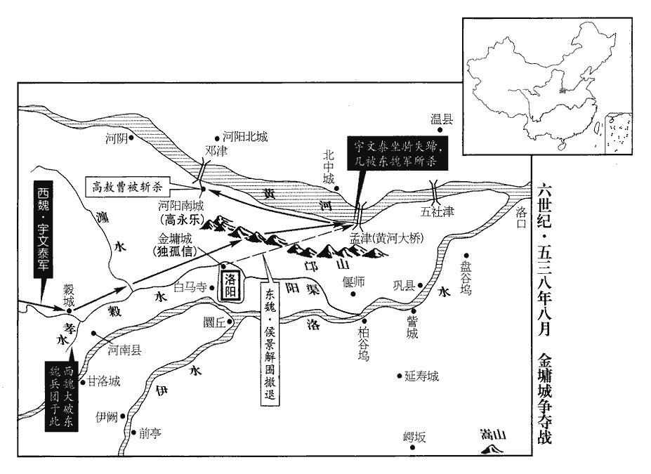
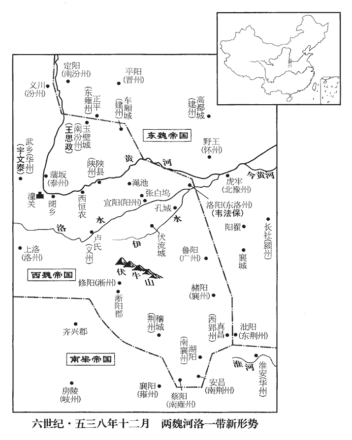
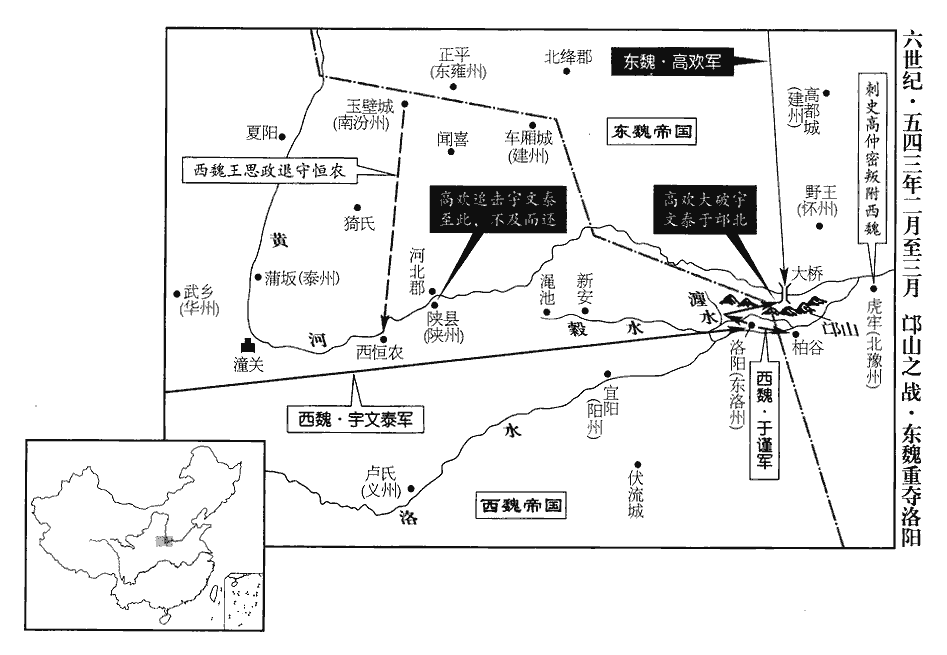

 梁紀十四起著雍敦牂（戊午），盡閼逢困敦（甲子），凡七年。

# 高祖武皇帝十四

## 大同四年（戊午、五三八）

1春，正月，辛酉朔‹一›，日有食之。

〖译文〗 [1]春季，正月，辛酉朔（初一），发生日食。

2東魏碭郡‹安徽省砀山县›獲巨象，送鄴‹河北省临漳县西南邺镇›。魏收志：孝昌二年，置碭郡，治下邑城，屬徐州。碭，徒朗翻。丁卯‹七›，大赦，改元元象。

〖译文〗 [2]东魏的砀郡捕获到一头巨象，将它送往国都邺城。丁卯（初七），孝静帝下令大赦天下，并把年号改为“元象。”

3二月，己亥‹十›，上‹萧衍，本年七十五岁›耕藉田。

〖译文〗 [3]二月，已亥（初十），梁武帝在藉田耕作。

4東魏大都督善無‹山西省右玉县›賀拔仁攻魏南汾州‹府设定阳山西省吉县›，刺史韋子粲降之，降，戶江翻；下同。丞相泰滅子粲之族。東魏大行臺侯景等治兵於虎牢‹北豫州州政府所在城·河南省荥阳市汜水镇西›，治，直之翻。將復河南諸州，魏梁迥‹在长社河南省长葛县›、韋孝寬‹在悬瓠河南省汝南县›、趙繼宗皆棄城西歸。梁迥在潁川，韋孝寬在汝南，未知趙繼宗所棄何城也。侯景攻廣州‹府设鲁阳河南省鲁山县›，【章：甲十一行本「州」下有「數旬」二字；乙十一行本同；孔本同；退齋校同。】未拔，廣州治襄城。聞魏救兵將至，集諸將議之，行洛州‹府设洛阳河南省洛阳市东白马寺东›事盧勇請進觀形勢。東魏洛州，治洛陽。諸將，即亮翻；下同。乃帥百騎至大隗wěi山‹河南省密县南›，班志：河南郡密縣有大騩山。魏收志，密縣屬滎陽郡。五代志，滎陽郡新鄭縣有大騩山。帥，讀曰率。騎，奇寄翻。騩guī、隗同，五賄翻，又音歸。遇魏師。日已暮，勇多置幡旗於樹顛，夜，分騎為十隊，鳴角直前，擒魏儀同三司程華，斬儀同三司王征蠻而還。還，從宣翻，又如字。廣州守將駱超【退：「超」作「越」。】遂以城降東魏，丞相歡以勇行廣州事。勇，辯之從弟也。盧辯仕於西魏，而勇仕於東魏。從，才用翻。於是南汾、潁‹府长社›、豫‹府悬瓠›、廣四州復入東魏。考異曰：典略，侯景克廣州在十一月。按北史魏文帝紀，「二月，東魏陷南汾、潁、豫、廣四州。」今從之。

〖译文〗 [4]东魏大都督善无人贺拔仁攻打西魏南汾州，南汾州刺史韦子粲向贺拔仁投降，西魏丞相宇文泰听到这一消息后，屠杀了韦子粲的全部家族。东魏大行台侯景等人在虎牢整顿部队，准备收复黄河以南的各州，看到势头不对，西魏的梁迥、韦孝宽、赵继宗都放弃他们所守的城跑回西部地区。侯景攻打广州，没有取得成功，他听说西魏的救兵将要赶到，就召集全体将领一道商议对策。兼管洛州事务的卢勇请求去前方观察形势，在征得侯景同意后，他便带领一百名骑兵来到大隗山，在这里，他们遇上了西魏的部队。当时已是黄昏时刻，卢勇叫人在树木的顶端插上许多旗帜，表示兵力很多，等到夜里，他把手下的骑兵分成十队，大家吹着号角直向前冲去，抓获了西魏的仪同三司程华，杀死了仪同三司王征蛮，然后返回。广州的守将骆超于是打开城门向东魏投降，东魏的丞相高欢下令让卢勇再兼管广州的事务。卢勇是卢辩的堂弟。从此，南汾、颖、豫、广这四个州重新划入东魏的版图。

5初，柔然頭兵可汗始得返國，事見一百四十九卷普通二年。可，從刊入聲。汗，音寒。事魏盡禮。及永安以後，雄據北方，禮漸驕倨，雖信使不絕，不復稱臣。使，疏吏翻；下同。復，扶又翻。頭兵嘗至洛陽，心慕中國，乃置侍中、黃門等官；後得魏汝陽王典籤淳于覃tán，親寵任事，以為祕書監，使典文翰。及兩魏分裂，頭兵轉不遜，數為邊患。數，所角翻。魏丞相泰以新都關中，方有事山東，欲結婚以撫之，以舍人元翌女為化政公主，妻頭兵弟塔寒。妻，七細翻。又言於魏主‹元宝炬，本年三十二岁›，請廢乙弗后，納頭兵之女。甲辰‹十五›，以乙弗后為尼，魏立乙弗后，見上卷大同元年。使扶風王孚迎頭兵女為后。頭兵遂留東魏使者元整，不報其使。

〖译文〗 [5]当初，柔然国的头兵可汗刚被放回国的时候，对北魏毕恭毕敬，礼仪周全。到了永安年间之后，头兵可汗在他所占据的北方开始称雄，于是对北魏渐渐地变得傲慢起来，虽然仍旧和北魏保持书信与使者来往，但是不再自己称臣了。头兵可汗曾经到过洛阳，心里仰慕中原，就按照北魏的官制设置了侍中、黄门等官职；后来他得到了北魏汝阳王的典签淳于覃，非常亲近宠信，十分重用，委任为秘书监，使其主管文书。在北魏分裂成东魏、西魏之后，头兵可汗变得更加傲慢放肆，多次在边境地区制造事端。西魏的丞相宇文泰考虑到刚在关中地区建立新都，同时正和东魏发生摩擦，就想用联姻的办法来安抚头兵可汗。请文帝将舍人元翌的女儿封为化政公主，让她嫁给头兵可汗的弟弟塔寒为妻。宇文泰又劝说文帝，请他废掉乙弗皇后，娶头兵可汗的女儿。甲辰（十五日），文帝叫乙弗皇后削发为尼，又派遣扶风王元孚去迎接头兵可汗的女儿来当西魏的新皇后。头兵可汗于是扣留了东魏的使者元整，不派使者回报。

6三月，辛酉‹二›，東魏丞相歡以沙苑‹陕西省大荔县南›之敗，敗見上卷上年。請解大丞相，‹元善见，本年十五岁›詔許之；頃之，復故。考異曰：北齊帝紀，止有高祖解丞相年月，而無復故之文。按興和元年議曆，有丞相田曹參軍信都芳。蓋因邙山之捷而復也。

〖译文〗 [6]三月，辛酉（初二），东魏的丞相高欢由于沙苑战役失利，请求解除他的大丞相职务，孝静帝颁下诏书，表示同意；没过多久，高欢又重新担任大丞相。

7柔然送悼后於魏，郁久閭后諡曰悼。車七百乘，馬萬匹，駝二千頭。至黑鹽池‹陕西省定边县西北›，唐志：鹽州五原縣有烏池、白池。烏池，蓋即黑鹽池也。乘，繩證翻。遇魏所遣鹵簿儀衛。柔然營幕，戶席皆東向，扶風王孚請正南面，后曰：「我未見魏主‹元宝炬›，固柔然女也。魏仗南面，我自東向。」丙子‹十七›，立皇后郁久閭氏。丁丑‹十八›，大赦。以王盟為司徒。丞相泰朝于長安，還屯華州‹府设武乡陕西省大荔县›。朝，直遙翻；下同。華，戶化翻。

〖译文〗 [7]柔然国终于将悼后送往西魏，陪嫁品有七百辆车、一万匹马、二千头骆驼。到达黑盐池的时候，遇上了西魏派来迎接新皇后的仪仗队与侍卫队。柔然人宿营时，门户与席子都朝向东方，扶风王元孚请他们朝向正南方，悼后说道：“我还没有见到魏主，依然算是柔然国的女子，你们魏国的仪仗队面向南方，我自己面向东方。”丙子（十七日），文帝正式册封郁久闾氏为皇后。丁丑（十八日），大赦天下。封王盟为司徒。丞相宇文泰来到长安朝拜文帝之后，又返回华州屯兵。

8夏，四月，庚寅‹二›，東魏高歡朝于鄴；既解丞相，遂不書官而書姓。通鑑紀實，非如春秋之有所褒貶也。壬辰‹四›，還晉陽‹山西省太原市›。

〖译文〗 [8]夏季，四月，庚寅（初二），东魏的高欢来到邺城朝拜孝静帝。壬辰（初四），高欢返回晋阳。

9五月，甲戌‹十六›，東魏遣兼散騎常侍鄭伯猷yóu來聘。考異曰：魏帝紀在二月丙辰，蓋始受命時也。今從梁帝紀。

〖译文〗 [9]五月，甲戌（十六日），东魏派遣兼散骑常侍郑伯猷到梁朝聘问。

10秋，七月，東魏荊州‹府设穰城河南省邓州市›刺史王則寇淮南。此淮南，謂光城、弋陽之地，在淮水上流之南，非指古淮南郡治壽春之淮南。

〖译文〗 [10]秋季，七月，东魏荆州刺史王则侵犯淮河以南地区。

11癸亥‹六›，詔以東冶徒李胤之得如來舍利，大赦。如來，猶言佛也。

〖译文〗 [11]癸亥（初六），由于东治的犯人李胤之得到了如来佛的舍利，梁武帝颁下诏书，大赦天下。

12東魏侯景、高敖曹等圍魏獨孤信于金墉，太師歡帥大軍繼之；帥，讀曰率；下同。景悉燒洛陽內外官寺民居，存者什二三。魏主‹元宝炬›將如洛陽拜園陵，魏自孝文帝遷洛以後，孝武帝西遷以前，園陵皆在洛州。會信等告急，遂與丞相泰俱東，命尚書左僕射周惠達輔太子欽守長安，開府儀同三司李弼，車騎大將軍達奚武帥千騎為前驅。

〖译文〗 [12]东魏的侯景、高敖曹等人在金墉包围了西魏的独孤信，太师高欢率领大军跟在后头；侯景放火焚烧了洛阳城内外所有的官衙与居民住宅，只有十分之二三的房子得以幸存。西魏的文帝正要去洛阳祭拜列祖列宗的园陵，刚好收到独孤信等人的告急文书，就和丞相宇文泰一道东行。文帝命令尚书左仆射周惠达辅佐太子元钦守卫长安，又令开府仪同三司李弼、车骑大将军达奚武率领一千名骑兵作为先头部队。

八月，庚寅‹三›，丞相泰至穀城‹河南省洛阳市西北›，漢志，河南郡有穀成縣。師古註曰：即今新安。水經註曰：穀城縣城西臨穀水。騎，奇寄翻；下同。侯景等欲整陳以待其至，陳，讀曰陣。儀同三司太安‹内蒙古固阳县›莫多婁貸文請帥所部擊其前鋒，莫多婁，虜三字姓。景等固止之。貸文勇而專，不受命，與可朱渾道元以千騎前進，夜，遇李弼、達奚武於孝水‹穀水支流，在洛阳市西北注入穀水›。五代志：新安縣有孝水。水經註：孝水出廆山之陰，北流注于穀，在河南城西四十里。弼命軍士鼓譟，曳柴揚塵，貸文走，弼追斬之，道元單騎獲免，悉俘其眾送恆農‹陕县·河南省三门峡市›。恆，戶登翻。

〖译文〗 八月，庚寅（初三），西魏丞相宇文泰到达城，侯景等人准备排列好军阵等待宇文泰前来，仪同三司太安人莫多娄贷文请求带领自己的部属去袭击宇文泰的先遣部队，侯景等人坚决阻止了他。莫多娄贷文生性勇敢而执拗，不接受上司的命令，和可朱浑道元两人领着一千名骑兵向前方进发。夜间，他们在孝水遇见了李弼、达奚武。李弼命令士兵们擂鼓呐喊，在地上拖树枝扬起尘土，莫多娄贷文以为对方是大部队，转身逃跑，李弼追上去杀掉了他。可朱浑道元单人匹马逃了回去，手下的人都被俘虏，被送往恒农。

 

泰進軍瀍chán東，瀍水出河南穀城縣北山，東與千金渠合，又東過洛陽縣南，又東過偃師縣，又東入于洛。侯景等夜解圍去。辛卯‹四›，泰帥輕騎追景至河上，景為陳，北據河橋，南屬邙山，陳，讀曰陣；下陵陳、置陳、陷陳同。屬，之欲翻。景置陳北據河橋者，慮兵有利鈍，先保固其北歸之路也。南屬邙山，可以見其兵多矣。景軍參用馬步，其置陳堅固，宇文泰以輕騎來，見其陳勢如此，斂兵不進可也，遽前合戰，亦屢勝而驕耳。與泰合戰。泰馬中流矢驚逸，遂失所之。泰墜地，東魏兵追及之，左右皆散，都督李穆下馬，以策抶chì泰背罵曰：「籠東軍士！抶，丑栗翻，打也。荀子曰：仁人之兵，當之者潰，觸之者角摧，按角鹿埵duǒ隴種東籠而退耳。楊倞liàng註曰：其義未詳，蓋皆摧敗披靡之貌。陸德明曰：東籠，沾濕貌也，如衣服之沾濕然。爾曹王【章：甲十一行本「王」作「主」；乙十一行本同；孔本同；熊校同。】何在，而獨留此？」追者不疑其貴人，捨之而過。穆以馬授泰，與之俱逸。

〖译文〗 宇泰进军水东部地区，侯景等人在夜里解除了金墉之围离去。辛卯（初四）宇文泰统率轻装骑兵追击侯景直到黄河边上，侯景布置军阵，在北面占据了河桥，在南面连接邙山，与宇文泰交战。宇文泰的战马中了流箭，受了惊，于是胡乱地狂奔起来。宇文泰从马上跌了下来，东魏的士兵追到跟前，身边的人都逃散了。都督李穆见到这种情景，跳下马来，挥鞭抽打宇文泰的后背，骂道：“你这狼狈不堪的小兵，你们的头子在哪里，为什么你一个人呆在这儿？”追赶的东魏兵也就没想到宇文泰是贵人，放弃了他从旁边过去。李穆将自己的马让宇文泰骑上，两人一起逃掉了。

魏兵復振，擊東魏兵，大破之。宇文泰先以輕騎合戰而不利，大兵繼至，軍勢復振，故大破東魏。東魏兵北走。京兆忠武公高敖曹，意輕泰，建旗蓋以陵陳，魏人盡銳攻之，一軍皆沒，敖曹單騎走投河陽南城‹河南省孟县，黄河大桥南岸城堡›。河陽南城，在河橋南岸，北岸即北中城。守將北豫州刺史高永樂，歡之從祖兄子也，樂，音洛。從，才用翻；下其從同。與敖曹有怨，閉門不受。敖曹仰呼求繩，不得，拔刀穿闔未徹而追兵至。杜預曰：闔，門扇也。未徹，未透也。徹，敕列翻。敖曹伏橋下，追者見其從奴持金帶，從，才用翻。問敖曹所在，奴指示之。敖曹知不免，奮頭曰：「來！與汝開國公。」言得其頭，西魏將以開國賞之也。追者斬其首去‹年四十八岁›。高歡聞之，如喪肝膽，喪，息浪翻。杖高永樂二百，贈敖曹太師、大司馬、太尉。泰賞殺敖曹者布絹萬段，歲歲稍與之，比及周亡，猶未能足。比，必利翻。魏又殺東魏西兗州‹府设左城山东省定陶县西›刺史宋顯等，虜甲士萬五千人，赴河死者以萬數。

〖译文〗 部队重新振作之后，又向东魏的部队发起了攻击，东魏遭到了惨败，将士们纷纷逃往北方。京兆忠武公高敖曹心里轻视宇文泰，他树起旗盖以显示军阵的威风，西魏的将士们都迅猛地攻过去，打得对方全军覆没，高敖曹单人匹马跑去投奔河阳南城。该城的守将北豫州刺史高永乐，是高欢族兄的儿子，与高敖曹有怨仇，关紧城门不放高敖曹进去。高敖曹仰头大喊要求上面放一根绳子下来，见不被理睬，就拔出腰刀凿门，可是门还没有凿开，追兵就赶到了，高敖曹只好趴到桥的下面。追赶的西魏兵看见他的奴仆手里拿着一条金带，就问高敖曹的下落，奴仆指出了主人藏的地方。高敖曹知道自己已无法免除一死，便昂起脑袋对追兵说道：“来吧！送给你一个当开国公的机会。”追兵砍下他的脑袋离去了。高欢听到这个噩耗，好象丧失了肝胆一样，打了高永乐二百大棍，又追封高敖曹为太师、大司马、太尉。宇文泰奖赏杀高敖曹的人一万段布匹与绢帛，每年给他一部分，一直到北周灭亡的时候，还没有给足。西魏的部队又杀死了东魏西兖州的刺史宋显等人，俘虏士兵一万五千人，至于淹死在黄河里的东魏兵更是数以万计。

初，歡以万俟普尊老，爵尊而齒老也。万，莫北翻。俟，渠之翻。特禮之，嘗親扶上馬。其子洛免冠稽首曰：上，時掌翻。稽，音啟。「願出死力以報深恩。」及邙山之戰，諸軍北渡橋，北渡河橋也。洛獨勒兵不動，謂魏人曰：「万俟受洛干在此，能來可來也！」魏人畏之而去，歡名其所營地為回洛。唐志：河陽關南有回洛故城。

〖译文〗 当初，高欢因为万俟普爵位高年龄大，所以给予他特殊的礼遇，曾经亲自扶他上马。万俟普的儿子万俟洛摘下帽子向高欢叩头，说：“我愿出死力来报答您的大恩大德。”在邙山战役中，其他部队都跨过河桥向北方逃跑，唯独万俟洛命令自己的部属停留在原地，他对西魏的将士们喊道：“我万俟受洛干在此，你们能过来的就来吧！”西魏的将士都感到害怕，离开了。后来，高欢将万俟洛安营扎寨的地方命名为回洛。

是日‹八月四日›，東、西魏置陳既大，首尾懸遠，從旦至未，戰數十合，史言兩軍確鬬。氛霧四塞，塞，悉則翻。莫能相知。魏獨孤信、李遠居右，趙貴、怡峰居左，戰並不利；又未知魏主‹元宝炬›及丞相泰所在，皆棄其卒先歸。開府儀同三司李虎、念賢等為後軍，見信等退，即與俱去。泰由是燒營而歸，留儀同三司長孫子彥守金墉。

〖译文〗 这一天，东、西魏布置的军阵都非常庞大，头尾相距很远，从早晨到晚上，双方一共交战了几十次，直打得烟雾尘土四处弥漫，相互都看不清楚。西魏的独孤信、李远处在右面，赵贵、怡峰处在左面，交战过程中都失利了；他们又不知道文帝与丞相宇文泰在哪里，于是都扔下了自己率领的士兵先跑回来。开府仪同三司李虎、念贤等人属于后续部队，看到独孤信等人退却，就和他们一道离开了战场。宇文泰因此只好烧掉营帐返回，留下仪同三司长孙子彦镇守金墉。

王思政下馬，舉長矟左右横擊，一舉輒踣數人，矟，色角翻。踣，蒲北翻。陷陳既深，從者盡死，思政被重創，悶絶。㑹日暮，敵亦收兵。思政每戰，常著破衣弊甲，從，才用翻。被，皮義翻。創，初良翻。下裹創同。著，陟畧翻。敵不知其将帥，故得免。将，即亮翻。帥，所類翻。帳下督雷五安於戰處哭求思政，㑹其已蘇，割衣裹創，扶思政上馬，夜久，始得還營。

〖译文〗 王思政跳下马来，举起长矛左右出击，一抬手就得倒下几个人。慢慢地，他陷入敌人的军阵已经很深，跟随着他的人都死光了，他自己也身受重伤，昏迷过去。此刻已临近夜晚，敌人也开始收兵了。王思政每一次打仗都穿着破旧的衣袍与盔甲，敌人看不出他是将帅，因此他幸免于难。他的帐下督雷五安在战场上哭着寻找他，刚好他也已经苏醒过来，雷五安就从衣服上割下一块布，为他包扎好伤口，然后扶他上马，入夜很久了，他们才返回营地。

平東將軍蔡祐下馬步鬬，左右勸乘馬以備倉猝，謂兵有邂逅，乘馬則倉猝可以奔馳。祐怒曰：「丞相‹宇文泰›愛我如子，今日豈惜生乎！」帥左右十餘人合聲大呼，擊東魏兵，殺傷甚眾。東魏圍之十餘重，帥，讀曰率。呼，火故翻。重，直龍翻。祐彎弓持滿，四面拒之。東魏人募厚甲長刀者直進取之，去祐可三十步，左右勸射之，祐曰：「吾曹之命，在此一矢，豈可虛發！」將至十步，祐乃射之，應弦而倒，射，而亦翻。東魏兵稍卻，祐徐引還。

〖译文〗 平东将军蔡跳下马徒步格斗，身边的部属都劝他再上马，以便遇上紧急情况时赶紧离开，蔡怒气冲冲地说道：“宇文丞相就象爱他自己的儿子一样爱我，今天我怎么能在乎自己的性命！”说罢，他带着身边的十几个人齐声大喊着，向东魏的将士冲击，杀伤了许多人。东魏的部队把他们围了足足十几层，蔡拉弓搭箭，抵抗四面八方的敌人。东魏出重金悬赏，身穿厚甲手持长刀的人一直向前猛冲，想要捉住他们，大约只有三十步远了，蔡身边的部属都劝他放箭，蔡回答说：“我们的性命，全在这一枝箭上头，怎么可以随便射出去？”直到敌人离他只有十步远的时候，蔡才将箭射出，随着弓弦一动，打头的东魏兵倒在地上，后面的人向后退了一些，蔡慢慢地带领自己的部下返回营地。

魏主‹元宝炬›至恆農，守將已棄城走，所虜降卒在恆農者相與閉門拒守，恆，戶登翻。將，即亮翻。降，戶江翻。丞相泰攻拔之，誅其魁首數百人。

〖译文〗 西魏的文帝来到恒农的时候，守将已经放弃该城逃跑了，城里原来被西魏俘虏的东魏兵一同关闭城门，进行抵抗，西魏丞相宇文泰攻下了该城，杀掉了几百名领头的人。

蔡祐追及泰於恆農，夜，見泰，泰曰：「承先，蔡祐字承先。爾來，吾無憂矣。」泰驚不得寢，枕祐股，然後安。史言泰氣衰膽失。枕，之任翻。祐每從泰戰，常為士卒先，戰還，諸將皆爭功，祐終無所言。泰每歎曰：「承先口不言勳，我當代其論敘。」史言蔡祐沈勇不伐。泰留王思政鎮恆農，除侍中、東道行臺。

〖译文〗 到处寻找宇文泰的蔡一直追到了恒农，在晚上终于见到宇文泰，宇文泰叫着蔡的表字说道：“承先，你一来，我就没有什么可忧虑的了。”宇文泰由于受到惊吓无法入睡，枕了蔡的大腿之后才平静地进入梦乡。蔡每次跟随宇文泰作战，总是身先士卒，打仗回来，其他将领都争着邀功请赏，而蔡不说一句表现自己的话。宇文泰常常感慨地说：“承先嘴里不提自己的功劳，可我应当替他把一切谈明白。”宇文泰留下王思政镇守恒农，任命他为侍中、东道行台。

魏之東伐，關中留守兵少，少，詩沼翻。前後所虜東魏士卒散在民間，聞魏兵敗，謀作亂。李虎等至長安，計無所出，與太尉王盟、僕射周惠達等奉太子欽出屯渭北。百姓互相剽掠，關中大擾。剽，匹妙翻。於是沙苑所虜東魏都督趙青雀、雍州民于伏德等遂反，據【章：甲十一行本「據」上有「青雀」二字；乙十一行本同；孔本同；退齋校同。】長安子城，伏德保咸陽‹陕西省泾阳县›，雍，於用翻。後魏置咸陽郡於石安縣。石安，漢渭城縣，秦之咸陽也，石勒改曰石安。五代志：京兆渭陽縣，舊置咸陽郡。與咸陽太守慕容思慶各收降卒以拒還兵。降卒，東魏之卒降于西魏，散在民間者也。還兵，西魏之兵自洛西還者也。降，戶江翻。長安大城民相帥以拒青雀，日與之戰。帥，讀曰率。大都督侯莫陳順擊賊，屢破之，賊不敢出。順，崇之兄也。

〖译文〗 西魏这次东伐，在关中地区留守的兵员很少，前前后后俘虏的东魏士兵都被分散在民间，他们一听说西魏的部队遭到了失败，纷纷图谋作乱。李虎等人来到长安，想不出好的对策，便和太尉王盟、仆射周惠达等人侍奉太子元钦出城，到渭北地区驻防。百姓们相互掠夺，关中地区惊扰得非常厉害。在沙苑战役中被俘虏的东魏都督赵青雀，雍州的百姓于伏德等人趁机造反，占据了长安所属的小城，于伏德又占有了咸阳，与咸阳太守慕容思庆各自召集东魏的降兵，以便抵抗从战场上返回的西魏将士。长安主城中的百姓互相组织起来，共同抵抗赵青雀，每天同他交战。大都督侯莫陈顺袭击了东魏的那些降兵，多次打败他们，吓得降兵们不敢出城。侯莫陈顺是侯莫陈崇的兄长。

扶風公王羆鎮河東‹蒲坂·山西省永济县›，大開城門，悉召軍士謂曰：「今聞大軍失利，青雀作亂，諸人莫有固志。王羆受委於此，以死報恩。有能同心者可共固守，必恐城陷，任自出城。」衆感其言，皆無異志。

〖译文〗 镇守河东的扶风公王罴大开城门，叫来所有的将士，对他们说道：“今天我听说咱们的大部队在前线失利，赵青雀在京城作乱，许多人已经丧失了信心，而我王罴受委托守卫河东，决心以死来报答皇上与宇文丞相的恩德。你们中间能够跟我同心协力的人可以和我一道坚守此城；实在害怕本城陷落的可以随便出城。”大家都被他的话感动了，就一心与他守城。

魏主留閿鄉‹河南省灵宝县西›。閿wén，音旻。丞相泰以士馬疲弊，不可速進，且謂青雀等烏合，不能為患，曰：「我至長安，以輕騎臨之，必當面縛。」通直散騎常侍吳郡‹江苏省苏州市›陸通諫曰：陸通本吳人，曾祖載從宋武帝入關，及劉義真之敗沒于赫連，遂居關中。「賊逆謀久定，必無遷善之心，蜂蠆有毒，左傳臧文仲之言。蠆chài，丑邁翻。安可輕也！且賊詐言東寇將至，東寇，謂東魏之兵。今若以輕騎臨之，百姓謂為信然，以賊言為信也。益當驚擾。今軍雖疲弊，精銳尚多，以明公之威，總大軍以臨之，何憂不克！」泰從之，引兵西入。父老見泰至，莫不悲喜，士女相賀。華州刺史宇文導引兵入咸陽，斬思慶，禽伏德，南渡渭，與泰會，攻青雀，破之。華，戶化翻。太保梁景睿以疾留長安，與青雀通謀，泰殺之。

〖译文〗 西魏的文帝留在阌乡。丞相宇文泰考虑到士兵与马匹都已经疲惫不堪，不再能快速前进，并且认为赵青雀等人不过是一群乌合之众，不会成为大的祸患，就说道：“我到达长安，让轻装的骑兵直冲进去，赵青雀这些人一定会自缚而降，向我当面请罪。”通直散骑常侍吴郡人陆通劝告说：“那些奸贼很久之前就已图谋叛乱，一定没有改恶从善的心意，蜂、蝎是有毒的，怎么可以轻视？况且那些贼寇欺骗百姓，说东魏人将要到达，我们现在如果派轻装骑兵冲进城去，老百姓就会觉得情况真的象那些贼寇说的那样，于是就会更加惊慌不安。眼下我们的部队虽然已经疲劳，但是精锐兵马还比较多，凭着您的威望，带着大部队进长安城，哪里用得着忧虑打败不了敌人呢？”宇文泰听从了陆通的意见，带领部队向西入城。城里的父老们看见宇文泰回来了，没有一个不是悲喜交加，男男女女们都相互庆贺。华州刺史宇文导带领人马攻进咸阳，杀掉了慕容思庆，捉住了于伏德，又南渡渭河，与宇文泰汇合，然后向赵青雀发起了进攻，挫败了对方。西魏的太保梁景睿因病留在长安，与赵青雀一同密谋叛乱，宇文泰杀掉了他。

13東魏太師歡自晉陽將七千騎至孟津‹河南省孟津县东黄河渡口›，未濟，聞魏師已遁，遂濟河，遣別將追魏師至崤xiáo，魏收志：太和十一年，置崤縣，屬恆農郡，因三崤山以名縣；隋并崤縣入河南熊耳縣。程大昌曰：三崤山，一名嶔qīn崟yín山。元和志曰：自東崤至西崤三十五里。東崤長阪數里，峻阜絕澗，車不得方軌。西崤全是石阪十二里，險不異東崤。此二崤皆在秦關之東，漢關之西。不及而還。還，從宣翻，又如字；下同。歡攻金墉，長孫子彥棄城走，焚城中室屋俱盡，歡毀金墉而還。

〖译文〗 [13]东魏的太师高欢带领七千名骑兵从晋阳赶到孟津，还没有开始渡黄河，就听说西魏的部队已经逃走，于是立即渡过黄河，又派遣其他将领追击西魏的兵马，一直追到崤县还没有赶上，这才返回。高欢向金墉发起了进攻，长孙子彦放弃该城逃跑，临行前把城里的房屋烧得干干净净，高欢拆毁了金墉城之后回到东魏。

東魏之遷鄴也，見一百五十六卷中大通六年。主客郎中裴讓之留洛陽；獨孤信之敗也，謂邙山之敗，信先棄軍西還。讓之弟諏之隨丞相泰入關‹函谷关›，為大行臺倉曹郎中。歡囚讓之兄弟五人，讓之曰：「昔諸葛亮兄弟，事吳、蜀各盡其心，謂亮事蜀，瑾事吳也。況讓之老母在此，不忠不孝，必不為也。明公推誠待物，物亦歸心；若用猜忌，去霸業遠矣。」歡皆釋之。

〖译文〗 东魏将国都迁往邺城的时候，主客郎中裴让之留在洛阳；独孤信在邙山之战中失败以后，裴让之的弟弟裴诹之跟随西魏的丞相宇文泰进入关中，被任命为大行台仓曹郎中。高欢囚禁了裴让之兄弟五人，裴让之对高欢说：“昔日诸葛亮兄弟二人，一个帮助吴国，一个为蜀国服务，各自都尽心尽力。何况我裴让之还有老母亲在这里，不忠不孝之事我是绝对不会干的。您要是诚心诚意地对待一个人，他自然也会把心交给您；如果您喜欢猜疑人，那么就很难建立起霸业。”高欢听罢，将裴让之兄弟都释放了。

九月，魏主‹元宝炬›入長安，丞相泰還屯華州。華，戶化翻。

〖译文〗 九月，西魏文帝返回长安，丞相宇文泰也回到华州屯兵。

14東魏大都督賀拔仁擊邢磨納‹在河间郡，河北省河间市南›、盧仲禮‹在范阳郡，河北省涿州市›等，平之。磨納等起兵見上卷上年。

〖译文〗 [14]东魏的大都督贺拔仁袭击并消灭了邢磨纳、卢仲礼等人的兵马。

盧景裕本儒生，太師歡釋之，召館於家，使教諸子。景裕講論精微，難者或相詆訶，大聲厲色，言至不遜，而景裕神采儼然，風調如一，從容往復，難，乃旦翻。詆dǐ，丁禮翻。訶hē，虎何翻。調，徒釣翻。從，千容翻。無際可尋。性清靜，歷官屢有進退，無得失之色；弊衣粗食，恬然自安，終日端嚴，如對賓客。

〖译文〗 卢景裕本是一位读书人，太师高欢释放他之后，把他叫到家里，让他开设书塾，教自己的几个儿子。卢景裕的讲解议论精辟入微，和他辩论的人有的诋毁呵斥他，大声嚷嚷，表情严厉，言语很不礼貌，但是卢景裕依然神情庄严，风度不变，从容不迫地辩论，看不出一点情绪受到影响的痕迹。他生性喜欢清静，为官生涯中多次被提升或降职，可从来不表露出得意或失意的样子；平时，他穿劣质的衣服，吃粗陋的食物，恬淡安然，整天端庄严肃，好象老在面对宾客一样。

15冬，十月，魏歸高敖曹、竇泰、莫多婁貸文之首于東魏。

〖译文〗 [15]冬季，十月，西魏将高敖曹、窦泰、莫多娄贷文的头颅归还给东魏。

16散騎常侍劉孝儀等聘于東魏。散，悉亶翻。騎，奇寄翻。

〖译文〗 [16]梁朝散骑常侍刘孝仪等人到东魏聘问。

17十二月，魏是云寶襲洛陽，東魏洛州刺史王元軌棄城走。都督趙剛襲廣州，拔之。於是自襄‹府设赭阳河南省方城县›、廣以西城鎮復為魏。魏收志：孝昌中置襄州，領襄城、舞陰、南安、期城、北南陽、建城郡。五代志：潁川郡葉縣，後齊置襄州。復，扶又翻；下孫復同。

〖译文〗 [17]十二月，西魏的是云宝向洛阳发起攻击，东魏洛州刺史王元轨丢弃该城逃跑了。都督赵刚袭击广州并攻克了该城。于是，襄州、广州以西的城镇重新归属西魏。

18魏自正光以後，四方多事，民避賦役，多為僧尼，至二百萬人，寺有三萬餘區。至是，東魏始詔「牧守、令長，擅立寺者，計其功庸，守，式又翻。長，知兩翻。庸，用也，勞也，雇也。以枉法論。」

〖译文〗 [18]北魏自从正光年间之后，四面八方经常发生各种事端，百姓为了躲避赋税与徭役，许多人出家当了和尚与尼姑。整个国家的出家人达到二百万，寺庙也足有三万多处。到此时，东魏颁下诏书给各级地方官，凡是擅自建立寺庙的，根据所花费劳工的多少，以枉法论处。

 

19初，魏伊川‹伊水，流经河南省嵩县，于洛阳市东注入洛水›土豪李長壽為防蠻都督，五代志：河南郡陸渾縣，齊置伊川郡，領南陸渾縣。春秋時秦、晉遷陸渾之戎於伊川，故郡以為名。伊闕以南大山長谷，蠻多居之，魏置都督以防焉。積功至北華州‹府设中部陕西省黄陵县›刺史。孝武帝西遷，長壽帥其徒拒東魏，華，戶化翻。帥，讀曰率。魏以長壽為廣州刺史。侯景攻拔其壁，殺之。其子延孫復收集父兵以拒東魏，魏之貴臣廣陵王欣、錄尚書長孫稚等皆攜家往依之，長，知兩翻。延孫資遣衛送，使達關中。東魏高歡患之，數遣兵攻延孫，不能克。數，所角翻。魏以延孫為京南行臺、節度河南諸軍事、廣州刺史。京南，謂洛京以南也。延孫以澄清伊、洛為己任，魏以延孫兵少，少，詩沼翻。更以長壽之壻京兆韋法保為東洛州刺史，西魏洛州治上洛，以洛陽之地為東洛州。配兵數百以助之。法保名祐，以字行，既至，與延孫連兵置柵於伏流‹河南省嵩县›。伏流城，伊川郡治所。隋改南陸渾縣曰伏流。水經註曰：陸渾故城東南八十許里有三塗山，伊水逕其下，又東北逕伏流嶺東，劉澄之永初記稱伏流縣西有伏流坂者。今山在縣南崖口北三十里許，西則非也。獨孤信之入洛陽也，欲繕脩宮室，使外兵郎中天水‹甘肃省天水市›權景宣，曹魏置二十三郎，有中兵、外兵、都兵、別兵，元魏以後，中兵、外兵又分左、右。帥徒兵三千出採運。採運者，使之採木運入洛陽城也。會東魏兵至，河南皆叛，景宣間道西走，間，古莧翻。與李延孫相會，攻孔城‹河南省伊川县西南›，拔之，魏收志：天平中置新城郡，治孔城，屬北荊州。五代志：河南郡伊闕縣，舊曰新城，置新城郡。杜佑曰：孔城防，今伊闕縣東南故城是。又曰：高齊置孔城防於壽安縣。洛陽以南尋亦西附。丞相泰即留景宣守張白塢‹河南省宜阳县西北›，塢在宜陽西北。水經註：河內軹縣有張白騎塢，在湨jú水北原上，據二溪之會，北帶深隍，三面阻險，唯西面板築而已。節度東南諸軍應關西者。是歲，延孫為其長史楊伯蘭所殺，韋法保即引兵據延孫之柵。

〖译文〗 当初，西魏伊川的当地豪强李长寿出任防蛮都督，后来积累了不少功劳，被提升为北华州刺史。孝武帝西迁的时候，李长寿率领手下的步兵抵抗东魏的部队，西魏又任命他为广州刺史。侯景攻克了他的营垒，杀掉了他。他的儿子李延孙重新召集起他父亲的人马，继续抗拒东魏，西魏显贵的大臣广陵王元欣、录尚书长孙稚等人都携带了家眷前去投靠他，李延孙送给他们钱财，又派了卫队护送，使他们安全到达关中。东魏的高欢对李延孙的存在感到忧虑，多次派遣部队攻打他，都没有取得功。西魏任命李延孙为京南行台、节度河南诸军事、广州刺史。李延孙将平定伊、洛地区作为自己的责任，西魏朝廷认为他的兵力不足，又委派李长寿的女婿、京兆人韦法保任东洛州刺史，配置数百名士兵来帮助李延孙。韦法保的本名叫韦，通常以表字相称。他到达东洛州之后，与李延孙把各自的部队合到一块，在伏流城安营扎寨。独孤信进入洛阳的时候，曾经打算修缮已经荒废的宫殿，他派遣外兵郎中天水人权景宣带领三千名步兵出去采伐树木，然后运入洛阳城。不久，东魏的部队赶到，河南各州郡都反叛了，权景宣抄小路向西逃跑，与李延孙会师。他们一同攻打并占领了孔城，洛阳以南的州郡也都连续不断地归附西魏。西魏丞相宇文泰随即留下权景宣镇守张白坞，让他统管东南地区的军队中响应关西的人马。这一年，李延孙被他手下的长史杨伯兰杀害，韦法保马上指挥部队占据了李延孙的营盘。

東魏將段琛等據宜陽‹河南省宜阳县西›，將，即亮翻。琛，丑林翻。遣陽州‹府宜阳›刺史牛道恆誘魏邊民。魏收志：天平初置陽州，領宜陽、金門郡，治宜陽。恆，戶登翻。誘，音酉。魏南兗州‹府设谯城安徽省亳州市›刺史韋孝寬患之，按韋孝寬傳，時西魏令孝寬領宜陽郡事，遷南兗州刺史。然南兗州治譙城，在東魏境內，孝寬未能取其地也。乃詐為道恆與孝寬書，論歸款之意，使諜人遺之於琛營，諜，徒協翻。遺，如字，墜失也。琛果疑道恆。孝寬乘其猜阻，出兵襲之，擒道恆及琛，崤、澠遂清。崤、澠，崤山及澠池也。澠，彌兗翻。東道行臺王思政以玉壁‹山西省稷山县›險要，五代志：絳郡稷山舊置勳州。勳州即玉壁也。杜佑曰：稷山縣南十二里即玉壁城。請築城自恆農徙鎮之，詔加都督汾•晉•并州諸軍事、并州‹侨州·州政府设玉壁›刺史，行臺如故。東、西魏蓋於汾州據險為界，晉、并皆入於東魏。

〖译文〗 东魏将领段琛等人占据着宜阳，他们派遣阳州刺史牛道恒去引诱西魏边境地带的百姓。西魏南兖州刺史韦孝宽对此感到忧虑，就伪造了一封牛道恒给自己的信，其中谈到有归附西魏的意思，又派间谍故意将信遗留在段琛的营地，段琛果然对牛道恒产生了怀疑。韦孝宽趁他胡乱猜疑的时候，出兵袭击宜阳，活捉了牛道恒和段琛，于是崤山与渑水地区都得以平定。东道行台王思政认为玉壁地势险要，请求在那里修筑新城，并要求从恒农前去镇守，文帝颁下诏书，加封他为都督汾、晋、并州诸军事，并州刺史，原先担任的行台职务不变。

20東魏以高澄‹本年十七岁›攝吏部尚書，始改崔亮年勞之制，崔亮制停年格，見一百四十九卷天監十八年。銓擢賢能；又沙汰尚書郎，妙選人地以充之。凡才名之士，雖未薦擢，皆引致門下，與之遊宴、講論、賦詩，士大夫以是稱之。史言高澄收拾人物以傾元氏。

〖译文〗 [20]东魏委任高澄代理吏部尚书的职务，他开始改变崔亮制定的按待选年限提拔官员的制度，根据品德与才能提拔官职，又淘汰原有的尚书郎，精选出门第才能合适的人来充当。凡是有才能与声望的人士，即使没有推荐提拔，他也都把他们吸引到自己的门下，与他们一道游玩饮酒，说古道今，写诗作赋，士族官员因此都称赞他。

## 五年（己未、五三九）

1春，正月，乙卯‹一›，以尚書左僕射蕭淵藻為中衛將軍，丹楊尹何敬容為尚書令，吏部尚書張纘為僕射。纘，弘策之子也。張弘策，帝舅也，佐帝創業。自晉、宋以來，宰相皆以文義自逸，敬容獨勤簿領，日旰不休，為時俗所嗤鄙。旰gàn，古按翻。嗤，丑之翻。自徐勉、周捨既卒，普通五年，周捨卒；大同元年，徐勉卒。卒，子恤翻。當權要者，外朝則何敬容，內省則朱异。三公、卿、監、尚書為外朝官，門下省為內省。朝，直遙翻。异，羊至翻。敬容質愨què無文，以綱維為己任；异文華敏洽，曲營世譽：二人行異而俱得幸於上。行，下孟翻。异善伺候人主意為阿諛，用事三十年，廣納貨賂，欺罔視聽，遠近莫不忿疾。園宅、玩好、飲膳、聲色窮一時之盛。每休下，休沐之日，自省中出還私第為休下。伺，相吏翻。好，呼到翻。下，遐嫁翻。車馬填門，唯王承、王稚及褚翔不往。承、稚，暕jiǎn之子；王暕，儉之子，帝用之，官至侍中、尚書僕射。翔，淵之曾孫也。褚淵，蕭齊佐命。

〖译文〗 [1]春季，正月，乙卯（初一），梁武帝任命尚书左仆射萧渊藻为中卫将军，丹阳尹何敬容为尚书令，吏部尚书张缵为仆射。张缵是张弘策的儿子。从晋、宋以来，凡是担任宰相的，都以文章、义理而自娱，唯独何敬容勤勉于各种文书，日夜不停，受到当时的嗤笑鄙视。自从徐勉、周去世以后，掌握国家大权的，在三公、卿、监、尚书这些外朝官员中要算何敬容，在门下省里则是朱异。何敬容本性忠厚而缺少文才，以维护国家的法纪作为自己的责任；朱异文思敏捷，见多识广，善于用各种手段，博得世间的赞誉。他们两个人的品行不同，但是都得到梁武帝的宠信。朱异善于迎合皇帝的意思，进行阿谀奉承，在掌权的三十年里，广泛地收受别人的贿赂，欺上瞒下，远近没有不痛恨他的。他的园林住宅的气派，古玩珍宝的华贵、饮食的精致、还有音乐与妻妾的美丽动人，都代表着当时的最高水准。每到他从省中还家休息的日子，各类车马多得把家门都堵塞住了，只有王承、王稚以及褚翔不去他那里。王承、王稚是王的儿子；褚翔是褚渊的曾孙子。

2丁巳‹三›，御史中丞參禮儀事賀琛奏：「南、北二郊及藉田，往還並宜御輦，不復乘輅。」詔從之，祀宗廟仍乘玉輦。駕馬為輅lù，駕人為輦。琛，瑒之弟子也。賀瑒以儒學進。瑒chàng，雉杏翻，又音暢。

〖译文〗 [2]丁巳（初三），梁朝御史中丞参礼仪事贺琛向梁武帝递上奏折，建议：“皇上往返都城南郊、北郊以及去藉田举行耕种仪式时，应该都乘坐辇而不应乘坐马车。”梁武帝同意了，去祭祀宗庙时仍旧乘坐玉辇。贺琛是贺的侄子。

3辛酉‹七›，東魏‹都邺城河北省临漳县西南邺镇›以尚書令孫騰為司徒。

〖译文〗 [3]辛酉（初七），东魏任命尚书令孙腾为司徒。

4辛未‹十七›，上‹萧衍，本年七十六岁›祀南郊。

〖译文〗 [4]辛未（十七日），梁武帝在南郊祭天。

5魏丞相泰於行臺‹时在华州州政府设武乡·陕西省大荔县›置學，取丞郎、府佐德行明敏者充學生，行，下孟翻。悉令旦治公務，晚就講習。時就學者苟能以其所治之事質之於經傳，有所感發，此其所學之進，又豈螢窗雪案搜經摘傳者所能及邪！治，直之翻。

〖译文〗 [5]西魏丞相宇文泰在行台设置了学堂，选拔丞郎、府佐中品德出众、思想灵敏的人充当学生，命令他们全都在白天处理公务，晚上去学堂听讲习。

6東魏丞相歡，歡以沙苑之敗求自貶，既復其官，史復以丞相書之。以徐州‹府设彭城江苏省徐州市›刺史房謨、廣平‹河北省永年县西南旧永年镇›太守羊敦、廣宗‹河北省威县东›太守竇瑗、廣宗縣，漢屬鉅鹿郡，後屬安平國，後魏太和二十一年立廣宗郡，東魏屬司州。瑗yuàn，丁眷翻。平原‹山东省聊城市›太守許惇有政績清能，與諸刺史書，褒稱謨等以勸之。

〖译文〗 [6]东魏丞相高欢认为徐州刺史房谟、广平太守羊敦、广宗太守窦瑗、平原太守许政绩显著，廉洁而有能力，特地向各州刺史去信，信中表扬了房谟等人，以便对他们进行鼓励。

7夏，五月，甲戌‹二十二›，東魏‹元善见，本年十六岁›立丞相歡女為皇后；乙亥‹二十三›，大赦。

〖译文〗 [7]夏季，五月，甲戌（二十二日），东魏孝静帝策立丞相高欢的女儿为皇后；乙亥（二十三日），大赦天下。

8魏以開府儀同三司李弼為司空。秋，七月，【章：乙十一行本「月」下有「魏」字；退齋校同。】以扶風王孚為太尉。

〖译文〗 [8]西魏任用仪同三司李弼为司空。秋季，七月，又任用扶风王元孚为太尉。

9九月，甲子‹十四›，東魏發畿內十萬人城鄴，四十日罷。冬，十月，癸亥‹十四›，以新宮成，大赦，改元興和。

〖译文〗 [9]九月，甲子（十四日），东魏征调了京畿内十万人修筑邺城，四十天完工。冬季，十月癸亥（疑误），由于新的宫殿建成，孝静帝下令大赦天下，并改年号为“兴和”。

10魏置紙筆於陽武門外以求得失。

〖译文〗 [10]西魏在阳武门外放置了纸与笔，让人们评论朝廷政治的得失。

11十一月，乙亥‹二十六›，東魏使散騎常侍王元景、魏收來聘。

〖译文〗 [11]十一月，乙亥（二十六日），东魏派遣散骑常侍王元景、魏收出使梁朝。

12東魏人以正光曆浸差，魏行正光曆，見一百四十九卷普通三年。命校書郎李業興更加脩正，杜佑曰：漢之蘭臺及後漢東觀，皆藏書之室，當時文學之士，使讎校於其中，故有校書之職，蓋有校書之任而未為官也。故以郎居其任，則謂之校書郎；以郎中居其任，則謂之校書郎中。至後魏，始置祕書校書郎。以甲子為元，號曰興光曆，既成，行之。

〖译文〗 [12]东魏由于所采用的正光历渐渐出现了误差，就让校书郎李业兴进一步加以修正。新历以甲子为元，命名为《兴光历》，制成之后，就开始实行了。

13散騎常侍朱异奏：「頃來置州稍廣，而小大不倫，請分為五品，其位秩高卑，參僚多少，皆以是為差。」參僚，即參佐。詔從之。於是上品二十州，次品十州，次品八州，次品二十三州，下品二十一州。時上方事征伐，恢拓境宇，北踰淮、汝，東距彭城‹江苏省徐州市›，西開牂柯‹贵州省福泉市›，牂柯，音臧哥。南平俚洞‹广东、广西及越南北部›，交、廣界表，俚人依阻深險，各自為洞。俚，音里。紛綸甚眾，故异請分之。其下品皆異國之人，徒有州名而無土地，或因荒徼之民所居村落置州及郡縣，刺史守令皆用彼人為之，就彼土以土人為之。徼，吉弔翻。尚書不能悉領，山川險遠，職貢罕通。五品之外，又有二十餘州不知處所。凡一百七州。又以邊境鎮戍，雖領民不多，欲重其將帥，皆建為郡，或一人領二三郡太守，州郡雖多而戶口日耗矣。務廣地者荒，貪人有者殘，信哉！將，即亮翻。帥，所類翻。

〖译文〗 [13]梁朝散骑常侍朱异向梁武帝呈上奏折，说道：“近来，州的建置稍微多了一些，而且还不分大小，现在请求皇上把各州分为五个等级，州长官地位俸禄的高低，参佐幕僚人数的多少，都根据各州的等级形成差别。”梁武帝颁下诏书，表示同意。于是全国的各个州区分成：第一等级二十个，第二等级十个，第三等级八个，第四等级二十三个，第五等级二十一个。此时，梁武帝正在进行征战讨伐，收复失土，拓展国境，在北方越过了淮、汝地区，在东方到达彭城，在西方开发了柯，在南方平定了俚洞，情况比较混乱无章，所以朱异请求区分各州的等级。第五等州的居民都不是汉人，所以空有州名而没有土地，也有的在僻远蛮荒之地根据百姓所居住的村落设置州以及郡、县，刺史、郡守、县令都让当地的土人担任，尚书无法统管起来，由于山川险峻遥远，赋税贡品很难送到朝廷。在五个等级以外，还有二十个州不知道设在什么地方。梁朝共有一百零七个州。又因为在边境地区驻兵守卫，虽然管理的百姓数量不多，但是为了显示对这些地方的的将帅的重视，就把不该建立郡的地方都建成郡，官员中有的一个人就担任两三个郡的太守，州郡虽然多，可是百姓的户口却日益减少了。

14魏自西遷以來，禮樂散逸，丞相泰命左僕射周惠達、吏部郎中北海‹山东省昌乐县东南›唐瑾損益舊章，至是稍備。瑾，渠吝翻。

〖译文〗 [14]魏国自从迁到西边成为西魏以来，礼乐制度散失废弃，丞相宇文泰便命令左仆射周惠达、吏部郎中北海人唐瑾对旧的章程进行增减加工，到这时稍为具备。

## 六年（庚申、五四零）

1春，正月，壬申‹二十三›，東魏‹都邺城河北省临漳县西南邺镇›以廣平公庫狄干為太保。

〖译文〗 [1]春季，正月，壬申（二十三日），东魏任命广平公库狄干为太保。

2丁丑‹二十八›，東魏主‹元善见，本年十七岁›入新宮，東魏作新宮於鄴，見上卷大同元年。大赦。

〖译文〗 [2]丁丑（二十八日），东魏孝静帝迁入新的皇宫，大赦天下。

3魏‹都长安陕西省西安市›扶風王孚卒。

〖译文〗 [3]西魏扶风王元孚去世。

4二月，己亥‹二十一›，上‹萧衍，本年七十七岁›耕藉田。

〖译文〗 [4]二月，己亥（二十一日），梁武帝来到藉田举行耕种仪式。

5魏鑄五銖錢。

〖译文〗 [5]西魏铸造五铢钱。

6東魏大行臺侯景出三鵶‹河南省鲁山县西南›，杜佑曰：三鵶，在今汝州魯陽縣西南十九里，有平高城，周以禦齊。高齊於縣東北十七里置魯城以禦周。將復荊州‹府设穰城河南省邓州市›；三年，西魏乘沙苑之勝取荊州。魏丞相泰遣李弼、獨孤信各將五千騎出武關‹陕西省商南县西南›，景乃還。將，即亮翻。騎，奇寄翻。

〖译文〗 [6]东魏大行台侯景从三鸦出发，准备收复荆州；西魏丞相宇文泰派遣李弼、独孤信各自率领五千名骑兵驰出武关增援，侯景这才返回。

7魏文后既為尼，居別宮，大通四年，魏廢文后為尼。尼，女夷翻。悼后猶忌之，乃以其子武都王戊為秦州‹府设上封甘肃省天水市›刺史，使文后隨之官。魏主‹元宝炬，本年三十四岁›雖限以大計，謂以國事廢乙弗而立柔然女也。而恩好不忘，好，呼到翻。密令養髮，有追還之意。養，羊尚翻。會柔然舉國渡河南侵，渡河南侵靈夏。時頗有言柔然以悼后故興師者，帝曰：「豈有興百萬之眾為一女子邪！為，于偽翻。雖然，致人此言，朕亦何顏以見將帥！」將，即亮翻。帥，所類翻。乃遣中常侍曹寵齎手敕賜文后自盡。文后泣謂寵曰：「願至尊千萬歲，天下康寧，死無恨也！」遂自殺‹年三十一岁›；鑿麥積崖‹天水市东南五十千米›而葬之，號曰寂陵。

〖译文〗 [7]西魏文后做了尼姑之后，居住在别宫之中，但悼后还妒忌她，于是朝廷就任用文后的儿子武都王元戊为泰州刺史，让她跟随儿子，到任职的地方去。文帝虽然为了国家大计，废文后而立悼后，但是并没有忘记文后对自己的恩情好处，他悄悄地叫文后留长头发，表现出要把她接回来的意思。此时刚好遇到柔然倾全国兵力都渡过黄河，而向南侵犯，当时不少人都说柔然人是因为悼后的缘故才兴师动众的，文帝听了说道：“哪有为了一个女子而征发百万人的事情呢？虽然如此，可是让人说出这样的话，我还有什么面目见将帅？”于是，他就派遣中常侍曹宠将他亲手写的诏书送给文后，叫她自尽。文后哭对曹宠说道：“愿皇上活千万岁，天下得以平安，如果这一切都能实现，我死了也没有什么怨恨。”于是便自杀了。文帝叫人在麦积崖上凿一个墓穴，将她埋葬了，并命名为寂陵。

夏，丞相泰召諸軍屯沙苑‹陕西省大荔县南›以備柔然。右僕射周惠達發士馬守京城，塹諸街巷，召雍州刺史王羆議之；塹，七豔翻。雍，於用翻。羆不應召，謂使者曰：「若蠕蠕至渭北者，王羆自帥鄉里破之，王羆，京兆‹陕西省西安市›人。使，疏吏翻。蠕，人兗翻。帥，讀曰率。不煩國家兵馬，何為天子城中作如此驚擾！由周家小兒恇怯致此。」恇，去王翻。柔然至夏州‹府设统万陕西省靖边县北白城子›而退。未幾，悼后遇疾殂‹年十六岁›。幾，居豈翻。

〖译文〗 夏季，西魏丞相宇文泰召集各路大军到沙苑驻守，防备柔然人入侵。右仆射周惠达征调兵马守卫京城，他在大街小巷挖掘壕沟陷井，又叫雍州刺史王罴到长安商议对策，王罴没有服从命令，对使者说道：“如果柔然人真的攻到渭河北面的话，我王罴自己会率领乡里的父老兄弟去打败他们，不用麻烦国家的兵马，为什么要使使京城人心惶惶？这完全是因为姓周的小子怯懦才造成这样的局面。”柔然到达夏州之后开始后退。没有多久，悼后生病去世。

8五月，乙酉‹二›，【張：「乙酉」作「己酉」。】魏行臺宮延和、陝州‹府设陕县河南省三门峡市›刺史宮延慶降于東魏，陝，式冉翻。降，戶江翻。東魏以河北馬場為義州‹府设枋头城河南省淇县东南淇门渡›以處之。按杜佑通典：衛州汲郡，古牧野之地。魏孝文帝太和十七年，徙代畜於石濟‹河南省卫辉市东古黄河渡口›之西，故有河北馬場。魏收志：是時置義州，治汲郡陳城，領五城、義寧、新安、澠池、恆農、宜陽、金門郡。五代志：汲郡汲縣，東魏置義州，僑置七郡二十八縣。則七郡皆僑置於汲縣界。又據朱元旭傳，時分河內、汲郡二郡界扶風之地立義州，以置關西歸正之民；後周武帝滅齊，改義州為衛州，治汲。處，昌呂翻。

〖译文〗 [8]五月，乙酉（疑误），西魏行台宫延河、陕州刺史宫延庆向东魏投降，东魏在黄河之北的马场建立了义州，派他们二人掌管。

9東魏陽州武公高永樂卒。據北齊書，高永樂封陽州縣公。

〖译文〗 [9]东魏的阳州武公高永乐去世。

10閏月，丁丑朔‹一›，日有食之。

〖译文〗 [10]闰月，丁丑朔（初一），发生日食。

11己丑‹十三›，東魏封皇兄景植為宜陽王，皇弟威為清河王，謙為潁川王。

〖译文〗 [11]己丑（十三日），东魏的孝静帝封他的哥哥元景植为宜阳王，弟弟元威为清河王，元谦为颍川王。

12六月，壬子‹六›，東魏華山王鷙卒。二年，東魏以鷙為大司馬。華，戶化翻。

〖译文〗 [12]六月，壬子（初六），东魏的华山王元鸷去世。

13秋，七月，丁亥‹十二›，東魏使兼散騎常侍李象等來聘。

〖译文〗 [13]秋季，七月，丁亥（十二日），东魏派遣兼散骑常侍李象等人到梁朝聘问。

14八月，戊午‹十三›，大赦。

〖译文〗 [14]八月，戊午（十三日），梁朝大赦天下。

15九月，【據張校增。】戊戌‹二十四›，司空袁昂卒‹年八十岁›，遺疏不受贈諡，敕諸子勿上行狀及立銘誌；行狀，狀其平生之行實，上之於朝以請諡。銘誌，立碑於墓以傳後。洪适曰：東漢自路都尉始建墓闕，蓋表阡碑銘之濫觴也。有文而傳於今，則自謁者景君墓表始，君以安帝元初元年卒。齊葬穆妃，議立石誌，王儉以為非禮經所出。元嘉中，顏延之輩為之，遂相祖述爾。任昉作文章緣起，又云墓碑自晉始。予考酈氏水經所載漢刻已不少，後魏與齊、梁時相先後也，豈碑碣多在北方，南人未之見乎？然郭林宗傳云：林宗既葬，同志者立碑，蔡邕為其文，謂盧植曰：「吾為碑銘多矣，唯郭有道無愧色。」史稱王儉，晉、宋以來故事該憶無遺，范書所載豈不知之！今漢人舊刻猶存數十百碑，云始於晉、宋，非也。行，下孟翻。上，時掌翻。上不許，贈本官，諡穆正公。

〖译文〗 [15]九月，戊戌（二十四日），梁朝司空袁昂去世，他留下一份呈给梁武帝的奏折，里面表示死后不接受任何赠谥，他还告诫几个儿子不要向朝廷递交描述他的生平和请求赠谥的材料，也不要立铭树碑；梁武帝没有允许，还是追赠他原来担任的职务，谥为穆正公。

16冬，十一月，魏太師念賢卒。

〖译文〗 [16]冬季，十一月，西魏的太师念贤去世。

17吐谷渾‹青海省›自莫折念生之亂，不通于魏。伏連籌卒，子夸呂立，始稱可汗，居伏俟城‹青海省天峻县东南›。五代志：隋破吐谷渾，以伏俟城置西海郡，其地有西王母石窟、青海鹽池，即在漢金城郡臨羌縣西北塞外，王莽受卑和羌所獻地置西海郡者也。北史：伏俟城在青海西十五里。吐，從暾入聲。谷，音浴。可，從刊入聲。汗，音寒。其地東西三千里，南北千餘里，官有王、公、僕射、尚書、郎中、將軍之號。是歲，始遣使假道柔然，聘於東魏。使，疏吏翻。

〖译文〗 [17]吐谷浑自从莫折念生发动叛乱以来，不再与魏国进行联系。伏连筹去世之后，他的儿子伏夸吕继承了他的位置，开始自称可汗，居住在伏俟城。该国的土地从东到西有三千里，从南到北有一千多里，官职中有王、公、仆射、尚书、郎中、将军等。这一年，他们才派遣使者借道柔然，到东魏访问。

## 七年（辛酉、五四一）

1春，正月，辛巳‹九›，上‹萧衍，本年七十八岁›祀南郊，大赦。辛丑‹二十九›，祀明堂。

〖译文〗 [1]春季，正月，辛巳（疑误），梁武帝在南郊举行祭天典礼，大赦天下。辛丑（二十九日），在明堂举行祭祀典礼。

2宕昌‹甘肃省宕昌县›王梁仚定為其下所殺，弟彌定立。宕，徒浪翻。仚xiān，許延翻。考異曰：梁帝紀作「彌泰」。今從典略。二月，乙巳‹三›，以彌定為河•梁二州刺史、宕昌王。

〖译文〗 [2]梁朝的宕昌王梁定被他的下属杀死，他的弟弟梁弥定继承了他的位置。二月，乙巳（初三），梁武帝任命梁弥定为河、梁二州刺史，并封他为宕昌王。

3辛亥‹九›，上耕藉田。藉，秦昔翻。

〖译文〗 [3]辛亥（初九），梁武帝来到藉田耕作。

4魏幽州‹豳州，府设定安甘肃省宁县›刺史順陽王仲景坐事賜死。西魏無幽州，意豳州也。

〖译文〗 [4]西魏的幽州刺史顺阳王元仲景犯罪被文帝命令自杀。

5三月，魏夏州‹府设统万陕西省靖边县北白城子›刺史劉平伏據上郡‹陕西省甘泉县西北›反，魏收志：上郡屬東夏州，領石門、因城縣。隋志：延安郡有因城縣。夏，戶雅翻。大都督于謹討禽之。

〖译文〗 [5]三月，西魏的夏州刺史刘平伏占据了上郡，在那里发动叛乱，大都督于谨前去讨伐，捉住了他。

6夏，五月，遣兼散騎常侍明少遐等聘于東魏‹都邺城河北省临漳县西南邺镇›。

〖译文〗 [6]夏季，五月，梁武帝派遣兼散骑常侍明少遐等人到东魏聘问。

7秋，七月，己卯‹九›，東魏宜陽王景植卒。

〖译文〗 [7]秋季，七月，己卯（初九），东魏的宜阳王元景植去世。

8魏以侍中宇文測為大都督、行汾州‹府设义川陕西省宜川县›事。五代志：龍泉郡，後周置汾州，隋改隰州，治隰川縣。測，深之兄也，為政簡惠，得士民心。地接東魏，隰川東接東魏晉州界。東魏人數來寇抄，測擒獲之，命解縛，引與相見，為設酒殽，待以客禮，數，所角翻。抄，楚交翻。為，于偽翻。并給糧餼，餼xì，許氣翻。衛送出境。東魏人大慚，不復為寇，復，扶又翻。汾‹属西魏›、晉‹府设平阳山西省临汾市›，属东魏之間遂通慶弔，時論稱之。或告測交通境外者，丞相泰怒曰：「測為我安邊，我知其志，何得間我骨肉！」間，古莧翻。命斬之。

〖译文〗 [8]西魏委派侍中宇文测出任大都督，兼管汾州的事务。宇文测是宇文深的兄长，他处理政务时讲究效率、仁慈，受到士人与普通百姓的拥戴。他管辖的地域与东魏相连接，东魏人多次前来掠夺，宇文测抓住了他们之后，叫人给他们松绑，带他们来和自己见面，专门安排了美酒佳肴，象招待客人一样招待他们，还给他们粮食，派人护送他们出境。东魏人觉得非常惭愧，不再与宇文测为敌，汾州与晋州两方居民如果遇上喜事或丧事时，还相互前去祝贺或吊丧，当时的舆论给予了好评。有人控告宇文测交结联系国境以外的人，西魏丞相宇文泰听了愤怒地说：“宇文测替我安定边境地区，我了解他的心意，你怎么能够离间我们骨肉兄弟？”他下令杀掉了控告者。

9魏丞相泰欲革易時政，為強國富民之法，大行臺度支尚書兼司農卿蘇綽盡其智能，贊成其事，減官員，置二長，度，徒洛翻。長，知兩翻；下令長同。并置屯田以資軍國。又為六條詔書，九月，始奏行之：一曰清心，二曰敦教化，三曰盡地利，四曰擢賢良，五曰恤獄訟，六曰均賦役。泰甚重之，嘗置諸坐右，坐，徂臥翻。又令百司習誦之，其牧守令長非通六條及計帳，不得居官。守，式又翻。計帳見上卷大同元年。

〖译文〗 [9]西魏丞相宇文泰想要改革当时的政治，采取有利于国家强盛、人民富裕的制度，大行台度支尚书兼司农卿苏绰想尽自己的才智能力，支持宇文泰的改革，裁减了多余的官员，设置了两个令长，并且实行屯田，以便增加军用开支。苏绰又撰写了六条诏书，在九月份经文帝同意后开始付诸实施。这六条诏书的内容是：第一、纯洁心灵，第二、使政教风化归于谆原，第三、发挥土地资源效用，第四、提拔品德高尚的人才，第五、慎重对待刑案诉讼方面的事情，第六、公平地收纳赋税，指派劳役。宇文泰对这六条诏书非常重视，曾经专门摆在自己座位的右边，又命令各个部门的官员学习背诵，并规定凡是担任牧守令长的，如果不熟悉这六条和户籍情况，不能再担任这些官职。

10東魏詔群官於麟趾閤議定法制，謂之麟趾格，冬，十月，甲寅‹十六›，頒行之。

〖译文〗 [10]东魏的孝静帝颁下诏书，叫文武百官在麟趾阁商议制定法律制度，命名为《麟趾格》。冬季，十月，甲寅（十六日），新法开始颁布实行。

11乙巳‹一›，東魏發夫五萬築漳濱堰，三十五日罷。

〖译文〗 [11]乙巳（疑误），东魏征调五万名民工修筑漳滨堰，三十五天完工。

12十一月，丙戌‹十八›，東魏以彭城王韶為太尉，度支尚書胡僧敬為司空。僧敬名虔，以字行，國珍之兄孫，東魏主之舅也。胡國珍，靈后之父。

〖译文〗 [12]十一月，丙戌（十八日），东魏任命彭城王元韶为太慰，度支尚书胡僧敬为司空。胡僧敬本名叫胡虔，通常以表字相称，他是胡国珍的兄长的孙子，孝静帝的舅舅。

13十二月，東魏遣兼散騎常侍李騫來聘。

〖译文〗 [13]十二月，东魏派遣兼散骑常侍李骞到梁朝聘问。

14交趾‹越南河内市东北北宁府›李賁世為豪右，仕不得志。同郡【據張校增。】有并韶者，富於詞藻，詣選求官，吏部尚書蔡撙zǔn以并姓無前賢，除廣陽門郎；廣陽門，建康城西面南頭第一門。姓譜：（原有脫字）并，府盈翻。撙，祖本翻。韶恥之。賁與韶還鄉里，【章：甲十一行本「里」下有「謀作亂」三字；乙十一行本同；孔本同；張校同；退齋校同。】會交州‹府设龙编越南河内市东北北宁府›刺史武林侯諮以刻暴失眾心，沈約志：永平郡有武林縣，宋文帝立。永平，晉穆帝升平五年分蒼梧立。時賁監德州‹府设九德越南荣市›，五代志：日南郡，梁置德州。監，工銜翻。因連結數州豪傑俱反；諮輸賄于賁，奔還廣州‹府设番禺广东省广州市›。上遣諮與高州‹府设高凉广东省阳江市›刺史孫冏、新州‹府设新宁广东省新兴县›刺史盧子雄將兵擊之。五代志：梁大通中，割番州合浦縣立高州，在隋海康縣界。端州新興縣，梁立新州。將，即亮翻。諮，恢之子也。鄱陽王恢，上之弟也。

〖译文〗 [14]梁朝交趾人李贲一家世世代代都是豪门大族，他本人在仕途上一直不大得志。有位与他同郡的人叫作并韶，擅长赋诗作文，到吏部求取官职，吏部尚书蔡撙认为姓并有以前从未出过有名望的人，就授予他广阳门郎这样小小的官职，并韶对此感到耻辱。李贲与并韶返回家乡时，正赶上交州刺史、武林侯萧谘由于苛刻残暴而失去民心。当时李贲官居德州监，他就联合了几个州的豪杰一起造反；萧谘送给李贲财物之后，跑回了广州。梁武帝派遣萧谘与高州刺史孙、新州刺史卢子雄一同率领部队攻打李贲。萧谘是鄱阳王萧恢的儿子。

15是歲，魏又益新制十二條。宇文泰前已行二十四條，今又益十二條，故曰新制。

〖译文〗 [15]这一年，西魏又增加了十二条新的制度。

16東魏丞相歡以諸州調絹不依舊式，調，徒釣翻。謂尺度不依舊式也。民甚苦之，奏令悉以四十尺為匹。

〖译文〗 [16]东魏丞相高欢发现各个州征调绢帛时，都不按照原来的规定办事，老百姓为此吃了许多苦头，就上书请求孝静帝颁布命令，规定一律以四十尺为一匹。

魏自喪亂以來，謂孝昌以來也。喪，息浪翻。農商失業，六鎮之民相帥內徙，就食齊、晉，歡因之以成霸業。事見一百五十五卷中大通三年、四年。齊、晉，直謂春秋列國大界。帥，讀曰率。東西分裂，連年戰爭，河南州郡鞠為茂草，小弁之詩曰：踧cù踧周道，鞠為茂草。註云：鞠，窮也。公私困竭，民多餓死。歡命諸州濱河及津、梁凡江河濟渡之處皆曰津，橫絕水為橋以通往來曰梁。皆置倉積穀以相轉漕，供軍旅，備饑饉，又於幽‹府设蓟县北京市›、瀛‹府设赵都军城河北省河间市›、滄‹府设饶安河北省盐山县西南›、青‹府设东阳山东省青州市›四州傍海煮鹽，軍國之費，傍，步浪翻。粗得周贍。粗，坐五翻。贍，而豔翻。至是，東方連歲大稔，穀斛至九錢，山東之民稍復蘇息矣。史言高歡於兵荒之餘能紓民力。復，扶又翻，又如字。

〖译文〗 北魏从孝昌年间国内发生动乱以后，农民、商人失业，六镇的百姓相继向内地迁移，到齐、晋之地寻求生路，高欢因此成就了霸业。北魏分裂成东魏、西魏之后，连年发生战争，在黄河以南的各个州郡，全都变为一片荒芜，公家和个人都贫困不堪，许多老百姓都饿死了。高欢命令各州的河岸以及有渡口和桥梁的地方，都设置库储存粮食，然后通过水道转运，供应部队，准备应付饥荒，又在幽、瀛、沧、青四个州的海边煮盐。由于采取了这些措施，军事和行政方面的开支，大致能够周转开了。到现时，东部地区的庄稼连年好收成，一斛谷子的价格降到了九个钱，崤山以东的百姓在经历了长时间的困顿之后能够稍稍地休生养息了。

17東魏尚書令高澄尚靜帝妹馮翊長公主，生子孝琬，朝貴賀之，長，知兩翻。朝，直遙翻。澄曰：「此至尊之甥，先賀至尊。」三日，帝‹元善见›幸其第，賜錦綵布絹萬匹。於是諸貴競致禮遺，遺，于季翻。貨滿十室。

〖译文〗 [17]东魏的尚书令高澄与孝静帝的妹妹冯翊长公主结婚，生了一个儿子叫高孝琬，朝中的显贵们纷纷向他祝贺。高澄回答说：“这孩子是皇上外甥，应该先向皇上祝贺。”三天之后，孝静帝来到高澄的家中，赠送给他一万匹织锦、彩缎、绵布与绢帛。于是显贵们竞相前来赠送礼品，货物整整堆满了十个房间。

18東魏臨淮王孝友表曰：「令制百家為族，二十五家為閭，五家為比。百家之內有帥二十五，徵發皆免，苦樂不均，羊少狼多，復有蠶食，使狼將羊，羊雖眾，終為狼所噬，況羊少而狼多乎！諭族帥並緣侵漁閭帥，閭帥又侵漁比帥，比帥又侵漁其所領四家也。比，毘至翻。帥，所類翻。樂，音洛。少，詩沼翻。復，扶又翻。此之為弊久矣。京邑諸坊，或七八百家唯一里正，二史，庶事無闕，而況外州乎！請依舊置三正之名不改，三正，即李沖建議所置三長。而每閭止為二比，計族省十一【章：甲十一行本「一」作「二」；乙十一行本同；張校同。】丁，貲絹、番兵，所益甚多。」事下尚書，寢不行。貲絹，謂計貲輸絹。番兵，謂番代為兵。下，遐嫁翻。

〖译文〗 [18]东魏的临淮王元孝友上书给孝静帝说：“规定以一百户人家为一族，二十五户人家为一闾，五家为一比。一百户人家里有族帅、闾帅、比帅共二十五人，都免除了兵役、劳役，他们与普通百姓相比苦乐不均，在这种羊少狼多的崐情况下，又有互相蚕食的现象，这一制度造成危害已经很久了。京城的各个坊里，有的是七八百户人家才有一个里正，两个史，日常事务都做得不错，何况京城外的各个州呢？请求照旧设置三正，名称不作改动。每个闾只设两个比，算起来一个族就减少十一丁，这样可以增加许多税帛和兵役。”孝静帝将此事交给尚书办理，但是没有得到实行。

19安成‹江西省安福县›望族劉敬躬以妖術惑眾，人多信之。妖，於驕翻。考異曰：南史作「敬宮」。今從梁書。

〖译文〗 [19]安成的名门望族的刘敬躬用妖术迷惑众人，许多人都相信他。

## 八年（壬戌，五四二）

1春，正月，敬躬據郡‹安成郡，江西省安福县›反，改元永漢，署官屬，進攻廬陵‹江西省吉水县›，逼豫章‹江西省南昌市›。南方久不習兵，人情擾駭，豫章內史張綰募兵以拒之。綰，纘之弟也。二月，戊戌‹二›，江州‹府设寻阳江西省九江市›刺史湘東王繹遣司馬王僧辯、中兵曹子郢討敬躬，受綰節度。三月，戊辰‹二›，擒敬躬，送建康，斬之。僧辯，神念之子也，天監七年，王神念自魏來奔。該博辯捷，器宇肅然，雖射不穿札，左傳：潘尪之黨養由基蹲甲而射之，徹七札焉。編甲如櫛齒相比曰札。而志氣高遠。

〖译文〗 [1]春季，正月，刘敬躬占据了安成郡发动叛乱，将年号改为永汉，任命了大小官员，又带兵攻打庐陵，随后逼近豫章。南方地区已经很长时间没有战争，人心惶惶，无法安宁，豫章内史张绾招募士兵进行抵抗。张绾是张缵的弟弟。二月，戊戌（初二），江州刺史、湘东王萧绎派遣司马王僧辩、中兵曹子郢讨伐刘敬躬，接受张绾的指挥。二月，戊辰（疑误），他们活捉了刘敬躬，把他押送到建康处死了。王僧辩是神念的儿子，他学问渊博，辩才敏捷，气度肃然，虽然射箭不能穿透皮甲，但是志气高远，超群出众。

2魏‹都长安陕西省西安市›初置六軍。

〖译文〗 [2]西魏开始设置六军。

3夏，四月，丙寅‹一›，東魏‹都邺城河北省临漳县西南邺镇›使兼散騎常侍李繪來聘。繪，元忠之從子也。李元忠勸成高歡討爾朱之謀。從，才用翻。

〖译文〗 [3]夏季，四月，丙寅（疑误），东魏派遣兼散骑常侍李绘到梁朝聘问。李绘是李元忠的侄子。

4東魏丞相歡朝于鄴。朝，直遙翻。司徒孫騰坐事免；乙酉‹二十›，以彭城王韶錄尚書事，侍中廣陽王湛為太尉，尚書右僕射高隆之為司徒。初，太尉【章：甲十一行本「尉」作「傅」；乙十一行本同；孔本同；張校同。】尉景與丞相歡同歸爾朱榮，見一百五十二卷大通二年。其妻，歡之姊也，自恃勳戚，貪縱不法，為有司所劾，繫獄；歡三詣闕泣請，乃得免死，史言高歡為是使勳貴知有王法。劾，戶概翻，又戶得翻。丁亥‹二十二›，降為驃騎大將軍、開府儀同三司。驃，匹妙翻。騎，奇寄翻。歡往造之，景臥不起，大叫曰：「殺我時趣邪！」造，七到翻。趣，讀曰促；後趣之同。歡撫而拜謝之。辛卯‹二十六›，以庫狄干為太傅，以領軍將軍婁昭為大司馬，封祖裔為尚書右僕射。六月，甲辰‹十›，歡還晉陽‹山西省太原市›。

〖译文〗 [4]东魏丞相高欢到国都邺城朝拜孝静帝。司徒孙腾正好工作失误被免去了职务；乙酉（疑误），孝静帝任命彭城王元韶为录尚书事，任命侍中、广阳王元湛为太尉，尚书右仆射高隆之为司徒。当初，太尉尉景曾经与丞相高欢一同投靠尔朱荣，他的妻子就是高欢的姐姐。尉景依仗自己是国家元勋的亲戚，贪婪放纵，不守法纪，被有关部门弹劾，关进了监狱；高欢连续三次来到宫中向皇帝求情，尉景这才得以免除一死。丁亥（疑误），他被降为骠骑大将军、开府仪同三司。高欢来到尉景家中，他正卧床不起，大声喊叫：“杀我的时候快要到了呀！”高欢安慰和拜谢了他。辛卯（疑误），孝静帝任命库狄干为太傅，任命领军将军娄昭为大司马，祖裔为尚书右仆射。六月，甲辰（初十），高欢返回晋阳。

5八月，庚戌‹十六›，東魏以開府儀同三司、吏部尚書侯景為兼尚書僕射、河南道大行臺，隨機防討。既委景以備梁、魏，又使討叛貳，隨機則便宜從事，其任重矣。為侯景叛東魏張本。

〖译文〗 [5]八月，庚戌（十六日），东魏任命开府仪同三司、吏部尚书侯景为尚书侯景为尚仆射、河南道大行台，授权让他根据情况自行决定防守或讨伐。

6魏以王盟為太保。

〖译文〗 [6]西魏任命王盟为太保。

7東魏丞相歡擊魏，入自汾‹府设兹氏城山西省汾阳县›、絳‹北绛郡·山西省翼城县›，連營四十里，丞相泰使王思政守玉壁‹山西省稷山县›以斷其道。斷，音短。後於玉壁置勳州。杜佑曰：玉壁城在絳州稷山縣西南十二里。歡以書招思政曰：「若降，當授以并州‹府晋阳›。」高歡以晉陽為根本，并州之任要重於諸州。降，戶江翻。思政復書曰：「可朱渾道元降，道元降見上卷元年。何以不得？」冬，十月，己亥‹六›，歡圍玉壁，凡九日，遇大雪，士卒飢凍，多死者，遂解圍去。魏遣太子欽鎮蒲坂‹山西省永济县›。丞相泰出軍蒲坂，至皂莢‹山西省临猗县西南›，聞歡退渡汾，追之，不及。十一月，東魏以可朱渾道元為并州刺史。激於王思政之書也。

〖译文〗 [7]东魏丞相高欢带兵攻打西魏，从汾、绛进入西魏的土地，营垒连结起来长达四十里，西魏丞相宇文泰命令王思政守卫玉壁，以便切断高欢的道路崐。高欢写信给王思政，要招抚他，说：“你如果愿意投降的话，我就让你掌管并州。”王思政回信问道：“可朱浑道元已经向你投降，可他为什么没有得到并州呢？”冬季，十月，己亥（初六），高欢指挥部队包围了玉壁，一共持续了九天，遇上天降大雪，士兵们饥寒交迫，死了许多，于是东魏的部队解除包围撤退了。西魏派皇太子元钦镇守蒲坂，丞相宇文泰带领部队赶往蒲坂，到达皂荚的时候，听说高欢已经撤退，正在渡汾河，就下令追赶，结果没有赶上。十一月，东魏任命可朱浑道元为并州刺史。

8十二月，魏主‹元宝炬，本年三十六岁›狩於華陰‹陕西省华阴市›，大享將士，丞相泰帥諸將朝之。華，戶化翻。將，即亮翻。帥，讀曰率。朝，直遙翻。起萬壽殿於沙苑‹陕西省大荔县南›北。

〖译文〗 [8]十二月，西魏的文帝在华阴狩猎，安排盛大的酒宴招待将士，丞相宇文泰率领各位将领向文帝朝拜。在沙苑北部盖起了一座万寿殿。

9辛亥‹十九›，東魏遣兼散騎常侍楊斐來聘。考異曰：典略作「陽斐」。今從魏書紀。

〖译文〗 [9]辛亥（十九日），东魏派遣兼散骑常侍杨斐到梁朝聘问。

10孫冏‹在高州，州政府设高凉广东省阳江市›、盧子雄‹在新州，州政府设新宁广东省新兴县›討李賁，以春瘴方起，請待至秋；廣州‹府设番禺广东省广州市›刺史新渝侯映不許，吳立新喻縣，屬安成郡。「渝」當作「喻」。武林侯諮又趣之。冏等至合浦‹越州州政府所在县·广西合浦县东北›，死者什六七，趣，讀曰促。瘴，之亮翻，熱病也。南方瘴熱，春氣深則瘴起，染之者必死，軍行尤畏之。眾潰而歸。映，憺之子也。始興王憺，上弟也。憺dàn，徒敢翻，又徒濫翻。武林侯諮奏冏及子雄與賊交通，逗留不進，‹萧衍，本年七十九岁›敕於廣州賜死。子雄弟子略、子烈、主帥廣陵‹江苏省扬州市›杜天合及弟僧明、新安‹浙江省淳安县›周文育等帥子雄之眾攻廣州，欲殺映、諮，為子雄復冤。主帥，所類翻。等帥，讀曰率；下同。為，于偽翻。西江‹珠江›督護、高要‹广东省肇庆市›太守吳興‹浙江省湖州市›陳霸先帥精甲三千救之，高要縣，漢屬蒼梧，梁置高要郡，隋為高要縣，端州治所。元和郡縣志曰：端州當西江口，入廣西要道。祝穆曰：西江源出邕州，經潯、融、象、柳等州，入封州界，合桂江。漢武帝自巴、蜀發夜郎兵下牂柯江，會番禺，即此水。蕭子顯曰：廣州統內西、南二江，川源深遠，別置督護，專征討之任。大破子略等，殺天合，擒僧明、文育。霸先以僧明、文育驍勇過人，釋之，以為主帥。驍，堅堯翻。詔以霸先為直閤將軍。陳霸先事始此。

〖译文〗 [10]梁朝的孙、卢子雄讨伐李贲，由于时值春天，瘴气正在弥漫，所以他们请求等到秋季再进军；广州刺史、新渝侯萧映不予同意，武林侯谘又催促出征。孙等人到达合蒲时，因为瘴气的侵害，十个人中有六七个死去，部队溃散，只好返回。萧映是萧的儿子。武林侯萧谘上书梁武帝，说孙与卢子雄跟反贼勾结，逗留在原地不进军，梁武帝下令叫孙、卢子雄在广州自杀。卢子雄的弟弟卢子略、卢子烈，主帅广陵杜天合以及他的弟弟杜僧明，还有周文育新安人等人率领卢子雄的兵马攻打广州，想杀死萧映、萧谘，为卢子雄报仇。西江督护、高要太守吴兴人陈霸先率领三千精锐士兵前来营救，大败卢子略等人，杀掉了杜天合，活捉了杜僧明、周文育。陈霸先因为杜僧明、周文育骁勇过人，就释放了他们，让他们担任主帅。梁武帝颂下诏书，任命陈霸先为直将军。

11魏丞相泰妻馮翊公主，生子覺。

〖译文〗 [11]西魏丞相宇文泰的妻子冯翊公主生下了儿子宇文觉。

12東魏以光州‹府设东莱山东省莱州市›刺史李元忠為侍中。元忠雖處要任，處，昌呂翻。不以物務干懷，唯飲酒自娛。丞相歡欲用為僕射，世子澄言其放達常醉，不可委以臺閣。其子搔聞之，請節酒，搔，蘇遭翻。元忠曰：「我言作僕射不勝飲酒樂，樂，音洛。爾愛僕射，宜勿飲酒。」

〖译文〗 [12]东魏任命光州刺史李元忠为侍中。李元忠虽然担任着显要的官职，但是并不让各类事务干扰自己的心怀，成天以喝酒自娱。丞相高欢想任用李元忠为仆射，他的嫡长子高澄说李元忠行为放纵，常常喝得酩酊大醉，不可以让他入尚书台辅佐皇帝。李元忠的儿子李搔听到这句话以后，请求父亲节制喝酒的嗜好，李元忠回答说：“对我来说，当一个仆射可没有喝酒的快活，你喜欢仆射这种职位的话，就应该不喝酒。”

## 九年（癸亥、五四三）

1春，正月，壬戌‹一›，東魏‹都邺城河北省临漳县西南邺镇›大赦，改元武定。

〖译文〗 [1]春季，正月，壬戌（初一），东魏大赦天下，改年号为“武定”。

2東魏御史中尉高仲密取吏部郎崔暹之妹，既而棄之，由是與暹有隙。仲密選用御史，多其親戚鄉黨，高澄奏令改選；暹方為澄所寵任，仲密疑其搆己，愈恨之。仲密後妻李氏‹李昌仪›豔而慧，崔暹之妹既去，李氏繼室，故曰後妻。澄見而悅之，李氏不從，衣服皆裂，以告仲密，仲密益怨。尋出為北豫州刺史，北豫州治虎牢‹河南省荥阳市汜水镇西›。陰謀外叛。丞相歡疑之，遣鎮城奚壽興典軍事，鎮城之職猶防城都督。仲密但知民務。仲密置酒延壽興，伏壯士，執之，二月，壬申‹十二›，以虎牢叛，降魏‹都长安陕西省西安市›。降，戶江翻。魏以仲密為侍中、司徒。

〖译文〗 [2]东魏的御史中尉高仲密娶了吏部郎崔暹的妹妹作妻子，不久之后又将她遗弃了。由于这一原因，高仲密与崔暹之间产生了矛盾。高仲密选用的御史，许多是他的亲戚同乡，高澄将这一情况报告给孝静帝，孝静帝下令另外再挑选御史；此时崔暹正受到高澄的宠信，高仲密怀疑是他在罗织陷害自己，对崐他更加痛恨。高仲密后来的妻子李氏美丽而又贤慧，高澄见了很喜欢她，想施行非礼。李氏没有答应，在挣扎过程中衣服都被撕破了，她将这一切都对高仲密说了，高仲密心头的怨恨又深了一层。很快他离开京城担任了北豫州刺史，暗中准备叛离。丞相高欢对他产生了怀疑，派遣防城都督奚寿兴去主管北豫州的军事，高仲密只能负责一些民政事务。高仲密安排酒宴与奚寿兴一同喝酒，暗中埋伏了精壮的武士，活捉了奚寿兴。二月，壬申（十二日），高仲密占领虎牢反叛，投降了西魏。西魏任命高仲密为侍中、司徒。

歡以仲密之叛由崔暹，將殺之，高澄匿暹，為之固請，為，于偽翻；下為之同。歡曰：「我匄其命，匄，居大翻，又居曷翻。須與苦手。」言必痛杖之也。澄乃出暹，而謂大行臺都官郎陳元康曰：「卿使崔暹得杖，勿復相見。」復，扶又翻。元康為之言於歡曰：為，于偽翻。「大王方以天下付大將軍，大將軍有一崔暹不能免其杖，父子尚爾，況於他人！」歡乃釋之。

〖译文〗 高欢认为高仲密叛变的起因在崔暹身上，准备杀掉崔暹，高澄把崔暹隐藏起来，再三为他求情，高欢回答说：“我可以给他一次活命的机会，但是必须狠狠地打他一顿板子。”高澄这才交出崔暹，但是对大行台都官郎陈元康说道：“你要是让崔暹挨板子的话，那我们就不要再见面了。”陈元康听了这句话，就为高澄而劝高欢说道：“大王您刚刚把天下托付给大将军，大将军有这么一个崔暹，却不能使他免除一顿板子，在人们眼里，你们父亲与儿子之间相处都这样，何况对别人呢？”于是高欢就释放了崔暹。

高季式在永安戍‹山西省霍州市›，永安縣，古彘邑也，漢屬河東郡，後漢順帝改曰永安縣。魏收志曰：建義元年置永安郡，治永安城，屬晉州。時季式罷晉州，戍之。隋廢永安郡，改為霍邑縣。仲密遣信報之；季式走告歡，歡待之如舊。

〖译文〗 高季式在永安驻防，高仲密写信给他，叙述了他自己投降的情况。高季式跑去告诉了高欢，高欢待他跟以往一样。

魏丞相泰帥諸軍以應仲密，帥，讀曰率。以太子少傅李遠為前驅，至洛陽，遣開府儀同三司于謹攻柏谷‹河南省偃师县东南›，拔之；三月，壬申‹二›，【嚴：「申」改「辰」。】圍河橋南城。

〖译文〗 西魏丞相宇文泰统率各路大军来策应高仲密，让太子少傅李远担任先锋，到达洛阳之后，派遣开府仪同三司于谨攻打柏谷，夺取了该城。三月，壬申（疑误），包围了河桥南城。

東魏丞相歡將兵十萬至河北，將，即亮翻。泰退軍瀍上，縱火船於上流以燒河橋；斛律金使行臺郎中張亮以小艇百餘載長鎖，伺火船將至，以釘釘之，艇，徒鼎翻，小船也。伺，相吏翻。上釘，音丁。下釘，丁定翻。引鎖向岸，橋遂獲全。

〖译文〗 东魏丞相高欢率领十万人马到达黄河北岸，宇文泰把部队撤到水的上游，从那里放出火船要烧掉河桥；斛律金派行台郎中张亮用一百多只小船装载着长锁链，待火船将要到来，就用钉子钉住它，然后牵拉锁链拖到岸边，桥梁就这样得以保全。

歡渡河，據邙山‹洛阳城北›為陳，不進者數日。泰留輜重於瀍曲，陳，讀曰陣。重，直用翻。「瀍曲」，或作「瀍西」。夜，登邙山以襲歡。候騎白歡曰：「賊距此四十餘里，蓐食乾飯而來。」歡曰：「自當渴死！」乃正陣以待之。歡欲堅陣以持之，待其疲渴而後戰，故云然。乾，音干。戊申‹十八›，黎明，泰軍與歡軍遇。東魏彭樂以數千騎為右甄，甄，稽延翻。衝魏軍之北垂，所向奔潰，遂馳入魏營。人告彭樂叛，歡甚怒。俄而西北塵起，樂使來告捷，使，疏吏翻。虜魏侍中、開府儀同三司、大都督臨洮王柬、蜀郡王榮宗、江夏王昇、鉅鹿王闡、譙郡王亮、詹事趙善及督將僚佐四十八人。夏，戶雅翻。諸將乘勝擊魏，大破之，斬首三萬餘級。洮，土刀翻。將，即亮翻。考異曰：北齊書云，「俘斬六萬級。」今從北史彭樂傳。

〖译文〗 高欢渡过黄河，占据了邙山布置军阵，连续几天没有进军。宇文泰把辎重留在曲，夜里，指挥部队登上邙山，准备袭击高欢。了望敌情的骑兵向高欢报告说：“贼兵距离这儿有四十多里，他们是清早吃了一顿干饭之后来的。”高欢说道：“他们一定会渴死的！”接着，他下令摆正阵势等待敌人的到来。戊申（十八日），黎明，宇文泰的部队与高欢的部队遭遇了。东魏的彭乐率领几千名骑兵作为右翼，冲击西魏部队的北边，冲到哪里，哪里就溃散，于是直驰入西魏的军营。有人报告说彭乐反叛了，高欢非常恼怒。没多久西北部尘土飞扬，彭乐的使者跑来报捷，说已经俘虏了西魏的侍中、开府仪同三司、大都督、临洮王元柬、蜀郡王元荣宗、江夏王元、钜鹿王元阐、谯郡王元亮、詹事赵善以及督将佐四十八人。将领们乘胜追击西魏的人马，打得敌人一败涂地，共斩首三万多。

 

歡使彭樂追泰，泰窘，窘，巨隕翻。謂樂曰：「汝非彭樂邪？癡男子！今日無我，明日豈有汝邪！何不急還營，收汝金寶！」樂從其言，獲泰金帶一囊以歸，言於歡曰：「黑獺漏刃，破膽矣！」歡雖喜其勝而怒其失泰，令伏諸地，親捽其頭，連頓之，捽zuó，昨沒翻；捽持其髻也。并數以沙苑之敗，事見上卷三年。數，所具翻。舉刃將下者三，噤齘良久。噤齘xiè，切齒怒也。噤，直禁翻，亦作䫴。齘，胡介翻。樂曰：「乞五千騎，復為王取之。」復，扶又翻。為，于偽翻。歡曰：「汝縱之何意，而言復取邪？」復，扶又翻；下日復同。命取絹三千匹壓樂背，因以賜之。為歡屬其子澄，令防彭樂張本。

〖译文〗 高欢派彭乐追赶宇文泰，宇文泰的处境越来越危急，他对彭乐说：“你不是彭乐吗？真是痴汉子，今天要是没有我了，明天哪里还会有你！你为什么不赶快回到营地，收取属于你的金银财宝！”彭乐听取了他的意见，就获取了宇文泰遗留下来的一袋子金条返回，他对高欢说道：“宇文黑獭从我的刀刃下漏网，已经吓破胆了！”高欢虽然对彭乐取胜感到高兴，但同时也恼怒他没将宇文泰捉到手，就命令他趴到地上，自己亲手揪往他的头髻，连连往下磕，并且数落他在沙苑战役中失败的事。高欢越说火气越大，三次举起刀子要向他劈去，直气得咬牙切齿，心中的愤怒持续很长时间不能平息下来。彭乐告饶道：“求您拨给我五千名骑兵，我再去为大王您捉宇文泰。”高欢说道：“你放掉他是出于什么目的，怎么现在又对我说要再去捉？”接着，他叫人拿来三千匹绢压到彭乐的背上，就算是奖给他的。

明日，復戰，泰為中軍，中山公趙貴為左軍，領軍若于惠【章：甲十一行本「于」作「干」；乙十一行本同；下同；孔本同；張校同；退齋校同。】等為右軍。令狐德棻曰：若干之先與魏俱起，以國為姓。魏書官氏志，內入諸姓有若干氏。「于」作「干」。孫愐曰：若，人者翻。中軍、右軍合擊東魏，大破之，悉俘其步卒。歡失馬，赫連陽順下馬以授歡。歡上馬走，從者步騎七人，上，時掌翻。從，才用翻。追兵至，親信都督尉興慶曰：「王速去，興慶腰有百箭，足殺百人。」歡曰：「事濟，以爾為懷州‹府设野王河南省沁阳市›刺史；魏收志：天安二年，置懷州於河內，太和八年罷，天平初復置，領河內、武德二郡。若死，用爾子。」興慶曰：「兒少，願用兄。」歡許之。少，詩沼翻。興慶拒戰，矢盡而死。考異曰：典略作「尉興敬」。今從北齊書、北史。

〖译文〗 第二天，双方又一次交战，宇文泰率领部队居于中间，中山公赵贵指挥左翼部队，领军若于惠等人指挥右翼部队。中间部队与右翼部队联合攻击东魏的部队，狠狠打击了对方，俘虏了它的所有步兵。战斗中高欢失去了座骑，赫连阳顺跳下马让高欢骑，高欢跨上马就跑，身后跟随的步、骑兵只有七个人，眼看追兵赶到了，高欢的亲信都督尉兴庆对高欢说：“王爷您快跑，我的腰间还挂着一百枝箭，足可以杀死一百个人。”高欢说道：“如果我能摆脱这次劫难，我就任命你为怀州刺史，要是你不幸战死，我就把这个职位给你的儿子。”尉兴庆回答说：“我的儿子年龄还小，您就任用我的兄长吧。”高欢表示同意。尉兴庆上前抵抗，身上的箭用尽后被追兵杀死。

東魏軍士有逃奔魏者，告以歡所在，考異曰：周賀拔勝傳云：「太祖見齊神武旗鼓，識之。」今從典略。泰募勇敢三千人，皆執短兵，配大都督賀拔勝以攻之。勝識歡於行間，行，戶剛翻。執槊與十三騎逐之，馳數里，槊刃垂及，槊，色角翻。因字之曰：「賀六渾，賀拔破胡必殺汝！」歡氣殆絕，河州‹府设枹罕甘肃省临夏市›刺史劉洪徽從傍射勝，中其二騎，河州時屬西魏境，東魏使劉洪徽遙領刺史耳。射，而亦翻；下同。中，竹仲翻。武衛將軍段韶射勝馬，斃之，比副馬至，比，必利翻。歡已逸去。勝歎曰：「今日不執弓矢，天也！」

〖译文〗 东魏的将士中有逃跑到西魏部队里去的，他们说出了高欢所在的地方，宇文泰招募了三千名勇敢的壮士，让他们手持短兵器，由大都督贺拔胜率领着攻打高欢。贺拔胜在队伍中间认出了高欢，就抓起长矛与十三名骑兵一道追赶上去，追了几里路后，长矛的尖头都快要触及到高欢的身体，就喊着高欢的鲜卑名字说：“贺六浑，贺拔破胡一定要杀掉你！”高欢吓得几乎背过气去。河州刺史刘洪徽抓起弓箭向贺拔胜射去，射中了他的两名骑兵，武卫将军段韶射死了他的马。等到贺拔胜的备用马赶到，高欢已经逃跑了。贺拔胜叹息道：“今天我没有带弓箭，这是天意呀！”

魏南郢州刺史耿令貴，大呼，獨入敵中，魏收志：梁置南郢州，治赤石關，領定城、光城、邊城郡。五代志：光州定城縣，後齊置南郢州。非西魏境也，耿令貴亦遙領刺史耳。呼，火故翻。鋒刃亂下，人皆謂已死，俄奮刀而還。還，從宣翻，又如字。如是數四，當令貴前者死傷相繼，乃謂左右曰：「吾豈樂殺人！樂，音洛。壯士除賊，不得不爾。若不能殺賊，又不為賊所傷，何異逐坐人也！」逐坐人，指當時持文墨議論者，但能相隨逐坐談而坐食也。

〖译文〗 西魏的南郢州刺史耿令贵大声喊叫着，一个人冲进了敌群中，敌人的刀剑向他身上乱砍乱刺，人们都以为他已经死去，可是一会儿功夫之后，他又举着刀返回自己的营地。象这样来来去去多次，挡在他前头的敌人不断死伤。他对身边的人说道：“我哪里乐意杀人？大丈夫杀贼，不能不这样。如果不能够杀贼，又不能被贼兵打伤，那我跟那此靠舞文弄墨，谈天说地吃饭的人有什么两样？”

左軍趙貴等五將戰不利，東魏兵復振，復，扶又翻。泰與戰，又不利。會日暮，魏兵遂遁，東魏兵追之；獨孤信、于謹收散卒自後擊之，追兵驚擾，魏諸軍由是得全。若于惠夜引去，東魏兵追之；惠徐下馬，顧命廚人營食，食畢，謂左右曰：「長安死，此中死，有以異乎？」乃建旗鳴角，收散卒徐還，追騎疑有伏兵，不敢逼。泰遂入關‹潼关›，屯渭上。

〖译文〗 指挥左翼部队的赵贵等五位将领在战斗中遇到挫折，东魏的兵将又振作起来，宇文泰与他们交战，再次受挫。恰好天黑下来了，因此西魏的人马撤退逃跑，东魏的将士乘胜追击；独孤信、于谨召集了一批掉队的士兵在东魏部队的后面进行袭击，使这些东魏的追兵受到惊扰，西魏的各路军队因此得以保全。若于惠在夜间指挥部队逃跑，东魏的人马在后面追赶，若于惠慢慢地从马上下来，回头命令厨师埋锅做饭，吃完之后，他对身边的人说道：“在长安死还是在这里死，有什么不同吗？”于是，他就叫人竖起战旗，吹响号角，聚集起离散的士兵缓缓地返回。追赶的东魏骑兵怀疑路上有埋伏，不敢逼近。宇文泰于是进入关中，驻扎在渭河边上。

歡進至陝‹河南省三门峡›，陝，失冉翻。泰遣開府儀同三司達奚武等拒之。行臺郎中封子繪言於歡曰：「混壹東西，正在今日。昔魏太祖‹曹操›平漢中‹陕西省汉中市›，不乘勝取巴、蜀，事見六十七卷漢獻帝建安二十年。失在遲疑，後悔無及。願大王不以為疑。」歡深然之，集諸將議進止，咸以為「野無青草，人馬疲瘦，不可遠追。」陳元康曰：「兩雄交爭，歲月已久。今幸而大捷，天授我也，時不可失，當乘勝追之。」歡曰：「若遇伏兵，孤何以濟？」元康曰：「王前沙苑失利，彼尚無伏；今奔敗若此，何能遠謀！若捨而不追，必成後患。」歡不從，為歡悔不用陳元康之言張本。余謂邙山之戰，蓋俱傷而兩敗，宇文泰雖力屈而遁，高歡之氣亦衰矣，安敢復深入乎！使劉豐生將數千騎追泰，遂東歸。

〖译文〗 高欢进入陕地，宇文泰派遣开府仪同三司达奚武等人进行抵抗。东魏的行台郎中封子绘对高欢说：“将东魏、西魏合为一体的机会就在今天。昔日道武帝平定汉中地区的时候，不乘胜占领巴、蜀，失误就失误在犹豫不决上，后悔也没有办法。希望大王您不要对此怀疑。”高欢非常赞成他的意见，就召集各位将领商议是前进还是就此打住。大家都认为：“野地里没有青草，人和马都已经疲乏消瘦，不能再作长距离的追赶。”陈元康说道：“两个强大的国家交战争斗，已经持续不少岁月。现在我们有幸取得了辉煌的胜利，这是上天给予我们的好机会，不能够失去，我们应该乘胜追击他们。”高欢问道：“如果遇上埋伏，我将怎样取得成功？”陈元康回答说：“大王您以前在沙苑战役中失利的时候，他们都还没有埋伏；现在他们遭受惨败，正疲于奔命，怎么还能够深谋远虑？假如舍弃他们不进行追击，必然要留下后患。”高欢不以为然，仅仅派了刘丰生率领几千名骑兵追击宇文泰，自己向东返回。

泰召王思政於玉壁‹山西省稷山县›，將使鎮虎牢，未至而泰敗，乃使守恆農‹西恒农·河南省灵宝县东北›。恆，戶登翻。思政入城，令開門解衣而臥，慰勉將士，示不足畏。後數日，劉豐生至城下，憚之，不敢進，引軍還。思政乃脩城郭，起樓櫓，營農田，積芻粟，由是恆農始有守禦之備。

〖译文〗 宇文泰在玉壁派人去召王思政，准备让他镇守虎牢。王思政还没有赶到，宇文泰已经失败，他就派王思政镇守恒农。王思政入城之后，下令打开城门，脱了衣服睡觉，又慰问勉励了将士们一番，表示眼下的情况没什么可怕的。几天以后，刘丰生来到恒农城下，对眼前的一切感到害怕，不敢进去，带着部队回去了。王思政就下令修筑内城与外城，建起用以侦察、防御的高台，经营农田，屯积草料与粮食，从这个时候起，恒农才开始有了防御设施。

丞相泰求自貶，魏主‹元宝炬，本年三十七岁›不許。是役也，魏諸將皆無功，唯耿令貴與太子武衛率王胡仁、魏蓋改東宮武衛將軍為武衛率。都督王文達力戰功多。泰欲以雍‹京畿›、岐‹府设雍县陕西省凤翔县›、北雍‹府设华原陕西省耀县›三州授之，以州有優劣，使探籌取之，雍，於用翻。探，吐南翻。仍賜胡仁名勇，令貴名豪，文達名傑，用彰其功。於是廣募關、隴豪右以增軍旅。

〖译文〗 西魏丞相宇文泰请求降职，文帝没有答应。在这一战役中，西魏的各位将领都没有功劳，只有耿令贵与太子武卫率王胡仁、都督王文达奋力拼搏，立下不少功劳。宇文泰想把雍、岐、北雍三个州交给他们掌管，因为这三个州有好有坏，就让他们用摸筹的办法决定谁管哪个州，他还分别给他们三人起了新名字，将王胡仁叫作王勇，耿令贵叫作耿豪，王文达叫作王杰，以此来表彰他们的功绩。于是西魏广泛召募关、陇地区豪门大族的子弟来增强部队的力量。

高仲密之將叛也，陰遣人扇動冀州‹府设信都河北省冀县›豪傑，使為內應，高乾兄弟本起兵於信都，仲密故扇動其豪傑，使為應於河北。東魏遣高隆之馳驛慰撫，由是得安。高澄密書與隆之曰：「仲密枝黨與之俱西者，宜悉收其家屬，以懲將來。」隆之以為恩旨既行，理無追改，若復收治，復，扶又翻。治，直之翻。示民不信，脫致驚擾，所虧不細，乃啟丞相歡而罷之。

〖译文〗 高仲密准备叛变的时候，暗中派人去煽动冀州的豪杰，让他们响应自己。东魏派遣高隆之骑着驿站的快马赶到那里，对他们进行慰问安抚，这一地区因此得以平安。高澄给高隆之写了一封密信，说道：“高仲密的党徒中，凡是崐跟他一道叛变到西魏的，应该把他们的家属全部扣留，可以惩戒今后。”高隆之认为朝廷表明恩惠的旨意既然已经执行，按理不应该回过头来改变，如果再扣留、处置这些家属，就等于向百姓显示朝廷言而无信，假若因此引起人心动摇，这样损失就大了，于是他在启禀丞相高欢准许后，没按高澄的意思去做。

3以太子詹事謝舉為尚書僕射。

〖译文〗 [3]梁朝任命太子詹事谢举为尚书仆射。

4夏，四月，林邑‹越南中部›王攻李賁，賁將范脩破林邑於九德‹德州州政府所在县·越南荣市›。吳分九真立九德郡。五代志曰：日南郡九德縣，梁置德州。將，即亮翻。

〖译文〗 [4]夏季，四月，梁朝的林邑王攻打李贲，李贲的部将范在九德击败了林邑王。

5清水‹甘肃省清水县›氐酋李鼠仁，清水縣，漢屬天水郡，晉屬略陽郡。五代志曰：後魏置清水郡，隋廢郡為縣，屬秦州。酋，慈秋翻。乘魏之敗，據險作亂；隴右‹甘肃省南部›大都督獨孤信屢遣軍擊之，不克。丞相泰遣典籤天水‹甘肃省天水市›趙昶往諭之，諸酋長聚議，長，知兩翻。或從或否；其不從者欲加刃於昶，昶神色自若，辭氣逾厲，鼠仁感悟，遂相帥降。帥，讀曰率。降，戶江翻。氐酋梁道顯叛，泰復遣昶諭降之，酋，慈秋翻。復，扶又翻；下州復同。徙其豪帥四千【章：甲十一行本「千」作「十」；乙十一行本同；孔本同。】餘人并部落於華州‹府设武乡陕西省大荔县›，帥，所類翻。華，戶化翻。泰即以昶為都督，使領之。

〖译文〗 [5]清水郡的氐族酋长李鼠仁乘西魏战败之机，占据了险要的地方造反作乱，陇右大都督独孤信多次派遣部队前去攻打，都没有取得成功。丞相宇文泰派遣部队前去攻打，都没有取得成功。丞相宇文泰派遣典签天水人赵昶前往清水告谕李鼠仁，各位酋长聚集在一起商议，有的人主张顺从西魏，有的人持否定态度；那些不愿顺从的人想要杀掉赵昶，赵昶表情泰然自若，言辞语气却越来越严厉，李鼠仁觉悟过来，就和别的酋长各自带领人马向西魏投降。氐族酋长梁道显反叛了，宇文泰再次派遣赵昶前去劝告招降，并将他手下的部落四千多人连同他们的部落迁到华州，宇文泰随即任命赵昶为都督，让他管理这些氐族人。

6泰使諜潛入虎牢，令守將魏光固守，諜，徒協翻。將，即亮翻。侯景獲之，改其書云：「宜速去。」縱諜入城，光宵遁。景獲高仲密妻子送鄴，北豫、洛二州復入于東魏。五月，壬辰‹三›，東魏以克復虎牢，降死罪已下囚，唯不赦高仲密家。丞相歡以高乾有義勳，謂起兵於信都以奉歡也。高昂死王事，謂戰死於河陽也。季式先自告，謂先自永安戍奔告歡也。皆為之請免其從坐。為，于偽翻。仲密妻李氏‹李昌仪›當死，高澄盛服見之，曰：「今日何如？」李氏默然，遂納之。高澄以漁色，使宗勳外叛，其父幾死於兵，長惡不悛，衒服以誘納之，他日楊、燕之禍，叔姪相屠，釁由李氏，豈天也邪！乙未‹六›，以侯景為司空。賞平虎牢之功也。

〖译文〗 [6]宇文泰派遣间谍潜入虎牢，命令守城的将领魏光坚决防守，侯景捉住了这个间谍，把宇文泰的信改成这样：“应该尽快离开。”然后将间谍放进城去，魏光看到信以后连夜逃跑了。侯景俘虏了高仲密的妻子、儿子，将他们送到邺城，北豫、洛这两个州又重为东魏所有。五月，壬辰（初三），东魏由于收复了虎牢，对那些已判为死罪的囚犯作了宽大处理，唯独不赦免高仲密的家人。丞相高欢考虑到当年高乾在信都起义拥戴自己，高阳战死在河阳，高季式先从永安戍跑来将情况告诉自己，就在孝静帝面前一一替他们说情，没让他们的家人连坐。高仲密的妻子李氏本来应当被处死，高澄衣冠楚楚地接见她，问道：“今日怎么样？”李氏默默无语，于是高澄将她收纳为妾。乙未（初六），东魏任命侯景为司空。

7秋，七月，魏大赦。以王盟為太傅，廣平王贊為司空。

〖译文〗 [7]秋季，七月，西魏大赦天下，并任命王盟为太傅，广平王元赞为司空。

8八月，乙丑‹八›，東魏以汾州刺史斛律金為大司馬。

〖译文〗 [8]八月，乙丑（初八），东魏任命汾州刺史斛律金为大司马。

9東魏遣兼散騎常侍李渾等來聘。

〖译文〗 [9]东魏派遣兼散常侍李浑等人出使梁朝。

10冬，十一月，甲午‹八›，東魏主‹元善见›狩于西山‹河北省邯郸市西›；鄴西無山，蓋邯鄲之西山也。乙巳‹十九›，還宮。高澄啟解侍中，東魏主以其弟并州刺史太原公洋代之。

〖译文〗 [10]冬季，十一月，甲午（初八），东魏的孝静帝来到西山狩猎；乙巳（十九日），返回皇宫。高澄上书孝静帝，请求解除自己的侍中职务，孝静帝让高澄的弟弟并州刺史、太原公高洋代替他。

11丞相歡築長城於肆州‹府设九原山西省忻州市›北山‹山西省宁武县西南管涔山›，西自馬陵‹应在山西省神池县南›，東至土墱‹山西省宁武县东›，馬陵蓋東魏置戍之地。九域志：代州崞guō縣有土墱寨。「墱」北史作「隥」，音丁鄧翻。四十日罷。

〖译文〗 [11]丞相高欢下令在肆州的北山修建长城，这条长城西面从马陵开始，东面一直到达土，四十天完工。

12魏諸牧守共謁丞相泰，泰命河北‹山西省平陆县›太守裴俠別立，魏收志：河北郡屬陝州，本漢、晉河東郡之河北縣地也；隋廢郡復為縣，屬河東郡。守，式又翻。俠，戶頰翻。謂諸牧守曰：「裴俠清慎奉公，為天下最，有如俠者，可與俱立！」眾默然，無敢應者。泰乃厚賜俠，朝野歎服，號為「獨立君」。朝，直遙翻；下同。

〖译文〗 [12]西魏的各位州郡长官一同去进见丞相宇文泰，宇文泰命令河北太守裴侠单独站出来，并对其他牧守们说：“论清廉、审慎、尽职尽责，裴侠在天崐下可以排在第一位。你们中间要是有跟裴侠一样的人，可以同他站在一起。”大家都默不作声，没有一个人敢回答宇文泰的话。于是宇文泰就给了裴侠优厚的赏赐，朝廷与民间都对此而感叹服气，称裴侠为“独立君”。

## 十年（甲子、五四四）

1春，正月，李賁‹在越南北部›自稱越帝，置百官，改元大德。【章：甲十一行本「大」作「天」；乙十一行本同；孔本同；熊校同。】

〖译文〗 [1]春季，正月，李贲自封为越帝，设置了文武百官，将年号改为“大德”。

2三月，癸巳‹九›，東魏‹都邺城河北省临漳县西南邺镇›丞相歡巡行冀‹府设信都河北省冀县›、定‹府设中山河北省定州市›二州，行，下孟翻。校河北戶口損益，因朝于鄴。

〖译文〗 [2]三月癸巳（初九），东魏的丞相高欢巡视冀州、定州，查点河北地区的户口是增加还是减少了，因而来到邺城朝拜孝静帝。

3甲午‹十›，上‹萧衍，本年八十一岁›幸蘭陵‹南兰陵·江苏省镇江市境›，謁建寧陵‹江苏省常州市西北›，使太子入守京城；辛丑‹十七›，謁脩陵‹江苏省常州市西北›。晉置南東海郡於京口，南蘭陵郡於延陵。建寧陵，梁紀曰建陵，皇妣張皇后‹张尚柔›陵也。脩陵，皇后郗氏‹郗徽›陵也。

〖译文〗 [3]甲午（初十），梁武帝来到兰陵，拜谒了建宁陵，派太子入守京城；辛丑（十七日），又拜谒了陵。

4丙午‹二十二›，東魏以開府儀同三司孫騰為太保。

〖译文〗 [4]丙午（二十二日），东魏任命开府仪同三司孙腾为太保。

5己酉‹二十五›，上幸京口城‹江苏省镇江市›北固樓，更名北顧；鎮江府圖經曰：京口城因山為壘，緣江為境。爾雅，丘絕高曰京，故曰京口。又府治東五里有京峴山，京口得名以此。北固山在府北一里，迴嶺下臨長江，即府治所據及甘露寺基。蕭正義傳曰：京城之西有別嶺入江，高數十丈，三面臨水，號曰北固，蔡謨起樓其上以置軍實，帝登望久之，曰：「此嶺不足須固守，然於京口實乃壯觀，於是改曰北顧。」庚戌‹二十六›，幸回賓亭‹京口城东›，宴鄉里故老及所經近縣迎候者，少長數千人，少，詩照翻。長，知兩翻。各賚錢二千。

〖译文〗 [5]己酉（二十五日），梁武帝来到京口城的北固楼，将北固楼改为北顾楼；庚戌（二十六日），又来到回宾亭，宴请家乡的父老乡亲以及所经过的附近县里前来迎接的人，男女老少达几千人，梁武帝赏给每个人两千铜钱。

6壬子‹二十八›，東魏以高澄‹本年二十三岁›為大將軍、領中書監，元弼為錄尚書事，左僕射司馬子如為尚書令，侍中高洋為左僕射。

〖译文〗 [6]壬子（二十八日），东魏任命高澄为大将军、领中书监，元弼为录尚书事，左仆射司马子如为尚书令，侍中高洋为左仆射。

丞相歡多在晉陽‹山西省太原市›，孫騰、司馬子如、高岳、高隆之，皆歡之親黨也，委以朝政，朝，直遙翻。鄴中謂之四貴，其權勢熏灼中外，率多專恣驕貪。歡欲損奪其權，故以澄為大將軍、領中書監，移門下機事總歸中書，門下省眾事，侍中、給事中等掌之；今高歡移而總歸中書，所以重澄之權。文武賞罰皆稟於澄。

〖译文〗 丞相高欢大部分时间呆在晋阳，孙腾、司马子如、高岳、高隆之都是高欢的亲信党羽，朝中的政务高欢交给他们去管理，邺城的人称他们为“四贵”。这四个人权势在朝廷内外炙手可热，他们大都专横、放肆、骄蛮而又贪婪。高欢想要削弱他们的权力，所以季任高澄为大将军、领中书监，将原来属于门下处理的机要大事统统移交给中书省，对文武百官进行奖赏与惩罚，事先都必须向高澄禀报。

孫騰見澄，不肯盡敬，澄叱左右牽下於牀，築以刀環，立之門外。太原公洋於澄前拜高隆之，呼為叔父；澄怒，罵之。隆之本洛陽人，歡命為弟，故洋以叔父呼之。歡謂群公曰：「兒子浸長，長，知兩翻。公宜避之。」於是公卿以下，見澄無不聳懼。庫狄干，澄姑之壻也，干娶歡妹。自定州來謁，立於門外，三日乃得見。

〖译文〗 孙腾见高澄时，不愿意表现得毕恭毕敬，高澄便命令左右把孙腾从床上拉下来，用刀环打他，让他立在门外。太原公高洋当着高澄的面向高隆之跪拜，称他为叔父；高澄见了愤恕地责骂高洋。高欢对王公大臣们说道：“我这个儿子渐渐长大了，你们应该避免与他冲突。”于是公卿以下的官员见了高澄，无不毛骨耸然感到惧怕。高澄的姑父库狄干从定州到邺城来拜谒他，在门外站了三天才得到召见。

澄欲置腹心於東魏主‹元善见，本年二十一岁›左右，擢中兵參軍崔季舒為中書侍郎。澄每進書於帝，有所諫請，或文辭繁雜，季舒輒脩飾通之。帝報澄父子之語，常與季舒論之，曰：「崔中書，我乳母也。」季舒，挺之從子也。從，才用翻。

〖译文〗 高澄想在孝静帝的身边安插自己的心腹，就提拔中兵参军崔季舒为中书侍郎。高澄经常向孝静帝递交奏折，进行劝谏、请示，有时奏折的文辞过于繁杂，崔季舒总是要为他修饰一番，才呈报给皇帝。孝静帝回答高澄父子的批复，常和崔季舒一道议论，孝静帝说：“崔中书真是我的乳母啊。”崔季舒是崔挺的侄子。

7夏，四月，乙卯‹一›，上還自蘭陵。

〖译文〗 [7]夏季，四月，乙卯（初一），梁武帝从兰陵返回都城。

8五月，甲申朔‹一›，魏‹都西安。元宝炬，本年三十八岁›丞相泰‹时驻华州州政府设武乡·陕西省大荔县›朝于長安。朝，直遙翻。

〖译文〗 [8]五月，甲申朔（初一），西魏丞相宇文泰在长安朝拜文帝。

9甲午‹十一›，東魏遣散騎常侍魏季景來聘。季景，收之族叔也。

〖译文〗 [9]甲午（十一日），东魏派遣散骑常侍魏季景来梁朝聘问。魏季景是魏收的同族叔叔。

10尚書令何敬容妾弟盜官米，以書屬領軍河東王譽；屬，之欲翻。丁酉‹十四›，敬容坐免官。

〖译文〗 [10]梁朝尚书令何敬容小妾的弟弟盗窃了官家的大米，何敬容写信给领军河东王萧誉说情；丁酉（十四日），何敬容受到牵连被免去官职。

11東魏廣陽王湛zhàn卒。

〖译文〗 [11]东魏广阳王元湛去世。

12魏琅琊貞獻公賀拔勝諸子在東者，丞相歡盡殺之，脩邙山之怨也。勝憤恨發疾而卒。丞相泰常謂人曰：「諸將對敵神色皆動，唯賀拔公臨陳如平時，陳，讀曰陣。真大勇也。」

〖译文〗 [12]西魏琅琊贞献公贺拔胜留在东魏的几个儿子，都被丞相高欢杀掉了，贺拔胜愤怒不已，发病而死。西魏丞相宇文泰常常对人说：“各位将领面对敌人的时候，神色都会有所变化，唯独贺拔胜上战场时就跟平时一样，真可算是大勇啊。”

13秋，七月，魏更權衡度量，更，工衡翻。命尚書蘇綽損益三十六條之制，總為五卷，頒行之。二十四條并新制十二條，總為三十六條。二十四條見上卷大同元年。搜簡賢才為牧守令長，皆依新制而遣焉。守，手又翻。長，知兩翻。數年之間，百姓便之。

〖译文〗 [13]秋季，七月，西魏的改革度量衡制度，尚书苏绰受命酌定在原来的二十四条制度的基础上，增补而成的三十六条制度，定为五卷，在全国颁布实行。同时寻求挑选贤能的人才担任牧、守、令、长等地方官，都是按照新的制度被派遣的。几年之中，百姓都从中得到了好处。

14魏自正光以後，政刑弛縱，在位多貪汙。丞相歡啟以司州中從事宋遊道為御史中尉，五代志：後齊司州置牧，屬官有別駕從事史、治中從事史。澄固請以吏部郎崔暹為之，以遊道為尚書左丞。澄謂暹、遊道曰：「卿一人處南臺，一人處北省。處，昌呂翻。御史臺謂之南臺，尚書省謂之北省。杜佑曰：御史臺在宮闕西南，故名南臺。尚書省在北，故曰北省。當使天下肅然。」暹選畢義雲等為御史，時稱得人。義雲，眾敬之曾孫也。宋明帝初，畢眾敬降魏。

〖译文〗 [14]北魏自从正光年间以来，政务刑律松懈宽容，在位的官员大都贪污。丞相高欢启奏孝静帝，要求任命司州中从事宋道为御史中尉，高澄坚决请求让吏部郎崔暹担任这一职务，让宋道任尚书左丞。高澄对崔暹、宋道说道：“你们两人一个在南面的御史台，一个在北面的尚书省，将会使天下安定。”崔暹挑选了毕义云等人担任御史，当时人称用人得当。毕义云是毕众敬的曾孙。

澄欲假暹威勢，諸公在坐，坐，徂臥翻。令暹後至，通名，高視徐步，兩人挈qiè裾而入；澄分庭對揖，暹不讓而坐，觴再行，即辭去。澄留之食，暹曰：「適受敕在臺檢校。」遂不待食而去，澄降階送之。他日，澄與諸公出，之東山，時於鄴都治東山，為遊宴之地。遇暹於道，前驅為赤棒所擊，澄回馬避之。

〖译文〗 高澄想要树立崔暹的权威，当各位王公大臣在座的时候，他让崔暹后到，按照高澄的吩咐，崔暹通报姓名之后，昂着头慢慢地迈步，两人提着崔暹的衣裾走进大厅，高澄面对面和崔暹互相作揖，崔暹不表示谦让便坐了下来。酒才饮两杯，崔暹便起身告辞离去。高澄留他吃饭，他回答说：“皇上刚刚下令，要我到御史台查核重要文书。”于是他不等吃过饭便离去了，高澄降阶相送。还有一天，高澄与各位王公大臣外出到东山，在路上遇见了崔暹，前面的马被崔暹的随从用红棒击打，高澄马上掉转马头避开。

尚書令司馬子如以丞相歡故人，當重任，意氣自高，與太師咸陽王坦黷貨無厭；厭，於鹽翻。暹前後彈子如、坦及并州刺史可朱渾道元等罪狀，無不極筆。宋遊道亦劾子如、坦及太保孫騰、司徒高隆之、司空侯景、尚書元羨等。劾，戶概翻，又戶得翻。澄收子如繫獄，一宿，髮盡白，辭曰：「司馬子如從夏州策杖投相王，中大通四年，歡破爾朱氏，召子如於南岐州，蓋雍、華路阻，取道夏州東歸也。夏，戶雅翻。王給露車一乘，乘，繩證翻。觠牸牛犢，觠quán，巨員翻，曲角也。牸zì，音字。犢在道死，唯觠角存，此外皆取之於人。」丞相歡以書敕澄曰：「司馬令，吾之故舊，汝宜寬之。」澄駐馬行街，出子如，脫其鎖；子如懼曰：「非作事邪？」懼澄殺之也。八月，癸酉‹二十一›，削子如官爵。九月，甲申‹三›，以濟陰王暉業為太尉；濟，子禮翻。太師咸陽王坦以王還第，罷太師也。元羨等皆免官，其餘死黜者甚眾。久之，歡見子如，哀其憔悴，憔，慈消翻。悴，秦醉翻。以膝承其首，親為擇蝨，為，于偽翻。蝨shī，色櫛翻。賜酒百缾，羊五百口，米五百石。澄繩之以公法，歡接之以舊恩，此其父子駕御勳貴之術也。

〖译文〗 尚书令司马子如因为自己是丞相高欢的老朋友，又肩负重任，就傲慢自大，与担任太师的咸阳王元坦一道无休止地贪污国家的财物。崔暹先后多次弹劾司马子如、元坦以及并州刺史可朱浑道元等人的罪行，每一份奏折语气都很严厉。宋道也弹劾司马子如、元坦以及太保孙腾、司徒高隆之、司空侯景、尚书元羡等人。高澄将司马子如投入监狱，仅仅一个崐晚上，司马子如的头发就白了，他写信给高澄，说：“我司马子如从夏州拄杖投奔大王，大王给了我一辆上无篷盖，四边无车衣的车子，还有一只弯角的雌牛犊，牛犊在路上死了，只有这只牛犊的弯角我留了下来，除此以外的东西都是我从别人手中拿来的。”丞相高欢写信吩咐高澄：“司马尚书令是我的旧友，你应该对他宽大一些。”高澄于是把马停到街上，放出司马子如，打开了他的枷锁；司马子如惶恐地问道：“不是要干掉我吧？”八月，癸酉（二十一日），朝廷撤销了司马子如的官职与爵位。九月，甲申（初三），任命济阳王元晖业为太尉；咸阳王元坦被罢免太师职务后，回到自己的府第只当他的王爷了。元羡等人都失去了官职，其余被处死或被贬官的人很多。过了许久之后，高欢见到司马子如面目憔悴，不禁怜悯起来，用自己的膝盖托住他的头，亲自为他捉虱子，又赐给他一百瓶酒，五百头羊，五百石米。

高澄對諸貴極言褒美崔暹，且戒屬之。屬，之欲翻。丞相歡書與鄴下諸貴曰：「崔暹居憲臺，咸陽王、司馬令皆吾布衣之舊，尊貴親暱，無過二人，暱，尼質翻。過，工禾翻。同時獲罪，吾不能救，諸君其慎之！」

〖译文〗 高澄在权贵们面前对崔暹赞不绝口，并告诫他们要接受崔暹的支配。丞相高欢写信给邺城的权贵们，对他们说：“崔暹掌管着御史台，咸阳王、司马尚书令都是我当平民时的老朋友，要论尊贵以及和我的亲密程度，谁也无法超过这两个人，但是他们俩同时犯罪受到处理，而我却不能相救，你们都应该谨慎从事！”

宋遊道奏駁尚書違失數百條，省中豪吏王儒之徒並鞭斥之，令、僕已下皆側目。駁，北角翻。高隆之誣遊道有不臣之言，罪當死。給事黃門侍郎楊愔曰：「畜狗求吠；愔，於今翻。畜，許竹翻，養也。今以數吠殺之，恐將來無復吠狗。」復，扶又翻。遊道竟坐除名。澄謂遊道曰：「卿早從我向并州，不爾，彼經略殺卿。」遊道從澄至晉陽，以為大行臺吏部。「部」下當有「郎」字。

〖译文〗 宋道上书孝静帝，列举了尚书省的数百条失误并进行批评，对尚书省强横的吏员王儒之流都加以鞭打，尚书令、仆射以下的官员也都对他侧目而视。高隆之诬蔑他说过作为臣子不能说的话，犯了死罪。给事黄门侍郎杨说道：“养狗就是为了让它叫，现在要是因为一条狗叫了几声便杀掉它，恐怕将来再也没有能叫的狗了。”宋道最终还是被革职除名了。高澄对宋道说：“你趁早跟我到并州去，假如不这样的话，他们就会图谋杀掉你。”宋道跟随高澄来到晋阳，被任命为大行台吏部。

15己丑‹八›，大赦。

〖译文〗 [15]己丑（初八），梁朝大赦天下。

16東魏以喪亂之後，戶口失實，傜賦不均，喪，息浪翻。冬，十月，丁巳‹六›，以太保孫騰、大司徒高隆之魏、齊官制，司徒未嘗加「大」，「大」字衍。為括戶大使，分行諸州，使，疏吏翻。行，下孟翻。得無籍之戶六十餘萬，僑居者皆勒還本屬。十一月，甲申‹四›，以高隆之錄尚書事，以前大司馬婁昭為司徒。

〖译文〗 [16]东魏在经过丧乱之后，国家登记的户口数与实际情况已经不符，徭役与赋税也摊派得不平均。冬季，十月，丁巳（初六），朝廷委派太保孙腾、大司徒高隆之出任括户大使，分别到各个州去。经过查访，他们一共找到了六十多万户没有登记的家庭，侨居在外的人被安排回原来所属的地方。十一月，甲申（初四），朝廷下令由高隆之为录尚书事，任命前大司马娄昭为司徒。

17庚子‹二十›，東魏主‹元善见›祀圜丘。

〖译文〗 [17]庚子（二十日），东魏孝静帝在圜丘祭天。

18東魏丞相歡襲擊山胡，破之，山胡，即汾州‹山西省西部›山中稽胡也。俘萬餘戶，分配諸州。

〖译文〗 [18]东魏丞相高欢派兵袭击山胡，并打败了他们，俘虏了一万多户人家，将他们分配到了各个州。

19是歲，東魏以散騎常侍魏收兼中書侍郎，脩國史。自梁、魏通好，好，呼到翻。魏書每云：「想彼境內寧靜，此率土安和。」上‹元善见›復書，去「彼」字而已。收始定書云：「想境內清晏，今萬里安和。」上亦效之。

〖译文〗 [19]这一年，东魏让散骑常侍魏收兼任中书侍郎，编修国史。自从梁、魏两国相互往来友好之后，魏国的国书上总是写道：“料想彼境内安宁平静，此间平安祥和。”梁武帝复信时，仅仅去掉了一个“彼”字而已。魏收起草国书才确定了这样的用语：“料想境内清明平静，如今天下平安祥和。”梁武帝在撰写国书时也仿效这句话。

