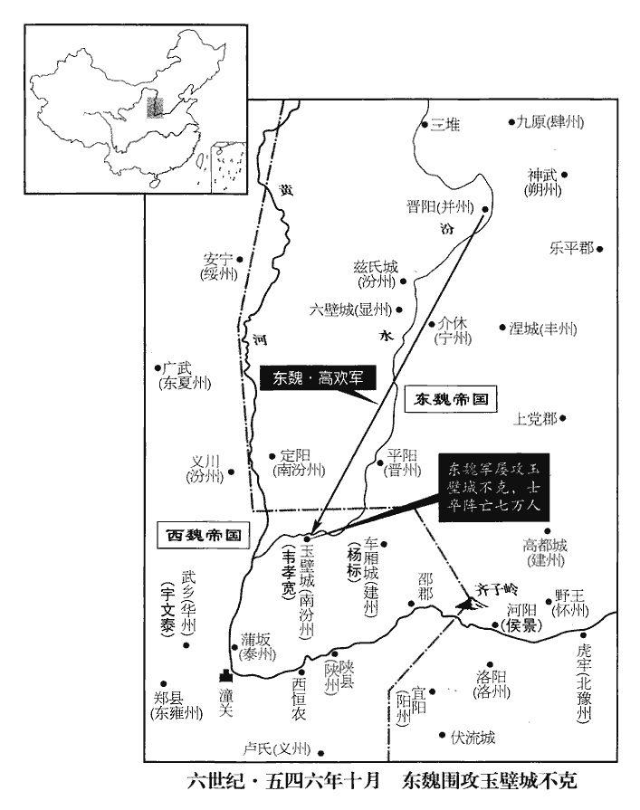

 梁紀十五起旃蒙赤奮若（乙丑），盡柔兆攝提格（丙寅），凡二年。

# 高祖武皇帝十五

## 大同十一年（乙丑、五四五）

1春，正月，丙申‹十七›，東魏‹都邺城河北省临漳县西南邺镇›遣兼散騎常侍李獎來聘。散，悉亶翻。騎，奇寄翻。

〖译文〗 [1]春季，正月，丙申（十七日），东魏派兼任散骑常侍的李奖到梁朝聘问。

2東魏儀同爾朱文暢‹本年十八岁›與丞相司馬任冑、都督鄭仲禮等，謀因正月望夜‹十五›觀打簇戲作亂，北史曰：魏氏舊俗，以正月十五夜為打簇戲，能中者即時賞帛。按魏書，孝靜天平四年，春，正月，禁打簇相偷戲。蓋此禁尋弛也。任，音壬。殺丞相歡，奉文暢為主；事泄，皆死。文暢，榮之子也；其姊‹尔朱英娥›，敬宗‹元子攸›之后，及仲禮姊大車‹郑大车›，皆為歡妾，有寵，故其兄弟皆不坐。

〖译文〗 [2]东魏仪同尔朱文畅和丞相司马任胄，都督郑仲礼等人，打算趁正月十五的晚上观看打簇戏的机会谋反叛乱，杀掉丞相高欢，推奉文畅为主上；事情泄露以后，他们全被处死。文畅是尔朱荣的儿子；他的姐姐原来是敬宗的皇后，现在与郑仲礼的姐姐大车都是高欢的妾。她们受到高欢的宠爱，所以她们的兄弟都没有受牵连。

歡上書言：「并州‹府设晋阳山西省太原市›，軍器所聚，動須女功，請置宮以處配沒之口；處，昌呂翻。又納吐谷渾‹青海省›之女以招懷之。」吐谷渾國於西魏西南，高歡越境納其女以招懷之，蓋欲借其力以侵擾西魏。吐，從暾入聲。谷，音浴。丁未‹二十八›，置晉陽宮。二月，庚申‹十一›，東魏主‹元善见，本年二十二岁›納吐谷渾可汗從妹為容華。容華，前漢內職舊號。可，從刊入聲。汗，音寒。從，才用翻。

〖译文〗 高欢向孝静帝上书说：“并州是聚集了众多军需武器的地方，随时都需要妇女工作。请您设置宫室来安置被分配到当地籍没的女人，再请陛下纳吐谷浑的女子入宫，以便招降吐谷浑国，对它实施怀柔政策。”丁未（二十八日），东魏设置了晋阳宫。二月，庚申（十一日），东魏孝静帝纳吐谷浑可汗的堂妹为妾，封她为容华。

3魏‹都长安陕西省西安市›丞相泰遣酒泉‹甘肃省酒泉市›胡安諾槃陀始通使於突厥‹新疆北部›。突厥本西方小國，姓阿史那氏，世居金山‹新疆阿尔泰山›之陽，為柔然鐵工。使，疏吏翻；下同。李延壽曰：突厥，其先居西海‹疑是伊赛克湖›之右，獨為部落，蓋匈奴之別種也，姓阿史那氏。後為鄰國所破，盡滅其族。有一兒，年且十歲，兵人見其小，不忍殺之，乃刖足斷臂棄澤中，有牝狼以肉飼之；及長，與狼交合，遂有孕焉。彼王聞此兒尚在，復遣殺之。使者見在狼側，并欲殺狼。於時若有神物投狼於西海之東，落高昌國‹新疆吐鲁番市东›西北山；狼匿其中，遂生十男。男長，外託妻孕。其後各為一姓；阿史那其一也，最賢，遂為君長。故牙門建狼頭纛dào，示不忘本也。或云：突厥本平涼雜胡，姓阿史那氏。魏太武滅沮渠氏，阿史那以五百家奔柔然。世居金山之陽，為柔然鐵工。金山形似兜鍪móu，借俗？號兜鍪突厥，突厥因以為號。又曰：突厥之先出於索國，在匈奴之北。其部落大人曰阿謗步；兄弟七十人，其一曰伊質泥師都，狼所生也。此說雖殊，終狼種也。程大昌曰：金山，形如兜鍪。其俗謂兜鍪為突厥，因以為號。厥，九勿翻。至其酋長土門，始強大，酋，慈秋翻。長，知兩翻。頗侵魏西邊。安諾槃陀至，其國人皆喜曰：「其國」之下當更有「國」字，屬下句。「大國使者至，吾國其將興矣。」

〖译文〗 [3]西魏丞相宇文泰派酒泉的胡安诺陀开始出使突厥，并与之沟通。突厥原本是西方的小国，以阿史那氏为姓，世世代代居住在金山的南面，为柔然国充当打铁工。到了酋长土门统治时期，突厥才开始强大起来。它多次侵犯西魏西部边疆。安诺陀来到突厥，突厥人都高兴地说：“大国的使者一来，我们国家就要兴盛了。”

4三月，乙未‹十六›，東魏丞相歡入朝于鄴，百官迎於紫陌。朝，直遙翻。鄴都記：紫陌在鄴城西北五里。歡握崔暹手而勞之曰：「往日朝廷豈無法官，莫肯舉劾。勞，力到翻。劾，戶概翻，又戶得翻。中尉盡心徇國，不避豪強，遂使遠邇肅清。衝鋒陷陣。大有其人；陳，讀曰陣。當官正色，今始見之。言聞之古人有當官正色者，今始見崔暹也。富貴乃中尉自取，高歡父子無以相報。」賜暹良馬。暹拜，馬驚走，歡親擁之，授以轡。東魏主‹元善见›宴於華林園，鄴都倣京洛之制，亦有華林園。使歡擇朝廷公直者勸之酒；歡降階跪曰：「唯暹一人可勸，并請以臣所射賜物千段賜之。時於華林園宴射，賜歡物千段。歡請回以賜暹。高澄退，謂暹曰：「我尚畏羨，何況餘人！」

〖译文〗 [4]三月，乙未（十六日），东魏丞相高欢到邺都朝拜国主，文武百官在紫陌迎候他。高欢握着崔暹的手慰劳他说：“以前朝廷里不是没有法官，但却没人能举报弹劾。中尉你尽心尽力报效国家，不畏强暴，才使天下四方平安无事。为国家的利益而冲锋陷阵大有人在；做官做得正派，这样的人我今天才见到。今天的荣华富贵是中尉你自己取得的，我们高欢父子俩没有什么能相报的。”于是，赏赐给崔暹一匹好马。崔暹连忙叩谢，不料马惊跑起来，高欢便亲自拦住它，拉过马头，把辔头交给崔暹。东魏孝静帝在华林园设宴，让高欢在朝廷中选择一位正直的官员向他劝酒。高欢退下一级台阶跪着说：“只有崔暹可以向您劝酒。同时，请您把我射箭所得赏赐的千段绢帛转赐给他。”高澄从朝廷上退下之后对崔暹说：“我尚且对您非常敬畏，羡慕，何况其他人呢？”

然暹中懷頗挾巧詐。初，魏高陽王斌有庶妹玉儀，不為其家所齒，為孫騰妓，斌，音彬。妓，渠綺翻。騰又棄之；高澄遇諸塗，悅而納之，遂有殊寵，白居易詩云：天下無正色，悅目即為姝。誠有是事。蓋玉儀所乏者非色，必妖媚善蠱惑，故所如眾女謠諑而不見容。封琅邪公主。澄謂崔季舒曰：「崔暹必造直諫，造，如字，作也。我亦有以待之。」及暹諮事，澄不復假以顏色。復，扶又翻。居三日，暹懷刺墜之於前。續世說：古者未有紙，削竹木以書姓名，謂之刺。後以紙書，謂之名紙。唐李德裕貴盛，人務加禮，改具銜候起居之狀，謂之門狀。澄問：「何用此為？」暹悚然曰：「未得通公主‹元玉仪›。」澄大悅，把暹臂，入見之。季舒語人曰：語，牛倨翻。「崔暹常忿吾佞，在大將軍前，每言叔父可殺；及其自作，乃過於吾。」

〖译文〗 然而崔暹内心却很奸诈。当初，西魏高阳王元斌有一个庶出的妹妹玉仪，在元斌家里是个微不足道的人，做了孙腾的歌舞妓，后来孙腾又抛弃了她。高崐澄在路上遇到了她，很喜爱她，便收她为妾，备受高澄宠爱，被封为琅邪公主。高澄对崔季舒说：“崔暹一定会对我直言相谏，但是我也有办法对付他。”等到崔暹向他请示事情，高澄不再对他和颜悦色。三天之后，崔暹怀里揣着名帖来见高澄，高澄问：“你何必带着名帖见我？”崔暹胆怯地说：“因为我还没有进见过公主。”高澄非常高兴，拉着崔暹的胳膊，把他带入室内与公主相见。事后，崔季舒对别人说：“崔暹恨我奸佞，他每次在大将军面前时都说他的叔父应该被杀掉。而他自己的所作所为，却早已超过我了。”

5夏，五月，甲辰‹二十六›，東魏大赦。

〖译文〗 [5]夏季，五月，甲辰（二十六日），东魏大赦天下。

6魏王盟卒。九月，魏以王盟為太傅。

〖译文〗 [6]西魏的王盟去世。

7晉氏以來，文章競為浮華，魏丞相泰欲革其弊。六月，丁巳‹十›，魏主‹元宝炬，本年三十九岁›饗太廟。泰命大行臺度支尚書、領著作蘇綽度，徒洛翻。作大誥，宣示群臣，戒以政事；仍命「自今文章皆依此體。」宇文泰令蘇綽倣周書作大誥，今其文尚在。使當時文章皆依此體，亦非所以崇雅黜浮也。

〖译文〗 [7]从晋朝以来，天下文章竞相以词藻繁富相夸，西魏丞相宇文泰想革除这一不良风气。六月，丁巳（初十），西魏文帝到太庙祭祖。宇文泰命令大行台度支尚书、领著作苏绰写了一篇《大诰》，宣读给文武大臣们听，劝诫大臣们勤于政事，西魏还下命令：“从今以后，文章都要按照这种方式来写。”

8上‹萧衍，本年八十二岁›遣交州‹府设龙编越南河内市东北北宁府›刺史楊㬓討李賁，㬓piào，匹妙翻。以陳霸先為司馬，命定州‹南定州·州政府设郁林广西桂平县›刺史蕭勃會㬓於西江‹珠江›。五代志：鬱林郡，梁置定州。勃知軍士憚遠役，因詭說留㬓。說，式芮翻。㬓集諸將問計，霸先曰：「交趾叛換，罪由宗室，謂李賁之叛，由武林侯諮也。事見上卷七年。遂使溷亂數州，逋誅累歲。定州欲偷安目前，不顧大計；節下奉辭伐罪，當死生以之，豈可逗橈不進，長寇沮眾也！」橈，奴教翻。長，知兩翻。沮，在呂翻。遂勒兵先發。㬓以霸先為前鋒。至交州，考異曰：典略作「十二月癸丑至交州」，姚思廉陳書帝紀在六月，今從之。賁帥眾三萬拒之，帥，讀曰率。敗於朱鳶‹越南河内市东南›，朱鳶縣，自漢以來屬交趾郡。五代志：朱鳶縣舊置武平郡。鳶，音緣。又敗於蘇歷江口，賁奔嘉寧城‹越南山西府›，沈約志：吳孫皓建衡三年，分交趾立新興郡，并立嘉寧縣；晉武帝太康三年，更郡曰新昌。五代志：交趾郡嘉寧縣，舊置興州新昌郡，隋改曰峰州。諸軍圍之。勃，昺之子也。吳平侯昺，帝從父弟也。昺，音丙。

〖译文〗 [8]梁武帝派遣交州刺史杨讨伐李贲，并让陈霸先担任司马；命令定州刺史萧勃领兵与杨的军队在西江会合，萧勃知道军中将士害怕远征打仗，就花言巧语劝说杨原地停止不前。杨召集各位将领寻问计策，陈霸先说：“交趾郡的反叛，其罪责在于宗室，因而使许多州混乱不堪，随意捕人杀戮多年。现在定州刺史只想苟且偷安于眼前，还顾不上有什么大的打算。现在您奉皇上之命讨伐有罪之人，应当生死不顾，全力以赴，怎么可以逗留不进，长敌人志气而灭自己威风呢！”于是，陈霸先率自己的部队首先出发。杨让陈霸先做先锋。到了交州，李贲率领三万军队抵抗，在朱鸢被打败。后来又在苏历江口被打败。李贲逃往嘉宁城，各路军队将他围住。萧勃，是萧的儿子。

9魏與柔然頭兵可汗謀連兵伐東魏，丞相歡患之，遣行臺郎中杜弼使於柔然，為世子澄求婚。使，疏吏翻。為，于偽翻。頭兵曰：「高王自娶則可。」歡猶豫未決。婁妃‹娄昭君›曰：「國家大計，願勿疑也。」世子澄、尉景亦勸之。歡乃遣鎮南將軍慕容儼往聘之，號曰蠕蠕公主。魏明元帝命柔然曰蠕蠕，謂其蠕動無知識也。阿那瓌guī封蠕蠕王，雖曰以為國號，猶鄙賤之也。至高歡納其女，號曰蠕蠕公主，則徑以為國號，不復以為鄙賤矣。蠕，人兗翻。秋，八月，歡親迎於下館‹山西省朔州市东南›。據北史彭城太妃傳，下館，當在木井北。宋白曰：木井城，今并州陽曲縣理。又曰：代州即古陰館城，有上館、下館。公主至，婁妃‹娄昭君›避正室以處之；歡跪而拜謝，婁妃，歡微時之妻，正室也。處，昌呂翻。妃曰：「彼將覺之，願絕勿顧。」史言婁妃為國家計，有趙姬使叔隗為內子而己下之之意。頭兵使其弟禿突佳來送女，且報聘；或云「作聘」。【章：胡註「或云作聘」。十二行本作「娉」；乙十一行本同；疑元刻本作「娉」，胡刻改誤。】仍戒曰：「待見外孫乃歸。」公主性嚴毅，終身不肯華言。歡嘗病，不得往，禿突佳怨恚，恚，於避翻。歡輿疾就之。

〖译文〗 [9]西魏与柔然国头兵可汗密谋联合起兵讨伐东魏，东魏丞相高欢为此事很担心，便派行台郎中杜弼出使柔然国，替他的长子高澄求婚。头兵可汗对使者说：“高丞相如果为自己娶亲就可以。”高欢犹豫不决。娄妃对他说：“这是国家大事，希望您不要犹豫。”长子高澄与尉景也劝他。高欢于是派遣镇南将军慕容俨前往柔然国去定亲，称柔然王的女儿为蠕蠕公主。秋季，八月，高欢亲自在下馆迎接蠕蠕公主。公主来到了东魏，娄妃将自己居住的正室让给蠕蠕公主住；高欢向娄妃跪拜感谢她，娄妃说：“公主会发现我们的关系，希望你和我断绝来往，不要再来看我。”头兵可汗派他的弟弟秃突佳前来护送他的女儿，并且作为对东魏的回访。他又告诫公主说：“等到看见外孙之后你再回来。”公主性格严肃刚毅，终身不肯说汉语。高欢有一次病了，不能前往她的住处，秃突佳很有怨气，高欢便立即抱病登车去公主那里。

10冬，十月，乙未‹十四›，詔有罪者復聽入贖。天監三年，除贖罪科，見一百四十五卷。復，扶又翻。

〖译文〗 [10]冬季，十月，乙未（疑误），梁朝颁下诏书：重新允许有罪的人交钱赎罪。

11東魏遣中書舍人尉瑾來聘。

〖译文〗 [11]东魏派中书舍人尉瑾来梁朝聘问。

12乙未，東魏丞相歡請釋邙山俘囚桎梏，配以民間寡婦。此邙山之捷所獲西魏之兵也。捷事見上卷九年。桎，之日翻。梏，古沃翻。

〖译文〗 [12]乙未（疑误），东魏丞相高欢请求释放邙山的战俘，把民间的寡妇许配给他们。

13十二月，東魏以侯景為司徒，中書令韓軌為司空；戊子‹十四›，以孫騰錄尚書事。

〖译文〗 [13]十二月，东魏任命侯景为司徒，任命中书令韩轨为司空，戊子（十四日），任命孙腾为录尚书事。

14魏築圜丘於城南。長安城南也。

〖译文〗 [14]西魏在长安城南面建造了一个祭天的圆丘。

15散騎常侍賀琛啟陳四事：其一，以為「今北邊稽服，稽，音啟。謂東魏通和也。正是生聚教訓之時，用伍子胥「越十年生聚，十年教訓」之言。而天下戶口減落，關外彌甚。謂淮、汝、潼、泗新復州郡在邊關之外者。郡不堪州之控總，縣不堪郡之裒削，裒póu，薄侯翻。更相呼擾，更，工衡翻。惟事徵斂，斂，力贍翻。民不堪命，各務流移，此豈非牧守之過歟！守，式又翻；下同。東境戶口空虛，東境，謂三吳之地。皆由使命繁數，使，疏吏翻；下同。數，所角翻。窮幽極遠，無不皆至，每有一使，所屬搔擾；駑困守宰，則拱手聽其漁獵，桀黠長吏，又因之重為貪殘，黠xiá，下八翻。長，知兩翻。重，直用翻。縱有廉平，郡猶掣肘。如此，雖年降復業之詔，屢下蠲juān賦之恩，而民不得反其居也。」其二，以為「今天下【章：十二行本「下」下有「守宰」二字；乙十一行本同；孔本同；張校同。】所以貪殘，良由風俗侈靡使之然也。今之燕喜，詩魯頌曰：魯侯燕喜。鄭氏箋云：燕，飲也。相競誇豪，積果如丘陵，列肴同綺繡，露臺之產，不周一燕之資，露臺之產，謂百金也。露臺事見十五卷漢文帝後七年。而賓主之間，裁取滿腹，未及下堂，已同臭腐。又，畜妓之夫，無有等秩，畜，吁玉翻。妓，渠綺翻。為吏牧民者，致貲巨億，巨億者，憶億也。罷歸之日，不支數年，率皆盡於燕飲之物，歌謠之具。所費事等丘山，為歡止在俄頃，乃更追恨向所取之少；少，詩沼翻。如復傅翼，增其搏噬，復，扶又翻。傅，讀曰附。言罷官家食之人，復出為官，猶不能奮飛之鳥，復傅之羽翼也。一何悖哉！悖，蒲內翻；下同。其餘淫侈，著之凡百，言時人凡百所為，皆事淫侈也。習以成俗，日見滋甚，欲使人守廉白，安可得邪！誠宜嚴為禁制，道以節儉，道，讀曰導。糾奏浮華，變其耳目。夫失節之嗟，亦民所自患，正恥不能及群，故勉強而為之；易曰：不節若，則嗟若，無咎。象曰：不節之嗟，又誰咎也！琛引用之以發己意，此論誠切中人情。強，其兩翻。苟以純素為先，足正彫流之弊矣。」其三，以為「陛下憂念四海，不憚勤勞，至於百司，莫不奏事。但斗筲之人，既得伏奏帷扆，扆yǐ，於豈翻。便欲詭競求進，不論國之大體，心存明恕；惟務吹毛求疵，擘bò肌分里，吹毛以求其疵瘢，擘肌以分其肉理；言其苛細。以深刻為能，以繩逐為務。繩逐者，繩糾其過失而斥逐之也。迹雖似於奉公，事更成其威福，犯罪者多，巧避滋甚，長弊增姦，寔由於此。長，知兩翻。古寔、實同。誠願責其公平之效，黜其讒慝之心，則下安上謐，無徼悻之患矣。」徼，堅堯翻。其四，以為「今天下無事，而猶日不暇給，宜省事、息費，事省則民養，費息則財聚。應內省職掌各檢所部：凡京師治、署、邸、肆及國容、戎備，治，理事之所。署，舍止之所。邸，諸王列第及諸郡朝宿之區。肆，市列也。國容，禮樂、車服、旗章也。戎備，用兵之器備也。四方屯、傳、邸治，屯，軍屯也。傳，驛傳也。傳，張戀翻。有所宜除，除之，有所宜減，減之；興造有非急者，徵求有可緩者，皆宜停省，以息費休民。故畜其財者，所以大用之也；養其民者，所以大役之也。若言小事不足害財，則終年不息矣；以小役不足妨民，則終年不止矣。此亦確論也。如此，則難可以語富強而圖遠大矣。」

〖译文〗 [15]散骑常侍贺琛向梁武帝启奏了四件事：其一，认为“现在北方的东魏已经降服，该是让百姓繁衍后代，积蓄物资，对他们实行教育训导的时候了，而天下的户口却减少了，关外户口减少得更厉害。郡不堪忍受州的催逼，县不堪忍受郡的搜刮，千方百计地互相骚扰，只知道横征暴敛，百姓不堪重压，各家纷纷流离失所，这难道不是州郡长官的过错吗？东部地区户口空虚，都是由于国家政令太繁多引起的，即使是偏僻边远的地方，也无所不至。每次来一位使者，所属地区便受到骚扰，那些无能的地方官员，就只好拱手听命，让他们渔猎搜刮，强暴狡诈的地方长官，又趁机更加贪婪地剥削。纵然遇到廉洁正直的官员，郡守还要加以阻挠。象这样，朝廷尽管年年降旨要人民恢复生产，多次下令免除赋税，但百姓却不能回到他们原来的住所。”其二，认为“当今天下官吏之所以贪婪、残暴，确实是由于奢侈靡烂的风俗造成的。当今，在喜庆饮酒的日子里，人们竟相攀比奢华；果品堆积得如同小山，美味佳肴摆在席上如同美丽的刺绣一样，百两黄金，还不够一次酒宴所用的钱。来宾与主人所需要的只是吃饱，没等到走下殿堂，那些食物就当成腐烂发臭的东西抛弃掉。再者，无论什么等级，都蓄养妓女。而当官统治百姓的人，得到了巨大的财富，他们离职回家之后，这些银两也维持不了几年，全都用在操办饮酒、歌舞的花销中了。他们所破费的东西象小山一样多，而寻欢作乐只在一时，于是他们更加悔恨以往在做官时向百姓索取得少了；如果能重新做官的话，他们便加倍地攫取、吞噬百姓的财物。这是多么违背道义啊！其余淫侈之事，数不胜数，这种习惯渐渐成了风气，而且日渐滋长，一天比一天严重，要想使人们恪守廉正清白，怎么能办到呢？真应该严格制定禁止的措施，用节俭来引导人们，纠崐正虚浮不实的弊端，使其耳目一新。对官吏失去节制的感叹，也是人们自己忧虑的，我正羞愧于不能使大家有这样的认识，所以要勉强去做，如果能以正直清白为前导，足能纠正那些凋残失节的弊病”。其三，认为“陛下您忧国忧民，挂念天下，不畏辛劳，以至于各部门都直接向您奏事。但是那些才短识浅气量狭小的人，既能靠近您，向您启奏，便想骗得您的信任，争相飞黄腾达，而不顾国家大局，不能心存宽恕，只一味地吹毛求疵，擘肌分理，过分苛细，以严酷为能干，把纠举别人过错并且呵斥驱逐人看成是自己的任务。他们的作为，表面上虽然似乎在奉公办事，实际上是更实现了他的作威作福。结果使犯罪者增多，用巧妙办法逃避罪责的人也很多，滋长了弊病，增加了邪恶，实际上就因为这个原因啊！我真诚地希望能达到公平的效果，革除奸佞小人妄进谗言的邪恶念头，那样，全国上下就会安定，就没有侥幸心理带来的忧患了。”其四，认为“现在天下太平无事，但仍没有一点空闲时间，应该马上精简事务，节省掉一些花费。减少了事务，百姓就能修养生息，节省一些开销，国家就可以聚集资财。各机构应该自己对照职责范围，分别检查下属部门：凡是京师的官府、衙门、官邸、市肆以及朝廷仪仗、武事装备，地方上的屯戍、驿传、地方官衙等，有应该革除的，就要革除它，有应该削减的，就要削减掉它。兴建的工程有不急需的，征收的赋税劳役有可以暂缓的，都应该停止减省，以节约开销，让百姓得到休息。因此，储蓄财货是为了能有大的作为，让人民休养生息是为了能让他们服大役。如果说小事不足以破费多少钱财，就任意花费的话，那就终年不会停止了。如果认为小的劳役不会妨碍百姓的话，那就会终年有劳役，百姓没有休息的时候了。像这样，就很难谈到国富民强，并且图谋远大的事业了。”

啟奏，上‹萧衍›大怒，召主書於前，口授敕書以責琛。蕭子顯曰：自齊建武以來，詔命不關中書，專出舍人省。四省，謂之四戶。其下有主書令史，舊用武官，末改文吏，人數無員，莫非左右要密。大指以為：「朕有天下四十餘年，公車讜言，日關聽覽，讜，多曩翻。讜言，善言也，直言也。所陳之事，與卿不異，每苦倥偬，倥，康董翻。偬，作孔翻。倥偬，困苦也，不暇給也。更增惛惑。卿不宜自同闒茸，闒tà，吐盍翻。茸，而隴翻。闒茸，不肖也，劣也。止取名字，宣之行路，言『我能上事，恨朝廷之不用。』何不分別顯言：某刺史橫暴，上，時掌翻。別，彼列翻。橫，戶孟翻。某太守貪殘，守，式又翻。尚書、蘭臺某人姦猾，使者漁獵，並何姓名？使，疏吏翻。取與者誰？明言其事，得以誅黜，更擇材良。又，士民飲食過差，若加嚴禁，密房曲屋，云何可知？儻家家搜檢，恐益增苛擾。若指朝廷，我無此事。昔之牲牢，久不宰殺，周禮：王膳用六牲，謂馬、牛、羊、豕、犬、雞也。又曰：王日一舉，鼎十有二。註曰：殺牲盛饌曰舉；鼎十有二，牢鼎九、陪鼎三。帝事佛，乃不宰殺。朝中會同，菜蔬而已；若復減此，必有蟋蟀之譏。詩唐蟋蟀，刺晉僖公儉不中禮。朝，直遙翻。復，扶又翻。若以為功德事者，帝以供佛、供僧，設無遮、無礙會為功德事。皆是園中之物，變一瓜為數十種，種，章勇翻。治一菜為數十味；治，直之翻；下同。以變故多，何損於事！我自非公宴，不食國家之食，多歷年所；乃至宮人，亦不食國家之食。帝奄有東南，凡其所食，自其身以及六宮，不由佛營，不由神造，又不由西天竺國來，有不出於東南民力者乎？惟不出於公賦，遂以為不食國家之食。誠如此，則國家者果誰之國家邪！凡所營造，不關材官及以國匠，此自文其營造塔寺之過耳。材官將軍，屬少府卿。國匠者，官給其俸廩以供國家之用者。大匠卿，掌土木之工。皆資雇借以成其事。勇怯不同，貪廉各用，亦非朝廷為之傅翼。為，于偽翻。傅，讀曰附。卿以朝廷為悖，乃自甘之，當思致悖所以！悖，蒲妹翻。卿云『宜導之以節儉』，朕絕房室三十餘年，至於居處不過一牀之地，雕飾之物不入於宫；受生不飲酒，不好音聲，所以朝中曲宴，未嘗奏樂，此群賢之所見也。朕三更出治事，隨事多少，事少，午前得竟，孔穎達曰：雜比曰音，單出曰聲。竟，畢其事也。處，昌呂翻。好，呼到翻。更，工衡翻。朝，直遙翻。少，詩沼翻。事多，日昃方食，日常一食，若晝若夜；昔要腹過於十圍，要，讀曰腰。今之瘦削纔二尺餘，舊帶猶存，非為妄說。為誰為之？救物故也。為誰之為，于偽翻；下手為同。卿又曰『百司莫不奏事，詭競求進』，今不使外人呈事，誰尸其任！尸，主也。專委之人，云何可得？古人云：『專聽生姦，獨任成亂，』漢鄒陽之言。二世之委趙高，元后之付王莽，趙高事見秦紀，王莽事見漢紀。呼鹿為馬，又可法歟？卿云『吹毛求疵』，復是何人？『擘肌分理』，復是何事？復，扶又翻；下當復、復見、敢復同。治、署、邸、肆等，何者宜除？何者宜減？何處興造非急？何處徵求可緩？各出其事，具以奏聞！富國強兵之術，息民省役之宜，並宜具列！若不具列，則是欺罔朝廷。倚【章：十二行本「倚」作「佇」；乙十一行本同；孔本同。】聞重奏，倚，側也。側者，傾待之義，如側耳、側身、側席之類。重，直龍翻。當復省覽，付之尚書，班下海內，省，悉景翻。下，遐嫁翻。庶惟新之美，復見今日。」琛但謝過而已，不敢復言。

〖译文〗 贺琛启奏之后，梁武帝勃然大怒，把主书召到面前，口授敕书指责贺琛。大致内容是：“我有江山已四十多年，每天都耳闻目睹许多从公车官署中转来的臣民直言不讳的上书，他们所陈述的事情，与你所说的没有什么不同。我常常苦于时间仓促，现在你的奏折更增添了我的糊涂和迷惑不解。你不该把自己和才能低下的软弱之人混同在一起，只是图个虚名，向行路之人炫耀说：‘我可以向皇帝上书陈述意见。遗憾的是朝廷不采纳。’为什么不分别明着说：某位刺史横征暴敛，某位太守贪婪残酷，某位尚书、兰台奸诈虚滑；渔猎百姓的皇差姓什么叫什么？从谁那里夺取？给了谁？如果你能明白地指出这些，我就能杀掉、罢免他们，再选择好的人才。还有，官吏百姓的饮食豪华过度，如果加以严格禁止，他们在密室里，你又怎么知道呢？倘若挨家挨户搜查，恐怕更增加了对百姓的骚扰。如果你指的是朝廷中生活奢侈，我是没有这种情况的。崐以前饲养的祭祀用的牲畜，很久没有宰杀了。朝廷如有朝会，也只是吃一些蔬菜罢了。如果再削减这些蔬菜，一定会被讥讽为是《诗经·蟋蟀》所讽刺的晋僖公那样的人。如果你认为供佛、事佛奢侈，那些供品都是园子里的东西，把一种瓜改为几十个品种，把一种菜做成几十种味道。只因为变着花样做才有了许多菜肴，对事物又有什么损害呢？我如果不是公宴，从不吃国家的酒食，已有很多年了。甚至宫中的人，也不吃国家的粮食。凡是营造的建筑，都与材官和国匠无关，都是用钱雇人来完成的。官员们有勇敢的，也有胆怯的，有贪婪的也有廉正的，也不是朝廷为他们增添了羽翼。你认为朝廷是有错误的，于是就自以为是。你应该想一想导致错误的原因！你说：应该以节俭引导百姓，我已经三十多年没有房事，至于居住，不过只有能放下一张床的地方，宫中没有雕梁画柱；我平生不爱饮酒，不喜好声色。因此，朝廷中设宴，不曾演奏过乐曲，这些都是诸位贤臣们所看到的。我三更便起，治理国家大事，处理政务的时间依据国家事务的多少来定，事务不多时，中午之前就能把它们处理完，事务繁忙时太阳偏西时才能吃饭，常常每天只吃一顿饭，既象在过白天，又象在过黑夜。往日，我的腰和腹超过了十围，现在瘦得才只有二尺多点，我以前围的腰带还保存着，不是乱说。这是为了谁工作？是为了拯救万民的缘故。你又说：‘官员们没有不凡事都向您禀奏的，一些人用尽伎俩想升官。’要是从今不让外人奏报事情，那么谁来担负这个责任呢？委托管理国事的专人，怎么能够得到呢？古人说：‘只听一方面的话就会出现奸佞小人，专任一人必定要出祸乱。’秦二世把国家大事委托给了赵高，元后把一切托付给了王莽，结果赵高指鹿为马，颠倒是非，又怎么能效法他们呢！你说：‘吹毛求疵’，又是指谁？‘擘肌分理’，又是指哪件事？官府、衙门、官邸、市肆等等，哪个应该革除，哪些该削减？哪些地方兴建的工程不急？哪些征收的赋税可以迟缓？你要分别举出具体事实，详细启奏给我听！用什么办法使国家富裕，军队强大，应该如何让百姓休养生息，减除劳役，这些都该具体地列出，如果不具体地一一列出，那你就是蒙蔽欺骗朝廷。朕正在准备侧耳细听你按上述要求重新奏报，届时自当认真阅读，并把你的高见批转给尚书省，正式向全国颁布，只希望除旧布新的善政美德，能因此而出现在今世。”贺琛只是向梁武帝谢了罪，不敢再说什么。

上‹萧衍›為人孝慈恭儉，博學能文，陰陽、卜筮、騎射、聲律、草隸、圍碁無不精妙。騎，奇寄翻。勤於政務，冬月四更竟，夜分五更，每更至五點而竟。即起視事，執筆觸寒，手為皴cūn裂。皴，七倫翻，皮細起也。自天監中用釋氏法，長齋斷魚肉，斷，音短。日止一食，惟菜羹、糲飯而已，糲lì，盧達翻。糲者，粗而不鑿也。或遇事繁，日移中則嗽口以過。日移中，日過中也。「嗽sòu」，當作「漱shù」，滌口也，音先奏翻。過，謂度日也。身衣布衣，木緜皁帳，木綿，江南多有之，以春二三月之晦下子種之。既生，須一月三薅hāo其四旁；失時不薅，則為草所荒穢，輒萎死。入夏漸茂，至秋生黃花結實。及熟時，其皮四裂，其中綻出如綿。土人以鐵鋌碾去其核，取如綿者，以竹為小弓，長尺四五寸許，牽弦以彈緜，令其勻細。卷為小筩，就車紡之，自然抽緒，如繅sāo絲狀，不勞紉緝，織以為布。自閩、廣來者，尤為麗密。方勺曰：閩、廣多種木綿，樹高七八尺，葉如柞，結實如大菱而色青，秋深即開露，白綿茸然。土人摘取，去殼，以鐵扙捍盡黑子，徐以小弓彈令紛起，然後紡績為布，名曰吉貝；今所貨木綿，特其細緊者耳。當以花多為勝，橫數之得百二十花，此最上品。海南蠻人織為巾，上出細字雜花卉，尤工巧，即古所謂白疊巾。身衣，於既翻。一冠三載，一衾二年，載，子亥翻，亦年也。後宮貴妃以下，衣不曳地。性不飲酒，非宗廟祭祀、大饗宴及諸法事，未嘗作樂。法事，謂奉佛為梵唄。雖居暗室，恆理衣冠小坐，盛暑未嘗褰qiān袒，小坐，宮中便坐也。恆，戶登翻。坐，徂臥翻。對內豎小臣，如遇大賓。然優假士人太過，牧守多浸漁百姓，使者干擾郡縣。又好親任小人，守，式又翻。使，疏吏翻。好，呼到翻。頗傷苛察；多造塔廟，公私費損。江南久安，風俗奢靡，故琛啟及之。上惡其觸實，惡，烏路翻。故怒。

〖译文〗 梁武帝为人很守孝道，待人慈悲，彬彬有礼，生活又节俭。他博学多才，善写文章，对阴阳、卜筮、骑射、声律、草、围棋无所不精。他对国家事务很勤勉，冬天，四更一过，他就起来工作。由于天气严寒，握笔的手都粗糙得裂口子了。自从天监年间信仰释迦牟尼的佛教以来，长期斋戒吃素食，不再吃鱼肉。每天只吃一顿饭，也只不过是些菜羹，粗米饭罢了。有时遇到事务繁多，太阳移过头顶了，就漱一漱口算吃过饭了。他身穿布衣，用的是木棉织的黑色帐子。一顶帽子戴三年，被子盖二年才换一床。后宫里贵妃以下，不穿拖地的衣裙。他生性不喝酒，如果不是在宗庙举行祭祀，或是办大宴席以及进行其他的拜佛等活动，就不奏乐。尽管他居住在幽暗的房子中，却一直衣冠楚楚，坐在宫中便座上，在酷暑的日子里，也没有袒胸露怀。对待宫中太监小臣，象对待尊贵的宾客一样。但是宽待士大夫太过分，牧守大多渔猎百姓，皇帝的使臣又干扰郡县。梁武帝本人又爱亲近任用奸诈的小人，很失之于苛刻挑剔。他还兴建了许多塔和庙，使公家和私人都破费损耗。江南一带长期安定，形成了生活奢侈的风俗，所以贺琛在奏折中提到了此事。武帝不喜欢他触及事实，所以大为恼怒。

臣光曰：梁高祖之不終也，宜哉！夫人君聽納之失，在於叢脞cuǒ；孔安國曰：叢脞，細碎無大略。馬融曰：叢，總也。脞，小也。陸德明曰：脞，倉果翻；徐音鎖。人臣獻替之病，在於煩碎。是以明主守要道以御萬機之本，忠臣陳大體以格君心之非，故身不勞而收功遠，言至約而為益大也。觀夫賀琛之諫未【章：十二行本「未」上有「亦」字；乙十一行本同；孔本同。】至於切直，而高祖已赫然震怒，護其所短，矜其所長；詰貪暴之主名，詰，去吉翻。問勞費之條目，困以難對之狀，責以必窮之辭。自以蔬食之儉為盛德，日昃之勤為至治，昃，阻力翻。治，直吏翻。君道已備，無復可加，復，扶又翻。群臣箴規，舉不足聽。如此，則自餘切直之言過於琛者，誰敢進哉！由是姦佞居前而不見，謂朱异、周石珍輩也。大謀顛錯而不知，謂納侯景，復與東魏和也。名辱身危，覆邦絕祀，為千古所閔笑，豈不哀哉！

〖译文〗 臣司马光曰：梁武帝不得善终，是应该的。国君之所以在听取意见，接纳进谏方面出现过失，就是因为只注意了琐碎细小的事情而没有雄才大略。大臣进谏时所犯的毛病，也在于烦琐。因此贤明的君主要抓住最主要的问题以驾驭万事的根本，忠心的大臣要陈述大的方针政策来劝阻君主想得不对的地方，所以作为君主不需亲自动手操劳，就能取得大的功效，作为大臣说得简明扼要便收到很大的效益。纵观贺琛的进谏，可以说还未达到直言极谏的地步，而梁武帝却已经勃然大怒，袒护自己的短处，夸耀自己的长处。质问贺琛贪婪暴虐的官吏名字，追问徭役过重、费用铺张的具体项目，用难以回答的问题来困扰他，用无法对答的言辞来责备他。梁武帝自认为每顿饭只吃蔬菜的节俭作风是极大的美德，忙到太阳偏西才吃饭这种勤勉的工作态度是最好的治国办法，为君之道他已具备，再没有什么需要增加的了，对于大臣的规劝，认为全不值得去听取。象这样，那么其余比贺琛的进谏更恳切、直率、激烈的话，谁还敢去对他说呢！因此，奸佞小人在眼前也视而不见，重大决策颠倒错误也不知道，声名受辱，自身危亡，国家颠覆，祭祀断绝，被千古人怜悯讥笑，难道不很悲哀吗？

16上敦尚文雅，疏簡刑法，自公卿大臣，咸不以鞫jū獄為意。姦吏招權弄法，貨賂成市，枉濫者多。大率二歲刑已上，歲至五千人；徒居作者具五任，任，謂其人巧力所任也。五任，謂任攻木者則役之攻木，任攻金者則役之攻金，任攻皮者則役之攻皮，任設色者則役之設色，任摶埴者則役之摶埴。任，音壬。其無任者著升械；魏武帝定甲子科，犯釱dì左右趾者，易以升械；是時乏鐵，故易以木焉。著，陟略翻。若疾病，權解之，是後囚徒或有優、劇。言囚徒有力足以行賂者，則守吏詭言疾病，權解其械而得優寬。其無力以賂吏者，則雖實罹疾病，亦不得解械，更增苦劇也。時王侯子弟，多驕淫不法。上年老，厭於萬幾。幾，居希翻。又專精佛戒，每斷重罪，則終日不懌yì；梁武帝斷重罪則終日不懌，此好生惡殺之意也。夷考帝之終身，自襄陽舉兵以至下建康，猶曰事關家國，伐罪救民。洛口之敗，死者凡幾何人？浮山之役，死者凡幾何人？寒山之敗，死者又幾何人？其間爭城以戰，殺人盈城，爭地以戰，殺人盈野，南北之人交相為死者，不可以數計也。至於侯景之亂，東極吳、會，西抵江、郢，死於兵、死於饑者，自典午南渡之後，未始見也。驅無辜之人而就死地，不惟儒道之所不許，乃佛教之罪人；而斷一重罪乃終日不懌，吾誰欺，欺天乎！斷，丁亂翻。或謀反逆，事覺，亦泣而宥之。如臨賀王正德父子是也。由是王侯益橫，橫，戶孟翻。或白晝殺人於都街，或暮夜公行剽劫，剽，匹妙翻。有罪亡命者，匿於王家，有司不敢搜捕。上深知其弊，溺於慈愛，不能禁也。

〖译文〗 [16]梁武帝真心崇尚文章礼乐，对刑法则疏远忽视。从公卿大臣以下，都不重视审判刑案。奸佞的官吏便擅权弄法，受贿赂的东西多得象市场出售的商品一样，无辜受害扩大冤狱的事很多。大约被判二年以上刑罚的人每年多达五千；判罚劳役的人各自运用技巧服役劳作，那些没有一技之长的人就要被套上枷锁；如果有人病了，就暂时为他解开枷锁，这以后，囚徒中有能力行贿的人借此得到优待，没有能力行贿的人就会加剧痛苦。当时，王公贵族的子弟，大多骄奢淫逸，不遵守法规。武帝年纪已老，满足于处理日常的各种事务，又专心研究佛教戒律，每次裁决了重大罪犯，就一天不高兴，有人密谋反叛朝廷，事情被发觉后，他也哭泣悲伤一番并且原谅了这个人。由于这样，王公贵族们更加专横。有人在都城街道于光天化日之下把人杀死，有人在夜晚时分公开抢劫，有罪在身的逃命之人，藏在王侯家中，有关官吏不敢前去搜捕。梁武帝深深知道这些弊端，由于沉溺于慈悲仁爱，也不能禁止这些现象。

17魏東陽王榮為瓜州‹府设敦煌甘肃省敦煌市›刺史，五代志：敦煌郡，舊置瓜州。與其壻鄧彥偕行。榮卒，瓜州首望表榮子康為刺史，各州之大姓，是為望族。首望者，又一州望族之首。彥殺康而奪其位；魏不能討，因以彥為刺史，屢徵不至，又南通吐谷渾。吐谷渾立國在敦煌之南，隔大河。吐，從暾入聲。谷，音浴。丞相泰以道遠難於動眾，欲以計取之，以給事黃門侍郎申徽為河西大使，密令圖彥。

〖译文〗 [17]西魏东阳王元荣任瓜州刺史，与他的女婿邓彦一同前往瓜州。元荣死后，瓜州最有威望的大姓人家上表请求让元荣的儿子元康做刺史。邓彦于是杀掉了元康，篡夺了这个职位。西魏无力讨伐他，便任命邓彦为瓜州刺史。但多次征召他，他都不来，又与南面的吐谷浑勾结。西魏丞相宇文泰因为离瓜州路途遥远，很难兴师动众地讨伐他，便想用智谋征服邓彦。他派给事黄门侍郎申徽担任河西大使，密令申徽算计邓彦。

徽以五十騎行，既至，止於賓館；彥見徽單使，兵從不多，故曰單使。文選李陵答蘇武書所謂「單車之使」者也。使，疏吏翻。騎，奇寄翻。不以為疑。徽遣人微勸彥歸朝，朝，直遙翻。彥不從；徽又使贊成其留計；贊其留敦煌之計。彥信之，遂來至館。徽先與州主簿敦煌令狐整等密謀，令狐整，瓜州之望也。姓譜：令狐本自畢萬之後晉大夫令狐文子，即魏顆也。敦，徒門翻。令，音零。執彥於坐，坐，徂臥翻。責而縛之；因宣詔慰諭吏民，且云「大軍續至」，城中無敢動者，鄧彥久在瓜州，豈無黨與？威之以大軍繼至，故懼而不敢動。遂送彥於長安。泰以徽為都官尚書。

〖译文〗 申徽带领五十名骑兵前往瓜州，来到了瓜州后，就住在宾馆里了。邓彦见申徽没带什么随从，没有怀疑他。申徽派人暗中劝说邓彦归顺朝廷，邓彦不听从劝告，申徽又派人表示赞成邓彦留在瓜州的计策。邓彦听信了这些话，于是崐来到申徽住的宾馆。申徽事先已与瓜州的主簿敦煌人令狐整等密谋策划好了，在座位上捉住了邓彦，把他捆绑了起来；接着就宣读诏书安抚百姓和官吏，并且说：“大批人马随后就要来到。”瓜州城里没有敢乱动的。于是，申徽便把邓彦押送到了长安。宇文泰任命申徽为都官尚书。

## 中大同元年（丙寅、五四六）是年夏四月，方改元為中大同

1春，正月，癸丑‹十›，楊㬓等克嘉寧城‹越南山西府›，㬓，匹妙翻。考異曰：典略作「乙未」。今從梁帝紀。李賁奔新昌‹府嘉宁›獠中，諸軍頓于江口。江口，即蘇歷江入海之口。獠，魯皓翻。

〖译文〗 [1]春季，正月，癸丑（初十），杨等人攻克了嘉宁城，李贲逃奔新昌的獠人地区，各路人马便停留在江口。

2二月，魏以義州‹府设卢氏河南省卢氏县›刺史史寧先是東、西魏爭義州，史寧先入城據之，西魏因以為刺史。為涼州‹府设姑臧甘肃省武威市›刺史；前刺史宇文仲和據州，不受代，瓜州‹府设敦煌甘肃省敦煌市›民張保殺刺史成慶以應之，晉昌‹甘肃省安西县›民呂興殺太守郭肆，以郡應保。劉昫唐志：瓜州晉昌縣，漢敦煌郡之寘zhì安縣，舊置晉昌郡及寘安縣，因改晉昌為永興；隋改為瓜州，改寘安為常樂；武德七年，復為晉昌。唐又有常樂縣，則漢之廣至縣地也。又按五代志，瓜州常樂縣，後魏置常樂郡，後周併涼興、廣至、寘安、閏泉合為涼興縣；隋廢郡，改縣為常樂。參而考之，則晉昌郡當置於隋常樂縣界。丞相泰遣太子太保獨孤信、開府儀同三司怡峰與史寧討之。

〖译文〗 [2]二月，西魏任命义州刺史史宁为凉州刺史，前任刺史宇文仲和依然占据着凉州，不接受新刺史的取代。瓜州人张保也杀掉了瓜州刺史成庆来与宇文仲和呼应。晋昌郡人吕兴杀掉了太守郭肆，以此来响应张保。丞相宇文泰派遣太子太保独孤信、开府仪同三司怡峰和史宁一同讨伐叛逆。

3三月，乙巳‹三›，大赦。

〖译文〗 [3]三月，乙己（初三），梁朝大赦天下。

4庚戌‹八›，上‹萧衍，本年八十三岁›幸同泰寺，遂停寺省，同泰寺有便省。講三慧經。考異曰：典略云：癸卯，詔「以今月八日於同泰寺設無遮大會，捨朕身及以宮人并所王境土供養三寶。」四月，丙戌，公卿以錢二億萬奉贖。按韓愈佛骨表云，「三度捨身為寺家奴，」若并此則四矣。今從梁書。夏，四月，丙戌‹十四›，解講，大赦，改元。是夜，同泰寺浮圖災，上曰：「此魔也，宜廣為法事。」群臣皆稱善。乃下詔曰：「道高魔盛，行善鄣生，魔，鬼魔。鄣，鄣礙。魔，眉波翻。行，下孟翻。當窮茲土木，倍增往日。」遂起十二層浮圖；將成，值侯景亂而止。

〖译文〗 [4]庚戌（初八），梁武帝临幸同泰寺，就住在寺里的临时官署中，讲读《三慧经》。夏季，四月，丙戌（十四日），梁武帝讲经结束，实行大赦，改换年号。这天夜里，同泰寺的塔起火，梁武帝说：“这是魔鬼造成的，应该大规模地做一些佛事活动。”文武大臣们都说好。于是，梁武帝下诏说：“道高魔盛，行善发生障碍，应该大兴土木，建造规模要超过以往。”于是便开始起造一座高十二层的佛塔；将要建成之时，正赶上侯景叛乱，便中止修建了。

5魏史寧曉諭涼州吏民，率皆歸附，獨宇文仲和據城不下。五月，獨孤信使諸將夜攻其東北，自帥壯士襲其西南，遲明，克之，將，即亮翻。帥，讀曰率；下同。遲，直二翻。遂擒仲和。

〖译文〗 [5]西魏史宁慰问安抚凉州的百姓和官吏，全州吏民都归顺了他，唯有宇文仲和占据着凉州城不肯投降。五月，独孤信派遣将领们在夜晚攻打城的东北角，自己统率壮士袭击城的西南角，黎明时分，攻克了凉州城。擒获了宇文仲和。

初，張保欲殺州主簿令狐整，以其人望，恐失眾心，雖外相敬，內甚忌之。整陽為親附，因使人說保曰：「今東軍漸逼涼州，東軍，謂獨孤信之軍東自長安來。說，式芮翻。彼勢孤危，恐不能敵，宜急分精銳以救之。然成敗在於將領，將，即亮翻；下同。令狐延保，兼資文武，令狐整，字延保。使將兵以往，蔑不濟矣！」保從之。

〖译文〗 当初，张保想要杀掉瓜州主簿令狐整，因令狐整很有声望，杀掉他会失去民心，所以张保尽管表面上尊敬令狐整，但在内心却非常忌恨他。令狐整假装亲近，依附于张保，便派人劝张保说：“现在独孤信的军队正在渐渐逼近凉州，凉州的形势孤立无援，十分危险，恐怕不能抵挡住独孤信的军队。应该赶快分派一些精锐部队援救凉州。但是，成功或失败的关键在于将领的能力。令狐整是个文武兼备的人才，如果派他率领军队前往凉州，没有不成的事。”张保采纳了令狐整的建议。

整行及玉門‹甘肃省玉门市›，玉門縣，漢、晉屬酒泉郡。師古曰：闞駰云：漢罷玉門關屯，徙其人於此。五代志：瓜州玉門縣，後魏置會稽郡，又有玉門郡。召豪傑述保罪狀，馳還襲之。先克晉昌，斬呂興；進擊瓜州，州人素信服整，皆棄保來降。保奔吐谷渾‹青海省›。降，戶江翻。吐，從暾入聲。谷，音浴。

〖译文〗 令狐整带领军队行军到了玉门，他召集起英雄豪杰，历数张保的罪状，带领骑兵返回瓜州袭击张保。他先攻克了晋昌，斩除了吕兴。然后攻打瓜州，当地人平素都信服令狐整，因此都叛离张保，向令狐整投降。张保逃往吐谷浑。

眾議推整為刺史，整曰：「吾屬以張保逆亂，恐闔州之人俱陷不義，故相與討誅之；今復見推，是效尤也。」左傳曰：尤而效之，罪又甚焉。復，扶又翻。乃推魏所遣使波斯‹伊朗›者張道義行州事，使，疏吏翻。具以狀聞。丞相泰以申徽為瓜州刺史。召整為壽昌‹甘肃省敦煌市西南›太守，五代志：西城郡石泉縣，舊曰永樂，置晉昌郡，西魏改為壽昌郡，又改永樂為石泉。守，式又翻。封襄武男。整帥宗族鄉里三千餘人入朝，從泰征討，累遷驃騎大將軍、開府儀同三司，加侍中。令狐整以忠順貴顯於魏，史終言之。朝，直遙翻。驃，匹妙翻。騎，奇寄翻。

〖译文〗 大家商议后，一致推举令狐整担任瓜州刺史。令狐整对大家说：“我们因崐为张保叛逆作战，恐怕使全瓜州人都陷入了不义的境地，所以才共同讨伐他。今天我又被大家推举为瓜州刺史，这是明知错误而加以仿效，会罪上加罪啊。”于是，他便推举西魏派来出使波斯的张道义暂且主持瓜州的日常事务，并将情况上报朝廷。西魏丞相宇文泰让申徽担任瓜州刺史，召令狐整担任寿昌太守，加封为襄武男。令狐整率领他的宗族、同乡共三千多人进京入朝，跟随宇文泰征讨叛逆，他逐步升官为骠骑大将军、开府仪同三司，又加官侍中。

6六月，庚子‹二十九›，東魏以司徒侯景為河南大將軍、大行臺。

〖译文〗 [6]六月，庚子（二十九日），东魏任命司徒侯景为河南大将军和大行台。

7秋，七月，壬寅‹一›，東魏遣散騎常侍元廓來聘。散，悉亶翻。

〖译文〗 [7]秋季，七月，壬寅（初一），东魏派散骑常侍元廓来到梁朝聘问。

8甲子‹二十三›，詔：「犯罪非大逆，父母、祖父母不坐。」

〖译文〗 [8]甲子（二十三日），梁武帝颁布诏书：“罪犯如果不犯有大逆不道的罪行，他的父母以及祖父母不被连坐。”

9先是，江東‹江苏省南部太湖流域›唯建康及三吳‹吴郡江苏省苏州市›、吴兴郡浙江省湖州市、会稽郡浙江省绍兴市、荊‹湖北省西部›、郢‹湖北省中部›、江‹江西省及福建省›、湘‹湖南省›、梁‹陕西省南部›、益‹四川省中部›用錢，先，悉薦翻。其餘州郡雜以穀帛，交‹越南北部›、廣‹广东及广西›專以金銀為貨。上自鑄五銖及女錢，二品並行，杜佑曰：梁武帝鑄錢，肉好周郭，文曰五銖，重二銖三絫lěi二黍，其百文則重一斤二兩。又別鑄除其肉郭，謂之公式女錢，徑一寸，文曰五銖，重如新鑄五銖。二錢並行。及其末也，又有兩柱錢。禁諸古錢。普通中，更鑄鐵錢。由是民私鑄者多，物價騰踊，交易者至以車載錢，不復計數。更，工衡翻。復，扶又翻。又自破嶺‹江苏省句容市东南›以東，八十為百，名曰「東錢」；破嶺，在今鎮江府丹楊縣，秦始皇所鑿，即破岡也。江、郢以上，七十為百，名曰「西錢」；建康以九十為百，名曰「長錢」。丙寅‹二十五›，詔曰：「朝四暮三，眾狙皆喜，名實未虧而喜怒為用。莊子曰：狙公賦芋，曰朝三而暮四，眾狙皆怒；曰朝四而暮三，眾狙皆喜。狙jū，千余翻。頃聞外間多用九陌錢，陌減則物貴，陌足則物賤，非物有貴賤，乃心有顛倒。至於遠方，日更滋甚，徒亂王制，無益民財。自今可通用足陌錢！令書行後，百日為期，若猶有犯，男子謫運，女子質作，並同三年。」謫運者，以謫發之轉運；質作，質其身使居作；皆役之三年。此古所謂三歲刑也。詔下而人不從，錢陌益少；少，詩沼翻。至於季年，遂以三十五為百云。

〖译文〗 [9]在此以前，长江之南只有建康及三吴、荆州、郢州、江州、湘州、梁州、益州等地使用货币。其他的州和郡杂用谷物或帛等实物交换。交、广两地专门使用金银作为货币。梁武帝自己铸造了五铢钱和女钱，让这两种货币一起在市场流通，并且禁止使用各种古代货币。普通年间，又铸造了铁钱。从此民间私下里铸造货币的人很多，造成物价沸腾猛涨。做买卖的人竟至于用车来拉钱，而不再逐个算计。还有，从破岭往东，每八十文折合一百文，人们称它为“东钱”。江州、郢州以西每七十文折合一百文，被称为“西钱”。建康地区每九十文折合一百文，被称为“长钱”。丙寅（二十五日），梁武帝颁布诏书说：“朝四暮三，众猴便都高兴，名称不同而实际意思一样，但喜怒却不同。近来我听说外界大多用九陌钱，这样钱减少了，那么物价就会昂贵，钱充足了，物价就会低贱。并不是东西本身有贵有贱，而是人们的思想颠来倒去。说到边远地区，那里货币混乱的状况更是一天比一天厉害。这只能扰乱国家的制度，不会使百姓的财富增多。从今以后，应该在全国通用足陌钱。颁布命令的文书发出以后，以一百天为期限，在百日之外如果还有人违犯这一制度，就要服三年劳役。男子被罚到边远地区搬运东西，女子要以身抵押服劳役。”诏书颁布下去之后，百姓却不按这种制度去做。钱陌变得更少了。到了末年竟以三十五文算做一百文了。

10上年高‹萧衍本年八十三岁›，諸子心不相下，下，遐嫁翻。【章：十二行本「下」下有「互相猜忌」四字；乙十一行本同；孔本同；退齋校同。】邵陵王綸為丹楊‹南京›尹，湘東王繹在江州‹府设寻阳江西省九江市›，武陵王紀在益州‹府设成都四川省成都市›，皆權侔人主；太子綱惡之，常選精兵以衛東宮。為帝諸子皆不終張本。惡，烏路翻。八月，以綸為南徐州‹府设京口江苏省镇江市›刺史。

〖译文〗 [10]梁武帝年事已高，他的儿子们彼此互不相服，邵陵王萧纶任丹杨尹，湘东王萧绎任江州刺史，武陵王萧纪任益州刺史，他们的权力都跟皇帝一般；太子萧纲很忌恨他们，常常挑选一些精锐军队来保卫东宫。八月，梁武帝任命萧纶担任南徐州刺史。

11東魏丞相歡如鄴。自晉陽朝于鄴而書「如鄴」，言其威權陵上，若列國然。高澄遷洛陽‹河南省洛阳市东白马寺东›石經五十二碑於鄴。石經見五十七卷漢靈帝熹平四年。

〖译文〗 [11]东魏丞相高欢前往邺城。他的儿子高澄将洛阳五十二块刻有《石经》的石碑迁到了邺城。

12魏徙并州‹侨州·州政府设玉壁山西省稷山县›刺史王思政為荊州‹府设穰城河南省邓州市›刺史，使之舉諸將可代鎮玉壁者。西魏置并州刺史，僑治玉壁。將，即亮翻。思政舉晉州‹侨州·州政府设车厢城山西省绛县›刺史韋孝寬，晉州屬東魏，韋孝寬遙領刺史耳。丞相泰從之。東魏丞相歡悉舉山東之眾，將伐魏；癸巳‹二十三›，自鄴會兵於晉陽‹山西省太原市›；九月，至玉壁‹山西省稷山县›，圍之。以挑西師，挑，徒了翻。西師不出。

〖译文〗 [12]西魏调并州刺史王思政担任荆州刺史，并让他从诸将中推举一位可以代替自己镇守并州州治玉壁的将领。王思政推举了晋州刺史韦孝宽，丞相宇文泰采纳了他的意见。东魏丞相高欢率领崤山以东的全部兵马将要讨伐西魏。崐癸巳（二十三日），高欢便带兵从邺城出发，到晋阳与其他将领会师。九月，到达了玉壁，将玉壁包围起来。他们向西魏的军队挑战，西魏的军队却不出来应战。

13李賁復帥眾二萬自獠中出，屯典澈湖，復，扶又翻。湖亦當在新昌郡界。考異曰：典略云：「渡武平江，據新安村。」今從陳帝紀。大造船艦，充塞湖中。艦，戶黯翻。塞，悉則翻。眾軍憚之，頓湖口，不敢進。陳霸先謂諸將曰：「我師已老，楊㬓等自去年夏五月出師，至是幾一年半，故自謂師老。將士疲勞；且孤軍無援，入人心腹，若一戰不捷，豈望生全！今藉其屢奔，人情未固，夷、獠烏合，易為摧殄。獠，魯皓翻；下同。易，弋豉翻。正當共出百死，決力取之；無故停留，時事去矣！」諸將皆默然莫應。諸將心不欲戰，故默而莫敢應。是夜，江水暴起七丈，注湖中。霸先勒所部兵乘流先進，眾軍鼓譟俱前；賁眾大潰，竄入屈獠洞中。

〖译文〗 [13]李贲又率领两万人马从獠人居住区出发，把军队屯集在典澈湖一带。他在那里建造了大量战船，充满了整个典澈湖。进攻李贲的各路军队都害怕他的战船，便停在了典澈湖口，不敢进入湖内。陈霸先对将领们说：“我军出征时间已经很长了，将士们疲惫不堪，况且我孤军无援，进入敌人的心脏地区，如果第一战打不胜的话，怎能指望活着回来！现在我们应该趁着他多次失利，人心没有稳定，而夷、獠都是些乌合之众，很容易被摧毁消灭，正应当共同出生入死，竭尽全力打败李贲。如果无缘无故地停留在湖口，机会就要失去了！”将领们听完陈霸先的话，都默默无语，没有响应。这天夜里，江水暴涨了七丈高，流到了典澈湖中。陈霸先率领他的军队顺流先进入湖中，众多人马在鼓声中一起呐喊冲杀。李贲的军队被打得惨败，逃进了屈獠洞里。

14冬，十月，乙亥‹六›，以前東揚州‹府设会稽›刺史岳陽王詧為雍州‹府设襄阳湖北省襄樊市›刺史。雍，於用翻。上捨詧兄弟而立太子綱，事見一百五十五卷中大通三年。內嘗愧之，寵亞諸子。言詧被寵，亞於諸子。帝固知詧之才器足以自立矣。以會稽人物殷阜，會，工外翻。故用詧兄弟迭為東揚州以慰其心。詧兄弟亦內懷不平。詧以上衰老，朝多秕政，朝，直遙翻。秕bǐ，卑履翻，不成粟也。書曰：若粟之有秕。後漢書安帝贊曰：秕我王度。註曰：秕，諭穢也。遂蓄聚貨財，折節下士，折，而設翻。下，遐嫁翻。招募勇敢，左右至數千人。以襄陽形勝之地，梁業所基，謂帝自襄陽起兵以得天下。遇亂可以圖大功。乃克己為政，撫循士民，數施恩惠，延納規諫，所部稱治。為詧據襄陽張本。數，所角翻。治，直吏翻。

〖译文〗 [14]冬季，十月，己亥（初六），梁朝任命前东扬州刺史岳阳王萧为雍州刺史。梁武帝没有选择萧他们几个兄弟，而立太子萧纲作为接班人，他在内心里觉得愧对萧，他对萧的宠爱仅次于对他的其他几个儿子。由于会稽这一地区人口稠密，物产丰富，所以梁武帝让萧他们几个兄弟轮流担任东阳州刺史，用此来安抚他们。萧几兄弟在心里也感到忿忿不平。萧认为，皇帝人已经衰老，朝廷的政治中有许多毛病，于是，他便开始储备物资和财产，屈己下人，礼贤下士，在天下招募勇敢善战的人，他身边的人已达到几千人。因为襄阳的地理优势很大，它是梁朝大业的根基，梁武帝就是从襄阳起兵才夺取天下的，所以如果遇到天下大乱，就可以在此图谋大业。于是，萧便严格要求自己，抚慰、顺应百姓与官员们的心理，多次对他们实施恩惠，广泛听取大家的规劝和意见，他所管辖的地区被治理得井井有条。

 

15東魏丞相歡攻玉壁，晝夜不息，魏韋孝寬隨機拒之。城中無水，汲於汾，歡使移汾，一夕而畢。於汾水上流決而移之，不使近城。歡於城南起土山，欲乘之以入。城上先有二樓，先，悉薦翻。孝寬縛木接之，令常高於土山以禦之。歡使告之曰：「雖爾縛樓至天，我當穿地取爾。」乃鑿地為十道，又用術士李業興孤虛法，漢書藝文志有風后孤虛二十卷。史記日者傳曰：日辰不全，故有孤虛。註云：甲乙謂之日，子丑謂之辰。六甲孤虛法，甲子旬中無戌亥，戌亥即為孤，辰巳即為虛。甲戌旬中無申酉，申酉為孤，寅卯為虛。甲申旬中無午未，午未為孤，子丑為虛。甲午旬中無辰巳，辰巳為孤，戌亥為虛。甲辰旬中無寅卯，寅卯為孤，申酉為虛。甲寅旬中無子丑，子丑為孤，午未為虛。賢曰：對孤為虛。玄女謂黃帝曰：戰陳之法，避孤擊虛。聚攻其北，北，天險也。天險，自然之險也；天設地造，不假人力者也。易曰：天險不可升也。孝寬掘長塹，邀其地道，選戰士屯塹上；每穿至塹，戰士輒禽殺之。又於塹外積柴貯火，塹，七豔翻。貯，丁呂翻。敵有在地道內者，塞柴投火，以皮排吹之，塞，悉則翻。排，讀與鞴bèi同，音步拜翻，韋囊也，所以吹火。一鼓皆焦爛。鼓排吹之，火氣入地道，故敵人在其中者皆焦爛。敵以攻車撞城，撞，直江翻。車之所及，莫不摧毀，無能禦者。孝寬縫布為幔，幔，莫半翻。隨其所向張之，布既懸空，車不能壞。壞，音怪。敵又縛松、麻於竿，松薪麻骨之燥者，燒之易然，故敵用之。灌油加火以燒布，并欲焚樓。孝寬作長鉤，利其刃，此所謂鉤刀也。杜佑曰：鉤竿如槍，兩旁有曲刃，可以鉤物。火竿將至，以鉤遙割之，松、麻俱落。敵又於城四面穿地為二十道，其中施梁柱，縱火燒之，柱折，城崩。高歡嘗用此術攻鄴以擒劉誕，故復用之於玉壁。折，而設翻。孝寬於崩處豎木柵以扞之，豎，而主翻。敵不得入城。外盡攻擊之術，而城中守禦有餘。孝寬又奪據其土山。歡無如之何，乃使倉曹參軍祖珽說之曰：珽tǐng，他鼎翻。說，式芮翻。「君獨守孤城而西方無救，恐終不能全，何不降也？」降，戶江翻；下同。孝寬報曰：「我城池嚴固，兵食有餘。攻者自勞，守者常逸，豈有旬朔之間，已須救援！浹日為旬，改月為朔。適憂爾眾有不返之危。孝寬關西男子，必不為降將軍也！」自謂男子，言決不怯懦如婦人。珽復謂城中人曰：「韋城主受彼榮祿，或復可爾；可爾，猶言可如此也。復，扶又翻。自外軍民，何事相隨入湯火中！」乃射募格於城中，募格者，立賞格以募人。射，而亦翻；下同。云：「能斬城主降者，拜太尉，封開國郡公，賞帛萬匹。」孝寬手題書背，返射城外云：「能斬高歡者準此。」珽，瑩之子也。祖瑩見一百五十卷普通六年。東魏苦攻凡五十日，士卒戰及病死者共七萬人，考異曰：北史韋孝寬傳云：「苦戰六旬，傷及病死者什四五。」今從北齊書。共為一冢。歡智力皆困，因而發疾。有星墜歡營中，士卒驚懼。十一月，庚子‹一›，解圍去。

〖译文〗 [15]东魏丞相高欢的军队日夜不停地进攻玉壁，西魏的韦孝宽随机应变崐地抵抗东魏的进攻。玉壁城中没有水源，城中的人要从汾河汲水，高欢于是派人在汾河上游把水决开，使汾河水远离玉壁城，他们在一个晚上便完成了这一移汾工程。高欢在玉壁城的南面堆起了一座土山，想利用这座土山攻进城里。玉壁城上原来就有两座城楼，韦孝宽让人把木头绑在楼上接高，让它的高度常常高于东魏堆的土山，以抵御东魏的进攻。高欢见到这种情况，便派人告诉韦孝宽说：“即使你把木头绑在楼上，使楼高到天上，我还会凿地洞攻克你。”于是，高欢便派人掘地，挖了十条地道，又采用术士李业兴的“孤虚法”，调集人马，一齐进攻玉壁城北面。城的北面，是山高谷深的非常险要的地方。韦孝宽叫人挖了一条长长的大沟，以此长沟来阻截高欢挖的地道。他挑选了精兵良将驻守在大沟上面，每当有敌人穿过地道来到大沟里，战士们便都能把他们抓住或杀掉。韦孝宽又叫人在沟的外面堆积了许多木柴，贮备了一些火种，一旦地道里有敌人，便把柴草塞入地道，把火种投掷进去，并用皮排吹火。一经鼓风吹火，地道里的敌人全部被烧得焦头烂额。敌人又用一种坚固的攻城战车撞击城墙。战车所到之处，没有不被摧毁撞坏的，西魏没有一种武器可以抵挡它。韦孝宽便把布匹缝制成一条很大的幔帐，顺着攻车撞城的方向张开它，因为布是悬在空中的，攻车无法撞坏它。敌军又把松枝和麻干之类的易燃物品绑在车前的一根长竿上，又在其中灌油，点起火，用来烧毁韦孝宽的幔帐，并且还想烧毁城楼。韦孝宽便让人制造了一种很长的钩，并把它的刀刃磨得很锋利，等火竿快要到时，用长钩远远地切断它，附着在火竿上的松枝和麻干便都纷纷坠落。敌人又在玉壁城墙下四面八方挖了二十条地道，并在地道中用木柱支撑地上的城墙，然后放火烧掉这些木柱。于是城墙坍塌了。韦孝宽在城墙坍塌的地方坚起一些木栅栏来保卫玉壁城，敌人无法攻进城去。在城外，东魏攻打玉壁城的方法已经用尽，而在城内，韦孝宽抵御敌人的办法还绰绰有余。他又从高欢手里夺占了那座堆起的土山。高欢不知道怎么办好，就派仓曹参军祖劝说韦孝宽：“您独自一个人守卫这座孤城，西面又没有救兵，恐怕最终也不能保全它。为什么不投降呢？”韦孝宽回答他说：“我的城池坚固无比，士兵和粮食都富富有余，进攻的人是白白辛苦，而守城的人却以逸待劳，哪有一个月之内就已需别人援助的。我倒是担心你们这么多人有回不去的危险。我韦孝宽是个关西男子汉，一定不会做投降的将军的！”祖又对城里的人说：“韦孝宽享受着西魏的荣华富贵和功名利禄，倒还可以这样做，但其余的士兵和百姓，为什么还要跟他一起赴汤蹈火呢？”于是，便向城里射去赏悬捉拿韦孝宽所定的报酬数额，上面写道：“凡是能斩杀韦孝宽而投降的人，就拜他为太尉，并且加封他为开国郡公，赏赐万匹绢帛。”韦孝宽便在它的背面提笔写字射回城外，上写：“能杀掉高欢的人，也能得到同样奖赏。”祖是祖莹的儿子。东魏的军队对玉壁城苦苦攻打了五十天，战死以及病死的士兵总共达到七万人，全都埋在一个大坟墓里。高欢的智谋用尽了，也未攻下玉壁城，又气又急，因此得了疾病。这时，有颗流星坠落在高欢的军营中，东魏的士兵们都很惊怕。十一月，庚子（初一），东魏军队解除了围攻，离开了这里。

先是，歡別使侯景將兵趣齊子嶺‹河南省济源市西›，河內郡王屋縣，舊名長平，有齊子嶺，有軹關。杜佑曰：按齊子嶺在今王屋縣東二十里，周、齊分界處。先，悉薦翻。將，即亮翻。趣，七喻翻。魏建州‹府车厢城›刺史楊檦鎮車廂‹山西省绛县›，恐其寇邵郡‹山西省垣曲县东南›，先是，檦取建州，已而退還邵郡，西魏因授以建州刺史。車廂當在隋、唐之絳州垣縣界。宋白曰：絳州絳縣，本理車廂城，隋移縣理於城北十里，檦，與標同。帥騎禦之。帥，讀曰率。騎，奇寄翻。景聞檦至，斫木斷路六十餘里，斷，音短。猶驚而不安，遂還河陽‹河南省孟县›。楊檦常才耳，侯景何至懼之如此！史之所言容有過其實者。

〖译文〗 原先，高欢曾另外派遣侯景率领军队进兵齐子岭。西魏建州刺史扬正在镇守车厢这个地方。他听到东魏向齐子岭进军的消息之后，害怕东魏侵犯邵郡，就率领骑兵前去抵御东魏军队。侯景听说杨来到，就让人砍了许多树木堆在路上，阻断了六十多里道路，仍惴惴不安，于是便回到了河阳。

庚戌‹十一›，歡使段韶從太原公洋‹本年十八岁›鎮鄴。辛亥‹十二›，徴世子澄‹本年二十五岁›㑹晉陽。

〖译文〗 庚戌（十一日），东魏丞相高欢派遣段韶跟从太原公高洋镇守邺城。辛亥（十二日），高欢召长子高澄到晋阳相会。

魏以韋孝寬為驃騎大將軍、開府儀同三司，進爵建忠公。賞守玉壁之功也。建忠公，建忠郡公。五代志：京兆郡三原縣，後周置建忠郡。時人以王思政為知人。

〖译文〗 西魏任命韦孝宽为骠骑大将军，开府仪同三司，并晋升爵位为建忠公。当时人们都认为王思政很能识人。

十一【章：乙十一行本「一」作「二」；張校同。】月，己卯‹十一›，歡以無功，表解都督中外諸軍，東魏主‹元善见，本年二十三岁›許之。

〖译文〗 十一月，己卯（疑误），高欢认为此次出征没有取得战绩，就上书要求解除都督中外诸军的职务，东魏孝静帝同意了他的请求。

歡之自玉壁歸也，軍中訛言韋孝寬以定功弩射殺丞相；射，而亦翻。魏人聞之，因下令曰：「勁弩一發，凶身自隕。」歡聞之，勉坐見諸貴，使斛律金作敕勒歌，斛律金，敕勒部人也，故使作敕勒歌。洪邁曰：斛律金唱敕律歌，本鮮卑語。按古樂府有其辭云：「敕勒川，陰山下，天似穹廬，籠罩四野。天蒼蒼，野茫茫，風吹草低見牛羊。」余謂此後人妄為之耳。敕勒與鮮卑殊種，斛律金出於敕勒，故使之作敕勒歌，若高歡則習鮮卑之俗者也。歡自和之，哀感流涕。和，胡臥翻。史言高歡將死，故當樂而哀，不能自揜yǎn。

〖译文〗 高欢从玉壁回到东魏之后，他的军中传言说韦孝宽用定功弩射杀了丞相高欢。西魏的人听到这一传言后，便颁布命令说：“强劲的弩一射，元凶自己就死了。”高欢听到了这些话，勉强坐起来召见权贵们，他让斛律金作了一首《敕勒歌》，高欢自己也跟着乐曲和唱，悲哀之感油然而生，不禁痛哭流涕。

16魏大行臺度支尚書、司農卿蘇綽，性忠儉，常以喪亂未平為己任，度，徒洛翻。喪，息浪翻。紀【章：十二行本「紀」上有「薦賢拔能」四字；乙十一行本同；孔本同；張校同。】綱庶政；丞相泰推心任之，人莫能間。間，古莧翻。或出遊，常預署空紙以授綽；有須處分，處，昌呂翻。分，扶問翻。隨事施行，及還，啟知而已。綽常謂「為國之道，當愛人如慈父，訓人如嚴師。」每與公卿論議，自晝達夜，事無巨細，若指諸掌，積勞成疾而卒‹年四十九岁›。卒，子恤翻。泰深痛惜之，謂公卿曰：「蘇尚書平生廉讓，吾欲全其素志，恐悠悠之徒有所未達；如厚加贈諡，又乖宿昔相知之心；何為而可？」尚書令史麻瑤尚書令史，自東漢有之。唐六典曰：魏、晉以來，令史之任，用人常輕，齊、梁、後魏、北齊，雖預品秩，益又微矣。越次進曰：「儉約，所以彰其美也。」泰從之。歸葬武功‹陕西省武功县西›，蘇綽，武功人，歸葬鄉里。載以布車一乘，乘，繩證翻。泰與群公步送出同州‹华州州政府设武乡·陕西省大荔县›郭外。五代志：馮翊郡，後魏置華州，西魏改曰同州。孫愐曰：馮翊有九龍泉，泉有九源，同為一流，因以名州。泰於車後酹酒，酹，盧對翻，餟祭以酒沃地也。言曰：「尚書平生為事，妻子、兄弟所不知者，吾皆知之。唯爾知吾心，吾知爾志，方與共定天下，遽捨吾去，柰何！」因舉聲慟哭，不覺巵落於手。

〖译文〗 [16]西魏大行台度支尚书、司农卿苏绰，秉性忠厚俭朴。他常常把消除人民的死丧祸乱当做是自己的责任，每天处理许多国家大事。丞相宇文泰对他推心置腹，非常信任，没有人能离间他们的关系。有时宇文泰外出，常常预先把一些签上名的空白纸交给苏绰。如果有必须要安排的事，可以根据情况加以处理，等宇文泰回来之后，苏绰告知宇文泰就行了。苏绰常常说：“治国之道，应该象慈父爱护孩子一样爱护百姓，要象严师训导学生一样训导百姓。”他经常与王公大臣们商议国家政务，从白天谈到夜晚，无论国事是大是小，他都了如指掌。最后积劳成疾而死。宇文泰对他的死深感悲痛和惋惜。他对王公大臣们说：“苏尚书一生廉洁谦让。我想按照他平素的志向办理他的后事，只怕众多吏民不理解我的用意。如果对他厚加追赠，又违背了我们以往的相知之心。该怎么办才好呢？”尚书令史麻瑶越次序先进言说：“节俭办理他的后事，便是表彰苏尚书美德的最好办法。”宇文泰采纳了麻瑶的意见。用一辆白色丧车载着苏绰的遗体，送回老家武功安葬，宇文泰和大臣们步行护送灵车走出同州城外。宇文泰在灵车后面把酒洒向大地，他悲恸地说：“尚书一生做的事，你的妻儿、兄弟不知道的，我都知道。这世上只有你最了解我的心意，也只有我了解你的志向，我正要与你一同平定天下，你却这么快就离开我而去，这如何是好！”于是便放声痛哭起来，不知不觉中，酒杯从手上滑落到地上。

17東魏司徒、河南大將軍、大行臺侯景，右足偏短，弓馬非其長，而多謀算。諸將高敖曹、彭樂等皆勇冠一時，冠，古玩翻。景常輕之，曰：「此屬皆如豕突，勢何所至！」言其勇而無謀也。景嘗言於丞相歡：「願得兵三萬，橫行天下，要須濟江縛取蕭衍老公，以為太平寺主。」史言侯景夙有取江南之志。太平寺蓋在鄴。歡使將兵十萬，專制河南，杖任若己之半體。杖，直兩翻，憑也。

〖译文〗 [17]东魏司徒、河南大将军、大行台侯景，右脚比左脚短，所以，骑马射箭对他来说并不擅长，但是他足智多谋。高敖曹、彭乐等将领都是当时最勇猛的，侯景常常很轻视他们，对人说：“这些人就象受惊的猪一样横冲直撞，流窜侵扰，能撞到哪里去呢！”侯景曾对丞相高欢说：“我愿意率领三万人马，横扫天下，应当渡过长江把萧衍那老头子绑来，让他做太平寺的寺主。”高欢派他带领十万兵马，全权管理黄河以南地区，对他的依靠、任用，就好象他是自己的半个身体一样。

景素輕高澄，嘗謂司馬子如曰：「高王在，吾不敢有異；王沒，吾不能與鮮卑小兒共事！」子如掩其口。及歡疾篤，澄詐為歡書以召景。先是，景與歡約曰：「今握兵在遠，人易為詐，先，悉薦翻。易，弋豉翻。所賜書皆請加微點。」歡從之。景得書無點，辭不至；又聞歡疾篤，用其行臺郎潁川‹河南省长葛县›王偉計，遂擁兵自固。

〖译文〗 侯景一贯轻视高澄，他曾对司马子如说：“高王在世的时候，我不敢存有异心。如果高王去世了，我不能与那个鲜卑小子共事！”司马子如赶快捂住了侯景的嘴。到了高欢已病入膏肓的时候，高澄便假借高欢的名义写了一封书信召侯景前来。以前，侯景曾与高欢有过约定，他对高欢说：“现在我在远处掌握着军队，人们很容易从中搞鬼。以后凡是您赐给我的书信都请您加一个小黑点。”高欢同意了侯景的要求。现在，侯景拿到了高欢的书信后，信上却没有黑点，便推托没有去。后来他又听说高欢的病情已经很严重了，就采纳了他的行崐台郎颍川人王伟的计谋，聚集军队，巩固自己的势力。

歡謂澄曰：「我雖病，汝面更有餘憂，何也？」言澄當以得盡總內外大權為喜，不應更有餘憂。澄未及對，歡曰：「豈非憂侯景叛邪？」對曰：「然。」歡曰：「景專制河南，十四年矣，東魏天平元年，歡使景取荊州，後遂委以河南，至是十三年。歡此語當在來春垂沒之時。常有飛揚跋扈之志，顧我能畜養，畜，許竹翻。非汝所能駕御也。今四方未定，勿遽發哀。庫狄干鮮卑老公，斛律金敕勒老公，並性遒直，終不負汝。遒qiú，慈秋翻，健也，固也。可朱渾道元、劉豐生，遠來投我，必無異心。可朱渾道元奔東魏見一百五十七卷大同元年。劉豐生奔東魏見二年。潘相樂本作道人，心和厚，汝兄弟當得其力。韓軌少戇，宜寬借之。少，詩沼翻。戇zhuàng，陟降翻。彭樂心腹難得，宜防護之。終以邙山事銜之，為後彭樂被誅張本。堪敵侯景者，唯有慕容紹宗，我故不貴之，留以遺汝。」使澄厚以官爵，結紹宗之心。遺，于季翻；下患遺同。又曰：「段孝先忠亮仁厚，段韶，字孝先。智勇兼備，親戚之中，唯有此子，軍旅大事，宜共籌之。」又曰：「邙山之戰，吾不用陳元康之言，事見上卷大同九年。留患遺汝，死不瞑目。」瞑，莫定翻。相樂，廣寧‹河北省涿鹿县›人也。

〖译文〗 高欢问高澄：“虽然是我病了，可你的脸上却有另外的忧虑，这是为什么？”没等到高澄回答，高欢又说：“莫不是担心侯景要反叛？”高澄回答说：“是的。”高欢又说：“侯景专制河南已有十四年了，他一直飞扬跋扈，有夺取天下的志向。只有我能驾御他，你很难驾御他。现在，天下还没有安定，如果我死了，你不要马上发丧。库狄干这位鲜卑老人，斛律金这位敕勒老人，他们俩都是性格耿直、强劲有力的人，终不会对你负心的。可朱浑道元、刘丰生他们俩远道前来投奔我，也一定没有背离我们的心意。潘相乐原来是个道人，心地和善厚道，你们兄弟几个人会得到他的帮助的。韩轨有点耿直愚鲁，你们应宽容待他。彭乐的内心很难推测，应该提防他。所有人中，能够与侯景对抗的，只有慕容绍宗一人。我故意不让他得到富贵，就是要把他留下给你。”高欢接着又说：“段孝先这个人忠实、正直、坦白、仁慈、厚道，既有勇又有谋，在所有内外亲属中，只有这个人，军机大事要和他一起商量。”高欢又说道：“邙山战役时，我没有采纳陈元康的忠告，给你留下了隐患，我死不瞑目。”潘相乐是广宁人。

