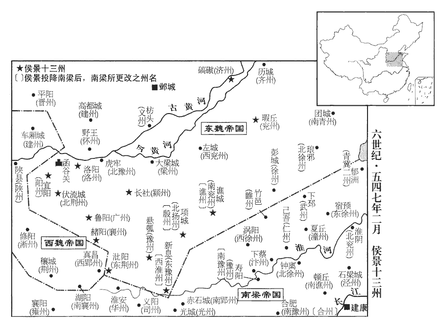
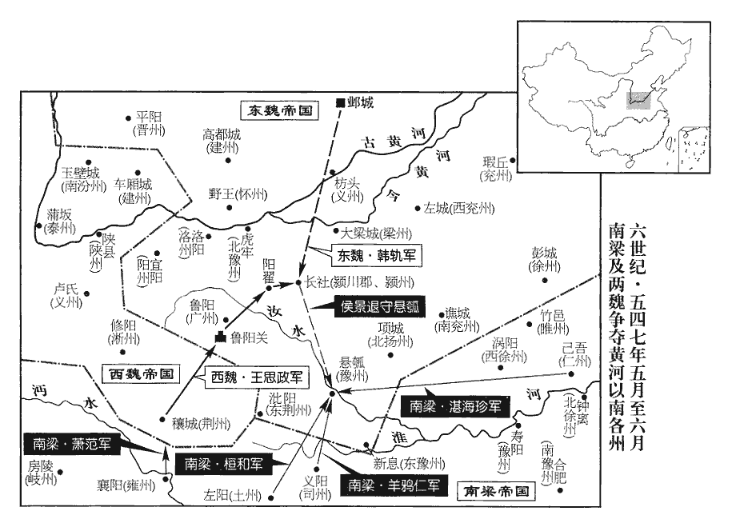
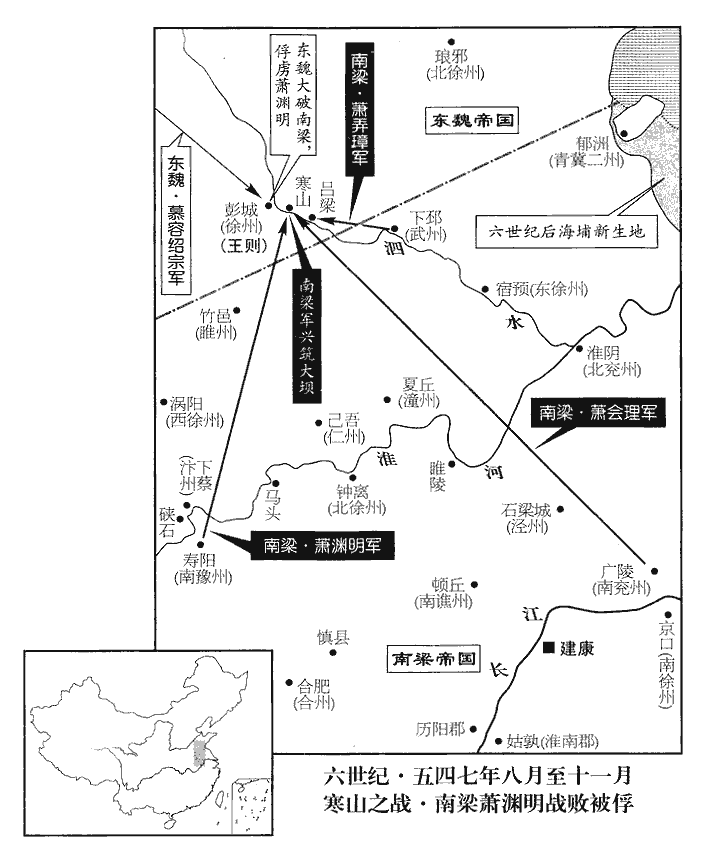

 梁紀十六強圉單閼（丁卯），一年。

# 高祖武皇帝十六

## 太清元年（丁卯、五四七）是年四月始改元太清。

1春，正月朔‹一›，日有食之，不盡如鈎。

〖译文〗 [1]春季，正月朔（初一），发生日偏食，未被遮尽的太阳象钩一样。

2壬寅‹四›，荊州‹府设江陵湖北省江陵县›刺史廬陵威王續卒‹年四十四岁›。諡法：猛以強果曰威。以湘東王繹為都督荊•雍等九州諸軍事、荊州刺史。雍，於用翻。續素貪婪，婪，盧南翻。臨終，有啟遣中錄事參軍謝宣融獻金銀器千餘件，中錄事參軍，蓋使之錄閤中事，在左右親近者也。件，其輦翻。上‹萧衍，本年八十四岁›方知其富，因問宣融曰：「王之金盡此乎？」宣融曰：「此之謂多，安可加也！大王之過如日月之食，欲令陛下知之，故終而不隱。」終，謂卒也。上意乃解。

〖译文〗 [2]壬寅（初四），荆州刺史庐陵威王萧续去世。梁武帝任命湘东王萧绎为都督荆、雍等九州诸军事以及荆州刺史。萧续平素很贪婪，临终之时，他给中录事参军萧宣融留下了一封信，献出一千多件金银器皿。梁武帝这才知道萧续如此富有，便问谢宣融：“庐陵威王萧续的金银财宝只有这些吗？”谢宣融回答说：“这些已可以说是非常多了，怎么可以更多呢！大王的过失就象日食月食一样，是有目共睹的，他想让陛下您了解这一切，所以最终没有对您隐瞒。”梁武帝心里的疙瘩这才解开了。

初，湘東王繹為荊州刺史，有微過，續代之，以狀聞，按繹在荊州，有宮人李桃兒者，以才慧得進；及還，以李氏行。時得營戶禁重，續具狀以聞。繹對使者泣，訴於太子綱，太子和之，不得。繹懼，送李氏還荊州。自此二王不通書問。繹聞其死，入閤而躍，屧為之破。屧xiè，蘇協翻，屐也，又履中薦也。史言繹、續生無友于之情，死則從而忻快。為，于偽翻。

〖译文〗 当初，湘东王萧绎担任荆州刺史，犯下了一些小过错，萧续接替他以后，就把萧绎的过错汇报朝廷，从此以后，这两个藩王就彼此不通书信，互相不往来了。萧绎听到萧续去世的消息，进门后高兴得跳了起来，连鞋都撑破了。

3丙午‹八›，東魏‹都邺城河北省临漳县西南邺镇›勃海獻武王歡卒。年五十二。歡性深密，終日儼然，人不能測，機權之際，變化若神。制馭軍旅，法令嚴肅。聽斷明察，斷，丁亂翻。不可欺犯。擢人受任，「受」，當作「授」。在於得才，苟其所堪，無問廝養；廝，音斯。養，余亮翻。有虛聲無實者，皆不任用。雅尚儉素，刀劍鞍勒無金玉之飾。少能劇飲，自當大任，不過三爵。知人好士，全護勳舊；如尉景、司馬子如、孫騰諸人是也。少，詩照翻。好，呼到翻。每獲敵國盡節之臣，多不之罪。如泉企、裴讓之是也。由是文武樂為之用。樂，音洛。世子澄‹本年二十六岁›祕不發喪，用歡遺言也。唯行臺左丞陳元康知之。

〖译文〗 [3]丙午（初八），东魏勃海献武王高欢去世。高欢性格深沉谨细，一天到晚总是一副很庄严的样子，谁都不能猜测到他内心想些什么，在掌握机会和权变方面，他能千变万化，如有神助。在治理、驾驭军队方面，又能做到法令严格。他听取和断决事情，能做到明察秋毫，谁也不敢冒犯、欺骗他。在选拔人才，提升任用官员时，只注重其才能，如果能担当此任，哪怕是仆人也不管；那些徒有虚名而无实际能力的，都不被任用。高欢平时喜好节俭朴素，所用的刀、剑、马鞍以及缰绳都没用金银玉器装饰。他年轻时很能饮酒，自从担当大任之后，饮酒便不超过三杯。他了解下属，喜欢人才，对有功勋者和老部下都极力保护、成全；每次俘获到敌国的那些为本国尽忠尽节的大臣，大多不处罚他们。由于这样，文武百官都乐意被他使用。长子高澄封锁了高欢去世的消息，秘而不宣，只有行台左丞陈元康知道。

侯景自念己與高氏有隙，內不自安。辛亥‹十三›，據河‹黄河›南叛，歸于魏，潁州‹府设长社河南省长葛县›刺史司馬世雲以城應之。景誘執豫州‹府设悬瓠河南省汝南县›刺史高元成、襄州‹府设赭阳河南省方城县›刺史李密、廣州‹府设鲁阳河南省鲁山县›刺史懷朔‹内蒙古固阳县›暴顯等。誘，音酉。遣軍士二百人載仗暮入西兗州‹府设左城山东省定陶县西›、欲襲取之，刺史邢子才覺之，掩捕，盡獲之，因散檄東方諸州，各為之備，由是景不能取。侯景之變，當時覺之而能發其姦者，邢子才一人耳。孰謂文士不可以當藩翰哉！

〖译文〗 侯景想到自己与高家有隔阂，心里感到惴惴不安。辛亥（十三日），侯景依据河南而反叛东魏，归属了西魏，颍州刺史司马世云带领全城百姓响应他的行动。侯景引诱并捉住了豫州刺史高元成、襄州刺史李密、广州刺史怀朔人暴显等人。他派遣了二百人的军队，用战车载着刀、戟等兵器在黄昏时分进入了西兖州，想用偷袭的方法夺取这个州。西兖州刺史邢子才发觉了，不动声色先发制人，侯景派出的二百人马全部被擒，于是邢子才向东方的各个州都散发了檄文，这些州各自都做了准备，因此侯景未能夺取这些地方。

諸將皆以景之叛由崔暹，崔暹糾劾權貴，諸將恨之，故以景叛為暹罪。將，即亮翻；下同。澄不得已，欲殺暹以謝景。陳元康諫曰：「今雖四海未清，綱紀已定；若以數將在外，苟悅其心，枉殺無辜，虧廢刑典，豈直上負天神，何以下安黎庶！晁錯前事，願公慎之。」晁錯事見十六卷漢景帝三年。澄乃止。遣司空韓軌督諸軍討景。

〖译文〗 各位将领都认为侯景之所以反叛是由崔暹引起的，高澄出于不得已，想要崐杀掉崔暹，以此向侯景道歉。陈元康劝谏高澄说：“现在虽然天下还未太平，但国家法纪已经确定。如果因为几个将领外叛，为了讨得他们的欢心，便枉杀无辜、破坏刑典，岂止有负于上苍神灵，而且又用什么来安抚黎民百姓呢！汉朝晁错的事情是前车之鉴，希望大人您慎重处理此事。”高澄听完这番话，便打消了杀崔暹的念头。高澄派遣了司空韩轨督率各路军队去讨伐侯景。

4辛酉‹二十三›，上祀南郊，大赦；甲子‹二十六›，祀明堂。

〖译文〗 [4]辛酉（二十三日），梁武帝在南郊祭天，大赦天下；甲子（二十六日），在明堂祭祀。

5三【章：乙十一行本「三」作「二」；張校同；退齋校同。】月，魏‹元宝炬，本年四十一岁›詔：「自今應宮刑者，直沒官，勿刑。」

〖译文〗 [5]三月，西魏朝廷诏令：“从今开始，凡是应该受到宫刑处罚的人，只把犯罪者没收入官为奴，不再用刑。”

6魏以開府儀同三司若干惠為司空，侯景為太傅、河南道行臺、上谷公。

〖译文〗 [6]西魏任命开府仪同三司若干惠为司空，侯景为太傅、河南道行台、上谷公。

庚辰‹十三›，景又遣其行臺郎中丁和來，上表言：「臣與高澄有隙，請舉函谷‹河南省新安县›以東，瑕丘‹山东省兖州市›以西，豫、廣、郢、【章：十二行本「郢」作「潁」；乙十一行本同；孔本同；張校同；退齋校同。】荊‹东荆州·州政府设沘阳河南省泌阳县›、襄、兗、南兗‹府设谯城安徽省亳州市›、濟‹府设碻磝山东省茌平县西南›、東豫‹府设新息河南省息县›、洛‹府洛阳›、陽‹府设宜阳河南省宜阳县西›、北荊‹府设伏流城河南省嵩县›、北揚‹府设项城河南省沈丘县›等十三州內附，洛、陽，二州名，註已見前。魏收志：武定二年置北荊州，領伊陽、新城、汝北郡。五代志：河南郡陸渾縣有東魏北荊州。淮陽郡項城縣，東魏置北揚州及丹楊郡、秣陵郡。濟，子禮翻。考異曰：梁書景傳云：「與豫州刺史高成、廣州刺史暴顯、潁州刺史司馬世雲、荊州刺史郎椿、襄州刺史李密、兗州刺史邢子才、南兗州刺史石長宣、濟州刺史許季良、東豫州刺史丘元征、洛州刺史爾朱渾願、揚州刺史樂恂、北荊州刺史梅季昌、北揚州刺史元神和等，陰結私圖，剋相影會。」蕭韶太清紀又有兗州刺史胡延、豫州刺史傅士哲、揚州刺史可足渾洛，無邢子才。典略有荊州刺史庫狄暢，無高成、暴顯、許季良、爾朱渾願、樂恂、梅季昌。今依梁書。而太清紀有兩豫州，蓋前官也。惟青‹府设东阳山东省青州市›、徐‹府设彭城江苏省徐州市›數州，僅須折簡。且黃河以南，皆臣所職，易同反掌。易，弋豉翻。若齊、宋一平，齊，謂青州；宋，謂徐州。徐事燕、趙。」燕、趙，謂河北之地。上召群臣廷議。尚書僕射謝舉等皆曰：「頃歲與魏通和，大同二年，東魏請和，自是交聘使命不絕。邊境無事，今納其叛臣，竊謂非宜。」上曰：「雖然，得景則塞北可清；機會難得，豈宜膠柱！」謂不能圓轉，如膠柱鼓瑟。

〖译文〗 庚辰（疑误），侯景又派遣他的行台郎中丁和前来梁朝，在上表中讲道：“我与高澄之间有隔阂，请允许我率领函谷关以东，瑕丘以西，豫州、广州、郢州、荆州、襄州、兖州、南兖州、济州、东豫州、洛州、阳州、北荆州、北扬州等十三个州来归附，而青州、徐州等几个州，我只要随便写封信过去就能来归降。况且黄河以南，都是我管辖的范围，行动起来易如反掌。倘若青州、徐州一旦平定，就可以随后慢慢攻取燕、赵之地了。”梁武帝召集大臣们来朝廷商议此事。尚书仆射谢举等人都说：“近年来，我们与魏友好往来，边境地区一直平安无事，现在若要收留其叛逆之臣，我们私下都认为不太合适。”梁武帝回答说：“尽管如此，如果得到侯景的话，塞北就可以到手了；机会难得，怎么能胶柱鼓瑟而不知变通呢。”

是歲，正月，乙卯‹十七›，上‹萧衍›夢中原牧守皆以其地來降，舉朝稱慶。守，式又翻。降，戶江翻。朝，直遙翻。考異曰：典略云：去年十二月夜夢，今從梁書。旦，見中書舍人朱异，告之，且曰：「吾為人少夢，少，詩沼翻。若有夢必實。」异曰：「此乃宇宙【章：十二行本「宙」作「內」；乙十一行本同；孔本同。】混壹之兆也」。及丁和至，稱景定計以正月乙卯‹十七›，上愈神之。帝不能自治其國，而妖夢是踐，其亡宜矣。然意猶未決，嘗獨言：「我國家如金甌，無一傷缺，今忽受景地，詎是事宜？脫致紛紜，悔之何及？」獨言者，宴閒之時；非因與侍臣問答，獨言其事。蓋帝欲受景地，念茲在茲，而不能自已於言也。朱异揣知上意，對曰：「聖明御宇，南北歸仰，正以事無機會，未達其心。今侯景分魏土之半以來，自非天誘其衷，杜預曰：衷，中也。揣，初委翻。誘，音酉。人贊其謀，何以至此！若拒而不內，恐絕後來之望。此誠易見，易，弋豉翻。願陛下無疑。」上乃定議納景。

〖译文〗 这一年，正月，乙卯（十七日），梁武帝梦见中原地区的牧守们都献地来投降，举朝上下一片欢庆。早晨起来，梁武帝遇见中书舍人朱异，便把做梦的事告诉了他，并说：“我这个人很少做梦，如果做了梦，梦中之事就一定会应验。”朱异忙说：“这是天下要统一的征兆。”等到丁和前来告诉梁武帝，说侯景定下计策要在正月乙卯（十七日）这天行动，梁武帝就更相信这个梦是天神的意志。但是他的决心还没有完全定下，曾独自自言自语地说：“我的国家象金瓯一样，无一伤缺之处，现在忽然要接受侯景送来的土地，这难道是合乎事理的吗？倘若因此而引起混乱，后悔怎么来得及呢？”朱异揣摩到了梁武帝的心思，便对梁武帝说：“陛下圣明无比，君临天下，南北方的人都仰慕、归心于您，只是因为没有机会奉事您，所以其心意一直没有实现。现在，侯景把魏的一半土地分割出来归附您，如果不是天意引导他的心，人们又赞助他的打算，怎么会走到这一步呢！如果拒绝侯景，不收留他，恐怕就会堵绝了随后准备来归降的人的希望。这些实在是显而易见的，希望陛下您不要犹豫。”梁武帝听完这席话，于是决定接纳侯景。

壬午‹十五›，以景為大將軍，封河南王，都督河南•北諸軍事、大行臺，承制如鄧禹故事。平西諮議參軍周弘正，善占候，前此謂人曰：「國家數年後當有兵起。」及聞納景，曰：「亂階在此矣！」為侯景亂梁張本。

〖译文〗 壬午（疑误），梁武帝任命侯景为大将军，封他为河南王，让他担任都督崐河南、北诸军事及大行台之职，并特意授权他可以如后汉的邓禹那样秉承皇帝的旨意发号施令。平西谘议参军周弘正擅长观察天象变化而预测吉凶，他在侯景投奔梁朝之前曾对人说：“几年之后国内会有兵戈之乱。”等他听说梁武帝接纳了侯景，便说：“祸乱原因就在这里了。”

7丁亥‹二十›，上耕藉田。藉，在亦翻。

〖译文〗 [7]丁亥（疑误），梁武帝耕种藉田。

 

8三月，庚子‹三›，上‹萧衍›幸同泰寺，捨身如大通故事。大通元年，帝捨身之始也，事見一百五十一卷。

〖译文〗 [8]三月，庚子（初三），梁武帝临幸同泰寺，举行舍身仪式，和大通元年那次一样。

9甲辰‹七›，遣司州‹府设义阳河南省信阳市›刺史羊鴉仁、督兗州‹土州，府设左阳湖北省随州市东北›刺史桓和、梁紀作「土州刺史桓和」。五代志：漢東郡土山縣，梁曰龍巢，置土州及東•西二永寧、真陽三郡。仁州‹府设己吾安徽省怀远县西北›刺史湛海珍等，魏收志：梁置仁州，治赤坎城，帶臨淮郡，領己吾、義城縣。己吾之下，註云「州郡治」。五代志，彭城穀陽縣有己吾、義城二縣，後齊併以為臨淮縣。將兵三萬趣懸瓠，將，即亮翻。趣，七喻翻。運糧食應接侯景。

〖译文〗 [9]甲辰（初九），梁武帝派司州刺史羊鸦仁督率兖州刺史桓和、仁州刺史湛海珍等人，带领三万人马向悬瓠方向靠近，运送粮食以接应侯景。

10魏大赦。

〖译文〗 [10]西魏大赦天下。

11東魏高澄慮諸州有變，乃自出巡撫。留段韶守晉陽，委以軍事；以丞相功曹趙彥深為大行臺都官郎中。使陳元康豫作丞相歡條教數十紙付韶及彥深，在後以次行之。臨發，握彥深手泣曰：「以母、弟相託，幸明此心！」夏，四月，壬申‹六›，澄入朝于鄴。朝，直遙翻。東魏主‹元善见，本年二十四岁›與之宴，澄起舞，識者知其不終。昔周景王喪太子及后，以喪賓宴。晉叔向曰：「王其不終乎！吾聞之，所樂必卒焉。今王樂憂，若卒以憂，不可謂終。」景王之喪，伉儷及冢適也，既葬而宴，賢者非之。高澄則喪父也，祕喪不發，死肉未寒，忘雞斯徒跣之哀，縱蹮xiān蹮僛qī僛之樂，尚為有人心乎！是故榮錡qí之禍猶輕，柏堂之禍為慘，蒼蒼之報應固不爽也。雞斯，讀為笄jī纚xǐ。

〖译文〗 [11]东魏高澄担心各州会出现变故，便亲自外出巡视各地，安抚下属。他让段韶留下守卫晋阳，并委以军事重任；又让丞相功曹赵彦深担任了大行台都官郎中。并让陈元康把事先写在几十张纸上，以丞相高欢的名义发布的命令，交给段韶和赵彦深，让他们在高澄走后按顺次去执行。临出发之前，高澄握住赵彦深的手，哭着对他说：“我把自己的母亲、弟弟托付给你了，希望你明白我的心意！”夏季，四月，壬申（初六），高澄到邺城去朝见。东魏孝静帝设宴招待他，席间，高澄起身舞蹈，有识之士认为高澄父亲刚死就乐而忘哀，不会有好下场。

12丙子‹十›，群臣奉贖。自庚子捨身至丙子奉贖，凡三十七日。萬機之事，不可一日曠廢，而荒於佛若是，帝忘天下矣。三十七日之間，天下不知為無君，天下亦忘君矣。丁亥‹二十一›，上還宮，「丁亥」，當作「丁丑」。大赦，改元，如大通故事。

〖译文〗 [12]丙子（初十），梁朝文武百官给佛门捐钱为梁武帝赎身。丁亥（二十一日），梁武帝回到了皇宫，大赦天下，改换年号为“太清”，就象大通年间那次一样。

13甲午‹二十八›，東魏遣兼散騎常侍李系來聘。系，繪之弟也。李繪見一百五十八卷大同八年。考異曰：魏帝紀作「李緯」。今從本傳。

〖译文〗 [13]甲午（二十八日），东魏派兼散骑常侍李系来梁朝聘问。李系是李绘的弟弟。

14五月，丁酉朔‹一›，東魏大赦。

〖译文〗 [14]五月，丁酉朔（初一），东魏大赦天下。

15戊戌‹二›，東魏以襄城王旭為太尉。旭，吁玉翻。

〖译文〗 [15]戊戌（初二），东魏任命襄城王元旭为太尉。

髙澄遣武衛将軍元柱等，将數萬衆晝夜兼行以襲侯景。将，即亮翻。遇景於潁川北，柱等大敗。景以羊鴉仁等軍猶未至，乃退保潁川。侯景不敢乗勝北向者，盖以髙歡雖死，髙澄猶能用其衆也。

〖译文〗 东魏高澄派遣武卫将军元柱等人率领几万大军日夜兼程去袭击侯景，在颍川北面与侯景相遇，结果元柱等人遭到惨败。侯景因为羊鸦仁等人的军队还没有赶到，于是，便退守颍川。

16甲辰‹八›，東魏以開府儀同三司庫狄干為太師，錄尚書事孫騰為太傅，汾州‹府设兹氏城山西省汾阳县›刺史賀拔仁為太保，司徒高隆之錄尚書事，司空韓軌為司徒，青州刺史尉景為大司馬，領軍將軍可朱渾道元為司空，僕射高洋為尚書令、領中書監，徐州刺史慕容紹宗為尚書左僕射，高陽王斌為右僕射。斌蓋因玉儀而進用。斌，音彬。戊午‹二十二›，尉景卒。

〖译文〗 [16]甲辰（十八日），东魏任命开府仪同三司库狄干为太师，录尚书事孙腾为太傅，汾州刺史贺拔仁为太保，司徒高隆之为录尚书事，司空韩轨为司徒，青州刺史尉景为大司马，领军将军可朱浑道元为司空，仆射高洋为尚书令、领中书监，徐州刺史慕容绍宗为尚书左仆射，高阳王元斌为右仆射。戊午（二十二日），尉景去世。

17韓軌等圍侯景於潁川。景懼，割東荊、北兗州、魯陽、長社四城賂魏以求救。東魏東荊州治北陽城，荊州治魯陽，潁州治長社。時無北兗州，唯北荊州‹府设伏流城河南省嵩县›治伊陽，與西魏接境，豈史家誤以「荊」為「兗」邪？尚書左僕射于謹曰：「景少習兵，姦詐難測，少，詩照翻。不如厚其爵位以觀其變，未可遣兵也。」荊州‹府设穰城河南省邓州市›刺史王思政以為：「若不因機進取，後悔無及。」即以荊州步騎萬餘，從魯陽關‹河南省鲁山县›向陽翟‹河南省禹州市›。先是，王思政蓋自恆農遷刺荊州。陽翟縣，漢屬潁川郡，晉屬河南尹。魏收志：興和元年，分置陽翟郡，屬潁州。丞相泰聞之，加景大將軍兼尚書令，遣太尉李弼、儀同三司趙貴將兵一萬赴潁川。按趙貴開府儀同三司，此逸「開府」二字。

〖译文〗 [17]韩轨等人率军把侯景包围在颍川。侯景见这种状况，害怕了，便把东荆、北兖州、鲁阳、长社四座城割让给了西魏，用此来贿赂西魏，以便取得其援救。西魏尚书左仆射于谨说：“侯景在少年时就习武练兵，为人奸诈，难以揣测，所以不如封以他高官厚禄，看看他的变化再说，先不要派兵去援救他。”荆州刺史王思政却认为：“如果不抓住时机进取，后悔就来不及了。”于是便派荆州的一万多名步兵和骑兵经鲁阳关向阳翟进发。西魏丞相宇文泰知道情况之后便封侯景为大将军兼尚书令，并派遣太尉李弼、仪同三司赵贵率领一万人马赶赴颍川去为侯景解围。

景恐上責之，遣中兵參軍柳昕奉啟於上，以為：「王旅未接，謂羊鴉仁等軍未至也。昕，許斤翻。死亡交急，遂求援關中，自救目前。臣既不安於高氏，豈見容於宇文！但螫手解腕，蝮蛇螫手，壯士解腕。螫，音釋。腕，烏貫翻。事不得已，本圖為國，為，于偽翻。願不賜咎！臣獲其力，不容即棄，今以四州之地為餌敵之資，已令宇文遣人入守。自豫州以東，齊海‹黄海›以西，悉臣控壓；見有之地，盡歸聖朝，見，賢遍翻。朝，直遙翻。懸瓠、項城、徐州、南兗，事須迎納。願陛下速敕境上，各置重兵，與臣影響，言若影之隨形，響之應聲，彼此相應，不失機會也。不使差互！」上報之曰：「大夫出境，尚有所專；春秋之義，大夫出疆，專之可也。上引此義，欲以綏懷侯景，不知狼子野心之難馴擾也。況始創奇謀，將建大業，理須適事而行，隨方以應。卿誠心有本，何假詞費！」上報此詔，已為侯景所窺矣。

〖译文〗 侯景怕梁武帝责怪他向西魏求援一事，便派中兵参军柳昕向梁武帝送去一封信，上面说道：“陛下您派出的军队还没有来到，而我这里生死攸关，情况十分危急，便向关中求援，以便挽救自己所面临的危机。我既不能安处于高澄手下，又怎么会被宇文泰所容纳？但是手遭毒蛇螫咬而连手腕去掉，这是万不得已之事，本来想着为国，希望您不要怪罪我！我得到了关中的帮助，所以不能马上就背弃他们，现在我把四个州的地方当做引敌人上钩的诱饵，已经让宇文泰派了军队进入颍川，帮助我守卫这里。从豫州以东到齐海以西的地区，都在我的控制范围之内；我的这些现在实有的土地，都归于梁朝所有，悬瓠、项城、徐州、南兖这些地方，只需要派人去加以接管就可以了。希望陛下您迅速向边境下发命令，让他们各置重兵，与我呼应，相互之间不要发生差脱误会！”梁武帝回答说：“大夫离开国境，还有自做主张的权限呢，何况你始创奇谋，将建大业，理应根据事情的发展而行事，随机应变。你一片诚意，心系朝廷，何须多加解释呢？”

18魏以開府儀同三司獨孤信為大司馬。

〖译文〗 [18]西魏任命开府仪同三司独孤信为大司马。

 

19六月，戊辰‹三›，以鄱陽王範為征北將軍，總督漢北征討諸軍事，擊穰城。使範擊魏荊州，欲以應接侯景。穰，如羊翻。

〖译文〗 [19]六月，戊辰（初三），西魏委任鄱阳王元范为征北将军，令他总督汉北征讨诸军事，去进攻穰城。

20東魏韓軌等圍潁川，聞魏李弼、趙貴等將至，乙【章：十二行本「乙」作「己」；乙十一行本同；孔本同。】巳‹四›，引兵還鄴。考異曰：周書帝紀：「三月，李弼救侯景。」今從典略。侯景欲因會執弼與貴，奪其軍；貴疑之，不往。貴欲誘景入營而執之，弼止之。李弼之計，以為執侯景不能猝兼河南之地，徒為東魏去疾，故止貴。誘，音酉。羊鴉仁遣長史鄧鴻將兵至汝水，弼引兵還長安。東魏之師已退，而梁之援兵始來，弼若不還師，則梁、魏之兵必浪戰於汝、潁之間矣。引兵而還，則禍集於梁。王思政入據潁川。景陽稱略地，引兵出屯懸瓠。景引兵出潁川，以城與魏，為王思政守潁川、沒於東魏張本。

〖译文〗 [20]东魏的韩轨等人包围了颍川，得知西魏的李弼、赵贵等人将要领兵到来，乙巳（疑误），带领军队撤回了邺城。侯景想趁机抓获李弼和赵贵二人，夺取他们的军队；赵贵对侯景产生了怀疑，不去颍川与侯景相会。赵贵想把侯景诱入军营而趁机拘捕他，李弼制止了赵贵这一做法。这时，羊鸦仁派长史邓鸿率领军队到了汝水，李弼便率领军队回到了长安。王思政带兵占据了颍川。侯景假称要攻取州郡，带领军队出颍川城，驻扎于悬瓠。

景復乞兵於魏，復，扶又翻。丞相泰使同軌‹河南省洛宁县东北›防主韋法保及都督賀蘭願德等將兵助之。五代志：河南宜陽縣，後周分置熊耳縣、同軌郡。周、齊以宜陽為界；以同軌名郡者，言將自此出兵以混壹東西，使天下車同軌也。大行臺左丞藍田‹陕西省蓝田县›王悅言於泰曰：「侯景之於高歡，始敦鄉黨之情，終定君臣之契，高歡、侯景皆懷朔鎮人，少相友善，中間同事爾朱。歡滅爾朱，景遂委質於歡。任居上將，位重台司；今歡始死，景遽外叛，蓋所圖甚大，終不為人下故也。且彼能背德於高氏，將，即亮翻。背，蒲妹翻。豈肯盡節於朝廷！今益之以勢，援之以兵，竊恐貽笑將來也。」史言西魏多智士，宇文泰能用善謀，侯景之姦詐不得逞，而其禍移於梁矣。泰乃召景入朝。朝，直遙翻；下同。

〖译文〗 侯景又向西魏乞求援兵。丞相宇文泰让同轨郡的防主韦法保以及都督贺兰愿德等人率领军队前去帮助他。大行台左丞蓝田人王悦对宇文泰说：“侯景同高欢之间，开始是亲密的乡党关系，最终变成了君臣关系，侯景位居上将，权倾朝廷；而今高欢刚刚死去，侯景便很快外叛，这是因为他的图谋很大，终不甘居人下的缘故。况且他能对高氏背信弃义，又怎么会为本朝尽忠尽节呢？现崐在您扩大他的势力，派兵去援助他，我私下担心这样会让后人耻笑的。”于是宇文泰便派人召侯景入朝。

景陰謀叛魏，事計未成，厚撫韋法保等，冀為己用，外示親密無猜間。間，古莧翻。每往來諸軍間，侍從至少，魏軍中名將，皆身自造詣。從，才用翻。少，詩沼翻。將，即亮翻。造，七到翻。同軌防長史裴寬謂法保曰：「侯景狡詐，必不肯入關，言其不肯應召而入朝也。欲託款於公，恐未可信。若伏兵斬之，此亦一時之功也。如其不爾，即應深為之防，不得信其誑誘，自貽後悔。」誑，居況翻。誘，音酉。法保深然之，不敢圖景，但自為備而已；尋辭還所鎮。辭景而還同軌也。王思政亦覺其詐，密召賀蘭願德等還，分布諸軍，據景七州、十二鎮。景果辭不入朝，遺丞相泰書曰：「吾恥與高澄鴈行，安能比肩大弟！」記王制：父之齒隨行，兄之齒鴈行。鴈行，言如鴈並飛而進也。景知泰覺其情，且知梁之可侮弄也，故以書絕泰而決意附梁。遺，于季翻。行，戶剛翻。泰乃遣行臺郎中趙士憲悉召前後所遣諸軍援景者。景遂決意來降。魏將任約以所部千餘人降於景。史言西魏諸將唯任約為侯景所誘。降，戶江翻。任，音壬。

〖译文〗 侯景暗中打算反叛西魏，但计划没有实现，便优抚韦法保等人，希望他们能替自己效力，表面上做出亲密无间的样子。侯景每每来往于各个军队之间，带的侍从极少，对于西魏军队中的各个著名将领，他都亲自去拜访他们。同轨防长史裴宽对韦法保说：“侯景为人奸诈狡猾，一定不肯应宇文丞相之召而入关，他肯定要通过您向朝廷讲情，恐怕不可以相信他。如果埋伏兵士斩了他，这也是一时的功劳啊。如果你不这样，我们就应该深深地提防他，不能轻信他的欺骗和引诱，以致为自己留下悔恨。”韦法保非常赞同裴宽的话，不敢杀掉侯景，只是自己加强了防卫罢了。后来，他找了个借口便回自己的镇所去了。王思政也觉得侯景在欺骗他，就秘密把贺兰愿德等人召回来，分别部署了各路军队，占领了侯景所管辖的七个州，十二个镇。侯景果然推辞而不肯入朝，他在给宇文泰的信中说：“我耻于同高澄并行，又怎么能同大弟您比肩呢！”宇文泰收到了这封信后，便派行台郎中赵士宪将以前派去的救援侯景的各路军队全部召回。于是，侯景便决心投降梁朝。西魏将领任约带领所属的一千多名将士投降了侯景。

泰以所授景使持節、太傅、大将軍、兼尚書令、河南大行臺、都督河南諸軍事回授王思政，思政並讓不受。頻使敦諭，使，疏吏翻。下同。唯受都督河南諸軍事。

〖译文〗 西魏丞相宇文泰把以前授给侯景的使持节、太傅、大将军、兼尚书令、河南大行台、都督河南诸军事等官职收回并转授给了王思政，王思政一并推辞不受；宇文泰频繁地派人敦促劝谕王思政走马上任，最后，王思政只接受了都督河南诸军事这一职务。

21高澄將如晉陽‹山西省太原市›，以弟洋為京畿大都督，留守於鄴，使黃門侍郎高德政佐之。德政，顥hào之子也。高顥見一百四十七卷天監七年。考異曰：北史作「德正」，今從北齊書。丁丑‹十二›，澄還晉陽，始發喪。

〖译文〗 [21]高澄将要去晋阳，便任命他的弟弟高洋为京畿大都督，让他留守邺城，并让黄门侍郎高德政来辅佐他。高德政是高颢的儿子。丁丑（十二日），高澄回到了晋阳，方才开始为高欢发丧。

22秋，七月，魏長樂武烈公若干惠卒。若干惠，魏司空。樂，音洛。

〖译文〗 [22]秋季，七月，西魏长乐武烈公若干惠去世。

23丁酉‹二›，東魏主為丞相歡舉哀，服緦縗，記閒傳：緦麻之縗，十五升去其半。有事其縷、無事其布曰緦。為，于偽翻。縗cuī，倉回翻。凶禮依漢霍光故事，凶禮，猶言喪禮也。贈相國、齊王，備九錫殊禮。戊戌‹三›，以高澄為使持節、大丞相、都督中外諸軍、錄尚書事、大行臺、勃海王；澄啟辭爵位。壬寅‹七›，詔太原公洋攝理軍國，遣中使敦諭澄。

〖译文〗 [23]丁酉（初二），东魏孝静帝为丞相高欢举行哀悼仪式，穿上了缌丧服。丧礼依照汉代霍光去世时的规格而进行，追封高欢为相国、齐王，并备九锡之礼。戊戌（初三），东魏孝静帝任命高澄为使持节、大丞相、都督中外诸军、录尚书事、大行台、勃海王；高澄启奏孝静帝，请求辞去封给他的爵位。壬寅（初七），孝静帝颁下诏书，令太原公高洋摄理军政大事，并派宦官敦促劝谕高澄，走马上任。

24庚申‹二十五›，羊鴉仁入懸瓠城‹河南省汝南县›。甲子‹二十九›，詔更以懸瓠為豫州，壽春為南豫州，改合肥為合州。後漢豫州治譙，魏治汝南安成，晉治陳國。晉氏南渡，石氏強盛，祖約自譙城退屯壽春，始僑立豫州於壽春。是後，庾亮以豫州刺史鎮蕪湖，毛寶治邾城，趙胤治牛渚，謝尚鎮歷陽，又進馬頭，桓沖戍姑孰，蓋不常厥居也。宋武帝欲開拓河南，綏定豫土，割揚州大江以西悉屬豫州，豫州基址因此而立。永初二年，分淮東為南豫州，治歷陽；淮西為豫州，然猶治壽春也。大明以後，豫州治懸瓠。常珍奇歸北，懸瓠入魏，豫州復治壽陽。齊東昏之時，裴叔業又以壽陽附魏，遂以歷陽為豫州。至帝天監中，韋叡克合肥，以為豫州，復以歷陽為南豫州；後復壽陽，又徙豫州復舊治。今得懸瓠，復宋之舊為豫州，以壽陽為南豫，以合肥為合州。南北兵爭，疆埸之間，一彼一此，易置州郡，類如是矣。以鴉仁為司、豫二州刺史，鎮懸瓠；西陽‹河南省光山县西›太守羊思達為殷州刺史，鎮項城。改東魏之北揚州為殷州。

〖译文〗 [24]庚申（二十五日），羊鸦仁进入了悬瓠城。甲子（二十九日），梁武帝诏令改悬瓠为豫州，改寿春为南豫州，改合肥为合州。任命羊鸦仁为司、豫两州刺史，镇守悬瓠；任命西阳太守羊思达为殷州刺史，镇守项城。

25八月，乙丑‹一›，下詔大舉伐東魏。遣南豫州刺史貞陽侯淵明、南兗州‹府设广陵江苏省扬州市›刺史南康王會理分督諸將。將，即亮翻。淵明，懿之子；會理，續之子也。始，上欲以鄱陽王範為元帥；朱异取急在外，謂取休假在外舍也。帥，所類翻。异，羊至翻。聞之，遽入曰：「鄱陽雄豪蓋世，得人死力，然所至殘暴，非弔民之材。且陛下昔登北顧亭以望，謂江右有反氣，骨肉為戎首，登北顧亭，謂幸京口時也。江、郢、揚、南徐之地為江左，豫、南豫、南兗之地為江右。朱异告帝以防鄱陽而不知防臨賀，帝知江右有反氣而不料侯景自壽陽舉兵，天邪，人邪？今日之事，尤宜詳擇。」上默然，曰：「會理何如？」對曰：「陛下得之矣。」會理懦而無謀，所乘襻輿，襻pàn，普患翻。襻輿者，輿掆gāng施襻，人以肩舉之。施板屋，冠以牛皮。冠，古玩翻。上聞，不悅。貞陽侯淵明時鎮壽陽，屢請行，上許之。會理自以皇孫，復為都督，言既以皇孫之貴自高，又以都督之尊自處。復，扶又翻。自淵明已下，殆不對接。淵明與諸將密告朱异，追會理還，遂以淵明為都督。

〖译文〗 [25]八月，乙丑（初一），梁武帝诏令派大量军队去讨伐东魏。他派遣南豫州刺史贞阳侯萧渊明、南兖州刺史南康王萧会理分别督率各位将领进攻东魏。萧渊明是萧懿的儿子，萧会理是萧续的儿子。开始，梁武帝想让鄱阳王萧范担任元帅；朱异正在外面休假，听说梁武帝要让萧范担任元帅，急忙进朝对梁武帝说：“鄱阳王虽然是英雄豪杰，盖世无双，许多人为他竭尽全力地效劳。但他所到之处非常残忍凶暴，不是个能爱惜百姓的人。况且陛下您往日登上北顾亭眺望远方时曾说长江西边的地区有反叛之气，骨肉之亲常常是战争的祸首，所以由谁挂帅尤其应该仔细选择。”梁武帝点头称是，又问：“萧会理如何呢？”朱异回答说：“陛下选对人了。”萧会理怯懦而又少谋，他所乘坐的抬轿，用木板屋子的形状，外面蒙着牛皮，梁武帝知道之后，很不高兴。贞阳侯萧渊明此时正镇守寿阳，他多次向梁武帝请求去带兵打仗，梁武帝允许了。而萧会理自恃是皇帝的孙子，又担任了都督，便不把众人放在眼里，自萧渊明以下的人，一概不予理睬。萧渊明便和诸位将领一起把这件事秘密通报给了朱异，朱异派人把萧会理追了回来，就让萧渊明担任了都督。

26辛未‹七›，高澄入朝于鄴，固辭大丞相；以通鑑書法言之，「辛未」之下當有「東魏」二字。朝，直遙翻。詔為大將軍如故，餘如前命。

〖译文〗 [26]辛未（初七），东魏高澄来到邺城朝拜孝静帝，坚决辞去大丞相的职务；东魏孝静帝诏令他仍然担任大将军，其它职务还同以前任命的那样。

甲申‹二十›，虛葬齊獻武王‹高欢›於漳水之西；潛鑿成安‹河北省成安县›鼓山石窟佛寺之旁為穴，魏收志：魏郡臨漳縣有鼓山。成安縣，後齊分臨漳置。宋白曰：成安縣，本漢斥丘縣地，春秋時乾侯邑也。土地斥鹵，故曰斥丘。其地在鄴，北齊分鄴置成安縣。按臨漳縣亦分鄴縣所置。納其柩而塞之，柩，音舊。塞，悉則翻。殺其群匠。及齊之亡也，一匠之子知之，發石取金而逃。史言潛葬之無益。

〖译文〗 甲申（二十日），东魏把齐献武王高欢先虚葬在漳水之西；又在成安县鼓山石窟佛寺旁边秘密挖了一个墓穴，把齐献武王的灵柩放进穴内，然后把所有工匠都杀掉了。等到北齐灭亡时，一位工匠的儿子知道了安葬地点，撬开了石板，取出了墓穴中的黄金便逃走了。

27戊子‹二十四›，武州‹府设下邳江苏省睢宁县北古邳镇›刺史蕭弄璋攻東魏磧qì泉、呂梁‹江苏省徐州市东南十千米›二戍，拔之。五代志：下邳郡下邳縣，梁曰歸政，置武州。魏收志，彭城郡呂縣有呂梁城。水經註曰：泗水之上有石梁焉，故曰呂梁。

〖译文〗 [27]戊子（二十四日），梁朝武州刺史萧弄璋带兵去攻打东魏的碛泉、吕梁二座城堡，并占领了它们。

28或告東魏大將軍澄云：「侯景有北歸之志。」會景將蔡道遵北歸，言「景頗知悔過」。景母及妻子皆在鄴，澄乃以書諭之，語以闔門無恙，若還，許以豫州刺史終其身，還其寵妻、愛子，所部文武，更不追攝。語，牛倨翻。攝，收也。景使王偉復書曰：「今已引二邦，二邦，謂梁及西魏也。揚旌北討，熊豹齊奮；克復中原，幸自取之，何勞恩賜！昔王陵附漢，母在不歸，事見九卷漢高帝元年。太上囚楚，乞羹自若，事見十卷高帝四年。矧shěn伊妻子，而可介意！脫謂誅之有益，欲止不能，殺之無損，徒復阬kēng戮，家累在君，何關僕也！」復，扶又翻。累，力瑞翻。

〖译文〗 [28]有人告诉东魏大将军高澄：“侯景有北归之意。”这时正好侯景的将领蔡道遵回到了东魏，讲道：“侯景有所悔过。”侯景的母亲和妻子儿女都住在邺城，高澄便写信告诉侯景，说他的全家人都安然无恙，如果他肯回到东魏，便许诺让他终身担任豫州刺史，并还他宠妻爱子，对于他手下的文武官员，更是既往不咎。侯景指使手下人王伟给高澄回信说：“现在，我已经带领梁和西魏的军队，举旗北伐，兵卒们士气高涨；恢复中原地区，我希望能自己攻取，怎么能有劳您来恩赐给我呢！从前王陵归附了刘邦，母亲被项羽抓去他仍不肯回去；刘邦的父亲被项羽囚禁了，项羽威胁要杀掉其父，刘邦却坦然地向项羽讨要煮他父亲的肉汤喝，父母尚且如此，何况是妻子儿女，那就更不介意了！如果说杀掉我的妻子和孩子对你有利的话，我想阻止你也是阻止不了的，如果杀掉他们对我毫无损害，那么您杀戮了他们也是徒然，反正我的家室全在您手中，如何处置，与我有什么相关啊！”

戊子‹二十四›，詔以景録行臺尚書事。

〖译文〗 戊子（二十四日），梁武帝诏令委任侯景为录行台尚书事。

29東魏靜帝‹元善见›，美容儀，旅力過人，旅，與膂同，脊骨也。能挾石師子踰宮牆，射無不中；好文學，從容沈雅。中，竹仲翻。好，呼到翻。從，千容翻。沈，持林翻。時人以為有孝文風烈，大將軍澄深忌之。

〖译文〗 [29]东魏孝静帝容貌、仪表俊美，臂力过人，能把石狮子夹在胳膊下面飞崐身跳过宫墙，射箭百发百中；他还喜好文学，行止丛容沉稳，性情高雅。当时的人都认为他有北魏孝文帝的风范，因此大将军高澄特别防范他。

始，獻武王‹高欢›自病逐君之醜，謂逐孝武帝‹元修›使入關也。事靜帝‹元善见›，禮甚恭，事無大小必以聞，可否聽旨。言不敢專決也。每侍宴，俯伏上壽；帝設法會，乘輦行香，歡執香爐步從，上，時掌翻。從，才用翻。鞠躬屏氣，屏，必郢翻。承望顏色，故其下奉帝莫敢不恭。

〖译文〗 以前，献武王高欢自恨背上了驱逐君主的丑名，所以侍奉孝静帝时执礼甚恭，事无大小都一定汇报给孝静帝，听旨而行，自己从不专权。每次侍宴，他都俯下身子向皇帝祝寿；孝静帝举办法会，乘坐銮驾去进香时，他手持香炉，徒步跟在后面，屏住气息，弯腰鞠躬，看皇上的眼色行事，所以他的下属在侍奉孝静帝时也没有人敢不恭敬。

及澄當國，倨慢頓甚，使中書黃門郎崔季舒察帝動靜，大小皆令季舒知之。晉書職官志：曹魏黃初初，中書既置監、令，又置通事郎，次黃門郎，及晉，改曰中書侍郎。環濟要略：漢置中書，掌密詔，有令、僕、丞、郎。漢舊儀云：置中書領尚書事。魏黃初，中書置監、令，又置通事郎，次黃門郎，即中書侍郎之任也。按二書皆謂黃門、中書通為一官；而五代志紀北齊之制，黃門侍郎屬門下省，中書侍郎屬中書省，分為二官。高澄以崔季舒為中書黃門郎者，蓋澄欲使季舒伺察靜帝，以為黃門郎則侍從左右，以為中書郎則典掌詔命，故兼領二職也。澄與季舒書曰：「癡人比復何似？比，毗至翻。復，扶又翻。癡勢小差未？差，楚懈翻；本作「瘥」。疾稍愈謂之差。宜用心檢校。」帝嘗獵于鄴東，馳逐如飛，監衛都督烏那羅受工伐從後呼曰：「天子勿走馬，大將軍嗔！」監，工銜翻。監衛都督，高氏置此官以監宿衛，所以防制其君者也。烏那羅，虜三字姓。呼，火故翻。嗔，昌真翻，怒也。澄嘗侍飲酒，舉大觴屬帝曰：「臣澄勸陛下酒。」屬，之欲翻。舉酒相屬，如儕輩然，無復君臣之敬。帝不勝忿，曰：「自古無不亡之國，朕亦何用此生為！」澄怒曰：「朕？朕？狗腳朕！」使崔季舒毆帝三拳，奮衣而出。明日，澄使季舒入勞帝，勝，音升。毆，烏口翻。勞，力到翻。帝亦謝焉，賜季舒絹百匹。

〖译文〗 高澄执掌国家大权后，很快就骄傲自大起来，他让中书黄门郎崔季舒暗中窥探皇帝的举动，孝静帝所做的大大小小的事都让崔季舒知道了。高澄写给崔季舒的信中说：“那傻子比以前怎么样了，他呆傻的程度比以前稍好一点了没有？你应该用心去检查、核对一下。”孝静帝曾在邺城的东边打猎，骑马逐兽如飞，监卫都督乌那罗受工伐跟在孝静帝的马后高声呼喊道：“皇上不要让马跑起来，大将军要怪罪的！”高澄曾经陪着孝静帝饮酒，他举起手中大酒杯向孝静帝劝酒说：“臣高澄劝陛下喝一杯。”那样子好象他们是平起平坐一样，孝静帝不胜愤怒，对高澄说：“自古以来没有不灭亡的国家，朕还要这一生干什么？”高澄恼羞成怒地说：“什么朕、朕的，是长着狗脚的朕！”又让崔季舒打了孝静帝三拳，然后奋衣而出。第二天，高澄让崔季舒进宫去慰问孝静帝，孝静帝也表示歉意，并且赏赐给他一百匹绢。

帝不堪憂辱，徐知訓陵侮其主，與高澄異世同轍，皆不能保其身。詩云：「人而無禮，胡不遄chuán死！」諒哉。詠謝靈運詩曰：「韓亡子房奮，秦帝仲連恥。本自江海人，忠義動君子。」謝靈運作詩事見一百二十二卷宋文帝元嘉十年。常侍、侍講潁川荀濟知帝意，荀濟以散騎常侍侍講。乃與祠部郎中元瑾、長秋卿劉思逸、華山王大器、淮南王宣洪、濟北王徽等謀誅澄。大器、鷙之子也。東魏華山王鷙卒於大同六年。華，戶化翻。濟，子禮翻。帝謬為敕問濟曰：「欲以何日開講？」乃詐於宮中作土山，開地道向北城。至千秋門，門者覺地下響，以告澄。澄勒兵入宮，見帝，不拜而坐，曰：「陛下何意反？臣父子功存社稷，何負陛下邪！此必左右妃嬪輩所為。」欲殺胡夫人及李嬪。帝正色曰：「自古唯聞臣反君，不聞君反臣。王自欲反，何乃責我！我殺王則社稷安，不殺則滅亡無日，我身且不暇惜，況於妃嬪！必欲弒逆，緩速在王！」澄乃下牀叩頭，大啼謝罪。高澄雖悖逆，不能不屈於靜帝之言，理所在也。於是酣飲，夜久乃出。居三日，幽帝於含章堂。含章堂，蓋取坤卦「含章可貞」之義，必在鄴宮之內殿左右。幽者，閉帝於內不使出，而專殺於外也。壬辰‹二十八›，烹濟等於市。

〖译文〗 孝静帝忍受不了这种侮辱，便借吟咏谢灵运的诗来抒发自己的情怀：“韩亡子房奋，秦帝仲连耻，本自江海人，忠义动君子。”常侍、侍讲颍川人荀济了解孝静帝的心思，便和祠部郎中元瑾、长秋卿刘思逸、华山王元大器、淮南王元宣洪，济北王元徽等人一起密谋杀掉高澄。元大器是元鸷的儿子。孝静帝降旨假意问荀济：“您打算在什么时间开讲？”于是便借口要在皇宫里修一座土山，挖了一条通向城北的地道。地道挖到了千秋门时，守门的兵卒发觉地下有响动，便把这一情况告诉了高澄。高澄带着兵士入宫，见到了孝静帝，没有叩拜便坐下来，问道：“陛下为什么要谋划反叛？我们父子有保存国家的功绩，有什么对不起陛下的地方呢？这一定是您身边侍卫人员和嫔妃们所搞的鬼。”说完便要杀掉胡夫人以及李嫔。孝静帝扳起面孔说道：“自古以来只听说过臣子反叛君王，没听说过君王反叛臣子。你自己要造反，又何必还要责怪我呢！我杀掉你江山社稷就会安定，不杀则国家就会很快灭亡。我对自己都没时间去爱惜，何况对这些嫔妃呢！如果你一定要反叛弑君的话，是早动手还是晚动手就在于你自己了！”高澄听完这些话，便离开坐床向孝敬帝叩头，痛哭流涕地向孝静帝道歉、请罪。于是，一起痛饮，直到深夜，高澄才离开皇宫。隔了三天，高澄便把孝静帝囚禁在含章堂里。壬辰（二十八日），把荀济等人在街市上用大锅煮死了。

初，濟少居江東‹江苏省南部太湖流域›，少，詩照翻。博學能文。與上有布衣之舊，知上有大志，然負氣不服，常謂人曰：「會於盾鼻上磨墨檄之」。言上若有非常之舉，亦當起兵，於盾鼻上磨墨作檄以聲其罪。上甚不平。及即位，或薦之於上，上曰：「人雖有才，亂俗好反，不可用也。」濟上書諫上崇信佛法、為塔寺奢費，上大怒，欲集朝眾斬之；朝眾，即謂在朝百官。好，呼到翻。朝，直遙翻。朱异密告之，濟逃奔東魏。澄為中書監，大同十年，東魏以高澄領中書監。欲用濟為侍讀，獻武王‹高欢›曰：「我愛濟，欲全之，故不用濟。濟入宮，必敗。」澄固請，乃許之。史言高歡識鑒非澄所及。及敗，侍中楊遵彥謂之曰：楊愔，字遵彥。「衰暮何苦復爾？」復，扶又翻。濟曰：「壮氣在耳！」言年雖衰而氣不衰也。因下辨曰：辨，獄辭也。「自傷年紀摧頹，功名不立，故欲挾天子，誅權臣。」澄欲宥其死，親問之曰：「荀公何意反？」濟曰：「奉詔誅高澄，何謂反！」有司以濟老病，鹿車載詣東市，并焚之。章懷太子賢曰：鹿車，小車僅容一鹿也。

〖译文〗 当初，荀济年轻时住在江东，他学识渊博，擅长诗文，与梁武帝有布衣交情，他知道梁武帝有远大的志向，但心里却不服气他，常常对别人说：“如果他真是要造反篡位，我也将起兵，在战场的盾鼻上磨墨写檄文来声讨他的罪孽。”梁武帝知道后非常愤愤不平。等到梁武帝即位后，有人将荀济推荐给他，梁武帝说：“这个人虽然有才，但常常做违犯习俗的事，喜好唱反调，不可以任用。”荀济上书梁武帝劝谏他不该崇信佛法，而大兴土木，为建造寺塔而靡费天下，梁武帝勃然大怒，要召集朝臣斩杀荀济；朱异将这一消息密告荀济，荀济便逃往东魏。高澄担任中书监的时候，想让荀济担任侍读，高欢对高澄说：“我喜爱荀济，想保全他，所以才不任用他。荀济一旦进入皇宫，必定会失败。”高澄坚决请求允许让荀济做侍读，高欢才答应了。等到荀济与一些人密谋杀掉高澄一事败露之后，侍中杨遵彦对荀济说：“你已是衰暮之年，何必再如此呢？”荀济回答说：“虽然如此，但壮气还在！”于是杨遵彦便在狱辞中写道：“荀济自伤年纪衰老，还没有建立功名，所以便挟持天子，诛杀权臣。”高澄想宽宥荀济，免他一死，亲自去问他：“荀公为什么要谋反？”荀济回答说：“我奉皇帝的诏令去诛戮高澄，怎么叫谋反呢！”有司认为荀济年老多病，就用小车载着他来到东市，连人带车都烧了。

澄疑諮議溫子昇子昇蓋為大將軍府諮議參軍。知謹等謀，方使之作獻武王碑，既成，餓於晉陽獄，食弊襦rú而死。棄尸路隅，沒其家口，沒其家口為官奴婢，填晉陽宮。太尉長史宋遊道收葬之。澄謂遊道曰：「吾近書與京師諸貴諸貴，謂司馬子如、孫騰等。論及朝士，以卿僻於朋黨，將為一病；今乃知卿真是重故舊、尚節義之人，天下人代卿怖者，是不知吾心也。」史言士之徇義者固不計身之死亡，亦未必死也。怖，普布翻。九月，辛丑‹七›，澄還晉陽。

〖译文〗 高澄怀疑谘议温子知道元瑾等人的阴谋，他正在撰写《献武王碑》，作好之后，就把他关进了晋阳监狱，不给饭吃，饿极了，便吃自己穿的破短袄，终于死去。高澄叫人把他的尸体抛在路边，又把他的家口没收入官府为奴婢，太尉长史宋道收葬了他。高澄对宋道说：“我最近写信给京师的各位达官贵人，谈论到了一些朝廷中的人，认为你疏远朋党，将会给你带来祸灾；现在才知道你是注重老交情、崇尚气节、讲义气的人，天底下那些替你惶恐不安的人，是因为不了解我的心思啊！”九月，辛丑（初七），高澄回到了晋阳。

30上命蕭淵明堰泗水於寒山‹江苏省徐州市东南九千米›，以灌彭城，俟得彭城，乃進軍與侯景掎jǐ角。左傳曰：譬如捕鹿，晉人角之，諸戎掎之。角者，當其前；掎者，亢其下。掎，居綺翻。癸卯‹九›，淵明軍于寒山，去彭城十八里，斷流立堰。斷，音短。侍中羊侃監作堰，再旬而成。監，工銜翻。東魏徐州刺史太原王則嬰城固守，侃勸淵明乘水攻彭城，不從。諸將與淵明議軍事，淵明不能對，但云「臨時制宜」。

〖译文〗 [30]梁武帝命令萧渊明在寒山一带筑堰挡泗水淹灌彭城，等到夺取了彭城，便进军与侯景形成犄角之势而夹击故人。癸卯（初九），萧渊明驻军于寒山，他在离彭城十八里远的地方修堰截流。侍中羊侃负责监督修建堰坝，只用了二十天时间便建成。东魏徐州刺史太原人王则环城固守。羊侃劝告萧渊明趁着水势攻打彭城，萧渊明没有听从。众将领与萧渊明一起商议军机大事，萧渊明不能做出判断回答，只是说：“到时再根据情况采取相应措施。”

31冬，十一月，魏丞相泰從魏主狩于岐陽‹陕西省凤翔县›。岐陽，岐山之陽也。五代志：扶風雍縣有岐陽宮。

〖译文〗 [31]冬季，十一月，西魏丞相宇文泰跟随西魏文帝到岐阳打猎。

32東魏大將軍澄使大都督高岳救彭城，欲以金門郡公潘樂為副。五代志：河南郡宜陽縣有東魏所置金門郡，因金門山以名郡。陳元康曰：「樂緩於機變，不如慕容紹宗；且先王之命也。高歡令澄用慕容紹宗以敵侯景，見上卷上年。公但推赤心於斯人，景不足憂也。」時紹宗在外，澄欲召見之，恐其驚叛；元康曰：「紹宗知元康特蒙顧待，新使人來餉金；近時之事謂之新。元康欲安其意，受之而厚答其書，保無異也。」言保紹宗必無所違異。乙酉‹二十二›，以紹宗為東南道行臺，與岳、樂偕行。初，景聞韓軌來，曰：「噉豬腸兒何能為！」噉dàn，吐濫翻。聞高岳來，曰：「兵精人凡。」諸將無不為所輕者。及聞紹宗來，叩鞍有懼色，曰：「誰教鮮卑兒解遣紹宗來！解，胡買翻。若然，若然，猶今人言若如此也。高王定未死邪？」

〖译文〗 [32]东魏大将军高澄派遣大都督高岳去援救彭城，并想让金门郡公潘乐担任崐高岳的副手。陈元康对高澄说：“潘乐反应比较迟缓，不能随机应变，不如慕容绍宗；何况让慕容绍宗去对付侯景也是先王高欢的命令。您只要赤诚对待慕容绍宗，侯景是不足为虑的。”当时慕容绍宗正在外地，高澄想召见他，但又怕他受惊起疑心而反叛；陈元康对高澄说：“慕容绍宗知道我陈元康特别受您的照顾和优待，最近他又派人来馈赠我黄金；我为了让他放心，便接受了这些黄金，并在给他的回信中厚谢了他，所以可以保证他不会有别的的想法。”乙酉（疑误），东魏让慕容绍宗担任了东南道行台，使他与高岳、潘乐一起去援救彭城。当初，侯景听说韩轨要来，便说：“这个吃猪肠子的小子能干些什么！”当侯景听说高岳要来，又说：“兵士倒是很精锐，但领兵的人很一般。”各位将领没有不被侯景轻视的。但是，当侯景听说慕容绍宗要来时，便敲打着马鞍，脸上露出恐惧的神色，说：“谁使高澄这个鲜卑小子懂得派遣慕容绍宗来呢！如果这样，高王就一定没有死去！”

澄以廷尉卿杜弼為軍司，攝行臺左丞，臨發，問以政事之要、杜弼臨發從軍，澄方問以政事之要，蓋弼在歡府夙有聲稱，故問之也。可為戒者，使錄一二條。弼請口陳之，曰：「天下大務，莫過賞罰。賞一人使天下之人喜，罰一人使天下之人懼，苟二事不失，自然盡美。」澄大悅，曰：「言雖不多，於理甚要。」

〖译文〗 高澄任命廷尉卿杜弼为军司，代理行台左丞，临出发时，高澄询问了他一些政事要点需要警惕的，并让他写出一两条来。杜弼请求口述给高澄，他说：“天下的大事，没有比赏罚更重要的了。奖赏一人而使天下的人都高兴，惩罚一人而使天下的人害怕，如果做到了这两点，自然就会尽善尽美了。”高澄听后非常高兴，说：“话虽然说得不多，道理却很重要。”

紹宗帥眾十萬據橐駝峴‹彭城附近›。帥，讀曰率。峴，戶典翻。羊侃勸貞陽侯淵明乘其遠來擊之，不從，旦日，又勸出戰，亦不從；侃乃帥所領出屯堰上。羊侃知淵明必敗，故出屯堰上，欲全所領而退。若以行兵之節制言之，則安營次舍，皆當聽命於元帥，豈有擅移屯之理哉！

〖译文〗 慕容绍宗率领十万人马占据了橐驼岘。羊侃劝贞阳侯萧渊明趁着慕容绍宗远道而来，人困马乏之时去攻打他，萧渊明没有听从羊侃的劝告。第二天，羊侃又规劝萧渊明出战，萧渊明还是没有听从他的话；于是羊侃率领他的部下离开了萧渊明驻扎到了新修好的堰坝上。

丙午‹十三›，紹宗至城下，引步騎萬人攻潼州‹府设取虑城安徽省灵璧县东北潼郡集›刺史郭鳳營，魏收志：梁置潼州，武定七年，改曰睢州，治取慮城，領淮陽、穀陽、睢南、南濟陰、臨潼郡。五代志：下邳郡夏丘縣，東魏置臨潼郡，梁置潼州。矢下如雨。淵明醉，不能起，命諸將救之，皆不敢出。北兗州‹府设淮阴江苏省淮阴市›刺史胡貴孫謂譙州‹府设顿丘安徽省滁州市›刺史趙伯超曰：魏收志：景明中，置譙郡於渦陽城，孝昌中陷，領南譙、汴、龍亢、蘄qí城、下蔡、臨渙、蒙郡。五代志：譙郡山桑縣，後魏置渦州渦陽郡，東魏改曰譙州。「吾屬將兵而來，將，即亮翻；下同。本欲何為，今遇敵而不戰乎？」伯超不能對。貴孫獨帥麾下與東魏戰，斬首二百級。伯超擁眾數千不敢救，謂其下曰：「虜盛如此，與戰必敗，不如全軍早歸。」【章：十二行本「歸」下有「可以免罪」四字；乙十一行本同；孔本同；張校同；退齋校同。】皆曰「善！」遂遁還。

〖译文〗 丙午（十三日），慕容绍宗的军队来到城下，他带领一万多名步兵和骑兵攻打潼州刺史郭凤的军营，箭象雨点一样纷纷射来。萧渊明饮酒醉了，不能起床，他命令将领们去援救郭凤，但没有人敢出战。北兖州刺史胡贵孙对谯州刺史赵伯超说：“我们这些人带兵来这里，是来做什么的，现在遇到了敌人，难道不去应战吗？”赵伯超无以对答。胡贵孙便独自率领自己的军队与东魏的军队作战，斩了二百名东魏人。赵伯超拥有几千人马却不敢前去救援，对自己的部下说：“敌军如此强盛，与他们交战一定会失败，倒不如保全军队早日回去。”他的手下人都说：“好！”于是，赵伯超便逃回去了。

初，侯景常戒梁人曰：「逐北不過二里。」紹宗將戰，以梁人輕悍，悍，侯旰翻，又下罕翻。恐其眾不能支，一一引將卒謂之曰：「我當陽退，誘吳兒使前，誘，音酉。爾擊其背。」東魏兵實敗走，梁人不用景言，乘勝深入。魏將卒以紹宗之言為信，爭共掩擊之，梁兵大敗，貞陽侯淵明及胡貴孫、趙伯超等皆為東魏所虜，失亡士卒數萬人。羊侃結陳徐還。陳，讀曰陣。

〖译文〗 当初，侯景常常告诫梁朝人说：“追杀溃退的军队不要超过二里地。”慕容绍宗将要出战，他认为梁朝士兵轻巧灵活，且又很勇敢，害怕自己的军队打不过他们，便一一召见手下的将士们，对他们说：“我假装败退，引诱吴儿向前追，你们从背后攻打他们。”交战中，东魏的军队果真败退逃跑，但梁朝军队没有听从侯景的话，乘胜而深入追击。东魏的将士都听信了慕容绍宗的话，争相从背后对梁朝军队发起突然攻击，梁朝军队大败，贞阳侯萧渊明以及胡贵孙、赵伯超等人都被东魏俘虏，伤亡失散的士兵有几万之多。羊侃摆开了阵势，缓缓撤退而返。

上‹萧衍›方晝寢，宦者張僧胤白朱异啟事，上駭之，非時啟事，故駭。遽起升輿，至文德殿閣。文德殿，建康宮前殿也。异曰：「韓山失律。」韓山，即寒山。上聞之，怳然將墜牀。怳huǎng，呼廣翻。僧胤扶而就坐，坐，徂臥翻。乃歎曰：「吾得無復為晉家乎！」謂為夷狄所取也。史言帝危亡將至，神不守舍。復，扶又翻。

〖译文〗 梁武帝正在睡午觉，宦官张僧胤禀告说朱异要启奏事情，梁武帝不禁惊恐万分，他马上起床，坐上轿子，来到了文德殿的殿堂上。朱异启奏说：“韩山战事失利。”梁武帝听了之后，吓得恍恍忽忽，要从坐床上倒下去，张僧胤忙把他扶着坐下，于是梁武帝感叹道：“我难道也要落到江山被夷狄所夺取的晋朝那样的下场吗？”

 

郭鳳退保潼州，慕容紹宗進圍之。十二月，甲子朔‹一›，鳳棄城走。

〖译文〗 郭凤退守潼州，慕容绍宗进兵包围了他。十二月，甲子朔（初一），郭凤弃城而逃。

東魏使軍司杜弼作檄移梁朝朝，直遙翻；下同。曰：「皇家垂統，光配彼天，唯彼吳、越，獨阻聲教。元首懷止戈之心，上宰薄兵車之命，元首，謂東魏主。上宰，謂高歡。遂解縶南冠，左傳：楚伐鄭，鄭人軍楚師，囚鄖公鍾儀獻諸晉，晉人囚諸軍府。晉侯觀於軍府，見鍾儀，問曰：「南冠而縶者誰也？」有司對曰：「鄭人所獻楚囚也。」命稅之使歸，合晉、楚之成。喻以好睦。大同三年，梁初與東魏通和。好，呼到翻；下同。雖嘉謀長算，爰自我始，罷戰息民，彼獲其利。侯景豎子，自生猜貳，遠託關、隴，依憑姦偽，逆主定君臣之分，偽相結兄弟之親，謂侯景先降西魏也。分，扶問翻。相，息亮翻。豈曰無恩，終成難養，俄而易慮，親尋干戈。釁暴惡盈，側首無託，謂侯景不見容於西魏也。以金陵逋逃之藪，江南流寓之地，甘辭卑禮，進孰圖身，此以下皆言侯景歸梁之心迹。孰，古熟字通。言進軟熟之辭於梁，以為容身之圖。詭言浮說，抑可知矣。而偽朝大小，幸災忘義，主荒於上，臣蔽於下，連結姦惡，斷絕鄰好，徵兵保境，縱盜侵國。蓋物無定方，事無定勢，或乘利而受害，或因得而更失。是以吳侵齊境，遂得句踐之師，左傳：吳伐齊，敗齊師於艾陵，遂與晉侯會于黃池。越子句踐乘虛伐吳，獲其太子，遂入吳，吳王歸，及越平。其後越遂伐吳，滅之。句，音鉤。趙納韓地，終有長平‹山西省高平县›之役。事見五卷周赧王五十三年至五十五年。矧shěn乃鞭撻疲民，侵軼徐部，築壘擁川‹指兴筑寒山大坝›，舍舟徼利。軼，徒結翻，又音逸。杜預曰：軼，突也。「擁」，當作「壅」。舍，讀曰捨。徼，一遙翻。是以援枹fú秉麾之將，拔距投石之士，師古曰：拔距者，有人連坐相把，據地以為堅，而能拔取之；投石者，以石投人；皆言其有勇力也。援，于元翻。枹，音膚。將，即亮翻。含怒作色，如赴私讎。彼連營擁眾，依山傍水，傍，步浪翻。舉螳蜋之斧，被蛣jié蜣之甲，螳蜋舉臂以捍物，微有鋒利，故以諭斧。蛣蜣，蜣蜋láng也，翼在甲下，故以諭甲。言梁兵之輕弱也。蛣，音詰。當窮轍以待輪，古語云：螳蜋怒臂以當車轍。陸佃曰：螳蜋，有斧蟲也。兗人謂之拒斧，奮之當轍不避。釋蟲：不𧒖guò，蟷dāng蠰náng；其子螵piāo蛸xiāo。舍人云：不𧒖名蟷蠰，今之螳蜋也。方言云：譚、魯以南謂之蟷蠰，三河之域謂之螳蜋，燕、趙之際謂之食庬máng，齊、杞以東謂之馬穀，然名其子同云螵蛸也。坐積薪而候燎。及鋒刃纔交，埃塵且接，已亡戟棄戈，土崩瓦解，掬指舟中，衿甲鼓下，左傳：晉荀林父帥師及楚子戰于邲，楚乘晉師。林父不知所為，鼓於軍中曰：「先濟者有賞。」中軍與下軍爭舟，舟中之指可掬也。又：晉伐齊，齊師夜遁，晉師從之。夙沙衛連大車塞隧以殿，殖綽、郭最曰：「子殿齊師，國之辱也，」乃代之殿，衛殺馬於隘以塞道。晉州綽及之，射殖綽中肩，弛弓而自後縛之；其右具丙亦舍兵而縛郭最，皆衿甲面縛，坐於中軍之鼓下。衿jīn，其鴆翻。同宗異姓，縲léi紲xiè相望。曲直既殊，強弱不等，獲一人而失一國，左傳：宋猛獲與南宮萬弒其君‹子捷›，宋討之，猛獲奔衛。宋人請之，衛人欲弗許。石祁子曰：「天下之惡一也，惡於宋而保於我，保之何補！得一夫而失一國，與惡而棄好，非謀也。」衛人歸之。見黃雀而忘深穽，穽jǐng，疾正翻。智者所不為，仁者所不向。誠既往之難逮，猶將來之可追。逮，及也。此二語以誘梁，欲再與講和以攜侯景。侯景以鄙俚之夫，遭風雲之會，位班三事，邑啟萬家，揣身量分，久當止足。而周章向背，離披不已，周章，征營貌。離披，分散不可收束之意。揣，初委翻。量，音良。分，扶問翻。背，蒲妹翻。夫豈徒然，意亦可見。彼乃授之以利器，誨之以慢藏，老子曰：國之利器，不可以授人。易曰：慢藏誨盜。藏，徂浪翻。使其勢得容姦，時堪乘便。今見南風不競，左傳：晉圍齊，楚乘其間伐鄭。晉人聞之，師曠曰：「不害。吾驟歌南風，又歌北風，南風不競，多死聲，楚必無功。」果如其言。天亡有徵，徵，讀曰證。老賊姦謀，將復作矣。然推堅強者難為功，復，扶又翻。推，吐雷翻。摧枯朽者易為力，計其雖非孫、吳猛將，燕、趙精兵，猶是久涉行陳，將，即亮翻。燕，因肩翻。易，弋豉翻。行，戶剛翻。陳，讀曰陣。曾習軍旅，豈同剽輕之師，漢張良曰：「楚兵剽輕」。剽，匹妙翻。輕，牽正翻。不比危脆之眾。脆，此芮翻。拒此則作氣不足，攻彼則為勢有餘，終恐尾大於身，踵粗於股，倔強不掉，倔，其勿翻。強，其兩翻。狼戾難馴，狼，當作很。呼之則反速而釁小，釁，許覲翻。不徵則叛遲而禍大。會應遙望廷尉，不肯為臣，用蘇峻事，見九十三卷晉成帝咸和二年。自據淮南，亦欲稱帝。用黥布事，見十二卷漢高帝十一年。但恐楚國亡猨yuán，禍延林木，城門失火，殃及池魚，池魚，人姓名。風俗通有池仲魚。城門失火，仲魚燒死，故諺曰：「城門失火，殃及池魚。」一曰：城門失火，汲城下之池水以救之，池涸則魚受其殃。橫使江、淮士子，荊、揚人物，死亡矢石之下，夭折霧露之中。橫，戶孟翻。夭，於紹翻，折，而設翻，又之舌翻。彼梁主者，操行無聞，輕險有素，射雀論功，蕩舟稱力，國語：晉平公射鷃yàn不死，使豎襄搏之，失，公怒，將殺之，以告叔向。叔向曰：「君必殺之。昔先君唐叔射兕於徒林以為大甲，以封于晉。今君嗣先君唐叔，射鷃不死，搏之不得，是揚吾君之恥者也，必殺之。」君忸怩顏，乃赦之。鷃扈，小鳥，即鷃雀也。左傳：齊桓公與蔡姬乘舟于囿，蕩公。杜預註曰：蕩，搖也。操，七到翻。行，下孟翻。射，而亦翻。年既老矣，耄又及之，政散民流，禮崩樂壞。加以用舍乖方，廢立失所，用舍乖方，謂免周捨、責顧琛而用朱异。廢立失所，謂銜昭明而不立世適孫，乃立太子綱也。舍，讀曰捨。矯情動俗，飾智驚愚，毒螫滿懷，妄敦戒業，躁競盈胸，謬治清淨。此數語曲盡帝之心事。螫，音釋。躁，則到翻。治，直之翻。災異降於上，怨讟dú興於下，人人厭苦，家家思亂，履霜有漸，堅冰且至。易坤卦初六爻辭曰：履霜堅冰至。象曰：屢霜堅冰，陰始凝也，馴致其道，至堅冰也。文言曰：臣弒其君，子弒其父，非一朝一夕之故，其所由來者漸矣，由辯之不早辯也。傳險躁之風俗，任輕薄之子孫，朋黨路開，兵權在外。必將禍生骨肉，釁起腹心，強弩衝城，長戈指闕；徒探雀鷇kòu，無救府藏之虛，探雀鷇，趙武靈王事，見四卷周赧王二十年。探，吐南翻。藏，徂浪翻。空請熊蹯fán，詎延晷刻之命。左傳：楚世子商臣圍其父成王‹芈熊›，王請食熊蹯而死，不許，乃縊。杜預註曰：熊蹯難熟，冀久將有外救。蹯，音煩。外崩中潰，今實其時，鷸yù蚌相持，我乘其弊。戰國策：趙且伐燕，蘇代為燕謂惠王‹赵何›曰：「今者臣來，過易水，蚌方出曝，而鷸啄其肉，蚌合而拑其喙。鷸曰：『今日不雨，明日不雨，即有死蚌。』蚌亦謂鷸曰：『今日不出，明日不出，即有死鷸。』兩者不肯相舍，漁父得而并禽之。今趙且伐燕，燕、趙久相支以弊大眾，臣恐強秦之為漁父也。」方使駿騎追風，精甲輝日，四七並列，漢光武用二十八將以定天下，後人贊之曰：「授鉞四七。」百萬為群，以轉石之形，孫子曰：任勢者，其戰人也，如轉木石。木石之性，安則靜，危則動；方則止，圓則行。故善戰人之勢，如轉圓石於千仞之山者，勢也。為破竹之勢。破竹，杜預之言，見八十一卷晉武帝太康元年。當使鍾山渡江，青蓋入洛，荊棘生於建業之宮，麋鹿遊於姑蘇之館。青蓋入洛事見七十九卷晉武帝泰始八年。漢淮南王安陰有邪謀，伍被諫曰：「昔子胥諫吳王，吳王不用，乃曰：『臣今見麋鹿遊姑蘇之臺也』。今臣亦見宮中將生荊棘，露霑衣也。」但恐革車之所轥轢，轥lìn，力刃翻，踐也。轢lì，來各翻，碾也。劍騎之所蹂踐，杞梓於焉傾折，竹箭以此摧殘。杞梓、竹箭，東南之嘉產也。蹂，人九翻。踐，息淺翻。折，而設翻。若吳之王孫，蜀之公子，晉左思設為東吳王孫、西蜀公子以賦三都，弼引用之。歸款軍門，委命下吏，當即授客卿之秩，特加驃騎之號。凡百君子，勉求多福。」李斯自楚入秦為客卿，孫秀自吳奔晉為驃騎將軍。弼以此誘南人，要亦書檄之常談耳。其後梁室禍敗，皆如弼言。

〖译文〗 东魏让军司杜弼撰写檄文送给梁朝，檄文写道：“皇家一统天下，光辉配于上苍，唯独你们吴、越地区尚违命顽抗，未从圣教。我们的圣上有心停止兵戈，大丞相也已很少下达出征命令，于是我们对南方俘虏一律放还，以表明我朝欲与你们和睦相处的态度。虽然这样的好主意，是我们首先想到的，但是休战养民，你们实获其利。侯景这小子自己胡乱猜疑，起了异心，托身于远方的关、陇地区，依靠奸伪之朝，关中的叛逆首领与他确定君臣名分，伪丞相宇文泰同他结为兄弟，怎么能说他们没有给他恩惠，但是侯景终于还是成了叛逆小人，很快又另有所谋，亲手挑起战端。这个人罪过显露，恶贯满盈，无所依托，又把金陵作为逃亡之处，将江南作为寄身之地，以甜言蜜语和谦卑的礼节，想在梁朝找到立身之地，他的那些虚假浮夸的话语，其用意是不难知道的。而伪朝的大小官员们都幸灾乐祸，忘却大义，主子在上面荒淫元道，臣子在下面隐瞒真相，勾结奸恶之徒，断绝邻好之交，征兵保境，纵盗侵国。物无定向，事无定势，有的国君为了追逐利益而受害，有的国君则因贪小利而酿成大的损失。所崐以吴国侵略齐国，结果越王勾践率军乘虚而入，灭掉吴国；赵国接受韩国的土地，终于导致了长平之战，使赵国衰微。况且你们驱使疲惫之民，侵略我国徐州，修筑堡垒，拦截河流，阻断水运而追求一时的利益，能不遭到惨败的下场吗？所以，那些击鼓挥旗的将领，那些勇力无比的士卒，出征时都面带怒容，好象要去报自己的私仇一样。你们营垒一个紧挨一个，兵马众多，依山傍水，地势优越，举着螳螂前臂一样的斧头，披着蜣螂虫一样的甲衣，立在车辙上面等待车轮压来，坐在柴禾堆上等候大火燃烧。等到两军刚刚互相接触，战尘已经连成一片，便纷纷丢戟弃戈，土崩瓦解，抢着上船而逃时被砍下落在舱里的手指多得可以掬起来，官兵们一个个听命受绑，不管是同宗还是异姓的人，都被囚禁起来，只能默默对视。是非分明，强弱不等，为了得到一个人而失去一个国家，只见黄雀却忘掉下面有深深的陷井，这种事情是智者不做，仁者不为的。诚然，已经过去的事情便无法挽回了，但将来之事则是可以防止的。侯景本是一个出身低贱的乡野之夫，刚好赶上风云变幻之际，因此借机而位列三卿，食邑万户，他要是能拈量清自己的身份，便早就应该满足了。但是他自始至终反复无常，朝秦暮楚，散乱无章，没完没了。他这么做岂能无所用心，其用意是很容易看出来的。但是你们还授予他兵权，引诱他去干坏事，使他得势而能够行使奸计，乘机实现自己的野心。现在他看到南方势力衰微，这是天将要灭梁朝的征兆，侯景这老贼恐怕又要实施他的阴谋了。然而想要推倒坚强之物的难以成功，而摧折枯朽之物的则容易达到目的。侯景虽然算不上是孙武、吴起那样的猛将，他率领的也不是燕国、赵国的精兵，可是毕竟久经战阵，熟于军事，既非脆弱之师，又非无力之众。他如果要与我朝相抗则气势不足，但是攻打你们则力量有余，最终恐怕会尾大于身，脚跟粗过大腿，倔强而不肯转身，狠戾而难以驯服，如果召他回朝，削掉兵权的话，他会立即反叛，但是只能引起小的事端；如果不召回的话，虽然他可能反叛得迟一些，但是会酿出更大的祸患。他一定会象苏峻那样不会听任廷尉捕治而束手待毙，最终不肯为臣，也一定会象黥布占据淮南那样，也想自己称帝。只恐怕会有楚国亡猿，祸延林木；城门失火，殃及池鱼那样的灾祸发生，使江淮士子、荆扬人物，横死于乱箭飞石之下，丧身于迷雾湿露之中。你们梁朝的君主，没有什么操行，却一向轻薄阴险，把射雀鸟计算功劳，摇小船称为勇力，专在小事上斤斤计较。他年纪已经老了，头脑也糊涂了，搞得政务散乱，民众流失，礼崩乐坏。加上他任免官员背离原则，废立太子失去顺序，违背常情以煽动俗人，弄巧设诈以惊服愚人，蛇蝎之毒满怀，却假奉佛祖，争权之心盈胸，却诳称清净。上天降下灾异以示警告，百姓怨谤于下，人人厌苦，家家思乱，冰冻三尺，非一日之寒，这也不是一朝一夕的事了。他还倡导邪异的风俗，任用言行轻薄的子孙，朋党大兴，兵权在外。这样必然导致亲骨肉之间酿出灾祸，心腹人中间制造出事端，强弩射向都城，长戈指向宫殿；到时候就是如赵武灵王那样去捉雏鸟来吃也是白搭，无法补救脏腑的空虚；就是象楚成王那样请求吃了熊掌再死也是无济于事，又怎么能使生命延长片刻。你们朝廷外部分崩离析，里面溃败不堪的时候已经来临，你们内部正在鹬蚌相争，我们乘机而得利。这将使我们骏马追风，精甲耀日，几十员大将列阵，百万名大军云集，以高山滚石之形呈破竹之势。要使锺山移到江北，銮仪进入洛阳，建业城的宫殿里长满荆棘，姑苏城的馆舍中有麋鹿漫游。只担心战车所到之处碾压一切，铁骑跃过之处蹂践群物，以致杞梓倾折，竹箭摧残。如果你们能象左思《三都赋》中的东吴王孙和西蜀公子那样，前来我们的军门投诚，听命于我们的下级官吏，我们就会象秦国任用从楚国而来的李斯为客卿以及晋朝加封从吴国而来的孙秀为骠骑将军那样，立即授与你们高官厚禄。各位君子，希望你们认真思量，自求多福。”其后，梁室祸败，情况正如杜弼所说的那样。

侯景圍譙城不下，退攻城父‹亳州市东南城父乡›，拔之。壬申‹九›，遣其行臺左丞王偉等詣建康說上曰：說，式芮翻。「鄴中文武合謀，召臣共討高澄，事泄，澄幽元善見於金墉‹洛阳城西北角›，殺諸元六十餘人。河北物情，俱念其主，請立元氏一人以從人望，如此，則陛下有繼絕之名，臣景有立功之效，河之南北，為聖朝之邾、莒，言為小國以附於大國。朝，直遙翻。國之男女，為大梁之臣妾。」上‹萧衍›以為然，此杜弼所謂「進孰圖身」者也。帝早在兵間，曾不見此，蓋天奪其鑒也。乙亥‹十二›，下詔以太子舍人元貞為咸陽王，考異曰：梁紀作「戊辰遣貞」。今從典略。資以兵力，使還北主魏，須渡江，許即位，須，待也。儀衛以乘輿之副給之。乘，繩證翻。貞，樹之子也。元樹來奔，中大通四年，為樊子鵠所禽。

〖译文〗 侯景围攻谯城，不能攻克，便退攻城父，打下了该城。壬申（初九），侯景派遣他的行台左丞王伟等人到建康游说梁武帝：“邺城中的文武百官们一崐起谋划，召我与他们一起讨伐高澄，事情泄露了，高澄把元善见囚禁在金墉，杀死了六十多个元氏家族的人。河北的民心所向，都思念他们的主人，请求立元氏一人为主，以便顺应百姓的愿望，这样一来，则陛下有兴亡继绝之美名，我侯景也有立功建勋的成就，黄河的南边和北边，便成为圣朝附属国，那里的男男女女，都成为大梁的臣妾。”梁武帝认为侯景讲的是对的，乙亥（十二日），颁布诏书封立太子舍人元贞为咸阳王，并给他军队，让他回到北方入主魏国，等到元贞渡过了长江，梁武帝就允许他登上王位，按仅次于皇帝的规格配给他仪仗和卫士。元贞是元树的儿子。

蕭淵明至鄴，東魏主‹元善见›升閶闔門受俘，讓而釋之，送於晉陽，大將軍澄待之甚厚。為澄因淵明約和以間侯景張本。

〖译文〗 萧渊明被押送到了邺城，东魏孝静帝登上了阊阖门接收战俘，责备之后就给他松绑，然后送到了晋阳，大将军高澄非常厚待萧渊明。

慕容紹宗引軍擊侯景，景輜重數千兩，馬數千匹，士卒四萬人，退保渦陽‹安徽省蒙城县›。「輜重」之上當有「景」字，文意乃明。重，直用翻。兩，音亮。渦，音戈。紹宗士卒十萬，旗甲耀日，鳴鼓長驅而進。景使謂之曰：「公等為欲送客，為欲定雌雄邪？」紹宗曰：「欲與公決勝負。」遂順風布陳。陳，讀曰陣；下魏陳同。景閉壘，俟風止乃出。戰不逆風，故景俟風止乃出。紹宗曰：「侯景多詭計，好乘人背。」使備之，果如其言。景命戰士皆被短甲，好，呼到翻。被，皮義翻。執短刀，入東魏陳，但低視，斫人脛馬足。東魏兵遂敗，被短甲，執短刀，入敵陳力戰，此必死之兵也。紹宗之敗，不亦宜乎！其後景用此以敵陳霸先，亦此術耳；惟陳堅不可破，是以一敗不能復振，卒以走死。紹宗墜馬，儀同三司劉豐生被傷，顯州‹府设六壁城山西省孝义县›刺史張遵業為景所擒。魏收志：永安中置顯州，治汾州六玉壁城，領定戎、建平、真君郡。

〖译文〗 慕容绍宗带领军队攻打侯景，侯景带着几千辆辎重，几千匹马，四万名兵卒，退守涡汤。慕容绍宗统帅十万士兵，旌旗、铠甲在阳光下闪闪发光，敲着战鼓长驱直进。侯景派人对慕容绍宗说：“你们这是想送客人，还是想决一雌雄？”慕容绍宗回答说：“想和你决一胜负。”于是，他顺着风势摆了阵势，侯景关闭了营垒，等风停了才出来。慕容绍宗说：“侯景诡计多端，喜欢从人的背后进攻。”他派人加强防备，结果确如他所说的那样。侯景命令战士们身披短小的铠甲，手持短刀，从背后进入了东魏军队的阵营，只是低头而视，瞧准东魏士兵的小腿和马腿砍去。东魏的军队于是溃败了。慕容绍宗从马上坠下来，仪同三司刘丰生被砍伤，显州刺史张遵业被侯景擒获。

紹宗、豐生俱奔譙城，裨將斛律光、張恃顯尤之，尤之者，責過之也。將，即亮翻。紹宗曰：「吾戰多矣，未見如景之難克者也。君輩試犯之！」光等被甲將出，紹宗戒之曰：「勿渡渦水‹淮河支流，流经谯城北›。」二人軍於水北，光輕騎射之。被，皮義翻。渦，工禾翻。射，而亦翻；下為射、遷射同。景臨渦水謂光曰：「爾求勳而來，我懼死而去。我，汝之父友，光父斛律金，與景同事爾朱、高歡，故自謂父友。何為射我？汝豈自解不渡水南，解，戶買翻。慕容紹宗教汝也。」光無以應。景使其徒田遷射光馬，洞胸；光易馬隱樹，又中之，中，竹仲翻。退入於軍。景擒恃顯，既而捨之。光走入譙城，紹宗曰：「今定何如，而尤我也！」光，金之子也。

〖译文〗 慕容绍宗、刘丰生一起逃往谯城。裨将斛律光、张恃显责怪他们，慕容绍宗说：“我身经多次战斗，没有见到象侯景这样难以对付的敌手。你们试着去斗他一斗吧！”斛律光等人披上铠甲要去出战，慕容绍宗告诫他们说：“不要渡过涡水。”斛律光与张恃显两个人把军队驻扎在涡水北面，斛律光乘轻骑用弓箭射侯景，侯景在涡水边对斛律光说：“你为求取功勋而来，我因害怕死而离去。我是你父亲的朋友，你为什么用箭射我？你哪里能懂得不可渡涡水到南面来的道理，一定是慕容绍宗教你的。”斛律光无言以对。侯景让他的手下人田迁用箭射斛律光的马，箭穿透了马的胸膛。斛律光又换了匹马躲在树后。田迁的箭又射中了他的马，斛律光便退回了军营。侯景捉住了张恃显，很快又放了他。斛律光跑到了谯城，慕容绍宗说：“今天你们交兵究竟如何？你还责怪我！”斛律光是斛律金的儿子。

開府儀同三司段韶夾渦而軍，潛於上風縱火，景帥騎入水，出而卻走，草濕，火不復然。斛律光之勇雖不利，段韶之智雖不獲逞，然東魏之士氣未衰也，故慕容紹宗乘機而運其巧，得以成功。觀史者若祇以一時勝負論人，非有識略者也。帥，讀曰率。復，扶又翻。

〖译文〗 开府仪同三司段韶驻军于涡水两岸偷偷地顺风纵火，侯景率领骑兵进入水中，从水中出来向后撤退，草被打湿以后，火便不再燃烧。

33魏岐州‹府设雍城陕西省凤翔县›久經喪亂，喪，息浪翻。刺史鄭穆初到，有戶三千，穆撫循安集，數年之間，至四萬餘戶，考績為諸州之最；丞相泰擢穆為京兆尹。

〖译文〗 [33]西魏岐州长期经受战乱，刺史郑穆初到任时，只有三千户人家，郑穆安抚百姓，让他们休养生息，并让他们聚集而居，几年之间，岐州便有了四万多户人家，朝廷考绩时在所有州刺史中他的政绩最好；丞相宇文泰提拔郑穆为京兆尹。

34侯景與東魏慕容紹宗相持數月，景食盡，司馬世雲降於紹宗。至是，則侯景潰敗之形成矣。

〖译文〗 [34]侯景与东魏的慕容绍宗相持了几个月，侯景的粮食吃完了，司马世云投降了慕容绍宗。

